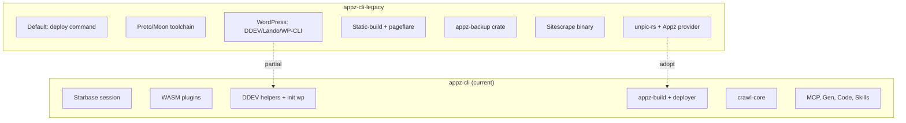

# Appz-CLI-Legacy Review and Adoption Plan

## Executive Summary

The legacy codebase (`appz-ref/appz-cli-legacy`) is a mature Youappz CLI (v0.20.15) with deep WordPress, static-build, and backup integration. The current appz-cli is a newer architecture with WASM plugins, MCP, Moon-style commands, and broader deployer support. Several legacy features are worth adopting or porting.

---

## Architecture Comparison

---

## Command Comparison

| Command           | Legacy                          | Current                  | Notes                                    |
| ----------------- | ------------------------------- | ------------------------ | ---------------------------------------- |
| **Default**       | `appz` → deploy                 | Explicit command         | Legacy inserts deploy when no subcommand |
| **backup**        | create, list, restore, delete   | **Missing**              | DDEV/WordPress backup — high value       |
| **wp**            | reset, media clean-responsive   | **Missing**              | Only DDEV stop + init provider           |
| **info**          | OS, shell, user, project table  | whoami                   | Different UX; info is richer             |
| **setup**         | Installs Node/Deno/Go/Hugo/Zola | **Missing**              | Proto-based tool installation            |
| **upgrade**       | Self-update                     | self-update              | Both have it                             |
| **redeploy**      | Rebuild from deployment ID      | **Missing**              | Quick re-deploy from existing            |
| **deploy-legacy** | Alternate deploy path           | N/A                      | Legacy-specific                          |
| **dev**           | DDEV/WP start, framework run    | DDEV stop, framework run | Current has cloudflared share            |
| **preview**       | Pageflare preview server        | Dev server preview       | Different stack                          |

---

## Features Worth Adopting

### 1. **Backup (DDEV/WordPress)** — High Priority

**Location:** [appz-cli-legacy/crates/appz-backup](appz-cli-legacy/crates/appz-backup/) + [crates/cli/src/commands/backup](appz-cli-legacy/crates/cli/src/commands/backup/)

**What it does:**

- `appz backup create` — DB export, plugin/theme list, file archive
- `appz backup list` — Retention-based listing with time parsing
- `appz backup restore` — Restore from backup
- `appz backup delete` — Remove backups

**Adoption path:** Port `appz-backup` crate and backup commands. Integrate with sandbox for DDEV context. Current appz-cli has DDEV helpers ([ddev_helpers.rs](appz-cli/crates/app/src/ddev_helpers.rs)); backup is a natural extension.

### 2. **unpic-rs + Appz Image CDN Provider** — Medium Priority

**Location:** [appz-cli-legacy/crates/unpic-rs](appz-cli-legacy/crates/unpic-rs/) especially [providers/appz.rs](appz-cli-legacy/crates/unpic-rs/src/providers/appz.rs)

**What it does:** Universal image CDN URL transformation — detect and transform URLs for Netlify, Vercel, Appz, Cloudflare Images. Supports w, h, fit, gravity, format, quality, dpr.

**Adoption path:** Add as optional crate for image-heavy sites or deploy pipeline. Current deployer has no image transformation; this could enhance static output or preview.

### 3. **Redeploy Command** — Low Effort

**Location:** [appz-cli-legacy/crates/cli/src/commands/redeploy.rs](appz-cli-legacy/crates/cli/src/commands/redeploy.rs)

**What it does:** `appz redeploy <deploy-id-or-url>` — Rebuild and redeploy from an existing deployment. Single API call to backend.

**Adoption path:** Add `Commands::Redeploy` and handler. Current API client ([api/endpoints/deployments](appz-cli/crates/api/src/endpoints/deployments.rs)) would need `redeploy` endpoint if not present.

### 4. **Info Command Enhancement** — Low Effort

**Location:** [appz-cli-legacy/crates/cli/src/commands/info.rs](appz-cli-legacy/crates/cli/src/commands/info.rs)

**What it does:** Table output for OS, shell, version, user, project, linked project. More detailed than `whoami`.

**Adoption path:** Either extend `whoami` with `--verbose` or add `appz info` as alias. Reuse comfy-table styling.

### 5. **Setup Command (Tool Installation)** — Medium Effort

**Location:** [appz-cli-legacy/crates/cli/src/commands/setup.rs](appz-cli-legacy/crates/cli/src/commands/setup.rs)

**What it does:** Detects framework, installs Node/Deno/Go/Hugo/Zola via Proto. Uses Moon platform detector.

**Adoption path:** Current appz-cli uses Mise for `appz exec` ([sandbox_helpers](appz-cli/crates/app/src/commands/install_helpers.rs)). Setup could delegate to Mise or add minimal Proto integration for missing tools. May conflict with sandbox philosophy — evaluate if users need global tool install.

### 6. **WordPress wp Subcommand** — Medium Effort

**Location:** [appz-cli-legacy/crates/cli/src/commands/wp](appz-cli-legacy/crates/cli/src/commands/wp/)

**What it does:**

- `appz wp reset` — Reset WP database (DDEV/Lando)
- `appz wp media clean-responsive` — Clean responsive images

**Adoption path:** Current has DDEV stop and WordPress init. Add `appz wp reset` and `appz wp media clean-responsive` using legacy patterns. Depends on DDEV/Lando being present.

---

## Features to Evaluate (Not Straightforward)

### Pageflare

**Location:** [appz-cli-legacy/crates/pageflare](appz-cli-legacy/crates/pageflare/)

**What it does:** Web performance optimization — HTML processing, lazy loading scripts, image optimization, preview server. Used in static-build for WordPress crawler.

**Consideration:** Tightly coupled to WordPress crawler and static-build. Current appz-cli has no equivalent. Adopting would require bringing static-build + wp_crawler, which is a large surface. Evaluate if WordPress static export is a product goal.

### Sitescrape

**Location:** [appz-cli-legacy/crates/sitescrape](appz-cli-legacy/crates/sitescrape/)

**What it does:** Standalone CLI for scraping sites — charset detection, auth, filters, disk output. Has its own `bin/sitescrape`.

**Consideration:** Current has `crawl-core` (link filtering, sitemap, HTML) and crawl plugin. Sitescrape is more general-purpose. Could inform crawl plugin evolution, but full port is separate product.

### Static-Build + wp_crawler

**Location:** [appz-cli-legacy/crates/static-build](appz-cli-legacy/crates/static-build/)

**What it does:** Framework detection, WordPress crawler with Pageflare plugin, Node/PHP/Python/Ruby build orchestration, write to `.appz/output`.

**Consideration:** Current `appz-build` and detectors cover framework detection. WordPress static export via crawler is legacy-specific. Only adopt if WordPress SSG is a priority.

---

## Code Patterns to Reuse

| Pattern                      | Legacy Location                              | Current Equivalent  | Recommendation                    |
| ---------------------------- | -------------------------------------------- | ------------------- | --------------------------------- |
| Argument names for telemetry | `filter_existing_arguments`, `ArgumentNames` | None                | Consider for richer analytics     |
| CreateArguments trait        | `create_arguments()` on commands             | Direct args         | Legacy pattern is more structured |
| subcommands_without_token    | Auth gating                                  | Session-based       | Current auth flow differs         |
| in_project_context           | CWD validation                               | Session working_dir | Similar concept                   |

---

## What Current Appz-CLI Has That Legacy Lacks

- **WASM plugins** (check, ssg-migrator, site, wp2md, crawl)
- **MCP server** for AI/IDE integration
- **Gen** (AI code generation)
- **Code** (code search, mix, grep)
- **Skills** (skill management)
- **Git** (worktree, branch finish, review)
- **Hypermix** (repomix integration)
- **Plan/Run/RecipeValidate** (Moon-style tasks)
- **Pack** (plugin packaging)
- **Env** (env var management)
- **Logs** (deployment logs)
- **Inspect** (deployment inspection)
- **Self-update** with signatures
- **Sandbox** (Mise-based exec)
- **Multi-provider deployer** (Vercel, Netlify, Cloudflare, etc.)

---

## Recommended Adoption Order

1. **Redeploy** — Smallest change, clear API
2. **Backup** — High user value for DDEV/WordPress users; port appz-backup crate
3. **Info enhancement** — Extend whoami or add info
4. **unpic-rs** — Optional; add when image optimization is needed
5. **wp reset / media clean-responsive** — If WordPress workflow is prioritized
6. **Setup** — Only if tool installation aligns with product direction

---

## Out of Scope for Now

- **Pageflare** — Coupled to static-build; large surface
- **Sitescrape** — Separate product; use as reference for crawl
- **Default deploy command** — Current design requires explicit commands; changing would alter UX
- **Deploy-legacy** — Legacy backend path; not applicable
- **Nextgen (Moon) crates** — Current uses starbase; duplication of concepts

