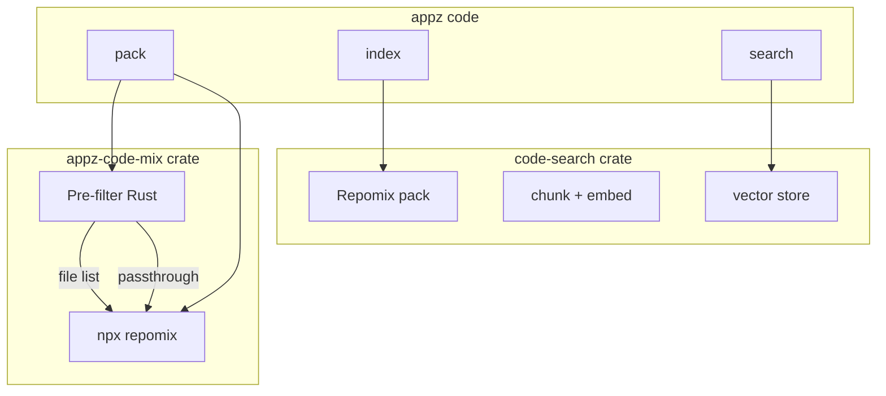

# appz-code-mix: Repomix-First with Pack Feature Add-ons

## Strategy

Use **Repomix** for all packing it natively supports. Add **Rust code** only for features Repomix lacks.

---

## Repomix vs Pack: Feature Map


| Feature                             | Repomix                       | Pack           | appz-code-mix                |
| ----------------------------------- | ----------------------------- | -------------- | ---------------------------- |
| include/ignore globs                | Yes                           | Yes            | Pass through to Repomix      |
| output format (xml/md/json/plain)   | Yes                           | Yes            | Pass through                 |
| --compress (Tree-sitter)            | Yes                           | skeleton       | Pass through                 |
| remove-comments, remove-empty-lines | Yes                           | Yes            | Pass through                 |
| split-output (chunk by size)        | Yes                           | max-tokens     | Pass through                 |
| security (Secretlint)               | Yes                           | redact-secrets | Pass through                 |
| git logs/diffs                      | Yes                           | diff/dirty     | Partial overlap              |
| --stdin (file list)                 | Yes                           | -              | Use for custom file lists    |
| Content search (--strings)          | No                            | Yes            | Rust: ripgrep -> stdin       |
| Git modes (staged/diff/dirty)       | No                            | Yes            | Rust: git -> stdin           |
| Interactive TUI                     | No                            | Yes            | Deferred                     |
| Bundles (save/load selections)      | No                            | Yes            | Rust: .pack/bundles/         |
| Templates (prompt prepend)          | Yes (--instruction-file-path) | Yes            | Pass through                 |
| Watch mode                          | No                            | Yes            | Deferred                     |
| Monorepo workspaces                 | No                            | Yes            | Rust: resolve paths -> stdin |
| follow-imports                      | No                            | Yes            | Defer (complex)              |


---

## Architecture




- **Repomix handles**: include/ignore, format, compress, remove-comments, split-output, security, instruction-file, git logs/diffs.
- **Rust pre-filter** generates a file list when needed (content search, git modes, bundles, workspaces), then pipes to `repomix --stdin`.
- **Passthrough**: When no custom file list is needed, invoke Repomix directly with translated CLI args.

---

## Implementation Phases

### Phase 1: Crate scaffold and Repomix passthrough

- Add `crates/appz-code-mix` to workspace.
- Dependencies: `sandbox`, `tokio`, `miette`, `which`.
- Implement `pack_passthrough(options)`: build `npx repomix@latest` CLI args from options, run via sandbox.
- Map CLI -> Repomix:
  - `--include` -> `--include "pattern1,pattern2"`
  - `--ignore` -> `-i "pattern1,pattern2"`
  - `--output` -> `-o path`
  - `--style` -> `--style xml|markdown|json|plain`
  - `--compress` -> `--compress`
  - `--remove-comments` -> `--remove-comments`
  - `--remove-empty-lines` -> `--remove-empty-lines`
  - `--split-output` -> `--split-output 500kb|1mb|...`
  - `--instruction` -> `--instruction-file-path path`
  - `--header` -> `--header-text "..."`
  - `--copy` -> `--copy`
- Wire `appz code pack` subcommand in [crates/app/src/commands/code.rs](crates/app/src/commands/code.rs).

### Phase 2: Content search (Rust -> Repomix --stdin)

- When `--strings` / `-s` or `--exclude-strings` is present:
  - Run ripgrep (`rg -l pattern` or `rg -l pattern --type-add 'code:*.rs'`) to get file list.
  - Pipe file paths to `repomix --stdin`.
- Fallback: if ripgrep not found, optionally use `grep -l` or skip content filter.
- Reuse sandbox for Repomix; ensure ripgrep runs in workdir.

### Phase 3: Git modes (Rust -> Repomix --stdin)

- `--staged`: `git diff --cached --name-only`
- `--dirty`: `git status -u --porcelain` (M/A/D/?), extract paths
- `--diff`: `git diff main --name-only` (or configurable base branch)
- Pipe output to `repomix --stdin`.
- Use `git2` or `tokio::process::Command` for git.

### Phase 4: Bundles

- Save selected paths to `.pack/bundles/<name>.bundle` (one path per line).
- `--bundle <name>`: read bundle, pipe to Repomix `--stdin`.
- `appz code pack --bundle default` = load and pack without interaction.

### Phase 5: Templates

- Repomix has `--instruction-file-path`. We add:
  - `--template <name>`: lookup built-in template (review, tests, refactor, etc.), write to temp file, pass to Repomix.
  - `--list-templates`: print built-in template names.
- Template content from pack's [builtin-templates/index.ts](pack/repomix-output.md) (~lines 666-815).

### Phase 6: Workspaces

- Monorepo: detect workspace config (pnpm-workspace.yaml, package.json workspaces, etc.), resolve `--workspace @pkg/name` to directory, run Repomix with `--include` or pipe workspace file list via `--stdin`.

### Deferred

- **Interactive TUI** (`appz code mix`): File tree, selection, preview pane — deferred.
- **Watch mode** (`--watch`): File watcher to re-pack on change — deferred.

---

## Wire into appz code

Extend [crates/app/src/commands/code.rs](crates/app/src/commands/code.rs):

```rust
#[derive(Subcommand, Debug, Clone)]
pub enum CodeCommands {
    Index { ... },
    Search { ... },
    Pack {
        #[arg(long)] workdir: Option<PathBuf>,
        #[arg(short, long)] output: Option<PathBuf>,
        #[arg(long)] style: Option<String>,
        #[arg(long)] include: Vec<String>,
        #[arg(short = 'i')] ignore: Vec<String>,
        #[arg(short)] strings: Vec<String>,
        #[arg(long)] exclude_strings: Vec<String>,
        #[arg(long)] staged: bool,
        #[arg(long)] dirty: bool,
        #[arg(long)] diff: bool,
        #[arg(long)] bundle: Option<String>,
        #[arg(long)] compress: bool,
        #[arg(long)] remove_comments: bool,
        // ... Repomix passthrough
    },
}
```

- Route `Pack` -> `code_mix::pack(...)`.

---

## Key Files to Create/Modify


| Path                                    | Action                                            |
| --------------------------------------- | ------------------------------------------------- |
| `crates/appz-code-mix/Cargo.toml`       | New crate: sandbox, tokio, miette, which, ignore  |
| `crates/appz-code-mix/src/lib.rs`       | Public API: `pack`                                |
| `crates/appz-code-mix/src/repomix.rs`   | Repomix invocation (build args, exec via sandbox) |
| `crates/appz-code-mix/src/prefilter.rs` | Content search (ripgrep), git modes, bundle load  |
| `crates/appz-code-mix/src/types.rs`     | PackOptions, passthrough flags                    |
| `crates/app/src/commands/code.rs`       | Add Pack subcommand                               |
| `Cargo.toml` (workspace)                | Add `appz-code-mix` member                        |
| `crates/app/Cargo.toml`                 | Dep `appz-code-mix`                               |


---

## Reference

- Repomix CLI: [https://repomix.com/guide/command-line-options](https://repomix.com/guide/command-line-options)
- Repomix config: [https://repomix.com/guide/configuration](https://repomix.com/guide/configuration)
- Pack source: [pack/repomix-output.md](pack/repomix-output.md)

