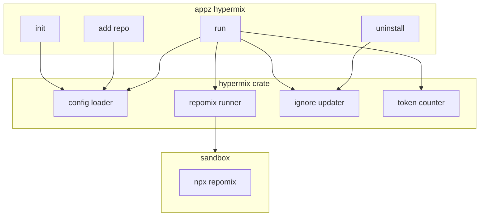

# Hypermix Crate and Command for Appz

## Summary

Port [hypermix](https://github.com/zackiles/hypermix) (appz-ref/hypermix) into a new Rust crate `crates/hypermix`, exposed as `appz hypermix` with subcommands: `init`, `add`, `run` (default), and `uninstall`. Hypermix orchestrates [Repomix](https://github.com/yamadashy/repomix) to build AI context files from multiple sources (remote GitHub repos + local repomix configs), manages ignore files and Cursor rules, and reports token usage.

## Hypermix Reference (What We're Porting)


| Feature       | Description                                                                                                                                                        |
| ------------- | ------------------------------------------------------------------------------------------------------------------------------------------------------------------ |
| **init**      | Creates `hypermix.config.json`, `repomix.config.json`, `.hypermix/`, `.cursor/rules/hypermix/`, installs repomix if needed, adds scripts to package.json/deno.json |
| **add**       | Validates GitHub repo (owner/repo or URL), appends mix entry to config, optionally runs mix                                                                        |
| **run**       | Loads config, runs repomix per mix (remote or local), outputs XML to outputPath, updates .gitignore/.cursorignore/.cursorignoreindex, token count + warnings       |
| **uninstall** | Removes hypermix scripts, rules, and config references                                                                                                             |


Config formats supported by reference: `.ts`, `.js`, `.json`, `.jsonc`. For Rust, we support **JSON** and **JSONC** only (no .ts/.js eval). Optional: add **TOML** for ergonomics.

## Architecture




## Config Schema (JSON/JSONC)

```json
{
  "outputPath": ".hypermix",
  "silent": false,
  "mixes": [
    { "remote": "owner/repo", "include": ["src/**/*.ts"], "ignore": ["**/test/**"], "output": "owner/repo.xml", "extraFlags": ["--compress"] },
    { "repomixConfig": "repomix.config.json", "extraFlags": ["--quiet"] }
  ]
}
```

## Implementation Phases

### Phase 1: Crate Scaffold and Run (Core)

- Create `crates/hypermix/` with `Cargo.toml`, `src/lib.rs`, `src/run.rs`, `src/config.rs`, `src/types.rs`, `src/repomix.rs`
- Config loader: resolve `hypermix.config.json` / `hypermix.config.jsonc` (search cwd, or `--config` path). Use `serde_json` + `jsonc` crate for JSONC. Parse into `HypermixConfig` (mixes, outputPath, silent).
- Repomix runner: use [sandbox](crates/sandbox) (same pattern as [code-search/src/pack.rs](crates/code-search/src/pack.rs)) to run `npx repomix@latest`. For each mix:
  - **Remote mix**: `--remote https://github.com/owner/repo --include "..." --ignore "..." --output <path>`
  - **Local mix**: `--config repomix.config.json --output <path>` (derive output from repomix config or default to `codebase.xml`)
- Pass `extraFlags` from mix config; validate against known repomix boolean flags (whitelist).
- Wire `appz hypermix` (no args = run) in [app.rs](crates/app/src/app.rs). Add `hypermix` dep to app, `hypermix` feature flag.

### Phase 2: Ignore Files and Output Paths

- After run: update `.gitignore` (add `outputPath/**/*.xml`), `.cursorignoreindex` (same), `.cursorignore` (add `!outputPath/**/*.xml` to allow AI access). Port logic from [mod.ts](appz-ref/hypermix/src/mod.ts) `modifyIgnoreFile` / `updateIgnoreFiles`.
- Create output dirs with `std::fs::create_dir_all` before running repomix.
- Emit a simple success summary (files written, paths).

### Phase 3: Init Command

- `appz hypermix init`: Create `hypermix.config.json` with empty mixes, create `.hypermix/`, create `repomix.config.json` with sensible defaults (source folders detected via glob: `src/**/`*, `lib/**/`*, etc., excluding node_modules, .git).
- Add a mix entry that references `repomix.config.json` for the local codebase.
- Check for repomix: run `npx repomix@latest --version`; if missing, suggest `npm install -D repomix` or document requirement.
- Optionally add `hypermix` script to package.json / deno.json if present (append to scripts). Use `serde_json` to parse and write back.
- Create `.cursor/rules/hypermix/cursor-rule.mdx` from template (port [constants.ts](appz-ref/hypermix/src/constants.ts) `CURSOR_RULE_TEMPLATE`).

### Phase 4: Add Command

- `appz hypermix add <owner/repo | https://github.com/...>`: Validate repo via `reqwest::Client::head(github_url)`, parse owner/repo. Create mix entry `{ remote, include: ["*.ts","*.js","*.md"], output: "owner-repo.xml" }`.
- Append to `mixes` array in config (JSON/JSONC). For JSONC, use `jsonc` crate; be careful to preserve comments (or document that JSONC comments may be stripped).
- Optional: prompt "Generate mixes now?" and run if yes (reuse run logic).

### Phase 5: Token Counting and Warnings

- Use `tiktoken-rs` (cl100k_base) to count tokens in generated XML files. Fallback: approximate `chars / 4` if tiktoken is heavy.
- After run: print table (file | tokens), total tokens, warning if any file > 60k tokens (model limit context).
- Port table formatting from [mod.ts](appz-ref/hypermix/src/mod.ts) lines 372-429.

### Phase 6: Uninstall Command

- `appz hypermix uninstall`: Remove hypermix script from package.json/deno.json; remove `.cursor/rules/hypermix/`; optionally remove entries from .gitignore/.cursorignore/.cursorignoreindex (or leave as user preference). Port [uninstall.ts](appz-ref/hypermix/src/uninstall.ts) behavior.

### Phase 7: Polish

- `--config`, `--output-path`, `--silent` flags for run.
- Consistent error handling with `miette`.
- Integration tests: run init in temp dir, add repo, run, verify output exists.

## Key Files


| Path                             | Action                                                                           |
| -------------------------------- | -------------------------------------------------------------------------------- |
| `crates/hypermix/Cargo.toml`     | New crate; deps: sandbox, reqwest, serde_json, jsonc, tokio, miette, which, glob |
| `crates/hypermix/src/lib.rs`     | Re-exports `run`, `init`, `add`, `uninstall`                                     |
| `crates/hypermix/src/config.rs`  | `load_config(path?)`, `HypermixConfig`, `RepomixConfig`                          |
| `crates/hypermix/src/repomix.rs` | `run_repomix(config, output_path)` via sandbox                                   |
| `crates/hypermix/src/ignore.rs`  | `update_ignore_files(output_path)`                                               |
| `crates/hypermix/src/tokens.rs`  | Token count (tiktoken-rs or fallback)                                            |
| `crates/app/src/app.rs`          | Add `Hypermix { command }` variant                                               |
| `crates/app/src/commands/mod.rs` | Add `hypermix` mod, dispatch to hypermix crate                                   |
| `Cargo.toml`                     | Add `crates/hypermix` to workspace                                               |
| `crates/app/Cargo.toml`          | Dep `hypermix`, feature `hypermix`                                               |


## Dependency Notes

- **Repomix**: Invoked as `npx repomix@latest` via sandbox (requires Node). Same pattern as code-search.
- **jsonc**: Use `jsonc` crate for parsing JSONC (comments, trailing commas).
- **tiktoken-rs**: Optional; can defer token counting to Phase 5 and use `chars/4` initially.

## Reference (Hypermix Source)

- Main flow: [appz-ref/hypermix/src/mod.ts](appz-ref/hypermix/src/mod.ts) (lines 356-451)
- Config load: [load-config.ts](appz-ref/hypermix/src/load-config.ts)
- Init: [init.ts](appz-ref/hypermix/src/init.ts)
- Add: [add-mix.ts](appz-ref/hypermix/src/add-mix.ts)
- Constants: [constants.ts](appz-ref/hypermix/src/constants.ts)

