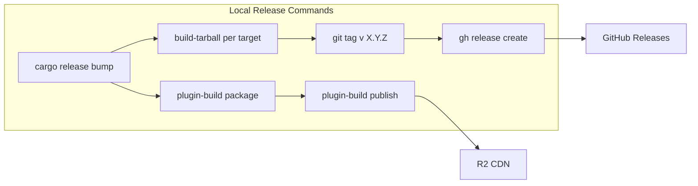

# Local Cargo Release Management Plan

## Current State

- **Version**: Single source in [Cargo.toml](Cargo.toml) via `[workspace.package] version = "0.1.0"`
- **CLI build**: [scripts/build-tarball.sh](scripts/build-tarball.sh) and [scripts/build-tarball.ps1](scripts/build-tarball.ps1) — build for one target at a time (uses `cross` for Linux)
- **Plugin build**: [crates/plugin-build](crates/plugin-build) — `build`, `package`, `publish`; configured by [scripts/plugins.toml](scripts/plugins.toml)
- **Release**: GitHub Actions on `v*` tag — builds 10 targets, signs with zipsign, creates GitHub Release
- **Stale**: [justfile](justfile) references `scripts/version/bumpBinaryVersions.sh` and `scripts/version/applyAndTagVersions.mjs` which do not exist

## Architecture




## Phase 1: Tooling and Version Bump

### 1a. Add cargo-release for version management

- Add `cargo-release` as a dev dependency or document `cargo install cargo-release`
- Use `cargo release patch|minor|major [--execute]` for version bumps
- Configure via [.cargo/config.toml](.cargo/config.toml) or `[package.metadata.release]` in Cargo.toml

### 1b. Create local release-prepare script

New script [scripts/release-bump.sh](scripts/release-bump.sh):

- Bump version with `cargo release <level> --execute` (or `cargo set-version` if cargo-release conflicts with workspace)
- Sync version to packaging files: `snapcraft.yaml`, `winget/appz.yaml`, `chocolatey/appz/appz.nuspec` (same logic as release-prepare.sh but without GITHUB_ACTIONS guard)
- Run `git cliff --tag v$VERSION --unreleased --prepend CHANGELOG.md`
- Commit with `chore: release $VERSION`
- Does **not** create PR — local workflow is commit + push directly

### 1c. Fix justfile

- Replace `bump`, `bump-all`, `bump-interactive`, `release` with recipes that call the new scripts
- Remove references to non-existent `scripts/version/`

## Phase 2: Build and Package Recipes

### 2a. Add release build recipes to justfile

```just
# Build CLI for current platform only (quick local test)
release-build-local:
    ./scripts/build-tarball.sh

# Build CLI for a specific target (e.g. x86_64-unknown-linux-gnu)
release-build target:
    ./scripts/build-tarball.sh {{target}}

# Build all Linux targets (requires Docker + cross)
release-build-linux:
    # Loop over Linux matrix from release.yml
```

### 2b. Plugin release integration

- Add `just plugins-build`, `just plugins-package`, `just plugins-publish` that delegate to `Makefile.plugins` or `cargo run -p plugin-build --`
- Document env vars: `APPZ_PLUGIN_S3_BUCKET`, `APPZ_PLUGIN_S3_ENDPOINT`, `APPZ_PLUGIN_S3_REGION`, `AWS_ACCESS_KEY_ID`, `AWS_SECRET_ACCESS_KEY`

## Phase 3: Tag and GitHub Release

### 3a. Create scripts/release-tag.sh

- Ensure working tree clean
- Run `git tag -a v$VERSION -m "Release v$VERSION"`
- Run `git push origin v$VERSION`
- Optionally: `gh release create` if artifacts exist in `dist/` or `releases/` (for local-only releases when CI is not used)

### 3b. Full local release flow

New script [scripts/release-local.sh](scripts/release-local.sh):

1. `cargo release patch --execute` (or minor/major via arg)
2. Sync packaging files, update CHANGELOG
3. `git add -A && git commit -m "chore: release $VERSION"`
4. Build plugins: `cargo run -p plugin-build -- package`
5. Publish plugins to R2: `cargo run -p plugin-build -- publish` (requires R2 env vars)
6. Build CLI for **host platform only**: `./scripts/build-tarball.sh` (optional; full matrix needs CI)
7. `git tag -a v$VERSION -m "Release v$VERSION"`
8. `git push origin main` (or current branch)
9. `git push origin v$VERSION`
10. If artifacts in `dist/`: run `gh release create` with them; else rely on CI (push tag triggers release workflow)

## Phase 4: Documentation

### 4a. Add scripts/README-release.md

- Prerequisites: `cargo-release` (or `cargo-edit`), `cross` (for Linux), `gh`, `upx`
- Env vars for plugin publish (R2)
- Step-by-step: bump → plugins publish → tag → (CI handles multi-platform build + GitHub Release)
- Optional: Run full build locally for host platform only

### 4b. Update main README

- Add "Releasing" section pointing to scripts/README-release.md

## Implementation Order

1. Phase 1b + 1c: `scripts/release-bump.sh` and fix justfile
2. Phase 2: justfile recipes for build and plugins
3. Phase 3: `scripts/release-tag.sh`, `scripts/release-local.sh`
4. Phase 1a: cargo-release config (if needed)
5. Phase 4: Documentation

## Key Files to Create/Modify


| File                             | Action                                                   |
| -------------------------------- | -------------------------------------------------------- |
| scripts/release-bump.sh          | Create — version bump + changelog + sync packaging files |
| scripts/release-tag.sh           | Create — tag and push                                    |
| scripts/release-local.sh         | Create — full local flow orchestration                   |
| scripts/README-release.md        | Create — release documentation                           |
| justfile                         | Modify — replace stale bump/release recipes              |
| .cargo/config.toml or Cargo.toml | Modify — optional cargo-release config                   |


## Limitations

- **Multi-platform CLI build**: Building all 10 targets locally requires `cross` (Docker) for Linux, and macOS/Windows cannot be built on Linux. The recommended flow: bump + plugins publish locally; push tag to trigger CI for full CLI build + GitHub Release.
- **Zipsign**: CI uses `ZIPSIGN` secret. For local signing, user must install zipsign and have the private key; otherwise skip signing (CI will sign on tag push if assets are re-created there).

