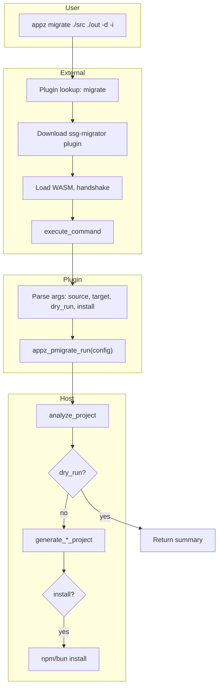
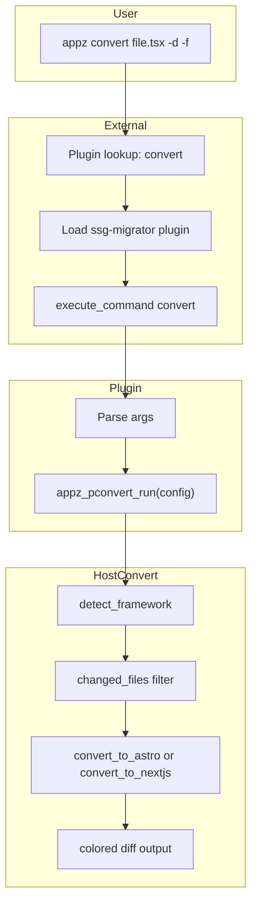

# Add next-lovable Migrate + Convert Support to appz Plugin

## Goal

1. Extend the `appz migrate` plugin to match [next-lovable migrate](https://docs.nextlovable.com/0.0.7/commands/migrate) and implement real migration via a host function.
2. Move `appz convert` into the same ssg-migrator plugin so both migrate and convert are plugin commands.

## Current State

- `appz migrate` is a downloadable WASM plugin ([crates/plugins/ssg-migrator](crates/plugins/ssg-migrator/src/lib.rs)); placeholder logic only
- `appz convert` is a built-in command in [app.rs](crates/app/src/app.rs) and [convert.rs](crates/app/src/commands/convert.rs)
- Plugin manifest: [plugins.toml](scripts/plugins.toml) lists `commands = ["migrate"]` for ssg-migrator

## next-lovable Migrate Interface

```bash
next-lovable migrate <source-directory> [target-directory] [options]
```


| Option        | Short | Description                                            |
| ------------- | ----- | ------------------------------------------------------ |
| `--dry-run`   | `-d`  | Simulate migration, show planned changes               |
| `--yes`       | `-y`  | Skip confirmations (treat as force when output exists) |
| `--install`   | `-i`  | Run `npm install` after migration                      |
| `--transform` | `-t`  | Comma-separated: router, helmet, client, context, all  |


## Implementation Plan

### 1. Add `appz_pmigrate_run` Host Function

Create a new host function (like `appz_pcheck_run`) that runs the native migration.

**New file:** `[crates/app/src/wasm/host_functions/plugin_migrate.rs](crates/app/src/wasm/host_functions/plugin_migrate.rs)`

- Input: `MigrateRunInput` (source_dir, output_dir, target, force, dry_run, install, transforms)
- Resolve paths relative to working_dir (from PluginHostData)
- If `dry_run`: call `analyze_project`, print summary (files to convert, structure), return without writing
- Otherwise: call `generate_astro_project` or `generate_nextjs_project` via ssg-migrator
- If `install`: use sandbox to run `npm install` or `bun install` in output dir
- Output: `MigrateRunOutput` (exit_code, message)

**Types:** Add `MigrateRunInput` / `MigrateRunOutput` to `[crates/app/src/wasm/types.rs](crates/app/src/wasm/types.rs)` or appz_pdk.

**Registration:** Add to `register_plugin_host_functions` in [plugin.rs](crates/app/src/wasm/plugin.rs).

### 2. Extend Plugin Command Definition

Update [crates/plugins/ssg-migrator/src/lib.rs](crates/plugins/ssg-migrator/src/lib.rs):

**PluginArgDef changes:**

- Support next-lovable positionals: `_positional[0]` = source (required), `_positional[1]` = target (optional; if omitted, in-place)
- Add: `dry-run` (short `d`), `yes` (short `y`), `install` (short `i`), `transform` (short `t`)
- Keep: `target` (astro|nextjs), `force`, `static-export` for compatibility
- Map `--output` / `-o` to target when given as flag for backward compat

**Arg parsing in handle_migrate:**

- Read `_positional`: first = source, second = output (or use --output)
- Default source = "." when no positional
- Read dry_run, yes, install, transform from args map

### 3. Implement handle_migrate via Host Call

In `handle_migrate`, after parsing args:

- Resolve source_dir and output_dir (absolute paths; output = source if in-place)
- Build `MigrateRunInput`
- Call `appz_pmigrate_run` (declare in plugin's `extern`)
- Return `PluginExecuteOutput` from host response

**Plugin extern:** Add to plugin's `#[host_fn] extern` block:

```rust
fn appz_pmigrate_run(input: Json<MigrateRunInput>) -> Json<MigrateRunOutput>;
```

### 4. Dry-Run Output

When `dry_run` is true, the host function should:

- Run `analyze_project(source_dir)` only
- Format and return a message listing: files to convert, new structure, config changes
- Not write any files

### 5. --install Behavior

After successful migration, if `install` is true:

- Use `appz_psandbox_exec` (or direct sandbox call from host) to run `npm install` / `bun install` in output_dir
- Detect package manager from output dir (package.json "packageManager" or lockfile)

### 6. --transform Option (v1 Scope)

next-lovable supports `router`, `helmet`, `client`, `context`, `all`. The current ssg-migrator generators apply transforms implicitly (e.g. `transform_client_files` does router + client + image). For v1: accept `--transform` and pass to host; host can map to existing behavior (all) or extend MigrationConfig later. Document that "all" is the effective behavior for now.

### 7. Add `convert` to Plugin

**Plugin command definition:** Add a second command in `appz_plugin_info()`:

- `name: "convert"`
- Args: files (positional), `--dry-run` (-d), `--force` (-f), `--output` (-o), `--target`, `--transform`, `--list`, `--client-directive`, `--slot-style`

**Plugin handler:** Add `handle_convert` that parses args and calls `appz_pconvert_run`.

**Host function:** Add `appz_pconvert_run` in [plugin_convert.rs](crates/app/src/wasm/host_functions/plugin_convert.rs):

- Input: `ConvertRunInput` (files, working_dir, dry_run, force, output, target, transform, list, client_directive, slot_style)
- Reuse logic from [convert.rs](crates/app/src/commands/convert.rs): framework detection, ScopedFs, changed_files filter, convert_to_astro / convert_to_nextjs, diff output
- Output: `ConvertRunOutput` (exit_code, message)

**Remove built-in convert:**

- Remove `Convert` variant from [app.rs](crates/app/src/app.rs) Commands enum
- Remove convert dispatch from [main.rs](crates/cli/src/main.rs)
- Delete or deprecate [convert.rs](crates/app/src/commands/convert.rs) (logic moves into host function)

### 8. Update Plugin Manifest

Update [scripts/plugins.toml](scripts/plugins.toml): `commands = ["migrate", "convert"]` for ssg-migrator. Rebuild and re-publish plugin.

## Flow Diagram




## Files to Create/Modify


| File                                                   | Action                                                                                          |
| ------------------------------------------------------ | ----------------------------------------------------------------------------------------------- |
| `crates/app/src/wasm/host_functions/plugin_migrate.rs` | Create - appz_pmigrate_run host function                                                        |
| `crates/app/src/wasm/host_functions/plugin_convert.rs` | Create - appz_pconvert_run host function (extract logic from convert.rs)                        |
| `crates/app/src/wasm/types.rs`                         | Add MigrateRunInput, MigrateRunOutput, ConvertRunInput, ConvertRunOutput                        |
| `crates/app/src/wasm/plugin.rs`                        | Register appz_pmigrate_run, appz_pconvert_run                                                   |
| `crates/app/src/wasm/host_functions/mod.rs`            | Export plugin_migrate, plugin_convert                                                           |
| `crates/plugins/ssg-migrator/src/lib.rs`               | Add migrate + convert commands; handle_migrate, handle_convert; declare both host fns in extern |
| `crates/app/src/app.rs`                                | Remove Convert variant from Commands                                                            |
| `crates/cli/src/main.rs`                               | Remove Convert dispatch (convert routes to External)                                            |
| `crates/app/src/commands/convert.rs`                   | Remove - logic moved to plugin_convert host fn                                                  |
| `crates/app/src/commands/mod.rs`                       | Remove convert mod and export                                                                   |
| `scripts/plugins.toml`                                 | Add "convert" to ssg-migrator commands list                                                     |


## Convert Flow




## Out of Scope (Future)

- Authentication and credits (next-lovable uses cloud; appz is local)
- Selective transform application (router-only, etc.) in generator
- `migrate sync` subcommand enhancements

