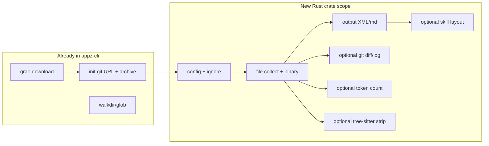

# Port Repomix (repomax) to a Rust Crate – Complexity Assessment

## What “repomax” is

The repomax skill points at **[Repomix](https://github.com/yamadashy/repomix)** – a TypeScript/Node.js tool that:

- Fetches remote repos (GitHub archive ZIP or shallow git clone)
- Walks and filters files (globby, ignore patterns)
- Optionally strips comments (tree-sitter per language)
- Detects binaries, truncates base64, applies security checks
- Outputs a single “packed” document (XML, markdown, or plain) for AI consumption
- Can emit a “skill” layout (sections, tech stack, stats) and optionally include git diff/log

Repomix core lives under `src/`: **~70+ TypeScript modules** in `config/`, `core/file/`, `core/git/`, `core/treeSitter/`, `core/metrics/`, `core/output/`, `core/packager/`, `core/skill/`, `core/security/`, plus CLI and MCP. Dependencies include **fflate**, **git-url-parse**, **globby**, **tree-sitter** (web-tree-sitter + language grammars), **tiktoken**, **handlebars**, **@repomix/strip-comments**, etc.

---

## What appz-cli already has (reuse)

| Repomix area          | Appz-cli today                                                                                                                           | Notes                                                                                                                    |
| --------------------- | ---------------------------------------------------------------------------------------------------------------------------------------- | ------------------------------------------------------------------------------------------------------------------------ |
| **Fetch remote repo** | [grab](crates/grab) + [init/sources/git](crates/init/src/sources/git.rs)                                                                 | Archive URL build (GitHub/GitLab/Bitbucket), download ZIP, extract. Parallel downloads in grab.                          |
| **Git URL parsing**   | [init/sources/git.rs](crates/init/src/sources/git.rs) `parse_git_source`, branch/subfolder                                               | Same idea as Repomix `gitRemoteParse` / `gitHubArchiveApi`.                                                              |
| **File walking**      | walkdir, glob in [app](crates/app/Cargo.toml), [ssg-migrator](crates/ssg-migrator), [checker](crates/checker), [sandbox](crates/sandbox) | No single “repomix-style” ignore chain yet; would need an `ignore`-style layer.                                          |
| **Binary detection**  | —                                                                                                                                        | Not centralized; would add (e.g. `is-binary-file`-style or simple heuristic).                                            |
| **Git diff/log**      | [ssg-migrator](crates/ssg-migrator) uses git2 for status/diff; no repomix-style “embed in pack”                                          | git2 is in the tree; wiring for “include diffs/logs in output” is new.                                                   |
| **Token counting**    | —                                                                                                                                        | Would need a crate (e.g. tiktoken-rs or similar).                                                                        |
| **Comment stripping** | —                                                                                                                                        | Repomix uses tree-sitter + per-language queries; Rust has `tree-sitter` but grammars and strategy code are a large port. |
| **Output formatting** | —                                                                                                                                        | XML/markdown/plain and “skill” layout are new (templates + format logic).                                                |

So: **fetch + archive handling is largely done**. The new work is: **file collection with ignore rules, optional comment stripping, binary handling, metrics (tokens), output generation (XML/md/plain + skill), and optional git diff/log embedding**.

---

## Complexity by scope

### 1. “Fetch only” (remote repo → directory)

**Complexity: Low (already done)**  

- Use existing [grab](crates/grab) + [init](crates/init) (parse URL → archive URL → download → extract).  
- At most a thin “repomix-style” API on top (e.g. one function that takes a repo URL and returns a path).

---

### 2. “Pack” pipeline **without** comment stripping

**Complexity: Medium** (roughly 2–4 weeks for an MVP)

- **Config**: Ignore patterns + small config schema (e.g. serde + [ignore](https://crates.io/crates/ignore) or custom glob set).
- **File collection**: Walk directory with ignore rules, optional include/exclude globs (walkdir + ignore or minimatch-style).
- **Binary detection**: Integrate or implement simple heuristic (or a small crate).
- **Read + process**: Read text files, skip binaries, optional truncation of long base64 blobs.
- **Output**: Single XML or markdown document (templates or direct string building); sort order (e.g. by path or by change count if git available).
- **Optional**: Git diff/log via `git2` (or CLI), append sections to the pack.
- **Optional**: Token counting (integrate a tokenizer crate) and basic metrics.

Rust crates that map well: **walkdir**, **ignore** (or **glob**), **git2**, **quick-xml** / **markdown** writers, optional **tiktoken-rs** (or similar). No tree-sitter required.

---

### 3. “Pack” pipeline **with** comment stripping (Repomix parity)

**Complexity: High** (roughly 4–8+ weeks)

- Everything in (2), plus:
- **Tree-sitter**: Repomix uses **web-tree-sitter** and many language-specific query files (e.g. `queryTypescript.ts`, `queryGo.ts`, …) to strip comments. In Rust you’d use the **tree-sitter** crate and corresponding *tree-sitter- grammar** crates.
- **Per-language strategy**: Repomix has parse strategies (TypeScript, Go, Python, Vue, CSS, etc.) and a fallback. Porting means either:
  - Binding/maintaining one grammar per language and mapping Repomix’s query logic, or
  - Starting with 2–3 languages and expanding.
- **Grammar maintenance**: Grammars and queries need to be kept in sync with Repomix if you want identical behavior.

This is the main cost: **tree-sitter integration and many languages**.

---

### 4. “Skill” output format

**Complexity: Medium** (about 1 extra week if you already have pack)

- Repomix’s “skill” is a specific layout: sections (summary, structure, files, tech stack, etc.), often used for AI skills.  
- You’d add: section generators, tech stack detection (e.g. from package.json / Cargo.toml / etc.), and a dedicated template or formatter for that layout.  
- Depends on having a working pack pipeline (2 or 3).

---

### 5. Full parity (CLI, MCP, website, etc.)

**Complexity: Very high**

- Repomix also has: CLI (commander), MCP server and tools, browser extension, GitHub Action, multi-locale docs.  
- Porting “repomax code” as a **Rust crate** usually means the **core pack + fetch logic**, not the whole product. CLI/MCP/website can stay in Node or be separate Rust binaries later.

---

## Diagram (high level)

---

## Recommendation

- **If the goal is “fetch remote repo and get a directory”**: You’re done; use grab + init. A small “repomix-style” wrapper crate is optional and low effort.
- **If the goal is “pack a repo into one XML/markdown file for AI”** (no comment stripping): **Medium** effort. New crate that uses grab/init for fetch, then implements: config + ignore, file walk, binary handling, output generation, optional git diff/log and token count. Reuse [grab](crates/grab) and [init](crates/init) for the download side.
- **If the goal is “Repomix parity including comment stripping”**: **High** effort. Same as above plus tree-sitter and per-language strategies; start with a subset of languages to cap scope.
- **If the goal is “skill” output**: Add it on top of the pack pipeline (medium extra effort).

**Summary**: Porting “repomax code” to a Rust crate is **low** if you only need fetch; **medium** for a useful pack pipeline without comment stripping; **high** for full Repomix-like behavior with tree-sitter comment stripping. The existing grab + init crates already cover the “download git repos fast” part.