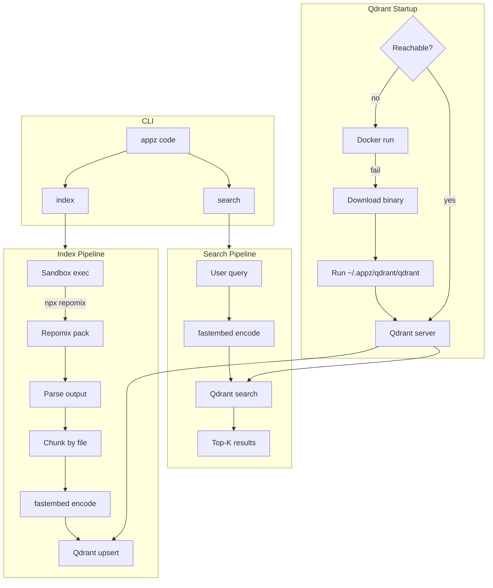

# Repomix + Qdrant Semantic Code Search Module

## Architecture Overview



## Key Design Decisions

| Decision            | Choice                                 | Rationale                                                                                           |
| ------------------- | -------------------------------------- | --------------------------------------------------------------------------------------------------- |
| Repomix integration | Sandbox `exec("npx repomix...")`       | Run via sandbox (project-root scoped, mise env); same pattern as dev/build in appz.                 |
| Embedding model     | fastembed (AllMiniLML6V2)              | Local, no API cost; good code semantics; well-tested with Qdrant.                                   |
| Qdrant deployment   | Docker first, binary fallback          | Try `docker run qdrant/qdrant`; else download binary from GitHub releases to `~/.appz/qdrant/`.     |
| Data persistence    | `~/.appz/qdrant/`                      | Storage dir in user home; binary (if used) and persistent volume.                                   |
| CLI commands        | `appz code index`, `appz code search`  | Code subcommand with Index and Search variants; matches `appz skills add`, `appz site create`.      |
| MCP exposure        | New tools: `code_index`, `code_search` | Consistent with existing tools in [crates/mcp-server/src/tools.rs](crates/mcp-server/src/tools.rs). |

## Qdrant Startup Logic

1. Check if `http://localhost:6334` responds; if yes, use it.
2. Else try Docker: `which docker` → `docker run -d -p 6334:6334 -p 6333:6333 -v ~/.appz/qdrant/storage:/qdrant/storage qdrant/qdrant`.
3. Else fallback to binary:
   - Dir: `~/.appz/qdrant/` (bin: `qdrant`, storage: `~/.appz/qdrant/storage`).
   - If binary missing: download from `https://github.com/qdrant/qdrant/releases/download/v{version}/qdrant-{arch}-unknown-linux-gnu.tar.gz` (detect arch: x86_64, aarch64), extract, save version.
   - Run: `~/.appz/qdrant/qdrant --storage-path ~/.appz/qdrant/storage` (background).

**Data paths**: `~/.appz/qdrant/storage/`, `~/.appz/qdrant/qdrant`, `~/.appz/code-index/<project_hash>/meta.json`

## CLI Structure

```rust
/// Semantic code search over indexed codebase
#[cfg(feature = "code-search")]
Code {
    #[command(subcommand)]
    command: crate::commands::code::CodeCommands,
}

#[derive(Subcommand)]
pub enum CodeCommands {
    Index { workdir: Option<PathBuf>, #[arg(long)] force: bool },
    Search { query: String, workdir: Option<PathBuf>, #[arg(short, long)] limit: Option<usize> },
}
```

## File Layout

```
crates/code-search/
  Cargo.toml
  src/
    lib.rs            # Public API: index(), search()
    pack.rs           # Sandbox exec of npx repomix
    parse.rs          # Parse repomix output
    chunk.rs          # Chunking logic
    embed.rs          # fastembed wrapper
    qdrant.rs         # Qdrant client + collection management
    qdrant_startup.rs  # Ensure Qdrant running: Docker or binary
    error.rs           # Error types
```
