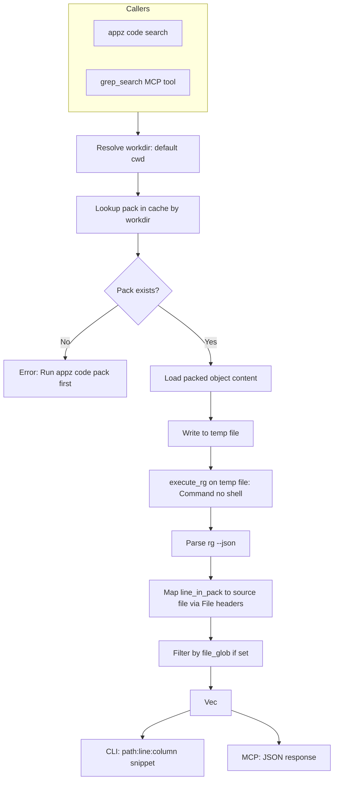

# Safe Code Search (Packed Output)

## Design: Search Packed Code, Not Raw Filesystem

**Search target**: The packed output stored in cache (`~/.appz/store/objects/`), not the project directory.

**Default behavior**: Search the current project's packed code — look up cache by workdir (canonical). If multiple packs exist, show interactive picker (see Implementation).

**If no pack found**: Error — "No packed code found for this project. Run `appz code pack` first."

**Multiple packs for same workdir**: Interactive picker — when multiple packs exist (different style, workspace, etc.), show list (like `pack ls`) and let user choose which pack to search.

**Packed format**: Repomix markdown with `## File: path/to/file` section headers. Results must map (line_in_pack) → (source_file, line_in_source).

## Context

- **Existing `code_search`** MCP tool: semantic search via Qdrant/embeddings (different feature)
- **code-mix cache**: Objects at `~/.appz/store/objects/{hash[0..2]}/{hash}`, index has workdir, style, file_count, workspace
- **list_entries** returns rows ordered by `created_at DESC` — first match = most recent pack for workdir

## Architecture




## Implementation Plan

### 1. Add pack lookup to code-mix

In [crates/code-mix/src/store.rs](crates/code-mix/src/store.rs) and cache:

- Add `store::get_entries_for_workdir(conn, workdir: &str) -> Result<Vec<ListEntry>>`: SQL `SELECT ... WHERE workdir = ? ORDER BY created_at DESC` — returns all packs for workdir
- Add `cache::get_packs_for_workdir(workdir: &Path) -> Result<Vec<(CacheEntry, PathBuf)>>` — returns all matching packs with object paths (for picker and MCP)
- Add `--pack <content_hash>` to CLI Search to skip picker when user specifies pack explicitly

### 2. Create `code-grep` crate

New crate at [crates/code-grep/](crates/code-grep/) with minimal deps: `serde`, `serde_json`, `anyhow`, `wait-timeout`.

**Schema** ([crates/code-grep/src/schema.rs](crates/code-grep/src/schema.rs)):

```rust
#[derive(Debug, Deserialize)]
pub struct SearchRequest {
    pub query: String,
    pub is_regex: Option<bool>,
    pub file_glob: Option<String>,  // Filter results: only sections matching glob
    pub max_results: Option<usize>,
}

#[derive(Debug, Serialize)]
pub struct SearchResult {
    pub file: String,   // Source file path (from ## File: header)
    pub line: u64,
    pub column: Option<u64>,
    pub snippet: String,
}
```

**Validation** ([crates/code-grep/src/validate.rs](crates/code-grep/src/validate.rs)):

- Reject empty/whitespace-only query
- Reject query.len() > 500
- Reject glob containing `..` or suspicious patterns

**Execution** ([crates/code-grep/src/execute.rs](crates/code-grep/src/execute.rs)):

- `execute(req: &SearchRequest, path: &Path) -> Result<Vec<RawMatch>>` where `RawMatch = { line: u64, column: Option<u64>, snippet: String }` — searches the file at `path`, returns matches with line-in-file. No file mapping.
- Use `std::process::Command::new("rg")` with explicit args (no shell)
- Write content to temp file if needed; for pack search the caller passes the temp file path
- `--json`, `--no-config`, `-e` or `--fixed-strings`, `--max-filesize`, `--max-columns`, `--no-follow`
- Timeout: 5s via `wait-timeout`
- Max results: stop parsing after limit

**Pack-specific orchestration** (in code-mix `search.rs`):

- `search_packed(req: &SearchRequest, pack_path: &Path) -> Result<Vec<SearchResult>>` — takes resolved pack path (caller handles lookup/picker)
  1. Read pack content from `pack_path`, write to temp file
  2. Call `code_grep::execute(req, &temp_path)` → `RawMatch[]`
  3. Build line→(file, line_in_file) mapping by scanning pack for `## File: path` (regex `(?m)^## File: (.+)$`), track `(content_start_line, file_path)` per section
  4. For each RawMatch: find section containing match.line, set `file = section.file_path`, `line = match.line - section.content_start_line + 1`
  5. Filter by `file_glob` if set (glob match on `file`)
  6. Return `Vec<SearchResult>`

This orchestration can live in **code-mix** (new `search.rs`) since it needs store/cache access. `code-grep` stays pure: safe rg on a path.

### 3. Add `grep_search` MCP tool

In [crates/mcp-server/src/tools.rs](crates/mcp-server/src/tools.rs):

- New params struct `GrepSearchParams { query, is_regex?, file_glob?, max_results?, workdir?, pack_hash? }` — `pack_hash` optional for explicit pack choice
- New tool `grep_search` that:
  1. Resolves workdir (reuse `resolve_workdir`) — default: current directory
  2. Gets packs via `get_packs_for_workdir`; if multiple and no pack_hash, use **most recent** (MCP has no interactive picker)
  3. Builds `SearchRequest`, calls `search_packed(req, &chosen_pack_path)`
  4. Returns `Content::json(results)` — errors if no pack found

**Dependencies**: mcp-server needs `code-mix` (for search_packed, get_packs_for_workdir).

### 4. Add `appz code search` CLI subcommand

In [crates/app/src/commands/code.rs](crates/app/src/commands/code.rs):

- Add `Search` variant to `CodeCommands`:

```rust
/// Search packed code (runs over cached pack from `appz code pack`)
Search {
    /// Search query (literal string by default)
    query: String,
    /// Project directory (default: current) — finds pack for this workdir
    #[arg(long)]
    workdir: Option<PathBuf>,
    /// Treat query as regex
    #[arg(long)]
    regex: bool,
    /// Restrict results to source files matching glob (e.g. "*.rs")
    #[arg(long)]
    glob: Option<String>,
    /// Max results (default: 20)
    #[arg(short, long, default_value = "20")]
    limit: usize,
    /// Output as JSON (for piping)
    #[arg(long)]
    json: bool,
    /// Pack to search (content hash from pack ls). Skips interactive picker.
    #[arg(long)]
    pack: Option<String>,
},
```

- In `run()`, add match arm for `CodeCommands::Search`:
  1. Resolve workdir (default: session.working_dir, canonicalize)
  2. Call `get_packs_for_workdir(&workdir)`
  3. If 0 packs: error "No packed code found. Run `appz code pack` first."
  4. If 1 pack or `--pack <hash>` specified: use that pack path
  5. If multiple packs and no `--pack`: **interactive picker** — show list (workdir, style, file_count, workspace, hash) like `pack ls`, prompt user to choose (e.g. via `inquire::Select` or similar)
  6. Build `SearchRequest`, call `search_packed(req, &pack_path)?`
  7. Display: if `--json`, output `serde_json::to_string_pretty(&results)`; else `path:line:column: snippet`

### 5. (Optional) Refactor code-mix prefilter

In [crates/code-mix/src/prefilter.rs](crates/code-mix/src/prefilter.rs), `content_search_paths` currently uses:

```rust
let cmd = format!("rg -l \"{}\"", escaped);
sandbox.exec(&cmd)  // -> sh -c, injection risk
```

**Option A**: Add `SandboxProvider::exec_rg_safe` that takes structured args and runs `rg` via `Command` (no shell) from within the sandbox workdir. Requires sandbox to support "run this binary with these args" without shell.

**Option B**: Use `code_grep::execute` directly from prefilter when running outside sandbox—but prefilter runs inside sandbox for mise env. The prefilter needs sandbox for project-scoped PATH (mise tools). So we'd need either:

- Sandbox to expose a safe `exec_argv(&[&str])` that runs without shell, or
- Run `rg` via `which::which("rg")` and `Command::new(rg_path).args([...])` in the prefilter, setting `cwd` to project path and inheriting env from sandbox—more invasive.

**Recommendation**: Defer prefilter refactor to a follow-up. Focus on the new MCP tool first; the prefilter is used for `appz code pack` with `--strings`, which is typically human-driven CLI rather than LLM.

### 6. Dependencies

- **code-grep/Cargo.toml**: `serde`, `serde_json`, `anyhow`, `wait-timeout`
- **code-mix/Cargo.toml**: Add `code-grep = { path = "../code-grep" }` (for execute)
- **mcp-server/Cargo.toml**: Add `code-mix = { path = "../code-mix" }` if not already present (for search_packed)
- **Workspace**: Add `crates/code-grep` to members

### 7. Security checklist


| Requirement           | Implementation                                                                                                                                 |
| --------------------- | ---------------------------------------------------------------------------------------------------------------------------------------------- |
| No shell              | `Command::new("rg").args([...])` — never `sh -c`                                                                                               |
| No flag injection     | Whitelist: `-e`, `--fixed-strings`, `--glob`, `--json`, `--no-config`, `--max-filesize`, `--max-columns`, `--no-follow`; query is a single arg |
| Bounded execution     | 5s timeout, max_results cap                                                                                                                    |
| Validated search root | workdir canonicalized; pack path from our store (not user-controlled)                                                                          |
| Controlled glob       | Reject `..`; used to filter result sections, not passed to rg                                                                                  |
| Structured output     | `serde_json::to_string(&results)`                                                                                                              |


### 8. File layout

```
crates/code-grep/
  Cargo.toml
  src/
    lib.rs       # pub fn execute(req, path) -> Result<Vec<RawMatch>>
    schema.rs    # SearchRequest, SearchResult, RawMatch
    validate.rs  # validate_request
    execute.rs   # Command spawn, timeout, stream stdout
    parse.rs     # parse_rg_json_line

crates/code-mix/
  src/
    ...
    search.rs    # search_packed(req, workdir) — pack lookup, load, execute, line mapping
```

### 9. Ripgrep JSON output format

Ripgrep `--json` emits one JSON object per line. Types: `begin`, `end`, `match`, `summary`. We only parse `match`:

```json
{"type":"match","data":{"path":{"text":"src/foo.rs"},"lines":{"text":"  fn bar() {}\n"},"line_number":42,"submatches":[{"match":{"text":"bar"},"start":6,"end":9}]}}
```

## Open questions

1. **Workdir matching**: Store has workdir as canonical path string. Normalize before compare for cross-platform consistency.
2. **Case sensitivity**: Add `ignore_case: Option<bool>` to SearchRequest?
3. **Pre-filter refactor**: Defer to follow-up.

