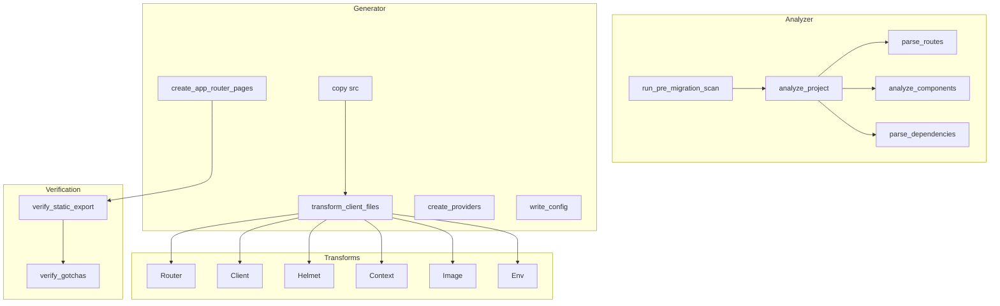

# SSG Migrator Alignment with CRA-to-Next Migration Skill

## Summary of Current State

**SSG Migrator** ([crates/ssg-migrator/](crates/ssg-migrator/)):

- **Source assumption**: React SPA with `src/App.tsx`, `src/components/`, `src/pages/`, Vite or CRA (react-scripts in denylist)
- **Transforms**: Router, Client, Helmet, Context, Image (5 transforms, configurable via `transforms` option)
- **Output**: Next.js App Router with `src/client/` (copied source), `src/app/` (layout, pages, providers), custom `@App/useRouter` shim for Link/NavLink/useNavigate/useLocation/useParams
- **Verification**: Static export only (config, dynamic routes, next/headers, next/cache, redirect, use server, useSearchParams)

**CRA-to-Next Skill** ([appz-ref/migration-skills/cra-to-next-migration/](appz-ref/migration-skills/cra-to-next-migration/)):

- 148 rules across 17 categories with before/after examples, discovery scripts, and verification checklists
- Pre-migration checklist with scan commands and rule mapping
- Post-migration verification checklist
- Migration order guidance
- Version policy: Next.js 16.x+

---

## Gap Analysis

### 1. Analyzer Gaps

| CRA Skill                | SSG Migrator                                            | Gap                                                                                 |
| ------------------------ | ------------------------------------------------------- | ----------------------------------------------------------------------------------- |
| CRA detection            | Assumes App.tsx, no CRA vs Vite distinction             | Add `is_cra: bool` (react-scripts in deps)                                          |
| Route parsing            | Regex for `<Route path="X" element={<Y/>}>`, `path="*"` | No `:id`→`[id]`, `*`→`[...slug]`, optional `[[...slug]]`, route groups              |
| REACT_APP_ env scan      | None                                                    | Add scan for `REACT_APP`_ references; inform env transform                          |
| WebSocket/socket.io scan | None                                                    | Pre-migration: `gotchas-websocket-optional-deps` needs next.config webpack fallback |
| :export in SCSS          | None                                                    | Pre-migration: Turbopack may break                                                  |
| extraReducers object     | None                                                    | RTK v2 builder pattern required                                                     |
| SVG ReactComponent       | None                                                    | SVGR config needed for `assets-static-imports`                                      |

**Files to modify**: [analyzer.rs](crates/ssg-migrator/src/analyzer.rs), [types.rs](crates/ssg-migrator/src/types.rs)

---

### 2. Transform Gaps

| Category    | CRA Rules                                              | SSG Current                             | Gap                                                               |
| ----------- | ------------------------------------------------------ | --------------------------------------- | ----------------------------------------------------------------- |
| **Env**     | REACT_APP_→NEXT_PUBLIC_                                | None                                    | New transform: `env-prefix`                                       |
| **Router**  | Link, useNavigate, useParams, useSearchParams, NavLink | Shim via @App/useRouter                 | useSearchParams needs Suspense wrapper; useParams API differs     |
| **Client**  | use client placement, boundary placement               | add_use_client (top-level)              | No strategic placement; blanket client for hooks/context          |
| **Helmet**  | Full Metadata API                                      | Comment placeholder                     | No `export const metadata` generation                             |
| **Image**   | next/image with dimensions                             | Import→.src for static                  | No ``→`<Image>`, no remote domains config                    |
| **Styling** | global CSS, CSS Modules, Sass, Tailwind, CSS-in-JS     | CSS charset/import strip, Tailwind copy | No SCSS :global handling, no styled-components/Emotion SSR config |
| **Data**    | useEffect→RSC/SSR/SSG                                  | None                                    | No data-fetching transforms                                       |
| **API**     | Route Handlers                                         | None                                    | No API route migration                                            |
| **SEO**     | Metadata API, sitemap, robots                          | Helmet comment only                     | Minimal                                                           |

**Transform additions (high impact)**:

1. **Env** (`NextJsTransform::Env`): `REACT_APP`_ → `NEXT_PUBLIC`_ in code and .env files (when copied)
2. **Image** (extend): Convert `` to `<Image src={import} width height>` for static imports; leave `` as-is or add remote pattern hint
3. **Metadata** (extend Helmet): Emit `export const metadata = { title }` in layout when Helmet title found, not just comment

---

### 3. Generator / Project Setup Gaps

| CRA Rule                | SSG Current                         | Gap                                                                                     |
| ----------------------- | ----------------------------------- | --------------------------------------------------------------------------------------- |
| setup-initial-structure | Copies src→src/client, creates app/ | Uses src/client pattern; CRA uses app/ at root                                          |
| setup-package-json      | write_package_json, filter_deps     | Pins [next@15.5.6](mailto:next@15.5.6) (skill: 16.x), no react-scripts removal explicit |
| setup-next-config       | copy_config_files                   | No webpack fallback for ws/socket.io; no remote images config                           |
| setup-typescript        | tsconfig from template              | No migration of existing tsconfig paths                                                 |
| setup-eslint            | None                                | No ESLint config creation/update                                                        |
| setup-gitignore         | None                                | No .gitignore update                                                                    |

**Config changes**:

- Bump Next.js to ^16.0.0 (or make configurable)
- Add webpack `fallback: { net: false, tls: false }` when socket.io/ws in deps
- Add `images.remotePatterns` placeholder when remote URLs detected

---

### 4. Route Generation Gaps

| CRA Rule                   | SSG Current        | Gap                                |
| -------------------------- | ------------------ | ---------------------------------- |
| routing-dynamic-routes     | `:id`→`[id]`       | Implemented                        |
| routing-catch-all          | `*`                | Only `*`→not-found; no `[...slug]` |
| routing-optional-catch-all | `[[...slug]]`      | Not supported                      |
| routing-route-groups       | `(group)`          | Not supported                      |
| routing-nested-layouts     | layout per segment | Single root layout only            |
| routing-loading-states     | loading.tsx        | None                               |
| routing-error-boundaries   | error.tsx          | None                               |
| routing-not-found          | not-found.tsx      | Present for catch-all              |

**Pages module** ([nextjs/pages.rs](crates/ssg-migrator/src/nextjs/pages.rs)):

- Extend route parsing for `path="/blog/[...slug]"` → `blog/[...slug]/page.tsx`
- Optional catch-all: path like `/docs/[[...slug]]`
- Route groups: `(dashboard)` → `(dashboard)/page.tsx` (path stays same)
- Add optional `loading.tsx` and `error.tsx` stubs for key routes (config flag)

---

### 5. Verification Gaps

| CRA Rule                      | SSG Current                | Gap                                                                                                    |
| ----------------------------- | -------------------------- | ------------------------------------------------------------------------------------------------------ |
| Post-migration checklist      | verify_static_export only  | No checklist for: dev/build/start, client features, routing, real-time, integrations, PWA, performance |
| gotchas-window-undefined      | None                       | Detect `window`/`document` in server components                                                        |
| gotchas-hydration-mismatch    | None                       | Heuristic: browser APIs + no use client                                                                |
| gotchas-use-search-params     | useSearchParams warning    | Add Suspense wrap suggestion                                                                           |
| Dynamic route + static export | generateStaticParams check | Present                                                                                                |

**New verification passes**:

- `window`/`document`/`localStorage` in files without `"use client"` → Warning
- useSearchParams without Suspense parent → Error in static export mode
- REACT_APP_ remaining after env transform → Error

---

### 6. Pre-Migration Scan (New Flow)

CRA skill defines a pre-migration checklist with bash commands. SSG can expose equivalent analysis:

1. **Scan API**: `analyze_project` already exists; extend with:
  - `has_react_scripts: bool`
  - `react_app_vars: Vec<String>`
  - `has_websocket_deps: bool`
  - `has_scss_export: bool`
  - `has_svg_react_component: bool`
  - `has_extra_reducers_object: bool`
  - `has_app_path_in_nav: bool`
2. **Rule mapping**: Return a list of recommended rules/transforms based on scan (e.g. `["env-prefix", "gotchas-websocket-optional-deps"]`).

---

### 7. Migration Order Alignment

CRA skill recommends: Setup → Routing → Env → Components → Data → Styling → Images/Fonts → SEO → API → Testing.

SSG current order: copy src → transform → providers → layout → pages → config → assets. Transforms run in one pass; order is implicit (router, client, helmet, context, image).

**Change**: Document/enforce transform order to match skill. Env transform should run early (or as pre-pass on .env before copy).

---

## Implementation Plan

### Phase 1: Analyzer + Types (Foundation)

- Add `ProjectAnalysis` fields: `is_cra`, `react_app_vars`, `has_websocket_deps`, `has_scss_export`, `has_svg_react_component`, `has_extra_reducers_object`, `has_app_path_in_nav`
- Implement scans in analyzer (grep-style via Vfs read + regex)
- Extend route parsing: `[...slug]`, `[[...slug]]`, route groups `(name)`

### Phase 2: New Transforms

- **Env**: Add `NextJsTransform::Env`; when enabled, rewrite REACT_APP_→NEXT_PUBLIC_ in TS/JS/TSX/JSX and in .env* files during copy
- **Metadata**: Extend Helmet transform to emit `export const metadata = { title }` in layout template when title extracted
- **Image**: Optionally convert static `import X from './img.png'` + `` to `<Image src={X} width height alt/>` (or at least document as manual step)

### Phase 3: Generator + Config

- Bump Next.js to ^16.0.0 (or config option)
- Add webpack fallback when `has_websocket_deps`
- Add `setup-eslint`, `setup-gitignore` (minimal templates)
- Add optional `loading.tsx`/`error.tsx` generation

### Phase 4: Verification Extensions

- Add checks: `window`/`document` without `"use client"`, `REACT_APP`_ remaining, `useSearchParams` without Suspense (in static export)
- Return structured `SsgWarning` with rule IDs (e.g. `gotchas-window-undefined`)

### Phase 5: Pre-Migration Scan API

- Add `run_pre_migration_scan(vfs, source_dir) -> PreMigrationReport` with scan results and recommended rule IDs
- Plugin/CLI can surface this before migrate

---

## Architecture Diagram

---

## Key Files

| Area            | File                                      | Changes                                            |
| --------------- | ----------------------------------------- | -------------------------------------------------- |
| Analyzer        | `src/analyzer.rs`                         | New scan functions, extended route regex           |
| Types           | `src/types.rs`                            | ProjectAnalysis fields, PreMigrationReport         |
| Transforms      | `src/nextjs/transform.rs`                 | Env transform                                      |
| Convert         | `src/nextjs/convert.rs`                   | Env in parse_transforms                            |
| Helmet/Metadata | `src/nextjs/transform.rs`, `templates.rs` | Emit metadata in layout                            |
| Config          | `src/nextjs/config.rs`                    | Next 16, webpack fallback, eslint, gitignore       |
| Pages           | `src/nextjs/pages.rs`                     | Catch-all, optional catch-all, loading/error stubs |
| Verify          | `src/nextjs/verify.rs`                    | Gotchas checks, rule IDs                           |

---

## Out of Scope (Manual / Future)

- *Data fetching (useEffect→RSC/SSG) — requires AST-level analysis and structural changes*
- API Route Handlers migration — CRA typically uses external API
- Full CSS-in-JS (styled-components, Emotion) — SSR setup is project-specific
- Testing config (Jest, Cypress, Playwright) — environment-specific
- Full Metadata API (sitemap, robots, JSON-LD) — can be follow-up

