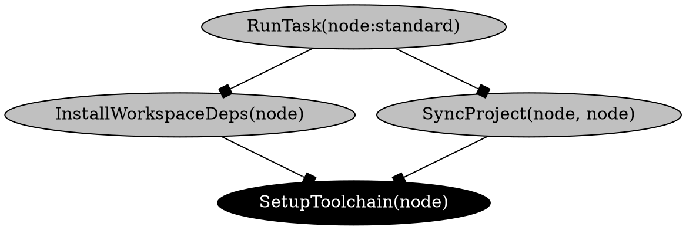
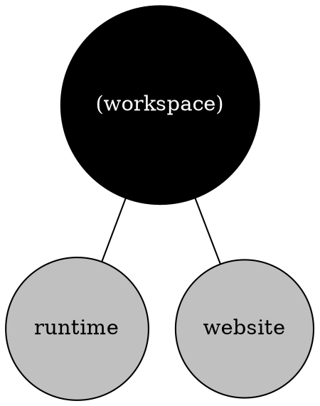
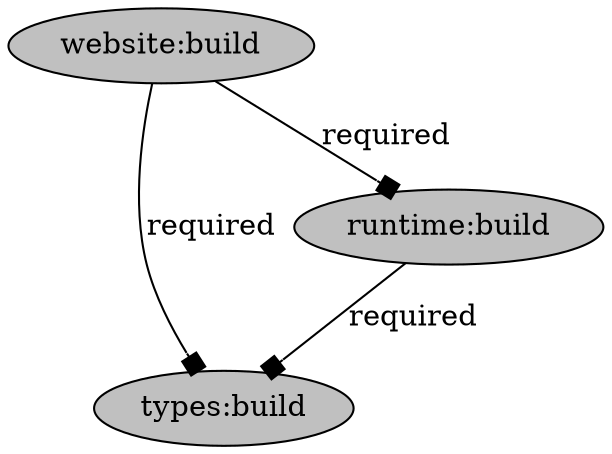

# Files

## File: .cargo/config.toml
````toml
# https://github.com/johnthagen/min-sized-rust
# https://corrode.dev/blog/tips-for-faster-rust-compile-times/
# https://davidlattimore.github.io/posts/2024/02/04/speeding-up-the-rust-edit-build-run-cycle.html
# https://eisel.me/lld

# [build]
# rustflags = ["--cfg", "tokio_unstable"]

[profile.dev]
split-debuginfo = "unpacked"
# Uncomment these 2 if using the debugger!
debug = 0
strip = "debuginfo"

[profile.release]
codegen-units = 1
lto = true
opt-level = "z"
panic = "abort"
strip = "debuginfo"

[profile.dist]
inherits = "release"

# [target.aarch64-apple-darwin]
# rustflags = ["-C", "link-arg=-fuse-ld=/opt/homebrew/opt/llvm/bin/ld64.lld"]

# [registries.crates-io]
# protocol = "sparse"
````

## File: .cargo/nextest.toml
````toml
[profile.ci]
fail-fast = false
failure-output = "immediate-final"
retries = 1
# test-threads = 2

# [profile.default]
# test-threads = 8
````

## File: .github/ISSUE_TEMPLATE/bug_report.md
````markdown
---
name: Bug report
about: Create a report to help us improve
title: '[bug] '
labels: ['bug']
assignees: ['milesj']
---

**Describe the bug**

<!-- A clear and concise description of what the bug is. -->

**Steps to reproduce**

<!--
1. Go to '...'
2. Click on '....'
3. Scroll down to '....'
4. etc
--->

**Expected behavior**

<!-- A clear and concise description of what you expected to happen. -->

**Screenshots**

<!-- If applicable, add screenshots to help explain your problem. -->

**Environment**

<!-- Run `npx envinfo` and paste it below. This requires Node.js to be installed. -->

```

```

**Additional context**

<!-- Add any other context about the problem here. -->
````

## File: .github/ISSUE_TEMPLATE/feature_request.md
````markdown
---
name: Feature request
about: Suggest an idea for this project
title: '[feature] '
labels: ['enhancement']
assignees: []
---

**Is your feature request related to a problem? Please describe.**

<!-- A clear and concise description of what the problem is. Ex. I'm always frustrated when [...] -->

**Describe the solution you'd like**

<!-- A clear and concise description of what you want to happen. -->

**Describe alternatives you've considered**

<!-- A clear and concise description of any alternative
solutions or features you've considered. -->

**Additional context**

<!-- Add any other context or screenshots about the feature request here. -->
````

## File: .github/workflows/benchmark.ymldisabled
````
# Thanks to Rome! https://github.com/rome/tools/blob/main/.github/workflows/bench_parser.yml
# Bump

name: Benchmark
on:
  issue_comment:
    types: [created]
  # pull_request:
env:
  RUST_LOG: info
jobs:
  bench:
    name: Bench
    if: github.event.issue.pull_request && contains(github.event.comment.body, '!benchmark')
    runs-on: ubuntu-latest
    # strategy:
    #   matrix:
    #     bench: [emitter_benchmark, pipeline_benchmark]
    #   fail-fast: false
    steps:
      - run: echo ${{ github.event.pull_request.head.sha }}
      - name: Get PR SHA
        id: sha
        uses: actions/github-script@v8
        with:
          result-encoding: string
          script: |
            const response = await github.request(context.payload.issue.pull_request.url);
            return response.data.head.sha;
      - name: Checkout PR branch
        uses: actions/checkout@v6
        with:
          submodules: false
          ref: ${{ steps.sha.outputs.result }}
          # ref: ${{ github.event.pull_request.head.sha }}
      - uses: moonrepo/setup-rust@v1
      - name: Run benchmarks
        # args: --workspace --bench ${{ matrix.bench }} -- --save-baseline base-sha
        run:
          cargo bench --workspace --bench emitter_benchmark --bench pipeline_benchmark --bench
          tar_benchmark -- --save-baseline head-sha

      # Run on base branch to get a baseline
      - name: Checkout base branch
        uses: actions/checkout@v6
        with:
          clean: false
          ref: ${{ github.event.pull_request.base.sha }}
      - name: Run benchmarks
        # args: --workspace --bench ${{ matrix.bench }} -- --save-baseline base-sha
        run:
          cargo bench --workspace --bench emitter_benchmark --bench pipeline_benchmark --bench
          tar_benchmark -- --save-baseline base-sha

      # Compare diffs
      - name: Install critcmp
        run: cargo install critcmp

      - name: Compare benchmarks
        id: bench_comparison
        shell: bash
        run: |
          echo "comment<<EOF" >> $GITHUB_OUTPUT
          echo "### Benchmark results" >> $GITHUB_OUTPUT
          echo "\`\`\`" >> $GITHUB_OUTPUT
          critcmp base-sha head-sha >> $GITHUB_OUTPUT
          echo "\`\`\`" >> $GITHUB_OUTPUT
          echo "EOF" >> $GITHUB_OUTPUT

      - name: Add comment
        uses: peter-evans/create-or-update-comment@v2
        continue-on-error: true
        with:
          issue-number: ${{ github.event.issue.number }}
          body: ${{ steps.bench_comparison.outputs.comment }}

      - name: Remove artifacts
        run: rm -rf ./target/criterion
````

## File: .github/workflows/docs.yml
````yaml
name: Docs
on:
  push:
    branches:
      - master
jobs:
  deploy:
    name: Deploy
    runs-on: ubuntu-latest
    steps:
      - uses: actions/checkout@v6
      - uses: actions/setup-node@v6
      - run: yarn install --immutable
      - run: bash ./scripts/release/buildPackages.sh
      - uses: peaceiris/actions-gh-pages@v4
        with:
          github_token: ${{ secrets.GITHUB_TOKEN }}
          publish_dir: ./website/build
          allow_empty_commit: true
````

## File: .github/workflows/moon.yml
````yaml
name: Moon

on:
  push:
    branches:
      - master
  pull_request:
    paths:
      - .cargo/config.toml
      - .github/workflows/moon.yml
      - .moon/*
      - crates/**
      - legacy/**
      - packages/**
      - website/**
      - package.json
      - yarn.lock
      - Cargo.lock
      - Cargo.toml
      - rust-toolchain.toml

env:
  # For setup-rust
  GITHUB_TOKEN: ${{ secrets.GITHUB_TOKEN }}

jobs:
  ci:
    name: CI
    runs-on: ${{ matrix.os }}
    strategy:
      matrix:
        os: [ubuntu-latest, windows-latest]
    steps:
      - uses: actions/checkout@v6
        with:
          fetch-depth: 0
      - uses: actions/setup-node@v6
      - uses: moonrepo/setup-rust@v1
        with:
          cache-base: "^(master|develop-)"
      - run: cargo run -- --color --log trace ci --base ${{ github.base_ref || 'master' }}
        env:
          DEPOT_TOKEN: ${{ secrets.DEPOT_TOKEN }}
          MOON_DEBUG_REMOTE: true
          MOON_DEBUG_PROCESS_ENV: true
          RUST_BACKTRACE: "1"
      - uses: moonrepo/run-report-action@v1
        if: success() || failure()
        with:
          access-token: ${{ secrets.GITHUB_TOKEN }}
          matrix: ${{ toJSON(matrix) }}
  docker:
    if: ${{ github.repository == 'moonrepo/moon' }}
    name: Docker
    # Older required for Docker libc
    runs-on: ubuntu-22.04
    permissions:
      contents: read
      id-token: write
    steps:
      - uses: actions/checkout@v6
      - uses: depot/setup-action@v1
      - uses: moonrepo/setup-rust@v1
        with:
          cache: false
      - run: cargo build
      - run: ./target/debug/moon --version
      # Non-staged
      - run: ./target/debug/moon docker scaffold website --log trace
        env:
          MOON_SKIP_SETUP_TOOLCHAIN: "*"
      - uses: depot/build-push-action@v1
        with:
          context: .
          push: false
          file: ./tests/docker/Dockerfile
      # Staged
      - uses: depot/build-push-action@v1
        with:
          context: .
          push: false
          file: ./tests/docker/Dockerfile.staged
````

## File: .github/workflows/pr.yml
````yaml
name: PR
on:
  pull_request:
env:
  MOON_DEBUG: "true"
  PROTO_DEBUG: "true"
jobs:
  installer:
    name: Install script check
    runs-on: ${{ matrix.os }}
    strategy:
      matrix:
        os: [ubuntu-latest, macos-latest, windows-latest]
      fail-fast: false
    steps:
      - uses: actions/checkout@v6
      # Unix
      - run: bash ./website/static/install/moon.sh latest
        if: ${{ runner.os != 'Windows' }}
      - run: bash ./website/static/install/moon.sh 1.20.0
        if: ${{ runner.os != 'Windows' }}
      - run: bash ./website/static/install/moon.sh 2.0.0-beta.0
        if: ${{ runner.os != 'Windows' }}
      - run: bash ./website/static/install/proto.sh latest
        if: ${{ runner.os != 'Windows' }}
      - run: bash ./website/static/install/proto.sh 0.40.0
        if: ${{ runner.os != 'Windows' }}
      # Windows
      - run: pwsh.exe ./website/static/install/moon.ps1 latest
        if: ${{ runner.os == 'Windows' }}
      - run: pwsh.exe ./website/static/install/moon.ps1 1.20.0
        if: ${{ runner.os == 'Windows' }}
      - run: pwsh.exe ./website/static/install/moon.ps1 2.0.0-beta.0
        if: ${{ runner.os == 'Windows' }}
      - run: pwsh.exe ./website/static/install/proto.ps1
        if: ${{ runner.os == 'Windows' }}
      - run: pwsh.exe ./website/static/install/proto.ps1 0.40.0
        if: ${{ runner.os == 'Windows' }}
````

## File: .github/workflows/release-npm.yml
````yaml
name: Release npm

on:
  workflow_call:
    inputs:
      plan:
        required: true
        type: string

permissions:
  contents: read
  id-token: write # Required for OIDC

# https://docs.npmjs.com/trusted-publishers
# https://github.com/actions/setup-node/issues/1445
jobs:
  release:
    runs-on: ubuntu-latest
    env:
      PLAN: ${{ inputs.plan }}
    steps:
      - uses: actions/checkout@v6
      - uses: actions/setup-node@v6
        with:
          node-version: "24"
          registry-url: "https://registry.npmjs.org"
      - name: Fetch artifacts
        uses: actions/download-artifact@v7
        with:
          pattern: artifacts-*
          path: artifacts
          merge-multiple: true
      - name: Copy artifacts and release packages
        run: unset NODE_AUTH_TOKEN && bash ./scripts/release/release.sh
        shell: bash
        env:
          GITHUB_TOKEN: ${{ secrets.GITHUB_TOKEN }}
          NPM_CHANNEL: latest
          # NPM_TOKEN: ${{ secrets.NPM_TOKEN }}
````

## File: .github/workflows/release.yml
````yaml
# This file was autogenerated by dist: https://axodotdev.github.io/cargo-dist
#
# Copyright 2022-2024, axodotdev
# SPDX-License-Identifier: MIT or Apache-2.0
#
# CI that:
#
# * checks for a Git Tag that looks like a release
# * builds artifacts with dist (archives, installers, hashes)
# * uploads those artifacts to temporary workflow zip
# * on success, uploads the artifacts to a GitHub Release
#
# Note that the GitHub Release will be created with a generated
# title/body based on your changelogs.

name: Release
permissions:
  contents: write # For GitHub releases
  id-token: write # For npm OIDC
  packages: write # For publishing to package registries

# This task will run whenever you push a git tag that looks like a version
# like "1.0.0", "v0.1.0-prerelease.1", "my-app/0.1.0", "releases/v1.0.0", etc.
# Various formats will be parsed into a VERSION and an optional PACKAGE_NAME, where
# PACKAGE_NAME must be the name of a Cargo package in your workspace, and VERSION
# must be a Cargo-style SemVer Version (must have at least major.minor.patch).
#
# If PACKAGE_NAME is specified, then the announcement will be for that
# package (erroring out if it doesn't have the given version or isn't dist-able).
#
# If PACKAGE_NAME isn't specified, then the announcement will be for all
# (dist-able) packages in the workspace with that version (this mode is
# intended for workspaces with only one dist-able package, or with all dist-able
# packages versioned/released in lockstep).
#
# If you push multiple tags at once, separate instances of this workflow will
# spin up, creating an independent announcement for each one. However, GitHub
# will hard limit this to 3 tags per commit, as it will assume more tags is a
# mistake.
#
# If there's a prerelease-style suffix to the version, then the release(s)
# will be marked as a prerelease.
on:
  pull_request:
    branches:
      # Only run when targeting the default branch
      - master
  push:
    tags:
      # Only release for the CLI crate
      - "v[0-9]+.[0-9]+.[0-9]+*"

jobs:
  # Run 'dist plan' (or host) to determine what tasks we need to do
  plan:
    runs-on: "ubuntu-22.04"
    outputs:
      val: ${{ steps.plan.outputs.manifest }}
      tag: ${{ !github.event.pull_request && github.ref_name || '' }}
      tag-flag: ${{ !github.event.pull_request && format('--tag={0}', github.ref_name) || '' }}
      publishing: ${{ !github.event.pull_request }}
    env:
      GH_TOKEN: ${{ secrets.GITHUB_TOKEN }}
    steps:
      - uses: actions/checkout@v6
        with:
          persist-credentials: false
          submodules: recursive
      - name: Install dist
        # we specify bash to get pipefail; it guards against the `curl` command
        # failing. otherwise `sh` won't catch that `curl` returned non-0
        shell: bash
        run: "curl --proto '=https' --tlsv1.2 -LsSf https://github.com/axodotdev/cargo-dist/releases/download/v0.30.3/cargo-dist-installer.sh | sh"
      - name: Cache dist
        uses: actions/upload-artifact@v6
        with:
          name: cargo-dist-cache
          path: ~/.cargo/bin/dist
      # sure would be cool if github gave us proper conditionals...
      # so here's a doubly-nested ternary-via-truthiness to try to provide the best possible
      # functionality based on whether this is a pull_request, and whether it's from a fork.
      # (PRs run on the *source* but secrets are usually on the *target* -- that's *good*
      # but also really annoying to build CI around when it needs secrets to work right.)
      - id: plan
        run: |
          dist ${{ (!github.event.pull_request && format('host --steps=create --tag={0}', github.ref_name)) || 'plan' }} --output-format=json > plan-dist-manifest.json
          echo "dist ran successfully"
          cat plan-dist-manifest.json
          echo "manifest=$(jq -c "." plan-dist-manifest.json)" >> "$GITHUB_OUTPUT"
      - name: "Upload dist-manifest.json"
        uses: actions/upload-artifact@v6
        with:
          name: artifacts-plan-dist-manifest
          path: plan-dist-manifest.json

  # Build and packages all the platform-specific things
  build-local-artifacts:
    name: build-local-artifacts (${{ join(matrix.targets, ', ') }})
    # Let the initial task tell us to not run (currently very blunt)
    needs:
      - plan
    if: ${{ fromJson(needs.plan.outputs.val).ci.github.artifacts_matrix.include != null && (needs.plan.outputs.publishing == 'true' || fromJson(needs.plan.outputs.val).ci.github.pr_run_mode == 'upload') }}
    strategy:
      fail-fast: false
      # Target platforms/runners are computed by dist in create-release.
      # Each member of the matrix has the following arguments:
      #
      # - runner: the github runner
      # - dist-args: cli flags to pass to dist
      # - install-dist: expression to run to install dist on the runner
      #
      # Typically there will be:
      # - 1 "global" task that builds universal installers
      # - N "local" tasks that build each platform's binaries and platform-specific installers
      matrix: ${{ fromJson(needs.plan.outputs.val).ci.github.artifacts_matrix }}
    runs-on: ${{ matrix.runner }}
    container: ${{ matrix.container && matrix.container.image || null }}
    env:
      GH_TOKEN: ${{ secrets.GITHUB_TOKEN }}
      BUILD_MANIFEST_NAME: target/distrib/${{ join(matrix.targets, '-') }}-dist-manifest.json
    steps:
      - name: enable windows longpaths
        run: |
          git config --global core.longpaths true
      - uses: actions/checkout@v6
        with:
          persist-credentials: false
          submodules: recursive
      - name: Install Rust non-interactively if not already installed
        if: ${{ matrix.container }}
        run: |
          if ! command -v cargo > /dev/null 2>&1; then
            curl --proto '=https' --tlsv1.2 -sSf https://sh.rustup.rs | sh -s -- -y
            echo "$HOME/.cargo/bin" >> $GITHUB_PATH
          fi
      - uses: swatinem/rust-cache@v2
        with:
          key: ${{ join(matrix.targets, '-') }}
          cache-provider: ${{ matrix.cache_provider }}
      - name: Install dist
        run: ${{ matrix.install_dist.run }}
      # Get the dist-manifest
      - name: Fetch local artifacts
        uses: actions/download-artifact@v7
        with:
          pattern: artifacts-*
          path: target/distrib/
          merge-multiple: true
      - name: Install dependencies
        run: |
          ${{ matrix.packages_install }}
      - name: Build artifacts
        run: |
          # Actually do builds and make zips and whatnot
          dist build ${{ needs.plan.outputs.tag-flag }} --print=linkage --output-format=json ${{ matrix.dist_args }} > dist-manifest.json
          echo "dist ran successfully"
      - id: cargo-dist
        name: Post-build
        # We force bash here just because github makes it really hard to get values up
        # to "real" actions without writing to env-vars, and writing to env-vars has
        # inconsistent syntax between shell and powershell.
        shell: bash
        run: |
          # Parse out what we just built and upload it to scratch storage
          echo "paths<<EOF" >> "$GITHUB_OUTPUT"
          dist print-upload-files-from-manifest --manifest dist-manifest.json >> "$GITHUB_OUTPUT"
          echo "EOF" >> "$GITHUB_OUTPUT"

          cp dist-manifest.json "$BUILD_MANIFEST_NAME"
      - name: "Upload artifacts"
        uses: actions/upload-artifact@v6
        with:
          name: artifacts-build-local-${{ join(matrix.targets, '_') }}
          path: |
            ${{ steps.cargo-dist.outputs.paths }}
            ${{ env.BUILD_MANIFEST_NAME }}

  # Build and package all the platform-agnostic(ish) things
  build-global-artifacts:
    needs:
      - plan
      - build-local-artifacts
    runs-on: "ubuntu-22.04"
    env:
      GH_TOKEN: ${{ secrets.GITHUB_TOKEN }}
      BUILD_MANIFEST_NAME: target/distrib/global-dist-manifest.json
    steps:
      - uses: actions/checkout@v6
        with:
          persist-credentials: false
          submodules: recursive
      - name: Install cached dist
        uses: actions/download-artifact@v7
        with:
          name: cargo-dist-cache
          path: ~/.cargo/bin/
      - run: chmod +x ~/.cargo/bin/dist
      # Get all the local artifacts for the global tasks to use (for e.g. checksums)
      - name: Fetch local artifacts
        uses: actions/download-artifact@v7
        with:
          pattern: artifacts-*
          path: target/distrib/
          merge-multiple: true
      - id: cargo-dist
        shell: bash
        run: |
          dist build ${{ needs.plan.outputs.tag-flag }} --output-format=json "--artifacts=global" > dist-manifest.json
          echo "dist ran successfully"

          # Parse out what we just built and upload it to scratch storage
          echo "paths<<EOF" >> "$GITHUB_OUTPUT"
          jq --raw-output ".upload_files[]" dist-manifest.json >> "$GITHUB_OUTPUT"
          echo "EOF" >> "$GITHUB_OUTPUT"

          cp dist-manifest.json "$BUILD_MANIFEST_NAME"
      - name: "Upload artifacts"
        uses: actions/upload-artifact@v6
        with:
          name: artifacts-build-global
          path: |
            ${{ steps.cargo-dist.outputs.paths }}
            ${{ env.BUILD_MANIFEST_NAME }}
  # Determines if we should publish/announce
  host:
    needs:
      - plan
      - build-local-artifacts
      - build-global-artifacts
    # Only run if we're "publishing", and only if plan, local and global didn't fail (skipped is fine)
    if: ${{ always() && needs.plan.result == 'success' && needs.plan.outputs.publishing == 'true' && (needs.build-global-artifacts.result == 'skipped' || needs.build-global-artifacts.result == 'success') && (needs.build-local-artifacts.result == 'skipped' || needs.build-local-artifacts.result == 'success') }}
    env:
      GH_TOKEN: ${{ secrets.GITHUB_TOKEN }}
    runs-on: "ubuntu-22.04"
    outputs:
      val: ${{ steps.host.outputs.manifest }}
    steps:
      - uses: actions/checkout@v6
        with:
          persist-credentials: false
          submodules: recursive
      - name: Install cached dist
        uses: actions/download-artifact@v7
        with:
          name: cargo-dist-cache
          path: ~/.cargo/bin/
      - run: chmod +x ~/.cargo/bin/dist
      # Fetch artifacts from scratch-storage
      - name: Fetch artifacts
        uses: actions/download-artifact@v7
        with:
          pattern: artifacts-*
          path: target/distrib/
          merge-multiple: true
      - id: host
        shell: bash
        run: |
          dist host ${{ needs.plan.outputs.tag-flag }} --steps=upload --steps=release --output-format=json > dist-manifest.json
          echo "artifacts uploaded and released successfully"
          cat dist-manifest.json
          echo "manifest=$(jq -c "." dist-manifest.json)" >> "$GITHUB_OUTPUT"
      - name: "Upload dist-manifest.json"
        uses: actions/upload-artifact@v6
        with:
          # Overwrite the previous copy
          name: artifacts-dist-manifest
          path: dist-manifest.json
      # Create a GitHub Release while uploading all files to it
      - name: "Download GitHub Artifacts"
        uses: actions/download-artifact@v7
        with:
          pattern: artifacts-*
          path: artifacts
          merge-multiple: true
      - name: Cleanup
        run: |
          # Remove the granular manifests
          rm -f artifacts/*-dist-manifest.json
      - name: Create GitHub Release
        env:
          PRERELEASE_FLAG: "${{ fromJson(steps.host.outputs.manifest).announcement_is_prerelease && '--prerelease' || '' }}"
          ANNOUNCEMENT_TITLE: "${{ fromJson(steps.host.outputs.manifest).announcement_title }}"
          ANNOUNCEMENT_BODY: "${{ fromJson(steps.host.outputs.manifest).announcement_github_body }}"
          RELEASE_COMMIT: "${{ github.sha }}"
        run: |
          # Write and read notes from a file to avoid quoting breaking things
          echo "$ANNOUNCEMENT_BODY" > $RUNNER_TEMP/notes.txt

          gh release create "${{ needs.plan.outputs.tag }}" --target "$RELEASE_COMMIT" $PRERELEASE_FLAG --title "$ANNOUNCEMENT_TITLE" --notes-file "$RUNNER_TEMP/notes.txt" artifacts/*

  custom-release-npm:
    needs:
      - plan
      - host
    uses: ./.github/workflows/release-npm.yml
    with:
      plan: ${{ needs.plan.outputs.val }}
    secrets: inherit
    # publish jobs get escalated permissions
    permissions:
      contents: read
      id-token: write
      packages: write

  announce:
    needs:
      - plan
      - host
      - custom-release-npm
    # use "always() && ..." to allow us to wait for all publish jobs while
    # still allowing individual publish jobs to skip themselves (for prereleases).
    # "host" however must run to completion, no skipping allowed!
    if: ${{ always() && needs.host.result == 'success' && (needs.custom-release-npm.result == 'skipped' || needs.custom-release-npm.result == 'success') }}
    runs-on: "ubuntu-22.04"
    env:
      GH_TOKEN: ${{ secrets.GITHUB_TOKEN }}
    steps:
      - uses: actions/checkout@v6
        with:
          persist-credentials: false
          submodules: recursive
````

## File: .github/workflows/rust.yml
````yaml
name: Rust

on:
  push:
    branches:
      - master
  pull_request:

concurrency:
  group: ${{ github.workflow }}-${{ github.ref }}
  cancel-in-progress: true

env:
  WARPGATE_PLUGINS_DIR: ${{ github.workspace }}/wasm
  # RUST_LOG: trace
  # setup-rust
  GITHUB_TOKEN: ${{ secrets.GITHUB_TOKEN }}
  # sccache
  AWS_ACCESS_KEY_ID: ${{ secrets.AWS_ACCESS_KEY_ID }}
  AWS_SECRET_ACCESS_KEY: ${{ secrets.AWS_SECRET_ACCESS_KEY }}
  RUSTC_WRAPPER: ${{ vars.ENABLE_SCCACHE == 'true' && 'sccache' || '' }}
  SCCACHE_BUCKET: moon-ci-sccache
  SCCACHE_S3_KEY_PREFIX: v1
  SCCACHE_GHA_ENABLED: ${{ vars.ENABLE_SCCACHE == 'true' }}
  # SCCACHE_LOG: trace
  # SCCACHE_NO_DAEMON: 1
  SCCACHE_REGION: us-east-2

jobs:
  build-wasm:
    name: Build WASM
    runs-on: ubuntu-latest
    steps:
      - uses: actions/checkout@v6
      - uses: moonrepo/setup-rust@v1
        with:
          bins: just
          cache: false
          targets: wasm32-wasip1
      - uses: mozilla-actions/sccache-action@v0.0.9
        if: ${{ vars.ENABLE_SCCACHE == 'true' }}
      - name: Building crates
        run: just build-wasm
  format:
    name: Format
    runs-on: ubuntu-latest
    steps:
      - uses: actions/checkout@v6
      - uses: moonrepo/setup-rust@v1
        with:
          bins: just
          cache: false
          components: rustfmt
      - uses: mozilla-actions/sccache-action@v0.0.9
        if: ${{ vars.ENABLE_SCCACHE == 'true' }}
      - name: Check formatting
        run: just format-check
  lint:
    name: Lint
    runs-on: ${{ matrix.os }}
    strategy:
      matrix:
        os: [ubuntu-latest, windows-latest]
      fail-fast: false
    steps:
      - uses: actions/checkout@v6
      - uses: moonrepo/setup-rust@v1
        with:
          bins: just
          cache: false
          components: clippy
      - uses: mozilla-actions/sccache-action@v0.0.9
        if: ${{ vars.ENABLE_SCCACHE == 'true' }}
      - name: Run linter
        run: just lint
  test-plan:
    name: Test plan
    runs-on: ubuntu-latest
    outputs:
      coverage: ${{ steps.plan.outputs.coverage }}
      os: ${{ steps.plan.outputs.os }}
    steps:
      - uses: actions/checkout@v6
      - id: plan
        run: bash ./scripts/planTestCi.sh
        env:
          COVERAGE:
            "${{ (github.event_name == 'pull_request' && contains(github.head_ref, 'develop-') ||
            github.event_name == 'push' && github.ref_name == 'master') }}"
  test:
    name: Test
    needs:
      - test-plan
    runs-on: ${{ matrix.os }}
    strategy:
      matrix:
        os: ${{ fromJSON(needs.test-plan.outputs.os) }}
      fail-fast: false
    env:
      # Windows runs out of disk space
      COVERAGE: ${{ needs.test-plan.outputs.coverage == 'true' && !contains(matrix.os, 'windows') }}
      # Temporary until we upgrade starbase
      GIT_AUTHOR_NAME: "Sandbox"
      GIT_AUTHOR_EMAIL: "fakeemail@somedomain.dev"
      GIT_COMMITTER_NAME: "Sandbox"
      GIT_COMMITTER_EMAIL: "fakeemail@somedomain.dev"
    steps:
      - uses: actions/checkout@v6
      - uses: moonrepo/setup-rust@v1
        with:
          bins: just, cargo-nextest, cargo-llvm-cov
          cache: false
          components: llvm-tools-preview
          targets: wasm32-wasip1
      - uses: moonrepo/setup-toolchain@v0
        with:
          auto-install: true
          cache: true
          proto-version: "0.55.2" # Keep in sync
        env:
          PROTO_LOG: trace
      - uses: mozilla-actions/sccache-action@v0.0.9
        if: ${{ vars.ENABLE_SCCACHE == 'true' }}
      # Fixes issues where proto can't find a version because nothing is pinned globally
      - run: cp .prototools ~/.proto/.prototools
      - name: Build plugins
        run: just build-wasm
      - name: Run tests
        if: ${{ env.COVERAGE == 'false' }}
        run: just test-ci
      - name: Run tests with coverage
        if: ${{ env.COVERAGE == 'true' }}
        run: just cov
      - name: Generate code coverage
        if: ${{ env.COVERAGE == 'true' }}
        run: just gen-report
      - name: Upload coverage report
        uses: actions/upload-artifact@v6
        if: ${{ env.COVERAGE == 'true' }}
        with:
          name: coverage-${{ runner.os }}
          path: ./report.txt
          if-no-files-found: error
  coverage:
    if: ${{ needs.test-plan.outputs.coverage == 'true' }}
    name: Code coverage
    runs-on: ubuntu-latest
    needs:
      - test-plan
      - test
    steps:
      - uses: actions/checkout@v6
      - uses: actions/download-artifact@v7
        name: Download coverage reports
        with:
          path: coverage
      - uses: codecov/codecov-action@v4
        name: Upload to Codecov
        with:
          # files: ./coverage/coverage-Linux/report.txt,./coverage/coverage-macOS/report.txt,./coverage/coverage-Windows/report.txt
          files: ./coverage/coverage-Linux/report.txt,./coverage/coverage-macOS/report.txt
          flags: rust
          token: ${{ secrets.CODECOV_TOKEN }}
          verbose: true
````

## File: .github/copilot-instructions.md
````markdown
These concise instructions help AI coding agents be productive in the moon monorepo.

Purpose
- Short orienting notes for contributors and AI assistants: what the repo is, its major parts,
  and the concrete commands and files we commonly interact with.

Quick start (common commands)
- Install JS workspace deps: `yarn` (this repo uses Yarn v4; Node >= 22.14.0)
- Build Rust workspace (default target is the CLI): `cargo build --workspace`
- Build only the CLI binary: `cargo build -p moon_cli --bin moon`
- Run the local CLI binary: `target/debug/moon <command>` (eg `target/debug/moon run :typecheck`)
- Run Rust tests (CI uses nextest): `cargo nextest run --workspace` or `nextest run --workspace`

High-level architecture (big picture)
- Rust-first monorepo: core implementation lives under `crates/` (CLI in `crates/cli`, app logic
  in `crates/app`, helpers in `crates/common`, etc.). See `Cargo.toml` workspace and
  `default-members = ["crates/cli"]` for defaults.
- JavaScript/TypeScript packages live under `packages/` (the `@moonrepo/cli` JS wrapper,
  `website`, utilities like `packages/runtime`, `packages/types`). The repo uses a Node
  workspace (see root `package.json` -> `workspaces`).
- Configuration for repo-scoped task orchestration is in `moon.yml` at the repo root and
  project-level `moon.yml` files under individual projects. Tasks often run toolchain
  binaries (see `.moon/toolchain.yml` referenced in docs).

Project-specific conventions and patterns
- Rust workspace: prefer path dependencies for intra-repo crates (see many `path = "../..."`
  entries in `crates/*/Cargo.toml`). Adding a crate normally involves adding it under
  `crates/` and letting the workspace glob pick it up.
- Node tooling: packages use `packemon`, `jest`, and a shared `tsconfig` layout. Types are
  cached into `.moon/cache/types/*` (see various `tsconfig.json` files).
- Tests and fixtures: Rust crate tests use `crates/*/tests` and per-crate fixtures (eg
  `crates/cli/tests/__fixtures__/**`). Look there for real-world usage examples used by
  unit/integration tests.

Integration points and notable dependencies
- Wasm / plugin runtime: `wasmtime`, `extism` and related crates are used for wasm-based
  plugins (see `crates/cli/Cargo.toml` and `wasm/`).
- Protobuf / plugin APIs: repo references `proto_*` crates and generated types used by the
  plugin system — edits to proto crates may require regenerating code in `proto/` (see
  `proto-plugin.toml` and `proto/` layout if present).
- Prebuilt runtime artifacts: `packages/core-*` directories contain prebuilt platform
  artifacts used for distribution/CI; treat them as platform-specific runtime bundles.

Testing & CI notes
- CI uses cargo-nextest and installs certain binaries via the `.moon` toolchain configuration
  (see docs under `website/docs/guides/rust`). Prefer `cargo nextest run --workspace` for
  fast, CI-aligned test runs.
- Many GH workflows live under `.github/workflows/` — check `rust.yml` for CI job steps and
  required tools (cargo-nextest, cargo-llvm-cov, etc.).

Where to look for examples (useful files)
- Root: `README.md`, `package.json`, `Cargo.toml`, `moon.yml`
- CLI entrypoint and binary building: `crates/cli/Cargo.toml`, `crates/cli/src/main.rs`
- Tests and fixtures: `crates/cli/tests/__fixtures__/**`, `crates/*/tests/**`
- JS packages: `packages/*/package.json` and `packages/*/README.md` (see `packages/cli`)
- Docs and rust guidance: `website/docs/` (handbook and toolchain examples)

Common gotchas / tips
- Node: use the repo Node engine (>=22.14.0) and Yarn v4; `yarn` bootstraps the workspace.
- Binary workflow: many local dev tasks expect the Rust binary to be built (see `package.json`
  scripts that reference `target/debug/moon`). If you see failing JS-side tasks, try building
  `moon` first.
- Cache & disk layout: `.moon/` is used for caches and generated artifacts and is gitignored.

If something here is missing or unclear, tell me which area (architecture, build, tests,
examples) you want expanded and I will iterate.
````

## File: .github/FUNDING.yml
````yaml
github: moonrepo
````

## File: .moon/tasks/bash.yml
````yaml
inheritedBy:
  languages: 'bash'

# This is for testing scenarios
tasks:
  echo:
    command: 'echo "moon"'
````

## File: .moon/tasks/node.yml
````yaml
$schema: '../cache/schemas/tasks.json'

inheritedBy:
  toolchains: 'node'

implicitDeps:
  - '^:build'

fileGroups:
  configs:
    - '*.{js,json}'
  sources:
    - 'src/**/*'
    - 'types/**/*'
  tests:
    - 'tests/**/*'

tasks:
  build:
    command: 'packemon build --addFiles --addExports --declaration'
    env:
      NODE_ENV: 'production'
    inputs:
      - '@globs(sources)'
      - 'package.json'
      - 'tsconfig.json'
      - 'tsconfig.*.json'
      - '/tsconfig.options.json'
    outputs:
      - 'cjs'

  format:
    command: 'prettier'
    args:
      - '--check'
      - '--config'
      - '@in(3)'
      - '--ignore-path'
      - '@in(2)'
      - '--no-error-on-unmatched-pattern'
      - '.'
    inputs:
      - '@globs(sources)'
      - '@globs(tests)'
      - '/.prettierignore'
      - '/prettier.config.js'

  format-write:
    extends: 'format'
    args: '--write'
    options:
      runInCI: false

  lint:
    command: 'eslint'
    args:
      - '--cache'
      - '--cache-location'
      - './.eslintcache'
      - '--color'
      - '--ext'
      - '.js,.ts,.tsx'
      - '--exit-on-fatal-error'
      - '--no-error-on-unmatched-pattern'
      # - '--report-unused-disable-directives'
      - '.'
    inputs:
      - '@globs(sources)'
      - '@globs(tests)'
      - '*.{js,cjs,mjs,ts}'
      - 'tsconfig.json'
      - '/eslint.config.mjs'
      - '/tsconfig.eslint.json'
      - '/tsconfig.options.json'

  lint-fix:
    extends: 'lint'
    args: '--fix'
    options:
      runInCI: false

  test:
    command: 'jest'
    args:
      - '--cache'
      - '--color'
      - '--preset'
      - 'jest-preset-moon'
      - '--passWithNoTests'
    inputs:
      - '@globs(sources)'
      - '@globs(tests)'
      - 'jest.config.*'

  typecheck:
    command: 'tsc --build'
    inputs:
      - '@globs(sources)'
      - '@globs(tests)'
      - 'tsconfig.json'
      - '/tsconfig.options.json'
````

## File: .moon/toolchains.yml
````yaml
$schema: './cache/schemas/toolchains.json'

javascript:
  packageManager: 'yarn'
  inferTasksFromScripts: false
  syncPackageManagerField: true
  syncProjectWorkspaceDependencies: true

node:
  version: '22.14.0'

yarn:
  version: '4.12.0'

typescript:
  routeOutDirToCache: true
  syncProjectReferences: true
# unstable_python:
#   packageManager: pip

# unstable_pip: {}
````

## File: .moon/workspace.yml
````yaml
# Trigger CI: 26

$schema: './cache/schemas/workspace.json'

defaultProject: 'website'

projects:
  sources: {}
  globs:
    - './packages/*'
    - '!packages/cli'
    - '!packages/core-*'
    # - 'scenarios/*'
    # - 'scenarios/python'
    - 'website'

generator:
  templates:
    # - './.moon/templates'
    - './tests/fixtures/generator/templates'

pipeline:
  logRunningCommand: true

vcs:
  defaultBranch: 'master'
  # hooks:
  #   pre-commit:
  #     - 'cargo run -- run :lint'

docker:
  scaffold:
    configsPhaseGlobs:
      - '*.config.js'
      - '*.json'

notifier:
  terminalNotifications: 'always'

remote:
  # DEPOT
  host: 'grpcs://cache.depot.dev'
  auth:
    token: 'DEPOT_TOKEN'
    headers:
      'X-Depot-Org': '1xtpjd084j'
      'X-Depot-Project': '90xxfkst9n'
  cache:
    verifyIntegrity: true
  # BAZEL-REMOTE
  # host: 'grpc://0.0.0.0:9092'
  # cache:
  #   compression: 'zstd'
  # TLS TESTING
  # mtls:
  #   caCert: 'crates/remote/tests/__fixtures__/certs-local/ca.pem'
  #   clientCert: 'crates/remote/tests/__fixtures__/certs-local/client.pem'
  #   clientKey: 'crates/remote/tests/__fixtures__/certs-local/client.key'
  #   domain: 'localhost'
  # tls:
  #   # assumeHttp2: true
  #   cert: 'crates/remote/tests/__fixtures__/certs-local/client.pem'
  #   domain: 'localhost'
````

## File: crates/action/src/action_node.rs
````rust
use indexmap::IndexMap;
use moon_common::path::WorkspaceRelativePathBuf;
⋮----
use moon_target::Target;
⋮----
use rustc_hash::FxHasher;
use serde::Serialize;
use std::fmt;
⋮----
pub struct InstallDependenciesNode {
⋮----
pub struct SetupEnvironmentNode {
⋮----
pub struct SetupProtoNode {
⋮----
pub struct SetupToolchainNode {
⋮----
pub struct SyncProjectNode {
⋮----
pub struct RunTaskNode {
⋮----
pub interactive: bool, // Interactive with stdin
pub persistent: bool,  // Never terminates
⋮----
pub id: Option<u64>, // For action graph states
⋮----
impl RunTaskNode {
pub fn new(target: Target) -> Self {
⋮----
args: vec![],
⋮----
priority: 2, // normal
⋮----
fn calculate_id(&mut self) {
⋮----
hasher.write(self.target.as_str().as_bytes());
⋮----
hasher.write_u8(100);
⋮----
hasher.write_u8(50);
⋮----
self.id = Some(hasher.finish());
⋮----
pub enum ActionNode {
⋮----
/// Install toolchain dependencies in the closest root.
    InstallDependencies(Box<InstallDependenciesNode>),
⋮----
/// Run a project's task.
    RunTask(Box<RunTaskNode>),
⋮----
/// Setup the environment for the provided toolchain.
    SetupEnvironment(Box<SetupEnvironmentNode>),
⋮----
/// Setup and install proto.
    SetupProto(Box<SetupProtoNode>),
⋮----
/// Setup and install the provided toolchain.
    SetupToolchain(Box<SetupToolchainNode>),
⋮----
/// Sync a project with language specific semantics.
    SyncProject(Box<SyncProjectNode>),
⋮----
/// Sync the entire moon workspace and install system dependencies.
    SyncWorkspace,
⋮----
impl ActionNode {
pub fn install_dependencies(node: InstallDependenciesNode) -> Self {
⋮----
pub fn run_task(mut node: RunTaskNode) -> Self {
node.calculate_id();
⋮----
pub fn setup_environment(node: SetupEnvironmentNode) -> Self {
⋮----
pub fn setup_proto(version: VersionSpec) -> Self {
⋮----
pub fn setup_toolchain(node: SetupToolchainNode) -> Self {
⋮----
pub fn sync_project(node: SyncProjectNode) -> Self {
⋮----
pub fn sync_workspace() -> Self {
⋮----
pub fn get_id(&self) -> u64 {
⋮----
Self::RunTask(inner) => inner.id.unwrap_or_default(),
⋮----
pub fn get_spec(&self) -> Option<&ToolchainSpec> {
⋮----
Self::SetupToolchain(inner) => Some(&inner.toolchain),
⋮----
pub fn get_priority(&self) -> u8 {
⋮----
pub fn is_interactive(&self) -> bool {
⋮----
pub fn is_persistent(&self) -> bool {
⋮----
pub fn is_standard(&self) -> bool {
⋮----
pub fn label(&self) -> String {
⋮----
if inner.root.as_str().is_empty() {
format!("InstallDependencies({})", inner.toolchain_id)
⋮----
format!(
⋮----
format!("SetupEnvironment({})", inner.toolchain_id)
⋮----
format!("SetupEnvironment({}, {})", inner.toolchain_id, inner.root)
⋮----
format!("SetupToolchain({})", inner.toolchain.target())
⋮----
format!("SyncProject({})", inner.project_id)
⋮----
Self::SyncWorkspace => "SyncWorkspace".into(),
Self::None => "None".into(),
⋮----
fn fmt(&self, f: &mut fmt::Formatter<'_>) -> fmt::Result {
write!(f, "{}", self.label())
⋮----
impl Hash for ActionNode {
fn hash<H: Hasher>(&self, state: &mut H) {
state.write(self.label().as_bytes());
⋮----
Self::InstallDependencies(inner) => inner.hash(state),
Self::SetupEnvironment(inner) => inner.hash(state),
Self::SetupToolchain(inner) => inner.hash(state),
Self::SyncProject(inner) => inner.hash(state),
⋮----
// For tasks with passthrough arguments and environment variables,
// we need to ensure the hash is more unique in the graph
⋮----
state.write(arg.as_bytes());
⋮----
state.write(key.as_bytes());
⋮----
state.write(value.as_bytes());
````

## File: crates/action/src/action.rs
````rust
use crate::action_node::ActionNode;
use crate::operation_list::OperationList;
use moon_time::chrono::NaiveDateTime;
use moon_time::now_timestamp;
⋮----
use std::path::PathBuf;
use std::sync::Arc;
⋮----
pub enum ActionPipelineStatus {
⋮----
pub enum ActionStatus {
⋮----
Skipped, // When nothing happened
⋮----
// Pipeline
⋮----
pub struct Action {
⋮----
impl Action {
pub fn new(node: ActionNode) -> Self {
⋮----
created_at: now_timestamp(),
⋮----
label: node.label(),
⋮----
pub fn abort(&mut self) {
⋮----
pub fn start(&mut self) {
self.started_at = Some(now_timestamp());
self.start_time = Some(Instant::now());
⋮----
pub fn finish(&mut self, status: ActionStatus) {
self.finished_at = Some(now_timestamp());
⋮----
self.duration = Some(start.elapsed());
⋮----
pub fn fail(&mut self, error: miette::Report) {
self.error = Some(error.to_string());
self.error_report = Some(error);
⋮----
pub fn has_failed(&self) -> bool {
matches!(
⋮----
pub fn get_changed_files(&self) -> Vec<&PathBuf> {
let mut files = vec![];
⋮----
if let Some(changed) = op.get_file_state() {
files.extend(&changed.changed_files);
⋮----
pub fn get_duration(&self) -> &Duration {
⋮----
.as_ref()
.expect("Cannot get action duration, has it finished?")
⋮----
pub fn get_error(&mut self) -> miette::Report {
if let Some(report) = self.error_report.take() {
⋮----
pub fn get_prefix(&self) -> &str {
⋮----
pub fn should_abort(&self) -> bool {
matches!(self.status, ActionStatus::Aborted)
// Tasks that errored before the command is spawned are injected with
// a fake execution operation with an aborted status. We should bubble
// up this hard failure and abort the entire pipeline!
⋮----
.get_last_execution()
.is_some_and(|exec| matches!(exec.status, ActionStatus::Aborted))
⋮----
pub fn should_bail(&self) -> bool {
!self.allow_failure && self.has_failed()
⋮----
pub fn was_cached(&self) -> bool {
````

## File: crates/action/src/lib.rs
````rust
mod action;
mod action_node;
mod operation;
mod operation_list;
mod operation_meta;
````

## File: crates/action/src/operation_list.rs
````rust
use crate::action::ActionStatus;
⋮----
use crate::operation_meta::OperationMeta;
⋮----
use std::mem;
⋮----
pub struct OperationList(pub Vec<Operation>);
⋮----
impl OperationList {
pub fn get_final_status(&self) -> ActionStatus {
self.get_last_process()
.map(|op| op.status)
.unwrap_or(ActionStatus::Invalid)
⋮----
pub fn get_hash(&self) -> Option<&str> {
⋮----
.iter()
.find(|op| op.meta.is_hash_generation())
.and_then(|op| match &op.meta {
OperationMeta::HashGeneration(inner) => inner.hash.as_deref(),
⋮----
/// Returns the last "metric based" operation.
    pub fn get_last_metric(&self) -> Option<&Operation> {
⋮----
pub fn get_last_metric(&self) -> Option<&Operation> {
self.0.iter().rfind(|op| {
op.meta.is_archive_creation()
|| op.meta.is_hash_generation()
|| op.meta.is_mutex_acquisition()
⋮----
/// Returns the last "process based" operation.
    pub fn get_last_process(&self) -> Option<&Operation> {
⋮----
pub fn get_last_process(&self) -> Option<&Operation> {
⋮----
op.meta.is_no_operation()
|| op.meta.is_output_hydration()
|| op.meta.is_process_execution()
|| op.meta.is_sync_operation()
|| op.meta.is_task_execution()
⋮----
/// Returns the last task execution operation.
    pub fn get_last_execution(&self) -> Option<&Operation> {
⋮----
pub fn get_last_execution(&self) -> Option<&Operation> {
self.0.iter().rfind(|op| op.meta.is_task_execution())
⋮----
pub fn is_flaky(&self) -> bool {
⋮----
if operation.meta.is_task_execution() {
⋮----
last_passed = operation.has_passed();
⋮----
if operation.has_failed() {
⋮----
pub fn merge(&mut self, other: OperationList) {
self.0.extend(other.0);
⋮----
pub fn take(&mut self) -> Self {
Self(mem::take(&mut self.0))
⋮----
impl Deref for OperationList {
type Target = Vec<Operation>;
⋮----
fn deref(&self) -> &Self::Target {
⋮----
impl DerefMut for OperationList {
fn deref_mut(&mut self) -> &mut Self::Target {
````

## File: crates/action/src/operation_meta.rs
````rust
use std::path::PathBuf;
use std::process::ExitStatus;
use std::sync::Arc;
⋮----
pub struct OperationMetaHash {
⋮----
pub struct OperationMetaFileChange {
⋮----
pub struct OperationMetaProcessOutput {
⋮----
impl OperationMetaProcessOutput {
pub fn get_exit_code(&self) -> i32 {
self.exit_code.unwrap_or(-1)
⋮----
pub fn set_stderr(&mut self, output: String) {
if !output.is_empty() {
self.stderr = Some(Arc::new(output));
⋮----
pub fn set_stdout(&mut self, output: String) {
⋮----
self.stdout = Some(Arc::new(output));
⋮----
pub enum OperationMeta {
// Processes
⋮----
// Metrics
⋮----
impl OperationMeta {
pub fn is_archive_creation(&self) -> bool {
matches!(self, Self::ArchiveCreation)
⋮----
pub fn is_hash_generation(&self) -> bool {
matches!(self, Self::HashGeneration(_))
⋮----
pub fn is_no_operation(&self) -> bool {
matches!(self, Self::NoOperation)
⋮----
pub fn is_mutex_acquisition(&self) -> bool {
matches!(self, Self::MutexAcquisition)
⋮----
pub fn is_output_hydration(&self) -> bool {
matches!(self, Self::OutputHydration(_))
⋮----
pub fn is_process_execution(&self) -> bool {
matches!(self, Self::ProcessExecution(_))
⋮----
pub fn is_setup_operation(&self) -> bool {
matches!(self, Self::SetupOperation(_))
⋮----
pub fn is_sync_operation(&self) -> bool {
matches!(self, Self::SyncOperation(_))
⋮----
pub fn is_task_execution(&self) -> bool {
matches!(self, Self::TaskExecution(_))
⋮----
pub fn set_hash(&mut self, hash: impl AsRef<str>) {
⋮----
inner.hash = Some(hash.as_ref().to_owned());
````

## File: crates/action/src/operation.rs
````rust
use crate::action::ActionStatus;
⋮----
use moon_common::Id;
use moon_time::chrono::NaiveDateTime;
use moon_time::now_timestamp;
⋮----
use std::future::Future;
use std::path::PathBuf;
use std::process::ExitStatus;
⋮----
pub struct Operation {
⋮----
impl Operation {
pub fn new(meta: OperationMeta) -> Self {
⋮----
operations: vec![],
⋮----
started_at: now_timestamp(),
start_time: Some(Instant::now()),
⋮----
pub fn new_finished(meta: OperationMeta, status: ActionStatus) -> Self {
let time = now_timestamp();
⋮----
finished_at: Some(time),
⋮----
pub fn get_exec_output(&self) -> Option<&OperationMetaProcessOutput> {
⋮----
| OperationMeta::TaskExecution(output) => Some(output),
⋮----
pub fn get_exec_output_mut(&mut self) -> Option<&mut OperationMetaProcessOutput> {
⋮----
pub fn get_exec_output_status(&self) -> String {
self.get_exec_output()
.and_then(|output| {
⋮----
return Some(format!("exit code {code}"));
⋮----
return Some(status.to_string());
⋮----
.unwrap_or_else(|| match self.status {
ActionStatus::Skipped => "skipped".into(),
ActionStatus::TimedOut => "timed out".into(),
_ => "unknown failure".into(),
⋮----
pub fn get_file_state(&self) -> Option<&OperationMetaFileChange> {
⋮----
Some(output)
⋮----
pub fn get_file_state_mut(&mut self) -> Option<&mut OperationMetaFileChange> {
⋮----
pub fn finish(&mut self, status: ActionStatus) {
self.finished_at = Some(now_timestamp());
⋮----
self.duration = Some(start.elapsed());
⋮----
pub fn finish_from_output(
⋮----
if let Some(output) = self.get_exec_output_mut() {
⋮----
success = status.success();
output.exit_code = status.code();
output.exit_status = Some(status);
⋮----
output.set_stderr(String::from_utf8(stderr).unwrap_or_default());
output.set_stdout(String::from_utf8(stdout).unwrap_or_default());
⋮----
self.finish(if success {
⋮----
pub fn has_failed(&self) -> bool {
matches!(
⋮----
pub fn has_passed(&self) -> bool {
⋮----
pub fn has_output(&self) -> bool {
self.get_exec_output().is_some_and(|output| {
output.stderr.as_ref().is_some_and(|err| !err.is_empty())
|| output.stdout.as_ref().is_some_and(|out| !out.is_empty())
⋮----
pub fn is_cached(&self) -> bool {
⋮----
pub fn track<T, F>(mut self, func: F) -> miette::Result<Self>
⋮----
Self::do_track(&mut self, func).map(|_| self)
⋮----
pub fn track_with_check<T, F, C>(mut self, func: F, checker: C) -> miette::Result<Self>
⋮----
Self::do_track_with_check(&mut self, func, checker).map(|_| self)
⋮----
pub async fn track_async<T, F, Fut>(mut self, func: F) -> miette::Result<Self>
⋮----
Self::do_track_async(&mut self, func).await.map(|_| self)
⋮----
pub async fn track_async_changed<F, Fut>(mut self, func: F) -> miette::Result<Self>
⋮----
let result = func().await;
⋮----
&& let Some(sync) = self.get_file_state_mut()
⋮----
sync.changed_files.extend(files.clone());
⋮----
self.handle_track(result, |_| true).map(|_| self)
⋮----
pub async fn track_async_with_check<T, F, Fut, C>(
⋮----
.map(|_| self)
⋮----
pub(crate) fn handle_track<T>(
⋮----
self.finish(if checker(value) {
⋮----
Ok(())
⋮----
self.finish(ActionStatus::Failed);
⋮----
Err(error)
⋮----
// Constructors
⋮----
pub fn archive_creation() -> Self {
⋮----
pub fn hash_generation() -> Self {
⋮----
pub fn no_operation() -> Self {
⋮----
pub fn mutex_acquisition() -> Self {
⋮----
pub fn output_hydration() -> Self {
⋮----
pub fn process_execution(command: impl AsRef<str>) -> Self {
⋮----
command: Some(command.as_ref().to_owned()),
⋮----
pub fn setup_operation(id: impl AsRef<str>) -> miette::Result<Self> {
⋮----
changed_files: vec![],
⋮----
op.id = Some(Id::new(id.as_ref())?);
⋮----
Ok(op)
⋮----
pub fn sync_operation(id: impl AsRef<str>) -> miette::Result<Self> {
⋮----
pub fn task_execution(command: impl AsRef<str>) -> Self {
⋮----
// Trackers
⋮----
pub fn do_track<T, F>(op: &mut Operation, func: F) -> miette::Result<()>
⋮----
op.handle_track(func(), |_| true)
⋮----
pub fn do_track_with_check<T, F, C>(
⋮----
op.handle_track(func(), checker)
⋮----
pub async fn do_track_async<T, F, Fut>(op: &mut Operation, func: F) -> miette::Result<()>
⋮----
op.handle_track(func().await, |_| true)
⋮----
pub async fn do_track_async_with_check<T, F, Fut, C>(
⋮----
op.handle_track(func().await, checker)
````

## File: crates/action/Cargo.toml
````toml
[package]
name = "moon_action"
version = "0.0.1"
edition = "2024"
publish = false

[dependencies]
moon_common = { path = "../common" }
moon_target = { path = "../target" }
moon_time = { path = "../time" }
moon_toolchain = { path = "../toolchain" }
indexmap = { workspace = true }
miette = { workspace = true }
rustc-hash = { workspace = true }
serde = { workspace = true, features = ["rc"] }

[lints]
workspace = true
````

## File: crates/action-context/src/lib.rs
````rust
use moon_affected::Affected;
use moon_common::path::WorkspaceRelativePathBuf;
⋮----
use scc::hash_map::Entry;
⋮----
use std::sync::Arc;
use tokio::sync::Mutex;
⋮----
pub enum TargetState {
Passed(String), // hash
Passthrough,    // no hash (cache off)
⋮----
impl TargetState {
pub fn from_hash(hash: Option<&str>) -> Self {
⋮----
Some(hash) => TargetState::Passed(hash.to_string()),
⋮----
pub fn is_complete(&self) -> bool {
matches!(self, TargetState::Passed(_) | TargetState::Passthrough)
⋮----
pub struct ActionContext {
/// Projects and tasks that are affected (via `--affected`).
    pub affected: Option<Affected>,
⋮----
/// Initial target locators passed to `moon run`, `moon ci`, etc.
    pub initial_targets: FxHashSet<TargetLocator>,
⋮----
/// Active mutexes for tasks to acquire locks against.
    /// @mutable
⋮----
/// @mutable
    #[serde(skip)]
⋮----
/// Additional arguments passed after `--` to passthrough.
    pub passthrough_args: Vec<String>,
⋮----
/// Targets to run after the initial locators have been resolved.
    pub primary_targets: FxHashSet<Target>,
⋮----
/// The current state of running tasks (via their target).
    /// @mutable
⋮----
/// @mutable
    pub target_states: scc::HashMap<Target, TargetState>,
⋮----
/// Files that have currently been changed.
    pub changed_files: FxHashSet<WorkspaceRelativePathBuf>,
⋮----
impl ActionContext {
pub async fn get_or_create_mutex(&self, name: &str) -> Arc<Mutex<()>> {
match self.named_mutexes.entry_async(name.to_owned()).await {
⋮----
entry.insert_entry(Arc::clone(&mutex));
⋮----
pub fn get_target_prefix<T: AsRef<Target>>(&self, target: T) -> String {
target.as_ref().to_prefix(
⋮----
.iter()
.map(|target| target.id.len())
.max(),
⋮----
pub fn get_target_states(&self) -> FxHashMap<Target, TargetState> {
⋮----
self.target_states.iter_sync(|k, v| {
map.insert(k.to_owned(), v.to_owned());
⋮----
pub fn is_primary_target<T: AsRef<Target>>(&self, target: T) -> bool {
self.primary_targets.contains(target.as_ref())
⋮----
pub fn set_target_state<T: AsRef<Target>>(&self, target: T, state: TargetState) {
⋮----
.insert_sync(target.as_ref().to_owned(), state);
⋮----
pub fn should_inherit_args<T: AsRef<Target>>(&self, target: T) -> bool {
if self.passthrough_args.is_empty() {
⋮----
let target = target.as_ref();
⋮----
// scope:task == scope:task
if self.primary_targets.contains(target) {
⋮----
// :task == scope:task
⋮----
&& other_target.is_all_task(&target.task_id)
````

## File: crates/action-context/Cargo.toml
````toml
[package]
name = "moon_action_context"
version = "0.0.1"
edition = "2024"
publish = false

[dependencies]
moon_affected = { path = "../affected" }
moon_common = { path = "../common" }
moon_target = { path = "../target" }
rustc-hash = { workspace = true }
scc = { workspace = true, features = ["serde"] }
serde = { workspace = true }
tokio = { workspace = true }

[lints]
workspace = true
````

## File: crates/action-graph/src/action_graph_builder.rs
````rust
use crate::action_graph_error::ActionGraphError;
use daggy::Dag;
use miette::IntoDiagnostic;
⋮----
use moon_app_context::AppContext;
⋮----
use moon_toolchain::ToolchainSpec;
use moon_workspace_graph::projects::ProjectGraphError;
⋮----
use std::fmt::Debug;
use std::mem;
use std::sync::Arc;
⋮----
macro_rules! insert_node_if_missing {
⋮----
macro_rules! insert_node_or_exit {
⋮----
pub struct RunRequirements {
pub ci: bool,                    // Are we in a CI environment
pub ci_check: bool,              // Check the `runInCI` option
pub dependencies: UpstreamScope, // Run dependency tasks
pub dependents: DownstreamScope, // Run dependent tasks
pub interactive: bool,           // Entire pipeline is interactive
pub job: Option<usize>,          // Current job index
pub job_total: Option<usize>,    // Total amount of jobs
pub skip_affected: bool,         // Skip all affected checks
⋮----
impl Default for RunRequirements {
fn default() -> Self {
⋮----
pub struct RunPartition {
⋮----
pub struct RunTaskState {
⋮----
pub struct ActionGraphBuilderOptions {
⋮----
impl Default for ActionGraphBuilderOptions {
⋮----
impl ActionGraphBuilderOptions {
pub fn new(state: bool) -> Self {
⋮----
install_dependencies: state.into(),
setup_environment: state.into(),
setup_toolchains: state.into(),
sync_projects: state.into(),
⋮----
pub struct ActionGraphBuilder<'query> {
⋮----
// Affected tracking
⋮----
// Target tracking
// initial_targets: FxHashSet<Target>,
⋮----
pub fn new(
⋮----
debug!("Building action graph");
⋮----
Ok(ActionGraphBuilder {
⋮----
pub fn build(mut self) -> (ActionContext, ActionGraph) {
⋮----
affected: self.affected.take().map(|affected| affected.build()),
⋮----
if !self.passthrough_targets.is_empty() {
⋮----
context.set_target_state(target, TargetState::Passthrough);
⋮----
if !self.primary_targets.is_empty() {
⋮----
if let Some(files) = self.changed_files.take() {
context.changed_files = files.to_owned();
⋮----
// Reduce unncessary edges
if let Some(index) = self.get_index_from_node(&ActionNode::SyncWorkspace) {
self.graph.transitive_reduce(vec![index]);
⋮----
pub fn get_spec(&self, toolchain_id: &Id, project: Option<&Project>) -> Option<ToolchainSpec> {
⋮----
Some(project) => self.get_project_spec(toolchain_id, project),
None => self.get_workspace_spec(toolchain_id),
⋮----
pub fn get_project_spec(&self, toolchain_id: &Id, project: &Project) -> Option<ToolchainSpec> {
if let Some(config) = project.config.toolchains.get_plugin_config(toolchain_id) {
if !config.is_enabled() {
⋮----
if let Some(version) = config.get_version() {
return Some(ToolchainSpec::new(
toolchain_id.to_owned(),
version.to_owned(),
⋮----
self.get_workspace_spec(toolchain_id)
⋮----
pub fn get_workspace_spec(&self, toolchain_id: &Id) -> Option<ToolchainSpec> {
⋮----
.get_plugin_config(toolchain_id)
⋮----
return Some(match &config.version {
Some(version) => ToolchainSpec::new(toolchain_id.to_owned(), version.to_owned()),
None => ToolchainSpec::new_global(toolchain_id.to_owned()),
⋮----
pub fn set_affected(&mut self) -> miette::Result<()> {
if self.affected.is_none() {
self.affected = Some(AffectedTracker::new(
⋮----
.as_ref()
.expect("Changed files are required for affected tracking.")
.to_owned(),
⋮----
Ok(())
⋮----
pub fn set_query(&mut self, input: &'query str) -> miette::Result<()> {
self.all_query = Some(build_query(input)?);
⋮----
pub fn set_changed_files(
⋮----
self.changed_files = Some(changed_files);
⋮----
pub fn track_affected(
⋮----
// If we require dependents, then we must load all projects into the
// graph so that the edges are created!
⋮----
debug!("Force loading all projects and tasks to determine relationships");
⋮----
self.workspace_graph.get_projects()?;
self.workspace_graph.get_tasks_with_internal()?;
⋮----
self.set_affected()?;
⋮----
if let Some(affected) = self.affected.as_mut() {
affected.set_ci_check(ci_check);
affected.with_scopes(upstream, downstream);
affected.track_projects()?;
affected.track_tasks()?;
⋮----
pub async fn install_dependencies(
⋮----
// Explicitly disabled
if !self.options.install_dependencies.is_enabled(&spec.id) || spec.is_system() {
return Ok(None);
⋮----
let sync_workspace_index = self.sync_workspace().await?;
let setup_toolchain_index = self.setup_toolchain(spec, Some(project)).await?;
⋮----
let toolchain = toolchain_registry.load(&spec.id).await?;
⋮----
// Toolchain does not support this action, so skip and fall through
if !toolchain.supports_tier_2().await {
return Ok(setup_toolchain_index);
⋮----
.locate_dependencies_root(LocateDependenciesRootInput {
context: toolchain_registry.create_context(),
starting_dir: toolchain.to_virtual_path(&project.root),
⋮----
.create_merged_config(&toolchain.id, &project.config),
⋮----
// Only insert this action if a root was located
if let Some(abs_root) = output.root.as_ref() {
⋮----
.relative_to(&self.app_context.workspace_root)
.into_diagnostic()?;
⋮----
// Determine if we're in the dependencies workspace
let in_workspace = toolchain.in_dependencies_workspace(&output, &project.root)?;
⋮----
// If not in the dependencies workspace (if there is one),
// or is a stand-alone project with its own lockfile,
// we must extract the project ID and source (root)
⋮----
(Some(project.id.clone()), project.source.clone())
⋮----
.setup_environment(spec, &root, project_id.as_ref().map(|_| project))
⋮----
// Only create this action if the plugin supports it
if toolchain.has_func("install_dependencies").await {
let index = insert_node_if_missing!(
⋮----
self.link_first_requirement(
⋮----
vec![setup_env_index, setup_toolchain_index, sync_workspace_index],
⋮----
return Ok(Some(index));
⋮----
// Otherwise pass through to setup environment
⋮----
vec![setup_toolchain_index, sync_workspace_index],
⋮----
return Ok(Some(setup_env_index));
⋮----
// Or fallback entirely to setup toolchain
Ok(setup_toolchain_index)
⋮----
pub async fn install_dependencies_by_project(
⋮----
self.install_dependencies_by_toolchains(project, &project.toolchains)
⋮----
pub async fn install_dependencies_by_toolchains(
⋮----
let mut indexes = vec![];
⋮----
if let Some(spec) = self.get_project_spec(toolchain_id, project) {
indexes.push(self.install_dependencies(&spec, project).await?);
⋮----
Ok(indexes)
⋮----
pub async fn run_task(
⋮----
Box::pin(self.internal_run_task(task, reqs, None, &mut RunTaskState::default())).await?
⋮----
// Only track primary targets at the top-level run methods,
// as these are explicitly called by pipeline consumers!
self.primary_targets.insert(task.target.clone());
⋮----
Ok(None)
⋮----
pub async fn run_task_with_config(
⋮----
Box::pin(self.internal_run_task(task, reqs, Some(config), &mut RunTaskState::default()))
⋮----
pub async fn run_task_by_target<T: AsRef<Target> + Debug>(
⋮----
let target = target.as_ref();
⋮----
.internal_resolve_tasks_from_target(target, false)
⋮----
if let Some(index) = self.run_task(&task, reqs).await? {
indexes.insert(index);
⋮----
pub async fn run_task_by_target_locator<T: AsRef<TargetLocator> + Debug>(
⋮----
let locator = locator.as_ref();
⋮----
.internal_resolve_tasks_from_target_locator(locator, false)
⋮----
pub async fn run_tasks<I: IntoIterator<Item = T> + Debug, T: AsRef<TargetLocator> + Debug>(
⋮----
let mut tasks = vec![];
⋮----
tasks.extend(
self.internal_resolve_tasks_from_target_locator(locator.as_ref(), false)
⋮----
// Now partition the tasks list based on the job information
⋮----
// If we are going to parallelize, then we need to filter the
// tasks list based on affected state before partitioning!
⋮----
tasks.retain(|task| affected.is_task_marked_ignoring_relations(task));
⋮----
let size = tasks.len().div_ceil(job_total);
⋮----
// beginning
⋮----
// end
⋮----
((size * job_index), tasks.len())
⋮----
// middle
⋮----
if tasks.get(start).is_some() {
if tasks.get(stop).is_some() {
tasks = tasks[start..stop].to_vec();
⋮----
tasks = tasks[start..].to_vec();
⋮----
partition.size = Some(size);
⋮----
if let Some(index) = self.run_task(&task, &reqs).await? {
partition.targets.insert(index, task.target.clone());
⋮----
Ok(partition)
⋮----
pub async fn run_task_dependencies(
⋮----
let mut indexes: Vec<Option<NodeIndex>> = vec![];
⋮----
.internal_resolve_tasks_from_target(&dep.target, true)
⋮----
Box::pin(self.internal_run_task(&dep_task, reqs, Some(dep), &mut state.clone()))
⋮----
// When parallel, parent depends on child
⋮----
indexes.push(Some(dep_index));
⋮----
// When serial, next child depends on previous child
⋮----
self.link_requirements(dep_index, vec![prev])?;
⋮----
previous_target_index = Some(dep_index);
⋮----
indexes.push(previous_target_index);
⋮----
pub async fn run_task_dependents(
⋮----
for dep_target in self.workspace_graph.tasks.dependents_of(task) {
⋮----
.internal_resolve_tasks_from_target(&dep_target, true)
⋮----
indexes.push(
Box::pin(self.internal_run_task(&dep_task, reqs, None, &mut state.clone()))
⋮----
async fn internal_resolve_tasks_from_target(
⋮----
// :task
⋮----
let mut projects = vec![];
⋮----
projects.extend(self.workspace_graph.query_projects(all_query)?);
⋮----
projects.extend(self.workspace_graph.get_projects()?);
⋮----
// Don't error if the task does not exist
⋮----
.get_task_from_project(&project.id, &target.task_id)
⋮----
if !allow_internal && task.is_internal() {
⋮----
tasks.push(task);
⋮----
// ^:task
⋮----
return Err(TargetError::NoDepsInRunContext.into());
⋮----
// project:task
⋮----
.get_task_from_project(project_id, &target.task_id)?;
⋮----
// Don't allow internal tasks to be ran
⋮----
return Err(ProjectError::UnknownTask {
task_id: task.id.to_string(),
project_id: project_id.to_string(),
⋮----
.into());
⋮----
// #tag:task
⋮----
.query_projects(build_query(format!("tag={tag}").as_str())?)?;
⋮----
// ~:task
⋮----
return Err(TargetError::NoSelfInRunContext.into());
⋮----
Ok(tasks)
⋮----
async fn internal_resolve_tasks_from_target_locator(
⋮----
// Query for all applicable projects first since we can't
// query projects + tasks at the same time
⋮----
let query = if let Some(tag_glob) = glob.strip_prefix('#') {
format!("tag~{tag_glob}")
⋮----
format!("project~{glob}")
⋮----
projects = self.workspace_graph.query_projects(build_query(&query)?)?;
do_query = !projects.is_empty();
⋮----
// Don't query for the other scopes,
// since they're not valid from the run context
⋮----
// Then query for all tasks within the queried projects
⋮----
let mut query = format!("task~{task_glob}");
⋮----
query = format!(
⋮----
for task in self.workspace_graph.query_tasks(build_query(&query)?)? {
⋮----
&self.workspace_graph.get_project_from_path(None)?.id,
⋮----
target.to_owned()
⋮----
self.internal_resolve_tasks_from_target(&target, allow_internal)
⋮----
let project = self.workspace_graph.get_default_project().map_err(|_| {
⋮----
task_id: task_id.to_string(),
⋮----
async fn internal_run_task(
⋮----
.get_project(task.target.get_project_id()?)?;
let mut child_reqs = reqs.clone();
⋮----
// Abort early if not affected
⋮----
&& !affected.is_task_marked_ignoring_relations(task)
⋮----
// These tasks shouldn't actually run, so filter them out
if self.passthrough_targets.contains(&task.target) {
trace!(
⋮----
// Track depth information before proceeding
let should_run_dependencies = reqs.dependencies.is_in_scope(state.depth);
let should_run_dependents = reqs.dependents.is_in_scope(state.depth);
⋮----
// Only apply checks when requested. This applies to `moon ci`,
// but not `moon run`, since the latter should be able to
// manually run local tasks in CI (deploys, etc).
if reqs.ci && reqs.ci_check && !task.should_run_in_ci() {
self.passthrough_targets.insert(task.target.clone());
⋮----
debug!(
⋮----
// Dependents may still want to run though!
⋮----
Box::pin(self.run_task_dependents(task, &child_reqs, state)).await?;
⋮----
// Create the node
let mut args = vec![];
⋮----
args.extend(config.args.clone());
env.extend(config.env.clone());
⋮----
interactive: task.is_interactive() || reqs.interactive,
persistent: task.is_persistent(),
priority: task.options.priority.get_level(),
target: task.target.to_owned(),
⋮----
// Check if the node exists to avoid all the overhead below
if let Some(index) = self.get_index_from_node(&node) {
⋮----
// Create initial edges
let mut edges = vec![self.sync_project(&project).await?];
⋮----
edges.extend(
self.install_dependencies_by_toolchains(&project, &task.toolchains)
⋮----
// If no edges created, we should at minimum sync the workspace
if edges.is_empty() || edges.iter().all(|edge| edge.is_none()) {
edges.push(self.sync_workspace().await?);
⋮----
// Insert and then link edges
let index = self.insert_node(node);
⋮----
if !task.deps.is_empty() && should_run_dependencies {
⋮----
edges.extend(Box::pin(self.run_task_dependencies(task, &child_reqs, state)).await?);
⋮----
self.link_optional_requirements(index, edges)?;
⋮----
// And possibly dependents
⋮----
Ok(Some(index))
⋮----
pub async fn setup_environment(
⋮----
if !self.options.setup_environment.is_enabled(&spec.id) || spec.is_system() {
⋮----
let toolchain = self.app_context.toolchain_registry.load(&spec.id).await?;
⋮----
// Toolchain does not support it
if !toolchain.has_func("setup_environment").await {
⋮----
let setup_toolchain_index = self.setup_toolchain(spec, project).await?;
⋮----
let index = insert_node_or_exit!(
⋮----
self.link_first_requirement(index, vec![setup_toolchain_index, sync_workspace_index])?;
⋮----
pub async fn setup_proto(&mut self) -> miette::Result<Option<NodeIndex>> {
⋮----
pub async fn setup_toolchain(
⋮----
Box::pin(self.internal_setup_toolchain(spec, project, &mut FxHashSet::default())).await
⋮----
async fn internal_setup_toolchain(
⋮----
if !self.options.setup_toolchains.is_enabled(&spec.id)
|| spec.is_system()
|| cycle.contains(&spec.id)
⋮----
let mut edges = vec![];
⋮----
cycle.insert(spec.id.clone());
⋮----
// Toolchain may depend on others
if toolchain.has_func("define_requirements").await {
⋮----
.define_requirements(DefineRequirementsInput {
⋮----
toolchain_config: toolchain_registry.create_config(&toolchain.id),
⋮----
if !output.requires.is_empty() {
⋮----
// Skip if already in cycle
if cycle.contains(&require_id) {
⋮----
if let Some(require_spec) = self.get_spec(&require_id, project) {
edges.push(
Box::pin(self.internal_setup_toolchain(
⋮----
return Err(ActionGraphError::MissingToolchainRequirement {
id: spec.id.to_string(),
dep_id: require_id.to_string(),
⋮----
// Toolchain does not support tier 3 and does not require other toolchains
if !toolchain.supports_tier_3().await && edges.is_empty() {
⋮----
if spec.req.is_some() || self.app_context.toolchains_config.requires_proto() {
edges.push(self.setup_proto().await?);
⋮----
pub async fn sync_project(&mut self, project: &Project) -> miette::Result<Option<NodeIndex>> {
Box::pin(self.internal_sync_project(project, &mut FxHashSet::default())).await
⋮----
async fn internal_sync_project(
⋮----
if !self.options.sync_projects.is_enabled(&project.id) {
⋮----
// Return early if not affected
⋮----
&& !affected.is_project_marked(project)
⋮----
// Insert the node and edges
⋮----
if let Some(sync_workspace_index) = self.sync_workspace().await? {
edges.push(sync_workspace_index);
⋮----
// We should also depend on other projects
⋮----
cycle.insert(project.id.clone());
⋮----
for dep_project_id in self.workspace_graph.projects.dependencies_of(project) {
if cycle.contains(&dep_project_id) {
⋮----
let dep_project = self.workspace_graph.get_project(&dep_project_id)?;
⋮----
Box::pin(self.internal_sync_project(&dep_project, cycle)).await?
⋮----
edges.push(dep_project_index);
⋮----
if !edges.is_empty() {
self.link_requirements(index, edges)?;
⋮----
pub async fn sync_workspace(&mut self) -> miette::Result<Option<NodeIndex>> {
⋮----
let index = insert_node_or_exit!(self, ActionNode::sync_workspace());
⋮----
// PRIVATE
⋮----
fn get_index_from_node(&self, node: &ActionNode) -> Option<NodeIndex> {
self.nodes.get(node).cloned()
⋮----
fn link_first_requirement(
⋮----
if let Some(edge) = edges.into_iter().flatten().next() {
self.link_requirements(index, vec![edge])?;
⋮----
fn link_optional_requirements(
⋮----
self.link_requirements(index, edges.into_iter().flatten().collect())
⋮----
fn link_requirements(&mut self, index: NodeIndex, edges: Vec<NodeIndex>) -> miette::Result<()> {
if edges.is_empty() {
return Ok(());
⋮----
let mut added_edges = vec![];
⋮----
if self.graph.find_edge(index, edge).is_none() {
⋮----
.add_edge(index, edge, TaskDependencyType::Required)
.map_err(|_| ActionGraphError::WouldCycle {
source_action: self.graph.node_weight(index).unwrap().label(),
target_action: self.graph.node_weight(edge).unwrap().label(),
⋮----
added_edges.push(edge);
⋮----
if !added_edges.is_empty() {
⋮----
fn insert_node(&mut self, node: ActionNode) -> NodeIndex {
let label = node.label();
let index = self.graph.add_node(node.clone());
⋮----
self.nodes.insert(node, index);
⋮----
pub fn mock_affected(
⋮----
self.set_changed_files(changed_files).unwrap();
self.set_affected().unwrap();
⋮----
op(affected);
````

## File: crates/action-graph/src/action_graph_error.rs
````rust
use miette::Diagnostic;
⋮----
use thiserror::Error;
⋮----
pub enum ActionGraphError {
````

## File: crates/action-graph/src/action_graph.rs
````rust
use crate::action_graph_error::ActionGraphError;
use daggy::Dag;
use graph_cycles::Cycles;
use moon_action::ActionNode;
use moon_config::TaskDependencyType;
⋮----
use std::collections::BTreeMap;
use tracing::debug;
⋮----
pub type ActionGraphType = Dag<ActionNode, TaskDependencyType>;
⋮----
pub struct ActionGraph {
⋮----
impl ActionGraph {
pub fn new(graph: ActionGraphType) -> Self {
debug!("Creating action graph");
⋮----
pub fn is_empty(&self) -> bool {
self.get_node_count() == 0
⋮----
pub fn get_inner_graph(&self) -> &ActionGraphType {
⋮----
pub fn get_nodes(&self) -> Vec<&ActionNode> {
self.graph.graph().node_weights().collect()
⋮----
pub fn get_node_count(&self) -> usize {
self.graph.node_count()
⋮----
pub fn get_node_from_index(&self, index: &NodeIndex) -> Option<&ActionNode> {
self.graph.node_weight(*index)
⋮----
pub fn labeled_graph(&self) -> DiGraph<String, String> {
⋮----
.map(|_, n| n.label(), |_, _| String::new())
.into_graph()
⋮----
pub fn group_priorities(&self, topo_indices: Vec<NodeIndex>) -> BTreeMap<u8, Vec<NodeIndex>> {
⋮----
// These are purely for debugging
let mut critical = vec![];
let mut high = vec![];
let mut normal = vec![];
let mut low = vec![];
⋮----
let node = self.graph.node_weight(index).unwrap();
let node_index = index.index();
let priority = node.get_priority();
⋮----
0 => critical.push(node_index),
1 => high.push(node_index),
2 => normal.push(node_index),
3 => low.push(node_index),
⋮----
groups.entry(priority).or_insert_with(Vec::new).push(index);
⋮----
debug!(
⋮----
pub fn sort_topological(&self) -> miette::Result<Vec<NodeIndex>> {
// Detect any cycles first
let mut cycle: Vec<NodeIndex> = vec![];
⋮----
self.graph.visit_cycles(|_, c| {
cycle.extend(c);
⋮----
if !cycle.is_empty() {
return Err(ActionGraphError::CycleDetected(
⋮----
.into_iter()
.map(|index| {
⋮----
.node_weight(index)
.map(|n| n.label())
.unwrap_or_else(|| "(unknown)".into())
⋮----
.join(" → "),
⋮----
.into());
⋮----
// Then sort topologically
⋮----
indices.reverse();
⋮----
Ok(indices)
⋮----
// For some reason the topo sort can detect a cycle,
// that wasn't previously detected, so error...
Err(cycle) => Err(ActionGraphError::CycleDetected(
⋮----
.node_weight(cycle.node_id())
⋮----
.unwrap_or_else(|| "(unknown)".into()),
⋮----
.into()),
⋮----
fn get_graph(&self) -> &DiGraph<ActionNode, TaskDependencyType> {
self.graph.graph()
⋮----
fn get_node_key(&self, node: &ActionNode) -> String {
node.label()
````

## File: crates/action-graph/src/lib.rs
````rust
mod action_graph;
mod action_graph_builder;
mod action_graph_error;
````

## File: crates/action-graph/tests/__fixtures__/dep-workspace/.moon/toolchains.yml
````yaml
node:
  version: '20.0.0'
````

## File: crates/action-graph/tests/__fixtures__/dep-workspace/in/moon.yml
````yaml
language: javascript
````

## File: crates/action-graph/tests/__fixtures__/dep-workspace/isolated/moon.yml
````yaml
language: typescript
````

## File: crates/action-graph/tests/__fixtures__/dep-workspace/out/moon.yml
````yaml
language: typescript
````

## File: crates/action-graph/tests/__fixtures__/dep-workspace/moon.yml
````yaml
language: javascript
````

## File: crates/action-graph/tests/__fixtures__/dep-workspace/package.json
````json
{
  "workspaces": ["in"]
}
````

## File: crates/action-graph/tests/__fixtures__/projects/.moon/toolchains.yml
````yaml
node:
  version: '20.0.0'
  packageManager: 'npm'

rust:
  version: '1.70.0'
````

## File: crates/action-graph/tests/__fixtures__/projects/bar/moon.yml
````yaml
language: javascript
````

## File: crates/action-graph/tests/__fixtures__/projects/baz/moon.yml
````yaml
language: typescript

toolchains:
  node:
    version: '18.0.0'
````

## File: crates/action-graph/tests/__fixtures__/projects/foo/moon.yml
````yaml
dependsOn: [bar]
````

## File: crates/action-graph/tests/__fixtures__/projects/qux/moon.yml
````yaml
language: rust

toolchains:
  rust:
    version: '1.90.0'
````

## File: crates/action-graph/tests/__fixtures__/projects/package.json
````json
{
  "workspaces": ["*"]
}
````

## File: crates/action-graph/tests/__fixtures__/tasks/base/moon.yml
````yaml
tasks:
  build:
    command: 'build'
  internal:
    command: 'unknown'
    options:
      internal: true
````

## File: crates/action-graph/tests/__fixtures__/tasks/ci/moon.yml
````yaml
tasks:
  # Note: No longer allowed!
  # ci1-dependency:
  #   inputs:
  #     - 'input.txt'
  #   options:
  #     runInCI: false
  # ci1-dependent:
  #   deps:
  #     - ci1-dependency
  #   options:
  #     runInCI: true

  ci2-dependency:
    inputs:
      - 'input.txt'
    options:
      runInCI: false
  ci2-dependent:
    deps:
      - ci2-dependency
    options:
      runInCI: false

  ci3-dependency:
    inputs:
      - 'input.txt'
    options:
      runInCI: true
  ci3-dependent:
    deps:
      - ci2-dependency
    options:
      runInCI: false

  ci4-dependency:
    inputs:
      - 'input.txt'
    options:
      runInCI: true
  ci4-dependent:
    deps:
      - ci4-dependency
    options:
      runInCI: true
````

## File: crates/action-graph/tests/__fixtures__/tasks/client/moon.yml
````yaml
language: 'javascript'

dependsOn: ['common', 'server']

tags: ['frontend']

tasks:
  build:
    command: 'build'
    deps: ['^:build']
  lint:
    command: 'lint'
  test:
    command: 'test'
````

## File: crates/action-graph/tests/__fixtures__/tasks/common/moon.yml
````yaml
dependsOn: ['base']

tags: ['frontend']

tasks:
  build:
    command: 'build'
  lint:
    command: 'lint'
  internal:
    command: 'unknown'
    options:
      internal: true
````

## File: crates/action-graph/tests/__fixtures__/tasks/deps/moon.yml
````yaml
tasks:
  base: {}
  a:
    command: 'a'
  b:
    command: 'b'
  c:
    command: 'd'

  # Parallel deps
  parallel:
    deps: [c, a, b]

  # Serial deps
  serial:
    deps: [b, c, a]
    options:
      runDepsInParallel: false

  # Directed chain
  chain1:
    deps: ['chain2']
  chain2:
    deps: ['chain3']
  chain3:
    deps: ['chain4']
  chain4:
    deps: ['chain5']
  chain5: {}

  # Cycle detection
  cycle1:
    deps: ['cycle2']
  cycle2:
    deps: ['cycle1']

  # Dependents
  parent1:
    deps: ['base']
  parent2:
    deps: ['base']
    options:
      runInCI: false
````

## File: crates/action-graph/tests/__fixtures__/tasks/deps-affected/moon.yml
````yaml
tasks:
  a:
    command: 'a'
    inputs: ['a.txt']
    deps: ['b']
  b:
    command: 'b'
    inputs: ['b.txt']
    deps: ['c']
  c:
    command: 'c'
    inputs: ['c.txt']
    deps: ['d']
  d:
    command: 'd'
    inputs: ['d.txt']
````

## File: crates/action-graph/tests/__fixtures__/tasks/deps-external/moon.yml
````yaml
tasks:
  external:
    deps: ['deps:base']
````

## File: crates/action-graph/tests/__fixtures__/tasks/misc/moon.yml
````yaml
tasks:
  # Internal
  requiresInternal:
    deps: ['common:internal']
````

## File: crates/action-graph/tests/__fixtures__/tasks/partition/moon.yml
````yaml
tasks:
  task-1: {}
  task-2: {}
  task-3: {}
  task-4: {}
  task-5: {}
  task-6: {}
  task-7: {}
  task-8: {}
  task-9: {}
  task-10: {}
````

## File: crates/action-graph/tests/__fixtures__/tasks/server/moon.yml
````yaml
language: 'rust'

tasks:
  build:
    command: 'build'
    deps: ['^:build']
  lint:
    command: 'lint'
  test:
    command: 'test'
````

## File: crates/action-graph/tests/__fixtures__/tasks-ci-mismatch/ci/moon.yml
````yaml
tasks:
  # Note: No longer allowed!
  ci1-dependency:
    inputs:
      - 'input.txt'
    options:
      runInCI: false
  ci1-dependent:
    deps:
      - ci1-dependency
    options:
      runInCI: true
````

## File: crates/action-graph/tests/action_graph_builder_test.rs
````rust
mod utils;
⋮----
use moon_action_context::TargetState;
⋮----
use moon_toolchain::ToolchainSpec;
⋮----
use utils::ActionGraphContainer;
⋮----
fn create_task(project: &str, id: &str) -> Task {
⋮----
target: Target::new(project, id).unwrap(),
toolchains: vec![Id::raw("node")],
⋮----
fn create_proto_version() -> VersionSpec {
VersionSpec::parse("0.55.2").unwrap()
⋮----
fn create_unresolved_version(version: Version) -> UnresolvedVersionSpec {
UnresolvedVersionSpec::Semantic(SemVer(version))
⋮----
fn create_node_spec() -> ToolchainSpec {
⋮----
UnresolvedVersionSpec::parse("20.0.0").unwrap(),
⋮----
fn create_tier_spec(tier: u8) -> ToolchainSpec {
create_tier_spec_with_name(format!("tc-tier{tier}"))
⋮----
fn create_tier_spec_with_name(id: impl AsRef<str>) -> ToolchainSpec {
⋮----
Id::raw(id.as_ref()),
create_unresolved_version(Version::new(1, 2, 3)),
⋮----
fn topo(graph: ActionGraph) -> Vec<ActionNode> {
let mut nodes = vec![];
⋮----
for index in graph.sort_topological().unwrap() {
nodes.push(graph.get_node_from_index(&index).unwrap().to_owned());
⋮----
mod action_graph_builder {
⋮----
// #[tokio::test(flavor = "multi_thread")]
// #[should_panic(expected = "A dependency cycle has been detected for RunTask(deps:cycle2) →")]
// async fn errors_on_cycle() {
//     let sandbox = create_sandbox("tasks");
//     let mut container = ActionGraphContainer2::new(sandbox.path());
⋮----
//     let wg = container.create_workspace_graph().await;
//     let mut builder = container.create_builder(wg.clone()).await;
⋮----
//     builder
//         .run_task(
//             &wg.get_task_from_project("deps", "cycle1").unwrap(),
//             &RunRequirements::default(),
//         )
//         .await
//         .unwrap();
⋮----
//             &wg.get_task_from_project("deps", "cycle2").unwrap(),
⋮----
//     let (_, ag) = builder.build();
⋮----
//     ag.sort_topological().unwrap();
// }
⋮----
mod install_deps {
⋮----
async fn doesnt_graph_if_tier1() {
let sandbox = create_sandbox("projects");
let mut container = ActionGraphContainer::new(sandbox.path());
⋮----
let wg = container.create_workspace_graph().await;
let mut builder = container.create_builder(wg.clone()).await;
⋮----
let spec = create_tier_spec(1);
⋮----
let project = wg.get_project("bar").unwrap();
builder.install_dependencies(&spec, &project).await.unwrap();
⋮----
let (_, graph) = builder.build();
⋮----
assert_snapshot!(graph.to_dot());
assert_eq!(topo(graph), vec![ActionNode::sync_workspace()]);
⋮----
async fn graphs_if_tier2() {
⋮----
let spec = create_tier_spec(2);
⋮----
assert_eq!(
⋮----
async fn graphs_setup_toolchain_if_tier3() {
⋮----
let spec = create_tier_spec(3);
⋮----
async fn graphs_multiple_toolchain_versions() {
⋮----
let spec1 = create_tier_spec(3);
⋮----
let mut spec2 = create_tier_spec(3);
spec2.req = Some(create_unresolved_version(Version::new(4, 5, 6)));
⋮----
.install_dependencies(&spec1, &project)
⋮----
.unwrap();
⋮----
.install_dependencies(&spec2, &project)
⋮----
async fn graphs_multiple_toolchain_versions_using_overrides() {
⋮----
.install_dependencies(
⋮----
.get_project_spec(&Id::raw("rust"), &project)
.unwrap(),
⋮----
let project = wg.get_project("qux").unwrap();
⋮----
// No install dependencies because `Cargo.toml`
// is not setup in the fixture!
⋮----
async fn graphs_setup_env_chain_if_defined() {
⋮----
let spec = create_tier_spec_with_name("tc-tier2-setup-env");
⋮----
async fn doesnt_add_if_disabled() {
⋮----
.create_builder_with_options(
wg.clone(),
⋮----
install_dependencies: false.into(),
⋮----
assert_eq!(topo(graph), vec![]);
⋮----
async fn doesnt_add_if_not_listed() {
⋮----
install_dependencies: PipelineActionSwitch::Only(vec![Id::raw("rust")]),
⋮----
async fn adds_if_listed() {
⋮----
install_dependencies: PipelineActionSwitch::Only(vec![Id::raw("tc-tier2")]),
⋮----
async fn sets_project_if_in_project_root() {
let sandbox = create_sandbox("dep-workspace");
let mut container = ActionGraphContainer::new(sandbox.path())
// Plugin matches based on cwd
.set_working_dir(sandbox.path().join("isolated"));
⋮----
let project = wg.get_project("isolated").unwrap();
⋮----
async fn supports_not_in_deps_workspace() {
⋮----
.set_working_dir(sandbox.path().join("out"));
⋮----
let project = wg.get_project("out").unwrap();
⋮----
async fn supports_in_deps_workspace() {
⋮----
.set_working_dir(sandbox.path().join("in"));
⋮----
let project = wg.get_project("in").unwrap();
⋮----
async fn supports_in_deps_workspace_if_root_level() {
⋮----
.set_working_dir(sandbox.path().join("in-root"));
⋮----
let project = wg.get_project("root").unwrap();
⋮----
mod run_task {
⋮----
async fn graphs() {
⋮----
.create_builder(container.create_workspace_graph().await)
⋮----
let task = create_task("bar", "build");
⋮----
.run_task(&task, &RunRequirements::default())
⋮----
async fn ignores_dupes() {
⋮----
async fn sets_interactive() {
⋮----
let mut task = create_task("bar", "build");
⋮----
async fn sets_interactive_from_requirement() {
⋮----
.run_task(
⋮----
async fn sets_persistent() {
⋮----
async fn distinguishes_between_args() {
⋮----
// Test collapsing
⋮----
// Separate nodes
⋮----
.run_task_with_config(
⋮----
args: vec!["a".into(), "b".into(), "c".into()],
⋮----
args: vec!["x".into(), "y".into(), "z".into()],
⋮----
async fn flattens_same_args() {
⋮----
async fn flattens_same_args_with_diff_enum() {
⋮----
async fn distinguishes_between_env() {
⋮----
env: EnvMap::from_iter([("FOO".into(), Some("1".into()))]),
⋮----
env: EnvMap::from_iter([("BAR".into(), Some("2".into()))]),
⋮----
async fn flattens_same_env() {
⋮----
async fn distinguishes_between_args_and_env() {
⋮----
mod affected {
⋮----
async fn doesnt_graph_if_not_affected_by_changed_files() {
⋮----
// Empty set works fine, just needs to be some
⋮----
builder.set_changed_files(changed_files).unwrap();
builder.set_affected().unwrap();
⋮----
assert!(!topo(graph).into_iter().any(|node| {
⋮----
async fn graphs_if_affected_by_changed_files() {
⋮----
.insert(file.clone(), TaskFileInput::default());
⋮----
builder.mock_affected(FxHashSet::from_iter([file]), |affected| {
⋮----
.mark_task_affected(&task, AffectedBy::AlwaysAffected)
⋮----
assert!(!topo(graph).is_empty());
⋮----
async fn includes_deps_if_owning_task_is_affected() {
let sandbox = create_sandbox("tasks");
⋮----
let task = wg.get_task_from_project("deps-affected", "b").unwrap();
⋮----
builder.mock_affected(
⋮----
affected.with_scopes(UpstreamScope::Deep, DownstreamScope::Deep);
⋮----
// ActionNode::run_task(RunTaskNode::new(
//     Target::parse("deps-affected:a").unwrap(),
// )),
⋮----
mod run_in_ci {
⋮----
async fn graphs_if_ci_check_true() {
⋮----
let (context, graph) = builder.build();
⋮----
assert_eq!(context.get_target_states(), FxHashMap::default());
⋮----
async fn doesnt_run_dependents_if_its_ci_false() {
⋮----
let task = wg.get_task_from_project("ci", "ci3-dependency").unwrap();
⋮----
async fn runs_dependents_if_both_are_ci_true() {
⋮----
let task = wg.get_task_from_project("ci", "ci4-dependency").unwrap();
⋮----
mod dont_run_in_ci {
⋮----
async fn doesnt_graph_if_task_ci_skip() {
⋮----
assert!(topo(graph).is_empty());
⋮----
async fn doesnt_graph_if_ci_check_true() {
⋮----
async fn graphs_if_ci_check_false() {
⋮----
async fn graphs_if_ci_false() {
⋮----
async fn doesnt_run_dependents_if_dependency_is_ci_false_and_not_affected() {
⋮----
let task = wg.get_task_from_project("ci", "ci2-dependency").unwrap();
⋮----
async fn doesnt_run_dependents_if_both_are_ci_false() {
⋮----
async fn errors_if_dependency_is_ci_false_and_constraint_enabled() {
let sandbox = create_sandbox("tasks-ci-mismatch");
⋮----
mod dependencies {
⋮----
async fn can_set_none_depth() {
⋮----
let task = wg.get_task_from_project("deps", "chain3").unwrap();
⋮----
async fn can_set_none_depth_affected() {
⋮----
affected.with_scopes(UpstreamScope::None, DownstreamScope::None);
⋮----
async fn can_set_direct_depth() {
⋮----
async fn can_set_direct_depth_affected() {
⋮----
affected.with_scopes(UpstreamScope::Direct, DownstreamScope::None);
⋮----
async fn can_set_deep_depth() {
⋮----
async fn can_set_deep_depth_affected() {
⋮----
affected.with_scopes(UpstreamScope::Deep, DownstreamScope::None);
⋮----
mod dependents {
⋮----
let task = wg.get_task_from_project("deps-affected", "c").unwrap();
⋮----
let task_b = wg.get_task_from_project("deps-affected", "b").unwrap();
⋮----
affected.with_scopes(UpstreamScope::None, DownstreamScope::Direct);
⋮----
.mark_task_affected(&task_b, AffectedBy::AlwaysAffected)
⋮----
let task_a = wg.get_task_from_project("deps-affected", "a").unwrap();
⋮----
affected.with_scopes(UpstreamScope::None, DownstreamScope::Deep);
⋮----
.mark_task_affected(&task_a, AffectedBy::AlwaysAffected)
⋮----
mod run_task_dependencies {
⋮----
async fn runs_deps_in_parallel() {
⋮----
let task = wg.get_task_from_project("deps", "parallel").unwrap();
⋮----
async fn runs_deps_in_serial() {
⋮----
let task = wg.get_task_from_project("deps", "serial").unwrap();
⋮----
async fn can_create_a_chain() {
⋮----
let task = wg.get_task_from_project("deps", "chain1").unwrap();
⋮----
async fn doesnt_include_dependents() {
⋮----
let task = wg.get_task_from_project("deps", "base").unwrap();
⋮----
async fn includes_dependents() {
⋮----
async fn includes_dependents_for_ci() {
⋮----
mod run_task_by_target {
⋮----
async fn errors_on_parent_scope() {
⋮----
.run_task_by_target(
Target::parse("^:build").unwrap(),
⋮----
async fn errors_on_self_scope() {
⋮----
Target::parse("~:build").unwrap(),
⋮----
async fn errors_for_unknown_project() {
⋮----
Target::parse("unknown:build").unwrap(),
⋮----
async fn errors_for_unknown_project_task() {
⋮----
Target::parse("server:unknown").unwrap(),
⋮----
async fn errors_for_internal_task_when_explicit() {
⋮----
Target::parse("common:internal").unwrap(),
⋮----
async fn runs_all() {
⋮----
Target::parse(":build").unwrap(),
⋮----
async fn runs_all_with_query() {
⋮----
builder.set_query("language=rust").unwrap();
⋮----
async fn runs_all_no_nodes() {
⋮----
Target::parse(":unknown").unwrap(),
⋮----
assert!(graph.is_empty());
assert!(context.primary_targets.is_empty());
⋮----
async fn doesnt_run_all_internal() {
⋮----
Target::parse(":internal").unwrap(),
⋮----
async fn runs_by_project() {
⋮----
Target::parse("client:lint").unwrap(),
⋮----
async fn doesnt_error_for_internal_task_when_depended_on() {
⋮----
Target::parse("misc:requiresInternal").unwrap(),
⋮----
async fn runs_tag() {
⋮----
Target::parse("#frontend:lint").unwrap(),
⋮----
async fn runs_tag_no_nodes() {
⋮----
Target::parse("#unknown:lint").unwrap(),
⋮----
async fn doesnt_run_tags_internal() {
⋮----
Target::parse("#frontend:internal").unwrap(),
⋮----
mod run_task_by_target_locator {
⋮----
.run_task_by_target_locator(
TargetLocator::Qualified(Target::parse("common:internal").unwrap()),
⋮----
async fn runs_by_target() {
⋮----
TargetLocator::Qualified(Target::parse("server:build").unwrap()),
⋮----
async fn runs_by_task_glob() {
⋮----
TargetLocator::parse(":*-dependency").unwrap(),
⋮----
TargetLocator::parse(":{a,c}").unwrap(),
⋮----
async fn runs_by_tag_glob() {
⋮----
TargetLocator::parse("#front*:build").unwrap(),
⋮----
async fn runs_by_project_glob() {
⋮----
TargetLocator::parse("c{lient,ommon}:test").unwrap(),
⋮----
async fn returns_empty_result_for_no_glob_match() {
⋮----
TargetLocator::parse("{foo,bar}:task-*").unwrap(),
⋮----
TargetLocator::Qualified(Target::parse("misc:requiresInternal").unwrap()),
⋮----
async fn runs_in_default_project() {
⋮----
container.mocker = container.mocker.update_workspace_config(|config| {
config.default_project = Some(Id::raw("base"));
⋮----
async fn errors_for_no_default_project() {
⋮----
async fn errors_for_invalid_default_project() {
⋮----
config.default_project = Some(Id::raw("unknown"));
⋮----
mod run_tasks {
⋮----
async fn doesnt_partition_if_no_job() {
⋮----
// 0
⋮----
.run_tasks(
vec![TargetLocator::parse("partition:task-*").unwrap()],
⋮----
let (context, _) = builder.build();
⋮----
assert_eq!(context.primary_targets.len(), 10);
⋮----
async fn partitions_by_job() {
⋮----
job: Some(0),
job_total: Some(3),
⋮----
assert_eq!(context.primary_targets.len(), 4);
⋮----
// 1
⋮----
job: Some(1),
⋮----
// 2
⋮----
job: Some(2),
⋮----
assert_eq!(context.primary_targets.len(), 2);
⋮----
mod setup_toolchain {
⋮----
builder.setup_toolchain(&ts, None).await.unwrap();
⋮----
async fn doesnt_graph_if_tier2() {
⋮----
builder.setup_toolchain(&system, None).await.unwrap();
builder.setup_toolchain(&node, None).await.unwrap();
⋮----
async fn graphs_same_toolchain() {
⋮----
create_unresolved_version(Version::new(4, 5, 6)),
⋮----
let node4 = node1.clone();
let node5 = node2.clone();
⋮----
builder.setup_toolchain(&node1, None).await.unwrap();
builder.setup_toolchain(&node2, None).await.unwrap();
builder.setup_toolchain(&node3, None).await.unwrap();
builder.setup_toolchain(&node4, None).await.unwrap();
builder.setup_toolchain(&node5, None).await.unwrap();
⋮----
let node = create_tier_spec(3);
⋮----
setup_toolchains: false.into(),
⋮----
setup_toolchains: PipelineActionSwitch::Only(vec![Id::raw("system")]),
⋮----
setup_toolchains: PipelineActionSwitch::Only(vec![
⋮----
async fn can_require_other_toolchains() {
⋮----
async fn can_require_other_toolchains_when_no_setup_toolchain_itself() {
⋮----
mod sync_project {
⋮----
async fn graphs_single() {
⋮----
let bar = wg.get_project("bar").unwrap();
builder.sync_project(&bar).await.unwrap();
⋮----
async fn graphs_multiple() {
⋮----
let foo = wg.get_project("foo").unwrap();
builder.sync_project(&foo).await.unwrap();
⋮----
let qux = wg.get_project("qux").unwrap();
builder.sync_project(&qux).await.unwrap();
⋮----
async fn graphs_without_deps() {
⋮----
sync_projects: false.into(),
⋮----
sync_projects: PipelineActionSwitch::Only(vec![Id::raw("foo")]),
⋮----
sync_projects: PipelineActionSwitch::Only(vec![Id::raw("bar")]),
⋮----
mod sync_workspace {
⋮----
builder.sync_workspace().await.unwrap();
⋮----
container.create_workspace_graph().await,
````

## File: crates/action-graph/tests/utils.rs
````rust
use moon_test_utils2::WorkspaceMocker;
use moon_workspace_graph::WorkspaceGraph;
⋮----
use std::sync::Arc;
⋮----
pub struct ActionGraphContainer {
⋮----
impl ActionGraphContainer {
pub fn new(root: &Path) -> Self {
⋮----
.load_default_configs()
.with_all_toolchains()
.with_test_toolchains()
.with_default_projects()
.with_global_envs(),
⋮----
pub fn set_working_dir(mut self, dir: PathBuf) -> Self {
self.mocker = self.mocker.set_working_dir(dir);
⋮----
pub async fn create_workspace_graph(&self) -> Arc<WorkspaceGraph> {
Arc::new(self.mocker.mock_workspace_graph().await)
⋮----
pub async fn create_builder(
⋮----
self.create_builder_with_options(
⋮----
install_dependencies: config.install_dependencies.clone(),
sync_projects: config.sync_projects.clone(),
⋮----
pub async fn create_builder_with_options(
⋮----
Arc::new(self.mocker.mock_app_context()),
⋮----
.unwrap()
````

## File: crates/action-graph/Cargo.toml
````toml
[package]
name = "moon_action_graph"
version = "0.0.1"
edition = "2024"
license = "MIT"
description = "Dependency graph for actions (tasks)."
homepage = "https://moonrepo.dev/moon"
repository = "https://github.com/moonrepo/moon"
publish = false

[dependencies]
moon_action = { path = "../action" }
moon_action_context = { path = "../action-context" }
moon_affected = { path = "../affected" }
moon_app_context = { path = "../app-context" }
moon_common = { path = "../common" }
moon_config = { path = "../config" }
moon_graph_utils = { path = "../graph-utils" }
moon_pdk_api = { path = "../pdk-api" }
moon_project = { path = "../project" }
moon_task = { path = "../task" }
moon_toolchain = { path = "../toolchain" }
moon_query = { path = "../query" }
moon_workspace_graph = { path = "../workspace-graph" }
daggy = { workspace = true }
graph-cycles = "0.3.0"
miette = { workspace = true }
petgraph = { workspace = true }
rustc-hash = { workspace = true }
starbase_utils = { workspace = true, features = ["glob"] }
thiserror = { workspace = true }
tokio = { workspace = true }
tracing = { workspace = true }

[dev-dependencies]
moon_config = { path = "../config" }
moon_test_utils2 = { path = "../test-utils" }
starbase_sandbox = { workspace = true }

[lints]
workspace = true
````

## File: crates/action-pipeline/src/reports/estimate.rs
````rust
use rustc_hash::FxHashMap;
use serde::Serialize;
use std::time::Duration;
⋮----
pub struct TaskEstimate {
⋮----
impl TaskEstimate {
pub fn new(total: Duration) -> Self {
⋮----
pub fn with_count(total: Duration, count: usize) -> Self {
⋮----
pub struct Estimate {
/// How long the actions would have taken to execute outside of moon.
    pub duration: Duration,
⋮----
/// How much less time was spent using moon's pipeline, compared to the baseline.
    pub gain: Option<Duration>,
⋮----
/// How much more time was spent using moon's pipeline, compared to the baseline.
    pub loss: Option<Duration>,
⋮----
// Percentage of savings between the baseline and current duration.
⋮----
/// Longest duration of each task bucketed by name.
    pub tasks: FxHashMap<String, TaskEstimate>,
⋮----
impl Estimate {
⋮----
pub fn calculate(results: &[Action], pipeline_duration: &Duration) -> Self {
debug!("Calculating a comparison estimate against other build systems");
⋮----
// Bucket every ran target based on task name,
// and aggregate all tasks of the same name
⋮----
let mut task_duration = duration.to_owned();
⋮----
// Comparisons don't utilize the same caching mechanisms that moon does,
// so we need to emulate a fake duration on cache hit by multiplying it.
if matches!(
⋮----
let task_id = inner.target.task_id.as_str();
⋮----
if let Some(task) = tasks.get_mut(task_id) {
⋮----
tasks.insert(
task_id.to_string(),
TaskEstimate::new(task_duration.to_owned()),
⋮----
// Add all buckets together and attempt to emulate some form of parallelism.
let comparison_duration = tasks.iter().fold(Duration::new(0, 0), |acc, (_, task)| {
if task.count == 0 || task.total.is_zero() {
⋮----
// Parallelism is very difficult to do, so we're shaving off 15% of the total duration
let millis = task.total.as_millis() as f64 * 0.85;
⋮----
// We assume every bucket is ran in parallel,
// so use the longest/slowest bucket as the estimated duration.
// let comparison_duration = tasks.iter().fold(Duration::new(0, 0), |acc, (_, task)| {
//     if acc > task.total {
//         acc
//     } else {
//         task.total.clone()
//     }
// }) + install_duration;
⋮----
// Add the install duration for debugging purposes.
if !install_duration.is_zero() {
⋮----
"*".into(),
⋮----
// Calculate the potential time savings gained/lost by comparing
// the pipeline duration and our estimated duration.
⋮----
gain = Some(comparison_duration - *pipeline_duration);
⋮----
(gain.as_ref().unwrap().as_secs_f32() / comparison_duration.as_secs_f32()) * 100.0;
⋮----
loss = Some(*pipeline_duration - comparison_duration);
⋮----
-((loss.as_ref().unwrap().as_secs_f32() / pipeline_duration.as_secs_f32()) * 100.0);
````

## File: crates/action-pipeline/src/reports/mod.rs
````rust
pub mod estimate;
````

## File: crates/action-pipeline/src/subscribers/cleanup_subscriber.rs
````rust
use async_trait::async_trait;
use moon_action::ActionPipelineStatus;
use moon_cache::CacheEngine;
use std::sync::Arc;
use tracing::debug;
⋮----
pub struct CleanupSubscriber {
⋮----
impl CleanupSubscriber {
pub fn new(cache_engine: Arc<CacheEngine>, lifetime: &str) -> Self {
⋮----
lifetime: lifetime.to_owned(),
⋮----
impl Subscriber for CleanupSubscriber {
async fn on_emit<'data>(&mut self, event: &Event<'data>) -> miette::Result<()> {
if matches!(
⋮----
debug!("Cleaning stale cache");
⋮----
self.cache_engine.clean_stale_cache(&self.lifetime, false)?;
⋮----
Ok(())
````

## File: crates/action-pipeline/src/subscribers/console_subscriber.rs
````rust
use async_trait::async_trait;
⋮----
use std::sync::Arc;
⋮----
pub struct ConsoleSubscriber {
⋮----
impl ConsoleSubscriber {
pub fn new(console: Arc<Console>, summary: Option<Level>) -> Self {
⋮----
impl Subscriber for ConsoleSubscriber {
async fn on_emit<'data>(&mut self, event: &Event<'data>) -> miette::Result<()> {
⋮----
self.console.on_pipeline_started(action_nodes)?;
⋮----
summary: self.summary.clone(),
⋮----
.on_pipeline_completed(actions, &item, *error_report)?;
⋮----
self.console.on_action_started(action)?;
⋮----
self.console.on_action_completed(action, *error_report)?;
⋮----
Ok(())
````

## File: crates/action-pipeline/src/subscribers/mod.rs
````rust
pub mod cleanup_subscriber;
pub mod console_subscriber;
pub mod notifications_subscriber;
pub mod remote_subscriber;
pub mod reports_subscriber;
pub mod telemetry_subscriber;
pub mod webhooks_subscriber;
````

## File: crates/action-pipeline/src/subscribers/notifications_subscriber.rs
````rust
use async_trait::async_trait;
use moon_action::ActionPipelineStatus;
use moon_config::NotifierEventType;
use moon_config::patterns::Regex;
use moon_notifier::notify_terminal;
use moon_time::elapsed;
⋮----
pub struct NotificationsSubscriber {
⋮----
impl NotificationsSubscriber {
pub fn new(toast: NotifierEventType) -> Self {
⋮----
ansi: Regex::new(r"\x1b\[([\x30-\x3f]*[\x20-\x2f]*[\x40-\x7e])").unwrap(),
⋮----
impl Subscriber for NotificationsSubscriber {
async fn on_emit<'data>(&mut self, event: &Event<'data>) -> miette::Result<()> {
⋮----
return Ok(());
⋮----
if error.is_none()
&& matches!(
⋮----
notify_terminal(
⋮----
format!(
⋮----
if matches!(
⋮----
self.ansi.replace_all(error, ""),
⋮----
if matches!(self.toast, NotifierEventType::TaskFailure)
⋮----
format!("Task {target} failed"),
⋮----
Ok(())
````

## File: crates/action-pipeline/src/subscribers/remote_subscriber.rs
````rust
use async_trait::async_trait;
use moon_action::ActionPipelineStatus;
use moon_remote::RemoteService;
use tracing::debug;
⋮----
pub struct RemoteSubscriber;
⋮----
impl Subscriber for RemoteSubscriber {
async fn on_emit<'data>(&mut self, event: &Event<'data>) -> miette::Result<()> {
if matches!(
⋮----
debug!("Waiting for in-flight remote service requests to finish");
⋮----
session.wait_for_requests().await;
⋮----
Ok(())
````

## File: crates/action-pipeline/src/subscribers/reports_subscriber.rs
````rust
use crate::reports::estimate::Estimate;
use async_trait::async_trait;
⋮----
use moon_action_context::ActionContext;
use moon_cache::CacheEngine;
use serde::Serialize;
use std::sync::Arc;
use std::time::Duration;
use tracing::debug;
⋮----
pub struct RunReport<'data> {
⋮----
/// How long the pipeline took to execute all actions.
    pub duration: &'data Duration,
⋮----
/// Estimates around how much time was saved using moon,
    /// compared to another product or baseline.
⋮----
/// compared to another product or baseline.
    pub comparison_estimate: Estimate,
⋮----
pub struct ReportsSubscriber {
⋮----
impl ReportsSubscriber {
pub fn new(
⋮----
report_name: report_name.to_owned(),
⋮----
impl Subscriber for ReportsSubscriber {
async fn on_emit<'data>(&mut self, event: &Event<'data>) -> miette::Result<()> {
⋮----
debug!("Creating run report");
⋮----
self.cache_engine.write(&self.report_name, &report)?;
⋮----
Ok(())
````

## File: crates/action-pipeline/src/subscribers/telemetry_subscriber.rs
````rust
use async_trait::async_trait;
use moon_api::Launchpad;
use moon_common::is_ci;
use moon_config::ToolchainsConfig;
use std::collections::BTreeMap;
use std::sync::Arc;
⋮----
pub struct TelemetrySubscriber {
⋮----
impl TelemetrySubscriber {
pub fn new(toolchains_config: Arc<ToolchainsConfig>) -> Self {
⋮----
impl Subscriber for TelemetrySubscriber {
async fn on_emit<'data>(&mut self, event: &Event<'data>) -> miette::Result<()> {
// Only capture toolchain usage in CI
if !is_ci() {
return Ok(());
⋮----
if matches!(event, Event::PipelineStarted { .. }) {
⋮----
toolchains.insert(id.to_string(), locator.to_string());
⋮----
if !toolchains.is_empty()
⋮----
let _ = launchpad.track_toolchain_usage(toolchains).await;
⋮----
Ok(())
````

## File: crates/action-pipeline/src/subscribers/webhooks_subscriber.rs
````rust
use async_trait::async_trait;
use moon_notifier::WebhooksNotifier;
use tracing::debug;
⋮----
pub struct WebhooksSubscriber {
⋮----
impl WebhooksSubscriber {
pub fn new(url: &str, require_acknowledge: bool) -> Self {
⋮----
notifier: WebhooksNotifier::new(url.to_owned(), require_acknowledge),
⋮----
impl Subscriber for WebhooksSubscriber {
async fn on_emit<'data>(&mut self, event: &Event<'data>) -> miette::Result<()> {
self.notifier.notify(event.get_type(), event).await?;
⋮----
if matches!(event, Event::PipelineCompleted { .. }) {
debug!("Waiting for webhook requests to finish");
⋮----
self.notifier.wait_for_requests().await;
⋮----
Ok(())
````

## File: crates/action-pipeline/src/action_pipeline.rs
````rust
use crate::job::Job;
use crate::job_context::JobContext;
use crate::job_dispatcher::JobDispatcher;
use crate::subscribers::cleanup_subscriber::CleanupSubscriber;
use crate::subscribers::console_subscriber::ConsoleSubscriber;
use crate::subscribers::notifications_subscriber::NotificationsSubscriber;
use crate::subscribers::remote_subscriber::RemoteSubscriber;
use crate::subscribers::reports_subscriber::ReportsSubscriber;
use crate::subscribers::telemetry_subscriber::TelemetrySubscriber;
use crate::subscribers::webhooks_subscriber::WebhooksSubscriber;
use miette::IntoDiagnostic;
⋮----
use moon_action_graph::ActionGraph;
use moon_app_context::AppContext;
⋮----
use moon_console::Level;
⋮----
use moon_workspace_graph::WorkspaceGraph;
⋮----
use std::mem;
use std::sync::Arc;
⋮----
use tokio_util::sync::CancellationToken;
⋮----
pub struct ActionPipeline {
⋮----
// State
⋮----
// Data
⋮----
impl ActionPipeline {
pub fn new(app_context: Arc<AppContext>, workspace_graph: Arc<WorkspaceGraph>) -> Self {
debug!("Creating pipeline to run actions");
⋮----
actions: vec![],
⋮----
report_name: "runReport.json".into(),
⋮----
pub async fn run(self, action_graph: ActionGraph) -> miette::Result<Vec<Action>> {
self.run_with_context(action_graph, ActionContext::default())
⋮----
pub async fn run_with_context(
⋮----
self.setup_subscribers().await;
⋮----
.emit(Event::PipelineStarted {
actions_count: action_graph.get_node_count(),
action_nodes: action_graph.get_nodes(),
⋮----
// Run the pipeline based on the graph
let result = self.internal_run(action_graph).await;
⋮----
// Handle the result of the pipeline
⋮----
.emit(Event::PipelineCompleted {
⋮----
Ok(actions)
⋮----
error: Some(error.to_string()),
error_report: Some(&error),
⋮----
Err(error)
⋮----
pub async fn internal_run(&mut self, action_graph: ActionGraph) -> miette::Result<()> {
let total_actions = action_graph.get_node_count();
⋮----
debug!(total_actions, "No actions available, not running pipeline");
⋮----
return Ok(());
⋮----
debug!(
⋮----
// This aggregates results from jobs
let (sender, mut receiver) = mpsc::channel::<Action>(total_actions.max(1));
⋮----
// Create job context
⋮----
abort_token: abort_token.clone(),
cancel_token: cancel_token.clone(),
⋮----
workspace_graph: self.workspace_graph.clone(),
⋮----
// Monitor signals and ctrl+c
let signal_handle = self.monitor_signals(cancel_token.clone());
⋮----
// Dispatch jobs from the graph to run actions
let queue_handle = self.dispatch_jobs(action_graph, job_context.clone())?;
⋮----
// Wait and receive all results coming through
debug!("Waiting for jobs to return results");
⋮----
let mut actions = vec![];
⋮----
while let Some(mut action) = receiver.recv().await {
if self.bail && action.should_bail() || action.should_abort() {
process_registry.terminate_running();
abort_token.cancel();
error = Some(action.get_error());
⋮----
actions.push(action);
⋮----
if abort_token.is_cancelled() {
debug!("Aborting pipeline (because something failed)");
⋮----
receiver.close();
} else if cancel_token.is_cancelled() {
debug!("Cancelling pipeline (because a signal)");
⋮----
} else if actions.len() == total_actions {
debug!("Finished pipeline, received all results");
⋮----
drop(receiver);
⋮----
// Capture and handle any signals
if cancel_token.is_cancelled() && self.status == ActionPipelineStatus::Pending {
self.status = match signal_handle.await.into_diagnostic()? {
⋮----
signal_handle.abort();
⋮----
// Wait for running child processes to exit
process_registry.wait_for_running_to_shutdown().await;
⋮----
// Abort any running actions in progress
if !matches!(self.status, ActionPipelineStatus::Completed) {
⋮----
queue_handle.abort();
⋮----
let mut job_handles = queue_handle.await.into_diagnostic()?;
⋮----
if !job_handles.is_empty() {
debug!("Aborting running actions");
⋮----
job_handles.shutdown().await;
⋮----
self.duration = Some(start.elapsed());
⋮----
return Err(error);
⋮----
Ok(())
⋮----
fn dispatch_jobs(
⋮----
let node_indices = action_graph.sort_topological()?;
let node_count = node_indices.len();
let priority_groups = action_graph.group_priorities(node_indices);
⋮----
debug!(total_jobs = node_count, "Dispatching jobs in the pipeline");
⋮----
Ok(tokio::spawn(Box::pin(async move {
⋮----
JobDispatcher::new(&action_graph, job_context.clone(), priority_groups);
let mut persistent_indices = vec![];
⋮----
while dispatcher.has_queued_jobs() {
// If the pipeline was aborted or cancelled (signal),
// loop through and abort all currently running handles
if job_context.is_aborted_or_cancelled() {
// Return instead of break, so that we avoid
// running persistent tasks below
⋮----
// If none is returned, then we are waiting on other currently running
// nodes to complete, but sometimes they cannot advance without
// awaiting the current job handles. So to move this forward, only
// advance 1 handle at a time!
let Some(node_index) = dispatcher.next().await else {
job_handles.join_next().await;
⋮----
// Node does not exist for some reason, this shouldn't happen!
let Some(node) = action_graph.get_node_from_index(&node_index) else {
warn!(
⋮----
// Must mark as completed otherwise the loop hangs
job_context.mark_completed(node_index).await;
⋮----
// Run persistent actions later, so only grab the index for now
if node.is_persistent() {
trace!(
⋮----
persistent_indices.push(node_index);
⋮----
// Otherwise run the action topologically
job_handles.spawn(dispatch_job_with_permit(
node.to_owned(),
node_index.index(),
job_context.clone(),
⋮----
// Run this in isolation by exhausting the current list of handles
if node.is_interactive()
&& exhaust_job_handles(&mut job_handles, &job_context).await
⋮----
// Ensure all non-persistent actions have finished
if exhaust_job_handles(&mut job_handles, &job_context).await {
⋮----
// Then run all persistent actions in parallel
if persistent_indices.is_empty() {
⋮----
.into_iter()
.flat_map(|node_index| {
let node = action_graph.get_node_from_index(&node_index)?;
⋮----
// Since the task is persistent, set the state early since
// it "never finishes", otherwise the runner will error about
// a missing hash if it's a dependency of another persistent task
⋮----
.set_target_state(inner.target.clone(), TargetState::Passthrough);
⋮----
Some((node.to_owned(), node_index.index()))
⋮----
.for_each(|(node, node_index)| {
job_handles.spawn(dispatch_job(
⋮----
fn monitor_signals(&self, cancel_token: CancellationToken) -> JoinHandle<SignalType> {
⋮----
let mut receiver = ProcessRegistry::instance().receive_signal();
⋮----
if let Ok(signal) = receiver.recv().await {
cancel_token.cancel();
⋮----
debug!("Received signal, shutting down pipeline");
⋮----
async fn setup_subscribers(&mut self) {
debug!("Registering event subscribers");
⋮----
.subscribe(ConsoleSubscriber::new(
⋮----
self.summary.clone(),
⋮----
debug!("Subscribing remote services");
⋮----
self.emitter.subscribe(RemoteSubscriber).await;
⋮----
debug!("Subscribing run reports and estimates");
⋮----
.subscribe(ReportsSubscriber::new(
⋮----
// For security and privacy purposes, only send webhooks from a CI environment
if (is_ci() || is_test_env())
⋮----
.subscribe(WebhooksSubscriber::new(webhook_url, require_acknowledge))
⋮----
.subscribe(NotificationsSubscriber::new(toast))
⋮----
.subscribe(CleanupSubscriber::new(
⋮----
debug!("Subscribing telemetry");
⋮----
.subscribe(TelemetrySubscriber::new(Arc::clone(
⋮----
async fn dispatch_job(
⋮----
job.dispatch().await;
⋮----
async fn dispatch_job_with_permit(
⋮----
.clone()
.acquire_owned()
⋮----
.expect("Failed to dispatch job!");
⋮----
dispatch_job(node, node_index, job_context, app_context, action_context).await;
⋮----
drop(permit);
⋮----
async fn exhaust_job_handles<T: 'static>(set: &mut JoinSet<T>, job_context: &JobContext) -> bool {
while set.join_next().await.is_some() {
⋮----
set.detach_all();
⋮----
job_context.is_aborted_or_cancelled()
````

## File: crates/action-pipeline/src/action_runner.rs
````rust
use moon_action_context::ActionContext;
⋮----
use moon_app_context::AppContext;
use moon_common::color;
use moon_workspace_graph::WorkspaceGraph;
use std::sync::Arc;
⋮----
pub async fn run_action(
⋮----
action.start();
⋮----
trace!(index = action.node_index, "Running action {}", log_label);
⋮----
.emit(Event::ActionStarted {
⋮----
ActionNode::None => Ok(ActionStatus::Skipped),
⋮----
emitter.emit(Event::WorkspaceSyncing).await?;
⋮----
sync_workspace(action, action_context, app_context, workspace_graph.clone()).await;
⋮----
.emit(Event::WorkspaceSynced {
error: extract_error(&result),
⋮----
let project = workspace_graph.get_project(&inner.project_id)?;
⋮----
.emit(Event::ProjectSyncing { project: &project })
⋮----
let result = sync_project(
⋮----
workspace_graph.clone(),
⋮----
.emit(Event::ProjectSynced {
⋮----
Some(id) => Some(workspace_graph.get_project(id)?),
⋮----
.emit(Event::EnvironmentInitializing {
project: project.as_deref(),
⋮----
let result = setup_environment(
⋮----
.emit(Event::EnvironmentInitialized {
⋮----
ActionNode::SetupProto(_) => setup_proto(action, action_context, app_context).await,
⋮----
.emit(Event::ToolchainInstalling {
⋮----
let result = setup_toolchain_plugin(action, action_context, app_context, inner).await;
⋮----
.emit(Event::ToolchainInstalled {
⋮----
.emit(Event::DependenciesInstalling {
⋮----
root: Some(&inner.root),
toolchain: Some(&inner.toolchain_id),
⋮----
let result = install_dependencies(
⋮----
.emit(Event::DependenciesInstalled {
⋮----
.emit(Event::TaskRunning {
⋮----
let result = run_task(
⋮----
.emit(Event::TaskRan {
⋮----
action.finish(status);
⋮----
.emit(Event::ActionCompleted {
⋮----
action.finish(ActionStatus::Failed);
action.fail(error);
⋮----
error: action.error.clone(),
error_report: action.error_report.as_ref(),
⋮----
if action.has_failed() {
trace!(
⋮----
// If these actions failed, we should abort instead of trying to continue
if matches!(
⋮----
action.abort();
⋮----
Ok(())
⋮----
fn extract_error<T>(result: &miette::Result<T>) -> Option<String> {
⋮----
Err(error) => Some(error.to_string()),
````

## File: crates/action-pipeline/src/event_emitter.rs
````rust
use async_trait::async_trait;
⋮----
use moon_action_context::ActionContext;
use moon_common::Id;
use moon_common::path::WorkspaceRelativePathBuf;
use moon_project::Project;
use moon_task::Target;
use moon_toolchain::ToolchainSpec;
use serde::Serialize;
use std::sync::Arc;
use std::time::Duration;
use tokio::sync::Mutex;
use tracing::instrument;
⋮----
pub enum Event<'data> {
// Actions
⋮----
// Installing deps
⋮----
// Setup environment
⋮----
// Syncing projects
⋮----
// Running targets
⋮----
// Installing a tool
⋮----
// Syncing workspace
⋮----
pub fn get_type(&self) -> &str {
⋮----
pub trait Subscriber: Send + Sync {
⋮----
pub struct EventEmitter {
⋮----
impl EventEmitter {
pub async fn subscribe(&self, subscriber: impl Subscriber + 'static) {
self.subscribers.lock().await.push(Box::new(subscriber));
⋮----
pub async fn emit<'data>(&self, event: Event<'data>) -> miette::Result<()> {
let mut subscribers = self.subscribers.lock().await;
⋮----
if !subscribers.is_empty() {
for subscriber in subscribers.iter_mut() {
subscriber.on_emit(&event).await?;
⋮----
Ok(())
````

## File: crates/action-pipeline/src/job_context.rs
````rust
use crate::event_emitter::EventEmitter;
use moon_action::Action;
use moon_workspace_graph::WorkspaceGraph;
use petgraph::graph::NodeIndex;
⋮----
use std::sync::Arc;
⋮----
use tokio_util::sync::CancellationToken;
⋮----
pub struct JobContext {
/// Force aborts running jobs
    pub abort_token: CancellationToken,
⋮----
/// Receives cancel/shutdown signals
    pub cancel_token: CancellationToken,
⋮----
/// Completed jobs (used by the dispatcher)
    pub completed_jobs: Arc<RwLock<FxHashSet<NodeIndex>>>,
⋮----
/// Internal pipeline event emitter
    pub emitter: Arc<EventEmitter>,
⋮----
/// Sends results to the parent pipeline
    pub result_sender: Sender<Action>,
⋮----
/// Currently running jobs (used by the dispatcher)
    pub running_jobs: Arc<RwLock<FxHashMap<NodeIndex, u64>>>,
⋮----
/// Acquires a permit for concurrency
    pub semaphore: Arc<Semaphore>,
⋮----
/// The project and task graphs, for use within actions
    pub workspace_graph: Arc<WorkspaceGraph>,
⋮----
impl JobContext {
pub fn is_aborted_or_cancelled(&self) -> bool {
self.abort_token.is_cancelled() || self.cancel_token.is_cancelled()
⋮----
pub async fn mark_completed(&self, index: NodeIndex) {
self.running_jobs.write().await.remove(&index);
self.completed_jobs.write().await.insert(index);
⋮----
pub async fn send_result(&self, action: Action) {
self.mark_completed(NodeIndex::new(action.node_index)).await;
⋮----
let _ = self.result_sender.send(action).await;
````

## File: crates/action-pipeline/src/job_dispatcher.rs
````rust
use crate::job_context::JobContext;
⋮----
use rustc_hash::FxHashSet;
use std::collections::BTreeMap;
use tracing::trace;
⋮----
pub struct JobDispatcher<'graph> {
⋮----
groups: BTreeMap<u8, Vec<NodeIndex>>, // topo
⋮----
pub fn new(
⋮----
graph: action_graph.get_inner_graph(),
⋮----
pub fn has_queued_jobs(&self) -> bool {
self.visited.len() < self.graph.node_count()
⋮----
pub fn find_applicable_index(
⋮----
if self.visited.contains(&index) || completed.contains(&index) {
⋮----
// Ensure all dependencies of the index have
// completed before dispatching
⋮----
.graph()
.neighbors_directed(index, Direction::Outgoing)
.all(|dep_index| completed.contains(&dep_index))
⋮----
return Some(index);
⋮----
// If not all dependencies have completed yet,
// attempt to find a dependency to run
⋮----
if let Some(index) = self.find_applicable_index(group, dep_index, completed) {
⋮----
// Otherwise do nothing
⋮----
// This is based on the `Topo` struct from petgraph!
⋮----
pub async fn next(&mut self) -> Option<NodeIndex> {
let completed = self.context.completed_jobs.read().await;
⋮----
// Loop based on priority groups, from critical to low
⋮----
// Then loop through the indices within the group,
// which are topologically sorted
⋮----
let Some(index) = self.find_applicable_index(*group, *maybe_index, &completed)
⋮----
if let Some(node) = self.graph.node_weight(index) {
let id = node.get_id();
⋮----
// If the same exact action is currently running,
// avoid running another in parallel to avoid weird
// collisions. This is especially true for `RunTask`,
// where different args/env vars run the same task,
// but with slightly different variance.
if id > 0 && node.is_standard() {
⋮----
.read()
⋮----
.iter()
.find(|(_, running_id)| *running_id == &id)
⋮----
trace!(
⋮----
self.context.running_jobs.write().await.insert(index, id);
⋮----
trace!(index = index.index(), "Dispatching job");
⋮----
self.visited.insert(index);
⋮----
// Remove indices and groups once they have been completed
⋮----
self.groups.retain(|_, indices| {
indices.retain(|index| !completed.contains(index));
⋮----
!indices.is_empty()
````

## File: crates/action-pipeline/src/job.rs
````rust
use crate::action_runner::run_action;
use crate::job_context::JobContext;
⋮----
use moon_action_context::ActionContext;
use moon_app_context::AppContext;
use std::sync::Arc;
⋮----
pub struct Job {
⋮----
/// Contexts of all the things
    pub context: JobContext,
⋮----
impl Job {
⋮----
pub async fn dispatch(self) {
⋮----
// Don't use `tokio::select!` here because if the abort or cancel tokens
// are triggered, then the async task running the task child process
// is cancelled, immediately terminating the process, and ignoring
// any signals we attempt to pass down!
⋮----
if run_action(
⋮----
self.context.workspace_graph.clone(),
self.context.emitter.clone(),
⋮----
.is_err()
⋮----
action.finish(ActionStatus::Failed);
⋮----
// Abort if a sibling job has failed
if self.context.abort_token.is_cancelled() {
trace!(index = self.node_index, "Job aborted");
⋮----
action.finish(ActionStatus::Aborted);
⋮----
// Cancel if we receive a shutdown signal
else if self.context.cancel_token.is_cancelled() {
trace!(index = self.node_index, "Job cancelled (because a signal)");
⋮----
action.finish(ActionStatus::Skipped);
⋮----
// Send the result back to the pipeline
self.context.send_result(action).await;
````

## File: crates/action-pipeline/src/lib.rs
````rust
mod action_pipeline;
mod action_runner;
mod event_emitter;
mod job;
mod job_context;
mod job_dispatcher;
pub mod reports;
mod subscribers;
````

## File: crates/action-pipeline/tests/__fixtures__/pipeline/priority/moon.yml
````yaml
tasks:
  critical:
    command: echo critical
    options:
      priority: critical
  high:
    command: echo high
    deps: [critical]
    options:
      priority: high
  normal:
    command: echo normal
    deps: [high]
    options:
      priority: normal
  low:
    command: echo low
    deps: [normal]
    options:
      priority: low

  critical-low:
    command: echo critical
    deps: [critical-low-base]
    options:
      priority: critical
  critical-low-base:
    command: echo low
    options:
      priority: low
  high-low:
    command: echo high
    deps: [high-low-base]
    options:
      priority: high
  high-low-base:
    command: echo low
    options:
      priority: low
````

## File: crates/action-pipeline/tests/action_pipeline_test.rs
````rust
use moon_action::Action;
use moon_action_graph::RunRequirements;
use moon_task::Target;
use moon_test_utils2::WorkspaceMocker;
use starbase_sandbox::create_sandbox;
⋮----
fn get_labels(actions: Vec<Action>) -> Vec<String> {
actions.into_iter().map(|action| action.label).collect()
⋮----
mod action_pipeline {
⋮----
mod priority {
⋮----
async fn runs_priority_in_order() {
let sandbox = create_sandbox("pipeline");
let mocker = WorkspaceMocker::new(sandbox.path()).with_default_projects();
⋮----
let mut graph = mocker.create_action_graph().await;
⋮----
.run_task_by_target(&Target::parse("priority:low").unwrap(), &reqs)
⋮----
.unwrap();
⋮----
.run_task_by_target(&Target::parse("priority:normal").unwrap(), &reqs)
⋮----
.run_task_by_target(&Target::parse("priority:high").unwrap(), &reqs)
⋮----
.run_task_by_target(&Target::parse("priority:critical").unwrap(), &reqs)
⋮----
let (context, graph) = graph.build();
⋮----
.mock_action_pipeline()
⋮----
.run_with_context(graph, context)
⋮----
assert_eq!(
⋮----
async fn critical_depends_on_low() {
⋮----
.run_task_by_target(&Target::parse("priority:critical-low").unwrap(), &reqs)
⋮----
async fn high_depends_on_low() {
⋮----
.run_task_by_target(&Target::parse("priority:high-low").unwrap(), &reqs)
````

## File: crates/action-pipeline/tests/report_estimate_test.rs
````rust
use moon_common::Id;
use moon_common::path::WorkspaceRelativePathBuf;
use moon_toolchain::ToolchainSpec;
use rustc_hash::FxHashMap;
use std::sync::Arc;
use std::time::Duration;
⋮----
fn create_run_task_action(target: &str) -> Arc<ActionNode> {
Arc::new(ActionNode::run_task(RunTaskNode::new(target.into())))
⋮----
mod estimate {
⋮----
fn returns_loss_state() {
⋮----
assert_eq!(
⋮----
fn returns_gain_state() {
⋮----
duration: Some(Duration::new(10, 0)),
node: create_run_task_action("proj:task"),
⋮----
fn buckets_and_aggregates_tasks() {
⋮----
node: create_run_task_action("a:build"),
⋮----
duration: Some(Duration::new(5, 0)),
node: create_run_task_action("a:lint"),
⋮----
duration: Some(Duration::new(15, 0)),
node: create_run_task_action("b:build"),
⋮----
duration: Some(Duration::new(8, 0)),
node: create_run_task_action("c:test"),
⋮----
duration: Some(Duration::new(12, 0)),
node: create_run_task_action("d:lint"),
⋮----
fn includes_setup_install() {
⋮----
duration: Some(Duration::new(25, 0)),
⋮----
fn multiplies_cached() {
⋮----
duration: Some(Duration::new(3, 0)),
⋮----
fn calculates_gain() {
⋮----
fn calculates_loss() {
````

## File: crates/action-pipeline/Cargo.toml
````toml
[package]
name = "moon_action_pipeline"
version = "0.0.1"
edition = "2024"
license = "MIT"
publish = false

[dependencies]
moon_action = { path = "../action" }
moon_action_context = { path = "../action-context" }
moon_action_graph = { path = "../action-graph" }
moon_actions = { path = "../actions" }
moon_api = { path = "../api" }
moon_app_context = { path = "../app-context" }
moon_cache = { path = "../cache" }
moon_common = { path = "../common" }
moon_config = { path = "../config" }
moon_console = { path = "../console" }
moon_notifier = { path = "../notifier" }
moon_process = { path = "../process" }
moon_project = { path = "../project" }
moon_remote = { path = "../remote" }
moon_task = { path = "../task" }
moon_time = { path = "../time" }
moon_toolchain = { path = "../toolchain" }
moon_toolchain_plugin = { path = "../toolchain-plugin" }
moon_workspace_graph = { path = "../workspace-graph" }
async-trait = { workspace = true }
miette = { workspace = true }
num_cpus = "1.17.0"
petgraph = { workspace = true }
rustc-hash = { workspace = true }
serde = { workspace = true }
tokio = { workspace = true }
tokio-util = { workspace = true }
tracing = { workspace = true }

[dev-dependencies]
moon_test_utils2 = { path = "../test-utils" }
starbase_sandbox = { workspace = true }

[lints]
workspace = true
````

## File: crates/actions/src/actions/install_dependencies.rs
````rust
use futures::StreamExt;
use futures::stream::FuturesOrdered;
use miette::IntoDiagnostic;
⋮----
use moon_action_context::ActionContext;
use moon_app_context::AppContext;
use moon_common::path::PathExt;
⋮----
use moon_env_var::GlobalEnvBag;
use moon_hash::hash_fingerprint;
⋮----
use moon_project::ProjectFragment;
use moon_toolchain_plugin::ToolchainPlugin;
use moon_workspace_graph::WorkspaceGraph;
⋮----
use std::path::Path;
use std::sync::Arc;
⋮----
hash_fingerprint!(
⋮----
pub async fn install_dependencies(
⋮----
let deps_root = node.root.to_logical_path(&app_context.workspace_root);
⋮----
// Skip this action if requested by the user
if let Some(value) = should_skip_action_matching("MOON_SKIP_INSTALL_DEPS", &node.toolchain_id) {
debug!(
⋮----
return Ok(ActionStatus::Skipped);
⋮----
// Installing dependencies requires an internet connection
⋮----
warn!(
⋮----
// When cache is write only, avoid install as user is typically force updating cache
if app_context.cache_engine.is_write_only() {
⋮----
// When running against affected files, avoid install as it interrupts the workflow,
// especially when used with VSC hooks
if action_context.affected.is_some() && !is_ci() {
⋮----
// Load the toolchain and its state
⋮----
.load(&node.toolchain_id)
⋮----
if !toolchain.has_func("install_dependencies").await {
⋮----
// When in CI, we can avoid installing dependencies if the vendor directory exists
// because we can assume they've already been installed before moon runs!
if is_ci() && has_vendor_installed_dependencies(&toolchain, &deps_root) {
⋮----
// Build the input
⋮----
context: app_context.toolchain_registry.create_context(),
⋮----
root: toolchain.to_virtual_path(&deps_root),
toolchain_config: app_context.toolchain_registry.create_config(&toolchain.id),
⋮----
let project = workspace_graph.get_project(project_id)?;
⋮----
input.project = Some(project.to_fragment());
⋮----
.create_merged_config(&toolchain.id, &project.config);
⋮----
Some(project)
⋮----
// Create a lock if we haven't run before
let Some(_lock) = create_hash_and_return_lock_if_changed(
⋮----
create_hash_content(
⋮----
// Extract from output
let setup_op = Operation::setup_operation(action.get_prefix())?;
let output = toolchain.install_dependencies(input).await?;
let skipped = output.install_command.is_none()
&& output.dedupe_command.is_none()
&& output.operations.is_empty();
⋮----
// Execute commands
let console = app_context.console.clone();
⋮----
prefix: action.get_prefix().into(),
working_dir: Some(deps_root),
on_exec: Some(Arc::new(move |cmd, attempts| {
handle_on_exec(&console, cmd, attempts)
⋮----
.get("MOON_TEST_HIDE_INSTALL_OUTPUT")
.is_some();
⋮----
install.cache = None; // Disable
⋮----
.extend(exec_plugin_command(app_context.clone(), &install, &options).await?);
⋮----
if !is_ci()
⋮----
dedupe.cache = None; // Disable
⋮----
.extend(exec_plugin_command(app_context, &dedupe, &options).await?);
⋮----
finalize_action_operations(action, &toolchain, setup_op, output.operations, vec![])?;
⋮----
Ok(if skipped {
⋮----
async fn create_hash_content<'action>(
⋮----
project: input.project.as_ref(),
⋮----
// Check if vendored already
⋮----
fingerprint.vendor_dir_exists = deps_root.join(vendor_dir_name).exists();
⋮----
// Extract lockfile last modification
⋮----
let lock_path = deps_root.join(lock_file_name);
⋮----
if lock_path.exists()
&& let Ok(rel_lock_path) = lock_path.relative_to(&app_context.workspace_root)
⋮----
.get_file_hashes(std::slice::from_ref(&rel_lock_path), false)
⋮----
if let Some(hash) = lock_hashes.remove(&rel_lock_path) {
fingerprint.lockfile_hash = Some(hash);
⋮----
// Extract dependencies from all applicable manifests
⋮----
.iter()
.any(|file| file.as_str().ends_with(manifest_file_name));
⋮----
// If no manifests changed, then do nothing and avoid all
// this overhead! We can assume no dependencies have changed
⋮----
hash_manifest_contents(
⋮----
Ok(fingerprint)
⋮----
async fn hash_manifest_contents<'action>(
⋮----
// Find all manifests in the workspace
let deps_members = node.members.clone().unwrap_or_default();
⋮----
glob::walk_fast_with_options(deps_root, &deps_members, GlobWalkOptions::default().cache())?
.into_iter()
.filter_map(|path| {
if path.ends_with(manifest_file_name) {
Some(path)
} else if path.join(manifest_file_name).exists() {
Some(path.join(manifest_file_name))
⋮----
// Always include the root manifest
if deps_root.join(manifest_file_name).exists() {
manifest_paths.push(deps_root.join(manifest_file_name));
⋮----
manifest_paths.sort();
⋮----
if manifest_paths.is_empty() {
return Ok(());
⋮----
// Parse each manifest concurrently
⋮----
let deps_root = deps_root.to_owned();
⋮----
if let Ok(rel_path) = manifest_path.relative_to(&app_context.workspace_root) {
fingerprint.manifest_paths.insert(rel_path);
⋮----
futures.push_back(tokio::spawn(async move {
⋮----
.parse_manifest(ParseManifestInput {
⋮----
path: toolchain.to_virtual_path(manifest_path),
root: toolchain.to_virtual_path(deps_root),
⋮----
// Inject the manifest deps into the hash
⋮----
if let Some(version) = dep.get_version() {
⋮----
.entry(name)
.or_default()
.insert(version.to_string());
⋮----
while let Some(result) = futures.next().await {
let output = result.into_diagnostic()??;
⋮----
inject_deps(output.dependencies);
inject_deps(output.dev_dependencies);
inject_deps(output.build_dependencies);
inject_deps(output.peer_dependencies);
⋮----
Ok(())
⋮----
fn has_vendor_installed_dependencies(toolchain: &ToolchainPlugin, deps_root: &Path) -> bool {
⋮----
let vendor_dir = deps_root.join(vendor_dir_name);
⋮----
if !vendor_dir.exists() {
⋮----
Ok(mut contents) => contents.next().is_some(),
````

## File: crates/actions/src/actions/mod.rs
````rust
mod install_dependencies;
mod run_task;
mod setup_environment;
mod setup_proto;
mod setup_toolchain;
mod sync_project;
mod sync_workspace;
````

## File: crates/actions/src/actions/run_task.rs
````rust
use moon_action_context::ActionContext;
use moon_app_context::AppContext;
use moon_common::color;
use moon_task_runner::TaskRunner;
use moon_workspace_graph::WorkspaceGraph;
use std::sync::Arc;
⋮----
pub async fn run_task(
⋮----
let project_id = node.target.get_project_id()?;
let project = workspace_graph.get_project(project_id)?;
let task = workspace_graph.get_task(&node.target)?;
⋮----
// Must be set before running the task in case it fails and
// and error is bubbled up the stack
⋮----
.run(&action_context, &action.node)
⋮----
action.flaky = result.operations.is_flaky();
action.status = result.operations.get_final_status();
⋮----
if action.has_failed() && action.allow_failure {
warn!(
⋮----
Some(error) => Err(error),
None => Ok(action.status),
````

## File: crates/actions/src/actions/setup_environment.rs
````rust
use moon_action_context::ActionContext;
use moon_app_context::AppContext;
use moon_common::color;
use moon_hash::hash_fingerprint;
⋮----
use moon_project::ProjectFragment;
use moon_workspace_graph::WorkspaceGraph;
use starbase_utils::json::JsonValue;
use std::sync::Arc;
⋮----
hash_fingerprint!(
⋮----
// Input
⋮----
// Output
⋮----
pub async fn setup_environment(
⋮----
// Skip this action if requested by the user
⋮----
should_skip_action_matching("MOON_SKIP_SETUP_ENVIRONMENT", &node.toolchain_id)
⋮----
debug!(
⋮----
return Ok(ActionStatus::Skipped);
⋮----
// Load the toolchain
⋮----
.load(&node.toolchain_id)
⋮----
if !toolchain.has_func("setup_environment").await {
⋮----
// Build the input and output
⋮----
context: app_context.toolchain_registry.create_context(),
⋮----
globals_dir: None, // Get's set in the plugin
root: toolchain.to_virtual_path(node.root.to_logical_path(&app_context.workspace_root)),
toolchain_config: app_context.toolchain_registry.create_config(&toolchain.id),
⋮----
let project = workspace_graph.get_project(project_id)?;
⋮----
input.project = Some(project.to_fragment());
⋮----
.create_merged_config(&toolchain.id, &project.config);
⋮----
Some(project)
⋮----
let output = toolchain.setup_environment(input.clone()).await?;
⋮----
// Create a lock if we haven't run before
let Some(_lock) = create_hash_and_return_lock_if_changed(
⋮----
project: input.project.as_ref(),
⋮----
// Extract from output
let setup_op = Operation::setup_operation(action.get_prefix())?;
let skipped = output.commands.is_empty() && output.operations.is_empty();
⋮----
// Execute all commands
⋮----
if !output.commands.is_empty() {
let operations = exec_plugin_commands(
⋮----
app_context.clone(),
⋮----
prefix: action.get_prefix().into(),
working_dir: Some(node.root.to_logical_path(&app_context.workspace_root)),
on_exec: Some(Arc::new(move |cmd, attempts| {
handle_on_exec(&app_context.console, cmd, attempts)
⋮----
action.operations.extend(operations);
⋮----
finalize_action_operations(
⋮----
Ok(if skipped {
````

## File: crates/actions/src/actions/setup_proto.rs
````rust
use moon_action_context::ActionContext;
use moon_app_context::AppContext;
use moon_common::is_test_env;
use moon_common::path::exe_name;
use moon_console::Checkpoint;
use moon_env_var::GlobalEnvBag;
use moon_toolchain::is_using_global_toolchains;
⋮----
use proto_core::flow::manage::Manager;
use proto_core::flow::resolve::Resolver;
⋮----
use std::sync::Arc;
⋮----
pub async fn setup_proto(
⋮----
let bin_name = exe_name("proto");
let proto_version = app_context.toolchains_config.proto.version.to_string();
⋮----
.join("proto")
.join(&proto_version);
⋮----
debug!(proto = ?install_dir.join(&bin_name), "Checking if proto is installed");
⋮----
// Set the version so that proto lookup paths take it into account
⋮----
bag.set("PROTO_VERSION", &proto_version);
bag.set("PROTO_IGNORE_MIGRATE_WARNING", "true");
bag.set("PROTO_VERSION_CHECK", "false");
bag.set("PROTO_LOOKUP_DIR", &install_dir);
⋮----
// This causes a ton of issues when running the test suite,
// so just avoid it and assume proto exists!
if install_dir.exists() || is_test_env() {
debug!("proto has already been installed!");
⋮----
return Ok(ActionStatus::Skipped);
⋮----
if is_using_global_toolchains(bag) || !app_context.toolchains_config.requires_proto() {
debug!("Skipping proto install as the toolchain has been disabled or is not necessary");
⋮----
// If offline but a primary proto binary exists,
// use that instead of failing, even if a different version!
if is_offline() {
let existing_bin = app_context.proto_env.store.bin_dir.join(&bin_name);
⋮----
if existing_bin.exists() {
debug!(
⋮----
return Err(ProtoInstallError::RequiredInternetConnection.into());
⋮----
// Install proto
let _lock = app_context.cache_engine.create_lock("proto-install")?;
⋮----
app_context.console.print_checkpoint(
⋮----
format!("installing proto {proto_version}"),
⋮----
// Load the built-in proto tool
let mut tool = load_tool_from_locator(
⋮----
app_context.proto_env.clone(),
app_context.proto_env.load_config()?.builtin_proto_plugin(),
⋮----
// Install using proto itself
let mut spec = ToolSpec::new_resolved(app_context.toolchains_config.proto.version.clone());
⋮----
.resolve_version(&mut spec, false)
⋮----
if tool.is_installed(&spec) {
⋮----
.install(
⋮----
debug!("Successfully installed proto!");
⋮----
Ok(if record.is_some() {
````

## File: crates/actions/src/actions/setup_toolchain.rs
````rust
use moon_action_context::ActionContext;
use moon_app_context::AppContext;
use moon_common::color;
use moon_console::Checkpoint;
use moon_env_var::GlobalEnvBag;
use moon_hash::hash_fingerprint;
use moon_pdk_api::SetupToolchainInput;
use moon_toolchain::is_using_global_toolchain;
use std::sync::Arc;
⋮----
hash_fingerprint!(
⋮----
pub async fn setup_toolchain_plugin(
⋮----
// No version configured, use globals on PATH
if node.toolchain.is_global()
|| is_using_global_toolchain(GlobalEnvBag::instance(), &node.toolchain.id)
⋮----
debug!(
⋮----
return Ok(ActionStatus::Skipped);
⋮----
// Skip this action if requested by the user
⋮----
should_skip_action_matching("MOON_SKIP_SETUP_TOOLCHAIN", node.toolchain.target())
⋮----
// Load the toolchain
⋮----
.load(&node.toolchain.id)
⋮----
if !toolchain.supports_tier_3().await {
⋮----
// Create a lock if we haven't run before
let _lock = create_hash_and_return_lock(
⋮----
.is_installed_in_proto(node.toolchain.req.as_ref())
⋮----
// Run the install and setup flows
⋮----
let setup_op = Operation::setup_operation(action.get_prefix())?;
⋮----
.setup_toolchain(
⋮----
configured_version: node.toolchain.req.clone(),
context: app_context.toolchain_registry.create_context(),
toolchain_config: app_context.toolchain_registry.create_config(&toolchain.id),
⋮----
app_context.console.print_checkpoint(
⋮----
format!("installing {}", node.toolchain.label()),
⋮----
finalize_action_operations(
⋮----
Ok(if output.installed {
````

## File: crates/actions/src/actions/sync_project.rs
````rust
use crate::utils::should_skip_action_matching;
⋮----
use moon_action_context::ActionContext;
use moon_app_context::AppContext;
⋮----
use moon_pdk_api::SyncProjectInput;
use moon_workspace_graph::WorkspaceGraph;
use rustc_hash::FxHashMap;
use std::sync::Arc;
⋮----
pub async fn sync_project(
⋮----
// Include tasks for snapshot!
let project = workspace_graph.get_project_with_tasks(project_id)?;
⋮----
// Create a snapshot for tasks to reference
⋮----
.save_project_snapshot(project_id, &project)?;
⋮----
// Skip action if requested too
if let Some(value) = should_skip_action_matching("MOON_SKIP_SYNC_PROJECT", project_id) {
debug!(
⋮----
return Ok(ActionStatus::Skipped);
⋮----
debug!("Syncing project {}", color::id(project_id));
⋮----
// Lock the project to avoid collisions
⋮----
.create_lock(format!("{}-{}", action.get_prefix(), project_id))?;
⋮----
// Collect all project dependencies so we can pass them along
⋮----
let mut dependency_fragments = vec![];
⋮----
let dep_project = workspace_graph.get_project(&dep_config.id)?;
⋮----
dependency_fragments.push({
let mut fragment = dep_project.to_fragment();
fragment.dependency_scope = Some(dep_config.scope);
⋮----
dependencies.insert(dep_config.id.to_owned(), dep_project);
⋮----
// Sync the projects and return true if any files have been mutated
⋮----
.sync_project_many(project.get_enabled_toolchains(), |registry, toolchain| {
⋮----
context: registry.create_context(),
project_dependencies: dependency_fragments.clone(),
project: project.to_fragment(),
toolchain_config: registry.create_merged_config(&toolchain.id, &project.config),
toolchain_workspace_config: registry.create_config(&toolchain.id),
⋮----
.push(finalize_sync_operation(sync_result)?);
⋮----
.sync_project_all(|registry, extension| SyncProjectInput {
⋮----
extension_config: registry.create_config(&extension.id),
⋮----
// If files have been modified in CI, we should update the status to warning,
// as these modifications should be committed to the repo!
let changed_files = action.get_changed_files();
⋮----
if !changed_files.is_empty() && is_ci() {
warn!(
⋮----
return Ok(ActionStatus::Invalid);
⋮----
Ok(ActionStatus::Passed)
````

## File: crates/actions/src/actions/sync_workspace.rs
````rust
use crate::utils::should_skip_action;
use miette::IntoDiagnostic;
⋮----
use moon_action_context::ActionContext;
use moon_app_context::AppContext;
use moon_common::color;
use moon_common::is_ci;
use moon_pdk_api::SyncWorkspaceInput;
use moon_remote::RemoteService;
use moon_workspace_graph::WorkspaceGraph;
use std::sync::Arc;
use tokio::task;
use tracing::warn;
⋮----
pub async fn sync_workspace(
⋮----
let _lock = app_context.cache_engine.create_lock(action.get_prefix())?;
⋮----
// Connect to the remote service in this action,
// as it always runs before tasks, and we don't need it
// for non-pipeline related features!
if app_context.workspace_config.remote.is_enabled() {
⋮----
if should_skip_action("MOON_SKIP_SYNC_WORKSPACE").is_some() {
debug!(
⋮----
return Ok(ActionStatus::Skipped);
⋮----
debug!("Syncing workspace");
⋮----
// Run operations in parallel
let mut operation_futures: Vec<task::JoinHandle<miette::Result<Vec<Operation>>>> = vec![];
⋮----
debug!("Syncing config schemas");
⋮----
operation_futures.push(task::spawn(async move {
Ok(vec![
⋮----
if app_context.toolchain_registry.has_plugin_configs() {
debug!("Syncing operations from toolchains");
⋮----
let mut ops = vec![];
⋮----
.sync_workspace_all(|registry, toolchain| SyncWorkspaceInput {
context: registry.create_context(),
toolchain_config: registry.create_config(&toolchain.id),
⋮----
ops.push(finalize_sync_operation(sync_result)?);
⋮----
Ok(ops)
⋮----
if app_context.extension_registry.has_plugin_configs() {
debug!("Syncing operations from extensions");
⋮----
.sync_workspace_all(|registry, extension| SyncWorkspaceInput {
⋮----
extension_config: registry.create_config(&extension.id),
⋮----
action.operations.extend(future.await.into_diagnostic()??);
⋮----
// If files have been modified in CI, we should update the status to warning,
// as these modifications should be committed to the repo!
let changed_files = action.get_changed_files();
⋮----
if !changed_files.is_empty() && is_ci() {
warn!(
⋮----
return Ok(ActionStatus::Invalid);
⋮----
Ok(ActionStatus::Passed)
````

## File: crates/actions/src/operations/mod.rs
````rust
mod sync_codeowners;
mod sync_config_schemas;
mod sync_vcs_hooks;
````

## File: crates/actions/src/operations/sync_codeowners.rs
````rust
use moon_app_context::AppContext;
⋮----
use moon_config::CodeownersOrderBy;
use moon_workspace_graph::WorkspaceGraph;
use std::path::PathBuf;
use tracing::instrument;
⋮----
pub async fn sync_codeowners(
⋮----
// Sort the projects based on config
let mut projects = workspace_graph.projects.get_all_unexpanded();
⋮----
projects.sort_by(|a, d| match order_by {
CodeownersOrderBy::FileSource => a.source.cmp(&d.source),
CodeownersOrderBy::ProjectId => a.id.cmp(&d.id),
⋮----
// Generate a hash for the codeowners file
⋮----
fingerprint.file_exists = generator.file_path.exists();
⋮----
.is_empty()
⋮----
generator.add_workspace_entries(&app_context.workspace_config.codeowners)?;
⋮----
if !project.config.owners.paths.is_empty() {
fingerprint.add_project(&project.id, &project.config.owners);
⋮----
generator.add_project_entry(
⋮----
project.source.as_str(),
⋮----
let file_path = generator.file_path.clone();
⋮----
// Force run the generator and bypass cache
if force || !file_path.exists() {
generator.generate()?;
⋮----
.save_manifest_without_hasher("codeowners", fingerprint)?;
⋮----
return Ok(Some(file_path));
⋮----
// Only generate if the hash has changed
⋮----
.execute_if_changed("codeowners", fingerprint, async |_| generator.generate())
⋮----
.unwrap_or_default()
⋮----
Ok(None)
⋮----
pub async fn unsync_codeowners(app_context: &AppContext) -> miette::Result<PathBuf> {
⋮----
let file_path = codeowners.file_path.clone();
⋮----
codeowners.cleanup()?;
⋮----
Ok(file_path)
````

## File: crates/actions/src/operations/sync_config_schemas.rs
````rust
use moon_app_context::AppContext;
use moon_common::color;
use moon_config::Version;
use moon_config_schema::json_schemas::generate_json_schemas;
use moon_hash::hash_fingerprint;
⋮----
hash_fingerprint!(
⋮----
pub async fn sync_config_schemas(app_context: &AppContext, force: bool) -> miette::Result<bool> {
let out_dir = app_context.cache_engine.cache_dir.join("schemas");
⋮----
generate_json_schemas(
⋮----
.define_toolchain_config_all()
⋮----
.map(|_| true)
⋮----
let files = vec![
⋮----
.execute_if_changed(
⋮----
files_exist: files.into_iter().all(|file| file.exists()),
⋮----
.map(|result| result.unwrap_or_default())
⋮----
warn!(
⋮----
return Ok(false);
⋮----
Ok(true)
````

## File: crates/actions/src/operations/sync_vcs_hooks.rs
````rust
use moon_app_context::AppContext;
⋮----
use tracing::instrument;
⋮----
pub async fn sync_vcs_hooks(app_context: &AppContext, force: bool) -> miette::Result<bool> {
⋮----
// Generate the hash
⋮----
fingerprint.add_hook(hook_name, commands);
⋮----
// Force run the generator
if force || !generator.verify_hooks_exist()? {
generator.generate().await?;
⋮----
.save_manifest_without_hasher("vcs-hooks", fingerprint)?;
⋮----
return Ok(true);
⋮----
// Only generate if the hash has changed
⋮----
.execute_if_changed("vcs-hooks", fingerprint, async |_| {
generator.generate().await
⋮----
.map(|result| result.unwrap_or_default())
⋮----
pub async fn unsync_vcs_hooks(app_context: &AppContext) -> miette::Result<()> {
⋮----
.cleanup()
⋮----
Ok(())
````

## File: crates/actions/src/plugins/commands.rs
````rust
use miette::IntoDiagnostic;
⋮----
use moon_app_context::AppContext;
⋮----
use moon_env_var::GlobalEnvBag;
use moon_hash::hash_fingerprint;
⋮----
use moon_process::Output;
use moon_process_augment::AugmentedCommand;
use moon_project::Project;
use moon_time::to_millis;
use starbase_utils::fs;
use std::collections::BTreeMap;
⋮----
use std::sync::Arc;
use tokio::task::JoinSet;
⋮----
hash_fingerprint!(
⋮----
pub type OnExecFn = Arc<dyn Fn(&ExecCommand, (u8, u8)) -> miette::Result<()> + Send + Sync>;
⋮----
pub fn handle_on_exec(
⋮----
.clone()
.unwrap_or_else(|| format!("{} {}", input.command, input.args.join(" ")));
⋮----
console.print_checkpoint_with_comments(
⋮----
[format!("attempt {} of {}", attempts.0, attempts.1)],
⋮----
console.print_checkpoint(Checkpoint::Setup, label)
⋮----
pub struct ExecCommandOptions {
⋮----
async fn internal_exec_plugin_command(
⋮----
cmd.inherit_from_plugins(options.project.as_deref(), None)
⋮----
if let Some(cwd) = input.cwd.as_ref().and_then(|dir| dir.real_path()) {
cmd.cwd(cwd);
⋮----
cmd.set_console(app_context.console.clone());
cmd.set_error_on_nonzero(!command.allow_failure);
cmd.set_print_command(app_context.workspace_config.pipeline.log_running_command);
cmd.inherit_colors();
cmd.inherit_proto();
⋮----
on_exec(command, attempts)?;
⋮----
cmd.exec_stream_output().await
⋮----
cmd.exec_capture_output().await
⋮----
async fn internal_exec_plugin_command_as_operation(
⋮----
let mut op = Operation::process_execution(&command.command.command); // hah
⋮----
if !command.inputs.is_empty() {
gather_cache_inputs(&app_context, &command.inputs, &mut fingerprint).await?;
⋮----
.execute_if_changed(
format!(
⋮----
internal_exec_plugin_command(app_context, command, options, attempts).await
⋮----
None => internal_exec_plugin_command(app_context, command, options, attempts)
⋮----
.map(Some),
⋮----
op.finish_from_output(output.status(), output.stdout, output.stderr);
⋮----
op.finish(ActionStatus::Skipped);
⋮----
Ok(op)
⋮----
op.finish(ActionStatus::Failed);
⋮----
Err(error)
⋮----
pub async fn exec_plugin_command(
⋮----
let mut ops = vec![];
⋮----
match internal_exec_plugin_command_as_operation(
app_context.clone(),
⋮----
.get_exec_output()
.is_some_and(|exec| exec.get_exit_code() == 0);
⋮----
ops.push(op);
⋮----
return Err(error);
⋮----
debug!(
⋮----
Ok(ops)
⋮----
pub async fn exec_plugin_commands(
⋮----
let mut serial = vec![];
let mut parallel = vec![];
⋮----
parallel.push(command);
⋮----
serial.push(command);
⋮----
// Execute serial first, as a parallel command may
// depend on a serial command having been executed
⋮----
ops.extend(exec_plugin_command(app_context.clone(), &command, &options).await?);
⋮----
// Then execute the parallel commands
if !parallel.is_empty() {
⋮----
let app_context = app_context.clone();
let options = options.clone();
⋮----
set.spawn(async move { exec_plugin_command(app_context, &command, &options).await });
⋮----
while let Some(result) = set.join_next().await {
ops.extend(result.into_diagnostic()??);
⋮----
// Inherit toolchain ID
⋮----
op.plugin = Some(Id::new(toolchain_id)?);
⋮----
async fn gather_cache_inputs(
⋮----
let mut hash_files = vec![];
let mut size_files = vec![];
let has_vcs = app_context.vcs.is_enabled();
⋮----
if let Some(abs_path) = virtual_path.real_path()
&& let Ok(rel_path) = abs_path.relative_to(workspace_root)
⋮----
if abs_path.exists() {
return Some((abs_path, rel_path));
⋮----
// Don't warn for missing files
⋮----
warn!(
⋮----
fingerprint.input_env.insert(
name.into(),
GlobalEnvBag::instance().get(name).unwrap_or_default(),
⋮----
if let Some(res) = get_file(virtual_path, &app_context.workspace_root) {
⋮----
hash_files.push(res);
⋮----
size_files.push(res);
⋮----
get_file(virtual_path, &app_context.workspace_root)
⋮----
if let Ok(timestamp) = metadata.modified().or_else(|_| metadata.created()) {
⋮----
.insert(rel_path, format!("timestamp:{}", to_millis(timestamp)));
⋮----
if !hash_files.is_empty() {
let hash_files = hash_files.into_iter().map(|f| f.1).collect::<Vec<_>>();
⋮----
for (rel_path, hash) in app_context.vcs.get_file_hashes(&hash_files, true).await? {
⋮----
.insert(rel_path, format!("hash:{hash}"));
⋮----
if !size_files.is_empty() {
⋮----
.insert(rel_path, format!("size:{}", fs::metadata(&abs_path)?.len()));
⋮----
Ok(())
````

## File: crates/actions/src/plugins/mod.rs
````rust
mod commands;
mod operations;
````

## File: crates/actions/src/plugins/operations.rs
````rust
use std::path::PathBuf;
use std::sync::Arc;
⋮----
pub fn convert_plugin_operation<P: Plugin>(
⋮----
let mut op = Operation::sync_operation(base.id.to_case(Case::Kebab))?;
⋮----
op.plugin = Some(plugin.get_id().to_owned());
⋮----
.map(|ts| DateTime::<Local>::from(ts).naive_utc())
.unwrap();
⋮----
.map(|ts| DateTime::<Local>::from(ts).naive_utc());
⋮----
Ok(op)
⋮----
pub fn convert_plugin_operations<P: Plugin>(
⋮----
let mut ops = vec![];
⋮----
ops.push(convert_plugin_operation(plugin, item)?);
⋮----
Ok(ops)
⋮----
pub fn inherit_changed_files(op: &mut Operation, files: Vec<PathBuf>) {
if let Some(meta) = op.get_file_state_mut() {
meta.changed_files.extend(files);
⋮----
pub fn finalize_action_operations<P: Plugin>(
⋮----
op.finish(ActionStatus::Passed);
⋮----
// Inherit plugin operations
⋮----
.extend(convert_plugin_operations(plugin, plugin_ops)?);
⋮----
// Inherit changed files
inherit_changed_files(&mut op, changed_files);
⋮----
action.operations.push(op);
⋮----
Ok(())
⋮----
pub fn finalize_sync_operation<P: Plugin>(
⋮----
// Add an operation for the overall sync
let mut op = convert_plugin_operation(&sync_result.plugin, sync_result.operation)?;
⋮----
op.operations.extend(convert_plugin_operations(
⋮----
inherit_changed_files(&mut op, sync_result.output.changed_files);
````

## File: crates/actions/src/lib.rs
````rust
pub mod actions;
pub mod operations;
pub mod plugins;
pub mod utils;
````

## File: crates/actions/src/utils.rs
````rust
use moon_app_context::AppContext;
use moon_env_var::GlobalEnvBag;
use moon_hash::ContentHasher;
use serde::Serialize;
use starbase_utils::fs::FileLock;
⋮----
pub fn create_hasher(
⋮----
.create_hasher(action.get_prefix());
⋮----
hasher.hash_content(data)?;
⋮----
let hash = hasher.generate_hash()?;
⋮----
op.meta.set_hash(&hash);
op.finish(ActionStatus::Passed);
⋮----
action.operations.push(op);
⋮----
Ok(hasher)
⋮----
pub fn create_hash_and_return_lock(
⋮----
let mut hasher = create_hasher(action, app_context, data)?;
⋮----
app_context.cache_engine.hash.save_manifest(&mut hasher)?;
⋮----
let lock = app_context.cache_engine.create_lock(format!(
⋮----
Ok(lock)
⋮----
pub async fn create_hash_and_return_lock_if_changed(
⋮----
let mut hasher = create_hasher(action, app_context, fingerprint)?;
⋮----
// If the hash manifest exists, then it has ran before
⋮----
.get_manifest_path(&hash)
.exists()
⋮----
return Ok(None);
⋮----
// Otherwise save the manifest and return a lock
⋮----
.create_lock(format!("{}-{hash}", action.get_prefix()))?;
⋮----
Ok(Some(lock))
⋮----
pub fn should_skip_action(key: &str) -> Option<String> {
should_skip_action_matching(key, "true")
⋮----
pub fn should_skip_action_matching<V: AsRef<str>>(key: &str, pattern: V) -> Option<String> {
if let Some(value) = GlobalEnvBag::instance().get(key)
&& matches_pattern(&value, pattern.as_ref())
⋮----
return Some(value);
⋮----
fn matches_pattern(value: &str, pattern: &str) -> bool {
if value.contains(',') {
return value.split(',').any(|v| matches_pattern(v, pattern));
⋮----
let pattern = pattern.to_lowercase();
⋮----
|| pattern.is_empty()
⋮----
if pattern.contains(':') {
let mut left = pattern.split(':');
let mut right = value.split(':');
⋮----
return match ((left.next(), left.next()), (right.next(), right.next())) {
⋮----
// foo:bar == foo:bar
⋮----
// foo:bar == foo:*
⋮----
// foo:bar == *:bar
⋮----
// foo:bar == foo
⋮----
mod tests {
⋮----
fn patterns() {
assert!(matches_pattern("*", ""));
assert!(matches_pattern("*:*", ""));
assert!(matches_pattern("true", ""));
⋮----
assert!(matches_pattern("*", "node:20.0.0"));
assert!(matches_pattern("node:*", "node:20.0.0"));
assert!(matches_pattern("node", "node:20.0.0"));
assert!(matches_pattern("node:20.0.0", "node:20.0.0"));
assert!(!matches_pattern("rust", "node:20.0.0"));
assert!(!matches_pattern("node:19.0.0", "node:20.0.0"));
⋮----
assert!(matches_pattern("foo,bar", "foo"));
assert!(matches_pattern("foo,bar", "bar"));
assert!(!matches_pattern("foo,bar", "baz"));
````

## File: crates/actions/tests/__fixtures__/projects/a/moon.yml
````yaml
# No toolchains

tasks:
  build: {}
````

## File: crates/actions/tests/__fixtures__/projects/b/moon.yml
````yaml
# With toolchain
toolchains:
  default: 'tc-tier1'

tasks:
  build: {}
````

## File: crates/actions/tests/__fixtures__/projects/c/moon.yml
````yaml
# With toolchain that's disabled
toolchains:
  default: 'tc-tier3'
  tc-tier3: false

tasks:
  build: {}
````

## File: crates/actions/tests/commands_test.rs
````rust
use moon_env_var::GlobalEnvBag;
⋮----
use moon_test_utils2::WorkspaceMocker;
⋮----
use starbase_utils::json;
use std::fs;
⋮----
fn create_workspace() -> (Sandbox, WorkspaceMocker) {
let sandbox = create_empty_sandbox();
let mocker = WorkspaceMocker::new(sandbox.path()).with_default_projects();
⋮----
mod plugin_commands {
⋮----
mod exec_one {
⋮----
async fn handles_success_failure() {
let (_, ws) = create_workspace();
let ctx = Arc::new(ws.mock_app_context());
⋮----
let ops = exec_plugin_command(
ctx.clone(),
⋮----
.unwrap();
⋮----
let exec = ops.first().unwrap().get_exec_output().unwrap();
⋮----
assert_eq!(exec.exit_code.unwrap(), 0);
assert_eq!(exec.stdout.as_deref().unwrap().trim(), "success");
⋮----
&ExecCommand::new(ExecCommandInput::pipe("exit", ["3"])).allow_failure(),
⋮----
assert_eq!(exec.exit_code.unwrap(), 3);
⋮----
async fn errors_for_nonzero() {
⋮----
exec_plugin_command(
⋮----
async fn can_set_env() {
⋮----
input.env.insert("TEST".into(), "value".into());
⋮----
assert_eq!(exec.stdout.as_deref().unwrap().trim(), "value");
⋮----
async fn can_set_cwd() {
let (sandbox, ws) = create_workspace();
⋮----
// Current dir
⋮----
input.cwd = Some(VirtualPath::Real(sandbox.path().into()));
⋮----
if cfg!(unix) {
assert_eq!(
⋮----
// Custom dir
sandbox.create_file("subdir/file", "");
⋮----
input.cwd = Some(VirtualPath::Real(sandbox.path().join("subdir")));
⋮----
// Custom dir via options
⋮----
working_dir: Some(sandbox.path().join("subdir")),
⋮----
async fn handles_on_exec() {
⋮----
let arg2 = arg.clone();
⋮----
on_exec: Some(Arc::new(move |cmd, _| {
arg2.lock().unwrap().push_str(&cmd.command.args[0]);
Ok(())
⋮----
assert_eq!(arg.lock().unwrap().as_str(), "test");
⋮----
async fn will_retry_on_failure() {
⋮----
.allow_failure()
.retry_count(2),
⋮----
assert_eq!(ops.len(), 3);
⋮----
async fn doesnt_retry_on_success() {
⋮----
assert_eq!(ops.len(), 1);
⋮----
mod exec_many {
⋮----
fn get_order(ops: Vec<Operation>) -> Vec<String> {
ops.into_iter()
.map(|op| {
op.get_exec_output()
.unwrap()
⋮----
.as_ref()
⋮----
.trim()
.to_owned()
⋮----
.collect()
⋮----
async fn runs_serial_in_order() {
⋮----
let ops = exec_plugin_commands(
⋮----
vec![
⋮----
assert_eq!(get_order(ops), ["1", "2", "3", "4", "5"]);
⋮----
// #[tokio::test]
// async fn runs_parallel_in_any_order() {
//     let (_, ws) = create_workspace();
//     let ctx = Arc::new(ws.mock_app_context());
⋮----
//     let ops = exec_plugin_commands(
//         "toolchain",
//         ctx.clone(),
//         vec![
//             ExecCommand::new(ExecCommandInput::pipe("echo", ["1"])).parallel(),
//             ExecCommand::new(ExecCommandInput::pipe("echo", ["2"])).parallel(),
//             ExecCommand::new(ExecCommandInput::pipe("echo", ["3"])).parallel(),
//             ExecCommand::new(ExecCommandInput::pipe("echo", ["4"])).parallel(),
//             ExecCommand::new(ExecCommandInput::pipe("echo", ["5"])).parallel(),
//             ExecCommand::new(ExecCommandInput::pipe("echo", ["6"])).parallel(),
//             ExecCommand::new(ExecCommandInput::pipe("echo", ["7"])).parallel(),
//             ExecCommand::new(ExecCommandInput::pipe("echo", ["8"])).parallel(),
//             ExecCommand::new(ExecCommandInput::pipe("echo", ["9"])).parallel(),
//             ExecCommand::new(ExecCommandInput::pipe("echo", ["10"])).parallel(),
//         ],
//         ExecCommandOptions::default(),
//     )
//     .await
//     .unwrap();
⋮----
//     assert_ne!(
//         get_order(ops),
//         ["1", "2", "3", "4", "5", "6", "7", "8", "9", "10"]
//     );
// }
⋮----
async fn runs_parallel_after_serial() {
⋮----
let order = get_order(ops);
⋮----
assert_eq!(order[0], "2");
assert_eq!(order[1], "4");
⋮----
mod cache {
⋮----
fn get_hashes(root: &Path) -> Vec<PathBuf> {
fs::read_dir(root.join(".moon/cache/hashes"))
⋮----
.map(|dir| dir.unwrap().path())
⋮----
async fn doesnt_create_cache_if_disabled() {
⋮----
assert_eq!(get_hashes(sandbox.path()).len(), 0);
⋮----
async fn creates_cache_if_enabled() {
⋮----
&ExecCommand::new(ExecCommandInput::pipe("echo", ["cache"])).cache("key"),
⋮----
assert_eq!(get_hashes(sandbox.path()).len(), 1);
⋮----
async fn skips_subsequent_execs() {
⋮----
let op = ops.first().unwrap();
⋮----
assert_eq!(op.status, ActionStatus::Skipped);
⋮----
async fn differentiates_between_keys() {
⋮----
&ExecCommand::new(ExecCommandInput::pipe("echo", ["cache"])).cache("key1"),
⋮----
&ExecCommand::new(ExecCommandInput::pipe("echo", ["cache"])).cache("key2"),
⋮----
assert_ne!(op.status, ActionStatus::Skipped);
⋮----
assert_eq!(get_hashes(sandbox.path()).len(), 2);
⋮----
async fn gathers_env_inputs() {
⋮----
bag.set("EXISTS", "value");
⋮----
.cache("key")
.inputs(vec![
⋮----
bag.remove("EXISTS");
⋮----
let hashes = get_hashes(sandbox.path());
let data: json::JsonValue = json::read_file(&hashes[0]).unwrap();
⋮----
assert_snapshot!(json::format(&data, true).unwrap());
⋮----
async fn gathers_file_inputs_by_size() {
⋮----
sandbox.create_file("input.txt", "test");
⋮----
Arc::new(ws.mock_app_context()),
⋮----
async fn gathers_file_inputs_by_size_instead_of_hash_if_no_vcs() {
⋮----
async fn gathers_file_inputs_by_hash() {
⋮----
sandbox.enable_git();
⋮----
async fn gathers_file_inputs_by_timestamp() {
⋮----
assert!(inner.starts_with("timestamp:"));
⋮----
panic!();
````

## File: crates/actions/tests/sync_project_test.rs
````rust
use moon_action_context::ActionContext;
use moon_actions::actions::sync_project;
⋮----
use moon_env_var::GlobalEnvBag;
use moon_test_utils2::WorkspaceMocker;
⋮----
fn create_workspace() -> (Sandbox, WorkspaceMocker) {
let sandbox = create_sandbox("projects");
let mocker = WorkspaceMocker::new(sandbox.path()).with_default_projects();
⋮----
mod sync_project {
⋮----
async fn can_skip_action() {
let (_sandbox, ws) = create_workspace();
⋮----
bag.set("MOON_SKIP_SYNC_PROJECT", "true");
⋮----
let status = sync_project(
⋮----
ActionContext::default().into(),
ws.mock_app_context().into(),
ws.mock_workspace_graph().await.into(),
⋮----
.unwrap();
⋮----
bag.remove("MOON_SKIP_SYNC_PROJECT");
⋮----
assert_eq!(status, ActionStatus::Skipped);
⋮----
async fn can_skip_action_by_id() {
⋮----
bag.set("MOON_SKIP_SYNC_PROJECT", "a");
⋮----
async fn doesnt_skip_action_if_id_not_match() {
⋮----
bag.set("MOON_SKIP_SYNC_PROJECT", "c");
⋮----
assert_eq!(status, ActionStatus::Passed);
⋮----
async fn creates_a_snapshot() {
let (sandbox, ws) = create_workspace();
⋮----
let snapshot_file = sandbox.path().join(".moon/cache/states/a/snapshot.json");
⋮----
assert!(!snapshot_file.exists());
⋮----
assert!(snapshot_file.exists());
⋮----
async fn creates_a_snapshot_even_if_skipped() {
⋮----
mod extensions {
⋮----
async fn runs_all_always() {
let (sandbox, mut ws) = create_workspace();
ws = ws.with_test_extensions();
⋮----
// Is invalid in CI because files changed
assert_eq!(
⋮----
// All toolchains inherit from tc-tier1
⋮----
// Verify operation and changed files
⋮----
.iter()
.find(|op| op.plugin.as_ref().is_some_and(|id| id == "ext-sync"))
⋮----
assert!(
⋮----
let nested_op = op.operations.first().unwrap();
⋮----
assert_eq!(nested_op.status, ActionStatus::Passed);
assert_eq!(nested_op.id.as_ref().unwrap(), "sync-project-test");
⋮----
mod toolchains {
⋮----
async fn doesnt_run_if_not_configured() {
let (_sandbox, mut ws) = create_workspace();
ws = ws.with_test_toolchains();
⋮----
async fn doesnt_run_if_disabled_by_override() {
⋮----
async fn runs_when_enabled() {
⋮----
.find(|op| op.plugin.as_ref().is_some_and(|id| id == "tc-tier1"))
⋮----
assert_eq!(nested_op.status, ActionStatus::Failed);
````

## File: crates/actions/tests/sync_workspace_test.rs
````rust
use moon_action_context::ActionContext;
use moon_actions::actions::sync_workspace;
use moon_common::is_ci;
use moon_env_var::GlobalEnvBag;
use moon_test_utils2::WorkspaceMocker;
⋮----
fn create_workspace() -> (Sandbox, WorkspaceMocker) {
let sandbox = create_empty_sandbox();
let mocker = WorkspaceMocker::new(sandbox.path()).with_default_projects();
⋮----
// Is invalid in CI because files changed
fn get_status() -> ActionStatus {
if is_ci() {
⋮----
mod sync_workspace {
⋮----
async fn can_skip_action() {
let (_, ws) = create_workspace();
⋮----
bag.set("MOON_SKIP_SYNC_WORKSPACE", "true");
⋮----
let status = sync_workspace(
⋮----
ActionContext::default().into(),
ws.mock_app_context().into(),
ws.mock_workspace_graph().await.into(),
⋮----
.unwrap();
⋮----
bag.remove("MOON_SKIP_SYNC_WORKSPACE");
⋮----
assert_eq!(status, ActionStatus::Skipped);
⋮----
async fn runs_all_extensions() {
let (sandbox, mut ws) = create_workspace();
ws = ws.with_test_extensions();
⋮----
assert_eq!(status, get_status());
⋮----
// All extensions inherit from tc-tier1
⋮----
.iter()
.filter_map(|op| op.plugin.as_ref().map(|id| id.as_str()))
⋮----
ids.sort();
⋮----
assert_eq!(ids, ["ext-sync"]);
⋮----
// Verify operation and changed files
⋮----
.find(|op| op.plugin.as_ref().is_some_and(|id| id == "ext-sync"))
⋮----
assert!(
⋮----
let nested_op = op.operations.first().unwrap();
⋮----
assert_eq!(nested_op.status, ActionStatus::Passed);
assert_eq!(nested_op.id.as_ref().unwrap(), "sync-workspace-test");
⋮----
async fn runs_all_toolchains() {
⋮----
ws = ws.with_test_toolchains();
⋮----
// All toolchains inherit from tc-tier1
⋮----
assert_eq!(
⋮----
.find(|op| op.plugin.as_ref().is_some_and(|id| id == "tc-tier1"))
⋮----
assert_eq!(nested_op.status, ActionStatus::Failed);
⋮----
mod config_schemas {
⋮----
async fn creates_schemas() {
let (sandbox, ws) = create_workspace();
⋮----
let schemas_dir = sandbox.path().join(".moon/cache/schemas");
⋮----
assert!(!schemas_dir.exists());
⋮----
assert!(schemas_dir.exists());
⋮----
assert_eq!(status, ActionStatus::Passed);
⋮----
mod codeowners {
⋮----
async fn doesnt_create_if_not_configured() {
⋮----
let code_file = sandbox.path().join(".github/CODEOWNERS");
⋮----
assert!(!code_file.exists());
⋮----
async fn creates_if_configured() {
⋮----
assert!(code_file.exists());
⋮----
mod vcs_hooks {
⋮----
sandbox.enable_git();
⋮----
let hooks_dir = sandbox.path().join(".moon/hooks");
⋮----
assert!(!hooks_dir.exists());
⋮----
async fn doesnt_create_if_configured_but_not_syncing() {
⋮----
.insert("pre-commit".into(), vec!["do something".into()]);
⋮----
async fn doesnt_create_if_enabled_but_no_vcs() {
⋮----
async fn creates_if_enabled() {
⋮----
assert!(hooks_dir.exists());
⋮----
async fn captures_an_operation() {
````

## File: crates/actions/Cargo.toml
````toml
[package]
name = "moon_actions"
version = "0.0.1"
edition = "2024"
publish = false

[dependencies]
moon_action = { path = "../action" }
moon_action_context = { path = "../action-context" }
moon_app_context = { path = "../app-context" }
moon_cache = { path = "../cache" }
moon_cache_item = { path = "../cache-item" }
moon_codeowners = { path = "../codeowners" }
moon_common = { path = "../common" }
moon_config = { path = "../config" }
moon_config_schema = { path = "../config-schema" }
moon_console = { path = "../console" }
moon_env_var = { path = "../env-var" }
moon_feature_flags = { path = "../feature-flags" }
moon_hash = { path = "../hash" }
moon_pdk_api = { path = "../pdk-api" }
moon_plugin = { path = "../plugin" }
moon_process = { path = "../process" }
moon_process_augment = { path = "../process-augment" }
moon_project = { path = "../project" }
moon_remote = { path = "../remote" }
moon_task_runner = { path = "../task-runner" }
moon_time = { path = "../time" }
moon_toolchain = { path = "../toolchain" }
moon_toolchain_plugin = { path = "../toolchain-plugin" }
moon_vcs_hooks = { path = "../vcs-hooks" }
moon_workspace_graph = { path = "../workspace-graph" }
convert_case = { workspace = true }
futures = { workspace = true }
miette = { workspace = true }
proto_core = { workspace = true }
rustc-hash = { workspace = true }
scc = { workspace = true }
serde = { workspace = true }
starbase_utils = { workspace = true }
tokio = { workspace = true }
tracing = { workspace = true }

[dev-dependencies]
moon_test_utils2 = { path = "../test-utils" }
serial_test = { workspace = true }
starbase_sandbox = { workspace = true }

[lints]
workspace = true
````

## File: crates/affected/src/affected_tracker.rs
````rust
use moon_common::path::WorkspaceRelativePathBuf;
⋮----
use moon_env_var::GlobalEnvBag;
use moon_project::Project;
⋮----
use starbase_utils::fs;
use starbase_utils::glob::GlobSet;
use std::fmt;
use std::sync::Arc;
⋮----
pub struct AffectedTracker {
⋮----
impl AffectedTracker {
pub fn new(
⋮----
debug!("Creating affected tracker");
⋮----
pub fn build(self) -> Affected {
⋮----
if self.projects.is_empty() && self.tasks.is_empty() {
debug!("No affected projects or tasks");
⋮----
debug!(
⋮----
affected.projects.insert(id, state);
⋮----
affected.tasks.insert(target, state);
⋮----
affected.should_check = !self.changed_files.is_empty();
⋮----
pub fn set_ci_check(&mut self, ci: bool) -> &mut Self {
⋮----
pub fn with_project_scopes(
⋮----
pub fn with_task_scopes(
⋮----
pub fn with_scopes(
⋮----
self.with_project_scopes(upstream_scope, downstream_scope);
self.with_task_scopes(upstream_scope, downstream_scope);
⋮----
pub fn track_projects(&mut self) -> miette::Result<&mut Self> {
debug!("Tracking projects and marking any affected");
⋮----
for project in self.workspace_graph.get_projects()? {
if let Some(affected) = self.is_project_affected(&project) {
self.mark_project_affected(&project, affected)?;
⋮----
Ok(self)
⋮----
pub fn is_project_affected(&self, project: &Project) -> Option<AffectedBy> {
if project.is_root_level() {
// If at the root, any file affects it
⋮----
.iter()
.find(|file| !file.as_str().starts_with('.'))
.map(|file| AffectedBy::ChangedFile(file.to_owned()))
⋮----
.find(|file| file.starts_with(&project.source))
⋮----
pub fn is_project_affected_using_file_group(
⋮----
let group = project.get_file_group(file_group_id)?;
⋮----
if !group.files.is_empty() {
⋮----
if self.changed_files.contains(file) {
return Ok(Some(AffectedBy::ChangedFile(file.to_owned())));
⋮----
if !group.globs.is_empty() {
return self.is_project_affected_using_globs(project, &group.globs);
⋮----
Ok(None)
⋮----
pub fn is_project_affected_using_globs<G: AsRef<str>>(
⋮----
let mut globs = vec![];
⋮----
// Ensure they are relative from the project root
⋮----
let glob = glob.as_ref();
⋮----
if glob.starts_with(project.source.as_str()) {
globs.push(glob.to_owned());
⋮----
globs.push(format!("{}/{glob}", project.source));
⋮----
if !globs.is_empty() {
⋮----
if globset.matches(file.as_str()) {
⋮----
pub fn is_project_marked(&self, project: &Project) -> bool {
self.projects.contains_key(&project.id)
⋮----
pub fn mark_project_affected(
⋮----
// May have been already marked through an indirect dep,
// but that doesn't mean its own deps have been checked!
self.track_project_dependencies(project, 0, &mut FxHashSet::default())?;
self.track_project_dependents(project, 0, &mut FxHashSet::default())?;
⋮----
return Ok(());
⋮----
trace!(
⋮----
.entry(project.id.clone())
.or_default()
.insert(affected);
⋮----
Ok(())
⋮----
fn track_project_dependencies(
⋮----
if cycle.contains(&project.id) {
⋮----
cycle.insert(project.id.clone());
⋮----
.entry(dep_config.id.clone())
⋮----
.insert(AffectedBy::DownstreamProject(project.id.clone()));
⋮----
let dep_project = self.workspace_graph.get_project(&dep_config.id)?;
⋮----
self.track_project_dependencies(&dep_project, depth + 1, cycle)?;
⋮----
fn track_project_dependents(
⋮----
for dep_id in self.workspace_graph.projects.dependents_of(project) {
⋮----
.entry(dep_id.clone())
⋮----
.insert(AffectedBy::UpstreamProject(project.id.clone()));
⋮----
let dep_project = self.workspace_graph.get_project(&dep_id)?;
⋮----
self.track_project_dependents(&dep_project, depth + 1, cycle)?;
⋮----
pub fn track_tasks(&mut self) -> miette::Result<()> {
debug!("Tracking tasks and marking any affected");
⋮----
// Include internal since they can trigger affected
// for any dependents!
for task in self.workspace_graph.get_tasks_with_internal()? {
if let Some(affected) = self.is_task_affected(&task)? {
self.mark_task_affected(&task, affected)?;
⋮----
pub fn track_tasks_by_target(&mut self, targets: &[Target]) -> miette::Result<()> {
⋮----
let task = self.workspace_graph.get_task(target)?;
⋮----
pub fn is_task_affected(&self, task: &Task) -> miette::Result<Option<AffectedBy>> {
// Special CI handling
⋮----
return Ok(Some(AffectedBy::AlwaysAffected));
⋮----
return Ok(None);
⋮----
// Never affected
⋮----
// By env vars
if !task.input_env.is_empty() {
⋮----
if let Some(var) = bag.get(var_name)
&& !var.is_empty()
⋮----
return Ok(Some(AffectedBy::EnvironmentVariable(var_name.to_owned())));
⋮----
// By files
let globset = task.create_globset()?;
⋮----
for file in self.changed_files.iter() {
let affected = if let Some(params) = task.input_files.get(file) {
⋮----
let abs_file = file.to_logical_path(&self.workspace_graph.root);
⋮----
if abs_file.exists() {
matcher.is_match(&fs::read_file(abs_file)?)
⋮----
globset.matches(file.as_str())
⋮----
pub fn is_task_marked(&self, task: &Task) -> bool {
self.tasks.contains_key(&task.target)
⋮----
pub fn is_task_marked_ignoring_relations(&self, task: &Task) -> bool {
self.tasks.get(&task.target).is_some_and(|by_list| {
by_list.iter().any(|by| {
matches!(
⋮----
pub fn mark_task_affected(&mut self, task: &Task, affected: AffectedBy) -> miette::Result<()> {
⋮----
self.track_task_dependencies(task, 0, &mut FxHashSet::default())?;
self.track_task_dependents(task, 0, &mut FxHashSet::default())?;
⋮----
.entry(task.target.clone())
⋮----
if let Ok(project_id) = task.target.get_project_id() {
⋮----
.entry(project_id.to_owned())
⋮----
.insert(AffectedBy::Task(task.target.clone()));
⋮----
fn track_task_dependencies(
⋮----
if cycle.contains(&task.target) {
⋮----
cycle.insert(task.target.clone());
⋮----
.entry(dep_config.target.clone())
⋮----
.insert(AffectedBy::DownstreamTask(task.target.clone()));
⋮----
let dep_task = self.workspace_graph.get_task(&dep_config.target)?;
⋮----
self.track_task_dependencies(&dep_task, depth + 1, cycle)?;
⋮----
fn track_task_dependents(
⋮----
for dep_target in self.workspace_graph.tasks.dependents_of(task) {
⋮----
.entry(dep_target.clone())
⋮----
.insert(AffectedBy::UpstreamTask(task.target.clone()));
⋮----
let dep_task = self.workspace_graph.get_task(&dep_target)?;
⋮----
self.track_task_dependents(&dep_task, depth + 1, cycle)?;
⋮----
fn fmt(&self, f: &mut fmt::Formatter<'_>) -> fmt::Result {
f.debug_struct("AffectedTracker")
.field("changed_files", &self.changed_files)
.field("projects", &self.projects)
.field("project_downstream", &self.project_downstream)
.field("project_upstream", &self.project_upstream)
.field("tasks", &self.tasks)
.field("task_downstream", &self.task_downstream)
.field("task_upstream", &self.task_upstream)
.finish()
````

## File: crates/affected/src/affected.rs
````rust
use clap::ValueEnum;
use moon_common::Id;
use moon_common::path::WorkspaceRelativePathBuf;
use moon_task::Target;
⋮----
use std::fmt;
⋮----
pub enum AffectedBy {
⋮----
// Dependents
⋮----
pub enum DownstreamScope {
⋮----
impl DownstreamScope {
pub fn is_in_scope(&self, depth: u8) -> bool {
⋮----
fn fmt(&self, f: &mut fmt::Formatter<'_>) -> Result<(), fmt::Error> {
write!(
⋮----
// Dependencies
⋮----
pub enum UpstreamScope {
⋮----
impl UpstreamScope {
⋮----
pub struct AffectedProjectState {
⋮----
impl AffectedProjectState {
pub fn from(list: FxHashSet<AffectedBy>) -> Self {
⋮----
state.downstream.insert(id);
⋮----
state.files.insert(file);
⋮----
state.upstream.insert(id);
⋮----
state.tasks.insert(target);
⋮----
pub struct AffectedTaskState {
⋮----
impl AffectedTaskState {
⋮----
state.downstream.insert(target);
⋮----
state.env.insert(name);
⋮----
state.upstream.insert(target);
⋮----
state.projects.insert(id);
⋮----
pub struct Affected {
⋮----
impl Affected {
pub fn is_project_affected(&self, id: &Id) -> bool {
self.should_check && self.projects.contains_key(id)
⋮----
pub fn is_task_affected(&self, target: &Target) -> bool {
self.should_check && self.tasks.contains_key(target)
````

## File: crates/affected/src/lib.rs
````rust
mod affected;
mod affected_tracker;
````

## File: crates/affected/tests/__fixtures__/projects/a/moon.yml
````yaml
dependsOn: ['b', 'c']
````

## File: crates/affected/tests/__fixtures__/projects/b/moon.yml
````yaml
dependsOn: ['c']
````

## File: crates/affected/tests/__fixtures__/projects/c/moon.yml
````yaml
dependsOn: ['d']
````

## File: crates/affected/tests/__fixtures__/projects/cycle-a/moon.yml
````yaml
dependsOn: ['cycle-b']
````

## File: crates/affected/tests/__fixtures__/projects/cycle-b/moon.yml
````yaml
dependsOn: ['cycle-c']
````

## File: crates/affected/tests/__fixtures__/projects/cycle-c/moon.yml
````yaml
dependsOn: ['cycle-a']
````

## File: crates/affected/tests/__fixtures__/projects/d/moon.yml
````yaml

````

## File: crates/affected/tests/__fixtures__/projects/e/moon.yml
````yaml

````

## File: crates/affected/tests/__fixtures__/projects/moon.yml
````yaml
# root
````

## File: crates/affected/tests/__fixtures__/tasks/base/moon.yml
````yaml
tasks:
  a: {}
  b: {}
  c: {}

  by-env:
    inputs:
      - '$ENV'
  by-file:
    inputs:
      - 'file.txt'
  by-file-match:
    inputs:
      - file: 'file.txt'
        content: 'ba(r|z)'
  by-glob:
    inputs:
      - '*.txt'

  no-inputs:
    inputs: []
````

## File: crates/affected/tests/__fixtures__/tasks/chain/moon.yml
````yaml
tasks:
  a:
    deps: ['b']
    inputs: ['a.txt']
  b:
    deps: ['c']
    inputs: ['b.txt']
  c:
    deps: ['d']
    inputs: ['c.txt']
  d:
    deps: ['e']
    inputs: ['d.txt']
  e:
    inputs: ['e.txt']

  # No relationship
  z:
    inputs: ['z.txt']
````

## File: crates/affected/tests/__fixtures__/tasks/ci/moon.yml
````yaml
tasks:
  enabled:
    options:
      runInCI: true
  disabled:
    options:
      runInCI: false
  affected:
    options:
      runInCI: affected
  always:
    options:
      runInCI: always
  only:
    options:
      runInCI: only
  skip:
    options:
      runInCI: skip
````

## File: crates/affected/tests/__fixtures__/tasks/cycle/moon.yml
````yaml
tasks:
  a:
    deps: ['b']
    inputs: ['a.txt']
  b:
    deps: ['c']
    inputs: ['b.txt']
  c:
    deps: ['a']
    inputs: ['c.txt']
````

## File: crates/affected/tests/__fixtures__/tasks/dep/moon.yml
````yaml
fileGroups:
  sources:
    - 'src/**/*'
  tests:
    - 'tests/**/*'
````

## File: crates/affected/tests/__fixtures__/tasks/dep-test/moon.yml
````yaml
fileGroups:
  tests:
    - 'tests/**/*'
````

## File: crates/affected/tests/__fixtures__/tasks/downstream/moon.yml
````yaml
tasks:
  # Downstream for other tasks
  task:
    deps: ['upstream:task']
````

## File: crates/affected/tests/__fixtures__/tasks/parent/moon.yml
````yaml
dependsOn:
  - 'base'

tasks:
  child:
    deps:
      - '^:a'
      # Self becomes a dependency project
      - 'self:b'
````

## File: crates/affected/tests/__fixtures__/tasks/project-sources/moon.yml
````yaml
dependsOn:
  - 'dep'
  - 'dep-test'

tasks:
  by-any:
    inputs:
      - 'project://dep'
  by-deps:
    inputs:
      - project: '^'
        group: 'tests'
  by-group:
    inputs:
      - project: 'dep'
        group: 'sources'
  by-filter:
    inputs:
      - 'project://dep?filter=tests/**/*'
````

## File: crates/affected/tests/__fixtures__/tasks/self/moon.yml
````yaml
tasks:
  a:
    deps: ['~:b']
  b: {}
  c:
    deps: ['a', 'b']
````

## File: crates/affected/tests/__fixtures__/tasks/upstream/moon.yml
````yaml
tasks:
  # Upstream for other tasks
  task: {}
````

## File: crates/affected/tests/affected_tracker_test.rs
````rust
use moon_common::Id;
use moon_env_var::GlobalEnvBag;
use moon_task::Target;
⋮----
async fn build_graph_with_sandbox(fixture: &str) -> (WorkspaceGraph, Sandbox) {
let sandbox = create_sandbox(fixture);
⋮----
WorkspaceMocker::new(sandbox.path())
.with_default_projects()
.with_global_envs()
.with_inherited_tasks()
.mock_workspace_graph()
⋮----
async fn build_graph(fixture: &str) -> WorkspaceGraph {
build_graph_with_sandbox(fixture).await.0
⋮----
mod affected_projects {
⋮----
fn create_state_from_file(file: &str) -> AffectedProjectState {
⋮----
state.files.insert(file.into());
⋮----
fn create_state_from_dependency(id: &str) -> AffectedProjectState {
⋮----
state.upstream.insert(Id::raw(id));
⋮----
fn create_state_from_dependencies(ids: &[&str]) -> AffectedProjectState {
⋮----
state.upstream.extend(ids.iter().map(Id::raw));
⋮----
fn create_state_from_dependent(id: &str) -> AffectedProjectState {
⋮----
state.downstream.insert(Id::raw(id));
⋮----
fn create_state_from_dependents(ids: &[&str]) -> AffectedProjectState {
⋮----
state.downstream.extend(ids.iter().map(Id::raw));
⋮----
async fn empty_if_no_changed_files() {
let workspace_graph = build_graph("projects").await;
⋮----
let mut tracker = AffectedTracker::new(workspace_graph.into(), changed_files);
tracker.track_projects().unwrap();
let affected = tracker.build();
⋮----
assert!(affected.projects.is_empty());
⋮----
async fn tracks_projects() {
⋮----
let changed_files = FxHashSet::from_iter(["a/file.txt".into()]);
⋮----
assert_eq!(
⋮----
async fn tracks_multiple_projects() {
⋮----
"a/file.txt".into(),
"b/file.txt".into(),
"e/file.txt".into(),
⋮----
tracker.with_project_scopes(UpstreamScope::None, DownstreamScope::None);
⋮----
mod project_upstream {
⋮----
async fn none() {
⋮----
async fn direct() {
⋮----
tracker.with_project_scopes(UpstreamScope::Direct, DownstreamScope::None);
⋮----
async fn direct_no_deps() {
⋮----
let changed_files = FxHashSet::from_iter(["e/file.txt".into()]);
⋮----
async fn deep() {
⋮----
tracker.with_project_scopes(UpstreamScope::Deep, DownstreamScope::None);
⋮----
async fn deep_no_deps() {
⋮----
async fn deep_cycle() {
⋮----
let changed_files = FxHashSet::from_iter(["cycle-a/file.txt".into()]);
⋮----
mod project_downstream {
⋮----
let changed_files = FxHashSet::from_iter(["c/file.txt".into()]);
⋮----
tracker.with_project_scopes(UpstreamScope::None, DownstreamScope::Direct);
⋮----
tracker.with_project_scopes(UpstreamScope::None, DownstreamScope::Deep);
⋮----
let changed_files = FxHashSet::from_iter(["cycle-c/file.txt".into()]);
⋮----
// (Id::raw("cycle-a"), create_state_from_dependency("cycle-b")),
⋮----
mod affected_tasks {
⋮----
fn create_state_from_file(file: &str) -> AffectedTaskState {
⋮----
fn create_state_from_env(env: &str) -> AffectedTaskState {
⋮----
state.env.insert(env.into());
⋮----
fn create_state_from_dependency(id: &str) -> AffectedTaskState {
⋮----
state.upstream.insert(Target::parse(id).unwrap());
⋮----
// fn create_state_from_dependencies(ids: &[&str]) -> AffectedTaskState {
//     let mut state = AffectedTaskState::default();
//     state
//         .upstream
//         .extend(ids.iter().map(|id| Target::parse(id).unwrap()));
⋮----
// }
⋮----
fn create_state_from_dependent(id: &str) -> AffectedTaskState {
⋮----
state.downstream.insert(Target::parse(id).unwrap());
⋮----
fn create_state_from_dependents(ids: &[&str]) -> AffectedTaskState {
⋮----
.extend(ids.iter().map(|id| Target::parse(id).unwrap()));
⋮----
let workspace_graph = build_graph("tasks").await;
⋮----
tracker.track_tasks().unwrap();
⋮----
assert!(affected.tasks.is_empty());
⋮----
async fn not_affected_if_no_inputs() {
⋮----
let changed_files = FxHashSet::from_iter(["base/file.txt".into()]);
⋮----
.track_tasks_by_target(&[Target::parse("base:no-inputs").unwrap()])
.unwrap();
⋮----
async fn affected_by_file() {
⋮----
.track_tasks_by_target(&[Target::parse("base:by-file").unwrap()])
⋮----
async fn affected_by_file_if_content_matches() {
let (workspace_graph, sandbox) = build_graph_with_sandbox("tasks").await;
sandbox.create_file("base/file.txt", "bar");
⋮----
.track_tasks_by_target(&[Target::parse("base:by-file-match").unwrap()])
⋮----
async fn not_affected_by_file_if_content_doesnt_match() {
⋮----
sandbox.create_file("base/file.txt", "foo");
⋮----
async fn affected_by_glob() {
⋮----
.track_tasks_by_target(&[Target::parse("base:by-glob").unwrap()])
⋮----
async fn affected_by_env_var() {
⋮----
bag.set("ENV", "affected");
⋮----
.track_tasks_by_target(&[Target::parse("base:by-env").unwrap()])
⋮----
bag.remove("ENV");
⋮----
async fn self_scope() {
⋮----
let changed_files = FxHashSet::from_iter(["self/file.txt".into()]);
⋮----
.track_tasks_by_target(&[Target::parse("self:c").unwrap()])
⋮----
async fn parent_scope() {
⋮----
let changed_files = FxHashSet::from_iter(["parent/file.txt".into()]);
⋮----
.track_tasks_by_target(&[Target::parse("parent:child").unwrap()])
⋮----
async fn marks_dependency_if_dependent_is_changed() {
⋮----
let changed_files = FxHashSet::from_iter(["downstream/file.txt".into()]);
⋮----
tracker.with_task_scopes(UpstreamScope::Direct, DownstreamScope::Direct);
⋮----
async fn marks_dependent_if_dependency_is_changed() {
⋮----
let changed_files = FxHashSet::from_iter(["upstream/file.txt".into()]);
⋮----
mod task_upstream {
⋮----
let changed_files = FxHashSet::from_iter(["chain/c.txt".into()]);
⋮----
tracker.with_task_scopes(UpstreamScope::None, DownstreamScope::None);
⋮----
tracker.with_task_scopes(UpstreamScope::Direct, DownstreamScope::None);
⋮----
let changed_files = FxHashSet::from_iter(["chain/z.txt".into()]);
⋮----
tracker.with_task_scopes(UpstreamScope::Deep, DownstreamScope::None);
⋮----
let changed_files = FxHashSet::from_iter(["cycle/c.txt".into()]);
⋮----
mod task_downstream {
⋮----
tracker.with_task_scopes(UpstreamScope::None, DownstreamScope::Direct);
⋮----
// (
//     Target::parse("chain:a").unwrap(),
//     create_state_from_dependency("chain:b")
// ),
⋮----
tracker.with_task_scopes(UpstreamScope::None, DownstreamScope::Deep);
⋮----
mod project_sources {
⋮----
async fn any_file() {
⋮----
let changed_files = FxHashSet::from_iter(["dep/file.txt".into()]);
⋮----
async fn using_file_group() {
⋮----
let changed_files = FxHashSet::from_iter(["dep/src/file.txt".into()]);
⋮----
async fn using_filter_glob() {
⋮----
let changed_files = FxHashSet::from_iter(["dep/tests/file.txt".into()]);
⋮----
async fn using_project_deps() {
⋮----
mod ci {
⋮----
async fn when_ci_tracks_for_true() {
⋮----
let changed_files = FxHashSet::from_iter(["ci/file.txt".into()]);
⋮----
tracker.set_ci_check(true);
⋮----
.track_tasks_by_target(&[Target::parse("ci:enabled").unwrap()])
⋮----
async fn when_not_ci_tracks_for_true() {
⋮----
tracker.set_ci_check(false);
⋮----
async fn when_ci_doesnt_track_for_false() {
⋮----
.track_tasks_by_target(&[Target::parse("ci:disabled").unwrap()])
⋮----
async fn when_not_ci_tracks_for_false() {
⋮----
async fn when_ci_always_tracks_if_not_changed() {
⋮----
.track_tasks_by_target(&[Target::parse("ci:always").unwrap()])
⋮----
async fn when_ci_only_tracks_when_ci() {
⋮----
.track_tasks_by_target(&[Target::parse("ci:only").unwrap()])
⋮----
async fn when_ci_only_doesnt_track_when_not_in_ci() {
⋮----
async fn when_ci_doesnt_track_for_skip() {
⋮----
.track_tasks_by_target(&[Target::parse("ci:skip").unwrap()])
⋮----
async fn when_not_ci_tracks_for_skip() {
````

## File: crates/affected/Cargo.toml
````toml
[package]
name = "moon_affected"
version = "0.0.1"
edition = "2024"
license = "MIT"
description = "Tracks which tasks and projects are affected."
homepage = "https://moonrepo.dev/moon"
repository = "https://github.com/moonrepo/moon"
publish = false

[dependencies]
moon_common = { path = "../common" }
moon_config = { path = "../config" }
moon_env_var = { path = "../env-var" }
moon_project = { path = "../project" }
moon_target = { path = "../target" }
moon_task = { path = "../task" }
moon_workspace_graph = { path = "../workspace-graph" }
clap = { workspace = true }
miette = { workspace = true }
rustc-hash = { workspace = true }
serde = { workspace = true }
starbase_utils = { workspace = true }
tracing = { workspace = true }

[dev-dependencies]
moon_test_utils2 = { path = "../test-utils" }
starbase_sandbox = { workspace = true }
tokio = { workspace = true }

[lints]
workspace = true
````

## File: crates/api/src/launchpad.rs
````rust
use miette::IntoDiagnostic;
⋮----
use moon_env::MoonEnvironment;
use moon_env_var::GlobalEnvBag;
use moon_time::now_millis;
use semver::Version;
⋮----
use std::collections::BTreeMap;
use std::env::consts;
use std::path::Path;
⋮----
use std::time::Duration;
⋮----
use uuid::Uuid;
⋮----
const ALERT_PAUSE_DURATION: Duration = Duration::from_secs(43200); // 12 hours
⋮----
pub struct CurrentVersion {
⋮----
cache_item!(
⋮----
pub struct ToolchainUsage {
⋮----
fn load_or_create_anonymous_uid(id_path: &Path) -> miette::Result<String> {
if id_path.exists() {
return Ok(fs::read_file(id_path)?);
⋮----
let id = Uuid::new_v4().to_string();
⋮----
Ok(id)
⋮----
fn create_anonymous_rid(workspace_root: &Path) -> String {
format!(
⋮----
pub struct VersionCheck {
⋮----
pub struct Launchpad {
⋮----
impl Launchpad {
pub fn register(moon_env: Arc<MoonEnvironment>) -> miette::Result<()> {
let user_id = load_or_create_anonymous_uid(&moon_env.id_file)?;
let repo_id = create_anonymous_rid(&moon_env.workspace_root);
⋮----
.get("MOON_VERSION")
.unwrap_or_default();
⋮----
let _ = INSTANCE.set(Arc::new(Self {
⋮----
Ok(())
⋮----
pub fn instance() -> Option<Arc<Launchpad>> {
INSTANCE.get().map(Arc::clone)
⋮----
pub async fn check_version(
⋮----
if is_test_env() || proto_core::is_offline() {
return Ok(None);
⋮----
let now = now_millis();
⋮----
&& (last_check + ALERT_PAUSE_DURATION.as_millis()) > now
⋮----
if let Some(result) = self.check_version_without_cache(manifest_url).await? {
state.data.last_check_time = Some(now);
state.data.local_version = Some(result.local_version.clone());
state.data.remote_version = Some(result.remote_version.clone());
state.save()?;
⋮----
return Ok(Some(result));
⋮----
Ok(None)
⋮----
pub async fn check_version_without_cache(
⋮----
debug!(
⋮----
.create_request(manifest_url)?
.header(
⋮----
format!("{:?}", ci_env::detect_provider()),
⋮----
format!("{:?}", cd_env::detect_provider()),
⋮----
let Ok(response) = request.send().await else {
⋮----
let Ok(text) = response.text().await else {
⋮----
let local_version = Version::parse(version).into_diagnostic()?;
let remote_version = Version::parse(&data.current_version).into_diagnostic()?;
⋮----
Ok(Some(VersionCheck {
⋮----
pub async fn track_toolchain_usage(
⋮----
if !is_ci() || is_test_env() || proto_core::is_offline() {
return Ok(());
⋮----
.create_request("https://launch.moonrepo.app/moon/toolchain_usage")?
.json(&ToolchainUsage { toolchains });
⋮----
let _response = request.send().await.into_diagnostic()?;
⋮----
fn create_request(&self, url: &str) -> miette::Result<reqwest::RequestBuilder> {
⋮----
.post(url)
.header("X-Moon-OS", consts::OS.to_owned())
.header("X-Moon-Arch", consts::ARCH.to_owned())
.header("X-Moon-Version", self.moon_version.clone())
.header("X-Moon-CI", ci_env::is_ci().to_string())
.header("X-Moon-CD", cd_env::is_cd().to_string())
.header("X-Moon-UID", self.user_id.clone())
.header("X-Moon-RID", self.repo_id.clone());
⋮----
Ok(client)
````

## File: crates/api/src/lib.rs
````rust
mod launchpad;
````

## File: crates/api/Cargo.toml
````toml
[package]
name = "moon_api"
version = "0.0.1"
edition = "2024"
publish = false

[dependencies]
moon_cache = { path = "../cache" }
moon_common = { path = "../common" }
moon_env = { path = "../env" }
moon_env_var = { path = "../env-var" }
moon_time = { path = "../time" }
cd_env = { workspace = true }
ci_env = { workspace = true }
md5 = { workspace = true }
miette = { workspace = true }
proto_core = { workspace = true }
reqwest = { workspace = true, features = ["json", "multipart", "stream"] }
semver = { workspace = true }
serde = { workspace = true }
starbase_utils = { workspace = true, features = ["json"] }
tracing = { workspace = true }
uuid = { workspace = true }

[lints]
workspace = true
````

## File: crates/app/src/commands/debug/config.rs
````rust
use crate::session::MoonSession;
use starbase::AppResult;
⋮----
pub async fn debug_config(session: MoonSession) -> AppResult {
dbg!(&session.workspace_config);
⋮----
dbg!(&session.extensions_config);
⋮----
dbg!(&session.toolchains_config);
⋮----
dbg!(&session.tasks_config);
⋮----
Ok(None)
````

## File: crates/app/src/commands/debug/mod.rs
````rust
pub mod config;
pub mod vcs;
⋮----
use clap::Subcommand;
⋮----
pub enum DebugCommands {
````

## File: crates/app/src/commands/debug/vcs.rs
````rust
use crate::session::MoonSession;
use starbase::AppResult;
⋮----
pub async fn debug_vcs(session: MoonSession) -> AppResult {
let vcs = session.get_vcs_adapter()?;
⋮----
println!("config");
dbg!(&session.workspace_config.vcs);
⋮----
println!("vcs");
dbg!(&vcs);
⋮----
println!("default_branch = {}", vcs.get_default_branch().await?);
println!(
⋮----
println!("local_branch = {}", vcs.get_local_branch().await?);
⋮----
println!("changed_files");
dbg!(vcs.get_changed_files().await?);
⋮----
println!("changed_files_against_previous_revision");
dbg!(
⋮----
Ok(None)
````

## File: crates/app/src/commands/docker/docker_error.rs
````rust
use miette::Diagnostic;
⋮----
use std::path::PathBuf;
use thiserror::Error;
⋮----
pub enum AppDockerError {
````

## File: crates/app/src/commands/docker/file.rs
````rust
use crate::commands::docker::docker_error::AppDockerError;
use crate::session::MoonSession;
use clap::Args;
use iocraft::prelude::element;
use moon_common::Id;
⋮----
use moon_pdk_api::DefineDockerMetadataInput;
use moon_project::Project;
use starbase::AppResult;
use starbase_utils::fs;
⋮----
pub struct DockerFileArgs {
⋮----
pub async fn file(session: MoonSession, args: DockerFileArgs) -> AppResult {
let workspace_graph = session.get_workspace_graph().await?;
⋮----
// Ensure the project exists
let project = workspace_graph.get_project(&args.id)?;
⋮----
.iter()
.map(|task| &task.task_id)
⋮----
task_ids.sort();
⋮----
// Build the options
⋮----
.or(workspace_docker.file.run_prune)
.unwrap_or(true)
⋮----
.or(workspace_docker.file.run_setup)
⋮----
debug!("Gathering Dockerfile options");
⋮----
.clone()
.or_else(|| {
⋮----
.as_ref()
.map(|temp| temp.to_path_buf())
⋮----
let template_path = if template.is_absolute() {
⋮----
session.workspace_root.join(template)
⋮----
if template_path.exists() {
options.template_path = Some(template_path);
⋮----
return Err(AppDockerError::MissingFileTemplate {
⋮----
.into());
⋮----
let base_image = get_base_image(&session, &project).await?;
⋮----
.or_else(|| workspace_docker.file.image.clone())
.unwrap_or(base_image);
⋮----
.render_prompt(element! {
⋮----
debug!(image = &options.image, "Using Docker image");
⋮----
.or(workspace_docker.file.build_task.as_ref());
⋮----
Some(id)
⋮----
.and_then(|id| task_ids.iter().position(|cursor_id| cursor_id == &id));
let mut index = default_index.unwrap_or(0);
⋮----
if index == task_ids.len() {
⋮----
Some(task_ids[index])
⋮----
.get_task_from_project(&project.id, task_id)?
⋮----
.to_owned();
⋮----
debug!(task = target.as_str(), "Using build task");
⋮----
options.build_task = Some(target);
⋮----
debug!("Not using a build task");
⋮----
.or(workspace_docker.file.start_task.as_ref());
⋮----
debug!(task = target.as_str(), "Using start task");
⋮----
options.start_task = Some(target);
⋮----
debug!("Not using a start task");
⋮----
// Generate the file
⋮----
.join(args.dest.as_deref().unwrap_or(Path::new("Dockerfile")));
⋮----
debug!(
⋮----
fs::write_file(&out_file, generate_dockerfile(options)?)?;
⋮----
console.render(element! {
⋮----
Ok(None)
⋮----
async fn get_base_image(session: &MoonSession, project: &Project) -> miette::Result<String> {
let toolchain_registry = session.get_toolchain_registry().await?;
⋮----
for toolchain in toolchain_registry.load_many(&project.toolchains).await? {
if toolchain.has_func("define_docker_metadata").await {
⋮----
.define_docker_metadata(DefineDockerMetadataInput {
context: toolchain_registry.create_context(),
⋮----
.create_merged_config(&toolchain.id, &project.config),
⋮----
return Ok(image);
⋮----
Ok("scratch".into())
````

## File: crates/app/src/commands/docker/mod.rs
````rust
mod docker_error;
mod file;
mod prune;
mod scaffold;
mod setup;
⋮----
use clap::Subcommand;
⋮----
use rustc_hash::FxHashSet;
⋮----
pub enum DockerCommands {
⋮----
cacheable!(
````

## File: crates/app/src/commands/docker/prune.rs
````rust
use crate::session::MoonSession;
⋮----
use moon_project::Project;
use moon_toolchain_plugin::ToolchainPlugin;
use starbase::AppResult;
use starbase_utils::json;
use std::path::PathBuf;
use std::sync::Arc;
use tokio::task::JoinSet;
⋮----
struct PruneToolchainInstance {
⋮----
pub async fn prune_toolchains(
⋮----
let workspace_graph = session.get_workspace_graph().await?;
let toolchain_registry = session.get_toolchain_registry().await?;
⋮----
// Collect all dependency roots and which projects belong to it
let mut deps_roots: Vec<PruneToolchainInstance> = vec![];
⋮----
let project = workspace_graph.get_project(project_id)?;
⋮----
.locate_dependencies_root_many(
project.get_enabled_toolchains(),
⋮----
context: registry.create_context(),
starting_dir: toolchain.to_virtual_path(&project.root),
toolchain_config: registry.create_merged_config(&toolchain.id, &project.config),
⋮----
if let Some(root) = locate_result.output.root.as_ref() {
⋮----
if !toolchain.in_dependencies_workspace(&locate_result.output, &project.root)? {
⋮----
match deps_roots.iter_mut().find(|instance| {
⋮----
entry.projects.push(project.clone());
⋮----
deps_roots.push(PruneToolchainInstance {
deps_root: root.into(),
projects: vec![project.clone()],
⋮----
if deps_roots.is_empty() {
return Ok(());
⋮----
// Then prune and install dependencies for each root (and its projects)
⋮----
let docker_config = session.workspace_config.docker.prune.clone();
let app_context = session.get_app_context().await?;
⋮----
set.spawn(async move {
// Run prune first, so this can remove all development artifacts
if toolchain.has_func("prune_docker").await {
⋮----
.prune_docker(PruneDockerInput {
context: toolchain_registry.create_context(),
docker_config: docker_config.clone(),
⋮----
.iter()
.map(|project| project.to_fragment())
.collect(),
root: toolchain.to_virtual_path(&instance.deps_root),
toolchain_config: toolchain_registry.create_config(&toolchain.id),
⋮----
// Then run install, so this can only install production dependencies
if toolchain.has_func("install_dependencies").await
⋮----
let in_project = if instance.projects.len() == 1
⋮----
.first()
.is_some_and(|project| project.root == instance.deps_root)
⋮----
instance.projects.first().cloned()
⋮----
.install_dependencies(InstallDependenciesInput {
⋮----
.flat_map(|project| {
⋮----
.filter_map(|alias| {
⋮----
Some(alias.alias.clone())
⋮----
project: in_project.as_ref().map(|project| project.to_fragment()),
⋮----
.create_merged_config(&toolchain.id, &project.config),
None => toolchain_registry.create_config(&toolchain.id),
⋮----
// Always execute without cache
⋮----
// Always stream output to the console
⋮----
exec_plugin_command(
⋮----
prefix: "prune-docker".into(),
working_dir: Some(instance.deps_root),
⋮----
Ok(())
⋮----
pub async fn prune(session: MoonSession) -> AppResult {
let manifest_path = session.workspace_root.join(MANIFEST_NAME);
⋮----
if !manifest_path.exists() {
return Err(AppDockerError::MissingManifest.into());
⋮----
debug!(
⋮----
prune_toolchains(&session, &manifest).await?;
⋮----
Ok(None)
````

## File: crates/app/src/commands/docker/scaffold.rs
````rust
use crate::session::MoonSession;
use async_recursion::async_recursion;
use clap::Args;
use moon_common::Id;
⋮----
use moon_project::Project;
⋮----
use rustc_hash::FxHashSet;
use starbase::AppResult;
use starbase_styles::color;
⋮----
use std::path::Path;
⋮----
pub struct DockerScaffoldArgs {
⋮----
async fn gather_globs(
⋮----
let project_scaffold = project.map(|p| &p.config.docker.scaffold);
⋮----
.get_toolchain_registry()
⋮----
.define_docker_metadata_all(|registry, toolchain| DefineDockerMetadataInput {
context: registry.create_context(),
⋮----
Some(proj) => registry.create_merged_config(&toolchain.id, &proj.config),
None => registry.create_config(&toolchain.id),
⋮----
FxHashSet::from_iter(outputs.into_iter().flat_map(|output| output.scaffold_globs));
⋮----
globs.insert(format!("moon.{}", session.config_loader.get_ext_glob()));
⋮----
globs.extend(
⋮----
&& !scaffold.configs_phase_globs.is_empty()
⋮----
scaffold.configs_phase_globs.clone()
⋮----
workspace_scaffold.configs_phase_globs.clone()
⋮----
&& !scaffold.sources_phase_globs.is_empty()
⋮----
scaffold.sources_phase_globs.clone()
⋮----
workspace_scaffold.sources_phase_globs.clone()
⋮----
// Don't glob everything at the workspace root,
// otherwise it will copy the entire repo!
if list.is_empty() && project.is_some() {
list.push(GlobPath::parse("**/*").unwrap());
⋮----
.into_iter()
.map(|glob| glob.to_string()),
⋮----
Ok(globs)
⋮----
fn copy_files<I: IntoIterator<Item = String>>(
⋮----
let globs = globs.into_iter().collect::<Vec<_>>();
⋮----
if !globs.is_empty() {
⋮----
fs::copy_file(&abs_file, dest.join(abs_file.strip_prefix(source).unwrap()))?;
⋮----
Ok(())
⋮----
async fn scaffold_root(
⋮----
let toolchain_registry = session.get_toolchain_registry().await?;
⋮----
.scaffold_docker_many(
toolchain_registry.get_plugin_ids(),
⋮----
docker_config: session.workspace_config.docker.scaffold.clone(),
input_dir: toolchain.to_virtual_path(&session.workspace_root),
output_dir: toolchain.to_virtual_path(docker_root),
⋮----
toolchain_config: registry.create_config(&toolchain.id),
⋮----
copy_files(
gather_globs(session, None, phase).await?,
⋮----
async fn scaffold_configs_project(
⋮----
let docker_project_root = project.source.to_logical_path(docker_configs_root);
let toolchains = project.get_enabled_toolchains();
⋮----
if !toolchains.is_empty() {
⋮----
.scaffold_docker_many(toolchains, |registry, toolchain| ScaffoldDockerInput {
⋮----
input_dir: toolchain.to_virtual_path(&project.root),
output_dir: toolchain.to_virtual_path(&docker_project_root),
⋮----
project: Some(project.to_fragment()),
toolchain_config: registry.create_merged_config(&toolchain.id, &project.config),
⋮----
gather_globs(session, Some(project), ScaffoldDockerPhase::Configs).await?,
⋮----
async fn scaffold_configs(
⋮----
let docker_configs_root = docker_root.join("configs");
⋮----
debug!(
⋮----
// Copy each project and mimic the folder structure
for project in project_graph.get_all()? {
scaffold_configs_project(session, &docker_configs_root, &project).await?;
⋮----
scaffold_root(session, &docker_configs_root, ScaffoldDockerPhase::Configs).await?;
⋮----
// Copy moon configuration
⋮----
let ext_glob = session.config_loader.get_ext_glob();
⋮----
format!(".moon/*.{ext_glob}"),
format!(".moon/tasks/**/*.{ext_glob}"),
⋮----
async fn scaffold_sources_project(
⋮----
// Skip if already visited
if visited.contains(project_id) {
return Ok(());
⋮----
visited.insert(project_id.to_owned());
manifest.focused_projects.insert(project_id.to_owned());
⋮----
let project = project_graph.get(project_id)?;
⋮----
let docker_project_root = project.source.to_logical_path(docker_sources_root);
⋮----
// Gather globs and copy
⋮----
gather_globs(session, Some(&project), ScaffoldDockerPhase::Sources).await?,
⋮----
// Avoid root-level projects as it will pull in all sources,
// which is usually not what users want. If they do want it,
// they can be explicit in config or on the command line!
if !dep_config.is_root_scope() {
⋮----
Box::pin(scaffold_sources_project(
⋮----
async fn scaffold_sources(
⋮----
let docker_sources_root = docker_root.join("sources");
⋮----
// Copy all focused projects
⋮----
scaffold_sources_project(
⋮----
scaffold_root(session, &docker_sources_root, ScaffoldDockerPhase::Sources).await?;
⋮----
// Include non-focused projects in the manifest
for project_id in project_graph.get_node_keys() {
if !manifest.focused_projects.contains(&project_id) {
manifest.unfocused_projects.insert(project_id);
⋮----
json::write_file(docker_sources_root.join(MANIFEST_NAME), &manifest, true)?;
⋮----
// Sync to the workspace scaffold for staged builds
⋮----
docker_root.join("configs").join(MANIFEST_NAME),
⋮----
fn check_docker_ignore(workspace_root: &Path) -> miette::Result<()> {
let ignore_file = workspace_root.join(".dockerignore");
⋮----
if ignore_file.exists() {
⋮----
// Check lines so we can match exactly and avoid comments or nested paths
for line in ignore.lines() {
⋮----
.trim()
.trim_start_matches("./")
.trim_start_matches('/')
.trim_end_matches('/')
⋮----
warn!(
⋮----
pub async fn scaffold(session: MoonSession, args: DockerScaffoldArgs) -> AppResult {
check_docker_ignore(&session.workspace_root)?;
⋮----
let docker_root = session.config_dir.join("docker");
⋮----
// Delete the docker skeleton to remove any stale files
⋮----
// Create the skeleton
let project_graph = session.get_project_graph().await?;
⋮----
scaffold_configs(&session, &project_graph, &docker_root).await?;
⋮----
scaffold_sources(&session, &project_graph, &docker_root, &args.ids).await?;
⋮----
Ok(None)
````

## File: crates/app/src/commands/docker/setup.rs
````rust
use crate::helpers::run_action_pipeline;
use crate::session::MoonSession;
use starbase::AppResult;
use starbase_utils::json;
⋮----
pub async fn setup(session: MoonSession) -> AppResult {
let manifest_path = session.workspace_root.join(MANIFEST_NAME);
⋮----
if !manifest_path.exists() {
return Err(AppDockerError::MissingManifest.into());
⋮----
let workspace_graph = session.get_workspace_graph().await?;
let mut action_graph_builder = session.build_action_graph().await?;
⋮----
debug!(
⋮----
let project = workspace_graph.get_project(project_id)?;
⋮----
.install_dependencies_by_project(&project)
⋮----
let (action_context, action_graph) = action_graph_builder.build();
⋮----
run_action_pipeline(&session, action_context, action_graph).await?;
⋮----
Ok(None)
````

## File: crates/app/src/commands/extension/add.rs
````rust
use crate::app_error::AppError;
use crate::helpers::append_plugin_to_config_file;
⋮----
use crate::session::MoonSession;
use clap::Args;
use iocraft::prelude::element;
use moon_common::Id;
⋮----
use moon_pdk_api::InitializeExtensionInput;
use proto_core::PluginLocator;
use starbase::AppResult;
use tracing::instrument;
⋮----
pub struct ExtensionAddArgs {
⋮----
pub async fn add(session: MoonSession, args: ExtensionAddArgs) -> AppResult {
⋮----
.clone()
.or_else(|| ExtensionsConfig::get_plugin_locator(&args.id))
⋮----
return Err(AppError::PluginLocatorRequired.into());
⋮----
// Load extension
let extension_registry = session.get_extension_registry().await?;
⋮----
.load_without_config(&args.id, &locator)
⋮----
// Generate config
⋮----
create_config_from_prompts(&session, &args, &extension_registry, &extension).await?;
⋮----
// Update extension file
let config_path = append_plugin_to_config_file(
⋮----
session.config_loader.get_extensions_files(),
⋮----
session.console.render(element! {
⋮----
Ok(None)
⋮----
pub async fn create_config_from_prompts(
⋮----
// Gather built-in settings
if args.plugin.is_some() {
config.plugin = Some(extension.locator.clone());
⋮----
// No instructions, so return early
if !extension.has_func("initialize_extension").await {
return Ok(config);
⋮----
// Extract information from the plugin
⋮----
.initialize_extension(InitializeExtensionInput {
context: extension_registry.create_context(),
⋮----
let settings = evaluate_plugin_initialize_prompts(
⋮----
config.config.get_or_insert_default().extend(settings);
⋮----
Ok(config)
````

## File: crates/app/src/commands/extension/info.rs
````rust
use crate::app_error::AppError;
⋮----
use crate::session::MoonSession;
use clap::Args;
⋮----
use moon_config::ExtensionsConfig;
⋮----
use moon_extension_plugin::ExtensionPlugin;
use proto_core::PluginLocator;
use starbase::AppResult;
use tracing::instrument;
⋮----
pub struct ExtensionInfoArgs {
⋮----
pub async fn info(session: MoonSession, args: ExtensionInfoArgs) -> AppResult {
⋮----
.or_else(|| ExtensionsConfig::get_plugin_locator(&args.id))
⋮----
return Err(AppError::PluginLocatorRequired.into());
⋮----
.get_extension_registry()
⋮----
.load_without_config(&args.id, &locator)
⋮----
let apis = collect_apis(
⋮----
let config_schema = if extension.has_func("define_extension_config").await {
Some(extension.define_extension_config().await?.schema)
⋮----
session.console.render(element! {
⋮----
Ok(None)
⋮----
async fn collect_apis(
⋮----
let mut list = vec![];
⋮----
list.push((
api.to_string(),
extension.has_func(api).await,
required.contains(api),
⋮----
list.sort_by(|a, d| a.0.cmp(&d.0));
````

## File: crates/app/src/commands/extension/mod.rs
````rust
pub mod add;
pub mod info;
⋮----
use clap::Subcommand;
⋮----
pub enum ExtensionCommands {
````

## File: crates/app/src/commands/graph/dto.rs
````rust
use moon_common::cacheable;
⋮----
cacheable!(
````

## File: crates/app/src/commands/graph/html.tera
````
<!DOCTYPE html>
<html lang="en">
	<head>
		<meta charset="UTF-8" />
		<meta name="viewport" content="width=device-width, initial-scale=1.0" />
		<title>Moon visualizer | {{ page_title }}</title>
		<link rel="preconnect" href="https://fonts.googleapis.com" />
		<link rel="preconnect" href="https://fonts.gstatic.com" crossorigin />
		<link
			href="https://fonts.googleapis.com/css2?family=Plus+Jakarta+Sans:ital,wght@0,200;0,300;0,400;0,500;0,600;0,700;0,800;1,400;1,500&display=swap"
			rel="stylesheet"
		/>
		<script type="module" crossorigin src="{{ js_url }}"></script>
	</head>
	<body class="dark bg-slate-800 text-gray-50">
		<script>
			window.GRAPH_DATA = '{{ graph_data | safe }}';
			window.PAGE_TITLE = '{{ page_title }}';
		</script>
		<div id="app"></div>
	</body>
</html>
````

## File: crates/app/src/commands/graph/mod.rs
````rust
mod dto;
mod utils;
````

## File: crates/app/src/commands/graph/utils.rs
````rust
use miette::IntoDiagnostic;
use moon_action_graph::ActionGraph;
use moon_common::color;
use moon_env_var::GlobalEnvBag;
use moon_process::ProcessRegistry;
⋮----
use moon_task_graph::TaskGraph;
⋮----
use rustc_hash::FxHashMap;
use serde::Serialize;
use starbase_utils::json;
use std::fmt::Display;
use std::sync::Arc;
⋮----
const INDEX_HTML: &str = include_str!("html.tera");
⋮----
pub struct RenderContext {
⋮----
pub async fn setup_server(host: String, port: u16) -> miette::Result<(Arc<Server>, Tera)> {
let address = format!("{host}:{port}");
let server = Server::http(address).unwrap();
⋮----
Ok((Arc::new(server), tera))
⋮----
pub fn extract_nodes_and_edges_from_graph<T: Display>(
⋮----
.raw_edges()
.iter()
.map(|e| GraphEdgeDto {
label: e.weight.to_string(),
source: e.source().index(),
target: e.target().index(),
id: format!("{} -> {}", e.source().index(), e.target().index()),
⋮----
id: ni.index(),
⋮----
.node_weight(ni)
.expect("Unable to get node weight")
.clone(),
⋮----
for edge in graph.raw_edges().iter() {
nodes.insert(edge.source(), get_graph_node(edge.source()));
nodes.insert(edge.target(), get_graph_node(edge.target()));
⋮----
for ni in graph.node_indices() {
nodes.entry(ni).or_insert_with(|| get_graph_node(ni));
⋮----
let nodes = nodes.into_values().collect();
⋮----
pub async fn action_graph_repr(action_graph: &ActionGraph) -> GraphInfoDto {
let labeled_graph = action_graph.labeled_graph();
extract_nodes_and_edges_from_graph(&labeled_graph, false)
⋮----
pub async fn project_graph_repr(project_graph: &ProjectGraph) -> GraphInfoDto {
let labeled_graph = project_graph.to_labeled_graph();
extract_nodes_and_edges_from_graph(&labeled_graph, true)
⋮----
pub async fn task_graph_repr(task_graph: &TaskGraph) -> GraphInfoDto {
let labeled_graph = task_graph.to_labeled_graph();
⋮----
pub fn respond_to_request(
⋮----
let response = match req.url() {
⋮----
response.add_header(
Header::from_bytes(&b"Content-Type"[..], &b"application/json"[..]).unwrap(),
⋮----
js_url: get_js_url(),
⋮----
.render_str(
⋮----
&Context::from_serialize(context).into_diagnostic()?,
⋮----
.into_diagnostic()?;
⋮----
.add_header(Header::from_bytes(&b"Content-Type"[..], &b"text/html"[..]).unwrap());
⋮----
req.respond(response).unwrap_or_default();
⋮----
Ok(())
⋮----
// Use the local version of the JS file when in development mode otherwise the CDN URL.
pub fn get_js_url() -> String {
match GlobalEnvBag::instance().get("MOON_JS_URL") {
⋮----
None => match cfg!(debug_assertions) {
true => "http://localhost:5000/assets/index.js".to_string(),
false => "https://unpkg.com/@moonrepo/visualizer@latest".to_string(),
⋮----
pub async fn run_server(
⋮----
let (server, mut tera) = setup_server(host, port).await?;
let url = format!("http://{}", server.server_addr());
⋮----
println!("Started server on {}", color::url(url));
⋮----
let server_clone = server.clone();
let handle1: JoinHandle<miette::Result<()>> = spawn(async move {
let mut listener = ProcessRegistry::instance().receive_signal();
⋮----
if listener.recv().await.is_ok() {
server_clone.unblock();
⋮----
let title = title.to_owned();
let handle2: JoinHandle<miette::Result<()>> = spawn(async move {
for req in server.incoming_requests() {
respond_to_request(req, &mut tera, &graph_info, title.clone())?;
⋮----
async fn flatten(handle: JoinHandle<miette::Result<()>>) -> miette::Result<()> {
⋮----
Ok(Ok(result)) => Ok(result),
Ok(Err(err)) => Err(err),
Err(err) => Err(miette::miette!("{err}")),
````

## File: crates/app/src/commands/migrate/mod.rs
````rust
mod v2;
⋮----
use clap::Subcommand;
⋮----
pub enum MigrateCommands {
````

## File: crates/app/src/commands/migrate/v2.rs
````rust
use crate::session::MoonSession;
use clap::Args;
use iocraft::prelude::element;
use miette::IntoDiagnostic;
⋮----
use moon_console::ui::Confirm;
use starbase::AppResult;
⋮----
use std::path::Path;
use std::str::FromStr;
⋮----
pub struct MigrateV2Args {
⋮----
pub async fn v2(session: MoonSession, args: MigrateV2Args) -> AppResult {
⋮----
// Configuration
⋮----
.render_prompt(element! {
⋮----
migrate_workspace_config_file(&session)?;
migrate_toolchain_config_file(&session)?;
migrate_tasks_config_files(&session)?;
migrate_project_config_files(&session)?;
⋮----
Ok(None)
⋮----
// CONFIGURATION
⋮----
fn warn_pkl_config_files() {
⋮----
if !PKL_WARNED.load(Ordering::Relaxed) {
warn!("Pkl based configuration files cannot be automatically migrated!");
PKL_WARNED.store(true, Ordering::Release);
⋮----
fn load_config_file(config_path: &Path) -> miette::Result<YamlValue> {
⋮----
.replace("$projectName", "$projectTitle")
.replace("$projectType", "$projectLayer")
.replace("$taskPlatform", "$taskToolchain");
⋮----
let data: YamlValue = yaml::serde_yaml::from_str(&content).into_diagnostic()?;
⋮----
Ok(data)
⋮----
fn change_setting(
⋮----
let key_parts = key.split('.').collect::<Vec<_>>();
⋮----
for (index, key_part) in key_parts.iter().enumerate() {
if index == key_parts.len() - 1 {
op(node, key_part);
} else if !node.contains_key(key_part) && !create_missing {
⋮----
.entry(YamlValue::String(key_part.to_string()))
.or_insert_with(|| YamlValue::Mapping(Default::default()));
⋮----
if let Some(next_node) = entry.as_mapping_mut() {
⋮----
fn remove_setting(parent: &mut YamlMapping, key: &str) {
change_setting(parent, key, false, |node, key_part| {
node.remove(key_part);
⋮----
fn rename_setting(parent: &mut YamlMapping, old_key: &str, new_key: &str) {
⋮----
change_setting(parent, old_key, false, |node, key_part| {
value = node.remove(key_part);
⋮----
change_setting(parent, new_key, true, |node, key_part| {
node.insert(YamlValue::String(key_part.into()), value.clone());
⋮----
fn upsert_root_setting(root: &mut YamlMapping, root_key: &str, key: &str, value: &YamlValue) {
change_setting(
⋮----
format!("{root_key}.{key}").as_str(),
⋮----
node.insert(YamlValue::String(key_part.to_owned()), value.to_owned());
⋮----
fn migrate_task_setting(_key: &YamlValue, value: &mut YamlValue) {
let task = value.as_mapping_mut().expect("task must be an object");
⋮----
if let Some(command) = task.get("command")
⋮----
// Not exhaustive!
⋮----
if command.contains(pat) {
rename_setting(task, "command", "script");
⋮----
rename_setting(task, "platform", "toolchains");
⋮----
if task.remove("local").is_some() && !task.contains_key("preset") {
task.insert(
YamlValue::String("preset".into()),
YamlValue::String("server".into()),
⋮----
change_setting(task, "preset", false, |node, key| {
if node.get(key).is_some_and(|value| value == "watcher") {
node.remove(key);
⋮----
if let Some(YamlValue::Sequence(deps)) = task.get_mut("deps") {
⋮----
change_setting(dep, "args", false, |node, key| {
if let Some(YamlValue::String(args)) = node.get(key) {
node.insert(
YamlValue::String(key.into()),
⋮----
args.split_whitespace()
.map(|arg| YamlValue::String(arg.to_owned()))
.collect(),
⋮----
fn migrate_inherited_by_setting(file_name: &str) -> Option<YamlValue> {
if file_name.is_empty() {
⋮----
if let Some(tag) = file_name.strip_prefix("tag-") {
map.insert(
YamlValue::String("tag".into()),
YamlValue::String(tag.into()),
⋮----
for part in file_name.split('-') {
⋮----
YamlValue::String("toolchain".into()),
YamlValue::String(part.into()),
⋮----
} else if StackType::from_str(part).is_ok() {
⋮----
YamlValue::String("stack".into()),
⋮----
} else if LayerType::from_str(part).is_ok() {
⋮----
YamlValue::String("layer".into()),
⋮----
YamlValue::String("language".into()),
⋮----
Some(YamlValue::Mapping(map))
⋮----
fn migrate_tasks_config_files(session: &MoonSession) -> miette::Result<()> {
⋮----
if config_path.extension().is_some_and(|ext| ext == "pkl") {
warn_pkl_config_files();
⋮----
let mut config = load_config_file(&config_path)?;
⋮----
if let Some(root) = config.as_mapping_mut() {
if !root.contains_key("inheritedBy")
&& let Some(by) = migrate_inherited_by_setting(
⋮----
.file_stem()
.and_then(|file| file.to_str())
.unwrap_or_default(),
⋮----
change_setting(root, "inheritedBy", true, move |node, key_part| {
node.insert(YamlValue::String(key_part.to_owned()), by.clone());
⋮----
.get_mut("tasks")
.and_then(|tasks| tasks.as_mapping_mut())
⋮----
migrate_task_setting(id, task);
⋮----
// Rename the old file to a new one
⋮----
if config_path.exists() {
⋮----
.extension()
.and_then(|ext| ext.to_str())
.unwrap_or("yml");
⋮----
.parent()
.unwrap()
.join("tasks")
.join(format!("all.{ext}")),
⋮----
Ok(())
⋮----
fn apply_to_javascript_setting(root: &mut YamlMapping, key: &str, value: &YamlValue) {
// Remove
if key.is_empty() || key == "packagesRoot" {
⋮----
upsert_root_setting(
⋮----
fn migrate_toolchain_bun_setting(root: &mut YamlMapping, setting: &YamlValue) {
for (base_key, value) in setting.as_mapping().expect("`bun` must be an object") {
let key = base_key.as_str().unwrap_or_default();
⋮----
// Keep in toolchain
⋮----
upsert_root_setting(root, "bun", key, value);
⋮----
// Move to javascript
⋮----
apply_to_javascript_setting(root, key, value);
⋮----
fn migrate_toolchain_deno_setting(root: &mut YamlMapping, setting: &YamlValue) {
for (base_key, value) in setting.as_mapping().expect("`deno` must be an object") {
⋮----
upsert_root_setting(root, "deno", key, value);
⋮----
fn migrate_toolchain_node_setting(root: &mut YamlMapping, setting: &YamlValue) {
for (base_key, value) in setting.as_mapping().expect("`node` must be an object") {
⋮----
// Rename
⋮----
upsert_root_setting(root, "node", "executeArgs", value);
⋮----
upsert_root_setting(root, "node", key, value);
⋮----
// Move to own toolchain
⋮----
root.entry(YamlValue::String(key.into()))
.or_insert_with(|| YamlValue::Mapping(Default::default()))
.as_mapping_mut()
.expect("must be an object")
.extend(value.as_mapping().unwrap().to_owned());
⋮----
fn migrate_toolchain_python_setting(root: &mut YamlMapping, setting: &YamlValue) {
for (base_key, value) in setting.as_mapping().expect("`python` must be an object") {
⋮----
upsert_root_setting(root, "unstable_python", key, value);
⋮----
root.entry(YamlValue::String(format!("unstable_{key}")))
⋮----
fn migrate_toolchain_config_file(session: &MoonSession) -> miette::Result<()> {
if session.config_dir.join("toolchain.pkl").exists() {
⋮----
let config_path = session.config_dir.join("toolchain.yml");
⋮----
if !config_path.exists() {
return Ok(());
⋮----
let old_data: YamlValue = load_config_file(&config_path)?;
⋮----
if let Some(root) = old_data.as_mapping() {
⋮----
let Some(key) = base_key.as_str() else {
⋮----
migrate_toolchain_bun_setting(&mut new_data, setting);
⋮----
migrate_toolchain_deno_setting(&mut new_data, setting);
⋮----
migrate_toolchain_node_setting(&mut new_data, setting);
⋮----
migrate_toolchain_python_setting(&mut new_data, setting);
⋮----
// Move unstable to stable
if let Some(suffix) = key.strip_prefix("unstable_") {
new_data.insert(YamlValue::String(suffix.into()), setting.to_owned());
⋮----
// Other setting, keep as-is
⋮----
new_data.insert(base_key.to_owned(), setting.to_owned());
⋮----
session.config_dir.join("toolchains.yml"),
⋮----
fn migrate_workspace_config_file(session: &MoonSession) -> miette::Result<()> {
if session.config_dir.join("workspace.pkl").exists() {
⋮----
let config_path = session.config_dir.join("workspace.yml");
⋮----
let mut config: YamlValue = load_config_file(&config_path)?;
⋮----
change_setting(root, "codeowners.orderBy", false, |node, key| {
if node.get(key).is_some_and(|value| value == "project-name") {
⋮----
YamlValue::String("project-id".into()),
⋮----
rename_setting(root, "codeowners.syncOnRun", "codeowners.sync");
rename_setting(
⋮----
remove_setting(root, "docker.scaffold.copyToolchainFiles");
⋮----
remove_setting(root, "experiments");
change_setting(root, "extensions", false, |node, key| {
extensions = node.remove(key);
⋮----
remove_setting(root, "hasher.batchSize");
rename_setting(root, "runner", "pipeline");
remove_setting(root, "pipeline.archivableTargets");
rename_setting(root, "unstable_remote", "remote");
rename_setting(root, "vcs.manager", "vcs.client");
rename_setting(root, "vcs.syncHooks", "vcs.sync");
⋮----
yaml::write_file_with_config(session.config_dir.join("extensions.yml"), &extensions)?;
⋮----
fn migrate_project_config_files(session: &MoonSession) -> miette::Result<()> {
⋮----
rename_setting(root, "toolchain", "toolchains");
rename_setting(root, "platform", "toolchains.default");
rename_setting(root, "type", "layer");
⋮----
.get_mut("project")
.and_then(|project| project.as_mapping_mut())
⋮----
if let Some(value) = project.remove("name") {
project.insert(YamlValue::String("title".into()), value);
⋮----
if let Some(YamlValue::Mapping(metadata)) = project.remove("metadata") {
project.extend(metadata);
⋮----
.get_mut("toolchains")
.and_then(|toolchains| toolchains.as_mapping_mut())
⋮----
if let Some(map) = toolchain.as_mapping_mut() {
remove_setting(map, "disabled");
````

## File: crates/app/src/commands/query/affected.rs
````rust
use crate::app_options::AffectedOption;
⋮----
use crate::session::MoonSession;
use clap::Args;
⋮----
use starbase::AppResult;
use starbase_utils::json;
use tracing::instrument;
⋮----
pub struct QueryAffectedArgs {
⋮----
pub async fn affected(session: MoonSession, args: QueryAffectedArgs) -> AppResult {
let vcs = session.get_vcs_adapter()?;
⋮----
session.get_workspace_graph().await?,
query_changed_files_for_affected(&vcs, args.by.as_ref()).await?,
⋮----
affected_tracker.with_scopes(args.upstream, args.downstream);
affected_tracker.track_projects()?;
affected_tracker.track_tasks()?;
⋮----
let affected = affected_tracker.build();
⋮----
.write_line(json::format(&affected, true)?)?;
⋮----
Ok(None)
````

## File: crates/app/src/commands/query/changed_files.rs
````rust
use crate::session::MoonSession;
use clap::Args;
use moon_common::is_ci;
use moon_vcs::ChangedStatus;
use starbase::AppResult;
use starbase_utils::json;
use tracing::instrument;
⋮----
pub struct QueryChangedFilesArgs {
⋮----
pub async fn changed_files(session: MoonSession, args: QueryChangedFilesArgs) -> AppResult {
let vcs = session.get_vcs_adapter()?;
let ci = is_ci();
⋮----
let result = query_changed_files(
⋮----
default_branch: args.default_branch.unwrap_or(ci),
⋮----
.write_line(json::format(&result, true)?)?;
⋮----
Ok(None)
````

## File: crates/app/src/commands/query/mod.rs
````rust
pub mod affected;
pub mod changed_files;
pub mod projects;
pub mod tasks;
⋮----
use clap::Subcommand;
⋮----
pub enum QueryCommands {
````

## File: crates/app/src/commands/query/projects.rs
````rust
use crate::app_options::AffectedOption;
⋮----
use crate::session::MoonSession;
use clap::Args;
⋮----
use starbase::AppResult;
use starbase_utils::json;
use tracing::instrument;
⋮----
pub struct QueryProjectsArgs {
⋮----
// Affected
⋮----
// Filters
⋮----
pub async fn projects(session: MoonSession, args: QueryProjectsArgs) -> AppResult {
let workspace_graph = session.get_workspace_graph().await?;
⋮----
// Filter down to affected projects only
⋮----
let vcs = session.get_vcs_adapter()?;
let changed_files = query_changed_files_for_affected(&vcs, by.as_ref()).await?;
⋮----
let mut affected_tracker = AffectedTracker::new(workspace_graph.clone(), changed_files);
affected_tracker.with_project_scopes(args.upstream, args.downstream);
affected_tracker.track_projects()?;
⋮----
options.affected = Some(affected_tracker.build());
⋮----
// Query for projects that match the filters
let projects = query_projects(&workspace_graph, &options).await?;
⋮----
session.console.out.write_line(json::format(
⋮----
Ok(None)
````

## File: crates/app/src/commands/query/tasks.rs
````rust
use crate::app_options::AffectedOption;
⋮----
use crate::session::MoonSession;
use clap::Args;
⋮----
use starbase::AppResult;
use starbase_utils::json;
use std::collections::BTreeMap;
use tracing::instrument;
⋮----
pub struct QueryTasksArgs {
⋮----
// Affected
⋮----
// Filters
⋮----
pub async fn tasks(session: MoonSession, args: QueryTasksArgs) -> AppResult {
let workspace_graph = session.get_workspace_graph().await?;
⋮----
// Filter down to affected tasks only
⋮----
let vcs = session.get_vcs_adapter()?;
let changed_files = query_changed_files_for_affected(&vcs, by.as_ref()).await?;
⋮----
let mut affected_tracker = AffectedTracker::new(workspace_graph.clone(), changed_files);
affected_tracker.with_task_scopes(args.upstream, args.downstream);
affected_tracker.track_tasks()?;
⋮----
options.affected = Some(affected_tracker.build());
⋮----
// Query for tasks that match the filters
let tasks = query_tasks(&workspace_graph, &options).await?;
⋮----
let Ok(project_id) = task.target.get_project_id() else {
⋮----
.entry(project_id.to_owned())
.or_default()
.insert(task.id.clone(), task);
⋮----
.write_line(json::format(&result, true)?)?;
⋮----
Ok(None)
````

## File: crates/app/src/commands/syncs/codeowners.rs
````rust
use crate::session::MoonSession;
use clap::Args;
use iocraft::prelude::element;
⋮----
use starbase::AppResult;
use tracing::instrument;
⋮----
pub struct SyncCodeownersArgs {
⋮----
pub async fn sync(session: MoonSession, args: SyncCodeownersArgs) -> AppResult {
let context = session.get_app_context().await?;
⋮----
let codeowners_path = unsync_codeowners(&context).await?;
⋮----
format!("Removed <path>{}</path>", codeowners_path.display())
⋮----
let workspace_graph = session.get_workspace_graph().await?;
let codeowners_path = sync_codeowners(&context, &workspace_graph, args.force).await?;
⋮----
format!("Synced codeowners to <path>{}</path>", path.display())
⋮----
"Synced codeowners".into()
⋮----
session.console.render(element! {
⋮----
Ok(None)
````

## File: crates/app/src/commands/syncs/config_schemas.rs
````rust
use crate::session::MoonSession;
use clap::Args;
use iocraft::prelude::element;
use moon_actions::operations::sync_config_schemas;
⋮----
use starbase::AppResult;
use tracing::instrument;
⋮----
pub struct SyncConfigSchemasArgs {
⋮----
pub async fn sync(session: MoonSession, args: SyncConfigSchemasArgs) -> AppResult {
let context = session.get_app_context().await?;
⋮----
sync_config_schemas(&context, args.force).await?;
⋮----
session.console.render(element! {
⋮----
Ok(None)
````

## File: crates/app/src/commands/syncs/mod.rs
````rust
pub mod codeowners;
pub mod config_schemas;
pub mod projects;
pub mod vcs_hooks;
⋮----
use clap::Subcommand;
use codeowners::SyncCodeownersArgs;
use config_schemas::SyncConfigSchemasArgs;
use vcs_hooks::SyncVcsHooksArgs;
⋮----
pub enum SyncCommands {
````

## File: crates/app/src/commands/syncs/projects.rs
````rust
use crate::helpers::run_action_pipeline;
use crate::session::MoonSession;
use iocraft::prelude::element;
use moon_action_graph::ActionGraphBuilderOptions;
⋮----
use starbase::AppResult;
use tracing::instrument;
⋮----
pub async fn sync(session: MoonSession) -> AppResult {
let workspace_graph = session.get_workspace_graph().await?;
⋮----
.build_action_graph_with_options(ActionGraphBuilderOptions {
install_dependencies: false.into(),
setup_environment: false.into(),
setup_toolchains: false.into(),
sync_projects: true.into(),
⋮----
for project in workspace_graph.projects.get_all_unexpanded() {
action_graph_builder.sync_project(project).await?;
⋮----
let (action_context, action_graph) = action_graph_builder.build();
⋮----
run_action_pipeline(&session, action_context, action_graph).await?;
⋮----
session.console.render(element! {
⋮----
Ok(None)
````

## File: crates/app/src/commands/syncs/vcs_hooks.rs
````rust
use crate::session::MoonSession;
use clap::Args;
use iocraft::prelude::element;
⋮----
use starbase::AppResult;
use tracing::instrument;
⋮----
pub struct SyncVcsHooksArgs {
⋮----
pub async fn sync(session: MoonSession, args: SyncVcsHooksArgs) -> AppResult {
if session.workspace_config.vcs.hooks.is_empty() {
session.console.render(element! {
⋮----
return Ok(None);
⋮----
let context = session.get_app_context().await?;
⋮----
.keys()
.map(|name| format!("<id>{name}</id>"))
⋮----
.join(", ");
⋮----
unsync_vcs_hooks(&context).await?;
⋮----
format!("Removed {hook_names} hooks")
⋮----
sync_vcs_hooks(&context, args.force).await?;
⋮----
format!("Created {hook_names} hooks")
⋮----
Ok(None)
````

## File: crates/app/src/commands/toolchain/add.rs
````rust
use crate::app_error::AppError;
use crate::helpers::append_plugin_to_config_file;
⋮----
use crate::session::MoonSession;
use clap::Args;
use iocraft::prelude::element;
use moon_common::Id;
⋮----
use moon_pdk_api::InitializeToolchainInput;
⋮----
use proto_core::PluginLocator;
use starbase::AppResult;
use tracing::instrument;
⋮----
pub struct ToolchainAddArgs {
⋮----
pub async fn add(session: MoonSession, args: ToolchainAddArgs) -> AppResult {
⋮----
.clone()
.or_else(|| ToolchainsConfig::get_plugin_locator(&args.id))
⋮----
return Err(AppError::PluginLocatorRequired.into());
⋮----
// Load toolchain
let toolchain_registry = session.get_toolchain_registry().await?;
⋮----
.load_without_config(&args.id, &locator)
⋮----
// Generate config
⋮----
create_config_from_prompts(&session, &args, &toolchain_registry, &toolchain).await?;
⋮----
// Update toolchain file
let config_path = append_plugin_to_config_file(
⋮----
session.config_loader.get_toolchains_files(),
⋮----
session.console.render(element! {
⋮----
Ok(None)
⋮----
pub async fn create_config_from_prompts(
⋮----
// Gather built-in settings
if args.plugin.is_some() {
config.plugin = Some(toolchain.locator.clone());
⋮----
if toolchain.supports_tier_3().await {
if toolchain.has_func("detect_version_files").await
&& let Some(version) = toolchain.detect_version(&session.working_dir).await?
⋮----
config.version = Some(version);
⋮----
if config.version.is_none()
&& let Some(version) = render_version_prompt(
⋮----
|| Ok(None),
⋮----
// No instructions, so return early
if !toolchain.has_func("initialize_toolchain").await {
return Ok(config);
⋮----
// Extract information from the plugin
⋮----
.initialize_toolchain(InitializeToolchainInput {
context: toolchain_registry.create_context(),
⋮----
let settings = evaluate_plugin_initialize_prompts(
⋮----
config.config.get_or_insert_default().extend(settings);
⋮----
Ok(config)
````

## File: crates/app/src/commands/toolchain/info.rs
````rust
use crate::app_error::AppError;
⋮----
use crate::session::MoonSession;
use clap::Args;
⋮----
use moon_config::ToolchainsConfig;
⋮----
use moon_toolchain_plugin::ToolchainPlugin;
use proto_core::PluginLocator;
use starbase::AppResult;
use tracing::instrument;
⋮----
pub struct ToolchainInfoArgs {
⋮----
pub async fn info(session: MoonSession, args: ToolchainInfoArgs) -> AppResult {
⋮----
.or_else(|| ToolchainsConfig::get_plugin_locator(&args.id))
⋮----
return Err(AppError::PluginLocatorRequired.into());
⋮----
.get_toolchain_registry()
⋮----
.load_without_config(&args.id, &locator)
⋮----
let tier1_apis = collect_tier_apis(
⋮----
let tier2_apis = collect_tier_apis(
⋮----
let tier3_apis = collect_tier_apis(
⋮----
let config_schema = if toolchain.has_func("define_toolchain_config").await {
Some(toolchain.define_toolchain_config().await?.schema)
⋮----
session.console.render(element! {
⋮----
Ok(None)
⋮----
async fn collect_tier_apis(
⋮----
let mut list = vec![];
⋮----
list.push((
api.to_string(),
toolchain.has_func(api).await,
required.contains(api),
⋮----
list.sort_by(|a, d| a.0.cmp(&d.0));
````

## File: crates/app/src/commands/toolchain/mod.rs
````rust
pub mod add;
pub mod info;
⋮----
use clap::Subcommand;
⋮----
pub enum ToolchainCommands {
````

## File: crates/app/src/commands/action_graph.rs
````rust
use crate::session::MoonSession;
use clap::Args;
⋮----
use moon_affected::DownstreamScope;
use moon_task::Target;
use starbase::AppResult;
use tracing::instrument;
⋮----
pub struct ActionGraphArgs {
⋮----
pub async fn action_graph(session: MoonSession, args: ActionGraphArgs) -> AppResult {
let workspace_graph = session.get_workspace_graph().await?;
let mut action_graph_builder = session.build_action_graph().await?;
⋮----
// Focus a target and its dependencies/dependents
⋮----
.run_task_by_target(target, &requirements)
⋮----
// Show all targets and actions
⋮----
for task in workspace_graph.get_tasks()? {
action_graph_builder.run_task(&task, &requirements).await?;
⋮----
let (_, action_graph) = action_graph_builder.build();
⋮----
session.console.out.write_line(action_graph.to_dot())?;
⋮----
return Ok(None);
⋮----
session.console.out.write_line(action_graph.to_json()?)?;
⋮----
run_server(
⋮----
action_graph_repr(&action_graph).await,
⋮----
Ok(None)
````

## File: crates/app/src/commands/bin.rs
````rust
use crate::session::MoonSession;
use clap::Args;
use moon_common::Id;
use moon_env_var::GlobalEnvBag;
use moon_process_augment::AugmentedCommand;
use starbase::AppResult;
use tracing::instrument;
⋮----
pub struct BinArgs {
⋮----
pub async fn bin(session: MoonSession, args: BinArgs) -> AppResult {
session.console.quiet();
⋮----
let app_context = session.get_app_context().await?;
⋮----
command.arg("bin").arg(args.toolchain.as_str());
command.inherit_from_plugins(None, None).await?;
command.inherit_proto();
⋮----
let result = command.exec_stream_output().await?;
⋮----
if !result.success() {
return Ok(Some(result.code().unwrap_or(1) as u8));
⋮----
Ok(None)
````

## File: crates/app/src/commands/check.rs
````rust
use crate::prompts::select_identifiers;
use crate::session::MoonSession;
use clap::Args;
⋮----
use moon_common::Id;
⋮----
use moon_project::Project;
use moon_task::TargetLocator;
use starbase::AppResult;
use std::sync::Arc;
use tracing::instrument;
⋮----
pub struct CheckArgs {
⋮----
pub async fn check(session: MoonSession, args: CheckArgs) -> AppResult {
let workspace_graph = session.get_workspace_graph().await?;
let mut projects: Vec<Arc<Project>> = vec![];
⋮----
// Check all projects
⋮----
projects.extend(workspace_graph.get_projects()?);
⋮----
// Check the closest project
⋮----
projects.push(workspace_graph.get_project_from_path(Some(&session.working_dir))?);
⋮----
// Check selected projects
⋮----
let ids = select_identifiers(&session.console, &args.ids, || {
Ok(SelectProps {
label: "Which project(s) to check?".into(),
⋮----
.get_projects()?
.into_iter()
.map(|project| {
SelectOption::new(&project.id).description_opt(
⋮----
.as_ref()
.and_then(|cfg| cfg.description.clone()),
⋮----
.collect(),
⋮----
projects.push(workspace_graph.get_project(id)?);
⋮----
// Find all applicable targets
let mut targets = vec![];
⋮----
for task in workspace_graph.get_tasks_from_project(&project.id)? {
if task.is_build_type() || task.is_test_type() {
targets.push(TargetLocator::Qualified(task.target.clone()));
⋮----
exec(session, {
let mut exec = args.to_exec_args();
args.apply_affected_to_exec_args(&mut exec);
````

## File: crates/app/src/commands/ci.rs
````rust
use crate::app_options::SummaryOption;
use crate::session::MoonSession;
use clap::Args;
⋮----
use moon_task::TargetLocator;
use starbase::AppResult;
use tracing::instrument;
⋮----
pub struct CiArgs {
⋮----
pub async fn ci(session: MoonSession, args: CiArgs) -> AppResult {
let mut targets = args.targets.clone();
⋮----
if targets.is_empty() {
let workspace_graph = session.get_workspace_graph().await?;
⋮----
for task in workspace_graph.get_tasks()? {
targets.push(TargetLocator::Qualified(task.target.clone()));
⋮----
exec(session, {
let mut exec = args.to_exec_args();
args.apply_affected_to_exec_args(&mut exec);
⋮----
exec.ci = Some(true);
⋮----
// Show full output in CI
if exec.summary.is_none() {
exec.summary = Some(Some(SummaryOption::Detailed));
⋮----
// Include direct dependents for regression checks
if exec.downstream.is_none() {
exec.downstream = Some(DownstreamScope::Direct);
````

## File: crates/app/src/commands/clean.rs
````rust
use crate::session::MoonSession;
use clap::Args;
use iocraft::prelude::element;
⋮----
use starbase::AppResult;
use tracing::instrument;
⋮----
pub struct CleanArgs {
⋮----
pub async fn clean(session: MoonSession, args: CleanArgs) -> AppResult {
⋮----
.get_cache_engine()?
.clean_stale_cache(lifetime, true)?;
⋮----
session.console.render(element! {
⋮----
Ok(None)
````

## File: crates/app/src/commands/completions.rs
````rust
use crate::app::Cli;
use crate::session::MoonSession;
⋮----
use clap_complete_nushell::Nushell;
use miette::IntoDiagnostic;
use starbase::AppResult;
use starbase_shell::ShellType;
use tracing::instrument;
⋮----
pub struct CompletionsArgs {
⋮----
pub async fn completions(session: MoonSession, args: CompletionsArgs) -> AppResult {
⋮----
None => ShellType::try_detect().into_diagnostic()?,
⋮----
session.console.quiet();
⋮----
generate(Nushell, &mut app, "moon", &mut stdio);
⋮----
return Ok(None);
⋮----
eprintln!("{unsupported} does not currently support completions");
⋮----
return Ok(Some(1));
⋮----
generate(clap_shell, &mut app, "moon", &mut stdio);
⋮----
Ok(None)
````

## File: crates/app/src/commands/exec.rs
````rust
use crate::app_error::AppError;
use crate::helpers::run_action_pipeline;
use crate::prompts::select_targets;
⋮----
use crate::session::MoonSession;
use ci_env::CiOutput;
⋮----
use iocraft::prelude::element;
use moon_action::Action;
use moon_action_context::ActionContext;
⋮----
use moon_cache::CacheMode;
⋮----
use petgraph::graph::NodeIndex;
⋮----
use starbase::AppResult;
use std::fmt;
use std::sync::Arc;
⋮----
pub enum OnFailure {
⋮----
fn fmt(&self, f: &mut fmt::Formatter<'_>) -> Result<(), fmt::Error> {
write!(
⋮----
pub struct ExecArgs {
⋮----
pub async fn exec(session: MoonSession, mut args: ExecArgs) -> AppResult {
if args.targets.is_empty() {
let workspace_graph = session.get_workspace_graph().await?;
let tasks = workspace_graph.get_tasks()?;
⋮----
let targets = select_targets(&session.console, &[], || {
Ok(SelectProps {
label: "Which task(s) to run?".into(),
⋮----
.iter()
.map(|task| {
SelectOption::new(&task.target).description_opt(task.description.clone())
⋮----
.collect(),
⋮----
args.targets.push(TargetLocator::Qualified(target));
⋮----
let exit_code = executor.execute().await?;
⋮----
Ok(exit_code)
⋮----
pub struct ExecWorkflow {
⋮----
/// Whether we should run affected logic or not
    affected: bool,
⋮----
/// Whether we should apply `runInCI` checks
    ci_check: bool,
⋮----
/// Are we in a CI environment?
    ci_env: bool,
⋮----
/// The current step in the process
    step: u8,
⋮----
/// Task targets inserted into the graph
    targets: FxHashMap<NodeIndex, Target>,
⋮----
/// Are we in a test environment?
    test_env: bool,
⋮----
impl ExecWorkflow {
pub fn new(session: MoonSession, args: ExecArgs) -> miette::Result<Self> {
Ok(Self {
⋮----
.as_ref()
.is_some_and(|affected| match affected {
Some(inner) => inner.is_enabled(),
None => true, // No arg value
⋮----
.clone()
.map(|sum| sum.unwrap_or_default())
.unwrap_or_default()
.to_level(),
⋮----
ci_env: args.ci.unwrap_or(is_ci()),
console: session.get_console()?,
⋮----
test_env: is_test_env(),
⋮----
ui: ci_env::get_output().unwrap_or(CiOutput {
⋮----
pub async fn execute(mut self) -> miette::Result<Option<u8>> {
// Force cache to update using write-only mode
⋮----
.get_cache_engine()?
.force_mode(CacheMode::Write);
⋮----
// Step 1
let changed_files = self.load_changed_files().await?;
⋮----
// Step 2
let (action_context, action_graph) = self.build_action_graph(changed_files).await?;
⋮----
if self.targets.is_empty() {
⋮----
if self.args.status.is_empty() {
"No tasks affected by changed files.".to_string()
⋮----
format!(
⋮----
"No tasks found.".to_string()
⋮----
self.console.render_err(element! {
⋮----
return Ok(if self.affected { None } else { Some(1) });
⋮----
// Step 3
self.display_affected(&action_context)?;
⋮----
// Step 4
⋮----
.execute_action_pipeline(action_context, action_graph)
⋮----
let failed = results.into_iter().any(|result| {
if result.has_failed() {
⋮----
return Ok(Some(1));
⋮----
Ok(None)
⋮----
async fn load_changed_files(&mut self) -> miette::Result<FxHashSet<WorkspaceRelativePathBuf>> {
self.print_step("Loading changed files")?;
⋮----
let vcs = self.session.get_vcs_adapter()?;
⋮----
if !vcs.is_enabled() {
⋮----
debug!("VCS not enabled, skipping changed and affected checks");
⋮----
return Ok(FxHashSet::default());
⋮----
let mut base = self.args.base.clone();
let mut head = self.args.head.clone();
⋮----
// If we're in CI, extract PR information for base and head
⋮----
&& (base.is_none() || head.is_none())
⋮----
let is_pr = env.request_id.is_some_and(|id| !id.is_empty());
⋮----
if base.is_none() {
if env.base_revision.is_some() {
⋮----
} else if is_pr && env.base_branch.is_some() {
⋮----
if head.is_none() && env.head_revision.is_some() {
⋮----
self.print(format!(
⋮----
status: self.args.status.clone(),
⋮----
options.apply_affected(by);
⋮----
let result = query_changed_files(&vcs, options).await?;
⋮----
// Without this check, the newlines in the file list
// will cause the message to break out of the tracing debug!
if self.should_print() {
⋮----
.map(|file| format!("\t<file>{}</file>", file.as_str()))
⋮----
files.sort();
⋮----
self.print("Changed files:")?;
self.print(files.join("\n"))?;
⋮----
return Err(AppError::CiNoShallowHistory.into());
⋮----
Ok(result.files)
⋮----
async fn build_action_graph(
⋮----
self.print_step("Building action graph")?;
⋮----
.build_action_graph_with_options(ActionGraphBuilderOptions::new(false))
⋮----
self.session.build_action_graph().await?
⋮----
action_graph_builder.set_query(query_input)?;
⋮----
// Always pass changed files, even if not checking affected,
// as it's required for plugins, contexts, and more
action_graph_builder.set_changed_files(changed_files)?;
⋮----
// Only track affected if enabled
⋮----
action_graph_builder.track_affected(
self.args.upstream.unwrap_or(UpstreamScope::Deep),
self.args.downstream.unwrap_or(DownstreamScope::None),
⋮----
// Always sync workspace in CI
⋮----
action_graph_builder.sync_workspace().await?;
⋮----
// Insert targets into the graph
⋮----
.run_tasks(
⋮----
dependencies: self.args.upstream.unwrap_or(UpstreamScope::Deep),
dependents: self.args.downstream.unwrap_or(DownstreamScope::None),
⋮----
// Build the graph
let (action_context, action_graph) = action_graph_builder.build();
⋮----
self.print(format!("Job index: <property>{job_index}</property>"))?;
self.print(format!("Job total: <property>{job_total}</property>"))?;
⋮----
self.print(format!("\t<label>{}</label>", target.as_str()))?;
⋮----
for target in partition.targets.values() {
self.print(format!("\t<id>{}</id>", target.as_str()))?;
⋮----
self.targets.extend(partition.targets);
⋮----
Ok((action_context, action_graph))
⋮----
fn display_affected(&mut self, context: &ActionContext) -> miette::Result<()> {
⋮----
return Ok(());
⋮----
self.print_step("Tracking affected tasks")?;
⋮----
if !state.env.is_empty() {
⋮----
} else if !state.files.is_empty() {
⋮----
} else if !state.projects.is_empty() {
⋮----
} else if !state.upstream.is_empty() {
⋮----
} else if !state.downstream.is_empty() {
⋮----
self.print(format!("<id>{target}</id> affected"))?;
⋮----
Ok(())
⋮----
async fn execute_action_pipeline(
⋮----
self.print_step("Executing action pipeline")?;
⋮----
.extend(self.args.targets.clone());
action_context.passthrough_args = self.args.passthrough.clone();
⋮----
let results = run_action_pipeline(&self.session, action_context, action_graph).await?;
⋮----
Ok(results)
⋮----
fn should_print(&self) -> bool {
!self.console.out.is_quiet() && self.summary.is(Level::Three) && !self.test_env
⋮----
fn print_header(&mut self, title: &str) -> miette::Result<()> {
self.last_title = title.to_owned();
⋮----
.write_line(self.ui.open_log_group.replace("{name}", title))?;
⋮----
debug!("Step {}: {title}", self.step);
⋮----
fn print_footer(&mut self) -> miette::Result<()> {
if self.should_print() && !self.ui.close_log_group.is_empty() {
⋮----
.write_line(self.ui.close_log_group.replace("{name}", &self.last_title))?;
⋮----
fn print_step(&mut self, message: &str) -> miette::Result<()> {
⋮----
self.print_footer()?;
⋮----
self.print_header(message)?;
⋮----
fn print(&self, message: impl AsRef<str>) -> miette::Result<()> {
let message = apply_style_tags(message.as_ref());
⋮----
self.console.out.write_line(message)?;
⋮----
debug!("{message}");
````

## File: crates/app/src/commands/ext.rs
````rust
use crate::session::MoonSession;
use clap::Args;
use moon_common::Id;
use starbase::AppResult;
use tracing::instrument;
⋮----
pub struct ExtArgs {
⋮----
// Passthrough args (after --)
⋮----
pub async fn ext(session: MoonSession, args: ExtArgs) -> AppResult {
let extension_registry = session.get_extension_registry().await?;
⋮----
.load(&args.id)
⋮----
.execute(args.passthrough, extension_registry.create_context())
⋮----
Ok(None)
````

## File: crates/app/src/commands/generate.rs
````rust
use crate::app_error::AppError;
use crate::prompts::select_identifier;
use crate::session::MoonSession;
⋮----
use rustc_hash::FxHashMap;
use starbase::AppResult;
⋮----
use std::path::PathBuf;
⋮----
pub struct GenerateArgs {
⋮----
// Variable args (after --)
⋮----
pub async fn generate(session: MoonSession, args: GenerateArgs) -> AppResult {
⋮----
let mut generator = session.build_code_generator();
⋮----
// This is a special case for creating a new template with the generator itself
⋮----
return Err(AppError::TemplateIdRequired.into());
⋮----
let template = generator.create_template(id)?;
⋮----
console.render(element! {
⋮----
return Ok(None);
⋮----
debug!("Running in DRY MODE");
⋮----
generator.load_templates().await?;
⋮----
let id = select_identifier(&session.console, &args.id, || {
Ok(SelectProps {
label: "Which template to generate?".into(),
⋮----
.iter()
.map(|(id, template)| {
SelectOption::new(id).description(&template.config.description)
⋮----
.collect(),
⋮----
// Create the template instance
let mut template = generator.get_template(&id)?;
let mut has_prompts = !template.config.variables.is_empty();
⋮----
// Gather variables
let mut context = gather_variables(&args, &template, console).await?;
context.insert("working_dir", &session.working_dir);
context.insert("workspace_root", &session.workspace_root);
⋮----
// Determine the destination path
⋮----
Some(dest) => dest.to_owned(),
⋮----
debug!(dest, "Default destination path provided by template config");
⋮----
dest.to_owned()
⋮----
debug!("Destination path not provided, prompting the user");
⋮----
.render_prompt(element! {
⋮----
let relative_from_root = relative_dest.starts_with('/');
let relative_dest = template.interpolate_path(&PathBuf::from(relative_dest), &context)?;
let dest = relative_dest.to_logical_path(if relative_from_root {
⋮----
debug!(dest = ?dest, "Destination path set");
⋮----
// Inject built-in context variables
context.insert("dest_dir", &dest);
context.insert("dest_rel_dir", &relative_dest);
⋮----
// Load template files and determine when to overwrite
template.load_files(&dest, &context)?;
⋮----
for file in template.files.values_mut() {
if file.is_skipped() {
⋮----
if file.dest_path.exists() {
if args.force || file.is_forced() {
⋮----
// Merge files when applicable
if file.is_mergeable().is_some() {
⋮----
// Confirm whether to replace file
⋮----
// Generate the files in the destination and print the results
⋮----
generator.generate(&template)?;
⋮----
Ok(None)
⋮----
fn is_numeric(value: &str) -> bool {
⋮----
.as_bytes()
⋮----
.all(|b| *b == b'-' || *b == b'.' || *b >= b'0' && *b <= b'9')
⋮----
fn parse_arg_into_json(value: &str) -> miette::Result<JsonValue> {
⋮----
|| value.starts_with('[')
|| value.starts_with('{')
|| value.starts_with('"')
|| is_numeric(value)
⋮----
Ok(json::parse(value)?)
⋮----
Ok(JsonValue::String(value.into()))
⋮----
pub fn parse_args_into_variables(
⋮----
if args.is_empty() {
return Ok(vars);
⋮----
debug!(args = ?args, "Inheriting variable values from command line arguments");
⋮----
// Create a clap command of arguments based on our config
let command_name = "__generate__".to_owned();
⋮----
if cfg.is_internal() {
⋮----
command = command.arg(
⋮----
.long(name)
.action(ArgAction::Append)
.value_parser(StringValueParser::new()),
⋮----
.action(ArgAction::SetTrue)
.value_parser(BoolValueParser::new()),
⋮----
let negated_name = format!("no-{name}");
⋮----
.long(negated_name)
.action(ArgAction::SetFalse)
⋮----
.action(if inner.is_multiple() {
⋮----
.value_parser(PossibleValuesParser::new(inner.get_values())),
⋮----
.action(ArgAction::Set)
.value_parser(RangedI64ValueParser::<isize>::new())
.allow_negative_numbers(true),
⋮----
debug!("Skipping object based arguments");
⋮----
// Attempt to parse the arguments and extract matches
let mut temp_args = vec![&command_name];
temp_args.extend(args);
⋮----
match command.try_get_matches_from(temp_args) {
⋮----
// Loop in order of arguments passed, instead of looping
// the variable configs, so that subsequent values can overwrite
for arg_id in matches.ids() {
let arg_name = arg_id.as_str();
let name = arg_name.strip_prefix("no-").unwrap_or(arg_name);
⋮----
let Some(cfg) = config.get(name) else {
⋮----
let mut list: Vec<JsonValue> = vec![];
⋮----
debug!(
⋮----
list.push(parse_arg_into_json(item)?);
⋮----
vars.insert(name, &list);
⋮----
// Booleans always have a value when matched, so only extract
// the value when it was actually passed on the command line
if let Some(ValueSource::CommandLine) = matches.value_source(arg_name)
⋮----
debug!(name, value, "Setting boolean variable");
⋮----
vars.insert(name, value);
⋮----
if inner.is_multiple() {
⋮----
vars.insert(name, &value);
⋮----
debug!(name, value, "Setting single-value enum variable");
⋮----
debug!(name, value, "Setting number variable");
⋮----
vars.insert(name, &FxHashMap::<String, JsonValue>::default());
⋮----
debug!(name, value, "Setting string variable");
⋮----
// clap includes some information we don't want,
// so let's try and strip it before adding to the error
for line in error.to_string().lines() {
let line = line.strip_prefix("error:").unwrap_or(line);
⋮----
if line.is_empty()
|| line.starts_with("Usage:")
|| line.contains("For more information")
⋮----
message.push_str(line);
message.push('\n');
⋮----
return Err(CodegenError::FailedToParseArgs {
⋮----
.into());
⋮----
Ok(vars)
⋮----
pub async fn gather_variables(
⋮----
let mut context = parse_args_into_variables(&args.vars, &template.config.variables)?;
⋮----
debug!("Gathering variable values from defaults and user prompts");
⋮----
let mut variables = template.config.variables.iter().collect::<Vec<_>>();
let skip_prompts = args.defaults || !console.out.is_terminal();
⋮----
// Sort variables so prompting happens in the correct order
variables.sort_by(|a, d| a.1.get_order().cmp(&d.1.get_order()));
⋮----
if context.contains_key(name) {
⋮----
let required = config.is_required();
⋮----
let value = if skip_prompts || cfg.prompt.is_none() {
cfg.default.clone()
⋮----
_ => vec![],
⋮----
debug!(name, value = ?value, "Setting array variable");
⋮----
context.insert(name, &value);
⋮----
value.parse::<isize>().unwrap()
⋮----
debug!(name, value = ?value, "Setting object variable");
⋮----
TemplateVariable::Enum(cfg) if cfg.is_multiple() => {
let values = cfg.get_values();
let labels = cfg.get_labels();
⋮----
TemplateVariableEnumDefault::List(def) => def.to_owned(),
TemplateVariableEnumDefault::String(def) => vec![def.to_owned()],
⋮----
.enumerate()
.filter_map(|(index, value)| {
if default_value.contains(value) {
Some(index)
⋮----
let mut indexes = vec![];
⋮----
.into_iter()
.map(|index| values[index].clone())
.collect()
⋮----
TemplateVariable::Enum(cfg) if !cfg.is_multiple() => {
⋮----
TemplateVariableEnumDefault::String(def) => def.to_owned(),
⋮----
if def.is_empty() {
values[0].to_owned()
⋮----
def[0].to_owned()
⋮----
values[index].to_owned()
⋮----
// Rust can't infer enum variants above correctly!
⋮----
Ok(context)
````

## File: crates/app/src/commands/hash.rs
````rust
use crate::app_error::AppError;
use crate::session::MoonSession;
use clap::Args;
use moon_common::color;
⋮----
use starbase::AppResult;
⋮----
use std::collections::BTreeMap;
use tracing::instrument;
⋮----
pub struct HashArgs {
⋮----
pub async fn hash(session: MoonSession, args: HashArgs) -> AppResult {
⋮----
Some(other_hash) => diff_hashes(&session, &args.hash, other_hash, args.json).await?,
None => view_hash(&session, &args.hash, args.json).await?,
⋮----
Ok(None)
⋮----
async fn load_hash_manifest(
⋮----
.get_cache_engine()?
⋮----
.find_manifest_path(partial_hash)?
⋮----
let hash = fs::file_name(&manifest_path).replace(".json", "");
⋮----
// Our cache is non-pretty, but we wan't to output as pretty,
// so we need to manually convert it here!
⋮----
return Ok((hash, json::format(&data, true)?, data));
⋮----
Err(AppError::MissingHashManifest(partial_hash.to_owned()).into())
⋮----
async fn view_hash(session: &MoonSession, partial_hash: &str, as_json: bool) -> miette::Result<()> {
let (hash, manifest, _) = load_hash_manifest(session, partial_hash).await?;
⋮----
.write_line(format!("Hash: {}", color::hash(hash)))?;
console.out.write_newline()?;
⋮----
console.out.write_line(manifest)?;
⋮----
Ok(())
⋮----
pub struct HashDiffResult {
⋮----
async fn diff_hashes(
⋮----
load_hash_manifest(session, partial_left_hash).await?;
⋮----
load_hash_manifest(session, partial_right_hash).await?;
⋮----
.into_iter()
.enumerate()
⋮----
result.left_diffs.insert(line, l.trim().to_owned());
⋮----
result.right_diffs.insert(line, r.trim().to_owned());
⋮----
console.out.write_line(json::format(&result, true)?)?;
⋮----
.write_line(format!("Left:  {}", color::success(&left_hash)))?;
⋮----
.write_line(format!("Right: {}", color::failure(&right_hash)))?;
⋮----
let is_tty = console.out.is_terminal();
⋮----
console.out.write_line(color::success(l))?
⋮----
console.out.write_line(format!("+{l}"))?
⋮----
console.out.write_line(l)?
⋮----
console.out.write_line(format!(" {l}"))?
⋮----
console.out.write_line(color::failure(r))?
⋮----
console.out.write_line(format!("-{r}"))?
````

## File: crates/app/src/commands/init.rs
````rust
use crate::session::MoonSession;
use clap::Args;
⋮----
use moon_common::path::clean_components;
⋮----
use starbase::AppResult;
⋮----
use std::collections::HashMap;
use std::path::PathBuf;
use tracing::instrument;
⋮----
pub struct InitArgs {
⋮----
pub async fn init(session: MoonSession, args: InitArgs) -> AppResult {
let dest_dir = clean_components(if args.dest.is_absolute() {
args.dest.clone()
⋮----
session.working_dir.join(&args.dest)
⋮----
// Verify destination directory
⋮----
.render_prompt(element! {
⋮----
return Ok(None);
⋮----
let moon_dir = dest_dir.join(".moon");
let config_moon_dir = dest_dir.join(".config").join("moon");
⋮----
if !args.force && (moon_dir.exists() || config_moon_dir.exists()) {
⋮----
return Ok(Some(1));
⋮----
let config_dir = if config_moon_dir.exists() {
⋮----
// Load VCS information
⋮----
let git_root = git.get_repository_root().await?;
⋮----
let git_provider = if git_root.join(".gitlab").exists() {
⋮----
} else if git_root.join("bitbucket-pipelines.yml").exists() {
⋮----
let default_branch = if git.is_enabled() {
git.get_local_branch().await?
⋮----
git.get_default_branch().await?
⋮----
// Create workspace file
⋮----
generator.generate(
config_dir.join(session.config_loader.get_workspace_file_names().remove(0)),
⋮----
"projects".into(),
⋮----
"vcs.defaultBranch".into(),
Schema::string(StringType::new(default_branch.as_str())),
⋮----
"vcs.provider".into(),
⋮----
git_provider.to_string(),
⋮----
expand_fields: string_vec!["projects"],
only_fields: string_vec!["projects", "vcs", "vcs.defaultBranch", "vcs.provider"],
⋮----
// Append to ignore file
⋮----
dest_dir.join(".gitignore"),
⋮----
session.console.render(element! {
⋮----
Ok(None)
````

## File: crates/app/src/commands/mcp.rs
````rust
use crate::session::MoonSession;
use clap::Args;
use miette::IntoDiagnostic;
⋮----
use moon_process::ProcessRegistry;
use starbase::AppResult;
use tokio::task::JoinHandle;
use tracing::instrument;
⋮----
pub struct McpArgs {}
⋮----
pub async fn mcp(session: MoonSession, _args: McpArgs) -> AppResult {
let app_context = session.get_app_context().await?;
let workspace_graph = session.get_workspace_graph().await?;
⋮----
tokio::spawn(async move { run_mcp(app_context, workspace_graph).await });
⋮----
let mut listener = ProcessRegistry::instance().receive_signal();
⋮----
if listener.recv().await.is_ok() {
handle_server.abort();
⋮----
// Need to await it so the abort registers!
⋮----
Ok(())
⋮----
handle.await.into_diagnostic()??;
⋮----
// Command hangs currently, probably because the MCP server
// in the thread doesn't actually stop when the task is aborted...
````

## File: crates/app/src/commands/mod.rs
````rust
pub mod action_graph;
pub mod bin;
pub mod check;
pub mod ci;
pub mod clean;
pub mod completions;
pub mod debug;
pub mod docker;
pub mod exec;
pub mod ext;
pub mod extension;
pub mod generate;
pub mod graph;
pub mod hash;
pub mod init;
pub mod mcp;
pub mod migrate;
pub mod project;
pub mod project_graph;
pub mod projects;
pub mod query;
pub mod run;
pub mod setup;
pub mod sync;
pub mod syncs;
pub mod task;
pub mod task_graph;
pub mod tasks;
pub mod teardown;
pub mod template;
pub mod templates;
pub mod toolchain;
pub mod upgrade;
````

## File: crates/app/src/commands/project_graph.rs
````rust
use crate::session::MoonSession;
use clap::Args;
use moon_common::Id;
⋮----
use starbase::AppResult;
use std::sync::Arc;
use tracing::instrument;
⋮----
pub struct ProjectGraphArgs {
⋮----
pub async fn project_graph(session: MoonSession, args: ProjectGraphArgs) -> AppResult {
let mut project_graph = session.get_project_graph().await?;
⋮----
project_graph = Arc::new(project_graph.focus_for(id, args.dependents)?);
⋮----
// Force expand all projects
project_graph.get_all()?;
⋮----
session.console.out.write_line(project_graph.to_dot())?;
⋮----
return Ok(None);
⋮----
session.console.out.write_line(project_graph.to_json()?)?;
⋮----
run_server(
⋮----
project_graph_repr(&project_graph).await,
⋮----
Ok(None)
````

## File: crates/app/src/commands/project.rs
````rust
use crate::prompts::select_identifier;
use crate::session::MoonSession;
use clap::Args;
⋮----
use starbase::AppResult;
use starbase_utils::json;
use tracing::instrument;
⋮----
pub struct ProjectArgs {
⋮----
pub async fn project(session: MoonSession, args: ProjectArgs) -> AppResult {
let workspace_graph = session.get_workspace_graph().await?;
⋮----
let id = select_identifier(&session.console, &args.id, || {
let projects = workspace_graph.get_projects()?;
⋮----
Ok(SelectProps {
label: "Which project to view?".into(),
⋮----
.into_iter()
.map(|project| {
SelectOption::new(&project.id).description_opt(
⋮----
.as_ref()
.and_then(|cfg| cfg.description.clone()),
⋮----
.collect(),
⋮----
let project = workspace_graph.get_project_with_tasks(&id)?;
⋮----
console.out.write_line(json::format(&project, true)?)?;
⋮----
return Ok(None);
⋮----
let show_in_prod = !is_test_env();
let toolchains = project.get_enabled_toolchains();
⋮----
session.console.render(element! {
⋮----
Ok(None)
````

## File: crates/app/src/commands/projects.rs
````rust
use crate::session::MoonSession;
use clap::Args;
⋮----
use starbase::AppResult;
use starbase_utils::json;
use tracing::instrument;
⋮----
pub struct ProjectsArgs {
⋮----
pub async fn projects(session: MoonSession, args: ProjectsArgs) -> AppResult {
let mut projects = session.get_workspace_graph().await?.get_projects()?;
⋮----
projects.sort_by(|a, d| a.id.cmp(&d.id));
⋮----
.write_line(json::format(&projects, true)?)?;
⋮----
return Ok(None);
⋮----
if projects.is_empty() {
session.console.render(element! {
⋮----
.iter()
.fold(0, |acc, project| acc.max(project.id.as_str().len()))
.max(3);
⋮----
.fold(0, |acc, project| acc.max(project.source.as_str().len()))
⋮----
Ok(None)
````

## File: crates/app/src/commands/run.rs
````rust
use crate::session::MoonSession;
use clap::Args;
⋮----
use moon_task::TargetLocator;
use starbase::AppResult;
use tracing::instrument;
⋮----
pub struct RunArgs {
⋮----
pub async fn run(session: MoonSession, args: RunArgs) -> AppResult {
exec(session, {
let mut exec = args.to_exec_args();
args.apply_affected_to_exec_args(&mut exec);
````

## File: crates/app/src/commands/setup.rs
````rust
use crate::helpers::run_action_pipeline;
use crate::session::MoonSession;
use iocraft::prelude::element;
use moon_action::ActionStatus;
use moon_action_graph::ActionGraphBuilderOptions;
⋮----
use starbase::AppResult;
use tracing::instrument;
⋮----
pub async fn setup(session: MoonSession) -> AppResult {
⋮----
.build_action_graph_with_options(ActionGraphBuilderOptions {
// Only enable toolchain setup for this command
install_dependencies: false.into(),
setup_environment: false.into(),
setup_toolchains: true.into(),
sync_projects: false.into(),
⋮----
// First ensure proto is set up (this will be a dependency for toolchain setups)
action_graph_builder.setup_proto().await?;
⋮----
// Add new toolchain plugin setups
⋮----
for toolchain_id in session.toolchains_config.plugins.keys() {
if let Some(spec) = action_graph_builder.get_workspace_spec(toolchain_id) {
action_graph_builder.setup_toolchain(&spec, None).await?;
⋮----
if !spec.is_system() {
⋮----
// Early exit if no toolchains are configured
⋮----
session.console.render(element! {
⋮----
return Ok(None);
⋮----
let (action_context, action_graph) = action_graph_builder.build();
⋮----
// Check if there are any actions to run
if action_graph.get_node_count() == 0 {
⋮----
// Run the action pipeline to set up all toolchains
let results = run_action_pipeline(&session, action_context, action_graph).await?;
⋮----
// Analyze results and provide feedback
⋮----
.iter()
.filter(|action| matches!(action.status, ActionStatus::Passed))
.count();
⋮----
.filter(|action| {
matches!(
⋮----
let failed_count = results.iter().filter(|action| action.has_failed()).count();
⋮----
format!(
⋮----
format!("Setup {passed_count} toolchain successfully!")
⋮----
format!("Setup {passed_count} toolchains successfully!")
⋮----
"All toolchains are already up to date!".to_string()
⋮----
// Return error code if any setup failed
⋮----
session.console.render_err(element! {
⋮----
return Ok(Some(1));
⋮----
Ok(None)
````

## File: crates/app/src/commands/sync.rs
````rust
use crate::helpers::run_action_pipeline;
use crate::session::MoonSession;
use iocraft::prelude::element;
use moon_action_graph::ActionGraphBuilderOptions;
⋮----
use starbase::AppResult;
⋮----
pub use crate::commands::syncs::SyncCommands;
⋮----
pub async fn sync(session: MoonSession) -> AppResult {
let workspace_graph = session.get_workspace_graph().await?;
⋮----
.build_action_graph_with_options(ActionGraphBuilderOptions::default())
⋮----
action_graph_builder.sync_workspace().await?;
⋮----
for project in workspace_graph.projects.get_all_unexpanded() {
action_graph_builder.sync_project(project).await?;
⋮----
let (action_context, action_graph) = action_graph_builder.build();
⋮----
run_action_pipeline(&session, action_context, action_graph).await?;
⋮----
session.console.render(element! {
⋮----
Ok(None)
````

## File: crates/app/src/commands/task_graph.rs
````rust
use crate::session::MoonSession;
use clap::Args;
use moon_task::Target;
⋮----
use starbase::AppResult;
use std::sync::Arc;
use tracing::instrument;
⋮----
pub struct TaskGraphArgs {
⋮----
pub async fn task_graph(session: MoonSession, args: TaskGraphArgs) -> AppResult {
let mut task_graph = session.get_task_graph().await?;
⋮----
task_graph = Arc::new(task_graph.focus_for(target, args.dependents)?);
⋮----
// Force expand all tasks
task_graph.get_all()?;
⋮----
session.console.out.write_line(task_graph.to_dot())?;
⋮----
return Ok(None);
⋮----
session.console.out.write_line(task_graph.to_json()?)?;
⋮----
run_server(
⋮----
task_graph_repr(&task_graph).await,
⋮----
Ok(None)
````

## File: crates/app/src/commands/task.rs
````rust
use crate::app_error::AppError;
use crate::prompts::select_target;
use crate::session::MoonSession;
use clap::Args;
⋮----
use moon_action_context::ActionContext;
use moon_common::is_test_env;
⋮----
use moon_process::Command;
use moon_project::Project;
⋮----
use moon_task_runner::command_builder::CommandBuilder;
use starbase::AppResult;
use starbase_utils::json;
use tracing::instrument;
⋮----
pub struct TaskArgs {
⋮----
pub async fn task(session: MoonSession, args: TaskArgs) -> AppResult {
let workspace_graph = session.get_workspace_graph().await?;
⋮----
let target = select_target(&session.console, &args.target, || {
let tasks = workspace_graph.get_tasks()?;
⋮----
Ok(SelectProps {
label: "Which task to view?".into(),
⋮----
.iter()
.map(|task| {
SelectOption::new(&task.target).description_opt(task.description.clone())
⋮----
.collect(),
⋮----
return Err(AppError::ProjectIdRequired.into());
⋮----
let project = workspace_graph.get_project(project_locator)?;
let task = workspace_graph.get_task(&target)?;
⋮----
console.out.write_line(json::format(&task, true)?)?;
⋮----
return Ok(None);
⋮----
let mut modes = vec![];
⋮----
if task.is_internal() {
modes.push("internal");
⋮----
if task.is_interactive() {
modes.push("interactive");
⋮----
if task.is_persistent() {
modes.push("persistent");
⋮----
let toolchains = project.get_enabled_toolchains_for_task(&task);
⋮----
let mut inputs = vec![];
inputs.extend(task.input_globs.keys().map(|i| i.to_string()));
inputs.extend(task.input_files.keys().map(|i| i.to_string()));
inputs.extend(task.input_env.iter().map(|i| format!("${i}")));
inputs.sort();
⋮----
let mut outputs = vec![];
outputs.extend(task.output_globs.keys().map(|i| i.to_string()));
outputs.extend(task.output_files.keys().map(|i| i.to_string()));
outputs.sort();
⋮----
let command = build_command(&session, &project, &task).await?;
let show_in_prod = !is_test_env();
⋮----
session.console.render(element! {
⋮----
Ok(None)
⋮----
async fn build_command(
⋮----
let app_context = session.get_app_context().await?;
⋮----
let node = ActionNode::run_task(RunTaskNode::new(task.target.clone()));
⋮----
// Use command builder so that we inherit all paths and env vars
⋮----
let command = builder.build(&action_context, "").await?;
⋮----
Ok(command)
````

## File: crates/app/src/commands/tasks.rs
````rust
use crate::session::MoonSession;
use clap::Args;
⋮----
use moon_common::Id;
⋮----
use starbase::AppResult;
use starbase_utils::json;
use tracing::instrument;
⋮----
pub struct TasksArgs {
⋮----
pub async fn tasks(session: MoonSession, args: TasksArgs) -> AppResult {
let mut tasks = session.get_workspace_graph().await?.get_tasks()?;
⋮----
tasks.retain(|task| {
⋮----
.get_project_id()
.is_ok_and(|id| project_id == id)
⋮----
if tasks.is_empty() {
session.console.render(element! {
⋮----
return Ok(None);
⋮----
tasks.sort_by(|a, d| a.target.cmp(&d.target));
⋮----
.write_line(json::format(&tasks, true)?)?;
⋮----
.iter()
.fold(0, |acc, task| acc.max(task.target.as_str().len()))
.max(3);
⋮----
.fold(0, |acc, task| acc.max(task.command.len()))
⋮----
Ok(None)
````

## File: crates/app/src/commands/teardown.rs
````rust
use crate::helpers::create_progress_loader;
use crate::session::MoonSession;
use iocraft::prelude::element;
⋮----
use moon_pdk_api::TeardownToolchainInput;
use starbase::AppResult;
use tracing::instrument;
⋮----
pub async fn teardown(session: MoonSession) -> AppResult {
let progress = create_progress_loader(
session.get_console()?,
⋮----
.get_toolchain_registry()
⋮----
.teardown_toolchain_all(|registry, toolchain| TeardownToolchainInput {
⋮----
.get_plugin_config(toolchain.id.as_str())
.and_then(|plugin| plugin.version.clone()),
context: registry.create_context(),
toolchain_config: registry.create_config(&toolchain.id),
⋮----
progress.stop().await?;
⋮----
session.console.render(element! {
⋮----
Ok(None)
````

## File: crates/app/src/commands/template.rs
````rust
use crate::prompts::select_identifier;
use crate::session::MoonSession;
use clap::Args;
⋮----
use moon_config::TemplateVariable;
⋮----
use starbase::AppResult;
use starbase_utils::json;
use tracing::instrument;
⋮----
pub struct TemplateArgs {
⋮----
pub async fn template(session: MoonSession, args: TemplateArgs) -> AppResult {
let mut generator = session.build_code_generator();
generator.load_templates().await?;
⋮----
let id = select_identifier(&session.console, &args.id, || {
Ok(SelectProps {
label: "Which template to view?".into(),
⋮----
.iter()
.map(|(id, template)| {
SelectOption::new(id).description(&template.config.description)
⋮----
.collect(),
⋮----
let mut template = generator.get_template(&id)?;
let context = create_default_context(&session, &template);
template.load_files(&session.workspace_root, &context)?;
⋮----
.write_line(json::format(&template, true)?)?;
⋮----
return Ok(None);
⋮----
let show_in_prod = !is_test_env();
⋮----
session.console.render(element! {
⋮----
Ok(None)
⋮----
fn create_default_context(session: &MoonSession, template: &Template) -> TemplateContext {
⋮----
context.insert("working_dir", &session.working_dir);
context.insert("workspace_root", &session.workspace_root);
context.insert("dest_dir", &session.working_dir);
context.insert("dest_rel_dir", &session.working_dir);
⋮----
TemplateVariable::Array(cfg) => context.insert(name, &cfg.default),
TemplateVariable::Boolean(cfg) => context.insert(name, &cfg.default),
TemplateVariable::Enum(cfg) => context.insert(name, &cfg.default),
TemplateVariable::Number(cfg) => context.insert(name, &cfg.default),
TemplateVariable::Object(cfg) => context.insert(name, &cfg.default),
TemplateVariable::String(cfg) => context.insert(name, &cfg.default),
⋮----
fn get_variable_type(var: &TemplateVariable) -> String {
// Matches the schematic style
⋮----
.into()
````

## File: crates/app/src/commands/templates.rs
````rust
use crate::session::MoonSession;
use clap::Args;
⋮----
use miette::IntoDiagnostic;
⋮----
use starbase::AppResult;
use starbase_utils::json;
use std::collections::BTreeMap;
use tracing::instrument;
⋮----
pub struct TemplatesArgs {
⋮----
pub async fn templates(session: MoonSession, args: TemplatesArgs) -> AppResult {
let mut generator = session.build_code_generator();
generator.load_templates().await?;
⋮----
.write_line(json::format(&generator.templates, true)?)?;
⋮----
return Ok(None);
⋮----
if generator.templates.is_empty() {
session.console.render(element! {
⋮----
let pattern = regex::Regex::new(&format!("(?i){filter}")).into_diagnostic()?;
⋮----
templates.retain(|&id, _| pattern.is_match(id.as_str()));
⋮----
if templates.is_empty() {
⋮----
.iter()
.fold(0, |acc, (id, _)| acc.max(id.as_str().len()));
⋮----
.fold(0, |acc, (_, template)| acc.max(template.config.title.len()));
⋮----
let vars_count = templates.iter().fold(0, |acc, (_, template)| {
acc.max(template.config.variables.len())
⋮----
Ok(None)
````

## File: crates/app/src/commands/upgrade.rs
````rust
use crate::app::EXE_NAME;
use crate::app_error::AppError;
use crate::helpers::create_progress_loader;
use crate::session::MoonSession;
use bytes::Buf;
use iocraft::prelude::element;
use miette::IntoDiagnostic;
use moon_api::Launchpad;
⋮----
use moon_env_var::GlobalEnvBag;
use starbase::AppResult;
use starbase_utils::fs;
⋮----
pub fn is_musl() -> bool {
match std::process::Command::new("ldd").arg("--version").output() {
Ok(output) => String::from_utf8(output.stdout).is_ok_and(|out| out.contains("musl")),
⋮----
pub async fn upgrade(session: MoonSession) -> AppResult {
⋮----
return Err(AppError::UpgradeRequiresInternet.into());
⋮----
.unwrap()
.check_version_without_cache(&session.toolchains_config.moon.manifest_url)
⋮----
session.console.render(element! {
⋮----
return Ok(None);
⋮----
return Err(error);
⋮----
format!(
⋮----
("macos", arch) => format!("moon-{arch}-apple-darwin"),
("windows", "x86_64") => "moon-x86_64-pc-windows-msvc.exe".to_owned(),
(_, arch) => return Err(miette::miette!("Unsupported architecture: {arch}")),
⋮----
let current_bin_path = env::current_exe().into_diagnostic()?;
let bin_dir = match GlobalEnvBag::instance().get("MOON_INSTALL_DIR") {
⋮----
None => session.moon_env.store_root.join("bin"),
⋮----
// We can only upgrade moon if it's installed under .moon
⋮----
.components()
.any(|comp| comp == Component::Normal(".moon".as_ref()));
⋮----
session.console.render_err(element! {
⋮----
return Ok(Some(1));
⋮----
let progress = create_progress_loader(
session.get_console()?,
format!("Upgrading moon to version {remote_version}..."),
⋮----
// Move the old binary to a versioned path
let versioned_bin_path = bin_dir.join(session.cli_version.to_string()).join(EXE_NAME);
⋮----
fs::create_dir_all(versioned_bin_path.parent().unwrap())?;
⋮----
// Download the new binary
let bin_path = bin_dir.join(EXE_NAME);
let mut file = File::create(bin_path).into_diagnostic()?;
⋮----
use std::os::unix::fs::PermissionsExt;
let mut perms = file.metadata().into_diagnostic()?.permissions();
perms.set_mode(0o755);
file.set_permissions(perms).into_diagnostic()?;
⋮----
debug!(
⋮----
let new_bin = reqwest::get(format!(
⋮----
.into_diagnostic()?
.bytes()
⋮----
.into_diagnostic()?;
⋮----
copy(&mut new_bin.reader(), &mut file).into_diagnostic()?;
⋮----
progress.stop().await?;
⋮----
Ok(None)
````

## File: crates/app/src/components/api_list.rs
````rust
pub struct ApiListProps {
⋮----
pub fn ApiList<'a>(props: &ApiListProps) -> impl Into<AnyElement<'a>> {
element! {
````

## File: crates/app/src/components/config_settings.rs
````rust
pub struct ConfigSettingsProps<'a> {
⋮----
pub fn ConfigSettings<'a>(props: &ConfigSettingsProps<'a>) -> impl Into<AnyElement<'a>> {
let Some(SchemaType::Struct(config)) = props.schema.as_ref().map(|schema| &schema.ty) else {
return element!(View).into_any();
⋮----
element! {
⋮----
.into_any()
````

## File: crates/app/src/components/mod.rs
````rust
mod api_list;
mod config_settings;
````

## File: crates/app/src/queries/changed_files.rs
````rust
use crate::app_options::AffectedOption;
use miette::IntoDiagnostic;
use moon_common::is_ci;
⋮----
use moon_env_var::GlobalEnvBag;
⋮----
use rustc_hash::FxHashSet;
⋮----
use starbase_styles::color;
use starbase_utils::json;
⋮----
pub struct QueryChangedFilesOptions {
⋮----
impl QueryChangedFilesOptions {
pub fn apply_affected(&mut self, by: &AffectedOption) {
let local = by.is_local();
⋮----
if self.base.is_none() {
self.base = by.get_base();
⋮----
if self.head.is_none() {
self.head = by.get_head();
⋮----
pub struct QueryChangedFilesResult {
⋮----
// If we're in a shallow checkout, many diff commands will fail
macro_rules! check_shallow {
⋮----
pub async fn query_changed_files(
⋮----
debug!("Querying for changed files");
⋮----
query_changed_files_with_stdin(vcs, options).await
⋮----
query_changed_files_without_stdin(vcs, options).await
⋮----
async fn query_changed_files_without_stdin(
⋮----
let default_branch = vcs.get_default_branch().await?;
let current_branch = vcs.get_local_branch().await?;
let base_value = bag.get("MOON_BASE").or(options.base.clone());
let base = base_value.as_deref().unwrap_or(&default_branch);
let head_value = bag.get("MOON_HEAD").or(options.head.clone());
let head = head_value.as_deref().unwrap_or("HEAD");
⋮----
// Determine whether we should check against the previous
// commit using a HEAD~1 query
let check_against_previous = base_value.is_none()
&& head_value.is_none()
&& vcs.is_default_branch(&current_branch)
⋮----
// Don't check for shallow if base is set,
// since we can assume the user knows what they're doing
if base_value.is_none() {
check_shallow!(vcs);
⋮----
let only_local = options.local && base_value.is_none();
⋮----
// Compare against previous commit
⋮----
trace!(
⋮----
changed_files_map.merge(
vcs.get_changed_files_against_previous_revision(&default_branch)
⋮----
// Otherwise against remote between 2 revisions
⋮----
changed_files_map.merge(vcs.get_changed_files_between_revisions(base, head).await?);
⋮----
// Always include local changes
trace!("Against local index");
⋮----
changed_files_map.merge(vcs.get_changed_files().await?);
⋮----
if options.status.is_empty() {
debug!(
⋮----
changed_files.extend(changed_files_map.all());
⋮----
changed_files.extend(changed_files_map.select(*status));
⋮----
.iter()
.map(|file| WorkspaceRelativePathBuf::from(standardize_separators(file)))
.collect();
⋮----
Ok(QueryChangedFilesResult {
⋮----
async fn query_changed_files_with_stdin(
⋮----
// Only read piped data when stdin is not a TTY,
// otherwise the process will hang indefinitely waiting for EOF.
if !stdin().is_terminal() {
stdin().read_to_string(&mut buffer).into_diagnostic()?;
⋮----
// If piped via stdin, parse and use it
if !buffer.is_empty() {
// As JSON
if buffer.starts_with('{') {
debug!("Received from stdin as JSON");
⋮----
return Ok(result);
⋮----
// As lines
⋮----
debug!("Received from stdin as separate lines");
⋮----
FxHashSet::from_iter(buffer.split('\n').map(WorkspaceRelativePathBuf::from));
⋮----
return Ok(QueryChangedFilesResult {
⋮----
pub async fn query_changed_files_for_affected(
⋮----
let ci = is_ci();
⋮----
options.apply_affected(by);
⋮----
query_changed_files(vcs, options)
⋮----
.map(|result| result.files)
````

## File: crates/app/src/queries/mod.rs
````rust
pub mod changed_files;
pub mod projects;
pub mod tasks;
⋮----
use miette::IntoDiagnostic;
use tracing::trace;
⋮----
pub(super) fn convert_to_regex(
⋮----
// case-insensitive by default
let pattern = regex::Regex::new(&format!("(?i){pattern}")).into_diagnostic()?;
⋮----
trace!(
⋮----
Ok(Some(pattern))
⋮----
None => Ok(None),
````

## File: crates/app/src/queries/projects.rs
````rust
use super::convert_to_regex;
use moon_affected::Affected;
use moon_project::Project;
⋮----
use std::sync::Arc;
use tracing::debug;
⋮----
pub struct QueryProjectsOptions {
⋮----
// Filters
⋮----
pub struct QueryProjectsResult {
⋮----
fn load_with_query(
⋮----
workspace_graph.query_projects(moon_query::build_query(query)?)
⋮----
fn load_with_regex(
⋮----
let alias_regex = convert_to_regex("alias", &options.alias)?;
let id_regex = convert_to_regex("id", &options.id)?;
let language_regex = convert_to_regex("language", &options.language)?;
let layer_regex = convert_to_regex("layer", &options.layer)?;
let stack_regex = convert_to_regex("stack", &options.stack)?;
let source_regex = convert_to_regex("source", &options.source)?;
let tags_regex = convert_to_regex("tags", &options.tags)?;
let tasks_regex = convert_to_regex("tasks", &options.tasks)?;
let mut filtered = vec![];
⋮----
for project_id in workspace_graph.projects.get_node_keys() {
// Include tasks for JSON output
let project = workspace_graph.get_project_with_tasks(project_id)?;
⋮----
&& !regex.is_match(&project.id)
⋮----
&& !project.aliases.is_empty()
⋮----
.iter()
.any(|alias| regex.is_match(&alias.alias));
⋮----
&& !regex.is_match(project.source.as_str())
⋮----
let has_tag = project.config.tags.iter().any(|tag| regex.is_match(tag));
⋮----
.any(|target| regex.is_match(&target.task_id));
⋮----
&& !regex.is_match(&project.language.to_string())
⋮----
&& !regex.is_match(&project.stack.to_string())
⋮----
&& !regex.is_match(&project.layer.to_string())
⋮----
filtered.push(Arc::new(project));
⋮----
Ok(filtered)
⋮----
pub async fn query_projects(
⋮----
debug!("Querying for projects");
⋮----
load_with_query(workspace_graph, query)?
⋮----
load_with_regex(workspace_graph, options)?
⋮----
debug!("Filtering based on affected");
⋮----
.into_iter()
.filter_map(|project| {
if affected.is_project_affected(&project.id) {
Some(project)
⋮----
projects.sort_by(|a, d| a.id.cmp(&d.id));
⋮----
Ok(projects)
````

## File: crates/app/src/queries/tasks.rs
````rust
use super::convert_to_regex;
use moon_affected::Affected;
use moon_common::Id;
use moon_task::Task;
use moon_workspace_graph::WorkspaceGraph;
⋮----
use std::collections::BTreeMap;
use std::sync::Arc;
use tracing::debug;
⋮----
pub struct QueryTasksOptions {
⋮----
// Filters
⋮----
pub struct QueryTasksResult {
⋮----
fn load_with_query(
⋮----
workspace_graph.query_tasks(moon_query::build_query(query)?)
⋮----
fn load_with_regex(
⋮----
let id_regex = convert_to_regex("id", &options.id)?;
let command_regex = convert_to_regex("command", &options.command)?;
let project_regex = convert_to_regex("project", &options.project)?;
let script_regex = convert_to_regex("script", &options.script)?;
let toolchain_regex = convert_to_regex("toolchain", &options.toolchain)?;
let type_regex = convert_to_regex("type", &options.type_of)?;
let mut filtered = vec![];
⋮----
for task in workspace_graph.get_tasks()? {
⋮----
&& !regex.is_match(&task.id)
⋮----
if let (Some(regex), Ok(project_id)) = (&project_regex, task.target.get_project_id())
&& !regex.is_match(project_id.as_str())
⋮----
&& !regex.is_match(&task.command)
⋮----
&& !regex.is_match(script)
⋮----
&& !task.toolchains.iter().any(|tc| regex.is_match(tc))
⋮----
&& !regex.is_match(&task.type_of.to_string())
⋮----
filtered.push(task);
⋮----
Ok(filtered)
⋮----
pub async fn query_tasks(
⋮----
debug!("Querying for tasks");
⋮----
load_with_query(workspace_graph, query)?
⋮----
load_with_regex(workspace_graph, options)?
⋮----
debug!("Filtering based on affected");
⋮----
.into_iter()
.filter_map(|task| {
if affected.is_task_affected(&task.target) {
Some(task)
⋮----
tasks.sort_by(|a, d| a.target.cmp(&d.target));
⋮----
Ok(tasks)
````

## File: crates/app/src/systems/analyze.rs
````rust
use crate::app_error::AppError;
use moon_env_var::GlobalEnvBag;
use moon_vcs::BoxedVcs;
⋮----
use starbase::AppResult;
use tracing::instrument;
⋮----
pub async fn extract_repo_info(vcs: &BoxedVcs) -> miette::Result<()> {
⋮----
if vcs.is_enabled()
&& !bag.has("MOON_VCS_REPO_SLUG")
&& let Ok(slug) = vcs.get_repository_slug().await
⋮----
bag.set("MOON_VCS_REPO_SLUG", slug.as_str());
⋮----
Ok(())
⋮----
pub fn validate_version_constraint(constraint: &VersionReq, version: &Version) -> AppResult {
if !constraint.matches(version) {
return Err(AppError::InvalidMoonVersion {
actual: version.to_string(),
expected: constraint.to_string(),
⋮----
.into());
⋮----
Ok(None)
````

## File: crates/app/src/systems/bootstrap.rs
````rust
use moon_env_var::GlobalEnvBag;
⋮----
pub fn setup_no_colors() {
⋮----
bag.set("NO_COLOR", "1");
// https://github.com/mitsuhiko/clicolors-control/issues/19
bag.set("CLICOLOR", "0");
bag.remove("FORCE_COLOR");
⋮----
pub fn setup_colors(force: bool) {
⋮----
// If being forced by --color or other env vars
if force || bag.has("MOON_COLOR") || bag.has("FORCE_COLOR") || bag.has("CLICOLOR_FORCE") {
⋮----
.get("MOON_COLOR")
.or_else(|| bag.get("FORCE_COLOR"))
.unwrap_or("3".to_owned());
⋮----
// https://nodejs.org/api/cli.html#force_color1-2-3
if color_level.is_empty() || color_level == "true" {
color_level = "1".to_owned();
⋮----
color_level = "0".to_owned();
⋮----
setup_no_colors();
⋮----
// https://bixense.com/clicolors/
bag.set("CLICOLOR_FORCE", &color_level);
bag.set("FORCE_COLOR", &color_level);
bag.remove("NO_COLOR");
⋮----
if no_color() {
⋮----
bag.set("CLICOLOR", supports_color().to_string());
⋮----
mod test {
⋮----
use serial_test::serial;
⋮----
fn reset_vars() {
⋮----
bag.remove("CLICOLOR");
bag.remove("CLICOLOR_FORCE");
⋮----
bag.remove("MOON_COLOR");
⋮----
mod setup_color {
⋮----
mod no_color {
⋮----
fn sets_vars() {
⋮----
setup_colors(false);
⋮----
assert_eq!(bag.get("CLICOLOR").unwrap(), "0");
assert_eq!(bag.get("NO_COLOR").unwrap(), "1");
⋮----
reset_vars();
⋮----
mod forced_color {
⋮----
fn disables_if_zero() {
⋮----
bag.set(var, "0");
⋮----
fn disables_if_false_string() {
⋮----
bag.set(var, "false");
⋮----
fn enables_if_empty_string() {
⋮----
bag.set(var, "");
⋮----
assert_eq!(bag.get("CLICOLOR_FORCE").unwrap(), "1");
assert_eq!(bag.get("FORCE_COLOR").unwrap(), "1");
⋮----
fn enables_if_true_string() {
⋮----
bag.set(var, "true");
````

## File: crates/app/src/systems/execute.rs
````rust
use moon_api::Launchpad;
use moon_cache::CacheEngine;
⋮----
use starbase::AppResult;
⋮----
pub async fn check_for_new_version(
⋮----
if is_test_env() || is_formatted_output() {
return Ok(None);
⋮----
.check_version(cache_engine, false, manifest_url)
⋮----
console.print_checkpoint(
⋮----
format!(
⋮----
console.print_checkpoint(Checkpoint::Announcement, newer_message)?;
⋮----
debug!("Failed to check for current version: {}", error);
⋮----
Ok(None)
````

## File: crates/app/src/systems/mod.rs
````rust
pub mod analyze;
pub mod bootstrap;
pub mod execute;
pub mod startup;
````

## File: crates/app/src/systems/startup.rs
````rust
use crate::app_error::AppError;
use miette::IntoDiagnostic;
⋮----
use moon_env::MoonEnvironment;
use moon_env_var::GlobalEnvBag;
use moon_feature_flags::FeatureFlags;
use proto_core::ProtoEnvironment;
use starbase_styles::color;
use starbase_utils::dirs;
⋮----
use std::sync::Arc;
use tokio::spawn;
⋮----
// We need to load configuration in a blocking task, because config
// loading is synchronous but uses `reqwest::blocking` under the hood,
// which triggers a panic when used in an async context...
async fn load_config_blocking<F, R>(func: F) -> Result<R, JoinError>
⋮----
spawn(async { block_in_place(func) }).await
⋮----
/// Recursively attempt to find the workspace root by locating the ".moon"
/// configuration folder, starting from the current working directory.
⋮----
/// configuration folder, starting from the current working directory.
#[instrument]
pub fn find_workspace_root(working_dir: &Path) -> miette::Result<PathBuf> {
debug!(
⋮----
let workspace_root = if let Some(root) = GlobalEnvBag::instance().get("MOON_WORKSPACE_ROOT") {
⋮----
.parse()
.map_err(|_| AppError::InvalidWorkspaceRootEnvVar)?;
⋮----
if !root.join(".moon").exists() && !root.join(".config").join("moon").exists() {
return Err(AppError::MissingConfigDir.into());
⋮----
let mut current_dir = Some(working_dir);
⋮----
if dir.join(".moon").exists() || dir.join(".config").join("moon").exists() {
break dir.to_path_buf();
⋮----
current_dir = dir.parent();
⋮----
// Avoid finding the ~/.moon directory
let home_dir = dirs::home_dir().ok_or(AppError::MissingHomeDir)?;
⋮----
Ok(workspace_root)
⋮----
/// Detect information for moon from the environment.
#[instrument]
pub fn detect_moon_environment(
⋮----
env.working_dir = working_dir.to_path_buf();
env.workspace_root = workspace_root.to_path_buf();
⋮----
Ok(Arc::new(env))
⋮----
/// Detect information for proto from the environment.
#[instrument]
pub fn detect_proto_environment(
⋮----
/// Load the workspace configuration file from the `.moon` directory in the workspace root.
/// This file is required to exist, so error if not found.
⋮----
/// This file is required to exist, so error if not found.
#[instrument(skip(config_loader))]
pub async fn load_workspace_config(
⋮----
let config_name = config_loader.get_debug_label_root("workspace");
⋮----
debug!("Loading {} (required)", color::file(&config_name));
⋮----
let config_files = config_loader.get_workspace_files();
⋮----
if config_files.iter().all(|file| !file.exists()) {
return Err(AppError::MissingConfigFile(config_name).into());
⋮----
let root = workspace_root.to_owned();
let config = load_config_blocking(move || config_loader.load_workspace_config(root))
⋮----
.into_diagnostic()??;
⋮----
Ok(Arc::new(config))
⋮----
/// Load the toolchain configuration file from the `.moon` directory if it exists.
#[instrument(skip(config_loader, proto_env))]
pub async fn load_toolchains_config(
⋮----
let cwd = working_dir.to_owned();
let config = load_config_blocking(move || {
⋮----
.load_toolchains_config(root, proto_env.load_file_manager()?.get_local_config(&cwd)?)
⋮----
GlobalEnvBag::instance().set("PROTO_CLI_VERSION", config.proto.version.to_string());
⋮----
/// Load the extensions configuration file from the `.moon` directory if it exists.
#[instrument(skip(config_loader))]
pub async fn load_extensions_config(
⋮----
let config = load_config_blocking(move || config_loader.load_extensions_config(root))
⋮----
/// Load the tasks configuration file from the `.moon` directory if it exists.
/// Also load all scoped tasks from the `.moon/tasks` directory and load into the manager.
⋮----
/// Also load all scoped tasks from the `.moon/tasks` directory and load into the manager.
#[instrument(skip(config_loader))]
pub async fn load_tasks_configs(
⋮----
let manager = load_config_blocking(move || config_loader.load_tasks_manager(root))
⋮----
Ok(Arc::new(manager))
⋮----
pub fn register_feature_flags(_config: &WorkspaceConfig) -> miette::Result<()> {
FeatureFlags::default().register();
⋮----
Ok(())
````

## File: crates/app/src/app_error.rs
````rust
use miette::Diagnostic;
⋮----
use thiserror::Error;
⋮----
pub enum AppError {
````

## File: crates/app/src/app_options.rs
````rust
use clap::ValueEnum;
use moon_common::is_ci;
use moon_console::Level;
use std::fmt;
use std::str::FromStr;
⋮----
pub enum AppTheme {
⋮----
fn fmt(&self, f: &mut fmt::Formatter<'_>) -> Result<(), fmt::Error> {
write!(
⋮----
pub enum LogLevel {
⋮----
impl LogLevel {
pub fn is_verbose(&self) -> bool {
matches!(self, Self::Verbose)
⋮----
// Must map to tracing levels
⋮----
pub enum SummaryOption {
⋮----
impl SummaryOption {
pub fn to_level(&self) -> Level {
⋮----
pub enum AffectedOption {
⋮----
impl AffectedOption {
pub fn get_base(&self) -> Option<String> {
⋮----
for part in inner.split(',') {
if part.contains("local") || part.contains("remote") {
⋮----
} else if let Some((base, _)) = part.split_once(':') {
return Some(base.into());
⋮----
return Some(part.into());
⋮----
pub fn get_head(&self) -> Option<String> {
⋮----
if let Some((_, head)) = part.split_once(':') {
return Some(head.into());
⋮----
pub fn is_enabled(&self) -> bool {
⋮----
pub fn is_local(&self) -> bool {
let mut local = !is_ci();
⋮----
fn from(value: String) -> Self {
Self::from_str(&value).unwrap()
⋮----
impl FromStr for AffectedOption {
type Err = ();
⋮----
fn from_str(value: &str) -> Result<Self, Self::Err> {
Ok(if value == "true" {
⋮----
Self::String(value.to_owned())
````

## File: crates/app/src/app.rs
````rust
use crate::commands::action_graph::ActionGraphArgs;
use crate::commands::bin::BinArgs;
use crate::commands::check::CheckArgs;
use crate::commands::ci::CiArgs;
use crate::commands::clean::CleanArgs;
use crate::commands::completions::CompletionsArgs;
use crate::commands::debug::DebugCommands;
use crate::commands::docker::DockerCommands;
use crate::commands::exec::ExecArgs;
use crate::commands::ext::ExtArgs;
use crate::commands::extension::ExtensionCommands;
use crate::commands::generate::GenerateArgs;
use crate::commands::hash::HashArgs;
use crate::commands::init::InitArgs;
use crate::commands::mcp::McpArgs;
use crate::commands::migrate::MigrateCommands;
use crate::commands::project::ProjectArgs;
use crate::commands::project_graph::ProjectGraphArgs;
use crate::commands::projects::ProjectsArgs;
use crate::commands::query::QueryCommands;
use crate::commands::run::RunArgs;
use crate::commands::sync::SyncCommands;
use crate::commands::task::TaskArgs;
use crate::commands::task_graph::TaskGraphArgs;
use crate::commands::tasks::TasksArgs;
use crate::commands::template::TemplateArgs;
use crate::commands::templates::TemplatesArgs;
use crate::commands::toolchain::ToolchainCommands;
use crate::systems::bootstrap;
⋮----
use moon_cache::CacheMode;
use moon_env_var::GlobalEnvBag;
⋮----
use std::env;
use std::path::PathBuf;
⋮----
pub enum Commands {
⋮----
fn fg(ty: ColorType) -> Style {
Style::new().fg_color(Some(Color::from(ty as u8)))
⋮----
fn create_styles() -> Styles {
⋮----
.error(fg(ColorType::Red))
.header(Style::new().bold())
.invalid(fg(ColorType::Yellow))
.literal(fg(ColorType::Purple)) // args, options, etc
.placeholder(fg(ColorType::GrayLight))
.usage(fg(ColorType::Pink).bold())
.valid(fg(ColorType::Green))
⋮----
pub struct Cli {
⋮----
impl Cli {
pub fn setup_env_vars(&self) {
⋮----
bag.set("STARBASE_LOG", self.log.to_string());
bag.set("STARBASE_THEME", self.theme.to_string());
⋮----
if !bag.has("MOON_CACHE") {
bag.set("MOON_CACHE", self.cache.to_string());
⋮----
if !bag.has("MOON_LOG") {
bag.set("MOON_LOG", self.log.to_string());
⋮----
if !bag.has("MOON_THEME") {
bag.set("MOON_THEME", self.theme.to_string());
⋮----
if matches!(self.cache, CacheMode::Off | CacheMode::Write) {
bag.set("PROTO_CACHE", "off");
⋮----
if bag.should_debug_wasm() {
bag.set("PROTO_WASM_LOG", "trace");
bag.set("PROTO_DEBUG_WASM", "true");
bag.set("EXTISM_DEBUG", "1");
bag.set("EXTISM_ENABLE_WASI_OUTPUT", "1");
bag.set("EXTISM_MEMDUMP", "wasm-plugin.mem");
bag.set("EXTISM_COREDUMP", "wasm-plugin.core");
````

## File: crates/app/src/helpers.rs
````rust
use crate::app::Commands;
use crate::commands::exec::OnFailure;
use crate::session::MoonSession;
use iocraft::prelude::element;
use miette::IntoDiagnostic;
use moon_action::Action;
use moon_action_context::ActionContext;
use moon_action_graph::ActionGraph;
use moon_action_pipeline::ActionPipeline;
use moon_common::Id;
⋮----
use moon_workspace::WorkspaceBuilderContext;
use serde::Serialize;
⋮----
use std::ops::Deref;
⋮----
use std::sync::Arc;
⋮----
pub fn serialize_config_based_on_extension(
⋮----
let template = match path.extension().and_then(|ext| ext.to_str()) {
⋮----
plugin_id.to_string(),
json::serde_json::to_value(config).into_diagnostic()?,
⋮----
.into_diagnostic()?,
⋮----
toml::TomlValue::try_from(config).into_diagnostic()?,
⋮----
yaml::YamlValue::String(plugin_id.to_string()),
yaml::serde_yaml::to_value(config).into_diagnostic()?,
⋮----
_ => unimplemented!(),
⋮----
Ok(template)
⋮----
pub fn append_plugin_to_config_file(
⋮----
.iter()
.find(|path| path.exists())
.unwrap_or(&config_paths[0]);
⋮----
format!(
⋮----
Ok(path.to_path_buf())
⋮----
pub async fn run_action_pipeline(
⋮----
session.get_app_context().await?,
session.get_workspace_graph().await?,
⋮----
.clone()
.map(|sum| sum.unwrap_or_default().to_level());
⋮----
pipeline.report_name = "ciReport.json".into();
pipeline.summary = Some(Level::Three);
⋮----
pipeline.summary = Some(Level::Two);
⋮----
.run_with_context(action_graph, action_context)
⋮----
Ok(results)
⋮----
pub async fn create_workspace_graph_context(
⋮----
enabled_toolchains: session.toolchains_config.get_enabled(),
⋮----
extension_registry: session.get_extension_registry().await?,
⋮----
toolchain_registry: session.get_toolchain_registry().await?,
vcs: Some(session.get_vcs_adapter()?),
⋮----
Ok(context)
⋮----
pub async fn create_progress_loader(
⋮----
let reporter_clone = OwnedOrShared::Shared(reporter.clone());
let message = message.as_ref().to_owned();
⋮----
.render_prompt(element! {
⋮----
// Wait a bit for the component to be rendered
⋮----
pub struct ProgressInstance {
⋮----
impl ProgressInstance {
pub async fn stop(self) -> miette::Result<()> {
self.reporter.exit();
self.handle.await.into_diagnostic()??;
⋮----
Ok(())
⋮----
impl Deref for ProgressInstance {
type Target = ProgressReporter;
⋮----
fn deref(&self) -> &Self::Target {
````

## File: crates/app/src/lib.rs
````rust
mod app;
mod app_error;
mod app_options;
pub mod commands;
mod components;
mod helpers;
mod prompts;
pub mod queries;
mod session;
pub mod systems;
````

## File: crates/app/src/prompts.rs
````rust
use crate::app_error::AppError;
use iocraft::prelude::element;
use miette::IntoDiagnostic;
use moon_common::Id;
⋮----
use moon_process::ProcessRegistry;
use moon_task::Target;
use proto_core::UnresolvedVersionSpec;
⋮----
use std::collections::VecDeque;
⋮----
async fn select_identifiers_internal<'a, T: Clone>(
⋮----
if !ids.is_empty() {
return Ok(ids.into_iter().cloned().collect());
⋮----
if !console.out.is_terminal() {
return Err(AppError::RequiredIdNonTTY.into());
⋮----
let mut indexes = vec![];
let mut props = input()?;
⋮----
props.options.sort_by(|a, d| {
let av = a.label.as_ref().unwrap_or(&a.value);
let dv = d.label.as_ref().unwrap_or(&d.value);
⋮----
av.cmp(dv)
⋮----
.render_prompt(element! {
⋮----
if let Ok(signal) = ProcessRegistry::instance().receive_signal().try_recv() {
std::process::exit(128 + signal.get_code());
⋮----
let mut ids = vec![];
⋮----
ids.push(output(props.options.get(index).cloned().unwrap().value)?);
⋮----
ids.push(output(props.options.remove(index).value)?);
⋮----
Ok(ids)
⋮----
pub async fn select_identifier<'a>(
⋮----
select_identifiers_internal(
⋮----
id.as_ref().map_or(vec![], |id| vec![id]),
⋮----
|value| Id::new(value).into_diagnostic(),
⋮----
.map(|mut ids| ids.remove(0))
⋮----
pub async fn select_identifiers<'a>(
⋮----
select_identifiers_internal(console, Vec::from_iter(ids), input, |value| {
Id::new(value).into_diagnostic()
⋮----
pub async fn select_target<'a>(
⋮----
target.as_ref().map_or(vec![], |target| vec![target]),
⋮----
.map(|mut targets| targets.remove(0))
⋮----
pub async fn select_targets<'a>(
⋮----
select_identifiers_internal(console, Vec::from_iter(targets), input, |value| {
⋮----
pub async fn render_prompt(
⋮----
PromptType::None => Ok(None),
⋮----
Ok(Some(JsonValue::Bool(result)))
⋮----
default.to_owned()
⋮----
let mut value = default.to_owned();
⋮----
Ok(Some(JsonValue::String(result)))
⋮----
Ok(Some(items[index].clone()))
⋮----
pub async fn render_version_prompt(
⋮----
let default_version = op()?;
⋮----
return Ok(default_version);
⋮----
Ok(if value.is_empty() {
⋮----
UnresolvedVersionSpec::parse(value).ok()
⋮----
pub async fn evaluate_plugin_initialize_prompts(
⋮----
console.render(element! {
⋮----
evaluate_prompts(
⋮----
Ok(settings)
⋮----
pub async fn evaluate_prompts(
⋮----
.iter()
.filter(|p| if minimal { p.minimal } else { true })
⋮----
&& !evaluate_condition(condition, settings)
⋮----
if let Some(value) = render_prompt(console, skip_prompts, prompt).await? {
let falsy = is_json_falsy(&value);
⋮----
inject_setting(prompt.setting.clone(), value, settings);
⋮----
Box::pin(evaluate_prompts(
⋮----
Ok(())
⋮----
pub fn evaluate_condition(
⋮----
let Some(value) = settings.get(&condition.setting) else {
⋮----
number.as_f64().is_some_and(|actual| expected == &actual)
⋮----
number.as_i64().is_some_and(|actual| expected == &actual)
⋮----
haystack.contains(needle)
⋮----
pub fn inject_setting(key: String, value: JsonValue, settings: &mut JsonMap<String, JsonValue>) {
let mut keys = key.split('.').collect::<VecDeque<_>>();
⋮----
inject_setting_nested(&mut keys, value, settings);
⋮----
pub fn inject_setting_nested(
⋮----
let Some(key) = keys.pop_front() else { return };
⋮----
// If no other keys, this is the leaf
if keys.is_empty() {
settings.insert(key.into(), value);
⋮----
// If not an object, change it to one
if !settings.contains_key(key) || settings.get(key).is_some_and(|inner| !inner.is_object()) {
settings.insert(key.into(), JsonValue::Object(JsonMap::default()));
⋮----
// Traverse another depth
if let Some(JsonValue::Object(inner)) = settings.get_mut(key) {
inject_setting_nested(keys, value, inner);
⋮----
pub fn is_json_falsy(value: &JsonValue) -> bool {
⋮----
JsonValue::Number(number) => number.as_f64().is_some_and(|no| no == 0.0),
JsonValue::String(string) => string.is_empty(),
JsonValue::Array(list) => list.is_empty(),
JsonValue::Object(map) => map.is_empty(),
⋮----
pub fn display_json_value(value: &JsonValue) -> String {
⋮----
// Remove quotes
JsonValue::String(string) => string.to_owned(),
other => other.to_string(),
````

## File: crates/app/src/session.rs
````rust
use crate::app_error::AppError;
⋮----
use async_trait::async_trait;
⋮----
use moon_api::Launchpad;
use moon_app_context::AppContext;
use moon_cache::CacheEngine;
use moon_codegen::CodeGenerator;
use moon_common::is_formatted_output;
⋮----
use moon_env::MoonEnvironment;
⋮----
use moon_plugin::MoonHostData;
use moon_process::ProcessRegistry;
use moon_project_graph::ProjectGraph;
use moon_task_graph::TaskGraph;
⋮----
use moon_workspace::WorkspaceBuilder;
use moon_workspace_graph::WorkspaceGraph;
use proto_core::ProtoEnvironment;
use semver::Version;
⋮----
use std::env;
use std::fmt;
use std::path::PathBuf;
⋮----
use tokio::sync::OnceCell;
use tokio::try_join;
use tracing::debug;
⋮----
pub struct MoonSession {
⋮----
// Components
⋮----
// Lazy components
⋮----
// Configs
⋮----
// Paths
⋮----
impl MoonSession {
pub fn new(cli: Cli, cli_version: String) -> Self {
debug!("Creating new application session");
⋮----
cli_version: Version::parse(&cli_version).unwrap(),
⋮----
console: Console::new(cli.quiet || is_formatted_output()),
⋮----
pub async fn build_action_graph<'graph>(&self) -> miette::Result<ActionGraphBuilder<'graph>> {
⋮----
self.build_action_graph_with_options(ActionGraphBuilderOptions {
install_dependencies: config.install_dependencies.clone(),
setup_environment: true.into(),
setup_toolchains: true.into(),
sync_projects: config.sync_projects.clone(),
⋮----
pub async fn build_action_graph_with_options<'graph>(
⋮----
let app_context = self.get_app_context().await?;
let workspace_graph = self.get_workspace_graph().await?;
⋮----
pub fn build_code_generator(&self) -> CodeGenerator<'_> {
⋮----
pub async fn get_app_context(&self) -> miette::Result<Arc<AppContext>> {
Ok(Arc::new(AppContext {
cli_version: self.cli_version.clone(),
cache_engine: self.get_cache_engine()?,
config_dir: self.config_dir.clone(),
console: self.get_console()?,
⋮----
extension_registry: self.get_extension_registry().await?,
⋮----
toolchain_registry: self.get_toolchain_registry().await?,
vcs: self.get_vcs_adapter()?,
⋮----
working_dir: self.working_dir.clone(),
workspace_root: self.workspace_root.clone(),
⋮----
pub fn get_cache_engine(&self) -> miette::Result<Arc<CacheEngine>> {
if self.cache_engine.get().is_none() {
⋮----
.set(Arc::new(CacheEngine::new(&self.config_dir)?));
⋮----
Ok(self.cache_engine.get().map(Arc::clone).unwrap())
⋮----
pub fn get_console(&self) -> miette::Result<Arc<Console>> {
Ok(Arc::new(self.console.clone()))
⋮----
pub async fn get_extension_registry(&self) -> miette::Result<Arc<ExtensionRegistry>> {
let item = self.extension_registry.get_or_init(|| {
⋮----
Ok(Arc::clone(item))
⋮----
pub async fn get_project_graph(&self) -> miette::Result<Arc<ProjectGraph>> {
if self.project_graph.get().is_none() {
self.get_workspace_graph().await?;
⋮----
Ok(self.project_graph.get().map(Arc::clone).unwrap())
⋮----
pub async fn get_task_graph(&self) -> miette::Result<Arc<TaskGraph>> {
if self.task_graph.get().is_none() {
⋮----
Ok(self.task_graph.get().map(Arc::clone).unwrap())
⋮----
pub async fn get_toolchain_registry(&self) -> miette::Result<Arc<ToolchainRegistry>> {
let item = self.toolchain_registry.get_or_init(|| {
⋮----
pub fn get_vcs_adapter(&self) -> miette::Result<Arc<BoxedVcs>> {
if self.vcs_adapter.get().is_none() {
⋮----
let _ = self.vcs_adapter.set(Arc::new(git));
⋮----
Ok(self.vcs_adapter.get().map(Arc::clone).unwrap())
⋮----
pub async fn get_workspace_graph(&self) -> miette::Result<Arc<WorkspaceGraph>> {
⋮----
.get_or_try_init(async || self.load_workspace_graph().await)
⋮----
Ok(Arc::clone(result))
⋮----
pub fn is_telemetry_enabled(&self) -> bool {
⋮----
pub fn requires_workspace_configured(&self) -> bool {
!matches!(
⋮----
async fn load_workspace_graph(&self) -> miette::Result<Arc<WorkspaceGraph>> {
let cache_engine = self.get_cache_engine()?;
let context = create_workspace_graph_context(self).await?;
⋮----
let workspace_graph = Arc::new(builder.build().await?);
⋮----
// Update the plugin registries with the graph
let extensions = self.get_extension_registry().await?;
⋮----
.set(workspace_graph.clone());
⋮----
let toolchains = self.get_toolchain_registry().await?;
⋮----
// Set the internal graphs
let _ = self.project_graph.set(workspace_graph.projects.clone());
let _ = self.task_graph.set(workspace_graph.tasks.clone());
let _ = self.workspace_graph.set(workspace_graph.clone());
⋮----
Ok(workspace_graph)
⋮----
impl AppSession for MoonSession {
/// Setup initial state for the session. Order is very important!!!
    async fn startup(&mut self) -> AppResult {
⋮----
async fn startup(&mut self) -> AppResult {
self.console.set_reporter(MoonReporter::default());
self.console.set_theme(create_console_theme());
⋮----
// Determine paths
⋮----
self.working_dir = env::current_dir().map_err(|_| AppError::MissingWorkingDir)?;
⋮----
self.workspace_root = if self.requires_workspace_configured() {
⋮----
self.working_dir.clone()
⋮----
self.config_dir = self.config_loader.locate_dir(&self.workspace_root);
⋮----
// Load environments
⋮----
// Load configs
⋮----
if self.requires_workspace_configured() {
let (workspace_config, tasks_config, extensions_config, toolchains_config) = try_join!(
⋮----
// Load singleton components
⋮----
Launchpad::register(self.moon_env.clone())?;
⋮----
Ok(None)
⋮----
/// Analyze the current state and install/registery necessary functionality.
    async fn analyze(&mut self) -> AppResult {
⋮----
async fn analyze(&mut self) -> AppResult {
⋮----
let vcs = self.get_vcs_adapter()?;
⋮----
// Preload
⋮----
let _ = self.get_cache_engine()?;
⋮----
async fn execute(&mut self) -> AppResult {
if self.is_telemetry_enabled()
&& matches!(
⋮----
async fn shutdown(&mut self) -> AppResult {
// Ensure all child processes have finished running
⋮----
.wait_for_running_to_shutdown()
⋮----
self.console.close()?;
⋮----
fn fmt(&self, f: &mut fmt::Formatter<'_>) -> fmt::Result {
f.debug_struct("CliSession")
.field("cli", &self.cli)
.field("cli_version", &self.cli_version)
.field("moon_env", &self.moon_env)
.field("proto_env", &self.proto_env)
.field("tasks_config", &self.tasks_config)
.field("extensions_config", &self.extensions_config)
.field("toolchains_config", &self.toolchains_config)
.field("working_dir", &self.working_dir)
.field("workspace_config", &self.workspace_config)
.field("workspace_root", &self.workspace_root)
.finish()
````

## File: crates/app/Cargo.toml
````toml
[package]
name = "moon_app"
version = "0.0.1"
edition = "2024"
publish = false

[dependencies]
moon_action = { path = "../action" }
moon_action_context = { path = "../action-context" }
moon_action_graph = { path = "../action-graph" }
moon_action_pipeline = { path = "../action-pipeline" }
moon_actions = { path = "../actions" }
moon_affected = { path = "../affected" }
moon_api = { path = "../api" }
moon_app_context = { path = "../app-context" }
moon_app_macros = { path = "../app-macros" }
moon_cache = { path = "../cache" }
moon_codegen = { path = "../codegen" }
moon_common = { path = "../common" }
moon_config = { path = "../config", features = ["loader", "proto", "tracing"] }
moon_console = { path = "../console" }
moon_docker = { path = "../docker" }
moon_env = { path = "../env" }
moon_env_var = { path = "../env-var" }
moon_extension_plugin = { path = "../extension-plugin" }
moon_feature_flags = { path = "../feature-flags" }
moon_mcp = { path = "../mcp" }
moon_pdk_api = { path = "../pdk-api" }
moon_plugin = { path = "../plugin" }
moon_process = { path = "../process" }
moon_process_augment = { path = "../process-augment" }
moon_project = { path = "../project" }
moon_project_graph = { path = "../project-graph" }
moon_query = { path = "../query" }
moon_remote = { path = "../remote" }
moon_task = { path = "../task" }
moon_task_graph = { path = "../task-graph" }
moon_task_runner = { path = "../task-runner" }
moon_toolchain = { path = "../toolchain" }
moon_toolchain_plugin = { path = "../toolchain-plugin" }
moon_vcs = { path = "../vcs" }
moon_workspace = { path = "../workspace" }
moon_workspace_graph = { path = "../workspace-graph" }
async-recursion = { workspace = true }
async-trait = { workspace = true }
bytes = "1.11.0"
ci_env = { workspace = true }
clap = { workspace = true, features = [
    "color",
    "env",
    "help",
    "string",
    "suggestions",
    "usage",
    "wrap_help",
] }
clap_complete = { workspace = true }
clap_complete_nushell = "4.5.10"
convert_case = { workspace = true }
diff = "0.1.13"
iocraft = { workspace = true }
miette = { workspace = true }
proto_core = { workspace = true }
regex = { workspace = true }
reqwest = { workspace = true }
rustc-hash = { workspace = true }
schematic = { workspace = true, features = [
    "config",
    "schema",
    "renderer_template",
] }
semver = { workspace = true }
serde = { workspace = true }
starbase = { workspace = true }
starbase_shell = { workspace = true }
starbase_styles = { workspace = true }
starbase_utils = { workspace = true, features = [
    "editor-config",
    "json",
    "toml",
    "yaml",
] }
thiserror = { workspace = true }
tokio = { workspace = true }
tracing = { workspace = true }

# Visualizer
open = "5.3.3"
petgraph = { workspace = true }
tera = { workspace = true }
tiny_http = "0.12.0"

[dev-dependencies]
serial_test = { workspace = true }
starbase_sandbox = { workspace = true }

[lints]
workspace = true
````

## File: crates/app-context/src/app_context.rs
````rust
use moon_cache::CacheEngine;
⋮----
use moon_console::Console;
use moon_env::MoonEnvironment;
use moon_extension_plugin::ExtensionRegistry;
use moon_toolchain_plugin::ToolchainRegistry;
use moon_vcs::BoxedVcs;
use proto_core::ProtoEnvironment;
use std::path::PathBuf;
use std::sync::Arc;
⋮----
pub struct AppContext {
⋮----
// Components
⋮----
// Configs
⋮----
// Plugins
⋮----
// Paths
````

## File: crates/app-context/src/lib.rs
````rust
mod app_context;
⋮----
pub use app_context::AppContext;
````

## File: crates/app-context/Cargo.toml
````toml
[package]
name = "moon_app_context"
version = "0.0.1"
edition = "2024"
publish = false

[dependencies]
moon_cache = { path = "../cache" }
moon_config = { path = "../config" }
moon_console = { path = "../console" }
moon_env = { path = "../env" }
moon_extension_plugin = { path = "../extension-plugin" }
moon_toolchain_plugin = { path = "../toolchain-plugin" }
moon_vcs = { path = "../vcs" }
proto_core = { workspace = true }

[lints]
workspace = true
````

## File: crates/app-macros/src/lib.rs
````rust
use darling::FromMeta;
use proc_macro::TokenStream;
use quote::quote;
use syn::parse::Parser;
⋮----
struct SharedExecParams {
⋮----
pub fn with_shared_exec_args(attr: TokenStream, item: TokenStream) -> TokenStream {
let params: SharedExecParams = syn::parse(attr.clone()).unwrap();
⋮----
let mut fields = vec![
// COMMON
⋮----
// GRAPH
⋮----
// PARALLELISM
⋮----
fields.push(quote! {
// Passthrough args (after --)
⋮----
.into_iter()
.map(|tokens| syn::Field::parse_named.parse2(tokens).unwrap())
⋮----
let mut ast = parse_macro_input!(item as DeriveInput);
⋮----
let mut rows = vec![];
⋮----
let key = field.ident.as_ref().unwrap();
⋮----
rows.push(quote! {
⋮----
named_fields.named.extend(fields);
⋮----
quote! {
⋮----
.into()
⋮----
_ => panic!("`with_shared_exec_args` macros can only be used with structs!"),
⋮----
struct AffectedParams {
⋮----
pub fn with_affected_args(attr: TokenStream, item: TokenStream) -> TokenStream {
let params: AffectedParams = syn::parse(attr).unwrap();
⋮----
vec![
⋮----
_ => panic!("`with_affected_args` can only be used with structs!"),
````

## File: crates/app-macros/Cargo.toml
````toml
[package]
name = "moon_app_macros"
version = "0.0.1"
edition = "2024"
publish = false

[lib]
proc-macro = true

[dependencies]
darling = "0.23.0"
proc-macro2 = "1.0.106"
quote = "1.0.44"
syn = { version = "2.0.114", features = ["full"] }

[lints]
workspace = true
````

## File: crates/cache/src/cache_engine.rs
````rust
use moon_common::path::encode_component;
use moon_env_var::GlobalEnvBag;
use moon_time::parse_duration;
use serde::Serialize;
use serde::de::DeserializeOwned;
⋮----
use std::ffi::OsStr;
⋮----
use std::sync::RwLock;
use std::time::Duration;
⋮----
pub struct CacheEngine {
/// The `.moon/cache` directory relative to workspace root.
    /// Contains cached items pertaining to runs and processes.
⋮----
/// Contains cached items pertaining to runs and processes.
    pub cache_dir: PathBuf,
⋮----
/// Manages reading and writing of content hashable items.
    pub hash: HashEngine,
⋮----
/// Manages states of projects, tasks, tools, and more.
    pub state: StateEngine,
⋮----
/// A temporary directory for random artifacts.
    pub temp_dir: PathBuf,
⋮----
impl CacheEngine {
pub fn new(config_dir: impl AsRef<Path>) -> miette::Result<CacheEngine> {
let dir = config_dir.as_ref().join("cache");
let cache_tag = dir.join("CACHEDIR.TAG");
⋮----
debug!(
⋮----
// Create a cache directory tag
if !cache_tag.exists() {
⋮----
Ok(CacheEngine {
⋮----
temp_dir: dir.join("temp"),
⋮----
mode: get_cache_mode(),
⋮----
pub fn force_mode(&self, mode: CacheMode) {
let _ = self.forced_mode.write().unwrap().insert(mode);
⋮----
GlobalEnvBag::instance().set("MOON_CACHE", mode.to_string());
⋮----
pub fn cache<T>(&self, path: impl AsRef<OsStr>) -> miette::Result<CacheItem<T>>
⋮----
CacheItem::<T>::load(self.resolve_path(path))
⋮----
pub fn clean_stale_cache(&self, lifetime: &str, all: bool) -> miette::Result<(usize, u64)> {
let duration = self.parse_lifetime(lifetime)?;
⋮----
let mut dirs = vec![&self.hash.hashes_dir, &self.hash.outputs_dir];
⋮----
dirs.push(&self.state.states_dir);
dirs.push(&self.temp_dir);
⋮----
result = merge_clean_results(result, fs::remove_dir_stale_contents(dir, duration)?);
⋮----
Ok((result.files_deleted, result.bytes_saved))
⋮----
pub fn create_lock<T: AsRef<str>>(&self, name: T) -> miette::Result<FileLock> {
let mut name = encode_component(name.as_ref());
⋮----
if !name.ends_with(".lock") {
name.push_str(".lock");
⋮----
let guard = fs::lock_file(self.cache_dir.join("locks").join(name))?;
⋮----
Ok(guard)
⋮----
pub fn write<K, T>(&self, path: K, data: &T) -> miette::Result<()>
⋮----
let path = self.resolve_path(path);
⋮----
debug!(cache = ?path, "Writing cache");
⋮----
// This purposefully ignores the cache mode and always writes!
⋮----
Ok(())
⋮----
pub async fn execute_if_changed<K, T, F, R>(
⋮----
let mut hasher = self.hash.create_hasher(label.as_ref());
hasher.hash_content(fingerprint)?;
⋮----
let hash = hasher.generate_hash()?;
⋮----
// If the hash manifest exists, then it has ran before,
// otherwise run and write the manifest
if !self.hash.get_manifest_path(&hash).exists() {
let result = op(&hash).await?;
⋮----
self.hash.save_manifest(&mut hasher)?;
⋮----
return Ok(Some(result));
⋮----
Ok(None)
⋮----
pub fn parse_lifetime(&self, lifetime: &str) -> miette::Result<Duration> {
parse_duration(lifetime).map_err(|error| miette::miette!("Invalid lifetime: {error}"))
⋮----
pub fn resolve_path(&self, path: impl AsRef<OsStr>) -> PathBuf {
resolve_path(&self.cache_dir, path)
⋮----
pub fn is_readable(&self) -> bool {
self.get_mode().is_readable()
⋮----
pub fn is_read_only(&self) -> bool {
self.get_mode().is_read_only()
⋮----
pub fn is_writable(&self) -> bool {
self.get_mode().is_writable()
⋮----
pub fn is_write_only(&self) -> bool {
self.get_mode().is_write_only()
⋮----
fn get_mode(&self) -> CacheMode {
if let Ok(lock) = self.forced_mode.read()
````

## File: crates/cache/src/hash_engine.rs
````rust
use moon_hash::ContentHasher;
use serde::Serialize;
use starbase_utils::fs;
⋮----
use tracing::debug;
⋮----
pub struct HashEngine {
/// The `.moon/cache/hashes` directory. Stores hash manifests.
    pub hashes_dir: PathBuf,
⋮----
/// The `.moon/cache/outputs` directory. Stores task outputs as hashed archives.
    pub outputs_dir: PathBuf,
⋮----
impl HashEngine {
pub fn new(cache_dir: &Path) -> miette::Result<HashEngine> {
let hashes_dir = cache_dir.join("hashes");
let outputs_dir = cache_dir.join("outputs");
⋮----
debug!(
⋮----
Ok(HashEngine {
⋮----
pub fn create_hasher<T: AsRef<str>>(&self, label: T) -> ContentHasher {
ContentHasher::new(label.as_ref())
⋮----
pub fn find_manifest_path(&self, hash: &str) -> miette::Result<Option<PathBuf>> {
debug!(hash, "Finding hash manifest");
⋮----
let path = file.path();
let name = fs::file_name(&path).replace(".json", "");
⋮----
if hash == name || name.starts_with(hash) {
debug!(hash, name, "Found hash manifest");
⋮----
return Ok(Some(path));
⋮----
Ok(None)
⋮----
pub fn get_archive_path(&self, hash: &str) -> PathBuf {
self.outputs_dir.join(format!("{hash}.tar.gz"))
⋮----
pub fn get_manifest_path(&self, hash: &str) -> PathBuf {
self.hashes_dir.join(format!("{hash}.json"))
⋮----
pub fn save_manifest(&self, hasher: &mut ContentHasher) -> miette::Result<String> {
let hash = hasher.generate_hash()?;
let path = self.get_manifest_path(&hash);
⋮----
debug!(label = hasher.label, manifest = ?path, "Saving hash manifest");
⋮----
let data = hasher.serialize()?;
⋮----
Ok(hash)
⋮----
pub fn save_manifest_without_hasher<T: Serialize>(
⋮----
hasher.hash_content(content)?;
⋮----
self.save_manifest(&mut hasher)
````

## File: crates/cache/src/lib.rs
````rust
mod cache_engine;
mod hash_engine;
mod state_engine;
⋮----
use starbase_utils::fs::RemoveDirContentsResult;
use std::ffi::OsStr;
⋮----
pub(crate) fn resolve_path(base_dir: &Path, path: impl AsRef<OsStr>) -> PathBuf {
let path = PathBuf::from(path.as_ref());
⋮----
let mut path = if path.is_absolute() {
⋮----
base_dir.join(path)
⋮----
path.set_extension("json");
⋮----
pub(crate) fn merge_clean_results(
````

## File: crates/cache/src/state_engine.rs
````rust
use crate::resolve_path;
use moon_cache_item::CacheItem;
use moon_common::path::encode_component;
⋮----
use serde::Serialize;
use serde::de::DeserializeOwned;
⋮----
use std::ffi::OsStr;
⋮----
use tracing::debug;
⋮----
pub struct StateEngine {
/// The `.moon/cache/states` directory. Stores state information about anything...
    /// tools, dependencies, projects, tasks, etc.
⋮----
/// tools, dependencies, projects, tasks, etc.
    pub states_dir: PathBuf,
⋮----
impl StateEngine {
pub fn new(cache_dir: &Path) -> miette::Result<StateEngine> {
let states_dir = cache_dir.join("states");
⋮----
debug!(
⋮----
Ok(StateEngine { states_dir })
⋮----
pub fn get_project_dir(&self, project_id: &str) -> PathBuf {
self.states_dir.join(encode_component(project_id))
⋮----
pub fn get_project_snapshot_path(&self, project_id: &str) -> PathBuf {
self.get_project_dir(project_id).join("snapshot.json")
⋮----
pub fn get_tag_dir(&self, tag: &str) -> PathBuf {
⋮----
.join(format!("tag-{}", encode_component(tag)))
⋮----
pub fn get_task_dir(&self, project_id: &str, task_id: &str) -> PathBuf {
self.get_project_dir(project_id)
.join(encode_component(task_id))
⋮----
pub fn get_target_dir(&self, target: &Target) -> PathBuf {
⋮----
TargetScope::Project(id) => self.get_project_dir(id),
TargetScope::Tag(tag) => self.get_tag_dir(tag),
_ => self.get_project_dir("_"),
⋮----
dir.join(encode_component(target.task_id.as_str()))
⋮----
pub fn load_state<T>(&self, path: impl AsRef<OsStr>) -> miette::Result<CacheItem<T>>
⋮----
CacheItem::<T>::load(self.resolve_path(path))
⋮----
pub fn load_target_state<T>(&self, target: &Target) -> miette::Result<CacheItem<T>>
⋮----
CacheItem::<T>::load(self.get_target_dir(target).join("lastRun.json"))
⋮----
pub fn save_project_snapshot<T>(&self, project_id: &str, data: &T) -> miette::Result<()>
⋮----
let path = self.get_project_snapshot_path(project_id);
⋮----
debug!(cache = ?path, "Writing project snapshot");
⋮----
// This purposefully ignores the cache mode and always writes!
⋮----
Ok(())
⋮----
pub fn resolve_path(&self, path: impl AsRef<OsStr>) -> PathBuf {
resolve_path(&self.states_dir, path)
````

## File: crates/cache/tests/cache_engine_test.rs
````rust
use moon_env_var::GlobalEnvBag;
use starbase_sandbox::create_empty_sandbox;
⋮----
mod cache_engine {
⋮----
fn creates_cache_dir_tag() {
let sandbox = create_empty_sandbox();
⋮----
CacheEngine::new(sandbox.path().join(".moon")).unwrap();
⋮----
assert!(sandbox.path().join(".moon/cache/CACHEDIR.TAG").exists());
⋮----
fn returns_default_if_cache_missing() {
⋮----
let engine = CacheEngine::new(sandbox.path().join(".moon")).unwrap();
⋮----
.unwrap();
⋮----
assert_eq!(item.data, CommonCacheState::default());
⋮----
fn reads_cache_if_exists() {
⋮----
sandbox.create_file(
⋮----
assert_eq!(
⋮----
fn can_write_cache_if_mode_off() {
⋮----
bag.set("MOON_CACHE", "off");
⋮----
.write(
⋮----
last_hash: "abc123".into(),
⋮----
assert!(sandbox.path().join(".moon/cache/test.json").exists());
⋮----
bag.remove("MOON_CACHE");
⋮----
fn can_write_cache_if_mode_readonly() {
⋮----
bag.set("MOON_CACHE", "read");
⋮----
engine.state.resolve_path("test.json"),
⋮----
assert!(sandbox.path().join(".moon/cache/states/test.json").exists());
````

## File: crates/cache/tests/hash_engine_test.rs
````rust
use starbase_sandbox::create_empty_sandbox;
use std::fs;
⋮----
hash_fingerprint!(
⋮----
fn saves_manifest() {
let sandbox = create_empty_sandbox();
let engine = HashEngine::new(sandbox.path()).unwrap();
⋮----
.hash_content(Content {
⋮----
.unwrap();
⋮----
let hash = engine.save_manifest(&mut hasher).unwrap();
⋮----
assert_eq!(
⋮----
.path()
.join("hashes")
.join("d612ce4d246bc531a35e693615e8cd2ca76f47b27a0a1ac768679154e0ba55c3.json");
⋮----
assert!(hash_path.exists());
⋮----
fn saves_manifest_without_hasher() {
⋮----
.save_manifest_without_hasher(
````

## File: crates/cache/Cargo.toml
````toml
[package]
name = "moon_cache"
version = "0.0.1"
edition = "2024"
license = "MIT"
description = "Caching engine."
homepage = "https://moonrepo.dev/moon"
repository = "https://github.com/moonrepo/moon"
publish = false

[dependencies]
moon_cache_item = { path = "../cache-item" }
moon_common = { path = "../common" }
moon_env_var = { path = "../env-var" }
moon_hash = { path = "../hash" }
moon_target = { path = "../target" }
moon_time = { path = "../time" }
miette = { workspace = true }
serde = { workspace = true }
starbase_utils = { workspace = true, features = ["fs-lock", "json"] }
tracing = { workspace = true }

[dev-dependencies]
starbase_sandbox = { workspace = true }

[lints]
workspace = true
````

## File: crates/cache-item/src/cache_item.rs
````rust
use crate::cache_mode::get_cache_mode;
use serde::Serialize;
use serde::de::DeserializeOwned;
use starbase_utils::json;
⋮----
pub struct CacheItem<T: Default + DeserializeOwned + Serialize> {
⋮----
pub fn load<P: AsRef<Path>>(path: P) -> miette::Result<CacheItem<T>> {
let mut path = path.as_ref().to_path_buf();
path.set_extension("json");
⋮----
if get_cache_mode().is_readable() {
if path.exists() {
debug!(
⋮----
trace!(
⋮----
Ok(CacheItem { data, path })
⋮----
pub fn save(&self) -> miette::Result<()> {
if get_cache_mode().is_writable() {
⋮----
Ok(())
⋮----
pub fn get_dir(&self) -> &Path {
self.path.parent().unwrap()
````

## File: crates/cache-item/src/cache_mode.rs
````rust
use moon_env_var::GlobalEnvBag;
use std::fmt;
use tracing::warn;
⋮----
pub enum CacheMode {
⋮----
fn from(value: String) -> Self {
match value.to_lowercase().as_str() {
⋮----
// We only want to show this once, not everytime the function is called
⋮----
warn!(
⋮----
fn fmt(&self, f: &mut fmt::Formatter<'_>) -> Result<(), fmt::Error> {
write!(
⋮----
Ok(())
⋮----
impl CacheMode {
pub fn is_readable(&self) -> bool {
matches!(&self, CacheMode::Read | CacheMode::ReadWrite)
⋮----
pub fn is_read_only(&self) -> bool {
matches!(&self, CacheMode::Read)
⋮----
pub fn is_writable(&self) -> bool {
matches!(&self, CacheMode::Write | CacheMode::ReadWrite)
⋮----
pub fn is_write_only(&self) -> bool {
matches!(&self, CacheMode::Write)
⋮----
pub fn get_cache_mode() -> CacheMode {
if let Some(var) = GlobalEnvBag::instance().get("MOON_CACHE") {
````

## File: crates/cache-item/src/lib.rs
````rust
mod cache_item;
mod cache_mode;
⋮----
macro_rules! cache_item {
⋮----
#[derive(Debug, Default, /* Eq, */ PartialEq, serde::Deserialize, serde::Serialize)]
⋮----
cache_item!(
````

## File: crates/cache-item/tests/__fixtures__/item/data.json
````json
{
  "lastHash": "abc123"
}
````

## File: crates/cache-item/tests/cache_item_test.rs
````rust
use moon_env_var::GlobalEnvBag;
use serial_test::serial;
⋮----
use std::path::Path;
⋮----
fn run_with_mode<T, F>(mode: CacheMode, callback: F) -> T
⋮----
bag.set(
⋮----
let result = callback();
⋮----
bag.remove("MOON_CACHE");
⋮----
fn load_item(sandbox: &Path) -> CacheItem<CommonCacheState> {
CacheItem::<CommonCacheState>::load(sandbox.join("data.json")).unwrap()
⋮----
fn load_item_with_mode(mode: CacheMode, sandbox: &Path) -> CacheItem<CommonCacheState> {
run_with_mode(mode, || load_item(sandbox))
⋮----
mod cache_item {
⋮----
fn can_omit_file_extension() {
let sandbox = create_sandbox("item");
let item = CacheItem::<CommonCacheState>::load(sandbox.path().join("data")).unwrap();
⋮----
assert_eq!(item.data.last_hash, "abc123");
assert!(!sandbox.path().join("data").exists());
⋮----
fn will_change_file_extension() {
⋮----
let item = CacheItem::<CommonCacheState>::load(sandbox.path().join("data.yml")).unwrap();
⋮----
assert!(!sandbox.path().join("data.yml").exists());
⋮----
fn loads_defaults_when_missing() {
let sandbox = create_empty_sandbox();
let item = load_item(sandbox.path());
⋮----
assert_eq!(item.data.last_hash, "");
⋮----
mod off {
⋮----
fn loads_defaults() {
⋮----
let item = load_item_with_mode(CacheMode::Off, sandbox.path());
⋮----
fn doesnt_save() {
⋮----
run_with_mode(CacheMode::Off, || {
let mut item = load_item(sandbox.path());
item.data.last_hash = "xyz789".into();
item.save().unwrap();
⋮----
assert_eq!(load_item(sandbox.path()).data.last_hash, "abc123");
⋮----
mod read {
⋮----
fn loads_file_contents() {
⋮----
let item = load_item_with_mode(CacheMode::Read, sandbox.path());
⋮----
run_with_mode(CacheMode::Read, || {
⋮----
mod read_write {
⋮----
let item = load_item_with_mode(CacheMode::ReadWrite, sandbox.path());
⋮----
fn saves_file_contents() {
⋮----
run_with_mode(CacheMode::ReadWrite, || {
⋮----
assert_eq!(load_item(sandbox.path()).data.last_hash, "xyz789");
⋮----
mod write {
⋮----
fn loads_defaults_and_doesnt_read() {
⋮----
let item = load_item_with_mode(CacheMode::Write, sandbox.path());
⋮----
run_with_mode(CacheMode::Write, || {
````

## File: crates/cache-item/Cargo.toml
````toml
[package]
name = "moon_cache_item"
version = "0.0.1"
edition = "2024"
license = "MIT"
description = "Cache item utilities."
homepage = "https://moonrepo.dev/moon"
repository = "https://github.com/moonrepo/moon"
publish = false

[dependencies]
moon_env_var = { path = "../env-var" }
miette = { workspace = true }
serde = { workspace = true }
starbase_utils = { workspace = true, features = ["json"] }
tracing = { workspace = true }

[dev-dependencies]
serial_test = { workspace = true }
starbase_sandbox = { workspace = true }

[lints]
workspace = true
````

## File: crates/cli/src/lookup.rs
````rust
use moon_app::commands::upgrade::is_musl;
use starbase_utils::fs;
use std::env;
⋮----
fn get_core_package_triple() -> String {
⋮----
name.push('-');
name.push_str(OS);
⋮----
name.push_str(match ARCH {
⋮----
if is_musl() {
name.push_str("-musl");
⋮----
name.push_str("-gnu");
⋮----
name.push_str("-msvc");
⋮----
fn get_global_lookups(home_dir: &Path) -> Vec<PathBuf> {
vec![
⋮----
// Node
⋮----
/// Check whether this binary has been installed globally or not.
/// If we encounter an error, simply abort early instead of failing.
⋮----
/// If we encounter an error, simply abort early instead of failing.
pub fn is_globally_installed(home_dir: &Path) -> bool {
⋮----
pub fn is_globally_installed(home_dir: &Path) -> bool {
⋮----
// If our executable path starts with the global dir,
// then we must have been installed globally!
get_global_lookups(home_dir)
.iter()
.any(|lookup| exe_path.starts_with(lookup))
⋮----
pub fn has_locally_installed(home_dir: &Path, current_dir: &Path) -> Option<PathBuf> {
⋮----
let mut current_dir = Some(current_dir);
⋮----
let cli_dir = dir.join("node_modules").join("@moonrepo").join("cli");
⋮----
if cli_dir.exists() {
let core_dir = cli_dir.parent().unwrap().join(get_core_package_triple());
⋮----
if core_dir.exists() {
let core_exe = core_dir.join(&exe_name);
⋮----
if core_exe.exists() {
return Some(core_exe);
⋮----
if dir.join(".moon").exists()
|| dir.join(".config").join("moon").exists()
⋮----
current_dir = dir.parent();
⋮----
// Helper to scan a directory for the core package
// let scan_for_core = |start_dir: &Path| -> Option<PathBuf> {
//     if let Ok(entries) = fs::read_dir(start_dir) {
//         for entry in entries.flatten() {
//             let name = entry.file_name().to_string_lossy().to_string();
⋮----
//             // Check for standard "core-*" or pnpm's "+core-*" naming
//             if name.starts_with("core-")
//                 || name.starts_with("+core-")
//                 || name.starts_with("@moonrepo+core-")
//             {
//                 let bin_path = entry.path().join(EXE_NAME);
⋮----
//                 if bin_path.exists() {
//                     return Some(bin_path);
//                 }
//             }
//         }
//     }
//     None
// };
⋮----
// while let Some(dir) = current_dir {
//     if dir.join(".moon").exists() || dir.join(".config").join("moon").exists() {
//         let cli_dir = dir.join("node_modules").join("@moonrepo").join("cli");
⋮----
//         if cli_dir.exists() {
//             let mut search_paths = vec![];
⋮----
//             // 1. Original Symlink Path (npm, Bun, Yarn)
//             // The core package might be hoisted to the root node_modules,
//             // making it a sibling of the @moonrepo/cli symlink location.
//             if let Some(parent) = cli_dir.parent() {
//                 search_paths.push(parent.to_path_buf()); // @moonrepo/
//                 if let Some(grandparent) = parent.parent() {
//                     search_paths.push(grandparent.to_path_buf()); // node_modules/
⋮----
//             // 2. Real Path (pnpm, Bun, Yarn Berry)
//             // If it's a symlink, resolve it to find the real location in the store or cache.
//             if let Some(real_path) = fs::canonicalize(&cli_dir).ok().filter(|p| p != &cli_dir) {
//                 search_paths.push(real_path.clone()); // Inside the package itself
//                 if let Some(parent) = real_path.parent() {
//                     search_paths.push(parent.to_path_buf()); // Sibling in store
⋮----
//                 if let Some(grandparent) = real_path.parent().and_then(|p| p.parent()) {
//                     search_paths.push(grandparent.to_path_buf()); // Parent of scope
⋮----
//                 // Check for dependencies inside the package (unhoisted)
//                 search_paths.push(real_path.join("node_modules").join("@moonrepo"));
⋮----
//             // Scan all potential locations
//             for search_path in search_paths {
//                 if !search_path.exists() {
//                     continue;
⋮----
//                 if let Some(bin) = scan_for_core(&search_path) {
//                     return Some(bin);
⋮----
//     if dir == home_dir {
//         break;
//     } else {
//         current_dir = dir.parent();
⋮----
// }
````

## File: crates/cli/src/main_exec.rs
````rust
mod lookup;
mod shared;
⋮----
use starbase::MainResult;
use std::env;
use std::ffi::OsString;
⋮----
async fn main() -> MainResult {
⋮----
args.insert(1, OsString::from("exec"));
````

## File: crates/cli/src/main.rs
````rust
mod lookup;
mod shared;
⋮----
use starbase::MainResult;
use std::env;
⋮----
async fn main() -> MainResult {
shared::run_cli(env::args_os().collect()).await
````

## File: crates/cli/src/shared.rs
````rust
use clap::Parser;
use mimalloc::MiMalloc;
use moon_app::commands::debug::DebugCommands;
use moon_app::commands::docker::DockerCommands;
use moon_app::commands::extension::ExtensionCommands;
use moon_app::commands::migrate::MigrateCommands;
use moon_app::commands::query::QueryCommands;
use moon_app::commands::sync::SyncCommands;
use moon_app::commands::toolchain::ToolchainCommands;
⋮----
use moon_env_var::GlobalEnvBag;
use starbase::diagnostics::IntoDiagnostic;
use starbase::tracing::TracingOptions;
⋮----
use starbase_styles::color;
⋮----
use std::env;
use std::ffi::OsString;
⋮----
use tracing::debug;
⋮----
fn get_version() -> String {
let version = env!("CARGO_PKG_VERSION");
⋮----
GlobalEnvBag::instance().set("MOON_VERSION", version);
⋮----
version.to_owned()
⋮----
fn get_tracing_modules() -> Vec<String> {
⋮----
let mut modules = string_vec![
"moon", "proto", // "schematic",
⋮----
// Remote testing
// "h2",
// "hyper",
// "tonic",
// "rustls",
⋮----
if bag.should_debug_mcp() {
modules.push("rust_mcp_sdk".into());
modules.push("rust_mcp_transport".into());
⋮----
if bag.should_debug_wasm() {
modules.push("extism".into());
⋮----
modules.push("extism::pdk".into());
⋮----
if bag.should_debug_remote() {
modules.push("tonic".into());
⋮----
fn exec_local_bin(mut command: Command) -> std::io::Result<u8> {
use std::os::unix::process::CommandExt;
⋮----
Err(command.exec())
⋮----
let result = command.spawn()?.wait()?;
⋮----
if !result.success() {
return Ok(result.code().unwrap_or(1) as u8);
⋮----
Ok(0)
⋮----
pub async fn run_cli(args: Vec<OsString>) -> MainResult {
⋮----
// Detect info about the current process
let version = get_version();
⋮----
// Create the CLI
⋮----
cli.setup_env_vars();
⋮----
// Setup diagnostics and tracing
⋮----
app.setup_diagnostics();
⋮----
let _guard = app.setup_tracing(TracingOptions {
⋮----
filter_modules: get_tracing_modules(),
log_env: "STARBASE_LOG".into(), // Don't conflict with proto
log_file: cli.log_file.clone(),
show_spans: cli.log.is_verbose(),
⋮----
debug!(
⋮----
debug!(args = ?args, "Running moon v{}", version);
⋮----
// Detect if we've been installed globally
⋮----
&& is_globally_installed(&home_dir)
&& let Some(local_bin) = has_locally_installed(&home_dir, &current_dir)
⋮----
debug!(local = ?local_bin, "Binary is running from a global path, but we found a local binary to use instead");
debug!("Will now execute the local binary and replace this running process");
⋮----
command.args(&args);
command.current_dir(current_dir);
⋮----
let exit_code = exec_local_bin(command).into_diagnostic()?;
⋮----
return Ok(ExitCode::from(exit_code));
⋮----
// Otherwise just run the CLI
⋮----
.run(MoonSession::new(cli, version), |session| async {
match session.cli.command.clone() {
⋮----
Ok(ExitCode::from(exit_code))
````

## File: crates/cli/tests/__fixtures__/docker/.moon/toolchains.yml
````yaml
tc-tier1: {}
````

## File: crates/cli/tests/__fixtures__/docker/.moon/workspace.yml
````yaml
projects:
  - '*'
````

## File: crates/cli/tests/__fixtures__/docker/dep/file.txt
````

````

## File: crates/cli/tests/__fixtures__/docker/dep/moon.yml
````yaml
toolchains:
  default: ['tc-tier1']
````

## File: crates/cli/tests/__fixtures__/docker/dep/tc.cfg
````ini
{
  "name": "dep"
}
````

## File: crates/cli/tests/__fixtures__/docker/prune/vendor/package.cfg
````ini

````

## File: crates/cli/tests/__fixtures__/docker/prune/file.txt
````

````

## File: crates/cli/tests/__fixtures__/docker/prune/moon.yml
````yaml
toolchains:
  default: ['tc-tier1']
````

## File: crates/cli/tests/__fixtures__/docker/prune/tc.cfg
````ini
{
  "name": "prune"
}
````

## File: crates/cli/tests/__fixtures__/docker/scaffold/file.txt
````

````

## File: crates/cli/tests/__fixtures__/docker/scaffold/moon.yml
````yaml
dependsOn: ['dep']

toolchains:
  default: ['tc-tier1']
````

## File: crates/cli/tests/__fixtures__/docker/scaffold/tc.cfg
````ini
{
  "name": "scaffold"
}
````

## File: crates/cli/tests/__fixtures__/docker/tc.lock
````
{}
````

## File: crates/cli/tests/__fixtures__/docker/tc.root.cfg
````ini
{
  "name": "root",
  "root": true
}
````

## File: crates/cli/tests/__fixtures__/dockerfile/has-tasks/moon.yml
````yaml
tasks:
  build: {}
  start: {}
````

## File: crates/cli/tests/__fixtures__/dockerfile/no-tasks/moon.yml
````yaml

````

## File: crates/cli/tests/__fixtures__/dockerfile/with-config/moon.yml
````yaml
docker:
  file:
    image: 'oven/bun:latest'
    buildTask: 'compile'
    startTask: 'serve'

tasks:
  compile: {}
  serve: {}
````

## File: crates/cli/tests/__fixtures__/extensions/.moon/extensions.yml
````yaml
download: {}
migrate-nx: {}
migrate-turborepo: {}
````

## File: crates/cli/tests/__fixtures__/generator/templates/configs/file.json
````json
{
  "number": 123,
  "string": "abc",
  "object": {
    "bool": true
  }
}
````

## File: crates/cli/tests/__fixtures__/generator/templates/configs/file.yaml
````yaml
number: 123
string: abc
object:
  bool: true
````

## File: crates/cli/tests/__fixtures__/generator/templates/configs/template.yml
````yaml
$schema: 'https://moonrepo.dev/schemas/template.json'

title: 'Template title'
description: 'Some description of the template and its files.'
````

## File: crates/cli/tests/__fixtures__/generator/templates/dest/file.txt
````

````

## File: crates/cli/tests/__fixtures__/generator/templates/dest/template.yml
````yaml
$schema: 'https://moonrepo.dev/schemas/template.json'

title: 'Template title'
description: 'Some description of the template and its files.'
destination: 'apps/[name | kebab_case]'
variables:
  name:
    type: 'string'
    default: 'foo bar'
````

## File: crates/cli/tests/__fixtures__/generator/templates/extends/base.txt
````

````

## File: crates/cli/tests/__fixtures__/generator/templates/extends/template.yml
````yaml
$schema: 'https://moonrepo.dev/schemas/template.json'

title: 'Template title'
description: 'Some description of the template and its files.'
extends: ['extends-one']
variables:
  name:
    type: 'string'
    default: ''
````

## File: crates/cli/tests/__fixtures__/generator/templates/extends/two.txt
````
two overwritten
````

## File: crates/cli/tests/__fixtures__/generator/templates/extends/vars.txt
````
one = {{ one }}
two = {{ two }}
````

## File: crates/cli/tests/__fixtures__/generator/templates/extends-one/one.txt
````
one
````

## File: crates/cli/tests/__fixtures__/generator/templates/extends-one/template.yml
````yaml
$schema: 'https://moonrepo.dev/schemas/template.json'

title: 'Template title'
description: 'Some description of the template and its files.'
extends: ['extends-two']
variables:
  one:
    type: 'string'
    default: ''
````

## File: crates/cli/tests/__fixtures__/generator/templates/extends-two/template.yml
````yaml
$schema: 'https://moonrepo.dev/schemas/template.json'

title: 'Template title'
description: 'Some description of the template and its files.'
variables:
  two:
    type: 'number'
    default: 0
````

## File: crates/cli/tests/__fixtures__/generator/templates/extends-two/two.txt
````
two
````

## File: crates/cli/tests/__fixtures__/generator/templates/extensions/file.ts.tera
````
export type {{ name | pascal_case }} = true;
````

## File: crates/cli/tests/__fixtures__/generator/templates/extensions/file.tsx.twig
````twig
export type {{ name | pascal_case }} = true;
````

## File: crates/cli/tests/__fixtures__/generator/templates/extensions/template.yml
````yaml
$schema: 'https://moonrepo.dev/schemas/template.json'

title: 'Template title'
description: 'Some description of the template and its files.'
variables:
  name:
    type: 'string'
    default: 'foo bar'
    prompt: 'A name to use for variables'
````

## File: crates/cli/tests/__fixtures__/generator/templates/frontmatter/component.tsx
````typescript

````

## File: crates/cli/tests/__fixtures__/generator/templates/frontmatter/forced.txt
````
---
force: true
---

Always write!
````

## File: crates/cli/tests/__fixtures__/generator/templates/frontmatter/skipped.txt
````
---
skip: true
---

Skipped, will not write!
````

## File: crates/cli/tests/__fixtures__/generator/templates/frontmatter/template.yml
````yaml
$schema: 'https://moonrepo.dev/schemas/template.json'

title: 'Frontmatter'
description: 'Testing frontmatter in template files.'
````

## File: crates/cli/tests/__fixtures__/generator/templates/frontmatter/to.txt
````
---
to: to-{{ "new" | upper_case }}.txt
---

Route to a new path!
````

## File: crates/cli/tests/__fixtures__/generator/templates/standard/folder/nested-file.ts
````typescript

````

## File: crates/cli/tests/__fixtures__/generator/templates/standard/file.ts
````typescript

````

## File: crates/cli/tests/__fixtures__/generator/templates/standard/file.txt
````

{{ my_var }}
````

## File: crates/cli/tests/__fixtures__/generator/templates/standard/other.raw.txt
````

{{ my_var }}
````

## File: crates/cli/tests/__fixtures__/generator/templates/standard/template.yml
````yaml
$schema: 'https://moonrepo.dev/schemas/template.json'

title: 'Template title'
description: 'Some description of the template and its files.'
````

## File: crates/cli/tests/__fixtures__/generator/templates/vars/control.txt
````

Should show

Should NOT show


Looping multenum:

{{loop.index}}. {{i}}


Including partial:


Filters:
{{ stringNotEmpty | upper }}
{{ numberReqNotEmpty * 2 }}
{{ enum | length }}
````

## File: crates/cli/tests/__fixtures__/generator/templates/vars/expressions.txt
````
noPrompt = {{ noPrompt }}
internal = {{ internal }}

boolTrue = {{ boolTrue }}
boolFalse = {{ boolFalse }}

string = {{ string }}
stringNotEmpty = {{ stringNotEmpty }}
stringReq = {{ stringReq }}
stringReqNotEmpty = {{ stringReqNotEmpty }}

number = {{ number }}
numberNotEmpty = {{ numberNotEmpty }}
numberReq = {{ numberReq }}
numberReqNotEmpty = {{ numberReqNotEmpty }}

enum = {{ enum }}
enumNotEmpty = {{ enumNotEmpty }}
multenum = {{ multenum }}
multenumNotEmpty = {{ multenumNotEmpty }}

object = {{ object }}
objectNotEmpty = {{ objectNotEmpty }}
objectNotEmpty.key = {{ objectNotEmpty.key }}
objectReq = {{ objectReq }}
objectReqNotEmpty = {{ objectReqNotEmpty }}
objectReqNotEmpty['key'] = {{ objectReqNotEmpty['key'] }}

array = {{ array }}
arrayNotEmpty = {{ arrayNotEmpty }}
arrayNotEmpty.0 = {{ arrayNotEmpty.0 }}
arrayReq = {{ arrayReq }}
arrayReqNotEmpty = {{ arrayReqNotEmpty }}
arrayReqNotEmpty[0] = {{ arrayReqNotEmpty[0] }}
````

## File: crates/cli/tests/__fixtures__/generator/templates/vars/file-[stringNotEmpty]-[number].txt
````

````

## File: crates/cli/tests/__fixtures__/generator/templates/vars/filters.txt
````
STRINGS:

camel_case = {{ "some random value" | camel_case }}
kebab_case = {{ "some random value" | kebab_case }}
pascal_case = {{ "some random value" | pascal_case }}
snake_case = {{ "some random value" | snake_case }}
upper_kebab_case = {{ "some random value" | upper_kebab_case }}
upper_snake_case = {{ "some random value" | upper_snake_case }}

PATHS:

path_join = {{ "some/dir" | path_join(part = "another/dir") }}
path_join_with_var = {{ dest_rel_dir | path_join(part = "another/dir") }}

RELATIVE PATHS:

to_up = {{ "some/dir" | path_relative(to = "../../foo/bar") }}
to_down = {{ "some/dir" | path_relative(to = "./foo/bar") }}
to_down_norel = {{ "some/dir" | path_relative(to = "foo/bar") }}

from_up = {{ "some/dir" | path_relative(from = "../../foo/bar") }}
from_down = {{ "some/dir" | path_relative(from = "./foo/bar") }}
from_down_norel = {{ "some/dir" | path_relative(from = "foo/bar") }}


rel_vars1 = {{ workspace_root | path_relative(from = workspace_root2) }}
rel_vars2 = {{ workspace_root2 | path_relative(from = workspace_root) }}
rel_vars3 = {{ workspace_root | path_relative(to = workspace_root2) }}
rel_vars4 = {{ workspace_root2 | path_relative(to = workspace_root) }}
````

## File: crates/cli/tests/__fixtures__/generator/templates/vars/partial.txt
````
THIS WAS INCLUDED
````

## File: crates/cli/tests/__fixtures__/generator/templates/vars/template.yml
````yaml
$schema: 'https://moonrepo.dev/schemas/template.json'

title: 'Variable testing'
description: 'A template for testing all variable config combinations.'
variables:
  noPrompt:
    type: 'number'
    default: 456
  internal:
    type: 'string'
    default: 'original'
    internal: true

  boolTrue:
    type: 'boolean'
    default: true
    prompt: 'Bool, true default'
  boolFalse:
    type: 'boolean'
    default: false
    prompt: 'Bool, false default'

  string:
    type: 'string'
    default: ''
    prompt: 'String, not required, empty default'
  stringNotEmpty:
    type: 'string'
    default: 'default'
    prompt: 'String, not required, with default'
  stringReq:
    type: 'string'
    default: ''
    prompt: 'String, required, empty default'
    required: true
  stringReqNotEmpty:
    type: 'string'
    default: 'default'
    prompt: 'String, required, with default'
    required: true

  number:
    type: 'number'
    default: 0
    prompt: 'Number, not required, zero default'
  numberNotEmpty:
    type: 'number'
    default: 123
    prompt: 'Number, not required, with default'
  numberReq:
    type: 'number'
    default: 0
    prompt: 'Number, required, zero default'
    required: true
  numberReqNotEmpty:
    type: 'number'
    default: 123
    prompt: 'Number, required, with default'
    required: true

  enum:
    type: 'enum'
    values: ['a', 'b', 'c']
    # default: ''
    prompt: 'Enum, empty default'
  enumNotEmpty:
    type: 'enum'
    values: ['a', 'b', 'c']
    default: 'b'
    prompt: 'Enum, with default'
  multenum:
    type: 'enum'
    values:
      - label: A
        value: a
      - label: B
        value: b
      - label: C
        value: c
    # default: ''
    prompt: 'Multi-enum, empty default'
    multiple: true
  multenumNotEmpty:
    type: 'enum'
    values:
      - label: A
        value: a
      - label: B
        value: b
      - label: C
        value: c
    default: 'b'
    prompt: 'Multi-enum, with default'
    multiple: true

  object:
    type: 'object'
    default: {}
    prompt: 'Object, not required, empty default'
  objectNotEmpty:
    type: 'object'
    default:
      key: 'value'
    prompt: 'Object, not required, with default'
  objectReq:
    type: 'object'
    default: {}
    prompt: 'Object, required, empty default'
    required: true
  objectReqNotEmpty:
    type: 'object'
    default:
      key: 'value'
    prompt: 'Object, required, with default'
    required: true

  array:
    type: 'array'
    default: []
    prompt: 'Array, not required, empty default'
  arrayNotEmpty:
    type: 'array'
    default: ['value']
    prompt: 'Array, not required, with default'
  arrayReq:
    type: 'array'
    default: []
    prompt: 'Array, required, empty default'
    required: true
  arrayReqNotEmpty:
    type: 'array'
    default: ['value']
    prompt: 'Array, required, with default'
    required: true
````

## File: crates/cli/tests/__fixtures__/generator/templates/vars-collections/print.txt
````
{{ object | json_encode() }}
{{ array | json_encode() }}
````

## File: crates/cli/tests/__fixtures__/generator/templates/vars-collections/template.yml
````yaml
$schema: 'https://moonrepo.dev/schemas/template.json'

title: 'Variable testing'
description: 'A template for testing collection variables.'
variables:
  object:
    type: 'object'
    default: {}
    prompt: 'Object, required, with default'
    required: true
  array:
    type: 'array'
    default: []
    prompt: 'Array, required, with default'
    required: true
````

## File: crates/cli/tests/__fixtures__/pipeline/check-a/moon.yml
````yaml
tasks:
  build:
    command: 'touch file.txt'
    outputs: ['file.txt']

  test:
    command: 'exit 0'

  internal:
    options:
      internal: true
````

## File: crates/cli/tests/__fixtures__/pipeline/check-b/moon.yml
````yaml
tasks:
  test:
    command: 'exit 0'
````

## File: crates/cli/tests/__fixtures__/pipeline/shared/moon.yml
````yaml
tasks:
  base:
    command: 'exit 0'

  internalOnly:
    extends: 'base'
    options:
      internal: true

  willFail:
    command: exit 1

  willFailButAllowed:
    command: exit 1
    options:
      allowFailure: true
````

## File: crates/cli/tests/__fixtures__/pipeline/unix/affectedFiles.sh
````bash
#!/usr/bin/env bash
set -eo pipefail

echo "Args: $@"
echo "Env: $MOON_AFFECTED_FILES"
````

## File: crates/cli/tests/__fixtures__/pipeline/unix/args.sh
````bash
#!/usr/bin/env bash
set -eo pipefail

for ((i=1; i<=$#; i++)); do
  echo "Arg $i: ${!i} ('${!i}')"
done
````

## File: crates/cli/tests/__fixtures__/pipeline/unix/cwd.sh
````bash
#!/usr/bin/env bash
set -eo pipefail

echo "$PWD"
````

## File: crates/cli/tests/__fixtures__/pipeline/unix/envVars.sh
````bash
#!/usr/bin/env bash
set -eo pipefail

echo "TEST_FOO=$TEST_FOO"
echo "TEST_BAR=$TEST_BAR"
echo "TEST_BAZ=$TEST_BAZ"
````

## File: crates/cli/tests/__fixtures__/pipeline/unix/envVarsMoon.sh
````bash
#!/usr/bin/env bash
set -eo pipefail

for var in "${!MOON_@}"; do
	echo "$var=${!var}"
done
````

## File: crates/cli/tests/__fixtures__/pipeline/unix/exitNonZero.sh
````bash
#!/usr/bin/env bash
set -eo pipefail

echo "stdout"
echo "stderr" >&2

exit 1

echo "This should not appear!"
````

## File: crates/cli/tests/__fixtures__/pipeline/unix/exitZero.sh
````bash
#!/usr/bin/env bash
set -eo pipefail

echo "stdout"
echo "stderr" >&2

exit 0

echo "This should not appear!"
````

## File: crates/cli/tests/__fixtures__/pipeline/unix/moon.yml
````yaml
language: bash

tasks:
  ls:
    command: ls -1 .
    inputs:
      - '*.sh'

  echo:
    command: echo
    args: 'hello'
    inputs:
      - '*.sh'

  standard:
    command: bash
    args: ./standard.sh
    inputs:
      - '*.sh'

  exitNonZero:
    command: bash
    args: ./exitNonZero.sh
    inputs:
      - '*.sh'

  exitNonZeroInline:
    command: bash -c 'exit 2'
    options:
      shell: false
    inputs:
      - '*.sh'

  exitZero:
    command: bash
    args: ./exitZero.sh
    inputs:
      - '*.sh'

  passthroughArgs:
    command: bash
    args: ./args.sh
    inputs:
      - '*.sh'

  envVars:
    command: bash
    args: ./envVars.sh
    env:
      TEST_FOO: abc
      TEST_BAR: '123'
      TEST_BAZ: 'true'
    inputs:
      - '*.sh'

  envVarsMoon:
    command: bash
    args: ./envVarsMoon.sh
    inputs:
      - '*.sh'

  runFromProject:
    command: bash
    args: ./cwd.sh
    inputs:
      - '*.sh'

  runFromWorkspace:
    command: bash
    args: ./unix/cwd.sh
    options:
      runFromWorkspaceRoot: true
    inputs:
      - '*.sh'

  retryCount:
    command: bash
    args: ./exitNonZero.sh
    options:
      retryCount: 3
    inputs:
      - '*.sh'

  outputs:
    command: bash ./outputs.sh
    outputs:
      - 'file.txt'
      - 'folder'
    inputs:
      - '*.sh'

  affectedFiles:
    command: bash ./affectedFiles.sh
    options:
      affectedFiles:
        pass: true
        passInputsWhenNoMatch: true

  affectedFilesArgs:
    command: bash ./affectedFiles.sh
    options:
      affectedFiles: 'args'

  affectedFilesEnvVar:
    command: bash ./affectedFiles.sh
    options:
      affectedFiles: 'env'

  multiAmpersand:
    script: 'mkdir foo && mkdir bar'
    inputs:
      - '*.sh'

  multiSemicolon:
    script: 'mkdir foo; mkdir bar'
    inputs:
      - '*.sh'

  syntaxVar:
    script: 'echo $VAR_NAME "in $VAR_NAME quotes" prefixed-$VAR_NAME $VAR_NAME-suffixed'
    env:
      VAR_NAME: substituted-value
    options:
      shell: true
    inputs:
      - '*.sh'

  syntaxExpansion:
    script: 'echo ${VAR_NAME:2:2}'
    env:
      VAR_NAME: abcdef
    options:
      shell: true
    inputs:
      - '*.sh'

  syntaxSubstitution:
    script: 'echo $(echo subparens)'
    options:
      shell: true
    inputs:
      - '*.sh'

  syntaxSubstitutionTick:
    script: 'echo `echo subtick`'
    options:
      shell: true
    inputs:
      - '*.sh'

  noShell:
    command: bash -c "echo 'hello'"
    options:
      shell: false
    inputs:
      - '*.sh'

  outFoo:
    command: echo 'foo'

  outBar:
    command: echo 'bar'

  outBaz:
    command: echo 'baz'
````

## File: crates/cli/tests/__fixtures__/pipeline/unix/outputs.sh
````bash
#!/usr/bin/env bash
set -eo pipefail

touch ./file.txt
mkdir -p ./folder
touch ./folder/subfile.txt
````

## File: crates/cli/tests/__fixtures__/pipeline/unix/standard.sh
````bash
#!/usr/bin/env bash
set -eo pipefail

echo "stdout"
echo "stderr" >&2
````

## File: crates/cli/tests/__fixtures__/pipeline/windows/affectedFiles.ps1
````powershell
#!/usr/bin/env pwsh
$ErrorActionPreference = 'Stop'

Write-Output "Args: $($args -join ' ')"
Write-Output "Env: $env:MOON_AFFECTED_FILES"
````

## File: crates/cli/tests/__fixtures__/pipeline/windows/args.ps1
````powershell
#!/usr/bin/env pwsh
$ErrorActionPreference = 'Stop'

# Iterate positional arguments and print index and value
for ($i = 0; $i -lt $args.Count; $i++) {
    $index = $i + 1
    $val = $args[$i]
    Write-Output "Arg ${index}: ${val} ('${val}')"
}
````

## File: crates/cli/tests/__fixtures__/pipeline/windows/cwd.ps1
````powershell
#!/usr/bin/env pwsh
$ErrorActionPreference = 'Stop'

Write-Output (Get-Location).Path
````

## File: crates/cli/tests/__fixtures__/pipeline/windows/envVars.ps1
````powershell
#!/usr/bin/env pwsh
$ErrorActionPreference = 'Stop'

Write-Output "TEST_FOO=$env:TEST_FOO"
Write-Output "TEST_BAR=$env:TEST_BAR"
Write-Output "TEST_BAZ=$env:TEST_BAZ"
````

## File: crates/cli/tests/__fixtures__/pipeline/windows/envVarsMoon.ps1
````powershell
#!/usr/bin/env pwsh
$ErrorActionPreference = 'Stop'

Get-ChildItem Env: | Where-Object { $_.Name -like 'MOON_*' } | ForEach-Object {
    $name = $_.Name
    Write-Output "$name=$($_.Value)"
}
````

## File: crates/cli/tests/__fixtures__/pipeline/windows/exitNonZero.ps1
````powershell
#!/usr/bin/env pwsh
$ErrorActionPreference = 'Stop'

Write-Output "stdout"
# Write-Error "stderr"
[Console]::Error.WriteLine('stderr')

exit 1

Write-Output "This should not appear!"
````

## File: crates/cli/tests/__fixtures__/pipeline/windows/exitZero.ps1
````powershell
#!/usr/bin/env pwsh
$ErrorActionPreference = 'Stop'

Write-Output "stdout"
# Write-Error "stderr"
[Console]::Error.WriteLine('stderr')

exit 0

Write-Output "This should not appear!"
````

## File: crates/cli/tests/__fixtures__/pipeline/windows/moon.yml
````yaml
language: powershell

tasks:
  ls:
    command: Get-ChildItem
    options:
      windowsShell: pwsh
    inputs:
      - '*.ps1'

  echo:
    command: Write-Output
    args: 'hello'
    options:
      windowsShell: pwsh
    inputs:
      - '*.ps1'

  standard:
    command: pwsh
    args: ./standard.ps1
    options:
      windowsShell: pwsh
    inputs:
      - '*.ps1'

  exitNonZero:
    command: pwsh
    args: ./exitNonZero.ps1
    options:
      windowsShell: pwsh
    inputs:
      - '*.ps1'

  exitZero:
    command: pwsh
    args: ./exitZero.ps1
    options:
      windowsShell: pwsh
    inputs:
      - '*.ps1'

  passthroughArgs:
    command: pwsh
    args: ./args.ps1
    options:
      windowsShell: pwsh
    inputs:
      - '*.ps1'

  envVars:
    command: pwsh
    args: ./envVars.ps1
    env:
      TEST_FOO: abc
      TEST_BAR: '123'
      TEST_BAZ: 'true'
    options:
      windowsShell: pwsh
    inputs:
      - '*.ps1'

  envVarsMoon:
    command: pwsh
    args: ./envVarsMoon.ps1
    options:
      windowsShell: pwsh
    inputs:
      - '*.ps1'

  runFromProject:
    command: pwsh
    args: ./cwd.ps1
    options:
      windowsShell: pwsh
    inputs:
      - '*.ps1'

  runFromWorkspace:
    command: pwsh
    args: ./windows/cwd.ps1
    options:
      windowsShell: pwsh
      runFromWorkspaceRoot: true
    inputs:
      - '*.ps1'

  retryCount:
    command: pwsh
    args: ./exitNonZero.ps1
    options:
      windowsShell: pwsh
      retryCount: 3
    inputs:
      - '*.ps1'

  outputs:
    command: pwsh ./outputs.ps1
    options:
      windowsShell: pwsh
    outputs:
      - 'file.txt'
      - 'folder'
    inputs:
      - '*.ps1'

  affectedFiles:
    command: pwsh ./affectedFiles.ps1
    options:
      windowsShell: pwsh
      affectedFiles:
        pass: true
        passInputsWhenNoMatch: true

  affectedFilesArgs:
    command: pwsh ./affectedFiles.ps1
    options:
      windowsShell: pwsh
      affectedFiles: 'args'

  affectedFilesEnvVar:
    command: pwsh ./affectedFiles.ps1
    options:
      windowsShell: pwsh
      affectedFiles: 'env'

  multiAmpersand:
    script: 'mkdir foo && mkdir bar'
    options:
      windowsShell: pwsh
    inputs:
      - '*.ps1'

  multiSemicolon:
    script: 'mkdir foo; mkdir bar'
    options:
      windowsShell: pwsh
    inputs:
      - '*.ps1'

  syntaxVar:
    script:
      'Write-Output $env:VAR_NAME "in $env:VAR_NAME quotes" prefixed-$env:VAR_NAME
      "$env:VAR_NAME-suffixed"'
    env:
      VAR_NAME: substituted-value
    options:
      windowsShell: pwsh
      shell: true
    inputs:
      - '*.ps1'

  syntaxExpansion:
    script: 'Write-Output $env:VAR_NAME.Substring(2,2)'
    env:
      VAR_NAME: abcdef
    options:
      windowsShell: pwsh
      shell: true
    inputs:
      - '*.ps1'

  syntaxSubstitution:
    script: 'Write-Output $(Write-Output "subparens")'
    options:
      windowsShell: pwsh
      shell: true
    inputs:
      - '*.ps1'

  noShell:
    command: pwsh -c "echo 'hello'"
    options:
      windowsShell: pwsh
      shell: false
    inputs:
      - '*.ps1'

  outFoo:
    command: Write-Output 'foo'
    options:
      windowsShell: pwsh

  outBar:
    command: Write-Output 'bar'
    options:
      windowsShell: pwsh

  outBaz:
    command: Write-Output 'baz'
    options:
      windowsShell: pwsh
````

## File: crates/cli/tests/__fixtures__/pipeline/windows/outputs.ps1
````powershell
#!/usr/bin/env pwsh
$ErrorActionPreference = 'Stop'

New-Item -Path ./file.txt -ItemType File -Force | Out-Null
New-Item -Path ./folder -ItemType Directory -Force | Out-Null
New-Item -Path ./folder/subfile.txt -ItemType File -Force | Out-Null
````

## File: crates/cli/tests/__fixtures__/pipeline/windows/standard.ps1
````powershell
#!/usr/bin/env pwsh
$ErrorActionPreference = 'Stop'

Write-Output "stdout"
# Write-Error "stderr"
[Console]::Error.WriteLine('stderr')
````

## File: crates/cli/tests/__fixtures__/projects/advanced/moon.yml
````yaml
language: 'typescript'
layer: 'application'
stack: 'frontend'
tags: ['react']

tasks:
  build:
    command: 'vite build'
    outputs: ['dist']
````

## File: crates/cli/tests/__fixtures__/projects/basic/moon.yml
````yaml
dependsOn:
  - no-config

fileGroups:
  tests:
    - '**/*_test.rs'

language: javascript

tags: ['vue']

tasks:
  dev:
    command: 'vite dev'
    preset: 'server'
````

## File: crates/cli/tests/__fixtures__/projects/dep-bar/empty
````

````

## File: crates/cli/tests/__fixtures__/projects/dep-baz/empty
````

````

## File: crates/cli/tests/__fixtures__/projects/dep-foo/moon.yml
````yaml
dependsOn:
  - dep-bar
  - dep-baz

layer: application
language: javascript

tags: ['react']
````

## File: crates/cli/tests/__fixtures__/projects/empty-config/moon.yml
````yaml
{}
````

## File: crates/cli/tests/__fixtures__/projects/metadata/moon.yml
````yaml
project:
  title: 'Advanced'
  description: 'Advanced example.'
  channel: '#infra'
  owner: '@infra'
  maintainers: ['@user1', '@user2']

stack: 'infrastructure'
layer: 'configuration'

tasks:
  test:
    description: 'Runs the test runner!'
    deps: ['build']
    command: 'noop'

  build:
    description: 'Builds the project!'
    command: 'noop'
````

## File: crates/cli/tests/__fixtures__/projects/no-config/empty
````

````

## File: crates/cli/tests/__fixtures__/projects/tasks/moon.yml
````yaml
language: typescript

tasks:
  test:
    command: jest --cache --color
    inputs:
      - 'tests/**/*'
  lint:
    command: eslint --cache --report-unused-disable-directives
    outputs:
      - 'cache'
  internal:
    command: build
    options:
      internal: true
````

## File: crates/cli/tests/__fixtures__/projects/toolchains/moon.yml
````yaml
language: unknown

tasks:
  system:
    command: noop
    toolchain: system
  node:
    command: node --version
    toolchain: node
````

## File: crates/cli/tests/__fixtures__/projects/moon.yml
````yaml
id: 'root'
````

## File: crates/cli/tests/__fixtures__/tasks/basic/moon.yml
````yaml
language: javascript

tasks:
  build:
    command: do-build
    toolchain: system
  lint:
    command: do-lint
    toolchain: system
  test:
    command: do-test
    toolchain: system
````

## File: crates/cli/tests/__fixtures__/tasks/basic/package.json
````json
{
  "name": "@tasks/basic"
}
````

## File: crates/cli/tests/__fixtures__/tasks/build-a/moon.yml
````yaml
language: javascript

dependsOn:
  - basic
  - build-c
  # Will not include a task when using ^
  - no-tasks

tasks:
  build:
    command: do-build
    deps:
      - 'basic:build'
      - '^:build'
````

## File: crates/cli/tests/__fixtures__/tasks/build-a/package.json
````json
{
  "name": "@tasks/build-a"
}
````

## File: crates/cli/tests/__fixtures__/tasks/build-b/moon.yml
````yaml
language: javascript

tasks:
  build:
    command: do-build
````

## File: crates/cli/tests/__fixtures__/tasks/build-b/package.json
````json
{
  "name": "@tasks/build-b"
}
````

## File: crates/cli/tests/__fixtures__/tasks/build-c/moon.yml
````yaml
language: javascript

tasks:
  build:
    command: do-build
    deps: ['basic:build']
````

## File: crates/cli/tests/__fixtures__/tasks/build-c/package.json
````json
{
  "name": "@tasks/build-c"
}
````

## File: crates/cli/tests/__fixtures__/tasks/chain/moon.yml
````yaml
language: javascript

tasks:
  a:
    command: a
    deps: ['chain:b']
  b:
    command: b
    deps: ['chain:c']
  c:
    command: c
    deps: ['chain:d']
  d:
    command: d
    deps: ['chain:e']
  e:
    command: e
    deps: ['chain:f']
  f:
    command: f
````

## File: crates/cli/tests/__fixtures__/tasks/chain/package.json
````json
{
  "name": "@tasks/chain"
}
````

## File: crates/cli/tests/__fixtures__/tasks/no-tasks/moon.yml
````yaml
language: javascript

tasks: {}
````

## File: crates/cli/tests/__fixtures__/tasks/no-tasks/package.json
````json
{
  "name": "@tasks/no-tasks"
}
````

## File: crates/cli/tests/__fixtures__/tasks/node/moon.yml
````yaml
language: javascript

tasks:
  base:
    command: exit 0
  a:
    command: a
    deps: ['@tasks/node:b']
  b:
    command: b
    deps: ['node:c']
  c:
    command: c
    deps: ['d']
  d:
    command: d
````

## File: crates/cli/tests/__fixtures__/tasks/node/package.json
````json
{
  "name": "@tasks/node"
}
````

## File: crates/cli/tests/__fixtures__/tasks/package.json
````json
{
  "name": "test-tasks",
  "private": true,
  "workspaces": ["*"]
}
````

## File: crates/cli/tests/__fixtures__/tasks-cycle/cycle/moon.yml
````yaml
language: javascript

tasks:
  a:
    command: a
    deps: ['cycle:b']
  b:
    command: b
    deps: ['cycle:c']
  c:
    command: c
    deps: ['cycle:a']
````

## File: crates/cli/tests/action_graph_test.rs
````rust
mod utils;
⋮----
use starbase_sandbox::assert_snapshot;
use utils::create_tasks_sandbox;
⋮----
mod action_graph {
⋮----
fn errors_for_cycle() {
let sandbox = create_moon_sandbox("tasks-cycle");
sandbox.with_default_projects();
⋮----
let assert = sandbox.run_bin(|cmd| {
cmd.arg("action-graph").arg("--dot");
⋮----
.failure()
.stderr(predicate::str::contains("would introduce a cycle"));
⋮----
fn all_by_default() {
let sandbox = create_tasks_sandbox();
⋮----
let dot = assert.output();
⋮----
// Snapshot is not deterministic
assert_eq!(dot.split('\n').count(), 88);
⋮----
fn focused_by_target() {
⋮----
cmd.arg("ag").arg("--dot").arg("basic:lint");
⋮----
assert_snapshot!(assert.output());
⋮----
fn includes_dependencies_when_focused() {
⋮----
cmd.arg("action-graph").arg("--dot").arg("chain:e");
⋮----
fn includes_dependents_when_focused() {
⋮----
cmd.arg("action-graph")
.arg("--dot")
.arg("--dependents")
.arg("basic:build");
⋮----
fn can_output_json() {
⋮----
.run_bin(|cmd| {
cmd.arg("action-graph").arg("--json").arg("basic:lint");
⋮----
.success()
.stdout(predicate::str::starts_with("{"));
⋮----
mod aliases {
⋮----
fn can_focus_using_an_alias() {
⋮----
cmd.arg("action-graph").arg("--dot").arg("@tasks/node:b");
⋮----
fn resolves_aliases_in_task_deps() {
⋮----
cmd.arg("action-graph").arg("--dot").arg("@tasks/node:a");
````

## File: crates/cli/tests/check_test.rs
````rust
mod utils;
⋮----
use utils::create_pipeline_sandbox;
⋮----
mod check {
⋮----
fn runs_tasks_in_one_project() {
let sandbox = create_pipeline_sandbox();
⋮----
let assert = sandbox.run_bin(|cmd| {
cmd.arg("check").arg("check-a");
⋮----
assert.success().stdout(
predicate::str::contains("check-a:build").and(predicate::str::contains("check-a:test")),
⋮----
fn runs_tasks_in_one_project_using_cwd() {
⋮----
cmd.current_dir(sandbox.path().join("check-a"))
.arg("check")
.arg("--closest");
⋮----
fn runs_tasks_in_many_projects() {
⋮----
cmd.arg("check").arg("check-a").arg("check-b");
⋮----
.and(predicate::str::contains("check-a:test"))
.and(predicate::str::contains("check-b:test")),
⋮----
fn doesnt_run_internal_tasks() {
⋮----
.success()
.stdout(predicate::str::contains("check-a:internal").not());
````

## File: crates/cli/tests/docker_file_test.rs
````rust
use moon_test_utils2::create_moon_sandbox;
⋮----
use std::fs;
⋮----
mod docker_file {
⋮----
fn errors_for_unknown_project() {
let sandbox = create_moon_sandbox("dockerfile");
⋮----
.run_bin(|cmd| {
cmd.args(["docker", "file", "missing", "--defaults"]);
⋮----
.failure()
.stderr(predicate::str::contains(
⋮----
fn errors_for_unknown_build_task() {
⋮----
cmd.args([
⋮----
fn errors_for_unknown_start_task() {
⋮----
fn can_use_defaults() {
⋮----
cmd.args(["docker", "file", "has-tasks", "--defaults"]);
⋮----
.success();
⋮----
assert!(sandbox.path().join("has-tasks/Dockerfile").exists());
⋮----
fn can_change_dest() {
⋮----
assert!(
⋮----
fn can_customize_with_args() {
⋮----
let file = fs::read_to_string(sandbox.path().join("has-tasks/Dockerfile")).unwrap();
⋮----
assert!(file.contains("FROM node:latest"));
assert!(file.contains("moon run has-tasks:build"));
assert!(file.contains("moon run has-tasks:start"));
assert!(!file.contains("moon docker prune"));
assert!(file.contains("MOON_TOOLCHAIN_FORCE_GLOBALS=1"));
⋮----
fn uses_docker_config() {
⋮----
cmd.args(["docker", "file", "with-config", "--defaults"]);
⋮----
let file = fs::read_to_string(sandbox.path().join("with-config/Dockerfile")).unwrap();
⋮----
assert!(file.contains("FROM oven/bun:latest"));
assert!(file.contains("moon run with-config:compile"));
assert!(file.contains("moon run with-config:serve"));
assert!(file.contains("moon docker prune"));
⋮----
fn can_use_a_custom_template() {
⋮----
cmd.args(["docker", "file", "has-tasks", "--template"]);
cmd.arg(
⋮----
.unwrap()
.join("../docker/templates/CustomTemplate.tera"),
⋮----
assert!(file.contains("Custom template"));
⋮----
fn errors_if_template_path_doesnt_exist() {
⋮----
.stderr(predicate::str::contains("unable to generate a Dockerfile"));
````

## File: crates/cli/tests/docker_prune_test.rs
````rust
use starbase_utils::fs;
⋮----
mod docker_prune {
⋮----
fn create_workdir(sandbox: &MoonSandbox) -> std::path::PathBuf {
⋮----
.run_bin(|cmd| {
cmd.arg("docker").arg("scaffold").arg("prune");
⋮----
.success();
⋮----
sandbox.path().join(".moon/docker/configs"),
sandbox.path().join("work"),
⋮----
.unwrap();
⋮----
sandbox.path().join(".moon/docker/sources"),
⋮----
sandbox.path().join("work")
⋮----
fn errors_for_missing_manifest() {
let sandbox = create_moon_sandbox("docker");
⋮----
cmd.arg("docker").arg("prune");
⋮----
.failure()
.stderr(predicates::str::contains(
⋮----
fn removes_vendor_dirs() {
⋮----
let workdir = create_workdir(&sandbox);
⋮----
cmd.arg("docker").arg("prune").current_dir(&workdir);
⋮----
assert!(!workdir.join("prune/vendor").exists());
````

## File: crates/cli/tests/docker_scaffold_test.rs
````rust
use moon_test_utils2::create_moon_sandbox;
use std::fs;
⋮----
mod docker_scaffold {
⋮----
mod configs_skeleton {
⋮----
fn runs_toolchain_funcs() {
let sandbox = create_moon_sandbox("docker");
⋮----
.run_bin(|cmd| {
cmd.arg("docker").arg("scaffold").arg("scaffold");
⋮----
.success();
⋮----
let docker = sandbox.path().join(".moon/docker/configs");
⋮----
assert!(docker.join("scaffold/from-configs-phase").exists());
assert!(docker.join("from-configs-phase").exists());
⋮----
assert!(!docker.join("scaffold/from-sources-phase").exists());
assert!(!docker.join("from-sources-phase").exists());
⋮----
fn copies_toolchain_files() {
⋮----
// From all projects
assert!(docker.join("dockerManifest.json").exists());
assert!(docker.join("dep/tc.cfg").exists());
assert!(docker.join("prune/tc.cfg").exists());
assert!(docker.join("scaffold/tc.cfg").exists());
assert!(docker.join("tc.root.cfg").exists());
assert!(docker.join("tc.lock").exists());
⋮----
fn copies_moon_files() {
⋮----
// Test inherited configs
fs::create_dir(sandbox.path().join(".moon/tasks")).unwrap();
fs::write(sandbox.path().join(".moon/tasks/test.yml"), "{}").unwrap();
⋮----
assert!(docker.join(".moon/tasks/test.yml").exists());
assert!(docker.join(".moon/toolchains.yml").exists());
assert!(docker.join(".moon/workspace.yml").exists());
assert!(docker.join("dep/moon.yml").exists());
assert!(docker.join("prune/moon.yml").exists());
assert!(docker.join("scaffold/moon.yml").exists());
⋮----
fn doesnt_copy_source_files() {
⋮----
assert!(!docker.join("dep/file.txt").exists());
assert!(!docker.join("scaffold/file.txt").exists());
⋮----
mod sources_skeleton {
⋮----
let docker = sandbox.path().join(".moon/docker/sources");
⋮----
assert!(!docker.join("scaffold/from-configs-phase").exists());
assert!(!docker.join("from-configs-phase").exists());
⋮----
assert!(docker.join("scaffold/from-sources-phase").exists());
assert!(docker.join("from-sources-phase").exists());
⋮----
fn only_copies_source_files_for_focused_projects() {
⋮----
assert!(docker.join("dep/file.txt").exists());
assert!(!docker.join("prune/file.txt").exists());
assert!(docker.join("scaffold/file.txt").exists());
⋮----
fn can_copy_multiple_projects() {
⋮----
cmd.arg("docker").arg("scaffold").arg("dep").arg("prune");
⋮----
assert!(docker.join("prune/file.txt").exists());
⋮----
fn doesnt_copy_vendor_files() {
⋮----
cmd.arg("docker").arg("scaffold").arg("prune");
⋮----
assert!(!docker.join("prune/vendor").exists());
````

## File: crates/cli/tests/docker_setup_test.rs
````rust
mod docker_setup {
⋮----
fn errors_for_missing_manifest() {
let sandbox = create_moon_sandbox("docker");
⋮----
.run_bin(|cmd| {
cmd.arg("docker").arg("setup");
⋮----
.failure()
.stderr(predicates::str::contains(
````

## File: crates/cli/tests/exec_test.rs
````rust
mod utils;
⋮----
use moon_task_runner::TaskRunCacheState;
⋮----
use std::path::MAIN_SEPARATOR_STR;
⋮----
const PROJECT_DIR: &str = if cfg!(windows) { "windows" } else { "unix" };
⋮----
fn target(task: &str) -> String {
format!("{PROJECT_DIR}:{task}")
⋮----
mod exec {
⋮----
mod general {
⋮----
fn creates_log_file() {
let sandbox = create_pipeline_sandbox();
⋮----
.run_bin(|cmd| {
cmd.arg("--log-file=output.log")
.arg("exec")
.arg("shared:base");
⋮----
.success();
⋮----
assert!(sandbox.path().join("output.log").exists());
⋮----
fn creates_nested_log_file() {
⋮----
cmd.arg("--log-file=nested/output.log")
⋮----
assert!(sandbox.path().join("nested/output.log").exists());
⋮----
fn handles_echo() {
⋮----
let assert = sandbox.run_bin(|cmd| {
cmd.arg("exec").arg(target("echo"));
⋮----
assert.success().stdout(predicate::str::contains("hello"));
⋮----
fn handles_ls() {
⋮----
cmd.arg("exec").arg(target("ls"));
⋮----
.success()
.stdout(predicate::str::contains(if cfg!(windows) {
⋮----
fn handles_process_exit_zero() {
⋮----
cmd.arg("exec").arg(target("exitZero"));
⋮----
.code(0)
.stdout(predicate::str::contains("This should not appear!").not())
.stdout(predicate::str::contains("stdout"))
.stderr(predicate::str::contains("stderr"));
⋮----
fn handles_process_exit_nonzero() {
⋮----
cmd.arg("exec").arg(target("exitNonZero"));
⋮----
.failure()
.code(1)
⋮----
fn passes_args_through() {
⋮----
cmd.arg("exec")
.arg(target("passthroughArgs"))
.arg("--")
.arg("-aBc")
.arg("--opt")
.arg("value")
.arg("--optCamel=value")
.arg("foo")
.arg("'bar baz'")
.arg("\"baz qux\"")
.arg("--opt-kebab")
.arg("123");
⋮----
assert.success().stdout(
⋮----
.and(predicate::str::contains("Arg 7: baz qux ('baz qux')")),
⋮----
fn passes_args_through_when_ran_in_project_root() {
⋮----
.arg("123")
.current_dir(sandbox.path().join(PROJECT_DIR));
⋮----
.and(predicate::str::contains("Arg 6: bar baz ('bar baz')")),
⋮----
fn sets_env_vars() {
⋮----
cmd.arg("exec").arg(target("envVars"));
⋮----
.stdout(predicate::str::contains("TEST_BAR=123"));
⋮----
fn inherits_moon_env_vars() {
⋮----
let id = target("envVarsMoon");
⋮----
cmd.arg("exec").arg(&id);
⋮----
.stdout(predicate::str::contains(format!("MOON_TARGET={id}")));
⋮----
fn runs_from_project_root() {
⋮----
cmd.arg("exec").arg(target("runFromProject"));
⋮----
assert.success().stdout(predicate::str::contains(format!(
⋮----
fn runs_from_workspace_root() {
⋮----
cmd.arg("exec").arg(target("runFromWorkspace"));
⋮----
predicate::str::contains(fs::file_name(sandbox.path())).and(
predicate::str::contains(format!(
⋮----
.not(),
⋮----
fn retries_on_failure_till_count() {
⋮----
let id = target("retryCount");
⋮----
.stdout(predicate::str::contains(id).and(predicate::str::contains("attempt 4/4")));
⋮----
mod shell {
⋮----
fn can_run_with_no_shell() {
⋮----
cmd.arg("exec").arg(target("noShell"));
⋮----
fn supports_multi_commands_ampersand() {
⋮----
cmd.arg("exec").arg(target("multiAmpersand"));
⋮----
assert!(sandbox.path().join(PROJECT_DIR).join("foo").exists());
assert!(sandbox.path().join(PROJECT_DIR).join("bar").exists());
⋮----
fn supports_multi_commands_semicolon() {
⋮----
cmd.arg("exec").arg(target("multiSemicolon"));
⋮----
fn supports_inline_vars() {
⋮----
cmd.arg("exec").arg(target("syntaxVar"));
⋮----
fn supports_expansion() {
⋮----
cmd.arg("exec").arg(target("syntaxExpansion"));
⋮----
assert.success().stdout(predicate::str::contains("cd"));
⋮----
fn supports_nested_commands() {
⋮----
cmd.arg("exec").arg(target("syntaxSubstitution"));
⋮----
.stdout(predicate::str::contains("subparens"));
⋮----
fn supports_nested_commands_with_tick() {
⋮----
cmd.arg("exec").arg(target("syntaxSubstitutionTick"));
⋮----
assert.success().stdout(predicate::str::contains("subtick"));
⋮----
mod targeting {
⋮----
fn errors_for_unknown_project() {
⋮----
cmd.arg("exec").arg("unknown:task");
⋮----
assert.failure().stderr(predicate::str::contains(
⋮----
fn errors_for_unknown_task_in_project() {
⋮----
cmd.arg("exec").arg("shared:unknown");
⋮----
fn errors_for_internal_task() {
⋮----
cmd.arg("exec").arg("shared:internalOnly");
⋮----
fn errors_for_unknown_all_target() {
⋮----
cmd.arg("exec").arg(":unknown");
⋮----
.stderr(predicate::str::contains("No tasks found"));
⋮----
fn can_run_many_targets() {
⋮----
.arg(target("outFoo"))
.arg(target("outBar"))
.arg(target("outBaz"));
⋮----
.and(predicate::str::contains("outBar | bar"))
.and(predicate::str::contains("outBaz | baz")),
⋮----
fn bails_on_failing_task() {
⋮----
cmd.arg("exec").arg("shared:willFail");
⋮----
fn doesnt_bail_on_failing_task_if_allowed_to_fail() {
⋮----
cmd.arg("exec").arg("shared:willFailButAllowed");
⋮----
.and(predicate::str::contains("Task shared:willFail failed to run.").not()),
⋮----
mod caching {
⋮----
fn option_forces_cache_to_write_only() {
⋮----
cmd.arg("exec").arg(target("envVarsMoon")).arg("--force");
⋮----
.stdout(predicate::str::contains("MOON_CACHE=write"));
⋮----
fn can_create_outputs() {
⋮----
cmd.arg("exec").arg(target("outputs"));
⋮----
assert!(sandbox.path().join(PROJECT_DIR).join("file.txt").exists());
assert!(sandbox.path().join(PROJECT_DIR).join("folder").exists());
⋮----
fn uses_cache_on_subsequent_runs() {
⋮----
.stdout(predicate::str::contains("cached").not());
⋮----
assert.success().stdout(predicate::str::contains("cached"));
⋮----
fn creates_run_report() {
⋮----
cmd.arg("exec").arg("shared:base");
⋮----
assert!(sandbox.path().join(".moon/cache/runReport.json").exists());
⋮----
fn creates_project_snapshot() {
⋮----
assert!(
⋮----
fn creates_task_run_state() {
⋮----
fn creates_task_hash_files() {
⋮----
.path()
.join(".moon/cache/states")
.join(PROJECT_DIR)
.join("outputs/lastRun.json");
⋮----
assert!(cache_path.exists());
⋮----
let state: TaskRunCacheState = json::read_file(cache_path).unwrap();
⋮----
mod affected_files {
⋮----
fn all_files_when_not_affected() {
⋮----
cmd.arg("exec").arg(target("affectedFiles"));
⋮----
let root = sandbox.path().join(PROJECT_DIR);
⋮----
.unwrap()
.into_iter()
.map(|f| {
f.path()
.strip_prefix(&root)
⋮----
.to_string_lossy()
.to_string()
⋮----
files.sort();
⋮----
.clone()
⋮----
.map(|f| format!("./{f}"))
⋮----
.join(" ");
let envs = files.join(if cfg!(windows) { ";" } else { ":" });
⋮----
predicate::str::contains(format!("Args: {args}\n"))
.and(predicate::str::contains(format!("Env: {envs}\n"))),
⋮----
fn uses_rel_paths_when_affected() {
⋮----
change_files(
⋮----
format!("{PROJECT_DIR}/input1.txt"),
format!("{PROJECT_DIR}/input2.txt"),
⋮----
.arg(target("affectedFiles"))
.arg("--affected");
⋮----
let envs = ["input1.txt", "input2.txt"].join(if cfg!(windows) { ";" } else { ":" });
⋮----
fn sets_args_only() {
⋮----
.arg(target("affectedFilesArgs"))
⋮----
.and(predicate::str::contains("Env: \n")),
⋮----
fn sets_env_var_only() {
⋮----
.arg(target("affectedFilesEnvVar"))
⋮----
mod configs {
⋮----
fn bubbles_up_invalid_workspace_config() {
⋮----
sandbox.create_file(".moon/workspace.yml", "projects: true");
⋮----
fn bubbles_up_invalid_tasks_config() {
⋮----
sandbox.create_file(".moon/tasks/all.yml", "tasks: 123");
````

## File: crates/cli/tests/ext_test.rs
````rust
use moon_common::Id;
use moon_config::PartialExtensionPluginConfig;
⋮----
use std::path::PathBuf;
⋮----
mod ext {
⋮----
fn errors_if_unknown_id() {
let sandbox = create_moon_sandbox("extensions");
⋮----
.run_bin(|cmd| {
cmd.arg("ext").arg("unknown");
⋮----
.failure()
.stderr(predicates::str::contains(
⋮----
mod ext_download {
⋮----
fn errors_if_no_args() {
⋮----
cmd.arg("ext").arg("download");
⋮----
fn errors_if_no_plugin_locator() {
⋮----
sandbox.update_extensions_config(|config| {
⋮----
.get_or_insert_default()
.insert(Id::raw("example"), PartialExtensionPluginConfig::default());
⋮----
cmd.arg("ext").arg("example");
⋮----
fn errors_if_invalid_plugin_locator() {
⋮----
config.plugins.get_or_insert_default().insert(
⋮----
plugin: Some(PluginLocator::File(Box::new(FileLocator {
file: "invalid.wasm".into(),
path: Some(PathBuf::from("invalid.wasm")),
⋮----
.stderr(predicates::str::contains("Cannot load example plugin"));
⋮----
fn executes_the_plugin() {
⋮----
cmd.arg("ext").arg("download").args([
⋮----
.success()
.stdout(predicates::str::contains("Downloaded to"));
⋮----
mod ext_migrate_nx {
⋮----
sandbox.create_file("nx.json", "{}");
⋮----
cmd.arg("ext").arg("migrate-nx").arg("--").arg("--cleanup");
⋮----
.stdout(predicates::str::contains("Successfully migrated from Nx"));
⋮----
assert!(!sandbox.path().join("nx.json").exists());
⋮----
mod ext_migrate_turborepo {
⋮----
sandbox.create_file("turbo.json", "{}");
⋮----
cmd.arg("ext")
.arg("migrate-turborepo")
.arg("--")
.arg("--cleanup");
⋮----
.stdout(predicates::str::contains(
⋮----
assert!(!sandbox.path().join("turbo.json").exists());
````

## File: crates/cli/tests/extension_add_test.rs
````rust
use moon_test_utils2::create_empty_moon_sandbox;
⋮----
use std::fs;
⋮----
mod extension_add {
⋮----
fn errors_for_missing_locator() {
let sandbox = create_empty_moon_sandbox();
⋮----
.run_bin(|cmd| {
cmd.arg("extension").arg("add").arg("test").arg("--yes");
⋮----
.failure();
⋮----
assert.stderr(predicate::str::contains(
⋮----
fn errors_for_invalid_locator() {
⋮----
cmd.arg("extension")
.arg("add")
.arg("test")
.arg("invalid")
.arg("--yes");
⋮----
assert.stderr(predicate::str::contains("Missing plugin protocol"));
⋮----
fn renders_full() {
⋮----
sandbox.run_bin(|cmd| {
cmd.arg("extension").arg("add").arg("download").arg("--yes");
⋮----
assert_snapshot!(
⋮----
fn renders_minimal() {
⋮----
.arg("download")
.arg("--yes")
.arg("--minimal");
````

## File: crates/cli/tests/extension_info_test.rs
````rust
use moon_test_utils2::create_empty_moon_sandbox;
⋮----
mod extension_info {
⋮----
fn renders() {
let sandbox = create_empty_moon_sandbox();
⋮----
let assert = sandbox.run_bin(|cmd| {
cmd.arg("extension").arg("info").arg("download");
⋮----
assert_snapshot!(assert.output_standardized());
⋮----
assert.success();
⋮----
fn errors_for_missing_locator() {
⋮----
.run_bin(|cmd| {
cmd.arg("extension").arg("info").arg("unknown");
⋮----
.failure();
⋮----
assert.stderr(predicate::str::contains(
````

## File: crates/cli/tests/generate_test.rs
````rust
use moon_app::commands::generate::parse_args_into_variables;
⋮----
use moon_common::path::standardize_separators;
⋮----
use rustc_hash::FxHashMap;
use starbase_sandbox::assert_snapshot;
use std::fs;
⋮----
mod generate {
⋮----
fn creates_a_new_template() {
let sandbox = create_moon_sandbox("generator");
⋮----
let assert = sandbox.run_bin(|cmd| {
cmd.arg("generate").arg("new-name").arg("--template");
⋮----
let output = assert.output();
⋮----
assert!(predicate::str::contains("Created a new template new-name at").eval(&output));
assert!(sandbox.path().join("templates/new-name").exists());
⋮----
assert.success();
⋮----
fn generates_files_from_template() {
⋮----
cmd.arg("generate")
.arg("standard")
.arg("--to")
.arg("./test");
⋮----
assert_snapshot!(assert.output_standardized());
⋮----
assert!(sandbox.path().join("test").exists());
assert!(sandbox.path().join("test/file.ts").exists());
assert!(sandbox.path().join("test/folder/nested-file.ts").exists());
assert!(sandbox.path().join("test/image.jpg").exists());
assert!(!sandbox.path().join("test/template.yml").exists());
⋮----
fn generates_files_into_default_dest() {
⋮----
cmd.arg("generate").arg("dest");
⋮----
assert!(sandbox.path().join("apps/foo-bar/file.txt").exists());
⋮----
fn generates_files_into_workspace_relative_dest() {
⋮----
sandbox.create_file("sub/dir/file.txt", "");
⋮----
.run_bin(|cmd| {
⋮----
.arg("dest")
⋮----
.arg("/custom/dest")
.current_dir(sandbox.path().join("sub/dir"));
⋮----
.success();
⋮----
assert!(sandbox.path().join("custom/dest/file.txt").exists());
⋮----
fn generates_files_into_cwd_relative_dest() {
⋮----
.arg("custom/dest")
⋮----
assert!(sandbox.path().join("sub/dir/custom/dest/file.txt").exists());
⋮----
fn doesnt_generate_files_when_dryrun() {
⋮----
.arg("./test")
.arg("--dry-run");
⋮----
assert!(!sandbox.path().join("test").exists());
assert!(!sandbox.path().join("test/file.ts").exists());
assert!(!sandbox.path().join("test/folder/nested-file.ts").exists());
⋮----
fn overwrites_existing_files_when_forced() {
⋮----
sandbox.run_bin(|cmd| {
cmd.arg("generate").arg("standard").arg("./test");
⋮----
.arg("--force");
⋮----
fn overwrites_existing_files_when_interpolated_path() {
⋮----
.arg("vars")
⋮----
.arg("--defaults");
⋮----
.arg("--defaults")
⋮----
// file-[stringNotEmpty]-[number].txt
assert!(sandbox.path().join("./test/file-default-0.txt").exists());
⋮----
fn renders_and_interpolates_templates() {
⋮----
assert_snapshot!(
⋮----
assert_snapshot!(fs::read_to_string(sandbox.path().join("./test/control.txt")).unwrap());
⋮----
fn renders_with_custom_vars_via_args() {
⋮----
.arg("--")
.args([
⋮----
fn cant_overwrite_internal_variables_with_args() {
⋮----
.args(["--internal", "overwritten"]);
⋮----
.failure();
⋮----
fn handles_raw_files() {
⋮----
assert_snapshot!(fs::read_to_string(sandbox.path().join("./test/file.txt")).unwrap());
assert_snapshot!(fs::read_to_string(sandbox.path().join("./test/other.txt")).unwrap());
⋮----
fn interpolates_destination_path() {
⋮----
// Verify output paths are correct
⋮----
fn errors_when_parsing_custom_var_types() {
⋮----
.arg("--number=abc");
⋮----
fn supports_custom_filters() {
⋮----
let content = fs::read_to_string(sandbox.path().join("./test/filters.txt")).unwrap();
⋮----
assert_snapshot!(standardize_separators(content));
⋮----
fn supports_tera_twig_exts() {
⋮----
.arg("extensions")
⋮----
let tera = sandbox.path().join("./test/file.ts");
let twig = sandbox.path().join("./test/file.tsx");
⋮----
assert!(tera.exists());
assert!(twig.exists());
⋮----
assert_eq!(
⋮----
mod extends {
⋮----
fn generates_files_from_all_templates() {
⋮----
cmd.arg("generate").arg("extends").arg("--to").arg("./test");
⋮----
assert!(sandbox.path().join("test/base.txt").exists());
assert!(sandbox.path().join("test/one.txt").exists());
assert!(sandbox.path().join("test/two.txt").exists());
assert!(sandbox.path().join("test/vars.txt").exists());
⋮----
fn primary_files_overwrite_extended_files() {
⋮----
fn primary_file_can_use_vars_from_extended() {
⋮----
.arg("extends")
⋮----
.arg("--one")
.arg("abc")
.arg("--two")
.arg("123");
⋮----
assert_snapshot!(fs::read_to_string(sandbox.path().join("test/vars.txt")).unwrap());
⋮----
mod frontmatter {
⋮----
fn changes_dest_path() {
⋮----
.arg("frontmatter")
⋮----
assert!(!sandbox.path().join("./test/to.txt").exists());
assert!(sandbox.path().join("./test/to-NEW.txt").exists());
assert_snapshot!(fs::read_to_string(sandbox.path().join("./test/to-NEW.txt")).unwrap());
⋮----
fn force_writes_file() {
⋮----
sandbox.create_file("test/forced.txt", "Original content");
⋮----
assert_snapshot!(fs::read_to_string(sandbox.path().join("./test/forced.txt")).unwrap());
⋮----
fn skips_over_file() {
⋮----
assert!(!sandbox.path().join("./test/skipped.txt").exists());
⋮----
fn supports_component_vars() {
⋮----
assert!(
⋮----
mod cli_args {
⋮----
fn create_vars() -> FxHashMap<String, TemplateVariable> {
⋮----
vars.insert(
"internal".into(),
⋮----
"array".into(),
⋮----
"bool".into(),
⋮----
"number".into(),
⋮----
"string".into(),
⋮----
"enum".into(),
⋮----
values: vec![
⋮----
"multienum".into(),
⋮----
multiple: Some(true),
⋮----
fn errors_if_internal_arg_passed() {
⋮----
parse_args_into_variables(&["--internal".into()], &create_vars()).unwrap();
⋮----
assert!(!context.contains_key("internal"));
⋮----
mod array {
⋮----
fn nothing_when_no_matching_arg() {
let context = parse_args_into_variables(&[], &create_vars()).unwrap();
⋮----
assert!(!context.contains_key("array"));
⋮----
fn sets_var() {
let context = parse_args_into_variables(
⋮----
"--array".into(),
"abc".into(),
⋮----
"123".into(),
⋮----
"456.78".into(),
⋮----
&create_vars(),
⋮----
.unwrap();
⋮----
fn errors_when_no_value() {
parse_args_into_variables(&["--array".into()], &create_vars()).unwrap();
⋮----
mod bool {
⋮----
assert!(!context.contains_key("bool"));
⋮----
fn sets_truthy_var() {
⋮----
parse_args_into_variables(&["--bool".into()], &create_vars()).unwrap();
⋮----
assert_eq!(context.get("bool").unwrap(), &Value::Bool(true));
⋮----
fn sets_falsy_var() {
⋮----
parse_args_into_variables(&["--no-bool".into()], &create_vars()).unwrap();
⋮----
assert_eq!(context.get("bool").unwrap(), &Value::Bool(false));
⋮----
fn can_overwrite_truthy() {
⋮----
&["--bool".into(), "--no-bool".into()],
⋮----
fn can_overwrite_falsy() {
⋮----
&["--no-bool".into(), "--bool".into()],
⋮----
mod number {
⋮----
assert!(!context.contains_key("number"));
⋮----
parse_args_into_variables(&["--number".into(), "123".into()], &create_vars())
⋮----
fn sets_negative_var() {
⋮----
parse_args_into_variables(&["--number".into(), "-123".into()], &create_vars())
⋮----
parse_args_into_variables(&["--number".into()], &create_vars()).unwrap();
⋮----
mod string {
⋮----
assert!(!context.contains_key("string"));
⋮----
parse_args_into_variables(&["--string".into(), "abc".into()], &create_vars())
⋮----
assert_eq!(context.get("string").unwrap(), &Value::String("abc".into()));
⋮----
parse_args_into_variables(&["--string".into()], &create_vars()).unwrap();
⋮----
mod enum_single {
⋮----
assert!(!context.contains_key("enum"));
⋮----
parse_args_into_variables(&["--enum".into(), "a".into()], &create_vars())
⋮----
assert_eq!(context.get("enum").unwrap(), &Value::String("a".into()));
⋮----
parse_args_into_variables(&["--enum".into()], &create_vars()).unwrap();
⋮----
fn errors_if_wrong_value() {
parse_args_into_variables(&["--enum".into(), "d".into()], &create_vars()).unwrap();
⋮----
mod enum_multiple {
⋮----
assert!(!context.contains_key("multienum"));
⋮----
parse_args_into_variables(&["--multienum".into(), "a".into()], &create_vars())
⋮----
fn sets_var_with_many() {
⋮----
"--multienum".into(),
"a".into(),
⋮----
"b".into(),
⋮----
parse_args_into_variables(&["--multienum".into()], &create_vars()).unwrap();
⋮----
parse_args_into_variables(&["--multienum".into(), "d".into()], &create_vars())
````

## File: crates/cli/tests/hash_test.rs
````rust
use starbase_sandbox::assert_snapshot;
use std::fs;
⋮----
mod hash {
⋮----
fn errors_if_hash_doesnt_exist() {
let sandbox = create_empty_moon_sandbox();
⋮----
let assert = sandbox.run_bin(|cmd| {
cmd.arg("hash").arg("a");
⋮----
let output = assert.output();
⋮----
assert!(predicate::str::contains("Unable to find a hash manifest for a!").eval(&output));
⋮----
fn prints_the_manifest() {
⋮----
fs::create_dir_all(sandbox.path().join(".moon/cache/hashes")).unwrap();
⋮----
sandbox.path().join(".moon/cache/hashes/a.json"),
⋮----
.unwrap();
⋮----
assert_snapshot!(assert.output());
⋮----
fn prints_the_manifest_in_json() {
⋮----
cmd.arg("hash").arg("a").arg("--json");
⋮----
mod hash_diff {
⋮----
fn errors_if_left_doesnt_exist() {
⋮----
cmd.arg("hash").arg("a").arg("b");
⋮----
fn errors_if_right_doesnt_exist() {
⋮----
assert!(predicate::str::contains("Unable to find a hash manifest for b!").eval(&output));
⋮----
fn prints_a_diff() {
⋮----
sandbox.path().join(".moon/cache/hashes/b.json"),
⋮----
fn prints_a_diff_in_json() {
⋮----
cmd.arg("hash").arg("a").arg("b").arg("--json");
````

## File: crates/cli/tests/init_test.rs
````rust
use starbase_sandbox::assert_snapshot;
use std::fs;
⋮----
mod init {
⋮----
fn creates_files_in_dest() {
let sandbox = create_empty_sandbox();
let workspace_config = sandbox.path().join(".moon").join("workspace.yml");
let gitignore = sandbox.path().join(".gitignore");
⋮----
assert!(!workspace_config.exists());
assert!(!gitignore.exists());
⋮----
.run_bin(|cmd| {
cmd.arg("init").arg("--yes").arg(sandbox.path());
⋮----
.success()
.code(0)
.stdout(predicate::str::contains("Successfully initialized moon in"));
⋮----
assert!(workspace_config.exists());
assert!(gitignore.exists());
⋮----
assert_eq!(
⋮----
fn appends_existing_gitignore_file() {
⋮----
sandbox.create_file(".gitignore", "*.js\n*.log");
⋮----
.success();
⋮----
fn overwrites_existing_config_if_force_passed() {
⋮----
// Run again
⋮----
cmd.arg("init")
.arg("--yes")
.arg(sandbox.path())
.arg("--force");
⋮----
mod vcs {
⋮----
fn detects_git() {
⋮----
sandbox.enable_git();
⋮----
sandbox.run_git(|cmd| {
cmd.args(["checkout", "-b", "sandbox-test"]);
⋮----
sandbox.run_bin(|cmd| {
⋮----
let content = fs::read_to_string(workspace_config).unwrap();
⋮----
assert_snapshot!(content);
````

## File: crates/cli/tests/misc_test.rs
````rust
use proto_core::VersionReq;
use std::fs;
⋮----
mod cli {
⋮----
fn fails_on_version_constraint() {
let sandbox = create_empty_moon_sandbox();
⋮----
sandbox.update_workspace_config(|config| {
config.version_constraint = Some(VersionReq::parse(">=1000.0.0").unwrap());
⋮----
.run_bin(|cmd| {
cmd.arg("sync");
⋮----
.failure()
.stderr(predicate::str::contains(">=1000.0.0"));
⋮----
// .config/moon
mod config_dir {
⋮----
fn supports() {
let sandbox = create_moon_sandbox("projects");
⋮----
fs::create_dir_all(sandbox.path().join(".config")).unwrap();
⋮----
sandbox.path().join(".moon"),
sandbox.path().join(".config").join("moon"),
⋮----
.unwrap();
⋮----
.success();
⋮----
fn errors_if_not_found() {
⋮----
sandbox.path().join(".config").join("moon-invalid"),
⋮----
.failure();
⋮----
assert.stderr(predicate::str::contains(
⋮----
// Windows runner is acting weird...
⋮----
assert.stderr(predicate::str::contains("Unable to locate .moon/workspace"));
````

## File: crates/cli/tests/project_graph_test.rs
````rust
mod utils;
⋮----
use starbase_sandbox::assert_snapshot;
use utils::create_projects_sandbox;
⋮----
mod project_graph {
⋮----
fn no_projects() {
let sandbox = create_empty_moon_sandbox();
⋮----
let assert = sandbox.run_bin(|cmd| {
cmd.arg("project-graph").arg("--dot");
⋮----
assert_snapshot!(assert.output());
⋮----
fn many_projects() {
let sandbox = create_projects_sandbox();
⋮----
fn single_project_with_dependencies() {
⋮----
cmd.arg("project-graph").arg("dep-foo").arg("--dot");
⋮----
fn single_project_with_dependents() {
⋮----
cmd.arg("project-graph")
.arg("dep-bar")
.arg("--dot")
.arg("--dependents");
⋮----
fn single_project_no_dependencies() {
⋮----
cmd.arg("project-graph").arg("dep-baz").arg("--dot");
⋮----
fn can_output_json() {
⋮----
.run_bin(|cmd| {
cmd.arg("project-graph").arg("--json");
⋮----
.success()
.stdout(predicate::str::starts_with("{"));
````

## File: crates/cli/tests/project_test.rs
````rust
mod utils;
⋮----
use starbase_sandbox::assert_snapshot;
use utils::create_projects_sandbox;
⋮----
mod project {
⋮----
fn invalid_project_id() {
let sandbox = create_projects_sandbox();
⋮----
.run_bin(|cmd| {
cmd.arg("project").arg("=");
⋮----
.failure()
.code(2)
.stderr(predicate::str::contains("invalid value '=' for '[ID]'"));
⋮----
fn unknown_project() {
⋮----
cmd.arg("project").arg("unknown");
⋮----
.code(1)
.stderr(predicate::str::contains(
⋮----
fn empty_config() {
⋮----
let assert = sandbox.run_bin(|cmd| {
cmd.arg("project").arg("empty-config");
⋮----
assert_snapshot!(assert.output());
⋮----
fn no_config() {
⋮----
cmd.arg("project").arg("no-config");
⋮----
fn basic_config() {
⋮----
cmd.arg("project").arg("basic");
⋮----
fn advanced_config() {
⋮----
cmd.arg("project").arg("advanced");
⋮----
fn depends_on() {
⋮----
cmd.arg("project").arg("dep-foo");
⋮----
fn with_tasks() {
⋮----
cmd.arg("project").arg("tasks");
⋮----
fn root_level() {
⋮----
cmd.arg("project").arg("root");
⋮----
fn includes_metadata() {
⋮----
cmd.arg("project").arg("metadata");
⋮----
fn can_output_json() {
⋮----
cmd.arg("project").arg("basic").arg("--json");
⋮----
.success()
.stdout(predicate::str::starts_with("{"));
````

## File: crates/cli/tests/projects_test.rs
````rust
mod utils;
⋮----
use starbase_sandbox::assert_snapshot;
use utils::create_projects_sandbox;
⋮----
mod projects {
⋮----
fn no_projects() {
let sandbox = create_empty_moon_sandbox();
⋮----
let assert = sandbox.run_bin(|cmd| {
cmd.arg("projects");
⋮----
assert_snapshot!(assert.output());
⋮----
fn many_projects() {
let sandbox = create_projects_sandbox();
⋮----
fn can_output_json() {
⋮----
.run_bin(|cmd| {
cmd.arg("projects").arg("--json");
⋮----
.success()
.stdout(predicate::str::starts_with("["));
````

## File: crates/cli/tests/query_affected_test.rs
````rust
mod utils;
⋮----
use moon_task::Target;
use rustc_hash::FxHashSet;
use starbase_utils::json::serde_json;
⋮----
mod query_affected {
⋮----
fn nothing_by_default() {
let sandbox = create_query_sandbox();
⋮----
change_branch(&sandbox, "branch");
⋮----
.run_bin(|cmd| {
cmd.arg("query").arg("affected");
⋮----
.success()
.stdout("{}\n");
⋮----
fn includes_project_for_file() {
⋮----
change_files(&sandbox, ["basic/file.txt"]);
⋮----
let assert = sandbox.run_bin(|cmd| {
⋮----
let mut affected: Affected = serde_json::from_str(assert.stdout().trim()).unwrap();
⋮----
assert!(!affected.projects.contains_key("advanced"));
assert_eq!(
⋮----
fn includes_task_for_input() {
⋮----
change_files(&sandbox, ["tasks/tests/file.txt"]);
````

## File: crates/cli/tests/query_changed_files_test.rs
````rust
mod utils;
⋮----
use moon_app::queries::changed_files::QueryChangedFilesResult;
use moon_vcs::ChangedStatus;
use starbase_utils::json::serde_json;
⋮----
mod query_changed_files {
⋮----
fn returns_files() {
let sandbox = create_query_sandbox();
⋮----
change_files(&sandbox, ["basic/file.txt"]);
⋮----
let assert = sandbox.run_bin(|cmd| {
cmd.arg("query").arg("changed-files");
⋮----
let json: QueryChangedFilesResult = serde_json::from_str(assert.stdout().trim()).unwrap();
⋮----
assert_eq!(
⋮----
fn can_change_options() {
⋮----
change_branch(&sandbox, "branch");
⋮----
cmd.arg("query").arg("changed-files").args([
⋮----
assert_eq!(json.options.base.unwrap(), "master".to_string());
assert_eq!(json.options.head.unwrap(), "branch".to_string());
assert_eq!(json.options.status, vec![ChangedStatus::Deleted]);
⋮----
fn can_supply_multi_status() {
````

## File: crates/cli/tests/query_projects_test.rs
````rust
mod utils;
⋮----
use moon_app::queries::projects::QueryProjectsResult;
use moon_common::is_ci;
use moon_test_utils2::MoonSandbox;
use starbase_utils::json::serde_json;
⋮----
fn change_many_files(sandbox: &MoonSandbox) {
change_files(
⋮----
mod query_projects {
⋮----
fn returns_all_by_default() {
let sandbox = create_query_sandbox();
⋮----
let assert = sandbox.run_bin(|cmd| {
cmd.arg("query").arg("projects");
⋮----
let json: QueryProjectsResult = serde_json::from_str(assert.stdout().trim()).unwrap();
let mut ids: Vec<String> = json.projects.iter().map(|p| p.id.to_string()).collect();
⋮----
ids.sort();
⋮----
assert_eq!(
⋮----
fn can_filter_by_affected() {
⋮----
change_many_files(&sandbox);
⋮----
cmd.arg("query").arg("projects").arg("--affected");
⋮----
let ids: Vec<String> = json.projects.iter().map(|p| p.id.to_string()).collect();
⋮----
assert_eq!(ids, ["advanced", "metadata", "no-config", "root"]);
assert!(json.options.affected.is_some());
⋮----
fn can_filter_by_affected_via_stdin() {
⋮----
let query = sandbox.run_bin(|cmd| {
cmd.arg("query").arg("changed-files");
⋮----
if !is_ci() {
cmd.arg("--local");
⋮----
cmd.arg("query")
.arg("projects")
.arg("--affected")
.write_stdin(query.stdout());
⋮----
fn can_include_dependents_for_affected() {
⋮----
.arg("--downstream")
.arg("deep");
⋮----
assert_eq!(ids, ["advanced", "basic", "metadata", "no-config", "root"]);
⋮----
fn can_filter_by_id() {
⋮----
cmd.arg("query").arg("projects").args(["--id", "ba(r|z)"]);
⋮----
assert_eq!(ids, ["dep-bar", "dep-baz"]);
assert_eq!(json.options.id.unwrap(), "ba(r|z)".to_string());
⋮----
fn can_filter_by_source() {
⋮----
.args(["--source", "config$"]);
⋮----
assert_eq!(ids, ["empty-config", "no-config"]);
assert_eq!(json.options.source.unwrap(), "config$".to_string());
⋮----
fn can_filter_by_tags() {
⋮----
cmd.arg("query").arg("projects").args(["--tags", "react"]);
⋮----
assert_eq!(ids, ["advanced", "dep-foo"]);
assert_eq!(json.options.tags.unwrap(), "react".to_string());
⋮----
// Multiple
⋮----
.args(["--tags", "react|vue"]);
⋮----
assert_eq!(ids, ["advanced", "basic", "dep-foo"]);
assert_eq!(json.options.tags.unwrap(), "react|vue".to_string());
⋮----
fn can_filter_by_tasks() {
⋮----
cmd.arg("query").arg("projects").args(["--tasks", "lint"]);
⋮----
assert_eq!(ids, ["tasks"]);
assert_eq!(json.options.tasks.unwrap(), "lint".to_string());
⋮----
fn can_filter_by_language() {
⋮----
.args(["--language", "java|bash"]);
⋮----
assert_eq!(ids, ["basic", "dep-foo"]);
assert_eq!(json.options.language.unwrap(), "java|bash".to_string());
⋮----
fn can_filter_by_type() {
⋮----
cmd.arg("query").arg("projects").args(["--layer", "app"]);
⋮----
assert_eq!(json.options.layer.unwrap(), "app".to_string());
⋮----
fn can_filter_by_stack() {
⋮----
.args(["--stack", "frontend"]);
⋮----
assert_eq!(ids, ["advanced"]);
assert_eq!(json.options.stack.unwrap(), "frontend".to_string());
⋮----
mod mql {
⋮----
fn can_filter_with_query() {
⋮----
cmd.arg("query").arg("projects").arg("project~dep-ba{r,z}");
⋮----
fn can_filter_by_affected_with_query() {
⋮----
.arg("project~*config")
.arg("--affected");
⋮----
assert_eq!(ids, ["no-config"]);
````

## File: crates/cli/tests/query_tasks_test.rs
````rust
mod utils;
⋮----
use moon_app::queries::tasks::QueryTasksResult;
use moon_common::is_ci;
use starbase_utils::json::serde_json;
⋮----
fn extract_targets(result: &QueryTasksResult) -> Vec<String> {
result.tasks.iter().fold(vec![], |mut acc, (_, tasks)| {
acc.extend(tasks.values().map(|t| t.target.to_string()));
⋮----
mod query_tasks {
⋮----
fn returns_all_by_default() {
let sandbox = create_query_sandbox();
⋮----
let assert = sandbox.run_bin(|cmd| {
cmd.arg("query").arg("tasks");
⋮----
let json: QueryTasksResult = serde_json::from_str(assert.stdout().trim()).unwrap();
⋮----
.get("tasks")
.unwrap()
.keys()
.map(|k| k.to_owned())
⋮----
let mut projects = json.tasks.into_keys().collect::<Vec<_>>();
⋮----
projects.sort();
⋮----
assert_eq!(tasks, ["lint", "test"]);
assert_eq!(
⋮----
fn can_filter_by_affected() {
⋮----
change_files(&sandbox, ["metadata/file.txt"]);
⋮----
cmd.arg("query").arg("tasks").arg("--affected");
⋮----
let targets = extract_targets(&json);
⋮----
assert_eq!(targets, ["metadata:build", "metadata:test"]);
assert!(json.options.affected.is_some());
⋮----
fn can_filter_by_affected_via_stdin() {
⋮----
let query = sandbox.run_bin(|cmd| {
cmd.arg("query").arg("changed-files");
⋮----
if !is_ci() {
cmd.arg("--local");
⋮----
cmd.arg("query")
.arg("tasks")
.arg("--affected")
.write_stdin(query.stdout());
⋮----
fn can_filter_by_id() {
⋮----
cmd.arg("query").arg("tasks").args(["--id", "te(st|m)"]);
⋮----
assert_eq!(json.options.id.unwrap(), "te(st|m)".to_string());
⋮----
fn can_filter_by_command() {
⋮----
cmd.arg("query").arg("tasks").args(["--command", "noop"]);
⋮----
assert_eq!(json.options.command.unwrap(), "noop".to_string());
⋮----
fn can_filter_by_toolchain() {
// Projects sandbox doesn't have toolchains enabled
let sandbox = create_tasks_sandbox();
sandbox.enable_git();
⋮----
.args(["--toolchain", "(system|type)"]);
⋮----
assert_eq!(targets, ["basic:build", "basic:lint", "basic:test"]);
assert_eq!(json.options.toolchain.unwrap(), "(system|type)".to_string());
⋮----
fn can_filter_by_project() {
⋮----
cmd.arg("query").arg("tasks").args(["--project", "a(d|i)"]);
⋮----
assert_eq!(json.options.project.unwrap(), "a(d|i)".to_string());
⋮----
fn can_filter_by_type() {
⋮----
cmd.arg("query").arg("tasks").args(["--type", "build"]);
⋮----
assert_eq!(targets, ["advanced:build", "tasks:lint"]);
assert_eq!(json.options.type_of.unwrap(), "build".to_string());
⋮----
mod mql {
⋮----
fn can_filter_with_query() {
⋮----
cmd.arg("query").arg("tasks").arg("task=test");
⋮----
assert_eq!(targets, ["metadata:test", "tasks:test"]);
assert_eq!(json.options.query.unwrap(), "task=test".to_string());
⋮----
fn can_filter_by_affected_with_query() {
⋮----
.arg("task=test")
.arg("--affected");
⋮----
assert_eq!(targets, ["metadata:test"]);
````

## File: crates/cli/tests/run_legacy_test.rs
````rust
use moon_cache::CacheEngine;
use moon_common::is_ci;
⋮----
use moon_task_runner::TaskRunCacheState;
⋮----
use rustc_hash::FxHashMap;
use starbase_utils::json;
use std::fs;
use std::path::Path;
⋮----
pub fn change_files<I: IntoIterator<Item = V>, V: AsRef<str>>(sandbox: &Sandbox, files: I) {
⋮----
.into_iter()
.map(|file| file.as_ref().to_string())
⋮----
sandbox.create_file(file, "contents");
⋮----
// CI uses `git diff` while local uses `git status`
if is_ci() {
sandbox.run_git(|cmd| {
cmd.args(["checkout", "-b", "other-branch"]);
⋮----
cmd.arg("add").args(files);
⋮----
cmd.args(["commit", "-m", "Change"]);
⋮----
fn cases_sandbox() -> Sandbox {
let (workspace_config, toolchain_config, tasks_config) = get_cases_fixture_configs();
⋮----
create_sandbox_with_config(
⋮----
Some(workspace_config),
Some(toolchain_config),
Some(tasks_config),
⋮----
fn cases_sandbox_with_config<C>(callback: C) -> Sandbox
⋮----
let (mut workspace_config, toolchain_config, tasks_config) = get_cases_fixture_configs();
⋮----
callback(&mut workspace_config);
⋮----
fn extract_hash_from_run(fixture: &Path, target_id: &str) -> String {
let engine = CacheEngine::new(fixture.join(".moon")).unwrap();
⋮----
.join(target_id.replace(':', "/"))
.join("lastRun.json"),
⋮----
.unwrap();
⋮----
mod run_legacy {
⋮----
fn errors_for_cycle_in_task_deps() {
let sandbox = cases_sandbox();
⋮----
let assert = sandbox.run_moon(|cmd| {
cmd.arg("run").arg("depsA:taskCycle");
⋮----
assert_snapshot!(assert.output());
⋮----
fn disambiguates_same_tasks_with_diff_args_envs() {
⋮----
cmd.arg("run").arg("taskDeps:deps");
⋮----
let output = assert.output();
⋮----
// The order changes so we can't snapshot it
assert!(
⋮----
.count(11) // 4 start + 4 end + 3 output prefixes
⋮----
assert!(predicate::str::contains("a b c").eval(&output));
assert!(predicate::str::contains("TEST_VAR=value").eval(&output));
assert!(predicate::str::contains("TEST_VAR=value x y z").eval(&output));
⋮----
assert.success();
⋮----
fn runs_task_with_a_mutex_in_sequence() {
⋮----
cmd.arg("run")
.arg("mutex:run1")
.arg("mutex:run2")
.arg("mutex:run3")
.arg("--log")
.arg("debug");
⋮----
let stop = start.elapsed();
⋮----
assert!(stop.as_millis() > 3000);
⋮----
mod general {
⋮----
use moon_config::PartialPipelineConfig;
⋮----
fn logs_command_for_project_root() {
let sandbox = cases_sandbox_with_config(|cfg| {
cfg.pipeline = Some(PartialPipelineConfig {
log_running_command: Some(true),
⋮----
sandbox.enable_git();
⋮----
cmd.arg("run").arg("base:runFromProject");
⋮----
fn logs_command_for_workspace_root() {
⋮----
cmd.arg("run").arg("base:runFromWorkspace");
⋮----
mod dependencies {
⋮----
fn runs_the_graph_in_order() {
⋮----
cmd.arg("run").arg("depsA:dependencyOrder");
⋮----
fn runs_the_graph_in_order_not_from_head() {
⋮----
cmd.arg("run").arg("depsB:dependencyOrder");
⋮----
fn can_run_deps_in_serial() {
⋮----
cmd.arg("run").arg("dependsOn:serialDeps");
⋮----
fn generates_unique_hashes_for_each_target() {
⋮----
sandbox.run_moon(|cmd| {
cmd.arg("run").arg("outputs:withDeps");
⋮----
assert_debug_snapshot!([
⋮----
fn changes_primary_hash_if_deps_hash_changes() {
⋮----
let h1 = extract_hash_from_run(sandbox.path(), "outputs:asDep");
let h2 = extract_hash_from_run(sandbox.path(), "outputs:withDeps");
⋮----
// Create an `inputs` file for `outputs:asDep`
sandbox.create_file("outputs/random.js", "");
⋮----
fn can_depend_on_noop_task() {
⋮----
cmd.arg("run").arg("dependsOn:depsOnNoop");
⋮----
.success()
.stderr(predicate::str::contains("Encountered a missing hash").not());
⋮----
fn can_depend_on_nocache_task() {
⋮----
cmd.arg("run").arg("dependsOn:depsOnNoCache");
⋮----
fn can_depend_on_noop_and_nocache_task() {
⋮----
cmd.arg("run").arg("dependsOn:depsOnNoopAndNoCache");
⋮----
mod target_scopes {
⋮----
fn errors_for_deps_scope() {
⋮----
cmd.arg("run").arg("^:test");
⋮----
fn errors_for_cwd() {
⋮----
fs::create_dir(sandbox.path().join("fakeDir")).unwrap();
⋮----
.arg("~:taskName")
.current_dir(sandbox.path().join("fakeDir"));
⋮----
fn supports_all_scope() {
⋮----
cmd.arg("run").arg(":all");
⋮----
assert!(predicate::str::contains("targetScopeA:all").eval(&output));
assert!(predicate::str::contains("targetScopeB:all").eval(&output));
assert!(predicate::str::contains("targetScopeC:all").eval(&output));
assert!(predicate::str::contains("Tasks: 3 completed").eval(&output));
⋮----
fn supports_deps_scope_in_task() {
⋮----
cmd.arg("run").arg("targetScopeA:deps");
⋮----
assert!(predicate::str::contains("targetScopeA:deps").eval(&output));
assert!(predicate::str::contains("depsA:standard").eval(&output));
assert!(predicate::str::contains("depsB:standard").eval(&output));
assert!(predicate::str::contains("depsC:standard").eval(&output));
assert!(predicate::str::contains("Tasks: 4 completed").eval(&output));
⋮----
fn supports_self_scope_in_task() {
⋮----
cmd.arg("run").arg("targetScopeB:self");
⋮----
assert!(predicate::str::contains("targetScopeB:self").eval(&output));
assert!(predicate::str::contains("scope=self").eval(&output));
assert!(predicate::str::contains("targetScopeB:selfOther").eval(&output));
assert!(predicate::str::contains("selfOther").eval(&output));
assert!(predicate::str::contains("Tasks: 2 completed").eval(&output));
⋮----
fn runs_closest_project_task_from_cwd() {
⋮----
.arg("~:runFromProject")
.current_dir(sandbox.path().join("base"));
⋮----
assert!(predicate::str::contains("base:runFromProject").eval(&output));
assert!(predicate::str::contains("Tasks: 1 completed").eval(&output));
⋮----
fn runs_multiple_tasks_from_cwd() {
⋮----
.arg("~:runFromWorkspace")
⋮----
assert!(predicate::str::contains("base:runFromWorkspace").eval(&output));
⋮----
fn can_mix_cwd_tasks_and_targets() {
⋮----
.arg("noop:noop")
⋮----
assert!(predicate::str::contains("noop:noop").eval(&output));
⋮----
fn runs_in_projects_with_tag() {
⋮----
cmd.arg("run").arg("#standard:standard");
⋮----
assert!(predicate::str::contains("base:standard").eval(&output));
assert!(predicate::str::contains("dependsOn:standard").eval(&output));
⋮----
assert!(predicate::str::contains("Tasks: 5 completed").eval(&output));
⋮----
mod hashing {
⋮----
fn generates_diff_hashes_from_inputs() {
⋮----
cmd.arg("run").arg("outputs:noOutput");
⋮----
let hash1 = extract_hash_from_run(sandbox.path(), "outputs:noOutput");
⋮----
let hash2 = extract_hash_from_run(sandbox.path(), "outputs:noOutput");
⋮----
assert_eq!(hash1, hash2);
⋮----
fn tracks_input_changes_for_env_files() {
⋮----
sandbox.create_file("outputs/.env", "FOO=123");
⋮----
cmd.arg("run").arg("outputs:envFile");
⋮----
let hash1 = extract_hash_from_run(sandbox.path(), "outputs:envFile");
⋮----
let hash2 = extract_hash_from_run(sandbox.path(), "outputs:envFile");
⋮----
sandbox.create_file("outputs/.env", "FOO=456");
⋮----
let hash3 = extract_hash_from_run(sandbox.path(), "outputs:envFile");
⋮----
assert_ne!(hash1, hash3);
assert_ne!(hash2, hash3);
⋮----
fn supports_diff_walking_strategies() {
⋮----
let hash_vcs = extract_hash_from_run(sandbox.path(), "outputs:noOutput");
⋮----
// Run again with a different strategy
let sandbox = cases_sandbox_with_config(|workspace_config| {
workspace_config.hasher = Some(PartialHasherConfig {
walk_strategy: Some(HasherWalkStrategy::Glob),
⋮----
let hash_glob = extract_hash_from_run(sandbox.path(), "outputs:noOutput");
⋮----
// Hashes change because `.moon/workspace.yml` is different from `walk_strategy`
assert_debug_snapshot!(vec![hash_vcs, hash_glob]);
⋮----
mod outputs {
⋮----
fn untar(tarball: &Path, root: &Path) {
⋮----
.unpack(starbase_archive::tar::TarUnpacker::new_gz)
⋮----
fn errors_if_output_missing() {
⋮----
cmd.arg("run").arg("outputs:missingOutput");
⋮----
fn errors_if_output_missing_with_globs() {
⋮----
cmd.arg("run").arg("outputs:missingOutputGlob");
⋮----
fn doesnt_cache_if_cache_disabled() {
⋮----
cmd.arg("run").arg("outputs:noCache");
⋮----
let hash = extract_hash_from_run(sandbox.path(), "outputs:noCache");
⋮----
assert_eq!(hash, "");
⋮----
// we cant assert the filesystem since the hash is empty!
⋮----
fn caches_single_file() {
⋮----
cmd.arg("run").arg("outputs:generateFile");
⋮----
let hash = extract_hash_from_run(sandbox.path(), "outputs:generateFile");
⋮----
// hash
⋮----
// outputs
⋮----
fn caches_multiple_files() {
⋮----
cmd.arg("run").arg("outputs:generateFiles");
⋮----
let hash = extract_hash_from_run(sandbox.path(), "outputs:generateFiles");
⋮----
fn caches_single_folder() {
⋮----
cmd.arg("run").arg("outputs:generateFolder");
⋮----
let hash = extract_hash_from_run(sandbox.path(), "outputs:generateFolder");
⋮----
fn caches_multiple_folders() {
⋮----
cmd.arg("run").arg("outputs:generateFolders");
⋮----
let hash = extract_hash_from_run(sandbox.path(), "outputs:generateFolders");
⋮----
fn caches_both_file_and_folder() {
⋮----
cmd.arg("run").arg("outputs:generateFileAndFolder");
⋮----
let hash = extract_hash_from_run(sandbox.path(), "outputs:generateFileAndFolder");
⋮----
fn caches_using_output_glob() {
⋮----
cmd.arg("run").arg("outputs:generateFileTypes");
⋮----
let hash = extract_hash_from_run(sandbox.path(), "outputs:generateFileTypes");
⋮----
.path()
.join(".moon/cache/outputs")
.join(format!("{hash}.tar.gz"));
let dir = sandbox.path().join(".moon/cache/outputs").join(hash);
⋮----
untar(&tarball, &dir);
⋮----
assert!(dir.join("outputs/multiple-types/one.js").exists());
assert!(dir.join("outputs/multiple-types/two.js").exists());
assert!(!dir.join("outputs/multiple-types/styles.css").exists());
assert!(!dir.join("outputs/multiple-types/image.png").exists());
⋮----
fn includes_project_files() {
⋮----
assert!(dir.join("outputs/both/a/one.js").exists());
assert!(dir.join("outputs/both/b/two.js").exists());
⋮----
fn includes_workspace_files() {
⋮----
cmd.arg("run").arg("outputs:generateFileAndFolderWorkspace");
⋮----
extract_hash_from_run(sandbox.path(), "outputs:generateFileAndFolderWorkspace");
⋮----
assert!(dir.join("both/a/one.js").exists());
assert!(dir.join("both/b/two.js").exists());
⋮----
fn can_ignore_files_with_negated_globs() {
⋮----
cmd.arg("run").arg("outputs:negatedOutputGlob");
⋮----
let hash = extract_hash_from_run(sandbox.path(), "outputs:negatedOutputGlob");
⋮----
assert!(!dir.join("outputs/both/b/two.js").exists());
⋮----
fn can_bypass_cache() {
⋮----
cmd.arg("run").arg("outputs:generateFixed");
⋮----
assert!(predicate::str::contains("cached").eval(&assert.output()));
⋮----
cmd.arg("run").arg("outputs:generateFixed").arg("-f");
⋮----
assert!(!predicate::str::contains("cached").eval(&assert.output()));
⋮----
mod hydration {
⋮----
fn reuses_cache_from_previous_run() {
⋮----
let hash1 = extract_hash_from_run(sandbox.path(), "outputs:generateFileAndFolder");
⋮----
let hash2 = extract_hash_from_run(sandbox.path(), "outputs:generateFileAndFolder");
⋮----
fn doesnt_keep_output_logs_in_project() {
⋮----
assert!(!sandbox.path().join("outputs/stdout.log").exists());
assert!(!sandbox.path().join("outputs/stderr.log").exists());
⋮----
fn hydrates_missing_outputs_from_previous_run() {
⋮----
// Remove outputs
fs::remove_dir_all(sandbox.path().join("outputs/both/a")).unwrap();
fs::remove_dir_all(sandbox.path().join("outputs/both/b")).unwrap();
⋮----
assert!(!sandbox.path().join("outputs/both/a").exists());
assert!(!sandbox.path().join("outputs/both/b").exists());
⋮----
// Outputs should come back
assert!(sandbox.path().join("outputs/both/a").exists());
assert!(sandbox.path().join("outputs/both/b").exists());
⋮----
fn hydrates_with_a_different_hash_cache() {
⋮----
fs::read_to_string(sandbox.path().join("outputs/both/a/one.js")).unwrap();
⋮----
// Create a file to trigger an inputs change
sandbox.create_file("outputs/trigger.js", "");
⋮----
// Hashes and contents should be different!
assert_ne!(hash1, hash2);
assert_ne!(contents1, contents2);
⋮----
// Remove the trigger file
fs::remove_file(sandbox.path().join("outputs/trigger.js")).unwrap();
⋮----
let hash3 = extract_hash_from_run(sandbox.path(), "outputs:generateFileAndFolder");
⋮----
// Hashes and contents should match the original!
assert_eq!(hash1, hash3);
assert_eq!(contents1, contents3);
assert_ne!(contents2, contents3);
⋮----
fn ignores_files_negated_by_globs() {
⋮----
assert!(sandbox.path().join("outputs/both/a/one.js").exists());
⋮----
// Exists from first build and isn't deleted
assert!(sandbox.path().join("outputs/both/b/two.js").exists());
⋮----
mod archiving {
⋮----
fn archives_non_build_tasks() {
⋮----
let hash = extract_hash_from_run(sandbox.path(), "outputs:noOutput");
⋮----
fn archives_std_output() {
⋮----
assert_eq!(
⋮----
fn can_hydrate_archives() {
⋮----
mod noop {
⋮----
fn runs_noop() {
⋮----
cmd.arg("run").arg("noop:noop");
⋮----
fn runs_noop_deps() {
⋮----
cmd.arg("run").arg("noop:noopWithDeps");
⋮----
mod root_level {
⋮----
fn runs_a_task() {
⋮----
cmd.arg("run").arg("root:oneOff");
⋮----
assert!(predicate::str::contains("root-one-off").eval(&output));
⋮----
mod output_styles {
⋮----
fn buffer() {
⋮----
cmd.arg("run").arg("outputStyles:bufferPrimary");
⋮----
fn buffer_on_failure_when_success() {
⋮----
cmd.arg("run").arg("outputStyles:bufferFailurePassPrimary");
⋮----
// #[cfg(not(windows))] // Different path output in snapshot
// #[test]
// fn buffer_on_failure_when_failure() {
//     let sandbox = cases_sandbox();
//     sandbox.enable_git();
⋮----
//     let assert = sandbox.run_moon(|cmd| {
//         cmd.arg("run").arg("outputStyles:bufferFailureFailPrimary");
//     });
⋮----
//     assert_snapshot!(assert.output());
// }
⋮----
fn hash() {
⋮----
cmd.arg("run").arg("outputStyles:hashPrimary");
⋮----
fn none() {
⋮----
cmd.arg("run").arg("outputStyles:nonePrimary");
⋮----
fn stream() {
⋮----
cmd.arg("run").arg("outputStyles:streamPrimary");
⋮----
mod affected {
⋮----
fn doesnt_run_if_not_affected() {
⋮----
cmd.arg("run").arg("files:noop").arg("--affected");
⋮----
assert!(predicate::str::contains("affected by changed files").eval(&output));
⋮----
fn doesnt_run_if_not_affected_by_multi_status() {
⋮----
.arg("files:noop")
.arg("--affected")
.arg("--status")
.arg("untracked")
⋮----
.arg("deleted");
⋮----
assert!(predicate::str::contains("untracked").eval(&output));
assert!(predicate::str::contains("deleted").eval(&output));
⋮----
fn runs_if_forced() {
⋮----
cmd.arg("run").arg("files:noop").arg("--force");
⋮----
fn runs_if_not_affected_but_forced() {
⋮----
.arg("--force");
⋮----
fn runs_if_affected() {
⋮----
change_files(&sandbox, ["files/other.txt"]);
⋮----
fn runs_if_affected_via_stdin() {
⋮----
.arg("--stdin")
.write_stdin("files/other.txt");
⋮----
fn doesnt_run_affected_if_stdin_is_empty() {
⋮----
.arg("--stdin");
⋮----
fn doesnt_run_affected_if_stdin_arg_is_not_passed() {
⋮----
// .arg("--stdin")
⋮----
fn runs_if_not_affected_but_a_dep_of_an_affected() {
⋮----
change_files(&sandbox, ["affected/primary.js"]);
⋮----
.arg("affected:primaryWithDeps")
.arg("--affected");
⋮----
assert!(predicate::str::contains("affected:dep").eval(&output));
assert!(predicate::str::contains("affected:primaryWithDeps").eval(&output));
⋮----
fn runs_if_affected_by_multi_status() {
⋮----
// Test modified
sandbox.create_file("files/file.txt", "modified");
⋮----
.arg("files:affected")
⋮----
.arg("modified");
⋮----
assert!(predicate::str::contains("\nfile.txt\n").eval(&assert.output()));
⋮----
// Then test added
fs::remove_dir_all(sandbox.path().join(".moon/cache")).unwrap();
⋮----
sandbox.create_file("files/other.txt", "added");
⋮----
cmd.args(["add", "files/other.txt"]);
⋮----
.arg("added");
⋮----
assert!(predicate::str::contains("\nother.txt\n").eval(&assert.output()));
⋮----
// Then test both
⋮----
.arg("modified")
⋮----
let envs = ["file.txt", "other.txt"].join(if cfg!(windows) { ";" } else { ":" });
⋮----
assert!(predicate::str::contains(format!("\n{envs}\n")).eval(&assert.output()));
⋮----
fn doesnt_run_if_affected_but_wrong_status() {
⋮----
fn handles_untracked() {
⋮----
sandbox.create_file("files/other.txt", "");
⋮----
.arg("untracked");
⋮----
fn handles_added() {
⋮----
fn handles_modified() {
⋮----
fn handles_deleted() {
⋮----
fs::remove_file(sandbox.path().join("files/file.txt")).unwrap();
⋮----
cmd.arg("run").arg("root:noop").arg("--affected");
⋮----
sandbox.create_file("tsconfig.json", "{}");
⋮----
.arg("root:noop")
⋮----
mod interactive {
⋮----
fn interacts_with_cli_arg() {
⋮----
.arg("interactive:prompt")
.arg("--interactive")
.write_stdin("with-arg");
⋮----
// Test doesn't output the input (answer) we provide, so check for the question
⋮----
.stdout(predicate::str::contains("Question?"));
⋮----
fn interacts_with_local_option() {
⋮----
.arg("interactive:promptWithLocal")
.write_stdin("with-local")
.env_remove("CI");
⋮----
mod query {
⋮----
fn errors_if_no_matching_projects() {
⋮----
.arg(":noop")
.arg("--query")
.arg("projectSource=fake");
⋮----
.failure()
.stderr(predicate::str::contains("Using query projectSource=fake"));
⋮----
fn errors_for_invalid_query() {
⋮----
.arg("invalid=value");
⋮----
.stderr(predicate::str::contains("Unknown query field invalid."));
⋮----
fn can_run_target_via_query() {
⋮----
.arg(":standard")
⋮----
.arg("projectSource~deps-*");
⋮----
fn can_run_multiple_targets_via_query() {
⋮----
.arg(":dependencyOrder")
⋮----
assert!(predicate::str::contains("depsA:dependencyOrder").eval(&output));
assert!(predicate::str::contains("depsB:dependencyOrder").eval(&output));
assert!(predicate::str::contains("depsC:dependencyOrder").eval(&output));
⋮----
fn runs_with_affected() {
⋮----
change_files(&sandbox, ["files/other.txt", "noop/other.txt"]);
⋮----
cmd.arg("run").arg(":noop").arg("--affected");
⋮----
.arg("project=files");
⋮----
mod sync_codeowners {
⋮----
fn doesnt_create_if_not_enabled() {
⋮----
cmd.arg("run").arg("base:standard");
⋮----
assert!(!sandbox.path().join(".github/CODEOWNERS").exists());
⋮----
fn creates_if_enabled() {
⋮----
workspace_config.codeowners = Some(PartialCodeownersConfig {
sync: Some(true),
⋮----
assert!(sandbox.path().join(".github/CODEOWNERS").exists());
⋮----
fn creates_for_gitlab() {
⋮----
workspace_config.vcs = Some(PartialVcsConfig {
provider: Some(VcsProvider::GitLab),
⋮----
assert!(sandbox.path().join(".gitlab/CODEOWNERS").exists());
⋮----
fn creates_for_bitbucket() {
⋮----
provider: Some(VcsProvider::Bitbucket),
⋮----
assert!(sandbox.path().join("CODEOWNERS").exists());
⋮----
mod sync_vcs_hooks {
⋮----
assert!(!sandbox.path().join(".moon/hooks").exists());
⋮----
hooks: Some(FxHashMap::from_iter([(
"pre-commit".into(),
vec!["moon check --all".into()],
⋮----
assert!(sandbox.path().join(".moon/hooks").exists());
⋮----
// Tasks are using unix commands!
⋮----
mod task_scripts {
⋮----
fn supports_basic_echo() {
⋮----
cmd.arg("run").arg("taskScript:echo");
⋮----
assert!(assert.output().contains("foo"));
⋮----
cmd.arg("run").arg("taskScript:echo-nonquoted");
⋮----
assert!(assert.output().contains("bar"));
⋮----
fn supports_multiple_commands() {
⋮----
cmd.arg("run").arg("taskScript:multi");
⋮----
fn supports_pipes() {
⋮----
cmd.arg("run").arg("taskScript:pipe");
⋮----
assert.debug();
⋮----
fn supports_redirects() {
⋮----
.run_moon(|cmd| {
cmd.arg("run").arg("taskScript:redirect");
⋮----
.success();
⋮----
sandbox.debug_files();
⋮----
fn doesnt_passthrough_args() {
⋮----
.arg("taskScript:args")
.args(["--", "a", "-b", "--c"]);
⋮----
mod task_os {
⋮----
fn runs_linux() {
⋮----
cmd.arg("run").arg("taskOs:linux");
⋮----
if cfg!(target_os = "linux") {
assert!(output.contains("runs-linux"));
assert!(!output.contains("no op"));
⋮----
assert!(!output.contains("runs-linux"));
assert!(output.contains("no op"));
⋮----
fn runs_macos() {
⋮----
cmd.arg("run").arg("taskOs:macos");
⋮----
if cfg!(target_os = "macos") {
assert!(output.contains("runs-macos"));
⋮----
assert!(!output.contains("runs-macos"));
⋮----
fn runs_windows() {
⋮----
cmd.arg("run").arg("taskOs:windows");
⋮----
if cfg!(target_os = "windows") {
assert!(output.contains("runs-windows"));
⋮----
assert!(!output.contains("runs-windows"));
````

## File: crates/cli/tests/run_webhooks_test.rs
````rust
mod utils;
⋮----
use moon_config::PartialNotifierConfig;
use moon_test_utils2::MoonSandbox;
use utils::create_tasks_sandbox;
⋮----
fn create_webhooks_sandbox(url: String) -> MoonSandbox {
let sandbox = create_tasks_sandbox();
sandbox.update_workspace_config(|config| {
config.notifier = Some(PartialNotifierConfig {
⋮----
webhook_url: Some(url),
webhook_acknowledge: Some(false),
⋮----
sandbox.enable_git();
⋮----
mod run_webhooks {
⋮----
async fn sends_webhooks() {
⋮----
let mock = server.mock(|when, then| {
when.method(POST).path("/webhook");
then.status(200).body("{}");
⋮----
let sandbox = create_webhooks_sandbox(server.url("/webhook"));
⋮----
.run_bin(|cmd| {
cmd.arg("run").arg("node:base");
⋮----
.success();
⋮----
mock.assert_calls_async(20).await;
⋮----
async fn sends_webhooks_for_cache_events() {
⋮----
then.status(200);
⋮----
// Run again to hit the cache
⋮----
mock.assert_calls_async(40).await;
⋮----
async fn doesnt_send_webhooks_if_first_fails() {
⋮----
then.status(500);
⋮----
mock.assert_calls_async(1).await;
⋮----
async fn all_webhooks_have_same_uuid() {
⋮----
when.method(POST)
.path("/webhook")
.json_body_includes(r#"{"uuid":"XXXX-XXXX-XXXX-XXXX"}"#);
````

## File: crates/cli/tests/setup_teardown_test.rs
````rust
use moon_common::Id;
use moon_config::PartialToolchainPluginConfig;
⋮----
use proto_core::UnresolvedVersionSpec;
use starbase_utils::dirs;
⋮----
mod setup {
⋮----
fn does_nothing_if_no_toolchains() {
let sandbox = create_empty_moon_sandbox();
⋮----
.run_bin(|cmd| {
cmd.arg("setup");
⋮----
.success()
.stdout(predicate::str::contains("no toolchains are configured"));
⋮----
mod setup_teardown {
⋮----
fn sets_up_and_tears_down() {
⋮----
sandbox.update_toolchains_config(|config| {
config.plugins.get_or_insert_default().insert(
⋮----
version: Some(UnresolvedVersionSpec::parse("21.0.0").unwrap()),
⋮----
let proto_dir = dirs::home_dir().unwrap().join(".proto");
let node_dir = proto_dir.join("tools/node/21.0.0");
⋮----
.success();
⋮----
assert!(node_dir.exists());
⋮----
cmd.arg("teardown");
⋮----
assert!(!node_dir.exists());
````

## File: crates/cli/tests/sync_test.rs
````rust
mod utils;
⋮----
use rustc_hash::FxHashMap;
use utils::create_projects_sandbox;
⋮----
mod sync_codeowners {
⋮----
fn creates_codeowners_file() {
let sandbox = create_empty_moon_sandbox();
let file = sandbox.path().join(".github/CODEOWNERS");
⋮----
assert!(!file.exists());
⋮----
.run_bin(|cmd| {
cmd.arg("sync").arg("codeowners");
⋮----
.success();
⋮----
assert!(file.exists());
⋮----
fn removes_codeowners_file() {
⋮----
cmd.arg("sync").arg("codeowners").arg("--clean");
⋮----
mod sync_config_schemas {
⋮----
fn creates_schemas_dir() {
⋮----
let dir = sandbox.path().join(".moon/cache/schemas");
⋮----
assert!(!dir.exists());
⋮----
cmd.arg("sync").arg("config-schemas");
⋮----
assert!(dir.exists());
⋮----
mod sync_hooks {
⋮----
fn create_hooks_sandbox() -> MoonSandbox {
⋮----
sandbox.update_workspace_config(|config| {
config.vcs.get_or_insert_default().hooks = Some(FxHashMap::from_iter([
⋮----
"pre-commit".into(),
vec!["moon run :lint".into(), "some-command".into()],
⋮----
("post-push".into(), vec!["moon check --all".into()]),
⋮----
sandbox.enable_git();
⋮----
fn creates_hook_files() {
let sandbox = create_hooks_sandbox();
let dir = sandbox.path().join(".moon/hooks");
⋮----
cmd.arg("sync").arg("hooks");
⋮----
assert!(dir.join("pre-commit").exists());
assert!(dir.join("post-push").exists());
⋮----
if cfg!(windows) {
assert!(dir.join("pre-commit.ps1").exists());
assert!(dir.join("post-push.ps1").exists());
⋮----
fn removes_hook_files() {
⋮----
cmd.arg("sync").arg("hooks").arg("--clean");
⋮----
mod sync_projects {
⋮----
fn syncs_all_projects() {
let sandbox = create_projects_sandbox();
⋮----
cmd.arg("sync").arg("projects");
⋮----
fn runs_legacy_sync_command() {
⋮----
cmd.arg("sync");
````

## File: crates/cli/tests/task_graph_test.rs
````rust
mod utils;
⋮----
use starbase_sandbox::assert_snapshot;
use utils::create_projects_sandbox;
⋮----
mod task_graph {
⋮----
fn no_tasks() {
let sandbox = create_empty_moon_sandbox();
⋮----
let assert = sandbox.run_bin(|cmd| {
cmd.arg("task-graph").arg("--dot");
⋮----
assert_snapshot!(assert.output());
⋮----
fn many_tasks() {
let sandbox = create_projects_sandbox();
⋮----
fn single_task_with_dependencies() {
⋮----
cmd.arg("task-graph").arg("metadata:test").arg("--dot");
⋮----
fn single_task_with_dependents() {
⋮----
cmd.arg("task-graph")
.arg("metadata:build")
.arg("--dot")
.arg("--dependents");
⋮----
fn single_task_no_dependencies() {
⋮----
cmd.arg("task-graph").arg("advanced:build").arg("--dot");
⋮----
fn can_output_json() {
⋮----
.run_bin(|cmd| {
cmd.arg("task-graph").arg("--json");
⋮----
.success()
.stdout(predicate::str::starts_with("{"));
````

## File: crates/cli/tests/task_test.rs
````rust
mod utils;
⋮----
use starbase_sandbox::assert_snapshot;
use utils::create_projects_sandbox;
⋮----
mod task {
⋮----
fn unknown_task() {
let sandbox = create_projects_sandbox();
⋮----
.run_bin(|cmd| {
cmd.arg("task").arg("tasks:unknown");
⋮----
.failure()
.code(1)
.stderr(predicate::str::contains(
⋮----
fn shows_inputs() {
⋮----
let assert = sandbox.run_bin(|cmd| {
cmd.arg("task").arg("tasks:test");
⋮----
assert_snapshot!(assert.output_standardized());
⋮----
fn shows_outputs() {
⋮----
cmd.arg("task").arg("tasks:lint");
⋮----
fn can_show_internal() {
⋮----
cmd.arg("task").arg("tasks:internal");
⋮----
fn can_output_json() {
⋮----
cmd.arg("task").arg("tasks:lint").arg("--json");
⋮----
.success()
.stdout(predicate::str::starts_with("{"));
````

## File: crates/cli/tests/tasks_test.rs
````rust
mod utils;
⋮----
use starbase_sandbox::assert_snapshot;
use utils::create_projects_sandbox;
⋮----
mod tasks {
⋮----
fn no_tasks() {
let sandbox = create_empty_moon_sandbox();
⋮----
let assert = sandbox.run_bin(|cmd| {
cmd.arg("tasks");
⋮----
assert_snapshot!(assert.output());
⋮----
fn no_tasks_for_a_project() {
⋮----
cmd.arg("tasks").arg("no-config");
⋮----
fn many_tasks() {
let sandbox = create_projects_sandbox();
⋮----
fn can_focus_for_a_project() {
⋮----
cmd.arg("tasks").arg("tasks");
⋮----
fn can_output_json() {
⋮----
.run_bin(|cmd| {
cmd.arg("tasks").arg("--json");
⋮----
.success()
.stdout(predicate::str::starts_with("["));
````

## File: crates/cli/tests/template_test.rs
````rust
use starbase_sandbox::assert_snapshot;
⋮----
mod template {
⋮----
fn unknown_template() {
let sandbox = create_moon_sandbox("generator");
⋮----
.run_bin(|cmd| {
cmd.arg("template").arg("unknown");
⋮----
.failure()
.code(1)
.stderr(predicate::str::contains(
⋮----
fn renders_task() {
⋮----
let assert = sandbox.run_bin(|cmd| {
cmd.arg("template").arg("dest");
⋮----
assert_snapshot!(assert.output_standardized());
⋮----
fn can_output_json() {
⋮----
cmd.arg("template").arg("vars").arg("--json");
⋮----
.success()
.stdout(predicate::str::starts_with("{"));
````

## File: crates/cli/tests/templates_test.rs
````rust
use starbase_sandbox::assert_snapshot;
⋮----
mod templates {
⋮----
fn no_templates() {
let sandbox = create_empty_moon_sandbox();
⋮----
let assert = sandbox.run_bin(|cmd| {
cmd.arg("templates");
⋮----
assert_snapshot!(assert.output());
⋮----
fn no_templates_with_filter() {
let sandbox = create_moon_sandbox("generator");
⋮----
cmd.arg("templates").arg("--filter").arg("unknown");
⋮----
fn many_templates() {
⋮----
fn can_filter() {
⋮----
cmd.arg("templates").arg("--filter").arg("vars");
⋮----
fn can_output_json() {
⋮----
.run_bin(|cmd| {
cmd.arg("templates").arg("--json");
⋮----
.success()
.stdout(predicate::str::starts_with("{"));
````

## File: crates/cli/tests/toolchain_add_test.rs
````rust
use moon_test_utils2::create_empty_moon_sandbox;
⋮----
use std::fs;
⋮----
mod toolchain_add {
⋮----
fn errors_for_missing_locator() {
let sandbox = create_empty_moon_sandbox();
⋮----
.run_bin(|cmd| {
cmd.arg("toolchain").arg("add").arg("tc").arg("--yes");
⋮----
.failure();
⋮----
assert.stderr(predicate::str::contains(
⋮----
fn errors_for_invalid_locator() {
⋮----
cmd.arg("toolchain")
.arg("add")
.arg("tc")
.arg("invalid")
.arg("--yes");
⋮----
assert.stderr(predicate::str::contains("Missing plugin protocol"));
⋮----
fn renders_full() {
⋮----
sandbox.run_bin(|cmd| {
⋮----
.arg("typescript")
⋮----
assert_snapshot!(
⋮----
fn renders_minimal() {
⋮----
.arg("--yes")
.arg("--minimal");
````

## File: crates/cli/tests/toolchain_info_test.rs
````rust
use moon_test_utils2::create_empty_moon_sandbox;
⋮----
mod toolchain_info {
⋮----
fn renders() {
let sandbox = create_empty_moon_sandbox();
⋮----
let assert = sandbox.run_bin(|cmd| {
cmd.arg("toolchain").arg("info").arg("typescript");
⋮----
assert_snapshot!(assert.output_standardized());
⋮----
assert.success();
⋮----
fn errors_for_missing_locator() {
⋮----
.run_bin(|cmd| {
cmd.arg("toolchain").arg("info").arg("unknown");
⋮----
.failure();
⋮----
assert.stderr(predicate::str::contains(
````

## File: crates/cli/tests/utils.rs
````rust
use moon_config::PartialToolchainPluginConfig;
⋮----
use proto_core::UnresolvedVersionSpec;
⋮----
pub fn create_projects_sandbox() -> MoonSandbox {
let sandbox = create_moon_sandbox("projects");
sandbox.with_default_projects();
⋮----
pub fn create_tasks_sandbox() -> MoonSandbox {
let sandbox = create_moon_sandbox("tasks");
⋮----
sandbox.update_toolchains_config(|config| {
let plugins = config.plugins.get_or_insert_default();
plugins.insert(
⋮----
version: Some(UnresolvedVersionSpec::parse("24.0.0").unwrap()),
⋮----
pub fn create_pipeline_sandbox() -> MoonSandbox {
let sandbox = create_moon_sandbox("pipeline");
⋮----
sandbox.enable_git();
⋮----
pub fn create_query_sandbox() -> MoonSandbox {
let sandbox = create_projects_sandbox();
⋮----
pub fn change_branch<T: AsRef<str>>(sandbox: &MoonSandbox, branch: T) {
sandbox.run_git(|cmd| {
cmd.args(["checkout", "-b", branch.as_ref()]);
⋮----
pub fn change_files<I: IntoIterator<Item = V>, V: AsRef<str>>(sandbox: &MoonSandbox, files: I) {
⋮----
.into_iter()
.map(|file| file.as_ref().to_string())
⋮----
sandbox.create_file(file, "contents");
⋮----
// CI uses `git diff` while local uses `git status`
if is_ci() {
change_branch(sandbox, "branch");
⋮----
cmd.arg("add").args(files);
⋮----
cmd.args(["commit", "-m", "Change"]);
````

## File: crates/cli/Cargo.toml
````toml
[package]
name = "moon_cli"
version = "2.0.0-rc.3"
edition = "2024"
homepage = "https://moonrepo.dev/moon"
repository = "https://github.com/moonrepo/moon"
publish = false
default-run = "moon"

[package.metadata.dist]
dist = true

[package.metadata.release]
publish = false
pre-release-replacements = [
	{ file = "../../CHANGELOG.md", search = "Unreleased", replace = "{{version}}" },
]
tag-name = "v{{version}}"

[[bin]]
name = "moon"
path = "src/main.rs"

[[bin]]
name = "moonx"
path = "src/main_exec.rs"

[dependencies]
moon_app = { path = "../app" }
moon_common = { path = "../common" }
moon_env_var = { path = "../env-var" }
clap = { workspace = true }
mimalloc = { version = "0.1.48", default-features = false }
sigpipe = "0.1.3"
starbase = { workspace = true }
starbase_styles = { workspace = true }
starbase_utils = { workspace = true }
tokio = { workspace = true }
tracing = { workspace = true }

# https://github.com/purpleprotocol/mimalloc_rust/issues/133
# libmimalloc-sys = { version = "=0.1.40" }

# For extism/wastime (keep in sync with proto)
extism = { workspace = true }
wasmtime = "~37.0.3"
wasi-common = "~37.0.3"
wiggle = "~37.0.3"

# Overrides
liblzma = { version = "0.4.5", features = ["static"] }

[dev-dependencies]
moon_affected = { path = "../affected" }
moon_cache = { path = "../cache" }
moon_codegen = { path = "../codegen" }
moon_config = { path = "../config" }
moon_task = { path = "../task" }
moon_task_runner = { path = "../task-runner" }
moon_test_utils = { path = "../../legacy/core/test-utils" }
moon_test_utils2 = { path = "../test-utils" }
moon_vcs = { path = "../vcs" }
httpmock = "0.8.2"
proto_core = { workspace = true }
rustc-hash = { workspace = true }
serial_test = { workspace = true }
starbase_archive = { workspace = true }
starbase_sandbox = { workspace = true }

[lints]
workspace = true
````

## File: crates/codegen/src/asset_file.rs
````rust
use moon_common::path::RelativePathBuf;
use serde::Serialize;
use std::path::PathBuf;
⋮----
pub struct AssetFile {
/// Binary content.
    pub content: Vec<u8>,
⋮----
/// Absolute path to destination.
    pub dest_path: PathBuf,
⋮----
/// Relative path from templates dir. Also acts as the Tera engine name.
    pub name: RelativePathBuf,
⋮----
/// Absolute path to source (in templates dir).
    pub source_path: PathBuf,
````

## File: crates/codegen/src/codegen_error.rs
````rust
use miette::Diagnostic;
⋮----
use std::path::PathBuf;
use thiserror::Error;
⋮----
pub enum CodegenError {
````

## File: crates/codegen/src/codegen.rs
````rust
use crate::codegen_error::CodegenError;
use crate::template::Template;
use miette::IntoDiagnostic;
use moon_common::Id;
⋮----
use moon_env::MoonEnvironment;
⋮----
use moon_time::now_millis;
use rustc_hash::FxHashMap;
use starbase_archive::Archiver;
⋮----
use std::sync::Arc;
use tokio::task::spawn;
⋮----
use url::Url;
⋮----
pub struct CodeGenerator<'app> {
⋮----
pub fn new(
⋮----
debug!(
⋮----
template_locations: vec![],
⋮----
pub async fn load_templates(&mut self) -> miette::Result<()> {
self.resolve_template_locations().await?;
⋮----
debug!("Loading all available templates from locations");
⋮----
debug!(location = ?location, "Scanning location");
⋮----
let template_root = template_root.path();
let config_files = finder.get_template_files(&template_root);
⋮----
if !template_root.is_dir() || config_files.iter().all(|file| !file.exists()) {
⋮----
debug!(root = ?template_root, "Found a template, attempting to load");
⋮----
if let Some(existing_template) = self.templates.get(&template.id) {
return Err(CodegenError::DuplicateTemplate {
id: template.id.to_string(),
original: existing_template.root.clone(),
⋮----
.into());
⋮----
self.templates.insert(template.id.clone(), template);
⋮----
Ok(())
⋮----
pub fn create_template(&self, id: &str) -> miette::Result<Template> {
⋮----
.iter()
.find(|locator| matches!(locator, TemplateLocator::File { .. }))
⋮----
return Err(CodegenError::CreateFileSystemOnly.into());
⋮----
.to_logical_path(self.workspace_root)
.join(id.as_str());
⋮----
if template_root.exists() {
return Err(CodegenError::ExistingTemplate(id.to_string(), template_root).into());
⋮----
.join(".moon/cache/schemas/template.json");
⋮----
schema: Some(
⋮----
.relative_to(&template_root)
.into_diagnostic()?
.to_string(),
⋮----
title: Some("Title".into()),
description: Some("Description of the template.".into()),
variables: Some(Default::default()),
⋮----
.get_template_files(&template_root)
.remove(0),
⋮----
pub fn get_template(&self, id: &str) -> miette::Result<Template> {
⋮----
debug!(template = id.as_str(), "Retrieving a template");
⋮----
let Some(template) = self.templates.get(&id) else {
return Err(CodegenError::MissingTemplate(id.to_string()).into());
⋮----
// Clone base template
let mut template = template.clone();
⋮----
// Inherit other templates
if !template.config.extends.is_empty() {
⋮----
let mut extends = vec![];
⋮----
for extend_id in template.config.extends.to_list() {
extends.push(self.get_template(extend_id)?);
⋮----
template.extend_template(extend);
⋮----
Ok(template)
⋮----
pub fn generate(&self, template: &Template) -> miette::Result<()> {
debug!(template = template.id.as_str(), "Generating template files");
⋮----
for file in template.files.values() {
if file.should_write() {
template.write_file(file)?;
⋮----
for asset in template.assets.values() {
template.copy_asset(asset)?;
⋮----
debug!(template = template.id.as_str(), "Code generation complete!");
⋮----
async fn resolve_template_locations(&mut self) -> miette::Result<()> {
let mut locations = vec![];
let mut futures = vec![];
let config_file_names = ConfigLoader::default().get_template_file_names();
⋮----
debug!("Resolving template locations to absolute file paths");
⋮----
locations.push(
⋮----
.normalize()
.to_logical_path(self.workspace_root),
⋮----
if path.is_dir() {
locations.push(path);
} else if path.is_file()
&& path.file_name().is_some_and(|name| {
⋮----
.any(|cfg_name| name == cfg_name.as_str())
⋮----
locations.push(path.parent().unwrap().to_path_buf());
⋮----
let url = Url::parse(base_url).into_diagnostic()?;
⋮----
.path_segments()
.and_then(|mut segs| segs.next_back())
.map(|seg| seg.to_string())
.expect("Template archive URL requires a file name!");
⋮----
// Extract the file prefix so that we can determine a "unique"
// storage location when coupled with the domain. For example,
// a domain of example.com and a file of moon-templates.tar.gz
// would be stored at `templates/archive/example.com/moon-templates`.
let file_prefix = if let Some(index) = file_name.find('.') {
⋮----
.join("archive")
.join(url.domain().or_else(|| url.host_str()).unwrap_or("unknown"))
.join(file_prefix);
let temp_file = self.moon_env.temp_dir.join(file_name);
⋮----
futures.push(spawn(download_and_unpack_archive(
base_url.to_owned(),
template_location.clone(),
⋮----
locations.push(template_location);
⋮----
let base_url = remote_url.trim_start_matches('/');
let template_location = self.moon_env.templates_dir.join("git").join(base_url);
⋮----
futures.push(spawn(clone_and_checkout_git_repository(
format!("https://{base_url}"),
revision.to_owned(),
⋮----
let package_slug = package.replace('@', "").replace('/', "_").to_lowercase();
let version_string = version.to_string();
⋮----
.join("npm")
.join(&package_slug)
.join(&version_string);
⋮----
.join(format!("{package_slug}_{version_string}.tgz"));
⋮----
futures.push(spawn(download_and_unpack_npm_archive(
package.to_owned(),
⋮----
future.await.into_diagnostic()??;
⋮----
async fn clone_and_checkout_git_repository(
⋮----
async fn run_git(args: &[&str], cwd: &Path) -> miette::Result<Output> {
⋮----
cmd.arg(*arg);
⋮----
cmd.cwd(cwd).no_shell().exec_capture_output().await
⋮----
// Clone or fetch the repository
if template_location.join(".git").exists() {
⋮----
run_git(
⋮----
run_git(&["clone", &url, "."], &template_location).await?;
⋮----
// Checkout the revision
debug!(revision, "Checking out the configured revision");
⋮----
run_git(&["checkout", &revision], &template_location).await?;
⋮----
// Pull latest changes (only if a branch)
debug!("Pulling latest changes");
⋮----
let output = run_git(&["branch", "--show-current"], &template_location).await?;
⋮----
if !output.stdout.is_empty() {
⋮----
template_location.join(".installed-at"),
now_millis().to_string(),
⋮----
async fn download_and_unpack_archive(
⋮----
if template_location.exists() {
debug!(location = ?template_location, "Template location already exists locally");
⋮----
return Ok(());
⋮----
Archiver::new(&template_location, &temp_file).unpack_from_ext()?;
⋮----
async fn download_and_unpack_npm_archive(
⋮----
let tarball_url = if let Some(index) = package.find('/') {
// With scope: https://registry.npmjs.org/@moonrepo/cli/-/cli-1.22.7.tgz
format!(
⋮----
// Without scope: https://registry.npmjs.org/npm/-/npm-10.5.0.tgz
format!("https://registry.npmjs.org/{package}/-/{package}-{version}.tgz")
⋮----
.set_prefix("package")
.unpack_from_ext()?;
````

## File: crates/codegen/src/filters.rs
````rust
// HashMap is required for Tera
⋮----
use std::collections::HashMap;
use std::path::PathBuf;
⋮----
// STRINGS
⋮----
fn to_case(case_fn: &str, case_type: Case, value: &Value) -> Result<Value> {
let s = try_get_value!(case_fn, "value", String, value);
⋮----
Ok(to_value(s.to_case(case_type)).unwrap())
⋮----
pub fn camel_case(value: &Value, _: &HashMap<String, Value>) -> Result<Value> {
to_case("camel_case", Case::Camel, value)
⋮----
pub fn kebab_case(value: &Value, _: &HashMap<String, Value>) -> Result<Value> {
to_case("kebab_case", Case::Kebab, value)
⋮----
pub fn upper_kebab_case(value: &Value, _: &HashMap<String, Value>) -> Result<Value> {
to_case("upper_kebab_case", Case::UpperKebab, value)
⋮----
pub fn pascal_case(value: &Value, _: &HashMap<String, Value>) -> Result<Value> {
to_case("pascal_case", Case::Pascal, value)
⋮----
pub fn snake_case(value: &Value, _: &HashMap<String, Value>) -> Result<Value> {
to_case("snake_case", Case::Snake, value)
⋮----
pub fn upper_snake_case(value: &Value, _: &HashMap<String, Value>) -> Result<Value> {
to_case("upper_snake_case", Case::UpperSnake, value)
⋮----
pub fn lower_case(value: &Value, _: &HashMap<String, Value>) -> Result<Value> {
let s = try_get_value!("lower_case", "value", String, value);
⋮----
Ok(to_value(s.to_lowercase()).unwrap())
⋮----
pub fn upper_case(value: &Value, _: &HashMap<String, Value>) -> Result<Value> {
let s = try_get_value!("upper_case", "value", String, value);
⋮----
Ok(to_value(s.to_uppercase()).unwrap())
⋮----
// PATHS
⋮----
pub fn path_join(value: &Value, args: &HashMap<String, Value>) -> Result<Value> {
let base = try_get_value!("path_join", "value", PathBuf, value);
⋮----
let part = match args.get("part") {
Some(val) => try_get_value!("path_join", "part", RelativePathBuf, val),
None => return Err(Error::msg("Expected a `part` for `path_join`.")),
⋮----
Ok(to_value(part.normalize().to_logical_path(base)).unwrap())
⋮----
pub fn path_relative(value: &Value, args: &HashMap<String, Value>) -> Result<Value> {
let base = try_get_value!("path_relative", "value", PathBuf, value);
⋮----
if args.get("to").is_none() && args.get("from").is_none() {
return Err(Error::msg("Expected a `to` or `from` for `path_relative`."));
⋮----
let rel_to = match args.get("to") {
Some(val) => try_get_value!("path_relative", "to", PathBuf, val)
.relative_to(&base)
.ok(),
⋮----
let rel_from = match args.get("from") {
⋮----
.relative_to(try_get_value!("path_relative", "from", PathBuf, val))
⋮----
.unwrap_or_else(|| rel_from.unwrap_or(RelativePathBuf::from(".")))
.normalize();
⋮----
if rel.as_str().is_empty() {
⋮----
Ok(to_value(rel).unwrap())
````

## File: crates/codegen/src/funcs.rs
````rust
// HashMap is required for Tera
⋮----
use std::collections::HashMap;
use tera::Result;
⋮----
pub fn variables(args: &HashMap<String, Value>) -> Result<Value> {
let mut map = JsonMap::with_capacity(args.len());
map.extend(args.clone());
⋮----
Ok(Value::Object(map))
````

## File: crates/codegen/src/lib.rs
````rust
mod asset_file;
mod codegen;
mod codegen_error;
mod filters;
mod funcs;
mod template;
mod template_file;
⋮----
pub use tera;
````

## File: crates/codegen/src/template_file.rs
````rust
use moon_common::path::RelativePathBuf;
use moon_config::TemplateFrontmatterConfig;
use serde::Serialize;
⋮----
use tracing::debug;
⋮----
pub enum MergeType {
⋮----
pub enum FileState {
⋮----
pub struct TemplateFile {
/// Frontmatter extracted into a config.
    pub config: Option<TemplateFrontmatterConfig>,
⋮----
/// Rendered and frontmatter-free file content.
    pub content: String,
⋮----
/// Absolute path to destination.
    pub dest_path: PathBuf,
⋮----
/// Relative path from templates dir. Also acts as the Tera engine name.
    pub name: RelativePathBuf,
⋮----
/// Whether the file should not be rendered.
    pub raw: bool,
⋮----
/// Absolute path to source (in templates dir).
    pub source_path: PathBuf,
⋮----
/// File state and operation to commit.
    pub state: FileState,
⋮----
impl TemplateFile {
pub fn new(name: RelativePathBuf, source_path: PathBuf) -> Self {
⋮----
raw: name.as_str().contains(".raw"),
⋮----
pub fn is_mergeable(&self) -> Option<MergeType> {
let mut ext = self.name.as_str();
⋮----
if ext.ends_with(".json") {
return Some(MergeType::Json);
} else if ext.ends_with(".yaml") || ext.ends_with(".yml") {
return Some(MergeType::Yaml);
⋮----
pub fn is_forced(&self) -> bool {
self.config.as_ref().is_some_and(|cfg| cfg.force)
⋮----
pub fn is_skipped(&self) -> bool {
self.config.as_ref().is_some_and(|cfg| cfg.skip)
⋮----
pub fn set_content<T: AsRef<str>>(&mut self, content: T, dest: &Path) -> miette::Result<()> {
let content = content.as_ref().trim_start();
⋮----
dest.join(self.name.as_str().replace(".raw", ""))
⋮----
self.name.to_path(dest)
⋮----
if content.starts_with("---") {
debug!(
⋮----
if let Some(fm_end) = &content[4..].find("---") {
⋮----
self.dest_path = dest.join(to);
⋮----
self.config = Some(config);
self.content = content[(end_index + 4)..].trim_start().to_owned();
⋮----
return Ok(());
⋮----
self.content = content.to_owned();
⋮----
Ok(())
⋮----
pub fn set_raw_content(&mut self, dest: &Path) -> miette::Result<()> {
// Content already loaded during first pass, so re-use
⋮----
self.set_content(content, dest)
⋮----
pub fn should_write(&self) -> bool {
!matches!(self.state, FileState::Skip)
````

## File: crates/codegen/src/template.rs
````rust
use crate::asset_file::AssetFile;
⋮----
use miette::IntoDiagnostic;
use moon_common::Id;
⋮----
use regex::Regex;
use serde::Serialize;
⋮----
use std::collections::BTreeMap;
use std::mem;
⋮----
use std::sync::LazyLock;
⋮----
LazyLock::new(|| Regex::new(r"\[([A-Za-z0-9_]+)(?:\s*\|\s*([^\]]+))?\]").unwrap());
⋮----
pub struct Template {
⋮----
pub templates: Vec<Template>, // Extending
⋮----
impl Template {
pub fn new(id: Id, root: PathBuf) -> miette::Result<Template> {
debug!(root = ?root, "Loading template");
⋮----
engine.register_filter("camel_case", filters::camel_case);
engine.register_filter("kebab_case", filters::kebab_case);
engine.register_filter("lower_case", filters::lower_case);
engine.register_filter("pascal_case", filters::pascal_case);
engine.register_filter("snake_case", filters::snake_case);
engine.register_filter("upper_case", filters::upper_case);
engine.register_filter("upper_kebab_case", filters::upper_kebab_case);
engine.register_filter("upper_snake_case", filters::upper_snake_case);
engine.register_filter("path_join", filters::path_join);
engine.register_filter("path_relative", filters::path_relative);
engine.register_function("variables", funcs::variables);
⋮----
let config = ConfigLoader::default().load_template_config(&root)?;
⋮----
Ok(Template {
id: config.id.clone().unwrap_or(id),
⋮----
templates: vec![],
⋮----
/// Extend another template and include its files when generating.
    /// Furthermore, we'll also merge variables so that they can be handled
⋮----
/// Furthermore, we'll also merge variables so that they can be handled
    /// in the command correctly.
⋮----
/// in the command correctly.
    #[instrument(skip_all)]
pub fn extend_template(&mut self, mut template: Template) {
⋮----
self.config.variables.entry(key).or_insert(config);
⋮----
self.templates.push(template);
⋮----
/// Once files have been loaded by all templates in the extends chain,
    /// we must flatten all nested files map into a single top-level map.
⋮----
/// we must flatten all nested files map into a single top-level map.
    #[instrument(skip_all)]
pub fn load_extended_files(&mut self, dest: &Path, context: &Context) -> miette::Result<()> {
if self.templates.is_empty() {
return Ok(());
⋮----
template.load_files(dest, context)?;
⋮----
self.engine.extend(&template.engine).into_diagnostic()?;
⋮----
assets.extend(mem::take(&mut template.assets));
files.extend(mem::take(&mut template.files));
⋮----
assets.extend(mem::take(&mut self.assets));
files.extend(mem::take(&mut self.files));
⋮----
Ok(())
⋮----
/// Load all template files from the source directory and return a list
    /// of template file structs. These will later be used for rendering and generating.
⋮----
/// of template file structs. These will later be used for rendering and generating.
    #[instrument(skip_all)]
pub fn load_files(&mut self, dest: &Path, context: &Context) -> miette::Result<()> {
self.load_extended_files(dest, context)?;
⋮----
let mut files = vec![];
let filenames = ConfigLoader::default().get_template_file_names();
⋮----
debug!(
⋮----
// This is our schema, so skip it
⋮----
.iter()
.any(|name| name.as_str() == entry.file_name())
⋮----
let source_path = entry.path();
⋮----
self.interpolate_path(source_path.strip_prefix(&self.root).unwrap(), context)?;
⋮----
// Images, etc
if content_inspector::inspect(&source_content).is_binary() {
⋮----
self.assets.insert(
name.clone(),
⋮----
dest_path: name.to_logical_path(dest),
⋮----
let content = strip_bom(&base_content);
⋮----
// Add partial templates to Tera, but skip including them as a file
if name.as_str().contains("partial") {
⋮----
.add_raw_template(name.as_str(), content)
.map_err(|error| CodegenError::LoadTemplateFileFailed {
path: source_path.clone(),
⋮----
file.content = content.to_owned();
⋮----
.add_raw_template(file.name.as_str(), content)
⋮----
path: file.source_path.clone(),
⋮----
files.push(file);
⋮----
// Do a second pass and render the content
⋮----
file.set_raw_content(dest)?;
⋮----
file.set_content(
⋮----
.render(file.name.as_str(), context)
.map_err(|error| CodegenError::RenderTemplateFileFailed {
⋮----
self.files.insert(file.name.clone(), file);
⋮----
/// Tera *does not* support iterating over the context, so we're unable
    /// to interpolate a path ourselves. Instead, let's use Tera and its
⋮----
/// to interpolate a path ourselves. Instead, let's use Tera and its
    /// template rendering to handle this.
⋮----
/// template rendering to handle this.
    pub fn interpolate_path(
⋮----
pub fn interpolate_path(
⋮----
let mut name = to_virtual_string(path)?;
⋮----
// Remove template file extensions
if let Some(name_prefix) = name.strip_suffix(".tera") {
name = name_prefix.to_owned();
⋮----
if let Some(name_prefix) = name.strip_suffix(".twig") {
⋮----
// Replace [var] with {{ var }} syntax
⋮----
.replace_all(&name, |caps: &regex::Captures| {
if let Some(var) = caps.get(1) {
let var = var.as_str();
⋮----
if context.contains_key(var) {
return format!(
⋮----
caps.get(0).unwrap().as_str().to_owned()
⋮----
.to_string();
⋮----
// Render the path to interpolate the values
let path = self.engine.render_str(&name, context).map_err(|error| {
⋮----
path: name.to_owned(),
⋮----
Ok(RelativePathBuf::from(path))
⋮----
/// Copy the asset file to the defined destination path.
    pub fn copy_asset(&self, file: &AssetFile) -> miette::Result<()> {
⋮----
pub fn copy_asset(&self, file: &AssetFile) -> miette::Result<()> {
⋮----
/// Write the template file to the defined destination path.
    pub fn write_file(&self, file: &TemplateFile) -> miette::Result<()> {
⋮----
pub fn write_file(&self, file: &TemplateFile) -> miette::Result<()> {
⋮----
match file.is_mergeable() {
````

## File: crates/codegen/tests/__fixtures__/dupes/templates/by-id/template.yml
````yaml
id: folder-name
title: 'Template title'
description: 'Template description'
````

## File: crates/codegen/tests/__fixtures__/dupes/templates/folder-name/template.yml
````yaml
title: 'Template title'
description: 'Template description'
````

## File: crates/codegen/tests/__fixtures__/generator/templates/extends/b.txt
````
b overwritten
````

## File: crates/codegen/tests/__fixtures__/generator/templates/extends/base.txt
````

````

## File: crates/codegen/tests/__fixtures__/generator/templates/extends/template.yml
````yaml
title: 'Template title'
description: 'Template description'
extends: [extends-from-a, extends-from-b]
variables:
  base:
    type: boolean

  # Overwrites
  c:
    type: boolean
````

## File: crates/codegen/tests/__fixtures__/generator/templates/extends-from-a/a.txt
````
a
````

## File: crates/codegen/tests/__fixtures__/generator/templates/extends-from-a/template.yml
````yaml
title: 'Template title'
description: 'Template description'
variables:
  a:
    type: string
````

## File: crates/codegen/tests/__fixtures__/generator/templates/extends-from-b/b.txt
````
b
````

## File: crates/codegen/tests/__fixtures__/generator/templates/extends-from-b/template.yml
````yaml
title: 'Template title'
description: 'Template description'
extends: [extends-from-c]
variables:
  b:
    type: number
````

## File: crates/codegen/tests/__fixtures__/generator/templates/extends-from-c/c.txt
````
b
````

## File: crates/codegen/tests/__fixtures__/generator/templates/extends-from-c/template.yml
````yaml
title: 'Template title'
description: 'Template description'
variables:
  c:
    type: string
````

## File: crates/codegen/tests/__fixtures__/generator/templates/extends-unknown/template.yml
````yaml
title: 'Template title'
description: 'Template description'
extends: [missing]
````

## File: crates/codegen/tests/__fixtures__/generator/templates/one/file.txt
````

````

## File: crates/codegen/tests/__fixtures__/generator/templates/one/template.yml
````yaml
title: 'Template title'
description: 'Template description'
````

## File: crates/codegen/tests/__fixtures__/generator/templates/two/file.txt
````

````

## File: crates/codegen/tests/__fixtures__/generator/templates/two/template.yml
````yaml
title: 'Template title'
description: 'Template description'
````

## File: crates/codegen/tests/__fixtures__/include/templates/base/include.txt
````
 # extended

 # partials
 # extended
 # base

{{ macros::input(label="Name", type="text") }}
````

## File: crates/codegen/tests/__fixtures__/include/templates/base/inheritance.txt
````


Index


	{{ super() }}
	<style type="text/css">
		.important { color: #336699; }
	</style>



	<h1>Index</h1>
	<p class="important">
		Welcome to my awesome homepage.
	</p>

````

## File: crates/codegen/tests/__fixtures__/include/templates/base/local.txt
````
This is a local file in the same template!
````

## File: crates/codegen/tests/__fixtures__/include/templates/base/template.yml
````yaml
title: 'Template title'
description: 'Template description'
extends: [extended]
````

## File: crates/codegen/tests/__fixtures__/include/templates/extended/full.txt
````
This is a full file!
````

## File: crates/codegen/tests/__fixtures__/include/templates/extended/macros.txt
````

	<label>
		{{ label }}
		<input type="{{type}}" />
	</label>

````

## File: crates/codegen/tests/__fixtures__/include/templates/extended/template.yml
````yaml
title: 'Template title'
description: 'Template description'
extends: [partials]
````

## File: crates/codegen/tests/__fixtures__/include/templates/extended/wrapper.txt
````
<!DOCTYPE html>
<html lang="en">
<head>
	
	<link rel="stylesheet" href="style.css" />
	<title> - My Webpage</title>
	
</head>
<body>
	<div id="content"></div>
	<div id="footer">
		
		&copy; Copyright 2008
		
	</div>
</body>
</html>
````

## File: crates/codegen/tests/__fixtures__/include/templates/partials/partials/part.txt
````
This is a partial file!
````

## File: crates/codegen/tests/__fixtures__/include/templates/partials/template.yml
````yaml
title: 'Template title'
description: 'Template description'
````

## File: crates/codegen/tests/__fixtures__/template/folder/nested-file.ts
````typescript

````

## File: crates/codegen/tests/__fixtures__/template/file.raw.txt
````

{{ my_var }}
````

## File: crates/codegen/tests/__fixtures__/template/file.ts
````typescript

````

## File: crates/codegen/tests/__fixtures__/template/file.txt
````

{{ my_var }}
````

## File: crates/codegen/tests/__fixtures__/template/partial-file.ts
````typescript

````

## File: crates/codegen/tests/__fixtures__/template/template.yml
````yaml
$schema: 'https://moonrepo.dev/schemas/template.json'

title: 'Template title'
description: 'Some description of the template and its files.'
````

## File: crates/codegen/tests/codegen_test.rs
````rust
use moon_codegen::CodeGenerator;
use moon_common::Id;
⋮----
use moon_env::MoonEnvironment;
⋮----
use std::sync::Arc;
⋮----
mod codegen {
⋮----
mod create_template {
⋮----
fn errors_if_already_exists() {
let sandbox = create_empty_sandbox();
sandbox.create_file("templates/standard/file", "");
⋮----
sandbox.path(),
⋮----
MoonEnvironment::new_testing(sandbox.path()).into(),
⋮----
.create_template("standard")
.unwrap();
⋮----
fn creates_the_template() {
⋮----
.create_template("new-template")
⋮----
assert!(sandbox.path().join("templates/new-template").exists());
assert!(
⋮----
assert_eq!(template.id, "new-template");
assert_eq!(template.root, sandbox.path().join("templates/new-template"));
⋮----
fn creates_the_template_from_another_dir() {
⋮----
templates: vec![TemplateLocator::File {
⋮----
assert!(sandbox.path().join("scaffolding/new-template").exists());
⋮----
assert_eq!(
⋮----
fn cleans_and_formats_the_name() {
⋮----
.create_template("so&me temPlatE- with Ran!dom-Valu^es 123_")
⋮----
assert_eq!(template.id, "so-me-temPlatE--with-Ran-dom-Valu-es-123");
⋮----
mod load_templates {
⋮----
async fn clones_a_git_repo() {
⋮----
let env = Arc::new(MoonEnvironment::new_testing(sandbox.path()));
⋮----
templates: vec![TemplateLocator::Git {
⋮----
let mut codegen = CodeGenerator::new(sandbox.path(), &config, Arc::clone(&env));
codegen.load_templates().await.unwrap();
⋮----
assert!(codegen.template_locations[0].starts_with(&env.templates_dir));
⋮----
async fn downloads_a_zip_archive() {
⋮----
templates: vec![TemplateLocator::Archive {
⋮----
async fn downloads_a_tar_archive() {
⋮----
async fn downloads_an_npm_package() {
⋮----
templates: vec![TemplateLocator::Npm {
⋮----
async fn walks_with_globs() {
let sandbox = create_sandbox("include");
⋮----
templates: vec![TemplateLocator::Glob {
⋮----
codegen.template_locations.sort();
⋮----
async fn errors_for_dupe_ids() {
let sandbox = create_sandbox("dupes");
⋮----
codegen.get_template("three").unwrap();
⋮----
mod get_template {
⋮----
async fn loads_by_name() {
let sandbox = create_sandbox("generator");
⋮----
let template = codegen.get_template("one").unwrap();
⋮----
assert_eq!(template.id, Id::raw("one"));
assert_eq!(template.root, sandbox.path().join("templates/one"));
⋮----
async fn errors_for_missing() {
⋮----
mod extends {
⋮----
async fn loads_extended() {
⋮----
let template = codegen.get_template("extends").unwrap();
⋮----
assert_eq!(template.id, Id::raw("extends"));
assert_eq!(template.root, sandbox.path().join("templates/extends"));
⋮----
assert_eq!(template.templates[0].id, Id::raw("extends-from-a"));
⋮----
assert_eq!(template.templates[1].id, Id::raw("extends-from-b"));
⋮----
async fn inherits_extended_variables() {
⋮----
// Test that the base vars aren't overwritten
let result = matches!(
⋮----
// c template is a string
⋮----
assert!(result);
⋮----
async fn errors_for_missing_extends() {
⋮----
codegen.get_template("extends-unknown").unwrap();
````

## File: crates/codegen/tests/template_file_test.rs
````rust
use moon_common::path::RelativePathBuf;
use moon_config::TemplateFrontmatterConfig;
use std::path::PathBuf;
⋮----
mod template_file {
⋮----
fn marks_as_raw() {
⋮----
assert!(template.raw);
⋮----
mod mergeable {
⋮----
fn is_not_with_other_exts() {
⋮----
assert_eq!(template.is_mergeable(), None);
⋮----
fn is_with_json() {
⋮----
assert_eq!(template.is_mergeable(), Some(MergeType::Json));
⋮----
fn is_with_yaml() {
⋮----
assert_eq!(template.is_mergeable(), Some(MergeType::Yaml));
⋮----
fn uses_to_config() {
⋮----
template.config = Some(TemplateFrontmatterConfig {
to: Some("file.json".into()),
⋮----
mod content {
⋮----
fn create_file_with_content(content: &str) -> TemplateFile {
⋮----
.set_content(content, &PathBuf::from("root"))
.unwrap();
⋮----
fn removes_raw_from_path() {
⋮----
.set_content("{{ foo }}", &PathBuf::from("root"))
⋮----
assert_eq!(template.content, "{{ foo }}");
assert_eq!(template.config, None);
assert_eq!(template.dest_path, PathBuf::from("root/file.js"));
⋮----
fn sets_no_frontmatter() {
let template = create_file_with_content("export {};");
⋮----
assert_eq!(template.content, "export {};");
⋮----
fn skips_leading_fm_block() {
let template = create_file_with_content("---\nexport {};");
⋮----
assert_eq!(template.content, "---\nexport {};");
⋮----
fn fm_parses_skip() {
let template = create_file_with_content("---\nskip: true\n---\nexport {};");
⋮----
assert!(template.is_skipped());
⋮----
fn fm_parses_force() {
let template = create_file_with_content("---\nforce: true\n---\n\nexport {};");
⋮----
assert!(template.is_forced());
⋮----
fn fm_inherits_to() {
let template = create_file_with_content("---\nto: another/file.js\n---\n\nexport {};");
⋮----
assert_eq!(template.dest_path, PathBuf::from("root/another/file.js"));
⋮----
fn errors_invalid_fm_syntax() {
create_file_with_content("---\nforce = true\n---\n\nexport {};");
⋮----
fn errors_unknown_fm_field() {
create_file_with_content("---\nunknown: true\n---\n\nexport {};");
````

## File: crates/codegen/tests/template_test.rs
````rust
use moon_common::Id;
⋮----
use moon_env::MoonEnvironment;
⋮----
use std::path::PathBuf;
⋮----
fn create_template_file() -> TemplateFile {
TemplateFile::new("standard".into(), PathBuf::from("."))
⋮----
fn create_template() -> Template {
Template::new(Id::raw("standard"), locate_fixture("template")).unwrap()
⋮----
fn create_context() -> TemplateContext {
⋮----
context.insert("string", "string");
context.insert("number", &123);
context.insert("bool", &true);
⋮----
mod template {
⋮----
mod load_files {
⋮----
fn loads_all_template_files() {
let mut template = create_template();
let fixture = locate_fixture("template");
⋮----
template.load_files(&fixture, &create_context()).unwrap();
⋮----
// Skips partials
assert_eq!(
⋮----
fn adds_all_to_tera_engine() {
⋮----
let mut files = template.engine.get_template_names().collect::<Vec<_>>();
files.sort();
⋮----
fn renders_content_of_files() {
⋮----
.values()
.find(|f| f.name == "file.ts")
.unwrap();
⋮----
assert_eq!(file.content, "export {};\n");
⋮----
.find(|f| f.name == "file.txt")
⋮----
assert_eq!(file.content, "2\n");
assert_eq!(file.config, None);
⋮----
fn doesnt_render_raw_files() {
⋮----
.find(|f| f.name == "file.raw.txt")
⋮----
assert_eq!(file.content, "\n{{ my_var }}\n");
⋮----
fn filters_out_schema_file() {
⋮----
.load_files(&locate_fixture("template"), &create_context())
⋮----
.any(|f| f.name.ends_with("template.yml"));
⋮----
assert!(!has_schema);
⋮----
async fn inherits_extended_files() {
let sandbox = create_sandbox("generator");
let out = sandbox.path().join("out");
⋮----
sandbox.path(),
⋮----
MoonEnvironment::new_testing(sandbox.path()).into(),
⋮----
codegen.load_templates().await.unwrap();
let mut template = codegen.get_template("extends").unwrap();
⋮----
template.load_files(&out, &create_context()).unwrap();
⋮----
// Verify sources
⋮----
sandbox.path().join("templates/extends/b.txt"), // Overwritten
⋮----
// Verify dests
⋮----
mod interpolate_path {
⋮----
fn path_segments() {
⋮----
let context = create_context();
⋮----
fn var_casing() {
⋮----
let mut context = create_context();
context.insert("camelCase", "camelCase");
context.insert("PascalCase", "PascalCase");
context.insert("snake_case", "snake_case");
⋮----
fn multiple_vars() {
⋮----
fn ignores_unknown_vars() {
⋮----
fn removes_exts() {
⋮----
fn supports_filters() {
⋮----
mod set_content {
⋮----
fn works_without_frontmatter() {
let mut file = create_template_file();
file.set_content("Content", &PathBuf::from(".")).unwrap();
⋮----
assert_eq!(file.content, "Content".to_owned());
⋮----
fn works_with_empty_frontmatter() {
⋮----
file.set_content("---\n---\nContent", &PathBuf::from("."))
⋮----
assert_eq!(file.config, Some(TemplateFrontmatterConfig::default()));
⋮----
fn to_field() {
⋮----
file.set_content("---\nto: some/path.txt\n---\n Content", &PathBuf::from("."))
⋮----
assert_eq!(file.config.unwrap().to, Some("some/path.txt".into()));
⋮----
fn to_joins_with_dest() {
⋮----
file.set_content(
⋮----
assert_eq!(file.dest_path, PathBuf::from("/foo/some/path.txt"));
⋮----
fn force_field() {
⋮----
file.set_content("---\nforce: false\n---\nContent", &PathBuf::from("."))
⋮----
assert!(!file.is_forced());
assert!(!file.config.unwrap().force);
⋮----
fn skip_field() {
⋮----
file.set_content("---\nskip: true\n---\n Content", &PathBuf::from("."))
⋮----
assert!(file.is_skipped());
assert!(file.config.unwrap().skip);
⋮----
mod extending {
⋮----
use starbase_sandbox::assert_snapshot;
⋮----
async fn can_include_extended_files() {
let sandbox = create_sandbox("include");
⋮----
let mut template = codegen.get_template("base").unwrap();
⋮----
.find(|f| f.name == "include.txt")
⋮----
assert_snapshot!(file.content);
⋮----
.find(|f| f.name == "inheritance.txt")
````

## File: crates/codegen/Cargo.toml
````toml
[package]
name = "moon_codegen"
version = "0.0.1"
edition = "2024"
license = "MIT"
description = "Code generation, templating, and scaffolding."
homepage = "https://moonrepo.dev/moon"
repository = "https://github.com/moonrepo/moon"
publish = false

[dependencies]
moon_common = { path = "../common" }
moon_config = { path = "../config", features = ["loader"] }
moon_env = { path = "../env" }
moon_process = { path = "../process" }
moon_time = { path = "../time" }
content_inspector = "0.2.4"
convert_case = { workspace = true }
miette = { workspace = true }
regex = { workspace = true }
rustc-hash = { workspace = true }
serde = { workspace = true }
starbase_archive = { workspace = true }
starbase_utils = { workspace = true, features = [
    "editor-config",
    "glob",
    "json",
    "net",
    "yaml",
] }
tera = { workspace = true }
thiserror = { workspace = true }
tokio = { workspace = true }
tracing = { workspace = true }
url = { workspace = true }

[dev-dependencies]
starbase_sandbox = { workspace = true }

[lints]
workspace = true
````

## File: crates/codeowners/src/codeowners_fingerprint.rs
````rust
use moon_hash::hash_fingerprint;
use std::collections::BTreeMap;
⋮----
hash_fingerprint!(
⋮----
pub fn new(workspace: &CodeownersConfig) -> CodeownersFingerprint<'_> {
⋮----
pub fn add_project(&mut self, name: &'cfg str, config: &'cfg OwnersConfig) {
self.projects.insert(name, config);
````

## File: crates/codeowners/src/codeowners_generator.rs
````rust
use std::fs::File;
use std::io::Write;
⋮----
pub struct CodeownersGenerator {
⋮----
impl CodeownersGenerator {
pub fn new(
⋮----
debug!("Aggregating code owners");
⋮----
let file_path = workspace_root.join(match provider {
⋮----
generator.write("# Automatically generated by moon. DO NOT MODIFY!")?;
generator.write("# https://moonrepo.dev/docs/guides/codeowners")?;
⋮----
Ok(generator)
⋮----
pub fn add_project_entry(
⋮----
if config.paths.is_empty() {
return Ok(());
⋮----
trace!(project_id = id, source, "Adding project entries");
⋮----
self.write("")?;
⋮----
// Render the header
self.write(format!("# {id}"))?;
⋮----
.or(root_config.required_approvals)
.unwrap_or(0);
⋮----
self.write(format!("Check({default_owner} >= {required_approvals})"))?;
⋮----
let mut header = format!("[{id}]");
⋮----
header = format!("^{header}")
⋮----
header = format!("{header}[{required_approvals}]");
⋮----
if matches!(config.paths, OwnersPaths::List(_)) {
header = format!("{header} {}", config.default_owner.as_ref().unwrap());
⋮----
self.write(header)?;
⋮----
// Render the owner entries
let root = PathBuf::from("/").join(source);
⋮----
if matches!(self.provider, VcsProvider::GitLab) {
self.write(self.format_path(root.join(path)))?;
⋮----
self.write(format!(
⋮----
if owners.is_empty() {
⋮----
Ok(())
⋮----
pub fn add_workspace_entries(&mut self, config: &CodeownersConfig) -> miette::Result<()> {
if config.global_paths.is_empty() {
⋮----
trace!("Adding workspace entries");
⋮----
self.write("# (workspace)")?;
⋮----
if !owners.is_empty() {
⋮----
pub fn cleanup(self) -> miette::Result<()> {
debug!(file = ?self.file_path, "Removing CODEOWNERS file");
⋮----
drop(self.file);
⋮----
pub fn generate(mut self) -> miette::Result<bool> {
debug!(file = ?self.file_path, "Generating and writing CODEOWNERS file");
⋮----
self.file.flush().map_err(|error| FsError::Create {
path: self.file_path.to_path_buf(),
⋮----
Ok(true)
⋮----
fn format_path(&self, path: PathBuf) -> String {
path.to_string_lossy()
// Always use forward slashes
.replace('\\', "/")
// Escape spaces
.replace(' ', "\\ ")
⋮----
fn write<T: AsRef<str>>(&mut self, message: T) -> miette::Result<()> {
writeln!(self.file, "{}", message.as_ref()).map_err(|error| FsError::Create {
````

## File: crates/codeowners/src/lib.rs
````rust
mod codeowners_fingerprint;
mod codeowners_generator;
````

## File: crates/codeowners/tests/__fixtures__/custom-groups/moon.yml
````yaml
owners:
  customGroups:
    '@@@group': ['@@team', '@user']
  paths:
    'path/with space/': ['@@@group']
````

## File: crates/codeowners/tests/__fixtures__/list-paths/moon.yml
````yaml
owners:
  defaultOwner: '@frontend'
  optional: true
  paths:
    - '*.{js,ts,tsx}'
    - '*.config.js'
````

## File: crates/codeowners/tests/__fixtures__/map-paths/moon.yml
````yaml
owners:
  defaultOwner: '@backend'
  requiredApprovals: 3
  paths:
    '*.rs': ['@rust-dev', '@api-team']
    'config/': []
````

## File: crates/codeowners/tests/__fixtures__/no-paths/moon.yml
````yaml
owners: {}
````

## File: crates/codeowners/tests/__fixtures__/workspace/workspace.yml
````yaml
codeowners:
  globalPaths:
    '*': ['@admins']
    '/config': ['@infra']
    '/*.js': ['@infra', '@frontend']
````

## File: crates/codeowners/tests/codeowners_generator_test.rs
````rust
use moon_codeowners::CodeownersGenerator;
⋮----
use std::fs;
⋮----
fn load_generator(provider: VcsProvider) -> Sandbox {
let sandbox = create_empty_sandbox();
let config_loader = ConfigLoader::new(sandbox.path().join(".moon"));
⋮----
sandbox.create_file(
⋮----
fs::read_to_string(locate_fixture("workspace").join("workspace.yml")).unwrap(),
⋮----
let mut generator = CodeownersGenerator::new(sandbox.path(), provider).unwrap();
let workspace_config = config_loader.load_workspace_config(sandbox.path()).unwrap();
⋮----
.add_workspace_entries(&workspace_config.codeowners)
.unwrap();
⋮----
format!("{project_fixture}/moon.yml"),
fs::read_to_string(locate_fixture(project_fixture).join("moon.yml")).unwrap(),
⋮----
.load_project_config_from_source(sandbox.path(), project_fixture)
⋮----
.add_project_entry(
⋮----
generator.generate().unwrap();
⋮----
mod codeowners {
⋮----
fn generates_bitbucket() {
let sandbox = load_generator(VcsProvider::Bitbucket);
⋮----
assert_snapshot!(fs::read_to_string(sandbox.path().join("CODEOWNERS")).unwrap());
⋮----
fn generates_github() {
let sandbox = load_generator(VcsProvider::GitHub);
⋮----
assert_snapshot!(fs::read_to_string(sandbox.path().join(".github/CODEOWNERS")).unwrap());
⋮----
fn generates_gitlab() {
let sandbox = load_generator(VcsProvider::GitLab);
⋮----
assert_snapshot!(fs::read_to_string(sandbox.path().join(".gitlab/CODEOWNERS")).unwrap());
⋮----
fn generates_other() {
let sandbox = load_generator(VcsProvider::Other);
````

## File: crates/codeowners/Cargo.toml
````toml
[package]
name = "moon_codeowners"
version = "0.0.1"
edition = "2024"
license = "MIT"
description = "CODEOWNERS management."
homepage = "https://moonrepo.dev/moon"
repository = "https://github.com/moonrepo/moon"
publish = false

[dependencies]
moon_config = { path = "../config" }
moon_hash = { path = "../hash" }
miette = { workspace = true }
serde = { workspace = true }
starbase_utils = { workspace = true }
tracing = { workspace = true }

[dev-dependencies]
moon_config = { path = "../config", features = ["loader"] }
starbase_sandbox = { workspace = true }

[lints]
workspace = true
````

## File: crates/common/src/env.rs
````rust
use std::env;
use std::env::consts;
use std::fs;
use std::path::PathBuf;
use std::sync::OnceLock;
⋮----
fn has_env_var(key: &str) -> bool {
⋮----
Ok(var) => !var.is_empty(),
⋮----
fn has_proc_config(path: &str, value: &str) -> bool {
⋮----
Ok(contents) => contents.to_lowercase().contains(value),
⋮----
pub fn is_ci() -> bool {
⋮----
*CI_CACHE.get_or_init(|| {
has_env_var("CI") ||
has_env_var("CI_NAME") ||
// Azure doesn't set the `CI` var
has_env_var("AZURE_PIPELINES")
⋮----
pub fn is_ci_env() -> bool {
is_ci() && !is_test_env()
⋮----
pub fn is_docker() -> bool {
⋮----
*DOCKER_CACHE.get_or_init(|| {
if PathBuf::from("/.dockerenv").exists() {
⋮----
has_proc_config("/proc/self/cgroup", "docker")
⋮----
pub fn is_wsl() -> bool {
⋮----
*WSL_CACHE.get_or_init(|| {
if consts::OS != "linux" || is_docker() {
⋮----
if has_proc_config("/proc/sys/kernel/osrelease", "microsoft") {
⋮----
has_proc_config("/proc/version", "microsoft")
⋮----
pub fn is_test_env() -> bool {
⋮----
*TEST_CACHE.get_or_init(|| {
has_env_var("MOON_TEST") || has_env_var("STARBASE_TEST") || has_env_var("NEXTEST")
⋮----
pub fn is_formatted_output() -> bool {
env::args().any(|arg| arg == "--json" || arg == "--dot")
````

## File: crates/common/src/id.rs
````rust
pub trait IdExt {
⋮----
impl IdExt for Id {
fn stable<S: AsRef<str>>(id: S) -> Id {
let id = id.as_ref();
⋮----
if let Some(suffix) = id.strip_prefix("unstable_") {
⋮----
fn stable_and_unstable<S: AsRef<str>>(id: S) -> (Id, Id) {
⋮----
fn unstable<S: AsRef<str>>(id: S) -> Id {
⋮----
if id.starts_with("unstable_") {
⋮----
Id::raw(format!("unstable_{id}"))
````

## File: crates/common/src/lib.rs
````rust
mod env;
mod id;
mod macros;
pub mod path;
````

## File: crates/common/src/macros.rs
````rust
macro_rules! cacheable {
⋮----
macro_rules! cacheable_enum {
````

## File: crates/common/src/path.rs
````rust
use miette::IntoDiagnostic;
⋮----
use rustc_hash::FxHasher;
use starbase_styles::color;
use std::hash::Hasher;
⋮----
// Named types for better readability
pub type ProjectRelativePath = RelativePath;
pub type ProjectRelativePathBuf = RelativePathBuf;
pub type WorkspaceRelativePath = RelativePath;
pub type WorkspaceRelativePathBuf = RelativePathBuf;
⋮----
pub fn is_root_level_source<T: AsRef<str>>(source: T) -> bool {
let source = source.as_ref();
source.is_empty() || source == "."
⋮----
pub fn normalize_separators<T: AsRef<str>>(path: T) -> String {
path.as_ref().replace('\\', "/")
⋮----
path.as_ref().replace('/', "\\")
⋮----
pub fn standardize_separators<T: AsRef<str>>(path: T) -> String {
⋮----
pub enum RelativeFrom<'path> {
⋮----
pub fn expand_to_workspace_relative<P: AsRef<str>>(
⋮----
let path = standardize_separators(path.as_ref());
⋮----
// Root-level project
if is_root_level_source(source) {
⋮----
// Project-level, prefix with source path
⋮----
let project_source = standardize_separators(source);
⋮----
if let Some(negated_glob) = path.strip_prefix('!') {
WorkspaceRelativePathBuf::from(format!("!{project_source}")).join(negated_glob)
⋮----
WorkspaceRelativePathBuf::from(project_source).join(path)
⋮----
pub fn to_string<T: AsRef<Path>>(path: T) -> miette::Result<String> {
let path = path.as_ref();
⋮----
match path.to_str() {
Some(p) => Ok(p.to_owned()),
None => Err(miette::miette!(
⋮----
pub fn to_virtual_string<T: AsRef<Path>>(path: T) -> miette::Result<String> {
Ok(standardize_separators(to_string(path)?))
⋮----
pub fn to_relative_virtual_string<F: AsRef<Path>, T: AsRef<Path>>(
⋮----
.as_ref()
.relative_to(to.as_ref())
.into_diagnostic()?
.to_string();
⋮----
Ok(if value.is_empty() { ".".into() } else { value })
⋮----
pub fn exe_name<T: AsRef<str>>(name: T) -> String {
⋮----
format!("{}.exe", name.as_ref())
⋮----
name.as_ref().into()
⋮----
/// Encode a value (typically an identifier) by removing invalid characters for use
/// within a file name.
⋮----
/// within a file name.
pub fn encode_component(value: impl AsRef<str>) -> String {
⋮----
pub fn encode_component(value: impl AsRef<str>) -> String {
⋮----
// Handle supported characters from `Id`
for ch in value.as_ref().chars() {
⋮----
// Skip these
⋮----
output.push('-');
⋮----
output.push(ch);
⋮----
output.trim_matches(['-', '.']).to_owned()
⋮----
/// Hash a value that may contain special characters into a valid file name.
pub fn hash_component(value: impl AsRef<str>) -> String {
⋮----
pub fn hash_component(value: impl AsRef<str>) -> String {
⋮----
hasher.write(value.as_ref().as_bytes());
⋮----
format!("{}", hasher.finish())
⋮----
pub fn clean_components<T: AsRef<Path>>(path: T) -> PathBuf {
use std::path::Component;
⋮----
// Based on https://gitlab.com/foo-jin/clean-path
let mut components = path.as_ref().components().peekable();
⋮----
let mut cleaned = if let Some(c @ Component::Prefix(..)) = components.peek().cloned() {
components.next();
⋮----
PathBuf::from(c.as_os_str())
⋮----
cleaned.push(component.as_os_str());
⋮----
if component_count == 1 && cleaned.is_absolute() {
// Nothing
⋮----
cleaned.push("..");
⋮----
cleaned.pop();
⋮----
cleaned.push(c);
⋮----
cleaned.push(".");
⋮----
pub fn paths_are_equal<L: AsRef<Path>, R: AsRef<Path>>(left: L, right: R) -> bool {
clean_components(left) == clean_components(right)
````

## File: crates/common/tests/id_test.rs
````rust
use moon_common::Id;
⋮----
mod id {
⋮----
fn symbols() -> Vec<&'static str> {
vec![".", "-", "_", "/"]
⋮----
fn ascii() {
for s in symbols() {
assert!(Id::new(format!("abc{s}123")).is_ok());
⋮----
assert!(Id::new("a.b-c_d/e").is_ok());
assert!(Id::new("@a1").is_ok());
⋮----
fn unicode() {
⋮----
assert!(Id::new(format!("ąęóąśłżźń{s}123")).is_ok());
⋮----
assert!(Id::new("ą.ó-ą_ł/ń").is_ok());
assert!(Id::new("@ż9").is_ok());
⋮----
fn no_punc() {
⋮----
assert!(Id::new(format!("sbc{p}123")).is_err());
````

## File: crates/common/Cargo.toml
````toml
[package]
name = "moon_common"
version = "2.0.1"
edition = "2024"
license = "MIT"
description = "Common utilities."
homepage = "https://moonrepo.dev/moon"
repository = "https://github.com/moonrepo/moon"
publish = true

[dependencies]
dirs = { workspace = true }
miette = { workspace = true }
relative-path = { workspace = true, features = ["serde"] }
regex = { workspace = true, features = ["unicode"] }
rustc-hash = { workspace = true }
schematic = { workspace = true }
serde = { workspace = true }
starbase_id = { workspace = true }
starbase_styles = { workspace = true }
thiserror = { workspace = true }

[lints]
workspace = true
````

## File: crates/config/src/formats/hcl.rs
````rust
use miette::NamedSource;
⋮----
use serde::de::DeserializeOwned;
use std::path::Path;
⋮----
pub struct HclFormat {}
⋮----
impl HclFormat {
pub fn create_context(&self) -> Context<'_> {
⋮----
ctx.declare_func(
⋮----
.param(ParamType::array_of(ParamType::Any))
⋮----
.build(concat),
⋮----
pub fn inherit_variables(&self, body: Body, ctx: &mut Context) -> Body {
⋮----
for structure in body.into_inner() {
⋮----
builder = builder.add_attribute(attr);
⋮----
if block.identifier.as_str() == "locals" {
⋮----
for attr in block.body().attributes() {
local.insert(attr.key().to_owned(), attr.expr().evaluate(ctx).unwrap());
⋮----
ctx.declare_var("local", Value::Object(local));
⋮----
builder = builder.add_block(block);
⋮----
builder.build()
⋮----
fn should_parse(&self, source: &Source) -> bool {
source.get_file_ext().is_some_and(|ext| ext == "hcl")
⋮----
fn parse(
⋮----
let name = source.get_file_name();
let mut ctx = self.create_context();
⋮----
let body = hcl::parse(content).map_err(|error| ParserError {
content: NamedSource::new(name, content.to_owned()),
path: error.to_string(),
⋮----
message: error.to_string(),
⋮----
self.inherit_variables(body, &mut ctx)
.evaluate(&ctx)
.map_err(|error| ParserError {
⋮----
path: error.expr().map(|ex| ex.to_string()).unwrap_or_default(),
⋮----
let result: T = serde_path_to_error::deserialize(de).map_err(|error| ParserError {
⋮----
path: error.path().to_string(),
⋮----
message: error.inner().to_string(),
⋮----
Ok(result)
⋮----
fn concat(args: FuncArgs) -> Result<Value, String> {
let mut args = args.into_values();
⋮----
match (args.remove(0), args.remove(0)) {
(Value::Array(l), Value::Array(r)) => Ok(Value::Array({
let mut list = vec![];
list.extend(l);
list.extend(r);
⋮----
_ => unreachable!(),
````

## File: crates/config/src/formats/mod.rs
````rust
pub mod hcl;
````

## File: crates/config/src/project/dep_config.rs
````rust
use moon_common::Id;
⋮----
config_unit_enum!(
/// The relationship scope of a dependency.
    #[derive(ConfigEnum, PartialOrd, Ord)]
⋮----
// Special case when depending on the root-level project
⋮----
/// The source where the dependency comes from. Either explicitly
    /// defined in configuration, or implicitly derived from source files.
⋮----
/// defined in configuration, or implicitly derived from source files.
    #[derive(ConfigEnum)]
⋮----
config_struct!(
/// Expanded information about a project dependency.
    #[derive(Config)]
⋮----
/// Identifier of the depended on project.
        pub id: Id,
⋮----
/// Scope of the dependency relationship.
        pub scope: DependencyScope,
⋮----
/// Source of where the dependency came from.
        pub source: DependencySource,
⋮----
/// Metadata about the source.
        pub via: Option<String>,
⋮----
impl ProjectDependencyConfig {
pub fn new(id: Id) -> Self {
⋮----
pub fn is_build_scope(&self) -> bool {
matches!(self.scope, DependencyScope::Build)
⋮----
pub fn is_root_scope(&self) -> bool {
matches!(self.scope, DependencyScope::Root)
````

## File: crates/config/src/project/docker_config.rs
````rust
use crate::config_struct;
⋮----
use schematic::Config;
⋮----
config_struct!(
/// Configures our Docker integration.
    /// @since 1.27.0
⋮----
/// @since 1.27.0
    #[derive(Config)]
⋮----
/// Configures aspects of the `Dockerfile` generation process.
        /// @since 1.27.0
⋮----
/// @since 1.27.0
        #[setting(nested)]
⋮----
/// Configures aspects of the Docker scaffolding process.
        /// @since 1.27.0
````

## File: crates/config/src/project/language.rs
````rust
use schematic::ConfigEnum;
⋮----
use std::str::FromStr;
⋮----
/// Supported programming languages that each project can be written in.
#[derive(Clone, ConfigEnum, Debug, Default, Eq, PartialEq)]
⋮----
pub enum LanguageType {
⋮----
/// Not explicitly set or detected.
    #[default]
⋮----
/// A custom language.
    #[variant(fallback)]
⋮----
impl LanguageType {
pub fn other(id: &str) -> Result<LanguageType, IdError> {
Ok(Self::Other(Id::new(id)?))
⋮----
pub fn is_unknown(&self) -> bool {
⋮----
// Required to handle the other and unknown variants
⋮----
fn deserialize<D>(deserializer: D) -> Result<Self, D::Error>
⋮----
Ok(buffer) => LanguageType::from_str(&buffer).map_err(de::Error::custom),
⋮----
// Not aware of another way to handle nulls/undefined
if error.to_string().contains("invalid type: null") {
return Ok(LanguageType::Unknown);
⋮----
Err(error)
⋮----
// Required to handle the other variant
impl Serialize for LanguageType {
fn serialize<S>(&self, serializer: S) -> Result<S::Ok, S::Error>
⋮----
serializer.serialize_str(&self.to_string())
⋮----
mod tests {
⋮----
fn converts_lang_to_string() {
assert_eq!(LanguageType::Go.to_string(), "go");
assert_eq!(LanguageType::JavaScript.to_string(), "javascript");
assert_eq!(LanguageType::Ruby.to_string(), "ruby");
assert_eq!(LanguageType::Python.to_string(), "python");
assert_eq!(LanguageType::Unknown.to_string(), "unknown");
assert_eq!(LanguageType::Other(Id::raw("dotnet")).to_string(), "dotnet");
⋮----
fn serializes_lang_to_string() {
assert_eq!(serde_json::to_string(&LanguageType::Go).unwrap(), "\"go\"");
assert_eq!(
⋮----
fn deserializes_lang_to_enum() {
````

## File: crates/config/src/project/mod.rs
````rust
mod dep_config;
mod docker_config;
mod language;
mod overrides_config;
mod owners_config;
````

## File: crates/config/src/project/overrides_config.rs
````rust
use crate::patterns::merge_plugin_partials;
use crate::shapes::OneOrMany;
use crate::toolchains_config::ToolchainPluginConfig;
⋮----
use rustc_hash::FxHashMap;
use schematic::Config;
use version_spec::UnresolvedVersionSpec;
⋮----
config_enum!(
/// Variants a project-level toolchain can be configured.
    #[derive(Config)]
⋮----
Disabled, // null
⋮----
impl ProjectToolchainEntry {
pub fn is_enabled(&self) -> bool {
⋮----
pub fn get_version(&self) -> Option<&UnresolvedVersionSpec> {
⋮----
Self::Object(config) => config.version.as_ref(),
⋮----
config_struct!(
/// Overrides top-level toolchain settings, scoped to this project.
    #[derive(Config)]
⋮----
/// A single toolchain, or list of toolchains, to inherit for
        /// this project and all of its tasks.
⋮----
/// this project and all of its tasks.
        /// @since 1.31.0
⋮----
/// @since 1.31.0
        #[setting(alias = "defaults")]
⋮----
/// Overrides workspace-level toolchains by their identifier.
        #[setting(flatten, nested, merge = merge_plugin_partials)]
⋮----
impl ProjectToolchainsConfig {
pub fn get_plugin_config(&self, id: impl AsRef<str>) -> Option<&ProjectToolchainEntry> {
⋮----
.get(&stable_id)
.or_else(|| self.plugins.get(&unstable_id))
⋮----
/// Controls how workspace-level tasks are inherited.
    #[derive(Config)]
⋮----
/// Excludes inheriting tasks by their identifier.
        pub exclude: Vec<Id>,
⋮----
/// Only inherits tasks with the provided identifiers,
        /// and ignores the rest. When not defined, inherits
⋮----
/// and ignores the rest. When not defined, inherits
        /// all matching tasks. When an empty list, inherits no tasks.
⋮----
/// all matching tasks. When an empty list, inherits no tasks.
        pub include: Option<Vec<Id>>,
⋮----
/// Renames inherited tasks by mapping their existing
        /// identifier to a new identifier, scoped to this project.
⋮----
/// identifier to a new identifier, scoped to this project.
        pub rename: FxHashMap<Id, Id>,
⋮----
/// Overrides workspace settings, scoped to this project.
    #[derive(Config)]
⋮----
/// Controls how tasks are inherited.
        #[setting(nested)]
````

## File: crates/config/src/project/owners_config.rs
````rust
use crate::shapes::GlobPath;
⋮----
use indexmap::IndexMap;
use rustc_hash::FxHashMap;
⋮----
config_enum!(
/// A mapping of file paths and file globs to owners.
    #[derive(Config)]
⋮----
/// A list of file paths and glob patterns. The owner of these
        /// is the project-level `defaultOwner`.
⋮----
/// is the project-level `defaultOwner`.
        #[setting(default)]
⋮----
/// A map of file paths and glob patterns to owners.
        Map(IndexMap<GlobPath, Vec<String>>),
⋮----
impl OwnersPaths {
pub fn is_empty(&self) -> bool {
⋮----
OwnersPaths::List(list) => list.is_empty(),
OwnersPaths::Map(map) => map.is_empty(),
⋮----
fn validate_paths<C>(
⋮----
if !list.is_empty() && data.default_owner.is_none() {
return Err(ValidateError::new(
⋮----
if value.is_empty() && data.default_owner.is_none() {
return Err(ValidateError::with_segment(
⋮----
PathSegment::Key(key.to_string()),
⋮----
Ok(())
⋮----
config_struct!(
/// Defines ownership of source code within the current project, by mapping
    /// file paths and glob patterns to owners. An owner is either a user, team, or group.
⋮----
/// file paths and glob patterns to owners. An owner is either a user, team, or group.
    #[derive(Config)]
⋮----
/// Bitbucket only. A map of custom groups (prefixed with `@@@`),
        /// to a list of user and normal groups.
⋮----
/// to a list of user and normal groups.
        pub custom_groups: FxHashMap<String, Vec<String>>,
⋮----
/// The default owner for `paths`.
        pub default_owner: Option<String>,
⋮----
/// GitLab only. Marks the code owners section as optional.
        pub optional: bool,
⋮----
/// A list or map of file paths and glob patterns to owners.
        /// When a list, the `defaultOwner` is the owner, and each item is a path.
⋮----
/// When a list, the `defaultOwner` is the owner, and each item is a path.
        /// When a map, the key is a path, and the value is a list of owners.
⋮----
/// When a map, the key is a path, and the value is a list of owners.
        #[setting(nested, validate = validate_paths)]
⋮----
/// Bitbucket and GitLab only. The number of approvals required for the
        /// request to be satisfied. For Bitbucket, utilizes the `Check()` condition.
⋮----
/// request to be satisfied. For Bitbucket, utilizes the `Check()` condition.
        /// For GitLab, marks the code owners section as required.
⋮----
/// For GitLab, marks the code owners section as required.
        pub required_approvals: Option<u8>,
````

## File: crates/config/src/shapes/input.rs
````rust
use deserialize_untagged_verbose_error::DeserializeUntaggedVerboseError;
use moon_common::Id;
⋮----
use std::str::FromStr;
⋮----
config_struct!(
/// A file path input.
    #[derive(Config)]
⋮----
/// The literal file path.
        pub file: FilePath,
⋮----
/// Regex pattern to match the file's contents against
        /// when determining affected status.
⋮----
/// when determining affected status.
        #[serde(
⋮----
/// Mark the file as optional instead of logging a warning
        /// when hashing a task.
⋮----
/// when hashing a task.
        #[serde(default, skip_serializing_if = "Option::is_none")]
⋮----
generate_io_file_methods!(FileInput);
⋮----
impl FileInput {
pub fn from_uri(uri: Uri) -> Result<Self, ParseError> {
⋮----
match key.as_str() {
⋮----
if !value.is_empty() {
input.content = Some(RegexSetting::new(value).map_err(map_parse_error)?);
⋮----
input.optional = Some(parse_bool_field(&key, &value)?);
⋮----
return Err(ParseError::new(format!("unknown file field `{key}`")));
⋮----
Ok(input)
⋮----
config_unit_enum!(
/// Available formats to resolve the file group into.
    #[derive(ConfigEnum)]
⋮----
/// Return the group as-is.
        #[default]
⋮----
/// Return only directories.
        Dirs,
/// Return only environment variables.
        Envs,
/// Return only files.
        Files,
/// Return only globs.
        Globs,
/// Return the lowest common root of all paths.
        Root,
⋮----
/// A file group input.
    #[derive(Config)]
⋮----
/// The file group identifier.
        pub group: Id,
⋮----
/// Format to resolve the file group into.
        #[serde(default, alias = "as")]
⋮----
impl FileGroupInput {
⋮----
group: if uri.path.is_empty() {
return Err(ParseError::new("a file group identifier is required"));
⋮----
Id::new(&uri.path).map_err(map_parse_error)?
⋮----
FileGroupInputFormat::from_str(&value).map_err(map_parse_error)?
⋮----
return Err(ParseError::new(format!("unknown file group field `{key}`")));
⋮----
/// A glob pattern input.
    #[derive(Config)]
⋮----
/// The glob pattern.
        pub glob: GlobPath,
⋮----
/// Cache the glob walking result for increased performance.
        #[serde(default = "default_true", skip_serializing_if = "is_false")]
⋮----
generate_io_glob_methods!(GlobInput);
⋮----
impl GlobInput {
⋮----
glob: GlobPath::parse(uri.path.replace("__QM__", "?"))?,
⋮----
input.cache = parse_bool_field(&key, &value)?;
⋮----
return Err(ParseError::new(format!("unknown glob field `{key}`")));
⋮----
/// A manifest file's dependencies input.
    #[derive(Config)]
⋮----
/// The toolchain identifier.
        pub manifest: Id,
⋮----
/// List of dependencies to compare against when
        /// determining affected status.
⋮----
/// determining affected status.
        #[serde(
⋮----
impl ManifestDepsInput {
⋮----
manifest: if uri.path.is_empty() {
return Err(ParseError::new("a toolchain identifier is required"));
⋮----
for val in value.split(',') {
if !val.is_empty() {
input.deps.push(val.trim().to_owned());
⋮----
return Err(ParseError::new(format!("unknown manifest field `{key}`")));
⋮----
/// An external project input.
    #[derive(Config)]
⋮----
// This is not an `Id` as we need to support `^`!
/// The external project identifier.
        pub project: String,
⋮----
/// A list of globs, relative from the project's root,
        /// in which to determine affected status.
⋮----
/// in which to determine affected status.
        #[serde(default, skip_serializing_if = "Vec::is_empty")]
⋮----
/// A file group identifier within the project in which
        /// to determine affected status.
⋮----
/// to determine affected status.
        #[serde(default, alias = "fileGroup", skip_serializing_if = "Option::is_none")]
⋮----
impl ProjectInput {
⋮----
project: if uri.path.is_empty() {
return Err(ParseError::new("a project identifier is required"));
⋮----
Id::new(&uri.path).map_err(map_parse_error)?.to_string()
⋮----
input.filter.push(value);
⋮----
input.group = Some(Id::new(&value).map_err(map_parse_error)?);
⋮----
return Err(ParseError::new(format!("unknown project field `{key}`")));
⋮----
pub fn is_all_deps(&self) -> bool {
⋮----
/// The different patterns a task input can be defined as.
#[derive(Clone, Debug, Eq, PartialEq, Deserialize)]
⋮----
pub enum Input {
⋮----
// Old
⋮----
// New
// ManifestDeps(ManifestDepsInput),
⋮----
impl Input {
pub fn create_uri(value: &str) -> Result<Uri, ParseError> {
// Always use forward slashes
let mut value = standardize_separators(value);
⋮----
// Convert literal paths to a URI
if !value.contains("://") {
if is_glob_like(&value) {
value = format!("glob://{}", value.replace("?", "__QM__"));
⋮----
value = format!("file://{value}");
⋮----
pub fn parse(value: impl AsRef<str>) -> Result<Self, ParseError> {
Self::from_str(value.as_ref())
⋮----
pub fn as_str(&self) -> &str {
⋮----
Self::File(value) => value.file.as_str(),
Self::FileGroup(value) => value.group.as_str(),
Self::Glob(value) => value.glob.as_str(),
Self::Project(value) => value.project.as_str(),
⋮----
pub fn is_glob(&self) -> bool {
matches!(self, Self::EnvVarGlob(_) | Self::Glob(_))
⋮----
impl FromStr for Input {
type Err = ParseError;
⋮----
fn from_str(value: &str) -> Result<Self, Self::Err> {
// Token function
if value.starts_with('@') && patterns::TOKEN_FUNC_DISTINCT.is_match(value) {
return Ok(Self::TokenFunc(value.to_owned()));
⋮----
// Token/environment variable
if let Some(var) = value.strip_prefix('$') {
if patterns::ENV_VAR_DISTINCT.is_match(value) {
return Ok(Self::EnvVar(var.to_owned()));
} else if patterns::ENV_VAR_GLOB_DISTINCT.is_match(value) {
return Ok(Self::EnvVarGlob(var.to_owned()));
} else if patterns::TOKEN_VAR_DISTINCT.is_match(value) {
return Ok(Self::TokenVar(value.to_owned()));
⋮----
// URI formats
⋮----
match uri.scheme.as_str() {
"file" => Ok(Self::File(FileInput::from_uri(uri)?)),
"glob" => Ok(Self::Glob(GlobInput::from_uri(uri)?)),
⋮----
Ok(Self::FileGroup(FileGroupInput::from_uri(uri)?))
⋮----
"project" => Ok(Self::Project(ProjectInput::from_uri(uri)?)),
other => Err(ParseError::new(format!(
⋮----
impl Schematic for Input {
fn schema_name() -> Option<String> {
Some("Input".into())
⋮----
fn build_schema(mut schema: SchemaBuilder) -> Schema {
schema.union(UnionType::new_any([
⋮----
impl Serialize for Input {
fn serialize<S>(&self, serializer: S) -> Result<S::Ok, S::Error>
⋮----
serializer.serialize_str(format!("${var}").as_str())
⋮----
Input::TokenFunc(token) | Input::TokenVar(token) => serializer.serialize_str(token),
⋮----
// Input::ManifestDeps(input) => ManifestDepsInput::serialize(input, serializer),
⋮----
enum InputShape {
⋮----
// From most complex to least
⋮----
type Error = ParseError;
⋮----
fn try_from(base: InputShape) -> Result<Self, Self::Error> {
⋮----
InputShape::File(input) => Ok(Self::File(input)),
InputShape::FileGroup(input) => Ok(Self::FileGroup(input)),
InputShape::Glob(input) => Ok(Self::Glob(input)),
InputShape::Project(input) => Ok(Self::Project(input)),
````

## File: crates/config/src/shapes/mod.rs
````rust
mod input;
mod output;
mod poly;
mod portable_path;
⋮----
use schematic::ParseError;
⋮----
pub struct Uri {
⋮----
impl Uri {
pub fn parse(value: impl AsRef<str>) -> Result<Self, ParseError> {
⋮----
let Some((scheme, suffix)) = value.as_ref().split_once("://") else {
return Err(ParseError::new("missing scheme (protocol before ://)"));
⋮----
uri.scheme = scheme.into();
⋮----
if let Some(index) = suffix.rfind('?')
&& index != suffix.len() - 1
⋮----
uri.path = suffix[0..index].into();
⋮----
for segment in suffix[index + 1..].split('&') {
match segment.split_once('=') {
⋮----
uri.query.push((key.into(), value.into()));
⋮----
uri.query.push((segment.into(), String::new()));
⋮----
uri.path = suffix.into();
⋮----
Ok(uri)
⋮----
pub fn is_false(value: &bool) -> bool {
⋮----
pub(super) fn default_true() -> bool {
⋮----
pub(super) fn map_parse_error<T: std::fmt::Display>(error: T) -> ParseError {
ParseError::new(error.to_string())
⋮----
pub(super) fn parse_bool_field(key: &str, value: &str) -> Result<bool, ParseError> {
if value.is_empty() || value == "true" {
Ok(true)
⋮----
Ok(false)
⋮----
Err(ParseError::new(format!("unsupported value for `{key}`")))
````

## File: crates/config/src/shapes/output.rs
````rust
use deserialize_untagged_verbose_error::DeserializeUntaggedVerboseError;
⋮----
use std::str::FromStr;
⋮----
config_struct!(
/// A file path output.
    #[derive(Config)]
⋮----
/// The literal file path.
        pub file: FilePath,
⋮----
/// Mark the file as optional instead of failing with
        /// an error after running a task and the output doesn't exist.
⋮----
/// an error after running a task and the output doesn't exist.
        #[serde(default, skip_serializing_if = "Option::is_none")]
⋮----
generate_io_file_methods!(FileOutput);
⋮----
impl FileOutput {
pub fn from_uri(uri: Uri) -> Result<Self, ParseError> {
⋮----
match key.as_str() {
⋮----
output.optional = Some(parse_bool_field(&key, &value)?);
⋮----
return Err(ParseError::new(format!("unknown file field `{key}`")));
⋮----
Ok(output)
⋮----
/// A glob pattern output.
    #[derive(Config)]
⋮----
/// The glob pattern.
        pub glob: GlobPath,
⋮----
generate_io_glob_methods!(GlobOutput);
⋮----
impl GlobOutput {
⋮----
glob: GlobPath::parse(uri.path.replace("__QM__", "?"))?,
⋮----
return Err(ParseError::new(format!("unknown glob field `{key}`")));
⋮----
/// The different patterns a task output can be defined as.
#[derive(Clone, Debug, Eq, PartialEq, Deserialize)]
⋮----
pub enum Output {
⋮----
// Old
⋮----
impl Output {
pub fn create_uri(value: &str) -> Result<Uri, ParseError> {
// Always use forward slashes
let mut value = standardize_separators(value);
⋮----
// Convert literal paths to a URI
if !value.contains("://") {
if is_glob_like(&value) {
value = format!("glob://{}", value.replace("?", "__QM__"));
⋮----
value = format!("file://{value}");
⋮----
pub fn parse(value: impl AsRef<str>) -> Result<Self, ParseError> {
Self::from_str(value.as_ref())
⋮----
pub fn as_str(&self) -> &str {
⋮----
Self::File(value) => value.file.as_str(),
Self::Glob(value) => value.glob.as_str(),
⋮----
pub fn is_glob(&self) -> bool {
matches!(self, Self::Glob(_))
⋮----
pub fn is_optional(&self) -> bool {
⋮----
Output::File(value) => value.optional.unwrap_or_default(),
Output::Glob(value) => value.optional.unwrap_or_default(),
⋮----
impl FromStr for Output {
type Err = ParseError;
⋮----
fn from_str(value: &str) -> Result<Self, Self::Err> {
// Token function
if value.starts_with('@') && patterns::TOKEN_FUNC_DISTINCT.is_match(value) {
return Ok(Self::TokenFunc(value.to_owned()));
⋮----
// Token/environment variable
if value.starts_with('$') {
if patterns::ENV_VAR_DISTINCT.is_match(value) {
return Err(ParseError::new(
⋮----
} else if patterns::ENV_VAR_GLOB_DISTINCT.is_match(value) {
⋮----
} else if patterns::TOKEN_VAR_DISTINCT.is_match(value) {
return Ok(Self::TokenVar(value.to_owned()));
⋮----
// URI formats
⋮----
match uri.scheme.as_str() {
"file" => Ok(Self::File(FileOutput::from_uri(uri)?)),
"glob" => Ok(Self::Glob(GlobOutput::from_uri(uri)?)),
other => Err(ParseError::new(format!(
⋮----
impl Schematic for Output {
fn schema_name() -> Option<String> {
Some("Output".into())
⋮----
fn build_schema(mut schema: SchemaBuilder) -> Schema {
schema.union(UnionType::new_any([
⋮----
impl Serialize for Output {
fn serialize<S>(&self, serializer: S) -> Result<S::Ok, S::Error>
⋮----
Output::TokenFunc(token) | Output::TokenVar(token) => serializer.serialize_str(token),
⋮----
enum OutputShape {
⋮----
// From most complex to least
⋮----
type Error = ParseError;
⋮----
fn try_from(base: OutputShape) -> Result<Self, Self::Error> {
⋮----
OutputShape::File(output) => Ok(Self::File(output)),
OutputShape::Glob(output) => Ok(Self::Glob(output)),
````

## File: crates/config/src/shapes/poly.rs
````rust
use schematic::schema::UnionType;
⋮----
/// Represents a single value, or a list of multiple values.
#[derive(Clone, Debug, Eq, PartialEq, Serialize)]
⋮----
pub enum OneOrMany<T: Schematic> {
⋮----
impl<T: Schematic> Default for OneOrMany<T> {
fn default() -> Self {
Self::Many(vec![])
⋮----
pub fn matches(&self, value: &T) -> bool {
⋮----
Self::Many(list) => list.contains(value),
⋮----
pub fn is_empty(&self) -> bool {
⋮----
Self::Many(list) => list.is_empty(),
⋮----
pub fn to_list(&self) -> Vec<&T> {
⋮----
Self::One(item) => vec![item],
Self::Many(list) => list.iter().collect(),
⋮----
pub fn to_owned_list(&self) -> Vec<T> {
⋮----
Self::One(item) => vec![item.to_owned()],
Self::Many(list) => list.to_owned(),
⋮----
impl<T: Schematic> Schematic for OneOrMany<T> {
fn schema_name() -> Option<String> {
⋮----
fn build_schema(mut schema: SchemaBuilder) -> Schema {
schema.union(UnionType::new_any([
⋮----
fn deserialize<D>(deserializer: D) -> Result<Self, D::Error>
⋮----
// Buffer the content so we can try deserializing it multiple ways
let content = deserializer.deserialize_any(schematic::serde_content::ValueVisitor)?;
⋮----
// Try deserializing all variants
⋮----
schematic::serde_content::Deserializer::new(content.clone())
.coerce_numbers()
.human_readable(),
⋮----
Ok(value) => return Ok(Self::One(value)),
Err(error) => errors.push(("One", error.to_string())),
⋮----
Ok(value) => return Ok(Self::Many(value)),
Err(error) => errors.push(("Many", error.to_string())),
⋮----
// All variants failed, build the combined error message
⋮----
"failed to parse as a single value, or a list of multiple values:".to_owned();
⋮----
error_msg.push_str(&format!("\n- {}: {}", variant_name, error));
⋮----
Err(D::Error::custom(error_msg))
````

## File: crates/config/src/shapes/portable_path.rs
````rust
use moon_common::path::RelativePathBuf;
⋮----
use std::fmt;
use std::ops::Deref;
⋮----
use std::str::FromStr;
⋮----
pub fn is_glob_like(value: &str) -> bool {
if value.starts_with('!') || value.contains("**") || value.contains('*') {
⋮----
// Check for brace patterns, but exclude environment variable syntax
// We need to check ALL brace pairs, not just the first one, because a path
// like .env.${VAR}.{a,b} has both an env var and a glob pattern
⋮----
while let Some(l) = value[search_from..].find('{') {
⋮----
if let Some(r_offset) = value[l..].find('}') {
⋮----
// Check if this is an environment variable: ${VAR} or ${VAR:-default}
// Environment variables have $ immediately before the {
if l > 0 && value.as_bytes().get(l - 1) == Some(&b'$') {
// This is likely an env var like ${VAR}, check the contents
⋮----
// If it contains comma or .. it's a glob {a,b} or {a..z}
// If it's alphanumeric/underscore with optional flags, it's an env var
if inside.contains(',') || inside.contains("..") {
⋮----
// Otherwise, it's an env var, not a glob - continue to next brace pair
⋮----
// No $ before {, this is a glob pattern like {a,b}
⋮----
// Move search position past this brace pair
⋮----
// No matching closing brace, stop searching
⋮----
if let (Some(l), Some(r)) = (value.find('['), value.find(']'))
⋮----
value.contains('?') || value.contains('|')
⋮----
pub fn validate_relative_path(value: &str) -> Result<(), ParseError> {
⋮----
if path.has_root() || path.is_absolute() {
return Err(ParseError::new("absolute paths are not supported"));
⋮----
Ok(())
⋮----
pub fn validate_child_relative_path(value: &str) -> Result<(), ParseError> {
if value.contains("..") {
return Err(ParseError::new(
⋮----
pub trait PortablePath: Sized {
⋮----
fn parse_relative(path: impl AsRef<str>) -> Result<Self, ParseError> {
validate_relative_path(path.as_ref())?;
⋮----
macro_rules! path_type {
⋮----
// Represents any glob pattern.
path_type!(GlobPath);
⋮----
impl PortablePath for GlobPath {
fn parse(value: impl AsRef<str>) -> Result<Self, ParseError> {
let mut value = value.as_ref().to_owned();
⋮----
// Fix invalid negated workspace paths
if value.starts_with("/!") {
value = format!("!/{}", &value[2..]);
⋮----
// Remove ./ leading parts
let value = if let Some(suffix) = value.strip_prefix('!') {
format!("!{}", suffix.trim_start_matches("./"))
⋮----
value.trim_start_matches("./").to_owned()
⋮----
validate_child_relative_path(&value)?;
⋮----
Ok(GlobPath(value.into()))
⋮----
// Represents any file path.
path_type!(FilePath);
⋮----
impl PortablePath for FilePath {
⋮----
let value = value.as_ref();
⋮----
validate_child_relative_path(value)?;
⋮----
if is_glob_like(value) {
⋮----
Ok(FilePath(value.trim_start_matches("./").into()))
⋮----
mod tests {
⋮----
fn test_is_glob_like_distinguishes_env_vars_from_globs() {
// Environment variables should NOT be detected as globs
assert!(!is_glob_like(".env.${NODE_ENV}"));
assert!(!is_glob_like(".env.${NODE_ENV:-production}"));
assert!(!is_glob_like("$HOME/.env"));
assert!(!is_glob_like("${HOME}/.env"));
assert!(!is_glob_like(".env.${VAR1}.${VAR2}"));
⋮----
// Actual globs should still be detected
assert!(is_glob_like("*.js"));
assert!(is_glob_like("**/*.ts"));
assert!(is_glob_like("config.{js,ts}"));
assert!(is_glob_like("file{1..10}.txt"));
assert!(is_glob_like("test-?.js"));
assert!(is_glob_like("[abc]*.txt"));
assert!(is_glob_like("a|b"));
⋮----
// Edge case: env var that contains comma (should be detected as glob)
assert!(is_glob_like("${VAR,OTHER}"));
assert!(is_glob_like("${VAR..OTHER}"));
⋮----
fn test_is_glob_like_multiple_brace_pairs() {
// Multiple env vars should NOT be detected as globs
⋮----
assert!(!is_glob_like("${HOME}/.env.${NODE_ENV}"));
assert!(!is_glob_like("${VAR1}/${VAR2}/${VAR3}"));
⋮----
// First brace is env var, second is glob - should be detected as glob
assert!(is_glob_like(".env.${VAR}.{a,b}"));
assert!(is_glob_like("${HOME}/config.{js,ts}"));
assert!(is_glob_like(".env.${NODE_ENV}.file{1..10}.txt"));
⋮----
// First brace is glob, second is env var - should be detected as glob
assert!(is_glob_like("config.{js,ts}.${VAR}"));
assert!(is_glob_like("{a,b}/${HOME}/file"));
⋮----
fn test_filepath_parse_accepts_env_vars() {
// These should now be accepted
assert!(FilePath::parse(".env.${NODE_ENV}").is_ok());
assert!(FilePath::parse(".env.$NODE_ENV").is_ok());
assert!(FilePath::parse("${HOME}/.env").is_ok());
assert!(FilePath::parse(".env.${VAR:-default}").is_ok());
⋮----
// Globs should still be rejected
assert!(FilePath::parse("*.js").is_err());
assert!(FilePath::parse("config.{js,ts}").is_err());
````

## File: crates/config/src/template/frontmatter.rs
````rust
use crate::config_struct;
use schematic::Config;
⋮----
config_struct!(
/// Configures the leading frontmatter within a template file.
    /// Docs: https://moonrepo.dev/docs/config/template#frontmatter
⋮----
/// Docs: https://moonrepo.dev/docs/config/template#frontmatter
    #[derive(Config)]
⋮----
/// Force overwrite a file at the destination if there is a conflict.
        pub force: bool,
⋮----
/// Override the destination using a relative file path.
        pub to: Option<String>,
⋮----
/// Skip writing this file to the destination.
        pub skip: bool,
⋮----
impl TemplateFrontmatterConfig {
pub fn parse<T: AsRef<str>>(content: T) -> miette::Result<TemplateFrontmatterConfig> {
use moon_common::color;
use schematic::ConfigLoader;
⋮----
let mut content = content.as_ref();
⋮----
if content.is_empty() {
⋮----
.set_help(color::muted_light(
⋮----
.code(content, "frontmatter.yml")?
.load()?;
⋮----
Ok(result.config)
````

## File: crates/config/src/template/mod.rs
````rust
mod frontmatter;
mod template_locator;
````

## File: crates/config/src/template/template_locator.rs
````rust
use crate::is_glob_like;
⋮----
use regex::Regex;
⋮----
use semver::Version;
use std::fmt;
use std::str::FromStr;
use std::sync::LazyLock;
⋮----
Regex::new("^(?<url>[a-zA-Z@0-9.-]+/[a-zA-Z0-9-_./]+)#(?<revision>[a-z0-9-_.@]+)$").unwrap()
⋮----
.unwrap()
⋮----
derive_enum!(
⋮----
fn fmt(&self, f: &mut fmt::Formatter<'_>) -> fmt::Result {
⋮----
TemplateLocator::Archive { url } => write!(f, "{url}"),
TemplateLocator::File { path } => write!(f, "file://{path}"),
TemplateLocator::Glob { glob } => write!(f, "glob://{glob}"),
⋮----
} => write!(f, "git://{remote_url}#{revision}"),
TemplateLocator::Npm { package, version } => write!(f, "npm://{package}#{version}"),
⋮----
impl Schematic for TemplateLocator {
fn build_schema(mut schema: SchemaBuilder) -> Schema {
schema.string_default()
⋮----
impl FromStr for TemplateLocator {
type Err = ParseError;
⋮----
fn from_str(value: &str) -> Result<Self, Self::Err> {
if let Some(index) = value.find(':') {
⋮----
if inner_value.starts_with("//") {
⋮----
// Keep in sync with starbase_archive
⋮----
if value.ends_with(ext) {
return Ok(TemplateLocator::Archive {
url: value.to_owned(),
⋮----
return Err(ParseError::new(
⋮----
if let Some(result) = GIT.captures(inner_value) {
return Ok(TemplateLocator::Git {
remote_url: result.name("url").unwrap().as_str().to_owned(),
revision: result.name("revision").unwrap().as_str().to_owned(),
⋮----
return Err(ParseError::new(format!(
⋮----
if let Some(result) = NPM.captures(inner_value) {
return Ok(TemplateLocator::Npm {
package: result.name("package").unwrap().as_str().to_owned(),
version: Version::parse(result.name("version").unwrap().as_str())
.map_err(|error| ParseError::new(error.to_string()))?,
⋮----
return Ok(TemplateLocator::File {
⋮----
return Ok(TemplateLocator::Glob {
⋮----
Ok(if is_glob_like(value) {
⋮----
type Error = ParseError;
⋮----
fn try_from(value: String) -> Result<Self, Self::Error> {
⋮----
fn from(value: TemplateLocator) -> String {
value.to_string()
````

## File: crates/config/src/toolchain/bin_config.rs
````rust
config_struct!(
/// Configures to a tool-specific global binary to install.
    #[derive(Config)]
⋮----
/// Name of the binary, with optional version separated by `@`.
        #[setting(validate = validate::not_empty)]
⋮----
/// Force install the binary if it already exists.
        pub force: bool,
⋮----
/// Only install the binary locally, and not within CI.
        pub local: bool,
⋮----
/// For supported tools, a custom name to use.
        pub name: Option<String>,
⋮----
config_enum!(
⋮----
/// Name of the binary to install.
        String(String),
⋮----
/// Expanded configuration for the binary to install.
        #[setting(nested)]
⋮----
impl BinEntry {
pub fn get_name(&self) -> &str {
````

## File: crates/config/src/toolchain/mod.rs
````rust
mod bin_config;
mod moon_config;
mod proto_config;
````

## File: crates/config/src/toolchain/moon_config.rs
````rust
use crate::config_struct;
⋮----
config_struct!(
/// Configures how and where moon updates will be received.
    #[derive(Config)]
⋮----
/// A secure URL to lookup the latest available version.
        #[setting(validate = validate::url_secure, default = "https://launch.moonrepo.app/moon/check_version")]
⋮----
/// A secure URL for downloading the moon binary itself.
        #[setting(validate = validate::url_secure, default = "https://github.com/moonrepo/moon/releases/latest/download")]
````

## File: crates/config/src/toolchain/proto_config.rs
````rust
use crate::config_struct;
⋮----
use version_spec::VersionSpec;
⋮----
fn default_version(_: &()) -> DefaultValueResult<VersionSpec> {
Ok(VersionSpec::parse("0.55.2").ok())
⋮----
config_struct!(
/// Configures how moon integrates with proto.
    #[derive(Config)]
⋮----
/// The version of proto to download and install,
        /// and to use for installing and running other toolchains.
⋮----
/// and to use for installing and running other toolchains.
        #[setting(default = default_version)]
````

## File: crates/config/src/workspace/codeowners_config.rs
````rust
use indexmap::IndexMap;
⋮----
config_unit_enum!(
/// How to order ownership rules within the generated file.
    #[derive(ConfigEnum)]
⋮----
/// By file source path.
        #[default]
⋮----
/// By project identifier.
        ProjectId,
⋮----
config_struct!(
/// Configures code ownership rules for generating a `CODEOWNERS` file.
    #[derive(Config)]
⋮----
/// A map of global file paths and glob patterns to a list of owners.
        /// Can be relative from the workspace root, or a wildcard match for any depth.
⋮----
/// Can be relative from the workspace root, or a wildcard match for any depth.
        pub global_paths: IndexMap<String, Vec<String>>,
⋮----
/// How to order ownership rules within the generated file.
        pub order_by: CodeownersOrderBy,
⋮----
/// Bitbucket and GitLab only. The number of approvals required for the
        /// request to be satisfied. This will be applied to all paths.
⋮----
/// request to be satisfied. This will be applied to all paths.
        /// @since 1.28.0
⋮----
/// @since 1.28.0
        pub required_approvals: Option<u8>,
⋮----
/// Automatically generate a `CODEOWNERS` file during a sync operation,
        /// after aggregating all ownership rules from each project in the workspace.
⋮----
/// after aggregating all ownership rules from each project in the workspace.
        pub sync: bool,
````

## File: crates/config/src/workspace/constraints_config.rs
````rust
use crate::config_struct;
use moon_common::Id;
use rustc_hash::FxHashMap;
use schematic::Config;
⋮----
config_struct!(
/// Configures boundaries and constraints between projects.
    #[derive(Config)]
⋮----
/// Enforces relationships between projects based on each project's
        /// `layer` setting.
⋮----
/// `layer` setting.
        #[setting(default = true)]
⋮----
/// Enforces relationships between projects based on each project's
        /// `tags` setting. Requires a mapping of tags, to acceptable tags.
⋮----
/// `tags` setting. Requires a mapping of tags, to acceptable tags.
        pub tag_relationships: FxHashMap<Id, Vec<Id>>,
````

## File: crates/config/src/workspace/docker_config.rs
````rust
use crate::config_struct;
⋮----
use moon_common::Id;
use schematic::Config;
⋮----
config_struct!(
/// Configures `Dockerfile` generation. When configured at the workspace-level,
    /// applies to all projects, but can be overridden at the project-level.
⋮----
/// applies to all projects, but can be overridden at the project-level.
    #[derive(Config)]
⋮----
/// A task identifier within the current project for building the project.
        /// If not defined, will skip the build step.
⋮----
/// If not defined, will skip the build step.
        pub build_task: Option<Id>,
⋮----
/// The base Docker image to use. If not defined, will use the provided image
        /// from the first matching toolchain, otherwise defaults to "scratch".
⋮----
/// from the first matching toolchain, otherwise defaults to "scratch".
        pub image: Option<String>,
⋮----
/// Run the `moon docker prune` command after building the
        /// project, but before starting it.
⋮----
/// project, but before starting it.
        /// @since 2.0.0
⋮----
/// @since 2.0.0
        pub run_prune: Option<bool>,
⋮----
/// Run the `moon docker setup` command after scaffolding,
        /// but before building the project.
⋮----
/// but before building the project.
        /// @since 2.0.0
⋮----
/// @since 2.0.0
        pub run_setup: Option<bool>,
⋮----
/// A task identifier within the current project for starting the project
        /// within the `CMD` instruction. If not defined, will skip the start step
⋮----
/// within the `CMD` instruction. If not defined, will skip the start step
        /// and not include the `CMD` instruction.
⋮----
/// and not include the `CMD` instruction.
        pub start_task: Option<Id>,
⋮----
/// A custom template file, relative from the workspace root, to use when
        /// rendering the `Dockerfile`. Powered by Tera.
⋮----
/// rendering the `Dockerfile`. Powered by Tera.
        pub template: Option<FilePath>,
⋮----
/// Configures aspects of the Docker pruning process.
    #[derive(Config)]
⋮----
/// Automatically delete vendor directories (package manager
        /// dependencies, build targets, etc) while pruning. This is
⋮----
/// dependencies, build targets, etc) while pruning. This is
        /// handled by each toolchain plugin and not moon directly.
⋮----
/// handled by each toolchain plugin and not moon directly.
        #[setting(default = true)]
⋮----
/// Automatically install production dependencies for all required
        /// toolchain's of the focused projects within the Docker build.
⋮----
/// toolchain's of the focused projects within the Docker build.
        #[setting(default = true)]
⋮----
/// Configures aspects of the Docker scaffolding process.
    /// When configured at the workspace-level, applies to all projects,
⋮----
/// When configured at the workspace-level, applies to all projects,
    /// but can be overridden at the project-level.
⋮----
/// but can be overridden at the project-level.
    #[derive(Config)]
⋮----
/// List of glob patterns in which to include/exclude files in
        /// the "configs" skeleton. Applies to both project and
⋮----
/// the "configs" skeleton. Applies to both project and
        /// workspace level scaffolding.
⋮----
/// workspace level scaffolding.
        pub configs_phase_globs: Vec<GlobPath>,
⋮----
/// List of glob patterns in which to include/exclude files in
        /// the "sources" skeleton. Applies to both project and
⋮----
/// the "sources" skeleton. Applies to both project and
        /// workspace level scaffolding.
⋮----
/// workspace level scaffolding.
        pub sources_phase_globs: Vec<GlobPath>,
⋮----
/// Configures our Docker integration.
    #[derive(Config)]
⋮----
/// Configures aspects of the `Dockerfile` generation process.
        /// @since 2.0.0
⋮----
/// @since 2.0.0
        #[setting(nested)]
⋮----
/// Configures aspects of the Docker pruning process.
        #[setting(nested)]
⋮----
/// Configures aspects of the Docker scaffolding process.
        #[setting(nested)]
````

## File: crates/config/src/workspace/experiments_config.rs
````rust
use crate::config_struct;
use schematic::Config;
⋮----
config_struct!(
/// Configures experiments across the entire moon workspace.
    #[derive(Config)]
````

## File: crates/config/src/workspace/generator_config.rs
````rust
use crate::config_struct;
use crate::shapes::FilePath;
use crate::template::TemplateLocator;
⋮----
fn default_templates<C>(_ctx: &C) -> DefaultValueResult<Vec<TemplateLocator>> {
Ok(Some(vec![TemplateLocator::File {
⋮----
config_struct!(
/// Configures the generator for scaffolding from templates.
    #[derive(Config)]
⋮----
/// The list of file paths, relative from the workspace root,
        /// in which to locate templates.
⋮----
/// in which to locate templates.
        #[setting(
````

## File: crates/config/src/workspace/hasher_config.rs
````rust
use crate::shapes::GlobPath;
⋮----
config_unit_enum!(
/// The optimization to use when hashing.
    #[derive(ConfigEnum)]
⋮----
/// Prefer accuracy, but slower hashing.
        #[default]
⋮----
/// Prefer performance, but less accurate hashing.
        Performance,
⋮----
/// The strategy to use when walking the file system.
    #[derive(ConfigEnum)]
⋮----
/// Glob the file system.
        Glob,
/// Query the VCS.
        #[default]
⋮----
config_struct!(
/// Configures aspects of the content hashing engine.
    #[derive(Config)]
⋮----
/// Filters file paths that match a configured glob pattern
        /// when a hash is being generated. Patterns are workspace relative,
⋮----
/// when a hash is being generated. Patterns are workspace relative,
        /// so prefixing with `**` is recommended.
⋮----
/// so prefixing with `**` is recommended.
        /// @since 1.10.0
⋮----
/// @since 1.10.0
        pub ignore_patterns: Vec<GlobPath>,
⋮----
/// When `warnOnMissingInputs` is enabled, filters missing file
        /// paths from logging a warning.
⋮----
/// paths from logging a warning.
        /// @since 1.10.0
⋮----
/// @since 1.10.0
        pub ignore_missing_patterns: Vec<GlobPath>,
⋮----
/// The optimization to use when hashing.
        pub optimization: HasherOptimization,
⋮----
/// The strategy to use when walking the file system.
        pub walk_strategy: HasherWalkStrategy,
⋮----
/// Logs a warning when a task has configured an explicit file path
        /// input, and that file does not exist when hashing.
⋮----
/// input, and that file does not exist when hashing.
        #[setting(default = true)]
````

## File: crates/config/src/workspace/mod.rs
````rust
mod codeowners_config;
mod constraints_config;
mod docker_config;
mod experiments_config;
mod generator_config;
mod hasher_config;
mod notifier_config;
mod pipeline_config;
mod remote_config;
mod vcs_config;
````

## File: crates/config/src/workspace/notifier_config.rs
````rust
config_unit_enum!(
/// The types of events in which to send notifications.
    #[derive(ConfigEnum)]
⋮----
/// Never toast.
        #[default]
⋮----
/// On pipeline success or failure.
        Always,
⋮----
/// On pipeline failure.
        Failure,
⋮----
/// On pipeline success.
        Success,
⋮----
/// On each task failure.
        TaskFailure,
⋮----
config_struct!(
/// Configures how and where notifications are sent.
    #[derive(Config)]
⋮----
/// Display an OS notification for certain action pipeline events.
        /// @since 1.38.0
⋮----
/// @since 1.38.0
        pub terminal_notifications: Option<NotifierEventType>,
⋮----
/// A secure URL in which to send webhooks to.
        #[setting(validate = validate::url_secure)]
⋮----
/// Whether webhook requests require acknowledgment (2xx response).
        /// @since 1.38.0
⋮----
/// @since 1.38.0
        pub webhook_acknowledge: bool,
````

## File: crates/config/src/workspace/pipeline_config.rs
````rust
use moon_common::Id;
use schematic::Config;
⋮----
config_enum!(
/// Toggles the state of actions within the pipeline.
    #[derive(Config)]
⋮----
impl PipelineActionSwitch {
pub fn is_disabled(&self) -> bool {
⋮----
Self::Only(list) => list.is_empty(),
⋮----
pub fn is_enabled(&self, id: &Id) -> bool {
⋮----
Self::Only(list) => list.contains(id),
⋮----
fn from(value: bool) -> Self {
⋮----
config_struct!(
/// Configures aspects of the action pipeline.
    #[derive(Config)]
⋮----
/// Automatically clean the cache after every task run.
        /// @since 1.24.0
⋮----
/// @since 1.24.0
        #[setting(default = true)]
⋮----
/// The lifetime in which task outputs will be cached.
        #[setting(default = "7 days")]
⋮----
/// Automatically inherit color settings for all tasks being ran.
        #[setting(default = true)]
⋮----
/// Run the `InstallDependencies` actions for each running task
        /// when changes to lockfiles and manifests are detected.
⋮----
/// when changes to lockfiles and manifests are detected.
        /// @since 1.34.0
⋮----
/// @since 1.34.0
        #[setting(nested)]
⋮----
/// A threshold in milliseconds in which to force kill running child
        /// processes after the pipeline receives an external signal. A value
⋮----
/// processes after the pipeline receives an external signal. A value
        /// of 0 will not kill the process and let them run to completion.
⋮----
/// of 0 will not kill the process and let them run to completion.
        #[setting(default = 2000)]
⋮----
/// Logs the task's command and arguments when running the task.
        pub log_running_command: bool,
⋮----
/// Run the `SyncProject` actions in the pipeline for each owning project
        /// of a running task.
⋮----
/// of a running task.
        /// @since 1.34.0
⋮----
/// When creating `SyncProject` actions, recursively create a `SyncProject`
        /// action for each project dependency, and link them as a relationship.
⋮----
/// action for each project dependency, and link them as a relationship.
        /// @since 1.34.0
⋮----
/// @since 1.34.0
        #[setting(default = true)]
⋮----
/// Run the `SyncWorkspace` action before all actions in the pipeline.
        /// @since 1.34.0
````

## File: crates/config/src/workspace/remote_config.rs
````rust
use crate::shapes::FilePath;
⋮----
use rustc_hash::FxHashMap;
⋮----
fn path_is_required<D, C>(
⋮----
if value.as_str().is_empty() {
return Err(ValidateError::new("path must not be empty"));
⋮----
Ok(())
⋮----
config_unit_enum!(
/// The API format of the remote service.
    /// @since 1.32.0
⋮----
/// @since 1.32.0
    #[derive(ConfigEnum)]
⋮----
/// gRPC(S) endpoints.
        #[default]
⋮----
/// HTTP(S) endpoints.
        Http,
⋮----
config_struct!(
/// Configures basic HTTP authentication.
    /// @since 1.32.0
⋮----
/// @since 1.32.0
    #[derive(Config)]
⋮----
/// A map of HTTP headers to inject into every request.
        pub headers: FxHashMap<String, String>,
⋮----
/// The name of an environment variable to use as a bearer token.
        #[setting(env = "MOON_REMOTE_AUTH_TOKEN")]
⋮----
/// Supported blob compression levels for gRPC APIs.
    /// @since 1.31.0
⋮----
/// @since 1.31.0
    #[derive(ConfigEnum)]
⋮----
/// No compression.
        #[default]
⋮----
/// Zstandard compression.
        Zstd,
⋮----
impl RemoteCompression {
pub fn is_enabled(&self) -> bool {
!matches!(self, Self::None)
⋮----
/// Configures the action cache (AC) and content addressable cache (CAS).
    /// @since 1.30.0
⋮----
/// @since 1.30.0
    #[derive(Config)]
⋮----
/// The compression format to use when uploading/downloading blobs.
        /// @since 1.31.0
⋮----
/// @since 1.31.0
        pub compression: RemoteCompression,
⋮----
/// Unique instance name for blobs. Will be used as a folder name.
        #[setting(default = "moon-outputs")]
⋮----
/// When local, only download matching blobs and do not upload new
        /// blobs. Blobs will only be uploaded in CI environments.
⋮----
/// blobs. Blobs will only be uploaded in CI environments.
        /// @since 1.40.0
⋮----
/// @since 1.40.0
        #[setting(parse_env = env::parse_bool)]
⋮----
/// When downloading blobs, verify the digests/hashes in the response
        /// match the associated blob contents. This will reduce performance
⋮----
/// match the associated blob contents. This will reduce performance
        /// but ensure partial or corrupted blobs won't cause failures.
⋮----
/// but ensure partial or corrupted blobs won't cause failures.
        /// @since 1.36.0
⋮----
/// @since 1.36.0
        #[setting(parse_env = env::parse_bool)]
⋮----
/// Configures for server-only authentication with TLS.
    /// @since 1.30.0
⋮----
/// If true, assume that the server supports HTTP/2,
        /// even if it doesn't provide protocol negotiation via ALPN.
⋮----
/// even if it doesn't provide protocol negotiation via ALPN.
        #[setting(env = "MOON_REMOTE_TLS_HTTP2", parse_env = env::parse_bool)]
⋮----
/// A file path, relative from the workspace root, to the
        /// certificate authority PEM encoded X509 certificate.
⋮----
/// certificate authority PEM encoded X509 certificate.
        #[setting(validate = path_is_required)]
⋮----
/// The domain name in which to verify the TLS certificate.
        pub domain: Option<String>,
⋮----
/// Configures for both server and client authentication with mTLS.
    /// @since 1.30.0
⋮----
/// even if it doesn't provide protocol negotiation via ALPN.
        #[setting(env = "MOON_REMOTE_MTLS_HTTP", parse_env = env::parse_bool)]
⋮----
/// A file path, relative from the workspace root, to the
        /// client's PEM encoded X509 certificate.
⋮----
/// client's PEM encoded X509 certificate.
        #[setting(validate = path_is_required)]
⋮----
/// A file path, relative from the workspace root, to the
        /// client's PEM encoded X509 private key.
⋮----
/// client's PEM encoded X509 private key.
        #[setting(validate = path_is_required)]
⋮----
/// Configures the remote service, powered by the Bazel Remote Execution API.
    /// @since 1.30.0
⋮----
/// The API format of the remote service.
        /// @since 1.32.0
⋮----
/// @since 1.32.0
        #[setting(env = "MOON_REMOTE_API")]
⋮----
/// Connect to the host using basic HTTP authentication.
        /// @since 1.32.0
⋮----
/// @since 1.32.0
        #[setting(nested)]
⋮----
/// Configures the action cache (AC) and content addressable cache (CAS).
        #[setting(nested)]
⋮----
/// The remote host to connect and send requests to.
        /// Supports gRPC protocols.
⋮----
/// Supports gRPC protocols.
        #[setting(env = "MOON_REMOTE_HOST")]
⋮----
/// Connect to the host using server and client authentication with mTLS.
        /// This takes precedence over normal TLS.
⋮----
/// This takes precedence over normal TLS.
        #[setting(nested)]
⋮----
/// Connect to the host using server-only authentication with TLS.
        #[setting(nested)]
⋮----
impl RemoteConfig {
pub fn get_host(&self) -> &str {
self.host.as_deref().unwrap()
⋮----
pub fn is_bearer_auth(&self) -> bool {
self.auth.as_ref().is_some_and(|auth| auth.token.is_some())
⋮----
self.host.as_ref().is_some_and(|host| !host.is_empty())
⋮----
pub fn is_localhost(&self) -> bool {
⋮----
.as_ref()
.is_some_and(|host| host.contains("localhost") || host.contains("0.0.0.0"))
⋮----
pub fn is_secure(&self) -> bool {
self.is_bearer_auth() || self.tls.is_some() || self.mtls.is_some()
⋮----
pub fn is_secure_protocol(&self) -> bool {
⋮----
.is_some_and(|host| host.starts_with("https") || host.starts_with("grpcs"))
````

## File: crates/config/src/workspace/vcs_config.rs
````rust
use rustc_hash::FxHashMap;
⋮----
config_unit_enum!(
/// The VCS being utilized by the repository.
    #[derive(ConfigEnum)]
⋮----
/// The upstream version control provider, where the repository
    /// source code is stored.
⋮----
/// source code is stored.
    #[derive(ConfigEnum)]
⋮----
/// The format to use for generated VCS hook files.
    /// @since 1.29.0
⋮----
/// @since 1.29.0
    #[derive(ConfigEnum)]
⋮----
config_struct!(
/// Configures the version control system (VCS).
    #[derive(Config)]
⋮----
/// The VCS client being utilized by the repository.
        pub client: VcsClient,
⋮----
/// The default branch / base.
        #[setting(default = "master")]
⋮----
/// A map of hooks to a list of commands to run when the hook is triggered.
        /// @since 1.9.0
⋮----
/// @since 1.9.0
        pub hooks: FxHashMap<String, Vec<String>>,
⋮----
/// The format to use for generated VCS hook files.
        /// @since 1.29.0
⋮----
/// @since 1.29.0
        pub hook_format: VcsHookFormat,
⋮----
/// The upstream version control provider, where the repository
        /// source code is stored.
⋮----
/// source code is stored.
        /// @since 1.8.0
⋮----
/// @since 1.8.0
        pub provider: VcsProvider,
⋮----
/// List of remote's in which to compare branches against.
        #[setting(default = vec!["origin".into(), "upstream".into()])]
⋮----
/// Automatically generate hooks and scripts during a sync operation,
        /// based on the `hooks` setting.
⋮----
/// based on the `hooks` setting.
        /// @since 1.9.0
⋮----
/// @since 1.9.0
        pub sync: bool,
````

## File: crates/config/src/config_cache.rs
````rust
use moon_common::path::hash_component;
use rustc_hash::FxHashMap;
⋮----
use std::fs;
⋮----
pub struct ConfigCache {
⋮----
impl ConfigCache {
pub fn new(config_dir: &Path) -> Self {
⋮----
config_dir: config_dir.to_path_buf(),
⋮----
pub fn get_temp_path(&self, url: &str) -> PathBuf {
let ext = if url.contains(".pkl") {
⋮----
} else if url.contains(".yaml") || url.contains(".yml") {
⋮----
} else if url.contains(".jsonc") {
⋮----
} else if url.contains(".json") {
⋮----
} else if url.contains(".toml") {
⋮----
.join("cache")
.join("temp")
.join(format!("{}{ext}", hash_component(url)))
⋮----
// If reading/writing the cache fails, don't crash the entire process,
// just store in memory and move on!
impl Cacher for ConfigCache {
fn get_file_path(&self, url: &str) -> Result<Option<PathBuf>, HandlerError> {
let file = self.get_temp_path(url);
⋮----
Ok(if file.exists() { Some(file) } else { None })
⋮----
fn read(&mut self, url: &str) -> Result<Option<String>, HandlerError> {
if let Some(contents) = self.memory.get(url) {
return Ok(Some(contents.to_owned()));
⋮----
if file.exists() {
⋮----
fs::metadata(&file).and_then(|meta| meta.modified().or_else(|_| meta.created()))
⋮----
return Ok(None);
⋮----
let ttl = Duration::from_secs(86400); // 24 hours
⋮----
self.memory.insert(url.to_owned(), contents.to_owned());
⋮----
return Ok(Some(contents));
⋮----
Ok(None)
⋮----
fn write(&mut self, url: &str, contents: &str) -> Result<(), HandlerError> {
if !self.memory.contains_key(url) {
⋮----
if let Some(parent) = file.parent()
&& !parent.exists()
⋮----
Ok(())
````

## File: crates/config/src/config_finder.rs
````rust
use schematic::ConfigError;
use std::fs;
⋮----
pub struct ConfigFinder {
⋮----
impl Default for ConfigFinder {
fn default() -> Self {
⋮----
// In resolution order
extensions: vec![
⋮----
impl ConfigFinder {
pub fn get_extensions_file_names(&self) -> Vec<String> {
self.get_file_names("extensions")
⋮----
pub fn get_project_file_names(&self) -> Vec<String> {
self.get_file_names("moon")
⋮----
pub fn get_template_file_names(&self) -> Vec<String> {
self.get_file_names("template")
⋮----
pub fn get_toolchains_file_names(&self) -> Vec<String> {
self.get_file_names("toolchains")
⋮----
pub fn get_workspace_file_names(&self) -> Vec<String> {
self.get_file_names("workspace")
⋮----
pub fn get_debug_label(&self, name: &str) -> String {
format!("{name}.{}", self.get_ext_glob())
⋮----
pub fn get_debug_label_root(&self, name: &str, dir: &Path) -> String {
⋮----
let ext_glob = self.get_ext_glob();
⋮----
if dir.file_name().is_some_and(|inner| inner == ".moon") {
label.push_str(".moon/");
⋮----
label.push_str(".config/moon/");
⋮----
label.push_str(name);
label.push('.');
label.push_str(&ext_glob);
⋮----
pub fn get_ext_glob(&self) -> String {
format!("{{{}}}", self.extensions.join(","))
⋮----
pub fn get_file_names(&self, name: &str) -> Vec<String> {
⋮----
.iter()
.map(|ext| format!("{name}.{ext}"))
.collect()
⋮----
pub fn get_from_dir(&self, dir: PathBuf) -> miette::Result<Vec<PathBuf>> {
let mut files = vec![];
⋮----
if !dir.exists() {
return Ok(files);
⋮----
.map_err(|error| ConfigError::ReadFileFailed {
⋮----
.flatten()
⋮----
let path = entry.path();
⋮----
.file_type()
⋮----
path: path.to_path_buf(),
⋮----
if file_type.is_file() {
// Non-config files may be located in these folders,
// so avoid failing when trying to parse it as a config
⋮----
.extension()
.is_some_and(|ext| self.extensions.iter().any(|e| ext == e.as_str()))
⋮----
files.push(path);
⋮----
} else if file_type.is_dir() {
files.extend(self.get_from_dir(path)?);
⋮----
Ok(files)
````

## File: crates/config/src/config_loader.rs
````rust
use crate::config_cache::ConfigCache;
use crate::config_finder::ConfigFinder;
use crate::extensions_config::ExtensionsConfig;
use crate::formats::hcl::HclFormat;
use crate::inherited_tasks_config::InheritedTasksConfig;
use crate::inherited_tasks_manager::InheritedTasksManager;
⋮----
use crate::template_config::TemplateConfig;
use crate::toolchains_config::ToolchainsConfig;
use crate::workspace_config::WorkspaceConfig;
use moon_common::color;
⋮----
use std::ops::Deref;
⋮----
pub struct ConfigLoader {
pub dir: PathBuf, // .moon
⋮----
impl ConfigLoader {
pub fn new(dir: impl AsRef<Path>) -> Self {
⋮----
dir: dir.as_ref().to_path_buf(),
⋮----
pub fn locate_dir(&mut self, workspace_root: &Path) -> PathBuf {
let moon_dir = workspace_root.join(".moon");
let config_moon_dir = workspace_root.join(".config").join("moon");
⋮----
if config_moon_dir.exists() {
⋮----
self.dir.clone()
⋮----
pub fn create_extensions_loader<P: AsRef<Path>>(
⋮----
.set_cacher(ConfigCache::new(&self.dir))
.set_help(color::muted_light(
⋮----
.set_root(workspace_root);
⋮----
self.prepare_loader(&mut loader, self.get_extensions_files())?;
⋮----
Ok(loader)
⋮----
pub fn create_project_loader<P: AsRef<Path>>(
⋮----
let project_root = project_root.as_ref();
⋮----
loader.set_help(color::muted_light(
⋮----
self.prepare_loader(&mut loader, self.get_project_files(project_root))?;
⋮----
pub fn create_tasks_loader<P: AsRef<Path>>(
⋮----
.set_help(color::muted_light("https://moonrepo.dev/docs/config/tasks"))
⋮----
// Do not prepare since there are many tasks paths!
⋮----
pub fn create_template_loader<P: AsRef<Path>>(
⋮----
let template_root = template_root.as_ref();
⋮----
self.prepare_loader(&mut loader, self.get_template_files(template_root))?;
⋮----
pub fn create_toolchains_loader<P: AsRef<Path>>(
⋮----
self.prepare_loader(&mut loader, self.get_toolchains_files())?;
⋮----
pub fn create_workspace_loader<P: AsRef<Path>>(
⋮----
self.prepare_loader(&mut loader, self.get_workspace_files())?;
⋮----
pub fn load_extensions_config<P: AsRef<Path>>(
⋮----
let mut result = self.create_extensions_loader(workspace_root)?.load()?;
⋮----
use proto_core::PluginLocator;
⋮----
result.config.inherit_defaults()?;
⋮----
// Resolve plugin file locations
for config in result.config.plugins.values_mut() {
⋮----
let file_path = file.get_unresolved_path();
⋮----
file.path = Some(if file_path.is_absolute() {
⋮----
self.dir.join(file_path)
⋮----
Ok(result.config)
⋮----
pub fn load_project_config<P: AsRef<Path>>(
⋮----
let result = self.create_project_loader(project_root)?.load()?;
⋮----
pub fn load_project_partial_config<P: AsRef<Path>>(
⋮----
.create_project_loader(project_root)?
.load_partial(&())?;
⋮----
Ok(result)
⋮----
pub fn load_project_config_from_source<P: AsRef<Path>, S: AsRef<str>>(
⋮----
let workspace_root = workspace_root.as_ref();
let project_root = workspace_root.join(project_source.as_ref());
⋮----
.set_root(workspace_root)
.load()?;
⋮----
pub fn load_tasks_config_from_path<T: AsRef<Path>, P: AsRef<Path>>(
⋮----
let mut loader = self.create_tasks_loader(workspace_root)?;
⋮----
self.prepare_loader(&mut loader, vec![path.as_ref().to_path_buf()])?;
⋮----
Ok(loader.load()?.config)
⋮----
pub fn load_tasks_manager<P: AsRef<Path>>(
⋮----
self.load_tasks_manager_from(workspace_root, &self.dir)
⋮----
pub fn load_tasks_manager_from<P: AsRef<Path>, D: AsRef<Path>>(
⋮----
let config_dir = config_dir.as_ref();
⋮----
// tasks/**/*.*
for file in self.get_tasks_files(config_dir)? {
if file.exists() {
manager.add_config(
⋮----
self.load_tasks_config_from_path(workspace_root, &file)?,
⋮----
Ok(manager)
⋮----
pub fn load_template_config<P: AsRef<Path>>(
⋮----
let result = self.create_template_loader(template_root)?.load()?;
⋮----
pub fn load_toolchains_config<P: AsRef<Path>>(
⋮----
let mut result = self.create_toolchains_loader(workspace_root)?.load()?;
result.config.inherit_versions_from_env_vars()?;
⋮----
result.config.inherit_defaults(proto_config)?;
⋮----
pub fn load_workspace_config<P: AsRef<Path>>(
⋮----
let result = self.create_workspace_loader(workspace_root)?.load()?;
⋮----
pub fn prepare_loader<T: Config>(
⋮----
loader.add_format(HclFormat::default());
⋮----
loader.file_optional(file)?;
⋮----
Ok(())
⋮----
pub fn get_debug_label(&self, name: &str) -> String {
self.finder.get_debug_label(name)
⋮----
pub fn get_debug_label_root(&self, name: &str) -> String {
self.finder.get_debug_label_root(name, &self.dir)
⋮----
pub fn get_extensions_files(&self) -> Vec<PathBuf> {
⋮----
.get_extensions_file_names()
.into_iter()
.map(|name| self.dir.join(name))
.collect()
⋮----
pub fn get_project_files(&self, project_root: &Path) -> Vec<PathBuf> {
⋮----
.get_project_file_names()
⋮----
.map(|name| project_root.join(name))
⋮----
pub fn get_tasks_files(&self, tasks_dir: &Path) -> miette::Result<Vec<PathBuf>> {
self.finder.get_from_dir(tasks_dir.join("tasks"))
⋮----
pub fn get_template_files(&self, template_root: &Path) -> Vec<PathBuf> {
⋮----
.get_template_file_names()
⋮----
.map(|name| template_root.join(name))
⋮----
pub fn get_toolchains_files(&self) -> Vec<PathBuf> {
⋮----
.get_toolchains_file_names()
⋮----
pub fn get_workspace_files(&self) -> Vec<PathBuf> {
⋮----
.get_workspace_file_names()
⋮----
impl Deref for ConfigLoader {
type Target = ConfigFinder;
⋮----
fn deref(&self) -> &Self::Target {
````

## File: crates/config/src/extensions_config.rs
````rust
use crate::config_struct;
⋮----
use moon_common::Id;
use rustc_hash::FxHashMap;
⋮----
use serde_json::Value;
use warpgate_api::PluginLocator;
⋮----
config_struct!(
/// Configures an individual extension.
    #[derive(Config)]
⋮----
/// Location of the WASM plugin to use.
        pub plugin: Option<PluginLocator>,
⋮----
/// Arbitrary configuration that'll be passed to the WASM plugin.
        #[setting(flatten, merge = merge_iter)]
⋮----
impl ExtensionPluginConfig {
pub fn get_plugin_locator(&self) -> &PluginLocator {
self.plugin.as_ref().unwrap()
⋮----
pub fn to_json(&self) -> Value {
Value::Object(self.config.clone().into_iter().collect())
⋮----
/// Configures all extensions.
    #[derive(Config)]
⋮----
/// Extends one or many extensions configuration files.
        /// Supports a relative file path or a secure URL.
⋮----
/// Supports a relative file path or a secure URL.
        /// @since 2.0.0
⋮----
/// @since 2.0.0
        #[setting(extend, validate = validate::extends_from)]
⋮----
/// Configures and integrates extensions into the system using
        /// a unique identifier.
⋮----
/// a unique identifier.
        #[setting(flatten, nested, merge = merge_plugin_partials)]
⋮----
impl ExtensionsConfig {
pub fn get_plugin_config(&self, id: impl AsRef<str>) -> Option<&ExtensionPluginConfig> {
self.plugins.get(id.as_ref())
⋮----
pub fn get_plugin_locator(id: &Id) -> Option<proto_core::PluginLocator> {
⋮----
match id.as_str() {
"download" => Some(locate("download_extension", "1.0.1")),
"migrate-nx" => Some(locate("migrate_nx_extension", "1.0.2")),
"migrate-turborepo" => Some(locate("migrate_turborepo_extension", "1.0.2")),
"unpack" => Some(locate("unpack_extension", "1.0.1")),
⋮----
pub fn inherit_defaults(&mut self) -> miette::Result<()> {
self.inherit_default_plugins();
self.inherit_plugin_locators()?;
⋮----
Ok(())
⋮----
pub fn inherit_default_plugins(&mut self) {
// N/A
⋮----
pub fn inherit_test_plugins(&mut self) -> miette::Result<()> {
⋮----
self.plugins.entry(Id::raw(id)).or_default();
⋮----
pub fn inherit_test_builtin_plugins(&mut self) {
⋮----
pub fn inherit_plugin_locators(&mut self) -> miette::Result<()> {
⋮----
for (id, config) in self.plugins.iter_mut() {
if config.plugin.is_some() {
⋮----
use proto_core::warpgate::find_debug_locator;
⋮----
config.plugin = Some(
find_debug_locator(&id.replace("-", "_"))
.expect("Development plugins missing, build with `just build-wasm`!"),
⋮----
return Err(ConfigError::Validator {
location: ".moon/extensions.*".into(),
⋮----
errors: vec![ValidateError {
⋮----
.into());
````

## File: crates/config/src/inherited_tasks_config.rs
````rust
use crate::config_struct;
⋮----
use crate::project::LanguageType;
⋮----
use rustc_hash::FxHashMap;
use schematic::schema::indexmap::IndexMap;
⋮----
use std::collections::BTreeMap;
use std::path::Path;
⋮----
pub struct InheritFor<'a> {
⋮----
pub fn language(mut self, language: &'a LanguageType) -> Self {
self.language = Some(language);
⋮----
pub fn layer(mut self, layer: &'a LayerType) -> Self {
self.layer = Some(layer);
⋮----
pub fn root(mut self, root: &'a Path) -> Self {
self.root = Some(root);
⋮----
pub fn stack(mut self, stack: &'a StackType) -> Self {
self.stack = Some(stack);
⋮----
pub fn tags(mut self, tags: &'a [Id]) -> Self {
self.tags = Some(tags);
⋮----
pub fn toolchains(mut self, toolchains: &'a [Id]) -> Self {
self.toolchains = Some(toolchains);
⋮----
config_struct!(
/// A condition that utilizes a combination of logical operators
    /// to match against. When matching, all clauses must be satisfied.
⋮----
/// to match against. When matching, all clauses must be satisfied.
    #[derive(Config)]
⋮----
/// Require all values to match, using an AND operator.
        pub and: Option<OneOrMany<Id>>,
⋮----
/// Require any values to match, using an OR operator.
        pub or: Option<OneOrMany<Id>>,
⋮----
/// Require no values to match, using a NOT operator.
        pub not: Option<OneOrMany<Id>>,
⋮----
impl InheritedClauseConfig {
pub fn matches(&self, values: &[Id]) -> bool {
if self.not.is_none() && self.and.is_none() && self.or.is_none() {
⋮----
&& not.to_list().iter().any(|value| values.contains(value))
⋮----
&& !and.to_list().iter().all(|value| values.contains(value))
⋮----
&& !or.to_list().iter().any(|value| values.contains(value))
⋮----
/// Patterns in which a condition can be configured as.
    #[derive(Config)]
⋮----
/// Condition applies to a single value.
        One(Id),
⋮----
/// Condition applies to multiple values,
        /// and matches using an OR operator.
⋮----
/// and matches using an OR operator.
        Many(Vec<Id>),
⋮----
/// Condition applies using logical operator clauses.
        #[setting(nested)]
⋮----
impl InheritedConditionConfig {
⋮----
Self::Clause(inner) => inner.matches(values),
Self::Many(inner) => values.iter().any(|value| inner.contains(value)),
Self::One(inner) => values.contains(inner),
⋮----
/// Configures conditions that must match against a project for tasks
    /// to be inherited. If multiple conditions are defined, then all must match
⋮----
/// to be inherited. If multiple conditions are defined, then all must match
    /// for inheritance to occur. If no conditions are defined, then tasks will
⋮----
/// for inheritance to occur. If no conditions are defined, then tasks will
    /// be inherited by all projects.
⋮----
/// be inherited by all projects.
    #[derive(Config)]
⋮----
/// The order in which this configuration is inherited by a project.
        /// Lower is inherited first, while higher is last.
⋮----
/// Lower is inherited first, while higher is last.
        pub order: Option<u16>,
⋮----
/// Condition that matches against literal files within a project.
        /// If multiple values are provided, at least 1 file needs to exist.
⋮----
/// If multiple values are provided, at least 1 file needs to exist.
        #[setting(alias = "file")]
⋮----
/// Condition that matches against a project's `language`.
        /// If multiple values are provided, it matches using an OR operator.
⋮----
/// If multiple values are provided, it matches using an OR operator.
        #[setting(alias = "language")]
⋮----
/// Condition that matches against a project's `layer`.
        /// If multiple values are provided, it matches using an OR operator.
⋮----
/// If multiple values are provided, it matches using an OR operator.
        #[setting(alias = "layer")]
⋮----
/// Condition that matches against a project's `stack`.
        /// If multiple values are provided, it matches using an OR operator.
⋮----
/// If multiple values are provided, it matches using an OR operator.
        #[setting(alias = "stack")]
⋮----
/// Condition that matches against a tag within the project.
        #[setting(alias = "tag", nested)]
⋮----
/// Condition that matches against a toolchain detected for a project.
        #[setting(alias = "toolchain", nested)]
⋮----
impl InheritedByConfig {
pub fn default_toolchain(&self) -> Option<Id> {
self.toolchains.as_ref().and_then(|entry| match entry {
InheritedConditionConfig::One(id) => Some(id.to_owned()),
⋮----
if ids.len() == 1 {
Some(ids[0].to_owned())
⋮----
// 0 - (files)
// 50 - node
// 100 - frontend
// 150 - library
// 150 - node-frontend
// 200 - node-library
// 250 - frontend-library
// 300 - node-frontend-library
// 500 - (tags)
pub fn order(&self) -> u16 {
⋮----
// Toolchains/languages are the lowest level
if self.toolchains.is_some() || self.languages.is_some() {
⋮----
// Stacks are the middle level
if self.stacks.is_some() {
⋮----
// Layers are the highest level
if self.layers.is_some() {
⋮----
// Tags are their own level (typically)
if self.tags.is_some() {
⋮----
pub fn matches(&self, input: &InheritFor) -> bool {
⋮----
&& !condition.matches(value)
⋮----
&& !files.to_list().iter().any(|file| value.join(file).exists())
⋮----
/// Configures tasks and task related settings that'll be inherited by all
    /// matching projects.
⋮----
/// matching projects.
    /// Docs: https://moonrepo.dev/docs/config/tasks
⋮----
/// Docs: https://moonrepo.dev/docs/config/tasks
    #[derive(Config)]
⋮----
/// Extends one or many tasks configuration files.
        /// Supports a relative file path or a secure URL.
⋮----
/// Supports a relative file path or a secure URL.
        /// @since 1.12.0
⋮----
/// @since 1.12.0
        #[setting(extend, validate = validate::extends_from)]
⋮----
/// A map of group identifiers to a list of file paths, globs, and
        /// environment variables, that can be referenced from tasks.
⋮----
/// environment variables, that can be referenced from tasks.
        #[setting(merge = merge_iter)]
⋮----
/// Task dependencies (`deps`) that will be automatically injected into every
        /// task that inherits this configuration.
⋮----
/// task that inherits this configuration.
        #[setting(nested, merge = merge::append_vec, validate = validate_deps)]
⋮----
/// Task inputs (`inputs`) that will be automatically injected into every
        /// task that inherits this configuration.
⋮----
/// task that inherits this configuration.
        #[setting(merge = merge::append_vec)]
⋮----
/// A map of conditions that define which projects will inherit these
        /// tasks and configuration. If not defined, will be inherited by all projects.
⋮----
/// tasks and configuration. If not defined, will be inherited by all projects.
        /// @since 2.0.0
⋮----
/// @since 2.0.0
        #[setting(nested)]
⋮----
/// A map of identifiers to task objects. Tasks represent the work-unit
        /// of a project, and can be ran in the action pipeline.
⋮----
/// of a project, and can be ran in the action pipeline.
        #[setting(nested, merge = merge_tasks_partials)]
⋮----
/// Default task options for all inherited tasks.
        /// @since 1.20.0
⋮----
/// @since 1.20.0
        #[setting(nested)]
⋮----
cacheable!(
⋮----
// Inherited configs in order
⋮----
// What was inherited for eash task
````

## File: crates/config/src/inherited_tasks_manager.rs
````rust
use miette::IntoDiagnostic;
⋮----
use rustc_hash::FxHashMap;
use schematic::schema::indexmap::IndexMap;
use std::path::Path;
⋮----
pub struct InheritedTasksEntry {
⋮----
pub struct InheritedTasksManager {
⋮----
impl InheritedTasksManager {
pub fn add_config(
⋮----
self.configs.push(InheritedTasksEntry {
input: config_path.relative_to(workspace_root).into_diagnostic()?,
⋮----
Ok(())
⋮----
pub fn get_inherited_config(&self, input: InheritFor) -> miette::Result<InheritedTasks> {
⋮----
for config_entry in self.match_inherited_configs_in_order(input) {
let source_path = standardize_separators(config_entry.input.as_str());
let mut config = config_entry.config.clone();
⋮----
.as_ref()
.and_then(|by| by.default_toolchain());
⋮----
for (task_id, task) in config.tasks.iter_mut() {
// Automatically set this source as an input
⋮----
.push(Input::parse(format!("/{source_path}"))?);
⋮----
// Automatically set the toolchain
if task.toolchains.is_none()
⋮----
task.toolchains = Some(OneOrMany::One(toolchain.to_owned()));
⋮----
// Keep track of what layers a task inherited
⋮----
.entry(task_id.to_string())
.or_default()
.push(source_path.clone());
⋮----
configs.insert(source_path, config);
⋮----
Ok(InheritedTasks { configs, layers })
⋮----
pub fn match_inherited_configs_in_order(&self, input: InheritFor) -> Vec<&InheritedTasksEntry> {
⋮----
.iter()
.filter(|entry| {
⋮----
Some(by) => by.matches(&input),
// If no `inheritedBy` setting, then it's inherited by all!
⋮----
entries.sort_by_key(|entry| {
⋮----
.map_or(0, |by| by.order()),
entry.input.as_str(),
````

## File: crates/config/src/lib.rs
````rust
#![allow(clippy::disallowed_types)] // schematic
⋮----
mod config_cache;
mod config_finder;
⋮----
mod config_loader;
mod extensions_config;
⋮----
mod formats;
mod inherited_tasks_config;
⋮----
mod inherited_tasks_manager;
mod macros;
pub mod patterns;
mod project;
mod project_config;
mod shapes;
mod task_config;
mod task_options_config;
mod template;
mod template_config;
pub mod test_utils;
mod toolchain;
mod toolchains_config;
mod workspace;
mod workspace_config;
⋮----
pub use schematic;
⋮----
pub fn finalize_config<T: Config>(config: T::Partial) -> miette::Result<T> {
Ok(T::from_partial(config.finalize(&Default::default())?))
````

## File: crates/config/src/macros.rs
````rust
macro_rules! config_struct {
⋮----
macro_rules! config_enum {
⋮----
macro_rules! config_untagged_enum {
⋮----
macro_rules! config_unit_enum {
⋮----
macro_rules! generate_switch {
⋮----
macro_rules! generate_io_file_methods {
⋮----
macro_rules! generate_io_glob_methods {
````

## File: crates/config/src/patterns.rs
````rust
use rustc_hash::FxHashMap;
⋮----
use std::collections::BTreeMap;
use std::hash::Hash;
use std::sync::LazyLock;
⋮----
macro_rules! pattern {
⋮----
// Environment variables
⋮----
pattern!(ENV_VAR_DISTINCT, "^\\$([A-Z0-9_]+)$"); // $ENV_VAR
pattern!(ENV_VAR_GLOB_DISTINCT, "^\\$([A-Z0-9_*]+)$"); // $ENV_*
⋮----
// Task tokens
⋮----
pattern!(TOKEN_FUNC, "@([a-z]+)\\(([0-9A-Za-z_-]+)\\)");
pattern!(TOKEN_FUNC_DISTINCT, "^@([a-z]+)\\(([0-9A-Za-z_-]+)\\)$");
pattern!(
⋮----
pub fn merge_iter<I, V, C>(mut prev: I, next: I, _: &C) -> MergeResult<I>
⋮----
prev.extend(next);
Ok(Some(prev))
⋮----
pub fn merge_plugin_partials<K, V>(
⋮----
match prev.get_mut(&key) {
⋮----
existing.merge(context, value).map_err(MergeError::new)?;
⋮----
prev.insert(key, value);
⋮----
pub fn merge_tasks_partials<K, V>(
````

## File: crates/config/src/project_config.rs
````rust
use crate::shapes::Input;
⋮----
use moon_common::Id;
use rustc_hash::FxHashMap;
⋮----
use std::collections::BTreeMap;
⋮----
fn validate_channel<D, C>(
⋮----
if !value.is_empty() && !value.starts_with('#') {
return Err(ValidateError::new("must start with a `#`"));
⋮----
Ok(())
⋮----
config_unit_enum!(
/// The technology stack of the project, for categorizing.
    #[derive(ConfigEnum)]
⋮----
/// The layer within the technology stack, for categorizing.
    #[derive(ConfigEnum)]
⋮----
config_struct!(
/// Expanded information about the project.
    #[derive(Config)]
⋮----
/// A human-readable title of the project.
        pub title: Option<String>,
⋮----
/// A description on what the project does and why it exists.
        pub description: Option<String>,
⋮----
/// The owner of the project. Can be an individual, team, or
        /// organization. The format is unspecified.
⋮----
/// organization. The format is unspecified.
        pub owner: Option<String>,
⋮----
/// The individual maintainers of the project. The format is unspecified.
        pub maintainers: Vec<String>,
⋮----
/// The Slack, Discord, IRC, etc, channel to discuss the project.
        /// Must start with a `#`.
⋮----
/// Must start with a `#`.
        #[setting(validate = validate_channel)]
⋮----
/// Custom metadata fields.
        #[setting(flatten)]
⋮----
config_enum!(
/// Expanded information about a project dependency.
    #[derive(Config)]
⋮----
/// A project referenced by identifier.
        String(Id),
⋮----
/// A project referenced by identifier, with additional parameters.
        #[setting(nested)]
⋮----
/// Configures information and tasks for a project.
    /// Docs: https://moonrepo.dev/docs/config/project
⋮----
/// Docs: https://moonrepo.dev/docs/config/project
    #[derive(Config)]
⋮----
/// Other projects that this project depends on.
        #[setting(nested, alias = "deps")]
⋮----
/// Configures Docker integration for this project.
        /// @since 1.27.0
⋮----
/// @since 1.27.0
        #[setting(nested)]
⋮----
/// A map of environment variables that will be inherited by
        /// all tasks within the project.
⋮----
/// all tasks within the project.
        pub env: EnvMap,
⋮----
/// A map of group identifiers to a list of file paths, globs, and
        /// environment variables, that can be referenced from tasks.
⋮----
/// environment variables, that can be referenced from tasks.
        pub file_groups: FxHashMap<Id, Vec<Input>>,
⋮----
/// Overrides the identifier within the project graph, as defined in
        /// the workspace `projects` setting.
⋮----
/// the workspace `projects` setting.
        /// @since 1.18.0
⋮----
/// @since 1.18.0
        pub id: Option<Id>,
⋮----
/// The primary programming language of the project.
        pub language: LanguageType,
⋮----
/// The layer within the technology stack, for categorizing.
        pub layer: LayerType,
⋮----
/// Defines ownership of source code within the current project, by mapping
        /// file paths and globs to owners. An owner is either a user, team, or group.
⋮----
/// file paths and globs to owners. An owner is either a user, team, or group.
        /// @since 1.8.0
⋮----
/// @since 1.8.0
        #[setting(nested)]
⋮----
/// Expanded information about the project.
        #[setting(nested)]
⋮----
/// The technology stack of the project, for categorizing.
        /// @since 1.22.0
⋮----
/// @since 1.22.0
        pub stack: StackType,
⋮----
/// A list of tags that this project belongs to, for categorizing,
        /// boundary enforcement, and task inheritance.
⋮----
/// boundary enforcement, and task inheritance.
        pub tags: Vec<Id>,
⋮----
/// A map of identifiers to task objects. Tasks represent the work-unit
        /// of a project, and can be ran in the action pipeline.
⋮----
/// of a project, and can be ran in the action pipeline.
        #[setting(nested)]
⋮----
/// Overrides top-level toolchain settings, scoped to this project.
        #[setting(nested)]
⋮----
/// Overrides top-level workspace settings, scoped to this project.
        #[setting(nested)]
````

## File: crates/config/src/task_config.rs
````rust
use indexmap::IndexMap;
use moon_common::Id;
⋮----
pub type EnvMap = IndexMap<String, Option<String>>;
⋮----
fn validate_command<C>(
⋮----
let mut parts = args.split(' ');
let cmd = parts.next();
cmd.is_none() || cmd.unwrap().is_empty()
⋮----
PartialTaskArgs::List(args) => args.is_empty() || args[0].is_empty(),
⋮----
if invalid && task.script.is_none() {
return Err(ValidateError::new(
⋮----
Ok(())
⋮----
pub(crate) fn validate_deps<D, C>(
⋮----
for (i, dep) in deps.iter().enumerate() {
⋮----
return Err(ValidateError::with_segment(
⋮----
if matches!(scope, TargetScope::All) {
⋮----
config_enum!(
/// Preset options to inherit.
    #[derive(ConfigEnum, Copy)]
⋮----
impl TaskPreset {
pub fn get_type(&self) -> TaskType {
⋮----
config_unit_enum!(
/// The type of task.
    #[derive(ConfigEnum)]
⋮----
/// Configures a command and its arguments to execute.
    #[derive(Config)]
⋮----
/// No value defined; no operation.
        #[setting(default, null)]
⋮----
/// A command and arguments as a string. Will be parsed into a list.
        String(String),
/// A command and arguments as a list of individual values.
        List(Vec<String>),
⋮----
/// The task-to-task relationship of the dependency.
    #[derive(ConfigEnum)]
⋮----
config_struct!(
/// Expanded information about a task dependency.
    #[derive(Config)]
⋮----
/// Additional arguments to pass to this dependency when it's ran.
        pub args: Vec<String>,
⋮----
/// A map of environment variables specific to this dependency.
        pub env: EnvMap,
⋮----
/// The target of the depended on task.
        pub target: Target,
⋮----
/// Marks the dependency as optional when being inherited from the top-level.
        /// @since 1.20.0
⋮----
/// @since 1.20.0
        pub optional: Option<bool>,
⋮----
impl TaskDependencyConfig {
pub fn new(target: Target) -> Self {
⋮----
pub fn optional(mut self) -> Self {
self.optional = Some(true);
⋮----
pub fn required(mut self) -> Self {
self.optional = Some(false);
⋮----
/// Configures another task that this task depends on.
    #[derive(Config)]
⋮----
/// A task referenced by target.
        Target(Target),
⋮----
/// A task referenced by target, with additional parameters to pass through.
        #[setting(nested)]
⋮----
impl TaskDependency {
pub fn into_config(self) -> TaskDependencyConfig {
⋮----
/// Configures a task to be ran within the action pipeline.
    #[derive(Config)]
⋮----
/// Extends settings from a sibling task by identifier.
        pub extends: Option<Id>,
⋮----
/// A human-readable description about the task.
        /// @since 1.22.0
⋮----
/// @since 1.22.0
        pub description: Option<String>,
⋮----
/// The command line to execute when the task is ran.
        /// Supports the command (executable) with or without arguments.
⋮----
/// Supports the command (executable) with or without arguments.
        /// Can be defined as a string, or a list of individual arguments.
⋮----
/// Can be defined as a string, or a list of individual arguments.
        #[setting(nested, validate = validate_command)]
⋮----
/// Arguments to pass to the command when it's ran. Can be
        /// defined as a string, or a list of individual arguments.
⋮----
/// defined as a string, or a list of individual arguments.
        #[setting(nested)]
⋮----
/// Other tasks that this task depends on, and must run to completion
        /// before this task is ran. Can depend on sibling tasks, or tasks in
⋮----
/// before this task is ran. Can depend on sibling tasks, or tasks in
        /// other projects, using targets.
⋮----
/// other projects, using targets.
        #[setting(nested, validate = validate_deps, alias = "dependsOn")]
⋮----
/// A map of environment variables that will be set in the child
        /// process when the task is ran.
⋮----
/// process when the task is ran.
        pub env: Option<EnvMap>,
⋮----
/// Internal only. Inputs defined through task inheritance.
        #[setting(skip, merge = merge::append_vec)]
⋮----
/// A list of inputs that will be hashing and compared against changed files
        /// to determine affected status. If affected, the task will run, otherwise
⋮----
/// to determine affected status. If affected, the task will run, otherwise
        /// it will exit early. An input can be a literal file path, a glob pattern,
⋮----
/// it will exit early. An input can be a literal file path, a glob pattern,
        /// environment variable, and more.
⋮----
/// environment variable, and more.
        ///
⋮----
///
        /// When not provided, all files within the project are considered inputs.
⋮----
/// When not provided, all files within the project are considered inputs.
        /// When an empty list, no files are considered. Otherwise, an
⋮----
/// When an empty list, no files are considered. Otherwise, an
        /// explicit list of inputs are considered.
⋮----
/// explicit list of inputs are considered.
        pub inputs: Option<Vec<Input>>,
⋮----
/// A list of outputs that will be created when the task has successfully ran.
        /// An output can be a literal file path, or a glob pattern.
⋮----
/// An output can be a literal file path, or a glob pattern.
        pub outputs: Option<Vec<Output>>,
⋮----
/// Options to control task inheritance, execution, and more.
        #[setting(nested)]
⋮----
/// The preset to apply for the task. Will inherit default options.
        pub preset: Option<TaskPreset>,
⋮----
/// A script to run within a shell. A script is anything from a single command,
        /// to multiple commands, or shell specific syntax. Does not support
⋮----
/// to multiple commands, or shell specific syntax. Does not support
        /// arguments, merging, or inheritance. This overrides `command` and `args`.
⋮----
/// arguments, merging, or inheritance. This overrides `command` and `args`.
        /// @since 1.27.0
⋮----
/// @since 1.27.0
        pub script: Option<String>,
⋮----
/// A toolchain, or list of toolchains, in which the task will inherit
        /// functionality from.
⋮----
/// functionality from.
        #[setting(alias = "toolchain")]
⋮----
/// The type of task, primarily used for categorical reasons. When not provided,
        /// will be automatically determined based on configured outputs.
⋮----
/// will be automatically determined based on configured outputs.
        #[setting(rename = "type")]
````

## File: crates/config/src/task_options_config.rs
````rust
use std::env::consts;
⋮----
fn validate_interactive<C>(
⋮----
if *enabled && options.persistent.is_some_and(|v| v) {
return Err(ValidateError::new(
⋮----
Ok(())
⋮----
config_enum!(
/// The pattern in which affected files will be passed to the affected task.
    #[serde(expecting = "expected `args`, `env`, or a boolean")]
⋮----
/// Passed as command line arguments.
        Args,
/// Passed as environment variables.
        Env,
/// Passed as command line arguments and environment variables.
        #[serde(untagged)]
⋮----
generate_switch!(TaskOptionAffectedFilesPattern, ["args", "env"]);
⋮----
impl Default for TaskOptionAffectedFilesPattern {
fn default() -> Self {
⋮----
config_struct!(
/// Expanded information about affected files handling.
    #[derive(Config)]
⋮----
/// The pattern in which affected files will be passed to the affected task.
        pub pass: TaskOptionAffectedFilesPattern,
⋮----
/// When no affected files are matching, pass the task's inputs
        /// as arguments to the command, instead of `.`.
⋮----
/// as arguments to the command, instead of `.`.
        pub pass_inputs_when_no_match: Option<bool>,
⋮----
config_untagged_enum!(
⋮----
/// The environment in which to apply task caching.
    #[serde(expecting = "expected `local`, `remote`, or a boolean")]
⋮----
/// Only cache locally.
        Local,
/// Only cache remotely.
        Remote,
/// Cache both locally and remotely.
        #[serde(untagged)]
⋮----
generate_switch!(TaskOptionCache, ["local", "remote"]);
⋮----
impl TaskOptionCache {
pub fn is_local_enabled(&self) -> bool {
matches!(self, Self::Enabled(true) | Self::Local)
⋮----
pub fn is_remote_enabled(&self) -> bool {
matches!(self, Self::Enabled(true) | Self::Remote)
⋮----
/// The pattern in which a task is dependent on a `.env` file.
    pub enum TaskOptionEnvFile {
/// Uses an `.env` file in the project root.
        Enabled(bool),
/// An explicit path to an `.env` file.
        File(FilePath),
/// A list of explicit `.env` file paths.
        Files(Vec<FilePath>),
⋮----
impl Schematic for TaskOptionEnvFile {
fn schema_name() -> Option<String> {
Some("TaskOptionEnvFile".into())
⋮----
fn build_schema(mut schema: SchemaBuilder) -> Schema {
schema.union(UnionType::new_any([
⋮----
/// The pattern in which to run the task automatically in CI.
    #[serde(expecting = "expected `always`, `affected`, `only`, `skip`, or a boolean")]
⋮----
/// Always run, regardless of affected status.
        Always,
/// Only run if affected by changed files.
        Affected,
/// Only run in CI and not locally if affected by changed files.
        Only,
/// Skip running in CI but run locally and allow task relationships to be valid.
        Skip,
/// Either affected, or don't run at all.
        #[serde(untagged)]
⋮----
generate_switch!(TaskOptionRunInCI, ["always", "affected", "only", "skip"]);
⋮----
config_unit_enum!(
/// The strategy in which to merge a specific task option.
    #[derive(ConfigEnum)]
⋮----
/// The style in which task output will be printed to the console.
    #[derive(ConfigEnum)]
⋮----
/// The operating system in which to only run this task on.
    #[derive(ConfigEnum, Copy)]
⋮----
impl TaskOperatingSystem {
pub fn is_current_system(&self) -> bool {
⋮----
Self::Linux => os == "linux" || os.ends_with("bsd"),
⋮----
/// The priority levels a task can be bucketed into when running
    /// in the action pipeline.
⋮----
/// in the action pipeline.
    #[derive(ConfigEnum)]
⋮----
impl TaskPriority {
pub fn get_level(&self) -> u8 {
⋮----
/// A list of available shells on Unix.
    #[derive(ConfigEnum)]
⋮----
/// A list of available shells on Windows.
    #[derive(ConfigEnum)]
⋮----
/// Options to control task inheritance, execution, and more.
    #[derive(Config)]
⋮----
/// The pattern in which affected files will be passed to the task.
        pub affected_files: Option<TaskOptionAffectedFilesEntry>,
⋮----
/// Allow the task to fail without failing the entire action pipeline.
        /// @since 1.13.0
⋮----
/// @since 1.13.0
        pub allow_failure: Option<bool>,
⋮----
/// Cache the `outputs` of the task for incremental builds.
        /// Defaults to `true` if outputs are configured for the task.
⋮----
/// Defaults to `true` if outputs are configured for the task.
        pub cache: Option<TaskOptionCache>,
⋮----
/// A custom key to include in the cache hashing process. Can be
        /// used to invalidate local and remote caches.
⋮----
/// used to invalidate local and remote caches.
        pub cache_key: Option<String>,
⋮----
/// Lifetime to cache the task itself, in the format of "1h", "30m", etc.
        /// If not defined, caches live forever, or until inputs change.
⋮----
/// If not defined, caches live forever, or until inputs change.
        /// @since 1.29.0
⋮----
/// @since 1.29.0
        pub cache_lifetime: Option<String>,
⋮----
/// Loads and sets environment variables from the `.env` file(s) when
        /// running the task.
⋮----
/// running the task.
        pub env_file: Option<TaskOptionEnvFile>,
⋮----
/// Automatically infer inputs from file groups or environment variables
        /// that were utilized within `command`, `script`, `args`, and `env`.
⋮----
/// that were utilized within `command`, `script`, `args`, and `env`.
        /// @since 1.31.0
⋮----
/// @since 1.31.0
        pub infer_inputs: Option<bool>,
⋮----
/// Marks the task as interactive, so that it will run in isolation,
        /// and have direct access to stdin.
⋮----
/// and have direct access to stdin.
        /// @since 1.12.0
⋮----
/// @since 1.12.0
        #[setting(validate = validate_interactive)]
⋮----
/// Marks the task as internal, which disables it from being ran
        /// from the command line, but can still be depended on by other tasks.
⋮----
/// from the command line, but can still be depended on by other tasks.
        /// @since 1.23.0
⋮----
/// @since 1.23.0
        pub internal: Option<bool>,
⋮----
/// The default strategy to use when merging `args`, `deps`, `env`,
        /// `inputs`, or `outputs` with an inherited task. Can be overridden
⋮----
/// `inputs`, or `outputs` with an inherited task. Can be overridden
        /// with the other field-specific merge options.
⋮----
/// with the other field-specific merge options.
        pub merge: Option<TaskMergeStrategy>,
⋮----
/// The strategy to use when merging `args` with an inherited task.
        pub merge_args: Option<TaskMergeStrategy>,
⋮----
/// The strategy to use when merging `deps` with an inherited task.
        pub merge_deps: Option<TaskMergeStrategy>,
⋮----
/// The strategy to use when merging `env` with an inherited task.
        pub merge_env: Option<TaskMergeStrategy>,
⋮----
/// The strategy to use when merging `inputs` with an inherited task.
        pub merge_inputs: Option<TaskMergeStrategy>,
⋮----
/// The strategy to use when merging `outputs` with an inherited task.
        pub merge_outputs: Option<TaskMergeStrategy>,
⋮----
/// The strategy to use when merging `toolchains` with an inherited task.
        /// @since 2.0.0
⋮----
/// @since 2.0.0
        pub merge_toolchains: Option<TaskMergeStrategy>,
⋮----
/// Creates an exclusive lock on a virtual resource, preventing other
        /// tasks using the same resource from running concurrently.
⋮----
/// tasks using the same resource from running concurrently.
        /// @since 1.24.0
⋮----
/// @since 1.24.0
        pub mutex: Option<String>,
⋮----
/// The operating system in which to only run this task on.
        pub os: Option<OneOrMany<TaskOperatingSystem>>,
⋮----
/// The style in which task output will be printed to the console.
        #[setting(env = "MOON_OUTPUT_STYLE")]
⋮----
/// Marks the task as persistent (continuously running). This is ideal
        /// for watchers, servers, or never-ending processes.
⋮----
/// for watchers, servers, or never-ending processes.
        /// @since 1.6.0
⋮----
/// @since 1.6.0
        pub persistent: Option<bool>,
⋮----
/// Marks the task with a certain priority, which determines the order
        /// in which it is ran within the action pipeline.
⋮----
/// in which it is ran within the action pipeline.
        pub priority: Option<TaskPriority>,
⋮----
/// The number of times a failing task will be retried to succeed.
        #[setting(env = "MOON_RETRY_COUNT")]
⋮----
/// Runs direct task dependencies (via `deps`) in sequential order.
        /// This _does not_ apply to indirect or transient dependencies.
⋮----
/// This _does not_ apply to indirect or transient dependencies.
        pub run_deps_in_parallel: Option<bool>,
⋮----
/// Whether to run the task in CI or not, when executing `moon ci`,
        /// `moon check`, or `moon run`.
⋮----
/// `moon check`, or `moon run`.
        #[setting(rename = "runInCI")]
⋮----
/// Runs the task from the workspace root, instead of the project root.
        pub run_from_workspace_root: Option<bool>,
⋮----
/// Runs the task within a shell. When not defined, runs the task
        /// directly while relying on native `PATH` resolution.
⋮----
/// directly while relying on native `PATH` resolution.
        pub shell: Option<bool>,
⋮----
/// The maximum time in seconds that a task can run before being cancelled.
        pub timeout: Option<u64>,
⋮----
/// The shell to run the task in when on a Unix-based machine.
        /// @since 1.21.0
⋮----
/// @since 1.21.0
        pub unix_shell: Option<TaskUnixShell>,
⋮----
/// The shell to run the task in when on a Windows machine.
        /// @since 1.21.0
⋮----
/// @since 1.21.0
        pub windows_shell: Option<TaskWindowsShell>,
````

## File: crates/config/src/template_config.rs
````rust
use crate::shapes::OneOrMany;
⋮----
use moon_common::Id;
use rustc_hash::FxHashMap;
⋮----
use serde_json::Value;
⋮----
macro_rules! var_setting {
⋮----
/// Configuration for a template variable.
            #[derive(Config)]
⋮----
/// The default value of the variable if none was provided.
                #[setting(alias = "defaultValue")]
⋮----
/// Marks the variable as internal, and won't be overwritten via CLI arguments.
                pub internal: bool,
⋮----
/// The order in which variables should be prompted for.
                pub order: Option<usize>,
⋮----
/// Prompt the user for a value when the generator is running.
                pub prompt: Option<String>,
⋮----
/// Marks the variable as required, and will not accept an empty value.
                pub required: Option<bool>,
⋮----
var_setting!(TemplateVariableArraySetting, Vec<Value>);
var_setting!(TemplateVariableBoolSetting, bool);
var_setting!(TemplateVariableNumberSetting, isize);
var_setting!(TemplateVariableObjectSetting, FxHashMap<String, Value>);
var_setting!(TemplateVariableStringSetting, String);
⋮----
config_struct!(
⋮----
/// A human-readable label for the value.
        pub label: String,
/// The literal enumerable value.
        pub value: String,
⋮----
config_enum!(
⋮----
impl TemplateVariableEnumDefault {
pub fn to_vec(&self) -> Vec<&String> {
⋮----
Self::String(value) => vec![value],
Self::List(list) => list.iter().collect(),
⋮----
fn validate_enum_default<C>(
⋮----
// Vector is the default value, so check if not-empty
if !partial.multiple.is_some_and(|m| m) && !list.is_empty() {
return Err(ValidateError::new(
⋮----
.iter()
.flat_map(|v| match v {
PartialTemplateVariableEnumValue::String(value) => Some(value),
PartialTemplateVariableEnumValue::Object(cfg) => cfg.value.as_ref(),
⋮----
PartialTemplateVariableEnumDefault::String(inner) => values.contains(&inner),
⋮----
list.iter().all(|v| values.contains(&v))
⋮----
Ok(())
⋮----
/// The default value of the variable if none was provided.
        #[setting(alias = "defaultValue", nested, validate = validate_enum_default)]
⋮----
/// Marks the variable as internal, and won't be overwritten via CLI arguments.
        pub internal: bool,
⋮----
/// Allows multiple values to be selected.
        pub multiple: Option<bool>,
⋮----
/// The order in which variables should be prompted for.
        pub order: Option<usize>,
⋮----
/// Prompt the user for a value when the generator is running.
        pub prompt: Option<String>,
⋮----
/// List of acceptable values for this variable.
        #[setting(nested)]
⋮----
impl TemplateVariableEnumSetting {
pub fn get_labels(&self) -> Vec<&String> {
⋮----
.map(|v| match v {
⋮----
.collect()
⋮----
pub fn get_values(&self) -> Vec<&String> {
⋮----
pub fn is_multiple(&self) -> bool {
self.multiple.is_some_and(|v| v)
⋮----
/// Each type of template variable.
    #[derive(Config)]
⋮----
/// An array variable.
        #[setting(nested)]
⋮----
/// A boolean variable.
        #[setting(nested)]
⋮----
/// A string enumerable variable.
        #[setting(nested)]
⋮----
/// A number variable.
        #[setting(nested)]
⋮----
/// An object variable.
        #[setting(nested)]
⋮----
/// A string variable.
        #[setting(nested)]
⋮----
impl TemplateVariable {
pub fn get_order(&self) -> usize {
⋮----
Self::Array(cfg) => cfg.order.as_ref(),
Self::Boolean(cfg) => cfg.order.as_ref(),
Self::Enum(cfg) => cfg.order.as_ref(),
Self::Number(cfg) => cfg.order.as_ref(),
Self::Object(cfg) => cfg.order.as_ref(),
Self::String(cfg) => cfg.order.as_ref(),
⋮----
order.copied().unwrap_or(100)
⋮----
pub fn get_prompt(&self) -> Option<&String> {
⋮----
Self::Array(cfg) => cfg.prompt.as_ref(),
Self::Boolean(cfg) => cfg.prompt.as_ref(),
Self::Enum(cfg) => cfg.prompt.as_ref(),
Self::Number(cfg) => cfg.prompt.as_ref(),
Self::Object(cfg) => cfg.prompt.as_ref(),
Self::String(cfg) => cfg.prompt.as_ref(),
⋮----
pub fn is_internal(&self) -> bool {
⋮----
Self::Enum(cfg) => cfg.is_multiple(),
⋮----
pub fn is_required(&self) -> bool {
⋮----
.is_some_and(|v| v)
⋮----
/// Configures a template and its files to be scaffolded.
    /// Docs: https://moonrepo.dev/docs/config/template
⋮----
/// Docs: https://moonrepo.dev/docs/config/template
    #[derive(Config)]
⋮----
/// A description on what the template scaffolds.
        #[setting(validate = validate::not_empty)]
⋮----
/// A pre-populated destination to scaffold to, relative from the
        /// workspace root when leading with `/`, otherwise the working directory.
⋮----
/// workspace root when leading with `/`, otherwise the working directory.
        pub destination: Option<String>,
⋮----
/// Extends one or many other templates.
        pub extends: OneOrMany<Id>,
⋮----
/// Overrides the identifier of the template, instead of using the folder name.
        pub id: Option<Id>,
⋮----
/// A human-readable title for the template.
        #[setting(validate = validate::not_empty)]
⋮----
/// A map of variables that'll be interpolated within each template file.
        /// Variables can also be populated by passing command line arguments.
⋮----
/// Variables can also be populated by passing command line arguments.
        #[setting(nested)]
````

## File: crates/config/src/test_utils.rs
````rust
fn create_uri(prefix: &str, path: impl AsRef<str>) -> Uri {
let protocol = format!("{prefix}://");
let path = path.as_ref();
⋮----
Uri::parse(if path.starts_with(&protocol) {
path.to_owned()
⋮----
format!(
⋮----
.unwrap()
⋮----
pub fn stub_file_input(path: impl AsRef<str>) -> FileInput {
FileInput::from_uri(create_uri("file", path)).unwrap()
⋮----
pub fn stub_file_output(path: impl AsRef<str>) -> FileOutput {
FileOutput::from_uri(create_uri("file", path)).unwrap()
⋮----
pub fn stub_glob_input(path: impl AsRef<str>) -> GlobInput {
GlobInput::from_uri(create_uri("glob", path)).unwrap()
⋮----
pub fn stub_glob_output(path: impl AsRef<str>) -> GlobOutput {
GlobOutput::from_uri(create_uri("glob", path)).unwrap()
````

## File: crates/config/src/toolchains_config.rs
````rust
use miette::IntoDiagnostic;
⋮----
use rustc_hash::FxHashMap;
⋮----
use serde_json::Value;
use std::collections::BTreeMap;
use std::env;
use version_spec::UnresolvedVersionSpec;
use warpgate_api::PluginLocator;
⋮----
config_enum!(
/// The strategy in which to inherit a version from `.prototools`.
    #[derive(Schematic)]
⋮----
impl Default for ToolchainPluginVersionFrom {
fn default() -> Self {
⋮----
config_struct!(
/// Configures an individual toolchain.
    #[derive(Config)]
⋮----
/// Location of the WASM plugin to use.
        pub plugin: Option<PluginLocator>,
⋮----
/// The version of the toolchain to download and install.
        pub version: Option<UnresolvedVersionSpec>,
⋮----
/// Inherit the version from the root `.prototools`.
        /// When true, matches using the same identifier, otherwise a
⋮----
/// When true, matches using the same identifier, otherwise a
        /// string can be provided for a custom identifier.
⋮----
/// string can be provided for a custom identifier.
        pub version_from_prototools: ToolchainPluginVersionFrom,
⋮----
/// Arbitrary configuration that'll be passed to the WASM plugin.
        #[setting(flatten, merge = merge_iter)]
⋮----
impl ToolchainPluginConfig {
pub fn to_json(&self) -> Value {
let mut data = Value::Object(self.config.clone().into_iter().collect());
⋮----
data["version"] = Value::String(version.to_string());
⋮----
/// Configures all toolchains.
    /// Docs: https://moonrepo.dev/docs/config/toolchain
⋮----
/// Docs: https://moonrepo.dev/docs/config/toolchain
    #[derive(Config)]
⋮----
/// Extends one or many toolchain configuration files.
        /// Supports a relative file path or a secure URL.
⋮----
/// Supports a relative file path or a secure URL.
        /// @since 1.12.0
⋮----
/// @since 1.12.0
        #[setting(extend, validate = validate::extends_from)]
⋮----
/// Configures moon itself.
        #[setting(nested)]
⋮----
/// Configures how moon integrates with proto.
        #[setting(nested)]
⋮----
/// Configures and integrates toolchains into the system using
        /// a unique identifier.
⋮----
/// a unique identifier.
        #[setting(flatten, nested, merge = merge_plugin_partials)]
⋮----
impl ToolchainsConfig {
pub fn get_enabled(&self) -> Vec<Id> {
let mut tools = self.plugins.keys().cloned().collect::<Vec<_>>();
tools.push(Id::raw("system"));
⋮----
pub fn get_plugin_config(&self, id: impl AsRef<str>) -> Option<&ToolchainPluginConfig> {
⋮----
.get(&stable_id)
.or_else(|| self.plugins.get(&unstable_id))
⋮----
pub fn inherit_versions_from_env_vars(&mut self) -> miette::Result<()> {
⋮----
if let Ok(version) = env::var(format!("MOON_{}_VERSION", id.to_env_var())) {
config.version = Some(UnresolvedVersionSpec::parse(version).into_diagnostic()?);
⋮----
Ok(())
⋮----
pub fn requires_proto(&self) -> bool {
for config in self.plugins.values() {
if config.version.is_some() {
⋮----
pub fn get_plugin_locator(id: &Id) -> Option<proto_core::PluginLocator> {
⋮----
match id.as_str() {
"bun" => Some(locate("bun_toolchain", "1.0.1")),
"deno" => Some(locate("deno_toolchain", "1.0.2")),
"go" => Some(locate("go_toolchain", "1.0.2")),
"javascript" => Some(locate("javascript_toolchain", "1.0.3")),
"node" => Some(locate("node_toolchain", "1.0.1")),
"npm" => Some(locate("node_depman_toolchain", "1.0.1")),
"pnpm" => Some(locate("node_depman_toolchain", "1.0.1")),
"rust" => Some(locate("rust_toolchain", "1.0.3")),
"system" => Some(locate("system_toolchain", "1.0.1")),
"typescript" => Some(locate("typescript_toolchain", "1.0.2")),
"unstable_python" => Some(locate("python_toolchain", "0.1.1")),
"unstable_pip" => Some(locate("python_pip_toolchain", "0.1.1")),
"unstable_uv" => Some(locate("python_uv_toolchain", "0.1.1")),
"yarn" => Some(locate("node_depman_toolchain", "1.0.1")),
⋮----
pub fn inherit_defaults(
⋮----
self.inherit_proto_versions_for_plugins(proto_config)?;
self.inherit_default_plugins();
self.inherit_plugin_locators()?;
⋮----
pub fn inherit_proto_versions_for_plugins(
⋮----
use moon_common::color;
use proto_core::ToolContext;
use tracing::trace;
⋮----
id.as_str().strip_prefix("unstable_").unwrap_or(id.as_str())
⋮----
let proto_context = ToolContext::parse(proto_id).unwrap();
⋮----
if let Some(version) = proto_config.versions.get(&proto_context) {
trace!(
⋮----
config.version = Some(version.req.to_owned());
⋮----
pub fn inherit_default_plugins(&mut self) {
self.plugins.entry(Id::raw("system")).or_default();
⋮----
pub fn inherit_test_plugins(&mut self) -> miette::Result<()> {
⋮----
self.plugins.entry(Id::raw(id)).or_default();
⋮----
pub fn inherit_test_builtin_plugins(&mut self) -> miette::Result<()> {
// We don't need all package managers
⋮----
pub fn inherit_plugin_locators(&mut self) -> miette::Result<()> {
⋮----
for (id, config) in self.plugins.iter_mut() {
if config.plugin.is_some() {
⋮----
use proto_core::warpgate::find_debug_locator;
⋮----
config.plugin = Some(
find_debug_locator(&id.replace("-", "_"))
.expect("Development plugins missing, build with `just build-wasm`!"),
⋮----
if id.contains("tc-tier3") {
config.version = UnresolvedVersionSpec::parse("1.2.3").ok();
⋮----
return Err(ConfigError::Validator {
location: ".moon/toolchains.*".into(),
⋮----
errors: vec![ValidateError {
⋮----
.into());
````

## File: crates/config/src/workspace_config.rs
````rust
use moon_common::Id;
use rustc_hash::FxHashMap;
⋮----
use semver::VersionReq;
⋮----
// We can't use serde based types in the enum below to handle validation,
// as serde fails to parse correctly. So we must manually validate here.
fn validate_projects<D, C>(
⋮----
for (i, g) in globs.iter().enumerate() {
GlobPath::parse_relative(g).map_err(|error| {
⋮----
error.to_string(),
[PathSegment::Key("globs".to_owned()), PathSegment::Index(i)],
⋮----
FilePath::parse_relative(v).map_err(|error| {
⋮----
PathSegment::Key("sources".to_owned()),
PathSegment::Key(k.to_string()),
⋮----
ValidateError::with_segments(error.to_string(), [PathSegment::Index(i)])
⋮----
[PathSegment::Key(k.to_string())],
⋮----
Ok(())
⋮----
config_unit_enum!(
/// The project identifier format for glob located projects.
    #[derive(ConfigEnum)]
⋮----
/// The project directory name.
        #[default]
⋮----
/// The relative path from the workspace root to the project root.
        SourcePath,
⋮----
config_struct!(
/// Configures projects in the workspace, using both globs and explicit source paths.
    #[derive(Config)]
⋮----
/// A list of glob patterns in which to locate project directories.
        /// Can be suffixed with a `moon.*` config file to only find distinct projects.
⋮----
/// Can be suffixed with a `moon.*` config file to only find distinct projects.
        pub globs: Vec<String>,
⋮----
/// The project identifier format for glob located projects.
        /// @since 2.0.0
⋮----
/// @since 2.0.0
        pub glob_format: WorkspaceProjectGlobFormat,
⋮----
/// A map of project identifiers to relative file paths to each project directory.
        pub sources: FxHashMap<Id, String>,
⋮----
config_enum!(
/// Configures projects in the workspace.
    #[derive(Config)]
⋮----
/// Using both glob patterns and file source paths.
        #[setting(nested)]
⋮----
/// Using glob patterns. Suffix with `moon.*` to be distinct.
        Globs(Vec<String>),
⋮----
/// Using a map of identifiers to file source paths.
        #[setting(default)]
⋮----
/// Configures all aspects of the moon workspace.
    /// Docs: https://moonrepo.dev/docs/config/workspace
⋮----
/// Docs: https://moonrepo.dev/docs/config/workspace
    #[derive(Config)]
⋮----
/// Configures code ownership rules for generating a `CODEOWNERS` file.
        /// @since 1.8.0
⋮----
/// @since 1.8.0
        #[setting(nested)]
⋮----
/// Configures boundaries and constraints between projects.
        #[setting(nested)]
⋮----
/// The default/main project within the workspace. When a task is
        /// ran without a project, the default will be used.
⋮----
/// ran without a project, the default will be used.
        /// @since 2.0.0
⋮----
/// @since 2.0.0
        pub default_project: Option<Id>,
⋮----
/// Configures Docker integration for the workspace.
        /// @since 1.27.0
⋮----
/// @since 1.27.0
        #[setting(nested)]
⋮----
/// Configures experiments across the entire moon workspace.
        /// @since 1.11.0
⋮----
/// @since 1.11.0
        #[setting(nested)]
⋮----
/// Extends one or many workspace configuration file.
        /// Supports a relative file path or a secure URL.
⋮----
/// Supports a relative file path or a secure URL.
        /// @since 1.12.0
⋮----
/// @since 1.12.0
        #[setting(extend, validate = validate::extends_from)]
⋮----
/// Configures the generator for scaffolding from templates.
        #[setting(nested)]
⋮----
/// Configures aspects of the content hashing engine.
        #[setting(nested)]
⋮----
/// Configures how and where notifications are sent.
        #[setting(nested)]
⋮----
/// Configures aspects of the action pipeline.
        #[setting(nested)]
⋮----
/// Configures all projects within the workspace to create a project graph.
        /// Accepts a list of globs, a mapping of projects to relative file paths,
⋮----
/// Accepts a list of globs, a mapping of projects to relative file paths,
        /// or both values.
⋮----
/// or both values.
        #[setting(nested, validate = validate_projects)]
⋮----
/// Configures aspects of the remote service.
        #[setting(nested)]
⋮----
/// Collects anonymous usage information, and checks for new moon versions.
        #[setting(default = true, env = "MOON_TELEMETRY", parse_env = env::parse_bool)]
⋮----
/// Configures the version control system (VCS). Also known as
        /// source code management (SCM).
⋮----
/// source code management (SCM).
        #[setting(nested)]
⋮----
/// Requires a specific version of the `moon` binary.
        pub version_constraint: Option<VersionReq>,
````

## File: crates/config/tests/__fixtures__/extends/tasks/global-0.yml
````yaml
tasks:
  test:
    command: 'jest'
    inputs:
      - 'tests'
````

## File: crates/config/tests/__fixtures__/extends/tasks/global-1.yml
````yaml
extends: './global-0.yml'

fileGroups:
  sources:
    - 'src/**/*'
  tests:
    - 'tests/**/*'

tasks:
  lint:
    command: 'eslint'
````

## File: crates/config/tests/__fixtures__/extends/tasks/global-2.yml
````yaml
extends: './global-1.yml'

fileGroups:
  sources:
    - 'sources/**/*'

tasks:
  format:
    command: 'prettier'
  test:
    command: 'noop'
````

## File: crates/config/tests/__fixtures__/extends/toolchain/base-0.yml
````yaml
node:
  version: '1.2.3'
  addEnginesConstraint: true
````

## File: crates/config/tests/__fixtures__/extends/toolchain/base-1.yml
````yaml
extends: './base-0.yml'

node:
  packageManager: 'yarn'

yarn:
  version: '3.3.0'
````

## File: crates/config/tests/__fixtures__/extends/toolchain/base-2.yml
````yaml
extends: './base-1.yml'

node:
  version: '4.5.6'
  dedupeOnLockfileChange: false
````

## File: crates/config/tests/__fixtures__/extends/toolchain/typescript-0.yml
````yaml
# Not defined by default
{}
````

## File: crates/config/tests/__fixtures__/extends/toolchain/typescript-1.yml
````yaml
extends: './typescript-0.yml'

typescript:
  syncProjectReferences: false
````

## File: crates/config/tests/__fixtures__/extends/toolchain/typescript-2.yml
````yaml
extends: './typescript-1.yml'

typescript:
  rootConfigFileName: 'tsconfig.root.json'
  createMissingConfig: false
  syncProjectReferences: true
````

## File: crates/config/tests/__fixtures__/extends/workspace/base-0.yml
````yaml
pipeline:
  cacheLifetime: '3 hours'
````

## File: crates/config/tests/__fixtures__/extends/workspace/base-1.yml
````yaml
extends: './base-0.yml'

pipeline:
  logRunningCommand: true

vcs:
  provider: 'bitbucket'
````

## File: crates/config/tests/__fixtures__/extends/workspace/base-2.yml
````yaml
extends: './base-1.yml'

pipeline:
  logRunningCommand: false
````

## File: crates/config/tests/__fixtures__/hcl/.moon/extensions.hcl
````hcl
custom {
	plugin = "file://node.wasm"
	key = "value"
}
````

## File: crates/config/tests/__fixtures__/hcl/.moon/tasks.hcl
````hcl
locals {
	someCondition = true
	sharedInputs = ["src/**/*"]
}

fileGroups {
	sources = [
		"src/**/*"
	]
	tests = [
		"*.test.ts",
		"*.test.tsx",
	]
}

implicitDeps = [
	"project:task-a",
	{
		target = "project:task-b"
		optional = true
	},
	"project:task-c",
	{
		target = "project:task-d"
		args = ["--foo", "--bar"]
		env = {
			KEY = "value"
		}
	}
]

implicitInputs = [
	"$ENV",
	"$ENV_*",
	"file.txt",
	"file.*",
	"/file.txt",
	"/file.*",
]

taskOptions {
	affectedFiles = {
		pass = "args"
		passInputsWhenNoMatch = true
	}
	allowFailure = true
	cache = false
	envFile = ".env"
	interactive = false
	internal = true
	mergeArgs = "append"
	mergeDeps = "prepend"
	mergeEnv = "replace"
	mergeInputs = "preserve"
	mergeOutputs = null
	mutex = "lock"
	os = ["linux", "macos"]
	outputStyle = "stream"
	persistent = true
	retryCount = 3
	runDepsInParallel = false
	runInCI = true
	runFromWorkspaceRoot = false
	shell = false
	timeout = 60
	unixShell = "zsh"
	windowsShell = "pwsh"
}

tasks "example" {
	options {
		cache = local.someCondition
		cacheLifetime = local.someCondition ? "1 hour" : null
	}
}

tasks "test" {
	inputs = concat(local.sharedInputs, ["tests/**/*"])
}

tasks "lint" {
	inputs = concat(["**/*.graphql"], local.sharedInputs)
}

tasks "build-linux" {
	command = "cargo"
	args = ["--target", "x86_64-unknown-linux-gnu", "--verbose"]
	options {
		os = "linux"
	}
}

tasks "build-macos" {
	command = "cargo"
	args = ["--target", "x86_64-apple-darwin", "--verbose"]
	options {
		os = "macos"
	}
}

tasks "build-windows" {
	command = "cargo"
	args = ["--target", "i686-pc-windows-msvc", "--verbose"]
	options {
		os = "windows"
	}
}
````

## File: crates/config/tests/__fixtures__/hcl/.moon/toolchains.hcl
````hcl
typescript {
	createMissingConfig = false
	includeProjectReferenceSources = true
	includeSharedTypes = true
	projectConfigFileName = "tsconfig.app.json"
	rootConfigFileName = "tsconfig.root.json"
	rootOptionsConfigFileName = "tsconfig.opts.json"
	routeOutDirToCache = true
	syncProjectReferences = false
	syncProjectReferencesToPaths = true
}

node {
	plugin = "file://node.wasm"
	version = "20"
}

proto {
	version = "1.2.3"
}
````

## File: crates/config/tests/__fixtures__/hcl/.moon/workspace.hcl
````hcl
codeowners {
	globalPaths = {
		"*" = ["@admins"]
	}
	orderBy = "project-id"
	requiredApprovals = 1
	sync = true
}

constraints {
	enforceLayerRelationships = false
	tagRelationships = {
		a = ["b", "c"]
	}
}

docker {
	prune {
		deleteVendorDirectories = false
		installToolchainDependencies = false
	}
	scaffold {
		configsPhaseGlobs = ["*.js"]
	}
}

generator {
	templates = [
		"/shared-templates",
		"./templates",
	]
}

hasher {
	ignorePatterns = ["*.map"]
	ignoreMissingPatterns = [".env"]
	optimization = "performance"
	walkStrategy = "vcs"
	warnOnMissingInputs = true
}

notifier {
	webhookUrl = "http://localhost"
}

projects {
	globs = ["apps/*", "packages/*"]
	sources = {
		root = "."
	}
}

pipeline {
	autoCleanCache = false
	cacheLifetime = "1 day"
	inheritColorsForPipedTasks = false
	logRunningCommand = true
}

telemetry = false

vcs {
	defaultBranch = "main"
	hooks = {
		pre-commit = ["moon check --all --affected", "moon run :pre-commit"]
	}
	client = "git"
	provider = "gitlab"
	remoteCandidates = [
		"main",
		"origin/main",
	]
	sync = true
}

versionConstraint = ">=1.2.3"
````

## File: crates/config/tests/__fixtures__/hcl/moon.hcl
````hcl
dependsOn = [
	"a",
	{
		id = "b"
		scope = "build"
		source = "implicit"
	}
]

docker {
	file {
		buildTask = "build"
		image = "node:latest"
		startTask = "start"
	}
	scaffold {
		sourcesPhaseGlobs = ["*.js"]
	}
}

env {
	KEY = "value"
}

fileGroups {
	sources = ["src/**/*"]
	tests = ["/**/*.test.*"]
}

id = "custom-id"

language = "rust"

owners {
	customGroups {}
	defaultOwner = "owner"
	optional = true
	paths = ["dir/", "file.txt"]
	requiredApprovals = 5
}

project {
	title = "Name"
	description = "Does something"
	owner = "team"
	channel = "#team"
	bool = true
	string = "abc"
}

stack = "frontend"

tags = ["a", "b", "c"]

tasks {}

toolchains {
	deno {
		version = "1.2.3"
	}
	typescript {
		includeSharedTypes = true
	}
}

layer = "library"

workspace {
	inheritedTasks {
		exclude = ["build"]
		include = ["test"]
		rename {
			old = "new"
		}
	}
}
````

## File: crates/config/tests/__fixtures__/hcl/task.hcl
````hcl
description = "I do something"

command = "cmd --arg"

args = ["-c", "-b", "arg"]

deps = [
	"proj:task",
	{
		target = "^:build"
		optional = true
	},
	{
		target = "~:build"
		args = ["--minify"]
		env = {
			DEBUG = "1"
		}
	}
]

env {
	ENV = "development"
}

inputs = [
	"$ENV",
	"$ENV_*",
	"file.txt",
	"file.*",
	"/file.txt",
	"/file.*",
	"@dirs(name)",
]

outputs = [
	"$workspaceRoot",
	"file.txt",
	"file.*",
	"/file.txt",
	"/file.*",
]

options {
	cache = false
	retryCount = 3
}

preset = "server"

type = "build"
````

## File: crates/config/tests/__fixtures__/hcl/template.hcl
````hcl
title = "Title"
description = "Description"
destination = "./out"
id = "template-name"

variables "boolean" {
	type = "boolean"
	defaultValue = false
	prompt = "Why?"
	required = true
}

variables "enum" {
	type = "enum"
	multiple = true
	order = 4
	values = [
		"a",
		{
			label = "B"
			value = "b"
		},
		"c",
	]
}

variables "number" {
	type = "number"
	defaultValue = 123
	prompt = "Why?"
	order = 1
}

variables "string" {
	type = "string"
	defaultValue = "abc"
	internal = true
	prompt = "Why?"
}
````

## File: crates/config/tests/__fixtures__/inheritance/files/tasks/all.yml
````yaml
tasks:
  global:
    command: global
````

## File: crates/config/tests/__fixtures__/inheritance/files/tasks/bun.yml
````yaml
inheritedBy:
  toolchains: 'bun'

tasks:
  bun:
    command: bun
````

## File: crates/config/tests/__fixtures__/inheritance/files/tasks/deno.yml
````yaml
inheritedBy:
  toolchains: 'deno'

tasks:
  deno:
    command: deno
````

## File: crates/config/tests/__fixtures__/inheritance/files/tasks/javascript-library.yml
````yaml
inheritedBy:
  toolchains: 'javascript'
  layers: 'library'

tasks:
  javascript-library:
    command: javascript-library
````

## File: crates/config/tests/__fixtures__/inheritance/files/tasks/javascript-tool.yml
````yaml
inheritedBy:
  toolchains: 'javascript'
  layers: 'tool'

tasks:
  javascript-tool:
    command: javascript-tool
````

## File: crates/config/tests/__fixtures__/inheritance/files/tasks/javascript.yml
````yaml
inheritedBy:
  toolchains: 'javascript'

tasks:
  javascript:
    command: javascript
````

## File: crates/config/tests/__fixtures__/inheritance/files/tasks/kotlin.yml
````yaml
inheritedBy:
  toolchains: 'kotlin'

tasks:
  kotlin:
    command: kotlin
````

## File: crates/config/tests/__fixtures__/inheritance/files/tasks/node-application.yml
````yaml
inheritedBy:
  toolchains: 'node'
  layers: 'application'

tasks:
  node-application:
    command: node-application
````

## File: crates/config/tests/__fixtures__/inheritance/files/tasks/node-library.yml
````yaml
inheritedBy:
  toolchains: 'node'
  layers: 'library'

tasks:
  node-library:
    command: node-library
````

## File: crates/config/tests/__fixtures__/inheritance/files/tasks/node.yml
````yaml
inheritedBy:
  toolchains: 'node'

tasks:
  node:
    command: node
````

## File: crates/config/tests/__fixtures__/inheritance/files/tasks/python.yml
````yaml
inheritedBy:
  toolchains: 'python'

tasks:
  python:
    command: python
````

## File: crates/config/tests/__fixtures__/inheritance/files/tasks/rust.yml
````yaml
inheritedBy:
  toolchains: 'rust'

tasks:
  rust:
    command: rust
````

## File: crates/config/tests/__fixtures__/inheritance/files/tasks/tag-camelCase.yml
````yaml
inheritedBy:
  tags: ['camelCase']

tasks:
  tag:
    command: camelCase
````

## File: crates/config/tests/__fixtures__/inheritance/files/tasks/tag-dot.case.yml
````yaml
inheritedBy:
  tags: ['dot.case']

tasks:
  tag:
    command: dot.case
````

## File: crates/config/tests/__fixtures__/inheritance/files/tasks/tag-kebab-case.yml
````yaml
inheritedBy:
  tags: ['kebab-case']

tasks:
  tag:
    command: kebab-case
````

## File: crates/config/tests/__fixtures__/inheritance/files/tasks/tag-normal.yml
````yaml
inheritedBy:
  tags: ['normal']

tasks:
  tag:
    command: normal
````

## File: crates/config/tests/__fixtures__/inheritance/files/tasks/typescript.yml
````yaml
inheritedBy:
  toolchains: 'typescript'

tasks:
  typescript:
    command: typescript
````

## File: crates/config/tests/__fixtures__/inheritance/nested/tasks/dotnet/dotnet-application.yml
````yaml
tasks:
  command:
    command: 'dotnet-application'
    inputs: ['c']
````

## File: crates/config/tests/__fixtures__/inheritance/nested/tasks/dotnet/dotnet.yml
````yaml
tasks:
  command:
    command: 'node'
    inputs: ['b']
````

## File: crates/config/tests/__fixtures__/inheritance/nested/tasks/node/node-library.yml
````yaml
tasks:
  command:
    command: 'node-library'
    inputs: ['c']
````

## File: crates/config/tests/__fixtures__/inheritance/nested/tasks/node/node.yml
````yaml
tasks:
  command:
    command: 'dotnet'
    inputs: ['b']
````

## File: crates/config/tests/__fixtures__/inheritance/nested/tasks/all.yml
````yaml
tasks:
  command:
    command: 'global'
    inputs: ['a']
````

## File: crates/config/tests/__fixtures__/pkl/.moon/extensions.pkl
````
custom {
	plugin = "file://node.wasm"
	key = "value"
}
````

## File: crates/config/tests/__fixtures__/pkl/.moon/tasks.pkl
````
fileGroups {
	["sources"] = new Listing {
		"src/**/*"
	}
	["tests"] = new Listing {
		"*.test.ts"
		"*.test.tsx"
	}
}

implicitDeps = new Listing {
	"project:task-a"
	new {
		target = "project:task-b"
		optional = true
	}
	"project:task-c"
	new {
		target = "project:task-d"
		args = List("--foo", "--bar")
		env {
			["KEY"] = "value"
		}
	}
}

implicitInputs = new Listing {
	"$ENV"
	"$ENV_*"
	"file.txt"
	"file.*"
	"/file.txt"
	"/file.*"
}

taskOptions {
	affectedFiles {
		pass = "args"
		passInputsWhenNoMatch = true
	}
	allowFailure = true
	cache = false
	envFile = ".env"
	interactive = false
	internal = true
	mergeArgs = "append"
	mergeDeps = "prepend"
	mergeEnv = "replace"
	mergeInputs = "preserve"
	mergeOutputs = null
	mutex = "lock"
	os = List("linux", "macos")
	outputStyle = "stream"
	persistent = true
	retryCount = 3
	runDepsInParallel = false
	runInCI = true
	runFromWorkspaceRoot = false
	shell = false
	timeout = 60
	unixShell = "zsh"
	windowsShell = "pwsh"
}

local _someCondition = true

local _sharedInputs = List("src/**/*")

tasks {
	["example"] {
		options {
			when (_someCondition) {
				cache = true
				cacheLifetime = "1 hour"
			} else {
				cache = false
			}
		}
	}

	["test"] {
		inputs = _sharedInputs + List("tests/**/*")
	}

	["lint"] {
		inputs = List("**/*.graphql") + _sharedInputs
	}

	for (_os in List("linux", "macos", "windows")) {
		["build-\(_os)"] {
			command = "cargo"
			args = List(
				"--target",
				if (_os == "linux") "x86_64-unknown-linux-gnu"
					else if (_os == "macos") "x86_64-apple-darwin"
					else "i686-pc-windows-msvc",
				"--verbose"
			)
			options {
				os = _os
			}
		}
	}
}
````

## File: crates/config/tests/__fixtures__/pkl/.moon/toolchains.pkl
````
typescript {
	createMissingConfig = false
	includeProjectReferenceSources = true
	includeSharedTypes = true
	projectConfigFileName = "tsconfig.app.json"
	rootConfigFileName = "tsconfig.root.json"
	rootOptionsConfigFileName = "tsconfig.opts.json"
	routeOutDirToCache = true
	syncProjectReferences = false
	syncProjectReferencesToPaths = true
}

node {
	plugin = "file://node.wasm"
	version = "20"
}

proto {
	version = "1.2.3"
}
````

## File: crates/config/tests/__fixtures__/pkl/.moon/workspace.pkl
````
codeowners {
	globalPaths = new Mapping {
		["*"] = List("@admins")
	}
	orderBy = "project-id"
	requiredApprovals = 1
	sync = true
}

constraints {
	enforceLayerRelationships = false
	tagRelationships = Map("a", List("b", "c"))
}

docker {
	prune {
		deleteVendorDirectories = false
		installToolchainDependencies = false
	}
	scaffold {
		configsPhaseGlobs = List("*.js")
	}
}

generator {
	templates = new Listing {
		"/shared-templates"
		"./templates"
	}
}

hasher {
	ignorePatterns = List("*.map")
	ignoreMissingPatterns = Set(".env")
	optimization = "performance"
	walkStrategy = "vcs"
	warnOnMissingInputs = true
}

notifier {
	webhookUrl = "http://localhost"
}

projects {
	globs = List("apps/*", "packages/*")
	sources = new Mapping {
		["root"] = "."
	}
}

pipeline {
	autoCleanCache = false
	cacheLifetime = "1 day"
	inheritColorsForPipedTasks = false
	logRunningCommand = true
}

telemetry = false

vcs {
	defaultBranch = "main"
	hooks = new Mapping {
		["pre-commit"] = List("moon check --all --affected", "moon run :pre-commit")
	}
	client = "git"
	provider = "gitlab"
	remoteCandidates = new Listing {
		"main"
		"origin/main"
	}
	sync = true
}

versionConstraint = ">=1.2.3"
````

## File: crates/config/tests/__fixtures__/pkl/moon.pkl
````
dependsOn = new Listing {
	"a"
	new {
		id = "b"
		scope = "build"
		source = "implicit"
	}
}

docker {
	file {
		buildTask = "build"
		image = "node:latest"
		startTask = "start"
	}
	scaffold {
		sourcesPhaseGlobs = List("*.js")
	}
}

env {
	["KEY"] = "value"
}

fileGroups {
	["sources"] = List("src/**/*")
	["tests"] = new Listing {
		"/**/*.test.*"
	}
}

id = "custom-id"

language = "rust"

owners {
	customGroups {}
	defaultOwner = "owner"
	optional = true
	paths = List("dir/", "file.txt")
	requiredApprovals = 5
}

project {
	title = "Name"
	description = "Does something"
	owner = "team"
	channel = "#team"
	bool = true
	string = "abc"
}

stack = "frontend"

tags = List("a", "b", "c")

tasks {}

toolchains {
	deno {
		version = "1.2.3"
	}
	typescript {
		includeSharedTypes = true
	}
}

layer = "library"

workspace {
	inheritedTasks {
		exclude = List("build")
		include = List("test")
		rename {
			["old"] = "new"
		}
	}
}
````

## File: crates/config/tests/__fixtures__/pkl/task.pkl
````
description = "I do something"

command = "cmd --arg"

args = List("-c", "-b", "arg")

deps = new Listing {
	"proj:task"
	new {
		target = "^:build"
		optional = true
	}
	new {
		target = "~:build"
		args = List("--minify")
		env {
			["DEBUG"] = "1"
		}
	}
}

env {
	["ENV"] = "development"
}

inputs = new Listing {
	"$ENV"
	"$ENV_*"
	"file.txt"
	"file.*"
	"/file.txt"
	"/file.*"
	"@dirs(name)"
}

outputs = new Listing {
	"$workspaceRoot"
	"file.txt"
	"file.*"
	"/file.txt"
	"/file.*"
}

options {
	cache = false
	retryCount = 3
}

preset = "server"

type = "build"
````

## File: crates/config/tests/__fixtures__/pkl/template.pkl
````
title = "Title"
description = "Description"
destination = "./out"
id = "template-name"
variables {
	["boolean"] {
		type = "boolean"
		defaultValue = false
		prompt = "Why?"
		required = true
	}
	["enum"] {
		type = "enum"
		multiple = true
		order = 4
		values = new Listing {
			"a"
			new {
				label = "B"
				value = "b"
			}
			"c"
		}
	}
	["number"] {
		type = "number"
		defaultValue = 123
		prompt = "Why?"
		order = 1
	}
	["string"] {
		type = "string"
		defaultValue = "abc"
		internal = true
		prompt = "Why?"
	}
}
````

## File: crates/config/tests/__fixtures__/toml/.moon/extensions.toml
````toml
[custom]
plugin = "file://node.wasm"
key = "value"
````

## File: crates/config/tests/__fixtures__/toml/.moon/tasks.toml
````toml
implicitDeps = [
  "project:task-a",
  { target = "project:task-b", optional = true },
  "project:task-c",
  { target = "project:task-d", args = [
    "--foo",
    "--bar",
  ], env = { KEY = "value" } },
]

implicitInputs = [
  "$ENV",
  "$ENV_*",
  "file.txt",
  "file.*",
  "/file.txt",
  "/file.*",
]

[fileGroups]
sources = ["src/**/*"]
tests = ["*.test.ts", "*.test.tsx"]

[taskOptions]
allowFailure = true
cache = false
envFile = ".env"
interactive = false
internal = true
mergeArgs = "append"
mergeDeps = "prepend"
mergeEnv = "replace"
mergeInputs = "preserve"
mutex = "lock"
os = ["linux", "macos"]
outputStyle = "stream"
persistent = true
retryCount = 3
runDepsInParallel = false
runInCI = true
runFromWorkspaceRoot = false
shell = false
timeout = 60
unixShell = "zsh"
windowsShell = "pwsh"

[taskOptions.affectedFiles]
pass = "args"
passInputsWhenNoMatch = true

[tasks.example.options]
cache = true
cacheLifetime = "1 hour"

[tasks.test]
inputs = ["src/**/*", "tests/**/*"]

[tasks.lint]
inputs = ["**/*.graphql", "src/**/*"]

[tasks.build-linux]
command = "cargo"
args = ["--target", "x86_64-unknown-linux-gnu", "--verbose"]

[tasks.build-linux.options]
os = "linux"

[tasks.build-macos]
command = "cargo"
args = ["--target", "x86_64-apple-darwin", "--verbose"]

[tasks.build-macos.options]
os = "macos"

[tasks.build-windows]
command = "cargo"
args = ["--target", "i686-pc-windows-msvc", "--verbose"]

[tasks.build-windows.options]
os = "windows"
````

## File: crates/config/tests/__fixtures__/toml/.moon/toolchains.toml
````toml
[typescript]
createMissingConfig = false
includeProjectReferenceSources = true
includeSharedTypes = true
projectConfigFileName = "tsconfig.app.json"
rootConfigFileName = "tsconfig.root.json"
rootOptionsConfigFileName = "tsconfig.opts.json"
routeOutDirToCache = true
syncProjectReferences = false
syncProjectReferencesToPaths = true

[node]
plugin = "file://node.wasm"
version = "20"

[proto]
version = "1.2.3"
````

## File: crates/config/tests/__fixtures__/toml/.moon/workspace.toml
````toml
telemetry = false
versionConstraint = ">=1.2.3"

[codeowners]
orderBy = "project-id"
requiredApprovals = 1
sync = true

[codeowners.globalPaths]
"*" = ["@admins"]

[constraints]
enforceLayerRelationships = false

[constraints.tagRelationships]
a = ["b", "c"]

[docker.prune]
deleteVendorDirectories = false
installToolchainDependencies = false

[docker.scaffold]
configsPhaseGlobs = ["*.js"]

[generator]
templates = ["/shared-templates", "./templates"]

[hasher]
ignorePatterns = ["*.map"]
ignoreMissingPatterns = [".env"]
optimization = "performance"
walkStrategy = "vcs"
warnOnMissingInputs = true

[notifier]
webhookUrl = "http://localhost"

[projects]
globs = ["apps/*", "packages/*"]

[projects.sources]
root = "."

[pipeline]
autoCleanCache = false
cacheLifetime = "1 day"
inheritColorsForPipedTasks = false
logRunningCommand = true

[vcs]
defaultBranch = "main"
client = "git"
provider = "gitlab"
remoteCandidates = ["main", "origin/main"]
sync = true

[vcs.hooks]
"pre-commit" = ["moon check --all --affected", "moon run :pre-commit"]
````

## File: crates/config/tests/__fixtures__/toml/moon.toml
````toml
id = "custom-id"

language = "rust"

layer = "library"

stack = "frontend"

tags = ["a", "b", "c"]

dependsOn = ["a", { id = "b", scope = "build", source = "implicit" }]

[docker.file]
buildTask = "build"
image = "node:latest"
startTask = "start"

[docker.scaffold]
sourcesPhaseGlobs = ["*.js"]

[env]
KEY = "value"

[fileGroups]
sources = ["src/**/*"]
tests = ["/**/*.test.*"]

[owners]
customGroups = {}
defaultOwner = "owner"
optional = true
paths = ["dir/", "file.txt"]
requiredApprovals = 5

[project]
title = "Name"
description = "Does something"
owner = "team"
channel = "#team"
bool = true
string = "abc"

[tasks]

[toolchains.deno]
version = "1.2.3"

[toolchains.typescript]
includeSharedTypes = true

[workspace.inheritedTasks]
exclude = ["build"]
include = ["test"]
rename = { old = "new" }
````

## File: crates/config/tests/__fixtures__/toml/task.toml
````toml
description = "I do something"

command = "cmd --arg"

args = ["-c", "-b", "arg"]

deps = [
  "proj:task",
  { target = "^:build", optional = true },
  { target = "~:build", args = [
    "--minify",
  ], env = { DEBUG = "1" } },
]

env = { ENV = "development" }

inputs = [
  "$ENV",
  "$ENV_*",
  "file.txt",
  "file.*",
  "/file.txt",
  "/file.*",
  "@dirs(name)",
]

outputs = ["$workspaceRoot", "file.txt", "file.*", "/file.txt", "/file.*"]

preset = "server"
type = "build"

[options]
cache = false
retryCount = 3
````

## File: crates/config/tests/__fixtures__/toml/template.toml
````toml
title = "Title"
description = "Description"
destination = "./out"
id = "template-name"

[variables.boolean]
type = "boolean"
defaultValue = false
prompt = "Why?"
required = true

[variables.enum]
type = "enum"
multiple = true
order = 4
values = ["a", { label = "B", value = "b" }, "c"]

[variables.number]
type = "number"
defaultValue = 123
prompt = "Why?"
order = 1

[variables.string]
type = "string"
defaultValue = "abc"
internal = true
prompt = "Why?"
````

## File: crates/config/tests/extensions_config_test.rs
````rust
mod utils;
⋮----
use rustc_hash::FxHashMap;
use std::path::Path;
⋮----
fn load_config_from_root(root: &Path) -> miette::Result<ExtensionsConfig> {
ConfigLoader::new(root.join(".moon")).load_extensions_config(root)
⋮----
mod extensions_config {
⋮----
//     #[test]
//     #[should_panic(expected = "test-id.plugin: Missing plugin protocol.")]
//     fn errors_invalid_locator() {
//         test_load_config(
//             FILENAME,
//             r"
// test-id:
//   plugin: 'missing-scope'
// ",
//             load_config_from_root,
//         );
//     }
⋮----
fn errors_missing_locator() {
test_load_config(
⋮----
fn can_set_with_object() {
let config = test_load_config(
⋮----
assert_eq!(
⋮----
fn can_set_additional_object_config() {
⋮----
fn supports_hcl() {
load_extensions_config_in_format("hcl");
⋮----
fn supports_pkl() {
load_extensions_config_in_format("pkl");
⋮----
fn supports_toml() {
load_extensions_config_in_format("toml");
````

## File: crates/config/tests/inherited_by_test.rs
````rust
use moon_common::Id;
⋮----
use starbase_sandbox::create_empty_sandbox;
⋮----
mod inherited_by {
⋮----
mod clauses {
⋮----
fn empty_clause_doesnt_match_value() {
⋮----
assert!(!clause.matches(&[Id::raw("a")]));
⋮----
fn or_doesnt_match_when_no_values() {
⋮----
or: Some(OneOrMany::One(Id::raw("a"))),
⋮----
assert!(!clause.matches(&[]));
⋮----
fn and_doesnt_match_when_no_values() {
⋮----
and: Some(OneOrMany::One(Id::raw("a"))),
⋮----
fn not_matches_when_no_values() {
⋮----
not: Some(OneOrMany::One(Id::raw("a"))),
⋮----
assert!(clause.matches(&[]));
⋮----
fn and_matches_one() {
⋮----
assert!(clause.matches(&[Id::raw("a")]));
assert!(clause.matches(&[Id::raw("a"), Id::raw("b")]));
⋮----
fn and_doesnt_match_one() {
⋮----
assert!(!clause.matches(&[Id::raw("b")]));
assert!(!clause.matches(&[Id::raw("c"), Id::raw("d")]));
⋮----
fn and_matches_many() {
⋮----
and: Some(OneOrMany::Many(vec![Id::raw("a"), Id::raw("b")])),
⋮----
assert!(clause.matches(&[Id::raw("a"), Id::raw("b"), Id::raw("c")]));
⋮----
fn and_doesnt_match_many() {
⋮----
assert!(!clause.matches(&[Id::raw("c"), Id::raw("b")]));
assert!(!clause.matches(&[Id::raw("a"), Id::raw("d")]));
⋮----
fn and_works_with_not() {
⋮----
not: Some(OneOrMany::Many(vec![Id::raw("c")])),
⋮----
assert!(!clause.matches(&[Id::raw("a"), Id::raw("b"), Id::raw("c")]));
⋮----
fn or_matches_one() {
⋮----
fn or_doesnt_match_one() {
⋮----
fn or_matches_many() {
⋮----
or: Some(OneOrMany::Many(vec![Id::raw("a"), Id::raw("b")])),
⋮----
assert!(clause.matches(&[Id::raw("b")]));
⋮----
assert!(clause.matches(&[Id::raw("a"), Id::raw("c")]));
assert!(clause.matches(&[Id::raw("d"), Id::raw("b")]));
⋮----
fn or_works_with_not() {
⋮----
assert!(!clause.matches(&[Id::raw("a"), Id::raw("c")]));
assert!(!clause.matches(&[Id::raw("b"), Id::raw("c")]));
⋮----
fn not_matches_one() {
⋮----
assert!(clause.matches(&[Id::raw("c"), Id::raw("d")]));
⋮----
fn not_doesnt_match_one() {
⋮----
assert!(!clause.matches(&[Id::raw("a"), Id::raw("b")]));
⋮----
fn not_matches_many() {
⋮----
not: Some(OneOrMany::Many(vec![Id::raw("a"), Id::raw("b")])),
⋮----
assert!(clause.matches(&[Id::raw("c")]));
assert!(clause.matches(&[Id::raw("d")]));
⋮----
fn not_doesnt_match_many() {
⋮----
assert!(!clause.matches(&[Id::raw("b"), Id::raw("d")]));
⋮----
fn can_define_all_together() {
⋮----
or: Some(OneOrMany::Many(vec![Id::raw("c"), Id::raw("d")])),
not: Some(OneOrMany::One(Id::raw("e"))),
⋮----
assert!(clause.matches(&[Id::raw("a"), Id::raw("b"), Id::raw("d")]));
assert!(clause.matches(&[Id::raw("a"), Id::raw("b"), Id::raw("c"), Id::raw("d")]));
⋮----
assert!(!clause.matches(&[Id::raw("c")]));
assert!(!clause.matches(&[Id::raw("d")]));
⋮----
assert!(!clause.matches(&[Id::raw("a"), Id::raw("b"), Id::raw("c"), Id::raw("e")]));
assert!(!clause.matches(&[Id::raw("a"), Id::raw("b"), Id::raw("d"), Id::raw("e")]));
assert!(!clause.matches(&[
⋮----
mod conditions {
⋮----
fn matches_one() {
⋮----
assert!(con.matches(&[Id::raw("a")]));
assert!(con.matches(&[Id::raw("a"), Id::raw("b")]));
assert!(!con.matches(&[Id::raw("b")]));
assert!(!con.matches(&[Id::raw("c")]));
assert!(!con.matches(&[]));
⋮----
fn matches_many() {
let con = InheritedConditionConfig::Many(vec![Id::raw("a"), Id::raw("b")]);
⋮----
assert!(con.matches(&[Id::raw("b")]));
⋮----
fn matches_clause() {
⋮----
fn matches_files() {
let sandbox = create_empty_sandbox();
⋮----
files: Some(OneOrMany::One(FilePath::parse("file.txt").unwrap())),
⋮----
assert!(!config.matches(&InheritFor::default().root(sandbox.path())));
⋮----
sandbox.create_file("file.txt", "");
⋮----
assert!(config.matches(&InheritFor::default().root(sandbox.path())));
⋮----
fn matches_languages() {
⋮----
languages: Some(OneOrMany::Many(vec![
⋮----
assert!(!config.matches(&InheritFor::default().language(&LanguageType::Unknown)));
assert!(!config.matches(&InheritFor::default().language(&LanguageType::Ruby)));
assert!(config.matches(&InheritFor::default().language(&LanguageType::JavaScript)));
assert!(config.matches(&InheritFor::default().language(&LanguageType::TypeScript)));
⋮----
fn matches_layers() {
⋮----
layers: Some(OneOrMany::Many(vec![
⋮----
assert!(!config.matches(&InheritFor::default().layer(&LayerType::Unknown)));
assert!(!config.matches(&InheritFor::default().layer(&LayerType::Tool)));
assert!(config.matches(&InheritFor::default().layer(&LayerType::Application)));
assert!(config.matches(&InheritFor::default().layer(&LayerType::Library)));
⋮----
fn matches_stacks() {
⋮----
stacks: Some(OneOrMany::Many(vec![
⋮----
assert!(!config.matches(&InheritFor::default().stack(&StackType::Unknown)));
assert!(!config.matches(&InheritFor::default().stack(&StackType::Systems)));
assert!(config.matches(&InheritFor::default().stack(&StackType::Frontend)));
assert!(config.matches(&InheritFor::default().stack(&StackType::Backend)));
⋮----
fn matches_tags() {
⋮----
tags: Some(InheritedConditionConfig::Many(vec![
⋮----
assert!(!config.matches(&InheritFor::default().tags(&[])));
assert!(!config.matches(&InheritFor::default().tags(&[Id::raw("c")])));
assert!(config.matches(&InheritFor::default().tags(&[Id::raw("a")])));
assert!(config.matches(&InheritFor::default().tags(&[Id::raw("b")])));
⋮----
fn matches_toolchains() {
⋮----
toolchains: Some(InheritedConditionConfig::Many(vec![
⋮----
assert!(!config.matches(&InheritFor::default().toolchains(&[])));
assert!(!config.matches(&InheritFor::default().toolchains(&[Id::raw("c")])));
assert!(config.matches(&InheritFor::default().toolchains(&[Id::raw("a")])));
assert!(config.matches(&InheritFor::default().toolchains(&[Id::raw("b")])));
⋮----
fn matches_using_all_params() {
⋮----
assert!(
````

## File: crates/config/tests/inherited_tasks_config_test.rs
````rust
mod utils;
⋮----
use indexmap::IndexMap;
use moon_common::Id;
⋮----
use moon_target::Target;
use rustc_hash::FxHashMap;
⋮----
use std::collections::BTreeMap;
use std::path::Path;
⋮----
fn load_config_from_file(path: &Path) -> miette::Result<InheritedTasksConfig> {
ConfigLoader::new(path.join(".moon")).load_tasks_config_from_path(path.parent().unwrap(), path)
⋮----
fn load_manager_from_root(root: &Path, moon_dir: &Path) -> miette::Result<InheritedTasksManager> {
ConfigLoader::new(moon_dir).load_tasks_manager_from(root, moon_dir)
⋮----
fn create_inherit_for<'a>(
⋮----
layer: Some(layer),
⋮----
stack: Some(stack),
tags: Some(tags),
toolchains: Some(toolchains),
⋮----
mod tasks_config {
⋮----
mod extends {
⋮----
fn create_merged_tasks() -> BTreeMap<Id, TaskConfig> {
⋮----
command: TaskArgs::String("a".to_owned()),
⋮----
command: TaskArgs::String("b".to_owned()),
args: TaskArgs::String("string args".to_owned()),
⋮----
command: TaskArgs::String("c".to_owned()),
args: TaskArgs::List(vec!["array".into(), "args".into()]),
⋮----
command: TaskArgs::String("d".to_owned()),
inputs: Some(vec![Input::Glob(stub_glob_input("src/**/*"))]),
⋮----
command: TaskArgs::String("e".to_owned()),
⋮----
run_in_ci: Some(TaskOptionRunInCI::Enabled(false)),
⋮----
fn recursive_merges() {
let sandbox = create_sandbox("extends/tasks");
let config = test_config(sandbox.path().join("global-2.yml"), |path| {
load_config_from_file(path)
⋮----
assert_eq!(
⋮----
fn loads_from_file() {
let sandbox = create_empty_sandbox();
⋮----
sandbox.create_file("shared/tasks/all.yml", SHARED_TASKS);
⋮----
sandbox.create_file(
⋮----
let config = test_config(sandbox.path().join("tasks/all.yml"), |path| {
⋮----
assert_eq!(config.tasks, create_merged_tasks());
⋮----
fn loads_from_url() {
⋮----
server.mock(|when, then| {
when.method(GET).path("/config.yml");
then.status(200).body(SHARED_TASKS);
⋮----
let url = server.url("/config.yml");
⋮----
format!(
⋮----
fn loads_from_url_and_saves_temp_file() {
⋮----
let temp_dir = sandbox.path().join(".moon/cache/temp");
⋮----
sandbox.create_file("tasks/all.yml", format!(r"extends: '{url}'"));
⋮----
assert!(!temp_dir.exists());
⋮----
test_config(sandbox.path().join("tasks/all.yml"), |path| {
let config = ConfigLoader::new(sandbox.path().join(".moon"))
.load_tasks_config_from_path(sandbox.path(), path)
.unwrap();
⋮----
Ok(config)
⋮----
assert!(temp_dir.exists());
⋮----
mod file_groups {
⋮----
fn groups_into_correct_enums() {
let config = test_load_config(
⋮----
|path| load_config_from_file(&path.join(FILENAME)),
⋮----
mod implicit_deps {
⋮----
fn supports_targets() {
⋮----
fn supports_objects() {
⋮----
fn errors_on_invalid_format() {
test_load_config(FILENAME, "implicitDeps: ['bad target']", |path| {
load_config_from_file(&path.join(FILENAME))
⋮----
fn errors_on_all_scope() {
test_load_config(FILENAME, "implicitDeps: [':task']", |path| {
⋮----
fn errors_if_using_object_with_no_target() {
test_load_config(
⋮----
mod implicit_inputs {
⋮----
fn supports_path_patterns() {
⋮----
fn supports_env_vars() {
⋮----
mod inherited_by {
⋮----
fn one_file() {
⋮----
fn many_files() {
⋮----
fn errors_for_glob() {
⋮----
fn one_language() {
⋮----
fn many_languages() {
⋮----
fn one_layer() {
⋮----
fn many_layers() {
⋮----
fn one_stack() {
⋮----
fn many_stacks() {
⋮----
fn one_tag() {
⋮----
fn many_tags() {
⋮----
fn clause_tags() {
⋮----
fn one_toolchain() {
⋮----
fn many_toolchains() {
⋮----
fn clause_toolchains() {
⋮----
fn clause_one_and() {
⋮----
fn clause_many_and() {
⋮----
fn clause_one_or() {
⋮----
fn clause_many_or() {
⋮----
fn clause_one_not() {
⋮----
fn clause_many_not() {
⋮----
fn clause_and_or() {
⋮----
fn clause_and_not() {
⋮----
fn clause_or_not() {
⋮----
mod task_manager {
⋮----
fn get_config_paths(entries: &[InheritedTasksEntry]) -> Vec<String> {
⋮----
.iter()
.map(|entry| entry.input.as_str().to_string())
⋮----
list.sort();
⋮----
fn loads_all_task_configs_into_manager() {
let sandbox = create_sandbox("inheritance/files");
let manager = load_manager_from_root(sandbox.path(), sandbox.path()).unwrap();
⋮----
fn can_nest_configs_in_folders() {
let sandbox = create_sandbox("inheritance/nested");
⋮----
mod config_order {
⋮----
use starbase_sandbox::pretty_assertions::assert_eq;
⋮----
fn creates_js_config() {
⋮----
.get_inherited_config(create_inherit_for(
⋮----
fn creates_js_config_via_bun() {
⋮----
fn creates_ts_config() {
⋮----
fn creates_python_config() {
⋮----
fn creates_rust_config() {
⋮----
fn creates_config_with_tags() {
⋮----
fn creates_other_config() {
⋮----
fn supports_hcl() {
load_tasks_config_in_format("hcl");
⋮----
fn supports_pkl() {
load_tasks_config_in_format("pkl");
⋮----
fn supports_toml() {
load_tasks_config_in_format("toml");
````

## File: crates/config/tests/input_shape_test.rs
````rust
use moon_common::Id;
⋮----
use schematic::RegexSetting;
⋮----
mod input_shape {
⋮----
mod parse_string {
⋮----
fn converts_backward_slashes() {
assert_eq!(
⋮----
fn env_vars() {
assert_eq!(Input::parse("$VAR").unwrap(), Input::EnvVar("VAR".into()));
⋮----
fn token_funcs() {
⋮----
fn token_vars() {
⋮----
fn file_protocol() {
let mut input = stub_file_input("file.txt");
input.optional = Some(true);
⋮----
let mut input = stub_file_input("/file.txt");
input.optional = Some(false);
⋮----
fn file_project_relative() {
⋮----
fn file_project_relative_protocol() {
⋮----
fn file_workspace_relative() {
⋮----
// With tokens
⋮----
fn file_workspace_relative_protocol() {
⋮----
fn glob_protocol() {
let mut input = stub_glob_input("file.*");
⋮----
let mut input = stub_glob_input("/file.*");
⋮----
fn glob_protocol_supports_all_syntax() {
⋮----
let mut input = stub_glob_input(pat);
⋮----
fn glob_project_relative() {
⋮----
fn glob_project_relative_protocol() {
⋮----
fn glob_workspace_relative() {
⋮----
fn glob_workspace_relative_protocol() {
⋮----
fn file_group_protocol() {
⋮----
fn project_protocol() {
⋮----
fn project_protocol_all() {
⋮----
fn errors_for_unknown_protocol() {
Input::parse("unknown://test").unwrap();
⋮----
fn errors_for_parent_traversal() {
Input::parse("../../file.txt").unwrap();
⋮----
fn errors_for_parent_traversal_inner() {
Input::parse("dir/../../file.txt").unwrap();
⋮----
mod parse_object {
⋮----
fn files() {
let input: Input = serde_json::from_str(r#""file.txt""#).unwrap();
⋮----
assert_eq!(input, Input::File(stub_file_input("file.txt")));
⋮----
let input: Input = serde_json::from_str(r#"{ "file": "file.txt" }"#).unwrap();
⋮----
serde_json::from_str(r#"{ "file": "dir/file.txt", "optional": true }"#).unwrap();
⋮----
.unwrap();
⋮----
fn globs() {
let input: Input = serde_json::from_str(r#""file.*""#).unwrap();
⋮----
assert_eq!(input, Input::Glob(stub_glob_input("file.*")));
⋮----
let input: Input = serde_json::from_str(r#"{ "glob": "file.*" }"#).unwrap();
⋮----
serde_json::from_str(r#"{ "glob": "/dir/file.*", "cache": false }"#).unwrap();
⋮----
#[should_panic] // Swallowed by enum expecting message
⋮----
let _: Input = serde_json::from_str(r#"{ "glob": "../../file.*" }"#).unwrap();
⋮----
let _: Input = serde_json::from_str(r#"{ "glob": "dir/../../file.*" }"#).unwrap();
⋮----
fn file_group() {
let input: Input = serde_json::from_str(r#"{ "group": "sources" }"#).unwrap();
⋮----
serde_json::from_str(r#"{ "group": "sources", "format": "files" }"#).unwrap();
⋮----
fn project_sources() {
let input: Input = serde_json::from_str(r#"{ "project": "app" }"#).unwrap();
⋮----
serde_json::from_str(r#"{ "project": "app", "group": "sources" }"#).unwrap();
⋮----
fn project_sources_all() {
let input: Input = serde_json::from_str(r#"{ "project": "^" }"#).unwrap();
⋮----
serde_json::from_str(r#"{ "project": "^", "group": "sources" }"#).unwrap();
⋮----
mod file {
⋮----
fn project_relative() {
let input = stub_file_input("project/file.txt");
⋮----
assert_eq!(input.file, "project/file.txt");
assert_eq!(input.get_path(), "project/file.txt");
assert!(!input.is_workspace_relative());
⋮----
let input = stub_file_input("./project/file.txt");
⋮----
fn workspace_relative() {
let input = stub_file_input("/root/file.txt");
⋮----
assert_eq!(input.file, "/root/file.txt");
assert_eq!(input.get_path(), "root/file.txt");
assert!(input.is_workspace_relative());
⋮----
fn same_filename_different_context_not_equal() {
let project = stub_file_input("file.txt");
let workspace = stub_file_input("/file.txt");
⋮----
assert_ne!(project, workspace);
⋮----
fn supports_matches_field() {
let input = stub_file_input("file.txt?matches=abc");
⋮----
assert_eq!(input.content.unwrap().as_str(), "abc");
⋮----
let input = stub_file_input("file.txt?match=abc");
⋮----
let input = stub_file_input("file.txt?matches");
⋮----
assert!(input.content.is_none());
⋮----
fn supports_optional_field() {
let input = stub_file_input("file.txt?optional");
⋮----
assert!(input.optional.unwrap());
⋮----
let input = stub_file_input("file.txt?optional=true");
⋮----
let input = stub_file_input("file.txt?optional=false");
⋮----
assert!(!input.optional.unwrap());
⋮----
fn errors_for_glob() {
stub_file_input("file.*");
⋮----
fn errors_invalid_optional_field() {
stub_file_input("file.txt?optional=invalid");
⋮----
fn errors_unknown_field() {
stub_file_input("file.txt?unknown");
⋮----
mod file_group {
⋮----
fn id() {
let input = FileGroupInput::from_uri(Uri::parse("group://sources").unwrap()).unwrap();
⋮----
assert_eq!(input.group, "sources");
⋮----
fn supports_format_field() {
⋮----
FileGroupInput::from_uri(Uri::parse("group://sources?format=dirs").unwrap())
⋮----
assert_eq!(input.format, FileGroupInputFormat::Dirs);
⋮----
FileGroupInput::from_uri(Uri::parse("group://sources?as=root").unwrap()).unwrap();
⋮----
assert_eq!(input.format, FileGroupInputFormat::Root);
⋮----
fn errors_no_id() {
FileGroupInput::from_uri(Uri::parse("group://").unwrap()).unwrap();
⋮----
fn errors_invalid_id() {
FileGroupInput::from_uri(Uri::parse("group://@&n3k(").unwrap()).unwrap();
⋮----
fn errors_invalid_format_field() {
FileGroupInput::from_uri(Uri::parse("group://id?format=unknown").unwrap()).unwrap();
⋮----
FileGroupInput::from_uri(Uri::parse("group://id?unknown").unwrap()).unwrap();
⋮----
mod glob {
⋮----
fn default_cache_enabled() {
let input = stub_glob_input("file.*");
⋮----
assert!(input.cache);
⋮----
let input = stub_glob_input("project/file.*");
⋮----
assert_eq!(input.glob, "project/file.*");
assert_eq!(input.get_path(), "project/file.*");
⋮----
assert!(!input.is_negated());
⋮----
let input = stub_glob_input("./project/file.*");
⋮----
fn project_relative_negated() {
let input = stub_glob_input("!project/file.*");
⋮----
assert_eq!(input.glob, "!project/file.*");
assert_eq!(input.get_path(), "!project/file.*");
⋮----
assert!(input.is_negated());
⋮----
let input = stub_glob_input("!./project/file.*");
⋮----
let input = stub_glob_input("./!project/file.*");
⋮----
let input = stub_glob_input("/root/file.*");
⋮----
assert_eq!(input.glob, "/root/file.*");
assert_eq!(input.get_path(), "root/file.*");
⋮----
fn workspace_relative_negated() {
let input = stub_glob_input("!/root/file.*");
⋮----
assert_eq!(input.glob, "!/root/file.*");
assert_eq!(input.get_path(), "!root/file.*");
⋮----
let input = stub_glob_input("/!root/file.*");
⋮----
fn supports_cache_field() {
let input = stub_glob_input("glob://file.*?cache");
⋮----
let input = stub_glob_input("glob://file.*?cache=true");
⋮----
let input = stub_glob_input("glob://file.*?cache=false");
⋮----
assert!(!input.cache);
⋮----
fn errors_invalid_cache_field() {
stub_glob_input("glob://file.*?cache=invalid");
⋮----
stub_glob_input("glob://file.*?unknown");
⋮----
mod manifest_deps {
⋮----
ManifestDepsInput::from_uri(Uri::parse("manifest://node").unwrap()).unwrap();
⋮----
assert_eq!(input.manifest, "node");
⋮----
fn supports_deps_field() {
⋮----
Uri::parse(format!("manifest://node?{key}").as_str()).unwrap(),
⋮----
assert!(input.deps.is_empty());
⋮----
Uri::parse(format!("manifest://node?{key}=a").as_str()).unwrap(),
⋮----
assert_eq!(input.deps, ["a"]);
⋮----
Uri::parse(format!("manifest://node?{key}=a,b,c").as_str()).unwrap(),
⋮----
assert_eq!(input.deps, ["a", "b", "c"]);
⋮----
Uri::parse(format!("manifest://node?{key}=a&{key}=b,c&{key}=d").as_str())
.unwrap(),
⋮----
assert_eq!(input.deps, ["a", "b", "c", "d"]);
⋮----
ManifestDepsInput::from_uri(Uri::parse("manifest://").unwrap()).unwrap();
⋮----
ManifestDepsInput::from_uri(Uri::parse("manifest://@&n3k(").unwrap()).unwrap();
⋮----
ManifestDepsInput::from_uri(Uri::parse("manifest://id?unknown").unwrap()).unwrap();
⋮----
mod external_project {
⋮----
let input = ProjectInput::from_uri(Uri::parse("project://app").unwrap()).unwrap();
⋮----
assert_eq!(input.project, "app");
⋮----
fn supports_file_group_field() {
⋮----
Uri::parse(format!("project://app?{key}").as_str()).unwrap(),
⋮----
assert!(input.group.is_none());
⋮----
Uri::parse(format!("project://app?{key}=a").as_str()).unwrap(),
⋮----
assert_eq!(input.group.unwrap(), "a");
⋮----
fn supports_filter_field() {
⋮----
ProjectInput::from_uri(Uri::parse("project://app?filter").unwrap()).unwrap();
⋮----
assert!(input.filter.is_empty());
⋮----
ProjectInput::from_uri(Uri::parse("project://app?filter=a&filter=b").unwrap())
⋮----
assert_eq!(input.filter, ["a", "b"]);
⋮----
ProjectInput::from_uri(Uri::parse("project://").unwrap()).unwrap();
⋮----
ProjectInput::from_uri(Uri::parse("project://@&n3k(").unwrap()).unwrap();
⋮----
ProjectInput::from_uri(Uri::parse("project://id?unknown").unwrap()).unwrap();
````

## File: crates/config/tests/output_shape_test.rs
````rust
mod output_shape {
⋮----
mod parse_string {
⋮----
fn converts_backward_slashes() {
assert_eq!(
⋮----
fn token_funcs() {
⋮----
fn token_vars() {
⋮----
fn file_protocol() {
let mut output = stub_file_output("file.txt");
output.optional = Some(true);
⋮----
let mut output = stub_file_output("/file.txt");
output.optional = Some(false);
⋮----
fn file_project_relative() {
⋮----
fn file_project_relative_protocol() {
⋮----
fn file_workspace_relative() {
⋮----
// With tokens
⋮----
fn file_workspace_relative_protocol() {
⋮----
fn glob_protocol() {
⋮----
let mut output = stub_glob_output("/file.*");
⋮----
fn glob_protocol_supports_all_syntax() {
⋮----
fn glob_project_relative() {
⋮----
fn glob_project_relative_protocol() {
⋮----
fn glob_workspace_relative() {
⋮----
fn glob_workspace_relative_protocol() {
⋮----
fn errors_for_env_globs() {
Output::parse("$VAR_*").unwrap();
⋮----
fn errors_for_unknown_protocol() {
Output::parse("unknown://test").unwrap();
⋮----
fn errors_for_parent_traversal() {
Output::parse("../../file.txt").unwrap();
⋮----
fn errors_for_parent_traversal_inner() {
Output::parse("dir/../../file.txt").unwrap();
⋮----
mod parse_object {
⋮----
fn files() {
let output: Output = serde_json::from_str(r#""file.txt""#).unwrap();
⋮----
assert_eq!(output, Output::File(stub_file_output("file.txt")));
⋮----
let output: Output = serde_json::from_str(r#"{ "file": "file.txt" }"#).unwrap();
⋮----
serde_json::from_str(r#"{ "file": "dir/file.txt", "optional": true }"#).unwrap();
⋮----
fn globs() {
let output: Output = serde_json::from_str(r#""file.*""#).unwrap();
⋮----
assert_eq!(output, Output::Glob(stub_glob_output("file.*")));
⋮----
let output: Output = serde_json::from_str(r#"{ "glob": "file.*" }"#).unwrap();
⋮----
#[should_panic] // Swallowed by enum expecting message
⋮----
let _: Output = serde_json::from_str(r#"{ "glob": "../../file.*" }"#).unwrap();
⋮----
let _: Output = serde_json::from_str(r#"{ "glob": "dir/../../file.*" }"#).unwrap();
⋮----
mod file {
⋮----
fn project_relative() {
let output = stub_file_output("project/file.txt");
⋮----
assert_eq!(output.file, "project/file.txt");
assert_eq!(output.get_path(), "project/file.txt");
assert!(!output.is_workspace_relative());
⋮----
let output = stub_file_output("./project/file.txt");
⋮----
fn workspace_relative() {
let output = stub_file_output("/root/file.txt");
⋮----
assert_eq!(output.file, "/root/file.txt");
assert_eq!(output.get_path(), "root/file.txt");
assert!(output.is_workspace_relative());
⋮----
fn supports_optional_field() {
let output = stub_file_output("file.txt?optional");
⋮----
assert!(output.optional.unwrap());
⋮----
let output = stub_file_output("file.txt?optional=true");
⋮----
let output = stub_file_output("file.txt?optional=false");
⋮----
assert!(!output.optional.unwrap());
⋮----
fn errors_for_glob() {
stub_file_output("file.*");
⋮----
fn errors_invalid_optional_field() {
stub_file_output("file.txt?optional=invalid");
⋮----
fn errors_unknown_field() {
stub_file_output("file.txt?unknown");
⋮----
mod glob {
⋮----
let output = stub_glob_output("project/file.*");
⋮----
assert_eq!(output.glob, "project/file.*");
assert_eq!(output.get_path(), "project/file.*");
⋮----
assert!(!output.is_negated());
⋮----
let output = stub_glob_output("./project/file.*");
⋮----
fn project_relative_negated() {
let output = stub_glob_output("!project/file.*");
⋮----
assert_eq!(output.glob, "!project/file.*");
assert_eq!(output.get_path(), "!project/file.*");
⋮----
assert!(output.is_negated());
⋮----
let output = stub_glob_output("!./project/file.*");
⋮----
let output = stub_glob_output("./!project/file.*");
⋮----
let output = stub_glob_output("/root/file.*");
⋮----
assert_eq!(output.glob, "/root/file.*");
assert_eq!(output.get_path(), "root/file.*");
⋮----
fn workspace_relative_negated() {
let output = stub_glob_output("!/root/file.*");
⋮----
assert_eq!(output.glob, "!/root/file.*");
assert_eq!(output.get_path(), "!root/file.*");
⋮----
let output = stub_glob_output("/!root/file.*");
⋮----
fn errors_invalid_cache_field() {
stub_glob_output("glob://file.*?cache=invalid");
⋮----
stub_glob_output("glob://file.*?unknown");
````

## File: crates/config/tests/project_config_test.rs
````rust
mod utils;
⋮----
use moon_common::Id;
⋮----
use proto_core::UnresolvedVersionSpec;
use rustc_hash::FxHashMap;
use schematic::schema::IndexMap;
use serde_json::Value;
use std::collections::BTreeMap;
use std::path::Path;
⋮----
fn load_config_from_root(root: &Path, source: &str) -> miette::Result<ProjectConfig> {
ConfigLoader::new(root.join(".moon")).load_project_config_from_source(root, source)
⋮----
mod project_config {
⋮----
fn error_unknown_field() {
test_load_config("moon.yml", "unknown: 123", |path| {
load_config_from_root(path, ".")
⋮----
fn loads_defaults() {
let config = test_load_config("moon.yml", "{}", |path| load_config_from_root(path, "."));
⋮----
assert_eq!(config.language, LanguageType::Unknown);
assert_eq!(config.layer, LayerType::Unknown);
⋮----
fn can_use_references() {
let config = test_load_config(
⋮----
|path| load_config_from_root(path, "."),
⋮----
let build = config.tasks.get("build").unwrap();
⋮----
assert_eq!(build.command, TaskArgs::String("webpack".to_owned()));
assert_eq!(build.args, TaskArgs::Noop);
assert_eq!(
⋮----
let start = config.tasks.get("start").unwrap();
⋮----
assert_eq!(start.command, TaskArgs::String("webpack".to_owned()));
assert_eq!(start.args, TaskArgs::String("serve".to_owned()));
⋮----
mod depends_on {
⋮----
fn supports_list_of_strings() {
let config = test_load_config("moon.yml", "dependsOn: ['a', 'b', 'c']", |path| {
⋮----
fn supports_list_of_objects() {
⋮----
fn supports_list_of_strings_and_objects() {
⋮----
fn errors_on_invalid_object_scope() {
test_load_config(
⋮----
mod file_groups {
⋮----
fn groups_into_correct_enums() {
⋮----
mod language {
⋮----
fn supports_variant() {
let config = test_load_config("moon.yml", "language: rust", |path| {
⋮----
assert_eq!(config.language, LanguageType::Rust);
⋮----
fn unsupported_variant_becomes_other() {
let config = test_load_config("moon.yml", "language: groovy", |path| {
⋮----
assert_eq!(config.language, LanguageType::Other(Id::raw("groovy")));
⋮----
mod owners {
⋮----
let config = test_load_config("moon.yml", "owners: {}", |path| {
⋮----
assert_eq!(config.owners.custom_groups, FxHashMap::default());
assert_eq!(config.owners.default_owner, None);
assert!(!config.owners.optional);
assert_eq!(config.owners.paths, OwnersPaths::List(vec![]));
assert_eq!(config.owners.required_approvals, None);
⋮----
fn can_set_values() {
⋮----
assert_eq!(config.owners.default_owner, Some("x".to_string()));
assert!(config.owners.optional);
assert_eq!(config.owners.required_approvals, Some(2));
⋮----
fn can_set_paths_as_list() {
⋮----
fn can_set_paths_as_map() {
⋮----
fn errors_on_paths_list_empty_owner() {
⋮----
fn errors_on_paths_map_empty_owner() {
⋮----
mod project {
⋮----
fn can_set_only_description() {
⋮----
let meta = config.project.unwrap();
⋮----
assert_eq!(meta.description.unwrap(), "Text");
⋮----
fn can_set_all() {
⋮----
assert_eq!(meta.title.unwrap(), "Name");
assert_eq!(meta.description.unwrap(), "Description");
assert_eq!(meta.owner.unwrap(), "team");
assert_eq!(meta.maintainers, vec!["a", "b", "c"]);
assert_eq!(meta.channel.unwrap(), "#abc");
⋮----
fn can_set_custom_fields() {
⋮----
fn errors_if_channel_no_hash() {
⋮----
mod tags {
⋮----
fn can_set_tags() {
⋮----
fn errors_on_invalid_format() {
test_load_config("moon.yml", "tags: ['foo bar']", |path| {
⋮----
mod tasks {
⋮----
fn supports_id_patterns() {
⋮----
assert!(config.tasks.contains_key("normal"));
assert!(config.tasks.contains_key("kebab-case"));
assert!(config.tasks.contains_key("camelCase"));
assert!(config.tasks.contains_key("snake_case"));
assert!(config.tasks.contains_key("dot.case"));
assert!(config.tasks.contains_key("slash/case"));
⋮----
fn can_extend_siblings() {
⋮----
assert!(config.tasks.contains_key("base"));
assert!(config.tasks.contains_key("extender"));
⋮----
mod toolchain {
⋮----
fn can_set_settings() {
⋮----
assert!(config.toolchains.plugins.contains_key("node"));
assert!(config.toolchains.plugins.contains_key("typescript"));
⋮----
config.toolchains.plugins.get("node").unwrap()
⋮----
config.toolchains.plugins.get("typescript").unwrap()
⋮----
fn can_disable_with_null() {
⋮----
fn can_disable_with_false() {
⋮----
fn can_enable_with_true() {
⋮----
fn can_set_customg_config() {
⋮----
mod workspace {
⋮----
assert_eq!(config.workspace.inherited_tasks.exclude, vec![Id::raw("a")]);
⋮----
fn supports_hcl() {
load_project_config_in_format("hcl");
⋮----
fn supports_pkl() {
load_project_config_in_format("pkl");
⋮----
fn supports_toml() {
load_project_config_in_format("toml");
````

## File: crates/config/tests/task_config_test.rs
````rust
mod utils;
⋮----
use indexmap::IndexMap;
use moon_common::Id;
⋮----
use moon_target::Target;
⋮----
fn load_config_from_code(code: &str) -> miette::Result<TaskConfig> {
Ok(BaseLoader::<TaskConfig>::new()
.code(code, "config.yml")?
.load()?
⋮----
mod task_config {
⋮----
fn error_unknown_field() {
test_parse_config("unknown: 123", load_config_from_code);
⋮----
fn loads_defaults() {
let config = test_parse_config("{}", load_config_from_code);
⋮----
assert_eq!(config.command, TaskArgs::Noop);
assert_eq!(config.args, TaskArgs::Noop);
assert_eq!(config.type_of, None);
⋮----
fn can_extend() {
let config = test_parse_config("extends: id", load_config_from_code);
⋮----
assert_eq!(config.extends, Some(Id::raw("id")));
⋮----
mod command {
⋮----
fn errors_on_invalid_type() {
test_parse_config("command: 123", load_config_from_code);
⋮----
fn errors_for_empty_string() {
test_parse_config("command: ''", load_config_from_code);
⋮----
fn errors_for_empty_list() {
test_parse_config("command: []", load_config_from_code);
⋮----
fn errors_for_empty_list_arg() {
test_parse_config("command: ['']", load_config_from_code);
⋮----
fn parses_string() {
let config = test_parse_config("command: bin", load_config_from_code);
⋮----
assert_eq!(config.command, TaskArgs::String("bin".into()));
⋮----
fn parses_list() {
let config = test_parse_config("command: [bin]", load_config_from_code);
⋮----
assert_eq!(config.command, TaskArgs::List(vec!["bin".into()]));
⋮----
mod args {
⋮----
let config = test_parse_config("args: bin", load_config_from_code);
⋮----
assert_eq!(config.args, TaskArgs::String("bin".into()));
⋮----
let config = test_parse_config("args: [bin]", load_config_from_code);
⋮----
assert_eq!(config.args, TaskArgs::List(vec!["bin".into()]));
⋮----
fn supports_variants() {
let config = test_parse_config(
⋮----
assert_eq!(
⋮----
mod deps {
⋮----
fn supports_targets() {
⋮----
fn supports_configs() {
// TODO fix null handling in schematic
⋮----
// ("BAR".into(), None)
⋮----
fn errors_on_invalid_format() {
test_parse_config("deps: ['bad target']", load_config_from_code);
⋮----
fn errors_on_all_scope() {
test_parse_config("deps: [':task']", load_config_from_code);
⋮----
fn errors_if_using_object_with_no_target() {
test_parse_config(
⋮----
mod env {
⋮----
fn supports_null() {
⋮----
mod inputs {
⋮----
fn supports_path_patterns() {
⋮----
fn supports_path_protocols() {
⋮----
fn supports_path_objects() {
⋮----
fn supports_mixing_path_formats() {
⋮----
fn supports_env_vars() {
⋮----
fn supports_file_group_formats() {
⋮----
fn supports_project_sources_formats() {
⋮----
fn errors_for_invalid_type() {
⋮----
fn errors_for_invalid_object_field() {
⋮----
mod outputs {
⋮----
// Output::WorkspaceGlob("!ws/glob/**/*".into()),
⋮----
// Output::ProjectGlob("!proj/glob/{a,b,c}".into()),
⋮----
fn errors_on_env_var() {
⋮----
mod type_of {
⋮----
fn supports_variant() {
let config = test_parse_config("type: build", load_config_from_code);
⋮----
assert_eq!(config.type_of, Some(TaskType::Build));
⋮----
fn errors_on_invalid_variant() {
test_parse_config("type: cache", load_config_from_code);
⋮----
mod options {
⋮----
assert_eq!(opts.affected_files, None);
assert_eq!(opts.env_file, None);
⋮----
fn can_set_options() {
⋮----
assert_eq!(opts.cache, Some(TaskOptionCache::Enabled(false)));
assert_eq!(opts.run_deps_in_parallel, Some(false));
assert_eq!(opts.merge_deps, Some(TaskMergeStrategy::Replace));
assert_eq!(opts.output_style, Some(TaskOutputStyle::Stream));
⋮----
mod affected_files {
⋮----
fn can_use_true() {
⋮----
fn can_use_true_object() {
⋮----
fn can_use_false() {
⋮----
fn can_use_false_object() {
⋮----
fn can_set_args() {
⋮----
fn can_set_args_object() {
⋮----
fn can_set_env() {
⋮----
fn can_set_env_object() {
⋮----
fn can_set_object_fields() {
⋮----
mod cache {
⋮----
fn can_set_local() {
⋮----
assert_eq!(opts.cache, Some(TaskOptionCache::Local));
⋮----
fn can_set_remote() {
⋮----
assert_eq!(opts.cache, Some(TaskOptionCache::Remote));
⋮----
mod env_file {
⋮----
use moon_config::TaskOptionEnvFile;
⋮----
fn can_set_project_path() {
⋮----
fn can_set_workspace_path() {
⋮----
fn can_set_a_list() {
⋮----
fn errors_on_glob() {
⋮----
//             #[test]
//             #[should_panic(expected = "environment variables are not supported")]
//             fn errors_on_env_var() {
//                 test_parse_config(
//                     r"
// options:
//   envFile: $ENV_VAR
// ",
//                     load_config_from_code,
//                 );
//             }
⋮----
mod interactive {
⋮----
fn errors_if_persistent() {
⋮----
mod os {
⋮----
use moon_config::TaskOperatingSystem;
⋮----
fn can_set_one() {
⋮----
fn can_set_many() {
⋮----
fn errors_for_unknown() {
⋮----
fn supports_hcl() {
load_task_config_in_format("hcl");
⋮----
fn supports_pkl() {
load_task_config_in_format("pkl");
⋮----
fn supports_toml() {
load_task_config_in_format("toml");
````

## File: crates/config/tests/template_config_test.rs
````rust
mod utils;
⋮----
use rustc_hash::FxHashMap;
⋮----
use std::path::Path;
⋮----
fn load_config_from_root(root: &Path) -> miette::Result<TemplateConfig> {
ConfigLoader::new(root.join(".moon")).load_template_config(root)
⋮----
mod template_config {
⋮----
fn error_unknown_field() {
test_load_config("template.yml", "unknown: 123", |path| {
load_config_from_root(path)
⋮----
fn loads_defaults() {
let config = test_load_config(
⋮----
assert_eq!(config.title, "title");
assert_eq!(config.description, "description");
assert_eq!(config.variables, FxHashMap::default());
⋮----
mod title {
⋮----
fn invalid_type() {
test_load_config("template.yml", "title: 123", |path| {
⋮----
fn not_empty() {
test_load_config("template.yml", "title: ''\ndescription: 'asd'", |path| {
⋮----
mod description {
⋮----
test_load_config("template.yml", "description: 123", |path| {
⋮----
test_load_config("template.yml", "title: 'asd'\ndescription: ''", |path| {
⋮----
mod variables {
⋮----
fn error_unknown_variable_type() {
test_load_config(
⋮----
fn loads_array() {
⋮----
assert_eq!(
⋮----
fn invalid_array() {
⋮----
fn loads_boolean() {
⋮----
fn invalid_boolean() {
⋮----
fn loads_number() {
⋮----
fn invalid_number() {
⋮----
fn loads_object() {
⋮----
fn invalid_object() {
⋮----
fn loads_string() {
⋮----
fn invalid_string() {
⋮----
fn loads_string_enum() {
⋮----
fn loads_string_enum_default_list() {
⋮----
fn invalid_string_enum() {
⋮----
fn invalid_enum_default_value() {
⋮----
fn errors_multi_default_when_not_multiple() {
⋮----
fn supports_hcl() {
load_template_config_in_format("hcl");
⋮----
fn supports_pkl() {
load_template_config_in_format("pkl");
⋮----
fn supports_toml() {
load_template_config_in_format("toml");
````

## File: crates/config/tests/template_frontmatter_test.rs
````rust
mod utils;
⋮----
use moon_config::TemplateFrontmatterConfig;
⋮----
mod template_frontmatter {
⋮----
fn error_unknown_field() {
test_parse_config("title: test", |code| TemplateFrontmatterConfig::parse(code));
⋮----
fn loads_defaults() {
let config = test_parse_config("", |code| TemplateFrontmatterConfig::parse(code));
⋮----
assert!(!config.force);
assert!(!config.skip);
assert_eq!(config.to, None);
⋮----
fn can_set_force_skip() {
let config = test_parse_config("force: true\nskip: true", |code| {
⋮----
assert!(config.force);
assert!(config.skip);
⋮----
fn invalid_force() {
test_parse_config("force: 123", |code| TemplateFrontmatterConfig::parse(code));
⋮----
fn invalid_skip() {
test_parse_config("skip: abc", |code| TemplateFrontmatterConfig::parse(code));
⋮----
fn can_set_to() {
let config = test_parse_config("to: some/path", |code| {
⋮----
assert_eq!(config.to, Some("some/path".into()));
⋮----
fn invalid_to() {
test_parse_config("to: true", |code| TemplateFrontmatterConfig::parse(code));
````

## File: crates/config/tests/toolchains_config_test.rs
````rust
mod utils;
⋮----
use serde_json::Value;
use serial_test::serial;
⋮----
use std::path::Path;
⋮----
fn load_config_from_file(path: &Path) -> ToolchainsConfig {
⋮----
.file(path)
.unwrap()
.load()
⋮----
fn load_config_from_root(root: &Path, proto: &ProtoConfig) -> miette::Result<ToolchainsConfig> {
ConfigLoader::new(root.join(".moon")).load_toolchains_config(root, proto)
⋮----
mod toolchain_config {
⋮----
fn loads_defaults() {
let config = test_load_config(FILENAME, "{}", |path| {
load_config_from_root(path, &ProtoConfig::default())
⋮----
// system
assert_eq!(config.plugins.len(), 1);
⋮----
mod extends {
⋮----
fn recursive_merges() {
let sandbox = create_sandbox("extends/toolchain");
let config = test_config(sandbox.path().join("base-2.yml"), |path| {
Ok(load_config_from_file(path))
⋮----
let node = config.get_plugin_config("node").unwrap();
⋮----
assert_eq!(
⋮----
let yarn = config.get_plugin_config("yarn").unwrap();
⋮----
fn recursive_merges_typescript() {
⋮----
let config = test_config(sandbox.path().join("typescript-2.yml"), |path| {
⋮----
let cfg = config.get_plugin_config("typescript").unwrap();
⋮----
fn loads_from_url() {
let sandbox = create_empty_sandbox();
⋮----
server.mock(|when, then| {
when.method(GET).path("/config.yml");
then.status(200).body(SHARED_TOOLCHAIN);
⋮----
let url = server.url("/config.yml");
⋮----
sandbox.create_file(
⋮----
format!(
⋮----
let config = test_config(sandbox.path(), |root| {
load_config_from_root(root, &ProtoConfig::default())
⋮----
assert!(config.get_plugin_config("bun").is_some());
assert!(config.get_plugin_config("deno").is_some());
assert!(config.get_plugin_config("node").is_some());
⋮----
fn loads_from_url_and_saves_temp_file() {
⋮----
let temp_dir = sandbox.path().join(".moon/cache/temp");
⋮----
sandbox.create_file(".moon/toolchains.yml", format!(r"extends: '{url}'"));
⋮----
assert!(!temp_dir.exists());
⋮----
test_config(sandbox.path(), |root| {
⋮----
assert!(temp_dir.exists());
⋮----
mod plugin {
⋮----
fn uses_defaults() {
let config = test_load_config(
⋮----
|path| load_config_from_root(path, &ProtoConfig::default()),
⋮----
let cfg = config.plugins.get("plugin").unwrap();
⋮----
assert!(cfg.plugin.is_some());
⋮----
fn inherits_proto_version() {
⋮----
proto.versions.insert(
⋮----
UnresolvedVersionSpec::parse("1.0.0").unwrap().into(),
⋮----
load_config_from_root(path, &proto)
⋮----
fn inherits_proto_version_with_different_id() {
⋮----
fn doesnt_inherit_proto_version_when_disabled() {
⋮----
assert!(cfg.version.is_none());
⋮----
fn proto_version_doesnt_override() {
⋮----
UnresolvedVersionSpec::parse("2.0.0").unwrap().into(),
⋮----
fn supports_hcl() {
load_toolchains_config_in_format("hcl");
⋮----
fn supports_pkl() {
load_toolchains_config_in_format("pkl");
⋮----
fn supports_toml() {
load_toolchains_config_in_format("toml");
````

## File: crates/config/tests/utils.rs
````rust
use indexmap::IndexMap;
use moon_common::Id;
⋮----
use moon_target::Target;
⋮----
use rustc_hash::FxHashMap;
⋮----
use serde_json::Value;
⋮----
use std::collections::BTreeMap;
use std::path::Path;
use std::str::FromStr;
⋮----
pub fn unwrap_config_result<T>(result: miette::Result<T>) -> T {
⋮----
panic!(
⋮----
pub fn test_config<P, T, F>(path: P, callback: F) -> T
⋮----
unwrap_config_result(callback(path.as_ref()))
⋮----
pub fn test_load_config<T, F>(file: &str, code: &str, callback: F) -> T
⋮----
let sandbox = create_empty_sandbox();
⋮----
sandbox.create_file(file, code);
⋮----
unwrap_config_result(callback(sandbox.path()))
⋮----
pub fn test_parse_config<T, F>(code: &str, callback: F) -> T
⋮----
unwrap_config_result(callback(code))
⋮----
pub fn load_project_config_in_format(format: &str) {
use starbase_sandbox::pretty_assertions::assert_eq;
⋮----
let config = test_config(locate_fixture(format), |path| {
ConfigLoader::new(path.join(".moon")).load_project_config(path)
⋮----
assert_eq!(
⋮----
pub fn load_task_config_in_format(format: &str) {
⋮----
let config = test_config(locate_fixture(format), |root| {
⋮----
.prepare_loader(&mut loader, vec![root.join(format!("task.{format}"))])
.unwrap();
⋮----
Ok(loader.load()?.config)
⋮----
pub fn load_tasks_config_in_format(format: &str) {
⋮----
ConfigLoader::new(path.join(".moon"))
.load_tasks_config_from_path(path, path.join(format!(".moon/tasks.{format}")))
⋮----
pub fn load_template_config_in_format(format: &str) {
⋮----
ConfigLoader::new(path.join(".moon")).load_template_config(path)
⋮----
pub fn load_toolchains_config_in_format(format: &str) {
⋮----
let fixture = locate_fixture(format);
let config = test_config(&fixture, |path| {
⋮----
ConfigLoader::new(path.join(".moon")).load_toolchains_config(path, &proto)
⋮----
assert_eq!(config.proto.version.to_string(), "1.2.3");
⋮----
pub fn load_extensions_config_in_format(format: &str) {
⋮----
ConfigLoader::new(path.join(".moon")).load_extensions_config(path)
⋮----
pub fn load_workspace_config_in_format(format: &str) {
⋮----
ConfigLoader::new(path.join(".moon")).load_workspace_config(path)
⋮----
assert!(!config.telemetry);
````

## File: crates/config/tests/workspace_config_test.rs
````rust
mod utils;
⋮----
use moon_common::Id;
⋮----
use rustc_hash::FxHashMap;
⋮----
use semver::Version;
⋮----
use std::path::Path;
⋮----
fn load_config_from_file(path: &Path) -> WorkspaceConfig {
⋮----
.file(path)
.unwrap()
.load()
⋮----
fn load_config_from_root(root: &Path) -> miette::Result<WorkspaceConfig> {
ConfigLoader::new(root.join(".moon")).load_workspace_config(root)
⋮----
mod workspace_config {
⋮----
fn error_unknown_field() {
test_load_config(FILENAME, "unknown: 123", load_config_from_root);
⋮----
fn loads_defaults() {
let config = test_load_config(FILENAME, "{}", load_config_from_root);
⋮----
assert!(config.telemetry);
assert!(config.version_constraint.is_none());
⋮----
mod extends {
⋮----
fn recursive_merges() {
let sandbox = create_sandbox("extends/workspace");
let config = test_config(sandbox.path().join("base-2.yml"), |path| {
Ok(load_config_from_file(path))
⋮----
assert_eq!(config.pipeline.cache_lifetime, "3 hours");
assert!(!config.pipeline.log_running_command);
assert_eq!(config.vcs.provider, VcsProvider::Bitbucket);
⋮----
fn not_a_url_or_file() {
test_load_config(FILENAME, "extends: 'random value'", |path| {
load_config_from_root(path)
⋮----
fn not_a_https_url() {
test_load_config(
⋮----
fn not_a_yaml_file() {
test_load_config(FILENAME, "extends: './file.txt'", |path| {
std::fs::write(path.join(".moon/file.txt"), "").unwrap();
⋮----
fn not_a_yaml_url() {
⋮----
fn loads_from_url() {
let sandbox = create_empty_sandbox();
⋮----
server.mock(|when, then| {
when.method(GET).path("/config.yml");
then.status(200).body(SHARED_WORKSPACE);
⋮----
let url = server.url("/config.yml");
⋮----
sandbox.create_file(
⋮----
format!(
⋮----
let config = test_config(sandbox.path().join("workspace.yml"), |path| {
⋮----
assert_eq!(globs, vec!["packages/*".to_owned()]);
⋮----
panic!();
⋮----
assert!(!config.telemetry);
⋮----
mod default_project {
⋮----
fn can_set() {
let config = test_load_config(
⋮----
assert_eq!(config.default_project.unwrap(), "app");
⋮----
fn errors_if_empty() {
⋮----
fn errors_if_invalid_format() {
⋮----
mod projects {
⋮----
fn supports_sources() {
⋮----
assert_eq!(
⋮----
_ => panic!(),
⋮----
fn errors_on_absolute_sources() {
⋮----
fn errors_on_parent_sources() {
⋮----
fn errors_on_glob_in_sources() {
⋮----
fn supports_globs() {
⋮----
fn errors_on_absolute_globs() {
⋮----
fn errors_on_parent_globs() {
⋮----
fn supports_globs_and_projects() {
⋮----
assert_eq!(cfg.globs, vec!["packages/*".to_owned()]);
⋮----
fn supports_globs_with_format() {
⋮----
assert_eq!(cfg.glob_format, WorkspaceProjectGlobFormat::SourcePath);
⋮----
assert_eq!(cfg.sources, FxHashMap::default());
⋮----
mod constraints {
⋮----
let config = test_load_config(FILENAME, "constraints: {}", |path| {
⋮----
assert!(config.constraints.enforce_layer_relationships);
assert!(config.constraints.tag_relationships.is_empty());
⋮----
fn can_set_tags() {
⋮----
fn errors_on_invalid_type() {
test_load_config(FILENAME, "constraints: 123", |path| {
⋮----
fn errors_on_invalid_setting_type() {
⋮----
fn errors_on_invalid_tag_format() {
⋮----
mod generator {
⋮----
let config = test_load_config(FILENAME, "generator: {}", |path| {
⋮----
fn can_set_templates() {
⋮----
// TemplateLocator::File {
//     path: FilePath("../parent/path".into())
// },
⋮----
fn can_set_url_locations() {
⋮----
fn can_set_git_locations() {
⋮----
fn can_set_npm_locations() {
⋮----
fn can_set_glob_locations() {
⋮----
fn errors_for_invalid_url_ext() {
⋮----
fn errors_for_no_git_revision() {
⋮----
fn errors_for_no_npm_version() {
⋮----
mod hasher {
⋮----
let config = test_load_config(FILENAME, "hasher: {}", load_config_from_root);
⋮----
assert!(config.hasher.warn_on_missing_inputs);
⋮----
fn can_set_settings() {
⋮----
assert!(!config.hasher.warn_on_missing_inputs);
⋮----
fn errors_on_invalid_variant() {
⋮----
mod notifier {
⋮----
let config = test_load_config(FILENAME, "notifier: {}", load_config_from_root);
⋮----
assert!(config.notifier.webhook_url.is_none());
⋮----
fn errors_on_invalid_url() {
⋮----
fn errors_on_non_https_url() {
⋮----
mod runner {
⋮----
let config = test_load_config(FILENAME, "pipeline: {}", load_config_from_root);
⋮----
assert_eq!(config.pipeline.cache_lifetime, "7 days");
assert!(config.pipeline.inherit_colors_for_piped_tasks);
⋮----
assert_eq!(config.pipeline.cache_lifetime, "10 hours");
assert!(!config.pipeline.inherit_colors_for_piped_tasks);
⋮----
mod vcs {
⋮----
let config = test_load_config(FILENAME, "vcs: {}", load_config_from_root);
⋮----
assert_eq!(config.vcs.default_branch, "master");
⋮----
assert_eq!(config.vcs.default_branch, "main");
assert_eq!(config.vcs.remote_candidates, vec!["next".to_string()]);
⋮----
fn errors_on_invalid_client() {
⋮----
mod version_constraint {
⋮----
fn errors_on_invalid_req() {
test_load_config(FILENAME, "versionConstraint: '@1.0.0'", |path| {
⋮----
fn supports_hcl() {
load_workspace_config_in_format("hcl");
⋮----
fn supports_pkl() {
load_workspace_config_in_format("pkl");
⋮----
fn supports_toml() {
load_workspace_config_in_format("toml");
````

## File: crates/config/Cargo.toml
````toml
[package]
name = "moon_config"
version = "2.0.2"
edition = "2024"
license = "MIT"
description = "Core workspace, project, and moon configuration."
homepage = "https://moonrepo.dev/moon"
repository = "https://github.com/moonrepo/moon"
publish = true

[package.metadata.docs.rs]
features = ["loader"]

[dependencies]
moon_common = { version = "2.0.1", path = "../common" }
moon_target = { version = "2.0.0", path = "../target" }
deserialize_untagged_verbose_error = "0.1.5"
hcl-rs = "0.19.4"
indexmap = { workspace = true }
miette = { workspace = true }
regex = { workspace = true }
rpkl = "0.7.0"
rustc-hash = { workspace = true }
schematic = { workspace = true, features = [
	"config",
	"env",
	"extends",
	"json",
	"pkl",
	"schema",
	"toml",
	"type_indexmap",
	"type_regex",
	"type_semver",
	"validate",
	"validate_url",
	"yaml",
] }
semver = { workspace = true, features = ["serde"] }
serde = { workspace = true }
serde_json = { workspace = true }
serde_path_to_error = "0.1.20"
version_spec = { workspace = true, features = ["schematic"] }
warpgate_api = { workspace = true, features = ["schematic"] }

# Optional
proto_core = { workspace = true, optional = true }
tracing = { workspace = true, optional = true }

[dev-dependencies]
moon_config = { path = ".", features = ["proto", "tracing"] }
httpmock = "0.8.2"
serial_test = { workspace = true }
starbase_sandbox = { workspace = true }

[features]
default = []
loader = ["schematic/url"]
proto = ["loader", "tracing", "dep:proto_core"]
tracing = ["dep:tracing"]

[lints]
workspace = true
````

## File: crates/config-schema/src/json_schemas.rs
````rust
use rustc_hash::FxHashMap;
⋮----
use std::path::Path;
⋮----
fn create_jsonschema_renderer() -> JsonSchemaRenderer {
⋮----
fn generate_extensions(out_dir: &Path) -> miette::Result<()> {
⋮----
generator.generate(
out_dir.join("extensions.json"),
create_jsonschema_renderer(),
⋮----
fn generate_project(out_dir: &Path, toolchains: &FxHashMap<String, Schema>) -> miette::Result<()> {
⋮----
// Must come before `ProjectConfig`
for schema in toolchains.values() {
if schema.name.is_some() {
generator.add_schema(schema);
⋮----
// Inject the currently enabled toolchains into `ProjectToolchainsConfig`
if !toolchains.is_empty()
&& let Some(config) = generator.schemas.get_mut("ProjectToolchainsConfig")
⋮----
inner.fields.insert(
id.to_string(),
⋮----
comment: Some(format!("Overrides top-level `{id}` toolchain settings.")),
⋮----
schema.to_owned(),
⋮----
generator.generate(out_dir.join("project.json"), create_jsonschema_renderer())
⋮----
fn generate_tasks(out_dir: &Path) -> miette::Result<()> {
⋮----
generator.generate(out_dir.join("tasks.json"), create_jsonschema_renderer())
⋮----
fn generate_template(out_dir: &Path) -> miette::Result<()> {
⋮----
generator.generate(out_dir.join("template.json"), create_jsonschema_renderer())?;
⋮----
out_dir.join("template-frontmatter.json"),
⋮----
fn generate_toolchains(
⋮----
// Must come before `ToolchainsConfig`
⋮----
// Inject the currently enabled toolchains into `ToolchainsConfig`
⋮----
&& let Some(config) = generator.schemas.get_mut("ToolchainsConfig")
⋮----
comment: Some(schema.description.clone().unwrap_or_else(|| {
format!("Configures and enables the `{id}` toolchain.")
⋮----
// Make it optional like built-in toolchains
let mut schema = schema.to_owned();
schema.nullify();
⋮----
out_dir.join("toolchains.json"),
⋮----
fn generate_workspace(out_dir: &Path) -> miette::Result<()> {
⋮----
let pipeline_config = generator.schemas.get("PipelineConfig").cloned().unwrap();
⋮----
if let Some(config) = generator.schemas.get_mut("WorkspaceConfig")
⋮----
"runner".into(),
⋮----
deprecated: Some("Use `pipeline` instead.".into()),
⋮----
generator.generate(out_dir.join("workspace.json"), create_jsonschema_renderer())
⋮----
pub fn generate_json_schemas(
⋮----
let out_dir = out_dir.as_ref();
⋮----
generate_extensions(out_dir)?;
generate_project(out_dir, &toolchain_schemas)?;
generate_tasks(out_dir)?;
generate_template(out_dir)?;
generate_toolchains(out_dir, &toolchain_schemas)?;
generate_workspace(out_dir)?;
⋮----
Ok(true)
````

## File: crates/config-schema/src/lib.rs
````rust
pub mod json_schemas;
⋮----
pub mod typescript_types;
⋮----
pub use schematic::Schema;
````

## File: crates/config-schema/src/main.rs
````rust
use moon_config_schema::json_schemas::generate_json_schemas;
⋮----
use moon_config_schema::typescript_types::generate_typescript_types;
use std::env;
use std::process::Command;
⋮----
fn main() {
let cwd = env::current_dir().unwrap();
⋮----
generate_json_schemas(cwd.join("website/static/schemas/v2"), Default::default()).unwrap();
⋮----
generate_typescript_types(cwd.join("packages/types/src")).unwrap();
⋮----
// Run prettier
let prettier = cwd.join("node_modules/.bin/prettier");
⋮----
if prettier.exists() {
⋮----
cmd.args(["--write", "packages/types"]);
cmd.current_dir(cwd);
cmd.output().unwrap();
````

## File: crates/config-schema/src/typescript_types.rs
````rust
use schematic::schema::SchemaGenerator;
⋮----
use std::collections::HashMap;
use std::path::Path;
⋮----
fn generate_extensions(out_dir: &Path) -> miette::Result<()> {
⋮----
generator.generate(
out_dir.join("extensions-config.ts"),
⋮----
exclude_references: vec!["Id".into(), "ExtendsFrom".into(), "PluginLocator".into()],
⋮----
("./common".into(), vec!["Id".into(), "ExtendsFrom".into()]),
("./toolchains-config".into(), vec!["PluginLocator".into()]),
⋮----
fn generate_project(out_dir: &Path) -> miette::Result<()> {
⋮----
out_dir.join("project-config.ts"),
⋮----
exclude_references: vec![
⋮----
"./tasks-config".into(),
vec![
⋮----
"./toolchains-config".into(),
⋮----
"./workspace-config".into(),
⋮----
("./common".into(), vec!["Id".into()]),
⋮----
fn generate_tasks(out_dir: &Path) -> miette::Result<()> {
⋮----
out_dir.join("tasks-config.ts"),
⋮----
"./project-config".into(),
⋮----
fn generate_template(out_dir: &Path) -> miette::Result<()> {
⋮----
out_dir.join("template-config.ts"),
⋮----
exclude_references: vec!["Id".into()],
external_types: HashMap::from_iter([("./common".into(), vec!["Id".into()])]),
⋮----
fn generate_toolchains(out_dir: &Path) -> miette::Result<()> {
⋮----
out_dir.join("toolchains-config.ts"),
⋮----
exclude_references: vec!["Id".into(), "ExtendsFrom".into()],
⋮----
"./common".into(),
vec!["Id".into(), "ExtendsFrom".into()],
⋮----
fn generate_workspace(out_dir: &Path) -> miette::Result<()> {
⋮----
out_dir.join("workspace-config.ts"),
⋮----
pub fn generate_typescript_types(out_dir: impl AsRef<Path>) -> miette::Result<()> {
let out_dir = out_dir.as_ref();
⋮----
generate_extensions(out_dir)?;
generate_project(out_dir)?;
generate_tasks(out_dir)?;
generate_template(out_dir)?;
generate_toolchains(out_dir)?;
generate_workspace(out_dir)?;
⋮----
Ok(())
````

## File: crates/config-schema/Cargo.toml
````toml
[package]
name = "moon_config_schema"
version = "0.0.1"
edition = "2024"
license = "MIT"
description = "Config schema generator."
homepage = "https://moonrepo.dev/moon"
repository = "https://github.com/moonrepo/moon"
publish = false

[dependencies]
moon_config = { path = "../config" }
miette = { workspace = true }
rustc-hash = { workspace = true }
schematic = { workspace = true, features = ["renderer_json_schema", "schema"] }

[features]
default = []
typescript = ["schematic/renderer_typescript"]

[lints]
workspace = true
````

## File: crates/console/src/lib.rs
````rust
mod reporter;
mod theme;
⋮----
use std::ops::Deref;
use std::ops::DerefMut;
⋮----
pub use starbase_console::ConsoleError;
pub use starbase_console::ui;
⋮----
pub type MoonConsole = starbase_console::Console<MoonReporter>;
⋮----
pub struct Console(MoonConsole);
⋮----
impl Console {
pub fn new(quiet: bool) -> Self {
Self(MoonConsole::new(quiet))
⋮----
pub fn new_testing() -> Self {
Self(MoonConsole::new_testing())
⋮----
pub async fn render_prompt<T: Component>(
⋮----
self.render_interactive_with_options(
⋮----
impl Deref for Console {
type Target = MoonConsole;
⋮----
fn deref(&self) -> &Self::Target {
⋮----
impl DerefMut for Console {
fn deref_mut(&mut self) -> &mut Self::Target {
````

## File: crates/console/src/reporter.rs
````rust
use moon_config::TaskOutputStyle;
use moon_target::Target;
⋮----
use std::time::Duration;
⋮----
pub enum Level {
⋮----
impl Level {
pub fn is(&self, level: Level) -> bool {
⋮----
Self::One => matches!(self, Level::One | Level::Two | Level::Three),
Self::Two => matches!(self, Level::Two | Level::Three),
Self::Three => matches!(self, Level::Three),
⋮----
pub struct PipelineReportItem {
⋮----
// 1 - Summary
// 2 - + Stats
// 3 - + Review
⋮----
pub struct TaskReportItem {
⋮----
const STEP_CHAR: &str = "▮"; // ■ ▪
const CACHED_COLORS: [u8; 4] = [57, 63, 69, 75]; // blue
const PASSED_COLORS: [u8; 4] = [35, 42, 49, 86]; // green
const FAILED_COLORS: [u8; 4] = [124, 125, 126, 127]; // red
const MUTED_COLORS: [u8; 4] = [240, 242, 244, 246]; // gray
const SETUP_COLORS: [u8; 4] = [198, 205, 212, 219]; // pink
const ANNOUNCEMENT_COLORS: [u8; 4] = [208, 214, 220, 226]; // yellow
⋮----
pub enum Checkpoint {
⋮----
fn bold(message: &str) -> String {
if no_color() {
message.to_owned()
⋮----
OwoStyle::new().style(message).bold().to_string()
⋮----
pub struct MoonReporter {
⋮----
impl MoonReporter {
pub fn new_testing() -> Self {
⋮----
impl Default for MoonReporter {
fn default() -> Self {
⋮----
impl Reporter for MoonReporter {
fn inherit_streams(&mut self, err: ConsoleStream, out: ConsoleStream) {
⋮----
fn get_status_meta_comment(
⋮----
ActionStatus::Cached => Some("cached".into()),
ActionStatus::CachedFromRemote => Some("cached from remote".into()),
ActionStatus::Skipped => Some("skipped".into()),
_ => fallback(),
⋮----
fn get_short_hash(&self, hash: &str) -> String {
hash[0..8].to_owned()
⋮----
fn format_block(&self, label: &str, bg: u8) -> String {
let body = format!(" {} ", label.to_uppercase());
⋮----
.style(body)
.bold()
.color(XtermColors::from(Color::Black as u8))
.on_color(XtermColors::from(bg))
.to_string()
⋮----
pub fn format_checkpoint<M: AsRef<str>, C: AsRef<[String]>>(
⋮----
let mut out = format!(
⋮----
let suffix = self.format_comments(comments);
⋮----
if !suffix.is_empty() {
out.push(' ');
out.push_str(&suffix);
⋮----
pub fn format_comments<C: AsRef<[String]>>(&self, comments: C) -> String {
let comments = comments.as_ref();
⋮----
if comments.is_empty() {
⋮----
color::muted(format!("({})", comments.join(", ")))
⋮----
pub fn format_entry_key<K: AsRef<str>>(&self, key: K) -> String {
color::muted_light(format!("{}:", key.as_ref()))
⋮----
pub fn print_checkpoint<M: AsRef<str>>(
⋮----
self.print_checkpoint_with_comments(checkpoint, message, &[])
⋮----
pub fn print_checkpoint_with_comments<M: AsRef<str>, C: AsRef<[String]>>(
⋮----
if !self.out.is_quiet() {
⋮----
.write_line(self.format_checkpoint(checkpoint, message, comments))?;
⋮----
Ok(())
⋮----
pub fn print_entry<K: AsRef<str>, V: AsRef<str>>(
⋮----
.write_line(format!("{} {}", self.format_entry_key(key), value.as_ref()))?;
⋮----
pub fn print_header<M: AsRef<str>>(&self, message: M) -> miette::Result<()> {
self.out.write_newline()?;
⋮----
.write_line(self.format_block(message.as_ref(), Color::Purple as u8))?;
⋮----
pub fn print_task_checkpoint(
⋮----
if self.out.is_quiet() {
return Ok(());
⋮----
let mut comments = vec![];
⋮----
if operation.meta.is_no_operation() {
comments.push("no op".into());
⋮----
let status_comment = self.get_status_meta_comment(operation.status, || {
⋮----
Some(format!(
⋮----
comments.push(comment);
⋮----
comments.push(elapsed);
⋮----
// Do not include the hash while testing, as the hash
// constantly changes and breaks our local snapshots
if !is_test_env()
⋮----
comments.push(self.get_short_hash(hash));
⋮----
self.print_checkpoint_with_comments(
if operation.has_failed() {
⋮----
} else if operation.is_cached() {
⋮----
} else if operation.has_passed() {
⋮----
pub fn print_operation_output(
⋮----
if let Some(output) = operation.get_exec_output() {
⋮----
&& !out.is_empty()
⋮----
self.out.write_line_with_prefix(out.trim(), prefix)?;
⋮----
self.out.write_line(out.trim())?;
⋮----
&& !err.is_empty()
⋮----
self.err.write_line_with_prefix(err.trim(), prefix)?;
⋮----
self.err.write_line(err.trim())?;
⋮----
// Only show output on failure
⋮----
print()?;
⋮----
// Only show the hash
⋮----
// Print to stderr so it can be captured
self.err.write_line(hash)?;
⋮----
// Show nothing
⋮----
// Show output on both success and failure
⋮----
fn print_pipeline_failures(&self, actions: &[Action]) -> miette::Result<()> {
⋮----
if !action.has_failed() {
⋮----
self.print_checkpoint(
⋮----
ActionNode::RunTask(inner) => inner.target.as_str(),
⋮----
if let Some(attempt) = action.operations.get_last_execution()
&& attempt.has_failed()
⋮----
self.print_operation_output(attempt, &TaskReportItem::default())?;
⋮----
// Force flush so the output is rendered in the correct order
self.out.flush()?;
self.err.flush()?;
⋮----
fn print_pipeline_stats(
⋮----
if item.summary.is_none() && !matches!(*action.node, ActionNode::RunTask { .. }) {
⋮----
let mut counts_message = vec![];
⋮----
counts_message.push(format!(
⋮----
counts_message.push(color::success(format!("{passed_count} completed")));
⋮----
counts_message.push(color::failure(format!("{failed_count} failed")));
⋮----
counts_message.push(color::invalid(format!("{invalid_count} invalid")));
⋮----
counts_message.push(color::muted_light(format!("{skipped_count} skipped")));
⋮----
let counts_message = if counts_message.is_empty() {
⋮----
counts_message.join(&color::muted(", "))
⋮----
let mut elapsed_time = time::elapsed(item.duration.unwrap_or_default());
⋮----
if matches!(
⋮----
elapsed_time = format!(
⋮----
elapsed_time = format!("{} {}", elapsed_time, label_to_the_moon());
⋮----
.as_ref()
.is_some_and(|level| level.is(Level::Two))
⋮----
self.print_entry("Actions", counts_message)?;
self.print_entry("   Time", elapsed_time)?;
⋮----
self.print_entry("Tasks", counts_message)?;
self.print_entry(" Time", elapsed_time)?;
⋮----
fn print_pipeline_summary(&self, actions: &[Action]) -> miette::Result<()> {
⋮----
let mut comments: Vec<String> = vec![];
⋮----
if let Some(status_comment) = self.get_status_meta_comment(action.status, || None) {
comments.push(status_comment);
⋮----
if let Some(hash) = action.operations.get_hash() {
⋮----
self.out.write_line(format!(
⋮----
// EVENTS
⋮----
pub fn on_action_started(&self, _action: &Action) -> miette::Result<()> {
⋮----
pub fn on_action_completed(
⋮----
pub fn on_pipeline_started(&self, _nodes: &[&ActionNode]) -> miette::Result<()> {
⋮----
pub fn on_pipeline_completed(
⋮----
if actions.is_empty() {
⋮----
// A task failed, so instead of showing the stats,
// we'll render the error that was bubbled up
if matches!(item.status, ActionPipelineStatus::Aborted) {
⋮----
// If no summary, only show stats. This is typically for local!
if item.summary.is_none() {
⋮----
self.print_pipeline_stats(actions, item)?;
⋮----
// Otherwise, show all the information we can.
⋮----
.is_some_and(|level| level.is(Level::Three))
&& actions.iter().any(|action| action.has_failed())
⋮----
self.print_header("Review")?;
self.print_pipeline_failures(actions)?;
⋮----
self.print_header("Summary")?;
self.print_pipeline_summary(actions)?;
⋮----
.is_some_and(|level| level.is(Level::One))
⋮----
self.print_header("Stats")?;
⋮----
// Print a checkpoint when a task execution starts, for each attempt
pub fn on_task_started(
⋮----
self.print_task_checkpoint(target, attempt, item)?;
⋮----
// If the task has been running for a long time, print a checkpoint
pub fn on_task_running(&self, target: &Target, secs: u32) -> miette::Result<()> {
⋮----
[format!("running for {secs}s")],
⋮----
// When an attempt has finished, print the output if captured
pub fn on_task_finished(
⋮----
// Task output was captured, so there was no output
// sent to the console, so manually print the logs we have!
if !item.output_streamed && attempt.has_output() {
self.print_operation_output(attempt, item)?;
⋮----
// When all attempts have completed, print the final checkpoint
pub fn on_task_completed(
⋮----
if let Some(operation) = operations.get_last_process() {
// If cached, the finished event above is not fired,
// so handle printing the captured logs here!
if operation.is_cached() && operation.has_output() {
self.print_operation_output(operation, item)?;
⋮----
// Then print the success checkpoint. The success
// checkpoint should always appear after the output,
// and "contain" it within the start checkpoint!
self.print_task_checkpoint(target, operation, item)?;
} else if let Some(operation) = operations.last() {
⋮----
fn label_to_the_moon() -> String {
⋮----
.into_iter()
⋮----
.join("")
````

## File: crates/console/src/theme.rs
````rust
pub fn create_console_theme() -> ConsoleTheme {
let mut theme = ConsoleTheme::branded(style_to_color(Style::Id));
let mut frames = vec![];
⋮----
frames.push("━".repeat(20));
⋮----
frames.push(format!("{}╾{}", "━".repeat(i - 1), " ".repeat(20 - i)));
````

## File: crates/console/Cargo.toml
````toml
[package]
name = "moon_console"
version = "0.0.1"
edition = "2024"
license = "MIT"
description = "Console reporting layer."
homepage = "https://moonrepo.dev/moon"
repository = "https://github.com/moonrepo/moon"
publish = false

[dependencies]
moon_action = { path = "../action" }
moon_common = { path = "../common" }
moon_config = { path = "../config" }
moon_target = { path = "../target" }
moon_time = { path = "../time" }
iocraft = { workspace = true }
miette = { workspace = true }
starbase_console = { workspace = true, features = ["ui"] }
starbase_styles = { workspace = true }
tracing = { workspace = true }

[lints]
workspace = true
````

## File: crates/docker/src/docker_file.rs
````rust
use miette::IntoDiagnostic;
use moon_common::Id;
use moon_target::Target;
use starbase_utils::fs;
use std::path::PathBuf;
⋮----
pub struct GenerateDockerfileOptions {
⋮----
pub fn generate_dockerfile(mut options: GenerateDockerfileOptions) -> miette::Result<String> {
if options.image.is_empty() {
options.image = "scratch".into();
⋮----
if options.image.contains("alpine") {
⋮----
context.insert("disable_toolchain", &options.disable_toolchain);
context.insert("image", &options.image);
context.insert("project", &options.project);
context.insert("run_prune", &options.run_prune);
context.insert("run_setup", &options.run_setup);
⋮----
context.insert("build_task", task);
⋮----
context.insert("start_task", task);
⋮----
None => include_str!("../templates/Dockerfile.tera").to_owned(),
⋮----
let result = Tera::one_off(&content, &context, false).into_diagnostic()?;
⋮----
Ok(result)
````

## File: crates/docker/src/lib.rs
````rust
mod docker_file;
````

## File: crates/docker/templates/CustomTemplate.tera
````
# Custom template
FROM {{ image }}
WORKDIR /app


RUN moon run {{ build_task }}



CMD moon run {{ start_task }}

````

## File: crates/docker/templates/Dockerfile.tera
````
#### BASE STAGE
#### Installs moon.

FROM {{ image }} AS base
WORKDIR /app

# Install moon binary
RUN curl -fsSL https://moonrepo.dev/install/moon.sh | bash
ENV PATH="/root/.moon/bin:/root/.proto/bin:$PATH"



# Disable toolchain and rely on system binaries
ENV MOON_TOOLCHAIN_FORCE_GLOBALS=1


#### SKELETON STAGE
#### Scaffolds repository skeleton structures.

FROM base AS skeleton

# Copy entire repository and scaffold
COPY . .
RUN moon docker scaffold {{ project }}

#### BUILD STAGE
#### Builds the project.

FROM base AS build

# Copy workspace configs
COPY --from=skeleton /app/.moon/docker/configs .



# Install toolchains and dependencies
RUN moon docker setup


# Copy project sources
COPY --from=skeleton /app/.moon/docker/sources .



# Build the project
RUN moon run {{ build_task }}




# Prune extraneous dependencies
RUN moon docker prune




#### START STAGE
#### Runs the project.

FROM base AS start

# Copy built sources
COPY --from=build /root/.proto /root/.proto
COPY --from=build /app /app

CMD moon run {{ start_task }}

````

## File: crates/docker/tests/dockerfile_test.rs
````rust
use moon_common::Id;
⋮----
use moon_target::Target;
use starbase_sandbox::assert_snapshot;
⋮----
fn create_options() -> GenerateDockerfileOptions {
⋮----
mod dockerfile {
⋮----
fn renders_defaults() {
assert_snapshot!(generate_dockerfile(create_options()).unwrap());
⋮----
fn disables_toolchain() {
let mut options = create_options();
⋮----
assert_snapshot!(generate_dockerfile(options).unwrap());
⋮----
fn with_tasks() {
⋮----
options.build_task = Some(Target::parse("app:compile").unwrap());
options.start_task = Some(Target::parse("app:serve").unwrap());
⋮----
fn with_prune() {
⋮----
fn with_setup() {
⋮----
fn renders_a_custom_template() {
⋮----
options.template_path = Some(
⋮----
.unwrap()
.join("templates/CustomTemplate.tera"),
````

## File: crates/docker/Cargo.toml
````toml
[package]
name = "moon_docker"
version = "0.0.1"
edition = "2024"
license = "MIT"
description = "moon and Docker integration."
homepage = "https://moonrepo.dev/moon"
repository = "https://github.com/moonrepo/moon"
publish = false

[dependencies]
moon_common = { path = "../common" }
moon_target = { path = "../target" }
miette = { workspace = true }
starbase_utils = { workspace = true }
tera = { workspace = true }
tracing = { workspace = true }

[dev-dependencies]
starbase_sandbox = { workspace = true }

[lints]
workspace = true
````

## File: crates/env/src/lib.rs
````rust
use std::collections::BTreeMap;
⋮----
use tracing::debug;
⋮----
pub struct MoonEnvironment {
⋮----
pub home_dir: PathBuf,   // ~
pub store_root: PathBuf, // ~/.moon
⋮----
impl MoonEnvironment {
pub fn new() -> miette::Result<Self> {
⋮----
.map(|xdg| xdg.join("moon"))
.unwrap_or_else(|| user_dir.join(".moon"))
⋮----
pub fn from<P: AsRef<Path>>(root: P) -> miette::Result<Self> {
let store_root = root.as_ref();
⋮----
debug!(store = ?store_root, "Creating moon environment, detecting store");
⋮----
Ok(MoonEnvironment {
id_file: store_root.join("id"),
cache_dir: store_root.join("cache"),
plugins_dir: store_root.join("plugins"),
temp_dir: store_root.join("temp"),
templates_dir: store_root.join("templates"),
home_dir: dirs::home_dir().unwrap(),
store_root: store_root.to_owned(),
⋮----
pub fn new_testing(sandbox: &Path) -> Self {
let mut env = Self::from(sandbox.join(".moon")).unwrap();
env.working_dir = sandbox.to_path_buf();
env.workspace_root = sandbox.to_path_buf();
env.home_dir = sandbox.join(".home");
⋮----
pub fn get_virtual_paths(&self) -> BTreeMap<PathBuf, PathBuf> {
⋮----
(self.store_root.clone(), "/moon".into()),
(self.home_dir.clone(), "/userhome".into()),
(self.workspace_root.clone(), "/workspace".into()),
⋮----
fn as_ref(&self) -> &MoonEnvironment {
````

## File: crates/env/Cargo.toml
````toml
[package]
name = "moon_env"
version = "0.0.1"
edition = "2024"
license = "MIT"
description = "The moon store and workspace environment."
homepage = "https://moonrepo.dev/moon"
repository = "https://github.com/moonrepo/moon"
publish = false

[dependencies]
moon_common = { path = "../common" }
miette = { workspace = true }
starbase_utils = { workspace = true }
tracing = { workspace = true }

[lints]
workspace = true
````

## File: crates/env-var/src/dotenv_error.rs
````rust
use miette::Diagnostic;
⋮----
use std::path::PathBuf;
use thiserror::Error;
⋮----
pub enum DotEnvError {
````

## File: crates/env-var/src/dotenv.rs
````rust
use crate::dotenv_error::DotEnvError;
use crate::env_substitutor::EnvSubstitutor;
use crate::global_bag::GlobalEnvBag;
use indexmap::IndexMap;
use rustc_hash::FxHashMap;
use starbase_utils::fs;
use std::path::Path;
⋮----
pub enum QuoteStyle {
⋮----
pub struct DotEnv<'a> {
⋮----
pub fn with_global_vars(mut self, vars: &'a GlobalEnvBag) -> Self {
self.global_vars = Some(vars);
⋮----
pub fn with_local_vars<I>(mut self, vars: I) -> Self
⋮----
self.local_vars.extend(vars);
⋮----
pub fn load(
⋮----
for (i, line) in content.as_ref().lines().enumerate() {
⋮----
self.parse_line(line)
.map_err(|error| DotEnvError::ParseFailure {
⋮----
message: error.to_string(),
path: path.as_ref().to_path_buf(),
⋮----
Some(value)
⋮----
Some(self.substitute_value(&key, &value, &vars))
⋮----
vars.insert(key, value);
⋮----
Ok(vars)
⋮----
pub fn load_file(
⋮----
self.load(fs::read_file(path.as_ref())?, path.as_ref())
⋮----
pub fn parse_line(&self, line: &str) -> miette::Result<Option<(String, String, QuoteStyle)>> {
let trimmed = line.trim();
⋮----
// Skip empty lines and comments
if trimmed.is_empty() || trimmed.starts_with('#') {
return Ok(None);
⋮----
// Handle export prefix
let mut line_content = if let Some(stripped) = trimmed.strip_prefix("export ") {
⋮----
// Handle trailing comment
if let Some(index) = line_content.rfind(" #") {
let quote_indexes = get_quote_indices(line_content);
⋮----
if quote_indexes.is_none_or(|(_l, r)| index > r) {
⋮----
// Find the = separator
let Some(eq_pos) = line_content.find('=') else {
return Err(DotEnvError::MissingAssignment.into());
⋮----
let key = line_content[..eq_pos].trim();
let value_part = line_content[eq_pos + 1..].trim();
⋮----
let key = self.parse_key(key)?;
let (value, quote) = self.parse_value(value_part)?;
⋮----
Ok(Some((key, value, quote)))
⋮----
pub fn parse_key(&self, key: &str) -> miette::Result<String> {
if key.is_empty() {
return Err(DotEnvError::EmptyKey.into());
⋮----
let chars = key.chars();
⋮----
for (i, ch) in chars.enumerate() {
if i == 0 && !ch.is_alphabetic() && ch != '_' {
return Err(DotEnvError::InvalidKeyPrefix {
key: key.to_owned(),
⋮----
.into());
⋮----
if !ch.is_alphanumeric() && ch != '_' {
return Err(DotEnvError::InvalidKey {
⋮----
Ok(key.to_owned())
⋮----
pub fn parse_value(&self, value: &str) -> miette::Result<(String, QuoteStyle)> {
let value = value.trim();
⋮----
// Handle single quotes (no expansion)
if value.len() >= 2 && value.starts_with('\'') && value.ends_with('\'') {
return Ok((value[1..value.len() - 1].to_string(), QuoteStyle::Single));
⋮----
// Handle double quotes (with expansion)
if value.len() >= 2 && value.starts_with('"') && value.ends_with('"') {
return Ok((
self.unescape(&value[1..value.len() - 1]),
⋮----
Ok((value.to_string(), QuoteStyle::Unquoted))
⋮----
pub fn substitute_value(
⋮----
let mut substitutor = EnvSubstitutor::default().with_local_vars(env);
⋮----
substitutor = substitutor.with_global_vars(vars);
⋮----
substitutor.substitute_with_key(key, value)
⋮----
fn unescape(&self, value: &str) -> String {
⋮----
let mut chars = value.chars();
⋮----
while let Some(ch) = chars.next() {
⋮----
if let Some(next_ch) = chars.next() {
⋮----
'n' => result.push('\n'),
'r' => result.push('\r'),
't' => result.push('\t'),
'\\' => result.push('\\'),
'"' => result.push('"'),
'\'' => result.push('\''),
⋮----
result.push('\\');
result.push(next_ch);
⋮----
result.push(ch);
⋮----
fn get_quote_indices(value: &str) -> Option<(usize, usize)> {
if let Some(l) = value.find("'")
&& let Some(r) = value.rfind("'")
⋮----
return Some((l, r));
⋮----
if let Some(l) = value.find("\"")
&& let Some(r) = value.rfind("\"")
````

## File: crates/env-var/src/env_scanner.rs
````rust
use rustc_hash::FxHashSet;
⋮----
pub struct EnvScanner {
⋮----
impl EnvScanner {
pub fn scan(&mut self, value: impl AsRef<str>) -> String {
self.do_scan(value)
⋮----
fn do_scan(&mut self, value: impl AsRef<str>) -> String {
let value = value.as_ref();
⋮----
if !value.contains('$') {
self.found.clear();
⋮----
return value.into();
⋮----
for caps in ENV_VAR.captures_iter(value) {
self.do_capture(caps, &mut found);
⋮----
for caps in ENV_VAR_BRACKETS.captures_iter(value) {
⋮----
value.into()
⋮----
fn do_capture(&self, caps: regex::Captures, found: &mut FxHashSet<String>) {
if let Some(name) = caps.name("name").map(|cap| cap.as_str()) {
found.insert(name.to_owned());
````

## File: crates/env-var/src/env_substitutor.rs
````rust
use crate::global_bag::GlobalEnvBag;
⋮----
use indexmap::IndexMap;
use regex::Captures;
use rustc_hash::FxHashSet;
use std::borrow::Cow;
⋮----
pub struct EnvSubstitutor<'bag> {
⋮----
pub fn with_global_vars(mut self, vars: &'bag GlobalEnvBag) -> Self {
self.global_vars = Some(vars);
⋮----
pub fn with_local_vars<I>(mut self, vars: I) -> Self
⋮----
self.local_vars.extend(vars);
⋮----
pub fn substitute(&mut self, value: impl AsRef<str>) -> String {
self.do_substitute(value, None)
⋮----
pub fn substitute_with_key(&mut self, key: impl AsRef<str>, value: impl AsRef<str>) -> String {
self.do_substitute(value, Some(key.as_ref()))
⋮----
pub fn substitute_all(
⋮----
map.insert(
key.into(),
value.as_ref().map(|val| self.substitute_with_key(key, val)),
⋮----
// https://dotenvx.com/docs/env-file#interpolation
fn do_substitute(&mut self, value: impl AsRef<str>, parent_key: Option<&str>) -> String {
let value = value.as_ref();
⋮----
if !value.contains('$') {
self.replaced.clear();
⋮----
return value.to_owned();
⋮----
// Expand non-brackets first
let value = ENV_VAR.replace_all(value, |caps: &Captures| {
match caps.name("name").map(|cap| cap.as_str()) {
⋮----
substituted.insert(key.to_owned());
self.get_replacement_value(key, parent_key).to_string()
⋮----
// Expand brackets last
let value = ENV_VAR_BRACKETS.replace_all(&value, |caps: &Captures| {
let Some(key) = caps.name("name").map(|cap| cap.as_str()) else {
⋮----
.name("namespace")
.map(|cap| cap.as_str())
.unwrap_or_default();
⋮----
.name("fallback")
⋮----
match caps.name("flag").map(|cap| cap.as_str()) {
// Don't expand
⋮----
substituted.remove(key);
self.get_token_value(namespace, key)
⋮----
// Only expand if not empty
⋮----
let value = self.get_replacement_value(key, parent_key);
⋮----
if value.is_empty() {
⋮----
value.to_string()
⋮----
// Expand with default if empty
⋮----
fallback.to_owned()
⋮----
// Expand with alternate if not empty
⋮----
// Expand
_ => self.get_replacement_value(key, parent_key).to_string(),
⋮----
pub fn get_token_value(&self, namespace: &str, key: &str) -> String {
// Ion must always be wrapped in brackets!
⋮----
format!("${{{namespace}{key}}}")
⋮----
format!("${namespace}{key}")
⋮----
// If the variable is referencing itself, don't pull
// from the local map, and instead only pull from the
// globals. Otherwise we hit recursion!
pub fn get_replacement_value(&self, key: &str, parent_key: Option<&str>) -> Cow<'_, str> {
let is_self = parent_key.is_some_and(|k| k == key);
⋮----
// Then check the locals
if !is_self && let Some(Some(val)) = self.local_vars.get(&String::from(key)) {
⋮----
// Otherwise the globals
⋮----
&& let Some(val) = bag.get(key)
````

## File: crates/env-var/src/global_bag.rs
````rust
use std::env;
⋮----
use std::sync::OnceLock;
⋮----
pub struct GlobalEnvBag {
⋮----
impl GlobalEnvBag {
pub fn instance() -> &'static GlobalEnvBag {
INSTANCE.get_or_init(|| GlobalEnvBag {
⋮----
pub fn has<K>(&self, key: K) -> bool
⋮----
let key = key.as_ref();
⋮----
self.inherited.contains_sync(key) || self.added.contains_sync(key)
⋮----
pub fn get<K>(&self, key: K) -> Option<String>
⋮----
self.get_as(key, |value| value.to_string_lossy().to_string())
⋮----
pub fn get_as<K, T>(&self, key: K, op: impl Fn(&OsString) -> T) -> Option<T>
⋮----
.read_sync(key, |_, value| op(value))
.or_else(|| self.inherited.read_sync(key, |_, value| op(value)))
⋮----
return Some(value);
⋮----
// If it doesn't exist in our current bag, let's check the process,
// as it may have been inserted after the fact
⋮----
let as_value = op(&value);
⋮----
let _ = self.inherited.insert_sync(key.into(), value);
⋮----
return Some(as_value);
⋮----
pub fn set<K, V>(&self, key: K, value: V)
⋮----
let value = value.as_ref();
⋮----
self.added.upsert_sync(key.into(), value.into());
⋮----
// These need to always be propagated to the parent process
if key.to_str().is_some_and(|k| {
k.starts_with("PROTO")
|| k.starts_with("STARBASE")
|| k.starts_with("WARPGATE")
|| k.contains("COLOR")
⋮----
pub fn remove<K>(&self, key: K)
⋮----
self.inherited.remove_sync(key);
self.added.remove_sync(key);
⋮----
let _ = self.removed.insert_sync(key.into());
⋮----
pub fn list(&self, mut op: impl FnMut(&OsString, &OsString)) {
self.inherited.iter_sync(|k, v| {
op(k, v);
⋮----
self.added.iter_sync(|k, v| {
⋮----
pub fn list_added(&self, mut op: impl FnMut(&OsString, &OsString)) {
⋮----
pub fn list_removed(&self, mut op: impl FnMut(&OsString)) {
self.removed.iter_sync(|k| {
op(k);
⋮----
pub fn should_debug_mcp(&self) -> bool {
self.get_as("MOON_DEBUG_MCP", as_bool).unwrap_or_default()
⋮----
pub fn should_debug_process_env(&self) -> bool {
self.get_as("MOON_DEBUG_PROCESS_ENV", as_bool)
.unwrap_or_default()
⋮----
pub fn should_debug_process_input(&self) -> bool {
self.get_as("MOON_DEBUG_PROCESS_INPUT", as_bool)
⋮----
pub fn should_debug_remote(&self) -> bool {
self.get_as("MOON_DEBUG_REMOTE", as_bool)
⋮----
pub fn should_debug_wasm(&self) -> bool {
self.get_as("MOON_DEBUG_WASM", as_bool).unwrap_or_default()
⋮----
pub fn as_bool(value: &OsString) -> bool {
⋮----
.to_str()
.map(|value| value.to_lowercase())
.is_some_and(|value| {
````

## File: crates/env-var/src/lib.rs
````rust
mod dotenv;
mod dotenv_error;
mod env_scanner;
mod env_substitutor;
mod global_bag;
⋮----
use regex::Regex;
use std::sync::LazyLock;
⋮----
// $E: = Elvish
// $env: = PowerShell
// $env:: = Ion
// $env. = Nu
// $ENV. = Murex
⋮----
// $ENV_VAR
⋮----
Regex::new("(?:\\$(?P<namespace>E:|env::|env:|env.|ENV.)?(?P<name>[A-Z0-9_]+))").unwrap()
⋮----
// ${ENV_VAR}
⋮----
.unwrap()
⋮----
pub fn contains_env_var(value: impl AsRef<str>) -> bool {
ENV_VAR.is_match(value.as_ref()) || ENV_VAR_BRACKETS.is_match(value.as_ref())
⋮----
// Env inheritance in order of priority:
//
//  1) Global/shell vars
//      - So that `KEY=value moon ...` works
//      - Cannot access task/dotenv vars
//  2) Task vars
//      - Can substitute with globals/self
//      - Cannot access dotenv vars
//  3) Dotenv vars
//      - Can substitute with globals/task/self
//      - Can access previous dotenv vars
````

## File: crates/env-var/tests/dotenv_test.rs
````rust
use indexmap::IndexMap;
⋮----
use std::path::Path;
⋮----
mod dotenv {
⋮----
fn line_errors_no_equals() {
⋮----
dot.parse_line("KEY").unwrap();
⋮----
fn line_errors_no_key() {
⋮----
dot.parse_line("=value").unwrap();
⋮----
fn line_empty() {
⋮----
assert_eq!(dot.parse_line("").unwrap(), None);
assert_eq!(dot.parse_line("   ").unwrap(), None);
⋮----
fn line_comment() {
⋮----
assert_eq!(dot.parse_line("# comment").unwrap(), None);
assert_eq!(dot.parse_line(" # comment").unwrap(), None);
assert_eq!(dot.parse_line("# comment KEY=value").unwrap(), None);
⋮----
fn line_export_prefix() {
⋮----
assert_eq!(
⋮----
fn line_comment_suffix() {
⋮----
// unquoted
⋮----
// single
⋮----
// double
⋮----
fn key_prefix() {
⋮----
assert_eq!(dot.parse_key("ABC").unwrap(), "ABC");
assert_eq!(dot.parse_key("_ABC").unwrap(), "_ABC");
⋮----
fn key_prefix_errors_number() {
DotEnv::default().parse_key("123ABC").unwrap();
⋮----
fn key_prefix_errors_symbol() {
DotEnv::default().parse_key("-ABC").unwrap();
⋮----
fn key_errors_symbol() {
DotEnv::default().parse_key("A-BC").unwrap();
⋮----
fn value_unquoted() {
⋮----
fn value_single_quote() {
⋮----
fn value_double_quote() {
⋮----
fn expand_uses_precedence_local_over_global() {
⋮----
env.insert("SOURCE".to_owned(), Some("local".to_owned()));
⋮----
global.set("SOURCE", "global");
⋮----
fn expand_bracket_flags_and_fallbacks() {
⋮----
env.insert("PRESENT".to_owned(), Some("value".to_owned()));
env.insert("EMPTY".to_owned(), Some("".to_owned()));
⋮----
// ! flag: do not expand
assert_eq!(dot.substitute_value("KEY", "${PRESENT!}", &env), "$PRESENT");
⋮----
// ? flag: expand only if not empty
assert_eq!(dot.substitute_value("KEY", "${PRESENT?}", &env), "value");
assert_eq!(dot.substitute_value("KEY", "${EMPTY?}", &env), "$EMPTY");
assert_eq!(dot.substitute_value("KEY", "${MISSING?}", &env), "$MISSING");
⋮----
// : with default -fallback (use when empty/missing)
⋮----
// : with alternate +alt (use alt when non-empty)
assert_eq!(dot.substitute_value("KEY", "${PRESENT:+alt}", &env), "alt");
assert_eq!(dot.substitute_value("KEY", "${EMPTY:+alt}", &env), "");
assert_eq!(dot.substitute_value("KEY", "${MISSING:+alt}", &env), "");
⋮----
fn expand_non_bracket_after_bracket() {
⋮----
// MISSING resolves to empty for non-bracket; default applies inside brackets
⋮----
fn expand_with_namespaces() {
⋮----
env.insert("NS".to_owned(), Some("ok".to_owned()));
⋮----
// Bracketed and non-bracketed namespaces expand using the name portion
assert_eq!(dot.substitute_value("KEY", "${env:NS}", &env), "ok");
assert_eq!(dot.substitute_value("KEY", "$env:NS", &env), "ok");
⋮----
// Some shells like Ion require brackets; ensure bracket form expands
assert_eq!(dot.substitute_value("KEY", "${env::NS}", &env), "ok");
⋮----
fn load_applies_expansion_and_quote_rules() {
⋮----
let vars = dot.load(content, Path::new("/dev/null")).unwrap();
⋮----
assert_eq!(vars.get("FOO").unwrap().as_ref().unwrap(), "bar");
assert_eq!(vars.get("BAR").unwrap().as_ref().unwrap(), "bar");
assert_eq!(vars.get("BAZ").unwrap().as_ref().unwrap(), "bar");
assert_eq!(vars.get("QUX").unwrap().as_ref().unwrap(), "bar");
assert_eq!(vars.get("QUUX").unwrap().as_ref().unwrap(), "${FOO}");
assert_eq!(vars.get("QUUUX").unwrap().as_ref().unwrap(), "bar");
⋮----
fn load_only_sees_prior_assignments() {
⋮----
assert_eq!(vars.get("BAR").unwrap().as_ref().unwrap(), "");
⋮----
fn doesnt_expand_in_single_quotes() {
⋮----
.load("A=a\nB='$A'\nC='${A}'", Path::new("/dev/null"))
.unwrap();
⋮----
assert_eq!(vars.get("A").unwrap().as_ref().unwrap(), "a");
assert_eq!(vars.get("B").unwrap().as_ref().unwrap(), "$A");
assert_eq!(vars.get("C").unwrap().as_ref().unwrap(), "${A}");
⋮----
fn expands_in_double_quotes() {
⋮----
.load("A=a\nB=\"$A\"\nC=\"${A}\"", Path::new("/dev/null"))
⋮----
assert_eq!(vars.get("B").unwrap().as_ref().unwrap(), "a");
assert_eq!(vars.get("C").unwrap().as_ref().unwrap(), "a");
⋮----
fn expands_in_unquoted() {
⋮----
.load("A=a\nB=$A\nC=${A}", Path::new("/dev/null"))
````

## File: crates/env-var/tests/env_substitutor_test.rs
````rust
use rustc_hash::FxHashMap;
⋮----
mod env_substitutor {
⋮----
fn matches_all_variants() {
let items = vec![
// Bash, Zsh, etc
⋮----
// Elvish
⋮----
// Ion
⋮----
// Murex
⋮----
// Nu
⋮----
// Pwsh
⋮----
// No brackets
let without_match = ENV_VAR.captures(without_brackets).unwrap();
⋮----
assert_eq!(
⋮----
assert_eq!(without_match.name("name").unwrap().as_str(), name);
⋮----
// With brackets
let with_match = ENV_VAR_BRACKETS.captures(with_brackets).unwrap();
⋮----
assert_eq!(with_match.name("name").unwrap().as_str(), name);
⋮----
// With flags
⋮----
assert!(
⋮----
fn supports_bracket_fallback() {
⋮----
let var = format!("${{ENV_VAR:-{fallback}}}");
let caps = ENV_VAR_BRACKETS.captures(&var).unwrap();
⋮----
assert_eq!(caps.name("fallback").unwrap().as_str(), fallback);
⋮----
fn handles_flags_when_missing() {
⋮----
assert_eq!(sub.substitute("$KEY"), "");
assert_eq!(sub.substitute("${KEY}"), "");
⋮----
assert_eq!(sub.substitute("${KEY!}"), "$KEY");
assert_eq!(sub.substitute("${KEY?}"), "$KEY");
⋮----
fn handles_flags_when_not_missing() {
⋮----
envs.insert("KEY".to_owned(), Some("value".to_owned()));
let mut sub = EnvSubstitutor::default().with_local_vars(&envs);
⋮----
assert_eq!(sub.substitute("$KEY"), "value");
assert_eq!(sub.substitute("${KEY}"), "value");
⋮----
assert_eq!(sub.substitute("${KEY?}"), "value");
⋮----
fn default_flag() {
⋮----
assert_eq!(sub.substitute("${KEY:default}"), "default");
assert_eq!(sub.substitute("${KEY:-default}"), "default");
assert_eq!(sub.substitute("${KEY-default}"), "default");
⋮----
assert_eq!(sub.substitute("${KEY:default}"), "value");
assert_eq!(sub.substitute("${KEY:-default}"), "value");
assert_eq!(sub.substitute("${KEY-default}"), "value");
⋮----
fn alternate_flag() {
⋮----
assert_eq!(sub.substitute("${KEY:+alternate}"), "");
assert_eq!(sub.substitute("${KEY+alternate}"), "");
⋮----
assert_eq!(sub.substitute("${KEY:+alternate}"), "alternate");
assert_eq!(sub.substitute("${KEY+alternate}"), "alternate");
⋮----
fn returns_from_local_or_global_bags() {
⋮----
global.set("SOURCE", "global");
global.set("GLOBAL", "global");
⋮----
local.insert("SOURCE".to_owned(), Some("local".to_owned()));
local.insert("LOCAL".to_owned(), Some("local".to_owned()));
⋮----
.with_local_vars(&local)
.with_global_vars(&global);
⋮----
assert_eq!(sub.substitute("$GLOBAL"), "global");
assert_eq!(sub.substitute("$LOCAL"), "local");
assert_eq!(sub.substitute("$SOURCE"), "local");
⋮----
// Remove from local
drop(sub);
⋮----
local.remove("SOURCE");
⋮----
assert_eq!(sub.substitute("$SOURCE"), "global");
⋮----
// Then remove from global
global.remove("SOURCE");
⋮----
assert_eq!(sub.substitute("$SOURCE"), "");
````

## File: crates/env-var/Cargo.toml
````toml
[package]
name = "moon_env_var"
version = "0.0.1"
edition = "2024"
license = "MIT"
description = "Manages environment variables."
homepage = "https://moonrepo.dev/moon"
repository = "https://github.com/moonrepo/moon"
publish = false

[dependencies]
moon_common = { version = "2.0.1", path = "../common" }
indexmap = { workspace = true }
miette = { workspace = true }
regex = { workspace = true }
rustc-hash = { workspace = true }
scc = { workspace = true }
starbase_utils = { workspace = true }
thiserror = { workspace = true }

[lints]
workspace = true
````

## File: crates/extension-plugin/src/extension_plugin.rs
````rust
use async_trait::async_trait;
use moon_common::Id;
⋮----
use std::fmt;
use std::ops::Deref;
use std::path::PathBuf;
use std::sync::Arc;
use tracing::instrument;
⋮----
pub type ExtensionMetadata = RegisterExtensionOutput;
⋮----
pub struct ExtensionPlugin {
⋮----
impl Plugin for ExtensionPlugin {
async fn new(registration: PluginRegistration) -> miette::Result<Self> {
⋮----
.cache_func_with(
⋮----
id: registration.id.clone(),
⋮----
Ok(Self {
⋮----
fn get_id(&self) -> &Id {
⋮----
fn get_type(&self) -> PluginType {
⋮----
impl ExtensionPlugin {
fn handle_output_file(&self, file: &mut PathBuf) {
*file = self.plugin.from_virtual_path(&file);
⋮----
fn handle_output_files(&self, files: &mut [PathBuf]) {
⋮----
self.handle_output_file(file);
⋮----
pub async fn define_extension_config(&self) -> miette::Result<DefineExtensionConfigOutput> {
⋮----
self.plugin.cache_func("define_extension_config").await?;
⋮----
Ok(output)
⋮----
pub async fn execute(&self, args: Vec<String>, context: MoonContext) -> miette::Result<()> {
⋮----
.call_func_without_output("execute_extension", ExecuteExtensionInput { args, context })
⋮----
Ok(())
⋮----
pub async fn extend_command(
⋮----
self.plugin.cache_func_with("extend_command", input).await?;
⋮----
pub async fn extend_project_graph(
⋮----
.cache_func_with("extend_project_graph", input)
⋮----
self.handle_output_files(&mut output.input_files);
⋮----
pub async fn extend_task_command(
⋮----
.cache_func_with("extend_task_command", input)
⋮----
pub async fn extend_task_script(
⋮----
.cache_func_with("extend_task_script", input)
⋮----
pub async fn initialize_extension(
⋮----
.cache_func_with("initialize_extension", input)
⋮----
pub async fn sync_project(&self, input: SyncProjectInput) -> miette::Result<SyncOutput> {
let mut output: SyncOutput = self.plugin.call_func_with("sync_project", input).await?;
⋮----
self.handle_output_files(&mut output.changed_files);
⋮----
pub async fn sync_workspace(&self, input: SyncWorkspaceInput) -> miette::Result<SyncOutput> {
let mut output: SyncOutput = self.plugin.call_func_with("sync_workspace", input).await?;
⋮----
impl Deref for ExtensionPlugin {
type Target = PluginContainer;
⋮----
fn deref(&self) -> &Self::Target {
⋮----
fn fmt(&self, f: &mut fmt::Formatter<'_>) -> fmt::Result {
f.debug_struct("ExtensionPlugin")
.field("id", &self.id)
.field("metadata", &self.metadata)
.finish()
````

## File: crates/extension-plugin/src/extension_registry_actions.rs
````rust
use crate::extension_plugin::ExtensionPlugin;
use crate::extension_registry::ExtensionRegistry;
⋮----
use moon_plugin::CallResult;
⋮----
impl ExtensionRegistry {
pub async fn extend_command_all<InFn>(
⋮----
.call_func_all(
⋮----
self.get_plugin_ids(),
⋮----
|extension, input| async move { extension.extend_command(input).await },
⋮----
Ok(results.into_iter().map(|result| result.output).collect())
⋮----
pub async fn extend_project_graph_all<InFn>(
⋮----
|extension, input| async move { extension.extend_project_graph(input).await },
⋮----
Ok(results)
⋮----
pub async fn extend_task_command_all<InFn>(
⋮----
|extension, input| async move { extension.extend_task_command(input).await },
⋮----
pub async fn extend_task_script_all<InFn>(
⋮----
|extension, input| async move { extension.extend_task_script(input).await },
⋮----
pub async fn sync_project_all<InFn>(
⋮----
self.call_func_all(
⋮----
|extension, input| async move { extension.sync_project(input).await },
⋮----
pub async fn sync_workspace_all<InFn>(
⋮----
|extension, input| async move { extension.sync_workspace(input).await },
````

## File: crates/extension-plugin/src/extension_registry.rs
````rust
use crate::extension_plugin::ExtensionPlugin;
use futures::StreamExt;
use futures::stream::FuturesOrdered;
use miette::IntoDiagnostic;
use moon_common::Id;
use moon_config::ExtensionsConfig;
use moon_pdk_api::Operation;
⋮----
use starbase_utils::json::JsonValue;
use std::fmt::Debug;
use std::ops::Deref;
use std::sync::Arc;
use tokio::task::JoinSet;
⋮----
pub struct ExtensionRegistry {
⋮----
impl Default for ExtensionRegistry {
fn default() -> Self {
⋮----
impl ExtensionRegistry {
pub fn new(host_data: MoonHostData, config: Arc<ExtensionsConfig>) -> Self {
⋮----
pub fn create_config(&self, id: &str) -> JsonValue {
if let Some(config) = self.config.get_plugin_config(id) {
return config.to_json();
⋮----
pub fn get_plugin_ids(&self) -> Vec<&Id> {
self.config.plugins.keys().collect()
⋮----
pub fn has_plugin_configs(&self) -> bool {
!self.config.plugins.is_empty()
⋮----
pub async fn load<T>(&self, id: T) -> miette::Result<Arc<ExtensionPlugin>>
⋮----
let id = Id::raw(id.as_ref());
⋮----
if !self.is_registered(&id).await {
if !self.config.plugins.contains_key(&id) {
return Err(PluginError::UnknownId {
id: id.to_string(),
⋮----
.into());
⋮----
self.load_many([&id]).await?;
⋮----
self.get_instance(&id).await
⋮----
pub async fn load_all(&self) -> miette::Result<Vec<Arc<ExtensionPlugin>>> {
if !self.has_plugin_configs() {
return Ok(vec![]);
⋮----
debug!("Loading all extension plugins");
⋮----
self.load_many(self.get_plugin_ids()).await
⋮----
pub async fn load_many<I, T>(&self, ids: I) -> miette::Result<Vec<Arc<ExtensionPlugin>>>
⋮----
let mut list = vec![];
⋮----
if self.registry.is_registered(&id).await {
list.push(self.get_instance(&id).await?);
⋮----
let Some(config) = self.config.plugins.get(&id) else {
⋮----
let config = config.to_owned();
⋮----
set.spawn(Box::pin(async move {
⋮----
.load_with_config(&id, config.plugin.as_ref().unwrap(), |manifest| {
let value = serialize_config(config.config.iter())?;
⋮----
trace!(
⋮----
.insert("moon_extension_config".to_owned(), value);
⋮----
Ok(())
⋮----
Ok(instance)
⋮----
if !set.is_empty() {
while let Some(result) = set.join_next().await {
list.push(result.into_diagnostic()??);
⋮----
Ok(list)
⋮----
// This method looks crazy, but it basically loads and executes each requested
// extension in parallel, and returns the results in the order they were
// requested. We had to utilize generics and factory functions to make this
// easy to use at each call site.
pub(crate) async fn call_func_all<I, Id, InFn, In, OutFn, OutFut, Out>(
⋮----
let mut results = vec![];
⋮----
return Ok(results);
⋮----
let plugin_ids = plugin_ids.into_iter().collect::<Vec<_>>();
⋮----
// Load the plugins on-demand when we need them
self.load_many(plugin_ids.clone()).await?;
⋮----
// Use ordered futures because we need the results to
// be in a deterministic order for operations to work
// correct, like hashing
⋮----
let extension = self.load(plugin_id).await?;
⋮----
if extension.has_func(func_name).await {
let mut operation = Operation::new(func_name).unwrap();
let id = extension.id.clone();
let input = input_factory(self, &extension);
let future = output_factory(extension.clone(), input);
⋮----
futures.push_back(tokio::spawn(Box::pin(async move {
⋮----
operation.finish_with_result(&result);
⋮----
while let Some(result) = futures.next().await {
results.push(result.into_diagnostic()??);
⋮----
Ok(results)
⋮----
impl Deref for ExtensionRegistry {
type Target = PluginRegistry<ExtensionPlugin>;
⋮----
fn deref(&self) -> &Self::Target {
````

## File: crates/extension-plugin/src/lib.rs
````rust
mod extension_plugin;
mod extension_registry;
mod extension_registry_actions;
````

## File: crates/extension-plugin/Cargo.toml
````toml
[package]
name = "moon_extension_plugin"
version = "0.0.1"
edition = "2024"
license = "MIT"
description = "An extension plugin, allowing unique functionality."
homepage = "https://moonrepo.dev/moon"
repository = "https://github.com/moonrepo/moon"
publish = false

[dependencies]
moon_common = { path = "../common" }
moon_config = { path = "../config" }
moon_pdk_api = { path = "../pdk-api" }
moon_plugin = { path = "../plugin" }
async-trait = { workspace = true }
futures = { workspace = true }
miette = { workspace = true }
rustc-hash = { workspace = true }
starbase_utils = { workspace = true, features = ["json"] }
tokio = { workspace = true }
tracing = { workspace = true }

[lints]
workspace = true
````

## File: crates/feature-flags/src/lib.rs
````rust
use std::sync::OnceLock;
⋮----
pub enum Flag {}
⋮----
pub struct FeatureFlags {}
⋮----
impl FeatureFlags {
pub fn instance() -> &'static FeatureFlags {
INSTANCE.get_or_init(FeatureFlags::default)
⋮----
pub fn is_enabled(&self, _flag: Flag) -> bool {
⋮----
pub fn set(self, _flag: Flag, _value: bool) -> Self {
⋮----
pub fn register(self) {
let _ = INSTANCE.set(self);
````

## File: crates/feature-flags/Cargo.toml
````toml
[package]
name = "moon_feature_flags"
version = "2.0.0"
edition = "2024"
license = "MIT"
description = "Manages feature flags."
homepage = "https://moonrepo.dev/moon"
repository = "https://github.com/moonrepo/moon"
publish = true

# [dependencies]
# starbase_utils = { workspace = true, features = ["glob", "glob-cache"] }

[lints]
workspace = true
````

## File: crates/file-group/src/file_group_error.rs
````rust
use miette::Diagnostic;
⋮----
use thiserror::Error;
⋮----
pub enum FileGroupError {
````

## File: crates/file-group/src/file_group.rs
````rust
use crate::file_group_error::FileGroupError;
use common_path::common_path_all;
use moon_common::Id;
⋮----
use moon_config::Input;
⋮----
pub struct FileGroup {
⋮----
impl FileGroup {
pub fn new<T>(id: T) -> miette::Result<FileGroup>
⋮----
Ok(FileGroup {
env: vec![],
files: vec![],
globs: vec![],
⋮----
pub fn new_with_source<T, I>(id: T, patterns: I) -> miette::Result<FileGroup>
⋮----
file_group.globs.push(path);
⋮----
file_group.files.push(path);
⋮----
Ok(file_group)
⋮----
/// Add inputs (file paths, globs, or env) to the file group, while expanding to a
    /// workspace relative path based on the provided project source.
⋮----
/// workspace relative path based on the provided project source.
    pub fn add(&mut self, input: &Input, project_source: &str) -> miette::Result<()> {
⋮----
pub fn add(&mut self, input: &Input, project_source: &str) -> miette::Result<()> {
⋮----
self.env.push(var.to_owned());
⋮----
return Err(FileGroupError::NoTokens(self.id.to_string()).into());
⋮----
self.files.push(file.to_workspace_relative(project_source));
⋮----
self.globs.push(glob.to_workspace_relative(project_source));
⋮----
// Skip
⋮----
Ok(())
⋮----
/// Add multiple inputs into the input group.
    pub fn add_many<'a, I: IntoIterator<Item = &'a Input>>(
⋮----
pub fn add_many<'a, I: IntoIterator<Item = &'a Input>>(
⋮----
self.add(input, project_source)?;
⋮----
/// Return the file group as an expanded list of directory paths.
    /// If a glob is detected, it will aggregate all directories found.
⋮----
/// If a glob is detected, it will aggregate all directories found.
    pub fn dirs(
⋮----
pub fn dirs(
⋮----
self.walk(true, workspace_root, loose_check)
⋮----
/// Return the list of environment variables.
    pub fn env(&self) -> miette::Result<&Vec<String>> {
⋮----
pub fn env(&self) -> miette::Result<&Vec<String>> {
Ok(&self.env)
⋮----
/// Return the file group as an expanded list of file paths.
    /// If a glob is detected, it will aggregate all files found.
⋮----
/// If a glob is detected, it will aggregate all files found.
    pub fn files(
⋮----
pub fn files(
⋮----
self.walk(false, workspace_root, loose_check)
⋮----
/// Return the file group as a list of file globs (as-is),
    /// relative to the project root.
⋮----
/// relative to the project root.
    pub fn globs(&self) -> miette::Result<&Vec<WorkspaceRelativePathBuf>> {
⋮----
pub fn globs(&self) -> miette::Result<&Vec<WorkspaceRelativePathBuf>> {
if self.globs.is_empty() {
return Err(FileGroupError::MissingGlobs(self.id.to_string()).into());
⋮----
Ok(&self.globs)
⋮----
/// Return the file group reduced down to the lowest common directory.
    /// If the reduced directories is not = 1, the project root "." will be returned.
⋮----
/// If the reduced directories is not = 1, the project root "." will be returned.
    pub fn root<P: AsRef<Path>, S: AsRef<str>>(
⋮----
pub fn root<P: AsRef<Path>, S: AsRef<str>>(
⋮----
let dirs = self.dirs(workspace_root.as_ref(), false)?;
let project_source = project_source.as_ref();
⋮----
if !dirs.is_empty() {
⋮----
.iter()
.filter_map(|d| d.strip_prefix(project_source).ok())
.map(|d| Path::new(d.as_str()))
⋮----
let common_dir = common_path_all(paths);
⋮----
return Ok(
WorkspaceRelativePathBuf::from(project_source).join(dir.to_str().unwrap())
⋮----
Ok(".".into())
⋮----
pub fn walk(
⋮----
self.walk_absolute(is_dir, workspace_root, loose_check)
.map(|files| {
⋮----
.into_iter()
.filter_map(|file| file.relative_to(workspace_root).ok())
⋮----
pub fn walk_absolute(
⋮----
let mut list = vec![];
⋮----
let file = path.to_path(workspace_root);
⋮----
if is_dir && (file.is_dir() || loose_check && file.extension().is_none()) {
⋮----
} else if !is_dir && (file.is_file() || loose_check && file.extension().is_some()) {
⋮----
list.push(file);
⋮----
if !self.globs.is_empty() {
// Glob results are absolute paths!
⋮----
GlobWalkOptions::default().cache(),
⋮----
path.is_dir()
⋮----
path.is_file()
⋮----
list.push(path);
⋮----
list.sort();
⋮----
Ok(list)
⋮----
impl PartialEq for FileGroup {
fn eq(&self, other: &Self) -> bool {
````

## File: crates/file-group/src/lib.rs
````rust
mod file_group;
mod file_group_error;
````

## File: crates/file-group/tests/__fixtures__/file-group/other/file.json
````json

````

## File: crates/file-group/tests/__fixtures__/file-group/project/dir/subdir/nested.json
````json

````

## File: crates/file-group/tests/__fixtures__/file-group/project/docs.md
````markdown

````

## File: crates/file-group/tests/__fixtures__/file-group/project/project.json
````json

````

## File: crates/file-group/tests/__fixtures__/file-group/docs.md
````markdown

````

## File: crates/file-group/tests/__fixtures__/file-group/workspace.json
````json

````

## File: crates/file-group/tests/file_group_test.rs
````rust
use moon_common::path::RelativePathBuf;
use moon_config::Input;
use moon_file_group::FileGroup;
use starbase_sandbox::locate_fixture;
⋮----
fn file(path: &str) -> RelativePathBuf {
RelativePathBuf::from("project").join(path)
⋮----
mod file_group {
⋮----
fn sets_patterns() {
⋮----
FileGroup::new_with_source("id", [file("a"), file("*"), file("b"), file("**/*")])
.unwrap();
⋮----
assert_eq!(
⋮----
fn errors_for_token_funcs() {
let mut file_group = FileGroup::new("id").unwrap();
⋮----
.add(&Input::TokenFunc("@group(name)".into()), "")
⋮----
assert_eq!(file_group.env, ["FOO_BAR"]);
⋮----
fn errors_for_token_vars() {
⋮----
file_group.add(&Input::TokenVar("$var".into()), "").unwrap();
⋮----
fn can_set_env_vars() {
⋮----
.add(&Input::EnvVar("FOO_BAR".into()), "")
⋮----
fn can_set_file_paths() {
⋮----
.add(&Input::parse("file.js").unwrap(), "test-source")
⋮----
.add(&Input::parse("/root.js").unwrap(), "test-source")
⋮----
assert_eq!(file_group.files, ["test-source/file.js", "root.js"]);
⋮----
fn can_set_globs() {
⋮----
.add(&Input::parse("*.js").unwrap(), "test-source")
⋮----
.add(&Input::parse("/root.*").unwrap(), "test-source")
⋮----
assert_eq!(file_group.globs, ["test-source/*.js", "root.*"]);
⋮----
mod dirs {
⋮----
fn returns_all_dirs() {
let workspace_root = locate_fixture("file-group");
let file_group = FileGroup::new_with_source("id", [file("**/*")]).unwrap();
⋮----
fn doesnt_return_non_existent_dirs_nonloose_mode() {
⋮----
FileGroup::new_with_source("id", [file("fake/dir"), file("fake/file.txt")])
⋮----
assert!(file_group.dirs(&workspace_root, false).unwrap().is_empty());
⋮----
fn returns_non_existent_dirs_loose_mode() {
⋮----
fn doesnt_return_files() {
⋮----
let file_group = FileGroup::new_with_source("id", [file("**/*.json")]).unwrap();
let result: Vec<RelativePathBuf> = vec![];
⋮----
assert_eq!(file_group.dirs(&workspace_root, false).unwrap(), result);
⋮----
mod files {
⋮----
fn returns_project_files() {
⋮----
FileGroup::new_with_source("id", [file("**/*.json"), file("docs.md")]).unwrap();
⋮----
let mut results = file_group.files(&workspace_root, false).unwrap();
results.sort();
⋮----
fn returns_workspace_files() {
⋮----
fn supports_negated_globs() {
⋮----
file("**/*.json"),
⋮----
file("docs.md"),
⋮----
fn doesnt_return_non_existent_files_nonloose_mode() {
⋮----
assert!(file_group.files(&workspace_root, false).unwrap().is_empty());
⋮----
fn returns_non_existent_files_loose_mode() {
⋮----
fn doesnt_return_dirs() {
⋮----
let file_group = FileGroup::new_with_source("id", [file("dir")]).unwrap();
⋮----
assert_eq!(file_group.files(&workspace_root, false).unwrap(), result);
⋮----
mod globs {
⋮----
fn errors_if_no_globs() {
⋮----
FileGroup::new_with_source("id", [file("file.js"), file("docs.md")]).unwrap();
⋮----
file_group.globs().unwrap();
⋮----
fn returns_only_globs() {
⋮----
[file("**/*.json"), file("file.js"), file("docs.md")],
⋮----
mod root {
⋮----
fn returns_lowest_dir() {
⋮----
// Note: globbing results changed in starbase!
// RelativePathBuf::from("project/dir")
⋮----
fn returns_root_when_many() {
⋮----
fn returns_root_when_no_dirs() {
⋮----
let file_group = FileGroup::new_with_source("id", []).unwrap();
````

## File: crates/file-group/Cargo.toml
````toml
[package]
name = "moon_file_group"
version = "2.0.0"
edition = "2024"
license = "MIT"
description = "File groups and collections."
homepage = "https://moonrepo.dev/moon"
repository = "https://github.com/moonrepo/moon"
publish = true

[dependencies]
moon_common = { version = "2.0.1", path = "../common" }
moon_config = { version = "2.0.2", path = "../config" }
moon_feature_flags = { version = "2.0.0", path = "../feature-flags" }
common-path = "1.0.0"
miette = { workspace = true }
serde = { workspace = true }
starbase_utils = { workspace = true, features = ["glob"] }
thiserror = { workspace = true }

[dev-dependencies]
starbase_sandbox = { workspace = true }

[lints]
workspace = true
````

## File: crates/graph-utils/src/graph_context.rs
````rust
pub struct GraphExpanderContext {
/// The current VCS branch.
    pub vcs_branch: Arc<String>,
⋮----
/// The VCS repository slug.
    pub vcs_repository: Arc<String>,
⋮----
/// The current VCS revision, commit, etc.
    pub vcs_revision: Arc<String>,
⋮----
/// The current working directory.
    pub working_dir: PathBuf,
⋮----
/// The workspace root.
    pub workspace_root: PathBuf,
````

## File: crates/graph-utils/src/graph_formats.rs
````rust
use moon_common::is_test_env;
⋮----
use petgraph::graph::DiGraph;
⋮----
use serde::Serialize;
use starbase_utils::json;
⋮----
pub struct GraphCache<'graph, N, E> {
⋮----
// data: &'graph FxHashMap<K, N>,
⋮----
fn should_use_compact_view() -> bool {
is_test_env() || cfg!(debug_assertions)
⋮----
pub trait GraphToDot<N: Debug + Display, E: Debug + Display, K: Display>:
⋮----
/// Format graph as a DOT string.
    fn to_dot(&self) -> String {
⋮----
fn to_dot(&self) -> String {
⋮----
self.get_graph(),
⋮----
let label = e.weight().to_string();
let prefix = format!("label=\"{label}\"");
⋮----
if should_use_compact_view() {
⋮----
} else if e.source().index() == 0 {
format!("{prefix} arrowhead=none")
⋮----
format!("{prefix} arrowhead=box, arrowtail=box")
⋮----
let label = n.weight().to_string();
⋮----
format!("{prefix} style=filled, shape=oval, fillcolor=gray, fontcolor=black")
⋮----
format!("{dot:?}")
⋮----
pub trait GraphToJson<N: Serialize, E: Serialize, K>: GraphData<N, E, K> {
/// Format graph as a JSON string.
    fn to_json(&self) -> miette::Result<String> {
⋮----
fn to_json(&self) -> miette::Result<String> {
Ok(json::format(
⋮----
graph: self.get_graph(),
// data: self.get_nodes(),
````

## File: crates/graph-utils/src/graph_traits.rs
````rust
use petgraph::Direction;
⋮----
use std::fmt::Display;
use std::hash::Hash;
⋮----
pub trait GraphData<N, E, K> {
⋮----
fn traverse_deep<N, E, K: Hash + Eq, G: GraphConnections<N, E, K> + ?Sized>(
⋮----
let graph = graph_impl.get_graph();
⋮----
let mut queue = vec![node_to_traverse];
⋮----
while let Some(node) = queue.pop() {
let key = graph_impl.get_node_key(node);
⋮----
if visited.contains(&key) {
⋮----
visited.insert(key);
⋮----
graph_impl.dependents_of(node)
⋮----
graph_impl.dependencies_of(node)
⋮----
if dep_keys.is_empty() {
⋮----
.node_weights()
.filter(|weight| dep_keys.contains(&graph_impl.get_node_key(weight)))
⋮----
queue.extend(dep_nodes);
⋮----
if deps.contains_key(&dep_key) {
⋮----
deps.insert(dep_key, dep_order);
⋮----
// Sort keys by insertion order
let mut deps = deps.into_iter().collect::<Vec<_>>();
deps.sort_by(|a, d| a.1.cmp(&d.1));
⋮----
// Then map and only return the keys
deps.into_iter().map(|dep| dep.0).collect()
⋮----
pub trait GraphConnections<N, E, K: Hash + Eq>: GraphData<N, E, K> {
⋮----
/// Return a list of direct node keys that the provided node depends on.
    fn dependencies_of(&self, node: &N) -> Vec<K> {
⋮----
fn dependencies_of(&self, node: &N) -> Vec<K> {
let graph = self.get_graph();
⋮----
.neighbors_directed(self.get_node_index(node), Direction::Outgoing)
.map(|idx| self.get_node_key(graph.node_weight(idx).unwrap()))
.collect()
⋮----
/// Return a list of all node keys that the provided node depends on.
    fn deep_dependencies_of(&self, node: &N) -> Vec<K> {
⋮----
fn deep_dependencies_of(&self, node: &N) -> Vec<K> {
traverse_deep(self, node, false)
⋮----
/// Return a list of direct node keys that require the provided node.
    fn dependents_of(&self, node: &N) -> Vec<K> {
⋮----
fn dependents_of(&self, node: &N) -> Vec<K> {
⋮----
.neighbors_directed(self.get_node_index(node), Direction::Incoming)
⋮----
/// Return a list of all node keys that require the provided node.
    fn deep_dependents_of(&self, node: &N) -> Vec<K> {
⋮----
fn deep_dependents_of(&self, node: &N) -> Vec<K> {
traverse_deep(self, node, true)
⋮----
/// Return a list of keys for all nodes currently within the graph.
    fn get_node_keys(&self) -> Vec<K> {
⋮----
fn get_node_keys(&self) -> Vec<K> {
self.get_graph()
.raw_nodes()
.iter()
.map(|n| self.get_node_key(&n.weight))
⋮----
pub trait GraphConversions<N: Clone + Display, E: Clone + Display, K: Hash + Eq>:
⋮----
/// Return the graph with display labels.
    fn to_labeled_graph(&self) -> DiGraph<String, String> {
⋮----
fn to_labeled_graph(&self) -> DiGraph<String, String> {
⋮----
.map(|_, node| node.to_string(), |_, edge| edge.to_string())
⋮----
/// Return the graph focused for the provided node, and only include
    /// dependents or dependencies.
⋮----
/// dependents or dependencies.
    fn to_focused_graph(&self, focus_node: &N, with_dependents: bool) -> DiGraph<N, E> {
⋮----
fn to_focused_graph(&self, focus_node: &N, with_dependents: bool) -> DiGraph<N, E> {
let upstream = FxHashSet::from_iter(self.deep_dependencies_of(focus_node));
⋮----
self.deep_dependents_of(focus_node)
⋮----
vec![]
⋮----
let focus_key = self.get_node_key(focus_node);
⋮----
self.get_graph().filter_map(
⋮----
let node_key = self.get_node_key(node);
⋮----
// Self
⋮----
// Dependencies
upstream.contains(&node_key) ||
// Dependents
downstream.contains(&node_key)
⋮----
Some(node.to_owned())
⋮----
|_, edge| Some(edge.to_owned()),
````

## File: crates/graph-utils/src/lib.rs
````rust
mod graph_context;
mod graph_formats;
mod graph_traits;
⋮----
use std::fmt;
use std::marker::PhantomData;
⋮----
pub enum NodeState<T> {
⋮----
// By default, if any of the variants of an untagged enum fail to deserialize, serde
// will return a generic error.
//
// This custom implementation of Deserialize for NodeState<T> tells serde to pass through the
// specific deserialization errors from T, which provides more context when deserialization fails.
⋮----
fn deserialize<D>(deserializer: D) -> Result<Self, D::Error>
⋮----
struct NodeStateVisitor<T>(PhantomData<T>);
⋮----
type Value = NodeState<T>;
⋮----
fn expecting(&self, formatter: &mut fmt::Formatter) -> fmt::Result {
formatter.write_str("a value that can be deserialized into NodeState")
⋮----
fn visit_none<E>(self) -> Result<Self::Value, E>
⋮----
Ok(NodeState::Loading)
⋮----
fn visit_unit<E>(self) -> Result<Self::Value, E>
⋮----
fn visit_some<D>(self, deserializer: D) -> Result<Self::Value, D::Error>
⋮----
T::deserialize(deserializer).map(NodeState::Loaded)
⋮----
fn visit_bool<E>(self, v: bool) -> Result<Self::Value, E>
⋮----
T::deserialize(de::value::BoolDeserializer::new(v)).map(NodeState::Loaded)
⋮----
fn visit_i64<E>(self, v: i64) -> Result<Self::Value, E>
⋮----
T::deserialize(de::value::I64Deserializer::new(v)).map(NodeState::Loaded)
⋮----
fn visit_u64<E>(self, v: u64) -> Result<Self::Value, E>
⋮----
T::deserialize(de::value::U64Deserializer::new(v)).map(NodeState::Loaded)
⋮----
fn visit_f64<E>(self, v: f64) -> Result<Self::Value, E>
⋮----
T::deserialize(de::value::F64Deserializer::new(v)).map(NodeState::Loaded)
⋮----
fn visit_str<E>(self, v: &str) -> Result<Self::Value, E>
⋮----
T::deserialize(de::value::StrDeserializer::new(v)).map(NodeState::Loaded)
⋮----
fn visit_string<E>(self, v: String) -> Result<Self::Value, E>
⋮----
T::deserialize(de::value::StringDeserializer::new(v)).map(NodeState::Loaded)
⋮----
fn visit_bytes<E>(self, v: &[u8]) -> Result<Self::Value, E>
⋮----
T::deserialize(de::value::BytesDeserializer::new(v)).map(NodeState::Loaded)
⋮----
fn visit_seq<A>(self, seq: A) -> Result<Self::Value, A::Error>
⋮----
T::deserialize(de::value::SeqAccessDeserializer::new(seq)).map(NodeState::Loaded)
⋮----
fn visit_map<A>(self, map: A) -> Result<Self::Value, A::Error>
⋮----
T::deserialize(de::value::MapAccessDeserializer::new(map)).map(NodeState::Loaded)
⋮----
deserializer.deserialize_any(NodeStateVisitor(PhantomData))
⋮----
mod test {
use std::fmt::Debug;
⋮----
use super::NodeState;
use rustc_hash::FxHashMap;
⋮----
use starbase_utils::json::serde_json;
⋮----
pub fn custom_err<'de, D, T>(_deserializer: D) -> Result<T, D::Error>
⋮----
Err(D::Error::custom("fails with custom error"))
⋮----
fn run_custom_err_test<T: Debug + Deserialize<'static>>(val_str: &'static str) {
⋮----
struct TestData<T: Debug + Deserialize<'static>> {
⋮----
let s = format!(r#"{{"value": {}}}"#, val_str);
⋮----
panic!("Expected error but got success!");
⋮----
assert!(e.to_string().contains("fails with custom error"));
⋮----
fn test_deserialize_i32_custom_err() {
⋮----
fn test_deserialize_u32_custom_err() {
⋮----
fn test_deserialize_f64_custom_err() {
⋮----
fn test_deserialize_bool_custom_err() {
⋮----
fn test_deserialize_string_custom_err() {
⋮----
fn test_deserialize_vec_custom_err() {
⋮----
fn test_deserialize_bytes_custom_err() {
⋮----
// Success state tests
⋮----
fn test_deserialize_loading_from_null() {
let result: NodeState<String> = serde_json::from_str("null").unwrap();
assert!(matches!(result, NodeState::Loading));
⋮----
fn test_deserialize_loaded_bool() {
let result: NodeState<bool> = serde_json::from_str("true").unwrap();
assert!(matches!(result, NodeState::Loaded(true)));
⋮----
fn test_deserialize_loaded_i64() {
let result: NodeState<i64> = serde_json::from_str("42").unwrap();
assert!(matches!(result, NodeState::Loaded(42)));
⋮----
fn test_deserialize_loaded_u64() {
let result: NodeState<u64> = serde_json::from_str("100").unwrap();
assert!(matches!(result, NodeState::Loaded(100)));
⋮----
fn test_deserialize_loaded_f64() {
let result: NodeState<f64> = serde_json::from_str("3.12").unwrap();
assert!(matches!(result, NodeState::Loaded(v) if (v - 3.12).abs() < 0.001));
⋮----
fn test_deserialize_loaded_string() {
let result: NodeState<String> = serde_json::from_str(r#""hello""#).unwrap();
assert!(matches!(result, NodeState::Loaded(ref s) if s == "hello"));
⋮----
fn test_deserialize_loaded_vec() {
let result: NodeState<Vec<i32>> = serde_json::from_str("[1, 2, 3]").unwrap();
assert!(matches!(result, NodeState::Loaded(ref v) if v == &vec![1, 2, 3]));
⋮----
fn test_deserialize_loaded_map() {
⋮----
serde_json::from_str(r#"{"a": 1, "b": 2}"#).unwrap();
⋮----
assert_eq!(map.get("a"), Some(&1));
assert_eq!(map.get("b"), Some(&2));
⋮----
panic!("Expected Loaded state");
⋮----
fn test_serialize_loading() {
⋮----
let json = serde_json::to_string(&state).unwrap();
assert_eq!(json, "null");
⋮----
fn test_serialize_loaded() {
let state = NodeState::Loaded("test".to_string());
⋮----
assert_eq!(json, r#""test""#);
````

## File: crates/graph-utils/Cargo.toml
````toml
[package]
name = "moon_graph_utils"
version = "0.0.1"
edition = "2024"
publish = false

[dependencies]
moon_common = { path = "../common" }
miette = { workspace = true }
petgraph = { workspace = true }
rustc-hash = { workspace = true }
serde = { workspace = true }
starbase_utils = { workspace = true, features = ["json"] }

[lints]
workspace = true
````

## File: crates/hash/src/hasher.rs
````rust
use serde::Serialize;
⋮----
use starbase_utils::json;
⋮----
pub struct ContentHasher {
⋮----
unsafe impl Send for ContentHasher {}
unsafe impl Sync for ContentHasher {}
⋮----
impl ContentHasher {
pub fn new(label: &str) -> ContentHasher {
trace!(label, "Created new content hasher");
⋮----
label: label.to_owned(),
⋮----
pub fn generate_hash(&mut self) -> miette::Result<String> {
⋮----
return Ok(hash.to_owned());
⋮----
hasher.update(self.serialize()?.as_bytes());
⋮----
let hash = format!("{:x}", hasher.finalize());
⋮----
debug!(label = &self.label, hash, "Generated content hash");
⋮----
self.hash_cache = Some(hash.clone());
⋮----
Ok(hash)
⋮----
pub fn hash_content<T: Serialize>(&mut self, content: T) -> miette::Result<()> {
trace!(label = &self.label, "Adding content to hasher");
⋮----
self.contents.push(json::format(&content, false)?);
⋮----
Ok(())
⋮----
pub fn serialize(&mut self) -> miette::Result<&String> {
if self.content_cache.is_none() {
self.content_cache = Some(format!("[{}]", self.contents.join(",")));
⋮----
Ok(self.content_cache.as_ref().unwrap())
⋮----
pub fn into_bytes(mut self) -> Vec<u8> {
match self.content_cache.take() {
Some(data) => data.into_bytes(),
None => vec![],
````

## File: crates/hash/src/lib.rs
````rust
mod hasher;
⋮----
macro_rules! hash_fingerprint {
````

## File: crates/hash/tests/hasher_test.rs
````rust
hash_fingerprint!(
⋮----
fn hashes_empty() {
⋮----
assert_eq!(
⋮----
fn hashes_with_1_content() {
⋮----
hasher.hash_content(ContentOne { one: "abc" }).unwrap();
⋮----
hasher.hash_content(ContentOne { one: "xyz" }).unwrap();
⋮----
fn hashes_with_2_content() {
⋮----
hasher.hash_content(ContentTwo { two: 123 }).unwrap();
⋮----
hasher.hash_content(ContentTwo { two: 789 }).unwrap();
⋮----
fn serializes_with_1_content() {
⋮----
assert_eq!(hasher.serialize().unwrap(), r#"[{"one":"abc"}]"#);
⋮----
assert_eq!(hasher.serialize().unwrap(), r#"[{"one":"xyz"}]"#);
⋮----
fn serializes_with_2_content() {
````

## File: crates/hash/Cargo.toml
````toml
[package]
name = "moon_hash"
version = "0.0.1"
edition = "2024"
license = "MIT"
description = "Content hashing engine."
homepage = "https://moonrepo.dev/moon"
repository = "https://github.com/moonrepo/moon"
publish = false

[dependencies]
miette = { workspace = true }
serde = { workspace = true }
sha2 = { workspace = true }
starbase_utils = { workspace = true, features = ["json"] }
tracing = { workspace = true }

[dev-dependencies]

[lints]
workspace = true
````

## File: crates/mcp/src/tools/action_tools.rs
````rust
use super::map_miette_error;
use moon_action::Action;
⋮----
use moon_action_pipeline::ActionPipeline;
use moon_app_context::AppContext;
use moon_workspace_graph::WorkspaceGraph;
⋮----
use std::sync::Arc;
⋮----
async fn run_pipeline(
⋮----
let (action_context, action_graph) = action_graph_builder.build();
⋮----
.run_with_context(action_graph, action_context)
⋮----
Ok(results)
⋮----
pub struct SyncResponse {
⋮----
pub struct SyncWorkspaceTool {}
⋮----
impl SyncWorkspaceTool {
pub async fn call_tool(
⋮----
.map_err(map_miette_error)?;
⋮----
.sync_workspace()
⋮----
let actions = run_pipeline(
⋮----
Ok(CallToolResult::text_content(vec![TextContent::new(
⋮----
pub struct SyncProjectsTool {
⋮----
impl SyncProjectsTool {
⋮----
// Called by sync_project
⋮----
if self.ids.is_empty() {
let projects = workspace_graph.get_projects().map_err(map_miette_error)?;
⋮----
.sync_project(&project)
⋮----
let project = workspace_graph.get_project(id).map_err(map_miette_error)?;
````

## File: crates/mcp/src/tools/codegen_tools.rs
````rust
use super::map_miette_error;
use moon_app_context::AppContext;
⋮----
use rustc_hash::FxHashMap;
⋮----
use serde_json::Value;
⋮----
pub struct Generate {
⋮----
impl Generate {
pub async fn call_tool(
⋮----
let mut args = vec![
⋮----
if self.dry_run.unwrap_or_default() {
args.push("--dry-run".into());
} else if self.force.unwrap_or_default() {
args.push("--force".into());
⋮----
&& !vars.is_empty()
⋮----
args.push("--".into());
⋮----
let opt = format!("--{key}");
⋮----
// Skip
⋮----
args.push(opt);
⋮----
args.push(format!("--no-{key}"));
⋮----
args.push(inner.to_string());
⋮----
// Wraps in quotes and escapes
args.push(value.to_string());
⋮----
args.push(opt.clone());
args.push(item.to_string());
⋮----
.args(args)
.cwd(&app_context.workspace_root)
.exec_capture_output()
⋮----
.map_err(map_miette_error)?;
⋮----
if !output.success() {
⋮----
response.error = Some(output_to_trimmed_string(&output.stderr));
⋮----
Ok(CallToolResult::text_content(vec![TextContent::new(
⋮----
pub struct GenerateResponse {
````

## File: crates/mcp/src/tools/mod.rs
````rust
pub mod action_tools;
pub mod codegen_tools;
pub mod project_tools;
pub mod task_tools;
pub mod vcs_tools;
⋮----
use rust_mcp_sdk::schema::schema_utils::CallToolError;
use std::error::Error;
use std::fmt;
⋮----
pub struct ReportError(pub miette::Report);
⋮----
impl Error for ReportError {
fn source(&self) -> Option<&(dyn Error + 'static)> {
self.0.source()
⋮----
fn fmt(&self, f: &mut fmt::Formatter<'_>) -> fmt::Result {
write!(f, "{}", self.0)
⋮----
pub fn map_miette_error(report: miette::Report) -> CallToolError {
CallToolError::new(ReportError(report))
````

## File: crates/mcp/src/tools/project_tools.rs
````rust
use super::map_miette_error;
⋮----
use moon_workspace_graph::WorkspaceGraph;
⋮----
pub struct GetProjectTool {
⋮----
impl GetProjectTool {
pub fn call_tool(
⋮----
.get_project_with_tasks(&self.id)
.map_err(map_miette_error)?;
let mut project_dependencies = vec![];
⋮----
if self.include_dependencies.unwrap_or_default() {
⋮----
project_dependencies.push(
⋮----
.get_project_with_tasks(&dep.id)
.map_err(map_miette_error)?,
⋮----
Ok(CallToolResult::text_content(vec![TextContent::new(
⋮----
pub struct GetProjectResponse {
⋮----
pub struct GetProjectsTool {}
⋮----
impl GetProjectsTool {
⋮----
let mut projects = workspace_graph.get_projects().map_err(map_miette_error)?;
⋮----
projects.sort_by(|a, d| a.id.cmp(&d.id));
⋮----
pub struct GetProjectsResponse {
````

## File: crates/mcp/src/tools/task_tools.rs
````rust
use super::map_miette_error;
⋮----
use moon_workspace_graph::WorkspaceGraph;
⋮----
use std::sync::Arc;
⋮----
pub struct GetTaskTool {
⋮----
impl GetTaskTool {
pub fn call_tool(
⋮----
let target = Target::parse_strict(&self.target).map_err(map_miette_error)?;
⋮----
.get_task(&target)
.map_err(map_miette_error)?;
let mut task_dependencies = vec![];
⋮----
if self.include_dependencies.unwrap_or_default() {
⋮----
task_dependencies.push(
⋮----
.get_task(&dep.target)
.map_err(map_miette_error)?,
⋮----
Ok(CallToolResult::text_content(vec![TextContent::new(
⋮----
pub struct GetTaskResponse {
⋮----
pub struct GetTasksTool {
⋮----
impl GetTasksTool {
⋮----
let mut tasks = if self.include_internal.unwrap_or_default() {
⋮----
.get_tasks_with_internal()
.map_err(map_miette_error)?
⋮----
workspace_graph.get_tasks().map_err(map_miette_error)?
⋮----
tasks.sort_by(|a, d| a.target.cmp(&d.target));
⋮----
pub struct GetTasksResponse {
````

## File: crates/mcp/src/tools/vcs_tools.rs
````rust
use super::map_miette_error;
use moon_app_context::AppContext;
use moon_common::is_ci;
use moon_common::path::WorkspaceRelativePathBuf;
⋮----
pub struct GetChangedFiles {
⋮----
impl GetChangedFiles {
pub async fn call_tool(
⋮----
let default_branch = vcs.get_default_branch().await.map_err(map_miette_error)?;
let current_branch = vcs.get_local_branch().await.map_err(map_miette_error)?;
⋮----
let base = self.base.as_deref().unwrap_or(&default_branch);
let head = self.head.as_deref().unwrap_or("HEAD");
let remote = self.remote.unwrap_or(is_ci());
⋮----
self.base.is_none() && self.head.is_none() && vcs.is_default_branch(&current_branch);
⋮----
vcs.get_changed_files().await.map_err(map_miette_error)?
⋮----
vcs.get_changed_files_against_previous_revision(&default_branch)
⋮----
.map_err(map_miette_error)?
⋮----
vcs.get_changed_files_between_revisions(base, head)
⋮----
Ok(CallToolResult::text_content(vec![TextContent::new(
⋮----
pub struct GetChangedFilesResponse {
````

## File: crates/mcp/src/lib.rs
````rust
mod mcp;
mod tools;
⋮----
pub use rust_mcp_sdk::error::SdkResult;
````

## File: crates/mcp/src/mcp.rs
````rust
use crate::tools::codegen_tools::Generate;
⋮----
use crate::tools::vcs_tools::GetChangedFiles;
use async_trait::async_trait;
use moon_app_context::AppContext;
use moon_workspace_graph::WorkspaceGraph;
use rust_mcp_sdk::error::SdkResult;
⋮----
use std::env;
use std::sync::Arc;
⋮----
pub struct MoonMcpHandler {
⋮----
impl ServerHandler for MoonMcpHandler {
async fn handle_list_tools_request(
⋮----
Ok(ListToolsResult {
⋮----
async fn handle_call_tool_request(
⋮----
let tool_params: MoonTools = MoonTools::try_from(request).map_err(CallToolError::new)?;
⋮----
MoonTools::Generate(inner) => inner.call_tool(&self.app_context).await,
MoonTools::GetProjectTool(inner) => inner.call_tool(&self.workspace_graph),
MoonTools::GetProjectsTool(inner) => inner.call_tool(&self.workspace_graph),
MoonTools::GetTaskTool(inner) => inner.call_tool(&self.workspace_graph),
MoonTools::GetTasksTool(inner) => inner.call_tool(&self.workspace_graph),
MoonTools::GetChangedFiles(inner) => inner.call_tool(&self.app_context).await,
⋮----
.call_tool(&self.app_context, &self.workspace_graph)
⋮----
pub async fn run_mcp(
⋮----
// STEP 1: Define server details and capabilities
⋮----
name: "moon_mcp_server".to_string(),
⋮----
.unwrap_or_else(|_| env!("CARGO_PKG_VERSION").to_string()),
title: Some("moon MCP Server".to_string()),
website_url: Some("https://moonrepo.dev".into()),
⋮----
icons: vec![],
⋮----
tools: Some(ServerCapabilitiesTools { list_changed: None }),
⋮----
protocol_version: LATEST_PROTOCOL_VERSION.to_string(),
⋮----
// STEP 2: Create an std transport with default options
⋮----
// STEP 3: Instantiate our custom handler for handling MCP messages
⋮----
// STEP 4: Create the MCP runtime
⋮----
handler: handler.to_mcp_server_handler(),
⋮----
// STEP 5: Start the server
server.start().await
⋮----
tool_box!(
````

## File: crates/mcp/Cargo.toml
````toml
[package]
name = "moon_mcp"
version = "0.0.1"
edition = "2024"
license = "MIT"
description = "MCP utilities for interacting with AI agents."
homepage = "https://moonrepo.dev/moon"
repository = "https://github.com/moonrepo/moon"
publish = false

[dependencies]
moon_action = { path = "../action" }
moon_action_graph = { path = "../action-graph" }
moon_action_pipeline = { path = "../action-pipeline" }
moon_app_context = { path = "../app-context" }
moon_common = { version = "2.0.1", path = "../common" }
moon_process = { path = "../process" }
moon_project = { version = "2.0.0", path = "../project" }
moon_task = { version = "2.0.0", path = "../task" }
moon_workspace_graph = { path = "../workspace-graph" }
async-trait = { workspace = true }
miette = { workspace = true }
rustc-hash = { workspace = true }
rust-mcp-sdk = { version = "0.8.2", default-features = false, features = [
	"macros",
	"server",
	"stdio",
] }
serde = { workspace = true }
serde_json = { workspace = true }
thiserror = { workspace = true }

[lints]
workspace = true
````

## File: crates/notifier/src/lib.rs
````rust
mod notifications;
mod webhooks;
````

## File: crates/notifier/src/notifications.rs
````rust
use moon_common::is_ci;
⋮----
use std::time::Duration;
⋮----
fn configure_application(_notification: &mut Notification) {
⋮----
use std::env;
use std::sync::OnceLock;
⋮----
APP_NAME.get_or_init(|| {
// Try and detect the current terminal identifier so that
// notifications come from it, and we can then use its OS settings
let id = env::var("__CFBundleIdentifier").unwrap_or_else(|_| {
get_bundle_identifier_or_default(
⋮----
.unwrap_or_else(|_| "moon".into())
.as_str(),
⋮----
// Finder is already the default
⋮----
&& let Err(error) = set_application(&id)
⋮----
debug!("Failed to set terminal source application: {error}");
⋮----
fn configure_application(_notification: &mut Notification) {}
⋮----
fn configure_application(notification: &mut Notification) {
⋮----
use system_env::find_command_on_path;
⋮----
// Try and use Windows Terminal as the app ID,
// otherwise this will fallback to legacy PowerShell
if env::var("WT_SESSION").is_ok()
|| *APP_ID.get_or_init(|| find_command_on_path("wt").is_some())
⋮----
notification.app_id("Microsoft.WindowsTerminal_8wekyb3d8bbwe!App");
⋮----
// https://docs.rs/notify-rust/latest/notify_rust/#platform-differences
pub fn notify_terminal(title: impl AsRef<str>, description: impl AsRef<str>) -> miette::Result<()> {
if is_ci() {
return Ok(());
⋮----
.appname("moon")
.summary(title.as_ref())
.body(description.as_ref())
.timeout(Timeout::from(Duration::from_secs(10)));
⋮----
configure_application(&mut notification);
⋮----
trace!("Sending terminal notification");
⋮----
match notification.show() {
⋮----
trace!("Sent terminal notification");
⋮----
debug!("Failed to send terminal notification: {error}");
⋮----
Ok(())
````

## File: crates/notifier/src/webhooks.rs
````rust
use moon_common::color;
use moon_time::chrono::NaiveDateTime;
use moon_time::now_timestamp;
use serde::Serialize;
use starbase_utils::json;
use std::env;
use tokio::task::JoinHandle;
⋮----
use uuid::Uuid;
⋮----
pub struct WebhookPayload<'data, T: Serialize> {
⋮----
pub async fn notify_webhook(
⋮----
.post(url)
.body(body)
.header("Accept", "application/json")
.header("Content-Type", "application/json")
.header("Connection", "keep-alive")
.header("Keep-Alive", "timeout=30, max=120")
.send()
⋮----
if require_acknowledge && !response.status().is_success() {
return Err(response.error_for_status().unwrap_err());
⋮----
Ok(response)
⋮----
pub struct WebhooksNotifier {
⋮----
impl WebhooksNotifier {
pub fn new(url: String, require_acknowledge: bool) -> Self {
debug!("Creating webhooks notifier for {}", color::url(&url));
⋮----
environment: get_environment(),
requests: vec![],
uuid: if url.contains("127.0.0.1") {
"XXXX-XXXX-XXXX-XXXX".into()
⋮----
Uuid::new_v4().to_string()
⋮----
trace: env::var("MOON_TRACE_ID").unwrap_or_default(),
⋮----
pub async fn notify<T: Serialize>(&mut self, name: &str, event: T) -> miette::Result<()> {
⋮----
return Ok(());
⋮----
trace!("Posting webhook event {} to endpoint", color::id(name));
⋮----
created_at: now_timestamp(),
environment: self.environment.as_ref(),
⋮----
// For the first event, we want to ensure that the webhook URL is valid
// by sending the request and checking for a failure. If failed,
// we will disable subsequent requests from being called.
⋮----
let response = notify_webhook(&self.url, body, self.require_acknowledge).await;
⋮----
if response.is_err() || !response.unwrap().status().is_success() {
⋮----
warn!("Failed to send webhook event, subsequent webhook requests will be disabled");
⋮----
// For every other event, we will make the request and ignore the result.
// We will also avoid awaiting the request to not slow down the overall runner.
⋮----
let _ = notify_webhook(&self.url, body, true).await;
⋮----
let url = self.url.to_owned();
⋮----
self.requests.push(tokio::spawn(async move {
let _ = notify_webhook(&url, body, false).await;
⋮----
Ok(())
⋮----
pub async fn wait_for_requests(&mut self) {
for future in self.requests.drain(0..) {
````

## File: crates/notifier/build.rs
````rust
fn main() {
// Required for Rust v1.91+ builds to pass
⋮----
println!("cargo:rustc-link-lib=framework=CoreServices");
println!("cargo:rustc-link-lib=framework=AppKit");
````

## File: crates/notifier/Cargo.toml
````toml
[package]
name = "moon_notifier"
version = "0.0.1"
edition = "2024"
publish = false

[dependencies]
moon_common = { path = "../common" }
moon_time = { path = "../time" }
ci_env = { workspace = true }
miette = { workspace = true }
notify-rust = { version = "4.11.7", default-features = false, features = ["z"] }
reqwest = { workspace = true }
serde = { workspace = true }
starbase_utils = { workspace = true, features = ["json"] }
system_env = { workspace = true }
tokio = { workspace = true }
tracing = { workspace = true }
uuid = { workspace = true }

[lints]
workspace = true
````

## File: crates/pdk/src/args.rs
````rust
pub use clap;
pub use clap::Args;
⋮----
use warpgate_pdk::AnyResult;
⋮----
enum ArgsCommand<T: Args> {
⋮----
struct ArgsParser<T: Args> {
⋮----
/// Parse the list of argument strings into flags, options, and
/// positionals, and assign the values to the provided [`Args`] struct.
⋮----
/// positionals, and assign the values to the provided [`Args`] struct.
pub fn parse_args<T: Args>(args: &[String]) -> AnyResult<T> {
⋮----
pub fn parse_args<T: Args>(args: &[String]) -> AnyResult<T> {
⋮----
let mut internal_args = vec![&internal_command];
internal_args.extend(args);
⋮----
Ok(args)
````

## File: crates/pdk/src/extension.rs
````rust
use serde::de::DeserializeOwned;
use warpgate_pdk::AnyResult;
⋮----
/// Get configuration for the current extension plugin.
pub fn get_extension_config<T: Default + DeserializeOwned>() -> AnyResult<T> {
⋮----
pub fn get_extension_config<T: Default + DeserializeOwned>() -> AnyResult<T> {
⋮----
Ok(config)
⋮----
/// Parse configuration for the current extension plugin.
pub fn parse_extension_config<T: Default + DeserializeOwned>(value: json::Value) -> AnyResult<T> {
⋮----
pub fn parse_extension_config<T: Default + DeserializeOwned>(value: json::Value) -> AnyResult<T> {
let config = if value.is_object() {
⋮----
/// Parse workspace & project merged configuration for the current extension plugin
/// using `schematic`. Will run any validation rules.
⋮----
/// using `schematic`. Will run any validation rules.
#[cfg(feature = "schematic")]
pub fn parse_extension_config_schema<T: schematic::Config>(value: json::Value) -> AnyResult<T> {
use moon_pdk_api::anyhow;
use schematic::ConfigLoader;
⋮----
.code(
⋮----
json::Value::Null => "{}".to_owned(),
⋮----
.load()
⋮----
Ok(result) => Ok(result.config),
⋮----
// miette swallows a bunch of error information since the errors are nested,
// so we must convert to a string to extract all the relevant information
Err(error) => Err(anyhow!("{}", error.to_full_string())),
````

## File: crates/pdk/src/funcs.rs
````rust
use moon_common::Id;
use moon_pdk_api::AnyResult;
use moon_project::Project;
⋮----
use rustc_hash::FxHashMap;
use serde::de::DeserializeOwned;
⋮----
/// Load a single project by ID.
pub fn load_project(id: impl AsRef<str>) -> AnyResult<Project> {
⋮----
pub fn load_project(id: impl AsRef<str>) -> AnyResult<Project> {
let project = unsafe { load_project_by_id(id.as_ref().into())? };
⋮----
Ok(project.0)
⋮----
/// Load multiple projects by ID.
pub fn load_projects<I, V>(ids: I) -> AnyResult<FxHashMap<Id, Project>>
⋮----
pub fn load_projects<I, V>(ids: I) -> AnyResult<FxHashMap<Id, Project>>
⋮----
load_projects_by_id(Json::from(
ids.into_iter()
.map(|p| p.as_ref().to_owned())
⋮----
Ok(projects.0)
⋮----
/// Load a single task by target.
pub fn load_task(target: impl AsRef<str>) -> AnyResult<Task> {
⋮----
pub fn load_task(target: impl AsRef<str>) -> AnyResult<Task> {
let task = unsafe { load_task_by_target(target.as_ref().into())? };
⋮----
Ok(task.0)
⋮----
/// Load multiple tasks by target.
pub fn load_tasks<I, V>(targets: I) -> AnyResult<FxHashMap<Target, Task>>
⋮----
pub fn load_tasks<I, V>(targets: I) -> AnyResult<FxHashMap<Target, Task>>
⋮----
load_tasks_by_target(Json::from(
⋮----
.into_iter()
⋮----
Ok(tasks.0)
⋮----
/// Load configuration for a extension by ID.
pub fn load_extension_config<T: DeserializeOwned>(extension_id: impl AsRef<str>) -> AnyResult<T> {
⋮----
pub fn load_extension_config<T: DeserializeOwned>(extension_id: impl AsRef<str>) -> AnyResult<T> {
let config = unsafe { load_extension_config_by_id(extension_id.as_ref().into())? };
⋮----
Ok(config.0)
⋮----
/// Load configuration for a toolchain by ID.
pub fn load_toolchain_config<T: DeserializeOwned>(toolchain_id: impl AsRef<str>) -> AnyResult<T> {
⋮----
pub fn load_toolchain_config<T: DeserializeOwned>(toolchain_id: impl AsRef<str>) -> AnyResult<T> {
let config = unsafe { load_toolchain_config_by_id(toolchain_id.as_ref().into(), None)? };
⋮----
/// Load project-specific configuration for a toolchain by ID.
pub fn load_project_toolchain_config<T: DeserializeOwned>(
⋮----
pub fn load_project_toolchain_config<T: DeserializeOwned>(
⋮----
load_toolchain_config_by_id(
toolchain_id.as_ref().into(),
Some(project_id.as_ref().into()),
````

## File: crates/pdk/src/lib.rs
````rust
mod args;
mod extension;
mod funcs;
mod toolchain;
⋮----
/// Map a `miette` (or similar error) to an `extism` Error.
pub fn map_miette_error(error: impl std::fmt::Display) -> extism_pdk::Error {
⋮----
pub fn map_miette_error(error: impl std::fmt::Display) -> extism_pdk::Error {
anyhow!("{error}")
````

## File: crates/pdk/src/toolchain.rs
````rust
use moon_pdk_api::VirtualPath;
use moon_project::ProjectFragment;
use serde::de::DeserializeOwned;
⋮----
/// Get workspace-level configuration for the current toolchain plugin.
pub fn get_toolchain_config<T: Default + DeserializeOwned>() -> AnyResult<T> {
⋮----
pub fn get_toolchain_config<T: Default + DeserializeOwned>() -> AnyResult<T> {
⋮----
Ok(config)
⋮----
/// Parse workspace & project merged configuration for the current toolchain plugin.
pub fn parse_toolchain_config<T: Default + DeserializeOwned>(value: json::Value) -> AnyResult<T> {
⋮----
pub fn parse_toolchain_config<T: Default + DeserializeOwned>(value: json::Value) -> AnyResult<T> {
let config = if value.is_object() {
⋮----
/// Parse workspace & project merged configuration for the current toolchain plugin
/// using `schematic`. Will run any validation rules.
⋮----
/// using `schematic`. Will run any validation rules.
#[cfg(feature = "schematic")]
pub fn parse_toolchain_config_schema<T: schematic::Config>(value: json::Value) -> AnyResult<T> {
use moon_pdk_api::anyhow;
use schematic::ConfigLoader;
⋮----
.code(
⋮----
json::Value::Null => "{}".to_owned(),
⋮----
.load()
⋮----
Ok(result) => Ok(result.config),
⋮----
// miette swallows a bunch of error information since the errors are nested,
// so we must convert to a string to extract all the relevant information
Err(error) => Err(anyhow!("{}", error.to_full_string())),
⋮----
/// Return true if the project has the current plugin/toolchain enabled.
pub fn is_project_toolchain_enabled(project: &ProjectFragment) -> bool {
⋮----
pub fn is_project_toolchain_enabled(project: &ProjectFragment) -> bool {
get_plugin_id().is_ok_and(|id| is_project_toolchain_enabled_for(project, id))
⋮----
/// Return true if the project has the provided toolchain enabled.
pub fn is_project_toolchain_enabled_for(project: &ProjectFragment, id: impl AsRef<str>) -> bool {
⋮----
pub fn is_project_toolchain_enabled_for(project: &ProjectFragment, id: impl AsRef<str>) -> bool {
⋮----
.iter()
.any(|tc| tc.as_str() == id.as_ref())
⋮----
/// Locate the root directory that contains the provided file name,
/// by traversing upwards from the starting directory.
⋮----
/// by traversing upwards from the starting directory.
pub fn locate_root(starting_dir: &VirtualPath, file_name: &str) -> Option<VirtualPath> {
⋮----
pub fn locate_root(starting_dir: &VirtualPath, file_name: &str) -> Option<VirtualPath> {
locate_root_many(starting_dir, &[file_name])
⋮----
/// Locate the root directory that contains the provided file name,
/// by traversing upwards from the starting directory and running
⋮----
/// by traversing upwards from the starting directory and running
/// the check function on each directory. If the check returns true,
⋮----
/// the check function on each directory. If the check returns true,
/// the traversal will stop.
⋮----
/// the traversal will stop.
pub fn locate_root_with_check(
⋮----
pub fn locate_root_with_check(
⋮----
locate_root_many_with_check(starting_dir, &[file_name], check)
⋮----
/// Locate the root directory that contains the provided file name(s),
/// by traversing upwards from the starting directory.
⋮----
/// by traversing upwards from the starting directory.
pub fn locate_root_many<T: AsRef<str>>(
⋮----
pub fn locate_root_many<T: AsRef<str>>(
⋮----
let mut current_dir = Some(starting_dir.to_owned());
⋮----
if dir.join(file_name.as_ref()).exists() {
return Some(dir);
⋮----
current_dir = dir.parent();
⋮----
/// Locate the root directory that contains the provided file name(s),
/// by traversing upwards from the starting directory and running
⋮----
/// the traversal will stop.
pub fn locate_root_many_with_check<T: AsRef<str>>(
⋮----
pub fn locate_root_many_with_check<T: AsRef<str>>(
⋮----
if dir.join(file_name.as_ref()).exists() && check(&dir)? {
return Ok(());
⋮----
Ok(())
````

## File: crates/pdk/Cargo.toml
````toml
[package]
name = "moon_pdk"
version = "2.0.0"
edition = "2024"
license = "MIT"
description = "A plugin development kit for creating moon WASM plugins."
homepage = "https://moonrepo.dev/moon"
repository = "https://github.com/moonrepo/moon"
publish = true

[dependencies]
moon_common = { version = "2.0.1", path = "../common" }
moon_pdk_api = { version = "2.0.0", path = "../pdk-api" }
moon_project = { version = "2.0.0", path = "../project" }
moon_task = { version = "2.0.0", path = "../task" }
clap = { workspace = true }
extism-pdk = { workspace = true }
schematic = { workspace = true, optional = true, features = [
	"config",
	"json",
	"validate",
] }
serde = { workspace = true }
rustc-hash = { workspace = true }
warpgate_pdk = { workspace = true }

[features]
default = []
schematic = ["dep:schematic"]

[lints]
workspace = true
````

## File: crates/pdk-api/src/toolchain/mod.rs
````rust
mod tier1;
mod tier2;
mod tier3;
````

## File: crates/pdk-api/src/toolchain/tier1.rs
````rust
use moon_common::Id;
⋮----
use moon_project::ProjectFragment;
use schematic::Schema;
use std::path::PathBuf;
⋮----
pub type InitializeToolchainInput = InitializePluginInput;
pub type InitializeToolchainOutput = InitializePluginOutput;
⋮----
// METADATA
⋮----
api_struct!(
/// Input passed to the `register_toolchain` function.
    pub struct RegisterToolchainInput {
/// ID of the toolchain, as it was configured.
        pub id: Id,
⋮----
/// Output returned from the `register_toolchain` function.
    #[serde(default)]
⋮----
/// A list of config file names/globs, excluding lockfiles and
        /// manifest, used by this toolchain. Will be used for project
⋮----
/// manifest, used by this toolchain. Will be used for project
        /// usage detection.
⋮----
/// usage detection.
        #[serde(skip_serializing_if = "Vec::is_empty")]
⋮----
/// Optional description about what the toolchain does.
        #[serde(skip_serializing_if = "Option::is_none")]
⋮----
/// The name of executables provided by the toolchain.
        /// Will be used for task usage detection.
⋮----
/// Will be used for task usage detection.
        #[serde(skip_serializing_if = "Vec::is_empty")]
⋮----
/// The programming language this toolchain applies to. This value
        /// will be used for 2 purposes:
⋮----
/// will be used for 2 purposes:
        ///   - If the project language is unknown, it will use this value
⋮----
///   - If the project language is unknown, it will use this value
        ///     if the project is toolchain aware based on file detection.
⋮----
///     if the project is toolchain aware based on file detection.
        ///   - If the project language is defined, it will infer the
⋮----
///   - If the project language is defined, it will infer the
        ///     the toolchain from this value.
⋮----
///     the toolchain from this value.
        #[serde(skip_serializing_if = "Option::is_none")]
⋮----
/// The name(s) of the lock file used for dependency installs.
        /// Will be used for project usage detection.
⋮----
/// Will be used for project usage detection.
        #[serde(skip_serializing_if = "Vec::is_empty")]
⋮----
/// The name(s) of the manifest file that contains project and
        /// dependency information. Will be used for project usage detection.
⋮----
/// dependency information. Will be used for project usage detection.
        #[serde(skip_serializing_if = "Vec::is_empty")]
⋮----
/// Name of the toolchain.
        pub name: String,
⋮----
/// Version of the plugin.
        pub plugin_version: String,
⋮----
/// The name of the directory that contains installed dependencies.
        /// Will be used for detection.
⋮----
/// Will be used for detection.
        #[serde(skip_serializing_if = "Option::is_none")]
⋮----
/// Output returned from the `define_toolchain_config` function.
    pub struct DefineToolchainConfigOutput {
/// Schema shape of the toolchain's configuration.
        pub schema: Schema,
⋮----
// DOCKER
⋮----
/// Input passed to the `define_docker_metadata` function.
    pub struct DefineDockerMetadataInput {
/// Current moon context.
        pub context: MoonContext,
⋮----
/// Workspace and project merged toolchain configuration,
        /// with the latter taking precedence.
⋮----
/// with the latter taking precedence.
        pub toolchain_config: serde_json::Value,
⋮----
/// Output returned from the `define_docker_metadata` function.
    #[serde(default)]
⋮----
/// Default image to use when generating a `Dockerfile`.
        #[serde(skip_serializing_if = "Option::is_none")]
⋮----
/// List of files as globs to copy over during the scaffolding
        /// process, within both "configs" and "sources" phases.
⋮----
/// process, within both "configs" and "sources" phases.
        /// Applies to both project and workspace level scaffolding.
⋮----
/// Applies to both project and workspace level scaffolding.
        #[serde(skip_serializing_if = "Vec::is_empty")]
⋮----
api_unit_enum!(
/// The different scaffolding phases.
    pub enum ScaffoldDockerPhase {
/// Only config files (manifests, lockfiles, etc).
        #[default]
⋮----
/// All sources within a project.
        Sources,
⋮----
/// Input passed to the `scaffold_docker` function.
    pub struct ScaffoldDockerInput {
⋮----
/// Docker scaffold configuration.
        pub docker_config: DockerScaffoldConfig,
⋮----
/// The directory in which to copy files from.
        pub input_dir: VirtualPath,
⋮----
/// The directory in which to copy files to.
        pub output_dir: VirtualPath,
⋮----
/// The current scaffolding phase.
        pub phase: ScaffoldDockerPhase,
⋮----
/// The project being scaffolding.
        pub project: Option<ProjectFragment>,
⋮----
/// Output returned from the `scaffold_docker` function.
    #[serde(default)]
⋮----
/// List of files that were copied into the scaffold.
        #[serde(skip_serializing_if = "Vec::is_empty")]
⋮----
/// Input passed to the `prune_docker` function.
    /// Requires `locate_dependencies_root`.
⋮----
/// Requires `locate_dependencies_root`.
    pub struct PruneDockerInput {
⋮----
/// Docker prune configuration.
        pub docker_config: DockerPruneConfig,
⋮----
/// The focused projects within the current
        /// dependencies root.
⋮----
/// dependencies root.
        pub projects: Vec<ProjectFragment>,
⋮----
/// Virtual path to the dependencies root. This is where
        /// the lockfile and root manifest should exist.
⋮----
/// the lockfile and root manifest should exist.
        pub root: VirtualPath,
⋮----
/// Workspace toolchain configuration.
        pub toolchain_config: serde_json::Value,
⋮----
/// Output returned from the `prune_docker` function.
    #[serde(default)]
⋮----
/// List of files that were changed during prune.
        #[serde(skip_serializing_if = "Vec::is_empty")]
````

## File: crates/pdk-api/src/toolchain/tier2.rs
````rust
use crate::is_false;
⋮----
use moon_project::ProjectFragment;
use moon_task::TaskFragment;
use std::collections::BTreeMap;
use std::path::PathBuf;
⋮----
api_struct!(
/// Input passed to the `define_requirements` function.
    pub struct DefineRequirementsInput {
/// Current moon context.
        pub context: MoonContext,
⋮----
/// Workspace toolchain configuration.
        pub toolchain_config: serde_json::Value,
⋮----
/// Output returned from the `define_requirements` function.
    #[serde(default)]
⋮----
/// Other toolchains that this toolchain requires and must be setup before hand.
        /// If targeting an unstable toolchain, the identifier must be prefixed with "unstable_".
⋮----
/// If targeting an unstable toolchain, the identifier must be prefixed with "unstable_".
        /// When the toolchain is stable, both identifiers will continue to work.
⋮----
/// When the toolchain is stable, both identifiers will continue to work.
        #[serde(skip_serializing_if = "Vec::is_empty")]
⋮----
/// Input passed to the `setup_environment` function.
    pub struct SetupEnvironmentInput {
⋮----
/// Virtual path to a global executables directory
        /// for the current toolchain.
⋮----
/// for the current toolchain.
        pub globals_dir: Option<VirtualPath>,
⋮----
/// The project if the dependencies and environment root
        /// are the project root (non-workspace).
⋮----
/// are the project root (non-workspace).
        pub project: Option<ProjectFragment>,
⋮----
/// Virtual path to the dependencies root. This is where
        /// the lockfile and root manifest should exist.
⋮----
/// the lockfile and root manifest should exist.
        pub root: VirtualPath,
⋮----
/// Workspace and project merged toolchain configuration,
        /// with the latter taking precedence.
⋮----
/// with the latter taking precedence.
        pub toolchain_config: serde_json::Value,
⋮----
/// Output returned from the `setup_environment` function.
    #[serde(default)]
⋮----
/// List of files that have been changed because of this action.
        #[serde(skip_serializing_if = "Vec::is_empty")]
⋮----
/// List of commands to execute during setup.
        #[serde(skip_serializing_if = "Vec::is_empty")]
⋮----
/// Operations that were performed. This can be used to track
        /// metadata like time taken, result status, and more.
⋮----
/// metadata like time taken, result status, and more.
        #[serde(skip_serializing_if = "Vec::is_empty")]
⋮----
/// Input passed to the `locate_dependencies_root` function.
    pub struct LocateDependenciesRootInput {
⋮----
/// The starting directory in which to locate the root.
        /// This is typically a project root.
⋮----
/// This is typically a project root.
        pub starting_dir: VirtualPath,
⋮----
/// Output returned from the `locate_dependencies_root` function.
    #[serde(default)]
⋮----
/// A list of relative globs for all members (packages, libs, etc)
        /// within the current dependencies workspace. If not defined,
⋮----
/// within the current dependencies workspace. If not defined,
        /// the current project is the root, or there is no workspace.
⋮----
/// the current project is the root, or there is no workspace.
        #[serde(skip_serializing_if = "Option::is_none")]
⋮----
/// Virtual path to the located root. If no root was found,
        /// return `None` to abort any relevant operations.
⋮----
/// return `None` to abort any relevant operations.
        #[serde(skip_serializing_if = "Option::is_none")]
⋮----
/// Input passed to the `install_dependencies` function.
    /// Requires `locate_dependencies_root`.
⋮----
/// Requires `locate_dependencies_root`.
    pub struct InstallDependenciesInput {
⋮----
/// List of packages to only install dependencies for.
        pub packages: Vec<String>,
⋮----
/// Only install production dependencies.
        pub production: bool,
⋮----
/// Output returned from the `install_dependencies` function.
    #[serde(default)]
⋮----
/// The command to run in the dependencies root to dedupe
        /// dependencies. If not defined, will not dedupe.
⋮----
/// dependencies. If not defined, will not dedupe.
        #[serde(skip_serializing_if = "Option::is_none")]
⋮----
/// The command to run in the dependencies root to install
        /// dependencies. If not defined, will not install.
⋮----
/// dependencies. If not defined, will not install.
        #[serde(skip_serializing_if = "Option::is_none")]
⋮----
/// Input passed to the `parse_manifest` function.
    pub struct ParseManifestInput {
⋮----
/// Virtual path to the manifest file.
        pub path: VirtualPath,
⋮----
/// Output returned from the `parse_manifest` function.
    #[serde(default)]
⋮----
/// Build dependencies.
        #[serde(skip_serializing_if = "BTreeMap::is_empty")]
⋮----
/// Development dependencies.
        #[serde(skip_serializing_if = "BTreeMap::is_empty")]
⋮----
/// Production dependencies.
        #[serde(skip_serializing_if = "BTreeMap::is_empty")]
⋮----
/// Peer dependencies.
        #[serde(skip_serializing_if = "BTreeMap::is_empty")]
⋮----
/// Can the package be published or not.
        #[serde(skip_serializing_if = "is_false")]
⋮----
/// Current version of the package.
        #[serde(skip_serializing_if = "Option::is_none")]
⋮----
/// Represents a dependency in a manifest file.
    #[serde(default)]
⋮----
/// The version is inherited from the workspace.
        #[serde(skip_serializing_if = "is_false")]
⋮----
/// List of features enabled for this dependency.
        #[serde(skip_serializing_if = "Vec::is_empty")]
⋮----
/// Relative path to the dependency on the local file system.
        #[serde(skip_serializing_if = "Option::is_none")]
⋮----
/// Unique reference, identifier, or specifier.
        #[serde(skip_serializing_if = "Option::is_none")]
⋮----
/// URL of the remote dependency.
        #[serde(skip_serializing_if = "Option::is_none")]
⋮----
/// The defined version or requirement.
        #[serde(skip_serializing_if = "Option::is_none")]
⋮----
api_enum!(
/// Represents a dependency definition in a manifest file.
    #[serde(untagged)]
⋮----
/// Inherited from workspace.
        Inherited(bool),
⋮----
/// Only a version.
        Version(UnresolvedVersionSpec),
⋮----
/// Full configuration.
        Config(ManifestDependencyConfig),
⋮----
impl ManifestDependency {
/// Defines an explicit version or requirement.
    pub fn new(version: UnresolvedVersionSpec) -> Self {
⋮----
pub fn new(version: UnresolvedVersionSpec) -> Self {
⋮----
/// Inherits a version from the workspace.
    pub fn inherited() -> Self {
⋮----
pub fn inherited() -> Self {
⋮----
/// Defines an explicit local path.
    pub fn path(path: PathBuf) -> Self {
⋮----
pub fn path(path: PathBuf) -> Self {
⋮----
path: Some(path),
⋮----
/// Defines an explicit remote URL.
    pub fn url(url: String) -> Self {
⋮----
pub fn url(url: String) -> Self {
⋮----
url: Some(url),
⋮----
/// Return an applicable version.
    pub fn get_version(&self) -> Option<&UnresolvedVersionSpec> {
⋮----
pub fn get_version(&self) -> Option<&UnresolvedVersionSpec> {
⋮----
ManifestDependency::Version(version) => Some(version),
ManifestDependency::Config(cfg) => cfg.version.as_ref(),
⋮----
/// Is the dependency version inherited.
    pub fn is_inherited(&self) -> bool {
⋮----
pub fn is_inherited(&self) -> bool {
⋮----
/// Input passed to the `parse_lock` function.
    pub struct ParseLockInput {
⋮----
/// Virtual path to the lockfile.
        pub path: VirtualPath,
⋮----
/// Output returned from the `parse_lock` function.
    #[serde(default)]
⋮----
/// Map of all dependencies and their locked versions.
        #[serde(skip_serializing_if = "BTreeMap::is_empty")]
⋮----
/// Represents a dependency definition in a lockfile.
    #[serde(default)]
⋮----
/// A unique hash: checksum, integrity, etc.
        #[serde(skip_serializing_if = "Option::is_none")]
⋮----
/// General metadata.
        #[serde(skip_serializing_if = "Option::is_none")]
⋮----
/// The version requirement.
        #[serde(skip_serializing_if = "Option::is_none")]
⋮----
/// The resolved version.
        #[serde(skip_serializing_if = "Option::is_none")]
⋮----
/// Input passed to the `hash_task_contents` function.
    pub struct HashTaskContentsInput {
⋮----
/// Fragment of the project that the task belongs to.
        pub project: ProjectFragment,
⋮----
/// Fragment of the task being hashed.
        pub task: TaskFragment,
⋮----
/// Output returned from the `hash_task_contents` function.
    pub struct HashTaskContentsOutput {
/// Contents that should be included during hash generation.
        pub contents: Vec<serde_json::Value>,
````

## File: crates/pdk-api/src/toolchain/tier3.rs
````rust
use crate::is_false;
⋮----
use std::path::PathBuf;
use warpgate_api::api_struct;
⋮----
api_struct!(
/// Input passed to the `setup_toolchain` function.
    pub struct SetupToolchainInput {
/// The unresolved version specification that the toolchain was
        /// configured with via the `version` setting.
⋮----
/// configured with via the `version` setting.
        pub configured_version: Option<UnresolvedVersionSpec>,
⋮----
/// Current moon context.
        pub context: MoonContext,
⋮----
/// Workspace toolchain configuration.
        pub toolchain_config: serde_json::Value,
⋮----
/// The resolved version specification.
        pub version: Option<VersionSpec>,
⋮----
/// Output returned from the `setup_toolchain` function.
    #[serde(default)]
⋮----
/// List of files that have been changed because of this action.
        #[serde(skip_serializing_if = "Vec::is_empty")]
⋮----
/// Operations that were performed. This can be used to track
        /// metadata like time taken, result status, and more.
⋮----
/// metadata like time taken, result status, and more.
        #[serde(skip_serializing_if = "Vec::is_empty")]
⋮----
/// Whether the tool was installed or not. This field is ignored
        /// if set, and is defined on the host side.
⋮----
/// if set, and is defined on the host side.
        #[serde(skip_serializing_if = "is_false")]
⋮----
/// Input passed to the `teardown_toolchain` function.
    pub struct TeardownToolchainInput {
````

## File: crates/pdk-api/src/common.rs
````rust
use crate::is_false;
use crate::prompts::SettingPrompt;
use moon_common::Id;
⋮----
use moon_project::ProjectFragment;
use moon_task::TaskFragment;
use rustc_hash::FxHashMap;
use schematic::Schema;
use std::collections::BTreeMap;
use std::path::PathBuf;
⋮----
pub type ConfigSchema = Schema;
⋮----
// INIT
⋮----
api_struct!(
/// Input passed to the initialize functions.
    pub struct InitializePluginInput {
/// Current moon context.
        pub context: MoonContext,
⋮----
/// Output returned from the initialize functions.
    #[serde(default)]
⋮----
/// A URL to documentation about available configuration settings.
        #[serde(skip_serializing_if = "Option::is_none")]
⋮----
/// Settings to include in the injected toolchain config file.
        /// Supports dot notation for the keys.
⋮----
/// Supports dot notation for the keys.
        #[serde(skip_serializing_if = "FxHashMap::is_empty")]
⋮----
/// A URL to documentation about the toolchain.
        #[serde(skip_serializing_if = "Option::is_none")]
⋮----
/// A list of questions to prompt the user about configuration
        /// settings and the values to inject.
⋮----
/// settings and the values to inject.
        #[serde(skip_serializing_if = "Vec::is_empty")]
⋮----
// EXTENDING
⋮----
/// Input passed to the `extend_project_graph` function.
    pub struct ExtendProjectGraphInput {
⋮----
/// Workspace extension configuration.
        /// Is null when within toolchains.
⋮----
/// Is null when within toolchains.
        pub extension_config: serde_json::Value,
⋮----
/// Map of project IDs to their source location,
        /// relative from the workspace root.
⋮----
/// relative from the workspace root.
        pub project_sources: BTreeMap<Id, String>,
⋮----
/// Workspace toolchain configuration.
        /// Is null when within extensions.
⋮----
/// Is null when within extensions.
        pub toolchain_config: serde_json::Value,
⋮----
/// Output returned from the `extend_project_graph` function.
    #[serde(default)]
⋮----
/// Map of project IDs to extracted information in which to
        /// extend projects in the project graph.
⋮----
/// extend projects in the project graph.
        #[serde(skip_serializing_if = "BTreeMap::is_empty")]
⋮----
/// List of virtual files in which information was extracted from and
        /// should invalidate the project graph cache.
⋮----
/// should invalidate the project graph cache.
        #[serde(skip_serializing_if = "Vec::is_empty")]
⋮----
/// A project-to-project relationship.
    pub struct ProjectDependency {
/// ID or alias of the depended on project.
        pub id: Id,
⋮----
/// Scope of the dependency relationship.
        pub scope: DependencyScope,
⋮----
/// Quick information on where the dependency came from.
        pub via: Option<String>,
⋮----
/// Output utilized within the `extend_project_graph` function.
    #[serde(default)]
⋮----
/// A unique alias for this project, different from the moon ID,
        /// typically extracted from a manifest.
⋮----
/// typically extracted from a manifest.
        #[serde(skip_serializing_if = "Option::is_none")]
⋮----
/// List of implicit dependencies, typically extracted from a manifest.
        #[serde(skip_serializing_if = "Vec::is_empty")]
⋮----
/// Map of inherited tasks keyed by a unique ID, typically extracted from a manifest.
        #[serde(skip_serializing_if = "BTreeMap::is_empty")]
⋮----
// TASK
⋮----
api_enum!(
/// Type of extend/merge strategy.
    #[serde(tag = "strategy", content = "value")]
⋮----
/// Empty the data.
        Empty,
⋮----
/// Append to the data.
        Append(T),
⋮----
/// Prepend to the data.
        Prepend(T),
⋮----
/// Replace the data.
        Replace(T),
⋮----
/// Input passed to the `extend_command` function.
    pub struct ExtendCommandInput {
/// The current arguments, after the command.
        pub args: Vec<String>,
⋮----
/// The current command (binary/program).
        pub command: String,
⋮----
/// The current working directory in which the command will run.
        pub current_dir: VirtualPath,
⋮----
/// Workspace and project merged toolchain configuration,
        /// with the latter taking precedence. Is null when
⋮----
/// with the latter taking precedence. Is null when
        /// within extensions.
⋮----
/// within extensions.
        pub toolchain_config: serde_json::Value,
⋮----
/// Output returned from the `extend_command` and `extend_task_command` functions.
    #[serde(default)]
⋮----
/// The command (binary/program) to use. Will replace the existing
        /// command. Can be overwritten by subsequent extend calls.
⋮----
/// command. Can be overwritten by subsequent extend calls.
        #[serde(skip_serializing_if = "Option::is_none")]
⋮----
/// List of arguments to merge with.
        /// Can be modified by subsequent extend calls.
⋮----
/// Can be modified by subsequent extend calls.
        #[serde(skip_serializing_if = "Option::is_none")]
⋮----
/// Map of environment variables to add.
        /// Can be overwritten by subsequent extend calls.
⋮----
/// Can be overwritten by subsequent extend calls.
        #[serde(skip_serializing_if = "FxHashMap::is_empty")]
⋮----
/// List of environment variables to remove.
        /// Can be overwritten by subsequent extend calls.
⋮----
/// Can be overwritten by subsequent extend calls.
        #[serde(skip_serializing_if = "Vec::is_empty")]
⋮----
/// List of absolute paths to prepend into the `PATH` environment
        /// variable, but after the proto prepended paths. These *must*
⋮----
/// variable, but after the proto prepended paths. These *must*
        /// be real paths, not virtual!
⋮----
/// be real paths, not virtual!
        #[serde(skip_serializing_if = "Vec::is_empty")]
⋮----
/// Input passed to the `extend_task_command` function.
    pub struct ExtendTaskCommandInput {
⋮----
/// Virtual path to a global executables directory
        /// for the current toolchain. Is null when within extensions.
⋮----
/// for the current toolchain. Is null when within extensions.
        pub globals_dir: Option<VirtualPath>,
⋮----
/// Fragment of the project that the task belongs to.
        pub project: ProjectFragment,
⋮----
/// Fragment of the owning task.
        pub task: TaskFragment,
⋮----
pub type ExtendTaskCommandOutput = ExtendCommandOutput;
⋮----
/// Input passed to the `extend_task_script` function.
    pub struct ExtendTaskScriptInput {
⋮----
/// The current script.
        pub script: String,
⋮----
/// Output returned from the `extend_task_script` function.
    #[serde(default)]
⋮----
/// Map of environment variables to add.
        #[serde(skip_serializing_if = "FxHashMap::is_empty")]
⋮----
/// List of absolute paths to prepend into the `PATH` environment
        /// variable, but after the proto prepended paths.
⋮----
/// variable, but after the proto prepended paths.
        #[serde(skip_serializing_if = "Vec::is_empty")]
⋮----
/// The script to use. Will replace the existing script.
        /// Can be overwritten by subsequent extend calls.
⋮----
/// Can be overwritten by subsequent extend calls.
        #[serde(skip_serializing_if = "Option::is_none")]
⋮----
// SYNC WORKSPACE / PROJECT
⋮----
/// Input passed to the `sync_workspace` function.
    pub struct SyncWorkspaceInput {
⋮----
/// Input passed to the `sync_project` function.
    pub struct SyncProjectInput {
⋮----
/// Other projects that the project being synced depends on.
        pub project_dependencies: Vec<ProjectFragment>,
⋮----
/// Fragment of the project being synced.
        pub project: ProjectFragment,
⋮----
/// Workspace and project merged toolchain configuration,
        /// with the latter taking precedence. Is null when within extensions.
⋮----
/// with the latter taking precedence. Is null when within extensions.
        pub toolchain_config: serde_json::Value,
⋮----
/// Workspace only toolchain configuration.
        pub toolchain_workspace_config: serde_json::Value,
⋮----
/// Output returned from the `sync_workspace` and `sync_project` functions.
    #[serde(default)]
⋮----
/// List of files that have been changed because of the sync.
        #[serde(skip_serializing_if = "Vec::is_empty")]
⋮----
/// Operations that were performed. This can be used to track
        /// metadata like time taken, result status, and more.
⋮----
/// metadata like time taken, result status, and more.
        #[serde(skip_serializing_if = "Vec::is_empty")]
⋮----
/// Whether the action was skipped or not.
        #[serde(skip_serializing_if = "is_false")]
````

## File: crates/pdk-api/src/context.rs
````rust
use moon_common::Id;
use moon_project::ProjectFragment;
⋮----
api_struct!(
/// Information about the current moon workspace.
    pub struct MoonContext {
/// Virtual path to the current working directory.
        pub working_dir: VirtualPath,
⋮----
/// Virtual path to the workspace root.
        pub workspace_root: VirtualPath,
⋮----
impl MoonContext {
/// Return the provided file path as an absolute path (using virtual paths).
    /// If the path is already absolute (either real or virtual), return it.
⋮----
/// If the path is already absolute (either real or virtual), return it.
    /// Otherwise prefix the path with the current working directory.
⋮----
/// Otherwise prefix the path with the current working directory.
    pub fn get_absolute_path<T: AsRef<std::path::Path>>(&self, path: T) -> VirtualPath {
⋮----
pub fn get_absolute_path<T: AsRef<std::path::Path>>(&self, path: T) -> VirtualPath {
let path = path.as_ref();
⋮----
if path.is_absolute() {
return VirtualPath::Real(path.to_owned());
⋮----
self.working_dir.join(path)
⋮----
/// Return an absolute path for the provided project.
    pub fn get_project_root(&self, project: &ProjectFragment) -> VirtualPath {
⋮----
pub fn get_project_root(&self, project: &ProjectFragment) -> VirtualPath {
self.get_project_root_from_source(&project.source)
⋮----
/// Return an absolute path for the provided project file path source.
    pub fn get_project_root_from_source(&self, source: &str) -> VirtualPath {
⋮----
pub fn get_project_root_from_source(&self, source: &str) -> VirtualPath {
if source.is_empty() || source == "." {
self.workspace_root.clone()
⋮----
self.workspace_root.join(source)
⋮----
api_enum!(
/// The status of a performed operation.
    #[derive(Default)]
⋮----
/// An operation can be used to track timings, statuses, and results for
    /// business logic that was performed within an action (a plugin function).
⋮----
/// business logic that was performed within an action (a plugin function).
    #[serde(default)]
⋮----
impl Operation {
/// Create a new operation with a unique ID. The ID
    /// will be converted to kebab-case when serialized.
⋮----
/// will be converted to kebab-case when serialized.
    pub fn new(id: impl AsRef<str>) -> AnyResult<Self> {
⋮----
pub fn new(id: impl AsRef<str>) -> AnyResult<Self> {
Ok(Operation {
⋮----
id: Id::new(id.as_ref())?,
started_at: Some(SystemTime::now()),
start_time: Some(Instant::now()),
⋮----
/// Mark the operation as finished with the provided status.
    pub fn finish(&mut self, status: OperationStatus) {
⋮----
pub fn finish(&mut self, status: OperationStatus) {
self.finished_at = Some(SystemTime::now());
⋮----
self.duration = Some(start.elapsed());
⋮----
/// Mark the operation as finished based on the state of a result.
    pub fn finish_with_result<T, E: std::fmt::Display>(&mut self, result: &Result<T, E>) {
⋮----
pub fn finish_with_result<T, E: std::fmt::Display>(&mut self, result: &Result<T, E>) {
⋮----
self.finish(OperationStatus::Passed);
⋮----
self.finish(OperationStatus::Failed);
self.error = Some(error.to_string());
⋮----
/// Create a new operation and track its state when executing
    /// the provided callback.
⋮----
/// the provided callback.
    pub fn track<I, F, R>(id: I, func: F) -> AnyResult<(Self, R)>
⋮----
pub fn track<I, F, R>(id: I, func: F) -> AnyResult<(Self, R)>
⋮----
match func() {
⋮----
op.finish(OperationStatus::Passed);
⋮----
Ok((op, res))
⋮----
Err(error) => Err(error),
⋮----
/// Create a new operation and track its state when executing
    /// the provided callback, but do not bubble up a result error.
⋮----
/// the provided callback, but do not bubble up a result error.
    pub fn track_with_error<I, F, R>(id: I, func: F) -> AnyResult<(Self, Option<R>)>
⋮----
pub fn track_with_error<I, F, R>(id: I, func: F) -> AnyResult<(Self, Option<R>)>
⋮----
let res = match func() {
⋮----
(op, Some(res))
⋮----
op.finish(OperationStatus::Failed);
op.error = Some(error.to_string());
⋮----
Ok(res)
````

## File: crates/pdk-api/src/extension.rs
````rust
use crate::context::MoonContext;
use moon_common::Id;
use schematic::Schema;
⋮----
pub type InitializeExtensionInput = InitializePluginInput;
pub type InitializeExtensionOutput = InitializePluginOutput;
⋮----
// METADATA
⋮----
api_struct!(
/// Input passed to the `register_extension` function.
    pub struct RegisterExtensionInput {
/// ID of the extension, as it was configured.
        pub id: Id,
⋮----
/// Output returned from the `register_extension` function.
    pub struct RegisterExtensionOutput {
/// Name of the extension.
        pub name: String,
⋮----
/// Optional description about what the extension does.
        pub description: Option<String>,
⋮----
/// Version of the plugin.
        pub plugin_version: String,
⋮----
/// Output returned from the `define_extension_config` function.
    pub struct DefineExtensionConfigOutput {
/// Schema shape of the extension's configuration.
        pub schema: Schema,
⋮----
// EXECUTE
⋮----
/// Input passed to the `execute_extension` function.
    pub struct ExecuteExtensionInput {
/// Custom arguments passed on the command line.
        pub args: Vec<String>,
⋮----
/// Current moon context.
        pub context: MoonContext,
````

## File: crates/pdk-api/src/host.rs
````rust
api_struct!(
⋮----
/// When enabled, failed command executions will
        /// not abort the moon process, and allow it to
⋮----
/// not abort the moon process, and allow it to
        /// continue running.
⋮----
/// continue running.
        #[serde(skip_serializing_if = "is_false")]
⋮----
/// Cache the command based on its inputs/params and
        /// avoid re-executing until they change. Enabling
⋮----
/// avoid re-executing until they change. Enabling
        /// this cache requires a label for debug purposes.
⋮----
/// this cache requires a label for debug purposes.
        #[serde(skip_serializing_if = "Option::is_none")]
⋮----
/// The command parameters.
        #[setters(skip)]
⋮----
/// List of additional inputs to gather when generating
        /// the cache key/hash.
⋮----
/// the cache key/hash.
        #[serde(skip_serializing_if = "Vec::is_empty")]
⋮----
/// Checkpoint label to print to the console. If not
        /// provided, will default to the command + arguments.
⋮----
/// provided, will default to the command + arguments.
        #[serde(skip_serializing_if = "Option::is_none")]
⋮----
/// Execute the command in parallel.
        #[serde(skip_serializing_if = "is_false")]
⋮----
/// A count of how many times to retry the command
        /// if it fails to execute.
⋮----
/// if it fails to execute.
        #[serde(skip_serializing_if = "is_zero")]
⋮----
impl ExecCommand {
/// Create a new command with the provided input.
    pub fn new(command: ExecCommandInput) -> Self {
⋮----
pub fn new(command: ExecCommandInput) -> Self {
⋮----
inputs: vec![],
⋮----
fn from(input: ExecCommandInput) -> Self {
⋮----
api_enum!(
/// Types of inputs that can be cached.
    #[serde(tag = "type", content = "value", rename_all = "kebab-case")]
⋮----
/// Environment variable.
        EnvVar(String),
⋮----
/// SHA256 file hash.
        FileHash(VirtualPath),
⋮----
/// File size in bytes.
        FileSize(VirtualPath),
⋮----
/// File modified or created at timestamp.
        FileTimestamp(VirtualPath),
````

## File: crates/pdk-api/src/lib.rs
````rust
mod common;
mod context;
mod extension;
mod host;
mod macros;
mod prompts;
mod toolchain;
⋮----
pub use moon_common::Id;
pub use moon_project::ProjectFragment;
pub use moon_task::TaskFragment;
⋮----
pub(crate) fn is_false(value: &bool) -> bool {
⋮----
pub(crate) fn is_zero(value: &u8) -> bool {
````

## File: crates/pdk-api/src/macros.rs
````rust
/// Apply default attributes for configuration based structs.
/// Will assume that all keys are in camel case.
⋮----
/// Will assume that all keys are in camel case.
#[macro_export]
macro_rules! config_struct {
⋮----
macro_rules! shared_config {
⋮----
macro_rules! json_config {
⋮----
macro_rules! toml_config {
````

## File: crates/pdk-api/src/prompts.rs
````rust
use crate::is_false;
⋮----
api_enum!(
/// The type of prompt to render to receive an answer.
    #[derive(Default)]
⋮----
/// A confirmation prompt.
        Confirm { default: bool },
⋮----
/// A text input field.
        Input { default: String },
⋮----
/// A select field with options.
        Select {
⋮----
// api_struct!(
//     pub struct Prompt {
//         pub question: String,
//         pub required: bool,
//         pub ty: PromptType,
//     }
// );
⋮----
api_struct!(
/// Represents a prompt (question) for a configuration setting.
    #[serde(default)]
⋮----
/// A condition to evaluate on whether to render this prompt.
        #[serde(skip_serializing_if = "Option::is_none")]
⋮----
/// Description of what the setting will do.
        #[serde(skip_serializing_if = "Option::is_none")]
⋮----
/// Will be rendered in the minimal initialization flow.
        #[serde(skip_serializing_if = "is_false")]
⋮----
/// Nested prompts to render if the answer is truthy.
        #[serde(skip_serializing_if = "Vec::is_empty")]
⋮----
/// The question to prompt the user.
        pub question: String,
⋮----
/// Whether this prompt is required or optional.
        #[serde(skip_serializing_if = "is_false")]
⋮----
/// Name of the setting to inject. Supports dot notation.
        pub setting: String,
⋮----
/// Skip injecting this setting if the answer is falsy.
        #[serde(skip_serializing_if = "is_false")]
⋮----
/// Type of prompt to render.
        pub ty: PromptType,
⋮----
impl SettingPrompt {
/// Create a new minimal setting.
    pub fn new(setting: impl AsRef<str>, question: impl AsRef<str>, ty: PromptType) -> Self {
⋮----
pub fn new(setting: impl AsRef<str>, question: impl AsRef<str>, ty: PromptType) -> Self {
⋮----
question: question.as_ref().into(),
⋮----
setting: setting.as_ref().into(),
⋮----
/// Create a new full (non-minimal) setting.
    pub fn new_full(setting: impl AsRef<str>, question: impl AsRef<str>, ty: PromptType) -> Self {
⋮----
pub fn new_full(setting: impl AsRef<str>, question: impl AsRef<str>, ty: PromptType) -> Self {
⋮----
/// A type of condition to evaluate against a setting value.
    #[derive(Default)]
⋮----
/// Represents a condition against another setting.
    pub struct SettingCondition {
````

## File: crates/pdk-api/Cargo.toml
````toml
[package]
name = "moon_pdk_api"
version = "2.0.0"
edition = "2024"
license = "MIT"
description = "Core APIs for creating moon WASM plugins."
homepage = "https://moonrepo.dev/moon"
repository = "https://github.com/moonrepo/moon"
publish = true

[dependencies]
moon_common = { version = "2.0.1", path = "../common" }
moon_config = { version = "2.0.2", path = "../config" }
moon_project = { version = "2.0.0", path = "../project" }
moon_task = { version = "2.0.0", path = "../task" }
derive_setters = "0.1.9"
proto_pdk_api = { workspace = true }
rustc-hash = { workspace = true }
schematic = { workspace = true, features = ["schema_serde"] }
serde = { workspace = true }
serde_json = { workspace = true }
warpgate_api = { workspace = true }

[features]
default = []
schematic = ["warpgate_api/schematic"]

[lints]
workspace = true
````

## File: crates/pdk-test-utils/src/extension_wrapper.rs
````rust
use moon_target::Target;
use std::path::PathBuf;
use warpgate::PluginContainer;
⋮----
pub struct ExtensionTestWrapper {
⋮----
impl ExtensionTestWrapper {
pub fn create_context(&self) -> MoonContext {
⋮----
working_dir: self.plugin.to_virtual_path(&self.root),
workspace_root: self.plugin.to_virtual_path(&self.root),
⋮----
pub fn create_project_fragment(&self) -> ProjectFragment {
⋮----
source: "project".into(),
⋮----
pub fn create_task_fragment(&self) -> TaskFragment {
⋮----
target: Target::parse("project:task").unwrap(),
⋮----
pub async fn execute_extension(&self, mut input: ExecuteExtensionInput) {
input.context = self.create_context();
⋮----
.call_func_without_output("execute_extension", input)
⋮----
.unwrap();
⋮----
pub async fn register_extension(
⋮----
.call_func_with("register_extension", input)
⋮----
.unwrap()
⋮----
pub async fn extend_command(&self, mut input: ExtendCommandInput) -> ExtendCommandOutput {
⋮----
.call_func_with("extend_command", input)
⋮----
pub async fn extend_project_graph(
⋮----
.call_func_with("extend_project_graph", input)
⋮----
pub async fn extend_task_command(
⋮----
if input.project.id.is_empty() {
input.project = self.create_project_fragment();
⋮----
if input.task.target.id.is_empty() {
input.task = self.create_task_fragment();
⋮----
.call_func_with("extend_task_command", input)
⋮----
pub async fn extend_task_script(
⋮----
.call_func_with("extend_task_script", input)
````

## File: crates/pdk-test-utils/src/host_func_mocker.rs
````rust
use std::sync::Arc;
⋮----
pub enum MoonHostFunction {
⋮----
impl MoonHostFunction {
pub fn as_str(&self) -> &str {
⋮----
pub type LoadExtensionConfigHostFunc = Arc<dyn Fn(String) -> Value>;
pub type LoadProjectHostFunc = Arc<dyn Fn(String) -> Value>;
pub type LoadProjectsHostFunc = Arc<dyn Fn(Vec<String>) -> Value>;
pub type LoadTaskHostFunc = Arc<dyn Fn(String) -> Value>;
pub type LoadTasksHostFunc = Arc<dyn Fn(Vec<String>) -> Value>;
pub type LoadToolchainConfigHostFunc = Arc<dyn Fn(String, Option<String>) -> Value>;
⋮----
pub struct MockedHostFuncs {
⋮----
impl MockedHostFuncs {
pub fn mock_load_extension_config(&mut self, func: impl Fn(String) -> Value + 'static) {
self.load_extension_config = Some(Arc::new(func));
⋮----
pub fn mock_load_project(&mut self, func: impl Fn(String) -> Value + 'static) {
self.load_project = Some(Arc::new(func));
⋮----
pub fn mock_load_projects(&mut self, func: impl Fn(Vec<String>) -> Value + 'static) {
self.load_projects = Some(Arc::new(func));
⋮----
pub fn mock_load_task(&mut self, func: impl Fn(String) -> Value + 'static) {
self.load_task = Some(Arc::new(func));
⋮----
pub fn mock_load_tasks(&mut self, func: impl Fn(Vec<String>) -> Value + 'static) {
self.load_tasks = Some(Arc::new(func));
⋮----
pub fn mock_load_toolchain_config(
⋮----
self.load_toolchain_config = Some(Arc::new(func));
⋮----
pub fn mocked_host_func_impl(
⋮----
let data = user_data.get()?;
let data = data.lock().unwrap();
⋮----
let extension_id: String = plugin.memory_get_val(&inputs[0])?;
⋮----
.as_ref()
.map_or(json!({}), |func| func(extension_id))
⋮----
let id: String = plugin.memory_get_val(&inputs[0])?;
⋮----
.map_or(json!({}), |func| func(id))
⋮----
let ids_raw: String = plugin.memory_get_val(&inputs[0])?;
⋮----
.map_or(json!({}), |func| func(ids))
⋮----
let toolchain_id: String = plugin.memory_get_val(&inputs[0])?;
let project_id = match inputs.get(1) {
Some(input) => Some(plugin.memory_get_val::<String>(input)?),
⋮----
.map_or(json!({}), |func| func(toolchain_id, project_id))
⋮----
plugin.memory_set_val(&mut outputs[0], serde_json::to_string(&value)?)?;
⋮----
Ok(())
````

## File: crates/pdk-test-utils/src/lib.rs
````rust
mod extension_wrapper;
mod host_func_mocker;
mod sandbox;
mod toolchain_wrapper;
````

## File: crates/pdk-test-utils/src/sandbox.rs
````rust
use std::collections::BTreeMap;
use std::fmt;
use std::fs;
use std::ops::Deref;
use std::path::PathBuf;
use std::sync::Arc;
⋮----
pub struct MoonWasmSandbox {
⋮----
impl MoonWasmSandbox {
pub fn new(sandbox: Sandbox) -> Self {
let root = sandbox.path().to_path_buf();
let home_dir = root.join(".home");
let moon_dir = root.join(".moon");
let proto_dir = root.join(".proto");
let wasm_file = find_wasm_file();
⋮----
// Folders must exist for WASM to compile correctly!
fs::create_dir_all(&home_dir).unwrap();
fs::create_dir_all(&moon_dir).unwrap();
fs::create_dir_all(&proto_dir).unwrap();
⋮----
// Required for toolchains
let mut proto = ProtoEnvironment::new_testing(&root).unwrap();
proto.working_dir = root.clone();
⋮----
pub fn create_config(&self) -> ConfigBuilder {
⋮----
pub async fn create_extension(&self, id: &str) -> ExtensionTestWrapper {
self.create_extension_with_config(id, |_| {}).await
⋮----
pub async fn create_extension_with_config(
⋮----
// Create manifest
let mut manifest = PluginManifest::new([Wasm::file(self.wasm_file.clone())]);
⋮----
// Create config
let mut config = self.create_config();
config.plugin_id(&id);
⋮----
op(&mut config);
⋮----
manifest.config.extend(config.build());
⋮----
// Create plugin
let plugin = self.create_plugin_container(id, manifest, false);
⋮----
.cache_func_with(
⋮----
id: plugin.id.clone(),
⋮----
.unwrap();
⋮----
root: self.root.clone(),
⋮----
pub async fn create_toolchain(&self, id: &str) -> ToolchainTestWrapper {
self.create_toolchain_with_config(id, |_| {}).await
⋮----
pub async fn create_toolchain_with_config(
⋮----
let plugin = Arc::new(self.create_plugin_container(id, manifest, true));
⋮----
plugin: plugin.clone(),
⋮----
tool: if plugin.has_func("register_tool").await {
Some(ToolTestWrapper {
⋮----
ToolContext::new(plugin.id.clone()),
self.proto.clone(),
⋮----
.unwrap(),
⋮----
pub fn enable_logging(&self) {
enable_wasm_logging(&self.wasm_file);
⋮----
fn create_plugin_container(
⋮----
(self.root.clone(), "/workspace".into()),
(self.home_dir.clone(), "/userhome".into()),
(self.moon_dir.clone(), "/moon".into()),
(self.proto_dir.clone(), "/proto".into()),
⋮----
manifest = manifest.with_allowed_host("*");
manifest = manifest.with_allowed_paths(
⋮----
.iter()
.map(|(key, value)| (key.to_string_lossy().to_string(), value.to_owned())),
⋮----
inject_default_manifest_config(&id, &self.home_dir, &mut manifest).unwrap();
⋮----
let context = ToolContext::new(id.clone());
⋮----
inject_proto_manifest_config(&context, &self.proto, &mut manifest).unwrap();
⋮----
PluginContainer::new(id, manifest, self.create_host_funcs(virtual_paths)).unwrap()
⋮----
fn create_host_funcs(&self, virtual_paths: BTreeMap<PathBuf, PathBuf>) -> Vec<Function> {
let loader = PluginLoader::new(self.moon_dir.join("plugins"), self.moon_dir.join("temp"));
⋮----
cache_dir: self.moon_dir.join("cache"),
http_client: loader.get_http_client().unwrap().clone(),
⋮----
working_dir: self.root.clone(),
⋮----
let mut funcs = create_host_functions(host_data.clone());
⋮----
funcs.push(Function::new(
func_type.as_str().to_string(),
⋮----
vec![ValType::I64, ValType::I64]
⋮----
vec![ValType::I64]
⋮----
UserData::new((func_type, self.host_funcs.clone())),
⋮----
impl Deref for MoonWasmSandbox {
type Target = Sandbox;
⋮----
fn deref(&self) -> &Self::Target {
⋮----
fn fmt(&self, f: &mut fmt::Formatter<'_>) -> fmt::Result {
f.debug_struct("MoonWasmSandbox")
.field("home_dir", &self.home_dir)
.field("moon_dir", &self.moon_dir)
.field("proto_dir", &self.proto_dir)
.field("root", &self.root)
.field("wasm_file", &self.wasm_file)
.finish()
⋮----
pub fn create_moon_sandbox(fixture: &str) -> MoonWasmSandbox {
MoonWasmSandbox::new(create_sandbox(fixture))
⋮----
pub fn create_empty_moon_sandbox() -> MoonWasmSandbox {
MoonWasmSandbox::new(create_empty_sandbox())
````

## File: crates/pdk-test-utils/src/toolchain_wrapper.rs
````rust
use moon_target::Target;
⋮----
use std::ops::Deref;
use std::path::PathBuf;
use std::sync::Arc;
use warpgate::PluginContainer;
⋮----
pub struct ToolchainTestWrapper {
⋮----
impl ToolchainTestWrapper {
pub fn create_context(&self) -> MoonContext {
⋮----
working_dir: self.plugin.to_virtual_path(&self.root),
workspace_root: self.plugin.to_virtual_path(&self.root),
⋮----
pub fn create_project_fragment(&self) -> ProjectFragment {
⋮----
source: "project".into(),
⋮----
pub fn create_task_fragment(&self) -> TaskFragment {
⋮----
target: Target::parse("project:task").unwrap(),
⋮----
pub async fn define_docker_metadata(
⋮----
input.context = self.create_context();
⋮----
.call_func_with("define_docker_metadata", input)
⋮----
.unwrap()
⋮----
pub async fn extend_command(&self, mut input: ExtendCommandInput) -> ExtendCommandOutput {
⋮----
.call_func_with("extend_command", input)
⋮----
pub async fn extend_project_graph(
⋮----
.call_func_with("extend_project_graph", input)
⋮----
pub async fn extend_task_command(
⋮----
.map(|path| self.plugin.to_virtual_path(path));
⋮----
if input.project.id.is_empty() {
input.project = self.create_project_fragment();
⋮----
if input.task.target.id.is_empty() {
input.task = self.create_task_fragment();
⋮----
.call_func_with("extend_task_command", input)
⋮----
pub async fn extend_task_script(
⋮----
.call_func_with("extend_task_script", input)
⋮----
pub async fn hash_task_contents(
⋮----
.call_func_with("hash_task_contents", input)
⋮----
pub async fn initialize_toolchain(
⋮----
.call_func_with("initialize_toolchain", input)
⋮----
pub async fn install_dependencies(
⋮----
input.root = self.plugin.to_virtual_path(input.root);
⋮----
.as_ref()
.is_some_and(|project| project.id.is_empty())
⋮----
input.project = Some(self.create_project_fragment());
⋮----
.call_func_with("install_dependencies", input)
⋮----
pub async fn locate_dependencies_root(
⋮----
input.starting_dir = self.plugin.to_virtual_path(input.starting_dir);
⋮----
.call_func_with("locate_dependencies_root", input)
⋮----
pub async fn parse_lock(&self, mut input: ParseLockInput) -> ParseLockOutput {
⋮----
input.path = self.plugin.to_virtual_path(input.path);
⋮----
.call_func_with("parse_lock", input)
⋮----
pub async fn parse_manifest(&self, mut input: ParseManifestInput) -> ParseManifestOutput {
⋮----
.call_func_with("parse_manifest", input)
⋮----
pub async fn register_toolchain(
⋮----
.call_func_with("register_toolchain", input)
⋮----
pub async fn prune_docker(&self, mut input: PruneDockerInput) -> PruneDockerOutput {
⋮----
.call_func_with("prune_docker", input)
⋮----
pub async fn scaffold_docker(&self, mut input: ScaffoldDockerInput) -> ScaffoldDockerOutput {
⋮----
input.input_dir = self.plugin.to_virtual_path(input.input_dir);
input.output_dir = self.plugin.to_virtual_path(input.output_dir);
⋮----
if input.project.as_ref().is_some_and(|p| p.id.is_empty()) {
⋮----
.call_func_with("scaffold_docker", input)
⋮----
pub async fn setup_environment(
⋮----
.call_func_with("setup_environment", input)
⋮----
pub async fn setup_toolchain(&self, mut input: SetupToolchainInput) -> SetupToolchainOutput {
⋮----
.call_func_with("setup_toolchain", input)
⋮----
pub async fn sync_project(&self, mut input: SyncProjectInput) -> SyncOutput {
⋮----
.call_func_with("sync_project", input)
⋮----
pub async fn sync_workspace(&self, mut input: SyncWorkspaceInput) -> SyncOutput {
⋮----
.call_func_with("sync_workspace", input)
⋮----
pub async fn teardown_toolchain(&self, mut input: TeardownToolchainInput) {
⋮----
.call_func_without_output("teardown_toolchain", input)
⋮----
.unwrap();
⋮----
impl Deref for ToolchainTestWrapper {
type Target = ToolTestWrapper;
⋮----
fn deref(&self) -> &Self::Target {
⋮----
.expect("Toolchain requires `register_tool` (tier 3) to use this API.")
````

## File: crates/pdk-test-utils/Cargo.toml
````toml
[package]
name = "moon_pdk_test_utils"
version = "2.0.0"
edition = "2024"
license = "MIT"
description = "Utilities for testing moon WASM plugins."
homepage = "https://moonrepo.dev/moon"
repository = "https://github.com/moonrepo/moon"
publish = true

[dependencies]
moon_pdk_api = { version = "2.0.0", path = "../pdk-api" }
moon_target = { version = "2.0.0", path = "../target" }
extism = { workspace = true }
proto_core = { workspace = true }
proto_pdk_test_utils = { workspace = true }
serde = { workspace = true }
serde_json = { workspace = true }
starbase_sandbox = { workspace = true }
warpgate = { workspace = true }

[lints]
workspace = true
````

## File: crates/plugin/src/host.rs
````rust
use moon_env::MoonEnvironment;
use moon_target::Target;
use moon_workspace_graph::WorkspaceGraph;
use proto_core::ProtoEnvironment;
use rustc_hash::FxHashMap;
use std::fmt;
⋮----
pub struct MoonHostData {
⋮----
fn fmt(&self, f: &mut fmt::Formatter<'_>) -> fmt::Result {
f.debug_struct("MoonHostData")
.field("moon_env", &self.moon_env)
.field("proto_env", &self.proto_env)
.field("extensions_config", &self.extensions_config)
.field("toolchains_config", &self.toolchains_config)
.field("workspace_config", &self.workspace_config)
.finish()
⋮----
pub fn create_host_functions(data: MoonHostData, shared_data: HostData) -> Vec<Function> {
let mut functions = vec![];
functions.extend(create_shared_host_functions(shared_data));
functions.extend(vec![
⋮----
fn map_error(error: miette::Report) -> Error {
Error::msg(error.to_string())
⋮----
fn load_project(
⋮----
let id_raw: String = plugin.memory_get_val(&inputs[0])?;
⋮----
let uuid = plugin.id().to_string();
⋮----
trace!(
⋮----
let data = user_data.get()?;
let data = data.lock().unwrap();
⋮----
.get()
.unwrap()
.get_project(&id)
.map_err(map_error)?;
⋮----
plugin.memory_set_val(&mut outputs[0], serde_json::to_string(&project)?)?;
⋮----
Ok(())
⋮----
fn load_projects(
⋮----
let ids_raw: String = plugin.memory_get_val(&inputs[0])?;
⋮----
let workspace_graph = data.workspace_graph.get().unwrap();
⋮----
let project = workspace_graph.get_project(&id).map_err(map_error)?;
⋮----
projects.insert(id, project);
⋮----
plugin.memory_set_val(&mut outputs[0], serde_json::to_string(&projects)?)?;
⋮----
fn load_task(
⋮----
let target_raw: String = plugin.memory_get_val(&inputs[0])?;
let target = Target::parse(&target_raw).map_err(map_error)?;
⋮----
if target.get_project_id().is_err() {
return Err(Error::msg(format!(
⋮----
.get_task(&target)
⋮----
plugin.memory_set_val(&mut outputs[0], serde_json::to_string(&task)?)?;
⋮----
fn load_tasks(
⋮----
let targets_raw: String = plugin.memory_get_val(&inputs[0])?;
⋮----
let target = Target::parse(target).map_err(map_error)?;
⋮----
let task = workspace_graph.get_task(&target).map_err(map_error)?;
⋮----
tasks.insert(target, task);
⋮----
plugin.memory_set_val(&mut outputs[0], serde_json::to_string(&tasks)?)?;
⋮----
fn load_extension_config_by_id(
⋮----
.get_plugin_config(&extension_id)
.ok_or_else(|| {
Error::msg(format!(
⋮----
plugin.memory_set_val(&mut outputs[0], serde_json::to_string(&config.to_json())?)?;
⋮----
fn load_toolchain_config_by_id(
⋮----
if let Some(input) = inputs.get(1) {
⋮----
// Extism passes it through as empty
if !id.is_empty() {
project_id.replace(Id::new(id)?);
⋮----
let project = workspace_graph.get_project(project_id).map_err(map_error)?;
⋮----
.get_plugin_config(&toolchain_id)
.and_then(|entry| match entry {
ProjectToolchainEntry::Object(cfg) => Some(cfg),
⋮----
.unwrap_or(&default_config);
````

## File: crates/plugin/src/lib.rs
````rust
mod host;
mod plugin;
mod plugin_error;
mod plugin_registry;
⋮----
pub use moon_env::MoonEnvironment;
⋮----
pub use proto_core::ProtoEnvironment;
⋮----
use miette::IntoDiagnostic;
use std::collections::BTreeMap;
⋮----
pub fn serialize_config<'cfg>(
⋮----
config.insert(
if key.contains('-') || key.contains('_') {
key.to_case(Case::Camel)
⋮----
key.to_owned()
⋮----
serde_json::to_string(&config).into_diagnostic()
````

## File: crates/plugin/src/plugin_error.rs
````rust
use crate::plugin::PluginType;
use miette::Diagnostic;
⋮----
use thiserror::Error;
⋮----
pub enum PluginError {
````

## File: crates/plugin/src/plugin_registry.rs
````rust
use crate::plugin_error::PluginError;
⋮----
use proto_core::is_offline;
use scc::hash_map::Entry;
use starbase_utils::fs;
use std::collections::BTreeMap;
use std::fmt;
use std::fmt::Debug;
⋮----
use std::sync::Arc;
⋮----
pub struct PluginRegistry<T: Plugin> {
⋮----
pub fn new(type_of: PluginType, host_data: MoonHostData) -> Self {
debug!(
⋮----
// Create the loader
⋮----
host_data.moon_env.plugins_dir.join(type_of.get_dir_name()),
⋮----
loader.set_offline_checker(is_offline);
⋮----
// Merge proto and moon virtual paths
⋮----
paths.extend(host_data.proto_env.get_virtual_paths());
paths.extend(host_data.moon_env.get_virtual_paths());
⋮----
pub fn create_context(&self) -> MoonContext {
⋮----
working_dir: self.to_virtual_path(&self.host_data.moon_env.working_dir),
workspace_root: self.to_virtual_path(&self.host_data.moon_env.workspace_root),
⋮----
pub fn create_manifest(&self, id: &Id, wasm_file: PathBuf) -> miette::Result<PluginManifest> {
⋮----
// Allow all hosts because we don't know what endpoints plugins
// will communicate with. Far too many to account for.
manifest = manifest.with_allowed_host("*");
⋮----
// Inherit moon and proto virtual paths.
manifest = manifest.with_allowed_paths(
⋮----
.iter()
.map(|(key, value)| (key.to_string_lossy().to_string(), value.to_owned())),
⋮----
// Disable timeouts as some functions, like dependency installs,
// may take multiple minutes to complete. We also can't account
// for network connectivity.
⋮----
// Inherit default configs, like host environment and ID.
inject_default_manifest_config(id, &self.host_data.moon_env.home_dir, &mut manifest)?;
⋮----
// Ensure virtual host paths exist, otherwise WASI (via extism)
// will throw a cryptic file/directory not found error.
for host_path in self.virtual_paths.keys() {
⋮----
Ok(manifest)
⋮----
pub fn get_cache(&self) -> Arc<scc::HashMap<Id, Arc<T>>> {
⋮----
pub fn get_virtual_paths(&self) -> &BTreeMap<PathBuf, PathBuf> {
⋮----
pub async fn get_instance(&self, id: &Id) -> miette::Result<Arc<T>> {
Ok(self
⋮----
.get_async(id)
⋮----
.map(|entry| Arc::clone(entry.get()))
.ok_or_else(|| PluginError::UnknownId {
id: id.to_string(),
⋮----
pub async fn is_registered(&self, id: &Id) -> bool {
self.plugins.contains_async(id).await
⋮----
pub async fn load_with_config<I, L, F>(
⋮----
let id = Id::raw(id.as_ref());
let locator = locator.as_ref();
⋮----
// Use an entry so that it creates a lock,
// and hopefully avoids parallel registrations
let instance = match self.plugins.entry_async(id).await {
Entry::Occupied(entry) => Arc::clone(entry.get()),
⋮----
// Load the WASM file (this must happen first because of async)
let plugin_file = self.loader.load_plugin(entry.key(), locator).await?;
⋮----
// Create host functions (provided by warpgate)
let functions = create_host_functions(
self.host_data.clone(),
⋮----
cache_dir: self.host_data.moon_env.cache_dir.clone(),
http_client: self.loader.get_http_client()?.clone(),
virtual_paths: self.virtual_paths.clone(),
working_dir: self.host_data.moon_env.working_dir.clone(),
⋮----
// Create the manifest and let the consumer configure it
let mut manifest = self.create_manifest(entry.key(), plugin_file.clone())?;
⋮----
op(&mut manifest)?;
⋮----
// Create a new ID for the WASM manifest if it's prefixed with
// "unstable_". The reason for this is that proto's built-in tools
// expect a specific ID, for example "rust", and if we provide
// "unstable_rust", it breaks in weird ways.
let orig_id = entry.key().as_str();
⋮----
// Combine everything into the container and register
⋮----
container: PluginContainer::new(stable_id.clone(), manifest, functions)?,
locator: locator.to_owned(),
id: entry.key().to_owned(),
⋮----
entry.insert_entry(Arc::clone(&instance));
⋮----
Ok(instance)
⋮----
pub async fn load_without_config<I, L>(&self, id: I, locator: L) -> miette::Result<Arc<T>>
⋮----
self.load_with_config(id, locator, |_| Ok(())).await
⋮----
pub async fn register(&self, id: Id, plugin: T) -> miette::Result<()> {
if self.is_registered(&id).await {
return Err(PluginError::ExistingId {
⋮----
.into());
⋮----
let _ = self.plugins.insert_async(id, Arc::new(plugin)).await;
⋮----
Ok(())
⋮----
pub fn from_virtual_path(&self, path: impl AsRef<Path>) -> PathBuf {
from_virtual_path(&self.virtual_paths, path.as_ref())
⋮----
pub fn to_virtual_path(&self, path: impl AsRef<Path>) -> VirtualPath {
to_virtual_path(&self.virtual_paths, path.as_ref())
⋮----
fn fmt(&self, f: &mut fmt::Formatter<'_>) -> fmt::Result {
f.debug_struct("PluginRegistry")
.field("host_data", &self.host_data)
.field("plugins", &self.plugins)
.field("type_of", &self.type_of)
.field("virtual_paths", &self.virtual_paths)
.finish()
⋮----
pub struct CallResult<P: Plugin, T: Debug> {
````

## File: crates/plugin/src/plugin.rs
````rust
use async_trait::async_trait;
use moon_env::MoonEnvironment;
use proto_core::ProtoEnvironment;
use std::fmt::Debug;
use std::path::PathBuf;
use std::sync::Arc;
⋮----
pub struct PluginRegistration {
⋮----
pub id: Id,        // unstable_foo
pub id_stable: Id, // foo
⋮----
pub enum PluginType {
⋮----
impl PluginType {
pub fn get_dir_name(&self) -> &str {
⋮----
pub fn get_label(&self) -> &str {
⋮----
pub trait Plugin: Debug + Sized {
````

## File: crates/plugin/tests/plugin_registry_test.rs
````rust
use async_trait::async_trait;
use moon_common::Id;
⋮----
use moon_env::MoonEnvironment;
⋮----
use std::fs;
use std::path::Path;
⋮----
struct TestPlugin {
⋮----
impl Plugin for TestPlugin {
async fn new(reg: PluginRegistration) -> miette::Result<Self> {
Ok(TestPlugin { id: reg.id })
⋮----
fn get_id(&self) -> &Id {
⋮----
fn get_type(&self) -> PluginType {
⋮----
fn create_registry(sandbox: &Path) -> PluginRegistry<TestPlugin> {
⋮----
proto_env: Arc::new(ProtoEnvironment::new_testing(sandbox).unwrap()),
⋮----
// These must exist or extism errors
for host_path in registry.get_virtual_paths().keys() {
fs::create_dir_all(host_path).unwrap();
⋮----
mod plugin_registry {
⋮----
fn removes_duplicate_workspace_vpath() {
let sandbox = create_empty_sandbox();
let registry = create_registry(sandbox.path());
⋮----
for guest in registry.get_virtual_paths().values() {
if guest.to_str().unwrap() == "/workspace" {
⋮----
assert_eq!(count, 1);
⋮----
async fn errors_if_unknown_id() {
⋮----
registry.get_instance(&Id::raw("unknown")).await.unwrap();
⋮----
async fn loads_plugin_from_file() {
let sandbox = create_sandbox("wasm");
⋮----
.load_without_config(
⋮----
file: "".into(),
path: Some(sandbox.path().join("test.wasm")),
⋮----
.unwrap();
````

## File: crates/plugin/Cargo.toml
````toml
[package]
name = "moon_plugin"
version = "0.0.1"
edition = "2024"
license = "MIT"
description = "Plugin registry and system."
homepage = "https://moonrepo.dev/moon"
repository = "https://github.com/moonrepo/moon"
publish = false

[dependencies]
moon_common = { path = "../common" }
moon_config = { path = "../config" }
moon_env = { path = "../env" }
moon_pdk_api = { path = "../pdk-api" }
moon_target = { path = "../target" }
moon_workspace_graph = { path = "../workspace-graph" }
async-trait = { workspace = true }
convert_case = { workspace = true }
extism = { workspace = true }
miette = { workspace = true }
proto_core = { workspace = true }
rustc-hash = { workspace = true }
scc = { workspace = true }
serde = { workspace = true, features = ["rc"] }
serde_json = { workspace = true }
starbase_styles = { workspace = true }
starbase_utils = { workspace = true }
thiserror = { workspace = true }
tracing = { workspace = true }
warpgate = { workspace = true }

[dev-dependencies]
starbase_sandbox = { workspace = true }
tokio = { workspace = true }

[lints]
workspace = true
````

## File: crates/process/src/command_line.rs
````rust
use moon_common::color;
use moon_env_var::GlobalEnvBag;
⋮----
use std::path::Path;
⋮----
fn should_quote(value: &str) -> bool {
value.chars().any(|ch| ch.is_ascii_whitespace())
⋮----
pub struct CommandLine {
⋮----
impl CommandLine {
pub fn new(command: &Command) -> CommandLine {
let mut command_line: Vec<OsString> = vec![];
let mut input_line: Vec<OsString> = vec![];
⋮----
// If wrapped in a shell, the shell binary and arguments
// must be placed at the start of the line
⋮----
command_line.push(shell.bin.as_os_str().to_owned());
command_line.extend(shell.command.shell_args.clone());
⋮----
// Within a shell, the command is a string. For arguments,
// use the original quoted value if available!
⋮----
let mut args = vec![bin];
args.extend(&command.args);
⋮----
if !shell_command.is_empty() {
shell_command.push(" ");
⋮----
shell_command.push(quoted_value);
} else if let Some(value) = arg.value.to_str()
&& should_quote(value)
⋮----
shell_command.push(shell.instance.quote(value));
⋮----
shell_command.push(&arg.value);
⋮----
shell_command.push(script);
⋮----
// If the main command should be passed via stdin,
// then append the input line instead of the command line
⋮----
input_line.push(shell_command);
⋮----
// Otherwise append as a *single* argument. This typically
// appears after a "-c" argument (should come from shell)
⋮----
command_line.push(shell_command);
⋮----
// Otherwise we have a normal command and arguments
⋮----
command_line.push(bin.value.clone());
⋮----
command_line.push(arg.value.clone());
⋮----
command_line.push(script.clone());
⋮----
// That also may have input
if !command.input.is_empty() {
⋮----
input_line.push(input.to_owned());
⋮----
pub fn get_line(&self, with_shell: bool, with_input: bool) -> String {
⋮----
&& let Some(last) = self.command.last()
⋮----
line.push(last);
⋮----
if !line.is_empty() {
line.push(" ");
⋮----
line.push(arg);
⋮----
line.push(" -");
⋮----
if with_input && !self.input.is_empty() {
let debug_input = GlobalEnvBag::instance().should_debug_process_input();
let input = self.input.join(OsStr::new(" "));
⋮----
.as_os_str()
.to_str()
.is_some_and(|cmd| cmd.ends_with('-'))
⋮----
line.push(" - ");
⋮----
if input.len() > 200 && !debug_input {
line.push("(truncated input)");
⋮----
line.push(&input);
⋮----
line.to_string_lossy().trim().replace('\n', " ")
⋮----
pub fn format(command: &str, workspace_root: &Path, working_dir: &Path) -> String {
⋮----
"workspace".into()
} else if let Ok(dir) = working_dir.strip_prefix(workspace_root) {
format!(".{}{}", std::path::MAIN_SEPARATOR, dir.to_string_lossy())
⋮----
".".into()
⋮----
format!(
⋮----
impl Display for CommandLine {
fn fmt(&self, f: &mut fmt::Formatter<'_>) -> fmt::Result {
write!(f, "{}", self.get_line(true, true))
````

## File: crates/process/src/command.rs
````rust
use crate::shell::Shell;
⋮----
use moon_console::Console;
use moon_env_var::GlobalEnvBag;
⋮----
use std::collections::VecDeque;
⋮----
use std::hash::Hasher;
use std::sync::Arc;
⋮----
pub enum EnvBehavior {
/// Always set and overwrite system var
    Set(OsString),
⋮----
/// Only set if system var is not set
    SetIfMissing(OsString),
⋮----
/// Unset system var and don't inherit
    Unset,
⋮----
impl EnvBehavior {
pub fn get_value(&self) -> Option<&OsString> {
⋮----
EnvBehavior::Set(value) => Some(value),
EnvBehavior::SetIfMissing(value) => Some(value),
⋮----
pub struct CommandArg {
// In shells: "value"
⋮----
// Not in shells: value
⋮----
fn from(value: &str) -> Self {
⋮----
fn from(value: &String) -> Self {
⋮----
fn from(value: String) -> Self {
⋮----
fn from(value: OsString) -> Self {
⋮----
pub enum CommandExecutable {
/// Single file name: git
    Binary(CommandArg),
⋮----
/// Full script: git commit --allow-empty
    Script(OsString),
⋮----
impl CommandExecutable {
pub fn as_os_str(&self) -> &OsStr {
⋮----
pub struct Command {
⋮----
/// Continuously write to stdin and read from stdout
    pub continuous_pipe: bool,
⋮----
/// Convert non-zero exits to errors
    pub error_on_nonzero: bool,
⋮----
/// Values to pass to stdin
    pub input: Vec<OsString>,
⋮----
/// Paths to prepend to `PATH`
    pub paths: VecDeque<OsString>,
⋮----
/// Prefix to prepend to all log lines
    pub prefix: Option<String>,
⋮----
/// Log the command to the terminal before running
    pub print_command: bool,
⋮----
/// Shell to wrap executing commands in
    pub shell: Option<Shell>,
⋮----
/// Console to write output to
    pub console: Option<Arc<Console>>,
⋮----
impl Command {
pub fn new<T: AsRef<OsStr>>(bin: T) -> Self {
⋮----
value: bin.as_ref().to_os_string(),
⋮----
input: vec![],
⋮----
shell: Some(Shell::default()),
⋮----
pub fn new_bin<T: Into<CommandArg>>(bin: T) -> Self {
⋮----
command.exe = CommandExecutable::Binary(bin.into());
⋮----
pub fn new_script<T: AsRef<OsStr>>(script: T) -> Self {
⋮----
command.exe = CommandExecutable::Script(script.as_ref().to_os_string());
⋮----
pub fn arg<A: Into<CommandArg>>(&mut self, arg: A) -> &mut Self {
self.args.push_back(arg.into());
⋮----
pub fn arg_if_missing<A: Into<CommandArg>>(&mut self, arg: A) -> &mut Self {
let arg = arg.into();
⋮----
if !self.contains_arg(&arg.value) {
self.arg(arg);
⋮----
pub fn args<I, A>(&mut self, args: I) -> &mut Self
⋮----
pub fn contains_arg<A>(&self, arg: A) -> bool
⋮----
let arg = arg.as_ref();
⋮----
.iter()
.any(|a| a.value == arg || a.quoted_value.as_ref().is_some_and(|aa| aa == arg))
⋮----
pub fn contains_env<K>(&self, key: K) -> bool
⋮----
self.env.contains_key(key.as_ref())
⋮----
pub fn cwd<P: AsRef<OsStr>>(&mut self, dir: P) -> &mut Self {
self.cwd = Some(dir.as_ref().to_os_string());
⋮----
pub fn env<K, V>(&mut self, key: K, value: V) -> &mut Self
⋮----
self.env_opt(key, Some(value))
⋮----
pub fn env_opt<K, V>(&mut self, key: K, value: Option<V>) -> &mut Self
⋮----
self.env_with_behavior(
⋮----
Some(v) => EnvBehavior::Set(v.as_ref().to_os_string()),
⋮----
pub fn env_remove<K>(&mut self, key: K) -> &mut Self
⋮----
self.env_with_behavior(key, EnvBehavior::Unset)
⋮----
pub fn env_with_behavior<K>(&mut self, key: K, value: EnvBehavior) -> &mut Self
⋮----
self.env.insert(key.as_ref().to_os_string(), value);
⋮----
pub fn envs<I, K, V>(&mut self, vars: I) -> &mut Self
⋮----
self.env(k, v);
⋮----
pub fn envs_opt<I, K, V>(&mut self, vars: I) -> &mut Self
⋮----
self.env_opt(k, v);
⋮----
pub fn envs_remove<I, V>(&mut self, vars: I) -> &mut Self
⋮----
self.env_remove(v);
⋮----
pub fn inherit_colors(&mut self) -> &mut Self {
⋮----
// Don't show colors in our own tests, as it disrupts snapshots,
// and only inherit colors if the current command hasn't
// explicitly configured these variables
if !is_test_env()
&& !self.contains_env("NO_COLOR")
&& !self.contains_env("FORCE_COLOR")
&& !bag.has("NO_COLOR")
&& !bag.has("FORCE_COLOR")
⋮----
let level = color::supports_color().to_string();
⋮----
self.env_remove("NO_COLOR");
self.env("FORCE_COLOR", &level);
self.env("CLICOLOR_FORCE", &level);
⋮----
// Force a terminal width so that we have consistent sizing
// in our cached output, and its the same across all machines
// https://help.gnome.org/users/gnome-terminal/stable/app-terminal-sizes.html.en
self.env("COLUMNS", "80");
self.env("LINES", "24");
⋮----
pub fn input<I, V>(&mut self, input: I) -> &mut Self
⋮----
self.input.push(i.as_ref().to_os_string());
⋮----
pub fn append_paths<I, V>(&mut self, list: I) -> &mut Self
⋮----
self.paths.push_back(path.as_ref().to_os_string());
⋮----
pub fn prepend_paths<I, V>(&mut self, list: I) -> &mut Self
⋮----
let mut paths = vec![];
⋮----
paths.push(path.as_ref().to_os_string());
⋮----
for path in paths.into_iter().rev() {
self.paths.push_front(path);
⋮----
pub fn get_args_list(&self) -> Vec<String> {
⋮----
.map(|arg| arg.value.to_string_lossy().to_string())
.collect()
⋮----
pub fn get_bin_name(&self) -> String {
⋮----
CommandExecutable::Binary(bin) => bin.value.to_string_lossy().to_string(),
⋮----
if let Some(inner) = script.to_str() {
match inner.find(' ') {
⋮----
.into()
⋮----
let mut bytes = vec![];
⋮----
for ch in script.as_encoded_bytes() {
⋮----
bytes.push(*ch);
⋮----
.to_string_lossy()
.to_string()
⋮----
pub fn get_cache_key(&self) -> String {
⋮----
hasher.write(value.as_os_str().as_encoded_bytes());
⋮----
write(key);
⋮----
EnvBehavior::Set(value) => write(value),
EnvBehavior::SetIfMissing(value) => write(value),
⋮----
write(&exe.value);
⋮----
write(exe);
⋮----
write(&arg.value);
⋮----
write(cwd);
⋮----
write(arg);
⋮----
format!("{}", hasher.finish())
⋮----
pub fn get_prefix(&self) -> Option<&str> {
self.prefix.as_deref()
⋮----
pub fn get_script(&self) -> String {
⋮----
CommandExecutable::Script(script) => script.to_string_lossy().to_string(),
⋮----
pub fn no_shell(&mut self) -> &mut Self {
⋮----
pub fn set_bin<T: Into<CommandArg>>(&mut self, bin: T) -> &mut Self {
self.exe = CommandExecutable::Binary(bin.into());
⋮----
pub fn set_console(&mut self, console: Arc<Console>) -> &mut Self {
self.console = Some(console);
⋮----
pub fn set_continuous_pipe(&mut self, state: bool) -> &mut Self {
⋮----
pub fn set_error_on_nonzero(&mut self, state: bool) -> &mut Self {
⋮----
pub fn set_prefix(&mut self, prefix: &str) -> &mut Self {
self.prefix = Some(prefix.to_owned());
⋮----
pub fn set_print_command(&mut self, state: bool) -> &mut Self {
⋮----
pub fn set_script<T: AsRef<OsStr>>(&mut self, script: T) -> &mut Self {
self.exe = CommandExecutable::Script(script.as_ref().to_os_string());
⋮----
pub fn set_shell(&mut self, shell: Shell) -> &mut Self {
self.shell = Some(shell);
⋮----
pub fn should_error_nonzero(&self) -> bool {
⋮----
pub fn should_pass_args_stdin(&self) -> bool {
⋮----
.as_ref()
.map(|shell| shell.command.pass_args_stdin)
.unwrap_or(false)
⋮----
pub fn should_pass_stdin(&self) -> bool {
!self.input.is_empty() || self.should_pass_args_stdin()
````

## File: crates/process/src/exec_command.rs
````rust
use crate::command_line::CommandLine;
// use crate::output_stream::capture_stream;
use crate::output::Output;
use crate::process_error::ProcessError;
use crate::process_registry::ProcessRegistry;
use crate::shared_child::SharedChild;
use miette::IntoDiagnostic;
use moon_common::color;
use moon_env_var::GlobalEnvBag;
use rustc_hash::FxHashMap;
use std::env;
⋮----
use std::path::PathBuf;
use std::process::Stdio;
⋮----
use std::time::Instant;
⋮----
impl Command {
pub async fn exec_capture_output(&mut self) -> miette::Result<Output> {
⋮----
return self.exec_capture_continuous_output().await;
⋮----
let (mut command, line, instant) = self.create_async_command()?;
⋮----
let child = if self.should_pass_stdin() {
⋮----
.stdin(Stdio::piped())
.stdout(Stdio::piped())
.stderr(Stdio::piped());
⋮----
let mut child = command.spawn().map_err(|error| ProcessError::Capture {
bin: self.get_bin_name(),
⋮----
self.write_input_to_child(&mut child, &line).await?;
⋮----
command.stdout(Stdio::piped()).stderr(Stdio::piped());
⋮----
command.spawn().map_err(|error| ProcessError::Capture {
⋮----
let shared_child = registry.add_running(child).await;
⋮----
self.pre_log_command(&line, &shared_child);
⋮----
.wait_with_output()
⋮----
.map_err(|error| ProcessError::Capture {
⋮----
self.post_log_command(instant, &shared_child);
⋮----
registry.remove_running(shared_child).await;
⋮----
self.handle_nonzero_status(&output, true)?;
⋮----
Ok(output)
⋮----
pub async fn exec_capture_continuous_output(&mut self) -> miette::Result<Output> {
⋮----
let child = command.spawn().map_err(|error| ProcessError::Capture {
⋮----
let stdin = shared_child.take_stdin().await;
let stdout = shared_child.take_stdout().await;
let stderr = shared_child.take_stderr().await;
⋮----
let items = self.input.drain(..).collect::<Vec<_>>();
let bin_name = self.get_bin_name();
⋮----
.write_all(item.as_encoded_bytes())
⋮----
.map_err(|error| ProcessError::WriteInput {
bin: bin_name.clone(),
⋮----
drop(stdin);
⋮----
Ok(())
⋮----
let mut logs = vec![];
let mut lines = BufReader::new(stdout.unwrap()).lines();
⋮----
while let Ok(Some(line)) = lines.next_line().await {
logs.push(line);
⋮----
Ok(logs)
⋮----
let mut lines = BufReader::new(stderr.unwrap()).lines();
⋮----
// Attempt to create the child output
⋮----
.wait()
⋮----
stdin_handle.await.into_diagnostic()??;
⋮----
.into_diagnostic()??
.join("\n")
.into_bytes(),
⋮----
pub async fn exec_stream_output(&mut self) -> miette::Result<Output> {
⋮----
command.stdin(Stdio::piped());
⋮----
let mut child = command.spawn().map_err(|error| ProcessError::Stream {
⋮----
command.spawn().map_err(|error| ProcessError::Stream {
⋮----
.map_err(|error| ProcessError::Stream {
⋮----
stderr: vec![],
stdout: vec![],
⋮----
self.handle_nonzero_status(&output, false)?;
⋮----
pub async fn exec_stream_and_capture_output(&mut self) -> miette::Result<Output> {
⋮----
.stdin(if self.should_pass_stdin() {
⋮----
.stderr(Stdio::piped())
.stdout(Stdio::piped());
⋮----
.spawn()
.map_err(|error| ProcessError::StreamCapture {
⋮----
if self.should_pass_stdin() {
⋮----
// We need to log the child process output to the parent terminal
// AND capture stdout/stderr so that we can cache it for future runs.
// This doesn't seem to be supported natively by `Stdio`, so I have
// this *real ugly* implementation to solve it. There's gotta be a
// better way to do this?
// https://stackoverflow.com/a/49063262
let stderr = BufReader::new(shared_child.take_stderr().await.unwrap());
let stdout = BufReader::new(shared_child.take_stdout().await.unwrap());
let mut handles = vec![];
⋮----
let captured_stderr = Arc::new(RwLock::new(vec![]));
let captured_stdout = Arc::new(RwLock::new(vec![]));
⋮----
let prefix = Arc::new(self.get_prefix().map(|prefix| prefix.to_owned()));
⋮----
.as_ref()
.expect("A console is required when streaming output!");
let stderr_stream = Arc::new(console.stderr().to_owned());
let stdout_stream = Arc::new(console.stdout().to_owned());
⋮----
handles.push(task::spawn(async move {
let mut lines = stderr.lines();
let mut captured_lines = vec![];
⋮----
stderr_stream.write_line_with_prefix(&line, prefix)
⋮----
stderr_stream.write_line(&line)
⋮----
captured_lines.push(line);
⋮----
.write()
.unwrap()
.extend(captured_lines);
⋮----
let mut lines = stdout.lines();
⋮----
stdout_stream.write_line_with_prefix(&line, prefix)
⋮----
stdout_stream.write_line(&line)
⋮----
stdout: captured_stdout.read().unwrap().join("\n").into_bytes(),
stderr: captured_stderr.read().unwrap().join("\n").into_bytes(),
⋮----
// pub async fn exec_stream_and_capture_output_new(&mut self) -> miette::Result<Output> {
//     let registry = ProcessRegistry::instance();
//     let (mut command, line) = self.create_async_command();
⋮----
//     let mut child = command
//         .stdin(if self.should_pass_stdin() {
//             Stdio::piped()
//         } else {
//             Stdio::inherit()
//         })
//         .stderr(Stdio::piped())
//         .stdout(Stdio::piped())
//         .spawn()
//         .map_err(|error| ProcessError::StreamCapture {
//             bin: self.get_bin_name(),
//             error: Box::new(error),
//         })?;
⋮----
//     if self.should_pass_stdin() {
//         self.write_input_to_child(&mut child, &line).await?;
//     }
⋮----
//     let shared_child = registry.add_running(child).await;
⋮----
//     // Stream and attempt to capture the output
//     let stderr = shared_child.take_stderr().await.unwrap();
//     let mut stderr_buffer = Vec::new();
//     let mut stderr_pos = 0;
⋮----
//     let stdout = shared_child.take_stdout().await.unwrap();
//     let mut stdout_buffer = Vec::new();
//     let mut stdout_pos = 0;
⋮----
//     let prefix = self.get_prefix();
//     let console = self
//         .console
//         .as_ref()
//         .expect("A console is required when streaming output!");
⋮----
//     capture_stream(stdout, stderr, &mut |is_out, data, eof| {
//         let (pos, buf) = if is_out {
//             (&mut stdout_pos, &mut stdout_buffer)
⋮----
//             (&mut stderr_pos, &mut stderr_buffer)
//         };
⋮----
//         let idx = if eof {
//             data.len()
⋮----
//             match data[*pos..].iter().rposition(|b| *b == b'\n') {
//                 Some(i) => *pos + i + 1,
//                 None => {
//                     *pos = data.len();
//                     return;
//                 }
//             }
⋮----
//         let new_lines = &data[..idx];
⋮----
//         for line in String::from_utf8_lossy(new_lines).lines() {
//             let stream = if is_out { &console.out } else { &console.err };
⋮----
//             let _ = if let Some(p) = &prefix {
//                 stream.write_line_with_prefix(line.trim(), p)
//             } else {
//                 stream.write_line(line.trim())
//             };
//         }
⋮----
//         buf.extend(new_lines);
//         data.drain(..idx);
//         *pos = 0;
//     })
//     .await
//     .map_err(|error| ProcessError::StreamCapture {
//         bin: self.get_bin_name(),
//         error: Box::new(error),
//     })?;
⋮----
// self.log_command(&line, &shared_child);
⋮----
//     // Attempt to create the child output
//     let result = shared_child
//         .wait()
//         .await
⋮----
//         });
⋮----
//     registry.remove_running(shared_child).await;
⋮----
//     let status = result?;
//     let output = Output {
//         status,
//         stdout: stdout_buffer,
//         stderr: stderr_buffer,
//     };
⋮----
//     self.handle_nonzero_status(&output, true)?;
⋮----
//     Ok(output)
// }
⋮----
fn create_async_command(&self) -> miette::Result<(TokioCommand, CommandLine, Instant)> {
let command_line = self.create_command_line();
⋮----
command.args(&command_line.command[1..]);
⋮----
// Inherit added/removed vars first
bag.list_added(|key, value| {
command.env(key, value);
⋮----
bag.list_removed(|key| {
command.env_remove(key);
⋮----
// Then set explicit vars
⋮----
if !bag.has(key) {
⋮----
command.current_dir(cwd);
command.env("PWD", cwd);
⋮----
// And lastly inherit lookup paths
⋮----
if !self.env.contains_key(&path_key) && !self.paths.is_empty() {
let mut paths = self.paths.iter().map(PathBuf::from).collect::<Vec<_>>();
⋮----
paths.extend(env::split_paths(&path_value));
⋮----
command.env(path_key, env::join_paths(paths).into_diagnostic()?);
⋮----
Ok((command, command_line, Instant::now()))
⋮----
fn create_command_line(&self) -> CommandLine {
⋮----
fn handle_nonzero_status(&mut self, output: &Output, with_message: bool) -> miette::Result<()> {
if self.should_error_nonzero() && !output.success() {
return Err(output.to_error(self.get_bin_name(), with_message).into());
⋮----
fn pre_log_command(&self, line: &CommandLine, child: &SharedChild) {
⋮----
let workspace_root = if let Some(var) = self.env.get(&workspace_env_key)
&& let Some(value) = var.get_value()
⋮----
bag.get(&workspace_env_key).map_or_else(
|| env::current_dir().unwrap_or(PathBuf::from(".")),
⋮----
let working_dir = PathBuf::from(self.cwd.as_deref().unwrap_or(workspace_root.as_os_str()));
⋮----
if let Some(console) = self.console.as_ref()
⋮----
&& !console.out.is_quiet()
⋮----
let _ = console.out.write_line(CommandLine::format(
&line.get_line(false, false),
⋮----
// Avoid all this overhead if we're not logging
if !enabled!(tracing::Level::DEBUG) {
⋮----
let debug_env = bag.should_debug_process_env();
⋮----
.iter()
.filter_map(|(key, value)| {
⋮----
.to_str()
.map(|k| k.starts_with("MOON_"))
.unwrap_or_default()
⋮----
Some((key, value.get_value().unwrap()))
⋮----
.collect();
⋮----
let debug_input = bag.should_debug_process_input();
let input_size: Option<usize> = if self.input.is_empty() {
⋮----
Some(self.input.iter().map(|i| i.len()).sum())
⋮----
let mut line = line.to_string();
let line_size = line.len();
⋮----
line.truncate(1000);
line.push_str(&format!(" ... (and {} more bytes)", line_size - 1000));
⋮----
debug!(
⋮----
fn post_log_command(&self, instant: Instant, child: &SharedChild) {
trace!(pid = child.id(), "Ran command in {:?}", instant.elapsed());
⋮----
async fn write_input_to_child(
⋮----
let mut stdin = child.stdin.take().expect("Unable to write stdin!");
⋮----
.write_all(line.input.join(OsStr::new(" ")).as_encoded_bytes())
````

## File: crates/process/src/lib.rs
````rust
mod command;
mod command_line;
mod exec_command;
mod output;
// mod output_stream;
mod process_error;
mod process_registry;
mod shared_child;
mod shell;
mod signal;
````

## File: crates/process/src/main.rs
````rust
use std::env;
use std::process::Command;
⋮----
fn main() {
let (shell, ext) = if cfg!(windows) {
⋮----
let script = format!("./crates/process/args.{ext}");
⋮----
let mut paths = env::split_paths(&env::var_os("PATH").unwrap()).collect::<Vec<_>>();
paths.push(env::current_dir().unwrap());
let paths = env::join_paths(paths).unwrap();
⋮----
// Unix:
//	Quotes are preserved in strings, so they're passed as ""double quote"".
//
// ```
// Args: nospace with space 'single quote' "double quote" "raw quote"
// Arg 1: nospace ("nospace")
// Arg 2: with space ("with space")
// Arg 3: 'single quote' ("'single quote'")
// Arg 4: "double quote" (""double quote"")
// Arg 5: "raw quote" (""raw quote"")
⋮----
// Windows:
//  N/A
⋮----
.arg("nospace")
.arg("with space")
.arg("'single quote'")
.arg("\"double quote\"")
.arg(r#""raw quote""#)
.env("PATH", &paths)
.spawn()
.unwrap()
.wait()
.unwrap();
⋮----
// Unix: Quotes are not preserved, and the script receives the inner value without wrapping quotes.
⋮----
// Args: nospace with space single quote double quote
⋮----
// Arg 3: single quote ("single quote")
// Arg 4: double quote ("double quote")
⋮----
// Windows: Quotes are not preserved, and the script receives the inner value without wrapping quotes.
⋮----
// Arg 1: nospace ('nospace')
// Arg 2: with space ('with space')
// Arg 3: single quote ('single quote')
// Arg 4: double quote ('double quote')
⋮----
.arg("-c")
.arg(format!(
````

## File: crates/process/src/output_stream.rs
````rust
// This code is copied from Cargo, but rewritten to support tokio/async.
// Original copyright belongs to them!
// https://github.com/rust-lang/cargo/blob/master/crates/cargo-util/src/read2.rs
⋮----
pub use self::imp::capture_stream;
⋮----
mod imp {
⋮----
use std::io;
use std::mem;
⋮----
fn set_nonblock(fd: c_int) -> io::Result<()> {
let flags = unsafe { fcntl(fd, F_GETFL) };
⋮----
if flags == -1 || unsafe { fcntl(fd, F_SETFL, flags | O_NONBLOCK) } == -1 {
return Err(io::Error::last_os_error());
⋮----
Ok(())
⋮----
pub async fn capture_stream(
⋮----
let out_fd = out_pipe.as_raw_fd();
let err_fd = err_pipe.as_raw_fd();
⋮----
set_nonblock(out_fd)?;
set_nonblock(err_fd)?;
⋮----
// Wait for either pipe to become readable using `poll`
let r = unsafe { libc::poll(fds.as_mut_ptr(), nfds, -1) };
⋮----
if err.kind() == io::ErrorKind::Interrupted {
⋮----
return Err(err);
⋮----
// Read as much as we can from each pipe, ignoring EWOULDBLOCK or
// EAGAIN. If we hit EOF, then this will happen because the underlying
// reader will return Ok(0), in which case we'll see `Ok` ourselves. In
// this case we flip the other fd back into blocking mode and read
// whatever's leftover on that file descriptor.
⋮----
Ok(size) => Ok(size == 0),
⋮----
if e.kind() == io::ErrorKind::WouldBlock {
Ok(false)
⋮----
Err(e)
⋮----
if !err_done && fds[errfd].revents != 0 && handle(err_buf.read_line(&mut err).await)? {
⋮----
data(false, &mut mem::take(&mut err).into_bytes(), err_done);
⋮----
if !out_done && fds[0].revents != 0 && handle(out_buf.read_line(&mut out).await)? {
⋮----
data(true, &mut mem::take(&mut out).into_bytes(), out_done);
⋮----
use std::slice;
⋮----
use miow::pipe::NamedPipe;
use miow::Overlapped;
use windows_sys::Win32::Foundation::ERROR_BROKEN_PIPE;
⋮----
struct Pipe<'a> {
⋮----
pub fn read2(
⋮----
port.add_handle(0, &out_pipe)?;
port.add_handle(1, &err_pipe)?;
⋮----
out_pipe.read()?;
err_pipe.read()?;
⋮----
for status in port.get_many(&mut status, None)? {
if status.token() == 0 {
out_pipe.complete(status);
data(true, out_pipe.dst, out_pipe.done);
⋮----
err_pipe.complete(status);
data(false, err_pipe.dst, err_pipe.done);
⋮----
unsafe fn new<P: IntoRawHandle>(p: P, dst: &'a mut Vec<u8>) -> Pipe<'a> {
⋮----
pipe: NamedPipe::from_raw_handle(p.into_raw_handle()),
⋮----
unsafe fn read(&mut self) -> io::Result<()> {
let dst = slice_to_end(self.dst);
match self.pipe.read_overlapped(dst, self.overlapped.raw()) {
Ok(_) => Ok(()),
⋮----
if e.raw_os_error() == Some(ERROR_BROKEN_PIPE as i32) {
⋮----
unsafe fn complete(&mut self, status: &CompletionStatus) {
let prev = self.dst.len();
self.dst.set_len(prev + status.bytes_transferred() as usize);
if status.bytes_transferred() == 0 {
⋮----
unsafe fn slice_to_end(v: &mut Vec<u8>) -> &mut [u8] {
if v.capacity() == 0 {
v.reserve(16);
⋮----
if v.capacity() == v.len() {
v.reserve(1);
⋮----
slice::from_raw_parts_mut(v.as_mut_ptr().add(v.len()), v.capacity() - v.len())
````

## File: crates/process/src/output.rs
````rust
use crate::process_error::ProcessError;
use crate::shared_child::ChildExit;
use std::process::ExitStatus;
⋮----
pub struct Output {
⋮----
impl Output {
pub fn code(&self) -> Option<i32> {
self.status().and_then(|status| status.code())
⋮----
pub fn status(&self) -> Option<ExitStatus> {
⋮----
ChildExit::Completed(status) => Some(status),
⋮----
pub fn success(&self) -> bool {
self.status().is_some_and(|status| status.success())
⋮----
pub fn to_error(&self, bin: impl AsRef<str>, with_message: bool) -> ProcessError {
let bin = bin.as_ref().to_owned();
⋮----
ChildExit::Completed(status) => match status.code() {
Some(code) => format!("exit code {code}"),
None => status.to_string(),
⋮----
ChildExit::Interrupted => "interrupted".into(),
ChildExit::Killed => "killed".into(),
ChildExit::Terminated => "terminated".into(),
⋮----
let mut message = output_to_trimmed_string(&self.stderr);
⋮----
if message.is_empty() {
message = output_to_trimmed_string(&self.stdout);
⋮----
// Make error message nicer to look at
if !message.is_empty() {
message = format!("\n\n{message}");
⋮----
pub fn output_to_string(data: &[u8]) -> String {
String::from_utf8(data.to_vec()).unwrap_or_default()
⋮----
pub fn output_to_trimmed_string(data: &[u8]) -> String {
output_to_string(data).trim().to_owned()
````

## File: crates/process/src/process_error.rs
````rust
use miette::Diagnostic;
⋮----
use thiserror::Error;
⋮----
pub enum ProcessError {
⋮----
// .error.to_string().style(Style::MutedLight),
````

## File: crates/process/src/process_registry.rs
````rust
use core::time::Duration;
use rustc_hash::FxHashMap;
⋮----
use tokio::process::Child;
use tokio::sync::RwLock;
⋮----
use tokio::task::JoinHandle;
use tokio::time::sleep;
⋮----
pub struct ProcessRegistry {
⋮----
impl Default for ProcessRegistry {
fn default() -> Self {
Self::new(2000) // 2 seconds
⋮----
impl ProcessRegistry {
pub fn new(threshold: u32) -> Self {
⋮----
let sender_bg = sender.clone();
⋮----
wait_for_signal(sender_bg).await;
⋮----
shutdown_processes_from_signal(receiver, processes_bg, threshold).await;
⋮----
pub fn register(threshold: u32) {
let _ = INSTANCE.set(Arc::new(ProcessRegistry::new(threshold)));
⋮----
pub fn instance() -> Arc<ProcessRegistry> {
Arc::clone(INSTANCE.get_or_init(|| Arc::new(ProcessRegistry::default())))
⋮----
pub async fn add_running(&self, child: Child) -> SharedChild {
⋮----
.write()
⋮----
.insert(shared.id(), shared.clone());
⋮----
pub async fn get_running_by_pid(&self, id: u32) -> Option<SharedChild> {
self.running.read().await.get(&id).cloned()
⋮----
pub async fn remove_running(&self, child: SharedChild) {
self.remove_running_by_pid(child.id()).await
⋮----
pub async fn remove_running_by_pid(&self, id: u32) {
self.running.write().await.remove(&id);
⋮----
pub fn receive_signal(&self) -> Receiver<SignalType> {
self.signal_sender.subscribe()
⋮----
pub fn terminate_running(&self) {
let _ = self.signal_sender.send(SignalType::Terminate);
⋮----
pub async fn wait_for_running_to_shutdown(&self) {
⋮----
// After many seconds of waiting, just exit immediately
⋮----
// Wait for all running processes to have stopped
if self.running.read().await.is_empty() {
⋮----
sleep(Duration::from_millis(50)).await;
⋮----
impl Drop for ProcessRegistry {
fn drop(&mut self) {
self.terminate_running();
self.signal_wait_handle.abort();
self.signal_shutdown_handle.abort();
⋮----
async fn shutdown_processes_from_signal(
⋮----
let signal = receiver.recv().await.unwrap_or(SignalType::Kill);
⋮----
// Clone the children, otherwise we encounter a deadlock when the
// tasks try to acquire a write lock while it is being read
let children = { processes.read().await.clone() };
⋮----
if children.is_empty() {
⋮----
// Attempt to gracefully shutdown running processes
debug!(
⋮----
let mut futures = vec![];
⋮----
let running = processes.clone();
⋮----
futures.push(tokio::spawn(async move {
⋮----
trace!(pid, "Waiting on child process");
⋮----
if let Err(error) = child.wait().await {
warn!(pid, "Failed to wait on child process: {error}");
⋮----
trace!(pid, "Shutting down child process");
⋮----
if let Err(error) = child.kill_with_signal(signal).await {
warn!(pid, "Failed to shutdown child process: {error}");
⋮----
running.write().await.remove(&pid);
⋮----
// Otherwise force kill running processes after the threshold
⋮----
sleep(Duration::from_millis(threshold as u64)).await;
⋮----
kill_processes(running).await
⋮----
// Wait for things to finish
⋮----
async fn kill_processes(processes: Arc<RwLock<FxHashMap<u32, SharedChild>>>) {
⋮----
trace!(pid, "Killing child process");
⋮----
if let Err(error) = child.kill_with_signal(SignalType::Kill).await {
warn!(pid, "Failed to kill child process: {error}");
⋮----
processes.write().await.clear();
````

## File: crates/process/src/shared_child.rs
````rust
use crate::output::Output;
⋮----
use std::io;
use std::process::ExitStatus;
⋮----
use tokio::sync::Mutex;
⋮----
pub enum ChildExit {
⋮----
pub struct SharedChild {
⋮----
impl SharedChild {
⋮----
pub fn new(child: Child) -> Self {
⋮----
pid: child.id().unwrap(),
⋮----
handle: RawHandle(child.raw_handle().unwrap()),
⋮----
pub fn id(&self) -> u32 {
⋮----
pub async fn take_stdin(&self) -> Option<ChildStdin> {
self.inner.lock().await.stdin.take()
⋮----
pub async fn take_stdout(&self) -> Option<ChildStdout> {
self.inner.lock().await.stdout.take()
⋮----
pub async fn take_stderr(&self) -> Option<ChildStderr> {
self.inner.lock().await.stderr.take()
⋮----
pub async fn kill(&self) -> io::Result<ChildExit> {
let mut child = self.inner.lock().await;
⋮----
child.kill().await?;
⋮----
Ok(ChildExit::Killed)
⋮----
pub async fn kill_with_signal(&self, signal: SignalType) -> io::Result<ChildExit> {
self.signal.get_or_init(|| signal);
⋮----
kill(self.pid, signal)?;
⋮----
kill(self.pid, self.handle.clone(), signal)?;
⋮----
// Acquire the child _after_ the kill command, otherwise it waits for
// the command to finish running before killing, because the lock is
// currently owned by `wait` or `wait_with_output`!
self.wait().await
⋮----
pub(crate) async fn wait(&self) -> io::Result<ChildExit> {
⋮----
let status = child.wait().await?;
⋮----
Ok(convert_exit_status(status, self.signal.clone()))
⋮----
// This method re-implements the tokio `wait_with_output` method
// but does not take ownership of self. This is required to be able
// to call `kill`, otherwise the child does not exist.
pub(crate) async fn wait_with_output(&self) -> io::Result<Output> {
⋮----
async fn read_to_end<A: AsyncReadExt + Unpin>(data: &mut Option<A>) -> io::Result<Vec<u8>> {
⋮----
if let Some(data) = data.as_mut() {
data.read_to_end(&mut vec).await?;
⋮----
Ok(vec)
⋮----
let mut stdout_pipe = child.stdout.take();
let mut stderr_pipe = child.stderr.take();
⋮----
let stdout_fut = read_to_end(&mut stdout_pipe);
let stderr_fut = read_to_end(&mut stderr_pipe);
⋮----
let (status, stdout, stderr) = try_join!(child.wait(), stdout_fut, stderr_fut)?;
⋮----
drop(stdout_pipe);
drop(stderr_pipe);
⋮----
Ok(Output {
exit: convert_exit_status(status, self.signal.clone()),
⋮----
fn convert_exit_status(status: ExitStatus, raw_signal: Arc<OnceLock<SignalType>>) -> ChildExit {
⋮----
use std::os::unix::process::ExitStatusExt;
⋮----
if let Some(signal) = status.signal() {
⋮----
2 => ChildExit::Interrupted, // SIGINT
9 => ChildExit::Killed,      // SIGKILL
⋮----
// The Unix signal above sometimes doesn't capture the correct
// wait status, so to support those edges, and Windows in general,
// we'll read the raw signal that we explicitly used
if let Some(signal) = raw_signal.get() {
````

## File: crates/process/src/shell.rs
````rust
use cached::proc_macro::cached;
use starbase_shell::join_args;
⋮----
use std::path::PathBuf;
⋮----
pub fn find_command_on_path(name: String) -> Option<PathBuf> {
⋮----
.or_else(|| system_env::find_command_on_path("powershell"))
⋮----
pub fn get_default_shell() -> ShellType {
⋮----
pub fn is_windows_script<T: AsRef<OsStr>>(bin: T) -> bool {
bin.as_ref()
.to_str()
.map(|bin| bin.to_lowercase())
.is_some_and(|bin| bin.ends_with(".cmd") || bin.ends_with(".bat") || bin.ends_with(".ps1"))
⋮----
pub struct Shell {
⋮----
impl Shell {
pub fn new(type_of: ShellType) -> Self {
let bin_name = type_of.to_string();
let instance = type_of.build();
let command = instance.get_exec_command();
⋮----
bin: find_command_on_path(bin_name.clone()).unwrap_or_else(|| bin_name.clone().into()),
⋮----
pub fn join_args(&self, args: Vec<OsString>) -> OsString {
OsString::from(join_args(
⋮----
args.iter().filter_map(|arg| arg.to_str()),
⋮----
impl Default for Shell {
fn default() -> Self {
Self::new(get_default_shell())
````

## File: crates/process/src/signal.rs
````rust
// https://www.math.stonybrook.edu/~ccc/dfc/dfc/signals.html
// https://sunshowers.io/posts/beyond-ctrl-c-signals/
⋮----
use std::io;
use tokio::sync::broadcast::Sender;
use tracing::debug;
⋮----
pub enum SignalType {
⋮----
impl SignalType {
pub fn get_code(&self) -> i32 {
⋮----
SignalType::Interrupt => 2,  // SIGINT
SignalType::Quit => 3,       // SIGQUIT
SignalType::Kill => 9,       // SIGKILL
SignalType::Terminate => 15, // SIGTERM
⋮----
mod unix {
⋮----
pub async fn wait_for_signal(sender: Sender<SignalType>) {
⋮----
debug!("Listening for SIGINT, SIGQUIT, and SIGTERM signals");
⋮----
let mut signal_terminate = signal(SignalKind::terminate()).unwrap();
let mut signal_interrupt = signal(SignalKind::interrupt()).unwrap();
let mut signal_quit = signal(SignalKind::quit()).unwrap();
⋮----
pub fn kill(pid: u32, signal: SignalType) -> io::Result<()> {
let result = unsafe { libc::kill(pid as i32, signal.get_code()) };
⋮----
// "No such process" error, so it may have been killed already
// https://man7.org/linux/man-pages/man3/errno.3.html
if error.raw_os_error().is_some_and(|code| code == 3) {
return Ok(());
⋮----
return Err(error);
⋮----
Ok(())
⋮----
mod windows {
⋮----
use std::os::raw::c_void;
// use windows_sys::Win32::System::Console::{CTRL_BREAK_EVENT, GenerateConsoleCtrlEvent};
use windows_sys::Win32::System::Threading::TerminateProcess;
⋮----
use tokio::signal::windows;
⋮----
debug!("Listening for CTRL-C, BREAK, CLOSE, and SHUTDOWN signals");
⋮----
let mut signal_c = windows::ctrl_c().unwrap();
let mut signal_break = windows::ctrl_break().unwrap();
let mut signal_close = windows::ctrl_close().unwrap();
let mut signal_shutdown = windows::ctrl_shutdown().unwrap();
⋮----
pub struct RawHandle(pub *mut c_void);
⋮----
unsafe impl Send for RawHandle {}
unsafe impl Sync for RawHandle {}
⋮----
pub fn kill(_pid: u32, handle: RawHandle, signal: SignalType) -> io::Result<()> {
⋮----
// https://learn.microsoft.com/en-us/windows/console/generateconsolectrlevent
⋮----
// Do nothing and let signals pass through natively!
// unsafe {
//     GenerateConsoleCtrlEvent(
//         // We can't use CTRL_C_EVENT here, as it doesn't propagate
//         CTRL_BREAK_EVENT,
//         pid,
//     )
// }
⋮----
// https://learn.microsoft.com/en-us/windows/win32/api/processthreadsapi/nf-processthreadsapi-terminateprocess
_ => unsafe { TerminateProcess(handle.0, 1) },
⋮----
return Err(io::Error::last_os_error());
````

## File: crates/process/args.ps1
````powershell
#!/usr/bin/env pwsh
$ErrorActionPreference = 'Stop'

Write-Output "Args: ${args}"

for ($i = 0; $i -lt $args.Count; $i++) {
    $index = $i + 1
    $val = $args[$i]
    Write-Output "Arg ${index}: ${val} ('${val}')"
}
````

## File: crates/process/args.sh
````bash
#!/usr/bin/env bash
set -eo pipefail

echo "Args: $@"

for ((i=1; i<=$#; i++)); do
  echo "Arg $i: ${!i} (\"${!i}\")"
done
````

## File: crates/process/Cargo.toml
````toml
[package]
name = "moon_process"
version = "0.0.1"
edition = "2024"
license = "MIT"
description = "Process utilities."
homepage = "https://moonrepo.dev/moon"
repository = "https://github.com/moonrepo/moon"
publish = false

[dependencies]
moon_common = { path = "../common" }
moon_console = { path = "../console" }
moon_env_var = { path = "../env-var" }
cached = { workspace = true }
miette = { workspace = true }
rustc-hash = { workspace = true }
starbase_shell = { workspace = true }
system_env = { workspace = true }
thiserror = { workspace = true }
tracing = { workspace = true }
tokio = { workspace = true, features = ["io-util", "signal", "sync"] }

[target.'cfg(unix)'.dependencies]
libc = "0.2.180"

[target.'cfg(windows)'.dependencies]
windows-sys = { version = "0.61.2", default-features = false, features = [
	# "Win32_System_Console",
	"Win32_System_Threading",
] }

[lints]
workspace = true
````

## File: crates/process-augment/src/augmented_command.rs
````rust
use moon_app_context::AppContext;
use moon_common::Id;
use moon_env_var::GlobalEnvBag;
⋮----
use moon_project::Project;
use moon_task::Task;
⋮----
use rustc_hash::FxHashMap;
⋮----
use std::path::PathBuf;
⋮----
// Order of operations:
// - For task based commands:
//   - Inherit exe, args, and env from task
//   - Extend with `extend_command` plugin calls
//   - Extend with `extend_task_command` or `extend_task_script` plugin calls
// - For general commands:
//   - Inherit exe, args, and env from caller
⋮----
// Path ordering:
// - Plugin `extend_*` injected paths
// - Toolchain executable paths
// - proto store/shims/bin paths
// - moon store paths
⋮----
pub struct AugmentedCommand<'app> {
⋮----
pub fn new(context: &'app AppContext, bag: &'app GlobalEnvBag, bin: impl AsRef<OsStr>) -> Self {
⋮----
pub fn from_input(
⋮----
builder.args(&input.args);
builder.envs(&input.env);
⋮----
pub fn from_task(context: &'app AppContext, bag: &'app GlobalEnvBag, task: &Task) -> Self {
⋮----
builder.set_script(script);
⋮----
builder.set_bin(CommandArg {
quoted_value: Some(OsString::from(quoted_command)),
⋮----
builder.args.push_back(CommandArg {
quoted_value: arg.quoted_value.as_ref().map(OsString::from),
⋮----
builder.env_with_behavior(
⋮----
// Only set if system var not set
⋮----
// Don't inherit system var
⋮----
pub fn augment(self) -> Command {
⋮----
pub fn apply_command_outputs(&mut self, outputs: Vec<ExtendCommandOutput>) {
⋮----
self.set_bin(new_bin);
⋮----
self.apply_args(new_args);
⋮----
self.envs(output.env);
self.envs_remove(output.env_remove);
self.apply_paths(output.paths);
⋮----
pub fn apply_script_outputs(&mut self, outputs: Vec<ExtendTaskScriptOutput>) {
⋮----
self.set_script(new_script);
⋮----
pub fn apply_args(&mut self, args: Extend<Vec<String>>) {
⋮----
self.args.clear();
⋮----
self.args(next);
⋮----
for arg in next.into_iter().rev() {
self.args.push_front(CommandArg {
⋮----
pub fn apply_paths(&mut self, paths: Vec<PathBuf>) {
if paths.is_empty() {
⋮----
// Normalize separators since WASM always uses forward slashes
⋮----
let paths = paths.into_iter().map(|path| {
⋮----
path.to_string_lossy(),
⋮----
self.append_paths(paths);
⋮----
/// Inherit command augmentations (args, env, paths) from extension and toolchain plugins
    /// based on the provided project and task. Refer to the order of operations above.
⋮----
/// based on the provided project and task. Refer to the order of operations above.
    pub async fn inherit_from_plugins(
⋮----
pub async fn inherit_from_plugins(
⋮----
(Some(p), Some(t)) => p.get_enabled_toolchains_for_task(t),
(Some(p), None) => p.get_enabled_toolchains(),
_ => vec![],
⋮----
// Inherit for shared
self.apply_command_outputs(
⋮----
.extend_command_many(toolchain_ids.clone(), |registry, toolchain| {
⋮----
context: registry.create_context(),
command: self.get_bin_name(),
args: self.get_args_list(),
current_dir: registry.to_virtual_path(current_dir),
⋮----
Some(p) => registry.create_merged_config(&toolchain.id, &p.config),
None => registry.create_config(&toolchain.id),
⋮----
.extend_command_all(|registry, extension| ExtendCommandInput {
⋮----
extension_config: registry.create_config(&extension.id),
⋮----
// Inherit for task specific
⋮----
if task.script.is_some() {
// Scripts don't use arguments
⋮----
self.apply_script_outputs(
⋮----
.extend_task_script_many(toolchain_ids.clone(), |registry, toolchain| {
⋮----
script: self.get_script(),
project: project.to_fragment(),
task: task.to_fragment(),
⋮----
.create_merged_config(&toolchain.id, &project.config),
⋮----
.extend_task_script_all(|registry, extension| ExtendTaskScriptInput {
⋮----
.extend_task_command_many(toolchain_ids.clone(), |registry, toolchain| {
⋮----
.extend_task_command_all(|registry, extension| ExtendTaskCommandInput {
⋮----
self.inherit_from_toolchains(toolchain_ids, project).await?;
⋮----
Ok(())
⋮----
async fn inherit_from_toolchains(
⋮----
// First pass, gather workspace-level
⋮----
&& toolchain_ids.contains(&id)
&& !is_using_global_toolchain(self.bag, id)
⋮----
map.insert(id, version);
⋮----
// Second pass, gather project-level (because of overrides)
if let Some(project_config) = project.as_ref().map(|p| &p.config) {
⋮----
if !config.is_enabled() {
map.remove(id);
⋮----
if let Some(version) = config.get_version()
⋮----
if map.is_empty() {
return Ok(());
⋮----
// Add each toolchain as an env var
⋮----
self.env(get_version_env_key(id), get_version_env_value(version));
⋮----
// If forced to globals, don't inject any paths but keep env vars
if is_using_global_toolchains(self.bag) {
⋮----
// Add toolchain specific paths
if !map.is_empty() {
⋮----
.get_command_paths(map.keys().copied().collect(), |_, toolchain| {
map.get(&toolchain.id).map(|version| (*version).to_owned())
⋮----
pub fn inherit_proto(&mut self) {
let proto_version = self.context.toolchains_config.proto.version.to_string();
⋮----
// Inherit common proto env vars
self.env("PROTO_AUTO_INSTALL", "false");
self.env("PROTO_IGNORE_MIGRATE_WARNING", "true");
self.env("PROTO_NO_PROGRESS", "true");
self.env("PROTO_VERSION", &proto_version);
self.env("STARBASE_FORCE_TTY", "true");
⋮----
// If not using globals, inherit proto and moon paths
if !is_using_global_toolchains(self.bag) {
⋮----
self.append_paths([
proto.store.inventory_dir.join("proto").join(proto_version),
proto.store.shims_dir.clone(),
proto.store.bin_dir.clone(),
moon.store_root.join("bin"),
⋮----
impl Deref for AugmentedCommand<'_> {
type Target = Command;
⋮----
fn deref(&self) -> &Self::Target {
⋮----
impl DerefMut for AugmentedCommand<'_> {
fn deref_mut(&mut self) -> &mut Self::Target {
````

## File: crates/process-augment/src/lib.rs
````rust
mod augmented_command;
````

## File: crates/process-augment/Cargo.toml
````toml
[package]
name = "moon_process_augment"
version = "0.0.1"
edition = "2024"
publish = false

[dependencies]
moon_app_context = { path = "../app-context" }
moon_common = { path = "../common" }
moon_env_var = { path = "../env-var" }
moon_pdk_api = { path = "../pdk-api" }
moon_process = { path = "../process" }
moon_project = { path = "../project" }
moon_task = { path = "../task" }
moon_toolchain = { path = "../toolchain" }
rustc-hash = { workspace = true }
miette = { workspace = true }

[lints]
workspace = true
````

## File: crates/project/src/lib.rs
````rust
mod project;
mod project_error;
⋮----
pub use moon_file_group::FileGroup;
````

## File: crates/project/src/project_error.rs
````rust
use miette::Diagnostic;
⋮----
use thiserror::Error;
⋮----
pub enum ProjectError {
````

## File: crates/project/src/project.rs
````rust
use crate::project_error::ProjectError;
⋮----
use moon_file_group::FileGroup;
⋮----
use std::collections::BTreeMap;
use std::fmt;
use std::path::PathBuf;
⋮----
cacheable!(
⋮----
fn as_ref(&self) -> &str {
⋮----
/// Unique aliases derived from plugins, typically toolchain manifests.
        #[serde(skip_serializing_if = "Vec::is_empty")]
⋮----
/// Project configuration loaded from "moon.*", if it exists.
        pub config: ProjectConfig,
⋮----
/// List of other projects this project depends on.
        #[serde(skip_serializing_if = "Vec::is_empty")]
⋮----
/// File groups specific to the project. Inherits all file groups from the global config.
        #[serde(skip_serializing_if = "BTreeMap::is_empty")]
⋮----
/// Unique ID for the project. Is the LHS of the `projects` setting.
        pub id: Id,
⋮----
/// Task configuration that was inherited from ".moon/tasks".
        #[serde(skip_serializing_if = "Option::is_none")]
⋮----
/// Primary programming language of the project.
        pub language: LanguageType,
⋮----
/// The type of layer within the stack. Is used for layer constraints.
        pub layer: LayerType,
⋮----
/// Absolute path to the project's root folder.
        pub root: PathBuf,
⋮----
/// Relative path from the workspace root to the project root.
        pub source: WorkspaceRelativePathBuf,
⋮----
/// The technology stack of the project.
        pub stack: StackType,
⋮----
/// Tasks specific to the project. Inherits all tasks from the global config.
        /// Note: This map is empty when the project is in the project graph!
⋮----
/// Note: This map is empty when the project is in the project graph!
        #[serde(skip_serializing_if = "BTreeMap::is_empty")]
⋮----
/// List of targets of all tasks configured or inherited for the project.
        /// Includes internal tasks!
⋮----
/// Includes internal tasks!
        #[serde(skip_serializing_if = "Vec::is_empty")]
⋮----
/// Toolchains derived from the configured language.
        #[serde(skip_serializing_if = "Vec::is_empty")]
⋮----
impl Project {
/// Return a list of project IDs this project depends on.
    pub fn get_dependency_ids(&self) -> Vec<&Id> {
⋮----
pub fn get_dependency_ids(&self) -> Vec<&Id> {
⋮----
.iter()
.map(|dep| &dep.id)
⋮----
/// Return a list of all toolchains that are enabled for this project.
    /// Toolchains can be disabled through config.
⋮----
/// Toolchains can be disabled through config.
    pub fn get_enabled_toolchains(&self) -> Vec<&Id> {
⋮----
pub fn get_enabled_toolchains(&self) -> Vec<&Id> {
⋮----
.filter(|id| match self.config.toolchains.get_plugin_config(*id) {
⋮----
Some(cfg) => cfg.is_enabled(),
⋮----
.collect()
⋮----
/// Return a list of all task specific toolchains that are enabled for this project.
    /// Toolchains can be disabled through config.
⋮----
/// Toolchains can be disabled through config.
    pub fn get_enabled_toolchains_for_task<'task>(&self, task: &'task Task) -> Vec<&'task Id> {
⋮----
pub fn get_enabled_toolchains_for_task<'task>(&self, task: &'task Task) -> Vec<&'task Id> {
⋮----
/// Return the file group by ID or fail with an error.
    pub fn get_file_group(&self, group_id: impl AsRef<str>) -> Result<&FileGroup, ProjectError> {
⋮----
pub fn get_file_group(&self, group_id: impl AsRef<str>) -> Result<&FileGroup, ProjectError> {
⋮----
.get(group_id.as_ref())
.ok_or_else(|| ProjectError::UnknownFileGroup {
group_id: group_id.as_ref().to_string(),
project_id: self.id.to_string(),
⋮----
/// Return the task by ID or fail with an error.
    pub fn get_task(&self, task_id: impl AsRef<str>) -> Result<&Task, ProjectError> {
⋮----
pub fn get_task(&self, task_id: impl AsRef<str>) -> Result<&Task, ProjectError> {
⋮----
.get(task_id.as_ref())
.ok_or_else(|| ProjectError::UnknownTask {
task_id: task_id.as_ref().to_string(),
⋮----
/// Return true if the root-level project.
    pub fn is_root_level(&self) -> bool {
⋮----
pub fn is_root_level(&self) -> bool {
is_root_level_source(&self.source)
⋮----
/// Return true if the provided locator string (an ID or alias) matches the
    /// current project.
⋮----
/// current project.
    pub fn matches_locator(&self, locator: &str) -> bool {
⋮----
pub fn matches_locator(&self, locator: &str) -> bool {
self.id.as_str() == locator || self.aliases.iter().any(|alias| alias.alias == locator)
⋮----
/// Convert the project into a fragment.
    pub fn to_fragment(&self) -> ProjectFragment {
⋮----
pub fn to_fragment(&self) -> ProjectFragment {
⋮----
.map(|alias| alias.alias.clone())
.collect(),
⋮----
id: self.id.clone(),
source: self.source.to_string(),
toolchains: self.get_enabled_toolchains().into_iter().cloned().collect(),
⋮----
impl PartialEq for Project {
fn eq(&self, other: &Self) -> bool {
⋮----
fn fmt(&self, f: &mut fmt::Formatter<'_>) -> fmt::Result {
write!(f, "{}", self.id)
⋮----
/// Fragment of a project including important fields.
    #[derive(Clone, Debug, Default, PartialEq)]
⋮----
/// Alias of the project.
        #[serde(default, skip_serializing_if = "Vec::is_empty")]
⋮----
/// When treated as a dependency for another project,
        /// the scope of that dependency relationship.
⋮----
/// the scope of that dependency relationship.
        #[serde(default, skip_serializing_if = "Option::is_none")]
⋮----
/// ID of the project.
        pub id: Id,
⋮----
/// Workspace relative path to the project root.
        pub source: String,
⋮----
/// Toolchains the project belongs to. Does not include
        /// toolchains that have been disabled through config.
⋮----
/// toolchains that have been disabled through config.
        #[serde(default, skip_serializing_if = "Vec::is_empty")]
````

## File: crates/project/Cargo.toml
````toml
[package]
name = "moon_project"
version = "2.0.0"
edition = "2024"
license = "MIT"
description = "A project in moon."
homepage = "https://moonrepo.dev/moon"
repository = "https://github.com/moonrepo/moon"
publish = true

[dependencies]
moon_common = { version = "2.0.1", path = "../common" }
moon_config = { version = "2.0.2", path = "../config" }
moon_file_group = { version = "2.0.0", path = "../file-group" }
moon_task = { version = "2.0.0", path = "../task" }
miette = { workspace = true }
serde = { workspace = true }
thiserror = { workspace = true }

[lints]
workspace = true
````

## File: crates/project-builder/src/lib.rs
````rust
mod project_builder;
````

## File: crates/project-builder/src/project_builder.rs
````rust
use moon_file_group::FileGroup;
⋮----
use moon_task::Task;
⋮----
use moon_toolchain::filter_and_resolve_toolchain_ids;
⋮----
use std::collections::BTreeMap;
⋮----
use std::sync::Arc;
⋮----
pub struct ProjectBuilderContext<'app> {
⋮----
pub struct ProjectBuilder<'app> {
⋮----
// Configs to derive information from
⋮----
// Values to be continually built
⋮----
// Toolchains that will be used as the fallback for tasks.
// These are filtered based on enabled.
⋮----
// Toolchains that will be used for task/config inheritance.
// These are *not* filtered based on enabled.
⋮----
// Inherited from the workspace-level enabled list,
// but then also filtered further based on the project config
⋮----
pub fn new(
⋮----
trace!(
⋮----
Ok(ProjectBuilder {
root: source.to_logical_path(context.workspace_root),
enabled_toolchains: context.enabled_toolchains.to_vec(),
⋮----
aliases: vec![],
⋮----
toolchains: vec![],
toolchains_inheritance: vec![],
⋮----
/// Inherit tasks, file groups, and more from global `.moon/tasks` configs.
    #[instrument(skip_all)]
pub fn inherit_global_configs(
⋮----
.as_ref()
.expect("Local config must be loaded before global config!");
⋮----
let global_configs = tasks_manager.get_inherited_config(InheritFor {
language: Some(&local_config.language),
layer: Some(&local_config.layer),
root: Some(&self.root),
stack: Some(&local_config.stack),
tags: Some(&local_config.tags),
toolchains: Some(&self.toolchains_inheritance),
⋮----
self.global_configs = Some(global_configs);
⋮----
Ok(self)
⋮----
/// Inherit the local config and then detect applicable language and toolchain fields.
    #[instrument(skip_all)]
pub async fn inherit_local_config(&mut self, config: &ProjectConfig) -> miette::Result<()> {
⋮----
// Use configured language or detect from environment
self.language = if config.language.is_unknown() {
⋮----
.detect_project_language(&self.root)
⋮----
config.language.clone()
⋮----
// Determine toolchains that this project belongs to
⋮----
// 1 - Explicitly configured by the user
⋮----
toolchains.extend(default_ids.to_owned_list());
⋮----
// 2 - Inferred from the language
if infer_toolchain_from_language && !self.language.is_unknown() {
toolchains.extend(
⋮----
.detect_project_toolchain_from_language(&self.language)
⋮----
// 2 - Detected from plugins
⋮----
.detect_project_toolchain_from_usage(&self.root, |registry, toolchain| {
⋮----
context: registry.create_context(),
toolchain_config: registry.create_config(&toolchain.id),
⋮----
// Filter down the toolchains list based on the project config
⋮----
if override_config.is_enabled() {
toolchains.insert(plugin_id.to_owned());
⋮----
toolchains.remove(plugin_id);
⋮----
// Task inheritance relies entirely on stable IDs as the file
// names are in the format of `tasks/node.yml`, etc
⋮----
Vec::from_iter(toolchains.iter().map(Id::stable).collect::<FxHashSet<_>>());
⋮----
// While the toolchains within a task use their literal
// stable or unstable IDs based on what's configured/enabled
self.toolchains = filter_and_resolve_toolchain_ids(
⋮----
toolchains.into_iter().collect(),
⋮----
self.local_config = Some(config.to_owned());
⋮----
Ok(())
⋮----
/// Load a `moon.*` config file from the root of the project (derived from source).
    #[instrument(skip_all)]
pub async fn load_local_config(&mut self) -> miette::Result<()> {
let config = self.context.config_loader.load_project_config(&self.root)?;
⋮----
self.inherit_local_config(&config).await?;
⋮----
/// Extend the builder with a project dependency implicitly derived from the project graph.
    /// Implicit dependencies *must not* override explicitly configured dependencies.
⋮----
/// Implicit dependencies *must not* override explicitly configured dependencies.
    pub fn extend_with_dependency(&mut self, mut config: ProjectDependencyConfig) -> &mut Self {
⋮----
pub fn extend_with_dependency(&mut self, mut config: ProjectDependencyConfig) -> &mut Self {
⋮----
.as_mut()
.expect("Local config must be loaded before extending dependencies!");
⋮----
.push(ProjectDependsOn::Object(config));
⋮----
/// Extend the builder with a toolchain specific task implicitly derived from the project graph.
    /// Implicit tasks *must not* override explicitly configured tasks.
⋮----
/// Implicit tasks *must not* override explicitly configured tasks.
    pub fn extend_with_task(&mut self, id: Id, config: TaskConfig) -> &mut Self {
⋮----
pub fn extend_with_task(&mut self, id: Id, config: TaskConfig) -> &mut Self {
⋮----
.expect("Local config must be loaded before extending tasks!");
⋮----
local_config.tasks.entry(id).or_insert(config);
⋮----
pub fn set_aliases(&mut self, aliases: Vec<ProjectAlias>) -> &mut Self {
⋮----
pub async fn build(mut self) -> miette::Result<Project> {
// Build dependencies first since they're required for tasks
let dependencies = self.build_dependencies()?;
⋮----
// Then build the tasks
let tasks = self.build_tasks(&dependencies).await?;
⋮----
.values()
.map(|task| task.target.clone())
⋮----
// And finally build the project
⋮----
file_groups: self.build_file_groups()?,
⋮----
id: self.id.to_owned(),
⋮----
source: self.source.to_owned(),
⋮----
project.inherited = self.global_configs.take();
⋮----
let config = self.local_config.take().unwrap_or_default();
⋮----
project.toolchains.sort();
⋮----
resolve_project_dependencies(&mut project, self.context.root_project_id);
⋮----
Ok(project)
⋮----
fn build_dependencies(&self) -> miette::Result<Vec<ProjectDependencyConfig>> {
⋮----
id: id.to_owned(),
⋮----
ProjectDependsOn::Object(config) => config.to_owned(),
⋮----
deps.insert(dep_config.id.clone(), dep_config);
⋮----
if !deps.is_empty() {
⋮----
Ok(deps.into_values().collect::<Vec<_>>())
⋮----
fn build_file_groups(&self) -> miette::Result<BTreeMap<Id, FileGroup>> {
⋮----
trace!(project_id = self.id.as_str(), "Building file groups");
⋮----
// Inherit global first
⋮----
for config in global.configs.values() {
⋮----
group_names.insert(id.as_str());
⋮----
.entry(id.to_owned())
.or_insert(vec![])
.extend(inputs);
⋮----
// Override with local second
⋮----
// And finally convert to a file group instance
⋮----
group.add_many(inputs, project_source.as_str())?;
⋮----
file_groups.insert(id, group);
⋮----
Ok(file_groups)
⋮----
async fn build_tasks(
⋮----
trace!(project_id = self.id.as_str(), "Building project tasks");
⋮----
toolchain_registry: self.context.toolchain_registry.clone(),
⋮----
tasks_builder.inherit_global_tasks(
⋮----
.map(|cfg| &cfg.workspace.inherited_tasks),
⋮----
tasks_builder.load_local_tasks(local_config);
⋮----
tasks_builder.build().await
⋮----
fn resolve_project_dependencies(project: &mut Project, root_project_id: Option<&Id>) {
let mut deps: Vec<ProjectDependencyConfig> = vec![];
⋮----
// Tasks can depend on arbitrary projects, so include them also
for task_config in project.tasks.values() {
⋮----
if let Some(dep_config) = create_project_dep_from_task_dep(
⋮----
deps.iter().any(|dep| &dep.id == dep_project_id)
⋮----
.iter()
.any(|dep| &dep.id == dep_project_id)
⋮----
.any(|alias| alias.alias.as_str() == dep_project_id.as_str())
⋮----
deps.push(dep_config);
⋮----
project.dependencies.extend(deps);
````

## File: crates/project-builder/tests/__fixtures__/builder/bar/moon.yml
````yaml
language: 'rust'

fileGroups:
  other:
    - 'bar'

tasks:
  bar:
    command: bar
````

## File: crates/project-builder/tests/__fixtures__/builder/baz/moon.yml
````yaml
language: 'javascript'

dependsOn:
  - 'bar'
  - id: 'foo'
    scope: 'development'

tasks:
  baz:
    command: baz
````

## File: crates/project-builder/tests/__fixtures__/builder/baz/package.json
````json
{}
````

## File: crates/project-builder/tests/__fixtures__/builder/foo/package.json
````json
{}
````

## File: crates/project-builder/tests/__fixtures__/builder/global/tasks/all.yml
````yaml
fileGroups:
  sources:
    - 'global'
  tests:
    - 'global'
  other:
    - 'global'

tasks:
  global-unknown:
    command: 'global-unknown'
    inputs:
      - 'in'
    outputs:
      - 'out'
  global-node:
    command: 'global-node'
    toolchain: 'node'
````

## File: crates/project-builder/tests/__fixtures__/builder/global/tasks/node.yml
````yaml
inheritedBy:
  toolchains: 'node'

fileGroups:
  sources:
    - 'node'

tasks:
  global-system:
    command: 'node-global-override'
    inputs:
      - 'in-override'
    outputs:
      - 'out-override'
  node-standard:
    command: 'node-standard'
````

## File: crates/project-builder/tests/__fixtures__/builder/qux/tsconfig.json
````json
{}
````

## File: crates/project-builder/tests/__fixtures__/langs/bash/moon.yml
````yaml
language: bash
layer: tool
````

## File: crates/project-builder/tests/__fixtures__/langs/batch/moon.yml
````yaml
language: batch
layer: tool
````

## File: crates/project-builder/tests/__fixtures__/langs/bun/moon.yml
````yaml
language: javascript
layer: application
toolchains:
  default: bun
````

## File: crates/project-builder/tests/__fixtures__/langs/bun-config/moon.yml
````yaml
tasks:
  command:
    # We have to explicitly set it because JS has 3 runtimes!
    toolchain: 'bun'
````

## File: crates/project-builder/tests/__fixtures__/langs/deno/moon.yml
````yaml
language: javascript
layer: application
toolchains:
  default: deno
````

## File: crates/project-builder/tests/__fixtures__/langs/deno-config/deno.json
````json
{}
````

## File: crates/project-builder/tests/__fixtures__/langs/deno-config/moon.yml
````yaml
tasks:
  command:
    # We have to explicitly set it because JS has 3 runtimes!
    toolchain: 'deno'
````

## File: crates/project-builder/tests/__fixtures__/langs/go/moon.yml
````yaml
language: go
layer: application
````

## File: crates/project-builder/tests/__fixtures__/langs/go-config/go.mod
````

````

## File: crates/project-builder/tests/__fixtures__/langs/js/moon.yml
````yaml
language: javascript
layer: library
toolchains:
  default: node
````

## File: crates/project-builder/tests/__fixtures__/langs/js-config/package.json
````json
{}
````

## File: crates/project-builder/tests/__fixtures__/langs/other/moon.yml
````yaml
language: kotlin
layer: application
````

## File: crates/project-builder/tests/__fixtures__/langs/php/moon.yml
````yaml
language: php
layer: application
````

## File: crates/project-builder/tests/__fixtures__/langs/php-config/composer.json
````json
{}
````

## File: crates/project-builder/tests/__fixtures__/langs/python/moon.yml
````yaml
language: python
layer: library
````

## File: crates/project-builder/tests/__fixtures__/langs/python-config/.python-version
````

````

## File: crates/project-builder/tests/__fixtures__/langs/ruby/moon.yml
````yaml
language: ruby
layer: application
````

## File: crates/project-builder/tests/__fixtures__/langs/ruby-config/Gemfile
````

````

## File: crates/project-builder/tests/__fixtures__/langs/rust/moon.yml
````yaml
language: rust
layer: library
````

## File: crates/project-builder/tests/__fixtures__/langs/rust-config/Cargo.toml
````toml
[package]
name = "rust-config"
version = "0.0.0"
````

## File: crates/project-builder/tests/__fixtures__/langs/ts/moon.yml
````yaml
language: typescript
layer: application
````

## File: crates/project-builder/tests/__fixtures__/langs/ts-config/tsconfig.json
````json
{}
````

## File: crates/project-builder/tests/__fixtures__/langs/ts-disabled/moon.yml
````yaml
language: typescript
layer: application

toolchains:
  typescript: null
````

## File: crates/project-builder/tests/__fixtures__/langs/ts-disabled/tsconfig.json
````json
{}
````

## File: crates/project-builder/tests/__fixtures__/langs/ts-enabled/moon.yml
````yaml
toolchains:
  typescript: true
````

## File: crates/project-builder/tests/project_builder_test.rs
````rust
use moon_common::Id;
use moon_common::path::WorkspaceRelativePathBuf;
⋮----
use moon_file_group::FileGroup;
use moon_project::Project;
use moon_project_builder::ProjectBuilder;
use moon_test_utils2::WorkspaceMocker;
use starbase_sandbox::create_sandbox;
use std::collections::BTreeMap;
use std::path::Path;
⋮----
struct ProjectBuilderContainer {
⋮----
impl ProjectBuilderContainer {
pub fn new(root: &Path) -> Self {
⋮----
.with_all_toolchains()
.with_global_envs(),
⋮----
pub fn inherit_global_tasks(mut self) -> Self {
self.mocker = self.mocker.load_inherited_tasks_from("global");
⋮----
pub async fn build_project(&self, id: &str) -> Project {
self.mocker.build_project(id).await
⋮----
pub async fn build_project_with(
⋮----
self.mocker.build_project_with(id, op).await
⋮----
async fn build_project(id: &str, root: &Path) -> Project {
⋮----
.inherit_global_tasks()
.build_project(id)
⋮----
async fn build_project_without_inherited(id: &str, root: &Path) -> Project {
ProjectBuilderContainer::new(root).build_project(id).await
⋮----
async fn build_lang_project(id: &str) -> Project {
build_project_without_inherited(id, create_sandbox("langs").path()).await
⋮----
mod project_builder {
⋮----
async fn sets_common_fields() {
let sandbox = create_sandbox("builder");
let project = build_project_without_inherited("baz", sandbox.path()).await;
⋮----
assert_eq!(project.id, Id::raw("baz"));
assert_eq!(project.source, WorkspaceRelativePathBuf::from("baz"));
assert_eq!(project.root, sandbox.path().join("baz"));
⋮----
async fn builds_depends_on() {
⋮----
assert_eq!(
⋮----
// Tasks are tested heavily in the tasks-builder crate
⋮----
async fn builds_tasks() {
⋮----
let container = ProjectBuilderContainer::new(sandbox.path()).inherit_global_tasks();
let a = container.build_project("foo").await;
let b = container.build_project("bar").await;
let c = container.build_project("baz").await;
⋮----
assert_eq!(a.tasks.len(), 4);
assert_eq!(b.tasks.len(), 3);
assert_eq!(c.tasks.len(), 5);
⋮----
mod file_groups {
⋮----
async fn inherits_from_global_when_no_local() {
⋮----
let project = build_project("foo", sandbox.path()).await;
⋮----
async fn inherits_from_global_and_merges_with_local() {
⋮----
let project = build_project("bar", sandbox.path()).await;
⋮----
// Not node since the language is rust
⋮----
// Inherits global
⋮----
mod language_detect {
⋮----
async fn inherits_from_config() {
⋮----
let project = build_project_without_inherited("bar", sandbox.path()).await;
⋮----
assert_eq!(project.language, LanguageType::Rust);
⋮----
async fn detects_from_env() {
⋮----
let project = build_project_without_inherited("qux", sandbox.path()).await;
⋮----
assert_eq!(project.language, LanguageType::TypeScript);
⋮----
async fn detects_bash() {
let project = build_lang_project("bash").await;
⋮----
assert_eq!(project.language, LanguageType::Bash);
assert_eq!(project.toolchains, vec![Id::raw("system")]);
⋮----
async fn detects_batch() {
let project = build_lang_project("batch").await;
⋮----
assert_eq!(project.language, LanguageType::Batch);
⋮----
async fn detects_bun() {
let project = build_lang_project("bun").await;
⋮----
assert_eq!(project.language, LanguageType::JavaScript);
⋮----
let project = build_lang_project("bun-config").await;
⋮----
async fn detects_deno() {
let project = build_lang_project("deno").await;
⋮----
let project = build_lang_project("deno-config").await;
⋮----
async fn detects_go() {
let project = build_lang_project("go").await;
⋮----
assert_eq!(project.language, LanguageType::Go);
assert_eq!(project.toolchains, vec![Id::raw("go")]);
⋮----
let project = build_lang_project("go-config").await;
⋮----
async fn detects_js() {
let project = build_lang_project("js").await;
⋮----
let project = build_lang_project("js-config").await;
⋮----
async fn detects_other() {
let project = build_lang_project("other").await;
⋮----
assert_eq!(project.language, LanguageType::Kotlin);
⋮----
async fn detects_php() {
let project = build_lang_project("php").await;
⋮----
assert_eq!(project.language, LanguageType::Php);
⋮----
let project = build_lang_project("php-config").await;
⋮----
// no php toolchain yet
assert_eq!(project.language, LanguageType::Unknown);
⋮----
async fn detects_python() {
let project = build_lang_project("python").await;
⋮----
assert_eq!(project.language, LanguageType::Python);
assert_eq!(project.toolchains, vec![Id::raw("unstable_python")]);
⋮----
let project = build_lang_project("python-config").await;
⋮----
async fn detects_ruby() {
let project = build_lang_project("ruby").await;
⋮----
assert_eq!(project.language, LanguageType::Ruby);
⋮----
let project = build_lang_project("ruby-config").await;
⋮----
// no ruby toolchain yet
⋮----
async fn detects_rust() {
let project = build_lang_project("rust").await;
⋮----
assert_eq!(project.toolchains, vec![Id::raw("rust")]);
⋮----
let project = build_lang_project("rust-config").await;
⋮----
async fn detects_ts() {
let project = build_lang_project("ts").await;
⋮----
assert_eq!(project.toolchains, vec![Id::raw("typescript")]);
⋮----
let project = build_lang_project("ts-config").await;
⋮----
let project = build_lang_project("ts-enabled").await;
⋮----
let project = build_lang_project("ts-disabled").await;
⋮----
mod detect_toolchain {
⋮----
async fn infers_from_config_lang() {
⋮----
assert_eq!(project.toolchains, vec![Id::raw("rust"),]);
⋮----
async fn infers_from_detected_lang() {
⋮----
let project = build_project_without_inherited("foo", sandbox.path()).await;
⋮----
mod graph_extending {
⋮----
async fn inherits_dep() {
⋮----
let container = ProjectBuilderContainer::new(sandbox.path());
⋮----
.build_project_with("bar", |builder| {
builder.extend_with_dependency(ProjectDependencyConfig {
id: "foo".try_into().unwrap(),
⋮----
async fn inherits_task() {
⋮----
builder.extend_with_task(
⋮----
assert!(project.tasks.contains_key("task"));
⋮----
async fn doesnt_override_task_of_same_id() {
⋮----
.build_project_with("baz", |builder| {
⋮----
command: TaskArgs::String("new-command-name".into()),
⋮----
assert!(project.tasks.contains_key("baz"));
assert_eq!(project.tasks.get("baz").unwrap().command, "baz");
````

## File: crates/project-builder/Cargo.toml
````toml
[package]
name = "moon_project_builder"
version = "0.0.1"
edition = "2024"
license = "MIT"
description = "Builder for creating projects and their tasks."
homepage = "https://moonrepo.dev/moon"
repository = "https://github.com/moonrepo/moon"
publish = false

[dependencies]
moon_common = { path = "../common" }
moon_config = { path = "../config" }
moon_file_group = { path = "../file-group" }
moon_project = { path = "../project" }
moon_task = { path = "../task" }
moon_task_builder = { path = "../task-builder" }
moon_toolchain = { path = "../toolchain" }
moon_toolchain_plugin = { path = "../toolchain-plugin" }
miette = { workspace = true }
rustc-hash = { workspace = true }
tracing = { workspace = true }

[dev-dependencies]
moon_test_utils2 = { path = "../test-utils" }
starbase_sandbox = { workspace = true }
tokio = { workspace = true }

[lints]
workspace = true
````

## File: crates/project-constraints/src/lib.rs
````rust
use miette::Diagnostic;
⋮----
use thiserror::Error;
⋮----
pub enum ProjectConstraintsError {
⋮----
fn get_layers() -> Vec<(LayerType, bool)> {
vec![
⋮----
pub fn enforce_layer_relationships(
⋮----
// These are special scopes that are implicitly applied by moon,
// so don't take them into account when enforcing constraints.
// Refer to project_builder for more information.
if matches!(
⋮----
return Ok(());
⋮----
// We only want to enforce constraints when they are the same stack,
// for example, frontend apps should not import from other frontend
// apps, but frontend apps can depend on backend apps.
⋮----
// Unknown layers can depend on anything, since we don't know what it is!
⋮----
let mut allowed = vec![];
⋮----
for (layer, can_use_self) in get_layers() {
⋮----
allowed.push(layer);
⋮----
let valid = allowed.iter().any(|layer| &dependency.layer == layer);
⋮----
return Err(ProjectConstraintsError::InvalidLayerRelationship {
source_id: source.id.to_string(),
⋮----
dep_id: dependency.id.to_string(),
⋮----
.into_iter()
.map(|layer| layer.to_string())
⋮----
.join(", "),
⋮----
.into());
⋮----
Ok(())
⋮----
pub fn enforce_tag_relationships(
⋮----
// Dependency project doesn't have any tags
if required_tags.is_empty() {
⋮----
// Source project isn't using the source tag
if source_tag.is_empty()
|| source.config.tags.is_empty()
|| !source.config.tags.contains(source_tag)
⋮----
// Dependency has the source tag or one of the allowed tags
if dependency.config.tags.contains(source_tag)
⋮----
.iter()
.any(|tag| required_tags.contains(tag))
⋮----
allowed.push(source_tag.to_owned());
⋮----
Err(ProjectConstraintsError::InvalidTagRelationship {
⋮----
source_tag: source_tag.to_string(),
⋮----
.map(|t| format!("#{t}"))
⋮----
.into())
````

## File: crates/project-constraints/tests/constraints_test.rs
````rust
use moon_common::Id;
use moon_config::schematic::ConfigEnum;
⋮----
fn create_project(id: &str, layer: LayerType) -> Project {
⋮----
fn create_project_with_tags(id: &str, tags: Vec<Id>) -> Project {
⋮----
mod by_layer {
⋮----
mod scopes {
⋮----
fn works_for_prod() {
enforce_layer_relationships(
&create_project("foo", LayerType::Application),
&create_project("bar", LayerType::Library),
⋮----
.unwrap();
⋮----
fn works_for_dev() {
⋮----
fn works_for_peer() {
⋮----
fn works_for_build() {
⋮----
fn works_for_root() {
⋮----
fn doesnt_error_for_invalid_constraint_when_build() {
⋮----
&create_project("bar", LayerType::Application),
⋮----
fn doesnt_error_for_invalid_constraint_when_root() {
⋮----
mod stacks {
⋮----
fn doesnt_error_if_different_stack() {
let mut a = create_project("foo", LayerType::Application);
⋮----
let mut b = create_project("bar", LayerType::Application);
⋮----
enforce_layer_relationships(&a, &b, &DependencyScope::Production).unwrap();
⋮----
fn errors_if_both_unknown_stack() {
⋮----
fn errors_if_unknown_and_other_stack() {
⋮----
fn errors_if_same_stack() {
⋮----
fn app_use_lib() {
⋮----
fn app_use_tool() {
⋮----
&create_project("bar", LayerType::Tool),
⋮----
fn app_use_config() {
⋮----
&create_project("bar", LayerType::Configuration),
⋮----
fn app_use_scaffold() {
⋮----
&create_project("bar", LayerType::Scaffolding),
⋮----
fn app_use_unknown() {
⋮----
&create_project("bar", LayerType::Unknown),
⋮----
fn app_cant_use_app() {
⋮----
fn app_cant_use_e2e() {
⋮----
&create_project("bar", LayerType::Automation),
⋮----
fn lib_use_lib() {
⋮----
&create_project("foo", LayerType::Library),
⋮----
fn lib_use_config() {
⋮----
fn lib_use_scaffold() {
⋮----
fn lib_use_unknown() {
⋮----
fn lib_cant_use_tool() {
⋮----
fn lib_cant_use_app() {
⋮----
fn lib_cant_use_e2e() {
⋮----
fn tool_use_lib() {
⋮----
&create_project("foo", LayerType::Tool),
⋮----
fn tool_use_config() {
⋮----
fn tool_use_scaffold() {
⋮----
fn tool_use_unknown() {
⋮----
fn tool_can_use_tool() {
⋮----
fn tool_cant_use_app() {
⋮----
fn tool_cant_use_e2e() {
⋮----
fn e2e_use_app() {
⋮----
&create_project("foo", LayerType::Automation),
⋮----
fn e2e_use_lib() {
⋮----
fn e2e_use_tool() {
⋮----
fn e2e_use_config() {
⋮----
fn e2e_use_scaffold() {
⋮----
fn e2e_use_unknown() {
⋮----
fn e2e_cant_use_e2e() {
⋮----
fn unknown_can_use_everything() {
⋮----
&create_project("foo", LayerType::Unknown),
&create_project("bar", layer),
⋮----
mod config {
⋮----
fn config_use_config() {
⋮----
&create_project("foo", LayerType::Configuration),
⋮----
fn config_cant_use_scaffold() {
⋮----
fn config_cant_use_app() {
⋮----
fn config_cant_use_e2e() {
⋮----
fn config_cant_use_lib() {
⋮----
fn config_cant_use_tool() {
⋮----
mod scaffold {
⋮----
fn scaffold_use_config() {
⋮----
&create_project("foo", LayerType::Scaffolding),
⋮----
fn scaffold_use_scaffold() {
⋮----
fn scaffold_cant_use_app() {
⋮----
fn scaffold_cant_use_e2e() {
⋮----
fn scaffold_cant_use_lib() {
⋮----
fn scaffold_cant_use_tool() {
⋮----
mod by_tag {
⋮----
fn allow_when_req_tags_empty() {
enforce_tag_relationships(
&create_project_with_tags("foo", vec![Id::raw("b")]),
⋮----
&create_project_with_tags("bar", vec![Id::raw("b")]),
⋮----
fn allow_when_source_no_tags() {
⋮----
&create_project_with_tags("foo", vec![]),
⋮----
&create_project_with_tags("bar", vec![]),
⋮----
fn allow_when_source_not_have_tag() {
⋮----
fn allow_when_dep_has_source_tag() {
⋮----
&create_project_with_tags("foo", vec![Id::raw("a")]),
⋮----
&create_project_with_tags("bar", vec![Id::raw("a")]),
⋮----
fn allow_when_dep_has_req_tag() {
⋮----
&create_project_with_tags("bar", vec![Id::raw("c")]),
⋮----
fn fail_when_dep_has_no_matching_tags() {
````

## File: crates/project-constraints/Cargo.toml
````toml
[package]
name = "moon_project_constraints"
version = "0.0.1"
edition = "2024"
license = "MIT"
description = "Enforce project constraints and boundaries."
homepage = "https://moonrepo.dev/moon"
repository = "https://github.com/moonrepo/moon"
publish = false

[dependencies]
moon_common = { path = "../common" }
moon_config = { path = "../config" }
moon_project = { path = "../project" }
miette = { workspace = true }
thiserror = { workspace = true }

[lints]
workspace = true
````

## File: crates/project-expander/src/expander_context.rs
````rust
use moon_common::Id;
use rustc_hash::FxHashMap;
use std::path::Path;
⋮----
pub struct ProjectExpanderContext<'graph> {
/// Mapping of aliases to their project IDs.
    pub aliases: FxHashMap<&'graph str, &'graph Id>,
⋮----
/// Workspace root, of course.
    pub workspace_root: &'graph Path,
````

## File: crates/project-expander/src/lib.rs
````rust
mod expander_context;
mod project_expander;
````

## File: crates/project-expander/src/project_expander.rs
````rust
use crate::expander_context::ProjectExpanderContext;
use moon_common::color;
use moon_config::ProjectDependencyConfig;
use moon_project::Project;
use rustc_hash::FxHashMap;
use std::mem;
⋮----
pub struct ProjectExpander<'graph> {
⋮----
pub fn new(context: ProjectExpanderContext<'graph>) -> Self {
⋮----
pub fn expand(mut self, project: &Project) -> miette::Result<Project> {
let mut project = project.to_owned();
⋮----
debug!(
⋮----
self.expand_deps(&mut project)?;
⋮----
Ok(project)
⋮----
fn expand_deps(&mut self, project: &mut Project) -> miette::Result<()> {
⋮----
.get(dep_config.id.as_str())
.map(|id| (*id).to_owned())
.unwrap_or(dep_config.id);
⋮----
// Use a map so that aliases and IDs get flattened
depends_on.insert(
new_dep_id.clone(),
⋮----
project.dependencies = depends_on.into_values().collect();
⋮----
Ok(())
````

## File: crates/project-expander/Cargo.toml
````toml
[package]
name = "moon_project_expander"
version = "0.0.1"
edition = "2024"
license = "MIT"
description = "Expands projects with runtime information."
homepage = "https://moonrepo.dev/moon"
repository = "https://github.com/moonrepo/moon"
publish = false

[dependencies]
moon_common = { path = "../common" }
moon_config = { path = "../config" }
moon_project = { path = "../project" }
miette = { workspace = true }
rustc-hash = { workspace = true }
thiserror = { workspace = true }
tracing = { workspace = true }

[dev-dependencies]
starbase_sandbox = { workspace = true }
starbase_utils = { workspace = true, features = ["json"] }

[lints]
workspace = true
````

## File: crates/project-graph/src/lib.rs
````rust
mod project_graph;
mod project_graph_error;
````

## File: crates/project-graph/src/project_graph_error.rs
````rust
use miette::Diagnostic;
⋮----
use std::path::PathBuf;
use thiserror::Error;
⋮----
pub enum ProjectGraphError {
````

## File: crates/project-graph/src/project_graph.rs
````rust
use crate::project_graph_error::ProjectGraphError;
use daggy::Dag;
use moon_common::Id;
⋮----
use moon_config::DependencyScope;
⋮----
use moon_project::Project;
⋮----
use scc::HashMap;
use std::fmt::Debug;
⋮----
pub type ProjectGraphType = Dag<Project, DependencyScope>;
pub type ProjectsCache = FxHashMap<Id, Arc<Project>>;
⋮----
pub struct ProjectMetadata {
⋮----
impl ProjectMetadata {
pub fn new(index: usize) -> Self {
⋮----
pub struct ProjectGraph {
⋮----
/// Identifier for the default project.
    default_id: Option<Id>,
⋮----
/// Cache of file path lookups, mapped by starting path to project ID (as a string).
    fs_cache: HashMap<PathBuf, Arc<String>>,
⋮----
/// Directed-acyclic graph (DAG) of non-expanded projects and their dependencies.
    graph: ProjectGraphType,
⋮----
/// Project metadata, mapped by project ID.
    metadata: FxHashMap<Id, ProjectMetadata>,
⋮----
/// Expanded projects, mapped by project ID.
    projects: Arc<RwLock<ProjectsCache>>,
⋮----
impl ProjectGraph {
pub fn new(
⋮----
debug!("Creating project graph");
⋮----
.iter()
.find(|(_, meta)| meta.default)
.map(|inner| inner.0.to_owned()),
⋮----
/// Return a map of aliases to their project IDs. Projects without aliases are omitted.
    pub fn aliases(&self) -> FxHashMap<&str, &Id> {
⋮----
pub fn aliases(&self) -> FxHashMap<&str, &Id> {
⋮----
map.insert(alias.as_str(), id);
⋮----
/// Return a project with the provided ID or alias from the graph.
    /// If the project does not exist or has been misconfigured, return an error.
⋮----
/// If the project does not exist or has been misconfigured, return an error.
    #[instrument(name = "get_project", skip(self))]
pub fn get(&self, id_or_alias: &str) -> miette::Result<Arc<Project>> {
self.internal_get(id_or_alias)
⋮----
/// Return an unexpanded project with the provided ID or alias from the graph.
    pub fn get_unexpanded(&self, id_or_alias: &str) -> miette::Result<&Project> {
⋮----
pub fn get_unexpanded(&self, id_or_alias: &str) -> miette::Result<&Project> {
let id = self.resolve_id(id_or_alias);
⋮----
.get(&id)
.ok_or_else(|| ProjectGraphError::UnconfiguredID { id: id.to_string() })?;
⋮----
Ok(self.graph.node_weight(metadata.index).unwrap())
⋮----
/// Return all projects from the graph.
    #[instrument(name = "get_all_projects", skip(self))]
pub fn get_all(&self) -> miette::Result<Vec<Arc<Project>>> {
let mut all = vec![];
⋮----
for id in self.metadata.keys() {
all.push(self.internal_get(id)?);
⋮----
Ok(all)
⋮----
/// Return all unexpanded projects from the graph.
    pub fn get_all_unexpanded(&self) -> Vec<&Project> {
⋮----
pub fn get_all_unexpanded(&self) -> Vec<&Project> {
⋮----
.raw_nodes()
⋮----
.map(|node| &node.weight)
.collect()
⋮----
/// Return the default project if it has been configured and exists.
    pub fn get_default(&self) -> miette::Result<Arc<Project>> {
⋮----
pub fn get_default(&self) -> miette::Result<Arc<Project>> {
⋮----
return self.get(id);
⋮----
Err(ProjectGraphError::NoDefaultProject.into())
⋮----
/// Find and return a project based on the initial path location.
    /// This will attempt to find the closest matching project source.
⋮----
/// This will attempt to find the closest matching project source.
    #[instrument(name = "get_project_from_path", skip(self))]
pub fn get_from_path(&self, starting_file: Option<&Path>) -> miette::Result<Arc<Project>> {
let current_file = starting_file.unwrap_or(&self.context.working_dir);
⋮----
} else if let Ok(rel_file) = current_file.strip_prefix(&self.context.workspace_root) {
⋮----
let id = self.internal_search(file)?;
⋮----
self.get(&id)
⋮----
/// Return a map of project IDs to their file source paths.
    pub fn sources(&self) -> FxHashMap<&Id, &WorkspaceRelativePathBuf> {
⋮----
pub fn sources(&self) -> FxHashMap<&Id, &WorkspaceRelativePathBuf> {
⋮----
.map(|(id, metadata)| (id, &metadata.source))
⋮----
/// Focus the graph for a specific project by ID.
    pub fn focus_for(&self, id_or_alias: &Id, with_dependents: bool) -> miette::Result<Self> {
⋮----
pub fn focus_for(&self, id_or_alias: &Id, with_dependents: bool) -> miette::Result<Self> {
let project = self.get(id_or_alias)?;
let graph = self.to_focused_graph(&project, with_dependents);
⋮----
// Copy over metadata
⋮----
for new_index in graph.node_indices() {
⋮----
if let Some(old_node) = self.metadata.get(project_id) {
let mut new_node = old_node.to_owned();
⋮----
metadata.insert(project_id.to_owned(), new_node);
⋮----
let (nodes, edges) = graph.into_nodes_edges();
⋮----
dag.add_node(node.weight);
⋮----
dag.update_edge(edge.source(), edge.target(), edge.weight)
.unwrap();
⋮----
Ok(Self {
context: self.context.clone(),
default_id: self.default_id.clone(),
⋮----
projects: self.projects.clone(),
⋮----
fn internal_get(&self, id_or_alias: &str) -> miette::Result<Arc<Project>> {
⋮----
if let Some(project) = self.read_cache().get(&id) {
return Ok(Arc::clone(project));
⋮----
let mut cache = self.write_cache();
⋮----
aliases: self.aliases(),
⋮----
let project = Arc::new(expander.expand(self.get_unexpanded(&id)?)?);
⋮----
cache.insert(id.clone(), Arc::clone(&project));
⋮----
Ok(project)
⋮----
fn internal_search(&self, search: &Path) -> miette::Result<Arc<String>> {
let cache_key = search.to_path_buf();
⋮----
if let Some(cache) = self.fs_cache.read_sync(&cache_key, |_, v| v.clone()) {
return Ok(cache);
⋮----
// Find the deepest matching path in case sub-projects are being used
let mut remaining_length = 1000; // Start with a really fake number
⋮----
if !search.starts_with(metadata.source.as_str()) {
⋮----
if let Ok(diff) = search.relative_to(metadata.source.as_str()) {
let diff_comps = diff.components().count();
⋮----
// Exact match, abort
⋮----
possible_id = id.as_str().to_owned();
⋮----
if possible_id.is_empty() {
return Err(ProjectGraphError::MissingFromPath {
dir: search.to_path_buf(),
⋮----
.into());
⋮----
let _ = self.fs_cache.insert_sync(cache_key, Arc::clone(&id));
⋮----
Ok(id)
⋮----
pub fn resolve_id(&self, id_or_alias: &str) -> Id {
Id::raw(if self.metadata.contains_key(id_or_alias) {
⋮----
.find_map(|(id, metadata)| {
if metadata.aliases.contains(id_or_alias) {
Some(id.as_str())
⋮----
.unwrap_or(id_or_alias)
⋮----
fn read_cache(&self) -> RwLockReadGuard<'_, ProjectsCache> {
⋮----
.read()
.expect("Failed to acquire read access to project graph!")
⋮----
fn write_cache(&self) -> RwLockWriteGuard<'_, ProjectsCache> {
⋮----
.write()
.expect("Failed to acquire write access to project graph!")
⋮----
fn get_graph(&self) -> &DiGraph<Project, DependencyScope> {
self.graph.graph()
⋮----
fn get_node_key(&self, node: &Project) -> Id {
node.id.clone()
⋮----
fn get_node_index(&self, node: &Project) -> NodeIndex {
self.metadata.get(&node.id).unwrap().index
````

## File: crates/project-graph/tests/__fixtures__/aliases/alias-one/package.json
````json
{
  "name": "one"
}
````

## File: crates/project-graph/tests/__fixtures__/aliases/alias-same-id/package.json
````json
{
  "name": "alias-same-id"
}
````

## File: crates/project-graph/tests/__fixtures__/aliases/alias-three/package.json
````json
{
  "name": "three"
}
````

## File: crates/project-graph/tests/__fixtures__/aliases/alias-two/package.json
````json
{
	"name": "two"
}
````

## File: crates/project-graph/tests/__fixtures__/aliases/dupes-depends-on/moon.yml
````yaml
dependsOn:
  - id: 'two'
    scope: 'development'
  - id: 'alias-two'
    scope: 'build'
````

## File: crates/project-graph/tests/__fixtures__/aliases/dupes-task-deps/moon.yml
````yaml
tasks:
  no-dupes:
    deps:
      - 'one:global'
      - 'alias-one:global'
````

## File: crates/project-graph/tests/__fixtures__/aliases/explicit/moon.yml
````yaml
dependsOn:
  - id: 'alias-one'
    scope: 'development'
  - id: 'two'
    scope: 'production'
````

## File: crates/project-graph/tests/__fixtures__/aliases/explicit-and-implicit/moon.yml
````yaml
dependsOn:
  - id: 'two'
    scope: 'development'
````

## File: crates/project-graph/tests/__fixtures__/aliases/explicit-and-implicit/package.json
````json
{
  "name": "explicit-and-implicit",
  "dependencies": {
    "three": "workspace:*"
  }
}
````

## File: crates/project-graph/tests/__fixtures__/aliases/implicit/moon.yml
````yaml
{}
````

## File: crates/project-graph/tests/__fixtures__/aliases/implicit/package.json
````json
{
  "name": "implicit",
  "peerDependencies": {
    "one": "workspace:*"
  },
  "optionalDependencies": {
    "three": "workspace:*"
  }
}
````

## File: crates/project-graph/tests/__fixtures__/aliases/multiple/Cargo.toml
````toml
[package]
name = "rust_toolchain"
````

## File: crates/project-graph/tests/__fixtures__/aliases/multiple/package.json
````json
{
  "name": "js-toolchain"
}
````

## File: crates/project-graph/tests/__fixtures__/aliases/tasks/moon.yml
````yaml
tasks:
  with-aliases:
    deps:
      - 'one:global'
      - 'three:global'
      - 'implicit:global'
````

## File: crates/project-graph/tests/__fixtures__/aliases/package.json
````json
{
  "workspaces": ["*"]
}
````

## File: crates/project-graph/tests/__fixtures__/aliases-conflict/one/package.json
````json
{
  "name": "test"
}
````

## File: crates/project-graph/tests/__fixtures__/aliases-conflict/two/package.json
````json
{
  "name": "test"
}
````

## File: crates/project-graph/tests/__fixtures__/aliases-conflict-ids/one/package.json
````json
{
  "name": "two"
}
````

## File: crates/project-graph/tests/__fixtures__/aliases-conflict-ids/two/moon.yml
````yaml

````

## File: crates/project-graph/tests/__fixtures__/boundaries/overlapping-outputs/a/moon.yml
````yaml
tasks:
  base:
    outputs:
      - 'out'
  other:
    outputs:
      - 'out'
````

## File: crates/project-graph/tests/__fixtures__/custom-id/bar/moon.yml
````yaml
id: 'bar-renamed'

tasks:
  noop:
    command: noop
````

## File: crates/project-graph/tests/__fixtures__/custom-id/baz/moon.yml
````yaml
id: 'baz-renamed'

tasks:
  noop:
    command: noop
````

## File: crates/project-graph/tests/__fixtures__/custom-id/foo/moon.yml
````yaml
tasks:
  noop:
    command: noop
    deps:
      - bar-renamed:noop
      - baz-renamed:noop
````

## File: crates/project-graph/tests/__fixtures__/custom-id-conflict/foo/moon.yml
````yaml

````

## File: crates/project-graph/tests/__fixtures__/custom-id-conflict/foo-other/moon.yml
````yaml
id: foo
````

## File: crates/project-graph/tests/__fixtures__/custom-id-old-ref/bar/moon.yml
````yaml
id: 'bar-renamed'

tasks:
  noop:
    command: noop
````

## File: crates/project-graph/tests/__fixtures__/custom-id-old-ref/foo/moon.yml
````yaml
tasks:
  noop:
    command: noop
    deps:
      - bar:noop # Invalid, using old ID
````

## File: crates/project-graph/tests/__fixtures__/cycle/a/moon.yml
````yaml
dependsOn:
  - b
````

## File: crates/project-graph/tests/__fixtures__/cycle/b/moon.yml
````yaml
dependsOn:
  - c
````

## File: crates/project-graph/tests/__fixtures__/cycle/c/moon.yml
````yaml
dependsOn:
  - a
````

## File: crates/project-graph/tests/__fixtures__/dependencies/a/moon.yml
````yaml
dependsOn:
  - id: b
    scope: development
````

## File: crates/project-graph/tests/__fixtures__/dependencies/b/moon.yml
````yaml
dependsOn:
  - c
````

## File: crates/project-graph/tests/__fixtures__/dependencies/c/moon.yml
````yaml
dependsOn: []
````

## File: crates/project-graph/tests/__fixtures__/dependencies/d/moon.yml
````yaml
dependsOn:
  - c
  - id: b
    scope: build
  - id: a
    scope: peer
````

## File: crates/project-graph/tests/__fixtures__/dependency-types/a/moon.yml
````yaml
{}
````

## File: crates/project-graph/tests/__fixtures__/dependency-types/b/moon.yml
````yaml
tasks:
  build:
    command: 'build'
````

## File: crates/project-graph/tests/__fixtures__/dependency-types/c/moon.yml
````yaml
tasks:
  check:
    command: 'check'
````

## File: crates/project-graph/tests/__fixtures__/dependency-types/from-root-task-deps/moon.yml
````yaml
tasks:
  build:
    command: 'build'
    deps: ['root:noop']
````

## File: crates/project-graph/tests/__fixtures__/dependency-types/from-task-deps/moon.yml
````yaml
tasks:
  build:
    command: 'build'
    deps: ['b:build']
  check:
    command: 'check'
    deps: ['c:check']
````

## File: crates/project-graph/tests/__fixtures__/dependency-types/no-depends-on/moon.yml
````yaml
dependsOn: []
````

## File: crates/project-graph/tests/__fixtures__/dependency-types/self-task-deps/moon.yml
````yaml
tasks:
  build:
    command: 'build'
    deps: ['self-task-deps:check', '~:check', 'check']
  check:
    command: 'check'
````

## File: crates/project-graph/tests/__fixtures__/dependency-types/some-depends-on/moon.yml
````yaml
dependsOn: ['a', 'c']
````

## File: crates/project-graph/tests/__fixtures__/dependency-types/moon.yml
````yaml
tasks:
  noop:
    command: 'noop'
````

## File: crates/project-graph/tests/__fixtures__/dupe-folder-conflict/.moon/workspace.yml
````yaml
projects:
  - '*/*'
````

## File: crates/project-graph/tests/__fixtures__/dupe-folder-conflict/one/id/moon.yml
````yaml

````

## File: crates/project-graph/tests/__fixtures__/dupe-folder-conflict/two/id/moon.yml
````yaml

````

## File: crates/project-graph/tests/__fixtures__/dupe-folder-ids/.moon/workspace.yml
````yaml
projects:
  - '*/*'
````

## File: crates/project-graph/tests/__fixtures__/dupe-folder-ids/one/id/moon.yml
````yaml
id: one
````

## File: crates/project-graph/tests/__fixtures__/dupe-folder-ids/two/id/moon.yml
````yaml
id: two
````

## File: crates/project-graph/tests/__fixtures__/expansion/base/moon.yml
````yaml
{}
````

## File: crates/project-graph/tests/__fixtures__/expansion/project/moon.yml
````yaml
dependsOn:
  - base
  - id: base
    scope: development

tasks:
  build:
    command: 'build'
    deps:
      - '^:build'
````

## File: crates/project-graph/tests/__fixtures__/expansion/tag-one/moon.yml
````yaml
tags: ['test']

tasks:
  test:
    command: test
````

## File: crates/project-graph/tests/__fixtures__/expansion/tag-three/moon.yml
````yaml
tags: ['test']

tasks:
  test:
    command: test
````

## File: crates/project-graph/tests/__fixtures__/expansion/tag-two/moon.yml
````yaml
tags: ['test']
````

## File: crates/project-graph/tests/__fixtures__/expansion/tasks/moon.yml
````yaml
dependsOn:
  - 'project'

fileGroups:
  sources:
    - 'file.*'
    - 'config.json'

tasks:
  build:
    command: 'noop'
    args:
      - 'a'
      - '@in(1)'
      - 'b'
    inputs:
      - '@group(sources)'
      - '/other.yaml'
    outputs:
      - 'build'
    deps:
      - '^:build'

  test-tags:
    command: 'test'
    deps:
      - '#test:test'
````

## File: crates/project-graph/tests/__fixtures__/id-formats/four/five/moon.yml
````yaml

````

## File: crates/project-graph/tests/__fixtures__/id-formats/one/two/three/moon.yml
````yaml

````

## File: crates/project-graph/tests/__fixtures__/id-formats/one/two/moon.yml
````yaml

````

## File: crates/project-graph/tests/__fixtures__/id-formats/one/moon.yml
````yaml

````

## File: crates/project-graph/tests/__fixtures__/ids/camelCase/moon.yml
````yaml
{}
````

## File: crates/project-graph/tests/__fixtures__/ids/Capital/moon.yml
````yaml
{}
````

## File: crates/project-graph/tests/__fixtures__/ids/kebab-case/moon.yml
````yaml
{}
````

## File: crates/project-graph/tests/__fixtures__/ids/PascalCase/moon.yml
````yaml
{}
````

## File: crates/project-graph/tests/__fixtures__/ids/snake_case/moon.yml
````yaml
{}
````

## File: crates/project-graph/tests/__fixtures__/ids/With_nums-123/moon.yml
````yaml
{}
````

## File: crates/project-graph/tests/__fixtures__/inheritance/file-groups/.moon/tasks/all.yml
````yaml
fileGroups:
  sources:
    - 'sources/**/*'
  tests:
    - 'tests/**/*'
````

## File: crates/project-graph/tests/__fixtures__/inheritance/file-groups/project/moon.yml
````yaml
fileGroups:
  sources:
    - 'src/**/*'
  configs:
    - 'config.*'
````

## File: crates/project-graph/tests/__fixtures__/inheritance/implicits/.moon/tasks/all.yml
````yaml
implicitDeps:
  - base:local

implicitInputs:
  - global.*
````

## File: crates/project-graph/tests/__fixtures__/inheritance/implicits/base/moon.yml
````yaml
tasks:
  local: {}
````

## File: crates/project-graph/tests/__fixtures__/inheritance/implicits/project/moon.yml
````yaml
tasks:
  example:
    deps:
      - 'other'
    inputs:
      - 'local.txt'
  other: {}
````

## File: crates/project-graph/tests/__fixtures__/inheritance/scoped/.moon/tasks/all.yml
````yaml
tasks:
  global:
    command: global
````

## File: crates/project-graph/tests/__fixtures__/inheritance/scoped/.moon/tasks/javascript.yml
````yaml
inheritedBy:
  toolchains: 'javascript'

tasks:
  global-javascript:
    command: global-javascript
````

## File: crates/project-graph/tests/__fixtures__/inheritance/scoped/.moon/tasks/kotlin.yml
````yaml
inheritedBy:
  toolchains: 'kotlin'

tasks:
  global-kotlin:
    command: global-kotlin
````

## File: crates/project-graph/tests/__fixtures__/inheritance/scoped/.moon/tasks/node-library.yml
````yaml
inheritedBy:
  toolchains: 'node'
  layers: 'library'

tasks:
  global-node-library:
    command: global-node-library
````

## File: crates/project-graph/tests/__fixtures__/inheritance/scoped/.moon/tasks/node.yml
````yaml
inheritedBy:
  toolchains: 'node'

tasks:
  global-node:
    command: global-node
````

## File: crates/project-graph/tests/__fixtures__/inheritance/scoped/.moon/tasks/system.yml
````yaml
inheritedBy:
  toolchains: 'system'

tasks:
  global-system:
    command: global-system
````

## File: crates/project-graph/tests/__fixtures__/inheritance/scoped/.moon/tasks/typescript.yml
````yaml
inheritedBy:
  toolchains: 'typescript'

tasks:
  global-typescript:
    command: global-typescript
````

## File: crates/project-graph/tests/__fixtures__/inheritance/scoped/bun/moon.yml
````yaml
toolchains:
  default: bun

tasks:
  bun:
    command: bun
    toolchain: bun
````

## File: crates/project-graph/tests/__fixtures__/inheritance/scoped/bun/package.json
````json
{}
````

## File: crates/project-graph/tests/__fixtures__/inheritance/scoped/bun-with-ts/moon.yml
````yaml
language: typescript

toolchains:
  default: bun

tasks:
  bun:
    command: bun
    toolchain: bun
````

## File: crates/project-graph/tests/__fixtures__/inheritance/scoped/bun-with-ts/package.json
````json
{}
````

## File: crates/project-graph/tests/__fixtures__/inheritance/scoped/deno/moon.yml
````yaml
toolchains:
  default: deno

tasks:
  deno:
    command: deno
    toolchain: deno
````

## File: crates/project-graph/tests/__fixtures__/inheritance/scoped/deno/package.json
````json
{}
````

## File: crates/project-graph/tests/__fixtures__/inheritance/scoped/kotlin-app/moon.yml
````yaml
layer: application
language: kotlin

tasks:
  kotlin-app:
    command: kotlin-app
````

## File: crates/project-graph/tests/__fixtures__/inheritance/scoped/node/moon.yml
````yaml
toolchains:
  default: node

tasks:
  node:
    command: node
    toolchain: node
````

## File: crates/project-graph/tests/__fixtures__/inheritance/scoped/node/package.json
````json
{}
````

## File: crates/project-graph/tests/__fixtures__/inheritance/scoped/node-library/moon.yml
````yaml
layer: library

toolchains:
  default: node

tasks:
  node-library:
    command: node-library
    toolchain: node
````

## File: crates/project-graph/tests/__fixtures__/inheritance/scoped/node-library/package.json
````json
{}
````

## File: crates/project-graph/tests/__fixtures__/inheritance/scoped/ruby-tool/moon.yml
````yaml
language: ruby

tasks:
  ruby-tool:
    command: ruby-tool
````

## File: crates/project-graph/tests/__fixtures__/inheritance/scoped/system-library/moon.yml
````yaml
layer: library

toolchains:
  default: system

tasks:
  system-library:
    command: system-library
    toolchain: system
````

## File: crates/project-graph/tests/__fixtures__/inheritance/tagged/.moon/tasks/tag-armor.yml
````yaml
inheritedBy:
  tags: ['armor']

tasks:
  armor:
    command: armor
````

## File: crates/project-graph/tests/__fixtures__/inheritance/tagged/.moon/tasks/tag-magic.yml
````yaml
inheritedBy:
  tags: ['magic']

tasks:
  magic:
    command: magic
````

## File: crates/project-graph/tests/__fixtures__/inheritance/tagged/.moon/tasks/tag-weapons.yml
````yaml
inheritedBy:
  tags: ['weapons']

tasks:
  weapons:
    command: weapons
````

## File: crates/project-graph/tests/__fixtures__/inheritance/tagged/mage/moon.yml
````yaml
tags: [magic]

tasks:
  mage:
    command: mage
````

## File: crates/project-graph/tests/__fixtures__/inheritance/tagged/priest/moon.yml
````yaml
tags: [magic, weapons]

tasks:
  priest:
    command: priest
````

## File: crates/project-graph/tests/__fixtures__/inheritance/tagged/warrior/moon.yml
````yaml
tags: [weapons]

tasks:
  warrior:
    command: warrior
````

## File: crates/project-graph/tests/__fixtures__/layer-constraints/app/moon.yml
````yaml
layer: application
````

## File: crates/project-graph/tests/__fixtures__/layer-constraints/app-other/moon.yml
````yaml
layer: application
````

## File: crates/project-graph/tests/__fixtures__/layer-constraints/library/moon.yml
````yaml
layer: library
````

## File: crates/project-graph/tests/__fixtures__/layer-constraints/library-other/moon.yml
````yaml
layer: library
````

## File: crates/project-graph/tests/__fixtures__/layer-constraints/tool/moon.yml
````yaml
layer: tool
````

## File: crates/project-graph/tests/__fixtures__/layer-constraints/tool-other/moon.yml
````yaml
layer: tool
````

## File: crates/project-graph/tests/__fixtures__/layer-constraints/unknown/moon.yml
````yaml
{}
````

## File: crates/project-graph/tests/__fixtures__/locate-configs/a/moon.yml
````yaml
{}
````

## File: crates/project-graph/tests/__fixtures__/locate-configs/b/empty
````

````

## File: crates/project-graph/tests/__fixtures__/locate-configs/c/moon.yml
````yaml
{}
````

## File: crates/project-graph/tests/__fixtures__/locate-configs/d/empty
````

````

## File: crates/project-graph/tests/__fixtures__/query/a/moon.yml
````yaml
language: javascript
layer: application

tags: [one]

tasks:
  dev:
    command: dev
    toolchain: node
    preset: server
  build:
    command: build
    outputs: [dist]
    toolchain: node
````

## File: crates/project-graph/tests/__fixtures__/query/b/moon.yml
````yaml
language: typescript
layer: library

tags: [two, three, five]

tasks:
  lint:
    command: lint
````

## File: crates/project-graph/tests/__fixtures__/query/c/moon.yml
````yaml
language: python
layer: tool

tags: [three, one]

tasks:
  test:
    command: test
````

## File: crates/project-graph/tests/__fixtures__/query/d/moon.yml
````yaml
language: go
layer: library

tags: [four]

tasks:
  build:
    command: build
    outputs: [dist]
    # Fallsback to system since deno is not enabled
    toolchain: deno
````

## File: crates/project-graph/tests/__fixtures__/tag-constraints/a/moon.yml
````yaml
layer: library
````

## File: crates/project-graph/tests/__fixtures__/tag-constraints/b/moon.yml
````yaml
layer: library
````

## File: crates/project-graph/tests/__fixtures__/tag-constraints/c/moon.yml
````yaml
layer: library
````

## File: crates/project-graph/tests/__fixtures__/tag-constraints/package.json
````json
{
  "name": "project-graph-dependencies",
  "private": true,
  "workspaces": ["*"]
}
````

## File: crates/project-graph/tests/project_graph_test.rs
````rust
use moon_query::build_query;
⋮----
use moon_workspace::WorkspaceProjectsCacheState;
⋮----
use rustc_hash::FxHashMap;
⋮----
use std::fs::OpenOptions;
use std::io::Write;
use std::path::Path;
use std::sync::Arc;
⋮----
pub fn append_file<P: AsRef<Path>>(path: P, data: &str) {
let mut file = OpenOptions::new().append(true).open(path.as_ref()).unwrap();
⋮----
writeln!(file, "\n\n{data}").unwrap();
⋮----
fn map_ids(ids: Vec<Id>) -> Vec<String> {
ids.into_iter().map(|id| id.to_string()).collect()
⋮----
fn map_ids_from_target(targets: Vec<Target>) -> Vec<String> {
⋮----
.into_iter()
.map(|target| target.task_id.to_string())
.collect()
⋮----
fn get_ids_from_projects(projects: Vec<Arc<Project>>) -> Vec<String> {
⋮----
.iter()
.map(|p| p.id.to_string())
⋮----
ids.sort();
⋮----
pub fn create_workspace_mocker(root: &Path) -> WorkspaceMocker {
⋮----
.load_default_configs()
.with_default_projects()
.with_all_toolchains()
.with_inherited_tasks()
⋮----
pub async fn build_graph(root: &Path) -> WorkspaceGraph {
create_workspace_mocker(root).mock_workspace_graph().await
⋮----
pub async fn build_graph_from_fixture(fixture: &str) -> WorkspaceGraph {
build_graph(&locate_fixture(fixture)).await
⋮----
mod project_graph {
⋮----
async fn gets_by_id() {
let graph = build_graph_from_fixture("dependencies").await;
⋮----
assert!(graph.get_project("a").is_ok());
⋮----
async fn errors_unknown_id() {
⋮----
graph.get_project("z").unwrap();
⋮----
async fn gets_by_path() {
let sandbox = create_sandbox("dependencies");
let graph = build_graph(sandbox.path()).await;
⋮----
assert_eq!(
⋮----
async fn errors_non_matching_path() {
⋮----
.get_project_from_path(Some(&sandbox.path().join("z/moon.yml")))
.unwrap();
⋮----
async fn errors_duplicate_ids() {
build_graph_from_fixture("dupe-folder-conflict").await;
⋮----
mod sources {
⋮----
async fn globs() {
⋮----
async fn globs_with_root() {
⋮----
let root = sandbox.path().join("dir");
⋮----
// Move files so that we can infer a compatible root project name
fs::copy_dir_all(sandbox.path(), &root).unwrap();
⋮----
let graph = create_workspace_mocker(&root)
.update_workspace_config(|config| {
config.projects = WorkspaceProjects::Globs(string_vec!["*", "."]);
⋮----
.mock_workspace_graph()
⋮----
async fn globs_with_config() {
let sandbox = create_sandbox("locate-configs");
⋮----
let graph = create_workspace_mocker(sandbox.path())
⋮----
config.projects = WorkspaceProjects::Globs(string_vec!["*/moon.yml"]);
⋮----
async fn globs_with_config_and_root() {
⋮----
sandbox.create_file("moon.yml", "");
⋮----
config.projects = WorkspaceProjects::Globs(string_vec!["**/moon.yml"]);
⋮----
let ids = get_ids_from_projects(graph.get_projects().unwrap());
⋮----
// Because the root project inherits the sandbox folder name,
// and the sandbox name is randomly generated, we can't exact match
assert_eq!(ids.len(), 3);
assert!(ids.contains(&String::from("a")));
assert!(ids.contains(&String::from("c")));
⋮----
async fn paths() {
⋮----
(Id::raw("c"), "c".into()),
(Id::raw("b"), "b".into()),
⋮----
async fn paths_and_globs() {
⋮----
globs: string_vec!["{a,c}"],
⋮----
(Id::raw("root"), ".".into()),
⋮----
async fn ignores_git_moon_folders() {
⋮----
sandbox.create_file(".moon/workspace.yml", "projects: ['*']");
sandbox.enable_git();
⋮----
async fn filters_dot_folders() {
⋮----
sandbox.create_file(".foo/moon.yml", "");
⋮----
async fn filters_using_gitignore() {
let sandbox = create_sandbox("layer-constraints");
⋮----
sandbox.create_file(".gitignore", "*-other");
⋮----
async fn supports_different_id_casings() {
let graph = build_graph_from_fixture("ids").await;
⋮----
async fn supports_id_dir_name_format() {
let sandbox = create_sandbox("id-formats");
⋮----
globs: string_vec!["**/moon.yml"],
⋮----
async fn supports_id_source_path_format() {
⋮----
mod cache {
⋮----
use moon_workspace::ProjectBuildData;
⋮----
async fn do_generate(root: &Path) -> WorkspaceGraph {
let mock = create_workspace_mocker(root);
let cache_engine = mock.mock_cache_engine();
⋮----
mock.mock_workspace_graph_with_options(WorkspaceMockOptions {
cache: if root.join(".git").exists() {
Some(cache_engine)
⋮----
async fn build_cached_graph(func: impl FnOnce(&Sandbox)) -> (Sandbox, WorkspaceGraph) {
⋮----
func(&sandbox);
⋮----
let graph = do_generate(sandbox.path()).await;
⋮----
async fn doesnt_cache_if_no_vcs() {
let (sandbox, _graph) = build_cached_graph(|_| {}).await;
⋮----
assert!(!sandbox.path().join(CACHE_PATH).exists())
⋮----
async fn caches_if_vcs() {
let (sandbox, _graph) = build_cached_graph(|sandbox| {
⋮----
assert!(sandbox.path().join(CACHE_PATH).exists());
⋮----
async fn loads_from_cache() {
let (sandbox, graph) = build_cached_graph(|sandbox| {
⋮----
let cached_graph = do_generate(sandbox.path()).await;
⋮----
async fn creates_states_and_manifests() {
⋮----
json::read_file(sandbox.path().join(STATE_PATH)).unwrap();
⋮----
assert!(
⋮----
mod invalidation {
⋮----
async fn test_invalidate(func: impl FnOnce(&Sandbox)) {
⋮----
do_generate(sandbox.path()).await;
⋮----
assert_ne!(state1.last_hash, state2.last_hash);
⋮----
async fn with_workspace_changes() {
test_invalidate(|sandbox| {
sandbox.create_file(".moon/workspace.yml", "# Changes");
⋮----
async fn with_toolchain_changes() {
⋮----
sandbox.create_file(".moon/toolchains.yml", "# Changes");
⋮----
async fn with_scoped_tasks_changes() {
⋮----
sandbox.create_file(".moon/tasks/node.yml", "# Changes");
⋮----
async fn with_project_config_changes() {
⋮----
sandbox.create_file("a/moon.yml", "# Changes");
⋮----
sandbox.create_file("b/moon.yml", "# Changes");
⋮----
async fn with_new_source_add() {
⋮----
sandbox.create_file("z/moon.yml", "# Changes");
⋮----
mod cycles {
⋮----
async fn can_generate_with_cycles() {
let graph = build_graph_from_fixture("cycle").await;
⋮----
mod inheritance {
⋮----
async fn build_inheritance_graph(fixture: &str) -> WorkspaceGraph {
let sandbox = create_sandbox(fixture);
⋮----
create_workspace_mocker(sandbox.path())
.load_inherited_tasks_from(".moon")
⋮----
async fn inherits_scoped_tasks() {
let graph = build_inheritance_graph("inheritance/scoped").await;
⋮----
async fn inherits_scoped_tasks_for_tier3_language() {
⋮----
async fn inherits_scoped_tasks_for_tier2_language() {
⋮----
async fn inherits_scoped_tasks_for_custom_language() {
⋮----
// kotlin is not a toolchain
["global", "kotlin-app"] // ["global", "global-kotlin", "global-system", "kotlin-app"]
⋮----
async fn inherits_js_tasks_for_bun_toolchain() {
⋮----
async fn inherits_js_tasks_for_deno_toolchain() {
⋮----
async fn inherits_js_tasks_for_node_toolchain() {
⋮----
async fn inherits_ts_tasks_instead_of_js() {
⋮----
async fn inherits_tagged_tasks() {
let graph = build_inheritance_graph("inheritance/tagged").await;
⋮----
async fn inherits_file_groups() {
let graph = build_inheritance_graph("inheritance/file-groups").await;
let project = graph.get_project("project").unwrap();
⋮----
async fn inherits_implicit_deps_inputs() {
let graph = build_inheritance_graph("inheritance/implicits").await;
let task = graph.get_task_from_project("project", "example").unwrap();
⋮----
mod expansion {
⋮----
async fn expands_project() {
let graph = build_graph_from_fixture("expansion").await;
⋮----
async fn expands_tasks() {
⋮----
let task = graph.get_task_from_project("tasks", "build").unwrap();
⋮----
async fn expands_tag_deps_in_task() {
⋮----
let task = graph.get_task_from_project("tasks", "test-tags").unwrap();
⋮----
mod dependencies {
⋮----
async fn lists_ids_of_dependencies() {
⋮----
async fn lists_ids_of_dependents() {
⋮----
mod isolation {
⋮----
async fn no_depends_on() {
let sandbox = create_sandbox("dependency-types");
let mock = create_workspace_mocker(sandbox.path());
⋮----
let graph = mock.mock_workspace_graph_for(&["no-depends-on"]).await;
⋮----
assert_eq!(map_ids(graph.projects.get_node_keys()), ["no-depends-on"]);
⋮----
async fn some_depends_on() {
⋮----
let graph = mock.mock_workspace_graph_for(&["some-depends-on"]).await;
⋮----
async fn from_task_deps() {
⋮----
let graph = mock.mock_workspace_graph_for(&["from-task-deps"]).await;
⋮----
let deps = &graph.get_project("from-task-deps").unwrap().dependencies;
⋮----
assert_eq!(deps[0].scope, DependencyScope::Build);
assert_eq!(deps[1].scope, DependencyScope::Build);
⋮----
async fn from_root_task_deps() {
⋮----
.mock_workspace_graph_for(&["from-root-task-deps"])
⋮----
.get_project("from-root-task-deps")
.unwrap()
⋮----
assert_eq!(deps[0].scope, DependencyScope::Root);
⋮----
async fn self_task_deps() {
⋮----
let graph = mock.mock_workspace_graph_for(&["self-task-deps"]).await;
⋮----
assert_eq!(map_ids(graph.projects.get_node_keys()), ["self-task-deps"]);
⋮----
mod aliases {
⋮----
async fn build_aliases_graph() -> WorkspaceGraph {
build_aliases_graph_for_fixture("aliases").await
⋮----
async fn build_aliases_graph_for_fixture(fixture: &str) -> WorkspaceGraph {
⋮----
let mock = create_workspace_mocker(sandbox.path())
⋮----
.with_all_toolchains();
⋮----
mock.mock_workspace_graph().await
⋮----
async fn loads_aliases() {
let graph = build_aliases_graph().await;
⋮----
assert_snapshot!(graph.projects.to_dot());
⋮----
async fn supports_multi_aliases_from_each_toolchain() {
⋮----
async fn doesnt_set_alias_if_same_as_id() {
⋮----
async fn doesnt_set_alias_if_a_project_has_the_id() {
let graph = build_aliases_graph_for_fixture("aliases-conflict-ids").await;
⋮----
assert!(graph.get_project("one").unwrap().aliases.is_empty());
assert!(graph.get_project("two").unwrap().aliases.is_empty());
⋮----
async fn can_get_projects_by_alias() {
⋮----
assert!(graph.get_project("one").is_ok());
assert!(graph.get_project("two").is_ok());
assert!(graph.get_project("three").is_ok());
⋮----
async fn can_depends_on_by_alias() {
⋮----
async fn removes_or_flattens_dupes() {
⋮----
async fn can_use_aliases_as_task_deps() {
⋮----
// #[tokio::test(flavor = "multi_thread")]
// #[should_panic(expected = "Project one is already using the alias test")]
// async fn errors_duplicate_aliases() {
//     build_aliases_graph_for_fixture("aliases-conflict").await;
// }
⋮----
async fn ignores_duplicate_aliases_if_ids_match() {
let sandbox = create_sandbox("aliases-conflict");
⋮----
let context = mock.mock_workspace_builder_context();
⋮----
.mock_workspace_graph_with_options(WorkspaceMockOptions {
context: Some(context),
⋮----
mod layer_constraints {
⋮----
async fn build_layer_constraints_graph(func: impl FnOnce(&Sandbox)) -> WorkspaceGraph {
⋮----
async fn app_can_use_unknown() {
build_layer_constraints_graph(|sandbox| {
append_file(sandbox.path().join("app/moon.yml"), "dependsOn: [unknown]");
⋮----
async fn app_can_use_library() {
⋮----
append_file(sandbox.path().join("app/moon.yml"), "dependsOn: [library]");
⋮----
async fn app_can_use_tool() {
⋮----
append_file(sandbox.path().join("app/moon.yml"), "dependsOn: [tool]");
⋮----
async fn app_cannot_use_app() {
⋮----
append_file(
sandbox.path().join("app/moon.yml"),
⋮----
async fn library_can_use_unknown() {
⋮----
sandbox.path().join("library/moon.yml"),
⋮----
async fn library_can_use_library() {
⋮----
async fn library_cannot_use_app() {
⋮----
append_file(sandbox.path().join("library/moon.yml"), "dependsOn: [app]");
⋮----
async fn library_cannot_use_tool() {
⋮----
append_file(sandbox.path().join("library/moon.yml"), "dependsOn: [tool]");
⋮----
async fn tool_can_use_unknown() {
⋮----
append_file(sandbox.path().join("tool/moon.yml"), "dependsOn: [unknown]");
⋮----
async fn tool_can_use_library() {
⋮----
append_file(sandbox.path().join("tool/moon.yml"), "dependsOn: [library]");
⋮----
async fn tool_cannot_use_app() {
⋮----
append_file(sandbox.path().join("tool/moon.yml"), "dependsOn: [app]");
⋮----
async fn tool_can_use_tool() {
⋮----
sandbox.path().join("tool/moon.yml"),
⋮----
mod tag_constraints {
⋮----
async fn build_tag_constraints_graph(func: impl FnOnce(&Sandbox)) -> WorkspaceGraph {
let sandbox = create_sandbox("tag-constraints");
⋮----
config.constraints.tag_relationships.insert(
⋮----
vec![Id::raw("barbarian"), Id::raw("paladin"), Id::raw("druid")],
⋮----
vec![Id::raw("wizard"), Id::raw("sorcerer"), Id::raw("druid")],
⋮----
async fn can_depon_tags_but_self_empty() {
build_tag_constraints_graph(|sandbox| {
append_file(sandbox.path().join("a/moon.yml"), "dependsOn: [b, c]");
append_file(sandbox.path().join("b/moon.yml"), "tags: [barbarian]");
append_file(sandbox.path().join("c/moon.yml"), "tags: [druid]");
⋮----
async fn ignores_unconfigured_relationships() {
⋮----
append_file(sandbox.path().join("b/moon.yml"), "tags: [some]");
append_file(sandbox.path().join("c/moon.yml"), "tags: [value]");
⋮----
async fn matches_with_source_tag() {
⋮----
sandbox.path().join("a/moon.yml"),
⋮----
append_file(sandbox.path().join("b/moon.yml"), "tags: [warrior]");
⋮----
async fn errors_for_no_source_tag_match() {
⋮----
append_file(sandbox.path().join("b/moon.yml"), "tags: [other]");
⋮----
async fn matches_with_allowed_tag() {
⋮----
async fn errors_for_no_allowed_tag_match() {
⋮----
async fn errors_for_depon_empty_tags() {
⋮----
async fn matches_multiple_source_tags_to_a_single_allowed_tag() {
⋮----
append_file(sandbox.path().join("b/moon.yml"), "tags: [druid]");
⋮----
async fn matches_single_source_tag_to_a_multiple_allowed_tags() {
⋮----
append_file(sandbox.path().join("b/moon.yml"), "tags: [druid, wizard]");
⋮----
sandbox.path().join("c/moon.yml"),
⋮----
mod query {
⋮----
async fn by_language() {
let graph = build_graph_from_fixture("query").await;
⋮----
.query_projects(build_query("language!=[typescript,python]").unwrap())
⋮----
assert_eq!(get_ids_from_projects(projects), vec!["a", "d"]);
⋮----
async fn by_project() {
⋮----
.query_projects(build_query("project~{b,d}").unwrap())
⋮----
assert_eq!(get_ids_from_projects(projects), vec!["b", "d"]);
⋮----
async fn by_project_type() {
⋮----
.query_projects(build_query("projectLayer!=[library]").unwrap())
⋮----
assert_eq!(get_ids_from_projects(projects), vec!["a", "c"]);
⋮----
async fn by_project_source() {
⋮----
.query_projects(build_query("projectSource~a").unwrap())
⋮----
assert_eq!(get_ids_from_projects(projects), vec!["a"]);
⋮----
async fn by_tag() {
⋮----
.query_projects(build_query("tag=[three,five]").unwrap())
⋮----
assert_eq!(get_ids_from_projects(projects), vec!["b", "c"]);
⋮----
async fn by_task() {
⋮----
.query_projects(build_query("task=[test,build]").unwrap())
⋮----
assert_eq!(get_ids_from_projects(projects), vec!["a", "c", "d"]);
⋮----
async fn by_task_toolchain() {
⋮----
.query_projects(build_query("taskToolchain=[node]").unwrap())
⋮----
.query_projects(build_query("taskToolchain=python").unwrap())
⋮----
assert_eq!(get_ids_from_projects(projects), vec!["c"]);
⋮----
async fn by_task_type() {
⋮----
.query_projects(build_query("taskType=run").unwrap())
⋮----
async fn with_and_conditions() {
⋮----
.query_projects(build_query("task=build && taskToolchain=node").unwrap())
⋮----
async fn with_or_conditions() {
⋮----
.query_projects(build_query("language=javascript || language=typescript").unwrap())
⋮----
assert_eq!(get_ids_from_projects(projects), vec!["a", "b"]);
⋮----
async fn with_nested_conditions() {
⋮----
.query_projects(
build_query("projectLayer=library && (taskType=build || tag=three)").unwrap(),
⋮----
mod to_dot {
⋮----
async fn renders_full() {
⋮----
async fn renders_partial() {
⋮----
let graph = mock.mock_workspace_graph_for(&["b"]).await;
⋮----
mod custom_id {
⋮----
async fn can_load_by_new_id() {
let sandbox = create_sandbox("custom-id");
⋮----
assert_eq!(graph.get_project("foo").unwrap().id, "foo");
assert_eq!(graph.get_project("bar-renamed").unwrap().id, "bar-renamed");
assert_eq!(graph.get_project("baz-renamed").unwrap().id, "baz-renamed");
⋮----
async fn tasks_can_depend_on_new_id() {
⋮----
let task = graph.get_task_from_project("foo", "noop").unwrap();
⋮----
async fn doesnt_error_for_duplicate_folder_names_if_renamed() {
let graph = build_graph_from_fixture("dupe-folder-ids").await;
⋮----
async fn errors_duplicate_ids_from_rename() {
build_graph_from_fixture("custom-id-conflict").await;
⋮----
mod default_id {
⋮----
async fn errors_if_default_id_doesnt_exist() {
⋮----
config.default_project = Some(Id::raw("z"));
````

## File: crates/project-graph/Cargo.toml
````toml
[package]
name = "moon_project_graph"
version = "0.0.1"
edition = "2024"
license = "MIT"
description = "Project graph for moon represented as a DAG."
homepage = "https://moonrepo.dev/moon"
repository = "https://github.com/moonrepo/moon"
publish = false

[dependencies]
moon_common = { path = "../common" }
moon_config = { path = "../config" }
moon_graph_utils = { path = "../graph-utils" }
moon_project = { path = "../project" }
moon_project_expander = { path = "../project-expander" }
moon_task = { path = "../task" }
daggy = { workspace = true }
miette = { workspace = true }
petgraph = { workspace = true }
rustc-hash = { workspace = true }
scc = { workspace = true }
thiserror = { workspace = true }
tracing = { workspace = true }

[dev-dependencies]
moon_cache = { path = "../cache" }
moon_test_utils2 = { path = "../test-utils" }
moon_query = { path = "../query" }
moon_workspace = { path = "../workspace" }
starbase_sandbox = { workspace = true }
starbase_utils = { workspace = true, features = ["json"] }
tokio = { workspace = true }

[lints]
workspace = true
````

## File: crates/query/src/builder.rs
````rust
use crate::query_error::QueryError;
⋮----
use starbase_utils::glob::GlobSet;
use std::borrow::Cow;
use std::cmp::PartialEq;
use std::str::FromStr;
use tracing::instrument;
⋮----
pub type FieldValue<'l> = Cow<'l, str>;
pub type FieldValues<'l> = Vec<FieldValue<'l>>;
⋮----
pub enum Field<'l> {
⋮----
pub enum Condition<'l> {
⋮----
pub fn matches<T: AsRef<str>>(
⋮----
let needle = needle.as_ref();
⋮----
Ok(match self {
⋮----
ComparisonOperator::Equal => haystack.contains(&Cow::Borrowed(needle)),
ComparisonOperator::NotEqual => !haystack.contains(&Cow::Borrowed(needle)),
ComparisonOperator::Like => GlobSet::new(haystack)?.is_included(needle),
ComparisonOperator::NotLike => !GlobSet::new(haystack)?.is_included(needle),
⋮----
pub fn matches_list<T: AsRef<str>>(
⋮----
if self.matches(haystack, needle)? {
return Ok(true);
⋮----
Ok(false)
⋮----
pub fn matches_enum<T: PartialEq>(&self, haystack: &[T], needle: &T) -> miette::Result<bool> {
⋮----
ComparisonOperator::Equal => haystack.contains(needle),
ComparisonOperator::NotEqual => !haystack.contains(needle),
// Like and NotLike are not supported for enums
⋮----
pub struct Criteria<'l> {
⋮----
fn as_ref(&self) -> &Criteria<'l> {
⋮----
fn build_criteria_enum<T: FromStr>(
⋮----
if matches!(op, ComparisonOperator::Like | ComparisonOperator::NotLike) {
return Err(QueryError::UnsupportedLikeOperator(field.to_owned()).into());
⋮----
let mut result = vec![];
⋮----
result.push(
⋮----
.parse()
.map_err(|_| QueryError::UnknownFieldValue(field.to_owned(), value.to_string()))?,
⋮----
Ok(result)
⋮----
fn build_criteria(ast: Vec<AstNode<'_>>) -> miette::Result<Criteria<'_>> {
⋮----
let mut conditions = vec![];
⋮----
let field = match field.as_ref() {
⋮----
return Err(QueryError::UnknownField(field.to_string()).into());
⋮----
conditions.push(Condition::Field { field, op });
⋮----
return Err(QueryError::LogicalOperatorMismatch.into());
⋮----
op = Some(next_op);
⋮----
conditions.push(Condition::Criteria {
criteria: build_criteria(nodes)?,
⋮----
Ok(Criteria {
op: op.unwrap_or_default(),
⋮----
pub fn build_query(input: &str) -> miette::Result<Criteria<'_>> {
if input.is_empty() {
return Err(QueryError::EmptyInput.into());
⋮----
build_criteria(parse_query(input).map_err(|e| QueryError::ParseFailure(e.to_string()))?)?;
⋮----
criteria.input = Some(Cow::Borrowed(input));
⋮----
Ok(criteria)
````

## File: crates/query/src/lib.rs
````rust
mod builder;
mod parser;
mod query_error;
⋮----
pub use query_error::QueryError;
````

## File: crates/query/src/mql.pest
````
WHITESPACE = _{ " " }

key = @{ ASCII_ALPHANUMERIC+ }

// Other characters are required for IDs
value = @{ (ASCII_ALPHANUMERIC | "-" | "_" | "/" | "." | "@")+ }

value_glob = @{ (ASCII_ALPHANUMERIC | "-" | "_" | "*" | "!" | "." | "," | "/" | "\\" | "{" | "}" | "<" | ">" | "[" | "]" | "?" | "$" | ":" | "@")+ }

value_list = { "[" ~ value ~ ("," ~ value)* ~ "]" }

// Operators

and   = { "&&" | "AND" }
or    = { "||" | "OR" }
eq    = { "=" }
neq   = { "!=" }
like  = { "~" }
nlike = { "!~" }

logic_op = _{ and | or }
cmp_op   = _{ eq | neq }
like_op  = _{ like | nlike }

// Expressions

comparison_literal  = _{ key ~ cmp_op ~ (value_list | value) }
comparison_wildcard = _{ key ~ like_op ~ value_glob }
comparison          =  { comparison_wildcard | comparison_literal }

expr       = _{ comparison ~ (logic_op ~ (comparison | expr_group))* }
expr_group =  { "(" ~ expr ~ ")" }

query = _{
    SOI ~ expr ~ EOI
}
````

## File: crates/query/src/parser.rs
````rust
use pest_derive::Parser;
use std::borrow::Cow;
use tracing::instrument;
⋮----
struct MqlParser;
⋮----
pub enum LogicalOperator {
⋮----
And, // &&
Or, // ||
⋮----
pub enum ComparisonOperator {
⋮----
Equal, // =
NotEqual, // !=
Like,     // ~
NotLike,  // !~
⋮----
pub enum AstNode<'l> {
⋮----
fn parse_ast_node(pair: Pair<Rule>) -> Result<Option<AstNode>, Box<Error<Rule>>> {
Ok(match pair.as_rule() {
⋮----
let mut inner = pair.into_inner();
let field = inner.next().expect("Missing field name.");
let op = inner.next().expect("Missing comparison operator.");
let value = inner.next().expect("Missing field value.");
⋮----
Some(AstNode::Comparison {
field: match field.as_rule() {
Rule::key => Cow::Borrowed(field.as_str()),
_ => unreachable!(),
⋮----
op: match op.as_rule() {
⋮----
value: match value.as_rule() {
Rule::value => vec![Cow::Borrowed(value.as_str())],
Rule::value_glob => vec![Cow::Borrowed(value.as_str())],
⋮----
.into_inner()
.map(|pair| Cow::Borrowed(pair.as_str()))
.collect(),
⋮----
Rule::expr_group => Some(AstNode::Group {
nodes: parse_ast(pair.into_inner())?,
⋮----
Rule::and => Some(AstNode::Op {
⋮----
Rule::or => Some(AstNode::Op {
⋮----
fn parse_ast(pairs: Pairs<'_, Rule>) -> Result<Vec<AstNode<'_>>, Box<Error<Rule>>> {
let mut ast = vec![];
⋮----
if let Some(node) = parse_ast_node(pair)? {
ast.push(node);
⋮----
Ok(ast)
⋮----
pub fn parse_query(input: &str) -> Result<Vec<AstNode<'_>>, Box<Error<Rule>>> {
parse_ast(MqlParser::parse(Rule::query, input)?)
````

## File: crates/query/src/query_error.rs
````rust
use miette::Diagnostic;
⋮----
use thiserror::Error;
⋮----
pub enum QueryError {
````

## File: crates/query/tests/builder_test.rs
````rust
use std::borrow::Cow;
⋮----
fn value_list<I: IntoIterator<Item = V>, V: AsRef<str>>(list: I) -> FieldValues<'static> {
list.into_iter()
.map(|s| Cow::Owned(s.as_ref().to_owned()))
.collect()
⋮----
mod mql_build {
⋮----
fn errors_if_empty() {
build_query("").unwrap();
⋮----
fn errors_unknown_field() {
build_query("key=value").unwrap();
⋮----
fn handles_and() {
assert_eq!(
⋮----
fn handles_or() {
⋮----
fn errors_when_mixing_ops() {
build_query("language=javascript || language!=typescript && language=ruby").unwrap();
⋮----
mod nested {
⋮----
fn depth_1() {
⋮----
fn depth_1_siblings() {
⋮----
fn depth_2() {
⋮----
// #[test]
// fn depth_2_siblings() {
//     assert_eq!(
//         build("language=javascript && ((taskType=test && task~lint*) || (taskType=build && task~build*))")
//             .unwrap(),
//         QueryCriteria {
//             op: Some(LogicalOperator::And),
//             fields: vec![QueryField {
//                 field: Field::Language(vec![LanguageType::JavaScript]),
//                 op: ComparisonOperator::Equal,
//             },],
//             criteria: vec![QueryCriteria {
//                 op: Some(LogicalOperator::Or),
//                 fields: vec![],
//                 criteria: vec![QueryCriteria {
//                     op: Some(LogicalOperator::And),
//                     fields: vec![
//                         QueryField {
//                             field: Field::TaskType(vec![TaskType::Test]),
//                             op: ComparisonOperator::Equal,
//                         },
⋮----
//                             field: Field::Task(value_list(["lint*"]),
//                             op: ComparisonOperator::Like,
⋮----
//                     ],
//                     criteria: vec![],
//                 }, QueryCriteria {
⋮----
//                             field: Field::TaskType(vec![TaskType::Build]),
⋮----
//                             field: Field::Task(value_list(["build*"]),
⋮----
//                 }],
//             }],
//         }
//     );
// }
⋮----
mod language {
⋮----
fn valid_value() {
⋮----
fn other_value() {
⋮----
fn errors_for_like() {
build_query("language~javascript").unwrap();
⋮----
fn errors_for_not_like() {
build_query("language!~javascript").unwrap();
⋮----
mod project {
⋮----
fn name_eq() {
⋮----
fn name_like() {
⋮----
mod project_alias {
⋮----
fn alias_eq() {
⋮----
fn alias_like() {
⋮----
fn alias_like_scope() {
⋮----
mod project_source {
⋮----
fn source_eq() {
⋮----
fn source_like() {
⋮----
mod project_layer {
⋮----
fn valid_value_list() {
⋮----
fn invalid_value() {
build_query("projectLayer=app").unwrap();
⋮----
build_query("projectLayer~library").unwrap();
⋮----
build_query("projectLayer!~tool").unwrap();
⋮----
mod project_stack {
⋮----
build_query("projectStack=midend").unwrap();
⋮----
build_query("projectStack~systems").unwrap();
⋮----
build_query("projectStack!~systems").unwrap();
⋮----
mod tag {
⋮----
fn tag_eq() {
⋮----
fn tag_neq_list() {
⋮----
fn tag_like() {
⋮----
mod task {
⋮----
fn task_eq() {
⋮----
fn task_like() {
⋮----
mod task_toolchain {
⋮----
mod task_type {
⋮----
build_query("taskType=kotlin").unwrap();
⋮----
build_query("taskType~node").unwrap();
⋮----
build_query("taskType!~node").unwrap();
````

## File: crates/query/tests/parser_test.rs
````rust
mod mql_parse {
⋮----
fn errors_if_empty() {
parse_query("").unwrap();
⋮----
fn errors_no_logic_op() {
parse_query("k1=v1 k2=v2").unwrap();
⋮----
fn errors_invalid_eq() {
parse_query("k1==v2").unwrap();
⋮----
fn errors_invalid_op() {
parse_query("k1=v1 & k2=v2").unwrap();
⋮----
fn errors_double_logic_op() {
parse_query("k1=v1 && && k2=v2").unwrap();
⋮----
fn comp_eq() {
assert_eq!(
⋮----
fn comp_eq_list() {
⋮----
fn comp_neq() {
⋮----
fn comp_neq_list() {
⋮----
fn comp_like() {
⋮----
fn comp_nlike() {
⋮----
fn multi_and_comp() {
⋮----
fn multi_or_comp() {
⋮----
fn cmp_op_space() {
⋮----
fn lgc_op_space() {
⋮----
fn group() {
⋮----
fn multi_group() {
⋮----
fn nested_group() {
⋮----
fn id_patterns() {
assert!(parse_query("key=id").is_ok());
assert!(parse_query("key=id-dash").is_ok());
assert!(parse_query("key=id_underscore").is_ok());
assert!(parse_query("key=id/slash").is_ok());
assert!(parse_query("key=id.period").is_ok());
⋮----
fn like_glob_patterns() {
````

## File: crates/query/Cargo.toml
````toml
[package]
name = "moon_query"
version = "0.0.1"
edition = "2024"
license = "MIT"
description = "Query language for moon (MQL)."
homepage = "https://moonrepo.dev/moon"
repository = "https://github.com/moonrepo/moon"
publish = false

[dependencies]
moon_common = { path = "../common" }
moon_config = { path = "../config" }
miette = { workspace = true }
pest = "2.8.5"
pest_derive = "2.8.5"
starbase_utils = { workspace = true, features = ["glob"] }
thiserror = { workspace = true }
tracing = { workspace = true }

[lints]
workspace = true
````

## File: crates/remote/src/action_state.rs
````rust
use moon_action::Operation;
use moon_task::Task;
use std::collections::BTreeMap;
use std::path::Path;
⋮----
pub struct ActionState<'task> {
⋮----
// RE API
⋮----
// Outputs to upload
⋮----
// Bytes of our hashed manifest
⋮----
pub fn new(digest: Digest, task: &Task) -> ActionState<'_> {
⋮----
blobs: vec![],
bytes: vec![],
⋮----
pub fn create_action_from_task(&mut self) {
⋮----
command_digest: Some(self.digest.clone()),
do_not_cache: !self.task.options.cache.is_enabled(),
⋮----
// https://github.com/bazelbuild/remote-apis/blob/main/build/bazel/remote/execution/v2/platform.md
⋮----
let platform = action.platform.get_or_insert_default();
⋮----
platform.properties.push(platform::Property {
name: "OSFamily".into(),
value: os.to_string(),
⋮----
// Since we don't support (or plan to) remote execution,
// then we can ignore all the working directory logic
⋮----
arguments: vec![self.task.command.get_value().to_owned()],
⋮----
command.arguments.push(arg.get_value().to_owned());
⋮----
for (name, value) in BTreeMap::from_iter(self.task.env.clone()) {
⋮----
.push(command::EnvironmentVariable { name, value });
⋮----
self.action = Some(action);
self.command = Some(command);
⋮----
pub fn create_action_result_from_operation(
⋮----
execution_metadata: Some(ExecutedActionMetadata {
worker: "moon".into(),
execution_start_timestamp: create_timestamp_from_naive(operation.started_at),
⋮----
.and_then(create_timestamp_from_naive),
⋮----
if let Some(exec) = operation.get_exec_output() {
result.exit_code = exec.exit_code.unwrap_or_default();
⋮----
let blob = Blob::from(stderr.as_bytes().to_owned());
⋮----
result.stderr_digest = Some(blob.digest.clone());
self.blobs.push(blob);
⋮----
let blob = Blob::from(stdout.as_bytes().to_owned());
⋮----
result.stdout_digest = Some(blob.digest.clone());
⋮----
self.action_result = Some(result);
⋮----
Ok(())
⋮----
pub fn set_action_result(&mut self, result: ActionResult) {
⋮----
pub fn compute_outputs(&mut self, workspace_root: &Path) -> miette::Result<()> {
⋮----
for path in self.task.get_output_files(workspace_root, true)? {
outputs.insert_path(path, workspace_root)?;
⋮----
self.blobs.extend(outputs.blobs);
⋮----
pub fn extract_for_upload(&mut self) -> Option<(ActionResult, Vec<Blob>)> {
⋮----
.take()
.map(|result| (result, self.blobs.drain(0..).collect::<Vec<_>>()))
````

## File: crates/remote/src/blob.rs
````rust
use crate::fs_digest::create_digest;
use crate::remote_error::RemoteError;
⋮----
use moon_config::RemoteCompression;
⋮----
pub struct Blob {
⋮----
fn from(bytes: Vec<u8>) -> Self {
⋮----
digest: create_digest(&bytes),
⋮----
impl Blob {
pub fn new(digest: Digest, bytes: Vec<u8>) -> Self {
⋮----
pub fn compress(&mut self, compression: RemoteCompression) -> miette::Result<()> {
⋮----
// N/A
⋮----
self.bytes = zstd::encode_all(self.bytes.as_slice(), 1).map_err(|error| {
⋮----
Ok(())
⋮----
pub fn compress_and_keep(&mut self, compression: RemoteCompression) -> miette::Result<Blob> {
let uncompressed = self.clone();
⋮----
self.compress(compression)?;
⋮----
Ok(uncompressed)
⋮----
pub fn decompress(&mut self) -> miette::Result<()> {
⋮----
self.bytes = zstd::decode_all(self.bytes.as_slice()).map_err(|error| {
⋮----
pub fn decompress_and_keep(&mut self) -> miette::Result<Blob> {
let compressed = self.clone();
⋮----
self.decompress()?;
⋮----
Ok(compressed)
⋮----
// bazel-remote uses zstd and the fastest compression: level 1
// https://github.com/buchgr/bazel-remote/blob/master/cache/disk/zstdimpl/gozstd.go#L13
// https://github.com/klauspost/compress/tree/master/zstd#status
⋮----
pub fn get_acceptable_compressors(compression: RemoteCompression) -> Vec<i32> {
let mut list = vec![compressor::Value::Identity as i32];
⋮----
list.push(compressor::Value::Zstd as i32);
⋮----
pub fn get_compressor(compression: RemoteCompression) -> i32 {
⋮----
pub fn get_compression_from_code(compressor: i32) -> RemoteCompression {
````

## File: crates/remote/src/fs_digest.rs
````rust
// Note: Don't use `starbase_utils::fs` as it spams the logs far too much!
⋮----
use crate::blob::Blob;
use crate::remote_error::RemoteError;
⋮----
use bazel_remote_apis::google::protobuf::Timestamp;
use chrono::NaiveDateTime;
use moon_common::path::PathExt;
⋮----
use starbase_utils::fs::FsError;
⋮----
pub fn create_digest(bytes: &[u8]) -> Digest {
⋮----
hasher.update(bytes);
⋮----
hash: format!("{:x}", hasher.finalize()),
size_bytes: bytes.len() as i64,
⋮----
pub fn create_timestamp(time: SystemTime) -> Option<Timestamp> {
time.duration_since(UNIX_EPOCH)
.ok()
.map(|duration| Timestamp {
seconds: duration.as_secs() as i64,
nanos: duration.subsec_nanos() as i32,
⋮----
pub fn create_timestamp_from_naive(time: NaiveDateTime) -> Option<Timestamp> {
let utc = time.and_utc();
⋮----
Some(Timestamp {
seconds: utc.timestamp(),
nanos: utc.timestamp_subsec_nanos() as i32,
⋮----
fn is_file_executable(_path: &Path, props: &NodeProperties) -> bool {
props.unix_mode.is_some_and(|mode| mode.value & 0o111 != 0)
⋮----
fn is_file_executable(path: &Path, _props: &NodeProperties) -> bool {
path.extension().is_some_and(|ext| ext == "exe")
⋮----
pub fn compute_node_properties(metadata: &Metadata) -> NodeProperties {
⋮----
if let Ok(time) = metadata.modified() {
props.mtime = create_timestamp(time);
⋮----
use bazel_remote_apis::google::protobuf::UInt32Value;
use std::os::unix::fs::PermissionsExt;
⋮----
props.unix_mode = Some(UInt32Value {
value: metadata.permissions().mode(),
⋮----
pub struct OutputDigests {
⋮----
impl OutputDigests {
pub fn insert_path(&mut self, abs_path: PathBuf, workspace_root: &Path) -> miette::Result<()> {
// https://github.com/bazelbuild/remote-apis/blob/main/build/bazel/remote/execution/v2/remote_execution.proto#L1233
⋮----
.relative_to(workspace_root)
.expect("Output path is outside of the workspace!")
.to_string();
⋮----
if let Some(stripped) = outer_path.strip_prefix('/') {
stripped.to_owned()
⋮----
path: abs_path.clone(),
⋮----
if abs_path.is_symlink() {
let link = fs::read_link(&abs_path).map_err(map_read_error)?;
let metadata = fs::metadata(&abs_path).map_err(map_read_error)?;
let props = compute_node_properties(&metadata);
⋮----
if !abs_path.starts_with(workspace_root) || !link.starts_with(workspace_root) {
return Err(RemoteError::OutputSymlinkOutsideOfWorkspace {
⋮----
.into());
⋮----
self.symlinks.push(OutputSymlink {
path: path_to_string(&abs_path),
target: path_to_string(&link),
node_properties: Some(props),
⋮----
} else if abs_path.is_file() {
let bytes = fs::read(&abs_path).map_err(map_read_error)?;
⋮----
self.files.push(OutputFile {
⋮----
digest: Some(blob.digest.clone()),
is_executable: is_file_executable(&abs_path, &props),
contents: vec![],
⋮----
self.blobs.push(blob);
} else if abs_path.is_dir() {
⋮----
GlobWalkOptions::default().files(),
⋮----
self.insert_path(abs_file, workspace_root)?;
⋮----
Ok(())
⋮----
fn apply_node_properties(path: &Path, props: &NodeProperties) -> miette::Result<()> {
⋮----
.write(true)
.open(path)
.map_err(|error| FsError::Write {
path: path.to_owned(),
⋮----
file.set_modified(UNIX_EPOCH + modified)
⋮----
fs::set_permissions(path, fs::Permissions::from_mode(mode.value)).map_err(|error| {
⋮----
path: path.to_path_buf(),
⋮----
pub fn write_output_file(
⋮----
if let Some(parent) = output_path.parent() {
fs::create_dir_all(parent).map_err(|error| FsError::Create {
path: parent.to_path_buf(),
⋮----
fs::write(output_path, bytes).map_err(|error| FsError::Write {
path: output_path.to_owned(),
⋮----
apply_node_properties(output_path, props)?;
⋮----
pub fn link_output_file(
⋮----
if let Some(parent) = to_path.parent() {
⋮----
if from_path.is_dir() {
std::os::windows::fs::symlink_dir(&from_path, &to_path).map_err(|error| {
⋮----
path: to_path.clone(),
⋮----
std::os::windows::fs::symlink_file(&from_path, &to_path).map_err(|error| {
⋮----
std::os::unix::fs::symlink(&from_path, &to_path).map_err(|error| FsError::Create {
⋮----
apply_node_properties(&to_path, props)?;
````

## File: crates/remote/src/grpc_remote_client.rs
````rust
use crate::remote_client::RemoteClient;
use crate::remote_error::RemoteError;
⋮----
use http::header::HeaderMap;
use moon_common::color;
use moon_config::RemoteConfig;
use moon_env_var::GlobalEnvBag;
use std::path::Path;
⋮----
use std::time::Duration;
use tokio::sync::Mutex;
use tokio_util::io::ReaderStream;
⋮----
type LayeredService = Timeout<ConcurrencyLimit<RequestHeaders<Channel>>>;
⋮----
pub struct GrpcRemoteClient {
⋮----
impl GrpcRemoteClient {
fn create_clients(&mut self, headers: HeaderMap) {
⋮----
.timeout(Duration::from_secs(60 * 60))
.concurrency_limit(150)
.layer(RequestHeadersLayer::new(headers))
.service(self.channel.clone().unwrap());
⋮----
let _ = self.ac_client.set(ActionCacheClient::new(service.clone()));
⋮----
let _ = self.bs_client.set(ByteStreamClient::new(service.clone()));
⋮----
.set(CapabilitiesClient::new(service.clone()));
⋮----
.set(ContentAddressableStorageClient::new(service));
⋮----
fn get_ac_client(&self) -> ActionCacheClient<LayeredService> {
self.ac_client.get().unwrap().clone()
⋮----
fn get_bs_client(&self) -> ByteStreamClient<LayeredService> {
self.bs_client.get().unwrap().clone()
⋮----
fn get_cap_client(&self) -> CapabilitiesClient<LayeredService> {
self.cap_client.get().unwrap().clone()
⋮----
fn get_cas_client(&self) -> ContentAddressableStorageClient<LayeredService> {
self.cas_client.get().unwrap().clone()
⋮----
fn get_uuid(&self) -> &uuid::Uuid {
self.uuid.get_or_init(uuid::Uuid::new_v4)
⋮----
fn map_status_error(&self, method: &str, error: tonic::Status) -> RemoteError {
⋮----
error!("{method}: {:#?}", error);
⋮----
fn map_transport_error(&self, method: &str, error: tonic::transport::Error) -> RemoteError {
⋮----
impl RemoteClient for GrpcRemoteClient {
async fn connect_to_host(
⋮----
debug!(
⋮----
self.debug = GlobalEnvBag::instance().should_debug_remote();
self.config = config.to_owned();
⋮----
// Extract headers and abort early if not enabled
let Some(headers) = self.extract_headers(config)? else {
return Ok(false);
⋮----
// Although we use a grpc(s) protocol for the host,
// tonic only supports http(s), so change it
let url = if let Some(suffix) = config.get_host().strip_prefix("grpc") {
format!("http{suffix}")
⋮----
config.get_host().to_owned()
⋮----
.map_err(|error| self.map_transport_error("host", error))?
.user_agent("moon")
.map_err(|error| self.map_transport_error("user_agent", error))?
.keep_alive_while_idle(true)
.tcp_keepalive(Some(Duration::from_secs(60)));
⋮----
.tls_config(create_mtls_config(mtls, workspace_root)?)
.map_err(|error| self.map_transport_error("tls", error))?;
⋮----
.tls_config(create_tls_config(tls, workspace_root)?)
.map_err(|error| self.map_transport_error("mtls", error))?;
} else if config.is_secure_protocol() {
⋮----
.tls_config(create_native_tls_config()?)
.map_err(|error| self.map_transport_error("auth", error))?;
⋮----
if config.is_localhost() {
endpoint = endpoint.origin(
format!(
⋮----
.parse()
.unwrap(),
⋮----
// We can't inject auth headers into this initial connection,
// so defer the connection until a client is used
if self.config.is_bearer_auth() {
self.channel = Some(endpoint.connect_lazy());
⋮----
self.channel = Some(
⋮----
.connect()
⋮----
.map_err(|error| self.map_transport_error("connect_to_host", error))?,
⋮----
self.create_clients(headers);
⋮----
Ok(true)
⋮----
// https://github.com/bazelbuild/remote-apis/blob/main/build/bazel/remote/execution/v2/remote_execution.proto#L452
async fn load_capabilities(&self) -> miette::Result<ServerCapabilities> {
trace!("Loading remote execution API capabilities from gRPC server");
⋮----
.get_cap_client()
.get_capabilities(GetCapabilitiesRequest {
instance_name: self.config.cache.instance_name.clone(),
⋮----
.map_err(|error| self.map_status_error("load_capabilities", error))?;
⋮----
Ok(response.into_inner())
⋮----
// https://github.com/bazelbuild/remote-apis/blob/main/build/bazel/remote/execution/v2/remote_execution.proto#L170
async fn get_action_result(
⋮----
trace!(
⋮----
.get_ac_client()
.get_action_result(GetActionResultRequest {
⋮----
action_digest: Some(action_digest.to_owned()),
⋮----
let result = response.into_inner();
⋮----
Ok(Some(result))
⋮----
if matches!(status.code(), Code::NotFound) {
trace!(hash = &action_digest.hash, "Cache miss on action result");
⋮----
Ok(None)
⋮----
// If we hit an out of range error, the payload is larger than the grpc
// limit, and will fail the entire pipeline. Instead of letting that
// happen, let's just do a cache miss instead...
else if matches!(status.code(), Code::OutOfRange) {
⋮----
Err(self.map_status_error("get_action_result", status).into())
⋮----
// https://github.com/bazelbuild/remote-apis/blob/main/build/bazel/remote/execution/v2/remote_execution.proto#L193
async fn update_action_result(
⋮----
.update_action_result(UpdateActionResultRequest {
⋮----
action_result: Some(result),
⋮----
trace!(hash = &action_digest.hash, "Cached action result");
⋮----
Ok(Some(response.into_inner()))
⋮----
if matches!(status.code(), Code::ResourceExhausted) {
Err(RemoteError::GrpcOutOfStorageSpace {
⋮----
.into())
⋮----
Err(self.map_status_error("update_action_result", status).into())
⋮----
// https://github.com/bazelbuild/remote-apis/blob/main/build/bazel/remote/execution/v2/remote_execution.proto#L351
async fn find_missing_blobs(&self, blob_digests: Vec<Digest>) -> miette::Result<Vec<Digest>> {
⋮----
.get_cas_client()
.find_missing_blobs(FindMissingBlobsRequest {
⋮----
Ok(response) => Ok(response.into_inner().missing_blob_digests),
Err(status) => Err(self.map_status_error("find_missing_blobs", status).into()),
⋮----
// https://github.com/bazelbuild/remote-apis/blob/main/build/bazel/remote/execution/v2/remote_execution.proto#L403
async fn batch_read_blobs(
⋮----
.batch_read_blobs(BatchReadBlobsRequest {
acceptable_compressors: get_acceptable_compressors(self.config.cache.compression),
⋮----
Err(status) => return Err(self.map_status_error("batch_read_blobs", status).into()),
⋮----
let mut blobs = vec![];
⋮----
for download in response.into_inner().responses {
⋮----
if !matches!(code, Code::Ok | Code::NotFound) {
warn!(
⋮----
blob.compressed = get_compression_from_code(download.compressor);
blob.decompress()?;
⋮----
blobs.push(Some(blob));
⋮----
blobs.push(None);
⋮----
Ok(blobs)
⋮----
async fn stream_read_blob(
⋮----
let resource_name = format!(
⋮----
.get_bs_client()
.read(ReadRequest {
⋮----
return if matches!(status.code(), Code::NotFound) {
⋮----
Err(self.map_status_error("stream_read_blob", status).into())
⋮----
let mut stream = response.into_inner();
⋮----
while let Some(chunk) = stream.next().await {
⋮----
bytes.extend(data.data);
⋮----
return Err(RemoteError::GrpcStreamDownloadFailed {
⋮----
.into());
⋮----
return Err(RemoteError::GrpcDownloadDigestMismatch {
actual: blob.digest.clone(),
expected: blob_digest.clone(),
⋮----
Ok(Some(blob))
⋮----
// https://github.com/bazelbuild/remote-apis/blob/main/build/bazel/remote/execution/v2/remote_execution.proto#L379
async fn batch_update_blobs(
⋮----
if compression.is_enabled() {
for blob in blobs.iter_mut() {
blob.compress(compression)?;
⋮----
.batch_update_blobs(BatchUpdateBlobsRequest {
⋮----
.into_iter()
.map(|blob| batch_update_blobs_request::Request {
digest: Some(blob.digest),
⋮----
compressor: get_compressor(compression),
⋮----
.collect(),
⋮----
return if matches!(status.code(), Code::ResourceExhausted) {
⋮----
Err(self.map_status_error("batch_update_blobs", status).into())
⋮----
let mut digests = vec![];
⋮----
for upload in response.into_inner().responses {
⋮----
if !matches!(code, Code::Ok) {
⋮----
if upload.digest.is_some() {
⋮----
digests.push(upload.digest);
⋮----
Ok(digests)
⋮----
async fn stream_update_blob(
⋮----
let stream_error_clone = stream_error.clone();
⋮----
let result = self.get_bs_client().write(Request::new(stream)).await;
⋮----
if let Some(error) = Arc::into_inner(stream_error).and_then(|error| error.into_inner()) {
return Err(RemoteError::GrpcStreamUploadFailed {
⋮----
return Err(RemoteError::GrpcUploadBytesMismatch {
⋮----
return Err(self.map_status_error("stream_update_blob", status).into());
⋮----
Ok(blob.digest)
````

## File: crates/remote/src/grpc_services.rs
````rust
// use std::future::Future;
⋮----
// use tower::retry::Policy;
⋮----
// TODO: blocked
// https://github.com/hyperium/tonic/issues/733
// https://github.com/tower-rs/tower/pull/790
// https://github.com/tower-rs/tower/issues/682
⋮----
// pub struct RetryPolicy(u8);
⋮----
// impl<T, E> Policy<Request<T>, Response<T>, E> for RetryPolicy {
//     // type Future = future::Ready<()>;
//     type Future: Future<Output = ()>;
⋮----
//     fn retry(
//         &mut self,
//         req: &mut Request<T>,
//         result: &mut Result<Response<T>, E>,
//     ) -> Option<Self::Future> {
//         match result {
//             Ok(_) => {
//                 // Treat all `Response`s as success,
//                 // so don't retry...
//                 None
//             }
//             Err(_) => {
//                 // Treat all errors as failures...
//                 // But we limit the number of attempts...
//                 if self.0 > 0 {
//                     // Try again!
//                     self.0 -= 1;
//                     Some(future::ready(()))
//                 } else {
//                     // Used all our attempts, no retry...
//                     None
//                 }
⋮----
//         }
//     }
⋮----
//     fn clone_request(&mut self, req: &Request<T>) -> Option<Request<T>> {
//         Some(req.clone())
⋮----
// }
⋮----
pub struct RequestHeadersLayer {
⋮----
impl RequestHeadersLayer {
pub fn new(headers: HeaderMap) -> Self {
⋮----
type Service = RequestHeaders<S>;
⋮----
fn layer(&self, inner: S) -> Self::Service {
⋮----
headers: self.headers.clone(),
⋮----
pub struct RequestHeaders<S> {
⋮----
type Response = S::Response;
type Error = S::Error;
type Future = S::Future;
⋮----
fn poll_ready(&mut self, cx: &mut Context<'_>) -> Poll<Result<(), Self::Error>> {
self.inner.poll_ready(cx)
⋮----
fn call(&mut self, mut req: Request<Body>) -> Self::Future {
if !self.headers.is_empty() {
req.headers_mut().extend(self.headers.clone());
⋮----
self.inner.call(req)
````

## File: crates/remote/src/grpc_tls.rs
````rust
use starbase_utils::fs;
use std::path::Path;
⋮----
use tracing::trace;
⋮----
// TLS server:
//  - `*.pem` file
//  - `*.key` file
// TLS client:
⋮----
//  - domain name
// mTLS client:
//  - cert authority `*.pem` file
//  - client `*.pem` file
//  - client `*.key` file
⋮----
pub fn create_native_tls_config() -> miette::Result<ClientTlsConfig> {
Ok(ClientTlsConfig::new().with_enabled_roots())
⋮----
// https://github.com/hyperium/tonic/blob/master/examples/src/tls/client.rs
pub fn create_tls_config(
⋮----
let cert = workspace_root.join(&config.cert);
⋮----
trace!(
⋮----
.with_enabled_roots()
.ca_certificate(Certificate::from_pem(fs::read_file_bytes(cert)?));
⋮----
tls = tls.domain_name(domain.to_owned());
⋮----
Ok(tls.assume_http2(config.assume_http2))
⋮----
// https://github.com/hyperium/tonic/blob/master/examples/src/tls_client_auth/client.rs
pub fn create_mtls_config(
⋮----
let client_cert = workspace_root.join(&config.client_cert);
let client_key = workspace_root.join(&config.client_key);
let ca_cert = workspace_root.join(&config.ca_cert);
⋮----
.ca_certificate(Certificate::from_pem(fs::read_file_bytes(ca_cert)?))
.identity(Identity::from_pem(
⋮----
mtls = mtls.domain_name(domain.to_owned());
⋮----
Ok(mtls.assume_http2(config.assume_http2))
````

## File: crates/remote/src/http_remote_client.rs
````rust
use crate::remote_client::RemoteClient;
use crate::remote_error::RemoteError;
⋮----
use miette::IntoDiagnostic;
use moon_common::color;
⋮----
use moon_env_var::GlobalEnvBag;
use reqwest::Client;
use reqwest::header::HeaderMap;
use std::path::Path;
⋮----
use std::time::Duration;
use tokio::sync::Semaphore;
use tokio::task::JoinHandle;
⋮----
pub struct HttpRemoteClient {
⋮----
// Since HTTP doesn't support batching, we will most likely
// end up up/downloading too many files in parallel, triggering a
// "too many open files" OS error. To circumvent this, we
// will use a semaphore and limit the amount of parallels.
⋮----
impl Default for HttpRemoteClient {
fn default() -> Self {
⋮----
impl HttpRemoteClient {
fn create_client(&self, workspace_root: &Path, headers: HeaderMap) -> miette::Result<Client> {
⋮----
.user_agent("moon")
.gzip(true)
.zstd(true)
.tcp_keepalive(Duration::from_secs(60))
.default_headers(headers);
⋮----
client = create_mtls_config(client, mtls, workspace_root)?
⋮----
client = create_tls_config(client, tls, workspace_root)?
} else if self.config.is_secure_protocol() {
client = create_native_tls_config(client)?;
⋮----
.build()
.map_err(|error| map_error("create_client", error, self.debug))?;
⋮----
Ok(client)
⋮----
fn get_client(&self) -> Arc<Client> {
Arc::clone(self.client.get_or_init(|| Arc::new(Client::new())))
⋮----
fn get_endpoint(&self, path: &str, hash: &str) -> String {
format!(
⋮----
impl RemoteClient for HttpRemoteClient {
async fn connect_to_host(
⋮----
debug!(
⋮----
self.debug = GlobalEnvBag::instance().should_debug_remote();
self.config = config.to_owned();
⋮----
// Extract headers and abort early if not enabled
let Some(headers) = self.extract_headers(config)? else {
return Ok(false);
⋮----
debug!("HTTP API does not support compression, disabling");
⋮----
// Create the client
let client = self.create_client(workspace_root, headers)?;
⋮----
// Ignore errors since this endpoint is non-standard
⋮----
.get(format!("{}/status", self.config.get_host()))
.send()
⋮----
let status = response.status();
let code = status.as_u16();
⋮----
if !status.is_success() && code != 404 {
return Err(RemoteError::HttpConnectFailed {
⋮----
.canonical_reason()
.map(|reason| reason.to_owned())
.unwrap_or_else(|| String::from("Unknown")),
⋮----
.into());
⋮----
let _ = self.client.set(Arc::new(client));
⋮----
Ok(true)
⋮----
// HTTP API doesn't support capabilities, so we need to fake this
// based on what `bazel-remote` supports
async fn load_capabilities(&self) -> miette::Result<ServerCapabilities> {
let digest_functions = vec![digest_function::Value::Sha256 as i32];
let compressors = get_acceptable_compressors(RemoteCompression::None);
⋮----
Ok(ServerCapabilities {
cache_capabilities: Some(CacheCapabilities {
digest_functions: digest_functions.clone(),
action_cache_update_capabilities: Some(ActionCacheUpdateCapabilities {
⋮----
supported_compressors: compressors.clone(),
⋮----
async fn get_action_result(
⋮----
trace!(
⋮----
.get_client()
.get(self.get_endpoint("ac", &action_digest.hash))
.header("Accept", "application/json")
⋮----
if status.is_success() {
⋮----
.json()
⋮----
.map_err(|error| RemoteError::HttpCallFailed {
⋮----
Ok(Some(result))
} else if status.as_u16() == 404 {
trace!(hash = &action_digest.hash, "Cache miss on action result");
⋮----
Ok(None)
⋮----
Err(map_response_error("get_action_result", response, self.debug).into())
⋮----
Err(error) => Err(map_error("get_action_result", error, self.debug).into()),
⋮----
async fn update_action_result(
⋮----
.put(self.get_endpoint("ac", &action_digest.hash))
.header("Content-Type", "application/json")
.json(&result)
⋮----
// Doesn't return a response body
// https://github.com/buchgr/bazel-remote/blob/master/server/http.go#L429
if response.status().is_success() {
trace!(hash = &action_digest.hash, "Cached action result");
⋮----
Err(map_response_error("update_action_result", response, self.debug).into())
⋮----
Err(error) => Err(map_error("update_action_result", error, self.debug).into()),
⋮----
async fn find_missing_blobs(&self, blob_digests: Vec<Digest>) -> miette::Result<Vec<Digest>> {
// No way to query this information,
// so just assume all are missing?
Ok(blob_digests)
⋮----
async fn batch_read_blobs(
⋮----
let mut requests: Vec<JoinHandle<miette::Result<Option<Blob>>>> = vec![];
⋮----
let client = self.get_client();
let url = self.get_endpoint("cas", &blob_digest.hash);
let semaphore = self.semaphore.clone();
⋮----
requests.push(tokio::spawn(async move {
let Ok(_permit) = semaphore.acquire().await else {
return Ok(None);
⋮----
match client.get(url).send().await {
⋮----
return if let Ok(bytes) = response.bytes().await {
Ok(Some(Blob::new(blob_digest, bytes.to_vec())))
⋮----
Err(map_response_error("batch_read_blobs", response, debug_enabled).into())
⋮----
Err(error) => Err(map_error("batch_read_blobs", error, debug_enabled).into()),
⋮----
let mut blobs = vec![];
let total_count = requests.len();
⋮----
blobs.push(future.await.into_diagnostic()??);
⋮----
Ok(blobs)
⋮----
async fn batch_update_blobs(
⋮----
let mut requests: Vec<JoinHandle<miette::Result<Option<Digest>>>> = vec![];
⋮----
let url = self.get_endpoint("cas", &blob.digest.hash);
⋮----
match client.put(url).body(blob.bytes).send().await {
⋮----
return Ok(Some(blob.digest));
⋮----
Err(
map_response_error("batch_update_blobs", response, debug_enabled)
.into(),
⋮----
Err(error) => Err(map_error("batch_update_blobs", error, debug_enabled).into()),
⋮----
let mut digests = vec![];
⋮----
let upload = future.await.into_diagnostic()??;
⋮----
if upload.is_some() {
⋮----
digests.push(upload);
⋮----
Ok(digests)
⋮----
fn map_error(method: &str, error: reqwest::Error, debug: bool) -> RemoteError {
⋮----
error!("{method}: {:#?}", error);
⋮----
fn map_response_error(method: &str, res: reqwest::Response, debug: bool) -> RemoteError {
⋮----
error!("{method}: {:#?}", res);
⋮----
status: Box::new(res.status()),
````

## File: crates/remote/src/http_tls.rs
````rust
use miette::IntoDiagnostic;
⋮----
use starbase_utils::fs;
use std::path::Path;
use tracing::trace;
⋮----
pub fn create_native_tls_config(client: ClientBuilder) -> miette::Result<ClientBuilder> {
Ok(client
.tls_backend_rustls()
// .tls_built_in_native_certs(true)
.https_only(true))
⋮----
pub fn create_tls_config(
⋮----
let cert = workspace_root.join(&config.cert);
⋮----
trace!(
⋮----
// .tls_built_in_native_certs(false)
.add_root_certificate(Certificate::from_pem(&fs::read_file_bytes(cert)?).into_diagnostic()?)
.https_only(true);
⋮----
Ok(client)
⋮----
pub fn create_mtls_config(
⋮----
let client_cert = workspace_root.join(&config.client_cert);
let client_key = workspace_root.join(&config.client_key);
let ca_cert = workspace_root.join(&config.ca_cert);
⋮----
// Is this correct?
⋮----
identity_buf.extend(fs::read_file_bytes(client_key)?);
identity_buf.extend(fs::read_file_bytes(client_cert)?);
⋮----
.add_root_certificate(
Certificate::from_pem(&fs::read_file_bytes(ca_cert)?).into_diagnostic()?,
⋮----
.identity(Identity::from_pem(&identity_buf).into_diagnostic()?)
````

## File: crates/remote/src/lib.rs
````rust
mod action_state;
mod blob;
mod fs_digest;
mod grpc_remote_client;
mod grpc_services;
mod grpc_tls;
mod http_remote_client;
mod http_tls;
mod remote_client;
mod remote_error;
mod remote_service;
⋮----
pub use bazel_remote_apis::build::bazel::remote::execution::v2::Digest;
⋮----
// TODO:
// - Other digest functions besides sha256
// - Directory blob types
// - retries
// - metrics
````

## File: crates/remote/src/remote_client.rs
````rust
use crate::blob::Blob;
⋮----
use miette::IntoDiagnostic;
use moon_config::RemoteConfig;
⋮----
use std::path::Path;
use tracing::warn;
⋮----
pub trait RemoteClient: Send + Sync {
fn extract_headers(&self, config: &RemoteConfig) -> miette::Result<Option<HeaderMap>> {
⋮----
let mut substitutor = EnvSubstitutor::default().with_global_vars(GlobalEnvBag::instance());
⋮----
let value = substitutor.substitute(value);
⋮----
headers.insert(
HeaderName::from_bytes(key.as_bytes()).into_diagnostic()?,
HeaderValue::from_str(&value).into_diagnostic()?,
⋮----
let token = GlobalEnvBag::instance().get(token_name).unwrap_or_default();
⋮----
if token.is_empty() {
// Allow unauthed locally!
⋮----
warn!(
⋮----
return Ok(None);
⋮----
HeaderValue::from_str(&format!("Bearer {token}")).into_diagnostic()?;
value.set_sensitive(true);
⋮----
HeaderName::from_bytes("Authorization".as_bytes()).into_diagnostic()?,
⋮----
Ok(Some(headers))
⋮----
async fn stream_read_blob(
⋮----
.batch_read_blobs(action_digest, vec![blob_digest])
⋮----
Ok(result.remove(0))
⋮----
async fn stream_update_blob(
⋮----
let mut result = self.batch_update_blobs(action_digest, vec![blob]).await?;
⋮----
Ok(result.remove(0).unwrap())
````

## File: crates/remote/src/remote_error.rs
````rust
use bazel_remote_apis::build::bazel::remote::execution::v2::Digest;
use miette::Diagnostic;
⋮----
use moon_config::RemoteCompression;
use std::path::PathBuf;
use thiserror::Error;
⋮----
pub enum RemoteError {
````

## File: crates/remote/src/remote_service.rs
````rust
use crate::action_state::ActionState;
⋮----
use crate::grpc_remote_client::GrpcRemoteClient;
use crate::http_remote_client::HttpRemoteClient;
use crate::remote_client::RemoteClient;
⋮----
use miette::IntoDiagnostic;
⋮----
use moon_process::ProcessRegistry;
use rustc_hash::FxHashMap;
use std::collections::BTreeMap;
⋮----
use std::time::SystemTime;
use tokio::sync::RwLock;
⋮----
pub struct RemoteService {
⋮----
impl RemoteService {
pub fn session() -> Option<Arc<RemoteService>> {
INSTANCE.get().cloned()
⋮----
pub fn is_enabled() -> bool {
INSTANCE.get().is_some_and(|remote| remote.cache_enabled)
⋮----
pub async fn connect(config: &RemoteConfig, workspace_root: &Path) -> miette::Result<()> {
if is_ci() && config.is_localhost() {
warn!(
⋮----
return Ok(());
⋮----
let cache_enabled = match client.connect_to_host(config, workspace_root).await {
⋮----
warn!("{error} Disabling remote service!");
⋮----
config: config.to_owned(),
upload_requests: Arc::new(RwLock::new(vec![])),
workspace_root: workspace_root.to_owned(),
⋮----
instance.validate_capabilities().await?;
⋮----
let _ = INSTANCE.set(Arc::new(instance));
⋮----
Ok(())
⋮----
pub async fn validate_capabilities(&mut self) -> miette::Result<()> {
⋮----
self.capabilities = self.client.load_capabilities().await?;
⋮----
if !cap.digest_functions.contains(&sha256_fn) {
⋮----
let compressor = get_compressor(compression);
⋮----
&& !cap.supported_compressors.contains(&compressor)
⋮----
&& !cap.supported_batch_update_compressors.contains(&compressor)
⋮----
pub fn can_download(&self) -> bool {
⋮----
pub fn can_upload(&self) -> bool {
self.cache_enabled && (is_ci() || !self.config.cache.local_read_only)
⋮----
pub fn get_max_batch_size(&self) -> i64 {
⋮----
.as_ref()
.and_then(|cap| {
⋮----
Some(cap.max_batch_total_size_bytes)
⋮----
// grpc limit: 4mb
.unwrap_or(4194304)
⋮----
pub async fn is_action_cached(
⋮----
if !self.can_download() {
return Ok(None);
⋮----
self.client.get_action_result(&state.digest).await
⋮----
pub async fn save_action(&self, state: &mut ActionState<'_>) -> miette::Result<bool> {
if !self.can_upload() {
return Ok(false);
⋮----
.find_missing_blobs(vec![state.digest.clone()])
⋮----
if missing.contains(&state.digest) {
// This is where moon differs from the Bazel RE API. In Bazel,
// we would serialize + hash the `Action` and `Command` types,
// and upload those. But those types do not match how our hashing
// works, so instead, we're uploading the bytes of our internal
// hash manifests. Hopefully this doesn't cause issues!
⋮----
.batch_update_blobs(
⋮----
vec![Blob::new(state.digest.clone(), state.bytes.clone())],
⋮----
Ok(true)
⋮----
pub async fn save_action_result(&self, state: &mut ActionState<'_>) -> miette::Result<bool> {
⋮----
let Some((mut result, blobs)) = state.extract_for_upload() else {
⋮----
let digest = state.digest.clone();
let max_size = self.get_max_batch_size();
⋮----
.write()
⋮----
.push(tokio::spawn(Box::pin(async move {
⋮----
metadata.output_upload_start_timestamp = create_timestamp(SystemTime::now());
⋮----
// Don't save the action result if some of the blobs failed to upload
match batch_upload_blobs(client.clone(), digest.clone(), blobs, max_size as usize)
⋮----
create_timestamp(SystemTime::now());
⋮----
if let Err(error) = client.update_action_result(&digest, result).await {
⋮----
// We don't actually know at this point if they all uploaded
⋮----
pub async fn restore_action_result(&self, state: &mut ActionState<'_>) -> miette::Result<bool> {
⋮----
match batch_download_blobs(
self.client.clone(),
⋮----
self.get_max_batch_size() as usize,
⋮----
// The stderr/stdout blobs may not have been inlined,
// so we need to fetch them manually
let mut stdio_digests = vec![];
⋮----
&& result.stderr_raw.is_empty()
⋮----
stdio_digests.push(stderr_digest.to_owned());
⋮----
&& result.stdout_raw.is_empty()
⋮----
stdio_digests.push(stdout_digest.to_owned());
⋮----
if !stdio_digests.is_empty() {
⋮----
.batch_read_blobs(&state.digest, stdio_digests)
⋮----
.is_some_and(|dig| dig == &blob.digest)
⋮----
pub async fn wait_for_requests(&self) {
let mut requests = self.upload_requests.write().await;
⋮----
for future in requests.drain(0..) {
// We can ignore the errors because we handle them in
// the tasks above by logging to the console
⋮----
async fn batch_find_blobs(
⋮----
let digest_groups = partition_into_groups(blob_digests, max_size, |digest| {
digest.size_bytes.to_string().len() + digest.hash.len()
⋮----
if digest_groups.is_empty() {
return Ok(vec![]);
⋮----
let group_total = digest_groups.len();
⋮----
for (group_index, group) in digest_groups.into_iter() {
⋮----
trace!(
⋮----
set.spawn(Box::pin(async move {
client.find_missing_blobs(group.items).await
⋮----
let mut missing_digests = vec![];
let mut signal_receiver = ProcessRegistry::instance().receive_signal();
⋮----
while let Some(res) = set.join_next().await {
if signal_receiver.try_recv().is_ok() {
⋮----
missing_digests.extend(res.into_diagnostic()??);
⋮----
set.shutdown().await;
⋮----
Ok(missing_digests)
⋮----
async fn batch_upload_blobs(
⋮----
let missing_digests = batch_find_blobs(
⋮----
blobs.iter().map(|blob| blob.digest.clone()).collect(),
⋮----
// All blobs already exist in CAS
if missing_digests.is_empty() {
return Ok(true);
⋮----
// Otherwise, reduce down the blobs list
blobs.retain(|blob| missing_digests.contains(&blob.digest));
⋮----
let blob_groups = partition_into_groups(blobs, max_size, |blob| blob.bytes.len());
⋮----
if blob_groups.is_empty() {
⋮----
let group_total = blob_groups.len();
⋮----
for (group_index, mut group) in blob_groups.into_iter() {
⋮----
let action_digest = action_digest.to_owned();
⋮----
.stream_update_blob(&action_digest, group.items.remove(0))
⋮----
.map(|res| vec![Some(res)])
⋮----
client.batch_update_blobs(&action_digest, group.items).await
⋮----
'outer: while let Some(res) = set.join_next().await {
⋮----
for maybe_digest in res.into_diagnostic()?? {
if maybe_digest.is_none() {
⋮----
async fn batch_download_blobs(
⋮----
let mut blob_digests = vec![];
⋮----
if file.contents.is_empty()
⋮----
blob_digests.push(digest.to_owned());
⋮----
partition_into_groups(blob_digests, max_size, |dig| dig.size_bytes as usize);
⋮----
for (group_index, mut group) in digest_groups.into_iter() {
⋮----
.stream_read_blob(&action_digest, group.items.remove(0))
⋮----
.map(|res| vec![res])
⋮----
client.batch_read_blobs(&action_digest, group.items).await
⋮----
for blob in res.into_diagnostic()?? {
⋮----
if blob.bytes.len() != blob.digest.size_bytes as usize {
⋮----
let actual_digest = create_digest(&blob.bytes);
⋮----
blob_map.insert(blob.digest.hash, blob.bytes);
⋮----
// Create outputs after everything has been downloaded,
// so that we can ensure every request has been completed
// and we don't partially hydrate
⋮----
let file_path = workspace_root.join(&file.path);
⋮----
if !file.contents.is_empty() {
write_output_file(&file_path, &file.contents, file)?;
⋮----
if let Some(bytes) = blob_map.get(&digest.hash) {
write_output_file(&file_path, bytes, file)?;
⋮----
// Create symlinks after output files have been written,
// as the link target may reference one of these outputs
⋮----
link_output_file(
workspace_root.join(&link.target),
workspace_root.join(&link.path),
⋮----
struct Partition<T> {
⋮----
fn partition_into_groups<T>(
⋮----
// Subtract a chunk from the max size, because when down/uploading blobs,
// we need to account for the non-blob data in the request/response, like the
// compression level, digest strings, etc. All of these "add up" and can
// bump the total body size larger than the actual limit. Is there a better
// way to handle this? Probably, but for now, just reduce the size by 1%,
// which is about 42k bytes.
⋮----
let item_size = get_size(&item);
⋮----
// Item is too large, must be streamed
⋮----
// Try and find a partition that this item can go into
⋮----
// If no partition available, create a new one
⋮----
index_to_use = groups.len() as i32;
⋮----
let group = groups.entry(index_to_use).or_insert_with(|| Partition {
items: vec![],
⋮----
group.items.push(item);
````

## File: crates/remote/tests/__fixtures__/certs/ca.pem
````
-----BEGIN CERTIFICATE-----
MIIE3DCCA0SgAwIBAgIRAObeYbJFiVQSGR8yk44dsOYwDQYJKoZIhvcNAQELBQAw
gYUxHjAcBgNVBAoTFW1rY2VydCBkZXZlbG9wbWVudCBDQTEtMCsGA1UECwwkbHVj
aW9ATHVjaW9zLVdvcmstTUJQIChMdWNpbyBGcmFuY28pMTQwMgYDVQQDDCtta2Nl
cnQgbHVjaW9ATHVjaW9zLVdvcmstTUJQIChMdWNpbyBGcmFuY28pMB4XDTE5MDky
OTIzMzUzM1oXDTI5MDkyOTIzMzUzM1owgYUxHjAcBgNVBAoTFW1rY2VydCBkZXZl
bG9wbWVudCBDQTEtMCsGA1UECwwkbHVjaW9ATHVjaW9zLVdvcmstTUJQIChMdWNp
byBGcmFuY28pMTQwMgYDVQQDDCtta2NlcnQgbHVjaW9ATHVjaW9zLVdvcmstTUJQ
IChMdWNpbyBGcmFuY28pMIIBojANBgkqhkiG9w0BAQEFAAOCAY8AMIIBigKCAYEA
y/vE61ItbN/1qMYt13LMf+le1svwfkCCOPsygk7nWeRXmomgUpymqn1LnWiuB0+e
4IdVH2f5E9DknWEpPhKIDMRTCbz4jTwQfHrxCb8EGj3I8oO73pJO5S/xCedM9OrZ
qWcYWwN0GQ8cO/ogazaoZf1uTrRNHyzRyQsKyb412kDBTNEeldJZ2ljKgXXvh4HO
2ZIk9K/ZAaAf6VN8K/89rlJ9/KPgRVNsyAapE+Pb8XXKtpzeFiEcUfuXVYWtkoW+
xyn/Zu8A1L2CXMQ1sARh7P/42BTMKr5pfraYgcBGxKXLrxoySpxCO9KqeVveKy1q
fPm5FCwFsXDr0koFLrCiR58mcIO/04Q9DKKTV4Z2a+LoqDJRY37KfBSc8sDMPhw5
k7g3WPoa6QwXRjZTCA5fHWVgLOtcwLsnju5tBE4LDxwF6s+1wPF8NI5yUfufcEjJ
Z6JBwgoWYosVj27Lx7KBNLU/57PX9ryee691zmtswt0tP0WVBAgalhYWg99RXoa3
AgMBAAGjRTBDMA4GA1UdDwEB/wQEAwICBDASBgNVHRMBAf8ECDAGAQH/AgEAMB0G
A1UdDgQWBBQdvlE4Bdcsjc9oaxjDCRu5FiuZkzANBgkqhkiG9w0BAQsFAAOCAYEA
BP/6o1kPINksMJZSSXgNCPZskDLyGw7auUZBnQ0ocDT3W6gXQvT/27LM1Hxoj9Eh
qU1TYdEt7ppecLQSGvzQ02MExG7H75art75oLiB+A5agDira937YbK4MCjqW481d
bDhw6ixJnY1jIvwjEZxyH6g94YyL927aSPch51fys0kSnjkFzC2RmuzDADScc4XH
5P1+/3dnIm3M5yfpeUzoaOrTXNmhn8p0RDIGrZ5kA5eISIGGD3Mm8FDssUNKndtO
g4ojHUsxb14icnAYGeye1NOhGiqN6TEFcgr6MPd0XdFNZ5c0HUaBCfN6bc+JxDV5
MKZVJdNeJsYYwilgJNHAyZgCi30JC20xeYVtTF7CEEsMrFDGJ70Kz7o/FnRiFsA1
ZSwVVWhhkHG2VkT4vlo0O3fYeZpenYicvy+wZNTbGK83gzHWqxxNC1z3Etg5+HRJ
F9qeMWPyfA3IHYXygiMcviyLcyNGG/SJ0EhUpYBN/Gg7wI5yFkcsxUDPPzd23O0M
-----END CERTIFICATE-----
````

## File: crates/remote/tests/__fixtures__/certs/client.pem
````
-----BEGIN CERTIFICATE-----
MIIDCTCCAfGgAwIBAgIQYbE9d1Rft5h4ku7FSAvWdzANBgkqhkiG9w0BAQsFADAn
MSUwIwYDVQQDExxUb25pYyBFeGFtcGxlIENsaWVudCBSb290IENBMB4XDTE5MTAx
NDEyMzkzNloXDTI0MTAxMjEyMzkzNlowEjEQMA4GA1UEAxMHY2xpZW50MTCCASIw
DQYJKoZIhvcNAQEBBQADggEPADCCAQoCggEBAKKJaubOkQ2wj5wLPhoGkb4+XxY6
ysHJ9nH9mcl0Jkc7cxNgTqwIuFiyx/TKAAQQbG+aR3hzGZ8J+B/G5Py74PtjnNBK
jKaRtZ1Tr/2Ns1jo6+1z5r3ojUsZc4pE5DDopHc+6oulSoQ4mIGXTeor4cxTSDno
bWffU53seQmwNG+14+rLcjcuCl1xGmzbeyTjq0LNnOHJ+ohDtB8nmpnH3e0D6l/L
5e1v1chRMhYoinX+7J+HwWnwcDRz3MkJJnMk5faPcYfVNiqRWA96AjaWGZ1eE/lD
y92HDLRQlovbxElcDpQCDS09l5Yl7qm7H0mIDzWwjozL4quvDwPKJuQZNNsCAwEA
AaNGMEQwEwYDVR0lBAwwCgYIKwYBBQUHAwIwDAYDVR0TAQH/BAIwADAfBgNVHSME
GDAWgBQV1YOR+Jpl1fbujvWLSBEoRvsDhTANBgkqhkiG9w0BAQsFAAOCAQEAfTPu
KeHXmyVTSCUrYQ1X5Mu7VzfZlRbhoytHOw7bYGgwaFwQj+ZhlPt8nFC22/bEk4IV
AoCOli0WyPIB7Lx52dZ+v9JmYOK6ca2Aa/Dkw8Q+M3XA024FQWq3nZ6qANKC32/9
Nk+xOcb1Qd/11stpTkRf2Oj7F7K4GnlFbY6iMyNW+RFXGKEbL5QAJDTDPIT8vw1x
oYeNPwmC042uEboCZPNXmuctiK9Wt1TAxjZT/cwdIBGGJ+xrW72abfJGs7bUcJfc
O4r9V0xVv+X0iKWTW0fwd9qjNfiEP1tFCcZb2XsNQPe/DlQZ+h98P073tZEsWI/G
KJrFspGX8vOuSdIeqw==
-----END CERTIFICATE-----
````

## File: crates/remote/tests/__fixtures__/certs/README.md
````markdown
These certs are taken from `tonic`: https://github.com/hyperium/tonic/tree/master/examples/data/tls
````

## File: crates/remote/tests/__fixtures__/certs/server.pem
````
-----BEGIN CERTIFICATE-----
MIIEmDCCAwCgAwIBAgIQVEJFCgU/CZk9JEwTucWPpzANBgkqhkiG9w0BAQsFADCB
hTEeMBwGA1UEChMVbWtjZXJ0IGRldmVsb3BtZW50IENBMS0wKwYDVQQLDCRsdWNp
b0BMdWNpb3MtV29yay1NQlAgKEx1Y2lvIEZyYW5jbykxNDAyBgNVBAMMK21rY2Vy
dCBsdWNpb0BMdWNpb3MtV29yay1NQlAgKEx1Y2lvIEZyYW5jbykwHhcNMTkwNjAx
MDAwMDAwWhcNMjkwOTI5MjMzNTM0WjBYMScwJQYDVQQKEx5ta2NlcnQgZGV2ZWxv
cG1lbnQgY2VydGlmaWNhdGUxLTArBgNVBAsMJGx1Y2lvQEx1Y2lvcy1Xb3JrLU1C
UCAoTHVjaW8gRnJhbmNvKTCCASIwDQYJKoZIhvcNAQEBBQADggEPADCCAQoCggEB
APKm1szJhbO2C1q3UxcszMiRpB155VuzVj+oKkB3Bl79jlmlvOMYiMLFsHq81FKc
RtgqnK0oc/Nh8zvx3wrxs++mepciJNcVPQlCXDU4csLV+vh7n3wYm6YCakxgWu2q
/R9uZQVO5AZsfF44fa+OLRu+vc0pm5sx+QRk/dfiw1dehci5bYtpLw4wYqglp4IG
91uzMSJIaP+/0GOkzTItMfz000xfVP4W1Mqe5dqDmDumvqXMmPzf4zMAbLic6Ox5
K5SKa6LIb3T8Lm0DnALRCHlFsOeQViELjgrGh/+Lr6Od9q14g82IgjBBX7Z/ob9o
rWGCN6RPXSb96hFgNN/57lkCAwEAAaOBrzCBrDAOBgNVHQ8BAf8EBAMCBaAwEwYD
VR0lBAwwCgYIKwYBBQUHAwEwDAYDVR0TAQH/BAIwADAfBgNVHSMEGDAWgBQdvlE4
Bdcsjc9oaxjDCRu5FiuZkzBWBgNVHREETzBNggtleGFtcGxlLmNvbYINKi5leGFt
cGxlLmNvbYIMZXhhbXBsZS50ZXN0gglsb2NhbGhvc3SHBH8AAAGHEAAAAAAAAAAA
AAAAAAAAAAEwDQYJKoZIhvcNAQELBQADggGBAKb2TJ8l+e1eraNwZWizLw5fccAf
y59J1JAWdLxZyAI/bkiTlVO3DQoPZpw7XwLhefCvILkwKAL4TtIGGVC9yTb5Q5eg
rqGO3FC0yg1fn65Kf1VpVxxUVyoiM5PQ4pFJb4AicAv88rCOLD9FFuE0PKOKU/dm
Tw0WgPStoh9wsJ1RXUuTJYZs1nd1kMBlfv9NbLilnL+cR2sLktS54X5XagsBYVlf
oapRb0JtABOoQhX3U8QMq8UF8yzceRHNTN9yfLOUrW26s9nKtlWVniNhw1uPxZw9
RHM7w9/4+a9LXtEDYg4IP/1mm0ywBoUqy1O6hA73uId+Yi/kFBks/GyYaGjKgYcO
23B75tkPGYEdGuGZYLzZNHbXg4V0UxFQG3KA1pUiSnD3bN2Rxs+CMpzORnOeK3xi
EooKgAPYsehItoQOMPpccI2xHdSAMWtwUgOKrefUQujkx2Op+KFlspF0+WJ6AZEe
2D4hyWaEZsvvILXapwqHDCuN3/jSUlTIqUoE1w==
-----END CERTIFICATE-----
````

## File: crates/remote/tests/__fixtures__/certs-local/ca.crt
````
-----BEGIN CERTIFICATE-----
MIIFCzCCAvOgAwIBAgIUHSBLheiEsREQXE2y7k0be9x9Z+gwDQYJKoZIhvcNAQEL
BQAwFDESMBAGA1UEAwwJbG9jYWxob3N0MCAXDTI0MTEyMzAyMjkzOFoYDzMwMDUw
MTI1MDIyOTM4WjAUMRIwEAYDVQQDDAlsb2NhbGhvc3QwggIiMA0GCSqGSIb3DQEB
AQUAA4ICDwAwggIKAoICAQCiQHwtgPknqDqAd4UYa9oZeTtBYpeTvMmNce5+RUnZ
f9cXJYYEgK4lOeM1yJuvBC3jvrzGco3tZ7qZn3qBfpGTENID6QZxKowCJwFMsrjz
rwXXDGCkI+Lk6Ztz3ssH9g9Py9nrt9Q292o1fBgNeO5LF4eiy425IutjFETYeY6L
cJlSoRFl4ehz85jWG/VFMeqm52CQ9Y1x4K+VtPU7zmR93SlEmLSQcsVdKDTEPKNh
4SDzFEA5q5zssYxUAcMO8pWC2wZUT8PgnoMRCXl3JWp/0BhfDlyrarz/QvB9qy1p
WOWb07DX+wdNXyxGuZZaMyJzwVZPBrVxgLHRt72podXM8rJ5wzJlwsaTEPCL2sEJ
V4mHXuOYOBevxJnf0TMNP1FvUIwQCvZXVCUS6pQQ5KCC512b7Vof84FQ93AnBucI
OZml59mBHTHqPV7qldbcnljH9Si+cwlxsAj4BjK1qDJBvWpQeo1YqN1P+y4p8Xhb
r4A+mE0Up1BkVp9yyvLN4AX4F/FTLfnrGq4woGpnihAz8+OoB2eciXFkycnqSDh2
GpfbaH0TveFQ+A9wInbFdvzcbp8hAvhCiJUl/Rez1xCZrMIH9llcI9/OrqGiFP6Z
b1BzTZlN9QwToOshCBPc81lFTChqMyj1+4D91x/89Jru6Ky1gpTyyA3Y4c/B60EL
mwIDAQABo1MwUTAdBgNVHQ4EFgQUdo2ZshddYrN+ZEC2me7xbbm6z18wHwYDVR0j
BBgwFoAUdo2ZshddYrN+ZEC2me7xbbm6z18wDwYDVR0TAQH/BAUwAwEB/zANBgkq
hkiG9w0BAQsFAAOCAgEAAckUB1ZOnitfGriLAG/sZeZWNuz/xRwd4NOQFf1vd1ea
wmF3W9VzkPWiB3xEj4y/4TM7TFzuP/qSexndytphr7NiQGwcHdBrpaEikRmIJokZ
xAiGLkM00zgdGaFHBYj9in7QdNTGq3fkcfhiQ0JVN/PWuW0EoF0oThNWeSdFZwJW
tQ6Fmhfd7GmWlEkilrgd95pNZDQXhhA2dwKCTLVFM0AeehpIHm0cKWzs5k0VV8+R
gnVDT58U2XXyElHjPG8qtA2pbSRoEjlH6c8OhbUugcFTwm7WI2cZ/f0K595BVS1/
FzmKbOdjz6P45uV90cjbBUpiaWcCmo8u3lSQWaRc3LH06wKkAr1Ci4vbXcTOyKhU
zVaCR1LL2Ij9u9QFikiCdskIY1rksJ0v+95KUsrlcUWWAZKtfwuAWdZH23LMom/Q
sUvWItYGbXmhsPXccAny3e/sqzP/w7yuEaeZDV0C4b7QDsSQO/mFf4weXfGyG/p1
EGwTB2nfZ7h9KyD5R/HcduauR27udP/cJs/xCUxVHqF+wo5O2lTJfcZ6tnS79xpx
6K+ZhaunYsUaig9WVhMMiQx2PSzi5yXG6DeII102Be3ORelnUdRJEMwjDZxRJaH4
Tor2PueQzJ5nIGxNuKHy3ZRQehJiKmXutzPgJBMj/WsCoMekidBIF24Tlhc/Y5M=
-----END CERTIFICATE-----
````

## File: crates/remote/tests/__fixtures__/certs-local/client.crt
````
-----BEGIN CERTIFICATE-----
MIIE5zCCAs+gAwIBAgIBATANBgkqhkiG9w0BAQsFADAUMRIwEAYDVQQDDAlsb2Nh
bGhvc3QwIBcNMjQxMTIzMDIyOTM5WhgPMzAwNTAxMjUwMjI5MzlaMBQxEjAQBgNV
BAMMCWxvY2FsaG9zdDCCAiIwDQYJKoZIhvcNAQEBBQADggIPADCCAgoCggIBANE6
gexQ7p3zzD4QdwWQ032xw8ixzrmUyulTjTJ4XIRSwIcfHMIiJM6TKbIDhtd3wZyp
MHOUGo8oQbsqHS+UN14OCn1fC0LlNo/XptHDnVynf2BgJPpcX8ugy7S7B2vBgkio
P75qTXMCGm1EwE9cjWzjMiZw8BTY66OFrNQ8aMMJz1+QqiEeMjGa5g/lpWT8n3l2
8rtyjUGKr9OSLmakj7fMQt+/ZLxkZS3XK5VZz4WZkLUqP/r8V1qe2IXk7wFVdSMi
VYgJbIf/tdpQeZZXG0iF6UnsbpfTcmXp5AkiAdhRcqcRBIP45hGgSvBU8zYyNvlh
+S6WKrCetj5htmZqCOur6ytnuqJllCfIXyOL6IDtrfyIM8cWBFJ0CgQJXCzpUCWZ
4O2PacfwKFY9+qhNr1H5cD0ARm/KlcrFyLi3ZPte8eETKeor2xUEhfsUqUHLOzjh
0fRq/DGISqU0ZF/jNUe1lJxeupS0qb59/c2jCmKhExdbdvqGu97XVwjdZzk6wuK7
hQqyewpsSZAxqYqyTxJtR2EEd9hpotpsSo087ZAkf4T6ULMU1IHQazwtaBCsKB/P
eR1b9b4BtFG1aOzvafgynHe701Ddg+GZRMStzPWdLUUgoU8YaS4bNACMue2YdqFM
3ed45wl5noGqI7TWthWpLskR/1N7fDW/ky3bQVz7AgMBAAGjQjBAMB0GA1UdDgQW
BBSlWYIl5SZ+v7XOdmQlbL9bgvlqxjAfBgNVHSMEGDAWgBR2jZmyF11is35kQLaZ
7vFtubrPXzANBgkqhkiG9w0BAQsFAAOCAgEAZNz4gfXA2l1LJh3aQhwEFRrxjz9p
xtK3u82ng9Jq1yC6Iq9Jarhw1tgwHoI5HWT1j/+waHa0mlC6AdRfiPVG5vpL8hmQ
4E6yn2pJJqsdTO8Y+4ZkcezsLI1DwnqnYeWPXrdLe0GbW0wMWmomNmtzXTFlF8QP
odoMvlHSaQI3BnYGIaYxD1+ZIrh38FL756T7d9ZQZMIAJ9eZtcKU0oMCwR96MQ1+
Wmka0CIkmWn7BTlrF5xqf+TJVjhP0I2Qx2urYDLrHqKJA1QalHPPCRUujfTBstY6
jcKIi7tCi1DVq3fc/VyEO1/sAo0hfIaHyymDJZTwd+DkUaI3c4TxlhbWXnhfQGjr
cOM8LYriR/uu6MHsvxAuRGp5s+KPX1e5yDX9xszbI61lbIfU/jmiShz15Da/Aykj
uI7SjkuWEQuxPX7cxDVJswOxizfX8KPT7GNDVeeZWlNWx6WJ8D8EKTGcPFdkZy3k
sGqUZ2VNxG8i+dcEgiRdBNzpVgoPi5wxWCNskIhlduiUeQ1Y7DJDX9c5iMvtJI9v
na8A+rqiq7580RVL2LddU7SxENCeRR9DirOwqw9NQFVaC0kO7IFXj2wVpaJx9hlY
GdH1/m9KcnXZk2OXLMbJPJeu4OPLRqwO+TkiNTRi1UOUpgSBn8OELwbrzFpWInRD
nthk7OIV1xYVgVc=
-----END CERTIFICATE-----
````

## File: crates/remote/tests/__fixtures__/certs-local/client.csr
````
-----BEGIN CERTIFICATE REQUEST-----
MIIEWTCCAkECAQAwFDESMBAGA1UEAwwJbG9jYWxob3N0MIICIjANBgkqhkiG9w0B
AQEFAAOCAg8AMIICCgKCAgEA0TqB7FDunfPMPhB3BZDTfbHDyLHOuZTK6VONMnhc
hFLAhx8cwiIkzpMpsgOG13fBnKkwc5QajyhBuyodL5Q3Xg4KfV8LQuU2j9em0cOd
XKd/YGAk+lxfy6DLtLsHa8GCSKg/vmpNcwIabUTAT1yNbOMyJnDwFNjro4Ws1Dxo
wwnPX5CqIR4yMZrmD+WlZPyfeXbyu3KNQYqv05IuZqSPt8xC379kvGRlLdcrlVnP
hZmQtSo/+vxXWp7YheTvAVV1IyJViAlsh/+12lB5llcbSIXpSexul9NyZenkCSIB
2FFypxEEg/jmEaBK8FTzNjI2+WH5LpYqsJ62PmG2ZmoI66vrK2e6omWUJ8hfI4vo
gO2t/IgzxxYEUnQKBAlcLOlQJZng7Y9px/AoVj36qE2vUflwPQBGb8qVysXIuLdk
+17x4RMp6ivbFQSF+xSpQcs7OOHR9Gr8MYhKpTRkX+M1R7WUnF66lLSpvn39zaMK
YqETF1t2+oa73tdXCN1nOTrC4ruFCrJ7CmxJkDGpirJPEm1HYQR32Gmi2mxKjTzt
kCR/hPpQsxTUgdBrPC1oEKwoH895HVv1vgG0UbVo7O9p+DKcd7vTUN2D4ZlExK3M
9Z0tRSChTxhpLhs0AIy57Zh2oUzd53jnCXmegaojtNa2FakuyRH/U3t8Nb+TLdtB
XPsCAwEAAaAAMA0GCSqGSIb3DQEBCwUAA4ICAQCC8hSGs50iothw+bWOGlWyu6bO
hCbDUjNPgxeARuGyzutkRXgPm4N4EILZiUv21hs+PaGA3JpzKEdnYA5+Ba0iNkvz
LV1jTont5ealb3JsP0XWSWE4suiJX01j60W2bw71FoD71kqMDeZrJ80jl7g7yMob
kPpuHfgD7JQENQxTssbT084xegihct+yN7OdnAzIWeEBLGcOnbxABi6/wPfXybfW
eZsfrHGGfqYXuMjefcKKbKbWgwUPdz39D+iMpq9WTzwO0ubj3KHsasc/g6m0mYfD
HWTX3UDlpuT1XHjX/DGIcCR+EN35wiyfrW2mQFDuSRN8VVtzyamUFGJYxmW08aYd
EKJanIGWVHNpWvhzEhwn5Y2Fy7vuMUQFpAWuRS9PMJBdaU+GJr5zZGOh/KUez+xK
qP8ffLyNdRzCgLN8TAPSfrSt9uan1N8B+Xck4wjFsHuah/1AoGgn7w8WsBuqA41Z
QWrVO+auf1u11pOTi/cvHfUgglNnMxhWEPQ7V26cpsx4u9S5veH+b2+UZcQwLq1T
48nCAQ1Qib4Slg7cMsztQ5HPdD5FTG3h9u0EnKSnTfZqaesMxwG3rmsvBVfpkPtZ
hjqawec0pcLHfj0sH3osab0aIkvdD2XdkjqqbXuipqYDRqI11Db501LBie+wWxTF
E1Kg8d5W6PXPJTeOyw==
-----END CERTIFICATE REQUEST-----
````

## File: crates/remote/tests/__fixtures__/certs-local/README.md
````markdown
These certs are generated from the `scripts/data/generateCerts.sh` file!
````

## File: crates/remote/tests/__fixtures__/certs-local/server.crt
````
-----BEGIN CERTIFICATE-----
MIIE5zCCAs+gAwIBAgIBATANBgkqhkiG9w0BAQsFADAUMRIwEAYDVQQDDAlsb2Nh
bGhvc3QwIBcNMjQxMTIzMDIyOTM5WhgPMzAwNTAxMjUwMjI5MzlaMBQxEjAQBgNV
BAMMCWxvY2FsaG9zdDCCAiIwDQYJKoZIhvcNAQEBBQADggIPADCCAgoCggIBAM9r
kbZUthpX53qFHf3VaAxupcSLBK3Z3hAu/QiZWef+AAT3bC4yUvlv21HBw9l2lIPs
JoFNsOMYyp2SHda6iq8Rd42H7QE2rNA/rreYHWnhsM10R522KHDWzAmRKM6tC7oT
VGUhQbq6YqTAvvT5NuPSeAmDGrqUjPMoLaxHTw+7s6RG4iC1Y1aUcAoN1ILpsfdY
j4ZORzqBHyGkL1kjocWRQtWSEDCQDLIiWVf6CNz5ZjfhJY65969upXJizX2BQfi2
61s5rH4axbGBG/8+gi6Z55UPwY8jPlM3cE3aljG02/1/Wmt3jcVGKApbOoF0YP35
UVm5lfW3GiKMFS7NuNBBGN0mLdSuK1Dss5+nzUhCoEG84upI7Y37gCZpopMYLnky
o6A8nSAg6s1j4O7Hqt1hF43nQrNJEWn+xXyurdZFPOQpWzOI54grV9j0sdDUmudn
NfV0ZVWKAtEnJ6VmDDqif6X/JjhRtRTlOQN9Vfjp7+xKba2kCqc2YIfYTcamp7Uu
/b55Ip+TyaCeC8E9DWqdAwfiA1Ubt2GK+vpTdkWMe8oIvuqhwwRsUQsRjKQ9Lhnj
bXHrZiIcktofFRm3GI2uj0SvrcYZ+DPAWFRWa76FdkJVO2oKHbNGRdViVHsQetZq
1Bk9SbWXbPh4xivs83q8xFqEdx8NSMuNL1GEtIAFAgMBAAGjQjBAMB0GA1UdDgQW
BBSJSsjbIULUrJcuzkteVEp6xiEbUDAfBgNVHSMEGDAWgBR2jZmyF11is35kQLaZ
7vFtubrPXzANBgkqhkiG9w0BAQsFAAOCAgEAL7axoSvm5zBNxzQa9HclejNYj1uI
pob+ZJTSFJkPqGibkSAKxFOQnF1pQiOpaCUfn53HBEbk45wgWzfW3TknTM9HeC/z
ZexzNs7WlE9S4fBr3Mft9txQSwTJZkuUiU4XLaLONp732Vk4EFnpn/QOA0v2A+8e
PFO/8YmVuHzjRslNieji4hx2M1duB34yJ7zjeWo3i6Kbxjla0EGDkDG+hSdCLwjj
+oUqG3zZHTxQwXzHVxXV07itMOJ7zprVnNRkY1PKkI/d68120P6Pw5L7Ey4VvB70
Lzk8vf2eeeQibw4UtOl4ct5gqc6ue+vrTn7YYfmfpH5Jc8NqyebcodmwAK1tXJ91
/gKIkYCXojfng9rNS7HpCBrBJnSorwA1xzB6gAizZk0uB1Atn2vVGJ+j+U872wZp
uisTvWa0yyxf6JoL4u7I2AjCnY+04OuHTUPmJ7dyJexl31N6KBWvyqKplU6eN30/
INBTA+NUemifjk+SRTGo01cbe3gvdhhNspRGrkPnzVd7xUERSmL0CgpgeYi9Swck
jctnulhxU1InqgcLPV9FPGcyGUlvBc5OGsA212jv9Wg5Khvs47KYPZ5nwrfiEWpi
5vFeJxOLa6o/7jw1as3ASt/e5WUcXk3Emqg1MDe7kAcWdQx71hL4ihUtEsKrx82a
ZndDny21bi3Kbnk=
-----END CERTIFICATE-----
````

## File: crates/remote/tests/__fixtures__/certs-local/server.csr
````
-----BEGIN CERTIFICATE REQUEST-----
MIIEWTCCAkECAQAwFDESMBAGA1UEAwwJbG9jYWxob3N0MIICIjANBgkqhkiG9w0B
AQEFAAOCAg8AMIICCgKCAgEAz2uRtlS2GlfneoUd/dVoDG6lxIsErdneEC79CJlZ
5/4ABPdsLjJS+W/bUcHD2XaUg+wmgU2w4xjKnZId1rqKrxF3jYftATas0D+ut5gd
aeGwzXRHnbYocNbMCZEozq0LuhNUZSFBurpipMC+9Pk249J4CYMaupSM8ygtrEdP
D7uzpEbiILVjVpRwCg3Ugumx91iPhk5HOoEfIaQvWSOhxZFC1ZIQMJAMsiJZV/oI
3PlmN+Eljrn3r26lcmLNfYFB+LbrWzmsfhrFsYEb/z6CLpnnlQ/BjyM+UzdwTdqW
MbTb/X9aa3eNxUYoCls6gXRg/flRWbmV9bcaIowVLs240EEY3SYt1K4rUOyzn6fN
SEKgQbzi6kjtjfuAJmmikxgueTKjoDydICDqzWPg7seq3WEXjedCs0kRaf7FfK6t
1kU85ClbM4jniCtX2PSx0NSa52c19XRlVYoC0ScnpWYMOqJ/pf8mOFG1FOU5A31V
+Onv7EptraQKpzZgh9hNxqantS79vnkin5PJoJ4LwT0Nap0DB+IDVRu3YYr6+lN2
RYx7ygi+6qHDBGxRCxGMpD0uGeNtcetmIhyS2h8VGbcYja6PRK+txhn4M8BYVFZr
voV2QlU7agods0ZF1WJUexB61mrUGT1JtZds+HjGK+zzerzEWoR3Hw1Iy40vUYS0
gAUCAwEAAaAAMA0GCSqGSIb3DQEBCwUAA4ICAQCyk2Lg+F4xyNEaF8UnrdNFUmKk
Z1tfMf4d5Q8+/axUQdF/0swltp853VD85ZGoc2tK0ITuz7s167Arvqb9XY0C1aQm
EZAwNM0kiusHZ15BKXeNMxOg9Y11b5U/M1UoTijlzfXNHvmnsQOXHTj4cytewd3B
7VvL2EEVr2S2SfXqb/mZKKqPqu9n2qmOuS9YvCx9rQVyAgFMf7e0oTP0fOis1cq+
9zqfTOix7KvMwb7bC0afa4m13CoY5BBx9S8MuJHledy9XI7nS8a4VJK4qe+UX6CX
3KttISNO2VgnWeG08q5TZZE+jGV4QW+OuwwtmcH0yOt/KIzWfLjsVcCuunoa7BsG
rxWAEI4/MGT8u1HLgkZYjtEEvW86cIERUf75zUJWyIkCRNgvO9wEpqJklFWksuDR
j6jc88kYuj/96AG1F5vfWv4srplz9KZpDN4b1uLj9/aGjWIp/LtCdC/0FkmoyJpT
iTwHeEjSSZgDeFIhVPfNf1Hcpkqbb6C3xFAxyrWMbNb8L284NVZUWQGelUhU0FD4
ME+a6/ljgxcxlcTTSq0pA6AaqOoj4MvOI8E65DhVk6FxyqTmtIqetL04J56CYo3T
HD4vzW+CpFBkXXF70oMpjxGLfZjqA15cCW3ODZ2Cm4Hb8IDELbqw4s3RAc437ThM
2lvO0mM8uAIPIs7d7Q==
-----END CERTIFICATE REQUEST-----
````

## File: crates/remote/Cargo.toml
````toml
[package]
name = "moon_remote"
version = "0.0.1"
edition = "2024"
publish = false

[dependencies]
moon_action = { path = "../action" }
moon_common = { path = "../common" }
moon_config = { path = "../config" }
moon_env_var = { path = "../env-var" }
moon_feature_flags = { path = "../feature-flags" }
moon_process = { path = "../process" }
moon_task = { path = "../task" }
async-trait = { workspace = true }
bazel-remote-apis = { version = "0.24.0", features = ["serde"] }
chrono = { workspace = true }
miette = { workspace = true }
reqwest = { workspace = true, features = ["gzip", "json", "zstd"] }
rustc-hash = { workspace = true }
scc = { workspace = true }
serde = { workspace = true }
sha2 = { workspace = true }
starbase_utils = { workspace = true, features = ["glob", "json"] }
thiserror = { workspace = true }
tokio = { workspace = true }
tokio-util = { workspace = true, features = ["io"] }
tracing = { workspace = true }
uuid = { workspace = true }
zstd = "0.13.3"

# gRPC
async-stream = "0.3.6"
http = "1.4.0"
tonic = { version = "0.14.3", default-features = false, features = [
    "channel",
    "codegen",
    "gzip",
    "tls-aws-lc",
    "tls-native-roots",
] }
tower = { version = "0.5.3", features = ["retry", "timeout"] }

[lints]
workspace = true
````

## File: crates/task/src/lib.rs
````rust
mod task;
mod task_arg;
mod task_options;
````

## File: crates/task/src/task_arg.rs
````rust
use moon_common::cacheable;
use std::ops::Deref;
⋮----
cacheable!(
⋮----
// For use in sub-shells
⋮----
// For use in processes
pub value: String, // unquoted
⋮----
impl TaskArg {
pub fn new(base_value: impl AsRef<str>) -> Self {
let base_value = base_value.as_ref();
⋮----
// Keep in sync with starbase!
⋮----
if base_value.starts_with(start) && base_value.ends_with(end) {
value.push_str(base_value.trim_start_matches(start).trim_end_matches(end));
quoted_value = Some(base_value.to_owned());
⋮----
value.push_str(base_value);
⋮----
pub fn new_quoted(
⋮----
quoted_value: Some(value_with_quotes.as_ref().into()),
value: value_without_quotes.as_ref().into(),
⋮----
pub fn new_unquoted(value: impl AsRef<str>) -> Self {
⋮----
value: value.as_ref().into(),
⋮----
pub fn is_empty(&self) -> bool {
self.value.is_empty()
⋮----
pub fn is_quoted(&self) -> bool {
self.quoted_value.is_some()
⋮----
pub fn get_value(&self) -> &str {
self.quoted_value.as_deref().unwrap_or(&self.value)
⋮----
fn from(arg: TaskArg) -> Self {
// Preserve quotes when serializing
arg.get_value().into()
⋮----
fn from(value: String) -> Self {
// Handle quotes when deserializing
⋮----
fn from(value: &str) -> Self {
⋮----
fn eq(&self, other: &&str) -> bool {
⋮----
fn as_ref(&self) -> &str {
⋮----
impl Deref for TaskArg {
type Target = String;
⋮----
fn deref(&self) -> &Self::Target {
````

## File: crates/task/src/task_options.rs
````rust
use moon_common::cacheable;
⋮----
cacheable!(
⋮----
impl Default for TaskOptions {
fn default() -> Self {
⋮----
shell: Some(true),
````

## File: crates/task/src/task.rs
````rust
use crate::task_arg::TaskArg;
use crate::task_options::TaskOptions;
⋮----
use moon_target::Target;
⋮----
use std::fmt;
⋮----
cacheable!(
⋮----
// Inputs are using defaults `**/*`
⋮----
// Inputs were configured explicitly as `[]`
⋮----
// Has the task (and parent project) been expanded
⋮----
// Is task defined in a root-level project
⋮----
impl Default for TaskGlobInput {
fn default() -> Self {
⋮----
impl Task {
/// Create a globset of all input globs to match with.
    pub fn create_globset(&self) -> miette::Result<glob::GlobSet<'_>> {
⋮----
pub fn create_globset(&self) -> miette::Result<glob::GlobSet<'_>> {
// Both inputs/outputs may have a mix of negated and
// non-negated globs, so we must split them into groups
let (gi, ni) = split_patterns(self.input_globs.keys());
let (go, no) = split_patterns(self.output_globs.keys());
⋮----
// We then only match against non-negated inputs
⋮----
// While output non-negated/negated and negated inputs
// are all considered negations (inputs and outputs
// shouldn't overlay)
let mut n = vec![];
n.extend(go);
n.extend(ni);
n.extend(no);
⋮----
Ok(glob::GlobSet::new_split(g, n)?)
⋮----
/// Return a list of project-relative affected files filtered down from
    /// the provided changed files list.
⋮----
/// the provided changed files list.
    pub fn get_affected_files<S: AsRef<str>>(
⋮----
pub fn get_affected_files<S: AsRef<str>>(
⋮----
let mut files = vec![];
let globset = self.create_globset()?;
let project_source = project_source.as_ref();
⋮----
// Don't run on files outside of the project
if file.starts_with(project_source)
&& (self.input_files.contains_key(file) || globset.matches(file.as_str()))
⋮----
files.push(file.to_logical_path(workspace_root));
⋮----
Ok(files)
⋮----
/// Return the task command/args/script as a full command line for
    /// use within logs and debugs.
⋮----
/// use within logs and debugs.
    pub fn get_command_line(&self) -> String {
⋮----
pub fn get_command_line(&self) -> String {
self.script.clone().unwrap_or_else(|| {
format!(
⋮----
/// Return a list of all workspace-relative input files.
    pub fn get_input_files(&self, workspace_root: &Path) -> miette::Result<Vec<PathBuf>> {
⋮----
pub fn get_input_files(&self, workspace_root: &Path) -> miette::Result<Vec<PathBuf>> {
⋮----
for path in self.input_files.keys() {
let file = path.to_logical_path(workspace_root);
⋮----
// Detect if file actually exists
if file.is_file() && file.exists() {
list.insert(file);
⋮----
list.extend(
self.get_input_files_with_globs(workspace_root, self.input_globs.iter().collect())?,
⋮----
Ok(list.into_iter().collect())
⋮----
/// Return a list of all workspace-relative input files based
    /// on the provided globs and their params.
⋮----
/// on the provided globs and their params.
    pub fn get_input_files_with_globs(
⋮----
pub fn get_input_files_with_globs(
⋮----
let mut cached_globs = vec![];
let mut non_cached_globs = vec![];
⋮----
cached_globs.push(glob);
⋮----
non_cached_globs.push(glob);
⋮----
if !cached_globs.is_empty() {
list.extend(glob::walk_fast_with_options(
⋮----
GlobWalkOptions::default().cache().files(),
⋮----
if !non_cached_globs.is_empty() {
⋮----
GlobWalkOptions::default().files(),
⋮----
/// Return a list of all workspace-relative output files.
    pub fn get_output_files(
⋮----
pub fn get_output_files(
⋮----
for file in self.output_files.keys() {
list.insert(file.to_logical_path(workspace_root));
⋮----
if !self.output_globs.is_empty() {
⋮----
self.output_globs.keys(),
⋮----
/// Return true if the task is a "build" type.
    pub fn is_build_type(&self) -> bool {
⋮----
pub fn is_build_type(&self) -> bool {
matches!(self.type_of, TaskType::Build) || !self.outputs.is_empty()
⋮----
/// Return true if the task has been expanded.
    pub fn is_expanded(&self) -> bool {
⋮----
pub fn is_expanded(&self) -> bool {
⋮----
/// Return true if an internal task.
    pub fn is_internal(&self) -> bool {
⋮----
pub fn is_internal(&self) -> bool {
⋮----
/// Return true if an interactive task.
    pub fn is_interactive(&self) -> bool {
⋮----
pub fn is_interactive(&self) -> bool {
⋮----
/// Return true if the task is a "no operation" and does nothing.
    pub fn is_no_op(&self) -> bool {
⋮----
pub fn is_no_op(&self) -> bool {
⋮----
&& self.script.is_none()
⋮----
/// Return true if the task is a "run" type.
    pub fn is_run_type(&self) -> bool {
⋮----
pub fn is_run_type(&self) -> bool {
matches!(self.type_of, TaskType::Run)
⋮----
/// Return true of the task will run in the system toolchain.
    pub fn is_system_toolchain(&self) -> bool {
⋮----
pub fn is_system_toolchain(&self) -> bool {
self.toolchains.is_empty() || self.toolchains.len() == 1 && self.toolchains[0] == "system"
⋮----
/// Return true if the task is a "test" type.
    pub fn is_test_type(&self) -> bool {
⋮----
pub fn is_test_type(&self) -> bool {
matches!(self.type_of, TaskType::Test)
⋮----
/// Return true if a persistently running task.
    pub fn is_persistent(&self) -> bool {
⋮----
pub fn is_persistent(&self) -> bool {
⋮----
/// Return true if the task should run in a CI environment.
    pub fn should_run_in_ci(&self) -> bool {
⋮----
pub fn should_run_in_ci(&self) -> bool {
if !self.options.run_in_ci.is_enabled() || self.options.run_in_ci == TaskOptionRunInCI::Skip
⋮----
self.is_build_type() || self.is_test_type()
⋮----
/// Convert the task into a fragment.
    pub fn to_fragment(&self) -> TaskFragment {
⋮----
pub fn to_fragment(&self) -> TaskFragment {
⋮----
target: self.target.clone(),
toolchains: self.toolchains.clone(),
⋮----
impl Default for Task {
⋮----
args: vec![],
deps: vec![],
⋮----
inputs: vec![],
⋮----
outputs: vec![],
⋮----
toolchains: vec![Id::raw("system")],
⋮----
fn fmt(&self, f: &mut fmt::Formatter<'_>) -> fmt::Result {
write!(f, "{}", self.target)
⋮----
/// Fragment of a task including important fields.
    #[derive(Clone, Debug, Default, PartialEq)]
⋮----
/// Target of the task.
        pub target: Target,
⋮----
/// Toolchains the task belongs to.
        #[serde(default, skip_serializing_if = "Vec::is_empty")]
````

## File: crates/task/tests/__fixtures__/files/a.js
````javascript

````

## File: crates/task/tests/__fixtures__/files/b.js
````javascript

````

## File: crates/task/tests/__fixtures__/files/c.jsx
````javascript

````

## File: crates/task/tests/__fixtures__/files/d.rs
````rust

````

## File: crates/task/tests/task_test.rs
````rust
use moon_common::path::WorkspaceRelativePathBuf;
⋮----
use rustc_hash::FxHashMap;
use starbase_sandbox::create_sandbox;
⋮----
mod task {
⋮----
fn gets_all_input_files() {
let sandbox = create_sandbox("files");
⋮----
let files = task.get_input_files(sandbox.path()).unwrap();
⋮----
assert_eq!(files.len(), 3);
assert!(files.contains(&sandbox.path().join("a.js")));
assert!(files.contains(&sandbox.path().join("b.js")));
assert!(files.contains(&sandbox.path().join("c.jsx")));
assert!(!files.contains(&sandbox.path().join("d.rs")));
⋮----
fn filters_out_nonexistent_files() {
⋮----
assert_eq!(files.len(), 0);
````

## File: crates/task/Cargo.toml
````toml
[package]
name = "moon_task"
version = "2.0.0"
edition = "2024"
license = "MIT"
description = "A task within a project."
homepage = "https://moonrepo.dev/moon"
repository = "https://github.com/moonrepo/moon"
publish = true

[dependencies]
moon_common = { version = "2.0.1", path = "../common" }
moon_config = { version = "2.0.2", path = "../config" }
moon_feature_flags = { version = "2.0.0", path = "../feature-flags" }
moon_target = { version = "2.0.0", path = "../target" }
miette = { workspace = true }
rustc-hash = { workspace = true }
serde = { workspace = true }
starbase_utils = { workspace = true, features = ["glob"] }

[dev-dependencies]
starbase_sandbox = { workspace = true }

[lints]
workspace = true
````

## File: crates/task-builder/src/lib.rs
````rust
mod task_deps_builder;
mod tasks_builder;
mod tasks_builder_error;
````

## File: crates/task-builder/src/task_deps_builder.rs
````rust
use crate::tasks_builder_error::TasksBuilderError;
use moon_common::Id;
⋮----
use moon_project::Project;
⋮----
use std::mem;
use tracing::trace;
⋮----
pub trait TasksQuerent {
⋮----
pub struct TaskDepsBuilder<'proj> {
⋮----
pub fn build(mut self) -> miette::Result<()> {
let mut deps = vec![];
let project = self.project.take().unwrap();
⋮----
// :task
⋮----
return Err(TasksBuilderError::UnsupportedTargetScopeInDeps {
dep: dep_config.target.to_owned(),
task: self.task.target.to_owned(),
⋮----
.into());
⋮----
// ^:task
⋮----
.iter()
.map(|dep| &dep.id)
⋮----
dep_config.optional.unwrap_or(true),
⋮----
// ~:task
⋮----
vec![&project.id],
dep_config.optional.unwrap_or(false),
⋮----
// id:task
⋮----
(vec![project_id], dep_config.optional.unwrap_or(false), true)
⋮----
// #tag:task
⋮----
.query_projects_by_tag(tag)?
.into_iter()
.filter(|id| *id != &project.id)
.collect(),
⋮----
.query_tasks(project_ids, &dep_config.target.task_id)?;
⋮----
if results.is_empty() && !skip_if_missing {
return Err(match &dep_config.target.scope {
⋮----
.into(),
⋮----
// Avoid circular references
⋮----
.get_project_id()
.is_ok_and(|id| id == &project.id)
⋮----
self.check_and_create_dep(dep_task_target, dep_task_options, &dep_config)?;
⋮----
&& let Some(project_dep) = create_project_dep_from_task_dep(
⋮----
.any(|alias| alias.alias.as_str() == dep_project_id.as_str())
⋮----
.any(|pd| &pd.id == dep_project_id)
⋮----
project.dependencies.push(project_dep);
⋮----
if !deps.contains(&task_dep) {
deps.push(task_dep);
⋮----
Ok(())
⋮----
fn check_and_create_dep(
⋮----
// Do not depend on tasks that can fail
⋮----
return Err(TasksBuilderError::AllowFailureDepRequirement {
dep: dep_task_target.to_owned(),
⋮----
// Do not depend on tasks that can't run in CI
if !dep_task_options.run_in_ci.is_enabled()
&& self.task.options.run_in_ci.is_enabled()
⋮----
return Err(TasksBuilderError::RunInCiDepRequirement {
⋮----
// Enforce persistent constraints
⋮----
return Err(TasksBuilderError::PersistentDepRequirement {
⋮----
// Add the dep if it has not already been
⋮----
target: dep_task_target.to_owned(),
// optional: Some(skip_if_missing),
..dep_config.clone()
⋮----
Ok(dep)
⋮----
pub fn create_project_dep_from_task_dep(
⋮----
// Already a dependency, or references self
if project_id == dep_project_id || already_exists(dep_project_id) {
⋮----
trace!(
⋮----
Some(ProjectDependencyConfig {
id: dep_project_id.to_owned(),
scope: if root_project_id.is_some_and(|id| id == dep_project_id) {
⋮----
via: Some(format!("task {}", task_dep.target)),
````

## File: crates/task-builder/src/tasks_builder_error.rs
````rust
use miette::Diagnostic;
⋮----
use moon_task::Target;
use thiserror::Error;
⋮----
pub enum TasksBuilderError {
````

## File: crates/task-builder/src/tasks_builder.rs
````rust
use crate::tasks_builder_error::TasksBuilderError;
⋮----
use moon_env_var::contains_env_var;
use moon_target::Target;
⋮----
use moon_toolchain::filter_and_resolve_toolchain_ids;
⋮----
use std::collections::BTreeMap;
use std::hash::Hash;
use std::path::Path;
use std::sync::Arc;
⋮----
struct CommandLineParseResult {
⋮----
struct ConfigChain<'proj> {
⋮----
fn extract_config<'builder, 'proj>(
⋮----
let mut stack = vec![];
⋮----
let extended_stack = extract_config(extend_task_id, local_tasks, global_tasks)?;
⋮----
if extended_stack.is_empty() {
return Err(TasksBuilderError::UnknownExtendsSource {
source_id: task_id.to_string(),
target_id: extend_task_id.to_string(),
⋮----
.into());
⋮----
stack.extend(extended_stack);
⋮----
stack.push(ConfigChain { config, inherited });
⋮----
Ok(())
⋮----
if let Some(configs) = global_tasks.get(task_id) {
⋮----
extract(config, true)?;
⋮----
if let Some(config) = local_tasks.get(task_id) {
extract(config, false)?;
⋮----
Ok(stack)
⋮----
pub struct TasksBuilderContext<'proj> {
⋮----
pub struct TasksBuilder<'proj> {
⋮----
// Global settings for tasks to inherit
⋮----
// Tasks to merge and build
⋮----
pub fn new(
⋮----
implicit_deps: vec![],
implicit_inputs: vec![],
⋮----
global_task_options: vec![],
⋮----
pub fn inherit_global_tasks(
⋮----
let mut exclude = vec![];
⋮----
exclude.extend(&filters.exclude);
rename.extend(&filters.rename);
⋮----
include_set.extend(include_config);
⋮----
if include_set.is_empty() {
trace!(
⋮----
for global_config in global_configs.values() {
⋮----
let target = Target::new(self.project_id, task_id).unwrap();
⋮----
// None = Include all
// [] = Include none
// ["a"] = Include "a"
⋮----
} else if !include_set.contains(task_id) {
⋮----
// None, [] = Exclude none
// ["a"] = Exclude "a"
if !exclude.is_empty() && exclude.contains(&task_id) {
⋮----
let task_key = if let Some(renamed_task_id) = rename.get(task_id) {
⋮----
.entry(task_key)
.or_default()
.push(task_config);
self.task_ids.insert(task_key);
⋮----
self.global_task_options.push(options);
⋮----
self.implicit_deps.extend(&global_config.implicit_deps);
self.implicit_inputs.extend(&global_config.implicit_inputs);
⋮----
pub fn load_local_tasks(&mut self, local_config: &'proj ProjectConfig) -> &mut Self {
⋮----
self.project_env.insert(key, value.as_deref());
⋮----
self.local_tasks.extend(&local_config.tasks);
⋮----
for id in local_config.tasks.keys() {
self.task_ids.insert(id);
⋮----
pub async fn build(self) -> miette::Result<BTreeMap<Id, Task>> {
⋮----
tasks.insert((*id).to_owned(), self.build_task(id).await?);
⋮----
Ok(tasks)
⋮----
async fn build_task(&self, id: &Id) -> miette::Result<Task> {
⋮----
// Reset toolchains so that we don't inherit system by default
toolchains: vec![],
⋮----
// Determine command and args before building options and the task,
// as we need to figure out if we're running in local mode or not.
⋮----
let mut args_sets = vec![];
let mut env_sets = vec![];
⋮----
preset = Some(TaskPreset::Server);
⋮----
let chain = self.get_config_inherit_chain(id)?;
⋮----
preset = Some(pre);
⋮----
if let Some(command_line) = self.get_command_line(&target, link.config)? {
⋮----
args_sets.push(args);
⋮----
env_sets.push(env);
⋮----
task.options = self.build_task_options(id, preset)?;
task.state.root_level = is_root_level_source(self.project_source);
task.env = self.inherit_project_env(&target)?;
⋮----
// Aggregate all values that are inherited from the global task configs,
// and should always be included in the task, regardless of merge strategy.
let global_deps = self.inherit_global_deps(&target)?;
let mut global_inputs = self.inherit_global_inputs(&target, &task.options)?;
⋮----
// Aggregate all values that that are inherited from the project,
// and should be set on the task first, so that merge strategies can be applied.
for (index, args) in args_sets.into_iter().enumerate() {
task.args = self.merge_vec(task.args, args, task.options.merge_args, index, false);
⋮----
for (index, env) in env_sets.into_iter().enumerate() {
task.env = self.merge_index_map(task.env, env, task.options.merge_env, index);
⋮----
// Finally build the task itself, while applying our complex merge logic!
⋮----
for (index, link) in chain.iter().enumerate() {
⋮----
if config.script.is_some() {
task.script = config.script.clone();
⋮----
.iter()
.cloned()
.map(|dep| dep.into_config())
⋮----
task.deps = self.merge_vec(
⋮----
self.apply_filters_to_deps(deps)
⋮----
self.merge_index_map(task.env, env.to_owned(), task.options.merge_env, index);
⋮----
// Inherit global inputs as normal inputs, but do not consider them a configured input
if !config.global_inputs.is_empty() {
global_inputs.extend(config.global_inputs.to_owned());
⋮----
// Inherit local inputs, which are user configured, and keep track of the total
⋮----
if inputs.is_empty()
&& matches!(task.options.merge_inputs, TaskMergeStrategy::Replace)
⋮----
configured_inputs += inputs.len();
⋮----
task.inputs = self.merge_vec(
⋮----
inputs.to_owned(),
⋮----
task.outputs = self.merge_vec(
⋮----
outputs.to_owned(),
⋮----
task.toolchains = self.merge_vec(
⋮----
toolchains.to_owned_list(),
⋮----
if config.description.is_some() {
task.description = config.description.clone();
⋮----
// Inputs are tricky, as they come from many sources. We need to ensure that user configured
// inputs are handled explicitly, while globally inherited sources are handled implicitly.
⋮----
task.inputs.push(Input::parse("**/*").unwrap());
⋮----
.first()
.is_some_and(|first| first.as_str() == "**/*")
⋮----
// If a script, wipe out inherited arguments, and extract the first command
⋮----
task.args.clear();
⋮----
if let Some(i) = script.find(' ') {
⋮----
// And lastly, before we return the task and options, we should finalize
// all necessary fields and populate/calculate with values.
⋮----
if task.command.is_empty() {
⋮----
if !global_deps.is_empty() {
⋮----
if !global_inputs.is_empty() {
⋮----
task.type_of = if !task.outputs.is_empty() {
⋮----
set.get_type()
⋮----
// if task.options.shell.is_none() {
//     // Windows requires a shell for path resolution to work correctly
//     if cfg!(windows) || task.is_system_toolchain() || task.script.is_some() {
//         requires_shell = true;
//     }
// }
⋮----
if task.script.is_some() && task.options.shell.is_none() {
⋮----
// If an arg contains a glob, we must run in a shell for expansion to work
if task.args.iter().any(|arg| is_glob_like(arg)) {
⋮----
// If an arg contains an env var, we must run in a shell for substitution to work
if contains_env_var(&task.command) || task.args.iter().any(contains_env_var) {
⋮----
task.options.shell = Some(true);
⋮----
let for_current_system = os_list.iter().any(|os| os.is_current_system());
⋮----
task.id = id.to_owned();
⋮----
self.resolve_task_inputs(&mut task)?;
self.resolve_task_toolchains(&mut task).await?;
⋮----
Ok(task)
⋮----
fn build_task_options(
⋮----
let mut options = self.get_task_options_from_preset(preset);
let mut chain = self.global_task_options.clone();
⋮----
chain.extend(
self.get_config_inherit_chain(id)?
⋮----
.map(|link| &link.config.options)
⋮----
option.pass = pat.to_owned();
⋮----
option.pass = opt.pass.clone();
⋮----
opt.pass_inputs_when_no_match.unwrap_or_default();
⋮----
options.affected_files = Some(option);
⋮----
options.cache = cache.to_owned();
⋮----
options.cache_key = Some(cache_key.to_owned());
⋮----
options.cache_lifetime = Some(cache_lifetime.to_owned());
⋮----
options.env_files = self.resolve_env_files(id, env_file)?;
⋮----
options.mutex = Some(mutex.to_owned());
⋮----
options.os = Some(os.to_owned_list());
⋮----
options.output_style = Some(*output_style);
⋮----
options.run_in_ci = run_in_ci.to_owned();
⋮----
options.shell = Some(*shell);
⋮----
options.timeout = Some(*timeout);
⋮----
// Interactive has special handling
⋮----
options.output_style = Some(TaskOutputStyle::Stream);
⋮----
Ok(options)
⋮----
fn resolve_env_files(
⋮----
let mut list = vec![];
⋮----
let encoded_task_id = encode_component(task_id);
⋮----
"/.env".to_owned(),
"/.env.local".to_owned(),
".env".to_owned(),
".env.local".to_owned(),
format!(".env.{encoded_task_id}"),
format!(".env.{encoded_task_id}.local"),
⋮----
list.push(Input::parse(&path)?);
⋮----
list.push(Input::parse(path.as_str())?);
⋮----
Ok(if list.is_empty() { None } else { Some(list) })
⋮----
fn resolve_task_inputs(&self, task: &mut Task) -> miette::Result<()> {
let mut inputs = vec![];
⋮----
if inner.is_all_deps() {
⋮----
inputs.push(Input::Project(ProjectInput {
project: dep_config.id.to_string(),
filter: inner.filter.clone(),
group: inner.group.clone(),
⋮----
.any(|dep| dep.id == inner.project)
⋮----
inputs.push(Input::Project(inner));
⋮----
return Err(TasksBuilderError::UnknownProjectInput {
⋮----
task: task.target.clone(),
⋮----
inputs.push(input);
⋮----
async fn resolve_task_toolchains(&self, task: &mut Task) -> miette::Result<()> {
⋮----
// Implicitly detected/inherited toolchains
if task.toolchains.is_empty() {
toolchains.extend(
⋮----
.detect_task_usage(
self.context.enabled_toolchains.iter().collect(),
⋮----
// Explicitly configured toolchains
⋮----
toolchains.extend(task.toolchains.clone());
⋮----
// If none, then inherit the toolchains from the project
if toolchains.is_empty() {
toolchains.extend(self.project_toolchains.to_owned());
⋮----
// Expand the toolchains list with required/dependency relationships
⋮----
.expand_task_usage(toolchains.into_iter().collect(), |registry, toolchain| {
⋮----
context: registry.create_context(),
toolchain_config: registry.create_config(&toolchain.id),
⋮----
// Resolve them to valid identifiers
⋮----
filter_and_resolve_toolchain_ids(self.context.enabled_toolchains, toolchains, true);
⋮----
fn inherit_global_deps(&self, target: &Target) -> miette::Result<Vec<TaskDependencyConfig>> {
⋮----
.map(|dep| (*dep).to_owned().into_config())
⋮----
Ok(global_deps)
⋮----
fn inherit_global_inputs(
⋮----
.map(|dep| (*dep).to_owned())
⋮----
global_inputs.push(
Input::parse(format!(
⋮----
.unwrap(),
⋮----
global_inputs.extend(env_files.to_owned());
⋮----
Ok(global_inputs)
⋮----
fn inherit_project_env(&self, target: &Target) -> miette::Result<EnvMap> {
⋮----
.map(|(k, v)| ((*k).to_owned(), (*v).map(|v| v.to_string())))
⋮----
if !env.is_empty() {
⋮----
Ok(env)
⋮----
fn parse_command_line(
⋮----
TaskArgs::Noop => Ok(res),
⋮----
res.args = Some(list.iter().map(TaskArg::new).collect());
⋮----
Ok(res)
⋮----
if cmd.is_empty() {
return Ok(res);
⋮----
let mut args = vec![];
⋮----
&& matches!(
⋮----
if value.is_quoted() {
args.push(TaskArg::new_quoted(
value.get_quoted_value(),
value.to_string(),
⋮----
args.push(TaskArg::new_unquoted(value.to_string()));
⋮----
if !matches!(value, Value::Expansion(_) | Value::Substitution(_)) {
env.insert(key.to_owned(), Some(value.as_str().to_owned()));
⋮----
args.push(TaskArg::new_unquoted(arg.to_string()));
⋮----
parse(cmd).map_err(|error| TasksBuilderError::InvalidCommandSyntax {
task: target.to_owned(),
command: cmd.to_owned(),
⋮----
LineColLocation::Pos((line, col)) => format!("{line}:{col}"),
LineColLocation::Span((line, col), _) => format!("{line}:{col}"),
⋮----
for pipeline in command_line.iter() {
⋮----
for sequence in commands.iter() {
⋮----
// If only env vars, allow it, otherwise it's a
// multi-command and we shouldn't allow it
⋮----
return Err(
⋮----
.into(),
⋮----
.all(|arg| matches!(arg, Argument::EnvVar(_, _, _)));
⋮----
for arg in command.iter() {
handle_arg(arg, extract_env);
⋮----
&& !matches!(arg, Argument::EnvVar(_, _, _))
⋮----
// Capture anything after `--`
⋮----
handle_arg(
&Argument::Value(Value::Unquoted("--".into())),
⋮----
handle_arg(arg, false);
⋮----
// Allow
⋮----
return Err(TasksBuilderError::UnsupportedCommandSyntax {
⋮----
if !args.is_empty() {
res.args = Some(args);
⋮----
res.env = Some(env);
⋮----
fn get_command_line(
⋮----
return Ok(None);
⋮----
let parse_result = self.parse_command_line(target, &config.command)?;
⋮----
command_line.command = Some(args.remove(0));
command_line.args.get_or_insert_default().extend(args);
⋮----
command_line.env.get_or_insert_default().extend(env);
⋮----
let parse_result = self.parse_command_line(target, &config.args)?;
⋮----
Ok(Some(command_line))
⋮----
fn get_config_inherit_chain(&self, id: &Id) -> miette::Result<Vec<ConfigChain<'_>>> {
let stack = extract_config(id, &self.local_tasks, &self.global_tasks)?;
⋮----
fn get_task_options_from_preset(&self, preset: Option<TaskPreset>) -> TaskOptions {
⋮----
output_style: Some(TaskOutputStyle::Stream),
⋮----
fn apply_filters_to_deps(&self, deps: Vec<TaskDependencyConfig>) -> Vec<TaskDependencyConfig> {
⋮----
deps.into_iter()
.filter(|dep| !filters.exclude.contains(&dep.target.task_id))
.map(|mut dep| {
if let Some(new_task_id) = filters.rename.get(&dep.target.task_id) {
dep.target.id = Target::format(&dep.target.scope, new_task_id).into();
dep.target.task_id = new_task_id.to_owned();
⋮----
.collect()
⋮----
fn merge_map<K, V>(
⋮----
if next.is_empty() {
⋮----
map.extend(base);
map.extend(next);
⋮----
fn merge_index_map<K, V>(
⋮----
fn merge_vec<T: Eq + std::fmt::Debug>(
⋮----
let mut list: Vec<T> = vec![];
⋮----
// Dedupe while merging vectors. We can't use a set here because
// we need to preserve the insertion order. Revisit if this is costly!
⋮----
if force || !dedupe || (dedupe && !list.contains(&item)) {
list.push(item);
⋮----
append(base, true);
append(next, false);
⋮----
append(next, true);
append(base, false);
⋮----
list.extend(next);
⋮----
list.extend(base);
````

## File: crates/task-builder/tests/__fixtures__/builder/args-glob/moon.yml
````yaml
tasks:
  no-glob-string:
    command: 'test ./tests'
    toolchain: node
  with-glob-string:
    command: 'test ./tests/**/*.js'
    toolchain: node

  no-glob-list:
    command:
      - 'test'
      - './tests'
    toolchain: node
  with-glob-list:
    command:
      - 'test'
      - './tests/**/*.js'
    toolchain: node
````

## File: crates/task-builder/tests/__fixtures__/builder/commands/moon.yml
````yaml
tasks:
  no-command: {}
  command-only:
    command: 'bin'
  command-string:
    command: 'bin --foo bar'
  command-list:
    command: ['bin', '--foo', 'bar']

  args-string:
    args: '--foo bar'
  args-list:
    args: ['--foo', 'bar']

  both-string:
    command: 'bin'
    args: '--foo bar'
  both-list:
    command: 'bin'
    args: ['--foo', 'bar']
  both-list-many:
    command: ['bin', '-qux']
    args: ['--foo', 'bar']

  # These override/merge with the global
  global-build:
    command: 'override-bin --with args'
  global-test:
    args: ['extra', 'args']
````

## File: crates/task-builder/tests/__fixtures__/builder/dep-a/moon.yml
````yaml
fileGroups:
  sources:
    - 'src/**/*'
````

## File: crates/task-builder/tests/__fixtures__/builder/dep-b/moon.yml
````yaml
fileGroups:
  sources:
    - 'src/**/*'
````

## File: crates/task-builder/tests/__fixtures__/builder/dep-c/moon.yml
````yaml
fileGroups:
  sources:
    - 'src/**/*'
````

## File: crates/task-builder/tests/__fixtures__/builder/env/moon.yml
````yaml
env:
  SCOPE: 'project'
  KEY1: 'value1'
  KEY2: 'value2'

tasks:
  no-env: {}
  with-env:
    env:
      SCOPE: 'task'
      KEY2: 'env-value2'
      EXTRA: '123'
````

## File: crates/task-builder/tests/__fixtures__/builder/env-substitute/moon.yml
````yaml
tasks:
  command-no-env:
    command: './file.sh'
    options:
      shell: false
  command-with-env:
    command: './${DIR}/file.sh'
    options:
      shell: false
  args-no-env:
    args: ['arg']
    options:
      shell: false
  args-with-env:
    args: ['arg', '$ARG']
    options:
      shell: false
````

## File: crates/task-builder/tests/__fixtures__/builder/extends/moon.yml
````yaml
tags: [extends]

tasks:
  base:
    command: lint ./src
    options:
      cache: false
      persistent: true
      runInCI: false
    inputs:
      - '**/*'

  extend-args:
    extends: base
    args: --fix
    options:
      mergeArgs: prepend

  extend-args-again:
    extends: extend-args
    args: --bail
    options:
      mergeArgs: append

  extend-inputs:
    extends: base
    inputs:
      - 'src/**/*'
    options:
      mergeInputs: replace

  extend-options:
    extends: base
    options:
      retryCount: 3
      runInCI: true

  local-base:
    inputs:
      - 'local-base'
    options:
      cache: true
      retryCount: 3

  extender:
    extends: 'local-base'
    args: '-qux'
    inputs:
      - 'local-extender'
    options:
      mergeArgs: 'prepend'

  local-extends-global:
    extends: 'global-base'
    inputs:
      - 'local-extender'
````

## File: crates/task-builder/tests/__fixtures__/builder/extends-interweave/moon.yml
````yaml
tasks:
  parent:
    env:
      VAR1: 'local-parent'

  child:
    env:
      VAR3: 'local-child'
````

## File: crates/task-builder/tests/__fixtures__/builder/extends-unknown/moon.yml
````yaml
tags: [extends]

tasks:
  base:
    extends: unknown
````

## File: crates/task-builder/tests/__fixtures__/builder/global/tasks/all.yml
````yaml
tasks:
  global-build:
    command: 'global-build'
    inputs:
      - 'src/**/*'
    outputs:
      - 'build'
  global-test:
    command: 'global-test --with args'
    inputs:
      - 'src/**/*'
  global-run:
    command: 'global-run'
    preset: server

taskOptions:
  retryCount: 10
````

## File: crates/task-builder/tests/__fixtures__/builder/global/tasks/node-application.yml
````yaml
inheritedBy:
  toolchains: 'node'
  layers: 'application'

tasks:
  node-application:
    command: 'node-application'

taskOptions:
  retryCount: 1
````

## File: crates/task-builder/tests/__fixtures__/builder/global/tasks/node.yml
````yaml
inheritedBy:
  toolchains: 'node'

tasks:
  node:
    command: 'node'

taskOptions:
  retryCount: 5
````

## File: crates/task-builder/tests/__fixtures__/builder/global/tasks/tag-deep1.yml
````yaml
inheritedBy:
  tags: ['deep1']

fileGroups:
  sources:
    - 'one/**/*'

tasks:
  build:
    command: 'build --one'
    options:
      mutex: 'lock'
````

## File: crates/task-builder/tests/__fixtures__/builder/global/tasks/tag-deep2.yml
````yaml
inheritedBy:
  tags: ['deep2']

fileGroups:
  sources:
    - 'two/**/*'

tasks:
  build:
    args: '--two'
    preset: 'server'
    options:
      cacheLifetime: '1 day'
      interactive: true
````

## File: crates/task-builder/tests/__fixtures__/builder/global/tasks/tag-deep3.yml
````yaml
inheritedBy:
  tags: ['deep3']

fileGroups:
  sources:
    - 'three/**/*'

tasks:
  build:
    args: ['--three']
    options:
      cacheLifetime: '7 days'
````

## File: crates/task-builder/tests/__fixtures__/builder/global/tasks/tag-extends.yml
````yaml
inheritedBy:
  tags: ['extends']

tasks:
  global-base:
    command: 'global-base'
    preset: server
    inputs:
      - 'global-base'

  extender:
    extends: 'global-base'
    args: '--foo --bar -z'
    inputs:
      - 'global-extender'
````

## File: crates/task-builder/tests/__fixtures__/builder/global/tasks/tag-implicit.yml
````yaml
inheritedBy:
  tags: ['implicit']

implicitInputs:
  - 'project/**/*'
  - '/workspace.json'

implicitDeps:
  - 'app:build'
````

## File: crates/task-builder/tests/__fixtures__/builder/global/tasks/tag-merge.yml
````yaml
inheritedBy:
  tags: ['merge']

tasks:
  all:
    command: noop
    args: 'a b c'
    deps: ['global:build']
    env:
      KEY1: 'value1'
      KEY2: 'value2'
    inputs: ['global']
    outputs: ['global']
    toolchains: ['global']

  args:
    command: noop
    args: 'a b c'

  deps:
    deps: ['global:build']

  env:
    env:
      KEY1: 'value1'
      KEY2: 'value2'

  inputs:
    inputs: ['global']

  outputs:
    outputs: ['global']

  toolchains:
    toolchains: ['global']
````

## File: crates/task-builder/tests/__fixtures__/builder/global/tasks/tag-scope.yml
````yaml
inheritedBy:
  tags: ['scope']

tasks:
  tag:
    command: 'tag'
````

## File: crates/task-builder/tests/__fixtures__/builder/global-interweave/tasks/all.yml
````yaml
tasks:
  parent:
    command: 'global-parent'
    env:
      VAR1: 'global-parent'

  child:
    extends: 'parent'
    env:
      VAR2: 'global-child'
````

## File: crates/task-builder/tests/__fixtures__/builder/global-overrides/tasks/all.yml
````yaml
tasks:
  deploy:
    command: 'deploy'
    deps:
      - 'test'
      - '~:build'
  build:
    command: 'build-global'
  test:
    command: 'test-global'
````

## File: crates/task-builder/tests/__fixtures__/builder/implicits/moon.yml
````yaml
tags: [implicit]

tasks:
  no-inputs:
    command: 'no-inputs'
  empty-inputs:
    command: 'empty-inputs'
    inputs: []
  with-inputs:
    command: 'with-inputs'
    inputs:
      - 'local/*'

  no-deps:
    command: 'no-deps'
  empty-deps:
    command: 'empty-deps'
    deps: []
  with-deps:
    command: 'with-deps'
    deps:
      - '^:build'
      - 'app:build'
````

## File: crates/task-builder/tests/__fixtures__/builder/inheritance/moon.yml
````yaml
tags: ['deep1', 'deep2', 'deep3']

tasks:
  build:
    args: ['value']
    options:
      mutex: 'lock-overwrite'
      runInCI: true
````

## File: crates/task-builder/tests/__fixtures__/builder/inputs/moon.yml
````yaml
tasks:
  no-inputs:
    command: 'no-inputs'
  empty-inputs:
    command: 'empty-inputs'
    inputs: []
  with-inputs:
    command: 'with-inputs'
    inputs:
      - 'local/*'

  # Extend globals
  global-build:
    inputs:
      - '/workspace-local'
  global-test:
    inputs:
      - 'local.json'
    options:
      mergeInputs: replace
  global-run:
    inputs: []
````

## File: crates/task-builder/tests/__fixtures__/builder/inputs-project/moon.yml
````yaml
dependsOn:
  - 'dep-a'
  - 'dep-b'
  - 'dep-c'

tasks:
  all-deps:
    inputs:
      - project: '^'
        group: 'sources'
  only-a:
    inputs:
      - project: 'dep-a'
        filter: ['src/**/*']
````

## File: crates/task-builder/tests/__fixtures__/builder/local/moon.yml
````yaml
env:
  SCOPE: 'project'
  KEY: 'value'

tasks:
  local-build:
    command: 'local-build'
    inputs:
      - 'abc'
    outputs:
      - 'out'

  local-run:
    command: 'local-run'
    inputs:
      - 'xyz'
    options:
      runInCI: false

  local-test:
    command: 'local-test'
    env:
      SCOPE: 'task'
      KEY2: 'value2'
````

## File: crates/task-builder/tests/__fixtures__/builder/merge-append/moon.yml
````yaml
tags: [merge]

tasks:
  all:
    args: 'x y z'
    deps: ['local:build']
    env:
      KEY1: 'overwrite'
      LOCAL: 'true'
    inputs: ['local']
    outputs: ['local']
    toolchains: ['local']
    options:
      merge: append

  args:
    args: 'x y z'
    options:
      mergeArgs: append

  deps:
    deps: ['local:build']
    options:
      mergeDeps: append

  env:
    env:
      KEY1: 'overwrite'
      LOCAL: 'true'
    options:
      mergeEnv: append

  inputs:
    inputs: ['local']
    options:
      mergeInputs: append

  outputs:
    outputs: ['local']
    options:
      mergeOutputs: append

  toolchains:
    toolchains: ['local']
    options:
      mergeToolchains: append
````

## File: crates/task-builder/tests/__fixtures__/builder/merge-prepend/moon.yml
````yaml
tags: [merge]

tasks:
  all:
    args: 'x y z'
    deps: ['local:build']
    env:
      KEY1: 'overwrite'
      LOCAL: 'true'
    inputs: ['local']
    outputs: ['local']
    toolchains: ['local']
    options:
      merge: prepend

  args:
    args: 'x y z'
    options:
      mergeArgs: prepend

  deps:
    deps: ['local:build']
    options:
      mergeDeps: prepend

  env:
    env:
      KEY1: 'overwrite'
      LOCAL: 'true'
    options:
      mergeEnv: prepend

  inputs:
    inputs: ['local']
    options:
      mergeInputs: prepend

  outputs:
    outputs: ['local']
    options:
      mergeOutputs: prepend

  toolchains:
    toolchains: ['local']
    options:
      mergeToolchains: prepend
````

## File: crates/task-builder/tests/__fixtures__/builder/merge-preserve/moon.yml
````yaml
tags: [merge]

tasks:
  all:
    args: 'x y z'
    deps: ['local:build']
    env:
      KEY1: 'overwrite'
      LOCAL: 'true'
    inputs: ['local']
    outputs: ['local']
    toolchains: ['local']
    options:
      merge: preserve

  args:
    args: 'x y z'
    options:
      mergeArgs: preserve

  deps:
    deps: ['local:build']
    options:
      mergeDeps: preserve

  env:
    env:
      KEY1: 'overwrite'
      LOCAL: 'true'
    options:
      mergeEnv: preserve

  inputs:
    inputs: ['local']
    options:
      mergeInputs: preserve

  outputs:
    outputs: ['local']
    options:
      mergeOutputs: preserve

  toolchains:
    toolchains: ['local']
    options:
      mergeToolchains: preserve
````

## File: crates/task-builder/tests/__fixtures__/builder/merge-replace/moon.yml
````yaml
tags: [merge]

tasks:
  all:
    args: 'x y z'
    deps: ['local:build']
    env:
      KEY1: 'overwrite'
      LOCAL: 'true'
    inputs: ['local']
    outputs: ['local']
    toolchains: ['local']
    options:
      merge: replace

  args:
    args: 'x y z'
    options:
      mergeArgs: replace

  deps:
    deps: ['local:build']
    options:
      mergeDeps: replace

  env:
    env:
      KEY1: 'overwrite'
      LOCAL: 'true'
    options:
      mergeEnv: replace

  inputs:
    inputs: ['local']
    options:
      mergeInputs: replace

  outputs:
    outputs: ['local']
    options:
      mergeOutputs: replace

  toolchains:
    toolchains: ['local']
    options:
      mergeToolchains: replace
````

## File: crates/task-builder/tests/__fixtures__/builder/merge-replace-empty/moon.yml
````yaml
tags: [merge]

tasks:
  all:
    args: []
    deps: []
    env: {}
    inputs: []
    outputs: []
    toolchains: []
    options:
      merge: replace

  args:
    args: []
    options:
      mergeArgs: replace

  deps:
    deps: []
    options:
      mergeDeps: replace

  env:
    env: {}
    options:
      mergeEnv: replace

  inputs:
    inputs: []
    options:
      mergeInputs: replace

  outputs:
    outputs: []
    options:
      mergeOutputs: replace

  toolchains:
    toolchains: []
    options:
      mergeToolchains: replace
````

## File: crates/task-builder/tests/__fixtures__/builder/merge-replace-undefined/moon.yml
````yaml
tags: [merge]

tasks:
  all:
    options:
      merge: replace

  args:
    options:
      mergeArgs: replace

  deps:
    options:
      mergeDeps: replace

  env:
    options:
      mergeEnv: replace

  inputs:
    options:
      mergeInputs: replace

  outputs:
    options:
      mergeOutputs: replace

  toolchains:
    options:
      mergeToolchains: replace
````

## File: crates/task-builder/tests/__fixtures__/builder/no-tasks/moon.yml
````yaml
tasks: {}
````

## File: crates/task-builder/tests/__fixtures__/builder/options/moon.yml
````yaml
tasks:
  affected:
    options:
      affectedFiles: true
  affected-args:
    options:
      affectedFiles: args
  affected-env:
    options:
      affectedFiles:
        pass: env
  not-affected:
    options:
      affectedFiles:
        pass: false

  env-file:
    options:
      envFile: true
  env-file-project:
    options:
      envFile: '.env.test'
  env-file-workspace:
    options:
      envFile: '/.env.shared'
  env-file-list:
    options:
      envFile:
        - '.env.test'
        - '/.env.shared'
  no-env-file:
    options:
      envFile: false

  interactive:
    options:
      interactive: true
  interactive-preset:
    preset: server
    options:
      interactive: true
  interactive-override:
    options:
      cache: true
      interactive: true
      runInCI: true

  os-one:
    options:
      os: windows
  os-many:
    options:
      os: [linux, macos]
  os-none:
    options:
      os: []
````

## File: crates/task-builder/tests/__fixtures__/builder/options-default/moon.yml
````yaml
language: javascript
layer: library

tasks:
  retry-default: {}
  retry-custom:
    options:
      retryCount: 3
````

## File: crates/task-builder/tests/__fixtures__/builder/options-default/package.json
````json

````

## File: crates/task-builder/tests/__fixtures__/builder/options-os/moon.yml
````yaml
tasks:
  os-windows:
    command: 'execute --win'
    options:
      os: windows
  os-linux:
    script: 'execute --nix'
    options:
      os: linux
  os-macos:
    command: 'execute --mac'
    options:
      os: macos
````

## File: crates/task-builder/tests/__fixtures__/builder/override-exclude/moon.yml
````yaml
workspace:
  inheritedTasks:
    exclude: ['global-build', 'global-run']
````

## File: crates/task-builder/tests/__fixtures__/builder/override-global/moon.yml
````yaml
workspace:
  inheritedTasks:
    exclude: ['test']
    rename:
      build: 'compile'

tasks:
  build:
    command: 'build-local'
  test:
    command: 'test-local'
````

## File: crates/task-builder/tests/__fixtures__/builder/override-include/moon.yml
````yaml
workspace:
  inheritedTasks:
    include: ['global-build', 'global-run']
````

## File: crates/task-builder/tests/__fixtures__/builder/override-none/moon.yml
````yaml
workspace:
  inheritedTasks:
    include: []
````

## File: crates/task-builder/tests/__fixtures__/builder/override-overlap/moon.yml
````yaml
workspace:
  inheritedTasks:
    include: ['global-build', 'global-run']
    exclude: ['global-build']
````

## File: crates/task-builder/tests/__fixtures__/builder/override-rename/moon.yml
````yaml
workspace:
  inheritedTasks:
    rename:
      global-build: 'renamed-build'
      global-test: 'renamedTest'
      global-run: 'renamed.test'
````

## File: crates/task-builder/tests/__fixtures__/builder/presets/moon.yml
````yaml
tasks:
  server:
    preset: 'server'
  server-custom:
    preset: 'server'
    options:
      cache: true

  server-extends-middle:
    extends: 'server'
    options:
      cache: true
  server-extends:
    extends: 'server-extends-middle'

  utility:
    preset: 'utility'
  utility-custom:
    preset: 'utility'
    options:
      interactive: false
````

## File: crates/task-builder/tests/__fixtures__/builder/scopes/moon.yml
````yaml
language: 'javascript'
layer: 'application'
tags: ['scope']

tasks:
  local:
    command: 'local'
````

## File: crates/task-builder/tests/__fixtures__/builder/scopes/package.json
````json

````

## File: crates/task-builder/tests/__fixtures__/builder/scripts/moon.yml
````yaml
tasks:
  single-command:
    script: 'foo --bar baz'
  multi-command:
    script: 'foo --bar baz && qux -abc'
  multi-command-semi:
    script: 'foo --bar baz; qux -abc; what'

  pipe:
    script: 'foo | bar | baz'
  redirect:
    script: 'foo > bar.txt'

  no-shell:
    script: 'foo'
    options:
      shell: false
  custom-toolchain:
    script: 'foo'
    toolchain: 'node'
  with-command:
    script: 'bin --foo bar'
    command: 'qux'
  with-args:
    script: 'bin --foo bar'
    args: ['--foo', 'bar']
````

## File: crates/task-builder/tests/__fixtures__/builder/syntax/moon.yml
````yaml
# Disable shell ensures our "requires shell" detection works!

tasks:
  simple:
    command: 'foo -a --bar baz "qux"'
    options:
      shell: false

  passthrough:
    command: 'foo -- bar -b'
    options:
      shell: false

  quotes:
    command: 'echo noquotes ''single quote'' "double quote" $"special quote"'
    options:
      shell: false

  quotes-exe:
    command: '"./some/file path/with/spaces.sh"'
    options:
      shell: false

  expansion:
    command: 'echo $(( 1+1 )) file/*.txt ${foo:bar}'
    options:
      shell: false

  substitution:
    command: 'echo $(do something) <(echo bar)'
    options:
      shell: false

  env:
    command: 'FOO=abc BAR=123 BAZ="quoted value" exit 0'
    options:
      shell: false

  env-multi:
    command: 'FOO=abc; BAR=123; BAZ="quoted value"; exit 0'
    options:
      shell: false

  env-inside:
    command: 'foo --env FOO=abc arg'
    options:
      shell: false

  env-ignore:
    command: 'FOO=$(exp) BAR=${sub} exit 0'
    options:
      shell: false
````

## File: crates/task-builder/tests/__fixtures__/builder/syntax-error/moon.yml
````yaml
tasks:
  test:
    # This gets replaced by the test!
    command: '{{ command }}'
````

## File: crates/task-builder/tests/__fixtures__/builder/tokens/moon.yml
````yaml
project:
  index: 1

tasks:
  funcs-string:
    command: 'bin'
    args: '@group(storybook) "@root(sources)" @in(0) @out(0) @meta(title) @meta(index)'
  vars-string:
    command: 'bin'
    args:
      'arg "$workspaceRoot" $os ''$projectTitle'' $projectRoot/in/path.txt ./in/$target/path.txt'
````

## File: crates/task-builder/tests/__fixtures__/builder/toolchains/moon.yml
````yaml
language: rust

tasks:
  # Built-ins
  system:
    toolchain: system
  bun:
    toolchain: bun
  bun-via-cmd:
    command: bun
  deno-via-cmd:
    command: deno
  python:
    toolchain: python
  python-via-cmd:
    command: python
  node:
    toolchain: node
  node-via-cmd:
    command: npm
  rust-via-cmd:
    command: cargo
  typescript:
    toolchain: typescript
  typescript-via-cmd:
    command: tsc

  # Other
  unknown:
    toolchain: unknown
  unknown-implicit: {}
````

## File: crates/task-builder/tests/__fixtures__/builder/moon.yml
````yaml
tasks:
  no-inputs:
    command: 'no-inputs'
  empty-inputs:
    command: 'empty-inputs'
    inputs: []
  with-inputs:
    command: 'with-inputs'
    inputs:
      - 'local/*'
````

## File: crates/task-builder/tests/__fixtures__/builder-poly/moon.yml
````yaml
tasks:
  no-inputs:
    command: 'no-inputs'
  empty-inputs:
    command: 'empty-inputs'
    inputs: []
  with-inputs:
    command: 'with-inputs'
    inputs:
      - 'local/*'
````

## File: crates/task-builder/tests/task_deps_builder_test.rs
````rust
use moon_common::Id;
⋮----
use moon_project::Project;
⋮----
use rustc_hash::FxHashMap;
⋮----
struct TestQuerent {
⋮----
impl TasksQuerent for TestQuerent {
fn query_projects_by_tag(&self, _tag: &str) -> miette::Result<Vec<&Id>> {
Ok(self.tag_ids.iter().collect())
⋮----
fn query_tasks(
⋮----
Ok(self
⋮----
.iter()
.filter_map(|(target, options)| {
let project_id = target.get_project_id().ok()?;
⋮----
if &target.task_id == task_id && project_ids.contains(&project_id) {
Some((target, options))
⋮----
fn create_project() -> Project {
⋮----
fn create_task() -> Task {
⋮----
target: Target::new("project", "task").unwrap(),
⋮----
fn build_task_deps(project: &mut Project, task: &mut Task) {
build_task_deps_with_data(project, task, FxHashMap::default());
⋮----
fn build_task_deps_with_data(
⋮----
build_task_deps_with_querent(
⋮----
tag_ids: vec![],
⋮----
fn build_task_deps_with_querent(project: &mut Project, task: &mut Task, querent: TestQuerent) {
⋮----
project: Some(project),
⋮----
.build()
.unwrap()
⋮----
mod task_deps_builder {
⋮----
fn errors_if_dep_on_allow_failure() {
let mut project = create_project();
⋮----
let mut task = create_task();
task.deps.push(TaskDependencyConfig::new(
Target::parse("allow-failure").unwrap(),
⋮----
build_task_deps_with_data(
⋮----
Target::parse("project:allow-failure").unwrap(),
⋮----
mod run_in_ci {
⋮----
fn errors_if_dep_not_enabled() {
⋮----
.push(TaskDependencyConfig::new(Target::parse("no-ci").unwrap()));
⋮----
Target::parse("project:no-ci").unwrap(),
⋮----
fn doesnt_errors_if_dep_enabled() {
⋮----
.push(TaskDependencyConfig::new(Target::parse("ci").unwrap()));
⋮----
Target::parse("project:ci").unwrap(),
⋮----
fn doesnt_errors_if_dep_is_skipped() {
⋮----
fn doesnt_errors_if_task_is_skipped() {
⋮----
fn doesnt_errors_if_both_are_skipped() {
⋮----
mod persistent {
⋮----
fn errors_for_invalid_persistent_chain() {
⋮----
Target::parse("persistent").unwrap(),
⋮----
Target::parse("project:persistent").unwrap(),
⋮----
fn doesnt_errors_for_valid_persistent_chain() {
⋮----
Target::parse("not-persistent").unwrap(),
⋮----
Target::parse("project:not-persistent").unwrap(),
⋮----
mod all_scope {
⋮----
fn errors_for_all_scope() {
⋮----
.push(TaskDependencyConfig::new(Target::parse(":build").unwrap()));
⋮----
build_task_deps(&mut project, &mut task);
⋮----
mod parent_deps_scope {
⋮----
fn no_depends_on() {
⋮----
.push(TaskDependencyConfig::new(Target::parse("^:build").unwrap()));
⋮----
assert!(task.deps.is_empty());
⋮----
fn returns_each_parent_task() {
⋮----
project.dependencies = vec![
⋮----
(Target::parse("foo:build").unwrap(), TaskOptions::default()),
(Target::parse("bar:build").unwrap(), TaskOptions::default()),
(Target::parse("baz:build").unwrap(), TaskOptions::default()),
⋮----
assert_eq!(
⋮----
fn returns_each_parent_task_only_if_id_matches() {
⋮----
(Target::parse("bar:test").unwrap(), TaskOptions::default()),
(Target::parse("baz:lint").unwrap(), TaskOptions::default()),
// Ignored
(Target::parse("qux:build").unwrap(), TaskOptions::default()),
⋮----
project: Some(&mut project),
⋮----
.unwrap();
⋮----
fn can_error_if_non_optional_and_no_results() {
⋮----
.push(TaskDependencyConfig::new(Target::parse("^:build").unwrap()).required());
⋮----
mod self_scope {
⋮----
fn create_project_task_data() -> FxHashMap<Target, TaskOptions> {
⋮----
Target::parse("project:build").unwrap(),
⋮----
Target::parse("project:lint").unwrap(),
⋮----
Target::parse("project:test").unwrap(),
⋮----
// Self
⋮----
Target::parse("project:task").unwrap(),
⋮----
fn returns_sibling_task() {
⋮----
.push(TaskDependencyConfig::new(Target::parse("~:build").unwrap()));
// Without scope
⋮----
.push(TaskDependencyConfig::new(Target::parse("lint").unwrap()));
⋮----
build_task_deps_with_data(&mut project, &mut task, create_project_task_data());
⋮----
fn ignores_self_cycle() {
⋮----
.push(TaskDependencyConfig::new(Target::parse("~:task").unwrap()));
⋮----
assert_eq!(task.deps, vec![]);
⋮----
fn ignores_dupe_ids() {
⋮----
.push(TaskDependencyConfig::new(Target::parse("build").unwrap()));
⋮----
fn errors_if_unknown() {
⋮----
Target::parse("~:unknown").unwrap(),
⋮----
fn doesnt_error_if_unknown_but_optional() {
⋮----
.push(TaskDependencyConfig::new(Target::parse("~:unknown").unwrap()).optional());
⋮----
mod id_scope {
⋮----
(Target::parse("a:build").unwrap(), TaskOptions::default()),
(Target::parse("b:lint").unwrap(), TaskOptions::default()),
(Target::parse("c:test").unwrap(), TaskOptions::default()),
⋮----
fn returns_task() {
⋮----
.push(TaskDependencyConfig::new(Target::parse("a:build").unwrap()));
⋮----
.push(TaskDependencyConfig::new(Target::parse("c:test").unwrap()));
⋮----
Target::parse("d:unknown").unwrap(),
⋮----
.push(TaskDependencyConfig::new(Target::parse("d:unknown").unwrap()).optional());
⋮----
fn injects_implicit_project_deps() {
⋮----
mod tag_scope {
⋮----
fn no_tags() {
⋮----
Target::parse("#pkg:build").unwrap(),
⋮----
fn returns_each_tag_task() {
⋮----
tag_ids: vec![Id::raw("foo"), Id::raw("baz")],
⋮----
fn returns_each_tag_task_only_if_id_matches() {
⋮----
(Target::parse("bar:lint").unwrap(), TaskOptions::default()),
(Target::parse("baz:test").unwrap(), TaskOptions::default()),
⋮----
.push(TaskDependencyConfig::new(Target::parse("#pkg:build").unwrap()).required());
⋮----
Target::parse("#pkg:task").unwrap(),
⋮----
tag_ids: vec![Id::raw("project")],
````

## File: crates/task-builder/tests/tasks_builder_test.rs
````rust
mod utils;
⋮----
use moon_common::Id;
⋮----
use moon_target::Target;
⋮----
use starbase_sandbox::create_sandbox;
use std::fs;
use std::path::PathBuf;
use utils::TasksBuilderContainer;
⋮----
mod tasks_builder {
⋮----
async fn loads_local_tasks() {
let sandbox = create_sandbox("builder");
let container = TasksBuilderContainer::new(sandbox.path());
⋮----
let tasks = container.build_tasks("local").await;
let build = tasks.get("local-build").unwrap();
⋮----
assert_eq!(build.command, "local-build");
assert_eq!(
⋮----
assert_eq!(build.outputs, vec![Output::File(stub_file_output("out"))]);
⋮----
let run = tasks.get("local-run").unwrap();
⋮----
assert_eq!(run.command, "local-run");
⋮----
assert_eq!(run.outputs, vec![]);
⋮----
let test = tasks.get("local-test").unwrap();
⋮----
assert_eq!(test.command, "local-test");
⋮----
mod inheritance {
⋮----
async fn inherits_global_tasks() {
⋮----
async fn inherits_global_tasks_from_all_scopes() {
⋮----
let container = TasksBuilderContainer::new(sandbox.path()).with_all_toolchains();
⋮----
let tasks = container.build_tasks("scopes").await;
⋮----
async fn deep_merges_global_tasks() {
⋮----
let mut tasks = container.build_tasks("inheritance").await;
let task = tasks.remove("build").unwrap();
⋮----
assert_eq!(task.command, "build");
assert_eq!(task.args, ["--one", "--two", "--three", "value"]);
assert_eq!(task.preset.unwrap(), TaskPreset::Server);
assert_eq!(task.options.cache_lifetime.unwrap(), "7 days");
assert_eq!(task.options.mutex.unwrap(), "lock-overwrite");
assert!(task.options.interactive);
// Off because of interactive
assert_eq!(task.options.run_in_ci, TaskOptionRunInCI::Enabled(false));
⋮----
mod defaults {
⋮----
async fn sets_id() {
⋮----
let task = tasks.get("local-build").unwrap();
⋮----
assert_eq!(task.id, Id::raw("local-build"));
⋮----
async fn sets_target() {
⋮----
assert_eq!(task.target, Target::parse("local:local-build").unwrap());
⋮----
async fn type_test_by_default() {
⋮----
let task = tasks.get("global-test").unwrap();
⋮----
assert_eq!(task.type_of, TaskType::Test);
assert!(task.is_test_type());
assert!(task.should_run_in_ci());
⋮----
async fn type_run_if_local() {
⋮----
let task = tasks.get("global-run").unwrap();
⋮----
assert_eq!(task.type_of, TaskType::Run);
assert!(task.is_run_type());
assert!(!task.should_run_in_ci());
⋮----
async fn type_build_if_has_outputs() {
⋮----
let task = tasks.get("global-build").unwrap();
⋮----
assert_eq!(task.type_of, TaskType::Build);
assert!(task.is_build_type());
⋮----
mod command_args {
⋮----
async fn command_fallsback_to_noop() {
⋮----
let tasks = container.build_tasks("commands").await;
let task = tasks.get("no-command").unwrap();
⋮----
assert_eq!(task.command, "noop");
assert_eq!(task.args, Vec::<TaskArg>::new());
⋮----
async fn command_only() {
⋮----
let task = tasks.get("command-only").unwrap();
⋮----
assert_eq!(task.command, "bin");
⋮----
async fn command_string() {
⋮----
let task = tasks.get("command-string").unwrap();
⋮----
assert_eq!(task.args, vec!["--foo", "bar"]);
⋮----
async fn command_list() {
⋮----
let task = tasks.get("command-list").unwrap();
⋮----
async fn args_string() {
⋮----
let task = tasks.get("args-string").unwrap();
⋮----
async fn args_list() {
⋮----
let task = tasks.get("args-list").unwrap();
⋮----
async fn both_string() {
⋮----
let task = tasks.get("both-string").unwrap();
⋮----
async fn both_list() {
⋮----
let task = tasks.get("both-list").unwrap();
⋮----
async fn both_list_many() {
⋮----
let task = tasks.get("both-list-many").unwrap();
⋮----
assert_eq!(task.args, vec!["-qux", "--foo", "bar"]);
⋮----
async fn override_global_command() {
⋮----
assert_eq!(task.command, "override-bin");
assert_eq!(task.args, vec!["--with", "args"]);
⋮----
async fn merges_local_args() {
⋮----
assert_eq!(task.command, "global-test");
assert_eq!(task.args, vec!["--with", "args", "extra", "args"]);
⋮----
async fn handles_args_with_globs() {
⋮----
let tasks = container.build_tasks("args-glob").await;
let task = tasks.get("no-glob-string").unwrap();
⋮----
assert_eq!(task.command, "test");
assert_eq!(task.args, vec!["./tests"]);
assert_eq!(task.options.shell, Some(true));
⋮----
let task = tasks.get("with-glob-string").unwrap();
⋮----
assert_eq!(task.args, vec!["./tests/**/*.js"]);
⋮----
let task = tasks.get("no-glob-list").unwrap();
⋮----
let task = tasks.get("with-glob-list").unwrap();
⋮----
async fn handles_env_substitution() {
⋮----
let tasks = container.build_tasks("env-substitute").await;
let task = tasks.get("command-no-env").unwrap();
⋮----
assert_eq!(task.command, "./file.sh");
assert_eq!(task.options.shell, Some(false));
⋮----
let task = tasks.get("command-with-env").unwrap();
⋮----
assert_eq!(task.command, "./${DIR}/file.sh");
⋮----
let task = tasks.get("args-no-env").unwrap();
⋮----
assert_eq!(task.args, vec!["arg"]);
⋮----
let task = tasks.get("args-with-env").unwrap();
⋮----
assert_eq!(task.args, vec!["arg", "$ARG"]);
⋮----
async fn supports_token_funcs() {
⋮----
let tasks = container.build_tasks("tokens").await;
let task = tasks.get("funcs-string").unwrap();
⋮----
async fn supports_token_vars() {
⋮----
let task = tasks.get("vars-string").unwrap();
⋮----
mod command_syntax {
⋮----
async fn simple() {
⋮----
let tasks = container.build_tasks("syntax").await;
let task = tasks.get("simple").unwrap();
⋮----
assert_eq!(task.command, "foo");
assert_eq!(task.args, ["-a", "--bar", "baz", "qux"]);
⋮----
async fn passthrough() {
⋮----
let task = tasks.get("passthrough").unwrap();
⋮----
assert_eq!(task.args, ["--", "bar", "-b"]);
⋮----
async fn preserves_quotes() {
⋮----
let task = tasks.get("quotes").unwrap();
⋮----
assert_eq!(task.command, "echo");
⋮----
async fn preserves_quotes_in_exe() {
⋮----
let task = tasks.get("quotes-exe").unwrap();
⋮----
async fn allows_expansion() {
⋮----
let task = tasks.get("expansion").unwrap();
⋮----
async fn allows_substitution() {
⋮----
let task = tasks.get("substitution").unwrap();
⋮----
async fn extracts_env_assignments() {
⋮----
let task = tasks.get("env").unwrap();
⋮----
assert_eq!(task.command, "exit");
assert_eq!(task.args, ["0"]);
⋮----
async fn extracts_env_assignments_in_separate_statements() {
⋮----
let task = tasks.get("env-multi").unwrap();
⋮----
async fn ignores_env_assignments_for_non_values() {
⋮----
let task = tasks.get("env-ignore").unwrap();
⋮----
assert_eq!(task.env, EnvMap::default());
⋮----
async fn ignores_env_assignments_when_inside_command() {
⋮----
let task = tasks.get("env-inside").unwrap();
⋮----
assert_eq!(task.args, ["--env", "FOO=abc", "arg"]);
⋮----
// We can't place these invalid commands in the fixture,
// because they would trigger a failure upon creating
// the test container and break other tests!
fn update_command(path: PathBuf, command: &str) {
let content = fs::read_to_string(&path).unwrap();
⋮----
fs::write(path, content.replace("{{ command }}", command)).unwrap();
⋮----
async fn errors_for_pipes() {
⋮----
update_command(
sandbox.path().join("syntax-error/moon.yml"),
⋮----
TasksBuilderContainer::new(sandbox.path())
.build_tasks("syntax-error")
⋮----
async fn errors_for_redirects() {
⋮----
async fn errors_for_and() {
⋮----
async fn errors_for_or() {
⋮----
async fn errors_for_shell_syntax() {
⋮----
mod inputs {
⋮----
async fn expands_project_all() {
⋮----
let tasks = container.build_tasks("inputs-project").await;
let task = tasks.get("all-deps").unwrap();
⋮----
async fn uses_single_project() {
⋮----
let task = tasks.get("only-a").unwrap();
⋮----
async fn errors_if_referencing_a_non_dep_project() {
⋮----
sandbox.create_file(
⋮----
let tasks = container.build_tasks("inputs-project-error").await;
⋮----
mod detect_toolchains {
⋮----
async fn uses_explicitly_configured() {
⋮----
let tasks = container.build_tasks("toolchains").await;
⋮----
let task = tasks.get("system").unwrap();
⋮----
assert_eq!(task.toolchains, vec![Id::raw("system")]);
⋮----
let task = tasks.get("bun").unwrap();
⋮----
assert_eq!(task.toolchains, vec![Id::raw("bun")]);
⋮----
let task = tasks.get("node").unwrap();
⋮----
assert_eq!(task.toolchains, vec![Id::raw("npm"), Id::raw("node")]);
⋮----
let task = tasks.get("typescript").unwrap();
⋮----
assert_eq!(task.toolchains, vec![Id::raw("typescript")]);
⋮----
async fn detects_from_command_name() {
⋮----
let task = tasks.get("bun-via-cmd").unwrap();
⋮----
assert_eq!(task.toolchains, vec![Id::raw("bun"), Id::raw("javascript")]);
⋮----
let task = tasks.get("deno-via-cmd").unwrap();
⋮----
let task = tasks.get("node-via-cmd").unwrap();
⋮----
let task = tasks.get("rust-via-cmd").unwrap();
⋮----
assert_eq!(task.toolchains, vec![Id::raw("rust")]);
⋮----
// TODO: temp disabled in the typescript plugin
// let task = tasks.get("typescript-via-cmd").unwrap();
⋮----
// assert_eq!(task.toolchains, vec![Id::raw("typescript")]);
⋮----
async fn doesnt_detect_from_command_if_not_toolchain_enabled() {
⋮----
let task = tasks.get("typescript-via-cmd").unwrap();
⋮----
async fn unknown_fallsback_to_project_toolchain() {
⋮----
let task = tasks.get("unknown").unwrap();
⋮----
let task = tasks.get("unknown-implicit").unwrap();
⋮----
async fn applies_to_global_inherited() {
⋮----
mod special_options {
⋮----
async fn affected_files() {
⋮----
let tasks = container.build_tasks("options").await;
⋮----
let task = tasks.get("affected").unwrap();
⋮----
let task = tasks.get("not-affected").unwrap();
⋮----
let task = tasks.get("affected-args").unwrap();
⋮----
let task = tasks.get("affected-env").unwrap();
⋮----
async fn env_file() {
⋮----
let task = tasks.get("env-file").unwrap();
⋮----
let task = tasks.get("no-env-file").unwrap();
⋮----
assert_eq!(task.options.env_files, None);
⋮----
let task = tasks.get("env-file-project").unwrap();
⋮----
let task = tasks.get("env-file-workspace").unwrap();
⋮----
let task = tasks.get("env-file-list").unwrap();
⋮----
async fn adds_env_file_as_an_input() {
⋮----
assert!(task.inputs.contains(&Input::File(stub_file_input(".env"))));
⋮----
assert!(!task.inputs.contains(&Input::File(stub_file_input(".env"))));
⋮----
assert!(
⋮----
async fn interactive() {
⋮----
let task = tasks.get("interactive").unwrap();
⋮----
// assert!(!task.options.cache);
// assert!(!task.options.persistent);
assert!(!task.options.run_in_ci.is_enabled());
assert_eq!(task.options.output_style, Some(TaskOutputStyle::Stream));
⋮----
let task = tasks.get("interactive-override").unwrap();
⋮----
async fn shell() {
⋮----
assert_eq!(tasks.get("system").unwrap().options.shell, Some(true));
assert_eq!(tasks.get("bun").unwrap().options.shell, Some(true));
assert_eq!(tasks.get("node").unwrap().options.shell, Some(true));
⋮----
async fn os() {
⋮----
let task = tasks.get("os-one").unwrap();
⋮----
assert_eq!(task.options.os, Some(vec![TaskOperatingSystem::Windows]));
⋮----
let task = tasks.get("os-many").unwrap();
⋮----
let task = tasks.get("os-none").unwrap();
⋮----
assert_eq!(task.options.os, Some(vec![]));
⋮----
mod default_options {
⋮----
async fn inherits_from_global() {
⋮----
let tasks = container.build_tasks("options-default").await;
⋮----
let task = tasks.get("retry-default").unwrap();
⋮----
assert_eq!(task.options.retry_count, 5);
⋮----
async fn can_override_global() {
⋮----
let task = tasks.get("retry-custom").unwrap();
⋮----
assert_eq!(task.options.retry_count, 3);
⋮----
mod presets {
⋮----
async fn server() {
⋮----
let tasks = container.build_tasks("presets").await;
⋮----
let task = tasks.get("server").unwrap();
⋮----
assert_eq!(task.preset, Some(TaskPreset::Server));
assert_eq!(task.options.cache, TaskOptionCache::Enabled(false));
assert!(!task.options.interactive);
assert!(task.options.persistent);
⋮----
// Custom overrides
let task = tasks.get("server-custom").unwrap();
⋮----
assert_eq!(task.options.cache, TaskOptionCache::Enabled(true));
⋮----
// Extends a task with no preset, so inherits further
let task = tasks.get("server-extends").unwrap();
⋮----
async fn utility() {
⋮----
let task = tasks.get("utility").unwrap();
⋮----
assert_eq!(task.preset, Some(TaskPreset::Utility));
⋮----
assert!(!task.options.persistent);
assert_eq!(task.options.run_in_ci, TaskOptionRunInCI::Skip);
⋮----
let task = tasks.get("utility-custom").unwrap();
⋮----
mod inputs_scenarios {
⋮----
async fn handles_different_inputs_values() {
⋮----
let tasks = container.build_tasks("inputs").await;
⋮----
let task = tasks.get("no-inputs").unwrap();
⋮----
assert!(!task.state.empty_inputs);
⋮----
let task = tasks.get("empty-inputs").unwrap();
⋮----
assert!(task.state.empty_inputs);
⋮----
let task = tasks.get("with-inputs").unwrap();
⋮----
async fn handles_different_inputs_for_root_tasks() {
⋮----
let tasks = container.build_tasks("root").await;
⋮----
assert!(task.state.root_level);
⋮----
async fn handles_different_inputs_for_root_tasks_when_a_polyrepo() {
let sandbox = create_sandbox("builder-poly");
let container = TasksBuilderContainer::new(sandbox.path()).with_polyrepo();
⋮----
async fn merges_with_global_tasks() {
⋮----
mod merge_strategies {
⋮----
async fn append() {
⋮----
let tasks = container.build_tasks("merge-append").await;
⋮----
let task = tasks.get("args").unwrap();
⋮----
assert_eq!(task.args, vec!["a", "b", "c", "x", "y", "z"]);
⋮----
let task = tasks.get("deps").unwrap();
⋮----
let task = tasks.get("inputs").unwrap();
⋮----
let task = tasks.get("outputs").unwrap();
⋮----
let task = tasks.get("toolchains").unwrap();
⋮----
assert_eq!(task.toolchains, vec!["local", "global"]);
⋮----
async fn append_all_option() {
⋮----
let task = tasks.get("all").unwrap();
⋮----
async fn prepend() {
⋮----
let tasks = container.build_tasks("merge-prepend").await;
⋮----
assert_eq!(task.args, vec!["x", "y", "z", "a", "b", "c"]);
⋮----
async fn prepend_all_option() {
⋮----
async fn replace() {
⋮----
let tasks = container.build_tasks("merge-replace").await;
⋮----
assert_eq!(task.args, vec!["x", "y", "z"]);
⋮----
assert_eq!(task.outputs, vec![Output::File(stub_file_output("local"))]);
⋮----
assert_eq!(task.toolchains, vec!["local"]);
⋮----
async fn replace_all_option() {
⋮----
async fn replace_empty() {
⋮----
let tasks = container.build_tasks("merge-replace-empty").await;
⋮----
assert!(task.args.is_empty());
⋮----
assert!(task.deps.is_empty());
⋮----
assert!(task.env.is_empty());
⋮----
// inherited
assert_eq!(task.inputs.len(), 2);
⋮----
assert!(task.outputs.is_empty());
⋮----
// fallback
assert_eq!(task.toolchains, ["system"]);
⋮----
async fn replace_empty_all_option() {
⋮----
async fn doesnt_replace_undefined() {
⋮----
let tasks = container.build_tasks("merge-replace-undefined").await;
⋮----
assert_eq!(task.args, vec!["a", "b", "c"]);
⋮----
assert_eq!(task.outputs, vec![Output::File(stub_file_output("global"))]);
⋮----
assert_eq!(task.toolchains, vec!["global"]);
⋮----
async fn doesnt_replace_undefined_all_option() {
⋮----
async fn preserve() {
⋮----
let tasks = container.build_tasks("merge-preserve").await;
⋮----
async fn preserve_all_option() {
⋮----
mod project_settings {
⋮----
async fn inherits_project_env_vars() {
⋮----
mod workspace_overrides {
⋮----
async fn inherits_all_globals_by_default() {
⋮----
let tasks = container.build_tasks("no-tasks").await;
⋮----
async fn includes_none() {
⋮----
let tasks = container.build_tasks("override-none").await;
⋮----
assert!(tasks.is_empty());
⋮----
async fn includes_by_name() {
⋮----
let tasks = container.build_tasks("override-include").await;
⋮----
async fn excludes_by_name() {
⋮----
let tasks = container.build_tasks("override-exclude").await;
⋮----
async fn excludes_an_included() {
⋮----
let tasks = container.build_tasks("override-overlap").await;
⋮----
async fn renames() {
⋮----
let tasks = container.build_tasks("override-rename").await;
⋮----
async fn applies_overrides_to_global_task_deps() {
⋮----
TasksBuilderContainer::new(sandbox.path()).with_global_tasks("global-overrides");
⋮----
let tasks = container.build_tasks("override-global").await;
⋮----
assert_eq!(tasks.get("build").unwrap().command, "build-local");
assert_eq!(tasks.get("compile").unwrap().command, "build-global");
assert_eq!(tasks.get("test").unwrap().command, "test-local");
⋮----
mod global_implicits {
⋮----
async fn no_inputs() {
⋮----
let tasks = container.build_tasks("implicits").await;
⋮----
async fn empty_inputs() {
⋮----
async fn with_inputs() {
⋮----
async fn no_deps() {
⋮----
let task = tasks.get("no-deps").unwrap();
⋮----
async fn empty_deps() {
⋮----
let task = tasks.get("empty-deps").unwrap();
⋮----
async fn with_deps() {
⋮----
let task = tasks.get("with-deps").unwrap();
⋮----
mod env_var_merging {
⋮----
async fn no_env() {
⋮----
let tasks = container.build_tasks("env").await;
let task = tasks.get("no-env").unwrap();
⋮----
async fn with_env() {
⋮----
let task = tasks.get("with-env").unwrap();
⋮----
mod extending {
⋮----
async fn errors_for_unknown_extend_task() {
⋮----
let tasks = container.build_tasks("extends-unknown").await;
⋮----
tasks.get("base").unwrap();
⋮----
async fn handles_args() {
⋮----
let tasks = container.build_tasks("extends").await;
let task = tasks.get("extend-args").unwrap();
⋮----
assert_eq!(task.command, "lint");
assert_eq!(task.args, vec!["--fix", "./src"]);
⋮----
async fn handles_inputs() {
⋮----
let task = tasks.get("extend-inputs").unwrap();
⋮----
async fn handles_options() {
⋮----
let task = tasks.get("extend-options").unwrap();
⋮----
assert!(task.options.run_in_ci.is_enabled());
⋮----
async fn inherits_and_merges_globals_extend_chain() {
⋮----
let task = tasks.get("extender").unwrap();
⋮----
assert_eq!(task.command, "global-base");
assert_eq!(task.args, vec!["-qux", "--foo", "--bar", "-z"]);
⋮----
async fn can_extend_a_global_from_local() {
⋮----
let task = tasks.get("local-extends-global").unwrap();
⋮----
async fn can_create_extends_chains() {
⋮----
let task = tasks.get("extend-args-again").unwrap();
⋮----
assert_eq!(task.args, vec!["./src", "--fix", "--bail"]);
⋮----
async fn can_interweave_global_and_local_extends() {
⋮----
TasksBuilderContainer::new(sandbox.path()).with_global_tasks("global-interweave");
⋮----
let tasks = container.build_tasks("extends-interweave").await;
let task = tasks.get("child").unwrap();
⋮----
assert_eq!(task.command, "global-parent");
⋮----
mod scripts {
⋮----
async fn single_command() {
⋮----
let tasks = container.build_tasks("scripts").await;
let task = tasks.get("single-command").unwrap();
⋮----
assert_eq!(task.script.as_ref().unwrap(), "foo --bar baz");
⋮----
async fn multi_command() {
⋮----
let task = tasks.get("multi-command").unwrap();
⋮----
assert_eq!(task.script.as_ref().unwrap(), "foo --bar baz && qux -abc");
⋮----
let task = tasks.get("multi-command-semi").unwrap();
⋮----
async fn pipe_redirect() {
⋮----
let task = tasks.get("pipe").unwrap();
⋮----
assert_eq!(task.script.as_ref().unwrap(), "foo | bar | baz");
⋮----
let task = tasks.get("redirect").unwrap();
⋮----
assert_eq!(task.script.as_ref().unwrap(), "foo > bar.txt");
⋮----
async fn replaces_other_command() {
⋮----
let task = tasks.get("with-command").unwrap();
⋮----
assert_ne!(task.command, "qux");
⋮----
async fn removes_all_arguments() {
⋮----
let task = tasks.get("with-args").unwrap();
⋮----
async fn cannot_disable_shell() {
⋮----
let task = tasks.get("no-shell").unwrap();
⋮----
async fn cannot_change_toolchain() {
⋮----
let task = tasks.get("custom-toolchain").unwrap();
⋮----
mod os_targeting {
⋮----
async fn handles_linux() {
⋮----
let tasks = container.build_tasks("options-os").await;
let task = tasks.get("os-linux").unwrap();
⋮----
assert_eq!(task.options.os, Some(vec![TaskOperatingSystem::Linux]));
⋮----
if cfg!(target_os = "linux") {
assert_eq!(task.command, "execute");
⋮----
assert_eq!(task.script, Some("execute --nix".to_owned()));
⋮----
assert_eq!(task.script, None);
⋮----
async fn handles_macos() {
⋮----
let task = tasks.get("os-macos").unwrap();
⋮----
assert_eq!(task.options.os, Some(vec![TaskOperatingSystem::Macos]));
⋮----
if cfg!(target_os = "macos") {
⋮----
assert_eq!(task.args, ["--mac"]);
⋮----
async fn handles_windows() {
⋮----
let task = tasks.get("os-windows").unwrap();
⋮----
if cfg!(target_os = "windows") {
⋮----
assert_eq!(task.args, ["--win"]);
````

## File: crates/task-builder/tests/utils.rs
````rust
use moon_common::Id;
use moon_task::Task;
use moon_test_utils2::WorkspaceMocker;
use std::collections::BTreeMap;
use std::path::Path;
⋮----
pub struct TasksBuilderContainer {
⋮----
impl TasksBuilderContainer {
pub fn new(root: &Path) -> Self {
⋮----
.with_default_projects()
.with_global_envs()
.load_inherited_tasks_from("global"),
⋮----
pub fn with_all_toolchains(mut self) -> Self {
self.mocker = self.mocker.with_all_toolchains();
⋮----
pub fn with_global_tasks(mut self, dir: &str) -> Self {
self.mocker = self.mocker.load_inherited_tasks_from(dir);
⋮----
pub fn with_polyrepo(mut self) -> Self {
self.mocker = self.mocker.set_polyrepo();
⋮----
pub async fn build_tasks(&self, project_id: &str) -> BTreeMap<Id, Task> {
let project = self.mocker.build_project(project_id).await;
self.mocker.build_tasks(&project).await
````

## File: crates/task-builder/Cargo.toml
````toml
[package]
name = "moon_task_builder"
version = "0.0.1"
edition = "2024"
license = "MIT"
description = "Builder for creating, merging, and inheriting tasks."
homepage = "https://moonrepo.dev/moon"
repository = "https://github.com/moonrepo/moon"
publish = false

[dependencies]
moon_common = { path = "../common" }
moon_config = { path = "../config", features = ["loader"] }
moon_env_var = { path = "../env-var" }
moon_project = { path = "../project" }
moon_target = { path = "../target" }
moon_task = { path = "../task" }
moon_toolchain = { path = "../toolchain" }
moon_toolchain_plugin = { path = "../toolchain-plugin" }
indexmap = { workspace = true }
miette = { workspace = true }
rustc-hash = { workspace = true }
thiserror = { workspace = true }
tracing = { workspace = true }
starbase_args = { workspace = true }

[dev-dependencies]
moon_config = { path = "../config", features = ["loader", "proto"] }
moon_project = { path = "../project" }
moon_test_utils2 = { path = "../test-utils" }
starbase_sandbox = { workspace = true }
tokio = { workspace = true }

[lints]
workspace = true
````

## File: crates/task-expander/src/lib.rs
````rust
mod task_expander;
mod task_expander_error;
mod token_expander;
mod token_expander_error;
````

## File: crates/task-expander/src/task_expander_error.rs
````rust
use miette::Diagnostic;
⋮----
use moon_task::Target;
use thiserror::Error;
⋮----
pub enum TasksExpanderError {
````

## File: crates/task-expander/src/task_expander.rs
````rust
use crate::token_expander::TokenExpander;
use moon_common::color;
use moon_config::EnvMap;
⋮----
use moon_graph_utils::GraphExpanderContext;
use moon_project::Project;
use moon_project_graph::ProjectGraph;
⋮----
use std::mem;
⋮----
pub struct TaskExpander<'graph> {
⋮----
pub fn new(
⋮----
pub fn expand(mut self, task: &Task) -> miette::Result<Task> {
let mut task = task.to_owned();
⋮----
debug!(
⋮----
// Resolve in this order!
if task.script.is_some() {
self.expand_script(&mut task)?;
⋮----
self.expand_command(&mut task)?;
⋮----
self.expand_env(&mut task)?;
self.expand_env_files(&mut task)?;
self.expand_deps(&mut task)?;
self.expand_inputs(&mut task)?;
self.expand_outputs(&mut task)?;
self.expand_args(&mut task)?;
⋮----
// Run post-expand operations
self.move_input_dirs_to_globs(&mut task);
self.remove_input_output_overlaps(&mut task);
⋮----
Ok(task)
⋮----
pub fn expand_command(&mut self, task: &mut Task) -> miette::Result<()> {
trace!(
⋮----
task.command = TaskArg::new(self.token.expand_command(task)?);
⋮----
Ok(())
⋮----
pub fn expand_script(&mut self, task: &mut Task) -> miette::Result<()> {
⋮----
task.script = Some(self.token.expand_script(task)?);
⋮----
pub fn expand_args(&mut self, task: &mut Task) -> miette::Result<()> {
if task.args.is_empty() {
return Ok(());
⋮----
.expand_args(task)?
.into_iter()
.map(TaskArg::new)
.collect();
⋮----
pub fn expand_deps(&mut self, task: &mut Task) -> miette::Result<()> {
if task.deps.is_empty() {
⋮----
for dep in deps.iter_mut() {
⋮----
.expand_args_with_task(task, Some(mem::take(&mut dep.args)))?;
⋮----
.expand_env_with_task(task, Some(mem::take(&mut dep.env)))?;
⋮----
.with_global_vars(GlobalEnvBag::instance())
.with_local_vars(&dep_env)
.substitute_all(&dep_env);
⋮----
pub fn expand_env(&mut self, task: &mut Task) -> miette::Result<()> {
⋮----
task.env = self.token.expand_env(task)?;
⋮----
pub fn expand_env_files(&mut self, task: &mut Task) -> miette::Result<()> {
use moon_config::Input;
⋮----
let mut expanded_files = Vec::with_capacity(env_files.len());
⋮----
// Expand both token variables and environment variables
let expanded_path = self.token.replace_variables_and_substitute(
⋮----
file_input.file.as_str(),
⋮----
// Parse the expanded path back into an Input
// Note: After expansion, the path might become a glob pattern
expanded_files.push(Input::parse(&expanded_path)?);
⋮----
// Other Input types are kept as-is (though envFile should only be File)
other => expanded_files.push(other.clone()),
⋮----
task.options.env_files = Some(expanded_files);
⋮----
pub fn expand_inputs(&mut self, task: &mut Task) -> miette::Result<()> {
if task.inputs.is_empty() {
⋮----
// Expand inputs to file system paths and environment variables
let result = self.token.expand_inputs(task)?;
⋮----
task.input_env.extend(result.env);
⋮----
task.input_files.extend(result.files_for_input);
task.input_files.extend(
⋮----
.map(|file| (file, TaskFileInput::default())),
⋮----
task.input_globs.extend(result.globs_for_input);
task.input_globs.extend(
⋮----
.map(|glob| (glob, TaskGlobInput::default())),
⋮----
pub fn expand_outputs(&mut self, task: &mut Task) -> miette::Result<()> {
if task.outputs.is_empty() {
⋮----
// Expand outputs to file system paths
let result = self.token.expand_outputs(task)?;
⋮----
task.output_files.extend(result.files_for_output);
task.output_files.extend(
⋮----
.map(|file| (file, TaskFileOutput::default())),
⋮----
task.output_globs.extend(result.globs_for_output);
task.output_globs.extend(
⋮----
.map(|glob| (glob, TaskGlobOutput::default())),
⋮----
// Input directories are not allowed, as VCS hashing only operates on files.
// If we can confirm it's a directory, move it into a glob!
pub fn move_input_dirs_to_globs(&mut self, task: &mut Task) {
let mut to_remove = vec![];
⋮----
for file in task.input_files.keys() {
// If this dir is actually an output dir, just remove it
if task.output_files.contains_key(file) {
to_remove.push(file.to_owned());
⋮----
// Otherwise check if it's a dir and not a file
let abs_file = file.to_path(&self.context.workspace_root);
⋮----
if abs_file.exists() && abs_file.is_dir() {
⋮----
.insert(file.join("**/*"), TaskGlobInput::default());
⋮----
task.input_files.remove(&file);
⋮----
// Outputs must not be considered an input, otherwise the content
// hash will constantly change, and the cache will always be busted
pub fn remove_input_output_overlaps(&mut self, task: &mut Task) {
for file in task.output_files.keys() {
task.input_files.remove(file);
⋮----
for glob in task.output_globs.keys() {
task.input_globs.remove(glob);
````

## File: crates/task-expander/src/token_expander_error.rs
````rust
use miette::Diagnostic;
⋮----
use thiserror::Error;
⋮----
pub enum TokenExpanderError {
````

## File: crates/task-expander/src/token_expander.rs
````rust
use crate::token_expander_error::TokenExpanderError;
⋮----
use moon_graph_utils::GraphExpanderContext;
⋮----
use moon_project_graph::ProjectGraph;
⋮----
use pathdiff::diff_paths;
use regex::Regex;
⋮----
use std::borrow::Cow;
use std::env;
use std::mem;
use std::path::Path;
⋮----
pub struct ExpandedResult {
⋮----
pub enum TokenScope {
⋮----
impl TokenScope {
pub fn label(&self) -> String {
⋮----
.into()
⋮----
pub struct TokenExpander<'graph> {
⋮----
pub fn new(
⋮----
pub fn has_token_function(&self, value: &str) -> bool {
if value.contains('@') {
if patterns::TOKEN_FUNC_DISTINCT.is_match(value) {
⋮----
} else if patterns::TOKEN_FUNC.is_match(value) {
⋮----
warn!(
⋮----
pub fn has_token_variable(&self, value: &str) -> bool {
value.contains('$') && patterns::TOKEN_VAR.is_match(value)
⋮----
pub fn expand_command(&mut self, task: &mut Task) -> miette::Result<String> {
⋮----
// Expand on quoted value if available
let mut command = Cow::Owned(task.command.get_value().to_owned());
⋮----
if self.has_token_function(&command) {
let result = self.replace_function(task, &command)?;
⋮----
command = Cow::Owned(command.replace(&token, &value));
⋮----
self.replace_variables_and_scan(task, command)
⋮----
pub fn expand_script(&mut self, task: &mut Task) -> miette::Result<String> {
⋮----
let mut script = Cow::Owned(task.script.clone().expect("Script not defined!"));
⋮----
while self.has_token_function(&script) {
let result = self.replace_function(task, &script)?;
⋮----
self.infer_inputs_from_result(task, &result);
⋮----
let mut items = vec![];
⋮----
items.push(self.resolve_path_for_task(task, file)?);
⋮----
items.push(self.resolve_path_for_task(task, glob)?);
⋮----
items.push(value);
⋮----
script = Cow::Owned(script.replace(&token, &items.join(" ")));
⋮----
self.replace_variables_and_scan(task, script)
⋮----
pub fn expand_args(&mut self, task: &mut Task) -> miette::Result<Vec<String>> {
self.expand_args_with_task(task, None)
⋮----
pub fn expand_args_with_task(
⋮----
let mut args = vec![];
let base_args = base_args.unwrap_or_else(|| {
⋮----
.iter()
.map(|arg| arg.get_value().to_owned())
.collect()
⋮----
// Token functions
if self.has_token_function(&arg) {
let result = self.replace_function(task, &arg)?;
⋮----
args.push(self.resolve_path_for_task(task, file)?);
⋮----
args.push(self.resolve_path_for_task(task, glob)?);
⋮----
args.push(value);
⋮----
// Everything else
⋮----
args.push(self.replace_variables_and_scan(task, arg)?);
⋮----
Ok(args)
⋮----
pub fn expand_env(&mut self, task: &mut Task) -> miette::Result<EnvMap> {
self.expand_env_with_task(task, None)
⋮----
pub fn expand_env_with_task(
⋮----
let base_env = base_env.unwrap_or_else(|| mem::take(&mut task.env));
⋮----
env.insert(key, None);
⋮----
if self.has_token_function(&value) {
let result = self.replace_function(task, &value)?;
⋮----
env.insert(
key.to_owned(),
Some(items.into_iter().collect::<Vec<_>>().join(",")),
⋮----
Some(self.replace_variables_and_substitute(task, &env, value)?),
⋮----
Ok(env)
⋮----
pub fn expand_inputs(&mut self, task: &Task) -> miette::Result<ExpandedResult> {
⋮----
result.env.push(var.to_owned());
⋮----
Regex::new(format!("^{}$", var_glob.replace('*', "[A-Z0-9_]+")).as_str())
.unwrap();
⋮----
bag.list(|var_name, _| {
if let Some(var_name) = var_name.to_str()
&& pattern.is_match(var_name)
⋮----
result.env.push(var_name.to_owned());
⋮----
let inner_result = self.replace_function(task, func)?;
⋮----
result.env.extend(inner_result.env);
result.files.extend(inner_result.files);
result.globs.extend(inner_result.globs);
⋮----
result.files.push(
⋮----
self.replace_variable(task, Cow::Borrowed(var))?.as_ref(),
⋮----
result.files_for_input.insert(
self.create_path_for_task(
⋮----
inner.to_workspace_relative(&self.project.source),
⋮----
content: inner.content.clone(),
⋮----
self.update_result_for_file_group(
self.project.get_file_group(&inner.group)?,
inner.format.to_string().as_str(),
⋮----
result.globs_for_input.insert(
⋮----
let project = self.project_graph.get_unexpanded(&inner.project)?;
⋮----
project.get_file_group(group_id)?,
⋮----
} else if !inner.filter.is_empty() {
⋮----
RelativeFrom::Project(project.source.as_str()),
⋮----
self.create_path_for_task(task, project.source.join("**/*"))?,
⋮----
Ok(result)
⋮----
pub fn expand_outputs(&mut self, task: &Task) -> miette::Result<ExpandedResult> {
⋮----
result.files_for_output.insert(
⋮----
optional: inner.optional.unwrap_or_default(),
⋮----
result.globs_for_output.insert(
⋮----
pub fn replace_function(&self, task: &Task, value: &str) -> miette::Result<ExpandedResult> {
let matches = patterns::TOKEN_FUNC.captures(value).unwrap();
let token = matches.get(0).unwrap().as_str(); // @name(arg)
let func = matches.get(1).unwrap().as_str(); // name
let arg = matches.get(2).unwrap().as_str(); // arg
⋮----
token: Some(token.to_owned()),
⋮----
// File groups
⋮----
self.check_scope(
⋮----
self.project.get_file_group(arg)?,
⋮----
// Inputs, outputs
⋮----
self.check_scope(task, token, &[TokenScope::Script, TokenScope::Args])?;
⋮----
let index = self.parse_index(task, token, arg)?;
⋮----
.get(index)
.ok_or_else(|| TokenExpanderError::MissingInIndex {
⋮----
target: task.target.to_string(),
token: token.to_owned(),
⋮----
result.files.push(self.create_path_for_task(
⋮----
result.globs.push(self.create_path_for_task(
⋮----
return Err(TokenExpanderError::InvalidTokenIndexReference {
⋮----
.into());
⋮----
.ok_or_else(|| TokenExpanderError::MissingOutIndex {
⋮----
// Misc
⋮----
self.check_scope(task, token, &[TokenScope::Inputs])?;
⋮----
let metadata = project.config.project.as_ref();
⋮----
"channel" => metadata.and_then(|md| md.channel.clone()),
"description" => metadata.and_then(|md| md.description.clone()),
"maintainers" => metadata.and_then(|md| {
if md.maintainers.is_empty() {
⋮----
Some(md.maintainers.join(","))
⋮----
"name" | "title" => metadata.and_then(|md| md.title.clone()),
"owner" => metadata.and_then(|md| md.owner.clone()),
custom_field => metadata.and_then(|md| {
md.metadata.get(custom_field).map(|value| value.to_string())
⋮----
return Err(TokenExpanderError::UnknownToken {
⋮----
pub fn replace_variables(&self, task: &Task, value: &str) -> miette::Result<String> {
⋮----
while self.has_token_variable(&value) {
value = self.replace_variable(task, value)?;
⋮----
Ok(value.to_string())
⋮----
pub fn replace_variable<'l>(
⋮----
let Some(matches) = patterns::TOKEN_VAR.captures(&value) else {
return Ok(value);
⋮----
let token_match = matches.get(0).unwrap(); // $var
let variable = matches.get(1).unwrap().as_str(); // var
⋮----
Some(metadata) => Cow::Borrowed(op(metadata).unwrap_or_default()),
⋮----
// Env
⋮----
"workingDir" => Cow::Owned(self.stringify_path(&self.context.working_dir)?),
"workspaceRoot" => Cow::Owned(self.stringify_path(&self.context.workspace_root)?),
// Project
"language" => Cow::Owned(project.language.to_string()),
"project" | "projectId" => Cow::Borrowed(project.id.as_str()),
"projectAlias" => match project.aliases.first() {
Some(alias) => Cow::Borrowed(alias.alias.as_str()),
⋮----
.map(|alias| alias.alias.clone())
⋮----
.join(","),
⋮----
"projectChannel" => get_metadata(|md| md.channel.as_deref()),
"projectLayer" => Cow::Owned(project.layer.to_string()),
"projectName" | "projectTitle" => get_metadata(|md| md.title.as_deref()),
"projectOwner" => get_metadata(|md| md.owner.as_deref()),
"projectRoot" => Cow::Owned(self.stringify_path(&project.root)?),
"projectSource" => Cow::Borrowed(project.source.as_str()),
"projectStack" => Cow::Owned(project.stack.to_string()),
// Task
"target" => Cow::Borrowed(task.target.as_str()),
"task" | "taskId" => Cow::Borrowed(task.id.as_str()),
"taskToolchain" => match task.toolchains.first() {
Some(tc) => Cow::Borrowed(tc.as_str()),
None => Cow::Owned("unknown".into()),
⋮----
"taskToolchains" => Cow::Owned(task.toolchains.join(",")),
"taskType" => Cow::Owned(task.type_of.to_string()),
// Datetime
"date" => Cow::Owned(now_timestamp().format("%F").to_string()),
"datetime" => Cow::Owned(now_timestamp().format("%F_%T").to_string()),
"time" => Cow::Owned(now_timestamp().format("%T").to_string()),
"timestamp" => Cow::Owned((now_millis() / 1000).to_string()),
// VCS
"vcsBranch" => Cow::Borrowed(self.context.vcs_branch.as_ref().as_str()),
"vcsRepository" => Cow::Borrowed(self.context.vcs_repository.as_ref().as_str()),
"vcsRevision" => Cow::Borrowed(self.context.vcs_revision.as_ref().as_str()),
⋮----
let mut inner = value.to_string();
inner.replace_range(token_match.range(), &replaced_value);
⋮----
Ok(inner.into())
⋮----
fn check_scope(&self, task: &Task, token: &str, allowed: &[TokenScope]) -> miette::Result<()> {
if !allowed.contains(&self.scope) {
return Err(TokenExpanderError::InvalidTokenScope {
⋮----
scope: self.scope.label(),
⋮----
Ok(())
⋮----
fn parse_index(&self, task: &Task, token: &str, value: &str) -> miette::Result<usize> {
Ok(value
⋮----
.map_err(|_| TokenExpanderError::InvalidTokenIndex {
⋮----
index: value.to_owned(),
⋮----
fn update_result_for_file_group(
⋮----
let loose_check = matches!(self.scope, TokenScope::Outputs);
⋮----
.push(group.root(&self.context.workspace_root, &self.project.source)?);
⋮----
.extend(group.dirs(&self.context.workspace_root, loose_check)?);
⋮----
result.env.extend(group.env.clone());
⋮----
.extend(group.files(&self.context.workspace_root, loose_check)?);
⋮----
result.globs.extend(group.globs()?.to_owned());
⋮----
result.files.extend(group.files.clone());
result.globs.extend(group.globs.clone());
⋮----
fn create_path_for_task(
⋮----
Ok(WorkspaceRelativePathBuf::from(
self.replace_variables_and_substitute(task, &task.env, path.as_str())?,
⋮----
pub(crate) fn replace_variables_and_substitute<T: AsRef<str>>(
⋮----
Ok(EnvSubstitutor::default()
.with_global_vars(GlobalEnvBag::instance())
.with_local_vars(&task.env)
.with_local_vars(env)
.substitute(self.replace_variables(task, value.as_ref())?))
⋮----
fn replace_variables_and_scan<T: AsRef<str>>(
⋮----
let result = scanner.scan(self.replace_variables(task, value.as_ref())?);
⋮----
if task.options.infer_inputs && !scanner.found.is_empty() {
self.infer_inputs_from_set(task, scanner.found);
⋮----
fn resolve_path_for_task(
⋮----
// Handle negated globs
let (path, negated) = match path.as_str().strip_prefix("!") {
⋮----
// From workspace root to any file
⋮----
Ok(format!("{negated}{path}"))
⋮----
// From project root to project file
} else if let Ok(proj_path) = path.strip_prefix(&self.project.source) {
Ok(format!("{negated}{proj_path}"))
⋮----
// From project root to non-project file
⋮----
let abs_path = path.to_logical_path(&self.context.workspace_root);
⋮----
Ok(format!(
⋮----
fn stringify_path(&self, orig_value: &Path) -> miette::Result<String> {
⋮----
// https://cygwin.com/cygwin-ug-net/cygpath.html
⋮----
.get("MSYSTEM")
.is_some_and(|value| value == "MINGW32" || value == "MINGW64")
⋮----
if orig_value.is_absolute() {
⋮----
if let Some(suffix) = value.strip_prefix(&format!("{drive}:/")) {
value = format!("/{}/{suffix}", drive.to_ascii_lowercase());
⋮----
Ok(value)
⋮----
fn infer_inputs_from_result(&self, task: &mut Task, result: &ExpandedResult) {
⋮----
task.input_files.extend(result.files_for_input.clone());
task.input_files.extend(
⋮----
.map(|file| (file.to_owned(), TaskFileInput::default())),
⋮----
task.input_globs.extend(result.globs_for_input.clone());
task.input_globs.extend(
⋮----
.map(|glob| (glob.to_owned(), TaskGlobInput::default())),
⋮----
fn infer_inputs_from_set(&self, task: &mut Task, mut set: FxHashSet<String>) {
let mut blacklist = vec![
⋮----
if let Some(ci_prefix) = ci.as_ref().and_then(|ci| ci.env_prefix.as_ref()) {
blacklist.push(ci_prefix);
⋮----
if let Some(cd_prefix) = cd.as_ref().and_then(|cd| cd.env_prefix.as_ref()) {
blacklist.push(cd_prefix);
⋮----
set.retain(|key| {
⋮----
.all(|item| key != item && !key.starts_with(item) && !key.ends_with(item))
⋮----
task.input_env.extend(set);
````

## File: crates/task-expander/tests/__fixtures__/file-group/project/source/dir/subdir/nested.json
````json

````

## File: crates/task-expander/tests/__fixtures__/file-group/project/source/dir/subdir/not-used.md
````markdown

````

## File: crates/task-expander/tests/__fixtures__/file-group/project/source/other/file.json
````json

````

## File: crates/task-expander/tests/__fixtures__/file-group/project/source/config.yml
````yaml

````

## File: crates/task-expander/tests/__fixtures__/file-group/project/source/docs.md
````markdown

````

## File: crates/task-expander/tests/task_expander_test.rs
````rust
mod utils;
⋮----
use moon_env_var::GlobalEnvBag;
⋮----
use moon_task_expander::TaskExpander;
⋮----
mod task_expander {
⋮----
fn doesnt_overlap_input_file() {
let sandbox = create_sandbox("file-group");
let project_graph = create_project_graph();
let project = create_project(sandbox.path());
⋮----
let mut task = create_task();
task.outputs.push(Output::File(stub_file_output("out")));
⋮----
.insert("project/source/out".into(), TaskFileInput::default());
⋮----
let context = create_context(sandbox.path());
⋮----
.expand(&task)
.unwrap();
⋮----
assert!(task.input_files.is_empty());
assert_eq!(
⋮----
fn doesnt_overlap_input_glob() {
⋮----
.push(Output::Glob(stub_glob_output("out/**/*")));
⋮----
.insert("project/source/out/**/*".into(), TaskGlobInput::default());
⋮----
assert!(task.input_globs.is_empty());
⋮----
fn converts_dirs_to_globs() {
⋮----
// Dir has to exist!
sandbox.create_file("project/source/dir/file", "");
⋮----
task.inputs = vec![Input::parse("dir").unwrap()];
⋮----
mod expand_command {
⋮----
fn errors_on_token_funcs() {
let sandbox = create_empty_sandbox();
⋮----
task.command = "@dirs(group)".into();
⋮----
.expand_command(&mut task)
⋮----
fn replaces_token_vars() {
⋮----
task.command = "./$project/bin".into();
⋮----
assert_eq!(task.command, "./project/bin");
⋮----
fn replaces_env_vars() {
⋮----
task.command = "./$FOO/${BAR}/$BAZ_QUX".into();
⋮----
assert_eq!(task.command, "./$FOO/${BAR}/$BAZ_QUX");
⋮----
assert!(task.input_env.contains("FOO"));
assert!(task.input_env.contains("BAR"));
assert!(task.input_env.contains("BAZ_QUX"));
⋮----
fn replaces_env_var_from_self() {
⋮----
task.command = "./$FOO".into();
task.env.insert("FOO".into(), Some("foo-self".into()));
⋮----
assert_eq!(task.command, "./$FOO");
⋮----
mod expand_args {
⋮----
fn replaces_token_funcs() {
⋮----
task.args = vec!["a".into(), "@files(all)".into(), "b".into()];
⋮----
.expand_args(&mut task)
⋮----
fn replaces_token_funcs_from_workspace_root() {
⋮----
task.args = vec![
⋮----
assert_eq!(task.args, ["a", "project/dir", "b", "some/task"]);
⋮----
assert_eq!(task.args, ["a", "$FOO_BAR", "b", "c/${BAR_BAZ}/d"]);
⋮----
assert!(task.input_env.contains("FOO_BAR"));
assert!(task.input_env.contains("BAR_BAZ"));
⋮----
task.args = vec!["a".into(), "${FOO_BAR}".into(), "b".into()];
⋮----
.insert("FOO_BAR".into(), Some("foo-bar-self".into()));
⋮----
assert_eq!(task.args, ["a", "${FOO_BAR}", "b"]);
⋮----
mod expand_deps {
⋮----
fn passes_args_through() {
⋮----
let project = create_project_with_tasks(sandbox.path(), "project");
⋮----
task.deps.push(TaskDependencyConfig {
args: vec!["a".into(), "b".into(), "c".into()],
target: Target::parse("test").unwrap(),
⋮----
.expand_deps(&mut task)
⋮----
fn supports_tokens_in_args() {
⋮----
args: vec!["$project".into(), "$language".into()],
⋮----
fn passes_env_through() {
⋮----
env: EnvMap::from_iter([("FOO".into(), Some("bar".into()))]),
⋮----
fn supports_token_in_env() {
⋮----
env: EnvMap::from_iter([("FOO".into(), Some("$project-$language".into()))]),
⋮----
fn passes_args_and_env_through() {
⋮----
mod expand_env {
⋮----
task.env.insert("KEY1".into(), Some("value1".into()));
task.env.insert("KEY2".into(), Some("inner-${FOO}".into()));
task.env.insert("KEY3".into(), Some("$KEY1-self".into()));
⋮----
bag.set("FOO", "foo");
⋮----
.expand_env(&mut task)
⋮----
bag.remove("FOO");
⋮----
fn replaces_tokens() {
⋮----
task.env.insert("KEY1".into(), Some("@globs(all)".into()));
⋮----
.insert("KEY2".into(), Some("$project-$task".into()));
⋮----
fn replaces_tokens_from_workspace_root() {
⋮----
fn can_use_env_vars_and_token_vars() {
⋮----
.insert("KEY".into(), Some("$project-$FOO-$unknown".into()));
⋮----
mod expand_env_files {
⋮----
fn expands_environment_variables() {
⋮----
task.options.env_files = Some(vec![Input::parse(".env.${TEST_ENV_1}").unwrap()]);
⋮----
bag.set("TEST_ENV_1", "staging");
⋮----
.expand_env_files(&mut task)
⋮----
bag.remove("TEST_ENV_1");
⋮----
fn expands_token_variables() {
⋮----
task.options.env_files = Some(vec![Input::parse("$projectSource/.env.local").unwrap()]);
⋮----
fn expands_mixed_variables() {
⋮----
task.options.env_files = Some(vec![
⋮----
bag.set("TEST_ENV_2", "production");
⋮----
bag.remove("TEST_ENV_2");
⋮----
fn expands_task_specific_tokens() {
⋮----
task.options.env_files = Some(vec![Input::parse(".env.$taskId").unwrap()]);
⋮----
fn handles_undefined_env_var() {
⋮----
task.options.env_files = Some(vec![Input::parse(".env.${UNDEFINED_VAR}").unwrap()]);
⋮----
bag.remove("UNDEFINED_VAR");
⋮----
// EnvSubstitutor replaces undefined vars with empty string
⋮----
fn handles_env_var_with_default() {
⋮----
bag.remove("TEST_ENV_3");
⋮----
// Should use default value when var is not set
⋮----
fn preserves_none_when_no_env_files() {
⋮----
assert_eq!(task.options.env_files, None);
⋮----
mod expand_inputs {
⋮----
fn inherits_file_input_params() {
⋮----
.push(Input::parse("file://a.txt?optional").unwrap());
⋮----
.push(Input::parse("file://dir/b.txt?content=a|b|c").unwrap());
⋮----
.push(Input::parse("file:///root/c.txt?optional=false&content=a|b|c").unwrap());
⋮----
.expand_inputs(&mut task)
⋮----
fn inherits_glob_input_params() {
⋮----
task.inputs.push(Input::parse("glob://a.*?cache").unwrap());
⋮----
.push(Input::parse("glob://dir/b.*?cache=false").unwrap());
⋮----
.push(Input::parse("glob:///root/c.*?cache=true").unwrap());
⋮----
fn extracts_env_var() {
⋮----
task.inputs.push(Input::EnvVar("FOO_BAR".into()));
⋮----
assert_eq!(task.input_env, FxHashSet::from_iter(["FOO_BAR".into()]));
assert_eq!(task.input_globs, FxHashMap::default());
assert_eq!(task.input_files, FxHashMap::default());
⋮----
task.inputs.push(Input::parse("file.txt").unwrap());
task.inputs.push(Input::TokenFunc("@files(all)".into()));
⋮----
fn splits_token_func_into_files_globs() {
⋮----
task.inputs.push(Input::TokenFunc("@group(all)".into()));
⋮----
task.inputs.push(Input::parse("$task/**/*").unwrap());
⋮----
.push(Input::parse("/$project/index.js").unwrap());
⋮----
mod expand_outputs {
⋮----
.push(Output::File(stub_file_output("file.txt")));
task.outputs.push(Output::TokenFunc("@files(all)".into()));
⋮----
.expand_outputs(&mut task)
⋮----
assert_eq!(task.output_globs, FxHashMap::default());
⋮----
task.outputs.push(Output::TokenFunc("@group(all)".into()));
⋮----
.push(Output::Glob(stub_glob_output("$task/**/*")));
⋮----
.push(Output::File(stub_file_output("/$project/index.js")));
````

## File: crates/task-expander/tests/token_expander_test.rs
````rust
mod utils;
⋮----
use moon_common::Id;
⋮----
use moon_env_var::GlobalEnvBag;
⋮----
use std::borrow::Cow;
use std::env;
⋮----
mod token_expander {
⋮----
fn errors_for_unknown_token_func() {
let sandbox = create_empty_sandbox();
let project_graph = create_project_graph();
let project = create_project(sandbox.path());
let task = create_task();
let context = create_context(sandbox.path());
⋮----
expander.replace_function(&task, "@unknown(id)").unwrap();
⋮----
fn errors_for_unknown_file_group() {
⋮----
expander.replace_function(&task, "@files(unknown)").unwrap();
⋮----
fn errors_for_invalid_in_index_type() {
⋮----
expander.replace_function(&task, "@in(str)").unwrap();
⋮----
fn errors_for_invalid_in_index() {
⋮----
expander.replace_function(&task, "@in(10)").unwrap();
⋮----
fn errors_for_invalid_out_index_type() {
⋮----
expander.replace_function(&task, "@out(str)").unwrap();
⋮----
fn errors_for_invalid_out_index() {
⋮----
expander.replace_function(&task, "@out(10)").unwrap();
⋮----
mod funcs {
⋮----
fn in_can_ref_other_token_funcs() {
⋮----
let mut task = create_task();
task.inputs.push(Input::TokenFunc("@globs(all)".into()));
⋮----
let result = expander.replace_function(&task, "@in(0)").unwrap();
⋮----
assert_eq!(
⋮----
fn errors_if_in_refs_invalid_group() {
⋮----
task.inputs.push(Input::TokenFunc("@globs(unknown)".into()));
⋮----
expander.replace_function(&task, "@in(0)").unwrap();
⋮----
fn out_can_ref_other_token_funcs() {
⋮----
task.outputs.push(Output::TokenFunc("@globs(all)".into()));
⋮----
let result = expander.replace_function(&task, "@out(0)").unwrap();
⋮----
fn errors_if_out_refs_invalid_group() {
⋮----
.push(Output::TokenFunc("@globs(unknown)".into()));
⋮----
expander.replace_function(&task, "@out(0)").unwrap();
⋮----
fn meta_refs_native_metadata() {
⋮----
let mut project = create_project(sandbox.path());
⋮----
let metadata = project.config.project.get_or_insert(Default::default());
⋮----
metadata.title = Some("name".into());
metadata.description = Some("description".into());
metadata.channel = Some("#channel".into());
metadata.owner = Some("owner".into());
metadata.maintainers.push("user1".into());
metadata.maintainers.push("user2".into());
⋮----
.replace_function(&task, token)
.unwrap()
⋮----
assert_eq!(get_value("@meta(name)"), "name");
assert_eq!(get_value("@meta(description)"), "description");
assert_eq!(get_value("@meta(channel)"), "#channel");
assert_eq!(get_value("@meta(owner)"), "owner");
assert_eq!(get_value("@meta(maintainers)"), "user1,user2");
⋮----
fn meta_refs_custom_metadata() {
use starbase_utils::json::JsonValue;
⋮----
.insert("name".into(), JsonValue::String("custom-name".into()));
⋮----
.insert("string".into(), JsonValue::String("custom".into()));
metadata.metadata.insert(
"list".into(),
JsonValue::Array(vec![
⋮----
assert_eq!(get_value("@meta(string)"), "\"custom\"");
assert_eq!(get_value("@meta(list)"), "[\"item\",true]");
⋮----
mod vars {
⋮----
use env::consts;
⋮----
fn replaces_variables() {
⋮----
assert!(
⋮----
fn replaces_variable_at_different_positions() {
⋮----
fn doesnt_clobber_same_name_variables() {
⋮----
fn keeps_unknown_var_as_is() {
⋮----
mod command {
⋮----
fn errors_for_func() {
⋮----
task.command = "@files(sources)".into();
⋮----
expander.expand_command(&mut task).unwrap();
⋮----
fn passes_through() {
⋮----
task.command = "bin".into();
⋮----
assert_eq!(expander.expand_command(&mut task).unwrap(), "bin");
⋮----
fn replaces_one_var() {
⋮----
task.command = "$project/bin".into();
⋮----
assert_eq!(expander.expand_command(&mut task).unwrap(), "project/bin");
⋮----
fn replaces_two_vars() {
⋮----
task.command = "$project/bin/$task".into();
⋮----
fn supports_meta_func() {
⋮----
.get_or_insert(Default::default())
.title = Some("name".into());
⋮----
task.command = "@meta(name)".into();
⋮----
assert_eq!(expander.expand_command(&mut task).unwrap(), "name");
⋮----
fn inherits_inputs_from_env_var() {
⋮----
task.command = "$FOO".into();
⋮----
assert_eq!(expander.expand_command(&mut task).unwrap(), "$FOO");
assert_eq!(task.input_env, FxHashSet::from_iter(["FOO".into()]));
⋮----
fn doesnt_inherit_inputs_from_env_var() {
⋮----
assert!(task.input_env.is_empty());
⋮----
fn doesnt_inherit_inputs_from_env_var_that_is_blacklisted() {
⋮----
task.command = "$CI_HEAD/$COMMIT_SHA".into();
⋮----
mod args {
⋮----
task.args.push("@meta(name)".into());
⋮----
assert_eq!(expander.expand_args(&mut task).unwrap(), vec!["name"]);
⋮----
task.args.push("$FOO".into());
⋮----
assert_eq!(expander.expand_args(&mut task).unwrap(), vec!["$FOO"]);
⋮----
fn inherits_inputs_from_token_func() {
let sandbox = create_sandbox("file-group");
⋮----
task.args.push("@group(all)".into());
⋮----
fn doesnt_inherit_inputs_from_token_func() {
⋮----
assert!(task.input_files.is_empty());
assert!(task.input_globs.is_empty());
⋮----
fn can_use_env_and_token_vars_together() {
⋮----
task.env.insert("FOO".into(), Some("bar".into()));
task.args.push("$FOO/$project".into());
⋮----
mod envs {
⋮----
task.env.insert("KEY".into(), Some("value".into()));
⋮----
task.env.insert("VAR".into(), Some("$project-prod".into()));
⋮----
.insert("VARS".into(), Some("$project-debug-$task".into()));
⋮----
task.env.insert("GROUP".into(), Some("@group(all)".into()));
⋮----
fn supports_group_func() {
⋮----
fn supports_dirs_func() {
⋮----
task.env.insert("DIRS".into(), Some("@dirs(dirs)".into()));
⋮----
fn supports_files_func() {
⋮----
task.env.insert("FILES".into(), Some("@files(all)".into()));
⋮----
fn supports_globs_func() {
⋮----
task.env.insert("GLOBS".into(), Some("@globs(all)".into()));
⋮----
fn supports_root_func() {
⋮----
task.env.insert("ROOT".into(), Some("@root(all)".into()));
⋮----
task.env.insert("ROOT".into(), Some("@meta(name)".into()));
⋮----
fn errors_for_in_func() {
⋮----
task.env.insert("IN".into(), Some("@in(0)".into()));
⋮----
expander.expand_env(&mut task).unwrap();
⋮----
fn errors_for_out_func() {
⋮----
task.env.insert("OUT".into(), Some("@out(0)".into()));
⋮----
fn errors_for_envs_func() {
⋮----
task.env.insert("OUT".into(), Some("@envs(envs)".into()));
⋮----
mod inputs {
⋮----
fn supports_env_var() {
⋮----
task.inputs = vec![Input::EnvVar("FOO_BAR".into())];
⋮----
fn supports_env_var_glob() {
⋮----
task.inputs = vec![Input::EnvVarGlob("FOO_*".into())];
⋮----
bag.set("FOO_ONE", "1");
bag.set("FOO_TWO", "2");
bag.set("FOO_THREE", "3");
bag.set("BAR_ONE", "1");
⋮----
let mut result = expander.expand_inputs(&task).unwrap();
result.env.sort();
⋮----
bag.remove("FOO_ONE");
bag.remove("FOO_TWO");
bag.remove("FOO_THREE");
bag.remove("BAR_ONE");
⋮----
task.inputs = vec![Input::TokenFunc("@group(all)".into())];
⋮----
fn supports_group_via_input() {
⋮----
task.inputs = vec![Input::FileGroup(FileGroupInput {
⋮----
task.inputs = vec![Input::TokenFunc("@dirs(dirs)".into())];
⋮----
fn supports_dirs_via_input() {
⋮----
task.inputs = vec![Input::TokenFunc("@files(all)".into())];
⋮----
fn supports_files_via_input() {
⋮----
task.inputs = vec![Input::TokenFunc("@globs(all)".into())];
⋮----
fn supports_globs_via_input() {
⋮----
task.inputs = vec![Input::TokenFunc("@root(all)".into())];
⋮----
fn supports_root_via_input() {
⋮----
fn supports_envs_func() {
⋮----
task.inputs = vec![Input::TokenFunc("@envs(envs)".into())];
⋮----
task.inputs = vec![Input::TokenFunc("@in(0)".into())];
⋮----
expander.expand_inputs(&task).unwrap();
⋮----
task.inputs = vec![Input::TokenFunc("@out(0)".into())];
⋮----
fn errors_for_meta_func() {
⋮----
task.inputs = vec![Input::TokenFunc("@meta(name)".into())];
⋮----
fn supports_vars() {
⋮----
task.inputs = vec![
⋮----
fn supports_vars_in_paths() {
⋮----
mod outputs {
⋮----
task.outputs = vec![Output::TokenFunc("@group(all)".into())];
⋮----
task.outputs = vec![Output::TokenFunc("@dirs(dirs)".into())];
⋮----
task.outputs = vec![Output::TokenFunc("@files(all)".into())];
⋮----
task.outputs = vec![Output::TokenFunc("@globs(all)".into())];
⋮----
task.outputs = vec![Output::TokenFunc("@root(all)".into())];
⋮----
task.outputs = vec![Output::TokenFunc("@in(0)".into())];
⋮----
expander.expand_outputs(&task).unwrap();
⋮----
task.outputs = vec![Output::TokenFunc("@out(0)".into())];
⋮----
task.outputs = vec![Output::TokenFunc("@meta(name)".into())];
⋮----
task.outputs = vec![Output::TokenFunc("@envs(envs)".into())];
⋮----
fn converts_variables() {
⋮----
task.outputs = vec![
⋮----
fn converts_env_variables() {
⋮----
task.env.insert("FOO".into(), Some("foo".into()));
task.env.insert("BAR".into(), Some("bar".into()));
⋮----
mod script {
⋮----
task.script = Some("bin --foo -az bar".into());
⋮----
task.script = Some("$project/bin --foo -az bar".into());
⋮----
task.script = Some("$project/bin/$task --foo -az bar".into());
⋮----
task.script = Some("$FOO".into());
⋮----
assert_eq!(expander.expand_script(&mut task).unwrap(), "$FOO");
⋮----
task.script = Some("bin @group(all)".into());
⋮----
fn supports_out_func() {
⋮----
task.script = Some("bin --foo -az @out(0)".into());
task.outputs = vec![Output::Glob(stub_glob_output("**/*.json"))];
⋮----
fn supports_in_func() {
⋮----
task.script = Some("bin --foo -az @in(0) @in(1)".into());
⋮----
task.script = Some("bin --name @meta(name)".into());
````

## File: crates/task-expander/tests/utils.rs
````rust
use moon_common::Id;
use moon_common::path::WorkspaceRelativePathBuf;
⋮----
use moon_graph_utils::GraphExpanderContext;
⋮----
use moon_project_graph::ProjectGraph;
⋮----
use rustc_hash::FxHashMap;
use std::collections::BTreeMap;
use std::path::Path;
use std::sync::Arc;
⋮----
pub fn create_context(workspace_root: &Path) -> GraphExpanderContext {
⋮----
working_dir: workspace_root.to_path_buf(),
workspace_root: workspace_root.to_path_buf(),
⋮----
pub fn create_project_graph() -> ProjectGraph {
⋮----
pub fn create_project(workspace_root: &Path) -> Project {
⋮----
root: workspace_root.join(source.as_str()),
⋮----
source.join("*.md"),
source.join("**/*.json"),
source.join("config.yml"),
source.join("dir/subdir"),
WorkspaceRelativePathBuf::from(format!("!{source}/node_modules/**/*")),
⋮----
.unwrap(),
⋮----
source.join("other"),
source.join("dir/*"),
source.join("**/*.md"),
⋮----
let mut group = FileGroup::new("envs").unwrap();
group.add(&Input::EnvVar("FOO_BAR".into()), "").unwrap();
⋮----
project.tasks.insert(Id::raw("task"), create_task());
⋮----
pub fn create_project_with_tasks(workspace_root: &Path, id: &str) -> Project {
let mut project = create_project(workspace_root);
⋮----
target: Target::new(id, task_id).unwrap(),
⋮----
project.tasks.insert(task.id.clone(), task);
⋮----
pub fn create_task() -> Task {
⋮----
target: Target::new("project", "task").unwrap(),
⋮----
pub fn create_file_input_map(
⋮----
.into_iter()
.map(|input| (input.into(), TaskFileInput::default())),
⋮----
pub fn create_glob_input_map(
⋮----
.map(|input| (input.into(), TaskGlobInput::default())),
⋮----
pub fn create_file_output_map(
⋮----
.map(|output| (output.into(), TaskFileOutput::default())),
⋮----
pub fn create_glob_output_map(
⋮----
.map(|output| (output.into(), TaskGlobOutput::default())),
````

## File: crates/task-expander/Cargo.toml
````toml
[package]
name = "moon_task_expander"
version = "0.0.1"
edition = "2024"
license = "MIT"
description = "Expands tasks with runtime information."
homepage = "https://moonrepo.dev/moon"
repository = "https://github.com/moonrepo/moon"
publish = false

[dependencies]
moon_common = { path = "../common" }
moon_config = { path = "../config" }
moon_env_var = { path = "../env-var" }
moon_graph_utils = { path = "../graph-utils" }
moon_project = { path = "../project" }
moon_project_graph = { path = "../project-graph" }
moon_task = { path = "../task" }
moon_time = { path = "../time" }
cd_env = { workspace = true }
ci_env = { workspace = true }
miette = { workspace = true }
pathdiff = { workspace = true }
regex = { workspace = true }
rustc-hash = { workspace = true }
thiserror = { workspace = true }
tracing = { workspace = true }

[dev-dependencies]
starbase_sandbox = { workspace = true }
starbase_utils = { workspace = true, features = ["json"] }

[lints]
workspace = true
````

## File: crates/task-graph/src/lib.rs
````rust
mod task_graph;
mod task_graph_error;
````

## File: crates/task-graph/src/task_graph_error.rs
````rust
use miette::Diagnostic;
⋮----
use thiserror::Error;
⋮----
pub enum TaskGraphError {
````

## File: crates/task-graph/src/task_graph.rs
````rust
use daggy::Dag;
use moon_common::Id;
use moon_config::TaskDependencyType;
⋮----
use moon_project::ProjectError;
use moon_project_graph::ProjectGraph;
use moon_target::Target;
use moon_task::Task;
use moon_task_expander::TaskExpander;
⋮----
use rustc_hash::FxHashMap;
⋮----
pub type TaskGraphType = Dag<Task, TaskDependencyType>;
pub type TasksCache = FxHashMap<Target, Arc<Task>>;
⋮----
pub struct TaskMetadata {
⋮----
pub struct TaskGraph {
⋮----
/// Directed-acyclic graph (DAG) of non-expanded tasks and their relationships.
    graph: TaskGraphType,
⋮----
/// Task metadata, mapped by target.
    metadata: FxHashMap<Target, TaskMetadata>,
⋮----
/// Project graph, required for expansion.
    project_graph: Arc<ProjectGraph>,
⋮----
/// Expanded tasks, mapped by target.
    tasks: Arc<RwLock<TasksCache>>,
⋮----
impl TaskGraph {
pub fn new(
⋮----
debug!("Creating task graph");
⋮----
/// Return a task with the provided target from the graph.
    /// If the task does not exist or has been misconfigured, return an error.
⋮----
/// If the task does not exist or has been misconfigured, return an error.
    #[instrument(name = "get_task", skip(self))]
pub fn get(&self, target: &Target) -> miette::Result<Arc<Task>> {
self.internal_get(target)
⋮----
/// Return an unexpanded task with the provided target from the graph.
    pub fn get_unexpanded(&self, target: &Target) -> miette::Result<&Task> {
⋮----
pub fn get_unexpanded(&self, target: &Target) -> miette::Result<&Task> {
⋮----
.get(target)
.ok_or_else(|| ProjectError::UnknownTask {
task_id: target.task_id.to_string(),
project_id: target.get_project_id().unwrap().to_string(),
⋮----
Ok(self.graph.node_weight(metadata.index).unwrap())
⋮----
/// Return all tasks from the graph.
    #[instrument(name = "get_all_tasks", skip(self))]
pub fn get_all(&self) -> miette::Result<Vec<Arc<Task>>> {
let mut all = vec![];
⋮----
for target in self.metadata.keys() {
all.push(self.internal_get(target)?);
⋮----
Ok(all)
⋮----
/// Return all tasks for a specific project from the graph.
    #[instrument(name = "get_all_project_tasks", skip(self))]
pub fn get_all_for_project(
⋮----
if target.get_project_id().is_ok_and(|id| id == project_id) {
let task = self.internal_get(target)?;
⋮----
if !include_internal && task.is_internal() {
⋮----
all.push(task);
⋮----
/// Return all unexpanded tasks from the graph.
    pub fn get_all_unexpanded(&self) -> Vec<&Task> {
⋮----
pub fn get_all_unexpanded(&self) -> Vec<&Task> {
⋮----
.raw_nodes()
.iter()
.map(|node| &node.weight)
.collect()
⋮----
/// Focus the graph for a specific project by target.
    pub fn focus_for(&self, target: &Target, with_dependents: bool) -> miette::Result<Self> {
⋮----
pub fn focus_for(&self, target: &Target, with_dependents: bool) -> miette::Result<Self> {
let task = self.get(target)?;
let graph = self.to_focused_graph(&task, with_dependents);
⋮----
// Copy over metadata
⋮----
for new_index in graph.node_indices() {
⋮----
if let Some(old_node) = self.metadata.get(inner_target) {
let mut new_node = old_node.to_owned();
⋮----
metadata.insert(inner_target.to_owned(), new_node);
⋮----
let (nodes, edges) = graph.into_nodes_edges();
⋮----
dag.add_node(node.weight);
⋮----
dag.update_edge(edge.source(), edge.target(), edge.weight)
.unwrap();
⋮----
Ok(Self {
context: self.context.clone(),
⋮----
project_graph: self.project_graph.clone(),
tasks: self.tasks.clone(),
⋮----
fn internal_get(&self, target: &Target) -> miette::Result<Arc<Task>> {
if let Some(task) = self.read_cache().get(target) {
return Ok(Arc::clone(task));
⋮----
let mut cache = self.write_cache();
⋮----
.get_unexpanded(target.get_project_id()?)?,
⋮----
let task = Arc::new(expander.expand(self.get_unexpanded(target)?)?);
⋮----
cache.insert(target.to_owned(), Arc::clone(&task));
⋮----
Ok(task)
⋮----
fn read_cache(&self) -> RwLockReadGuard<'_, TasksCache> {
⋮----
.read()
.expect("Failed to acquire read access to task graph!")
⋮----
fn write_cache(&self) -> RwLockWriteGuard<'_, TasksCache> {
⋮----
.write()
.expect("Failed to acquire write access to task graph!")
⋮----
fn get_graph(&self) -> &DiGraph<Task, TaskDependencyType> {
self.graph.graph()
⋮----
fn get_node_key(&self, node: &Task) -> Target {
node.target.clone()
⋮----
fn get_node_index(&self, node: &Task) -> NodeIndex {
self.metadata.get(&node.target).unwrap().index
````

## File: crates/task-graph/Cargo.toml
````toml
[package]
name = "moon_task_graph"
version = "0.0.1"
edition = "2024"
license = "MIT"
description = "Task graph for moon represented as a DAG."
homepage = "https://moonrepo.dev/moon"
repository = "https://github.com/moonrepo/moon"
publish = false

[dependencies]
moon_common = { path = "../common" }
moon_config = { path = "../config" }
moon_graph_utils = { path = "../graph-utils" }
moon_project = { path = "../project" }
moon_project_graph = { path = "../project-graph" }
moon_target = { path = "../target" }
moon_task = { path = "../task" }
moon_task_expander = { path = "../task-expander" }
daggy = { workspace = true }
miette = { workspace = true }
petgraph = { workspace = true }
rustc-hash = { workspace = true }
thiserror = { workspace = true }
tracing = { workspace = true }

[lints]
workspace = true
````

## File: crates/task-hasher/src/lib.rs
````rust
mod task_fingerprint;
mod task_hasher;
mod task_hasher_error;
````

## File: crates/task-hasher/src/task_fingerprint.rs
````rust
use moon_common::Id;
use moon_common::path::WorkspaceRelativePathBuf;
use moon_config::Output;
use moon_hash::hash_fingerprint;
use moon_project::Project;
⋮----
use std::collections::BTreeMap;
⋮----
hash_fingerprint!(
⋮----
// Task option `cacheKey`
⋮----
// Task `command`
⋮----
// Task `args`
⋮----
// Task `deps` mapped to their hash
⋮----
// Environment variables
⋮----
// Input files and globs mapped to a unique hash
⋮----
// Input environment variables
⋮----
// Relative output paths
⋮----
// Project `dependsOn`
⋮----
// Task `script`
⋮----
// Task `target`
⋮----
// Task `toolchains`
⋮----
// Bump this to invalidate all caches
⋮----
pub fn new(project: &'task Project, task: &'task Task) -> Self {
⋮----
cache_key: task.options.cache_key.as_deref(),
⋮----
args: task.args.iter().map(|a| a.get_value()).collect(),
⋮----
.iter()
.map(|(k, v)| (k.as_str(), v.as_deref()))
.collect(),
⋮----
outputs: task.outputs.iter().collect(),
project_deps: project.get_dependency_ids(),
script: task.script.as_deref(),
⋮----
toolchains: task.toolchains.iter().collect(),
// 1 - Original implementation
// 2 - New task runner crate, tarball structure changed
// 3 - New action pipeline
version: "3".into(),
````

## File: crates/task-hasher/src/task_hasher_error.rs
````rust
use miette::Diagnostic;
⋮----
use moon_task::Target;
use thiserror::Error;
⋮----
pub enum TaskHasherError {
````

## File: crates/task-hasher/src/task_hasher.rs
````rust
use crate::task_fingerprint::TaskFingerprint;
use crate::task_hasher_error::TaskHasherError;
use miette::IntoDiagnostic;
use moon_app_context::AppContext;
use moon_common::color;
⋮----
use moon_env_var::GlobalEnvBag;
use moon_project::Project;
use moon_project_graph::ProjectGraph;
⋮----
use starbase_utils::glob::GlobSet;
use std::path::PathBuf;
⋮----
// Hash all inputs for a task, but exclude outputs and moon specific configuration files!
pub struct TaskHasher<'task> {
⋮----
pub fn new(
⋮----
pub fn hash(mut self) -> TaskFingerprint<'task> {
// Ensure hashing is deterministic
self.fingerprint.args.sort();
self.fingerprint.project_deps.sort();
⋮----
// Consume the hasher and return the content
⋮----
pub fn hash_args(&mut self, args: impl IntoIterator<Item = &'task String>) {
⋮----
self.fingerprint.args.push(arg);
⋮----
pub fn hash_deps(&mut self, deps: impl IntoIterator<Item = (&'task Target, String)>) {
self.fingerprint.deps.extend(deps);
⋮----
pub fn hash_env(
⋮----
self.fingerprint.env.insert(key.as_ref(), value.as_deref());
⋮----
pub async fn hash_inputs(&mut self) -> miette::Result<()> {
let absolute_inputs = self.aggregate_inputs().await?;
let processed_inputs = self.process_inputs(absolute_inputs)?;
⋮----
if !processed_inputs.is_empty() && self.app_context.vcs.is_enabled() {
let files = processed_inputs.into_iter().collect::<Vec<_>>();
⋮----
self.fingerprint.inputs = self.app_context.vcs.get_file_hashes(&files, true).await?;
⋮----
if !self.task.input_env.is_empty() {
⋮----
.insert(input, bag.get(input).unwrap_or_default());
⋮----
Ok(())
⋮----
async fn aggregate_inputs(&mut self) -> miette::Result<FxHashSet<PathBuf>> {
⋮----
let vcs_enabled = self.app_context.vcs.is_enabled();
⋮----
if !self.task.input_files.is_empty() {
for file in self.task.input_files.keys() {
files.insert(file.to_logical_path(workspace_root));
⋮----
if !self.task.input_globs.is_empty() {
⋮----
|| matches!(self.hasher_config.walk_strategy, HasherWalkStrategy::Glob)
⋮----
// Collect inputs by walking and globbing the file system
⋮----
files.extend(self.task.get_input_files_with_globs(
⋮----
self.task.input_globs.iter().collect(),
⋮----
// Collect inputs by querying VCS which is faster than globbing
⋮----
.get_file_tree(&self.project.source)
⋮----
// However that completely ignores workspace level globs,
// so we must still manually glob those here!
⋮----
.iter()
.filter(|(glob, _)| !glob.as_str().starts_with(self.project.source.as_str()))
⋮----
if !workspace_globs.is_empty() {
files.extend(
⋮----
.get_input_files_with_globs(workspace_root, workspace_globs)?,
⋮----
// Include local file changes so that development builds work.
// Also run this LAST as it should take highest precedence!
⋮----
for local_file in self.app_context.vcs.get_changed_files().await?.all() {
let abs_file = local_file.to_logical_path(workspace_root);
⋮----
// Deleted files are listed in `git status` but are
// not valid inputs, so avoid hashing them!
if abs_file.exists() {
if local_file.starts_with(&self.project.source) {
files.insert(abs_file);
⋮----
files.remove(&abs_file);
⋮----
Ok(files)
⋮----
fn is_valid_input_source(
⋮----
// Don't invalidate existing hashes when moon.* changes
// as we already hash the contents of each task!
⋮----
&& (workspace_relative_path.ends_with("moon.yml")
|| workspace_relative_path.ends_with("moon.pkl"))
⋮----
// Remove outputs first
if sources_globset.is_excluded(workspace_relative_path.as_str()) {
⋮----
for output in self.task.output_files.keys() {
if workspace_relative_path == output || workspace_relative_path.starts_with(output) {
⋮----
// Input may be in another project, or the workspace,
// so the task-level globs should not apply to it
if !workspace_relative_path.starts_with(&self.project.source) {
⋮----
// Filter inputs second
self.task.input_files.contains_key(workspace_relative_path)
|| sources_globset.matches(workspace_relative_path.as_str())
⋮----
fn process_inputs(
⋮----
let globset = self.task.create_globset()?;
let has_globs = !self.task.input_globs.is_empty() || !self.task.output_globs.is_empty();
⋮----
// We need to use relative paths from the workspace root
// so that it works the same across all machines
⋮----
.relative_to(&self.app_context.workspace_root)
.into_diagnostic()?;
⋮----
if has_globs && !self.is_valid_input_source(&globset, &rel_path) {
⋮----
if !abs_path.exists() {
if let Some(params) = self.task.input_files.get(&rel_path) {
⋮----
return Err(TaskHasherError::MissingInputFile {
path: rel_path.to_string(),
target: self.task.target.clone(),
⋮----
.into());
⋮----
&& (self.hasher_config.ignore_missing_patterns.is_empty()
|| !ignore_missing.is_included(abs_path))
⋮----
warn!(
⋮----
if !abs_path.is_file() {
⋮----
if ignore.is_included(abs_path) {
trace!(
⋮----
files.insert(rel_path);
````

## File: crates/task-hasher/tests/__fixtures__/ignore-patterns/moon.yml
````yaml
language: javascript

tasks:
  testPatterns:
    command: noop
    inputs:
      - '**/*'
    outputs:
      - 'out'
````

## File: crates/task-hasher/tests/__fixtures__/ignore-patterns/package.json
````json
{}
````

## File: crates/task-hasher/tests/__fixtures__/inputs/dir/abc.txt
````

````

## File: crates/task-hasher/tests/__fixtures__/inputs/dir/az.txt
````

````

## File: crates/task-hasher/tests/__fixtures__/inputs/dir/xyz.txt
````

````

## File: crates/task-hasher/tests/__fixtures__/inputs/1.txt
````

````

## File: crates/task-hasher/tests/__fixtures__/inputs/2.txt
````

````

## File: crates/task-hasher/tests/__fixtures__/inputs/3.txt
````

````

## File: crates/task-hasher/tests/__fixtures__/inputs/moon.yml
````yaml
language: javascript

tasks:
  none:
    command: noop
    inputs: []

  changed:
    command: noop
    inputs:
      - 'created.txt'

  files:
    command: noop
    inputs:
      - '2.txt'
      - 'dir/abc.txt'

  filesOptional:
    command: noop
    inputs:
      - file: '4.txt'
        optional: true

  filesRequired:
    command: noop
    inputs:
      - file: '4.txt'
        optional: false

  dirs:
    command: noop
    inputs:
      - 'dir'

  globStar:
    command: noop
    inputs:
      - '*.txt'

  globNestedStar:
    command: noop
    inputs:
      - '**/*.txt'

  globGroup:
    command: noop
    inputs:
      - 'dir/{a,xy}z.txt'

  globNegated:
    command: noop
    inputs:
      - '**/*.txt'
      - '!dir/az.txt'
      - '!{1,3}.txt'

  envFile:
    command: noop
    options:
      envFile: true

  envFileList:
    command: noop
    options:
      envFile: ['.env.prod', '.env.local']

  moonConfig:
    command: noop
    inputs:
      - 'moon.yml'
````

## File: crates/task-hasher/tests/__fixtures__/inputs/package.json
````json
{}
````

## File: crates/task-hasher/tests/__fixtures__/output-filters/.moon/toolchains.yml
````yaml
node: {}
````

## File: crates/task-hasher/tests/__fixtures__/output-filters/.moon/workspace.yml
````yaml
projects:
  root: '.'
````

## File: crates/task-hasher/tests/__fixtures__/output-filters/moon.yml
````yaml
language: javascript

tasks:
  inGlobOutFile:
    command: noop
    inputs:
      - '**/*'
    outputs:
      - 'out/2'
      - 'out/4'
  inGlobOutDir:
    command: noop
    inputs:
      - '**/*'
    outputs:
      - 'out'
  inGlobOutGlob:
    command: noop
    inputs:
      - '**/*'
    outputs:
      - 'out/**/*'

  inFileOutFile:
    command: noop
    inputs:
      - 'out/1'
      - 'out/2'
      - 'out/3'
    outputs:
      - 'out/2'
      - 'out/4'
  inFileOutDir:
    command: noop
    inputs:
      - 'out/1'
      - 'out/2'
      - 'out/3'
    outputs:
      - 'out'
  inFileOutGlob:
    command: noop
    inputs:
      - 'out/1'
      - 'out/2'
      - 'out/3'
    outputs:
      - 'out/**/*'
````

## File: crates/task-hasher/tests/__fixtures__/output-filters/package.json
````json
{}
````

## File: crates/task-hasher/tests/__fixtures__/projects/external/data.json
````json
{}
````

## File: crates/task-hasher/tests/__fixtures__/projects/external/docs.md
````markdown

````

## File: crates/task-hasher/tests/__fixtures__/projects/external/moon.yml
````yaml
fileGroups:
  configs:
    - '*.json'
  docs:
    - '*.md'
````

## File: crates/task-hasher/tests/__fixtures__/projects/inputs/moon.yml
````yaml
dependsOn:
  - 'external'

tasks:
  project:
    inputs:
      - project: 'external'

  projectFilter:
    inputs:
      - project: 'external'
        filter: ['*.json']

  projectGroup:
    inputs:
      - project: 'external'
        group: 'docs'
````

## File: crates/task-hasher/tests/task_hasher_test.rs
````rust
use moon_app_context::AppContext;
use moon_common::path::WorkspaceRelativePathBuf;
⋮----
use moon_project::Project;
use moon_task::Task;
⋮----
use starbase_sandbox::create_sandbox;
use std::collections::BTreeMap;
use std::fs;
use std::path::Path;
⋮----
fn create_out_files(project_root: &Path) {
let out_dir = project_root.join("out");
⋮----
fs::create_dir_all(&out_dir).unwrap();
⋮----
fs::write(out_dir.join(i.to_string()), i.to_string()).unwrap();
⋮----
fn create_hasher_configs() -> (HasherConfig, HasherConfig) {
⋮----
async fn mock_workspace(workspace_root: &Path) -> (WorkspaceGraph, AppContext) {
create_out_files(workspace_root);
⋮----
.load_default_configs()
.with_default_projects()
.with_all_toolchains()
.with_inherited_tasks()
.with_global_envs();
⋮----
(mock.mock_workspace_graph().await, mock.mock_app_context())
⋮----
async fn generate_hash<'a>(
⋮----
hasher.hash_inputs().await.unwrap();
hasher.hash()
⋮----
fn get_input_files(
⋮----
inputs.remove(&WorkspaceRelativePathBuf::from(".moon/cache/CACHEDIR.TAG"));
inputs.into_keys().collect::<Vec<_>>()
⋮----
mod task_hasher {
⋮----
async fn filters_out_files_matching_ignore_pattern() {
let sandbox = create_sandbox("ignore-patterns");
sandbox.enable_git();
⋮----
let (wg, app) = mock_workspace(sandbox.path()).await;
let project = wg.get_project("root").unwrap();
let task = wg.get_task_from_project("root", "testPatterns").unwrap();
⋮----
ignore_patterns: vec![GlobPath::parse("**/out/**").unwrap()],
⋮----
let result = generate_hash(&project, &task, &wg, &app, &hasher_config).await;
⋮----
assert_eq!(
⋮----
mod input_aggregation {
⋮----
async fn includes_files() {
let sandbox = create_sandbox("inputs");
⋮----
let (vcs_config, glob_config) = create_hasher_configs();
⋮----
let task = wg.get_task_from_project("root", "files").unwrap();
⋮----
// VCS
let result = generate_hash(&project, &task, &wg, &app, &vcs_config).await;
⋮----
assert_eq!(get_input_files(result.inputs), expected);
⋮----
// Glob
let result = generate_hash(&project, &task, &wg, &app, &glob_config).await;
⋮----
async fn includes_dirs() {
⋮----
let task = wg.get_task_from_project("root", "dirs").unwrap();
⋮----
async fn includes_globs_star() {
⋮----
let task = wg.get_task_from_project("root", "globStar").unwrap();
⋮----
async fn includes_globs_nested_star() {
⋮----
let task = wg.get_task_from_project("root", "globNestedStar").unwrap();
⋮----
async fn includes_globs_groups() {
⋮----
let task = wg.get_task_from_project("root", "globGroup").unwrap();
⋮----
async fn excludes_glob_negations() {
⋮----
let task = wg.get_task_from_project("root", "globNegated").unwrap();
⋮----
async fn includes_none() {
⋮----
let task = wg.get_task_from_project("root", "none").unwrap();
⋮----
assert_eq!(get_input_files(result.inputs), Vec::<&str>::new());
⋮----
async fn includes_local_changed_files() {
⋮----
sandbox.create_file("created.txt", "");
sandbox.create_file("filtered.txt", "");
sandbox.run_git(|cmd| {
cmd.args(["add", "created.txt", "filtered.txt"]);
⋮----
let task = wg.get_task_from_project("root", "changed").unwrap();
⋮----
assert_eq!(get_input_files(result.inputs), ["created.txt"]);
⋮----
async fn includes_env_file() {
⋮----
sandbox.create_file(".env", "");
⋮----
let task = wg.get_task_from_project("root", "envFile").unwrap();
⋮----
async fn includes_custom_env_files() {
⋮----
sandbox.create_file(".env.prod", "");
sandbox.create_file(".env.local", "");
⋮----
let task = wg.get_task_from_project("root", "envFileList").unwrap();
⋮----
async fn can_include_moon_project_config() {
⋮----
let task = wg.get_task_from_project("root", "moonConfig").unwrap();
⋮----
assert_eq!(get_input_files(result.inputs), ["moon.yml"]);
⋮----
async fn errors_if_optional_false_and_file_missing() {
⋮----
let (vcs_config, _) = create_hasher_configs();
⋮----
let task = wg.get_task_from_project("root", "filesRequired").unwrap();
⋮----
generate_hash(&project, &task, &wg, &app, &vcs_config).await;
⋮----
async fn doesnt_error_if_optional_true_and_file_missing() {
⋮----
let task = wg.get_task_from_project("root", "filesOptional").unwrap();
⋮----
let _ = generate_hash(&project, &task, &wg, &app, &vcs_config).await;
⋮----
async fn can_include_external_project() {
let sandbox = create_sandbox("projects");
⋮----
let project = wg.get_project("inputs").unwrap();
let task = wg.get_task_from_project("inputs", "project").unwrap();
⋮----
async fn can_include_external_project_using_file_group() {
⋮----
let task = wg.get_task_from_project("inputs", "projectGroup").unwrap();
⋮----
assert_eq!(get_input_files(result.inputs), ["external/docs.md"]);
⋮----
async fn can_include_external_project_using_filter_globs() {
⋮----
let task = wg.get_task_from_project("inputs", "projectFilter").unwrap();
⋮----
assert_eq!(get_input_files(result.inputs), ["external/data.json"]);
⋮----
mod output_filtering {
⋮----
async fn input_file_output_file() {
let sandbox = create_sandbox("output-filters");
⋮----
let task = wg.get_task_from_project("root", "inFileOutFile").unwrap();
⋮----
async fn input_file_output_dir() {
⋮----
let task = wg.get_task_from_project("root", "inFileOutDir").unwrap();
⋮----
async fn input_file_output_glob() {
⋮----
let task = wg.get_task_from_project("root", "inFileOutGlob").unwrap();
⋮----
async fn input_glob_output_file() {
⋮----
let task = wg.get_task_from_project("root", "inGlobOutFile").unwrap();
⋮----
async fn input_glob_output_dir() {
⋮----
let task = wg.get_task_from_project("root", "inGlobOutDir").unwrap();
⋮----
async fn input_glob_output_glob() {
⋮----
let task = wg.get_task_from_project("root", "inGlobOutGlob").unwrap();
````

## File: crates/task-hasher/Cargo.toml
````toml
[package]
name = "moon_task_hasher"
version = "0.0.1"
edition = "2024"
license = "MIT"
description = "Task content hashing."
homepage = "https://moonrepo.dev/moon"
repository = "https://github.com/moonrepo/moon"
publish = false

[dependencies]
moon_app_context = { path = "../app-context" }
moon_common = { path = "../common" }
moon_config = { path = "../config" }
moon_env_var = { path = "../env-var" }
moon_feature_flags = { path = "../feature-flags" }
moon_hash = { path = "../hash" }
moon_project = { path = "../project" }
moon_project_graph = { path = "../project-graph" }
moon_task = { path = "../task" }
moon_vcs = { path = "../vcs" }
miette = { workspace = true }
rustc-hash = { workspace = true }
serde = { workspace = true }
starbase_utils = { workspace = true, features = ["glob"] }
thiserror = { workspace = true }
tracing = { workspace = true }

[dev-dependencies]
moon_test_utils2 = { path = "../test-utils" }
starbase_sandbox = { workspace = true }
tokio = { workspace = true }

[lints]
workspace = true
````

## File: crates/task-runner/src/command_builder.rs
````rust
use miette::IntoDiagnostic;
use moon_action::ActionNode;
use moon_action_context::ActionContext;
use moon_app_context::AppContext;
use moon_common::is_ci;
use moon_common::path::PathExt;
⋮----
use moon_process_augment::AugmentedCommand;
use moon_project::Project;
use moon_task::Task;
use rustc_hash::FxHashMap;
use std::env;
use std::path::Path;
⋮----
pub struct CommandBuilder<'task> {
⋮----
// To be built
⋮----
pub fn new(
⋮----
pub fn set_env_bag(&mut self, bag: &'task GlobalEnvBag) {
⋮----
pub async fn build(mut self, context: &ActionContext, hash: &str) -> miette::Result<Command> {
debug!(
⋮----
.inherit_from_plugins(Some(self.project), Some(self.task))
⋮----
// We need to handle non-zero exit code's manually
self.command.cwd(self.working_dir);
self.command.set_error_on_nonzero(false);
⋮----
// Order is important!
self.inject_args(context);
self.inject_env(hash)?;
self.inject_shell();
self.inherit_affected(context)?;
self.inherit_config();
⋮----
// Must be last!
self.command.inherit_proto();
⋮----
Ok(self.command.augment())
⋮----
fn inject_args(&mut self, context: &ActionContext) {
// Must be first!
⋮----
&& !inner.args.is_empty()
⋮----
trace!(
⋮----
self.command.args(&inner.args);
⋮----
if self.task.script.is_none()
&& context.should_inherit_args(&self.task.target)
&& !context.passthrough_args.is_empty()
⋮----
self.command.args(&context.passthrough_args);
⋮----
fn inject_env(&mut self, hash: &str) -> miette::Result<()> {
⋮----
// Inherit task dependent variables
⋮----
&& !inner.env.is_empty()
⋮----
moon_env.extend(inner.env.clone());
⋮----
// Inherit moon variables
let make_path = |path: &Path| Some(path.to_string_lossy().to_string());
⋮----
moon_env.extend(FxHashMap::from_iter([
⋮----
"MOON_CACHE_DIR".into(),
make_path(&self.app.cache_engine.cache_dir),
⋮----
("MOON_PROJECT_ID".into(), Some(self.project.id.to_string())),
("MOON_PROJECT_ROOT".into(), make_path(&self.project.root)),
⋮----
"MOON_PROJECT_SOURCE".into(),
Some(self.project.source.to_string()),
⋮----
"MOON_PROJECT_SNAPSHOT".into(),
make_path(
⋮----
.get_project_snapshot_path(&self.project.id),
⋮----
("MOON_TASK_ID".into(), Some(task.id.to_string())),
("MOON_TASK_HASH".into(), Some(hash.to_string())),
("MOON_TARGET".into(), Some(task.target.to_string())),
⋮----
"MOON_WORKSPACE_ROOT".into(),
make_path(&self.app.workspace_root),
⋮----
("MOON_WORKING_DIR".into(), make_path(&self.app.working_dir)),
("PWD".into(), make_path(self.working_dir)),
⋮----
// Load variables from .env files
⋮----
.iter()
.filter_map(|input| match input {
Input::File(file) => Some(
file.to_workspace_relative(self.project.source.as_str())
.to_path(&self.app.workspace_root),
⋮----
let ci = is_ci();
⋮----
// The file may not have been committed, so avoid crashing
if env_path.exists() {
// Skip local only env files
⋮----
.file_name()
.and_then(|name| name.to_str())
.is_some_and(|name| name.ends_with(".local"))
⋮----
// Overwrite previous values
dot_env.extend(
⋮----
.with_global_vars(self.env_bag)
// Can reference vars from previous dotenv files
.with_local_vars(&dot_env)
// Can reference task vars, but they take higher
// precedence than dotenv vars
.with_local_vars(&self.task.env)
// Can also reference moon vars
.with_local_vars(&moon_env)
.load_file(&env_path)?,
⋮----
// Don't override task-level variables
!self.command.contains_env(&key)
// Don't override system variables
&& !self.env_bag.has(&key)
⋮----
self.command.env_opt(key, value);
⋮----
self.command.envs_opt(moon_env);
⋮----
Ok(())
⋮----
fn inject_shell(&mut self) {
if self.task.options.shell == Some(true) {
⋮----
use moon_config::TaskUnixShell;
⋮----
self.command.set_shell(match self.task.options.unix_shell {
⋮----
use moon_config::TaskWindowsShell;
⋮----
.set_shell(match self.task.options.windows_shell {
⋮----
self.command.no_shell();
⋮----
fn inherit_affected(&mut self, context: &ActionContext) -> miette::Result<()> {
⋮----
return Ok(());
⋮----
// Only get files when `--affected` is passed
let mut abs_files = if context.affected.is_some() {
self.task.get_affected_files(
⋮----
// If we have no files, use the task's inputs instead
if abs_files.is_empty() && affected_options.pass_inputs_when_no_match {
abs_files = self.task.get_input_files(&self.app.workspace_root)?;
⋮----
abs_files.sort();
⋮----
// Convert to relative paths
⋮----
.into_iter()
.filter_map(|abs_file| {
⋮----
|| abs_file.starts_with(&self.project.root)
⋮----
abs_file.relative_to(self.working_dir).ok()
⋮----
// Set an environment variable
if matches!(
⋮----
self.command.env(
⋮----
if rel_files.is_empty() {
".".into()
⋮----
.map(|file| file.as_str())
⋮----
.into_diagnostic()?
⋮----
// Pass an argument
⋮----
self.command.arg_if_missing(".");
⋮----
.map(|file| {
// Mimic relative from ("./")
let arg = format!("./{file}");
⋮----
// Escape files with special characters
if arg.contains(['*', '$', '+', '[', ']']) {
format!("\"{arg}\"")
⋮----
Some(shell) => shell.instance.quote(&arg),
⋮----
self.command.args(args);
⋮----
fn inherit_config(&mut self) {
// Terminal colors
⋮----
self.command.inherit_colors();
````

## File: crates/task-runner/src/command_executor.rs
````rust
use moon_app_context::AppContext;
use moon_common::is_ci_env;
use moon_config::TaskOutputStyle;
use moon_console::TaskReportItem;
⋮----
use moon_project::Project;
use moon_task::Task;
use std::time::Duration;
⋮----
use tokio_util::sync::CancellationToken;
⋮----
pub struct CommandExecuteResult {
⋮----
/// Run the command as a child process and capture its output. If the process fails
/// and `retry_count` is greater than 0, attempt the process again in case it passes.
⋮----
/// and `retry_count` is greater than 0, attempt the process again in case it passes.
pub struct CommandExecutor<'task> {
⋮----
pub struct CommandExecutor<'task> {
⋮----
// States
⋮----
pub fn new(
⋮----
command.set_console(app.console.clone());
⋮----
interactive: node.is_interactive() || task.is_interactive(),
persistent: node.is_persistent() || task.is_persistent(),
⋮----
pub async fn execute(
⋮----
// Prepare state for the executor, and each attempt
⋮----
self.prepare_state(context, report_item);
⋮----
// For long-running process, log a message on an interval to indicate it's still running
self.monitor_running_status();
⋮----
// Execute the command on a loop as an attempt for every retry count we have
let command_line = self.get_command_line(context);
⋮----
.env("MOON_TASK_RETRY_ATTEMPT", self.attempt_index.to_string());
⋮----
.env("MOON_TASK_RETRY_TOTAL", self.attempt_total.to_string());
⋮----
debug!(
⋮----
.on_task_started(&self.task.target, &attempt, report_item)?;
⋮----
self.print_command_line(&command_line)?;
⋮----
// Attempt to execute command
async fn execute_command(
⋮----
(true, true) | (false, true) => command.exec_stream_output().await,
(true, false) => command.exec_stream_and_capture_output().await,
_ => command.exec_capture_output().await,
⋮----
self.monitor_timeout(self.task.options.timeout, timeout_token.clone());
⋮----
// Run conditions in order!
⋮----
// Cancel if we have timed out
⋮----
// Or run the job to completion
⋮----
// Cleanup before sending the result
⋮----
handle.abort();
⋮----
// Handle the execution result
⋮----
// Zero and non-zero exit codes
⋮----
is_success = output.success();
⋮----
attempt.finish_from_output(output.status(), output.stdout, output.stderr);
⋮----
attempt.finish(ActionStatus::TimedOut);
⋮----
self.app.console.on_task_finished(
⋮----
self.attempts.push(attempt);
⋮----
// Successful execution, so break the loop
⋮----
run_state = TargetState::from_hash(report_item.hash.as_deref());
⋮----
// Unsuccessful execution (maybe flaky), attempt again
⋮----
// We've hit our max attempts, so break
⋮----
// Process unexpectedly crashed
⋮----
attempt.finish(ActionStatus::Failed);
⋮----
Some(&error),
⋮----
break Some(error);
⋮----
self.stop_monitoring();
⋮----
Ok(CommandExecuteResult {
attempts: self.attempts.take(),
⋮----
fn monitor_running_status(&mut self) {
⋮----
let console = self.app.console.clone();
let target = self.task.target.clone();
⋮----
self.handle = Some(task::spawn(async move {
⋮----
sleep(Duration::from_secs(30)).await;
⋮----
let _ = console.on_task_running(&target, secs);
⋮----
fn monitor_timeout(
⋮----
duration.map(|duration| {
⋮----
if timeout(
⋮----
sleep(Duration::from_secs(86400)), // 1 day
⋮----
.is_err()
⋮----
timeout_token.cancel();
⋮----
fn stop_monitoring(&mut self) {
if let Some(handle) = self.handle.take() {
⋮----
fn prepare_state(&mut self, context: &ActionContext, report_item: &mut TaskReportItem) {
let is_ci = is_ci_env();
let is_primary = context.is_primary_target(&self.task.target);
let is_only_primary = is_primary && context.primary_targets.len() == 1;
⋮----
// When the primary target, always stream the output for a better developer experience.
// However, transitive targets can opt into streaming as well.
⋮----
matches!(output_style, TaskOutputStyle::Stream)
⋮----
// If only a single persistent task is being ran, we should not prefix the output.
if is_only_primary && (self.task.is_persistent() || self.task.deps.is_empty()) {
⋮----
self.command.set_prefix(prefix);
⋮----
fn get_command_line(&self, context: &ActionContext) -> String {
let mut line = self.task.get_command_line();
⋮----
if self.task.script.is_none() && context.should_inherit_args(&self.task.target) {
⋮----
line.push(' ');
line.push_str(arg);
⋮----
// We don't use `Command::print_command` because we need to explicitly
// control the workspace root and working directory!
fn print_command_line(&self, command_line: &str) -> miette::Result<()> {
⋮----
return Ok(());
⋮----
self.app.console.out.write_line(CommandLine::format(
⋮----
Ok(())
⋮----
impl Drop for CommandExecutor<'_> {
fn drop(&mut self) {
````

## File: crates/task-runner/src/lib.rs
````rust
// Public for tests
pub mod command_builder;
pub mod command_executor;
pub mod output_archiver;
pub mod output_hydrater;
mod run_state;
mod task_hashing;
mod task_runner;
mod task_runner_error;
````

## File: crates/task-runner/src/output_archiver.rs
````rust
use crate::task_runner_error::TaskRunnerError;
use moon_app_context::AppContext;
use moon_common::color;
use moon_project::Project;
⋮----
use moon_task::Task;
use starbase_archive::Archiver;
use starbase_archive::tar::TarPacker;
⋮----
/// Cache outputs to the `.moon/cache/outputs` folder and to the cloud,
/// so that subsequent builds are faster, and any local outputs
⋮----
/// so that subsequent builds are faster, and any local outputs
/// can be hydrated easily.
⋮----
/// can be hydrated easily.
pub struct OutputArchiver<'task> {
⋮----
pub struct OutputArchiver<'task> {
⋮----
pub async fn archive(
⋮----
let archive_file = self.app_context.cache_engine.hash.get_archive_path(hash);
⋮----
// Check that outputs actually exist
if self.task.is_build_type() && !self.has_outputs_been_created(false)? {
return Err(TaskRunnerError::MissingOutputs {
target: self.task.target.clone(),
⋮----
.into());
⋮----
// If so, create and pack the archive!
if archive_file.exists() {
⋮----
} else if self.app_context.cache_engine.is_writable() {
debug!(
⋮----
self.create_local_archive(hash, &archive_file)?;
⋮----
// Then cache the result in the remote service
⋮----
&& self.task.options.cache.is_remote_enabled()
⋮----
archived = self.upload_to_remote_service(state).await?;
⋮----
Ok(if archived { Some(archive_file) } else { None })
⋮----
pub fn has_outputs_been_created(&self, bypass_globs: bool) -> miette::Result<bool> {
let has_globs = !self.task.output_globs.is_empty();
⋮----
.keys()
.all(|glob| glob.as_str().starts_with('!'));
⋮----
// If using globs, we have no way to truly determine if all outputs
// exist on the current file system, so always hydrate...
⋮----
return Ok(false);
⋮----
// Check paths first since they are literal
⋮----
if !output.to_path(&self.app_context.workspace_root).exists() && !params.optional {
⋮----
// Check globs last, as they are costly!
// If all globs are negated, then the empty check will always
// fail, resulting in archives not being created
⋮----
.get_output_files(&self.app_context.workspace_root, false)?;
⋮----
if outputs.is_empty()
⋮----
.iter()
.all(|output| output.is_glob() && output.is_optional())
⋮----
Ok(true)
⋮----
fn create_local_archive(&self, hash: &str, archive_file: &Path) -> miette::Result<()> {
⋮----
// Create the archiver instance based on task outputs
⋮----
for output_file in self.task.output_files.keys() {
archive.add_source_file(output_file.as_str(), None);
⋮----
for output_glob in self.task.output_globs.keys() {
archive.add_source_glob(output_glob.as_str());
⋮----
// Also include stdout/stderr logs in the tarball
⋮----
.get_target_dir(&self.task.target);
⋮----
archive.add_source_file(state_dir.join("stdout.log"), None);
⋮----
archive.add_source_file(state_dir.join("stderr.log"), None);
⋮----
// Pack the archive
if let Err(error) = archive.pack(TarPacker::new_gz) {
warn!(
⋮----
Ok(())
⋮----
async fn upload_to_remote_service(&self, state: &mut ActionState<'_>) -> miette::Result<bool> {
⋮----
if remote.can_upload() {
state.compute_outputs(&self.app_context.workspace_root)?;
⋮----
match remote.save_action(state).await {
⋮----
// Saves in a background thread
remote.save_action_result(state).await?;
⋮----
return Ok(saved);
⋮----
// If the task is successful but the upload fails,
// we don't want to mark the task as failed, so
// don't bubble up the error
⋮----
Ok(false)
````

## File: crates/task-runner/src/output_hydrater.rs
````rust
use moon_app_context::AppContext;
use moon_common::color;
⋮----
use moon_task::Task;
use starbase_archive::Archiver;
use starbase_archive::tar::TarUnpacker;
use starbase_utils::fs;
use std::path::Path;
⋮----
pub enum HydrateFrom {
⋮----
pub struct OutputHydrater<'task> {
⋮----
pub async fn hydrate(
⋮----
// Only hydrate when the hash is different from the previous build,
// as we can assume the outputs from the previous build still exist?
HydrateFrom::PreviousOutput => Ok(true),
⋮----
// Based on the remote execution APIs
⋮----
&& self.task.options.cache.is_remote_enabled()
⋮----
self.download_from_remote_service(state).await
⋮----
Ok(false)
⋮----
// Otherwise write to local cache
⋮----
let archive_file = self.app_context.cache_engine.hash.get_archive_path(hash);
⋮----
if self.app_context.cache_engine.is_readable() {
debug!(
⋮----
// Otherwise hydrate the cached archive into the task's outputs
if archive_file.exists() {
self.unpack_local_archive(hash, &archive_file)?;
⋮----
Ok(hydrated)
⋮----
fn unpack_local_archive(&self, hash: &str, archive_file: &Path) -> miette::Result<bool> {
⋮----
// Create the archiver instance based on task outputs
⋮----
for output_file in self.task.output_files.keys() {
archive.add_source_file(output_file.as_str(), None);
⋮----
for output_glob in self.task.output_globs.keys() {
archive.add_source_glob(output_glob.as_str());
⋮----
// Unpack the archive
if let Err(error) = archive.unpack(TarUnpacker::new_gz) {
warn!(
⋮----
self.delete_existing_outputs()?;
⋮----
Ok(true)
⋮----
async fn download_from_remote_service(
⋮----
match remote.restore_action_result(state).await {
⋮----
return Ok(restored);
⋮----
// If the download fails, we don't want to mark
// the task as cached and to re-run instead, so
// don't bubble up the error
⋮----
fn delete_existing_outputs(&self) -> miette::Result<()> {
⋮----
.get_output_files(&self.app_context.workspace_root, true)?
⋮----
// Ignore failures as we don't want to crash the entire pipeline,
// and in most cases, these artifacts will just be overwritten
// on the next hydration anyways!
⋮----
Ok(())
````

## File: crates/task-runner/src/run_state.rs
````rust
use moon_cache_item::cache_item;
⋮----
cache_item!(
````

## File: crates/task-runner/src/task_hashing.rs
````rust
use miette::IntoDiagnostic;
use moon_action::ActionNode;
⋮----
use moon_app_context::AppContext;
⋮----
use moon_project_graph::ProjectGraph;
⋮----
use moon_task_hasher::TaskHasher;
use moon_toolchain_plugin::ToolchainPlugin;
use rustc_hash::FxHashMap;
use starbase_utils::json::JsonValue;
use std::collections::BTreeMap;
use std::path::PathBuf;
use std::sync::Arc;
use tokio::task::JoinSet;
⋮----
pub async fn hash_common_task_contents(
⋮----
if task.script.is_none() && action_context.should_inherit_args(&task.target) {
task_hasher.hash_args(&action_context.passthrough_args);
⋮----
task_hasher.hash_deps({
⋮----
if let Some(entry) = action_context.target_states.get_sync(&dep.target) {
match entry.get() {
⋮----
deps.insert(&dep.target, hash.clone());
⋮----
deps.insert(&dep.target, "passthrough".into());
⋮----
task_hasher.hash_inputs().await?;
⋮----
task_hasher.hash_args(&inner.args);
task_hasher.hash_env(&inner.env);
⋮----
hasher.hash_content(task_hasher.hash())?;
⋮----
Ok(())
⋮----
hash_fingerprint!(
⋮----
pub async fn hash_toolchain_task_contents(
⋮----
// Load all toolchains
⋮----
.load_many(project.get_enabled_toolchains_for_task(task))
⋮----
// Loop through toolchains and hash information
let project_config = Arc::new(project.config.clone());
let mut contents = vec![];
⋮----
let project_frag = project.to_fragment();
⋮----
let task_frag = task.to_fragment();
⋮----
set.spawn(async {
apply_toolchain(
⋮----
while let Some(result) = set.join_next().await {
if let Some(content) = result.into_diagnostic()?? {
contents.push(content);
⋮----
// Sort the contents so the hash is deterministic
contents.sort_by(|a, d| a.toolchain.cmp(&d.toolchain));
⋮----
hasher.hash_content(content)?;
⋮----
async fn apply_toolchain(
⋮----
toolchain: toolchain.id.to_string(),
contents: vec![],
⋮----
// Has a version override
⋮----
.get_plugin_config(toolchain.id.as_str())
.and_then(|config| config.get_version())
⋮----
fingerprint.version = Some(version.to_owned());
⋮----
// Or an inherited version
⋮----
.and_then(|config| config.version.as_ref())
⋮----
// Hash dependencies from manifest
if apply_toolchain_dependencies(
⋮----
app_context.workspace_root.join(&project.source),
⋮----
// Hash dynamic content
if toolchain.has_func("hash_task_contents").await {
⋮----
.hash_task_contents(HashTaskContentsInput {
context: app_context.toolchain_registry.create_context(),
⋮----
.create_merged_config(&toolchain.id, &project_config),
⋮----
if !output.contents.is_empty() {
⋮----
Ok(if inject { Some(fingerprint) } else { None })
⋮----
async fn apply_toolchain_dependencies(
⋮----
let mut lock_files = vec![];
let mut workspace_manifests = vec![];
let mut project_manifests = vec![];
let has_parse_manifest = toolchain.has_func("parse_manifest").await;
let has_parse_lock = toolchain.has_func("parse_lock").await;
⋮----
// Try and locate a dependency root
let output = if toolchain.has_func("locate_dependencies_root").await {
⋮----
.locate_dependencies_root(LocateDependenciesRootInput {
⋮----
starting_dir: toolchain.to_virtual_path(&project_root),
⋮----
.create_merged_config(&toolchain.id, project_config),
⋮----
// Found a dependency root
⋮----
// Parse and extract locked dependencies
⋮----
let lock_path = deps_root.join(lock_file_name);
⋮----
if lock_path.exists()
⋮----
lock_files.push(
⋮----
.parse_lock(ParseLockInput {
⋮----
path: toolchain.to_virtual_path(lock_path),
root: toolchain.to_virtual_path(&deps_root),
⋮----
// Parse and extract project manifest
⋮----
let manifest_path = project_root.join(manifest_file_name);
⋮----
if manifest_path.exists() && has_parse_manifest {
project_manifests.push(
⋮----
.parse_manifest(ParseManifestInput {
⋮----
path: toolchain.to_virtual_path(manifest_path),
⋮----
// Parse and extract workspace manifest
⋮----
let manifest_path = deps_root.join(manifest_file_name);
⋮----
workspace_manifests.push(
⋮----
// Now extract and hash the dependencies
let inject = apply_toolchain_dependencies_by_manifest(
⋮----
Ok(inject)
⋮----
fn apply_toolchain_dependencies_by_manifest(
⋮----
// Flatten locked deps
let locked_deps = locks.iter().fold(BTreeMap::default(), |mut map, lock| {
map.extend(&lock.dependencies);
⋮----
// Flatten workspace deps by scope
let workspace_deps = workspace_manifests.iter().fold(
⋮----
map.entry(DependencyScope::Peer)
.or_default()
.extend(&manifest.peer_dependencies);
⋮----
map.entry(DependencyScope::Build)
⋮----
.extend(&manifest.build_dependencies);
⋮----
map.entry(DependencyScope::Development)
⋮----
.extend(&manifest.dev_dependencies);
⋮----
map.entry(DependencyScope::Production)
⋮----
.extend(&manifest.dependencies);
⋮----
if apply_toolchain_dependencies_by_scope(
⋮----
workspace_deps.get(&scope).unwrap_or(&empty_deps),
⋮----
fn apply_toolchain_dependencies_by_scope(
⋮----
let req = if dep.is_inherited() {
⋮----
.get(name)
.and_then(|ws_dep| ws_dep.get_version())
⋮----
dep.get_version()
⋮----
// If no version requirement, just skip
⋮----
// Try and find a resolved version from the lock file
if let Some(lock_deps) = locked_deps.get(name)
⋮----
// By exact version first
⋮----
.iter()
.find(|ld| ld.version.as_ref().is_some_and(|v| req == v))
.or_else(|| {
// Then by matching requirement second
⋮----
.find(|ld| ld.req.as_ref().is_some_and(|r| req == r))
⋮----
// Found, so record a value
⋮----
.clone()
.or_else(|| lock_dep.version.as_ref().map(|v| v.to_string()))
.or_else(|| lock_dep.meta.clone())
⋮----
fingerprint.dependencies.insert(name.to_owned(), hash);
⋮----
// None found, so just record the requirement
⋮----
.insert(name.to_owned(), req.to_string());
````

## File: crates/task-runner/src/task_runner_error.rs
````rust
use miette::Diagnostic;
⋮----
use moon_process::ProcessError;
use moon_task::Target;
use thiserror::Error;
⋮----
pub enum TaskRunnerError {
````

## File: crates/task-runner/src/task_runner.rs
````rust
use crate::command_builder::CommandBuilder;
use crate::command_executor::CommandExecutor;
use crate::output_archiver::OutputArchiver;
⋮----
use crate::task_runner_error::TaskRunnerError;
⋮----
use moon_app_context::AppContext;
use moon_cache::CacheItem;
use moon_console::TaskReportItem;
use moon_process::ProcessError;
use moon_project::Project;
use moon_project_graph::ProjectGraph;
⋮----
use moon_task::Task;
⋮----
use starbase_utils::fs;
use std::sync::Arc;
⋮----
pub struct TaskRunResult {
⋮----
pub struct TaskRunner<'task> {
⋮----
// Public for testing
⋮----
pub fn new(
⋮----
debug!(
⋮----
if cache.data.target.is_empty() {
cache.data.target = task.target.to_string();
⋮----
Ok(Self {
⋮----
async fn internal_run(
⋮----
// If a dependency has failed or been skipped, we should skip this task
if !self.is_dependencies_complete(context)? {
self.skip()?;
⋮----
return Ok(None);
⋮----
// Always generate a hash
let hash = self.generate_hash(context, node).await?;
⋮----
if self.is_cache_enabled() {
⋮----
// Exit early if this build has already been cached/hashed
if self.hydrate(&hash).await? {
return Ok(Some(hash));
⋮----
// Otherwise build and execute the command as a child process
self.execute(context, node).await?;
⋮----
// If we created outputs, archive them into the cache
self.archive(&hash).await?;
⋮----
// Build and execute without managing cache
⋮----
Ok(Some(hash))
⋮----
pub async fn run(
⋮----
self.report_item.output_prefix = Some(context.get_target_prefix(&self.task.target));
⋮----
let result = self.internal_run(context, node).await;
⋮----
self.cache.data.last_run_time = now_millis();
self.cache.save()?;
⋮----
context.set_target_state(
⋮----
self.target_state.take().unwrap_or(TargetState::Passthrough),
⋮----
self.report_item.hash = maybe_hash.clone();
⋮----
self.app_context.console.on_task_completed(
⋮----
Ok(TaskRunResult {
⋮----
operations: self.operations.take(),
⋮----
self.target_state.take().unwrap_or(TargetState::Failed),
⋮----
self.inject_failed_task_execution(Some(&error))?;
⋮----
Some(&error),
⋮----
error: Some(error),
⋮----
pub async fn run_with_panic(
⋮----
let result = self.run(context, node).await?;
⋮----
panic!("{}", error.to_string());
⋮----
Ok(result)
⋮----
pub async fn is_cached(&mut self, hash: &str) -> miette::Result<Option<HydrateFrom>> {
⋮----
// If a lifetime has been configured, we need to check the last run and the archive
// for staleness, and return a cache miss/skip
⋮----
Some(lifetime) => Some(self.app_context.cache_engine.parse_lifetime(lifetime)?),
⋮----
&& is_stale(self.cache.data.last_run_time, duration)
⋮----
// If hash is the same as the previous build, we can simply abort!
// However, ensure the outputs also exist, otherwise we should hydrate
⋮----
&& self.archiver.has_outputs_been_created(true)?
⋮----
if is_cache_stale() {
⋮----
return Ok(Some(HydrateFrom::PreviousOutput));
⋮----
if !cache_engine.is_readable() {
⋮----
// Set this *after* we checked the previous outputs above
self.cache.data.hash = hash.to_owned();
⋮----
// If the previous run was a failure, avoid hydrating
⋮----
// Check if last run is stale
⋮----
// Check to see if a build with the provided hash has been cached locally.
// We only check for the archive, as the manifest is purely for local debugging!
let archive_file = cache_engine.hash.get_archive_path(hash);
⋮----
if archive_file.exists() && self.task.options.cache.is_local_enabled() {
// Also check if the archive itself is stale
⋮----
return Ok(Some(HydrateFrom::LocalCache));
⋮----
// Check if the outputs have been cached in the remote service
if self.task.options.cache.is_remote_enabled()
⋮----
&& let Some(result) = remote.is_action_cached(state).await?
⋮----
state.set_action_result(result);
⋮----
return Ok(Some(HydrateFrom::RemoteCache));
⋮----
Ok(None)
⋮----
pub fn is_cache_enabled(&self) -> bool {
// If the VCS root does not exist (like in a Docker container),
// we should avoid failing and simply disable caching
self.task.options.cache.is_enabled() && self.app_context.vcs.is_enabled()
⋮----
pub fn is_dependencies_complete(&self, context: &ActionContext) -> miette::Result<bool> {
if self.task.deps.is_empty() {
return Ok(true);
⋮----
if let Some(dep_state) = context.target_states.get_sync(&dep.target) {
if dep_state.get().is_complete() {
⋮----
return Ok(false);
⋮----
return Err(TaskRunnerError::MissingDependencyHash {
dep_target: dep.target.clone(),
target: self.task.target.clone(),
⋮----
.into());
⋮----
Ok(true)
⋮----
pub async fn generate_hash(
⋮----
let mut hasher = hash_engine.create_hasher(node.label());
⋮----
// Hash common fields
hash_common_task_contents(
⋮----
// Hash toolchain fields
hash_toolchain_task_contents(self.app_context, self.project, self.task, &mut hasher)
⋮----
// Generate the hash and persist values
let hash = hash_engine.save_manifest(&mut hasher)?;
⋮----
operation.meta.set_hash(&hash);
operation.finish(ActionStatus::Passed);
⋮----
self.operations.push(operation);
self.report_item.hash = Some(hash.clone());
⋮----
// Store the hash digest for remote caching
⋮----
let bytes = hasher.into_bytes();
⋮----
hash: hash.clone(),
size_bytes: bytes.len() as i64,
⋮----
self.remote_state = Some(state);
⋮----
Ok(hash)
⋮----
pub async fn execute(
⋮----
// If the task is a no-operation, we should exit early
if self.task.is_no_op() {
self.skip_no_op()?;
⋮----
return Ok(());
⋮----
// Build the command from the current task
⋮----
.build(
⋮----
self.report_item.hash.as_deref().unwrap_or_default(),
⋮----
// Execute the command and gather all attempts made
⋮----
trace!(
⋮----
let mutex = context.get_or_create_mutex(mutex_name).await;
let _guard = mutex.lock().await;
⋮----
// This execution is required within this block so that the
// guard above isn't immediately dropped!
executor.execute(context, &mut self.report_item).await?
⋮----
// Persist the state locally and for the remote service
if let Some(last_attempt) = result.attempts.get_last_execution() {
self.persist_state(last_attempt)?;
⋮----
state.create_action_result_from_operation(last_attempt)?;
⋮----
// Extract the attempts from the result
self.operations.merge(result.attempts);
⋮----
// Update the action state based on the result
self.target_state = Some(result.run_state);
⋮----
// If the execution as a whole failed, return the error.
// We do this here instead of in `execute` so that we can
// capture the attempts and report them.
⋮----
return Err(result_error);
⋮----
// If our last task execution was a failure, return a hard error
if let Some(last_attempt) = self.operations.get_last_execution()
&& last_attempt.has_failed()
⋮----
return Err(TaskRunnerError::RunFailed {
⋮----
bin: self.task.command.value.clone(),
status: last_attempt.get_exec_output_status(),
⋮----
Ok(())
⋮----
pub fn skip(&mut self) -> miette::Result<()> {
debug!(task_target = self.task.target.as_str(), "Skipping task");
⋮----
self.operations.push(Operation::new_finished(
⋮----
self.target_state = Some(TargetState::Skipped);
⋮----
pub fn skip_no_op(&mut self) -> miette::Result<()> {
⋮----
self.target_state = Some(TargetState::from_hash(self.report_item.hash.as_deref()));
⋮----
pub async fn archive(&mut self, hash: &str) -> miette::Result<bool> {
⋮----
.archive(hash, self.remote_state.as_mut())
⋮----
.is_some();
⋮----
operation.finish(ActionStatus::Skipped);
⋮----
Ok(archived)
⋮----
pub async fn hydrate(&mut self, hash: &str) -> miette::Result<bool> {
⋮----
// Not cached
let Some(from) = self.is_cached(hash).await? else {
⋮----
// Did not hydrate
⋮----
.hydrate(from, hash, self.remote_state.as_mut())
⋮----
debug!(task_target = self.task.target.as_str(), "Did not hydrate");
⋮----
operation.finish(ActionStatus::Invalid);
⋮----
// Did hydrate
⋮----
// Fill in these values since the command executor does not run!
if let Some(output) = operation.get_exec_output_mut() {
output.command = Some(self.task.get_command_line());
⋮----
// If we received an action result from the remote cache,
// extract the logs from it
⋮----
.as_ref()
.and_then(|state| state.action_result.as_ref())
⋮----
output.exit_code = Some(result.exit_code);
⋮----
if !result.stderr_raw.is_empty() {
output.set_stderr(String::from_utf8_lossy(&result.stderr_raw).into());
⋮----
if !result.stdout_raw.is_empty() {
output.set_stdout(String::from_utf8_lossy(&result.stdout_raw).into());
⋮----
// If not from the remote cache, we need to read the locally
// cached stdout/stderr log files
⋮----
output.exit_code = Some(self.cache.data.exit_code);
⋮----
.get_target_dir(&self.task.target);
let err_path = state_dir.join("stderr.log");
let out_path = state_dir.join("stdout.log");
⋮----
if err_path.exists() {
output.set_stderr(fs::read_file(err_path)?);
⋮----
if out_path.exists() {
output.set_stdout(fs::read_file(out_path)?);
⋮----
// Then finalize the operation and target state
operation.finish(match from {
⋮----
self.persist_state(&operation)?;
⋮----
self.target_state = Some(TargetState::Passed(hash.to_owned()));
⋮----
// If a task fails *before* the command is actually executed, say during the command
// build process, or the toolchain plugin layer, that error is not bubbled up as a
// failure, and the last operation is used instead (which is typically skipped).
// To handle this weird scenario, we inject a failed task execution at the end.
fn inject_failed_task_execution(
⋮----
.iter()
.any(|operation| operation.meta.is_task_execution());
⋮----
output.exit_code = Some(-1);
⋮----
operation.finish(ActionStatus::Aborted);
⋮----
self.app_context.console.on_task_finished(
⋮----
fn persist_state(&mut self, operation: &Operation) -> miette::Result<()> {
⋮----
if let Some(output) = operation.get_exec_output() {
self.cache.data.exit_code = output.get_exit_code();
⋮----
.map(|log| log.as_bytes())
.unwrap_or_default(),
⋮----
// Ensure logs from a previous run are removed
````

## File: crates/task-runner/tests/__fixtures__/archive/project/moon.yml
````yaml
tags: ['cache']

tasks:
  no-outputs:
    command: noop

  cache-remote:
    command: noop
    outputs:
      - 'file.txt'
    options:
      cache: 'remote'

  file-outputs:
    command: noop
    outputs:
      - 'file.txt'

  file-outputs-negated:
    command: noop
    outputs:
      - 'a.txt'
      - '!b.txt'
      - 'c.txt'

  file-outputs-optional:
    command: noop
    outputs:
      - file: 'file.txt'
        optional: true

  glob-outputs:
    command: noop
    outputs:
      - '*.txt'

  glob-outputs-negated:
    command: noop
    outputs:
      - '*.txt'
      - '!b.txt'

  glob-outputs-optional:
    command: noop
    outputs:
      - glob: '*.txt'
        optional: true

  negated-outputs-only:
    command: noop
    outputs:
      - '!*.txt'

  build-type:
    command: noop
    type: build
    outputs:
      - '*.txt'

  run-type:
    command: noop
    type: run

  test-type:
    command: noop
    type: test

  output-one-file:
    command: noop
    outputs:
      - 'file.txt'

  output-many-files:
    command: noop
    outputs:
      - 'a.txt'
      - 'b.txt'
      - 'c.txt'

  output-one-dir:
    command: noop
    outputs:
      - 'dir'

  output-many-dirs:
    command: noop
    outputs:
      - 'a'
      - 'b/**/*'
      - 'c'

  output-file-and-dir:
    command: noop
    outputs:
      - 'file.txt'
      - 'dir'

  output-workspace:
    command: noop
    outputs:
      - '/root.txt'
      - '/shared/*.txt'

  output-workspace-and-project:
    command: noop
    outputs:
      - '/root.txt'
      - 'file.txt'
````

## File: crates/task-runner/tests/__fixtures__/builder/dotenv/.env
````
# Will not overwrite task-level
KEY2=overwritten
KEY3=value3
````

## File: crates/task-runner/tests/__fixtures__/builder/dotenv/.env.invalid
````
123="456
KEY={}
.Bad=key
````

## File: crates/task-runner/tests/__fixtures__/builder/dotenv/.env.local
````
LOCAL=true
````

## File: crates/task-runner/tests/__fixtures__/builder/dotenv/.env.unset
````
UNSET_SYSTEM_FILE=null
````

## File: crates/task-runner/tests/__fixtures__/builder/dotenv/moon.yml
````yaml
tasks:
  project:
    env:
      KEY1: value1
      KEY2: value2
    options:
      envFile: '.env'

  workspace:
    options:
      envFile: '/.env.shared'

  workspace-and-project:
    env:
      KEY1: value1
      KEY2: value2
    options:
      envFile: ['/.env.shared', '.env']

  self-ref:
    env:
      MYPATH: '/path:$MYPATH'

  missing:
    env:
      KEY: value
    options:
      envFile: '.env.missing'

  local:
    options:
      envFile: '.env.local'

  invalid:
    env:
      KEY: value
    options:
      envFile: '.env.invalid'

  unset-system:
    env:
      UNSET_SYSTEM_LOCAL: null
    options:
      envFile: '.env.unset'
````

## File: crates/task-runner/tests/__fixtures__/builder/project/input.txt
````

````

## File: crates/task-runner/tests/__fixtures__/builder/project/moon.yml
````yaml
tasks:
  base:
    command: 'build arg --opt'
    toolchain: system
    env:
      KEY: value
    inputs:
      - 'input.txt'
      - 'file.*'
      - 'routes/**/*'
````

## File: crates/task-runner/tests/__fixtures__/builder/.env.shared
````
ROOT=true
BASE=value
FROM_SELF1=$BASE
FROM_SELF2=${BASE}
FROM_SYSTEM=$EXTERNAL
````

## File: crates/task-runner/tests/__fixtures__/extension/project/moon.yml
````yaml
tasks:
  base: {}

  command:
    command: 'bin --flag'

  args-empty:
    command: 'bin --flag'

  args-append:
    command: 'bin --flag'

  args-prepend:
    command: 'bin --flag'

  args-replace:
    command: 'bin --flag'

  env:
    command: 'bin --flag'

  env-remove:
    command: 'bin --flag'
    env:
      REMOVE_VAR: 'true'

  path:
    command: 'bin --flag'
````

## File: crates/task-runner/tests/__fixtures__/extension/script/moon.yml
````yaml
tasks:
  script:
    script: 'bin --flag'

  env:
    script: 'bin --flag'

  env-remove:
    script: 'bin --flag'
    env:
      REMOVE_VAR: 'true'

  path:
    script: 'bin --flag'
````

## File: crates/task-runner/tests/__fixtures__/runner/project/moon.yml
````yaml
tasks:
  base:
    command: noop

  outputs:
    command: noop
    outputs:
      - 'file.txt'

  dep:
    command: noop

  has-deps:
    command: noop
    deps:
      - 'dep'

  no-deps:
    command: noop

  no-cache:
    command: noop
    options:
      cache: false

  cache-lifetime:
    command: noop
    options:
      cacheLifetime: '2s'
````

## File: crates/task-runner/tests/__fixtures__/runner/unix/moon.yml
````yaml
tasks:
  noop:
    command: noop

  success:
    command: 'echo "test"'
    toolchain: system
    options:
      shell: true

  failure:
    command: 'exit 1'
    toolchain: system
    options:
      shell: true

  retry:
    command: 'exit 1'
    toolchain: system
    options:
      shell: true
      retryCount: 3

  create-file:
    command: 'touch file.txt'
    outputs:
      - 'file.txt'
    toolchain: system
    options:
      shell: true

  with-mutex:
    extends: success
    options:
      mutex: lock

  without-cache:
    extends: success
    options:
      cache: false

  hash-inputs:
    extends: success
    inputs:
      - '*.txt'

  missing-output:
    extends: success
    outputs:
      - 'file.txt'

  missing-output-glob:
    extends: success
    outputs:
      - '*.txt'
````

## File: crates/task-runner/tests/__fixtures__/runner/windows/moon.yml
````yaml
tasks:
  noop:
    command: noop

  success:
    command: 'Write-Output "test"'
    toolchain: system
    options:
      shell: true

  failure:
    command: 'Exit 1'
    toolchain: system
    options:
      shell: true

  retry:
    command: 'Exit 1'
    toolchain: system
    options:
      shell: true
      retryCount: 3

  create-file:
    command: 'New-Item file.txt'
    outputs:
      - 'file.txt'
    toolchain: system
    options:
      shell: true

  with-mutex:
    extends: success
    options:
      mutex: lock

  without-cache:
    extends: success
    options:
      cache: false

  hash-inputs:
    extends: success
    inputs:
      - '*.txt'

  missing-output:
    extends: success
    outputs:
      - 'file.txt'

  missing-output-glob:
    extends: success
    outputs:
      - '*.txt'
````

## File: crates/task-runner/tests/__fixtures__/toolchain/project/moon.yml
````yaml
tasks:
  base:
    toolchain: tc-tier1
  with-version:
    toolchain: tc-tier3

  command:
    command: 'bin --flag'
    toolchain: tc-tier2

  args-empty:
    command: 'bin --flag'
    toolchain: tc-tier2

  args-append:
    command: 'bin --flag'
    toolchain: tc-tier2

  args-prepend:
    command: 'bin --flag'
    toolchain: tc-tier2

  args-replace:
    command: 'bin --flag'
    toolchain: tc-tier2

  env:
    command: 'bin --flag'
    toolchain: tc-tier2

  env-remove:
    command: 'bin --flag'
    toolchain: tc-tier2
    env:
      REMOVE_VAR: 'true'

  path:
    command: 'bin --flag'
    toolchain: tc-tier2

toolchains:
  tc-tier1:
    version: '4.5.6'
````

## File: crates/task-runner/tests/__fixtures__/toolchain/script/moon.yml
````yaml
tasks:
  script:
    script: 'bin --flag'
    toolchain: tc-tier2

  env:
    script: 'bin --flag'
    toolchain: tc-tier2

  env-remove:
    script: 'bin --flag'
    toolchain: tc-tier2
    env:
      REMOVE_VAR: 'true'

  path:
    script: 'bin --flag'
    toolchain: tc-tier2
````

## File: crates/task-runner/tests/__fixtures__/toolchain-extension/project/moon.yml
````yaml
tasks:
  test-ext-and-tc:
    toolchain: tc-tier2
````

## File: crates/task-runner/tests/command_builder_test.rs
````rust
mod utils;
⋮----
use moon_action::ActionNode;
use moon_action_context::ActionContext;
use moon_affected::Affected;
use moon_common::is_ci;
use moon_config::TaskOptionAffectedFilesPattern;
use moon_env_var::GlobalEnvBag;
⋮----
use std::env;
use std::ffi::OsString;
⋮----
fn get_env<'a>(command: &'a Command, key: &str) -> Option<&'a str> {
⋮----
.get(&OsString::from(key))
.map(|v| v.get_value().unwrap().to_str().unwrap())
⋮----
fn get_args(command: &Command) -> Vec<&str> {
⋮----
.iter()
.map(|arg| arg.value.to_str().unwrap())
.collect()
⋮----
mod command_builder {
⋮----
async fn sets_cwd_to_project_root() {
⋮----
let command = container.create_command(ActionContext::default()).await;
⋮----
assert_eq!(
⋮----
async fn sets_cwd_to_workspace_root() {
⋮----
.create_command_with_config(ActionContext::default(), |task, _| {
⋮----
async fn extensions_can_extend_toolchain_changes() {
⋮----
assert_eq!(get_args(&command), vec!["from-ext", "from-tc"]);
assert_eq!(get_env(&command, "FROM_TC").unwrap(), "overwritten");
assert_eq!(get_env(&command, "FROM_EXT").unwrap(), "original");
⋮----
mod command {
⋮----
async fn can_replace_bin_from_extension() {
⋮----
assert_eq!(command.exe.as_os_str(), "new-command");
⋮----
async fn can_replace_bin_from_toolchain() {
⋮----
mod script {
⋮----
async fn can_replace_script_from_extension() {
⋮----
assert_eq!(command.exe.as_os_str(), "wrapped=$(bin --flag)");
⋮----
async fn can_replace_script_from_toolchain() {
⋮----
mod args {
⋮----
async fn inherits_task_args() {
⋮----
assert_eq!(get_args(&command), vec!["arg", "--opt"]);
⋮----
async fn inherits_when_a_task_dep() {
⋮----
.create_command_with_config(ActionContext::default(), |_, node| {
⋮----
inner.args.push("extra-arg".into());
⋮----
assert_eq!(get_args(&command), vec!["arg", "--opt", "extra-arg"]);
⋮----
async fn inherits_passthrough_args_when_a_primary_target() {
⋮----
context.passthrough_args.push("--passthrough".into());
⋮----
.insert(Target::new("project", "base").unwrap());
⋮----
let command = container.create_command(context).await;
⋮----
assert_eq!(get_args(&command), vec!["arg", "--opt", "--passthrough"]);
⋮----
async fn inherits_passthrough_args_when_an_all_initial_target() {
⋮----
.insert(TargetLocator::Qualified(Target::parse(":base").unwrap()));
⋮----
async fn doesnt_inherit_passthrough_args_when_not_a_target() {
⋮----
.insert(Target::new("other-project", "base").unwrap());
⋮----
async fn passthrough_comes_after_node_deps() {
⋮----
.create_command_with_config(context, |_, node| {
⋮----
mod extension {
⋮----
async fn can_empty_args() {
⋮----
assert!(command.args.is_empty());
⋮----
async fn can_append_args() {
⋮----
assert_eq!(get_args(&command), vec!["--flag", "new", "arg"]);
⋮----
async fn can_prepend_args() {
⋮----
assert_eq!(get_args(&command), vec!["new", "arg", "--flag"]);
⋮----
async fn can_replace_args() {
⋮----
assert_eq!(get_args(&command), vec!["new", "arg"]);
⋮----
mod toolchain {
⋮----
mod env_vars {
⋮----
async fn sets_pwd() {
⋮----
async fn inherits_task_env() {
⋮----
assert_eq!(get_env(&command, "KEY").unwrap(), "value");
⋮----
inner.env.insert("ANOTHER".into(), Some("value".into()));
⋮----
assert_eq!(get_env(&command, "ANOTHER").unwrap(), "value");
⋮----
async fn can_overwrite_env_via_task_dep() {
⋮----
inner.env.insert("KEY".into(), Some("overwritten".into()));
⋮----
assert_eq!(get_env(&command, "KEY").unwrap(), "overwritten");
⋮----
async fn cannot_overwrite_built_in_env() {
⋮----
inner.env.insert("PWD".into(), Some("overwritten".into()));
⋮----
.insert("MOON_PROJECT_ID".into(), Some("overwritten".into()));
⋮----
.insert("PROTO_VERSION".into(), Some("overwritten".into()));
⋮----
assert_ne!(get_env(&command, "PWD").unwrap(), "overwritten");
assert_ne!(get_env(&command, "MOON_PROJECT_ID").unwrap(), "overwritten");
assert_ne!(get_env(&command, "PROTO_VERSION").unwrap(), "overwritten");
⋮----
async fn cannot_overwrite_system_env_from_task_env() {
⋮----
async fn can_unset_system_env_from_task_env() {
⋮----
async fn can_unset_system_env_from_env_file() {
⋮----
async fn cannot_overwrite_task_env_from_env_file() {
⋮----
assert_eq!(get_env(&command, "KEY2").unwrap(), "value2");
⋮----
async fn cannot_overwrite_system_env_from_env_file() {
⋮----
container.env_bag.set("KEY3", "system");
⋮----
assert!(!command.contains_env("KEY3"));
⋮----
async fn loads_from_env_file() {
⋮----
assert_eq!(get_env(&command, "KEY1").unwrap(), "value1");
assert_eq!(get_env(&command, "KEY2").unwrap(), "value2"); // Not overridden by env file
assert_eq!(get_env(&command, "KEY3").unwrap(), "value3");
⋮----
async fn loads_from_root_env_file_and_substitutes() {
⋮----
assert_eq!(get_env(&command, "ROOT").unwrap(), "true");
assert_eq!(get_env(&command, "BASE").unwrap(), "value");
assert_eq!(get_env(&command, "FROM_SELF1").unwrap(), "value");
assert_eq!(get_env(&command, "FROM_SELF2").unwrap(), "value");
assert_eq!(get_env(&command, "FROM_SYSTEM").unwrap(), "external-value");
⋮----
async fn can_substitute_self_from_system() {
// Must be on the instance since its referenced during graph creation
⋮----
bag.set("MYPATH", "/another/path");
⋮----
bag.remove("MYPATH");
⋮----
assert_eq!(get_env(&command, "MYPATH").unwrap(), "/path:/another/path");
⋮----
async fn doesnt_substitute_self_from_local() {
⋮----
// No recursion!
assert_eq!(get_env(&command, "MYPATH").unwrap(), "/path:");
⋮----
async fn loads_from_multiple_env_file() {
⋮----
// shared
⋮----
async fn skips_missing_env_file() {
⋮----
async fn skips_local_env_file_in_ci() {
⋮----
if is_ci() {
assert!(!command.contains_env("LOCAL"));
⋮----
assert_eq!(get_env(&command, "LOCAL").unwrap(), "true");
⋮----
async fn errors_invalid_env_file() {
⋮----
container.create_command(ActionContext::default()).await;
⋮----
async fn can_extend_env() {
⋮----
assert_eq!(get_env(&command, "EXTENDED_VAR").unwrap(), "tc-tier2");
⋮----
async fn can_extend_env_for_script() {
⋮----
async fn can_remove_env() {
⋮----
async fn can_remove_env_for_script() {
⋮----
async fn can_prepend_path() {
⋮----
async fn can_prepend_path_for_script() {
⋮----
assert_eq!(get_env(&command, "EXTENDED_VAR").unwrap(), "ext-task");
⋮----
mod shell {
⋮----
async fn uses_a_shell_by_default_for_system_task() {
⋮----
assert!(command.shell.is_some());
⋮----
async fn sets_default_shell() {
⋮----
task.options.shell = Some(true);
⋮----
async fn can_set_unix_shell() {
⋮----
assert!(command.shell.unwrap().bin.to_string_lossy().contains("elv"));
⋮----
async fn can_set_windows_shell() {
⋮----
assert!(
⋮----
mod affected {
⋮----
async fn does_nothing_if_option_not_set() {
⋮----
assert!(get_env(&command, "MOON_AFFECTED_FILES").is_none());
⋮----
async fn includes_changed_in_args() {
⋮----
context.affected = Some(Affected::default());
context.changed_files.insert("project/file.txt".into());
⋮----
.create_command_with_config(context, |task, _| {
task.options.affected_files = Some(TaskOptionAffectedFiles {
⋮----
async fn includes_changed_in_args_run_from_workspace_root() {
⋮----
async fn fallsback_to_dot_in_args_when_no_match() {
⋮----
context.changed_files.insert("project/other.txt".into());
⋮----
assert_eq!(get_args(&command), vec!["arg", "--opt", "."]);
⋮----
async fn includes_changed_in_env() {
⋮----
async fn fallsback_to_dot_in_env_when_no_match() {
⋮----
assert_eq!(get_env(&command, "MOON_AFFECTED_FILES").unwrap(), ".");
⋮----
async fn can_use_inputs_directly_when_not_affected() {
⋮----
async fn quotes_files_with_special_chars() {
⋮----
context.changed_files.insert("project/routes/*.ts".into());
⋮----
.insert("project/routes/[id].ts".into());
⋮----
.insert("project/routes/$slug.tsx".into());
⋮----
.insert("project/routes/+page.svelte".into());
⋮----
mod proto {
⋮----
async fn inherits_proto_env_vars() {
⋮----
assert_eq!(get_env(&command, "PROTO_AUTO_INSTALL").unwrap(), "false");
⋮----
// Note: These require a real proto tool to function correctly,
// and our local test plugins don't implement enough APIs!
//
// #[tokio::test(flavor = "multi_thread")]
// async fn inherits_proto_paths() {
//     let container = TaskRunnerContainer::new("toolchain", "with-version").await;
//     let command = container.create_command(ActionContext::default()).await;
⋮----
//     assert!(
//         command
//             .paths_before
//             .iter()
//             .any(|path| path.to_str().unwrap().contains(if cfg!(windows) {
//                 ".proto\\tools\\proto"
//             } else {
//                 ".proto/tools/proto"
//             }))
//     );
// }
⋮----
// async fn doesnt_inherit_proto_paths_if_no_toolchain() {
//     let container = TaskRunnerContainer::new("toolchain", "base").await;
⋮----
//         !command
⋮----
async fn doesnt_inherit_proto_paths_if_disabled() {
⋮----
.set("MOON_TOOLCHAIN_FORCE_GLOBALS", "true");
⋮----
container.env_bag.remove("MOON_TOOLCHAIN_FORCE_GLOBALS");
⋮----
async fn inherits_proto_tool_version() {
⋮----
async fn doesnt_inherit_proto_tool_version_if_disabled() {
⋮----
assert!(get_env(&command, "PROTO_TC_TIER3_VERSION").is_none());
⋮----
async fn doesnt_inherit_proto_tool_version_if_disabled_by_id() {
⋮----
.set("MOON_TOOLCHAIN_FORCE_GLOBALS", "tc-tier3");
⋮----
async fn inherits_proto_tool_version_project_override() {
````

## File: crates/task-runner/tests/command_executor_test.rs
````rust
mod utils;
⋮----
use moon_action::ActionStatus;
⋮----
use moon_console::TaskReportItem;
⋮----
mod command_executor {
⋮----
async fn returns_attempt_on_success() {
⋮----
hash: Some("hash123".into()),
⋮----
.create_command_executor(&context)
⋮----
.execute(&context, &mut item)
⋮----
.unwrap();
⋮----
// Check state
assert_eq!(item.hash.unwrap(), "hash123");
assert_eq!(item.attempt_current, 1);
assert_eq!(item.attempt_total, 1);
assert!(result.error.is_none());
assert_eq!(result.run_state, TargetState::Passed("hash123".into()));
⋮----
// Check attempt
assert_eq!(result.attempts.len(), 1);
⋮----
let attempt = result.attempts.first().unwrap();
let output = attempt.get_exec_output().unwrap();
⋮----
assert_eq!(attempt.status, ActionStatus::Passed);
assert!(attempt.meta.is_task_execution());
assert_eq!(output.exit_code.unwrap(), 0);
assert_eq!(output.stdout.as_ref().unwrap().trim(), "test");
⋮----
async fn returns_attempt_on_failure() {
⋮----
assert_eq!(result.run_state, TargetState::Failed);
⋮----
assert_eq!(attempt.status, ActionStatus::Failed);
⋮----
assert_eq!(output.exit_code.unwrap(), 1);
⋮----
async fn returns_attempts_for_each_retry() {
⋮----
assert!(item.hash.is_none());
assert_eq!(item.attempt_current, 4);
assert_eq!(item.attempt_total, 4);
⋮----
assert_eq!(result.attempts.len(), 4);
````

## File: crates/task-runner/tests/output_archiver_test.rs
````rust
mod utils;
⋮----
use moon_cache::CacheMode;
use moon_env_var::GlobalEnvBag;
use starbase_archive::Archiver;
use std::fs;
⋮----
mod output_archiver {
⋮----
mod pack {
⋮----
async fn errors_if_outputs_not_created() {
⋮----
let archiver = container.create_archiver();
⋮----
archiver.archive("hash123", None).await.unwrap();
⋮----
async fn doesnt_error_if_outputs_not_created_but_marked_as_optional() {
⋮----
let _ = archiver.archive("hash123", None).await.unwrap();
⋮----
async fn doesnt_error_if_outputs_not_created_but_marked_as_optional_using_globs() {
⋮----
async fn creates_an_archive() {
⋮----
container.sandbox.create_file("project/file.txt", "");
⋮----
assert!(archiver.archive("hash123", None).await.unwrap().is_some());
assert!(
⋮----
async fn doesnt_create_an_archive_if_it_exists() {
⋮----
.create_file(".moon/cache/outputs/hash123.tar.gz", "");
⋮----
let file = archiver.archive("hash123", None).await.unwrap().unwrap();
⋮----
assert_eq!(fs::metadata(file).unwrap().len(), 0);
⋮----
async fn doesnt_create_an_archive_if_cache_disabled() {
⋮----
.force_mode(CacheMode::Off);
⋮----
assert!(archiver.archive("hash123", None).await.unwrap().is_none());
⋮----
GlobalEnvBag::instance().remove("MOON_CACHE");
⋮----
async fn doesnt_create_an_archive_if_cache_read_only() {
⋮----
.force_mode(CacheMode::Read);
⋮----
async fn includes_input_files_in_archive() {
⋮----
let dir = container.sandbox.path().join("out");
⋮----
Archiver::new(&dir, &file).unpack_from_ext().unwrap();
⋮----
assert!(dir.join("project/file.txt").exists());
⋮----
async fn includes_input_globs_in_archive() {
⋮----
container.sandbox.create_file("project/one.txt", "");
container.sandbox.create_file("project/two.txt", "");
container.sandbox.create_file("project/three.txt", "");
⋮----
assert!(dir.join("project/one.txt").exists());
assert!(dir.join("project/two.txt").exists());
assert!(dir.join("project/three.txt").exists());
⋮----
async fn includes_std_logs_in_archive() {
⋮----
.create_file(".moon/cache/states/project/file-outputs/stdout.log", "out");
⋮----
.create_file(".moon/cache/states/project/file-outputs/stderr.log", "err");
⋮----
let err = dir.join(".moon/cache/states/project/file-outputs/stderr.log");
let out = dir.join(".moon/cache/states/project/file-outputs/stdout.log");
⋮----
assert!(err.exists());
assert!(out.exists());
assert_eq!(fs::read_to_string(err).unwrap(), "err");
assert_eq!(fs::read_to_string(out).unwrap(), "out");
⋮----
async fn can_ignore_output_files_with_negation() {
⋮----
container.sandbox.create_file("project/a.txt", "");
container.sandbox.create_file("project/b.txt", "");
container.sandbox.create_file("project/c.txt", "");
⋮----
assert!(dir.join("project/a.txt").exists());
assert!(!dir.join("project/b.txt").exists());
assert!(dir.join("project/c.txt").exists());
⋮----
async fn can_ignore_output_globs_with_negation() {
⋮----
async fn caches_one_file() {
⋮----
async fn caches_many_files() {
⋮----
assert!(dir.join("project/b.txt").exists());
⋮----
async fn caches_one_directory() {
⋮----
container.sandbox.create_file("project/dir/file.txt", "");
⋮----
assert!(dir.join("project/dir/file.txt").exists());
⋮----
async fn caches_many_directories() {
⋮----
container.sandbox.create_file("project/a/file.txt", "");
container.sandbox.create_file("project/b/file.txt", "");
container.sandbox.create_file("project/c/file.txt", "");
⋮----
assert!(dir.join("project/a/file.txt").exists());
assert!(dir.join("project/b/file.txt").exists());
assert!(dir.join("project/c/file.txt").exists());
⋮----
async fn caches_file_and_directory() {
⋮----
async fn caches_files_from_workspace() {
⋮----
container.sandbox.create_file("root.txt", "");
container.sandbox.create_file("shared/a.txt", "");
container.sandbox.create_file("shared/z.txt", "");
⋮----
assert!(dir.join("root.txt").exists());
assert!(dir.join("shared/a.txt").exists());
assert!(dir.join("shared/z.txt").exists());
⋮----
async fn caches_files_from_workspace_and_project() {
⋮----
mod has_outputs {
⋮----
async fn returns_false_if_no_files() {
⋮----
assert!(!archiver.has_outputs_been_created(false).unwrap());
⋮----
async fn returns_true_if_files() {
⋮----
assert!(archiver.has_outputs_been_created(false).unwrap());
⋮----
async fn returns_false_if_no_globs() {
⋮----
async fn returns_true_if_globs() {
⋮----
async fn returns_true_if_only_negated_globs() {
````

## File: crates/task-runner/tests/output_hydrater_test.rs
````rust
mod utils;
⋮----
use moon_cache::CacheMode;
use moon_env_var::GlobalEnvBag;
use moon_task_runner::output_hydrater::HydrateFrom;
⋮----
mod output_hydrater {
⋮----
mod unpack {
⋮----
// #[tokio::test(flavor = "multi_thread")]
// async fn does_nothing_if_no_hash() {
//     let container = TaskRunnerContainer::new("archive", "file-outputs").await;
//     let hydrater = container.create_hydrator();
⋮----
//     assert!(!hydrater.hydrate("", HydrateFrom::LocalCache).await.unwrap());
// }
⋮----
async fn does_nothing_if_from_prev_outputs() {
⋮----
let hydrater = container.create_hydrator();
⋮----
assert!(
⋮----
async fn doesnt_unpack_if_cache_disabled() {
⋮----
.create_file(".moon/cache/outputs/hash123.tar.gz", "");
⋮----
.force_mode(CacheMode::Off);
⋮----
GlobalEnvBag::instance().remove("MOON_CACHE");
⋮----
async fn doesnt_unpack_if_cache_write_only() {
⋮----
.force_mode(CacheMode::Write);
⋮----
async fn unpacks_archive_into_project() {
⋮----
container.pack_archive();
⋮----
assert!(!container.sandbox.path().join("project/file.txt").exists());
⋮----
.hydrate(HydrateFrom::LocalCache, "hash123", None)
⋮----
.unwrap();
⋮----
assert!(container.sandbox.path().join("project/file.txt").exists());
⋮----
async fn unpacks_logs_from_archive() {
````

## File: crates/task-runner/tests/task_runner_test.rs
````rust
mod utils;
⋮----
use moon_action::ActionStatus;
⋮----
use moon_cache::CacheMode;
use moon_env_var::GlobalEnvBag;
use moon_task::Target;
use moon_task_runner::TaskRunner;
use moon_task_runner::output_hydrater::HydrateFrom;
use moon_time::now_millis;
⋮----
mod task_runner {
⋮----
mod run {
⋮----
async fn skips_if_noop() {
⋮----
let mut runner = container.create_runner();
let node = container.create_action_node();
⋮----
runner.run_with_panic(&context, &node).await.unwrap();
⋮----
assert_ne!(
⋮----
mod has_deps {
⋮----
async fn errors_if_dep_hasnt_ran() {
⋮----
async fn skips_if_dep_skipped() {
⋮----
.insert_sync(Target::new("project", "dep").unwrap(), TargetState::Skipped)
.unwrap();
⋮----
assert_eq!(
⋮----
async fn skips_if_dep_failed() {
⋮----
.insert_sync(Target::new("project", "dep").unwrap(), TargetState::Failed)
⋮----
mod with_cache {
⋮----
async fn creates_cache_state_file() {
⋮----
container.sandbox.enable_git();
⋮----
assert!(
⋮----
async fn generates_a_hash() {
⋮----
let result = runner.run_with_panic(&context, &node).await.unwrap();
⋮----
assert!(result.hash.is_some());
⋮----
async fn generates_a_hash_for_noop() {
⋮----
async fn generates_same_hashes_based_on_input() {
⋮----
.create_file(format!("{}/file.txt", container.project_id), "same");
⋮----
let a = runner.run_with_panic(&context, &node).await.unwrap();
let b = runner.run_with_panic(&context, &node).await.unwrap();
⋮----
assert_eq!(a.hash, b.hash);
⋮----
async fn generates_different_hashes_based_on_input() {
⋮----
.create_file(format!("{}/file.txt", container.project_id), "before");
⋮----
.create_file(format!("{}/file.txt", container.project_id), "after");
⋮----
assert_ne!(a.hash, b.hash);
⋮----
async fn creates_operations_for_each_step() {
⋮----
assert_eq!(result.operations.len(), 4);
assert!(result.operations[0].meta.is_hash_generation());
assert!(result.operations[1].meta.is_output_hydration());
assert!(result.operations[2].meta.is_task_execution());
assert!(result.operations[3].meta.is_archive_creation());
assert_eq!(result.operations[0].status, ActionStatus::Passed);
assert_eq!(result.operations[1].status, ActionStatus::Skipped);
assert_eq!(result.operations[2].status, ActionStatus::Passed);
assert_eq!(result.operations[3].status, ActionStatus::Passed);
⋮----
async fn running_again_hits_the_output_cache() {
⋮----
let before = runner.run_with_panic(&context, &node).await.unwrap();
⋮----
assert_eq!(before.operations.len(), 4);
⋮----
assert_eq!(before.hash, result.hash);
assert_eq!(result.operations.len(), 2);
⋮----
assert_eq!(result.operations[1].status, ActionStatus::Cached);
⋮----
async fn errors_if_outputs_missing() {
⋮----
async fn errors_if_outputs_missing_via_glob() {
⋮----
mod without_cache {
⋮----
async fn does_generate_a_hash() {
⋮----
async fn running_again_reexecutes_task() {
⋮----
// hash + exec
⋮----
assert!(result.operations[1].meta.is_task_execution());
assert_eq!(result.operations[1].status, ActionStatus::Passed);
⋮----
mod is_cached {
⋮----
async fn returns_none_by_default() {
⋮----
assert_eq!(runner.is_cached("hash123").await.unwrap(), None);
⋮----
async fn sets_the_hash_to_cache() {
⋮----
runner.is_cached("hash123").await.unwrap();
⋮----
assert_eq!(runner.cache.data.hash, "hash123");
⋮----
mod previous_output {
⋮----
async fn returns_if_hashes_match() {
⋮----
runner.cache.data.hash = "hash123".into();
⋮----
async fn skips_if_hashes_dont_match() {
⋮----
runner.cache.data.hash = "otherhash456".into();
⋮----
async fn skips_if_codes_dont_match() {
⋮----
async fn skips_if_outputs_dont_exist() {
⋮----
async fn returns_if_outputs_do_exist() {
⋮----
container.sandbox.create_file("project/file.txt", "");
⋮----
async fn returns_none_if_non_zero_exit() {
⋮----
mod local_cache {
⋮----
async fn returns_if_archive_exists() {
⋮----
.create_file(".moon/cache/outputs/hash123.tar.gz", "");
⋮----
async fn skips_if_archive_doesnt_exist() {
⋮----
async fn skips_if_cache_isnt_readable() {
⋮----
.force_mode(CacheMode::Off);
⋮----
GlobalEnvBag::instance().remove("MOON_CACHE");
⋮----
async fn skips_if_cache_is_writeonly() {
⋮----
.force_mode(CacheMode::Write);
⋮----
mod lifetime {
⋮----
use std::time::Duration;
⋮----
async fn returns_if_no_previous_run_time() {
⋮----
async fn returns_if_within_the_ttl() {
⋮----
runner.cache.data.last_run_time = now_millis();
⋮----
async fn misses_if_passed_the_ttl() {
⋮----
// lifetime is 2 seconds
⋮----
mod is_dependencies_complete {
⋮----
async fn returns_true_if_no_deps() {
⋮----
let runner = container.create_runner();
⋮----
assert!(runner.is_dependencies_complete(&context).unwrap());
⋮----
async fn returns_false_if_dep_failed() {
⋮----
assert!(!runner.is_dependencies_complete(&context).unwrap());
⋮----
async fn returns_false_if_dep_skipped() {
⋮----
async fn returns_true_if_dep_passed() {
⋮----
.insert_sync(
Target::new("project", "dep").unwrap(),
TargetState::Passed("hash123".into()),
⋮----
async fn errors_if_dep_not_ran() {
⋮----
runner.is_dependencies_complete(&context).unwrap();
⋮----
mod generate_hash {
⋮----
let hash = runner.generate_hash(&context, &node).await.unwrap();
⋮----
// 64 bytes
assert_eq!(hash.len(), 64);
⋮----
async fn generates_a_different_hash_via_passthrough_args() {
⋮----
let before_hash = runner.generate_hash(&context, &node).await.unwrap();
⋮----
.insert(Target::new("project", "base").unwrap());
context.passthrough_args.push("--extra".into());
⋮----
let after_hash = runner.generate_hash(&context, &node).await.unwrap();
⋮----
assert_ne!(before_hash, after_hash);
⋮----
async fn creates_an_operation() {
⋮----
runner.generate_hash(&context, &node).await.unwrap();
⋮----
let operation = runner.operations.last().unwrap();
⋮----
assert!(operation.meta.is_hash_generation());
assert_eq!(operation.status, ActionStatus::Passed);
⋮----
async fn creates_a_manifest_file() {
⋮----
mod execute {
⋮----
fn setup_exec_state(runner: &mut TaskRunner) {
runner.report_item.hash = Some("hash123".into());
⋮----
async fn executes_and_sets_success_state() {
⋮----
setup_exec_state(&mut runner);
⋮----
runner.execute(&context, &node).await.unwrap();
⋮----
async fn executes_and_sets_success_state_without_hash() {
⋮----
async fn executes_and_sets_failed_state() {
⋮----
// Swallow panic so we can check operations
let _ = runner.execute(&context, &node).await;
⋮----
assert_eq!(runner.target_state.as_ref().unwrap(), &TargetState::Failed);
⋮----
async fn executes_and_creates_operation_on_success() {
⋮----
assert!(operation.meta.is_task_execution());
⋮----
let output = operation.get_exec_output().unwrap();
⋮----
assert_eq!(output.exit_code, Some(0));
assert_eq!(output.stdout.as_ref().unwrap().trim(), "test");
⋮----
async fn executes_and_creates_operation_on_failure() {
⋮----
assert_eq!(operation.status, ActionStatus::Failed);
⋮----
assert_eq!(output.exit_code, Some(1));
⋮----
async fn saves_stdlog_file_to_cache() {
⋮----
async fn creates_operation_for_mutex_acquire() {
⋮----
.iter()
.find(|op| op.meta.is_mutex_acquisition())
⋮----
async fn errors_when_task_exec_fails() {
⋮----
mod skip {
⋮----
runner.skip().unwrap();
⋮----
assert_eq!(operation.status, ActionStatus::Skipped);
⋮----
async fn sets_skipped_state() {
⋮----
assert_eq!(runner.target_state.as_ref().unwrap(), &TargetState::Skipped);
⋮----
mod skip_noop {
⋮----
runner.skip_no_op().unwrap();
⋮----
assert!(operation.meta.is_no_operation());
⋮----
async fn sets_passthrough_state() {
⋮----
async fn sets_completed_state() {
⋮----
mod archive {
⋮----
async fn creates_a_passed_operation_if_archived() {
⋮----
let result = runner.archive("hash123").await.unwrap();
⋮----
assert!(result);
⋮----
assert!(operation.meta.is_archive_creation());
⋮----
async fn can_archive_tasks_without_outputs() {
⋮----
assert!(runner.archive("hash123").await.unwrap());
⋮----
mod hydrate {
⋮----
mod not_cached {
⋮----
async fn creates_a_skipped_operation_if_no_cache() {
⋮----
let result = runner.hydrate("hash123").await.unwrap();
⋮----
assert!(!result);
⋮----
assert!(operation.meta.is_output_hydration());
⋮----
fn setup_previous_state(container: &TaskRunnerContainer, runner: &mut TaskRunner) {
⋮----
async fn creates_a_cached_operation() {
⋮----
setup_previous_state(&container, &mut runner);
⋮----
assert_eq!(operation.status, ActionStatus::Cached);
⋮----
async fn sets_passed_state() {
⋮----
runner.hydrate("hash123").await.unwrap();
⋮----
use std::fs;
⋮----
fn setup_local_state(container: &TaskRunnerContainer, _runner: &mut TaskRunner) {
⋮----
container.pack_archive();
⋮----
setup_local_state(&container, &mut runner);
⋮----
async fn unpacks_archive_into_project() {
⋮----
let output_file = container.sandbox.path().join("project/file.txt");
⋮----
assert!(output_file.exists());
assert_eq!(fs::read_to_string(output_file).unwrap(), "content");
⋮----
async fn loads_stdlogs_in_archive_into_operation() {
⋮----
assert_eq!(output.exit_code.unwrap(), 0);
assert_eq!(output.stderr.as_deref().unwrap(), "stderr");
assert_eq!(output.stdout.as_deref().unwrap(), "stdout");
````

## File: crates/task-runner/tests/utils.rs
````rust
use moon_action_context::ActionContext;
use moon_app_context::AppContext;
use moon_env_var::GlobalEnvBag;
use moon_process::Command;
use moon_project::Project;
use moon_task::Task;
use moon_task_runner::TaskRunner;
use moon_task_runner::command_builder::CommandBuilder;
use moon_task_runner::command_executor::CommandExecutor;
use moon_task_runner::output_archiver::OutputArchiver;
use moon_task_runner::output_hydrater::OutputHydrater;
⋮----
use starbase_archive::Archiver;
⋮----
use std::fs;
use std::path::PathBuf;
use std::sync::Arc;
⋮----
pub fn create_node(task: &Task) -> ActionNode {
ActionNode::RunTask(Box::new(RunTaskNode::new(task.target.clone())))
⋮----
pub struct TaskRunnerContainer {
⋮----
impl TaskRunnerContainer {
pub async fn new_for_project(fixture: &str, project_id: &str, task_id: &str) -> Self {
let sandbox = create_sandbox(fixture);
let mut mocker = WorkspaceMocker::new(sandbox.path())
.load_default_configs()
.with_global_envs()
.with_default_projects();
⋮----
if fixture.contains("toolchain") {
mocker = mocker.with_test_toolchains();
⋮----
if fixture.contains("extension") {
mocker = mocker.with_test_extensions();
⋮----
let app_context = mocker.mock_app_context();
let workspace_graph = mocker.mock_workspace_graph().await;
let project = workspace_graph.get_project(project_id).unwrap();
⋮----
.get_task_from_project(project_id, task_id)
.unwrap();
⋮----
project_id: project_id.to_owned(),
⋮----
task_id: task_id.to_owned(),
⋮----
pub async fn new_os(fixture: &str, task_id: &str) -> Self {
⋮----
if cfg!(windows) { "windows" } else { "unix" },
⋮----
pub async fn new(fixture: &str, task_id: &str) -> Self {
⋮----
pub fn create_archiver(&self) -> OutputArchiver<'_> {
⋮----
pub fn create_hydrator(&self) -> OutputHydrater<'_> {
⋮----
pub async fn create_command(&self, context: ActionContext) -> Command {
self.create_command_with_config(context, |_, _| {}).await
⋮----
pub async fn create_command_with_config(
⋮----
let mut task = self.task.as_ref().to_owned();
let mut node = create_node(&task);
⋮----
op(&mut task, &mut node);
⋮----
self.internal_create_command(&context, &task, &node).await
⋮----
pub async fn create_command_executor(&self, context: &ActionContext) -> CommandExecutor<'_> {
let node = create_node(&self.task);
⋮----
self.internal_create_command(context, &self.task, &node)
⋮----
pub fn create_runner(&self) -> TaskRunner<'_> {
⋮----
.unwrap()
⋮----
pub fn create_action_node(&self) -> ActionNode {
create_node(&self.task)
⋮----
pub fn pack_archive(&self) -> PathBuf {
⋮----
let file = sandbox.path().join(".moon/cache/outputs/hash123.tar.gz");
⋮----
let out = format!(
⋮----
let err = format!(
⋮----
let txt = format!("{}/file.txt", self.project_id);
⋮----
sandbox.create_file(&out, "stdout");
sandbox.create_file(&err, "stderr");
sandbox.create_file(&txt, "content");
⋮----
let mut archiver = Archiver::new(sandbox.path(), &file);
archiver.add_source_file(&out, None);
archiver.add_source_file(&err, None);
archiver.add_source_file(&txt, None);
archiver.pack_from_ext().unwrap();
⋮----
// Remove sources so we can test unpacking
fs::remove_file(sandbox.path().join(out)).unwrap();
fs::remove_file(sandbox.path().join(err)).unwrap();
fs::remove_file(sandbox.path().join(txt)).unwrap();
⋮----
async fn internal_create_command(
⋮----
builder.set_env_bag(&self.env_bag);
builder.build(context, "abc123").await.unwrap()
````

## File: crates/task-runner/Cargo.toml
````toml
[package]
name = "moon_task_runner"
version = "0.0.1"
edition = "2024"
license = "MIT"
description = "System for running tasks."
homepage = "https://moonrepo.dev/moon"
repository = "https://github.com/moonrepo/moon"
publish = false

[dependencies]
moon_api = { path = "../api" }
moon_app_context = { path = "../app-context" }
moon_action = { path = "../action" }
moon_action_context = { path = "../action-context" }
moon_cache = { path = "../cache" }
moon_cache_item = { path = "../cache-item" }
moon_common = { path = "../common" }
moon_config = { path = "../config" }
moon_console = { path = "../console" }
moon_env_var = { path = "../env-var" }
moon_hash = { path = "../hash" }
moon_pdk_api = { path = "../pdk-api" }
moon_process = { path = "../process" }
moon_process_augment = { path = "../process-augment" }
moon_project = { path = "../project" }
moon_project_graph = { path = "../project-graph" }
moon_remote = { path = "../remote" }
moon_task = { path = "../task" }
moon_task_hasher = { path = "../task-hasher" }
moon_toolchain = { path = "../toolchain" }
moon_toolchain_plugin = { path = "../toolchain-plugin" }
moon_time = { path = "../time" }
miette = { workspace = true }
rustc-hash = { workspace = true }
serde = { workspace = true }
starbase_archive = { workspace = true }
starbase_utils = { workspace = true }
thiserror = { workspace = true }
tokio = { workspace = true }
tokio-util = { workspace = true }
tracing = { workspace = true }

[dev-dependencies]
moon_affected = { path = "../affected" }
moon_test_utils2 = { path = "../test-utils" }
starbase_sandbox = { workspace = true }

[lints]
workspace = true
````

## File: crates/test-utils/src/lib.rs
````rust
mod sandbox;
mod workspace_mocker;
⋮----
pub use extism;
````

## File: crates/test-utils/src/sandbox.rs
````rust
use starbase_utils::yaml;
use std::collections::HashMap;
use std::ops::Deref;
⋮----
pub struct MoonSandbox {
⋮----
impl MoonSandbox {
pub fn new(mut sandbox: Sandbox, create: bool) -> Self {
apply_settings(&mut sandbox);
⋮----
create_workspace_files(&sandbox);
⋮----
pub fn capture_plugin_logs(&self) {
⋮----
println!("{line}");
⋮----
.unwrap();
⋮----
pub fn update_extensions_config(&self, op: impl FnOnce(&mut PartialExtensionsConfig)) {
let path = self.path().join(".moon/extensions.yml");
⋮----
let mut config: PartialExtensionsConfig = if path.exists() {
yaml::read_file(&path).unwrap()
⋮----
op(&mut config);
⋮----
yaml::write_file(path, &config).unwrap();
⋮----
pub fn update_toolchains_config(&self, op: impl FnOnce(&mut PartialToolchainsConfig)) {
let path = self.path().join(".moon/toolchains.yml");
⋮----
let mut config: PartialToolchainsConfig = if path.exists() {
⋮----
pub fn update_workspace_config(&self, op: impl FnOnce(&mut PartialWorkspaceConfig)) {
let path = self.path().join(".moon/workspace.yml");
⋮----
let mut config: PartialWorkspaceConfig = if path.exists() {
⋮----
pub fn with_default_projects(&self) {
self.update_workspace_config(|config| {
⋮----
globs: Some(vec![
⋮----
if self.path().join("moon.yml").exists() {
⋮----
.get_or_insert_default()
.insert("root".try_into().unwrap(), ".".into());
⋮----
config.projects = Some(PartialWorkspaceProjects::Both(projects));
⋮----
impl Deref for MoonSandbox {
type Target = Sandbox;
⋮----
fn deref(&self) -> &Self::Target {
⋮----
fn apply_settings(sandbox: &mut Sandbox) {
let moon_dir = sandbox.path().join(".moon");
⋮----
env.insert("RUST_BACKTRACE", "1");
env.insert("WASMTIME_BACKTRACE_DETAILS", "1");
env.insert("NO_COLOR", "1");
env.insert("COLUMNS", "150");
// Store plugins in the sandbox
env.insert("MOON_HOME", moon_dir.to_str().unwrap());
// env.insert("PROTO_HOME", path.join(".proto"));
// Let our code know we're running tests
env.insert("MOON_TEST", "true");
env.insert("STARBASE_TEST", "true");
// Don't exhaust all cores on the machine
env.insert("MOON_CONCURRENCY", "2");
// Hide install output as it disrupts testing snapshots
env.insert("MOON_TEST_HIDE_INSTALL_OUTPUT", "true");
// Standardize file system paths for testing snapshots
env.insert("MOON_TEST_STANDARDIZE_PATHS", "true");
// Enable logging for code coverage
env.insert("MOON_LOG", "trace");
// Advanced debugging
// env.insert("PROTO_LOG", "trace");
// env.insert("MOON_DEBUG_WASM", "true");
⋮----
sandbox.settings.bin = "moon".into();
⋮----
.extend(env.into_iter().map(|(k, v)| (k.to_owned(), v.to_owned())));
⋮----
fn create_workspace_files(sandbox: &Sandbox) {
if !sandbox.path().join(".moon/workspace.yml").exists() {
sandbox.create_file(".moon/workspace.yml", "projects: ['*']");
⋮----
pub fn create_empty_sandbox() -> MoonSandbox {
⋮----
pub fn create_empty_moon_sandbox() -> MoonSandbox {
⋮----
pub fn create_moon_sandbox<N: AsRef<str>>(fixture: N) -> MoonSandbox {
````

## File: crates/test-utils/src/workspace_mocker.rs
````rust
use moon_action_graph::ActionGraphBuilder;
use moon_action_pipeline::ActionPipeline;
use moon_app_context::AppContext;
use moon_cache::CacheEngine;
⋮----
use moon_env::MoonEnvironment;
use moon_extension_plugin::ExtensionRegistry;
use moon_plugin::MoonHostData;
⋮----
use moon_project_graph::Project;
⋮----
use moon_task_graph::Task;
use moon_toolchain_plugin::ToolchainRegistry;
⋮----
pub use moon_workspace_graph::WorkspaceGraph;
⋮----
use std::collections::BTreeMap;
use std::env;
⋮----
pub struct WorkspaceMocker {
⋮----
impl WorkspaceMocker {
pub fn new(root: impl AsRef<Path>) -> Self {
let root = root.as_ref();
⋮----
// Starbase APIs conditionally depend on this env var,
// so when tests are ran outside of just, they will break!
⋮----
proto_env: ProtoEnvironment::new_testing(root).unwrap(),
working_dir: root.to_path_buf(),
workspace_root: root.to_path_buf(),
⋮----
config.inherit_default_plugins();
config.inherit_plugin_locators().unwrap();
⋮----
mocker.config_dir = mocker.config_loader.locate_dir(&mocker.workspace_root);
⋮----
pub fn load_default_configs(mut self) -> Self {
⋮----
self.inherited_tasks = self.config_loader.load_tasks_manager(root).unwrap();
⋮----
self.extensions_config = self.config_loader.load_extensions_config(root).unwrap();
⋮----
.load_toolchains_config(root, &ProtoConfig::default())
.unwrap();
⋮----
self.workspace_config = self.config_loader.load_workspace_config(root).unwrap();
⋮----
pub fn load_inherited_tasks_from(mut self, dir: &str) -> Self {
⋮----
.load_tasks_manager_from(&self.workspace_root, self.workspace_root.join(dir))
⋮----
pub fn set_polyrepo(mut self) -> Self {
⋮----
pub fn set_extensions_config(mut self, config: ExtensionsConfig) -> Self {
⋮----
self.update_extensions_config(|_| {})
⋮----
pub fn set_toolchains_config(mut self, config: ToolchainsConfig) -> Self {
⋮----
self.update_toolchains_config(|_| {})
⋮----
pub fn set_working_dir(mut self, dir: PathBuf) -> Self {
self.moon_env.working_dir = dir.clone();
self.proto_env.working_dir = dir.clone();
⋮----
pub fn set_workspace_config(mut self, config: WorkspaceConfig) -> Self {
⋮----
pub fn update_extensions_config(mut self, mut op: impl FnMut(&mut ExtensionsConfig)) -> Self {
op(&mut self.extensions_config);
self.extensions_config.inherit_default_plugins();
self.extensions_config.inherit_plugin_locators().unwrap();
⋮----
pub fn update_toolchains_config(mut self, mut op: impl FnMut(&mut ToolchainsConfig)) -> Self {
op(&mut self.toolchains_config);
self.toolchains_config.inherit_default_plugins();
self.toolchains_config.inherit_plugin_locators().unwrap();
⋮----
pub fn update_workspace_config(mut self, mut op: impl FnMut(&mut WorkspaceConfig)) -> Self {
op(&mut self.workspace_config);
⋮----
pub fn with_default_projects(mut self) -> Self {
if !self.workspace_root.join(".moon/workspace.yml").exists() {
// Use folders as project names
⋮----
globs: vec![
⋮----
// Include a root project conditionally
if self.workspace_root.join("moon.yml").exists() {
⋮----
.insert("root".try_into().unwrap(), ".".into());
⋮----
pub fn with_all_toolchains(self) -> Self {
self.update_toolchains_config(|config| {
config.inherit_test_builtin_plugins().unwrap();
⋮----
pub fn with_test_extensions(self) -> Self {
self.update_extensions_config(|config| {
config.inherit_test_plugins().unwrap();
⋮----
pub fn with_test_toolchains(self) -> Self {
⋮----
pub fn with_global_envs(mut self) -> Self {
let home_dir = std::env::home_dir().unwrap();
⋮----
self.moon_env = MoonEnvironment::from(home_dir.join(".moon")).unwrap();
self.moon_env.working_dir = self.working_dir.clone();
self.moon_env.workspace_root = self.workspace_root.clone();
⋮----
self.proto_env = ProtoEnvironment::from(home_dir.join(".proto"), home_dir).unwrap();
self.proto_env.working_dir = self.working_dir.clone();
⋮----
pub fn with_inherited_tasks(mut self) -> Self {
self.inherited_tasks.configs.push(InheritedTasksEntry {
input: ".moon/tasks/all.yml".into(),
⋮----
tasks: BTreeMap::from_iter([("global".try_into().unwrap(), TaskConfig::default())]),
⋮----
pub async fn build_project(&self, id: &str) -> Project {
self.build_project_with(id, |_| {}).await
⋮----
pub async fn build_project_with(
⋮----
let enabled_toolchains = self.toolchains_config.get_enabled();
⋮----
toolchain_registry: Arc::new(self.mock_toolchain_registry()),
⋮----
builder.load_local_config().await.unwrap();
⋮----
.inherit_global_configs(&self.inherited_tasks)
⋮----
op(&mut builder);
⋮----
builder.build().await.unwrap()
⋮----
pub async fn build_tasks(&self, project: &Project) -> BTreeMap<Id, Task> {
self.build_tasks_with(project, |_| {}).await
⋮----
pub async fn build_tasks_with(
⋮----
let toolchain_registry = self.mock_toolchain_registry();
⋮----
let mut enabled_toolchains = self.toolchains_config.get_enabled();
enabled_toolchains.push(Id::raw("local"));
enabled_toolchains.push(Id::raw("global"));
⋮----
toolchain_registry: toolchain_registry.into(),
⋮----
// Note: this list isn't accurate for a real world scenario!
⋮----
.iter()
.map(Id::stable)
⋮----
.get_inherited_config(InheritFor {
language: Some(&project.language),
layer: Some(&project.layer),
root: Some(&project.root),
stack: Some(&project.stack),
tags: Some(&project.config.tags),
toolchains: Some(&stable_toolchains),
⋮----
builder.inherit_global_tasks(
⋮----
Some(&project.config.workspace.inherited_tasks),
⋮----
builder.load_local_tasks(&project.config);
⋮----
pub async fn create_action_graph(&self) -> ActionGraphBuilder<'_> {
⋮----
self.mock_app_context().into(),
self.mock_workspace_graph().await.into(),
⋮----
.unwrap()
⋮----
pub async fn mock_action_pipeline(&self) -> ActionPipeline {
⋮----
pub fn mock_app_context(&self) -> AppContext {
⋮----
cli_version: Version::parse(env!("CARGO_PKG_VERSION")).unwrap(),
cache_engine: Arc::new(self.mock_cache_engine()),
config_dir: self.config_dir.clone(),
console: Arc::new(self.mock_console()),
moon_env: Arc::new(self.moon_env.clone()),
proto_env: Arc::new(self.proto_env.clone()),
extensions_config: Arc::new(self.extensions_config.clone()),
extension_registry: Arc::new(self.mock_extension_registry()),
toolchains_config: Arc::new(self.toolchains_config.clone()),
⋮----
vcs: Arc::new(self.mock_vcs_adapter()),
working_dir: self.working_dir.clone(),
workspace_config: Arc::new(self.workspace_config.clone()),
workspace_root: self.workspace_root.clone(),
⋮----
pub fn mock_cache_engine(&self) -> CacheEngine {
CacheEngine::new(&self.config_dir).unwrap()
⋮----
pub fn mock_console(&self) -> Console {
⋮----
console.set_reporter(MoonReporter::new_testing());
⋮----
pub fn mock_extension_registry(&self) -> ExtensionRegistry {
⋮----
Arc::new(self.extensions_config.clone()),
⋮----
pub fn mock_toolchain_registry(&self) -> ToolchainRegistry {
⋮----
Arc::new(self.toolchains_config.clone()),
⋮----
pub fn mock_vcs_adapter(&self) -> BoxedVcs {
⋮----
.unwrap(),
⋮----
pub fn mock_workspace_builder_context(&self) -> WorkspaceBuilderContext<'_> {
⋮----
enabled_toolchains: self.toolchains_config.get_enabled(),
⋮----
vcs: if self.workspace_root.join(".git").exists() {
Some(Arc::new(self.mock_vcs_adapter()))
⋮----
pub async fn mock_workspace_graph(&self) -> WorkspaceGraph {
self.mock_workspace_graph_with_options(WorkspaceMockOptions::default())
⋮----
pub async fn mock_workspace_graph_for(&self, ids: &[&str]) -> WorkspaceGraph {
self.mock_workspace_graph_with_options(WorkspaceMockOptions {
ids: Vec::from_iter(ids.iter().map(|id| id.to_string())),
⋮----
pub async fn mock_workspace_graph_with_options(
⋮----
.take()
.unwrap_or_else(|| self.mock_workspace_builder_context());
⋮----
None => WorkspaceBuilder::new(context).await.unwrap(),
⋮----
if options.ids.is_empty() {
builder.load_projects().await.unwrap();
⋮----
builder.load_project(id).await.unwrap();
⋮----
builder.load_tasks().await.unwrap();
⋮----
let workspace_graph = builder.build().await.unwrap();
⋮----
workspace_graph.projects.get_all().unwrap();
⋮----
workspace_graph.projects.get(id).unwrap();
⋮----
pub struct WorkspaceMockOptions<'l> {
````

## File: crates/test-utils/Cargo.toml
````toml
[package]
name = "moon_test_utils2"
version = "0.0.1"
edition = "2024"
license = "MIT"
description = "Testing utilities."
homepage = "https://moonrepo.dev/moon"
repository = "https://github.com/moonrepo/moon"
publish = false

[dependencies]
moon_app_context = { path = "../app-context" }
moon_action_graph = { path = "../action-graph" }
moon_action_pipeline = { path = "../action-pipeline" }
moon_cache = { path = "../cache" }
moon_common = { path = "../common" }
moon_config = { path = "../config", features = ["loader", "proto"] }
moon_console = { path = "../console" }
moon_env = { path = "../env" }
moon_extension_plugin = { path = "../extension-plugin" }
moon_plugin = { path = "../plugin" }
moon_project_builder = { path = "../project-builder" }
moon_project_graph = { path = "../project-graph" }
moon_task_builder = { path = "../task-builder" }
moon_task_graph = { path = "../task-graph" }
moon_toolchain_plugin = { path = "../toolchain-plugin" }
moon_vcs = { path = "../vcs" }
moon_workspace = { path = "../workspace" }
moon_workspace_graph = { path = "../workspace-graph" }
extism = { workspace = true }
proto_core = { workspace = true }
starbase_sandbox = { workspace = true }
starbase_utils = { workspace = true, features = ["yaml"] }

[lints]
workspace = true
````

## File: crates/time/src/lib.rs
````rust
pub use chrono;
⋮----
use std::env;
⋮----
pub fn now_timestamp() -> chrono::NaiveDateTime {
chrono::Utc::now().naive_utc()
⋮----
pub fn now_millis() -> u128 {
to_millis(SystemTime::now())
⋮----
pub fn to_millis(time: SystemTime) -> u128 {
match time.duration_since(SystemTime::UNIX_EPOCH) {
Ok(d) => d.as_millis(),
⋮----
pub fn is_stale(timestamp: u128, duration: Duration) -> bool {
timestamp == 0 || now_millis() >= timestamp + duration.as_millis()
⋮----
pub fn elapsed_opt(duration: Duration) -> Option<String> {
if env::var("MOON_TEST").is_ok() {
return Some("100ms".into()); // Snapshots
⋮----
let secs = duration.as_secs();
let nanos = duration.subsec_nanos();
⋮----
let mut parts = vec![];
⋮----
parts.push(format!("{years}y"));
⋮----
parts.push(format!("{months}mo"));
⋮----
parts.push(format!("{days}d"));
⋮----
parts.push(format!("{hours}h"));
⋮----
parts.push(format!("{minutes}m"));
⋮----
parts.push(format!("{seconds}s"));
⋮----
parts.push(format!("{millis}ms"));
⋮----
if parts.is_empty() {
⋮----
Some(parts.join(" "))
⋮----
pub fn elapsed(duration: Duration) -> String {
elapsed_opt(duration).unwrap_or_else(|| String::from("0s"))
⋮----
mod tests {
⋮----
fn parses_durations() {
assert_eq!(parse_duration("7 days").unwrap(), Duration::new(604800, 0));
⋮----
fn handles_invalid_durations() {
parse_duration("7 unknown").unwrap();
````

## File: crates/time/Cargo.toml
````toml
[package]
name = "moon_time"
version = "0.0.1"
edition = "2024"
license = "MIT"
description = "Date and time utilities."
homepage = "https://moonrepo.dev/moon"
repository = "https://github.com/moonrepo/moon"
publish = false

[dependencies]
chrono = { workspace = true }
humantime = "2.3.0"

[lints]
workspace = true
````

## File: crates/toolchain/src/lib.rs
````rust
mod spec;
⋮----
use indexmap::IndexSet;
⋮----
pub fn is_using_global_toolchains(bag: &GlobalEnvBag) -> bool {
bag.get_as("MOON_TOOLCHAIN_FORCE_GLOBALS", as_bool)
.unwrap_or_default()
⋮----
pub fn is_using_global_toolchain(bag: &GlobalEnvBag, id: impl AsRef<str>) -> bool {
⋮----
bag.get("MOON_TOOLCHAIN_FORCE_GLOBALS")
.is_some_and(|value| {
⋮----
|| value == stable_id.as_str()
|| value == unstable_id.as_str()
⋮----
} else if value.contains(",") {
⋮----
.split(',')
.any(|val| val == stable_id.as_str() || val == unstable_id.as_str())
⋮----
pub fn get_version_env_key(id: impl AsRef<str>) -> String {
format!(
⋮----
pub fn get_version_env_value(version: &UnresolvedVersionSpec) -> String {
// If we have a "latest" alias, use "*" as a version instead,
// otherwise latest will attempt to use a possibly uninstalled
// version, while * will use any available/installed version.
if version.is_latest() {
return "*".into();
⋮----
version.to_string()
⋮----
pub fn filter_and_resolve_toolchain_ids(
⋮----
out_list.insert(id);
⋮----
if enabled_list.contains(&unstable_id) {
out_list.insert(unstable_id);
} else if enabled_list.contains(&stable_id) {
out_list.insert(stable_id);
⋮----
// And always have something
if out_list.is_empty() && fallback_system {
out_list.insert(Id::raw("system"));
⋮----
out_list.into_iter().collect()
````

## File: crates/toolchain/src/spec.rs
````rust
use moon_common::Id;
use moon_config::UnresolvedVersionSpec;
use serde::Serialize;
use std::fmt;
use std::hash::Hash;
⋮----
pub struct ToolchainSpec {
⋮----
impl ToolchainSpec {
pub fn new(id: Id, req: UnresolvedVersionSpec) -> Self {
Self { id, req: Some(req) }
⋮----
pub fn new_global(id: Id) -> Self {
⋮----
pub fn system() -> Self {
⋮----
pub fn is_global(&self) -> bool {
self.req.is_none()
⋮----
pub fn is_system(&self) -> bool {
⋮----
pub fn label(&self) -> String {
⋮----
format!("{} {}", self.id, req)
⋮----
self.id.to_string()
⋮----
pub fn id(&self) -> String {
⋮----
pub fn target(&self) -> String {
let mut key = self.id();
⋮----
let version = spec.to_string().replace(' ', "");
⋮----
key.push(':');
key.push_str(&version);
⋮----
fn fmt(&self, f: &mut fmt::Formatter) -> fmt::Result {
write!(f, "{:?}", self.id())
⋮----
fn as_ref(&self) -> &ToolchainSpec {
````

## File: crates/toolchain/Cargo.toml
````toml
[package]
name = "moon_toolchain"
version = "0.0.1"
edition = "2024"
publish = false

[dependencies]
moon_common = { path = "../common" }
moon_config = { path = "../config" }
moon_env_var = { path = "../env-var" }
indexmap = { workspace = true }
regex = { workspace = true }
serde = { workspace = true }

[lints]
workspace = true
````

## File: crates/toolchain-plugin/src/lib.rs
````rust
mod toolchain_plugin;
mod toolchain_registry;
mod toolchain_registry_actions;
````

## File: crates/toolchain-plugin/src/toolchain_plugin.rs
````rust
use async_trait::async_trait;
use moon_common::Id;
use moon_config::is_glob_like;
use moon_config::schematic::schema::indexmap::IndexSet;
⋮----
use proto_core::flow::detect::Detector;
use proto_core::flow::install::InstallOptions;
use proto_core::flow::locate::Locator;
use proto_core::flow::manage::Manager;
use proto_core::flow::resolve::Resolver;
⋮----
use std::fmt;
use std::ops::Deref;
⋮----
use std::sync::Arc;
use tokio::sync::RwLock;
use tracing::instrument;
⋮----
pub type ToolchainMetadata = RegisterToolchainOutput;
⋮----
pub struct ToolchainPlugin {
⋮----
impl Plugin for ToolchainPlugin {
async fn new(registration: PluginRegistration) -> miette::Result<Self> {
⋮----
.cache_func_with(
⋮----
id: registration.id.clone(),
⋮----
Ok(Self {
// Only create the proto tool instance if we know that
// the WASM file has support for it!
tool: if plugin.has_func("register_tool").await {
Some(RwLock::new(
⋮----
fn get_id(&self) -> &Id {
⋮----
fn get_type(&self) -> PluginType {
⋮----
impl ToolchainPlugin {
fn handle_output_file(&self, file: &mut PathBuf) {
*file = self.plugin.from_virtual_path(&file);
⋮----
fn handle_output_files(&self, files: &mut [PathBuf]) {
⋮----
self.handle_output_file(file);
⋮----
pub fn in_dependencies_workspace(
⋮----
return Ok(false);
⋮----
Ok(
// Root always in the workspace
⋮----
// Match against the provided member globs
⋮----
GlobSet::new(members)?.matches(path.strip_prefix(root).unwrap_or(path))
⋮----
// Detection
pub async fn supports_tier_1(&self) -> bool {
self.has_func("register_toolchain").await || self.has_func("detect_version_files").await
⋮----
// Install dependencies
pub async fn supports_tier_2(&self) -> bool {
self.has_func("locate_dependencies_root").await
⋮----
// Setup toolchain
pub async fn supports_tier_3(&self) -> bool {
self.has_func("setup_toolchain").await
|| self.tool.is_some()
&& (self.has_func("download_prebuilt").await
|| self.has_func("native_install").await)
⋮----
pub async fn get_command_paths(
⋮----
let tool = tool.read().await;
let mut spec = ToolSpec::new(version.to_owned());
⋮----
if let Some(dir) = locations.exe_file.parent() {
paths.insert(dir.to_path_buf());
⋮----
paths.extend(locations.exes_dirs);
paths.extend(locations.globals_dirs);
⋮----
Ok(paths.into_iter().collect())
⋮----
pub async fn define_toolchain_config(&self) -> miette::Result<DefineToolchainConfigOutput> {
⋮----
self.plugin.cache_func("define_toolchain_config").await?;
⋮----
Ok(output)
⋮----
pub async fn define_docker_metadata(
⋮----
// Do this check within this function so that we can
// inherit the other globs below!
if self.plugin.has_func("define_docker_metadata").await {
⋮----
.cache_func_with("define_docker_metadata", input)
⋮----
// Include toolchain metadata in docker
⋮----
if !output.scaffold_globs.iter().any(|g| g == glob) {
output.scaffold_globs.push(glob.to_owned());
⋮----
add_globs(&self.metadata.config_file_globs);
add_globs(&self.metadata.lock_file_names);
add_globs(&self.metadata.manifest_file_names);
⋮----
add_globs(&[format!("!{name}/**/*"), format!("!**/{name}/**/*")]);
⋮----
pub async fn define_requirements(
⋮----
.cache_func_with("define_requirements", input)
⋮----
pub fn detect_project_usage(&self, dir: &Path) -> miette::Result<bool> {
// Do simple checks first to avoid glob overhead
⋮----
if dir.join(file).exists() {
return Ok(true);
⋮----
if self.metadata.config_file_globs.is_empty() {
⋮----
// Before we glob, extract non-globs from the list
let mut globs = vec![];
⋮----
if is_glob_like(glob) {
globs.push(glob);
} else if dir.join(glob).exists() {
⋮----
// Oh no, heavy lookup...
⋮----
Ok(!results.is_empty())
⋮----
pub fn detect_task_usage(&self, command: &String) -> miette::Result<bool> {
if self.metadata.exe_names.contains(command) {
⋮----
// Support proto binaries like `node-20.1` or `python-3`
⋮----
if let Some((name, version)) = exe.split_once('-')
⋮----
&& version.chars().all(|ch| ch.is_ascii_digit() || ch == '.')
⋮----
Ok(false)
⋮----
pub async fn detect_version(
⋮----
return Ok(None);
⋮----
if let Some((version, _)) = Detector::new(&tool).detect_version_from(dir).await? {
return Ok(Some(version));
⋮----
Ok(None)
⋮----
pub async fn extend_command(
⋮----
self.plugin.cache_func_with("extend_command", input).await?;
⋮----
pub async fn extend_project_graph(
⋮----
.cache_func_with("extend_project_graph", input)
⋮----
self.handle_output_files(&mut output.input_files);
⋮----
pub async fn extend_task_command(
⋮----
.locate_globals_dir()
⋮----
.map(|dir| self.to_virtual_path(dir));
⋮----
.cache_func_with("extend_task_command", input)
⋮----
pub async fn extend_task_script(
⋮----
.cache_func_with("extend_task_script", input)
⋮----
pub async fn hash_task_contents(
⋮----
.cache_func_with("hash_task_contents", input)
⋮----
pub async fn initialize_toolchain(
⋮----
.cache_func_with("initialize_toolchain", input)
⋮----
pub async fn install_dependencies(
⋮----
.call_func_with("install_dependencies", input)
⋮----
pub async fn is_installed_in_proto(
⋮----
let mut spec = ToolSpec::new(spec.to_owned());
⋮----
return Ok(tool.is_installed(&spec));
⋮----
pub async fn locate_dependencies_root(
⋮----
.cache_func_with("locate_dependencies_root", input)
⋮----
self.handle_output_file(root);
⋮----
pub async fn parse_lock(&self, input: ParseLockInput) -> miette::Result<ParseLockOutput> {
let output: ParseLockOutput = self.plugin.cache_func_with("parse_lock", input).await?;
⋮----
pub async fn parse_manifest(
⋮----
self.plugin.cache_func_with("parse_manifest", input).await?;
⋮----
pub async fn prune_docker(&self, input: PruneDockerInput) -> miette::Result<PruneDockerOutput> {
⋮----
self.plugin.call_func_with("prune_docker", input).await?;
⋮----
self.handle_output_files(&mut output.changed_files);
⋮----
pub async fn scaffold_docker(
⋮----
self.plugin.call_func_with("scaffold_docker", input).await?;
⋮----
self.handle_output_files(&mut output.copied_files);
⋮----
pub async fn setup_environment(
⋮----
.cache_func_with("setup_environment", input)
⋮----
pub async fn setup_toolchain(
⋮----
let mut tool = tool.write().await;
⋮----
// Only install if a version has been configured
⋮----
// Resolve the version first so that it is available
input.version = Some(Resolver::resolve(&tool, &mut spec, false).await?);
⋮----
// Only setup if not already been
if !tool.is_installed(&spec) {
on_setup()?;
⋮----
.install(
⋮----
.is_some();
⋮----
// Pre-load the tool plugin so that task executions
// avoid network race conditions and collisions
if let Ok(loader) = tool.proto.get_plugin_loader()
&& let Some(locator) = tool.locator.clone().or_else(|| {
locate_plugin(&tool.context.id, &tool.proto, ProtoPluginType::Tool).ok()
⋮----
let _ = loader.load_plugin(&tool.context.id, &locator).await;
⋮----
// This should always run, regardless of the install outcome
if self.has_func("setup_toolchain").await {
⋮----
self.plugin.call_func_with("setup_toolchain", input).await?;
⋮----
self.handle_output_files(&mut post_output.changed_files);
⋮----
output.operations.extend(post_output.operations);
output.changed_files.extend(post_output.changed_files);
⋮----
pub async fn sync_project(&self, input: SyncProjectInput) -> miette::Result<SyncOutput> {
let mut output: SyncOutput = self.plugin.call_func_with("sync_project", input).await?;
⋮----
pub async fn sync_workspace(&self, input: SyncWorkspaceInput) -> miette::Result<SyncOutput> {
let mut output: SyncOutput = self.plugin.call_func_with("sync_workspace", input).await?;
⋮----
pub async fn teardown_toolchain(
⋮----
Manager::new(&mut tool).uninstall(&mut spec).await?;
⋮----
if self.plugin.has_func("teardown_toolchain").await {
⋮----
.call_func_without_output("teardown_toolchain", input)
⋮----
Ok(())
⋮----
impl Deref for ToolchainPlugin {
type Target = PluginContainer;
⋮----
fn deref(&self) -> &Self::Target {
⋮----
fn fmt(&self, f: &mut fmt::Formatter<'_>) -> fmt::Result {
f.debug_struct("ToolchainPlugin")
.field("id", &self.id)
.field("metadata", &self.metadata)
.finish()
````

## File: crates/toolchain-plugin/src/toolchain_registry_actions.rs
````rust
use crate::toolchain_plugin::ToolchainPlugin;
use crate::toolchain_registry::ToolchainRegistry;
use moon_common::Id;
use moon_config::LanguageType;
⋮----
use moon_plugin::CallResult;
use proto_core::UnresolvedVersionSpec;
⋮----
use starbase_utils::json::JsonValue;
⋮----
// These implementations aggregate the call results from all toolchains
// that were requested to be executed into a better/different format
// depending on the need of the call site.
⋮----
impl ToolchainRegistry {
pub async fn get_command_paths<InFn>(
⋮----
.call_func_all_with_check(
⋮----
|toolchain, input| async move { toolchain.get_command_paths(input).await },
⋮----
Ok(results
.into_iter()
.flat_map(|result| result.output)
.collect())
⋮----
pub async fn detect_project_language(&self, dir: &Path) -> miette::Result<LanguageType> {
let mut detected = vec![];
⋮----
for toolchain in self.load_all().await? {
⋮----
&& toolchain.detect_project_usage(dir)?
&& !language.is_unknown()
⋮----
detected.push(language.clone());
⋮----
if detected.is_empty() {
return Ok(LanguageType::Unknown);
⋮----
let language = detected.remove(0);
⋮----
if language == LanguageType::JavaScript && detected.contains(&LanguageType::TypeScript) {
return Ok(LanguageType::TypeScript);
⋮----
Ok(language)
⋮----
pub async fn detect_project_toolchain_from_language(
⋮----
.as_ref()
.is_some_and(|lang| lang == language)
⋮----
detected.push(toolchain.id.clone());
⋮----
Ok(detected)
⋮----
pub async fn detect_project_toolchain_from_usage<InFn>(
⋮----
if toolchain.detect_project_usage(dir)? {
detected.insert(toolchain.id.clone());
⋮----
.define_requirements_many(detected.iter().collect(), input_factory)
⋮----
detected.insert(Id::new(require_id)?);
⋮----
Ok(detected.into_iter().collect())
⋮----
pub async fn detect_task_usage(
⋮----
for toolchain in self.load_many(ids).await? {
if toolchain.detect_task_usage(command)? {
⋮----
pub async fn define_requirements_many<InFn>(
⋮----
.call_func_all(
⋮----
|toolchain, input| async move { toolchain.define_requirements(input).await },
⋮----
Ok(results)
⋮----
pub async fn define_toolchain_config_all(
⋮----
self.get_plugin_ids(),
⋮----
|toolchain, _| async move { toolchain.define_toolchain_config().await },
⋮----
.map(|result| (result.id.to_string(), result.output.schema))
⋮----
pub async fn define_docker_metadata_all<InFn>(
⋮----
|toolchain, input| async move { toolchain.define_docker_metadata(input).await },
⋮----
Ok(results.into_iter().map(|result| result.output).collect())
⋮----
pub async fn expand_task_usage<InFn>(
⋮----
.define_requirements_many(self.get_plugin_ids(), input_factory)
⋮----
if expanded.contains(&result.id)
⋮----
.iter()
.any(|id| expanded.contains(id.as_str()))
⋮----
expanded.insert(Id::new(require_id)?);
⋮----
expanded.insert(result.id);
⋮----
Ok(expanded.into_iter().collect())
⋮----
pub async fn extend_command_many<InFn>(
⋮----
|toolchain, input| async move { toolchain.extend_command(input).await },
⋮----
pub async fn extend_project_graph_all<InFn>(
⋮----
|toolchain, input| async move { toolchain.extend_project_graph(input).await },
⋮----
pub async fn extend_task_command_many<InFn>(
⋮----
|toolchain, input| async move { toolchain.extend_task_command(input).await },
⋮----
pub async fn extend_task_script_many<InFn>(
⋮----
|toolchain, input| async move { toolchain.extend_task_script(input).await },
⋮----
pub async fn hash_task_contents_many<InFn>(
⋮----
|toolchain, input| async move { toolchain.hash_task_contents(input).await },
⋮----
.flat_map(|result| result.output.contents)
⋮----
pub async fn locate_dependencies_root_many<InFn>(
⋮----
|toolchain, input| async move { toolchain.locate_dependencies_root(input).await },
⋮----
Ok(results.into_iter().collect())
⋮----
pub async fn scaffold_docker_many<InFn>(
⋮----
|toolchain, input| async move { toolchain.scaffold_docker(input).await },
⋮----
pub async fn setup_toolchain_all<InFn>(
⋮----
self.call_func_all_with_check(
⋮----
|toolchain, input| async move { toolchain.setup_toolchain(input, || Ok(())).await },
⋮----
pub async fn sync_project_many<InFn>(
⋮----
self.call_func_all(
⋮----
|toolchain, input| async move { toolchain.sync_project(input).await },
⋮----
pub async fn sync_workspace_all<InFn>(
⋮----
|toolchain, input| async move { toolchain.sync_workspace(input).await },
⋮----
pub async fn teardown_toolchain_all<InFn>(
⋮----
|toolchain, input| async move { toolchain.teardown_toolchain(input).await },
````

## File: crates/toolchain-plugin/src/toolchain_registry.rs
````rust
use crate::toolchain_plugin::ToolchainPlugin;
⋮----
use miette::IntoDiagnostic;
use moon_common::Id;
⋮----
use moon_pdk_api::Operation;
⋮----
use std::fmt::Debug;
use std::future::Future;
use std::ops::Deref;
use std::sync::Arc;
use tokio::task::JoinSet;
use tracing::trace;
⋮----
pub struct ToolchainRegistry {
⋮----
impl Default for ToolchainRegistry {
fn default() -> Self {
⋮----
impl ToolchainRegistry {
pub fn new(host_data: MoonHostData, config: Arc<ToolchainsConfig>) -> Self {
⋮----
pub fn create_config(&self, id: &str) -> JsonValue {
if let Some(config) = self.config.get_plugin_config(id) {
return config.to_json();
⋮----
pub fn create_merged_config(&self, id: &str, project_config: &ProjectConfig) -> JsonValue {
let mut data = self.create_config(id);
⋮----
project_config.toolchains.get_plugin_config(id)
⋮----
let next = leaf_config.to_json();
⋮----
pub fn get_plugin_ids(&self) -> Vec<&Id> {
self.config.plugins.keys().collect()
⋮----
pub fn has_plugin_configs(&self) -> bool {
!self.config.plugins.is_empty()
⋮----
pub async fn load<T>(&self, id: T) -> miette::Result<Arc<ToolchainPlugin>>
⋮----
let id = Id::raw(id.as_ref());
⋮----
if !self.is_registered(&id).await {
if !self.config.plugins.contains_key(&id) {
return Err(PluginError::UnknownId {
id: id.to_string(),
⋮----
.into());
⋮----
self.load_many([&id]).await?;
⋮----
self.get_instance(&id).await
⋮----
pub async fn load_all(&self) -> miette::Result<Vec<Arc<ToolchainPlugin>>> {
if !self.has_plugin_configs() {
return Ok(vec![]);
⋮----
self.load_many(self.get_plugin_ids()).await
⋮----
pub async fn load_many<I, T>(&self, ids: I) -> miette::Result<Vec<Arc<ToolchainPlugin>>>
⋮----
let mut list = vec![];
⋮----
if self.registry.is_registered(&id).await {
list.push(self.get_instance(&id).await?);
⋮----
let Some(config) = self.config.get_plugin_config(&id) else {
⋮----
let config = config.to_owned();
⋮----
set.spawn(Box::pin(async move {
⋮----
.load_with_config(&id, config.plugin.as_ref().unwrap(), |manifest| {
let value = serialize_config(config.config.iter())?;
⋮----
trace!(
⋮----
.insert("moon_toolchain_config".to_owned(), value);
⋮----
inject_proto_manifest_config(
&ToolContext::new(id.clone()),
⋮----
Ok(())
⋮----
Ok(instance)
⋮----
if !set.is_empty() {
while let Some(result) = set.join_next().await {
list.push(result.into_diagnostic()??);
⋮----
Ok(list)
⋮----
// This method looks crazy, but it basically loads and executes each requested
// toolchain in parallel, and returns the results in the order they were
// requested. We had to utilize generics and factory functions to make this
// easy to use at each call site.
pub(crate) async fn call_func_all<I, Id, InFn, In, OutFn, OutFut, Out>(
⋮----
self.call_func_all_with_check(
⋮----
pub(crate) async fn call_func_all_with_check<I, Id, InFn, In, OutFn, OutFut, Out>(
⋮----
let mut results = vec![];
⋮----
return Ok(results);
⋮----
let toolchain_ids = toolchain_ids.into_iter().collect::<Vec<_>>();
⋮----
// Load the plugins on-demand when we need them
self.load_many(toolchain_ids.clone()).await?;
⋮----
// Use ordered futures because we need the results to
// be in a deterministic order for operations to work
// correct, like hashing
⋮----
let toolchain = self.load(toolchain_id).await?;
⋮----
if skip_func_check || toolchain.has_func(func_name).await {
let mut operation = Operation::new(func_name).unwrap();
let id = toolchain.id.clone();
let input = input_factory(self, &toolchain);
let future = output_factory(toolchain.clone(), input);
⋮----
futures.push_back(tokio::spawn(Box::pin(async move {
⋮----
operation.finish_with_result(&result);
⋮----
while let Some(result) = futures.next().await {
results.push(result.into_diagnostic()??);
⋮----
Ok(results)
⋮----
impl Deref for ToolchainRegistry {
type Target = PluginRegistry<ToolchainPlugin>;
⋮----
fn deref(&self) -> &Self::Target {
````

## File: crates/toolchain-plugin/Cargo.toml
````toml
[package]
name = "moon_toolchain_plugin"
version = "0.0.1"
edition = "2024"
license = "MIT"
description = "A toolchain plugin, enabling new language + ecosystem support."
homepage = "https://moonrepo.dev/moon"
repository = "https://github.com/moonrepo/moon"
publish = false

[dependencies]
moon_common = { path = "../common" }
moon_config = { path = "../config" }
moon_env_var = { path = "../env-var" }
moon_feature_flags = { path = "../feature-flags" }
moon_pdk_api = { path = "../pdk-api" }
moon_plugin = { path = "../plugin" }
moon_process = { path = "../process" }
moon_toolchain = { path = "../toolchain" }
async-trait = { workspace = true }
futures = { workspace = true }
miette = { workspace = true }
proto_core = { workspace = true }
rustc-hash = { workspace = true }
starbase_utils = { workspace = true, features = ["glob", "json"] }
tokio = { workspace = true }
tracing = { workspace = true }

[lints]
workspace = true
````

## File: crates/vcs/src/git/common.rs
````rust
use regex::Regex;
use std::sync::LazyLock;
⋮----
LazyLock::new(|| Regex::new(r"^(M|T|A|D|R|C|U|\?|!| )(M|T|A|D|R|C|U|\?|!| ) ").unwrap());
⋮----
LazyLock::new(|| Regex::new(r"^(A|D|M|T|U|X)$").unwrap());
⋮----
LazyLock::new(|| Regex::new(r"^(C|M|R)(\d{3})$").unwrap());
⋮----
LazyLock::new(|| Regex::new(r"\.(windows|win|msysgit|msys|vfs)(\.\d+){1,2}").unwrap());
⋮----
pub fn clean_git_version(version: String) -> String {
let version = if let Some(index) = version.find('(') {
⋮----
.to_lowercase()
.replace("git", "")
.replace("version", "")
.replace("for windows", "")
.replace("(32-bit)", "")
.replace("(64-bit)", "")
.replace("(32bit)", "")
.replace("(64bit)", "");
⋮----
let version = VERSION_CLEAN.replace(&version, "");
⋮----
// Some older versions have more than 3 numbers,
// so ignore any non major, minor, or patches
let mut parts = version.trim().split('.');
⋮----
format!(
⋮----
mod tests {
⋮----
fn unix() {
assert_eq!(clean_git_version("git version 1.2.3".into()), "1.2.3");
assert_eq!(clean_git_version(" git version 1.2.3".into()), "1.2.3");
assert_eq!(clean_git_version("git version 1.2.3 ".into()), "1.2.3");
assert_eq!(clean_git_version(" git version 1.2.3 ".into()), "1.2.3");
assert_eq!(
⋮----
fn macos() {
⋮----
fn windows() {
⋮----
assert_eq!(clean_git_version("git 1.2.3.msysgit.1".into()), "1.2.3");
⋮----
fn other() {
assert_eq!(clean_git_version("git version 1.8.3.1".into()), "1.8.3");
````

## File: crates/vcs/src/git/git_client.rs
````rust
use super::common::clean_git_version;
use super::git_error::GitError;
⋮----
use crate::process_cache::ProcessCache;
⋮----
use async_trait::async_trait;
use git_url_parse::types::provider::GenericProvider;
⋮----
use miette::IntoDiagnostic;
⋮----
use moon_process::find_command_on_path;
use semver::Version;
use std::collections::BTreeMap;
⋮----
use std::sync::Arc;
use tokio::task::JoinSet;
use tracing::debug;
⋮----
fn get_repository_root(common_dir: &Path) -> PathBuf {
// Worktrees trail with "../.." so we need to remove them
let dir = clean_components(common_dir);
⋮----
// We also want to repository root, not the `.git` directory,
// so remove it and return the parent
if dir.ends_with(".git") {
return dir.parent().unwrap().into();
⋮----
enum GitConfigAction {
⋮----
pub struct Git {
/// Default branch name.
    pub default_branch: Arc<String>,
⋮----
/// List of remotes to use as merge candidates.
    pub remote_candidates: Vec<String>,
⋮----
/// Root of the repository that contains `.git`, any submodules,
    /// subtrees, and worktrees.
⋮----
/// subtrees, and worktrees.
    pub repository_root: PathBuf,
⋮----
/// List of submodule trees within the repository.
    pub submodules: Vec<GitTree>,
⋮----
/// Root of the moon workspace. This may be nested within
    /// the repository root, or worktree root.
⋮----
/// the repository root, or worktree root.
    pub workspace_root: PathBuf,
⋮----
/// The current working tree. Either a worktree checkout,
    /// or the root of the repository itself.
⋮----
/// or the root of the repository itself.
    pub worktree: GitTree,
⋮----
impl Git {
pub fn load<R: AsRef<Path>, B: AsRef<str>>(
⋮----
debug!("Using git as a version control system (using v2 implementation)");
⋮----
let workspace_root = workspace_root.as_ref();
⋮----
process.env.insert("GIT_OPTIONAL_LOCKS".into(), "0".into());
process.env.insert("GIT_PAGER".into(), "".into());
⋮----
debug!(
⋮----
// Find the repository root and work tree
⋮----
let mut submodules = vec![];
let mut repository_root = workspace_root.to_path_buf();
⋮----
repository_root = get_repository_root(repo.common_dir());
⋮----
worktree.work_dir = clean_components(repo.workdir().unwrap_or(repo.git_dir()));
worktree.git_dir = clean_components(repo.git_dir());
⋮----
match repo.kind() {
⋮----
repo.submodules()
.map_err(|error| GitError::SubmodulesLoadFailed {
⋮----
if let Ok(work_dir) = sub.work_dir()
&& let Ok(rel_path) = sub.path()
⋮----
submodules.push(GitTree {
work_dir: clean_components(if work_dir.is_absolute() {
⋮----
repository_root.join(work_dir)
⋮----
git_dir: clean_components(sub.git_dir()),
⋮----
path: RelativePathBuf::from(rel_path.to_string()),
⋮----
&& matches!(
⋮----
debug!("Unable to find .git, falling back to workspace root");
⋮----
worktree.git_dir = workspace_root.join(".git");
worktree.work_dir = workspace_root.into();
⋮----
return Err(GitError::RepositoryLoadFailed {
⋮----
.into());
⋮----
// Create the instance and load ignore files
⋮----
default_branch: Arc::new(default_branch.as_ref().to_owned()),
remote_candidates: remote_candidates.to_owned(),
⋮----
workspace_root: workspace_root.to_path_buf(),
⋮----
tree.process = Some(Arc::clone(&process));
tree.load_ignore()?;
⋮----
git.worktree.process = Some(process);
git.worktree.load_ignore()?;
⋮----
Ok(git)
⋮----
fn get_all_trees(&self) -> Vec<GitTree> {
let mut trees = vec![self.worktree.clone()];
trees.extend(self.submodules.clone());
⋮----
fn get_process(&self) -> &ProcessCache {
self.worktree.get_process()
⋮----
pub async fn get_remote_default_branch(&self) -> miette::Result<Arc<String>> {
⋮----
if let Some(branch) = result.strip_prefix("origin/") {
return Some(Arc::new(branch.to_owned()));
} else if let Some(branch) = result.strip_prefix("upstream/") {
⋮----
.get_process()
.run(["rev-parse", "--abbrev-ref", "origin/HEAD"], true)
⋮----
&& let Some(branch) = extract_branch(result)
⋮----
return Ok(branch);
⋮----
.run(
⋮----
Ok(self.default_branch.clone())
⋮----
async fn exec_config(
⋮----
let use_new_commands = self.is_version_supported(">=2.46.0").await?;
let other_args = other_args.iter().map(|arg| arg.as_str());
let mut args = vec!["config"];
⋮----
args.push("get");
⋮----
args.push("--get");
⋮----
args.extend(other_args);
args.push(key);
⋮----
args.push("set");
⋮----
args.push(value);
⋮----
args.push("unset");
⋮----
args.push("--unset");
⋮----
self.get_process().run(args, true).await
⋮----
impl Vcs for Git {
async fn get_local_branch(&self) -> miette::Result<Arc<String>> {
if self.is_version_supported(">=2.22.0").await? {
⋮----
.run(["branch", "--show-current"], true)
⋮----
self.get_process()
.run(["rev-parse", "--abbrev-ref", "HEAD"], true)
⋮----
async fn get_local_branch_revision(&self) -> miette::Result<Arc<String>> {
self.get_process().run(["rev-parse", "HEAD"], true).await
⋮----
async fn get_default_branch(&self) -> miette::Result<Arc<String>> {
⋮----
async fn get_default_branch_revision(&self) -> miette::Result<Arc<String>> {
⋮----
.run(["rev-parse", &self.default_branch], true)
⋮----
async fn get_file_hashes(
⋮----
let mut objects = vec![];
⋮----
let abs_file = file.to_logical_path(&self.workspace_root);
⋮----
// File must exist and must not be a directory or Git fails
if abs_file.exists()
&& abs_file.is_file()
&& (allow_ignored || !self.is_ignored(&abs_file))
⋮----
// When moon is setup in a sub-folder and not the Git root,
// we need to prefix the paths because `--stdin-paths` assumes
// the paths are from the worktree root and don't work correctly...
⋮----
objects.push(file.to_string());
⋮----
objects.push(
⋮----
.relative_to(work_dir)
.into_diagnostic()?
.to_string(),
⋮----
if objects.is_empty() {
return Ok(map);
⋮----
// Sort for deterministic caching within the vcs layer
objects.sort();
⋮----
let process = self.get_process();
let mut command = process.create_command_in_cwd(["hash-object", "--stdin-paths"], work_dir);
⋮----
command.set_continuous_pipe(true);
⋮----
// hash-object requires new lines
command.input(objects.iter().map(|obj| format!("{obj}\n")));
⋮----
let output = process.run_command(command, true).await?;
⋮----
for (i, hash) in output.split('\n').enumerate() {
if !hash.is_empty() {
map.insert(
⋮----
.join(&objects[i])
.relative_to(&self.workspace_root)
.into_diagnostic()?,
hash.to_owned(),
⋮----
Ok(map)
⋮----
async fn get_file_tree(
⋮----
let mut paths = vec![];
⋮----
// Use an absolute path t avoid issues where moon is nested
// within the repository and not at the root
let abs_dir = dir.to_logical_path(&self.workspace_root);
⋮----
// In a submodule, so only extract files from the target directory
⋮----
.iter()
.find(|submodule| abs_dir.starts_with(&submodule.work_dir))
⋮----
let target_dir = abs_dir.relative_to(&submodule.work_dir).into_diagnostic()?;
⋮----
paths.extend(submodule.exec_ls_files(&target_dir).await?);
⋮----
// In a directory in the root tree
⋮----
.relative_to(&self.worktree.work_dir)
.into_diagnostic()?;
⋮----
// At the root, so also include files from all submodules, so
// that we have a full list of files available
⋮----
for tree in self.get_all_trees() {
let target_dir = target_dir.clone();
⋮----
set.spawn(async move { tree.exec_ls_files(&target_dir).await });
⋮----
while let Some(result) = set.join_next().await {
paths.extend(result.into_diagnostic()??)
⋮----
paths.extend(self.worktree.exec_ls_files(&target_dir).await?);
⋮----
let mut new_paths = vec![];
⋮----
new_paths.push(path.relative_to(&self.workspace_root).into_diagnostic()?);
⋮----
Ok(new_paths)
⋮----
async fn get_repository_root(&self) -> miette::Result<PathBuf> {
Ok(self.repository_root.clone())
⋮----
async fn get_repository_slug(&self) -> miette::Result<Arc<String>> {
use git_url_parse::GitUrl;
⋮----
.run_with_formatter(["remote", "get-url", candidate], true, |out| {
⋮----
GitUrl::parse(&out).and_then(|url| url.provider_info::<GenericProvider>())
⋮----
url.fullname()
⋮----
return Ok(output);
⋮----
Err(GitError::ExtractRepoSlugFailed.into())
⋮----
async fn get_changed_files(&self) -> miette::Result<ChangedFiles> {
⋮----
set.spawn(async move { tree.exec_status().await });
⋮----
changed_files.merge(result.into_diagnostic()??);
⋮----
changed_files.into_workspace_relative(&self.workspace_root)
⋮----
async fn get_changed_files_against_previous_revision(
⋮----
let revision = if self.is_default_branch(revision) {
⋮----
// If there's only 1 commit on the revision,
// then the diff command will error. So let's
// extract the commit count and handle accordingly.
⋮----
.run(["rev-list", "--count", revision], true)
⋮----
let prev_revision = if output.as_str() == "0" || output.is_empty() {
revision.to_owned()
⋮----
format!("{revision}~1")
⋮----
self.get_changed_files_between_revisions(&prev_revision, revision)
⋮----
async fn get_changed_files_between_revisions(
⋮----
head_revision: &str, // Can be empty
⋮----
// Determine the merge base revision based on the base/head
⋮----
.exec_merge_base(base_revision, head_revision, &self.remote_candidates)
⋮----
.as_ref()
.map(|rev| rev.as_str())
.unwrap_or(base_revision);
⋮----
// Load from root repo
changed_files.merge(self.worktree.exec_diff(merge_base_revision, "").await?);
⋮----
// Load from each submodule
if !self.submodules.is_empty() {
⋮----
// Since submodules are separate repos with their own history,
// we need to extract the base/head revisions from their history,
// using the changes in the current repo
let mut base_tree = self.worktree.exec_ls_tree(merge_base_revision).await?;
⋮----
.exec_ls_tree(if head_revision.is_empty() {
⋮----
if let Some(base) = base_tree.remove(&submodule.work_dir) {
let head = head_tree.remove(&submodule.work_dir).unwrap_or_default();
⋮----
let submodule = submodule.to_owned();
set.spawn(async move { submodule.exec_diff(&base, &head).await });
⋮----
if !set.is_empty() {
⋮----
async fn get_version(&self) -> miette::Result<Version> {
⋮----
.run_with_formatter(["--version"], true, clean_git_version)
⋮----
Ok(
Version::parse(&version).map_err(|error| GitError::InvalidVersion {
⋮----
async fn get_working_root(&self) -> miette::Result<PathBuf> {
Ok(self.worktree.work_dir.clone())
⋮----
fn is_default_branch(&self, branch: &str) -> bool {
⋮----
if default_branch.as_str() == branch {
⋮----
if default_branch.contains('/') {
return default_branch.ends_with(&format!("/{branch}"));
⋮----
fn is_enabled(&self) -> bool {
self.worktree.git_dir.exists() && find_command_on_path("git".into()).is_some()
⋮----
fn is_ignored(&self, file: &Path) -> bool {
// Check if this path is within a submodule,
// and if so, use the ignore list there
⋮----
if file.starts_with(&submodule.work_dir) {
return submodule.is_ignored(file);
⋮----
// Otherwise it's within the current worktree
self.worktree.is_ignored(file)
⋮----
async fn is_shallow_checkout(&self) -> miette::Result<bool> {
let result = if self.is_version_supported(">=2.15.0").await? {
⋮----
.run(["rev-parse", "--is-shallow-repository"], true)
⋮----
result.as_str() == "true"
⋮----
.run(["rev-parse", "--git-dir"], true)
⋮----
result.contains("shallow")
⋮----
Ok(result)
⋮----
async fn setup_hooks(&self) -> miette::Result<Option<VcsHookEnvironment>> {
⋮----
// The working directory is the worktree root, not the workspace root
working_dir: self.worktree.work_dir.clone(),
⋮----
// Check if the path has already been configured
⋮----
.exec_config(
GitConfigAction::Get("core.hooksPath".into()),
vec!["--worktree".into()],
⋮----
let dir = PathBuf::from(output.as_str());
⋮----
if !output.is_empty() && dir.starts_with(&self.workspace_root) {
⋮----
return Ok(Some(env));
⋮----
// Enable config support for worktrees
if self.worktree.is_worktree() {
self.exec_config(
GitConfigAction::Set("extensions.worktreeConfig".into(), "true".into()),
vec![],
⋮----
// Otherwise update the config with the path
let hooks_dir = self.workspace_root.join(".moon").join("hooks");
⋮----
"core.hooksPath".into(),
hooks_dir.to_string_lossy().to_string(),
⋮----
Ok(Some(env))
⋮----
async fn teardown_hooks(&self) -> miette::Result<()> {
⋮----
GitConfigAction::Unset("core.hooksPath".into()),
⋮----
Ok(())
````

## File: crates/vcs/src/git/git_error.rs
````rust
use miette::Diagnostic;
⋮----
use std::path::PathBuf;
use thiserror::Error;
⋮----
pub enum GitError {
````

## File: crates/vcs/src/git/mod.rs
````rust
pub mod common;
mod git_client;
mod git_error;
mod tree;
⋮----
pub use git_client::Git;
````

## File: crates/vcs/src/git/tree.rs
````rust
use super::git_error::GitError;
⋮----
use crate::process_cache::ProcessCache;
⋮----
use miette::IntoDiagnostic;
⋮----
use rustc_hash::FxHashMap;
use std::collections::BTreeMap;
use std::fmt;
⋮----
use std::sync::Arc;
use tokio::task::JoinSet;
⋮----
pub enum GitTreeType {
⋮----
// There's no markers in the repository that denotes a folder as a subtree,
// as the subtree commit history is squashed/committed into the main repository.
// At this point, it just looks like a normal folder. Nothing to do here?
⋮----
pub struct GitTree {
/// Absolute path to the tree's `.git` directory.
    ///   Root -> /.git
⋮----
///   Root -> /.git
    ///   Submodule -> /.git/modules/submodules/<name>
⋮----
///   Submodule -> /.git/modules/submodules/<name>
    ///   Worktree -> /.git/worktrees/<name>
⋮----
///   Worktree -> /.git/worktrees/<name>
    pub git_dir: PathBuf,
⋮----
/// Ignore rules derived from a `.gitignore` file.
    pub ignore: Option<Arc<Gitignore>>,
⋮----
/// Relative path from the worktree root to the this tree root.
    pub path: RelativePathBuf,
⋮----
/// Process runner and caching.
    pub process: Option<Arc<ProcessCache>>,
⋮----
/// The type of tree.
    pub type_of: GitTreeType,
⋮----
/// Absolute path to the tree root. The working directory for this tree.
    pub work_dir: PathBuf,
⋮----
impl GitTree {
pub fn load_ignore(&mut self) -> miette::Result<()> {
let ignore_path = self.work_dir.join(".gitignore");
⋮----
if ignore_path.exists() {
debug!(
⋮----
if let Some(error) = builder.add(&ignore_path) {
return Err(GitError::IgnoreLoadFailed {
⋮----
.into());
⋮----
self.ignore = Some(Arc::new(builder.build().map_err(|error| {
⋮----
Ok(())
⋮----
pub fn is_ignored(&self, file: &Path) -> bool {
⋮----
ignore.matched(file, file.is_dir()).is_ignore()
⋮----
pub fn is_root(&self) -> bool {
⋮----
pub fn is_submodule(&self) -> bool {
⋮----
pub fn is_subtree(&self) -> bool {
⋮----
pub fn is_worktree(&self) -> bool {
⋮----
pub fn get_process(&self) -> &ProcessCache {
self.process.as_deref().unwrap()
⋮----
// https://git-scm.com/docs/git-diff
//
// Requirements:
//  Root/Worktree:
//    - Run at the root.
//    - Does not include submodule files.
//  Submodule:
//    - Run in the module root.
⋮----
pub async fn exec_diff(
⋮----
let process = self.get_process();
let mut args = vec![
⋮----
// Ignore submodules since they would have different revisions
⋮----
// We use this option so that file names with special characters
// are displayed as-is and are not quoted/escaped
⋮----
if !head_revision.is_empty() {
args.push(head_revision);
⋮----
.run_command(process.create_command_in_cwd(args, &self.work_dir), false)
⋮----
if output.is_empty() {
return Ok(ChangedFiles::default());
⋮----
// Lines AND statuses are terminated by a NUL byte
//  X\0file\0
//  X000\0file\0
//  X000\0file\0renamed_file\0
for line in output.split('\0') {
if line.is_empty() {
⋮----
// X\0
// X000\0
if DIFF_SCORE_PATTERN.is_match(line) || DIFF_PATTERN.is_match(line) {
⋮----
let x = last_status.chars().next().unwrap_or_default();
⋮----
// Paths are relative from the cwd
let file = self.work_dir.join(line);
let mut statuses = vec![];
⋮----
statuses.push(ChangedStatus::Added);
statuses.push(ChangedStatus::Staged);
⋮----
statuses.push(ChangedStatus::Deleted);
⋮----
statuses.push(ChangedStatus::Modified);
⋮----
statuses.push(ChangedStatus::Unstaged);
⋮----
files.insert(file, statuses);
⋮----
Ok(ChangedFiles { files })
⋮----
// https://git-scm.com/docs/git-ls-files
⋮----
//    - Run at the worktree root.
//    - Includes submodule dir in this list, which causes problems as
//      we need files, so filter it out.
⋮----
//    - Run in the submodule root.
⋮----
pub async fn exec_ls_files(&self, dir: &RelativePath) -> miette::Result<Vec<PathBuf>> {
⋮----
// Includes untracked files
⋮----
// This doesn't work with the `--modified` and `--others`
// flags, so we need to drill into each submodule manually
// "--recurse-submodules",
⋮----
if dir.as_str().is_empty() {
args.push(".");
⋮----
args.push(dir.as_str());
⋮----
.split('\n')
.filter_map(|file| {
⋮----
let path = self.work_dir.join(file);
⋮----
// Do not include directories, which will be included in this list
// when git encounters a submodule (it doesn't traverse into it)
if path.is_file() { Some(path) } else { None }
⋮----
Ok(paths)
⋮----
// https://git-scm.com/docs/git-ls-tree
⋮----
//    - Includes submodule directories in the output, but not their files.
⋮----
pub async fn exec_ls_tree(&self, revision: &str) -> miette::Result<BTreeMap<PathBuf, String>> {
⋮----
.run_command(
process.create_command_in_cwd(["ls-tree", "-r", "-z", revision], &self.work_dir),
⋮----
let parts = line.split(" ");
⋮----
if let Some((hash, path)) = parts.last().and_then(|part| part.split_once("\t")) {
tree.insert(self.work_dir.join(path), hash.to_owned());
⋮----
Ok(tree)
⋮----
pub async fn exec_merge_base(
⋮----
let mut args = vec!["merge-base".to_owned(), head_revision.to_owned()];
let mut candidates = vec![base_revision.to_owned()];
⋮----
candidates.push(format!("{remote}/{base_revision}"));
⋮----
// To start, we need to find a working base
⋮----
let process = Arc::clone(self.process.as_ref().unwrap());
⋮----
.create_command_in_cwd(["merge-base", &candidate, head_revision], &self.work_dir);
⋮----
set.spawn(async move { process.run_command(command, true).await.map(|_| candidate) });
⋮----
while let Some(result) = set.join_next().await {
if let Ok(candidate) = result.into_diagnostic()? {
args.push(candidate);
⋮----
// Then we need to run it again and extract the base hash.
// This is necessary to support comparisons between forks!
⋮----
.run_command(process.create_command_in_cwd(args, &self.work_dir), true)
⋮----
return Ok(Some(hash));
⋮----
Ok(None)
⋮----
// https://git-scm.com/docs/git-status#_short_format
⋮----
//  Root:
⋮----
pub async fn exec_status(&self) -> miette::Result<ChangedFiles<PathBuf>> {
⋮----
process.create_command_in_cwd(
⋮----
// Status does not show files within a submodule, and instead
// shows something like `modified: submodules/name (untracked content)`,
// so we need to ignore it, and run a status in the submodule directly
⋮----
// Lines are terminated by a NUL byte:
//  XY file\0
//  XY file\0orig_file\0
⋮----
// orig_file\0
if !STATUS_PATTERN.is_match(line) {
⋮----
// XY file\0
let mut chars = line.chars();
let x = chars.next().unwrap_or_default(); // 0
let y = chars.next().unwrap_or_default(); // 1
⋮----
let file = self.work_dir.join(&line[3..]);
⋮----
statuses.push(ChangedStatus::Untracked);
⋮----
fn fmt(&self, f: &mut fmt::Formatter<'_>) -> fmt::Result {
f.debug_struct("GitTree")
.field("git_dir", &self.git_dir)
.field("path", &self.path)
.field("type_of", &self.type_of)
.field("work_dir", &self.work_dir)
.finish()
⋮----
impl PartialEq for GitTree {
fn eq(&self, other: &Self) -> bool {
````

## File: crates/vcs/src/changed_files.rs
````rust
use miette::IntoDiagnostic;
⋮----
use rustc_hash::FxHashMap;
⋮----
use std::fmt;
use std::hash::Hash;
use std::path::PathBuf;
use std::str::FromStr;
⋮----
pub struct ChangedFiles<T: Hash + Eq + PartialEq = WorkspaceRelativePathBuf> {
⋮----
pub fn all(&self) -> Vec<&T> {
self.files.keys().collect()
⋮----
pub fn added(&self) -> Vec<&T> {
self.select(ChangedStatus::Added)
⋮----
pub fn deleted(&self) -> Vec<&T> {
self.select(ChangedStatus::Deleted)
⋮----
pub fn modified(&self) -> Vec<&T> {
self.select(ChangedStatus::Modified)
⋮----
pub fn staged(&self) -> Vec<&T> {
self.select(ChangedStatus::Staged)
⋮----
pub fn unstaged(&self) -> Vec<&T> {
self.select(ChangedStatus::Unstaged)
⋮----
pub fn untracked(&self) -> Vec<&T> {
self.select(ChangedStatus::Untracked)
⋮----
pub fn merge(&mut self, other: ChangedFiles<T>) {
⋮----
self.files.entry(file).or_default().extend(statuses);
⋮----
pub fn select(&self, status: ChangedStatus) -> Vec<&T> {
⋮----
.iter()
.filter_map(|(file, statuses)| {
if statuses.contains(&status) {
Some(file)
⋮----
.collect()
⋮----
pub fn into_workspace_relative(
⋮----
files.files.insert(
file.relative_to(workspace_root).into_diagnostic()?,
⋮----
Ok(files)
⋮----
pub enum ChangedStatus {
⋮----
fn fmt(&self, f: &mut fmt::Formatter<'_>) -> Result<(), fmt::Error> {
write!(
⋮----
Ok(())
⋮----
impl FromStr for ChangedStatus {
type Err = miette::Report;
⋮----
fn from_str(value: &str) -> Result<Self, Self::Err> {
Ok(match value.to_lowercase().as_str() {
⋮----
other => return Err(miette::miette!("Unknown changed status {}", other)),
````

## File: crates/vcs/src/lib.rs
````rust
pub mod git;
⋮----
mod changed_files;
mod process_cache;
mod vcs;
⋮----
pub type BoxedVcs = Box<dyn Vcs + Send + Sync + 'static>;
````

## File: crates/vcs/src/process_cache.rs
````rust
use moon_common::is_test_env;
⋮----
use rustc_hash::FxHashMap;
use scc::hash_cache::Entry;
⋮----
use std::sync::Arc;
⋮----
pub struct ProcessCache {
/// Output cache of all executed commands.
    cache: scc::HashCache<String, Arc<String>>,
⋮----
/// Binary/command to run.
    pub bin: String,
⋮----
/// Environment variables to inject into each command.
    pub env: FxHashMap<String, String>,
⋮----
/// Root of the moon workspace, and where to run commands.
    pub workspace_root: PathBuf,
⋮----
impl ProcessCache {
pub fn new(bin: &str, root: &Path) -> Self {
⋮----
bin: bin.to_string(),
⋮----
workspace_root: root.to_path_buf(),
⋮----
pub fn create_command<I, A>(&self, args: I) -> Command
⋮----
command.args(args);
command.envs(&self.env);
// Run from workspace root instead of git root so that we can avoid
// prefixing all file paths to ensure everything is relative and accurate.
command.cwd(&self.workspace_root);
// The VCS binary should be available on the system,
// so avoid the shell overhead
command.no_shell();
⋮----
pub fn create_command_in_cwd<I, A>(&self, args: I, dir: &Path) -> Command
⋮----
let mut command = self.create_command(args);
command.cwd(dir);
⋮----
pub async fn run<I, A>(&self, args: I, trim: bool) -> miette::Result<Arc<String>>
⋮----
self.run_command(self.create_command(args), trim).await
⋮----
pub async fn run_with_formatter<I, A>(
⋮----
self.run_command_with_formatter(self.create_command(args), trim, format)
⋮----
pub async fn run_command(&self, command: Command, trim: bool) -> miette::Result<Arc<String>> {
self.run_command_with_formatter(command, trim, |s| s).await
⋮----
pub async fn run_command_with_formatter(
⋮----
let value = output_to_string(&output.stdout);
Arc::new(format(if trim { value.trim().to_owned() } else { value }))
⋮----
// Avoid caching while testing
if is_test_env() {
let output = command.exec_capture_output().await?;
let value = format_output(output);
⋮----
return Ok(value);
⋮----
let cache = match self.cache.entry_async(command.get_cache_key()).await {
Entry::Occupied(entry) => entry.get().clone(),
⋮----
let cache = format_output(output);
⋮----
entry.put_entry(Arc::clone(&cache));
⋮----
Ok(cache)
````

## File: crates/vcs/src/vcs.rs
````rust
use crate::changed_files::ChangedFiles;
use async_trait::async_trait;
use miette::IntoDiagnostic;
⋮----
use std::collections::BTreeMap;
use std::fmt::Debug;
⋮----
use std::sync::Arc;
⋮----
pub struct VcsHookEnvironment {
⋮----
pub trait Vcs: Debug {
/// Get the local checkout branch name.
    async fn get_local_branch(&self) -> miette::Result<Arc<String>>;
⋮----
/// Get the revision hash/number of the local branch's HEAD.
    async fn get_local_branch_revision(&self) -> miette::Result<Arc<String>>;
⋮----
/// Get the remote checkout default name. Typically master/main on git, and trunk on svn.
    async fn get_default_branch(&self) -> miette::Result<Arc<String>>;
⋮----
/// Get the revision hash/number of the default branch's HEAD.
    async fn get_default_branch_revision(&self) -> miette::Result<Arc<String>>;
⋮----
/// Get a map of hashes for the provided files. Files *must* be relative from
    /// the workspace root.
⋮----
/// the workspace root.
    async fn get_file_hashes(
⋮----
/// Get a list of all files in the provided directory, recursing through all sub-directories.
    /// Directory *must* be relative from the workspace root.
⋮----
/// Directory *must* be relative from the workspace root.
    async fn get_file_tree(
⋮----
/// Return an absolute path to the repository root.
    async fn get_repository_root(&self) -> miette::Result<PathBuf>;
⋮----
/// Return the repository slug ("moonrepo/moon") of the current checkout.
    async fn get_repository_slug(&self) -> miette::Result<Arc<String>>;
⋮----
/// Determine changed files from the local index / working tree.
    async fn get_changed_files(&self) -> miette::Result<ChangedFiles>;
⋮----
/// Determine changed files between a revision and its self (-1 revision).
    async fn get_changed_files_against_previous_revision(
⋮----
/// Determine changed files between 2 revisions.
    async fn get_changed_files_between_revisions(
⋮----
/// Get the version of the current VCS binary
    async fn get_version(&self) -> miette::Result<Version>;
⋮----
/// Return an absolute path to the working directory. This may be different
    /// than the repository root or moon workspace root (e.g., git worktrees).
⋮----
/// than the repository root or moon workspace root (e.g., git worktrees).
    async fn get_working_root(&self) -> miette::Result<PathBuf>;
⋮----
/// Return true if the provided branch matches the default branch.
    fn is_default_branch(&self, branch: &str) -> bool;
⋮----
/// Return true if the repo is currently VCS enabled.
    fn is_enabled(&self) -> bool;
⋮----
/// Return true if the provided file path has been ignored.
    fn is_ignored(&self, file: &Path) -> bool;
⋮----
/// Return true if the current repository is a shallow checkout.
    async fn is_shallow_checkout(&self) -> miette::Result<bool>;
⋮----
/// Return true if the current binary version matches the provided requirement.
    async fn is_version_supported(&self, req: &str) -> miette::Result<bool> {
⋮----
async fn is_version_supported(&self, req: &str) -> miette::Result<bool> {
let version = self.get_version().await?;
⋮----
Ok(VersionReq::parse(req).into_diagnostic()?.matches(&version))
⋮----
/// Setup the hooks environment and return an absolute path to the hooks directory, when applicable.
    async fn setup_hooks(&self) -> miette::Result<Option<VcsHookEnvironment>> {
⋮----
async fn setup_hooks(&self) -> miette::Result<Option<VcsHookEnvironment>> {
Ok(None)
⋮----
/// Teardown the hooks environment when applicable.
    async fn teardown_hooks(&self) -> miette::Result<()> {
⋮----
async fn teardown_hooks(&self) -> miette::Result<()> {
Ok(())
````

## File: crates/vcs/tests/__fixtures__/changed/delete-me.txt
````

````

## File: crates/vcs/tests/__fixtures__/changed/existing.txt
````

````

## File: crates/vcs/tests/__fixtures__/changed/rename-me.txt
````

````

## File: crates/vcs/tests/__fixtures__/nested/backend/file.ts
````typescript

````

## File: crates/vcs/tests/__fixtures__/nested/frontend/file.js
````javascript

````

## File: crates/vcs/tests/__fixtures__/vcs/bar/sub/dir/file4.txt
````

````

## File: crates/vcs/tests/__fixtures__/vcs/baz/dir/file6.txt
````

````

## File: crates/vcs/tests/__fixtures__/vcs/baz/file5.txt
````

````

## File: crates/vcs/tests/__fixtures__/vcs/foo/file1.txt
````

````

## File: crates/vcs/tests/__fixtures__/vcs/foo/file2.txt
````

````

## File: crates/vcs/tests/__fixtures__/vcs/foo/file3.txt
````

````

## File: crates/vcs/tests/git_test.rs
````rust
use rustc_hash::FxHashMap;
use soft_canonicalize::soft_canonicalize;
⋮----
use std::collections::BTreeMap;
use std::fs;
⋮----
fn create_root_sandbox(bare: bool) -> (Sandbox, Git) {
let sandbox = create_empty_sandbox();
⋮----
sandbox.run_git(|cmd| {
cmd.args([
⋮----
cmd.arg("--bare");
⋮----
let git = Git::load(sandbox.path(), "master", &["origin".into()]).unwrap();
⋮----
fn create_worktree_sandbox(bare: bool) -> (Sandbox, Git) {
⋮----
cmd.args(["worktree", "add", "trees/one", "-b", "one"]);
⋮----
cmd.args(["submodule", "update"])
.current_dir(sandbox.path().join("trees/one"));
⋮----
sandbox.path().join("trees/one"),
⋮----
&["origin".into()],
⋮----
.unwrap();
⋮----
fn create_git_sandbox(fixture: &str) -> (Sandbox, Git) {
let sandbox = create_sandbox(fixture);
sandbox.enable_git();
⋮----
fn create_git_sandbox_with_ignored(fixture: &str) -> (Sandbox, Git) {
⋮----
sandbox.create_file(".gitignore", "foo/*.txt");
⋮----
fn create_nested_git_sandbox() -> (Sandbox, Git) {
let sandbox = create_sandbox("nested");
⋮----
sandbox.path().join("frontend"),
⋮----
fn create_changed_map<
⋮----
let statuses = statuses.into_iter().collect::<Vec<_>>();
⋮----
.into_iter()
.map(|v| (WorkspaceRelativePathBuf::from(v.as_ref()), statuses.clone())),
⋮----
mod git {
⋮----
async fn bin_version() {
let (_sandbox, git) = create_git_sandbox("vcs");
⋮----
assert_eq!(git.get_version().await.unwrap().major, 2);
⋮----
mod root {
⋮----
fn loads_trees() {
let (sandbox, git) = create_root_sandbox(false);
⋮----
assert_eq!(git.repository_root, sandbox.path());
assert_eq!(git.workspace_root, sandbox.path());
assert_eq!(git.worktree.git_dir, sandbox.path().join(".git"));
assert_eq!(git.worktree.work_dir, sandbox.path());
assert_eq!(git.worktree.path.as_str(), "");
assert_eq!(git.worktree.type_of, GitTreeType::Root);
assert_eq!(
⋮----
fn loads_trees_when_bare() {
let (sandbox, git) = create_root_sandbox(true);
⋮----
assert_eq!(git.worktree.git_dir, sandbox.path());
⋮----
async fn returns_correct_values() {
⋮----
assert_eq!(git.get_local_branch().await.unwrap().as_str(), "master");
⋮----
assert_eq!(git.get_default_branch().await.unwrap().as_str(), "master");
⋮----
assert_eq!(git.get_repository_root().await.unwrap(), sandbox.path());
assert_eq!(git.get_working_root().await.unwrap(), sandbox.path());
⋮----
// Change branches
⋮----
cmd.args(["checkout", "-b", "feature"]);
⋮----
assert_eq!(git.get_local_branch().await.unwrap().as_str(), "feature");
⋮----
async fn returns_correct_values_when_bare() {
⋮----
async fn get_file_hashes() {
let (_sandbox, git) = create_root_sandbox(false);
⋮----
.get_file_hashes(
⋮----
// In root
⋮----
// In submodule
⋮----
// In subtree
⋮----
async fn get_file_tree() {
⋮----
// Returns all
let list = git.get_file_tree(RelativePath::new(".")).await.unwrap();
⋮----
assert_eq!(list.len(), 37);
assert!(list.contains(&RelativePathBuf::from("projects/a/moon.yml"))); // In root
assert!(list.contains(&RelativePathBuf::from(
⋮----
))); // In submodule
⋮----
// Returns from root dir
⋮----
.get_file_tree(RelativePath::new("projects/a"))
⋮----
assert_eq!(list.len(), 3);
assert!(list.contains(&RelativePathBuf::from("projects/a/moon.yml")));
⋮----
// Returns from submodule dir
⋮----
.get_file_tree(RelativePath::new("submodules/mono/packages/c"))
⋮----
async fn get_changed_files() {
⋮----
// Returns nothing
let files = git.get_changed_files().await.unwrap();
⋮----
assert_eq!(files, ChangedFiles::default());
⋮----
sandbox.create_file("root.txt", "");
sandbox.create_file("submodules/mono/packages/a/sub.txt", "");
⋮----
mod worktree {
⋮----
let (sandbox, git) = create_worktree_sandbox(false);
⋮----
assert_eq!(git.workspace_root, sandbox.path().join("trees/one"));
⋮----
assert_eq!(git.worktree.work_dir, sandbox.path().join("trees/one"));
⋮----
assert_eq!(git.worktree.type_of, GitTreeType::Worktree);
⋮----
let (sandbox, git) = create_worktree_sandbox(true);
⋮----
assert_eq!(git.get_local_branch().await.unwrap().as_str(), "one");
⋮----
cmd.args(["checkout", "-b", "feature"])
⋮----
let (_sandbox, git) = create_worktree_sandbox(false);
⋮----
sandbox.create_file("trees/one/tree.txt", "");
sandbox.create_file("trees/one/submodules/mono/packages/a/sub.txt", "");
⋮----
mod submodules {
⋮----
async fn doesnt_error_if_submodules_arent_checked_out() {
⋮----
// No recurse submodules
⋮----
assert!(!git.submodules.is_empty());
⋮----
mod root_detection {
⋮----
async fn same_dir() {
let (sandbox, git) = create_git_sandbox("vcs");
⋮----
async fn same_dir_if_no_git_dir() {
let sandbox = create_sandbox("vcs");
⋮----
async fn different_dirs() {
⋮----
sandbox.create_file("nested/moon/file", "");
⋮----
sandbox.path().join("nested/moon"),
⋮----
assert_eq!(git.workspace_root, sandbox.path().join("nested/moon"));
⋮----
mod file_hashing {
⋮----
async fn hashes_a_list_of_files() {
⋮----
async fn ignores_files_when_hashing() {
let (_sandbox, git) = create_git_sandbox_with_ignored("vcs");
⋮----
async fn can_allow_ignored_files_when_hashing() {
⋮----
async fn hashes_an_entire_folder() {
⋮----
.get_file_tree(RelativePath::new("."))
⋮----
.unwrap()
⋮----
let hashes = git.get_file_hashes(&tree, false).await.unwrap();
⋮----
async fn hashes_and_ignores_an_entire_folder() {
⋮----
async fn hashes_a_massive_number_of_files() {
⋮----
fs::write(sandbox.path().join(format!("file{i}")), i.to_string()).unwrap();
⋮----
assert!(hashes.len() >= 10000);
⋮----
async fn cannot_hash_dirs() {
⋮----
async fn removes_nested_workspace_prefix() {
let (_sandbox, git) = create_nested_git_sandbox();
⋮----
// valid
⋮----
// invalid
⋮----
mod file_tree {
⋮----
async fn returns_from_dir() {
⋮----
let tree = git.get_file_tree(RelativePath::new("foo")).await.unwrap();
⋮----
async fn returns_from_deeply_nested_dir() {
⋮----
.get_file_tree(RelativePath::new("bar/sub/dir"))
⋮----
async fn includes_untracked() {
let (sandbox, git) = create_git_sandbox_with_ignored("vcs");
⋮----
sandbox.create_file("baz/extra.txt", "");
⋮----
let tree = git.get_file_tree(RelativePath::new("baz")).await.unwrap();
⋮----
mod changed_files {
⋮----
async fn returns_defaults_when_nothing() {
let (_sandbox, git) = create_git_sandbox("changed");
⋮----
async fn handles_untracked() {
let (sandbox, git) = create_git_sandbox("changed");
⋮----
sandbox.create_file("added.txt", "");
⋮----
async fn handles_added() {
⋮----
cmd.args(["add", "added.txt"]);
⋮----
async fn handles_deleted() {
⋮----
fs::remove_file(sandbox.path().join("delete-me.txt")).unwrap();
⋮----
async fn handles_modified() {
⋮----
sandbox.create_file("existing.txt", "modified");
⋮----
async fn handles_renamed() {
⋮----
sandbox.path().join("rename-me.txt"),
sandbox.path().join("renamed.txt"),
⋮----
assert_eq!(git.get_changed_files().await.unwrap(), {
⋮----
let (sandbox, git) = create_nested_git_sandbox();
⋮----
sandbox.create_file("frontend/file.js", "modified");
⋮----
mod changed_files_via_diff {
⋮----
cmd.args(["checkout", "-b", "current"]);
⋮----
// Untracked isn't captured between branches
````

## File: crates/vcs/Cargo.toml
````toml
[package]
name = "moon_vcs"
version = "0.0.1"
edition = "2024"
license = "MIT"
description = "VCS adapters."
homepage = "https://moonrepo.dev/moon"
repository = "https://github.com/moonrepo/moon"
publish = false

[dependencies]
moon_common = { path = "../common" }
moon_env_var = { path = "../env-var" }
moon_process = { path = "../process" }
async-trait = { workspace = true }
futures = { workspace = true }
gix = { version = "0.78.0", default-features = false, features = [
	"attributes",
] }
git-url-parse = "0.6.0"
ignore = "0.4.25"
miette = { workspace = true }
regex = { workspace = true }
rustc-hash = { workspace = true }
scc = { workspace = true }
semver = { workspace = true }
serde = { workspace = true }
starbase_utils = { workspace = true }
thiserror = { workspace = true }
tokio = { workspace = true }
tracing = { workspace = true }

[dev-dependencies]
soft-canonicalize = { version = "0.5.4", features = ["dunce"] }
starbase_sandbox = { workspace = true }
tokio = { workspace = true }

[lints]
workspace = true
````

## File: crates/vcs-hooks/src/hooks_fingerprint.rs
````rust
use moon_config::VcsClient;
use moon_hash::hash_fingerprint;
use std::collections::BTreeMap;
⋮----
hash_fingerprint!(
⋮----
pub fn new(vcs: &VcsClient) -> HooksFingerprint<'_> {
⋮----
pub fn add_hook(&mut self, name: &'cfg str, commands: &'cfg [String]) {
self.hooks.insert(name, commands);
````

## File: crates/vcs-hooks/src/hooks_generator.rs
````rust
use moon_app_context::AppContext;
⋮----
use moon_vcs::VcsHookEnvironment;
use starbase_utils::fs;
use std::path::Path;
⋮----
pub enum ShellType {
⋮----
impl ShellType {
// Determine whether we should use Bash or PowerShell as the hook file format.
// On Unix machines, always use Bash. On Windows, scan PATH for applicable PowerShell.
pub fn detect() -> Self {
⋮----
cache_item!(
⋮----
pub struct HooksGenerator<'app> {
⋮----
pub fn new(app_context: &'app AppContext, config: &'app VcsConfig) -> Self {
⋮----
pub async fn cleanup(self) -> miette::Result<()> {
debug!("Cleaning up {} hooks", self.config.client);
⋮----
self.app_context.vcs.teardown_hooks().await?;
⋮----
let state = self.cleanup_previous_state()?;
⋮----
fs::remove_dir_all(dir.to_logical_path(&self.app_context.workspace_root))?;
⋮----
Ok(())
⋮----
fn cleanup_previous_state(&self) -> miette::Result<CacheItem<HooksState>> {
let state = self.load_state()?;
⋮----
self.remove_hook_files(
&dir.to_logical_path(&self.app_context.workspace_root),
⋮----
Ok(state)
⋮----
pub async fn generate(self) -> miette::Result<bool> {
⋮----
// Do not generate if there is no `.git` folder, otherwise this
// will create an invalid `.git` folder, which in turn enables moon caching
// and causes downstream issues!
if !vcs.is_enabled() {
if is_docker() {
warn!(
⋮----
debug!(
⋮----
return Ok(false);
⋮----
let Some(env) = vcs.setup_hooks().await? else {
⋮----
let mut state = self.cleanup_previous_state()?;
⋮----
debug!("Generating {} hooks", self.config.client);
⋮----
self.create_hook_files(&env)?;
⋮----
state.data.hook_names = self.config.hooks.keys().cloned().collect();
⋮----
.relative_to(&self.app_context.workspace_root)
.ok();
⋮----
state.save()?;
⋮----
Ok(true)
⋮----
fn load_state(&self) -> miette::Result<CacheItem<HooksState>> {
⋮----
pub fn verify_hooks_exist(&self) -> miette::Result<bool> {
let Some(dir) = self.load_state()?.data.relative_hooks_dir else {
⋮----
let hooks_dir = dir.to_logical_path(&self.app_context.workspace_root);
⋮----
if !commands.is_empty() && !hooks_dir.join(hook_name).exists() {
⋮----
fn create_hook_files(&self, env: &VcsHookEnvironment) -> miette::Result<()> {
⋮----
if !commands.is_empty() {
self.create_hook_file(env, hook_name, commands)?;
⋮----
fn create_hook_file(
⋮----
let hook = self.format_hook_file(commands, true)?;
⋮----
// Bash only
if self.is_bash_format() {
let hook_path = env.hooks_dir.join(hook_name);
⋮----
debug!(file = ?hook_path, "Creating Bash {} hook", color::file(hook_name));
⋮----
self.write_file(&hook_path, hook)?;
⋮----
// Bash + PowerShell
⋮----
let hook_path = env.hooks_dir.join(format!("{hook_name}.ps1"));
⋮----
debug!(file = ?hook_path, "Creating PowerShell {} hook", color::file(hook_name));
⋮----
// Create a bash hook to call the PowerShell script
let bash_hook_path = env.hooks_dir.join(hook_name);
⋮----
self.write_file(&bash_hook_path, format!(
⋮----
fn format_hook_file(&self, commands: &[String], with_header: bool) -> miette::Result<String> {
let mut contents = vec![];
⋮----
contents.extend([
⋮----
if matches!(self.shell, ShellType::Pwsh) {
⋮----
// https://learn.microsoft.com/en-us/powershell/scripting/learn/experimental-features?view=powershell-7.4#psnativecommanderroractionpreference
⋮----
contents.push(command);
⋮----
// https://github.com/moonrepo/moon/issues/1761
if !self.is_bash_format() {
⋮----
contents.push("\n");
⋮----
let mut content = contents.join("\n");
⋮----
content = content.replace("$ARG", "$env:ARG");
⋮----
Ok(content)
⋮----
fn remove_hook_files(&self, hooks_dir: &Path, hook_names: &[String]) -> miette::Result<()> {
⋮----
let hook_path = hooks_dir.join(hook_name);
⋮----
if hook_path.exists() {
debug!(file = ?hook_path, "Removing {} hook", color::file(hook_name));
⋮----
fs::remove_file(hooks_dir.join(format!("{hook_name}.ps1")))?;
⋮----
fn is_bash_format(&self) -> bool {
self.config.hook_format == VcsHookFormat::Bash || matches!(self.shell, ShellType::Bash)
⋮----
fn write_file(&self, path: impl AsRef<Path>, contents: String) -> miette::Result<()> {
let path = path.as_ref();
⋮----
fs::update_perms(path, Some(0o0775))?;
````

## File: crates/vcs-hooks/src/lib.rs
````rust
mod hooks_fingerprint;
mod hooks_generator;
````

## File: crates/vcs-hooks/tests/hooks_generator_test.rs
````rust
use moon_config::VcsConfig;
use moon_test_utils2::WorkspaceMocker;
use moon_vcs_hooks::HooksGenerator;
use rustc_hash::FxHashMap;
⋮----
use std::fs;
use std::path::Path;
⋮----
fn create_config() -> VcsConfig {
⋮----
"pre-commit".into(),
vec!["moon run :lint".into(), "some-command $ARG1".into()],
⋮----
("post-push".into(), vec!["moon check --all".into()]),
⋮----
async fn run_generator(root: &Path) {
⋮----
HooksGenerator::new(&mock.mock_app_context(), &create_config())
.generate()
⋮----
.unwrap();
⋮----
async fn clean_generator(root: &Path) {
⋮----
.cleanup()
⋮----
mod vcs_hooks {
⋮----
async fn doesnt_generate_when_no_hooks() {
let sandbox = create_empty_sandbox();
sandbox.enable_git();
⋮----
let mock = WorkspaceMocker::new(sandbox.path());
⋮----
HooksGenerator::new(&mock.mock_app_context(), &VcsConfig::default())
⋮----
assert!(!sandbox.path().join(".moon/hooks").exists());
⋮----
async fn doesnt_generate_when_no_commands() {
⋮----
&mock.mock_app_context(),
⋮----
("pre-commit".into(), vec![]),
("post-push".into(), vec![]),
⋮----
async fn cleans_up_hooks() {
⋮----
run_generator(sandbox.path()).await;
⋮----
let pre_commit = sandbox.path().join(".moon/hooks/pre-commit");
let post_push = sandbox.path().join(".moon/hooks/post-push");
⋮----
assert!(pre_commit.exists());
assert!(post_push.exists());
⋮----
clean_generator(sandbox.path()).await;
⋮----
assert!(!pre_commit.exists());
assert!(!post_push.exists());
⋮----
async fn removes_stale_hooks_on_subsequent_runs() {
⋮----
let mut config = create_config();
⋮----
// First
HooksGenerator::new(&mock.mock_app_context(), &config)
⋮----
// Second
config.hooks.remove("pre-commit");
⋮----
async fn sets_git_hooks_path_config() {
⋮----
let config = fs::read_to_string(sandbox.path().join(".git/config")).unwrap();
⋮----
assert!(config.contains("hooksPath ="));
⋮----
mod unix {
⋮----
async fn creates_local_hook_files() {
⋮----
assert_snapshot!(fs::read_to_string(pre_commit).unwrap());
assert_snapshot!(fs::read_to_string(post_push).unwrap());
⋮----
async fn creates_hook_files_with_trailing_newline() {
⋮----
assert_eq!(
⋮----
async fn supports_git_worktrees() {
⋮----
sandbox.run_git(|cmd| {
cmd.args(["worktree", "add", "tree"]);
⋮----
run_generator(&sandbox.path().join("tree")).await;
⋮----
let pre_commit = sandbox.path().join("tree/.moon/hooks/pre-commit");
let post_push = sandbox.path().join("tree/.moon/hooks/post-push");
⋮----
mod windows {
⋮----
use moon_config::VcsHookFormat;
⋮----
// Standardize snapshots across machines with different powershell versions
fn clean_powershell(content: String) -> String {
content.replace("powershell", "pwsh")
⋮----
let pre_commit = sandbox.path().join(".moon/hooks/pre-commit.ps1");
let post_push = sandbox.path().join(".moon/hooks/post-push.ps1");
⋮----
assert_snapshot!(clean_powershell(fs::read_to_string(pre_commit).unwrap()));
assert_snapshot!(clean_powershell(fs::read_to_string(post_push).unwrap()));
⋮----
assert!(
⋮----
async fn creates_local_hook_files_as_bash() {
⋮----
let pre_commit = sandbox.path().join("tree/.moon/hooks/pre-commit.ps1");
let post_push = sandbox.path().join("tree/.moon/hooks/post-push.ps1");
````

## File: crates/vcs-hooks/Cargo.toml
````toml
[package]
name = "moon_vcs_hooks"
version = "0.0.1"
edition = "2024"
license = "MIT"
description = "VCS hooks management."
homepage = "https://moonrepo.dev/moon"
repository = "https://github.com/moonrepo/moon"
publish = false

[dependencies]
moon_app_context = { path = "../app-context" }
moon_cache_item = { path = "../cache-item" }
moon_common = { path = "../common" }
moon_config = { path = "../config" }
moon_hash = { path = "../hash" }
moon_vcs = { path = "../vcs" }
miette = { workspace = true }
rustc-hash = { workspace = true }
serde = { workspace = true }
starbase_utils = { workspace = true }
system_env = { workspace = true }
tracing = { workspace = true }

[dev-dependencies]
moon_test_utils2 = { path = "../test-utils" }
starbase_sandbox = { workspace = true }
tokio = { workspace = true }

[lints]
workspace = true
````

## File: crates/workspace/src/build_data.rs
````rust
use moon_common::Id;
use moon_common::path::WorkspaceRelativePathBuf;
use moon_config::ProjectConfig;
use moon_pdk_api::ExtendProjectOutput;
⋮----
use petgraph::graph::NodeIndex;
use rustc_hash::FxHashMap;
⋮----
pub struct ProjectBuildData {
⋮----
impl ProjectBuildData {
pub fn resolve_id(id_or_alias: &str, project_data: &FxHashMap<Id, ProjectBuildData>) -> Id {
if project_data.contains_key(id_or_alias) {
⋮----
match project_data.iter().find_map(|(id, build_data)| {
if build_data.aliases.contains_key(id_or_alias) {
Some(id)
⋮----
Some(project_id) => project_id.to_owned(),
⋮----
pub struct TaskBuildData {
⋮----
impl TaskBuildData {
pub fn resolve_target(
⋮----
// Target may be using an alias!
let project_id = ProjectBuildData::resolve_id(target.get_project_id()?, project_data);
⋮----
// IDs should be valid here, so ignore the result
````

## File: crates/workspace/src/lib.rs
````rust
mod build_data;
mod projects_locator;
mod repo_type;
mod tasks_querent;
mod workspace_builder;
mod workspace_builder_error;
mod workspace_cache;
````

## File: crates/workspace/src/projects_locator.rs
````rust
use crate::workspace_builder::WorkspaceBuilderContext;
⋮----
use moon_config::WorkspaceProjectGlobFormat;
use starbase_utils::fs;
⋮----
fn is_hidden(path: &str) -> bool {
let last = match path.rfind('/') {
⋮----
last.starts_with('.')
⋮----
/// Infer a project name from a source path, by using the name of
/// the project folder.
⋮----
/// the project folder.
fn infer_project_id_and_source(
⋮----
fn infer_project_id_and_source(
⋮----
if let Some(index) = path.rfind('/') {
⋮----
Ok((
⋮----
WorkspaceRelativePathBuf::from(source.trim_start_matches("./")),
⋮----
/// For each pattern in the globs list, glob the file system
/// for potential projects, and infer their name and source.
⋮----
/// for potential projects, and infer their name and source.
#[instrument(skip_all)]
pub fn locate_projects_with_globs<'glob, I, V>(
⋮----
let mut locate_globs = vec![];
⋮----
.iter()
.any(|(_, source)| is_root_level_source(source));
⋮----
// Root-level project has special handling
for glob in globs.into_iter() {
let glob = glob.as_ref();
⋮----
locate_globs.push(glob);
⋮----
// Glob for all other projects
let config_names = context.config_loader.get_project_file_names();
⋮----
GlobWalkOptions::default().log_results(),
⋮----
potential_projects.sort();
⋮----
// Remove trailing moon filename
if project_root.is_file() {
if config_names.iter().any(|name| project_root.ends_with(name)) {
project_root = project_root.parent().unwrap().to_owned();
⋮----
// Avoid overwriting an existing root project
⋮----
// Don't warn on dotfiles
⋮----
.file_name()
.and_then(|name| name.to_str())
.map(|name| !is_hidden(name))
.unwrap_or_default()
⋮----
warn!(
⋮----
if project_root.is_dir() {
⋮----
to_virtual_string(project_root.strip_prefix(context.workspace_root).unwrap())?;
⋮----
if project_source.starts_with(".moon") || project_source.starts_with(".config/moon") {
⋮----
&& vcs.is_ignored(&project_root)
⋮----
if is_hidden(&project_source) {
debug!(
⋮----
sources.push(infer_project_id_and_source(&project_source, format)?);
⋮----
sources.push((
⋮----
Ok(())
````

## File: crates/workspace/src/repo_type.rs
````rust
pub enum RepoType {
⋮----
impl RepoType {
pub fn is_monorepo(&self) -> bool {
matches!(self, Self::Monorepo | Self::MonorepoWithRoot)
````

## File: crates/workspace/src/tasks_querent.rs
````rust
use moon_common::Id;
⋮----
use moon_task_builder::TasksQuerent;
use rustc_hash::FxHashMap;
⋮----
pub struct WorkspaceBuilderTasksQuerent<'builder> {
⋮----
impl TasksQuerent for WorkspaceBuilderTasksQuerent<'_> {
fn query_projects_by_tag(&self, tag: &str) -> miette::Result<Vec<&Id>> {
Ok(self
⋮----
.get(tag)
.map(|list| list.iter().collect())
.unwrap_or_default())
⋮----
fn query_tasks(
⋮----
// May be an alias!
⋮----
.iter()
.map(|id| ProjectBuildData::resolve_id(id, self.project_data))
⋮----
.filter_map(|(target, data)| {
let project_id = target.get_project_id().ok()?;
⋮----
if &target.task_id == task_id && project_ids.contains(project_id) {
Some((target, &data.options))
⋮----
Ok(results)
````

## File: crates/workspace/src/workspace_builder_error.rs
````rust
use miette::Diagnostic;
⋮----
use thiserror::Error;
⋮----
pub enum WorkspaceBuilderError {
````

## File: crates/workspace/src/workspace_builder.rs
````rust
use crate::projects_locator::locate_projects_with_globs;
use crate::repo_type::RepoType;
⋮----
use crate::workspace_builder_error::WorkspaceBuilderError;
⋮----
use daggy::Dag;
use miette::IntoDiagnostic;
use moon_cache::CacheEngine;
⋮----
use moon_extension_plugin::ExtensionRegistry;
⋮----
use moon_task_builder::TaskDepsBuilder;
⋮----
use moon_toolchain_plugin::ToolchainRegistry;
use moon_vcs::BoxedVcs;
use moon_workspace_graph::WorkspaceGraph;
⋮----
use petgraph::visit::IntoNodeReferences;
⋮----
use starbase_utils::json;
use std::sync::Arc;
⋮----
pub struct WorkspaceBuilderContext<'app> {
⋮----
pub struct WorkspaceBuilder<'app> {
⋮----
/// List of config paths used in the hashing process.
    /// These are used for invalidation.
⋮----
/// These are used for invalidation.
    config_paths: Vec<WorkspaceRelativePathBuf>,
⋮----
/// Aliases to their associated project.
    aliases: FxHashMap<String, Id>,
⋮----
/// Projects grouped by tag, for use in task dependency resolution.
    projects_by_tag: FxHashMap<Id, Vec<Id>>,
⋮----
/// Mapping of project IDs to associated data required for building
    /// the project itself. Currently we track the following:
⋮----
/// the project itself. Currently we track the following:
    ///   - The alias, derived from manifests (`package.json`).
⋮----
///   - The alias, derived from manifests (`package.json`).
    ///   - Their `moon.yml` in the project root.
⋮----
///   - Their `moon.yml` in the project root.
    ///   - Their file source location, relative from the workspace root.
⋮----
///   - Their file source location, relative from the workspace root.
    project_data: FxHashMap<Id, ProjectBuildData>,
⋮----
/// The project DAG.
    project_graph: Dag<NodeState<Project>, DependencyScope>,
⋮----
/// Projects that have explicitly renamed themselves with the `id` setting.
    /// Maps original ID to renamed ID.
⋮----
/// Maps original ID to renamed ID.
    renamed_project_ids: FxHashMap<Id, Id>,
⋮----
/// The type of repository: monorepo or polyrepo.
    repo_type: RepoType,
⋮----
/// The root project ID (only if a monorepo).
    root_project_id: Option<Id>,
⋮----
/// Mapping of task targets to associated data required for building
    /// the project itself. Currently we track the following:
⋮----
/// the project itself. Currently we track the following:
    ///   - Their task options, for resolving deps.
⋮----
///   - Their task options, for resolving deps.
    task_data: FxHashMap<Target, TaskBuildData>,
⋮----
/// The task DAG.
    task_graph: Dag<NodeState<Task>, TaskDependencyType>,
⋮----
pub async fn new(
⋮----
debug!("Building workspace graph (project and task graphs)");
⋮----
config_paths: vec![],
context: Some(Arc::new(context)),
⋮----
graph.preload_build_data().await?;
graph.determine_repo_type()?;
⋮----
Ok(graph)
⋮----
pub async fn new_with_cache(
⋮----
.as_ref()
.expect("VCS is required for workspace graph caching!")
.is_enabled();
⋮----
// No VCS to hash with, so abort caching
⋮----
graph.load_projects().await?;
graph.load_tasks().await?;
⋮----
return Ok(graph);
⋮----
// Hash the project graph based on the preloaded state
⋮----
fingerprint.add_projects(&graph.project_data);
fingerprint.add_configs(graph.hash_required_configs().await?);
fingerprint.gather_env();
⋮----
.save_manifest_without_hasher("workspace-graph", &fingerprint)?;
⋮----
debug!(hash, "Generated hash for workspace graph");
⋮----
// Check the current state and cache
⋮----
let cache_path = cache_engine.state.resolve_path("workspaceGraph.json");
⋮----
if hash == state.data.last_hash && cache_path.exists() {
debug!(
⋮----
return Ok(cache);
⋮----
// Build the graph, update the state, and save the cache
⋮----
state.data.projects = graph.project_data.clone();
state.save()?;
⋮----
/// Build the project graph and return a new structure.
    #[instrument(name = "build_workspace_graph", skip_all)]
pub async fn build(mut self) -> miette::Result<WorkspaceGraph> {
self.enforce_constraints()?;
⋮----
let context = self.context.take().unwrap();
⋮----
working_dir: context.working_dir.to_owned(),
workspace_root: context.workspace_root.to_owned(),
⋮----
// These are only in conditionals for tests that don't have git
// initialized, which is most of them!
⋮----
if vcs.is_enabled() {
graph_context.vcs_branch = vcs.get_local_branch().await?;
graph_context.vcs_revision = vcs.get_local_branch_revision().await?;
⋮----
if let Ok(repo) = vcs.get_repository_slug().await {
⋮----
graph_context.vcs_branch = vcs.get_default_branch().await?;
⋮----
.into_iter()
.map(|(id, data)| {
⋮----
.is_some_and(|def_id| def_id == &id);
⋮----
aliases: data.aliases.keys().cloned().collect(),
⋮----
index: data.node_index.unwrap_or_default(),
⋮----
self.project_graph.filter_map(
⋮----
NodeState::Loaded(project) => Some(project.to_owned()),
⋮----
|_, edge| Some(*edge),
⋮----
graph_context.clone(),
⋮----
self.task_graph.filter_map(
⋮----
NodeState::Loaded(task) => Some(task.to_owned()),
⋮----
Ok(WorkspaceGraph::new(
⋮----
context.workspace_root.to_path_buf(),
⋮----
/// Load a single project by ID or alias into the graph.
    pub async fn load_project(&mut self, id_or_alias: &str) -> miette::Result<()> {
⋮----
pub async fn load_project(&mut self, id_or_alias: &str) -> miette::Result<()> {
Box::pin(self.internal_load_project(id_or_alias, &mut FxHashSet::default())).await?;
⋮----
Ok(())
⋮----
/// Load all projects into the graph, as configured in the workspace.
    pub async fn load_projects(&mut self) -> miette::Result<()> {
⋮----
pub async fn load_projects(&mut self) -> miette::Result<()> {
let ids = self.project_data.keys().cloned().collect::<Vec<_>>();
⋮----
self.load_project(&id).await?;
⋮----
async fn internal_load_project(
⋮----
if cycle.contains(&id) {
return Ok(None);
⋮----
let Some(build_data) = self.project_data.get(&id) else {
return Err(ProjectGraphError::UnconfiguredID { id: id.to_string() }.into());
⋮----
// Already loaded, exit early with existing index
⋮----
return Ok(Some((id, *index)));
⋮----
// Not loaded, insert a temporary node so that we have an index
let index = self.project_graph.add_node(NodeState::Loading);
⋮----
self.project_data.get_mut(&id).unwrap().node_index = Some(index);
⋮----
// Build the project
let project = self.build_project(&id).await?;
⋮----
cycle.insert(id.clone());
⋮----
// Then group projects by relevant data
⋮----
.entry(tag.to_owned())
.or_default()
.push(id.clone());
⋮----
// Then persist task build data
for task in project.tasks.values() {
self.task_data.insert(
task.target.clone(),
⋮----
options: task.options.clone(),
⋮----
// Then build dependency projects
⋮----
if cycle.contains(&dep_config.id) {
⋮----
if let Some(dep) = Box::pin(self.internal_load_project(&dep_config.id, cycle)).await? {
// Don't link the root project to any project, but still load it
if !dep_config.is_root_scope() {
⋮----
.add_edge(index, dep.1, dep_config.scope)
.map_err(|_| ProjectGraphError::WouldCycle {
source_id: id.to_string(),
target_id: dep.0.to_string(),
⋮----
// And finally, update the node weight state
*self.project_graph.node_weight_mut(index).unwrap() = NodeState::Loaded(project);
⋮----
cycle.clear();
⋮----
Ok(Some((id, index)))
⋮----
/// Create and build the project with the provided ID and source.
    #[instrument(skip(self))]
async fn build_project(&mut self, id: &Id) -> miette::Result<Project> {
⋮----
let context = self.context();
let build_data = self.project_data.get(id).unwrap();
⋮----
if !build_data.source.to_path(context.workspace_root).exists() {
return Err(WorkspaceBuilderError::MissingProjectAtSource(
build_data.source.to_string(),
⋮----
.into());
⋮----
monorepo: self.repo_type.is_monorepo(),
root_project_id: self.root_project_id.as_ref(),
⋮----
toolchain_registry: context.toolchain_registry.clone(),
⋮----
builder.inherit_local_config(config).await?;
⋮----
builder.load_local_config().await?;
⋮----
builder.inherit_global_configs(context.inherited_tasks)?;
⋮----
// Inherit from build data (toolchains, etc)
⋮----
builder.extend_with_dependency(ProjectDependencyConfig {
⋮----
builder.extend_with_task(task_id.to_owned(), finalize_config(task_config.clone())?);
⋮----
// Inherit aliases before building in case the project
// references itself in tasks or dependencies
builder.set_aliases(
⋮----
.iter()
.map(|(alias, plugin_id)| ProjectAlias {
alias: alias.to_owned(),
plugin: plugin_id.to_owned(),
⋮----
.collect(),
⋮----
let project = builder.build().await?;
⋮----
Ok(project)
⋮----
/// Load a single task by target into the graph.
    pub async fn load_task(&mut self, target: &Target) -> miette::Result<()> {
⋮----
pub async fn load_task(&mut self, target: &Target) -> miette::Result<()> {
Box::pin(self.internal_load_task(target, &mut FxHashSet::default())).await?;
⋮----
/// Load all tasks into the graph, derived from the loaded projects.
    pub async fn load_tasks(&mut self) -> miette::Result<()> {
⋮----
pub async fn load_tasks(&mut self) -> miette::Result<()> {
let mut targets = vec![];
⋮----
for node in self.project_graph.raw_nodes() {
⋮----
targets.push(task.target.clone());
⋮----
self.load_task(&target).await?;
⋮----
async fn internal_load_task(
⋮----
if cycle.contains(&target) {
⋮----
let Some(build_data) = self.task_data.get(&target) else {
return Err(ProjectError::UnknownTask {
task_id: target.task_id.to_string(),
project_id: target.get_project_id().unwrap().to_string(),
⋮----
return Ok(Some(*index));
⋮----
// Not loaded, resolve the task
⋮----
self.internal_load_project(target.get_project_id()?, &mut FxHashSet::default()),
⋮----
panic!("Unable to load task, owning project does not exist!");
⋮----
let NodeState::Loaded(project) = self.project_graph.node_weight_mut(project_index).unwrap()
⋮----
panic!("Unable to load task, owning project is in a non-loaded state!");
⋮----
let index = self.task_graph.add_node(NodeState::Loading);
⋮----
self.task_data.get_mut(&target).unwrap().node_index = Some(index);
⋮----
// Build the task (remove from project)
let mut task = project.tasks.remove(&target.task_id).unwrap();
⋮----
cycle.insert(target.clone());
⋮----
// Resolve the task dependencies so we can link edges correctly
⋮----
project: Some(project),
⋮----
.build()?;
⋮----
// Then resolve dependency tasks
⋮----
if cycle.contains(&dep_config.target) {
⋮----
Box::pin(self.internal_load_task(&dep_config.target, cycle)).await?
⋮----
.add_edge(
⋮----
if dep_config.optional.is_some_and(|v| v) {
⋮----
.map_err(|_| TaskGraphError::WouldCycle {
source_target: task.target.to_string(),
target_target: dep_config.target.to_string(),
⋮----
*self.task_graph.node_weight_mut(index).unwrap() = NodeState::Loaded(task);
⋮----
Ok(Some(index))
⋮----
/// Determine the repository type/structure based on the number of project
    /// sources, and where the point to.
⋮----
/// sources, and where the point to.
    fn determine_repo_type(&mut self) -> miette::Result<()> {
⋮----
fn determine_repo_type(&mut self) -> miette::Result<()> {
let single_project = self.project_data.len() == 1;
⋮----
if is_root_level_source(&build_data.source) {
⋮----
root_project_id = Some(id.to_owned());
⋮----
/// Enforce project constraints and boundaries after all nodes have been inserted.
    #[instrument(skip_all)]
fn enforce_constraints(&self) -> miette::Result<()> {
debug!("Enforcing project constraints");
⋮----
if !layer_relationships && tag_relationships.is_empty() {
return Ok(());
⋮----
for (project_index, project_state) in self.project_graph.node_references() {
⋮----
.graph()
.neighbors_directed(project_index, Direction::Outgoing)
.flat_map(|dep_index| {
self.project_graph.node_weight(dep_index).and_then(|dep| {
⋮----
Some((
⋮----
// Is this safe?
⋮----
.find_edge(project_index, dep_index)
.and_then(|ei| self.project_graph.edge_weight(ei))
.unwrap_or(&default_scope),
⋮----
.collect();
⋮----
enforce_layer_relationships(project, dep, dep_scope)?;
⋮----
enforce_tag_relationships(project, source_tag, dep, required_tags)?;
⋮----
/// When caching the graph, we must hash all project and workspace
    /// config files that are required to invalidate the cache.
⋮----
/// config files that are required to invalidate the cache.
    async fn hash_required_configs(
⋮----
async fn hash_required_configs(
⋮----
self.context()
⋮----
.expect("VCS required!")
.get_file_hashes(&self.config_paths, true)
⋮----
/// Preload the graph with project sources from the workspace configuration.
    /// If globs are provided, walk the file system and gather sources.
⋮----
/// If globs are provided, walk the file system and gather sources.
    /// Then extend the graph with aliases, derived from all event subscribers.
⋮----
/// Then extend the graph with aliases, derived from all event subscribers.
    async fn preload_build_data(&mut self) -> miette::Result<()> {
⋮----
async fn preload_build_data(&mut self) -> miette::Result<()> {
⋮----
let mut globs = vec![];
let mut sources = vec![];
⋮----
// Gather all project sources
⋮----
sources.push((
id.to_owned(),
WorkspaceRelativePathBuf::from(source.trim_start_matches("./")),
⋮----
add_sources(map);
⋮----
globs.extend(list);
⋮----
globs.extend(&cfg.globs);
add_sources(&cfg.sources);
⋮----
if !sources.is_empty() {
⋮----
if !globs.is_empty() {
⋮----
locate_projects_with_globs(&context, &globs, &mut sources, glob_format)?;
⋮----
// Load projects and configs first
self.load_project_build_data(sources)?;
⋮----
// Then extend projects from toolchains
self.extend_project_build_data().await?;
⋮----
// Include all workspace-level config files
let ext_glob = context.config_loader.get_ext_glob();
⋮----
[&format!("*.{ext_glob}"), &format!("tasks/**/*.{ext_glob}")],
GlobWalkOptions::default().cache().log_results(),
⋮----
.push(file.relative_to(context.workspace_root).into_diagnostic()?);
⋮----
// Validate the default project exists
⋮----
&& !self.project_data.contains_key(default_id)
⋮----
return Err(ProjectGraphError::InvalidDefaultId {
id: default_id.to_string(),
⋮----
fn load_project_build_data(
⋮----
let config_label = context.config_loader.get_debug_label("moon");
let config_names = context.config_loader.get_project_file_names();
⋮----
debug!("Loading projects");
⋮----
trace!(
⋮----
// Hash all project-level config files
⋮----
self.config_paths.push(source.join(name));
⋮----
// Load the config file
⋮----
.load_project_config_from_source(context.workspace_root, &source)?;
⋮----
// Track ID renames
⋮----
build_data.original_id = Some(id.clone());
⋮----
if renamed_ids.contains_key(&id) {
dupe_original_ids.insert(id.clone());
⋮----
renamed_ids.insert(id.clone(), new_id.to_owned());
⋮----
id = new_id.to_owned();
⋮----
// Check for duplicate IDs
if let Some(existing_data) = project_data.get(&id)
⋮----
return Err(WorkspaceBuilderError::DuplicateProjectId {
id: id.to_string(),
old_source: existing_data.source.to_string(),
new_source: build_data.source.to_string(),
⋮----
// Otherwise persist the build data
build_data.config = Some(config);
project_data.insert(id, build_data);
⋮----
if !dupe_original_ids.is_empty() {
⋮----
renamed_ids.remove(&dupe_id);
⋮----
debug!("Loaded {} projects", project_data.len());
⋮----
self.project_data.extend(project_data);
self.renamed_project_ids.extend(renamed_ids);
⋮----
async fn extend_project_build_data(&mut self) -> miette::Result<()> {
⋮----
debug!("Extending project graph");
⋮----
.map(|(id, build_data)| (id.clone(), build_data.source.to_string()))
⋮----
if !self.project_data.contains_key(&project_id) {
return Err(ProjectGraphError::UnconfiguredID {
id: project_id.to_string(),
⋮----
if let Some(alias) = project_extend.alias.take() {
self.track_alias(project_id.clone(), alias, plugin_id.clone())?;
⋮----
if let Some(build_data) = self.project_data.get_mut(&project_id) {
build_data.extensions.push(project_extend);
⋮----
self.config_paths.push(
⋮----
.from_virtual_path(input_file)
.relative_to(context.workspace_root)
.into_diagnostic()?,
⋮----
// From toolchains
⋮----
.extend_project_graph_all(|registry, toolchain| ExtendProjectGraphInput {
context: registry.create_context(),
project_sources: project_sources.clone(),
toolchain_config: registry.create_config(&toolchain.id),
⋮----
process_output(result.id.clone(), result.output)?;
⋮----
// From extensions
⋮----
.extend_project_graph_all(|registry, extension| ExtendProjectGraphInput {
⋮----
extension_config: registry.create_config(&extension.id),
⋮----
debug!("Loaded {} project aliases", self.aliases.len());
⋮----
fn track_alias(&mut self, id: Id, alias: String, plugin_id: Id) -> miette::Result<()> {
// Skip aliases that match its own ID
if alias == id.as_str() {
⋮----
// Skip aliases that are an invalid ID format
⋮----
// Skip aliases that would override an ID
if self.project_data.contains_key(alias.as_str()) {
⋮----
// Skip aliases that collide with another alias
if let Some(existing_id) = self.aliases.get(&alias) {
// Skip if the existing ID is already for this ID.
// This scenario is possible when multiple toolchains
// extract the same aliases (Bun vs Node, etc).
⋮----
return Err(WorkspaceBuilderError::DuplicateProjectAlias {
alias: alias.clone(),
old_id: existing_id.to_string(),
new_id: id.to_string(),
⋮----
.get_mut(&id)
.expect("Project build data not found!")
⋮----
.insert(alias.clone(), plugin_id);
⋮----
self.aliases.insert(alias, id);
⋮----
fn context(&self) -> Arc<WorkspaceBuilderContext<'app>> {
⋮----
.expect("Missing workspace builder context!"),
````

## File: crates/workspace/src/workspace_cache.rs
````rust
use crate::build_data::ProjectBuildData;
use moon_cache::cache_item;
use moon_common::path::WorkspaceRelativePathBuf;
⋮----
use moon_env_var::GlobalEnvBag;
use moon_hash::hash_fingerprint;
use rustc_hash::FxHashMap;
use std::collections::BTreeMap;
⋮----
cache_item!(
⋮----
hash_fingerprint!(
⋮----
// Data derived from the workspace graph builder.
⋮----
// Project and workspace configs required for cache invalidation.
⋮----
// Environment variables required for cache invalidation.
⋮----
// The graph stores absolute file paths, which breaks moon when
// running tasks inside and outside of a container at the same time.
// This flag helps to continuously bust the cache.
⋮----
// Version of the moon CLI. We need to include this so that the graph
// cache is invalidated between each release, otherwise internal Rust
// changes (in project or task crates) are not reflected until the cache
// is invalidated, which puts the program in a weird state.
⋮----
impl Default for WorkspaceGraphFingerprint<'_> {
fn default() -> Self {
⋮----
in_docker: is_docker(),
⋮----
.get("MOON_VERSION")
.unwrap_or_default(),
⋮----
pub fn add_projects(&mut self, projects: &'graph FxHashMap<Id, ProjectBuildData>) {
self.projects.extend(projects.iter());
⋮----
pub fn add_configs(&mut self, configs: BTreeMap<WorkspaceRelativePathBuf, String>) {
self.configs.extend(configs);
⋮----
pub fn gather_env(&mut self) {
⋮----
// Task options
⋮----
.insert(key.to_owned(), bag.get(key).unwrap_or_default());
````

## File: crates/workspace/Cargo.toml
````toml
[package]
name = "moon_workspace"
version = "0.0.1"
edition = "2024"
license = "MIT"
description = "Workspace utilities."
homepage = "https://moonrepo.dev/moon"
repository = "https://github.com/moonrepo/moon"
publish = false

[dependencies]
moon_cache = { path = "../cache" }
moon_common = { path = "../common" }
moon_config = { path = "../config" }
moon_env_var = { path = "../env-var" }
moon_extension_plugin = { path = "../extension-plugin" }
moon_feature_flags = { path = "../feature-flags" }
moon_hash = { path = "../hash" }
moon_pdk_api = { path = "../pdk-api" }
moon_project = { path = "../project" }
moon_project_builder = { path = "../project-builder" }
moon_project_constraints = { path = "../project-constraints" }
moon_project_graph = { path = "../project-graph" }
moon_task = { path = "../task" }
moon_task_builder = { path = "../task-builder" }
moon_task_graph = { path = "../task-graph" }
moon_toolchain_plugin = { path = "../toolchain-plugin" }
moon_vcs = { path = "../vcs" }
moon_workspace_graph = { path = "../workspace-graph" }
proto_core = { workspace = true }
daggy = { workspace = true }
miette = { workspace = true }
petgraph = { workspace = true }
rustc-hash = { workspace = true }
serde = { workspace = true }
starbase_utils = { workspace = true, features = ["glob", "json"] }
thiserror = { workspace = true }
tracing = { workspace = true }

[lints]
workspace = true
````

## File: crates/workspace-graph/src/lib.rs
````rust
mod query_projects;
mod query_tasks;
⋮----
use moon_common::Id;
⋮----
use scc::HashMap;
use std::path::PathBuf;
⋮----
pub struct WorkspaceGraph {
⋮----
/// Cache of query results, mapped by query input to project IDs.
    project_query_cache: HashMap<String, Arc<Vec<Id>>>,
⋮----
/// Cache of query results, mapped by query input to task targets.
    task_query_cache: HashMap<String, Arc<Vec<Target>>>,
⋮----
impl WorkspaceGraph {
pub fn new(projects: Arc<ProjectGraph>, tasks: Arc<TaskGraph>, root: PathBuf) -> Self {
⋮----
pub fn get_default_project(&self) -> miette::Result<Arc<Project>> {
self.projects.get_default()
⋮----
pub fn get_project(&self, id_or_alias: impl AsRef<str>) -> miette::Result<Arc<Project>> {
self.projects.get(id_or_alias.as_ref())
⋮----
pub fn get_project_from_path(
⋮----
self.projects.get_from_path(starting_file)
⋮----
pub fn get_project_with_tasks(&self, id_or_alias: impl AsRef<str>) -> miette::Result<Project> {
let base_project = self.get_project(id_or_alias)?;
let mut project = base_project.as_ref().to_owned();
⋮----
for base_task in self.get_tasks_from_project(&project.id)? {
⋮----
.insert(base_task.id.clone(), base_task.as_ref().to_owned());
⋮----
Ok(project)
⋮----
pub fn get_projects(&self) -> miette::Result<Vec<Arc<Project>>> {
self.projects.get_all()
⋮----
pub fn get_projects_by_id<I, T>(&self, ids: I) -> miette::Result<Vec<Arc<Project>>>
⋮----
let mut projects = vec![];
⋮----
projects.push(self.get_project(id.as_ref())?);
⋮----
Ok(projects)
⋮----
pub fn get_task(&self, target: &Target) -> miette::Result<Arc<Task>> {
self.tasks.get(target)
⋮----
pub fn get_task_from_project(
⋮----
let project_id = self.projects.resolve_id(project_id_or_alias.as_ref());
⋮----
self.tasks.get(&target)
⋮----
pub fn get_tasks_from_project(
⋮----
let project = self.get_project(project_id_or_alias)?;
let mut all = vec![];
⋮----
let task = self.get_task(target)?;
⋮----
if !task.is_internal() {
all.push(task);
⋮----
Ok(all)
⋮----
/// Get all non-internal tasks.
    pub fn get_tasks(&self) -> miette::Result<Vec<Arc<Task>>> {
⋮----
pub fn get_tasks(&self) -> miette::Result<Vec<Arc<Task>>> {
Ok(self
⋮----
.get_all()?
.into_iter()
.filter(|task| !task.is_internal())
.collect())
⋮----
/// Get all tasks, including internal.
    pub fn get_tasks_with_internal(&self) -> miette::Result<Vec<Arc<Task>>> {
⋮----
pub fn get_tasks_with_internal(&self) -> miette::Result<Vec<Arc<Task>>> {
self.tasks.get_all()
````

## File: crates/workspace-graph/src/query_projects.rs
````rust
use crate::WorkspaceGraph;
⋮----
use moon_project_graph::Project;
⋮----
impl WorkspaceGraph {
/// Return all expanded projects that match the query criteria.
    #[instrument(skip(self))]
pub fn query_projects<'input, Q: AsRef<Criteria<'input>> + Debug>(
⋮----
let mut projects = vec![];
⋮----
for id in self.internal_query_projects(query)?.iter() {
projects.push(self.get_project(id)?);
⋮----
Ok(projects)
⋮----
fn internal_query_projects<'input, Q: AsRef<Criteria<'input>>>(
⋮----
let query = query.as_ref();
⋮----
.as_ref()
.expect("Querying the project graph requires a query input string.");
let cache_key = query_input.to_string();
⋮----
.read_sync(&cache_key, |_, v| v.clone())
⋮----
return Ok(cache);
⋮----
debug!("Querying projects with {}", color::shell(query_input));
⋮----
let mut project_ids = vec![];
⋮----
// Don't use `get_all` as it recursively calls `query`,
// which runs into a deadlock! This should be faster also...
for project in self.projects.get_all_unexpanded() {
if self.does_project_match_criteria(project, query)? {
project_ids.push(project.id.clone());
⋮----
// Sort so that the order is deterministic
project_ids.sort();
⋮----
debug!(
⋮----
.insert_sync(cache_key, Arc::clone(&ids));
⋮----
Ok(ids)
⋮----
fn does_project_match_criteria(
⋮----
let match_all = matches!(query.op, LogicalOperator::And);
⋮----
Field::Language(langs) => condition.matches_enum(langs, &project.language),
⋮----
if condition.matches(ids, &project.id)? {
Ok(true)
} else if !project.aliases.is_empty() {
condition.matches_list(ids, &project.aliases)
⋮----
Ok(false)
⋮----
if !project.aliases.is_empty() {
condition.matches_list(aliases, &project.aliases)
⋮----
Field::ProjectLayer(types) => condition.matches_enum(types, &project.layer),
Field::ProjectId(ids) => condition.matches(ids, &project.id),
⋮----
condition.matches(sources, &project.source)
⋮----
Field::ProjectStack(types) => condition.matches_enum(types, &project.stack),
Field::Tag(tags) => condition.matches_list(tags, &project.config.tags),
Field::Task(ids) => Ok(project.task_targets.iter().any(|target| {
condition.matches(ids, &target.task_id).unwrap_or_default()
⋮----
Field::TaskToolchain(ids) => Ok(self
⋮----
.get_all_for_project(&project.id, false)?
.iter()
.any(|task| {
let mut toolchains = vec![];
⋮----
// Support stable and unstable IDs
⋮----
toolchains.push(stable_id);
toolchains.push(unstable_id);
⋮----
condition.matches_list(ids, &toolchains).unwrap_or_default()
⋮----
Field::TaskType(types) => Ok(self
⋮----
.matches_enum(types, &task.type_of)
.unwrap_or_default()
⋮----
self.does_project_match_criteria(project, criteria)?
⋮----
return Ok(false);
⋮----
// No matches using the OR condition
````

## File: crates/workspace-graph/src/query_tasks.rs
````rust
use crate::WorkspaceGraph;
use moon_common::color;
⋮----
impl WorkspaceGraph {
/// Return all expanded tasks that match the query criteria.
    #[instrument(skip(self))]
pub fn query_tasks<'input, Q: AsRef<Criteria<'input>> + Debug>(
⋮----
let mut tasks = vec![];
⋮----
for target in self.internal_query_tasks(query)?.iter() {
tasks.push(self.get_task(target)?);
⋮----
Ok(tasks)
⋮----
fn internal_query_tasks<'input, Q: AsRef<Criteria<'input>>>(
⋮----
let query = query.as_ref();
⋮----
.as_ref()
.expect("Querying the task graph requires a query input string.");
let cache_key = query_input.to_string();
⋮----
.read_sync(&cache_key, |_, v| v.clone())
⋮----
return Ok(cache);
⋮----
debug!("Querying tasks with {}", color::shell(query_input));
⋮----
let mut targets = vec![];
⋮----
// Don't use `get_all` as it recursively calls `query`,
// which runs into a deadlock! This should be faster also...
for task in self.tasks.get_all_unexpanded() {
if does_task_match_criteria(task, query)? {
targets.push(task.target.clone());
⋮----
// Sort so that the order is deterministic
targets.sort();
⋮----
debug!(
⋮----
.insert_sync(cache_key, Arc::clone(&targets));
⋮----
Ok(targets)
⋮----
fn does_task_match_criteria(task: &Task, query: &Criteria) -> miette::Result<bool> {
let match_all = matches!(query.op, LogicalOperator::And);
⋮----
if let Ok(project_id) = task.target.get_project_id() {
condition.matches(ids, project_id)
⋮----
Ok(false)
⋮----
Field::Task(ids) => condition.matches(ids, &task.id),
Field::TaskToolchain(ids) => condition.matches_list(ids, &task.toolchains),
Field::TaskType(types) => condition.matches_enum(types, &task.type_of),
_ => Ok(false),
⋮----
Condition::Criteria { criteria } => does_task_match_criteria(task, criteria)?,
⋮----
return Ok(false);
⋮----
// No matches using the OR condition
⋮----
Ok(true)
````

## File: crates/workspace-graph/Cargo.toml
````toml
[package]
name = "moon_workspace_graph"
version = "0.0.1"
edition = "2024"
license = "MIT"
description = "Workspace graph."
homepage = "https://moonrepo.dev/moon"
repository = "https://github.com/moonrepo/moon"
publish = false

[dependencies]
moon_common = { path = "../common" }
moon_graph_utils = { path = "../graph-utils" }
moon_project_graph = { path = "../project-graph" }
moon_query = { path = "../query" }
moon_task_graph = { path = "../task-graph" }
miette = { workspace = true }
scc = { workspace = true }
tracing = { workspace = true }

[lints]
workspace = true
````

## File: docs/CHANGELOG_V0.md
````markdown
# Changelog v0

## 0.26.6

#### 🐞 Fixes

- Fixed an issue where using a custom project language would break the project graph cache.

## 0.26.5

#### 🐞 Fixes

- Fixed an issue with pnpm lockfile parsing.
- Fixed an issue where the project graph cache wouldn't be invalidated if moon was ran from a
  sub-directory.

## 0.26.4

#### 🐞 Fixes

- Fixed an issue where failing tasks ran with the global `moon` binary wouldn't bubble up the
  correct exit code.
- Fixed an issue where a root-level project was synced as a TypeScript project reference to itself.

## 0.26.3

#### 🚀 Updates

- Task `inputs` declared as literal file paths will now be logged to the console as a warning when
  they do not exist during hashing.

#### 🐞 Fixes

- Fixed an issue when project dependencies that form a cycle would recurse indefinitely and panic.

## 0.26.2

#### 🐞 Fixes

- Fixed an issue where tasks with `cache` disabled were considered empty hashes when declared as a
  dependency of another task.
- Fixed an issue where matching against `package.json` workspaces would sometimes fail.
- Fixed an issue where glob parsing would sometimes fail on Windows.

## 0.26.1

#### 🚀 Updates

- Unknown config fields will now display a warning.

#### 🐞 Fixes

- Fixed an issue where `moon docker setup` couldn't find the manifest file for staged builds.

#### ⚙️ Internal

- Added a `MOON_DEBUG_PROCESS_ENV` env var for debugging processes.
- Updated glob failures to include the glob expression for easier debugging.

## 0.26.0

#### 💥 Breaking

- Toolchain has been moved to `~/.proto` from `~/.moon`. This should be a transparent change, but at
  minimum your tools will be re-downloaded and installed.
- Targets that generate an empty hash are now considered a failure, as they may be an edge case not
  accounted for.

#### 🚀 Updates

- Added a `moon docker setup` command for efficiently installing project dependencies.
- Added a `moon query hash` command for inspecting the hash manifest.
- Added a `moon query hash-diff` command for diffing 2 hashes.
- Updated moon's toolchain to build upon [proto](https://github.com/moonrepo/proto), our new
  toolchain layer.
- Updated our toolchain and configuration to take `.prototools` into account.

#### 🐞 Fixes

- Fixed hashing to avoid including `git status` files when running in CI.
- Fixed an issue where dependencies of an affected target were not always being ran.
- Fixed an issue where gitignored folders were being considered projects if the globs matched.
- Fixed an issue where project-level glob negations (starting with `!`) weren't being handled
  correctly.

#### ⚙️ Internal

- Updated terminal checkpoint colors for tools to pink (to match proto).
- Migrated to rustls from openssl. Please report any TLS/SSL issues.
- Loosened `package.json` parsing.

## 0.25.4

#### 🐞 Fixes

- Fixed an issue where an object `browser` field in `package.json` would fail to parse.
- Fixed an issue where checking for a new version would constantly run.
- Fixed an issue where `moon upgrade` would not report a newer available version.

## 0.25.3

#### 🐞 Fixes

- Fixed an issue where workspace relative `outputs` were not being included in the hashed tarball.

#### ⚙️ Internal

- Reduced new version check to once every 12 hours.

## 0.25.2

#### 🐞 Fixes

- Fixed an issue where hashing would attempt to hash a directory and crash.
- Fixed an issue where attempting to hash a large number of files (think 10,000) would hang.
- Fixed an issue where offline checks would take longer than expected.
- Fixed an issue where the project graph cache would not invalidate when Rust internals have
  changed.

## 0.25.1

#### 🚀 Updates

- Added a `--force` flag to `moon run` that will bypass affected checks. Useful for always forcing a
  run in CI.

#### 🐞 Fixes

- Fixed an issue where `moon init` would panic while checking for a newer version.

## 0.25.0

#### 💥 Breaking

- Updated `node.version` and `node.<packageManager>.version` to no longer default to a hard-coded
  version. When not defined, will fallback to the binary available on `PATH`.
- Updated touched files (in context and queries) to be workspace relative paths instead of absolute.

#### 🚀 Updates

- Added experimental Deno tier 2 support.
- Added offline (no internet connection) support.
- Added project-level TypeScript settings via `toolchain.typescript` in `moon.yml`.
- Updated `language` setting in `moon.yml` to support any custom language.
- Updated project, task, and target identifiers to support periods (`.`).

##### Moonbase

- CI runs can now be tracked in moonbase to gather insights and metrics.

#### 🐞 Fixes

- Fixed an issue where task outputs were considered as input sources when hashing, causing
  unnecessary cache misses.

#### ⚙️ Internal

- Updated Rust to v1.67.
- Updated local development to support BSD based unix distros.
- Added `context` to `pipeline.started` and `pipeline.finished` events.
- Refactored glob matching to use workspace relative paths instead of absolute. Please report an
  issue if hashing or affected detection is now inaccurate.
- We now build against older operating systems in an attempt to solve GLIBC version errors.

## 0.24.3

#### 🐞 Fixes

- Fixed an issue where `moon query projects --affected` would hang indefinitely waiting for stdin.
- Fixed an issue where changing `projects` globs wouldn't immediately invalidate the cache.

## 0.24.2

#### 🚀 Updates

- Added Homebrew as an installation option.
- Added a `moon upgrade` command to upgrade moon to the latest version.

#### 🐞 Fixes

- Fixed `moon bin` failing, even when a tool has been configured.

## 0.24.1

#### 🐞 Fixes

- Fixed an issue around comparison estimate calculation for run reports.

## 0.24.0

Remote caching is now publicly available through our new service
[moonbase](https://moonrepo.dev/moonbase)! Sign up for a [free account](https://moonrepo.app/) and
immediately see the benefits in your CI pipelines.

#### 💥 Breaking

- Moved `moon query projects` JSON output behind a `--json` flag.
- Moved `moon query touched-files` JSON output behind a `--json` flag.

#### 🚀 Updates

- Added a `moon completions` command for generating shell completions.
- Added [TypeScript v5](https://devblogs.microsoft.com/typescript/announcing-typescript-5-0-beta/)
  support.
- Added a `hasher.walkStrategy` setting to `.moon/workspace.yml`.
- Updated `moon query projects` and `moon query touched-files` default output to be easily readable
  and parseable.

##### Projects

- Added a `platform` setting to `moon.yml`, allowing the default platform to be defined for all
  tasks.
- Updated task `outputs` to support token functions (`@group`, `@globs`, etc).

##### Runner

- Added an `--interactive` flag to `moon run` to force a target to run in interactive mode.
- Updated tasks marked as `local` to always run in interactive mode.

#### 🐞 Fixes

- Fixed an issue where moon would write to `package.json` or `tsconfig.json` with no changes,
  causing modified events to trigger.

#### ⚙️ Internal

- Added initial Go lang support to our toolchain.
- Added a `comparisonEstimate` block to run reports.
- Added `baselineDuration` and `estimatedSavings` to `pipeline.finished` events.

## 0.23.4

#### 🐞 Fixes

- Fixed an issue where pnpm lockfile parsing would fail when not workspaces enabled.

## 0.23.3

#### 🐞 Fixes

- Fixed an issue where `git ls-files --deduplicate` wasn't available on older git versions.

#### ⚙️ Internal

- Minor internal changes for upcoming remote caching changes.

## 0.23.2

#### 🐞 Fixes

- Fixed a recursion issue when attempting to install dependencies and a post-install script would
  trigger the process again.
- Fixed an issue where a task may be hashed with the incorrect Node.js version.
- Fixed an issue when running Node.js tasks and the toolchain has not been configured.
- Fixed a typo when installing npm dependencies: `node install` -> `npm install`

#### 0.23.1

#### 🐞 Fixes

- Fixed an issue where scoped tasks were not being inherited for projects that relied on language
  detection.

#### 0.23.0

#### 💥 Breaking

- Renamed `.moon/project.yml` to `.moon/tasks.yml`.
- Moved `runner.implicitDeps` from `.moon/workspace.yml` to `.moon/tasks.yml` as `implicitDeps`.
- Moved `runner.implicitInputs` from `.moon/workspace.yml` to `.moon/tasks.yml` as `implicitInputs`.

#### 🚀 Updates

- We've improved our task inheritance model to support scoped inheritance based on a project's
  `language` and `type`.
  - Now supports `.moon/tasks/<language>.yml` and `.moon/tasks/<language>-<type>.yml` configuration
    files.
- Added a top-level `env` setting to `moon.yml`.
- Updated task `outputs` to support globs.
- Updated `moon migrate from-turborepo` to preserve globs in outputs.
- Updated project graph to no longer cache when there's no VCS root.
- Updated pnpm to use the new `pnpm dedupe` command when the version is >= 7.26.0.

#### 🐞 Fixes

- Fixed an issue where directories in task `inputs` not using `**/*` would crash git.
- Fixed an issue where the project graph cache was not always resetting based on changes.
- Fixed an issue where run report action durations were inaccurate.

#### ⚙️ Internal

- Updated our internal hasher to also take into account untracked files when hashing a directory.

#### 0.22.0

#### 💥 Breaking

- Renamed the `runner.*` webhook events to `pipeline.*`.
- Renamed the `--upstream` option to `--remote`.
- Removed the `--report` option from `moon check` and `moon run` commands. Reports are now always
  created.

#### 🚀 Updates

- We've improved our smart hashing for other use cases besides task running. The first improvement
  is that we now hash dependencies to determine whether to run a dependency install, or to skip!
  This is much more accurate than before, which only relied on lockfile modified timestamps.
- Added a `moon migrate from-turborepo` command to migrate from Turborepo to moon.
- Updated `moon docker` commands to take into account other programming languages when scaffolding
  files.

##### Config

- Added a `versionConstraint` setting to `.moon/workspace.yml` that enforces a requirement on the
  running moon binary.

##### Pipeline

- We've refactored the pipeline to use a new thread pool strategy so that we have more control over
  concurrency. This also paves the way for future output reporters.
- Added global `--concurrency` option to all `moon` commands, allowing the thread count to be
  customized.

##### Projects

- Updated the `project` fields in `moon.yml` to be optional, excluding `description`.

##### Toolchain

- Added Bun as a tier 1 language (doesn't do much at the moment).
- Our toolchain now creates shims for all installed tools, and also utilizes these shims when
  executing commands in the pipeline. (Unix only)

#### 🐞 Fixes

- Fixed an issue where `~/.moon` is deleted, but local caching isn't aware of it missing and fails
  to run a target.
- Fixed an issue where long-running processes would not exit even after moon has exited.

## 0.21.4

#### 🐞 Fixes

- Fixed an issue where `runFromWorkspaceRoot` wasn't working correctly for node module binaries.

## 0.21.3

#### 🚀 Updates

- Updated all global CLI arguments (`--log`, etc) to be able to passed anywhere in the command line.
  They no longer have to be passed _before_ the command.

#### 🐞 Fixes

- Fixed an issue where a task's `platform` was being incorrectly merged when inheriting global
  tasks.

## 0.21.2

#### 🚀 Updates

- Added a `--json` flag to `moon dep-graph` and `moon project-graph` that will return the nodes and
  edges data as JSON.

#### ⚙️ Internal

- We now include the version and file path of the moon binary being executed in the logs for
  debugging purposes.
- Updated remote caching to use a new upload endpoint.

## 0.21.1

#### 🐞 Fixes

- Fixed an issue with `moon project-graph` that would not include nodes without edges.
- Fixed an issue running the install script in WSL.

## 0.21.0

#### 🚀 Updates

- We've rewritten our project graph to use eager-loading instead of lazy-loading to improve
  performance, and to avoid mutating borrowed data across threads in Rust. We're also no longer
  cloning project information unnecessarily, which is a massive memory reduction boost.
- We've also rewritten our dependency graph in a similar fashion, and are now able to efficiently
  reference data from the project graph while building the dependency chain.
- You may now install the `@moonrepo/cli` package globally with pnpm and yarn. When running these
  globals, moon will attempt to use the binary found in the repo's node modules.

##### Core

- Added a new cache level, `read-write`, that can be passed to `--cache` or `MOON_CACHE`. This is
  now the default level, while `write` is now a write-only level.
- Added `--minimal` to `moon init` for quick scaffolding and prototyping.
- Updated the system platform to include the operating system and architecture when hashing.
- Updated remote caching to use presigned URLs when available.

##### Graphs

- Updated `moon dep-graph` and `moon project-graph` to serve interactive graph visualizers using the
  cytoscape library. The DOT output has moved behind a `--dot` flag.

##### Runner

- Added `--updateCache` (`-u`) to `moon check` and `moon run` that force updates the cache and
  bypasses any existing cache.
- Added `args` and `env` as valid values for the `affectedFiles` task option.
- Updated `moon run` and `moon query touched-files` to support a list of `--status` options.
- Updated pnpm prune to use the [pnpm-deduplicate](https://www.npmjs.com/package/pnpm-deduplicate)
  package.

##### Toolchain

- Added 24 hour temporary caching to version manifests to improve performance.
- Updated default versions of tools:
  - pnpm 7.14.0 -> 7.18.2
  - yarn 3.2.4 -> 3.3.0

#### 🐞 Fixes

- Fixed an issue where "installing yarn" would constantly show.
- Fixed an issue on Windows where `package.json` and `tsconfig.json` would change newlines
  unexpectedly when saving.
- Fixed an issue with `^:deps` that would resolve projects with a non-matching task.

#### ⚙️ Internal

- Updated Rust to v1.66.

## 0.20.3

#### 🐞 Fixes

- Fixed an issue where Node.js arm64 was no longer working within the toolchain.

## 0.20.2

#### 🐞 Fixes

- Fixed an issue where env files (`.env`) would not be considered as task inputs. We've also updated
  `env_file` to be an implicit input.
- Fixed an issue where changes to a nested `package.json` were not triggering automatic installs.

## 0.20.1

#### 🐞 Fixes

- Fixed a "byte index is out of bounds" panic when a task has caching disabled.

## 0.20.0

#### 💥 Breaking

- Moved the `node` and `typescript` settings from `.moon/workspace.yml` to a new config,
  `.moon/toolchain.yml`.
- Moved the `workspace.node` and `workspace.typescript` settings in `moon.yml` to `toolchain.node`
  and `toolchain.typescript`.

#### 🚀 Updates

- Added `runner.archivableTargets` to `.moon/workspace.yml` to control which targets are cached as
  archives.
- Added `vcs.remoteCandidates` to `.moon/workspace.yml` to customize the remotes for git to query
  against.
- Added support for `moduleSuffixes` and `moduleDetection` in TypeScript `tsconfig.json` compiler
  options.
- Added Google Cloud Build and AWS CodeBuild to the list of CI providers to detect. results.

##### Toolchain

- Implemented a new toolchain, that is more efficient and performant.
- Will now log to the terminal when node, npm, etc, are being installed for the first time.

##### Runner

- Updated the terminal output to include a shortened version of each task hash.
- Reworked the terminal output when running multiple tasks in parallel, or for long-running
  processes.
- Implemented a new file tree diffing algorithm that speeds up task output hydration by 10x.
- Updated pnpm to no longer run `pnpm prune` while deduping dependencies, as it produces unexpected
  results.

##### Generator

- Added `path_join` and `path_relative` template filters.
- Added pre-defined template variables for the working dir, destination, and workspace root.

#### 🐞 Fixes

- When writing JSON files, it will now respect the `indent_style = tab` setting in the closest
  `.editorconfig`.
- When writing YAML files, indentation and formatting will be inferred from the closest
  `.editorconfig` as best as possible.
- Fixed an issue where parsing `yarn.lock` would panic on certain Windows machines.
- Fixed an issue where `moon docker prune` would remove required node modules.

#### ⚙️ Internal

- Migrated our json/yaml libraries to the official serde crates.
- Migrated to nextest for better testing performance.

## 0.19.1

#### 🚀 Updates

- Task `affectedFiles` will also be set via the `MOON_AFFECTED_FILES` env var.

#### 🐞 Fixes

- The runner will no longer attempt to install dependencies if running against affected files.
- Fixed some unexpected panics in relation to non-installed tools.

## 0.19.0

#### 💥 Breaking

- We've refactored how npm/pnpm/yarn work in the toolchain. Previously, they were installed as
  global packages (or via corepack) within the configured `~/.moon/tools/node` version. This
  approach worked but was susceptible to collisions, so now, these package managers are installed
  individually as their own tools at `~/.moon/tools/npm`, etc. This change should be transparent to
  you, but we're documenting it just in case something breaks!
- We've updated the dependency graph so that `InstallDeps` based actions use the task's `platform`
  instead of the project's `language` as the tool to install. This allows for granular control at
  the task level, and also unlocks the ability for project's to utilize multiple languages in the
  future.

#### 🚀 Updates

- When writing JSON files, indentation and formatting will be inferred from the closest
  `.editorconfig` as best as possible.
- When applicable, `moon ci` will group and collapse logs based on the current CI/CD environment.
- Updated webhook payloads to contain information about the current CI/CD environment under the
  `environment` field.

##### Runner

- Added an `affectedFiles` task option, allowing a filtered list of paths based on affected files to
  be passed as command line arguments. Perfect for git hooks!

##### Generator

- When generating files and a JSON or YAML file exists at the destination, you now have the option
  of merging files, instead of replacing entirely.

#### 🐞 Fixes

- Fixed an issue where passthrough args were incorrectly being passed to non-primary targets when
  using `moon run`.
- Fixed an issue where a root-level project was not being marked as affected based on touched files.
- Fixed an issue where tool version overrides at the project-level were not properly being set, and
  configuration that is root-only was being referenced in projects.
- Fixed some CLI arguments that should be ran mutually exclusive with other arguments.
- Task hashes will now properly invalidate if their dependencies hashes have also changed.

#### ⚙️ Internal

- Updated Rust to v1.65.

## 0.18.2

#### 🐞 Fixes

- Another attempt at fixing missing cache issues.
- Fixed an issue where moon would crash on old git versions (< 2.22.0) attempting to get the branch
  name. We encourage everyone to use v2.22 as the git minimum version.

## 0.18.1

#### 🚀 Updates

- Improved the resolution and hashing of `package.json` dependencies for Yarn and pnpm.

#### 🐞 Fixes

- Fixed an issue where caching would fail on missing `stdout.log` and `stderr.log` files.

## 0.18.0

#### 🚀 Updates

- Refactored `moon init` heavily for a better onboarding experience.
  - Each tool is now configured individually, with its own prompts. Tools can also be skipped.
  - Tools can now be initialized _after_ moon already exists, ala `moon init --tool node`.
  - Fixed many issues around the templates and rendering.
- Updated the `moon check` command to support an `--all` flag.
- Updated `moon migrate` commands to throw an error if the work tree is dirty. This can be bypassed
  with the new `--skipTouchedFilesCheck` option.
- Updated the `projects` setting in `.moon/workspace.yml` to support globs _and_ a map in unison.
- Updated default versions of tools:
  - node 16.17.0 -> 18.12.0
  - pnpm 7.12.1 -> 7.14.0
  - yarn 3.2.3 -> 3.2.4

##### Runner

- Added a `node.binExecArgs` setting to `.moon/workspace.yml`, so that additional `node` CLI
  arguments may be passed when executing the binary to run targets.
- Updated the task `command` to default to "noop" when not defined.
- The stdout and stderr of ran targets are now stored as individual log files in
  `.moon/cache/states/<project>/<task>`. This allows CI environments to cache them as artifacts,
  upload/download them, or simply help developers debug broken jobs.
  - Also, these log files are now stored in the output tarballs.

#### ⚙️ Internal

- Timestamps have been updated to UTC _without timezone_.
- Implemented a benchmarking system to start capturing performance changes.
- Improved language and platform interoperability.
- Extended configurations will now be temporarily cached for 4 hours.

## 0.17.0

#### 💥 Breaking

- Refactored project and task name/id cleaning. Previously, unsupported characters were simply
  removed. Instead, we now replace them with dashes for better readability.
- The task `type` in `moon.yml` and `.moon/project.yml` has been renamed to `platform`.
- The `$taskType` token has been renamed to `$taskPlatform`.

#### 🚀 Updates

- All YAML configuration files can now use
  [aliases and anchors](https://support.atlassian.com/bitbucket-cloud/docs/yaml-anchors/)!
- The `moon check` command can now use the `--report` option.

##### Tasks

- When defining `deps` within the current project, the `~:` prefix is now optional. For example,
  `~:build` can now be written as simply `build`.

##### Generator

- Enum variables can now declare an object form for `values`, so that a custom label can be provided
  for each value item.
- Added JSON schema support for the `template.yml` config.

##### Notifier

- Implemented a new service for notifying you about events happening in moon. The first feature in
  this service is webhooks!
- Added a new `notifier.webhookUrl` setting to `.moon/workspace.yml`, in which the webhooks endpoint
  can be defined.

#### ⚡️ Performance

- Enabled [mimalloc](https://github.com/microsoft/mimalloc). This reduces memory cost and increases
  runtime performance.
- Enabled link-time optimization, increases runtime performance.

## 0.16.1

#### 🐞 Fixes

- Fixed an issue where `moon init` would generate a config with invalid settings.
- Fixed an issue where downloading a tool would fail, but moon would still continue.

## 0.16.0

#### 🚀 Updates

##### Projects

- Projects can now override the workspace configured Node.js version on a per-project basis using
  the new `workspace.node.version` setting in `moon.yml`. However, this does not override the
  package manager!
- Package managers workspaces (via `package.json`) are no longer required. When not enabled, or a
  project is not within the workspace, it will install dependencies directly within the project
  root, and will utilize its own lockfile.

##### TypeScript

- Added a new `typescript.routeOutDirToCache` setting to `.moon/workspace.yml`, that will update the
  `outDir` compiler option to route to `.moon/cache/types`.
- Added a new `typescript.syncProjectReferencesToPaths` setting to `.moon/workspace.yml`, that will
  map project references to compiler option `paths` aliases.

##### Generator

- Template files can now be suffixed with `.tera` or `.twig` for syntax highlighting.

##### Runner

- The running command will now be displayed when installing dependencies (npm install, etc). This
  can be toggled with the `runner.logRunningCommand` setting.
- The dedupe command will now be displayed when running if the `node.dedupeOnLockfileChange` setting
  is enabled.
- Added a new `runner.implicitDeps` setting to `.moon/workspace.yml`, that will add task `deps` to
  _all_ tasks.

#### 📚 Docs

- Config file settings will now link to their API types.

#### ⚙️ Internal

- We've renamed and restructured the `.moon/cache` directory. If you were relying on any of these
  files, you'll need to update your implementation.
- Updated Cargo dependencies. A big change was clap v3 -> v4, so if you encounter any CLI issues,
  please report.

## 0.15.0

#### 🚀 Updates

- When running multiple targets in parallel, we've reworked the output prefix to be uniform amongst
  all targets, and to be colored to uniquely identify each target.
- Added a new `moon docker scaffold` command for scaffolding a skeleton workspace for use within
  `Dockerfile`s.
- Added a new `moon docker prune` command for pruning the Docker environment for a build/deply.
- Added frontmatter support to all template files.
- Added a `node.yarn.plugins` setting to `.moon/workspace.yml`.
- Updated run reports (via `--report`) to include additional information, like the total duration,
  and estimated time savings.
- Updated default versions of tools:
  - node 16.16.0 -> 16.17.0
  - npm 8.16.0 -> 8.19.2
  - pnpm 7.9.0 -> 7.12.1
  - yarn 3.2.2 -> 3.2.3

#### 🐞 Fixes

- Added missing `.npmrc` to the list of pnpm config files.
- Improved the handling of Rust/Go binaries shipped in pnpm node modules.

#### ⚙️ Internal

- Updated Rust to v1.64.
- Windows:
  - Will always use PowerShell and avoids `cmd.exe` entirely.
  - Reworked commands that run through PowerShell to pass arguments via stdin.

## 0.14.1

#### 🐞 Fixes

- Fixed an issue where alias warnings were logged while scanning the dependency graph.
- Windows:
  - Updated `*.cmd` executions to run with PowerShell when available. This resolves issues around
    file paths with special characters or spaces.

## 0.14.0

#### 🎉 Release

- Released a new GitHub action,
  [`moonrepo/run-report-action`](https://github.com/marketplace/actions/moon-ci-run-reports)!

#### 💥 Breaking

- Reworked how caching/hashing works when running in a Docker container/image. If the VCS root
  cannot be found, we disable caching. This removes the requirement of mounting a `.git` volume for
  Docker.

#### 🚀 Updates

- Added a new `moon generate` command, for code generation and scaffolding.
- Added a `generator` setting to `.moon/workspace.yml`, for controlling aspects of the generator and
  its templates.
- Updated the project graph to scan and find implicit dependencies based on language specific
  semantics. For example, will determine moon project relationships based on `package.json` names
  and dependencies.
- Updated `moon setup` to also install Node.js dependencies.

#### 🐞 Fixes

- Fixed an issue where project and task names were not being cleaned/formatted properly.

## 0.13.0

#### 💥 Breaking

- The `node` setting in `.moon/workspace.yml` is now optional, allowing repos to opt-out of Node.js
  support (in preparation for future languages support). This shouldn't affect you if the setting is
  already explicitly defined.
- Renamed `actionRunner` setting to `runner` in `.moon/workspace.yml`.

#### 🚀 Updates

- Added a new `moon check` command, for running all build/test tasks for a project(s).
- Added a `hasher` setting to `.moon/workspace.yml`, for controlling aspects of smart hashing.
- Updated hashing to utilize the resolved version from the lockfile when applicable.
- Updated the action runner to fail when an output is defined and the output does not exist after
  being ran.
- Released a new `@moonrepo/types` npm package.

#### ⚙️ Internal

- The `SetupToolchain` action has been updated to be language/platform aware, and as such, was split
  into `SetupNodeTool` and `SetupSystemTool`.
- Output is now buffered when running a target. This should reduce tearing and increase performance.
- Upgraded all Cargo dependencies.

## 0.12.1

#### 🐞 Fixes

- Fixed `init` templates being populated with the wrong default values.
- Fixed the "creation time is not available for the filesystem" error when running in Docker.

## 0.12.0

#### 💥 Breaking

- The `typescript` setting in `.moon/workspace.yml` is now optional, allowing repos to opt-out of
  TypeScript support. This shouldn't affect you if the setting is already explicitly defined.

#### 🚀 Updates

- Added support for Linux ARM GNU (`aarch64-unknown-linux-gnu`).
- Added support for Linux ARM musl (`aarch64-unknown-linux-musl`).
- Added a `workspace.typescript` setting to `moon.yml`, allowing TypeScript support to be toggled
  per project.
- Added a `--report` option to the `moon run` command, for generating run reports for debugging.
- Added an `--affected` option to the `moon query projects` command.
- Updated the task `command` to also support inline arguments. You can now merge `command` and
  `args` into a single field.

## 0.11.1

#### 🐞 Fixes

- Fixed an issue where `system` tasks were hashing incorrect contents.
- Fixed an issue where `envFile` is enabled and the relevant `.env` file may not exist in CI.

## 0.11.0

#### 🚀 Updates

- Added a `moon clean` command for manually clearing the cache.
- Added an `actionRunner.cacheLifetime` setting to `.moon/workspace.yml`, for controlling the stale
  cache threshold.
- Added an `envFile` option to tasks, allowing `.env` files to be loaded for environment variables.
- Added a `local` setting to tasks, that marks the task for local development only.
- Updated the `outputStyle` task option with additional variants: `buffer`, `buffer-only-failure`,
  `hash`, `none`.
- Updated `moon run` to support running multiple targets concurrently.

#### 🐞 Fixes

- Fixed an issue where output hydration was bypassing "off" cache.
- Fixed an issue where parsing a node module binary would panic.
- Fixed an issue where moon would panic attempting to read non-JS code shipped in node modules (Rust
  or Go binaries).
- Fixed an issue where project globs would pickup dot folders (`.git`, `.moon`, etc) or
  `node_modules`.
- Fixed an issue where project names were stripping capital letters when using globs.

#### ⚙️ Internal

- Updated Rust to v1.63.

## 0.10.0

#### 💥 Breaking

- Task outputs are now cached as `.tar.gz` archives, instead of being copied as-is. This shouldn't
  affect consumers, but we're raising awareness in case of any platform specific issues.
- Renamed the project-level `project.yml` file to `moon.yml`. The `.moon/project.yml` file has not
  changed.

#### 🚀 Updates

- Projects now support language specific aliases, which can be used as a drop-in replacement for
  names within targets and dependencies.
- Project and tasks names now support forward slashes (`/`).
- Added a `node.aliasPackageNames` setting to `.moon/workspace.yml`, that aliases the `package.json`
  name to the respective project.
- Added an experimental `outputStyle` option to tasks, providing some control of how stdout/stderr
  is handled.
- Added a `runDepsInParallel` option to tasks, that controls whether task dependencies run in
  parallel or serial (in order).
- Updated tasks to automatically detect their `type` (when undefined) based on their defined
  `command`. Will attempt to match against common system commands, like `rm`, `mkdir`, etc.
- When in CI, Node.js will not install dependencies if they were already installed before moon runs.
  This should avoid unintentional and unnecessary double installs.
- Updated default versions of tools:
  - node 16.15.0 -> 16.16.0
  - npm 8.10.0 -> 8.16.0
  - pnpm 7.1.5 -> 7.9.0
  - yarn 3.2.1 -> 3.2.2

#### 🐞 Fixes

- Fixed some issues where task outputs were not being hydrated based on the state of the
  target/project.
- Fixed an issue where task outputs were not considered for hash generation.

## 0.9.1

#### 🐞 Fixes

- Fixed an issue where a root-level project cannot be configured with a glob. Updated `projects`
  glob matching to support `'.'`.
- Fixed an issue where moon was setup in a sub-folder. Updated git/svn to traverse upwards to find
  the applicable root (`.git`, etc).

## 0.9.0

#### 💥 Breaking

We've refactored our smart hashing layer to take into account different platforms (a task's type) in
an effort to be more accurate, which now results in different hashes for the same build. Any
previous builds are no longer valid and can be removed.

#### 🚀 Updates

- Updated task `type` to be automatically inferred when the value is unknown, based on the owning
  project's `language` (`javascript` = node, `bash` = system, etc).
- Updated `dependsOn` in `project.yml` to support an object form, where a scope (production,
  development, peer) can also be defined. This maps to the appropriate field in `package.json` when
  syncing.
- Added `batch` as a supported value for the project `language` setting (Windows counter-part to
  `bash`).
- Added a `cache` option to tasks, which will disable smart hashing and output caching.
- Added a `node.dependencyVersionFormat` setting to `.moon/workspace.yml`, to customize the version
  format when syncing dependencies.
- Added environment variable support to task `inputs` and `actionRunner.implicitInputs`, in the
  format of `$ENV_VAR`.

#### 🐞 Fixes

- Fixed an issue where pnpm didn't work with `node-linker=isolated` for nested node modules.
- Fixed an issue where failing processes would display an empty error message.

#### ⚙️ Internal

- Outputs are now copied to `.moon/cache/outputs` instead of being hardlinked.
- Package binaries are now resolved to their canonical path when a symlink.

### 0.8.1

#### 🐞 Fixes

- Fixed a crash when `node.packageManager` was set to "pnpm" or "yarn" but `node.pnpm` or
  `node.yarn` fields were not set.

## 0.8.0

This release was largely focused on interoperability with the Node.js ecosystem, specifically
`package.json` scripts. It's the first step in many steps, so stay tuned!

#### 🚀 Updates

- Added a special `noop` command for tasks.
- Added a `moon migrate from-package-json` command for migrating `package.json` scripts to
  `project.yml` tasks.
- Added a `moon sync` command for manually syncing all projects in the workspace to a healthy state.
- Added a `node.inferTasksFromScripts` setting to `.moon/workspace.yml`, that will automatically
  infer tasks from `package.json` scripts (with caveats).
- Added aliases for popular commands:
  - `moon r` -> `moon run`
  - `moon p` -> `moon project`
  - `moon pg` -> `moon project-graph`
  - `moon dg` -> `moon dep-graph`

#### 🐞 Fixes

- Fixed an issue where files being hashed with git were not being cached accordingly.

#### ⚙️ Internal

- Runfiles are no longer cleaned up when running tasks.
- Reworked `package.json` and `tsconfig.json` handling to avoid race conditions.

## 0.7.0

#### 💥 Breaking

- The `language` and `type` settings in `project.yml` now default to "unknown" when the setting is
  not defined, or the config does not exist. However, the language will also now be inferred
  (below).

#### 🚀 Updates

- Updated project `language` to be automatically inferred when the value is unknown, based on the
  existence of config files (`package.json` = javascript, `tsconfig.json` = typescript).
- Updated the `InstallNodeDeps` action to install dependencies when a `package.json` change is
  detected.
- Added a `moon dep-graph` command for displaying the entire dependency graph in DOT format.
- Added `--language` and `--type` filter options to `moon query projects`.
- Added `$language`, `$projectType`, and `$taskType` token variables.
- Added `dev` as a non-CI task identifier (alongside `start` and `serve`).
- Token variables can now be used within task `inputs`.
- Multiple token variables can now be used within the same string.

#### 🐞 Fixes

- Fixed an issue where package binaries would not execute on pnpm.

## 0.6.0

#### 🚀 Updates

- Added a new `@group` token that can be used be task `args` and `inputs`.
- Added a `moon query` command for querying information about moon, the environment, and more.
  - To start, `moon query touched-files` can be used to query touched files. The same files
    `moon ci` and `moon run` use.
  - Also `moon query projects` can be used to query about projects in the project graph.
- Added `bash` as a supported value for the project `language` setting.
- Added `typescript.createMissingConfig` and `typescript.rootOptionsConfigFileName` settings to
  `.moon/workspace.yml`.
- Updated TypeScript project reference syncing to automatically create missing `tsconfig.json`s.
- Updated `moon setup` and `moon teardown` to display spinners while running.

#### 🐞 Fixes

- Fixed an issue with a globally installed moon not being executable in PowerShell.
- Fixed an issue with empty files being passed to `git hash-object`.
- Fixed an issue where a `git merge-base` could not be resolved when base and head are provided.

#### ⚙️ Internal

- Updated Rust to v1.62.
- Refactored our action runner to support additional languages in the future.
- Refactored Windows to execute package binaries with `node.exe` directly, instead of with
  `cmd.exe` + the `.bin/*.cmd` file.

## 0.5.0

#### 🚀 Updates

- Added caching to our VCS layer which should greatly reduce the amount of `git` commands being
  executed.
- Updated `moon init` to detect `vcs.manager` and `vcs.defaultBranch` from the environment.

#### ⚙️ Internal

- We now detect the current Windows terminal using the `COMSPEC` environment variable, instead of
  defaulting to `cmd.exe`.
- Improved our configuration layer so that error messages include more metadata.
- Added `#[track_caller]` to more easily diagnose panics.

### 0.4.1

#### 🐞 Fixes

- Fixed logs unintentionally logging non-moon messages.

## 0.4.0

#### 🚀 Updates

- Added an `extends` setting to `.moon/workspace.yml` and `.moon/project.yml`.
- Added a `actionRunner.logRunningCommand` setting to `.moon/workspace.yml` for logging the task
  command being ran.
- Added a global `--logFile` option to the CLI. Also supports a new `MOON_LOG_FILE` environment
  variable.
- When targets are being ran in parallel, their output is now prefixed with the target name to
  differentiate. This is currently only enabled in CI.

#### 🐞 Fixes

- More fixes around terminal color output and handling.

#### 📚 Documentation

- Add "released in version" badges/labels to new features across all docs.

#### ⚙️ Internal

- Temporarily disabling offline internet checks as it has issues with VPNs. Will revisit in the
  future.

### 0.3.1

#### 🐞 Fixes

- Fixed an issue where tasks referencing workspace relative files were not being marked as affected.
- Fixed some issues during `moon init` config generation.
- Improved offline checks by also verifying against Google's DNS.

## 0.3.0

#### 💥 Breaking

- Moved the `project.type` setting in `project.yml` to the top-level. Is now simply `type`.

#### 🚀 Updates

- Added support for a list of globs when configuring the `projects` setting in
  `.moon/workspace.yml`.
- Added a `actionRunner.inheritColorsForPipedTasks` setting to `.moon/workspace.yml` for inheriting
  terminal colors for piped tasks.
- Added a `language` setting to `project.yml` for defining the primary programming language of a
  project.
- Added a global `--color` option to the CLI. Also supports a new `MOON_COLOR` environment variable.

#### 🐞 Fixes

- Fixed many issues around terminal color output and handling.

## 0.2.0

#### 🚀 Updates

- Added support for macOS silicon (`aarch64-apple-darwin`).
- Added support for Linux musl (`x86_64-unknown-linux-musl`).
- Added support for the `MOON_LOG` environment variable.
- Added duration timestamps to all ran tasks in the terminal.
- Updated the JSON schemas to use the new package manager versions.
- Updated git file diffing to use `git merge-base` as the base reference.
- Updated `moon run` to exit early if there are no tasks for the provided target.
- Hashing will now ignore files that matched a pattern found in the root `.gitignore`.
- Passthrough args can now be defined for multi-target runs (`:target`).

#### 🐞 Fixes

- Fixed an issue with the `.moon/workspace.yml` template being generating with invalid whitespace
  during `moon init`.
````

## File: docs/CHANGELOG_V1.md
````markdown
# Changelog v1

## 1.41.8

#### 🚀 Updates

- Added `moonx` as a binary to the `@moonrepo/cli` npm package.

#### 🐞 Fixes

- Fixed an issue where project and workspace inputs of the same file path would be unexpectedly
  deduped.
- Fixed an issue with unstable toolchains where a project at the root of a dependency/package
  workspace would not count as being in the workspace.
- Fixed an issue where tasks may be marked with a system toolchain unexpectedly.

## 1.41.7

#### 🚀 Updates

- Added `--upstream` (dependencies) and `--downstream` (dependents) options to `moon ci` to control
  the graph depth for affected tracking.

#### 🐞 Fixes

- Fixed an issue where a task `mutex` would not be respected, and tasks would still run in parallel.
- Fixed an issue where toolchain dependency install/dedupe would consistently run, because the
  underlying lockfile timestamp kept changing.

## 1.41.6

#### 🐞 Fixes

- Fixed an affected tracking issue where dependencies of already marked projects/tasks were not
  being traversed correctly.
- Fixed an issue where unstable toolchains would be installed even when
  `MOON_TOOLCHAIN_FORCE_GLOBALS` has been set.

## 1.41.5

#### 🚀 Updates

- Added an `optional` parameter to task glob outputs.
- **WASM API**
  - Added `ParseManifestInput.root` and `ParseLockInput.root` fields.

#### 🧰 Toolchains

- **JavaScript**
  - Added support for Bun v1.3 `package.json` catalogs.
  - Updated `parse_manifest` to resolve versions from applicable catalogs.

#### 🐞 Fixes

- Fixed an issue where interactive tasks would constantly print the "running for" message.
- Fixed an issue where touched files that were not staged would not be included in the
  affected/hashing calculation in CI.

## 1.41.4

#### 🐞 Fixes

- Fixed another issue where deleting a tool from proto's store would not trigger a re-install within
  moon.
- Fixed another issue where configuration `extends` did not support query strings in URLs.
- Fixed an issue where `project` input types were not being included in the task hash, resulting in
  re-runs not working.

## 1.41.3

#### 🐞 Fixes

- Fixed an issue where deleting a tool from proto's store would not trigger a re-install within
  moon.
- Fixed an issue where configuration `extends` did not support query strings in URLs.
- Fixed an issue where stale VCS hooks would not be removed.

#### ⚙️ Internal

- Updated proto to [v0.53.2](https://github.com/moonrepo/proto/releases/tag/v0.53.2) (from 0.53.0).

## 1.41.2

#### 🐞 Fixes

- Fixed a regression that didn't allow identifiers to start with a non-alphanumeric character.
- Fixed a parsing error when loading the `projectsBuildData.json` cache state.

#### 🧰 Toolchains

- **JavaScript**
  - Fixed some version parsing issues that contain ".x" and other variants.

## 1.41.1

#### 🚀 Updates

- Updated remote service to disable itself if it cannot connect to the host, instead of failing the
  entire pipeline.

#### 🐞 Fixes

- Fixed an issue where locating projects with `**/moon.yml` and a root-level `moon.yml` existed,
  would trigger an invalid identifier error.

## 1.41.0

#### 💥 Breaking

- **WASM API**
  - Removed `ParseLockOutput.packages` field.

#### 🚀 Updates

- Added a new
  [Deno toolchain implementation](https://github.com/moonrepo/plugins/tree/master/toolchains/deno),
  powered entirely by our new WASM plugin system. It can be enabled with the `unstable_deno`
  identifier.
  - Supports tiers 1, 2, and 3!
  - Parses `deno.json` and `deno.jsonc` manifest files.
  - Parses `deno.lock` lock files.
  - Will install dependencies with `deno install`.
  - Pairs with the `unstable_javascript` toolchain.
  - And much more!
- Added a new task input type that allows you to depend on changes to a project's files directly,
  instead of depending on a project's task.
  - Added URI support: `project://<id>`
  - Added object support: `project: '<id>'`
  - Can filter with globs or by file group.
  - Can reference all project dependencies with `^`.
- Added a new task input type for referencing file groups within the owning project.
  - Added URI support: `group://<name>`
  - Added object support: `group: '<name>'`
  - This is similar to the `@files`, `@globs`, etc, token functions.
- Added URI and object support for task output types, similar to inputs.
  - `file://<path>` and `file: '<path>'`
  - `glob://<pattern>` and `glob: '<pattern>'`
  - Added `optional` support to file outputs.
- Added new values to the `runInCI` task option:
  - `only` - Only run the task in CI, and not locally, when affected.
  - `skip` - Skip running in CI but run locally and allow task relationships to be valid.

#### 🧰 Toolchains

- **JavaScript**
  - Added Deno support. Can customize `packageManager` with `deno`.
  - Added workspace member caching to reduce fs operations.
  - Updated `install_dependencies` and `setup_environment` to take project toolchain configuration
    into account.

#### 🧩 Plugins

- **WASM API**
  - Added `ManifestDependencyConfig.reference` field.
  - Added `SyncProjectInput.toolchain_workspace_config` field.

#### ⚙️ Internal

- Updated proto to [v0.53.0](https://github.com/moonrepo/proto/releases/tag/v0.53.0) (from 0.52.3).
- Updated Rust to v1.90.0.
- Updated dependencies.

## 1.40.5

#### 🧰 Toolchains

- **Go**
  - Fixed `go.mod` parsing failures when `tool` is a list.
- **Python**
  - Potential fix for Windows path escaping issues when running `uv venv`.

## 1.40.4

#### 🐞 Fixes

- Fixed an issue where proto wouldn't be installed for legacy toolchains in certain conditions.

#### ⚙️ Internal

- Updated dependencies.

## 1.40.3

#### 🚀 Updates

- When running a task, we now set `MOON_TASK_RETRY_ATTEMPT` and `MOON_TASK_RETRY_TOTAL` environment
  variables, which can be accessed in child processes.
- Updated VCS hook scripts to set environment variables for each argument passed to the hook, in the
  format of `ARG<n>` (1-index based).

#### 🐞 Fixes

- Fixed an issue where VCS hooks would not be created if they were removed but the cache still
  existed.
- Fixed an issue where commands executed by a toolchain would sometimes not inherit the `PATH`
  correctly.

## 1.40.2

#### 🧰 Toolchains

- **JavaScript**
  - Fixed some `pnpm-lock.yaml` parsing issues when using `pnpm` as a package manager.

#### ⚙️ Internal

- Updated dependencies.

## 1.40.1

#### 🐞 Fixes

- Fixed an issue where a task would try to execute with proto, but proto hasn't been fully installed
  yet.
- Fixed an issue where task `PATH`s may not always be injected correctly.

#### 🧰 Toolchains

- **JavaScript**
  - Fixed some `package.json` dependency version parsing issues.

#### ⚙️ Internal

- Updated dependencies.

## 1.40.0

#### 💥 Breaking

- The legacy toolchains (bun, node, python, etc) will no longer automatically enable if there's a
  version defined in `.prototools`, as there's no way to differentiate between the legacy and modern
  toolchains.
- Updated `moon query touched-files` to default to comparing against remote branches when in CI, and
  local when not in CI. This aligns with the other `moon query` commands.
  - This can be overridden with the `--local` and `--remote` flags.

#### 🚀 Updates

- Added new JavaScript ecosystem toolchain WASM plugins. This was a large feature that required
  extensive work, as the JavaScript ecosystem is quite unique. The following plugins are being
  introduced:
  - `unstable_javascript`
    - A new JavaScript specific plugin that is a superset of all JavaScript runtimes (Bun & Node,
      with Deno coming soon).
    - Implements tier 1 and 2 features, and is now in charge of defining the package manager,
      installing dependencies, extending the project graph (aliases and tasks), parsing
      lockfiles/manifests, and much more.
    - Supports multiple lockfiles for each package manager.
  - `unstable_bun` and `unstable_node`
    - The JavaScript runtimes only implement tier 1 and 3 features, and only exist for installing
      the tool into the proto toolchain. Most functionality is now in the `unstable_javascript`
      plugin.
    - Supports settings for Bun/Node execution.
  - `unstable_npm`, `unstable_pnpm`, and `unstable_yarn`
    - The JavaScript package managers only implement tier 1 and 3 features, and only exist for
      installing the tool into the proto toolchain. Most functionality is now in the
      `unstable_javascript` plugin.
    - Supports settings for package installation.
    - npm now supports `npm-shrinkwrap.json`.
    - Is no longer configured within `node`, and is now configured at the top-level within
      `.moon/toolchain.yml`.
- Added new values to the task `cache` option, alongside the existing boolean.
  - `local` to only use the local cache.
  - `remote` to only use the remote cache.
- Added a new `unstable_remote.cache.localReadOnly` setting, which turns local development caching
  into a read-only mode (only downloads, doesn't upload).
- Updated task commands (child processes) to utilize toolchain executables directly, instead of
  relying entirely on proto shims. It achieves this by locating the executables, and prepending
  their directory onto `PATH`.
- Updated `moon task` command to include all `PATH`s that are injected when running the task.
- Deprecated the `moon run --profile` option.
  - This option was only used by Node.js, and is now a configuration setting for the `unstable_node`
    toolchain.
- When running a task, we now set a `MOON_TASK_HASH` environment variable for the current hash,
  which can be read from child processes.
- Published the moon VS Code extension to Open VSX:
  https://open-vsx.org/extension/moonrepo/moon-console

#### 🐞 Fixes

- Fixed an issue where proto shim/bin directories were always included in task command `PATH`, even
  when proto is not required.
- Fixed an issue with task options `affectedFiles` and `runFromWorkspaceRoot` generating invalid
  paths.
- Fixed `moon docker file` generating invalid `Dockerfile`s after the recent proto install changes.
- Fixed an issue where xz/liblzma was dynamically linked, instead of statically.

#### 🧰 Toolchains

- **Go**
  - Fixed an issue with `bins` when installing multiple packages from different modules in parallel.
- **Python**
  - When running `uv venv`, we now include the `--no-managed-python` flag when the `python.version`
    setting is defined. This _should_ ensure that moon/proto's Python managed version is used.
  - When running `uv sync`, we now include the `--no-managed-python` flag unless the
    `python.uv.syncArgs` setting is defined.
- **Rust**
  - Updated manifest parsing to extract `path` and `git` values from dependencies.
- **TypeScript**
  - When `includeSharedTypes` and `syncProjectReferences` are both enabled, and the shared types
    folder contains a `tsconfig.json`, it will also be synced as a project reference.

#### 🧩 Plugins

- WASM API
  - Added a new `define_requirements` plugin API for tier 2.
  - Added `DefineRequirementsInput` and `DefineRequirementsOutput` types.
  - Added `MoonContext.get_project_root` and `get_project_root_from_source` methods.
  - Added `ExtendProjectGraphInput.toolchain_config` field.
  - Added `ExtendTaskCommandInput.toolchain_config` and `project` fields.
  - Added `ExtendTaskScriptInput.toolchain_config` and `project` fields.
  - Added `load_toolchain_config` and `load_project_toolchain_config` functions.
  - Added `load_toolchain_config_by_id` host function.

#### ⚙️ Internal

- Updated proto to [v0.52.2](https://github.com/moonrepo/proto/releases/tag/v0.52.0) (from 0.51.4).
- Updated Rust to v1.89.0.

## 1.39.4

#### 🐞 Fixes

- Fixed an issue with `moon setup` failing when proto is not available.
- Fixed task input inferrence to not include the `$HOME`, `$USER`, and `$PWD` environment variables.
- Fixed some arg/shell quoting issues.

## 1.39.3

#### 🐞 Fixes

- Fixed a regression where an unknown/unconfigured `layer` would trigger a violation error.

## 1.39.2

#### 🐞 Fixes

- Fixed a glob input parsing issue when the pattern contained a `?` and wasn't in URI format.
- Fixed JSON schemas not including property aliases (project `type` for `layer`, etc).

#### ⚙️ Internal

- Updated dependencies.

## 1.39.1

#### 🐞 Fixes

- Fixed a path error for `@moonrepo/cli` package.

## 1.39.0

#### 🚀 Updates

- The automatic proto install has moved into a new `SetupProto` action, which is now part of the
  action graph, and does not run on every command. It's also a bit smarter and will only install
  when a toolchain requires it.
- Added support for new task input formats based on the RFC:
  https://github.com/moonrepo/moon/issues/1985
  - Added URI support for files (`file://`) and globs (`glob://`).
  - Added object support for files and globs.
- Updated task input files:
  - Added a `optional` param, which allows the file to be optional (missing) during hashing.
    Defaults to true.
  - Added a `content` param, which will match against the file's contents to determine affected
    state.
- Updated task input globs:
  - Added a `cache` param, which controls whether the glob results should be cached or not.
- Updated the `@moonrepo/cli` npm package to no longer rely on postinstall scripts.
- Improved argument quoting for commands and scripts.
- Renamed project `type` to `layer`, as it better reflects what it does, a layer of access within
  the project `stack`. For backwards compatibility, the `type` name will still be supported until
  v2. The following changes have been made:
  - `type` -> `layer` in `moon.yml`
  - `--type` -> `--layer` in `moon query projects`
  - `projectType` -> `projectLayer` for MQL
  - `$projectType` -> `$projectLayer` for task tokens
  - `enforceProjectTypeRelationships` -> `enforceLayerRelationships` in `.moon/workspace.yml`

#### 🐞 Fixes

- Fixed `moon query touched-files --defaultBranch` requiring a "true" or "false" explicit value.

#### ⚙️ Internal

- Added telemetry for toolchain usage.
- Added unstable support for bubbling up logs from WASM plugins.
- Updated Rust to v1.88.0.
- Updated proto to [v0.51.4](https://github.com/moonrepo/proto/releases/tag/v0.51.0) (from 0.50.1).
- Updated dependencies.

## 1.38.6

#### 🧰 Toolchains

- **Go**
  - Fixed `go.*` parsing failures when there was no trailing newline.

#### ⚙️ Internal

- Updated proto to [v0.50.5](https://github.com/moonrepo/proto/releases/tag/v0.50.5) (from 0.50.1)
  to resolve an "unknown field `spec`" error. This is triggered when the global `proto` binary is
  using v0.51, and moon is using proto < v0.50.5.

## 1.38.5

#### 🚀 Updates

- Updated project locating to log the glob results for debugging purposes.

#### 🐞 Fixes

- Fixed a `bun.lock` parsing error.

## 1.38.4

#### 🚀 Updates

- Updated MCP (Model Context Protocol) implementation to use protocol version `2025-06-18` from
  `2025-03-26` - in turn, allowing Claude Code to use the MCP.
  - Updated `sync_projects` tool to sync all projects if no IDs provided.

#### 📚 Documentation

- Added Claude Code to MCP documentation.

## 1.38.3

#### 🐞 Fixes

- Fixed the duplicate nodes in the action graph.

## 1.38.2

#### 🚀 Updates

- More plugin pre-loading improvements.

#### 🐞 Fixes

- Potential fix for duplicate nodes in the action graph.
- Potential fix for the node platform panicing for a missing package manager.
- Potential fix for a fs rename error when installing proto.
- Fixed a panic that would occur during `moon ci` job calculation.

## 1.38.1

#### 🚀 Updates

- Added a new setting for toolchain plugins, `versionFromPrototools`, which controls how we inherit
  a version from the root `.prototools` file. By default this is enabled, but can be configured with
  a string if the IDs don't match.
- Added support for toolchain plugins to replace/wrap a task script in the `extend_task_script` WASM
  API.
- Updated toolchain setup to preload the proto WASM plugin. This should help to alleviate network
  race conditions.
- Updated `moon setup` to also install toolchain plugins.

#### 🐞 Fixes

- Fixed an issue where toolchain plugins do not inherit versions from `.prototools`.
- Fixed an issue where a file lock would be created for proto installation, even when it didn't need
  to be installed.
- Fixed an issue where `moon docker prune` would force install all toolchains. If you were relying
  on this functionality, run `moon docker setup` instead.

#### 🧩 Plugins

- WASM API
  - Added `ExtendTaskScriptOutput.script` field.

## 1.38.0

#### 💥 Breaking

- WASM API
  - Renamed `RegisterToolchainOutput.lock_file_name` to `RegisterToolchainOutput.lock_file_names`
    and its type to `Vec<String>`.
  - Renamed `RegisterToolchainOutput.manifest_file_name` to
    `RegisterToolchainOutput.manifest_file_names` and its type to `Vec<String>`.

#### 🚀 Updates

- Added a new
  [Go toolchain implementation](https://github.com/moonrepo/plugins/tree/master/toolchains/go),
  powered entirely by our new WASM plugin system. It can be enabled with the `unstable_go`
  identifier.
  - Supports tiers 1, 2, and 3!
  - Supports Go workspaces via `go.work` files.
  - Extracts project dependencies and relationships from `go.mod` files.
  - Extracts version and lockfile information from `go.sum` and `go.work.sum` files.
  - Basic vendor support (`go mod vendor`) during Docker prune.
- Added new tools for `moon mcp`.
  - `get_touched_files` - Gets touched files between base and head.
  - `sync_projects` - Runs the `SyncProject` action for one or many projects.
  - `sync_workspace` - Runs the `SyncWorkspace` action.
- Added new `moon toolchain` command and sub-commands.
  - Add a toolchain to `.moon/toolchain.yml` with `moon toolchain add`.
  - View information about a toolchain plugin with `moon toolchain info`.
- Added support for terminal desktop notifications. Can be enabled with the new
  `notifier.terminalNotifications` setting in `.moon/workspace.yml`.
- Added a `notifier.webhookAcknowledge` setting, that ensures webhooks resolve with a 2xx status
  code.
- Updated project graph invalidation to take manifests from toolchain plugins into account.

#### 🐞 Fixes

- Fixed an issue with task output hydration that would sometimes fail with a permission denied error
  when cleaning stale files.

#### 🧩 Plugins

- Updated `rust_toolchain` to v0.2.0.
  - Cached the globals bin directory when extending task commands/scripts.
  - Task hashing now includes the host OS, arch, and libc.
- WASM API
  - Added `LocateDependenciesRootInput.toolchain_config` field.
  - Added `PruneDockerInput.toolchain_config` field.
  - Added `ScaffoldDockerInput.toolchain_config` field.

#### ⚙️ Internal

- Updated proto to [v0.50.1](https://github.com/moonrepo/proto/releases/tag/v0.50.0) (from 0.49.4).

## 1.37.3

#### 🐞 Fixes

- Fixed an issue where `git://` based code generation couldn't checkout a specific commit.
- Fixed incorrect casing for the `moon migrate --skipTouchedFilesCheck` option.

## 1.37.2

#### 🚀 Updates

- Updated `moon ci` to always run the sync workspace action, even when no tasks are affected.

#### 🐞 Fixes

- Fixed an issue where `git` commands would attempt to execute, even when no `git` binary was found.
- Fixed an issue where `moon docker scaffold` would over scaffold the same project multiple times.
- Fixed an issue where proto would be installed when `MOON_TOOLCHAIN_FORCE_GLOBALS` is set.
- Reworked the `git` commands that are executed for `git://` based code generation.

#### ⚙️ Internal

- Updated dependencies.

## 1.37.1

#### 📚 Documentation

- Updated the MCP documentation.
  - Added Zed support.
  - Added an `llms.txt` file to our website.
  - Updated code examples to include the `MOON_WORKSPACE_ROOT` environment variable.

#### 🐞 Fixes

- Fixed environment variable inheritance for config settings not always working correctly.

#### 🧩 Plugins

- Updated `rust_toolchain` to v0.1.2.
  - Fixed `cargo-binstall` failing in CI when the binary already exists.
- WASM API
  - Added `SetupEnvironmentInput.globals_dir` field.

#### ⚙️ Internal

- Updated dependencies.

## 1.37.0

#### 🔖 RFCs

- Task input additions and enhancements: https://github.com/moonrepo/moon/issues/1985

#### 🚀 Updates

- Added a new
  [Rust toolchain implementation](https://github.com/moonrepo/plugins/tree/master/toolchains/rust),
  powered entirely by our new WASM plugin system. Since toolchain plugins are new and unstable, this
  Rust toolchain can be enabled with the `unstable_rust` identifier (instead of `rust`).
  - Supports multiple Cargo workspaces, and workspaces can exist at any depth.
  - More accurate project relationship detection.
  - New `addMsrvConstraint` setting.
  - Better Docker prune implementation.
  - Improved manifest/lockfile parsing.
  - Cargo/rustup commands are now hashed and cached.
- Added an unstable `moon mcp` command, which starts an MCP (model context protocol) stdio server
  that responds to AI agent requests.
  - Supports the following tools: `get_project`, `get_projects`, `get_task`, `get_tasks`.
  - We will be expanding this with more functionality over time, like `run_task`, etc.
- Updated webhook events.
  - Added `environment.initializing` and `environment.initialized` events.
  - Added `root` and `toolchain` fields to `dependencies.installing` and `dependencies.installed`
    events.
  - Deprecated the `runtime` field in all events. Will be removed once toolchain plugins are
    complete.

#### 🧩 Plugins

- Added test utilities for testing toolchain plugin functions.
- Improved cache handling and invalidation for `SetupEnvironment` and `InstallDependencies` actions.
- WASM
  - Reworked all virtual path fields in "output" structs to greatly reduce the JSON payload.
  - Reworked the `ManifestDependency` type to be an enum instead of a struct.
  - Added `ProjectDependency.via` field.

#### ⚙️ Internal

- Updated proto to [v0.49.4](https://github.com/moonrepo/proto/releases/tag/v0.49.4) (from 0.49.1).
- Updated dependencies.

## 1.36.3

#### 🐞 Fixes

- Fixed an issue where environment variables with default/fallback values (`${VAR:+default}`) were
  not parsed correctly.

#### ⚙️ Internal

- Updated dependencies.

## 1.36.2

#### 🚀 Updates

- Added support for shell-specific environment variable namespaces when scanning and substituting
  values. Supports the following:
  - `$E:` - Elvish
  - `$env::` - Ion
  - `$ENV.` - Murex
  - `$env.` - Nu
  - `$env:` - PowerShell
- Updated all identifiers to support unicode alpha-numeric characters instead of just ASCII.

#### 🐞 Fixes

- Fixed some issues where `MOON_TOOLCHAIN_FORCE_GLOBALS` wasn't respected for Python and Rust
  toolchains.

## 1.36.1

#### 🐞 Fixes

- Fixed an issue where tasks would not substitute environment variables when executing, because it
  did not run in a shell.

#### ⚙️ Internal

- Updated dependencies.

## 1.36.0

#### 🚀 Updates

- Added more unstable support for toolchain plugins.
  - In the project graph:
    - Extend projects with dependencies, tasks, and an alias.
  - In the action pipeline:
    - Added `SetupEnvironment` action that executes the `setup_environment` WASM API.
    - Added `InstallDependencies` action that executes the `install_dependencies` WASM API.
  - When running tasks:
    - Extend the command/script with additional parameters before executing.
    - Inject dependency and lock information into the hash.
  - With Docker:
    - Updated `docker prune` to utilize the new WASM APIs for toolchain plugins.
- Added `--host` and `--port` options to `moon action-graph`, `moon task-graph`, and
  `moon project-graph`.
- Added `--stdin` option to `moon ci` and `moon run`, which will allow touched files to be passed
  via stdin, instead of running VCS commands to determine them.
  - This is a follow-up fix to the revert in a previous version. This functionality is now opt-in
    instead of the default, to avoid problematic edge cases.
- Updated and improved remote caching:
  - Added an `unstable_remote.cache.verifyIntegrity` setting, that will verify the digest of
    downloaded blobs to ensure they aren't corrupted or incomplete. Will degrade performance but
    ensure reliability.
  - Added a file rollback mechanic to that will be triggered when hydration fails part way and
    written files need to be removed.
  - Updated blob existence checks to be batched and parallelized.
  - Can now be enabled entirely through environment variables.
- Updated and improved code generation:
  - Added support for `array` and `object` variable types in `template.yml`. The values must be JSON
    compatible.
  - Updated `generator.templates` to support `https://` URLs that point to an archive that can be
    unpacked.
- Removed the restriction around `moon.{yml,pkl}` not being allowed as a task input. However, will
  not be included when using `**/*`.

#### 🐞 Fixes

- Fixed an issue where terminal prompt validation would not trigger.
- Fixed an issue with remote cache hydration where multiple files with the same blob hash would fail
  to write them all.
- Fixed an issue where changing `args` or `env` of a task dependency would not invalidate its cache.
- Fixed an issue where environment variables passed on the command line would not overwrite task
  `env`.
- Fixed tag-based task dependencies not creating implicit project dependencies.
- Fixed some task/command argument quoting issues.

#### 🧩 Plugins

- Added new toolchain WASM APIs.
  - `extend_project_graph` - Extend projects with toolchain specific info.
  - `extend_task_command` - Extend the command child process with parameters.
  - `extend_task_script` - Extend the script child process with parameters.
  - `locate_dependencies_root` - Locate the package dependencies workspace root.
  - `parse_manifest` - Parse a manifest file to extract dependencies.
  - `parse_lock` - Parse a lock file to extract resolved dependencies.
- WASM
  - Added `InstallDependenciesInput.packages` and `production` fields.
  - Added `InstallDependenciesOutput.operations` field.
  - Added `PruneDockerInput.projects` and `root` fields.
  - Added `PruneDockerOutput`.
  - Added `SetupEnvironmentOutput.operations` field.
  - Added `SetupToolchainOutput.operations` field.
  - Added `SyncWorkspaceInput.toolchain_config` field.
  - Added `TeardownToolchainInput.version` field.

#### ⚙️ Internal

- Updated Rust to v1.87.0.
- Updated proto to [v0.49.1](https://github.com/moonrepo/proto/releases/tag/v0.49.0) (from 0.47.11).
- Updated dependencies.

## 1.35.7

#### 🐞 Fixes

- Reverted `moon ci` and `moon run` accepting touched files via stdin, as it's causing issues in CI
  environments. Will revisit for the next release.

## 1.35.6

#### 🚀 Updates

- Updated `moon run` to support passing touched files via stdin.
- Updated commands that wait for stdin to continue after 10 seconds if nothing was received.

#### 🐞 Fixes

- Fixed an issue where Git v2 would error loading submodules that haven't been checked out yet.
- Fixed an issue with remote cache hydration that would leave around stale artifacts.
- Fixed an issue where parallel persistent tasks wouldn't prefix output.

## 1.35.5

#### 🐞 Fixes

- Potential fix for affected dependencies in the action pipeline not running and failing with a
  "missing hash" error.
- Potential fix for "Bun" and "Node with Bun as a package manager" both installing dependencies in
  parallel and colliding.
- Fixed an issue where downloading an invalid remote cache would not abort the hydrate process.

## 1.35.4

#### 🚀 Updates

- Updated remote caching to error if an output file is a symlink to a file outside of the workspace.

#### 🐞 Fixes

- Fixed an issue with priority tasks where dependencies of the task may sometimes not run in the
  correct order in the pipeline.
- Fixed an issue where task `affectedFiles` and `runFromWorkspaceRoot` would pass invalid relative
  file paths.
- Fixed an issue where running tasks for custom plugins would trigger a panic.

## 1.35.3

#### 🚀 Updates

- Updated remote uploads/downloads to abort when receiving a ctrl+c.

#### 🐞 Fixes

- Fixed an issue where interrupting (ctrl+c) a task that exits with a 0 code would treat is as
  succesful, resulting in an invalid cache.

## 1.35.2

#### 🚀 Updates

- Improved bare repository support for Git v2.
- Updated `moon ci` to support passing touched files via stdin.

#### 🐞 Fixes

- Fixed the faster/new glob implementation not filtering out hidden directories. This should now
  work like the old implementation.
- Fixed the new Git v2 not working correctly for synced hooks and worktrees.

## 1.35.1

#### 🚀 Updates

- Added locks to workspace graph building to avoid duplicate graphs.
- Enabled TCP keep alive for remote service connections.
- Tweaked the remote cache file size threshold.

#### 🐞 Fixes

- Fixed a scenario where task outputs would be partially hydrated from remote cache.

## 1.35.0

#### 🚀 Updates

- Rewrote the action graph to support plugins. The following changes have been made.
  - Is now async compatible. In the future, we'll update it to also support concurrency, so that the
    graph can be built in parallel across threads.
  - Reduced the amount of edges (relationships) being created between nodes (actions).
  - Added a new `InstallDependencies` action for WASM plugins.
    - The dependencies root is now dynamically located by traversing the file system, unlike the
      previous implementation that assumed everything was in the workspace root.
  - Added a new `SetupEnvironment` action for WASM plugins.
    - This runs after `SetupToolchain` but before `InstallDependencies`.
    - Can be used to setup the workspace or project environment. For example, initializing Python
      venv, or making manifest/lockfile changes.
  - Updated `RunTask` to setup toolchains and install dependencies for each `toolchain` that has
    been configured, instead of just the 1st one (work in progress).
  - Updated `SyncProject` to no longer depend on `SetupToolchain`, and not be grouped by
    language/toolchain, and instead encompass all of them applicable to the project.
- Added a new task option, `cacheKey`, which can be used to seed the hash, and invalidate local and
  remote caches.
- Added a new task option, `priority`, that controls the position in the pipeline queue.
  - Supports `critical`, `high`, `normal` (default), or `low`.
- Added a `--log=verbose` level, which includes span information on top of the trace level.
- Added a light terminal theme. Can be enabled with `--theme=light` or `MOON_THEME=light`.
  - This is still a work in progress. Open to feedback on color/contrast choices.
- Added 2 new webhooks, `toolchain.installing` and `toolchain.installed`, which emit when a
  toolchain WASM plugin is installing a tool (via proto).
- Enabled the `experiments.fasterGlobWalk` and `experiments.gitV2` experiments.

#### 🧩 Plugins

- Added tier 3 support (tier 2 still a work in progress).
  - This utilizes the same APIs as proto: https://moonrepo.dev/docs/proto/wasm-plugin
- Added new toolchain WASM APIs.
  - `locate_dependencies_root` - Locates the dependencies root (workspace).
  - `setup_environment` - Runs operations to setup an environment for a project/workspace before
    installing dependencies and running tasks.
  - `install_dependencies` - Defines commands to install/dedupe dependencies.
  - `setup_toolchain` - Runs operations after the tool has been installed.
  - `teardown_toolchain` - Runs operations before the tool will be uninstalled.

#### 🐞 Fixes

- Fixed the error handling of remote service uploads and downloads.
- Fixed a timed out task displaying a generic and unhelpful error message.

#### ⚙️ Internal

- Linux binaries are now built on Ubuntu v22 instead of v20.
- Rewrote our testing utilities and updated all tests.
- Updated proto to [v0.47.11](https://github.com/moonrepo/proto/releases/tag/v0.47.11) (from
  0.47.7).
- Updated Rust to v1.86.0.

## 1.34.3

#### 🐞 Fixes

- Attempted fix for the "plugin typescript already exists" error.
- Fixed an issue where negated glob task `inputs` wouldn't filter the file list when hashing.

#### ⚙️ Internal

- Updated dependencies.

## 1.34.2

#### 🚀 Updates

- Minor change to remote caching up/download batching to increase performance.
- Reworked remote caching error handling.

#### 🐞 Fixes

- Fixed an issue where remote caching would fail to upload multiple blobs if the sum of their sizes
  exceed the max upload size.
- Fixed an issue where the same plugin could be loaded multiple times.
- Fixed an issue when parsing config/template files that contain a byte-order mark (BOM).

#### ⚙️ Internal

- Updated dependencies.

## 1.34.1

#### 🐞 Fixes

- Fixed a compilation error when moon is installed through Cargo.
- Fixed the version missing in `--version` and `--help`.
- Fixed text wrapping issues when rendering tables in the terminal.

## 1.34.0

#### 💥 Breaking

- We have sunset our [moonbase](https://moonrepo.app/) service and removed its integration from
  moon. If you were using moonbase's remote caching, we suggest using
  [Depot or self-hosting](https://moonrepo.dev/docs/guides/remote-cache) instead.

#### 🚀 Updates

- Integrated a new console rendering system with new terminal styles, prompts, and output.
  - Updated all applicable commands.
  - Updated `moon templates` to render a list of data.
  - Updated `moon query projects` and `moon query tasks` to render a table of data.
- Added new settings to `pipeline` (formerly `runner`) in `.moon/workspace.yml` to control which
  kinds of action nodes exist in the action graph when running tasks.
  - `syncWorkspace` setting toggles the root `SyncWorkspace` action.
  - `syncProjects` setting toggles the `SyncProject` actions, and can be scoped to project IDs.
  - `syncProjectDependencies` setting toggles whether to recursively link `SyncProject` actions
    based on project dependencies.
  - `installDependencies` setting toggles the `InstallWorkspaceDeps` and `InstallProjectDeps`
    actions, and can be scoped to toolchain IDs.
- Added an `experiments.fasterGlobWalk` setting to `.moon/workspace.yml`, that will use a better
  glob walker implementation. Do note that this is experimental and may be buggy!
  - In our benchmarks, it's on average 1.5-2x faster.
  - We also attempt to cache the results, which occurs quite often when running tasks.
  - Globs are now logged to better debug performance issues.
- Added an `experiments.gitV2` setting to `.moon/workspace.yml`, that uses a new Git implementation.
  - Has better support for submodules, subtrees, and worktrees.
  - Parallelizes processes when applicable.
  - Covers edge cases the v1 implementation did not support.
- Added a `--no-actions` flag to `moon run`, that will run the task without including the other
  actions, like `SyncProject`, `SetupToolchain`, etc.
- Added a `--json` flag to `moon templates`.
- Deprecated the `pipeline.archivableTargets` setting. All tasks are now automatically cached if
  using Bazel Remote Caching.
- Improved the performance of environment variable substitution.
- Improved toolchain plugin loading to be on-demand.
- Improved sync cache invalidation for codeowners, config schemas, and VCS hooks.
- Updated `moon docker file` to inherit the default Docker image from any applicable toolchain
  plugins.
- Updated `moon sync` to no longer be deprecated, and instead sync the workspace and all projects.
- WASM API
  - Added `DefineDockerMetadataOutput.default_image` field.
  - Added `SettingPrompt.description` field.

#### ⚙️ Internal

- Updated Rust to v1.85.1.
- Updated dependencies.

## 1.33.3

#### 🐞 Fixes

- Fixed an issue where `npx @moonrepo/cli` would no longer work.
- Fixed an issue where `toolchain.typescript = true` in `moon.yml` would not inherit it as a
  toolchain.

#### ⚙️ Internal

- Updated proto to [v0.47.7](https://github.com/moonrepo/proto/releases/tag/v0.47.7) (from 0.47.4).
- Updated dependencies.

## 1.33.2

#### 🚀 Updates

- Added `MOON_REMOTE_*` environment variables for many `unstable_remote` settings.

#### 🐞 Fixes

- Fixed an issue where project toolchain detection would not take the `toolchain` disabled state in
  `moon.yml` into account.

#### ⚙️ Internal

- Updated dependencies.

## 1.33.1

#### 🐞 Fixes

- Fixed an issue where internal tasks could be ran when using the "run in closest project"
  shorthand.
- Fixed an issue where the task `preset` would sometimes not be inherited when using `extends`.

#### 🧩 Plugins

- Updated `typescript_toolchain` to v0.1.3.
  - Will no longer error if a file in `extends` is missing during task hashing.

## 1.33.0

#### 💥 Breaking

- Changed the way to disable the TypeScript toolchain in `moon.yml`.
  ```yml
  # Before
  toolchain:
    typescript:
      disable: true
  # After
  toolchain:
    typescript: false # or null
  ```
- Removed the `--include` option from `moon docker scaffold` (it's been long deprecated). Use the
  `docker` settings instead.

#### 🚀 Updates

- The TypeScript toolchain is now powered by a
  [WASM plugin](https://github.com/moonrepo/plugins/tree/master/toolchains/typescript). This is our
  first step in supporting plugins in core. We chose TypeScript as our 1st plugin because it was the
  simplest of all the toolchains, and primarily was used for project syncing.
  - Plugins must be downloaded from the internet, so a connection is required on the first run. The
    plugin is then cached locally.
  - Most of the code had to be rewritten but we tried to keep as much parity as possible. Please
    report an issues or differences you encounter.
  - Because TypeScript is now a "true" toolchain, it will appear in the toolchains list for projects
    and tasks. This is required since it runs operations in the context of the plugin.
  - All `typescript` settings in `.moon/toolchain.yml` can now be defined as overrides in
    `moon.yml`.
- Added new toolchain plugin integrations for specific features.
  - Integrated into the `SyncWorkspace` and `SyncProject` actions.
  - Integrated into all `moon docker` commands.
  - Integrated into the task hashing process.
- Added a new `moonx` executable, which is a shorthand for `moon run`.
  - Right now the implementation uses Bash/PowerShell shims, but will be migrated to a true binary
    executable once we rework our release process.
  - The shims are dynamically created the first time moon runs, relative to the executed `moon`
    binary.
- Added support for `moon run ~:build`, which will run the `build` task in the closest project
  (traversing upwards).
- Added `$XDG_DATA_HOME` support when detecting the moon store. Will be used if `$MOON_HOME` is not
  set, and will fallback to `$HOME/.moon`.
- Added elapsed/timing information to child processes and WASM calls within logs.
- Improved the handling of CTRL-C, CTRL-BREAK, and other signals on Windows.
- Updated `moon init` with toolchain plugin support.
- Updated `toolchain.default` in `moon.yml` to support a list of IDs.
- Updated `unstable_remote.auth.headers` to support environment variable interpolation.
- Updated generated JSON schemas at `.moon/cache/schemas` to dynamically include toolchain plugin
  configuration.
- Updated file hashing (via `git hash-object`) to continously pipe stdin to avoid hanging processes.
- Deprecated `hasher.batchSize` in `.moon/workspace.yml`.

#### 🧩 Plugins

- Added new toolchain WASM APIs.
  - `register_toolchain` - Registers the toolchain and provide metadata for detection and other
    purposes.
  - `initialize_toolchain` - Provides prompts to use during `moon init` to gather settings values.
  - `define_toolchain_config` - Defines a configuration schema for use within JSON schemas.
  - `define_docker_metadata` - Defines metadata related to `docker` commands.
  - `hash_task_contents` - Injects content into the task hashing process.
  - `prune_docker` - Custom operations to run during `docker prune`.
  - `scaffold_docker` - Custom operations to run during `docker scaffold`.
  - `sync_project` - Runs syncing operations per project (during the `SyncProject` action).
  - `sync_workspace` - Runs syncing operations at the workspace root (during the `SyncWorkspace`
    action).
- Updated `download_extension` to v0.0.9.
- Updated `migrate_nx_extension` to v0.0.9.
  - Will no longer remove Nx configs. Pass `--cleanup` to remove them.
- Updated `migrate_turborepo_extension` to v0.1.6.
  - Will no longer remove Turborepo configs. Pass `--cleanup` to remove them.

#### 🐞 Fixes

- Fixed an issue where file hashing (`git hash-object`) would hang when there are too many files
  being hashed.

#### ⚙️ Internal

- Updated proto to [v0.47.4](https://github.com/moonrepo/proto/releases/tag/v0.47.0) (from 0.45.2).
- Updated Rust to v1.85.
- Updated dependencies.
- Removed JSON schemas from the GitHub release.

## 1.32.9

#### 🐞 Fixes

- Reverted "Fixed an issue where task output wasn't captured for the "review" section in a run
  summary." as it caused a regression.

## 1.32.8

#### 🐞 Fixes

- Fixed an issue where task output wasn't captured for the "review" section in a run summary.
- Fixed an issue where a task with a `script` would always be forced to the "system" toolchain.

## 1.32.7

#### 🚀 Updates

- Updated `moon task-graph`, `moon-project-graph`, and `moon action-graph` to request a port
  dynamically, instead of defaulting to 8000.

#### 🐞 Fixes

- Fixed an issue where `moon *-graph` commands could not be CTRL+C'd.
- Fixed an issue where Git based template locations would fail if the initial `git clone` failed.

## 1.32.6

#### 🐞 Fixes

- Fixed an issue where aliases would not be inherited for some toolchains.
- Fixed some token variable interpolation for paths on Windows.

## 1.32.5

#### 🚀 Updates

- Updated Python uv with new features:
  - Project aliases are inferred from `project.name` in `pyproject.toml`.
  - Implicit project dependencies are inferred from `project.dependencies` in `pyproject.toml`.
    - Requires a bare identifier with no version/url/origin markers.
    - Currently does not support `tool.uv` or workspaces.

#### 🐞 Fixes

- Fixed an issue where no touched files would be found when pushing commits on the default branch.
- Fixed an issue where `pyproject.toml` or `uv.lock` would sometimes not be parsed.

## 1.32.4

#### 🐞 Fixes

- Fixed an issue where a project could be inserted into the project graph multiple times.
- Fixed an issue where touched files would sometimes not be available outside of affected scopes.

## 1.32.3

#### 🐞 Fixes

- Fixed an issue where `moon setup` wouldn't load configuration.
- Fixed an issue where `moon docker scaffold` would unexpectedly install the toolchain languages.
- Fixed an issue where `moon docker scaffold` would not copy `uv.toml` and `uv.lock` files.
- Fixed an issue where changing `python.version` wouldn't regenerate the Python virtual environment.

## 1.32.2

#### 🐞 Fixes

- Fixed an issue where `NO_COLOR` or `FORCE_COLOR` would be overwritten for task child processes.

#### ⚙️ Internal

- Updated proto to [v0.45.2](https://github.com/moonrepo/proto/releases/tag/v0.45.2) (from 0.45.1).
- Updated dependencies.

## 1.32.1

#### 🚀 Updates

- Added a `runner.killProcessThreshold` setting to control the threshold in which to force kill
  child processes when a signal is received. Defaults to 2 seconds.

#### 🐞 Fixes

- Fixed an issue where `bash` and `batch` project language's would not inherit tasks.
- Fixed some `bun.lock` parsing issues.

## 1.32.0

#### 🚀 Updates

- Added unstable support for multiple package workspaces when installing dependencies and resolving
  lockfiles.
  - For example, you can now have multiple `yarn.lock` files throughout the repository, allowing for
    multiple Yarn/Node workspaces.
- Updated Pkl (`.pkl`) based configuration to always be enabled, and is no longer hidden behind an
  experimental flag.
  - Added official documentation: https://moonrepo.dev/docs/guides/pkl-config
- Updated our unstable remote service (Bazel RE API) with new functionality:
  - You can now use `http(s)` protocols for gRPC servers, instead of just `grpc(s)`.
  - Added an `unstable_remote.api` setting, which can be used to inform the server's API format.
    Defaults to `grpc`.
  - Added an `unstable_remote.auth` setting, which can be used for HTTP Bearer/token Authorization
    based endpoints. Can also be used to set headers for all requests.
  - Added support for Depot cloud-based caching: https://depot.dev/docs/cache/overview
  - Added support for the HTTP protocol: https://bazel.build/remote/caching#http-caching
  - Added support for the ByteStream API.
  - Added timeout and concurrency limit to clients.
  - Added a `MOON_DEBUG_REMOTE` environment variable, which can be used to debug internal errors for
    diagnosing connection/integration issues.
  - Improved handling of TLS/mTLS connections.
- Improved the Bun toolchain.
  - Added support for the new v1.2 `bun.lock` file. We do our best to detect this, but we suggest
    configuring `--save-text-lockfile`.
- Improved the Deno toolchain.
  - Added support for Deno v2 and `deno install`. Will now run this command instead of `deno cache`.
  - Added support for v3 and v4 lockfiles (we now use the `deno_lockfile` crate).
  - Added basic support for workspaces.
  - Added `deno.installArgs` setting.
- Improved the Python toolchain.
  - Added unstable uv support. Can be enabled with the new `python.packageManager` and `python.uv`
    settings.
    - Right now, has basic toolchain support, including dependency installs and virtual
      environments.
  - Renamed `python.rootRequirementsOnly` to `python.rootVenvOnly` (old name still works).
  - Will now inherit versions from the root `.prototools`.
- Improved the Rust toolchain.
  - The root-level project is now properly taken into account when detecting if a project is within
    the Cargo workspace.
  - Project dependencies (`dependsOn`) are now automatically inferred from `Cargo.toml`
    dependencies.
- Reworked child process handling to better handle signals and shutdown accordingly. Additionally,
  when the pipeline receives a signal, we now display the status that shutdown the pipeline in the
  summary.
- Reworked the new task `inferInputs` option to not infer environment variables from popular CI/CD
  providers, as those values constantly change, causing tasks to always be affected. If you would
  like to reference these values, add them as an explicit inputs.

#### 🐞 Fixes

- Fixed lots of issues around remote caching. Should be "stable" now.

#### ⚙️ Internal

- Updated Rust to v1.84.1.

## 1.31.3

#### 🐞 Fixes

- This patch upgrades proto to the latest version to fix some bin locating issues that you may have
  encountered if you have proto v0.45 installed on your system, which conflicts with the proto v0.44
  that moon installs.

#### ⚙️ Internal

- Updated proto to [v0.45.1](https://github.com/moonrepo/proto/releases/tag/v0.45.1) (from 0.44.4).

## 1.31.2

#### 🚀 Updates

- Added file locks for certain operations to avoid race collisions when multiple `moon` commands are
  ran in parallel.

#### 🐞 Fixes

- Fixed an issue where inferred inputs would include directories that would log a warning and fail
  to be hashed.

#### ⚙️ Internal

- Updated Rust to v1.84.

## 1.31.1

#### 🐞 Fixes

- Fixed `NO_COLOR` and `FORCE_COLOR` being unexpectedly set in some situations.
- Fixed an issue where a custom project `language` would no longer inherit global tasks of the same
  name.

#### ⚙️ Internal

- Updated proto to [v0.44.4](https://github.com/moonrepo/proto/releases/tag/v0.44.4) (from 0.44.2).

## 1.31.0

#### 💥 Breaking

- We've updated the task inheritance order to better reflect specificity. The biggest changes are
  that deno/node/bun are now a higher priority than javascript/typescript, and stack is the lowest
  priority. This should only affect users with very complex inheritance chains.

#### 🚀 Updates

- We are deprecating the concept of the "platform", as this is required for the next step in
  supporting WASM based toolchain plugins. Going forward, any reference to platform is now a
  toolchain. The following changes have been made:
  - Deprecated the top-level `platform` setting in `moon.yml`, use `toolchain.default` instead.
    - Additionally, the toolchain can now be inferred from the top-level `language` setting and any
      config files in the project/workspace root. This pattern is preferred when possible.
  - Deprecated the `platform` task setting, use `toolchain` instead.
  - Deprecated the `taskPlatform` query field, use `taskToolchain` instead.
  - Deprecated the `--platform` option for `moon query tasks`, use `--toolchain` instead.
  - Deprecated the `$taskPlatform` token, use `$taskToolchain` instead.
- Added the ability to run targets in `moon run` and `moon ci` using a glob-like syntax.
  - For example: `:build-*`, `app-*:build`, `#tag-{foo,bar}:build`, etc.
- Added a `--no-bail` flag to `moon run`, that will continue running tasks even when a task fails.
- Added glob support (and `glob://`) to `generator.templates` in `.moon/workspace.yml`, allowing you
  to glob for your codegen template locations.
- Added a task option `inferInputs`, that will automatically infer inputs based on file groups and
  substituted environment variables used within the task.
- Updated task option `runInCI` to support the values "always" (always run) and "affected" (only run
  if affected, same as `true`).
- Updated task inputs to automatically be inherited from file group token functions used within the
  task's `script`, `command`, `args`, or `env`.
- Updated the `extends` setting in `.moon/workspace.yml`, `toolchain.yml`, and `tasks.yml`, to
  support a list of files/URLs to extend.
- Updated our unstable remote service (Bazel RE API) with new functionality:
  - Added an `unstable_remote.cache.compression` setting, which can be set to `zstd` to enable
    zstandard compression on output blobs.
  - Symlink based outputs will now be created as symlinks on Windows, where previously they were
    copies. Do note that symlinks require
    [privileged access on Windows](https://learn.microsoft.com/en-us/previous-versions/windows/it-pro/windows-10/security/threat-protection/security-policy-settings/create-symbolic-links)
    to function correctly.
- Updated the `moon templates` command:
  - Templates are now sorted by identifier.
  - Added a `--filter` option to filter the templates list by ID.
- Updated toolchain dependency installs to retry up to 3 attempts if the install command fails.
- Improved the task output prefixing logic.

#### 🐞 Fixes

- Fixed a panic that could occur during command argument parsing.
- Fixed an issue where remote cached blobs would sometimes fail to be created locally.
- Fixed an issue when `ctrl+c`ing multiple persistent tasks would sometimes leave them running in
  the background.

#### ⚙️ Internal

- Updated proto to v0.44.2 (from 0.44.1).
- Updated dependencies.

## 1.30.6

#### 🐞 Fixes

- Fixed an issue where `python venv` would fail to find an applicable Python version.
- Fixed an issue with PowerShell Git hooks not bubbling up exit codes of failed commands.
- Fixed an issue where Git submodules/worktrees would point to the wrong hooks folder.

#### ⚙️ Internal

- Updated proto to v0.44.1 (from 0.43.1).

## 1.30.5

#### 🐞 Fixes

- Fixed Python virtual env bin path not being available for tasks when `python.version` is not
  defined.

#### ⚙️ Internal

- Updated proto to v0.43.1 (from 0.43.0).
- Updated dependencies.

## 1.30.4

#### 🐞 Fixes

- Fixed `moon ci` showing incorrect job related logs.
- Fixed some issues with the Python toolchain:
  - pip is no longer required to be enabled to activate a virtual environment.
  - Changed `python.rootRequirementsOnly` to `false` by default.
  - The venv root is now the location of a found `requirements.txt`, otherwise the package root, or
    workspace root if `python.rootRequirementsOnly` is enabled.
  - Tasks will now inherit the correct venv paths in `PATH`.

## 1.30.3

#### 🐞 Fixes

- Fixed an issue where a task with explicit no inputs (`inputs: []`) would always be marked as
  affected.

#### ⚙️ Internal

- Updated proto to v0.43.0 (from 0.42.2).
- Updated wasmtime to v26 (from v23).
- Updated Rust to v1.83.

## 1.30.2

#### 🐞 Fixes

- Fixed an issue where dependencies/dependents of an affected task would be skipped in the action
  graph if they were also not affected.
- Fixed a potential cycle (stack overflow) that may occur in the affected tracker.

#### ⚙️ Internal

- Improved task dependent resolution in the action graph.

## 1.30.1

#### 🐞 Fixes

- Fixed a Git "fatal: bad object" error when submodules are in being used.
- Fixed an issue where `moon ci` would trigger a shallow checkout error, even when a base revision
  is provided.
- Fixed an issue were changes in a non-direct dependency would not mark a deep dependent as
  affected.

## 1.30.0

#### 💥 Breaking

- If you renamed a project using the `id` setting in `moon.yml`, you can no longer reference that
  project in dependencies and targets using its original ID.
- Refactored the `moon query tasks` command.
  - CLI options have been replaced with new task based options, instead of being project based.
  - Now utilizes the new task graph and affected tracker.
- The `moon project-graph --json` output no longer includes task data (the `tasks` field is an empty
  map).
  - Use `moon task-graph` to access this data, and piece things together using the project
    `taskTargets` field.
  - The `moon project --json` output pieces everything together automatically.

#### 🚀 Updates

- Added _unstable_ support for self-hosted remote caches, powered by the
  [Bazel Remote Execution API](https://github.com/bazelbuild/remote-apis).
  - Allows for 3rd-party implementations like
    [`bazel-remote`](https://github.com/buchgr/bazel-remote) to be used.
  - Currently supports the gRPC protocol, and will support HTTP in a later release.
  - Our moonbase product will be sunset in the future.
- Added Python tier 2 and 3 support.
  - Will download and install Python into the toolchain when a `version` is configured.
  - Will parse the `requirements.txt` to resolve and install dependencies.
  - Added a `python` setting to `.moon/toolchain.yml`.
  - Added a `toolchain.python` setting to `moon.yml`.
  - Updated `moon bin` commands to support Python.
- Added a new task graph, that enables new granular based functionality for task related features.
  - Added a new `moon task-graph` command.
  - Can now control the depth of upstream (dependencies) and downstream (dependents).
  - Affected information now tracks based on dependent graph connections.
  - Added `--upstream` and `--downstream` options to `moon query tasks`.
- Added basic support for Git submodules, and will now extract touched files from all submodules.
- Added 7 new token variables: `$arch`, `$os`, `$osFamily`, `$vcsBranch`, `$vcsRepository`,
  `$vcsRevision`, `$workingDir`
- Added a `rust.binstallVersion` setting to `.moon/toolchain.yml`.
- Updated Pkl configurations to support `read()` for environment variables.
- Resolved the `strictProjectIds` experiment and you can no longer reference the original ID.
- Resolved the `disallowRunInCiMismatch` experiment and you can no longer have a CI based task
  depend on a non-CI based task.

#### 🐞 Fixes

- Fixed `moon project-graph <id>` not including all dependencies/dependents. It was only showing
  direct relationships.
- Fixed an issue where touched file paths would include Git submodule directories and trigger hasher
  warnings.

#### ⚙️ Internal

- Updated dependencies.
- Updated proto to v0.42.2 (from 0.42.0).

## 1.29.4

#### 🚀 Updates

- Added an `experiments.strictProjectIds` setting to `.moon/workspace.yml`. When enabled, will
  disallow using original IDs for renamed projects (via the `id` setting) when building the project
  graph.
- Updated codegen/template `destination` to be relative from the workspace root if prefixed with
  `/`, otherwise the current working directory.

#### 🐞 Fixes

- Fixed an issue where moon would attempt to execute a folder if it has the same name as the current
  shell.
- Fixed an issue where `[working_dir]` and `[workspace_root]` variables were not working in the
  `template.yml` `destination` setting.

#### ⚙️ Internal

- Updated dependencies.
- Updated proto to v0.42.0 (from 0.41.3).

## 1.29.3

#### 🐞 Fixes

- Fixed an issue running `npx` commands (primarily through lockfile deduping).

## 1.29.2

#### 🚀 Updates

- Removed the warning around `.env` files not existing in certain environments.

#### 🐞 Fixes

- Fixed an issue where the task option `timeout` would apply to the overall run, and not for each
  attempt when using the `retryCount` option.

#### ⚙️ Internal

- Updated Rust to v1.82.

## 1.29.1

#### 🚀 Updates

- Added a new task option `merge`, that defines the same strategy for all applicable fields. Can be
  overridden with `mergeX` task options.
- Added a `moon` setting to `.moon/toolchain.yml`, which can be used to customize the update check
  process.

#### 🐞 Fixes

- Fixed `moon query projects` including dependency projects by default. Can be controlled with
  `--upstream`.
- Fixed `moon query projects` regex patterns not working when used in conjunction with affected.
- Fixed Bash-based hooks being generated with the wrong path separators on Windows.
- Fixed an issue where an inherited task with merge strategy "replace" will accidentally remove task
  args, deps, and env in inheriting tasks.
- Fixed an issue where token variables and environment variables used within task args together
  would not be replaced correctly.

## 1.29.0

#### 🚀 Updates

- Implemented a new affected project tracker that is more accurate and more powerful.
  - Can now control the depth of upstream (dependencies) and downstream (dependents).
  - Affected information now logs more information and is included in reports/JSON.
  - Added `--upstream` and `--downstream` options to `moon query projects`.
  - Coming soon for affected tasks as well!
- Implemented experimental support for a new configuration language, [Pkl](https://pkl-lang.org)!
  - Pkl is programmable, allowing for variables, loops, conditionals, and more.
- Added a new task option, `cacheLifetime`, that controls how long a task will be cached for.
- Added a new task merge strategy, `preserve`, that preserves the original inherited value.
- Added a new setting `vcs.hookFormat` to `.moon/workspace.yml`, that can customize the shell/file
  format for hooks.
- Added "sync workspace action" support to toolchain plugins. This is our first step in supporting
  toolchains via WASM plugins.
- Updated task `outputs` to support token and environment variables.
- Updated `moon query projects` to include the project description as a trailing value.
- Updated `moon query tasks` to include the task type and platform, and the task description as a
  trailing value.

#### 🐞 Fixes

- Fixed an issue where a root project in a polyrepo would not default to `**/*` inputs for tasks.
- Potential fix for an issue that occurs when multiple toolchains of the same type (2 different
  Node.js versions for example) would fail in weird ways when installing in parallel.

#### ⚙️ Internal

- Updated identifiers and targets to use [compact strings](https://crates.io/crates/compact_str).
- Updated proto to v0.41.3 (from 0.40.4).
- Updated wasmtime to v23 (from v17).

## 1.28.3

#### 🐞 Fixes

- Fixed an issue where VCS hooks were not being generated in Docker (requires `.git` to exist).
- Fixed an issue where projects whose `id` was renamed in `moon.yml` wasn't being reflected when
  inheriting project dependencies through the toolchain/platform integration.
- Fixed `optionalDependencies` not being considered a project relationship for Bun/Node implicit
  `package.json` detection.

## 1.28.2

#### 🚀 Updates

- Updated cached task outputs to now be prefixed with the task target when printing to the console.
- Updated Bun/Yarn lockfile parsing to temporarily log a warning on parse failure instead of exiting
  with an error. This change was made as there are currently no actionable or human-readable error
  messages.

#### 🐞 Fixes

- Fixed an issue where empty lines were being trimmed while streaming task console output.
- Fixed an issue where tasks that errored _before_ the command is executed, would swallow the error
  in `moon ci`.
  - It would also put the task in a non-failed state depending on the order of operations. This
    should be correct now.

## 1.28.1

#### 🚀 Updates

- Added caching around `bun bun.lockb` commands, instead of running them for every task.
- Updated and loosened identifier naming restrictions.
- Updated environment variable substitution to support different outputs when a variable is missing,
  based on a trailing flag syntax.
  - `$FOO` or `${FOO}` - If variable is missing, keeps the original syntax (current default).
  - `$FOO?` or `${FOO?}` - If variable is missing, replaces with an empty string.
  - `$FOO!` or `${FOO!}` - Ignores variable substitution and preserves the syntax (without !).

#### 🐞 Fixes

- Fixed an issue where an affected task with files that contain non-standard characters would fail
  to run because Bash expansion fails. We now quote file paths that contain `*`, `$`, `+`, and `[]`.

#### ⚙️ Internal

- Updated Rust to v1.81.

## 1.28.0

#### 💥 Breaking

- Extensions (WASM plugins) must implement the `register_extension` API. All built-in extensions
  have been updated.

#### 🚀 Updates

- Resolved the `actionPipelineV2` experiment and the new pipeline is now always enabled. The old
  pipeline code has been deleted. If you run into any problems, please report an issue!
- Resolved the `strictProjectAliases` experiment and enabled its functionality going forward.
- Added a `preset` task setting, that enables a collection of task options.
  - Will be replacing the `local` setting, which is now deprecated.
- Added an `os` task option, which allows a specific operating system to be targeted for the task.
- Added a `@meta` token function that can access project metadata.
- Added `$projectName`, `$projectChannel`, and `$projectOwner` token variables.
- Added `codeowners.requiredApprovals` setting to `.moon/workspace.yml`, that will apply
  requirements to all paths.
- Added a new experiment `disallowRunInCiMismatch`, that errors when a task that is `runInCI`
  enabled depends on a task that is `runInCI` disabled. These kinds of relationships cause a handful
  of issues in the pipeline.
  - Currently this only applies to `moon ci` and may also apply to `moon run` in the future.
- Updated the terminal checkpoint (4 squares) colors to better reflect their state.
  - Cached tasks continue to be blue, but non-cached but successful tasks are now green.
  - Announcements are now yellow.
- Updated `MOON_TOOLCHAIN_FORCE_GLOBALS` to support filtering by tool IDs, instead of applying to
  everything.

#### ⚙️ Internal

- We've sunset the CI insights feature in moonbase. We will no longer be tracking CI run history.
  This is a retroactive change that applies to all moon versions.
- Updated proto to v0.40.4 (from v0.39.7).

## 1.27.10

#### 🐞 Fixes

- Fixed an issue around running dependents when a dependency is affected in CI.

## 1.27.9

#### 🐞 Fixes

- Fixed a regression where the "primary target" detection would include far too many targets. This
  would result in passthrough arguments being unintentionally passed deeper.
- Fixed a regression where dependent tasks would always run in CI.

## 1.27.8

#### 🚀 Updates

- We now log messages when inheriting values from the root `.prototools`.

#### 🐞 Fixes

- Fixed a panic that occurs in the action graph builder.
- Fixed an issue where the root `.prototools` wasn't always loaded.

## 1.27.7

#### 🐞 Fixes

- Fixed an issue where codeowners `requiredAppprovals` wouldn't allow `1`.
- Fixed an issue where a task that depends on another task that has `runInCI: false`, would not run
  as affected in `moon ci` because the dependency task was skipped.

## 1.27.6

#### 📢 Notice

There have been reports of the `moon.exe` binary being flagged as a Trojan on Windows. This looks to
be a common false positive (`Wacatac.B!ml`) that targets Rust built binaries (as seen in the
[Tauri project as well](https://github.com/tauri-apps/tauri/issues/2486)).

While this isn't a simple fix on our end, we're publishing a new binary to replace the old one. You
may also have to unquarantine moon on your system. And lastly, we also suggest
[adding an exclusion for `moon.exe` to Windows Defender](https://support.microsoft.com/en-gb/windows/add-an-exclusion-to-windows-security-811816c0-4dfd-af4a-47e4-c301afe13b26).

#### ⚙️ Internal

- Updated proto to v0.39.7 (from v0.38.3).
- Updated Rust to v1.80.
- Updated dependencies.

## 1.27.5

#### 🐞 Fixes

- Fixed an issue where token expansion would clobber variable replacement when multiple variables
  are used.
- Fixed internal tasks being displayed in `moon query` results.

## 1.27.4

#### 🐞 Fixes

- Fixed an issue where `moon docker scaffold` would not respect `.gitignore` files.
- Fixed an issue where task hashing would potentially hash too many files when extracting touched
  files from `git status`.
- Fixed an issue where the automatic dependency installation wasn't triggering when switching
  branches.

## 1.27.3

#### 🚀 Updates

- Added `project.metadata` to `moon.yml` so that custom fields can be defined.
- Improved some task related error messages to include more information.

#### 🐞 Fixes

- Fixed an issue where the new action pipeline wouldn't wait for in-flight moonbase (remote caching)
  requests to finish. The old pipeline was not affected.
- Fixed `@in` and `@out` tokens not being able to reference other token functions.

## 1.27.2

#### 🐞 Fixes

- Fixed an issue where file groups expanded with task `script` or `env` weren't resolving relative
  to the project or workspace root (based on options).

#### ⚙️ Internal

- Updated proto to v0.38.3 (from v0.38.2).

## 1.27.1

#### 🚀 Updates

- Removed the concurrency limit when running persistent tasks.

#### 🐞 Fixes

- Fixed an issue where task scripts would error with "command not found" (caused by over
  escaping/quoting).
- Fixed an issue where a persistent task may not run or error with a missing dependency hash, if ran
  alongside many other persistent tasks.
- Fixed an issue where "build" dependencies were being synced as project references.
- Fixed an issue where the install dependencies action wouldn't run if the vendor directory
  (node_modules) was missing, but our operation was previously cached.
- Fixed an issue where token variables were not being replaced in task scripts.

## 1.27.0

#### 🚀 Updates

- Enabled the `experiments.actionPipelineV2` setting in `.moon/workspace.yml` by default.
  - If you run into any issues running tasks, disable this setting and report an issue.
- Added a new task field `script`, as an alternative to `command` + `args`.
  - Scripts support multiple commands (`&&`), pipes, and redirects.
  - Scripts do not support task inheritance argument merging.
  - Scripts are always ran in a shell.
- Added a new command, `moon docker file`, that can be used to generate an initial multi-stage
  `Dockerfile` for a project.
- Added new `docker` settings to both `.moon/workspace.yml` and `moon.yml`, allowing it to be
  configured at the workspace and project levels.
- Added support for [murex](https://murex.rocks/) shells.
  - Updated both `unixShell` and `windowsShell` task options.
- Improved the "automatically install dependencies if a manifest/lockfile has changed" flow. This
  should trigger less than before.
- We now generate JSON schemas for our configuration files to `.moon/cache/schemas`, so that they
  can be dynamically created based on the current moon version and environment.
  - Is automatically generated when running a task.
  - Added a `moon sync config-schemas` command to manually run this operation.
- When writing JSON and YAML files, we attempt to write back to the file with its original
  indentation.

#### 🐞 Fixes

- Fixed action operations not being present in the run report when a task fails to run.
- Fixed stdout/stderr not being included in the summary review of failed tasks.

#### 🧰 Toolchain

- Node
  - Added a `node.syncPackageManagerField` setting, to control the `packageManager` field in
    `package.json`.
- Yarn
  - Will no longer call `yarn set version` and instead rely entirely on proto's toolchain.

#### ⚙️ Internal

- Updated proto to v0.38.2 (from v0.37.2).

## 1.26.7

#### 🚀 Updates

- Updated `bun.installArgs` and `node.bun.installArgs` to stay in sync.

#### 🐞 Fixes

- Fixed `moon run --affected` not auto-installing dependencies in CI.
- Fixed an issue where the project graph cache would not invalidate based on certain environment
  variables.
- Fixed an issue where our console would be prematurely dropped, causing output flushing issues.

## 1.26.6

#### 🐞 Fixes

- Fixed a regression where `pwsh.exe` would not fallback to `powershell.exe` when the former does
  not exist.
- Respect `CARGO_HOME` during automatic rustup installation.

## 1.26.5

#### 🚀 Updates

- Updated home-based environment variables, like `CARGO_HOME`, to support relative paths.

#### 🐞 Fixes

- Fixed an issue where globs wouldn't match when leading with `./`.

#### ⚙️ Internal

- Updated proto to v0.37.2 (from v0.37.1).

## 1.26.4

#### 🐞 Fixes

- Fixed an issue where the shell could not be detected, and would potentially hang.

## 1.26.3

#### 🐞 Fixes

- Potential fix for a deadlock that occurs when running `moon docker scaffold`.
- Reverted the default shell back to `sh` instead of `bash` when one could not be detected.

## 1.26.2

#### 🐞 Fixes

- Fixed the `ciReport.json` file not being created with the experimental pipeline.
- Fixed the wrong version being displayed in `--version` and in logs.

#### ⚙️ Internal

- Downgraded WASM runtime to fix potential issues.

## 1.26.1

#### 🐞 Fixes

- Re-released because of an npm version mismatch issue.

## 1.26.0

#### 💥 Breaking

- Reworked webhooks to more closely align with our current data structures.
  - Renamed `target.*` events to `task.*`, and `*.finished` to `*.completed`.
  - Removed the `pipeline.aborted` event. Instead, an `aborted` field is now passed to
    `pipeline.completed`.
  - Replaced the `action` field with a new `node` field within `task.*` events.
  - Reworked `pipeline.completed` entirely. Instead of calculating values for you, we now pass all
    results allowing you to calculate them yourself.

#### 🚀 Updates

- Rewrote the actions/tasks pipeline from the ground-up. Is currently experimental and must be
  enabled with the `experiments.actionPipelineV2` setting in `.moon/workspace.yml`.
  - Increased performance.
  - Better concurrency handling and scheduling.
  - More accurately monitors signals (ctrl+c) and shutdowns.
  - Tasks can now be configured with a timeout (`options.timeout` setting).
  - Some operations within actions are now ran in parallel.
  - We renamed many of the action labels (`SyncNodeProject(app)` -> `SyncProject(node, app)`).
- Added a global `--dump` flag, that will dump a trace profile that can be inspected in
  `chrome://tracing`.
- Updated `moon completions` command to support Nushell.
- Updated task option `unixShell` with new options: ion, nu (nushell), pwsh (powershell), xonsh.
- Updated task option `windowsShell` with new options: elvish, fish, nu (nushell), xonsh.
- Updated CLI command execution to be more performant, and to reduce our usage of concurrent locks.
  - Internal components (like cache engine, or project graph) are now lazy-loaded when required,
    instead of created upfront.

#### ⚙️ Internal

- Updated proto to v0.37.1 (from v0.36.2).
- Updated Rust to v1.79.

## 1.25.6

#### 🐞 Fixes

- Fixed a potential deadlock when installing tools.

#### ⚙️ Internal

- Updated proto to v0.36.2 (from v0.36.0).

## 1.25.5

#### 🐞 Fixes

- Fixed an issue where multiple Bun tools would try to install and collide.
- Fixed an issue where the `package.json` `packageManager` field would be set with an invalid
  version specifier.

## 1.25.4

#### 🚀 Updates

- Updated `bun.version` and `node.bun.version` to stay in sync when one is defined and the other
  isn't. This helps to avoid tool discrepancies.

#### 🐞 Fixes

- Fixed an issue where persistent tasks depending on each other would sometimes error with
  "Encountered a missing hash".
- Fixed nightly and canary releases not showing the correct version in `moon --version`.

## 1.25.3

#### 🚀 Updates

- Improved error messages around git version and worktree parsing.

#### 🐞 Fixes

- Fixed `git` version parsing when the version contains invalid semver parts.

#### 🔋 Extensions

- Updated `download` to v0.0.5.
- Updated `migrate-nx` to v0.0.5.
- Updated `migrate-turborepo` to v0.1.2.
  - Added Turborepo v2 support.

## 1.25.2

#### 🚀 Updates

- Added a check to `moon docker scaffold` that ensures that `.moon/cache` is ignored in a root
  `.dockerignore` file. This helps to avoid interoperability issues.
- Added more logs to `moon docker` commands to help uncover future issues.

#### 🐞 Fixes

- Fixed an issue where `noop` tasks would not cache / invalidate cache. This is a regression from
  the recent task runner changes.

#### ⚙️ Internal

- Updated proto to v0.36.0 (from v0.35.4).

## 1.25.1

#### 🚀 Updates

- Rewrote process failure error messages to include exit status information. This should help
  uncover processes killed by signals, and help debug the -1 exit code issues.

## 1.25.0

#### 💥 Breaking

- Removed the following webhook events associated with task outputs: `target-output.archiving`,
  `target-output.archived`, `target-output.hydrating`, `target-output.hydrated`,
  `target-output.cache-check`.

#### 🚀 Updates

- Rewrote the task runner from the ground up:
  - Improved handling and reliability of output archiving and hydration.
  - Streamlined the task execution (child process) flow.
  - Now tracks metrics for individual operations, like hash generation, output hydration, task
    execution, and more. Can be inspected in the run report.
- Added a `--summary` flag to `moon run` and `moon check` that will include a summary of all actions
  that were processed/failed within the pipeline. This is the same output used in `moon ci`.
- Added a new console reporting layer that handles the rendering of output in the terminal.
  - This enables us to support additional reporters in the future, each with unique UIs.
  - Slightly tweaked our current UI rendering. You may notice some differences.
- Updated external configuration files (via https extends) to be cached for 24 hours.
  - This will fix issues with offline mode.
- Greatly reduced the amount of concurrent locks being held during task execution. May see slight
  performance improvements.

#### 🐞 Fixes

- Fixed an issue where actions within the run report were not reflecting the correct status of their
  last execution attempt.
- Fixed an issue where "have outputs been created" checks would fail if outputs only contained
  negated globs, coupled with literal paths.
- Fixed an issue where `.prototools` in the workspace root was not being respected when running moon
  commands in a sub-directory.
- Fixed `PROTO_*_VERSION` environment variables being set to `*`, resulting in unexpected versions
  being resolved.

#### ⚙️ Internal

- Updated proto to v0.35.4 (from v0.34.4).
- Updated macOS binaries to be built on macos-12 instead of macos-11.

## 1.24.6

#### 🐞 Fixes

- Reworked the binary provided by `@moonrepo/cli` to work better on Windows.

## 1.24.5

#### 🐞 Fixes

- Fixed an issue where proto managed tools may error with "Failed to detect an applicable version".

## 1.24.4

#### 🐞 Fixes

- Fixed a regression where `runInCI` was being overzealously applied to `moon run` commands.
- Fixed generated VCS hooks not containing a trailing newline.

## 1.24.3

#### 🐞 Fixes

- Fixed an issue where internal tasks would still run when running a task using "closest project"
  detection.
- Fixed an issue where task's with `runInCI` weren't always being filtered properly.

## 1.24.2

#### 🐞 Fixes

- Fixed task `deps.env` not supporting variable substitution.
- Fixed an issue where Git hooks would overwrite non-local hooks. The `core.hooksPath` setting is
  now only used if the path is within the current repository.

## 1.24.1

#### 🐞 Fixes

- Fixed an issue where versions in `.prototools` weren't being respected.
- Fixed task `deps.args` and `deps.env` not expanding tokens correctly.

## 1.24.0

#### 🚀 Updates

- Added an experimental `moon templates` command, that lists all available codegen templates.
- Added a `--dependents` flag to `moon project-graph <id>` and `moon query projects`, to include
  downstream dependents of a focused/affected project.
- Added a `mutex` task option, allowing for exclusivity and to ensure only 1 task is running at a
  time for the same mutex.
- Added a `runner.autoCleanCache` setting to `.moon/workspace.yml`, allowing the post-run clean
  mechanism to be controlled.
- Updated `moon ci` to automatically determine base/head revisions based on your current CI provider
  (when applicable).
- Updated `moon generate`:
  - When passing variables as command line arguments, they are now entirely modeled after the
    template configuration.
    - Booleans and negated booleans now work better.
    - Numbers now support negative values.
    - Multiple values can now be passed for enums when `multiple` is enabled.
  - If a variable value is passed as an argument, we no longer prompt for it.
  - Internal variables will now error when passed as an argument.
- Updated action graph and project graph visualization:
  - Slightly tweaked the colors to be easier to read.
  - Updated edges to use chevron arrows.
  - Added a new layout system to organize node/edges, controlled by the `?layout=` query parameter.
  - Supported layout options: `dagre` (default), `klay`, `grid`, `breadthfirst`
- Updated root-level tasks to have no inputs by default, instead of `**/*`. This is typically what
  users want, to avoid greedy tasks.

#### 🐞 Fixes

- Fixed YAML schema validation not allowing custom languages for the project `language` field.
- Fixed an issue where Bun and Node would both attempt to install dependencies, resulting in
  collisions.
  - To resolve this issue, we currently prioritize Node over Bun if both tools are enabled.
  - If you have both and want to use Bun, set Node's package manager to
    `node.packageManager: 'bun'`.
- Attempted fix for "too many open files" when moon is cleaning cached artifacts.

#### ⚙️ Internal

- Updated proto to v0.34.4 (from v0.32.2).

## 1.23.4

#### 🐞 Fixes

- Fixed an issue where leading `./` in input/output globs would cause matching failures.
- Fixed an issue where root-level projects were not being marked as affected in `moon query`.
- Fixed an issue where `moon docker scaffold` would copy all sources when a project depends on a
  root-level project.

## 1.23.3

#### 🧩 Plugins

- Updated `bun_plugin` to v0.11.
  - Added Windows support.
  - Will now use the baseline build on x64 Linux when available.

#### ⚙️ Internal

- Updated proto to v0.32.2 (from v0.32.1).

## 1.23.2

#### 🐞 Fixes

- Fixed an issue where input environment variables weren't always being taken into account for task
  hashes.

## 1.23.1

#### 🚀 Updates

- Added more CI/CD platforms to check for.

#### 🐞 Fixes

- Fixed an issue where `moon clean` wasn't removing nested files.
- Fixed an issue where `package.json` syncing would create incorrect `link:`s for Bun.
- Fixed an issue where `moon ext` would trigger a "No such file or directory" error.

#### 🔋 Extensions

- Updated `migrate-nx` to v0.0.3.
  - Fixed invalid IDs when converting `package.json` names.

## 1.23.0

#### 🚀 Updates

- Added `git:` and `npm:` locators to the `generator.templates` setting in `.moon/workspace.yml`.
  - This allows templates to be packaged and managed outside of the workspace.
  - Locations will be cloned/downloaded on-demand.
- Added an `id` setting to `template.yml`, so that templates can customize their name (instead of
  using the folder name).
- Added a `variables()` function for templates that returns an object of all variables available.
- Added new functionality for template variables in `template.yml`:
  - New `order` setting to control the order in which they are prompted for.
  - New `internal` setting that ignores values passed on the command line.
  - Updated enum `default` settings to support an array of values.
- Added an `internal` task option, which marks tasks as internal only.
- Updated task inheritance to support stack-based configuration, such as
  `.moon/tasks/node-frontend.yml` or `.moon/tasks/bun-backend-application.yml`.
- Updated `moon project` and `moon task` to include the configuration files that tasks inherit from.
- Updated `moon task` to include the modes it belongs to.

#### 🐞 Fixes

- Fixed an issue where a project's `platform` was being detected as `node` (when not enabled), and
  should have been `bun`. If you're using both `bun` and `node` in the same workspace, moon has a
  hard time detecting which should be used for what project. If you run into issues, explicitly set
  the `platform` in the project's `moon.yml`.
- Fixed an issue where template files couldn't import/include/extends files from extended templates.
- Fixed template enum variable default values being able to use a non-supported value.

#### ⚙️ Internal

- Configuration JSON schemas are now included within each GitHub release.
- Updated proto to v0.32.1 (from v0.31.4).
- Updated Rust to v1.77.

## 1.22.10

#### ⚙️ Internal

- Added more logging around our WASM plugins.
- Added a `MOON_DEBUG_WASM` environment variable, for including additional logging output, and
  optionally dumping memory/core profiles.

## 1.22.9

#### 🐞 Fixes

- Fixed an issue with `moon docker scaffold` where Rust projects in the workspace skeleton would
  fail to compile as they were missing a lib/main entry point.
- Fixed an issue with `moon docker prune` where an unknown project type would trigger toolchain
  errors.

## 1.22.8

#### 🐞 Fixes

- Fixed an issue where task hashing would attempt to hash invalid file paths, when moon is located
  within a nested git repository.

## 1.22.7

#### 🐞 Fixes

- Fixed an issue where environment variable substitution would trigger recursively when referencing
  itself.

## 1.22.6

#### 🚀 Updates

- We now include the exit code of a failing task in the logs for easier debugging.

#### 🐞 Fixes

- Fixed an issue where the wrong path was being displayed for the task message "in ...".

#### ⚙️ Internal

- Updated proto to v0.31.4 (from v0.31.2).

## 1.22.5

#### 🐞 Fixes

- Fixed `env` variable substitution not being able to reference values from an `.env` file.
- Fixed an issue where moon would move an existing proto binary when installing proto, triggering
  permission issues.

## 1.22.4

#### 🐞 Fixes

- Fixed an issue where deleted but uncommitted files would log a hashing warning.
- Fixed an issue where parsing `bun.lockb` would fail if using `github:` protocols.

#### ⚙️ Internal

- Updated proto to v0.31.2 (from v0.30.2).

## 1.22.3

#### 🚀 Updates

- Updated our project constraint enforcement to take the new `stack` setting into account. For
  example, frontend applications can now depend on backend applications, where as previously they
  could not.

## 1.22.2

#### 🐞 Fixes

- Fixed an issue where VCS hooks were being created in Docker, triggering cache issues.

## 1.22.1

#### 🚀 Updates

In v1.22, we [made a change](https://github.com/moonrepo/moon/issues/1329) to affected tasks that
pass all `inputs` as arguments, instead of passing `.`. This change was made to not overzealously
pass files to the task that it doesn't care about, but it ended up causing problems for certain
commands.

We didn't want to revert the change, but it also wasn't easy to fix without causing other issues, so
as a compromise, we opted to introduce a new task option, `affectedPassInputs` to handle this
functionality.

## 1.22.0

#### 🚀 Updates

- Added `configuration` and `scaffolding` variants to the project `type` setting in `moon.yml`.
  - Updated project constraints to support these new variants.
- Added a `stack` setting to `moon.yml`, for categorizing which tech stack it belongs to.
  - Supports `frontend`, `backend`, `infrastructure`, and `systems`.
  - Added a `projectStack` field to the query language (MQL).
  - Added a `$projectStack` token variable for tasks.
  - Updated the `moon query projects` command to support a `--stack` option, and include the stack
    in the output.
  - Updated the `moon project` command to include the stack in the output.
- Added a `description` setting for tasks, for providing human-readable information.
  - Updated the `moon project` and `moon task` commands to include the description in the output.
- Added an `installArgs` setting for bun/npm/pnpm/yarn in `.moon/toolchain.yml`, to customize the
  args used when installing dependencies.
- Added a new built-in extension, `migrate-nx`, for migrating from Nx to moon.
  - Will convert all `nx.json`, `workspace.json`, and `project.json` files.
- Updated task input environment variables to support a wildcard match using `*`, for example
  `$VITE_*`.
  - This will include all environment variables in the current process that starts with `VITE_`.
- Updated the `envFile` task option to support a list of file paths.
- Updated the `migrate-turborepo` extension.
  - Removed the requirement of moon's project graph. Will now scan for turbo.jsons instead.
- Updated affected tasks to use `inputs` as the list of files provided, instead of `.`.

#### 🐞 Fixes

- Fixed an issue where `bun install` was not running with `--production` in Docker prune.
- Fixed an issue where invalid IDs passed to certain commands would trigger a panic.
- Fixed an issue where `$PWD` in a task was pointing to the wrong directory.

#### 🧩 Plugins

- Updated `deno_plugin` to v0.9.1.
  - Added Linux ARM64 support (requires Deno >= v1.41).
- Updated `rust_plugin` to v0.8.1.
  - Uses the full triple target when installing and uninstalling toolchains.

#### ⚙️ Internal

- Updated Rust to v1.76.
- Updated proto to v0.30.2 (from v0.29.1).

## 1.21.4

#### 🐞 Fixes

- Fixed VCS hooks on Windows generating invalid PowerShell commands.

## 1.21.3

#### 🐞 Fixes

- Fixed a panic that would occur when running an action and path stripping would fail.

## 1.21.2

#### 🐞 Fixes

- Attempted fix for `liblzma.5.dylib` issues on macOS arm64.

## 1.21.1

#### 🚀 Updates

- Added shallow checkout detection to help avoid failing Git commands.
  - If detected in `moon ci`, is a hard failure.
  - If detected in `moon run`, will disable affected checks.

## 1.21.0

#### 🚀 Updates

- Added Deno tier 3 support.
  - Will download and install Deno into the toolchain when a `version` is configured.
  - Will parse the `deno.lock` lockfile to extract and resolve dependencies.
  - Will hash manifests and inputs for Deno specific caching.
  - Added a `deno.version` setting to `.moon/toolchain.yml`.
  - Added a `toolchain.deno` setting to `moon.yml`.
  - Updated `moon bin` and `moon docker` commands to support Deno.
- Added a new built-in extension, `migrate-turborepo`, with new functionality.
  - Replaces the previous `moon migrate from-turborepo` command.
  - Added Bun support behind a new `--bun` flag.
  - Added support for `globalDotEnv`, `dotEnv`, and `outputMode`.
  - Scripts now run through a package manager, instead of `moon node run-script`.
  - Root-level tasks will now create a root `moon.yml`, instead of warning.
- Added `unixShell` and `windowsShell` task options, so that the underlying shell can be configured
  per task.
- Added `bun.inferTasksFromScripts` setting to `.moon/toolchain.yml`, for compatibility with
  Node.js.
- Added environment variable support to `fileGroups`.
- Added a `@envs(group)` token function for referencing environment variables.
- Added a `--quiet` global argument, for hiding non-critical moon output.
- Deprecated the `moon node run-script` command. Run the task through a package manager instead,
  like `npm run` or `yarn run`.
- Updated tasks with glob-like arguments to automatically enabled the `shell` option, so that glob
  expansion works correctly.
- Updated interactive tasks to not be shutdown when receiving a CTRL+C signal, and instead allow
  them to handle it themselves, and cleanup if necessary.
- Implemented a new console layer for writing to stdout/stderr.
  - Logs are now buffered and written periodically.
  - Previously they were written immediately, which required locking std each call.
  - Should see some minor performance improvements.

#### 🐞 Fixes

- Fixed an issue where the action graph would create incorrect nodes when a tool utilizes dependency
  workspaces, and a project is not within the workspace.
- Fixed an issue where glob based arguments were overlay escaped.
- Fixed console checkpoints (the 4 squares) showing the wrong working directory.

#### ⚙️ Internal

- Updated proto to v0.30.0 (from v0.29.1).

## 1.20.1

#### 🚀 Updates

- Removed the maximum concurrency limit from persistent tasks.

#### 🐞 Fixes

- Fixed `moon docker scaffold` not copying the project specific `moon.yml` file, resulting in a
  skewed project graph.

## 1.20.0

#### 🚀 Updates

- Added a new extension plugin system.
  - An extension is a WASM plugin that is not built into moon's core:
    https://github.com/moonrepo/moon-extensions
  - Extensions can be executed with the new `moon ext` command.
  - The community can build and publish their own extensions!
- Added a `taskOptions` setting to `.moon` task configs, allowing default task options to be
  defined.
  - These options will be merged and inherited as part of the configuration chain.
- Added an `optional` field to task `deps`, allowing the dependency to be optional during
  inheritance.
- Added a "Tags" view to the VSCode extension.
- Updated proto installation to trigger for all applicable commands, not just `moon run`,
  `moon check`, and `moon ci`.
  - Will also use the global proto version if available when there's no internet connection, and the
    moon required proto version has not been installed.

#### 🐞 Fixes

- Fixed Git version parsing when using VFSForGit.

#### 🧩 Plugins

- Updated `bun_plugin` to v0.9.
- Updated `node_plugin` and `node_depman_plugin` to v0.9.
  - Changed the `bundled-npm` and `intercept-globals` settings to be `false` by default (instead of
    `true`).
- Updated `rust_plugin` to v0.8.

#### ⚙️ Internal

- Updated proto to v0.29.1 (from v0.26.4).

## 1.19.3

This fixes a bad 1.19.2 release.

## 1.19.2

#### 🐞 Fixes

- Fixed another location where the `proto` binary was not available.

## 1.19.1

#### 🐞 Fixes

- Fixed `proto` binary not being available in a Dockerfile when running `moon docker` commands.
- Fixed our `@moonrepo/cli` postinstall script not working correctly for Bun Arm64.

## 1.19.0

#### 💥 Breaking

- Removed the `experiments.interweavedTaskInheritance` setting from `.moon/workspace.yml`.
  Interweaved inheritance is now always enabled (was previously true by default).
- Removed the `experiments.taskOutputBoundaries` setting from `.moon/workspace.yml`. We opted to
  remove boundaries entirely, as they caused more problems than solved. Task outputs may now overlap
  without issue.

#### 🚀 Updates

- Updated `implicitDeps` in `.moon/tasks.yml` and task `deps` in `moon.yml` to support arguments and
  environment variables for the dependency target.
- Updated the action graph and pipeline to _not_ run the same target (but with different arguments
  and environment variable variations) in parallel, to avoid unexpected collisions.
- Updated VS Code extension to support multiple VS Code workspace folders.
- Improved code generation and templates:
  - Added a `destination` field to `template.yml`, to customize a default location.
  - Added a `extends` field to `template.yml`, allowing templates to extend and inherit other
    templates.
  - Updated `[var]` syntax to support filters: `[var | camel_case]`.

#### 🧩 Plugins

- Updated `bun_plugin` to v0.7.
- Updated `node_plugin` and `node_depman_plugin` to v0.7.
- Updated `rust_plugin` to v0.6.

#### ⚙️ Internal

- Updated Rust to v1.75.
- Updated proto to v0.26.4 (from v0.25).

## 1.18.5

#### 🚀 Updates

- Reworked duplicate project ID/alias detection to be more accurate. Will also now error instead of
  warn when a duplicate is detected.
  - For aliases, the error can be disabled with the new `experiments.strictProjectAliases` setting
    in `.moon/workspace.yml`.
  - For project IDs, the error can not be disabled, as conflicting IDs will cause issues with the
    project graph.

#### 🐞 Fixes

- Fixed glob based project locating to not log warnings when a file is found and it starts with `.`
  (ignore dotfiles).
- Fixed project aliases potentially overwriting a project with the same name.

## 1.18.4

#### 🚀 Updates

- Updated the proto installation step to download, unpack, and install using Rust, instead of
  relying on our Bash/PowerShell scripts. This should remove the requirement that openssl, tar, and
  other environment tools must exist.

#### ⚙️ Internal

- Updated proto to v0.25.3.

## 1.18.3

#### 🐞 Fixes

- Fixed more issues in relation to custom project IDs not resolving correctly.

#### ⚙️ Internal

- Improved some error messages with more information.

## 1.18.2

#### 🚀 Updates

- Silenced proto migration warnings when ran in the context of moon.

#### 🐞 Fixes

- Fixed an issue where `@dirs` and `@files` tokens didn't always work correctly in `outputs`.
- Fixed the `@moonrepo/cli` package pulling in different `@moonrepo/core-*` versions

#### ⚙️ Internal

- Updated proto to v0.25.2.

## 1.18.1

#### 🐞 Fixes

- Fixed an issue where we would install `proto` even when not required.
- Fixed an issue where implicit dependencies were not resolving correctly when projects were
  renamed.

## 1.18.0

#### 🚀 Updates

- Rewrote toolchain based task running to use a path based approach.
  - Instead of manually locating an executable, we now rely on `PATH` to locate the executable.
  - Non-system tasks can now be wrapped in a shell using the `shell` option.
  - This approach will now benefit from proto shims and binaries.
  - We'll also download and install the `proto` binary if it does not exist.
- Reworked the `moon init` command.
  - Will no longer scaffold the toolchain configuration by default.
  - The tool to scaffold into a toolchain can be passed as an argument.
  - The path to initialize in is now behined the `--to` option.
  - Added support for the `bun` tool.
  - Simplified the workflow overall.
- Updated `moon.yml` to support customizing the project name using the `id` field.
  - Can be used to override the project name derived in `.moon/workspace.yml`.
- Added a `MOON_INSTALL_DIR` environment variable, to control where the `moon` binary is installed
  to.

#### 🐞 Fixes

- Fixed `moon upgrade` failing when not ran in a moon workspace.
- Fixed `CODEOWNERS` being written with double trailing newlines.

#### 🧩 Plugins

- Updated `bun_plugin` to v0.6.
- Updated `node_plugin` and `node_depman_plugin` to v0.6.1.
- Updated `rust_plugin` to v0.5.

#### ⚙️ Internal

- Improved string allocation and performance for queries, task tokens, and process commands.
- Improved remote caching flow and handling.
- Updated proto to v0.25.

## 1.17.4

#### 🐞 Fixes

- Fixed an issue where executing moon (and indirectly proto) would run into privilege access issues
  on Windows.
- Fixed `typescript.includeProjectReferenceSources` and `typescript.syncProjectReferencesToPaths`
  settings not including project references that were manually added (not auto-synced).
- Fixed the "a project already exists with alias" warnings when using Bun and Node together.

#### ⚙️ Internal

- Added canary release support.
- Enabled wasmtime caching, which should improve performance of WASM plugins by 10-20%.
- Updated proto to v0.23.7.

## 1.17.3

#### 🐞 Fixes

- Fixed an issue where we would fail to find Cargo binaries on Windows.

#### ⚙️ Internal

- Updated proto to v0.23.3.

## 1.17.2

#### 🐞 Fixes

- Fixed an issue where `cargo-binstall` would error when trying to install it and it already exists.

## 1.17.1

#### 🐞 Fixes

- Fixed the wrong version being reported by the CLI.

## 1.17.0

#### 🚀 Updates

- Integrated full Bun support (tier 1-3).
  - Will download and install Bun into the toolchain when a `version` is configured.
  - Will parse the `bun.lockb` lockfile to extract and resolve dependencies.
  - Will hash manifests and inputs for Bun specific caching.
  - Added a `bun` setting to `.moon/toolchain.yml`.
  - Added a `toolchain.bun` setting to `moon.yml`.
  - Updated `moon bin` and `moon docker` commands to support Bun.
  - Updated task `platform` to support "bun".
- Improved TypeScript support.
  - Added a `typescript.root` setting to denote the TypeScript root.
  - Added a `typescript.includeSharedTypes` setting, for syncing a shared types path to all
    project's `include`.
  - Added a `typescript.includeProjectReferenceSources` setting, for syncing project reference files
    to all project's `include`.
  - Updated `typescript.syncProjectReferencesToPaths` setting to always include the wildcard, and
    not require an index file.
  - Improved project reference syncing and edge case handling.
- Improved JavaScript support.
  - Added `bun.rootPackageOnly` and `node.rootPackageOnly` settings to support the "one version
    rule" pattern.
  - Updated automatic dependency linking to use the `build` scope instead of `peer` scope. This
    should alleviate some of the pain points with `package.json` syncing.

## 1.16.5

#### 🐞 Fixes

- Fixed an issue where codegen would merge JSON/YAML files with the incorrect source.
- Updated file traversal to not walk outside of the workspace root.

#### ⚙️ Internal

- Updated Rust to v1.74.
- Updated proto to v0.23.0.
- Updated dependencies.
- Updated logs to now include nanoseconds.

## 1.16.4

#### 🚀 Updates

- Update project graph hashing to include git ignored `moon.yml` files.

#### 🐞 Fixes

- Fixed Yarn v1.22.x download not unpacking correctly.

#### 🧩 Plugins

- Updated Yarn `node_depman_plugin` to v0.5.1.

## 1.16.2/3

#### 🚀 Updates

- Updated `projects` globs to support ending in `moon.yml`.
- Updated `node.dependencyVersionFormat` to fallback to a supported format when the chosen
  `node.packageManager` does not support the configured (or default) version format.
- Updated to proto v0.22.0.

#### 🐞 Fixes

- Fixed an issue where dependencies were being injected into the root `package.json`, when a
  root-level project was dependending on non-root project tasks.

#### 🧩 Plugins

- Updated `bun_plugin` to v0.5.
- Updated `deno_plugin` to v0.5.
- Updated `go_plugin` to v0.5.
- Updated `node_plugin` and `node_depman_plugin` to v0.5.
- Updated `python_plugin` to v0.2.
- Updated `rust_plugin` to v0.4.
- Updated `schema_plugin` (TOML) to v0.5.

## 1.16.1

#### 🐞 Fixes

- Fixed `moon ci` not treating dependents as "CI only" when running locally.
- Fixed the MQL parser failing on projects that contain a `.`.
- Fixed JSON comment stripping not handling docblock styled comments (`/** **/`).

## 1.16.0

#### 🚀 Updates

- Added Bun as a supported Node.js package manager: `node.packageManager: 'bun'`.
- Added components and targets support for the Rust toolchain.
  - Added `rust.components` and `rust.targets` settings to `.moon/toolchain.yml`.
  - Will automatically be installed with `rustup` when the pipeline is ran.
- Added a `MOON_TOOLCHAIN_FORCE_GLOBALS` environment variable, that will force all toolchain tools
  to use the global binary available on `PATH`, instead of downloading and installing.
- Added an improved task inheritance chain resolver.
  - Global and local tasks are now interweaved within the chain, where as previously global was
    built first, then local.
  - To fallback to the previous behavior, set `experiments.interweavedTaskInheritance: false` in
    `.moon/workspace.yml`.
- Added a new project type `automation`, for projects like E2E and integration testing.
- Updated action graph cycle detection to list all nodes in the cycle (when detectable).
- Updated all npx calls to use a package manager equivalent. For example: `yarn dlx`, `pnpm dlx`,
  `bunx`.
- Updated to support Yarn v4.

#### 🐞 Fixes

- Fixed an issue where `moon ci` and `git` would fail if there's only 1 commit on the base branch.
- Fixed an issue where `runInCI` was not respected when a task is a dependency of an affected task.
- Fixed an issue where the task `replace` merge strategy would not apply for empty values.

#### ⚙️ Internal

- Updated dependencies.
- Updated to proto v0.21.0.
- Pinned proto plugins to a fixed version instead of using latest.

## 1.15.4

#### 🐞 Fixes

- Fixed an issue where pnpm would fail to dedupe when its toolchain version is not using a
  fully-qualified version.
- Fixed an issue where `PROTO_OFFLINE` wouldn't use global binaries when available.

#### ⚙️ Internal

- Updated to proto v0.20.3.

## 1.15.3

#### 🐞 Fixes

- Fixed an issue where interactive/persistent flags weren't always bubbled up the the task runner.

#### ⚙️ Internal

- Updated to proto v0.20.

## 1.15.2

#### 🚀 Updates

- Updated `moon run --interactive` to allow more than 1 target.

#### 🐞 Fixes

- Fixed an issue where "raw" codegen files were sometimes being rendered, and failing with invalid
  syntax.
- Fixed an issue where task dependents for the non-primary targets were being included in the action
  graph.
- Fixed an issue with the project graph that would create duplicate nodes for deeply nested cycles.
- Fixed an issue where a cycle would be created in the action graph for the `SyncProject` action
  type.

## 1.15.1

#### 🚀 Updates

- Based on feedback, we've updated the automatic dependency linking to _not apply_ when the target
  is the root-level project. This should alleviate all unwanted cycles.

#### 🐞 Fixes

- Fixed an issue where Node.js dependency syncing would fail on `build` dependencies, and be over
  zealous with root-level projects.
- Improved detection of Rust `cargo-binstall` package.

## 1.15.0

#### 💥 Breaking

- Tasks that depend (via `deps`) on other tasks from arbitrary projects (the parent project doesn't
  implicitly or explicitly depend on the other project) will now automatically mark that other
  project as a "peer" dependency. For example, "b" becomes a peer dependency for "a".

#### 🎉 Release

- Rewrote the dependency graph from the ground-up:
  - Now known as the action graph.
  - All actions now depend on the `SyncWorkspace` action, instead of this action running
    arbitrarily.
  - Cleaned up dependency chains between actions, greatly reducing the number of nodes in the graph.
  - Renamed `RunTarget` to `RunTask`, including interactive and persistent variants.
- Updated the action graph to process using a topological queue, which executes actions on-demand in
  the thread pool when they are ready (dependencies have been met). Previously, we would sort
  topologically _into batches_, which worked, but resulted in many threads uselessly waiting for an
  action to run, which was blocked waiting for the current batch to complete.
  - For large graphs, this should result in a significant performance improvement.
  - Persistent tasks will still be ran as a batch, but since it's the last operation, it's fine.
- Released a new GitHub action,
  [`moonrepo/setup-toolchain`](https://github.com/marketplace/actions/setup-proto-and-moon-toolchains),
  that replaces both `setup-moon-action` and `setup-proto`.

#### 🚀 Updates

- Added a `moon action-graph` command.
- Added a `--dependents` argument to `moon action-graph`.
- Added the ability to skip non-`RunTask` actions using environment variables.
- Deprecated the `moon dep-graph` command.

#### 🐞 Fixes

- Fixed an issue where task dependents (via `moon ci` or `moon run --dependents`) wouldn't always
  locate all downstream tasks.

#### ⚙️ Internal

- Added in-memory caching to project graph file system lookup operations.
- Updated Rust to v1.72.

## 1.14.5

#### 🐞 Fixes

- Temporarily fixed the "A dependency cycle has been detected for (unknown)" issue.
- Fixed an issue where Git hooks were not created properly when using Git worktrees.
- Fixed a panic when attempting to clean/parse a JSON string.

## 1.14.4

#### 🐞 Fixes

- Fixed an issue where `moon docker scaffold` was too greedy and would copy files it shouldn't.
- Fixed some `PATH` inconsistencies when executing npm/pnpm/yarn binaries.
- Fixed codegen `lower_case` and `upper_case` stripping characters.

## 1.14.3

#### 🚀 Updates

- Updated `moon dep-graph` to support a task in closest project, similar to `moon run`.
- Updated to proto v0.19.

#### 🐞 Fixes

- Fixed an issue where local tasks could not extend global tasks using the `extends` setting.

## 1.14.2

#### 🐞 Fixes

- Fixed an issue where non-YAML files in `.moon/tasks` would be parsed as YAML configs.
- Fixed an issue where arguments were not passed to generated Git hooks.
- Fixed an issue where moonbase would fail to sign in in CI.
- Fixed an issue where a root project with aliases, that has self referential tasks, would trigger a
  stack overflow error.

## 1.14.1

#### 🐞 Fixes

- Fixed an issue when using a global version of npm/pnpm/yarn, and the wrong arguments were being
  passed to commands.
- Fixed the "running for 0s" message constantly logging for interactive tasks.

## 1.14.0

#### 🚀 Updates

- Added a `moon run` shorthand, where "run" can be omitted. For example, `moon run app:build` can be
  written as `moon app:build`.
  - This only works for targets that contain a `:`.
- Updated `moon ci` to support running an explicit list of targets, instead of running everything.
- Updated `node.version`, `npm.version`, `pnpm.version`, `yarn.version`, and `rust.version` to
  support partial versions and requirements/ranges like `1.2`, `1`, or `^1.2`.
- Updated `.moon/tasks` to support nested folders, for better organization of task files.

#### ⚙️ Internal

- Improved handling of certificates and proxies.
- Updated to proto v0.18.

## 1.13.5

#### 🐞 Fixes

- Fixed an issue where the `projectName` query would not work correctly.

## 1.13.4

#### ⚙️ Internal

- Updated to proto v0.17.

## 1.13.3

#### 🐞 Fixes

- Fixed an issue where tool globals directory was not being correctly located.
- Fixed a panic when using the `rust` toolchain and attempting to install `bins`.

## 1.13.2

#### 🐞 Fixes

- Fixed an issue where `pnpm` or `yarn` would panic based on configuration combination.

## 1.13.1

#### 🐞 Fixes

- Fixed an issue where tasks depending on arbitrary project tasks would fail to build a partial
  project graph.
- Fixed an issue where task `deps` within global tasks would not apply exclude/rename overrides.
- Fixed an issue with asset/binary files not working correctly with codegen templates.
- Fixed an issue where `moon upgrade` would require a workspace.

## 1.13.0

#### 🚀 Updates

- Added an `allowFailure` task option, allowing tasks to fail without bailing the entire run.
  - Tasks allowed to fail cannot be depended on.
- Added colors to command line `--help` menus.
- Updated `runner.archivableTargets` to support tag scoped targets.
- Updated `moon query tasks` to filter out projects with no tasks.
- Updated `moon query tasks --affected` to filter based on affected task, instead of affected
  project.
- Updated proto integration from v0.12 to v0.16:
  - proto tools are now powered by WASM plugins, which will be downloaded by moon on-demand.
  - Yarn v2+ will now download the requested version, and not downgrade to latest v1.
  - Please report any issues or degradations from this migration.
  - View entire [proto changelog](https://github.com/moonrepo/proto/blob/master/CHANGELOG.md#0160).

#### 🐞 Fixes

- Fixed `moon init` not using the remote default branch when scaffolding.

#### ⚙️ Internal

- Cleaned up moonbase and launchpad implementations.
- Updated Rust to v1.72.

## 1.12.1

#### 🐞 Fixes

- Improved failed task error messages by including information about the failing task.
- Fixed an issue where failed tasks would be cached.
- Fixed an issue where errors lost information while bubbling up the stack.

## 1.12.0

#### 🚀 Updates

- Added [git worktree](https://git-scm.com/docs/git-worktree) support (experimental).
- Added an `interactive` field to task options. This marks tasks as interactive, so they can use
  stdin.
- Added an `extends` field to task configurations. This allows tasks to extend and inherit settings
  from sibling tasks.
- Updated task `env` values to support token functions and variables.
- Updated task `outputs` to support negated globs.
- Will now log a warning to the console if a configuration file uses the `.yaml` extension.

#### 🐞 Fixes

- Fixed an issue where `moon ci` would no run affected targets based on touched files.

#### ⚙️ Internal

- Improved caching and hashing layers.

## 1.11.1

#### 🐞 Fixes

- Fixed an issue where tasks using output globs would not always hydrate from the cache.

## 1.11.0

#### 💥 Breaking

- To support the new project graph, the order and priority in which environment variables are
  resolved has changed. Previously it was task-level > .env file > project-level. Now it's
  task-level > project-level > .env file.

#### 🚀 Updates

- Rewrote the project graph from the ground-up:
  - Lazily built using a multi-pass approach.
  - Graph edges now indicate the type of relationship: development, production, build, peer.
  - Updated `moon project-graph --json` to include the fully expanded graph data.
- Identifiers (project names, file groups, etc) can now be prefixed with underscores (`_`).
- Added Poetry detection support for Python projects.
- Added an `experiments` setting to `.moon/workspace.yml`.
- **Tasks**
  - Environment variables in `command` and `args` are now substituted.
  - Task `deps` can now depend on tag targets (`#tag:task`).
  - Task `env` are now used when substituting values, alongside system-level.
  - Task `outputs` can now use token variables.
- **Codegen**
  - Templates can be used as-is without rendering with [Tera](https://tera.netlify.app) by appending
    a `.raw` extension.
- **Query language**
  - Updated `project` to query both project name AND alias.
  - Added `projectName` for only querying by name.

#### 🐞 Fixes

- Fixed an issue where newer moonbase secret keys would fail to sign in.
- Fixed an issue where `@files` token would not invalidate the project graph cache.
- Fixed an issue where changing `.env` would not invalidate the project graph cache.

#### ⚙️ Internal

- Updated to proto v0.13.
- Updated Rust to v1.71.

## 1.10.1

#### 🐞 Fixes

- Fixed an issue where `.gitignore` patterns weren't always applied correctly.
- Fixed an issue where `git hash-object` commands would fail if moon was setup in a sub-directory.
- Fixed an issue where our "upgrade moon" message would print when requesting JSON output
  (`--json`), resulting in JSON parsing errors.

## 1.10.0

#### 💥 Breaking

> These changes are fixing edge cases that should not have been allowed, but may break existing
> repos. If these changes become troublesome, we'll revert.

- Tasks that configure the same outputs will now error. This change was made as multiple tasks
  writing to the same output location will cause caching and hydration issues.
- If a dependency of a task failed to run or was skipped, then the parent task will now be skipped.

#### 🚀 Updates

- Added support for `MOON_BASE` and `MOON_HEAD` environment variables.
  - Will be used when diffing across branches or commits.
  - Works for both `moon ci` and `moon run`.
- Added `deno.bins` setting to `.moon/toolchain.yml`.
- Added `hasher.ignorePatterns` and `hasher.ignoreMissingPatterns` settings to
  `.moon/workspace.yml`.
- Updated `moon ci` to include a summary of all failed actions.
- Updated `moon run` to compare against the previous commit when running on the default branch and
  using `--remote`.
- Updated `rust.bins` in `.moon/toolchain.yml` to support an object for each bin entry.
  - Can denote bins as CI or local only.
  - Can force install bins.
- Updated the run report to include stderr/stdout for all attempts.

#### 🐞 Fixes

- Fixed an issue where failed target run attempts would not appear in the run report.

#### 📚 Documentation

- Added a new in-depth "Debugging a task" guide.

#### ⚙️ Internal

- Updated to proto v0.12.
- Modernized the code generator and project constraints implementation.
- Renamed runfile to snapshot throughout.

## 1.9.2

#### 🐞 Fixes

- Fixed a panic when attempting to execute an npm package who's binary is purely Bash.

## 1.9.1

#### 🐞 Fixes

- Fixed a panic when parsing the output of `git --version`.

## 1.9.0

#### 🚀 Updates

- Added VCS hooks management support.
  - Added `vcs.hooks` and `vcs.syncHooks` settings to `.moon/workspace.yml`.
  - Added `moon sync hooks` command.
- Added `--clean` and `--force` flags to `moon sync codeowners` command.
- Updated `moon init` to:
  - Detect an applicable VCS provider and set the `vcs.provider` setting.
  - Convert a detected tool version to a fully-qualified semantic version.
- **Node.js**
  - Moved syncing logic from `InstallNodeDeps` action to `SetupNodeTool` action. This includes
    syncing `packageManager`, `engines`, and version files. This should feel more natural.

#### 🐞 Fixes

- Fixed an issue where task hashes would be different between Windows and Unix machines.
  - Root cause is that arguments would use different path separators.
- Fixed an issue where `dev`, `start`, or `serve` tasks would not always be marked as `local`.
- Fixed an issue where inherited tasks parameters (inputs, deps, etc) would sometimes be lost based
  on the merge strategy.
- Fixed an issue with dependency graph cycle detection.

#### ⚙️ Internal

- Updated to proto v0.11.
- Dropped SVN support since it was never finished and doesn't work.
- Improved VCS file handling, caching, and performance.

## 1.8.3

#### 🐞 Fixes

- Fixed an issue where command line arguments were incorrectly escaped in Bash shells.

## 1.8.2

#### 🐞 Fixes

- Updated `CODEOWNERS` to take `.editorconfig` into account when generating.
- Fixed an issue where `git` branch commands would fail on <= v2.22.
- Fixed an issue where disabling moon's cache would not disable proto's cache.

## 1.8.1

#### 🐞 Fixes

- Fixed an issue where failed processes would not bubble up the original error.
- Fixed TypeScript type issues in `@moonrepo/types`.
- Fixed JSON schema issues.

#### ⚙️ Internal

- Updated to proto v0.10.5.

## 1.8.0

#### 🚀 Updates

- Added code owners (`CODEOWNERS`) support.
  - Added `owners` setting to `moon.yml`.
  - Added `codeowners` setting to `.moon/workspace.yml`.
  - Added `moon sync codeowners` command.
- Added `vcs.provider` setting to `.moon/workspace.yml`.
- Added a new action to the graph, `SyncWorkspace`, that'll be used for workspace-level checks.
- Added `workspace.syncing` and `workspace.synced` webhooks.
- Added `MOON_OUTPUT_STYLE` and `MOON_RETRY_COUNT` environment variables.
- **Rust**
  - Improved Cargo workspace root and members detection.

#### ⚙️ Internal

- Deprecated the `moon sync` command, use `moon sync projects` instead.
- Refactored task inputs, outputs, and file groups to be more accurate.
- Updated Rust to v1.70.

## 1.7.3

#### 🐞 Fixes

- Fixed an issue where glob task outputs were not invalidating a previous build.
- Fixed an issue where changing inputs would not mark a task as affected, when a moon workspace is
  nested within a repository.
- Improved handling of ctrl+c signal detection and shutting down processes.

## 1.7.2

#### 🐞 Fixes

- Node.js
  - Fixed an issue where some workers/packages would fail while inheriting parent args.
- Rust
  - Fixed an issue where `cargo generate-lockfile` would run in the wrong directory.

## 1.7.1

#### 🐞 Fixes

- Fixed some configuration bugs.
- Fixed initial bootstrap log messages not being logged.
- Fixed an issue where hydrated caches would be partially written.

## 1.7.0

#### 🚀 Updates

- Rewrote configuration from the ground-up:
  - Strict parsing to bubble up typos, invalid nesting, and more.
  - Recursive merging and validation.
  - And many more improvements.
- Rewrote error handling and rendering.
  - Improved error messages.
  - Added custom error messages for certain situations.
- Added support for npm lockfile v3 format.

#### 🐞 Fixes

- Fixed an issue where colors were not being forced when passing `--color`.
- Fixed an issue where `--log` or `MOON_LOG` would error when running nested `moon` commands.

#### ⚙️ Internal

- Updated to proto v0.10.
- Updated Cargo dependencies.

## 1.6.1

#### 🐞 Fixes

- Fixed poor argument parsing of command line operators like `;`, `&&`, etc.

## 1.6.0

#### 🚀 Updates

- Added support for persistent tasks.
  - Added `persistent` task option to `moon.yml` (is also set via `local`).
  - Persistent tasks _run last_ in the dependency graph.
- Updated long running processes to log a checkpoint indicating it's still running.
- Updated task `platform` detection to only use the platform if the toolchain language is enabled.
- Started migration to a newer/better logging implementation.

#### 🐞 Fixes

- Fixed an issue where a task would panic for missing outputs.

#### ⚙️ Internal

- Reworked file groups to use workspace relative paths, instead of project relative.
- Reworked processes to better handle command line arguments, shells, and piped stdin input.

## 1.5.1

#### 🐞 Fixes

- Fixed an issue where tasks would run in CI even though `runInCI` was false.
- Fixed an issue where npm, pnpm, and yarn shims were not being used from proto.

## 1.5.0

#### 🚀 Updates

- Added Rust tier 2 and 3 language support!
  - Added `rust` as a supported `platform` variant.
  - Added `rust` setting to `.moon/toolchain.yml`.
  - Added `toolchain.rust` setting to `moon.yml`.
  - Added support for `rust` setting in `.prototools`.
  - Updated `moon init` and `moon bin` commands to support Rust.
  - Updated `moon docker scaffold` command to scaffold Cargo files.
  - Updated `moon docker prune` command to delete the `target` directory.

#### 🐞 Fixes

- Fixed an issue where task type was `run` when it should be `test`.

#### ⚙️ Internal

- Reworked `moon init --yes` to not enable all tools, and instead enable based on file detection.
- Cleaned up `moon init` templates. Will no longer scaffold `.moon/tasks.yml`.

## 1.4.0

#### 🚀 Updates

- Added a new target scope for tags, `#tag:task`, which will run a task for all projects with the
  given tag.
- Updated `moon query projects` and `moon query tasks` to support MQL for filtering results.
- Deprecated `node.aliasPackageNames` setting. Aliases will always be loaded now.

#### ⚙️ Internal

- Upgraded to proto v0.8.
- Updated JSON schemas with missing fields.
- Rewrote ID handling for future features.

## 1.3.2

#### 🐞 Fixes

- Fixed an issue where a `pnpm-lock.yaml` with no packages would fail to parse.

## 1.3.1

#### 🐞 Fixes

- Fixed a few issues during input hashing:
  - Would attempt to include deleted files from `git status`, which would log a warning.
  - Would attempt to hash directories for root-level projects, which would log a warning.

#### ⚙️ Internal

- Upgraded to proto v0.7.2.

## 1.3.0

#### 🚀 Updates

- Introducing MQL, a custom query language for running advanced filters on the project graph.
- Added a `--query` option to the `moon run` command, allowing for advanced targeting.
- Updated config loading to be strict and error on unknown fields for non-root fields.

#### 🐞 Fixes

- Fixed an issue where proto would fail to parse `manifest.json`.

#### ⚙️ Internal

- Updated Rust to v1.69.
- Upgraded to proto v0.7.
- Improved accuracy of our globbing utilities, especially around dotfiles/dotfolders.

## 1.2.2

#### 🚀 Updates

- Added `node_modules/.bin/moon` as another lookup location for the `moon` binary when running
  globally.

#### 🐞 Fixes

- Fixed an issue where running tasks were not killed, resulting in background zombie processes.
- Fixed a few version comparisons between Yarn legacy and berry.
- Updated dependency deduping to not run if the manager version is unknown.

## 1.2.1

#### 🐞 Fixes

- Fixed an issue where `$projectAlias` token was not substituting correctly.

## 1.2.0

#### 🚀 Updates

- Added task inheritance based on tags in the form of `.moon/tasks/tag-<name>.yml`.

#### 🐞 Fixes

- Fixed an issue where setting `MOON_COLOR` would fail validation.

#### ⚙️ Internal

- Upgraded to proto v0.6.
- Improvements to file system operations.
- Minor improvements to performance.

## 1.1.1

#### 🐞 Fixes

- Fixed an issue where token function resolving would cause massive performance degradation.

## 1.1.0

#### 🚀 Updates

- Added token variable substitution support for task `command`s.
- Added a `moon task` command, for viewing resolved information about a task.
- Updated `moon run` to be able to run tasks in the closest project based on current working
  directory.
- Updated `noop` tasks to be cacheable, so that they can be used for cache hit early returns.

#### ⚙️ Internal

- Upgraded to proto v0.5.
- Support pnpm v8's new lockfile format.
- Better handling for task's that execute the `moon` binary.

## 1.0.3

#### 🚀 Updates

- Added `hasher.batchSize` to control the number of files to be hashed per batch.
- Updated new version checks to include an optional message.

#### 🐞 Fixes

- Fixed an issue where non-input matching files were being passed to `git hash-object` during the
  inputs collection process. For large projects, you'll see improved performance.
- Fixed an issue where root-level input globs were not matching correctly when `hasher.walkStrategy`
  was "vcs".
- Fixed a deadlock where some concurrent tasks via a parent `noop` task would not start or run in
  parallel.

#### ⚙️ Internal

- Upgraded to proto v0.4.
- Switched to a semaphore for restricting task concurrency.

## 1.0.2

#### 🐞 Fixes

- Fixed an issue where `moon run` or `moon check` would hang when not running in a workspace.
- Fixed an issue where workspace root finding will locate `~/.moon`.

## 1.0.1

#### 🐞 Fixes

- Updated `envFile` to log a warning instead of triggering an error when `.env.` is missing.
- Updated `envFile` to support workspace relative paths when prefixed with `/`.
- Fixed an issue where `.moon/tasks/*.yml` were not scaffolded into `Dockerfile`s.
- Fixed an issue where a CI environment wasn't detected for some CI providers.
- Fixed a project cache issue when running tasks inside and outside of a container.

## 1.0.0

#### 💥 Breaking

- Updated the installer scripts and the `moon upgrade` command to install the `moon` binary to
  `~/.moon/bin`.
- Removed Homebrew support.

#### 🚀 Updates

- Added a `constraints` setting to `.moon/workspace.yml`, allowing for project/dep relationships to
  be enforced.
- Added a `hasher.warnOnMissingInputs` setting to `.moon/workspace.yml`.
- Added a `shell` task option to `moon.yml` that will wrap system tasks in a shell.
- Added a `tags` setting to `moon.yml` for project categorization.
- Added a `--tags` option to the `moon query projects` command.
- Added a `telemetry` setting to `.moon/workspace.yml`.
- Added 5 new token variables: `$projectAlias`, `$date`, `$time`, `$datetime`, and `$timestamp`.
- Updated task `env` and `.env` files to support variable substitution using `${VAR_NAME}` syntax.
- Updated system tasks to now execute within a shell.

#### 🐞 Fixes

- Reworked how task inputs are resolved when empty `[]` is configured, and all `**/*` is inherited.

#### ⚙️ Internal

- Updated the new version check to only run on the `check`, `ci`, `run`, and `sync` commands.
- Will now detect 16 additional CI environments: Agola, AppCenter, Appcircle, Azure, Bamboo,
  Bitrise, Buddy, Cirrus, Codemagic, Heroku, Jenkins, Jenkins X, Netlify, TeamCity, Vela,
  Woodpecker.
- Will now attempt to detect CD environments for more accurate metrics.
- We now create a [cache directory tag](https://bford.info/cachedir) in `.moon/cache`.
````

## File: docs/PLUGIN_APIS.md
````markdown
# WASM toolchain plugin APIs

## Tier 1 - 10/10

- [x] `register_toolchain` \*
- [x] `initialize_toolchain`
- [x] `detect_version_files`
- [x] `parse_version_file`
- [x] `define_toolchain_config`
- [x] `define_docker_metadata`
- [x] `prune_docker`
- [x] `scaffold_docker`
- [x] `sync_workspace`
- [x] `sync_project`

## Tier 2 - 9/9

- [x] `extend_project_graph`
- [x] `extend_command`
- [x] `extend_task_command`
- [x] `extend_task_script`
- [x] `hash_task_contents`
- [x] `define_requirements`
- [x] `install_dependencies`
- [x] `locate_dependencies_root` \*
- [x] `parse_lock`
- [x] `parse_manifest`
- [x] `setup_environment`

## Tier 3 - 8/8

- [x] `register_tool` \*
- [x] `download_prebuilt` or `native_install` \*
- [x] `unpack_archive`
- [x] `locate_executables` \*
- [x] `load_versions` \*
- [x] `resolve_version` \*
- [x] `setup_toolchain`
- [x] `teardown_toolchain`
````

## File: docs/RELEASE_CRATES.md
````markdown
Update this list based on crates that have `publish = true`.

```
cargo release major --execute -p moon_common -p moon_config -p moon_feature_flags -p moon_file_group -p moon_pdk -p moon_pdk_api -p moon_pdk_test_utils -p moon_project -p moon_target -p moon_task
```

```
cargo release patch --execute -p moon_common -p moon_config -p moon_feature_flags -p moon_file_group -p moon_project -p moon_target -p moon_task
cargo release minor --execute -p moon_pdk -p moon_pdk_api -p moon_pdk_test_utils
```
````

## File: legacy/core/test-utils/src/cli.rs
````rust
use assert_cmd::assert::Assert;
use assert_cmd::cargo::cargo_bin;
use starbase_utils::dirs::home_dir;
use std::path::Path;
⋮----
pub fn create_moon_command_std<T: AsRef<Path>>(path: T) -> std::process::Command {
let path = path.as_ref();
⋮----
let mut cmd = std::process::Command::new(cargo_bin("moon"));
cmd.current_dir(path);
cmd.env("RUST_BACKTRACE", "1");
cmd.env("NO_COLOR", "1");
// Store plugins in the sandbox
cmd.env("MOON_HOME", path.join(".moon-home"));
// Let our code know we're running tests
cmd.env("MOON_TEST", "true");
cmd.env("STARBASE_TEST", "true");
// Hide install output as it disrupts testing snapshots
cmd.env("MOON_TEST_HIDE_INSTALL_OUTPUT", "true");
// Standardize file system paths for testing snapshots
cmd.env("MOON_TEST_STANDARDIZE_PATHS", "true");
// Enable logging for code coverage
cmd.env("MOON_LOG", "trace");
// Advanced debugging
// cmd.env("PROTO_LOG", "trace");
// cmd.env("MOON_DEBUG_WASM", "true");
// cmd.env("MOON_DEBUG_PROCESS_ENV", "true");
⋮----
pub fn create_moon_command<T: AsRef<Path>>(path: T) -> assert_cmd::Command {
⋮----
let mut cmd = assert_cmd::Command::from_std(create_moon_command_std(path));
cmd.timeout(std::time::Duration::from_secs(120));
⋮----
pub fn output_to_string(data: &[u8]) -> String {
String::from_utf8(data.to_vec()).unwrap_or_default()
⋮----
pub fn get_assert_output(assert: &Assert) -> String {
get_assert_stdout_output(assert) + &get_assert_stderr_output(assert)
⋮----
pub fn get_assert_stderr_output(assert: &Assert) -> String {
⋮----
let stderr = output_to_string(&assert.get_output().stderr);
⋮----
// We need to always show logs for proper code coverage,
// but this breaks snapshots, and as such, we need to manually
// filter out log lines and env vars!
for line in stderr.split('\n') {
if !line.starts_with("[ERROR")
&& !line.starts_with("[ WARN")
&& !line.starts_with("[ INFO")
&& !line.starts_with("[DEBUG")
&& !line.starts_with("[TRACE")
&& !line.starts_with("  MOON_")
&& !line.starts_with("  NODE_")
&& !line.starts_with("  PROTO_")
⋮----
output.push_str(line);
output.push('\n');
⋮----
pub fn get_assert_stdout_output(assert: &Assert) -> String {
output_to_string(&assert.get_output().stdout)
⋮----
pub struct SandboxAssert<'s> {
⋮----
pub fn debug(&self) -> &Self {
println!("SANDBOX:");
debug_sandbox_files(self.sandbox.path());
println!("\n");
⋮----
let output = self.inner.get_output();
⋮----
println!("STDERR:\n{}\n", output_to_string(&output.stderr));
println!("STDOUT:\n{}\n", output_to_string(&output.stdout));
println!("STATUS:\n{:#?}", output.status);
⋮----
pub fn code(self, num: i32) -> Assert {
self.inner.code(num)
⋮----
pub fn failure(self) -> Assert {
self.inner.failure()
⋮----
pub fn success(self) -> Assert {
self.inner.success()
⋮----
pub fn output(&self) -> String {
⋮----
get_assert_stdout_output(&self.inner) + &get_assert_stderr_output(&self.inner);
⋮----
// Replace fixture path
⋮----
.path()
.to_str()
.unwrap()
.replace("C:\\Users\\ADMINI~1", "C:\\Users\\Administrator")
.replace("C:/Users/ADMINI~1", "C:/Users/Administrator");
⋮----
.replace("C:/Users/ADMINI~1", "C:/Users/Administrator")
.replace(&root, "<WORKSPACE>")
.replace(&root.replace('\\', "/"), "<WORKSPACE>");
⋮----
// Replace home dir
if let Some(home_dir) = home_dir() {
let home = home_dir.to_str().unwrap();
let root_without_home = root.replace(home, "~");
⋮----
.replace(&root_without_home, "<WORKSPACE>")
.replace(&root_without_home.replace('\\', "/"), "<WORKSPACE>")
.replace(home, "~")
.replace(&home.replace('\\', "/"), "~");
⋮----
output.replace("/private<", "<")
⋮----
pub fn output_standardized(&self) -> String {
self.output().replace('\\', "/")
````

## File: legacy/core/test-utils/src/configs.rs
````rust
use crate::create_inputs;
use moon_common::Id;
⋮----
use rustc_hash::FxHashMap;
use serde_json::Value;
use std::collections::BTreeMap;
use std::str::FromStr;
⋮----
// Turn everything off by default
pub fn get_default_toolchain() -> PartialToolchainsConfig {
⋮----
plugins: Some(FxHashMap::from_iter([
⋮----
config: Some(BTreeMap::from_iter([
("dedupeOnLockfileChange".into(), Value::Bool(false)),
("inferTasksFromScripts".into(), Value::Bool(false)),
("packageManager".into(), Value::String("npm".into())),
("syncPackageManagerField".into(), Value::Bool(false)),
⋮----
"syncProjectWorkspaceDependencies".into(),
⋮----
config: Some(BTreeMap::from_iter([(
"version".into(),
Value::String("18.0.0".into()),
⋮----
Value::String("8.19.0".into()),
⋮----
("createMissingConfig".into(), Value::Bool(false)),
("routeOutDirToCache".into(), Value::Bool(false)),
("syncProjectReferences".into(), Value::Bool(false)),
("syncProjectReferencesToPaths".into(), Value::Bool(false)),
⋮----
pub fn get_cases_fixture_configs() -> (
⋮----
projects: Some(PartialWorkspaceProjects::Sources(FxHashMap::from_iter([
("root".try_into().unwrap(), ".".to_owned()),
("affected".try_into().unwrap(), "affected".to_owned()),
("noAffected".try_into().unwrap(), "no-affected".to_owned()),
("base".try_into().unwrap(), "base".to_owned()),
("noop".try_into().unwrap(), "noop".to_owned()),
("files".try_into().unwrap(), "files".to_owned()),
("states".try_into().unwrap(), "states".to_owned()),
("taskScript".try_into().unwrap(), "task-script".to_owned()),
("taskOs".try_into().unwrap(), "task-os".to_owned()),
// Runner
("interactive".try_into().unwrap(), "interactive".to_owned()),
("mutex".try_into().unwrap(), "mutex".to_owned()),
⋮----
"passthroughArgs".try_into().unwrap(),
"passthrough-args".to_owned(),
⋮----
// Project/task deps
("depsA".try_into().unwrap(), "deps-a".to_owned()),
("depsB".try_into().unwrap(), "deps-b".to_owned()),
("depsC".try_into().unwrap(), "deps-c".to_owned()),
("dependsOn".try_into().unwrap(), "depends-on".to_owned()),
("taskDeps".try_into().unwrap(), "task-deps".to_owned()),
// Target scopes
⋮----
"targetScopeA".try_into().unwrap(),
"target-scope-a".to_owned(),
⋮----
"targetScopeB".try_into().unwrap(),
"target-scope-b".to_owned(),
⋮----
"targetScopeC".try_into().unwrap(),
"target-scope-c".to_owned(),
⋮----
// Outputs
("outputs".try_into().unwrap(), "outputs".to_owned()),
⋮----
"outputsFiltering".try_into().unwrap(),
"outputs-filtering".to_owned(),
⋮----
"outputStyles".try_into().unwrap(),
"output-styles".to_owned(),
⋮----
let toolchain_config = get_default_toolchain();
⋮----
tasks: Some(BTreeMap::from_iter([(
"noop".try_into().unwrap(),
⋮----
command: Some(PartialTaskArgs::String("noop".into())),
⋮----
pub fn get_projects_fixture_configs() -> (
⋮----
("advanced".try_into().unwrap(), "advanced".to_owned()),
("basic".try_into().unwrap(), "basic".to_owned()),
("emptyConfig".try_into().unwrap(), "empty-config".to_owned()),
("noConfig".try_into().unwrap(), "no-config".to_owned()),
("metadata".try_into().unwrap(), "metadata".to_owned()),
("tasks".try_into().unwrap(), "tasks".to_owned()),
("toolchains".try_into().unwrap(), "toolchains".to_owned()),
// Deps
("foo".try_into().unwrap(), "deps/foo".to_owned()),
("bar".try_into().unwrap(), "deps/bar".to_owned()),
("baz".try_into().unwrap(), "deps/baz".to_owned()),
⋮----
file_groups: Some(FxHashMap::from_iter([
⋮----
"sources".try_into().unwrap(),
create_inputs(["src/**/*", "types/**/*"]),
⋮----
("tests".try_into().unwrap(), create_inputs(["tests/**/*"])),
⋮----
pub fn get_project_graph_aliases_fixture_configs() -> (
⋮----
("explicit".try_into().unwrap(), "explicit".to_owned()),
⋮----
"explicitAndImplicit".try_into().unwrap(),
"explicit-and-implicit".to_owned(),
⋮----
("implicit".try_into().unwrap(), "implicit".to_owned()),
("noLang".try_into().unwrap(), "no-lang".to_owned()),
// Node.js
("node".try_into().unwrap(), "node".to_owned()),
⋮----
"nodeNameOnly".try_into().unwrap(),
"node-name-only".to_owned(),
⋮----
"nodeNameScope".try_into().unwrap(),
"node-name-scope".to_owned(),
⋮----
pub fn get_tasks_fixture_configs() -> (
⋮----
("buildA".try_into().unwrap(), "build-a".to_owned()),
("buildB".try_into().unwrap(), "build-b".to_owned()),
("buildC".try_into().unwrap(), "build-c".to_owned()),
("chain".try_into().unwrap(), "chain".to_owned()),
("cycle".try_into().unwrap(), "cycle".to_owned()),
("inheritTags".try_into().unwrap(), "inherit-tags".to_owned()),
("inputA".try_into().unwrap(), "input-a".to_owned()),
("inputB".try_into().unwrap(), "input-b".to_owned()),
("inputC".try_into().unwrap(), "input-c".to_owned()),
("inputs".try_into().unwrap(), "inputs".to_owned()),
⋮----
"mergeAllStrategies".try_into().unwrap(),
"merge-all-strategies".to_owned(),
⋮----
("mergeAppend".try_into().unwrap(), "merge-append".to_owned()),
⋮----
"mergePrepend".try_into().unwrap(),
"merge-prepend".to_owned(),
⋮----
"mergeReplace".try_into().unwrap(),
"merge-replace".to_owned(),
⋮----
("noTasks".try_into().unwrap(), "no-tasks".to_owned()),
("persistent".try_into().unwrap(), "persistent".to_owned()),
("scopeAll".try_into().unwrap(), "scope-all".to_owned()),
("scopeDeps".try_into().unwrap(), "scope-deps".to_owned()),
("scopeSelf".try_into().unwrap(), "scope-self".to_owned()),
("tokens".try_into().unwrap(), "tokens".to_owned()),
("expandEnv".try_into().unwrap(), "expand-env".to_owned()),
⋮----
"expandEnvProject".try_into().unwrap(),
"expand-env-project".to_owned(),
⋮----
"expandOutputs".try_into().unwrap(),
"expand-outputs".to_owned(),
⋮----
("fileGroups".try_into().unwrap(), "file-groups".to_owned()),
⋮----
"static".try_into().unwrap(),
create_inputs([
⋮----
("dirs_glob".try_into().unwrap(), create_inputs(["**/*"])),
⋮----
"files_glob".try_into().unwrap(),
create_inputs(["**/*.{ts,tsx}"]),
⋮----
"globs".try_into().unwrap(),
create_inputs(["**/*.{ts,tsx}", "*.js"]),
⋮----
("no_globs".try_into().unwrap(), create_inputs(["config.js"])),
⋮----
tasks: Some(BTreeMap::from_iter([
⋮----
"standard".try_into().unwrap(),
⋮----
command: Some(PartialTaskArgs::String("cmd".into())),
⋮----
"withArgs".try_into().unwrap(),
⋮----
args: Some(PartialTaskArgs::List(vec![
⋮----
"withInputs".try_into().unwrap(),
⋮----
inputs: Some(vec![
⋮----
"withOutputs".try_into().unwrap(),
⋮----
// JAVASCRIPT
⋮----
pub fn get_bun_fixture_configs() -> (
⋮----
("bun".try_into().unwrap(), "base".to_owned()),
⋮----
"packageManager".try_into().unwrap(),
"package-manager".to_owned(),
⋮----
("scripts".try_into().unwrap(), "scripts".to_owned()),
⋮----
"versionOverride".try_into().unwrap(),
"version-override".to_owned(),
⋮----
let mut toolchain_config = get_default_toolchain();
⋮----
plugins.remove("node");
plugins.insert(
⋮----
Value::String("1.2.2".into()),
⋮----
if let Some(js) = plugins.get_mut("javascript") {
⋮----
.get_or_insert_default()
.insert("packageManager".into(), Value::String("bun".into()));
⋮----
"version".try_into().unwrap(),
⋮----
command: Some(PartialTaskArgs::String("bun".into())),
args: Some(PartialTaskArgs::String("--version".into())),
⋮----
pub fn get_deno_fixture_configs() -> (
⋮----
("deno".try_into().unwrap(), "base".to_owned()),
⋮----
Value::String("2.1.9".into()),
⋮----
.insert("packageManager".into(), Value::String("deno".into()));
⋮----
command: Some(PartialTaskArgs::String("deno".into())),
⋮----
pub fn get_node_fixture_configs() -> (
⋮----
("node".try_into().unwrap(), "base".to_owned()),
("lifecycles".try_into().unwrap(), "lifecycles".to_owned()),
("postinstall".try_into().unwrap(), "postinstall".to_owned()),
⋮----
"postinstallRecursion".try_into().unwrap(),
"postinstall-recursion".to_owned(),
⋮----
// Binaries
("esbuild".try_into().unwrap(), "esbuild".to_owned()),
("swc".try_into().unwrap(), "swc".to_owned()),
⋮----
("depsD".try_into().unwrap(), "deps-d".to_owned()),
⋮----
"dependsOnScopes".try_into().unwrap(),
"depends-on-scopes".to_owned(),
⋮----
command: Some(PartialTaskArgs::String("node".into())),
⋮----
pub fn get_python_fixture_configs() -> (
⋮----
projects: Some(PartialWorkspaceProjects::Sources(FxHashMap::from_iter([(
"python".try_into().unwrap(),
"base".to_owned(),
⋮----
Value::String("3.11.10".into()),
⋮----
command: Some(PartialTaskArgs::String("python".into())),
⋮----
pub fn get_node_depman_fixture_configs(
⋮----
let (mut workspace_config, mut toolchain_config, tasks_config) = get_node_fixture_configs();
⋮----
workspace_config.projects = Some(PartialWorkspaceProjects::Sources(FxHashMap::from_iter([
(depman.try_into().unwrap(), "base".to_owned()),
("other".try_into().unwrap(), "other".to_owned()),
⋮----
"notInWorkspace".try_into().unwrap(),
"not-in-workspace".to_owned(),
⋮----
let plugins = toolchain_config.plugins.get_or_insert_default();
let javascript = plugins.get_mut("javascript").unwrap();
let javascript_config = javascript.config.get_or_insert_default();
⋮----
javascript_config.insert("packageManager".into(), Value::String("bun".into()));
⋮----
javascript_config.insert("packageManager".into(), Value::String("npm".into()));
⋮----
Value::String("8.0.0".into()),
⋮----
javascript_config.insert("packageManager".into(), Value::String("pnpm".into()));
⋮----
Value::String("7.5.0".into()),
⋮----
javascript_config.insert("packageManager".into(), Value::String("yarn".into()));
⋮----
Value::String("3.3.0".into()),
⋮----
Value::String("1.22.0".into()),
⋮----
pub fn get_typescript_fixture_configs() -> (
⋮----
workspace_config.projects = Some(PartialWorkspaceProjects::Both(
⋮----
globs: Some(vec!["*".into()]),
⋮----
sources: Some(FxHashMap::from_iter([(
"root".try_into().unwrap(),
".".into(),
⋮----
.get_mut("typescript")
⋮----
let ts_config = ts.config.get_or_insert_default();
ts_config.insert("createMissingConfig".into(), Value::Bool(true));
ts_config.insert("syncProjectReferences".into(), Value::Bool(true));
````

## File: legacy/core/test-utils/src/lib.rs
````rust
mod cli;
mod configs;
mod sandbox;
⋮----
pub use assert_cmd;
pub use assert_fs;
⋮----
pub use predicates;
pub use pretty_assertions;
⋮----
use moon_config::Input;
use std::path::PathBuf;
use std::str::FromStr;
⋮----
pub fn get_fixtures_root() -> PathBuf {
let mut root = PathBuf::from(env!("CARGO_MANIFEST_DIR"));
root.push("../../../tests/fixtures");
clean_components(root)
⋮----
pub fn get_fixtures_path<T: AsRef<str>>(name: T) -> PathBuf {
let path = get_fixtures_root().join(name.as_ref());
⋮----
if !path.exists() {
panic!(
⋮----
pub fn create_inputs<I, V>(list: I) -> Vec<Input>
⋮----
list.into_iter()
.map(|path| Input::from_str(path.as_ref()).unwrap())
.collect()
⋮----
pub fn create_workspace_paths_with_prefix<I, V>(
⋮----
.map(|path| WorkspaceRelativePathBuf::from(format!("{}/{}", prefix, path.as_ref())))
````

## File: legacy/core/test-utils/src/sandbox.rs
````rust
use crate::get_fixtures_path;
use assert_cmd::Command;
pub use assert_fs::TempDir;
⋮----
use std::fs;
use std::path::Path;
⋮----
pub struct Sandbox {
⋮----
impl Sandbox {
pub fn path(&self) -> &Path {
self.fixture.path()
⋮----
pub fn create_file<T: AsRef<str>>(&self, name: &str, content: T) -> &Self {
⋮----
.child(name)
.write_str(content.as_ref())
.unwrap();
⋮----
pub fn debug_configs(&self) -> &Self {
for cfg in glob::walk_files(self.path(), [".moon/**/*.pkl", ".moon/**/*.yml"]).unwrap() {
if cfg.exists() {
println!("{:?}:\n{}", &cfg, fs::read_to_string(&cfg).unwrap());
⋮----
pub fn debug_files(&self) -> &Self {
debug_sandbox_files(self.path());
⋮----
pub fn enable_git(&self) -> &Self {
if !self.path().join(".gitignore").exists() {
self.create_file(".gitignore", "node_modules");
⋮----
// Initialize a git repo so that VCS commands work
self.run_git(|cmd| {
cmd.args(["init", "--initial-branch", "master"]);
⋮----
// We must also add the files to the index
⋮----
cmd.args(["add", "--all", "."]);
⋮----
// And commit them... this seems like a lot of overhead?
⋮----
cmd.args(["commit", "-m", "Fixtures"]);
⋮----
// Add another commit so we can do HEAD~1 tests
⋮----
cmd.args(["commit", "-m", "Bump", "--allow-empty"]);
⋮----
pub fn run_git<C>(&self, handler: C) -> &Self
⋮----
let mut cmd = StdCommand::new(if cfg!(windows) { "git.exe" } else { "git" });
cmd.current_dir(self.path())
.env("GIT_AUTHOR_NAME", "moon tests")
.env("GIT_AUTHOR_EMAIL", "fakeemail@moonrepo.dev")
.env("GIT_COMMITTER_NAME", "moon tests")
.env("GIT_COMMITTER_EMAIL", "fakeemail@moonrepo.dev");
⋮----
handler(&mut cmd);
⋮----
let out = cmd.output().unwrap_or_else(|e| {
panic!("{e:#?}");
⋮----
if !out.status.success() {
println!("{}", output_to_string(&out.stdout));
eprintln!("{}", output_to_string(&out.stderr));
⋮----
pub fn run_moon<C>(&self, handler: C) -> SandboxAssert<'_>
⋮----
let mut cmd = create_moon_command(self.path());
⋮----
inner: cmd.assert(),
⋮----
pub fn create_temp_dir() -> TempDir {
TempDir::new().unwrap()
⋮----
pub fn create_sandbox<T: AsRef<str>>(fixture: T) -> Sandbox {
let temp_dir = create_temp_dir();
⋮----
.copy_from(get_fixtures_path(fixture), &["**/*"])
⋮----
// command: None,
⋮----
pub fn create_sandbox_with_config<T: AsRef<str>>(
⋮----
let sandbox = create_sandbox(fixture);
⋮----
sandbox.create_file(
⋮----
serde_yaml::to_string(&workspace_config.unwrap_or_default()).unwrap(),
⋮----
serde_yaml::to_string(&toolchain_config.unwrap_or_default()).unwrap(),
⋮----
serde_yaml::to_string(&config).unwrap(),
⋮----
pub fn create_sandbox_with_factory<
⋮----
factory(
⋮----
create_sandbox_with_config(
⋮----
Some(workspace_config),
Some(toolchain_config),
Some(tasks_config),
⋮----
pub fn debug_sandbox_files(dir: &Path) {
for entry in std::fs::read_dir(dir).unwrap() {
let path = entry.unwrap().path();
⋮----
if path.is_dir() {
debug_sandbox_files(&path);
⋮----
println!("- {}", path.to_string_lossy());
````

## File: legacy/core/test-utils/Cargo.toml
````toml
[package]
name = "moon_test_utils"
version = "0.0.1"
edition = "2024"
publish = false

[dependencies]
moon_common = { path = "../../../crates/common" }
moon_config = { path = "../../../crates/config" }
assert_cmd = "2.1.1"
assert_fs = "1.1.3"
insta = "1.43.2"
predicates = "3.1.3"
pretty_assertions = "1.4.1"
rustc-hash = { workspace = true }
serde_json = { workspace = true }
starbase_utils = { workspace = true, features = ["glob", "yaml"] }

[lints]
workspace = true
````

## File: packages/cli/LICENSE
````
MIT License

Copyright (c) 2021 moonrepo, Inc., Miles Johnson

Permission is hereby granted, free of charge, to any person obtaining a copy of this software and
associated documentation files (the "Software"), to deal in the Software without restriction,
including without limitation the rights to use, copy, modify, merge, publish, distribute,
sublicense, and/or sell copies of the Software, and to permit persons to whom the Software is
furnished to do so, subject to the following conditions:

The above copyright notice and this permission notice shall be included in all copies or substantial
portions of the Software.

THE SOFTWARE IS PROVIDED "AS IS", WITHOUT WARRANTY OF ANY KIND, EXPRESS OR IMPLIED, INCLUDING BUT
NOT LIMITED TO THE WARRANTIES OF MERCHANTABILITY, FITNESS FOR A PARTICULAR PURPOSE AND
NONINFRINGEMENT. IN NO EVENT SHALL THE AUTHORS OR COPYRIGHT HOLDERS BE LIABLE FOR ANY CLAIM, DAMAGES
OR OTHER LIABILITY, WHETHER IN AN ACTION OF CONTRACT, TORT OR OTHERWISE, ARISING FROM, OUT OF OR IN
CONNECTION WITH THE SOFTWARE OR THE USE OR OTHER DEALINGS IN THE SOFTWARE.
````

## File: packages/cli/moon.js
````javascript

````

## File: packages/cli/moonx.js
````javascript

````

## File: packages/cli/package.json
````json
{
  "name": "@moonrepo/cli",
  "version": "2.0.0-rc.3",
  "type": "commonjs",
  "description": "moon command line and core system.",
  "keywords": [
    "moon",
    "repo",
    "cli",
    "core"
  ],
  "files": [
    "moon.js",
    "moonx.js",
    "utils.js"
  ],
  "author": "Miles Johnson",
  "license": "MIT",
  "bin": {
    "moon": "moon.js",
    "moonx": "moonx.js"
  },
  "repository": {
    "type": "git",
    "url": "https://github.com/moonrepo/moon",
    "directory": "packages/cli"
  },
  "dependencies": {
    "detect-libc": "^2.1.2"
  },
  "optionalDependencies": {
    "@moonrepo/core-linux-arm64-gnu": "2.0.0-rc.3",
    "@moonrepo/core-linux-arm64-musl": "2.0.0-rc.3",
    "@moonrepo/core-linux-x64-gnu": "2.0.0-rc.3",
    "@moonrepo/core-linux-x64-musl": "2.0.0-rc.3",
    "@moonrepo/core-macos-arm64": "2.0.0-rc.3",
    "@moonrepo/core-windows-x64-msvc": "2.0.0-rc.3"
  },
  "stableVersion": "1.41.8"
}
````

## File: packages/cli/README.md
````markdown
# @moonrepo/cli

The official CLI for [moon](https://moonrepo.dev), a build system and repo management tool for the
web ecosystem, written in Rust! Supports JavaScript, TypeScript, Bash, Rust, Go, and much more!

- [Documentation](https://moonrepo.dev/docs)
- [Getting started](https://moonrepo.dev/docs/install)
- [Feature comparison](https://moonrepo.dev/docs/comparison)
- [FAQ](https://moonrepo.dev/docs/faq)

## Installation

moon can be installed with bash:

```shell
curl -fsSL https://moonrepo.dev/install/moon.sh | bash
```

Or with npm, pnpm, or yarn.

```shell
yarn add --dev @moonrepo/cli
```

Once installed, initialize moon in your repository.

```shell
moon init
```

## Usage

Once [projects](https://moonrepo.dev/docs/create-project) and
[tasks](https://moonrepo.dev/docs/create-task) have been configured, tasks can be ran with:

```bash
# Run `lint` in project `app`
moon run app:lint

# Run `lint` in all projects
moon run :lint
```

## Why use moon?

Working in the JavaScript ecosystem can be very involved, especially when it comes to managing a
repository effectively. Which package manager to use? Which Node.js version to use? How to import
node modules? How to build packages? So on and so forth. moon aims to streamline this entire process
and provide a first-class developer experience.

- **Increased productivity** - With [Rust](https://www.rust-lang.org/) as our foundation, we can
  ensure robust speeds, high performance, and low memory usage. Instead of long builds blocking you,
  focus on your work.
- **Exceptional developer experience** - As veterans of the JavaScript ecosystem, we're well aware
  of the pain points and frustrations. Our goal is to mitigate and overcome these obstacles.
- **Incremental adoption** - At its core, moon has been designed to be adopted incrementally and is
  _not_ an "all at once adoption". Migrate project-by-project, or task-by-task, it's up to you!
- **Reduced scripts confusion** - `package.json` scripts can become unwieldy, very quickly. No more
  duplicating the same script into every package, or reverse-engineering which root scripts to use.
  With moon, all you need to know is the project name, and a task name.
- **Ensure correct versions** - Whether it's Node.js or npm, ensure the same version of each tool is
  the same across _every_ developer's environment. No more wasted hours of debugging.
- **Automation built-in** - When applicable, moon will automatically install `node_modules`, or sync
  package dependencies, or even sync TypeScript project references.
- And of course, the amazing list of features below!

## Features

> Not all features are currently supported, view the documentation for an accurate list!

#### Management

- **Smart hashing** - Collects inputs from multiple sources to ensure builds are deterministic and
  reproducible.
- **Remote caching** - Persists builds, hashes, and caches between teammates and CI/CD environments.
- **Integrated toolchain** - Automatically downloads and installs explicit versions of Node.js and
  other tools for consistency across the entire workspace or per project.
- **Multi-platform** - Runs on common development platforms: Linux, macOS, and Windows.

#### Organization

- **Project graph** - Generates a project graph for dependency and dependent relationships.
- **Code generation** - Easily scaffold new applications, libraries, tooling, and more!
- **Dependency workspaces** - Works alongside package manager workspaces so that projects have
  distinct dependency trees.
- **Code ownership** - Declare owners, maintainers, support channels, and more. Generate CODEOWNERS.

#### Orchestration

- **Dependency graph** - Generates a dependency graph to increase performance and reduce workloads.
- **Action pipeline** - Executes actions in parallel and in order using a thread pool and our
  dependency graph.
- **Action distribution** - Distributes actions across multiple machines to increase throughput.
- **Incremental builds** - With our smart hashing, only rebuild projects that have been changed
  since the last build.

#### Notification

- **Flakiness detection** - Reduce flaky builds with automatic retries and passthrough settings.
- **Webhook events** - Receive a webhook for every event in the pipeline. Useful for metrics
  gathering and insights.
- **Terminal notifications** - Receives notifications in your chosen terminal when builds are
  successful... or are not.
- **Git hooks** - Manage Git hooks to enforce workflows and requirements for contributors.
````

## File: packages/cli/utils.js
````javascript
: process.arch; // https://github.com/moonrepo/moon/issues/1103
⋮----
// } else if (process.arch === 'arm') {
// 	parts.push('gnueabihf');
⋮----
function findExe(name)
⋮----
function findMoonExe()
⋮----
function findMoonxExe()
````

## File: packages/core-linux-arm64-gnu/package.json
````json
{
  "name": "@moonrepo/core-linux-arm64-gnu",
  "version": "2.0.0-rc.3",
  "description": "Linux arm64 GNU binary for moon.",
  "keywords": [
    "moon",
    "repo",
    "linux",
    "arm64",
    "gnu"
  ],
  "os": [
    "linux"
  ],
  "cpu": [
    "arm64"
  ],
  "libc": [
    "glibc"
  ],
  "author": "Miles Johnson",
  "license": "MIT",
  "repository": {
    "type": "git",
    "url": "https://github.com/moonrepo/moon",
    "directory": "packages/core-linux-arm64-gnu"
  },
  "publishConfig": {
    "access": "public",
    "executableFiles": [
      "moon",
      "moonx"
    ]
  },
  "stableVersion": "1.41.8"
}
````

## File: packages/core-linux-arm64-gnu/README.md
````markdown
# @moonrepo/core-linux-arm64-gnu

This is the `aarch64-unknown-linux-gnu` binary for `@moonrepo/cli`.
````

## File: packages/core-linux-arm64-musl/package.json
````json
{
  "name": "@moonrepo/core-linux-arm64-musl",
  "version": "2.0.0-rc.3",
  "description": "Linux arm64 musl binary for moon.",
  "keywords": [
    "moon",
    "repo",
    "linux",
    "arm64",
    "musl"
  ],
  "os": [
    "linux"
  ],
  "cpu": [
    "arm64"
  ],
  "libc": [
    "musl"
  ],
  "author": "Miles Johnson",
  "license": "MIT",
  "repository": {
    "type": "git",
    "url": "https://github.com/moonrepo/moon",
    "directory": "packages/core-linux-arm64-musl"
  },
  "publishConfig": {
    "access": "public",
    "executableFiles": [
      "moon",
      "moonx"
    ]
  },
  "stableVersion": "1.41.8"
}
````

## File: packages/core-linux-arm64-musl/README.md
````markdown
# @moonrepo/core-linux-arm64-musl

This is the `aarch64-unknown-linux-musl` binary for `@moonrepo/cli`.
````

## File: packages/core-linux-x64-gnu/package.json
````json
{
  "name": "@moonrepo/core-linux-x64-gnu",
  "version": "2.0.0-rc.3",
  "description": "Linux x64 GNU binary for moon.",
  "keywords": [
    "moon",
    "repo",
    "linux",
    "x64",
    "gnu"
  ],
  "os": [
    "linux"
  ],
  "cpu": [
    "x64"
  ],
  "libc": [
    "glibc"
  ],
  "author": "Miles Johnson",
  "license": "MIT",
  "repository": {
    "type": "git",
    "url": "https://github.com/moonrepo/moon",
    "directory": "packages/core-linux-x64-gnu"
  },
  "publishConfig": {
    "access": "public",
    "executableFiles": [
      "moon",
      "moonx"
    ]
  },
  "stableVersion": "1.41.8"
}
````

## File: packages/core-linux-x64-gnu/README.md
````markdown
# @moonrepo/core-linux-x64-gnu

This is the `x86_64-unknown-linux-gnu` binary for `@moonrepo/cli`.
````

## File: packages/core-linux-x64-musl/package.json
````json
{
  "name": "@moonrepo/core-linux-x64-musl",
  "version": "2.0.0-rc.3",
  "description": "Linux x64 musl binary for moon.",
  "keywords": [
    "moon",
    "repo",
    "linux",
    "x64",
    "musl"
  ],
  "os": [
    "linux"
  ],
  "cpu": [
    "x64"
  ],
  "libc": [
    "musl"
  ],
  "author": "Miles Johnson",
  "license": "MIT",
  "repository": {
    "type": "git",
    "url": "https://github.com/moonrepo/moon",
    "directory": "packages/core-linux-x64-musl"
  },
  "publishConfig": {
    "access": "public",
    "executableFiles": [
      "moon",
      "moonx"
    ]
  },
  "stableVersion": "1.41.8"
}
````

## File: packages/core-linux-x64-musl/README.md
````markdown
# @moonrepo/core-linux-x64-musl

This is the `x86_64-unknown-linux-musl` binary for `@moonrepo/cli`.
````

## File: packages/core-macos-arm64/package.json
````json
{
  "name": "@moonrepo/core-macos-arm64",
  "version": "2.0.0-rc.3",
  "description": "macOS ARM64 (Silicon) binary for moon.",
  "keywords": [
    "moon",
    "repo",
    "macos",
    "darwin",
    "arm64"
  ],
  "os": [
    "darwin"
  ],
  "cpu": [
    "arm64"
  ],
  "author": "Miles Johnson",
  "license": "MIT",
  "repository": {
    "type": "git",
    "url": "https://github.com/moonrepo/moon",
    "directory": "packages/core-macos-arm64"
  },
  "publishConfig": {
    "access": "public",
    "executableFiles": [
      "moon",
      "moonx"
    ]
  },
  "stableVersion": "1.41.8"
}
````

## File: packages/core-macos-arm64/README.md
````markdown
# @moonrepo/core-macos-arm64

This is the `aarch64-apple-darwin` binary for `@moonrepo/cli`.
````

## File: packages/core-windows-x64-msvc/package.json
````json
{
  "name": "@moonrepo/core-windows-x64-msvc",
  "version": "2.0.0-rc.3",
  "description": "Windows x64 MSVC binary for moon.",
  "keywords": [
    "moon",
    "repo",
    "windows",
    "x64",
    "msvc"
  ],
  "os": [
    "win32"
  ],
  "cpu": [
    "x64"
  ],
  "author": "Miles Johnson",
  "license": "MIT",
  "repository": {
    "type": "git",
    "url": "https://github.com/moonrepo/moon",
    "directory": "packages/core-windows-x64-msvc"
  },
  "publishConfig": {
    "access": "public",
    "executableFiles": [
      "moon.exe",
      "moonx.exe"
    ]
  },
  "stableVersion": "1.41.8"
}
````

## File: packages/core-windows-x64-msvc/README.md
````markdown
# @moonrepo/core-windows-x64-msvc

This is the `x86_64-pc-windows-msvc` binary for `@moonrepo/cli`.
````

## File: packages/report/src/action.ts
````typescript
import type { Action, ActionStatus } from '@moonrepo/types';
import { getDurationInMillis } from './time';
⋮----
export function getIconForStatus(status: ActionStatus): string
⋮----
// Use exhaustive checks!
⋮----
export function hasFailed(status: ActionStatus): boolean
⋮----
export function hasPassed(status: ActionStatus): boolean
⋮----
export function isFlaky(action: Action): boolean
⋮----
export function isSlow(action: Action, slowThreshold: number): boolean
⋮----
// eslint-disable-next-line no-magic-numbers
const threshold = slowThreshold * 1000; // In seconds
````

## File: packages/report/src/index.ts
````typescript

````

## File: packages/report/src/report.ts
````typescript
import type { ActionStatus, Duration, RunReport } from '@moonrepo/types';
import { getIconForStatus, isFlaky, isSlow } from './action';
import { formatDuration, getDurationInMillis } from './time';
⋮----
export function sortReport(report: RunReport, sortBy: 'label' | 'time', sortDir: 'asc' | 'desc')
⋮----
export interface PreparedAction {
	comments: string[];
	duration: Duration | null | undefined;
	icon: string;
	label: string;
	status: ActionStatus;
	time: string;
}
⋮----
export function prepareReportActions(report: RunReport, slowThreshold: number): PreparedAction[]
````

## File: packages/report/src/time.ts
````typescript
/* eslint-disable no-magic-numbers */
⋮----
import type { Duration } from '@moonrepo/types';
⋮----
export function getDurationInMillis(duration: Duration): number
⋮----
export function formatTime(mins: number, secs: number, millis: number): string
⋮----
const format = (val: number) =>
⋮----
// When minutes, only show mins + secs
⋮----
// When seconds, only show secs + first milli digit
⋮----
// When millis, show as is
⋮----
// How did we get here?
⋮----
export function formatDuration(duration: Duration | null): string
````

## File: packages/report/tests/action.test.ts
````typescript
import type { Action } from '@moonrepo/types';
import { isFlaky, isSlow } from '../src';
````

## File: packages/report/tests/report.test.ts
````typescript
import type { RunReport } from '@moonrepo/types';
import { prepareReportActions, sortReport } from '../src';
⋮----
function mockReport(): RunReport
````

## File: packages/report/tests/time.test.ts
````typescript
import { formatDuration, formatTime } from '../src';
````

## File: packages/report/LICENSE
````
MIT License

Copyright (c) 2021 moonrepo, Inc., Miles Johnson

Permission is hereby granted, free of charge, to any person obtaining a copy of this software and
associated documentation files (the "Software"), to deal in the Software without restriction,
including without limitation the rights to use, copy, modify, merge, publish, distribute,
sublicense, and/or sell copies of the Software, and to permit persons to whom the Software is
furnished to do so, subject to the following conditions:

The above copyright notice and this permission notice shall be included in all copies or substantial
portions of the Software.

THE SOFTWARE IS PROVIDED "AS IS", WITHOUT WARRANTY OF ANY KIND, EXPRESS OR IMPLIED, INCLUDING BUT
NOT LIMITED TO THE WARRANTIES OF MERCHANTABILITY, FITNESS FOR A PARTICULAR PURPOSE AND
NONINFRINGEMENT. IN NO EVENT SHALL THE AUTHORS OR COPYRIGHT HOLDERS BE LIABLE FOR ANY CLAIM, DAMAGES
OR OTHER LIABILITY, WHETHER IN AN ACTION OF CONTRACT, TORT OR OTHERWISE, ARISING FROM, OUT OF OR IN
CONNECTION WITH THE SOFTWARE OR THE USE OR OTHER DEALINGS IN THE SOFTWARE.
````

## File: packages/report/moon.yml
````yaml
language: typescript
layer: library
````

## File: packages/report/package.json
````json
{
  "name": "@moonrepo/report",
  "version": "2.0.1",
  "type": "commonjs",
  "description": "Utilities working with moon run reports.",
  "keywords": [
    "moon",
    "repo",
    "report",
    "utils"
  ],
  "author": "Miles Johnson",
  "license": "MIT",
  "main": "./cjs/index.cjs",
  "types": "./cjs/index.d.ts",
  "repository": {
    "type": "git",
    "url": "https://github.com/moonrepo/moon",
    "directory": "packages/report"
  },
  "files": [
    "cjs/**/*",
    "src/**/*"
  ],
  "packemon": {
    "format": "cjs",
    "platform": "node",
    "bundle": true
  },
  "dependencies": {
    "@moonrepo/types": "workspace:^"
  },
  "engines": {
    "node": ">=16.12.0"
  },
  "exports": {
    "./package.json": "./package.json",
    ".": {
      "types": "./cjs/index.d.ts",
      "import": "./cjs/index-wrapper.mjs",
      "default": "./cjs/index.cjs"
    }
  }
}
````

## File: packages/report/README.md
````markdown
# @moonrepo/report


Utilities for working with moon run reports.
````

## File: packages/report/tsconfig.cjs.json
````json
{
  "extends": "../../tsconfig.options.json",
  "compilerOptions": {
    "outDir": "cjs",
    "rootDir": "src"
  },
  "include": [
    "src/**/*"
  ]
}
````

## File: packages/report/tsconfig.json
````json
{
  "extends": "../../tsconfig.options.json",
  "compilerOptions": {
    "outDir": "../../.moon/cache/types/packages/report"
  },
  "include": [
    ".eslintrc.cjs",
    "src/**/*",
    "tests/**/*"
  ],
  "references": [
    {
      "path": "./tsconfig.cjs.json"
    },
    {
      "path": "../types"
    }
  ]
}
````

## File: packages/runtime/src/context.ts
````typescript
import fs from 'node:fs';
import { json, Path } from '@boost/common';
import { type Project } from '@moonrepo/types';
⋮----
export interface RuntimeContext {
	project: Project;
	projectRoot: Path;
	target: string;
	workspaceRoot: Path;
}
⋮----
export async function getContext(): Promise<RuntimeContext>
````

## File: packages/runtime/src/index.ts
````typescript

````

## File: packages/runtime/LICENSE
````
MIT License

Copyright (c) 2021 moonrepo, Inc., Miles Johnson

Permission is hereby granted, free of charge, to any person obtaining a copy of this software and
associated documentation files (the "Software"), to deal in the Software without restriction,
including without limitation the rights to use, copy, modify, merge, publish, distribute,
sublicense, and/or sell copies of the Software, and to permit persons to whom the Software is
furnished to do so, subject to the following conditions:

The above copyright notice and this permission notice shall be included in all copies or substantial
portions of the Software.

THE SOFTWARE IS PROVIDED "AS IS", WITHOUT WARRANTY OF ANY KIND, EXPRESS OR IMPLIED, INCLUDING BUT
NOT LIMITED TO THE WARRANTIES OF MERCHANTABILITY, FITNESS FOR A PARTICULAR PURPOSE AND
NONINFRINGEMENT. IN NO EVENT SHALL THE AUTHORS OR COPYRIGHT HOLDERS BE LIABLE FOR ANY CLAIM, DAMAGES
OR OTHER LIABILITY, WHETHER IN AN ACTION OF CONTRACT, TORT OR OTHERWISE, ARISING FROM, OUT OF OR IN
CONNECTION WITH THE SOFTWARE OR THE USE OR OTHER DEALINGS IN THE SOFTWARE.
````

## File: packages/runtime/moon.yml
````yaml
language: typescript
layer: library

dependsOn: [types]
````

## File: packages/runtime/package.json
````json
{
  "name": "@moonrepo/runtime",
  "version": "0.1.0",
  "type": "commonjs",
  "description": "Action pipeline and runtime utilities.",
  "keywords": [
    "moon",
    "repo",
    "task",
    "pipeline",
    "runtime"
  ],
  "author": "Miles Johnson",
  "license": "MIT",
  "main": "./cjs/index.cjs",
  "types": "./cjs/index.d.ts",
  "repository": {
    "type": "git",
    "url": "https://github.com/moonrepo/moon",
    "directory": "packages/runtime"
  },
  "files": [
    "cjs/**/*",
    "src/**/*"
  ],
  "packemon": {
    "format": "cjs",
    "platform": "node",
    "bundle": true
  },
  "dependencies": {
    "@boost/common": "^4.1.0",
    "@moonrepo/types": "workspace:^"
  },
  "engines": {
    "node": ">=16.12.0"
  },
  "exports": {
    "./package.json": "./package.json",
    ".": {
      "types": "./cjs/index.d.ts",
      "import": "./cjs/index-wrapper.mjs",
      "default": "./cjs/index.cjs"
    }
  }
}
````

## File: packages/runtime/README.md
````markdown
# @moonrepo/runtime

> IN DEVELOPMENT!


Utilities for creating custom task executors within moon's runtime.
````

## File: packages/runtime/tsconfig.cjs.json
````json
{
  "extends": "../../tsconfig.options.json",
  "compilerOptions": {
    "outDir": "cjs",
    "rootDir": "src"
  },
  "include": [
    "src/**/*"
  ]
}
````

## File: packages/runtime/tsconfig.json
````json
{
  "extends": "../../tsconfig.options.json",
  "compilerOptions": {
    "outDir": "../../.moon/cache/types/packages/runtime"
  },
  "include": [
    "src/**/*"
  ],
  "references": [
    {
      "path": "./tsconfig.cjs.json"
    },
    {
      "path": "../types"
    }
  ]
}
````

## File: packages/types/src/common.ts
````typescript
export type Id = string;
⋮----
export type Nullable<T> = { [K in keyof T]: T[K] | null };
⋮----
export interface Duration {
	secs: number;
	nanos: number;
}
⋮----
export interface ToolchainSpec {
	id: Id;
	req?: string | null;
}
⋮----
export type ExtendsFrom = string[] | string;
⋮----
export interface Graph<Node, Edge> {
	nodes: Node[];
	node_holes: string[];
	edge_property: 'directed';
	edges: [number, number, Edge][];
}
⋮----
export interface GraphContainer<Node, Edge> {
	graph: Graph<Node, Edge>;
}
````

## File: packages/types/src/events.ts
````typescript
import type { Duration, Id, ToolchainSpec } from './common';
import type {
	Action,
	ActionContext,
	ActionNode,
	ActionNodeRunTask,
	ActionPipelineStatus,
} from './pipeline';
import type { Project } from './project';
⋮----
export interface ProviderEnvironment {
	baseBranch?: string | null;
	baseRevision?: string | null;
	branch: string;
	headRevision?: string | null;
	id: string;
	provider: string;
	requestId?: string | null;
	requestUrl?: string | null;
	revision: string;
	url?: string | null;
}
⋮----
export interface WebhookPayload<T extends EventType, E> {
	createdAt: string;
	environment?: ProviderEnvironment | null;
	event: E;
	type: T;
	uuid: string;
	trace: string;
}
⋮----
export type EventType =
	| 'action.completed'
	| 'action.started'
	| 'dependencies.installed'
	| 'dependencies.installing'
	| 'environment.initialized'
	| 'environment.initializing'
	| 'pipeline.completed'
	| 'pipeline.started'
	| 'project.synced'
	| 'project.syncing'
	| 'task.ran'
	| 'task.running'
	| 'toolchain.installed'
	| 'toolchain.installing'
	| 'workspace.synced'
	| 'workspace.syncing';
⋮----
export interface EventActionStarted {
	action: Action;
	node: ActionNode;
}
⋮----
export type PayloadActionStarted = WebhookPayload<'action.started', EventActionStarted>;
⋮----
export interface EventActionCompleted {
	action: Action;
	error?: string | null;
	node: ActionNode;
}
⋮----
export type PayloadActionCompleted = WebhookPayload<'action.completed', EventActionCompleted>;
⋮----
export interface EventDependenciesInstalling {
	project?: Project | null;
	root?: string | null;
	toolchain?: Id | null;
}
⋮----
export type PayloadDependenciesInstalling = WebhookPayload<
	'dependencies.installing',
	EventDependenciesInstalling
>;
⋮----
export interface EventDependenciesInstalled {
	error?: string | null;
	project?: Project | null;
	root?: string | null;
	toolchain?: Id | null;
}
⋮----
export type PayloadDependenciesInstalled = WebhookPayload<
	'dependencies.installed',
	EventDependenciesInstalled
>;
⋮----
export interface EventEnvironmentInitializing {
	project?: Project | null;
	root: string;
	toolchain: Id;
}
⋮----
export type PayloadEnvironmentInitializing = WebhookPayload<
	'environment.initializing',
	EventEnvironmentInitializing
>;
⋮----
export interface EventEnvironmentInitialized {
	error?: string | null;
	project?: Project | null;
	root: string;
	toolchain: Id;
}
⋮----
export type PayloadEnvironmentInitialized = WebhookPayload<
	'environment.initialized',
	EventEnvironmentInitialized
>;
⋮----
export interface EventProjectSyncing {
	project: Project;
}
⋮----
export type PayloadProjectSyncing = WebhookPayload<'project.syncing', EventProjectSyncing>;
⋮----
export interface EventProjectSynced {
	error?: string | null;
	project: Project;
}
⋮----
export type PayloadProjectSynced = WebhookPayload<'project.synced', EventProjectSynced>;
⋮----
export interface EventPipelineStarted {
	actionsCount: number;
	actionNodes: ActionNode[];
	context: ActionContext;
}
⋮----
export type PayloadPipelineStarted = WebhookPayload<'pipeline.started', EventPipelineStarted>;
⋮----
export interface EventPipelineCompleted {
	actions: Action[];
	context: ActionContext;
	duration?: Duration | null;
	error?: string | null;
	status: ActionPipelineStatus;
}
⋮----
export type PayloadPipelineCompleted = WebhookPayload<'pipeline.completed', EventPipelineCompleted>;
⋮----
export interface EventTaskRunning {
	node: ActionNodeRunTask['params'];
	target: string;
}
⋮----
export type PayloadTaskRunning = WebhookPayload<'task.running', EventTaskRunning>;
⋮----
export interface EventTaskRan {
	error?: string | null;
	node: ActionNodeRunTask['params'];
	target: string;
}
⋮----
export type PayloadTaskRan = WebhookPayload<'task.ran', EventTaskRan>;
⋮----
export interface EventToolchainInstalling {
	spec: ToolchainSpec;
}
⋮----
export type PayloadToolchainInstalling = WebhookPayload<
	'toolchain.installing',
	EventToolchainInstalling
>;
⋮----
export interface EventToolchainInstalled {
	error?: string | null;
	spec: ToolchainSpec;
}
⋮----
export type PayloadToolchainInstalled = WebhookPayload<
	'toolchain.installed',
	EventToolchainInstalled
>;
⋮----
export type PayloadWorkspaceSyncing = WebhookPayload<'workspace.syncing', {}>;
⋮----
export interface EventWorkspaceSynced {
	error?: string | null;
}
⋮----
export type PayloadWorkspaceSynced = WebhookPayload<'workspace.synced', EventWorkspaceSynced>;
````

## File: packages/types/src/extensions-config.ts
````typescript
// Automatically generated by schematic. DO NOT MODIFY!
⋮----
/* eslint-disable */
⋮----
import type { ExtendsFrom, Id } from './common';
import type { PluginLocator } from './toolchains-config';
⋮----
export type ExtensionPluginConfigConfig = Record<string, unknown>;
⋮----
/** Configures an individual extension. */
export interface ExtensionPluginConfigBase {
	/** Location of the WASM plugin to use. */
	plugin: PluginLocator | null;
}
⋮----
/** Location of the WASM plugin to use. */
⋮----
/** Configures an individual extension. */
export type ExtensionPluginConfig = ExtensionPluginConfigBase & ExtensionPluginConfigConfig;
⋮----
export type ExtensionsConfigPlugins = Record<Id, ExtensionPluginConfig>;
⋮----
/** Configures all extensions. */
export interface ExtensionsConfigBase {
	/** @default './cache/schemas/extensions.json' */
	$schema?: string;
	/**
	 * Extends one or many extensions configuration files.
	 * Supports a relative file path or a secure URL.
	 * @since 2.0.0
	 */
	extends: ExtendsFrom | null;
}
⋮----
/** @default './cache/schemas/extensions.json' */
⋮----
/**
	 * Extends one or many extensions configuration files.
	 * Supports a relative file path or a secure URL.
	 * @since 2.0.0
	 */
⋮----
/** Configures all extensions. */
export type ExtensionsConfig = ExtensionsConfigBase & ExtensionsConfigPlugins;
````

## File: packages/types/src/index.ts
````typescript

````

## File: packages/types/src/mcp.ts
````typescript
import type { Action } from './pipeline';
import type { Project, ProjectFragment } from './project';
import type { Task, TaskFragment } from './task';
⋮----
export interface GetProjectTool {
	id: string;
	includeDependencies?: boolean;
}
⋮----
export interface GetProjectToolResponse {
	project: Project;
	projectDependencies?: Project[];
}
⋮----
// eslint-disable-next-line @typescript-eslint/no-empty-interface
export interface GetProjectsTool {}
⋮----
export interface GetProjectsToolResponse {
	projects: ProjectFragment[];
}
⋮----
export interface GetTaskTool {
	target: string;
	includeDependencies?: boolean;
}
⋮----
export interface GetTaskToolResponse {
	task: Task;
	taskDependencies?: Task[];
}
⋮----
export interface GetTasksTool {
	includeInternal?: boolean;
}
⋮----
export interface GetTasksToolResponse {
	tasks: TaskFragment[];
}
⋮----
export interface GetChangedFilesTool {
	base?: string;
	head?: string;
	remote?: boolean;
}
⋮----
export interface GetChangedFilesToolResponse {
	files: string[];
}
⋮----
export interface SyncProjectsTool {
	ids: string[];
}
⋮----
export interface SyncProjectsToolResponse {
	actions: Action[];
	synced: boolean;
}
⋮----
export interface SyncWorkspaceToolResponse {
	actions: Action[];
	synced: boolean;
}
````

## File: packages/types/src/pipeline.ts
````typescript
import type { Duration, GraphContainer, Id, ToolchainSpec } from './common';
import type { TaskDependencyType } from './tasks-config';
⋮----
export type ActionPipelineStatus =
	| 'aborted'
	| 'completed'
	| 'interrupted'
	| 'pending'
	| 'terminated';
⋮----
export type ActionStatus =
	| 'aborted'
	| 'cached-from-remote'
	| 'cached'
	| 'failed'
	| 'invalid'
	| 'passed'
	| 'running'
	| 'skipped'
	| 'timed-out';
⋮----
// OPERATIONS
⋮----
export interface OperationBaseFileChange {
	changedFiles?: string[];
}
⋮----
export interface OperationBaseProcessOutput {
	command?: string | null;
	exitCode?: number | null;
	stderr?: string | null;
	stdout?: string | null;
}
⋮----
export interface OperationMetaArchiveCreation {
	type: 'archive-creation';
}
⋮----
export interface OperationMetaHashGeneration {
	type: 'hash-generation';
	hash?: string;
}
⋮----
export interface OperationMetaMutexAcquisition {
	type: 'mutex-acquisition';
}
⋮----
export interface OperationMetaNoOperation {
	type: 'no-operation';
}
⋮----
export interface OperationMetaOutputHydration extends OperationBaseProcessOutput {
	type: 'output-hydration';
}
⋮----
export interface OperationMetaProcessExecution extends OperationBaseProcessOutput {
	type: 'process-execution';
}
⋮----
export interface OperationMetaSetupOperation extends OperationBaseFileChange {
	type: 'setup-operation';
}
⋮----
export interface OperationMetaSyncOperation extends OperationBaseFileChange {
	type: 'sync-operation';
}
⋮----
export interface OperationMetaTaskExecution extends OperationBaseProcessOutput {
	type: 'task-execution';
}
⋮----
export type OperationMeta =
	| OperationMetaArchiveCreation
	| OperationMetaHashGeneration
	| OperationMetaMutexAcquisition
	| OperationMetaNoOperation
	| OperationMetaOutputHydration
	| OperationMetaProcessExecution
	| OperationMetaSetupOperation
	| OperationMetaSyncOperation
	| OperationMetaTaskExecution;
⋮----
export interface Operation {
	duration?: Duration | null;
	finishedAt?: string | null;
	id?: Id | null;
	meta: OperationMeta;
	operations?: Operation[];
	plugin?: Id | null;
	startedAt: string;
	status: ActionStatus;
}
⋮----
// ACTIONS
⋮----
export interface Action {
	allowFailure: boolean;
	createdAt: string;
	duration?: Duration | null;
	error?: string | null;
	finishedAt?: string | null;
	flaky: boolean;
	label: string;
	node: ActionNode;
	nodeIndex: number;
	operations: Operation[];
	startedAt?: string | null;
	status: ActionStatus;
}
⋮----
export interface TargetState {
	state: 'failed' | 'passed' | 'passthrough' | 'skipped';
	hash?: string;
}
⋮----
export interface AffectedProjectState {
	files?: string[];
	tasks?: string[];
	upstream?: Id[];
	downstream?: Id[];
	other: boolean;
}
⋮----
export interface AffectedTaskState {
	env?: string[];
	files?: string[];
	projects?: string[];
	upstream?: Id[];
	downstream?: Id[];
	other: boolean;
}
⋮----
export interface Affected {
	projects: Record<string, AffectedProjectState>;
	tasks: Record<string, AffectedTaskState>;
	shouldCheck: boolean;
}
⋮----
export interface ActionContext {
	affected?: Affected | null;
	changedFiles: string[];
	initialTargets: string[];
	passthroughArgs: string[];
	primaryTargets: string[];
	profile: 'cpu' | 'heap' | null;
	targetStates: Record<string, TargetState>;
}
⋮----
export interface RunReport {
	actions: Action[];
	context: ActionContext;
	duration: Duration;
	comparisonEstimate: {
		duration: Duration;
		gain: Duration | null;
		loss: Duration | null;
		percent: number;
		tasks: Record<
			string,
			{
				count: number;
				total: Duration;
			}
		>;
	};
	status: ActionPipelineStatus;
}
⋮----
// NODES
⋮----
export type ActionNode =
	| ActionNodeInstallDependencies
	| ActionNodeRunTask
	| ActionNodeSetupEnvironment
	| ActionNodeSetupProto
	| ActionNodeSetupToolchain
	| ActionNodeSyncProject
	| ActionNodeSyncWorkspace;
⋮----
export interface ActionNodeInstallDependencies {
	action: 'install-dependencies';
	params: {
		members?: string[] | null;
		projectId?: Id | null;
		root: string;
		toolchainId: Id;
	};
}
⋮----
export interface ActionNodeRunTask {
	action: 'run-task';
	params: {
		args: string[];
		env: Record<string, string>;
		interactive: boolean;
		persistent: boolean;
		priority: number;
		target: string;
		id?: number | null;
	};
}
⋮----
export interface ActionNodeSetupEnvironment {
	action: 'setup-environment';
	params: {
		projectId?: Id | null;
		root: string;
		toolchainId: Id;
	};
}
⋮----
export interface ActionNodeSetupProto {
	action: 'setup-proto';
	params: {
		version: string;
	};
}
⋮----
export interface ActionNodeSetupToolchain {
	action: 'setup-toolchain';
	params: {
		toolchain: ToolchainSpec;
	};
}
⋮----
export interface ActionNodeSyncProject {
	action: 'sync-project';
	params: {
		projectId: Id;
	};
}
⋮----
export interface ActionNodeSyncWorkspace {
	action: 'sync-workspace';
}
⋮----
export type ActionGraph = GraphContainer<ActionNode, TaskDependencyType>;
````

## File: packages/types/src/project-config.ts
````typescript
// Automatically generated by schematic. DO NOT MODIFY!
⋮----
/* eslint-disable */
⋮----
import type { Id } from './common';
import type { Input, PartialTaskConfig, TaskConfig } from './tasks-config';
import type { PartialToolchainPluginConfig, ToolchainPluginConfig } from './toolchains-config';
import type {
	DockerFileConfig,
	DockerScaffoldConfig,
	PartialDockerFileConfig,
	PartialDockerScaffoldConfig,
} from './workspace-config';
⋮----
/** The relationship scope of a dependency. */
export type DependencyScope = 'build' | 'development' | 'peer' | 'production' | 'root';
⋮----
/**
 * The source where the dependency comes from. Either explicitly
 * defined in configuration, or implicitly derived from source files.
 */
export type DependencySource = 'explicit' | 'implicit';
⋮----
/** Expanded information about a project dependency. */
export interface ProjectDependencyConfig {
	/** Identifier of the depended on project. */
	id: Id;
	/**
	 * Scope of the dependency relationship.
	 *
	 * @default 'production'
	 * @type {'build' | 'development' | 'peer' | 'production' | 'root'}
	 */
	scope: DependencyScope;
	/**
	 * Source of where the dependency came from.
	 *
	 * @default 'explicit'
	 * @type {'explicit' | 'implicit'}
	 */
	source: DependencySource;
	/** Metadata about the source. */
	via: string | null;
}
⋮----
/** Identifier of the depended on project. */
⋮----
/**
	 * Scope of the dependency relationship.
	 *
	 * @default 'production'
	 * @type {'build' | 'development' | 'peer' | 'production' | 'root'}
	 */
⋮----
/**
	 * Source of where the dependency came from.
	 *
	 * @default 'explicit'
	 * @type {'explicit' | 'implicit'}
	 */
⋮----
/** Metadata about the source. */
⋮----
export type ProjectDependsOn = Id | ProjectDependencyConfig;
⋮----
/**
 * Configures our Docker integration.
 * @since 1.27.0
 */
export interface ProjectDockerConfig {
	/**
	 * Configures aspects of the `Dockerfile` generation process.
	 * @since 1.27.0
	 */
	file: DockerFileConfig;
	/**
	 * Configures aspects of the Docker scaffolding process.
	 * @since 1.27.0
	 */
	scaffold: DockerScaffoldConfig;
}
⋮----
/**
	 * Configures aspects of the `Dockerfile` generation process.
	 * @since 1.27.0
	 */
⋮----
/**
	 * Configures aspects of the Docker scaffolding process.
	 * @since 1.27.0
	 */
⋮----
/** Supported programming languages that each project can be written in. */
export type LanguageType =
	| 'bash'
	| 'batch'
	| 'cplusplus'
	| 'csharp'
	| 'dotnet'
	| 'go'
	| 'java'
	| 'javascript'
	| 'kotlin'
	| 'php'
	| 'python'
	| 'ruby'
	| 'rust'
	| 'swift'
	| 'typescript'
	| 'unknown'
	| string;
⋮----
/** The layer within the technology stack, for categorizing. */
export type LayerType =
	| 'application'
	| 'automation'
	| 'configuration'
	| 'library'
	| 'scaffolding'
	| 'tool'
	| 'unknown';
⋮----
export type OwnersPaths = string[] | Record<string, string[]>;
⋮----
/**
 * Defines ownership of source code within the current project, by mapping
 * file paths and glob patterns to owners. An owner is either a user, team, or group.
 */
export interface OwnersConfig {
	/**
	 * Bitbucket only. A map of custom groups (prefixed with `@@@`),
	 * to a list of user and normal groups.
	 */
	customGroups: Record<string, string[]>;
	/** The default owner for `paths`. */
	defaultOwner: string | null;
	/** GitLab only. Marks the code owners section as optional. */
	optional: boolean;
	/**
	 * A list or map of file paths and glob patterns to owners.
	 * When a list, the `defaultOwner` is the owner, and each item is a path.
	 * When a map, the key is a path, and the value is a list of owners.
	 */
	paths: OwnersPaths;
	/**
	 * Bitbucket and GitLab only. The number of approvals required for the
	 * request to be satisfied. For Bitbucket, utilizes the `Check()` condition.
	 * For GitLab, marks the code owners section as required.
	 */
	requiredApprovals: number | null;
}
⋮----
/**
	 * Bitbucket only. A map of custom groups (prefixed with `@@@`),
	 * to a list of user and normal groups.
	 */
⋮----
/** The default owner for `paths`. */
⋮----
/** GitLab only. Marks the code owners section as optional. */
⋮----
/**
	 * A list or map of file paths and glob patterns to owners.
	 * When a list, the `defaultOwner` is the owner, and each item is a path.
	 * When a map, the key is a path, and the value is a list of owners.
	 */
⋮----
/**
	 * Bitbucket and GitLab only. The number of approvals required for the
	 * request to be satisfied. For Bitbucket, utilizes the `Check()` condition.
	 * For GitLab, marks the code owners section as required.
	 */
⋮----
export type ProjectMetadataConfigMetadata = Record<string, unknown>;
⋮----
/** Expanded information about the project. */
export interface ProjectMetadataConfigBase {
	/**
	 * The Slack, Discord, IRC, etc, channel to discuss the project.
	 * Must start with a `#`.
	 */
	channel: string | null;
	/** A description on what the project does and why it exists. */
	description: string | null;
	/** The individual maintainers of the project. The format is unspecified. */
	maintainers: string[];
	/**
	 * The owner of the project. Can be an individual, team, or
	 * organization. The format is unspecified.
	 */
	owner: string | null;
	/** A human-readable title of the project. */
	title: string | null;
}
⋮----
/**
	 * The Slack, Discord, IRC, etc, channel to discuss the project.
	 * Must start with a `#`.
	 */
⋮----
/** A description on what the project does and why it exists. */
⋮----
/** The individual maintainers of the project. The format is unspecified. */
⋮----
/**
	 * The owner of the project. Can be an individual, team, or
	 * organization. The format is unspecified.
	 */
⋮----
/** A human-readable title of the project. */
⋮----
/** Expanded information about the project. */
export type ProjectMetadataConfig = ProjectMetadataConfigBase & ProjectMetadataConfigMetadata;
⋮----
/** The technology stack of the project, for categorizing. */
export type StackType = 'backend' | 'data' | 'frontend' | 'infrastructure' | 'systems' | 'unknown';
⋮----
export type ProjectToolchainEntry = null | boolean | ToolchainPluginConfig;
⋮----
export type ProjectToolchainsConfigPlugins = Record<Id, ProjectToolchainEntry>;
⋮----
/** Overrides top-level toolchain settings, scoped to this project. */
export interface ProjectToolchainsConfigBase {
	/**
	 * A single toolchain, or list of toolchains, to inherit for
	 * this project and all of its tasks.
	 * @since 1.31.0
	 */
	defaults?: Id | Id[] | null;
	/**
	 * A single toolchain, or list of toolchains, to inherit for
	 * this project and all of its tasks.
	 * @since 1.31.0
	 */
	default: Id | Id[] | null;
}
⋮----
/**
	 * A single toolchain, or list of toolchains, to inherit for
	 * this project and all of its tasks.
	 * @since 1.31.0
	 */
⋮----
/**
	 * A single toolchain, or list of toolchains, to inherit for
	 * this project and all of its tasks.
	 * @since 1.31.0
	 */
⋮----
/** Overrides top-level toolchain settings, scoped to this project. */
export type ProjectToolchainsConfig = ProjectToolchainsConfigBase & ProjectToolchainsConfigPlugins;
⋮----
/** Controls how workspace-level tasks are inherited. */
export interface ProjectWorkspaceInheritedTasksConfig {
	/** Excludes inheriting tasks by their identifier. */
	exclude: Id[];
	/**
	 * Only inherits tasks with the provided identifiers,
	 * and ignores the rest. When not defined, inherits
	 * all matching tasks. When an empty list, inherits no tasks.
	 */
	include: Id[] | null;
	/**
	 * Renames inherited tasks by mapping their existing
	 * identifier to a new identifier, scoped to this project.
	 */
	rename: Record<Id, Id>;
}
⋮----
/** Excludes inheriting tasks by their identifier. */
⋮----
/**
	 * Only inherits tasks with the provided identifiers,
	 * and ignores the rest. When not defined, inherits
	 * all matching tasks. When an empty list, inherits no tasks.
	 */
⋮----
/**
	 * Renames inherited tasks by mapping their existing
	 * identifier to a new identifier, scoped to this project.
	 */
⋮----
/** Overrides workspace settings, scoped to this project. */
export interface ProjectWorkspaceConfig {
	/** Controls how tasks are inherited. */
	inheritedTasks: ProjectWorkspaceInheritedTasksConfig;
}
⋮----
/** Controls how tasks are inherited. */
⋮----
/**
 * Configures information and tasks for a project.
 * Docs: https://moonrepo.dev/docs/config/project
 */
export interface ProjectConfig {
	$schema: string;
	/** Other projects that this project depends on. */
	deps?: ProjectDependsOn[];
	/** Other projects that this project depends on. */
	dependsOn: ProjectDependsOn[];
	/**
	 * Configures Docker integration for this project.
	 * @since 1.27.0
	 */
	docker: ProjectDockerConfig;
	/**
	 * A map of environment variables that will be inherited by
	 * all tasks within the project.
	 */
	env: Record<string, string | null>;
	/**
	 * A map of group identifiers to a list of file paths, globs, and
	 * environment variables, that can be referenced from tasks.
	 */
	fileGroups: Record<Id, Input[]>;
	/**
	 * Overrides the identifier within the project graph, as defined in
	 * the workspace `projects` setting.
	 * @since 1.18.0
	 */
	id: Id | null;
	/**
	 * The primary programming language of the project.
	 *
	 * @default 'unknown'
	 * @type {'bash' | 'batch' | 'cplusplus' | 'csharp' | 'dotnet' | 'go' | 'java' | 'javascript' | 'kotlin' | 'php' | 'python' | 'ruby' | 'rust' | 'swift' | 'typescript' | 'unknown' | string}
	 */
	language: LanguageType;
	/**
	 * The layer within the technology stack, for categorizing.
	 *
	 * @default 'unknown'
	 * @type {'application' | 'automation' | 'configuration' | 'library' | 'scaffolding' | 'tool' | 'unknown'}
	 */
	layer: LayerType;
	/**
	 * Defines ownership of source code within the current project, by mapping
	 * file paths and globs to owners. An owner is either a user, team, or group.
	 * @since 1.8.0
	 */
	owners: OwnersConfig;
	/** Expanded information about the project. */
	project: ProjectMetadataConfig | null;
	/**
	 * The technology stack of the project, for categorizing.
	 * @since 1.22.0
	 *
	 * @default 'unknown'
	 * @type {'backend' | 'data' | 'frontend' | 'infrastructure' | 'systems' | 'unknown'}
	 */
	stack: StackType;
	/**
	 * A list of tags that this project belongs to, for categorizing,
	 * boundary enforcement, and task inheritance.
	 */
	tags: Id[];
	/**
	 * A map of identifiers to task objects. Tasks represent the work-unit
	 * of a project, and can be ran in the action pipeline.
	 */
	tasks: Record<Id, TaskConfig>;
	/** Overrides top-level toolchain settings, scoped to this project. */
	toolchains: ProjectToolchainsConfig;
	/** Overrides top-level workspace settings, scoped to this project. */
	workspace: ProjectWorkspaceConfig;
}
⋮----
/** Other projects that this project depends on. */
⋮----
/** Other projects that this project depends on. */
⋮----
/**
	 * Configures Docker integration for this project.
	 * @since 1.27.0
	 */
⋮----
/**
	 * A map of environment variables that will be inherited by
	 * all tasks within the project.
	 */
⋮----
/**
	 * A map of group identifiers to a list of file paths, globs, and
	 * environment variables, that can be referenced from tasks.
	 */
⋮----
/**
	 * Overrides the identifier within the project graph, as defined in
	 * the workspace `projects` setting.
	 * @since 1.18.0
	 */
⋮----
/**
	 * The primary programming language of the project.
	 *
	 * @default 'unknown'
	 * @type {'bash' | 'batch' | 'cplusplus' | 'csharp' | 'dotnet' | 'go' | 'java' | 'javascript' | 'kotlin' | 'php' | 'python' | 'ruby' | 'rust' | 'swift' | 'typescript' | 'unknown' | string}
	 */
⋮----
/**
	 * The layer within the technology stack, for categorizing.
	 *
	 * @default 'unknown'
	 * @type {'application' | 'automation' | 'configuration' | 'library' | 'scaffolding' | 'tool' | 'unknown'}
	 */
⋮----
/**
	 * Defines ownership of source code within the current project, by mapping
	 * file paths and globs to owners. An owner is either a user, team, or group.
	 * @since 1.8.0
	 */
⋮----
/** Expanded information about the project. */
⋮----
/**
	 * The technology stack of the project, for categorizing.
	 * @since 1.22.0
	 *
	 * @default 'unknown'
	 * @type {'backend' | 'data' | 'frontend' | 'infrastructure' | 'systems' | 'unknown'}
	 */
⋮----
/**
	 * A list of tags that this project belongs to, for categorizing,
	 * boundary enforcement, and task inheritance.
	 */
⋮----
/**
	 * A map of identifiers to task objects. Tasks represent the work-unit
	 * of a project, and can be ran in the action pipeline.
	 */
⋮----
/** Overrides top-level toolchain settings, scoped to this project. */
⋮----
/** Overrides top-level workspace settings, scoped to this project. */
⋮----
/** Expanded information about a project dependency. */
export interface PartialProjectDependencyConfig {
	/** Identifier of the depended on project. */
	id?: Id | null;
	/**
	 * Scope of the dependency relationship.
	 *
	 * @default 'production'
	 */
	scope?: DependencyScope | null;
	/**
	 * Source of where the dependency came from.
	 *
	 * @default 'explicit'
	 */
	source?: DependencySource | null;
	/** Metadata about the source. */
	via?: string | null;
}
⋮----
/** Identifier of the depended on project. */
⋮----
/**
	 * Scope of the dependency relationship.
	 *
	 * @default 'production'
	 */
⋮----
/**
	 * Source of where the dependency came from.
	 *
	 * @default 'explicit'
	 */
⋮----
/** Metadata about the source. */
⋮----
export type PartialProjectDependsOn = Id | PartialProjectDependencyConfig;
⋮----
/**
 * Configures our Docker integration.
 * @since 1.27.0
 */
export interface PartialProjectDockerConfig {
	/**
	 * Configures aspects of the `Dockerfile` generation process.
	 * @since 1.27.0
	 */
	file?: PartialDockerFileConfig | null;
	/**
	 * Configures aspects of the Docker scaffolding process.
	 * @since 1.27.0
	 */
	scaffold?: PartialDockerScaffoldConfig | null;
}
⋮----
/**
	 * Configures aspects of the `Dockerfile` generation process.
	 * @since 1.27.0
	 */
⋮----
/**
	 * Configures aspects of the Docker scaffolding process.
	 * @since 1.27.0
	 */
⋮----
export type PartialOwnersPaths = string[] | Record<string, string[]>;
⋮----
/**
 * Defines ownership of source code within the current project, by mapping
 * file paths and glob patterns to owners. An owner is either a user, team, or group.
 */
export interface PartialOwnersConfig {
	/**
	 * Bitbucket only. A map of custom groups (prefixed with `@@@`),
	 * to a list of user and normal groups.
	 */
	customGroups?: Record<string, string[]> | null;
	/** The default owner for `paths`. */
	defaultOwner?: string | null;
	/** GitLab only. Marks the code owners section as optional. */
	optional?: boolean | null;
	/**
	 * A list or map of file paths and glob patterns to owners.
	 * When a list, the `defaultOwner` is the owner, and each item is a path.
	 * When a map, the key is a path, and the value is a list of owners.
	 */
	paths?: PartialOwnersPaths | null;
	/**
	 * Bitbucket and GitLab only. The number of approvals required for the
	 * request to be satisfied. For Bitbucket, utilizes the `Check()` condition.
	 * For GitLab, marks the code owners section as required.
	 */
	requiredApprovals?: number | null;
}
⋮----
/**
	 * Bitbucket only. A map of custom groups (prefixed with `@@@`),
	 * to a list of user and normal groups.
	 */
⋮----
/** The default owner for `paths`. */
⋮----
/** GitLab only. Marks the code owners section as optional. */
⋮----
/**
	 * A list or map of file paths and glob patterns to owners.
	 * When a list, the `defaultOwner` is the owner, and each item is a path.
	 * When a map, the key is a path, and the value is a list of owners.
	 */
⋮----
/**
	 * Bitbucket and GitLab only. The number of approvals required for the
	 * request to be satisfied. For Bitbucket, utilizes the `Check()` condition.
	 * For GitLab, marks the code owners section as required.
	 */
⋮----
export type PartialProjectMetadataConfigMetadata = Record<string, unknown>;
⋮----
/** Expanded information about the project. */
export interface PartialProjectMetadataConfigBase {
	/**
	 * The Slack, Discord, IRC, etc, channel to discuss the project.
	 * Must start with a `#`.
	 */
	channel?: string | null;
	/** A description on what the project does and why it exists. */
	description?: string | null;
	/** The individual maintainers of the project. The format is unspecified. */
	maintainers?: string[] | null;
	/**
	 * The owner of the project. Can be an individual, team, or
	 * organization. The format is unspecified.
	 */
	owner?: string | null;
	/** A human-readable title of the project. */
	title?: string | null;
}
⋮----
/**
	 * The Slack, Discord, IRC, etc, channel to discuss the project.
	 * Must start with a `#`.
	 */
⋮----
/** A description on what the project does and why it exists. */
⋮----
/** The individual maintainers of the project. The format is unspecified. */
⋮----
/**
	 * The owner of the project. Can be an individual, team, or
	 * organization. The format is unspecified.
	 */
⋮----
/** A human-readable title of the project. */
⋮----
/** Expanded information about the project. */
export type PartialProjectMetadataConfig = PartialProjectMetadataConfigBase &
	PartialProjectMetadataConfigMetadata;
⋮----
export type PartialProjectToolchainEntry = null | boolean | PartialToolchainPluginConfig;
⋮----
export type PartialProjectToolchainsConfigPlugins = Record<Id, PartialProjectToolchainEntry>;
⋮----
/** Overrides top-level toolchain settings, scoped to this project. */
export interface PartialProjectToolchainsConfigBase {
	/**
	 * A single toolchain, or list of toolchains, to inherit for
	 * this project and all of its tasks.
	 * @since 1.31.0
	 */
	defaults?: Id | Id[] | null;
	/**
	 * A single toolchain, or list of toolchains, to inherit for
	 * this project and all of its tasks.
	 * @since 1.31.0
	 */
	default?: Id | Id[] | null;
}
⋮----
/**
	 * A single toolchain, or list of toolchains, to inherit for
	 * this project and all of its tasks.
	 * @since 1.31.0
	 */
⋮----
/**
	 * A single toolchain, or list of toolchains, to inherit for
	 * this project and all of its tasks.
	 * @since 1.31.0
	 */
⋮----
/** Overrides top-level toolchain settings, scoped to this project. */
export type PartialProjectToolchainsConfig = PartialProjectToolchainsConfigBase &
	PartialProjectToolchainsConfigPlugins;
⋮----
/** Controls how workspace-level tasks are inherited. */
export interface PartialProjectWorkspaceInheritedTasksConfig {
	/** Excludes inheriting tasks by their identifier. */
	exclude?: Id[] | null;
	/**
	 * Only inherits tasks with the provided identifiers,
	 * and ignores the rest. When not defined, inherits
	 * all matching tasks. When an empty list, inherits no tasks.
	 */
	include?: Id[] | null;
	/**
	 * Renames inherited tasks by mapping their existing
	 * identifier to a new identifier, scoped to this project.
	 */
	rename?: Record<Id, Id> | null;
}
⋮----
/** Excludes inheriting tasks by their identifier. */
⋮----
/**
	 * Only inherits tasks with the provided identifiers,
	 * and ignores the rest. When not defined, inherits
	 * all matching tasks. When an empty list, inherits no tasks.
	 */
⋮----
/**
	 * Renames inherited tasks by mapping their existing
	 * identifier to a new identifier, scoped to this project.
	 */
⋮----
/** Overrides workspace settings, scoped to this project. */
export interface PartialProjectWorkspaceConfig {
	/** Controls how tasks are inherited. */
	inheritedTasks?: PartialProjectWorkspaceInheritedTasksConfig | null;
}
⋮----
/** Controls how tasks are inherited. */
⋮----
/**
 * Configures information and tasks for a project.
 * Docs: https://moonrepo.dev/docs/config/project
 */
export interface PartialProjectConfig {
	$schema?: string | null;
	/** Other projects that this project depends on. */
	deps?: PartialProjectDependsOn[] | null;
	/** Other projects that this project depends on. */
	dependsOn?: PartialProjectDependsOn[] | null;
	/**
	 * Configures Docker integration for this project.
	 * @since 1.27.0
	 */
	docker?: PartialProjectDockerConfig | null;
	/**
	 * A map of environment variables that will be inherited by
	 * all tasks within the project.
	 */
	env?: Record<string, string | null> | null;
	/**
	 * A map of group identifiers to a list of file paths, globs, and
	 * environment variables, that can be referenced from tasks.
	 */
	fileGroups?: Record<Id, Input[]> | null;
	/**
	 * Overrides the identifier within the project graph, as defined in
	 * the workspace `projects` setting.
	 * @since 1.18.0
	 */
	id?: Id | null;
	/**
	 * The primary programming language of the project.
	 *
	 * @default 'unknown'
	 */
	language?: LanguageType | null;
	/**
	 * The layer within the technology stack, for categorizing.
	 *
	 * @default 'unknown'
	 */
	layer?: LayerType | null;
	/**
	 * Defines ownership of source code within the current project, by mapping
	 * file paths and globs to owners. An owner is either a user, team, or group.
	 * @since 1.8.0
	 */
	owners?: PartialOwnersConfig | null;
	/** Expanded information about the project. */
	project?: PartialProjectMetadataConfig | null;
	/**
	 * The technology stack of the project, for categorizing.
	 * @since 1.22.0
	 *
	 * @default 'unknown'
	 */
	stack?: StackType | null;
	/**
	 * A list of tags that this project belongs to, for categorizing,
	 * boundary enforcement, and task inheritance.
	 */
	tags?: Id[] | null;
	/**
	 * A map of identifiers to task objects. Tasks represent the work-unit
	 * of a project, and can be ran in the action pipeline.
	 */
	tasks?: Record<Id, PartialTaskConfig> | null;
	/** Overrides top-level toolchain settings, scoped to this project. */
	toolchains?: PartialProjectToolchainsConfig | null;
	/** Overrides top-level workspace settings, scoped to this project. */
	workspace?: PartialProjectWorkspaceConfig | null;
}
⋮----
/** Other projects that this project depends on. */
⋮----
/** Other projects that this project depends on. */
⋮----
/**
	 * Configures Docker integration for this project.
	 * @since 1.27.0
	 */
⋮----
/**
	 * A map of environment variables that will be inherited by
	 * all tasks within the project.
	 */
⋮----
/**
	 * A map of group identifiers to a list of file paths, globs, and
	 * environment variables, that can be referenced from tasks.
	 */
⋮----
/**
	 * Overrides the identifier within the project graph, as defined in
	 * the workspace `projects` setting.
	 * @since 1.18.0
	 */
⋮----
/**
	 * The primary programming language of the project.
	 *
	 * @default 'unknown'
	 */
⋮----
/**
	 * The layer within the technology stack, for categorizing.
	 *
	 * @default 'unknown'
	 */
⋮----
/**
	 * Defines ownership of source code within the current project, by mapping
	 * file paths and globs to owners. An owner is either a user, team, or group.
	 * @since 1.8.0
	 */
⋮----
/** Expanded information about the project. */
⋮----
/**
	 * The technology stack of the project, for categorizing.
	 * @since 1.22.0
	 *
	 * @default 'unknown'
	 */
⋮----
/**
	 * A list of tags that this project belongs to, for categorizing,
	 * boundary enforcement, and task inheritance.
	 */
⋮----
/**
	 * A map of identifiers to task objects. Tasks represent the work-unit
	 * of a project, and can be ran in the action pipeline.
	 */
⋮----
/** Overrides top-level toolchain settings, scoped to this project. */
⋮----
/** Overrides top-level workspace settings, scoped to this project. */
````

## File: packages/types/src/project.ts
````typescript
import type { GraphContainer, Id } from './common';
import type {
	DependencyScope,
	LanguageType,
	LayerType,
	ProjectConfig,
	ProjectDependencyConfig,
	StackType,
} from './project-config';
import type { InheritedTasks, Task } from './task';
⋮----
export interface FileGroup {
	env: string[];
	files: string[];
	globs: string[];
	id: Id;
}
⋮----
export interface ProjectAlias {
	alias: string;
	plugin: Id;
}
⋮----
export interface Project {
	aliases?: ProjectAlias[] | null;
	config: ProjectConfig;
	dependencies?: ProjectDependencyConfig[];
	fileGroups?: Record<string, FileGroup>;
	id: Id;
	inherited?: InheritedTasks | null;
	language: LanguageType;
	layer: LayerType;
	root: string;
	source: string;
	stack: StackType;
	tasks?: Record<Id, Task>;
	taskTargets?: string[];
	toolchains?: Id[];
}
⋮----
export interface ProjectFragment {
	alias?: string | null;
	dependencyScope?: DependencyScope | null;
	id: Id;
	source: string;
	toolchains?: Id[];
}
⋮----
export type ProjectGraph = GraphContainer<Project, DependencyScope>;
````

## File: packages/types/src/task.ts
````typescript
import type { GraphContainer, Id } from './common';
import type {
	InheritedTasksConfig,
	Input,
	Output,
	TaskDependencyConfig,
	TaskDependencyType,
	TaskMergeStrategy,
	TaskOperatingSystem,
	TaskOptionAffectedFilesConfig,
	TaskOutputStyle,
	TaskPreset,
	TaskPriority,
	TaskType,
	TaskUnixShell,
	TaskWindowsShell,
} from './tasks-config';
⋮----
export interface InheritedTasks {
	configs: Record<string, InheritedTasksConfig>;
	layers: Record<string, string[]>;
}
⋮----
export interface TaskOptions {
	affectedFiles?: TaskOptionAffectedFilesConfig | boolean | 'args' | 'env' | null;
	allowFailure: boolean;
	cache: boolean | 'local' | 'remote';
	cacheKey?: string | null;
	cacheLifetime?: string | null;
	envFiles?: string[] | null;
	inferInputs: boolean;
	internal: boolean;
	interactive: boolean;
	mergeArgs: TaskMergeStrategy;
	mergeDeps: TaskMergeStrategy;
	mergeEnv: TaskMergeStrategy;
	mergeInputs: TaskMergeStrategy;
	mergeOutputs: TaskMergeStrategy;
	mergeToolchains: TaskMergeStrategy;
	mutex?: string | null;
	os?: TaskOperatingSystem[] | null;
	outputStyle?: TaskOutputStyle | null;
	persistent: boolean;
	priority: TaskPriority;
	retryCount: number;
	runDepsInParallel: boolean;
	runInCI: boolean;
	runFromWorkspaceRoot: boolean;
	shell?: boolean | null;
	timeout?: number | null;
	unixShell?: TaskUnixShell | null;
	windowsShell?: TaskWindowsShell | null;
}
⋮----
export interface TaskState {
	defaultInputs?: boolean;
	emptyInputs?: boolean;
	expanded?: boolean;
	rootLevel?: boolean;
}
⋮----
export interface TaskFileInput {
	content?: string | null;
	optional?: boolean | null;
}
⋮----
export interface TaskGlobInput {
	cache?: boolean;
}
⋮----
export interface TaskFileOutput {
	optional?: boolean;
}
⋮----
// eslint-disable-next-line @typescript-eslint/no-empty-interface
export interface TaskGlobOutput {}
⋮----
export interface Task {
	args?: string[];
	command: string;
	deps?: TaskDependencyConfig[];
	description?: string | null;
	env?: Record<string, string>;
	id: Id;
	inputs?: Input[];
	inputEnv?: string[];
	inputFiles?: Record<string, TaskFileInput>;
	inputGlobs?: Record<string, TaskGlobInput>;
	options: TaskOptions;
	outputs?: Output[];
	outputFiles?: Record<string, TaskFileOutput>;
	outputGlobs?: Record<string, TaskGlobOutput>;
	preset?: TaskPreset | null;
	script?: string | null;
	state: TaskState;
	target: string;
	toolchains?: Id[];
	type: TaskType;
}
⋮----
export interface TaskFragment {
	target: string;
	toolchains?: Id[];
}
⋮----
export type TaskGraph = GraphContainer<Task, TaskDependencyType>;
````

## File: packages/types/src/tasks-config.ts
````typescript
// Automatically generated by schematic. DO NOT MODIFY!
⋮----
/* eslint-disable */
⋮----
import type { ExtendsFrom, Id } from './common';
import type { LanguageType, LayerType, StackType } from './project-config';
⋮----
/** The task-to-task relationship of the dependency. */
export type TaskDependencyType = 'cleanup' | 'required' | 'optional';
⋮----
/** A file path input. */
export interface FileInput {
	/**
	 * Regex pattern to match the file's contents against
	 * when determining affected status.
	 */
	content: string | null;
	/** The literal file path. */
	file: string;
	/**
	 * Mark the file as optional instead of logging a warning
	 * when hashing a task.
	 */
	optional?: boolean | null;
}
⋮----
/**
	 * Regex pattern to match the file's contents against
	 * when determining affected status.
	 */
⋮----
/** The literal file path. */
⋮----
/**
	 * Mark the file as optional instead of logging a warning
	 * when hashing a task.
	 */
⋮----
/** Available formats to resolve the file group into. */
export type FileGroupInputFormat = 'static' | 'dirs' | 'envs' | 'files' | 'globs' | 'root';
⋮----
/** A file group input. */
export interface FileGroupInput {
	/**
	 * Format to resolve the file group into.
	 *
	 * @default 'static'
	 * @type {'static' | 'dirs' | 'envs' | 'files' | 'globs' | 'root'}
	 */
	as?: FileGroupInputFormat;
	/**
	 * Format to resolve the file group into.
	 *
	 * @default 'static'
	 * @type {'static' | 'dirs' | 'envs' | 'files' | 'globs' | 'root'}
	 */
	format?: FileGroupInputFormat;
	/** The file group identifier. */
	group: Id;
}
⋮----
/**
	 * Format to resolve the file group into.
	 *
	 * @default 'static'
	 * @type {'static' | 'dirs' | 'envs' | 'files' | 'globs' | 'root'}
	 */
⋮----
/**
	 * Format to resolve the file group into.
	 *
	 * @default 'static'
	 * @type {'static' | 'dirs' | 'envs' | 'files' | 'globs' | 'root'}
	 */
⋮----
/** The file group identifier. */
⋮----
/** A glob pattern input. */
export interface GlobInput {
	/**
	 * Cache the glob walking result for increased performance.
	 *
	 * @default true
	 */
	cache?: boolean;
	/** The glob pattern. */
	glob: string;
}
⋮----
/**
	 * Cache the glob walking result for increased performance.
	 *
	 * @default true
	 */
⋮----
/** The glob pattern. */
⋮----
/** An external project input. */
export interface ProjectInput {
	/**
	 * A list of globs, relative from the project's root,
	 * in which to determine affected status.
	 */
	filter?: string[];
	/**
	 * A file group identifier within the project in which
	 * to determine affected status.
	 */
	fileGroup?: Id | null;
	/**
	 * A file group identifier within the project in which
	 * to determine affected status.
	 */
	group?: Id | null;
	/** The external project identifier. */
	project: string;
}
⋮----
/**
	 * A list of globs, relative from the project's root,
	 * in which to determine affected status.
	 */
⋮----
/**
	 * A file group identifier within the project in which
	 * to determine affected status.
	 */
⋮----
/**
	 * A file group identifier within the project in which
	 * to determine affected status.
	 */
⋮----
/** The external project identifier. */
⋮----
export type Input = string | FileInput | FileGroupInput | GlobInput | ProjectInput;
⋮----
/** Expanded information about a task dependency. */
export interface TaskDependencyConfig {
	/** Additional arguments to pass to this dependency when it's ran. */
	args: string[];
	/** A map of environment variables specific to this dependency. */
	env: Record<string, string | null>;
	/**
	 * Marks the dependency as optional when being inherited from the top-level.
	 * @since 1.20.0
	 */
	optional: boolean | null;
	/** The target of the depended on task. */
	target: string;
}
⋮----
/** Additional arguments to pass to this dependency when it's ran. */
⋮----
/** A map of environment variables specific to this dependency. */
⋮----
/**
	 * Marks the dependency as optional when being inherited from the top-level.
	 * @since 1.20.0
	 */
⋮----
/** The target of the depended on task. */
⋮----
export type TaskDependency = string | TaskDependencyConfig;
⋮----
/**
 * A condition that utilizes a combination of logical operators
 * to match against. When matching, all clauses must be satisfied.
 */
export interface InheritedClauseConfig {
	/** Require all values to match, using an AND operator. */
	and: Id | Id[] | null;
	/** Require no values to match, using a NOT operator. */
	not: Id | Id[] | null;
	/** Require any values to match, using an OR operator. */
	or: Id | Id[] | null;
}
⋮----
/** Require all values to match, using an AND operator. */
⋮----
/** Require no values to match, using a NOT operator. */
⋮----
/** Require any values to match, using an OR operator. */
⋮----
export type InheritedConditionConfig = Id | Id[] | InheritedClauseConfig;
⋮----
/**
 * Configures conditions that must match against a project for tasks
 * to be inherited. If multiple conditions are defined, then all must match
 * for inheritance to occur. If no conditions are defined, then tasks will
 * be inherited by all projects.
 */
export interface InheritedByConfig {
	/**
	 * Condition that matches against literal files within a project.
	 * If multiple values are provided, at least 1 file needs to exist.
	 */
	file?: string | string[] | null;
	/**
	 * Condition that matches against literal files within a project.
	 * If multiple values are provided, at least 1 file needs to exist.
	 */
	files: string | string[] | null;
	/**
	 * Condition that matches against a project's `language`.
	 * If multiple values are provided, it matches using an OR operator.
	 *
	 * @default 'unknown'
	 */
	language?: LanguageType | LanguageType[] | null;
	/**
	 * Condition that matches against a project's `language`.
	 * If multiple values are provided, it matches using an OR operator.
	 *
	 * @default 'unknown'
	 */
	languages: LanguageType | LanguageType[] | null;
	/**
	 * Condition that matches against a project's `layer`.
	 * If multiple values are provided, it matches using an OR operator.
	 *
	 * @default 'unknown'
	 */
	layer?: LayerType | LayerType[] | null;
	/**
	 * Condition that matches against a project's `layer`.
	 * If multiple values are provided, it matches using an OR operator.
	 *
	 * @default 'unknown'
	 */
	layers: LayerType | LayerType[] | null;
	/**
	 * The order in which this configuration is inherited by a project.
	 * Lower is inherited first, while higher is last.
	 */
	order: number | null;
	/**
	 * Condition that matches against a project's `stack`.
	 * If multiple values are provided, it matches using an OR operator.
	 *
	 * @default 'unknown'
	 */
	stack?: StackType | StackType[] | null;
	/**
	 * Condition that matches against a project's `stack`.
	 * If multiple values are provided, it matches using an OR operator.
	 *
	 * @default 'unknown'
	 */
	stacks: StackType | StackType[] | null;
	/** Condition that matches against a tag within the project. */
	tag?: InheritedConditionConfig | null;
	/** Condition that matches against a tag within the project. */
	tags: InheritedConditionConfig | null;
	/** Condition that matches against a toolchain detected for a project. */
	toolchain?: InheritedConditionConfig | null;
	/** Condition that matches against a toolchain detected for a project. */
	toolchains: InheritedConditionConfig | null;
}
⋮----
/**
	 * Condition that matches against literal files within a project.
	 * If multiple values are provided, at least 1 file needs to exist.
	 */
⋮----
/**
	 * Condition that matches against literal files within a project.
	 * If multiple values are provided, at least 1 file needs to exist.
	 */
⋮----
/**
	 * Condition that matches against a project's `language`.
	 * If multiple values are provided, it matches using an OR operator.
	 *
	 * @default 'unknown'
	 */
⋮----
/**
	 * Condition that matches against a project's `language`.
	 * If multiple values are provided, it matches using an OR operator.
	 *
	 * @default 'unknown'
	 */
⋮----
/**
	 * Condition that matches against a project's `layer`.
	 * If multiple values are provided, it matches using an OR operator.
	 *
	 * @default 'unknown'
	 */
⋮----
/**
	 * Condition that matches against a project's `layer`.
	 * If multiple values are provided, it matches using an OR operator.
	 *
	 * @default 'unknown'
	 */
⋮----
/**
	 * The order in which this configuration is inherited by a project.
	 * Lower is inherited first, while higher is last.
	 */
⋮----
/**
	 * Condition that matches against a project's `stack`.
	 * If multiple values are provided, it matches using an OR operator.
	 *
	 * @default 'unknown'
	 */
⋮----
/**
	 * Condition that matches against a project's `stack`.
	 * If multiple values are provided, it matches using an OR operator.
	 *
	 * @default 'unknown'
	 */
⋮----
/** Condition that matches against a tag within the project. */
⋮----
/** Condition that matches against a tag within the project. */
⋮----
/** Condition that matches against a toolchain detected for a project. */
⋮----
/** Condition that matches against a toolchain detected for a project. */
⋮----
/** Expanded information about affected files handling. */
export interface TaskOptionAffectedFilesConfig {
	/** The pattern in which affected files will be passed to the affected task. */
	pass: boolean | 'args' | 'env';
	/**
	 * When no affected files are matching, pass the task's inputs
	 * as arguments to the command, instead of `.`.
	 */
	passInputsWhenNoMatch: boolean | null;
}
⋮----
/** The pattern in which affected files will be passed to the affected task. */
⋮----
/**
	 * When no affected files are matching, pass the task's inputs
	 * as arguments to the command, instead of `.`.
	 */
⋮----
export type TaskOptionAffectedFilesEntry = boolean | 'args' | 'env' | TaskOptionAffectedFilesConfig;
⋮----
export type TaskOptionEnvFile = boolean | string | string[];
⋮----
/** The strategy in which to merge a specific task option. */
export type TaskMergeStrategy = 'append' | 'prepend' | 'preserve' | 'replace';
⋮----
/** The operating system in which to only run this task on. */
export type TaskOperatingSystem = 'linux' | 'macos' | 'windows';
⋮----
/** The style in which task output will be printed to the console. */
export type TaskOutputStyle = 'buffer' | 'buffer-only-failure' | 'hash' | 'none' | 'stream';
⋮----
/**
 * The priority levels a task can be bucketed into when running
 * in the action pipeline.
 */
export type TaskPriority = 'critical' | 'high' | 'normal' | 'low';
⋮----
/** A list of available shells on Unix. */
export type TaskUnixShell =
	| 'bash'
	| 'elvish'
	| 'fish'
	| 'ion'
	| 'murex'
	| 'nu'
	| 'pwsh'
	| 'xonsh'
	| 'zsh';
⋮----
/** A list of available shells on Windows. */
export type TaskWindowsShell = 'bash' | 'elvish' | 'fish' | 'murex' | 'nu' | 'pwsh' | 'xonsh';
⋮----
/** Options to control task inheritance, execution, and more. */
export interface TaskOptionsConfig {
	/** The pattern in which affected files will be passed to the task. */
	affectedFiles: TaskOptionAffectedFilesEntry | null;
	/**
	 * Allow the task to fail without failing the entire action pipeline.
	 * @since 1.13.0
	 */
	allowFailure: boolean | null;
	/**
	 * Cache the `outputs` of the task for incremental builds.
	 * Defaults to `true` if outputs are configured for the task.
	 */
	cache: boolean | 'local' | 'remote' | null;
	/**
	 * A custom key to include in the cache hashing process. Can be
	 * used to invalidate local and remote caches.
	 */
	cacheKey: string | null;
	/**
	 * Lifetime to cache the task itself, in the format of "1h", "30m", etc.
	 * If not defined, caches live forever, or until inputs change.
	 * @since 1.29.0
	 */
	cacheLifetime: string | null;
	/**
	 * Loads and sets environment variables from the `.env` file(s) when
	 * running the task.
	 */
	envFile: TaskOptionEnvFile | null;
	/**
	 * Automatically infer inputs from file groups or environment variables
	 * that were utilized within `command`, `script`, `args`, and `env`.
	 * @since 1.31.0
	 */
	inferInputs: boolean | null;
	/**
	 * Marks the task as interactive, so that it will run in isolation,
	 * and have direct access to stdin.
	 * @since 1.12.0
	 */
	interactive: boolean | null;
	/**
	 * Marks the task as internal, which disables it from being ran
	 * from the command line, but can still be depended on by other tasks.
	 * @since 1.23.0
	 */
	internal: boolean | null;
	/**
	 * The default strategy to use when merging `args`, `deps`, `env`,
	 * `inputs`, or `outputs` with an inherited task. Can be overridden
	 * with the other field-specific merge options.
	 *
	 * @default 'append'
	 */
	merge: TaskMergeStrategy | null;
	/**
	 * The strategy to use when merging `args` with an inherited task.
	 *
	 * @default 'append'
	 */
	mergeArgs: TaskMergeStrategy | null;
	/**
	 * The strategy to use when merging `deps` with an inherited task.
	 *
	 * @default 'append'
	 */
	mergeDeps: TaskMergeStrategy | null;
	/**
	 * The strategy to use when merging `env` with an inherited task.
	 *
	 * @default 'append'
	 */
	mergeEnv: TaskMergeStrategy | null;
	/**
	 * The strategy to use when merging `inputs` with an inherited task.
	 *
	 * @default 'append'
	 */
	mergeInputs: TaskMergeStrategy | null;
	/**
	 * The strategy to use when merging `outputs` with an inherited task.
	 *
	 * @default 'append'
	 */
	mergeOutputs: TaskMergeStrategy | null;
	/**
	 * The strategy to use when merging `toolchains` with an inherited task.
	 * @since 2.0.0
	 *
	 * @default 'append'
	 */
	mergeToolchains: TaskMergeStrategy | null;
	/**
	 * Creates an exclusive lock on a virtual resource, preventing other
	 * tasks using the same resource from running concurrently.
	 * @since 1.24.0
	 */
	mutex: string | null;
	/** The operating system in which to only run this task on. */
	os: TaskOperatingSystem | TaskOperatingSystem[] | null;
	/**
	 * The style in which task output will be printed to the console.
	 *
	 * @default 'buffer'
	 * @env MOON_OUTPUT_STYLE
	 */
	outputStyle: TaskOutputStyle | null;
	/**
	 * Marks the task as persistent (continuously running). This is ideal
	 * for watchers, servers, or never-ending processes.
	 * @since 1.6.0
	 */
	persistent: boolean | null;
	/**
	 * Marks the task with a certain priority, which determines the order
	 * in which it is ran within the action pipeline.
	 *
	 * @default 'normal'
	 */
	priority: TaskPriority | null;
	/**
	 * The number of times a failing task will be retried to succeed.
	 *
	 * @env MOON_RETRY_COUNT
	 */
	retryCount: number | null;
	/**
	 * Runs direct task dependencies (via `deps`) in sequential order.
	 * This _does not_ apply to indirect or transient dependencies.
	 */
	runDepsInParallel: boolean | null;
	/** Runs the task from the workspace root, instead of the project root. */
	runFromWorkspaceRoot: boolean | null;
	/**
	 * Whether to run the task in CI or not, when executing `moon ci`,
	 * `moon check`, or `moon run`.
	 */
	runInCI: boolean | 'always' | 'affected' | 'only' | 'skip' | null;
	/**
	 * Runs the task within a shell. When not defined, runs the task
	 * directly while relying on native `PATH` resolution.
	 */
	shell: boolean | null;
	/** The maximum time in seconds that a task can run before being cancelled. */
	timeout: number | null;
	/**
	 * The shell to run the task in when on a Unix-based machine.
	 * @since 1.21.0
	 *
	 * @default 'bash'
	 */
	unixShell: TaskUnixShell | null;
	/**
	 * The shell to run the task in when on a Windows machine.
	 * @since 1.21.0
	 *
	 * @default 'pwsh'
	 */
	windowsShell: TaskWindowsShell | null;
}
⋮----
/** The pattern in which affected files will be passed to the task. */
⋮----
/**
	 * Allow the task to fail without failing the entire action pipeline.
	 * @since 1.13.0
	 */
⋮----
/**
	 * Cache the `outputs` of the task for incremental builds.
	 * Defaults to `true` if outputs are configured for the task.
	 */
⋮----
/**
	 * A custom key to include in the cache hashing process. Can be
	 * used to invalidate local and remote caches.
	 */
⋮----
/**
	 * Lifetime to cache the task itself, in the format of "1h", "30m", etc.
	 * If not defined, caches live forever, or until inputs change.
	 * @since 1.29.0
	 */
⋮----
/**
	 * Loads and sets environment variables from the `.env` file(s) when
	 * running the task.
	 */
⋮----
/**
	 * Automatically infer inputs from file groups or environment variables
	 * that were utilized within `command`, `script`, `args`, and `env`.
	 * @since 1.31.0
	 */
⋮----
/**
	 * Marks the task as interactive, so that it will run in isolation,
	 * and have direct access to stdin.
	 * @since 1.12.0
	 */
⋮----
/**
	 * Marks the task as internal, which disables it from being ran
	 * from the command line, but can still be depended on by other tasks.
	 * @since 1.23.0
	 */
⋮----
/**
	 * The default strategy to use when merging `args`, `deps`, `env`,
	 * `inputs`, or `outputs` with an inherited task. Can be overridden
	 * with the other field-specific merge options.
	 *
	 * @default 'append'
	 */
⋮----
/**
	 * The strategy to use when merging `args` with an inherited task.
	 *
	 * @default 'append'
	 */
⋮----
/**
	 * The strategy to use when merging `deps` with an inherited task.
	 *
	 * @default 'append'
	 */
⋮----
/**
	 * The strategy to use when merging `env` with an inherited task.
	 *
	 * @default 'append'
	 */
⋮----
/**
	 * The strategy to use when merging `inputs` with an inherited task.
	 *
	 * @default 'append'
	 */
⋮----
/**
	 * The strategy to use when merging `outputs` with an inherited task.
	 *
	 * @default 'append'
	 */
⋮----
/**
	 * The strategy to use when merging `toolchains` with an inherited task.
	 * @since 2.0.0
	 *
	 * @default 'append'
	 */
⋮----
/**
	 * Creates an exclusive lock on a virtual resource, preventing other
	 * tasks using the same resource from running concurrently.
	 * @since 1.24.0
	 */
⋮----
/** The operating system in which to only run this task on. */
⋮----
/**
	 * The style in which task output will be printed to the console.
	 *
	 * @default 'buffer'
	 * @env MOON_OUTPUT_STYLE
	 */
⋮----
/**
	 * Marks the task as persistent (continuously running). This is ideal
	 * for watchers, servers, or never-ending processes.
	 * @since 1.6.0
	 */
⋮----
/**
	 * Marks the task with a certain priority, which determines the order
	 * in which it is ran within the action pipeline.
	 *
	 * @default 'normal'
	 */
⋮----
/**
	 * The number of times a failing task will be retried to succeed.
	 *
	 * @env MOON_RETRY_COUNT
	 */
⋮----
/**
	 * Runs direct task dependencies (via `deps`) in sequential order.
	 * This _does not_ apply to indirect or transient dependencies.
	 */
⋮----
/** Runs the task from the workspace root, instead of the project root. */
⋮----
/**
	 * Whether to run the task in CI or not, when executing `moon ci`,
	 * `moon check`, or `moon run`.
	 */
⋮----
/**
	 * Runs the task within a shell. When not defined, runs the task
	 * directly while relying on native `PATH` resolution.
	 */
⋮----
/** The maximum time in seconds that a task can run before being cancelled. */
⋮----
/**
	 * The shell to run the task in when on a Unix-based machine.
	 * @since 1.21.0
	 *
	 * @default 'bash'
	 */
⋮----
/**
	 * The shell to run the task in when on a Windows machine.
	 * @since 1.21.0
	 *
	 * @default 'pwsh'
	 */
⋮----
export type TaskArgs = null | string | string[];
⋮----
/** A file path output. */
export interface FileOutput {
	/** The literal file path. */
	file: string;
	/**
	 * Mark the file as optional instead of failing with
	 * an error after running a task and the output doesn't exist.
	 */
	optional?: boolean | null;
}
⋮----
/** The literal file path. */
⋮----
/**
	 * Mark the file as optional instead of failing with
	 * an error after running a task and the output doesn't exist.
	 */
⋮----
/** A glob pattern output. */
export interface GlobOutput {
	/** The glob pattern. */
	glob: string;
	/**
	 * Mark the file as optional instead of failing with
	 * an error after running a task and the output doesn't exist.
	 */
	optional?: boolean | null;
}
⋮----
/** The glob pattern. */
⋮----
/**
	 * Mark the file as optional instead of failing with
	 * an error after running a task and the output doesn't exist.
	 */
⋮----
export type Output = string | FileOutput | GlobOutput;
⋮----
/** Preset options to inherit. */
export type TaskPreset = 'utility' | 'server';
⋮----
/** The type of task. */
export type TaskType = 'build' | 'run' | 'test';
⋮----
/** Configures a task to be ran within the action pipeline. */
export interface TaskConfig {
	/**
	 * Arguments to pass to the command when it's ran. Can be
	 * defined as a string, or a list of individual arguments.
	 */
	args: TaskArgs;
	/**
	 * The command line to execute when the task is ran.
	 * Supports the command (executable) with or without arguments.
	 * Can be defined as a string, or a list of individual arguments.
	 */
	command: TaskArgs;
	/**
	 * Other tasks that this task depends on, and must run to completion
	 * before this task is ran. Can depend on sibling tasks, or tasks in
	 * other projects, using targets.
	 */
	dependsOn?: TaskDependency[] | null;
	/**
	 * Other tasks that this task depends on, and must run to completion
	 * before this task is ran. Can depend on sibling tasks, or tasks in
	 * other projects, using targets.
	 */
	deps: TaskDependency[] | null;
	/**
	 * A human-readable description about the task.
	 * @since 1.22.0
	 */
	description: string | null;
	/**
	 * A map of environment variables that will be set in the child
	 * process when the task is ran.
	 */
	env: Record<string, string | null> | null;
	/** Extends settings from a sibling task by identifier. */
	extends: Id | null;
	/**
	 * A list of inputs that will be hashing and compared against changed files
	 * to determine affected status. If affected, the task will run, otherwise
	 * it will exit early. An input can be a literal file path, a glob pattern,
	 * environment variable, and more.
	 *
	 * When not provided, all files within the project are considered inputs.
	 * When an empty list, no files are considered. Otherwise, an
	 * explicit list of inputs are considered.
	 */
	inputs: Input[] | null;
	/** Options to control task inheritance, execution, and more. */
	options: TaskOptionsConfig;
	/**
	 * A list of outputs that will be created when the task has successfully ran.
	 * An output can be a literal file path, or a glob pattern.
	 */
	outputs: Output[] | null;
	/** The preset to apply for the task. Will inherit default options. */
	preset: TaskPreset | null;
	/**
	 * A script to run within a shell. A script is anything from a single command,
	 * to multiple commands, or shell specific syntax. Does not support
	 * arguments, merging, or inheritance. This overrides `command` and `args`.
	 * @since 1.27.0
	 */
	script: string | null;
	/**
	 * A toolchain, or list of toolchains, in which the task will inherit
	 * functionality from.
	 */
	toolchain?: Id | Id[] | null;
	/**
	 * A toolchain, or list of toolchains, in which the task will inherit
	 * functionality from.
	 */
	toolchains: Id | Id[] | null;
	/**
	 * The type of task, primarily used for categorical reasons. When not provided,
	 * will be automatically determined based on configured outputs.
	 *
	 * @default 'test'
	 */
	type: TaskType | null;
}
⋮----
/**
	 * Arguments to pass to the command when it's ran. Can be
	 * defined as a string, or a list of individual arguments.
	 */
⋮----
/**
	 * The command line to execute when the task is ran.
	 * Supports the command (executable) with or without arguments.
	 * Can be defined as a string, or a list of individual arguments.
	 */
⋮----
/**
	 * Other tasks that this task depends on, and must run to completion
	 * before this task is ran. Can depend on sibling tasks, or tasks in
	 * other projects, using targets.
	 */
⋮----
/**
	 * Other tasks that this task depends on, and must run to completion
	 * before this task is ran. Can depend on sibling tasks, or tasks in
	 * other projects, using targets.
	 */
⋮----
/**
	 * A human-readable description about the task.
	 * @since 1.22.0
	 */
⋮----
/**
	 * A map of environment variables that will be set in the child
	 * process when the task is ran.
	 */
⋮----
/** Extends settings from a sibling task by identifier. */
⋮----
/**
	 * A list of inputs that will be hashing and compared against changed files
	 * to determine affected status. If affected, the task will run, otherwise
	 * it will exit early. An input can be a literal file path, a glob pattern,
	 * environment variable, and more.
	 *
	 * When not provided, all files within the project are considered inputs.
	 * When an empty list, no files are considered. Otherwise, an
	 * explicit list of inputs are considered.
	 */
⋮----
/** Options to control task inheritance, execution, and more. */
⋮----
/**
	 * A list of outputs that will be created when the task has successfully ran.
	 * An output can be a literal file path, or a glob pattern.
	 */
⋮----
/** The preset to apply for the task. Will inherit default options. */
⋮----
/**
	 * A script to run within a shell. A script is anything from a single command,
	 * to multiple commands, or shell specific syntax. Does not support
	 * arguments, merging, or inheritance. This overrides `command` and `args`.
	 * @since 1.27.0
	 */
⋮----
/**
	 * A toolchain, or list of toolchains, in which the task will inherit
	 * functionality from.
	 */
⋮----
/**
	 * A toolchain, or list of toolchains, in which the task will inherit
	 * functionality from.
	 */
⋮----
/**
	 * The type of task, primarily used for categorical reasons. When not provided,
	 * will be automatically determined based on configured outputs.
	 *
	 * @default 'test'
	 */
⋮----
/**
 * Configures tasks and task related settings that'll be inherited by all
 * matching projects.
 * Docs: https://moonrepo.dev/docs/config/tasks
 */
export interface InheritedTasksConfig {
	/** @default '../cache/schemas/tasks.json' */
	$schema?: string;
	/**
	 * Extends one or many tasks configuration files.
	 * Supports a relative file path or a secure URL.
	 * @since 1.12.0
	 */
	extends: ExtendsFrom | null;
	/**
	 * A map of group identifiers to a list of file paths, globs, and
	 * environment variables, that can be referenced from tasks.
	 */
	fileGroups: Record<Id, Input[]>;
	/**
	 * Task dependencies (`deps`) that will be automatically injected into every
	 * task that inherits this configuration.
	 */
	implicitDeps: TaskDependency[];
	/**
	 * Task inputs (`inputs`) that will be automatically injected into every
	 * task that inherits this configuration.
	 */
	implicitInputs: Input[];
	/**
	 * A map of conditions that define which projects will inherit these
	 * tasks and configuration. If not defined, will be inherited by all projects.
	 * @since 2.0.0
	 */
	inheritedBy: InheritedByConfig | null;
	/**
	 * Default task options for all inherited tasks.
	 * @since 1.20.0
	 */
	taskOptions: TaskOptionsConfig | null;
	/**
	 * A map of identifiers to task objects. Tasks represent the work-unit
	 * of a project, and can be ran in the action pipeline.
	 */
	tasks: Record<Id, TaskConfig>;
}
⋮----
/** @default '../cache/schemas/tasks.json' */
⋮----
/**
	 * Extends one or many tasks configuration files.
	 * Supports a relative file path or a secure URL.
	 * @since 1.12.0
	 */
⋮----
/**
	 * A map of group identifiers to a list of file paths, globs, and
	 * environment variables, that can be referenced from tasks.
	 */
⋮----
/**
	 * Task dependencies (`deps`) that will be automatically injected into every
	 * task that inherits this configuration.
	 */
⋮----
/**
	 * Task inputs (`inputs`) that will be automatically injected into every
	 * task that inherits this configuration.
	 */
⋮----
/**
	 * A map of conditions that define which projects will inherit these
	 * tasks and configuration. If not defined, will be inherited by all projects.
	 * @since 2.0.0
	 */
⋮----
/**
	 * Default task options for all inherited tasks.
	 * @since 1.20.0
	 */
⋮----
/**
	 * A map of identifiers to task objects. Tasks represent the work-unit
	 * of a project, and can be ran in the action pipeline.
	 */
⋮----
/** Expanded information about a task dependency. */
export interface PartialTaskDependencyConfig {
	/** Additional arguments to pass to this dependency when it's ran. */
	args?: string[] | null;
	/** A map of environment variables specific to this dependency. */
	env?: Record<string, string | null> | null;
	/**
	 * Marks the dependency as optional when being inherited from the top-level.
	 * @since 1.20.0
	 */
	optional?: boolean | null;
	/** The target of the depended on task. */
	target?: string | null;
}
⋮----
/** Additional arguments to pass to this dependency when it's ran. */
⋮----
/** A map of environment variables specific to this dependency. */
⋮----
/**
	 * Marks the dependency as optional when being inherited from the top-level.
	 * @since 1.20.0
	 */
⋮----
/** The target of the depended on task. */
⋮----
export type PartialTaskDependency = string | PartialTaskDependencyConfig;
⋮----
/**
 * A condition that utilizes a combination of logical operators
 * to match against. When matching, all clauses must be satisfied.
 */
export interface PartialInheritedClauseConfig {
	/** Require all values to match, using an AND operator. */
	and?: Id | Id[] | null;
	/** Require no values to match, using a NOT operator. */
	not?: Id | Id[] | null;
	/** Require any values to match, using an OR operator. */
	or?: Id | Id[] | null;
}
⋮----
/** Require all values to match, using an AND operator. */
⋮----
/** Require no values to match, using a NOT operator. */
⋮----
/** Require any values to match, using an OR operator. */
⋮----
export type PartialInheritedConditionConfig = Id | Id[] | PartialInheritedClauseConfig;
⋮----
/**
 * Configures conditions that must match against a project for tasks
 * to be inherited. If multiple conditions are defined, then all must match
 * for inheritance to occur. If no conditions are defined, then tasks will
 * be inherited by all projects.
 */
export interface PartialInheritedByConfig {
	/**
	 * Condition that matches against literal files within a project.
	 * If multiple values are provided, at least 1 file needs to exist.
	 */
	file?: string | string[] | null;
	/**
	 * Condition that matches against literal files within a project.
	 * If multiple values are provided, at least 1 file needs to exist.
	 */
	files?: string | string[] | null;
	/**
	 * Condition that matches against a project's `language`.
	 * If multiple values are provided, it matches using an OR operator.
	 *
	 * @default 'unknown'
	 */
	language?: LanguageType | LanguageType[] | null;
	/**
	 * Condition that matches against a project's `language`.
	 * If multiple values are provided, it matches using an OR operator.
	 *
	 * @default 'unknown'
	 */
	languages?: LanguageType | LanguageType[] | null;
	/**
	 * Condition that matches against a project's `layer`.
	 * If multiple values are provided, it matches using an OR operator.
	 *
	 * @default 'unknown'
	 */
	layer?: LayerType | LayerType[] | null;
	/**
	 * Condition that matches against a project's `layer`.
	 * If multiple values are provided, it matches using an OR operator.
	 *
	 * @default 'unknown'
	 */
	layers?: LayerType | LayerType[] | null;
	/**
	 * The order in which this configuration is inherited by a project.
	 * Lower is inherited first, while higher is last.
	 */
	order?: number | null;
	/**
	 * Condition that matches against a project's `stack`.
	 * If multiple values are provided, it matches using an OR operator.
	 *
	 * @default 'unknown'
	 */
	stack?: StackType | StackType[] | null;
	/**
	 * Condition that matches against a project's `stack`.
	 * If multiple values are provided, it matches using an OR operator.
	 *
	 * @default 'unknown'
	 */
	stacks?: StackType | StackType[] | null;
	/** Condition that matches against a tag within the project. */
	tag?: PartialInheritedConditionConfig | null;
	/** Condition that matches against a tag within the project. */
	tags?: PartialInheritedConditionConfig | null;
	/** Condition that matches against a toolchain detected for a project. */
	toolchain?: PartialInheritedConditionConfig | null;
	/** Condition that matches against a toolchain detected for a project. */
	toolchains?: PartialInheritedConditionConfig | null;
}
⋮----
/**
	 * Condition that matches against literal files within a project.
	 * If multiple values are provided, at least 1 file needs to exist.
	 */
⋮----
/**
	 * Condition that matches against literal files within a project.
	 * If multiple values are provided, at least 1 file needs to exist.
	 */
⋮----
/**
	 * Condition that matches against a project's `language`.
	 * If multiple values are provided, it matches using an OR operator.
	 *
	 * @default 'unknown'
	 */
⋮----
/**
	 * Condition that matches against a project's `language`.
	 * If multiple values are provided, it matches using an OR operator.
	 *
	 * @default 'unknown'
	 */
⋮----
/**
	 * Condition that matches against a project's `layer`.
	 * If multiple values are provided, it matches using an OR operator.
	 *
	 * @default 'unknown'
	 */
⋮----
/**
	 * Condition that matches against a project's `layer`.
	 * If multiple values are provided, it matches using an OR operator.
	 *
	 * @default 'unknown'
	 */
⋮----
/**
	 * The order in which this configuration is inherited by a project.
	 * Lower is inherited first, while higher is last.
	 */
⋮----
/**
	 * Condition that matches against a project's `stack`.
	 * If multiple values are provided, it matches using an OR operator.
	 *
	 * @default 'unknown'
	 */
⋮----
/**
	 * Condition that matches against a project's `stack`.
	 * If multiple values are provided, it matches using an OR operator.
	 *
	 * @default 'unknown'
	 */
⋮----
/** Condition that matches against a tag within the project. */
⋮----
/** Condition that matches against a tag within the project. */
⋮----
/** Condition that matches against a toolchain detected for a project. */
⋮----
/** Condition that matches against a toolchain detected for a project. */
⋮----
/** Expanded information about affected files handling. */
export interface PartialTaskOptionAffectedFilesConfig {
	/** The pattern in which affected files will be passed to the affected task. */
	pass?: boolean | 'args' | 'env' | null;
	/**
	 * When no affected files are matching, pass the task's inputs
	 * as arguments to the command, instead of `.`.
	 */
	passInputsWhenNoMatch?: boolean | null;
}
⋮----
/** The pattern in which affected files will be passed to the affected task. */
⋮----
/**
	 * When no affected files are matching, pass the task's inputs
	 * as arguments to the command, instead of `.`.
	 */
⋮----
/** Options to control task inheritance, execution, and more. */
export interface PartialTaskOptionsConfig {
	/** The pattern in which affected files will be passed to the task. */
	affectedFiles?: TaskOptionAffectedFilesEntry | null;
	/**
	 * Allow the task to fail without failing the entire action pipeline.
	 * @since 1.13.0
	 */
	allowFailure?: boolean | null;
	/**
	 * Cache the `outputs` of the task for incremental builds.
	 * Defaults to `true` if outputs are configured for the task.
	 */
	cache?: boolean | 'local' | 'remote' | null;
	/**
	 * A custom key to include in the cache hashing process. Can be
	 * used to invalidate local and remote caches.
	 */
	cacheKey?: string | null;
	/**
	 * Lifetime to cache the task itself, in the format of "1h", "30m", etc.
	 * If not defined, caches live forever, or until inputs change.
	 * @since 1.29.0
	 */
	cacheLifetime?: string | null;
	/**
	 * Loads and sets environment variables from the `.env` file(s) when
	 * running the task.
	 */
	envFile?: TaskOptionEnvFile | null;
	/**
	 * Automatically infer inputs from file groups or environment variables
	 * that were utilized within `command`, `script`, `args`, and `env`.
	 * @since 1.31.0
	 */
	inferInputs?: boolean | null;
	/**
	 * Marks the task as interactive, so that it will run in isolation,
	 * and have direct access to stdin.
	 * @since 1.12.0
	 */
	interactive?: boolean | null;
	/**
	 * Marks the task as internal, which disables it from being ran
	 * from the command line, but can still be depended on by other tasks.
	 * @since 1.23.0
	 */
	internal?: boolean | null;
	/**
	 * The default strategy to use when merging `args`, `deps`, `env`,
	 * `inputs`, or `outputs` with an inherited task. Can be overridden
	 * with the other field-specific merge options.
	 *
	 * @default 'append'
	 */
	merge?: TaskMergeStrategy | null;
	/**
	 * The strategy to use when merging `args` with an inherited task.
	 *
	 * @default 'append'
	 */
	mergeArgs?: TaskMergeStrategy | null;
	/**
	 * The strategy to use when merging `deps` with an inherited task.
	 *
	 * @default 'append'
	 */
	mergeDeps?: TaskMergeStrategy | null;
	/**
	 * The strategy to use when merging `env` with an inherited task.
	 *
	 * @default 'append'
	 */
	mergeEnv?: TaskMergeStrategy | null;
	/**
	 * The strategy to use when merging `inputs` with an inherited task.
	 *
	 * @default 'append'
	 */
	mergeInputs?: TaskMergeStrategy | null;
	/**
	 * The strategy to use when merging `outputs` with an inherited task.
	 *
	 * @default 'append'
	 */
	mergeOutputs?: TaskMergeStrategy | null;
	/**
	 * The strategy to use when merging `toolchains` with an inherited task.
	 * @since 2.0.0
	 *
	 * @default 'append'
	 */
	mergeToolchains?: TaskMergeStrategy | null;
	/**
	 * Creates an exclusive lock on a virtual resource, preventing other
	 * tasks using the same resource from running concurrently.
	 * @since 1.24.0
	 */
	mutex?: string | null;
	/** The operating system in which to only run this task on. */
	os?: TaskOperatingSystem | TaskOperatingSystem[] | null;
	/**
	 * The style in which task output will be printed to the console.
	 *
	 * @default 'buffer'
	 * @env MOON_OUTPUT_STYLE
	 */
	outputStyle?: TaskOutputStyle | null;
	/**
	 * Marks the task as persistent (continuously running). This is ideal
	 * for watchers, servers, or never-ending processes.
	 * @since 1.6.0
	 */
	persistent?: boolean | null;
	/**
	 * Marks the task with a certain priority, which determines the order
	 * in which it is ran within the action pipeline.
	 *
	 * @default 'normal'
	 */
	priority?: TaskPriority | null;
	/**
	 * The number of times a failing task will be retried to succeed.
	 *
	 * @env MOON_RETRY_COUNT
	 */
	retryCount?: number | null;
	/**
	 * Runs direct task dependencies (via `deps`) in sequential order.
	 * This _does not_ apply to indirect or transient dependencies.
	 */
	runDepsInParallel?: boolean | null;
	/** Runs the task from the workspace root, instead of the project root. */
	runFromWorkspaceRoot?: boolean | null;
	/**
	 * Whether to run the task in CI or not, when executing `moon ci`,
	 * `moon check`, or `moon run`.
	 */
	runInCI?: boolean | 'always' | 'affected' | 'only' | 'skip' | null;
	/**
	 * Runs the task within a shell. When not defined, runs the task
	 * directly while relying on native `PATH` resolution.
	 */
	shell?: boolean | null;
	/** The maximum time in seconds that a task can run before being cancelled. */
	timeout?: number | null;
	/**
	 * The shell to run the task in when on a Unix-based machine.
	 * @since 1.21.0
	 *
	 * @default 'bash'
	 */
	unixShell?: TaskUnixShell | null;
	/**
	 * The shell to run the task in when on a Windows machine.
	 * @since 1.21.0
	 *
	 * @default 'pwsh'
	 */
	windowsShell?: TaskWindowsShell | null;
}
⋮----
/** The pattern in which affected files will be passed to the task. */
⋮----
/**
	 * Allow the task to fail without failing the entire action pipeline.
	 * @since 1.13.0
	 */
⋮----
/**
	 * Cache the `outputs` of the task for incremental builds.
	 * Defaults to `true` if outputs are configured for the task.
	 */
⋮----
/**
	 * A custom key to include in the cache hashing process. Can be
	 * used to invalidate local and remote caches.
	 */
⋮----
/**
	 * Lifetime to cache the task itself, in the format of "1h", "30m", etc.
	 * If not defined, caches live forever, or until inputs change.
	 * @since 1.29.0
	 */
⋮----
/**
	 * Loads and sets environment variables from the `.env` file(s) when
	 * running the task.
	 */
⋮----
/**
	 * Automatically infer inputs from file groups or environment variables
	 * that were utilized within `command`, `script`, `args`, and `env`.
	 * @since 1.31.0
	 */
⋮----
/**
	 * Marks the task as interactive, so that it will run in isolation,
	 * and have direct access to stdin.
	 * @since 1.12.0
	 */
⋮----
/**
	 * Marks the task as internal, which disables it from being ran
	 * from the command line, but can still be depended on by other tasks.
	 * @since 1.23.0
	 */
⋮----
/**
	 * The default strategy to use when merging `args`, `deps`, `env`,
	 * `inputs`, or `outputs` with an inherited task. Can be overridden
	 * with the other field-specific merge options.
	 *
	 * @default 'append'
	 */
⋮----
/**
	 * The strategy to use when merging `args` with an inherited task.
	 *
	 * @default 'append'
	 */
⋮----
/**
	 * The strategy to use when merging `deps` with an inherited task.
	 *
	 * @default 'append'
	 */
⋮----
/**
	 * The strategy to use when merging `env` with an inherited task.
	 *
	 * @default 'append'
	 */
⋮----
/**
	 * The strategy to use when merging `inputs` with an inherited task.
	 *
	 * @default 'append'
	 */
⋮----
/**
	 * The strategy to use when merging `outputs` with an inherited task.
	 *
	 * @default 'append'
	 */
⋮----
/**
	 * The strategy to use when merging `toolchains` with an inherited task.
	 * @since 2.0.0
	 *
	 * @default 'append'
	 */
⋮----
/**
	 * Creates an exclusive lock on a virtual resource, preventing other
	 * tasks using the same resource from running concurrently.
	 * @since 1.24.0
	 */
⋮----
/** The operating system in which to only run this task on. */
⋮----
/**
	 * The style in which task output will be printed to the console.
	 *
	 * @default 'buffer'
	 * @env MOON_OUTPUT_STYLE
	 */
⋮----
/**
	 * Marks the task as persistent (continuously running). This is ideal
	 * for watchers, servers, or never-ending processes.
	 * @since 1.6.0
	 */
⋮----
/**
	 * Marks the task with a certain priority, which determines the order
	 * in which it is ran within the action pipeline.
	 *
	 * @default 'normal'
	 */
⋮----
/**
	 * The number of times a failing task will be retried to succeed.
	 *
	 * @env MOON_RETRY_COUNT
	 */
⋮----
/**
	 * Runs direct task dependencies (via `deps`) in sequential order.
	 * This _does not_ apply to indirect or transient dependencies.
	 */
⋮----
/** Runs the task from the workspace root, instead of the project root. */
⋮----
/**
	 * Whether to run the task in CI or not, when executing `moon ci`,
	 * `moon check`, or `moon run`.
	 */
⋮----
/**
	 * Runs the task within a shell. When not defined, runs the task
	 * directly while relying on native `PATH` resolution.
	 */
⋮----
/** The maximum time in seconds that a task can run before being cancelled. */
⋮----
/**
	 * The shell to run the task in when on a Unix-based machine.
	 * @since 1.21.0
	 *
	 * @default 'bash'
	 */
⋮----
/**
	 * The shell to run the task in when on a Windows machine.
	 * @since 1.21.0
	 *
	 * @default 'pwsh'
	 */
⋮----
export type PartialTaskArgs = null | string | string[];
⋮----
/** Configures a task to be ran within the action pipeline. */
export interface PartialTaskConfig {
	/**
	 * Arguments to pass to the command when it's ran. Can be
	 * defined as a string, or a list of individual arguments.
	 */
	args?: PartialTaskArgs | null;
	/**
	 * The command line to execute when the task is ran.
	 * Supports the command (executable) with or without arguments.
	 * Can be defined as a string, or a list of individual arguments.
	 */
	command?: PartialTaskArgs | null;
	/**
	 * Other tasks that this task depends on, and must run to completion
	 * before this task is ran. Can depend on sibling tasks, or tasks in
	 * other projects, using targets.
	 */
	dependsOn?: PartialTaskDependency[] | null;
	/**
	 * Other tasks that this task depends on, and must run to completion
	 * before this task is ran. Can depend on sibling tasks, or tasks in
	 * other projects, using targets.
	 */
	deps?: PartialTaskDependency[] | null;
	/**
	 * A human-readable description about the task.
	 * @since 1.22.0
	 */
	description?: string | null;
	/**
	 * A map of environment variables that will be set in the child
	 * process when the task is ran.
	 */
	env?: Record<string, string | null> | null;
	/** Extends settings from a sibling task by identifier. */
	extends?: Id | null;
	/**
	 * A list of inputs that will be hashing and compared against changed files
	 * to determine affected status. If affected, the task will run, otherwise
	 * it will exit early. An input can be a literal file path, a glob pattern,
	 * environment variable, and more.
	 *
	 * When not provided, all files within the project are considered inputs.
	 * When an empty list, no files are considered. Otherwise, an
	 * explicit list of inputs are considered.
	 */
	inputs?: Input[] | null;
	/** Options to control task inheritance, execution, and more. */
	options?: PartialTaskOptionsConfig | null;
	/**
	 * A list of outputs that will be created when the task has successfully ran.
	 * An output can be a literal file path, or a glob pattern.
	 */
	outputs?: Output[] | null;
	/** The preset to apply for the task. Will inherit default options. */
	preset?: TaskPreset | null;
	/**
	 * A script to run within a shell. A script is anything from a single command,
	 * to multiple commands, or shell specific syntax. Does not support
	 * arguments, merging, or inheritance. This overrides `command` and `args`.
	 * @since 1.27.0
	 */
	script?: string | null;
	/**
	 * A toolchain, or list of toolchains, in which the task will inherit
	 * functionality from.
	 */
	toolchain?: Id | Id[] | null;
	/**
	 * A toolchain, or list of toolchains, in which the task will inherit
	 * functionality from.
	 */
	toolchains?: Id | Id[] | null;
	/**
	 * The type of task, primarily used for categorical reasons. When not provided,
	 * will be automatically determined based on configured outputs.
	 *
	 * @default 'test'
	 */
	type?: TaskType | null;
}
⋮----
/**
	 * Arguments to pass to the command when it's ran. Can be
	 * defined as a string, or a list of individual arguments.
	 */
⋮----
/**
	 * The command line to execute when the task is ran.
	 * Supports the command (executable) with or without arguments.
	 * Can be defined as a string, or a list of individual arguments.
	 */
⋮----
/**
	 * Other tasks that this task depends on, and must run to completion
	 * before this task is ran. Can depend on sibling tasks, or tasks in
	 * other projects, using targets.
	 */
⋮----
/**
	 * Other tasks that this task depends on, and must run to completion
	 * before this task is ran. Can depend on sibling tasks, or tasks in
	 * other projects, using targets.
	 */
⋮----
/**
	 * A human-readable description about the task.
	 * @since 1.22.0
	 */
⋮----
/**
	 * A map of environment variables that will be set in the child
	 * process when the task is ran.
	 */
⋮----
/** Extends settings from a sibling task by identifier. */
⋮----
/**
	 * A list of inputs that will be hashing and compared against changed files
	 * to determine affected status. If affected, the task will run, otherwise
	 * it will exit early. An input can be a literal file path, a glob pattern,
	 * environment variable, and more.
	 *
	 * When not provided, all files within the project are considered inputs.
	 * When an empty list, no files are considered. Otherwise, an
	 * explicit list of inputs are considered.
	 */
⋮----
/** Options to control task inheritance, execution, and more. */
⋮----
/**
	 * A list of outputs that will be created when the task has successfully ran.
	 * An output can be a literal file path, or a glob pattern.
	 */
⋮----
/** The preset to apply for the task. Will inherit default options. */
⋮----
/**
	 * A script to run within a shell. A script is anything from a single command,
	 * to multiple commands, or shell specific syntax. Does not support
	 * arguments, merging, or inheritance. This overrides `command` and `args`.
	 * @since 1.27.0
	 */
⋮----
/**
	 * A toolchain, or list of toolchains, in which the task will inherit
	 * functionality from.
	 */
⋮----
/**
	 * A toolchain, or list of toolchains, in which the task will inherit
	 * functionality from.
	 */
⋮----
/**
	 * The type of task, primarily used for categorical reasons. When not provided,
	 * will be automatically determined based on configured outputs.
	 *
	 * @default 'test'
	 */
⋮----
/**
 * Configures tasks and task related settings that'll be inherited by all
 * matching projects.
 * Docs: https://moonrepo.dev/docs/config/tasks
 */
export interface PartialInheritedTasksConfig {
	/** @default '../cache/schemas/tasks.json' */
	$schema?: string | null;
	/**
	 * Extends one or many tasks configuration files.
	 * Supports a relative file path or a secure URL.
	 * @since 1.12.0
	 */
	extends?: ExtendsFrom | null;
	/**
	 * A map of group identifiers to a list of file paths, globs, and
	 * environment variables, that can be referenced from tasks.
	 */
	fileGroups?: Record<Id, Input[]> | null;
	/**
	 * Task dependencies (`deps`) that will be automatically injected into every
	 * task that inherits this configuration.
	 */
	implicitDeps?: PartialTaskDependency[] | null;
	/**
	 * Task inputs (`inputs`) that will be automatically injected into every
	 * task that inherits this configuration.
	 */
	implicitInputs?: Input[] | null;
	/**
	 * A map of conditions that define which projects will inherit these
	 * tasks and configuration. If not defined, will be inherited by all projects.
	 * @since 2.0.0
	 */
	inheritedBy?: PartialInheritedByConfig | null;
	/**
	 * Default task options for all inherited tasks.
	 * @since 1.20.0
	 */
	taskOptions?: PartialTaskOptionsConfig | null;
	/**
	 * A map of identifiers to task objects. Tasks represent the work-unit
	 * of a project, and can be ran in the action pipeline.
	 */
	tasks?: Record<Id, PartialTaskConfig> | null;
}
⋮----
/** @default '../cache/schemas/tasks.json' */
⋮----
/**
	 * Extends one or many tasks configuration files.
	 * Supports a relative file path or a secure URL.
	 * @since 1.12.0
	 */
⋮----
/**
	 * A map of group identifiers to a list of file paths, globs, and
	 * environment variables, that can be referenced from tasks.
	 */
⋮----
/**
	 * Task dependencies (`deps`) that will be automatically injected into every
	 * task that inherits this configuration.
	 */
⋮----
/**
	 * Task inputs (`inputs`) that will be automatically injected into every
	 * task that inherits this configuration.
	 */
⋮----
/**
	 * A map of conditions that define which projects will inherit these
	 * tasks and configuration. If not defined, will be inherited by all projects.
	 * @since 2.0.0
	 */
⋮----
/**
	 * Default task options for all inherited tasks.
	 * @since 1.20.0
	 */
⋮----
/**
	 * A map of identifiers to task objects. Tasks represent the work-unit
	 * of a project, and can be ran in the action pipeline.
	 */
````

## File: packages/types/src/template-config.ts
````typescript
// Automatically generated by schematic. DO NOT MODIFY!
⋮----
/* eslint-disable */
⋮----
import type { Id } from './common';
⋮----
/**
 * Configures the leading frontmatter within a template file.
 * Docs: https://moonrepo.dev/docs/config/template#frontmatter
 */
export interface TemplateFrontmatterConfig {
	$schema: string;
	/** Force overwrite a file at the destination if there is a conflict. */
	force: boolean;
	/** Skip writing this file to the destination. */
	skip: boolean;
	/** Override the destination using a relative file path. */
	to: string | null;
}
⋮----
/** Force overwrite a file at the destination if there is a conflict. */
⋮----
/** Skip writing this file to the destination. */
⋮----
/** Override the destination using a relative file path. */
⋮----
/**
 * Configures the leading frontmatter within a template file.
 * Docs: https://moonrepo.dev/docs/config/template#frontmatter
 */
export interface PartialTemplateFrontmatterConfig {
	$schema?: string | null;
	/** Force overwrite a file at the destination if there is a conflict. */
	force?: boolean | null;
	/** Skip writing this file to the destination. */
	skip?: boolean | null;
	/** Override the destination using a relative file path. */
	to?: string | null;
}
⋮----
/** Force overwrite a file at the destination if there is a conflict. */
⋮----
/** Skip writing this file to the destination. */
⋮----
/** Override the destination using a relative file path. */
⋮----
/** Configuration for a template variable. */
export interface TemplateVariableArraySetting {
	/** The default value of the variable if none was provided. */
	defaultValue?: unknown[];
	/** The default value of the variable if none was provided. */
	default: unknown[];
	/** Marks the variable as internal, and won't be overwritten via CLI arguments. */
	internal: boolean;
	/** The order in which variables should be prompted for. */
	order: number | null;
	/** Prompt the user for a value when the generator is running. */
	prompt: string | null;
	/** Marks the variable as required, and will not accept an empty value. */
	required: boolean | null;
	type: 'array';
}
⋮----
/** The default value of the variable if none was provided. */
⋮----
/** The default value of the variable if none was provided. */
⋮----
/** Marks the variable as internal, and won't be overwritten via CLI arguments. */
⋮----
/** The order in which variables should be prompted for. */
⋮----
/** Prompt the user for a value when the generator is running. */
⋮----
/** Marks the variable as required, and will not accept an empty value. */
⋮----
/** Configuration for a template variable. */
export interface TemplateVariableBoolSetting {
	/** The default value of the variable if none was provided. */
	defaultValue?: boolean;
	/** The default value of the variable if none was provided. */
	default: boolean;
	/** Marks the variable as internal, and won't be overwritten via CLI arguments. */
	internal: boolean;
	/** The order in which variables should be prompted for. */
	order: number | null;
	/** Prompt the user for a value when the generator is running. */
	prompt: string | null;
	/** Marks the variable as required, and will not accept an empty value. */
	required: boolean | null;
	type: 'boolean';
}
⋮----
/** The default value of the variable if none was provided. */
⋮----
/** The default value of the variable if none was provided. */
⋮----
/** Marks the variable as internal, and won't be overwritten via CLI arguments. */
⋮----
/** The order in which variables should be prompted for. */
⋮----
/** Prompt the user for a value when the generator is running. */
⋮----
/** Marks the variable as required, and will not accept an empty value. */
⋮----
export type TemplateVariableEnumDefault = string | string[];
⋮----
export interface TemplateVariableEnumValueConfig {
	/** A human-readable label for the value. */
	label: string;
	/** The literal enumerable value. */
	value: string;
}
⋮----
/** A human-readable label for the value. */
⋮----
/** The literal enumerable value. */
⋮----
export type TemplateVariableEnumValue = string | TemplateVariableEnumValueConfig;
⋮----
export interface TemplateVariableEnumSetting {
	/** The default value of the variable if none was provided. */
	defaultValue?: TemplateVariableEnumDefault;
	/** The default value of the variable if none was provided. */
	default: TemplateVariableEnumDefault;
	/** Marks the variable as internal, and won't be overwritten via CLI arguments. */
	internal: boolean;
	/** Allows multiple values to be selected. */
	multiple: boolean | null;
	/** The order in which variables should be prompted for. */
	order: number | null;
	/** Prompt the user for a value when the generator is running. */
	prompt: string | null;
	type: 'enum';
	/** List of acceptable values for this variable. */
	values: TemplateVariableEnumValue[];
}
⋮----
/** The default value of the variable if none was provided. */
⋮----
/** The default value of the variable if none was provided. */
⋮----
/** Marks the variable as internal, and won't be overwritten via CLI arguments. */
⋮----
/** Allows multiple values to be selected. */
⋮----
/** The order in which variables should be prompted for. */
⋮----
/** Prompt the user for a value when the generator is running. */
⋮----
/** List of acceptable values for this variable. */
⋮----
/** Configuration for a template variable. */
export interface TemplateVariableNumberSetting {
	/** The default value of the variable if none was provided. */
	defaultValue?: number;
	/** The default value of the variable if none was provided. */
	default: number;
	/** Marks the variable as internal, and won't be overwritten via CLI arguments. */
	internal: boolean;
	/** The order in which variables should be prompted for. */
	order: number | null;
	/** Prompt the user for a value when the generator is running. */
	prompt: string | null;
	/** Marks the variable as required, and will not accept an empty value. */
	required: boolean | null;
	type: 'number';
}
⋮----
/** The default value of the variable if none was provided. */
⋮----
/** The default value of the variable if none was provided. */
⋮----
/** Marks the variable as internal, and won't be overwritten via CLI arguments. */
⋮----
/** The order in which variables should be prompted for. */
⋮----
/** Prompt the user for a value when the generator is running. */
⋮----
/** Marks the variable as required, and will not accept an empty value. */
⋮----
/** Configuration for a template variable. */
export interface TemplateVariableObjectSetting {
	/** The default value of the variable if none was provided. */
	defaultValue?: Record<string, unknown>;
	/** The default value of the variable if none was provided. */
	default: Record<string, unknown>;
	/** Marks the variable as internal, and won't be overwritten via CLI arguments. */
	internal: boolean;
	/** The order in which variables should be prompted for. */
	order: number | null;
	/** Prompt the user for a value when the generator is running. */
	prompt: string | null;
	/** Marks the variable as required, and will not accept an empty value. */
	required: boolean | null;
	type: 'object';
}
⋮----
/** The default value of the variable if none was provided. */
⋮----
/** The default value of the variable if none was provided. */
⋮----
/** Marks the variable as internal, and won't be overwritten via CLI arguments. */
⋮----
/** The order in which variables should be prompted for. */
⋮----
/** Prompt the user for a value when the generator is running. */
⋮----
/** Marks the variable as required, and will not accept an empty value. */
⋮----
/** Configuration for a template variable. */
export interface TemplateVariableStringSetting {
	/** The default value of the variable if none was provided. */
	defaultValue?: string;
	/** The default value of the variable if none was provided. */
	default: string;
	/** Marks the variable as internal, and won't be overwritten via CLI arguments. */
	internal: boolean;
	/** The order in which variables should be prompted for. */
	order: number | null;
	/** Prompt the user for a value when the generator is running. */
	prompt: string | null;
	/** Marks the variable as required, and will not accept an empty value. */
	required: boolean | null;
	type: 'string';
}
⋮----
/** The default value of the variable if none was provided. */
⋮----
/** The default value of the variable if none was provided. */
⋮----
/** Marks the variable as internal, and won't be overwritten via CLI arguments. */
⋮----
/** The order in which variables should be prompted for. */
⋮----
/** Prompt the user for a value when the generator is running. */
⋮----
/** Marks the variable as required, and will not accept an empty value. */
⋮----
export type TemplateVariable =
	| TemplateVariableArraySetting
	| TemplateVariableBoolSetting
	| TemplateVariableEnumSetting
	| TemplateVariableNumberSetting
	| TemplateVariableObjectSetting
	| TemplateVariableStringSetting;
⋮----
/**
 * Configures a template and its files to be scaffolded.
 * Docs: https://moonrepo.dev/docs/config/template
 */
export interface TemplateConfig {
	$schema: string;
	/** A description on what the template scaffolds. */
	description: string;
	/**
	 * A pre-populated destination to scaffold to, relative from the
	 * workspace root when leading with `/`, otherwise the working directory.
	 */
	destination: string | null;
	/** Extends one or many other templates. */
	extends: Id | Id[];
	/** Overrides the identifier of the template, instead of using the folder name. */
	id: Id | null;
	/** A human-readable title for the template. */
	title: string;
	/**
	 * A map of variables that'll be interpolated within each template file.
	 * Variables can also be populated by passing command line arguments.
	 */
	variables: Record<string, TemplateVariable>;
}
⋮----
/** A description on what the template scaffolds. */
⋮----
/**
	 * A pre-populated destination to scaffold to, relative from the
	 * workspace root when leading with `/`, otherwise the working directory.
	 */
⋮----
/** Extends one or many other templates. */
⋮----
/** Overrides the identifier of the template, instead of using the folder name. */
⋮----
/** A human-readable title for the template. */
⋮----
/**
	 * A map of variables that'll be interpolated within each template file.
	 * Variables can also be populated by passing command line arguments.
	 */
⋮----
/** Configuration for a template variable. */
export interface PartialTemplateVariableArraySetting {
	/** The default value of the variable if none was provided. */
	defaultValue?: unknown[] | null;
	/** The default value of the variable if none was provided. */
	default?: unknown[] | null;
	/** Marks the variable as internal, and won't be overwritten via CLI arguments. */
	internal?: boolean | null;
	/** The order in which variables should be prompted for. */
	order?: number | null;
	/** Prompt the user for a value when the generator is running. */
	prompt?: string | null;
	/** Marks the variable as required, and will not accept an empty value. */
	required?: boolean | null;
	type?: 'array' | null;
}
⋮----
/** The default value of the variable if none was provided. */
⋮----
/** The default value of the variable if none was provided. */
⋮----
/** Marks the variable as internal, and won't be overwritten via CLI arguments. */
⋮----
/** The order in which variables should be prompted for. */
⋮----
/** Prompt the user for a value when the generator is running. */
⋮----
/** Marks the variable as required, and will not accept an empty value. */
⋮----
/** Configuration for a template variable. */
export interface PartialTemplateVariableBoolSetting {
	/** The default value of the variable if none was provided. */
	defaultValue?: boolean | null;
	/** The default value of the variable if none was provided. */
	default?: boolean | null;
	/** Marks the variable as internal, and won't be overwritten via CLI arguments. */
	internal?: boolean | null;
	/** The order in which variables should be prompted for. */
	order?: number | null;
	/** Prompt the user for a value when the generator is running. */
	prompt?: string | null;
	/** Marks the variable as required, and will not accept an empty value. */
	required?: boolean | null;
	type?: 'boolean' | null;
}
⋮----
/** The default value of the variable if none was provided. */
⋮----
/** The default value of the variable if none was provided. */
⋮----
/** Marks the variable as internal, and won't be overwritten via CLI arguments. */
⋮----
/** The order in which variables should be prompted for. */
⋮----
/** Prompt the user for a value when the generator is running. */
⋮----
/** Marks the variable as required, and will not accept an empty value. */
⋮----
export type PartialTemplateVariableEnumDefault = string | string[];
⋮----
export interface PartialTemplateVariableEnumValueConfig {
	/** A human-readable label for the value. */
	label?: string | null;
	/** The literal enumerable value. */
	value?: string | null;
}
⋮----
/** A human-readable label for the value. */
⋮----
/** The literal enumerable value. */
⋮----
export type PartialTemplateVariableEnumValue = string | PartialTemplateVariableEnumValueConfig;
⋮----
export interface PartialTemplateVariableEnumSetting {
	/** The default value of the variable if none was provided. */
	defaultValue?: PartialTemplateVariableEnumDefault | null;
	/** The default value of the variable if none was provided. */
	default?: PartialTemplateVariableEnumDefault | null;
	/** Marks the variable as internal, and won't be overwritten via CLI arguments. */
	internal?: boolean | null;
	/** Allows multiple values to be selected. */
	multiple?: boolean | null;
	/** The order in which variables should be prompted for. */
	order?: number | null;
	/** Prompt the user for a value when the generator is running. */
	prompt?: string | null;
	type?: 'enum' | null;
	/** List of acceptable values for this variable. */
	values?: PartialTemplateVariableEnumValue[] | null;
}
⋮----
/** The default value of the variable if none was provided. */
⋮----
/** The default value of the variable if none was provided. */
⋮----
/** Marks the variable as internal, and won't be overwritten via CLI arguments. */
⋮----
/** Allows multiple values to be selected. */
⋮----
/** The order in which variables should be prompted for. */
⋮----
/** Prompt the user for a value when the generator is running. */
⋮----
/** List of acceptable values for this variable. */
⋮----
/** Configuration for a template variable. */
export interface PartialTemplateVariableNumberSetting {
	/** The default value of the variable if none was provided. */
	defaultValue?: number | null;
	/** The default value of the variable if none was provided. */
	default?: number | null;
	/** Marks the variable as internal, and won't be overwritten via CLI arguments. */
	internal?: boolean | null;
	/** The order in which variables should be prompted for. */
	order?: number | null;
	/** Prompt the user for a value when the generator is running. */
	prompt?: string | null;
	/** Marks the variable as required, and will not accept an empty value. */
	required?: boolean | null;
	type?: 'number' | null;
}
⋮----
/** The default value of the variable if none was provided. */
⋮----
/** The default value of the variable if none was provided. */
⋮----
/** Marks the variable as internal, and won't be overwritten via CLI arguments. */
⋮----
/** The order in which variables should be prompted for. */
⋮----
/** Prompt the user for a value when the generator is running. */
⋮----
/** Marks the variable as required, and will not accept an empty value. */
⋮----
/** Configuration for a template variable. */
export interface PartialTemplateVariableObjectSetting {
	/** The default value of the variable if none was provided. */
	defaultValue?: Record<string, unknown> | null;
	/** The default value of the variable if none was provided. */
	default?: Record<string, unknown> | null;
	/** Marks the variable as internal, and won't be overwritten via CLI arguments. */
	internal?: boolean | null;
	/** The order in which variables should be prompted for. */
	order?: number | null;
	/** Prompt the user for a value when the generator is running. */
	prompt?: string | null;
	/** Marks the variable as required, and will not accept an empty value. */
	required?: boolean | null;
	type?: 'object' | null;
}
⋮----
/** The default value of the variable if none was provided. */
⋮----
/** The default value of the variable if none was provided. */
⋮----
/** Marks the variable as internal, and won't be overwritten via CLI arguments. */
⋮----
/** The order in which variables should be prompted for. */
⋮----
/** Prompt the user for a value when the generator is running. */
⋮----
/** Marks the variable as required, and will not accept an empty value. */
⋮----
/** Configuration for a template variable. */
export interface PartialTemplateVariableStringSetting {
	/** The default value of the variable if none was provided. */
	defaultValue?: string | null;
	/** The default value of the variable if none was provided. */
	default?: string | null;
	/** Marks the variable as internal, and won't be overwritten via CLI arguments. */
	internal?: boolean | null;
	/** The order in which variables should be prompted for. */
	order?: number | null;
	/** Prompt the user for a value when the generator is running. */
	prompt?: string | null;
	/** Marks the variable as required, and will not accept an empty value. */
	required?: boolean | null;
	type?: 'string' | null;
}
⋮----
/** The default value of the variable if none was provided. */
⋮----
/** The default value of the variable if none was provided. */
⋮----
/** Marks the variable as internal, and won't be overwritten via CLI arguments. */
⋮----
/** The order in which variables should be prompted for. */
⋮----
/** Prompt the user for a value when the generator is running. */
⋮----
/** Marks the variable as required, and will not accept an empty value. */
⋮----
export type PartialTemplateVariable =
	| PartialTemplateVariableArraySetting
	| PartialTemplateVariableBoolSetting
	| PartialTemplateVariableEnumSetting
	| PartialTemplateVariableNumberSetting
	| PartialTemplateVariableObjectSetting
	| PartialTemplateVariableStringSetting;
⋮----
/**
 * Configures a template and its files to be scaffolded.
 * Docs: https://moonrepo.dev/docs/config/template
 */
export interface PartialTemplateConfig {
	$schema?: string | null;
	/** A description on what the template scaffolds. */
	description?: string | null;
	/**
	 * A pre-populated destination to scaffold to, relative from the
	 * workspace root when leading with `/`, otherwise the working directory.
	 */
	destination?: string | null;
	/** Extends one or many other templates. */
	extends?: Id | Id[] | null;
	/** Overrides the identifier of the template, instead of using the folder name. */
	id?: Id | null;
	/** A human-readable title for the template. */
	title?: string | null;
	/**
	 * A map of variables that'll be interpolated within each template file.
	 * Variables can also be populated by passing command line arguments.
	 */
	variables?: Record<string, PartialTemplateVariable> | null;
}
⋮----
/** A description on what the template scaffolds. */
⋮----
/**
	 * A pre-populated destination to scaffold to, relative from the
	 * workspace root when leading with `/`, otherwise the working directory.
	 */
⋮----
/** Extends one or many other templates. */
⋮----
/** Overrides the identifier of the template, instead of using the folder name. */
⋮----
/** A human-readable title for the template. */
⋮----
/**
	 * A map of variables that'll be interpolated within each template file.
	 * Variables can also be populated by passing command line arguments.
	 */
````

## File: packages/types/src/toolchains-config.ts
````typescript
// Automatically generated by schematic. DO NOT MODIFY!
⋮----
/* eslint-disable */
⋮----
import type { ExtendsFrom, Id } from './common';
⋮----
/** Configures how and where moon updates will be received. */
export interface MoonConfig {
	/**
	 * A secure URL for downloading the moon binary itself.
	 *
	 * @default 'https://github.com/moonrepo/moon/releases/latest/download'
	 */
	downloadUrl?: string;
	/**
	 * A secure URL to lookup the latest available version.
	 *
	 * @default 'https://launch.moonrepo.app/moon/check_version'
	 */
	manifestUrl?: string;
}
⋮----
/**
	 * A secure URL for downloading the moon binary itself.
	 *
	 * @default 'https://github.com/moonrepo/moon/releases/latest/download'
	 */
⋮----
/**
	 * A secure URL to lookup the latest available version.
	 *
	 * @default 'https://launch.moonrepo.app/moon/check_version'
	 */
⋮----
export type PluginLocator = string;
⋮----
export type UnresolvedVersionSpec = string;
⋮----
export type ToolchainPluginVersionFrom = boolean | string;
⋮----
export type ToolchainPluginConfigConfig = Record<string, unknown>;
⋮----
/** Configures an individual toolchain. */
export interface ToolchainPluginConfigBase {
	/** Location of the WASM plugin to use. */
	plugin: PluginLocator | null;
	/** The version of the toolchain to download and install. */
	version: UnresolvedVersionSpec | null;
	/**
	 * Inherit the version from the root `.prototools`.
	 * When true, matches using the same identifier, otherwise a
	 * string can be provided for a custom identifier.
	 */
	versionFromPrototools: ToolchainPluginVersionFrom;
}
⋮----
/** Location of the WASM plugin to use. */
⋮----
/** The version of the toolchain to download and install. */
⋮----
/**
	 * Inherit the version from the root `.prototools`.
	 * When true, matches using the same identifier, otherwise a
	 * string can be provided for a custom identifier.
	 */
⋮----
/** Configures an individual toolchain. */
export type ToolchainPluginConfig = ToolchainPluginConfigBase & ToolchainPluginConfigConfig;
⋮----
export type VersionSpec = string;
⋮----
/** Configures how moon integrates with proto. */
export interface ProtoConfig {
	/**
	 * The version of proto to download and install,
	 * and to use for installing and running other toolchains.
	 */
	version?: VersionSpec;
}
⋮----
/**
	 * The version of proto to download and install,
	 * and to use for installing and running other toolchains.
	 */
⋮----
export type ToolchainsConfigPlugins = Record<Id, ToolchainPluginConfig>;
⋮----
/**
 * Configures all toolchains.
 * Docs: https://moonrepo.dev/docs/config/toolchain
 */
export interface ToolchainsConfigBase {
	/** @default './cache/schemas/toolchains.json' */
	$schema?: string;
	/**
	 * Extends one or many toolchain configuration files.
	 * Supports a relative file path or a secure URL.
	 * @since 1.12.0
	 */
	extends: ExtendsFrom | null;
	/** Configures moon itself. */
	moon: MoonConfig;
	/** Configures how moon integrates with proto. */
	proto: ProtoConfig;
}
⋮----
/** @default './cache/schemas/toolchains.json' */
⋮----
/**
	 * Extends one or many toolchain configuration files.
	 * Supports a relative file path or a secure URL.
	 * @since 1.12.0
	 */
⋮----
/** Configures moon itself. */
⋮----
/** Configures how moon integrates with proto. */
⋮----
/**
 * Configures all toolchains.
 * Docs: https://moonrepo.dev/docs/config/toolchain
 */
export type ToolchainsConfig = ToolchainsConfigBase & ToolchainsConfigPlugins;
⋮----
/** Configures how and where moon updates will be received. */
export interface PartialMoonConfig {
	/**
	 * A secure URL for downloading the moon binary itself.
	 *
	 * @default 'https://github.com/moonrepo/moon/releases/latest/download'
	 */
	downloadUrl?: string | null;
	/**
	 * A secure URL to lookup the latest available version.
	 *
	 * @default 'https://launch.moonrepo.app/moon/check_version'
	 */
	manifestUrl?: string | null;
}
⋮----
/**
	 * A secure URL for downloading the moon binary itself.
	 *
	 * @default 'https://github.com/moonrepo/moon/releases/latest/download'
	 */
⋮----
/**
	 * A secure URL to lookup the latest available version.
	 *
	 * @default 'https://launch.moonrepo.app/moon/check_version'
	 */
⋮----
export type PartialToolchainPluginConfigConfig = Record<string, unknown>;
⋮----
/** Configures an individual toolchain. */
export interface PartialToolchainPluginConfigBase {
	/** Location of the WASM plugin to use. */
	plugin?: PluginLocator | null;
	/** The version of the toolchain to download and install. */
	version?: UnresolvedVersionSpec | null;
	/**
	 * Inherit the version from the root `.prototools`.
	 * When true, matches using the same identifier, otherwise a
	 * string can be provided for a custom identifier.
	 */
	versionFromPrototools?: ToolchainPluginVersionFrom | null;
}
⋮----
/** Location of the WASM plugin to use. */
⋮----
/** The version of the toolchain to download and install. */
⋮----
/**
	 * Inherit the version from the root `.prototools`.
	 * When true, matches using the same identifier, otherwise a
	 * string can be provided for a custom identifier.
	 */
⋮----
/** Configures an individual toolchain. */
export type PartialToolchainPluginConfig = PartialToolchainPluginConfigBase &
	PartialToolchainPluginConfigConfig;
⋮----
/** Configures how moon integrates with proto. */
export interface PartialProtoConfig {
	/**
	 * The version of proto to download and install,
	 * and to use for installing and running other toolchains.
	 */
	version?: VersionSpec | null;
}
⋮----
/**
	 * The version of proto to download and install,
	 * and to use for installing and running other toolchains.
	 */
⋮----
export type PartialToolchainsConfigPlugins = Record<Id, PartialToolchainPluginConfig>;
⋮----
/**
 * Configures all toolchains.
 * Docs: https://moonrepo.dev/docs/config/toolchain
 */
export interface PartialToolchainsConfigBase {
	/** @default './cache/schemas/toolchains.json' */
	$schema?: string | null;
	/**
	 * Extends one or many toolchain configuration files.
	 * Supports a relative file path or a secure URL.
	 * @since 1.12.0
	 */
	extends?: ExtendsFrom | null;
	/** Configures moon itself. */
	moon?: PartialMoonConfig | null;
	/** Configures how moon integrates with proto. */
	proto?: PartialProtoConfig | null;
}
⋮----
/** @default './cache/schemas/toolchains.json' */
⋮----
/**
	 * Extends one or many toolchain configuration files.
	 * Supports a relative file path or a secure URL.
	 * @since 1.12.0
	 */
⋮----
/** Configures moon itself. */
⋮----
/** Configures how moon integrates with proto. */
⋮----
/**
 * Configures all toolchains.
 * Docs: https://moonrepo.dev/docs/config/toolchain
 */
export type PartialToolchainsConfig = PartialToolchainsConfigBase & PartialToolchainsConfigPlugins;
````

## File: packages/types/src/workspace-config.ts
````typescript
// Automatically generated by schematic. DO NOT MODIFY!
⋮----
/* eslint-disable */
⋮----
import type { ExtendsFrom, Id } from './common';
⋮----
/** How to order ownership rules within the generated file. */
export type CodeownersOrderBy = 'file-source' | 'project-id';
⋮----
/** Configures code ownership rules for generating a `CODEOWNERS` file. */
export interface CodeownersConfig {
	/**
	 * A map of global file paths and glob patterns to a list of owners.
	 * Can be relative from the workspace root, or a wildcard match for any depth.
	 */
	globalPaths: Record<string, string[]>;
	/**
	 * How to order ownership rules within the generated file.
	 *
	 * @default 'file-source'
	 * @type {'file-source' | 'project-id'}
	 */
	orderBy: CodeownersOrderBy;
	/**
	 * Bitbucket and GitLab only. The number of approvals required for the
	 * request to be satisfied. This will be applied to all paths.
	 * @since 1.28.0
	 */
	requiredApprovals: number | null;
	/**
	 * Automatically generate a `CODEOWNERS` file during a sync operation,
	 * after aggregating all ownership rules from each project in the workspace.
	 */
	sync: boolean;
}
⋮----
/**
	 * A map of global file paths and glob patterns to a list of owners.
	 * Can be relative from the workspace root, or a wildcard match for any depth.
	 */
⋮----
/**
	 * How to order ownership rules within the generated file.
	 *
	 * @default 'file-source'
	 * @type {'file-source' | 'project-id'}
	 */
⋮----
/**
	 * Bitbucket and GitLab only. The number of approvals required for the
	 * request to be satisfied. This will be applied to all paths.
	 * @since 1.28.0
	 */
⋮----
/**
	 * Automatically generate a `CODEOWNERS` file during a sync operation,
	 * after aggregating all ownership rules from each project in the workspace.
	 */
⋮----
/** Configures boundaries and constraints between projects. */
export interface ConstraintsConfig {
	/**
	 * Enforces relationships between projects based on each project's
	 * `layer` setting.
	 *
	 * @default true
	 */
	enforceLayerRelationships?: boolean;
	/**
	 * Enforces relationships between projects based on each project's
	 * `tags` setting. Requires a mapping of tags, to acceptable tags.
	 */
	tagRelationships: Record<Id, Id[]>;
}
⋮----
/**
	 * Enforces relationships between projects based on each project's
	 * `layer` setting.
	 *
	 * @default true
	 */
⋮----
/**
	 * Enforces relationships between projects based on each project's
	 * `tags` setting. Requires a mapping of tags, to acceptable tags.
	 */
⋮----
/**
 * Configures `Dockerfile` generation. When configured at the workspace-level,
 * applies to all projects, but can be overridden at the project-level.
 */
export interface DockerFileConfig {
	/**
	 * A task identifier within the current project for building the project.
	 * If not defined, will skip the build step.
	 */
	buildTask: Id | null;
	/**
	 * The base Docker image to use. If not defined, will use the provided image
	 * from the first matching toolchain, otherwise defaults to "scratch".
	 */
	image: string | null;
	/**
	 * Run the `moon docker prune` command after building the
	 * project, but before starting it.
	 * @since 2.0.0
	 */
	runPrune: boolean | null;
	/**
	 * Run the `moon docker setup` command after scaffolding,
	 * but before building the project.
	 * @since 2.0.0
	 */
	runSetup: boolean | null;
	/**
	 * A task identifier within the current project for starting the project
	 * within the `CMD` instruction. If not defined, will skip the start step
	 * and not include the `CMD` instruction.
	 */
	startTask: Id | null;
	/**
	 * A custom template file, relative from the workspace root, to use when
	 * rendering the `Dockerfile`. Powered by Tera.
	 */
	template: string | null;
}
⋮----
/**
	 * A task identifier within the current project for building the project.
	 * If not defined, will skip the build step.
	 */
⋮----
/**
	 * The base Docker image to use. If not defined, will use the provided image
	 * from the first matching toolchain, otherwise defaults to "scratch".
	 */
⋮----
/**
	 * Run the `moon docker prune` command after building the
	 * project, but before starting it.
	 * @since 2.0.0
	 */
⋮----
/**
	 * Run the `moon docker setup` command after scaffolding,
	 * but before building the project.
	 * @since 2.0.0
	 */
⋮----
/**
	 * A task identifier within the current project for starting the project
	 * within the `CMD` instruction. If not defined, will skip the start step
	 * and not include the `CMD` instruction.
	 */
⋮----
/**
	 * A custom template file, relative from the workspace root, to use when
	 * rendering the `Dockerfile`. Powered by Tera.
	 */
⋮----
/** Configures aspects of the Docker pruning process. */
export interface DockerPruneConfig {
	/**
	 * Automatically delete vendor directories (package manager
	 * dependencies, build targets, etc) while pruning. This is
	 * handled by each toolchain plugin and not moon directly.
	 *
	 * @default true
	 */
	deleteVendorDirectories?: boolean;
	/**
	 * Automatically install production dependencies for all required
	 * toolchain's of the focused projects within the Docker build.
	 *
	 * @default true
	 */
	installToolchainDependencies?: boolean;
}
⋮----
/**
	 * Automatically delete vendor directories (package manager
	 * dependencies, build targets, etc) while pruning. This is
	 * handled by each toolchain plugin and not moon directly.
	 *
	 * @default true
	 */
⋮----
/**
	 * Automatically install production dependencies for all required
	 * toolchain's of the focused projects within the Docker build.
	 *
	 * @default true
	 */
⋮----
/**
 * Configures aspects of the Docker scaffolding process.
 * When configured at the workspace-level, applies to all projects,
 * but can be overridden at the project-level.
 */
export interface DockerScaffoldConfig {
	/**
	 * List of glob patterns in which to include/exclude files in
	 * the "configs" skeleton. Applies to both project and
	 * workspace level scaffolding.
	 */
	configsPhaseGlobs: string[];
	/**
	 * List of glob patterns in which to include/exclude files in
	 * the "sources" skeleton. Applies to both project and
	 * workspace level scaffolding.
	 */
	sourcesPhaseGlobs: string[];
}
⋮----
/**
	 * List of glob patterns in which to include/exclude files in
	 * the "configs" skeleton. Applies to both project and
	 * workspace level scaffolding.
	 */
⋮----
/**
	 * List of glob patterns in which to include/exclude files in
	 * the "sources" skeleton. Applies to both project and
	 * workspace level scaffolding.
	 */
⋮----
/** Configures our Docker integration. */
export interface DockerConfig {
	/**
	 * Configures aspects of the `Dockerfile` generation process.
	 * @since 2.0.0
	 */
	file: DockerFileConfig;
	/** Configures aspects of the Docker pruning process. */
	prune: DockerPruneConfig;
	/** Configures aspects of the Docker scaffolding process. */
	scaffold: DockerScaffoldConfig;
}
⋮----
/**
	 * Configures aspects of the `Dockerfile` generation process.
	 * @since 2.0.0
	 */
⋮----
/** Configures aspects of the Docker pruning process. */
⋮----
/** Configures aspects of the Docker scaffolding process. */
⋮----
/** Configures experiments across the entire moon workspace. */
export interface ExperimentsConfig {}
⋮----
/** Configures the generator for scaffolding from templates. */
export interface GeneratorConfig {
	/**
	 * The list of file paths, relative from the workspace root,
	 * in which to locate templates.
	 */
	templates?: string[];
}
⋮----
/**
	 * The list of file paths, relative from the workspace root,
	 * in which to locate templates.
	 */
⋮----
/** The optimization to use when hashing. */
export type HasherOptimization = 'accuracy' | 'performance';
⋮----
/** The strategy to use when walking the file system. */
export type HasherWalkStrategy = 'glob' | 'vcs';
⋮----
/** Configures aspects of the content hashing engine. */
export interface HasherConfig {
	/**
	 * When `warnOnMissingInputs` is enabled, filters missing file
	 * paths from logging a warning.
	 * @since 1.10.0
	 */
	ignoreMissingPatterns: string[];
	/**
	 * Filters file paths that match a configured glob pattern
	 * when a hash is being generated. Patterns are workspace relative,
	 * so prefixing with `**` is recommended.
	 * @since 1.10.0
	 */
	ignorePatterns: string[];
	/**
	 * The optimization to use when hashing.
	 *
	 * @default 'accuracy'
	 * @type {'accuracy' | 'performance'}
	 */
	optimization: HasherOptimization;
	/**
	 * The strategy to use when walking the file system.
	 *
	 * @default 'vcs'
	 * @type {'glob' | 'vcs'}
	 */
	walkStrategy: HasherWalkStrategy;
	/**
	 * Logs a warning when a task has configured an explicit file path
	 * input, and that file does not exist when hashing.
	 *
	 * @default true
	 */
	warnOnMissingInputs?: boolean;
}
⋮----
/**
	 * When `warnOnMissingInputs` is enabled, filters missing file
	 * paths from logging a warning.
	 * @since 1.10.0
	 */
⋮----
/**
	 * Filters file paths that match a configured glob pattern
	 * when a hash is being generated. Patterns are workspace relative,
	 * so prefixing with `**` is recommended.
	 * @since 1.10.0
	 */
⋮----
/**
	 * The optimization to use when hashing.
	 *
	 * @default 'accuracy'
	 * @type {'accuracy' | 'performance'}
	 */
⋮----
/**
	 * The strategy to use when walking the file system.
	 *
	 * @default 'vcs'
	 * @type {'glob' | 'vcs'}
	 */
⋮----
/**
	 * Logs a warning when a task has configured an explicit file path
	 * input, and that file does not exist when hashing.
	 *
	 * @default true
	 */
⋮----
/** The types of events in which to send notifications. */
export type NotifierEventType = 'never' | 'always' | 'failure' | 'success' | 'task-failure';
⋮----
/** Configures how and where notifications are sent. */
export interface NotifierConfig {
	/**
	 * Display an OS notification for certain action pipeline events.
	 * @since 1.38.0
	 *
	 * @default 'never'
	 */
	terminalNotifications: NotifierEventType | null;
	/**
	 * Whether webhook requests require acknowledgment (2xx response).
	 * @since 1.38.0
	 */
	webhookAcknowledge: boolean;
	/** A secure URL in which to send webhooks to. */
	webhookUrl: string | null;
}
⋮----
/**
	 * Display an OS notification for certain action pipeline events.
	 * @since 1.38.0
	 *
	 * @default 'never'
	 */
⋮----
/**
	 * Whether webhook requests require acknowledgment (2xx response).
	 * @since 1.38.0
	 */
⋮----
/** A secure URL in which to send webhooks to. */
⋮----
export type PipelineActionSwitch = null | boolean | Id[];
⋮----
/** Configures aspects of the action pipeline. */
export interface PipelineConfig {
	/**
	 * Automatically clean the cache after every task run.
	 * @since 1.24.0
	 *
	 * @default true
	 */
	autoCleanCache?: boolean;
	/**
	 * The lifetime in which task outputs will be cached.
	 *
	 * @default '7 days'
	 */
	cacheLifetime?: string;
	/**
	 * Automatically inherit color settings for all tasks being ran.
	 *
	 * @default true
	 */
	inheritColorsForPipedTasks?: boolean;
	/**
	 * Run the `InstallDependencies` actions for each running task
	 * when changes to lockfiles and manifests are detected.
	 * @since 1.34.0
	 */
	installDependencies: PipelineActionSwitch;
	/**
	 * A threshold in milliseconds in which to force kill running child
	 * processes after the pipeline receives an external signal. A value
	 * of 0 will not kill the process and let them run to completion.
	 *
	 * @default 2000
	 */
	killProcessThreshold?: number;
	/** Logs the task's command and arguments when running the task. */
	logRunningCommand: boolean;
	/**
	 * When creating `SyncProject` actions, recursively create a `SyncProject`
	 * action for each project dependency, and link them as a relationship.
	 * @since 1.34.0
	 *
	 * @default true
	 */
	syncProjectDependencies?: boolean;
	/**
	 * Run the `SyncProject` actions in the pipeline for each owning project
	 * of a running task.
	 * @since 1.34.0
	 */
	syncProjects: PipelineActionSwitch;
	/**
	 * Run the `SyncWorkspace` action before all actions in the pipeline.
	 * @since 1.34.0
	 *
	 * @default true
	 */
	syncWorkspace?: boolean;
}
⋮----
/**
	 * Automatically clean the cache after every task run.
	 * @since 1.24.0
	 *
	 * @default true
	 */
⋮----
/**
	 * The lifetime in which task outputs will be cached.
	 *
	 * @default '7 days'
	 */
⋮----
/**
	 * Automatically inherit color settings for all tasks being ran.
	 *
	 * @default true
	 */
⋮----
/**
	 * Run the `InstallDependencies` actions for each running task
	 * when changes to lockfiles and manifests are detected.
	 * @since 1.34.0
	 */
⋮----
/**
	 * A threshold in milliseconds in which to force kill running child
	 * processes after the pipeline receives an external signal. A value
	 * of 0 will not kill the process and let them run to completion.
	 *
	 * @default 2000
	 */
⋮----
/** Logs the task's command and arguments when running the task. */
⋮----
/**
	 * When creating `SyncProject` actions, recursively create a `SyncProject`
	 * action for each project dependency, and link them as a relationship.
	 * @since 1.34.0
	 *
	 * @default true
	 */
⋮----
/**
	 * Run the `SyncProject` actions in the pipeline for each owning project
	 * of a running task.
	 * @since 1.34.0
	 */
⋮----
/**
	 * Run the `SyncWorkspace` action before all actions in the pipeline.
	 * @since 1.34.0
	 *
	 * @default true
	 */
⋮----
/** The project identifier format for glob located projects. */
export type WorkspaceProjectGlobFormat = 'dir-name' | 'source-path';
⋮----
/** Configures projects in the workspace, using both globs and explicit source paths. */
export interface WorkspaceProjectsConfig {
	/**
	 * The project identifier format for glob located projects.
	 * @since 2.0.0
	 *
	 * @default 'dir-name'
	 * @type {'dir-name' | 'source-path'}
	 */
	globFormat: WorkspaceProjectGlobFormat;
	/**
	 * A list of glob patterns in which to locate project directories.
	 * Can be suffixed with a `moon.*` config file to only find distinct projects.
	 */
	globs: string[];
	/** A map of project identifiers to relative file paths to each project directory. */
	sources: Record<Id, string>;
}
⋮----
/**
	 * The project identifier format for glob located projects.
	 * @since 2.0.0
	 *
	 * @default 'dir-name'
	 * @type {'dir-name' | 'source-path'}
	 */
⋮----
/**
	 * A list of glob patterns in which to locate project directories.
	 * Can be suffixed with a `moon.*` config file to only find distinct projects.
	 */
⋮----
/** A map of project identifiers to relative file paths to each project directory. */
⋮----
export type WorkspaceProjects = WorkspaceProjectsConfig | string[] | Record<Id, string>;
⋮----
/**
 * The API format of the remote service.
 * @since 1.32.0
 */
export type RemoteApi = 'grpc' | 'http';
⋮----
/**
 * Configures basic HTTP authentication.
 * @since 1.32.0
 */
export interface RemoteAuthConfig {
	/** A map of HTTP headers to inject into every request. */
	headers: Record<string, string>;
	/**
	 * The name of an environment variable to use as a bearer token.
	 *
	 * @env MOON_REMOTE_AUTH_TOKEN
	 */
	token: string | null;
}
⋮----
/** A map of HTTP headers to inject into every request. */
⋮----
/**
	 * The name of an environment variable to use as a bearer token.
	 *
	 * @env MOON_REMOTE_AUTH_TOKEN
	 */
⋮----
/**
 * Supported blob compression levels for gRPC APIs.
 * @since 1.31.0
 */
export type RemoteCompression = 'none' | 'zstd';
⋮----
/**
 * Configures the action cache (AC) and content addressable cache (CAS).
 * @since 1.30.0
 */
export interface RemoteCacheConfig {
	/**
	 * The compression format to use when uploading/downloading blobs.
	 * @since 1.31.0
	 *
	 * @default 'none'
	 * @env MOON_REMOTE_CACHE_COMPRESSION
	 * @type {'none' | 'zstd'}
	 */
	compression: RemoteCompression;
	/**
	 * Unique instance name for blobs. Will be used as a folder name.
	 *
	 * @default 'moon-outputs'
	 * @env MOON_REMOTE_CACHE_INSTANCE_NAME
	 */
	instanceName?: string;
	/**
	 * When local, only download matching blobs and do not upload new
	 * blobs. Blobs will only be uploaded in CI environments.
	 * @since 1.40.0
	 *
	 * @env MOON_REMOTE_CACHE_LOCAL_READ_ONLY
	 */
	localReadOnly: boolean;
	/**
	 * When downloading blobs, verify the digests/hashes in the response
	 * match the associated blob contents. This will reduce performance
	 * but ensure partial or corrupted blobs won't cause failures.
	 * @since 1.36.0
	 *
	 * @env MOON_REMOTE_CACHE_VERIFY_INTEGRITY
	 */
	verifyIntegrity: boolean;
}
⋮----
/**
	 * The compression format to use when uploading/downloading blobs.
	 * @since 1.31.0
	 *
	 * @default 'none'
	 * @env MOON_REMOTE_CACHE_COMPRESSION
	 * @type {'none' | 'zstd'}
	 */
⋮----
/**
	 * Unique instance name for blobs. Will be used as a folder name.
	 *
	 * @default 'moon-outputs'
	 * @env MOON_REMOTE_CACHE_INSTANCE_NAME
	 */
⋮----
/**
	 * When local, only download matching blobs and do not upload new
	 * blobs. Blobs will only be uploaded in CI environments.
	 * @since 1.40.0
	 *
	 * @env MOON_REMOTE_CACHE_LOCAL_READ_ONLY
	 */
⋮----
/**
	 * When downloading blobs, verify the digests/hashes in the response
	 * match the associated blob contents. This will reduce performance
	 * but ensure partial or corrupted blobs won't cause failures.
	 * @since 1.36.0
	 *
	 * @env MOON_REMOTE_CACHE_VERIFY_INTEGRITY
	 */
⋮----
/**
 * Configures for both server and client authentication with mTLS.
 * @since 1.30.0
 */
export interface RemoteMtlsConfig {
	/**
	 * If true, assume that the server supports HTTP/2,
	 * even if it doesn't provide protocol negotiation via ALPN.
	 *
	 * @env MOON_REMOTE_MTLS_HTTP
	 */
	assumeHttp2: boolean;
	/**
	 * A file path, relative from the workspace root, to the
	 * certificate authority PEM encoded X509 certificate.
	 *
	 * @env MOON_REMOTE_MTLS_CA_CERT
	 */
	caCert: string;
	/**
	 * A file path, relative from the workspace root, to the
	 * client's PEM encoded X509 certificate.
	 *
	 * @env MOON_REMOTE_MTLS_CLIENT_CERT
	 */
	clientCert: string;
	/**
	 * A file path, relative from the workspace root, to the
	 * client's PEM encoded X509 private key.
	 *
	 * @env MOON_REMOTE_MTLS_CLIENT_KEY
	 */
	clientKey: string;
	/**
	 * The domain name in which to verify the TLS certificate.
	 *
	 * @env MOON_REMOTE_MTLS_DOMAIN
	 */
	domain: string | null;
}
⋮----
/**
	 * If true, assume that the server supports HTTP/2,
	 * even if it doesn't provide protocol negotiation via ALPN.
	 *
	 * @env MOON_REMOTE_MTLS_HTTP
	 */
⋮----
/**
	 * A file path, relative from the workspace root, to the
	 * certificate authority PEM encoded X509 certificate.
	 *
	 * @env MOON_REMOTE_MTLS_CA_CERT
	 */
⋮----
/**
	 * A file path, relative from the workspace root, to the
	 * client's PEM encoded X509 certificate.
	 *
	 * @env MOON_REMOTE_MTLS_CLIENT_CERT
	 */
⋮----
/**
	 * A file path, relative from the workspace root, to the
	 * client's PEM encoded X509 private key.
	 *
	 * @env MOON_REMOTE_MTLS_CLIENT_KEY
	 */
⋮----
/**
	 * The domain name in which to verify the TLS certificate.
	 *
	 * @env MOON_REMOTE_MTLS_DOMAIN
	 */
⋮----
/**
 * Configures for server-only authentication with TLS.
 * @since 1.30.0
 */
export interface RemoteTlsConfig {
	/**
	 * If true, assume that the server supports HTTP/2,
	 * even if it doesn't provide protocol negotiation via ALPN.
	 *
	 * @env MOON_REMOTE_TLS_HTTP2
	 */
	assumeHttp2: boolean;
	/**
	 * A file path, relative from the workspace root, to the
	 * certificate authority PEM encoded X509 certificate.
	 *
	 * @env MOON_REMOTE_TLS_CERT
	 */
	cert: string;
	/**
	 * The domain name in which to verify the TLS certificate.
	 *
	 * @env MOON_REMOTE_TLS_DOMAIN
	 */
	domain: string | null;
}
⋮----
/**
	 * If true, assume that the server supports HTTP/2,
	 * even if it doesn't provide protocol negotiation via ALPN.
	 *
	 * @env MOON_REMOTE_TLS_HTTP2
	 */
⋮----
/**
	 * A file path, relative from the workspace root, to the
	 * certificate authority PEM encoded X509 certificate.
	 *
	 * @env MOON_REMOTE_TLS_CERT
	 */
⋮----
/**
	 * The domain name in which to verify the TLS certificate.
	 *
	 * @env MOON_REMOTE_TLS_DOMAIN
	 */
⋮----
/**
 * Configures the remote service, powered by the Bazel Remote Execution API.
 * @since 1.30.0
 */
export interface RemoteConfig {
	/**
	 * The API format of the remote service.
	 * @since 1.32.0
	 *
	 * @default 'grpc'
	 * @env MOON_REMOTE_API
	 * @type {'grpc' | 'http'}
	 */
	api: RemoteApi;
	/**
	 * Connect to the host using basic HTTP authentication.
	 * @since 1.32.0
	 */
	auth: RemoteAuthConfig | null;
	/** Configures the action cache (AC) and content addressable cache (CAS). */
	cache: RemoteCacheConfig;
	/**
	 * The remote host to connect and send requests to.
	 * Supports gRPC protocols.
	 *
	 * @env MOON_REMOTE_HOST
	 */
	host: string | null;
	/**
	 * Connect to the host using server and client authentication with mTLS.
	 * This takes precedence over normal TLS.
	 */
	mtls: RemoteMtlsConfig | null;
	/** Connect to the host using server-only authentication with TLS. */
	tls: RemoteTlsConfig | null;
}
⋮----
/**
	 * The API format of the remote service.
	 * @since 1.32.0
	 *
	 * @default 'grpc'
	 * @env MOON_REMOTE_API
	 * @type {'grpc' | 'http'}
	 */
⋮----
/**
	 * Connect to the host using basic HTTP authentication.
	 * @since 1.32.0
	 */
⋮----
/** Configures the action cache (AC) and content addressable cache (CAS). */
⋮----
/**
	 * The remote host to connect and send requests to.
	 * Supports gRPC protocols.
	 *
	 * @env MOON_REMOTE_HOST
	 */
⋮----
/**
	 * Connect to the host using server and client authentication with mTLS.
	 * This takes precedence over normal TLS.
	 */
⋮----
/** Connect to the host using server-only authentication with TLS. */
⋮----
/** The VCS being utilized by the repository. */
export type VcsClient = 'git';
⋮----
/**
 * The format to use for generated VCS hook files.
 * @since 1.29.0
 */
export type VcsHookFormat = 'bash' | 'native';
⋮----
/**
 * The upstream version control provider, where the repository
 * source code is stored.
 */
export type VcsProvider = 'bitbucket' | 'github' | 'gitlab' | 'other';
⋮----
/** Configures the version control system (VCS). */
export interface VcsConfig {
	/**
	 * The VCS client being utilized by the repository.
	 *
	 * @default 'git'
	 * @type {'git'}
	 */
	client: VcsClient;
	/**
	 * The default branch / base.
	 *
	 * @default 'master'
	 */
	defaultBranch?: string;
	/**
	 * The format to use for generated VCS hook files.
	 * @since 1.29.0
	 *
	 * @default 'native'
	 * @type {'bash' | 'native'}
	 */
	hookFormat: VcsHookFormat;
	/**
	 * A map of hooks to a list of commands to run when the hook is triggered.
	 * @since 1.9.0
	 */
	hooks: Record<string, string[]>;
	/**
	 * The upstream version control provider, where the repository
	 * source code is stored.
	 * @since 1.8.0
	 *
	 * @default 'github'
	 * @type {'bitbucket' | 'github' | 'gitlab' | 'other'}
	 */
	provider: VcsProvider;
	/** List of remote's in which to compare branches against. */
	remoteCandidates?: string[];
	/**
	 * Automatically generate hooks and scripts during a sync operation,
	 * based on the `hooks` setting.
	 * @since 1.9.0
	 */
	sync: boolean;
}
⋮----
/**
	 * The VCS client being utilized by the repository.
	 *
	 * @default 'git'
	 * @type {'git'}
	 */
⋮----
/**
	 * The default branch / base.
	 *
	 * @default 'master'
	 */
⋮----
/**
	 * The format to use for generated VCS hook files.
	 * @since 1.29.0
	 *
	 * @default 'native'
	 * @type {'bash' | 'native'}
	 */
⋮----
/**
	 * A map of hooks to a list of commands to run when the hook is triggered.
	 * @since 1.9.0
	 */
⋮----
/**
	 * The upstream version control provider, where the repository
	 * source code is stored.
	 * @since 1.8.0
	 *
	 * @default 'github'
	 * @type {'bitbucket' | 'github' | 'gitlab' | 'other'}
	 */
⋮----
/** List of remote's in which to compare branches against. */
⋮----
/**
	 * Automatically generate hooks and scripts during a sync operation,
	 * based on the `hooks` setting.
	 * @since 1.9.0
	 */
⋮----
/**
 * Configures all aspects of the moon workspace.
 * Docs: https://moonrepo.dev/docs/config/workspace
 */
export interface WorkspaceConfig {
	/** @default './cache/schemas/workspace.json' */
	$schema?: string;
	/**
	 * Configures code ownership rules for generating a `CODEOWNERS` file.
	 * @since 1.8.0
	 */
	codeowners: CodeownersConfig;
	/** Configures boundaries and constraints between projects. */
	constraints: ConstraintsConfig;
	/**
	 * The default/main project within the workspace. When a task is
	 * ran without a project, the default will be used.
	 * @since 2.0.0
	 */
	defaultProject: Id | null;
	/**
	 * Configures Docker integration for the workspace.
	 * @since 1.27.0
	 */
	docker: DockerConfig;
	/**
	 * Configures experiments across the entire moon workspace.
	 * @since 1.11.0
	 */
	experiments: ExperimentsConfig;
	/**
	 * Extends one or many workspace configuration file.
	 * Supports a relative file path or a secure URL.
	 * @since 1.12.0
	 */
	extends: ExtendsFrom | null;
	/** Configures the generator for scaffolding from templates. */
	generator: GeneratorConfig;
	/** Configures aspects of the content hashing engine. */
	hasher: HasherConfig;
	/** Configures how and where notifications are sent. */
	notifier: NotifierConfig;
	/** Configures aspects of the action pipeline. */
	pipeline: PipelineConfig;
	/**
	 * Configures all projects within the workspace to create a project graph.
	 * Accepts a list of globs, a mapping of projects to relative file paths,
	 * or both values.
	 */
	projects: WorkspaceProjects;
	/** Configures aspects of the remote service. */
	remote: RemoteConfig;
	/**
	 * Collects anonymous usage information, and checks for new moon versions.
	 *
	 * @default true
	 * @env MOON_TELEMETRY
	 */
	telemetry?: boolean;
	/**
	 * Configures the version control system (VCS). Also known as
	 * source code management (SCM).
	 */
	vcs: VcsConfig;
	/** Requires a specific version of the `moon` binary. */
	versionConstraint: string | null;
}
⋮----
/** @default './cache/schemas/workspace.json' */
⋮----
/**
	 * Configures code ownership rules for generating a `CODEOWNERS` file.
	 * @since 1.8.0
	 */
⋮----
/** Configures boundaries and constraints between projects. */
⋮----
/**
	 * The default/main project within the workspace. When a task is
	 * ran without a project, the default will be used.
	 * @since 2.0.0
	 */
⋮----
/**
	 * Configures Docker integration for the workspace.
	 * @since 1.27.0
	 */
⋮----
/**
	 * Configures experiments across the entire moon workspace.
	 * @since 1.11.0
	 */
⋮----
/**
	 * Extends one or many workspace configuration file.
	 * Supports a relative file path or a secure URL.
	 * @since 1.12.0
	 */
⋮----
/** Configures the generator for scaffolding from templates. */
⋮----
/** Configures aspects of the content hashing engine. */
⋮----
/** Configures how and where notifications are sent. */
⋮----
/** Configures aspects of the action pipeline. */
⋮----
/**
	 * Configures all projects within the workspace to create a project graph.
	 * Accepts a list of globs, a mapping of projects to relative file paths,
	 * or both values.
	 */
⋮----
/** Configures aspects of the remote service. */
⋮----
/**
	 * Collects anonymous usage information, and checks for new moon versions.
	 *
	 * @default true
	 * @env MOON_TELEMETRY
	 */
⋮----
/**
	 * Configures the version control system (VCS). Also known as
	 * source code management (SCM).
	 */
⋮----
/** Requires a specific version of the `moon` binary. */
⋮----
/** Configures code ownership rules for generating a `CODEOWNERS` file. */
export interface PartialCodeownersConfig {
	/**
	 * A map of global file paths and glob patterns to a list of owners.
	 * Can be relative from the workspace root, or a wildcard match for any depth.
	 */
	globalPaths?: Record<string, string[]> | null;
	/**
	 * How to order ownership rules within the generated file.
	 *
	 * @default 'file-source'
	 */
	orderBy?: CodeownersOrderBy | null;
	/**
	 * Bitbucket and GitLab only. The number of approvals required for the
	 * request to be satisfied. This will be applied to all paths.
	 * @since 1.28.0
	 */
	requiredApprovals?: number | null;
	/**
	 * Automatically generate a `CODEOWNERS` file during a sync operation,
	 * after aggregating all ownership rules from each project in the workspace.
	 */
	sync?: boolean | null;
}
⋮----
/**
	 * A map of global file paths and glob patterns to a list of owners.
	 * Can be relative from the workspace root, or a wildcard match for any depth.
	 */
⋮----
/**
	 * How to order ownership rules within the generated file.
	 *
	 * @default 'file-source'
	 */
⋮----
/**
	 * Bitbucket and GitLab only. The number of approvals required for the
	 * request to be satisfied. This will be applied to all paths.
	 * @since 1.28.0
	 */
⋮----
/**
	 * Automatically generate a `CODEOWNERS` file during a sync operation,
	 * after aggregating all ownership rules from each project in the workspace.
	 */
⋮----
/** Configures boundaries and constraints between projects. */
export interface PartialConstraintsConfig {
	/**
	 * Enforces relationships between projects based on each project's
	 * `layer` setting.
	 *
	 * @default true
	 */
	enforceLayerRelationships?: boolean | null;
	/**
	 * Enforces relationships between projects based on each project's
	 * `tags` setting. Requires a mapping of tags, to acceptable tags.
	 */
	tagRelationships?: Record<Id, Id[]> | null;
}
⋮----
/**
	 * Enforces relationships between projects based on each project's
	 * `layer` setting.
	 *
	 * @default true
	 */
⋮----
/**
	 * Enforces relationships between projects based on each project's
	 * `tags` setting. Requires a mapping of tags, to acceptable tags.
	 */
⋮----
/**
 * Configures `Dockerfile` generation. When configured at the workspace-level,
 * applies to all projects, but can be overridden at the project-level.
 */
export interface PartialDockerFileConfig {
	/**
	 * A task identifier within the current project for building the project.
	 * If not defined, will skip the build step.
	 */
	buildTask?: Id | null;
	/**
	 * The base Docker image to use. If not defined, will use the provided image
	 * from the first matching toolchain, otherwise defaults to "scratch".
	 */
	image?: string | null;
	/**
	 * Run the `moon docker prune` command after building the
	 * project, but before starting it.
	 * @since 2.0.0
	 */
	runPrune?: boolean | null;
	/**
	 * Run the `moon docker setup` command after scaffolding,
	 * but before building the project.
	 * @since 2.0.0
	 */
	runSetup?: boolean | null;
	/**
	 * A task identifier within the current project for starting the project
	 * within the `CMD` instruction. If not defined, will skip the start step
	 * and not include the `CMD` instruction.
	 */
	startTask?: Id | null;
	/**
	 * A custom template file, relative from the workspace root, to use when
	 * rendering the `Dockerfile`. Powered by Tera.
	 */
	template?: string | null;
}
⋮----
/**
	 * A task identifier within the current project for building the project.
	 * If not defined, will skip the build step.
	 */
⋮----
/**
	 * The base Docker image to use. If not defined, will use the provided image
	 * from the first matching toolchain, otherwise defaults to "scratch".
	 */
⋮----
/**
	 * Run the `moon docker prune` command after building the
	 * project, but before starting it.
	 * @since 2.0.0
	 */
⋮----
/**
	 * Run the `moon docker setup` command after scaffolding,
	 * but before building the project.
	 * @since 2.0.0
	 */
⋮----
/**
	 * A task identifier within the current project for starting the project
	 * within the `CMD` instruction. If not defined, will skip the start step
	 * and not include the `CMD` instruction.
	 */
⋮----
/**
	 * A custom template file, relative from the workspace root, to use when
	 * rendering the `Dockerfile`. Powered by Tera.
	 */
⋮----
/** Configures aspects of the Docker pruning process. */
export interface PartialDockerPruneConfig {
	/**
	 * Automatically delete vendor directories (package manager
	 * dependencies, build targets, etc) while pruning. This is
	 * handled by each toolchain plugin and not moon directly.
	 *
	 * @default true
	 */
	deleteVendorDirectories?: boolean | null;
	/**
	 * Automatically install production dependencies for all required
	 * toolchain's of the focused projects within the Docker build.
	 *
	 * @default true
	 */
	installToolchainDependencies?: boolean | null;
}
⋮----
/**
	 * Automatically delete vendor directories (package manager
	 * dependencies, build targets, etc) while pruning. This is
	 * handled by each toolchain plugin and not moon directly.
	 *
	 * @default true
	 */
⋮----
/**
	 * Automatically install production dependencies for all required
	 * toolchain's of the focused projects within the Docker build.
	 *
	 * @default true
	 */
⋮----
/**
 * Configures aspects of the Docker scaffolding process.
 * When configured at the workspace-level, applies to all projects,
 * but can be overridden at the project-level.
 */
export interface PartialDockerScaffoldConfig {
	/**
	 * List of glob patterns in which to include/exclude files in
	 * the "configs" skeleton. Applies to both project and
	 * workspace level scaffolding.
	 */
	configsPhaseGlobs?: string[] | null;
	/**
	 * List of glob patterns in which to include/exclude files in
	 * the "sources" skeleton. Applies to both project and
	 * workspace level scaffolding.
	 */
	sourcesPhaseGlobs?: string[] | null;
}
⋮----
/**
	 * List of glob patterns in which to include/exclude files in
	 * the "configs" skeleton. Applies to both project and
	 * workspace level scaffolding.
	 */
⋮----
/**
	 * List of glob patterns in which to include/exclude files in
	 * the "sources" skeleton. Applies to both project and
	 * workspace level scaffolding.
	 */
⋮----
/** Configures our Docker integration. */
export interface PartialDockerConfig {
	/**
	 * Configures aspects of the `Dockerfile` generation process.
	 * @since 2.0.0
	 */
	file?: PartialDockerFileConfig | null;
	/** Configures aspects of the Docker pruning process. */
	prune?: PartialDockerPruneConfig | null;
	/** Configures aspects of the Docker scaffolding process. */
	scaffold?: PartialDockerScaffoldConfig | null;
}
⋮----
/**
	 * Configures aspects of the `Dockerfile` generation process.
	 * @since 2.0.0
	 */
⋮----
/** Configures aspects of the Docker pruning process. */
⋮----
/** Configures aspects of the Docker scaffolding process. */
⋮----
/** Configures experiments across the entire moon workspace. */
export interface PartialExperimentsConfig {}
⋮----
/** Configures the generator for scaffolding from templates. */
export interface PartialGeneratorConfig {
	/**
	 * The list of file paths, relative from the workspace root,
	 * in which to locate templates.
	 */
	templates?: string[] | null;
}
⋮----
/**
	 * The list of file paths, relative from the workspace root,
	 * in which to locate templates.
	 */
⋮----
/** Configures aspects of the content hashing engine. */
export interface PartialHasherConfig {
	/**
	 * When `warnOnMissingInputs` is enabled, filters missing file
	 * paths from logging a warning.
	 * @since 1.10.0
	 */
	ignoreMissingPatterns?: string[] | null;
	/**
	 * Filters file paths that match a configured glob pattern
	 * when a hash is being generated. Patterns are workspace relative,
	 * so prefixing with `**` is recommended.
	 * @since 1.10.0
	 */
	ignorePatterns?: string[] | null;
	/**
	 * The optimization to use when hashing.
	 *
	 * @default 'accuracy'
	 */
	optimization?: HasherOptimization | null;
	/**
	 * The strategy to use when walking the file system.
	 *
	 * @default 'vcs'
	 */
	walkStrategy?: HasherWalkStrategy | null;
	/**
	 * Logs a warning when a task has configured an explicit file path
	 * input, and that file does not exist when hashing.
	 *
	 * @default true
	 */
	warnOnMissingInputs?: boolean | null;
}
⋮----
/**
	 * When `warnOnMissingInputs` is enabled, filters missing file
	 * paths from logging a warning.
	 * @since 1.10.0
	 */
⋮----
/**
	 * Filters file paths that match a configured glob pattern
	 * when a hash is being generated. Patterns are workspace relative,
	 * so prefixing with `**` is recommended.
	 * @since 1.10.0
	 */
⋮----
/**
	 * The optimization to use when hashing.
	 *
	 * @default 'accuracy'
	 */
⋮----
/**
	 * The strategy to use when walking the file system.
	 *
	 * @default 'vcs'
	 */
⋮----
/**
	 * Logs a warning when a task has configured an explicit file path
	 * input, and that file does not exist when hashing.
	 *
	 * @default true
	 */
⋮----
/** Configures how and where notifications are sent. */
export interface PartialNotifierConfig {
	/**
	 * Display an OS notification for certain action pipeline events.
	 * @since 1.38.0
	 *
	 * @default 'never'
	 */
	terminalNotifications?: NotifierEventType | null;
	/**
	 * Whether webhook requests require acknowledgment (2xx response).
	 * @since 1.38.0
	 */
	webhookAcknowledge?: boolean | null;
	/** A secure URL in which to send webhooks to. */
	webhookUrl?: string | null;
}
⋮----
/**
	 * Display an OS notification for certain action pipeline events.
	 * @since 1.38.0
	 *
	 * @default 'never'
	 */
⋮----
/**
	 * Whether webhook requests require acknowledgment (2xx response).
	 * @since 1.38.0
	 */
⋮----
/** A secure URL in which to send webhooks to. */
⋮----
export type PartialPipelineActionSwitch = null | boolean | Id[];
⋮----
/** Configures aspects of the action pipeline. */
export interface PartialPipelineConfig {
	/**
	 * Automatically clean the cache after every task run.
	 * @since 1.24.0
	 *
	 * @default true
	 */
	autoCleanCache?: boolean | null;
	/**
	 * The lifetime in which task outputs will be cached.
	 *
	 * @default '7 days'
	 */
	cacheLifetime?: string | null;
	/**
	 * Automatically inherit color settings for all tasks being ran.
	 *
	 * @default true
	 */
	inheritColorsForPipedTasks?: boolean | null;
	/**
	 * Run the `InstallDependencies` actions for each running task
	 * when changes to lockfiles and manifests are detected.
	 * @since 1.34.0
	 */
	installDependencies?: PartialPipelineActionSwitch | null;
	/**
	 * A threshold in milliseconds in which to force kill running child
	 * processes after the pipeline receives an external signal. A value
	 * of 0 will not kill the process and let them run to completion.
	 *
	 * @default 2000
	 */
	killProcessThreshold?: number | null;
	/** Logs the task's command and arguments when running the task. */
	logRunningCommand?: boolean | null;
	/**
	 * When creating `SyncProject` actions, recursively create a `SyncProject`
	 * action for each project dependency, and link them as a relationship.
	 * @since 1.34.0
	 *
	 * @default true
	 */
	syncProjectDependencies?: boolean | null;
	/**
	 * Run the `SyncProject` actions in the pipeline for each owning project
	 * of a running task.
	 * @since 1.34.0
	 */
	syncProjects?: PartialPipelineActionSwitch | null;
	/**
	 * Run the `SyncWorkspace` action before all actions in the pipeline.
	 * @since 1.34.0
	 *
	 * @default true
	 */
	syncWorkspace?: boolean | null;
}
⋮----
/**
	 * Automatically clean the cache after every task run.
	 * @since 1.24.0
	 *
	 * @default true
	 */
⋮----
/**
	 * The lifetime in which task outputs will be cached.
	 *
	 * @default '7 days'
	 */
⋮----
/**
	 * Automatically inherit color settings for all tasks being ran.
	 *
	 * @default true
	 */
⋮----
/**
	 * Run the `InstallDependencies` actions for each running task
	 * when changes to lockfiles and manifests are detected.
	 * @since 1.34.0
	 */
⋮----
/**
	 * A threshold in milliseconds in which to force kill running child
	 * processes after the pipeline receives an external signal. A value
	 * of 0 will not kill the process and let them run to completion.
	 *
	 * @default 2000
	 */
⋮----
/** Logs the task's command and arguments when running the task. */
⋮----
/**
	 * When creating `SyncProject` actions, recursively create a `SyncProject`
	 * action for each project dependency, and link them as a relationship.
	 * @since 1.34.0
	 *
	 * @default true
	 */
⋮----
/**
	 * Run the `SyncProject` actions in the pipeline for each owning project
	 * of a running task.
	 * @since 1.34.0
	 */
⋮----
/**
	 * Run the `SyncWorkspace` action before all actions in the pipeline.
	 * @since 1.34.0
	 *
	 * @default true
	 */
⋮----
/** Configures projects in the workspace, using both globs and explicit source paths. */
export interface PartialWorkspaceProjectsConfig {
	/**
	 * The project identifier format for glob located projects.
	 * @since 2.0.0
	 *
	 * @default 'dir-name'
	 */
	globFormat?: WorkspaceProjectGlobFormat | null;
	/**
	 * A list of glob patterns in which to locate project directories.
	 * Can be suffixed with a `moon.*` config file to only find distinct projects.
	 */
	globs?: string[] | null;
	/** A map of project identifiers to relative file paths to each project directory. */
	sources?: Record<Id, string> | null;
}
⋮----
/**
	 * The project identifier format for glob located projects.
	 * @since 2.0.0
	 *
	 * @default 'dir-name'
	 */
⋮----
/**
	 * A list of glob patterns in which to locate project directories.
	 * Can be suffixed with a `moon.*` config file to only find distinct projects.
	 */
⋮----
/** A map of project identifiers to relative file paths to each project directory. */
⋮----
export type PartialWorkspaceProjects =
	| PartialWorkspaceProjectsConfig
	| string[]
	| Record<Id, string>;
⋮----
/**
 * Configures basic HTTP authentication.
 * @since 1.32.0
 */
export interface PartialRemoteAuthConfig {
	/** A map of HTTP headers to inject into every request. */
	headers?: Record<string, string> | null;
	/**
	 * The name of an environment variable to use as a bearer token.
	 *
	 * @env MOON_REMOTE_AUTH_TOKEN
	 */
	token?: string | null;
}
⋮----
/** A map of HTTP headers to inject into every request. */
⋮----
/**
	 * The name of an environment variable to use as a bearer token.
	 *
	 * @env MOON_REMOTE_AUTH_TOKEN
	 */
⋮----
/**
 * Configures the action cache (AC) and content addressable cache (CAS).
 * @since 1.30.0
 */
export interface PartialRemoteCacheConfig {
	/**
	 * The compression format to use when uploading/downloading blobs.
	 * @since 1.31.0
	 *
	 * @default 'none'
	 * @env MOON_REMOTE_CACHE_COMPRESSION
	 */
	compression?: RemoteCompression | null;
	/**
	 * Unique instance name for blobs. Will be used as a folder name.
	 *
	 * @default 'moon-outputs'
	 * @env MOON_REMOTE_CACHE_INSTANCE_NAME
	 */
	instanceName?: string | null;
	/**
	 * When local, only download matching blobs and do not upload new
	 * blobs. Blobs will only be uploaded in CI environments.
	 * @since 1.40.0
	 *
	 * @env MOON_REMOTE_CACHE_LOCAL_READ_ONLY
	 */
	localReadOnly?: boolean | null;
	/**
	 * When downloading blobs, verify the digests/hashes in the response
	 * match the associated blob contents. This will reduce performance
	 * but ensure partial or corrupted blobs won't cause failures.
	 * @since 1.36.0
	 *
	 * @env MOON_REMOTE_CACHE_VERIFY_INTEGRITY
	 */
	verifyIntegrity?: boolean | null;
}
⋮----
/**
	 * The compression format to use when uploading/downloading blobs.
	 * @since 1.31.0
	 *
	 * @default 'none'
	 * @env MOON_REMOTE_CACHE_COMPRESSION
	 */
⋮----
/**
	 * Unique instance name for blobs. Will be used as a folder name.
	 *
	 * @default 'moon-outputs'
	 * @env MOON_REMOTE_CACHE_INSTANCE_NAME
	 */
⋮----
/**
	 * When local, only download matching blobs and do not upload new
	 * blobs. Blobs will only be uploaded in CI environments.
	 * @since 1.40.0
	 *
	 * @env MOON_REMOTE_CACHE_LOCAL_READ_ONLY
	 */
⋮----
/**
	 * When downloading blobs, verify the digests/hashes in the response
	 * match the associated blob contents. This will reduce performance
	 * but ensure partial or corrupted blobs won't cause failures.
	 * @since 1.36.0
	 *
	 * @env MOON_REMOTE_CACHE_VERIFY_INTEGRITY
	 */
⋮----
/**
 * Configures for both server and client authentication with mTLS.
 * @since 1.30.0
 */
export interface PartialRemoteMtlsConfig {
	/**
	 * If true, assume that the server supports HTTP/2,
	 * even if it doesn't provide protocol negotiation via ALPN.
	 *
	 * @env MOON_REMOTE_MTLS_HTTP
	 */
	assumeHttp2?: boolean | null;
	/**
	 * A file path, relative from the workspace root, to the
	 * certificate authority PEM encoded X509 certificate.
	 *
	 * @env MOON_REMOTE_MTLS_CA_CERT
	 */
	caCert?: string | null;
	/**
	 * A file path, relative from the workspace root, to the
	 * client's PEM encoded X509 certificate.
	 *
	 * @env MOON_REMOTE_MTLS_CLIENT_CERT
	 */
	clientCert?: string | null;
	/**
	 * A file path, relative from the workspace root, to the
	 * client's PEM encoded X509 private key.
	 *
	 * @env MOON_REMOTE_MTLS_CLIENT_KEY
	 */
	clientKey?: string | null;
	/**
	 * The domain name in which to verify the TLS certificate.
	 *
	 * @env MOON_REMOTE_MTLS_DOMAIN
	 */
	domain?: string | null;
}
⋮----
/**
	 * If true, assume that the server supports HTTP/2,
	 * even if it doesn't provide protocol negotiation via ALPN.
	 *
	 * @env MOON_REMOTE_MTLS_HTTP
	 */
⋮----
/**
	 * A file path, relative from the workspace root, to the
	 * certificate authority PEM encoded X509 certificate.
	 *
	 * @env MOON_REMOTE_MTLS_CA_CERT
	 */
⋮----
/**
	 * A file path, relative from the workspace root, to the
	 * client's PEM encoded X509 certificate.
	 *
	 * @env MOON_REMOTE_MTLS_CLIENT_CERT
	 */
⋮----
/**
	 * A file path, relative from the workspace root, to the
	 * client's PEM encoded X509 private key.
	 *
	 * @env MOON_REMOTE_MTLS_CLIENT_KEY
	 */
⋮----
/**
	 * The domain name in which to verify the TLS certificate.
	 *
	 * @env MOON_REMOTE_MTLS_DOMAIN
	 */
⋮----
/**
 * Configures for server-only authentication with TLS.
 * @since 1.30.0
 */
export interface PartialRemoteTlsConfig {
	/**
	 * If true, assume that the server supports HTTP/2,
	 * even if it doesn't provide protocol negotiation via ALPN.
	 *
	 * @env MOON_REMOTE_TLS_HTTP2
	 */
	assumeHttp2?: boolean | null;
	/**
	 * A file path, relative from the workspace root, to the
	 * certificate authority PEM encoded X509 certificate.
	 *
	 * @env MOON_REMOTE_TLS_CERT
	 */
	cert?: string | null;
	/**
	 * The domain name in which to verify the TLS certificate.
	 *
	 * @env MOON_REMOTE_TLS_DOMAIN
	 */
	domain?: string | null;
}
⋮----
/**
	 * If true, assume that the server supports HTTP/2,
	 * even if it doesn't provide protocol negotiation via ALPN.
	 *
	 * @env MOON_REMOTE_TLS_HTTP2
	 */
⋮----
/**
	 * A file path, relative from the workspace root, to the
	 * certificate authority PEM encoded X509 certificate.
	 *
	 * @env MOON_REMOTE_TLS_CERT
	 */
⋮----
/**
	 * The domain name in which to verify the TLS certificate.
	 *
	 * @env MOON_REMOTE_TLS_DOMAIN
	 */
⋮----
/**
 * Configures the remote service, powered by the Bazel Remote Execution API.
 * @since 1.30.0
 */
export interface PartialRemoteConfig {
	/**
	 * The API format of the remote service.
	 * @since 1.32.0
	 *
	 * @default 'grpc'
	 * @env MOON_REMOTE_API
	 */
	api?: RemoteApi | null;
	/**
	 * Connect to the host using basic HTTP authentication.
	 * @since 1.32.0
	 */
	auth?: PartialRemoteAuthConfig | null;
	/** Configures the action cache (AC) and content addressable cache (CAS). */
	cache?: PartialRemoteCacheConfig | null;
	/**
	 * The remote host to connect and send requests to.
	 * Supports gRPC protocols.
	 *
	 * @env MOON_REMOTE_HOST
	 */
	host?: string | null;
	/**
	 * Connect to the host using server and client authentication with mTLS.
	 * This takes precedence over normal TLS.
	 */
	mtls?: PartialRemoteMtlsConfig | null;
	/** Connect to the host using server-only authentication with TLS. */
	tls?: PartialRemoteTlsConfig | null;
}
⋮----
/**
	 * The API format of the remote service.
	 * @since 1.32.0
	 *
	 * @default 'grpc'
	 * @env MOON_REMOTE_API
	 */
⋮----
/**
	 * Connect to the host using basic HTTP authentication.
	 * @since 1.32.0
	 */
⋮----
/** Configures the action cache (AC) and content addressable cache (CAS). */
⋮----
/**
	 * The remote host to connect and send requests to.
	 * Supports gRPC protocols.
	 *
	 * @env MOON_REMOTE_HOST
	 */
⋮----
/**
	 * Connect to the host using server and client authentication with mTLS.
	 * This takes precedence over normal TLS.
	 */
⋮----
/** Connect to the host using server-only authentication with TLS. */
⋮----
/** Configures the version control system (VCS). */
export interface PartialVcsConfig {
	/**
	 * The VCS client being utilized by the repository.
	 *
	 * @default 'git'
	 */
	client?: VcsClient | null;
	/**
	 * The default branch / base.
	 *
	 * @default 'master'
	 */
	defaultBranch?: string | null;
	/**
	 * The format to use for generated VCS hook files.
	 * @since 1.29.0
	 *
	 * @default 'native'
	 */
	hookFormat?: VcsHookFormat | null;
	/**
	 * A map of hooks to a list of commands to run when the hook is triggered.
	 * @since 1.9.0
	 */
	hooks?: Record<string, string[]> | null;
	/**
	 * The upstream version control provider, where the repository
	 * source code is stored.
	 * @since 1.8.0
	 *
	 * @default 'github'
	 */
	provider?: VcsProvider | null;
	/** List of remote's in which to compare branches against. */
	remoteCandidates?: string[] | null;
	/**
	 * Automatically generate hooks and scripts during a sync operation,
	 * based on the `hooks` setting.
	 * @since 1.9.0
	 */
	sync?: boolean | null;
}
⋮----
/**
	 * The VCS client being utilized by the repository.
	 *
	 * @default 'git'
	 */
⋮----
/**
	 * The default branch / base.
	 *
	 * @default 'master'
	 */
⋮----
/**
	 * The format to use for generated VCS hook files.
	 * @since 1.29.0
	 *
	 * @default 'native'
	 */
⋮----
/**
	 * A map of hooks to a list of commands to run when the hook is triggered.
	 * @since 1.9.0
	 */
⋮----
/**
	 * The upstream version control provider, where the repository
	 * source code is stored.
	 * @since 1.8.0
	 *
	 * @default 'github'
	 */
⋮----
/** List of remote's in which to compare branches against. */
⋮----
/**
	 * Automatically generate hooks and scripts during a sync operation,
	 * based on the `hooks` setting.
	 * @since 1.9.0
	 */
⋮----
/**
 * Configures all aspects of the moon workspace.
 * Docs: https://moonrepo.dev/docs/config/workspace
 */
export interface PartialWorkspaceConfig {
	/** @default './cache/schemas/workspace.json' */
	$schema?: string | null;
	/**
	 * Configures code ownership rules for generating a `CODEOWNERS` file.
	 * @since 1.8.0
	 */
	codeowners?: PartialCodeownersConfig | null;
	/** Configures boundaries and constraints between projects. */
	constraints?: PartialConstraintsConfig | null;
	/**
	 * The default/main project within the workspace. When a task is
	 * ran without a project, the default will be used.
	 * @since 2.0.0
	 */
	defaultProject?: Id | null;
	/**
	 * Configures Docker integration for the workspace.
	 * @since 1.27.0
	 */
	docker?: PartialDockerConfig | null;
	/**
	 * Configures experiments across the entire moon workspace.
	 * @since 1.11.0
	 */
	experiments?: PartialExperimentsConfig | null;
	/**
	 * Extends one or many workspace configuration file.
	 * Supports a relative file path or a secure URL.
	 * @since 1.12.0
	 */
	extends?: ExtendsFrom | null;
	/** Configures the generator for scaffolding from templates. */
	generator?: PartialGeneratorConfig | null;
	/** Configures aspects of the content hashing engine. */
	hasher?: PartialHasherConfig | null;
	/** Configures how and where notifications are sent. */
	notifier?: PartialNotifierConfig | null;
	/** Configures aspects of the action pipeline. */
	pipeline?: PartialPipelineConfig | null;
	/**
	 * Configures all projects within the workspace to create a project graph.
	 * Accepts a list of globs, a mapping of projects to relative file paths,
	 * or both values.
	 */
	projects?: PartialWorkspaceProjects | null;
	/** Configures aspects of the remote service. */
	remote?: PartialRemoteConfig | null;
	/**
	 * Collects anonymous usage information, and checks for new moon versions.
	 *
	 * @default true
	 * @env MOON_TELEMETRY
	 */
	telemetry?: boolean | null;
	/**
	 * Configures the version control system (VCS). Also known as
	 * source code management (SCM).
	 */
	vcs?: PartialVcsConfig | null;
	/** Requires a specific version of the `moon` binary. */
	versionConstraint?: string | null;
}
⋮----
/** @default './cache/schemas/workspace.json' */
⋮----
/**
	 * Configures code ownership rules for generating a `CODEOWNERS` file.
	 * @since 1.8.0
	 */
⋮----
/** Configures boundaries and constraints between projects. */
⋮----
/**
	 * The default/main project within the workspace. When a task is
	 * ran without a project, the default will be used.
	 * @since 2.0.0
	 */
⋮----
/**
	 * Configures Docker integration for the workspace.
	 * @since 1.27.0
	 */
⋮----
/**
	 * Configures experiments across the entire moon workspace.
	 * @since 1.11.0
	 */
⋮----
/**
	 * Extends one or many workspace configuration file.
	 * Supports a relative file path or a secure URL.
	 * @since 1.12.0
	 */
⋮----
/** Configures the generator for scaffolding from templates. */
⋮----
/** Configures aspects of the content hashing engine. */
⋮----
/** Configures how and where notifications are sent. */
⋮----
/** Configures aspects of the action pipeline. */
⋮----
/**
	 * Configures all projects within the workspace to create a project graph.
	 * Accepts a list of globs, a mapping of projects to relative file paths,
	 * or both values.
	 */
⋮----
/** Configures aspects of the remote service. */
⋮----
/**
	 * Collects anonymous usage information, and checks for new moon versions.
	 *
	 * @default true
	 * @env MOON_TELEMETRY
	 */
⋮----
/**
	 * Configures the version control system (VCS). Also known as
	 * source code management (SCM).
	 */
⋮----
/** Requires a specific version of the `moon` binary. */
````

## File: packages/types/LICENSE
````
MIT License

Copyright (c) 2021 moonrepo, Inc., Miles Johnson

Permission is hereby granted, free of charge, to any person obtaining a copy of this software and
associated documentation files (the "Software"), to deal in the Software without restriction,
including without limitation the rights to use, copy, modify, merge, publish, distribute,
sublicense, and/or sell copies of the Software, and to permit persons to whom the Software is
furnished to do so, subject to the following conditions:

The above copyright notice and this permission notice shall be included in all copies or substantial
portions of the Software.

THE SOFTWARE IS PROVIDED "AS IS", WITHOUT WARRANTY OF ANY KIND, EXPRESS OR IMPLIED, INCLUDING BUT
NOT LIMITED TO THE WARRANTIES OF MERCHANTABILITY, FITNESS FOR A PARTICULAR PURPOSE AND
NONINFRINGEMENT. IN NO EVENT SHALL THE AUTHORS OR COPYRIGHT HOLDERS BE LIABLE FOR ANY CLAIM, DAMAGES
OR OTHER LIABILITY, WHETHER IN AN ACTION OF CONTRACT, TORT OR OTHERWISE, ARISING FROM, OUT OF OR IN
CONNECTION WITH THE SOFTWARE OR THE USE OR OTHER DEALINGS IN THE SOFTWARE.
````

## File: packages/types/moon.yml
````yaml
language: typescript
layer: library
````

## File: packages/types/package.json
````json
{
  "name": "@moonrepo/types",
  "version": "2.0.0",
  "type": "commonjs",
  "description": "TypeScript types for moon and related packages.",
  "keywords": [
    "moon",
    "repo",
    "typescript",
    "types"
  ],
  "author": "Miles Johnson",
  "license": "MIT",
  "main": "./cjs/index.cjs",
  "types": "./cjs/index.d.ts",
  "repository": {
    "type": "git",
    "url": "https://github.com/moonrepo/moon",
    "directory": "packages/types"
  },
  "files": [
    "cjs/**/*",
    "src/**/*"
  ],
  "packemon": {
    "format": "cjs",
    "platform": "node",
    "bundle": true
  },
  "engines": {
    "node": ">=16.12.0"
  },
  "exports": {
    "./package.json": "./package.json",
    ".": {
      "types": "./cjs/index.d.ts",
      "import": "./cjs/index-wrapper.mjs",
      "default": "./cjs/index.cjs"
    }
  }
}
````

## File: packages/types/README.md
````markdown
# @moonrepo/types


Reusable TypeScript types for moon projects, tasks, and configurations.
````

## File: packages/types/tsconfig.cjs.json
````json
{
  "extends": "../../tsconfig.options.json",
  "compilerOptions": {
    "outDir": "cjs",
    "rootDir": "src"
  },
  "include": [
    "src/**/*"
  ]
}
````

## File: packages/types/tsconfig.json
````json
{
  "extends": "../../tsconfig.options.json",
  "compilerOptions": {
    "outDir": "../../.moon/cache/types/packages/types"
  },
  "include": [
    ".eslintrc.cjs",
    "src/**/*"
  ],
  "references": [
    {
      "path": "./tsconfig.cjs.json"
    }
  ]
}
````

## File: packages/visualizer/src/components/Graph.tsx
````typescript
import { useEffect, useRef } from 'preact/hooks';
import { render } from '../helpers/render';
import type { GraphInfo } from '../helpers/types';
⋮----
export interface GraphProps {
	layout: string;
}
⋮----
export function Graph(
````

## File: packages/visualizer/src/helpers/render.ts
````typescript
import cytoscape from 'cytoscape';
import dagre from 'cytoscape-dagre';
import klay from 'cytoscape-klay';
import type { GraphInfo } from './types';
⋮----
function getActionType(label: string)
⋮----
function getShortDepLabel(label: string)
⋮----
export function render(element: HTMLElement, data: GraphInfo, layout: string)
⋮----
// https://js.cytoscape.org/
⋮----
'line-color': '#c9eef6', // '#012a4a',
⋮----
'target-arrow-color': '#c9eef6', // '#1a3f5c',
⋮----
// @ts-expect-error Types incorrect
⋮----
// @ts-expect-error Types incorrect
⋮----
// @ts-expect-error Types incorrect
⋮----
// @ts-expect-error Types incorrect
⋮----
// @ts-expect-error Types incorrect
⋮----
// @ts-expect-error Types incorrect
⋮----
// @ts-expect-error Types incorrect
⋮----
// @ts-expect-error Types incorrect
````

## File: packages/visualizer/src/helpers/types.ts
````typescript
export interface GraphNode {
	id: number;
	label: string;
}
⋮----
export interface GraphEdge {
	id: string;
	source: number;
	target: number;
	label: string;
}
⋮----
export interface GraphInfo {
	nodes: GraphNode[];
	edges: GraphEdge[];
}
````

## File: packages/visualizer/src/app.css
````css

````

## File: packages/visualizer/src/app.tsx
````typescript
import { useState } from 'preact/hooks';
import { Graph } from './components/Graph';
⋮----
function getLayoutFromQuery(): string
⋮----
function setLayoutIntoQuery(layout: string)
⋮----
// Doesn't reload the page
⋮----
export function App()
⋮----
function handleChange(event: Event)
````

## File: packages/visualizer/src/index.css
````css
@tailwind base;
@tailwind components;
@tailwind utilities;
````

## File: packages/visualizer/src/main.tsx
````typescript
import { render } from 'preact';
import { App } from './app';
⋮----
interface Window {
		GRAPH_DATA: string;
		PAGE_TITLE: string;
	}
````

## File: packages/visualizer/src/vite-env.d.ts
````typescript
/// <reference types="vite/client" />
````

## File: packages/visualizer/index.html
````html
<!doctype html>
<html lang="en">
	<head>
		<meta charset="UTF-8" />
		<meta name="viewport" content="width=device-width, initial-scale=1.0" />
		<title>Moon Graph Visualizer</title>
		<link rel="preconnect" href="https://fonts.googleapis.com" />
		<link rel="preconnect" href="https://fonts.gstatic.com" crossorigin />
		<link
			href="https://fonts.googleapis.com/css2?family=Plus+Jakarta+Sans:ital,wght@0,200;0,300;0,400;0,500;0,600;0,700;0,800;1,400;1,500&display=swap"
			rel="stylesheet"
		/>
	</head>
	<body class="dark bg-slate-800 text-gray-50">
		<div id="app"></div>
		<script type="module" src="/src/main.tsx"></script>
	</body>
</html>
````

## File: packages/visualizer/LICENSE
````
MIT License

Copyright (c) 2021 moonrepo, Inc., Miles Johnson

Permission is hereby granted, free of charge, to any person obtaining a copy of this software and
associated documentation files (the "Software"), to deal in the Software without restriction,
including without limitation the rights to use, copy, modify, merge, publish, distribute,
sublicense, and/or sell copies of the Software, and to permit persons to whom the Software is
furnished to do so, subject to the following conditions:

The above copyright notice and this permission notice shall be included in all copies or substantial
portions of the Software.

THE SOFTWARE IS PROVIDED "AS IS", WITHOUT WARRANTY OF ANY KIND, EXPRESS OR IMPLIED, INCLUDING BUT
NOT LIMITED TO THE WARRANTIES OF MERCHANTABILITY, FITNESS FOR A PARTICULAR PURPOSE AND
NONINFRINGEMENT. IN NO EVENT SHALL THE AUTHORS OR COPYRIGHT HOLDERS BE LIABLE FOR ANY CLAIM, DAMAGES
OR OTHER LIABILITY, WHETHER IN AN ACTION OF CONTRACT, TORT OR OTHERWISE, ARISING FROM, OUT OF OR IN
CONNECTION WITH THE SOFTWARE OR THE USE OR OTHER DEALINGS IN THE SOFTWARE.
````

## File: packages/visualizer/moon.yml
````yaml
language: typescript
layer: library

fileGroups:
  vite:
    - 'src/**/*'
    - 'env.d.ts'
    - 'index.html'
    - 'vite.config.*'

tasks:
  dev:
    command: 'vite dev'
    preset: 'server'

  build:
    command: 'vite build'
    inputs:
      - '@group(vite)'
    outputs:
      - 'dist'

  serve:
    command:
      - vite
      - preview
      - '--port'
      - '5000'
    deps:
      - '~:build'
    preset: 'server'

workspace:
  inheritedTasks:
    exclude:
      - build
````

## File: packages/visualizer/package.json
````json
{
  "name": "@moonrepo/visualizer",
  "version": "0.12.0",
  "description": "A project graph and dependency graph visualizer for moon.",
  "keywords": [
    "moon",
    "repo",
    "project",
    "dependency",
    "graph",
    "visualizer",
    "interactive"
  ],
  "author": "Miles Johnson",
  "contributors": [
    "Diptesh Choudhuri"
  ],
  "license": "MIT",
  "main": "dist/assets/index.js",
  "files": [
    "dist"
  ],
  "scripts": {
    "build": "vite build"
  },
  "dependencies": {
    "cytoscape": "^3.31.1",
    "cytoscape-dagre": "^2.5.0",
    "cytoscape-klay": "^3.1.4",
    "preact": "^10.26.4"
  },
  "devDependencies": {
    "@preact/preset-vite": "^2.10.1",
    "@types/cytoscape": "^3.21.9",
    "@types/cytoscape-dagre": "^2.3.3",
    "@types/cytoscape-klay": "^3.1.4",
    "autoprefixer": "^10.4.21",
    "postcss": "^8.5.3",
    "tailwindcss": "^3.4.17",
    "vite": "^6.2.3",
    "vite-plugin-css-injected-by-js": "^3.5.2"
  }
}
````

## File: packages/visualizer/postcss.config.cjs
````javascript

````

## File: packages/visualizer/README.md
````markdown
# @moonrepo/visualizer


A project graph and dependency graph visualizer for moon.
````

## File: packages/visualizer/tailwind.config.cjs
````javascript
/** @type {import('tailwindcss').Config} */
````

## File: packages/visualizer/tsconfig.json
````json
{
  "extends": "../../tsconfig.options.json",
  "compilerOptions": {
    "emitDeclarationOnly": true,
    "jsx": "react-jsx",
    "jsxImportSource": "preact",
    "lib": [
      "DOM",
      "DOM.Iterable",
      "ESNext"
    ],
    "outDir": "../../.moon/cache/types/packages/visualizer",
    "useDefineForClassFields": true
  },
  "include": [
    "src/**/*"
  ],
  "exclude": [
    "**/*.css",
    "**/*.html",
    "postcss.config.cjs",
    "tailwind.config.cjs",
    "vite.config.mjs"
  ]
}
````

## File: packages/visualizer/vite.config.mjs
````javascript
/* eslint-disable import/no-extraneous-dependencies */
⋮----
// https://vitejs.dev/config/
// eslint-disable-next-line import/no-default-export
````

## File: scenarios/bash-lang/moon.yml
````yaml
language: bash
layer: configuration
stack: backend
````

## File: scenarios/deno-signals/main.ts
````typescript
// https://github.com/moonrepo/moon/issues/2027
⋮----
import {delay} from 'jsr:@std/async';
````

## File: scenarios/deno-signals/moon.yml
````yaml
tasks:
  dev:
    command: 'deno run --watch -A main.ts'
    toolchain: system
````

## File: scenarios/interactive/input.go
````go
package main
⋮----
import (
	"bufio"
	"fmt"
	"os"
	"strings"
)
⋮----
"bufio"
"fmt"
"os"
"strings"
⋮----
func StringPrompt(label string) string
⋮----
var s string
⋮----
func main()
````

## File: scenarios/interactive/input.mjs
````javascript

````

## File: scenarios/interactive/input.py
````python
answer = input("Question? ")
````

## File: scenarios/interactive/moon.yml
````yaml
tasks:
  bun:
    command: 'bun ./input.mjs'
    options:
      cache: false
      interactive: true

  deno:
    command: 'deno --allow-env ./input.mjs'
    options:
      cache: false
      interactive: true

  go:
    command: 'go run ./input.go'
    options:
      cache: false
      interactive: true

  node:
    command: 'node ./input.mjs'
    options:
      cache: false
      interactive: true

  python:
    command: 'python ./input.py'
    options:
      cache: false
      interactive: true
````

## File: scenarios/js-platforms/moon.yml
````yaml
language: typescript
stack: frontend

toolchains:
  default: node
  typescript: true
````

## File: scenarios/js-platforms/tsconfig.json
````json
{}
````

## File: scenarios/python/src/main.py
````python

````

## File: scenarios/python/moon.yml
````yaml
tasks:
  debug:
    command: 'exit 0'
````

## File: scenarios/python/pyproject.toml
````toml
[project]
name = "python_project"
version = "0.1.0"
description = "A short description of my package"
````

## File: scenarios/python/requirements.in
````

````

## File: scenarios/signals/ctrlc.mjs
````javascript

````

## File: scenarios/signals/exitCode.mjs
````javascript

````

## File: scenarios/signals/moon.yml
````yaml
language: 'javascript'

tasks:
  dev-1:
    command: 'node signals.mjs'
    preset: 'server'
  dev-2:
    command: 'node signals.mjs'
    preset: 'server'
  dev-3:
    command: 'node signals.mjs'
    preset: 'server'
  dev:
    deps: ['dev-1', 'dev-2', 'dev-3']
  exit:
    command: 'node exitCode.mjs'

toolchains:
  typescript: null

workspace:
  inheritedTasks:
    include: []
````

## File: scenarios/signals/signals.mjs
````javascript
// Give moon some time to kill it
⋮----
// Cause the process to take a while!
````

## File: scripts/data/generateCerts.sh
````bash
#!/usr/bin/env bash

# Copied from: https://github.com/bazelbuild/bazel/blob/master/src/test/testdata/test_tls_certificate/README.md

SERVER_CN=localhost
CLIENT_CN=localhost # Used when doing mutual TLS

cd ./crates/remote/tests/__fixtures__/certs-local

echo Generate CA key:
openssl genrsa -passout pass:1111 -des3 -out ca.key 4096

echo Generate CA certificate:
# Generates ca.crt which is the trustCertCollectionFile
openssl req -passin pass:1111 -new -x509 -days 358000 -key ca.key -out ca.crt -subj "/CN=${SERVER_CN}"

echo Generate server key:
openssl genrsa -passout pass:1111 -des3 -out server.key 4096

echo Generate server signing request:
openssl req -passin pass:1111 -new -key server.key -out server.csr -subj "/CN=${SERVER_CN}"

echo Self-signed server certificate:
# Generates server.crt which is the certChainFile for the server
openssl x509 -req -passin pass:1111 -days 358000 -in server.csr -CA ca.crt -CAkey ca.key -set_serial 01 -out server.crt

echo Remove passphrase from server key:
openssl rsa -passin pass:1111 -in server.key -out server.key

echo Generate client key
openssl genrsa -passout pass:1111 -des3 -out client.key 4096

echo Generate client signing request:
openssl req -passin pass:1111 -new -key client.key -out client.csr -subj "/CN=${CLIENT_CN}"

echo Self-signed client certificate:
# Generates client.crt which is the clientCertChainFile for the client (need for mutual TLS only)
openssl x509 -passin pass:1111 -req -days 358000 -in client.csr -CA ca.crt -CAkey ca.key -set_serial 01 -out client.crt

echo Remove passphrase from client key:
openssl rsa -passin pass:1111 -in client.key -out client.key

echo Converting the private keys to X.509:
openssl pkcs8 -topk8 -nocrypt -in ca.key -out ca.pem
# Generates client.pem which is the clientPrivateKeyFile for the Client (needed for mutual TLS only)
openssl pkcs8 -topk8 -nocrypt -in client.key -out client.pem
# Generates server.pem which is the privateKeyFile for the Server
openssl pkcs8 -topk8 -nocrypt -in server.key -out server.pem
````

## File: scripts/release/buildPackages.sh
````bash
#!/usr/bin/env bash

args="--addFiles --addEngines --addExports --declaration"

export NODE_ENV=production

# Build types first since everything depends on it
yarn packemon build-workspace --filter @moonrepo/types $args

# Then just build everything
yarn packemon build-workspace $args

# Then build the visualizer with vite
yarn workspace @moonrepo/visualizer run build
yarn workspace website run build
````

## File: scripts/release/release.sh
````bash
#!/usr/bin/env bash
set -euo pipefail

dir=$(dirname "$0")

# Setup npm for publishing
source "$dir/setupNpm.sh"

# Function to map target triple to core package name
getCorePackageFromTriple() {
  local triple="$1"

  case "$triple" in
    aarch64-apple-darwin)
      echo "core-macos-arm64"
      ;;
    aarch64-unknown-linux-gnu)
      echo "core-linux-arm64-gnu"
      ;;
    aarch64-unknown-linux-musl)
      echo "core-linux-arm64-musl"
      ;;
    x86_64-unknown-linux-gnu)
      echo "core-linux-x64-gnu"
      ;;
    x86_64-unknown-linux-musl)
      echo "core-linux-x64-musl"
      ;;
    x86_64-pc-windows-msvc)
      echo "core-windows-x64-msvc"
      ;;
    *)
      echo "Unknown target triple: $triple" >&2
      exit 1
      ;;
  esac
}

# Check for PLAN environment variable
# Shape: cargo dist manifest --output-format=json -a all
if [[ -z "${PLAN}" ]]; then
  echo "Missing dist-manifest PLAN environment variable" >&2
  exit 1
fi

# Parse the PLAN JSON and copy each artifact
echo "Copying artifacts into packages"

echo "$PLAN" | jq -c '.artifacts[]' | while IFS= read -r artifact; do
  kind=$(echo "$artifact" | jq -r '.kind')

  # Skip non-executable-zip artifacts
  if [[ "$kind" != "executable-zip" ]]; then
    continue
  fi

  # Extract artifact details
  name=$(echo "$artifact" | jq -r '.name')
  triple=$(echo "$artifact" | jq -r '.target_triples[0]')

  inputFile="artifacts/$name"
  outputDir="artifacts/release/$triple"

  # Create output directory if it doesn't exist
  mkdir -p "$outputDir"

  # Extract the archive
  if [[ "$inputFile" == *.zip ]]; then
    unzip -q "$inputFile" -d "$outputDir"
  else
    tar -xf "$inputFile" --strip-components=1 -C "$outputDir"
  fi

  # Copy executables to their core package directories
  corePackage=$(getCorePackageFromTriple "$triple")
  exes=("moon" "moonx")

  for exe in "${exes[@]}"; do
    exeName="$exe"

    # Add .exe extension for Windows
    if [[ "$triple" == *windows* ]]; then
      exeName="${exe}.exe"
    fi

    exePath="$outputDir/$exeName"

    if [[ -f "$exePath" ]]; then
      exeDistPath="packages/$corePackage/$exeName"

      cp "$exePath" "$exeDistPath"
      chmod +x "$exeDistPath"

      echo "  Copied $exeDistPath"
    else
      echo "Missing expected executable at path: $exePath" >&2
      exit 1
    fi
  done
done

# We only want to publish packages relating to the Rust binary
tag="${NPM_CHANNEL:-latest}"
version=$(echo "$PLAN" | jq -r '.releases[0].app_version')

if [[ "$version" == *alpha* || "$version" == *beta* || "$version" == *rc* ]]; then
  tag="next"
fi

echo "Publishing cli and core packages"
echo "Tag: $tag"
echo "Version: $version"

if [[ -z "$GITHUB_TOKEN" ]]; then
  echo "Skipping publish step (no GITHUB_TOKEN)"
  exit 0
fi

# We must publish with npm instead of yarn for OIDC to work correctly
for package in packages/cli packages/core-*; do
	echo "  $package"

	if [[ -z "$GITHUB_TOKEN" ]]; then
		# Testing locally
		echo "Not publishing"
	else
		cd "./$package" || exit
		npm publish --tag "$tag" --access public
		cd ../..
	fi
done
````

## File: scripts/release/setupNpm.sh
````bash
#!/usr/bin/env bash
set -euo pipefail

# if [[ -z "${NPM_TOKEN}" ]]; then
# 	echo "Missing NPM_TOKEN!" >&2
# else
# 	echo "//registry.npmjs.org/:_authToken=$NPM_TOKEN" >> ~/.npmrc
# 	echo "npmAuthToken: $NPM_TOKEN" >> ./.yarnrc.yml
# fi

# if [[ -d ".yarn/versions" ]]; then
# 	echo "Yarn versions detected, applying updates"
# 	yarn version apply --all
# fi
````

## File: scripts/release/tag.sh
````bash
#!/usr/bin/env bash
set -euo pipefail

version="$1"

if [[ -z "$version" ]]; then
  echo "Missing version to release!" >&2
  exit 1
fi

echo "Version: $version"

echo "Bumping npm packages"

yarn workspaces foreach -tR --from "@moonrepo/{cli,core-*}" version "$version"

# Cargo release will fail with a "dirty working tree" if we have uncommitted changes,
# so unfortunately we need another commit here...
git add --all
git commit -m "chore: Bump packages"

echo "Bumping cargo crate"

cargo release "$version" --execute --no-publish -p moon_cli
````

## File: scripts/planTestCi.sh
````bash
#!/usr/bin/env bash

coverage="$COVERAGE"

echo "coverage=$coverage"
echo "coverage=$coverage" >> "$GITHUB_OUTPUT"

# GH Windows is twice as slow as Linux/macOS
osCoverage='["depot-ubuntu-24.04-8","depot-macos-14","depot-windows-2022-16"]'
os='["depot-ubuntu-24.04-4","depot-macos-14","depot-windows-2022-8"]'

if [[ "$coverage" == "true" ]]; then
	echo "os=${osCoverage}"
	echo "os=${osCoverage}" >> "$GITHUB_OUTPUT"
else
	echo "os=${os}"
	echo "os=${os}" >> "$GITHUB_OUTPUT"
fi
````

## File: tests/docker/Dockerfile
````
FROM node:latest
WORKDIR /app
ENV CI=true

# Install moon binary
# RUN npm install -g @moonrepo/cli
COPY ./target/debug/moon /usr/bin

# Copy workspace skeleton
COPY ./.moon/docker/configs .

# Manually copy these since they aren't moon projects
COPY ./packages/cli ./packages/cli
COPY ./packages/core-linux-arm64-gnu ./packages/core-linux-arm64-gnu
COPY ./packages/core-linux-arm64-musl ./packages/core-linux-arm64-musl
COPY ./packages/core-linux-x64-gnu ./packages/core-linux-x64-gnu
COPY ./packages/core-linux-x64-musl ./packages/core-linux-x64-musl
COPY ./packages/core-macos-arm64 ./packages/core-macos-arm64
COPY ./packages/core-windows-x64-msvc ./packages/core-windows-x64-msvc

# Install toolchain and dependencies
RUN moon docker setup --log debug

# Copy source files
COPY ./.moon/docker/sources .

# Run something
RUN moon run website:build --log debug

# Prune workspace
RUN moon docker prune --log debug
````

## File: tests/docker/Dockerfile.staged
````
#### BASE
FROM node:latest AS base
WORKDIR /app
ENV CI=true

# Install moon binary
# RUN npm install -g @moonrepo/cli
COPY ./target/debug/moon /usr/bin

#### WORKSPACE
FROM base AS workspace
WORKDIR /app

# Copy entire repository and scaffold
COPY . .
RUN moon docker scaffold website --log debug

#### BUILD
FROM base AS build
WORKDIR /app

# Copy workspace skeleton
COPY --from=workspace /app/.moon/docker/configs .

# Manually copy these since they aren't moon projects
COPY ./packages/cli ./packages/cli
COPY ./packages/core-linux-arm64-gnu ./packages/core-linux-arm64-gnu
COPY ./packages/core-linux-arm64-musl ./packages/core-linux-arm64-musl
COPY ./packages/core-linux-x64-gnu ./packages/core-linux-x64-gnu
COPY ./packages/core-linux-x64-musl ./packages/core-linux-x64-musl
COPY ./packages/core-macos-arm64 ./packages/core-macos-arm64
COPY ./packages/core-windows-x64-msvc ./packages/core-windows-x64-msvc

# Install toolchain and dependencies
RUN moon docker setup --log debug

# Copy source files
COPY --from=workspace /app/.moon/docker/sources .

# Run something
RUN moon run website:build --log debug

# Prune workspace
RUN moon docker prune --log debug
````

## File: tests/fixtures/archives/folder/nested/other.js
````javascript

````

## File: tests/fixtures/archives/folder/file.js
````javascript

````

## File: tests/fixtures/archives/file.txt
````

````

## File: tests/fixtures/base/files-and-dirs/dir/subdir/another.ts
````typescript

````

## File: tests/fixtures/base/files-and-dirs/dir/other.tsx
````typescript

````

## File: tests/fixtures/base/files-and-dirs/file.ts
````typescript

````

## File: tests/fixtures/base/files-and-dirs/README.md
````markdown

````

## File: tests/fixtures/base/other/outside.ts
````typescript

````

## File: tests/fixtures/base/tsconfig-json/a/tsconfig.json
````json
{
  "extends": "../tsconfig.inherits.json",
  "compilerOptions": {
    "traceResolution": false,
    "declaration": true,
    "jsx": "react-native",
    "moduleResolution": "node"
  }
}
````

## File: tests/fixtures/base/tsconfig-json/b/tsconfig.json
````json
{
  "compilerOptions": {
    "useDefineForClassFields": false,
    "traceResolution": true,
    "jsx": "preserve",
    "module": "esnext"
  }
}
````

## File: tests/fixtures/base/tsconfig-json/tsconfig.common.json
````json
{
  "compilerOptions": {
    /* Basic Options */
    "target": "es5" /* Specify ECMAScript target version: 'ES3' (default), 'ES5', 'ES2015', 'ES2016', 'ES2017', or 'ESNEXT'. */,
    "module": "commonjs" /* Specify module code generation: 'commonjs', 'amd', 'system', 'umd' or 'es2015'. */,
    "lib": [] /* Specify library files to be included in the compilation:  */,
    "allowJs": true /* Allow JavaScript files to be compiled. */,
    "checkJs": true /* Report errors in .js files. */,
    "jsx": "preserve" /* Specify JSX code generation: 'preserve', 'react-native', or 'react'. */,
    "declaration": true /* Generates corresponding '.d.ts' file. */,
    "sourceMap": true /* Generates corresponding '.map' file. */,
    "outFile": "./" /* Concatenate and emit output to single file. */,
    "outDir": "./" /* Redirect output structure to the directory. */,
    "rootDir": "./" /* Specify the root directory of input files. Use to control the output directory structure with --outDir. */,
    "removeComments": true /* Do not emit comments to output. */,
    "noEmit": true /* Do not emit outputs. */,
    "importHelpers": true /* Import emit helpers from 'tslib'. */,
    "downlevelIteration": true /* Provide full support for iterables in 'for-of', spread, and destructuring when targeting 'ES5' or 'ES3'. */,
    "isolatedModules": true /* Transpile each file as a separate module (similar to 'ts.transpileModule'). */,

    /* Strict Type-Checking Options */
    "strict": true /* Enable all strict type-checking options. */,
    "noImplicitAny": true /* Raise error on expressions and declarations with an implied 'any' type. */,
    "strictNullChecks": true /* Enable strict null checks. */,
    "noImplicitThis": true /* Raise error on 'this' expressions with an implied 'any' type. */,
    "alwaysStrict": true /* Parse in strict mode and emit "use strict" for each source file. */,

    /* Additional Checks */
    "noUnusedLocals": true /* Report errors on unused locals. */,
    "noUnusedParameters": true /* Report errors on unused parameters. */,
    "noImplicitReturns": true /* Report error when not all code paths in function return a value. */,
    "noFallthroughCasesInSwitch": true /* Report errors for fallthrough cases in switch statement. */,

    /* Module Resolution Options */
    "moduleResolution": "node" /* Specify module resolution strategy: 'node' (Node.js) or 'classic' (TypeScript pre-1.6). */,
    "baseUrl": "./" /* Base directory to resolve non-absolute module names. */,
    "paths": {} /* A series of entries which re-map imports to lookup locations relative to the 'baseUrl'. */,
    "rootDirs": [] /* List of root folders whose combined content represents the structure of the project at runtime. */,
    "typeRoots": [] /* List of folders to include type definitions from. */,
    "types": [] /* Type declaration files to be included in compilation. */,
    "allowSyntheticDefaultImports": true /* Allow default imports from modules with no default export. This does not affect code emit, just typechecking. */,

    /* Source Map Options */
    "sourceRoot": "./" /* Specify the location where debugger should locate TypeScript files instead of source locations. */,
    "mapRoot": "./" /* Specify the location where debugger should locate map files instead of generated locations. */,
    "inlineSourceMap": true /* Emit a single file with source maps instead of having a separate file. */,
    "inlineSources": true /* Emit the source alongside the sourcemaps within a single file; requires '--inlineSourceMap' or '--sourceMap' to be set. */,

    /* Experimental Options */
    "experimentalDecorators": true /* Enables experimental support for ES7 decorators. */,
    "emitDecoratorMetadata": true /* Enables experimental support for emitting type metadata for decorators. */
  }
}
````

## File: tests/fixtures/base/tsconfig-json/tsconfig.complete.json
````json
{
  "include": ["src/**/*"],
  "exclude": ["node_modules/*"],
  "files": [], // A list of relative or absolute file paths to include.
  "extends": "", // A string containing a path to another configuration file to inherit from.
  "references": [], // An array of objects `{"path": "./to/dirOrConfig"}` that specifies projects to reference.
  "compileOnSave": false, // Signals to the IDE to generate all files for a given tsconfig.json upon saving.

  "compilerOptions": {
    "target": "esnext", // Specify ECMAScript target version: 'es3' (default), 'es5', 'es2015', 'es2016', 'es2017','es2018' or 'esnext'.
    "module": "esnext", // Specify module code generation: 'none', 'commonjs', 'amd', 'system', 'umd', 'es2015', or 'ESNext'.
    "lib": ["esnext", "dom"], // Specify library files to be included in the compilation.
    "allowJs": false, // Allow javascript files to be compiled.
    "checkJs": false, // Report errors in .js files.
    "outFile": "./", // Concatenate and emit output to single file.
    "outDir": "./", // Redirect output structure to the directory.
    "rootDir": "./", // Specify the root directory of input files. Use to control the output directory structure with `--outDir`.
    "project": "", // Compile a project given a valid configuration file.

    // Compilation options
    "composite": true, // Enable project compilation: https://www.typescriptlang.org/docs/handbook/project-references.html
    "diagnostics": false, // Show diagnostic information.
    "incremental": true, // Enable incremental compilation by reading/writing information from prior compilations to a file on disk.
    "isolatedModules": false, // Transpile each file as a separate module (similar to 'ts.transpileModule').
    "listEmittedFiles": false, // Print names of generated files part of the compilation.
    "listFiles": true, // Print names of files part of the compilation.
    "noErrorTruncation": false, // Do not truncate error messages.
    "preserveWatchOutput": false, // Keep outdated console output in watch mode instead of clearing the screen.
    "traceResolution": false, // Enable tracing of the name resolution process.
    "tsBuildInfoFile": ".tsbuildinfo", // Specify file to store incremental compilation information.

    // Strict typechecking options
    "strict": true, // Enable all strict type-checking options.
    "noImplicitAny": true, // Raise error on expressions and declarations with an implied 'any' type.
    "noImplicitThis": true, // Raise error on 'this' expressions with an implied 'any' type.
    "strictBindCallApply": true, // Enable stricter checking of of the `bind`, `call`, and `apply` methods on functions.
    "strictFunctionTypes": true, // Disable bivariant parameter checking for function types.
    "strictNullChecks": true, // In strict null checking mode, the null and undefined values are not in the domain of every type and are only assignable to themselves and any.
    "strictPropertyInitialization": true, // Ensure non-undefined class properties are initialized in the constructor. This option requires `--strictNullChecks` be enabled in order to take effect.
    "alwaysStrict": true, // Parse in strict mode and emit "use strict" for each source file.

    // Additional checks
    "allowUnreachableCode": false, // Do not report errors on unreachable code.
    "allowUnusedLabels": false, // Do not report errors on unused labels.
    "forceConsistentCasingInFileNames": true, // Disallow inconsistently-cased references to the same file.
    "noStrictGenericChecks": false, // Disable strict checking of generic signatures in function types.
    "noUnusedLocals": true, // Report errors on unused locals.
    "noUnusedParameters": true, // Report errors on unused parameters.
    "noImplicitReturns": true, // Report error when not all code paths in function return a value.
    "noFallthroughCasesInSwitch": true, // Report errors for fallthrough cases in switch statement.
    "skipLibCheck": false, // Skip type checking of all declaration files (*.d.ts).
    "suppressExcessPropertyErrors": false, // Suppress excess property checks for object literals.
    "suppressImplicitAnyIndexErrors": false, // Suppress noImplicitAny errors for indexing objects lacking index signatures.

    // Module resolution options
    "moduleResolution": "node", // Specify module resolution strategy: 'node' (Node.js) or 'classic' (TypeScript pre-1.6).
    "baseUrl": "./", // Base directory to resolve non-absolute module names.
    "paths": {}, // A series of entries which re-map imports to lookup locations relative to the 'baseUrl'.
    "rootDirs": [], // List of root folders whose combined content represents the structure of the project at runtime.
    "typeRoots": [], // List of folders to include type definitions from.
    "types": [], // Type declaration files to be included in compilation.
    "allowSyntheticDefaultImports": false, // Allow default imports from modules with no default export. This does not affect code emit, just typechecking.
    "esModuleInterop": false, // Emit '__importStar' and '__importDefault' helpers for runtime babel ecosystem compatibility and enable '--allowSyntheticDefaultImports' for typesystem compatibility.
    "maxNodeModuleJsDepth": 0, // The maximum dependency depth to search under node_modules and load JavaScript files. Only applicable with --allowJs.
    "preserveSymlinks": false, // Do not resolve the real path of symlinks.
    "resolveJsonModule": true, // Include modules imported with '.json' extension.

    // Emit options
    "declaration": false, // Generates corresponding '.d.ts' file.
    "declarationDir": "./", // Output directory for generated declaration files.
    "declarationMap": false, // Generates a sourcemap for each corresponding '.d.ts' file.
    "emitBOM": false, // Emit a UTF-8 Byte Order Mark (BOM) in the beginning of output files.
    "emitDeclarationOnly": false, // Only emit ‘.d.ts’ declaration files.
    "importHelpers": false, // Import emit helpers from 'tslib'.
    "newLine": "LF", // Use the specified end of line sequence to be used when emitting files: "crlf" (windows) or "lf" (unix).”
    "noEmit": true, // Do not emit outputs.
    "noEmitHelpers": false, // Do not generate custom helper functions like __extends in compiled output.
    "noEmitOnError": false, // Do not emit outputs if any errors were reported.
    "noImplicitUseStrict": false, // Do not emit "use strict" directives in module output.
    "noResolve": false, // Do not add triple-slash references or module import targets to the list of compiled files.
    "preserveConstEnums": false, // Do not erase const enum declarations in generated code.
    "removeComments": false, // Remove all comments except copy-right header comments beginning with //!
    "experimentalDecorators": true, // Enables experimental support for ES7 decorators.
    "emitDecoratorMetadata": true, // Enables experimental support for emitting type metadata for decorators.

    // Source map options
    "sourceMap": false, // Generates corresponding '.map' file.
    "sourceRoot": "", // Specify the location where debugger should locate TypeScript files instead of source locations.
    "mapRoot": "", // Specify the location where debugger should locate map files instead of generated locations.
    "inlineSourceMap": true, // Emit a single file with source maps instead of having a separate file.
    "inlineSources": true, // Emit the source alongside the sourcemaps within a single file; requires '--inlineSourceMap' or '--sourceMap' to be set.

    // JSX options
    "jsx": "preserve", // Specify JSX code generation: 'preserve', 'react-native', or 'react'.
    "jsxFactory": "React.createElement", // Specify the JSX factory function to use when targeting react JSX emit, e.g. 'React.createElement' or 'h'.

    // Other options
    "allowUmdGlobalAccess": true, // Allow accessing UMD globals from modules.
    "charset": "utf8", // The character set of the input files.
    "downlevelIteration": false, // Provide full support for iterables in 'for-of', spread, and destructuring when targeting 'ES5' or 'ES3'.
    "disableSizeLimit": false, // Disable size limitation on JavaScript project.
    "keyofStringsOnly": false, // Resolve 'keyof' to string valued property names only (no numbers or symbols).
    "noLib": false, // Do not include the default library file (lib.d.ts).
    "pretty": true, // Stylize errors and messages using color and context.
  }
}
````

## File: tests/fixtures/base/tsconfig-json/tsconfig.default.json
````json
{
  "compilerOptions": {
    /* Visit https://aka.ms/tsconfig.json to read more about this file */

    /* Basic Options */
    // "incremental": true,                         /* Enable incremental compilation */
    "target": "es5" /* Specify ECMAScript target version: 'ES3' (default), 'ES5', 'ES2015', 'ES2016', 'ES2017', 'ES2018', 'ES2019', 'ES2020', or 'ESNEXT'. */,
    "module": "commonjs" /* Specify module code generation: 'none', 'commonjs', 'amd', 'system', 'umd', 'es2015', 'es2020', or 'ESNext'. */,
    // "lib": [],                                   /* Specify library files to be included in the compilation. */
    // "allowJs": true,                             /* Allow javascript files to be compiled. */
    // "checkJs": true,                             /* Report errors in .js files. */
    // "jsx": "preserve",                           /* Specify JSX code generation: 'preserve', 'react-native', 'react', 'react-jsx' or 'react-jsxdev'. */
    // "declaration": true,                         /* Generates corresponding '.d.ts' file. */
    // "declarationMap": true,                      /* Generates a sourcemap for each corresponding '.d.ts' file. */
    // "sourceMap": true,                           /* Generates corresponding '.map' file. */
    // "outFile": "./",                             /* Concatenate and emit output to single file. */
    // "outDir": "./",                              /* Redirect output structure to the directory. */
    // "rootDir": "./",                             /* Specify the root directory of input files. Use to control the output directory structure with --outDir. */
    // "composite": true,                           /* Enable project compilation */
    // "tsBuildInfoFile": "./",                     /* Specify file to store incremental compilation information */
    // "removeComments": true,                      /* Do not emit comments to output. */
    // "noEmit": true,                              /* Do not emit outputs. */
    // "importHelpers": true,                       /* Import emit helpers from 'tslib'. */
    // "downlevelIteration": true,                  /* Provide full support for iterables in 'for-of', spread, and destructuring when targeting 'ES5' or 'ES3'. */
    // "isolatedModules": true,                     /* Transpile each file as a separate module (similar to 'ts.transpileModule'). */

    /* Strict Type-Checking Options */
    "strict": true /* Enable all strict type-checking options. */,
    // "noImplicitAny": true,                       /* Raise error on expressions and declarations with an implied 'any' type. */
    // "strictNullChecks": true,                    /* Enable strict null checks. */
    // "strictFunctionTypes": true,                 /* Enable strict checking of function types. */
    // "strictBindCallApply": true,                 /* Enable strict 'bind', 'call', and 'apply' methods on functions. */
    // "strictPropertyInitialization": true,        /* Enable strict checking of property initialization in classes. */
    // "noImplicitThis": true,                      /* Raise error on 'this' expressions with an implied 'any' type. */
    // "alwaysStrict": true,                        /* Parse in strict mode and emit "use strict" for each source file. */

    /* Additional Checks */
    // "noUnusedLocals": true,                      /* Report errors on unused locals. */
    // "noUnusedParameters": true,                  /* Report errors on unused parameters. */
    // "noImplicitReturns": true,                   /* Report error when not all code paths in function return a value. */
    // "noFallthroughCasesInSwitch": true,          /* Report errors for fallthrough cases in switch statement. */
    // "noUncheckedIndexedAccess": true,            /* Include 'undefined' in index signature results */
    // "noPropertyAccessFromIndexSignature": true,  /* Require undeclared properties from index signatures to use element accesses. */

    /* Module Resolution Options */
    // "moduleResolution": "node",                  /* Specify module resolution strategy: 'node' (Node.js) or 'classic' (TypeScript pre-1.6). */
    // "baseUrl": "./",                             /* Base directory to resolve non-absolute module names. */
    // "paths": {},                                 /* A series of entries which re-map imports to lookup locations relative to the 'baseUrl'. */
    // "rootDirs": [],                              /* List of root folders whose combined content represents the structure of the project at runtime. */
    // "typeRoots": [],                             /* List of folders to include type definitions from. */
    // "types": [],                                 /* Type declaration files to be included in compilation. */
    // "allowSyntheticDefaultImports": true,        /* Allow default imports from modules with no default export. This does not affect code emit, just typechecking. */
    "esModuleInterop": true /* Enables emit interoperability between CommonJS and ES Modules via creation of namespace objects for all imports. Implies 'allowSyntheticDefaultImports'. */,
    // "preserveSymlinks": true,                    /* Do not resolve the real path of symlinks. */
    // "allowUmdGlobalAccess": true,                /* Allow accessing UMD globals from modules. */

    /* Source Map Options */
    // "sourceRoot": "",                            /* Specify the location where debugger should locate TypeScript files instead of source locations. */
    // "mapRoot": "",                               /* Specify the location where debugger should locate map files instead of generated locations. */
    // "inlineSourceMap": true,                     /* Emit a single file with source maps instead of having a separate file. */
    // "inlineSources": true,                       /* Emit the source alongside the sourcemaps within a single file; requires '--inlineSourceMap' or '--sourceMap' to be set. */

    /* Experimental Options */
    // "experimentalDecorators": true,              /* Enables experimental support for ES7 decorators. */
    // "emitDecoratorMetadata": true,               /* Enables experimental support for emitting type metadata for decorators. */

    /* Advanced Options */
    "skipLibCheck": true /* Skip type checking of declaration files. */,
    "forceConsistentCasingInFileNames": true /* Disallow inconsistently-cased references to the same file. */
  }
}
````

## File: tests/fixtures/base/tsconfig-json/tsconfig.inherits.json
````json
{
  "extends": "./b/tsconfig.json",
  "compilerOptions": {
    "traceResolution": false,
    "declaration": true,
    "jsx": "react-jsxdev",
  }
}
````

## File: tests/fixtures/base/tsconfig-json/tsconfig.multi-inherits.json
````json
{
  "extends": ["./a/tsconfig.json", "./b/tsconfig.json"],
  "compilerOptions": {
    "traceResolution": false,
    "declaration": true,
    "moduleResolution": "bundler"
  }
}
````

## File: tests/fixtures/base/package.json
````json
{
  "name": "test-base",
  "private": true
}
````

## File: tests/fixtures/base/README.md
````markdown

````

## File: tests/fixtures/bun/base/affectedFiles.js
````javascript

````

## File: tests/fixtures/bun/base/args.js
````javascript

````

## File: tests/fixtures/bun/base/binExecArgs.js
````javascript

````

## File: tests/fixtures/bun/base/cjsFile.cjs
````javascript

````

## File: tests/fixtures/bun/base/cwd.js
````javascript

````

## File: tests/fixtures/bun/base/envVars.js
````javascript

````

## File: tests/fixtures/bun/base/envVarsMoon.js
````javascript

````

## File: tests/fixtures/bun/base/execBin.js
````javascript

````

## File: tests/fixtures/bun/base/exitCodeNonZero.js
````javascript

````

## File: tests/fixtures/bun/base/exitCodeZero.js
````javascript

````

## File: tests/fixtures/bun/base/mjsFile.mjs
````javascript

````

## File: tests/fixtures/bun/base/moon.yml
````yaml
language: javascript

tasks:
  standard:
    command: bun
    args: ./standard.js
  cjs:
    command: bun
    args: ./cjsFile.cjs
  mjs:
    command: bun
    args: ./mjsFile.mjs
  execBinSelf:
    command: bun
    args: ./execBin.js

  # Runner cases
  exitCodeNonZero:
    command: bun
    args: ./exitCodeNonZero.js
  exitCodeZero:
    command: bun
    args: ./exitCodeZero.js
  processExitNonZero:
    command: bun
    args: ./processExitNonZero.js
  processExitZero:
    command: bun
    args: ./processExitZero.js
  throwError:
    command: bun
    args: ./throwError.js
  unhandledPromise:
    command: bun
    args: ./unhandledPromise.js
  topLevelAwait:
    command: bun
    args: ./topLevelAwait.mjs
  passthroughArgs:
    command: bun
    args: ./args.js
  envVars:
    command: bun
    args: ./envVars.js
    env:
      MOON_FOO: abc
      MOON_BAR: '123'
      MOON_BAZ: 'true'
  envVarsMoon:
    command: bun
    args: ./envVarsMoon.js
  runFromProject:
    command: bun
    args: ./cwd.js
  runFromWorkspace:
    command: bun
    args: ./base/cwd.js
    options:
      runFromWorkspaceRoot: true
  runFromWorkspaceBin:
    command: prettier --check '*.json'
    options:
      runFromWorkspaceRoot: true
  retryCount:
    command: bun
    args: ./processExitNonZero.js
    options:
      retryCount: 3
  binExecArgs:
    command: bun
    args: ./binExecArgs.js
  affectedFiles:
    command: bun ./affectedFiles.js
    options:
      affectedFiles:
        pass: true
        passInputsWhenNoMatch: true
  affectedFilesArgs:
    command: bun ./affectedFiles.js
    options:
      affectedFiles: 'args'
  affectedFilesEnvVar:
    command: bun ./affectedFiles.js
    options:
      affectedFiles: 'env'
  viaScript:
    script: 'echo "bun platform"; bun --version'
````

## File: tests/fixtures/bun/base/package.json
````json
{
  "name": "test-bun-base",
  "version": "1.0.0",
  "dependencies": {
    "prettier": "2.7.0"
  }
}
````

## File: tests/fixtures/bun/base/processExitNonZero.js
````javascript

````

## File: tests/fixtures/bun/base/processExitZero.js
````javascript

````

## File: tests/fixtures/bun/base/standard.js
````javascript

````

## File: tests/fixtures/bun/base/throwError.js
````javascript

````

## File: tests/fixtures/bun/base/topLevelAwait.mjs
````javascript

````

## File: tests/fixtures/bun/base/unhandledPromise.js
````javascript

````

## File: tests/fixtures/bun/package-manager/moon.yml
````yaml
language: javascript

tasks:
  installDep:
    command: bun
    args: install react@17.0.0
  runDep:
    command: prettier
    args: --check *.yml
  runScript:
    command: bun run test
````

## File: tests/fixtures/bun/package-manager/package.json
````json
{
  "name": "test-bun-package-manager",
  "version": "1.0.0",
  "scripts": {
    "test": "echo 'test'"
  },
  "dependencies": {
    "react": "17.0.0"
  }
}
````

## File: tests/fixtures/bun/scripts/moon.yml
````yaml
language: javascript
````

## File: tests/fixtures/bun/scripts/package.json
````json
{
  "name": "test-bun-scripts",
  "version": "1.0.0",
  "scripts": {
    "build": "vite build",
    "lint:all": "eslint ."
  }
}
````

## File: tests/fixtures/bun/version-override/moon.yml
````yaml
language: javascript

toolchains:
  bun:
    version: '1.1.0'
````

## File: tests/fixtures/bun/version-override/package.json
````json
{
  "name": "test-bun-version-override",
  "version": "1.0.0"
}
````

## File: tests/fixtures/bun/.bunrc
````

````

## File: tests/fixtures/bun/package.json
````json
{
  "name": "test-bun",
  "private": true,
  "workspaces": [
    "base",
    "package-manager",
    "scripts",
    "version-override"
  ]
}
````

## File: tests/fixtures/bun-node-pm/.moon/toolchains.yml
````yaml
bun:
  version: latest

node:
  version: latest

javascript:
  packageManager: bun
````

## File: tests/fixtures/bun-node-pm/.moon/workspace.yml
````yaml
projects:
  bun: 'bun'
  node: 'node'
````

## File: tests/fixtures/bun-node-pm/bun/.bunrc
````

````

## File: tests/fixtures/bun-node-pm/bun/moon.yml
````yaml
tasks:
  help:
    command: bun --help
  viaScript:
    script: 'echo "node platform" && bun --version && node --version'
````

## File: tests/fixtures/bun-node-pm/bun/package.json
````json
{
  "name": "test-bun-node-pm-bun",
  "private": true
}
````

## File: tests/fixtures/bun-node-pm/node/moon.yml
````yaml
tasks:
  help:
    command: node --help
  viaScript:
    script: 'echo "node platform"; bun --version; node --version'
````

## File: tests/fixtures/bun-node-pm/node/package.json
````json
{
  "name": "test-bun-node-pm-node",
  "private": true
}
````

## File: tests/fixtures/bun-node-pm/package.json
````json
{
  "name": "test-bun-node-pm",
  "private": true,
  "workspaces": [
    "bun",
    "node"
  ]
}
````

## File: tests/fixtures/cases/affected/affected.js
````javascript

````

## File: tests/fixtures/cases/affected/moon.yml
````yaml
tasks:
  noop:
    command: noop
  dep:
    command: node ./affected.js
    toolchain: node
    inputs:
      - 'dep.*'
  primary:
    command: node ./affected.js
    toolchain: node
    inputs:
      - 'primary.*'
  primaryWithDeps:
    command: node ./affected.js
    toolchain: node
    inputs:
      - 'primary.*'
    deps:
      - '~:dep'
````

## File: tests/fixtures/cases/base/moon.yml
````yaml
tags: [standard]

tasks:
  standard:
    command: noop
  runFromProject:
    command: echo 'from project'
    toolchain: system
  runFromWorkspace:
    command: echo 'from workspace'
    toolchain: system
    options:
      runFromWorkspaceRoot: true
  internalOnly:
    command: node --version
    toolchain: node
    options:
      internal: true
````

## File: tests/fixtures/cases/depends-on/moon.yml
````yaml
language: javascript

dependsOn:
  - depsA
  - depsB
  - depsC

tags: [standard]

tasks:
  standard:
    command: noop

  noCache:
    command: echo 'not cached'
    toolchain: system
    options:
      cache: false

  serialDeps:
    command: noop
    deps:
      - 'depsB:standard'
      - 'depsC:standard'
      - 'depsA:standard'
    options:
      runDepsInParallel: false

  depsOnNoop:
    command: echo 'test'
    toolchain: system
    deps:
      - 'standard'

  depsOnNoCache:
    command: echo 'test'
    toolchain: system
    deps:
      - 'noCache'

  depsOnNoopAndNoCache:
    command: echo 'test'
    toolchain: system
    deps:
      - 'standard'
      - 'noCache'
````

## File: tests/fixtures/cases/deps-a/moon.yml
````yaml
language: javascript

tags: [standard]

tasks:
  standard:
    command: noop

  dependencyOrder:
    command: noop
    deps:
      - 'depsB:dependencyOrder'

  # Cycle detection
  taskCycle:
    command: unknown
    deps:
      - 'depsB:taskCycle'
````

## File: tests/fixtures/cases/deps-b/moon.yml
````yaml
language: javascript

tags: [standard]

tasks:
  standard:
    command: noop

  dependencyOrder:
    command: noop
    deps:
      - 'depsC:dependencyOrder'

  # Cycle detection
  taskCycle:
    command: unknown
    deps:
      - 'depsC:taskCycle'
````

## File: tests/fixtures/cases/deps-c/moon.yml
````yaml
language: javascript

tags: [standard]

tasks:
  standard:
    command: noop

  dependencyOrder:
    command: noop

  # Cycle detection
  taskCycle:
    command: unknown
    deps:
      - 'depsA:taskCycle'
````

## File: tests/fixtures/cases/files/affected.js
````javascript

````

## File: tests/fixtures/cases/files/file.txt
````

````

## File: tests/fixtures/cases/files/moon.yml
````yaml
tasks:
  noop:
    command: noop
  affected:
    command: node ./affected.js
    options:
      affectedFiles: true
    toolchain: node
````

## File: tests/fixtures/cases/interactive/moon.yml
````yaml
tasks:
  prompt:
    command: node ./prompt.js
    toolchain: node
  promptWithLocal:
    command: node ./prompt.js
    toolchain: node
    options:
      runInCI: false
      persistent: true
````

## File: tests/fixtures/cases/interactive/prompt.js
````javascript

````

## File: tests/fixtures/cases/mutex/moon.yml
````yaml
toolchains:
  default: 'node'

tasks:
  run1:
    command: 'node ./sleep.mjs'
    options:
      mutex: 'test-lock'
  run2:
    command: 'node ./sleep.mjs'
    options:
      mutex: 'test-lock'
  run3:
    command: 'node ./sleep.mjs'
    options:
      mutex: 'test-lock'
````

## File: tests/fixtures/cases/mutex/sleep.mjs
````javascript

````

## File: tests/fixtures/cases/no-affected/affected.js
````javascript

````

## File: tests/fixtures/cases/no-affected/file.txt
````

````

## File: tests/fixtures/cases/no-affected/moon.yml
````yaml
tasks:
  primary:
    command: node ./affected.js
    toolchain: node
    options:
      affectedFiles:
        pass: true
        passInputsWhenNoMatch: true
    inputs:
      - file.txt
  misconfigured:
    command: node ./affected.js
    toolchain: node
    options:
      affectedFiles: true
    inputs:
      - non-existent.txt
      - '**/*.py'
````

## File: tests/fixtures/cases/noop/moon.yml
````yaml
language: javascript

tasks:
  noop:
    command: noop
  noopWithDeps:
    command: noop
    deps:
      - 'outputs:generateFile'
````

## File: tests/fixtures/cases/output-styles/moon.yml
````yaml
language: javascript

tasks:
  buffer:
    command: node
    args: ./style.js
    options:
      outputStyle: buffer
  bufferPrimary:
    command: noop
    deps:
      - '~:buffer'

  bufferFailurePass:
    command: node
    args: ./style.js
    options:
      outputStyle: buffer-only-failure
  bufferFailurePassPrimary:
    command: noop
    deps:
      - '~:bufferFailurePass'

  bufferFailureFail:
    command: node
    args: ./style.js --fail
    options:
      outputStyle: buffer-only-failure
  bufferFailureFailPrimary:
    command: noop
    deps:
      - '~:bufferFailureFail'

  hash:
    command: node
    args: ./style.js
    options:
      outputStyle: hash
  hashPrimary:
    command: noop
    deps:
      - '~:hash'

  none:
    command: node
    args: ./style.js
    options:
      outputStyle: none
  nonePrimary:
    command: noop
    deps:
      - '~:none'

  stream:
    command: node
    args: ./style.js
    options:
      outputStyle: stream
  streamPrimary:
    command: noop
    deps:
      - '~:stream'
````

## File: tests/fixtures/cases/output-styles/style.js
````javascript

````

## File: tests/fixtures/cases/outputs/.env
````
KEY=value
````

## File: tests/fixtures/cases/outputs/generate.js
````javascript
function createFile(file, content)
````

## File: tests/fixtures/cases/outputs/moon.yml
````yaml
language: javascript

tasks:
  generateFile:
    command: node
    args: generate.js single-file
    inputs:
      - '*.js'
    outputs:
      - 'single-file/one.js'
  generateFiles:
    command: node
    args: generate.js multiple-files
    inputs:
      - '*.js'
    outputs:
      - 'multiple-files/one.js'
      - 'multiple-files/two.js'
  generateFolder:
    command: node
    args: generate.js single-folder
    inputs:
      - '*.js'
    outputs:
      - 'single-folder'
  generateFolders:
    command: node
    args: generate.js multiple-folders
    inputs:
      - '*.js'
    outputs:
      - 'multiple-folders/a'
      - 'multiple-folders/b'
  generateFileAndFolder:
    command: node
    args: generate.js both
    inputs:
      - '*.js'
    outputs:
      - 'both/a/one.js'
      - 'both/b'
  generateFileAndFolderWorkspace:
    command: node
    args: generate.js both --workspace
    inputs:
      - '*.js'
    outputs:
      - '/both/a/one.js'
      - '/both/b'
  generateFixed:
    command: node
    args: generate.js custom test.cjs
    inputs:
      - '*.js'
    outputs:
      - 'custom/test.cjs'
  generateFileTypes:
    command: node
    args: generate.js multiple-types
    inputs:
      - '*.js'
    outputs:
      - 'multiple-types/*.js'

  # Dependency hashing
  asDep:
    command: node
    args: generate.js custom test.js
    inputs:
      - '*.js'
    outputs:
      - 'custom/test.js'
  withDeps:
    command: node
    args: generate.js custom test.mjs
    deps:
      - '~:asDep'
    inputs:
      - '*.mjs'
    outputs:
      - 'custom/test.mjs'

  # Other cases
  noCache:
    command: node
    args: generate.js both
    inputs:
      - '*.js'
    outputs:
      - 'both/**/*'
    options:
      cache: false
  missingOutput:
    command: node
    args: generate.js both
    inputs:
      - '*.js'
    outputs:
      - 'unknown'
  missingOutputGlob:
    command: node
    args: generate.js both
    inputs:
      - '*.js'
    outputs:
      - 'unknown/*'
  negatedOutputGlob:
    command: node
    args: generate.js both
    inputs:
      - '*.js'
    outputs:
      - 'both/{a,b}/*.js'
      - '!both/b/two.js'
  noOutput:
    command: node
    args: generate.js none
    inputs:
      - '*.js'
  envFile:
    command: node
    args: generate.js none
    inputs:
      - '*.js'
      - '.env'
    options:
      envFile: true
````

## File: tests/fixtures/cases/outputs-filtering/moon.yml
````yaml
language: javascript

tasks:
  inGlobOutFile:
    command: noop
    inputs:
      - '**/*'
    outputs:
      - 'out/2'
      - 'out/4'
  inGlobOutDir:
    command: noop
    inputs:
      - '**/*'
    outputs:
      - 'out'
  inGlobOutGlob:
    command: noop
    inputs:
      - '**/*'
    outputs:
      - 'out/**/*'
  inFileOutFile:
    command: noop
    inputs:
      - 'out/1'
      - 'out/2'
      - 'out/3'
    outputs:
      - 'out/2'
      - 'out/4'
  inFileOutDir:
    command: noop
    inputs:
      - 'out/1'
      - 'out/2'
      - 'out/3'
    outputs:
      - 'out'
  inFileOutGlob:
    command: noop
    inputs:
      - 'out/1'
      - 'out/2'
      - 'out/3'
    outputs:
      - 'out/**/*'
````

## File: tests/fixtures/cases/passthrough-args/moon.yml
````yaml
tasks:
  dep:
    command: bash ./passthroughArgs.sh
    toolchain: system
  a:
    command: bash ./passthroughArgs.sh
    toolchain: system
  b:
    command: bash ./passthroughArgs.sh
    deps: [dep]
    toolchain: system
  c:
    command: bash ./passthroughArgs.sh
    deps: [dep]
    toolchain: system
````

## File: tests/fixtures/cases/passthrough-args/passthroughArgs.sh
````bash
#!/usr/bin/env bash
set -eo pipefail

echo "$@"
````

## File: tests/fixtures/cases/states/moon.yml
````yaml
tasks:
  willFail:
    command: exit 1
    toolchain: system
  willFailButAllowed:
    command: exit 1
    toolchain: system
    options:
      allowFailure: true
````

## File: tests/fixtures/cases/target-scope-a/moon.yml
````yaml
language: javascript

dependsOn:
  - depsA
  - depsB
  - depsC

tasks:
  # :scope
  all:
    command: echo 'scope=all'

  # ^:scope
  deps:
    command: echo 'scope=deps'
    deps:
      - '^:standard'
````

## File: tests/fixtures/cases/target-scope-b/moon.yml
````yaml
language: javascript

tasks:
  # :scope
  all:
    command: echo 'scope=all'

  # ~:scope
  self:
    command: echo 'scope=self'
    deps:
      - '~:selfOther'
  selfOther:
    command: echo 'scope=self/other'
````

## File: tests/fixtures/cases/target-scope-c/moon.yml
````yaml
language: javascript

tasks:
  # :scope
  all:
    command: echo 'scope=all'
````

## File: tests/fixtures/cases/task-deps/moon.yml
````yaml
tasks:
  base:
    command: node ./output.js
  deps:
    command: noop
    deps:
      - base
      - target: base
        args: [a, b, c]
      - target: base
        env:
          TEST_VAR: 'value'
      - target: base
        args:
          - 'x'
          - 'y'
          - 'z'
        env:
          TEST_VAR: 'value'
````

## File: tests/fixtures/cases/task-deps/output.js
````javascript

````

## File: tests/fixtures/cases/task-os/moon.yml
````yaml
tasks:
  linux:
    command: 'echo "runs-linux"'
    options:
      os: linux
  macos:
    command: 'echo "runs-macos"'
    options:
      os: macos
  windows:
    command: 'echo "runs-windows"'
    options:
      os: windows
````

## File: tests/fixtures/cases/task-script/args.sh
````bash
#!/usr/bin/env bash
echo "Args: $@"
````

## File: tests/fixtures/cases/task-script/moon.yml
````yaml
tasks:
  echo:
    script: 'echo "foo"'
  echo-nonquoted:
    script: echo "bar"
  multi:
    script: 'echo "foo"; echo "bar" && echo "baz"'
  pipe:
    script: 'ls | grep moon'
  redirect:
    script: 'echo "contents" > file.txt'
  args:
    script: './args.sh'
````

## File: tests/fixtures/cases/moon.yml
````yaml
tasks:
  noop:
    command: noop
    inputs:
      - '*.json'
  oneOff:
    command: echo 'root-one-off'
    inputs: []
    options:
      cache: false

workspace:
  inheritedTasks:
    include: []
````

## File: tests/fixtures/cases/package.json
````json
{
  "name": "test-cases",
  "private": true,
  "workspaces": [
    "*"
  ]
}
````

## File: tests/fixtures/cases/tsconfig.json
````json
{
	"references": [
		{
			"path": "base"
		}
	]
}
````

## File: tests/fixtures/deno/base/affectedFiles.ts
````typescript

````

## File: tests/fixtures/deno/base/args.ts
````typescript

````

## File: tests/fixtures/deno/base/cwd.ts
````typescript

````

## File: tests/fixtures/deno/base/envVars.ts
````typescript

````

## File: tests/fixtures/deno/base/envVarsMoon.ts
````typescript

````

## File: tests/fixtures/deno/base/exitCodeNonZero.ts
````typescript

````

## File: tests/fixtures/deno/base/exitCodeZero.ts
````typescript

````

## File: tests/fixtures/deno/base/moon.yml
````yaml
language: javascript

tasks:
  standard:
    command: deno run ./standard.ts

  # Runner cases
  exitCodeNonZero:
    command: deno run ./exitCodeNonZero.ts
  exitCodeZero:
    command: deno run ./exitCodeZero.ts
  throwError:
    command: deno run ./throwError.ts
  unhandledPromise:
    command: deno run ./unhandledPromise.ts
  topLevelAwait:
    command: deno run ./topLevelAwait.ts
  passthroughArgs:
    command: deno run  ./args.ts
  envVars:
    command: deno run --allow-env ./envVars.ts
    env:
      MOON_FOO: abc
      MOON_BAR: '123'
      MOON_BAZ: 'true'
  envVarsMoon:
    command: deno run --allow-env ./envVarsMoon.ts
  runFromProject:
    command: deno run --allow-read ./cwd.ts
  runFromWorkspace:
    command: deno run --allow-read ./base/cwd.ts
    options:
      runFromWorkspaceRoot: true
  retryCount:
    command: deno run ./exitCodeNonZero.ts
    options:
      retryCount: 3
  affectedFiles:
    command: deno run --allow-env ./affectedFiles.ts
    options:
      affectedFiles:
        pass: true
        passInputsWhenNoMatch: true
  affectedFilesArgs:
    command: deno run --allow-env ./affectedFiles.ts
    options:
      affectedFiles: 'args'
  affectedFilesEnvVar:
    command: deno run --allow-env ./affectedFiles.ts
    options:
      affectedFiles: 'env'
  viaScript:
    script: 'echo "deno platform" && deno --version'
````

## File: tests/fixtures/deno/base/standard.ts
````typescript

````

## File: tests/fixtures/deno/base/throwError.ts
````typescript

````

## File: tests/fixtures/deno/base/topLevelAwait.ts
````typescript

````

## File: tests/fixtures/deno/base/unhandledPromise.ts
````typescript

````

## File: tests/fixtures/deno/version-override/moon.yml
````yaml
language: javascript

toolchains:
  deno:
    version: '2.0.0'
````

## File: tests/fixtures/deno/deno.json
````json
{}
````

## File: tests/fixtures/editor-config/.editorconfig
````
root = true

[*]
charset = utf-8
````

## File: tests/fixtures/editor-config/file.json
````json
{
  "foo": true,
  "bar": 123,
  "baz": ["a", "b", "c"],
  "qux": {
    "nested": true
  }
}
````

## File: tests/fixtures/editor-config/file.yaml
````yaml
foo: true
bar: 123
qux:
  baz: ['a', 'b', 'c']
  nested: true
  deep:
    nested: 'yaaa'
````

## File: tests/fixtures/empty/empty
````

````

## File: tests/fixtures/generator/templates/configs/file.json
````json
{
  "number": 123,
  "string": "abc",
  "object": {
    "bool": true
  }
}
````

## File: tests/fixtures/generator/templates/configs/file.yaml
````yaml
number: 123
string: abc
object:
  bool: true
````

## File: tests/fixtures/generator/templates/configs/template.yml
````yaml
$schema: 'https://moonrepo.dev/schemas/template.json'

title: 'Template title'
description: 'Some description of the template and its files.'
````

## File: tests/fixtures/generator/templates/dest/file.txt
````

````

## File: tests/fixtures/generator/templates/dest/template.yml
````yaml
$schema: 'https://moonrepo.dev/schemas/template.json'

title: 'Template title'
description: 'Some description of the template and its files.'
destination: 'apps/[name | kebab_case]'
variables:
  name:
    type: 'string'
    default: 'foo bar'
````

## File: tests/fixtures/generator/templates/extends/base.txt
````

````

## File: tests/fixtures/generator/templates/extends/template.yml
````yaml
$schema: 'https://moonrepo.dev/schemas/template.json'

title: 'Template title'
description: 'Some description of the template and its files.'
extends: ['extends-one']
variables:
  name:
    type: 'string'
    default: ''
````

## File: tests/fixtures/generator/templates/extends/two.txt
````
two overwritten
````

## File: tests/fixtures/generator/templates/extends/vars.txt
````
one = {{ one }}
two = {{ two }}
````

## File: tests/fixtures/generator/templates/extends-one/one.txt
````
one
````

## File: tests/fixtures/generator/templates/extends-one/template.yml
````yaml
$schema: 'https://moonrepo.dev/schemas/template.json'

title: 'Template title'
description: 'Some description of the template and its files.'
extends: ['extends-two']
variables:
  one:
    type: 'string'
    default: ''
````

## File: tests/fixtures/generator/templates/extends-two/template.yml
````yaml
$schema: 'https://moonrepo.dev/schemas/template.json'

title: 'Template title'
description: 'Some description of the template and its files.'
variables:
  two:
    type: 'number'
    default: 0
````

## File: tests/fixtures/generator/templates/extends-two/two.txt
````
two
````

## File: tests/fixtures/generator/templates/extensions/file.ts.tera
````
export type {{ name | pascal_case }} = true;
````

## File: tests/fixtures/generator/templates/extensions/file.tsx.twig
````twig
export type {{ name | pascal_case }} = true;
````

## File: tests/fixtures/generator/templates/extensions/template.yml
````yaml
$schema: 'https://moonrepo.dev/schemas/template.json'

title: 'Template title'
description: 'Some description of the template and its files.'
variables:
  name:
    type: 'string'
    default: 'foo bar'
    prompt: 'A name to use for variables'
````

## File: tests/fixtures/generator/templates/frontmatter/component.tsx
````typescript

````

## File: tests/fixtures/generator/templates/frontmatter/forced.txt
````
---
force: true
---

Always write!
````

## File: tests/fixtures/generator/templates/frontmatter/skipped.txt
````
---
skip: true
---

Skipped, will not write!
````

## File: tests/fixtures/generator/templates/frontmatter/template.yml
````yaml
$schema: 'https://moonrepo.dev/schemas/template.json'

title: 'Frontmatter'
description: 'Testing frontmatter in template files.'
````

## File: tests/fixtures/generator/templates/frontmatter/to.txt
````
---
to: to-{{ "new" | upper_case }}.txt
---

Route to a new path!
````

## File: tests/fixtures/generator/templates/standard/folder/nested-file.ts
````typescript

````

## File: tests/fixtures/generator/templates/standard/file.ts
````typescript

````

## File: tests/fixtures/generator/templates/standard/file.txt
````

{{ my_var }}
````

## File: tests/fixtures/generator/templates/standard/other.raw.txt
````

{{ my_var }}
````

## File: tests/fixtures/generator/templates/standard/template.yml
````yaml
$schema: 'https://moonrepo.dev/schemas/template.json'

title: 'Template title'
description: 'Some description of the template and its files.'
````

## File: tests/fixtures/generator/templates/vars/control.txt
````

Should show

Should NOT show


Looping multenum:

{{loop.index}}. {{i}}


Including partial:


Filters:
{{ stringNotEmpty | upper }}
{{ numberReqNotEmpty * 2 }}
{{ enum | length }}
````

## File: tests/fixtures/generator/templates/vars/expressions.txt
````
noPrompt = {{ noPrompt }}
internal = {{ internal }}

boolTrue = {{ boolTrue }}
boolFalse = {{ boolFalse }}

string = {{ string }}
stringNotEmpty = {{ stringNotEmpty }}
stringReq = {{ stringReq }}
stringReqNotEmpty = {{ stringReqNotEmpty }}

number = {{ number }}
numberNotEmpty = {{ numberNotEmpty }}
numberReq = {{ numberReq }}
numberReqNotEmpty = {{ numberReqNotEmpty }}

enum = {{ enum }}
enumNotEmpty = {{ enumNotEmpty }}
multenum = {{ multenum }}
multenumNotEmpty = {{ multenumNotEmpty }}

object = {{ object }}
objectNotEmpty = {{ objectNotEmpty }}
objectNotEmpty.key = {{ objectNotEmpty.key }}
objectReq = {{ objectReq }}
objectReqNotEmpty = {{ objectReqNotEmpty }}
objectReqNotEmpty['key'] = {{ objectReqNotEmpty['key'] }}

array = {{ array }}
arrayNotEmpty = {{ arrayNotEmpty }}
arrayNotEmpty.0 = {{ arrayNotEmpty.0 }}
arrayReq = {{ arrayReq }}
arrayReqNotEmpty = {{ arrayReqNotEmpty }}
arrayReqNotEmpty[0] = {{ arrayReqNotEmpty[0] }}
````

## File: tests/fixtures/generator/templates/vars/file-[stringNotEmpty]-[number].txt
````

````

## File: tests/fixtures/generator/templates/vars/filters.txt
````
STRINGS:

camel_case = {{ "some random value" | camel_case }}
kebab_case = {{ "some random value" | kebab_case }}
pascal_case = {{ "some random value" | pascal_case }}
snake_case = {{ "some random value" | snake_case }}
upper_kebab_case = {{ "some random value" | upper_kebab_case }}
upper_snake_case = {{ "some random value" | upper_snake_case }}

PATHS:

path_join = {{ "some/dir" | path_join(part = "another/dir") }}
path_join_with_var = {{ dest_rel_dir | path_join(part = "another/dir") }}

RELATIVE PATHS:

to_up = {{ "some/dir" | path_relative(to = "../../foo/bar") }}
to_down = {{ "some/dir" | path_relative(to = "./foo/bar") }}
to_down_norel = {{ "some/dir" | path_relative(to = "foo/bar") }}

from_up = {{ "some/dir" | path_relative(from = "../../foo/bar") }}
from_down = {{ "some/dir" | path_relative(from = "./foo/bar") }}
from_down_norel = {{ "some/dir" | path_relative(from = "foo/bar") }}


rel_vars1 = {{ workspace_root | path_relative(from = workspace_root2) }}
rel_vars2 = {{ workspace_root2 | path_relative(from = workspace_root) }}
rel_vars3 = {{ workspace_root | path_relative(to = workspace_root2) }}
rel_vars4 = {{ workspace_root2 | path_relative(to = workspace_root) }}
````

## File: tests/fixtures/generator/templates/vars/partial.txt
````
THIS WAS INCLUDED
````

## File: tests/fixtures/generator/templates/vars/template.yml
````yaml
$schema: 'https://moonrepo.dev/schemas/template.json'

title: 'Variable testing'
description: 'A template for testing all variable config combinations.'
variables:
  noPrompt:
    type: 'number'
    default: 456
  internal:
    type: 'string'
    default: 'original'
    internal: true

  boolTrue:
    type: 'boolean'
    default: true
    prompt: 'Bool, true default'
  boolFalse:
    type: 'boolean'
    default: false
    prompt: 'Bool, false default'

  string:
    type: 'string'
    default: ''
    prompt: 'String, not required, empty default'
  stringNotEmpty:
    type: 'string'
    default: 'default'
    prompt: 'String, not required, with default'
  stringReq:
    type: 'string'
    default: ''
    prompt: 'String, required, empty default'
    required: true
  stringReqNotEmpty:
    type: 'string'
    default: 'default'
    prompt: 'String, required, with default'
    required: true

  number:
    type: 'number'
    default: 0
    prompt: 'Number, not required, zero default'
  numberNotEmpty:
    type: 'number'
    default: 123
    prompt: 'Number, not required, with default'
  numberReq:
    type: 'number'
    default: 0
    prompt: 'Number, required, zero default'
    required: true
  numberReqNotEmpty:
    type: 'number'
    default: 123
    prompt: 'Number, required, with default'
    required: true

  enum:
    type: 'enum'
    values: ['a', 'b', 'c']
    # default: ''
    prompt: 'Enum, empty default'
  enumNotEmpty:
    type: 'enum'
    values: ['a', 'b', 'c']
    default: 'b'
    prompt: 'Enum, with default'
  multenum:
    type: 'enum'
    values:
      - label: A
        value: a
      - label: B
        value: b
      - label: C
        value: c
    # default: ''
    prompt: 'Multi-enum, empty default'
    multiple: true
  multenumNotEmpty:
    type: 'enum'
    values:
      - label: A
        value: a
      - label: B
        value: b
      - label: C
        value: c
    default: 'b'
    prompt: 'Multi-enum, with default'
    multiple: true

  object:
    type: 'object'
    default: {}
    prompt: 'Object, not required, empty default'
  objectNotEmpty:
    type: 'object'
    default:
      key: 'value'
    prompt: 'Object, not required, with default'
  objectReq:
    type: 'object'
    default: {}
    prompt: 'Object, required, empty default'
    required: true
  objectReqNotEmpty:
    type: 'object'
    default:
      key: 'value'
    prompt: 'Object, required, with default'
    required: true

  array:
    type: 'array'
    default: []
    prompt: 'Array, not required, empty default'
  arrayNotEmpty:
    type: 'array'
    default: ['value']
    prompt: 'Array, not required, with default'
  arrayReq:
    type: 'array'
    default: []
    prompt: 'Array, required, empty default'
    required: true
  arrayReqNotEmpty:
    type: 'array'
    default: ['value']
    prompt: 'Array, required, with default'
    required: true
````

## File: tests/fixtures/generator/templates/vars-collections/print.txt
````
{{ object | json_encode() }}
{{ array | json_encode() }}
````

## File: tests/fixtures/generator/templates/vars-collections/template.yml
````yaml
$schema: 'https://moonrepo.dev/schemas/template.json'

title: 'Variable testing'
description: 'A template for testing collection variables.'
variables:
  object:
    type: 'object'
    default: {}
    prompt: 'Object, required, with default'
    required: true
  array:
    type: 'array'
    default: []
    prompt: 'Array, required, with default'
    required: true
````

## File: tests/fixtures/generator/package.json
````json
{
  "name": "test-generator",
  "private": true
}
````

## File: tests/fixtures/ignore/dir/qux
````
qux
````

## File: tests/fixtures/ignore/.gitignore
````
ba*
````

## File: tests/fixtures/ignore/foo
````
foo
````

## File: tests/fixtures/init-sandbox/package.json
````json
{
  "name": "init",
  "private": true
}
````

## File: tests/fixtures/migrate/package-json/common/package.json
````json
{
  "name": "test-package-json-common",
  "scripts": {
    "lint": "eslint .",
    "lint:fix": "npm run lint -- --fix",
    "preversion": "npm ci"
  }
}
````

## File: tests/fixtures/migrate/package-json/deps/package.json
````json
{
  "name": "test-package-json-deps",
  "scripts": {
    "build": "babel ./src --out ./lib",
    "test": "jest",
    "pretest": "yarn run missing"
  },
  "dependencies": {
    "test-package-json-common": "*"
  }
}
````

## File: tests/fixtures/migrate/.gitignore
````
# Moon
.moon/cache
.moon/docker
````

## File: tests/fixtures/node/base/affectedFiles.js
````javascript

````

## File: tests/fixtures/node/base/args.js
````javascript

````

## File: tests/fixtures/node/base/binExecArgs.js
````javascript

````

## File: tests/fixtures/node/base/cjsFile.cjs
````javascript

````

## File: tests/fixtures/node/base/ctrlc.js
````javascript

````

## File: tests/fixtures/node/base/cwd.js
````javascript

````

## File: tests/fixtures/node/base/envVars.js
````javascript

````

## File: tests/fixtures/node/base/envVarsMoon.js
````javascript

````

## File: tests/fixtures/node/base/execBin.js
````javascript

````

## File: tests/fixtures/node/base/exitCodeNonZero.js
````javascript

````

## File: tests/fixtures/node/base/exitCodeZero.js
````javascript

````

## File: tests/fixtures/node/base/mjsFile.mjs
````javascript

````

## File: tests/fixtures/node/base/moon.yml
````yaml
language: javascript

tasks:
  npm:
    command: npm --version
  standard:
    command: node
    args: ./standard.js
  cjs:
    command: node
    args: ./cjsFile.cjs
  mjs:
    command: node
    args: ./mjsFile.mjs
  execBinSelf:
    command: node
    args: ./execBin.js

  # Runner cases
  exitCodeNonZero:
    command: node
    args: ./exitCodeNonZero.js
  exitCodeZero:
    command: node
    args: ./exitCodeZero.js
  processExitNonZero:
    command: node
    args: ./processExitNonZero.js
  processExitZero:
    command: node
    args: ./processExitZero.js
  throwError:
    command: node
    args: ./throwError.js
  unhandledPromise:
    command: node
    args: ./unhandledPromise.js
  topLevelAwait:
    command: node
    args: ./topLevelAwait.mjs
  passthroughArgs:
    command: node
    args: ./args.js
  envVars:
    command: node
    args: ./envVars.js
    env:
      MOON_FOO: abc
      MOON_BAR: '123'
      MOON_BAZ: 'true'
  envVarsMoon:
    command: node
    args: ./envVarsMoon.js
  runFromProject:
    command: node
    args: ./cwd.js
  runFromWorkspace:
    command: node
    args: ./base/cwd.js
    options:
      runFromWorkspaceRoot: true
  runFromWorkspaceBin:
    command: prettier --check '*.json'
    options:
      runFromWorkspaceRoot: true
  retryCount:
    command: node
    args: ./processExitNonZero.js
    options:
      retryCount: 3
  binExecArgs:
    command: node
    args: ./binExecArgs.js
  affectedFiles:
    command: node ./affectedFiles.js
    options:
      affectedFiles:
        pass: true
        passInputsWhenNoMatch: true
  affectedFilesArgs:
    command: node ./affectedFiles.js
    options:
      affectedFiles: 'args'
  affectedFilesEnvVar:
    command: node ./affectedFiles.js
    options:
      affectedFiles: 'env'
  ctrlc:
    command: node ./ctrlc.js
  ctrlcInteractive:
    command: node ./ctrlc.js
    options:
      interactive: true
  viaScript:
    script: 'echo "node platform" && node --version'
````

## File: tests/fixtures/node/base/package.json
````json
{
  "name": "test-node-base",
  "version": "1.0.0",
  "dependencies": {
    "prettier": "2.7.0"
  }
}
````

## File: tests/fixtures/node/base/processExitNonZero.js
````javascript

````

## File: tests/fixtures/node/base/processExitZero.js
````javascript

````

## File: tests/fixtures/node/base/standard.js
````javascript

````

## File: tests/fixtures/node/base/throwError.js
````javascript

````

## File: tests/fixtures/node/base/topLevelAwait.mjs
````javascript

````

## File: tests/fixtures/node/base/unhandledPromise.js
````javascript

````

## File: tests/fixtures/node/depends-on/moon.yml
````yaml
language: javascript

dependsOn:
  - depsA
  - depsB
  - depsC

tasks:
  standard:
    command: node
    args: -e "'noop'"

  serialDeps:
    command: node
    args: -e "'serial'"
    deps:
      - 'depsB:standard'
      - 'depsC:standard'
      - 'depsA:standard'
    options:
      runDepsInParallel: false
````

## File: tests/fixtures/node/depends-on/package.json
````json
{
  "name": "test-node-depends-on",
  "dependencies": {
    "react": "17.0.0"
  }
}
````

## File: tests/fixtures/node/depends-on/tsconfig.json
````json
{
	"exclude": ["*.js"]
}
````

## File: tests/fixtures/node/depends-on-scopes/moon.yml
````yaml
language: javascript

dependsOn:
  - id: depsA
    scope: development
  - id: depsB
    scope: peer
  - id: depsC
    scope: production
  - depsD

tasks:
  standard:
    command: node
    args: -e "'noop'"
````

## File: tests/fixtures/node/depends-on-scopes/package.json
````json
{
  "name": "test-node-depends-on-scopes"
}
````

## File: tests/fixtures/node/deps-a/moon.yml
````yaml
language: javascript

tasks:
  standard:
    command: echo 'deps=a'

  dependencyOrder:
    command: echo 'deps=a'
    deps:
      - 'depsB:dependencyOrder'

  # Cycle detection
  taskCycle:
    command: unknown
    deps:
      - 'depsB:taskCycle'
````

## File: tests/fixtures/node/deps-a/package.json
````json
{
  "name": "test-node-deps-a",
  "version": "1.2.3"
}
````

## File: tests/fixtures/node/deps-b/moon.yml
````yaml
language: javascript

tasks:
  standard:
    command: echo 'deps=b'

  dependencyOrder:
    command: echo 'deps=b'
    deps:
      - 'depsC:dependencyOrder'

  # Cycle detection
  taskCycle:
    command: unknown
    deps:
      - 'depsC:taskCycle'
````

## File: tests/fixtures/node/deps-b/package.json
````json
{
  "name": "test-node-deps-b",
  "version": "4.5.6"
}
````

## File: tests/fixtures/node/deps-b/tsconfig.json
````json
{
	"compilerOptions": {}
}
````

## File: tests/fixtures/node/deps-c/moon.yml
````yaml
language: javascript

tasks:
  standard:
    command: echo 'deps=c'

  dependencyOrder:
    command: echo 'deps=c'

  # Cycle detection
  taskCycle:
    command: unknown
    deps:
      - 'depsA:taskCycle'
````

## File: tests/fixtures/node/deps-c/tsconfig.json
````json
{
	"include": ["**/*"]
}
````

## File: tests/fixtures/node/deps-d/package.json
````json
{
  "name": "test-node-deps-d",
  "version": "7.8.9"
}
````

## File: tests/fixtures/node/esbuild/input.js
````javascript

````

## File: tests/fixtures/node/esbuild/moon.yml
````yaml
language: javascript

tasks:
  build:
    command: esbuild
    args: 'input.js --bundle --outfile=output.js'
    inputs:
      - 'input.js'
    outputs:
      - 'output.js'
````

## File: tests/fixtures/node/esbuild/package.json
````json
{
  "name": "test-node-esbuild",
  "version": "1.0.0",
  "dependencies": {
    "esbuild": "0.15.2"
  }
}
````

## File: tests/fixtures/node/lifecycles/package.json
````json
{
  "name": "test-node-lifecycles",
  "version": "1.0.0",
  "scripts": {
    "postinstall": "node ./postinstall.mjs"
  }
}
````

## File: tests/fixtures/node/lifecycles/postinstall.mjs
````javascript

````

## File: tests/fixtures/node/postinstall/package.json
````json
{
  "name": "test-node-postinstall",
  "version": "1.0.0",
  "scripts": {
    "postinstall": "node ./postinstall.js"
  }
}
````

## File: tests/fixtures/node/postinstall/postinstall.js
````javascript

````

## File: tests/fixtures/node/postinstall-recursion/package.json
````json
{
  "name": "test-node-postinstall-recursion",
  "version": "1.0.0",
  "scripts": {
    "postinstall": "node ./postinstall.js"
  }
}
````

## File: tests/fixtures/node/postinstall-recursion/postinstall.js
````javascript
// Run itself to trigger recursion!
````

## File: tests/fixtures/node/swc/input.js
````javascript

````

## File: tests/fixtures/node/swc/moon.yml
````yaml
language: javascript

tasks:
  build:
    command: swc
    args: './input.js -o ./output.js'
    inputs:
      - 'input.js'
    outputs:
      - 'output.js'
````

## File: tests/fixtures/node/swc/package.json
````json
{
  "name": "test-node-swc",
  "version": "1.0.0",
  "dependencies": {
    "@swc/cli": "0.1.57",
    "@swc/core": "1.2.229"
  },
  "optionalDependencies": {
    "@swc/core-darwin-x64": "1.2.229",
    "@swc/core-linux-x64-gnu": "1.2.229",
    "@swc/core-win32-x64-msvc": "1.2.229"
  }
}
````

## File: tests/fixtures/node/version-override/moon.yml
````yaml
language: javascript

toolchains:
  node:
    version: '19.0.0'
````

## File: tests/fixtures/node/version-override/package.json
````json
{
  "name": "test-node-version-override",
  "version": "1.0.0"
}
````

## File: tests/fixtures/node/package.json
````json
{
  "name": "test-node",
  "private": true,
  "workspaces": [
    "base",
    "lifecycles",
    "postinstall-recursion",
    "version-override"
  ]
}
````

## File: tests/fixtures/node-bun/project/moon.yml
````yaml
language: javascript

tasks:
  version:
    command: npm
````

## File: tests/fixtures/node-bun/project/package.json
````json
{
  "name": "test-node-bun-project",
  "private": true,
  "devDependencies": {
    "prettier": "2.7.0"
  }
}
````

## File: tests/fixtures/node-bun/workspaces/base/moon.yml
````yaml
language: javascript

tasks:
  version:
    command: bun
  installDep:
    command: bun
    args: install react@17.0.0
  runDep:
    command: prettier
    args: --check *.yml
  runScript:
    command: bun run test
  viaScript:
    script: 'echo "node+bun platform" && node --version && bun --version'
````

## File: tests/fixtures/node-bun/workspaces/base/package.json
````json
{
  "name": "test-node-bun-base",
  "version": "1.0.0",
  "scripts": {
    "test": "echo 'test'"
  },
  "dependencies": {
    "react": "17.0.0"
  }
}
````

## File: tests/fixtures/node-bun/workspaces/not-in-workspace/package.json
````json
{
  "name": "test-node-bun-not-in-workspace",
  "version": "1.0.0",
  "devDependencies": {
    "typescript": "4.8.4"
  }
}
````

## File: tests/fixtures/node-bun/workspaces/other/package.json
````json
{
  "name": "test-node-bun-other",
  "version": "1.0.0",
  "dependencies": {
    "solid-js": "1.5.6"
  },
  "devDependencies": {
    "babel-preset-solid": "1.5.6"
  }
}
````

## File: tests/fixtures/node-bun/workspaces/package.json
````json
{
  "name": "test-node-bun",
  "private": true,
  "devDependencies": {
    "prettier": "2.7.0"
  },
  "workspaces": [
    "other",
    "base"
  ]
}
````

## File: tests/fixtures/node-non-workspaces/bar/package.json
````json
{
  "name": "test-node-non-workspaces-bar",
  "version": "1.0.0"
}
````

## File: tests/fixtures/node-non-workspaces/baz/package.json
````json
{
  "name": "test-node-non-workspaces-baz",
  "version": "1.0.0"
}
````

## File: tests/fixtures/node-non-workspaces/foo/package.json
````json
{
  "name": "test-node-non-workspaces-foo",
  "version": "1.0.0"
}
````

## File: tests/fixtures/node-non-workspaces/package.json
````json
{
  "name": "test-node-non-workspaces",
  "private": true
}
````

## File: tests/fixtures/node-npm/project/moon.yml
````yaml
language: javascript

tasks:
  version:
    command: npm
````

## File: tests/fixtures/node-npm/project/package.json
````json
{
  "name": "test-node-npm-project",
  "private": true,
  "devDependencies": {
    "prettier": "2.7.0"
  }
}
````

## File: tests/fixtures/node-npm/workspaces/base/moon.yml
````yaml
language: javascript

tasks:
  version:
    command: npm
  installDep:
    command: npm
    args: install react@17.0.0
  runDep:
    command: prettier
    args: --check *.yml
  runScript:
    command: npm run test
  viaScript:
    script: 'echo "node+npm platform" && node --version && npm --version'
````

## File: tests/fixtures/node-npm/workspaces/base/package.json
````json
{
  "name": "test-node-npm-base",
  "version": "1.0.0",
  "scripts": {
    "test": "echo 'test'"
  },
  "dependencies": {
    "react": "17.0.0"
  }
}
````

## File: tests/fixtures/node-npm/workspaces/not-in-workspace/package.json
````json
{
  "name": "test-node-npm-not-in-workspace",
  "version": "1.0.0",
  "devDependencies": {
    "typescript": "4.8.4"
  }
}
````

## File: tests/fixtures/node-npm/workspaces/other/package.json
````json
{
  "name": "test-node-npm-other",
  "version": "1.0.0",
  "dependencies": {
    "solid-js": "1.5.6"
  },
  "devDependencies": {
    "babel-preset-solid": "1.5.6"
  }
}
````

## File: tests/fixtures/node-npm/workspaces/package.json
````json
{
  "name": "test-node-npm",
  "private": true,
  "devDependencies": {
    "prettier": "2.7.0"
  },
  "workspaces": [
    "other",
    "base"
  ]
}
````

## File: tests/fixtures/node-pnpm/project/.npmrc
````
auto-install-peers=true
strict-peer-dependencies=false
````

## File: tests/fixtures/node-pnpm/project/moon.yml
````yaml
language: javascript

tasks:
  version:
    command: pnpm
````

## File: tests/fixtures/node-pnpm/project/package.json
````json
{
  "name": "test-node-pnpm-project",
  "private": true,
  "devDependencies": {
    "prettier": "2.7.0"
  }
}
````

## File: tests/fixtures/node-pnpm/workspaces/base/moon.yml
````yaml
language: javascript

tasks:
  version:
    command: pnpm
  installDep:
    command: pnpm
    args: add react@17.0.0
  runDep:
    command: prettier
    args: --check *.yml
  runScript:
    command: pnpm run lint
  viaScript:
    script: 'echo "node+pnpm platform"; node --version; pnpm --version'
````

## File: tests/fixtures/node-pnpm/workspaces/base/package.json
````json
{
  "name": "test-node-pnpm-base",
  "version": "1.0.0",
  "scripts": {
    "lint": "echo 'lint'"
  },
  "dependencies": {
    "react": "17.0.0"
  }
}
````

## File: tests/fixtures/node-pnpm/workspaces/not-in-workspace/package.json
````json
{
  "name": "test-node-pnpm-not-in-workspace",
  "version": "1.0.0",
  "devDependencies": {
    "typescript": "4.8.4"
  }
}
````

## File: tests/fixtures/node-pnpm/workspaces/other/package.json
````json
{
  "name": "test-node-npm-other",
  "version": "1.0.0",
  "dependencies": {
    "solid-js": "1.5.6"
  },
  "devDependencies": {
    "babel-preset-solid": "1.5.6"
  }
}
````

## File: tests/fixtures/node-pnpm/workspaces/.npmrc
````
auto-install-peers=true
strict-peer-dependencies=false
````

## File: tests/fixtures/node-pnpm/workspaces/package.json
````json
{
  "name": "test-node-pnpm",
  "private": true,
  "devDependencies": {
    "prettier": "2.7.0"
  }
}
````

## File: tests/fixtures/node-pnpm/workspaces/pnpm-workspace.yaml
````yaml
packages:
  - 'base'
  - 'other'
````

## File: tests/fixtures/node-yarn/project/.yarnrc.yml
````yaml
nodeLinker: node-modules
````

## File: tests/fixtures/node-yarn/project/moon.yml
````yaml
language: javascript

tasks:
  version:
    command: yarn
````

## File: tests/fixtures/node-yarn/project/package.json
````json
{
  "name": "test-node-yarn-project",
  "private": true,
  "devDependencies": {
    "prettier": "2.7.0"
  }
}
````

## File: tests/fixtures/node-yarn/workspaces/base/moon.yml
````yaml
language: javascript

tasks:
  version:
    command: yarn
  installDep:
    command: yarn
    args: add react@17.0.0
  runDep:
    command: prettier
    args: --check *.yml
  runScript:
    command: yarn run build
  viaScript:
    script: 'echo "node+yarn platform" && node --version && yarn --version'
````

## File: tests/fixtures/node-yarn/workspaces/base/package.json
````json
{
  "name": "test-node-yarn-base",
  "version": "1.0.0",
  "scripts": {
    "build": "echo 'build'"
  },
  "dependencies": {
    "react": "17.0.0"
  }
}
````

## File: tests/fixtures/node-yarn/workspaces/not-in-workspace/package.json
````json
{
  "name": "test-node-yarn-not-in-workspace",
  "version": "1.0.0",
  "devDependencies": {
    "typescript": "4.8.4"
  }
}
````

## File: tests/fixtures/node-yarn/workspaces/other/package.json
````json
{
  "name": "test-node-yarn-other",
  "version": "1.0.0",
  "dependencies": {
    "solid-js": "1.5.6"
  },
  "devDependencies": {
    "babel-preset-solid": "1.5.6"
  }
}
````

## File: tests/fixtures/node-yarn/workspaces/.yarnrc.yml
````yaml
nodeLinker: node-modules
````

## File: tests/fixtures/node-yarn/workspaces/package.json
````json
{
  "name": "test-node-yarn",
  "private": true,
  "devDependencies": {
    "prettier": "2.7.0"
  },
  "workspaces": [
    "other",
    "base"
  ]
}
````

## File: tests/fixtures/node-yarn1/project/moon.yml
````yaml
language: javascript

tasks:
  version:
    command: yarn
````

## File: tests/fixtures/node-yarn1/project/package.json
````json
{
  "name": "test-node-yarn1-project",
  "private": true,
  "devDependencies": {
    "prettier": "2.7.0"
  }
}
````

## File: tests/fixtures/node-yarn1/workspaces/base/moon.yml
````yaml
language: javascript

tasks:
  version:
    command: yarn
    args: --version
  installDep:
    command: yarn
    args: add -W --ignore-engines react@17.0.0
  runDep:
    command: prettier
    args: --check *.yml
  runScript:
    command: yarn run build
  viaScript:
    script: 'echo "node+yarn1 platform"; node --version; yarn --version'
````

## File: tests/fixtures/node-yarn1/workspaces/base/package.json
````json
{
  "name": "test-node-yarn1-base",
  "version": "1.0.0",
  "scripts": {
    "build": "echo 'build'"
  },
  "dependencies": {
    "react": "17.0.0"
  }
}
````

## File: tests/fixtures/node-yarn1/workspaces/not-in-workspace/package.json
````json
{
  "name": "test-node-yarn1-not-in-workspace",
  "version": "1.0.0",
  "devDependencies": {
    "typescript": "4.8.4"
  }
}
````

## File: tests/fixtures/node-yarn1/workspaces/other/package.json
````json
{
  "name": "test-node-yarn1-other",
  "version": "1.0.0",
  "dependencies": {
    "solid-js": "1.5.6"
  },
  "devDependencies": {
    "babel-preset-solid": "1.5.6"
  }
}
````

## File: tests/fixtures/node-yarn1/workspaces/package.json
````json
{
  "name": "test-node-yarn1",
  "private": true,
  "devDependencies": {
    "prettier": "2.7.0"
  },
  "workspaces": [
    "other",
    "base"
  ]
}
````

## File: tests/fixtures/project-graph/aliases/explicit/moon.yml
````yaml
dependsOn:
  - id: 'node'
    scope: 'development'
  - id: 'nodeNameScope'
    scope: 'production'
````

## File: tests/fixtures/project-graph/aliases/explicit/package.json
````json
{
  "name": "project-graph-aliases-explicit"
}
````

## File: tests/fixtures/project-graph/aliases/explicit-and-implicit/moon.yml
````yaml
dependsOn:
  - id: 'node'
    scope: 'development'
  - id: 'nodeNameScope'
    scope: 'production'
````

## File: tests/fixtures/project-graph/aliases/explicit-and-implicit/package.json
````json
{
  "name": "project-graph-aliases-explicit-and-implicit",
  "peerDependencies": {
    "pkg-bar": "*"
  }
}
````

## File: tests/fixtures/project-graph/aliases/implicit/package.json
````json
{
  "name": "project-graph-aliases-implicit",
  "dependencies": {
    "project-graph-aliases-node": "*"
  },
  "devDependencies": {
    "@scope/pkg-foo": "*"
  }
}
````

## File: tests/fixtures/project-graph/aliases/no-lang/moon.yml
````yaml
tasks:
  test:
    command: 'noop'
````

## File: tests/fixtures/project-graph/aliases/node/moon.yml
````yaml
dependsOn:
  - '@scope/pkg-foo'
  - 'pkg-bar'

tasks:
  test:
    command: 'noop'

  aliasDeps:
    command: 'noop'
    deps:
      - '@scope/pkg-foo:standard'
      - 'pkg-bar:standard'
````

## File: tests/fixtures/project-graph/aliases/node/package.json
````json
{
  "name": "project-graph-aliases-node"
}
````

## File: tests/fixtures/project-graph/aliases/node-name-only/moon.yml
````yaml
tasks:
  test:
    command: 'noop'

  standard:
    command: echo 'name-only'
````

## File: tests/fixtures/project-graph/aliases/node-name-only/package.json
````json
{
  "name": "pkg-bar"
}
````

## File: tests/fixtures/project-graph/aliases/node-name-scope/moon.yml
````yaml
tasks:
  test:
    command: 'noop'

  standard:
    command: echo 'name-only'
````

## File: tests/fixtures/project-graph/aliases/node-name-scope/package.json
````json
{
  "name": "@scope/pkg-foo"
}
````

## File: tests/fixtures/project-graph/aliases/package.json
````json
{
  "name": "project-graph-aliases",
  "private": true,
  "workspaces": ["*"]
}
````

## File: tests/fixtures/project-graph/dependencies/a/moon.yml
````yaml
dependsOn:
  - b
````

## File: tests/fixtures/project-graph/dependencies/b/moon.yml
````yaml
dependsOn:
  - c
````

## File: tests/fixtures/project-graph/dependencies/c/moon.yml
````yaml
dependsOn: []
````

## File: tests/fixtures/project-graph/dependencies/d/moon.yml
````yaml
dependsOn: [c, b, a]
````

## File: tests/fixtures/project-graph/dependencies/package.json
````json
{
  "name": "project-graph-dependencies",
  "private": true,
  "workspaces": ["*"]
}
````

## File: tests/fixtures/projects/advanced/moon.yml
````yaml
layer: 'application'
language: 'typescript'
stack: 'frontend'

tags: ['react']
````

## File: tests/fixtures/projects/basic/file.ts
````typescript

````

## File: tests/fixtures/projects/basic/moon.yml
````yaml
dependsOn:
  - noConfig

fileGroups:
  tests:
    - '**/*_test.rs'

language: javascript

tags: ['vue']
````

## File: tests/fixtures/projects/deps/bar/empty
````

````

## File: tests/fixtures/projects/deps/baz/empty
````

````

## File: tests/fixtures/projects/deps/foo/moon.yml
````yaml
dependsOn:
  - bar
  - baz

layer: application
language: javascript

tags: ['react']
````

## File: tests/fixtures/projects/empty-config/moon.yml
````yaml
{}
````

## File: tests/fixtures/projects/metadata/moon.yml
````yaml
project:
  title: 'Advanced'
  description: 'Advanced example.'
  channel: '#infra'
  owner: '@infra'
  maintainers: ['@user1', '@user2']

layer: 'configuration'
stack: 'infrastructure'

tasks:
  test:
    description: 'Runs the test runner!'
    command: 'noop'

  build:
    description: 'Builds the project!'
    command: 'noop'
````

## File: tests/fixtures/projects/no-config/empty
````

````

## File: tests/fixtures/projects/package-json/package.json
````json
{
  "name": "npm-example",
  "version": "1.2.3",
  "scripts": {
    "build": "babel"
  }
}
````

## File: tests/fixtures/projects/tasks/moon.yml
````yaml
language: typescript

tasks:
  test:
    command: jest
    args:
      - --cache
      - --color
    inputs:
      - 'tests/**/*'
  lint:
    command: eslint
    args:
      - --cache
      - --report-unused-disable-directives
    outputs:
      - 'cache'
  internal:
    command: build
    options:
      internal: true
````

## File: tests/fixtures/projects/toolchains/moon.yml
````yaml
language: unknown

tasks:
  system:
    command: noop
    toolchain: system
  node:
    command: node --version
    toolchain: node
````

## File: tests/fixtures/projects/package.json
````json
{
  "name": "test-projects",
  "private": true,
  "workspaces": ["*", "deps/*"]
}
````

## File: tests/fixtures/python/base/.gitignore
````
.venv
````

## File: tests/fixtures/python/base/moon.yml
````yaml
language: python

tasks:
  standard:
    command: python
    args:
      - --version

  poetry:
    command: poetry
    args:
      - --version
````

## File: tests/fixtures/python-uv/base/.gitignore
````
.venv
````

## File: tests/fixtures/python-uv/base/moon.yml
````yaml
language: python

tasks:
  standard:
    command: python
    args:
      - --version

  uv:
    command: uv
    args:
      - --version
````

## File: tests/fixtures/python-uv/base/pyproject.toml
````toml
[project]
name = "python-uv"
version = "0.1.0"
description = "Add your description here"
readme = "README.md"
dependencies = []
````

## File: tests/fixtures/rust/cases/src/bin/args.rs
````rust
use std::env;
⋮----
fn main() {
let args: Vec<String> = env::args().collect();
println!("{}", args.join(" "));
````

## File: tests/fixtures/rust/cases/src/bin/cwd.rs
````rust
use std::env;
⋮----
fn main() {
println!("{}", env::current_dir().unwrap().to_str().unwrap());
````

## File: tests/fixtures/rust/cases/src/bin/env_vars_moon.rs
````rust
use std::env;
⋮----
fn main() {
let mut vars = vec![];
⋮----
if key.starts_with("MOON_")
&& !key.starts_with("MOON_TEST")
⋮----
vars.push(format!("{key}={}", value.replace('\\', "/")));
⋮----
vars.sort();
⋮----
println!("{}", vars.join("\n"));
````

## File: tests/fixtures/rust/cases/src/bin/env_vars.rs
````rust
use std::env;
⋮----
fn main() {
⋮----
println!("MOON_FOO={}", value);
⋮----
println!("MOON_BAR={}", value);
⋮----
println!("MOON_BAZ={}", value);
````

## File: tests/fixtures/rust/cases/src/bin/exit_nonzero.rs
````rust
fn main() {
println!("stdout");
eprintln!("stderr");
⋮----
println!("This should not appear!");
````

## File: tests/fixtures/rust/cases/src/bin/exit_zero.rs
````rust
fn main() {
println!("stdout");
eprintln!("stderr");
⋮----
println!("This should not appear!");
````

## File: tests/fixtures/rust/cases/src/bin/panic.rs
````rust
fn main() {
panic!("Oops");
````

## File: tests/fixtures/rust/cases/src/bin/standard.rs
````rust
fn main() {
println!("stdout");
eprintln!("stderr");
````

## File: tests/fixtures/rust/cases/src/lib.rs
````rust

````

## File: tests/fixtures/rust/cases/Cargo.toml
````toml
[package]
name = "rust-cases"
version = "0.0.1"
edition = "2024"
````

## File: tests/fixtures/rust/cases/moon.yml
````yaml
language: rust

env:
  # Disable sccache
  RUSTC_WRAPPER: ''

tasks:
  envVars:
    command: 'cargo run --quiet --bin env_vars'
    env:
      MOON_FOO: abc
      MOON_BAR: '123'
      MOON_BAZ: 'true'
    inputs:
      - 'src/**/*'
  envVarsMoon:
    command: 'cargo run --quiet --bin env_vars_moon'
    inputs:
      - 'src/**/*'
  exitNonZero:
    command: 'cargo run --quiet --bin exit_nonzero'
    inputs:
      - 'src/**/*'
  exitZero:
    command: 'cargo run --quiet --bin exit_zero'
    inputs:
      - 'src/**/*'
  panic:
    command: 'cargo run --quiet --bin panic'
    inputs:
      - 'src/**/*'
  retryCount:
    command: 'cargo run --quiet --bin exit_nonzero'
    options:
      retryCount: 3
    inputs:
      - 'src/**/*'
  runFromProject:
    command: 'cargo run --quiet --bin cwd'
    inputs:
      - 'src/**/*'
  runFromWorkspace:
    command: 'cargo run --quiet --bin cwd'
    inputs:
      - 'src/**/*'
    options:
      runFromWorkspaceRoot: true
  standard:
    command: 'cargo run --quiet --bin standard'
    inputs:
      - 'src/**/*'
  viaScript:
    script: 'echo "rust platform" && cargo --version && rustc --version'
````

## File: tests/fixtures/rust/project/src/lib.rs
````rust

````

## File: tests/fixtures/rust/project/Cargo.toml
````toml
[package]
name = "non-workspace-project"
version = "0.0.1"
edition = "2024"

[dependencies]
ci_env = "0.2.0"
````

## File: tests/fixtures/rust/project/moon.yml
````yaml
language: rust
````

## File: tests/fixtures/rust/toolchain/src/lib.rs
````rust

````

## File: tests/fixtures/rust/toolchain/Cargo.toml
````toml
[package]
name = "rust-toolchain"
version = "0.0.1"
edition = "2024"
````

## File: tests/fixtures/rust/toolchain/moon.yml
````yaml
env:
  # Disable sccache
  RUSTC_WRAPPER: ''

tasks:
  noop:
    command: noop
````

## File: tests/fixtures/rust/workspaces/crates/bin-crate/src/main.rs
````rust
fn main() {}
````

## File: tests/fixtures/rust/workspaces/crates/bin-crate/Cargo.toml
````toml
[package]
name = "bin-crate"
version = "0.0.1"
edition = "2024"
````

## File: tests/fixtures/rust/workspaces/crates/excluded-member/src/lib.rs
````rust

````

## File: tests/fixtures/rust/workspaces/crates/excluded-member/Cargo.toml
````toml
[package]
name = "excluded-member"
version = "0.0.1"
edition = "2024"
````

## File: tests/fixtures/rust/workspaces/crates/inherited-dep/src/lib.rs
````rust

````

## File: tests/fixtures/rust/workspaces/crates/inherited-dep/Cargo.toml
````toml
[package]
name = "inherited-dep"
version = "0.0.1"
edition = "2024"

[dependencies]
cd_env = { workspace = true }
````

## File: tests/fixtures/rust/workspaces/crates/normal-dep/src/lib.rs
````rust

````

## File: tests/fixtures/rust/workspaces/crates/normal-dep/Cargo.toml
````toml
[package]
name = "normal-dep"
version = "0.0.1"
edition = "2024"

[dependencies]
ci_env = "0.2.0"
````

## File: tests/fixtures/rust/workspaces/crates/path-deps/src/lib.rs
````rust

````

## File: tests/fixtures/rust/workspaces/crates/path-deps/Cargo.toml
````toml
[package]
name = "path-deps"
version = "0.0.1"
edition = "2024"

[dependencies]
inherited-dep = { path = "../inherited-dep" }
normal-dep = { path = "../normal-dep" }
````

## File: tests/fixtures/rust/workspaces/Cargo.toml
````toml
[workspace]
resolver = "2"
members = ["crates/*"]
exclude = ["crates/excluded-member"]

[workspace.dependencies]
cd_env = "0.1.1"
````

## File: tests/fixtures/rust/workspaces/moon.yml
````yaml
language: rust
````

## File: tests/fixtures/system/unix/affectedFiles.sh
````bash
#!/usr/bin/env bash
set -eo pipefail

echo "Args: $@"
echo "Env: $MOON_AFFECTED_FILES"
````

## File: tests/fixtures/system/unix/args.sh
````bash
#!/usr/bin/env bash
set -eo pipefail

for ((i=1; i<=$#; i++)); do
  echo "Arg $i: ${!i} (\"${!i}\")"
done
````

## File: tests/fixtures/system/unix/cwd.sh
````bash
#!/usr/bin/env bash
set -eo pipefail

echo "$PWD"
````

## File: tests/fixtures/system/unix/envVars.sh
````bash
#!/usr/bin/env bash
set -eo pipefail

echo "MOON_FOO=$MOON_FOO"
echo "MOON_BAR=$MOON_BAR"
echo "MOON_BAZ=$MOON_BAZ"
````

## File: tests/fixtures/system/unix/envVarsMoon.sh
````bash
#!/usr/bin/env bash
set -eo pipefail

for var in "${!MOON_@}"; do
	if [[ "$var" != *"MOON_TEST"* && "$var" != *"MOON_TASK_HASH"* && "$var" != *"MOON_VERSION"* && "$var" != *"MOON_APP_LOG"* ]];then
		echo "$var=${!var}"
	fi
done
````

## File: tests/fixtures/system/unix/exitNonZero.sh
````bash
#!/usr/bin/env bash
set -eo pipefail

echo "stdout"
echo "stderr" >&2

exit 1

echo "This should not appear!"
````

## File: tests/fixtures/system/unix/exitZero.sh
````bash
#!/usr/bin/env bash
set -eo pipefail

echo "stdout"
echo "stderr" >&2

exit 0

echo "This should not appear!"
````

## File: tests/fixtures/system/unix/moon.yml
````yaml
language: bash

tasks:
  ls:
    command: ls
    args: '-1 .'
    toolchain: system
    inputs:
      - '*.sh'
  echo:
    command: echo
    args: 'hello'
    toolchain: system
    inputs:
      - '*.sh'
  bash:
    command: bash
    args: ./standard.sh
    toolchain: system
    inputs:
      - '*.sh'
  exitNonZero:
    command: bash
    args: ./exitNonZero.sh
    toolchain: system
    inputs:
      - '*.sh'
  exitNonZeroInline:
    command: bash -c 'exit 2'
    toolchain: system
    options:
      shell: false
    inputs:
      - '*.sh'
  exitZero:
    command: bash
    args: ./exitZero.sh
    toolchain: system
    inputs:
      - '*.sh'
  passthroughArgs:
    command: bash
    args: ./args.sh
    toolchain: system
    inputs:
      - '*.sh'
  envVars:
    command: bash
    args: ./envVars.sh
    env:
      MOON_FOO: abc
      MOON_BAR: '123'
      MOON_BAZ: 'true'
    toolchain: system
    inputs:
      - '*.sh'
  envVarsMoon:
    command: bash
    args: ./envVarsMoon.sh
    toolchain: system
    inputs:
      - '*.sh'
  runFromProject:
    command: bash
    args: ./cwd.sh
    toolchain: system
    inputs:
      - '*.sh'
  runFromWorkspace:
    command: bash
    args: ./unix/cwd.sh
    toolchain: system
    options:
      runFromWorkspaceRoot: true
    inputs:
      - '*.sh'
  retryCount:
    command: bash
    args: ./exitNonZero.sh
    toolchain: system
    options:
      retryCount: 3
    inputs:
      - '*.sh'
  outputs:
    command: bash ./outputs.sh
    toolchain: system
    outputs:
      - 'file.txt'
      - 'folder'
    inputs:
      - '*.sh'
  affectedFiles:
    command: bash ./affectedFiles.sh
    toolchain: system
    options:
      affectedFiles:
        pass: true
        passInputsWhenNoMatch: true
  affectedFilesArgs:
    command: bash ./affectedFiles.sh
    toolchain: system
    options:
      affectedFiles: 'args'
  affectedFilesEnvVar:
    command: bash ./affectedFiles.sh
    toolchain: system
    options:
      affectedFiles: 'env'
  multiAmpersand:
    script: 'mkdir foo && mkdir bar'
    toolchain: system
    inputs:
      - '*.sh'
  multiSemicolon:
    script: 'mkdir foo; mkdir bar'
    toolchain: system
    inputs:
      - '*.sh'

  # Shell syntax
  syntaxVar:
    script: 'echo $VAR_NAME "in $VAR_NAME quotes" prefixed-$VAR_NAME $VAR_NAME-suffixed'
    toolchain: system
    env:
      VAR_NAME: substituted-value
    inputs:
      - '*.sh'
  syntaxExpansion:
    command: 'echo ${VAR_NAME:2:2}'
    toolchain: system
    env:
      VAR_NAME: abcdef
    inputs:
      - '*.sh'
  syntaxSubstitution:
    command: 'echo $(echo sub)'
    toolchain: system
    inputs:
      - '*.sh'
  syntaxSubstitutionTick:
    command: 'echo `echo sub`'
    toolchain: system
    inputs:
      - '*.sh'

  # Misc
  foo:
    command: bash -c "echo 'foo'"
    toolchain: system
    options:
      shell: false
    inputs:
      - '*.sh'
  bar:
    command: sh -c "echo 'bar'"
    toolchain: system
    options:
      shell: false
    inputs:
      - '*.sh'
  baz:
    command: /bin/bash -c "echo 'baz'"
    toolchain: system
    options:
      shell: false
    inputs:
      - '*.sh'
````

## File: tests/fixtures/system/unix/outputs.sh
````bash
#!/usr/bin/env bash
set -eo pipefail

touch ./file.txt
mkdir -p ./folder
touch ./folder/subfile.txt
````

## File: tests/fixtures/system/unix/standard.sh
````bash
#!/usr/bin/env bash
set -eo pipefail

echo "stdout"
echo "stderr" >&2
````

## File: tests/fixtures/system/windows/cwd.bat
````batch
echo %cd%
````

## File: tests/fixtures/system/windows/echo.bat
````batch
echo %1
````

## File: tests/fixtures/system/windows/echo.ps1
````powershell
Write-Output $args[0]
````

## File: tests/fixtures/system/windows/envVars.bat
````batch
echo MOON_FOO=%MOON_FOO%
echo MOON_BAR=%MOON_BAR%
echo MOON_BAZ=%MOON_BAZ%
````

## File: tests/fixtures/system/windows/envVarsMoon.bat
````batch
:: Looping over env vars isn't easy, so just check a few of them 
echo MOON_CACHE=%MOON_CACHE%
echo MOON_TARGET=%MOON_TARGET%
echo MOON_PROJECT_ID=%MOON_PROJECT_ID%
````

## File: tests/fixtures/system/windows/exitNonZero.bat
````batch
echo stdout
echo stderr 1>&2

exit 1

echo This should not appear
````

## File: tests/fixtures/system/windows/exitZero.bat
````batch
echo stdout
echo stderr 1>&2

exit 0

echo This should not appear
````

## File: tests/fixtures/system/windows/moon.yml
````yaml
language: bash

tasks:
  bat:
    command: cmd.exe /q /c .\\standard.bat
    toolchain: system
    options:
      windowsShell: pwsh
    inputs:
      - '*.bat'
  exitNonZero:
    command: cmd.exe /q /c .\\exitNonZero.bat
    toolchain: system
    options:
      windowsShell: pwsh
    inputs:
      - '*.bat'
  exitZero:
    command: cmd.exe /q /c .\\exitZero.bat
    toolchain: system
    options:
      windowsShell: pwsh
    inputs:
      - '*.bat'
  passthroughArgs:
    command: cmd /q /c .\\passthroughArgs.bat
    toolchain: system
    options:
      windowsShell: pwsh
    inputs:
      - '*.bat'
  envVars:
    command: cmd.exe /q /c .\\envVars.bat
    env:
      MOON_FOO: abc
      MOON_BAR: '123'
      MOON_BAZ: 'true'
    toolchain: system
    options:
      windowsShell: pwsh
    inputs:
      - '*.bat'
  envVarsMoon:
    command: cmd /q /c .\\envVarsMoon.bat
    toolchain: system
    options:
      windowsShell: pwsh
    inputs:
      - '*.bat'
  runFromProject:
    command: cmd.exe /q /c .\\echo.bat "\\windows"
    toolchain: system
    options:
      windowsShell: pwsh
    inputs:
      - '*.bat'
  runFromWorkspace:
    command: cmd /q /c .\\windows\\echo.bat "\\"
    toolchain: system
    options:
      windowsShell: pwsh
      runFromWorkspaceRoot: true
    inputs:
      - '*.bat'
  retryCount:
    command: cmd.exe /q /c .\\exitNonZero.bat
    toolchain: system
    options:
      windowsShell: pwsh
      retryCount: 3
    inputs:
      - '*.bat'
  outputs:
    command: cmd.exe /q /c .\\outputs.bat
    toolchain: system
    options:
      windowsShell: pwsh
    outputs:
      - 'file.txt'
      - 'folder'
    inputs:
      - '*.bat'

  # Shell syntax
  syntaxVar:
    script:
      'Write-Output $env:VAR_NAME "in $env:VAR_NAME quotes" prefixed-$env:VAR_NAME
      "$env:VAR_NAME-suffixed"'
    toolchain: system
    options:
      windowsShell: pwsh
    env:
      VAR_NAME: substituted-value
    inputs:
      - '*.sh'

  # Misc
  foo:
    command: powershell -c ".\\echo.ps1 'foo'"
    toolchain: system
    options:
      shell: false
    inputs:
      - '*.bat'
  bar:
    command: powershell.exe -c ".\\echo.ps1 'bar'"
    toolchain: system
    options:
      shell: false
    inputs:
      - '*.bat'
  baz:
    command: cmd /q /c .\\echo.bat 'baz'
    toolchain: system
    options:
      shell: false
    inputs:
      - '*.bat'
````

## File: tests/fixtures/system/windows/outputs.bat
````batch
type NUL > .\file.txt
if not exist ".\folder" mkdir .\folder
type NUL > .\folder\subfile.txt
````

## File: tests/fixtures/system/windows/passthroughArgs.bat
````batch
echo %*
````

## File: tests/fixtures/system/windows/standard.bat
````batch
echo stdout
echo stderr 1>&2
````

## File: tests/fixtures/task-inheritance/exclude/moon.yml
````yaml
workspace:
  inheritedTasks:
    exclude: [a, c]
````

## File: tests/fixtures/task-inheritance/exclude-all/moon.yml
````yaml
workspace:
  inheritedTasks:
    exclude: [a, b, c]
````

## File: tests/fixtures/task-inheritance/exclude-none/moon.yml
````yaml
workspace:
  inheritedTasks:
    exclude: []
````

## File: tests/fixtures/task-inheritance/include/moon.yml
````yaml
workspace:
  inheritedTasks:
    include: [a, c]
````

## File: tests/fixtures/task-inheritance/include-exclude/moon.yml
````yaml
workspace:
  inheritedTasks:
    include: [a, c]
    exclude: [c]
````

## File: tests/fixtures/task-inheritance/include-exclude-rename/moon.yml
````yaml
workspace:
  inheritedTasks:
    include: [a, c]
    exclude: [c]
    rename:
      a: only
````

## File: tests/fixtures/task-inheritance/include-none/moon.yml
````yaml
workspace:
  inheritedTasks:
    include: []
````

## File: tests/fixtures/task-inheritance/inputs/moon.yml
````yaml
tasks:
  # Remove all inputs
  a:
    inputs: []
  # Replace inputs
  b:
    inputs: [other]
    options:
      mergeInputs: replace
  # Append some inputs
  c:
    inputs: [other]
````

## File: tests/fixtures/task-inheritance/platform-detect/moon.yml
````yaml
tasks:
  # Upstream is unknown, detect something new
  a: {}
  # Upstream is node, override it
  b:
    toolchain: 'system'
  # Upstream is system, inherit it
  c: {}
````

## File: tests/fixtures/task-inheritance/platform-detect-lang/moon.yml
````yaml
language: 'javascript'

tasks:
  # Upstream is unknown, detect something new
  a: {}
  # Upstream is node, override it
  b:
    toolchain: 'system'
  # Upstream is system, inherit it
  c: {}
````

## File: tests/fixtures/task-inheritance/rename/moon.yml
````yaml
workspace:
  inheritedTasks:
    rename:
      a: foo
      b: bar
      c: baz
````

## File: tests/fixtures/task-inheritance/rename-merge/moon.yml
````yaml
tasks:
  foo:
    args:
      - renamed-and-merge-foo

workspace:
  inheritedTasks:
    rename:
      a: foo
````

## File: tests/fixtures/tasks/basic/moon.yml
````yaml
language: javascript

tasks:
  build:
    command: webpack
  lint:
    command: eslint
  test:
    command: jest
````

## File: tests/fixtures/tasks/build-a/moon.yml
````yaml
language: javascript

dependsOn:
  - basic
  - buildC
  # Will not include a task when using ^
  - noTasks

tasks:
  build:
    command: webpack
    deps:
      - 'basic:build'
      - '^:build'
````

## File: tests/fixtures/tasks/build-b/moon.yml
````yaml
language: javascript

tasks:
  build:
    command: rollup
````

## File: tests/fixtures/tasks/build-c/moon.yml
````yaml
language: javascript

tasks:
  build:
    command: swc
````

## File: tests/fixtures/tasks/chain/moon.yml
````yaml
language: javascript

tasks:
  a:
    command: a
    deps: ['chain:b']
  b:
    command: b
    deps: ['chain:c']
  c:
    command: c
    deps: ['chain:d']
  d:
    command: d
    deps: ['chain:e']
  e:
    command: e
    deps: ['chain:f']
  f:
    command: f
````

## File: tests/fixtures/tasks/cycle/moon.yml
````yaml
language: javascript

tasks:
  a:
    command: a
    deps: ['cycle:b']
  b:
    command: b
    deps: ['cycle:c']
  c:
    command: c
    deps: ['cycle:a']
````

## File: tests/fixtures/tasks/expand-env/.env
````
FOO=abc
BAR=123
````

## File: tests/fixtures/tasks/expand-env/.env.production
````
FOO=xyz
BAR=456
````

## File: tests/fixtures/tasks/expand-env/.env.subs
````
BASE=base
SUB="${VALID}"
SUB_MISSING="${UNKNOWN}"
SUB_MULTI="${FOO}-${BAR}"
SUB_MULTI_SAME="${FOO}-${FOO}"
SUB_REF_SELF=${BASE}
````

## File: tests/fixtures/tasks/expand-env/moon.yml
````yaml
tasks:
  envFile:
    options:
      envFile: true
  envFileNamed:
    options:
      envFile: '.env.production'
  envFileWorkspace:
    options:
      envFile: '/.env'
  mergeWithEnv:
    env:
      FOO: original
    options:
      envFile: true
  substitute:
    env:
      BASE: base
      SUB: '${VALID}'
      SUB_MISSING: '${UNKNOWN}'
      SUB_MULTI: '${FOO}-${BAR}'
      SUB_MULTI_SAME: '${FOO}-${FOO}'
      SUB_REF_SELF: '${BASE}'
  substituteEnvFile:
    options:
      envFile: '.env.subs'
````

## File: tests/fixtures/tasks/expand-env-project/.env
````
SOURCE=env-file
FILE=true
````

## File: tests/fixtures/tasks/expand-env-project/moon.yml
````yaml
env:
  PROJECT: 'true'
  SOURCE: project-level
  SUB: '${VALID}'

tasks:
  inherit: {}
  env:
    env:
      SOURCE: task-level
      TASK: 'true'
  envFile:
    options:
      envFile: true
  all:
    env:
      SOURCE: task-level
      TASK: 'true'
    options:
      envFile: true
````

## File: tests/fixtures/tasks/expand-outputs/moon.yml
````yaml
# This is configured in the test, otherwise it crashes other tests
tasks: {}
````

## File: tests/fixtures/tasks/file-groups/moon.yml
````yaml
fileGroups:
  # This overrides the global!
  static:
    - 'file.js'
````

## File: tests/fixtures/tasks/inherit-tags/moon.yml
````yaml
tags: [will-inherit]

tasks:
  nonTagCommand:
    command: non-tag
````

## File: tests/fixtures/tasks/input-a/a.ts
````typescript

````

## File: tests/fixtures/tasks/input-a/a2.ts
````typescript

````

## File: tests/fixtures/tasks/input-a/moon.yml
````yaml
language: javascript

tasks:
  a:
    command: a
    inputs:
      - 'a.ts'
  a2:
    command: a2
    inputs:
      - 'a2.ts'
````

## File: tests/fixtures/tasks/input-b/b.ts
````typescript

````

## File: tests/fixtures/tasks/input-b/b2.ts
````typescript

````

## File: tests/fixtures/tasks/input-b/moon.yml
````yaml
language: javascript

tasks:
  b:
    command: b
    inputs:
      - 'b.ts'
  b2:
    command: b2
    inputs:
      - 'b2.ts'
````

## File: tests/fixtures/tasks/input-c/c.ts
````typescript

````

## File: tests/fixtures/tasks/input-c/moon.yml
````yaml
language: javascript

tasks:
  c:
    command: c
    # No inputs, always affected
````

## File: tests/fixtures/tasks/inputs/moon.yml
````yaml
language: javascript

tasks:
  noInputs:
    command: noop
    inputs: []
  allInputs:
    command: noop
  explicitInputs:
    command: noop
    inputs: [a, b, c]
````

## File: tests/fixtures/tasks/interactive/moon.yml
````yaml
language: javascript

tasks:
  one:
    command: one
    options:
      interactive: true
  two:
    command: two
    options:
      interactive: true
  depOnOne:
    command: three
    options:
      interactive: true
    deps:
      - one
````

## File: tests/fixtures/tasks/merge-all-strategies/a.ts
````typescript

````

## File: tests/fixtures/tasks/merge-all-strategies/b.ts
````typescript

````

## File: tests/fixtures/tasks/merge-all-strategies/moon.yml
````yaml
tasks:
  standard:
    deps:
      - buildB:build
    args:
      - --b
    inputs:
      - b.*
    outputs:
      - b.ts
    env:
      KEY: b
    options:
      mergeArgs: append
      mergeDeps: prepend
      mergeEnv: replace
      mergeInputs: replace
      mergeOutputs: append
````

## File: tests/fixtures/tasks/merge-append/a.ts
````typescript

````

## File: tests/fixtures/tasks/merge-append/b.ts
````typescript

````

## File: tests/fixtures/tasks/merge-append/moon.yml
````yaml
tasks:
  standard:
    toolchain: system
    deps:
      - buildB:build
    args:
      - --b
    inputs:
      - b.*
    outputs:
      - b.ts
    env:
      KEY: b
    options:
      mergeArgs: append
      mergeDeps: append
      mergeEnv: append
      mergeInputs: append
      mergeOutputs: append
````

## File: tests/fixtures/tasks/merge-prepend/a.ts
````typescript

````

## File: tests/fixtures/tasks/merge-prepend/b.ts
````typescript

````

## File: tests/fixtures/tasks/merge-prepend/moon.yml
````yaml
tasks:
  standard:
    toolchain: system
    command: newcmd
    deps:
      - buildB:build
    args:
      - --b
    inputs:
      - b.*
    outputs:
      - b.ts
    env:
      KEY: b
    options:
      mergeArgs: prepend
      mergeDeps: prepend
      mergeEnv: prepend
      mergeInputs: prepend
      mergeOutputs: prepend
````

## File: tests/fixtures/tasks/merge-replace/a.ts
````typescript

````

## File: tests/fixtures/tasks/merge-replace/b.ts
````typescript

````

## File: tests/fixtures/tasks/merge-replace/moon.yml
````yaml
tasks:
  standard:
    toolchain: system
    command: newcmd
    deps:
      - buildB:build
    args:
      - --b
    inputs:
      - b.*
    outputs:
      - b.ts
    env:
      KEY: b
    options:
      mergeArgs: replace
      mergeDeps: replace
      mergeEnv: replace
      mergeInputs: replace
      mergeOutputs: replace
````

## File: tests/fixtures/tasks/no-tasks/moon.yml
````yaml
language: javascript

tasks: {}
````

## File: tests/fixtures/tasks/persistent/moon.yml
````yaml
language: javascript

tasks:
  local:
    command: dev
    deps: [buildA:build]
    preset: server
  persistent:
    command: dev
    options:
      persistent: true
  devMiddleman:
    command: boop
    deps: [local]
    preset: server
  dev:
    command: noop
    deps:
      - devMiddleman
      - persistent
      - buildC:build
    preset: server
````

## File: tests/fixtures/tasks/scope-all/moon.yml
````yaml
# This is configured in the test, otherwise it crashes other tests
tasks: {}
````

## File: tests/fixtures/tasks/scope-deps/moon.yml
````yaml
dependsOn:
  - buildA
  - buildB
  - buildC
  # Should be ignored
  - noTasks

tasks:
  build:
    command: webpack
    deps:
      - ^:build
  buildNoDupes:
    command: webpack
    deps:
      - buildA:build
      - ^:build
      - buildC:build
````

## File: tests/fixtures/tasks/scope-self/moon.yml
````yaml
tasks:
  clean:
    command: rm
    args: -rf
  build:
    command: tsc
  lint:
    command: eslint
    deps:
      - clean
      - ~:build
  lintNoDupes:
    command: eslint
    deps:
      - scopeSelf:build
      - ~:build
      - build
  filtersSelf:
    deps:
      - filtersSelf
      - ~:filtersSelf
````

## File: tests/fixtures/tasks/tokens/dir/subdir/another.ts
````typescript

````

## File: tests/fixtures/tasks/tokens/dir/other.tsx
````typescript

````

## File: tests/fixtures/tasks/tokens/file.ts
````typescript

````

## File: tests/fixtures/tasks/tokens/moon.yml
````yaml
language: javascript

tasks:
  commandVars:
    command: '$workspaceRoot/$task-script.sh'
  argsFileGroups:
    args:
      - '--dirs'
      - '@dirs(static)'
      - '--files'
      - '@files(static)'
      - '--globs'
      - '@globs(globs)'
      - '--root'
      - '@root(static)'
  argsFileGroupsWorkspace:
    args:
      - '--dirs'
      - '@dirs(static)'
      - '--files'
      - '@files(static)'
      - '--globs'
      - '@globs(globs)'
      - '--root'
      - '@root(static)'
    options:
      runFromWorkspaceRoot: true
  argsVars:
    args:
      - 'some/$unknown/var' # Unknown
      - '--pid'
      - '$project/foo' # At start
      - '--proot'
      - '$projectRoot' # Alone
      - '--psource'
      - 'foo/$projectSource' # At end
      - '--target'
      - 'foo/$target/bar' # In middle
      - '--tid=$task' # As an arg
      - '--wsroot'
      - '$workspaceRoot' # Alone
      - '--last'
      - '$projectLayer-$language'
  inputs:
    inputs:
      - 'path.ts'
      - 'glob/*'
      - '$VAR'
      - '$FOO_BAR'
      - '/glob.*'
      - '/path/dir'
  inputsFileGroups:
    inputs:
      - 'file.ts'
      - '@dirs(static)'
      - '@files(static)'
      - '@globs(globs)'
      - '@root(static)'
      - '/package.json'
  inputsVars:
    inputs:
      - 'dir/$language/file'
      - '$unknown.*'
      - 'file.$projectLayer'
  outputs:
    outputs:
      - 'path'
  outputsGlobs:
    outputs:
      - 'glob/**/*.js'
  outputsFileGroups:
    outputs:
      - 'file.ts'
      - '@dirs(static)'
      - '@files(static)'
      - '@globs(globs)'
      - '@root(static)'
      - '/package.json'
````

## File: tests/fixtures/tasks/.env
````
SOURCE=workspace-level
````

## File: tests/fixtures/tasks/package.json
````json
{
  "name": "test-tasks",
  "private": true,
  "workspaces": ["*"]
}
````

## File: tests/fixtures/typescript/base-no-src/index.tsx
````typescript

````

## File: tests/fixtures/typescript/base-no-src/moon.yml
````yaml
language: typescript
````

## File: tests/fixtures/typescript/base-no-src/package.json
````json
{
  "name": "test-typescript-base-no-src",
  "version": "0.0.0"
}
````

## File: tests/fixtures/typescript/base-src/src/index.ts
````typescript

````

## File: tests/fixtures/typescript/base-src/moon.yml
````yaml
language: typescript
````

## File: tests/fixtures/typescript/base-src/package.json
````json
{
  "name": "test-typescript-base-src",
  "version": "0.0.0"
}
````

## File: tests/fixtures/typescript/create-config/moon.yml
````yaml
language: typescript
````

## File: tests/fixtures/typescript/create-config/package.json
````json
{
  "name": "test-typescript-create-config",
  "version": "0.0.0"
}
````

## File: tests/fixtures/typescript/create-config-disabled/moon.yml
````yaml
toolchains:
  typescript: false
````

## File: tests/fixtures/typescript/create-config-disabled/package.json
````json
{
  "name": "test-typescript-create-config-disabled",
  "version": "0.0.0"
}
````

## File: tests/fixtures/typescript/deps-no-config/moon.yml
````yaml
language: typescript
````

## File: tests/fixtures/typescript/deps-no-config/package.json
````json
{
  "name": "test-typescript-deps-no-config",
  "version": "0.0.0"
}
````

## File: tests/fixtures/typescript/deps-no-config-disabled/moon.yml
````yaml
toolchains:
  typescript: null
````

## File: tests/fixtures/typescript/deps-no-config-disabled/package.json
````json
{
  "name": "test-typescript-deps-no-config-disabled",
  "version": "0.0.0"
}
````

## File: tests/fixtures/typescript/deps-with-config/package.json
````json
{
  "name": "test-typescript-deps-with-config",
  "version": "0.0.0"
}
````

## File: tests/fixtures/typescript/deps-with-config/tsconfig.json
````json
{
	"include": ["**/*"]
}
````

## File: tests/fixtures/typescript/deps-with-config-disabled/moon.yml
````yaml
toolchains:
  typescript: false
````

## File: tests/fixtures/typescript/deps-with-config-disabled/package.json
````json
{
  "name": "test-typescript-deps-with-config-disabled",
  "version": "0.0.0"
}
````

## File: tests/fixtures/typescript/deps-with-config-disabled/tsconfig.json
````json
{
	"include": ["**/*"]
}
````

## File: tests/fixtures/typescript/out-dir-routing/moon.yml
````yaml
language: typescript
````

## File: tests/fixtures/typescript/out-dir-routing/package.json
````json
{
  "name": "test-typescript-out-dir-routing",
  "version": "0.0.0"
}
````

## File: tests/fixtures/typescript/out-dir-routing/tsconfig.json
````json
{
  "compilerOptions": {
    "outDir": "./dts"
  }
}
````

## File: tests/fixtures/typescript/out-dir-routing-no-options/moon.yml
````yaml
language: typescript
````

## File: tests/fixtures/typescript/out-dir-routing-no-options/package.json
````json
{
  "name": "test-typescript-out-dir-routing-no-options",
  "version": "0.0.0"
}
````

## File: tests/fixtures/typescript/out-dir-routing-no-options/tsconfig.json
````json
{}
````

## File: tests/fixtures/typescript/out-dir-routing-project-disabled/moon.yml
````yaml
toolchains:
  typescript:
    routeOutDirToCache: false
````

## File: tests/fixtures/typescript/out-dir-routing-project-disabled/package.json
````json
{
  "name": "test-typescript-out-dir-routing-project-disabled",
  "version": "0.0.0"
}
````

## File: tests/fixtures/typescript/out-dir-routing-project-disabled/tsconfig.json
````json
{
  "compilerOptions": {
    "outDir": "./dts"
  }
}
````

## File: tests/fixtures/typescript/syncs-deps-refs/moon.yml
````yaml
language: typescript
dependsOn:
  - 'deps-no-config'
  - 'deps-no-config-disabled'
  - 'deps-with-config'
  - 'deps-with-config-disabled'
````

## File: tests/fixtures/typescript/syncs-deps-refs/package.json
````json
{
  "name": "test-typescript-syncs-deps-refs",
  "version": "0.0.0"
}
````

## File: tests/fixtures/typescript/syncs-deps-refs-project-disabled/moon.yml
````yaml
dependsOn:
  - 'deps-no-config'
  - 'deps-no-config-disabled'
  - 'deps-with-config'
  - 'deps-with-config-disabled'

toolchains:
  typescript:
    syncProjectReferences: false
````

## File: tests/fixtures/typescript/syncs-deps-refs-project-disabled/package.json
````json
{
  "name": "test-typescript-syncs-deps-refs-project-disabled",
  "version": "0.0.0"
}
````

## File: tests/fixtures/typescript/syncs-deps-refs-project-disabled/tsconfig.json
````json
{}
````

## File: tests/fixtures/typescript/syncs-paths-refs/moon.yml
````yaml
dependsOn:
  - 'base-no-src'
  - 'base-src'
````

## File: tests/fixtures/typescript/syncs-paths-refs/package.json
````json
{
  "name": "test-typescript-syncs-paths-refs",
  "version": "0.0.0"
}
````

## File: tests/fixtures/typescript/syncs-paths-refs/tsconfig.json
````json
{}
````

## File: tests/fixtures/typescript/syncs-paths-refs-project-disabled/moon.yml
````yaml
dependsOn:
  - 'base-no-src'
  - 'base-src'

toolchains:
  typescript:
    syncProjectReferencesToPaths: false
````

## File: tests/fixtures/typescript/syncs-paths-refs-project-disabled/package.json
````json
{
  "name": "test-typescript-syncs-paths-refs-project-disabled",
  "version": "0.0.0"
}
````

## File: tests/fixtures/typescript/syncs-paths-refs-project-disabled/tsconfig.json
````json
{}
````

## File: tests/fixtures/typescript/moon.yml
````yaml
# Root project
tasks: {}
````

## File: tests/fixtures/typescript/package.json
````json
{
  "name": "test-typescript",
  "private": true,
  "workspaces": [
    "*"
  ]
}
````

## File: tests/fixtures/typescript/tsconfig.json
````json
{
  "files": []
}
````

## File: tests/fixtures/vcs/delete-me.txt
````

````

## File: tests/fixtures/vcs/existing.txt
````

````

## File: tests/fixtures/vcs/rename-me.txt
````

````

## File: tests/repros/1174/.moon/tasks/tag-component.yml
````yaml
fileGroups:
  sources:
    - '**/*'
  projectConfigs:
    - '*.json'
    - '*.js'

tasks:
  buildComponent:
    # command: 'node ../../scripts/build-component.js .'
    command: 'echo $project'
    deps:
      - '^:buildComponent'
      - '~:buildComponentTypes'
    inputs:
      - '@globs(sources)'
      - '@group(projectConfigs)'
    # outputs:
    #   - 'dist/index.js'
    #   - 'dist/index.js.map'
    #   - 'dist/index.mjs'
    #   - 'dist/index.mjs.map'
    toolchain: 'system'
  buildComponentTypes:
    command: 'tsc --build'
    deps:
      - '^:build'
    inputs:
      - '@globs(sources)'
      - '@group(projectConfigs)'
    outputs:
      # - 'dist/src'
      # - 'dist/test'
      # - 'dist/tsconfig.tsbuildinfo'
      - 'dist'
````

## File: tests/repros/1174/.moon/toolchains.yml
````yaml
# Configures Node.js within the toolchain. moon manages its own version of Node.js
# instead of relying on a version found on the host machine. This ensures deterministic
# and reproducible builds across any machine.
node:
  # The version to use. Must be a semantic version that includes major, minor, and patch.
  # We suggest using the latest active LTS version: https://nodejs.org/en/about/releases
  version: '18.17.0'

  # The package manager to use when managing dependencies.
  # Accepts "npm" (default), "pnpm", or "yarn".
  packageManager: 'pnpm'

  # The version of the package manager (above) to use.
  # yarn:
  #   version: '3.6.3'

  # Add `node.version` as a constraint in the root `package.json` `engines`.
  addEnginesConstraint: true

  # Dedupe dependencies after the lockfile has changed.
  dedupeOnLockfileChange: true

  # Version format to use when syncing dependencies within the project's `package.json`.
  dependencyVersionFormat: 'workspace-caret'

  # Infer and automatically create moon tasks from `package.json` scripts, per project.
  # BEWARE: Tasks and scripts are not 1:1 in functionality, so please refer to the documentation.
  inferTasksFromScripts: false

  # Sync a project's `dependsOn` as dependencies within the project's `package.json`.
  syncProjectWorkspaceDependencies: true

  # Sync `node.version` to a 3rd-party version manager's config file.
  # Accepts "nodenv" (.node-version), "nvm" (.nvmrc), or none.
  # syncVersionManagerConfig: 'nvm'

# Configures how moon integrates with TypeScript.
typescript:
  # When `syncProjectReferences` is enabled and a dependent project reference
  # *does not* have a `tsconfig.json`, automatically create one.
  createMissingConfig: true

  # Name of `tsconfig.json` file in each project root.
  # projectConfigFileName: 'tsconfig.json'

  # Name of `tsconfig.json` file in the workspace root.
  # rootConfigFileName: 'tsconfig.json'

  # Name of the config file in the workspace root that defines shared compiler
  # options for all project reference based config files.
  # rootOptionsConfigFileName: 'tsconfig.options.json'

  # Update a project's `tsconfig.json` to route the `outDir` compiler option
  # to moon's `.moon/cache` directory.
  routeOutDirToCache: false

  # Sync a project's `dependsOn` as project references within the
  # project's `tsconfig.json` and the workspace root `tsconfig.json`.
  syncProjectReferences: false

  # Sync a project's project references as import aliases to the `paths`
  # compiler option in each applicable project.
  syncProjectReferencesToPaths: false
````

## File: tests/repros/1174/.moon/workspace.yml
````yaml
projects:
  - '*'
````

## File: tests/repros/1174/base/src/index.ts
````typescript

````

## File: tests/repros/1174/base/moon.yml
````yaml
tags: [component]

workspace:
  inheritedTasks:
    exclude:
      - 'build'
    rename:
      buildComponent: build
````

## File: tests/repros/1174/base/package.json
````json
{
  "name": "base",
  "version": "1.0.0"
}
````

## File: tests/repros/1174/base/tsconfig.json
````json
{
	"compilerOptions": {
		"outDir": "dist"
	},
	"include": ["**/*"]
}
````

## File: tests/repros/1174/chat/src/index.ts
````typescript

````

## File: tests/repros/1174/chat/moon.yml
````yaml
tags: [component]

workspace:
  inheritedTasks:
    exclude:
      - 'build'
    rename:
      buildComponent: build
````

## File: tests/repros/1174/chat/package.json
````json
{
  "name": "chat",
  "version": "1.0.0",
  "peerDependencies": {
    "container": "^1.0.0",
    "base": "^1.0.0"
  },
  "devDependencies": {
    "container": "workspace:1.0.0",
    "base": "workspace:1.0.0"
  },
  "dependencies": {
    "typescript": "^5.2.2"
  }
}
````

## File: tests/repros/1174/chat/tsconfig.json
````json
{
	"compilerOptions": {
		"outDir": "dist"
	},
	"include": ["**/*"]
}
````

## File: tests/repros/1174/container/src/index.ts
````typescript

````

## File: tests/repros/1174/container/moon.yml
````yaml
tags: [component]

workspace:
  inheritedTasks:
    exclude:
      - 'build'
    rename:
      buildComponent: build
````

## File: tests/repros/1174/container/package.json
````json
{
  "name": "container",
  "version": "1.0.0"
}
````

## File: tests/repros/1174/container/tsconfig.json
````json
{
	"compilerOptions": {
		"outDir": "dist"
	},
	"include": ["**/*"]
}
````

## File: tests/repros/1174/.gitignore
````
.moon/cache
````

## File: tests/repros/1174/package.json
````json
{
  "workspaces": [
    "base",
    "chat",
    "container"
  ],
  "engines": {
    "node": "18.17.0"
  }
}
````

## File: tests/repros/1174/pnpm-workspace.yaml
````yaml
packages:
  - 'base'
  - 'chat'
  - 'container'
````

## File: tests/repros/root-peer-deps-sync/.moon/toolchains.yml
````yaml
node: {}
````

## File: tests/repros/root-peer-deps-sync/.moon/workspace.yml
````yaml
projects:
  root: '.'
  project: 'project'
````

## File: tests/repros/root-peer-deps-sync/project/moon.yml
````yaml
language: javascript

tasks:
  noop:
    command: noop
````

## File: tests/repros/root-peer-deps-sync/project/package.json
````json
{
  "name": "project"
}
````

## File: tests/repros/root-peer-deps-sync/.gitignore
````
.moon/cache
````

## File: tests/repros/root-peer-deps-sync/moon.yml
````yaml
language: javascript

tasks:
  test:
    command: noop
    deps:
      - project:noop
````

## File: tests/repros/root-peer-deps-sync/package.json
````json
{
  "name": "root",
  "workspaces": [
    "project"
  ]
}
````

## File: wasm/ext-sync/src/lib.rs
````rust
pub fn register_extension(
⋮----
Ok(Json(RegisterExtensionOutput {
name: input.id.to_string(),
⋮----
pub fn sync_project(Json(input): Json<SyncProjectInput>) -> FnResult<Json<SyncOutput>> {
⋮----
.join("file-ext.txt")
.virtual_path()
⋮----
output.changed_files.push(file);
⋮----
op.finish(OperationStatus::Passed);
⋮----
output.operations.push(op);
⋮----
Ok(Json(output))
⋮----
pub fn sync_workspace(Json(input): Json<SyncWorkspaceInput>) -> FnResult<Json<SyncOutput>> {
````

## File: wasm/ext-sync/Cargo.toml
````toml
[package]
name = "ext_sync"
version = "0.0.1"
edition = "2024"
publish = false

[lib]
crate-type = ["cdylib", "lib"]

[dependencies]
moon_common = { workspace = true }
moon_config = { workspace = true }
moon_pdk = { workspace = true }
moon_pdk_api = { workspace = true }
moon_target = { workspace = true }
extism-pdk = { workspace = true }
````

## File: wasm/ext-task/src/lib.rs
````rust
use moon_pdk::get_plugin_id;
⋮----
pub fn register_extension(
⋮----
Ok(Json(RegisterExtensionOutput {
name: input.id.to_string(),
⋮----
pub fn extend_task_command(
⋮----
match input.task.target.task_id.as_str() {
⋮----
output.command = Some("new-command".into());
⋮----
output.args = Some(Extend::Empty);
⋮----
output.args = Some(Extend::Append(vec!["new".into(), "arg".into()]));
⋮----
output.args = Some(Extend::Prepend(vec!["new".into(), "arg".into()]));
⋮----
output.args = Some(Extend::Replace(vec!["new".into(), "arg".into()]));
⋮----
.insert("EXTENDED_VAR".into(), get_plugin_id()?.to_string());
⋮----
output.env_remove.push("REMOVE_VAR".into());
⋮----
output.paths.push("/extended/path".into());
⋮----
if input.args.iter().any(|arg| arg == "from-tc") {
output.args = Some(Extend::Prepend(vec!["from-ext".into()]));
⋮----
output.env.insert("FROM_TC".into(), "overwritten".into());
output.env.insert("FROM_EXT".into(), "original".into());
⋮----
Ok(Json(output))
⋮----
pub fn extend_task_script(
⋮----
output.script = Some(format!("wrapped=$({})", input.script));
````

## File: wasm/ext-task/Cargo.toml
````toml
[package]
name = "ext_task"
version = "0.0.1"
edition = "2024"
publish = false

[lib]
crate-type = ["cdylib", "lib"]

[dependencies]
moon_common = { workspace = true }
moon_config = { workspace = true }
moon_pdk = { workspace = true }
moon_pdk_api = { workspace = true }
moon_target = { workspace = true }
extism-pdk = { workspace = true }
````

## File: wasm/tc-tier1/src/lib.rs
````rust
use std::fs;
⋮----
pub fn register_toolchain(
⋮----
Ok(Json(RegisterToolchainOutput {
name: input.id.to_string(),
manifest_file_names: vec!["tc.cfg".into(), "tc.root.cfg".into()],
lock_file_names: vec!["tc.lock".into()],
vendor_dir_name: Some("vendor".into()),
⋮----
pub fn sync_project(Json(input): Json<SyncProjectInput>) -> FnResult<Json<SyncOutput>> {
⋮----
if let Some(file) = input.context.workspace_root.join("file.txt").virtual_path() {
output.changed_files.push(file);
⋮----
op.finish(OperationStatus::Failed);
⋮----
output.operations.push(op);
⋮----
Ok(Json(output))
⋮----
pub fn sync_workspace(Json(input): Json<SyncWorkspaceInput>) -> FnResult<Json<SyncOutput>> {
⋮----
pub fn scaffold_docker(
⋮----
let path = input.output_dir.join("from-configs-phase");
⋮----
output.copied_files.push(path.virtual_path().unwrap());
⋮----
let path = input.output_dir.join("from-sources-phase");
⋮----
pub fn prune_docker(Json(input): Json<PruneDockerInput>) -> FnResult<Json<PruneDockerOutput>> {
⋮----
let vendor_dir = input.root.join(project).join("vendor");
⋮----
if vendor_dir.exists() && input.docker_config.delete_vendor_directories {
⋮----
if let Some(file) = vendor_dir.virtual_path() {
````

## File: wasm/tc-tier1/Cargo.toml
````toml
[package]
name = "tc_tier1"
version = "0.0.1"
edition = "2024"
publish = false

[lib]
crate-type = ["cdylib", "lib"]

[dependencies]
moon_common = { workspace = true }
moon_config = { workspace = true }
moon_pdk = { workspace = true }
moon_pdk_api = { workspace = true }
moon_target = { workspace = true }
extism-pdk = { workspace = true }
````

## File: wasm/tc-tier2/src/lib.rs
````rust
use moon_pdk::get_plugin_id;
⋮----
fn is_testing_deps_workspace(path: &VirtualPath) -> bool {
⋮----
// Don't use `path` since it gets replaced with the virtual
// path, which masks the folder we're actually in on the host
⋮----
// // `ends_with` or `file_name` didn't work on Windows...
// let value = outer.to_string_lossy();
// let res = value.ends_with("in") || value.ends_with("in-root") || value.ends_with("out");
⋮----
// res
⋮----
.file_name()
.and_then(|file| file.to_str())
.is_some_and(|value| value == "in" || value == "in-root" || value == "out")
⋮----
pub fn locate_dependencies_root(
⋮----
// Working dir is set to the project root.
⋮----
// Testing the `dep-workspace` fixture. The "in" project
// is in the workspace, while "out" is not.
let is_deps_workspace = is_testing_deps_workspace(&cwd);
⋮----
Ok(Json(LocateDependenciesRootOutput {
⋮----
Some(vec!["in".into()])
⋮----
// We need a root for the `InstallDependencies`
// action to work, otherwise it aborts early
⋮----
input.context.workspace_root.virtual_path()
⋮----
cwd.virtual_path()
⋮----
pub fn install_dependencies(
⋮----
Ok(Json(InstallDependenciesOutput::default()))
⋮----
pub fn extend_task_command(
⋮----
match input.task.target.task_id.as_str() {
⋮----
output.command = Some("new-command".into());
⋮----
output.args = Some(Extend::Empty);
⋮----
output.args = Some(Extend::Append(vec!["new".into(), "arg".into()]));
⋮----
output.args = Some(Extend::Prepend(vec!["new".into(), "arg".into()]));
⋮----
output.args = Some(Extend::Replace(vec!["new".into(), "arg".into()]));
⋮----
.insert("EXTENDED_VAR".into(), get_plugin_id()?.to_string());
⋮----
output.env_remove.push("REMOVE_VAR".into());
⋮----
output.paths.push("/extended/path".into());
⋮----
output.args = Some(Extend::Append(vec!["from-tc".into()]));
output.env.insert("FROM_TC".into(), "original".into());
⋮----
Ok(Json(output))
⋮----
pub fn extend_task_script(
⋮----
output.script = Some(format!("wrapped=$({})", input.script));
````

## File: wasm/tc-tier2/Cargo.toml
````toml
[package]
name = "tc_tier2"
version = "0.0.1"
edition = "2024"
publish = false

[lib]
crate-type = ["cdylib", "lib"]

[dependencies]
tc_tier1 = { path = "../tc-tier1" }
moon_common = { workspace = true }
moon_config = { workspace = true }
moon_pdk = { workspace = true }
moon_pdk_api = { workspace = true }
moon_target = { workspace = true }
extism-pdk = { workspace = true }
````

## File: wasm/tc-tier2-reqs/src/lib.rs
````rust
pub fn define_requirements(
⋮----
Ok(Json(DefineRequirementsOutput {
// Must be tier 3+
requires: vec!["tc-tier3".into()],
````

## File: wasm/tc-tier2-reqs/Cargo.toml
````toml
[package]
name = "tc_tier2_reqs"
version = "0.0.1"
edition = "2024"
publish = false

[lib]
crate-type = ["cdylib", "lib"]

[dependencies]
tc_tier2 = { path = "../tc-tier2" }
moon_common = { workspace = true }
moon_config = { workspace = true }
moon_pdk = { workspace = true }
moon_pdk_api = { workspace = true }
moon_target = { workspace = true }
extism-pdk = { workspace = true }
````

## File: wasm/tc-tier2-setup-env/src/lib.rs
````rust
pub fn setup_environment(
⋮----
Ok(Json(SetupEnvironmentOutput::default()))
````

## File: wasm/tc-tier2-setup-env/Cargo.toml
````toml
[package]
name = "tc_tier2_setup_env"
version = "0.0.1"
edition = "2024"
publish = false

[lib]
crate-type = ["cdylib", "lib"]

[dependencies]
tc_tier2 = { path = "../tc-tier2" }
moon_common = { workspace = true }
moon_config = { workspace = true }
moon_pdk = { workspace = true }
moon_pdk_api = { workspace = true }
moon_target = { workspace = true }
extism-pdk = { workspace = true }
````

## File: wasm/tc-tier3/src/lib.rs
````rust
// use std::path::PathBuf;
⋮----
pub fn setup_toolchain(Json(_): Json<SetupToolchainInput>) -> FnResult<Json<SetupToolchainOutput>> {
Ok(Json(SetupToolchainOutput::default()))
⋮----
// #[plugin_fn]
// pub fn register_tool(Json(input): Json<RegisterToolInput>) -> FnResult<Json<RegisterToolOutput>> {
//     Ok(Json(RegisterToolOutput {
//         name: input.id.into(),
//         ..Default::default()
//     }))
// }
⋮----
// pub fn load_versions(Json(_): Json<LoadVersionsInput>) -> FnResult<Json<LoadVersionsOutput>> {
//     Ok(Json(LoadVersionsOutput {
//         versions: vec![
//             VersionSpec::parse("1.2.3").unwrap(),
//             VersionSpec::parse("4.5.6").unwrap(),
//         ],
⋮----
// pub fn locate_executables(
//     Json(_): Json<LocateExecutablesInput>,
// ) -> FnResult<Json<LocateExecutablesOutput>> {
//     Ok(Json(LocateExecutablesOutput {
//         exes_dirs: vec![PathBuf::from("bin")],
````

## File: wasm/tc-tier3/Cargo.toml
````toml
[package]
name = "tc_tier3"
version = "0.0.1"
edition = "2024"
publish = false

[lib]
crate-type = ["cdylib", "lib"]

[dependencies]
tc_tier2 = { path = "../tc-tier2" }
moon_common = { workspace = true }
moon_config = { workspace = true }
moon_pdk = { workspace = true }
moon_pdk_api = { workspace = true }
moon_target = { workspace = true }
extism-pdk = { workspace = true }
````

## File: wasm/tc-tier3-reqs/src/lib.rs
````rust
pub fn define_requirements(
⋮----
Ok(Json(DefineRequirementsOutput {
// Must be tier 3+
requires: vec!["tc-tier3".into()],
````

## File: wasm/tc-tier3-reqs/Cargo.toml
````toml
[package]
name = "tc_tier3_reqs"
version = "0.0.1"
edition = "2024"
publish = false

[lib]
crate-type = ["cdylib", "lib"]

[dependencies]
tc_tier3 = { path = "../tc-tier3" }
moon_common = { workspace = true }
moon_config = { workspace = true }
moon_pdk = { workspace = true }
moon_pdk_api = { workspace = true }
moon_target = { workspace = true }
extism-pdk = { workspace = true }
````

## File: wasm/test-plugin/src/lib.rs
````rust
use moon_common::Id;
use moon_config::WorkspaceConfig;
use moon_target::Target;
⋮----
pub fn test() {
dbg!(
````

## File: wasm/test-plugin/Cargo.toml
````toml
[package]
name = "test_plugin"
version = "0.0.1"
edition = "2024"
publish = false

[lib]
crate-type = ["cdylib"]

[dependencies]
moon_common = { workspace = true }
moon_config = { workspace = true }
moon_target = { workspace = true }
````

## File: wasm/Cargo.toml
````toml
[workspace]
resolver = "3"
members = ["*"]
exclude = ["target"]

[workspace.dependencies]
moon_common = { path = "../crates/common" }
moon_config = { path = "../crates/config" }
moon_pdk = { path = "../crates/pdk" }
moon_pdk_api = { path = "../crates/pdk-api" }
moon_target = { path = "../crates/target" }
extism = "=1.13.0"
extism-pdk = "1.4.1"

[profile.release]
codegen-units = 1
debug = false
lto = true
opt-level = 3
panic = "abort"
````

## File: website/blog/2022-09-01_v0.13.mdx
````markdown
---
slug: v0.13
title: moon v0.13 - Hashing and toolchain improvements
authors: [milesj]
tags: [hasher, toolchain]
---

With this release, we've landed some improvements to our smart hashing, and paved the road for
additional languages and tooling.

<!--truncate-->

## Node.js is now optional

Title may seem confusing at first, but don't worry, everything is fine! For some context, moon has
been designed to be language agnostic as we plan to support more than JavaScript in the future.
However, some aspects of the codebase were hard-coded for JavaScript and made the assumption that
JavaScript will always be used, with one such aspect being the [`node`](../docs/config/workspace)
setting in [`.moon/workspace.yml`](../docs/config/workspace).

We've reworked this setting to be optional, which allows a repository to opt out of JavaScript.
Right now, this basically does nothing as we do not support other languages yet, but we felt it
necessary to report it anyways! A side-effect of this change is that actions in the runner have been
renamed, for example, `SetupToolchain` -> `SetupNodeToolchain`.

## Improved hashing accuracy

Our [smart hashing layer](../docs/concepts/cache#hashing) is pretty powerful, but was not entirely
accurate. Up until now, when hashing a Node.js project, we'd include the `dependencies`,
`devDependencies`, and `peerDependencies` versions located within the project's `package.json` as
hash inputs. This was great, because if a dependency was explicitly upgraded in the `package.json`,
it would invalidate the previous hashes as the version number changed.

However, what if the dependency was implicitly upgraded by another project, but the `package.json`
was not modified? These kind of transitive changes were currently ignored by moon, but no longer, as
moon will now resolve all `package.json` dependencies to the resolved version found in the root
lockfile (`package-lock.json`, `yarn.lock`, etc)!

At moon, we believe in providing consumers with the ability to configure to their needs, and as
such, have added a new [`hasher`](../docs/config/workspace#hasher) setting to
[`.moon/workspace.yml`](../docs/config/workspace). This setting will allow you to choose between the
2 hashing patterns above!

## New `moon check` command

If you're like us, you're constantly testing, linting, typechecking, so on and so forth, a project
while developing. This was rather cumbersome, as you either had to use separate run commands
(`moon run project:test`, `moon run project:lint`, etc), or use the multi-run approach
(`moon run project:test project:lint`). Both approaches were not ideal for rapid development.

To simplify this process, we've added a new [`moon check`](../docs/commands/check) command, that
will automatically run _all_ build and test tasks for a project (or many projects)! Local and non-CI
tasks will _not_ be ran.

```shell
# Check project at current working directory
$ moon check

# Check project by name
$ moon check app

# Check multiple projects by name
$ moon check client server
```

## New `@moonrepo/types` package

We have many ideas for moon specific npm packages that we plan to release, but before we do that, we
need to ensure all of them are built with the correct interfaces. To solve this, we are shipping a
new package, [@moonrepo/types](https://www.npmjs.com/package/@moonrepo/types), that simply publishes
TypeScript declarations. It contains everything from project and task shapes, configuration
structures, runner information, and more.

```ts
import type { ProjectConfig } from '@moonrepo/types';
```

## Other changes

View the
[official release](https://github.com/moonrepo/moon/releases/tag/%40moonrepo%2Fcli%400.13.0) for a
full list of changes.

- The runner will now fail with an error if a task has defined `outputs` but an output was not
  created after the task is executed. This change was made so that artifacts are deterministic.
- The `actionRunner` setting in [`.moon/workspace.yml`](../docs/config/workspace) was renamed to
  `runner`.

## What's next?

Expect the following in the v0.14 release!

- A `moon generate` command to generate new projects, files, scaffolding, and more from pre-defined
  templates.
- Implicit dependency discovery. moon will now scan manifest files and determine project
  relationships.
````

## File: website/blog/2022-09-13_v0.14.mdx
````markdown
---
slug: v0.14
title: moon v0.14 - Code generation and implicit dependencies
authors: [milesj]
tags: [generator, project-graph, ci]
---

import Image from '@site/src/components/Image';

With this release, we've landed some new features that have been requested multiple times since
launch. A code generation and template scaffolding layer, as well as implicit dependency scanning
for the project graph!

<!--truncate-->

## New `moon generate` command

Code generation is the staple of any large company or repository. Want to spin up a new application?
What about an npm package? Or maybe third-party integrations? Avoid copy-and-pasting existing code,
and instead generate it with the new `moon generate` command, which is powered by our new generator
system.

The generator will locate a template by name on the file system ("npm-package" in the example
below), prompt and interpolate variables, render the files with [Tera](https://tera.netlify.app/) (a
Rust based template engine), and write the files to the target destination.

```shell
# Generate code from a template to a target directory
$ moon generate npm-package ./packages/example
```

Learn more about [code generation in the official guide](../docs/guides/codegen)!

## Implicit dependency scanning

This has been a request since moon's official release, and it's finally here! Up until now, if you
wanted project-to-project dependency relationships, you had to explicitly declare them with
[`dependsOn`](../docs/config/project#dependson). But thanks to a
[ton of](https://github.com/moonrepo/moon/pull/288)
[infrastructure](https://github.com/moonrepo/moon/pull/249) and
[platform](https://github.com/moonrepo/moon/pull/277) changes, we can now infer implicit
dependencies automatically!

We still suggest using explicit dependencies, as it provides more
[automation like project syncing](../docs/concepts/project#dependencies), but implicit is great for
adoption and migration purposes.

## Report CI runs on pull requests

We're fans of continuous and easily accessible feedback, and as such, have released a new GitHub
action, [`moonrepo/run-report-action`](https://github.com/marketplace/actions/moon-ci-run-reports),
which reports the results of [`moon ci`](../docs/commands/ci) as a pull request comment. The report
looks something like the following:

<Image src={require('../static/img/github/run-report.png')} width="60%" />

## Other changes

View the
[official release](https://github.com/moonrepo/moon/releases/tag/%40moonrepo%2Fcli%400.14.0) for a
full list of changes.

- When running in a Docker container, caching is disabled in an effort to greatly reduce the size of
  the image.
- Updated `moon setup` to also install Node.js dependencies.

## What's next?

Expect the following in the v0.15 release!

- Major Docker workflow improvements!
- Frontmatter configuration within template files.
````

## File: website/blog/2022-09-26_v0.15.mdx
````markdown
---
slug: v0.15
title: moon v0.15 - Enhanced Docker support and 1,000 stars!
authors: [milesj]
tags: [generator, docker]
image: ./img/v0.15.png
---

import Tabs from '@theme/Tabs';
import TabItem from '@theme/TabItem';

With this release, we've focused heavily on Docker integration and enhancing the `Dockerfile`
workflow, as well as some minor quality of life improvements for template files and run reports.

<!--truncate-->

## 1,000 ⭐️🌟⭐️!

Before we dive into the release, we want to thank everyone for the initial support, as we passed
[1,000 stars on GitHub](https://github.com/moonrepo/moon) earlier this week! moon was announced back
in June, and to reach this milestone in roughly 3 months is very exciting. We greatly appreciate the
support, and to everyone that is using moon and providing feedback, we thank you from the bottom of
our hearts!

We have a very long roadmap ahead of us, but are very excited to bring all of these features to you,
and to improve the overall developer experience for your monorepos! Here's to 10,000 stars!

## First-class Docker support

[Docker](https://www.docker.com/) is a very popular tool that is typically a part of a developers
workflow, but is also a very tedious one, as `Dockerfile`s have to be manually curated for every
project. We aim to mitigate this problem by supporting Docker as a first-class feature, and by
introducing 2 new commands, [`moon docker scaffold`](../docs/commands/docker/scaffold) and
[`moon docker prune`](../docs/commands/docker/prune).

These commands will automate a `Dockerfile` as much as possible to effectively take advantage of
Docker's layer caching, multi-staged builds, to reduce the amount of manual `COPY` commands, to
reduce the overall size of the container or image, and much more. To demonstrate this, compare the
before and after `Dockerfile`s below!

<Tabs
  groupId="dockerfile"
  defaultValue="before"
  values={[
    { label: 'Before', value: 'before' },
    { label: 'After', value: 'after' },
  ]}
>
<TabItem value="before">

```docker
FROM node:latest

WORKDIR /app

# Install moon binary
RUN npm install -g @moonrepo/cli

# Copy moon files
COPY ./.moon ./.moon

# Copy all package.json's and lockfiles
COPY ./packages/cli/package.json ./packages/cli/package.json
COPY ./packages/core-linux-arm64-gnu/package.json ./packages/core-linux-arm64-gnu/package.json
COPY ./packages/core-linux-arm64-musl/package.json ./packages/core-linux-arm64-musl/package.json
COPY ./packages/core-linux-x64-gnu/package.json ./packages/core-linux-x64-gnu/package.json
COPY ./packages/core-linux-x64-musl/package.json ./packages/core-linux-x64-musl/package.json
COPY ./packages/core-macos-arm64/package.json ./packages/core-macos-arm64/package.json
COPY ./packages/core-macos-x64/package.json ./packages/core-macos-x64/package.json
COPY ./packages/core-windows-x64-msvc/package.json ./packages/core-windows-x64-msvc/package.json
COPY ./packages/runtime/package.json ./packages/runtime/package.json
COPY ./packages/types/package.json ./packages/types/package.json
COPY ./package.json ./package.json
COPY ./yarn.lock ./yarn.lock
COPY ./.yarn ./.yarn
COPY ./.yarnrc.yml ./yarnrc.yml

# Install toolchain and dependencies
RUN moon setup

# Copy project and required files
COPY ./packages/types ./packages/types
COPY ./packages/runtime ./packages/runtime
# COPY . .

# Build the target
RUN moon run runtime:build
```

</TabItem>
<TabItem value="after">

```docker
#### BASE
FROM node:latest AS base
WORKDIR /app

# Install moon binary
RUN npm install -g @moonrepo/cli

#### WORKSPACE
FROM base AS workspace
WORKDIR /app

# Copy entire repository and scaffold
COPY . .
RUN moon docker scaffold runtime

#### BUILD
FROM base AS build
WORKDIR /app

# Copy workspace skeleton
COPY --from=workspace /app/.moon/docker/workspace .

# Install toolchain and dependencies
RUN moon setup

# Copy source files
COPY --from=workspace /app/.moon/docker/sources .

# Build the target
RUN moon run runtime:build

# Prune workspace
RUN moon docker prune
```

</TabItem>
</Tabs>

> View the official [Docker usage guide](../docs/guides/docker) for an in-depth walkthrough of all
> these new features!

## Frontmatter for template files

We released [templates and the generator in v0.14](./v0.14) for quick and easy code generation.
Since it was the initial release, it provided the bare minimum of features for common workflows.
We'll continually improve this system over each release, and have done just that for this release,
as all template files now support [frontmatter](../docs/guides/codegen#frontmatter)! Frontmatter is
a mechanism for declaring _per-file configuration_, and is denoted by `---` delimiters at the top of
the file.

This allows you to do some really cool stuff, like overriding the destination path of the file using
the `to` field, as well as taking full advantage of Tera's filters and conditional rendering!

```twig title="templates/react/components/base.tsx"


---
to: components/{{ component_name }}.tsx
---

export function {{ component_name }}() {
	return <div />;
}
```

## Other changes

View the
[official release](https://github.com/moonrepo/moon/releases/tag/%40moonrepo%2Fcli%400.15.0) for a
full list of changes.

- Run reports (via `--report`) now include additional information, like the total duration, and
  estimated time savings.
  - The [moonrepo/run-report-action](https://github.com/marketplace/actions/moon-ci-run-reports) has
    been updated with this information.
- Improved pnpm integration for Go/Rust binaries shipped in node modules.

## What's next?

Expect the following in the v0.16 release!

- Quality of life improvements for TypeScript.
- Per-project overrides for language/tool versions.
````

## File: website/blog/2022-10-06_v0.16.mdx
````markdown
---
slug: v0.16
title: moon v0.16 - Per-project tool versions and TypeScript improvements
authors: [milesj]
tags: [toolchain, runner, generator, typescript, node]
image: ./img/v0.16.png
---

With this release, we've landed a long standing request of supporting project-level overrides for
tools configured in the workspace, as well as some quality of life improvements for TypeScript.

<!--truncate-->

## Per-project tool version overrides

Since moons inception, our [toolchain](../docs/concepts/toolchain) has only supported a single
version of a tool (Node.js), as we wanted to embrace the single version policy and encourage all
consumers to keep their tooling version consistent across all projects for reliability. While this
works flawlessly, it's not entirely realistic, as many companies have legacy projects that are stuck
on older versions for whatever reason, and integrating them into moon was rather difficult.

Well no more! We've refactored our toolchain to support tool overrides on a project-by-project
basis. Since we only support Node.js at the moment, this can be achieved with the new
[`workspace.node.version`](../docs/config/project#node) setting in
[`moon.yml`](../docs/config/project).

For example, if your workspace Node.js version is configured as v18.

```yaml title=".moon/workspace.yml"
node:
  version: '18.0.0'
```

You can now override this version at the project-level. Let's go with v14.

```yaml title="<project>/moon.yml"
workspace:
  node:
    version: '14.0.0'
```

When running a task from a project with overrides, the toolchain will download, install, and
configure the new version behind the scenes. This new version will then be used to install
dependencies and execute the tasks commands.

> Although we now support overriding the tool version, the workspace configured package manager
> (`node.packageManager`) and associated version cannot be overridden. This is unlikely to change.

## Per-project dependency installs

Because of the toolchain refactor above, we now support per-project dependency installs as a welcome
side-effect. This is a necessary step in supporting new languages, especially for those that don't
install dependencies in the workspace for all projects, and must install them per project.

This also means that moon now supports non-`package.json` workspaces! If your repository _is not_
using npm/pnpm/yarn workspaces, or a project _is not_ listed within the workspaces glob list,
dependencies will be installed within the project.

## TypeScript improvements

### Routing `outDir` to the cache

A requirement for using project references is that each project must compile declarations (`.d.ts`)
so that consumers/dependents can resolve type information. While this makes sense, it becomes rather
unfortunate as each project folder is now littered with the declaration outputs, which are typically
gitignored.

To improve this experience, we're introducing a new setting
[`typescript.routeOutDirToCache`](../docs/config/toolchain#routeoutdirtocache), that will update the
`outDir` compiler option of _all_ projects to route to moon's cache directory (which should already
be gitignored). This will standardize the use of project references for the entire repository.

For example, a project at "packages/components" will route to the following output directory:

```json title="<project>/tsconfig.json"
{
  // ...
  "compilerOptions": {
    // ...
    "outDir": "../../.moon/cache/types/packages/components"
  }
}
```

> If you require declarations to live within the project, for example an npm package that ships
> types, you should introduce an additional configuration to handle this, like
> `tsconfig.build.json`.

### Mapping project references as `paths`

moon automatically keeps TypeScript project references in sync with the
[`typescript.syncProjectReferences`](../docs/config/toolchain#syncprojectreferences) setting, which
is great, but we can take it further. With the new
[`typescript.syncProjectReferencesToPaths`](../docs/config/toolchain#syncprojectreferencestopaths)
setting, project references (either synced or explicitly defined) will _also_ be mapped to the
`paths` compiler option, automating the list of import aliases.

For example, if a reference has the package name `@brand/components`, the `paths` will be mapped
with:

```json title="<project>/tsconfig.json"
{
  // ...
  "compilerOptions": {
    // ...
    "paths": {
      "@brand/components": ["../shared/components/src/index.ts"],
      "@brand/components/*": ["../shared/components/src/*"]
    }
  },
  "references": [
    {
      "path": "../shared/components"
    }
  ]
}
```

## Other changes

View the
[official release](https://github.com/moonrepo/moon/releases/tag/%40moonrepo%2Fcli%400.16.0) for a
full list of changes.

- Template files can now be suffixed with `.tera` or `.twig` for
  [syntax highlighting](../docs/guides/codegen#file-extensions).
- We now display more commands and information when running tasks.
- Declare implicit task dependencies with a new [`runner.implicitDeps`](../docs/config/workspace)
  setting.

## What's next?

Expect the following in the v0.17 release!

- Webhooks for important pipeline events (for real this time)!
- YAML anchors and references in config files.
- And [many more](https://github.com/moonrepo/moon/issues/356)...
````

## File: website/blog/2022-10-17_vscode-extension.mdx
````markdown
---
slug: vscode-extension
title: New VS Code extension!
authors: [milesj]
tags: [editors, vscode]
---

import Image from '@site/src/components/Image';

We're very excited to announce the initial release of our Visual Studio Code extension!

<!--truncate-->

If you're a huge VS Code fan like us, you most likely use extensions in your everyday workflow. We
want to enhance this experience by providing a fully integrated and interactive moon console! Here's
a preview of what it looks like:

<Image src={require('../docs/editors/vscode/projects-view.png')} width="40%" />

Excited?? Want to learn more? Check out the official
[moonrepo.moon-console](https://marketplace.visualstudio.com/items?itemName=moonrepo.moon-console)
marketplace page, or read the [official documentation](../docs/editors/vscode). This is only the
first iteration of the extension. Expect more advanced features in the future, like...

- Schema validation for configuration files
- Autocompletion for configuration files
- Automatic running/building of projects in the background
- File type association
- Integrated language server
- And much more!
````

## File: website/blog/2022-10-21_v0.17.mdx
````markdown
---
slug: v0.17
title: moon v0.17 - Webhooks, extended YAML, and improved runtime performance
authors: [milesj]
tags: [notifier, runner, config, editors, vscode]
image: ./img/v0.17.png
---

import Tabs from '@theme/Tabs';
import TabItem from '@theme/TabItem';

With this release, we're landing the first iteration of our notifier service, starting with
webhooks! We've also spent some time working on quality of life improvements.

<!--truncate-->

## Breaking changes

To start, we have a few breaking changes this release to be aware of!

### Minor changes to ID formatting

An ID refers to many things — project names, task names, target segments, so on and so forth. When
parsing these values, we format them to remove unwanted characters, as these IDs are used in many
contexts, many of which need to be strict.

Previously, we would remove unwanted characters entirely. Instead, we now replace them with dashes
(`-`) for better readability. Take the following for example:

| ID         | Old       | New        |
| :--------- | :-------- | :--------- |
| domain.com | domaincom | domain-com |
| build:esm  | buildesm  | build-esm  |

### Task `type` has been renamed to `platform`

This setting was renamed for a few reasons. To start, tasks actually have a
[type internally](../docs/concepts/task#types) that is not configured, but is inferred based on
what's configured. This was a bit confusing.

And secondly, our toolchain refers to language integrations as platforms, and since this setting
determines which tool to run with, we wanted to align on the platform terminology.

<Tabs
  groupId="task-type"
  defaultValue="before"
  values={[
    { label: 'Before', value: 'before' },
    { label: 'After', value: 'after' },
  ]}
>
<TabItem value="before">

```yaml
tasks:
  clean:
    command: 'rm -rf ./dist'
    type: 'system'
```

</TabItem>
<TabItem value="after">

```yaml
tasks:
  clean:
    command: 'rm -rf ./dist'
    platform: 'system'
```

</TabItem>
</Tabs>

> Because of this change, the `$taskType` token was also renamed to `$taskPlatform`!

## Webhook events (experimental)

Looking to gather metrics for your pipelines? Gain insight into run durations and failures? Maybe
you want to send Slack or Discord notifications? With our new notifier system, this is now possible
through webhooks!

Simply enable the [`notifier.webhookUrl`](../docs/config/workspace#webhookurl) setting to start
receiving events from your CI environments.

```yaml title=".moon/workspace.yml"
notifier:
  webhookUrl: 'https://api.company.com/some/endpoint'
```

> View the [official guide on webhooks](../docs/guides/webhooks) for a full list of events and an
> example payload structure!

## YAML anchors and aliases

We've updated our YAML configuration files to support extended syntax,
[anchors (`&`) and aliases (`*`)](https://support.atlassian.com/bitbucket-cloud/docs/yaml-anchors/).
With this new syntax, you're now able to reduce the amount of duplication required in your config
files, especially when declaring tasks, as demonstrated below!

<Tabs
  groupId="yaml"
  defaultValue="before"
  values={[
    { label: 'Before', value: 'before' },
    { label: 'After', value: 'after' },
  ]}
>
<TabItem value="before">

```yaml
tasks:
  astro:
    command: 'astro'
    local: true

  dev:
    command: 'astro dev'
    inputs:
      - '@group(astro)'
    local: true

  build:
    command: 'astro build'
    inputs:
      - '@group(astro)'
    outputs:
      - 'dist'

  check:
    command: 'astro check'
    inputs:
      - '@group(astro)'
    deps:
      - '~:typecheck'

  preview:
    command: 'astro preview'
    inputs:
      - '@group(astro)'
    deps:
      - '~:build'
    local: true
```

</TabItem>
<TabItem value="after">

```yaml
_astro: &astro
  command: 'astro'
  inputs:
    - '@group(astro)'

tasks:
  dev:
    <<: *astro
    args: 'dev'
    local: true

  build:
    <<: *astro
    args: 'build'
    outputs:
      - 'dist'

  check:
    <<: *astro
    args: 'check'

  preview:
    <<: *astro
    args: 'preview'
    deps:
      - '~:build'
    local: true
```

</TabItem>
</Tabs>

## VS Code extension

If you missed the [announcement earlier this week](./vscode-extension), we released the initial
version of our new VS Code extension! Give it a try and
[refer to the documentation](../docs/editors/vscode) for more information.

## Other changes

View the
[official release](https://github.com/moonrepo/moon/releases/tag/%40moonrepo%2Fcli%400.17.0) for a
full list of changes.

- Increased runtime performance and reduced memory consumption.
- Template enum variables can now define objects for their
  [`values`](../docs/config/template#values).
- Task `deps` can now omit the `~:` prefix for tasks within the current project.
- The `moon check` command can now use the `--report` option.

## What's next?

Expect the following in the v0.18 release!

- Workflow improvements for `moon init`.
- Benchmarks and performance tuning.
- Individual stdout/stderr log files when running tasks.
````

## File: website/blog/2022-10-31_v0.18.mdx
````markdown
---
slug: v0.18
title: moon v0.18 - Improved configuration and initialization flow
authors: [milesj]
tags: [project, config, init, node]
image: ./img/v0.18.png
---

import Image from '@site/src/components/Image';

Happy Halloween 🎃 👻! With this spooky release, we've focused heavily on our internals and
benchmarking performance metrics, so it's rather light on new features, but we still have some to
show!

<!--truncate-->

## Improved projects configuration

When moon initially launched, it required defining all
[`projects`](../docs/config/workspace#projects) using a map. In v0.3, we added support for globs to
ease the burden of defining many projects. At this point, you had to choose between the 2 patterns,
which wasn't always ideal.

To improve upon this, you can now define a map _and_ globs using a 3rd pattern, like so.

```yaml title=".moon/workspace.yml"
projects:
  globs:
    - 'apps/*'
    - 'packages/*'
  sources:
    www: 'www'
```

## Improved `moon init` flow

The `moon init` command hasn't changed much since our v0.1 release, and with many new features and
configurations over these last 18 releases, the initialization flow has fallen quite behind. We felt
it was the perfect time to modernize this command a bit.

On top of automatically detecting settings from the environment, the command will also now prompt
you with additional questions while configuring Node.js or TypeScript. Here's an example of this
flow:

<Image src={require('./img/v0.18/init-flow.png')} width="80%" />

Furthermore, the command also supports enabling a new tool (appending configuration to
`.moon/workspace.yml`) into an _existing_ moon repository, by running `moon init --tool <name>`.

## Customize `node` execution arguments

moon manages the Node.js binary in our toolchain, and runs all Node.js based tasks using this
binary, instead of relying on the binary found in the developer's environment. Because of this, how
`node` is executed is abstracted away from end users.

What if you wanted to use an [experimental loader](https://nodejs.org/api/esm.html#loaders) and
execute TypeScript code at _runtime_? Or to preserve symlinks? Well, you couldn't... but no longer,
as we've added a new setting, [`node.binExecArgs`](../docs/config/toolchain#binexecargs), that
allows additional `node` [CLI arguments](https://nodejs.org/api/cli.html#options) to be defined,
that will be passed to _all_ executions.

```yaml title=".moon/workspace.yml" {2-4}
node:
  binExecArgs:
    - '--loader'
    - '@boost/module/loader'
```

> Learn more about the
> [Boost module loader](https://boostlib.dev/docs/module#ecmascript-module-loaders)!

## Other changes

View the
[official release](https://github.com/moonrepo/moon/releases/tag/%40moonrepo%2Fcli%400.18.0) for a
full list of changes.

- Default Node.js version has been updated to v18.12 (the new LTS) from v16.17.
- Updated the `moon check` command to support an `--all` flag.
- Improvements to how we store stdout/stderr logs for ran targets.
- Work tree dirty checks when running migration commands.

## What's next?

Expect the following in the v0.19 release!

- Laying the groundwork for _remote caching_!
- An in-repo secrets management layer.
- Performance and affected improvements.
````

## File: website/blog/2022-11-14_v0.19.mdx
````markdown
---
slug: v0.19
title: moon v0.19 - Remote caching beta, affected files, and graph optimization
authors: [milesj]
tags: [affected, remote-cache, dep-graph]
image: ./img/v0.19.png
---

import Image from '@site/src/components/Image';

With this release, we've focused heavily on our remote caching architecture. Since this is a massive
task that requires much work behind the scenes, this overall release is rather light.

<!--truncate-->

## Remote caching beta

A major request for moon is to support remote caching. This is a critical feature that allows
artifacts to be shared across machines and environments, by storing them in a cloud storage
provider, like AWS S3.

We've been working on this feature for months, primarily behind the scenes building the necessary
services and tools, and we've finally reached a point where we could integrate it with moon
directly! However, since this feature is very complex, it's not yet available to the public, but
while you wait, you can sign up for beta access! Jump over to the
[official remote caching documentation for more information](../docs/guides/remote-cache)!

We'll be working on remote caching through every release, continually polishing the implementation,
supporting new features, enabling new regions, calculating pricing, so on and so forth. So stay
tuned!

## Affected files filtering

We've spent a good portion of this release working on affected detection for projects and tasks,
primarily through `--affected`, and have uncovered and fixed a handful of edge cases. With that
being said, we asked ourselves, "How could we improve the developer experience even more"? What
about passing the affected files list to the running task?

And that's exactly what we've done through the new task option
[`affectedFiles`](../docs/config/project#affectedfiles)! This option works in unison with the
`--affected` option, enabling some awesome functionality. Given the following config:

```yaml title="moon.yml" {6}
tasks:
  lint:
    command: 'eslint'
    options:
      affectedFiles: true
```

When we run this task _without_ `--affected`, it will append an argument for the current directory
(`.`). This will lint the entire project.

```shell
# moon run project:lint
eslint .
```

However, when we run this task _with_ `--affected`, and have have touched files in the working tree,
it will now append an argument for each file that matches the task's `inputs`. This will now only
lint the provided files, _instead_ of the entire project.

```shell
# moon run project:lint --affected
eslint ./file.ts ./another/file.ts
```

This functionality is _perfect_ pre-commit hooks, and as such, we've added a
[guide for utilizing this pattern with Git hooks](../docs/guides/vcs-hooks)!

## Dependency graph optimizations

Our dependency graph determines which targets to run, what tools to install, projects to sync, and
in which order. It's a very complex directed acyclic graph, and has only gotten more complicated
over the year, especially with the introduction of project-level tool overrides.

We decided to rewrite the dependency graph from the ground up to mitigate many of these issues,
optimize nodes and edges, reduce the number of data cloning, and to increase the overall
performance. Everything will still work exactly the same (all of our existing tests passed with no
issue)!

On top of this, we've also migrated the internals of moon to a new hashing algorithm that should see
a 5-10% increase in performance!

## Other changes

View the
[official release](https://github.com/moonrepo/moon/releases/tag/%40moonrepo%2Fcli%400.19.0) for a
full list of changes.

- Package managers in the toolchain are now installed in isolation, instead of through Node.js.
- JSON files will now respect the closest `.editorconfig` file.
- Webhook payloads now include information about the running CI/CD environment.
- Generator can now merge JSON/YAML template files.

## What's next?

Expect the following in the v0.20 release!

- Continuation of remote caching work!
- Performance improvements for output hydration.
- Toolchain improvements.
````

## File: website/blog/2022-11-21_typescript-monorepo.mdx
````markdown
---
slug: typescript-monorepo
title: Integrating TypeScript in a monorepo
authors: [milesj]
tags: [typescript, monorepo]
---

A common question in the JavaScript ecosystem is how to integrate TypeScript in a monorepo. This is
a fair question, as there's no in-depth source of truth, or one perfect way of doing it. However, we
took it upon ourselves to answer this question!

<!--truncate-->

Based on our experience scaling and managing frontend repositories in open source and large
companies like Airbnb and Coinbase, we're happy to
[announce an in-depth guide on using TypeScript project references in a monorepo](../docs/guides/javascript/typescript-project-refs)!

We hope you find this guide useful, and if you have any questions, feel free to discuss them in our
[Discord community](https://discord.gg/qCh9MEynv2)!
````

## File: website/blog/2022-11-29_v0.20.mdx
````markdown
---
slug: v0.20
title: moon v0.20 - Toolchain, caching, and hydration improvements
authors: [milesj]
tags: [hydration, toolchain, generator, runner]
image: ./img/v0.20.png
---

With this release, we've focused heavily on future proofing our toolchain and how it integrates with
moon. We've also landed a handful of quality of life improvements.

<!--truncate-->

## Breaking changes

To start, we have a few breaking changes this release to be aware of!

### Moved toolchain settings

The [`.moon/workspace.yml`](../docs/config/workspace) config file was getting rather bloated and
complicated, as it contained the projects list, settings for each toolchain language, and settings
for each supported service (runner, generator, etc). Furthermore, this file will keep getting larger
with each new language and service we support.

To future proof moon, and to land as many breaking changes before an official v1, we've decided to
move toolchain specific settings into a new file, [`.moon/toolchain.yml`](../docs/config/toolchain).
This new file will house all language and dependency manager specific settings.

To migrate, move the `node` and `typescript` settings from `.moon/workspace.yml` to
`.moon/toolchain.yml`.

```yaml title=".moon/toolchain.yml"
node:
  # ...

typescript:
  # ...
```

### Moved project-level overrides

Continuing with the changes above, we've also moved the `workspace.node` and `workspace.typescript`
from [`moon.yml`](../docs/config/project) into a new parent field, `toolchain`. We think this makes
more sense.

```yaml title="moon.yml"
# Before
workspace:
  node:
    version: '...'

# After
toolchain:
  node:
    version: '...'
```

## Future of the toolchain

We're really proud of our toolchain, as it avoids an array problems that developers deal with on a
day to day basis, primarily around running tasks using the wrong version of Node.js or their chosen
package manager. While we're in the process of supporting additional languages, starting with
[Deno](https://deno.land/), we had an idea... Since this is basically a better "version manager for
tools", why not extract this out into something else?

And that's what we plan to do! Before we do so, we've had to make some architectural changes, many
of which have landed in this release. During this process, we were able to implement an even better
toolchain, polish many of the edge cases, and improve performance! Stay tuned for more information
on this new tool!

## Increased output hydration by 8-10x

In moon, hydration is the concept of unpacking an existing hashed artifact into a
[task's outputs](../docs/config/project#outputs) during a cache hit. In our previous implementation,
we would delete all existing outputs before unpacking the archive to ensure a clean slate and to
avoid stale files. While this worked, it wasn't the most performant, taking about 280ms for 1,000
files (which is still reasonably fast!).

In our new implementation, we now utilize a smart file tree diffing algorithm that will only unpack
files _with different content_, and will automatically remove stale files in the process. This has
resulted in a 10x performance increase, taking about 30ms! Multiply this by many projects, the
results should be very apparent.

We hope you enjoy this improvement, as it's the first of many to come!

## Cache any and all targets

By default, all [targets](../docs/concepts/target) that produce outputs are cached and archived. For
targets that _do not_ produce outputs, like testing, linting, and typechecking, these are not
cached. This will result in slower CI times as they are continuously ran, even if nothing has
changed. However with our new [remote caching](../docs/guides/remote-cache) layer, we can skip these
from running entirely!

To achieve this, we've added a new setting to [`.moon/workspace.yml`](../docs/config/workspace)
called [`runner.archivableTargets`](../docs/config/workspace#archivabletargets). This setting
accepts a list of targets that should be archived, regardless of whether or not they produce
outputs.

For example, if we want to cache and archive testing, linting, and typechecking, we can define the
following:

```yaml title=".moon/workspace.yml"
runner:
  archivableTargets:
    - ':lint'
    - ':test'
    - ':typecheck'
```

## Path handling in generator templates

Our code generation is powered by [Tera](https://tera.netlify.app/docs/#built-ins), a templating
engine with a ton of built-in utilities. However, it does not provide utilities for file paths, and
as such, we now provide `path_join` and `path_relative` filters.

```twig
{{ some_path | path_relative(from = workspace_root) }}
```

We also now inject variables for the working directory, destination, and workspace root. This will
help with custom paths, especially within frontmatter!
[View the codegen docs for more information](../docs/guides/codegen#variables).

## Other changes

View the
[official release](https://github.com/moonrepo/moon/releases/tag/%40moonrepo%2Fcli%400.20.0) for a
full list of changes.

- Added `vcs.remoteCandidates` to `.moon/workspace.yml` to customize the remotes for Git to query
  against.
- Added support for `moduleSuffixes` and `moduleDetection` in TypeScript `tsconfig.json` compiler
  options.
- YAML files will now respect the closest `.editorconfig` file.
- Refactored terminal output for bette readability.

## What's next?

Expect the following in the v0.21 release!

- An interactive dependency and project graph visualizer.
- A more performant project graph.
- More quality of life improvements for affected files.
````

## File: website/blog/2022-12-19_v0.21.mdx
````markdown
---
slug: v0.21
title: moon v0.21 - Tiered language support with initial Go, PHP, Python, Ruby, and Rust
authors: [milesj]
tags: [runner, language, platform, cache, graph]
image: ./img/v0.21.png
---

import Label from '@site/src/ui/typography/Label';
import Image from '@site/src/components/Image';

Happy Holidays 🎄☃️! With our last release of the year, we're very excited to announce our tiered
language support structure, which lays the foundation for turning moon into a multi-language build
system! On top of this, we've worked heavily on bug fixing, optimizations, and overall quality of
life improvements.

<!--truncate-->

## New tiered language support

The most common question we receive is whether we plan to support additional languages besides
Node.js, with Rust, Deno, and Bun being top of that list. Adding new languages is non-trivial, as we
need to build abstractions that support and integrate with the language's ecosystem, primarily
dependency managers and resolution algorithms.

This is a very large upfront cost, with a huge time and resource commitment. To reduce this burden,
we're introducing a tiered support structure, so that languages can be incrementally integrated into
moon and adopted by consumers.

The tiers break down as follows:

- &nbsp;<Label text="Tier 0" variant="failure" /> &nbsp; **No direct integration** - Tool is not
  directly supported in moon, but can still be ran using the
  ["system" task platform](../docs/faq#can-we-run-other-languages), which expects the tool to exist
  in the current environment.
- &nbsp;<Label text="Tier 1" variant="warning" /> &nbsp; **Project categorization** - Projects can
  configure their primary [language in `moon.yml`](../docs/config/project#language), and have a
  dedicated Rust crate for metadata.
- &nbsp;<Label text="Tier 2" variant="info" /> &nbsp; **Ecosystem platformization** - moon deeply
  integrates with the language's ecosystem by parsing manifests, lockfiles, and other semantic files
  to infer dependencies, tasks, and other necessary information.
- &nbsp;<Label text="Tier 3" variant="success" /> &nbsp; **Toolchain integration** - Language is
  directly supported in the toolchain, configured in
  [`.moon/toolchain.yml`](../docs/config/toolchain), and will automatically be downloaded and
  installed.

To learn more about our currently supported languages and their tiers,
[jump to the official documentation](/docs#supported-languages).

> One important facet we'd like to express, is that _all_ languages and tools fall into tier 0. Feel
> free to use anything you'd like as a task command!

## Basic support for Go, PHP, Python, Ruby, and, Rust

As announced above, we now incrementally support new languages, and have integrated the following 5
languages with tier 1 support: Go, PHP, Python, Ruby, and, Rust! Start using these languages today
by setting the [`language`](../docs/config/project#language) field in `moon.yml`, or by letting moon
infer the language based on files in the project root (for example, `Cargo.toml` is Rust).

```yaml title="<project>/moon.yml"
language: 'rust'

tasks:
  build:
    command: 'cargo build'
    inputs:
      - 'src/**/*'
      - 'Cargo.toml'
  test:
    command: 'cargo test'
    inputs:
      - 'src/**/*'
      - 'tests/**/*'
      - 'Cargo.toml'
```

> Because these languages are tier 1, moon _does not_ install the language automatically, and will
> require the command to already exist in the environment. Furthermore, the project language will
> automatically set all task's `platform` to "system", at least until it's supported directly in the
> toolchain.

## Interactive project and dependency graphs

Thanks to the amazing contribution from [Diptesh Choudhuri](https://github.com/IgnisDa), we now have
interactive project and dependency graphs when running the
[`moon project-graph`](../docs/commands/project-graph) and
[`moon dep-graph`](../docs/commands/action-graph) commands respectively.

This is only the first iteration of these graphs. Expect more advanced features in the future, like
filtering, node/edge inspection, exporting, and more!

<Image src={require('./img/v0.21/graph.png')} width="80%" />

## New `--updateCache` command line option

Our caching layer is pretty powerful, as it helps to avoid tasks from running unnecessarily.
However, there are situations where you need to refresh or force update the cache outside of the
[`inputs`](../docs/config/project#inputs) list. This is currently achieved with the
[`--cache`](../docs/commands/overview#caching) option, like `moon --cache off run ...`, but this is
non-ideal for a few reasons:

1. It disables _all caching_, which means dependency installs/dedupes will continually be ran. This
   adds a lot of unwanted overhead.
2. It requires you to backspace in the terminal to add the option _before_ `run` or `check`, as it's
   a global option. A little tedious but important for experience.

So to work around these limitations, we've added a new `--updateCache` (or `-u`) to both
[`moon run`](../docs/commands/run) and [`moon check`](../docs/commands/run), which will bypass
reading any existing cache items, but will force update the cache base on the latest run.

```shell
$ moon run app:build --updateCache
```

## New multi-status affected filtering

We support running tasks based on affected files using the
[`moon run --affected`](../docs/commands/run) command, which is great for reducing the amount of
tasks being ran, and for applying code quality tooling like Git hooks. However, you were only able
to apply a single status filter, like "deleted" or "modified", which was non-ideal... but no more!

You can now apply multiple statuses by passing the `--status` option multiple times.

```shell
$ moon run :lint --affected --status modified --status added
```

This pairs nicely with the recent
[`affectedFiles` task option](../docs/config/project#affectedfiles) changes!

## Other changes

View the
[official release](https://github.com/moonrepo/moon/releases/tag/%40moonrepo%2Fcli%400.21.0) for a
full list of changes.

- Refactored project and dependency graphs for improved performance.
- Added args and env var variants to the `affectedFiles` task option.
- Added `--minimal` to `moon init` for quick scaffolding and prototyping.

## What's next?

Expect the following in the v0.22 release!

- Generalized hashing for use in any context (improved deps installation).
- More work on language integrations.
````

## File: website/blog/2023-01-04_2023-roadmap.mdx
````markdown
---
slug: 2023-roadmap
title: What's in store for 2023
authors: [milesj]
tags: [roadmap, moonbase, proto, toolchain]
---

Happy new year! Let's start 2023 by reflecting on last year and diving into our tentative year long
roadmap.

<!--truncate-->

## Year 2022 in review

The original concept and
[first commit of moon](https://github.com/moonrepo/moon/commit/62267e3ccda7a45c2e9355fcbddba577ae54403d)
(codenamed monolith) landed October 23rd, 2021. Eight months later, we
[launched an alpha of moon](https://twitter.com/tothemoonrepo/status/1527467865200136192) to the
public on May 19th, 2022. Since then, we've landed 21 amazing releases based on feedback from the
community and our long-term vision, with some such features as:

- Linux musl, macOS silicon, and ARM support
- Full Node.js/JavaScript ecosystem support
- End-to-end caching and hashing of build artifacts
- Streamlined configuration
- Improved developer experience
- Massive performance improvements
- Automatic cache cleaning
- Code generation / scaffolding
- Dockerfile integration
- Remote caching
- New language agnostic toolchain
- Onboarding of 5 new languages: Rust, Go, PHP, Python, Ruby
- Rewritten project and dependency graphs
- Project-level toolchain overrides
- Project specific caching
- VSCode extension
- 2 GitHub actions
- ...and so much more!

We're very proud with the quality and amount of features we've released in a 7 month timeframe. On
top of this, our [GitHub stars](https://github.com/moonrepo/moon/stargazers) have steadily passed
the 1k mark, [npm](https://www.npmjs.com/package/@moonrepo/cli) downloads are 500 a week and
growing, and our [Twitter](https://twitter.com/tothemoonrepo) isn't doing too bad. This is only the
start, and we're not planning to go anywhere!

## Path to an official v1 release

A common question we receive is "When is v1 going to be released?", as some consumers are weary of
using a "beta" tool. We definitely understand, and as such, have posted a
[high-level overview](https://github.com/moonrepo/moon/issues/491) of what we're hoping to land
before we tag an official v1 release. It basically boils down to landing breaking changes (mainly
around configuration) before v1, so that we avoid bumping to a v2 or v3 unnecessarily. We also want
to land our [toolchain changes](#launching-proto) and [remote caching](#launching-moonbase)
improvements before then.

Our current timeframe is by end of Q1, if not, early Q2.

## Launching moonbase

We haven't mentioned this name publicly yet, but now seems like the perfect time! For the past 6
months we've been working a new web application and service called moonbase, which pairs nicely with
moon, as it provides additional functionality that can only be achieved by persisting information
across runs.

To start, this service provides [remote caching](/docs/guides/remote-cache), which we're already
using in production. At this point in time, objects are stored in our moonrepo S3 buckets, but one
of our major goals is to support storing objects in your private buckets, supporting additional
cloud providers like Google Cloud and Azure, and in the long-term, a self-hosted / on-premises
solution.

But that's not all! moonbase will integrate deeply with [continuous integration](/docs/guides/ci)
pipelines to generate insights, capture metrics, and provide near real-time dashboards. Our goal is
to provide a holistic overview of your entire repository.

moonbase with publicly available remote caching is slated for end of Q1. CI integration is
tentatively slated for Q2. We have even more features that we'll reveal in the future, so stay
tuned!

## Launching proto

Another tool we haven't mentioned yet is proto (name still in flux). proto is a standardized version
manager for programming languages and dependency managers. We've basically extracted our
[toolchain](/docs/concepts/toolchain) into a standalone library, as it's super beneficial for
projects and developers not using moon. It provides all the functionality you'd expect from a
version manager:

- Downloading and installing specific versions
- Automatic version detection
- Updating PATH with the applicable version
- Generating shims
- Pinning shell, local, and global versions

So how's this different from existing version managers like nvm or volta? To start, it's written in
Rust so it's _fast_ and doesn't suffer from being Bash only. Because of this, it's also
multi-platform and will work on Windows. But the biggest different is that proto is language
agnostic and will support multiple languages. To start, it supports Node.js and Deno, but will be
expanded to support our other toolchain languages like Bun, PHP, Ruby, and Python. Another cool
feature is that it also manages versions of dependency managers like npm, yarn, and pnpm!

We're planning to launch proto at the start of Q2.

## Expanding language support

Our initial goal for moon was to provide a first-class build system for the frontend ecosystem that
focused heavily on automation and the developer experience. We believe we've accomplished this goal,
but of course, nothing is ever actually complete, and so JavaScript, TypeScript, and Node.js support
will continually be improved.

However, that's not the entirety of the frontend ecosystem, as [Deno](https://deno.land/) and
[Bun](https://bun.sh/) have been gaining traction this past year, and of course, moon will support
both of them as first-class platforms by end of year.

Furthermore, we recently landed tier 1 support for 5 new languages: Rust, Ruby, PHP, Python, and Go.
Our end of year goal for these languages is to provide full tier 2 support. Tier 3 support is still
an unknown, as we need to investigate the best possible way to integrate these languages into the
toolchain (this work is ongoing). We'll also add new languages based on demand.

With all that being said, this is our tentative timeline around
[language support](/docs#supported-languages) (which may shift at any time):

- **Q1**
  - Tier 1 support for Bun.
  - Tier 2 support for Deno.
- **Q2**
  - Tier 2 support for Bun, PHP.
  - Tier 3 support for Deno.
- **Q3**
  - Tier 2 support for Ruby, Python.
  - Tier 3 support for Bun.
- **Q4**
  - Tier 2 support for Rust, Go.

## Supporting release workflows

moon currently excels at organizing projects, running tasks, and building artifacts, but it has no
support for release workflows. This is everything from capturing changes, bumping versions,
generating changelogs, and publishing to upstream registries. If you use
[Lerna](https://github.com/lerna/lerna) or [changesets](https://github.com/changesets/changesets),
you should be very familiar with this workflow.

Since moon supports monorepos and has in-depth knowledge of the project graph, we can support
release workflows with ease. Our goal is to support this workflow (for all languages) from start to
finish by end of year, ideally much sooner than that!

## More repository management tooling

The other aspect of moon is that it's a repository management tool as well as a build system. We
want to embrace this even further by providing explicit functionality or automation when applicable.
Some examples of this are in-repository secrets management, git hooks management, code ownership and
quality tooling, code review helpers, repository/configuration linting, a moon DSL, and much much
more.
````

## File: website/blog/2023-01-16_v0.22.mdx
````markdown
---
slug: v0.22
title: moon v0.22 - New pipeline, hashing, and caching, with Turborepo migration
authors: [milesj]
tags: [graph, pipeline, hasher, migrate]
image: ./img/v0.22.png
---

import Label from '@site/src/ui/typography/Label';
import Image from '@site/src/components/Image';

It's the first release of the year, and with this release, we're landing some quality of life
infrastructure and workflow improvements!

<!--truncate-->

## New action pipeline

When running targets, we generate a graph of actions to execute in order within the action runner.
An action is one of "setup toolchain", "install dependencies", "run target", so on and so forth. Our
action runner would then spawn threads for every action using the [Tokio](https://tokio.rs/)
runtime. While this worked great, concurrency was entirely abstracted away from us.

To mitigate this problem, we've implemented a new system for executing actions known as the action
pipeline (or simply pipeline), which implements a dynamically scaling thread pool on top of Tokio.
This provides us with more control over concurrency, starting with the new `--concurrency` option,
which restricts the number of threads (or CPU cores).

```shell
$ moon run :build --concurrency 2
```

## Expanded hashing functionality

When we run targets in the pipeline, we hash a collection of inputs to calculate whether to continue
running or to exit early. This functionality has been extremely beneficial for optimizing the
pipeline, and so, we've expanded the hasher for other use cases. To start, the following 2 workflows
now utilize the hasher:

- When determining to auto-install dependencies (`npm install`, etc), we now hash all production,
  development, and peer dependencies from applicable manifests (`package.json`). This has resulted
  in more accurate installs, as we're no longer inadvertently installing when a non-dependency field
  is modified in a manifest. On top of this, will still take into account lockfile modified
  timestamps.
- When generating the project graph, we now hash all sources, aliases, and configuration files, to
  determine whether to load the project graph from the local cache.

## Project graph is now cached

Because of the hashing improvements above, we're now able to cache the entirety of the project graph
into local cache. Depending on how many projects are in your workspace, you may see performance
improvements on subsequent runs as we're no longer re-building the project graph over and over
everytime the `moon` binary is ran.

## Migrate from Turborepo

Turborepo is a popular task runner for Node.js based monorepos, but doesn't support all the
functionality that moon does. If you're looking to prototype moon, or migrate from Turborepo to moon
holistically, we now support a new command `moon migrate from-turborepo`.

This command will migrate the `turbo.json` file to moon applicable configuration files!

```shell
$ moon migrate from-turborepo
```

## Breaking changes

### Renamed events

Because of the runner -> pipeline changes above, the `runner.*` [webhook](/docs/guides/webhooks)
events were renamed to `pipeline.*`.

### Updated CLI options

Renamed the `--upstream` option to `--remote`, to better align with Git terminology, and removed the
`--report` option from `moon check` and `moon run` commands. Reports are now always created.

## Other changes

View the
[official release](https://github.com/moonrepo/moon/releases/tag/%40moonrepo%2Fcli%400.22.0) for a
full list of changes.

- Added Bun as a tier 1 language (doesn't do much at the moment).
- Added a [`versionConstraint` setting](/docs/config/workspace#versionconstraint) in
  `.moon/workspace.yml` that enforces a requirement on the running moon binary.
- Updated the [`project` fields](/docs/config/project#project) in `moon.yml` to be optional,
  excluding `description`.
- Internal improvements to remote caching and artifact uploading.

## What's next?

Expect the following in the v0.23 release!

- Improved task inheritance workflow.
- Glob support in task `outputs`.
- Project-level environment variables.
````

## File: website/blog/2023-01-30_v0.23.mdx
````markdown
---
slug: v0.23
title: moon v0.23 - Scoped task inheritance, and project config updates
authors: [milesj]
tags: [survey, tasks, projects]
image: ./img/v0.23.png
---

import Tabs from '@theme/Tabs';
import TabItem from '@theme/TabItem';
import Button from '@site/src/ui/Button';

With this release, we're launching the next iteration of our task inheritance model, as well as
quality of life improvements for project configuration.

<!--truncate-->

## Developer survey

Before we dive into this new release, we have a quick survey for everyone. We know how everyone
feels about surveys, but this one is real quick, only a few minutes, and is mostly multiple choice
questions.

We're looking for feedback on moon itself, what features you're looking for, what you currently do
not like, how you're currently using monorepos, your development workflows, so on and so forth. We'd
very much appreciate it if you could engage with this survey!

<div class="flex justify-center">
  <Button
    label="Take survey!"
    href="https://a.sprig.com/UE1SOG1zV3o5SzdRfnNpZDpmOTQ5MjU1Yy1jYTZlLTRmYjQtOTRjZi0wMzZlZjExN2JjZDg="
    size="lg"
  />
</div>

## Improved task inheritance model

One of the guiding principles behind moon is to simplify repository maintenance, with task
management being top of list. We weren't happy with the current state of things, as every build
system and task runner that exists always opted for per-project task management, which is a massive
amount of overhead and tech debt in the long run. To combat this, moon was designed from the
ground-up using a task inheritance model, where "global" tasks were defined in
[`.moon/project.yml`](/docs/config/tasks), with per-project tasks still being an option with
[`moon.yml`](/docs/config/project).

While inheritance worked great, it did have some shortcomings, such as:

- With the addition of [new programming languages](/blog/v0.21), there's no way to easily define
  tasks for specific languages, that should only be inherited by specific projects.
- There's no way to differentiate tasks between applications or libraries, as they typically have
  different build/compilation systems.
- All of the problems above can be "solved" with
  [`workspace.inheritedTasks`](/docs/config/project#inheritedtasks) in all projects, but it's a
  maintenance headache.

We've been documenting a solution to these problems for many months now, and we're very excited to
finally release our new and improved task inheritance model that solves all of the problems above,
and opens the doors for future enhancements! Keep reading for more information.

### New `.moon/tasks.yml` (breaking)

To start, we renamed `.moon/project.yml` to `.moon/tasks.yml` as we want to emphasize that this
configuration file is for task inheritance functionality only. However, the semantics of this file
has _not_ changed, and is still "tasks to be inherited by _all_ projects".

```yaml title=".moon/tasks.yml"
$schema: 'https://moonrepo.dev/schemas/tasks.json'

tasks:
  # ...
```

> We'll automatically rename this file for you when running a `moon` command!

### New scoped tasks with `.moon/tasks/*.yml`

The biggest change to task inheritance is that tasks can now be scoped by a project's
[`language`](/docs/config/project#language) or [`type`](/docs/config/project#type) using the new
`.moon/tasks/<language>.yml` or `.moon/tasks/<language>-<type>.yml` configuration files! Jump to the
[official documentation on task inheritance](/docs/concepts/task-inheritance) for more information
on how scoping works, the lookup order of files, and much more.

As a demonstration, you can scope tasks to Node.js projects with `.moon/tasks/node.yml`, Rust
applications with `.moon/tasks/rust-application.yml`, Go libraries with
`.moon/tasks/go-library.yml`, Ruby scripts with `.moon/tasks/ruby-tool.yml`, so on and so forth!

We're very excited for this feature, as it's something we personally needed, and we're sure you all
do as well. It also future proofs moon for new programming languages, additional implicit scenarios
to handle, and yet to be discovered functionality.

<Tabs
  groupId="scoped-task"
  defaultValue="node"
  values={[
    { label: 'Node', value: 'node' },
    { label: 'Go', value: 'go' },
    { label: 'PHP', value: 'php' },
    { label: 'Python', value: 'python' },
    { label: 'Ruby', value: 'ruby' },
    { label: 'Rust', value: 'rust' },
  ]}
>
<TabItem value="node">

```yaml title=".moon/tasks/node.yml"
tasks:
  format:
    command: 'prettier --write .'
```

</TabItem>
<TabItem value="go">

```yaml title=".moon/tasks/go.yml"
tasks:
  format:
    command: 'go fmt'
```

</TabItem>
<TabItem value="php">

```yaml title=".moon/tasks/php.yml"
tasks:
  format:
    command: 'phpcbf .'
```

</TabItem>
<TabItem value="python">

```yaml title=".moon/tasks/python.yml"
tasks:
  format:
    command: 'pylint .'
```

</TabItem>
<TabItem value="ruby">

```yaml title=".moon/tasks/ruby.yml"
tasks:
  format:
    command: 'rubocop -l'
```

</TabItem>
<TabItem value="rust">

```yaml title=".moon/tasks/rust.yml"
tasks:
  format:
    command: 'cargo fmt --all --check'
```

</TabItem>
</Tabs>

### Moved `implicitDeps` and `implicitInputs` (breaking)

To standardize inheritance and expansion related functionality, we've moved the
`runner.implicitDeps` and `runner.implicitInputs` settings from `.moon/workspace.yml` to
[`.moon/tasks.yml`](/docs/config/tasks#implicitdeps) and
[`.moon/tasks/*.yml`](/docs/config/tasks#implicitinputs) and removed the `runner` prefix.

This allows for implicits to also be scoped accordingly and granularly. For example, projects can
now inherit dependency manager related files as implicit inputs on a per-language basis:

<Tabs
  groupId="scoped-task"
  defaultValue="node"
  values={[
    { label: 'Node', value: 'node' },
    { label: 'Go', value: 'go' },
    { label: 'PHP', value: 'php' },
    { label: 'Python', value: 'python' },
    { label: 'Ruby', value: 'ruby' },
    { label: 'Rust', value: 'rust' },
  ]}
>
<TabItem value="node">

```yaml title=".moon/tasks/node.yml"
implicitInputs:
  - 'package.json'
```

</TabItem>
<TabItem value="go">

```yaml title=".moon/tasks/go.yml"
implicitInputs:
  - 'go.mod'
```

</TabItem>
<TabItem value="php">

```yaml title=".moon/tasks/php.yml"
implicitInputs:
  - 'composer.json'
```

</TabItem>
<TabItem value="python">

```yaml title=".moon/tasks/python.yml"
implicitInputs:
  - 'pyproject.toml'
```

</TabItem>
<TabItem value="ruby">

```yaml title=".moon/tasks/ruby.yml"
implicitInputs:
  - 'Gemfile'
```

</TabItem>
<TabItem value="rust">

```yaml title=".moon/tasks/rust.yml"
implicitInputs:
  - 'Cargo.toml'
```

</TabItem>
</Tabs>

## Project-level environment variables

Since moon's inception, tasks can be configured with pre-defined environment variables using the
[`env`](/docs/config/project#env-1) setting. These variables would then be passed to the command
during execution. This works perfectly for encapsulation, but becomes tedious when the same
variables are repeated for multiple tasks.

To remedy this, environment variables can now be defined at the top of
[`moon.yml`](/docs/config/project) using the top-level [`env`](/docs/config/project#env) setting.
Variables defined at the top-level will be inherited by all tasks in the current project, but will
not override task-level variables of the same name.

To demonstrate this, the following config:

```yaml title="<project>/moon.yml"
tasks:
  dev:
    # ...
    env:
      TARGET_ENV: 'development'

  build:
    # ...
    env:
      TARGET_ENV: 'development'

  serve:
    # ...
    env:
      TARGET_ENV: 'development'
```

Can be rewritten as:

```yaml title="<project>/moon.yml"
env:
  TARGET_ENV: 'development'

tasks:
  dev:
    # ...

  build:
    # ...

  serve:
    # ...
```

## Globs in task outputs

Another feature that's been around since moon's inception is task
[`outputs`](/docs/config/project#outputs), which only supported relative files and folders. For
historical reasons, it was the easiest solution at the time, but in practice, supporting more
granular control is better.

As such, task `outputs` now support glob patterns as well! This is perfect for restricting and
filtering down which files are cached in the artifact. However, be aware that during hydration (a
cache hit), all files _not matching the glob_ will be deleted, so ensure that critical files _do_
match.

To demonstrate this, if building a JavaScript project, you may want to include `.js` and `.css`
files, but exclude everything else (`.map`, etc).

```yaml title="moon.yml" {4,5}
tasks:
  build:
    command: 'webpack'
    outputs:
      - 'build/**/*.{js,css}'
```

## Other changes

View the
[official release](https://github.com/moonrepo/moon/releases/tag/%40moonrepo%2Fcli%400.23.0) for a
full list of changes.

- Updated `moon migrate from-turborepo` to preserve globs in outputs.
- Updated project graph to no longer cache when there's no VCS root.
- Updated pnpm to use the new `pnpm dedupe` command when the version is >= 7.26.0.

## What's next?

Expect the following in the v0.24 release!

- New `moon query tasks` command.
- New per-project `platform` setting.
- Token support in task `outputs`.
- TypeScript v5 support.
````

## File: website/blog/2023-02-08_moonbase.mdx
````markdown
---
slug: moonbase
title: Remote caching is now publicly available through moonbase
authors: [milesj, jpoz]
tags: [moonbase, remote-cache]
---

import Button from '@site/src/ui/Button';
import Image from '@site/src/components/Image';
import Logo from '../static/brand/moonbase/logo.svg';

We are proud to announce the launch of [moonbase](/moonbase) remote caching – a new solution that
helps moon developers streamline their build processes and save time.

<!--truncate-->

<div className="flex justify-center mb-3">
  <Logo width="65%" className="block" />
</div>

Remote caching allows developers to cache artifacts across builds, improving the efficiency of their
Continuous Integration (CI) pipelines. This is accomplished by automatically caching build artifacts
when moon is run with moonbase [remote caching enabled](/docs/guides/remote-cache). In the event
that a CI run is executed with identical code, the cached artifacts are automatically pulled down,
reducing the time required to complete the build. In our tests, we have seen significant
improvements in CI times, upwards of 90%.

## What is moonbase?

You may be asking yourself, what is moonbase? [moonbase](/moonbase) is a new cloud service that
we've been working on to solve an array of problems in regards to repository and continuous
integration health.

<Image src={require('../static/img/home/org.png')} width="80%" />

The first problem on this list is [remote caching](/docs/guides/remote-cache), which has been in a
beta program for the past few months. We want to thank all the beta participants for testing our
systems!

We'll also be launching CI insights in the next few weeks. This is a system where we track all your
CI runs (via `moon ci`), and all moon tasks (actions) that ran within each job. We use this
information to track the health of your pipelines, catch regressions, alert on flakiness, and more!
But don't worry, this feature is opt-in.

We're very excited for moonbase! We have a massive roadmap ahead of us, but we're sure y'all will
enjoy everything that it has to offer.

<div class="flex justify-center">
  <Button label="Try moonbase for free!" href="https://moonrepo.app" size="lg" />
</div>

## New homepage and product pages

As part of this release, we've updated our homepage, and added new product pages for both
[moon](/moon) and [moonbase](/moonbase). This includes new logos and typography, which we're very
excited for! This is only the beginning, as we're also working on additional behind the scenes
products. Stay tuned!
````

## File: website/blog/2023-02-13_v0.24.mdx
````markdown
---
slug: v0.24
title: moon v0.24 - Remote caching, interactive tasks, query improvements, and more
authors: [milesj, jpoz]
tags: [project, platform, moonbase, remote-cache]
image: ./img/v0.24.png
---

import Tabs from '@theme/Tabs';
import TabItem from '@theme/TabItem';
import Button from '@site/src/ui/Button';

With this release, we've polished our CLI experience and improved task interoperability.

<!--truncate-->

## Remote caching now available

If you missed our announcement earlier this week,
[remote caching is now publicly available through our new service moonbase](/blog/moonbase)! If
you're looking to speed up your CI pipelines and share build artifacts between runs, moonbase can
help.

<div class="flex justify-center">
  <Button label="Try moonbase for free!" href="https://moonrepo.app" size="lg" />
</div>

## Project-level task platform

In our previous release, [v0.23](./v0.23#project-level-environment-variables), we added support for
project-level environment variables. This is great as it helps to reduce duplication for projects
with many tasks. On that note, we wondered which configuration field we could apply similar
treatment, and as such, we've added a project-level [`platform`](/docs/config/project#platform)
setting.

When this setting is defined, all task's within the current project that have _not explicitly_
configured their `platform`, will inherit the project-level platform. If neither settings are
defined, we'll attempt to detect the correct platform based on the state of the project.

```yaml title="<project>/moon.yml"
# Will set non-explicit task's platform to node
platform: 'node'

tasks:
  # Will be node
  dev: # ...

  # Will be node
  build: # ...

  # Will be system
  serve:
    # ...
    platform: 'system'
```

> This setting is _extremely useful_ for projects that contain multiple languages. Even more so once
> we land Bun and Deno support, as we'll need a way to differentiate JavaScript/TypeScript projects!

## Interactive tasks

When moon executes a task, it streams both stdout and stderr to the terminal _and_ captures the
output for later use. We do this for 2 reasons:

- We store stdout.log and stderr.log files in a tarball archive.
- We replay this captured output when executing a task that has been cached.

While this works, our approach is non-standard. Streams are either piped or inherited, not both!
Because of our custom abstraction around streams and output capturing, it disrupts stdin, breaking
all interactive commands. If you tried to run a task that prompted you with a question and were
unable to answer it, this is why!

To remedy this shortcoming, we're approaching this from 2 angles. The first is that all tasks marked
as [`local`](/docs/config/project#local) (or have caching disabled) will no longer capture streamed
output, and will instead stream natively, allowing interactivity out of the box, but only when
they're the only task being ran. This will cover the majority of use cases.

For the remaining use cases, we're introducing a new `--interactive` flag for
[`moon run`](/docs/commands/run). When this flag is provided, it will force the target into an
interactive mode.

```shell
$ moon run app:new --interactive
```

## Improved `moon query` commands (breaking)

The [`moon query projects`](/docs/commands/query/projects) and
[`moon query touched-files`](/docs/commands/query/changed-files) commands are useful for building
custom solutions and integrations on top of moon, but they weren't developer friendly as they output
large JSON blobs. To remedy this, we've updated both commands to output a simple human readable
format by default, and moved the JSON output behind a `--json` flag.

For example, `moon query touched-files` now outputs a list of absolute file paths separated by new
lines.

```
$ moon query touched-files
/moon/website/docs/commands/query/projects.mdx
/moon/crates/cli/tests/query_test.rs
/moon/crates/cli/src/commands/query.rs
/moon/website/blog/2023-02-13_v0.24.mdx
```

While `moon query projects` now outputs a list of project separated by new lines, where each line
contains the project name, source, type, and language.

```
$ moon query projects
report | packages/report | library | typescript
runtime | packages/runtime | library | typescript
types | packages/types | library | typescript
visualizer | packages/visualizer | library | typescript
website | website | application | typescript
```

We had 2 goals in mind for this change, the first was to make it easily readable, and the second was
for the default output to be easily parseable. We believe we've accomplished these goals!

## New `moon query tasks` command

To expand on the query improvements above, we wanted to provide a way to also query for tasks,
answering the question of "What tasks exists and for what projects?". And with this, we're
introducing a new [`moon query tasks`](/docs/commands/query/tasks) command!

```
$ moon query tasks
types
  :build | packemon
  :format | prettier
  :lint | eslint
  :test | jest
  :typecheck | tsc
report
  :build | packemon
  :format | prettier
  :lint | eslint
  :test | jest
  :typecheck | tsc
...
```

## Shell completions

Auto-completion in your terminal increases productivity, which we're a massive fan of. To help
support this, we're introducing the [`moon completions`](/docs/commands/completions) command, which
generates the appropriate command completions for your current shell.

This command writes to stdout, which can then be redirected to a file of your choice. Be sure to
configure your shell profile to load the completions!

```shell
$ moon completions > ~/.bash_completion.d/moon.sh
```

## Other changes

View the
[official release](https://github.com/moonrepo/moon/releases/tag/%40moonrepo%2Fcli%400.24.0) for a
full list of changes.

- Added [TypeScript v5](https://devblogs.microsoft.com/typescript/announcing-typescript-5-0-beta/)
  support.
- Added a `hasher.walkStrategy` setting to `.moon/workspace.yml`.
- Updated task `outputs` to support token functions (`@group`, `@globs`, etc).
- Reworked our comparison/baseline estimations calculations.

## What's next?

Expect the following in the v0.25 release!

- Deno tier 2 support.
- CI insights and metrics within moonbase.
- Project-level TypeScript settings.
````

## File: website/blog/2023-02-27_v0.25.mdx
````markdown
---
slug: v0.25
title: moon v0.25 - Deno tier 2 support, CI insights, custom project languages, and more
authors: [milesj]
tags: [deno, toolchain, moonbase, offline, github]
image: ./img/v0.25.png
---

import Tabs from '@theme/Tabs';
import TabItem from '@theme/TabItem';
import Button from '@site/src/ui/Button';
import Image from '@site/src/components/Image';

With this release, we're landing Deno, our first supported language besides Node.js, and improving
interoperability of languages as a whole.

<!--truncate-->

## Deno tier 2 support (experimental)

Three months ago we announced our [new tiered support structure](./v0.21) for languages, and as of
today, we're happy to announce that our second language to reach tier 2 is
[Deno](https://deno.land)! With tier 2 support, we now analyze Deno specific configuration files
(like `deno.json`) to infer dependencies and relationships, as well as utilize this information for
inputs and hashing purposes. With that being said, we're marking this release as experimental until
we fine tune the implementation, and iron out all the bugs.

To get started with using Deno, enable the new [`deno`](/docs/config/toolchain#deno) setting in
[`.moon/toolchain.yml`](/docs/config/toolchain). At this time, we don't have many settings to
configure, so simply defining an empty object is enough to enable the Deno platform! Learn more
about this in our [Deno handbook](/docs/guides/javascript/deno-handbook).

```yaml title=".moon/toolchain.yml"
deno: {}
```

Once enabled, you can start using `deno` commands in your moon tasks. moon will automatically set
the [`platform`](/docs/config/project#platform-1) to "deno" when using a deno command.

```yaml title="moon.yml"
tasks:
  format:
    command: 'deno fmt'
```

:::info

Because this is only tier 2 support, moon _does not_ download and install Deno into its toolchain.
moon expects the `deno` binary to exist in the current environment.

:::

Furthermore, if you're working a project that is composed of multiple JavaScript runtimes, like
Deno, Bun, or Node.js, you can set the default `platform` for all tasks at the project-level.

```yaml title="moon.yml"
platform: 'deno'
language: 'typescript'
type: 'application'
```

We're very excited for this release as it paves the way for future language integrations, and
enables additional JavaScript runtimes!

## CI insights in moonbase

We've spent the last few weeks implementing a new [moonbase](https://moonrepo.app) feature called CI
insights, where we track all CI runs (via [`moon ci`](/docs/commands/ci)), and all actions (tasks)
that have ran based on affected files. In the future these insights will help catch regressions,
alert on flakiness, provide granular metrics, and help monitor the health of your CI pipeline and
repositories.

<Image src={require('./img/v0.25/runs-list.png')} width="90%" />

With this initial release, we track touched files, which targets are affected based on those files,
an estimation on how much time was saved or lost, the actions that ran and their final status,
outlined as a timeline.

<Image src={require('./img/v0.25/run-detail.png')} width="90%" />

Insights are enabled by default if you're using moonbase in your CI pipeline, and start using moon
v0.25! You can disable insights gathering from your
[organization settings page](https://moonrepo.app).

## Offline mode

moon assumes that an internet connection is always available, as we download and install tools into
the toolchain, resolve versions against upstream manifests, and automatically install dependencies.
While this is useful, having a constant internet connection isn't always viable.

In this release, we now check for an active internet connection and bypass certain workflows when
applicable.
[Jump to the official guide on offline mode for more information](/docs/guides/offline-mode)!

## Custom project `language`

Project's have always been able to define a [`language`](/docs/config/project#language) in
[`moon.yml`](/docs/config/project) that denotes the primary programming language for the project.
Historically this has been a strict enum of supported values, and could _not_ be customized for
other languages. With the introduction of
[language driven task inheritance](./v0.23#new-scoped-tasks-with-moontasksyml), we felt like
revisiting this setting, and as such, you're now able to define _any_ language in this setting,
which also feeds into the task inheritance system.

```yaml title="moon.yml"
language: 'kotlin'
```

With this change, `.moon/tasks/kotlin-application.yml`, `.moon/tasks/dotnet.yml`, and other
variations are now possible! However, besides task inheritance, other functionality like platform
detection, and Dockerfile support are not enabled.

## Project-level TypeScript settings (breaking)

Our TypeScript integration supports many automated workflows, like syncing project references, and
routing `outDir` to our shared cache. This is wonderful for the majority, but for the handful of
projects where these settings were not viable, there was no simple way to disable or opt out of the
functionality.

Well no more, projects can now override the workspace-level TypeScript settings
`routeOutDirToCache`, `syncProjectReferences`, and `syncProjectReferencesToPaths` through the
[`toolchain.typescript`](/docs/config/project#typescript) setting in
[`moon.yml`](/docs/config/project).

```yaml title="moon.yml"
toolchain:
  typescript:
    routeOutDirToCache: false
```

Because this setting was changed from a boolean to an object, the old pattern of disabling
Typescript must now use the `disabled` setting.

```yaml title="moon.yml"
# Old
toolchain:
  typescript: false

# new
toolchain:
  typescript:
    disabled: true
```

## New `moonrepo/setup-moon-action` GitHub action

If you're using GitHub Actions as your CI pipeline, we've introducing a new action called
[moonrepo/setup-moon-action](https://github.com/moonrepo/setup-moon-action), that will install the
`moon` binary globally, and will cache (and restore) the moon toolchain.

With this new action, let moon handle all the heavy lifting, and avoid all the unnecessary steps
around setting up Node.js, and install dependencies.

```yaml
jobs:
  ci:
    name: 'CI'
    runs-on: 'ubuntu-latest'
    steps:
      - uses: actions/checkout@v4
        with:
          fetch-depth: 0
      - uses: moonrepo/setup-moon-action@v1
      - run: moon ci
```

## Other changes

View the
[official release](https://github.com/moonrepo/moon/releases/tag/%40moonrepo%2Fcli%400.25.0) for a
full list of changes.

- Updated project, task, and target identifiers to support periods (`.`).
- Refactored glob matching to use workspace relative paths instead of absolute. Please report an
  issue if hashing or affected detection is now inaccurate.
- We now build against older operating systems in an attempt to solve GLIBC version errors.

## What's next?

Expect the following in the v0.26 release!

- Officially release proto!
- Improved Deno interoperability.
````

## File: website/blog/2023-03-09_proto.mdx
````markdown
---
slug: proto
title: Introducing proto, a next-generation toolchain manager!
authors: [milesj]
tags: [proto, toolchain]
image: ./img/proto/v0.png
---

import Button from '@site/src/ui/Button';
import Logo from '../static/brand/proto/logo.svg';

We are proud to announce the launch of [proto](/proto), a next-generation toolchain manager for all
of your favorite programming languages.

<!--truncate-->

<div className="flex justify-center mb-3">
  <Logo width="40%" className="block" />
</div>

[proto](/proto) is a Rust based multi-language toolchain manager that will download and install
tools by version, and immediately make them available on `PATH`. proto is launching with initial
support for [Bun](https://bun.sh), [Deno](https://deno.land), [Node.js](https://nodejs.org) (and
npm, pnpm, yarn), and [Go](https://go.dev), with more languages on the way!

```shell
proto install node 18
proto install go 1.20
proto install deno 1.30
```

Unlike other version managers that pin their global binary to a default version, proto will
[contextually detect an applicable version](/docs/proto/detection) from the environment or the
language's ecosystem (like `package.json`), ensuring the correct tool is always being ran.

```shell
# Will detect a version before running
bun run ./script.ts
```

Furthermore, with proto's [`.prototools`](/docs/proto/config) file, you can pin versions of all
required tools on a per-project or per-repository basis, allowing for near instant setup of
developer environments. Perfect for onboarding new developers!

```toml title=".prototools"
node = "18.12.0"
yarn = "3.3.0"
```

```shell
# Install all the things!
proto use
```

And lastly, [moon](/moon)'s toolchain is built on proto, so if you're using moon, you might as well
use proto. This will enable a single toolchain for both tools (in v0.26)!

<div class="flex justify-center">
  <Button label="View documentation" href="/docs/proto" size="lg" />
</div>

## How to get started?

In a terminal that supports Bash, run:

```
curl -fsSL https://moonrepo.dev/install/proto.sh | bash
```

In Powershell or Windows Terminal, run:

```
irm https://moonrepo.dev/install/proto.ps1 | iex
```

Jump to the [documentation](/docs/proto) for more information on getting started and available
commands!

## Why another version manager?

To start, proto powers [moon's](/moon) toolchain and integrated developer environment. We believed
that moon's toolchain would be extremely beneficial for developers as a whole, and so we extracted
proto out into a standalone Rust CLI and Rust crates that moon inherits.

Furthermore, we believe that requiring multiple ad-hoc version managers for all your languages, each
with different workflows, CLI commands, and configuration files, is a poor developer experience.

Our goal is to unify all of these into a single performant interface. A toolchain manager is the
next step in the version manager evolution.
````

## File: website/blog/2023-03-13_v0.26.mdx
````markdown
---
slug: v0.26
title: moon v0.26 - Deeper proto integration, Docker setup, and query commands
authors: [milesj]
tags: [proto, docker, query, hash]
image: ./img/v0.26.png
---

import Tabs from '@theme/Tabs';
import TabItem from '@theme/TabItem';
import Button from '@site/src/ui/Button';
import Logo from '../static/brand/proto/logo.svg';

With this release, we're providing deeper integration with our new [proto](/proto) toolchain
manager, better Docker support, and new query commands for debugging.

<!--truncate-->

## Full proto toolchain integration

<div className="float-right ml-4 mb-1" style={{ width: '50%' }}>
  <Logo />
</div>

Earlier this week we announced [proto](/proto), our own toolchain manager, and an attempt at a next
generation version manager for multiple languages. proto was originally moon's toolchain layer, but
we felt it best to extract it out into a stand-alone tool for everyone to use, especially those not
using moon!

Now that proto has been released, we've updated moon's Rust internals to utilize proto's latest Rust
crates. For the most part, everything will continue to work the same. However, the biggest change is
that the toolchain has moved from `~/.moon` to `~/.proto`, and will result in tools being
re-downloaded and installed. Feel free to delete the old `~/.moon` directory manually.

Furthermore, we've added first-class support for the new [`.prototools`](/docs/proto/config)
configuration file. If this file is found in the workspace root, we'll automatically enable the
tools in our toolchain, and inject the versions (when not defined in `.moon/toolchain.yml`).

```toml title=".prototools"
node = "18.0.0"
pnpm = "7.29.0"
```

## New `moon docker setup` command

moon has provided [built-in `Dockerfile` support](/docs/guides/docker) since v0.15 (11 versions
ago!) and we've always encouraged the use of the [`moon setup`](/docs/commands/setup) command to
setup the toolchain and install project dependencies. Here's an example of a moon powered
`Dockerfile`:

```docker
FROM node:latest
WORKDIR /app

# Install moon binary
RUN npm install -g @moonrepo/cli

# Copy workspace skeleton
COPY ./.moon/docker/workspace .

# Install toolchain and dependencies
RUN moon setup

# Copy source files
COPY ./.moon/docker/sources .

# Build something
RUN moon run app:build

# Prune workspace
RUN moon docker prune

CMD ["moon", "run", "app:start"]
```

However, over the course of these 11 releases since v0.15, we refactored the `moon setup` command to
only setup the toolchain, and _no longer_ install project dependencies. We inadvertently broke our
Docker integration. This was an oversight on our part.

To rectify this situation, we're introducing a new
[`moon docker setup`](/docs/commands/docker/setup) command that will efficiently install
dependencies for projects focused/affected within the `Dockerfile`. This is a much better solution
than before, and you should see improved Docker layer caching!

```diff
-RUN moon setup
+RUN moon docker setup
```

## New `moon query hash` command

When moon runs a task, we generate a unique hash representing the state of that run. When something
goes wrong however, and the hash is different than what you expect, debugging why is rather
non-trivial and requires a lot of internal knowledge. We're looking to reduce this burden, by
introducing the new `moon query hash` command.

```shell
$ moon query hash 0b55b234
```

This command will print the contents of the hash manifest, which is all inputs and sources used to
generate the unique hash. From here you can use this output to investigate what's actually
happening.

```json
{
  "command": "build",
  "args": ["./build"]
  // ...
}
```

## New `moon query hash-diff` command

Expanding on the new command above, we're also introducing the `moon query hash-diff` command, which
can be used to compute the difference between 2 hashes. Perfect in understanding what has changed
between ran tasks.

```shell
$ moon query hash-diff 0b55b234 2388552f
```

When ran, the command will print out the differences as highlighted lines. If you use `git diff`,
this will feel familiar to you.

```diff
{
	"command": "build",
	"args": [
+		"./dist"
-		"./build"
	],
	...
}
```

## Other changes

View the
[official release](https://github.com/moonrepo/moon/releases/tag/%40moonrepo%2Fcli%400.26.0) for a
full list of changes.

- A handful of critical bug fixes.
- Targets that generate an empty hash are now considered a failure, as they may be an edge case not
  accounted for.

## What's next?

Expect the following in the v1 release!

- Officially release a v1!
- Project tagging and constraints.
````

## File: website/blog/2023-03-15_proto-v0.3.mdx
````markdown
---
slug: proto-v0.3
title: proto v0.3 - Improved npm, go, and version requirement support
authors: [milesj]
tags: [proto, npm, go]
image: ./img/proto/v0.3.png
---

With this release, we're improving some workflows and version detection logic based on initial
feedback.

<!--truncate-->

## Bundled npm support

After Node.js is installed, the version of npm that came bundled with that Node.js version will also
be installed into proto. This functionality can be skipped by passing `--no-bundled-npm` during
installation.

```shell
$ proto install node -- --no-bundled-npm
```

To further expand upon this, `bundled` is now considered a built-in alias, and will be used during
version detection. When encountered, we'll first detect the version of Node.js running, and infer
the npm version from there.

```shell
$ proto global npm bundled
```

> Only supported by proto, not moon.

## Automatic `GOBIN` setup

After Go is installed, we'll now inject a `GOBIN` environment variable into your shell, pointing to
`~/go/bin`, if it doesn't already exist. This variable will be used to locate Go binaries across all
installed versions, and help to avoid binary not found errors.

This functionality can be skipped by passing `--no-gobin` during installation.

```shell
$ proto install go -- --no-gobin
```

> Only supported by proto, not moon.

## Better version requirement detection

Previously when proto encountered a version requirement (`^`, `~`, `>=`, etc) during version
detection, we would attempt to resolve a version that satisfied the requirement based on versions
available in the remote manifest (what's been officially released). While this worked, it would
result in far too many local installs as that satisfied version constantly changed.

Instead, we now satisfy the version requirement based on versions that have been installed locally
to `~/.proto/tools`. If no version matches, detection will simply move on to the next case, and
eventually fallback to the global default version.
````

## File: website/blog/2023-03-27_moon-v1.0.mdx
````markdown
---
slug: moon-v1.0
title: moon v1.0 - Official "Luna" release! Project constraints, tagging, and more!
authors: [milesj]
tags: [projects, constraints, tags, env-vars, tokens]
image: ./img/moon/v1.0.png
---

🎉 It's finally here! After almost a year of development, a handful of breaking changes, we've
officially reached a stable v1 of moon! This release is feature packed with quality of life
improvements.

<!--truncate-->

## The road to v1

It's been 10 months since moon launched publicly, and since that time we have landed 501 pull
requests, fixed 100's of bugs, made 16 breaking changes, released 26 versions, and have been used by
companies like Ikea, SumUp, Depot, and Gallery. It's been a wild ride, and we're excited to finally
reach a stable v1 release.

## Project boundaries with constraints

One feature that moon has not supported, but is critical for large monorepos, is project boundaries.
A project boundary is a concept that enforces a strict relationship between projects, and is a
common pattern in monorepos. For example, a project may only be allowed to depend on projects with a
[specific tag](#enforce-relationships-with-tags), or a project of a specific type.

moon now supports this functionality through the new
[`constraints`](/docs/config/workspace#constraints) setting in
[`.moon/workspace.yml`](/docs/config/workspace). The primary constraint we're introducing is
[`enforceProjectTypeRelationships`](/docs/config/workspace#enforceprojecttyperelationships), which
enforces relationships between projects based on their [`type`](/docs/config/project#type) field.

For example, an application can only depend on library or tool based projects, but _not_ other
applications (this is a code smell). This setting is enabled by default!

```yaml title=".moon/workspace.yml"
constraints:
  enforceProjectTypeRelationships: true
```

And that's not all, continue reading for more information on tag based constraints!

## Project tagging

Everyone is familiar with the concept of tagging, and moon's implementation is no different. Tags
are a simple mechanism for categorizing projects, and can be defined through the
[`tags`](/docs/config/project#tags) setting in [`moon.yml`](/docs/config/project).

```yaml title="moon.yml"
tags:
  - 'react'
  - 'prisma'
```

Tags can be used to group projects together for easier querying, enforcing of project boundaries,
applying constraints, and more in the future. Tags will become a staple for maintaining repositories
at scale. Continue reading for more information!

### Querying projects by tag

The first integration with tags is project querying. You can now query for projects by tag using the
new `--tags` option in the [`moon query projects`](/docs/commands/query/projects) command. For
example, say you want to find all projects that are tagged with `vue` or `trpc`:

```shell
$ moon query projects --tags 'vue|trpc'
```

### Enforce relationships with tags

Another feature of tags is enforcing relationships between projects using our new
[`constraints`](#project-boundaries-with-constraints) setting. When a tagged constraint is defined,
it requires all [dependencies](/docs/concepts/project#dependencies) of a tagged project to require 1
of the configured tags, otherwise an error is thrown during project graph creation.

To demonstrate this, take the following configuration:

```yaml title=".moon/workspace.yml" {2,3}
constraints:
  tagRelationships:
    next: ['react', 'trpc']
```

This dictates that all dependencies of a project with the `next` tag, must declare either `react`,
`trpc`, or `next` in their own tags. This is great for crafting a monorepo with strict project
boundaries!

## Shells for system tasks

Up until now, all executed tasks would not be wrapped in a shell for 1 reason, to ensure tasks are
deterministic. A major goal for moon is that tasks are deterministic and easily reproducible across
all machines. Shells break this guarantee, as they can introduce subtle bugs that are difficult to
diagnose, and may differ wildly between developers and machines.

However in practice, not supporting shells has been a major pain point for many users, and for the
most part, most system tasks typically run common commands or execute pre-defined scripts. The
chance of a non-deterministic build is very small. As such, we've decided to make a compromise, and
allow shells for [system tasks](/docs/config/project#platform-1), but not for language based tasks.

For example, the following tasks:

```yaml title="moon.yml"
tasks:
  example:
    command: 'echo $PWD'
    platform: 'system'
  global:
    command: 'bin-on-path'
    platform: 'system'
```

Would now be executed as `/bin/sh -c 'echo $PWD'` and `/bin/sh -c 'bin-on-path'` on Unix platforms
respectively. On Windows, we execute tasks with `pwsh.exe -c` and pass arguments via stdin.

We're also taking this a step further, by introducing a new task option called
[`shell`](/docs/config/project#shell), that can be used to toggle the shell wrapping on or off. When
turned off, this allows you to customize and execute the shell as you please.

```yaml title="moon.yml"
tasks:
  example:
    command: 'bash -c "echo $PWD"'
    platform: 'system'
    options:
      shell: false
```

## Environment variable substitution

moon supports granular environment variables through the project-level
[`env`](/docs/config/project#env) setting, task-level [`env`](/docs/config/project#env-1) setting,
and the task [`envFile`](/docs/config/project#envfile) option. We're expanding their functionality
with variable substitution, allowing the value of another environment variable to be interpolated
using the syntax `${VAR_NAME}`. This is especially useful for composing complex environment
variables.

```yaml title="moon.yml"
tasks:
  dev:
    command: 'app start'
    env:
      APP_TARGET: '${REGION}-${ENVIRONMENT}'
```

The same substitution syntax can also be used within `.env` files.

```toml title=".env"
APP_TARGET="${REGION}-${ENVIRONMENT}"
```

## Date/time token variables

[Tokens](/docs/concepts/token) are a mechanism used in task configuration for dynamically injecting
values from the current project or task, especially when task inheritance is involved. Tokens have
existed since moon's inception, without much change... until now.

We're excited to introduce a new set of tokens for referencing the
[current date or time](/docs/concepts/token#datetime): `$date`, `$time`, `$datetime`, and
`$timestamp`. With these new tokens, you're now able to implement clever or unusual solutions, like
grouping builds or deploys based on the current timestamp.

```yaml title="moon.yml"
tasks:
  deploy:
    command: 'app deploy --output ./build/$timestamp'
```

## Other changes

View the [official release](https://github.com/moonrepo/moon/releases/tag/v1.0.0) for a full list of
changes.

- Added a `hasher.warnOnMissingInputs` setting to `.moon/workspace.yml`.
- Added a `$projectAlias` task token.
- Added a `telemetry` setting to `.moon/workspace.yml`.
- Updated the new version check to only run on the `check`, `ci`, `run`, and `sync` commands.

## What's next?

Expect the following in the v1.1 release!

- Polish and stability initiatives.
- Task inheritance based on tags.
- Deno tier 3 support.
````

## File: website/blog/2023-03-31_proto-v0.4.mdx
````markdown
---
slug: proto-v0.4
title: proto v0.4 - Rust support, user configs, and more
authors: [milesj]
tags: [proto, rust, config]
image: ./img/proto/v0.4.png
---

With this release, we've added Rust language support, user configs, and a few other improvements.

<!--truncate-->

## Rust language support

We're very excited to announce support for the [Rust language](https://www.rust-lang.org/) in proto.
This is our first language addition since the initial release, and we're very happy with how it
turned out.

```shell
$ proto install rust stable
```

For those of you unfamiliar with Rust, Rust provides its own toolchain manager through
[`rustup`](https://rustup.rs/) — a very powerful one at that. We don't want to reinvent the wheel
here, so instead of downloading and installing Rust into proto's toolchain, we chose to call
`rustup` commands under the hood. Because of this, Rust support in proto requires Rust/Cargo to be
pre-installed on your system. Jump to the [docs for more information](/docs/proto/tools).

All in all, the cool thing about supporting Rust in proto is that you can standardize all your tools
in a single config for [`proto use`](/docs/proto/commands/use).

```toml title=".prototools"
node = "18.2.0"
rust = "1.68.0"
```

## New user configuration

We have a long list of ideas and features that would be cool to support in proto, but not as the
default functionality. Because of this, we required a way for users to opt-in to this functionality,
and have landed on a new user configuration located at `~/.proto/config.toml`.

```toml title="~/.proto/config.toml"
auto-install = true
```

This new configuration only supports a single setting (for now), `auto-install`, that when enabled,
will automatically install a missing tool for the detected version when running
[`proto run`](/docs/proto/commands/run) (or a shim).

## New `proto upgrade` command

We now provide a [`proto upgrade`](/docs/proto/commands/upgrade) command for upgrading proto itself.
This will download the latest version and replace the binary at `~/.proto/bin/proto`.

```shell
$ proto upgrade
```
````

## File: website/blog/2023-04-03_moon-v1.1.mdx
````markdown
---
slug: moon-v1.1
title: moon v1.1 - Task debugging and improvements
authors: [milesj]
tags: [tokens, tasks]
image: ./img/moon/v1.1.png
---

With this release, we're introducing some quality of life task improvements.

<!--truncate-->

## Token variable support in task commands

moon supports a concept known as [tokens](/docs/concepts/token) where values are injected into tasks
during project graph creation. This allows for dynamic values in your tasks, such as the current
project language, or the current task name, and is crucial for task inheritance to work.

However, tokens were only supported by task args, inputs, and outputs, but not commands... until
now. Commands can now use token variables (but not token functions). For example, this is useful for
referencing shared scripts from the workspace root.

```yaml title="moon.yml"
tasks:
  precheck:
    command: '$workspaceRoot/scripts/precheck.sh'
```

## Run targets in closest project

The [`moon run`](/docs/commands/run) command can run targets in an array of different formats, but
was unable to run targets based on the current working directory. Well no more! You can now run
tasks from the closest project based on file path by omitting `:` from the target name.

```shell
$ cd packages/components

# Runs `components:build` internally
$ moon run build
```

## View resolved task information

Debugging task issues can be a quite a pain, as there can be many points of failure. Are inputs too
greedy? Are outputs not being created? Does it exist at all? To help with this, you can now view
task information by running [`moon task <target>`](/docs/commands/task).

```shell
$ moon task app:build
```

This command will display _resolved_ information, including inherited settings, and path resolved
inputs and outputs. Here's an example:

```
RUNTIME:BUILD

ID: build
Project: runtime
Platform: node
Type: build

PROCESS

Command: packemon build --addFiles --addExports --declaration
Environment variables:
 - NODE_ENV = production
Working directory: /Projects/moon/packages/runtime
Runs dependencies: Concurrently
Runs in CI: Yes

DEPENDS ON

 - types:build

INPUTS

 - .moon/*.yml
 - packages/runtime/src/**/*
 - packages/runtime/tsconfig.*.json
 - packages/runtime/types/**/*
 - packages/runtime/package.json
 - packages/runtime/tsconfig.json
 - tsconfig.options.json

OUTPUTS

 - packages/runtime/cjs
```

## Other changes

View the [official release](https://github.com/moonrepo/moon/releases/tag/v1.1.0) for a full list of
changes.

- Support pnpm v8's new lockfile format.
- Better handling for task's that execute the `moon` binary.
- Updated `noop` tasks to be cacheable, so that they can be used for cache hit early returns.
````

## File: website/blog/2023-04-06_proto-v0.5.mdx
````markdown
---
slug: proto-v0.5
title: proto v0.5 - Version aliasing and global binaries
authors: [milesj]
tags: [proto, alias, globals]
image: ./img/proto/v0.5.png
---

With this release, we're providing solutions for installing globals and using aliases.

<!--truncate-->

## Install global binaries

Installing global binaries (packages, modules, etc) is a common task for developers, and proto now
provides a solution for this workflow with the `proto install-global` command. Continue reading for
more information.

:::info

Global install directories will need to be added manually to your `PATH` from your shell.

:::

### Bun, Deno, Go, Rust

All of these languages provide a built-in solution for installing global binaries to a shared
location, regardless of the language's current version. Because of this, proto will simply call
their install commands under the hood.

```shell
$ proto install-global rust cargo-release

# Same as
$ cargo install cargo-release --force
```

Globals will be installed to the following locations:

- **Bun**: `~/.bun/bin`
- **Deno**: `~/.deno/bin`
- **Go**: `~/go/bin`
- **Rust**: `~/.cargo/bin`

### Node.js, npm, pnpm, yarn

Unfortunately, the Node.js ecosystem is pretty fractured when it comes to installing global
binaries. Each package manager provides their own solution for installing globals, and each has
their own quirks. The problem is further exacerbated by the fact that globals are tied to Node.js
version, so if you switch versions, you lose all your previous globals!

To work around this, proto standardizes the global installation process for Node.js, but requires
all globals to be installed through proto. You can no longer use `npm install -g`, `pnpm add -g`, so
on and so forth, and must use:

```shell
$ proto install-global node webpack-cli
```

Globals will be installed to a shared location, `~/.proto/tools/node/globals/bin`, and will persist
across versions!

## Custom version aliases

We are excited to announce 2 new commands that enable you to define custom version aliases,
[`proto alias`](/docs/proto/commands/alias) and [`proto unalias`](/docs/proto/commands/unalias).
Aliasing of versions is a feature that allows you to assign a custom name or label to a specific
version of a tool.

For example, instead of using the version number, you can assign a label such as "work" or
"personal" to a version. This makes it easier to remember and manage different versions.

```shell
$ proto alias node work 16.16
$ proto alias node personal 18
```

Aliases can be used anywhere a version is accepted, for example:

```shell
$ proto bin node work
$ proto install node personal
```
````

## File: website/blog/2023-04-13_proto-v0.6.mdx
````markdown
---
slug: proto-v0.6
title: proto v0.6 - Unused cleaning and improved global binaries
authors: [milesj]
tags: [proto, globals, clean, errors]
image: ./img/proto/v0.6.png
---

import Button from '@site/src/ui/Button';
import Image from '@site/src/components/Image';

With this release, we're expanding on our global binary support and providing quality of life
improvements.

<!--truncate-->

## RFC: Plugins system

Since proto's inception, plugins have been top of mind, but runtime based plugins in Rust are
_difficult_. The only viable solution to this problem is WASM, but most developers have never used
WASM before, nor are they familiar with WASM tooling (myself included).

However, we're at a point in proto's life-cycle where the core is rather stable, and it's time to
start investigating plugin support. To this end, we've introduced a small RFC outlining how plugins
will be used, enabled, and implemented. It's not very in-depth as we want to avoid implementation
details, but from a consumers perspective, we want to ensure that it makes sense.

We'd very much appreciate it if you could take a look at the RFC and provide feedback. If you have
any experience in Rust runtime plugins, we'd love to hear your thoughts as well.

<div class="flex justify-center">
  <Button label="View RFC" href="https://github.com/moonrepo/proto/issues/73" size="lg" />
</div>

## Cleaning stale and unused tools

Is your `~/.proto` installation growing out of control? Are there old versions of tools that you
don't use anymore? Or versions you never used? Unsure if you're using a tool at all or still need
it?

To help avoid these questions and problems, we're introducing a new command that will uninstall
stale and unused tools, [`proto clean`](/docs/proto/commands/clean). When ran, the command will
launch an interactive session and scan the file system for old tools, prompting you to remove them.

```shell
$ proto clean
```

By default the command will uninstall tools that haven't been used in over 30 days, but this can be
customized with the `--days` option.

:::info

Tools installed before v0.6 will most likely be considered stale, as we weren't tracking install and
last used timestamps. However, everything will work as intended after running a tool or simply
moving forward from this point.

:::

## Global binary improvements

In our [previous release](./proto-v0.5), we announced the `proto install-global` command for
installing global dependencies that are unique per tool. Thanks to the community, this command has
been updated to support installing multiple globals at once!

```shell
$ proto install-global node typescript webpack-cli
```

On top of this, we're also introducing another command that was requested by the community,
`proto list-global`, that can be used to list all currently installed globals.

```shell
$ proto list-global node
tsc - ~/.proto/tools/node/globals/lib/node_modules/typescript/bin/tsc
tsserver - ~/.proto/tools/node/globals/lib/node_modules/typescript/bin/tsserver
```

## Better error messages

We've spent most of the past week working on a new internal architecture called
[Starbase](https://github.com/moonrepo/starbase), which will be the new foundation for proto and
moon moving forward. One of the major benefits of this new architecture is a rewritten error system
that provides more context and better error messages.

Here's an example of this, albeit with a contrived situation:

<Image src={require('./img/proto/v0.6-errors.png')} width="90%" />
````

## File: website/blog/2023-04-17_moon-v1.2.mdx
````markdown
---
slug: moon-v1.2
title: moon v1.2 - Tag based task inheritance
authors: [milesj]
tags: [tags, tasks]
image: ./img/moon/v1.2.png
---

In this small release, we're improving our task inheritance and performance.

<!--truncate-->

## Task inheritance based on project tags

In v0.23 we introduced [scoped task inheritance](/blog/v0.23#improved-task-inheritance-model) by
project type/language, and in v1.0 we introduced [project tagging](/blog/moon-v1.0#project-tagging),
but what if we combined both of these features? In this release, you can now define workspace-level
tasks _by tag_ that'll be inherited by all projects with that tag.

To demonstrate this, say you have a monorepo composed of multiple [Astro](https://astro.build)
applications, each duplicating the same Astro tasks. Instead of duplicating, define an `astro` tag
in each project's [`moon.yml`](/docs/config/project#tags).

```yaml title="<project>/moon.yml"
language: 'typescript'
type: 'application'
tags: ['astro']
```

And then create a new tasks configuration at `.moon/tasks/tag-astro.yml` with the following
contents:

```yaml title=".moon/tasks/tag-astro.yml"
fileGroups:
  astro:
    - 'public/**/*'
    - 'src/**/*'
    - 'astro.config.*'
    - 'tsconfig.json'

tasks:
  astro:
    command: 'astro'
    local: true

  # Development server
  dev:
    command: 'astro dev'
    local: true

  # Production build
  build:
    command: 'astro build'
    inputs: ['@group(astro)']
    outputs: ['dist']

  # Check .astro files
  check:
    command: 'astro check'
    inputs: ['@group(astro)']
    deps: ['typecheck']

  # Preview production build locally
  preview:
    command: 'astro preview'
    deps: ['build']
    local: true
```

Each of these Astro applications will now inherit all 5 tasks and the file group automatically! This
helps to greatly reduce maintenance overhead and help enforce consistency across projects. Jump to
the official [task inheritance docs](/docs/concepts/task-inheritance) for more information on tag
based inheritance.

## Other changes

View the [official release](https://github.com/moonrepo/moon/releases/tag/v1.2.0) for a full list of
changes.

- Upgraded to proto v0.6.
- Improvements to file system operations.
- Minor improvements to performance.
````

## File: website/blog/2023-04-21_proto-v0.7.mdx
````markdown
---
slug: proto-v0.7
title: proto v0.7 - First step towards plugins
authors: [milesj]
tags: [proto, plugins]
image: ./img/proto/v0.7.png
---

With this release, we're very excited to announce our initial support for plugins in proto!

<!--truncate-->

## Initial plugins architecture

Last week we posted an [RFC for a new plugins architecture](./proto-v0.6#rfc-plugins-system) for
proto. We believe plugins will unlock an array of capabilities for proto, will enable the community
to add their own custom integrations, and the ability for tools to be managed within proto's
toolchain.

We were very excited for this RFC, and couldn't wait, so we spent the last week prototyping
implementations. We got the basics of downloading, installing, and enabling a plugin at _runtime_
working incredibly fast. However, implementing the entire RFC in 1 release would have taken too
long, and we wanted to avoid dropping such a large feature in a single release. Because of this,
we've only implemented [TOML plugins](/docs/proto/non-wasm-plugin) in this release, and will
implement WASM plugins in a future release.

### TOML plugins

You may be asking yourself, aren't plugins typically code? For the most part, yes, but after
building a "version manager" for multiple languages, we've come to the realization that many tools
can simply be supported through a basic configuration file.

At minimum, tools require the following pieces to be managed:

- Where and how to download the tool
- How to install/unpack the tool
- How to resolve available versions to install
- How to execute the tool's binary

All 4 of these pieces can be solved with a configuration file, and as such, we opted to support a
[TOML schema based plugin](/docs/proto/non-wasm-plugin) as an alternative to a code based plugin.
The other benefits of a schema is that it's _easy to write, read, and maintain_, doesn't require any
code, and doesn't force you into a specific programming language.

To demonstrate how this plugin works, here's an example of a [moon](/moon) TOML schema.

```toml title="moon-schema.toml"
name = "moon"
type = "cli"

[platform.linux]
download-file = "moon-{arch}-unknown-linux-{libc}"

[platform.macos]
download-file = "moon-{arch}-apple-darwin"

[platform.windows]
download-file = "moon-{arch}-pc-windows-msvc.exe"

[install]
download-url = "https://github.com/moonrepo/moon/releases/download/v{version}/{download_file}"

[resolve]
git-url = "https://github.com/moonrepo/moon"
```

Very simple right? With this, you can now configure moon as a plugin within proto.

```toml title=".prototools"
moon = "1.2.0"

[plugins]
moon = "source:./path/to/moon-schema.toml"
```

And ultimately manage every version of moon through proto! Because moon is now a plugin, every
command in proto that accepts a `<tool>` argument, will now accept `moon` as a valid tool.

```shell
$ proto install moon 1.2.0
$ proto list-remote moon
$ proto use
```

Learn more about [TOML plugins in the official docs](/docs/proto/plugins)!

## Cleaning improvements

Last week we introduced the [`proto clean`](/docs/proto/commands/clean) command that will
automatically delete stale and unused tools from the toolchain. This week we've implemented a few
improvements to the cleaning process:

- Added a `--yes` option to [`proto clean`](/docs/proto/commands/clean), allowing prompts to be
  bypassed.
- Added a `auto-clean` setting to `~/.proto/config.toml`, enabling automatic cleaning when
  [`proto use`](/docs/proto/commands/use) is ran.
````

## File: website/blog/2023-04-24_moon-v1.3.mdx
````markdown
---
slug: moon-v1.3
title: moon v1.3 - Advanced run targeting and an official proto plugin
authors: [milesj]
tags: [query, lang, proto, schema, toml, target]
image: ./img/moon/v1.3.png
---

After many months of design and development, we're finally introducing MQL, our own unique query
language!

<!--truncate-->

## Run targets based on a query

Our [`moon run`](/docs/commands/run) command is pretty powerful. It allows you to run targets in
one, many, or all projects. It also supports running multiple targets in parallel. However, it
wasn't powerful enough, as it couldn't run the following types of scenarios:

- Run a target in projects of a specific language.
- Run a target in libraries or applications.
- Run a target based on project file system path.
- Run a target in projects with a matching tag.
- Run a target in projects that match a keyword.
- Run a target in projects based on AND or OR conditions.
- Or a combination of these.
- And many more!

Supporting all of these scenarios through CLI arguments just feels like bad design, and would result
in a poor developer experience. There had to be a better way to support this! So we set out to solve
this problem, and after much thought, we're stoked to introduce
[MQL, a query language unique to moon](/docs/concepts/query-lang).

With MQL, you can now run scenarios like "I want to build all Node.js libraries", or "I want to lint
and test all Rust projects". Simply pass an unscoped target and a query to the `run` command:

```shell
$ moon run :build --query "taskPlatform=node && projectType=library"

$ moon run :lint :test --query "language=rust"
```

This is only the first iteration of MQL and it's already quite powerful. Expect additional fields,
features, and functionality in the future!

## Plugin support for proto

Earlier this week we announced [plugin support for proto](./proto-v0.7), starting with a TOML based
plugin. This is great as it allows _any_ kind of versioned tool to be managed in proto's toolchain,
so why not moon? Starting with this release, you can now install and manage moon _from_ proto, using
our officially maintained TOML plugin.

In your `.prototools` or `~/.proto/config.toml` file, add the following snippet:

```toml title=".prototools"
[plugins]
moon = "source:https://raw.githubusercontent.com/moonrepo/moon/master/proto-plugin.toml"
```

And as easy as that, you can now use `moon` as a tool within any `proto` command. For example:

```shell
$ proto install moon 1.3.0
$ proto list-remote moon
$ proto bin moon
```

Furthermore, with proto, we can now pin the version of moon on a per-project basis. Perfect for
enforcing the same version for all developers on your team!

```toml title=".prototools"
moon = "1.3.0"
```

> When using this approach, be sure `~/proto/.bin` is in your `PATH`, and takes precedence over
> `~/.moon/bin`.

## Other changes

View the [official release](https://github.com/moonrepo/moon/releases/tag/v1.3.0) for a full list of
changes.

- Upgraded to proto v0.7.
- Improved accuracy of our globbing utilities, especially around dotfiles/dotfolders.
- Updated config loading to be strict and error on unknown fields for non-root fields.
````

## File: website/blog/2023-04-28_proto-v0.8.mdx
````markdown
---
slug: proto-v0.8
title: proto v0.8 - Version detection and installation improvements
authors: [milesj]
tags: [proto, detect]
image: ./img/proto/v0.8.png
---

In this release, we're dropping some quality of life workflow improvements.

<!--truncate-->

## Built-in detection for `proto use`

The [`proto use`](/docs/proto/commands/use) command is extremely useful for bootstrapping your
development environment with all necessary tooling, but it had a hard requirement on the
[`.prototools`](/docs/proto/config) configuration file. But what if you're already using non-proto
version files, like `.nvmrc` or `.dvmrc`? Or maybe manifest settings, like `packageManager` or
`engines` in `package.json`?

Great questions, and we agree! As such, we've updated `proto use` to _also_ detect a version from
the environment for the current working directory. We suggest using `.prototools`, but feel free to
configure your environments as you so choose!

```shell
# Install all the things!
$ proto use
```

## Smarter version detection

One of proto's best features is its [contextual version detection](/docs/proto/detection), but it
did have 1 shortcoming. When we detected a partial version, like `1.2`, we'd resolve to a fully
qualified version with the latest patch version (e.g. `1.2.3`). While this worked in most cases,
everytime a new patch was released upstream (e.g. `1.2.4`), proto would error and require a manual
install of this new version. This was pretty annoying as `1.2.3` and `1.2.4` are likely to be
compatible, and both satisfy the `1.2` version constraint.

To mitigate this scenario, we've updated the version detection to scan the locally installed
versions _first_ when encountering a partial version. This solves the problem above by allowing
`1.2.3` to satisfy the requirement, instead of forcing an install of `1.2.4`.

## Other changes

View the [official release](https://github.com/moonrepo/proto/releases/tag/v0.8.0) for a full list
of changes.
````

## File: website/blog/2023-05-01_moon-v1.4.mdx
````markdown
---
slug: moon-v1.4
title: moon v1.4 - New tag target scope, MQL support for query commands, and more!
authors: [milesj]
tags: [query, lang, tag, alias]
image: ./img/moon/v1.4.png
---

With this release, we're bringing further improvements to tags and MQL.

<!--truncate-->

## Run targets by tag with `#tag:task`

We love our community, as you all continuously suggest new and awesome features that haven't crossed
our minds. One such feature was the ability to run tasks for all projects with a tag,
[suggested by @theoephraim](https://github.com/moonrepo/moon/issues/803), which is now possible with
the new [tag scope](/docs/concepts/target#by-tag), `#tag:task`.

As an example, we can easily lint all projects that have the `frontend` tag.

```shell
$ moon run '#frontend:lint'
```

> Because `#` is special syntax and denotes a comment, the target will need to be quoted to work
> correctly!

## Updated `moon query` commands to support MQL

Last week we announced [MQL](./moon-v1.3#run-targets-based-on-a-query), a custom query language for
applying filters to moon's project graph, primarily through the [`moon run`](/docs/commands/run)
command. We plan to slowly integrate MQL throughout moon as it provides an easy to use API, and an
overall better developer experience.

As such, we've updated both [`moon query projects`](/docs/commands/query/projects) and
[`moon query tasks`](/docs/commands/query/tasks) to support MQL statements as an optional first
argument. Totally makes sense that query commands would support MQL!

```shell
# Find all projects with a `lint` or `build` task
$ moon query projects "task=[lint,build]"

# Find all tasks with an id that starts with "dev"
$ moon query tasks "task~dev-*"
```

## Deprecated `node.aliasPackageNames` setting

moon project's support the [concept of aliasing](/docs/concepts/project#aliases), where
language/ecosystem specific names are used alongside moon's. For example, the `name` field from
`package.json`. However, aliasing was off by default for Node.js projects and had to be explicitly
enabled with the `node.aliasPackageNames` setting.

In an effort to streamline moon adoption for Node.js codebases, we're deprecating that setting, and
instead will now always inherit the `package.json` name as an alias. For example, if you're package
name was `@company/utils`, you can now run a target like so:

```shell
$ moon run @company/utils:build
```

> This setting is now a no-op and can be removed from your configuration.

## Other changes

View the [official release](https://github.com/moonrepo/moon/releases/tag/v1.4.0) for a full list of
changes.

- Upgraded to proto v0.8.
````

## File: website/blog/2023-05-08_moon-v1.5.mdx
````markdown
---
slug: moon-v1.5
title: moon v1.5 - Rust tier 2 and 3 support
authors: [milesj]
tags: [rust, lang, tier]
image: ./img/moon/v1.5.png
---

import Button from '@site/src/ui/Button';

With this release, we're announcing not just tier 2, but also tier 3 support for the Rust language.

<!--truncate-->

As big fans of Rust (moon is written in it), we're stoked to finally add full language support, and
to integrate our first non-JavaScript language! This release is rather massive, and required a ton
of internal work, most of which we'll skip over.

Instead we'll only talk about the key features that you, the consumers, will actually care about. To
start, we've started working on a Rust handbook, that outlines how to enable Rust, what kind of
integrations we support, and a handful of common questions.

<div class="flex justify-center">
  <Button label="View Rust handbook" href="/docs/guides/rust/handbook" size="lg" />
</div>

## New `rust` configurations

Languages in
[moon are enabled through configuration](/docs/how-it-works/languages#enabling-a-language) blocks in
[`.moon/toolchain.yml`](/docs/config/toolchain), and Rust is no different. We now support a
[`rust`](/docs/config/toolchain#rust) toolchain setting
([view all available settings](/docs/config/toolchain#rust)).

```yaml title=".moon/toolchain.yml"
rust:
  version: '1.69.0'
```

When the `rust` setting is defined, it will enable the language and
[deep platform integration](/docs/how-it-works/languages#tier-2--platform), and when the `version`
field is defined, it will further enable
[toolchain support](/docs/how-it-works/languages#tier-3--toolchain). Both of these features provide
heavy automation, improving the overall developer experience.

This is fantastic, but what if another Rust project in the monorepo requires a different toolchain
channel/version? If so, they can use the new [`toolchain.rust`](/docs/config/project#rust) setting
in [`moon.yml`](/docs/config/project) to define project-level overrides.

```yaml title="<project>/moon.yml"
toolchain:
  rust:
    version: '1.58.0'
```

## New `rust` task platform

The main benefit of Rust language support is that tasks can be ran within the context of our
[Rust platform integration](/docs/how-it-works/languages#tier-2--platform). This can easily be done
by setting the project's [`language`](/docs/config/project#language) to "rust" in
[`moon.yml`](/docs/config/project).

This will set the [`platform`](/docs/config/project#platform-1) of all tasks within the project to
"rust", unless they have been explicitly configured to something else.

```yaml title="<project>/moon.yml"
language: 'rust'
type: 'application'
```

If you're mixing languages within a single project, and can't use the `language` setting above, you
can define `platform` on the task directly.

```yaml title="<project>/moon.yml"
tasks:
  build:
    command: 'cargo build'
    platform: 'rust'
```

> We also attempt to detect this automatically by comparing command names and checking for the
> existence of files like `Cargo.toml`.

## Updated `moon init` command

As part of this release, we've also updated the [`moon init`](/docs/commands/init) command to
support initializing Rust. By default, the command will prompt you on whether to install Rust or
not, otherwise, when `--yes` is passed, the language will be installed if a `Cargo.toml` file is
detected in the destination directory.

If you already have a moon workspace, you can pass `--tool rust` to install Rust into the workspace.

```shell
$ moon init --tool rust
```

## Updated `moon docker` commands

And lastly, we also want to provide a great [`Dockerfile` experience](/docs/guides/docker) when
using Rust. The [`moon docker scaffold`](/docs/commands/docker/scaffold) command has been updated to
copy `Cargo.toml`, `Cargo.lock`, `rust-toolchain.toml`, and other Rust/Cargo related files. When
using Cargo workspaces, nested `Cargo.toml` files are also scaffolded.

```docker
RUN moon docker scaffold rust-app
```

Furthermore, we've also updated the [`moon docker prune`](/docs/commands/docker/scaffold) command to
remove the entire `target` directory, greatly reducing the size of the image. Pruning makes the
assumption that it's being ran _after_ a release profile has been built.

```docker
RUN moon run rust-app:build-release
RUN moon docker prune
```

## Other changes

View the [official release](https://github.com/moonrepo/moon/releases/tag/v1.5.0) for a full list of
changes.
````

## File: website/blog/2023-05-15_moon-v1.6.mdx
````markdown
---
slug: moon-v1.6
title: moon v1.6 - Persistent tasks and task extending RFC
authors: [milesj]
tags: [tasks, rfc, log]
image: ./img/moon/v1.6.png
---

import Button from '@site/src/ui/Button';

In this release, we're introducing a new feature called persistent tasks, and an RFC for extending
tasks.

<!--truncate-->

## RFC: Task extending/variants

Before we dive into this release, we want to briefly talk about a new RFC that we're looking for
feedback on, [task extending/variants](https://github.com/moonrepo/moon/issues/849). This is a
feature that has been top-of-mind since moon's inception, but we haven't had the foundation in place
to support it, nor what the API should look like.

The gist of the RFC is that we want to support tasks that extend other tasks with additional
arguments. This is a common workflow with npm scripts:

```json
{
  "scripts": {
    "lint": "eslint .",
    "lint:fix": "npm run lint --fix"
  }
}
```

As consumers of moon, we'd appreciate any feedback on the RFC before we move forward!

<div class="flex justify-center">
  <Button label="View RFC" href="https://github.com/moonrepo/moon/issues/849" size="lg" />
</div>

## Persistent tasks

Tasks that never complete, like servers and watchers, are known as persistent tasks. Historically we
had support for these kinds of tasks through the [`local`](/docs/config/project#local) setting in
[`moon.yml`](/docs/config/project). This setting would modify the task for continuous execution by
disabling caching, streaming output, and not running in CI.

While this worked for the most part, there was one scenario that was still problematic, and that was
running multiple persistent tasks in parallel. Depending on the task dependency chain, sometimes
these tasks would _not_ run in parallel, some may never start (blocked on another tasks), or the
order of nodes in the graph is non-ideal. A great example of this can be found in this
[discussion thread](https://github.com/moonrepo/moon/discussions/830).

To mitigate this problem, we're introducing a new task option,
[`persistent`](/docs/config/project#persistent) (which is also enabled by the `local` setting). When
a task is marked as persistent, it will always _run last and in parallel_ within the dependency
graph, after all dependencies (from all other persistent tasks) have completed.

```yaml title="moon.yml"
tasks:
  dev:
    command: 'next dev'
    local: true
    # OR
    options:
      persistent: true
```

This is a perfect solution to running multiple development servers and tools in watch mode:

```yaml title="moon.yml"
tasks:
  dev:
    command: 'noop'
    deps:
      - 'frontend:dev'
      - 'backend:dev'
      - 'database:start'
      - 'tailwind:watch'
```

## Logging migration

This is more of a heads up than anything, but we've started an internal Rust migration from the old
[log](https://crates.io/crates/log) crate to the new [tracing](https://crates.io/crates/tracing)
crate. Tracing provides is with far more information, metrics, and instrumentation, which we hope to
take advantage of in the future.

This will be an ongoing migration that will last for many releases, and during this time while we
support both `log` and `tracing` in unison, the logs will be a bit noisy. We'll be working to clean
up the logs as we gradually convert the codebase.

And lastly, the move to `tracing` has also caused the log output to change. For example, in the log
excerpt below, all messages with "log" after the date are the old `log` crate, while the others with
distinct module names are the new `tracing` crate.

```log
[DEBUG 14:44:19] moon_process::command_inspector  Running command git status --porcelain --untracked-files -z  env_vars={} working_dir="~/Projects/moon"
[DEBUG 14:44:19] log  Filtering based on touched status "all"  log.target="moon:query:touched-files" log.module_path="moon_cli::queries::touched_files" log.file="crates/cli/src/queries/touched_files.rs" log.line=85
[DEBUG 14:44:19] log  Creating dependency graph  log.target="moon:dep-graph" log.module_path="moon_dep_graph::dep_builder" log.file="crates/core/dep-graph/src/dep_builder.rs" log.line=35
[DEBUG 14:44:19] log  Running 32 actions across 5 batches  log.target="moon:action-pipeline" log.module_path="moon_action_pipeline::pipeline" log.file="crates/core/action-pipeline/src/pipeline.rs" log.line=93
[DEBUG 14:44:19] log  Setting up Node.js 20.0.0 toolchain  log.target="moon:action:setup-tool" log.module_path="moon_action_pipeline::actions::setup_tool" log.file="crates/core/action-pipeline/src/actions/setup_tool.rs" log.line=26
[DEBUG 14:44:19] proto_node::resolve  Resolving a semantic version for "20.0.0"
[DEBUG 14:44:19] proto_core::resolver:load_versions_manifest  Loading versions manifest from local cache  cache_file=~/.proto/temp/3d16d1693e83828f98bae178f181d5a01103b7f222db27cdeaec9b4950e951d7.json
```

## Other changes

View the [official release](https://github.com/moonrepo/moon/releases/tag/v1.6.0) for a full list of
changes.

- Updated long running processes to log a checkpoint indicating it's still running.
- Reworked file groups to use workspace relative paths, instead of project relative.
- Reworked processes to better handle command line arguments, shells, and piped stdin input.
````

## File: website/blog/2023-05-23_proto-v0.9.mdx
````markdown
---
slug: proto-v0.9
title: proto v0.9 - New GitHub action, plugin unpacking, and more
authors: [milesj]
tags: [proto, action, github]
image: ./img/proto/v0.9.png
---

This is a small release that provides many internal improvements.

<!--truncate-->

## New `moonrepo/setup-proto` GitHub action

If you're using proto in GitHub Actions and would love to automate the workflow as much as possible,
well look no further, as we're introducing the
[moonrepo/setup-proto](https://github.com/moonrepo/setup-proto) action. Thanks to
[Tom Davidson](https://github.com/tomdavidson) for the initial spike of work!

This action will automatically install the `proto` binary globally, and cache the toolchain at
`~/.proto` (be sure to run `proto use` to download and install tools).

```yaml
# ...
jobs:
  ci:
    name: 'CI'
    runs-on: 'ubuntu-latest'
    steps:
      - uses: 'actions/checkout@v4'
      - uses: 'moonrepo/setup-proto@v0'
      - run: 'proto use'
```

> If you're using moon, be sure to use
> [moonrepo/setup-moon](https://github.com/moonrepo/setup-moon-action) instead.

## Added `install.unpack` to TOML plugin

Our [TOML plugins](./proto-v0.7#toml-plugins) have been quite popular, and the community has been
using them to much success. However, the plugin assumed that all downloaded files are archives (tar,
zip) and will attempt to unpack them based on file extension. This is not always the case, as some
downloads are just raw executables.

Because of this, unpacking would sometimes fail, or we'd be unable to extract the correct file
extension. To work around this limitation, we're introducing a new setting, `install.unpack`, that
controls whether the downloaded file should be unpacked or not. By default this setting is `true`.

Here's an example using [moon](/moon).

```toml
# ...

[platform.linux]
download-file = "moon-{arch}-unknown-linux-{libc}"

[platform.macos]
download-file = "moon-{arch}-apple-darwin"

[platform.windows]
download-file = "moon-{arch}-pc-windows-msvc.exe"

[install]
download-url = "https://github.com/moonrepo/moon/releases/download/v{version}/{download_file}"
unpack = false
```

## Initial support for `node-gyp`

The [`node-gyp` binary](https://github.com/nodejs/node-gyp) is required for building Node.js native
addons, and was previously not supported in proto. We will now create a `node-gyp` binary in
`~/.proto/bin` when the `npm` tool is installed. Why npm? Because `node-gyp` comes packaged with npm
instead of Node.js... for some reason.

With that being said, this is currently experimental, as we haven't tested it thoroughly, and are
unaware of all the possible edge cases. So keep that in mind!

## Other changes

View the [official release](https://github.com/moonrepo/proto/releases/tag/v0.9.0) for a full list
of changes.
````

## File: website/blog/2023-05-30_moon-v1.7.mdx
````markdown
---
slug: moon-v1.7
title: moon v1.7 - Next-generation configuration and errors
authors: [milesj]
tags: [config, errors]
image: ./img/moon/v1.7.png
---

import Image from '@site/src/components/Image';

With this release, we've rewritten configuration from the ground up, improved error messages, and
started work on diagnostics!

<!--truncate-->

## Configuration rewrite

If you've ever written Rust before, you may be familiar with the state of configuration crates in
the ecosystem. There's only 2 viable choices to choose from, and we've been using 1 of them.
However, it's been a constant source of friction for our use cases, and didn't support features that
we've needed (built-in validation, file extending, and more).

After researching our options, and attempting to contribute upstream, we decided to build our own
configuration solution, unique to moonrepo's projects. As such, we're excited to announce
[schematic](https://github.com/moonrepo/schematic), the most powerful configuration crate in the
Rust ecosystem, with built-in features like:

- Strict parsing with serde (serilization, deserialization).
- Code frames in errors (when applicable).
- Source file/URL extending.
- Partial file parsing and merging.
- Field-level merge strategies.
- Recursive validation.
- Dynamic default and env var values.
- And much more!

We've spent the last few weeks building this crate from the ground up, and migrating the moon
codebase to it. It's been quite a feat, but we're very excited for what it has to offer already, and
what's to come!

### Strict parsing

When we fail to parse a configuration file, we now include a descriptive message of the failure, and
the file that failed to parse. Typically this will be for unknown fields and invalid value types.

<Image src={require('./img/moon/v1.7/parse-unknown.png')} width="90%" />
<Image src={require('./img/moon/v1.7/parse-type.png')} width="90%" />

> We hope this bubbles up typos and incorrectly nested settings!

### Recursive validation

Previously when validation would fail, we'd return on the first error and ignore subsequent errors.
This is a non-ideal experience as you'd have to constantly run `moon` commands until all validation
issues have been resolved.

Now we aggregate all validation errors, even from deeply nested fields, and present them together.

<Image src={require('./img/moon/v1.7/validate.png')} width="90%" />

### What's next?

Since [schematic](https://github.com/moonrepo/schematic) is very young, and it hasn't been tested
heavily in the ecosystem, we expect bugs and weird edge cases to popup. If you encounter any issues,
please report them immediately so that we can fix them as soon as possible!

With that being said, we'll continue to improve parsing, error messages, and unique functionality,
like code frames within errors. Here's an example for a basic JSON file.

<Image src={require('./img/moon/v1.7/code-frame.png')} width="90%" />

## Better errors

You may have noticed the errors in the screenshots above look quite different than what we've
rendered until now, and you are correct. Going forward, all errors will be rendered by the wonderful
Rust crate, [miette](https://crates.io/crates/miette).

We've introduced this crate to handle _all_ errors and diagnostics within moon, not just
configuration. So expect a much better developer experience moving forward!

<Image src={require('./img/moon/v1.7/errors.png')} width="90%" />

## Other changes

View the [official release](https://github.com/moonrepo/moon/releases/tag/v1.7.0) for a full list of
changes.

- Added support for npm lockfile v3 format.
````

## File: website/blog/2023-06-12_moon-v1.8.mdx
````markdown
---
slug: moon-v1.8
title: moon v1.8 - Code owners and shared configuration
authors: [milesj]
tags: [source, code, owners, ownership]
image: ./img/moon/v1.8.png
---

With this release, we've focused on a critical facet of managing a large codebase, source code
ownership, and sharing task configuration.

<!--truncate-->

## Support for code ownership

An important workflow for companies of any size is reviewing code, and ensuring the right people are
reviewing and approving that code. This is especially true for large companies with hundreds of
developers, or many distinct teams working in a single codebase.

Popular VCS providers like [GitHub](https://github.com/), [GitLab](https://about.gitlab.com/), and
[Bitbucket](https://bitbucket.org/product/) provide built-in features to handle such workflows,
aptly named code owners. They all achieve this through a similar mechanism, a single `CODEOWNERS`
file that maps file system paths to owners (users, teams, groups, etc). These owners are then
required to approve a pull/merge request because it can be merged into the base branch.

:::info

For more information, view our official in-depth [code owners guide](/docs/guides/codeowners)!

:::

### Generate a `CODEOWNERS`

Managing the `CODEOWNERS` file manually can be a tedious task, especially when you have hundreds of
projects. To help with this, moon can generate the `CODEOWNERS` file for you,
[based on project owners](#new-project-owners-setting), formatted to your VCS provider of choice.
This helps to avoid an out-of-date ownership file!

We're introducing a few new workspace settings to handle this, the first is
[`codeowners`](/docs/config/workspace#codeowners), which enables and configure code ownership as a
whole, and the second is [`vcs.provider`](/docs/config/workspace#provider), which determines the VCS
provider to generate the file for (and unlocks future features).

```yaml title=".moon/workspace.yml"
codeowners:
  syncOnRun: true
  globalPaths:
    '*': ['@admins']

vcs:
  manager: 'git'
  provider: 'github'
```

The settings above will generate the following file:

```shell title=".github/CODEOWNERS"
# (workspace)
* @admins
```

While this looks very simple, it really shines once projects start adding their own granular code
ownership. Continue reading for more information!

### New project `owners` setting

To make use of code owners, you'll need to define an [`owners`](/docs/config/project#owners) setting
in a project's [`moon.yml`](/docs/config/project) file. This setting requires a list/map of owners
(contributors required to review) associated to file paths/patterns, relative from the current
project's root.

```yaml title="packages/components/moon.yml"
owners:
  paths:
    'src/': ['@frontend', '@design-system']
    '*.config.js': ['@frontend-infra']
    '*.json': ['@frontend-infra']
```

These paths will then be prefixed with the project source when
[generating the `CODEOWNERS`](#generate-a-codeowners) file.

```shell title=".github/CODEOWNERS"
# components
/packages/components/src/ @frontend @design-system
/packages/components/*.config.js @frontend-infra
/packages/components/*.json @frontend-infra
```

### New `moon sync codeowners` command

Although moon can [automatically generate](/docs/config/workspace#synconrun) the `CODEOWNERS` file
when running a target, there may be situations where this is disabled, or teams/developers would
like to generate the file manually. To handle this, we're providing the
[`moon sync codeowners`](/docs/commands/sync/code-owners) command, which will trigger the generation
process.

```shell
$ moon sync codeowners
```

## Community-driven task configuration

A powerful but often overlooked feature of moon is the ability to
[share and extend task configuration](/docs/guides/sharing-config) from remote sources. This is
extremely useful in...

- Providing a single source of truth for configuration.
- Reducing task duplication across projects.
- Ensuring tasks are battle-tested and ready for use.

The other upside of this approach is that configuration can be _community-driven_! To support this
as a first-class feature, we're launching the
[`moon-configs` repository](https://github.com/moonrepo/moon-configs), a collection of task
configurations for popular programming languages, frameworks, libraries, and more! As of now, the
repository is kind of empty, but we're hoping to grow it over time, so feel free to contribute!

If you're curious how this works in practice, we'll use our Rust configuration as an example. The
entire system is based around [tag inheritance](/docs/concepts/task-inheritance), where a project
can inherit tasks from a remote source, and then extend or override them as needed. For example,
create the tag-based config:

```yaml title=".moon/tasks/tag-rust.yml"
extends: 'https://raw.githubusercontent.com/moonrepo/moon-configs/master/rust/tasks-workspace.yml'
```

And then in Rust projects that you'd like to inherit these tasks, add the following tags:

```yaml title="<project>/moon.yml"
tags: ['rust']
```

It's as simple as that!

## Other changes

View the [official release](https://github.com/moonrepo/moon/releases/tag/v1.8.0) for a full list of
changes.

- Added a new action to the graph, `SyncWorkspace`, that'll be used for workspace-level checks.
- Added `MOON_OUTPUT_STYLE` and `MOON_RETRY_COUNT` environment variables.
````

## File: website/blog/2023-06-25_proto-v0.11.mdx
````markdown
---
slug: proto-v0.11
title: proto v0.11 - New shims and better logging
authors: [milesj]
tags: [proto, shim, logging]
---

This is a small release that improves shims and logs.

<!--truncate-->

## New and improved shims

The core facet of proto is our shims found at `~/.proto/bin`. They exist purely to re-route tool
executions internally to proto, so that we can detect the correct version of these tools to run.
However, maintaining and creating these shims has historically been very complicated. So we chose to
rewrite them from the ground-up!

All tools should continue to function exactly as they did before, if not better. Furthermore,
because of this new shim layer, we're now able to create what we call "secondary shims", like
[`bunx` for Bun](https://bun.sh/docs/cli/bunx), `pnpx` for pnpm, and `yarnpkg` for Yarn.

## Better logging

proto has supported logging since its initial release behind the `PROTO_LOG` environment variable.
However, this variable wasn't heavily documented, nor easily discoverable. So as an alternative, we
now support a global `--log` option, which can be passed to any `proto` command.

```shell
$ proto install node --log trace
```

On top of this, we also ran an audit of all our log calls, to improve messaging, include additional
information, rework applicable levels, and more. They should be far more readable!

## Other changes

View the [official release](https://github.com/moonrepo/proto/releases/tag/v0.11.0) for a full list
of changes.
````

## File: website/blog/2023-06-26_moon-v1.9.mdx
````markdown
---
slug: moon-v1.9
title: moon v1.9 - VCS hooks management and improved task inheritance
authors: [milesj]
tags: [vcs, git, hooks, task, inheritance]
image: ./img/moon/v1.9.png
---

In this release, we're introducing a long requested feature, VCS hooks! As well as a complete
rewrite of our task inheritance layer.

<!--truncate-->

## Support for VCS hooks

In our last release, we added support for [code ownership](./moon-v1.8), to better help teams manage
their code review and approval workflows. To continue this trend of "features all companies require
but don't have a good solution for", we're adding support for VCS hooks,
[starting with Git](https://git-scm.com/docs/githooks).

If you're unfamiliar with Git hooks, they're a mechanism for running scripts before or after certain
Git events. For example, before a commit is added, before pushing, or after merging. Hooks can be
used for such situations as:

- Ensuring commit messages abide by a certain format.
- Ensuring affected project's source code pass linting and formatting checks.
- Validating configuration files.
- And much more!

:::info

For more information, view our official in-depth [VCS hooks guide](/docs/guides/vcs-hooks)!

:::

### New `vcs` settings

To support hooks, we're introducing the `vcs.hooks` and `vcs.syncHooks` settings to
[`.moon/workspace.yml`](/docs/config/workspace). The former is where you configure the list of
commands to run, grouped by hook type.

```yaml title=".moon/workspace.yml"
vcs:
  hooks:
    pre-commit:
      - 'pre-commit run'
      - 'moon run :lint --affected'
```

The latter will automatically create and sync hooks with the local VCS checkout, enabling them going
forward. [Learn more about enabling hooks](/docs/guides/vcs-hooks#enabling-hooks), and choosing the
approach that works best for you or your team!

### New `moon sync hooks` command

Although moon can [automatically create](/docs/config/workspace#synchooks) hooks when running a
target, this may be undesirable or abrasive for some developers. Instead, we also support an opt-in
solution through the [`moon sync hooks`](/docs/commands/sync/vcs-hooks) command, which will manually
create the hooks.

```shell
$ moon sync hooks
```

## Rewritten task inheritance

One of the most complicated systems in moon is the task inheritance layer. On the surface, it sounds
rather simple, but internally it was very complicated. For common use cases, it worked very well,
but for advanced use cases, how a task was "inherited and merged" was sometimes undefined behavior.

Over the past year, we've introduced many new features, such as
[implicit dependencies and inputs](./v0.23), [tag-based task inheritance](./moon-v1.2),
[project-level environment variables](./v0.23#project-level-environment-variables),
[custom languages](./v0.25#custom-project-language) and
[platforms](./v0.24#project-level-task-platform), and so much more. Each of these new features would
throw yet another facet to be aware of during the task inheritance model, and over the past year, it
has become rather unwieldy.

To rectify this situation before it becomes worse, we rewrote our
[project, task](https://github.com/moonrepo/moon/pull/921), and
[task inheritance](https://github.com/moonrepo/moon/pull/939) layers from the ground-up using a new
builder pattern, including writing all new unit tests, to properly and efficiently account for all
edge cases.

Going forward, tasks should be far more accurate and deterministic. If you encounter any weirdness,
it's either a bug/edge case that was rectified (and is no longer allowed), or a bug/edge case not
accounted for in our current unit test suite. Please report them either way!

## Other changes

View the [official release](https://github.com/moonrepo/moon/releases/tag/v1.9.0) for a full list of
changes.

- Added `--clean` and `--force` flags to `moon sync codeowners` command.
- Updated `moon init` to detect VCS providers and resolve fully-qualified tool versions.
- Improved VCS file handling, caching, and performance.
````

## File: website/blog/2023-07-07_proto-v0.12.mdx
````markdown
---
slug: proto-v0.12
title: proto v0.12 - Experimental WASM plugins
authors: [milesj]
tags: [proto, wasm, plugin]
---

import Button from '@site/src/ui/Button';

After months of hard work, we're excited to release our first iteration of WASM plugins for proto.

<!--truncate-->

## WASM plugins

Three months ago, we [published an RFC](https://github.com/moonrepo/proto/issues/73) for supporting
plugins in proto. Plugins are a must, as they allow consumers to easily extend proto with additional
tools, instead of them being built into proto core (which is very time consuming).

Two months ago, we released support for [TOML plugins](/docs/proto/non-wasm-plugin). These are very
simple plugins powered by static configuration files. They're great for simple tools like CLIs and
pre-built languages, as everything is powered by static HTTP URLs and file names. However, sometimes
you need dynamic control...

And after 2 months of development, and help from the [Extism team](https://extism.org/), we're
excited to announce initial support for WASM plugins. WASM is a portable binary format, with
sandboxed access to the file system (via WASI), and the ability to execute processes and fetch URLs.
This means that plugins can be written in any language that compiles to WASM, like Rust, C, C++, Go,
TypeScript, and more. This removes the requirement of writing Rust and contributing to proto
directly!

<div class="flex justify-center">
  <Button label="View WASM plugin guide" href="/docs/proto/wasm-plugin" size="lg" />
</div>

### Using WASM plugins

Once the `.wasm` file is publicly available for download, we can configure it as a plugin in
[`.prototools`](/docs/proto/config).

```toml
[plugins]
my-plugin = "source:https://domain.com/path/to/wasm/plugin.wasm"
```

And execute all `proto` commands using the configured plugin identifier.

```shell
proto install my-plugin
```

### Example implementation

The official guide above walks you through creating a plugin, but to demonstrate the power of WASM
plugins, here's an example function that defines parameters for downloading and installing Node.js.
This is written in Rust and using Extism's official PDK.

```rust
#[plugin_fn]
pub fn download_prebuilt(
    Json(input): Json<DownloadPrebuiltInput>,
) -> FnResult<Json<DownloadPrebuiltOutput>> {
    let version = input.env.version;
    let arch = input.env.arch;

    let prefix = match input.env.os {
        HostOS::Linux => format!("node-v{version}-linux-{arch}"),
        HostOS::MacOS => format!("node-v{version}-darwin-{arch}"),
        HostOS::Windows => format!("node-v{version}-win-{arch}"),
        other => {
            return Err(PluginError::UnsupportedPlatform {
                tool: NAME.into(),
                platform: format!("{:?}", other),
            })?;
        }
    };

    let filename = if input.env.os == HostOS::Windows {
        format!("{prefix}.zip")
    } else {
        format!("{prefix}.tar.xz")
    };

    Ok(Json(DownloadPrebuiltOutput {
        archive_prefix: Some(prefix),
        download_url: format!("https://nodejs.org/dist/v{version}/{filename}"),
        download_name: Some(filename),
        checksum_url: Some(format!("https://nodejs.org/dist/v{version}/SHASUMS256.txt")),
        ..DownloadPrebuiltOutput::default()
    }))
}
```

## Other changes

View the [official release](https://github.com/moonrepo/proto/releases/tag/v0.12.0) for a full list
of changes.
````

## File: website/blog/2023-07-10_moon-v1.10.mdx
````markdown
---
slug: moon-v1.10
title: moon v1.10 - Mid-year quality of life improvements
authors: [milesj]
tags: [quality, life, qol, ignore, hasher, vcs, ci, debug]
image: ./img/moon/v1.10.png
---

import Button from '@site/src/ui/Button';

Instead of launching a large feature this release, we're focusing on quality of life and developer
experience improvements.

<!--truncate-->

## Quality improvements

In the past 6 months, we've released over 16 versions of moon, with our official v1.0 release among
them. This is extremely impressive and we're very proud of the progress we've made. To continue this
trend, we'll be starting a new initiative that will land quality of life improvements (instead of
major features) every 6 months, starting with this release!

### Potential breaking changes

While APIs haven't changed, we have introduced some fixes for edge case that could be considered
breaking, but for the most part, these changes probably won't affect you. With that being said...

The first fix is that tasks configured with the same `outputs` location (including glob overlap)
will now error. This is extremely problematic for caching and hydration, as multiple tasks all
writing to the same output will inflate the tarball, and cause unwanted side effects. To demonstrate
this, the following is now an error:

```yaml title="moon.yml"
tasks:
  build:
    command: 'foo build'
    outputs:
      - 'dist'

  compile:
    command: 'bar compile'
    outputs:
      - 'dist'
```

The other fix, which primarily applies to [`moon ci`][ci] and [`moon check`](/docs/commands/check),
is that a target will be skipped if one of its dependencies failed or has also been skipped.
Previously the target would attempt to run and most likely fail since it relied on artifacts from
its dependencies (which don't exist). Another benefit of this change is that runs should be much
faster, as we're not wasting time running targets that we know will fail, which is great for CI.

### Ignore hashing input files

We're introducing 2 new settings to [`.moon/workspace.yml`](/docs/config/workspace) that'll provide
more control over the hashing flow, [`hasher.ignorePatterns`](/docs/config/workspace#ignorepatterns)
and [`hasher.ignoreMissingPatterns`](/docs/config/workspace#ignoremissingpatterns).

The `ignorePatterns` setting can be used to entirely ignore a file (using glob patterns) from being
hashed, and in turn, exclude it as an input source. For example, say we want to ignore all image
files.

```yaml title=".moon/workspace.yml"
hasher:
  ignorePatterns:
    - '**/*.{png,svg}'
```

The `ignoreMissingPatterns` setting pairs with
[`hasher.warnOnMissingInputs`](/docs/config/workspace#warnonmissinginputs). When enabled, moon will
log a warning to the terminal that an input is missing. This is useful for uncovering
misconfigurations, but can be quite noisy when inputs are truly optional. This new setting can be
used to filter these warnings.

```yaml title=".moon/workspace.yml"
hasher:
  warnOnMissingInputs: true
  ignoreMissingPatterns:
    - '**/.eslintrc.*'
    - '**/*.config.*'
```

### Customize base and head revision

The [`moon ci`][ci] command has always supported customizing the Git base and head revisions through
the `--base` and `--head` options respectively. This was a requirement for running CI effectively,
by comparing across branches or commits. However, the [`moon run`][run] did not support this, as
this command was designed to primarily be run locally, but it turns out, y'all are using it in CI
too!

To improve the effectiveness of `moon run` in CI, we've made the following improvements, all of
which require the `--remote` option to be passed.

- Added support for `MOON_BASE` and `MOON_HEAD` environment variables, for customizing the base and
  head revisions respectively (also supported in `moon ci`). If not defined, will use the default
  branch and `HEAD`.
- When the current branch is the default branch, the base revision will be the previous commit.
  Useful for commits landing on master/main.

## New debugging a task guide

Running tasks is the most common way to interact with moon, so what do you do when your task isn't
working as expected? Diagnose it of course! However, diagnosing the root cause of a broken task can
be quite daunting:

- Is configuration wrong?
- What about inheritance? Or merging?
- Is the task platform correct?
- Were tokens expanded correctly?
- What about variable substitution?
- So on and so forth...

To help answer these questions, we're excited to publish an
[in-depth guide for debugging a task](/docs/guides/debug-task)! These steps are the same steps we
use internally to diagnose reported issues, or help the Discord community. We hope you find this
guide extremely beneficial!

<div class="flex justify-center">
  <Button label="View debugging a task guide" href="/docs/guides/debug-task" size="lg" />
</div>

## Other changes

View the [official release](https://github.com/moonrepo/moon/releases/tag/v1.10.0) for a full list
of changes.

- Updated [`moon ci`][ci] to include a summary of all failed actions.
- Updated the run report to include stderr/stdout for all attempts.

[ci]: /docs/commands/ci
[run]: /docs/commands/run
````

## File: website/blog/2023-07-21_proto-v0.13.mdx
````markdown
---
slug: proto-v0.13
title: proto v0.13 - Bun, Deno, and Go now powered by WASM plugins
authors: [milesj]
tags: [proto, wasm, plugin]
---

With this release, we're embracing WASM even further.

<!--truncate-->

## Core migration to WASM

Now that WASM plugin support is up and running, we've hit a non-ideal situation where we have
multiple competing implementations for "tools" in proto. We currently have 3 different approaches:

- Tools implemented in Rust and built into proto's core.
- TOML based plugins, with a simple Rust based wrapper.
- WASM based plugins.

This is far too many implementations to support, and makes it extremely difficult to add new
features for tools, as it affects all 3. To remedy this situation, we've decided to migrate all core
tools to WASM plugins, and remove the Rust based implementations. The core of proto and its CLI will
still be Rust, but will be slowly migrated into a truly pluggable architecture.

To test drive and experiment with this solution, we've migrated
[Bun](https://github.com/moonrepo/bun-plugin), [Deno](https://github.com/moonrepo/deno-plugin), and
[Go](https://github.com/moonrepo/go-plugin) into WASM plugins, and starting with this release, they
are purely powered by WASM and have been removed entirely from the Rust implementation.

In the next release, we hope to migrate Node.js and Rust as well. And in a future release, the TOML
plugins will be compiled into
[`.wat` files](https://developer.mozilla.org/en-US/docs/WebAssembly/Understanding_the_text_format)
and loaded as WASM plugins. From here, we will have a single tool implementation, and can implement
some really exciting features!

## New `github:` plugin configuration

Alongside the `source:` configuration strategy, plugins can now be configured with the `github:`
strategy to locate WASM files from GitHub releases. For example, the `bun_plugin.wasm` file will be
downloaded from our
[`bun-plugin`'s latest release](https://github.com/moonrepo/bun-plugin/releases).

[Learn more about this new locator scope!](/docs/proto/plugins)

```toml title=".prototools"
[plugins]
bun = "github:moonrepo/bun-plugin"
```

> Bun support is built into proto, there is merely an example!

## New `proto plugins` commands

With the advent of plugins, we thought it would be nice to know which plugins are actually
configured and in use, without having to manually search config files across the file system, and as
such, have added a new [`proto plugins`](/docs/proto/commands/plugin/list) command.

This command is simple. It will list all plugins that are currently configured for the current
project, by loading all `.prototools` files up the tree, and loading the user
`~/.proto/config.toml`.

```shell
$ proto plugins
bun - Bun
  GitHub: moonrepo/bun-plugin
  Tag: latest

deno - Deno
  GitHub: moonrepo/deno-plugin
  Tag: latest

go - Go
  GitHub: moonrepo/go-plugin
  Tag: latest
```

[Learn more about this new command!](/docs/proto/commands/plugin/list)

## Other changes

View the [official release](https://github.com/moonrepo/proto/releases/tag/v0.13.0) for a full list
of changes.

- Added documentation for writing [unit tests for WASM plugins](/docs/proto/wasm-plugin#unit-tests).
- Updated `proto clean` and `proto use` to load and merge all `.prototools` from the current
  directory and upwards.
- Many WASM API improvements.
````

## File: website/blog/2023-07-31_moon-v1.11.mdx
````markdown
---
slug: moon-v1.11
title: moon v1.11 - Next-generation project graph
authors: [milesj]
tags: [project-graph, project]
image: ./img/moon/v1.11.png
---

With this release, we've focused heavily on rewriting our project graph for the next-generation of
moon.

<!--truncate-->

## New project graph

One of the first features that was built for moon was the project graph, as this was required to
determine relationships between tasks and projects. Its initial implementation was rather simple, as
it was a basic directed acyclic graph (DAG). However, as moon grew in complexity, so did the project
graph, and overtime, it has accrued a lot of cruft and technical debt.

One of the biggest pain points has been the project graph cache, and correctly invalidating the
cache for all necessary scenarios. If you've been using moon for a long time, you're probably aware
of all the hot fixes and patches that have been released. Another problem with the cache, is that it
included hard-coded [file system paths](https://github.com/moonrepo/moon/issues/937) and
[environment variables](https://github.com/moonrepo/moon/issues/896), both of which would not
invalidate the cache when changed.

We felt it was time to rebuild the project graph from the ground up. Some of this work has already
landed in [previous releases](./moon-v1.9#rewritten-task-inheritance).

### Old implementation

For those of you who are interested in the technical details, here's a quick overview of how the old
project graph worked. To start, the graph was composed around the following phases:

- **Build** - Projects are loaded into the graph (nodes), relationships are linked (edges),
  configurations are read, tasks are inherited, and platform/language rules are applied.
- **Expand** - In all tasks, token variables and functions are expanded/substituted, dependencies
  are expanded (`^:deps`, etc), `.env` files are read (when applicable), so on and so forth.
- **Validate** - Enforces project and task boundaries and constraints.

This is quite a lot of work, and it was all done in _a single pass_. What this means is that for
each project loaded into the graph, we would recursively build -> expand -> validate, until all
projects have been loaded, synchronously at once in the same thread. Because this is a rather
expensive operation, the project graph cache was introduced to avoid having to do this work on every
run.

Makes sense, right? For the most part yes, but there is a core problem with the solution above, and
if you've noticed it already, amazing! The problem is that out of these 3 phases, only the build
phase is truly cacheable, as the expand and validate phases are far too dynamic and dependent on the
environment. This means that the cache is only partially effective, and in some cases, entirely
broken.

Another unrelated problem with this solution, is that because everything is built in a single pass,
advanced functionality that requires multiple passes is not possible and has been stuck on the
backlog.

### New implementation

For backwards compatibility, the new project graph works in a similar manner, but has none of the
shortcomings of the old implementation (hopefully). To start, the new project graph still has the
same 3 phases, but they are _no longer processed in a single pass_, instead...

The build phase is now asynchronous, enabling deeper interoperability with the rest of the
async-aware codebase. However, the critical change is that the project graph cache is now written
_after_ the build phase (and read _before_), instead of after the entire graph being generated.

> The new cache file is `.moon/cache/states/partialProjectGraph.json`, and is named partial because
> tasks have not been expanded. Use `moon project-graph --json` for a fully expanded graph.

The expand phase has changed quite a bit. Instead of expanding everything at once, projects and
tasks are only expanded when they are needed. For example, if only running a single target, we'll
now only expand that project and task, instead of _everything_ in the graph. With this change, you
should potentially see performance increases, unless you're using `moon ci` or `moon check --all`.

And lastly, validation is still the same, but has been reworked so that we can easily extend it with
more validation rules in the future.

### Unlocked features

With these changes to building and expanding, we've unlocked a few new features that were not
possible before.

- Task dependencies can now reference tag based targets. For example, say we want to build all React
  projects before starting our application.

```yaml title="moon.yml"
tasks:
  dev:
    command: 'next dev'
    deps:
      - '#react:build'
```

- Task commands and arguments will now substitute environment variables, by first checking `env`,
  then those from the system.

```yaml title="moon.yml"
tasks:
  build:
    command: 'docker build --build-arg pkg=$PKG_NAME'
  env:
    PKG_NAME: 'foo-bar'
```

- Project dependencies can now mark relationships as `build`. This is only applicable for languages
  that support build dependencies, like Rust.

```yaml title="moon.yml"
dependsOn:
  - id: 'foo'
    scope: 'build'
```

## Other changes

View the [official release](https://github.com/moonrepo/moon/releases/tag/v1.11.0) for a full list
of changes.

- Identifiers (project names, file groups, etc) can now be prefixed with underscores (`_`).
- Added Poetry detection support for Python projects.
- Added an `experiments` setting to `.moon/workspace.yml`.
````

## File: website/blog/2023-08-11_proto-v0.14.mdx
````markdown
---
slug: proto-v0.14
title: proto v0.14 - Node.js and Rust now powered by WASM plugins
authors: [milesj]
tags: [proto, wasm, plugin]
---

With this release, we've finished our migration to a WASM based plugin architecture.

<!--truncate-->

## Full migration to WASM

In [our last release](./proto-v0.13), we migrated the Bun, Deno, and Go plugins to WASM. In this
release, we're excited to announce that we have completed our WASM migration by also converting
Node.js (and npm, etc) and Rust to WASM plugins. We've also updated our TOML plugin layer to use
WASM under the hood.

With this, 100% of our tools are now powered by WASM, and the APIs are stable enough for you, the
consumers, to build your own plugins! We have plans for additional APIs in the next release,
primarily installing and uninstall globals, and a hooks system, so look forward to that! To learn
more about our official plugins, check out the their repositories!

- [Bun](https://github.com/moonrepo/bun-plugin)
- [Deno](https://github.com/moonrepo/deno-plugin)
- [Go](https://github.com/moonrepo/go-plugin)
- [Node](https://github.com/moonrepo/node-plugin)
- [Rust](https://github.com/moonrepo/rust-plugin)
- [Schema](https://github.com/moonrepo/schema-plugin)

This release may seem light, but we
[rewrote the entire core](https://github.com/moonrepo/proto/pull/161) from the ground up to support
a pure plugin based architecture. This was a lot of work, but our implementation is far easier to
work with, and more robust. As part of this process, we improved version and range handling, archive
unpacking, and much more!

> Because of the rewrite, we may have introduced a few bugs. Please report any issues!

## Breaking changes for TOML plugins

In preparation for the next release, and as clean up during the rewrite, we've made a few breaking
changes to the TOML schema, primarily around global handling. To start, this old code:

```toml
[install]
globals-dir = ["$PROTOSTAR_HOME/bin", "$HOME/.protostar/bin"]
global-args = ["install", "--force", "{dependency}"]
```

Can now be rewritten as:

```toml
[globals]
lookup-dirs = ["$PROTOSTAR_HOME/bin", "$HOME/.protostar/bin"]
install-args = ["install", "--force", "{dependency}"]
```

And lastly, the `install.unpack` setting has been removed. We believe our installation layer is
smart enough to unpack or move files automatically.

## Other changes

View the [official release](https://github.com/moonrepo/proto/releases/tag/v0.14.0) for a full list
of changes.

- Versions defined in `.prototools` must be fully-qualified semantic versions. Partial versions
  (missing patch or minor) are no longer supported. This may change in the future based on feedback.
- Tool and plugin names must now be in kebab-case.
- Node
  - Yarn 2+ is now installed using `@yarnpkg/cli-dist`. We no longer downgrade to the latest v1.
  - Will no longer detect a version from `engines` in `package.json`.
- Rust
  - Will now detect a version/channel from `rust-toolchain.toml` and `rust-toolchain`.
````

## File: website/blog/2023-08-21_moon-v1.12.mdx
````markdown
---
slug: moon-v1.12
title: 'moon v1.12 - Task improvements: extending, interactive, and more'
authors: [milesj]
tags: [tasks, inheritance]
image: ./img/moon/v1.12.png
---

In this release, we focused heavily on improving tasks, its configuration, and related systems.

<!--truncate-->

## Extending sibling or inherited tasks

Three months ago, we posted an
[RFC on how to support task extending / task variants](https://github.com/moonrepo/moon/issues/849).
On paper this doesn't sound like a hard problem to solve, but internally it would of been an uphill
battle to implement. Thanks to previous releases from the past few months, and the rewrite of the
project graph, task builder, and more, this implementation was a breeze. To finalize the RFC, we
went with option 2, by adding a new `extends` field to task configurations.

With this new addition, we can now rewrite this old configuration, which was needlessly
repetitive...

```yaml title="moon.yml"
tasks:
  lint:
    command: 'eslint .'
    inputs:
      - '@globs(sources)'
      - '@globs(tests)'
      - '*.js'
      - '.eslintrc.js'
      - 'tsconfig.json'
      - '/.eslintignore'
      - '/.eslintrc.js'
      - '/tsconfig.eslint.json'
      - '/tsconfig.options.json'

  lint-fix:
    command: 'eslint . --fix'
    local: true
    inputs:
      - '@globs(sources)'
      - '@globs(tests)'
      - '*.js'
      - '.eslintrc.js'
      - 'tsconfig.json'
      - '/.eslintignore'
      - '/.eslintrc.js'
      - '/tsconfig.eslint.json'
      - '/tsconfig.options.json'
```

Into the following configuration.

```yaml title="moon.yml"
tasks:
  lint:
    command: 'eslint .'
    inputs:
      - '@globs(sources)'
      - '@globs(tests)'
      - '*.js'
      - '.eslintrc.js'
      - 'tsconfig.json'
      - '/.eslintignore'
      - '/.eslintrc.js'
      - '/tsconfig.eslint.json'
      - '/tsconfig.options.json'

  lint-fix:
    extends: 'lint'
    args: '--fix'
    local: true
```

We're very happy with this solution, as it's far more readable, maintainable, and doesn't introduce
yet another paradigm to learn. Our goal was to be as familiar as possible, while providing extensive
functionality behind the scenes, which we believe to have achieved.

Some other interesting facts around task extending:

- When extending a task, [merge strategies](/docs/concepts/task-inheritance#merge-strategies) are
  applied in a similar fashion to inheritance.
- Inherited tasks can be extended from by project-level tasks.
- It's possible to create multiple extended chains.

## Configure tasks as interactive

Six months ago, we added support for [interactive tasks in v0.24](./v0.24#interactive-tasks), but
only if certain conditions were met: if only 1 target is running, they are considered interactive,
or if the `--interactive` option was passed to [`moon run`](/docs/commands/run). However, we believe
it nice to support interactive tasks through task configuration directly, but it required some
thought into how this would work within the dependency graph and pipeline, as only 1 task can
interact with stdin at a time.

We solved this problem by reworking our dependency graph so that interactive tasks are isolated from
other actions in the graph, and are not run in parallel with other actions. This will result in
longer dependency chains, but results in a working stdin solution.

To mark a task as interactive, enable the [`options.interactive`](/docs/config/project#interactive)
setting.

```yaml title="moon.yml"
tasks:
  init:
    command: 'init-app'
    options:
      interactive: true
```

## Tokens in environment variables

Up until now, [token functions and variables](/docs/concepts/token) were only supported in task
commands, args, inputs, and outputs, but not environment variables... why? Honestly, there was no
real reason they weren't supported, it simply never crossed our mind! But thanks to requests from
the community, both token functions and variables are now supported in task
[`env`](/docs/config/project#env-1).

This is great for propagating moon values to other systems. For example, say you want to use moon
project names for Sentry, keeping a 1:1 mapping.

```yaml title="moon.yml"
tasks:
  start:
    command: 'run-server'
    env:
      SENTRY_PROJECT: '$project'
```

If you're familiar with tokens, you may be asking yourself, "How do token functions work since they
expand to a list of paths?" That's a great question! When token functions are used in an environment
variable, like `@group(sources)`, the list of paths will be joined with a comma (`,`).

```yaml title="moon.yml"
tasks:
  build:
    # ...
    env:
      SRCS: '@group(sources)'
```

Since the environment variable is simply a string, you could parse it with your language of choice
to extract the list of paths.

```js
const paths = process.env.SRCS.split(',');
```

## Other changes

View the [official release](https://github.com/moonrepo/moon/releases/tag/v1.12.0) for a full list
of changes.

- Added git worktree support.
- Updated task `outputs` to support negated globs.
- Will now log a warning to the console if a configuration file uses the `.yaml` extension.
````

## File: website/blog/2023-08-23_proto-v0.15.mdx
````markdown
---
slug: proto-v0.15
title: proto v0.15 - Install and uninstall globals
authors: [milesj]
tags: [proto, wasm, plugin, global]
---

This is a small release that adds support for uninstalling globals, and improves our WASM APIs.

<!--truncate-->

## Uninstall global dependencies

proto has supported [installing globals since v0.5](./proto-v0.5), but there's been no way to
uninstall an existing global, until now! In this release, we're introducing the
`proto uninstall-global` command, which will do just that! The API is exactly the same as its
installation counter-part.

```shell
proto install-global node prettier

# On second thought, nevermind...
proto uninstall-global node prettier
```

### WASM functions

Implementing this command was rather straight forward, but most of the work went into supporting
[`install_global` and `uninstall_global`](/docs/proto/wasm-plugin) functions for WASM plugins, and
then updating all existing plugins! For those of you writing your own plugins, here's an example of
what the Rust code looks like:

```rust
#[plugin_fn]
pub fn install_global(
    Json(input): Json<InstallGlobalInput>,
) -> FnResult<Json<InstallGlobalOutput>> {
    let result = exec_command!(inherit, "npm", ["install", "--global", &input.dependency]);

    Ok(Json(InstallGlobalOutput::from_exec_command(result)))
}
```

### TOML setting

We've also updated our TOML plugins to support uninstalling globals through the new
[`globals.uninstall-args`](/docs/proto/non-wasm-plugin) setting. Hopefully the name is self
explanatory, but it's a list of arguments passed to the tool's binary, that'll uninstall the global.

```toml
# ...

[globals]
install-args = ["install", "--global", "{dependency}"]
uninstall-args = ["uninstall", "--global", "{dependency}"]
```

## Improved WASM documentation

With each release we're slowly stabilizing the WASM and TOML APIs for an official v1 release (which
is soon), and with this, it requires more documentation. As part of this release, we've done a giant
polish pass on our WASM documentation, and have included the following sections:

- [Virtual paths](/docs/guides/wasm-plugins#virtual-paths)
- [Host environment](/docs/guides/wasm-plugins#host-environment)
- [Host functions](/docs/guides/wasm-plugins#host-functions--macros)
- [Tool ID and context](/docs/guides/wasm-plugins#plugin-identifier)

## Other changes

View the [official release](https://github.com/moonrepo/proto/releases/tag/v0.15.0) for a full list
of changes.

- Major WASM API improvements, including backwards incompatible changes.
````

## File: website/blog/2023-09-04_proto-v0.16.mdx
````markdown
---
slug: proto-v0.16
title: proto v0.16 - Add, remove, and purge plugins
authors: [milesj]
tags: [proto, plugin]
---

This release adds functionality for managing plugins and purging the proto store.

<!--truncate-->

## Add and remove plugins

Now that proto has fully embraced a plugin based architecture, we thought it'd be nice to support
the management of these plugins through the CLI. This release adds two new commands:
[`proto add-plugin`](/docs/proto/commands/plugin/add) and
[`proto remove-plugin`](/docs/proto/commands/plugin/remove).

Adding a plugin requires a unique ID and what we call a locator, which is a string that dictates
where to locate and download the plugin from. Here's an example for Node.js, but this isn't
necessary as it's built-in:

```shell
$ proto add-plugin node source:https://github.com/moonrepo/node-plugin/releases/latest/download/node_plugin.wasm
```

Additionally, removing a plugin is even easier.

```shell
$ proto remove-plugin node
```

## Purge tools and plugins

proto has supported cleaning for quite some time through the
[`proto clean`](/docs/proto/commands/clean) command (and the
[`auto-clean` setting](/docs/proto/config)), which would automatically delete installed tool
versions and temporary files that are older then a specific timeframe. This helps to free up disk
space for unused or rarely used tools.

In this release, we're expanding the `clean` command's functionality with a concept known as
purging, which will "delete entirely". The first being the new `--purge` option, which will delete a
tool, its manifest, _all_ installed versions, and the entire `~/.proto/tools/<id>` directory.

```shell
# Delete all traces of Node.js
$ proto clean --purge node
```

Additionally, a new `--purge-plugins` option can be used to delete all downloaded plugins (the
`~/.proto/plugins` directory). Useful for house keeping or if you want to start fresh.

```shell
$ proto clean --purge-plugins
```

## Other changes

View the [official release](https://github.com/moonrepo/proto/releases/tag/v0.16.0) for a full list
of changes.

- Added folder locking during tool installation to avoid colliding processes.
- Renamed `PROTO_ROOT` to `PROTO_HOME`, but we'll support `PROTO_ROOT` for the time being.
````

## File: website/blog/2023-09-05_moon-v1.13.mdx
````markdown
---
slug: moon-v1.13
title: moon v1.13 - Toolchain now uses WASM plugins
authors: [milesj]
tags: [tasks, proto, wasm]
image: ./img/moon/v1.13.png
---

This is a light release that focused primarily on upgrading to the WASM based proto implementation.

<!--truncate-->

## proto upgrade and WASM plugins

Over the last few months, we've made immense strides on [proto](/proto), our multi-language
toolchain. For those of you unaware, moon's toolchain is built on top of proto, and we accomplish
this by utilizing the same Rust code between both tools.

However, moon has been locked to [proto v0.12](/blog/proto-v0.12), which was a purely Rust based
implementation. With the release of [proto v0.13](/blog/proto-v0.13) and onward, proto has moved to
a WASM based plugin architecture (with the core still in Rust), which allows us to support more
languages, and enables developers to write plugins in non-Rust languages.

And since our WASM plugins have stabilized by [proto v0.16](/blog/proto-v0.16), we felt it was time
to finally upgrade moon's implementation to the latest and greatest. So what does this mean exactly?
A few things:

- If you're using moon's [toolchain](/docs/config/toolchain) (like `node`), we will now download the
  [Node.js WASM plugins](https://github.com/moonrepo/node-plugin) in the background (to
  `~/.proto/plugins`).
- These plugins are in charge of downloading and installing the Node.js, npm, pnpm, or yarn version
  specified in your toolchain configuration.
- The entire plugin flow is now logged to the console, so you can see what's happening behind the
  scenes.
- In the future (most likely moon v2), our platform and language integration will also be powered by
  WASM plugins. This enables you to build your own custom plugins!

:::info

This entire process should be transparent to all users, and you should not notice any changes.
However, in case this upgrade causes issues, we wanted to isolate it from other changes, hence the
light release!

:::

## Allow tasks to fail

"Allow tasks to fail?" You ask yourself. "Doesn't that defeat the point of a task runner?" You
question further. "You're not wrong!" We reply. These questions assume a perfect repository state,
where all tasks either pass or fail, and there's no middle ground. In reality, very rarely is that
true, and we want to support those stuck in the middle, such as:

- In a heavy migration and it's known that a task is currently broken.
- The task is flaky but you've been unable to find the root cause.
- Upstream dependencies have published a backwards incompatible change, and you're waiting on a fix.
- And of course, in the middle of adopting moon!

For situations where a task consistently or sometimes fails, but you don't want it to fail the
entire pipeline (especially in CI), you can enable the new
[`allowFailure` task option](/docs/config/project#allowfailure).

```yaml title="moon.yml"
tasks:
  typecheck:
    command: 'tsc --build'
    options:
      allowFailure: true
```

When enabled, failing tasks will no longer bail [`moon run`](/docs/commands/run) early, nor will it
exit [`moon ci`](/docs/commands/ci) with a non-zero exit code. However, we still built guard rails
around this feature, as we don't want to encourage bad practices, and one of these guard rails is
that tasks that enable `allowFailure` _cannot_ be depended on by other tasks, as we cannot guarantee
that it's side-effect free.

## Other changes

View the [official release](https://github.com/moonrepo/moon/releases/tag/v1.13.0) for a full list
of changes.

- Added colors to command line `--help` menus.
- Updated `runner.archivableTargets` to support tag scoped targets.
- Updated `moon query tasks --affected` to filter based on affected task, instead of affected
  project.
````

## File: website/blog/2023-09-11_proto-v0.17.mdx
````markdown
---
slug: proto-v0.17
title: proto v0.17 - Experimental Python support and canary releases
authors: [milesj]
tags: [proto, plugin, tool, canary, python]
image: ./img/proto/v0.17.png
---

This release implements two long requested features, Python language support and canary releases.

<!--truncate-->

## Experimental Python support

It's been quite a while since we've introduced a new language into proto, and we're excited to
announce the highly requested language, Python! Since Python is now an
[officially supported language](https://github.com/moonrepo/python-plugin), installing Python (and
pip) is as simple as:

```shell
$ proto install python
```

However, we're marking language support as experimental for the time being. We expect our
implementation to work for modern Python versions, but may not work for older versions, especially
Python 2. The reasons for this are as follows:

- proto will install pre-built binaries from
  [indygreg/python-build-standalone](https://github.com/indygreg/python-build-standalone). This is
  an unofficial project, and _does not_ support all Python versions.
- If [`python-build`](https://github.com/pyenv/pyenv/blob/master/plugins/python-build/README.md) is
  available, we'll attempt to use it to build + install Python. This currently requires `pyenv` to
  be installed, and _does not_ work on Windows.
- Furthermore, we only support `cpython` at the moment, and do not support `pypy`, `jython`, or
  other Python implementations. It's unknown whether this functionality should be in the core Python
  plugin, or another plugin entirely.

In a future proto version, we want to support a true "build from source" approach for all tools.
Once that functionality has landed, we can properly support Python on all platforms, but until then,
let us know how this works for you!

## Install canary releases

A canary release is a mechanism for rolling out new features and changes to a small subset of users,
without it being an official release on an official channel. This allows users to opt-in and test
functionality if they so choose. Canary releases are not meant to be used in production, and may
contain bugs or breaking changes. A canary is similar to a nightly (or weekly) release, depending on
the tool.

We now support this workflow in proto. To install a canary release, simply use the
[`--canary` flag when installing a tool](/docs/proto/commands/install):

```shell
$ proto install <tool> --canary
```

This will install the latest canary release to `~/.proto/tools/<tool>/canary`, and _only_ the latest
release can be used. Re-installing with `--canary` will overwrite the previous canary installation.

However, because we [detect a version to run with at runtime](/docs/proto/detection), how should you
actually run canary? The easiest way is to prefix the shim with an environment variable:

```shell
$ PROTO_BUN_VERSION=canary bun ./index.ts
```

Or to explicitly configure the version in [`.prototools`](/docs/proto/config):

```toml
bun = "canary"
```

## Other changes

View the [official release](https://github.com/moonrepo/proto/releases/tag/v0.17.0) for a full list
of changes.

- Added colors to command line `--help` menus.
- Updated the following locations to support partial versions and aliases:
  - Tool versions in `.prototools`.
  - Pinning a default version with `proto install --pin`.
  - Setting global version with `proto global`.
  - Setting local version with `proto local`.
- Node, npm, pnpm, and yarn will again extract a version from `package.json` engines.
````

## File: website/blog/2023-09-18_proto-v0.18.mdx
````markdown
---
slug: proto-v0.18
title: proto v0.18 - List installed tools and configure HTTP client
authors: [milesj]
tags: [proto, http, registry, index]
image: ./img/proto/v0.18.png
---

Today we've got a small release that includes some helpful features.

<!--truncate-->

## New `proto tools` command

Are you curious what tools you have installed? And more specifically, which versions? What about
configured aliases? Until now, you had to manually check the `~/.proto/tools` directory for this
information, but now, you can simply run [`proto tools`](/docs/proto/commands/plugin/list) to get a
list of all installed tools.

This command will list all tools that have been installed, along with their installed versions,
relevant timestamps, available aliases, and store location.

```shell
$ proto tools
go - Go
  Store: ~/.proto/tools/go
  Versions:
    1.20.0 - installed 08/24/23, last used 09/18/23
    1.20.2 - installed 01/01/70, last used 09/18/23, default version

node - Node.js
  Store: ~/.proto/tools/node
  Aliases:
    ~20 = stable
  Versions:
    18.0.0 - installed 09/03/23, last used 09/18/23, default version
    18.14.0 - installed 09/04/23, last used 09/04/23
    18.17.1 - installed 09/04/23, last used 09/04/23
    19.0.0 - installed 09/03/23
    20.0.0 - installed 09/03/23
    20.6.0 - installed 09/04/23, last used 09/18/23
```

> This information can also be represented as JSON by passing the `--json` flag.

## New `[http]` user settings

Furthermore, we've added a new
[`[http]` setting to `~/.proto/config.toml`](/docs/proto/config#settingshttp) that allows you to
configure aspects of the HTTP client, which is primarily used for downloading tools.

This may useful if you're behind a proxy, a VPN, or corporate network, and certain requests and
certificates are blocked.

```toml title="~/.proto/config.toml"
[http]
proxies = ["http://intra.net/proxy"]
root-cert = "/path/to/root/cert.pem"
```

## Index for third-party tools

Now that our TOML and WASM plugins have stabilized, we felt the time was right to start working on a
third-party index, a registry of all available tools. We've updated the official
[Supported tools](/docs/proto/tools) documentation to now include third-party tools.

At this time, the list of tools is powered by a JS/JSON object,
[which can be found here](https://github.com/moonrepo/moon/blob/master/website/src/data/proto-tools.tsx).
In the future, we may move this to a database, add filtering, sorting, and everything else necessary
for showcasing tools maintained by the community!

## Other changes

View the [official release](https://github.com/moonrepo/proto/releases/tag/v0.18.0) for a full list
of changes.

- For TOML plugins, we updated the schema internally to be represented as JSON instead of TOML,
  which may cause breakages depending on a version mismatch between proto and the plugin.
````

## File: website/blog/2023-09-25_moon-v1.14.mdx
````markdown
---
slug: moon-v1.14
title: moon v1.14 - Improvements to running targets and toolchain versions
authors: [milesj]
tags: [run, target, toolchain, version, ci, shorthand]
image: ./img/moon/v1.14.png
---

In this release, we've focused on loosening restrictions to improve the overall developer
experience.

<!--truncate-->

## Shorthand for `moon run`

This has been a long requested feature and we're happy to finally deliver it! You can now omit the
"run" keyword for the [`moon run`](/docs/commands/run) command, just so long as the first non-option
argument is a target (must contain a `:`).

```shell
# v1.13
$ moon run app:build

# v1.14+
$ moon app:build
```

## Choose targets for `moon ci`

When we initially built [`moon ci`](/docs/commands/ci), we wanted a solution that simply ran
everything in CI that _should be ran_, taking care of all the complicated logic to determine
affected tasks, comparing Git branches, gathering targets, partitioning across jobs, etc... And it
does just that, and it does it well!

However, one major caveat to using `moon ci` is that it runs _every task_ in the workspace (assuming
they're affected). This has been quite a blocker for adoption as teams may want fine-grained control
of their CI. For example, running build tasks in one job, lint tasks in another, so on and so forth.

In this release, we've made the necessary changes to allow these workflows, by supporting a list of
targets for `moon ci`, similar to how `moon run` works. If no targets are provide, the existing "run
everything" logic will be used.

```shell
# v1.13
$ moon ci

# v1.14+
$ moon ci :build :lint :etc
```

Splitting targets across jobs is demonstrated with the following GitHub Action workflow:

```yaml title=".github/workflows/ci.yml"
name: 'CI'
on:
  push:
    branches:
      - 'master'
  pull_request:
jobs:
  build:
    name: 'Build'
    runs-on: 'ubuntu-latest'
    steps:
      - uses: 'actions/checkout@v4'
        with:
          fetch-depth: 0
      - uses: 'moonrepo/setup-moon-action@v1'
      - run: 'moon ci :build'
  format-lint:
    name: 'Format + Lint'
    runs-on: 'ubuntu-latest'
    steps:
      - uses: 'actions/checkout@v4'
        with:
          fetch-depth: 0
      - uses: 'moonrepo/setup-moon-action@v1'
      - run: 'moon ci :format :lint'
  test:
    name: 'Test'
    runs-on: 'ubuntu-latest'
    steps:
      - uses: 'actions/checkout@v4'
        with:
          fetch-depth: 0
      - uses: 'moonrepo/setup-moon-action@v1'
      - run: 'moon ci :test'
```

## Configure partial toolchain versions

Since moon's inception, our [integrated toolchain](/docs/concepts/toolchain) required fully
qualified semantic versions (major.minor.patch) for tools. This was by design to ensure that we
could provide a consistent, reliable, and deterministic experience for all users. This solved the
problem of "Is X using the correct version of Y?".

However, this also meant that we were unable to support partial versions (major.minor) of tools,
which is a common use case and request for many users. Over the last few months, we've made immense
progress in [proto](/proto) on how it parses, resolves, and evaluates versions, known as the
[version specification](https://crates.io/crates/version_spec).

We felt the time was right to pull these changes into moon, and as such, all `version` fields in
[`.moon/toolchain.yml`](/docs/config/toolchain) now support partial versions, version
requirements/ranges, and even aliases!

```yaml title=".moon/toolchain.yml"
node:
  version: '20.7' # ~20.7
  npm:
    version: '^9'

rust:
  version: 'stable'
```

:::info

Learn more about how this works under the hood in the
[official version specification documentation](/docs/concepts/toolchain#version-specification).

:::

## Other changes

View the [official release](https://github.com/moonrepo/moon/releases/tag/v1.14.0) for a full list
of changes.

- Added `packemon`, `sveltekit`, `vite`, `vitest` to
  [moonrepo/moon-configs](https://github.com/moonrepo/moon-configs).
- Updated `.moon/tasks` to support nested folders, for better organization of task files.
- Improved handling of certificates and proxies.
- Updated to proto v0.18.
````

## File: website/blog/2023-09-29_proto-v0.19.mdx
````markdown
---
slug: proto-v0.19
title: proto v0.19 - Version pinning and outdated checks
authors: [milesj]
tags: [proto, pin, global, local, outdated]
image: ./img/proto/v0.19.png
---

In this release, we're improving version pinning and introducing a new command to check for outdated
versions.

<!--truncate-->

## New `proto pin` command (breaking)

Before our official v1 release, which is relatively soon, we'll be making some breaking changes with
the proto APIs. The first is the introduction of the new [`proto pin`](/docs/proto/commands/pin)
command, which replaces the previous `proto local` and `proto global` commands. We felt this was a
much cleaner change, and far easier to understand than the previous command names.

```shell
# v0.18
$ proto local go 1.20
$ proto global node 20

# v0.19+
$ proto pin go 1.20
$ proto pin node 20 --global
```

## New `pin-latest` setting

While we're on the subject of pinning versions, we've also introduced a new
[`pin-latest`](/docs/proto/config#pin-latest) setting. Do you want the latest version to always be
pinned? Do you forgot to pass `--pin` when installing? Do you forget to run the `proto global` or
`proto local` commands (now `proto pin`)? If you answered yes to any of these questions, then this
setting is for you.

When enabled, and a tool is installed with the "latest" version, the resolved version will
automatically be pinned to the configuration of your choice. For example, say we have the following
user config:

```toml title="~/.proto/config.toml"
pin-latest = "local"
```

And we run one of the following commands:

```shell
$ proto install go
$ proto install node latest
```

Then the resolved version of the tool will automatically be set to the `.prototools` file in the
current directory. Handy right?

## New `proto outdated` command

By request of the community, we're introducing yet another new command,
[`proto outdated`](/docs/proto/commands/outdated). If you're familiar with package managers, you can
probably guess what this command does! It'll check for newer available versions, for all tools
configured in the closest `.prototools` file. Very handy for keeping your tools up to date.

```
$ proto outdated

go - current version 1.20.2 (via ~1.20), newer version 1.20.8, update available!
node - current version 20.7.0 (via 20.7.0), latest version 20.8.0, update available!
```

## Other changes

View the [official release](https://github.com/moonrepo/proto/releases/tag/v0.19.0) for a full list
of changes.

- Added `PROTO_WASM_LOG` environment variable to toggle the logging of messages from Extism and WASM
  plugins. Useful for debugging.
- Updated `proto install` to auto-clean stale plugins after a successful installation.
````

## File: website/blog/2023-10-09_moon-v1.15.mdx
````markdown
---
slug: moon-v1.15
title: moon v1.15 - Next-generation action graph
authors: [milesj]
tags: [action, dependency, graph, pipeline, railway]
image: ./img/moon/v1.15.png
---

In this release, we've taken the next step in modernizing our action pipeline, by rewriting the
dependency graph.

<!--truncate-->

## Hello action graph, goodbye dependency graph

For the past few months, we've been working on a rewrite of our action pipeline, which consists of
the project graph, dependency graph, task executor, process pipeline, and more. It's a slow process,
with many different pieces that must land in sequence, but we're almost done. The next step in this
process is the [introduction of the new action graph](/docs/how-it-works/action-graph), which
replaces the previous dependency graph.

For the most part, the graphs work in a similar fashion, but since we rewrote it from the ground up,
we were able to resolve any discrepancies and performance issues. The biggest changes between the
new and old graphs are:

- All actions now depend on the `SyncWorkspace` action, instead of this action running arbitrarily.
- Cleaned up dependency chains between actions, greatly reducing the number of nodes in the graph.
- Renamed `RunTarget` to `RunTask`, including interactive and persistent variants.
- And lastly, we ditched our batched task approach for a ready queue. Continue reading for more
  information!

### A new performant thread pool

In the old dependency graph, when we'd execute a task, we'd order the graph topologically and then
group actions into batches (or buckets) based on their dependency chains. Batches would then be
executed in order within the thread pool. This approach worked well, but had one major flaw: it
wasn't as performant as could be. For example, if our thread pool size was 12, and a batch only had
2 tasks in it, what were the other 10 threads doing? Absolutely nothing. They were sitting idly,
waiting for a task.

And now with the new action graph, we take full advantage of all threads in the pool. Instead of the
batched approach above, we now use a topological task-ready queue, where a thread without work (or
is waiting for work) can poll the graph for a new task to run. A task is considered ready to run if
it either has no dependencies, or all of its dependencies (in the chain) have been ran.

For large graphs, this should result in a significant performance improvement!

### Automatic dependency linking (breaking)

> In v1.17, we changed the scope from "peer" to "build" to reduce friction.

Because of these graph changes, we do have a minor "breaking change". Tasks that depend (via `deps`)
on other tasks from arbitrary projects (the parent project doesn't implicitly or explicitly depend
on the other project), not including the root-level project, will now automatically mark that other
project as a "peer" dependency (if not already configured with `dependsOn`). For example, "b"
becomes a peer dependency for "a".

```yaml title="a/moon.yml"
tasks:
  build:
    deps: ['b:build']
```

Now internally becomes:

```yaml title="a/moon.yml"
dependsOn:
  - id: 'b'
    scope: 'peer'

tasks:
  build:
    deps: ['b:build']
```

If you'd prefer this dependency to _not be_ a peer, you can explicitly configure it with a different
scope. For Node.js projects, the "build" scope can be used as a no-op replacement.

```yaml title="a/moon.yml"
dependsOn:
  - id: 'b'
    scope: 'build' # production, development

tasks:
  build:
    deps: ['b:build']
```

We're marking this as a breaking change as this could subtly introduce cycles in the project graph
that weren't present before, and for Node.js projects, this may inject `peerDependencies`. However,
this change was necessary to ensure accurate dependency chains in the graph.

## New `moonrepo/setup-toolchain` GitHub action

We've begun a process to deprecate the
[moonrepo/setup-moon-action](https://github.com/moonrepo/setup-moon-action) and
[moonrepo/setup-proto](https://github.com/moonrepo/setup-proto) GitHub actions, and instead, combine
and replace them with a new [moonrepo/setup-toolchain](https://github.com/moonrepo/setup-toolchain)
action. Why a new action instead of fixing the others?

The biggest problem was that both previous actions shared about 90% of the same code, but were
slightly different in how they installed the binaries and cached the toolchain. It was was also
confusing for consumers to understand and know which action to use (because they shouldn't be used
together).

To remedy this, we're prototyping the new
[moonrepo/setup-toolchain](https://github.com/moonrepo/setup-toolchain) action, which has been
working quite well. It aims to solve the following:

- Installs `proto` globally so that installed tools can also be executed globally.
- Conditionally installs `moon` globally if the repository is using moon (attempts to detect a
  `.moon` directory).
- Caches the toolchain (`~/.proto`) so subsequent runs are faster.
- Hashes `.prototools` and `.moon/toolchain.yml` files to generate a unique cache key.
- Cleans the toolchain before caching to remove unused or stale tools.
- Can auto-install tools when used.

```diff
# ...
jobs:
  ci:
    name: CI
    runs-on: ubuntu-latest
    steps:
      - uses: actions/checkout@v4
        with:
          fetch-depth: 0
-      - uses: moonrepo/setup-moon-action@v1
+      - uses: moonrepo/setup-toolchain@v0
```

## Now supported in Railway

If you're a big fan of [Railway](https://railway.app/) (like we are), and you're deploying a Node.js
backed application, then you'll be happy to hear that Railway now officially and natively supports
moon! We spent some time over the past month
[integrating moon support into their Nixpacks architecture](https://nixpacks.com/docs/providers/node).

To make use of this, set the `NIXPACKS_MOON_APP_NAME` environment variable to the name of your moon
project that you want to be deployed. This will then automatically run `moon run <app>:build` and
`moon run <app>:start` respectively. To customize the task names, you can set the
`NIXPACKS_MOON_BUILD_TASK` and `NIXPACKS_MOON_START_TASK` environment variables.

:::info

This is currently only supported for Node.js projects, but will be expanded to other languages in
the future!

:::

## Other changes

View the [official release](https://github.com/moonrepo/moon/releases/tag/v1.15.0) for a full list
of changes.

- Added a `moon action-graph` command.
- Added a `--dependents` argument to `moon action-graph`.
- Added the ability to skip non-`RunTask` actions using environment variables.
- Deprecated the `moon dep-graph` command.
````

## File: website/blog/2023-10-20_proto-v0.20.mdx
````markdown
---
slug: proto-v0.20
title: proto v0.20 - New shims and binaries management
authors: [milesj]
tags: [proto, bin, shim, checksum]
# image: ./img/proto/v0.19.png
---

In this release, we're reworking how shims and binaries work.

<!--truncate-->

## Shims _and_ Binaries (breaking)

Since proto's inception, we've used shims as a way to execute installed tools. This allowed us to
wrap the underlying tool binary to provide additional functionality, such as automatic version
detection, runtime hooks, and more. However, this approach has some limitations, such as:

- Shims are forced onto you and there's no way to use proto without shims.
- Shims are slower than executing the native binary, upwards of 10x slower. While this equates in
  milliseconds, it can be noticeable dependending on the tool.
- For Windows, our shim files are `.cmd` _and not_ `.exe`. This causes a lot of weird and unexpected
  problems when an environment expects a real executable, or uses a hard-coded `.exe` extension.

To remedy this, we're introducing both a shim and non-shim approach, which has resulted in a pretty
big breaking change. Shims are now generated in `~/.proto/shims` (instead of `~/.proto/bin`), while
`~/.proto/bin` will now store symlinks to native binaries. To migrate to this new pattern, we're
introducing a new `proto migrate` command (this only needs to be ran once).

```shell
$ proto upgrade
$ proto migrate v0.20 --log debug
```

### How it works

When installing proto for the first time, or running the `proto migrate` command, we prepend `PATH`
with `$PROTO_HOME/shims:$PROTO_HOME/bin`. This allows shims to be executed _first_ and fallthrough
to native binaries if a shim does not exist (for example, `.exe` on Windows).

Furthermore, if you'd prefer to _only use_ shims, or _only use_ binaries, you can update `PATH` and
remove the unwanted directory path.

And lastly, if shims are causing problems, you can now easily reference the native binaries
directly. This was rather complicated before.

### Comparison

|                      | Shims                                              | Binaries                                                                |
| -------------------- | -------------------------------------------------- | ----------------------------------------------------------------------- |
| **Location**         | `~/.proto/shims`                                   | `~/.proto/bin`                                                          |
| **Created as**       | Scripts that run `proto run`                       | Symlinks to the native binary                                           |
| **Version executed** | Detects version at runtime                         | Last version that was installed + pinned                                |
| **Supported for**    | All tools                                          | Only tools that support native execution (may not work for `.js` files) |
| **Additional files** | Creates extra files (like `bunx`, `node-gyp`, etc) | Only links the primary binary                                           |

## Support for minisign checksums

When proto installs a tool, it runs a process known as checksum verification, where we ensure the
download hasn't been modified maliciously in anyway. Historically we only supported SHA256
checksums, but now, we also support the new [minisign](https://jedisct1.github.io/minisign/) tool,
used by popular tools like [Zig](https://ziglang.org/).

If you're building a plugin for a tool that uses minisign, you can use the new
[`checksum_public_key`](/docs/proto/wasm-plugin#downloading-pre-builts) (WASM) or
[`install.checksum-public-key`](/docs/proto/non-wasm-plugin#downloading-and-installing) (TOML) field
to provide the public key for use in verification.

When the checksum URL ends in a `.minisig` extension, proto will automatically use minisign for
checksum verification!

```toml
[install]
checksum-url = "https://domain.com/some/path/to/checksum.minisig"
checksum-public-key = "untrusted comment: ..."
```

## Other changes

View the [official release](https://github.com/moonrepo/proto/releases/tag/v0.20.0) for a full list
of changes.

- Updated `proto use` to install tools in parallel.
- Updated `proto plugins` and `proto tools` to load plugins in parallel.
- Updated `proto run` to error when the tool attempts to self-upgrade outside of proto.
- Rust plugin
  - Will now attempt to install `rustup` if it does not exist on the current machine.
  - Will now respect the `RUSTUP_HOME` environment variable when locating the `.rustup` store.
- Schema plugin
  - Added `install.checksum_public_key` for defining the public key used to verify checksums.
  - Added `metadata.self_upgrade_commands` for defining which sub-commands should be blocked for
    self-upgrades.
````

## File: website/blog/2023-10-27_proto-v0.21.mdx
````markdown
---
slug: proto-v0.21
title: proto v0.21 - Linux x64 musl support
authors: [milesj]
tags: [proto, linux, musl]
# image: ./img/proto/v0.19.png
---

This is a very small release that primarily adds support for the Linux x64 musl target.

<!--truncate-->

Thanks to [cargo-dist](https://github.com/axodotdev/cargo-dist), we can now build and distribute
musl binaries with relative ease. When building the binary, libraries are statically linked to
ensure that the binary can run on any Linux distribution.

You can download the binary from the official
[GitHub release](https://github.com/moonrepo/proto/releases/tag/v0.21.0) or by running the
[Bash installation script](/docs/proto/install#linux-macos-wsl). In the future, we plan to support
arm64 builds for both Linux gnu and musl.

## Other changes

View the [official release](https://github.com/moonrepo/proto/releases/tag/v0.21.0) for a full list
of changes.

- Improved file and directory locking. Will now work correctly across processes and signals,
  especially for those killed/dropped.
- Updated WASM functions to use explicit Rust enum types for versions to properly handle all
  variations (version, alias, requirement, range).
````

## File: website/blog/2023-10-30_moon-v1.16.mdx
````markdown
---
slug: moon-v1.16
title: moon v1.16 - Bun support, Rust improvements, and more!
authors: [milesj]
tags: [bun, rust, toolchain, automation, package, manager]
image: ./img/moon/v1.16.png
---

With this release, we've focused on requests from the community, instead of internal migration work
or new features.

<!--truncate-->

## Bun as a package manager

Now that [Bun v1 has officially released](https://bun.sh/blog/bun-v1.0) and our
[bun-plugin](https://github.com/moonrepo/bun-plugin) for proto has stabilized, we can start slowly
integrating Bun support into moon. The first step in this series is adding Bun as a supported
package manager for Node.js. Seems odd as they are conflicting runtimes... right? While true, a lot
of users are interested in using Bun purely as a package manager, as it can install dependencies
incredibly fast. So why not support it?

In this release, you can now install dependencies with Bun by configuring
[`node.packageManager`](/docs/config/toolchain#packagemanager) and
[`node.bun`](/docs/config/toolchain#npm-pnpm-yarn-bun) in your toolchain.

```yaml title=".moon/toolchain.yml"
node:
  packageManager: 'bun'
  bun:
    version: '1.0.0'
```

Additionally, you can now execute Bun commands within tasks! However, ensure the task's platform is
still set to `node` though, as this is using Bun as a package manager within Node.js, not as a
separate runtime.

```yaml title="moon.yml"
tasks:
  test:
    command: 'bun test'
    platform: 'node'
```

When using Bun, the following integrations are applied:

- Will automatically download and install Bun for the configured version.
- Will install dependencies using `bun install` (deduping currently not supported).
- Will parse `bun.lockb` for dependency resolution and task hashing.
- Will use `bunx` instead of `npx` for one-off package executions.
- Can execute `bun` commands within tasks.

> This change _only_ adds support for Bun as a package manager for Node.js. It does not add Bun as a
> supported language/platform in the toolchain, but it does pave the way for this to happen! Also
> note that Bun _is not supported on Windows_!

## Configure Rust components and targets

We've had Rust tier 2 and 3 support for quite a while now, but there was a big missing piece: the
ability to configure and install additional
[components](https://rust-lang.github.io/rustup/concepts/components.html) and
[targets](https://doc.rust-lang.org/nightly/rustc/platform-support.html) for the current toolchain.
In this release, we've added support for both!

Simply configure the [`rust.components`](/docs/config/toolchain#components) or
[`rust.targets`](/docs/config/toolchain#targets) settings in
[`.moon/toolchain.yml`](/docs/config/toolchain), and moon will automatically install them when the
pipeline is ran. This functionality uses the same hashing implementation as
[`rust.bins`](/docs/config/toolchain#bins-1), so will only install the first time, and again if the
configuration changes (or the cache is removed).

```yaml title=".moon/toolchain.yml"
rust:
  version: '1.73.0'
  components:
    - 'clippy'
    - 'rust-analyzer'
  targets:
    - 'wasm32-wasi'
```

## Force toolchain to use global binaries

Our [toolchain](/docs/concepts/toolchain) is great for local development, as it ensures all
developers and machines are running the exact versions of tools required for the workspace. However,
it becomes overkill for other environments like CI and Docker where the environment has been
pre-configured.

To avoid the unnecessary overhead of download and installing tools in the toolchain, we're
introducing the `MOON_TOOLCHAIN_FORCE_GLOBALS` environment variable. When provided, this will:

- Disable downloading and installing tools (will still download the WASM plugins).
- Execute all tool commands using the global binary available on `PATH`.

```shell
MOON_TOOLCHAIN_FORCE_GLOBALS=true moon ci
```

> We're looking into ways to automate this process, but for now, this is the best solution.

## Other changes

View the [official release](https://github.com/moonrepo/moon/releases/tag/v1.16.0) for a full list
of changes.

- Added an improved task inheritance chain resolver. To fallback to the previous behavior, set
  `experiments.interweavedTaskInheritance: false` in `.moon/workspace.yml`.
- Added a new [project type `automation`](/docs/config/project#type), for projects like E2E and
  integration testing.
- Updated action graph cycle detection to list all nodes in the cycle (when detectable).
- Updated all npx calls to use a package manager equivalent. For example: `yarn dlx`, `pnpm dlx`,
  `bunx`.
- Updated to support Yarn v4.
````

## File: website/blog/2023-11-16_proto-v0.23.mdx
````markdown
---
slug: proto-v0.23
title: proto v0.23 - New detection strategy, tool commands, and more
authors: [milesj]
tags: [proto]
image: ./img/proto/v0.23.png
---

With this release, we've reorganized our commands, improved version detection, and Windows support.

<!--truncate-->

## New `detect-strategy` setting

Up until now, when proto would attempt to detect a version, it would use a version from the closest
`.prototools` file, or tool specific file (`package.json`, `.nvmrc`, etc), which ever matched first.
For the most part, this works great, but what if you wanted `.prototools` to take precedence over
other files, even if found in a higher parent directory? You unfortunately couldn't.

To support this new flow, we're introducing a new [`~/.proto/config.toml`](/docs/proto/config)
setting called [`detect-strategy`](/docs/proto/config#detect-strategy). This setting supports the
following values, with more possibly in the future!

- `first-available` (default) - Will use the first available version that is found. Either from
  `.prototools` or a tool specific file.
- `prefer-prototools` - Prefer a `.prototools` version, even if found in a parent directory. If none
  found, falls back to tool specific file.

```toml title="~/.proto/config.toml"
detect-strategy = "prefer-prototools"
```

## New `proto tool` command group (breaking)

Our CLI surface area has been growing and we felt it was time to start grouping commands, starting
with the new [`proto tool`](/docs/proto/commands/plugin) command. This command will contain "not
used very often" subcommands in relation to tools and their plugins, primarily for managing plugins,
and viewing tool information and inventory. As such, we've deprecated and moved the following
top-level commands:

- Moved `proto add-plugin` to `proto tool add`.
- Moved `proto remove-plugin` to `proto tool remove`.
- Moved `proto plugins` to `proto tool list-plugins`.
- Moved `proto tools` to `proto tool list`.

## New `proto tool info` command

Continuing with the changes above, we're also introducing a new command,
[`proto tool info`](/docs/proto/commands/plugin/info), which displays detailed information about a
tool and its backing plugin. For example:

```
$ proto tool info node

node - Node.js

Inventory
  Store: ~/.proto/tools/node
  Executable: ~/.proto/tools/node/20.0.0/bin/node
  Globals directory: ~/.proto/tools/node/globals/bin
  Binaries:
    - ~/.proto/bin/node (primary)
  Shims:
    - ~/.proto/shims/node (primary)

Plugin
  Version: 0.5.2
  Source: https://github.com/moonrepo/node-plugin/releases/download/v0.5.2/node_plugin.wasm
```

> This command also supports JSON output via `--json`.

## Other changes

View the [official release](https://github.com/moonrepo/proto/releases/tag/v0.23.0) for a full list
of changes.

- Added support to plugins to ignore certain paths when detecting a version.
- Updated Windows to create 3 shim files for each tool: `.cmd` (cmd.exe), `.ps1` (powershell), and
  no extension (bash).
````

## File: website/blog/2023-11-20_moon-v1.17.mdx
````markdown
---
slug: moon-v1.17
title: moon v1.17 - Full Bun support, TypeScript improvements, and more!
authors: [milesj]
tags: [bun, typescript, javascript]
image: ./img/moon/v1.17.png
---

In this release, we've focused heavily on the JavaScript and TypeScript ecosystems, by improving our
implementations, and providing full Bun support.

<!--truncate-->

## Bun tier 1, 2, and 3 support

Yes you read that right! Not just 1 tier, not just 2 tiers, but all 3 language tiers have been
implemented for Bun, providing [full language support](/docs/how-it-works/languages), and parity
with Node.js. Thanks to the Bun work in [proto](/proto) and the previous
[v1.16 release](./moon-v1.16), we were able to add full Bun support with relative easy.

So what does Bun support look like? To start, you can now configure a
[`bun`](/docs/config/toolchain#bun) setting in [`.moon/toolchain.yml`](/docs/config/toolchain),
including an optional `version` to download and install, and settings similar to Node.js.

```yaml title=".moon/toolchain.yml"
bun:
  version: '1.0.13'
  syncProjectWorkspaceDependencies: true
```

This will enable the `bun` platform and the following integrations are applied:

- Will automatically download and install Bun for the configured version.
- Will install dependencies using `bun install` (deduping currently not supported).
- Will parse `bun.lockb` for dependency resolution and task hashing.
- Will use `bunx` instead of `npx` for one-off package executions.
- Can execute `bun` commands within tasks.

With the `bun` platform enabled, you can now configure the platform for projects and tasks (is
automatically detected when running the `bun` or `bunx` commands).

```yaml title="<project>/moon.yml"
# Default platform for all tasks (optional)
platform: 'bun'

tasks:
  dev:
    command: 'bun run dev'
  test:
    command: 'bun test'
  lint:
    command: 'eslint .'
    # Only required for npm packages (if not defined above)
    platform: 'bun'
```

## TypeScript improvements

### Configure the root directory

When moon was first designed, it was designed for JavaScript based monorepos. Because of this, there
were a handful of assumptions that still exist today, one of which is that the moon workspace root
was assumed to be the JavaScript and TypeScript root. The root is extremely important in resolving
relative paths for project references and other path based functionality, so using the workspace
root made the most sense.

However, what if your TypeScript root isn't the workspace root? Or the TypeScript root and
JavaScript root are different? Well, you were out of luck... until now! We're introducing a new
setting called [`typescript.root`](/docs/config/toolchain#root), that denotes the root directory for
TypeScript related functionality (relative from moon's workspace root).

```yaml title=".moon/toolchain.yml"
typescript:
  root: './typescript'
```

### Include shared types

Another common TypeScript practice is to have shared `.d.ts` types that are used across multiple
projects, or to augment third-party types. This is so common that we felt obligated to support it in
some capacity within moon. With that said, we're introducing a new setting,
[`typescript.includeSharedTypes`](/docs/config/toolchain#includesharedtypes).

```yaml title=".moon/toolchain.yml"
typescript:
  includeSharedTypes: true
```

When enabled, we'll automatically sync the shared types path to the `include` field of all relevant
project `tsconfig.json`s. However, for this to work correctly, the shared types _must_ exist in a
`types` folder relative from the [TypeScript root](#configure-the-root-directory).

For example, if the TypeScript root is `/`, and shared types is `/types`, then all packages in
`/packages/*` will be updated with the following:

```json title="packages/example/tsconfig.json"
{
  "include": ["../../types/**/*"]
}
```

> This setting can be overridden on a per-project basis.

### Include sources of project references

Continuing with `include` related functionality, we've introducing yet another new setting,
[`typescript.includeProjectReferenceSources`](/docs/config/toolchain#includeprojectreferencesources),
which does exactly as its name implies. It automatically appends the sources (`**/*`) of all project
references to the `include` field of all relevant project `tsconfig.json`s.

This is useful (and sometimes required) for the following reasons:

- It makes files within a referenced project available for import into the consuming project. This
  is required for "press tab to auto-import" nested/deep files, otherwise only index imports will
  work (and barrel files are costly).
- It also improves the editor experience by making the source files available for intellisense,
  autocomplete, and other features.

```yaml title=".moon/toolchain.yml"
typescript:
  includeProjectReferenceSources: true
```

To understand this functionality, say you have a project with the following `tsconfig.json`, and
this project depends on 2 other projects: ui and utils.

```json title="packages/example/tsconfig.json"
{
  "compilerOptions": {},
  "include": ["src/**/*"]
}
```

When our syncing process occurs, we'll automatically sync project references, and include referenced
sources, like so.

```json title="packages/example/tsconfig.json"
{
  "compilerOptions": {},
  "include": ["src/**/*", "../ui/**/*", "../utils/**/*"],
  "references": [{ "path": "../ui" }, { "path": "../utils" }]
}
```

> This setting can also be overridden on a per-project basis.

## JavaScript improvements

### Supporting the "single version policy" pattern

If you're unfamiliar with the single version policy, or the one version rule, it's a pattern that
only allows dependencies to be configured in a single location, typically the root `package.json`.
This pattern forces _all_ projects in a monorepo to use the same dependencies, and avoid the package
`workspaces` functionality.

This pattern was previously not possible in moon, as our automatic dependency installation process
did not account for it, and it would either install in the root if using `workspaces`, or in a
project otherwise. To support this pattern, we're introducing the new setting
[`node.rootPackageOnly`](/docs/config/toolchain#rootpackageonly) for Node.js, and
`bun.rootPackageOnly` for Bun.

```yaml title=".moon/toolchain.yml"
node:
  rootPackageOnly: true
```

When enabled, we'll only install dependencies in the workspace root, regardless of other settings or
how `package.json`s are configured. However, this setting _does not_ verify that other
`package.json`s _do not_ have dependencies. It's up to you to ensure that other `package.json`s do
not have dependencies.

## Other changes

View the [official release](https://github.com/moonrepo/moon/releases/tag/v1.17.0) for a full list
of changes.

- Updated automatic dependency linking to use the `build` scope instead of `peer` scope. This should
  alleviate some of the pain points with `package.json` syncing.
- Improved project reference syncing and edge case handling.
````

## File: website/blog/2023-12-07_proto-v0.24.mdx
````markdown
---
slug: proto-v0.24
title: proto v0.24 - Standardized configuration and 10x WASM boost
authors: [milesj]
tags: [proto, config, tools]
image: ./img/proto/v0.24.png
---

In this release, we've standardized our configuration from the ground-up.

<!--truncate-->

## Improved WASM performance up to 20x

Before we dive into the major changes of this release, we want to highlight the performance
improvements that have landed recently. Thanks to [Dylibso](https://dylibso.com/) and the
[Extism](https://extism.org/) team, we've been able to improve the performance of our WASM plugins
by 10-20x! This was achieved by plugging into wasmtime's ahead-of-time (AOT) compiler and caching
layer.

Here's an example of the performance improvements when running `node --version`. On older versions,
the execution time was anywhere from 100ms-200ms, but is now down to 10-20ms! This is almost as fast
as native's 5-10ms!

```shell
# proto v0.23.5 and below
hyperfine --warmup 10 -- 'node --version'
Benchmark 1: node --version
  Time (mean ± σ):      99.2 ms ±   6.3 ms    [User: 662.5 ms, System: 79.4 ms]
  Range (min … max):    91.3 ms … 119.7 ms    29 runs

# proto v0.23.6 and above
hyperfine --warmup 10 -- 'node --version'
Benchmark 1: node --version
  Time (mean ± σ):      18.5 ms ±   1.0 ms    [User: 7.9 ms, System: 12.7 ms]
  Range (min … max):    17.1 ms …  23.8 ms    146 runs
```

:::success

Dylibso is hosting an [Extism hackathon](https://dylibso.com/events/2023/hack-for-good/) through the
month of December, that'll donate to children in need. Check it out and participate!

:::

## Standardized configuration (breaking)

Up until now, proto has supported 2 types of configuration, `.prototools` and
`~/.proto/config.toml`. The former can exist in any folder, and is used for pinning versions and
defining plugins. The latter is a per-user file that is used for customizing how proto works and
also defining plugins.

Over time, functionality in both of these files has grown, and so has the overlap between them. We
felt it was time to standardize these files into a single configuration file, and as such, have
removed `~/.proto/config.toml` and merged its functionality into
[`.prototools`](/docs/proto/config). The biggest changes are:

- proto settings (like `auto-clean` and `http`) must now exist within a
  [`[settings]` table](/docs/proto/config#settings).
- Tool specific settings (like `node-intercept-globals`) have moved to the new
  [`[tools.node]` table](/docs/proto/config#tools) ([more info below](#tool-level-settings)).
- Plugins are still configured within a [`[plugins]` table](/docs/proto/config#plugins).
- Global/default settings can be defined in `~/.proto/.prototools`.

```toml title=".prototools"
node = "20.0.0"

[settings]
auto-clean = true

[settings.http]
allow-invalid-certs = true
```

The other massive benefit of this change, is that settings _can now be defined anywhere_!
Previously, settings like `auto-clean` or `detect-strategy` could only be defined at the user-level,
but what if your company or team wanted to control this setting? It wasn't possible without asking
all team members to update their configuration manually. With this change, settings can now be tied
to projects or repositories!

:::info

After upgrading, run `proto migrate v0.24` to migrate the old user configuration to the new format!

:::

### Tool-level settings

While working on these configuration changes, we also landed the
[Tool-level configuration RFC](https://github.com/moonrepo/proto/issues/261), although with a
different implementation. This enables users to define settings that will be passed to the WASM
plugin of a specific tool, controlling how it works. These settings can be configured with the new
[`[tools.<name>]` table](/docs/proto/config#tools).

For example, the `node` tool has a setting called `intercept-globals`, which will trigger an error
when npm/pnpm/yarn attempt to install a global package.

```toml title=".prototools"
[tools.go]
gobin = false

[tools.node]
intercept-globals = false
```

As of now, only the [Node.js](https://github.com/moonrepo/node-plugin) and
[Go](https://github.com/moonrepo/go-plugin) plugins support settings.

## Moved aliases and default versions (breaking)

To continue with these configuration changes, we've also moved aliases and the default version into
this new configuration. Previously, both of these values were stored in
`~/.proto/tools/<name>/manifest.json`, but the problem was, that this file is internally managed by
proto, and should not be modified by users. This made it difficult for users to manage, and to
persist these values across machines (think dotfile syncing).

Now these values are stored in [`.prototools`](/docs/proto/config), with aliases being configured in
[`[tools.<name>.aliases]`](/docs/proto/config#toolsaliases), and the default version (global) being
pinned as a version in `~/.proto/.prototools`. Here's an example:

```toml title="~/.proto/.prototools"
node = "20.0.0"

[tools.node.aliases]
work = "18"
```

This change also enables aliases to be defined anywhere! Previously, aliases were only allowed to be
defined globally for a user, but now they can be defined per-project, or even per-directory.

:::info

After upgrading, run `proto migrate v0.24` to migrate your aliases and default versions to the new
configuration format!

:::

## Other changes

View the [official release](https://github.com/moonrepo/proto/releases/tag/v0.24.0) for a full list
of changes.

- proto now supports [canary](/docs/proto/install#canary-releases) and
  [nightly](/docs/proto/install#nightly-releases) releases.
- Updated non-latest plugins to be cached for 30 days, instead of forever.
- Fixed an issue where resolving canary versions wouldn't work correctly.
````

## File: website/blog/2023-12-11_proto-v0.25.mdx
````markdown
---
slug: proto-v0.25
title: proto v0.25 - Linux arm64 gnu and musl support
authors: [milesj]
tags: [proto, linux, musl, gnu, arm64]
# image: ./img/proto/v0.25.png
---

This is a very small release that primarily adds support for Linux arm64 targets.

<!--truncate-->

Thanks to [cargo-dist](https://github.com/axodotdev/cargo-dist), we can now build and distribute
arm64 binaries with relative ease. When building the binary, libraries are statically linked to
ensure that the binary can run on any Linux distribution.

You can download the binary from the official
[GitHub release](https://github.com/moonrepo/proto/releases/tag/v0.21.0) or by running the
[Bash installation script](/docs/proto/install#linux-macos-wsl).

## Other changes

View the [official release](https://github.com/moonrepo/proto/releases/tag/v0.25.0) for a full list
of changes.

- Added a [`proto debug config`](/docs/proto/commands/debug/config) command, to debug all loaded
  configs and the final merged config.
- Added a `PROTO_BYPASS_VERSION_CHECK` environment variable, to bypass loading and checking of
  versions.
````

## File: website/blog/2023-12-12_moon-v1.18.mdx
````markdown
---
slug: moon-v1.18
title: moon v1.18 - New task execution flow and custom project names
authors: [milesj]
tags: [toolchain, shell, id, name, project, init, onboarding]
image: ./img/moon/v1.18.png
---

With this release, we've focused heavily on 2 important aspects: task execution, and our onboarding
flow.

<!--truncate-->

## New path based task execution

Since moon's inception, before we would execute a task's command, we would locate its executable on
the file system and execute it directly. We went with this approach as we wanted to avoid all of the
baggage and "unknown behavior" that came with executing through a shell, and to ensure a more
deterministic outcome. This approach worked very well for stand-alone binaries, like `node`,
`cargo`, and built-in commands like `rm`, `mkdir`, and `git`.

However, it was very problematic in 2 scenarios: executables from language dependencies (Node.js
modules, etc), and multi-command based tasks (using `&&`). To remedy this situation, we're no longer
locating the executables ourselves, and instead are prepending `PATH` with the locations in which we
know these executables should exist. We're also loosening the restriction on the
[`shell` task option](/docs/config/project#shell), which can now be enabled for _all_ tasks, not
just system tasks.

### Dependency executables

For the 1st scenario, let's talk about Node.js modules. When we encountered an unknown task command,
like `eslint` or `prettier`, we'd attempt to locate its executable by traversing `node_modules/.bin`
directories, parsing Bash/PowerShell scripts, resolving the source `.js` files, and finally
executing with `node`. To demonstrate this, say you had the following task:

```yaml title="moon.yml"
tasks:
  format:
    command: 'prettier --write .'
```

When finally executed, internally it would become something like this command:

```shell
~/.proto/tools/node/<version>/bin/node ../../node_modules/prettier/internal/cli.mjs --write .
```

This was required since our runtime is Rust and we don't have access to Node.js's module resolution
algorithm... but this approach was very brittle and error prone. It took us many releases to iron
out all the bugs, and we're pretty sure there are still edge cases unaccounted for. So instead, as
mentioned above, we now prepend `PATH`, resulting in the following command:

```shell
PATH="/path/to/node_modules/.bin:/path/to/proto/tools:$PATH" prettier --write .
```

This is a much cleaner approach and is far easier to understand as a user.

### Multi-command tasks

While not officially supported in moon, it's been possible to run multiple commands in a single task
using `&&` syntax. However, this approach did not work correctly with our integrated toolchain, as
only the 1st command in the list would have its binary be located and executed correctly.

For example, say we wanted to run 2 npm packages, the following would _not_ work:

```yaml title="moon.yml"
tasks:
  build:
    command: 'rm -rf dist && vite build && tsc --build'
```

With this new `PATH` based approach, this will now work correctly. And furthermore, this also
enables executables within Bash and PowerShell scripts to be located and executed correctly as well.

### What's next?

In the future, we'll continue to expand on this functionality, and our ultimate goal is to remove
the concept of `platform` from tasks, which has been a bit confusing for new users.

## Customize the project name in `moon.yml`

This has been a long requested feature, but thanks to the project graph rework and improvements over
the last few releases, this is now possible. In [`moon.yml`](/docs/config/project), you can now
configure the [`id`](/docs/config/project#id) setting to override the project name (identifier)
derived from [`projects`](/docs/config/workspace#projects) in
[`.moon/workspace.yml`](/docs/config/workspace) (most applicable to glob based project locations).

For example, say we have the following `projects` glob.

```yaml title=".moon/workspace.yml"
projects:
  - 'apps/*'
  - 'packages/*'
```

By default, the project folder name becomes the project name. For the most part this is fine, but
what if you have a very large monorepo? Or have conflicting project names? Or are migrating
projects? It becomes difficult to manage and organize. But now, simply configure `id`!

```yaml title="<project>/moon.yml"
id: 'custom-project-name'
```

:::info

Be sure that all targets, project dependencies, task dependencies, and other references are using
the new identifier, otherwise an error will be triggered!

:::

## Improved onboarding flow

While this doesn't affect current users, we still want to announce that we've made some slight
changes to our onboarding process and the [`moon init`](/docs/commands/init) command. The previous
command prompted far too many questions, as we would attempt to detect what languages are currently
in use, and integrate them into the toolchain.

This was confusing for new users, so starting with this release, we've simplified the process to
only create the moon workspace within a repository.

```shell
moon init
```

With that being said, you can still integrate tools into the toolchain, by passing the identifier of
a supported moon tool as an argument.

```shell
moon init node # bun, rust, etc
```

:::success

We've also rewritten a good portion of the "[Getting started](/docs/setup-workspace)" documentation
to reflect these changes!

:::

## Other changes

View the [official release](https://github.com/moonrepo/moon/releases/tag/v1.18.0) for a full list
of changes.

- Improved string allocation and performance for queries, task tokens, and process commands.
- Improved remote caching flow and handling.
- Updated proto to v0.25.
````

## File: website/blog/2023-12-19_proto-v0.26-rc.mdx
````markdown
---
slug: proto-v0.26-rc
title: proto v0.26 (rc) - Release candidate available for testing!
authors: [milesj]
tags: [proto, shim]
# image: ./img/proto/v0.26.png
---

We've got a very special release candidate that we'd love to stress test before an official release!

<!--truncate-->

proto at its core is a version manager, which means like most version managers, it relies on a
concept known as shims. Shims are lightweight executable scripts that act like a proxy to the
underlying binary, and are useful for proto to intercept executions and inject custom functionality,
like our dynamic version detection.

On Unix machines, we relied on Bash scripts for shims, which worked rather well. However, on
Windows, we relied on PowerShell scripts (`.ps1`), batch/cmd scripts (`.cmd`), and Bash scripts, all
with differing levels of functionality, and each serving a separate purpose. Windows support _did
not_ work well.

## What didn't work?

When using shims, you must ensure that all the following scenarios work well: piping data/commands,
redirection, stdin prompts, interactivity, signal handling, exit code bubbling, so on and so forth.
Bash solves a lot of this for us, but Windows does not have a native Bash shell, and thus we had to
rely on other scripting languages. The `.cmd` files barely supported any of this, and the `.ps1`
files were a bit better, but still not great.

For the most part, executing a shim as-is and doing basic work was fine, but once you needed a
complex scenario (like above), it broke down pretty quickly. It was also further exacerbated when
dealing with nested shim executions, for example, `npm` calls `node` under the hood. The parent shim
may be executed with `.ps1` but the child may be `.cmd`, and these do not play well together.

The other problem on Windows is that scripts are not true executables, and are not easily located on
`PATH` (excluding `.cmd` files).

## What's new?

To combat all of these problems, we needed a truly native solution, and that's exactly what we did.
We wrote our own Rust based executable, that will replace all of the custom shim scripts, and can
properly handle all of the required scenarios. This new executable is named `proto-shim`
(`proto-shim.exe` on Windows) and is published alongside the `proto` binary.

This new executable solves all of the following problems (hopefully):

- Locatable on `PATH` (is an `.exe` for Windows)
- Can pipe/redirect data
- Handles stdin prompts/interactivity
- Supports ctrl+c interruptions
- Passes parent signals to child processes
- Attempts to kill child processes on parent exit
- Bubbles exit codes
- Native performance
- Doesn't require special privileges (no symlinks)

## How to test?

If you're interested in testing this new implementation (we'd appreciate it), you can do so by
downloading the latest release candidate from GitHub: https://github.com/moonrepo/proto/releases

Once downloaded, unpack the archive, and move the `proto` and `proto-shim` binaries to the
`~/.proto/bin` directory (or the location of your `PROTO_INSTALL_DIR` environment variable). From
here, you can execute `proto` or your tool binaries as normal.

:::warning

If you run into issues, try deleting the old `~/.proto/shims` directory and trying again. If
problems still persist, please report an issue or reach out to us on Discord!

:::

:::info

On macOS, you may need to add the binary to the trusted list, in your Priacy & Security settings.
This can also be achieved on the command line with `xattr -c ~/.proto/bin/*`.

:::

## What to test?

Basically everything. We want to ensure that all of the functionality in [What's new?](#whats-new)
works as expected, so simply go about your day to day development and let us know if you run into
any issues!
````

## File: website/blog/2023-12-21_proto-v0.26.mdx
````markdown
---
slug: proto-v0.26
title: proto v0.26 - New native shim implementation
authors: [milesj]
tags: [proto, shim]
# image: ./img/proto/v0.26.png
---

After many release candidates, and a ton of testing, proto v0.26 is finally here!

<!--truncate-->

## Rethinking shims

proto at its core is a version manager, which means like most version managers, it relies on a
concept known as shims. Shims are lightweight executable scripts that act like a proxy to the
underlying binary, and are useful for proto to intercept executions and inject custom functionality,
like our dynamic version detection.

On Unix machines, we relied on Bash scripts for shims, which worked rather well. However, on
Windows, we relied on PowerShell scripts (`.ps1`), batch/cmd scripts (`.cmd`), and Bash scripts, all
with differing levels of functionality, and each serving a separate purpose. Windows support _did
not_ work well.

To avoid current and future compatibility issues, we needed a truly native solution, and that's
exactly what we did. In this release, we wrote our own Rust based executable, that will replace all
of the custom shim scripts. This new executable is named `proto-shim` (`proto-shim.exe` on Windows)
and is published alongside the `proto` binary.

This new executable solves all of the following problems (hopefully):

- Locatable on `PATH` (is an `.exe` for Windows)
- Can pipe/redirect data
- Handles stdin prompts/interactivity
- Supports ctrl+c interruptions
- Passes parent signals to child processes (uses `execvp` on Unix)
- Attempts to kill child processes on parent exit
- Bubbles exit codes
- Native performance
- Doesn't require special privileges (no symlinks)

## Upgrade troubleshooting

Because this release adds a new executable (`proto-shim`), you'll most likely run into issues when
upgrading via `proto upgrade`. The root issue is that the upgrade process was only aware of the
single `proto` file, and not the new `proto-shim` file, so it will not copy the shim into the
correct location, and subsequent proto commands will fail.

We could backport this change to v0.25, but it would require all users to upgrade to that patch
version first before upgrading to v0.26. But this still wouldn't solve the issue for users upgrading
from v0.24, or an even earlier version.

The best way to remedy this situation is to simply
[re-install proto as a whole](/docs/proto/install). Once you're on v0.26, this will be a non-issue.

```shell
# Unix
curl -fsSL https://moonrepo.dev/install/proto.sh | bash

# Windows
irm https://moonrepo.dev/install/proto.ps1 | iex
```

## Other changes

View the [official release](https://github.com/moonrepo/proto/releases/tag/v0.26.0) for a full list
of changes.

- Added basic telemetry to track tool install/uninstall metrics.
- Fixed an issue where binaries were being symlinked with broken versions in their file name (most
  commonly for Python).
````

## File: website/blog/2024-01-01_moon-v1.19.mdx
````markdown
---
slug: moon-v1.19
title: moon v1.19 - Improvements to task dependencies, codegen, and more
authors: [milesj]
tags: [task, deps, args, env, codegen, templates, experiments]
image: ./img/moon/v1.19.png
---

In this release, we're introducing some long-awaited and requested improvements.

<!--truncate-->

## Configure args and env vars for task dependencies

This has been a long standing request from the community, and we're happy to finally deliver it.
Starting with v1.19, you can now configure optional command line arguments and environment variables
for each task [`deps`](/docs/config/project#deps) entry. These values will be passed to the task
when it is executed.

Here's an example of what both patterns look like. The `target` field is required when configuring
an object, and both the `args` and `env` fields can be mixed and matched.

```yaml title="moon.yml"
tasks:
  build:
    command: 'vite build'
    deps:
      # Just a target
      - '^:build'

      # With args (string)
      - target: '^:build'
        args: '--mode production'

      # With env vars
      - target: '^:build'
        env:
          NODE_ENV: 'production'

      # With args (array) and env vars
      - target: '^:build'
        args:
          - '--mode'
          - 'production'
        env:
          NODE_ENV: 'production'
```

When using this functionality, there are a few things to understand about its implementation, and
how it affects the rest of the pipeline:

- When extending or inheriting a task and a merger is required, and this task has a dependency with
  a colliding target, the `args` and `env` fields will _NOT_ be deeply merged. Whichever task is
  inherited last will have its `deps` used.
- When multiple dependencies of the same target are ran in the action pipeline, but with differing
  args or env vars, only 1 will run at a time. We try to avoid running them in parallel to avoid
  collisions and corrupting outputs.
- Arguments and environment variables do _NOT_ support tokens.
- If dependencies all write to the same output, cleaning the output is your responsibility, not
  moon's.

## Codegen improvements

Code generation is one of moon's oldest features, and hasn't been improved in quite a while. We felt
the time was right to give it a little love.

### Extend other templates

This has been a [request for over a year](https://github.com/moonrepo/moon/issues/434), and we
finally found the time to put it on the roadmap. Starting with this release, you can now extend
other templates using the [`extends`](/docs/config/template#extends) setting in
[`template.yml`](/docs/config/template), which supports a list of template names.

Templates will be recursively extended from top to bottom, and all files and variables will be
inherited and merged at the top-level.

```yaml title="template.yml"
title: 'npm package'
extends: ['node-common']
```

### Configure a default destination

When you call [`moon generate`](/docs/commands/generate) you must provide a destination directory
for the generated files, or we'll prompt you to provide one. But what if you wanted to standardize
the destination? For example, a package scaffolding template should go to `packages/`. This is now
possible with the optional [`destination`](/docs/config/template#destination) setting in
[`template.yml`](/docs/config/template).

If no destination is provided to `moon generate`, we'll use this default destination.

```yaml title="template.yml"
title: 'npm package'
destination: 'packages/[name | kebab_case]'
variables:
  name:
    type: 'string'
    default: ''
    required: true
    prompt: 'Package name?'
```

:::info

For better interoperability, this setting can also reference variables using `[var]` syntax, and can
also use Tera filters. Learn more about this in the
[code generation documentation](/docs/guides/codegen#interpolation).

:::

## Resolved long-standing experiments

moon has a concept of [experiments](/docs/config/workspace#experiments), where certain features are
gated behind a flag. This allows us to support new and old functionality in parallel, and also allow
users to gradually upgrade when encountering a breaking change. For many months now, we've had 2
experiments running, and have decided on a path forward.

The first is `experiments.interweavedTaskInheritance`, which would inherit global and local tasks in
order, interweaved within each other. The old implementation would inherit global first, then local
second, distinctly grouping them. Since this experiment was introduced, we have not received a
single bug report or issue. This is a good sign that the new behavior is working as expected, and as
such, have decided _to move forward_ with this experiment and make it the new implementation. The
old implementation has been removed entirely.

The second is `experiments.taskOutputBoundaries`, which was rather controversial when introduced.
This experiment would trigger an error anytime a [task's `outputs`][outputs] overlapped within
another [task's `outputs`][outputs]. The reason for this change, is that multiple tasks writing to
the same output location could "corrupt" the expected state, and trigger unexpected results when
hydrating from the cache. However in practice, this restriction has caused more headache and
introduced a steeper learning curve then expected. It also caused problems with
[tasks that extend](/docs/config/project#extends) from another, resulting in the same outputs being
used. Because of this, we've decided _to **not** move forward_ with this experiment, and allow
whatever task outputs you wish (we trust you're smart enough to not shoot yourself in the foot).

## Other changes

View the [official release](https://github.com/moonrepo/moon/releases/tag/v1.19.0) for a full list
of changes.

- Updated proto to v0.26 (from v0.25), which includes a new shims implementation.
- Updated VS Code extension to support multiple VS Code workspace folders.

[outputs]: /docs/config/project#outputs
````

## File: website/blog/2024-01-04_proto-v0.27.mdx
````markdown
---
slug: proto-v0.27
title: proto v0.27 - PowerShell profiles, shim regeneration, and more
authors: [milesj]
tags: [proto, shim, bin, shell, profile, windows]
# image: ./img/proto/v0.26.png
---

This is a small release that improves the overall developer experience.

<!--truncate-->

## PowerShell profile support

When proto was first launched, we didn't support PowerShell profiles, but did support Windows by
running `setx` commands to inject the `PROTO_HOME` environment variable, and update `PATH`. While
this worked, it was not ideal, and unexpected for users. This is our fault and our lack of Windows
knowledge.

Starting with v0.27, we now official support PowerShell profiles, and will no longer call `setx`.
Instead we write the environment variable changes to one of these files, depending on what exists:

- Windows
  - `~\Documents\PowerShell\Microsoft.PowerShell_profile.ps1`
  - `~\Documents\PowerShell\Profile.ps1`
- Unix
  - `~/.config/powershell/Microsoft.PowerShell_profile.ps1`
  - `~/.config/powershell/profile.ps1`

## Regenerate shims & bins

proto has gone through some growing pains, we won't deny that. With the handful of breaking changes,
the configuration refactor, and the ground-up rework of how shims/bins are handled, we've hit a few
snags. Most of those snags have been around tool execution.

To remedy some of these problems, we're introducing the [`proto regen`](/docs/proto/commands/regen)
command. This command will clean the shims (`~/.proto/shims`) and optionally bins (`~/.proto/bins`)
directory, regenerate shims, and relink bins based on globally pinned versions.

```shell
$ proto regen

# Include bins
$ proto regen --bin
```

This is extremely useful in resetting to a clean state.

## Better version parsing for TOML plugins

When our [TOML plugin](/docs/proto/non-wasm-plugin) receives a version, we attempt to parse it into
a valid semantic version. However, not all tools follow semver, as they may release without patch or
minor versions, or use a different pre/build pattern.

To remedy this, we've updated our regex to be more flexible, and to utilize named capture groups.
With named groups, we can now piece the version together, fill in missing values, and then parse it.

We've also renamed the field to `version-pattern` from `git-tag-pattern`, as the regex is now also
used for manifest parsing. The old name is still supported for the time being.

```toml
# Before
[resolve]
git-tag-pattern = "^@protostar/cli@((\\d+)\\.(\\d+)\\.(\\d+))"

# After
[resolve]
version-pattern = "^@protostar/cli@((?<major>\\d+)\\.(?<minor>\\d+)\\.(?<patch>\\d+))"
```

> Jump to the [official documentation](/docs/proto/non-wasm-plugin#version-patterns) for more
> information!

## Other changes

View the [official release](https://github.com/moonrepo/proto/releases/tag/v0.27.0) for a full list
of changes.
````

## File: website/blog/2024-01-12_2024-roadmap.mdx
````markdown
---
slug: 2024-roadmap
title: What's in store for 2024
authors: [milesj]
tags: [roadmap, moonbase, proto, toolchain]
---

Happy new year! Let's start 2024 by reflecting on last year and diving into our tentative year long
roadmap.

<!--truncate-->

## Year 2023 in review

Last year was an extremely exciting year for us! To start, we were accepted into the
[Y Combinator 2023 winter batch](https://www.ycombinator.com/companies/moonrepo), which was
extremely unexpected, but very much welcome. The 3 months we spent in YC was quite eye opening, as
we learned so much about the industry, and how to move forward. We spent those 3 months really
diving into what we want to build and deliver, and after much trial and error, and many failed
prototypes, we chose to move forward with launching [proto][proto] as its own tool, improving
[moon][moon], and slowing down development of [moonbase][moonbase] (outside of remote caching).

### moon

For [moon][moon], we officially launched v1 back in March, and celebrated its 2 year birthday in
October. Over the course of 2023, we released 23 minor versions, jam packed with new features such
as:

- Action and project graphs improvements
- Bun tier 1, 2, and 3 support
- Canary & nightly releases
- Code ownership (`CODEOWNERS`)
- Configuration rewrite (using our [schematic](https://github.com/moonrepo/schematic) crate)
- Deno tier 1 and 2 support
- Developer experience improvements
- Documentation polish
- Experiments
- Interactive & persistent tasks
- JavaScript and TypeScript improvements
- Onboarding flow improvements
- `PATH` based task execution
- [proto][proto] integration
- Query language
- [Railway](https://railway.app/) support
- Rust tier 1, 2, and 3 support
- Tagging and boundaries/contraints
- Task extending, inheritance, and configuration enhancements
- Task dependencies configurations
- Toolchain enhancements
- VCS (Git) hooks
- ... and much much more!

However, when looking at our [2023 roadmap](./2023-roadmap), there are a few items we failed to
deliver on. The biggest are additional languages, better tier support, and release workflows. We
ultimately didn't land these features as we plan to move to a plugin based architecture, and didn't
want to invest too much time into the current implementation.

### moonbase

During YC, we officially launched [moonbase][moonbase], our cloud service that offers remote caching
to all moon users (and also includes a free tier). Over the next few months, we continued to improve
the service, by adding basic insights into CI runs (powered by [`moon ci`](/docs/commands/ci)), and
overall stability.

However, we unfortunately made the decision to pause development of new features for moonbase, as we
were unsure of the value that they would provide to end-users compared to the cost it would take to
build & maintain. Some such features include code and project ownership, project registry, and
repository health scores. We may revisit this in the future.

### proto

As for [proto][proto], it's been an exciting year. For context, proto's implementation was
originally built into moon directly, and powered
[moon's integrated toolchain](/docs/concepts/toolchain). We strongly felt this functionality can be
useful as a stand-alone tool, as tool installation and developer environment setup is still a major
pain point for developers.

So we decided to extract it out into its own tool, and thus proto was born. Since then, we've
released 27 minor versions with:

- Additional language support: Go, Python
- Binary symlinking
- Canary & nightly releases
- Detection improvements
- Directory-level configuration
- Deeper shell integration
- Global packages support
- Native shim executables
- Runtime version detection
- WASM and TOML based plugins
- ... and more to come!

## Launching moon v2

It's been almost a year since we launched v1, and we believe we're ready to start planning out and
working on v2. Our goal for major releases is to introduce breaking changes in the most seamless way
possible, and to do so, we plan to incrementally land internal changes in v1 in preparation for v2,
provide codemods for migrating configuration, and of course, provide an in-depth migration guide.

In order of importance, we plan to land the following changes. This list does not include features
that will [land after v2](#post-launch-features).

- Move to a [plugin based architecture](#plugin-based-architecture)
- Rename and standardize some configuration settings
- Removed deprecated features

It's a short list but also a ton of work. We have no ETA on when this will land exactly.

### Plugin based architecture

The biggest change and primary focus for v2 is to move to a WASM plugin based architecture (for
language integration). Based on our work with [proto's plugins](/docs/proto/plugins), we have a very
good idea of how we would model this for moon, and a new love for WASM based plugins (powered by
[Extism](https://extism.org/)).

One of the leading factors for this decision, is that building everything into Rust directly is not
scalable, is a maintenance headache, and is also extremely difficult. It results in a lot of
duplicated code, increased compilation times, and a lot of complexity. By moving to plugins, we can
ditch most of this, and in the grand scheme of things, plugin integration is simply function calls.

Of course there are a handful of additional benefits that come from plugins:

- Enables the community to build and share their own plugins (additional languages).
- Plugins can be individually updated, versioned, and released. Less moon patches.
- Reduces moon's compilation times, as plugins live in their own repositories.
- Easier to contribute to, as moon's codebase is quite complex.

### Post-launch features

Curious what kind of features we have planned for after v2? Of course you are! This isn't an
exhaustive or detailed list, but is top of mind:

- Additional languages support (will be much easier with a plugin system)
- Release workflows (versioning, publishing, changelogs, etc)
- System dependencies within the toolchain
- Language dependency management tools
- Repository and project health scores
- Improved action graph and pipeline

## Launching proto v1

We're extremely close to a v1 release, most definitely in Q1. For the most part, we believe we're
passed the point of introducing breaking changes, and so the remainder of the time will be spent on
polish, improvements, and documentation. There are a few big features we want to land relatively
soon though (but maybe after v1), and they are:

- Build from source for languages (this is quite complicated)
- Build/extension variants for languages (PyPy for Python, PHP extensions, etc)
- Directory and tool level environment variables (think [direnv](https://direnv.net/) kind of
  functionality)

### Expanding language support

While not part of v1, we definitely want to support more official languages in proto. We've been
pushing back on new languages until after v1 and the plugin APIs have stabilized, but since that's
relatively close to being done, expect more in the future! Our top of mind languages at the moment
are: Ruby (and Crystal), PHP, and Java.

Don't forget that the community can also build and share their own plugins! For example, the
[Zig programming language](https://github.com/konomae/zig-plugin) already exists, and is provided by
[konomae](https://github.com/konomae)! Thanks for the amazing work.

## Self-hosting moonbase

And last but not least, let's talk about moonbase. Although we've paused development on new
features, we consistently get requests for self-hosting moonbase (primarily for remote caching), as
companies don't want to store their proprietary builds, even though they are compiled and minified,
in a cloud storage provider that they do not own.

We definitely understand this concern, and that's why we've been working on a self-hosted version of
moonbase (also known as on-premises). We've never done this before, so it's been quite a learning
lesson, especially since we have many facets to take into account: database access, cloud
credentials, error handling, auth, so on and so forth.

We'd say we're about 50% done with this effort, and we aim to have it ready by the end of Q1. With
that said, the self-hosted version of moonbase will _not_ be free, and will use a license based
model. We're still working out the details, but we'll have more information soon.

## Looking for contributors

Thanks for reading this far, but we do have one last thing to talk about. The moonrepo ecosystem and
all its products are quite large, with a lot of complexity. However, we're a small team, with most
of the public-facing work being done by me (Miles), but there's only so much we can do in a given
timeframe. With that said, we're looking for open source contributors that would like to help us
out! We have a long list of features and enhancements that need to be done, and even some secret
projects that would be very cool to work on. If you're interested, please reach out to us on
Discord!

[moon]: /moon
[moonbase]: /moonbase
[proto]: /proto
````

## File: website/blog/2024-01-17_proto-v0.28.mdx
````markdown
---
slug: proto-v0.28
title: proto v0.28 - Upgraded WASM runtime
authors: [milesj]
tags: [proto, wasm, runtime, extism]
# image: ./img/proto/v0.26.png
---

This is a small release that primarily upgrades our WASM runtime.

<!--truncate-->

## Upgraded WASM runtime

proto utilizes [Extism](https://extism.org/) for our WASM plugin architecture, which internally uses
[wasmtime](https://wasmtime.dev/) as our execution runtime. Up until this point, we've been using a
beta release of Extism, v0.5, which has worked quite nicely. We've also been working closely with
the Extism team to report bugs, provide feedback, and help improve the project. Once such feature
was the massive performance gains in [proto v0.24](./proto-v0.24).

Thanks to all the hard work from the Extism team over the past year, an official v1.0 was released.
Because this was a major release, it did include breaking changes around the WASM runtime, and as
such, proto WASM plugins before v0.28 are _no longer compatible_, and will need to be recompiled
with the latest PDKs. Our proto TOML plugins are not affected.

## Other changes

View the [official release](https://github.com/moonrepo/proto/releases/tag/v0.28.0) for a full list
of changes.

- Will now display an upgrade message when the current proto version is out of date.
- Improved error messages to include plugin specific information.
- Updated our "last used at" logic to avoid race conditions with the tool manifest.
````

## File: website/blog/2024-01-23_proto-v0.29.mdx
````markdown
---
slug: proto-v0.29
title: proto v0.29 - Better environment support
authors: [milesj]
tags: [proto, environment]
# image: ./img/proto/v0.26.png
---

In this release, we focused heavily on environment interoperability.

<!--truncate-->

## New environment aware configuration

We've made a small but useful improvement to `.prototools`, environment aware files! When the
`PROTO_ENV` environment variable is set, proto will look for an additional `.prototools.{env}` file
and merge it with the base configuration.

This is useful for certain deploy scenarios where you need different versions of tools, environment
variables, or settings!

```toml title=".prototools"
node = "21.0.0"
```

```toml title=".prototools.production"
node = "20.0.0"
```

## New `[env]` and `[tools.*.env]` settings

We're also introducing 2 new settings to the `.prototools` file, [`[env]`](/docs/proto/config#env)
and [`[tools.*.env]`](/docs/proto/config#toolsenv), both of which configure environment variables
that'll be applied when the tool is executed. This is useful for defining directory-level and
tool-specific variables.

```toml title=".prototools"
[env]
DEBUG = "*"

[tools.node.env]
NODE_ENV = "production"
```

> View the [configuration documentation](/docs/proto/config) for more information on how these work!

## Other changes

View the [official release](https://github.com/moonrepo/proto/releases/tag/v0.29.0) for a full list
of changes.

- Updated `proto tool info` to display aliases and environment variables.
- Updated WASM logs to be shown alongside proto's `--log` output (under the `extism::pdk`
  namespace).
````

## File: website/blog/2024-01-26_moon-v1.20.mdx
````markdown
---
slug: moon-v1.20
title: moon v1.20 - Extension plugins, default task options, and more
authors: [milesj]
tags: [task, options, extensions, plugins]
image: ./img/moon/v1.20.png
---

In this release, we're excited to introduce extensions, our first type of plugin!

<!--truncate-->

## New extension plugins

In our [2024 roadmap blog post](./2024-roadmap), we talked heavily about plugins, as we believe
they're the future of moon and its ecosystem. What we didn't talk about is that we plan to have
_many types of plugins_, and not just language/platform specific ones. And with that, we're excited
to introduce extensions!

An extension is a WASM plugin that allows you to extend moon with additional functionality, have
whitelisted access to the file system, and receive partial information about the current workspace.
Extensions are extremely useful in offering new and unique functionality that doesn't need to be
built into moon's core.

Once such extension is our built-in `download` extension, which is a basic extension that simply
downloads a file from a URL into the current moon workspace.

```shell
$ moon ext download -- --url https://github.com/moonrepo/proto/releases/latest/download/proto_cli-aarch64-apple-darwin.tar.xz
```

Shipping alongside extensions are the following new features:

- An [official extensions guide](/docs/guides/extensions)!
- An [`extensions`](/docs/config/workspace#extensions) setting for configuring new extensions.
- A [`moon ext`](/docs/commands/ext) command for executing a configured extension.
- The required infrastructure for plugins!

## Configure default options for tasks

[Task options](/docs/config/project#options) provide a way to apply granular changes to a task's
behavior when running in the pipeline. However, they can become tedious when you need to apply them
to many tasks, especially when inheritance is involved. To help with this, you can now configure the
[`taskOptions`](/docs/config/tasks#taskoptions) setting in task related configs, like
`.moon/tasks.yml` and `.moon/tasks/*.yml`, which acts as the base/default options for all inherited
tasks.

For example, the following config:

```yaml title=".moon/tasks.yml"
tasks:
  build:
    # ...
    options:
      outputStyle: 'stream'
      retryCount: 2
  lint:
    # ...
    options:
      outputStyle: 'stream'
      retryCount: 2
  test:
    # ...
    options:
      outputStyle: 'stream'
      retryCount: 2
```

Can simply be rewritten as:

```yaml title=".moon/tasks.yml"
taskOptions:
  outputStyle: 'stream'
  retryCount: 2

tasks:
  build:
    # ...
  lint:
    # ...
  test:
    # ...
```

Because these options are defined at the workspace-level, they adhere to the same merge and
inheritance rules as other settings. Just be aware that these options are inherited first in the
chain, and can be overwritten by other layers, or by project-level tasks.

## Optional task dependencies

By default, all task [`deps`](/docs/config/project#tasks-1) are required to exist when tasks are
being built and expanded, but this isn't always true when dealing with composition and inheritance.
For example, say you're using
[tag-based inheritance](/docs/concepts/task-inheritance#scope-by-project-metadata), and a global
task relies on one of these tagged tasks, but not all projects may define the appropriate tags. In
previous versions of moon, this is a hard failure, as the dependent task does not exist.

To remedy this, we're introducing a new [`optional`](/docs/config/project#optional-1) flag for task
dependencies. When set to `true`, moon will no longer error when the task doesn't exist, and instead
will omit the dependency.

```yaml title=".moon/tasks.yml" {4-6}
tasks:
  build:
    command: 'vite'
    deps:
      - target: '#components:build'
        optional: true
```

> Thanks to [@maastrich](https://github.com/maastrich) for this contribution!

## Other changes

View the [official release](https://github.com/moonrepo/moon/releases/tag/v1.20.0) for a full list
of changes.

- Added a "Tags" view to the VSCode extension.
- Updated proto to v0.29.1 (from v0.26.4).
- Updated proto installation to trigger for all applicable commands, not just `moon run`,
  `moon check`, and `moon ci`.
````

## File: website/blog/2024-02-07_moon-v1.21.mdx
````markdown
---
slug: moon-v1.21
title: moon v1.21 - Deno tier 3, file group improvements, task shells, and more!
authors: [milesj]
tags: [deno, file-groups, env, shell, tasks, turborepo]
image: ./img/moon/v1.21.png
---

With this release, get ready for Deno tier 3 support, file group and task improvements, a new
extension, and more.

<!--truncate-->

## Deno tier 3 support

We've supported Deno tier 1 and 2 for almost a year now, but were hesitant to support tier 3 until
[proto](/proto) stabilizes further. Now that proto is _almost_ at an official v1 release, and other
tools in the toolchain (like Node.js, Bun, and Rust) are powered by proto, we're confident in
supporting Deno tier 3. To make use of this, simply set the
[`deno.version`](/docs/config/toolchain#deno) setting in
[`.moon/toolchain.yml`](/docs/config/toolchain).

```yaml title=".moon/toolchain.yml"
deno:
  version: '1.40.0'
```

When enabled, moon will download and install that version of Deno in the background, and run all
subsequent tasks with it. This is great for ensuring that your project is always using the same
version of Deno, across all machines.

## File groups now support environment variables

Task [`inputs`](/docs/config/project#inputs) have supported environment variables for a while now,
but file groups have not. The main reason for this is that file groups were implemented far before
environment variables in task inputs! To bridge this gap, we've added support for environment
variables in file groups.

```yaml
fileGroups:
  vite:
    - '...'
    - '$VITE_SECRET_KEY'
    - '$NODE_ENV'

tasks:
  build:
    command: 'vite build'
    inputs:
      - '@group(vite)'
```

Environment variables can be referenced using the
[`@group` token function](/docs/concepts/token#group), or the new
[`@envs` token function](/docs/concepts/token#envs). The latter is only supported for `inputs` and
will error for other locations, while the former is supported in `args`, `inputs`, and `outputs`,
but will filter out environment variables when they are not supported.

## New `unixShell` and `windowsShell` task options

When the [`shell`](/docs/config/project#shell) task option is enabled, we run the task within a
shell. However, the chosen shell was hard-coded to `$SHELL` on Unix machines and PowerShell on
Windows, but what if you wanted to run it with a different shell? Or the same shell across all
operating systems? Well, you couldn't.

But not anymore! With this release, we're introducing [`unixShell`](/docs/config/project#unixshell)
and [`windowsShell`](/docs/config/project#windowsshell) task options. When paired with `shell`, the
task will run in a shell of your choice. For example, why not Bash everywhere?

```yaml title="moon.yml"
tasks:
  build:
    command: 'vite build'
    options:
      shell: true
      unixShell: 'bash'
      windowsShell: 'bash'
```

## New `migrate-turborepo` extension

In our previous release, we added support for [extensions, a new kind of WASM plugin](./moon-v1.20).
Since this is a new experimental feature, we really wanted to show off what it can do, and stress
test its boundaries. To do that, we chose to migrate the old `moon migrate from-turborepo` command
into an extension
([source can be found here](https://github.com/moonrepo/moon-extensions/tree/master/crates/migrate-turborepo)).
This is our most complex extension so far, as it:

- Loads and parses files on the file system.
- Reads and writes JSON and YAML files.
- Supports deserializing data into structs.
- Extracts project graph information by executing `moon project-graph`.

Do you currently have a Turborepo powered repository? And want to migrate to moon? Then simply
execute the extension as such. View our
[guide for more information](/docs/guides/extensions#migrate-turborepo)!

```shell
$ moon ext migrate-turborepo
```

As part of the migration from moon's Rust core into a WASM plugin, we've added support for the
following new features:

- Added Bun support behind a new `--bun` flag.
- Added support for Turbo's `globalDotEnv`, `dotEnv`, and `outputMode`.
- Added support for root-level tasks (`//#`) through a root `moon.yml`, instead of logging a
  warning.
- Updated migrated task commands to run through a package manager, instead of
  `moon node run-script`.

:::info

Based on the success of this extension, we plan to support a `migrate-nx` extension in the future!
If you'd like to help in this endeavor, let us know!

:::

## Other changes

View the [official release](https://github.com/moonrepo/moon/releases/tag/v1.21.0) for a full list
of changes.

- Added `bun.inferTasksFromScripts` setting to `.moon/toolchain.yml`, for compatibility with
  Node.js.
- Added a `--quiet` global argument, for hiding non-critical moon output.
- Updated tasks with glob-like arguments to automatically enabled the `shell` option, so that glob
  expansion works correctly.
- Implemented a new buffered console layer for writing to stdout/stderr.
````

## File: website/blog/2024-02-26_moon-v1.22.mdx
````markdown
---
slug: moon-v1.22
title: moon v1.22 - Organizational settings, wildcard env var inputs, and Nx migration
authors: [milesj]
tags: [project, metadata, nx, migrate]
image: ./img/moon/v1.22.png
---

This release introduces new organizational settings for projects, a migrate from Nx extension, and
more.

<!--truncate-->

## More organizational settings

One aspect of moon that sets us apart from other build systems and tools, is that we have built-in
support for human-readable project and task metadata. This is extremely useful in organizing and
managing large repositories, especially when ownership comes into play. This information is also
used for categorization and filtering for MQL and our editor extensions/plugins.

To expand on this functionality even further, we're adding a few requests from the community, and
they are:

- New `configuration` and `scaffolding` variants for the project [`type`](/docs/config/project#type)
  setting in [`moon.yml`](/docs/config/project). Perfect for contracts and templates.

  ```yaml
  type: 'configuration'
  ```

- New [`stack`](/docs/config/project#stack) setting in [`moon.yml`](/docs/config/project), for
  categorizing which tech stack the project belongs to. Supports `frontend`, `backend`,
  `infrastructure`, and `systems`.

  ```yaml
  stack: 'frontend'
  ```

- New [`description`](/docs/config/project#description-1) setting for tasks, that provides
  human-readable information.

  ```yaml
  tasks:
    build:
      description: 'Builds the project using Vite'
      command: 'vite build'
  ```

## New wildcard environment variable inputs

Task inputs have supported environment variables for quite a while now, but they are explicit, which
can be tedious too manage when you have many environment variables. To make this easier, we've added
support for wildcard environment variables, denoted by a `*`, which will match any environment
variable with that pattern.

For example, say we want to track all Node.js and Vite environment variables that start with `NODE_`
and `VITE_` respectively, we can simply do:

```yaml
tasks:
  build:
    command: 'vite build'
    inputs:
      - '$NODE_*'
      - '$VITE_*'
```

> Do note that this _isn't_ a glob, and the `*` is merely a substitution for any character!

## New `migrate-nx` extension

In our previous release, we added support for [migrating from Turborepo](./moon-v1.21), but what
about Nx? Nx is a very popular build system with many users. A lot of our current moon users were
former Nx users, but unfortunately, they had to go through the tedious process of migrating
everything manually. We wanted to make this process easier for new users, so we created a new
experimental extension to help with this process,
[`migrate-nx`](/docs/guides/extensions#migrate-nx).

```shell
$ moon ext migrate-nx
```

This extension was quite complicated to implement, as Nx has a _ton_ of features. However, when the
extension is executed, we'll convert the root `nx.json` and `workspace.json` files to
[`.moon/workspace.yml`](/docs/config/workspace) and related top-level config files, and we'll also
convert every `project.json` and `package.json` (with an `nx` block) into a
[`moon.yml`](/docs/config/project) file.

Conversion is not a perfect 1:1, as moon and Nx are quite different. Please refer to the
[official documentation](/docs/guides/extensions#migrate-nx) for a list of unsupported settings and
features.

:::info

An awesome feature that didn't make it in time for this release, is an npm package for Nx
compatibility, that will allow Nx executors/plugins to be executed through moon, without the
requirement of Nx itself. This will allow for a seamless transition from Nx to moon, without the
need to change any of your existing Nx executors/plugins till later.

This functionality will be provided by our new
[`@moonrepo/nx-compat` package](https://github.com/moonrepo/moon/tree/master/packages/nx-compat),
which we hope to finish in the coming weeks.

:::

## Other changes

View the [official release](https://github.com/moonrepo/moon/releases/tag/v1.22.0) for a full list
of changes.

- Added an `installArgs` setting for bun/npm/pnpm/yarn in `.moon/toolchain.yml`, to customize the
  args used when installing dependencies.
- Updated the `envFile` task option to support a list of file paths.
````

## File: website/blog/2024-03-01_proto-v0.31.mdx
````markdown
---
slug: proto-v0.31
title: proto v0.31 - Improved version pinning, removed global packages management, and more
authors: [milesj]
tags: [proto, version, pin, global, packages]
# image: ./img/proto/v0.26.png
---

In preparation for an official v1 release, we've improved stability, the overall developer
experience, we're renaming some commands, and removing the "global packages" functionality.

<!--truncate-->

## Improved version pinning

Based on feedback from the community, we've made some slight changes to pinning to reduce confusion.
The biggest points of contention were, "Why does `proto install --pin` pin globally?", and "Why
doesn't `proto pin` resolve the version like `proto install --pin` does?".

To remedy the first issue, we've updated the `--pin` argument to optionally support a string value
of "local" or "global". When local, will pin to the `.prototools` file in the current directory,
otherwise it will pin to `~/.proto/.prototools`.

```shell
$ proto install node --pin # global
$ proto install node --pin global
$ proto install node --pin local
```

As for the second issue, we've introduced a new option called `--resolve`, which will resolve the
version to a fully qualified semantic version (or fail). This isn't the default functionality, as to
not break existing workflows, and because you may want to actually pin "1" instead of "1.2.3".

```shell
$ proto pin node 1 # 1
$ proto pin node 1 --resolve # 1.2.3
```

## Removed global package management (breaking)

A while back we introduced the `proto install-global` and `proto uninstall-global` commands as a
means for managing global packages. This was added to solve issues with the Node.js ecosystem,
primarily around standardizing where global packages would be installed across all package managers.
On top of this, we also introduced a "command interception" feature, which would error telling you
to use proto's command instead of the package manager's.

As a whole, this feature was _very_ disruptive to users, caused a lot of confusion, was simply
poorly implemented, and honestly wasn't really necessary for tools outside of Node.js. Because of
all of this, we've decided to entirely remove our global package management functionality, this
includes:

- `proto install-global` command
- `proto uninstall-global` command
- `proto list-global` command
- `intercept-globals` setting for node/npm/pnpm/yarn
- `globals` setting for TOML plugins

## New npm/pnpm/yarn `shared-globals-dir` setting

Since we removed our global packages support (above), we had to also remove the `intercept-globals`
setting from our Node.js related WASM plugins. However, we still believed in the benefit it
provided, primarily around standardizing where global packages would be installed across all package
managers.

To still support this in some capacity, we've introduced a new `shared-globals-dir` setting for npm,
pnpm, and yarn. This setting still standardizes the install path, _but instead_ of intercepting
commands like it did before, it now appends the global package install commands with additional
arguments or environment variables. This should be entirely transparent to you!

```toml title=".prototools"
[tools.npm]
shared-globals-dir = true
```

An example of how this now works:

```shell
# < v0.31
proto install-global npm typescript

# >= v0.31
npm install --global typescript

# Under the hood becomes...
PREFIX=/.proto/tools/node/globals npm install --global typescript
```

## Renamed commands (breaking)

We're still not happy with some of the current command names, especially around tools and plugins,
so we've renamed a few of them. They are:

- Renamed the `proto tool` commands to `proto plugin`. An alias still exists for the time being.
- Removed the `proto tool list-plugins` command, and merged its functionality into
  `proto plugin list`.

As for the `proto plugin list` command, we've removed the versions and aliases from the output by
default, and wrapped them in new `--versions` and `--aliases` options.

## Other changes

View the [official release](https://github.com/moonrepo/proto/releases/tag/v0.31.0) for a full list
of changes.

- Fixed an issue where empty version strings were being parsed, causing failures.
````

## File: website/blog/2024-03-25_moon-v1.23.mdx
````markdown
---
slug: moon-v1.23
title: moon v1.23 - Codegen improvements, stack inheritance, internal tasks, and more
authors: [milesj]
tags: [tasks, codegen, template, tack, inheritance]
image: ./img/moon/v1.23.png
---

It's been a month since our last release, and we're excited to land major codegen and task
improvements.

<!--truncate-->

## Template & generator improvements

Based on feedback and requests from community, we've made quite a few improvements to our code
generation workflow!

### Git and npm template locators

Our [`generator.templates`](/docs/config/workspace#templates) setting has only supported file system
paths, relative from the workspace root. This has made it quite difficult to share templates across
repositories, but no longer!

Template locations now support Git repositories and npm packages, through the `git:` and `npm:`
prefixes respectively. The `git:` locator requires a Git repository URL and explicit revision
(branch, commit, etc), while the `npm:` locator requires a package name and explicit version. For
example:

```yaml title="moon.yml"
generator:
  templates:
    - 'git://github.com/moonrepo/templates#master'
    - 'npm://@moonrepo/templates#1.2.3'
```

> Learn more about this in the official
> [code generation guide](/docs/guides/codegen#configuring-template-locations)!

### Custom template names

Historically, a template's name was derived from the directory the
[`template.yml`](/docs/config/template) file was located in. While this works great for small repos,
it falls apart for large monorepos when there's multiple teams defining templates, as the chance of
name collisions arise.

To combat this problem, we're introducing a new [`id` setting](/docs/config/template#id) for
templates, which allows you to customize the exact name of the template. This setting is optional,
and if not provided, the name will be derived from the directory as before.

```yaml title="template.yml"
id: 'my-template'
```

### New variable settings

And lastly, we're introducing some additions and improvements to template
[`variables`](/docs/config/template#variables).

- A new `order` setting, which defines the order in which variables are prompted to the user.
- A new `internal` setting, which avoids the value being set from the CLI.
- Enum `default` values now support a list of values (cannot be provided by the CLI yet).
- Enum `prompt`s are now optional, and will fallback to the default value if not provided.

## Stack-based task inheritance

Last month in [moon v1.22](./moon-v1.22), we introduced the [`stack`](/docs/config/project#stack)
setting for organizing projects into what tech stack they belong to. This is primarily for
organizational purposes, and improving our project constraints implementation.

Based on community feeedback, we've expanded the `stack` setting to also apply for
[task inheritance](http://localhost:3000/docs/concepts/task-inheritance#scope-by-project-metadata).
You can now inherit tasks for the stack itself, or through a combination of the project language,
platform, and type. For example:

- `.moon/tasks/backend.yml`
- `.moon/tasks/javascript-backend.yml`
- `.moon/tasks/frontend-library.yml`
- `.moon/tasks/bun-frontend-application.yml`

## Internal tasks

We're introducing a new [task mode](/docs/concepts/task#modes) called internal, which can be enabled
with the [`internal`](/docs/config/project#internal) task option. Internal tasks are tasks that are
not meant to be ran explicitly by the user (via [`moon check`](/docs/commands/check) or
[`moon run`](/docs/commands/run)), but are used internally as dependencies of other tasks.

This functionality provides another way to organize your tasks.

```yaml title="moon.yml"
tasks:
  prepare:
    command: 'intermediate-step'
    options:
      internal: true
```

## Other changes

View the [official release](https://github.com/moonrepo/moon/releases/tag/v1.23.0) for a full list
of changes.

- Added a `variables()` function for templates that returns an object of all variables available.
- Updated `moon project` and `moon task` to include the configuration files that tasks inherit from.
- Updated `moon task` to include the modes it belongs to.
````

## File: website/blog/2024-04-07_proto-v0.34.mdx
````markdown
---
slug: proto-v0.34
title: proto v0.34 - New detection strategy, status command, and outdated improvements
authors: [milesj]
tags: [detection, status, outdated]
# image: ./img/proto/v0.26.png
---

In this release, we've focused on the developer experience for common workflows.

<!--truncate-->

## New `only-prototools` detection strategy

proto currently detects versions at runtime using
[1 of 2 strategies](/docs/proto/config#detect-strategy), `first-available` which checks
`.prototools` files and tool-specific files (like `package.json` engines), whichever is first, or
`prefer-prototools` which works like the previous strategy, but prefers `.prototools` (even in a
parent directory).

In this release, we're adding a 3rd strategy called `only-prototools`. This strategy will only check
`.prototools` files and will not check tool-specific files. This is useful if you want explicit
versions, and to avoid unexpected versions from random configs/directories.

```toml title=".prototools"
[settings]
detect-strategy = "only-prototools"
```

> For the v1 release, we plan to make this strategy the new default.

## New `proto status` command

Sometimes you simply want to know what tools are currently active for a target directory, what
versions those tools are resolved to, and the configuration file in which they are defined. To
satisfy this requirement, we've added a new [`proto status`](/docs/proto/commands/status) command,
which outputs something like the following:

```
$ proto status

Tool  Configured  Resolved  Installed                   Config
deno  1.40.0      1.40.0    ~/.proto/tools/deno/1.40.0  ~/.prototools
node  20.8.0      20.8.0    ~/.proto/tools/node/20.8.0  ~/.prototools
npm   10.1.0      10.1.0    ~/.proto/tools/npm/10.1.0   ~/.prototools
```

By default this includes tools from all `.prototools` files up the hierarchy, excluding
`~/.proto/.prototools`. To include global tools as well, pass `--include-global`.

## Improved `proto outdated` experience

The [`proto outdated`](/docs/proto/commands/outdated) command has worked "alright" but its developer
experience wasn't the best. The terminal output was rudimentary, and writing updated versions to
`.prototools` would save to the current directory, instead of the directory they are configured in.

To improve the overall developer experience, we've made the following changes to this command:

- Displays all tools and available updates as a table of data.
- Includes both newest (matching range) and latest versions available.
- Includes the config file that the tool + version was loaded from.
- When `--update` is passed, will now prompt to confirm the update.
- When updating versions, versions are now written to their original config file, instead of local.
- Updated the `--latest` flag to use the latest version when updating, instead of newest.

```
$ proto outdated

Tool  Current  Newest   Latest  Config
deno  1.40.0   1.42.4   1.42.4  ~/.prototools
node  20.8.0   20.12.2  21.7.3  ~/.prototools
npm   10.1.0   10.5.2   10.5.2  ~/.prototools
```

## What about v0.32 and v0.33?

You may have noticed that we don't have blog posts for either of these versions. The v0.32 release
was a relatively light release with no meaningful changes, so we opted to not write a blog post for
it. As for v0.33, we ran into build issues while releasing it, so we decided to skip it and move on
to v0.34.

## Other changes

View the [official release](https://github.com/moonrepo/proto/releases/tag/v0.34.0) for a full list
of changes.

- Added a `dist-url` setting to some plugins, allowing the distribution download URL to be
  customized.
- Updated `proto setup` (which is ran during proto installation) to modify the `PATH` system
  environment variable on Windows. To disable this functionality, pass `--no-modify-path`.
````

## File: website/blog/2024-04-17_moon-v1.24.mdx
````markdown
---
slug: moon-v1.24
title: moon v1.24 - Task mutexes, auto-detect revisions, project dependents, and more!
authors: [milesj]
tags: [task, mutex, ci, base, head, project-graph, dependents, cache, clean]
image: ./img/moon/v1.24.png
---

This is a light release that focused solely on requests and improvements from the community.

<!--truncate-->

## Exclusive resources with task mutexes

Some tasks may require exclusive access to a resource, like a database, file, or network connection,
but other parallel running tasks may also require access to the same resource. When both of these
tasks run, they may conflict with each other, causing one or both to fail. This wasn't an easy
problem to solve in moon, until now!

Thanks to [Andrés Correa Casablanca](https://github.com/castarco) for the idea and implementation,
tasks now support a new option called [`mutex`](/docs/config/project#mutex). This option allows you
to specify a unique name (across the entire workspace) for the mutex, which will be used to lock the
task from running if another task with the same mutex name is already running.

Take the following for example:

```yaml
# server/moon.yml
tasks:
  build:
    command: 'build-server'
    options:
      mutex: 'app'

# client/moon.yml
tasks:
  build:
    command: 'build-client'
    options:
      mutex: 'app'
```

When [`moon run :build`](/docs/commands/run) or [`moon ci`](/docs/commands/ci) is ran, both tasks
will be parallelized within our pipeline, _but_ only one of them will run at a time. If the `server`
task is running, the `client` task will wait until the `server` task is complete. This ensures that
both tasks don't conflict with each other.

This could technically be solved through task `deps`, but with a mutex, it allows you to decouple
project and task dependencies, and instead focus on a virtual resource that is being locked.

## Auto-detect base/head for `moon ci`

We've updated [`moon ci`](/docs/commands/ci) to try and detect the base and head revisions
automatically when running in a popular CI provider, like GitLab and Jenkins. For the base revision,
we'll use the base/target commit SHA or target branch, while the head revision will use the source
commit SHA or `HEAD`. This is great for pull requests and forks!

With that said, these values can be overwritten with environment variables, or command line
arguments. Below is the order of precedence:

- `MOON_BASE` / `MOON_HEAD` environment variables
- `--base` / `--head` command line arguments
- `base_revision` / `head_revision` via CI provider
- `vcs.defaultBranch` setting / `HEAD` literal value

> This functionality is provided by the [`ci_env`](https://github.com/milesj/rust-cicd-env) Rust
> crate. Please refer to that crate for supported providers, and which of them support revision
> detection (primarily the `base_revision` and `head_revision` fields).

## Include dependents for focused project graph

When running [`moon project-graph <id>`](/docs/commands/project-graph), we visualize a graph of the
focused project and all of its dependencies (other projects it depends on). However, if you wanted
to also visualize dependents (other projects that depend on the focused project), this was currently
not possible.

We felt this information could be useful, so we've added a `--dependents`
flattenDiagnosticMessageText, which will include direct dependents in the graph.

```shell
$ moon project-graph server --dependents
```

We also felt dependent information can be useful when querying projects, so have also added support
for the `--dependents` flag to the [`moon query projects`](/docs/commands/query/projects) command.

```shell
$ moon query projects --affected --dependents
```

## Other changes

View the [official release](https://github.com/moonrepo/moon/releases/tag/v1.24.0) for a full list
of changes.

- Added an experimental `moon templates` command, that lists all available codegen templates.
- Added a `runner.autoCleanCache` setting to `.moon/workspace.yml`, allowing the post-run clean
  mechanism to be controlled.
- Updated `moon generate` with better argument to variable handling.
- Updated action graph and project graph visualization to be more readable.
- Updated root-level tasks to have no inputs by default, instead of `**/*`.
````

## File: website/blog/2024-05-05_proto-v0.35.mdx
````markdown
---
slug: proto-v0.35
title: proto v0.35 - Support for more shells
authors: [milesj]
tags: [shell, dump, profile, trace]
# image: ./img/proto/v0.35.png
---

This is a light release that adds support for more terminal shells.

<!--truncate-->

## Experimental support for new shells

proto has always supported the primary and common shells like Bash, Zsh, Fish, PowerShell, and more.
In recent years, there has been an influx of new and modern shells, built with technologies such as
Rust. We felt it was time to start supporting some of these new shells, and have added
[experimental support](https://crates.io/crates/starbase_shell) for:

- [Ion](https://github.com/redox-os/ion)
- [Nu](https://www.nushell.sh/)
- [Xonsh](https://xon.sh/)

Furthermore, the [`proto setup`](/docs/proto/commands/setup) command (which is ran when installing
proto) will now prompt the user to select a shell if one could not be detected.

## Generate trace profiles

A major goal of proto is to be extremely efficient and to optimize as much as possible. To help
accomplish this goal, we're introducing the global CLI `--dump` flag, which will generate a trace
profile that can be loaded and reviewed in `chrome://tracing`.

This will display a flame graph with labeled operations, their timing information, and any
associated data. This is the first step in capturing this kind of information, and it will only get
better moving forward.

:::caution

Generating a profile for running a tool, either with `proto run node` or `node` itself, will not
work. This is because the tool process _replaces_ the current proto process entirely, causing the
profile to be interrupted and abort.

:::

## Other changes

View the [official release](https://github.com/moonrepo/proto/releases/tag/v0.35.0) for a full list
of changes.
````

## File: website/blog/2024-05-27_moon-v1.25.mdx
````markdown
---
slug: moon-v1.25
title: moon v1.25 - New task runner and console reporter
authors: [milesj]
tags: [task, runner, console, reporter, operation]
image: ./img/moon/v1.25.png
---

In this release, we focused primarily on rewriting our task runner, and improving our console.

<!--truncate-->

## New task runner implementation

It's been over a month since our last release, but we've been really busy rewriting our task runner
from the ground up! In other build systems, a task runner is typically the orchestator that runs
multiple tasks and manages their state. In moon this is known as the action pipeline (or just
pipeline), and a task runner is simply the execution of a single task. However, executing a single
task is quite involved, as we need to generate a unique hash, check the cache, hydrate outputs if a
cache hit, actually execute the task as a child process, and much more!

Task running is some of the oldest code in moon, as it was part of the initial MVP. Because of this,
it hasn't changed much, but moon has grown quite large and it was time to revisit it with better
design patterns and practices. Furthermore, since the task runner is so critical to moon itself, we
wanted to ensure it worked correctly, and spent more time than usual implementing, testing it, and
verifying edge cases.

With this new task runner, we...

- Improved handling and reliability of output archiving (cache miss) and hydration (cache hit).
- Streamlined the task execution (child process) flow.
- Increased performance by optimizing or removing certain code paths.

> If you're interested in how the task runner was implemented, feel free to take a look at the
> [Rust crate](https://github.com/moonrepo/moon/tree/master/crates/task-runner), and the
> [pull request](https://github.com/moonrepo/moon/pull/1463) itself.

### Fine-grained operations

A major goal of moon is bubbling up information to the user that is applicable to the current
workflow, but what about when that workflow must be debugged or optimized? At that point, it was
almost impossible without digging into the source code.

To make a step in this direction, as part of the new task runner we now track timing information for
individual parts of the run execution, and we're calling these parts operations. An operation is
anything from generating a hash, creating a tarball archive, unpacking the archive (cache
hydration), task execution (the child process), and more.

This timing information is useful in figuring out why a certain task is slower than expected, and
which operation is actually causing the slowness. It also helps to uncover which operations were
actually ran for an action, which were skipped, so on and so forth. At this point in time, the
operations information is only included in the run report, located at `.moon/cache/runReport.json`.
In the future, we plan to display this information in a nice UI.

For an example of this in action, here's a list of all operations that were executed when running
the `build` task for our website.

```json
[
  {
    "duration": {
      "secs": 0,
      "nanos": 609156875
    },
    "finishedAt": "2024-05-27T00:14:54.286628",
    "meta": {
      "type": "hash-generation",
      "hash": "10606e37c5e6ab4008007b30275f1682bae32dca71650ce173eb386d5b6c3309"
    },
    "startedAt": "2024-05-27T00:14:53.677526",
    "status": "passed"
  },
  {
    "duration": {
      "secs": 0,
      "nanos": 32834
    },
    "finishedAt": "2024-05-27T00:14:54.286667",
    "meta": {
      "type": "output-hydration"
    },
    "startedAt": "2024-05-27T00:14:54.286634",
    "status": "skipped"
  },
  {
    "duration": {
      "secs": 15,
      "nanos": 789003125
    },
    "finishedAt": "2024-05-27T00:15:10.075113",
    "meta": {
      "type": "task-execution",
      "command": "docusaurus build",
      "exitCode": 0
    },
    "startedAt": "2024-05-27T00:14:54.286950",
    "status": "passed"
  },
  {
    "duration": {
      "secs": 17,
      "nanos": 214634292
    },
    "finishedAt": "2024-05-27T00:15:27.289995",
    "meta": {
      "type": "archive-creation"
    },
    "startedAt": "2024-05-27T00:15:10.075686",
    "status": "passed"
  }
]
```

Because of these new operations, we can clearly see above that the archive creation process is
taking 17 seconds, which is 2 seconds longer than the build itself! Without this information, we
would have never known that the archive was taking this long, but now we do, and we can optimize it
in a future release!

### Run summaries

Because of the new task runner and the new console ([below](#new-console-reporting-layer)), we have
the ability to bubble up more information than before. Based on requests from the community, we've
taken the output from [`moon ci`](/docs/commands/ci) and applied it to both
[`moon check`](/docs/commands/check) and [`moon run`](/docs/commands/run) behind the `--summary`
flag.

When this flag is passed, we will now summarize all actions that have ran in the pipeline (not just
task related ones), and include failed tasks for review. For example, here's the output of
`moon check website --summary` on moon's repository.

```
$ moon check website --summary

▮▮▮▮ types:build (cached, 1ms, 21bd9add)
▮▮▮▮ runtime:build (cached, e8363e65)
▮▮▮▮ website:typecheck (cached, 0ab91eaa)
▮▮▮▮ website:format (cached, 07ae2388)
▮▮▮▮ website:test (cached, 11d33e2e)
▮▮▮▮ website:lint (cached, 2197fbb1)
▮▮▮▮ website:build (10606e37)
▮▮▮▮ website:build (15s 789ms, 10606e37)

SUMMARY

pass SyncWorkspace
skip SetupNodeTool(20.13.1) (skipped, 250ms)
skip InstallNodeDeps(20.13.1) (skipped, 13ms, f341872f)
pass SyncNodeProject(types) (1ms)
pass SyncNodeProject(runtime) (1ms)
pass RunTask(types:build) (cached, 140ms, 21bd9add)
pass SyncNodeProject(website) (1ms)
pass RunTask(runtime:build) (cached, 32ms, e8363e65)
pass RunTask(website:build) (33s 614ms, 10606e37)
pass RunTask(website:format) (cached, 59ms, 07ae2388)
pass RunTask(website:lint) (cached, 101ms, 2197fbb1)
pass RunTask(website:test) (cached, 64ms, 11d33e2e)
pass RunTask(website:typecheck) (cached, 59ms, 0ab91eaa)

STATS

Actions: 11 completed (6 cached), 2 skipped
   Time: 34s 52ms
```

## New console reporting layer

For the most part, when something in moon needed to be printed to the console, we would simply print
it directly at that point in time, anywhere within the codebase. While this worked, it made it
difficult to orchestrate output from different parts of the codebase, and in the context of Rust,
each call to stdout/stderr [locks the I/O stream](https://nnethercote.github.io/perf-book/io.html),
resulting in performance loss.

To work around this, in [v1.21](./moon-v1.21) we implemented a new
[console layer](https://github.com/moonrepo/moon/tree/master/crates/console) that buffers all stdio
writes, and prints them on 100ms intervals. This avoids locking on every call, and instead batches
them. To expand on this further, in this release we've implemented a new
[reporter layer](https://github.com/moonrepo/moon/tree/master/crates/console-reporter), with a
well-defined interface that is used to print checkpoints (the 4 squares), and status updates from
the action pipeline (and the new task runner).

This reporter layer enables new console UI implementations in the future based on your preferences.
For example, an [interactive UI](https://ratatui.rs/) composed of tables, tabs, and more,
representing the current state of the pipeline.

## Other changes

View the [official release](https://github.com/moonrepo/moon/releases/tag/v1.25.0) for a full list
of changes.

- Greatly reduced the amount of concurrent locks being held during task execution. May see slight
  performance improvements.
- Updated external configuration files (via https extends) to be cached for 24 hours.
- Updated macOS binaries to be built on macos-12 instead of macos-11.
- Updated proto to v0.35.4 (from v0.34.4).
````

## File: website/blog/2024-06-03_proto-v0.36.mdx
````markdown
---
slug: proto-v0.36
title: proto v0.36 - Static registry, plugin searching, and more
authors: [milesj]
tags: [registry]
# image: ./img/proto/v0.36.png
---

In this release, we're taking the first step in supporting a plugin registry.

<!--truncate-->

## New static registry

Our long-term plan for proto is to provide a server-based registry in which users could publish and
manage plugins, and immediately make them available to the community. However, this is quite a
mountain of work, and will take some time, but making plugins available _now_ is a priority.

As a temporary solution, we're introducing a static registry, in which available plugins are defined
in static JSON files, located in the official
[moonrepo/proto](https://github.com/moonrepo/proto/tree/master/registry) repository. This will help
unblock new features moving forward.

## New `proto plugin search` command

Because of the static registry work above, we're now able to introduce a new command,
[`proto plugin search`](/docs/proto/commands/plugin/search), that can be used to search for plugins
provided by the community. No longer will you need to browse the documentation, or search Google for
available plugins.

```
$ proto plugin search moon

Plugins
Available for query: moon

 Plugin  Author    Format  Description                                                          Locator
 moon    moonrepo  TOML    moon is a multi-language build system and codebase management tool.  https://raw.githubusercontent.com/moonrepo/moon/master/proto-plugin.toml
```

## New `proto unpin` command

Additionally, a command that probably should have existed from the start, but did not, is now
available. The [`proto unpin`](/docs/proto/commands/unpin) command does exactly as its name says, it
unpins (removes) a version from a `.prototools` file.

## Plugin locator syntax changes

We've decided to slightly change the syntax of plugin locator strings by embracing the common
protocol syntax. Instead of `source:` and `github:`, we now use `file://`, `https://`, and
`github://`. The former syntax will continue to work for the time being, but will be removed
entirely in the future.

- `source:./file.wasm` -> `file://./file.wasm`
- `source:https://url.com/file.wasm` -> `https://url.com/file.wasm`
- `github:org/repo` -> `github://org/repo`

> If a `proto` command modifies a `.prototools` file, the file will be saved with the new syntax.
> Don't be surprised when this happens!

## Other changes

View the [official release](https://github.com/moonrepo/proto/releases/tag/v0.36.0) for a full list
of changes.

- Updated `proto uninstall` to also remove entries from `.prototools` if the version was
  uninstalled.
- Updated some error messages to include copy for work arounds.
- We now lock the bin/shims directory when creating/removing files.
  - This is an experiment to help avoid race conditions where multiple proto processes are all
    trying to write to the same location.
  - If this results in too large of a performance hit, we'll remove the locking.
````

## File: website/blog/2024-06-16_proto-v0.37.mdx
````markdown
---
slug: proto-v0.37
title: proto v0.37 - Calver support and self diagnosis
authors: [milesj]
tags: [calver, calendar, version, diagnose, doctor]
# image: ./img/proto/v0.37.png
---

This is a small release, but includes 2 very important features.

<!--truncate-->

## Calender versioning support

For the most part, tools use [semver](http://semver.org/) (semantic versions) for their releases,
but every so often you run into a tool that uses another format, [calver](https://calver.org/)
(calendar versions). Some examples of calver are `2024-02`, `2024-10-23`, and `2024-12-9.123`.

Calendar based versions were not supported previously as the syntax between semver and calver are
different enough that they could not be parsed successfully. Well no longer, as we spent the time
writing our own custom parser to differentiate between the 2 formats. This process is quite
complicated, and has many restrictions and caveats, so we took the time to document it under the
name [version specification](/docs/proto/tool-spec).

The biggest difference between semver and calver syntax, is that semver is dot-separated, while
calver is dash-separated. The day part (patch) is also optional in calver.

:::caution

We wrote a ton of tests to cover all the formats and edge cases we could think of, but if you run
into a tool that fails to parse versions correctly, please report an issue immediately! All of our
built-in tools have been tested against.

:::

## New `proto diagnose` command

A common issue within the community that we've seen is commands not being available after installing
a tool. Most of the time, this is caused by certain proto paths not existing within `PATH`. To help
remedy these issues moving forward, we're introducing a new command,
[`proto diagnose`](/docs/proto/commands/diagnose) (or `doctor`) that will attempt to find all issues
with your proto installation.

```
$ proto diagnose

Shell: zsh
Shell profile: ~/.zshrc

Errors
  Issue: Bin directory (~/.proto/bin) was found BEFORE the shims directory (~/.proto/shims) on PATH
  Resolution: Ensure the shims path comes before the bin path in your shell

Warnings
  Issue: Missing PROTO_HOME environment variable (Will default to ~/.proto if not defined)
  Resolution: Export PROTO_HOME="$HOME/.proto" from your shell
```

In the future, we'll expand on this command by also bubbling up issues from your installed tools.

## Other changes

View the [official release](https://github.com/moonrepo/proto/releases/tag/v0.37.0) for a full list
of changes.

- Improved command execution. May see some slight performance gains.
- Updated wasmtime to v21 (from v17).
````

## File: website/blog/2024-06-24_moon-v1.26.mdx
````markdown
---
slug: moon-v1.26
title: moon v1.26 - New experimental pipeline, trace profiles, and more
authors: [milesj]
tags: [action, pipeline, trace, profile, shell]
image: ./img/moon/v1.26.png
---

In this release, we focused primarily on a next-generation actions pipeline.

<!--truncate-->

## New experimental pipeline

The [action pipeline](/docs/how-it-works/action-graph) or just "pipeline", is the system in which we
actually run tasks in topological order when [`moon run`](/docs/commands/run),
[`moon check`](/docs/commands/check), or [`moon ci`](/docs/commands/ci) is executed. The pipeline is
powered by the [action graph](/docs/how-it-works/action-graph) (also known as a task graph or
dependency graph) and is quite complex, as we need to efficiently run tasks on our thread pool,
ensure dependency tasks are ran before running dependent tasks, handle signals (ctrl + c), and much
more.

Our current implementation "works" but could be much better, as it still has some problematic edge
cases, [doesn't always shutdown correctly](https://github.com/moonrepo/moon/issues/902), and is
pretty much tech debt at this point. To remedy this, we spent the last month working on a new action
pipeline that aims to solve all of these problems, with a more modern implementation. Some such
improvements are:

- Increased performance with better concurrency handling and scheduling. Threads in the pool should
  now be constantly utilized.
- More accurately monitors signals (ctrl+c) and shutdowns. We now use Rust channels internally to
  manage this state.
- The CLI will now wait for aborted/cancelled task handles to exit before the entire CLI exits. This
  should alleviate zombie processes.

With all that said, unlike previous releases that replaced the old feature with a new feature, we
chose to gate this new pipeline behind an experimental flag. We want to ensure this works correctly
in all cases, before enabling it by default. So please test it and report back any issues! We've
successfully been using it on moon's repository without issue.

```yaml title=".moon/workspace.yml"
experiments:
  actionPipelineV2: true
```

## Generate trace profiles

A major goal of moon is to be extremely efficient and to optimize as much as possible. To help
accomplish this goal, we're introducing the global CLI `--dump` flag, which will generate a trace
profile that can be loaded and reviewed in `chrome://tracing`.

This will display a flame graph with labeled operations, their timing information, and any
associated data. This is the first step in capturing this kind of information, and it will only get
better moving forward.

## Additional shell support

Based on the work in [proto](/proto), we now have built-in support for additional command line
shells. To start, we've updated the [`unixShell`](/docs/config/project#unixshell) and
[`windowsShell`](/docs/config/project#windowsshell) task options to support the following new
shells:

- Unix: `ion`, `nu` (nushell), `pwsh` (powershell), `xonsh`.
- Windows: `elvish`, `fish`, `nu` (nushell), `xonsh`

And furthermore, we've added Nushell completion support to the
[`moon completions`](/docs/commands/completions) command!

## Other changes

View the [official release](https://github.com/moonrepo/moon/releases/tag/v1.26.0) for a full list
of changes.

- Updated CLI command execution to be more performant, and to reduce our usage of concurrent locks.
- Updated proto to v0.37.1 (from v0.36.2).
````

## File: website/blog/2024-07-07_proto-v0.38.mdx
````markdown
---
slug: proto-v0.38
title: proto v0.38 - Shell activation / hooks
authors: [milesj]
tags: [shell, activate, hook, murex, env, path]
# image: ./img/proto/v0.38.png
---

In this release, we're introducing a long requested feature, shell hooks!

<!--truncate-->

## New experimental shell activation workflow

You've most likely used another version manager before proto, and may have used a workflow where
`PATH` was automatically updated with versioned binaries of specific tools, or environment variables
were injected into your shell. This functionality is what's known as shell hooks, and proto now has
experimental support for them through a feature known as
[shell activation](/docs/proto/workflows#shell-activation)!

### How it works

For example, say you're using Zsh as your shell. You could now append the following expression at
the bottom of your shell profile, which evaluates our new
[`proto activate`](/docs/proto/commands/activate) command.

```shell
eval "$(proto activate zsh)"
```

When the current working directory changes (via `cd`), or the CLI prompt changes, this activation
workflow will trigger the following:

- Download and install necessary proto plugins (if they do not exist)
- Load and resolve all `.prototools` configurations up the file system
- Detect and resolve versions for all configured tools
- Export environment variables defined in `[env]` and `[tools.*.env]`
- Prepend `PATH` with binary directories for detected tools

Pretty awesome right? We think so. But as mentioned above, this feature is highly experimental, and
may not work properly across all shells (we're unable to test everything). So if you run into an
issue, please report it!

### Unlocked features

This new workflow unlocks some functionality that was previously not possible with proto shims/bins
directly, and they are:

- Directory paths to globally installed packages are now automatically prepended to `PATH`.
  Previously, you would need to add them manually. This was non-trivial if they were installed to
  versioned locations.
- Directory paths to pre-installed binaries within a tool are also prepended to `PATH`. For example,
  Rust/Cargo and Python provide a lot of executables that were ignored by our shims.
- This workflow is 1 step closer to replacing [direnv](https://direnv.net/) itself.

## Other changes

View the [official release](https://github.com/moonrepo/proto/releases/tag/v0.38.0) for a full list
of changes.

- Added support for [murex](https://murex.rocks/) shells.
- Added a `--include-global` flag to `proto use`, that will also install globally configured tools.
````

## File: website/blog/2024-07-14_moon-v1.27.mdx
````markdown
---
slug: moon-v1.27
title: moon v1.27 - Task scripts, Docker settings, and more
authors: [milesj]
tags: [action, pipeline, task, script, command, docker, dockerfile]
image: ./img/moon/v1.27.png
---

In this release, we're adding improved Docker support, and a long-awaited task request.

<!--truncate-->

## Experimental pipeline enabled by default

In our last release, we [introduced a new action pipeline](./moon-v1.26#new-experimental-pipeline)
that is more performant, accurate, and resilient, but was hidden behind an experimental flag. Since
then, we've seen many users enable it successfully, and no issues have been reported! And with that,
we're enabling the experiment by default.

If you run into an issue with this new pipeline, you can disable the experiment in
`.moon/workspace.yml`, like so. If you do encounter an issue, please report it to GitHub or Discord!

```yaml title=".moon/workspace.yml"
experiments:
  actionPipelineV2: false
```

## New task scripts

Since the beginning, tasks in moon have been modeled around a single command and its arguments; they
are a 1-to-1 relationship. It was designed this way as it was a hard requirement for task
inheritance to work correctly. If you have multiple tasks in the chain that need to be merged
together, how will arguments be handled? Do they merge, overwrite, or replace? Do they prepend or
append? Or maybe you want to keep the arguments but rename the binary/command itself? And many more
such combinations.

But because of this limitation, tasks did not support executing multiple commands (via `&&` or `;`),
as this breaks argument merging (which command should the arguments belong too?). Tasks also did not
support redirects, pipes, and other shell scripting syntax. Over the year we've slowly tried to
support these in tasks, and while they technically do in some capacity, the experience is subpar.

To remedy this, we're introducing a new task field called [`script`](/docs/config/project#script),
which is an alternative to [`command`](/docs/config/project#command) +
[`args`](/docs/config/project#args). Scripts support everything mentioned above, and can be defined
as such (using a very contrived example).

```yaml title="moon.yml"
tasks:
  build:
    script: 'rm -rf ./out && ./doBuild.sh out && ./genStats.sh > stats.json'
    outputs:
      - 'out'
```

- Scripts do support multiple commands, redirects, and pipes, while command/args do not.
- Scripts do not support argument task inheritance merging, while command/args do.
- Scripts do not support passthrough arguments (after `--`), while command/args do.
- Scripts can only be defined with a string, while command/args support a string or array.
- Both scripts and commands support the toolchain.
- Both scripts and commands support task tokens and variables.

:::info

For a full list of comparisons, and more information on commands vs scripts, head over to the
[official task documentation](/docs/concepts/task#commands-vs-scripts)!

:::

## Improved Docker integration

As it turns out, a lot of moon users rely heavily on our Docker integration, which hasn't seen some
love in quite a while. We felt it was time to change that.

### New `moon docker file` command

Since our release of Docker in moon (v0.15), we've provided an [in-depth guide](/docs/guides/docker)
on why our integration exists, and what it aims to solve. However, the guide required a bit of
manual non-trivial setup, which left users confused more than we like. To remedy this, we're
introducing a new command, [`moon docker file`](/docs/commands/docker/file), which will generate a
multi-staged `Dockerfile` for a project.

To demonstrate this, here's what the `Dockerfile` looks like for our website.

```docker
#### BASE STAGE
#### Installs moon.

FROM node:latest AS base
WORKDIR /app

# Install moon binary
RUN curl -fsSL https://moonrepo.dev/install/moon.sh | bash
ENV PATH="/root/.moon/bin:$PATH"

#### SKELETON STAGE
#### Scaffolds repository skeleton structures.

FROM base AS skeleton

# Copy entire repository and scaffold
COPY . .
RUN moon docker scaffold website

#### BUILD STAGE
#### Builds the project.

FROM base AS build

# Copy toolchain
COPY --from=skeleton /root/.proto /root/.proto

# Copy workspace configs
COPY --from=skeleton /app/.moon/docker/workspace .

# Install dependencies
RUN moon docker setup

# Copy project sources
COPY --from=skeleton /app/.moon/docker/sources .

# Build the project
RUN moon run website:build

# Prune extraneous dependencies
RUN moon docker prune

#### START STAGE
#### Runs the project.

FROM base AS start

# Copy built sources
COPY --from=build /root/.proto /root/.proto
COPY --from=build /app /app

CMD moon run website:start
```

### New `docker` settings

To further improve our Docker support, we're also introducing new `docker` settings to both
[`.moon/workspace.yml`](/docs/config/workspace#docker) and
[`moon.yml`](/docs/config/project#docker). These settings allow you to customize the scaffold,
prune, and `Dockerfile` generation flows.

```yaml title=".moon/workspace.yml"
docker:
  prune:
    installToolchainDeps: false
  scaffold:
    include:
      - '*.config.js'
```

```yaml title="moon.yml"
docker:
  file:
    image: 'node:latest'
    buildTask: 'build'
    startTask: 'start'
```

## Other changes

View the [official release](https://github.com/moonrepo/moon/releases/tag/v1.27.0) for a full list
of changes.

- Added support for [murex](https://murex.rocks/) shells.
- Improved the "automatically install dependencies if a manifest/lockfile has changed" flow. This
  should trigger less than before.
- We now generate JSON schemas for our configuration files to `.moon/cache/schemas`, so that they
  can be dynamically created based on the current moon version and environment.
- When writing JSON and YAML files, we attempt to write back to the file with its original
  indentation.
````

## File: website/blog/2024-07-26_proto-v0.39.mdx
````markdown
---
slug: proto-v0.39
title: proto v0.39 - Mid-year quality of life improvements
authors: [milesj]
tags: [activate, install, github, locator, pin, builtin]
image: ./img/proto/v0.39.png
---

This is a small release that includes many quality of life improvements.

<!--truncate-->

## Improved `proto activate` performance

In [v0.38](./proto-v0.38) we released the [`proto activate`](/docs/proto/commands/activate) command
as a means of bootstrapping your shell with necessary paths and variables. Since then, we've fixed a
handful of bugs and focused on performance for this release.

In this release, we've reduced the time it took to execute activation from 200-300ms down to
10-20ms. We've also fixed some syntax issues around Bash and Zsh shells.

## Merged `proto install` and `proto use` commands

When proto was first built we had separate commands for installing all tools
([`proto use`](/docs/proto/commands/use)), and installing a single tool
([`proto install`](/docs/proto/commands/install)). For historical reasons, this was loosely based
off of nvm, but we have diverged heavily since then.

Going forward, the `proto use` command is now deprecated, and all of its functionality has been
merged into `proto install`. To install all tools, simply don't pass arguments to the command!

```shell
# Install all tools
$ proto install

# Install a single tool
$ proto install node
```

We like this change, as it aligns with package/dependency manager based workflows.

## Customize built-in tools

proto ships with a handful of [official built-in plugins](/docs/proto/tools#built-in) for popular
tools like Node.js, Go, and more. While this is great as it reduces configuration boilerplate, it
may cause an inconvenience for adoption or migration related reasons. To support these workflows,
we're introducing a new setting, [`settings.builtin-plugins`](/docs/proto/config#builtin-plugins),
that can be used to disable all built-in plugins, or only allow a few select plugins.

```toml title=".prototools"
[settings]
# Disable all
builtin-plugins = false
# Enable some
builtin-plugins = ["node", "bun"]
```

## Pin proto itself

proto has yet to reach an official v1 release, as we're constantly fine-tuning and reworking APIs.
Because of this, we may accidentally introduce unexpected changes, or introduce breaking changes
that you were relying on. To help mitigate these issues, you can now
[pin the version of proto itself](/docs/proto/config#lock-proto-version) in `.prototools`.

```toml title=".prototools"
proto = "0.39.0"
```

When this pin exists, all proto shims will attempt to execute proto using that exact version. This
allows for the global `proto` binary to differ in version from what is executed.

## Other changes

View the [official release](https://github.com/moonrepo/proto/releases/tag/v0.39.0) for a full list
of changes.

- Added `PROTO_NO_MODIFY_PROFILE` and `PROTO_NO_MODIFY_PATH` environment variables to `proto setup`
  (for automated workflows).
- Updated `proto status` to display and include versions from ecosystem files (`.nvmrc`, etc).
- Updated `github://` plugin locators to support monorepos. Append the project name (that tags are
  prefixed with) to the path: `github://moonrepo/plugins/node_tool`
````

## File: website/blog/2024-08-16_proto-v0.40.mdx
````markdown
---
slug: proto-v0.40
title: proto v0.40 - Config mode, progress bars, and more
authors: [milesj]
tags: [config, mode, progress, install, http, request, fetch]
# image: ./img/proto/v0.39.png
---

import Image from '@site/src/components/Image';

This is a small release that includes many quality of life improvements.

<!--truncate-->

## New `--config-mode` global option

When proto is ran, we find and load all applicable [`.prototools` files](/docs/proto/config). For
the most part, we would traverse upwards, and sometimes load `~/.proto/.prototools`, while other
times not. It was quite confusing when certain config files were loaded. This was further
exacerbated by the `--include-global` and `--only-local` options, which were only available to some
commands (and have been removed entirely).

To remedy and standardize this, we're introducing a new global option
[`--config-mode`](/docs/proto/config#resolution-mode) (`-c`), which controls how configuration are
loaded. This option supports the following values.

- `global` - Only load `~/.proto/.prototools`.
- `local` - Only load `./.prototools` in the current directory.
- `upwards` - Load `.prototools` while traversing upwards, but do not load `~/.proto/.prototools`.
- `upwards-global` / `all` - Load `.prototools` while traversing upwards, and do load
  `~/.proto/.prototools`.

Now what is the default mode? As mentioned above, we wanted to standardize the default across all
commands, but the problem is, is that each command has different requirements. So in the end, the
default mode is actually 2 different modes depending on the command being ran, which is:

- For `activate`, `install`, `outdated`, `status` commands -> `upwards` mode
- All other commands -> `upwards-global` mode

## Improved progress bars

We've improved (or added) the progress bars for [`proto install`](/docs/proto/commands/install),
[`proto upgrade`](/docs/proto/commands/upgrade), and the auto-install flow for
[`proto run`](/docs/proto/commands/run). The progress bars will now display the current phase
(download, unpack, etc), and the download phase will now include current / total downloaded bytes.

Furthermore, when installing multiple tools, we now display a progress bar for each tool.

<Image src={require('./img/proto/v0.40-progress.png')} width="100%" />

## Improved HTTP requests

For historical context, requests made from the proto CLI itself use a different HTTP client than
requests made from a WASM plugin. The reason for this is that the Rust-based HTTP client that proto
uses is not compatible within WASM, so plugins use a different library. This disconnect meant that
WASM requests did _not_ inherit the [`[settings.http]`](/docs/proto/config#settingshttp) settings,
which meant in some cases, requests would fail or not authenticate correctly, and there was no
work-around.

This is a very tricky problem to solve, but we have implemented a possible solution through a
concept known as [host functions](/docs/guides/wasm-plugins#host-functions--macros). Host functions
are basically functions that exist on the host machine (proto), and can be called from the guest
runtime (WASM). This new host function utilizes the same HTTP client as proto to make requests,
which results in WASM no longer being disconnected.

However, since there is a cost for calling host functions from the guest, and then serializing the
response from the host back to the guest, there is a small chance that performance will be affected.
We will continue to monitor the implementation, so please report any issues!

## Other changes

View the [official release](https://github.com/moonrepo/proto/releases/tag/v0.40.0) for a full list
of changes.

- Removed `--include-global` and `--only-local` flags from all applicable commands. Use the new
  `--config-mode` instead.
````

## File: website/blog/2024-09-02_moon-v1.28.mdx
````markdown
---
slug: moon-v1.28
title: moon v1.28 - Task presets, OS tasks, meta tokens, and more
authors: [milesj]
tags: [os, task, meta, token, toolchain, preset]
image: ./img/moon/v1.28.png
---

In this release, we've focused on developer experience and quality-of-life improvements.

<!--truncate-->

## New task presets

For the longest time, moon has supported the [`local`](/docs/config/project#local) setting for
tasks. This setting was added early on to reduce the amount of options configuration necessary for
tasks that "should only run locally". However, after years of supporting this setting, we've
discovered a few short-comings with it:

- The name is confusing. It's not apparent what "local" really means for newcomers.
- This setting also changes non-local related options, like `persistent` and `cache`, which isn't
  apparent to the user.
- Setting the value to `false` doesn't inverse the options values. For example, enabling `runInCI`.

At this point we thought to ourselves "how can we improve this experience?". Instead of reworking
`local`, we've opted to introduce a new task setting called [`preset`](/docs/config/project#preset),
which configures a collection of task options, and deprecate the `local` setting. Presets are a much
better pattern, as it allows us to support multiple presets, and uniquely name our presets. For
example, old `local` tasks can be rewritten as such:

```yaml title="moon.yml"
# Before
tasks:
  start:
    command: 'vite dev'
    local: true

# After
tasks:
  start:
    command: 'vite dev'
    preset: 'server'
```

To start, we're introducing 2 presets: `server` and `watcher`. Check out the
[documentation for more information](/docs/config/project#preset) on what these presets configure!
If you have ideas for other presets, we would love to hear them.

## New OS specific tasks

When moon was originally designed, it was meant to be a very simple but easily configurable task
runner. But since then, moon has grown drastically, and so has the requirements of its users. One
such request was being able to define tasks that only run for certain operating systems.

This wasn't possible before; but is now thanks to the new
[`os` task option](/docs/config/project#os). This option can be configured with "linux", "macos", or
"windows" to target those specific systems, and can be a single value, or list of values.

```yaml title="moon.yml"
tasks:
  build-linux:
    command: 'cargo build --target x86_64-unknown-linux-gnu'
    options:
      os: 'linux'
  build-macos:
    command: 'cargo build --target x86_64-apple-darwin'
    options:
      os: 'macos'
  build-windows:
    command: 'cargo build --target x86_64-pc-windows-msvc'
    options:
      os: 'windows'
```

When a task is ran on a non-compatible system, it will be converted to a no-operation task, so that
dependency chains still resolve correctly.

> In the future, we will look into supporting system architecture as well.

## New `@meta` token function

In our last release, we introduced the [`project.metadata`](/docs/config/project#metadata-1) setting
as a means for consumers to define their own metadata. This is great but it provided no other
benefit, as it required consumers to open up config files to discover this metadata, or consumers to
write custom abstractions/tooling. We want to improve the integration of this information within
moon, so to start, we're introducing a new token function [`@meta(key)`](/docs/concepts/token#meta).

The [`@meta(key)`](/docs/concepts/token#meta) token function can be used to access project metadata
from both the [`project`](/docs/config/project#project) and
[`project.metadata`](/docs/config/project#metadata-1) settings. The former values will be used
as-is, while the latter values will be JSON stringified (since consumers can define anything).

With this new token, our task composition has grown even deeper. For example, you can define a task
at the top-level that a project inherits, and then define metadata within that project for the task!
With that said, this is more of a stopgap solution until we support true variables within
configuration.

```yaml title=".moon/tasks.yml"
tasks:
  build:
    script: 'compile --label @meta(name) --compress @meta(compression)'
```

```yaml title="<project>/moon.yml"
project:
  name: 'example'
  metadata:
    compression: 9
```

And lastly, while we're on the topic of tokens, we're also introducing `$projectName`,
`$projectChannel`, and `$projectOwner` token variables, as an easier alternative solution.

## New `disallowRunInCiMismatch` experiment

Have you ever ran [`moon ci`](/docs/commands/ci) in CI and encountered a scenario where tasks that
_should_ have run didn't run? Or the dependency of a task never runs causing the dependent to fail?
If so, this may apply to you!

This scenario is most likely caused by an invalid relationship where the dependent is
[`runInCI`](/docs/config/project#runinci) enabled, but the dependency is
[`runInCI`](/docs/config/project#runinci) disabled. For example:

```yml title="moon.yml"
tasks:
  build:
    # ...
    options:
      runInCI: false

  analyze:
    # ...
    deps: ['build']
    options:
      runInCI: true
```

Because `build` is disabled, its outputs may not be created. Additionally, if `build` is affected by
touched files, the `analyze` task will not run automatically unless it was also affected. We try our
best to accommodate these scenarios and "detect" when things should run or not, but it's fallible,
as there's many ways that tasks can relate to each other.

To try and remedy this going forward, we're introducing the new `disallowRunInCiMismatch` experiment
that will _hard error_ if an invalid relationship is configured. We want to try and capture how
often users are configuring this, whether intentionally or accidentally. If the error becomes a
blocker, the experiment can be disabled as so:

```yaml title=".moon/workspace.yml"
experiments:
  disallowRunInCiMismatch: false
```

## Other changes

View the [official release](https://github.com/moonrepo/moon/releases/tag/v1.28.0) for a full list
of changes.

- We've sunset the CI insights feature in moonbase. We will no longer be tracking CI run history.
  This is a retroactive change that applies to all moon versions.
- Added `codeowners.requiredApprovals` setting to `.moon/workspace.yml`, that will apply
  requirements to all paths.
- Updated the terminal checkpoint (4 squares) colors to better reflect their state.
- Updated `MOON_TOOLCHAIN_FORCE_GLOBALS` to support filtering by tool IDs, instead of applying to
  everything.
````

## File: website/blog/2024-10-07_moon-v1.29.mdx
````markdown
---
slug: moon-v1.29
title: moon v1.29 - Improved affected tracking, experimental Pkl configuration, and more
authors: [milesj]
tags: [affected, detection, tracker, project, task, config, pkl]
image: ./img/moon/v1.29.png
---

import Tabs from '@theme/Tabs';
import TabItem from '@theme/TabItem';

In this release, we're excited to introduce an improved affected tracker and a new (but
experimental) configuration format!

<!--truncate-->

## New affected projects tracker

We've received a lot of feedback that our affected projects and tasks logic works differently across
commands, or that it's hard to understand why something is affected or not affected. We wanted to
add more clarity around affected projects, so have implemented a new affected tracker.

This new tracker includes a ton of new logging that we believe will answer the "why". For example,
once the tracker has finished tracking, we'll log all affected projects and tasks, and what marked
their affected state.

```shell
[DEBUG] moon_affected::affected_tracker  Project website is affected by  files=["website/blog/2024-10-01_moon-v1.29.mdx"] upstream=[] downstream=[] other=false
[DEBUG] moon_affected::affected_tracker  Project runtime is affected by files=[] upstream=[] downstream=["website"] other=false
[DEBUG] moon_affected::affected_tracker  Project types is affected by  files=[] upstream=[] downstream=["website", "runtime"] other=false
[DEBUG] moon_affected::affected_tracker  Task runtime:build is affected by  env=[] files=[] upstream=[] downstream=["website:start", "website:build"] other=false
[DEBUG] moon_affected::affected_tracker  Task website:start is affected by  env=[] files=["website/blog/2024-10-01_moon-v1.29.mdx"] upstream=[] downstream=[] other=false
[DEBUG] moon_affected::affected_tracker  Task types:build is affected by  env=[] files=[] upstream=[] downstream=["website:start", "runtime:build", "website:build"] other=false
[DEBUG] moon_affected::affected_tracker  Task website:build is affected by  env=[] files=["website/blog/2024-10-01_moon-v1.29.mdx"] upstream=[] downstream=[] other=false
```

What marks an affected state is based on one or many of the following:

- By touched files
- By environment variables (task only)
- By upstream dependencies
- By downstream dependents (project only)
- And other minor internal logic

This information is also included in the run report at `.moon/cache/runReport.json`, under the
`context.affected` property. An example of this looks like:

```json
{
  "projects": {
    "website": {
      "files": ["website/blog/2024-10-01_moon-v1.29.mdx"],
      "other": true
    },
    "runtime": {
      "downstream": ["website"],
      "other": true
    },
    "types": {
      "downstream": ["website", "runtime"],
      "other": true
    }
  },
  "tasks": {
    "website:build": {
      "files": ["website/blog/2024-10-01_moon-v1.29.mdx"],
      "other": false
    },
    "types:build": {
      "downstream": ["website:build"],
      "other": false
    },
    "runtime:build": {
      "downstream": ["website:build"],
      "other": false
    }
  }
}
```

### Control upstream / downstream depth

With this new tracker, we now have the ability to control the traversal depth for upstream
dependencies and downstream dependents in `moon query projects`, via the `--upstream` and
`--downstream` options respectively (the `--dependents` option is now deprecated).

These options support the following values:

- `none` - Do not traverse deps.
- `direct` - Traverse direct parent/child deps.
- `deep` - Traverse full hierarchy deps.

```shell
$ moon query projects --affected --upstream none --downstream deep
```

### What about tasks?

We have the existing affected logic that has powered moon for years, and have updated that to
include the new logging. However, it's not perfect and we want to improve it.

To support this overall enhancement for tasks, we need to support a task graph, which we currently
do not. We only have a project graph (which has tasks), and an action graph (which has more than
tasks). In a future release, we'll introduce a new task graph that will fill the gaps.

## Experimental support for Pkl based configuration

Pkl, what is that? If you haven't heard of Pkl yet,
[Pkl is a programmable configuration format by Apple](https://pkl-lang.org/). But what about YAML?
YAML has served us well since the beginning, but we're not happy with YAML. It's better than JSON,
TOML, and XML, but still has its downsides. We want something better, something that meets the
following requirements:

- Is easy to read and write.
- Is dynamic and programmable (loops, variables, etc).
- Has type-safety or built-in schema support.
- Has Rust serde integration.

The primary requirement that we are hoping to achieve is adopting a configuration format that is
_programmable_. We want something that has native support for variables, loops, conditions, and
more, so that you could curate and compose your configuration very easily. Hacking this
functionality into YAML is a terrible user experience in our opinion!

And with all that said, I'm sure you're curious what Pkl actually looks like in practice. Here's a
few examples (unfortunately no syntax highlighting)!

<Tabs
  defaultValue="project"
  values={[
    { label: 'moon.pkl', value: 'project' },
    { label: '.moon/workspace.pkl', value: 'workspace' },
    { label: '.moon/toolchain.pkl', value: 'toolchain' },
  ]}
>
<TabItem value="project">

```pkl
type = "application"
language = "typescript"
dependsOn = List("client", "ui")

tasks {
  ["build"] {
    command = "docusaurus build"
    deps = List("^:build")
    outputs = List("build")
    options {
      interactive = true
      retryCount = 3
    }
  }
  ["typecheck"] {
    command = "tsc --build"
    inputs = new Listing {
      "@globs(sources)"
      "@globs(tests)"
      "tsconfig.json"
      "/tsconfig.options.json"
    }
  }
}
```

</TabItem>
<TabItem value="workspace">

```pkl
projects {
  globs = List("apps/*", "packages/*")
  sources {
    ["root"] = "."
  }
}

vcs {
  defaultBranch = "master"
}
```

</TabItem>
<TabItem value="toolchain">

```pkl
node {
  version = "20.15.0"
  packageManager = "yarn"
  yarn {
    version = "4.3.1"
  }
  addEnginesConstraint = false
  inferTasksFromScripts = false
}
```

</TabItem>
</Tabs>

Pretty straight forward for the most part! Lists/Listings (arrays) are a bit different than what you
may be used to, but they're super easy to learn.

### Advanced examples

I've talked a lot about programmable configs, but what exactly does that look like? Let's go through
a few examples. Say you are building a Rust crate and you need a build task for each operating
system. In YAML you would need to define each of these manually, but with Pkl, you can build it with
a loop!

```pkl
tasks {
  for (_os in List("linux", "macos", "windows")) {
    ["build-\(_os)"] {
      command = "cargo"
      args = List(
        "--target",
        if (_os == "linux") "x86_64-unknown-linux-gnu"
          else if (_os == "macos") "x86_64-apple-darwin"
          else "i686-pc-windows-msvc",
        "--verbose"
      )
      options {
        os = _os
      }
    }
  }
}
```

Or maybe you want to share inputs across multiple tasks. This can be achieved with `local`
variables.

```pkl
local _sharedInputs = List("src/**/*")

tasks {
  ["test"] {
    // ...
    inputs = List("tests/**/*") + _sharedInputs
  }
  ["lint"] {
    // ...
    inputs = List("**/*.graphql") + _sharedInputs
  }
}
```

Pretty awesome right? This is just a taste of what Pkl has to offer! We highly suggest reading the
[language reference](https://pkl-lang.org/main/current/language-reference/index.html), the
[standard library](https://pkl-lang.org/main/current/standard-library.html), or looking at our
[example configurations](https://github.com/moonrepo/moon/tree/master/crates/config/tests/__fixtures__/pkl)
while testing Pkl.

> In the future, if Pkl seems like the right fit, we plan to take full advantage of what it has to
> offer, by creating our own Pkl projects, modules, and types!

### Caveats and restrictions

Since this is an entirely new configuration format that is quite dynamic compared to YAML, there are
some key differences to be aware of!

- Each `.pkl` file is evaluated in isolation (loops are processed, variables assigned, etc). This
  means that task inheritance and file merging cannot extend or infer this native functionality.

- `default` is a
  [special feature](https://pkl-lang.org/main/current/language-reference/index.html#default-element)
  in Pkl and cannot be used as a setting name. This only applies to
  [`template.yml`](/docs/config/template#default), but can be worked around by using `defaultValue`
  instead.

```pkl title="template.yml"
variables {
  ["age"] {
    type = "number"
    prompt = "Age?"
    defaultValue = 0
}
```

- `local` is also a reserved word in Pkl. It can be worked around by escaping it with backticks, or
  you can simply use the [`preset` setting](/docs/config/project#preset) instead.

```pkl
tasks {
  ["example"] {
    `local` = true
    # Or
    preset = "server"
  }
}
```

- Only files are supported. Cannot use or extend from URLs.

### How to use Pkl?

As mentioned in the heading, Pkl support is experimental, and _is not_ enabled by default. If you're
interested in trying out Pkl, you can with the following:

- [Install `pkl` onto `PATH`](https://pkl-lang.org/main/current/pkl-cli/index.html#installation).
  Pkl uses a client-server communication model.
  - Can also be installed with proto:
    `proto plugin add pkl https://raw.githubusercontent.com/milesj/proto-plugins/refs/heads/master/pkl.toml`
- Use the `.pkl` file extension instead of `.yml`.
- Pass the `--experimentPklConfig` CLI option, or set the `MOON_EXPERIMENT_PKL_CONFIG` environment
  variable.

```shell
$ moon check --all --experimentPklConfig
# Or
$ MOON_EXPERIMENT_PKL_CONFIG=true moon check --all
```

> Pkl can be used alongside YAML with no issues! We'll merge, inherit, and compose as usual.

### What about X instead?

There are a handful of other interesting or popular programmable configurations out there, so why
isn't moon experimenting with those? The answer is, we may! Just so long as they meet the
requirements. With that said, we do have some opinions below:

- [Starlark/Skylark](https://github.com/bazelbuild/starlark/) - On our list to evaluate.
- [Nickel](https://nickel-lang.org), [Jsonnet](https://jsonnet.org) - On our list to evaluate, but
  not a fan of the JSON-like syntax.
- [Dhall](https://dhall-lang.org) - While this meets most of our requirements, the syntax isn't as
  readable or user-friendly as we'd like.
- [CUE](https://cuelang.org/) - No Rust support, so unlikely. It also works quite differently than
  the other tools.
- [KCL](https://www.kcl-lang.io/) - Nice syntax and meets the requirements, but no Rust support.

If there's another format you think we should investigate, drop us a line in Discord!

## Looking for contributors!

Are you a fan of moon (or proto)? Interested in learning Rust or writing more Rust? Want to
contribute to an awesome project (we think so)? Well it just so happens that we are looking for
active contributors!

We have a very long roadmap of features we would like to implement, but do not have enough time or
resources to implement them in the timeframe we would like. These features range from very small
(low hanging fruit) to very large (and quite complex).

If this sounds like something you may be interested in, post a message in Discord and let us know!
Only a few hours a week commitment is good enough for us.

## Other changes

View the [official release](https://github.com/moonrepo/moon/releases/tag/v1.29.0) for a full list
of changes.

- Added a new task option, `cacheLifetime`, that controls how long a task will be cached for.
- Added a new task merge strategy, `preserve`, that preserves the original inherited value.
- Added a new setting `vcs.hookFormat` to `.moon/workspace.yml`, that can customize the shell/file
  format for hooks.
- Updated task `outputs` to support token and environment variables.
- Updated `moon query projects` to include the project description as a trailing value.
- Updated `moon query tasks` to include the task type and platform, and the task description as a
  trailing value.
````

## File: website/blog/2024-10-31_proto-v0.42.mdx
````markdown
---
slug: proto-v0.42
title: proto v0.42 - New bin linking, JSON/YAML plugins, and more
authors: [milesj]
tags: [bin, link, strategy, json, yaml, plugin]
image: ./img/proto/v0.42.png
---

import NonWasmTabs from '@site/src/components/NonWasmTabs';

Happy Halloween 🎃! In this release, we have a new bin linking strategy, and more schema plugin
formats.

<!--truncate-->

## New bin linking strategy

Early on in proto's development, we added `~/.proto/bin` symlink support for installed tools, but
chose to base it on the versions globally pinned in `~/.proto/.prototools`. We opted for this
approach as there wasn't a better solution at the time, and we merely wanted an alternative to
shims. Since then, bin linking has become an after-thought.

However, a suggestion from [@meop](https://github.com/meop) sparked a great idea for the future of
bin linking. Instead of symlinking bins based on versions pinned in `~/.proto/.prototools`, bins are
now symlinked based on all of the versions installed, but grouped according to version ranges. The
main binary will always point to the highest installed version, while we also create binaries for
the highest major, and highest major + minor combinations.

For example, for Node.js (`node`), we may have the following:

- `~/.proto/bin/node` - Points to the highest version.
- `~/.proto/bin/node-<major>` - Points to the highest version within that major range (`~major`). Is
  created for each separate major version, for example: `node-20`, `node-22`.
- `~/.proto/bin/node-<major>.<minor>` - Points to the highest version within that major + minor
  range (`~major.minor`). Is created for each separate major + minor version, for example:
  `node-20.1`, `node-22.4`.
- `~/.proto/bin/node-canary` - Points to a canary install, if it exists.

Thanks to this approach, you could easily execute commands with specific versions of a tool,
_without_ having to set environment variables, update configurations, or force overrides. Just
execute the binary directly!

```shell
$ node --version && which node
23.1.0
~/.proto/bin/node -> ~/.proto/tools/node/23.1.0/bin/node

$ node-22 --version && which node-22
22.5.1
~/.proto/bin/node-22 -> ~/.proto/tools/node/22.5.1/bin/node
```

> This change is not retroactive and will slowly be applied tool-by-tool when it is installed. To
> force relinking of all binaries, you can use `proto regen --bin` after upgrading.

## Support for JSON and YAML based plugins

Support for TOML based plugins, an alternative to WASM based plugins, was integrated in proto v0.7;
which is 35 versions ago! Since then, we've had great success with TOML plugins, as they represent
about 97% of all plugins in the registry. The other 3% is WASM of course.

However, TOML is a configuration format that is quite unknown outside of the Rust ecosystem, and has
a bit of a learning curve for new users. To ease the plugin authoring process, we now support JSON
and YAML based plugins! To demonstrate this, here's our official moon plugin in all 3 formats:

<NonWasmTabs
  title="moon"
  data={{
    name: 'moon',
    type: 'cli',
    platform: {
      linux: {
        downloadFile: 'moon-{arch}-unknown-linux-{libc}',
      },
      macos: {
        downloadFile: 'moon-{arch}-apple-darwin',
      },
      windows: {
        downloadFile: 'moon-{arch}-pc-windows-msvc.exe',
      },
    },
    install: {
      downloadUrl: 'https://github.com/moonrepo/moon/releases/download/v{version}/{download_file}',
      downloadUrlCanary:
        'https://github.com/moonrepo/moon/releases/download/canary/{download_file}',
    },
    resolve: {
      gitUrl: 'https://github.com/moonrepo/moon',
    },
    metadata: {
      selfUpgradeCommands: ['upgrade'],
    },
  }}
/>

> JSON and YAML use camelCase keys, while TOML uses kebab-case.

## Other changes

View the [official release](https://github.com/moonrepo/proto/releases/tag/v0.42.0) for a full list
of changes.

- Each tool's primary executable file name is no longer based on the plugin's identifier, and is now
  based on what's configured in the new `LocateExecutablesOutput.exes` setting.
- We now cache all text-based HTTP requests made from WASM plugins for 12 hours. This should greatly
  reduce the overhead cost of making requests, and will help for situations where an internet
  connection is lost.
````

## File: website/blog/2024-11-25_moon-v1.30.mdx
````markdown
---
slug: moon-v1.30
title: moon v1.30 - Python support, self-hosted remote caching, task graph, and more!
authors: [milesj]
tags: [affected, detection, tracker, task, graph, self-hosted, remote, cache, python, toolchain]
image: ./img/moon/v1.30.png
---

import Tabs from '@theme/Tabs';
import TabItem from '@theme/TabItem';

It's been almost 2 months since our last release, and we're excited to announce some major features
requested by the community!

<!--truncate-->

## Experimental Python tier 2 and 3 support

Thanks to a contribution from [@harlequin](https://github.com/harlequin), we now provide Python tier
[2](/docs/how-it-works/languages#tier-2--platform) and
[3](/docs/how-it-works/languages#tier-3--toolchain) support. Python is a very popular language, so
it was about time that we officially supported it in some capacity. When enabling Python in moon,
the following functionality will be enabled:

- Will download and install Python into the toolchain (if `python.version` is defined).
- Will parse `requirements.txt` to extract dependency and version information for hashing.
- Will automatically activate virtual environments and setup `PATH` for tasks.
- Will automatically install dependencies for `requirements.txt` via pip.
- And a handful of internal interoperability features.

However, we're still marking this implementation as experimental, as it hasn't been thoroughly
tested, and we're not 100% positive the workflows are what users expect. So please provide any
feedback, good or bad!

Furthermore, as mentioned above, we install dependencies with pip (the version of pip that comes
pre-installed with the current Python version). At this time, _we do not support_ other package
managers like Poetry, Hatch, PDM, Rye, or uv, but we will in the future!

### New `python` configurations

Languages in
[moon are enabled through configuration](/docs/how-it-works/languages#enabling-a-language) blocks in
[`.moon/toolchain.yml`](/docs/config/toolchain), and Python is no different. We now support a
[`python`](/docs/config/toolchain#python) toolchain setting
([view all available settings](/docs/config/toolchain)).

```yaml title=".moon/toolchain.yml"
python:
  version: '3.14.0'
```

When the `python` setting is defined, it will enable the language and
[deep platform integration](/docs/how-it-works/languages#tier-2--platform), and when the
`python.version` field is defined, it will further enable
[toolchain support](/docs/how-it-works/languages#tier-3--toolchain). Both of these features provide
heavy automation, improving the overall developer experience.

This is fantastic, but what if another Python project in the monorepo requires a different toolchain
channel/version? If so, they can use the new [`toolchain.python`](/docs/config/project#python)
setting in [`moon.yml`](/docs/config/project) to define project-level overrides.

```yaml title="<project>/moon.yml"
toolchain:
  python:
    version: '3.12.0'
```

### Built-in virtual environments

Of course we also have support for Python virtual environments. When running a task, moon will
automatically enable the virtual environment in the workspace root or a project root (depending on
config)! The name of the venv can be customized with the
[`python.venvName`](/docs/config/toolchain#venvname) setting, otherwise it defaults to `.venv`.

```yaml title=".moon/toolchain.yml"
python:
  venvName: '.venvcustom'
```

## Unstable self-hosted remote caching

This has been a request from the community for a very long time, and we get it, not every user wants
to store their build artifacts (not source code) in a third-party cloud provider. While we're proud
of our [moonbase service](/moonbase), it wasn't a viable option for many companies because of their
proprietary requirements. We spent a few months reworking moonbase to work as a self-hosted service,
so users can host it as on-prem solution, but it has been a very costly initiative. During this
process, we came to the conclusion that spending our time and resources on moonbase simply isn't
worth it, so we made the hard decision to sunset moonbase in the future.

So what does that mean for remote caching? Simply put, you can now host your own remote caching
service! Instead of building a custom API for consumers to implement, we opted to implement the
[Bazel Remote Execution API](https://github.com/bazelbuild/remote-apis/blob/main/build/bazel/remote/execution/v2/remote_execution.proto),
which supports a content addressable storage (CAS) API, and is used by other popular build tools,
like Bazel, Buck, Pants, and more!

Because we opted for a community solution, we can now focus all our efforts on [moon](/moon) and
[proto](/proto)! Additionally, adopting RE API allows you, the user, to use an off-the-shelf
solution, like [`bazel-remote`](https://github.com/buchgr/bazel-remote), instead of building your
own custom caching server! For example, to make use of remote caching, simply serve `bazel-remote`:

```shell
bazel-remote --dir /path/to/moon-cache --max_size 10 --storage_mode uncompressed --grpc_address 0.0.0.0:9092
```

And then configure the new [`unstable_remote`](/docs/config/workspace#unstable_remote) setting in
[`.moon/workspace.yml`](/docs/config/workspace).

```yaml title=".moon/workspace.yml"
unstable_remote:
  host: 'grpc://your-host.com:9092'
```

Pretty awesome right? Jump to the
[official remote caching](/docs/guides/remote-cache#self-hosted-unstable) documentation for more
information on this implementation.

### Unsupported features

Since this is a new feature, we're marking it as unstable, as it hasn't been thoroughly tested, and
_does not_ support the entire Bazel RE API. The following features _have not_ been implemented, but
will be in the future.

- HTTP(S) host (we only support gRPC(S))
- Digest hashing functions besides SHA256
- Compression formats (we only support identity/uncompressed right now)
- Write/read bytestream for large blobs (4mb is the current limit)
- Better TLS/mTLS support (it has some issues)
- Directory blob types

## New task graph and improved affected tracker

In our [last release](./moon-v1.29#new-affected-projects-tracker), we announced a new affected
tracker for projects, but _not_ for tasks. The reason behind this was simple, we couldn't! Up until
now, we had no concept of a task graph, we had a project graph (that had tasks) and an action graph
(that ran tasks), but the relationships between tasks were split across both of these graphs.

This made it complicated to support tasks for the new affected tracker, as the action graph
_consumes_ the tracker, not the other way around. To remedy this issue, we now support an official
task graph, which is derived from the project graph, and then feeds into the action graph. Since the
task graph sits outside of the action graph, we're now able to support tasks in the affected
tracker!

Because of the new task graph, the following improvements have been introduced:

- Tasks are now supported in the affected tracker (as mentioned).
- We can now properly query dependencies and dependents of specific tasks.
- We can now associate types to relationships (graph edges). For example, in the future we can add
  optional, cleanup, and other kinds of dependencies.
- We've added a new command, [`moon task-graph`](/docs/commands/task-graph), that can visualize
  tasks in isolation.
- We've updated the [`moon query tasks`](/docs/commands/query/tasks) to derive information from the
  task graph.

## Other changes

View the [official release](https://github.com/moonrepo/moon/releases/tag/v1.30.0) for a full list
of changes.

- Added basic support for Git submodules, and will now extract touched files from all submodules.
- Added 7 new token variables: `$arch`, `$os`, `$osFamily`, `$vcsBranch`, `$vcsRepository`,
  `$vcsRevision`, `$workingDir`
- Added a `rust.binstallVersion` setting to `.moon/toolchain.yml`.
- Updated Pkl configurations to support `read()` for environment variables.
````

## File: website/blog/2024-12-25_proto-v0.44.mdx
````markdown
---
slug: proto-v0.44
title: proto v0.44 - New terminal user interface and versions command
authors: [milesj]
tags: [terminal, console, ui, user, interface]
# image: ./img/proto/v0.44.png
---

import Image from '@site/src/components/Image';

Merry Christmas and happy holidays 🎄! In this release, we're introducing a new terminal user
interface.

<!--truncate-->

## New terminal output

We're excited to introduce new terminal outputs, also known as a terminal user interface (TUI), for
all commands! We stumbled upon the [iocraft](https://docs.rs/iocraft/latest/iocraft/) Rust crate,
which is a library for rendering terminal output using components and JSX-like syntax. As fans of
[React](https://react.dev/) and [Ink](https://github.com/vadimdemedes/ink), this felt like the
perfect opportunity to revisit all of our commands and implement a new interface unique to proto
(and moon in the future).

Here are some examples of this new output. A lot of it is still a work in progress and will be
tweaked going forward, but we're already impressed with what iocraft can achieve!

### Notices

<Image src={require('./img/proto/v0.44/notice-success.png')} width="90%" />
<Image src={require('./img/proto/v0.44/notice-caution.png')} width="90%" />

### Information

<Image src={require('./img/proto/v0.44/info-env.png')} width="90%" />
<Image src={require('./img/proto/v0.44/info-plugin.png')} width="90%" />

### Tables

<Image src={require('./img/proto/v0.44/table-outdated.png')} width="90%" />
<Image src={require('./img/proto/v0.44/table-search.png')} width="90%" />

### Prompts

<Image src={require('./img/proto/v0.44/confirm.png')} width="90%" />
<Image src={require('./img/proto/v0.44/select.png')} width="90%" />

### Progress

<Image src={require('./img/proto/v0.44/progress.png')} width="90%" />

## New `proto versions` command

After much feedback, we've decided to merge the `proto list` and `proto list-remote` commands into a
new command, [`proto versions`](/docs/proto/commands/versions). This command will list all versions
available for the provided tool, while also annotating which of those versions has been installed
locally.

This data can now be accessed as JSON by passing the `--json` flag.

```shel
$ proto versions node
...
22.0.0
22.1.0
22.2.0
22.3.0
22.4.0
22.4.1
22.5.0
22.5.1
22.6.0
22.7.0
22.8.0
22.9.0
22.10.0
22.11.0
22.12.0
23.0.0
23.1.0
23.2.0
23.3.0
23.4.0 - installed 12/19/24
23.5.0 - installed 12/25/24
```

## Other changes

View the [official release](https://github.com/moonrepo/proto/releases/tag/v0.44.0) for a full list
of changes.

- Added a `--yes` option to `proto outdated`, that skips confirmation prompts.
- Added a `--json` option to `proto clean`, to capture the cleaned result as JSON.
- Updated `proto clean` to accept a target in which to clean as the 1st argument. For example,
  `proto clean cache`.
- Moved the `--json` and `--yes` options into global options.
````

## File: website/blog/2025-01-06_moon-v1.31.mdx
````markdown
---
slug: moon-v1.31
title: moon v1.31 - Toolchain progress, glob-based targets, task & remote cache improvements
authors: [milesj]
tags: [platform, toolchain, glob, task, target, remote, cache, ci]
image: ./img/moon/v1.31.png
---

Happy new years everyone 🎉! In this release, we've landed a handful of quality-of-life
improvements.

<!--truncate-->

## Goodbye platform, hello toolchain

In preparation for toolchain WASM plugins, we've had to rewrite and rethink a lot of the internals
of moon. Once such feature is the concept of a "platform", which is primarily interacted with
through a task's [`platform`](/docs/config/project#platform-1) setting or a project's
[`platform`](/docs/config/project#platform) setting.

We do our best to detect the language and runtime (the "platform") that a project or task belongs
to. This is important as it determines what tools to install, paths to include in `PATH`, and much
more. However, there are situations where our detection fails, or you need to be explicit, so the
`platform` settings exist.

The new toolchain system is much more powerful, but it works quite differently, so we're slowly
making changes within each release before flipping the switch. In this release, we are deprecating
the concept of the platform, and renaming everything to toolchain. The following changes were made:

- Deprecated the top-level `platform` setting in `moon.yml`, use `toolchain.default` instead.
  - Additionally, the toolchain can now be inferred from the top-level `language` setting and any
    config files in the project/workspace root. This pattern is preferred when possible.
- Deprecated the `platform` task setting, use `toolchain` instead.
- Deprecated the `taskPlatform` query field, use `taskToolchain` instead.
- Deprecated the `--platform` option for `moon query tasks`, use `--toolchain` instead.
- Deprecated the `$taskPlatform` token, use `$taskToolchain` instead.

:::warning

On the surface these two features look the same, but internally they are quite different. We've done
our best to support backwards compatibility, but there may be some edge cases that our testing suite
did not cover. If you run into any problems, mainly tasks being associated with the wrong toolchain,
please report an issue!

:::

## Run tasks using glob-based targets

This has been a request from the community for sometime, as it fills a gap that running multiple
tasks with a non-project scope, or running tasks with a query, simply couldn't achieve. For example,
say you had `build-debug` and `build-release` tasks, and wanted to future-proof it for potential new
build related tasks.

Before this release, you would need to explicitly list all targets in
[`moon run`](/docs/commands/run) or [`moon ci`](/docs/commands/ci), but with globs, you can achieve
the same affect with 1 glob target.

```shell
# Before
$ moon run :build-debug :build-release

# After
$ moon run ':build-*'
```

Furthermore, glob syntax can also be applied to the project scope, allowing you to filter the target
instead of applying to all projects.

```shell
$ moon run '*-{app,lib}:build-*'
```

Because these glob targets are real globs, they support all the
[same syntax](/docs/concepts/file-pattern#globs) as other glob related functionality, but we suggest
keeping it simple and sticking to `*`, `[]`, and `{}`.

:::info

Be sure to quote targets that contain glob syntax, otherwise your shell native glob expansion may
trigger instead, or your shell may fail with an error.

:::

## Task improvements

We also spent some time improving the ergonomics of tasks, our most important feature.

### Inferring inputs

Up until now, you had to explicitly configure the [`inputs`](/docs/config/project#inputs) of a task.
This can be very tedious, so we're looking into ways to automate this. The first is through a new
feature we are calling "inferring inputs from task parameters", where we automatically include
inputs from any file group token functions and substituted environment variables, found within
`command`, `script`, `args`, or `env`.

To demonstate this, here's a task that utilizes file group tokens in previous releases.

```yaml title="moon.yml"
tasks:
  lint:
    command: 'lint @group(sources) @group(tests)'
    inputs:
      - '@group(sources)'
      - '@group(tests)'
```

As you can immediately tell, there's a fair bit of duplication here. Going forward, the tokens found
within `inputs` can be omitted, as we can infer that the files defined in the `sources` and `tests`
file groups should be inputs. The task above can simply be rewritten as.

```yaml title="moon.yml"
tasks:
  lint:
    command: 'lint @group(sources) @group(tests)'
```

Useful right? However, if you do _not_ want this functionality, you can disable it with the new task
option [`inferInputs`](/docs/config/project#inferinputs) (which is enabled by default).

```yaml title="moon.yml"
tasks:
  lint:
    # ...
    options:
      inferInputs: false
```

### Always run in CI

The [`runInCI`](/docs/config/project#runinci) task option pairs nicely with the `moon ci` command,
as it does most of the heavy lifting in determining what tasks to run based on affected/touched
files. However, there are sometimes situations where a task should _always_ run in CI, regardless of
whether it was affected or not.

This isn't currently possible in moon, until now! We've updated the `runInCI` option to support a
new value, "always", which will always run the task in CI!

```yaml title="moon.yml"
tasks:
  build:
    # ...
    options:
      runInCI: 'always'
```

## Remote cache improvements

In our last release, v1.30, we released
[unstable support for self-hosted remote caching](./moon-v1.30#unstable-self-hosted-remote-caching).
While still unstable in this release, we've landed more improvements.

### Zstandard compression

We've added a new setting,
[`unstable_remote.cache.compression`](/docs/config/workspace#compression), that defines a
compression format to use when uploading and downloading blobs. At this time, we only support `zstd`
as an option, which is _not_ enabled by default.

```yaml title=".moon/workspace.yml"
unstable_remote:
  cache:
    compression: 'zstd'
```

If you're using `bazel-remote` as your cache server, you'll also need to run it with zstandard
enabled.

```shell
$ bazel-remote --dir /path/to/moon-cache --max_size 10 --storage_mode zstd --grpc_address 0.0.0.0:9092
```

### Symlinking on Windows

In the previous release, if we encountered an output blob that should be created as a symlink, we
would simply copy the file contents on Windows when restoring instead of symlinking. On Unix, these
outputs were symlinked correctly.

The reason for this, is that symlinks require
[privileged access on Windows](https://learn.microsoft.com/en-us/previous-versions/windows/it-pro/windows-10/security/threat-protection/security-policy-settings/create-symbolic-links)
to function correctly. We felt that abiding the REAPI specification was more important than the
privileged access requirement, so if you're on Windows, be sure to allow/enable symlinks on each
machine.

### Sunsetting moonbase

Since we're migrating to and advocating for the self-hosted remote caching solution, we will be
sunsetting our [moonbase](/moonbase) product hosted at https://moonrepo.app on March 31st. All
active subscriptions will be cancelled at the end of February, but caching will continue to work,
albeit at the unpaid plan limits. We suggest migrating to the self-hosted solution before then!

## Other changes

View the [official release](https://github.com/moonrepo/moon/releases/tag/v1.31.0) for a full list
of changes.

- Added glob support (and `glob://`) to `generator.templates` in `.moon/workspace.yml`, allowing you
  to glob for your codegen template locations.
- Added a `--filter` option to `moon templates`.
- Updated the `extends` setting in `.moon/workspace.yml`, `toolchain.yml`, and `tasks.yml`, to
  support a list of files/URLs to extend.
- Updated toolchain dependency installs to retry up to 3 attempts if the install command fails.
- Improved the task output prefixing logic.
````

## File: website/blog/2025-01-22_proto-v0.45.mdx
````markdown
---
slug: proto-v0.45
title: proto v0.45 - New built-in tools and build from source
authors: [milesj]
tags: [tool, build, source]
image: ./img/proto/v0.45.png
---

import Image from '@site/src/components/Image';

In this release, we're very excited to introduce building tools from source, a feature that's been
in development for over a year.

<!--truncate-->

## New built-in tools

It's been quite some time since we've introduced a new official built-in tool, so in this release,
we have 3!

### `moon`

This was a no-brainer, and honestly, we probably should have done it much sooner. We were quite
surprised to see that moon is the 3rd most installed tool in proto, right behind pnpm and node
respectively. We felt that it was now time to make it official.

```shell
$ proto install moon
```

If you were using the moon TOML plugin before (below), you can now remove this entry from your
`.prototools`.

```toml title=".prototools"
[plugins]
moon = "https://raw.githubusercontent.com/moonrepo/moon/master/proto-plugin.toml"
```

### `uv`

Additionally, Python interest has grown over recent months, especially with the introduction of
[Python support in moon](./moon-v1.30), so we felt it was time to support the new hotness,
[uv](https://docs.astral.sh/uv/)! We plan to bring uv integration into moon in the near future.

```shell
$ proto install uv
```

:::info

Although uv can also manage Python installations, we suggest using proto to keep everything
streamlined and isolated.

:::

### `ruby`

And lastly, we now support [Ruby](https://www.ruby-lang.org/en/), a popular general purpose
programming language. Ruby was extremely difficult to support, primarily because Ruby does _not_
support the concept of pre-builts, and _must_ be compiled from source files.

But thanks to our new build from source install strategy (below), Ruby support is now possible.

```shell
$ proto install ruby
```

## Build from source (unstable)

Up until now, tools could only be installed if they supported pre-built binaries, which was
typically more than enough. However, there are many languages that do not support pre-builts and
must be built from source, such as Ruby, PHP, and up until recently, Python. Building binaries from
source code is actually quite complicated, as the instructions for doing so is different across
operating systems, architectures, and even system package managers.

Regardless, we've spent the past year slowly working on a solution and have finally managed to
implement something usable, all through a powerful WASM API. And with that, the following tools now
support build from source.

- `deno`
- `go`
- `moon`
- `node`
- `python` (via `python-build`)
- `ruby` (via `ruby-build`)

To actually build from source instead of downloading a prebuilt, simply pass `--build` to
[`proto install`](/docs/proto/commands/install). For tools that only support build (like Ruby), the
`--build` flag is optional.

```shell
$ proto install python --build
```

To demonstrate how this works, here's Go being built from source. We start by grouping operations
into steps, with the first step being the installation of system dependencies (via Homebrew or
something similar). We then check that certain requirements are met, or abort if unmet. Up next, we
need to acquire the source code, either by downloading an archive, or cloning a Git repository. And
lastly, running through and executing the build instructions/commands.

<Image src={require('./img/proto/v0.45/go-build.png')} width="90%" />

:::info

While this feature is very exciting, it is extremely unstable, so please report any issues, and
provide any and all feedback!

:::

## Other changes

View the [official release](https://github.com/moonrepo/proto/releases/tag/v0.45.0) for a full list
of changes.
````

## File: website/blog/2025-02-03_moon-v1.32.mdx
````markdown
---
slug: moon-v1.32
title: moon v1.32 - Remote cache and built-in toolchain improvements
authors: [milesj]
tags: [platform, toolchain, remote, cache, pkl, config]
image: ./img/moon/v1.32.png
---

In this release we focused primarily on remote caching and toolchain improvements.

<!--truncate-->

## Improved remote caching stability

The main focus of this release was the stability of our remote caching implementation, by fixing all
bugs and edge cases, and adding support for missing or new features.

### New settings

To support new features (below), we are introducing 2 new settings,
[`unstable_remote.api`](/docs/config/workspace#api) and
[`unstable_remote.auth`](/docs/config/workspace#auth). The `api` setting defines what API format the
remote server supports and expects client requests to be sent in, either `grpc` (default) or `http`.

```yaml title=".moon/workspace.yml"
unstable_remote:
  api: 'grpc'
```

While the `auth` setting does 2 things; allows HTTP headers to be configured that will be injected
into all gRPC/HTTP requests, and a token (via environment variable) to be used for bearer
authorization (instead of TLS/mTLS).

```yaml title=".moon/workspace.yml"
unstable_remote:
  auth:
    headers:
      'X-Custom-Header': 'value'
```

### HTTP API support

If you don't want or can't use gRPC, we now support the
[HTTP caching protocol](https://bazel.build/remote/caching#http-caching). This is a very simple API
that uploads action results to `/ac/` endpoints, and output blobs to `/cas/` endpoints (content
addressable storage). The HTTP API is _very_ simple and does not support any of the features
provided by gRPC, like batch uploading/downloading, streaming, or missing blob detection.

To use this protocol, set the new `api` setting to `http`, and configure an HTTP host.

```yaml title=".moon/workspace.yml"
unstable_remote:
  api: 'http'
  host: 'https://cache.yourhost.com'
```

### ByteStream support

We now support the ByteStream API for gRPC servers, which will automatically download and upload
blobs larger than 4mb by streaming chunks of data. Previously, if we encountered a blob larger than
4mb, we would abort uploading to the cache for that action, so subseqeuent runs would always be a
cache miss.

### Depot cloud hosting

Our good friends at Depot ([depot.dev](https://depot.dev/)) recently announced
[Depot Cache](https://depot.dev/blog/introducing-depot-cache), a cloud-based caching solution that's
compatible with the Bazel remote execution/caching API. We were very excited to read this
announcement, and wanted to get it working in moon immediately. It took a bit of work, and uncovered
a lot of bugs on our end, but we eventually got it working!

To make use of Depot Cache, create an account on their end, and then configure moon with the
following.

```yaml
unstable_remote:
  host: 'grpcs://cache.depot.dev'
  auth:
    token: 'DEPOT_TOKEN'
    # If you have multiple org's
    headers:
      'X-Depot-Org': '<id>'
```

You'll need to set the `DEPOT_TOKEN` environment variable on every machine that will use remote
caching.
[Learn more about this flow in our documentation](/docs/guides/remote-cache#cloud-hosted-depot).

:::info

moon itself now uses Depot Cache for its remote caching, and it has been working quite well! You can
see it in action within each pull request.

:::

### Miscellaneous

- You can now use `http(s)` protocols for gRPC servers, instead of just `grpc(s)`.
- Added timeouts and concurrency limits to our internal clients. In the future, we will also support
  retrying.
- Added a `MOON_DEBUG_REMOTE` environment variable, which can be used to debug internal errors for
  diagnosing connection/integration issues.
- Improved handling of TLS/mTLS connections.

## Improved built-in toolchains

It's been quite some time since we've made any changes to our existing built-in toolchains, and
since there's been many updates in the ecosystem (like Deno v2), we felt it was time to do a pass on
them and introduce some improvements.

### Bun

- Added support for the new text-based `bun.lock` file in
  [Bun v1.2](https://bun.sh/blog/bun-v1.2#introducing-bun-lock).
  - We do our best to detect between the text and binary formats, but we suggest configuring
    `--save-text-lockfile` in [`bun.installArgs`](/docs/config/toolchain#installargs) to be
    explicit.

### Deno

- Added support for [Deno v2](https://deno.com/blog/v2.0).
  - Now supports all lockfile versions (1-4), thanks to the official `deno_lockfile` crate.
  - Now uses `deno install` in v2+ instead of `deno cache` that was used in v1.
  - Added a new [`deno.installArgs`](/docs/config/toolchain#installargs-1) setting.
- Added support for workspaces that were introduced in [Deno v1.45](https://deno.com/blog/v1.45).
  - When a project is within a workspace, it will now install dependencies once in the workspace,
    instead of in each project.

### Python

- Added unstable [uv support](https://docs.astral.sh/uv/). Can be enabled with the new
  [`python.packageManager`](/docs/config/toolchain#packagemanager-1) and
  [`python.uv`](/docs/config/toolchain#uv) settings.
  - Right now, has basic toolchain support, including dependency installs and virtual environments.
  - Uses `uv venv` instead of `python venv` and `uv sync` instead of `pip install`.
  - Relies on `pyproject.toml` and `uv.lock` instead of `requirements.txt`.
- Renamed the `python.rootRequirementsOnly` setting to
  [`python.rootVenvOnly`](/docs/config/toolchain#rootvenvonly). Open for discussion on the name of
  this setting.
- Will now inherit versions from the root `.prototools`.

```yaml title=".moon/toolchain.yml"
python:
  version: '3.12.0'
  packageManager: 'uv'
  uv:
    version: '0.5.26'
```

### Rust

- The root-level project is now properly taken into account when detecting if a project is within
  the Cargo workspace.
- Project dependencies (`dependsOn`) are now automatically inferred from `Cargo.toml` dependencies
  (only `path` allowed).

## Pkl configuration now available

In [moon v1.29](./moon-v1.29) we introduced support for Pkl-based (`.pkl`) configuration as an
alternative to YAML (`.yml`), but it was hidden behind an experimental flag. Going forward, you can
now use Pkl without having to enable the experimental flag, and can remove any references to
`--experimentPklConfig` or `MOON_EXPERIMENT_PKL_CONFIG`.

Additionally, we now have [official documentation on what Pkl is](/docs/guides/pkl-config), how to
use it, and some examples of what it looks like. Check it out!

:::info

Based on feedback from the community, and our current thoughts on the configuration problem, at this
point in time, we plan to support multiple configuration formats instead of choosing one, and will
most likely include support for JSON/JSONC in v2. We're also open to other formats that may work
well in moon, and are compatible with our current codebase.

:::

## Other changes

View the [official release](https://github.com/moonrepo/moon/releases/tag/v1.32.0) for a full list
of changes.

- Added unstable support for multiple package workspaces when installing dependencies and resolving
  lockfiles.
- Reworked child process handling to better handle signals and shutdown accordingly. Additionally,
  when the pipeline receives a signal, we now display the status that shutdown the pipeline in the
  summary.
- Reworked the new task `inferInputs` option to not infer environment variables from popular CI/CD
  providers, as those values constantly change, causing tasks to always be affected. If you would
  like to reference these values, add them as an explicit inputs.
````

## File: website/blog/2025-02-25_proto-v0.47.mdx
````markdown
---
slug: proto-v0.47
title: proto v0.47 - New backend system & asdf support
authors: [milesj]
tags: [backend, plugin, asdf]
image: ./img/proto/v0.47.png
---

In this release, we're stoked to release backends, a new type of plugin that enables the use of
3rd-party plugins.

<!--truncate-->

## New backend: `asdf`

Since proto's inception, we've been asked the question "how's this different than asdf?", or "why
not just use asdf?". The answer to both of these questions is still the same 3 things:

- To start, asdf isn't multi-platform, it's Unix only and doesn't support Windows (proto does).
- Secondly, asdf is powered by Bash scripts, which means a bash-compatible interpreter or shell is
  required (proto uses WASM).
- And lastly, proto is built on Rust, so it's extremely fast and reliable.

With all that said, asdf has a massive [plugin registry](https://github.com/asdf-vm/asdf-plugins)
compared to proto's, and it would take a really long time for proto to reach parity. Because of
this, we've been working on a new plugin type called a "[backend](/docs/proto/tool-spec#backends)",
which allows 3rd-party plugins to be utilized within proto for downloading and installing tools,
locating executables, and more.

Of course, our first backend is [asdf](https://asdf-vm.com/). To install a tool from asdf's
registry, prefix the version in `.prototools` with [`asdf:`](/docs/proto/tool-spec#backends), or
configure the [`backend`](/docs/proto/config#backend) setting.

```toml title=".prototools"
# For this single version
zig = "asdf:0.13.0"

# For all versions
zig = "0.13.0"

[tools.zig]
backend = "asdf"
```

This backend implementation _does not_ use the `asdf` binary itself, and instead emulates the
environment as best we can. Because of this, some tools may not be usable through proto, especially
those that rely on `asdf` itself. Furthermore, the 2 bullet points above are unfortunately still
restrictions: This is Unix only and requires Bash.

> In the next release, we'll investigate the use of Scoop or Chocolatey as a potential backend for
> Windows users. If you're interested in this endeavor, send us a message in Discord!

## New built-in tool: `poetry`

In [v0.45](./proto-v0.45) we introduced 3 new tools, and in this release, we're releasing 1 more! We
want to expand our Python support, and since we already support pip and uv, we wanted to also
support Poetry, which has been requested by the community many times now. Poetry installation works
quite differently than other tools, so please report any issues or improvements.

```shell
$ proto install poetry
```

## proto now shims itself

Until now, proto was a stand-alone binary that existed on `PATH` and was not coupled to proto's
store (`~/.proto`) outside of possibly existing in `~/.proto/bin` for convenience. Over the past
couple of releases, we've been working on supporting proto as an
[official tool](https://github.com/moonrepo/plugins/tree/master/tools/proto) within proto, so
commands like `proto install proto` and `proto pin proto 0.45` actually function correctly.

Starting in this release, when proto is installed via proto, either through `proto install` or
`proto upgrade`, a shim will be created at `~/.proto/shims/proto`, allowing for runtime version
detection and pinning. This basically means you can now pin a project to a certain version of proto
like any other tool, for example:

```toml title=".prototools"
proto = "0.46"
```

## Other changes

View the [official release](https://github.com/moonrepo/proto/releases/tag/v0.47.0) for a full list
of changes.

- Updated offline connection checks to also ping IPv6 addresses for Google & CloudFlare DNS.
````

## File: website/blog/2025-03-13_moon-v1.33.mdx
````markdown
---
slug: moon-v1.33
title: moon v1.33 - Alpha support for toolchain WASM plugins
authors: [milesj]
tags: [toolchain, wasm, plugin, moonx, schema]
image: ./img/moon/v1.33.png
---

With this release, we're stoked to provide an initial release for plugin support.

<!--truncate-->

## Alpha release of toolchain WASM plugins

For over a [year now](./2024-roadmap#plugin-based-architecture), we've talked about supporting
WASM-based toolchain plugins... but what's taking so long? Migrating from a "hard-coded in core"
approach to a dynamic plugin approach was actually quite difficult, especially in Rust. It took us
way longer than we expected.

With that said, we're excited to announce alpha support for WASM-based toolchain plugins. In this
release, we have a working solution, but with partial support for the toolchain's
[tiered features](/docs/how-it-works/languages#tier-structure-and-responsibilities). At this point
in time, we provide full support for tier 0, major support for tier 1 excluding lockfile/manifest
parsing, minor support for tier 2, no support for tier 3 (but will use
[proto's APIs](/docs/proto/wasm-plugin)), and support for non-tiered features, like
[`moon init`](/docs/commands/init) and [`moon docker`](/docs/commands/docker).

If you're curious, the following WASM function APIs are now available:

- `register_toolchain` - Registers the toolchain and provide metadata for detection and other
  purposes.
- `initialize_toolchain` - Provides prompts to use during `moon init` to gather settings values.
- `define_toolchain_config` - Defines a configuration schema for use within JSON schemas.
- `define_docker_metadata` - Defines metadata related to `docker` commands.
- `hash_task_contents` - Injects content into the task hashing process.
- `prune_docker` - Custom operations to run during `docker prune`.
- `scaffold_docker` - Custom operations to run during `docker scaffold`.
- `sync_project` - Runs syncing operations per project (during the `SyncProject` action).
- `sync_workspace` - Runs syncing operations at the workspace root (during the `SyncWorkspace`
  action).

We know everyone is very excited about these plugins, so feel free to start using them today!
However, since we don't have full tiered support, most of the advanced functionality related to
running tasks is currently not supported (except for task hashing which is supported).

Additionally, we do _not_ have documentation yet for these new APIs, but we do have the following
resources to help you get started:

- [Getting started with WASM plugins](/docs/guides/wasm-plugins)
- [Example toolchain WASM plugins](https://github.com/moonrepo/plugins/tree/master/toolchains)
- [`moon_pdk` documentation](https://docs.rs/moon_pdk) (functions, macros, etc)
- [`moon_pdk_api` documentation](https://docs.rs/moon_pdk_api) (structs, enums, etc)

### TypeScript toolchain

To verify that our WASM plugin implementation works correctly, we've
[migrated the TypeScript toolchain entirely to a WASM plugin](https://github.com/moonrepo/plugins/tree/master/toolchains/typescript),
and it's no longer hard-coded in our Rust core! If you've configured
[`typescript`](/docs/config/toolchain#typescript) in
[`.moon/toolchain.yml`](/docs/config/toolchain), then you'll automatically use the new plugin under
the hood.

This is our first step in supporting plugins in core. We chose TypeScript as our 1st plugin because
it was the simplest of all the toolchains, was primarily used for project syncing, and did not
require all tiered APIs.

With that said, most of the code had to be rewritten when porting, but we tried to keep as much
parity as possible. Please report an issues or differences you encounter. Additionally, because
TypeScript is now a "true" toolchain, it will appear in the toolchains list for projects and tasks.
This is required since it runs operations in the context of the plugin.

Because toolchain plugins are configured differently internally, and since TypeScript is now a
plugin, the configuration syntax for disabling the TypeScript toolchain at the project-level has
changed. While not a breaking change in this release, the old format will be removed in the future.

```yml title="moon.yml"
# Before
toolchain:
  typescript:
    disable: true

# After
toolchain:
  typescript: false # or null
```

:::warning

If you use the TypeScript toolchain, you'll need to update your configuration files or editor to
point to the newer [JSON schemas](#dynamic-json-schemas), otherwise your editor may error with
"Property typescript is not allowed".

:::

## Experimental `moonx` executable

Based on a [request from the community](https://github.com/moonrepo/moon/issues/1828), we're
introducing a new executable `moonx`, which is simply a shorthand for `moon run ...`. In the future
we will expand this with more "shorthand" functionality.

```shell
$ moonx app:build
```

Because of our current release process, the `moonx` executable is _not_ packaged in the release (on
GitHub), and is instead created the first time `moon` runs. Furthermore, `moonx` is not a binary
executable, and is instead a shim (a Bash script on Unix, and a PowerShell (`.ps1`) script on
Windows). In the future, this will become a true binary.

## Dynamic JSON schemas

With the initial support for toolchain plugins, the available configuration in
[`.moon/toolchain.yml`](/docs/config/toolchain) and [`moon.yml`](/docs/config/project) is no longer
static, and is instead dynamic based on the enabled/configured toolchains. Because of this, the JSON
schemas provided at `moonrepo.dev` and in the GitHub release are not accurate for some toolchain
related settings, but accurate for everything else.

This may lead to a poor developer experience where your editor shows errors for unknown settings. To
remedy this, we now generate dynamic schemas at `.moon/cache/schemas` with accurate settings. If
you're editor supports the `$schema` property, you can update them like so:

```yaml title=".moon/toolchain.yml"
$schema: './cache/schemas/toolchain.json'
```

```yaml title="app/moon.yml"
$schema: '../.moon/cache/schemas/toolchain.json'
```

The VS Code YAML server does not support the
[`$schema` property](https://github.com/redhat-developer/yaml-language-server/pull/970), but there
is a
[work around](https://github.com/redhat-developer/yaml-language-server?tab=readme-ov-file#using-inlined-schema).
However, that syntax is a bit unfortunate, so our official moon VS Code extension supports updating
`.vscode/settings`. Simply open the command palette and select "moon: Append YAML schemas
configuration to settings".

:::info

These schemas are automatically generated through [`moon run`](/docs/commands/run) but can be
manually generated with [`moon sync config-schemas`](/docs/commands/sync/config-schemas).

:::

## Other changes

View the [official release](https://github.com/moonrepo/moon/releases/tag/v1.33.0) for a full list
of changes.

- Added support for `moon run ~:build`, which will run the `build` task in the closest project
  (traversing upwards).
- Added `$XDG_DATA_HOME` support when detecting the moon store. Will be used if `$MOON_HOME` is not
  set, and will fallback to `$HOME/.moon`.
- Added elapsed/timing information to child processes and WASM calls within logs.
- Improved the handling of CTRL-C, CTRL-BREAK, and other signals on Windows.
- Updated `moon init` with toolchain plugin support.
- Updated `toolchain.default` in `moon.yml` to support a list of IDs.
- Updated file hashing (via `git hash-object`) to continously pipe stdin to avoid hanging processes.
````

## File: website/blog/2025-03-31_moon-v1.34.mdx
````markdown
---
slug: moon-v1.34
title: moon v1.34 - Action customization, faster globs, better Git, and more!
authors: [milesj]
tags: [moonbase, remote, cache, action, pipeline, glob, git, experiment]
image: ./img/moon/v1.34.png
---

With this release, we're introducing a handful of performance and customization improvements!

<!--truncate-->

## moonbase has been sunset

As mentioned in previous releases, we have sunset [moonbase](/moonbase), our remote caching service.
A while back we had internal discussions on whether to rework moonbase so that it could be
self-hosted (on-premises), or adopt the
[Bazel Remote Execution API](https://github.com/bazelbuild/remote-apis) and utilize what the open
source community has to offer. We ultimately decided with the latter, as it frees up resources on
our end to focus on moon and proto, and also provides a better path forward for moon adoption.

If you are currently using moonbase, we suggest migrating to our new
[remote caching options](/docs/guides/remote-cache). And if you have an active moonbase
subscription, it will be cancelled within the week, and any partial billing for this month will be
prorated.

## Customize actions in the pipeline

When a task is ran in moon, we create an [action graph](/docs/how-it-works/action-graph) (not a task
graph) of actions, which are operations required to run to ensure a successful execution. This
includes non-task related functionality, like project and workspace syncing, installing
dependencies, and ensuring the toolchain has been setup. While these actions only take milliseconds
to execute (on a cache hit), they can become quite a barrier and source of friction (on cache miss).

Until now, there wasn't anyway to disable/skip these extra actions -- besides some non-documented
environment variables that didn't actually omit the actions (they were still in the graph), but
simply skipped the inner execution. In this release, we're introducing 4 new settings for
[`pipeline`](/docs/config/workspace#pipeline) (formerly `runner`) in
[`.moon/workspace.yml`](/docs/config/workspace).

- `installDependencies` setting toggles the inclusion of the `InstallWorkspaceDeps` and
  `InstallProjectDeps` actions, and can be scoped to toolchain IDs.
- `syncProjects` setting toggles the inclusion of the `SyncProject` actions, and can be scoped to
  project IDs.
- `syncProjectDependencies` setting toggles whether to recursively create `SyncProject` actions for
  each dependency of a project, or just for itself.
- `syncWorkspace` setting toggles the inclusion of the root `SyncWorkspace` action.

For example, if you want to disable all of these actions entirely, you can do this:

```yaml title=".moon/workspace.yml"
pipeline:
  installDependencies: false
  syncProjects: false
  syncProjectDependencies: false
  syncWorkspace: false
```

And as mentioned above, the `installDependencies` and `syncProjects` settings support configuring a
list of IDs, which acts as an allow list. Any IDs not listed here will not create actions.

```yaml title=".moon/workspace.yml"
pipeline:
  # Only install Node.js dependencies
  installDependencies: ['node']
  # Only sync the `app` project
  syncProjects: ['app']
```

:::info

Even if you disable actions with the `pipeline` setting, the [`moon sync`](/docs/commands/sync)
commands can still be used to run sync operations, as they ignore that setting. This provides a
solution where you want to avoid the overhead when running a task, but still take advantage of
moon's syncing to ensure a healthy repository state.

:::

### New `--no-actions` flag

To expand upon the above, we're introducing a `--no-actions` flag to
[`moon run`](/docs/commands/run), that will run the task without the other actions being added to
the graph. We suggest only using this flag once dependencies have been installed, and the toolchain
has been setup!

```shell
$ moon run app:start --no-actions
```

## New experiments

It's been a while since we've added new experiments, and in this release, we've got 2! We encourage
everyone to enable these experiments to ensure they are working correctly, but do note that these
are a work in progress and may be buggy.

### Faster glob walking

We've been monitoring glob performance for sometime now, as walking the filesystem has been one of
the largest bottlenecks, especially in large codebases. We felt it was about time to tackle the
problem.

With this new implementation, we are doing a few things to increase performance. To start, we are
parallelizing walking per directory, where previously this would happen serially. Next, we partition
globs based on a common ancestor directory, which reduces the amount of unnecessary walking. And
lastly, we cache common globs to avoid walking all together.

In our benchmarks and tests (moon itself is already using it), we are seeing performance increases
by 1.5-2x! To start using this new glob implementation, enable the new `fasterGlobWalk` experiment.

```yaml title=".moon/workspace.yml"
experiments:
  fasterGlobWalk: true
```

### Better Git integration

Our current Git integration works, assuming you're not doing anything complex, like using submodules
or worktrees. If you are using the latter, things have been buggy. We're not happy about this, as we
want to support all the different ways a repository can be architected.

So we started over from scratch! We even created
[real repositories](https://github.com/moonrepo/git-test) to ensure our understanding and
implementation of these features is accurate. This new implementation achieves the following:

- Supports submodules, subtrees, and worktees (unique among build systems).
  - Our competitors don't support these, and we expect them to "borrow" our implementation in the
    future (like they have with other features).
- Git commands are parallelized when applicable.
- Touched files within submodules are now properly extracted.
- File discovery and hashing is more performant.

If you'd like to try this new Git implementation (moon itself already is), enable the `gitV2`
experiment.

```yaml title=".moon/workspace.yml"
experiments:
  gitV2: true
```

## Other changes

View the [official release](https://github.com/moonrepo/moon/releases/tag/v1.34.0) for a full list
of changes.

- Added a `--json` flag to `moon templates`.
- Integrated a new console rendering system with new terminal styles, prompts, and output.
- Improved the performance of environment variable substitution.
- Improved toolchain plugin loading to be on-demand.
- Improved sync cache invalidation for codeowners, config schemas, and VCS hooks.

## What's next?

Going forward, we plan to release new updates on a bi-weekly schedule, instead of a monthly
schedule. This will result in less features each release, but will reduce the burden and complexity
of large releases. With that said, this is what we have tentatively planned for the next release!

- Migrate the Rust toolchain to a WASM plugin.
- Investigate a new args/command line parser.
- Add Poetry support for the Python toolchain.
````

## File: website/blog/2025-03-31_moonbase-sunset.mdx
````markdown
---
slug: moonbase-sunset
title: moonbase has been sunset
authors: [milesj]
tags: [moonbase, remote, cache]
---

As mentioned in previous moon releases and announcements, we have sunset [moonbase](/moonbase), our
remote caching service.

<!-- truncate -->

A while back we had internal discussions on whether to rework moonbase so that it could be
self-hosted (on-premises), or adopt the
[Bazel Remote Execution API](https://github.com/bazelbuild/remote-apis) and utilize what the open
source community has to offer. We ultimately decided with the latter, as it frees up resources on
our end to focus on moon and proto, and also provides a better path forward for moon adoption.

If you are currently using moonbase, we suggest migrating to our new
[remote caching options](/docs/guides/remote-cache). And if you have an active moonbase
subscription, it will be cancelled within the week, and any partial billing for this month will be
prorated.

With that said, we have some ideas brewing on how to bring this back in another form. Perhaps our
own implementation of the Bazel Remote Execution API that can be self-hosted and deeply integrate
with moon.
````

## File: website/blog/2025-04-16_moon-v1.35.mdx
````markdown
---
slug: moon-v1.35
title: moon v1.35 - Action graph improvements, task priorities, and more!
authors: [milesj]
tags: [action, graph, task, priority, experiment, terminal, theme]
image: ./img/moon/v1.35.png
---

With this release, we're taking yet another step to supporting plugins.

<!--truncate-->

## Improved action graph

For this release we wanted to introduce a new WASM based Rust toolchain, but we encountered a few
blockers while integrating with the action graph, so instead of working on the toolchain, we decided
to rewrite the action graph to properly support plugins.

The biggest blocker was around locating the toolchain's dependency root, and in Rust's case, the
Cargo workspace (where `Cargo.lock` is located). We technically have some of this logic in the
current Rust platform, but it always assumed that the Cargo workspace was in the root of the moon
workspace (the same applies to Bun and Node). This heavily restricted all moon users. With the new
plugin system, the dependency root can be located anywhere in the moon workspace, and we'll attempt
to locate it!

While rewriting the action graph, we made a ton of improvements (some won't be noticeable until
plugins are more prevalent). To start the graph is now async compatible, and in the future, we'll
update it to also support concurrency, so that the graph can be built in parallel across threads.
Additionally, a main focus was reducing the amount of edges (relationships) being created between
nodes (actions). And lastly, the following changes were made for the actions themselves.

- Added a new `InstallDependencies` action for WASM plugins.
  - The dependencies root is now dynamically located by traversing the file system, unlike the
    previous implementation that assumed everything was in the workspace root.
- Added a new `SetupEnvironment` action for WASM plugins.
  - This runs after `SetupToolchain` but before `InstallDependencies`.
  - Can be used to setup the workspace or project environment. For example, initializing Python
    venv, or making manifest/lockfile changes.
- Updated `RunTask` to setup toolchains and install dependencies for each `toolchain` that has been
  configured, instead of just the 1st one (work in progress).
- Updated `SyncProject` to no longer depend on `SetupToolchain`, and not be grouped by
  language/toolchain, and instead encompass all of them applicable to the project.

## Task priorities

Based on a request from the community that we really liked, we're introducing a new concept called
task priorities. Each task can configure a priority level using the new task option
[`priority`](/docs/config/project#priority), and the priority level determines the position of the
task within the action pipeline queue. A task with a higher priority will run sooner rather than
later, while still respecting the topological order.

```yaml title="app/moon.yml" {5}
tasks:
  build:
    # ...
    options:
      priority: 'high'
```

There are a few things to be aware of with this implementation:

- All non-task related actions (like setup toolchain) will still always run first.
- Higher priority tasks that depend on lower priority tasks will effectively mark them as high
  priority, as we attempt to complete them sooner.
- The order within each priority level is sorted topological, but is still non-deterministic if
  tasks run in parallel.

## Enabled experiments

In our last release, we introduced [2 new experiments](./moon-v1.34#new-experiments),
`fasterGlobWalk` and `gitV2`. In the past few weeks, we've had many users (including ourself) enable
these experiments without issue. As such, we've decided to enable them by default in this release.

If you encounter an issue with either of these experiments, you can disable them in
`.moon/workspace.yml`. And of course, please report it so we can fix it!

```yaml title=".moon/workspace.yml"
experiments:
  fasterGlobWalk: false
  gitV2: false
```

## Light terminal theme

By default, moon assumes a dark themed terminal is being used, and will output our branded colors
accordingly. However, if you use a light theme, these colors are hard to read, and there's no way to
change them.

To mitigate this, we're introducing a light based terminal theme, which can be enabled with the
`--theme` global option, or the `MOON_THEME` environment variable.

```shell
$ moon run app:build --theme light
# Or
$ MOON_THEME=light moon run app:build
```

## Other changes

View the [official release](https://github.com/moonrepo/moon/releases/tag/v1.35.0) for a full list
of changes.

- Added a new task option, `cacheKey`, which can be used to seed the hash, and invalidate local and
  remote caches.
- Added a `--log=verbose` level, which includes span information on top of the trace level.
- Added 2 new webhooks, `toolchain.installing` and `toolchain.installed`, which emit when a
  toolchain WASM plugin is installing a tool (via proto).

## What's next?

Now that are action graph supports plugins, we can take the next step in migrating an existing
platform into a toolchain.

- Migrate the Rust toolchain to a WASM plugin.
- Investigate a new args/command line parser.
- Add Poetry support for the Python toolchain.
````

## File: website/blog/2025-05-18_moon-v1.36.mdx
````markdown
---
slug: moon-v1.36
title: moon v1.36 - Toolchain plugins beta, optimized remote caching, and codegen improvements
authors: [milesj]
tags: [toolchain, wasm, plugin, remote, cache, integrity, codegen, template]
image: ./img/moon/v1.36.png
---

In this release, we're very excited to fully release toolchain plugins!

<!--truncate-->

## Beta release of toolchain WASM plugins

Two months ago we announced [alpha toolchain plugins](./moon-v1.33) with support for tier 3, but not
tier 2. The reason for this was that tier 3 is powered by [proto APIs](/docs/proto/wasm-plugin),
which already existed! We simply hooked them up to moon. The bulk of the remaining plugin work was
tier 2 support, which we are excited to announce has been completed! The following APIs have been
implemented:

- `extend_project_graph` - Extend projects with toolchain specific info.
- `extend_task_command` - Extend the command child process with parameters.
- `extend_task_script` - Extend the script child process with parameters.
- `locate_dependencies_root` - Locate the package dependencies workspace root.
- `parse_manifest` - Parse a manifest file to extract dependencies.
- `parse_lock` - Parse a lock file to extract resolved dependencies.

And the following surface areas have been integrated with:

- In the project graph:
  - Extend projects with dependencies, tasks, and an alias.
- In the action pipeline:
  - Added `SetupEnvironment` action that executes the `setup_environment` API.
  - Added `InstallDependencies` action that executes the `install_dependencies` API.
- When running tasks:
  - Extend the command/script with additional parameters before executing.
  - Inject dependency and lock information into the hash.
- With Docker:
  - Updated `docker prune` to utilize the new WASM APIs for toolchain plugins.

As of this release, all 27 APIs have been implemented, and toolchain plugins are now available for
general use! However, they are still quite unstable, not fully tested, and the APIs may change
between releases, but you can start using them today if you're feeling adventurous!

With all this said, we do not have documentation yet. We plan to slowly work on this across the next
few releases. In the meantime, check out the following resources for more information:

- [`moon_pdk`](https://docs.rs/moon_pdk/) - Rust plugin development kit.
- Existing [toolchain plugins](https://github.com/moonrepo/plugins/tree/master/toolchains).
- In development [Rust toolchain](https://github.com/moonrepo/plugins/pull/48).

## Optimized remote caching

Like the past few releases, we've made some improvements to the remote caching layer.

To start, we're adding a new
[`unstable_remote.cache.verifyIntegrity`](/docs/config/workspace#verifyintegrity) setting, that will
verify the digest (hash) of downloaded blobs to ensure they aren't corrupted or incomplete. We
currently check the file size, but this will also now check the content. This setting will slightly
degrade performance but ensure reliability.

```yaml title=".moon/workspace.yml"
unstable_remote:
  cache:
    verifyIntegrity: true
```

While we're on the topic of reliability, we're also introducing an implicit rollback mechanic that
will remove partially downloaded or incomplete blobs if hydration ever fails at some point. This
will also run between executions to ensure there are no stale artifacts lying around.

And lastly, we've parallelized the blob existence checks, reducing the amount of large requests for
heavy tasks, and reworked how we inherit `MOON_REMOTE_*` environment variables.

## Improved code generation

It's been a while since we've added new features to code generation, but thanks to some great
requests from the community, we have 2 this release!

### Archive URLs

The first is that [remote archives](/docs/guides/codegen#archive-urls) (zip, tar, etc) can be used
as template locations. The archive will then be downloaded and unpacked into `~/.moon/templates`.

```yaml title=".moon/workspace.yml"
generator:
  templates:
    - 'https://domain.com/some/path/to/archive.zip'
```

### Array and object types

The second is that we now support `array` and `object`
[variable types](/docs/config/template#variables) in `template.yml`. The values within each of these
collections can be any JSON-compatible type.

```yaml title="template.yml"
variables:
  type:
    type: 'array'
    prompt: 'Type?'
    default: ['app', 'lib']
  metadata:
    type: 'object'
    prompt: 'Metadata?'
    default:
      internal: true
```

These variables and their nested values can then be accessed within templates using dot or bracket
notation.

```twig
{{ type[0] }}
{{ metadata.internal }}
```

## Other changes

View the [official release](https://github.com/moonrepo/moon/releases/tag/v1.36.0) for a full list
of changes.

- Added `--host` and `--port` options to `moon action-graph`, `moon task-graph`, and
  `moon project-graph`.
- Added `--stdin` option to `moon ci` and `moon run`, which will allow touched files to be passed
  via stdin, instead of running VCS commands to determine them.
- Removed the restriction around `moon.{yml,pkl}` not being allowed as a task input. However, will
  not be included when using `**/*`.

## What's next?

Now that toolchain plugins are in beta, we can take the next step in migrating an existing platform
into a toolchain.

- Migrate the Rust toolchain to a WASM plugin.
````

## File: website/blog/2025-06-03_moon-v1.37.mdx
````markdown
---
slug: moon-v1.37
title: moon v1.37 - Rust WASM toolchain and MCP support
authors: [milesj]
tags: [toolchain, wasm, plugin, rust, mcp, ai]
image: ./img/moon/v1.37.png
---

In this release, we're stoked to release another WASM toolchain plugin, and experimental MCP/AI
support!

<!--truncate-->

## RFC: Task input additions and enhancements

We're planning to improve task inputs and have written up an
[RFC to discuss these changes](https://github.com/moonrepo/moon/issues/1985). We'd appreciate any
and all feedback!

## New Rust toolchain powered by WASM

With [toolchain plugins](./moon-v1.36) entering beta last release, it's only natural that we start
migrating the legacy toolchains into plugins. And with this release, the next one we've migrated is
the Rust toolchain! However, unlike the TypeScript toolchain, the new Rust toolchain is opt-in and
must be enabled. Simply rename `rust` to `unstable_rust` in `.moon/toolchain.yml`.

```yaml title=".moon/toolchain.yml"
unstable_rust:
  version: '1.87.0'
  components: ['clippy', 'rustfmt']
  targets: ['wasm32-wasip1']
  syncToolchainConfig: true
```

### New functionality

Although the new Rust toolchain is a one-to-one port, the WASM APIs provide far more flexibility and
functionality than before. For example, the follow improvements and enhancements have been made:

- The Cargo workspace can now exist at any folder depth and does not need to exist at the moon
  workspace root. Additionally, because of this, we can now support multiple Cargo workspaces in the
  same moon workspace.
- Added a new `addMsrvConstraint` setting, which will sync the version as a constraint to
  `Cargo.toml` under the `workspace.package.rust-version` or `package.rust-version` fields.
- Improved the accuracy of implicit project dependencies (inferred from `Cargo.toml`).
- Improved the parsing of manifest (`Cargo.toml`) and lock (`Cargo.lock`) files. This information is
  then fed into the task hashing process.
- Improved the Docker prune implementation by preserving all binaries (inferred from
  `cargo metadata`) while deleting the `target` directory.
- Any `cargo` or `rustup` commands are now hashed and cached, and will only re-run when parameters
  change. Unlike the current toolchain, which always runs these commands.

Quite a list of improvements, and this doesn't even include all the WASM / plugin improvements that
have been slowly introduced! Give this new toolchain a try, and let us know what you think!

## MCP editor integration

AI is all the rage these days, and even more so lately with the introduction of
[MCP](https://modelcontextprotocol.io) (model context protocol) and agentic workflows. MCP is a new
way for AI assistants to "understand" what's going on in your project without you having to explain
everything. It works by feeding structured information, like in the context of moon, projects,
tasks, and relationships, directly into AI models like GitHub Copilot or Cursor.

No more tedious explanations required! The AI can jump straight to helpful suggestions that actually
work in your codebase, saving you time, and making the whole experience much smoother, especially in
complex monorepos with lots of moving parts.

To support agentic workflows, we're introducing an experimental [`moon mcp`](/docs/commands/mcp)
command, that starts an MCP server, and can be [integrated into your editor](/docs/guides/mcp). For
example, VS Code:

```json title=".vscode/mcp.json"
{
  "servers": {
    "moon": {
      "type": "stdio",
      "command": "moon",
      "args": ["mcp"],
      "env": {
        "MOON_WORKSPACE_ROOT": "${workspaceFolder}"
      }
    }
  }
}
```

### Supported tools

Our MCP server currently supports the following tools. We'll be adding more tools in the future, so
if you have any suggestions, please let us know!

- `get_project` - Get a project and its tasks by `id`.
- `get_projects` - Get all projects.
- `get_task` - Get a task by `target`.
- `get_tasks` - Get all tasks.

## Other changes

View the [official release](https://github.com/moonrepo/moon/releases/tag/v1.37.0) for a full list
of changes.

- Added `environment.initializing` and `environment.initialized` webhook events.
- Added `root` and `toolchain` fields to `dependencies.installing` and `dependencies.installed`
  webhook events.
- Updated proto to [v0.49.4](https://github.com/moonrepo/proto/releases/tag/v0.49.4) (from 0.49.1).

## What's next?

With toolchains plugins being stabilized more, we'd like to focus on some other areas.

- Better command line argument parsing/joining (especially for task `args`)
- Better child process I/O piping
- Terminal notifications
- WASM toolchain documentation

### Looking for toolchain contributors!

Now that the Rust toolchain has been ported to WASM, we'd like to start porting the other
toolchains, starting with Go and JavaScript (not Bun or Node.js), and also investigate supporting
toolchains for entirely new languages, like PHP and Ruby! If you're interested in contributing these
toolchains, please ping us in Discord!

The only requirements is that these toolchains must be written in Rust and must exist in the
[moonrepo/plugins](https://github.com/moonrepo/plugins) repository!
````

## File: website/blog/2025-06-11_proto-v0.50.mdx
````markdown
---
slug: proto-v0.50
title: proto v0.50 - URL rewrites, on-init activation, preserved comments, and more
authors: [milesj]
tags: [rewrite, url, activation, comments, config, plugin, shell]
image: ./img/proto/v0.50.png
---

In this release, we're landing a handful of quality of life improvements that have been requested by
the community.

<!--truncate-->

## Rewrite URLs for better interoperability

proto is heavily reliant on URLs, as they power everything from tool and plugin downloading to
version resolving. Many URLs are hard-coded into proto but most of them come from plugins. For the
most part this is fine, but if you work within a corporate environment, or have a firewall, you may
have to deal with proxy servers, mirrors, or other factors.

Until now, this was very difficult to circumvent, so we wanted to provide a built-in solution to
this problem, and as such, we're introducing the new
[`url-rewrites`](/docs/proto/config#url-rewrites) configuration setting. This setting accepts a map
of regex patterns to replacements, and will rewrite URLs that match the pattern.

```toml title=".prototools"
[settings.url-rewrites]
"github.com/(\\w+)/(\\w+)" = "gh-mirror.corp.com/$1/$2"
"mo+n" = "lunar"
```

For example, in the configuration above, any URL that contains `github.com` will be replaced with
`gh-mirror.corp.com`, and any URL that contains the word "moon" (with different length o's) will be
replaced with "lunar". Learn more about URL rewriting in the settings documentation!

## Activation flow now triggers immediately

Our [activation flow](/docs/proto/workflows#shell-activation) (shell hooks) is seeing more and more
usage, with improved stability, but based on feedback we've received, there was still some pain
points. One of these pain points was that activation would not trigger immediately (new terminal
window/tab), and would only trigger after changing directories.

There was a way around this using the `--on-init` flag, but that was not easily discoverable, and
the setup as a whole was not very intuitive. With this release, that flag has been deprecated and
the activation flow now triggers immediately, so you can start using your tools right away.

Historically we've been hesitent to do this, as we were worried about potential performance hits
when having to download WASM plugins, or refetch caches. However in practice this has not been an
issue.

## Comments are now preserved in `.prototools`

This has been a long standing issue and a long requested feature, and it's finally here! Comments
are now preserved in `.prototools` files, and they'll no longer be removed when running `proto`
commands that modify these files (like [`proto alias`](/docs/proto/commands/alias) or
[`proto pin`](/docs/proto/commands/pin)).

Historically this has been a hard problem to solve, as Rust serde (serialization/deserialization
library) strips comments when deserializing (reading) the file. To solve this problem, we had to
avoid serde, and operate on an AST-like structure instead. Because of this, we lose type-safety and
there may be some edge cases not accounted for.

## Plugin commands are now executed within a shell

When a plugin executes a command (child process) on the host system (your computer), it now executes
it within a shell, e.g. `bash -c "command"`. This change was made to ensure environment variables
(like `PATH`), aliases, and other shell features that you have configured are available to the
plugin.

By default the shell to use is detected from the parent host process, but you can override it with
the `PROTO_SHELL` environment variable. For example, to use `zsh` you can set:

```shell
PROTO_SHELL=zsh
```

## Other changes

View the [official release](https://github.com/moonrepo/proto/releases/tag/v0.50.0) for a full list
of changes.

- Added `--dir` and `--all` options to the [`proto bin`](/docs/proto/commands/bin) command.
- Added environment variable support to many non-tool related `.prototools` settings.
- Updated `proto install <tool>` (without version) to install a version pinned in `.prototools`,
  instead of the latest version.
````

## File: website/blog/2025-06-24_moon-v1.38.mdx
````markdown
---
slug: moon-v1.38
title: moon v1.38 - Go WASM toolchain, MCP tools, terminal notifications, and more!
authors: [milesj]
tags: [toolchain, wasm, plugin, go, mcp, ai, webhooks, terminal, notifications]
image: ./img/moon/v1.38.png
---

In this release, we're stoked to release the Go WASM toolchain plugin, and improved MCP/AI support!

<!--truncate-->

## RFC: Task inheritance via inline configuration

Task inheritance is one of moon's most powerful features, allowing you to define tasks at the
top-level and have them automatically inherited by projects that match certain conditions. In it's
current form, task inheritance is based on the file name of the configuration file, but this
approach has several limitations.

We're planning to improve task inheritance and have written up an
[RFC to discuss these changes](https://github.com/moonrepo/moon/issues/2023). We'd appreciate any
and all feedback!

## New Go toolchain powered by WASM

Official Go toolchain support has been requested by the community for a long time now, and with the
somewhat stabilization of WASM plugins and the introduction of the
[Rust toolchain in the last release](./moon-v1.37), we felt it was finally time to add Go! To enable
Go, run our new command or add an [`unstable_go`](/docs/config/toolchain#unstable_go) entry to
`.moon/toolchain.yml`.

```shell
$ moon toolchain add unstable_go
```

```yaml title=".moon/toolchain.yml"
unstable_go:
  version: '1.24.0'
  workspaces: true
```

The Go toolchain releases with full [tier 1, 2, and 3 support](/docs/how-it-works/languages)!
Additionally, the following features and functionality is available when enabling the toolchain:

- Supports Go workspaces through the `go.work` file. Can be disabled with the
  [`unstable_go.workspaces`](/docs/config/toolchain#unstable_go) setting.
- Extracts the `go.mod` `module` directive as a project alias.
- Extracts project relationships and dependency information from `go.mod` `require` directives.
- Extracts version and checksum information from `go.sum` and `go.work.sum` files.
- Injects Go globals directory (`GOBIN`) into task command/script child processes.
- Supports installing Go globals via `go install` commands. Can be customized with the
  [`unstable_go.bins`](/docs/config/toolchain#unstable_go) setting.
- Automatically runs `go mod` or `go work` commands when installing dependencies.
- Basic Docker image and pruning support.

We hope you enjoy this new Go toolchain. With that said, we are _not_ Go experts, and would love to
hear from you on what works, what doesn't, what can be improved, and what features you would like to
see added!

## New MCP tools

In our last release, we introduced the [`moon mcp` command](./moon-v1.37#mcp-editor-integration),
offering deep editor integration with AI models like GitHub Copilot and Cursor. This release expands
on that by introducing 3 more tools to utilize:

- `get_touched_files` - Gets touched files between base and head revisions.
- `sync_projects` - Runs the `SyncProject` action for one or many projects by `id`.
- `sync_workspace` - Runs the `SyncWorkspace` action.

## New OS terminal notifications

This was a feature we originally scoped out during moon's inception, almost 3 years ago, but we
never got around to implementing it. However, there has been some improvements to native operating
system notifications in Rust lately, so it felt like a good time to finally implement it!

And on that note, we are introducing a new
[`notifier.terminalNotifications`](/docs/config/workspace#terminalnotifications) setting that allows
you to receive terminal notifications for pipeline events.

```yaml title=".moon/workspace.yml"
notifier:
  terminalNotifications: 'failure'
```

> View the [official guide](/docs/guides/notifications) for more information!

## Other changes

View the [official release](https://github.com/moonrepo/moon/releases/tag/v1.38.0) for a full list
of changes.

- Added new `moon toolchain` command and sub-commands.
  - Add a toolchain to `.moon/toolchain.yml` with `moon toolchain add`.
  - View information about a toolchain plugin with `moon toolchain info`.
- Added a `notifier.webhookAcknowledge` setting, that ensures webhooks resolve with a 2XX status
  code.
- Updated proto to [v0.50.1](https://github.com/moonrepo/proto/releases/tag/v0.50.0) (from 0.49.4).

## What's next?

With toolchains plugins being stabilized more, we'd like to focus on some other areas.

- Better command line argument parsing/joining (especially for task `args`)
- Better child process I/O piping
- WASM toolchain documentation
````

## File: website/blog/2025-07-17_proto-v0.51.mdx
````markdown
---
slug: proto-v0.51
title: proto v0.51 - Unstable lockfiles and plugin registries
authors: [milesj]
tags: [lockfile, record, registry, oci, plugin, locator]
image: ./img/proto/v0.51.png
---

With this release, we're excited to introduce two major features that pave the way for proto's
future!

<!--truncate-->

## Unstable lockfile support

Lockfiles have been requested by the community since proto's inception, but adopting them has been a
non-trivial task, as it requires touching almost every aspect of proto. With that said, we've been
slowly reworking the internals to support lockfiles, and with this release, we're introducing
unstable support for them!

If you're unaware of what lockfiles are, they allow you to pin the exact version (and checksum) of a
tool that is installed, ensuring that your development environment is consistent and reproducible.
If you've used package managers like npm, Cargo, or uv, you're likely familiar with this concept.

In proto, the concept of lockfiles is mostly the same, but the manner in which they are created and
updated may differ based on other tools. To start, lockfiles in proto are _opt-in_ and can be
enabled with the new [`settings.unstable-lockfile`](/docs/proto/config#unstable-lockfile) setting in
`.prototools`.

```toml title=".prototools"
[settings]
unstable-lockfile = true
```

This will create a `.protolock` file in the current directory, relative to the `.prototools` file.
In effect, this locks that directory and all of its subdirectories. As a side-effect, nested
lockfiles are not supported.

To demonstrate how lockfiles work, installing the following tools with `proto install`...

```toml title=".prototools"
bun = "1.2.0"
deno = "2.4.0"
node = "22.17.0"

[settings]
unstable-lockfile = true
```

... would generate the following `.protolock` file:

```toml title=".protolock"
# Generated by proto. Do not modify!

[[tools.bun]]
spec = "1.2.0"
version = "1.2.0"
checksum = "sha256:fa72173cb2220d00e2d2650fefdc0b5b37bfd8bb33d8d671b50efb409c2f5745"

[[tools.deno]]
spec = "2.4.0"
version = "2.4.0"
checksum = "sha256:c913d018d64c48dcc5b7b90d844efb6d017595a7c1e237f89141df1b3ef8b962"

[[tools.node]]
spec = "22.17.0"
version = "22.17.0"
checksum = "sha256:cc9cc294eaf782dd93c8c51f460da610cc35753c6a9947411731524d16e97914"
```

### Updated workflows

The [`proto run`](/docs/proto/commands/run) (shims),
[`proto install`](/docs/proto/commands/install), and
[`proto uninstall`](/docs/proto/commands/uninstall) commands have been updated to support lockfiles.

When running or installing tools and a matching specification exists in the lockfile, the locked
version will be inherited even if there's a newer version upstream, and the tool's checksum will be
validated when available. These checks can be bypassed with the new `--update-lockfile` flag
(install only).

Inversely, when uninstalling tools, the lockfile will be updated to remove any matching
specification records.

### Still a work in progress

We are marking lockfiles as unstable as they have not been fully implemented or thoroughly tested.
There are other commands like [`proto outdated`](/docs/proto/commands/outdated) and
[`proto status`](/docs/proto/commands/status) that are not lockfile aware yet, but will be in the
future.

But please, give them a whirl and let us know what you think!

## Unstable OCI registries for plugin storage

Another important feature that is necessary for proto's success is support for an official plugin
registry. Before we get to that, we need to lay the groundwork for how plugins are stored and
distributed. With this release, we're introducing unstable support for
[OCI registries](https://opencontainers.org/) as a storage mechanism for plugins. If you're
unfamiliar with OCI registries, they are a standard for storing and distributing container images
(Docker), but can also be used to store other types of
[artifacts](https://oras.land/docs/concepts/artifact), in this case, WASM plugins.

To support registries, we have introduced a new
[`settings.unstable-registries`](/docs/proto/config#unstable-registries) setting in `.prototools`,
which allows you to configure a list of registries to query for applicable plugins. For example:

```toml title=".prototools"
[settings]
unstable-registries = [
  { registry: "ghcr.io", namespace: "moonrepo" }
]
```

Additionally, we are introducing a new `registry://` plugin locator, which allows you to configure a
plugin by its OCI reference.

```toml title=".prototools"
[plugins]
# Longform with tag
bun = "registry://ghcr.io/moonrepo/bun_tool:v1.2.3"
# Longform without tag
bun = "registry://ghcr.io/moonrepo/bun_tool"
# Shortform with tag
bun = "registry://bun_tool:v1.2.3"
# Shortform without tag
bun = "registry://bun_tool"
```

### How it works

Using a container registry to store plugins seems odd at first, but it actually allows us to
leverage existing specifications, infrastructure, and tools to manage and distribute plugins. We
don't want to re-invent the wheel here, so why not use something that most of the industry is
already using?

With that said, how does this work in proto? Since we are not a container image, we use the
[artifact portion of the specification](https://oras.land/docs/concepts/artifact) instead.
Primarily, plugins are stored in layers! The blob/content of WASM, TOML, JSON, and YAML plugins are
stored in CAS, and referenced in layers by a sha256 digest.

As for annotations, we support the
[OCI standard annotations](https://github.com/opencontainers/image-spec/blob/main/annotations.md),
but will also support moonrepo-specific annotations in the future.

:::info

At this time, we do not provide a mechanism for uploading plugins to a registry. You'll need to do
that manually.

:::

### Official registry?

We do have plans to support an official moonrepo plugin registry, for both proto and moon. We are in
the process of investigating solutions to this and will provide more details soon.

## Other changes

View the [official release](https://github.com/moonrepo/proto/releases/tag/v0.51.0) for a full list
of changes.

- Removed `--canary` from `proto install`, just use `canary` as the version specifier instead.

## Looking for contributors

We have a lot of cool stuff planned for proto, like backend plugins, more official tools, improved
workflows, an official registry, and more! So if you're interested in Rust or WASM, we would love
and appreciate your help. Feel free to ping us on Discord!
````

## File: website/blog/2025-07-24_moon-v1.39.mdx
````markdown
---
slug: moon-v1.39
title: moon v1.39 - Improved task inputs, better proto integration, and project layers
authors: [milesj]
tags: [task, input, uri, object, proto, project, layer]
image: ./img/moon/v1.39.png
---

This is a rather small release, but it does include some important changes to task inputs, and
proto's integration.

<!--truncate-->

## Improved task inputs

A few months ago we introduced an
[RFC for improving task inputs](https://github.com/moonrepo/moon/issues/1985) that introduces new
syntax, functionality, and input types. In this release, we have implemented a portion of the RFC
for testing before we implement the rest. Continue reading for more details!

### New formats

To start, we are introducing 2 new formats for configuring task inputs, a URI format and an object
format, both of which support custom parameters.

#### URIs

URIs should be rather familiar, as they are a string prefixed with a scheme (`://`), followed by a
value, and an optional list of query parameters (`?`). Currently files can be specified using the
[`file://` scheme](/docs/config/project#file-paths), and globs with the
[`glob://` scheme](/docs/config/project#glob-patterns). Environment variables do not support URIs.

```yml title="moon.yml"
tasks:
  build:
    # ...
    inputs:
      - 'file:///*.config.js?optional'
      - 'glob://src/**/*.ts'
```

:::info

Files and globs can still be configured using literal strings. The URI format can be used when
customizing parameters!

:::

#### Objects

Objects provide an alternative to strings, allowing you to customize parameters in a standard and
familiar format. Files can be specified using the [`file` key](/docs/config/project#file-paths), and
globs with the [`glob` key](/docs/config/project#glob-patterns). Environment variables do not
support objects.

```yml title="moon.yml"
tasks:
  build:
    # ...
    inputs:
      - file: '/*.config.js'
        optional: true
      - glob: 'src/**/*.ts'
```

### New parameters

As mentioned above, file and glob inputs now support parameters, which can be customized using URI
and object formats. The following parameters are available:

#### Files

- `content` (`string`) - When determining affected state, will match against the file's content
  using the defined regex pattern, instead of relying on file existence.
- `optional` (`boolean`) - When hashing and set to `true` and the file is missing, will not log a
  warning. When set to `false` and the file is missing, will fail with an error. Defaults to logging
  a warning.

#### Globs

- `cache` (`boolean`) - When gathering inputs for hashing, defines whether the glob results should
  be cached for the duration of the moon process. Defaults to `true`.

## Better proto integration

In previous versions of moon, we would automatically install [proto](/proto) for you based on
certain conditions. This logic was applied to all `moon` sub-commands, which was not necessary, as
it was only required for task running related commands.

To improve this, we have integrated proto into the action pipeline through a new action,
`SetupProto`, which runs before any `SetupToolchain` action. With this, proto is only installed when
required by that specific toolchain, and not for every command.

### New `proto` setting

Additionally, we are introducing a [`proto`](/docs/config/toolchain#proto) setting in
[`.moon/toolchain.yml`](/docs/config/toolchain), which can be used to control the integration of
proto in moon. To start, you can now customize the proto version! This is extremely useful if you
want to test new proto features, or need to rollback to an older version.

```yml title=".moon/toolchain.yml"
proto:
  version: '0.51.4'
```

### Other changes

Lastly, proto has been upgrade to [v0.51](https://github.com/moonrepo/proto/releases/tag/v0.51.0),
which includes 2 major features: lockfiles and custom registries. However, we have yet to test these
features thoroughly in moon, so they are not "officially" supported yet, but you can still use them
if you wish. We will be adding support for these features in the future.

## Project layers

Project layers may sound like a new feature, but they are simply a rename of the project type. Going
forward, the `type` setting in [`moon.yml`](/docs/config/project) has been renamed to
[`layer`](/docs/config/project#layer), but backwards compatibility will be maintained until v2. Why
the rename?

The term "layer" better reflects the purpose and functionality of this concept, as it defines a
layer (the [`layer`](/docs/config/project#layer) setting) within the development stack (the
[`stack`](/docs/config/project#stack) setting), and helps to enforce proper relationships. This
change aims to improve clarity and consistency in our configuration.

For example, the following layers are available, from highest to lowest. Layers can then depend on
lower layers, but not higher layers. Except for automations and applications, they can also depend
on themself.

| Layer           | Description                                                         |
| --------------- | ------------------------------------------------------------------- |
| `automation`    | An automated testing suite, like E2E, integration, or visual tests. |
| `application`   | An application of any kind.                                         |
| `tool`          | An internal tool, CLI, one-off script, etc.                         |
| `library`       | A self-contained, shareable, and publishable set of code.           |
| `scaffolding`   | Templates or generators for scaffolding.                            |
| `configuration` | Configuration files or infrastructure.                              |
| `unknown`       | When not configured.                                                |

Because of this rename, the following changes have been made:

- `type` --> `layer` in `moon.yml`
- `--type` --> `--layer` in `moon query projects`
- `projectType` --> `projectLayer` for MQL
- `$projectType` --> `$projectLayer` for task tokens
- `enforceProjectTypeRelationships` --> `enforceLayerRelationships` in `.moon/workspace.yml`

## Other changes

View the [official release](https://github.com/moonrepo/moon/releases/tag/v1.39.0) for a full list
of changes.

- Added unstable support for bubbling up logs from WASM plugins.
- Updated the `@moonrepo/cli` npm package to no longer rely on postinstall scripts.
- Improved argument quoting for commands and scripts.

## What's next?

With toolchains plugins being stabilized more, we'd like to focus on some other areas.

- Better command line argument parsing/joining (especially for task `args`)
- Pkl configuration improvements
- WASM toolchain documentation
````

## File: website/blog/2025-08-21_proto-v0.52.mdx
````markdown
---
slug: proto-v0.52
title: proto v0.52 - Custom backend plugins
authors: [milesj]
tags: [custom, backend, plugin, lockfile]
image: ./img/proto/v0.52.png
---

In this release, we're excited to announce custom backend plugins!

<!--truncate-->

## Custom backend plugins

In [proto v0.47](./proto-v0.47) we announced support for backend plugins, starting with
[asdf](https://asdf-vm.com/). However, the initial plan was for backend plugins to be an internal
only feature, maintained by the proto team directly. After some thought, we realized that this was a
bit limiting, and would ultimately slow down the growth of proto's ecosystem. So, in this release,
we're opening up backend plugins to the community!

Backend plugins are a superset of tool plugins that inherit all of their functionality, with
additional backend specific functionality layered on top. This means that backend plugins can define
and manage multiple tools, and also handle installation, version resolution, and more.

To support backend plugins, we've made some changes to the configuration format. Backend plugins can
be configured with the new [`[plugins.backends]` section](/docs/proto/config#pluginsbackends), and
tool plugins have moved to the [`[plugins.tools]` section](/docs/proto/config#pluginstools). For
backwards compatibility, the old `[plugins]` section will still work for now.

```toml title=".prototools"
[plugins.backends]
my-backend = "https://raw.githubusercontent.com/my/backend/master/proto-plugin.wasm"
```

## Breaking: New backend identifier format

To support the backend plugins going forward, we've had to make a breaking change to the way
backends are identified in configuration. Previously, the backend was specified by prefixing the
version like `asdf:1.2.3`, or with the `[tools.*.backend]` setting. This was very restrictive.

Going forward, the backend can _only_ be prefixed as part of the tool identifier.

```toml title=".prototools"
# Before
zig = "asdf:0.13.0"

# After
"asdf:zig" = "0.13.0"
```

## Other changes

View the [official release](https://github.com/moonrepo/proto/releases/tag/v0.52.0) for a full list
of changes.

- Updated lockfiles to track `os` and `arch` information when applicable.

## Looking for contributors

We have a lot of cool stuff planned for proto, like more official backends and tools, improved
workflows, an official registry, and more! So if you're interested in Rust or WASM, we would love
and appreciate your help. Feel free to ping us on Discord!
````

## File: website/blog/2025-09-01_moon-v1.40.mdx
````markdown
---
slug: moon-v1.40
title: moon v1.40 - JavaScript ecosystem WASM toolchains and more
authors: [milesj]
tags: [toolchain, wasm, javascript, bun, node, npm, pnpm, yarn]
image: ./img/moon/v1.40.png
---

It's been a while since our last release, as we've been busy working on new JavaScript ecosystem
WASM toolchains, which are now available!

<!--truncate-->

## New JavaScript ecosystem toolchains powered by WASM

Porting the legacy Bun and Node.js toolchains to WASM has been a non-trivial amount of work, as the
JavaScript ecosystem is quite convoluted compared to other languages. The paradigms required by
JavaScript simply don't exist in other languages, and as such, we've had to build custom
functionality into our toolchain plugin system to support it properly.

On top of that, Bun and Node.js share _a lot_ of functionality, and if you've been using both legacy
toolchains in parallel, you may have noticed a handful of issues because of this, such as
overlapping dependency installs, conflicting alias/task extraction, or over-reading of
`package.json` files. Additionally, this doesn't even take Deno into account, which has its own set
of problems to solve for interoperability.

To solve these problems, we've reimagined how JavaScript toolchains work in moon with the following
goals in mind:

- Share as much functionality across Node, Bun, and Deno without duplication.
- Support any number of runtimes and package managers with clean interoperability.
- Allow each runtime and package manager to implement their own tier 1-3 features.
- Minimize the complexity of the toolchain configurations.
- Allow users to depend on these toolchains if necessary.

And the result of this rework is 6 new toolchains! Continue reading for more details.

### Shared core: `unstable_javascript`

A new JavaScript toolchain has been introduced, called `unstable_javascript`. This toolchain serves
as the foundation for all other JavaScript-related toolchains, providing a shared core of
functionality and settings. It implements [tier 1 and tier 2][tiers] features, and is in charge of
the following:

- Defines which package manager (and runtime) to use.
- Extends projects and tasks with `package.json` and `node_modules` information.
- Locates the dependencies root (`package.json` workspaces).
- Installs and dedupes dependencies for the defined package manager.
- Parses manifests and lockfiles for relevant information.
- Handles project and workspace syncing operations.
- And anything else that is shared across the JavaScript ecosystem.

```yaml title=".moon/toolchain.yml"
unstable_javascript:
  packageManager: 'yarn'
  inferTasksFromScripts: false
  syncPackageManagerField: true
  syncProjectWorkspaceDependencies: true
```

If you're familar with the legacy Bun or Node.js toolchains, this should feel very familiar, as this
is a combination of their functionality. Learn more about its settings:

- [`unstable_javascript`](/docs/config/toolchain#unstable_javascript)

### Runtimes: `unstable_bun` and `unstable_node`

JavaScript is a unique language in that it has multiple runtimes, primarily Node.js, Bun, and Deno.
We support Node.js through the new `unstable_node` toolchain, and Bun through the `unstable_bun`
toolchain, with Deno support coming soon. These toolchains only implement [tier 1 and tier 3][tiers]
features, as tier 2 is handled by the core `unstable_javascript` toolchain.

Their primary role is to provide settings for runtime execution (task child processes), and for
downloading and installing the runtime tool into the proto toolchain (when the `version` setting is
defined).

The runtime that will be utilized in the action graph is defined by the new
`unstable_javascript.packageManager` setting (bun = bun, npm/pnpm/yarn = node), but that doesn't
stop you from using multiple runtimes in parallel.

```yaml title=".moon/toolchain.yml"
unstable_node:
  version: '24.0.0'
  executeArgs: ['--preserve-symlinks']
```

Learn more about their settings:

- [`unstable_bun`](/docs/config/toolchain#unstable_bun)
- [`unstable_node`](/docs/config/toolchain#unstable_node)

### Package managers: `unstable_npm`, `unstable_pnpm`, and `unstable_yarn`

All JavaScript package managers (including Bun) are now their own toolchain, with their own
configuration, and are _no longer_ nested within the Node.js toolchain. These toolchains only
implement [tier 1 and tier 3][tiers] features, as tier 2 is handled by the core
`unstable_javascript` toolchain.

Their primary role is to provide settings for the `unstable_javascript` toolchain when installing
and syncing dependencies, and for downloading and installing the package manager tool into the proto
toolchain (when the `version` setting is defined).

Since there are multiple package managers, which do you need to configure? Only the one associated
with the new `unstable_javascript.packageManager` setting!

```yaml title=".moon/toolchain.yml"
unstable_pnpm:
  version: '10.15.0'
  installArgs: ['--frozen-lockfile']
```

Learn more about their settings:

- [`unstable_bun`](/docs/config/toolchain#unstable_bun)
- [`unstable_npm`](/docs/config/toolchain#unstable_npm)
- [`unstable_pnpm`](/docs/config/toolchain#unstable_pnpm)
- [`unstable_yarn`](/docs/config/toolchain#unstable_yarn)

### Migrating from legacy toolchains

Migrating from the legacy toolchains to these new modern WASM toolchains is rather straightforward,
as most of the existing settings have been ported over. Follow these steps:

- Move the `node.npm`, `node.pnpm`, and `node.yarn` configuration to its own top-level `unstable_`
  toolchain.
- Move the `bun.version` or `node.version` setting to an `unstable_bun` or `unstable_node` toolchain
  respectively. If not using `version`, set an empty object.
- Remove the `node.addEnginesConstraint` setting.
- Rename the `node` or `bun` toolchain to `unstable_javascript`.
- Rename the `node.binExecArgs` setting to `unstable_node.executeArgs`.
- Rename the `node.rootPackageOnly` setting to `unstable_javascript.rootPackageDependenciesOnly`.

As an example, here's a before and after of our repository.

```yaml title=".moon/toolchain.yml"
# Before
node:
  version: '22.14.0'
  packageManager: 'yarn'
  yarn:
    version: '4.8.0'
  inferTasksFromScripts: false
  syncPackageManagerField: true
  syncProjectWorkspaceDependencies: true
```

```yaml title=".moon/toolchain.yml"
# After
unstable_javascript:
  packageManager: 'yarn'
  inferTasksFromScripts: false
  syncPackageManagerField: true
  syncProjectWorkspaceDependencies: true

unstable_node:
  version: '22.14.0'

unstable_yarn:
  version: '4.8.0'
```

### Backwards incompatibility and caveats

Because these new toolchains are built around a plugin system, and not hard-coded into core like the
legacy toolchains, there are some backwards incompatibilities, changes, and caveats to be aware of:

1. Because the old `node`/`bun` toolchains are now spread across multiple new toolchains, instead of
   1 toolchain, any configuration of the task [`toolchain` setting](/docs/config/project#toolchain)
   may now be inaccurate, as this setting _overrides_ all detected/inherited toolchains. We suggest
   omitting this field unless you want full control and understand what you are doing.

```yaml title="moon.yml"
# Invalid
tasks:
  build:
    # ...
    toolchain: 'node'

# Valid
tasks:
  build:
    # ...
    toolchain: ['unstable_javascript', 'unstable_node', 'unstable_npm']
    # Or simply
    toolchain: ['javascript', 'node', 'npm']
```

2. Additionally, task inheritance _may_ not function the same, based on what toolchains are now
   automatically detected. Ensure that projects and tasks inherit the correct toolchains by
   utilizing [`moon project`](/docs/commands/project) and [`moon task`](/docs/commands/task)
   commands.

If either of these issues, or other unexpected issues arise, please report it so we can fix it, or
provide a work around!

## New task caching options

Tasks have always supported a [`cache` option](/docs/config/project#cache) for toggling caching on
and off. With the introduction of remote cache, we're expanding these options to provide more
flexibility and control. Instead of supporting only a simple boolean flag, we're introducing new
`local` and `remote` values, which will only cache locally or remotely, respectively.

This is useful for tasks that need caching, but should not persist in the remote cache, and vice
versa.

```yaml title="moon.yml"
tasks:
  build:
    # ...
    options:
      cache: 'local'
```

## New local read-only mode for remote cache

Adoption of our new [remote cache](/docs/guides/remote-cache) solution has been going great, and
we've heard positive feedback from users about its performance and reliability. However, it's not
perfect and can always be improved!

And as such, we're introducing a new
[`unstable_remote.cache.localReadOnly`](/docs/config/workspace#localreadonly) setting, which will
only read (download) outputs from the remote cache when in local development, but will _not_ write
(upload) outputs. This is useful for teams that want to share cache between CI and local, but don't
want the overhead of uploading in-development outputs.

```yaml title=".moon/workspace.yml"
unstable_remote:
  cache:
    localReadOnly: true
```

## Other changes

View the [official release](https://github.com/moonrepo/moon/releases/tag/v1.40.0) for a full list
of changes.

- Updated `moon query touched-files` to default to comparing against remote branches when in CI, and
  local when not in CI. This aligns with the other `moon query` commands.
- Updated task commands (child processes) to utilize toolchain executables directly, instead of
  relying entirely on proto shims. It achieves this by locating the executables, and prepending
  their directory onto `PATH`.
- When running a task, we now set a `MOON_TASK_HASH` environment variable for the current hash,
  which can be read from child processes.
- Published the moon VSCode extension to Open VSX:
  https://open-vsx.org/extension/moonrepo/moon-console

## What's next?

With toolchains plugins being stabilized more, we'd like to focus on some other areas.

- Implement more of the task inputs RFC: https://github.com/moonrepo/moon/issues/1985
- Investigate a new `unstable_deno` toolchain
- Investigate better task inheritance: https://github.com/moonrepo/moon/issues/2023

[tiers]: /docs/how-it-works/languages
````

## File: website/blog/2025-09-18_proto-v0.53.mdx
````markdown
---
slug: proto-v0.53
title: proto v0.53 - New exec command and backend configuration
authors: [milesj]
tags: [exec, workflow, backend, config]
image: ./img/proto/v0.53.png
---

In this release, we're introducing another way to execute tools within proto.

<!--truncate-->

## New `proto exec` command

Since proto's inception, we've had the [`proto run`](/docs/proto/commands/run) command for executing
a specific tool with a list of arguments. While this works well for simple use-cases, like our shims
layer, it has some limitations, such as:

- It only works with one tool at a time, not multiple.
- It cannot bootstrap the environment (vars and paths).
- It cannot execute arbitrary commands.
- It requires a tool to have a primary/main executable (not everything does).
- Executing a secondary executable is not straightforward.

To address these limitations, we're introducing a new command,
[`proto exec`](/docs/proto/commands/exec)! This command is designed to bootstrap the environment
with any numbers of tools, and execute an arbitrary command within that environment.

For example, say we want to run a backend application that requires Node.js, pnpm, and Ruby, we can
do the following:

```shell
$ proto exec node@24 pnpm@10 ruby@3.4 -- pnpm run app:start
```

This will load and activate these three tools, set environment variables, update `PATH`, and execute
the command! Pretty nifty, right? It even supports executing the command within a shell! Head to the
docs for more information.

## Backend configuration support

In our previous release, we updated backend plugins with user-driven support, instead of being
hard-coded into proto core. To build upon this, we've improved the interoperability of backends by
supporting configuration of the backend itself (not the tool that the backend represents), using the
new [`[backends]` setting](/docs/proto/config#backends).

For example, say you're using `asdf:zig`, which is the `zig` tool in the `asdf` backend. To
configure the tool, you would use `[tools."asdf:zig"]`, but to configure the `asdf` backend itself,
you can now use `[backends.asdf]`.

```toml title=".prototools"
[backends.asdf]
backend-setting = "value"

[tools."asdf:zig"]
tool-setting = "value"
```

Backend configuration is useful where you want to control the behavior of the backend itself and
apply it to _all_ tools, while backend-managed tool configuration is useful when you want to control
the behavior of a specific tool.

:::warning

In previous versions, configuring a backend-managed tool was done without the backend prefix, for
example `[tools.zig]`. To avoid collision with non-backend-managed tools, this is no longer
supported, and you must use the full locator, for example `[tools."asdf:zig"]`.

:::

## Other changes

View the [official release](https://github.com/moonrepo/proto/releases/tag/v0.53.0) for a full list
of changes.

- Added a mechanism for plugins to setup the environment during activation and execution workflows.
- Fixed an issue where shims that belong to a backend would fail to run.

## Looking for contributors

We have a lot of cool stuff planned for proto, like more official backends and tools, improved
workflows, an official registry, and more! So if you're interested in Rust or WASM, we would love
and appreciate your help. Feel free to ping us on Discord!
````

## File: website/blog/2025-09-28_moon-v1.41.mdx
````markdown
---
slug: moon-v1.41
title: moon v1.41 - Deno WASM toolchain and task input/output improvements
authors: [milesj]
tags: [toolchain, wasm, javascript, deno, task, input, output, v2]
image: ./img/moon/v1.41.png
---

With this release, we're introducing the final piece of the JavaScript ecosystem puzzle, Deno!
Additionally, we're introducing new task input and output formats.

<!--truncate-->

## v2 in development!

We've been talking about v2 for many years now, and with the near stabilization of toolchain WASM
plugins, we're ready to pull the trigger! So what does this mean exactly?

We'd like to land v2 at the start of the new year, and to hit this milestone, we'll be focusing all
our efforts on this initiative and _will not_ be releasing any new features or improvements to the
v1 line until v2 is released. This does not include bug fixes or security patches, which we will
continue to provide as needed.

So what should you expect in v2?

- Toolchain WASM plugins stabilized, with the old platform system removed.
- Extension WASM plugins can extend the project graph and tasks.
- Remote cache powered by Bazel Remote Execution API stabilized.
- Task inheritance via inline configuration.
- Task inheritance deep merging/extending (is shallow right now).
- Default project when running tasks.
- Renamed and improved configuration settings.
- New binary release strategy.
- Improved CLI commands.
- [And much more!](https://github.com/moonrepo/moon/issues/1681)

If you have any requests for v2, please leave a comment in the PR linked above! Additionally, if
you'd like to help with v2, let us know!

## New Deno toolchain powered by WASM

In our [last release](./moon-v1.40) we introduced an array of new JavaScript ecosystem toolchain
plugins, but there was important plugin missing, Deno! Deno works quite differently than Node.js and
Bun, so we wanted to spend some extra time and effort to get it right.

We're excited to announce Deno support, with full workspaces support and npm compatibility. This
toolchain, unlike the previous implementation, only supports Deno >= v2, but also supports the
following:

- Updated `unstable_javascript.packageManager` with `deno`.
- Will parse `deno.json` and `deno.jsonc` manifest files.
- Will parse `deno.lock` lock files.
- Will install dependencies with `deno install`.

```yaml title=".moon/toolchain.yml"
unstable_deno:
  version: '2.5.0'

unstable_javascript:
  packageManager: 'deno'
```

## New task inputs

In [v1.39](./moon-v1.39) we introduced new formats for task inputs, a URI string format and an
object format, based on this [RFC](https://github.com/moonrepo/moon/issues/1985). However, we only
implemented support for files and globs. In this release, we have added support for more input
types.

### File groups

Similar to the existing file group tokens (`@files`, `@dirs`, etc), we are introducing a new
[file group input type](/docs/config/project#file-groups), with support for `group://` URIs and
`group` objects.

```yaml title="moon.yml"
fileGroups:
  sources:
    - 'src/**/*'

tasks:
  build:
    # ...
    inputs:
      # Using group protocol
      - 'group://sources?format=dirs'
      # Using an object
      - group: 'sources'
        format: 'dirs'
```

### External projects

This feature has been highly requested, but we were unsure how to best implement it... until now.
With the new external project input type, you can now rely on arbitrary files from other projects as
inputs, instead of requiring no-op or intermediate task relationships. This is perfect for "I want
any file change in a project dependency to trigger a rebuild" scenarios.

This input type supports both `project://` URIs and `project` objects. Both of which require a
project identifier, or `^` to inherit all project dependencies (similar to targets).

```yaml title="moon.yml"
tasks:
  example:
    inputs:
      # Using project protocol
      - 'project://foo'
      # Using an object
      - project: 'foo'
```

By default this will include all files in the target project, using `**/*`, but this can be
customized with explicit globs, or referencing a file group in the target project.

```yaml title="moon.yml"
tasks:
  example:
    inputs:
      - 'project://foo?filter=src/**/*'
      - project: 'foo'
        group: 'sources'
```

## Improved task outputs

In the spirit of the new task inputs, we have also improved task outputs by applying the same
formats treatment! All file and glob outputs now support the URI and object formats.

```yaml title="moon.yml"
tasks:
  example:
    outputs:
      # Literal
      - 'dist/**/*'
      # Using glob protocol
      - 'glob://dist/**/*'
      # Using an object
      - glob: 'dist/**/*'
```

Additionally, file based outputs now support an `optional` parameter, which will avoid throwing an
error if the output does not exist after a task has ran. This has also been a much requested
feature!

```yaml title="moon.yml"
tasks:
  example:
    outputs:
      - 'file://build/artifact?optional'
      - file: 'build/artifact'
        optional: true
```

## Other changes

View the [official release](https://github.com/moonrepo/moon/releases/tag/v1.41.0) for a full list
of changes.

- Added new values to the `runInCI` task option:
  - `only` - Only run the task in CI, and not locally, when affected.
  - `skip` - Skip running in CI but run locally and allow task relationships to be valid.
````

## File: website/blog/2026-01-01_moon-v2-alpha.mdx
````markdown
---
slug: moon-v2-alpha
title: Alpha release of moon v2 now available!
authors: [milesj]
tags: [alpha, major, release, v2]
---

After months of hard work, we are excited to announce the alpha release of moon v2! This major
release brings a host of new features, improvements, and breaking changes that we believe will
greatly enhance your experience with moon.

<!--truncate-->

## How to use

You can install the alpha with proto (>= 0.54.1), or download it directly from the
[GitHub release page](https://github.com/moonrepo/moon/releases/tag/v2.0.0-alpha.2).

```shell
$ proto install moon 2.0.0-alpha.3
```

Alternatively, you can try using the new experimental shell install scripts. Be warned that these
haven't been tested thoroughly yet!

```shell
# Unix
curl --proto '=https' --tlsv1.2 -LsSf https://github.com/moonrepo/moon/releases/download/v2.0.0-alpha.2/moon_cli-installer.sh | sh

# Windows
powershell -ExecutionPolicy Bypass -c "irm https://github.com/moonrepo/moon/releases/download/v2.0.0-alpha.2/moon_cli-installer.ps1 | iex"
```

> The existing shell install script and npm packages have not been updated for v2 yet.

## Breaking changes

Since this is our first major release after v1, there are quite a few breaking changes, far too many
to list here! Please refer to the [official migration guide](/docs/migrate/2.0) for a comprehensive
list of breaking changes and how to address them.

## New features

This wouldn't be a major release without some exciting new features! Here are some of the
highlights:

- New and improved CLI commands
- New configuration formats
- Toolchain and extension WASM plugins
- Default projects
- Config based task inheritance
- Reworked env var handling
- And much more!

For a in-depth look at all the new features and improvements, check out the
[official v2 blog post](/blog/moon-v2.0), which has not been published yet (still a work in
progress).

## Work in a progress

Before we stabilize v2, there are still some features and improvements we want to make. Here are
some of the things we are currently working on:

- Rewriting the [Python toolchain](https://github.com/moonrepo/plugins/pull/101) as a WASM plugin.
  Because this is incomplete, Python is currently not supported in the v2 alpha.
- Updating the `@moonrepo/cli` npm package with the new distribution format. Because of this, the
  npm package is not yet published.
- Removing the auto-escaping/quoting from task arguments. This is a source of much confusion, and is
  only exacerbated by the differences between shells.
- Auditing open issues and PRs to see what else needs to be done before the stable release.
````

## File: website/blog/2026-01-13_moon-v2-beta.mdx
````markdown
---
slug: moon-v2-beta
title: Beta release of moon v2 now available!
authors: [milesj]
tags: [beta, major, release, v2]
---

About two weeks ago we announced the [alpha release of moon v2](/blog/moon-v2-alpha), and today we
are excited to share that the beta is now available! With the beta, we've made significant progress
towards stabilizing the new architecture and features introduced in v2.

<!--truncate-->

## How to use

You can install the beta with proto (>= 0.54.1), or download it directly from the
[GitHub release page](https://github.com/moonrepo/moon/releases/tag/v2.0.0-beta.0).

```shell
$ proto install moon 2.0.0-beta.1
```

Alternatively, you can try using the new experimental shell install scripts. Be warned that these
haven't been tested thoroughly yet!

```shell
# Unix
curl --proto '=https' --tlsv1.2 -LsSf https://github.com/moonrepo/moon/releases/download/v2.0.0-beta.0/moon_cli-installer.sh | sh

# Windows
powershell -ExecutionPolicy Bypass -c "irm https://github.com/moonrepo/moon/releases/download/v2.0.0-beta.0/moon_cli-installer.ps1 | iex"
```

## What's changed since alpha?

We've been hard at work the past few weeks working on the following:

- The `@moonrepo` npm packages have been updated (and published) to support v2. Additionally, they
  are now published using OIDC tokens for improved security, and now support provenance.
- The official shell install scripts have been updated to support v2, but "latest" does not point to
  v2 yet. This means that the `moonrepo/setup-toolchain` GitHub Action can now point to v2.
- Updated the task `command` and `args` settings with a
  [new parser](https://github.com/moonrepo/starbase/tree/master/crates/args) that better handles
  shell syntax, preserves quoting, and much more. We've also made a breaking change where these
  settings now only allow simple commands, and `script` should be used for compound commands (pipes,
  redirects, etc).
- Updated the task `envFile` option to support token/var expansion.
- Handful of bug fixes and performance improvements.

## What's still in progress?

There are still some features and improvements that are not yet complete. Here are some of the
things we are still working on:

- Rewriting the [Python toolchain](https://github.com/moonrepo/plugins/pull/101) as a WASM plugin.
  Because this is incomplete, Python is currently not supported in the v2 alpha.
- Auditing open issues and PRs to see what else needs to be done before the stable release.
````

## File: website/blog/2026-01-26_moon-v2-rc.mdx
````markdown
---
slug: moon-v2-rc
title: Release Candidate of moon v2 now available!
authors: [milesj]
tags: [rc, major, release, v2]
---

About two weeks ago we announced the [beta release of moon v2](/blog/moon-v2-alpha), and today we
are excited to share that the first release candidate is now available! With this RC, we're one step
closer to an official v2 release.

<!--truncate-->

## How to use

You can install the beta with proto (>= 0.54.1), or download it directly from the
[GitHub release page](https://github.com/moonrepo/moon/releases/tag/v2.0.0-rc.3).

```shell
$ proto install moon 2.0.0-rc.3
```

Alternatively, you can try using the new shell install scripts.

```shell
# Unix
curl --proto '=https' --tlsv1.2 -LsSf https://github.com/moonrepo/moon/releases/download/v2.0.0-rc.3/moon_cli-installer.sh | sh

# Windows
powershell -ExecutionPolicy Bypass -c "irm https://github.com/moonrepo/moon/releases/download/v2.0.0-rc.3/moon_cli-installer.ps1 | iex"
```

## What's changed since beta?

Besides a handful of bug fixes and performance improvements (thanks to all for testing), the biggest
change this release is [Python toolchain](https://github.com/moonrepo/plugins/pull/101) support.

Unlike other toolchains, the Python toolchain will be marked as unstable for a little while longer
as we work through some final issues (as we are not Python experts). However, you can now use Python
projects in moon v2!

```yaml title=".moon/toolchains.yml"
unstable_python:
  packageManager: 'pip' # or 'uv'

unstable_pip: {}
# unstable_uv: {}
```

When using the Python toolchain, please note the following conventions (subject to change):

- A `pyproject.toml` is preferred, but not a requirement. However, we haven't tested without one.
- Use either `pip` or `uv` as the package manager.
- When using `pip`, a `requirements.txt` is considered a lockfile, while `requirements.in` is a
  manifest.
- Virtual environments are supported, but are created in the package root (uv workspace root, pip
  package) by default. We know this is not ideal for all workflows, and are looking into options to
  improve this.

> As mentioned above, we are not Python experts, and don't have the requisite knowledge to implement
> Python developer workflows. We'd appreciate any help from the community to improve this toolchain!

## What's next?

Now that Python has landed, we are focused on wrapping up any remaining issues and PRs before the
stable release, which we are aiming for next week, February 2nd! We don't plan to introduce any new
breaking changes, only bug fixes, polish, and performance improvements.

We'd appreciate any help testing this release candidate before then!
````

## File: website/blog/2026-02-01_moon-v2.0.mdx
````markdown
---
slug: moon-v2.0
title: moon v2.0 - Official "Phobos" release!
authors: [milesj]
tags: []
# image: ./img/moon/v2.0.png
unlisted: true
---

TODO: This blog post is a work in progress!

<!--truncate-->

## Breaking changes

Since this is our first major release after v1, there are quite a few breaking changes, far too many
to list here! Please refer to the [official migration guide](/docs/migrate/2.0) for a comprehensive
list of breaking changes and how to address them.

## CLI

### New and improved commands

As part of this release, we went through every CLI command and made improvements to their usability,
functionality, and rendered output. On top of this, we're also introducing a handful of new commands
to fill some missing gaps. Here are some highlights:

- `moon exec` - Low-level command for running tasks. Read more below!
- `moon extension` - Top-level command to [manage extensions](#management-commands) in the
  workspace.
- `moon hash` - Inspect a hash, or diff two hashes.
- `moon projects` - Display a table of all projects.
- `moon query affected` - Query affected status for projects and tasks.
- `moon tasks` - Display a table of all tasks or for a specific project.
- `moon template` - Display information about a template.

### New `exec` command

To simplify running tasks and improve consistency across commands, we've introduced a new low-level
`moon exec` command. This command is now used under the hood by `moon check`, `moon ci`, and
`moon run`, with some arguments/options pre-filled. This allows us to have a single command that is
responsible for executing tasks, while still providing higher-level commands for specific use cases.

This paves the way for future commands that can leverage `moon exec`, such as a potential
`moon deploy` or `moon watch` command.

```shell
$ moon exec app:build --dependents direct
```

Additionally, it allows these other commands to inherit functionality they didn't support
previously, like job parallelization, affected filtering, and more.

### Updated `ci`, `check`, and `run` commands

As mentioned previously, all of these commands have been reworked to use `moon exec` under the hood.
This means that they now share the same core functionality and behavior, while still providing their
own unique features and options.

```shell
$ moon ci
$ moon check app
$ moon run app:dev --affected
```

### Dynamic identifier & target selection

For some commands that require a project, task, or template identifier/target, we've added an
interactive selection prompt if no value is provided. This makes it easier to explore and use the
CLI without needing to know specific identifiers ahead of time. The following commands now support
this:

- `moon check`
- `moon ci`
- `moon exec`
- `moon generate`
- `moon project`
- `moon run`
- `moon task`
- `moon template`

To demonstrate this, here we are running `moon project` without an identifier:

```shell
$ moon project

│ Which project to view?
│
│ ❯ report
│   runtime
│   types
│   visualizer
│   website - A static website.
│
│ ⎵ select ⁃ ↕ cycle ⁃ ↵ submit
```

### Stabilized `moonx`

The `moonx` executable, sibling to `moon`, has been stabilized, and is no longer a shim, but a
proper standalone binary. This executable is simply a shorthand for `moon exec`, and _replaces_ the
shorthand syntax that previously existed with `moon <target>`.

```shell
# Before
$ moon run app:build
$ moon exec app:build
$ moon app:build

# After
$ moonx app:build
```

### Support for `.config`

The `.moon` directory denotes the root of the workspace, but if you don't like clutter, this may
feel overwhelming. To help with this, we've introduced support for the
[`.config` directory pattern](https://dot-config.github.io/), allowing you to define your workspace
configuration in a more organized manner.

Simply use `.config/moon` instead of `.moon`! The workspace root will now be the directory that
contains the `.config` directory.

## Configuration

### New file formats

We've been pretty strict about only supporting YAML based configuration for quite some time, but we
understand that people have different preferences (many of you hate YAML, which is fair). We've
experimented in the past a bit by adding support for [Pkl](https://pkl-lang.org/), which is a
programmable configuration, but it required a learning curve.

Over time, we've come to loosen our stance on YAML, and are now introducing support for not just
one, but many additional formats! The following file formats are now supported for all moon
configuration files:

- JSON (`.json`)
- JSON with comments (`.jsonc`)
- [HCL](https://github.com/hashicorp/hcl) (`.hcl`)
- [Pkl](https://pkl-lang.org/) (`.pkl`)
- [TOML](https://toml.io/en/) (`.toml`)
- YAML (`.yml`, `.yaml`)

## Toolchains

### Plugin based system

The new toolchain system replaces the legacy platform system and is the biggest change in moon v2.
Toolchains are now powered by WASM plugins, instead of hard-coded in core, allowing for more
flexibility, extensibility, and the ability for the community to create their own toolchains!

Moving to a plugin based system enables us to support more languages, more features, deeper
integration, as well as more complex workflows. For example, in the future we can now easily support
release workflows (changelogs, versioning, publishing) as part of a toolchain.

Just to demonstrate how powerful the plugin system is, it currently supports all the following
features:

- Extending the project graph with project dependencies and aliases
- Extending task commands and scripts before they're executed
- Integrates with our Docker flow for pruning and scaffolding
- Runs operations during the project/workspace sync processes
- Locates a root dependencies directory for package manager workspaces
- Parses manifest and lock files to extract dependencies and metadata
- Sets up the environment and auto-installs dependencies
- Hook into the task hashing process
- Manages downloading and installing tools (via proto)

### Improved `PATH` handling

Toolchain (and extension) plugins have the ability to modify the `PATH` environment variable for
most child processes that occur during task execution, but the way we handled this has been improved
significantly. Previously, there were some inconsistencies around when and how the `PATH` was
modified, leading to unexpected behavior in certain scenarios. Going forward, we inherit paths using
a strict order of operations:

- Inherit for all commands using `extend_command` extension and toolchain calls
- Inherit for task commands using `extend_task_command` or `extend_task_script` toolchain calls
- Inherit toolchain executable directories
- Inherit proto shims and bins directories
- Inherit proto and moon store directories

## Extensions

### Stand-alone configuration

Extensions are a WASM plugin based system that has existed for some time now, but they only
supported a single functionality: custom execution through the [`moon ext`](/docs/commands/ext)
command. With the introduction of toolchain plugins, we wanted to expand the extension system to
allow for more flexibility and use cases.

To start, we're intoducing a new `.moon/extensions.*` configuration file, that will contain all
extensions, similar to how toolchains are configured in `.moon/toolchains.*`. Because of this
change, the `extensions` setting has been removed from the workspace configuration.

### New plugin APIs

With extensions now being first-class citizens in moon, we've expanded the PDK API to allow for more
functionality. Extensions can now utilize the following API functions, similar to toolchains:

- `define_extension_config` - Define the configuration schema for the extension.
- `initialize_extension` - Initialize the extension with user prompts.
- `extend_project_graph` - Extend projects with aliases, dependencies, and tasks.
- `extend_task_command` - Extend the task command before it's executed.
- `extend_task_script` - Extend the task script before it's executed.
- `sync_project` - Run operations during the project sync process.
- `sync_workspace` - Run operations during the workspace sync process.

### Management commands

To easily manage extensions, we've added new commands under the `moon extension` namespace:

- `moon extension add` - Add a new extension to the workspace.
- `moon extension info` - Display information about an extension.

```shell
$ moon extension info migrate-nx

Extension ─────────────────────────────────────────────────────────────────

  Migrate an Nx repository to moon by converting all nx.json and
  project.json files into moon configuration files.

  ID: migrate-nx
  Title: Migrate Nx
  Version: 0.0.11

APIs ──────────────────────────────────────────────────────────────────────

  🟢 register_extension (required)
  ⚫️ define_extension_config
  ⚫️ initialize_extension
  🟢 execute_extension
  ⚫️ sync_project
  ⚫️ sync_workspace
  ⚫️ extend_project_graph
  ⚫️ extend_task_command
  ⚫️ extend_task_script
```

## Projects

### Default project

By request from the community, we've added a new `defaultProject` setting to the workspace
configuration. This setting allows you to specify a default project that will be used when running
tasks that require a project identifier, but none was provided. This is especially useful for
workspaces with a single project, or when you have a primary project that you work on most of the
time.

```yaml title=".moon/workspace.yml"
defaultProject: 'app'
```

```shell
# Before
$ moon run app:build

# After
$ moon run build
$ moonx build
```

### Path based IDs

When locating projects with globs via the `projects` workspace configuration, we would historically
use the directory name as the project ID. While this works in most cases, it can lead to issues when
the directory name collides with another project, or is not descriptive enough. For example,
`packages/server/utils` would become `utils`. What if you also had `packages/client/utils`?

To solve this, we've introduced a new `projects.globFormat` setting, which can be configured as
`source-path` and will use the full relative source path as the project ID.

```yaml title=".moon/workspace.yml"
projects:
  globFormat: 'source-path'
  globs:
    - 'packages/**/moon.yml'
```

Using the examples above, the resulting project IDs would now be `packages/server/utils` and
`packages/client/utils`, respectively.

### Multiple aliases

In addition to identifiers, projects also support aliases, which are toolchain specific names
derived from manifest files, for example, the `name` field in `package.json` or `Cargo.toml`. This
allows you to refer to projects by their native names on the command line, in configuration, and
more.

Previously, projects only supported a single alias, but now they support multiple aliases, one from
each applicable toolchain. In addition, we have added a new `$projectAliases` token, which is a
comma-separated list of all aliases. The existing `$projectAlias` token now returns the first alias,
if it exists.

### New `data` stack

Our stack system represents all aspects of a development stack, except one, the database/data layer!
To give you more control around categorization, we've added a new `data` stack type, which can be
used to represent projects that are primarily focused on data storage. This includes databases, ETL
pipelines, and other data-centric use cases.

```yaml title="moon.yml"
stack: 'data'
```

## Tasks

### Strict commands

We've reworked the task `command` and `args` parser, when a string is provided, to be more strict
and accurate. Previously, we used a simple shell-like parser that would split on spaces, but this
led to issues with quoted strings, escaped characters, and other edge cases.

Related to this change, these fields will now _only support_ simple commands and arguments, and will
not support complex syntax like pipes, redirects, and conditionals. This is a breaking change, but
you can use `script` instead for complex commands.

### Inheritance via configuration

Our task inheritance system is quite powerful, and one of moon's most compelling features. However,
it can be rather restrictive as inheritance is based entirely on file naming conventions. To provide
more flexibility, we've reworked task inheritance to be configuration based, by introducing a new
`inheritedBy` setting for all `.moon/tasks/**/*` files.

For example, if you had a tasks file named `.moon/tasks/node-frontend-library.yml`, it would now be
configured like so:

```yaml title=".moon/tasks/node-frontend-library.yml"
inheritedBy:
  toolchain: 'node'
  stack: 'frontend'
  layer: 'library'
```

This new system is very powerful, as you can now mix-and-match different criteria to control how
tasks are inherited. The following conditions are supported out of the box, providing granular
control:

- `files` (NEW) - Inherit for projects that contain specific files.
- `languages` (NEW) - Inherit for projects that belong to specific `language`s.
- `layers` - Inherit for projects that belong to specific `layer`s.
- `stacks` - Inherit for projects that belong to specific `stack`s.
- `tags` - Inherit for projects that have specific `tags`.
- `toolchains` - Inherit for projects that belong to specific toolchains.

```yaml
inheritedBy:
  # Project belongs to either javascript or typescript toolchain, but not the ruby toolchain
  toolchains:
    or: ['javascript', 'typescript']
    not: ['ruby']
  # And project is either a frontend or backend stack
  stacks: ['frontend', 'backend']
  # And project is either a library or tool layer
  layers: ['library', 'tool']
```

### Toolchain merging

A task can now be associated with multiple toolchains (javascript, node, npm), unlike the previous
platform system which only allowed for 1 platform (node). This change allows for more flexibility
but also requires more granular control over how toolchains are inherited. To accommodate this,
we've added a `mergeToolchains` task option:

```yaml title="moon.yml"
tasks:
  build:
    # ...
    toolchains: ['javascript']
    options:
      mergeToolchains: 'replace'
```

### Robust env files

Tasks have supported `.env` files for a while now, but the implementation has been somewhat limited.
We only supported the `.env` file with the ability for you to customize with an explicit list of
files. This was cumbersome and didn't allow for much flexibility.

Going forward, when using `envFile: true`, moon will now automatically look for the following files
in order, and load them if they exist:

- `/.env`
- `/.env.local`
- `.env`
- `.env.local`
- `.env.<task_id>`
- `.env.<task_id>.local`

Additionally, the following changes and improvements have been made.

- Added support for `*.local` files, which will only be loaded locally and not in CI environments.
- Deferred loading of env files until task execution time, instead of during task creation (breaking
  change).

### New `utility` preset

Task presets are helpful as the provide a set of default options and behaviors for common task
types. However, we haven't fully utilized (pun intended) this feature yet, so are adding a new
preset called `utility`. This preset is designed for simple one-off tasks that primarily run
locally, like running a migration, or validating data.

This preset configures the following options:

- `cache` disabled
- `interactive` enabled
- `persistent` disabled
- `outputStyle` as `stream`
- `runInCI` as `skip`

```yaml title="moon.yml"
tasks:
  validate-schema:
    # ...
    preset: 'utility'
```

## Docker

### Defaults with overrides

To improve customizability of `Dockerfile` generation, and to allow for more flexibility during the
scaffolding process, we've updated the `docker` settings in `.moon/workspace.*` to act as defaults,
and the `docker` settings in `moon.*` to act as overrides on a per-project basis. Because of this,
we've also updated `docker.file` and `docker.scaffold` settings to be the same across both files.

```yaml title=".moon/workspace.yml"
# Inherited by all projects
docker:
  file:
    buildTask: 'build'
```

```yaml title="moon.yml"
# Overridden per project
docker:
  file:
    buildTask: 'compile'
```

### Dockerfile templates

To further expand the customizability of `Dockerfile` generation, we've added support for custom
templates to be used during the rendering process. The template can be provided with the
`--template` option when running `moon docker file`, or configured with the new
`docker.file.template` setting. Template rendering is powered by
[Tera](https://keats.github.io/tera/).

```shell
$ moon docker file app --template ./Dockerfile.tera
```

## VCS

### New implementation

In moon v1 we were running an experiment that utilizes a new Git implementation, which we dubbed Git
v2. We've made this the default implementation and removed the legacy implementation. This new
implementation is faster, more reliable, and has better support for complex repositories (worktrees,
submodules, etc). The `experiments.gitV2` setting should now be removed.

### Worktree compatible hooks

We've rewritten our Git hooks system to be compatible with Git worktrees, and to better handle the
`core.hooksPath` Git configuration. Previously hooks were written to `.git/hooks` at the repository
root, but we now don't write to `.git` at all, and entirely rely on `.moon/hooks` in each tree.

> You may need to enable the `extensions.worktreeConfig` Git setting for this to work properly.

## Other changes

View the [official release](https://github.com/moonrepo/moon/releases/tag/v2.0.0) for a full list of
changes.
````

## File: website/blog/authors.yml
````yaml
milesj:
  name: Miles Johnson
  title: Founder, developer
  url: https://github.com/milesj
  image_url: /img/authors/miles.jpg
jpoz:
  name: James Pozdena
  title: Founder, developer
  url: https://github.com/jpoz
  image_url: /img/authors/james.jpg
````

## File: website/docs/__partials__/create-task/bun/args.mdx
````markdown
```yaml title="<project>/moon.yml" {6}
language: 'javascript'

toolchain:
  default: 'bun'

tasks:
  build:
    command: 'webpack build --mode production --no-stats'
```
````

## File: website/docs/__partials__/create-task/bun/base.mdx
````markdown
```yaml title="<project>/moon.yml" {5,6}
language: 'javascript'

toolchain:
  default: 'bun'

tasks:
  build:
    command: 'webpack build'
```
````

## File: website/docs/__partials__/create-task/bun/filegroups.mdx
````markdown
```yaml title="<project>/moon.yml" {11}
language: 'javascript'

toolchain:
  default: 'bun'

fileGroups:
  # ...

tasks:
  build:
    command: 'webpack build --mode production --no-stats --output-path @out(0)'
    inputs:
      - '@globs(sources)'
      - 'webpack.config.js'
      - '/webpack-shared.config.js'
    outputs:
      - 'build'
```
````

## File: website/docs/__partials__/create-task/bun/inputs.mdx
````markdown
```yaml title="<project>/moon.yml" {7-10}
language: 'javascript'

toolchain:
  default: 'bun'

tasks:
  build:
    command: 'webpack build --mode production --no-stats'
    inputs:
      - 'src/**/*'
      - 'webpack.config.js'
      - '/webpack-shared.config.js'
```
````

## File: website/docs/__partials__/create-task/bun/outputs.mdx
````markdown
```yaml title="<project>/moon.yml" {6,11,12}
language: 'javascript'

toolchain:
  default: 'bun'

tasks:
  build:
    command: 'webpack build --mode production --no-stats --output-path @out(0)'
    inputs:
      - 'src/**/*'
      - 'webpack.config.js'
      - '/webpack-shared.config.js'
    outputs:
      - 'build'
```
````

## File: website/docs/__partials__/create-task/deno/args.mdx
````markdown
```yaml title="<project>/moon.yml" {5}
language: 'typescript'

tasks:
  build:
    command: 'deno compile ./src/main.ts -o ./out.js'
```
````

## File: website/docs/__partials__/create-task/deno/base.mdx
````markdown
```yaml title="<project>/moon.yml" {4,5}
language: 'typescript'

tasks:
  build:
    command: 'deno compile ./src/main.ts'
```
````

## File: website/docs/__partials__/create-task/deno/filegroups.mdx
````markdown
```yaml title="<project>/moon.yml" {8,10}
language: 'typescript'

fileGroups:
  # ...

tasks:
  build:
    command: 'deno compile ./src/main.ts -o ./out.js'
    inputs:
      - '@globs(sources)'
      - 'deno.*'
    outputs:
      - 'out.js'
```
````

## File: website/docs/__partials__/create-task/deno/inputs.mdx
````markdown
```yaml title="<project>/moon.yml" {6-9}
language: 'typescript'

tasks:
  build:
    command: 'deno compile ./src/main.ts -o ./out.js'
    inputs:
      - 'src/**/*'
      - 'deno.*'
```
````

## File: website/docs/__partials__/create-task/deno/outputs.mdx
````markdown
```yaml title="<project>/moon.yml" {5,10,11}
language: 'typescript'

tasks:
  build:
    command: 'deno compile ./src/main.ts -o ./out.js'
    inputs:
      - 'src/**/*'
      - 'deno.*'
    outputs:
      - 'out.js'
```
````

## File: website/docs/__partials__/create-task/go/args.mdx
````markdown
```yaml title="<project>/moon.yml" {5}
language: 'go'

tasks:
  build:
    command: 'go build -o build'
```
````

## File: website/docs/__partials__/create-task/go/base.mdx
````markdown
```yaml title="<project>/moon.yml" {4,5}
language: 'go'

tasks:
  build:
    command: 'go build'
```
````

## File: website/docs/__partials__/create-task/go/filegroups.mdx
````markdown
```yaml title="<project>/moon.yml" {8,10}
language: 'go'

fileGroups:
  # ...

tasks:
  build:
    command: 'go build -o @out(0)'
    inputs:
      - '@globs(sources)'
    outputs:
      - 'build' # Just an example!
```
````

## File: website/docs/__partials__/create-task/go/inputs.mdx
````markdown
```yaml title="<project>/moon.yml" {6-9}
language: 'go'

tasks:
  build:
    command: 'go build -o build'
    inputs:
      - 'src/**/*'
```
````

## File: website/docs/__partials__/create-task/go/outputs.mdx
````markdown
```yaml title="<project>/moon.yml" {5,10,11}
language: 'go'

tasks:
  build:
    command: 'go build -o @out(0)'
    inputs:
      - 'src/**/*'
    outputs:
      - 'build' # Just an example!
```
````

## File: website/docs/__partials__/create-task/node/args.mdx
````markdown
```yaml title="<project>/moon.yml" {5}
language: 'javascript'

tasks:
  build:
    command: 'webpack build --mode production --no-stats'
```
````

## File: website/docs/__partials__/create-task/node/base.mdx
````markdown
```yaml title="<project>/moon.yml" {4,5}
language: 'javascript'

tasks:
  build:
    command: 'webpack build'
```
````

## File: website/docs/__partials__/create-task/node/filegroups.mdx
````markdown
```yaml title="<project>/moon.yml" {10}
language: 'javascript'

fileGroups:
  # ...

tasks:
  build:
    command: 'webpack build --mode production --no-stats --output-path @out(0)'
    inputs:
      - '@globs(sources)'
      - 'webpack.config.js'
      - '/webpack-shared.config.js'
    outputs:
      - 'build'
```
````

## File: website/docs/__partials__/create-task/node/inputs.mdx
````markdown
```yaml title="<project>/moon.yml" {6-9}
language: 'javascript'

tasks:
  build:
    command: 'webpack build --mode production --no-stats'
    inputs:
      - 'src/**/*'
      - 'webpack.config.js'
      - '/webpack-shared.config.js'
```
````

## File: website/docs/__partials__/create-task/node/outputs.mdx
````markdown
```yaml title="<project>/moon.yml" {5,10,11}
language: 'javascript'

tasks:
  build:
    command: 'webpack build --mode production --no-stats --output-path @out(0)'
    inputs:
      - 'src/**/*'
      - 'webpack.config.js'
      - '/webpack-shared.config.js'
    outputs:
      - 'build'
```
````

## File: website/docs/__partials__/create-task/php/args.mdx
````markdown
```yaml title="<project>/moon.yml" {5}
language: 'php'

tasks:
  build:
    command: 'phar pack -h sha256'
```
````

## File: website/docs/__partials__/create-task/php/base.mdx
````markdown
```yaml title="<project>/moon.yml" {4,5}
language: 'php'

tasks:
  build:
    command: 'phar pack'
```

:::caution

PHP doesn't have a concept of building like compiled languages, so these examples will reference
[PHAR creation](https://www.mankier.com/1/phar) using the command line.

:::
````

## File: website/docs/__partials__/create-task/php/filegroups.mdx
````markdown
```yaml title="<project>/moon.yml" {10}
language: 'php'

fileGroups:
  # ...

tasks:
  build:
    command: 'phar pack -h sha256'
    inputs:
      - '@globs(sources)'
      - 'composer.json'
      - '/composer.json'
    outputs:
      - 'file.phar' # Just an example!
```
````

## File: website/docs/__partials__/create-task/php/inputs.mdx
````markdown
```yaml title="<project>/moon.yml" {6-9}
language: 'php'

tasks:
  build:
    command: 'phar pack -h sha256'
    inputs:
      - 'src/**/*'
      - 'composer.json'
      - '/composer.json'
```
````

## File: website/docs/__partials__/create-task/php/outputs.mdx
````markdown
```yaml title="<project>/moon.yml" {10,11}
language: 'php'

tasks:
  build:
    command: 'phar pack -h sha256'
    inputs:
      - 'src/**/*'
      - 'composer.json'
      - '/composer.json'
    outputs:
      - 'file.phar' # Just an example!
```
````

## File: website/docs/__partials__/create-task/python/args.mdx
````markdown
```yaml title="<project>/moon.yml" {5}
language: 'python'

tasks:
  build:
    command: 'python -m build'
```
````

## File: website/docs/__partials__/create-task/python/base.mdx
````markdown
```yaml title="<project>/moon.yml" {4,5}
language: 'python'

tasks:
  build:
    command: 'python'
```

:::caution

Python doesn't have a concept of building like compiled languages, so these examples will reference
[project building](https://packaging.python.org/en/latest/tutorials/packaging-projects/).

:::
````

## File: website/docs/__partials__/create-task/python/filegroups.mdx
````markdown
```yaml title="<project>/moon.yml" {10}
language: 'python'

fileGroups:
  # ...

tasks:
  build:
    command: 'python -m build'
    inputs:
      - '@globs(sources)'
      - 'pyproject.toml'
      - '/.python-version'
    outputs:
      - 'dist'
```
````

## File: website/docs/__partials__/create-task/python/inputs.mdx
````markdown
```yaml title="<project>/moon.yml" {6-9}
language: 'python'

tasks:
  build:
    command: 'python -m build'
    inputs:
      - 'src/**/*'
      - 'pyproject.toml'
      - '/.python-version'
```
````

## File: website/docs/__partials__/create-task/python/outputs.mdx
````markdown
```yaml title="<project>/moon.yml" {10,11}
language: 'python'

tasks:
  build:
    command: 'python -m build'
    inputs:
      - 'src/**/*'
      - 'pyproject.toml'
      - '/.python-version'
    outputs:
      - 'dist'
```
````

## File: website/docs/__partials__/create-task/ruby/args.mdx
````markdown
```yaml title="<project>/moon.yml" {5}
language: 'ruby'

tasks:
  build:
    command: 'rake build --quiet'
```
````

## File: website/docs/__partials__/create-task/ruby/base.mdx
````markdown
```yaml title="<project>/moon.yml" {4,5}
language: 'ruby'

tasks:
  build:
    command: 'rake build'
```

:::caution

Ruby doesn't have a concept of building like compiled languages, so these examples are merely
theoretical.

:::
````

## File: website/docs/__partials__/create-task/ruby/filegroups.mdx
````markdown
```yaml title="<project>/moon.yml" {10}
language: 'ruby'

fileGroups:
  # ...

tasks:
  build:
    command: 'rake build --quiet'
    inputs:
      - '@globs(sources)'
      - 'Rakefile'
      - '/Gemfile'
    outputs:
      - 'build' # Just an example!
```
````

## File: website/docs/__partials__/create-task/ruby/inputs.mdx
````markdown
```yaml title="<project>/moon.yml" {6-9}
language: 'ruby'

tasks:
  build:
    command: 'rake build --quiet'
    inputs:
      - 'src/**/*'
      - 'Rakefile'
      - '/Gemfile'
```
````

## File: website/docs/__partials__/create-task/ruby/outputs.mdx
````markdown
```yaml title="<project>/moon.yml" {10,11}
language: 'ruby'

tasks:
  build:
    command: 'rake build --quiet'
    inputs:
      - 'src/**/*'
      - 'Rakefile'
      - '/Gemfile'
    outputs:
      - 'build' # Just an example!
```
````

## File: website/docs/__partials__/create-task/rust/args.mdx
````markdown
```yaml title="<project>/moon.yml" {5}
language: 'rust'

tasks:
  build:
    command: 'cargo build --release'
```
````

## File: website/docs/__partials__/create-task/rust/base.mdx
````markdown
```yaml title="<project>/moon.yml" {4,5}
language: 'rust'

tasks:
  build:
    command: 'cargo build'
```
````

## File: website/docs/__partials__/create-task/rust/filegroups.mdx
````markdown
```yaml title="<project>/moon.yml" {10}
language: 'rust'

fileGroups:
  # ...

tasks:
  build:
    command: 'cargo build --release'
    inputs:
      - '@globs(sources)'
      - 'Cargo.toml'
      - '/Cargo.toml'
    outputs:
      - 'target/release' # Just an example!
```
````

## File: website/docs/__partials__/create-task/rust/inputs.mdx
````markdown
```yaml title="<project>/moon.yml" {6-9}
language: 'rust'

tasks:
  build:
    command: 'cargo build --release'
    inputs:
      - 'src/**/*'
      - 'Cargo.toml'
      - '/Cargo.toml'
```
````

## File: website/docs/__partials__/create-task/rust/outputs.mdx
````markdown
```yaml title="<project>/moon.yml" {10,11}
language: 'rust'

tasks:
  build:
    command: 'cargo build --release'
    inputs:
      - 'src/**/*'
      - 'Cargo.toml'
      - '/Cargo.toml'
    outputs:
      - 'target/release' # Just an example!
```
````

## File: website/docs/__partials__/migrate/bun/migrate.mdx
````markdown
```yaml title="<project>/moon.yml"
language: 'typescript'

toolchain:
  default: 'bun'

fileGroups:
  sources:
    - 'src/**/*'
    - '*.ts'
    - 'bunfig.toml'
  tests:
    - 'tests/**/*'

tasks:
  dev:
    command: 'bun run dev'
    inputs:
      - '@globs(sources)'
    preset: 'server'
  format:
    command: 'bun run format'
    inputs:
      - '@globs(sources)'
      - '@globs(tests)'
  lint:
    command: 'bun run lint'
    inputs:
      - '@globs(sources)'
      - '@globs(tests)'
  test:
    command: 'bun test --bail'
    inputs:
      - '@globs(sources)'
      - '@globs(tests)'
  typecheck:
    command: 'bun run typecheck'
    inputs:
      - '@globs(sources)'
      - '@globs(tests)'
      - 'tsconfig.json'
      - '/tsconfig.json'
```
````

## File: website/docs/__partials__/migrate/bun/scripts.mdx
````markdown
Bun provides a built-in script runner through the [`bun run` command](https://bun.sh/docs/cli/run).
While Bun scripts are great, they're not as efficient as moon. They _do not_ support granular
inputs, smart hashing, incremental caching, and all the other performance benefits that moon
provides.

With that being said, you _do not_ have to migrate away from Bun scripts. Instead, you can simply
run them from within moon tasks. This gives you the best of both worlds.

```yaml title="<project>/moon.yml"
language: 'typescript'

tasks:
  analyze:
    command: 'bun run analyze'
    inputs:
      - '@globs(sources)'
      - '@globs(tests)'
```

> When Bun scripts are ran through moon tasks, the current working directory is set to the project
> root.
````

## File: website/docs/__partials__/migrate/deno/migrate.mdx
````markdown
```yaml title="<project>/moon.yml"
language: 'typescript'

fileGroups:
  sources:
    - 'src/**/*'
    - 'deno.*'
  tests:
    - 'tests/**/*'

tasks:
  dev:
    command: 'deno task dev'
    inputs:
      - '@globs(sources)'
    preset: 'server'
  format:
    command: 'deno fmt --check'
    inputs:
      - '@globs(sources)'
      - '@globs(tests)'
  lint:
    command: 'deno lint'
    inputs:
      - '@globs(sources)'
      - '@globs(tests)'
  test:
    command: 'deno test --parallel'
    inputs:
      - '@globs(sources)'
      - '@globs(tests)'
  typecheck:
    command: 'deno check'
    inputs:
      - '@globs(sources)'
      - '@globs(tests)'
      - 'tsconfig.json'
      - '/tsconfig.json'
```
````

## File: website/docs/__partials__/migrate/deno/scripts.mdx
````markdown
Deno provides a built-in task runner through the
[`deno task` command](https://deno.land/manual@v1.31.1/tools/task_runner). While Deno tasks are
great, they're not as efficient as moon. They _do not_ support granular inputs, smart hashing,
incremental caching, and all the other performance benefits that moon provides.

With that being said, you _do not_ have to migrate away from Deno tasks. Instead, you can simply run
them from within moon tasks. This gives you the best of both worlds.

```yaml title="<project>/moon.yml"
language: 'typescript'

tasks:
  analyze:
    command: 'deno task analyze'
    inputs:
      - '@globs(sources)'
      - '@globs(tests)'
      - 'Rakefile'
```

> When Deno tasks are ran through moon tasks, the current working directory is set to the project
> root.
````

## File: website/docs/__partials__/migrate/go/migrate.mdx
````markdown
```yaml title="<project>/moon.yml"
language: 'go'

fileGroups:
  sources:
    - 'cmd/**/*'
    - 'include/**/*'
    - 'pkg/**/*'

tasks:
  build:
    command: 'go build -o @out(0)'
    inputs:
      - '@globs(sources)'
    outputs:
      - 'bin'
  dev:
    command: 'go run'
    inputs:
      - '@globs(sources)'
    preset: 'server'
  format:
    command: 'go fmt'
    inputs:
      - '@globs(sources)'
  lint:
    command: 'staticcheck'
    inputs:
      - '@globs(sources)'
      - 'staticcheck.conf'
  test:
    command: 'go test'
    inputs:
      - '@globs(sources)'
  vet:
    command: 'go vet'
    inputs:
      - '@globs(sources)'
```
````

## File: website/docs/__partials__/migrate/go/scripts.mdx
````markdown
Go provides no mechanism for declaring reusable scripts. Because of this, there's no alternative to
moon tasks.
````

## File: website/docs/__partials__/migrate/node/migrate.mdx
````markdown
```yaml title="<project>/moon.yml"
language: 'javascript'

fileGroups:
  sources:
    - 'src/**/*'
  tests:
    - 'tests/**/*'

tasks:
  build:
    command: 'webpack build --output-path @out(0)'
    inputs:
      - '@globs(sources)'
      - 'webpack.config.js'
    outputs:
      - 'build'
  dev:
    command: 'webpack server'
    inputs:
      - '@globs(sources)'
      - 'webpack.config.js'
    preset: 'server'
  format:
    command: 'prettier --check .'
    inputs:
      - '@globs(sources)'
      - '@globs(tests)'
      - '/prettier.config.js'
  lint:
    command: 'eslint .'
    inputs:
      - '@globs(sources)'
      - '@globs(tests)'
      - '.eslintignore'
      - '.eslintrc.js'
      - '/.eslintrc.js'
  test:
    command: 'jest .'
    inputs:
      - '@globs(sources)'
      - '@globs(tests)'
      - 'jest.config.js'
  typecheck:
    command: 'tsc --build'
    inputs:
      - '@globs(sources)'
      - '@globs(tests)'
      - 'tsconfig.json'
      - '/tsconfig.json'
```
````

## File: website/docs/__partials__/migrate/node/scripts.mdx
````markdown
As a frontend developer you're already familiar with the Node.js ecosystem, specifically around
defining and using `package.json` scripts, and you may not want to deviate from this. Don't worry,
simply enable the [`node.inferTasksFromScripts`](./config/toolchain#infertasksfromscripts) setting
to automatically create moon tasks from a project's scripts! These can then be ran with
[`moon run`](./commands/run).

This implementation is a simple abstraction that runs `npm run <script>` (or pnpm/yarn) in the
project directory as a child process. While this works, relying on `package.json` scripts incurs the
following risks and disadvantages:

- [Inputs](./config/project#inputs) default to `**/*`:
  - A change to every project relative file will mark the task as affected, even those not necessary
    for the task. Granular input control is lost.
  - A change to workspace relative files _will not_ mark the task as affected. For example, a change
    to `/prettier.config.js` would not be detected for a `npm run format` script.
- [Outputs](./config/project#outputs) default to an empty list unless:
  - moon will attempt to extract outputs from arguments, by looking for variations of `--out`,
    `--outFile`, `--dist-dir`, etc.
  - If no output could be determined, builds will not be cached and hydrated.
- Tasks will always [run in CI](./config/project#runinci) unless:
  - moon will attempt to determine invalid CI tasks by looking for popular command usage, for
    example: `webpack serve`, `next dev`, `--watch` usage, and more. This _is not_ an exhaustive
    check.
  - The script name contains variations of `dev`, `start`, or `serve`.
````

## File: website/docs/__partials__/migrate/php/migrate.mdx
````markdown
```yaml title="<project>/moon.yml"
language: 'php'

fileGroups:
  sources:
    - 'app/**/*'
  tests:
    - 'tests/**/*'

tasks:
  dev:
    command: 'php artisan serve'
    inputs:
      - '@globs(sources)'
    preset: 'server'
  format:
    command: './vendor/bin/phpcbf .'
    inputs:
      - '@globs(sources)'
      - '@globs(tests)'
      - '.phpcs.xml'
  lint:
    command: './vendor/bin/phpstan analyse'
    inputs:
      - '@globs(sources)'
      - '@globs(tests)'
      - 'phpstan.neon'
  test:
    command: './vendor/bin/phpunit .'
    inputs:
      - '@globs(sources)'
      - '@globs(tests)'
      - 'phpunit.xml'
```
````

## File: website/docs/__partials__/migrate/php/scripts.mdx
````markdown
The PHP ecosystem has standardized (somewhat) around
[Composer scripts](https://getcomposer.org/doc/articles/scripts.md#writing-custom-commands) for
reusability. While these work, they're not as efficient as moon. They _do not_ support granular
inputs, smart hashing, incremental caching, and all the other performance benefits that moon
provides.

With that being said, you _do not_ have to migrate away from Composer. Instead, you can simply run
these scripts from within moon tasks. This gives you the best of both worlds.

```yaml title="<project>/moon.yml"
language: 'php'

tasks:
  test:
    command: 'php composer.phar run-script test'
    inputs:
      - '@globs(sources)'
      - '@globs(tests)'
      - 'composer.json'
```

In the future, we aim to infer these scripts automatically, and provide migration scripts.
````

## File: website/docs/__partials__/migrate/python/migrate.mdx
````markdown
```yaml title="<project>/moon.yml"
language: 'python'

fileGroups:
  sources:
    - 'flaskr/**/*'
    - 'setup.py'
  tests:
    - 'tests/**/*'

tasks:
  dev:
    command: 'flask run'
    inputs:
      - '@globs(sources)'
    preset: 'server'
  format:
    command: 'black --check .'
    inputs:
      - '@globs(sources)'
      - '@globs(tests)'
      - 'pyproject.toml'
  lint:
    command: 'pylint .'
    inputs:
      - '@globs(sources)'
      - '@globs(tests)'
      - 'pyproject.toml'
      - '.pylintrc'
  test:
    command: 'python -m unittest'
    inputs:
      - '@globs(sources)'
      - '@globs(tests)'
      - 'pyproject.toml'
  typecheck:
    command: 'mypy .'
    inputs:
      - '@globs(sources)'
      - '@globs(tests)'
      - 'mypy.ini'
      - 'pyproject.toml'
```
````

## File: website/docs/__partials__/migrate/python/scripts.mdx
````markdown
The Python ecosystem has support for many task runners such as [doit](https://pydoit.org/) and
[pypyr](https://pypyr.io/). While these are great, they're not as efficient as moon. They _do not_
support granular inputs, smart hashing, incremental caching, and all the other performance benefits
that moon provides.

With that being said, you _do not_ have to migrate away from these tools. Instead, you can simply
run their commands from within moon tasks. This gives you the best of both worlds.

```yaml title="<project>/moon.yml"
language: 'python'

tasks:
  test:
    command: 'doit test'
    inputs:
      - '@globs(sources)'
      - '@globs(tests)'
      - 'pyproject.toml'
```
````

## File: website/docs/__partials__/migrate/ruby/migrate.mdx
````markdown
```yaml title="<project>/moon.yml"
language: 'ruby'

fileGroups:
  sources:
    - 'lib/**/*'
    - 'view/**/*'
  tests:
    - 'spec/**/*'

tasks:
  dev:
    command: './bin/rails server'
    preset: 'server'
  format:
    command: 'rubocop -x'
    inputs:
      - '@globs(sources)'
      - '@globs(tests)'
      - '.rubocop.yml'
  lint:
    command: 'rubocop -l'
    inputs:
      - '@globs(sources)'
      - '@globs(tests)'
      - '.rubocop.yml'
  test:
    command: 'rspec'
    inputs:
      - '@globs(sources)'
      - '@globs(tests)'
      - '.rspec'
  typecheck:
    command: 'srb tc'
    inputs:
      - '@globs(sources)'
      - '@globs(tests)'
      - 'sorbet/config'
```
````

## File: website/docs/__partials__/migrate/ruby/scripts.mdx
````markdown
The Ruby ecosystem has standardized around the task runner [Rake](https://ruby.github.io/rake/),
which is a Makefile like system written in Ruby. While Rake is great and it accomplishes everything
it set out to do, it's not as efficient as moon. It _does not_ support granular inputs, smart
hashing, incremental caching, and all the other performance benefits that moon provides.

With that being said, you _do not_ have to migrate away from Rake. Instead, you can simply run Rake
commands from within moon tasks. This gives you the best of both worlds.

```yaml title="<project>/moon.yml"
language: 'ruby'

tasks:
  test:
    command: 'rake test'
    inputs:
      - '@globs(sources)'
      - '@globs(tests)'
      - 'Rakefile'
```
````

## File: website/docs/__partials__/migrate/rust/migrate.mdx
````markdown
```yaml title="<project>/moon.yml"
language: 'rust'

fileGroups:
  sources:
    - 'src/**/*'
  tests:
    - 'benches/**/*'
    - 'tests/**/*'

tasks:
  build:
    command: 'cargo build'
    inputs:
      - '@globs(sources)'
      - 'Cargo.toml'
  dev:
    command: 'cargo run'
    inputs:
      - '@globs(sources)'
      - 'Cargo.toml'
    preset: 'server'
  format:
    command: 'cargo fmt --all --check'
    inputs:
      - '@globs(sources)'
      - '@globs(tests)'
      - 'Cargo.toml'
  lint:
    command: 'cargo clippy --workspace --all-targets'
    inputs:
      - '@globs(sources)'
      - '@globs(tests)'
      - 'Cargo.toml'
  test:
    command: 'cargo test --workspace'
    inputs:
      - '@globs(sources)'
      - '@globs(tests)'
      - 'Cargo.toml'
  typecheck:
    command: 'cargo check --workspace'
    inputs:
      - '@globs(sources)'
      - '@globs(tests)'
      - 'Cargo.toml'
```
````

## File: website/docs/__partials__/migrate/rust/scripts.mdx
````markdown
Rust, and more specifically Cargo, provides no mechanism for declaring reusable scripts in
`Cargo.toml`. Because of this, there's no alternative to moon tasks. In the future, we may parse
third-party libraries like `cargo-make` for this information.
````

## File: website/docs/__partials__/node/package-workspaces.mdx
````markdown
import Tabs from '@theme/Tabs';
import TabItem from '@theme/TabItem';

<Tabs
  groupId="package-manager"
  defaultValue="yarn"
  values={[
    { label: 'npm', value: 'npm' },
    { label: 'pnpm', value: 'pnpm' },
    { label: 'Yarn', value: 'yarn' },
    { label: 'Yarn (classic)', value: 'yarn1' },
  ]}
>
<TabItem value="yarn">

```json title="package.json"
{
  // ...
  "workspaces": ["apps/*", "packages/*"]
}
```

```yaml title=".yarnrc.yml"
# ...
nodeLinker: 'node-modules'
```

- [Documentation](https://yarnpkg.com/features/workspaces)

</TabItem>
<TabItem value="yarn1">

```json title="package.json"
{
  // ...
  "workspaces": ["apps/*", "packages/*"]
}
```

- [Documentation](https://classic.yarnpkg.com/en/docs/workspaces)

</TabItem>
<TabItem value="npm">

```json title="package.json"
{
  // ...
  "workspaces": ["apps/*", "packages/*"]
}
```

- [Documentation](https://docs.npmjs.com/cli/v8/using-npm/workspaces)

</TabItem>
<TabItem value="pnpm">

```yaml title="pnpm-workspace.yaml"
packages:
  - 'apps/*'
  - 'packages/*'
```

- [Documentation](https://pnpm.io/workspaces)

</TabItem>
</Tabs>
````

## File: website/docs/__partials__/setup-toolchain/bun/tier2.mdx
````markdown
```yaml title=".moon/toolchains.yml"
javascript:
  packageManager: 'bun'

bun: {}
```
````

## File: website/docs/__partials__/setup-toolchain/bun/tier3.mdx
````markdown
```yaml title=".moon/toolchains.yml"
javascript:
  packageManager: 'bun'

bun:
  version: '1.0.0'
```
````

## File: website/docs/__partials__/setup-toolchain/deno/tier2.mdx
````markdown
```yaml title=".moon/toolchains.yml"
javascript:
  packageManager: 'deno'

deno: {}
```
````

## File: website/docs/__partials__/setup-toolchain/deno/tier3.mdx
````markdown
```yaml title=".moon/toolchains.yml"
javascript:
  packageManager: 'deno'

deno:
  version: '1.40.0'
```
````

## File: website/docs/__partials__/setup-toolchain/go/tier2.mdx
````markdown
```yaml title=".moon/toolchains.yml"
go: {}
```
````

## File: website/docs/__partials__/setup-toolchain/go/tier3.mdx
````markdown
```yaml title=".moon/toolchains.yml"
go:
  version: '1.24'
```
````

## File: website/docs/__partials__/setup-toolchain/node/tier2.mdx
````markdown
```yaml title=".moon/toolchains.yml"
javascript:
  packageManager: 'yarn'

node: {}

yarn: {}
```
````

## File: website/docs/__partials__/setup-toolchain/node/tier3.mdx
````markdown
```yaml title=".moon/toolchains.yml"
javascript:
  packageManager: 'yarn'

node:
  version: '20.0.0'

yarn:
  version: '4.0.0'
```
````

## File: website/docs/__partials__/setup-toolchain/php/tier2.mdx
````markdown
:::warning

PHP does not implement tier 2 platform support. However, PHP based tasks can still be executed using
the default system platform.

:::
````

## File: website/docs/__partials__/setup-toolchain/php/tier3.mdx
````markdown
:::warning

PHP does not implement tier 3 tool support. The required `php` and related binaries must exist on
`PATH`.

:::
````

## File: website/docs/__partials__/setup-toolchain/python/tier2.mdx
````markdown
```yaml title=".moon/toolchains.yml"
unstable_python:
  packageManager: 'pip'

unstable_pip: {}
```
````

## File: website/docs/__partials__/setup-toolchain/python/tier3.mdx
````markdown
```yaml title=".moon/toolchains.yml"
unstable_python:
  packageManager: 'pip'
  version: '3.11.10'

unstable_pip: {}
```
````

## File: website/docs/__partials__/setup-toolchain/ruby/tier2.mdx
````markdown
:::warning

Ruby does not implement tier 2 platform support. However, Ruby based tasks can still be executed
using the default system platform.

:::
````

## File: website/docs/__partials__/setup-toolchain/ruby/tier3.mdx
````markdown
:::warning

Ruby does not implement tier 3 tool support. The required `ruby` and related binaries must exist on
`PATH`.

:::
````

## File: website/docs/__partials__/setup-toolchain/rust/tier2.mdx
````markdown
```yaml title=".moon/toolchains.yml"
rust: {}
```
````

## File: website/docs/__partials__/setup-toolchain/rust/tier3.mdx
````markdown
```yaml title=".moon/toolchains.yml"
rust:
  version: '1.74.0'
```
````

## File: website/docs/commands/docker/file.mdx
````markdown
---
title: docker file
sidebar_label: file
---

import VersionLabel from '@site/src/components/Docs/VersionLabel';

<VersionLabel version="1.27.0" header />

The `moon docker file <project>` command can be used to generate a multi-staged `Dockerfile` for a
project, that takes full advantage of Docker's layer caching, and is primarily for production
deploys (this should not be used for development).

```shell
$ moon docker file <project>
```

As mentioned above, the generated `Dockerfile` uses a multi-stage approach, where each stage is
broken up into the following:

- `base` - The base stage, which simply installs moon for a chosen Docker image. This stage requires
  Bash.
- `skeleton` - Scaffolds workspace and sources repository skeletons using
  [`moon docker scaffold`](./scaffold).
- `build` - Copies required sources, installs the toolchain using [`moon docker setup`](./setup),
  optionally builds the project, and optionally prunes the image using
  [`moon docker prune`](./prune).
- `start` - Runs the project after it has been built. This is typically starting an HTTP server, or
  executing a binary.

:::info

View the official [Docker usage guide](../../guides/docker) for a more in-depth example of how to
utilize this command.

:::

### Arguments

- `<name>` - Name or alias of a project, as defined in
  [`projects`](../../config/workspace#projects).
- `[dest]` - Destination to write the file, relative from the project root. Defaults to
  `Dockerfile`.

### Options

- `--defaults` - Use default options instead of prompting in the terminal.
- `--build-task` - Name of a task to build the project. Defaults to the
  [`docker.file.buildTask`](../../config/project#buildtask) setting, or prompts in the terminal.
- `--image` - Base Docker image to use. Defaults to an image derived from the toolchain, or prompts
  in the terminal.
- `--no-prune` - Do not prune the workspace in the build stage.
- `--no-toolchain` - Do not use the toolchain and instead use system binaries.
- `--start-task` - Name of a task to start the project. Defaults to the
  [`docker.file.startTask`](../../config/project#starttask) setting, or prompts in the terminal.

### Configuration

- [`docker.file`](../../config/project#file) in `moon.yml`
````

## File: website/docs/commands/docker/prune.mdx
````markdown
---
title: docker prune
sidebar_label: prune
---

The `moon docker prune` command will reduce the overall filesize of the Docker environment by
installing production only dependencies for projects that were scaffolded, and removing any
applicable extraneous files.

```shell
$ moon docker prune
```

:::info

View the official [Docker usage guide](../../guides/docker) for a more in-depth example of how to
utilize this command.

:::

:::caution

This command _must be_ ran after [`moon docker scaffold`](./scaffold) and is typically ran within a
`Dockerfile`! The [`moon docker file`](./file) command can be used to generate a `Dockerfile`.

:::

### Configuration

- [`docker.prune`](../../config/workspace#prune) in `.moon/workspace.yml`
````

## File: website/docs/commands/docker/scaffold.mdx
````markdown
---
title: docker scaffold
sidebar_label: scaffold
---

The `moon docker scaffold <...projects>` command creates multiple repository skeletons for use
within `Dockerfile`s, to effectively take advantage of Docker's layer caching. It utilizes the
[project graph][graph] to copy only critical files, like manifests, lockfiles, and configuration.

```shell
# Scaffold a skeleton to .moon/docker
$ moon docker scaffold <project>
```

:::info

View the official [Docker usage guide](../../guides/docker) for a more in-depth example of how to
utilize this command.

:::

### Arguments

- `<...projects>` - List of project names or aliases to scaffold sources for, as defined in
  [`projects`][graph].

### Configuration

- [`docker.scaffold`](../../config/workspace#scaffold) in `.moon/workspace.yml` (entire workspace)
- [`docker.scaffold`](../../config/project#scaffold) in `moon.yml` (per project)

## How it works

This command may seem like magic, but it's relative simple thanks to moon's infrastructure and its
project graph. When the command is ran, we generate 2 skeleton structures in `.moon/docker` (be sure
to gitignore this). One for the workspace, and the other for sources.

:::warning

Because scaffolding uses the project graph, it requires all projects with a `package.json` to be
[configured in moon][graph]. Otherwise, moon will fail to copy all required files and builds may
fail.

:::

### Workspace

The workspace skeleton mirrors the project folder structure of the repository 1:1, and only copies
files required for dependencies to install. This is typically manifests (`package.json`), lockfiles
(`yarn.lock`, etc), other critical configs, and `.moon` itself. This is necessary for package
managers to install dependencies (otherwise they will fail), and for dependencies to be layer cached
in Docker.

An example of this skeleton using Yarn may look like the following:

```
.moon/docker/workspace/
├── .moon/
├── .yarn/
├── apps/
│   ├── client/
│   │   └── package.json
│   └── server/
│       └── package.json
├── packages/
│   ├── foo/
│   │   └── package.json
│   ├── bar/
│   │   └── package.json
│   └── baz/
│       └── package.json
├── .yarnrc.yml
├── package.json
└── yarn.lock
```

### Sources

The sources skeleton is not a 1:1 mirror of the repository, and instead is the source files of a
project (passed as an argument to the command), and all of its dependencies. This allows
[`moon run`](../run) and other commands to work within the `Dockerfile`, and avoid having to
`COPY . .` the entire repository.

Using our example workspace above, our sources skeleton would look like the following, assuming our
`client` project is passed as an argument, and this project depends on the `foo` and `baz` projects.

```
.moon/docker/sources/
├── apps/
│   └── client/
|       ├── src/
|       ├── tests/
|       ├── public/
|       ├── package.json
|       ├── tsconfig.json
│       └── (anything else)
└── packages/
    ├── foo/
    │   ├── lib/
    │   ├── src/
    │   ├── package.json
    │   ├── tsconfig.json
    │   └── (anything else)
    └── baz/
        ├── lib/
        ├── src/
        ├── package.json
        ├── tsconfig.json
        └── (anything else)
```

[graph]: ../../config/workspace#projects
````

## File: website/docs/commands/docker/setup.mdx
````markdown
---
title: docker setup
sidebar_label: setup
---

The `moon docker setup` command will efficiently install dependencies for focused projects. This is
an all-in-one command for tool and dependency installations, and should replace `npm install` and
other commands.

```shell
$ moon docker setup
```

:::info

View the official [Docker usage guide](../../guides/docker) for a more in-depth example of how to
utilize this command.

:::

:::caution

This command _must be_ ran after [`moon docker scaffold`](./scaffold) and is typically ran within a
`Dockerfile`! The [`moon docker file`](./file) command can be used to generate a `Dockerfile`.

:::

### Configuration

- [`*`](../../config/toolchain) in `.moon/toolchains.yml`
````

## File: website/docs/commands/extension/add.mdx
````markdown
---
title: extension add
sidebar_label: add
---

import VersionLabel from '@site/src/components/Docs/VersionLabel';

<VersionLabel version="2.0.0" header />

The `moon extension add <id> [plugin]` command will add a extension to the workspace by injecting a
configuration block into `.moon/extensions.yml`. To do this, the command will download the WASM
plugin, extract information, and call initialize functions.

For built-in extensions, the [plugin locator][locator] argument is optional, and will be derived
from the identifier.

```shell
$ moon extension add download
```

For third-party extensions, the [plugin locator][locator] argument is required, and must point to
the WASM plugin.

```shell
$ moon extension add custom https://example.com/path/to/plugin.wasm
```

### Arguments

- `<id>` - ID of the extension to use.
- `[plugin]` - Optional [plugin locator][locator] for third-party extensions.

### Options

- `--minimal` - Generate minimal configurations and sane defaults.
- `--yes` - Skip all prompts and enables tools based on file detection.

[locator]: ../../guides/wasm-plugins#configuring-plugin-locations
````

## File: website/docs/commands/extension/info.mdx
````markdown
---
title: extension info
sidebar_label: info
---

import VersionLabel from '@site/src/components/Docs/VersionLabel';

<VersionLabel version="2.0.0" header />

The `moon extension info <id> [plugin]` command will display detailed information about a extension.
To do this, the command will download the WASM plugin, extract information, and call specific
functions.

For built-in extensions, the [plugin locator][locator] argument is optional, and will be derived
from the identifier.

```shell
$ moon extension info download
```

For third-party extensions, the [plugin locator][locator] argument is required, and must point to
the WASM plugin.

```shell
$ moon extension info custom https://example.com/path/to/plugin.wasm
```

### Arguments

- `<id>` - ID of the extension to view.
- `[plugin]` - Optional [plugin locator][locator] for third-party extensions.

## Example output

```
Extension ─────────────────────────────────────────────────────────────────

  Download a file from a URL into the current working directory.

  ID: download
  Title: Download
  Version: 1.0.0

APIs ──────────────────────────────────────────────────────────────────────

  ⚫️ define_extension_config
  🟢 execute_extension
  ⚫️ extend_command
  ⚫️ extend_project_graph
  ⚫️ extend_task_command
  ⚫️ extend_task_script
  ⚫️ initialize_extension
  🟢 register_extension (required)
  ⚫️ sync_project
  ⚫️ sync_workspace
```
````

## File: website/docs/commands/query/affected.mdx
````markdown
---
title: query affected
sidebar_label: affected
---

import VersionLabel from '@site/src/components/Docs/VersionLabel';

<VersionLabel version="2.0.0" header />

Use the `moon query affected` sub-command to query for all affected projects and tasks based on the
state of the workspace and VCS.

```shell
# Return affected
$ moon query affected

# Return affected including dependency relationships
$ moon query affected --upstream deep
```

This will output a map of projects and tasks as JSON. The output has the following structure:

```ts
{
	projects: Record<Id, AffectedState>,
	tasks: Record<Target, AffectedState>,
}
```

### Options

- `--downstream` - Include downstream dependents. Supports "none" (default), "direct", "deep".
- `--upstream` - Include upstream dependencies. Supports "none", "direct", "deep" (default).
````

## File: website/docs/commands/query/changed-files.mdx
````markdown
---
title: query changed-files
sidebar_label: changed-files
---

Use the `moon query changed-files` sub-command to query for a list of changed files (added,
modified, deleted, etc) using the current VCS state. These are the same queries that
[`moon ci`](../ci) and [`moon run`](../run) use under the hood.

Touches files are determined using the following logic:

- If `--defaultBranch` is provided, and the current branch is the
  [`vcs.defaultBranch`](../../config/workspace#defaultbranch), then compare against the previous
  revision of the default branch (`HEAD~1`). This is what [continuous integration](../../guides/ci)
  uses.
- If `--local` is provided, changed files are based on your local index only (`git status`).
- Otherwise, then compare the defined base (`--base`) against head (`--head`).

```shell
# Return all files
$ moon query changed-files

# Return deleted files
$ moon query changed-files --status deleted

# Return all files between 2 revisions
$ moon query changed-files --base <branch> --head <commit>
```

This will output a list of workspace relative files as JSON. The output has the following structure:

```ts
{
	files: string[],
	options: QueryOptions,
}
```

### Options

- `--default-branch` - When on the default branch, compare against the previous revision.
- `--base <rev>` - Base branch, commit, or revision to compare against. Defaults to
  [`vcs.defaultBranch`](../../config/workspace#defaultbranch).
- `--head <rev>` - Current branch, commit, or revision to compare with. Defaults to `HEAD`.
- `--local` - Gather files from the local state instead of remote.
- `--remote` - Gather files from the remote state instead of local.
- `--status <type>` - Filter files based on a changed status. Can be passed multiple times.
  - Types: `all` (default), `added`, `deleted`, `modified`, `staged`, `unstaged`, `untracked`

### Configuration

- [`vcs`](../../config/workspace#vcs) in `.moon/workspace.yml`
````

## File: website/docs/commands/query/projects.mdx
````markdown
---
title: query projects
sidebar_label: projects
toc_max_heading_level: 6
---

import VersionLabel from '@site/src/components/Docs/VersionLabel';

Use the `moon query projects` sub-command to query information about all projects in the project
graph. The project list can be filtered by passing a [query statement](../../concepts/query-lang) as
an argument, or by using [options](#options) arguments.

```shell
# Find all projects
$ moon query projects

# Find all projects with an id that matches "react"
$ moon query projects --id react
$ moon query projects "project~react"

# Find all projects with a `lint` or `build` task
$ moon query projects --tasks "lint|build"
$ moon query projects "task=[lint,build]"
```

This will output a list of projects as JSON. The output has the following structure:

```ts
{
	projects: Project[],
	options: QueryOptions,
}
```

### Affected projects

This command can also be used to query for affected projects, based on the state of the VCS working
tree. For advanced control, you can also pass the results of `moon query changed-files` to stdin.

```shell
# Find all affected projects
$ moon query projects --affected

# Find all affected projects using the results of another query
$ moon query changed-files | moon query projects --affected
```

### Arguments

- `[query]` - An optional [query statement](../../concepts/query-lang) to filter projects with. When
  provided, all [filter options](#filters) are ignored. <VersionLabel version="1.4.0" />

### Options

#### Affected

- `--affected` - Filter projects that have been affected by touched files.
- `--downstream` - Include downstream dependents of queried projects. Supports "none" (default),
  "direct", "deep".
  <VersionLabel version="1.29.0" />
- `--upstream` - Include upstream dependencies of queried projects. Supports "none", "direct",
  "deep" (default).
  <VersionLabel version="1.29.0" />

#### Filters

All option values are case-insensitive regex patterns.

- `--alias <regex>` - Filter projects that match this alias.
- `--id <regex>` - Filter projects that match this ID/name.
- `--language <regex>` - Filter projects of this programming language.
- `--layer <regex>` - Filter project of this layer.
- `--source <regex>` - Filter projects that match this source path.
- `--stack <regex>` - Filter projects of the tech stack.
- `--tags <regex>` - Filter projects that have the following tags.
- `--tasks <regex>` - Filter projects that have the following tasks.

### Configuration

- [`projects`](../../config/workspace#projects) in `.moon/workspace.yml`
````

## File: website/docs/commands/query/tasks.mdx
````markdown
---
title: query tasks
sidebar_label: tasks
toc_max_heading_level: 6
---

import VersionLabel from '@site/src/components/Docs/VersionLabel';

Use the `moon query tasks` sub-command to query task information for all projects in the project
graph. The tasks list can be filtered by passing a [query statement](../../concepts/query-lang) as
an argument, or by using [options](#options) arguments.

```shell
# Find all tasks grouped by project
$ moon query tasks

# Find all tasks from projects with an id that matches "react"
$ moon query tasks --id react
$ moon query tasks "task~react"
```

This will output a list of projects as JSON. The output has the following structure:

```ts
{
	tasks: Record<string, Record<string, Task>>,
	options: QueryOptions,
}
```

### Arguments

- `[query]` - An optional [query statement](../../concepts/query-lang) to filter projects with. When
  provided, all [filter options](#filters) are ignored. <VersionLabel version="1.4.0" />

### Options

#### Affected

- `--affected` - Filter tasks that have been affected by touched files.
- `--downstream` - Include downstream dependents of queried tasks. Supports "none" (default),
  "direct", "deep".
  <VersionLabel version="1.30.0" />
- `--upstream` - Include upstream dependencies of queried tasks. Supports "none", "direct", "deep"
  (default).
  <VersionLabel version="1.30.0" />

#### Filters<VersionLabel version="1.30.0" />

All option values are case-insensitive regex patterns.

- `--command <regex>` - Filter tasks that match this command.
- `--id <regex>` - Filter tasks that match this ID.
- `--project <regex>` - Filter tasks that belong to this project.
- `--script <regex>` - Filter tasks that match this script.
- `--toolchain <regex>` - Filter tasks of this toolchain. <VersionLabel version="1.31.0" />
- `--type <regex>` - Filter tasks of this type.

### Configuration

- [`projects`](../../config/workspace#projects) in `.moon/workspace.yml`
- [`tasks`](../../config/project#tasks) in `moon.yml`
````

## File: website/docs/commands/sync/code-owners.mdx
````markdown
---
title: sync code-owners
sidebar_label: code-owners
---

import VersionLabel from '@site/src/components/Docs/VersionLabel';

<VersionLabel version="1.8.0" header />

The `moon sync code-owners` command will manually sync code owners, by aggregating all owners from
projects, and generating a single `CODEOWNERS` file. Refer to the official
[code owners](../../guides/codeowners) guide for more information.

```shell
$ moon sync code-owners
```

### Options

- `--clean` - Clean and remove previously generated file.
- `--force` - Bypass cache and force create file.

### Configuration

- [`codeowners`](../../config/workspace#codeowners) in `.moon/workspace.yml`
- [`owners`](../../config/project#owners) in `moon.yml`
````

## File: website/docs/commands/sync/config-schemas.mdx
````markdown
---
title: sync config-schemas
sidebar_label: config-schemas
---

import VersionLabel from '@site/src/components/Docs/VersionLabel';

<VersionLabel version="1.27.0" header />

The `moon sync config-schemas` command will manually generate JSON schemas to `.moon/cache/schemas`
for all our different configuration files.

```shell
$ moon sync config-schemas
```

### Options

- `--force` - Bypass cache and force create files.
````

## File: website/docs/commands/sync/projects.mdx
````markdown
---
title: sync projects
sidebar_label: projects
---

import VersionLabel from '@site/src/components/Docs/VersionLabel';

<VersionLabel version="1.8.0" header />

The `moon sync projects` command will force sync _all_ projects in the workspace to help achieve a
[healthy repository state](../../faq#what-should-be-considered-the-source-of-truth). This applies
the following:

- Ensures cross-project dependencies are linked based on
  [`dependsOn`](../../config/project#dependson).
- Ensures language specific configuration files are present and accurate (`package.json`,
  `tsconfig.json`, etc).
- Ensures root configuration and project configuration are in sync.
- Any additional language specific semantics that may be required.

```shell
$ moon sync projects
```

> This command should rarely be ran, as [`moon run`](../run) will sync affected projects
> automatically! However, when migrating or refactoring, manual syncing may be necessary.

### Configuration

- [`projects`](../../config/workspace#projects) in `.moon/workspace.yml`
````

## File: website/docs/commands/sync/vcs-hooks.mdx
````markdown
---
title: sync vcs-hooks
sidebar_label: vcs-hooks
---

import VersionLabel from '@site/src/components/Docs/VersionLabel';

<VersionLabel version="1.9.0" header />

The `moon sync vcs-hooks` command will manually sync hooks for the configured
[VCS](../../config/workspace#vcs), by generating and referencing hook scripts from the
[`vcs.hooks`](../../config/workspace#hooks) setting. Refer to the official
[VCS hooks](../../guides/vcs-hooks) guide for more information.

```shell
$ moon sync vcs-hooks
```

### Options

- `--clean` - Clean and remove previously generated hooks.
- `--force` - Bypass cache and force create hooks.

### Configuration

- [`vcs.hooks`](../../config/workspace#hooks) in `.moon/workspace.yml`
````

## File: website/docs/commands/toolchain/add.mdx
````markdown
---
title: toolchain add
sidebar_label: add
---

import VersionLabel from '@site/src/components/Docs/VersionLabel';

<VersionLabel version="1.38.0" header />

The `moon toolchain add <id> [plugin]` command will add a toolchain to the workspace by injecting a
configuration block into `.moon/toolchains.yml`. To do this, the command will download the WASM
plugin, extract information, and call initialize functions.

For built-in toolchains, the [plugin locator][locator] argument is optional, and will be derived
from the identifier.

```shell
$ moon toolchain add typescript
```

For third-party toolchains, the [plugin locator][locator] argument is required, and must point to
the WASM plugin.

```shell
$ moon toolchain add custom https://example.com/path/to/plugin.wasm
```

### Arguments

- `<id>` - ID of the toolchain to use.
- `[plugin]` - Optional [plugin locator][locator] for third-party toolchains.

### Options

- `--minimal` - Generate minimal configurations and sane defaults.
- `--yes` - Skip all prompts and enables tools based on file detection.

[locator]: ../../guides/wasm-plugins#configuring-plugin-locations
````

## File: website/docs/commands/toolchain/info.mdx
````markdown
---
title: toolchain info
sidebar_label: info
---

import VersionLabel from '@site/src/components/Docs/VersionLabel';

<VersionLabel version="1.38.0" header />

The `moon toolchain info <id> [plugin]` command will display detailed information about a toolchain,
like what files are scanned, what configuration settings are available, and what tier APIs are
supported. To do this, the command will download the WASM plugin, extract information, and call
specific functions.

For built-in toolchains, the [plugin locator][locator] argument is optional, and will be derived
from the identifier.

```shell
$ moon toolchain info typescript
```

For third-party toolchains, the [plugin locator][locator] argument is required, and must point to
the WASM plugin.

```shell
$ moon toolchain info custom https://example.com/path/to/plugin.wasm
```

### Arguments

- `<id>` - ID of the toolchain to view.
- `[plugin]` - Optional [plugin locator][locator] for third-party toolchains.

## Example output

```
Toolchain ─────────────────────────────────────────────────────────────────

  Provides sync operations that keep tsconfig.json's in a healthy state.

  ID: typescript
  Name: TypeScript
  Version: 0.2.0

Configuration ─────────────────────────────────────────────────────────────

  createMissingConfig: bool
  When `syncProjectReferences` is enabled, will create a `tsconfig.json`
  in referenced projects if it does not exist.

  includeProjectReferenceSources: bool
  Appends sources of project reference to `include` in `tsconfig.json`,
  for each project.

  includeSharedTypes: bool
  Appends shared types to `include` in `tsconfig.json`, for each project.

  projectConfigFileName: string
  Name of the `tsconfig.json` file within each project.

  root: string
  The relative root to the TypeScript root. Primarily used for
  resolving project references.

  rootConfigFileName: string
  Name of the `tsconfig.json` file at the workspace root.

  rootOptionsConfigFileName: string
  Name of the shared compiler options `tsconfig.json` file
  at the workspace root.

  routeOutDirToCache: bool
  Updates and routes `outDir` in `tsconfig.json` to moon's cache,
  for each project.

  syncProjectReferences: bool
  Syncs all project dependencies as `references` in `tsconfig.json`,
  for each project.

  syncProjectReferencesToPaths: bool
  Syncs all project dependencies as `paths` in `tsconfig.json`,
  for each project.

Tier 1 - Usage detection ──────────────────────────────────────────────────

  Config files: tsconfig.json, tsconfig.*.json, *.tsconfig.json, .tsbuildinfo, *.tsbuildinfo
  Executable names: tsc, tsserver
  APIs:
    🟢 register_toolchain (required)
    🟢 define_toolchain_config
    🟢 initialize_toolchain
    ⚫️ detect_version_files
    ⚫️ parse_version_file
    🟢 define_docker_metadata
    ⚫️ scaffold_docker
    ⚫️ prune_docker
    🟢 sync_project
    ⚫️ sync_workspace

Tier 2 - Ecosystem integration ─────────────────────────────────────────────

  APIs:
    ⚫️ extend_project_graph
    ⚫️ extend_task_command
    ⚫️ extend_task_script
    ⚫️ locate_dependencies_root
    ⚫️ install_dependencies
    🟢 hash_task_contents
    ⚫️ parse_lock
    ⚫️ parse_manifest
    ⚫️ setup_environment

Tier 3 - Tool management ──────────────────────────────────────────────────

  APIs:
    ⚫️ register_tool (required)
    ⚫️ load_versions
    ⚫️ resolve_version
    ⚫️ download_prebuilt (required)
    ⚫️ unpack_archive
    ⚫️ locate_executables (required)
    ⚫️ setup_toolchain
    ⚫️ teardown_toolchain
```
````

## File: website/docs/commands/action-graph.mdx
````markdown
---
title: action-graph
---

import VersionLabel from '@site/src/components/Docs/VersionLabel';

<VersionLabel version="1.15.0" header />

The `moon action-graph [target]` (or `moon ag`) command will generate and serve a visual graph of
all actions and tasks within the workspace, known as the
[action graph](../how-it-works/action-graph). In other tools, this is sometimes referred to as a
dependency graph or task graph.

```shell
# Run the visualizer locally
$ moon action-graph

# Export to DOT format
$ moon action-graph --dot > graph.dot
```

> A target can be passed to focus the graph, including dependencies _and_ dependents. For example,
> `moon action-graph app:build`.

### Arguments

- `[target]` - Optional target to focus.

### Options

- `--dependents` - Include dependents of the focused target.
- `--dot` - Print the graph in DOT format.
- `--host` - The host address. Defaults to `127.0.0.1`. <VersionLabel version="1.36.0" />
- `--json` - Print the graph in JSON format.
- `--port` - The port to bind to. Defaults to a random port. <VersionLabel version="1.36.0" />

### Configuration

- [`runner`](../config/workspace#runner) in `.moon/workspace.yml`
- [`tasks`](../config/tasks#tasks) in `.moon/tasks/all.yml`
- [`tasks`](../config/project#tasks) in `moon.yml`

## Example output

The following output is an example of the graph in DOT format.


````

## File: website/docs/commands/bin.mdx
````markdown
---
title: bin
---

The `moon bin <toolchain>` command will return an absolute path to a tool's binary within the
toolchain. If a tool has not been configured or installed, this will return a 1 or 2 exit code with
no value respectively.

```shell
$ moon bin node
/Users/example/.proto/tools/node/x.x.x/bin/node
```

> A tool is considered "not configured" when not in use, for example, querying yarn/pnpm when the
> package manager is configured for "npm". A tool is considered "not installed", when it has not
> been downloaded and installed into the tools directory.

### Arguments

- `<toolchain>` - Name of the toolchain to query.
````

## File: website/docs/commands/check.mdx
````markdown
---
title: check
---

import VersionLabel from '@site/src/components/Docs/VersionLabel';

The `moon check [...projects]` (or `moon c`) command will run _all_
[build and test tasks](../concepts/task#types) for one or many projects. This is a convenience
command for verifying the current state of a project, instead of running multiple
[`moon run`](./run) commands.

```shell
# Check project by name
$ moon check app

# Check multiple projects by name
$ moon check client server

# Check project at current working directory
$ moon check --closest

# Check ALL projects (may be costly)
$ moon check --all
```

### Arguments

- `[...id]` - List of project IDs or aliases to explicitly check, as defined in
  [`projects`](../config/workspace#projects).

### Options

Inherits all options from [`moon exec`](./exec) except for `--on-failure`.

- `--all` - Run check for all projects in the workspace.
- `--closest` - Run check for the closest project starting from the current working directory.

### Configuration

- [`projects`](../config/workspace#projects) in `.moon/workspace.yml`
- [`tasks`](../config/tasks#tasks) in `.moon/tasks/all.yml`
- [`tasks`](../config/project#tasks) in `moon.yml`
````

## File: website/docs/commands/ci.mdx
````markdown
---
title: ci
---

import VersionLabel from '@site/src/components/Docs/VersionLabel';

The `moon ci` command is a special command that should be ran in a continuous integration (CI)
environment, as it does all the heavy lifting necessary for effectively running tasks.

By default this will run all tasks that are affected by touched files and have the
[`runInCI`](../config/project#runinci) task option enabled.

```shell
$ moon ci
```

However, you can also provide a list of targets to explicitly run, which will still be filtered down
by `runInCI`.

```shell
$ moon ci :build :lint
```

> View the official [continuous integration guide](../guides/ci) for a more in-depth example of how
> to utilize this command.

### Arguments

- `...[target]` - [Targets](../concepts/target) to run.

### Options

Inherits all options from [`moon exec`](./exec) except for `--affected`, `--on-failure`, and
`--only-ci-tasks`.

### Configuration

- [`tasks`](../config/tasks#tasks) in `.moon/tasks/all.yml`
- [`tasks`](../config/project#tasks) in `moon.yml`
- [`tasks.*.options.runInCI`](../config/project#runinci) in `moon.yml`
````

## File: website/docs/commands/clean.mdx
````markdown
---
title: clean
---

The `moon clean` command will clean the current workspace by deleting stale cache. For the most
part, the action pipeline will clean automatically, but this command can be used to reset the
workspace entirely.

```shell
$ moon clean

# Delete cache with a custom lifetime
$ moon clean --lifetime '24 hours'
```

### Options

- `--lifetime` - The maximum lifetime of cached artifacts before being marked as stale. Defaults to
  "7 days".
````

## File: website/docs/commands/completions.mdx
````markdown
---
title: completions
---

import Tabs from '@theme/Tabs';
import TabItem from '@theme/TabItem';

The `moon completions` command will generate moon command and argument completions for your current
shell. This command will write to stdout, which can then be redirected to a file of your choice.

```shell
$ moon completions > ./path/to/write/to
```

### Options

- `--shell` - Shell to explicitly generate for.

### Examples

<Tabs
  groupId="comp"
  defaultValue="bash"
  values={[
    { label: 'Bash', value: 'bash' },
    { label: 'Fish', value: 'fish' },
    { label: 'Zsh', value: 'zsh' },
  ]}
>
<TabItem value="bash">

If using [bash-completion](https://github.com/scop/bash-completion).

```shell
mkdir -p ~/.bash_completion.d
moon completions > ~/.bash_completion.d/moon.sh
```

Otherwise write the file to a common location, and source it in your profile.

```shell
mkdir -p ~/.bash_completions
moon completions > ~/.bash_completions/moon.sh

# In your profile
source ~/.bash_completions/moon.sh
```

</TabItem>
<TabItem value="fish">

Write the file to Fish's completions directory.

```shell
mkdir -p ~/.config/fish/completions
moon completions > ~/.config/fish/completions/moon.fish
```

</TabItem>
<TabItem value="zsh">

If using [oh-my-zsh](https://ohmyz.sh/) (the `_` prefix is required).

```shell
mkdir -p ~/.oh-my-zsh/completions
moon completions > ~/.oh-my-zsh/completions/_moon

# Reload shell (or restart terminal)
omz reload
```

</TabItem>
</Tabs>
````

## File: website/docs/commands/exec.mdx
````markdown
---
title: exec
---

import VersionLabel from '@site/src/components/Docs/VersionLabel';

<VersionLabel version="2.0.0" header />

The `moon exec` (or `moon x`, or `moonx`) command is a low-level command for executing tasks in the
action pipeline. It provides fine-grained control over how tasks are selected and executed, through
command line options, making it ideal for custom workflows and advanced use cases.

The [`moon check`](./check), [`moon ci`](./ci), and [`moon run`](./run) commands are all built on
top of `moon exec`, so be sure to check those out for more user-friendly abstractions!

```shell
# Run `lint` in project `app`
$ moon exec app:lint
$ moonx app:lint

# Run `dev` in project `client` and `server`
$ moon exec client:dev server:dev
$ moonx client:dev server:dev

# Run `test` in all projects
$ moon exec :test
$ moonx :test

# Run `test` in all projects with tag `frontend`
$ moon exec '#frontend:test'
$ moonx '#frontend:test'

# Run `format` in the default project
$ moon exec format
$ moonx format

# Run `build` in projects matching the query
$ moon exec :build --query "language=javascript && projectLayer=library"
```

## Arguments

- `...<target>` - [Targets](../concepts/target) or project relative tasks to run.
- `[-- <args>]` - Additional arguments to
  [pass to the underlying command](../run-task#passing-arguments-to-the-underlying-command).

## Options

- `-f`, `--force` - Force run and bypass cache, ignore changed files, and skip affected checks.
- `-i`, `--interactive` - Run the pipeline and tasks interactively.
- `-s`, `--summary [LEVEL]` - Print a summary of all actions that were ran in the pipeline.

### Workflow

- `--on-failure <ON>` - When a task fails, either bail the pipeline, or continue executing.
- `--only-ci-tasks` - Filter tasks to those that only run in CI.
- `--query <QUERY>` - Filter tasks based on the result of a query.
- `--no-actions` - Run the pipeline without sync and setup related actions.

### Affected

- `--affected [BY]` - Only run tasks if affected by changed files. Optionally accepts "local" or
  "remote".
- `--base <BASE>` - Base branch, commit, or revision to compare against.
- `--head <HEAD>` - Current branch, commit, or revision to compare with.
- `--status <STATUS>` - Filter changed files based on a changed status.
- `--stdin` - Accept changed files from stdin for affected checks.

### Graph

- `--downstream <DEPTH>`, `--dependents <DEPTH>` - Control the depth of downstream dependents.
- `--upstream <DEPTH>`, `--dependencies <DEPTH>` - Control the depth of upstream dependencies.

### Parallelism

- `--job <INDEX>` - Index of the current job (0 based).
- `--job-total <TOTAL>` - Total amount of jobs to run.
````

## File: website/docs/commands/ext.mdx
````markdown
---
title: ext
---

import VersionLabel from '@site/src/components/Docs/VersionLabel';

<VersionLabel version="1.20.0" header />

The `moon ext <id>` command will execute an extension (a WASM plugin) that has been configured with
the [`extensions`](../config/workspace#extensions) setting in [`.moon/workspace.yml`](../config).
View our official [extensions guide](../guides/extensions) for more information.

```shell
$ moon ext download -- --url https://github.com/moonrepo/moon/archive/refs/tags/v1.19.3.zip
```

Extensions typically support command line arguments, which _must_ be passed after a `--` separator
(as seen above). Any arguments before the separator will be passed to the `moon ext` command itself.

:::caution

This command requires an internet connection if the extension's `.wasm` file must be downloaded from
a URL, and it hasn't been cached locally.

:::

### Arguments

- `<id>` - Name of the extension to execute.
- `[-- <args>]` - Arguments to pass to the extension.

### Configuration

- [`extensions`](../config/workspace#extensions) in `.moon/workspace.yml`
````

## File: website/docs/commands/generate.mdx
````markdown
---
title: generate
---

The `moon generate <id>` (or `moon g`) command will generate code (files and folders) from a
pre-defined template of the same name, using an interactive series of prompts. Templates are located
based on the [`generator.templates`](../config/workspace#templates) setting.

```shell
# Generate code from a template
$ moon generate npm-package

# Generate code from a template to a target directory
$ moon generate npm-package --to ./packages/example

# Generate code while declaring custom variable values
$ moon generate npm-package --to ./packages/example -- --name "@company/example"

# Create a new template
$ moon generate react-app --template
```

> View the official [code generation guide](../guides/codegen) for a more in-depth example of how to
> utilize this command.

### Arguments

- `<id>` - ID of the template to generate.
- `[-- <vars>]` - Additional arguments to override default variable values.

### Options

- `--defaults` - Use the default value of all variables instead of prompting the user.
- `--dry-run` - Run entire generator process without writing files.
- `--force` - Force overwrite any existing files at the destination.
- `--template` - Create a new template with the provided name.
- `--to` - Destination to write files to, relative from the current working directory. If not
  defined, will be prompted during generation.

### Configuration

- [`generator`](../config/workspace#generator) in `.moon/workspace.yml`
````

## File: website/docs/commands/hash.mdx
````markdown
---
title: hash
---

import VersionLabel from '@site/src/components/Docs/VersionLabel';

<VersionLabel version="2.0.0" header />

Use the `moon hash` command to inspect the contents and sources of a generated hash, also known as
the hash manifest. This is extremely useful in debugging task inputs.

```shell
$ moon hash 0b55b234f1018581c45b00241d7340dc648c63e639fbafdaf85a4cd7e718fdde

# Query hash using short form
$ moon hash 0b55b234
```

By default, this will output the contents of the hash manifest (which is JSON), and the fully
qualified resolved hash.

```json
Hash: 0b55b234f1018581c45b00241d7340dc648c63e639fbafdaf85a4cd7e718fdde

{
  "command": "build",
  "args": ["./build"]
  // ...
}
```

The command can also be output raw JSON by passing the `--json` flag.

### Comparing hashes

The command can also be used to compare two hashes by diffing their contents. Simply pass two hashes
as arguments.

```shell
# Diff between 2 hashes
$ moon hash 0b55b234f1018581c45b00241d7340dc648c63e639fbafdaf85a4cd7e718fdde 2388552fee5a02062d0ef402bdc7232f0a447458b058c80ce9c3d0d4d7cfe171

# Diff between 2 hashes using short form
$ moon hash 0b55b234 2388552f
```

By default, this will output the contents of a hash file (which is JSON), highlighting the
differences between the left and right hashes. Lines that match will be printed in white, while the
left differences printed in green, and right differences printed in red. If you use `git diff`, this
will feel familiar to you.

```diff
Left:  0b55b234f1018581c45b00241d7340dc648c63e639fbafdaf85a4cd7e718fdde
Right: 2388552fee5a02062d0ef402bdc7232f0a447458b058c80ce9c3d0d4d7cfe171

{
	"command": "build",
	"args": [
+		"./dist"
-		"./build"
	],
	...
}
```

The differences can also be output in JSON by passing the `--json` flag. The output has the
following structure:

```ts
{
	left: string,
	left_hash: string,
	left_diffs: string[],
	right: string,
	right_hash: string,
	right_diffs: string[],
}
```

### Options

- `--json` - Display the diff in JSON format.

### Configuration

- [`hasher`](../config/workspace#hasher) in `.moon/workspace.yml`
````

## File: website/docs/commands/init.mdx
````markdown
---
title: init
---

The `moon init` command will initialize moon into a repository and scaffold necessary config files
by creating a `.moon` folder.

```shell
$ moon init

# In another directory
$ moon init ./app
```

### Arguments

- `[dest]` - Destination to initialize and scaffold into. Defaults to `.` (current working
  directory).

### Options

- `--force` - Overwrite existing config files if they exist.
- `--minimal` - Generate minimal configurations and sane defaults.
- `--yes` - Skip all prompts and enables tools based on file detection.
````

## File: website/docs/commands/mcp.mdx
````markdown
---
title: mcp
---

import VersionLabel from '@site/src/components/Docs/VersionLabel';

<VersionLabel version="1.37.0" header />

The `moon mcp` command will start an [MCP](https://modelcontextprotocol.io) server that listens for
requests from AI assistants. This allows for agentic workflows in your favorite editor.

```shell
$ moon mcp
```

:::info

This command should not be ran manually and instead should be integrated into your editor. View the
[MCP guide](../guides/mcp) for more information.

:::
````

## File: website/docs/commands/overview.mdx
````markdown
---
title: Overview
---

import VersionLabel from '@site/src/components/Docs/VersionLabel';

The following options are available for _all_ moon commands.

- `--cache <mode>` - The mode for [cache operations](#caching).
- `--color` - Force [colored output](#colors) for moon (not tasks).
- `--concurrency`, `-c` - Maximum number of threads to utilize.
- `--dump` - Dump a [trace profile](#profiling) to the working directory.
- `--help` - Display the help menu for the current command.
- `--log <level>` - The lowest [log level to output](#logging).
- `--log-file <file>` - Write logs to the defined file.
- `--quiet`, `-q` - Hide all non-important moon specific terminal output.
- `--theme` - Terminal theme to write output in. <VersionLabel version="1.35.0" />
- `--version` - Display the version of the CLI.

## Caching

We provide a powerful [caching layer](../concepts/cache), but sometimes you need to debug failing or
broken tasks, and this cache may get in the way. To circumvent this, we support the `--cache` global
option, or the `MOON_CACHE` environment variable, both of which accept one of the following values.

- `off` - Turn off caching entirely. Every task will run fresh, including dependency installs.
- `read` - Read existing items from the cache, but do not write to them.
- `read-write` (default) - Read and write items to the cache.
- `write` - Do not read existing cache items, but write new items to the cache.

```shell
$ moon run app:build --cache off
# Or
$ MOON_CACHE=off moon run app:build
```

## Colors

Colored output is a complicated subject, with differing implementations and standards across tooling
and operating systems. moon aims to normalize this as much as possible, by doing the following:

- By default, moon colors are inherited from your terminal settings (`TERM` and `COLORTERM`
  environment variables).
- Colors can be force enabled by passing the `--color` option (preferred), or `MOON_COLOR` or
  `FORCE_COLOR` environment variables.

```shell
$ moon app:build --color run
# Or
$ MOON_COLOR=2 moon run app:build
```

When forcing colors with `MOON_COLOR` or `FORCE_COLOR`, you may set it to one of the following
numerical values for the desired level of color support. This is automatically inferred if you use
`--color`.

- `0` - No colors
- `1` - 16 colors (standard terminal colors)
- `2` - 256 colors
- `3` - 16 million colors (truecolor)

### Themes<VersionLabel version="1.35.0" />

By default, moon assumes a dark themed terminal is being used, and will output colors accordingly.
However, if you use a light theme, these colors are hard to read. To mitigate this, we support
changing the theme with the `--theme` global option, or the `MOON_THEME` environment variable.

```shell
$ moon run app:build --theme light
# Or
$ MOON_THEME=light moon run app:build
```

### Piped output

When tasks (child processes) are piped, colors and ANSI escape sequences are lost, since the target
is not a TTY and we do not implement a PTY. This is a common pattern this is quite annoying.
However, many tools and CLIs support a `--color` option to work around this limitation and to always
force colors, even when not a TTY.

To mitigate this problem as a whole, and to avoid requiring `--color` for every task, moon supports
the [`pipeline.inheritColorsForPipedTasks`](../config/workspace#inheritcolorsforpipedtasks)
configuration setting. When enabled, all piped child processes will inherit the color settings of
the currently running terminal.

## Concurrency

The `--concurrency` option or `MOON_CONCURRENCY` environment variable can be used to control the
maximum amount of threads to utilize in our thread pool. If not defined, defaults to the number of
operating system cores.

```shell
$ moon run app:build --concurrency 1
# Or
$ MOON_CONCURRENCY=1 moon run app:build
```

## Debugging

At minimum, most debugging can be done by passing [`--log trace`](#logging) on the command line and
sifting through the logs. We also provide the following environment variables to toggle output.

- `MOON_DEBUG_PROCESS_ENV` - By default moon hides the environment variables (except for `MOON_`)
  passed to processes to avoid leaking sensitive information. However, knowing what environment
  variables are passed around is helpful in debugging. Declare this variable to reveal the entire
  environment.
- `MOON_DEBUG_PROCESS_INPUT` - By default moon truncates the stdin passed to processes to avoid
  thrashing the console with a large input string. However, knowing what input is passed around is
  helpful in debugging. Declare this variable to reveal the entire input.
- `MOON_DEBUG_PROTO_INSTALL` - Debug the proto installation process.
- `MOON_DEBUG_REMOTE` - Debug our remote caching implementation by including additional logging
  output, and printing internal connection errors.
- `MOON_DEBUG_WASM` - Debug our WASM plugins by including additional logging output, and optionally
  dumping memory/core profiles.

## Logging

By default, moon aims to output as little as possible, as we want to preserve the original output of
the command's being ran, excluding warnings and errors. This is managed through log levels, which
can be defined with the `--log` global option, or the `MOON_LOG` environment variable. The following
levels are supported, in priority order.

- `off` - Turn off logging entirely.
- `error` - Only show error logs.
- `warn` - Only show warning logs and above.
- `info` (default) - Only show info logs and above.
- `debug` - Only show debug logs and above.
- `trace` - Show all logs, including network requests and child processes.
- `verbose` - Like `trace` but also includes span information. <VersionLabel version="1.35.0" />

```shell
$ moon run app:build --log trace
# Or
$ MOON_LOG=trace moon run app:build
```

### Writing logs to a file

moon can dump the logs from a command to a file using the `--logFile` option, or the `MOON_LOG_FILE`
environment variable. The dumped logs will respect the `--log` option and filter the logs piped to
the output file.

```shell
$ moon run app:build --logFile=output.log
# Or
$ MOON_LOG_FILE=output.log moon run app:build
```

## Profiling<VersionLabel version="1.26.0" />

When the `--dump` option or `MOON_DUMP` environment variable is set, moon will generate a trace
profile and dump it to the current working directory. This profile can be opened with Chrome (via
`chrome://tracing`) or [Perfetto](https://ui.perfetto.dev/).

This profile will display many of the operations within moon as a flame chart, allowing you to
inspect and debug slow operations.
````

## File: website/docs/commands/project-graph.mdx
````markdown
---
title: project-graph
---

import VersionLabel from '@site/src/components/Docs/VersionLabel';

The `moon project-graph [id]` (or `moon pg`) command will generate and serve a visual graph of all
configured projects as nodes, with dependencies between as edges, and can also output the graph in
[Graphviz DOT format](https://graphviz.org/doc/info/lang.html).

```shell
# Run the visualizer locally
$ moon project-graph

# Export to DOT format
$ moon project-graph --dot > graph.dot
```

> A project name can be passed to focus the graph to only that project and its dependencies. For
> example, `moon project-graph app`.

### Arguments

- `[id]` - Optional ID or alias of a project to focus, as defined in
  [`projects`](../config/workspace#projects).

### Options

- `--dependents` - Include direct dependents of the focused project.
- `--dot` - Print the graph in DOT format.
- `--host` - The host address. Defaults to `127.0.0.1`. <VersionLabel version="1.36.0" />
- `--json` - Print the graph in JSON format.
- `--port` - The port to bind to. Defaults to a random port. <VersionLabel version="1.36.0" />

### Configuration

- [`projects`](../config/workspace#projects) in `.moon/workspace.yml`

## Example output

The following output is an example of the graph in DOT format.


````

## File: website/docs/commands/project.mdx
````markdown
---
title: project
---

The `moon project [id]` (or `moon p`) command will display all available information about a project
that has been configured and exists within the graph. If a project does not exist, the program will
return with a 1 exit code.

```shell
$ moon project web
```

### Arguments

- `[id]` - ID or alias of a project, as defined in [`projects`](../config/workspace#projects).

### Options

- `--json` - Print the project and its configuration as JSON.
- `--no-tasks` - Do not list tasks for the project.

## Example output

The following output is an example of what this command prints, using our very own
`@moonrepo/runtime` package.

```
RUNTIME

Project: runtime
Alias: @moonrepo/runtime
Source: packages/runtime
Root: ~/Projects/moon/packages/runtime
Toolchain: node
Language: typescript
Stack: unknown
Type: library

DEPENDS ON

  - types (implicit, production)

INHERITS FROM

  - .moon/tasks/node.yml

TASKS

build:
  › packemon build --addFiles --addExports --declaration
format:
  › prettier --check --config ../../prettier.config.js --ignore-path ../../.prettierignore --no-error-on-unmatched-pattern .
lint:
  › eslint --cache --cache-location ./.eslintcache --color --ext .js,.ts,.tsx --ignore-path ../../.eslintignore --exit-on-fatal-error --no-error-on-unmatched-pattern --report-unused-disable-directives .
lint-fix:
  › eslint --cache --cache-location ./.eslintcache --color --ext .js,.ts,.tsx --ignore-path ../../.eslintignore --exit-on-fatal-error --no-error-on-unmatched-pattern --report-unused-disable-directives . --fix
test:
  › jest --cache --color --preset jest-preset-moon --passWithNoTests
typecheck:
  › tsc --build

FILE GROUPS

configs:
  - packages/runtime/*.{js,json}
sources:
  - packages/runtime/src/**/*
  - packages/runtime/types/**/*
tests:
  - packages/runtime/tests/**/*
```

### Configuration

- [`projects`](../config/workspace#projects) in `.moon/workspace.yml`
- [`project`](../config/project#project) in `moon.yml`
````

## File: website/docs/commands/projects.mdx
````markdown
---
title: projects
---

import VersionLabel from '@site/src/components/Docs/VersionLabel';

<VersionLabel version="2.0.0" header />

The `moon projects` command will list all projects configured in the workspace as a table of
information.

```shell
╭───────────────────────────────────────────────────────────────────────────────────────────────────────────────────────────────────────────────────────────────────────────────────────╮
│Project          Source                    Stack             Layer             Toolchains                                Description                                                   │
│───────────────────────────────────────────────────────────────────────────────────────────────────────────────────────────────────────────────────────────────────────────────────────│
│types            packages/types            frontend          library           javascript, node, typescript, yarn                                                                      │
│website          website                   frontend          application       javascript, node, typescript, yarn        A static website powered by Docusaurus.                       │
╰───────────────────────────────────────────────────────────────────────────────────────────────────────────────────────────────────────────────────────────────────────────────────────╯
```

:::info

Use [`moon query projects`](./query/projects) for advanced querying and filtering of projects.

:::

### Options

- `--json` - Print the projects as JSON.
````

## File: website/docs/commands/run.mdx
````markdown
---
title: run
---

import VersionLabel from '@site/src/components/Docs/VersionLabel';

The `moon run` (or `moon r`) command will run one or many [targets](../concepts/target) and all of
its dependencies in topological order. Each run will incrementally cache each task, improving speed
and development times... over time. View the official [Run a task](../run-task) and
[Cheat sheet](../cheat-sheet#tasks) articles for more information!

```shell
# Run `lint` in project `app`
$ moon run app:lint

# Run `dev` in project `client` and `server`
$ moon run client:dev server:dev

# Run `test` in all projects
$ moon run :test

# Run `test` in all projects with tag `frontend`
$ moon run '#frontend:test'

# Run `format` in default project
$ moon run format

# Run `build` in projects matching the query
$ moon run :build --query "language=javascript && projectLayer=library"
```

:::info

The default behavior for `moon run` is to "fail fast", meaning that any failed task will immediately
abort execution of the entire action graph. Use `moon exec --on-failure continue` for alternative
behavior.

:::

### Arguments

- `...<target>` - [Targets](../concepts/target) or project relative tasks to run.
- `[-- <args>]` - Additional arguments to
  [pass to the underlying command](../run-task#passing-arguments-to-the-underlying-command).

### Options

Inherits all options from [`moon exec`](./exec) except for `--on-failure`.

### Configuration

- [`projects`](../config/workspace#projects) in `.moon/workspace.yml`
- [`tasks`](../config/tasks#tasks) in `.moon/tasks/all.yml`
- [`tasks`](../config/project#tasks) in `moon.yml`
````

## File: website/docs/commands/setup.mdx
````markdown
---
title: setup
---

The `moon setup` command can be used to setup the developer and pipeline environments. It achieves
this by downloading and installing all configured tools into the toolchain.

```shell
$ moon setup
```

:::info

This command should rarely be used, as the environment is automatically setup when running other
commands, like detecting affected projects, running a task, or generating a build artifact.

:::

### Configuration

- [`*`](../config/toolchain) in `.moon/toolchains.yml`
````

## File: website/docs/commands/task-graph.mdx
````markdown
---
title: task-graph
---

import VersionLabel from '@site/src/components/Docs/VersionLabel';

<VersionLabel version="1.30.0" header />

The `moon task-graph [target]` (or `moon tg`) command will generate and serve a visual graph of all
configured tasks as nodes, with dependencies between as edges, and can also output the graph in
[Graphviz DOT format](https://graphviz.org/doc/info/lang.html).

```shell
# Run the visualizer locally
$ moon task-graph

# Export to DOT format
$ moon task-graph --dot > graph.dot
```

> A task target can be passed to focus the graph to only that task and its dependencies. For
> example, `moon task-graph app:build`.

### Arguments

- `[target]` - Optional target of task to focus.

### Options

- `--dependents` - Include direct dependents of the focused task.
- `--dot` - Print the graph in DOT format.
- `--host` - The host address. Defaults to `127.0.0.1`. <VersionLabel version="1.36.0" />
- `--json` - Print the graph in JSON format.
- `--port` - The port to bind to. Defaults to a random port. <VersionLabel version="1.36.0" />

## Example output

The following output is an example of the graph in DOT format.


````

## File: website/docs/commands/task.mdx
````markdown
---
title: task
---

import VersionLabel from '@site/src/components/Docs/VersionLabel';

<VersionLabel version="1.1.0" header />

The `moon task [target]` (or `moon t`) command will display information about a task that has been
configured and exists within a project. If a task does not exist, the program will return with a 1
exit code.

```shell
$ moon task web:build
```

### Arguments

- `[target]` - Fully qualified project + task target.

### Options

- `--json` - Print the task and its configuration as JSON.

## Example output

The following output is an example of what this command prints, using our very own
`@moonrepo/runtime` package.

```
RUNTIME:BUILD

Task: build
Project: runtime
Toolchain: node
Type: build

PROCESS

Command: packemon build --addFiles --addExports --declaration
Environment variables:
  - NODE_ENV = production
Working directory: ~/Projects/moon/packages/runtime
Runs dependencies: Concurrently
Runs in CI: Yes

DEPENDS ON

  - types:build

INHERITS FROM

  - .moon/tasks/node.yml

INPUTS

  - .moon/*.yml
  - .moon/tasks/node.yml
  - packages/runtime/package.json
  - packages/runtime/src/**/*
  - packages/runtime/tsconfig.*.json
  - packages/runtime/tsconfig.json
  - packages/runtime/types/**/*
  - tsconfig.options.json

OUTPUTS

  - packages/runtime/cjs
```

### Configuration

- [`tasks`](../config/tasks#tasks) in `.moon/tasks/all.yml`
- [`tasks`](../config/project#tasks) in `moon.yml`
````

## File: website/docs/commands/tasks.mdx
````markdown
---
title: tasks
---

import VersionLabel from '@site/src/components/Docs/VersionLabel';

<VersionLabel version="2.0.0" header />

The `moon tasks` command will list all tasks available in the workspace as a table of information.

```shell
╭───────────────────────────────────────────────────────────────────────────────────────────────────────────────────────────────────────────────────────────────────────────────────────╮
│Task                          Command          Type        Preset      Toolchains                                Description                                                           │
│───────────────────────────────────────────────────────────────────────────────────────────────────────────────────────────────────────────────────────────────────────────────────────│
│website:build                 docusaurus       build                   typescript, javascript, node, yarn        Builds the Docusaurus app.                                            │
│website:format                prettier         test                    javascript, node, yarn                                                                                          │
│website:format-write          prettier         test                    javascript, node, yarn                                                                                          │
│website:lint                  eslint           test                    javascript, node, yarn                                                                                          │
│website:lint-fix              eslint           test                    javascript, node, yarn                                                                                          │
│website:start                 docusaurus       run         server      typescript, javascript, node, yarn                                                                              │
│website:test                  jest             test                    javascript, node, yarn                                                                                          │
│website:typecheck             tsc              test                    typescript, javascript, node, yarn                                                                              │
╰───────────────────────────────────────────────────────────────────────────────────────────────────────────────────────────────────────────────────────────────────────────────────────╯
```

:::info

Use [`moon query tasks`](./query/tasks) for advanced querying and filtering of tasks.

:::

### Arguments

- `[id]` - Filter tasks to a specific project ID.

### Options

- `--json` - Print the projects as JSON.
````

## File: website/docs/commands/teardown.mdx
````markdown
---
title: teardown
---

The `moon teardown` command, as its name infers, will teardown and clean the current environment,
opposite the [`setup`](./setup) command. It achieves this by doing the following:

- Uninstalling all configured tools in the toolchain.
- Removing any download or temporary files/folders.

```shell
$ moon teardown
```

### Configuration

- [`*`](../config/toolchain) in `.moon/toolchains.yml`
````

## File: website/docs/commands/template.mdx
````markdown
---
title: template
---

import VersionLabel from '@site/src/components/Docs/VersionLabel';

<VersionLabel version="2.0.0" header />

The `moon template [id]` command will display information about a template, its files, and
variables.

```shell
Template title ───────────────────────────────────────────────────────────

  Some description of the template and its files.

About ────────────────────────────────────────────────────────────────────

  Template: package
  Location: /templates/package
  Destination: packages/[name | kebab_case]
  Extends: —
  Assets: —
  Files:
    - package.json

Variables ────────────────────────────────────────────────────────────────

  name: string
```

### Arguments

- `[id]` - The template ID.

### Options

- `--json` - Print the template as JSON.
````

## File: website/docs/commands/templates.mdx
````markdown
---
title: templates
---

import VersionLabel from '@site/src/components/Docs/VersionLabel';

<VersionLabel version="1.24.0" header />

The `moon templates` command will list all templates available for [code generation](./generate).
This list will include the template title, description, default destination, where it's source files
are located, and more.

```shell
$ moon templates
```

### Options

- `--filter` - Filter templates by a search term.
- `--json` - Print templates in JSON format.

### Configuration

- [`generator`](../config/workspace#generator) in `.moon/workspace.yml`
````

## File: website/docs/commands/upgrade.mdx
````markdown
---
title: upgrade
---

The `moon upgrade` command can be used to upgrade your current moon binary (if installed globally)
to the latest version.

```shell
$ moon upgrade
```

:::caution

This command will only work if moon was installed in the `~/.moon` directory, using our official
[installation script](../install). If installed through Node.js, you'll need to upgrade manually.

:::
````

## File: website/docs/concepts/cache.mdx
````markdown
---
title: Cache
---

moon's able to achieve high performance and blazing speeds by implementing a cache that's powered by
our own unique smart hashing layer. All cache is stored in `.moon/cache`, relative from the
workspace root (be sure to git ignore this folder).

## Hashing

Incremental builds are possible through a concept known as hashing, where in multiple sources are
aggregated to generate a unique hash. In the context of moon, each time a target is ran we generate
a hash, and if this hash already exists we abort early (cache hit), otherwise we continue the run
(cache miss).

The tiniest change may trigger a different hash, for example, changing a line of code (when an
input), or updating a package version, so don't worry if you see _a lot_ of hashes.

Our smart hashing currently takes the following sources into account:

- Command (`command`) being ran and its arguments (`args`).
- Input sources (`inputs`).
- Output targets (`outputs`).
- Environment variables (`env`).
- Dependencies between projects (`dependsOn`) and tasks (`deps`).
- **For Deno tasks**:
  - Deno version.
  - `deno.json`/`deps.ts` imports, import maps, and scopes.
  - `tsconfig.json` compiler options (when applicable).
- **For Bun and Node.js tasks**:
  - Bun/Node.js version.
  - `package.json` dependencies (including development and peer).
  - `tsconfig.json` compiler options (when applicable).

:::caution

Be aware that greedy inputs (`**/*`, the default) will include _everything_ in the target directory
as a source. We do our best to filter out VCS ignored files, and `outputs` for the current task, but
files may slip through that you don't expect. We suggest using explicit `inputs` and routinely
auditing the hash files for accuracy!

:::

## Archiving & hydration

On top of our hashing layer, we have another concept known as archiving, where in we create a
tarball archive of a task's outputs and store it in `.moon/cache/outputs`. These are akin to build
artifacts.

When we encounter a cache hit on a hash, we trigger a mechanism known as hydration, where we
efficiently unpack an existing tarball archive into a task's outputs. This can be understood as a
timeline, where every point in time will have its own hash + archive that moon can play back.

Furthermore, if we receive a cache hit on the hash, and the hash is the same as the last run, and
outputs exist, we exit early without hydrating and assume the project is already hydrated. In the
terminal, you'll see a message for "cached".

## File structure

The following diagram outlines our cache folder structure and why each piece exists.

```shell
.moon/cache/
	# Stores hash manifests of every ran task. Exists purely for debugging purposes.
	hashes/
		# Contents includes all sources used to generate the hash.
		<hash>.json

	# Stores `tar.gz` archives of a task's outputs based on its generated hash.
	outputs/
		<hash>.tar.gz

	# State information about anything and everything within moon. Toolchain,
	# dependencies, projects, running targets, etc.
	states/
		# Files at the root pertain to the entire workspace.
		<state>.json

		# Files for a project are nested within a folder by the project name.
		<project>/
			# Informational snapshot of the project, its tasks, and its configs.
			# Can be used at runtime by tasks that require this information.
			snapshot.json

			<task>/
				# Contents of the child process, including the exit code and
				# unique hash that is referenced above.
				lastRun.json

				# Outputs of last run target.
				stderr.log
				stdout.log
```
````

## File: website/docs/concepts/file-group.mdx
````markdown
---
title: File groups
---

File groups are a mechanism for grouping similar types of files and environment variables within a
project using [file glob patterns or literal file paths](./file-pattern). These groups are then used
by [tasks](./task) to calculate functionality like cache computation, affected files since last
change, deterministic builds, and more.

## Configuration

File groups can be configured per project through [`moon.yml`](../config/project), or for many
projects through [`.moon/tasks/all.yml`](../config/tasks).

### Token functions

File groups can be referenced in [tasks](./task) using [token functions](./token). For example, the
`@group(name)` token will expand to all paths configured in the `sources` file group.

```yaml title="moon.yml"
tasks:
  build:
    command: 'vite build'
    inputs:
      - '@group(sources)'
```

## Inheritance and merging

When a file group of the same name exists in both [configuration files](#configuration), the
project-level group will override the workspace-level group, and all other workspace-level groups
will be inherited as-is.

A primary scenario in which to define file groups at the project-level is when you want to
_override_ file groups defined at the workspace-level. For example, say we want to override the
`sources` file group because our source folder is named "lib" and not "src", we would define our
file groups as followed.

```yaml title=".moon/tasks/all.yml"
fileGroups:
  sources:
    - 'src/**/*'
    - 'types/**/*'
  tests:
    - 'tests/**/*.test.*'
    - '**/__tests__/**/*'
```

```yaml title="moon.yml"
fileGroups:
  # Overrides global
  sources:
    - 'lib/**/*'
    - 'types/**/*'
  # Inherited as-is
  tests:
    - 'tests/**/*.test.*'
    - '**/__tests__/**/*'
```
````

## File: website/docs/concepts/file-pattern.mdx
````markdown
---
title: File patterns
---

## Globs

Globs in moon are [Rust-based globs](https://github.com/olson-sean-k/wax), _not_ JavaScript-based.
This may result in different or unexpected results. The following guidelines must be met when using
globs:

- Must use forward slashes (`/`) for path separators, even on Windows.
- Must _not_ start with or use any relative path parts, `.` or `..`.

### Supported syntax

- `*` - Matches zero or more characters, but does not match the `/` character. Will attempt to match
  the longest possible text (eager).
- `$` - Like `*`, but will attempt to match the shortest possible text (lazy).
- `**` - Matches zero or more directories.
- `?` - Matches exactly one character, but not `/`.
- `[abc]` - Matches one case-sensitive character listed in the brackets.
- `[!xyz]` - Like the above, but will match any character _not_ listed.
- `[a-z]` - Matches one case-sensitive character in range in the brackets.
- `[!x-z]` - Like the above, but will match any character _not_ in range.
- `{glob,glob}` - Matches one or more comma separated list of sub-glob patterns.
- `<glob:n,n>` - Matches a sub-glob within a defined bounds.
- `!` - At the start of a pattern, will negate previous positive patterns.

### Examples

```bash
README.{md,mdx,txt}
src/**/*
tests/**/*.?js
!**/__tests__/**/*
logs/<[0-9]:4>-<[0-9]:2>-<[0-9]:2>.log
```

## Project relative

When configuring [`fileGroups`](../config/project#filegroups), [`inputs`](../config/project#inputs),
and [`outputs`](../config/project#outputs), all listed file paths and globs are relative from the
project root they will be ran in. They _must not_ traverse upwards with `..`.

```bash
# Valid
src/**/*
./src/**/*
package.json

# Invalid
../utils
```

## Workspace relative

When configuring [`fileGroups`](../config/project#filegroups), [`inputs`](../config/project#inputs),
and [`outputs`](../config/project#outputs), a listed file path or glob can be prefixed with `/` to
resolve relative from the workspace root, and _not_ the project root.

```bash
# In project
package.json

# In workspace
/package.json
```
````

## File: website/docs/concepts/project.mdx
````markdown
---
title: Projects
---

A project is a library, application, package, binary, tool, etc, that contains source files, test
files, assets, resources, and more. A project must exist and be configured within a
[workspace](./workspace).

## IDs

A project identifier (or name) is a unique resource for locating a project. The ID is explicitly
configured within [`.moon/workspace.yml`](../config/workspace), as a key within the
[`projects`](../config/workspace#projects) setting, and can be written in camel/kebab/snake case.
IDs support alphabetic unicode characters, `0-9`, `_`, `-`, `/`, `.`, and must start with a
character.

IDs are used heavily by configuration and the command line to link and reference everything. They're
also a much easier concept for remembering projects than file system paths, and they typically can
be written with less key strokes.

Lastly, a project ID can be paired with a task ID to create a [target](./target).

## Aliases

Aliases are a secondary approach for naming projects, and can be used as a drop-in replacement for
standard names. What this means is that an alias can also be used when configuring dependencies, or
defining [targets](./target).

However, the difference between aliases and names is that aliases _can not_ be explicit configured
in moon. Instead, they are specific to a project's primary programming language, and are inferred
based on that context (when enabled in settings). For example, a JavaScript or TypeScript project
will use the `name` field from its `package.json` as the alias.

Because of this, a project can either be referenced by its name or alias, or both. Choose the
pattern that makes the most sense for your company or team!

## Dependencies

Projects can depend on other projects within the [workspace](./workspace) to build a
[project graph](../how-it-works/action-graph), and in turn, an action graph for executing
[tasks](./task). Project dependencies are divided into 2 categories:

- **Explicit dependencies** - These are dependencies that are explicitly defined in a project's
  [`moon.yml`](../config/project) config file, using the [`dependsOn`](../config/project#dependson)
  setting.
- **Implicit dependencies** - These are dependencies that are implicitly discovered by moon when
  scanning the repository. How an implicit dependency is discovered is based on the project's
  [`language`](../config/project#language) setting, and how that language's ecosystem functions.

## Configuration

Projects can be configured with an optional [`moon.yml`](../config/project) in the project root, or
through the optional workspace-level [`.moon/tasks/all.yml`](../config/tasks).
````

## File: website/docs/concepts/query-lang.mdx
````markdown
---
title: Query language
toc_max_heading_level: 4
tags: [query, lang, mql]
---

import VersionLabel from '@site/src/components/Docs/VersionLabel';

<VersionLabel version="1.3.0" header />

moon supports an integrated query language, known as MQL, that can be used to filter and select
projects from the project graph, using an SQL-like syntax. MQL is primarily used by
[`moon run`](../commands/run) with the `--query` option.

## Syntax

### Comparisons

A comparison (also known as an assignment) is an expression that defines a piece of criteria, and is
a building block of a query. This criteria maps a [field](#fields) to a value, with an explicit
comparison operator.

#### Equals, Not equals

The equals (`=`) and not equals (`!=`) comparison operators can be used for _exact_ value matching.

```
projectLayer=library && language!=javascript
```

You can also define a list of values using square bracket syntax, that will match against one of the
values.

```
language=[javascript, typescript]
```

#### Like, Not like

The like (`~`) and not like (`!~`) comparison operators can be used for _wildcard_ value matching,
using [glob syntax](./file-pattern#globs).

```
projectSource~packages/* && tag!~*-app
```

> Like comparisons can only be used on non-enum fields.

### Conditions

The `&&` and `||` logical operators can be used to combine multiple comparisons into a condition.
The `&&` operator is used to combine comparisons into a logical AND, and the `||` operator is used
for logical OR.

```
taskToolchain=system || taskToolchain=node
```

For readability concerns, you can also use `AND` or `OR`.

```
taskToolchain=system OR taskToolchain=node
```

> Mixing both operators in the same condition is not supported.

### Grouping

For advanced queries and complex conditions, you can group comparisons using parentheses to create
logical groupings. Groups can also be nested within other groups.

```
language=javascript && (taskType=test || taskType=build)
```

## Fields

The following fields can be used as criteria, and are related to [task tokens](./token#variables).

### `language`

Programming language the project is written in, as defined in
[`moon.yml`](../config/project#language).

```
language=rust
```

### `project`

Name OR alias of the project.

```
project=server
```

### `projectAlias`

Alias of the project. For example, the `package.json` name.

```
projectAlias~@scope/*
```

### `projectLayer`<VersionLabel version="1.39.0" />

The project layer, as defined in [`moon.yml`](../config/project#layer).

```
projectLayer=application
```

### `projectId`

Name of the project, as defined in [`.moon/workspace.yml`](../config/workspace), or `id` in
[`moon.yml`](../config/project#id).

```
projectId=server
```

### `projectSource`

Relative file path from the workspace root to the project root, as defined in
[`.moon/workspace.yml`](../config/workspace).

```
projectSource~packages/*
```

### `projectStack`<VersionLabel version="1.22.0" />

The project stack, as defined in [`moon.yml`](../config/project#stack).

```
projectStack=frontend
```

### `tag`

A tag within the project, as defined in [`moon.yml`](../config/project#tags).

```
tag~react-*
```

### `task`

ID/name of a task within the project.

```
task=[build,test]
```

### `taskToolchain`<VersionLabel version="1.31.0" />

The toolchain a task will run against, as defined in [`moon.yml`](../config/project).

```
taskToolchain=node
```

### `taskType`

The [type of task](./task#types), based on its configured settings.

```
taskType=build
```
````

## File: website/docs/concepts/target.mdx
````markdown
---
title: Targets
---

import VersionLabel from '@site/src/components/Docs/VersionLabel';

A target is a compound identifier that pairs a [scope](#common-scopes) to a [task](./task),
separated by a `:`, in the format of `scope:task`.

Targets are used by terminal commands...

```shell
$ moon run designSystem:build
```

And configurations for declaring cross-project or cross-task dependencies.

```yaml
tasks:
  build:
    command: 'webpack'
    deps:
      - 'designSystem:build'
```

## Common scopes

These scopes are available for both running targets and configuring them.

### By project

The most common scope is the project scope, which requires the name of a project, as defined in
[`.moon/workspace.yml`](../config/workspace). When paired with a task name, it will run a specific
task from that project.

```shell
# Run `lint` in project `app`
$ moon run app:lint
```

### By tag<VersionLabel version="1.4.0" />

Another way to target projects is with the tag scope, which requires the name of a tag prefixed with
`#`, and will run a specific task in all projects with that tag.

```shell
# Run `lint` in projects with the tag `frontend`
$ moon run '#frontend:lint'
```

:::caution

Because `#` is a special character in the terminal (is considered a comment), you'll need to wrap
the target in quotes, or escape it like so `\#`.

:::

## Run scopes

These scopes are only available on the command line when running tasks with `moon run` or `moon ci`.

### All projects

For situations where you want to run a specific target in _all_ projects, for example `lint`ing, you
can utilize the all projects scope by omitting the project name from the target: `:lint`.

```shell
# Run `lint` in all projects
$ moon run :lint
```

### Closest project `~`<VersionLabel version="1.33.0" />

If you are within a project folder, or an arbitrarily nested folder, and want to run a task in the
closest project (traversing upwards), the `~` scope can be used.

```shell
# Run `lint` in the closest project
$ moon run ~:lint
```

## Config scopes

These scopes are only available when configuring a task.

### Dependencies `^`

When you want to include a reference for each project [that's depended on](./project#dependencies),
you can utilize the `^` scope. This will be expanded to _all_ depended on projects. If you do not
want all projects, then you'll need to explicitly define them.

```yaml title="moon.yml"
dependsOn:
  - 'apiClients'
  - 'designSystem'

# Configured as
tasks:
  build:
    command: 'webpack'
    deps:
      - '^:build'

# Resolves to
tasks:
  build:
    command: 'webpack'
    deps:
      - 'apiClients:build'
      - 'designSystem:build'
```

### Self `~`

When referring to another task within the current project, you can utilize the `~` scope, or omit
the `~:` prefix altogether, which will be expanded to the current project's name. This is useful for
situations where the name is unknown, for example, when configuring
[`.moon/tasks/all.yml`](../config/tasks), or if you just want a shortcut!

```yaml title=".moon/tasks/all.yml"
# Configured as
tasks:
  lint:
    command: 'eslint'
    deps:
      - '~:typecheck'
      # OR
      - 'typecheck'
  typecheck:
    command: 'tsc'

# Resolves to (assuming project is "foo")
tasks:
  lint:
    command: 'eslint'
    deps:
      - 'foo:typecheck'
  typecheck:
    command: 'tsc'
```
````

## File: website/docs/concepts/task-inheritance.mdx
````markdown
---
title: Task inheritance
---

import VersionLabel from '@site/src/components/Docs/VersionLabel';

Unlike other task runners that require the same tasks to be repeatedly defined for _every_ project,
moon uses an inheritance model where tasks can be defined once at the workspace-level, and are then
inherited by _many or all_ projects.

Workspace-level tasks (also known as global tasks) are defined in [`.moon/tasks/**/*.yml`][tasks],
and are inherited by based on conditions. However, projects are able to include, exclude, or rename
inherited tasks using the [`workspace.inheritedTasks`](../config/project#inheritedtasks) in
[`moon.yml`](../config/project).

## Conditional inheritance

Task inheritance is powered by the [`inheritedBy`](../config/tasks#inheritedby) setting in global
task configurations (those in [`.moon/tasks/**/*`][tasks]). This setting defines conditions that a
project must meet in order for inheritance to occur. If the setting is not defined, or no conditions
are defined, the configuration is inherited by _all_ projects.

The following conditions are supported:

- `file`, `files` - Inherit for projects that contain specific files.
- `language`, `languages` - Inherit for projects that belong to specific
  [`language`](../config/project#language)s.
- `layer`, `layers` - Inherit for projects that belong to specific
  [`layer`](../config/project#layer)s.
- `stack`, `stacks` - Inherit for projects that belong to specific
  [`stack`](../config/project#stack)s.
- `tag`, `tags` - Inherit for projects that have specific [`tags`](../config/project#tags).
- `toolchain`, `toolchains` - Inherit for projects that belong to specific
  [`toolchains`](../config/project#toolchains).

One or many conditions can be defined, and all conditions must be met for inheritance to occur. For
example, the following configuration will only be inherited by Node.js frontend libraries.

```yaml title=".moon/tasks/node-frontend-library.yml"
inheritedBy:
  toolchain: 'node'
  stack: 'frontend'
  layer: 'library'
```

Each condition supports a single value or an array of values. For example, the previous example
could be rewritten to inherit for both Node.js or Deno frontend libraries.

```yaml title=".moon/tasks/js-frontend-library.yml"
inheritedBy:
  toolchains: ['node', 'deno']
  stack: 'frontend'
  layer: 'library'
```

### Clauses

The `tags` and `toolchains` conditions support special clauses `and`, `or` (the default), and `not`
for matching more complex scenarios.

```yaml
inheritedBy:
  toolchains:
    or: ['javascript', 'typescript']
    not: ['ruby']
  layer: 'library'
```

## Merge strategies

When a [global task](../config/tasks#tasks) and [local task](../config/project#tasks) of the same
name exist, they are merged into a single task. To accomplish this, one of many
[merge strategies](../config/project#options) can be used.

Merging is applied to the parameters [`args`](../config/project#args),
[`deps`](../config/project#deps), [`env`](../config/project#env-1),
[`inputs`](../config/project#inputs), [`outputs`](../config/project#outputs), and
[`toolchains`](../config/project#toolchains), using the [`merge`](../config/project#merge),
[`mergeArgs`](../config/project#mergeargs), [`mergeDeps`](../config/project#mergedeps),
[`mergeEnv`](../config/project#mergeenv), [`mergeInputs`](../config/project#mergeinputs),
[`mergeOutputs`](../config/project#mergeoutputs) and
[`mergeToolchains`](../config/project#mergetoolchains) options respectively. Each of these options
support one of the following strategy values.

- `append` (default) - Values found in the local task are merged _after_ the values found in the
  global task. For example, this strategy is useful for toggling flag arguments.
- `prepend` - Values found in the local task are merged _before_ the values found in the global
  task. For example, this strategy is useful for applying option arguments that must come before
  positional arguments.
- `preserve` - Preserve the original global task values. This should rarely be used, but exists for
  situations where an inheritance chain is super long and complex, but we simply want to the base
  values. <VersionLabel version="1.29.0" />
- `replace` - Values found in the local task entirely _replaces_ the values in the global task. This
  strategy is useful when you need full control.

All 3 of these strategies are demonstrated below, with a somewhat contrived example, but you get the
point.

```yaml
# Global
tasks:
  build:
    command:
      - 'webpack'
      - '--mode'
      - 'production'
      - '--color'
    deps:
      - 'designSystem:build'
    inputs:
      - '/webpack.config.js'
    outputs:
      - 'build/'

# Local
tasks:
  build:
    args: '--no-color --no-stats'
    deps:
      - 'reactHooks:build'
    inputs:
      - 'webpack.config.js'
    options:
      mergeArgs: 'append'
      mergeDeps: 'prepend'
      mergeInputs: 'replace'

# Merged result
tasks:
  build:
    command:
      - 'webpack'
      - '--mode'
      - 'production'
      - '--color'
      - '--no-color'
      - '--no-stats'
    deps:
      - 'reactHooks:build'
      - 'designSystem:build'
    inputs:
      - 'webpack.config.js'
    outputs:
      - 'build/'
    options:
      mergeArgs: 'append'
      mergeDeps: 'prepend'
      mergeInputs: 'replace'
```

[tags]: ../config/project#tags
[tasks]: ../config/tasks
[language]: ../config/project#language
[stack]: ../config/project#stack
[layer]: ../config/project#layer
````

## File: website/docs/concepts/task.mdx
````markdown
---
title: Tasks
---

import VersionLabel from '@site/src/components/Docs/VersionLabel';

Tasks are commands that are ran in the context of a [project](./project). Underneath the hood, a
task is simply a binary or system command that is ran as a child process.

## IDs

A task identifier (or name) is a unique resource for locating a task _within_ a project. The ID is
explicitly configured as a key within the [`tasks`](../config/project#tasks) setting, and can be
written in camel/kebab/snake case. IDs support alphabetic unicode characters, `0-9`, `_`, `-`, `/`,
`.`, and must start with a character.

A task ID can be paired with a scope to create a [target](./target).

## Types

Tasks are grouped into 1 of the following types based on their configured parameters.

- **Build** - Task generates one or many artifacts, and is derived from the
  [`outputs`](../config/project#outputs) setting.
- **Run** - Task runs a one-off, long-running, or never-ending process, and is derived from the
  [`local`](../config/project#local) setting.
- **Test** - Task asserts code is correct and behaves as expected. This includes linting,
  typechecking, unit tests, and any other form of testing. Is the default.

## Modes

Alongside types, tasks can also grouped into a special mode that provides unique handling within the
action graph and pipelines.

### Local only

Tasks either run locally, in CI (continuous integration pipelines), or both. For tasks that should
_only_ be ran locally, for example, development servers and watchers, we provide a mechanism for
marking a task as local only. When enabled, caching is turned off, the task will not run in CI,
terminal output is not captured, and the task is marked as [persistent](#persistent).

To mark a task as local only, enable the [`local`](../config/project#local) setting.

```yaml title="moon.yml"
tasks:
  dev:
    command: 'start-dev-server'
    preset: 'server'
```

### Internal only<VersionLabel version="1.23.0" />

Internal tasks are tasks that are not meant to be ran explicitly by the user (via
[`moon check`](../commands/check) or [`moon run`](../commands/run)), but are used internally as
dependencies of other tasks. Additionally, internal tasks are not displayed in a project's tasks
list, but can be inspected with [`moon task`](../commands/task).

To mark a task as internal, enable the [`options.internal`](../config/project#internal) setting.

```yaml title="moon.yml"
tasks:
  prepare:
    command: 'intermediate-step'
    options:
      internal: true
```

### Interactive<VersionLabel version="1.12.0" />

Tasks that need to interact with the user via terminal prompts are known as interactive tasks.
Because interactive tasks require stdin, and it's not possible to have multiple parallel running
tasks interact with stdin, we isolate interactive tasks from other tasks in the action graph. This
ensures that only 1 interactive task is ran at a time.

To mark a task as interactive, enable the [`options.interactive`](../config/project#interactive)
setting.

```yaml title="moon.yml"
tasks:
  init:
    command: 'init-app'
    options:
      interactive: true
```

### Persistent<VersionLabel version="1.6.0" />

Tasks that never complete, like servers and watchers, are known as persistent tasks. Persistent
tasks are typically problematic when it comes to dependency graphs, because if they run in the
middle of the graph, subsequent tasks will never run because the persistent task never completes!

However in moon, this is a non-issue, as we collect all persistent tasks within the action graph and
run them _last as a batch_. This is perfect for a few reasons:

- All persistent tasks are ran in parallel, so they don't block each other.
- Running both the backend API and frontend webapp in parallel is a breeze.
- Dependencies of persistent tasks are guaranteed to have ran and completed.

To mark a task as persistent, enable the [`local`](../config/project#local) or
[`options.persistent`](../config/project#persistent) settings.

```yaml title="moon.yml"
tasks:
  dev:
    command: 'start-dev-server'
    preset: 'server'
    # OR
    options:
      persistent: true
```

## Configuration

Tasks can be configured per project through [`moon.yml`](../config/project), or for many projects
through [`.moon/tasks/all.yml`](../config/tasks).

### Commands vs Scripts

A task is either a command or script, but not both. So what's the difference exactly? In the context
of a moon task, a command is a single binary execution with optional arguments, configured with the
[`command`](../config/project#command) and [`args`](../config/project#args) settings (which both
support a string or array). While a script is one or many binary executions, with support for pipes
and redirects, and configured with the [`script`](../config/project#script) setting (which is only a
string).

A command also supports merging during task inheritance, while a script does not and will always
replace values. Refer to the table below for more differences between the 2.

|                                          | Command                   | Script             |
| :--------------------------------------- | :------------------------ | :----------------- |
| Configured as                            | string, array             | string             |
| Inheritance merging                      | ✅ via `mergeArgs` option | ⚠️ always replaces |
| Additional args                          | ✅ via `args` setting     | ❌                 |
| Passthrough args (from CLI)              | ✅                        | ❌                 |
| Multiple commands (with `&&` or `;`)     | ❌                        | ✅                 |
| Pipes, redirects, etc                    | ❌                        | ✅                 |
| Always ran in a shell                    | ❌                        | ✅                 |
| Custom platform/toolchain                | ✅                        | ✅                 |
| [Token](./token) functions and variables | ✅                        | ✅                 |

### Inheritance

View the official documentation on [task inheritance](./task-inheritance).
````

## File: website/docs/concepts/token.mdx
````markdown
---
title: Tokens
---

import VersionLabel from '@site/src/components/Docs/VersionLabel';

Tokens are variables and functions that can be used by [`command`](../config/project#command),
[`args`](../config/project#args), [`env`](../config/project#env) (>= v1.12),
[`inputs`](../config/project#inputs), and [`outputs`](../config/project#outputs) when configuring a
task. They provide a way of accessing file group paths, referencing values from other task fields,
and referencing metadata about the project and task itself.

## Functions

A token function is labeled as such as it takes a single argument, starts with an `@`, and is
formatted as `@name(arg)`. The following token functions are available, grouped by their
functionality.

:::caution

Token functions _must_ be the only content within a value, as they expand to multiple files. When
used in an `env` value, multiple files are joined with a comma (`,`).

:::

### File groups

These functions reference file groups by name, where the name is passed as the argument.

### `@group`

> Usable in `args`, `env`, `inputs`, and `outputs`.

The `@group(file_group)` token is a standard token that will be replaced with the file group items
as-is, for both file paths and globs. This token merely exists for reusability purposes.

```yaml
fileGroups:
  storybook:
    - '.storybook/**/*'
    - 'src/**/*'
    - '**/*.stories.*'

# Configured as
tasks:
  build:
    command: 'build-storybook'
    inputs:
      - '@group(storybook)'
  start:
    command: 'start-storybook'
    inputs:
      - '@group(storybook)'

# Resolves to
tasks:
  build:
    command: 'build-storybook'
    inputs:
      - '/path/to/project/.storybook/**/*'
      - '/path/to/project/src/**/*'
      - '/path/to/project/**/*.stories.*'
  start:
    command: 'start-storybook'
    inputs:
      - '/path/to/project/.storybook/**/*'
      - '/path/to/project/src/**/*'
      - '/path/to/project/**/*.stories.*'
```

### `@dirs`

> Usable in `args`, `env`, `inputs`, and `outputs`.

The `@dirs(file_group)` token will be replaced with an expanded list of directory paths, derived
from the file group of the same name. If a glob pattern is detected within the file group, it will
aggregate all directories found.

:::warning

This token walks the file system to verify each directory exists, and filters out those that don't.
If using within `outputs`, you're better off using [`@group`](#group) instead.

:::

```yaml
fileGroups:
  lintable:
    - 'src'
    - 'tests'
    - 'scripts'
    - '*.config.js'

# Configured as
tasks:
  lint:
    command: 'eslint @dirs(lintable) --color'
    inputs:
      - '@dirs(lintable)'

# Resolves to
tasks:
  lint:
    command:
      - 'eslint'
      - 'src'
      - 'tests'
      - 'scripts'
      - '--color'
    inputs:
      - '/path/to/project/src'
      - '/path/to/project/tests'
      - '/path/to/project/scripts'
```

### `@files`

> Usable in `args`, `env`, `inputs`, and `outputs`.

The `@files(file_group)` token will be replaced with an expanded list of file paths, derived from
the file group of the same name. If a glob pattern is detected within the file group, it will
aggregate all files found.

:::warning

This token walks the file system to verify each file exists, and filters out those that don't. If
using within `outputs`, you're better off using [`@group`](#group) instead.

:::

```yaml
fileGroups:
  config:
    - '*.config.js'
    - 'package.json'

# Configured as
tasks:
  build:
    command: 'webpack build @files(config)'
    inputs:
      - '@files(config)'

# Resolves to
tasks:
  build:
    command:
      - 'webpack'
      - 'build'
      - 'babel.config.js'
      - 'webpack.config.js'
      - 'package.json'
    inputs:
      - '/path/to/project/babel.config.js'
      - '/path/to/project/webpack.config.js'
      - '/path/to/project/package.json'
```

### `@globs`

> Usable in `args`, `env`, `inputs`, and `outputs`.

The `@globs(file_group)` token will be replaced with the list of glob patterns as-is, derived from
the file group of the same name. If a non-glob pattern is detected within the file group, it will be
ignored.

```yaml
fileGroups:
  tests:
    - 'tests/**/*'
    - '**/__tests__/**/*'

# Configured as
tasks:
  test:
    command: 'jest --testMatch @globs(tests)'
    inputs:
      - '@globs(tests)'

# Resolves to
tasks:
  test:
    command:
      - 'jest'
      - '--testMatch'
      - 'tests/**/*'
      - '**/__tests__/**/*'
    inputs:
      - '/path/to/project/tests/**/*'
      - '/path/to/project/**/__tests__/**/*'
```

### `@root`

> Usable in `args`, `env`, `inputs`, and `outputs`.

The `@root(file_group)` token will be replaced with the lowest common directory, derived from the
file group of the same name. If a glob pattern is detected within the file group, it will walk the
file system and aggregate all directories found before reducing.

```yaml
fileGroups:
  sources:
    - 'src/app'
    - 'src/packages'
    - 'src/scripts'

# Configured as
tasks:
  format:
    command: 'prettier --write @root(sources)'
    inputs:
      - '@root(sources)'

# Resolves to
tasks:
  format:
    command:
      - 'prettier'
      - '--write'
      - 'src'
    inputs:
      - '/path/to/project/src'
```

> When there's no directies, or too many directories, this function will return the project root
> using `.`.

### `@envs`<VersionLabel version="1.21.0" />

> Usable in `inputs`.

The `@envs(file_group)` token will be replaced with all environment variables that have been
configured in the group of the provided name.

```yaml
fileGroups:
  sources:
    - 'src/**/*'
    - '$NODE_ENV'

# Configured as
tasks:
  build:
    command: 'vite build'
    inputs:
      - '@envs(sources)'


# Resolves to
tasks:
  build:
    command: 'vite build'
    inputs:
      - '$NODE_ENV'
```

### Inputs & outputs

### `@in`

> Usable in `script` and `args` only.

The `@in(index)` token will be replaced with a single path, derived from
[`inputs`](../config/project#inputs) by numerical index. If a glob pattern is referenced by index,
the glob will be used as-is, instead of returning the expanded list of files.

```yaml
# Configured as
tasks:
  build:
    command:
      - 'babel'
      - '--copy-files'
      - '--config-file'
      - '@in(1)'
      - '@in(0)'
    inputs:
      - 'src'
      - 'babel.config.js'

# Resolves to
tasks:
  build:
    command:
      - 'babel'
      - '--copy-files'
      - '--config-file'
      - 'babel.config.js'
      - 'src'
    inputs:
      - '/path/to/project/src'
      - '/path/to/project/babel.config.js'
```

### `@out`

> Usable in `script` and `args` only.

The `@out(index)` token will be replaced with a single path, derived from
[`outputs`](../config/project#outputs) by numerical index.

```yaml
# Configured as
tasks:
  build:
    command:
      - 'babel'
      - '.'
      - '--out-dir'
      - '@out(0)'
    outputs:
      - 'lib'

# Resolves to
tasks:
  build:
    command:
      - 'babel'
      - '.'
      - '--out-dir'
      - 'lib'
    outputs:
      - '/path/to/project/lib'
```

### Miscellaneous

### `@meta`<VersionLabel version="1.28.0" />

> Usable in `command`, `script`, `args`, `env`, `inputs`, and `outputs` only.

The `@meta(key)` token can be used to access project metadata and will be replaced with a value
derived from [`project`](../config/project#project) in [`moon.yml`](../config/project).

The top-level fields (like `name` and `description`) will be used as-is (no quotes). If the setting
is not defined, it will default to nothing or an empty string. For lists of values, they will be
joined with `,`.

Custom metadata defined in [`project`](../config/project#project) can also be accessed by key, but
will return a JSON stringified value. For example, a custom string value of `example` will be
stringified to `"example"` (with quotes).

```yaml
project:
  title: 'example'
  index: 123

# Configured as
tasks:
  build:
    script: 'build --name @meta(title) --index @meta(index)'

# Resolves to
tasks:
  build:
    script: 'build --name example --index 123'
```

## Variables

A token variable is a value that starts with `$` and is substituted to a value derived from the
current workspace, project, and task. And unlike token functions, token variables can be placed
_within_ content when necessary, and supports multiple variables within the same content.

### Environment<VersionLabel version="1.30.0" />

- `$arch` - The current host architecture, derived from the Rust
  [`ARCH` constant](https://doc.rust-lang.org/std/env/consts/constant.ARCH.html).
- `$os` - The current operating system, derived from the Rust
  [`OS` constant](https://doc.rust-lang.org/std/env/consts/constant.OS.html).
- `$osFamily` - The current operating system family, either `unix` or `windows`.

```yaml
# Configured as
tasks:
  build:
    command: 'example --arch $arch'

# Resolves to
tasks:
  build:
    command:
      - 'example'
      - '--arch'
      - 'aarch64'
```

### Workspace

- `$workingDir` - The current working directory.
- `$workspaceRoot` - Absolute file path to the workspace root.

```yaml
# Configured as
tasks:
  build:
    command:
      - 'example'
      - '--cwd'
      - '$workspaceRoot'

# Resolves to
tasks:
  build:
    command:
      - 'example'
      - '--cwd'
      - '/path/to/repo'
```

### Project

Most values are derived from settings in [`moon.yml`](../config/project). When a setting is not
defined, or does not have a config, the variable defaults to "unknown" (for enums) or an empty
string.

- `$language` Programming language the project is written in, as defined with
  [`language`](../config/project#language).
- `$project` - ID of the project that owns the currently running task, as defined in
  [`.moon/workspace.yml`](../config/workspace).
- `$projectAlias` - Alias of the project that owns the currently running task.
- `$projectChannel` - The discussion channel for the project, as defined with
  [`project.channel`](../config/project#channel).
  <VersionLabel version="1.28.0" />
- `$projectLayer` - The project layer, as defined with [`layer`](../config/project#layer).
  <VersionLabel version="1.39.0" />
- `$projectTitle` - The human-readable name of the project, as defined with
  [`project.title`](../config/project#title).
  <VersionLabel version="1.28.0" />
- `$projectOwner` - The owner of the project, as defined with
  [`project.owner`](../config/project#name).
  <VersionLabel version="1.28.0" />
- `$projectRoot` - Absolute file path to the project root.
- `$projectSource` - Relative file path from the workspace root to the project root, as defined in
  [`.moon/workspace.yml`](../config/workspace).
- `$projectStack` - The stack of the project, as defined with [`stack`](../config/project#stack).
  <VersionLabel version="1.22.0" />

```yaml
# Configured as
tasks:
  build:
    command: 'example debug $language'

# Resolves to
tasks:
  build:
    command:
      - 'example'
      - 'debug'
      - 'node'
```

### Task

- `$target` - Fully-qualified target that is currently running.
- `$task` - ID of the task that is currently running. Does not include the project ID.
- `$taskToolchain` - The toolchain that task will run against, as defined in
  [`moon.yml`](../config/project). <VersionLabel version="1.31.0" />
- `$taskType` - The [type of task](./task#types), based on its configured settings.

```yaml
# Configured as
tasks:
  build:
    command: 'example $target'

# Resolves to
tasks:
  build:
    command:
      - 'example'
      - 'web:build'
```

### Date/Time

- `$date` - The current date in the format of `YYYY-MM-DD`.
- `$datetime` - The current date and time in the format of `YYYY-MM-DD_HH:MM:SS`.
- `$time` - The current time in the format of `HH:MM:SS`.
- `$timestamp` - The current date and time as a UNIX timestamp in seconds.

```yaml
# Configured as
tasks:
  build:
    command: 'example --date $date'

# Resolves to
tasks:
  build:
    command:
      - 'example'
      - '--date'
      - '2023-03-17'
```

### VCS<VersionLabel version="1.30.0" />

- `$vcsBranch` - The current branch.
- `$vcsRepository` - The repository slug, in the format of `owner/repo`.
- `$vcsRevision` - The current revision (commit, etc).

```yaml
# Configured as
tasks:
  build:
    command: 'example --branch $vcsBranch'

# Resolves to
tasks:
  build:
    command:
      - 'example'
      - '--branch'
      - 'master'
```
````

## File: website/docs/concepts/toolchain.mdx
````markdown
---
title: Toolchain
---

The toolchain is an internal layer for downloading, installing, and managing tools (languages,
dependency managers, libraries, and binaries) that are required at runtime. We embrace this approach
over relying on these tools "existing" in the current environment, as it ensures the following
across any environment or machine:

- The version and enabled features of a tool are identical.
- Tools are isolated and unaffected by external sources.
- Builds are consistent, reproducible, and _hopefully_ deterministic.

Furthermore, this avoids a developer, pipeline, machine, etc, having to pre-install all the
necessary tools, _and_ to keep them in sync as time passes.

## How it works

The toolchain is built around [proto](/proto), our stand-alone multi-language version manager. moon
will piggyback of proto's toolchain found at `~/.proto` and reuse any tools available, or download
and install them if they're missing.

### Force disabling

The `MOON_TOOLCHAIN_FORCE_GLOBALS` environment variable can be set to `true` to force moon to use
tool binaries available on `PATH`, instead of downloading and installing them. This is useful for
pre-configured environments, like CI and Docker.

```shell
MOON_TOOLCHAIN_FORCE_GLOBALS=true
```

Additionally, the name of one or many tools can be passed to this variable to only force globals for
those tools, and use the toolchain for the remaining tools.

```shell
MOON_TOOLCHAIN_FORCE_GLOBALS=node,yarn
```

## Configuration

The tools that are managed by the toolchain are configured through the
[`.moon/toolchains.yml`](../config/toolchain) file, but can be overridden in each project with
[`moon.yml`](../config/project#toolchain).

### Version specification

As mentioned above, tools within the toolchain are managed _by version_ for consistency across
machines. These versions are configured on a per-tool basis in
[`.moon/toolchains.yml`](../config/toolchain). So what kinds of versions are allowed?

- **Full versions** - A full version is a semantic version that is fully specified, such as `1.2.3`
  or `2.0.0-rc.1`. This is the most common way to specify a version, and is preferred to avoid
  subtle deviations.
- **Partial versions** - A partial version is a version that is either missing a patch number, minor
  number, or both, such as `1.2` or `1`. These can also be represented with requirement syntax, such
  as `^1.2` or `~1`. If using partials, we suggest having a major and minor number to reduce the
  deviation of versions across machines.
- **Aliases** - An alias is a human-readable word that maps to a specific version. For example,
  `latest` or `stable` maps to the latest version of a tool, or `canary` which maps to applicable
  canary release, or even a completely custom alias like `berry`. Aliases are language specific, are
  not managed by moon, and are not suggested for use since they can change at any time (or even
  daily!).

This sounds great, but how exactly does this work? For full versions and aliases, it's straight
forward, as the resolved version is used as-is (assuming it's a legitimate version), and can be
found at `~/.proto/tools/<tool>/<version>`.

For partial versions, we first check locally installed versions for a match, by scanning
`~/.proto/tools/<tool>`. For example, if the requested version is `1.2` and we have `1.2.10`
installed locally, we'll use that version instead of downloading the latest `1.2.*` version.
Otherwise, we'll download the latest version that matches the partial version, and install it
locally.
````

## File: website/docs/concepts/workspace.mdx
````markdown
---
title: Workspace
---

A workspace is a directory that contains [projects](./project), manages a [toolchain](./toolchain),
runs [tasks](./task), and is coupled with a VCS repository. The root of a workspace is denoted by a
`.moon` folder.

By default moon has been designed for monorepos, but can also be used for polyrepos.

## Configuration

Configuration that's applied to the entire workspace is defined in
[`.moon/workspace.yml`](../config/workspace).
````

## File: website/docs/config/extensions.mdx
````markdown
---
title: .moon/extensions
toc_max_heading_level: 6
---

import Tabs from '@theme/Tabs';
import TabItem from '@theme/TabItem';
import HeadingApiLink from '@site/src/components/Docs/HeadingApiLink';
import RequiredLabel from '@site/src/components/Docs/RequiredLabel';
import VersionLabel from '@site/src/components/Docs/VersionLabel';

<VersionLabel version="2.0.0" header />

The `.moon/extensions.yml` file configures extensions that can hook into pipeline events, or be
executed directly. This file is _optional_.

## `extends`

<HeadingApiLink to="/api/types/interface/ToolchainConfig#extends" />

Defines one or many external `.moon/extensions.yml`'s to extend and inherit settings from. Perfect
for reusability and sharing configuration across repositories and projects. When defined, this
setting must be an HTTPS URL _or_ relative file system path that points to a valid YAML document!

```yaml title=".moon/extensions.yml" {1}
extends: 'https://raw.githubusercontent.com/organization/repository/master/.moon/extensions.yml'
```

:::caution

Settings will be merged recursively for blocks, with values defined in the local configuration
taking precedence over those defined in the extended configuration.

:::

## How it works

A mapping of extensions that can be downloaded and executed with the [`moon ext`](../commands/ext)
command. An extension is a WASM plugin, and the location of the WASM file must be defined with the
`plugin` field, which requires a
[plugin locator string](../guides/wasm-plugins#configuring-plugin-locations).

```yaml title=".moon/extensions.yml" {2-5}
example:
  plugin: 'file://./path/to/example.wasm'
  # or
  plugin: 'https://example.com/path/to/example.wasm'
```

Additionally, extensions support custom configuration that is passed to the WASM runtime when the
plugin is instantiated. This configuration is defined by inserting additional fields under the
extension name, relative to the `plugin` field. Each extension may have its own settings, so refer
to their documentation for more information.

```yaml title=".moon/extensions.yml" {2-5}
example:
  plugin: 'file://./path/to/example.wasm'
  setting1: true
  setting2: 'abc'
```

## Supported extensions

View the [official guide](../guides/extensions) for all built-in extensions.
````

## File: website/docs/config/overview.mdx
````markdown
---
title: Overview
---

import Tabs from '@theme/Tabs';
import TabItem from '@theme/TabItem';
import VersionLabel from '@site/src/components/Docs/VersionLabel';

## Supported formats<VersionLabel version="2.0.0" />

In moon, you can define configuration files in a variety of formats. We currently support the
following:

- JSON (`.json`)
- JSON with comments (`.jsonc`)
- [HCL](https://github.com/hashicorp/hcl) (`.hcl`)
- [Pkl](https://pkl-lang.org/) (`.pkl`)
- [TOML](https://toml.io/en/) (`.toml`)
- YAML (`.yml`, `.yaml`)

:::info

In moon v1, only YAML (`.yml`) and Pkl (`.pkl`) configuration files were supported.

:::

## Schema validation<VersionLabel version="1.33.0" />

We support schema validation for all configuration files through
[JSON Schema](https://json-schema.org/), even for formats that are not JSON (depends on tool/editor
support). To reference the schema for a specific configuration file, configure the `$schema`
property at the top of the file with the appropriate schema found at `.moon/cache/schemas`.

<Tabs
  groupId="configs"
  defaultValue=".moon/workspace"
>
<TabItem value=".moon/workspace">

```yaml title=".moon/workspace.yml"
$schema: './cache/schemas/workspace.json'
```

</TabItem>
<TabItem value=".moon/extensions">

```yaml title=".moon/extensions.yml"
$schema: './cache/schemas/extensions.json'
```

</TabItem>
<TabItem value=".moon/toolchains">

```yaml title=".moon/toolchains.yml"
$schema: './cache/schemas/toolchains.json'
```

</TabItem>
<TabItem value=".moon/tasks">

```yaml title=".moon/tasks/all.yml"
$schema: '../cache/schemas/tasks.json'
```

</TabItem>
<TabItem value="moon">

```yaml title="moon.yml"
$schema: '../path/to/.moon/cache/schemas/project.json'
```

</TabItem>
<TabItem value="template">

```yaml title="template.yml"
$schema: '../path/to/.moon/cache/schemas/template.json'
```

</TabItem>
</Tabs>

:::info

The schemas are automatically created when running a task. If they do not exist yet, you can run
[`moon sync config-schemas`](../commands/sync/config-schemas) to generate them manually.

:::

:::danger

In older versions of moon, the schema files were located at `https://moonrepo.dev/schemas`. These
URLs are now deprecated, as they do not support dynamic settings. Please update your `$schema`
references to point to the local schema files in `.moon/cache/schemas`.

:::
````

## File: website/docs/config/project.mdx
````markdown
---
title: moon
toc_max_heading_level: 6
---

import HeadingApiLink from '@site/src/components/Docs/HeadingApiLink';
import RequiredLabel from '@site/src/components/Docs/RequiredLabel';
import VersionLabel from '@site/src/components/Docs/VersionLabel';

The `moon.yml` configuration file _is not required_ but can be used to define additional metadata
for a project, override inherited tasks, and more at the project-level. When used, this file must
exist in a project's root, as configured in [`projects`](./workspace#projects).

## `dependsOn`

<HeadingApiLink to="/api/types/interface/ProjectConfig#dependsOn" />

Explicitly defines _other_ projects that _this_ project depends on, primarily when generating the
project and task graphs. The most common use case for this is building those projects _before_
building this one. When defined, this setting requires an array of project names, which are the keys
found in the [`projects`](./workspace#projects) map.

```yaml title="moon.yml"
dependsOn:
  - 'apiClients'
  - 'designSystem'
```

A dependency object can also be defined, where a specific `scope` can be assigned, which accepts
"production" (default), "development", "build", or "peer".

```yaml title="moon.yml"
dependsOn:
  - id: 'apiClients'
    scope: 'production'
  - id: 'designSystem'
    scope: 'peer'
```

> Learn more about [implicit and explicit dependencies](../concepts/project#dependencies).

## Metadata

## `id`<VersionLabel version="1.18.0" />

<HeadingApiLink to="/api/types/interface/ProjectConfig#id" />

Overrides the name (identifier) of the project, which was configured in or derived from the
[`projects`](./workspace#projects) setting in [`.moon/workspace.yml`](./workspace). This setting is
useful when using glob based project location, and want to avoid using the folder name as the
project name.

```yaml title="moon.yml"
id: 'custom-id'
```

:::info

All references to the project must use the new identifier, including project and task dependencies.

:::

## `language`

<HeadingApiLink to="/api/types/interface/ProjectConfig#language" />

The primary programming language the project is written in. This setting is required for
[task inheritance](./tasks), editor extensions, and more. Supports the following values:

- `bash` - A [Bash](<https://en.wikipedia.org/wiki/Bash_(Unix_shell)>) based project (Unix only).
- `batch` - A [Batch](https://en.wikibooks.org/wiki/Windows_Batch_Scripting)/PowerShell based
  project (Windows only).
- `go` - A [Go](https://go.dev/) based project.
- `javascript` - A [JavaScript](https://developer.mozilla.org/en-US/docs/Web/JavaScript) based
  project.
- `php` - A [PHP](https://www.php.net) based project.
- `python` - A [Python](https://www.python.org/) based project.
- `ruby` - A [Ruby](https://www.ruby-lang.org/en/) based project.
- `rust` - A [Rust](https://www.rust-lang.org/) based project.
- `typescript` - A [TypeScript](https://www.typescriptlang.org/) based project.
- `unknown` (default) - When not configured or inferred.
- `*` - A custom language. Values will be converted to kebab-case.

```yaml title="moon.yml"
language: 'javascript'

# Custom
language: 'kotlin'
```

> For convenience, when this setting is not defined, moon will attempt to detect the language based
> on configuration files found in the project root. This only applies to non-custom languages!

## `owners`<VersionLabel version="1.8.0" />

<HeadingApiLink to="/api/types/interface/ProjectConfig#owners" />

Defines ownership of source code within the current project, by mapping file system paths to owners.
An owner is either a user, team, or group.

Currently supports
[GitHub](https://docs.github.com/en/repositories/managing-your-repositorys-settings-and-features/customizing-your-repository/about-code-owners),
[GitLab](https://docs.gitlab.com/ee/user/project/codeowners/reference.html), and
[Bitbucket](https://marketplace.atlassian.com/apps/1218598/code-owners-for-bitbucket?tab=overview&hosting=cloud)
(via app).

### `customGroups`<RequiredLabel text="Bitbucket" />

<HeadingApiLink to="/api/types/interface/OwnersConfig#customGroups" />

When using the
[Code Owners for Bitbucket](https://marketplace.atlassian.com/apps/1218598/code-owners-for-bitbucket?tab=overview&hosting=cloud)
app, this setting provides a way to define custom groups that will be injected at the top of the
`CODEOWNERS` file. These groups _must_ be unique across all projects.

```yaml title="moon.yml" {2,3}
owners:
  customGroups:
    '@@@backend': ['@"user name"', '@@team']
```

### `defaultOwner`

<HeadingApiLink to="/api/types/interface/OwnersConfig#defaultOwner" />

The default owner for all [`paths`](#paths). This setting is optional in some cases but helps to
avoid unnecessary repetition.

```yaml title="moon.yml" {2}
owners:
  defaultOwner: '@frontend'
```

### `optional`<RequiredLabel text="GitLab" />

<HeadingApiLink to="/api/types/interface/OwnersConfig#optional" />

For GitLab, marks the project's
[code owners section](https://docs.gitlab.com/ee/user/project/codeowners/reference.html#optional-sections)
as optional. Defaults to `false`.

```yaml title="moon.yml" {2}
owners:
  optional: true
```

### `paths`

<HeadingApiLink to="/api/types/interface/OwnersConfig#paths" />

The primary setting for defining ownership of source code within the current project. This setting
supports 2 formats, the first being a list of file paths relative from the current project. This
format requires [`defaultOwner`](#defaultowner) to be defined, and only supports 1 owner for every
path (the default owner).

```yaml title="moon.yml" {3-6}
owners:
  defaultOwner: '@frontend'
  paths:
    - '**/*.ts'
    - '**/*.tsx'
    - '*.config.js'
```

The second format provides far more granularity, allowing for multiple owners per path. This format
requires a map, where the key is a file path relative from the current project, and the value is a
list of owners. Paths with an empty list of owners will fallback to [`defaultOwner`](#defaultowner).

```yaml title="moon.yml" {3-6}
owners:
  defaultOwner: '@frontend'
  paths:
    '**/*.rs': ['@backend']
    '**/*.js': []
    '*.config.js': ['@frontend', '@frontend-infra']
```

> The syntax for owners is dependent on the provider you are using for version control (GitHub,
> GitLab, Bitbucket). moon provides no validation or guarantees that these are correct.

### `requiredApprovals`<RequiredLabel text="Bitbucket / GitLab" />

<HeadingApiLink to="/api/types/interface/OwnersConfig#requiredApprovals" />

Requires a specific number of approvals for a pull/merge request to be satisfied. Defaults to `1`.

- For Bitbucket, defines the
  [`Check()` condition](https://docs.mibexsoftware.com/codeowners/merge-checks#MergeChecks-2.MergeChecks:HowmanyoftheseCodeOwnersneedtoapprovebeforeapullrequestcanbemerged?)
  when using a [`defaultOwner`](#defaultowner).
- For GitLab, defines a requirement on the
  [code owners section](https://docs.gitlab.com/ee/user/project/codeowners/reference.html#sections-requiring-multiple-approvals).

```yaml title="moon.yml" {2}
owners:
  requiredApprovals: 2
```

## `layer`

<HeadingApiLink to="/api/types/interface/ProjectConfig#layer" />

The layer within a [stack](#stack). Supports the following values:

- `application` - An application of any kind.
- `automation` - An automated testing suite, like E2E, integration, or visual tests.
  <VersionLabel version="1.16.0" />
- `configuration` - Configuration files or infrastructure.
  <VersionLabel version="1.22.0" />
- `library` - A self-contained, shareable, and publishable set of code.
- `scaffolding` - Templates or generators for scaffolding.
  <VersionLabel version="1.22.0" />
- `tool` - An internal tool, CLI, one-off script, etc.
- `unknown` (default) - When not configured.

```yaml title="moon.yml"
layer: 'application'
```

:::info

The project layer is used in [task inheritance](../concepts/task-inheritance),
[constraints and boundaries](./workspace#constraints), editor extensions, and more!

:::

## `project`

<HeadingApiLink to="/api/types/interface/ProjectConfig#project" />

The `project` setting defines metadata about the project itself.

```yaml title="moon.yml"
project:
  title: 'moon'
  description: 'A monorepo management tool.'
  channel: '#moon'
  owner: 'infra.platform'
  maintainers: ['miles.johnson']
```

The information listed within `project` is purely informational and primarily displayed within the
CLI. However, this setting exists for you, your team, and your company, as a means to identify and
organize all projects. Feel free to build your own tooling around these settings!

### `channel`

<HeadingApiLink to="/api/types/interface/ProjectMetadataConfig#channel" />

The Slack, Discord, Teams, IRC, etc channel name (with leading #) in which to discuss the project.

### `description`<RequiredLabel />

<HeadingApiLink to="/api/types/interface/ProjectMetadataConfig#description" />

A description of what the project does and aims to achieve. Be as descriptive as possible, as this
is the kind of information search engines would index on.

### `maintainers`

<HeadingApiLink to="/api/types/interface/ProjectMetadataConfig#maintainers" />

A list of people/developers that maintain the project, review code changes, and can provide support.
Can be a name, email, LDAP name, GitHub username, etc, the choice is yours.

### `title`

<HeadingApiLink to="/api/types/interface/ProjectMetadataConfig#name" />

A human readable name of the project. This is _different_ from the unique project name configured in
[`projects`](./workspace#projects).

### `owner`

<HeadingApiLink to="/api/types/interface/ProjectMetadataConfig#owner" />

The team or organization that owns the project. Can be a title, LDAP name, GitHub team, etc. We
suggest _not_ listing people/developers as the owner, use [maintainers](#maintainers) instead.

### Custom fields<VersionLabel version="2.0.0" />

<HeadingApiLink to="/api/types/interface/ProjectMetadataConfig#metadata" />

Additional fields can be configured as custom metadata to associate to this project. Supports all
value types that are valid JSON.

```yaml title="moon.yml"
project:
  # ...
  deprecated: true
```

## `stack`<VersionLabel version="1.22.0" />

<HeadingApiLink to="/api/types/interface/ProjectConfig#stack" />

The technology stack this project belongs to, primarily for categorization. Supports the following
values:

- `backend` - Server-side APIs, etc.
- `data` - Data sources, database layers, etc. <VersionLabel version="2.0.0" />
- `frontend` - Client-side user interfaces, etc.
- `infrastructure` - Cloud/server infrastructure, Docker, etc.
- `systems` - Low-level systems programming.
- `unknown` (default) - When not configured.

```yaml title="moon.yml"
stack: 'frontend'
```

:::info

The project stack is also used in [constraints and boundaries](./workspace#constraints)!

:::

## `tags`

<HeadingApiLink to="/api/types/interface/ProjectConfig#tags" />

Tags are a simple mechanism for categorizing projects. They can be used to group projects together
for [easier querying](../commands/query/projects), enforcing of
[project boundaries and constraints](./workspace#constraints),
[task inheritance](../concepts/task-inheritance), and more.

```yaml title="moon.yml"
tags:
  - 'react'
  - 'prisma'
```

## Integrations

## `docker`<VersionLabel version="1.27.0" />

<HeadingApiLink to="/api/types/interface/ProjectConfig#docker" />

Configures Docker integration for the current project.

### `file`

<HeadingApiLink to="/api/types/interface/ProjectDockerConfig#file" />

Configures the `Dockerfile` generation process when [`moon docker file`](../commands/docker/file) is
executed.

#### `buildTask`

<HeadingApiLink to="/api/types/interface/ProjectDockerFileConfig#buildTask" />

The name of a task within the current project that will be used for building the project before
running it. If not defined, does nothing.

```yaml title="moon.yml" {3}
docker:
  file:
    buildTask: 'build'
```

#### `image`

<HeadingApiLink to="/api/types/interface/ProjectDockerFileConfig#image" />

The Docker image to use in the base stage. Defaults to an image based on the project's toolchain, as
outlined below.

- `oven/bun:latest` for Bun
- `denoland/deno:latest` for Deno
- `node:latest` for Node.js
- `python:latest` for Python
- `rust:latest` for Rust
- `scratch` for everything else

```yaml title="moon.yml" {3}
docker:
  file:
    image: 'node:latest'
```

#### `startTask`

<HeadingApiLink to="/api/types/interface/ProjectDockerFileConfig#startTask" />

The name of a task within the current project that will run the project after it has been built (if
required). This task will be used as `CMD` within the `Dockerfile`.

```yaml title="moon.yml" {3}
docker:
  file:
    startTask: 'start'
```

### `scaffold`

<HeadingApiLink to="/api/types/interface/ProjectDockerConfig#scaffold" />

Configures aspects of the Docker scaffolding process when
[`moon docker scaffold`](../commands/docker/scaffold) is executed. Only applies to the
[sources skeleton](../commands/docker/scaffold#sources).

#### `sourcesPhaseGlobs`

<HeadingApiLink to="/api/types/interface/ProjectDockerScaffoldConfig#sourcesPhaseGlobs" />

List of globs in which to copy project-relative files into the `.moon/docker/sources` skeleton. When
not defined, defaults to `**/*`.

```yaml title="moon.yml" {3,4}
docker:
  scaffold:
    sourcesPhaseGlobs:
      - 'src/**/*'
```

## Tasks

## `env`

<HeadingApiLink to="/api/types/interface/ProjectConfig#env" />

The `env` field is map of strings that are passed as environment variables to _all tasks_ within the
current project. Project-level variables will not override task-level variables of the same name.

```yaml title="moon.yml"
env:
  NODE_ENV: 'production'
```

> View the task [`env`](#env-1) setting for more usage examples and information.

## `fileGroups`

<HeadingApiLink to="/api/types/interface/ProjectConfig#fileGroups" />

Defines [file groups](../concepts/file-group) to be used by local tasks. By default, this setting
_is not required_ for the following reasons:

- File groups are an optional feature, and are designed for advanced use cases.
- File groups defined in [`.moon/tasks/all.yml`](./tasks) will be inherited by all projects.

When defined this setting requires a map, where the key is the file group name, and the value is a
list of [globs or file paths](../concepts/file-pattern), or environment variables. Globs and paths
are [relative to a project](../concepts/file-pattern#project-relative) (even when defined
[globally](./tasks)).

```yaml title="moon.yml"
# Example groups
fileGroups:
  configs:
    - '*.config.{js,cjs,mjs}'
    - '*.json'
  sources:
    - 'src/**/*'
    - 'types/**/*'
  tests:
    - 'tests/**/*'
    - '**/__tests__/**/*'
  assets:
    - 'assets/**/*'
    - 'images/**/*'
    - 'static/**/*'
    - '**/*.{scss,css}'
```

Once your groups have been defined, you can reference them within [`args`](#args),
[`inputs`](#inputs), [`outputs`](#outputs), and more, using
[token functions and variables](../concepts/token).

```yaml title="moon.yml"
tasks:
  build:
    command: 'vite build'
    inputs:
      - '@group(configs)'
      - '@group(sources)'
```

## `tasks`

<HeadingApiLink to="/api/types/interface/ProjectConfig#tasks" />

Tasks are actions that are ran within the context of a [project](../concepts/project), and commonly
wrap an npm binary or system command. This setting requires a map, where the key is a unique name
for the task, and the value is an object of task parameters.

```yaml title="moon.yml"
tasks:
  format:
    command: 'prettier'
  lint:
    command: 'eslint'
  test:
    command: 'jest'
  typecheck:
    command: 'tsc'
```

### `extends`<VersionLabel version="1.12.0" />

<HeadingApiLink to="/api/types/interface/TaskConfig#extends" />

The `extends` field can be used to extend the settings from a sibling task within the same project,
or [inherited from the global scope](../concepts/task-inheritance). This is useful for composing
similar tasks with different arguments or options.

When extending another task, the same
[merge strategies](../concepts/task-inheritance#merge-strategies) used for inheritance are applied.

```yaml title="moon.yml" {8}
tasks:
  lint:
    command: 'eslint .'
    inputs:
      - 'src/**/*'

  lint-fix:
    extends: 'lint'
    args: '--fix'
    preset: 'utility'
```

### `description`<VersionLabel version="1.22.0" />

<HeadingApiLink to="/api/types/interface/TaskConfig#description" />

A human-readable description of what the task does. This information is displayed within the
[`moon project`](../commands/project) and [`moon task`](../commands/task) commands.

```yaml title="moon.yml" {3}
tasks:
  build:
    description: 'Builds the project using Vite'
    command: 'vite build'
```

### `command`

<HeadingApiLink to="/api/types/interface/TaskConfig#command" />

The `command` field is a _single_ command to execute for the task, including the command binary/name
(must be first) and any optional [arguments](#args). This field supports task inheritance and
merging of arguments.

This setting can be defined using a string, or an array of strings. We suggest using arrays when
dealing with many args, or the args string cannot be parsed easily.

```yaml title="moon.yml" {4,6-9}
tasks:
  format:
    # Using a string
    command: 'prettier --check .'
    # Using an array
    command:
      - 'prettier'
      - '--check'
      - '.'
```

:::info

If you need to support pipes, redirects, or multiple commands, use [`script`](#script) instead.
Learn more about [commands vs scripts](../concepts/task#commands-vs-scripts).

:::

#### Special commands

For interoperability reasons, the following command names have special handling.

- `noop`, `no-op`, `nop` - Marks the task as a "no operation". Will not execute a command in the
  action pipeline but can define dependencies.
- When `toolchain` is "bun":
  - `bun`, `bunx` - Uses the binaries from the toolchain.
- When `toolchain` is "deno":
  - Will execute with `deno` binary.
- When `toolchain` is "node":
  - `node`, `npm`, `pnpm`, `yarn` - Uses the binaries from the toolchain.
- When `toolchain` is "rust":
  - Will execute with `cargo` binary.

### `args`

<HeadingApiLink to="/api/types/interface/TaskConfig#args" />

The `args` field is a collection of _additional_ arguments to append to the [`command`](#command)
when executing the task. This field exists purely to provide arguments for
[inherited tasks](./tasks#tasks).

This setting can be defined using a string, or an array of strings. We suggest using arrays when
dealing with many args, or the args string cannot be parsed easily.

```yaml title="moon.yml" {5,7-10}
tasks:
  test:
    command: 'jest'
    # Using a string
    args: '--color --maxWorkers 3'
    # Using an array
    args:
      - '--color'
      - '--maxWorkers'
      - '3'
```

However, for the array approach to work correctly, each argument _must_ be its own distinct item,
including argument values. For example:

```yaml title="moon.yml"
tasks:
  test:
    command: 'jest'
    args:
      # Valid
      - '--maxWorkers'
      - '3'
      # Also valid
      - '--maxWorkers=3'
      # Invalid
      - '--maxWorkers 3'
```

### `deps`

<HeadingApiLink to="/api/types/interface/TaskConfig#deps" />

The `deps` field is a list of other tasks (known as [targets](../concepts/target)), either within
this project or found in another project, that will be executed _before_ this task. It achieves this
by generating a directed task graph based on the project graph.

```yaml title="moon.yml" {4-8}
tasks:
  build:
    command: 'webpack'
    deps:
      - 'apiClients:build'
      - 'designSystem:build'
      # A task within the current project
      - 'codegen'
```

#### Args & env

Furthermore, for each dependency target, you can configure additional command line arguments and
environment variables that'll be passed to the dependent task when it is ran. The `args` field
supports a list of strings, while `env` is an object of key-value pairs.

```yaml title="moon.yml" {4-8}
tasks:
  build:
    command: 'webpack'
    deps:
      - target: 'apiClients:build'
        args: ['--env', 'production']
        env:
          NODE_ENV: 'production'
```

> Dependencies of inherited tasks will be excluded and renamed according to the
> [`workspace.inheritedTasks`](#inheritedtasks) setting. This process _only_ uses filters from the
> current project, and not filters from dependent projects. Furthermore, `args` and `env` are not
> deeply merged.

#### Optional

By default, all dependencies are required to exist when tasks are being built and expanded, but this
isn't always true when dealing with composition and inheritance. For dependencies that may not exist
based on what's inherited, you can mark it as `optional`.

```yaml title="moon.yml" {4-6}
tasks:
  build:
    command: 'webpack'
    deps:
      - target: 'apiClients:build'
        optional: true
```

### `env`

<HeadingApiLink to="/api/types/interface/TaskConfig#env" />

The `env` field is map of strings that are passed as environment variables when running the command.
Variables defined here will take precedence over those loaded with [`envFile`](#envfile).

```yaml title="moon.yml" {4,5}
tasks:
  build:
    command: 'webpack'
    env:
      NODE_ENV: 'production'
```

Variables also support substitution using the syntax `${VAR_NAME}`. When using substitution, only
variables in the current process can be referenced, and not those currently defined in `env`.

```yaml title="moon.yml" {4,5}
tasks:
  build:
    command: 'webpack'
    env:
      APP_TARGET: '${REGION}-${ENVIRONMENT}'
```

### `inputs`

<HeadingApiLink to="/api/types/interface/TaskConfig#inputs" />

The `inputs` field is a list of sources that calculate whether to execute this task based on the
environment and files that have been touched since the last time the task has been ran. If _not_
defined or inherited, then all files within a project are considered an input (`**/*`), excluding
root-level tasks.

Inputs support the following source types:

- Environment variables
- Environment variable wildcards
  <VersionLabel version="1.22.0" />
- Files, folders, and globs
- [Token functions and variables](../concepts/token)

```yaml title="moon.yml" {4-12}
tasks:
  lint:
    command: 'eslint'
    inputs:
      # Config files anywhere within the project
      - '**/.eslintignore'
      - '**/.eslintrc.js'
      # Config files at the workspace root
      - '/.eslintignore'
      - '/.eslintrc.js'
      # Tokens
      - '$projectRoot'
      - '@group(sources)'
```

#### Environment variables

Environment variables can be used as inputs and must start with a `$`. Wildcard variables can use
`*` to match any character.

```yaml title="moon.yml"
tasks:
  example:
    inputs:
      - '$FOO_CACHE'
      - '$FOO_*'
```

:::caution

When using an environment variable, we assume _it's not defined_ by default, and will trigger an
affected state when it _is_ defined. If the environment variable always exists, then the task will
always run and bypass the cache.

:::

#### File paths

File paths support
[project and workspace relative file/folder patterns](../concepts/file-pattern#project-relative).
They can be defined as a literal path, or a `file://` URI <VersionLabel inline version="1.39.0" />,
or as an object with a `file` property <VersionLabel inline version="1.39.0" />. Additionally, the
following parameters are supported as a URI query or as object fields:

- `content`, `match`, `matches` (`string`) - When determining affected state, will match against the
  file's content using the defined regex pattern, instead of relying on file existence.
- `optional` (`boolean`) - When hashing and set to `true` and the file is missing, will not log a
  warning. When set to `false` and the file is missing, will fail with an error. Defaults to logging
  a warning.

```yaml title="moon.yml"
tasks:
  example:
    inputs:
      # Literal paths
      - 'project/relative/file.js'
      - '/workspace/relative/file.js'
      # Using file protocol
      - 'file://project/relative/file.js?optional'
      - 'file:///workspace/relative/file.js?content=a|b|c'
      # Using an object
      - file: 'project/relative/file.js'
        optional: true
      - file: '/workspace/relative/file.js'
        content: 'a|b|c'
```

#### File groups<VersionLabel version="1.41.0" />

A file group input will reference the defined files/globs within from a file group in the current
project. It can be defined with a `group://` URI, or as an object with a `group` property.
Additionally, the following parameters are supported as a URI query or as object fields:

- `format`, `as` (`string`) - The format in which to gather the file group results. Supported values
  are `static` (default), `files`, `dirs`, `globs`, `envs`, and `root`.

```yaml title="moon.yml"
fileGroups:
  sources:
    - 'src/**/*'

tasks:
  build:
    # ...
    inputs:
      # Using group protocol
      - 'group://sources?format=dirs'
      # Using an object
      - group: 'sources'
        format: 'dirs'
```

#### Glob patterns

Glob patterns support
[project and workspace relative file/folder patterns](../concepts/file-pattern#project-relative).
They can be defined as a literal path, or a `glob://` URI <VersionLabel inline version="1.39.0" />,
or as an object with a `glob` property <VersionLabel inline version="1.39.0" />. Additionally, the
following parameters are supported as a URI query or as object fields:

- `cache` (`boolean`) - When gathering inputs for hashing, defines whether the glob results should
  be cached for the duration of the moon process. Defaults to `true`.

```yaml title="moon.yml"
tasks:
  example:
    inputs:
      # Literal paths
      - 'project/relative/file.*'
      - '/workspace/relative/**/*'
      # Using glob protocol
      - 'glob://project/relative/file.*?cache=false'
      - 'glob:///workspace/relative/**/*?cache'
      # Using an object
      - glob: 'project/relative/file.*'
        cache: false
      - glob: '/workspace/relative/**/*'
```

Globs can also be negated by prefixing the path with `!`, which will exclude all files that match
the glob.

```yaml title="moon.yml"
tasks:
  example:
    inputs:
      - '!**/*.md'
      - 'glob://!/workspace/relative/**/*'
      - glob: '!/workspace/relative/**/*'
```

:::warning

Glob patterns that contain `?`, for example `*.tsx?`, cannot be used in URI format, as it conflicts
with the query string syntax. Use the path or object format instead.

:::

:::danger

Be aware that files that match the glob, but are ignored via `.gitignore` (or similar), will _not_
be considered an input. To work around this, use explicit file inputs.

:::

#### External projects<VersionLabel version="1.41.0" />

Tasks can also depend on files and globs from other projects within the same workspace. This is
useful for handling cross-project relationships without needing to define explicit task
dependencies.

External projects can be defined as a `project://` URI, or as an object with a `project` property,
both of which require a project identifier, or `^` for all dependent projects. Additionally, the
following parameters are supported as a URI query or as object fields:

- `group`, `fileGroup` (`id`) - The name of a file group within the external project in which file
  and glob patterns will be used for matching. Takes precedence over `filter`.
- `filter` (`string[]`) - A list of
  [project relative glob patterns](../concepts/file-pattern#project-relative) that will be used for
  matching.

If neither `group` nor `filter` are defined, all files within the external project are considered a
match (`**/*`).

```yaml title="moon.yml"
tasks:
  example:
    inputs:
      # Using project protocol
      - 'project://foo'
      - 'project://bar?group=sources'
      - 'project://baz?filter=src/**/*'
      # Using an object
      - project: 'foo'
      - project: 'bar'
        group: 'sources'
      - project: 'baz'
        filter: ['src/**/*']
```

### `outputs`

<HeadingApiLink to="/api/types/interface/TaskConfig#outputs" />

The `outputs` field is a list of [files and folders](../concepts/file-pattern#project-relative) that
are _created_ as a result of executing this task, typically from a build or compilation related
task. Outputs are necessary for [incremental caching and hydration](../concepts/cache). If you'd
prefer to avoid that functionality, omit this field.

#### File paths

File paths support
[project and workspace relative file/folder patterns](../concepts/file-pattern#project-relative).
They can be defined as a literal path, or a `file://` URI <VersionLabel inline version="1.41.0" />,
or as an object with a `file` property <VersionLabel inline version="1.41.0" />. Additionally, the
following parameters are supported as a URI query or as object fields:

- `optional` (`boolean`) - When archiving and set to `true` and the file is missing, will not fail
  with a missing output error. Defaults to `false`.

```yaml title="moon.yml"
tasks:
  example:
    inputs:
      # Literal paths
      - 'build/'
      # Using file protocol
      - 'file://build/'
      # Using an object
      - file: 'build/'
        optional: true
```

#### Glob patterns

Glob patterns support
[project and workspace relative file/folder patterns](../concepts/file-pattern#project-relative).
They can be defined as a literal path, or a `glob://` URI <VersionLabel inline version="1.41.0" />,
or as an object with a `glob` property <VersionLabel inline version="1.41.0" />. Additionally, the
following parameters are supported as a URI query or as object fields:

- `optional` (`boolean`) - When archiving and set to `true` and the glob produced no results, will
  not fail with a missing output error. Defaults to `false`.

```yaml title="moon.yml"
tasks:
  example:
    inputs:
      # Literal paths
      - 'build/**/*.js'
      - '!build/internal.js'
      # Using glob protocol
      - 'glob://build/**/*.js'
      # Using an object
      - glob: 'build/**/*.js'
```

:::warning

Glob patterns that contain `?`, for example `*.tsx?`, cannot be used in URI format, as it conflicts
with the query string syntax. Use the path or object format instead.

:::

:::danger

When using globs and moon hydrates an output (a cache hit), all files not matching the glob will be
**deleted**. Ensure that all files critical for the build to function correctly are included.

:::

### `preset`<VersionLabel version="1.28.0" />

<HeadingApiLink to="/api/types/interface/TaskConfig#preset" />

Applies the chosen preset to the task. A preset defines a collection of task options that will be
inherited as the default, and can then be overridden within the task itself. The following presets
are available:

- `server`
  - [`cache`](#cache) -> Turned off
  - [`outputStyle`](#outputstyle) -> Set to "stream"
  - [`persistent`](#persistent) -> Turned on
  - [`runInCI`](#runinci) -> Turned off
- `utility` <VersionLabel version="2.0.0" />
  - [`cache`](#cache) -> Turned off
  - [`interactive`](#interactive) -> Turned on
  - [`outputStyle`](#outputstyle) -> Set to "stream"
  - [`persistent`](#persistent) -> Turned off
  - [`runInCI`](#runinci) -> Skipped

Tasks named "dev", "start", or "serve" are marked as `server` automatically.

```yaml title="moon.yml" {5}
tasks:
  dev:
    command: 'webpack server'
    preset: 'server'
```

### `script`<VersionLabel version="1.27.0" />

<HeadingApiLink to="/api/types/interface/TaskConfig#script" />

The `script` field is _one or many_ commands to execute for the task, with support for pipes,
redirects, and more. This field does _not_ support task inheritance merging, and can only be defined
with a string.

If defined, will supersede [`command`](#command) and [`args`](#args).

```yaml title="moon.yml" {4,6,8,10}
tasks:
  exec:
    # Single command
    script: 'cp ./in ./out'
    # Multiple commands
    script: 'rm -rf ./out && cp ./in ./out'
    # Pipes
    script: 'ps aux | grep 3000'
    # Redirects
    script: './gen.sh > out.json'
```

:::info

If you need to support merging during task inheritance, use [`command`](#command) instead. Learn
more about [commands vs scripts](../concepts/task#commands-vs-scripts).

:::

### `toolchains`<VersionLabel version="1.31.0" />

<HeadingApiLink to="/api/types/interface/TaskConfig#toolchain" />

The `toolchain` field defines additional [toolchain(s)](../concepts/toolchain) the command runs on,
where to locate its executable, and more. By default, moon will set to a value based on the
project's [`language`](#language), default [`toolchain.default`](#toolchain-1), or via detection.

```yaml title="moon.yml" {4}
tasks:
  env:
    command: 'printenv'
    toolchains: 'system'
```

This setting also supports multiple values.

```yaml title="moon.yml" {4}
tasks:
  build:
    command: 'npm run build'
    toolchains: ['javascript', 'node', 'npm']
```

### `options`

<HeadingApiLink to="/api/types/interface/TaskConfig#options" />

The `options` field is an object of configurable options that can be used to modify the task and its
execution. The following fields can be provided, with merge related fields supporting all
[merge strategies](../concepts/task-inheritance#merge-strategies).

```yaml title="moon.yml"
tasks:
  typecheck:
    command: 'tsc --noEmit'
    options:
      mergeArgs: 'replace'
      runFromWorkspaceRoot: true
```

#### `affectedFiles`

<HeadingApiLink to="/api/types/interface/TaskOptionsConfig#affectedFiles" />

When enabled and the [`--affected` option](../run-task#running-based-on-affected-files-only) is
provided, all affected files that match this task's [`inputs`](#inputs) will be passed as relative
file paths as command line arguments, and as a `MOON_AFFECTED_FILES` environment variable.

If there are no affected files, `.` (current directory) will be passed instead for arguments, and an
empty value for the environment variable. This functionality can be changed with the
[`affectedPassInputs`](#affectedpassinputs) setting.

```yaml title="moon.yml" {5,7,9}
tasks:
  lint:
    command: 'eslint'
    options:
      affectedFiles: true
      # Only pass args
      affectedFiles: 'args'
      # Only set env var
      affectedFiles: 'env'
```

:::caution

When using this option, ensure that explicit files or `.` _are not present_ in the [`args`](#args)
list. Furthermore, this functionality will only work if the task's command supports an arbitrary
list of files being passed as arguments.

:::

This setting also supports an object format with additional parameters. The `pass` field is
required, which accepts a value described above.

```yaml title="moon.yml" {5,7,9}
tasks:
  lint:
    command: 'eslint'
    options:
      affectedFiles:
        pass: 'args'
```

The following additional parameters are supported:

- `passInputsWhenNoMatch` (`boolean`) - When no affected files are found, and `pass` includes
  `args`, will pass all configured [`inputs`](#inputs) as relative file paths instead of `.`.
  Defaults to `false`.

#### `allowFailure`<VersionLabel version="1.13.0" />

<HeadingApiLink to="/api/types/interface/TaskOptionsConfig#allowFailure" />

Allows a task to fail without failing the entire pipeline. When enabled, the following changes
occur:

- Other tasks _cannot_ depend on this task, as we can't ensure it's side-effect free.
- For [`moon run`](../commands/run), the process will not bail early and will run to completion.
- For [`moon ci`](../commands/ci), the process will not exit with a non-zero exit code, if the only
  failing tasks are allowed to fail.

```yaml title="moon.yml" {5}
tasks:
  lint:
    command: 'eslint'
    options:
      allowFailure: true
```

#### `cache`

<HeadingApiLink to="/api/types/interface/TaskOptionsConfig#cache" />

Whether to cache the task's execution result using our [smart hashing](../concepts/cache#hashing)
system. If disabled, _will not_ create a cache hash, and _will not_ persist a task's
[outputs](#outputs). Supports the following values:

- `true` (default) - Cache the task's output.
- `false` - Do not cache the task's output.
- `local` - Only cache locally. <VersionLabel version="1.40.0" />
- `remote` - Only cache [remotely](../guides/remote-cache). <VersionLabel version="1.40.0" />

We suggest disabling caching when defining cleanup tasks, one-off scripts, or file system heavy
operations.

```yaml title="moon.yml" {5}
tasks:
  clean:
    command: 'rm -rf ./temp'
    options:
      cache: false
```

#### `cacheKey`<VersionLabel version="1.35.0" />

<HeadingApiLink to="/api/types/interface/TaskOptionsConfig#cacheKey" />

A custom key to include in the cache and task hashing process. Can be used to invalidate local and
remote caches.

```yaml title="moon.yml" {5}
tasks:
  build:
    command: 'some-costly-build'
    options:
      cacheKey: 'v1'
```

#### `cacheLifetime`<VersionLabel version="1.29.0" />

<HeadingApiLink to="/api/types/interface/TaskOptionsConfig#cacheLifetime" />

The lifetime in which a [cached task](#cache) will live before being marked as stale and re-running.
This applies to a task even if it does not produce [outputs](#outputs).

The lifetime can be configured in a human-readable string format, for example, `1 day`, `3 hr`,
`1m`, etc. If the lifetime is not defined, the cache will live forever, or until the task inputs are
touched.

```yaml title="moon.yml" {5}
tasks:
  build:
    command: 'some-costly-build'
    options:
      cacheLifetime: '1 day'
```

> String formats are powered by the
> [humantime](https://docs.rs/humantime/2.1.0/humantime/fn.parse_duration.html) crate.

#### `envFile`

<HeadingApiLink to="/api/types/interface/TaskOptionsConfig#envFile" />

A boolean or path to a `.env` file (also know as dotenv file) that defines a collection of
[environment variables](#env-1) for the current task. Variables will be loaded on project creation,
but will _not_ override those defined in [`env`](#env-1).

Variables defined in the file support value substitution/expansion by wrapping the variable name in
curly brackets, such as `${VAR_NAME}`.

```yaml title="moon.yml" {6,8,10}
tasks:
  build:
    command: 'webpack'
    options:
      # Defaults to .env
      envFile: true
      # Or
      envFile: '.env.production'
      # Or from the workspace root
      envFile: '/.env.shared'
```

When set to `true`, moon will load the following files in order, with later files taking precedence
over earlier ones:

- `/.env`
- `/.env.local`
- `.env`
- `.env.local`
- `.env.<task_id>`
- `.env.<task_id>.local`

Additionally, a list of file paths can also be provided. When using a list, the order of the files
is important, as environment variables from all files will be aggregated into a single map, with
subsequent files taking precedence over previous ones. Once aggregated, the variables will be passed
to the task, but will _not_ override those defined in [`env`](#env-1).

```yaml title="moon.yml" {5-7}
tasks:
  build:
    command: 'webpack'
    options:
      envFile:
        - '.env'
        - '.env.production'
```

#### `inferInputs`<VersionLabel version="1.31.0" />

<HeadingApiLink to="/api/types/interface/TaskOptionsConfig#inferInputs" />

Automatically infer [inputs](#inputs) based on the following parameters configured within the task's
`command`, `script`, `args`, or `env`. Defaults to `false`.

- File/glob paths derived from [file group based token functions](../concepts/token#file-groups).
- Environment variables being substituted within a command or script.

```yaml title="moon.yml" {5}
tasks:
  build:
    # ...
    options:
      inferInputs: false
```

#### `internal`<VersionLabel version="1.23.0" />

<HeadingApiLink to="/api/types/interface/TaskOptionsConfig#internal" />

Marks the task as internal only. [Internal tasks](../concepts/task#internal-only) can not be
explicitly ran on the command line, but can be depended on by other tasks.

```yaml title="moon.yml" {5}
tasks:
  prepare:
    # ...
    options:
      internal: true
```

#### `interactive`<VersionLabel version="1.12.0" />

<HeadingApiLink to="/api/types/interface/TaskOptionsConfig#interactive" />

Marks the task as interactive. [Interactive tasks](../concepts/task#interactive) run in isolation so
that they can interact with stdin.

This setting also disables caching, turns of CI, and other functionality, similar to the
[`preset`](#preset) setting.

```yaml title="moon.yml" {5}
tasks:
  init:
    # ...
    options:
      interactive: true
```

#### `merge`<VersionLabel version="1.29.0" />

<HeadingApiLink to="/api/types/interface/TaskOptionsConfig#merge" />

The [strategy](../concepts/task-inheritance#merge-strategies) to use when merging [`args`](#args),
[`deps`](#deps), [`env`](#env-1), [`inputs`](#inputs), and [`outputs`](#outputs) with an inherited
task. This option can be overridden with the field specific merge options below.

#### `mergeArgs`

<HeadingApiLink to="/api/types/interface/TaskOptionsConfig#mergeArgs" />

The [strategy](../concepts/task-inheritance#merge-strategies) to use when merging the
[`args`](#args) list with an inherited task. Defaults to "append".

#### `mergeDeps`

<HeadingApiLink to="/api/types/interface/TaskOptionsConfig#mergeDeps" />

The [strategy](../concepts/task-inheritance#merge-strategies) to use when merging the
[`deps`](#deps) list with an inherited task. Defaults to "append".

#### `mergeEnv`

<HeadingApiLink to="/api/types/interface/TaskOptionsConfig#mergeEnv" />

The [strategy](../concepts/task-inheritance#merge-strategies) to use when merging the
[`env`](#env-1) map with an inherited task. Defaults to "append".

#### `mergeInputs`

<HeadingApiLink to="/api/types/interface/TaskOptionsConfig#mergeInputs" />

The [strategy](../concepts/task-inheritance#merge-strategies) to use when merging the
[`inputs`](#inputs) list with an inherited task. Defaults to "append".

#### `mergeOutputs`

<HeadingApiLink to="/api/types/interface/TaskOptionsConfig#mergeOutputs" />

The [strategy](../concepts/task-inheritance#merge-strategies) to use when merging the
[`outputs`](#outputs) list with an inherited task. Defaults to "append".

#### `mergeToolchains`

<HeadingApiLink to="/api/types/interface/TaskOptionsConfig#mergeToolchains" />

The [strategy](../concepts/task-inheritance#merge-strategies) to use when merging the
[`toolchains`](#toolchains) list with an inherited task. Defaults to "append".

#### `mutex`<VersionLabel version="1.24.0" />

<HeadingApiLink to="/api/types/interface/TaskOptionsConfig#mutex" />

Creates an exclusive lock on a "virtual resource", preventing other tasks using the same "virtual
resource" from running concurrently.

If you have many tasks that require exclusive access to a resource that can't be tracked by moon
(like a database, an ignored file, a file that's not part of the project, or a remote resource) you
can use the `mutex` option to prevent them from running at the same time.

```yaml title="moon.yml" {5,10}
tasks:
  a:
    # ...
    options:
      mutex: 'virtual_resource_name'

  # b doesn't necessarily have to be in the same project
  b:
    # ...
    options:
      mutex: 'virtual_resource_name'
```

#### `os`<VersionLabel version="1.28.0" />

<HeadingApiLink to="/api/types/interface/TaskOptionsConfig#os" />

When defined, the task will _only_ run on the configured operating system. For other operating
systems, the task becomes a no-operation. Supports the values `linux`, `macos`, and `windows`.

Can be defined as a single value, or a list of values.

```yaml title="moon.yml" {5,10}
tasks:
  build-unix:
    # ...
    options:
      os: ['linux', 'macos']

  build-windows:
    # ...
    options:
      os: 'windows'
```

#### `outputStyle`

<HeadingApiLink to="/api/types/interface/TaskOptionsConfig#outputStyle" />

Controls how stdout/stderr is displayed when the task is ran as a _transitive target_. By default,
this setting is not defined and defers to the action pipeline, but can be overridden with one of the
following values:

- `buffer` - Buffers output and displays after the task has exited (either success or failure).
- `buffer-only-failure` - Like `buffer`, but only displays on failures.
- `hash` - Ignores output and only displays the generated [hash](../concepts/cache#hashing).
- `none` - Ignores output.
- `stream` - Streams output directly to the terminal. Will prefix each line of output with the
  target.

```yaml title="moon.yml" {5}
tasks:
  test:
    # ...
    options:
      outputStyle: 'stream'
```

#### `persistent`<VersionLabel version="1.6.0" />

<HeadingApiLink to="/api/types/interface/TaskOptionsConfig#persistent" />

Marks the task as persistent (continuously running). [Persistent tasks](../concepts/task#persistent)
are handled differently than non-persistent tasks in the action graph. When running a target, all
persistent tasks are _ran last_ and _in parallel_, after all their dependencies have completed.

This is extremely useful for running a server (or a watcher) in the background while other tasks are
running.

```yaml title="moon.yml" {5}
tasks:
  dev:
    # ...
    options:
      persistent: true
```

> We suggest using the [`preset`](#preset) setting instead, which enables this setting, amongst
> other useful settings.

#### `priority`<VersionLabel version="1.35.0" />

<HeadingApiLink to="/api/types/interface/TaskOptionsConfig#priority" />

The priority level determines the position of the task within the action pipeline queue. A task with
a higher priority will run sooner rather than later, while still respecting the topological order.
Supports the following levels:

- `critical`
- `high`
- `normal` (default)
- `low`

```yaml title="moon.yml" {5}
tasks:
  build:
    # ...
    options:
      priority: 'high'
```

#### `retryCount`

<HeadingApiLink to="/api/types/interface/TaskOptionsConfig#retryCount" />

The number of attempts the task will retry execution before returning a failure. This is especially
useful for flaky tasks. Defaults to `0`.

```yaml title="moon.yml" {5}
tasks:
  test:
    # ...
    options:
      retryCount: 3
```

#### `runDepsInParallel`

<HeadingApiLink to="/api/types/interface/TaskOptionsConfig#runDepsInParallel" />

Whether to run the task's direct [`deps`](#deps) in parallel or serial (in order). Defaults to
`true`.

When disabled, this _does not_ run dependencies of dependencies in serial, only direct dependencies.

```yaml title="moon.yml" {8}
tasks:
  start:
    # ...
    deps:
      - '~:clean'
      - '~:build'
    options:
      runDepsInParallel: false
```

#### `runInCI`

<HeadingApiLink to="/api/types/interface/TaskOptionsConfig#runInCI" />

Whether to run the task automatically in a CI (continuous integration) environment when affected by
touched files using the [`moon ci`](../commands/ci) command. Supports the following values:

- `always` - Always run in CI, regardless if affected or not. <VersionLabel version="1.31.0" />
- `affected`, `true` (default) - Only run in CI if affected by touched files.
- `false` - Never run in CI.
- `only` - Only run in CI, and not locally, if affected by touched files.
  <VersionLabel version="1.41.0" />
- `skip` - Skip running in CI but run locally and allow task relationships to be valid.
  <VersionLabel version="1.41.0" />

```yaml title="moon.yml" {5}
tasks:
  build:
    # ...
    options:
      runInCI: false
```

#### `runFromWorkspaceRoot`

<HeadingApiLink to="/api/types/interface/TaskOptionsConfig#runFromWorkspaceRoot" />

Whether to use the workspace root as the working directory when executing a task. Defaults to
`false` and runs from the task's project root.

```yaml title="moon.yml" {5}
tasks:
  typecheck:
    # ...
    options:
      runFromWorkspaceRoot: true
```

#### `shell`

<HeadingApiLink to="/api/types/interface/TaskOptionsConfig#shell" />

Whether to run the command within a shell or not. Defaults to `true` for system toolchain or
Windows, and `false` otherwise. The shell to run is determined by the [`unixShell`](#unixshell) and
[`windowsShell`](#windowsshell) options respectively.

```yaml title="moon.yml" {5}
tasks:
  native:
    command: 'echo $SHELL'
    options:
      shell: true
```

However, if you'd like to use a different shell, or customize the shell's arguments, or have
granular control, you can set `shell` to false and configure a fully qualified command.

```yaml title="moon.yml" {5}
tasks:
  native:
    command: '/bin/zsh -c "echo $SHELL"'
    options:
      shell: false
```

#### `timeout`<VersionLabel version="1.26.0" />

<HeadingApiLink to="/api/types/interface/TaskOptionsConfig#timeout" />

The maximum time in seconds that the task is allowed to run, before it is force cancelled. If not
defined, will run indefinitely.

```yaml title="moon.yml" {5}
tasks:
  build:
    # ...
    options:
      timeout: 120
```

#### `unixShell`<VersionLabel version="1.21.0" />

<HeadingApiLink to="/api/types/interface/TaskOptionsConfig#unixShell" />

Customize the shell to run with when on a Unix operating system. Accepts `bash`, `elvish`, `fish`,
`ion`, `murex`, `nu`, `pwsh`, `xonsh`, or `zsh`. If not defined, will derive the shell from the
`SHELL` environment variable, or defaults to `bash`.

```yaml title="moon.yml" {5}
tasks:
  native:
    command: 'echo $SHELL'
    options:
      unixShell: 'fish'
```

#### `windowsShell`<VersionLabel version="1.21.0" />

<HeadingApiLink to="/api/types/interface/TaskOptionsConfig#windowsShell" />

Customize the shell to run with when on a Windows operating system. Accepts `bash` (typically via
Git), `elvish`, `fish`, `murex`, `nu`, `pwsh`, or `xonsh`. If not defined, defaults to `pwsh`.

```yaml title="moon.yml" {5}
tasks:
  native:
    command: 'echo $SHELL'
    options:
      windowsShell: 'bash'
```

## Overrides

Dictates how a project interacts with settings defined at the top-level.

## `toolchains`

<HeadingApiLink to="/api/types/interface/ProjectConfig#toolchains" />

### `default`<VersionLabel version="1.31.0" />

<HeadingApiLink to="/api/types/interface/ProjectToolchainConfig#default" />

The default [`toolchain`](#toolchain-1) for all task's within the current project. When a task's
`toolchain` has _not been_ explicitly configured, the toolchain will fallback to this configured
value, otherwise the toolchain will be detected from the project's environment.

```yaml title="moon.yml"
toolchains:
  default: 'node'
```

### `bun`

<HeadingApiLink to="/api/types/interface/ProjectToolchainConfig#bun" />

Configures Bun for this project and overrides the top-level [`bun`](./toolchain#bun) setting.

#### `version`

Defines the explicit Bun [version specification](../concepts/toolchain#version-specification) to use
when _running tasks_ for this project.

```yaml title="moon.yml" {2,3}
toolchains:
  bun:
    version: '1.0.0'
```

### `deno`

<HeadingApiLink to="/api/types/interface/ProjectToolchainConfig#deno" />

Configures Deno for this project and overrides the top-level [`deno`](./toolchain#deno) setting.

#### `version`

Defines the explicit Deno [version specification](../concepts/toolchain#version-specification) to
use when _running tasks_ for this project.

```yaml title="moon.yml" {2,3}
toolchains:
  deno:
    version: '1.40.0'
```

### `node`

<HeadingApiLink to="/api/types/interface/ProjectToolchainConfig#node" />

Configures Node.js for this project and overrides the top-level [`node`](./toolchain#node) setting.
Currently, only the Node.js version can be overridden per-project, not the package manager.

#### `version`

Defines the explicit Node.js [version specification](../concepts/toolchain#version-specification) to
use when _running tasks_ for this project.

```yaml title="moon.yml" {2,3}
toolchains:
  node:
    version: '12.12.0'
```

### `python`

<HeadingApiLink to="/api/types/interface/ProjectToolchainConfig#python" />

Configures Python for this project and overrides the top-level [`python`](./toolchain#python)
setting.

#### `version`

Defines the explicit Python
[version/channel specification](../concepts/toolchain#version-specification) to use when _running
tasks_ for this project.

```yaml title="moon.yml" {2,3}
toolchains:
  python:
    version: '3.12.0'
```

### `rust`

<HeadingApiLink to="/api/types/interface/ProjectToolchainConfig#rust" />

Configures Rust for this project and overrides the top-level [`rust`](./toolchain#rust) setting.

#### `version`

Defines the explicit Rust
[version/channel specification](../concepts/toolchain#version-specification) to use when _running
tasks_ for this project.

```yaml title="moon.yml" {2,3}
toolchains:
  rust:
    version: '1.68.0'
```

### `typescript`

<HeadingApiLink to="/api/types/interface/ProjectToolchainConfig#typescript" />

#### `includeProjectReferenceSources`<VersionLabel version="1.17.0" />

<HeadingApiLink to="/api/types/interface/ProjectToolchainTypeScriptConfig#includeProjectReferenceSources" />

Overrides the workspace-level
[`includeProjectReferenceSources`](./toolchain#includeprojectreferencesources) setting. Defaults to
undefined.

```yaml title="moon.yml" {3}
toolchains:
  typescript:
    includeProjectReferenceSources: false
```

#### `includeSharedTypes`<VersionLabel version="1.17.0" />

<HeadingApiLink to="/api/types/interface/ProjectToolchainTypeScriptConfig#includeSharedTypes" />

Overrides the workspace-level [`includeSharedTypes`](./toolchain#includesharedtypes) setting.
Defaults to undefined.

```yaml title="moon.yml" {3}
toolchains:
  typescript:
    includeSharedTypes: false
```

#### `routeOutDirToCache`

<HeadingApiLink to="/api/types/interface/ProjectToolchainTypeScriptConfig#routeOutDirToCache" />

Overrides the workspace-level [`routeOutDirToCache`](./toolchain#routeoutdirtocache) setting.
Defaults to undefined.

```yaml title="moon.yml" {3}
toolchains:
  typescript:
    routeOutDirToCache: false
```

#### `syncProjectReferences`

<HeadingApiLink to="/api/types/interface/ProjectToolchainTypeScriptConfig#syncProjectReferences" />

Overrides the workspace-level [`syncProjectReferences`](./toolchain#syncprojectreferences) setting.
Defaults to undefined.

```yaml title="moon.yml" {3}
toolchains:
  typescript:
    syncProjectReferences: false
```

#### `syncProjectReferencesToPaths`

<HeadingApiLink to="/api/types/interface/ProjectToolchainTypeScriptConfig#syncProjectReferencesToPaths" />

Overrides the workspace-level
[`syncProjectReferencesToPaths`](./toolchain#syncprojectreferencestopaths) setting. Defaults to
undefined.

```yaml title="moon.yml" {3}
toolchains:
  typescript:
    syncProjectReferencesToPaths: false
```

## `workspace`

<HeadingApiLink to="/api/types/interface/ProjectConfig#workspace" />

### `inheritedTasks`

<HeadingApiLink to="/api/types/interface/ProjectWorkspaceConfig#inheritedTasks" />

Provides a layer of control when inheriting tasks from [`.moon/tasks/all.yml`](./tasks).

#### `exclude`

The optional `exclude` setting permits a project to exclude specific tasks from being inherited. It
accepts a list of strings, where each string is the name of a global task to exclude.

```yaml title="moon.yml" {4}
workspace:
  inheritedTasks:
    # Exclude the inherited `test` task for this project
    exclude: ['test']
```

> Exclusion is applied after inclusion and before renaming.

#### `include`

The optional `include` setting permits a project to _only_ include specific inherited tasks (works
like an allow/white list). It accepts a list of strings, where each string is the name of a global
task to include.

When this field is not defined, the project will inherit all tasks from the global project config.

```yaml title="moon.yml" {4,7-9}
workspace:
  inheritedTasks:
    # Include *no* tasks (works like a full exclude)
    include: []

    # Only include the `lint` and `test` tasks for this project
    include:
      - 'lint'
      - 'test'
```

> Inclusion is applied before exclusion and renaming.

#### `rename`

The optional `rename` setting permits a project to rename the inherited task within the current
project. It accepts a map of strings, where the key is the original name (found in the global
project config), and the value is the new name to use.

For example, say we have 2 tasks in the global project config called `buildPackage` and
`buildApplication`, but we only need 1, and since we're an application, we should omit and rename.

```yaml title="moon.yml" {4,5}
workspace:
  inheritedTasks:
    exclude: ['buildPackage']
    rename:
      buildApplication: 'build'
```

> Renaming occurs after inclusion and exclusion.
````

## File: website/docs/config/tasks.mdx
````markdown
---
title: .moon/tasks
---

import HeadingApiLink from '@site/src/components/Docs/HeadingApiLink';
import VersionLabel from '@site/src/components/Docs/VersionLabel';

The `.moon/tasks/**/*` files configures file groups and tasks that are inherited by _every_ project
in the workspace based on inheritance conditions.
[Learn more about task inheritance!](../concepts/task-inheritance)

Projects can override or merge with these settings within their respective [`moon.yml`](./project).

## `extends`

<HeadingApiLink to="/api/types/interface/InheritedTasksConfig#extends" />

Defines one or many external `.moon/tasks/all.yml`'s to extend and inherit settings from. Perfect
for reusability and sharing configuration across repositories and projects. When defined, this
setting must be an HTTPS URL _or_ relative file system path that points to a valid YAML document!

```yaml title=".moon/tasks/all.yml" {1}
extends: 'https://raw.githubusercontent.com/organization/repository/master/.moon/tasks/all.yml'
```

:::caution

For map-based settings, `fileGroups` and `tasks`, entries from both the extended configuration and
local configuration are merged into a new map, with the values of the local taking precedence. Map
values _are not_ deep merged!

:::

## `fileGroups`

<HeadingApiLink to="/api/types/interface/InheritedTasksConfig#fileGroups" />

> For more information on file group configuration, refer to the
> [`fileGroups`](./project#filegroups) section in the [`moon.yml`](./project) doc.

Defines [file groups](../concepts/file-group) that will be inherited by projects, and also enables
enforcement of organizational patterns and file locations. For example, encourage projects to place
source files in a `src` folder, and all test files in `tests`.

```yaml title=".moon/tasks/all.yml"
fileGroups:
  configs:
    - '*.config.{js,cjs,mjs}'
    - '*.json'
  sources:
    - 'src/**/*'
    - 'types/**/*'
  tests:
    - 'tests/**/*'
    - '**/__tests__/**/*'
  assets:
    - 'assets/**/*'
    - 'images/**/*'
    - 'static/**/*'
    - '**/*.{scss,css}'
```

:::info

File paths and globs used within a file group are relative from the inherited project's root, and
not the workspace root.

:::

## `implicitDeps`

<HeadingApiLink to="/api/types/interface/InheritedTasksConfig#implicitDeps" />

Defines task [`deps`](./project#deps) that are implicitly inserted into _all_ inherited tasks within
a project. This is extremely useful for pre-building projects that are used extensively throughout
the repo, or always building project dependencies. Defaults to an empty list.

```yaml title=".moon/tasks/all.yml" {1-2}
implicitDeps:
  - '^:build'
```

:::info

Implicit dependencies are _always_ inherited, regardless of the [`mergeDeps`](./project#mergedeps)
option.

:::

## `implicitInputs`

<HeadingApiLink to="/api/types/interface/InheritedTasksConfig#implicitInputs" />

Defines task [`inputs`](./project#inputs) that are implicitly inserted into _all_ inherited tasks
within a project. This is extremely useful for the "changes to these files should always trigger a
task" scenario.

Like `inputs`, file paths/globs defined here are relative from the inheriting project.
[Project and workspace relative file patterns](../concepts/file-pattern#project-relative) are
supported and encouraged.

```yaml title=".moon/tasks/node.yml" {1-2}
implicitInputs:
  - 'package.json'
```

:::info

Implicit inputs are _always_ inherited, regardless of the [`mergeInputs`](./project#mergeinputs)
option.

:::

## `inheritedBy`<VersionLabel version="2.0.0" />

<HeadingApiLink to="/api/types/interface/InheritedTasksConfig#inheritedBy" />

A map of conditions that must be met for the configuration within the file to be inherited by a
project. When this field is not defined, or is an empty map, the configuration will be inherited by
all projects.

```yaml title=".moon/tasks/custom.yml"
inheritedBy:
  # Project belongs to either javascript or typescript toolchain, but not the ruby toolchain
  toolchains:
    or: ['javascript', 'typescript']
    not: ['ruby']
  # And project is either a frontend or backend stack
  stacks: ['frontend', 'backend']
  # And project is either a library or tool layer
  layers: ['library', 'tool']
```

:::info

View the [official task inheritance guide](../concepts/task-inheritance) for more information!

:::

## `tasks`

<HeadingApiLink to="/api/types/interface/InheritedTasksConfig#tasks" />

> For more information on task configuration, refer to the [`tasks`](./project#tasks) section in the
> [`moon.yml`](./project) doc.

As mentioned in the link above, [tasks](../concepts/task) are actions that are ran within the
context of a project, and commonly wrap a command. For most workspaces, every project _should_ have
linting, typechecking, testing, code formatting, so on and so forth. To reduce the amount of
boilerplate that _every_ project would require, this setting offers the ability to define tasks that
are inherited by many projects within the workspace, but can also be overridden per project.

```yaml title=".moon/tasks/all.yml"
tasks:
  format:
    command: 'prettier --check .'

  lint:
    command: 'eslint --no-error-on-unmatched-pattern .'

  test:
    command: 'jest --passWithNoTests'

  typecheck:
    command: 'tsc --build'
```

:::info

Relative file paths and globs used within a task are relative from the inherited project's root, and
not the workspace root.

:::

## `taskOptions`<VersionLabel version="1.20.0" />

<HeadingApiLink to="/api/types/interface/InheritedTasksConfig#taskOptions" />

> For more information on task options, refer to the [`options`](./project#options) section in the
> [`moon.yml`](./project) doc.

Like [tasks](#tasks), this setting allows you to define task options that will be inherited by _all
tasks_ within the configured file, and by all project-level inherited tasks. This setting is the 1st
link in the inheritance chain, and can be overridden within each task.

```yaml title=".moon/tasks/all.yml"
taskOptions:
  # Never cache builds
  cache: false
  # Always re-run flaky tests
  retryCount: 2

tasks:
  build:
    # ...
    options:
      # Override the default cache setting
      cache: true
```
````

## File: website/docs/config/template.mdx
````markdown
---
title: template
toc_max_heading_level: 6
---

import Tabs from '@theme/Tabs';
import TabItem from '@theme/TabItem';
import HeadingApiLink from '@site/src/components/Docs/HeadingApiLink';
import RequiredLabel from '@site/src/components/Docs/RequiredLabel';
import VersionLabel from '@site/src/components/Docs/VersionLabel';

The `template.yml` file configures metadata and variables for a template,
[used by the generator](../guides/codegen), and must exist at the root of a named template folder.

## `id`<VersionLabel version="1.23.0" />

<HeadingApiLink to="/api/types/interface/TemplateConfig#id" />

Overrides the name (identifier) of the template, instead of inferring the name from the template
folder. Be aware that template names must be unique across the workspace, and across all template
locations that have been configured in [`generator.templates`](./workspace#templates).

```yaml title="template.yml"
id: 'npm-package'
```

## `title`<RequiredLabel />

<HeadingApiLink to="/api/types/interface/TemplateConfig#title" />

A human readable title that will be displayed during the [`moon generate`](../commands/generate)
process.

```yaml title="template.yml"
title: 'npm package'
```

## `description`<RequiredLabel />

<HeadingApiLink to="/api/types/interface/TemplateConfig#description" />

A description of why the template exists, what its purpose is, and any other relevant information.

```yaml title="template.yml"
description: |
  Scaffolds the initial structure for an npm package,
  including source and test folders, a package.json, and more.
```

## `destination`<VersionLabel version="1.19.0" />

<HeadingApiLink to="/api/types/interface/TemplateConfig#destination" />

An optional file path in which this template should be generated into. This provides a mechanism for
standardizing a destination location, and avoids having to manually pass a destination to
[`moon generate`](../commands/generate).

If the destination is prefixed with `/`, it will be relative from the workspace root, otherwise it
is relative from the current working directory.

```yaml title="template.yml"
destination: 'packages/[name]'
```

> This setting supports [template variables](#variables) through `[varName]` syntax. Learn more in
> the [code generation documentation](../guides/codegen#interpolation).

## `extends`<VersionLabel version="1.19.0" />

<HeadingApiLink to="/api/types/interface/TemplateConfig#extends" />

One or many other templates that this template should extend. Will deeply inherit all template files
and variables.

```yaml title="template.yml"
extends: ['base', 'configs']
```

## `variables`

<HeadingApiLink to="/api/types/interface/TemplateConfig#variables" />

A mapping of variables that will be interpolated into all template files and file system paths when
[rendering with Tera](https://tera.netlify.app/docs/#variables). The map key is the variable name
(in camelCase or snake_case), while the value is a configuration object, as described with the
settings below.

```yaml title="template.yml"
variables:
  name:
    type: 'string'
    default: ''
    required: true
    prompt: 'Package name?'
```

### `type`<RequiredLabel />

The type of value for the variable. Accepts `array`, `boolean`, `string`, `object`, `number`, or
`enum`. Floats _are not supported_, use strings instead.

For arrays and objects, the value of each member must be a JSON compatible type.

### `internal`<VersionLabel version="1.23.0" />

<HeadingApiLink to="/api/types/interface/TemplateVariableStringSetting#internal" />

Marks a variable as internal only, which avoids the variable value being overwritten by command line
arguments.

### `order`<VersionLabel version="1.23.0" />

<HeadingApiLink to="/api/types/interface/TemplateVariableStringSetting#order" />

The order in which the variable will be prompted to the user. By default, variables are prompted in
the order they are defined in the `template.yml` file.

### Primitives & collections

Your basic primitives: boolean, numbers, strings, and collections: arrays, objects.

<Tabs
  groupId="types"
  defaultValue="array"
  values={[{ value: 'array' }, { value: 'boolean' }, { value: 'number' }, { value: 'object' }, { value: 'string' }]}
>
<TabItem value="array">

```yaml title="template.yml"
variables:
  type:
    type: 'array'
    prompt: 'Type?'
    default: ['app', 'lib']
```

</TabItem>
<TabItem value="boolean">

```yaml title="template.yml"
variables:
  private:
    type: 'boolean'
    prompt: 'Private?'
    default: false
```

</TabItem>
<TabItem value="number">

```yaml title="template.yml"
variables:
  age:
    type: 'number'
    prompt: 'Age?'
    default: 0
    required: true
```

</TabItem>
<TabItem value="object">

```yaml title="template.yml"
variables:
  metadata:
    type: 'object'
    prompt: 'Metadata?'
    default:
      type: 'lib'
      dev: true
```

</TabItem>
<TabItem value="string">

```yaml title="template.yml"
variables:
  name:
    type: 'string'
    prompt: 'Name?'
    required: true
```

</TabItem>
</Tabs>

### `default`<RequiredLabel />

<HeadingApiLink to="/api/types/interface/TemplateVariableStringSetting#default" />

The default value of the variable. When `--defaults` is passed to
[`moon generate`](../commands/generate) or [`prompt`](#prompt) is not defined, the default value
will be used, otherwise the user will be prompted to enter a custom value.

### `prompt`

<HeadingApiLink to="/api/types/interface/TemplateVariableStringSetting#prompt" />

When defined, will prompt the user with a message in the terminal to input a custom value, otherwise
[`default`](#default) will be used.

For arrays and objects, a valid JSON string must be provided as the value.

### `required`

<HeadingApiLink to="/api/types/interface/TemplateVariableStringSetting#required" />

Marks the variable as required during _prompting only_. For arrays, strings, and objects, will error
for empty values (`''`). For numbers, will error for zero's (`0`).

### Enums

An enum is an explicit list of string values that a user can choose from.

```yaml title="template.yml"
variables:
  color:
    type: 'enum'
    values: ['red', 'green', 'blue', 'purple']
    default: 'purple'
    prompt: 'Favorite color?'
```

### `default`

<HeadingApiLink to="/api/types/interface/TemplateVariableConfig#default" />

The default value of the variable. When `--defaults` is passed to
[`moon generate`](../commands/generate) or [`prompt`](#prompt) is not defined, the default value
will be used, otherwise the user will be prompted to enter a custom value.

For enums, the default value can be a string when [`multiple`](#multiple) is false, or a string or
an array of strings when `multiple` is true. Furthermore, each default value must exist in the
[`values`](#values) list.

```yaml title="template.yml"
# Single
variables:
  color:
    type: 'enum'
    values: ['red', 'green', 'blue', 'purple']
    default: 'purple'
    prompt: 'Favorite color?'

# Multiple
variables:
  color:
    type: 'enum'
    values: ['red', 'green', 'blue', 'purple']
    default: ['red', 'purple']
    multiple: true
    prompt: 'Favorite color?'
```

### `prompt`

<HeadingApiLink to="/api/types/interface/TemplateVariableConfig#prompt" />

When defined, will prompt the user with a message in the terminal to input a custom value, otherwise
[`default`](#default) will be used.

### `multiple`

<HeadingApiLink to="/api/types/interface/TemplateEnumVariableConfig#multiple" />

Allows multiple values to be chosen during prompting. In the template, an array or strings will be
rendered, otherwise when not-multiple, a single string will be.

### `values`<RequiredLabel />

<HeadingApiLink to="/api/types/interface/TemplateEnumVariableConfig#values" />

List of explicit values to choose from. Can either be defined with a string, which acts as a value
and label, or as an object, which defines an explicit value and label.

```yaml title="template.yml"
variables:
  color:
    type: 'enum'
    values:
      - 'red'
      # OR
      - value: 'red'
        label: 'Red 🔴'
    # ...
```

## Frontmatter

The following settings _are not_ available in `template.yml`, but can be defined as frontmatter at
the top of a template file. View the [code generation guide](../guides/codegen#frontmatter) for more
information.

### `force`

<HeadingApiLink to="/api/types/interface/TemplateFrontmatterConfig#force" />

When enabled, will always overwrite a file of the same name at the destination path, and will bypass
any prompting in the terminal.

```twig
---
force: true
---

Some template content!
```

### `to`

<HeadingApiLink to="/api/types/interface/TemplateFrontmatterConfig#to" />

Defines a custom file path, relative from the destination root, in which to create the file. This
will override the file path within the template folder, and allow for conditional rendering and
engine filters to be used.

```twig


---
to: components/{{ component_name }}.tsx
---

export function {{ component_name }}() {
  return <div />;
}
```

### `skip`

<HeadingApiLink to="/api/types/interface/TemplateFrontmatterConfig#skip" />

When enabled, the template file will be skipped while writing to the destination path. This setting
can be used to conditionally render a file.

```twig
---
skip: {{ name == "someCondition" }}
---

Some template content!
```
````

## File: website/docs/config/toolchain.mdx
````markdown
---
title: .moon/toolchains
toc_max_heading_level: 6
---

import Tabs from '@theme/Tabs';
import TabItem from '@theme/TabItem';
import HeadingApiLink from '@site/src/components/Docs/HeadingApiLink';
import RequiredLabel from '@site/src/components/Docs/RequiredLabel';
import VersionLabel from '@site/src/components/Docs/VersionLabel';

The `.moon/toolchains.yml` file configures the toolchain and the workspace development environment.
This file is _optional_.

Managing tool version's within the toolchain ensures a deterministic environment across any machine
(whether a developer, CI, or production machine).

## `extends`

<HeadingApiLink to="/api/types/interface/ToolchainConfig#extends" />

Defines one or many external `.moon/toolchains.yml`'s to extend and inherit settings from. Perfect
for reusability and sharing configuration across repositories and projects. When defined, this
setting must be an HTTPS URL _or_ relative file system path that points to a valid YAML document!

```yaml title=".moon/toolchains.yml" {1}
extends: 'https://raw.githubusercontent.com/organization/repository/master/.moon/toolchains.yml'
```

:::caution

Settings will be merged recursively for blocks, with values defined in the local configuration
taking precedence over those defined in the extended configuration.

:::

## `moon`<VersionLabel version="1.29.0" />

<HeadingApiLink to="/api/types/interface/ToolchainConfig#moon" />

Configures how moon will receive information about latest releases and download locations.

### `manifestUrl`

<HeadingApiLink to="/api/types/interface/MoonConfig#manifestUrl" />

Defines an HTTPS URL in which to fetch the current version information from.

```yaml title=".moon/toolchains.yml" {2}
moon:
  manifestUrl: 'https://proxy.corp.net/moon/version'
```

### `downloadUrl`

<HeadingApiLink to="/api/types/interface/MoonConfig#downloadUrl" />

Defines an HTTPS URL in which the moon binary can be downloaded from. The download file name is
hard-coded and will be appended to the provided URL.

Defaults to downloading from GitHub: https://github.com/moonrepo/moon/releases

```yaml title=".moon/toolchains.yml" {2}
moon:
  downloadUrl: 'https://github.com/moonrepo/moon/releases/latest/download'
```

## `proto`<VersionLabel version="1.39.0" />

<HeadingApiLink to="/api/types/interface/ToolchainConfig#proto" />

Configures how moon integrates with and utilizes [proto](/proto).

### `version`

<HeadingApiLink to="/api/types/interface/ProtoConfig#version" />

The version of proto to install and run toolchains with. If proto or this version of proto has not
been installed yet, it will be installed automatically when running a task.

```yaml title=".moon/toolchains.yml" {2}
proto:
  version: '0.51.0'
```

## Go

## `go`<VersionLabel version="1.38.0" />

Run `moon toolchain info go` for all available settings.

## JavaScript

## `javascript`<VersionLabel version="1.40.0" />

Run `moon toolchain info javascript` for all available settings.

## `bun`<VersionLabel version="1.40.0" />

Run `moon toolchain info bun` for all available settings.

:::info

This toolchain requires the [`javascript`](#javascript) toolchain to also be enabled.

:::

## `deno`<VersionLabel version="1.41.0" />

Run `moon toolchain info deno` for all available settings.

:::info

This toolchain requires the [`javascript`](#javascript) toolchain to also be enabled.

:::

## `node`<VersionLabel version="1.40.0" />

Run `moon toolchain info node` for all available settings.

:::info

This toolchain requires the [`javascript`](#javascript) toolchain to also be enabled.

:::

## `npm`<VersionLabel version="1.40.0" />

Run `moon toolchain info npm` for all available settings.

:::info

This toolchain requires the [`node`](#node) toolchain to also be enabled.

:::

## `pnpm`<VersionLabel version="1.40.0" />

Run `moon toolchain info pnpm` for all available settings.

:::info

This toolchain requires the [`node`](#node) toolchain to also be enabled.

:::

## `yarn`<VersionLabel version="1.40.0" />

Run `moon toolchain info yarn` for all available settings.

:::info

This toolchain requires the [`node`](#node) toolchain to also be enabled.

:::

## `typescript`

Run `moon toolchain info typescript` for all available settings.

## Python<VersionLabel version="1.30.0" />

:::caution

Python support is currently a work in progress for v2!

:::

## `python`

Run `moon toolchain info python` for all available settings.

## Rust

## `rust`<VersionLabel version="1.37.0" />

Run `moon toolchain info rust` for all available settings.
````

## File: website/docs/config/workspace.mdx
````markdown
---
title: .moon/workspace
toc_max_heading_level: 6
---

import Tabs from '@theme/Tabs';
import TabItem from '@theme/TabItem';
import HeadingApiLink from '@site/src/components/Docs/HeadingApiLink';
import RequiredLabel from '@site/src/components/Docs/RequiredLabel';
import VersionLabel from '@site/src/components/Docs/VersionLabel';

The `.moon/workspace.yml` file configures projects and services in the workspace. This file is
_required_.

## `extends`

<HeadingApiLink to="/api/types/interface/WorkspaceConfig#extends" />

Defines one or many external `.moon/workspace.yml`'s to extend and inherit settings from. Perfect
for reusability and sharing configuration across repositories and projects. When defined, this
setting must be an HTTPS URL _or_ relative file system path that points to a valid YAML document!

```yaml title=".moon/workspace.yml" {1}
extends: 'https://raw.githubusercontent.com/organization/repository/master/.moon/workspace.yml'
```

:::info

Settings will be merged recursively for blocks, with values defined in the local configuration
taking precedence over those defined in the extended configuration. However, the `projects` setting
_does not merge_!

:::

## `projects`<RequiredLabel />

<HeadingApiLink to="/api/types/interface/WorkspaceConfig#projects" />

Defines the location of all [projects](../concepts/project) within the workspace. Supports either a
manual map of projects (default), a list of globs in which to automatically locate projects, _or_
both.

:::caution

Projects that depend on each other and form a cycle must be avoided! While we do our best to avoid
an infinite loop and disconnect nodes from each other, there's no guarantee that tasks will run in
the correct order.

:::

### Using a map

When using a map, each project must be _manually_ configured and requires a unique
[name](../concepts/project#names) as the map key, where this name is used heavily on the command
line and within the project graph for uniquely identifying the project amongst all projects. The map
value (known as the project source) is a file system path to the project folder, relative from the
workspace root, and must be contained within the workspace boundary.

```yaml title=".moon/workspace.yml"
projects:
  admin: 'apps/admin'
  apiClients: 'packages/api-clients'
  designSystem: 'packages/design-system'
  web: 'apps/web'
```

### Using globs

If manually mapping projects is too tedious or cumbersome, you may provide a list of
[globs](../concepts/file-pattern#globs) to automatically locate all project folders, relative from
the workspace root.

When using this approach, the project name is derived from the project folder name, and is cleaned
to our [supported characters](../concepts/project#names), but can be customized with the
[`id`](./project#id) setting in [`moon.yml`](./project). Furthermore, globbing **does risk the
chance of collision**, and when that happens, we log a warning and skip the conflicting project from
being configured in the project graph.

```yaml title=".moon/workspace.yml"
projects:
  - 'apps/*'
  - 'packages/*'
  # Only shared folders with a moon configuration
  - 'shared/*/moon.yml'
```

### Using a map _and_ globs

For those situations where you want to use _both_ patterns, you can! The list of globs can be
defined under a `globs` field, while the map of projects under a `sources` field.

```yaml title=".moon/workspace.yml"
projects:
  globs:
    - 'apps/*'
    - 'packages/*'
  sources:
    www: 'www'
```

Additionally, you can customize the format of project IDs for glob discovered projects. By default
it inherits the fodler name, but this has a high chance of collision. Instead you can configure
`globFormat` to use a different format, for example, using the full workspace relative path as the
project ID.

```yaml title=".moon/workspace.yml"
projects:
  globFormat: 'source-path'
  globs:
    - 'packages/**/moon.yml'
```

## `defaultProject`<VersionLabel version="2.0.0" />

<HeadingApiLink to="/api/types/interface/WorkspaceConfig#defaultProject" />

Defines the default project to focus on when no project scope is specified on the command line for
task targets.

```yaml title=".moon/workspace.yml" {2}
defaultProject: 'web'
```

## `codeowners`<VersionLabel version="1.8.0" />

<HeadingApiLink to="/api/types/interface/WorkspaceConfig#codeowners" />

Configures code owners (`CODEOWNERS`) integration across the entire workspace.

### `globalPaths`

<HeadingApiLink to="/api/types/interface/CodeownersConfig#globalPaths" />

This setting defines file patterns and their owners at the workspace-level, and are applied to any
matching path, at any depth, within the entire workspace. This is useful for defining global or
fallback owners when a granular [project-level path](./project#paths) does not match or exist.

```yaml title=".moon/workspace.yml" {2-5}
codeowners:
  globalPaths:
    '*': ['@admins']
    'config/': ['@infra']
    '/.github/': ['@infra']
```

### `orderBy`

<HeadingApiLink to="/api/types/interface/CodeownersConfig#orderBy" />

The order in which code owners, grouped by project, are listed in the `CODEOWNERS` file. Accepts
"file-source" (default) or "project-id".

```yaml title=".moon/workspace.yml" {2}
codeowners:
  orderBy: 'project-id'
```

### `sync`

<HeadingApiLink to="/api/types/interface/CodeownersConfig#sync" />

Will automatically generate a `CODEOWNERS` file by aggregating and syncing all project
[`owners`](./project#owners) in the workspace when a [target is run](../concepts/target). The format
and location of the `CODEOWNERS` file is based on the [`vcs.provider`](#provider) setting. Defaults
to `false`.

```yaml title=".moon/workspace.yml" {2}
codeowners:
  sync: true
```

## `constraints`

<HeadingApiLink to="/api/types/interface/WorkspaceConfig#constraints" />

Configures constraints between projects that are enforced during project graph generation. This is
also known as project boundaries.

### `enforceLayerRelationships`

<HeadingApiLink to="/api/types/interface/ConstraintsConfig#enforceLayerRelationships" />

Enforces allowed relationships between a project and its dependencies based on the project's
[`layer`](./project#layer) and [`stack`](./project#stack) settings. When a project depends on
another project of an invalid layer, a layering violation error will be thrown when attempting to
run a task.

Layers are allowed to depend on lower layers in the same stack, but not higher layers. Additionally,
layers may depend on itself, excluding automations and applications. The following layers are
stacked as such:

| Layer           | Description                                                         |
| --------------- | ------------------------------------------------------------------- |
| `automation`    | An automated testing suite, like E2E, integration, or visual tests. |
| `application`   | An application of any kind.                                         |
| `tool`          | An internal tool, CLI, one-off script, etc.                         |
| `library`       | A self-contained, shareable, and publishable set of code.           |
| `scaffolding`   | Templates or generators for scaffolding.                            |
| `configuration` | Configuration files or infrastructure.                              |
| `unknown`       | When not configured.                                                |

When the project `stack` setting is defined, it alters these rules to allow these kinds of
relationships. For example, a frontend application can depend on a backend application, but not
another frontend application.

```yaml title=".moon/workspace.yml" {2}
constraints:
  enforceLayerRelationships: false
```

> Projects with an unconfigured or unknown layer are ignored during enforcement.

### `tagRelationships`

<HeadingApiLink to="/api/types/interface/ConstraintsConfig#tagRelationships" />

Enforces allowed relationships between a project and its dependencies based on the project's
[`tags`](./project#tags) setting. This works in a similar fashion to `enforceLayerRelationships`,
but gives you far more control over what these relationships look like.

For example, let's enforce that Next.js projects using the `next` tag can only depend on React
projects using the `react` tag. If a dependency does not have one of the configured required tags,
in this case `react`, an error will occur.

```yaml title=".moon/workspace.yml" {2,3}
constraints:
  tagRelationships:
    next: ['react']
```

On the project side, we would configure [`moon.yml`](./project#tags) like so:

```yaml title="app/moon.yml"
tags: ['next']
dependsOn: ['components']
```

```yaml title="packages/components/moon.yml"
tags: ['react']
```

## `docker`<VersionLabel version="1.27.0" />

<HeadingApiLink to="/api/types/interface/ProjectConfig#docker" />

Configures Docker integration for the entire workspace.

### `prune`

<HeadingApiLink to="/api/types/interface/DockerConfig#prune" />

Configures aspects of the Docker pruning process when
[`moon docker prune`](../commands/docker/prune) is executed.

#### `deleteVendorDirectories`

<HeadingApiLink to="/api/types/interface/DockerPruneConfig#deleteVendorDirectories" />

Automatically delete vendor directories (package manager dependencies, build targets, etc) while
pruning. For example, `node_modules` for JavaScript, or `target` for Rust. Defaults to `true`.

```yaml title=".moon/workspace.yml" {3}
docker:
  prune:
    deleteVendorDirectories: false
```

> This process happens before toolchain dependencies are installed.

#### `installToolchainDependencies`

<HeadingApiLink to="/api/types/interface/DockerPruneConfig#installToolchainDependencies" />

Automatically install production dependencies for all required toolchain's of the focused projects
within the Docker build. For example, `node_modules` for JavaScript. Defaults to `true`.

```yaml title=".moon/workspace.yml" {3}
docker:
  prune:
    installToolchainDependencies: false
```

> This process happens after vendor directories are deleted.

### `scaffold`

<HeadingApiLink to="/api/types/interface/DockerConfig#scaffold" />

Configures aspects of the Docker scaffolding process when
[`moon docker scaffold`](../commands/docker/scaffold) is executed. Only applies to the
[workspace skeleton](../commands/docker/scaffold#workspace).

#### `configsPhaseGlobs`

<HeadingApiLink to="/api/types/interface/DockerScaffoldConfig#include" />

List of globs in which to copy additional workspace-relative files into the `.moon/docker/workspace`
skeleton. When not defined, does nothing.

```yaml title=".moon/workspace.yml" {3,4}
docker:
  scaffold:
    configsPhaseGlobs:
      - '**/package.json'
```

## `experiments`<VersionLabel version="1.11.0" />

<HeadingApiLink to="/api/types/interface/WorkspaceConfig#experiments" />

Enable or disable experiments that alter core functionality.

:::warning

Experiments are a work in progress and may be buggy. Please report any issues you encounter!

:::

### `fasterGlobWalk`<VersionLabel version="1.34.0" />

<HeadingApiLink to="/api/types/interface/ExperimentsConfig#fasterGlobWalk" />

Utilizes a new concurrent glob walking implementation that is on average, 1.5-2x faster than the
current implementation. Additionally, common globs are now cached for the duration of the process.
Defaults to `true`.

```yaml title=".moon/workspace.yml" {2}
experiments:
  fasterGlobWalk: true
```

### `gitV2`<VersionLabel version="1.34.0" />

<HeadingApiLink to="/api/types/interface/ExperimentsConfig#gitV2" />

Utilizes a Git implementation, that has better support for submodules, subtrees, and workspaces.
Additionally, processes are parallized when applicable. Defaults to `true`.

```yaml title=".moon/workspace.yml" {2}
experiments:
  gitV2: true
```

## `generator`

<HeadingApiLink to="/api/types/interface/WorkspaceConfig#generator" />

Configures aspects of the template generator.

### `templates`

<HeadingApiLink to="/api/types/interface/GeneratorConfig#templates" />

A list of paths in which templates can be located. Supports the following types of paths, and
defaults to `./templates`.

- File system paths, relative from the workspace root.
- Git repositories and a revision, prefixed with `git://`. <VersionLabel inline version="1.23.0" />
- npm packages and a version, prefixed with `npm://`. <VersionLabel inline version="1.23.0" />

```yaml title=".moon/workspace.yml" {2-4}
generator:
  templates:
    - './templates'
    - 'file://./other/templates'
    - 'git://github.com/moonrepo/templates#master'
    - 'npm://@moonrepo/templates#1.2.3'
```

> Learn more about this in the official
> [code generation guide](../guides/codegen#configuring-template-locations)!

## `hasher`

<HeadingApiLink to="/api/types/interface/WorkspaceConfig#hasher" />

Configures aspects of the smart hashing layer.

### `ignoreMissingPatterns`<VersionLabel version="1.10.0" />

<HeadingApiLink to="/api/types/interface/HasherConfig#ignoreMissingPatterns" />

When [`hasher.warnOnMissingInputs`](#warnonmissinginputs) is enabled, moon will log a warning to the
terminal that an input is missing. This is useful for uncovering misconfigurations, but can be quite
noisy when inputs are truly optional.

To ignore warnings for missing inputs, a list of [glob patterns](../concepts/file-pattern#globs) can
be configured to filter and ignore files. Files are matched against workspace relative paths, so
prefixing patterns with `**/` is suggested.

```yaml title=".moon/workspace.yml" {2-4}
hasher:
  ignoreMissingPatterns:
    - '**/.eslintrc.*'
    - '**/*.config.*'
```

### `ignorePatterns`<VersionLabel version="1.10.0" />

<HeadingApiLink to="/api/types/interface/HasherConfig#ignorePatterns" />

A list of [glob patterns](../concepts/file-pattern#globs) used to filter and ignore files during the
inputs hashing process. Files are matched against workspace relative paths, so prefixing patterns
with `**/` is suggested.

```yaml title=".moon/workspace.yml" {2,3}
hasher:
  ignorePatterns:
    - '**/*.png'
```

### `optimization`

<HeadingApiLink to="/api/types/interface/HasherConfig#optimization" />

Determines the optimization level to utilize when hashing content before running targets.

- `accuracy` (default) - When hashing dependency versions, utilize the resolved value in the
  lockfile. This requires parsing the lockfile, which may reduce performance.
- `performance` - When hashing dependency versions, utilize the value defined in the manifest. This
  is typically a version range or requirement.

```yaml title=".moon/workspace.yml" {2}
hasher:
  optimization: 'performance'
```

### `walkStrategy`

<HeadingApiLink to="/api/types/interface/HasherConfig#walkStrategy" />

Defines the file system walking strategy to utilize when discovering inputs to hash.

- `glob` - Walks the file system using glob patterns.
- `vcs` (default) - Calls out to the [VCS](#vcs) to extract files from its working tree.

```yaml title=".moon/workspace.yml" {2}
hasher:
  walkStrategy: 'glob'
```

### `warnOnMissingInputs`

<HeadingApiLink to="/api/types/interface/HasherConfig#warnOnMissingInputs" />

When enabled, will log warnings to the console when attempting to hash an input that does not exist.
This is useful in uncovering misconfigured tasks. Defaults to `true`.

```yaml title=".moon/workspace.yml" {2}
hasher:
  warnOnMissingInputs: false
```

## `notifier`

<HeadingApiLink to="/api/types/interface/WorkspaceConfig#notifier" />

Configures how moon notifies and interacts with a developer or an external system.

### `terminalNotifications`<VersionLabel version="1.38.0" />

<HeadingApiLink to="/api/types/interface/NotifierConfig#terminalNotifications" />

When defined, will display OS notifications for action pipeline events when running commands from a
terminal. Supports the following values:

- `always` - Display on pipeline success and failure.
- `failure` - Display on pipeline failure only.
- `success` - Display on pipeline success only.
- `task-failure` - Display for each task failure.

```yaml title=".moon/workspace.yml" {2}
notifier:
  terminalNotifications: 'always'
```

### `webhookUrl`

<HeadingApiLink to="/api/types/interface/NotifierConfig#webhookUrl" />

Defines an HTTPS URL that all pipeline events will be posted to. View the
[webhooks guide for more information](../guides/webhooks) on available events.

```yaml title=".moon/workspace.yml" {2}
notifier:
  webhookUrl: 'https://api.company.com/some/endpoint'
```

### `acknowledge`

<HeadingApiLink to="/api/types/interface/NotifierConfig#acknowledge" />

When enabled, webhook notifier will wait for request result and validates the return code for 2xx.
Defaults to `false`.

:::warning

Activating this setting will slow down your pipeline, because every webhook request will be
evaluated!

:::

```yaml title=".moon/workspace.yml" {2}
notifier:
  webhookUrl: 'https://api.company.com/some/endpoint'
  webhookAcknowledge: true
```

## `pipeline`

<HeadingApiLink to="/api/types/interface/WorkspaceConfig#pipeline" />

Configures aspects of task running and the action pipeline.

### `autoCleanCache`<VersionLabel version="1.24.0" />

<HeadingApiLink to="/api/types/interface/PipelineConfig#autoCleanCache" />

Automatically cleans cached artifacts older than [`cacheLifetime`](#cachelifetime) from the cache
directory (`.moon/cache`) after every run. This is useful for keeping the cache directory lean.
Defaults to `true`.

```yaml title=".moon/workspace.yml" {2}
pipeline:
  autoCleanCache: false
```

### `cacheLifetime`

<HeadingApiLink to="/api/types/interface/PipelineConfig#cacheLifetime" />

The maximum lifetime of cached artifacts before they're marked as stale and automatically removed by
the action pipeline. Defaults to "7 days". This field requires an integer and a timeframe unit that
can be [parsed as a duration](https://docs.rs/humantime/2.1.0/humantime/fn.parse_duration.html).

```yaml title=".moon/workspace.yml" {2}
pipeline:
  cacheLifetime: '24 hours'
```

### `inheritColorsForPipedTasks`

<HeadingApiLink to="/api/types/interface/PipelineConfig#inheritColorsForPipedTasks" />

Force colors to be inherited from the current terminal for all tasks that are ran as a child process
and their output is piped to the action pipeline. Defaults to `true`.
[View more about color handling in moon](../commands/overview#colors).

```yaml title=".moon/workspace.yml" {2}
pipeline:
  inheritColorsForPipedTasks: true
```

### `installDependencies`<VersionLabel version="1.34.0" />

<HeadingApiLink to="/api/types/interface/PipelineConfig#installDependencies" />

When enabled, runs the
[`InstallWorkspaceDeps` and `InstallProjectDeps` actions](../how-it-works/action-graph#install-dependencies)
within the pipeline before running an applicable task. Installation is determined based on changed
manifests and lockfiles. Defaults to `true`.

```yaml title=".moon/workspace.yml" {2}
pipeline:
  installDependencies: false
```

Instead of a boolean, a list of toolchain IDs can be provided to only allow those toolchains to
install dependencies.

```yaml title=".moon/workspace.yml" {2}
pipeline:
  installDependencies: ['node']
```

### `killProcessThreshold`<VersionLabel version="1.32.1" />

<HeadingApiLink to="/api/types/interface/PipelineConfig#killProcessThreshold" />

Threshold in milliseconds in which to force kill running child processes after the pipeline receives
an external signal (like `SIGINT` or `SIGTERM`). A value of 0 will not kill the process and let them
run to completion. Defaults to `2000` (2 seconds).

```yaml title=".moon/workspace.yml" {2}
pipeline:
  killProcessThreshold: 5000
```

### `logRunningCommand`

<HeadingApiLink to="/api/types/interface/PipelineConfig#logRunningCommand" />

When enabled, will log the task's command, resolved arguments, and working directory when a target
is ran. Defaults to `false`.

```yaml title=".moon/workspace.yml" {2}
pipeline:
  logRunningCommand: true
```

### `syncProjects`<VersionLabel version="1.34.0" />

<HeadingApiLink to="/api/types/interface/PipelineConfig#syncProjects" />

When enabled, runs the [`SyncProject` action](../how-it-works/action-graph#sync-project) within the
pipeline before running an applicable task. Defaults to `true`.

```yaml title=".moon/workspace.yml" {2}
pipeline:
  syncProjects: false
```

Instead of a boolean, a list of project IDs can be provided to only sync those projects.

```yaml title=".moon/workspace.yml" {2}
pipeline:
  syncProjects: ['app']
```

> The [`moon sync projects`](../commands/sync/projects) command can be executed to manually sync
> projects.

### `syncWorkspace`<VersionLabel version="1.34.0" />

<HeadingApiLink to="/api/types/interface/PipelineConfig#syncWorkspace" />

When enabled, runs the [`SyncWorkspace` action](../how-it-works/action-graph#sync-workspace) within
the pipeline before all other actions. This syncing includes operations such as codeowners, VCS
hooks, and more. Defaults to `true`.

```yaml title=".moon/workspace.yml" {2}
pipeline:
  syncWorkspace: false
```

> The [`moon sync ...`](../commands/sync) sub-commands can be executed to manually sync features.

## `remote`<VersionLabel version="1.30.0" />

<HeadingApiLink to="/api/types/interface/WorkspaceConfig#remote" />

Configures a remote service, primarily for cloud-based caching of artifacts. Learn more about this
in the [remote caching](../guides/remote-cache) guide.

### `api`<VersionLabel version="1.32.0" />

<HeadingApiLink to="/api/types/interface/RemoteConfig#api" />

The API format of the remote server. This format dictates which type of client moon uses for
communicating with. Supports the following:

- `grpc` (default) - Uses the gRPC API: https://github.com/bazelbuild/remote-apis
- `http` - Uses the HTTP API: https://bazel.build/remote/caching#http-caching

```yaml title=".moon/workspace.yml" {2}
remote:
  api: 'grpc'
```

### `auth`<VersionLabel version="1.32.0" />

<HeadingApiLink to="/api/types/interface/RemoteConfig#auth" />

Configures authorization and authentication level features of our remote clients.

#### `headers`<VersionLabel version="1.32.0" />

<HeadingApiLink to="/api/types/interface/RemoteAuthConfig#headers" />

A mapping of HTTP headers to include in all requests to the remote server. These headers are applied
to all [API formats and protocols](#api), not just HTTP.

```yaml title=".moon/workspace.yml" {2-4}
remote:
  auth:
    headers:
      'X-Custom-Header': 'value'
```

#### `token`<VersionLabel version="1.32.0" />

<HeadingApiLink to="/api/types/interface/RemoteAuthConfig#token" />

The name of an environment variable in which to extract a token for
[Bearer HTTP authorization](https://swagger.io/docs/specification/v3_0/authentication/bearer-authentication/).
An `Authorization` HTTP header will be included in all requests to the remote server.

If the token does not exist, or is not enabled, remote caching will be disabled.

```yaml title=".moon/workspace.yml" {2-4}
remote:
  auth:
    token: 'ENV_VAR_NAME'
```

### `cache`

<HeadingApiLink to="/api/types/interface/RemoteConfig#cache" />

Configures aspects of the caching layer, primarily the action cache (AC) and content addressable
cache (CAS).

#### `compression`<VersionLabel version="1.31.0" />

<HeadingApiLink to="/api/types/interface/RemoteCacheConfig#compression" />

The compression format to use when uploading/downloading blobs. Supports `none` and `zstd`, and
defaults to no compression (`identity` format in RE API).

```yaml title=".moon/workspace.yml" {3}
remote:
  cache:
    compression: 'zstd'
```

:::info

Compression is only applied to gRPC based APIs, not HTTP.

:::

#### `instanceName`

<HeadingApiLink to="/api/types/interface/RemoteCacheConfig#instanceName" />

A
[unique identifier](https://github.com/bazelbuild/remote-apis/blob/main/build/bazel/remote/execution/v2/remote_execution.proto#L223)
used to distinguish between the various instances on the host. This allows the same remote service
to serve and partition multiple moon repositories. Defaults to `moon-outputs`.

```yaml title=".moon/workspace.yml" {3}
remote:
  cache:
    instanceName: 'custom-dir-name'
```

> We suggest changing the instance name to the name of your repository!

#### `localReadOnly`<VersionLabel version="1.40.0" />

<HeadingApiLink to="/api/types/interface/RemoteCacheConfig#localReadOnly" />

When enabled and developing locally, existing remote blobs will only be downloaded, but new local
blobs will _not_ be uploaded. Blobs will only be uploaded in CI environments.

```yaml title=".moon/workspace.yml" {3}
remote:
  cache:
    localReadOnly: true
```

#### `verifyIntegrity`<VersionLabel version="1.36.0" />

<HeadingApiLink to="/api/types/interface/RemoteCacheConfig#verifyIntegrity" />

When downloading blobs, verify the digests/hashes in the response match the associated blob
contents. This will reduce performance but ensure partial or corrupted blobs won't cause failures.
Defaults to `false`.

```yaml title=".moon/workspace.yml" {3}
remote:
  cache:
    verifyIntegrity: true
```

### `host`

<HeadingApiLink to="/api/types/interface/RemoteConfig#host" />

The host URL to communicate with when uploading and downloading artifacts. Supports both
`grpc(s)://` and `http(s)://` protocols. This field is required!

```yaml title=".moon/workspace.yml" {2}
remote:
  host: 'grpcs://your-host.com:9092'
```

### `mtls`

<HeadingApiLink to="/api/types/interface/RemoteConfig#mtls" />

Connect to the host using server and client authentication with mTLS. This takes precedence over
normal TLS.

```yaml title=".moon/workspace.yml" {3-7}
remote:
  # ...
  mtls:
    caCert: 'certs/ca.pem'
    clientCert: 'certs/client.pem'
    clientKey: 'certs/client.key'
    domain: 'your-host.com'
```

#### `assumeHttp2`

<HeadingApiLink to="/api/types/interface/RemoteMtlsConfig#assumeHttp2" />

If true, assume that the host supports HTTP/2, even if it doesn't provide protocol negotiation via
ALPN.

#### `caCert`

<HeadingApiLink to="/api/types/interface/RemoteMtlsConfig#caCert" />

A file path, relative from the workspace root, to the certificate authority PEM encoded X509
certificate (typically `ca.pem`).

#### `clientCert`

<HeadingApiLink to="/api/types/interface/RemoteMtlsConfig#clientCert" />

A file path, relative from the workspace root, to the client's PEM encoded X509 certificate
(typically `client.pem`).

#### `clientKey`

<HeadingApiLink to="/api/types/interface/RemoteMtlsConfig#clientKey" />

A file path, relative from the workspace root, to the client's PEM encoded X509 private key
(typically `client.key`).

#### `domain`

<HeadingApiLink to="/api/types/interface/RemoteMtlsConfig#domain" />

The domain name in which to verify the TLS certificate.

### `tls`

<HeadingApiLink to="/api/types/interface/RemoteConfig#tls" />

Connect to the host using server-only authentication with TLS.

```yaml title=".moon/workspace.yml" {3-5}
remote:
  # ...
  tls:
    cert: 'certs/ca.pem'
    domain: 'your-host.com'
```

#### `assumeHttp2`

<HeadingApiLink to="/api/types/interface/RemoteTlsConfig#assumeHttp2" />

If true, assume that the host supports HTTP/2, even if it doesn't provide protocol negotiation via
ALPN.

#### `cert`

<HeadingApiLink to="/api/types/interface/RemoteTlsConfig#cert" />

A file path, relative from the workspace root, to the certificate authority PEM encoded X509
certificate (typically `ca.pem`).

#### `domain`

<HeadingApiLink to="/api/types/interface/RemoteTlsConfig#domain" />

The domain name in which to verify the TLS certificate.

## `telemetry`

<HeadingApiLink to="/api/types/interface/WorkspaceConfig#telemetry" />

When enabled, will check for a newer moon version and send anonymous usage data to the moonrepo
team. This data is used to improve the quality and reliability of the tool. Defaults to `true`.

```yaml title=".moon/workspace.yml" {1}
telemetry: false
```

## `vcs`

<HeadingApiLink to="/api/types/interface/WorkspaceConfig#vcs" />

Configures the version control system to utilize within the workspace (and repository). A VCS is
required for determining touched (added, modified, etc) files, calculating file hashes, computing
affected files, and much more.

### `defaultBranch`

<HeadingApiLink to="/api/types/interface/VcsConfig#defaultBranch" />

Defines the default branch in the repository for comparing differences against. For git, this is
typically "master" (default) or "main".

```yaml title=".moon/workspace.yml" {2}
vcs:
  defaultBranch: 'master'
```

### `hooks`<VersionLabel version="1.9.0" />

<HeadingApiLink to="/api/types/interface/VcsConfig#hooks" />

Defines a mapping of hooks to a list of commands to run when that event is triggered. There are no
restrictions to what commands can be run, but the binaries for each command must exist on each
machine that will be running hooks.

For Git, each [hook name](https://git-scm.com/docs/githooks#_hooks) must be a valid kebab-cased
name. [Learn more about Git hooks](https://git-scm.com/book/en/v2/Customizing-Git-Git-Hooks).

```yaml title=".moon/workspace.yml" {2-5}
vcs:
  hooks:
    pre-commit:
      - 'moon run :lint :format --affected --status=staged --no-bail'
      - 'another-command'
```

:::info

If running `moon` commands directly, the `moon` binary must be installed globally!

:::

### `hookFormat`<VersionLabel version="1.29.0" />

<HeadingApiLink to="/api/types/interface/VcsConfig#hookFormat" />

The shell and file type in which generated hook files are formatted with. Supports the following:

- `native` (default) - The format native to the current operating system. Bash on Unix, and
  PowerShell on Windows.
- `bash` - Forces the format to Bash for all operating systems.

```yaml title=".moon/workspace.yml" {2}
vcs:
  hookFormat: 'bash'
```

### `client`

<HeadingApiLink to="/api/types/interface/VcsConfig#manager" />

Defines the VCS tool/binary that is being used for managing the repository. Accepts "git" (default).
Expect more version control systems in the future!

```yaml title=".moon/workspace.yml" {2}
vcs:
  client: 'git'
```

### `provider`<VersionLabel version="1.8.0" />

<HeadingApiLink to="/api/types/interface/VcsConfig#provider" />

Defines the service provider that the repository is hosted on. Accepts "github" (default), "gitlab",
"bitbucket", or "other".

```yaml title=".moon/workspace.yml" {2}
vcs:
  provider: 'github'
```

### `remoteCandidates`

<HeadingApiLink to="/api/types/interface/VcsConfig#remoteCandidates" />

(Git only) Defines a list of remote candidates to query against to determine merge bases. Defaults
to "origin" and "upstream".

```yaml title=".moon/workspace.yml" {2-4}
vcs:
  remoteCandidates:
    - 'origin'
    - 'upstream'
```

### `sync`<VersionLabel version="1.9.0" />

<HeadingApiLink to="/api/types/interface/VcsConfig#sync" />

Will automatically generate [hook scripts](#hooks) to `.moon/hooks` and sync the scripts to the
local VCS checkout. The hooks format and location is based on the [`vcs.client`](#client) setting.
Defaults to `false`.

```yaml title=".moon/workspace.yml" {4}
vcs:
  hooks:
    # ...
  sync: true
```

:::caution

When enabled, this will sync hooks for _all_ users of the repository. For personal or small
projects, this may be fine, but for larger projects, this may be undesirable and disruptive!

:::

## `versionConstraint`

<HeadingApiLink to="/api/types/interface/WorkspaceConfig#versionConstraint" />

Defines a version requirement for the currently running moon binary. This provides a mechanism for
enforcing that the globally installed moon on every developers machine is using an applicable
version.

```yaml title=".moon/workspace.yml" {1}
versionConstraint: '>=0.20.0'
```
````

## File: website/docs/editors/vscode.mdx
````markdown
---
title: VS Code extension
sidebar_label: VS Code
---

import Image from '@site/src/components/Image';
import TwoColumn from '@site/src/components/TwoColumn';

Enhance your VS Code experience with our integrated moon console! Whether you're a fan of the
command line, or prefer interactive interfaces, our console will be a welcome experience.

> This extension is in its early stages. Expect more advanced features in the future, like
> autocompletion, config validation, and more!

## Views

<div className="flex">
  <div className="mr-2">
    <Image
    src={require('./vscode/activity-icon.png')}
    alt="VS Code - Sidebar icon"
    width="50px"
    align="left"
    padding="0"
  />
  </div>
  <div>

All views are available within the moon sidebar. Simply click the moon icon in the left activity
bar!

  </div>
</div>

<br />

<TwoColumn aside={<Image src={require('./vscode/projects-view.png')} alt="VS Code view - Projects" />}>

### Projects

The backbone of moon is the projects view. In this view, all moon configured projects will be
listed, categorized by their [`layer`](../config/project#layer), [`stack`](../config/project#stack),
and designated with their [`language`](../config/project#language).

Each project can then be expanded to view all available tasks. Tasks can be ran by clicking the `▶`
icon, or using the command palette.

> This view is available in both the "Explorer" and "moon" sidebars.

</TwoColumn>

<TwoColumn aside={<Image src={require('./vscode/tags-view.png')} alt="VS Code view - Tags" />}>

### Tags

Similar to the projects view, the tags view displays projects grouped by their
[`tags`](../config/project#tags).

> This view is only available in the "moon" sidebar.

</TwoColumn>

<TwoColumn
  aside={<Image src={require('./vscode/last-run-view.png')} alt="VS Code view - Last run" />}
>

### Last run

Information about the last ran task will be displayed in a beautiful table with detailed stats.

This table displays all actions that were ran alongside the primary target(s). They are ordered
topologically via the action graph.

</TwoColumn>

## Features

### YAML validation

To enable accurate validation of our YAML configuration files, you'll need to update the
`yaml.schemas` setting in `.vscode/settings.json` to point to the local schemas at
`.moon/cache/schemas`.

This can be automated by running the "moon: Append YAML schemas configuration to settings" in the
command palette, after the extension has been installed.

## Troubleshooting

View the
[official VS Code marketplace](https://marketplace.visualstudio.com/items?itemName=moonrepo.moon-console)
for more information on the extension, its commands, available settings, and more!

If you encounter a bug, or have a feature request, please submit them to the
[moonrepo/dev](https://github.com/moonrepo/dev/tree/master/packages/vscode-extension) repository!
````

## File: website/docs/guides/examples/angular.mdx
````markdown
---
title: Angular example
sidebar_label: Angular
---

import AddDepsTabs from '@site/src/components/AddDepsTabs';
import CreateDepTabs from '@site/src/components/CreateDepTabs';
import Tabs from '@theme/Tabs';
import TabItem from '@theme/TabItem';
import HeadingApiLink from '@site/src/components/Docs/HeadingApiLink';

In this guide, you'll learn how to integrate [Angular](https://angular.io/) into moon.

Begin by creating a new Angular project in the root of an existing moon project (this should not be
created in the workspace root, unless a polyrepo).

```shell
cd apps && npx -p @angular/cli@latest ng new angular-app
```

> View the [official Angular docs](https://angular.io/start) for a more in-depth guide to getting
> started!

## Setup

Since Angular is per-project, the associated moon tasks should be defined in each project's
[`moon.yml`](../../config/project) file.

```yaml title="<project>/moon.yml"
fileGroups:
  app:
    - 'src/**/*'
    - 'angular.*'

tasks:
  dev:
    command: 'ng serve'
    preset: 'server'

  build:
    command: 'ng build'
    inputs:
      - '@group(app)'
      - '@group(sources)'
    outputs:
      - 'dist'

  # Extends the top-level lint
  lint:
    args:
      - '--ext'
      - '.ts'
```

### ESLint integration

Angular does not provide a built-in linting abstraction, but instead there is an
[ESLint package](https://github.com/angular-eslint/angular-eslint), which is great, but complicates
things a bit. Because of this, you have two options for moving forward:

- Use a [global `lint` task](./eslint) and bypass Angular's solution (preferred).
- Use Angular's ESLint package solution only.

Regardless of which option is chosen, the following changes are applicable to all options and should
be made. Begin be installing the dependencies that the
[`@angular-eslint`](https://nextjs.org/docs/basic-features/eslint#eslint-config) package need in the
application's `package.json`.

<AddDepsTabs
  dep="@angular-eslint/builder @angular-eslint/eslint-plugin @angular-eslint/eslint-plugin-template @angular-eslint/schematics @angular-eslint/template-parser"
  package="<project>"
  dev
/>

Since Angular has some specific rules, we'll need to tell the ESLint package to overrides the
default ones. This can be achieved with a project-level `.eslintrc.json` file.

```json title="<project>/.eslintrc.json"
{
  "root": true,
  "ignorePatterns": ["projects/**/*"],
  "overrides": [
    {
      "files": ["*.ts"],
      "extends": [
        "eslint:recommended",
        "plugin:@typescript-eslint/recommended",
        "plugin:@angular-eslint/recommended",
        // This is required if you use inline templates in Components
        "plugin:@angular-eslint/template/process-inline-templates"
      ],
      "rules": {
        /**
         * Any TypeScript source code (NOT TEMPLATE) related rules you wish to use/reconfigure over and above the
         * recommended set provided by the @angular-eslint project would go here.
         */
        "@angular-eslint/directive-selector": [
          "error",
          { "type": "attribute", "prefix": "app", "style": "camelCase" }
        ],
        "@angular-eslint/component-selector": [
          "error",
          { "type": "element", "prefix": "app", "style": "kebab-case" }
        ]
      }
    },
    {
      "files": ["*.html"],
      "extends": [
        "plugin:@angular-eslint/template/recommended",
        "plugin:@angular-eslint/template/accessibility"
      ],
      "rules": {
        /**
         * Any template/HTML related rules you wish to use/reconfigure over and above the
         * recommended set provided by the @angular-eslint project would go here.
         */
      }
    }
  ]
}
```

With the basics now setup, choose the option that works best for you.

<Tabs
  groupId="lint-type"
  defaultValue="global"
  values={[
    { label: 'Global lint', value: 'global' },
    { label: 'Angular lint', value: 'angular' },
  ]}
>
<TabItem value="global">

We encourage using the global `lint` task for consistency across all projects within the repository.
With this approach, the `eslint` command itself will be ran and the `ng lint` command will be
ignored, but the `@angular-eslint` rules will still be used.

</TabItem>
<TabItem value="angular">

If you'd prefer to use the `ng lint` command, add it as a task to the project's
[`moon.yml`](../../config/project).

```yaml title="<project>/moon.yml"
tasks:
  lint:
    command: 'ng lint'
    inputs:
      - '@group(angular)'
```

Furthermore, if a global `lint` task exists, be sure to exclude it from being inherited.

```yaml title="<project>/moon.yml"
workspace:
  inheritedTasks:
    exclude: ['lint']
```

In addition to configuring `moon.yml`, you also need to add a lint target in the `angular.json` file
for linting to work properly. The lint target specifies which builder to use for linting, as well as
the file patterns that should be linted.

```json title="<project>/angular.json"
{
  "projects": {
    "angular-app": {
      "architect": {
        "lint": {
          "builder": "@angular-eslint/builder:lint",
          "options": {
            "lintFilePatterns": ["src/**/*.ts", "src/**/*.html"]
          }
        }
      }
    }
  }
}
```

Adding this lint target is crucial for ensuring that the linting process is properly configured and
integrated with Angular's build system.

</TabItem>
</Tabs>

### TypeScript integration

Angular has [built-in support for TypeScript](https://angular.io/guide/typescript-configuration), so
there is no need for additional configuration to enable TypeScript support.

At this point we'll assume that a `tsconfig.json` has been created in the application, and
typechecking works. From here we suggest utilizing a [global `typecheck` task](./typescript) for
consistency across all projects within the repository.

## Configuration

### Root-level

We suggest _against_ root-level configuration, as Angular should be installed per-project, and the
`ng` command expects the configuration to live relative to the project root.

### Project-level

When creating a new Angular project, a [`angular.json`](https://angular.io/guide/workspace-config)
is created, and _must_ exist in the project root. This allows each project to configure Angular for
their needs.

```json title="<project>/angular.json"
{
  "$schema": "./node_modules/@angular/cli/lib/config/schema.json",
  "version": 1,
  "projects": {
    "angular-app": {
      "projectType": "application",
      ...
    }
  },
  ...
}
```
````

## File: website/docs/guides/examples/astro.mdx
````markdown
---
title: Astro example
sidebar_label: Astro
---

import AddDepsTabs from '@site/src/components/AddDepsTabs';
import CreateDepTabs from '@site/src/components/CreateDepTabs';
import HeadingApiLink from '@site/src/components/Docs/HeadingApiLink';

<HeadingApiLink to="https://github.com/moonrepo/examples/tree/master/apps/astro-app" />

In this guide, you'll learn how to integrate [Astro](https://docs.astro.build).

Begin by creating a new Astro project in the root of an existing moon project (this should not be
created in the workspace root, unless a polyrepo).

```shell
cd apps && npm create astro@latest
```

## Setup

Since Astro is per-project, the associated moon tasks should be defined in each project's
[`moon.yml`](../../config/project) file.

:::tip

We suggest inheriting Astro tasks from the
[official moon configuration preset](https://github.com/moonrepo/moon-configs/tree/master/javascript/astro).

:::

```yaml title="<project>/moon.yml"
# Inherit tasks from the `astro` preset
# https://github.com/moonrepo/moon-configs
tags: ['astro']

# Disable project references
toolchain:
  typescript:
    syncProjectReferences: false
```

### ESLint integration

When using a [`lint`](./eslint) task, the
[`eslint-plugin-astro`](https://ota-meshi.github.io/eslint-plugin-astro/user-guide/) package must be
installed to lint `.astro` files.

<AddDepsTabs dev dep="eslint-plugin-astro" package="<app>" />

Once the dependency has been installed in the application's `package.json`. We can then enable this
configuration by creating an `.eslintrc.js` file in the project root. Be sure this file is listed in
your lint task's inputs!

```js title="<project>/.eslintrc.js"
module.exports = {
  extends: ['plugin:astro/recommended'],
  overrides: [
    {
      files: ['*.astro'],
      parser: 'astro-eslint-parser',
      // If using TypeScript
      parserOptions: {
        parser: '@typescript-eslint/parser',
        extraFileExtensions: ['.astro'],
        project: 'tsconfig.json',
        tsconfigRootDir: __dirname,
      },
    },
  ],
};
```

And lastly, when linting through moon's command line, you'll need to include the `.astro` extension
within the `lint` task. This can be done by extending the top-level task within the project (below),
or by adding it to the top-level entirely.

```yaml title="<project>/moon.yml"
tasks:
  lint:
    args:
      - '--ext'
      - '.ts,.tsx,.astro'
```

### Prettier integration

When using a [`format`](./prettier) task, the `prettier-plugin-astro` package must be installed to
format `.astro` files. View the official
[Astro docs](https://docs.astro.build/en/editor-setup/#prettier) for more information.

<AddDepsTabs dev dep="prettier-plugin-astro" package="<app>" />

### TypeScript integration

Since Astro utilizes custom `.astro` files, it requires a specialized TypeScript integration, and
luckily Astro provides an [in-depth guide](https://docs.astro.build/en/guides/typescript/). With
that being said, we do have a few requirements and pointers!

- Use the official [Astro `tsconfig.json`](https://docs.astro.build/en/guides/typescript/#setup) as
  a basis.
- From our internal testing, the `astro check` command (that typechecks `.astro` files) _does not
  support project references_. If the `composite` compiler option is enabled, the checker will fail
  to find `.astro` files. To work around this, we disable `workspace.typescript` in our moon config
  above.
- Since typechecking requires 2 commands, one for `.astro` files, and the other for `.ts`, `.tsx`
  files, we've added the [`typecheck`](./typescript) task as a dependency for the `check` task. This
  will run both commands through a single task!

## Configuration

### Root-level

We suggest _against_ root-level configuration, as Astro should be installed per-project, and the
`astro` command expects the configuration to live relative to the project root.

### Project-level

When creating a new Astro project, a
[`astro.config.mjs`](https://docs.astro.build/en/reference/configuration-reference/) is created, and
_must_ exist in the project root. This allows each project to configure Astro for their needs.

```js title="<project>/astro.config.mjs"
import { defineConfig } from 'astro/config';

// https://astro.build/config
export default defineConfig({});
```
````

## File: website/docs/guides/examples/eslint.mdx
````markdown
---
title: ESLint example
sidebar_label: ESLint
---

import AddDepsTabs from '@site/src/components/AddDepsTabs';
import HeadingApiLink from '@site/src/components/Docs/HeadingApiLink';

<HeadingApiLink to="https://github.com/moonrepo/examples/blob/master/.moon/tasks/node.yml#L59" />

In this guide, you'll learn how to integrate [ESLint](https://eslint.org/) into moon.

Begin by installing `eslint` and any plugins in your root. We suggest using the same version across
the entire repository.

<AddDepsTabs dep="eslint eslint-config-moon" dev />

## Setup

Since linting is a universal workflow, add a `lint` task to
[`.moon/tasks/node.yml`](../../config/tasks) with the following parameters.

```yaml title=".moon/tasks/node.yml"
tasks:
  lint:
    command:
      - 'eslint'
      # Support other extensions
      - '--ext'
      - '.js,.jsx,.ts,.tsx'
      # Always fix and run extra checks
      - '--fix'
      - '--report-unused-disable-directives'
      # Dont fail if a project has nothing to lint
      - '--no-error-on-unmatched-pattern'
      # Do fail if we encounter a fatal error
      - '--exit-on-fatal-error'
      # Only 1 ignore file is supported, so use the root
      - '--ignore-path'
      - '@in(4)'
      # Run in current dir
      - '.'
    inputs:
      # Source and test files
      - 'src/**/*'
      - 'tests/**/*'
      # Other config files
      - '*.config.*'
      # Project configs, any format, any depth
      - '**/.eslintrc.*'
      # Root configs, any format
      - '/.eslintignore'
      - '/.eslintrc.*'
```

Projects can extend this task and provide additional parameters if need be, for example.

```yaml title="<project>/moon.yml"
tasks:
  lint:
    args:
      # Enable caching for this project
      - '--cache'
```

### TypeScript integration

If you're using the [`@typescript-eslint`](https://typescript-eslint.io) packages, and want to
enable type-safety based lint rules, we suggest something similar to the official
[monorepo configuration](https://typescript-eslint.io/docs/linting/monorepo).

Create a `tsconfig.eslint.json` in your repository root, extend your shared compiler options (we use
[`tsconfig.options.json`](./typescript)), and include all your project files.

```json title="tsconfig.eslint.json"
{
  "extends": "./tsconfig.options.json",
  "compilerOptions": {
    "emitDeclarationOnly": false,
    "noEmit": true
  },
  "include": ["apps/**/*", "packages/**/*"]
}
```

Append the following inputs to your `lint` task.

```yaml title=".moon/tasks/node.yml"
tasks:
  lint:
    # ...
    inputs:
      # TypeScript support
      - 'types/**/*'
      - 'tsconfig.json'
      - '/tsconfig.eslint.json'
      - '/tsconfig.options.json'
```

And lastly, add `parserOptions` to your [root-level config](#root-level).

## Configuration

### Root-level

The root-level ESLint config is _required_, as ESLint traverses upwards from each file to find
configurations, and this denotes the stopping point. It's also used to define rules for the _entire_
repository.

```js title=".eslintrc.js"
module.exports = {
  root: true, // Required!
  extends: ['moon'],
  rules: {
    'no-console': 'error',
  },

  // TypeScript support
  parser: '@typescript-eslint/parser',
  parserOptions: {
    project: 'tsconfig.eslint.json',
    tsconfigRootDir: __dirname,
  },
};
```

The `.eslintignore` file must also be defined at the root, as
[only 1 ignore file](https://eslint.org/docs/user-guide/configuring/ignoring-code#the-eslintignore-file)
can exist in a repository. We ensure this ignore file is used by passing `--ignore-path` above.

```bash title=".eslintignore"
node_modules/
*.min.js
*.map
*.snap
```

### Project-level

A project-level ESLint config can be utilized by creating a `.eslintrc.<json|js|cjs|yml>` in the
project root. This is optional, but necessary when defining rules and ignore patterns unique to the
project.

```js title="<project>/.eslintrc.js"
module.exports = {
  // Patterns to ignore (alongside the root .eslintignore)
  ignorePatterns: ['build', 'lib'],
  // Project specific rules
  rules: {
    'no-console': 'off',
  },
};
```

> The
> [`extends`](https://eslint.org/docs/user-guide/configuring/configuration-files#extending-configuration-files)
> setting should **not** extend the root-level config, as ESLint will automatically merge configs
> while traversing upwards!

### Sharing

To share configuration across projects, you have 3 options:

- Define settings in the [root-level config](#root-level). This only applies to the parent
  repository.
- Create and publish an
  [`eslint-config`](https://eslint.org/docs/developer-guide/shareable-configs#using-a-shareable-config)
  or [`eslint-plugin`](https://eslint.org/docs/developer-guide/working-with-plugins) npm package.
  This can be used in any repository.
- A combination of 1 and 2.

For options 2 and 3, if you're utilizing package workspaces, create a local package with the
following content.

```js title="packages/eslint-config-company/index.js"
module.exports = {
  extends: ['airbnb'],
};
```

Within your root-level ESLint config, you can extend this package to inherit the settings.

```js title=".eslintrc.js"
module.exports = {
  extends: 'eslint-config-company',
};
```

> When using this approach, the package must be built and symlinked into `node_modules` _before_ the
> linter will run correctly. Take this into account when going down this path!

## FAQ

### How to lint a single file or folder?

Unfortunately, this isn't currently possible, as the `eslint` binary itself requires a file or
folder path to operate on, and in the task above we pass `.` (current directory). If this was not
passed, then nothing would be linted.

This has the unintended side-effect of not being able to filter down lintable targets by passing
arbitrary file paths. This is something we hope to resolve in the future.

To work around this limitation, you can create another lint task.

### Should we use `overrides`?

Projects should define their own rules using an ESLint config in their project root. However, if you
want to avoid touching many ESLint configs (think migrations), then
[overrides in the root](https://eslint.org/docs/user-guide/configuring/configuration-files#configuration-based-on-glob-patterns)
are a viable option. Otherwise, we highly encourage project-level configs.

```js title=".eslintrc.js"
module.exports = {
  // ...
  overrides: [
    // Only apply to apps "foo" and "bar", but not others
    {
      files: ['apps/foo/**/*', 'apps/bar/**/*'],
      rules: {
        'no-magic-numbers': 'off',
      },
    },
  ],
};
```
````

## File: website/docs/guides/examples/jest.mdx
````markdown
---
title: Jest example
sidebar_label: Jest
---

import AddDepsTabs from '@site/src/components/AddDepsTabs';
import HeadingApiLink from '@site/src/components/Docs/HeadingApiLink';

<HeadingApiLink to="https://github.com/moonrepo/examples/blob/master/.moon/tasks/node.yml#L83" />

In this guide, you'll learn how to integrate [Jest](https://jestjs.io/) into moon.

Begin by installing `jest` in your root. We suggest using the same version across the entire
repository.

<AddDepsTabs dep="jest" dev />

## Setup

Since testing is a universal workflow, add a `test` task to
[`.moon/tasks/node.yml`](../../config/tasks) with the following parameters.

```yaml title=".moon/tasks/node.yml"
tasks:
  test:
    command:
      - 'jest'
      # Always run code coverage
      - '--coverage'
      # Dont fail if a project has no tests
      - '--passWithNoTests'
    inputs:
      # Source and test files
      - 'src/**/*'
      - 'tests/**/*'
      # Project configs, any format
      - 'jest.config.*'
```

Projects can extend this task and provide additional parameters if need be, for example.

```yaml title="<project>/moon.yml"
tasks:
  test:
    args:
      # Disable caching for this project
      - '--no-cache'
```

## Configuration

### Root-level

A root-level Jest config is not required and should be avoided, instead, use a [preset](#sharing) to
share configuration.

### Project-level

A project-level Jest config can be utilized by creating a `jest.config.<js|ts|cjs|mjs>` in the
project root. This is optional, but necessary when defining project specific settings.

```js title="<project>/jest.config.js"
module.exports = {
  // Project specific settings
  testEnvironment: 'node',
};
```

### Sharing

To share configuration across projects, you can utilize Jest's built-in
[`preset`](https://jestjs.io/docs/configuration#preset-string) functionality. If you're utilizing
package workspaces, create a local package with the following content, otherwise publish the npm
package for consumption.

```js title="packages/company-jest-preset/jest-preset.js"
module.exports = {
  testEnvironment: 'jsdom',
  watchman: true,
};
```

Within your project-level Jest config, you can extend the preset to inherit the settings.

```js title="<project>/jest.config.js"
module.exports = {
  preset: 'company-jest-preset',
};
```

> You can take this a step further by passing the `--preset` option in the [task above](#setup), so
> that all projects inherit the preset by default.

## FAQ

### How to test a single file or folder?

You can filter tests by passing a file name, folder name, glob, or regex pattern after `--`. Any
passed files are relative from the project's root, regardless of where the `moon` command is being
ran.

```shell
$ moon run <project>:test -- filename
```

### How to use `projects`?

With moon, there's no reason to use
[`projects`](https://jestjs.io/docs/configuration#projects-arraystring--projectconfig) as the `test`
task is ran _per_ project. If you'd like to test multiple projects, use
[`moon run :test`](../../commands/run).
````

## File: website/docs/guides/examples/nest.mdx
````markdown
---
title: Nest example
sidebar_label: Nest
---

import AddDepsTabs from '@site/src/components/AddDepsTabs';
import CreateDepTabs from '@site/src/components/CreateDepTabs';
import Tabs from '@theme/Tabs';
import TabItem from '@theme/TabItem';
import HeadingApiLink from '@site/src/components/Docs/HeadingApiLink';

In this guide, you'll learn how to integrate [NestJS](https://nestjs.com/) into moon.

Begin by creating a new NestJS project in the root of an existing moon project (this should not be
created in the workspace root, unless a polyrepo).

```shell
npx @nestjs/cli@latest new nestjs-app --skip-git
```

> View the [official NestJS docs](https://docs.nestjs.com/first-steps) for a more in-depth guide to
> getting started!

## Setup

Since NestJS is per-project, the associated moon tasks should be defined in each project's
[`moon.yml`](../../config/project) file.

```yaml title="<project>/moon.yml"
layer: 'application'

fileGroups:
  app:
    - 'nest-cli.*'

tasks:
  dev:
    command: 'nest start --watch'
    preset: 'server'

  build:
    command: 'nest build'
    inputs:
      - '@group(app)'
      - '@group(sources)'
```

### TypeScript integration

NestJS has [built-in support for TypeScript](https://NestJS.io/guide/typescript-configuration), so
there is no need for additional configuration to enable TypeScript support.

At this point we'll assume that a `tsconfig.json` has been created in the application, and
typechecking works. From here we suggest utilizing a [global `typecheck` task](./typescript) for
consistency across all projects within the repository.

## Configuration

### Root-level

We suggest _against_ root-level configuration, as NestJS should be installed per-project, and the
`nest` command expects the configuration to live relative to the project root.

### Project-level

When creating a new NestJS project, a [`nest-cli.json`](https://docs.nestjs.com/cli/monorepo) is
created, and _must_ exist in the project root. This allows each project to configure NestJS for
their needs.

```json title="<project>/nest-cli.json"
{
  "$schema": "https://json.schemastore.org/nest-cli",
  "collection": "@nestjs/schematics",
  "type": "application",
  "root": "./",
  "sourceRoot": "src",
  "compilerOptions": {
    "tsConfigPath": "tsconfig.build.json"
  }
}
```
````

## File: website/docs/guides/examples/next.mdx
````markdown
---
title: Next example
sidebar_label: Next
---

import AddDepsTabs from '@site/src/components/AddDepsTabs';
import CreateDepTabs from '@site/src/components/CreateDepTabs';
import Tabs from '@theme/Tabs';
import TabItem from '@theme/TabItem';
import HeadingApiLink from '@site/src/components/Docs/HeadingApiLink';

<HeadingApiLink to="https://github.com/moonrepo/examples/tree/master/apps/nextjs-app" />

In this guide, you'll learn how to integrate [Next.js](https://nextjs.org) into moon.

Begin by creating a new Next.js project at a specified folder path (this should not be created in
the workspace root, unless a polyrepo).

```shell
cd apps && npx create-next-app <project> --typescript
```

> View the [official Next.js docs](https://nextjs.org/learn/basics/create-nextjs-app/setup) for a
> more in-depth guide to getting started!

## Setup

Since Next.js is per-project, the associated moon tasks should be defined in each project's
[`moon.yml`](../../config/project) file.

:::tip

We suggest inheriting Next.js tasks from the
[official moon configuration preset](https://github.com/moonrepo/moon-configs/tree/master/javascript/next).

:::

```yaml title="<project>/moon.yml"
# Inherit tasks from the `next` preset
# https://github.com/moonrepo/moon-configs
tags: ['next']
```

### ESLint integration

Next.js has [built-in support for ESLint](https://nextjs.org/docs/basic-features/eslint), which is
great, but complicates things a bit. Because of this, you have two options for moving forward:

- Use a [global `lint` task](./eslint) and bypass Next.js's solution (preferred).
- Use Next.js's solution only.

Regardless of which option is chosen, the following changes are applicable to all options and should
be made. Begin be installing the
[`eslint-config-next`](https://nextjs.org/docs/basic-features/eslint#eslint-config) dependency in
the application's `package.json`.

<AddDepsTabs dep="eslint-config-next" package="<project>" dev />

Since the Next.js app is located within a subfolder, we'll need to tell the ESLint plugin where to
locate it. This can be achieved with a project-level `.eslintrc.js` file.

```js title="<project>/.eslintrc.js"
module.exports = {
  extends: 'next', // or 'next/core-web-vitals'
  settings: {
    next: {
      rootDir: __dirname,
    },
  },
};
```

With the basics now setup, choose the option that works best for you.

<Tabs
  groupId="lint-type"
  defaultValue="global"
  values={[
    { label: 'Global lint', value: 'global' },
    { label: 'Next.js lint', value: 'nextjs' },
  ]}
>
<TabItem value="global">

We encourage using the global `lint` task for consistency across all projects within the repository.
With this approach, the `eslint` command itself will be ran and the `next lint` command will be
ignored, but the `eslint-config-next` rules will still be used.

Additionally, we suggest disabling the linter during the build process, but is not a requirement. As
a potential alternative, add the `lint` task as a dependency for the `build` task.

```js title="<project>/next.config.js"
module.exports = {
  eslint: {
    ignoreDuringBuilds: true,
  },
};
```

</TabItem>
<TabItem value="nextjs">

If you'd prefer to use the `next lint` command, add it as a task to the project's
[`moon.yml`](../../config/project).

```yaml title="<project>/moon.yml"
tasks:
  lint:
    command: 'next lint'
    inputs:
      - '@group(next)'
```

Furthermore, if a global `lint` task exists, be sure to exclude it from being inherited.

```yaml title="<project>/moon.yml"
workspace:
  inheritedTasks:
    exclude: ['lint']
```

</TabItem>
</Tabs>

### TypeScript integration

Next.js also has
[built-in support for TypeScript](https://nextjs.org/docs/basic-features/typescript), but has
similar caveats to the [ESLint integration](#eslint-integration). TypeScript itself is a bit
involved, so we suggest reading the official Next.js documentation before continuing.

At this point we'll assume that a `tsconfig.json` has been created in the application, and
typechecking works. From here we suggest utilizing a [global `typecheck` task](./typescript) for
consistency across all projects within the repository.

Additionally, we suggest disabling the typechecker during the build process, but is not a
requirement. As a potential alternative, add the `typecheck` task as a dependency for the `build`
task.

```js title="<project>/next.config.js"
module.exports = {
  typescript: {
    ignoreBuildErrors: true,
  },
};
```

## Configuration

### Root-level

We suggest _against_ root-level configuration, as Next.js should be installed per-project, and the
`next` command expects the configuration to live relative to the project root.

### Project-level

When creating a new Next.js project, a
[`next.config.<js|mjs>`](https://nextjs.org/docs/api-reference/next.config.js/introduction) is
created, and _must_ exist in the project root. This allows each project to configure Next.js for
their needs.

```js title="<project>/next.config.js"
module.exports = {
  compress: true,
};
```
````

## File: website/docs/guides/examples/nuxt.mdx
````markdown
---
title: Nuxt example
sidebar_label: Nuxt
---

import HeadingApiLink from '@site/src/components/Docs/HeadingApiLink';

<HeadingApiLink to="https://github.com/moonrepo/examples/tree/master/apps/nuxt-app" />

In this guide, you'll learn how to integrate [Nuxt v3](https://nuxt.com), a [Vue](./vue) framework,
into moon.

Begin by creating a new Nuxt project at a specified folder path (this should not be created in the
workspace root, unless a polyrepo).

```shell
cd apps && npx nuxi init <project>
```

> View the [official Nuxt docs](https://nuxt.com/docs/getting-started/installation) for a more
> in-depth guide to getting started!

## Setup

Since Nuxt is per-project, the associated moon tasks should be defined in each project's
[`moon.yml`](../../config/project) file.

```yaml title="<project>/moon.yml"
fileGroups:
  nuxt:
    - 'assets/**/*'
    - 'components/**/*'
    - 'composables/**/*'
    - 'content/**/*'
    - 'layouts/**/*'
    - 'middleware/**/*'
    - 'pages/**/*'
    - 'plugins/**/*'
    - 'public/**/*'
    - 'server/**/*'
    - 'utils/**/*'
    - '.nuxtignore'
    - 'app.config.*'
    - 'app.vue'
    - 'nuxt.config.*'

tasks:
  nuxt:
    command: 'nuxt'
    preset: 'server'

  # Production build
  build:
    command: 'nuxt build'
    inputs:
      - '@group(nuxt)'
    outputs:
      - '.nuxt'
      - '.output'

  # Development server
  dev:
    command: 'nuxt dev'
    preset: 'server'

  # Preview production build locally
  preview:
    command: 'nuxt preview'
    deps:
      - '~:build'
    preset: 'server'
```

Be sure to keep the `postinstall` script in your project's `package.json`.

```json title="<project>/package.json"
{
  // ...
  "scripts": {
    "postinstall": "nuxt prepare"
  }
}
```

### ESLint integration

Refer to our [Vue documentation](./vue#eslint-integration) for more information on linting.

### TypeScript integration

Nuxt requires `vue-tsc` for typechecking, so refer to our
[Vue documentation](./vue#typescript-integration) for more information.

## Configuration

### Root-level

We suggest _against_ root-level configuration, as Nuxt should be installed per-project, and the
`nuxt` command expects the configuration to live relative to the project root.

### Project-level

When creating a new Nuxt project, a
[`nuxt.config.ts`](https://v3.nuxtjs.org/api/configuration/nuxt-config) is created, and _must_ exist
in the project root. This allows each project to configure Next.js for their needs.

```js title="<project>/nuxt.config.ts"
export default defineNuxtConfig({});
```

## Testing

Nuxt supports testing through [Jest](https://jestjs.io/) or [Vitest](https://vitest.dev/). Refer to
our [Jest documentation](./jest) or [Vitest documentation](./vite) for more information on testing.
````

## File: website/docs/guides/examples/packemon.mdx
````markdown
---
title: Packemon example
sidebar_label: Packemon
---

import Tabs from '@theme/Tabs';
import TabItem from '@theme/TabItem';
import AddDepsTabs from '@site/src/components/AddDepsTabs';
import HeadingApiLink from '@site/src/components/Docs/HeadingApiLink';

<HeadingApiLink to="https://github.com/moonrepo/examples/blob/master/.moon/tasks/node.yml#L22" />

In this guide, you'll learn how to integrate [Packemon](https://packemon.dev/) into moon. Packemon
is a tool for properly building npm packages for distribution, it does this by providing the
following functionality:

- Compiles source code to popular formats: CJS, MJS, ESM, UMD, etc.
- Validates the `package.json` for incorrect fields or values.
- Generates `exports` mappings for `package.json` based on the define configuration.
- And many more [optimizations and features](https://packemon.dev/docs/features)!

Begin by installing `packemon` in your root. We suggest using the same version across the entire
repository.

<AddDepsTabs dep="packemon" dev />

## Setup

Since Packemon is per-project, the associated moon tasks should be defined in each project's
[`moon.yml`](../../config/project) file.

:::tip

We suggest inheriting Packemon tasks from the
[official moon configuration preset](https://github.com/moonrepo/moon-configs/tree/master/javascript/packemon).

:::

```yaml title="<project>/moon.yml"
# Inherit tasks from the `packemon` preset
# https://github.com/moonrepo/moon-configs
tags: ['packemon']

# Set the output formats
tasks:
  build:
    outputs:
      - 'cjs'
```

### TypeScript integration

Packemon has built-in support for TypeScript, but to _not_ conflict with a
[typecheck task](./typescript), a separate `tsconfig.json` file is required, which is named
`tsconfig.<format>.json`.

This config is necessary to _only_ compile source files, and to not include unwanted files in the
declaration output directory.

```json title="tsconfig.esm.json"
{
  "extends": "../../tsconfig.options.json",
  "compilerOptions": {
    "outDir": "esm",
    "rootDir": "src"
  },
  "include": ["src/**/*"],
  "references": []
}
```

### Build targets

To configure the target platform(s) and format(s), you must define a
[`packemon` block](https://packemon.dev/docs/config) in the project's `package.json`. The chosen
formats must also be listed as `outputs` in the task.

```json title="package.json"
{
  "name": "package",
  // ...
  "packemon": {
    "format": "esm",
    "platform": "browser"
  }
}
```
````

## File: website/docs/guides/examples/prettier.mdx
````markdown
---
title: Prettier example
sidebar_label: Prettier
---

import AddDepsTabs from '@site/src/components/AddDepsTabs';
import HeadingApiLink from '@site/src/components/Docs/HeadingApiLink';

<HeadingApiLink to="https://github.com/moonrepo/examples/blob/master/.moon/tasks/node.yml#L41" />

In this guide, you'll learn how to integrate [Prettier](https://prettier.io/) into moon.

Begin by installing `prettier` in your root. We suggest using the same version across the entire
repository.

<AddDepsTabs dep="prettier" dev />

## Setup

Since code formatting is a universal workflow, add a `format` task to
[`.moon/tasks/node.yml`](../../config/tasks) with the following parameters.

```yaml title=".moon/tasks/node.yml"
tasks:
  format:
    command:
      - 'prettier'
      # Use the same config for the entire repo
      - '--config'
      - '@in(4)'
      # Use the same ignore patterns as well
      - '--ignore-path'
      - '@in(3)'
      # Fail for unformatted code
      - '--check'
      # Run in current dir
      - '.'
    inputs:
      # Source and test files
      - 'src/**/*'
      - 'tests/**/*'
      # Config and other files
      - '**/*.{md,mdx,yml,yaml,json}'
      # Root configs, any format
      - '/.prettierignore'
      - '/.prettierrc.*'
```

## Configuration

### Root-level

The root-level Prettier config is _required_, as it defines conventions and standards to apply to
the entire repository.

```js title=".prettierrc.js"
module.exports = {
  arrowParens: 'always',
  semi: true,
  singleQuote: true,
  tabWidth: 2,
  trailingComma: 'all',
  useTabs: true,
};
```

The `.prettierignore` file must also be defined at the root, as
[only 1 ignore file](https://prettier.io/docs/en/ignore.html#ignoring-files-prettierignore) can
exist in a repository. We ensure this ignore file is used by passing `--ignore-path` above.

```bash title=".prettierignore"
node_modules/
*.min.js
*.map
*.snap
```

### Project-level

We suggest _against_ project-level configurations, as the entire repository should be formatted
using the same standards. However, if you're migrating code and need an escape hatch,
[overrides in the root](https://prettier.io/docs/en/configuration.html#configuration-overrides) will
work.

## FAQ

### How to use `--write`?

Unfortunately, this isn't currently possible, as the `prettier` binary itself requires either the
`--check` or `--write` options, and since we're configuring `--check` in the task above, that takes
precedence. This is also the preferred pattern as checks will run (and fail) in CI.

To work around this limitation, we suggest the following alternatives:

- Configure your editor to run Prettier on save.
- Define another task to write the formatted code, like `format-write`.
````

## File: website/docs/guides/examples/react.mdx
````markdown
---
title: React example
sidebar_label: React
---

import AddDepsTabs from '@site/src/components/AddDepsTabs';

React is an application or library concern, and not a build system one, since the bundling of React
is abstracted away through another tool like webpack. Because of this, moon has no guidelines around
utilizing React directly. You can use React however you wish!

However, with that being said, we do suggest the following:

- Add `react` and related dependencies to each project, not the root. This includes `@types/react`
  as well. This will ensure accurate [hashing](../../concepts/cache#hashing).

<AddDepsTabs dep="react" package="<project>" />

- Configure Babel with the `@babel/preset-react` preset.
- Configure [TypeScript](./typescript) compiler options with `"jsx": "react-jsx"`.
````

## File: website/docs/guides/examples/remix.mdx
````markdown
---
title: Remix example
sidebar_label: Remix
---

import AddDepsTabs from '@site/src/components/AddDepsTabs';
import CreateDepTabs from '@site/src/components/CreateDepTabs';
import HeadingApiLink from '@site/src/components/Docs/HeadingApiLink';

<HeadingApiLink to="https://github.com/moonrepo/examples/tree/master/apps/remix-app" />

In this guide, you'll learn how to integrate [Remix](https://remix.run) into moon.

Begin by creating a new Remix project at a specified folder path (this should not be created in the
workspace root, unless a polyrepo).

```shell
cd apps && npx create-remix
```

During this installation, Remix will ask a handful of questions, but be sure to answer "No" for the
"Do you want me to run `npm install`?" question. We suggest installing dependencies at the workspace
root via package workspaces!

> View the [official Remix docs](https://remix.run/docs/en/v1) for a more in-depth guide to getting
> started!

## Setup

Since Remix is per-project, the associated moon tasks should be defined in each project's
[`moon.yml`](../../config/project) file.

:::tip

We suggest inheriting Remix tasks from the
[official moon configuration preset](https://github.com/moonrepo/moon-configs/tree/master/javascript/remix).

:::

```yaml title="<project>/moon.yml"
# Inherit tasks from the `remix` preset
# https://github.com/moonrepo/moon-configs
tags: ['remix']
```

### ESLint integration

Remix does not provide a built-in linting abstraction, and instead provides a simple ESLint
configuration package,
[`@remix-run/eslint-config`](https://www.npmjs.com/package/@remix-run/eslint-config). For the rest
of this section, we're going to assume that a [global `lint` task](./eslint) has been configured.

Begin be installing the `@remix-run/eslint-config` dependency in the application's `package.json`.
We can then enable this configuration by creating an `.eslintrc.js` file in the project root. Be
sure this file is listed in your `lint` task's inputs!

```js title="<project>/.eslintrc.js"
module.exports = {
  extends: ['@remix-run/eslint-config', '@remix-run/eslint-config/node'],

  // If using TypeScript
  parser: '@typescript-eslint/parser',
  parserOptions: {
    project: 'tsconfig.json',
    tsconfigRootDir: __dirname,
  },
};
```

### TypeScript integration

Remix ships with TypeScript support (when enabled during installation), but the `tsconfig.json` it
generates is _not_ setup for TypeScript project references, which we suggest using with a
[global `typecheck` task](./typescript).

When using project references, we suggest the following `tsconfig.json`, which is a mix of Remix and
moon. Other compiler options, like `isolatedModules` and `esModuleInterop`, should be declared in a
shared configuration found in the workspace root (`tsconfig.projectOptions.json` in the example).

```json title="<project>/tsconfig.json"
{
  "extends": "../../tsconfig.projectOptions.json",
  "compilerOptions": {
    "baseUrl": ".",
    "emitDeclarationOnly": false,
    "jsx": "react-jsx",
    "resolveJsonModule": true,
    "moduleResolution": "node",
    "noEmit": true,
    "paths": {
      "~/*": ["./app/*"]
    }
  },
  "include": [".eslintrc.js", "remix.env.d.ts", "**/*"],
  "exclude": [".cache", "build", "public"]
}
```

## Configuration

### Root-level

We suggest _against_ root-level configuration, as Remix should be installed per-project, and the
`remix` command expects the configuration to live relative to the project root.

### Project-level

When creating a new Remix project, a
[`remix.config.js`](https://remix.run/docs/en/v1/api/conventions) is created, and _must_ exist in
the project root. This allows each project to configure Remix for their needs.

```js title="<project>/remix.config.js"
module.exports = {
  appDirectory: 'app',
};
```
````

## File: website/docs/guides/examples/solid.mdx
````markdown
---
title: Solid example
sidebar_label: Solid
tags: [solid, solidjs]
---

import AddDepsTabs from '@site/src/components/AddDepsTabs';

[Solid](https://www.solidjs.com) (also known as SolidJS) is a JavaScript framework for building
interactive web applications. Because of this, Solid is an application or library concern, and not a
build system one, since the bundling of Solid is abstracted away through the application or a
bundler.

With that being said, we do have some suggestions on utilizing Solid effectively in a monorepo. To
begin, install Solid to a project.

<AddDepsTabs dep="solid-js" package="<project>" />

## Setup

Solid utilizes JSX for rendering markup, which requires
[`babel-preset-solid`](https://www.npmjs.com/package/babel-preset-solid) for parsing and
transforming. To enable the preset for the entire monorepo, add the preset to a root
`babel.config.js`, otherwise add it to a `.babelrc.js` in each project that requires it.

```js
module.exports = {
  presets: ['solid'],
};
```

### TypeScript integration

For each project using Solid, add the following compiler options to the `tsconfig.json` found in the
project root.

```json title="<project>/tsconfig.json"
{
  "compilerOptions": {
    "jsx": "preserve",
    "jsxImportSource": "solid-js"
  }
}
```

### Vite integration

If you're using a [Vite](./vite) powered application (Solid Start or starter templates), you should
enable [`vite-plugin-solid`](https://www.npmjs.com/package/vite-plugin-solid) instead of configuring
Babel. Be sure to read our [guide on Vite](./vite) as well!

```js title="<project>/vite.config.js"
import { defineConfig } from 'vite';
import solidPlugin from 'vite-plugin-solid';

export default defineConfig({
  // ...
  plugins: [solidPlugin()],
});
```
````

## File: website/docs/guides/examples/storybook.mdx
````markdown
---
title: Storybook example
sidebar_label: Storybook
---

import AddDepsTabs from '@site/src/components/AddDepsTabs';

Storybook is a frontend workshop for building UI components and pages in isolation. Thousands of
teams use it for UI development, testing, and documentation. It’s open source and free.

[Storybook v7](https://storybook.js.org/docs/7.0) is typically coupled with
[Vite](https://vitejs.dev/). To scaffold a new Storybook project with Vite, run the following
command in a project root. This guide assumes you are using React, however it is possible to use
almost any (meta) framework with Storybook.

```shell
cd <project> && npx storybook init
```

> We highly suggest reading our documentation on [using Vite (and Vitest) with moon](./vite) and
> [using Jest with moon](./jest) for a more holistic view.

## Setup

This section assumes Storybook is being used with Vite, and is integrated on a per-project basis.

After setting up Storybook, ensure [`moon.yml`](../../config/project) has the following tasks:

```yaml title="<project>/moon.yml"
fileGroups:
  storybook:
    - 'src/**/*'
    - 'stories/**/*'
    - 'tests/**/*'
    - '.storybook/**/*'

tasks:
  buildStorybook:
    command: 'build-storybook --output-dir @out(0)'
    inputs:
      - '@group(storybook)'
    outputs:
      - 'build'

  storybook:
    preset: 'server'
    command: 'start-storybook'
    inputs:
      - '@group(storybook)'
```

To run the Storybook development server:

```shell
moon run <project>:storybook
```

### Vite integration

Storybook 7 uses Vite out of the box, and as such, no configuration is required, but should you
choose to extend the Vite config, you can do so by passing in `viteFinal`:

```ts title=".storybook/main.ts"
import { mergeConfig } from 'vite';

export default {
  stories: ['../stories/**/*.stories.mdx', '../stories/**/*.stories.@(js|jsx|ts|tsx)'],
  addons: ['@storybook/addon-links', '@storybook/addon-essentials'],
  core: {
    builder: '@storybook/builder-vite',
  },
  async viteFinal(config) {
    // Merge custom configuration into the default config
    return mergeConfig(config, {
      // Use the same "resolve" configuration as your app
      resolve: (await import('../vite.config.js')).default.resolve,
      // Add dependencies to pre-optimization
      optimizeDeps: {
        include: ['storybook-dark-mode'],
      },
    });
  },
};
```

For more information on how to integrate Vite with Storybook see the
[relevant documentation](https://storybook.js.org/docs/7.0/react/builders/vite#configuration).

### Webpack integration

If you want to use Webpack with your Storybook project, you can do so by installing the relevant
package and updating configuration.

<AddDepsTabs dev dep="@storybook/builder-webpack5" package="<project>" />

```ts title=".storybook/main.ts"
export default {
  core: {
    builder: '@storybook/builder-webpack5',
  },
};
```

For more information on how to integrate Webpack with Storybook, see the
[relevant documentation](https://storybook.js.org/docs/7.0/react/builders/webpack).

### Jest integration

You can use Jest to test your stories, but isn't a requirement. Storybook ships with first-party
plugins for improved developer experience.

Install the test runner and any relevant packages:

<AddDepsTabs
  dev
  dep="@storybook/addon-interactions @storybook/addon-coverage @storybook/jest@next @storybook/testing-library@next @storybook/test-runner@next"
  package="<project>"
/>

Add the test task to your project:

```yaml title="<project>/moon.yml"
tasks:
  testStorybook:
    command: 'test-storybook'
    inputs:
      - '@group(storybook)'
```

Then enable plugins and interactions in your Storybook project:

```ts title=".storybook/main.ts"
export default {
  stories: ['../src/**/*.stories.mdx', '../src/**/*.stories.@(js|jsx|ts|tsx)'],
  addons: [
    // Other Storybook addons
    '@storybook/addon-interactions', // Addon is registered here
    '@storybook/addon-coverage',
  ],
  features: {
    interactionsDebugger: true, // Enable playback controls
  },
};
```

You can now start writing your tests. For an extended guide on how to write tests within your
stories, see
[writing an interaction test](https://storybook.js.org/docs/react/writing-tests/interaction-testing#write-an-interaction-test)
on the Storybook docs.

## Configuration

Storybook requires a `.storybook` folder relative to the project root. Because of this, Storybook
should be scaffolded in each project individually. Configuration may be shared through package
imports.
````

## File: website/docs/guides/examples/sveltekit.mdx
````markdown
---
title: SvelteKit example
sidebar_label: SvelteKit
---

import AddDepsTabs from '@site/src/components/AddDepsTabs';
import CreateDepTabs from '@site/src/components/CreateDepTabs';
import HeadingApiLink from '@site/src/components/Docs/HeadingApiLink';

<HeadingApiLink to="https://github.com/moonrepo/examples/tree/master/apps/sveltekit" />

[SvelteKit](https://kit.svelte.dev) is built on [Svelte](https://svelte.dev), a UI framework that
uses a compiler to let you write breathtakingly concise components that do minimal work in the
browser, using languages you already know — HTML, CSS and JavaScript. It's a love letter to web
development.

```shell
cd apps && npm create svelte@latest <project>
```

You will be prompted to choose between select templates, TypeScript, ESLint, Prettier, Playwright
and Vitest among other options. moon supports and has guides for many of these tools.

> We highly suggest reading our documentation on [using Vite (and Vitest) with moon](./vite),
> [using ESLint with moon](./eslint) and [using Prettier with moon](./prettier) for a more holistic
> view.

## Setup

Since SvelteKit is per-project, the associated moon tasks should be defined in each project's
[`moon.yml`](../../config/project) file.

:::tip

We suggest inheriting SvelteKit tasks from the
[official moon configuration preset](https://github.com/moonrepo/moon-configs/tree/master/javascript/sveltekit).

:::

```yaml title="<project>/moon.yml"
# Inherit tasks from the `sveltekit` preset
# https://github.com/moonrepo/moon-configs
tags: ['sveltekit']
```

### ESLint integration

SvelteKit provides an option to setup ESLint along with your project, with moon you can use a
[global `lint` task](./eslint). We encourage using the global `lint` task for consistency across all
projects within the repository. With this approach, the `eslint` command itself will be ran and the
`svelte3` rules will still be used.

```yaml title="<project>/moon.yml"
tasks:
  # Extends the top-level lint
  lint:
    args:
      - '--ext'
      - '.ts,.svelte'
```

Be sure to enable the Svelte parser and plugin in a project local ESLint configuration file.

```js title=".eslintrc.cjs"
module.exports = {
  plugins: ['svelte3'],
  ignorePatterns: ['*.cjs'],
  settings: {
    'svelte3/typescript': () => require('typescript'),
  },
  overrides: [{ files: ['*.svelte'], processor: 'svelte3/svelte3' }],
};
```

### TypeScript integration

SvelteKit also has built-in support for TypeScript, but has similar caveats to the
[ESLint integration](#eslint-integration). TypeScript itself is a bit involved, so we suggest
reading the official [SvelteKit documentation](https://kit.svelte.dev/docs/introduction) before
continuing.

At this point we'll assume that a `tsconfig.json` has been created in the application, and
typechecking works. From here we suggest utilizing a [global `typecheck` task](./typescript) for
consistency across all projects within the repository. However, because Svelte isn't standard
JavaScript, it requires the use of the `svelte-check` command for type-checking.

:::info

The
[moon configuration preset](https://github.com/moonrepo/moon-configs/tree/master/javascript/sveltekit)
provides the `check` task below.

:::

```yaml title="<project>/moon.yml"
workspace:
  inheritedTasks:
    exclude: ['typecheck']

tasks:
  check:
    command: 'svelte-check --tsconfig ./tsconfig.json'
    deps:
      - 'typecheck-sync'
    inputs:
      - '@group(svelte)'
      - 'tsconfig.json'
```

In case Svelte doesn't automatically create a `tsconfig.json`, you can use the following:

```json title="<project>/tsconfig.json"
{
  "extends": "./.svelte-kit/tsconfig.json",
  "compilerOptions": {
    "allowJs": true,
    "checkJs": true,
    "esModuleInterop": true,
    "forceConsistentCasingInFileNames": true,
    "resolveJsonModule": true,
    "skipLibCheck": true,
    "sourceMap": true,
    "strict": true
  }
}
```

## Configuration

### Root-level

We suggest _against_ root-level configuration, as SvelteKit should be installed per-project, and the
`vite` command expects the configuration to live relative to the project root.

### Project-level

When creating a new SvelteKit project, a
[`svelte.config.js`](https://kit.svelte.dev/docs/configuration) is created, and _must_ exist in the
project root. This allows each project to configure SvelteKit for their needs.

```js title="<project>/svelte.config.js"
import adapter from '@sveltejs/adapter-auto';
import { vitePreprocess } from '@sveltejs/kit/vite';

/** @type {import('@sveltejs/kit').Config} */
const config = {
  // Consult https://kit.svelte.dev/docs/integrations#preprocessors
  // for more information about preprocessors
  preprocess: vitePreprocess(),

  kit: {
    adapter: adapter(),
  },
};

export default config;
```
````

## File: website/docs/guides/examples/typescript.mdx
````markdown
---
title: TypeScript example
sidebar_label: TypeScript
---

import AddDepsTabs from '@site/src/components/AddDepsTabs';
import HeadingApiLink from '@site/src/components/Docs/HeadingApiLink';

<HeadingApiLink to="https://github.com/moonrepo/examples/blob/master/.moon/tasks/node.yml#L95" />

In this guide, you'll learn how to integrate [TypeScript](https://www.typescriptlang.org/) into
moon. We'll be using [project references](../javascript/typescript-project-refs), as it ensures that
only affected projects are built, and not the entire repository.

Begin by installing `typescript` and any pre-configured tsconfig packages in your root. We suggest
using the same version across the entire repository.

<AddDepsTabs dep="typescript tsconfig-moon" dev />

## Setup

Since typechecking is a universal workflow, add a `typecheck` task to
[`.moon/tasks/node.yml`](../../config/tasks) with the following parameters.

```yaml title=".moon/tasks/node.yml"
tasks:
  typecheck:
    command:
      - 'tsc'
      # Use incremental builds with project references
      - '--build'
      # Always use pretty output
      - '--pretty'
      # Use verbose logging to see affected projects
      - '--verbose'
    inputs:
      # Source and test files
      - 'src/**/*'
      - 'tests/**/*'
      # Type declarations
      - 'types/**/*'
      # Project configs
      - 'tsconfig.json'
      - 'tsconfig.*.json'
      # Root configs (extended from only)
      - '/tsconfig.options.json'
    outputs:
      # Matches `compilerOptions.outDir`
      - 'lib'
```

Projects can extend this task and provide additional parameters if need be, for example.

```yaml title="<project>/moon.yml"
tasks:
  typecheck:
    args:
      # Force build every time
      - '--force'
```

## Configuration

### Root-level

Multiple root-level TypeScript configs are _required_, as we need to define compiler options that
are shared across the repository, and we need to house a list of all project references.

To start, let's create a `tsconfig.options.json` that will contain our compiler options. In our
example, we'll extend [tsconfig-moon](https://www.npmjs.com/package/tsconfig-moon) for convenience.
Specifically, the `tsconfig.workspaces.json` config, which enables ECMAScript modules, composite
mode, declaration emitting, and incremental builds.

```json title="tsconfig.options.json"
{
  "extends": "tsconfig-moon/tsconfig.projects.json",
  "compilerOptions": {
    // Your custom options
    "moduleResolution": "nodenext",
    "target": "es2022"
  }
}
```

We'll also need the standard `tsconfig.json` to house our project references. This is used by
editors and tooling for deep integrations.

```json title="tsconfig.json"
{
  "extends": "./tsconfig.options.json",
  "files": [],
  // All project references in the repo
  "references": []
}
```

> The [`typescript.rootConfigFileName`](../../config/toolchain#rootconfigfilename) setting can be
> used to change the root-level config name and the
> [`typescript.syncProjectReferences`](../../config/toolchain#syncprojectreferences) setting will
> automatically keep project references in sync!

### Project-level

Every project will require a `tsconfig.json`, as TypeScript itself requires it. The following
`tsconfig.json` will typecheck the entire project, including source and test files.

```json title="<project>/tsconfig.json"
{
  // Extend the root compiler options
  "extends": "../../tsconfig.options.json",
  "compilerOptions": {
    // Declarations are written here
    "outDir": "lib"
  },
  // Include files in the project
  "include": ["src/**/*", "tests/**/*"],
  // Depends on other projects
  "references": []
}
```

> The [`typescript.projectConfigFileName`](../../config/toolchain#projectconfigfilename) setting can
> be used to change the project-level config name.

### Sharing

To share configuration across projects, you have 3 options:

- Define settings in a [root-level config](#root-level). This only applies to the parent repository.
- Create and publish an
  [`tsconfig base`](https://www.typescriptlang.org/docs/handbook/tsconfig-json.html#tsconfig-bases)
  npm package. This can be used in any repository.
- A combination of 1 and 2.

For options 2 and 3, if you're utilizing package workspaces, create a local package with the
following content.

```json title="packages/tsconfig-company/tsconfig.json"
{
  "compilerOptions": {
    // ...
    "lib": ["esnext"]
  }
}
```

Within another `tsconfig.json`, you can extend this package to inherit the settings.

```json title="tsconfig.json"
{
  "extends": "tsconfig-company/tsconfig.json"
}
```

## FAQ

### How to preserve pretty output?

TypeScript supports a pretty format where it includes codeframes and color highlighting for
failures. However, when `tsc` is piped or the terminal is not a TTY, the pretty format is lost. To
preserve and always display the pretty format, be sure to pass the `--pretty` argument!
````

## File: website/docs/guides/examples/vite.mdx
````markdown
---
title: Vite & Vitest example
sidebar_label: Vite & Vitest
---

import AddDepsTabs from '@site/src/components/AddDepsTabs';
import CreateDepTabs from '@site/src/components/CreateDepTabs';
import HeadingApiLink from '@site/src/components/Docs/HeadingApiLink';

<HeadingApiLink to="https://github.com/moonrepo/examples/tree/master/apps/vue-vite-app" />

In this guide, you'll learn how to integrate [Vite](https://vitejs.dev/) and
[Vitest](https://vitest.dev/) into moon.

Begin by creating a new Vite project in the root of an existing moon project (this should not be
created in the workspace root, unless a polyrepo).

<CreateDepTabs dep="vite" />

If you plan on using Vitest, run the following command to add the `vitest` dependency to a project,
otherwise skip to the setup section.

<AddDepsTabs dep="vitest" package="<project>" dev />

## Setup

Since Vite is per-project, the associated moon tasks should be defined in each project's
[`moon.yml`](../../config/project) file.

:::tip

We suggest inheriting Vite tasks from the
[official moon configuration preset](https://github.com/moonrepo/moon-configs/tree/master/javascript/vite).

:::

```yaml title="<project>/moon.yml"
# Inherit tasks from the `vite` and `vitest` presets
# https://github.com/moonrepo/moon-configs
tags: ['vite', 'vitest']
```

## Configuration

### Root-level

We suggest _against_ root-level configuration, as Vite should be installed per-project, and the
`vite` command expects the configuration to live relative to the project root.

### Project-level

When creating a new Vite project, a [`vite.config.<js|ts>`](https://vitejs.dev/config) is created,
and _must_ exist in the project root.

```js title="<project>/vite.config.js"
import { defineConfig } from 'vite';

export default defineConfig({
  // ...
  build: {
    // These must be `outputs` in the `build` task
    outDir: 'dist',
  },
  test: {
    // Vitest settings
  },
});
```

> If you'd prefer to configure Vitest in a
> [separate configuration file](https://vitest.dev/guide/#configuring-vitest), create a
> `vitest.config.<js|ts>` file.
````

## File: website/docs/guides/examples/vue.mdx
````markdown
---
title: Vue example
sidebar_label: Vue
---

import AddDepsTabs from '@site/src/components/AddDepsTabs';
import HeadingApiLink from '@site/src/components/Docs/HeadingApiLink';

<HeadingApiLink to="https://github.com/moonrepo/examples/tree/master/apps/vue-vite-app" />

Vue is an application or library concern, and not a build system one, since the bundling of Vue is
abstracted away through other tools. Because of this, moon has no guidelines around utilizing Vue
directly. You can use Vue however you wish!

However, with that being said, Vue is typically coupled with [Vite](https://vitejs.dev/). To
scaffold a new Vue project with Vite, run the following command in a project root.

```shell
npm init vue@latest
```

> We highly suggest reading our documentation on [using Vite (and Vitest) with moon](./vite) for a
> more holistic view.

## Setup

This section assumes Vue is being used with Vite.

### ESLint integration

When linting with [ESLint](./eslint) and the
[`eslint-plugin-vue`](https://eslint.vuejs.org/user-guide/#installation) library, you'll need to
include the `.vue` extension within the `lint` task. This can be done by extending the top-level
task within the project (below), or by adding it to the top-level entirely.

```yaml title="<project>/moon.yml"
tasks:
  lint:
    args:
      - '--ext'
      - '.js,.ts,.vue'
```

Furthermore, when using TypeScript within ESLint, we need to make a few additional changes to the
`.eslintrc.js` config found in the root (if the entire repo is Vue), or within the project (if only
the project is Vue).

```js
module.exports = {
  parser: 'vue-eslint-parser',
  parserOptions: {
    extraFileExtensions: ['.vue'],
    parser: '@typescript-eslint/parser',
    project: 'tsconfig.json', // Or another config
    tsconfigRootDir: __dirname,
  },
};
```

### TypeScript integration

Vue does not use [TypeScript](./typescript)'s `tsc` binary directly, but instead uses
[`vue-tsc`](https://vuejs.org/guide/typescript/overview.html), which is a thin wrapper around `tsc`
to support Vue components. Because of this, we should update the `typecheck` task in the project to
utilize this command instead.

```yaml title="<project>/moon.yml"
workspace:
  inheritedTasks:
    exclude: ['typecheck']

tasks:
  typecheck:
    command:
      - 'vue-tsc'
      - '--noEmit'
      # Always use pretty output
      - '--pretty'
    inputs:
      - 'env.d.ts'
      # Source and test files
      - 'src/**/*'
      - 'tests/**/*'
      # Project configs
      - 'tsconfig.json'
      - 'tsconfig.*.json'
      # Root configs (extended from only)
      - '/tsconfig.options.json'
```

> Be sure `tsconfig.json` compiler options are based on
> [`@vue/tsconfig`](https://vuejs.org/guide/typescript/overview.html#configuring-tsconfig-json).
````

## File: website/docs/guides/javascript/__partials__/workspace-commands.mdx
````markdown
import Tabs from '@theme/Tabs';
import TabItem from '@theme/TabItem';

<Tabs
  groupId="package-manager"
  defaultValue="yarn"
  values={[
    { label: 'npm', value: 'npm' },
    { label: 'pnpm', value: 'pnpm' },
    { label: 'Yarn', value: 'yarn' },
    { label: 'Yarn (classic)', value: 'yarn1' },
  ]}
>
<TabItem value="npm">

Install dependencies:

```shell
npm install
```

Add a package:

```shell
# At the root
npm install <dependency>

# In a project
npm install <dependency> --workspace <project>
```

Remove a package:

```shell
# At the root
npm install <dependency>

# In a project
npm install <dependency> --workspace <project>
```

Update packages:

```shell
npx npm-check-updates --interactive
```

</TabItem>
<TabItem value="pnpm">

Install dependencies:

```shell
pnpm install
```

Add a package:

```shell
# At the root
pnpm add <dependency>

# In a project
pnpm add <dependency> --filter <project>
```

Remove a package:

```shell
# At the root
pnpm remove <dependency>

# In a project
pnpm remove <dependency> --filter <project>
```

Update packages:

```shell
pnpm update -i -r --latest
```

</TabItem>
<TabItem value="yarn">

Install dependencies:

```shell
yarn install
```

Add a package:

```shell
# At the root
yarn add <dependency>

# In a project
yarn workspace <project> add <dependency>
```

Remove a package:

```shell
# At the root
yarn remove <dependency>

# In a project
yarn workspace <project> remove <dependency>
```

Update packages:

```shell
yarn upgrade-interactive
```

</TabItem>
<TabItem value="yarn1">

Install dependencies:

```shell
yarn install
```

Add a package:

```shell
# At the root
yarn add <dependency> -w

# In a project
yarn workspace <project> add <dependency>
```

Remove a package:

```shell
# At the root
yarn remove <dependency> -w

# In a project
yarn workspace <project> remove <dependency>
```

Update packages:

```shell
yarn upgrade-interactive --latest
```

</TabItem>
</Tabs>
````

## File: website/docs/guides/javascript/bun-handbook.mdx
````markdown
---
title: Bun handbook
toc_max_heading_level: 6
---

import Tabs from '@theme/Tabs';
import TabItem from '@theme/TabItem';

Utilizing JavaScript (and TypeScript) in a monorepo can be a daunting task, especially when using
Bun (or Node.js), as there are many ways to structure your code and to configure your tools. With
this handbook, we'll help guide you through this process.

:::info

This guide is a living document and will continue to be updated over time!

:::

## moon setup

For this part of the handbook, we'll be focusing on [moon](/moon), our task runner. To start,
languages in moon act like plugins, where their functionality and support _is not_ enabled unless
explicitly configured. We follow this approach to avoid unnecessary overhead.

### Enabling the language

To enable JavaScript support via Bun, define the [`bun`](../../config/toolchain#bun) setting in
[`.moon/toolchains.yml`](../../config/toolchain), even if an empty object.

```yaml title=".moon/toolchains.yml"
# Enable Bun
bun: {}
```

:::info

In moon v1.40+, use `javascript` and `bun` instead of `bun` to enable the new WASM powered Bun
toolchain, which is far more accurate and efficient. The non-WASM toolchain will be deprecated in
the future.

:::

Or by pinning a `bun` version in [`.prototools`](../../proto/config) in the workspace root.

```toml title=".prototools"
bun = "1.0.0"
```

This will enable the Bun toolchain and provide the following automations around its ecosystem:

- Node modules will automatically be installed if dependencies in `package.json` have changed, or
  the lockfile has changed, since the last time a task has ran.
  - We'll also take `package.json` workspaces into account and install modules in the correct
    location; either the workspace root, in a project, or both.
- Relationships between projects will automatically be discovered based on `dependencies`,
  `devDependencies`, and `peerDependencies` in `package.json`.

### Utilizing the toolchain

When a language is enabled, moon by default will assume that the language's binary is available
within the current environment (typically on `PATH`). This has the downside of requiring all
developers and machines to manually install the correct version of the language, _and to stay in
sync_.

Instead, you can utilize [moon's toolchain](../../concepts/toolchain), which will download and
install the language in the background, and ensure every task is executed using the exact version
across all machines.

Enabling the toolchain is as simple as defining the [`bun.version`](../../config/toolchain#version)
setting.

```yaml title=".moon/toolchains.yml"
# Enable Bun toolchain with an explicit version
bun:
  version: '1.0.0'
```

> Versions can also be defined with [`.prototools`](../../proto/config).

### Configuring the toolchain

Since the JavaScript ecosystem supports multiple runtimes, moon is unable to automatically detect
the correct runtime for all scenarios. Does the existence of a `package.json` mean Node.js or Bun?
We don't know, and default to Node.js because of its popularity.

To work around this, you can set `toolchain` to "bun" at the task-level or project-level.

```yaml title="moon.yml"
# For all tasks in the project
toolchain:
  default: 'bun'

tasks:
  build:
    command: 'webpack'
    # For this specific task
    toolchain: 'bun'
```

> The task-level `toolchain.default` only needs to be set if executing a `node_modules` binary! The
> `bun` binary automatically sets the toolchain to Bun.

### Using `package.json` scripts

If you're looking to prototype moon, or reduce the migration effort to moon tasks, you can configure
moon to inherit `package.json` scripts, and internally convert them to moon tasks. This can be
achieved with the [`bun.inferTasksFromScripts`](../../config/toolchain#infertasksfromscripts)
setting.

```yaml title=".moon/toolchains.yml"
bun:
  inferTasksFromScripts: true
```

Or you can run scripts through `bun run` calls.

```yaml title="moon.yml"
tasks:
  build:
    command: 'bun run build'
```

## Handbook

:::info

Refer to the [Node.js handbook](./node-handbook) for more information on repository structure,
dependency management, and more. Since both runtimes are extremely similar, the information in that
handbook also applies to Bun!

:::
````

## File: website/docs/guides/javascript/deno-handbook.mdx
````markdown
---
title: Deno handbook
toc_max_heading_level: 6
---

import Tabs from '@theme/Tabs';
import TabItem from '@theme/TabItem';

Utilizing Deno in a TypeScript based monorepo can be a non-trivial task. With this handbook, we'll
help guide you through this process.

:::info

This guide is a living document and will continue to be updated over time!

:::

## moon setup

For this part of the handbook, we'll be focusing on [moon](/moon), our task runner. To start,
languages in moon act like plugins, where their functionality and support _is not_ enabled unless
explicitly configured. We follow this approach to avoid unnecessary overhead.

### Enabling the language

To enable TypeScript support via Deno, define the [`deno`](../../config/toolchain#deno) setting in
[`.moon/toolchains.yml`](../../config/toolchain), even if an empty object.

```yaml title=".moon/toolchains.yml"
# Enable Deno
deno: {}

# Enable Deno and override default settings
deno:
  lockfile: true
```

Or by pinning a `deno` version in [`.prototools`](../../proto/config) in the workspace root.

```toml title=".prototools"
deno = "1.31.0"
```

This will enable the Deno toolchain and provide the following automations around its ecosystem:

- Automatic handling and caching of lockfiles (when the setting is enabled).
- Relationships between projects will automatically be discovered based on `imports`, `importMap`,
  and `deps.ts` (currently experimental).
- And more to come!

### Work in progress

:::caution

Deno support is currently experimental while we finalize the implementation.

:::

The following features are not supported:

- `deno.jsonc` files (use `deno.json` instead).
- `files.exclude` are currently considered an input. These will be filtered in a future release.

## Coming soon!

The handbook is currently being written while we finalize our Deno integration support!
````

## File: website/docs/guides/javascript/node-handbook.mdx
````markdown
---
title: Node.js handbook
toc_max_heading_level: 6
---

import Tabs from '@theme/Tabs';
import TabItem from '@theme/TabItem';

Utilizing JavaScript (and TypeScript) in a monorepo can be a daunting task, especially when using
Node.js, as there are many ways to structure your code and to configure your tools. With this
handbook, we'll help guide you through this process.

:::info

This guide is a living document and will continue to be updated over time!

:::

## moon setup

For this part of the handbook, we'll be focusing on [moon](/moon), our task runner. To start,
languages in moon act like plugins, where their functionality and support _is not_ enabled unless
explicitly configured. We follow this approach to avoid unnecessary overhead.

### Enabling the language

To enable JavaScript support via Node.js, define the [`node`](../../config/toolchain#node) setting
in [`.moon/toolchains.yml`](../../config/toolchain), even if an empty object.

```yaml title=".moon/toolchains.yml"
# Enable Node.js
node: {}

# Enable Node.js and override default settings
node:
  packageManager: 'pnpm'
```

:::info

In moon v1.40+, use `javascript` and `node` instead of `node` to enable the new WASM powered Node.js
toolchain, which is far more accurate and efficient. The non-WASM toolchain will be deprecated in
the future.

:::

Or by pinning a `node` version in [`.prototools`](../../proto/config) in the workspace root.

```toml title=".prototools"
node = "18.0.0"
pnpm = "7.29.0"
```

This will enable the Node.js toolchain and provide the following automations around its ecosystem:

- Node modules will automatically be installed if dependencies in `package.json` have changed, or
  the lockfile has changed, since the last time a task has ran.
  - We'll also take `package.json` workspaces into account and install modules in the correct
    location; either the workspace root, in a project, or both.
- Relationships between projects will automatically be discovered based on `dependencies`,
  `devDependencies`, and `peerDependencies` in `package.json`.
  - The versions of these packages will also be automatically synced when changed.
- Tasks can be [automatically inferred](../../config/toolchain#infertasksfromscripts) from
  `package.json` scripts.
- And much more!

### Utilizing the toolchain

When a language is enabled, moon by default will assume that the language's binary is available
within the current environment (typically on `PATH`). This has the downside of requiring all
developers and machines to manually install the correct version of the language, _and to stay in
sync_.

Instead, you can utilize [moon's toolchain](../../concepts/toolchain), which will download and
install the language in the background, and ensure every task is executed using the exact version
across all machines.

Enabling the toolchain is as simple as defining the [`node.version`](../../config/toolchain#version)
setting.

```yaml title=".moon/toolchains.yml"
# Enable Node.js toolchain with an explicit version
node:
  version: '18.0.0'
```

> Versions can also be defined with [`.prototools`](../../proto/config).

### Using `package.json` scripts

If you're looking to prototype moon, or reduce the migration effort to moon tasks, you can configure
moon to inherit `package.json` scripts, and internally convert them to moon tasks. This can be
achieved with the [`node.inferTasksFromScripts`](../../config/toolchain#infertasksfromscripts)
setting.

```yaml title=".moon/toolchains.yml"
node:
  inferTasksFromScripts: true
```

Or you can run scripts through `npm run` (or `pnpm`, `yarn`) calls.

```yaml title="moon.yml"
tasks:
  build:
    command: 'npm run build'
```

## Repository structure

JavaScript monorepo's work best when projects are split into applications and packages, with each
project containing its own `package.json` and dependencies. A root `package.json` must also exist
that pieces all projects together through workspaces.

For small repositories, the following structure typically works well:

```
/
├── .moon/
├── package.json
├── apps/
│   ├── client/
|   |   ├── ...
│   |   └── package.json
│   └── server/
|       ├── ...
│       └── package.json
└── packages/
    ├── components/
    |   ├── ...
    │   └── package.json
    ├── theme/
    |   ├── ...
    │   └── package.json
    └── utils/
        ├── ...
        └── package.json
```

For large repositories, grouping projects by team or department helps with ownership and
organization. With this structure, applications and libraries can be nested at any depth.

```
/
├── .moon/
├── package.json
├── infra/
│   └── ...
├── internal/
│   └── ...
├── payments/
│   └── ...
└── shared/
    └── ...
```

### Applications

Applications are runnable or executable, like an HTTP server, and are pieced together with packages
and its own encapsulated code. They represent the whole, while packages are the pieces. Applications
can import and depend on packages, but they _must not_ import and depend on other applications.

In moon, you can denote a project as an application using the [`layer`](../../config/project#layer)
setting in [`moon.yml`](../../config/project).

```yaml title="moon.yml"
layer: 'application'
```

### Packages

Packages (also known as a libraries) are self-contained reusable pieces of code, and are the
suggested pattern for [code sharing](#code-sharing). Packages can import and depend on other
packages, but they _must not_ import and depend on applications!

In moon, you can denote a project as a library using the [`layer`](../../config/project#layer)
setting in [`moon.yml`](../../config/project).

```yaml title="moon.yml"
layer: 'library'
```

### Configuration

Every tool that you'll utilize in a repository will have its own configuration file. This will be a
lot of config files, but regardless of what tool it is, where the config file should go will fall
into 1 of these categories:

- **Settings are inherited by all projects.** These are known as universal tools, and enforce code
  consistency and quality across the entire repository. Their config file must exist in the
  repository root, but may support overrides in each project.
  - Examples: Babel, [ESLint](../examples/eslint), [Prettier](../examples/prettier),
    [TypeScript](../examples/typescript)
- **Settings are unique per project.** These are developers tools that must be configured separately
  for each project, as they'll have different concerns. Their config file must exist in each
  project, but a shared configuration may exist as a base (for example, Jest presets).
  - Examples: [Jest](../examples/jest), [TypeScript](../examples/typescript) (with project
    references)
- **Settings are one-offs.** These are typically for applications or tools that require their own
  config, but aren't prevalent throughout the entire repository.
  - Examples: [Astro](../examples/astro), [Next](../examples/next), [Nuxt](../examples/nuxt),
    [Remix](../examples/remix), Tailwind

## Dependency management

Dependencies, also known as node modules, are required by all projects, and are installed through a
package manager like npm, pnpm, or yarn. It doesn't matter which package manager you choose, but we
highly suggest choosing one that has proper workspaces support. If you're unfamiliar with
workspaces, they will:

- Resolve all `package.json`'s in a repository using glob patterns.
- Install dependencies from all `package.json`'s at once, in the required locations.
- Create symlinks of local packages in `node_modules` (to emulate an installed package).
- Deduplicate and hoist `node_modules` when applicable.

All of this functionality enables robust monorepo support, and can be enabled with the following:

import PackageWorkspaces from '../../__partials__/node/package-workspaces.mdx';

<PackageWorkspaces />

:::caution

Package workspaces are not a requirement for monorepos, but they do solve an array of problems
around module resolution, avoiding duplicate packages in bundles, and general interoperability.
Proceed with caution for non-workspaces setups!

:::

### Workspace commands

The following common commands can be used for adding, removing, or managing dependencies in a
workspace. View the package manager's official documentation for a thorough list of commands.

import WsCommands from './__partials__/workspace-commands.mdx';

<WsCommands />

### Developer tools at the root

While not a strict guideline to follow, we've found that installing universal developer tool related
dependencies (Babel, ESLint, Jest, TypeScript, etc) in the root `package.json` as `devDependencies`
to be a good pattern for consistency, quality, and the health of the repository. It provides the
following benefits:

- It ensures all projects are utilizing the same version (and sometimes configuration) of a tool.
- It allows the tool to easily be upgraded. Upgrade once, applied everywhere.
- It avoids conflicting or outdated versions of the same package.

With that being said, this _does not_ include development dependencies that are unique to a project!

### Product libraries in a project

Product, application, and or framework specific packages should be installed as production
`dependencies` in a project's `package.json`. We've found this pattern to work well for the
following reasons:

- Application dependencies are pinned per project, avoiding accidental regressions.
- Applications can upgrade their dependencies and avoid breaking neighbor applications.

## Code sharing

One of the primary reasons to use a monorepo is to easily share code between projects. When code is
co-located within the same repository, it avoids the overhead of the "build -> version -> publish to
registry -> upgrade in consumer" workflow (when the code is located in an external repository).

Co-locating code also provides the benefit of fast iteration, fast adoption, and easier migration
(when making breaking changes for example).

With [package workspaces](#dependency-management), code sharing is a breeze. As mentioned above,
every project that contains a `package.json` that is part of the workspace, will be symlinked into
`node_modules`. Because of this, these packages can easily be imported using their `package.json`
name.

```ts
// Imports from /packages/utils/package.json
import utils from '@company/utils';
```

### Depending on packages

Because packages are symlinked into `node_modules`, we can depend on them as if they were normal npm
packages, but with 1 key difference. Since these packages aren't published, they do not have a
version to reference, and instead, we can use the special `workspace:^` version (yarn and pnpm only,
use `*` for npm).

```json
{
  "name": "@company/consumer",
  "dependencies": {
    "@company/provider": "workspace:^"
  }
}
```

The `workspace:` version basically means "use the package found in the current workspace". The `:^`
determines the version range to _substitute with when publishing_. For example, the `workspace:^`
above would be replaced with version of `@company/provider` as `^<version>` when the
`@company/consumer` package is published.

There's also `workspace:~` and `workspace:*` which substitutes to `~<version>` and `<version>`
respectively. We suggest using `:^` so that version ranges can be deduped.

### Types of packages

When sharing packages in a monorepo, there's typically 3 different kinds of packages:

#### Local only

A local only package is just that, it's only available locally to the repository and _is not_
published to a registry, and _is not_ available to external repositories. For teams and companies
that utilize a single repository, this will be the most common type of package.

A benefit of local packages is that they do not require a build step, as source files can be
imported directly ([when configured correctly](#bundler-integration)). This avoids a lot of
`package.json` overhead, especially in regards to `exports`, `imports`, and other import patterns.

#### Internally published

An internal package is published to a private registry, and _is not_ available to the public.
Published packages are far more strict than local packages, as the `package.json` structure plays a
much larger role for downstream consumers, as it dictates how files are imported, where they can be
found, what type of formats are supported (CJS, ESM), so on and so forth.

Published packages require a build step, for both source code and TypeScript types (when
applicable). We suggest using [esbuild](https://esbuild.github.io/) or
[Packemon](../examples/packemon) to handle this entire flow. With that being said, local projects
can still [import their source files](#bundler-integration).

#### Externally published

An external package is structured similarly to an internal package, but instead of publishing to a
private registry, it's published to the npm public registry.

External packages are primarily for open source projects, and require the repository to also be
public.

### Bundler integration

Co-locating packages is great, but how do you import and use them effectively? The easiest solution
is to configure resolver aliases within your bundler (Webpack, Vite, etc). By doing so, you enable
the following functionality:

- Avoids having to build (and rebuild) the package everytime its code changes.
- Enables file system watching of the package, not just the application.
- Allows for hot module reloading (HMR) to work.
- Package code is transpiled and bundled alongside application code.

<Tabs
  groupId="bundler"
  defaultValue="vite"
  values={[
    { label: 'Vite', value: 'vite' },
    { label: 'Webpack', value: 'webpack' },
  ]}
>
<TabItem value="vite">

```ts title="vite.config.ts"
import path from 'path';
import { defineConfig } from 'vite';

export default defineConfig({
  // ...
  resolve: {
    alias: {
      '@company/utils': path.join(__dirname, '../packages/utils/src'),
    },
  },
});
```

</TabItem>
<TabItem value="webpack">

```ts title="webpack.config.js"
const path = require('path');

module.exports = {
  // ...
  resolve: {
    alias: {
      '@company/utils': path.join(__dirname, '../packages/utils/src'),
    },
  },
};
```

</TabItem>
</Tabs>

:::info

When configuring aliases, we suggest using the `package.json` name as the alias! This ensures that
on the consuming side, you're using the package as if it's a normal node module, and avoids
deviating from the ecosystem.

:::

### TypeScript integration

We suggest using TypeScript project references. Luckily, we have an
[in-depth guide on how to properly and efficiently integrate them](./typescript-project-refs)!
````

## File: website/docs/guides/javascript/typescript-eslint.mdx
````markdown
## ESLint integration

### Disabling problematic rules

A handful of ESLint rules are not compatible with the TypeScript plugin, or they cause serious
performance degradation, and should be disabled entirely. According to the
[official typescript-eslint.io documentation](https://typescript-eslint.io/docs/linting/troubleshooting#eslint-plugin-import),
most of these rules come from the `eslint-plugin-import` plugin.

```js title=".eslintrc.js"
module.exports = {
  // ...
  rules: {
    'import/default': 'off',
    'import/named': 'off',
    'import/namespace': 'off',
    'import/no-cycle': 'off',
    'import/no-deprecated': 'off',
    'import/no-named-as-default': 'off',
    'import/no-named-as-default-member': 'off',
    'import/no-unused-modules': 'off',
  },
};
```

### Running from the command line

### Running within editors

#### ESLint

Use the
[dbaeumer.vscode-eslint](https://marketplace.visualstudio.com/items?itemName=dbaeumer.vscode-eslint)
extension. Too avoid poor performance, _do not_ use ESLint for formatting code (via the
`eslint-plugin-prettier` plugin or something similar), and _only_ use it for linting. The difference
in speed is comparable to 100ms vs 2000ms.

```json title=".vscode/settings.json"
{
  // Automatically run all linting fixes on save as a concurrent code action,
  // and avoid formatting with ESLint. Use another formatter, like Prettier.
  "editor.codeActionsOnSave": ["source.fixAll.eslint"],
  "eslint.format.enable": false,

  // If linting is *too slow* while typing, uncomment the following line to
  // only run the linter on save only.
  // "editor.run": "onSave",

  // Your package manager of choice.
  "eslint.packageManager": "yarn",

  // Use the newer and more performant `ESLint` class implementation.
  "eslint.useESLintClass": true,

  // List of directories that that linter should operate on.
  "eslint.workingDirectories": [{ "pattern": "apps/*" }, { "pattern": "packages/*" }]
}
```

#### Prettier

Use the
[esbenp.prettier-vscode](https://marketplace.visualstudio.com/items?itemName=esbenp.prettier-vscode)
extension.

```json title=".vscode/settings.json"
{
  // Use Prettier as the default formatter for all file types. Types not
  // supported by Prettier can be overridden using bracket syntax, or ignore files.
  "editor.defaultFormatter": "esbenp.prettier-vscode",
  "editor.formatOnSave": true
}
```
````

## File: website/docs/guides/javascript/typescript-project-refs.mdx
````markdown
---
title: TypeScript project references
toc_max_heading_level: 6
---

import Tabs from '@theme/Tabs';
import TabItem from '@theme/TabItem';
import Image from '@site/src/components/Image';

> The ultimate in-depth guide for using TypeScript in a monorepo effectively!

How to use TypeScript in a monorepo? What are project references? Why use project references? What
is the best way to use project references? These are just a handful of questions that are
_constantly_ asked on Twitter, forums, Stack Overflow, and even your workplace.

Based on years of experience managing large-scale frontend repositories, we firmly believe that
TypeScript project references are the proper solution for effectively scaling TypeScript in a
monorepo. The official
[TypeScript documentation on project references](https://www.typescriptlang.org/docs/handbook/project-references.html)
answers many of these questions, but it basically boils down to the following:

- Project references _enforce project boundaries, disallowing imports_ to arbitrary projects unless
  they have been referenced explicitly in configuration. This avoids circular references / cycles.
- It enables TypeScript to _process individual units_, instead of the entire repository as a whole.
  Perfect for reducing CI and local development times.
- It supports _incremental compilation_, so only out-of-date or affected projects are processed. The
  more TypeScript's cache is warmed, the faster it will be.
- It simulates how types work in the Node.js package ecosystem.

This all sounds amazing but there's got to be some downsides right? Unfortunately, there is:

- Project references require generating declarations to resolve type information correctly. This
  results in a lot of compilation artifacts littered throughout the repository. There
  [are ways](#gitignore) [around this](../../config/toolchain#routeoutdirtocache).
- This approach is a bit involved and may require some cognitive overhead based on your current
  level of TypeScript tooling knowledge.

:::success

If you'd like a real-world repository to reference, our
[moonrepo/moon](https://github.com/moonrepo/moon), [moonrepo/dev](https://github.com/moonrepo/dev),
and [moonrepo/examples](https://github.com/moonrepo/examples) repositories utilizes this
architecture!

:::

## Preface

Before you dive into this questionably long guide, we'd like to preface with:

- This guide is a living document and will continually be updated with best practices and frequently
  asked questions. Keep returning to learn more!
- This guide assumes a basic level knowledge of TypeScript and how it works.
- The architecture outlined in this guide assumes that TypeScript is _only_ used for typechecking
  and _not_ compiling. However, supporting compilation should be as easy as modifying a handful of
  compiler options.
- Although this guide exists within moon's documentation, it _does not_ require moon. We've kept all
  implementation details generic enough for it be used in any repository, but have also included
  many notes on how moon would improve this experience.

## Configuration

The most complicated part of integrating TypeScript in a monorepo is a proper configuration setup.
Based on our extensive experience, we suggest the following architecture as a base! This _is not_
perfect and can most definitely be expanded upon or modified to fit your needs.

### Root-level

In a polyrepo, the root `tsconfig.json` is typically the only configuration file, as it defines
common compiler options, and includes files to typecheck. In a monorepo, these responsibilities are
now split across multiple configuration files.

#### `tsconfig.json`

To start, the root `tsconfig.json` file is nothing more than a list of _all_ projects in the
monorepo, with each project being an individual entry in the `references` field. Each entry must
contain a `path` field with a relative file system path to the project root (that contains their
config).

We also _do not_ define compiler options in this file, as project-level configuration files would
_not_ be able to extend this file, as it would trigger a circular reference. Instead, we define
common compiler options in a root [`tsconfig.options.json`](#tsconfigoptionsjson) file, that this
file also `extends` from.

In the end, this file should only contain 3 fields: `extends`, `files` (an empty list), and
`references`. This abides the
[official guidance around structure](https://www.typescriptlang.org/docs/handbook/project-references.html#overall-structure).

```json file="tsconfig.json"
{
  "extends": "./tsconfig.options.json",
  "files": [],
  "references": [
    {
      "path": "apps/foo"
    },
    {
      "path": "packages/bar"
    }
    // ... more
  ]
}
```

> When using moon, the
> [`typescript.syncProjectReferences`](../../config/toolchain#syncprojectreferences) setting will
> keep this `references` list automatically in sync, and the name of the file can be customized with
> [`typescript.rootConfigFileName`](../../config/toolchain#rootconfigfilename).

#### `tsconfig.options.json`

This file will contain common compiler options that will be inherited by _all_ projects in the
monorepo. For project references to work correctly, the following settings _must_ be enabled at the
root, and typically should not be disabled in each project.

- `composite` - Enables project references and informs the TypeScript program where to find
  referenced outputs.
- `declaration` - Project references rely on the compiled declarations (`.d.ts`) of external
  projects. If declarations do not exist, TypeScript will generate them on demand.
- `declarationMap` - Generate sourcemaps for declarations, so that language server integrations in
  editors like "Go to" resolve correctly.
- `incremental` - Enables incremental compilation, greatly improving performance.
- `noEmitOnError` - If the typechecker fails, avoid generating invalid or partial declarations.
- `skipLibCheck` - Avoids eager loading and analyzing all declarations, greatly improving
  performance.

Furthermore, we have 2 settings that should be enabled _per project_, depending on the project type.

- `emitDeclarationOnly` - For packages: Emit declarations, as they're required for references, but
  avoid compiling to JavaScript.
- `noEmit` - For applications: Don't emit declarations, as others _should not_ be depending on the
  project.

For convenience, we provide the
[`tsconfig-moon`](https://github.com/moonrepo/dev/tree/master/packages/tsconfig) package, which
defines common compiler options and may be used here.

```json file="tsconfig.options.json"
{
  "compilerOptions": {
    "composite": true,
    "declaration": true,
    "declarationMap": true,
    "emitDeclarationOnly": true,
    "incremental": true,
    "noEmitOnError": true,
    "skipLibCheck": true
    // ... others
  }
}
```

> When using moon, the name of the file can be customized with
> [`typescript.rootOptionsConfigFileName`](../../config/toolchain#rootoptionsconfigfilename).

##### ECMAScript interoperability

ECMAScript modules (ESM) have been around for quite a while now, but the default TypeScript settings
are not configured for them. We suggest the following compiler options if you want proper ESM
support with interoperability with the ecosystem.

```json file="tsconfig.options.json"
{
  "compilerOptions": {
    "allowSyntheticDefaultImports": true,
    "esModuleInterop": true,
    "isolatedModules": true,
    "module": "esnext",
    "moduleResolution": "bundler",
    "strict": true,
    "target": "esnext"
    // ... others
  }
}
```

#### `.gitignore`

Project references unfortunately generate _a ton_ of artifacts that typically shouldn't be committed
to the repository (but could be if you so choose). We suggest ignoring the following:

```shell title=".gitignore"
# The `outDir` for declarations
lib/
# Build cache manifests
*.tsbuildinfo
```

### Project-level

Each project that contains TypeScript files and will utilize the typechecker _must_ contain a
`tsconfig.json` in the project root, typically as a sibling to `package.json`.

#### `tsconfig.json`

A `tsconfig.json` in the root of a project (application or package) is required, as it informs
TypeScript that this is a project, and that it can be referenced by other projects. In its simplest
form, this file should extend the root [`tsconfig.options.json`](#tsconfigoptionsjson) to inherit
common compiler options, define its own compiler options (below), define includes/excludes, and any
necessary references.

> When using moon, the name of the file can be customized with
> [`typescript.projectConfigFileName`](../../config/toolchain#projectconfigfilename).

<Tabs
  groupId="project-type"
  defaultValue="app"
  values={[
    { label: 'Applications', value: 'app' },
    { label: 'Packages', value: 'package' },
  ]}
>
<TabItem value="app">

For applications, declaration emitting can be disabled, since external projects _should not_ be
importing files from an application. If this use case ever arises, move those files into a package.

```json title="apps/foo/tsconfig.json"
{
  "extends": "../../../../tsconfig.options.json",
  "compilerOptions": {
    "noEmit": true
  },
  "include": [],
  "references": []
}
```

</TabItem>
<TabItem value="package">

For packages, we must define the location in which to generate declarations. These are the
declarations that external projects would reference. This location is typically
[gitignored](#gitignore)!

```json title="packages/bar/tsconfig.json"
{
  "extends": "../../../../tsconfig.options.json",
  "compilerOptions": {
    "emitDeclarationOnly": true,
    "outDir": "./lib"
  },
  "include": [],
  "references": []
}
```

</TabItem>
</Tabs>

> When using moon, the `outDir` can automatically be re-routed to a shared cache using
> [`typescript.routeOutDirToCache`](../../config/toolchain#routeoutdirtocache), to avoid littering
> the repository with compilation artifacts.

##### Includes and excludes

Based on experience, we suggest defining `include` instead of `exclude`, as managing a whitelist of
typecheckable files is much easier. When dealing with excludes, there are far too many
possibilities. To start, you have `node_modules`, and for applications maybe `dist`, `build`,
`.next`, or another application specific folder, and then for packages you may have `lib`, `cjs`,
`esm`, etc. It becomes very... tedious.

The other benefit of using `include` is that it forces TypeScript to only load _what's necessary_,
instead of eager loading everything into memory, and for typechecking files that aren't part of
source, like configuration.

```json title="<project>/tsconfig.json"
{
  // ...
  "include": ["src/**/*", "tests/**/*", "*.js", "*.ts"]
}
```

##### Depending on other projects

When a project depends on another project (by importing code from it), either using relative paths,
[path aliases](#using-paths-aliases), or its `package.json` name, it must be declared as a
reference. If not declared, TypeScript will error with a message about importing outside the project
boundary.

```json title="<project>/tsconfig.json"
{
  // ...
  "references": [
    {
      "path": "../../foo"
    },
    {
      "path": "../../bar"
    },
    {
      "path": "../../../../baz"
    }
  ]
}
```

To make use of editor intellisense and auto-imports of deeply nested files, you'll most likely need
to add includes for referenced projects as well.

```json title="<project>/tsconfig.json"
{
  // ...
  "include": [
    // ...
    "src/**/*",
    "../../foo/src/**/*",
    "../../bar/src/**/*",
    "../../../../baz/src/**/*"
  ]
}
```

> When using moon, the
> [`typescript.syncProjectReferences`](../../config/toolchain#syncprojectreferences) setting will
> keep this `references` list automatically in sync, and
> [`typescript.includeProjectReferenceSources`](../../config/toolchain#syncprojectreferences) for
> `include`.

#### `tsconfig.*.json`

Additional configurations may exist in a project that serve a role outside of typechecking, with one
such role being _npm package publishing_. These configs are sometimes named `tsconfig.build.json`,
`tsconfig.types.json`, or `tsconfig.lib.json`. Regardless of what they're called, these configs are
_optional_, so unless you have a business need for them, you may skip this section.

##### Package publishing

As mentioned previously, these configs may be used for npm packages, primarily for generating
TypeScript declarations that are mapped through the `package.json`
[`types` (or `typings`) field](https://www.typescriptlang.org/docs/handbook/declaration-files/publishing.html).

Given this `package.json`...

```json title="<project>/package.json"
{
  // ...
  "types": "./lib/index.d.ts"
}
```

Our `tsconfig.build.json` may look like...

```json title="<project>/tsconfig.build.json"
{
  "extends": "../../../../tsconfig.options.json",
  "compilerOptions": {
    "outDir": "lib",
    "rootDir": "src"
  },
  "include": ["src/**/*"]
}
```

Simple right? But why do we need an additional configuration? Why not use the other `tsconfig.json`?
Great questions! The major reason is that we _only want to publish declarations for source files_,
and the declarations file structure should match 1:1 with the sources structure. The `tsconfig.json`
_does not_ guarantee this, as it may include test, config, or arbitrary files, all of which may not
exist in the sources directory (`src`), and will alter the output to an incorrect directory
structure. Our `tsconfig.build.json` solves this problem by only including source files, and by
forcing the source root to `src` using the `rootDir` compiler option.

However, there is a giant caveat with this approach! Because TypeScript utilizes Node.js's module
resolution, it will reference the declarations defined by the `package.json` `types` or
[`exports`](#supporting-packagejson-exports) fields, instead of the `outDir` compiler option, and
the other `tsconfig.json` _does not guarantee_ these files will exist. This results in TypeScript
failing to find the appropriate types! To solve this, add the `tsconfig.build.json` as a project
reference to `tsconfig.json`.

```json title="<project>/tsconfig.json"
{
  // ...
  "references": [
    {
      "path": "./tsconfig.build.json"
    }
    // ... others
  ]
}
```

##### Vendor specific

Some vendors, like [Vite](../examples/vite), [Vitest](../examples/vite), and
[Astro](../examples/astro) may include additional `tsconfig.*.json` files unique to their ecosystem.
We suggest following their guidelines and implementation when applicable.

## Running the typechecker

Now that our configuration is place, we can run the typechecker, or attempt to at least! This can be
done with the `tsc --build` command, which acts as a
[build orchestrator](https://www.typescriptlang.org/docs/handbook/project-references.html#build-mode-for-typescript).
We also suggest passing `--verbose` for insights into what projects are compiling, and which are
out-of-date.

### On all projects

From the root of the repository, run `tsc --build --verbose` to typecheck _all_ projects, as defined
in [tsconfig.json](#tsconfigjson). TypeScript will generate a directed acyclic graph (DAG) and
compile projects _in order_ so that dependencies and references are resolved correctly.

:::info

Why run TypeScript in the root? Typically you would only want to run against projects, but for
situations where you need to verify that all projects still work, running in the root is the best
approach. Some such situations are upgrading TypeScript itself, upgrading global `@types` packages,
updating shared types, reworking build processes, and more.

:::

### On an individual project

To only typecheck a single project (and its dependencies), there are 2 approaches. The first is to
run from the root, and pass a relative path to the project, such as
`tsc --build --verbose packages/foo`. The second is to change the working directory to the project,
and run from there, such as `cd packages/foo && tsc --build --verbose`.

Both approaches are viable, and either may be used based on your tooling, build system, task runner,
so on and so forth. This is the approach moon suggests with its
[`typecheck` task](../examples/typescript).

### On affected projects

In CI environments, it's nice to _only run_ the typechecker on affected projects — projects that
have changed files. While this isn't entirely possible with `tsc`, it is possible with moon! Head
over to the
[official docs for more information](../../run-task#running-based-on-affected-files-only).

## Using `paths` aliases

Path aliases, also known as path mapping or magic imports, is the concept of defining an import
alias that re-maps its underlying location on the file system. In TypeScript, this is achieved with
the
[`paths` compiler option](https://www.typescriptlang.org/docs/handbook/module-resolution.html#path-mapping).

In a monorepo world, we suggest using path aliases on a per-project basis, instead of defining them
"globally" in the root. This gives projects full control of what's available and what they want to
import, and also plays nice with the mandatory `baseUrl` compiler option.

```json title="<project>/tsconfig.json"
{
  // ...
  "compilerOptions": {
    // ...
    "baseUrl": ".",
    "paths": {
      // Within the project
      ":components/*": ["./src/components/*"],
      // To a referenced project
      ":shared/*": ["../../shared/code/*"]
    }
  },
  "references": [
    {
      "path": "../../shared/code"
    }
  ]
}
```

The above aliases would be imported like the following:

```ts
// Before
import { Button } from '../../../../components/Button';
import utils from '../../shared/code/utils';

// After
import { Button } from ':components/Button';
import utils from ':shared/utils';
```

:::info

When using path aliases, we suggest prefixing or suffixing the alias with `:` so that it's apparent
that it's an alias (this also matches the new `node:` import syntax). Using no special character or
`@` is problematic as it risks a chance of collision with a public npm package and may accidentally
open your repository to a
[supply chain attack](https://snyk.io/blog/npm-security-preventing-supply-chain-attacks/). Other
characters like `~` and `$` have an existing meaning in the ecosystem, so it's best to avoid them
aswell.

:::

### Importing source files from local packages

If you are importing from a project reference using a `package.json` name, then TypeScript will
abide by Node.js module resolution logic, and will import using the
[`main`/`types` or `exports` entry points](https://nodejs.org/api/packages.html#package-entry-points).
This means that you're importing _compiled code_ instead of source code, and will require the
package to be constantly rebuilt if changes are made to it.

However, why not simply import source files instead? With path aliases, you can do just that, by
defining a `paths` alias that maps the `package.json` name to its source files, like so.

```json title="<project>/tsconfig.json"
{
  // ...
  "compilerOptions": {
    // ...
    "paths": {
      // Index import
      "@scope/name": ["../../shared/package/src/index.ts"],
      // Deep imports
      "@scope/name/*": ["../../shared/package/src/*"]
    }
  },
  "references": [
    {
      "path": "../../shared/package"
    }
  ]
}
```

> When using moon, the
> [`typescript.syncProjectReferencesToPaths`](../../config/toolchain#syncprojectreferencestopaths)
> setting will automatically create `paths` based on the local references.

## Sharing and augmenting types

Declaring global types, augmenting node modules, and sharing reusable types is a common practice.
There are many ways to achieve this, so choose what works best for your repository. We use the
following pattern with great success.

At the root of the repository, create a `types` folder as a sibling to `tsconfig.json`. This folder
_must only_ contain declarations (`.d.ts`) files for the following reasons:

- Declarations can be `include`ed in a project without having to be a project reference.
- Hard-coded declarations _do not_ need to be compiled from TypeScript files.

Based on the above, update your project's `tsconfig.json` to include all of these types, or just
some of these types.

```json title="<project>/tsconfig.json"
{
  // ...
  "include": ["src/**/*", "../../../../types/**/*"]
}
```

> In the future, moon will provide a setting to automate this workflow!

## Supporting `package.json` exports

In Node.js v12, they introduced a new field to `package.json` called `exports` that aims to solve
the shortcomings of the `main` field. The `exports` field is very complicated, and instead of
repeating all of its implementation details, we suggest reading
[the official Node.js docs on this topic](https://nodejs.org/api/packages.html#package-entry-points).

With that being said, TypeScript completely ignored the `exports` field until
[v4.7](https://devblogs.microsoft.com/typescript/announcing-typescript-4-7/#esm-nodejs), and
respecting `exports` is _still ignored unless_ the `moduleResolution` compiler option is set to
"nodenext", "node16", or "bundler". If `moduleResolution` is set to "node", then your integration is
resolving based on the `main` and `types` field, which are basically "legacy".

:::warning

Enabling `package.json` imports/exports resolution is very complicated, and may be very tedious,
especially considering the state of the npm ecosystem. Proceed with caution!

:::

### State of the npm ecosystem

As mentioned above, the npm ecosystem (as of November 2022) is in a very fragile state in regards to
imports/exports. Based on our experience attempting to utilize them in a monorepo, we ran into an
array of problems, some of which are:

- Published packages are simply utilizing imports/exports incorrectly. The semantics around CJS/ESM
  are very strict, and they may be configured wrong. This is exacerbated by the new `type` field.
- The `exports` field _overrides_ the `main` and `types` fields. If `exports` exists without type
  conditions, but the `types` field exists, the `types` entry point is completely ignored, resulting
  in TypeScript failures.

With that being said, there are [ways around this](#resolving-issues) and moving forward is
possible, if you dare!

### Enabling imports/exports resolution

To start, set the `moduleResolution` compiler option to "nodenext" (for packages) or "bundler" (for
apps) in the [`tsconfig.options.json`](#tsconfigoptionsjson) file.

```json file="tsconfig.options.json"
{
  "compilerOptions": {
    // ...
    "moduleResolution": "nodenext"
  }
}
```

Next, [run the typechecker from the root](#on-all-projects) against all projects. This will help
uncover all potential issues with the dependencies you're using or the current configuration
architecture. If no errors are found, well _congratulations_, otherwise jump to the next section for
more information on [resolving them](#resolving-issues).

If you're trying to use `exports` in your own packages, ensure that the `types` condition is set,
and it's the first condition in the mapping! We also suggest including `main` and the top-level
`types` for tooling that do not support `exports` yet.

```json title="package.json"
{
  // ...
  "main": "./lib/index.js",
  "types": "./lib/index.d.ts",
  "exports": {
    "./package.json": "./package.json",
    ".": {
      "types": "./lib/index.d.ts",
      "node": "./lib/index.js"
    }
  }
}
```

:::info

Managing `exports` is non-trivial. If you'd prefer them to be automatically generated based on a set
of inputs, we suggest using [Packemon](https://packemon.dev/)!

:::

### Resolving issues

There's only one way to resolve issues around incorrectly published `exports`, and that is package
patching, either with [Yarn's patching feature](https://yarnpkg.com/features/protocols/#patch),
[pnpm's patching feature](https://pnpm.io/cli/patch), or the
[`patch-package` package](https://www.npmjs.com/package/patch-package). With patching, you can:

- Inject the `types` condition/field if it's missing.
- Re-structure the `exports` mapping if it's incorrect.
- Fix incorrect entry point paths.
- And even fix invalid TypeScript declarations or JavaScript code!

```diff title="package.json"
{
  "main": "./lib/index.js",
  "types": "./lib/index.d.ts",
  "exports": {
    "./package.json": "./package.json",
-    ".": "./lib/index.js"
+    ".": {
+      "types": "./lib/index.d.ts",
+      "node": "./lib/index.js"
+    }
  }
}
```

:::info

More often than not, the owners of these packages may be unaware that their `exports` mapping is
incorrect. Why not be a good member of the community and report an issue or even submit a pull
request?

:::

## Editor integration

Unfortunately, we only have experience with VS Code. If you prefer another editor and have guidance
you'd like to share with the community, feel free to submit a pull request and we'll include it
below!

### VS Code

[VS Code](https://code.visualstudio.com/) has first-class support for TypeScript and project
references, and should "just work" without any configuration. You can verify this by restarting the
TypeScript server in VS Code (with the <kbd>cmd + shift + p</kbd> command palette) and navigating to
each project. Pay attention to the status bar at the bottom, as you'll see this:

<Image src={require('./img/vscode-status.png')} width="350px" />

When this status appears, it means that VS Code is _compiling a project_. It will re-appear multiple
times, basically for each project, instead of once for the entire repository.

Furthermore, ensure that VS Code is using the version of TypeScript from the `typescript` package in
`node_modules`. Relying on the version that ships with VS Code may result in unexpected TypeScript
failures.

```json title=".vscode/settings.json"
{
  "typescript.tsdk": "node_modules/typescript/lib"
  // Or "Select TypeScript version" from the command palette
}
```

## FAQ

### I still have questions, where can I ask them?

We'd love to answer your questions and help anyway that we can. Feel free to...

- Join the [moonrepo discord](https://discord.gg/qCh9MEynv2) and post your question in the
  `#typescript` channel.
- Ping me, [Miles Johnson](https://twitter.com/mileswjohnson), on Twitter. I'll try my best to
  respond to every tweet.

### Do I have to use project references?

Short answer, no. If you have less than say 10 projects, references may be overkill. If your
repository is primarily an application, but then has a handful of shared npm packages, references
may also be unnecessary here. In the end, it really depends on how many projects exist in the
monorepo, and what your team/company is comfortable with.

However, we do suggest using project references for very large monorepos (think 100s of projects),
or repositories with a large number of contributors, or if you merely want to reduce CI typechecking
times.

### What about not using project references and only using source files?

A popular alternative to project references is to simply use the source files as-is, by updating the
`main` and `types` entry fields within each `package.json` to point to the original TypeScript
files. This approach is also known as "internal packages".

```json title="package.json"
{
  // ...
  "main": "./src/index.tsx",
  "types": "./src/index.tsx"
}
```

While this _works_, there are some downsides to this approach.

- Loading declaration files are much faster than source files.
- You'll lose all the benefits of TypeScript's incremental caching and compilation. TypeScript will
  consistently load, parse, and evaluate these source files every time. This is especially true for
  CI environments.
- When using `package.json` workspaces, bundlers and other tools may consider these source files
  "external" as they're found in `node_modules`. This will require custom configuration to allow it.
- It breaks consistency. Consistency with the npm ecosystem, and consistency with how packaging and
  TypeScript was designed to work. If all packages are internal, then great, but if you have some
  packages that are published, you now have 2 distinct patterns for "using packages" instead of 1.

With that being said, theres a 3rd alternative that may be the best of both worlds, using project
references _and_ source files,
[by using `paths` aliases](#importing-source-files-from-local-packages).

All in all, this is a viable approach if you're comfortable with the downsides listed above. Use the
pattern that works best for your repository, team, or company!

### How to integrate with ESLint?

We initially included ESLint integration in this guide, but it was very complex and in-depth on its
own, so we've opted to push it to another guide. Unfortunately, that guide is not yet available, so
please come back soon! We'll announce when it's ready.

### How to handle circular references?

Project references _do **not** support
[circular references](https://github.com/microsoft/TypeScript/issues/33685)_ (cycles), which is
great, as they are a _code smell_! If you find yourself arbitrarily importing code from random
sources, or between 2 projects that depend on each other, then this highlights a problem with your
architecture. Projects should be encapsulated and isolated from outside sources, unless explicitly
allowed through a dependency. Dependencies are "upstream", so having them depend on the current
project (the "downstream"), makes little to no sense.

If you're trying to adopt project references and are unfortunately hitting the circular reference
problem, don't fret, untangling is possible, although non-trivial depending on the size of your
repository. It basically boils down to creating an additional project to move coupled code to.

For example, if project A was importing from project B, and B from A, then the solution would be to
create another project, C (typically a shared npm package), and move both pieces of code into C. A
and B would then import from C, instead of from each other. We're not aware of any tools that would
automate this, or detect cycles, so you'll need to do it manually.
````

## File: website/docs/guides/rust/handbook.mdx
````markdown
---
title: Rust handbook
sidebar_label: Handbook
toc_max_heading_level: 6
---

import Tabs from '@theme/Tabs';
import TabItem from '@theme/TabItem';

Utilizing Rust in a monorepo is a trivial task, thanks to Cargo, and also moon. With this handbook,
we'll help guide you through this process.

:::info

moon is not a build system and does _not_ replace Cargo. Instead, moon runs `cargo` commands, and
efficiently orchestrates those tasks within the workspace.

:::

## moon setup

For this part of the handbook, we'll be focusing on [moon](/moon), our task runner. To start,
languages in moon act like plugins, where their functionality and support _is not_ enabled unless
explicitly configured. We follow this approach to avoid unnecessary overhead.

### Enabling the language

To enable Rust, define the [`rust`](../../config/toolchain#rust) setting in
[`.moon/toolchains.yml`](../../config/toolchain), even if an empty object.

```yaml title=".moon/toolchains.yml"
# Enable Rust
rust: {}

# Enable Rust and override default settings
rust:
  syncToolchainConfig: true
```

Or by pinning a `rust` version in [`.prototools`](../../proto/config) in the workspace root.

```toml title=".prototools"
rust = "1.69.0"
```

This will enable the Rust toolchain and provide the following automations around its ecosystem:

- Manifests and lockfiles are parsed for accurate dependency versions for hashing purposes.
- Cargo binaries (in `~/.cargo/bin`) are properly located and executed.
- Automatically sync `rust-toolchain.toml` configuration files.
- For non-workspaces, will inherit `package.name` from `Cargo.toml` as a project alias.
- And more to come!

### Utilizing the toolchain

When a language is enabled, moon by default will assume that the language's binary is available
within the current environment (typically on `PATH`). This has the downside of requiring all
developers and machines to manually install the correct version of the language, _and to stay in
sync_.

Instead, you can utilize [moon's toolchain](../../concepts/toolchain), which will download and
install the language in the background, and ensure every task is executed using the exact version
across all machines.

Enabling the toolchain is as simple as defining the
[`rust.version`](../../config/toolchain#version-2) setting.

```yaml title=".moon/toolchains.yml"
# Enable Rust toolchain with an explicit version
rust:
  version: '1.69.0'
```

> Versions can also be defined with [`.prototools`](../../proto/config).

:::caution

moon requires `rustup` to exist in the environment, and will use this to install the necessary Rust
toolchains. This requires Rust to be manually installed on the machine, as moon does not
auto-install the language, just the toolchains.

:::

## Repository structure

Rust/Cargo repositories come in two flavors: a single crate with one `Cargo.toml`, or multiple
crates with many `Cargo.toml`s using
[Cargo workspaces](https://doc.rust-lang.org/book/ch14-03-cargo-workspaces.html). The latter is
highly preferred as it enables Cargo incremental caching.

Regardless of which flavor your repository uses, in moon, both flavors are a single
[moon project](../../concepts/project). This means that all Rust crates are grouped together into a
single moon project, and the [`moon.yml`](../../config/project) file is located at the root relative
to `Cargo.lock` and the `target` folder.

An example of this layout is demonstrated below:

<Tabs
  groupId="repo-layout"
  defaultValue="workspaces"
  values={[
    { label: 'Workspaces', value: 'workspaces' },
    { label: 'Non-workspaces', value: 'project' },
  ]}
>
<TabItem value="workspaces">

```
/
├── .moon/
├── crates/
│   ├── client/
|   │   ├── ...
│   │   └── Cargo.toml
│   ├── server/
|   │   ├── ...
│   │   └── Cargo.toml
│   └── utils/
|       ├── ...
│       └── Cargo.toml
├── target/
├── Cargo.lock
├── Cargo.toml
└── moon.yml
```

</TabItem>
<TabItem value="project">

```
/
├── .moon/
├── src/
│   └── lib.rs
├── tests/
│   └── ...
├── target/
├── Cargo.lock
├── Cargo.toml
└── moon.yml
```

</TabItem>
</Tabs>

### Example `moon.yml`

The following configuration represents a base that covers most Rust projects.

<Tabs
  groupId="repo-layout"
  defaultValue="workspaces"
  values={[
    { label: 'Workspaces', value: 'workspaces' },
    { label: 'Non-workspaces', value: 'project' },
  ]}
>
<TabItem value="workspaces">

```yaml title="<project>/moon.yml"
language: 'rust'
layer: 'application'

env:
  CARGO_TERM_COLOR: 'always'

fileGroups:
  sources:
    - 'crates/*/src/**/*'
    - 'crates/*/Cargo.toml'
    - 'Cargo.toml'
  tests:
    - 'crates/*/benches/**/*'
    - 'crates/*/tests/**/*'

tasks:
  build:
    command: 'cargo build'
    inputs:
      - '@globs(sources)'
  check:
    command: 'cargo check --workspace'
    inputs:
      - '@globs(sources)'
  format:
    command: 'cargo fmt --all --check'
    inputs:
      - '@globs(sources)'
      - '@globs(tests)'
  lint:
    command: 'cargo clippy --workspace'
    inputs:
      - '@globs(sources)'
      - '@globs(tests)'
  test:
    command: 'cargo test --workspace'
    inputs:
      - '@globs(sources)'
      - '@globs(tests)'
```

</TabItem>
<TabItem value="project">

```yaml title="<project>/moon.yml"
language: 'rust'
layer: 'application'

env:
  CARGO_TERM_COLOR: 'always'

fileGroups:
  sources:
    - 'src/**/*'
    - 'Cargo.toml'
  tests:
    - 'benches/**/*'
    - 'tests/**/*'

tasks:
  build:
    command: 'cargo build'
    inputs:
      - '@globs(sources)'
  check:
    command: 'cargo check'
    inputs:
      - '@globs(sources)'
  format:
    command: 'cargo fmt --check'
    inputs:
      - '@globs(sources)'
      - '@globs(tests)'
  lint:
    command: 'cargo clippy'
    inputs:
      - '@globs(sources)'
      - '@globs(tests)'
  test:
    command: 'cargo test'
    inputs:
      - '@globs(sources)'
      - '@globs(tests)'
```

</TabItem>
</Tabs>

## Cargo integration

You can't use Rust without Cargo -- well you could but why would you do that? With moon, we're doing
our best to integrate with Cargo as much as possible. Here's a few of the benefits we currently
provide.

### Global binaries

Cargo supports global binaries through the
[`cargo install`](https://doc.rust-lang.org/cargo/commands/cargo-install.html) command, which
installs a crate to `~/.cargo/bin`, or makes it available through the `cargo <crate>` command. These
are extremely beneficial for development, but they do require every developer to manually install
the crate (and appropriate version) to their machine.

With moon, this is no longer an issue with the [`rust.bins`](../../config/toolchain#bins) setting.
This setting requires a list of crates (with optional versions) to install, and moon will install
them as part of the task runner install dependencies action. Furthermore, binaries will be installed
with [`cargo-binstall`](https://crates.io/crates/cargo-binstall) in an effort to reduce build and
compilation times.

```yaml title=".moon/toolchains.yml" {2-4}
rust:
  bins:
    - 'cargo-make@0.35.0'
    - 'cargo-nextest'
```

At this point, tasks can be configured to run this binary as a command. The `cargo` prefix is
optional, as we'll inject it when necessary.

```yaml title="<project>/moon.yml"
tasks:
  test:
    command: 'nextest run --workspace'
    toolchain: 'rust'
```

:::tip

The `cargo-binstall` crate may require a `GITHUB_TOKEN` environment variable to make GitHub Releases
API requests, especially in CI. If you're being rate limited, or fail to find a download, try
creating a token with necessary permissions.

:::

### Lockfile handling

To expand our integration even further, we also take `Cargo.lock` into account, and apply the
following automations when a target is being ran:

- If the lockfile does not exist, we generate one with
  [`cargo generate-lockfile`](https://doc.rust-lang.org/cargo/commands/cargo-generate-lockfile.html).
- We parse and extract the resolved checksums and versions for more accurate hashing.

## FAQ

### Should we cache the `target` directory as an output?

No, we don't believe so. Both moon and Cargo support incremental caching, but they're not entirely
compatible, and will most likely cause problems when used together.

The biggest factor is that moon's caching and hydration uses a tarball strategy, where each task
would unpack a tarball on cache hit, and archive a tarball on cache miss. The Cargo target directory
is extremely large (moon's is around 50gb), and coupling this with our tarball strategy is not
viable. This would cause massive performance degradation.

However, at maximum, you _could_ cache the compiled binary itself as an output, instead of the
entire target directory. Example:

```yaml title="moon.yml"
tasks:
  build:
    command: 'cargo build --release'
    outputs: ['target/release/moon']
```

### How can we improve CI times?

Rust is known for slow build times and CI is no exception. With that being said, there are a few
patterns to help alleviate this, both on the moon side and outside of it.

To start, you can cache Rust builds in CI. This is a non-moon solution to the `target` directory
problem above.

1. If you use GitHub Actions, feel free to use our
   [moonrepo/setup-rust](https://github.com/moonrepo/setup-rust) action, which has built-in caching.
2. A more integrated solution is [sccache](https://crates.io/crates/sccache), which stores build
   artifacts in a cloud storage provider.
````

## File: website/docs/guides/ci.mdx
````markdown
---
title: Continuous integration (CI)
---

import Tabs from '@theme/Tabs';
import TabItem from '@theme/TabItem';
import Image from '@site/src/components/Image';
import VersionLabel from '@site/src/components/Docs/VersionLabel';

All companies and projects rely on continuous integration (CI) to ensure high quality code and to
avoid regressions. Because this is such a critical piece of every developer's workflow, we wanted to
support it as a first-class feature within moon, and we do just that with the
[`moon ci`](../commands/ci) command.

## How it works

The `ci` command does all the heavy lifting necessary for effectively running jobs. It achieves this
by automatically running the following steps:

- Determines touched files by comparing the current HEAD against a base.
- Determines all [targets](../concepts/target) that need to run based on touched files.
- Additionally runs affected [targets](../concepts/target) dependencies _and_ dependents.
- Generates an action and dependency graph.
- Installs the toolchain, Node.js, and npm dependencies.
- Runs all actions within the graph using a thread pool.
- Displays stats about all passing, failed, and invalid actions.

## Configuring tasks

By default, _all tasks_ run in CI, as you should always be building, linting, typechecking, testing,
so on and so forth. However, this isn't always true, so this can be disabled on a per-task basis
through the [`runInCI`](../config/project#runinci) or [`local`](../config/project#local) options.

```yaml
tasks:
  dev:
    command: 'webpack server'
    options:
      runInCI: false
    # Or
    preset: 'server'
```

:::caution

This option _must_ be set to false for tasks that spawn a long-running or never-ending process, like
HTTP or development servers. To help mitigate this, tasks named `dev`, `start`, or `serve` are false
by default. This can be easily controlled with the [`local`](../config/project#local) setting.

:::

## Integrating

The following examples can be referenced for setting up moon and its CI workflow in popular
providers. For GitHub, we're using our
[`setup-toolchain` action](https://github.com/moonrepo/setup-toolchain) to install moon. For other
providers, we assume moon is an npm dependency and must be installed with Node.js.

<Tabs groupId="ci-env">
<TabItem value="github" label="GitHub">

```yaml title=".github/workflows/ci.yml"
name: 'Pipeline'
on:
  push:
    branches:
      - 'master'
  pull_request:
jobs:
  ci:
    name: 'CI'
    runs-on: 'ubuntu-latest'
    steps:
      - uses: 'actions/checkout@v4'
        with:
          fetch-depth: 0
      - uses: 'moonrepo/setup-toolchain@v0'
      - run: 'moon ci'
```

</TabItem>
<TabItem value="buildkite" label="Buildkite">

```yaml title=".buildkite/pipeline.yml"
steps:
  - label: 'CI'
    commands:
      - 'yarn install --immutable'
      - 'moon ci'
```

</TabItem>
<TabItem value="circleci" label="CircleCI">

```yaml title=".circleci/config.yml"
version: 2.1
orbs:
  node: 'circleci/node@5.0.2'
jobs:
  ci:
    docker:
      - image: 'cimg/base:stable'
    steps:
      - checkout
      - node/install:
          install-yarn: true
          node-version: '16.13'
      - node/install-packages:
          check-cache: 'always'
          pkg-manager: 'yarn-berry'
      - run: 'moon ci'
workflows:
  pipeline:
    jobs:
      - 'ci'
```

</TabItem>
<TabItem value="travisci" label="TravisCI">

```yaml title=".travis.yml"
language: node_js
node_js:
  - 16
cache: yarn
script: 'moon ci'
```

</TabItem>
</Tabs>

## Choosing targets<VersionLabel version="1.14.0" />

By default `moon ci` will run _all_ tasks from _all_ projects that are affected by touched files and
have the [`runInCI`](../config/project#runinci) task option enabled. This is a great catch-all
solution, but may not vibe with your workflow or requirements.

If you'd prefer more control, you can pass a list of targets to `moon ci`, instead of moon
attempting to detect them. When providing targets, `moon ci` will still only run them if affected by
touched files, but will still filter with the `runInCI` option.

```shell
# Run all builds
$ moon ci :build

# In another job, run tests
$ moon ci :test :lint
```

## Comparing revisions

By default the command will attempt to detect the base and head revisions automatically based on the
current CI provider (powered by the [`ci_env`](https://github.com/milesj/rust-cicd-env) Rust crate).
If nothing was detected, this will fallback to the configured
[`vcs.defaultBranch`](../config/workspace#defaultbranch) for the base revision, and `HEAD` for the
head revision.

These values can be customized with the `--base` and `--head` command line options, or the
`MOON_BASE` and `MOON_HEAD` environment variables, which takes highest precedence.

```shell
$ moon ci --base <BRANCH> --head <SHA>
# Or
$ MOON_BASE=<BRANCH> MOON_HEAD=<SHA> moon ci
```

## Parallelizing tasks

If your CI environment supports sharding across multiple jobs, then you can utilize moon's built in
parallelism by passing `--jobTotal` and `--job` options. The `--jobTotal` option is an integer of
the total number of jobs available, and `--job` is the current index (0 based) amongst the total.

When these options are passed, moon will only run affected [targets](../concepts/target) based on
the current job slice.

<Tabs groupId="ci-env">
<TabItem value="github" label="GitHub">

GitHub Actions do not support native parallelism, but it can be emulated using it's matrix.

```yaml title=".github/workflows/ci.yml"
# ...
jobs:
  ci:
    # ...
    strategy:
      matrix:
        index: [0, 1]
    steps:
      # ...
      - run: 'moon ci --job ${{ matrix.index }} --jobTotal 2'
```

- [Documentation](https://docs.github.com/en/actions/using-jobs/using-a-matrix-for-your-jobs)

</TabItem>
<TabItem value="buildkite" label="Buildkite">

```yaml title=".buildkite/pipeline.yml"
# ...
steps:
  - label: 'CI'
    parallelism: 10
    commands:
      # ...
      - 'moon ci --job $$BUILDKITE_PARALLEL_JOB --jobTotal $$BUILDKITE_PARALLEL_JOB_COUNT'
```

- [Documentation](https://buildkite.com/docs/tutorials/parallel-builds#parallel-jobs)

</TabItem>
<TabItem value="circleci" label="CircleCI">

```yaml title=".circleci/config.yml"
# ...
jobs:
  ci:
    # ...
    parallelism: 10
    steps:
      # ...
      - run: 'moon ci --job $CIRCLE_NODE_INDEX --jobTotal $CIRCLE_NODE_TOTAL'
```

- [Documentation](https://circleci.com/docs/2.0/parallelism-faster-jobs/)

</TabItem>
<TabItem value="travisci" label="TravisCI">

TravisCI does not support native parallelism, but it can be emulated using it's matrix.

```yaml title=".travis.yml"
# ...
env:
  global:
    - TRAVIS_JOB_TOTAL=2
  jobs:
    - TRAVIS_JOB_INDEX=0
    - TRAVIS_JOB_INDEX=1
script: 'moon ci --job $TRAVIS_JOB_INDEX --jobTotal $TRAVIS_JOB_TOTAL'
```

- [Documentation](https://docs.travis-ci.com/user/speeding-up-the-build/)

</TabItem>
</Tabs>

> Your CI environment may provide environment variables for these 2 values.

## Caching artifacts

When a CI pipeline reaches a certain scale, its run times increase, tasks are unnecessarily ran, and
build artifacts are not shared. To combat this, we support [remote caching](./remote-cache), a
mechanism where we store build artifacts in the cloud, and sync these artifacts to machines on
demand.

### Manual persistence

If you'd prefer to _not use_ remote caching at this time, you can cache artifacts yourself, by
persisting the `.moon/cache/{hashes,outputs}` directories. All other files and folders in
`.moon/cache` _should not_ be persisted, as they are not safe/portable across machines.

However, because tasks can generate a different hash each run, you'll need to manually invalidate
your cache. Blindly storing the `hashes` and `outputs` directories without a mechanism to invalidate
will simply not work, as the contents will drastically change between CI runs. This is the primary
reason why the remote caching service exists.

## Reporting run results

If you're using GitHub Actions as your CI provider, we suggest using our
[`moonrepo/run-report-action`](https://github.com/marketplace/actions/moon-ci-run-reports). This
action will report the results of a [`moon ci`](../commands/ci) run to a pull request as a comment
and workflow summary.

```yaml title=".github/workflows/ci.yml"
# ...
jobs:
  ci:
    name: 'CI'
    runs-on: 'ubuntu-latest'
    steps:
      # ...
      - run: 'moon ci'
      - uses: 'moonrepo/run-report-action@v1'
        if: success() || failure()
        with:
          access-token: ${{ secrets.GITHUB_TOKEN }}
```

The report looks something like the following:

<Image src={require('../../static/img/github/run-report.png')} width="60%" />

### Community offerings

The following GitHub actions are provided by the community:

- [`appthrust/moon-ci-retrospect`](https://github.com/appthrust/moon-ci-retrospect) - Displays the
  results of a `moon ci` run in a more readable fashion.
- [`kymckay/moon-ci-booster`](https://github.com/kymckay/moon-ci-booster) - Displays failing `moon ci` tasks as comments with error logs directly on your pull request.
````

## File: website/docs/guides/codegen.mdx
````markdown
---
title: Code generation
toc_max_heading_level: 6
tags: [codegen, generator, scaffold, template]
---

import VersionLabel from '@site/src/components/Docs/VersionLabel';

Code generation provides an easy mechanism for automating common development workflows and file
structures. Whether it's scaffolding a new library or application, updating configuration, or
standardizing patterns.

To accomplish this, we provide a generator, which is divided into two parts. The first being the
templates and their files to be scaffolded. The second is our rendering engine that writes template
files to a destination.

## Creating a new template

To create a new template, run [`moon generate`][command] while passing the `--template` option. This
will create a template directory and [`template.yml`][config] file in the 1st file-based template
location defined in [`generator.templates`][gen-templates].

```shell
$ moon generate <name> --template
```

### Configuring `template.yml`

Every template requires a [`template.yml`][config] file in the template's directory root. This file
acts as a schema and declares metadata and variables required by the generator.

```yaml title="template.yml"
title: 'npm package'
description: |
  Scaffolds the initial structure for an npm package,
  including source and test folders, a package.json, and more.
variables:
  name:
    type: 'string'
    default: ''
    required: true
    prompt: 'Package name?'
```

### Managing files

Feel free to add any files and folders to the template that you'd like to be generated by consumers!
These files will then be scaffolded 1:1 in structure at the target destination.

An example of the templates folder structure may look something like the following:

```
templates/
├── npm-package/
│   ├── src/
│   ├── tests/
│   ├── package.json
│   └── template.yml
└── react-app/
```

#### Interpolation

Variables can be interpolated into file paths using the form `[varName]`. For example, if you had a
template file `src/[type].ts`, and a variable `type` with a value of "bin", then the destination
file path would be `src/bin.ts`.

This syntax also supports [filters](#filters), such as `[varName | camel_case]`. However, spaces may
cause issues with file path encoding, so this functionality is primarily recommended for the
[`destination`](../config/template#destination) setting.

#### File extensions

To enable syntax highlighting for template engine syntax, you may use the `.tera` (preferred) or
`.twig` file extensions. These extensions are optional, but will be removed when the files are
generated.

Depending on your preferred editor, these extensions may be supported through a plugin, or can be
configured based on file type.

- **VS Code**
  - [Tera extension](https://marketplace.visualstudio.com/items?itemName=karunamurti.tera)
  - [Twig extension](https://marketplace.visualstudio.com/items?itemName=mblode.twig-language-2)
- **Atom**
  - [Twig package](https://atom.io/packages/atom-twig)
- **Webstorm**
  - [Twig plugin](https://plugins.jetbrains.com/plugin/7303-twig)

#### Partials

Partials are special template files that are used for
[composition](https://keats.github.io/tera/docs/#include) and
[inheritance](https://keats.github.io/tera/docs/#inheritance). Because of this, these files _should
not_ be generated into the target destination, and _do not_ support frontmatter.

To ensure they are not generated, include the word "partial" anywhere in the file path. For example,
`partials/header.tpl` or `header.partial.tpl`.

#### Raws<VersionLabel version="1.11.0" />

Raw template files are another special type of file that bypass all Tera rendering, and are used
as-is instead. This is useful for files that contain syntax that conflicts with Tera.

To mark a file as raw, add a `.raw` extension, for example: `file.raw.js` or `file.js.raw`. When the
file is generated, the `.raw` extension will be removed.

#### Frontmatter

Frontmatter is a well-known concept for "per-file configuration", and is achieved by inserting YAML
at the top of the file, delimited by wrapping `---`. This is a very powerful feature that provides
more control than the alternatives, and allows for some very cool integrations.

moon's frontmatter supports functionality like file skipping, force overwriting, and destination
path rewriting.
[View the configuration docs for a full list of supported fields](../config/template#frontmatter).

```twig title="package.json"
---
force: true
---

{
  "name": "{{ name | kebab_case }}",
  "version": "0.0.1"
}
```

Since frontmatter exists in the file itself, you can take advantage of the rendering engine to
populate the field values dynamically. For example, if you're scaffolding a React component, you can
convert the component name and file name to PascalCase.

```twig


---
to: components/{{ component_name }}.tsx
---

export function {{ component_name }}() {
  return <div />;
}
```

#### Assets

Assets are binary files that are copied as-is to the destination, without any rendering, and no
support for frontmatter. This applies to all non-text based files, like images, audio, video, etc.

### Template engine & syntax

Rendering templates is powered by [Tera](https://keats.github.io/tera/), a Rust based template
engine with syntax similar to Twig, Liquid, Django, and more. We highly encourage everyone to read
Tera's documentation for an in-depth understanding, but as a quick reference, Tera supports the
following:

- [Variable interpolation](https://keats.github.io/tera/docs/#variables) (defined with the
  [`variables`](../config/template#variables) setting), with
  [built-in filters](https://keats.github.io/tera/docs/#built-in-filters).

```twig
{{ varName }} -> foo
{{ varName | upper }} -> FOO
```

- [Conditional blocks](https://keats.github.io/tera/docs/#if) and
  [loops](https://keats.github.io/tera/docs/#for).

```twig

  Price is {{ price }}.

  That's expensive!

  N/A

```

```twig

  {{ loop.index }} - {{ item.name }}

```

- And many more features, like auto-escaping, white space control, and math operators!

#### Filters

Filters are a mechanism for transforming values during interpolation and are written using pipes
(`|`). Tera provides many [built-in filters](https://keats.github.io/tera/docs/#built-in-filters),
but we also provide the following custom filters:

- Strings - `camel_case`, `pascal_case`, `snake_case`, `upper_snake_case`, `kebab_case`,
  `upper_kebab_case`, `lower_case`, `upper_case`

```twig
{{ some_value | upper_case }}
```

- Paths - `path_join`, `path_relative`

```twig
{{ some_path | path_join(part = "another/folder") }}
{{ some_path | path_relative(from = other_path) }}
{{ some_path | path_relative(to = other_path) }}
```

#### Functions

The following functions are available within a template:

- `variables()` - Returns an object containing all variables within the current template.
  <VersionLabel inline version="1.23.0" />

#### Variables

The following variables are always available within a template:

- `dest_dir` - Absolute path to the destination folder.
- `dest_rel_dir` - Relative path to the destination folder from the working directory.
- `working_dir` - Current working directory.
- `workspace_root` - The moon workspace root.

## Generating code from a template

Once a template has been created and configured, you can generate files based on it using the
[`moon generate`][command] command! This is also know as scaffolding or code generation.

This command requires the name of a template as the 1st argument. The template name is the folder
name on the file system that houses all the template files, or the [`id`](../config/template#id)
setting configured in [`template.yml`](../config/template).

```shell
$ moon generate npm-package
```

An optional destination path, relative from the current working directory, can be provided as the
2nd argument. If not provided, the [`destination`](../config/template#destination) setting
configured in [`template.yml`](../config/template) will be used, or you'll be prompted during
generation to provide one.

```shell
$ moon generate npm-package ./packages/example
```

> This command is extremely interactive, as we'll prompt you for the destination path, variable
> values, whether to overwrite files, and more. If you'd prefer to avoid interactions, pass
> `--defaults`, or `--force`, or both.

### Configuring template locations

Templates can be located anywhere, especially when [being shared](#sharing-templates). Because of
this, our generator will loop through all template paths configured in
[`generator.templates`][gen-templates], in order, until a match is found.

```yaml title=".moon/workspace.yml"
generator:
  templates:
    - './templates'
    # Or
    - 'file://other/templates'
```

When using literal file paths, all paths are relative from the workspace root.

#### Archive URLs<VersionLabel version="1.36.0" />

Template locations can reference archives (zip, tar, etc) through https URLs. These archives should
contain templates and will be downloaded and unpacked. The list of
[available archive formats can be found here](https://github.com/moonrepo/starbase/blob/master/crates/archive/src/lib.rs#L76).

```yaml title=".moon/workspace.yml"
generator:
  templates:
    - 'https://domain.com/some/path/to/archive.zip'
```

> Archives will be unpacked to `~/.moon/templates/archive/<host>`, and will be cached for future
> use.

#### Globs<VersionLabel version="1.31.0" />

If you'd prefer more control over literal file paths (above), you can instead use glob paths or the
`glob://` protocol. Globs are relative from the workspace root, and will only match directories, or
patterns that end in `template.yml`.

```yaml title=".moon/workspace.yml"
generator:
  templates:
    - './templates/*'
    # Or
    - 'glob://projects/*/templates/*'
```

#### Git repositories<VersionLabel version="1.23.0" />

Templates locations can also reference templates in an external Git repository using the `git://`
locator protocol. This locator requires the Git host, repository path, and revision (branch, tag,
commit, etc).

```yaml title=".moon/workspace.yml"
generator:
  templates:
    - 'git://github.com/moonrepo/templates#master'
    - 'git://gitlab.com/org/repo#v1.2.3'
```

> Git repositories will be cloned to `~/.moon/templates/git/<host>` using an HTTPS URL (not a Git
> URL), and will be cached for future use.

#### npm packages<VersionLabel version="1.23.0" />

Additionally, template locations can also reference npm packages using the `npm://` locator
protocol. This locator requires a package name and published version.

```yaml title=".moon/workspace.yml"
generator:
  templates:
    - 'npm://@moonrepo/templates#1.2.3'
    - 'npm://other-templates#4.5.6'
```

> npm packages will be downloaded and unpacked to `~/.moon/templates/npm` and cached for future use.

### Declaring variables with CLI arguments

During generation, you'll be prompted in the terminal to provide a value for any configured
variables. However, you can pre-fill these variable values by passing arbitrary command line
arguments after `--` to [`moon generate`][command]. Argument names must exactly match the variable
names.

Using the package template example above, we could pre-fill the `name` variable like so:

```shell
$ moon generate npm-package ./packages/example -- --name '@company/example' --private
```

:::info

- Array variables support multiple options of the same name.
- Boolean variables can be negated by prefixing the argument with `--no-<arg>`.
- Object variables _can not_ declare values through arguments.

:::

## Sharing templates

Although moon is designed for a monorepo, you may be using multiple repositories and would like to
use the same templates across all of them. So how can we share templates across repositories? Why
not try...

- Git submodules
- Git repositories (using `git://` protocol)
- File archives
- Node.js modules
- npm packages (using `npm://` protocol)
- Another packaging system

Regardless of the choice, simply configure [`generator.templates`][gen-templates] to point to these
locations:

```yaml title=".moon/workspace.yml"
generator:
  templates:
    - './templates'
    - 'file://./templates'
    # Git
    - './path/to/submodule'
    - 'git://github.com/org/repo#branch'
    # npm
    - './node_modules/@company/shared-templates'
    - 'npm://@company/shared-templates#1.2.3'
```

### Git and npm layout structure

If you plan to share templates using Git repositories (`git://`) or npm packages (`npm://`), then
the layout of those projects must follow these guidelines:

- A project must support multiple templates
- A template is denoted by a folder in the root of the project
- Each template must have a [`template.yml`][config] file
- Template names are derived from the folder name, or the `id` field in [`template.yml`][config]

An example of this layout structure may look something like the following:

```
<root>
├── template-one/
│   └── template.yml
├── template-two/
│   └── template.yml
├── template-three/
│   └── template.yml
└── package.json, etc
```

These templates can then be referenced by name, such as [`moon generate template-one`][command].

[config]: ../config/template
[command]: ../commands/generate
[gen-templates]: ../config/workspace#templates
````

## File: website/docs/guides/codeowners.mdx
````markdown
---
title: Code owners
toc_max_heading_level: 6
tags: [code, owners, codeowners]
---

import Tabs from '@theme/Tabs';
import TabItem from '@theme/TabItem';
import VersionLabel from '@site/src/components/Docs/VersionLabel';

<VersionLabel version="1.8.0" header />

Code owners enables companies to define individuals, teams, or groups that are responsible for code
in a repository. This is useful in ensuring that pull/merge requests are reviewed and approved by a
specific set of contributors, before the branch is merged into the base branch.

With that being said, moon _does not_ implement a custom code owners solution, and instead builds
upon the popular `CODEOWNERS` integration in VCS providers, like GitHub, GitLab, and Bitbucket.

## Defining owners

With moon, you _do not_ modify a `CODEOWNERS` file directly. Instead you define owners _per project_
with [`moon.yml`](../config/project), or globally with [`.moon/workspace.yml`](../config/workspace).
These owners are then aggregated and automatically
[synced to a `CODEOWNERS` file](#generating-codeowners).

:::info

An owner is a user, team, or group unique to your VCS provider. Please refer to your provider's
documentation for the correct format in which to define owners.

:::

### Project-level

For projects, we support an [`owners`](../config/project#owners) setting in
[`moon.yml`](../config/project) that accepts file patterns/paths and their owners (contributors
required to review), as well as operational settings for minimum required approvals, custom groups,
and more.

Paths configured here are relative from the project root, and will be prefixed with the project
source (path from workspace root to project root) when the file is synced.

```yaml title="packages/components/moon.yml"
owners:
  requiredApprovals: 2
  paths:
    'src/': ['@frontend', '@design-system']
    '*.config.js': ['@frontend-infra']
    '*.json': ['@frontend-infra']
```

The configuration above would generate the following:

<Tabs
  groupId="codeowners"
  defaultValue="github"
  values={[
    { label: 'GitHub', value: 'github' },
    { label: 'GitLab', value: 'gitlab' },
    { label: 'Bitbucket', value: 'bitbucket' },
  ]}
>
<TabItem value="github">

```shell title=".github/CODEOWNERS"
# components
/packages/components/src/ @frontend @design-system
/packages/components/*.config.js @frontend-infra
/packages/components/*.json @frontend-infra
```

</TabItem>
<TabItem value="gitlab">

```shell title=".gitlab/CODEOWNERS"
# components
[components][2]
/packages/components/src/ @frontend @design-system
/packages/components/*.config.js @frontend-infra
/packages/components/*.json @frontend-infra
```

</TabItem>
<TabItem value="bitbucket">

```shell title="CODEOWNERS"
# components
/packages/components/src/ @frontend @design-system
/packages/components/*.config.js @frontend-infra
/packages/components/*.json @frontend-infra
```

</TabItem>
</Tabs>

### Workspace-level

Project scoped owners are great but sometimes you need to define owners for files that span across
all projects, or files at any depth within the repository. With the
[`codeowners.globalPaths`](../config/workspace#globalpaths) setting in
[`.moon/workspace.yml`](../config/workspace), you can do just that.

Paths configured here are used as-is, allowing for full control of what ownership is applied.

```yaml title=".moon/workspace.yml"
codeowners:
  globalPaths:
    # All files
    '*': ['@admins']
    # Config folder at any depth
    'config/': ['@app-platform']
    # GitHub folder at the root
    '/.github/': ['@infra']
```

The configuration above would generate the following at the top of the file (is the same for all
providers):

<Tabs
  groupId="codeowners"
  defaultValue="github"
  values={[
    { label: 'GitHub', value: 'github' },
    { label: 'GitLab', value: 'gitlab' },
    { label: 'Bitbucket', value: 'bitbucket' },
  ]}
>
<TabItem value="github">

```shell title=".github/CODEOWNERS"
# (workspace)
* @admins
config/ @app-platform
/.github/ @infra
```

</TabItem>
<TabItem value="gitlab">

```shell title=".gitlab/CODEOWNERS"
# (workspace)
* @admins
config/ @app-platform
/.github/ @infra
```

</TabItem>
<TabItem value="bitbucket">

```shell title="CODEOWNERS"
# (workspace)
* @admins
config/ @app-platform
/.github/ @infra
```

</TabItem>
</Tabs>

## Generating `CODEOWNERS`

Code owners is an opt-in feature, and as such, the `CODEOWNERS` file can be generated in a few ways.
The first is manually, with the [`moon sync codeowners`](../commands/sync/code-owners) command.

```shell
$ moon sync codeowners
```

While this works, it is a manual process, and can easily be forgotten, resulting in an out-of-date
file.

An alternative solution is the [`codeowners.syncOnRun`](../config/workspace#synconrun) setting in
[`.moon/workspace.yml`](../config/workspace#codeowners), that when enabled, moon will automatically
generate a `CODEOWNERS` file when a [target](../concepts/target) is ran.

```yaml title=".moon/workspace.yml"
codeowners:
  syncOnRun: true
```

> The format and location of the `CODEOWNERS` file is based on the
> [`vcs.provider`](../config/workspace#provider) setting.

## FAQ

### What providers or formats are supported?

The following providers are supported, based on the [`vcs.provider`](../config/workspace#provider)
setting.

- [Bitbucket](https://marketplace.atlassian.com/apps/1218598/code-owners-for-bitbucket?tab=overview&hosting=cloud)
  (via a 3rd-party app)
- [GitHub](https://docs.github.com/en/repositories/managing-your-repositorys-settings-and-features/customizing-your-repository/about-code-owners)
- [GitLab](https://docs.gitlab.com/ee/user/project/codeowners/reference.html)
- Other (very basic syntax)

### Where does the `CODEOWNERS` file get created?

The location of the file is dependent on the configured provider.

- GitHub -> `.github/CODEOWNERS`
- GitLab -> `.gitlab/CODEOWNERS`
- Everything else -> `CODEOWNERS`

### Why are owners defined in `moon.yml` and not an alternative like `OWNERS`?

A very popular pattern for defining owners is through an `OWNERS` file, which can appear in any
folder, at any depth, within the repository. All of these files are then aggregated into a single
`CODEOWNERS` file.

While this is useful for viewing ownership of a folder at a glance, it incurs a massive performance
hit as we'd have to constantly glob the _entire_ repository to find all `OWNERS` files. We found it
best to define owners in `moon.yml` instead for the following reasons:

- No performance hit, as we're already loading and parsing these config files.
- Co-locates owners with the rest of moon's configuration.
- Ownership is now a part of the project graph, enabling future features.
````

## File: website/docs/guides/debug-task.mdx
````markdown
---
title: Debugging a task
---

Running [tasks](../concepts/task) is the most common way to interact with moon, so what do you do
when your task isn't working as expected? Diagnose it of course! Diagnosing the root cause of a
broken task can be quite daunting, but do not fret, as the following steps will help guide you in
this endeavor.

## Verify configuration

Before we dive into the internals of moon, we should first verify that the task is actually
configured correctly. Our configuration layer is very strict, but it can't catch everything, so jump
to the [`moon.yml`](../config/project#tasks) documentation for more information.

To start, moon will create a snapshot of the project and its tasks, with all [tokens][token]
resolved, and paths expanded. This snapshot is located at
`.moon/cache/states/<project>/snapshot.json`. With the snapshot open, inspect the root `tasks`
object for any inconsistencies or inaccuracies.

Some issues to look out for:

- Have `command` and `args` been parsed correctly?
- Have [tokens][token] resolved correctly? If not, verify syntax or try another token type.
- Have `inputFiles`, `inputGlobs`, and `inputVars` expanded correctly from [`inputs`][inputs]?
- Have `outputFiles` and `outputGlobs` expanded correctly from [`outputs`][outputs]?
- Is the `toolchain` (formerly `platform`) correct for the command? If incorrect, explicitly set the
  [`toolchain`][toolchain].
- Are `options` and `flags` correct?

:::info

Resolved information can also be inspected with the [`moon task <target> --json`](../commands/task)
command.

:::

### Verify inherited configuration

If the configuration from the previous step looks correct, you can skip this step, otherwise let's
verify that the inherited configuration is also correct. In the `snapshot.json` file, inspect the
root `inherited` object, which is structured as follows:

- `order` - The order in which configuration files from `.moon` are loaded, from lowest to highest
  priority, and the order files are merged. The `*` entry is `.moon/tasks/all.yml`, while other
  entries map to `.moon/tasks/**/*.yml`.
- `layers` - A mapping of configuration files that were loaded, derived from the `order`. Each layer
  represents a partial object (not expanded or resolved). Only files that exist will be mapped here.
- `config` - A partial configuration object representing the state of all merged layers. This is
  what is merged with the project's `moon.yml` file.

Some issues to look out for:

- Is the order correct? If not, verify the project's [`language`](../config/project#language) and
  the task's [`toolchain`][toolchain].
- Does `config` correctly represent the merged state of all `layers`? Do note that tasks are shallow
  merged (by name), _not_ deep merged.
- Have the root `tasks` properly inherited [`implicitDeps`][implicitDeps],
  [`implicitInputs`][implicitInputs], and `fileGroups`?

## Inspect trace logs

If configuration looks good, let's move on to inspecting the trace logs, which can be a non-trivial
amount of effort. Run the task to generate the logs, bypass the cache, and include debug
information:

```shell
MOON_DEBUG_PROCESS_ENV=true MOON_DEBUG_PROCESS_INPUT=true moon run <target> --log trace --force
```

Once ran, a large amount of information will be logged to the terminal. However, most of it can be
ignored, as we're only interested in the "is this task affected by changes" logs. This breaks down
as follows:

1. First, we gather touched files from the local checkout, which is typically
   `git status --porcelain --untracked-files` (from the `moon_process::command_inspector` module).
   The logs do not output the list of files that are touched, but you can run this command locally
   to verify the output.
2. Secondly, we gather all files from the project directory, using the
   `git ls-files --full-name --cached --modified --others --exclude-standard <path> --deduplicate`
   command (also from the `moon_process::command_inspector` module). This command can also be ran
   locally to verify the output.
3. Lastly, all files from the previous 2 commands will be hashed using the `git hash-object`
   command. If you passed the `MOON_DEBUG_PROCESS_INPUT` environment variable, you'll see a massive
   log entry of all files being hashed. This is what we use to generate moon's specific hash.

If all went well, you should see a log entry that looks like this:

```
moon_task_runner::task_runner  Generated a unique hash  task_target="<task>" hash="<hash>"
```

The important piece is the hash, which is a 64-character SHA256 hash, and represents the unique hash
of this task/target. This is what moon uses to determine a cache hit/miss, and whether or not to
skip re-running a task.

Let's copy the hash and move on to the next step.

## Inspect the hash manifest

With the hash in hand, let's dig deeper into moon's internals, by inspecting the hash manifest at
`.moon/cache/hashes/<hash>.json`, or running the [`moon hash`](../commands/hash) command:

```shell
moon hash <hash>
```

The manifest is JSON and its contents are all the information used to generate its unique hash. This
information is an array, and breaks down as follows:

- The first item in the array is the task itself. The important fields to diagnose here are `deps`
  and `inputs`.
  - Dependencies are other tasks (and their hash) that this task depends on.
  - Inputs are all the files (and their hash from `git hash-object`) this task requires to run.
- The remaining items are toolchain/language specific, some examples are:
  - **Node.js** - The current Node.js version and the resolved versions/hashes of all `package.json`
    dependencies.
  - **Rust** - The current Rust version and the resolved versions/hashes of all `Cargo.toml`
    dependencies.
  - **TypeScript** - Compiler options for changing compilation output.

Some issues to look out for:

- Do the dependencies match the task's configured [`deps`][deps] and [`implicitDeps`][implicitDeps]?
- Do the inputs match the task's configured [`inputs`][inputs] and
  [`implicitInputs`][implicitInputs]? If not, try tweaking the config.
- Are the toolchain/language specific items correct?
- Are dependency versions/hashes correctly parsed from the appropriate lockfile?

### Diffing a previous hash

Another avenue for diagnosing a task is to diff the hash against a hash from a previous run. Since
we require multiple hashes, we'll need to run the task multiple times,
[inspect the logs](#inspect-trace-logs), and extract the hash for each. If you receive the same hash
for each run, you'll need to tweak configuration or change files to produce a different hash.

Once you have 2 unique hashes, we can pass them to the [`moon hash`](../commands/hash) command. This
will produce a `git diff` styled output, allowing for simple line-by-line comparison debugging.

```shell
moon hash <hash-left> <hash-right>
```

```diff
Left:  0b55b234f1018581c45b00241d7340dc648c63e639fbafdaf85a4cd7e718fdde
Right: 2388552fee5a02062d0ef402bdc7232f0a447458b058c80ce9c3d0d4d7cfe171

[
	{
		"command": "build",
		"args": [
+			"./dist"
-			"./build"
		],
		...
	}
]
```

This is extremely useful in diagnoising why a task is running differently than before, and is much
easier than inspecting the hash manifest files manually!

## Ask for help

If you've made it this far, and still can't figure out why a task is not working correctly, please
ask for help!

- [Join the Discord community](https://discord.gg/qCh9MEynv2) (if lost)
- [Report an issue](https://github.com/moonrepo/moon/issues/new/choose) (if an actual bug)

[token]: ../concepts/token
[deps]: ../config/project#deps
[inputs]: ../config/project#inputs
[outputs]: ../config/project#outputs
[toolchain]: ../config/project#toolchain
[implicitDeps]: ../config/tasks#implicitdeps
[implicitInputs]: ../config/tasks#implicitinputs
````

## File: website/docs/guides/docker.mdx
````markdown
---
title: Docker integration
---

import Tabs from '@theme/Tabs';
import TabItem from '@theme/TabItem';

Using [Docker](https://www.docker.com/) to run your applications? Or build your artifacts? No
worries, moon can be utilized with Docker, and supports a robust integration layer.

:::success

Looking to speed up your Docker builds? Want to build in the cloud?
[Give Depot a try](https://depot.dev?ref=moonrepo)!

:::

## Requirements

The first requirement, which is very important, is adding `.moon/cache` to the workspace root
`.dockerignore` (moon assumes builds are running from the root). Not all files in `.moon/cache` are
portable across machines/environments, so copying these file into Docker will definitely cause
interoperability issues.

```text title=".dockerignore"
.moon/cache
```

The other requirement depends on how you want to integrate Git with Docker. Since moon executes
`git` commands under the hood, there are some special considerations to be aware of when running
moon within Docker. There's 2 scenarios to choose from:

1. (recommended) Add the `.git` folder to `.dockerignore`, so that it's not `COPY`'d. moon will
   continue to work just fine, albeit with some functionality disabled, like caching.
2. Ensure that the `git` library is installed in the container, and copy the `.git` folder with
   `COPY`. moon will work with full functionality, but it will increase the overall size of the
   image because of caching.

## Creating a `Dockerfile`

:::info

Our [`moon docker file`][file] command can automatically generate a `Dockerfile` based on this
guide! We suggest generating the file then reading the guide below to understand what's going on.

:::

We're very familiar with how tedious `Dockerfile`s are to write and maintain, so in an effort to
reduce this headache, we've built a handful of tools to make this process much easier. With moon,
we'll take advantage of Docker's layer caching and staged builds as much as possible.

With that being said, there's many approaches you can utilize, depending on your workflow (we'll
document them below):

- Running `moon docker` commands _before_ running `docker run|build` commands.
- Running `moon docker` commands _within_ the `Dockerfile`.
- Using multi-staged or non-staged (standard) builds.
- Something else unique to your setup!

:::warning

This guide and our Docker approach is merely a suggestion and is not a requirement for using moon
with Docker! Feel free to use this as a starting point, or not at all. Choose the approach that
works best for you!

:::

### What we're trying to avoid

Before we dive into writing a perfect `Dockerfile`, we'll briefly talk about the pain points we're
trying to avoid. In the context of Node.js and monorepo's, you may be familiar with having to `COPY`
each individual `package.json` in the monorepo before installing `node_modules`, to effectively use
layer caching. This is very brittle, as each new application or package is created, every
`Dockerfile` in the monorepo will need to be modified to account for this new `package.json`.

Furthermore, we'll have to follow a similar process for _only copying source files_ necessary for
the build or `CMD` to complete. This is _very tedious_, so most developers simply use `COPY . .` and
forget about it. Copying the entire monorepo is costly, especially as it grows.

As an example, we'll use moon's official repository. The `Dockerfile` would look something like the
following.

```docker
FROM node:latest

WORKDIR /app

# Install moon binary
RUN npm install -g @moonrepo/cli

# Copy moon files
COPY ./.moon ./.moon

# Copy all package.json's and lockfiles
COPY ./packages/cli/package.json ./packages/cli/package.json
COPY ./packages/core-linux-arm64-gnu/package.json ./packages/core-linux-arm64-gnu/package.json
COPY ./packages/core-linux-arm64-musl/package.json ./packages/core-linux-arm64-musl/package.json
COPY ./packages/core-linux-x64-gnu/package.json ./packages/core-linux-x64-gnu/package.json
COPY ./packages/core-linux-x64-musl/package.json ./packages/core-linux-x64-musl/package.json
COPY ./packages/core-macos-arm64/package.json ./packages/core-macos-arm64/package.json
COPY ./packages/core-macos-x64/package.json ./packages/core-macos-x64/package.json
COPY ./packages/core-windows-x64-msvc/package.json ./packages/core-windows-x64-msvc/package.json
COPY ./packages/runtime/package.json ./packages/runtime/package.json
COPY ./packages/types/package.json ./packages/types/package.json
COPY ./package.json ./package.json
COPY ./yarn.lock ./yarn.lock
COPY ./.yarn ./.yarn
COPY ./.yarnrc.yml ./yarnrc.yml

# Install toolchain and dependencies
# In non-moon repos: yarn install
RUN moon docker setup

# Copy project and required files
# Or COPY . .
COPY ./packages/types ./packages/types
COPY ./packages/runtime ./packages/runtime

# Build the target
RUN moon run runtime:build
```

For such a small monorepo, this already looks too confusing!!! Let's remedy this by utilizing moon
itself to the fullest!

### Scaffolding the bare minimum

The first step in this process is to only copy the bare minimum of files necessary for installing
dependencies (Node.js modules, etc). This is typically manifests (`package.json`), lockfiles
(`yarn.lock`, etc), and any configuration (`.yarnrc.yml`, etc).

This can all be achieved with the [`moon docker scaffold`][scaffold] command, which scaffolds a
skeleton of the repository structure, with only necessary files (the above). Let's update our
`Dockerfile` usage.

<Tabs
  groupId="dockerfile"
  defaultValue="standard"
  values={[
    { label: 'Non-staged', value: 'standard' },
    { label: 'Multi-staged', value: 'staged' },
  ]}
>
<TabItem value="standard">

This assumes [`moon docker scaffold <project>`][scaffold] is ran outside of the `Dockerfile`.

```docker
FROM node:latest
WORKDIR /app

# Install moon binary
RUN npm install -g @moonrepo/cli

# Copy workspace skeleton
COPY ./.moon/docker/workspace .

# Install toolchain and dependencies
RUN moon docker setup
```

</TabItem>
<TabItem value="staged">

```docker
#### BASE
FROM node:latest AS base
WORKDIR /app

# Install moon binary
RUN npm install -g @moonrepo/cli

#### SKELETON
FROM base AS skeleton

# Copy entire repository and scaffold
COPY . .
RUN moon docker scaffold <project>

#### BUILD
FROM base AS build

# Copy workspace skeleton
COPY --from=skeleton /app/.moon/docker/workspace .

# Install toolchain and dependencies
RUN moon docker setup
```

</TabItem>
</Tabs>

And with this, our dependencies will be layer cached effectively! Let's now move onto copying source
files.

### Copying necessary source files

The next step is to copy all source files necessary for `CMD` or any `RUN` commands to execute
correctly. This typically requires copying all source files for the project _and_ all source files
of the project's dependencies... NOT the entire repository!

Luckily our [`moon docker scaffold <project>`][scaffold] command has already done this for us! Let's
continue updating our `Dockerfile` to account for this, by appending the following:

<Tabs
  groupId="dockerfile"
  defaultValue="standard"
  values={[
    { label: 'Non-staged', value: 'standard' },
    { label: 'Multi-staged', value: 'staged' },
  ]}
>
<TabItem value="standard">

```docker
# Copy source files
COPY ./.moon/docker/sources .

# Build something (optional)
RUN moon run <project>:<task>
```

</TabItem>
<TabItem value="staged">

```docker
# Copy source files
COPY --from=skeleton /app/.moon/docker/sources .

# Build something (optional)
RUN moon run <project>:<task>
```

</TabItem>
</Tabs>

:::info

If you need to copy additional files for your commands to run successfully, you can configure the
`docker.scaffold.include` setting in [`.moon/workspace.yaml`](../config/workspace#scaffold) (entire
workspace) or [`moon.yml`](../config/project#scaffold) (per project).

:::

### Pruning extraneous files

Now that we've ran a command or built an artifact, we should prune the Docker environment to remove
unneeded files and folders. We can do this with the [`moon docker prune`][prune] command, which
_must be ran_ within the context of a `Dockerfile`!

```docker
# Prune workspace
RUN moon docker prune
```

When ran, this command will do the following, in order:

- Remove extraneous dependencies (`node_modules`) for unfocused projects.
- Install production only dependencies for the projects that were scaffolded.

:::info

This process can be customized using the `docker.prune` setting in
[`.moon/workspace.yaml`](../config/workspace#prune).

:::

### Final result

And with this moon integration, we've reduced the original `Dockerfile` of 35 lines to 18 lines, a
reduction of almost 50%. The original file can also be seen as `O(n)`, as each new manifest requires
cascading updates, while the moon approach is `O(1)`!

<Tabs
  groupId="dockerfile"
  defaultValue="standard"
  values={[
    { label: 'Non-staged', value: 'standard' },
    { label: 'Multi-staged', value: 'staged' },
  ]}
>
<TabItem value="standard">

```docker
FROM node:latest
WORKDIR /app

# Install moon binary
RUN npm install -g @moonrepo/cli

# Copy workspace skeleton
COPY ./.moon/docker/workspace .

# Install toolchain and dependencies
RUN moon docker setup

# Copy source files
COPY ./.moon/docker/sources .

# Build something (optional)
RUN moon run <project>:<task>

# Prune workspace
RUN moon docker prune

# CMD
```

</TabItem>
<TabItem value="staged">

```docker
#### BASE
FROM node:latest AS base
WORKDIR /app

# Install moon binary
RUN npm install -g @moonrepo/cli

#### SKELETON
FROM base AS skeleton

# Copy entire repository and scaffold
COPY . .
RUN moon docker scaffold <project>

#### BUILD
FROM base AS build

# Copy workspace skeleton
COPY --from=skeleton /app/.moon/docker/workspace .

# Install toolchain and dependencies
RUN moon docker setup

# Copy source files
COPY --from=skeleton /app/.moon/docker/sources .

# Build something (optional)
RUN moon run <project>:<task>

# Prune workspace
RUN moon docker prune

# CMD
```

</TabItem>
</Tabs>

## Running `docker` commands

When running `docker` commands, they _must_ be ran from moon's workspace root (typically the
repository root) so that the project graph and all `moon docker` commands resolve correctly.

```shell
docker build .
```

If you're `Dockerfile`s are located within each applicable project, use the `-f` argument.

```shell
docker run -f ./apps/client/Dockerfile .
```

## Troubleshooting

### Supporting `node:alpine` images

If you're trying to use the `node:alpine` image with moon's
[integrated toolchain](../concepts/toolchain), you'll need to set the `MOON_TOOLCHAIN_FORCE_GLOBALS`
environment variable in the Docker image to disable moon's toolchain. This is required as Node.js
does not provide pre-built binaries for the Alpine target, so installing the Node.js toolchain will
fail.

```docker
FROM node:alpine

ENV MOON_TOOLCHAIN_FORCE_GLOBALS=true
```

[file]: ../commands/docker/file
[prune]: ../commands/docker/prune
[scaffold]: ../commands/docker/scaffold
````

## File: website/docs/guides/extensions.mdx
````markdown
---
title: Extensions
tags: [extension, wasm, plugin]
toc_max_heading_level: 4
---

import VersionLabel from '@site/src/components/Docs/VersionLabel';

<VersionLabel version="1.20.0" header />

An extension is a WASM plugin that allows you to extend moon with additional functionality, have
whitelisted access to the file system, and receive partial information about the current workspace.
Extensions are extremely useful in offering new and unique functionality that doesn't need to be
built into moon's core. It also enables the community to build and share their own extensions!

## Using extensions

Before an extension can be executed with the [`moon ext`](../commands/ext) command, it must be
configured with the [`extensions`](../config/workspace#extensions) setting in
[`.moon/workspace.yml`](../config/workspace) (excluding [built-in's](#built-in-extensions)).

```yaml title=".moon/workspace.yml"
extensions:
  example:
    plugin: 'https://example.com/path/to/example.wasm'
```

Once configured, it can be executed with [`moon ext`](../commands/ext) by name. Arguments unique to
the extension _must_ be passed after a `--` separator.

```shell
$ moon ext example -- --arg1 --arg2
```

## Built-in extensions

moon is shipped with a few built-in extensions that are configured and enabled by default. Official
moon extensions are built and published in our [moonrepo/moon-extensions][repo] repository.

### `download`

The `download` extension can be used to download a file from a URL into the current workspace, as
defined by the `--url` argument. For example, say we want to download the latest [proto](/proto)
binary:

```shell
$ moon ext download --\
  --url https://github.com/moonrepo/proto/releases/latest/download/proto_cli-aarch64-apple-darwin.tar.xz
```

By default this will download `proto_cli-aarch64-apple-darwin.tar.xz` into the current working
directory. To customize the location, use the `--dest` argument. However, do note that the
destination _must be_ within the current moon workspace, as only certain directories are whitelisted
for WASM.

```shell
$ moon ext download --\
  --url https://github.com/moonrepo/proto/releases/latest/download/proto_cli-aarch64-apple-darwin.tar.xz\
  --dest ./temp
```

#### Arguments

- `--url` (required) - URL of a file to download.
- `--dest` - Destination folder to save the file. Defaults to the current working directory.
- `--name` - Override the file name. Defaults to the file name in the URL.

### `migrate-nx`<VersionLabel version="1.22.0" />

> This extension is currently _experimental_ and will be improved over time.

The `migrate-nx` extension can be used to migrate an Nx powered repository to moon. This process
will convert the root `nx.json` and `workspace.json` files, and any `project.json` and
`package.json` files found within the repository. The following changes are made:

- Migrates `targetDefaults` as global tasks to [`.moon/tasks/node.yml`](../config/tasks#tasks) (or
  `bun.yml`), `namedInputs` as file groups, `workspaceLayout` as projects, and more.
- Migrates all `project.json` settings to [`moon.yml`](../config/project#tasks) equivalent settings.
  Target to task conversion assumes the following:
  - Target `executor` will be removed, and we'll attempt to extract the appropriate npm package
    command. For example, `@nx/webpack:build` -> `webpack build`.
  - Target `options` will be converted to task `args`.
  - The `{projectRoot}` and `{workspaceRoot}` interpolations will be replaced with moon tokens.

```shell
$ moon ext migrate-nx
```

:::caution

Nx and moon are quite different, so many settings are either ignored when converting, or are not a
1:1 conversion. We do our best to convert as much as possible, but some manual patching will most
likely be required! We suggest testing each converted task 1-by-1 to ensure it works as expected.

:::

#### Arguments

- `--bun` - Migrate to Bun based commands instead of Node.js.
- `--cleanup` - Remove Nx configs/files after migrating.

#### Unsupported

The following features are not supported in moon, and are ignored when converting.

- Most settings in `nx.json`.
- Named input variants: external dependencies, dependent task output files, dependent project
  inputs, or runtime commands.
- Target `configurations` and `defaultConfiguration`. Another task will be created instead that uses
  `extends`.
- Project `root` and `sourceRoot`.

### `migrate-turborepo`<VersionLabel version="1.21.0" />

The `migrate-turborepo` extension can be used to migrate a Turborepo powered repository to moon.
This process will convert the root `turbo.json` file, and any `turbo.json` files found within the
repository. The following changes are made:

- Migrates `pipeline` (v1) and `tasks` (v2) global tasks to
  [`.moon/tasks/node.yml`](../config/tasks#tasks) (or `bun.yml`) and project scoped tasks to
  [`moon.yml`](../config/project#tasks). Task commands will execute `package.json` scripts through a
  package manager.
- Migrates root `global*` settings to [`.moon/tasks/node.yml`](../config/tasks#implicitinputs) (or
  `bun.yml`) as `implicitInputs`.

```shell
$ moon ext migrate-turborepo
```

#### Arguments

- `--bun` - Migrate to Bun based commands instead of Node.js.
- `--cleanup` - Remove Turborepo configs/files after migrating.

### `unpack`<VersionLabel version="2.0.0" />

The `unpack` extension can be used to unpack an archive (zip/tar) from a file path or URL into a
destination folder.

```shell
$ moon ext unpack -- --src ./path/to/archive.zip --dest ./output --prefix path/to/strip
```

#### Arguments

- `--src` (required) - Path or URL of a file to unpack.
- `--dest` - Destination folder to unpack into. Defaults to the current working directory.
- `--prefix` - A prefix path to strip from unpacked files.

## Creating an extension

Refer to our [official WASM guide](./wasm-plugins) for more information on how our WASM plugins
work, critical concepts to know, how to create a plugin, and more. Once you have a good
understanding, you may continue this specific guide.

:::note

Refer to our [moonrepo/moon-extensions][repo] repository for in-depth examples.

:::

### Registering metadata

Before we begin, we must implement the `register_extension` function, which simply provides some
metadata that we can bubble up to users, or to use for deeper integrations.

```rust
use extism_pdk::*;
use moon_pdk::*;

#[plugin_fn]
pub fn register_extension(Json(input): Json<ExtensionMetadataInput>) -> FnResult<Json<ExtensionMetadataOutput>> {
   Ok(Json(ExtensionMetadataOutput {
        name: "Extension name".into(),
        description: Some("A description about what the extension does.".into()),
        plugin_version: env!("CARGO_PKG_VERSION").into(),
        ..ExtensionMetadataOutput::default()
    }))
}
```

#### Configuration schema

If you are using [configuration](#supporting-configuration), you can register the shape of the
configuration using the [`schematic`](https://crates.io/crates/schematic) crate. This shape will be
used to generate outputs such as JSON schemas, or TypeScript types.

```rust
#[plugin_fn]
pub fn register_extension(_: ()) -> FnResult<Json<ExtensionMetadataOutput>> {
    Ok(Json(ExtensionMetadataOutput {
        // ...
        config_schema: Some(schematic::SchemaBuilder::generate::<NodeConfig>()),
    }))
}
```

Schematic is a heavy library, so we suggest adding the dependency like so:

```toml
[dependencies]
schematic = { version = "*", default-features = false, features = ["schema"] }
```

### Implementing execution

Extensions support a single plugin function, `execute_extension`, which is called by the
[`moon ext`](../commands/ext) command to execute the extension. This is where all your business
logic will reside.

```rust
#[host_fn]
extern "ExtismHost" {
    fn host_log(input: Json<HostLogInput>);
}

#[plugin_fn]
pub fn execute_extension(Json(input): Json<ExecuteExtensionInput>) -> FnResult<()> {
  host_log!(stdout, "Executing extension!");

  Ok(())
}
```

### Supporting arguments

Most extensions will require arguments, as it provides a mechanism for users to pass information
into the WASM runtime. To parse arguments, we provide the
[`Args`](https://docs.rs/clap/latest/clap/trait.Args.html) trait/macro from the
[clap](https://crates.io/crates/clap) crate. Refer to their
[official documentation on usage](https://docs.rs/clap/latest/clap/_derive/index.html) (we don't
support everything).

```rust
use moon_pdk::*;

#[derive(Args)]
pub struct ExampleExtensionArgs {
  // --url, -u
  #[arg(long, short = 'u', required = true)]
  pub url: String,
}
```

Once your struct has been defined, you can parse the provided input arguments using the
[`parse_args`](https://docs.rs/moon_pdk/latest/moon_pdk/args/fn.parse_args.html) function.

```rust
#[plugin_fn]
pub fn execute_extension(Json(input): Json<ExecuteExtensionInput>) -> FnResult<()> {
  let args = parse_args::<ExampleExtensionArgs>(&input.args)?;

  args.url; // --url

  Ok(())
}
```

### Supporting configuration

Users can configure [extensions](../config/workspace#extensions) with additional settings in
[`.moon/workspace.yml`](../config/workspace). Do note that settings should be in camelCase for them
to be parsed correctly!

```yaml title=".moon/workspace.yml"
extensions:
  example:
    plugin: 'file://./path/to/example.wasm'
    someSetting: 'abc'
    anotherSetting: 123
```

In the plugin, we can map these settings (excluding `plugin`) into a struct. The `Default` trait
must be implemented to handle situations where settings were not configured, or some are missing.

```rust
config_struct!(
  #[derive(Default)]
  pub struct ExampleExtensionConfig {
    pub some_setting: String,
    pub another_setting: u32,
  }
);
```

Once your struct has been defined, you can access the configuration using the
[`get_extension_config`](https://docs.rs/moon_pdk/latest/moon_pdk/extension/fn.get_extension_config.html)
function.

```rust
#[plugin_fn]
pub fn execute_extension(Json(input): Json<ExecuteExtensionInput>) -> FnResult<()> {
  let config = get_extension_config::<ExampleExtensionConfig>()?;

  config.another_setting; // 123

  Ok(())
}
```

[repo]: https://github.com/moonrepo/moon-extensions
````

## File: website/docs/guides/mcp.mdx
````markdown
---
title: MCP integration
---

import VersionLabel from '@site/src/components/Docs/VersionLabel';

<VersionLabel version="1.37.0" header />

[Model Context Protocol](https://modelcontextprotocol.io) (MCP) is an open standard that enables AI
models to interact with external tools and services through a unified interface. The moon CLI
contains an MCP server that you can register with your code editor to allow LLMs to use moon
directly.

## Setup

### Claude Code

To use [MCP servers in Claude Code](https://docs.anthropic.com/en/docs/claude-code/mcp), run the
following command in your terminal:

```shell
claude mcp add moon -s project -e MOON_WORKSPACE_ROOT=/absolute/path/to/your/moon/workspace -- moon mcp
```

Or create an `.mcp.json` file in your project directory.

```json
{
  "mcpServers": {
    "moon": {
      "command": "moon",
      "args": ["mcp"],
      "env": {
        "MOON_WORKSPACE_ROOT": "/absolute/path/to/your/moon/workspace"
      }
    }
  }
}
```

### Cursor

To use [MCP servers in Cursor](https://docs.cursor.com/context/model-context-protocol), create a
`.cursor/mcp.json` file in your project directory, or `~/.cursor/mcp.json` globally, with the
following content:

```json title=".cursor/mcp.json"
{
  "mcpServers": {
    "moon": {
      "command": "moon",
      "args": ["mcp"],
      "env": {
        "MOON_WORKSPACE_ROOT": "/absolute/path/to/your/moon/workspace"
      }
    }
  }
}
```

Once configured, the moon MCP server should appear in the "Available Tools" section on the MCP
settings page in Cursor.

### VS Code

To use MCP servers in VS Code, you must have the
[Copilot Chat](https://code.visualstudio.com/docs/copilot/chat/copilot-chat) extension installed.
Once installed, create a `.vscode/mcp.json` file with the following content:

```json title=".vscode/mcp.json"
{
  "servers": {
    "moon": {
      "type": "stdio",
      "command": "moon",
      "args": ["mcp"],
      // >= 1.102 (June 2025)
      "cwd": "${workspaceFolder}",
      // Older versions
      "env": {
        "MOON_WORKSPACE_ROOT": "${workspaceFolder}"
      }
    }
  }
}
```

Once your MCP server is configured, you can use it with
[GitHub Copilot’s agent mode](https://code.visualstudio.com/docs/copilot/chat/chat-agent-mode):

- Open the Copilot Chat view in VS Code
- Enable agent mode using the mode select dropdown
- Toggle on moon's MCP tools using the "Tools" button

### Zed

To use [MCP servers in Zed](https://zed.dev/docs/ai/mcp), create a `.zed/settings.json` file in your
project directory, or `~/.config/zed/settings.json` globally, with the following content:

```json title=".zed/settings.json"
{
  "context_servers": {
    "moon": {
      "command": {
        "path": "moon",
        "args": ["mcp"],
        "env": {
          "MOON_WORKSPACE_ROOT": "/absolute/path/to/your/moon/workspace"
        }
      }
    }
  }
}
```

Once your MCP server is configured, you'll need to enable the tools using the following steps:

- Open the Agent panel in Zed
- Click the Write/Ask toggle button and go to "Configure Profiles"
- Click "Customize" in the Ask section
- Click "Configure MCP Tools"
- Enable each tool under the "moon" section

## Available tools

The following tools are available in the moon MCP server and can be executed by LLMs using agent
mode.

- `get_project` - Get a project and its tasks by `id`.
- `get_projects` - Get all projects.
- `get_task` - Get a task by `target`.
- `get_tasks` - Get all tasks.
- `get_touched_files` - Gets touched files between base and head revisions.
  <VersionLabel version="1.38.0" />
- `sync_projects` - Runs the `SyncProject` action for one or many projects by `id`.
  <VersionLabel version="1.38.0" />
- `sync_workspace` - Runs the `SyncWorkspace` action. <VersionLabel version="1.38.0" />

:::info

The
[request and response shapes](https://github.com/moonrepo/moon/blob/master/packages/types/src/mcp.ts)
for these tools are defined as TypeScript types in the
[`@moonrepo/types`](https://www.npmjs.com/package/@moonrepo/types) package.

:::
````

## File: website/docs/guides/notifications.mdx
````markdown
---
title: Terminal notifications
---

import VersionLabel from '@site/src/components/Docs/VersionLabel';

<VersionLabel version="1.38.0" header />

moon is able to send operating system desktop notifications for specific events in the action
pipeline, on behalf of your terminal application. This is useful for continuous feedback loops and
reacting to long-running commands while multi-tasking.

Notifications are opt-in and must be enabled with the
[`notify.terminalNotifications`](/docs/config/workspace#terminalnotifications) setting.

```yaml title=".moon/workspace.yml"
notifier:
  terminalNotifications: 'always'
```

## Setup

Notifications must be enabled at the operating system level.

### Linux

Linux support is based on the [XDG specification](https://en.wikipedia.org/wiki/XDG) and utilizes
D-BUS APIs, primarily the
[`org.freedesktop.Notifications.Notify`](https://www.galago-project.org/specs/notification/0.9/x408.html#command-notify)
method. Refer to your desktop distribution for more information.

Notifications will be sent using the `moon` application name (the current executable).

### macOS

- Open "System Settings" or "System Preferences"
- Select "Notifications" in the left sidebar
- Select your terminal application from the list (e.g., "Terminal", "iTerm", etc)
- Ensure "Allow notifications" is enabled
- Customize the other settings as desired

Notifications will be sent from your currently running terminal application, derived from the
`TERM_PROGRAM` environment variable. If we fail to detect the terminal, it will default to "Finder".

### Windows

Requires Windows 10 or later.

- Open "Settings"
- Go to the "System" panel
- Select "Notifications & Actions" in the left sidebar
- Ensure notifications are enabled

Notifications will be sent from the "Windows Terminal" app if it's currently in use, otherwise from
"Microsoft PowerShell".
````

## File: website/docs/guides/offline-mode.mdx
````markdown
---
title: Offline mode
---

moon assumes that an internet connection is always available, as we download and install tools into
the toolchain, resolve versions against upstream manifests, and automatically install dependencies.
While this is useful, having a constant internet connection isn't always viable.

To support workflows where internet isn't available or is spotty, moon will automatically check for
an active internet connection, and drop into offline mode if necessary.

## What's disabled when offline

When offline, moon will skip or disable the following:

- Automatic dependency installation will be skipped.
- Toolchain will skip resolving, downloading, and installing tools, and instead use the local cache.
  - If no local cache available, will fallback to binaries found on `PATH`.
  - If not available on `PATH`, will fail to run.
- Upgrade and version checks will be skipped.

## Toggling modes

While we automatically check for an internet connection, both online and offline modes can be forced
with the `PROTO_OFFLINE` environment variable. Setting the variable to `1` or `true` will force
offline mode, while `0` and `false` will force online mode.

## Environment variables

Some additional variables to interact with offline checks.

- `PROTO_OFFLINE_TIMEOUT` - Customize the timeout for offline checks (in milliseconds). Defaults to
  `750`.
- `PROTO_OFFLINE_HOSTS` - Customize additional hosts/IPs to check for offline status. Separate
  multiple hosts with a `,`.
- `PROTO_OFFLINE_IP_VERSION` - Customize which IP version to support, `4` or `6`. If not defined,
  supports both.
````

## File: website/docs/guides/open-source.mdx
````markdown
---
title: Open source usage
---

import Image from '@site/src/components/Image';

Although moon was designed for large monorepos, it can also be used for open source projects,
especially when coupled with our [built-in continuous integration support](./ci).

However, a pain point with moon is that it has an explicitly configured version for each tool in the
[toolchain](../concepts/toolchain), but open source projects typically need to run checks against
multiple versions! To mitigate this problem, you can set the matrix value as an environment
variable, in the format of `MOON_<TOOL>_VERSION`.

```yaml title=".github/workflows/ci.yml"
name: 'Pipeline'
on:
  push:
    branches:
      - 'master'
  pull_request:
jobs:
  ci:
    name: 'CI'
    runs-on: ${{ matrix.os }}
    strategy:
      matrix:
        os: ['ubuntu-latest', 'windows-latest']
        node-version: [16, 18, 20]
    steps:
      # Checkout repository
      - uses: 'actions/checkout@v4'
        with:
          fetch-depth: 0
      # Install Node.js
      - uses: 'actions/setup-node@v6'
      # Install dependencies
      - run: 'yarn install --immutable'
      # Run moon and affected tasks
      - run: 'yarn moon ci'
        env:
          MOON_NODE_VERSION: ${{ matrix.node-version }}
```

:::info

This example is only for GitHub actions, but the same mechanism can be applied to other CI
environments.

:::

## Reporting run results

We also suggest using our
[`moonrepo/run-report-action`](https://github.com/marketplace/actions/moon-ci-run-reports) GitHub
action. This action will report the results of a [`moon ci`](../commands/ci) run to a pull request
as a comment and workflow summary.

```yaml title=".github/workflows/ci.yml"
# ...
jobs:
  ci:
    name: 'CI'
    runs-on: 'ubuntu-latest'
    steps:
      # ...
      - run: 'yarn moon ci'
      - uses: 'moonrepo/run-report-action@v1'
        if: success() || failure()
        with:
          access-token: ${{ secrets.GITHUB_TOKEN }}
```

The report looks something like the following:

<Image src={require('../../static/img/github/run-report.png')} width="60%" />
````

## File: website/docs/guides/pkl-config.mdx
````markdown
---
title: Pkl configuration
---

import VersionLabel from '@site/src/components/Docs/VersionLabel';

<VersionLabel version="1.32.0" header />

While YAML is our official configuration format, we want to support dynamic formats, and as such,
have added support for Pkl. What is Pkl? If you haven't heard of Pkl yet,
[Pkl is a programmable configuration format by Apple](https://pkl-lang.org/). We like Pkl, as it
meets the following requirements:

- Is easy to read and write.
- Is dynamic and programmable (loops, variables, etc).
- Has type-safety / built-in schema support.
- Has Rust serde integration.

The primary requirement that we are hoping to achieve is supporting a configuration format that is
_programmable_. We want something that has native support for variables, loops, conditions, and
more, so that you could curate and compose your configuration very easily. Hacking this
functionality into YAML is a terrible user experience in our opinion!

## Installing Pkl

Pkl utilizes a client-server architecture, which means that the `pkl` binary must exist in the
environment for parsing and evaluating `.pkl` files. Jump over to the
[official documentation for instructions on how to install Pkl](https://pkl-lang.org/main/current/pkl-cli/index.html#installation).

If you are using [proto](/proto), you can install Pkl with the following commands.

```shell
proto plugin add pkl https://raw.githubusercontent.com/milesj/proto-plugins/refs/heads/master/pkl.toml
proto install pkl --pin
```

## Using Pkl

To start using Pkl in moon, simply:

- Install [Pkl](#installing-pkl) and the
  [VS Code extension](https://pkl-lang.org/vscode/current/index.html)
- Create configs with the `.pkl` extension instead of `.yml`

:::info

We highly suggest reading the Pkl
[language reference](https://pkl-lang.org/main/current/language-reference/index.html), the
[standard library](https://pkl-lang.org/main/current/standard-library.html), or looking at our
[example configurations](#example-configs) when using Pkl.

:::

### Caveats and restrictions

Since this is an entirely new configuration format that is quite dynamic compared to YAML, there are
some key differences to be aware of!

- Only files are supported. Cannot use or extend from URLs.

- Each `.pkl` file is evaluated in isolation (loops are processed, variables assigned, etc). This
  means that task inheritance and file merging cannot extend or infer this native functionality.

- `default` is a
  [special feature](https://pkl-lang.org/main/current/language-reference/index.html#default-element)
  in Pkl and cannot be used as a setting name. This only applies to
  [`template.pkl`](../config/template#default), but can be worked around by using `defaultValue`
  instead.

```pkl title="template.pkl"
variables {
  ["age"] {
    type = "number"
    prompt = "Age?"
    defaultValue = 0
}
```

- `local` is also a reserved word in Pkl. It can be worked around by escaping it with backticks, or
  you can simply use the [`preset` setting](../config/project#preset) instead.

```pkl
tasks {
  ["example"] {
    `local` = true
    # Or
    preset = "server"
  }
}
```

## Example configs

### `.moon/workspace.pkl`

```pkl
projects {
  globs = List("apps/*", "packages/*")
  sources {
    ["root"] = "."
  }
}

vcs {
  defaultBranch = "master"
}
```

### `.moon/toolchain.pkl`

```pkl
node {
  version = "20.15.0"
  packageManager = "yarn"
  yarn {
    version = "4.3.1"
  }
  addEnginesConstraint = false
  inferTasksFromScripts = false
}
```

### `moon.pkl`

```pkl
type = "application"
language = "typescript"
dependsOn = List("client", "ui")

tasks {
  ["build"] {
    command = "docusaurus build"
    deps = List("^:build")
    outputs = List("build")
    options {
      interactive = true
      retryCount = 3
    }
  }
  ["typecheck"] {
    command = "tsc --build"
    inputs = new Listing {
      "@globs(sources)"
      "@globs(tests)"
      "tsconfig.json"
      "/tsconfig.options.json"
    }
  }
}
```

## Example functionality

### Loops and conditionals

```pkl
tasks {
  for (_os in List("linux", "macos", "windows")) {
    ["build-\(_os)"] {
      command = "cargo"
      args = List(
        "--target",
        if (_os == "linux") "x86_64-unknown-linux-gnu"
          else if (_os == "macos") "x86_64-apple-darwin"
          else "i686-pc-windows-msvc",
        "--verbose"
      )
      options {
        os = _os
      }
    }
  }
}
```

### Local variables

```pkl
local _sharedInputs = List("src/**/*")

tasks {
  ["test"] {
    // ...
    inputs = List("tests/**/*") + _sharedInputs
  }
  ["lint"] {
    // ...
    inputs = List("**/*.graphql") + _sharedInputs
  }
}
```
````

## File: website/docs/guides/profile.mdx
````markdown
---
title: Task profiling
---

import Image from '@site/src/components/Docs/Image';

Troubleshooting slow or unperformant tasks? Profile and diagnose them with ease!

:::caution

Profiling is only supported by `node` based tasks, and is not supported by tasks that are created
through `package.json` inference, or for packages that ship non-JavaScript code (like Rust or Go).

:::

## CPU snapshots

CPU profiling helps you get a better understanding of which parts of your code require the most CPU
time, and how your code is executed and optimized by Node.js. The profiler will measure code
execution and activities performed by the engine itself, such as compilation, calls of system
libraries, optimization, and garbage collection.

### Record a profile

To record a CPU profile, pass `--profile cpu` to the [`moon run`](../commands/run) command. When
successful, the profile will be written to
`.moon/cache/states/<project>/<task>/snapshot.cpuprofile`.

```shell
$ moon run --profile cpu app:lint
```

### Analyze in Chrome

CPU profiles can be reviewed and analyzed with
[Chrome developer tools](https://developer.chrome.com/docs/devtools/) using the following steps.

1. Open Chrome and navigate to `chrome://inspect`.
2. Under "Devices", navigate to "Open dedicated DevTools for Node".
3. The following window will popup. Ensure the "Profiler" tab is selected.

<Image src={require('./profile/cpu.png')} alt="DevTools Profiler - CPU" />

4. Click "Load" and select the `snapshot.cpuprofile` that was
   [previously recorded](#record-a-profile). If successful, the snapshot will appear in the left
   column.

> On macOS, press `command` + `shift` + `.` to display hidden files and folders, to locate the
> `.moon` folder.

<Image src={require('./profile/cpu-loaded.png')} alt="DevTools Profiler - CPU snapshot loaded" />

5. Select the snapshot in the left column. From here, the snapshot can be analyzed and represented
   with [Bottom up](#bottom-up), [Top down](#top-down), or [Flame chart](#flame-chart) views.

<Image
  src={require('./profile/cpu-selected.png')}
  alt="DevTools Profiler - CPU snapshot being analyzed through charts"
/>

## Heap snapshots

Heap profiling lets you detect memory leaks, dynamic memory problems, and locate the fragments of
code that caused them.

### Record a profile

To record a heap profile, pass `--profile heap` to the [`moon run`](../commands/run) command. When
successful, the profile will be written to
`.moon/cache/states/<project>/<task>/snapshot.heapprofile`.

```shell
$ moon run --profile heap app:lint
```

### Analyze in Chrome

Heap profiles can be reviewed and analyzed with
[Chrome developer tools](https://developer.chrome.com/docs/devtools/) using the following steps.

1. Open Chrome and navigate to `chrome://inspect`.
2. Under "Devices", navigate to "Open dedicated DevTools for Node".
3. The following window will popup. Ensure the "Memory" tab is selected.

<Image src={require('./profile/heap.png')} alt="DevTools Profiler - Heap" />

4. Click "Load" and select the `snapshot.heapprofile` that was
   [previously recorded](#record-a-profile-1). If successful, the snapshot will appear in the left
   column.

> On macOS, press `command` + `shift` + `.` to display hidden files and folders, to locate the
> `.moon` folder.

<Image src={require('./profile/heap-loaded.png')} alt="DevTools Profiler - Heap snapshot loaded" />

5. Select the snapshot in the left column. From here, the snapshot can be analyzed and represented
   with [Bottom up](#bottom-up), [Top down](#top-down), or [Flame chart](#flame-chart) views.

<Image
  src={require('./profile/heap-selected.png')}
  alt="DevTools Profiler - Heap snapshot being analyzed through charts"
/>

## Views

Chrome DevTools provide 3 views for analyzing activities within a snapshot. Each view gives you a
different perspective on these activities.

### Bottom up

The Bottom up view is helpful if you encounter a heavy function and want to find out where it was
called from.

- The "Self Time" column represents the aggregated time spent directly in that activity, across all
  of its occurrences.
- The "Total Time" column represents aggregated time spent in that activity or any of its children.
- The "Function" column is the function that was executed, including source location, and any
  children.

<Image src={require('./profile/bottom-up.png')} alt="Bottom up profiler view" />

### Top down

The Top down view works in a similar fashion to [Bottom up](#bottom-up), but displays functions
starting from the top-level entry points. These are also known as root activities.

<Image src={require('./profile/top-down.png')} alt="Top down profiler view" />

### Flame chart

DevTools represents main thread activity with a flame chart. The x-axis represents the recording
over time. The y-axis represents the call stack. The events on top cause the events below it.

<Image src={require('./profile/flame-chart.png')} alt="Flame chart profiler view" />
````

## File: website/docs/guides/remote-cache.mdx
````markdown
---
title: Remote caching
toc_max_heading_level: 6
---

import VersionLabel from '@site/src/components/Docs/VersionLabel';

Is your CI pipeline running slower than usual? Are you tired of running the same build over and over
although nothing has changed? Do you wish to reuse the same local cache across other machines and
environments? These are just a few scenarios that remote caching aims to solve.

Remote caching is a system that shares artifacts to improve performance, reduce unnecessary
computation time, and alleviate resources. It achieves this by uploading hashed artifacts to a cloud
storage provider, like AWS S3 or Google Cloud, and downloading them on demand when a build matches a
derived hash.

To make use of remote caching, we provide 2 solutions.

## Self-hosted <VersionLabel version="1.30.0" />

This solution allows you to host any remote caching service that is compatible with the
[Bazel Remote Execution v2 API](https://github.com/bazelbuild/remote-apis/tree/main/build/bazel/remote/execution/v2),
such as [`bazel-remote`](https://github.com/buchgr/bazel-remote). When using this solution, the
following RE API features must be enabled:

- Action result caching
- Content addressable storage caching
- SHA256 digest hashing
- gRPC requests

:::warning

This feature and its implementation is currently unstable, and its documentation is incomplete.
Please report any issues on GitHub or through Discord!

:::

### Host your service

When you have chosen (or built) a compatible service, host it and make it available through gRPC (we
do not support HTTP at this time). For example, if you plan to use `bazel-remote`, you can do
something like the following:

```bash
bazel-remote --dir /path/to/moon-cache --max_size 10 --storage_mode uncompressed --grpc_address 0.0.0.0:9092
```

If you've configured the [`remote.cache.compression`](../config/workspace#compression) setting to
"zstd", you'll need to run the binary with that storage mode as well.

```bash
bazel-remote --dir /path/to/moon-cache --max_size 10 --storage_mode zstd --grpc_address 0.0.0.0:9092
```

:::info

View the official [`bazel-remote`](https://github.com/buchgr/bazel-remote#usage) documentation for
all the available options, like storing artifacts in S3, configuring authentication (TLS/mTLS),
proxies, and more.

:::

### Configure remote caching

Once your service is running, you can enable remote caching by configuring the
[`remote`](../config/workspace#remote) settings in [`.moon/workspace.yml`](../config/workspace). At
minimum, the only setting that is required is `host`.

```yaml title=".moon/workspace.yml"
remote:
  host: 'grpc://your-host.com:9092'
```

#### TLS and mTLS

We have rudimentary support for TLS and mTLS, but it's very unstable, and has not been thoroughly
tested. There's also [many](https://github.com/hyperium/tonic/issues/1652)
[many](https://github.com/hyperium/tonic/issues/1989)
[issues](https://github.com/hyperium/tonic/issues/1033) around authentication in Tonic.

```yaml title=".moon/workspace.yml"
# TLS
remote:
  host: 'grpcs://your-host.com:9092'
  tls:
    cert: 'certs/ca.pem'
    domain: 'your-host.com'

# mTLS
remote:
  host: 'grpcs://your-host.com:9092'
  mtls:
    caCert: 'certs/ca.pem'
    clientCert: 'certs/client.pem'
    clientKey: 'certs/client.key'
    domain: 'your-host.com'
```

## Cloud-hosted: Depot<VersionLabel version="1.32.0" />

If you'd prefer not to host your own solution, you could use
[Depot Cache](https://depot.dev/products/cache), a cloud-based caching solution. To make use of
Depot, follow these steps:

- Create an account on [depot.dev](https://depot.dev)
- Create an organization
- Go to organization settings -> API tokens
- Create a new API token
- Add the token as a `DEPOT_TOKEN` environment variable to your moon pipelines

Once these steps have been completed, you can enable remote caching in moon with the following
configuration. If your Depot account has more than 1 organization, you'll need to set the
`X-Depot-Org` header.

```yaml title=".moon/workspace.yml"
remote:
  host: 'grpcs://cache.depot.dev'
  auth:
    token: 'DEPOT_TOKEN'
    headers:
      'X-Depot-Org': '<your-org-id>'
```

## FAQ

#### What is an artifact?

In the context of moon and remote caching, an artifact is the
[outputs of a task](../config/project#outputs), as well as the stdout and stderr of the task that
generated the outputs. Artifacts are uniquely identified by the
[moon generated hash](../concepts/cache#hashing).

#### Do I have to use remote caching?

No, remote caching is _optional_. It's intended purpose is to store long lived build artifacts to
speed up CI pipelines, and optionally local development. For the most part,
[`moon ci`](../commands/ci) does a great job of only running what's affected in pull requests, and
is a great starting point.

#### Does remote caching store source code?

No, remote caching _does not_ store source code. It stores the
[outputs of a task](../config/project#outputs), which is typically built and compiled code. To
verify this, you can inspect the tar archives in `.moon/cache/outputs`.

#### Does moon collect any personally identifiable information?

No, moon does not collect any PII as part of the remote caching process.

#### Are artifacts encrypted?

We do not encrypt on moon's side, as encryption is provided by your cloud storage provider.
````

## File: website/docs/guides/root-project.mdx
````markdown
---
title: Root-level project
---

Coming from other repositories or task runner, you may be familiar with tasks available at the
repository root, in which one-off, organization, maintenance, or process oriented tasks can be ran.
moon supports this through a concept known as a root-level project.

Begin by adding the root to [`projects`](../config/workspace#projects) with a source value of `.`
(current directory relative from the workspace).

```yaml title=".moon/workspace.yml"
# As a map
projects:
  root: '.'

# As a list of globs
projects:
  - '.'
```

> When using globs, the root project's name will be inferred from the repository folder name. Be
> wary of this as it can change based on what a developer has checked out as.

Once added, create a [`moon.yml`](../config/project) in the root of the repository. From here you
can define tasks that can be ran using this new root-level project name, for example,
`moon run root:<task>`.

```yaml title="moon.yml"
tasks:
  versionCheck:
    command: 'yarn version check'
    inputs: []
    options:
      cache: false
```

And that's it, but there are a few caveats to be aware of...

## Caveats

### Greedy inputs

:::warning

In moon v1.24, root-level tasks default to no inputs. In previous versions, inputs defaulted to
`**/*`. This section is only applicable for older moon versions!

:::

Task [`inputs`](../config/project#inputs) default to `**/*`, which would result in root-level tasks
scanning _all_ files in the repository. This will be a very expensive operation! We suggest
restricting inputs to a very succinct whitelist, or disabling inputs entirely.

```yaml title="moon.yml"
tasks:
  oneOff:
    # ...
    inputs: []
```

### Inherited tasks

Because a root project is still a project in the workspace, it will inherit all tasks defined in
[`.moon/tasks/all.yml`](../config/tasks), which may be unexpected. To mitigate this, you can exclude
some or all of these tasks in the root config with
[`workspace.inheritedTasks`](../config/project#inheritedtasks).

```yaml title="moon.yml"
workspace:
  inheritedTasks:
    include: []
```
````

## File: website/docs/guides/sharing-config.mdx
````markdown
---
title: Sharing workspace configuration
---

For large companies, open source maintainers, and those that love reusability, more often than not
you'll want to use the same configuration across all repositories for consistency. This helps reduce
the maintenance burden while ensuring a similar developer experience.

To help streamline this process, moon provides an `extends` setting in both
[`.moon/workspace.yml`](../config/workspace#extends),
[`.moon/toolchains.yml`](../config/toolchain#extends), and
[`.moon/tasks/all.yml`](../config/tasks#extends). This setting requires a HTTPS URL _or_ relative
file system path that points to a valid YAML document for the configuration in question.

A great way to share configuration is by using GitHub's "raw file view", as demonstrated below using
our very own [examples repository](https://github.com/moonrepo/examples).

```yaml title=".moon/tasks/all.yml"
extends: 'https://raw.githubusercontent.com/moonrepo/examples/master/.moon/tasks/all.yml'
```

## Versioning

Inheriting an upstream configuration can be dangerous, as the settings may change at any point,
resulting in broken builds. To mitigate this, you can used a "versioned" upstream configuration,
which is ideally a fixed point in time. How this is implemented is up to you or your company, but we
suggest the following patterns:

### Using versioned filenames

A rudimentary solution is to append a version to the upstream filename. When the file is modified, a
new version should be created, while the previous version remains untouched.

```diff
-extends: '../shared/project.yml'
+extends: '../shared/project-v1.yml'
```

### Using branches, tags, or commits

When using a version control platform, like GitHub above, you can reference the upstream
configuration through a branch, tag, commit, or sha. Since these are a reference point in time, they
are relatively safe.

```diff
-extends: 'https://raw.githubusercontent.com/moonrepo/examples/master/.moon/tasks/all.yml'
+extends: 'https://raw.githubusercontent.com/moonrepo/examples/c3f10160bcd16b48b8d4d21b208bb50f6b09bd96/.moon/tasks/all.yml'
```
````

## File: website/docs/guides/vcs-hooks.mdx
````markdown
---
title: VCS hooks
tags: [vcs, hooks, git, git-hooks]
---

import VersionLabel from '@site/src/components/Docs/VersionLabel';

<VersionLabel version="1.9.0" header />

VCS hooks (most popular with [Git](https://git-scm.com/book/en/v2/Customizing-Git-Git-Hooks)) are a
mechanism for running scripts at pre-defined phases in the VCS's lifecycle, most commonly
pre-commit, pre-push, or pre-merge. With moon, we provide a built-in solution for managing hooks,
and syncing them across developers and machines.

- [Learn more about Git hooks](https://git-scm.com/docs/githooks)

## Defining hooks

Hooks can be configured with the [`vcs.hooks`](../config/workspace#hooks) setting in
[`.moon/workspace.yml`](../config/workspace). This setting requires a map of hook names (in the
format required by your VCS), to a list of arbitrary commands to run within the hook script.
Commands are used as-is and are not formatted or interpolated in any way.

To demonstrate this, let's configure a `pre-commit` hook that runs a moon `lint` task for affected
projects, and also verifies that the commit message abides by a specified format (using
[pre-commit](https://pre-commit.com/) and the
[commitlint hook](https://github.com/alessandrojcm/commitlint-pre-commit-hook), for example).

```yaml title=".moon/workspace.yml"
vcs:
  hooks:
    pre-commit:
      - 'pre-commit run'
      - 'moon run :lint --affected'
    commit-msg:
      - 'pre-commit run --hook-stage commit-msg --commit-msg-filename $ARG1'
```

:::info

All commands are executed from the repository root (not moon's workspace root) and must exist on
`PATH`. If `moon` is installed locally, you can execute it using a repository relative path, like
`./node_modules/@moonrepo/cli/moon`.

:::

### Accessing arguments<VersionLabel version="1.40.3" />

To ease interoperability between operating systems and terminal shells, we set passed arguments as
environment variables.

In your hook commands, you can access these arguments using the `$ARG<n>` format, where `<n>` is the
1-indexed position of the argument. For example, to access the first argument, you would use
`$ARG1`, the second argument would be `$ARG2`, and so on. `$ARG0` exists and points to the current
script.

## Enabling hooks

Hooks are a divisive subject, as some developers love them, and others hate them. Finding a viable
solution for everyone can be difficult, so with moon, we opted to support 2 distinct options, but
only 1 can be used at a time. Choose the option that works best for your project, team, or company!

:::caution

If you have existing VCS hooks, back them up as moon's implementation will overwrite them! To
migrate your existing hooks, [configure them as commands to run](#defining-hooks).

:::

### Automatically for everyone

If you'd like hooks to be enforced for every contributor of the repository, then simply enable the
[`vcs.syncHooks`](../config/workspace#synchooks) setting in
[`.moon/workspace.yml`](../config/workspace). This will automatically generate hook scripts and link
them with the local VCS checkout, everytime a [target](../concepts/target) is ran.

```yaml title=".moon/workspace.yml"
vcs:
  hooks: [...]
  syncHooks: true
```

:::caution

Automatically activating hooks on everyone's computer is considered a sensitive action, because it
enables the execution of arbitrary code on the computers of the team members. Be careful about the
hook commands you define in the [`.moon/workspace.yml`](../config/workspace) file.

:::

### Manually by each developer

If you'd prefer contributors to have a choice in whether or not they want to use hooks, then simply
do nothing, and guide them to run the [`moon sync hooks`](../commands/sync/vcs-hooks) command. This
command will generate hook scripts and link them with the local VCS checkout.

```shell
$ moon sync hooks
```

## Disabling hooks

If you choose to stop using hooks, you'll need to cleanup the previously generated hook scripts, and
reset the VCS checkout. To start, disable the `vcs.syncHooks` setting.

```yaml title=".moon/workspace.yml"
vcs:
  syncHooks: false
```

And then run the following command, which will delete files from your local filesystem. Every
developer that is using hooks will need to run this command.

```shell
$ moon sync hooks --clean
```

## How it works

When hooks are [enabled](#enabling-hooks), the following processes will take place.

1. The configured [hooks](#defining-hooks) will be generated as individual script files in the
   `.moon/hooks` directory. Whether or not you commit or ignore these script files is your choice.
   They are written to the `.moon` directory so that they can be reviewed, audited, and easily
   tested, but _are required_.

2. We then sync these generated hook scripts with the current VCS. For Git, we create `.git/hooks`
   files that execute our generated scripts, using repository relative commands. Any existing VCS
   hooks _will be overwritten_.

:::info

The `.moon/hooks` scripts are generated as Bash scripts (use a `.sh` file extension) on Unix, and
PowerShell scripts (use a `.ps1` file extension) on Windows.

:::

### Git

On Unix based operating systems (Linux, macOS, etc), the `.moon/hooks` scripts are executed from
`.git/hooks` Bash files. Because of this, `bash` should be available on the system (which is
typically the case).

On Windows, things get tricky. Since Git has a requirement that `.git/hooks` files _must be_
extensionless, and older versions of PowerShell require an extension, we have to use a workaround.
To handle this, the `.git/hooks` files are Bash-like scripts (that should work on most machines)
that execute `.moon/hooks` using the `powershell.exe` (or `pwsh.exe`) executables. Because of this,
PowerShell must be available on the system.

## Examples

### Pre-commit

A perfect use case for the `pre-commit` hook is to check linting and formatting of the files being
committed. If either of these tasks fail, the commit will abort until they are fixed. Be sure to use
the [`--affected`](../run-task#running-based-on-affected-files-only) option so that we _only run_ on
changed projects!

```yaml title=".moon/workspace.yml"
vcs:
  hooks:
    pre-commit:
      - 'moon run :lint :format --affected --status=staged'
```

> By default this will run on the _entire_ project (all files). If you want to filter it to only the
> changed files, enable the [`affectedFiles`](../config/project#affectedfiles) task option.
````

## File: website/docs/guides/wasm-plugins.mdx
````markdown
---
title: WASM plugins
toc_max_heading_level: 5
---

[moon](/moon) and [proto](/proto) plugins can be written in
[WebAssembly (WASM)](https://webassembly.org/), a portable binary format. This means that plugins
can be written in any language that compiles to WASM, like Rust, C, C++, Go, TypeScript, and more.
Because WASM based plugins are powered by a programming language, they implicitly support complex
business logic and behavior, have access to a sandboxed file system (via WASI), can execute child
processes, and much more.

:::danger

Since our WASM plugin implementations are still experimental, expect breaking changes to occur in
non-major releases.

:::

## Powered by Extism

Our WASM plugin system is powered by [Extism](https://extism.org/), a Rust-based cross-language
framework for building WASM plugins under a unified guest and host API. Under the hood, Extism uses
[wasmtime](https://wasmtime.dev/) as its WASM runtime.

For the most part, you do _not_ need to know about Extism's host SDK, as we have implemented the
bulk of it within moon and proto directly. However, you _should_ be familiar with the guest PDKs, as
this is what you'll be using to implement Rust-based plugins. We suggest reading the following
material:

- [Plugin development kits](https://extism.org/docs/concepts/pdk) (PDKs)
- The [extism-pdk](https://github.com/extism/rust-pdk) Rust crate
- [Host functions](https://extism.org/docs/concepts/host-functions) (how they work)

## Concepts

Before we begin, let's talk about a few concepts that are critical to WASM and our plugin systems.

### Plugin identifier

When implementing plugin functions, you'll need to access information about the current plugin. To
get the current plugin identifier (the key the plugin was configured with), use the
[`get_plugin_id`](https://docs.rs/warpgate_pdk/latest/warpgate_pdk/fn.get_plugin_id.html) function.

```rust
let id = get_plugin_id();
```

### Virtual paths

WASM by default does not have access to the host file system, but through [WASI](https://wasi.dev/),
we can provide sandboxed access to a pre-defined list of allowed directories. We call these
[virtual paths](https://docs.rs/warpgate_api/latest/warpgate_api/enum.VirtualPath.html), and all
paths provided via function input or context use them.

Virtual paths are implemented by mapping a real path (host machine) to a virtual path (guest
runtime) using file path prefixes. The following prefixes are currently supported:

| Real path      | Virtual path | Only for |
| -------------- | ------------ | -------- |
| `~`            | `/userhome`  | ~        |
| `~/.proto`     | `/proto`     | ~        |
| `~/.moon`      | `/moon`      | moon     |
| moon workspace | `/workspace` | moon     |

For example, from the context of WASM, you may have a virtual path of `/proto/tools/node/1.2.3`,
which simply maps back to `~/.proto/tools/node/1.2.3` on the host machine. However, this should
almost always be transparent to you, the developer, and to end users.

However, there may be a few cases where you need access to the real path from WASM, for example,
logging or executing commands. For this, the real path can be accessed with the
[`real_path`](https://docs.rs/warpgate_api/latest/warpgate_api/enum.VirtualPath.html#method.real_path)
function on the `VirtualPath` enum (this is a Rust only feature).

```rust
virtual_path.real_path();
```

#### File system caveats

When working with the file system from the context of WASM, there are a few caveats to be aware of.

- All `fs` calls must use the virtual path. Real paths will error.
- Paths not white listed (using prefixes above) will error.
- Changing file permissions is not supported (on Unix and Windows).
  - This is because WASI does not support this.
  - This also means operations like unpacking archives is not possible.

### Host environment

Since WASM executes in its own runtime, it _does not_ have access to the current host operating
system, architecture, so on and so forth. To bridge this gap, we provide the
[`get_host_environment`](https://docs.rs/warpgate_pdk/latest/warpgate_pdk/fn.get_host_environment.html)
function.
[Learn more about this type](https://docs.rs/warpgate_pdk/latest/warpgate_pdk/struct.HostEnvironment.html).

```rust
let env = get_host_environment()?;
```

The host operating system and architecture can be accessed with `os` and `arch` fields respectively.
Both fields are an enum in Rust, or a string in other languages.

```rust
if env.os == HostOS::Windows {
    // Windows only
}

if env.arch == HostArch::Arm64 {
    // aarch64 only
}
```

Furthermore, the user's home directory (`~`) can be accessed with the `home_dir` field, which is a
[virtual path](#virtual-paths).

```rust
if env.home_dir.join(some_path).exists() {
    // Do something
}
```

### Host functions & macros

WASM is pretty powerful but it can't do everything since it's sandboxed. To work around this, we
provide a mechanism known as host functions, which are functions that are implemented on the host
(in Rust), and can be executed from WASM. The following host functions are currently available:

- [`exec_command`](https://docs.rs/warpgate_pdk/latest/warpgate_pdk/macro.exec_command.html) -
  Execute a system command on the host machine, with a provided list of arguments or environment
  variables.
- [`from_virtual_path`](https://docs.rs/warpgate_pdk/latest/warpgate_pdk/macro.real_path.html) -
  Converts a virtual path into a real path.
- [`get_env_var`](https://docs.rs/warpgate_pdk/latest/warpgate_pdk/macro.host_env.html) - Get an
  environment variable value from the host environment.
- [`host_log`](https://docs.rs/warpgate_pdk/latest/warpgate_pdk/macro.host_log.html) - Log an
  stdout, stderr, or tracing message to the host's terminal.
- [`send_request`](https://docs.rs/warpgate_pdk/latest/warpgate_pdk/macro.send_request.html) -
  Requests a URL on the host machine using a Rust-based HTTP client (not WASM).
- [`set_env_var`](https://docs.rs/warpgate_pdk/latest/warpgate_pdk/macro.host_env.html) - Set an
  environment variable to the host environment.
- [`to_virtual_path`](https://docs.rs/warpgate_pdk/latest/warpgate_pdk/macro.virtual_path.html) -
  Converts a real path into a virtual path.

To use host functions, you'll need to make them available by registering them at the top of your
Rust file (only add the functions you want to use) using the
[extism-pdk](https://crates.io/crates/extism-pdk) crate.

```rust
use extism_pdk::*;

#[host_fn]
extern "ExtismHost" {
    fn exec_command(input: Json<ExecCommandInput>) -> Json<ExecCommandOutput>;
    fn from_virtual_path(path: String) -> String;
    fn get_env_var(key: String) -> String;
    fn host_log(input: Json<HostLogInput>);
    fn send_request(input: Json<SendRequestInput>) -> Json<SendRequestOutput>;
    fn set_env_var(key: String, value: String);
    fn to_virtual_path(path: String) -> Json<VirtualPath>;
}
```

:::info

To simplify development, we provide built-in functions and macros for the host functions above.
Continue reading for more information on these macros.

:::

#### Converting paths

When working with virtual paths, you may need to convert them to real paths, and vice versa. The
[`into_virtual_path`](https://docs.rs/warpgate_pdk/latest/warpgate_pdk/fn.into_virtual_path.html)
and [`into_real_path`](https://docs.rs/warpgate_pdk/latest/warpgate_pdk/fn.into_real_path.html)
functions can be used for such situations, which use the `to_virtual_path` and `from_virtual_path`
host functions respectively.

```rust
// Supports strings or paths
let virt = into_virtual_path("/some/real/path")?;
let real = into_real_path(PathBuf::from("/some/virtual/path"))?;
```

#### Environment variables

The [`get_host_env_var`](https://docs.rs/warpgate_pdk/latest/warpgate_pdk/fn.get_host_env_var.html)
and [`set_host_env_var`](https://docs.rs/warpgate_pdk/latest/warpgate_pdk/fn.set_host_env_var.html)
functions can be used to read and write environment variables on the host, using the `set_env_var`
and `get_env_var` host functions respectively.

```rust
// Set a value
set_host_env_var("ENV_VAR", "value")?;

// Get a value (returns an `Option`)
let value = get_host_env_var("ENV_VAR")?;
```

Additionally, the
[`add_host_paths`](https://docs.rs/warpgate_pdk/latest/warpgate_pdk/fn.add_host_paths.html) function
can be used to append paths to the `PATH` environment variable.

```rust
// Append to path
add_host_paths(["/userhome/some/virtual/path"])?;
```

#### Executing commands

The [`exec_command!`](https://docs.rs/warpgate_pdk/latest/warpgate_pdk/macro.exec_command.html)
macro can be used to execute a command on the host, using the `exec_command` host function. If the
command does not exist on `PATH`, an error is thrown. This macros supports three modes: pipe,
inherit, and raw (returns `Result`).

```rust
let result = exec_command!(raw, "which", ["node"]);
```

If you want a simpler API, the
[`exec`](https://docs.rs/warpgate_pdk/latest/warpgate_pdk/fn.exec.html),
[`exec_captured`](https://docs.rs/warpgate_pdk/latest/warpgate_pdk/fn.exec_captured.html) (pipe),
and [`exec_streamed`](https://docs.rs/warpgate_pdk/latest/warpgate_pdk/fn.exec_streamed.html)
(inherit) functions can be used.

```rust
// Pipe stdout/stderr
let output = exec_captured("which", ["node"])?;

// Inherit stdout/stderr
exec_streamed("npm", ["install"])?;

// Full control
exec(ExecCommandInput {
    command: "npm".into(),
    args: vec!["install".into()],
    ..ExecCommandInput::default()
})?;
```

#### Sending requests

The [`send_request`](https://docs.rs/warpgate_pdk/latest/warpgate_pdk/macro.send_request.html) macro
can be used to request a URL on the host, instead of from WASM, allowing it to use the same HTTP
client as the host CLI. This macro returns a response object, with the raw body in bytes, and the
status code.

```rust
let response = send_request!("https://some.com/url/to/fetch");

if response.status == 200 {
  let json = response.json::<T>()?;
  let text = response.text()?;
} else {
  // Error!
}
```

To simplify the handling of requests -> responses, we also provide the
[`fetch_bytes`](https://docs.rs/warpgate_pdk/latest/warpgate_pdk/fn.fetch_bytes.html),
[`fetch_json`](https://docs.rs/warpgate_pdk/latest/warpgate_pdk/fn.fetch_json.html), and
[`fetch_text`](https://docs.rs/warpgate_pdk/latest/warpgate_pdk/fn.fetch_text.html) functions.

```rust
let json: T = fetch_json("https://some.com/url/to/fetch.json")?;
```

> Only GET requests are supported.

#### Logging

The [`host_log!`](https://docs.rs/warpgate_pdk/latest/warpgate_pdk/macro.host_log.html) macro can be
used to write stdout or stderr messages to the host's terminal, using the `host_log` host function.
It supports the same argument patterns as `format!`.

If you want full control, like providing data/fields, use the input mode and provide
[`HostLogInput`](https://docs.rs/warpgate_pdk/latest/warpgate_pdk/struct.HostLogInput.html).

```rust
host_log!(stdout, "Some message");
host_log!(stderr, "Some message with {}", "args");

// With data
host_log!(input, HostLogInput {
    message: "Some message with data".into(),
    data: HashMap::from_iter([
        ("data".into(), serde_json::to_value(data)?),
    ]),
    target: HostLogTarget::Stderr,
});
```

Furthermore, the [extism-pdk](https://crates.io/crates/extism-pdk) crate provides a handful of
macros for writing level-based messages that'll appear in the host's terminal when `--log` is
enabled in the CLI. These also support arguments.

```rust
debug!("This is a debug message");
info!("Something informational happened");
warn!("Proceed with caution");
error!("Oh no, something went wrong");
```

## Configuring plugin locations

To use a WASM plugin, it'll need to be configured in both moon and proto. Luckily both tools use a
similar approach for configuring plugins called the
[plugin locator](https://docs.rs/warpgate/latest/warpgate/enum.PluginLocator.html). A locator string
is composed of 2 parts separated by `://`, the former is the protocol, and the latter is the
location.

```toml
"<protocol>://<location>"
```

The following locator patterns are supported:

### `file`

The `file://` protocol represents a file path, either absolute or relative (from the current
configuration file).

```toml
# Relative
"file://./path/to/example.wasm"

# Absolute
"file:///root/path/to/example.wasm"
```

### `github`

The `github://` protocol can be used to target and download an asset from a specific GitHub release.
The location must be an organization + repository slug (owner/repo), and the release _must have_ a
`.wasm` asset available to download.

```toml
"github://moonrepo/example-repo"
```

If you are targeting releases in a monorepo, you can append the project name after the repository.
The project name will be used as a prefix for tags, and will match `<name>@v?<version>` or
`<name>-v?<version>` based tags.

```toml
"github://moonrepo/example-repo/project-name"
```

By default, the latest release will be used and cached for 7 days. If you'd prefer to target a
specific release (preferred), append the release tag to the end of the location.

```toml
"github://moonrepo/example-repo@v1.2.3"
```

This strategy is powered by the [GitHub API](https://api.github.com/) and is subject to rate
limiting. If running in a CI environment, we suggesting setting a `GITHUB_TOKEN` environment
variable to authorize API requests with. If using GitHub Actions, it's as simple as:

```yaml
# In some job or step...
env:
  GITHUB_TOKEN: '${{ secrets.GITHUB_TOKEN }}'
```

### `https`

The `https://` protocol is your standard URL, and must point to an absolute file path. Files will be
downloaded to `~/.moon/plugins` or `~/.proto/plugins`. Non-secure URLs are _not supported_!

```toml
"https://domain.com/path/to/plugins/example.wasm"
```

## Creating a plugin

:::info

Although plugins can be written in any language that compiles to WASM, we've only tested Rust. The
rest of this article assume you're using Rust and Cargo! Refer to [Extism](https://extism.org/)'s
documentation for other examples.

:::

To start, create a new crate with Cargo:

```shell
cargo new plugin --lib
cd plugin
```

Set the lib type to `cdylib`, and provide other required settings.

```toml title="Cargo.toml"
[package]
name = "example_plugin"
version = "0.0.1"
edition = "2024"
publish = false

[lib]
crate-type = ['cdylib']

[profile.release]
codegen-units = 1
debug = false
lto = true
opt-level = "s"
panic = "abort"
```

Our Rust plugins are powered by [Extism](https://extism.org/), so lets add their PDK and ours as a
dependency.

```shell
cargo add extism-pdk

# For proto
cargo add proto_pdk

# For moon
cargo add moon_pdk
```

In all Rust files, we can import all the PDKs with the following:

```rust title="src/lib.rs"
use extism_pdk::*;
```

We can then build the WASM binary. The file will be available at
`target/wasm32-wasip1/debug/<name>.wasm`.

```shell
cargo build --target wasm32-wasip1
```

## Building and publishing

At this point, you should have a fully working WASM plugin, but to make it available to the
community, you'll still need to build and make the `.wasm` file available. The easiest solution is
to publish a GitHub release and include the `.wasm` file as an asset.

### Building, optimizing, and stripping

WASM files are pretty fat, even when compiling in release mode. To reduce the size of these files,
we can use `wasm-opt` and `wasm-strip`, both of which are provided by the
[WebAssembly](https://github.com/WebAssembly) group. The following script is what we use to build
our own plugins.

:::info

This functionality is natively supported in our
[moonrepo/build-wasm-plugin](https://github.com/moonrepo/build-wasm-plugin) GitHub Action!

:::

```bash title="build-wasm"
#!/usr/bin/env bash

target="${CARGO_TARGET_DIR:-target}"
input="$target/wasm32-wasip1/release/$1.wasm"
output="$target/wasm32-wasip1/$1.wasm"

echo "Building"

cargo build --target wasm32-wasip1 --release

echo "Optimizing"

# https://github.com/WebAssembly/binaryen
~/binaryen/bin/wasm-opt -Os "$input" --output "$output"

echo "Stripping"

# https://github.com/WebAssembly/wabt
~/wabt/bin/wasm-strip "$output"
```

### Manually create releases

When your plugin is ready to be published, you can create a release on GitHub using the following
steps.

1. Tag the release and push to GitHub.

```shell
git tag v0.0.1
git push --tags
```

2. Build a release version of the plugin using the `build-wasm` script above. The file will be
   available at `target/wasm32-wasip1/<name>.wasm`.

```shell
build-wasm <name>
```

3. In GitHub, navigate to the tags page, find the new tag, create a new release, and attach the
   built file as an asset.

### Automate releases

If you're using GitHub Actions, you can automate the release process with our official
[moonrepo/build-wasm-plugin](https://github.com/moonrepo/build-wasm-plugin) action.

1. Create a new workflow file at `.github/workflows/release.yml`. Refer to the link above for a
   working example.

2. Tag the release and push to GitHub.

```shell
# In a polyrepo
git tag v0.0.1

# In a monorepo
git tag example_plugin-v0.0.1

# Push the tags
git push --tags
```

3. The action will automatically build the plugin, create a release, and attach the built file as an
   asset.
````

## File: website/docs/guides/webhooks.mdx
````markdown
---
title: Webhooks (experimental)
toc_max_heading_level: 6
---

import HeadingApiLink from '@site/src/components/Docs/HeadingApiLink';
import VersionLabel from '@site/src/components/Docs/VersionLabel';

Looking to gather metrics for your pipelines? Gain insight into run durations and failures? Maybe
you want to send Slack or Discord notifications? With our webhooks, all of these are possible!

When the [`notifier.webhookUrl`](../config/workspace#webhookurl) setting is configured with an HTTPS
URL, and moon is running in a CI environment, moon will POST a payload to this endpoint for every
event in our pipeline.

## Payload structure

Every webhook event is posted with the following request body, known as a payload.

- `type` (`string`) - The type of [event](#events).
- `environment` (`object | null`) - Information about the current CI/CD pipeline environment.
- `event` (`object`) - The event specific payload. View each event for an example of their
  structure.
- `createdAt` (`string`) - When the event was created, as a UTC timestamp in ISO 8601 (RFC 3339)
  format.
- `uuid` (`string`) - A unique identifier for all webhooks in the current run batch.
- `trace` (`string`) - A unique identifier for all webhooks in the overall run batch. Can be defined
  via `MOON_TRACE_ID` environment variable.

```json
{
  "type": "...",
  "environment": "...",
  "event": {
    // ...
  },
  "createdAt": "...",
  "uuid": "...",
  "trace": "..."
}
```

> The `uuid` field can be used to differentiate concurrently running pipelines!

### Pipeline environment

When webhooks are sent from a CI/CD pipeline, we attempt to include information about the
environment under the `environment` field. If information could not be detected, this field is null,
otherwise it contains these fields.

- `baseBranch` (`string | null`) - When a merge/pull request, the target (base) branch, otherwise
  null.
- `branch` (`string`) - When a merge/pull request, the source (head) branch, otherwise the
  triggering branch.
- `id` (`string`) - ID of the current pipeline instance.
- `provider` (`string`) - Name of your CI/CD provider. GitHub Actions, GitLab, CircleCI, etc.
- `requestId` (`string | null`) - The ID of the merge/pull request.
- `requestUrl` (`string | null`) - Link to the merge/pull request.
- `revision` (`string`) - The HEAD commit, revision, tag, ref, etc, that triggered the pipeline.
- `url` (`string | null`) - Link to the current pipeline, when available.

## Events

### Pipeline

Runs actions within moon using a robust dependency graph. Is triggered when using
[`moon run`](../commands/run).

### `pipeline.started`

<HeadingApiLink to="/api/types#PayloadPipelineStarted" />

Triggered when the pipeline has been created but before actions have started to run.

This event includes the number of actions registered within the pipeline, but does not provide
detailed information about the actions. Use the [`action.*`](#actionstarted) events for this.

```json
{
  "type": "pipeline.started",
  "createdAt": "...",
  "environment": "...",
  "event": {
    "actionsCount": 15
  },
  "uuid": "..."
}
```

### `pipeline.finished`

<HeadingApiLink to="/api/types#PayloadPipelineFinished" />

Triggered when the pipeline has finished running all actions, with aggregated counts based on final
status.

This event is _not_ triggered if the pipeline crashes (this does not include actions that have
failed, as those are legitimate runs). Use the [`pipeline.aborted`](#pipelineaborted) event if you
want to also catch crashes.

```json
{
  "type": "pipeline.finished",
  "createdAt": "...",
  "environment": "...",
  "event": {
    "cachedCount": 10,
    "baselineDuration": {
      "secs": 60,
      "nanos": 3591693
    },
    "duration": {
      "secs": 120,
      "nanos": 3591693
    },
    "estimatedSavings": {
      "secs": 60,
      "nanos": 0
    },
    "failedCount": 1,
    "passedCount": 4
  },
  "uuid": "..."
}
```

### `pipeline.aborted`

<HeadingApiLink to="/api/types#PayloadPipelineAborted" />

Triggered when the pipeline has crashed for unknown reasons, or had to abort as a result of a
critical action failing.

```json
{
  "type": "pipeline.aborted",
  "createdAt": "...",
  "environment": "...",
  "event": {
    "error": "..."
  },
  "uuid": "..."
}
```

### Actions

Actions are "jobs" within the pipeline that are executed topologically.

### `action.started`

<HeadingApiLink to="/api/types#PayloadActionStarted" />

Triggered when an action within the pipeline has started to run.

```json
{
  "type": "action.started",
  "createdAt": "...",
  "environment": "...",
  "event": {
    "action": {
      "attempts": null,
      "createdAt": "...",
      "duration": {
        "secs": 0,
        "nanos": 3591693
      },
      "error": null,
      "label": "InstallWorkspaceDeps(node:18.0.0)",
      "nodeIndex": 5,
      "status": "passed"
    },
    "node": {
      "action": "InstallDeps",
      "params": [
        {
          "toolchain": "Node",
          "version": "18.0.0"
        }
      ]
    }
  },
  "uuid": "..."
}
```

### `action.finished`

<HeadingApiLink to="/api/types#PayloadActionFinished" />

Triggered when an action within the pipeline has finished running, either with a success or failure.
If the action failed, the `error` field will be set with the error message.

```json
{
  "type": "action.finished",
  "createdAt": "...",
  "environment": "...",
  "event": {
    "action": {
      "attempts": null,
      "createdAt": "...",
      "duration": {
        "secs": 0,
        "nanos": 3591693
      },
      "error": null,
      "label": "InstallWorkspaceDeps(node:18.0.0)",
      "nodeIndex": 5,
      "status": "passed"
    },
    "error": null,
    "node": {
      "action": "InstallDeps",
      "params": {
        "toolchain": "Node",
        "version": "18.0.0"
      }
    }
  },
  "uuid": "..."
}
```

### `dependencies.installing`

<HeadingApiLink to="/api/types#PayloadDependenciesInstalling" />

Triggered when dependencies for a workspace or project have started to install. When targeting a
project, the `project` field will be set, otherwise `null` for the entire workspace.

```json
{
  "type": "dependencies.installing",
  "createdAt": "...",
  "environment": "...",
  "event": {
    "project": {
      "id": "server"
      // ...
    },
    "runtime": {
      "toolchain": "Node",
      "version": "18.0.0"
    },
    "root": ".",
    "toolchain": "node"
  },
  "uuid": "..."
}
```

### `dependencies.installed`

<HeadingApiLink to="/api/types#PayloadDependenciesInstalled" />

Triggered when dependencies for a workspace or project have finished installing. When targeting a
project, the `project` field will be set, otherwise `null` for the entire workspace. If the install
failed, the `error` field will be set with the error message.

For more information about the action, refer to the [`action.finished`](#actionfinished) event.
Installed deps can be scoped with the `InstallDeps(...)` labels.

```json
{
  "type": "dependencies.installed",
  "createdAt": "...",
  "environment": "...",
  "event": {
    "error": null,
    "project": null,
    "runtime": {
      "toolchain": "Node",
      "version": "18.0.0"
    },
    "root": ".",
    "toolchain": "node"
  },
  "uuid": "..."
}
```

### `environment.initializing`<VersionLabel version="1.37.0" />

<HeadingApiLink to="/api/types#PayloadEnvironmentInitializing" />

Triggered when an environment is being setup for a toolchain. When targeting a project, the
`project` field will be set, otherwise `null` for the entire workspace.

```json
{
  "type": "environment.initializing",
  "createdAt": "...",
  "environment": "...",
  "event": {
    "project": {
      "id": "server"
      // ...
    },
    "root": ".",
    "toolchain": "node"
  },
  "uuid": "..."
}
```

### `environment.initialized`<VersionLabel version="1.37.0" />

<HeadingApiLink to="/api/types#PayloadEnvironmentInitialized" />

Triggered when an environment has been setup for a toolchain. When targeting a project, the
`project` field will be set, otherwise `null` for the entire workspace. If setup failed, the `error`
field will be set with the error message.

For more information about the action, refer to the [`action.finished`](#actionfinished) event.
Installed deps can be scoped with the `SetupEnvironment(...)` labels.

```json
{
  "type": "environment.initialized",
  "createdAt": "...",
  "environment": "...",
  "event": {
    "error": null,
    "project": null,
    "root": ".",
    "toolchain": "node"
  },
  "uuid": "..."
}
```

### `project.syncing`

<HeadingApiLink to="/api/types#PayloadProjectSyncing" />

Triggered when an affected project has started syncing its workspace state. This occurs
automatically before a project's task is ran.

```json
{
  "type": "project.syncing",
  "createdAt": "...",
  "environment": "...",
  "event": {
    "project": {
      "id": "client"
      // ...
    },
    "runtime": {
      "toolchain": "Node",
      "version": "18.0.0"
    }
  },
  "uuid": "..."
}
```

### `project.synced`

<HeadingApiLink to="/api/types#PayloadProjectSynced" />

Triggered when an affected project has finished syncing. If the sync failed, the `error` field will
be set with the error message.

For more information about the action, refer to the [`action.finished`](#actionfinished) event.
Synced projects can be scoped with the `SyncProject(...)` labels.

```json
{
  "type": "project.synced",
  "createdAt": "...",
  "environment": "...",
  "event": {
    "error": null,
    "project": {
      "id": "client"
      // ...
    },
    "runtime": {
      "toolchain": "Node",
      "version": "18.0.0"
    }
  },
  "uuid": "..."
}
```

### `tool.installing`

<HeadingApiLink to="/api/types#PayloadToolInstalling" />

Triggered when a tool within the toolchain has started downloading and installing.

This event is _always_ triggered, regardless of whether the tool has already been installed or not.
For an accurate state, use the [`action.finished`](#actionfinished) event. If the `status` is
"skipped", then the tool was already installed.

```json
{
  "type": "tool.installing",
  "createdAt": "...",
  "environment": "...",
  "event": {
    "runtime": {
      "toolchain": "Node",
      "version": "18.0.0"
    }
  },
  "uuid": "..."
}
```

### `tool.installed`

<HeadingApiLink to="/api/types#PayloadToolInstalled" />

Triggered when a tool within the toolchain has finished installing. If the install failed, the
`error` field will be set with the error message.

For more information about the action, refer to the [`action.finished`](#actionfinished) event.
Tools can be scoped with the `SetupToolchain(...)` labels.

```json
{
  "type": "tool.installed",
  "createdAt": "...",
  "environment": "...",
  "event": {
    "error": null,
    "runtime": {
      "toolchain": "Node",
      "version": "18.0.0"
    }
  },
  "uuid": "..."
}
```

### `toolchain.installing`

<HeadingApiLink to="/api/types#PayloadToolchainInstalling" />

Triggered when a toolchain plugin has started downloading and installing.

This event is _always_ triggered, regardless of whether the tool has already been installed or not.
For an accurate state, use the [`action.finished`](#actionfinished) event. If the `status` is
"skipped", then the tool was already installed.

```json
{
  "type": "toolchain.installing",
  "createdAt": "...",
  "environment": "...",
  "event": {
    "spec": {
      "id": "node",
      "req": "18.0.0"
    }
  },
  "uuid": "..."
}
```

### `toolchain.installed`

<HeadingApiLink to="/api/types#PayloadToolchainInstalled" />

Triggered when a toolchain plugin has finished installing. If the install failed, the `error` field
will be set with the error message.

For more information about the action, refer to the [`action.finished`](#actionfinished) event.
Tools can be scoped with the `SetupToolchain(...)` labels.

```json
{
  "type": "toolchain.installed",
  "createdAt": "...",
  "environment": "...",
  "event": {
    "error": null,
    "spec": {
      "id": "node",
      "req": "18.0.0"
    }
  },
  "uuid": "..."
}
```

### `task.running`

<HeadingApiLink to="/api/types#PayloadTaskRunning" />

Triggered when a [task](../concepts/task) has started to run (via [`moon run`](../commands/run) or
similar command).

```json
{
  "type": "task.running",
  "createdAt": "...",
  "environment": "...",
  "event": {
    "target": "app:build"
  },
  "uuid": "..."
}
```

### `task.ran`

<HeadingApiLink to="/api/types#PayloadTaskRan" />

Triggered when a [task](../concepts/task) has finished running. If the run failed, the `error` field
will be set with the error message.

For more information about the action, refer to the [`action.finished`](#actionfinished) event. Ran
tasks can be scoped with the `RunTask(...)`, `RunInteractiveTask(...)`, and `RunPersistentTask(...)`
labels.

```json
{
  "type": "task.ran",
  "createdAt": "...",
  "environment": "...",
  "event": {
    "error": null,
    "target": "app:build"
  },
  "uuid": "..."
}
```

### `workspace.syncing`

<HeadingApiLink to="/api/types#PayloadWorkspaceSyncing" />

Triggered when the workspace is being synced.

```json
{
  "type": "workspace.syncing",
  "createdAt": "...",
  "environment": "...",
  "event": {
    "target": "app:build"
  },
  "uuid": "..."
}
```

### `workspace.synced`

<HeadingApiLink to="/api/types#PayloadWorkspaceSynced" />

Triggered when the workspace has finished syncing. If the action failed, the `error` field will be
set with the error message.

```json
{
  "type": "workspace.synced",
  "createdAt": "...",
  "environment": "...",
  "event": {
    "error": null
  },
  "uuid": "..."
}
```
````

## File: website/docs/how-it-works/action-graph.mdx
````markdown
---
title: Action graph
---

import ActionGraph from '@site/src/components/Docs/ActionGraph';
import VersionLabel from '@site/src/components/Docs/VersionLabel';

When you run a [task](../config/project#tasks-1) on the command line, we generate an action graph to
ensure [dependencies](../config/project#deps) of tasks have ran before running run the primary task.

The action graph is a representation of all [tasks](../concepts/task), derived from the
[project graph](./project-graph) and [task graph](./task-graph), and is also represented internally
as a directed acyclic graph (DAG).

<ActionGraph />

## Actions

Unlike other task runners in the industry that represent each node in the graph as a task to run, we
represent each node in the graph as an action to perform. This allows us to be more flexible and
efficient with how we run tasks, and allows us to provide more functionality and automation than
other runners.

The following actions compose our action graph:

### Sync workspace

This is a common action that always runs and give's moon a chance to perform operations and health
checks across the entire workspace.

:::info

This action can be skipped by disabling the
[`pipeline.syncWorkspace`](../config/workspace#syncworkspace) setting.

:::

### Setup toolchain

The most important action in the graph is the setup toolchain action, which downloads and installs a
tier 3 language into the toolchain. For other tiers, this is basically a no-operation.

- When the tool has already been installed, this action will be skipped.
- Actions will be scoped by language and version, also known as a runtime. For example,
  `SetupToolchain(node:18.1.0)` or `SetupToolchain(deno:1.31.0)`.
- Tools that require a global binary (found on `PATH`) will display the version as "global". For
  example, `SetupToolchain(node:global)`.

:::info

This action can be skipped by setting the `MOON_SKIP_SETUP_TOOLCHAIN=true` environment variable. The
skip can be scoped per tool by setting the value to the tool name (`node`), and also by version
(`node:20.0.0`). Supports a comma-separated list.

:::

### Setup environment<VersionLabel version="1.35.0" />

This action runs after the toolchain has been setup, but before dependencies are installed, so that
the development environment can be setup and configured. This includes operations such as modifying
a manifest (`package.json`, etc), updating configuration files, initializing venv's (Python), so on
and so forth.

### Setup proto<VersionLabel version="1.39.0" />

This action runs before all toolchain related actions and ensures that [proto](/proto) has been
installed and is available for use. This is required for toolchains that will be downloaded and
installed.

### Install dependencies

Before we run a task, we ensure that all language dependencies (`node_modules` for example) have
been installed, by automatically installing them if we detect changes since the last run. We achieve
this by comparing lockfile modified timestamps, parsing manifest files, and hashing resolved
dependency versions.

- When dependencies do _not_ need to be installed, this action will be skipped.
- Depending on the language and configuration, we may install dependencies in a project
  (`InstallProjectDeps`), or in the workspace root for all projects (`InstallWorkspaceDeps`).
- Actions will be scoped by language and version, also known as a runtime. For example,
  `InstallWorkspaceDeps(node:18.1.0)` or `InstallProjectDeps(node:18.1.0, example)`.

:::info

This action can be skipped by disabling the
[`pipeline.installDependencies`](../config/workspace#installdependencies) setting.

:::

### Sync project

To ensure a consistently healthy project and repository, we run a process known as syncing
_everytime_ a task is ran. This action will run sync operations for all toolchains associated with
the project.

:::info

This action can be skipped by disabling the
[`pipeline.syncProject`](../config/workspace#syncproject) setting.

:::

### Run task

The primary action in the graph is the run [task](../concepts/task) action, which runs a project's
task as a child process, derived from a [target](../concepts/target). Tasks can depend on other
tasks, and they'll be effectively orchestrated and executed by running in topological order using a
thread pool.

### Run interactive task

Like the base run task, but runs the [task interactively](../concepts/task#interactive) with stdin
capabilities. All interactive tasks are run in isolation in the graph.

### Run persistent task

Like the base run task, but runs the [task in a persistent process](../concepts/task#persistent)
that never exits. All persistent tasks are run in parallel as the last batch in the graph.

## What is the graph used for?

Without the action graph, tasks would not efficiently run, or possibly at all! The graph helps to
run tasks in parallel, in the correct order, and to ensure a reliable outcome.
````

## File: website/docs/how-it-works/languages.mdx
````markdown
---
title: Languages
---

import LangGraph from '@site/src/components/Docs/LangGraph';

Although moon is currently focusing on the JavaScript ecosystem, our long-term vision is to be a
multi-language task runner and monorepo management tool. To that end, we've designed our languages
to work like plugins, where their functionality is implemented in isolation, and is _opt-in_.

<LangGraph />

:::info

We do not support third-party language plugins at this time, but are working towards it!

:::

## Enabling a language

moon [supported languages](../#supported-languages) are opt-in, and _are not_ enabled by default. We
chose this pattern to avoid unnecessary overhead, especially for the future when we have 10 or more
built-in languages.

To enable a supported language, simply define a configuration block with the language's name in
[`.moon/toolchains.yml`](../config/toolchain). Even an empty block will enable the language.

```yaml title=".moon/toolchains.yml"
# Enable Node.js
node: {}

# Enable Node.js with custom settings
node:
  packageManager: 'pnpm'

# Enable Deno
deno: {}
```

> For unsupported languages, use the system toolchain. Continue reading to learn more!

## System language and toolchain

When working with moon, you'll most likely have tasks that run built-in system commands that do not
belong to any of the supported languages. For example, you may have a task that runs `git` or
`docker` commands, or common commands like `rm`, `cp`, `mv`, etc.

For these cases, moon provides a special language/toolchain called `system`, that is always enabled.
This toolchain is a catch-all, an escape-hatch, a fallback, and provides the following:

- Runs a system command or a binary found on `PATH`.
- Wraps the execution in a shell.

To run system commands, set a task's [`toolchain`](../config/project#toolchain) setting to "system".

```yaml title="moon.yml"
tasks:
  example:
    command: 'git status'
    toolchain: 'system'
```

## Tier structure and responsibilities

As mentioned in our introduction,
[language support is divided up into tiers](../#supported-languages), where each tier introduces
more internal integrations and automations, but requires more work to properly implement.

Internally each tier maps to a Rust crate, as demonstrated by the graph at the top of the article.

### Tier 0 = Unsupported

The zero tier represents all languages _not directly_ supported by moon. This tier merely exists as
a mechanism for running non-supported language binaries via the
[system toolchain](#system-language-and-toolchain).

```yaml title="moon.yml"
tasks:
  example:
    command: 'ruby'
    toolchain: 'system'
```

### Tier 1 = Language

The first tier is the language itself. This is the most basic level of support, and is the only tier
that is required to be implemented for a language to be considered minimally supported. This tier is
in charge of:

- Declaring metadata about the language. For example, the name of the binary, supported file
  extensions, available dependency/package/version managers, names of config/manifest/lock files,
  etc.
- Helpers for parsing lockfiles and manifest files, and interacting with the language's ecosystem
  (for example, Node.js module resolution).
- Mechanisms for detecting the language of a project based on config files and other criteria.
- Maps to a project's [`language`](../config/project#language) setting.

```yaml title="moon.yml"
language: 'javascript'
```

### Tier 2 = Platform

The second tier requires the language functionality from tier 1, and eventually the toolchain
functionality from tier 3, and provides interoperability with moon's internals. This is the most
complex of all tiers, and the tier is in charge of:

- Determining when, where, and how to install dependencies for a project or the workspace.
- Loading project aliases and inferring implicit relationships between projects.
- Syncing a project and ensuring a healthy project state.
- Hashing efficiently for dependency installs and target runs.
- Prepending `PATH` with appropriate lookups to execute a task.
- Running a target's command with proper arguments, environment variables, and flags.
- Maps to a project's [`toolchain.default`](../config/project#toolchain-1) or task's
  [`toolchain`](../config/project#toolchain) setting.
- Supports a configuration block by name in [`.moon/toolchains.yml`](../config/toolchain).

```yaml title="moon.yml"
tasks:
  example:
    command: 'webpack'
    toolchain: 'node'
```

```yaml title=".moon/toolchains.yml"
node: {}
```

### Tier 3 = Toolchain

The third tier is toolchain support via [proto](/proto). This is the final tier, as the toolchain is
unusable unless the platform has been entirely integrated, and as such, the platform depends on this
tier. This tier handles:

- Downloading and installing a language into the toolchain.
- Installing and deduping project dependencies.
- Detecting appropriate versions of tools to use.
- Determining which binary to use and execute targets with.
- Supports a `version` field in the named configuration block in
  [`.moon/toolchains.yml`](../config/toolchain).

```yaml title=".moon/toolchains.yml"
node:
  version: '18.0.0'
```
````

## File: website/docs/how-it-works/project-graph.mdx
````markdown
---
title: Project graph
---

import ProjectGraph from '@site/src/components/Docs/ProjectGraph';

The project graph is a representation of all configured
[projects in the workspace](../config/workspace#projects) and their relationships between each
other, and is represented internally as a directed acyclic graph (DAG). Below is a visual
representation of a project graph, composed of multiple applications and libraries, where both
project types depend on libraries.

<ProjectGraph />

:::info

The [`moon project-graph`](../commands/project-graph) command can be used to view the structure of
your workspace.

:::

## Relationships

A relationship is between a dependent (downstream project) and a dependency/requirement (upstream
project). Relationships are derived from source code and configuration files within the repository,
and fall into 1 of 2 categories:

### Explicit

These are dependencies that are explicitly defined in a project's [`moon.yml`](../config/project)
config file, using the [`dependsOn`](../config/project#dependson) setting.

```yaml title="moon.yml"
dependsOn:
  - 'components'
  - id: 'utils'
    scope: 'peer'
```

### Implicit

These are dependencies that are implicitly discovered by moon when scanning the repository. How an
implicit dependency is discovered is based on a
[language's platform integration](./languages#tier-2--platform), and how that language's ecosystem
functions.

```json title="package.json"
{
  // ...
  "dependencies": {
    "@company/components": "workspace:*"
  },
  "peerDependencies": {
    "@company/utils": "workspace:*"
  }
}
```

:::caution

If a language is not officially supported by moon, then implicit dependencies will _not_ be
resolved. For unsupported languages, you must explicitly configure dependencies.

:::

### Scopes

Every relationship is categorized into a scope that describes the type of relationship between the
parent and child. Scopes are currently used for [project syncing](../commands/sync) and deep Docker
integration.

- **Production** - Dependency is required in production, _will not be_ pruned in production
  environments, and will sync as a production dependency.
- **Development** - Dependency is required in development and production, _will be_ pruned from
  production environments, and will sync as a development-only dependency.
- **Build** - Dependency is required for building only, and will sync as a build dependency.
- **Peer** - Dependency is a peer requirement, with language specific semantics. Will sync as a peer
  dependency when applicable.

## What is the graph used for?

Great question, the project graph is used throughout the codebase to accomplish a variety of
functions, but mainly:

- Is fed into the [task graph](./task-graph) to determine relationships of tasks between other
  tasks, and across projects.
- Powers our [Docker](../guides/docker) layer caching and scaffolding implementations.
- Utilized for [project syncing](../commands/sync) to ensure a healthy repository state.
- Determines affected projects in [continuous integration](../guides/ci) workflows.
````

## File: website/docs/how-it-works/task-graph.mdx
````markdown
---
title: Task graph
---

import TaskGraph from '@site/src/components/Docs/TaskGraph';

The task graph is a representation of all configured
[tasks in the workspace](../config/workspace#projects) and their relationships between each other,
and is represented internally as a directed acyclic graph (DAG). This graph is derived from
information in the [project graph](./project-graph). Below is a visual representation of a task
graph.

<TaskGraph />

:::info

The [`moon task-graph`](../commands/task-graph) command can be used to view the structure of your
workspace.

:::

## Relationships

A relationship is between a dependent (downstream task) and a dependency/requirement (upstream
task). Relationships are derived explicitly with the task [`deps`](../config/project#deps) setting,
and fall into 1 of 2 categories:

### Required

These are dependencies that are required to run and complete with a success, before the owning task
can run. If a required dependency fails, then the owning task will abort.

### Optional

The opposite of [required](#required), these are dependencies that can either a) not exist during
task inheritance, or b) run and fail without aborting the owning task.

## What is the graph used for?

Great question, the task graph is extremely important for running tasks (duh), and it also:

- Is fed into the [action graph](./action-graph) that can be executed in topological order.
- Determines affected tasks in [continuous integration](../guides/ci) workflows.
````

## File: website/docs/migrate/2.0.mdx
````markdown
---
title: Migrate to moon v2.0
sidebar_label: v2.0
toc_max_heading_level: 6
---

To ease the migration process from moon v1 to v2, we've compiled a list of all breaking changes and
important changes that you should be aware of. Please read through these carefully before upgrading
your workspace.

To automate some of the migration process, we've created the `moon migrate v2` command that will
migrate all applicable settings in configuration files.

```shell
$ moon migrate v2
```

## CLI

- Removed `x86_64-apple-darwin` (Apple Intel) as a supported operating system. Only
  `aarch64-apple-darwin` (Apple Silicon) is now supported.

### Commands

- We've done a large polish pass for all commands, based on the [CLI guidelines](https://clig.dev).
- Updated the `moonx` binary to use `moon exec` instead of `moon run` under the hood.
- Renamed all options and flags to kebab-case instead of camelCase.
  - Example: `--logLevel` -> `--log-level`
- Renamed options for all commands:
  - `--platform` -> `--toolchain`
- Removed commands:
  - `moon node`
  - `moon migrate from-package-json` (use the `migrate-turborepo` extension instead)
  - `moon query hash` (use `moon hash` instead)
  - `moon query hash-diff` (use `moon hash` instead)

#### `moon action-graph`

- Changed the output of `--json` to a new JSON structure (now matches the project and task graphs).

#### `moon check`

- Now runs `moon exec` under the hood, with some arguments/options pre-filled.
- If the project ID is not specifed, it will no longer find the closest project. Instead you must
  pass `--closest`.
- Renamed options:
  - `--update-cache, -u` -> `--force, -f`

#### `moon ci`

- Now runs `moon exec` under the hood, with some arguments/options pre-filled.
- Renamed options:
  - `--update-cache, -u` -> `--force, -f`

#### `moon generate`

- Changed the destination from a positional argument, to the `--to` option.
  - Example: `moon generate <id> ./dist` -> `moon generate <id> --to ./dist`

#### `moon init`

- Removed "scaffolding a toolchain" functionality from the command. Use the `moon toolchain add`
  command instead.
- Removed options:
  - `--to` (use a positional argument instead)

#### `moon mcp`

- Updated protocol version to 2025-11-25.
- Updated the `get_projects` tool to no longer have an `includeTasks` option.
- Updated the `get_projects` tool to return a list of project fragments, instead of the whole
  project object. This was required as the response was too large for MCP.
- Updated the `get_tasks` tool to return a list of task fragments, instead of the whole task object.
  This was required as the response was too large for MCP.

#### `moon query projects`

- Removed options:
  - `--dependents`

#### `moon run`

- Now runs `moon exec` under the hood, with some arguments/options pre-filled.
- Updated options:
  - `--dependents` now requires a value, either `deep` or `direct`
- Renamed options:
  - `--update-cache, -u` -> `--force, -f`
- Removed options:
  - `--no-bail` (use `moon exec` instead)
  - `--profile`
  - `--remote` (use `--affected remote` instead)

#### `moon templates`

- Changed the output to render a table instead of a list.

#### `moon run`

- Running a target without a scope no longer locates the closest project and instead uses the new
  default project feature. To run a target in the closets project, use `~:` scope instead.
  - Example: `moon run build` -> `moon run ~:build`

## Workspace

### Configuration: `.moon/workspace.*`

- Renamed setting values:
  - `codeowners.orderBy` value `project-name` -> `project-id`
- Renamed settings:
  - `codeowners.syncOnRun` -> `codeowners.sync`
  - `constraints.enforceProjectTypeRelationships` -> `constraints.enforceLayerRelationships`
  - `docker.prune.installToolchainDeps` -> `docker.prune.installToolchainDependencies`
  - `docker.scaffold.include` -> `docker.scaffold.configsPhaseGlobs`
  - `runner` -> `pipeline`
  - `unstable_remote` -> `remote`
  - `vcs.manager` -> `vcs.client`
  - `vcs.syncHooks` -> `vcs.sync`
- Removed settings:
  - `docker.scaffold.copyToolchainFiles`
  - `experiments.*`
  - `hasher.batchSize`
  - `pipeline.archivableTargets`

## Toolchains

### Configuration: `.moon/toolchain.*`

- This file was renamed to `.moon/toolchains.*` (plural) to reflect that multiple toolchains are
  configured. This also aligns with the new `.moon/extensions.*` file.
- All toolchains have been stabilized, so the `unstable_` prefix must be removed from identifiers.

#### JavaScript

The `bun`, `deno`, and `node` toolchains now require the `javascript` toolchain to be defined as
well. All shared settings have been moved to the `javascript` toolchain.

In addition, all `node` package managers are no longer nested under the `node` toolchain, but are
now top-level settings. These are only required when the `javascript.packageManager` setting is
defined.

- Moved settings:
  - `bun.dependencyVersionFormat` -> `javascript.dependencyVersionFormat`
  - `bun.inferTasksFromScripts` -> `javascript.inferTasksFromScripts`
  - `bun.rootPackageOnly` -> `javascript.rootPackageDependenciesOnly`
  - `bun.syncProjectWorkspaceDependencies` -> `javascript.syncProjectWorkspaceDependencies`
  - `node.dependencyVersionFormat` -> `javascript.dependencyVersionFormat`
  - `node.dedupeOnLockfileChange` -> `javascript.dedupeOnLockfileChange`
  - `node.inferTasksFromScripts` -> `javascript.inferTasksFromScripts`
  - `node.packageManager` -> `javascript.packageManager`
  - `node.rootPackageOnly` -> `javascript.rootPackageDependenciesOnly`
  - `node.syncPackageManagerField` -> `javascript.syncPackageManagerField`
  - `node.syncProjectWorkspaceDependencies` -> `javascript.syncProjectWorkspaceDependencies`
  - `node.bun` -> `bun`
  - `node.npm` -> `npm`
  - `node.pnpm` -> `pnpm`
  - `node.yarn` -> `yarn`
- Renamed settings:
  - `node.binExecArgs` -> `node.executeArgs`
- Removed settings:
  - `bun.packagesRoot`
  - `deno.depsFile`
  - `deno.lockfile`
  - `node.addEnginesConstraint`
  - `node.packagesRoot`

```yaml title=".moon/toolchains.yml"
# Before
node:
  version: '22.14.0'
  packageManager: 'yarn'
  inferTasksFromScripts: false
  syncPackageManagerField: true
  syncProjectWorkspaceDependencies: true
  yarn:
    version: '4.8.0'

# After
javascript:
  packageManager: 'yarn'
  inferTasksFromScripts: false
  syncPackageManagerField: true
  syncProjectWorkspaceDependencies: true

node:
  version: '22.14.0'

yarn:
  version: '4.8.0'
```

## Extensions

### Configuration: `.moon/extensions.*`

- The `extensions` setting from `.moon/workspace.*` has been moved (and flattened) to its own file,
  `.moon/extensions.*`.
- The built-in extensions `download`, `migrate-nx`, and `migrate-turborepo` must now be enabled in
  the configuration file before they can be used. Simply set an empty object.
  - This change was made to reduce the number of extensions that are loaded by default, improving
    performance.

```yaml title=".moon/extensions.yml"
download: {}

migrate-nx: {}
```

## Project

### Configuration: `moon.*`

- Renamed settings:
  - `docker.scaffold.include` -> `docker.scaffold.sourcesPhaseGlobs`
  - `project.name` -> `project.title`
  - `type` -> `layer`
  - `toolchain` -> `toolchains`
  - `platform` -> `toolchains.default`
- Removed settings:
  - [`project.metadata`](#custom-metadata)
  - [`toolchain.*.disabled`](#toolchain-disabling)

### Language detection

The primary `language` is now detected from toolchains, instead of being a hardcoded implementation.
The result may now differ, as the first toolchain in the list will be used. Additionally, languages
that don't have a toolchain yet, like PHP or Ruby, will not be detected and must be explicitly
configured.

```yaml title="moon.yml"
# After
language: 'ruby'
```

### Custom metadata

The `project.metadata` setting has been removed, but all custom metadata fields can now be defined
at the root of the `project` setting.

```yaml title="moon.yml"
# Before
project:
  metadata:
    customField: 'value'

# After
project:
  customField: 'value'
```

### Toolchain disabling

The `toolchain.*.disabled` setting was removed. Instead set the toolchain itself to null/false.

```yaml title="moon.yml"
# Before
toolchain:
  typescript:
    disabled: true

# After
toolchains:
  typescript: null
```

## Tasks

### Configuration: `moon.*`, `.moon/tasks`

- The file `.moon/tasks.yml` has been removed. If you want to support tasks that are inherited by
  _all projects_, then move this to `.moon/tasks/all.yml` and _do not_ configure the new
  `inheritedBy` setting.
- Renamed tokens:
  - `$projectName` -> `$projectTitle`
  - `$projectType` -> `$projectLayer`
  - `$taskPlatform` -> `$taskToolchain`
- Renamed settings:
  - [`tasks.*.local`](#local-mode) -> `tasks.*.preset` using `server` value
  - `tasks.*.platform` -> `tasks.*.toolchains`
  - `tasks.*.options.affectedPassInputs` -> `tasks.*.options.affectedFiles.passInputsWhenNoMatch`
- Removed setting values:
  - `tasks.*.preset` value `watcher`
- Changed settings:
  - `tasks.deps.*.args` no longer supports a string. Use a list of strings instead.
  - `tasks.*.options.affectedFiles` now supports an object for more granular control.
- Changed option defaults:
  - `tasks.*.options.envFile` now defaults to a list of files, instead of a single file, when
    `true`. Refer to the blog post for more information.
  - `tasks.*.options.inferInputs` now defaults to `false` instead of `true`.
  - `tasks.*.options.shell` now defaults to `true` instead of `false`.
  - `tasks.*.options.unixShell` now defaults to `bash` instead of nothing.
  - `tasks.*.options.windowsShell` now defaults to `pwsh` instead of nothing.

### Simple commands only

We've reworked `command` (and `args`) to only support simple commands. A simple command is an
executable (binary, file, etc) followed by zero or many arguments.

Complex commands that involve shell features like piping (`|`), redirection (`>`, `<`), chaining
(`&&`, `||`, `;`), and environment variable assignment (`KEY=value`) are no longer supported
directly in the `command` setting. Use `script` instead.

```yaml title="moon.yml"
# Before
tasks:
  example:
    command: 'echo "foo" | grep "f"'

# Before
tasks:
  example:
    script: 'echo "foo" | grep "f"'
```

> Shell features like expansion, globbing, and substitution is still supported in `command`.

### Local mode

The `local` task setting has been removed as the name was confusing. Users assumed it meant "only
run locally", but it actually meant "this is a persistent server that should only run locally".
Instead, use the `preset` setting with a value of `server`.

```yaml title="moon.yml"
# Before
tasks:
  dev:
    command: 'start-dev'
    local: true

# Before
tasks:
  dev:
    command: 'start-dev'
    preset: 'server'
```

If you want a task that is simply "local only" without other options changes, use `options.runInCI`
directly.

```yaml title="moon.yml"
tasks:
  dev:
    command: 'start-dev'
    options:
      runInCI: false
```

### Shells by default

Tasks now run in a shell by default, and will use Bash on Unix (`options.unixShell`), and pwsh on
Windows (`options.windowsShell`). You can disable this behavior by setting `options.shell` to
`false`.

```yaml title="moon.yml"
tasks:
  dev:
    command: 'start-dev'
    options:
      shell: false
```

### Env var substitution behavior

The syntax and behavior for substituting (expanding/interpolation) environment variables has
changed, to better align with the standard of `.env` files. The biggest change is that flagless
tokens (`$VAR`) and `?` flag tokens (`$VAR?`) swapped functionality. Refer to the following table:

| Syntax                                  | v1                                                         | v2                                                            |
| --------------------------------------- | ---------------------------------------------------------- | ------------------------------------------------------------- |
| `$VAR`                                  | Substitute with variable syntax (`$VAR`) if variable empty | 💥 Substitute with empty string if variable empty             |
| `$VAR!`                                 | Don't substitute and keep variable syntax (`$VAR`)         | 💥 Removed syntax                                             |
| `$VAR?`                                 | Substitute with empty string if variable empty             | 💥 Removed syntax                                             |
| `${VAR}`                                | Substitute with variable syntax (`$VAR`) if variable empty | 💥 Substitute with empty string if variable empty             |
| `${VAR!}`                               | Don't substitute and keep variable syntax (`$VAR`)         | ~                                                             |
| `${VAR?}`                               | Substitute with empty string if variable empty             | 💥 Substitute with variable syntax (`$VAR`) if variable empty |
| `${VAR:default}`                        | Use default value if variable empty                        | ~                                                             |
| `${VAR:-default}`, `${VAR-default}`     | ⛔️ Not supported                                          | Use default value if variable empty                           |
| `${VAR:+alternate}`, `${VAR+alternate}` | ⛔️ Not supported                                          | Use alternate value if variable non-empty                     |

Legend:

- `~` indicates the syntax/functionality is the same as v1
- `💥` indicates breaking change
- `⛔️` indicates not supported

### Env var precedence

The order of precedence for environment variables has slightly changed when running tasks, as it was
confusing to users. The new order of precedence is as follows, from lowest to highest tier, with the
latter overwriting the former:

- Task `.env` files
  - via `options.envFile`
- Task env variables
  - via `env` or `deps.*.env`
- System variables
  - via profile scripts (`.bashrc`, `.zshrc`, etc)
  - via command line: `KEY=value moon ...`

In regards to variable substitution, each tier can reference variables within the same tier, or the
higher tier(s), but _not_ from lower tier(s). This is because variables are processed in _reverse
order_. Refer to the following table:

| Tier   | Can reference        | Evaluated during      |
| ------ | -------------------- | --------------------- |
| Dotenv | Dotenv, Task, System | Before task execution |
| Task   | Task, System         | After task creation   |
| System | System               | CLI startup           |

If you don't want to inherit a system variable, you can override it in the task with a null value.

```yaml
tasks:
  dev:
    env:
      EXAMPLE: null
```

### Deferred `.env` files

In v1, when `options.envFile` was enabled, the `.env` file(s) were loaded at the time of task
creation, during the building of project/task graphs. This meant that if the `.env` file changed
between the time of graph creation and task execution, the changes would not be reflected.

In v2 and later, `.env` files are loaded _just before_ task execution, ensuring that any changes to
the file are picked up.

:::caution

Because of this change, task `env` variables will continue to override `.env` file variables, BUT
can no longer reference them for substitution. This is because the `.env` files are loaded later in
the process.

:::

### Other changes

- When `options.affectedFiles` is enabled, the list of files will be joined with the OS path
  separator (`:` on Unix, `;` on Windows) instead of a comma (`,`) when passed as the
  `MOON_AFFECTED_FILES` environment variable.

## Task inheritance

### Deep merged instead of shallow merged

In v1, when inheriting tasks, all global configs (those in `.moon`) were _shallow merged_ into a
single config ignoring merge task options, and _then_ merged with the local config (`moon.*`) using
merge task options. This was not intuitive, as users expected all configs to be merged in sequence.
To demonstrate this, take the following example configs, in order of inherited:

```yaml
# .moon/tasks.yml
tasks:
  build:
    command: 'build --cache'
    options:
      mutex: 'build'

# .moon/tasks/tag-a.yml
tasks:
  build:
    args: '--force'

# .moon/tasks/tag-b.yml
tasks:
  build:
    args: '--clean'
```

Users would expect the final `build` task to be `build --cache --force --clean` with the mutex
option set. However, since the `tasks` setting was shallow merged, only the last config (`tag-b`)
would be used, resulting in the task being `noop --clean` without the mutex. The `noop` pops up
because the `command` setting was not configured in the last config.

To remedy this, and to improve task composition overall, global configs are no longer shallow merged
into a single config before merging with the local config. Instead, all configs are merged in
sequence, while respecting the task merge options. This is the order of operations for the new
system:

- Load all global configs (`.moon`) into a list, in order, based on the `inheritedBy` setting.
- Load the local config (`moon.*`).
- Create an inheritance chain by resolving global configs first, then the local config last, while
  respecting `extend` and other composition settings.
- Merge all task options in order, to create the final task options.
- Merge all tasks in order, using the final task options to guide the merging behavior.

### File groups are merged

Because of the new deep merging behavior, file groups defined in inherited configs are now merged
together, instead of being replaced by the following config in the sequence. For example, given the
configs:

```yaml
# .moon/tasks/tag-a.yml
fileGroups:
  sources:
    - 'src/**'

# .moon/tasks/tag-b.yml
fileGroups:
  sources:
    - 'docs/**'
```

In v1, the final `sources` file group would only include `docs/**`, as the second config would
replace the first. In v2, the final `sources` file group includes both `src/**` and `docs/**`.

## VCS

### New hooks system

We've rewritten our Git hooks from the ground up to be based around the `core.hooksPath` setting.
The following changes have been made:

- We no longer write hooks to the `.git/hooks` directory.
- Instead, all hooks are written to `.moon/hooks` and Git is configured to use this directory.
- Bash scripts no longer end in `.sh`.

:::caution

We currently don't have an easy way to clean the previous implementation of hooks. You may need to
manually remove the old scripts from `.git/hooks` and `.moon/hooks` if they are causing issues.

:::

## Other changes

### Changed (touched) files

We renamed the terminology "touched files" to "changed files" throughout the codebase and
documentation. This better aligns with common VCS terminology and reduces confusion. Because of
this, the following changes were made:

- Renamed the `moon query touched-files` CLI command to `moon query changed-files`.
- Renamed the `get_touched_files` MCP tool to `get_changed_files`.
- Renamed the `touchedFiles` run report field to `changedFiles`.

```shell
# Before
$ moon query touched-files

# After
$ moon query changed-files
```

### Docker

- The scaffolded `.moon/docker/workspace` directory was renamed to `.moon/docker/configs`.
- The `moon docker file` command will now loop through all toolchains and use the first image found,
  otherwise it defaults to "scratch". If you want to be explicit, set the `docker.file.image`
  setting.

### Query language (MQL)

- Renamed fields:
  - `projectName` -> `projectId`
  - `projectType` -> `projectLayer`
  - `taskPlatform` -> `taskToolchain`

```shell
# Before
projectType=application && taskPlatform=node

# After
projectLayer=application && taskToolchain=node
```

### Webhooks

- Removed the `tool.*` events. Use `toolchain.*` events instead.
- Removed the `runtime` field from `dependencies.*` events. Use the `toolchain` field instead.
````

## File: website/docs/proto/commands/debug/config.mdx
````markdown
---
title: debug config
sidebar_label: config
---

import VersionLabel from '@site/src/components/Docs/VersionLabel';

<VersionLabel version="0.25.0" header />

The `proto debug config` command will list all `.prototools` configuration files (in TOML format)
that have been loaded, in order of precedence, with the final merged configuration printed at the
end.

```
$ proto debug config

/Users/name/.proto/.prototools ───────────────────────────────────────────

  node = "20.0.0"
  npm = "bundled"

  [tools.node.aliases]
  stable = "~20"

  [settings]
  auto-clean = false

Final configuration ───────────────────────────────────────────────────────

  node = "20.0.0"
  npm = "bundled"

  [tools.node.aliases]
  stable = "~20"

  [plugins.tools]
  node = "https://github.com/moonrepo/node-plugin/releases/download/v0.6.1/node_plugin.wasm"

  [settings]
  auto-clean = false
  auto-install = false
  detect-strategy = "first-available"

  [settings.http]
  allow-invalid-certs = false
  proxies = []
```

### Options

- `--json` - Print the list in JSON format.
````

## File: website/docs/proto/commands/debug/env.mdx
````markdown
---
title: debug env
sidebar_label: env
---

import VersionLabel from '@site/src/components/Docs/VersionLabel';

<VersionLabel version="0.26.0" header />

The `proto debug env` command will print information about your current proto environment. Primarily
the store location, relevant file paths, and environment variables.

```
$ proto debug env

Store ─────────────────────────────────────────────────────────────────────

  Root: /Users/name/.proto
  Bins: /Users/name/.proto/bin
  Shims: /Users/name/.proto/shims
  Plugins: /Users/name/.proto/plugins
  Tools: /Users/name/.proto/tools
  Temp: /Users/name/.proto/temp

Environment ───────────────────────────────────────────────────────────────

  Proto version: 0.44.0
  Operating system: macos
  Architecture: arm64
  Config sources:
    - /Users/name/Projects/example/.prototools
    - /Users/name/.proto/.prototools
  Virtual paths:
    /userhome = /Users/name
    /proto = /Users/name/.proto
  Environment variables:
    PROTO_APP_LOG = proto=info,schematic=info,starbase=info,warpgate=info,extism::pdk=info
    PROTO_HOME = /Users/name/.proto
    PROTO_OFFLINE_TIMEOUT = 750
    PROTO_VERSION = 0.44.0
```

### Options

- `--json` - Print the list in JSON format.
````

## File: website/docs/proto/commands/plugin/add.mdx
````markdown
---
title: plugin add
sidebar_label: add
---

import VersionLabel from '@site/src/components/Docs/VersionLabel';

<VersionLabel version="0.23.0" header />

The `proto plugin add <id> <plugin>` command will add the provided ID and plugin locator string to
the `[plugins]` section of a chosen `.prototools`.

```shell
$ proto plugin add node "https://github.com/moonrepo/node-plugin/releases/latest/download/node_plugin.wasm"
```

> Learn more about [plugin locator strings](../../plugins#enabling-plugins).

### Arguments

- `<id>` - ID of the tool.
- `<plugin>` - How to locate the plugin.

### Options

- `--to` - [Location of `.prototools`](../../config#locations) to update.
  <VersionLabel version="0.41.0" />
- `--type` - Type of plugin to add, either `tool` (default) or `backend`.
  <VersionLabel version="0.52.0" />
````

## File: website/docs/proto/commands/plugin/info.mdx
````markdown
---
title: plugin info
sidebar_label: info
---

import VersionLabel from '@site/src/components/Docs/VersionLabel';

<VersionLabel version="0.23.0" header />

The `proto plugin info <id>` command will display information about a tool and its plugin.

```
$ proto plugin info node

Plugin ─────────────────────────────────

  ID: node
  Name: Node.js
  Type: Language
  Version: 0.13.0
  Source URL: https://github.com/moonrepo/plugins/releases/download/node_tool-v0.13.0/node_tool.wasm

Inventory ──────────────────────────────

  Detected version: 23.5.0
  Fallback version: 23.5.0
  Store directory: /Users/name/.proto/tools/node
  Executable file: /Users/name/.proto/tools/node/23.5.0/bin/node
  Executables directory: /Users/name/.proto/tools/node/23.5.0/bin
  Global packages directory: /Users/name/.proto/tools/node/globals/bin
  Shims:
    - /Users/name/.proto/shims/node
  Binaries:
    - /Users/name/.proto/bin/node
    - /Users/name/.proto/bin/node-20
    - /Users/name/.proto/bin/node-20.15
    - /Users/name/.proto/bin/node-20.8
    - /Users/name/.proto/bin/node-23
    - /Users/name/.proto/bin/node-23.4
    - /Users/name/.proto/bin/node-23.5
  Installed versions:
    20.8.0 - installed 12/19/24, last used 12/19/24
    20.15.0 - installed 12/25/24, last used 12/25/24
    23.4.0 - installed 12/19/24, last used 12/19/24
    23.5.0 - installed 12/25/24, last used 12/25/24, fallback version
  Remote aliases:
    argon = 4.9.1
    boron = 6.17.1
    carbon = 8.17.0
    dubnium = 10.24.1
    erbium = 12.22.12
    fermium = 14.21.3
    gallium = 16.20.2
    hydrogen = 18.20.5
    iron = 20.18.1
    jod = 22.12.0
    latest = 23.5.0
    stable = 22.12.0

Configuration ──────────────────────────

  Local aliases:
    example = 19.0.0
  Environment variables: —
  Settings: —
```

### Arguments

- `<id>` - ID of tool.

### Options

- `--json` - Print the info in JSON format.
````

## File: website/docs/proto/commands/plugin/list.mdx
````markdown
---
title: plugin list
sidebar_label: list
---

import VersionLabel from '@site/src/components/Docs/VersionLabel';

<VersionLabel version="0.23.0" header />

The `proto plugin list [...id]` command will list all available and configured plugins, for both
third-party and built-in tools. Will load all `./.prototools` traversing upwards, and the
`~/.proto/.prototools` file.

Furthermore, it can list tool information, along with their installed versions, relevant timestamps,
available aliases, and store location.

```
$ proto plugin list --versions

Bun ────────────────────────────────────

  ID: bun
  Source URL: https://github.com/moonrepo/plugins/releases/download/bun_tool-v0.14.0/bun_tool.wasm
  Store directory: /Users/miles/.proto/tools/bun
  Versions:
    1.1.42 - installed 12/25/24, fallback version

Deno ───────────────────────────────────

  ID: deno
  Source URL: https://github.com/moonrepo/plugins/releases/download/deno_tool-v0.13.0/deno_tool.wasm
  Store directory: /Users/miles/.proto/tools/deno
  Versions:
    1.30.0 - installed 02/01/24, last used 11/28/24
    1.40.0 - installed 02/01/24, last used 12/09/24
    1.43.1 - installed 12/25/24, fallback version

Go ─────────────────────────────────────

  ID: go
  Source URL: https://github.com/moonrepo/plugins/releases/download/go_tool-v0.14.0/go_tool.wasm
  Store directory: /Users/miles/.proto/tools/go
  Versions:
    1.18.0 - installed 12/25/24, fallback version
    1.19.0 - installed 12/22/24
    1.20.12 - installed 12/09/23
    1.23.4 - installed 12/24/24
```

A list of tool IDs can be provided to filter the output list.

```shell
$ proto plugin list node npm
```

### Arguments

- `[id...]` - IDs of tools.

### Options

- `--aliases` - Print the list with resolved aliases.
- `--versions` - Print the list with installed versions.
- `--json` - Print the list in JSON format.
````

## File: website/docs/proto/commands/plugin/remove.mdx
````markdown
---
title: plugin remove
sidebar_label: remove
---

import VersionLabel from '@site/src/components/Docs/VersionLabel';

<VersionLabel version="0.23.0" header />

The `proto plugin remove <id>` command will remove the provided tool ID from the `[plugins]` section
of the chosen (`.prototools`).

```shell
$ proto plugin remove node
```

> Built-in plugins _cannot_ be removed!

### Arguments

- `<id>` - ID of the tool.

### Options

- `--from` - [Location of `.prototools`](../../config#locations) to update.
  <VersionLabel version="0.41.0" />
- `--type` - Type of plugin to remove, either `tool` (default) or `backend`.
  <VersionLabel version="0.52.0" />
````

## File: website/docs/proto/commands/plugin/search.mdx
````markdown
---
title: plugin search
sidebar_label: search
---

import VersionLabel from '@site/src/components/Docs/VersionLabel';

<VersionLabel version="0.36.0" header />

The `proto plugin search <query>` command will search for plugins provided by the community, based
on the provided query string. Built-in plugins _are not_ searchable.

```
$ proto plugin search moon

Search results for: moon
Learn more about plugins: https://moonrepo.dev/docs/proto/plugins
╭──────────────────────────────────────────────────────────────────────────────────────────────────────────────────────────╮
│ Plugin      Author    Format Description             Locator                                                             │
│──────────────────────────────────────────────────────────────────────────────────────────────────────────────────────────│
│ moon        moonrepo  TOML   moon is a multi-        https://raw.githubusercontent.com/moonrepo/moon/master/proto-       │
│                              language build system   plugin.toml                                                         │
│                              and codebase management                                                                     │
│                              tool.                                                                                       │
╰──────────────────────────────────────────────────────────────────────────────────────────────────────────────────────────╯
```

### Arguments

- `<query>` - Query string to match against.

### Options

- `--json` - Print the results in JSON format.
````

## File: website/docs/proto/commands/activate.mdx
````markdown
---
title: activate
toc_max_heading_level: 4
---

import VersionLabel from '@site/src/components/Docs/VersionLabel';

<VersionLabel version="0.38.0" header />

The `proto activate <shell>` command will activate proto for the current shell session, by exporting
environment variables and prepending `PATH` for each tool configured in the current directory.
Activation is ran each time the current directory changes using a shell hook.

:::info

Learn more about
[shell activation in the official workflow documentation](../workflows#shell-activation)!

:::

### Arguments

- `<shell>` - The shell to activate for.

### Options

- `--export` - Print the activate instructions in shell-specific syntax.
- `--json` - Print the activate instructions in JSON format.
- `--no-bin` - Do not include `~/.proto/bin` when appending `PATH`.
- `--no-shim` - Do not include `~/.proto/shims` when prepending `PATH`.
- `--no-init` - Do not trigger activation when initialized in the shell, and instead wait for a
  cd/prompt change. <VersionLabel version="0.50.0" />

### Caveats

- Only tools that have a [version configured in `.prototools`](../config#pinning-versions) will be
  activated.
- Tool versions configured in the global `~/.proto/.prototools` are _not_ included by default. Pass
  `--config-mode all` during activation to include them.
  - Do note that this will worsen performance depending on the number of tools.

### Setup

The following activation steps should be added _after_ all environment variable and `PATH`
modifications have happened in your shell, typically at the end of your shell profile.

#### Bash

Add the following line to the end of your `~/.bashrc` or `~/.bash_profile`.

```shell
eval "$(proto activate bash)"
```

#### Elvish

Generate the hook:

```shell
proto activate elvish > ~/.elvish/lib/proto-hook.elv
```

Then add the following line to your `~/.elvish/rc.elv` file.

```shell
use proto-hook
```

#### Fish

Add the following line to the end of your `~/.config/fish/config.fish`.

```shell
proto activate fish | source
```

#### Murex

Add the following line to the end of your `~/.murex_profile`.

```shell
proto activate murex -> source
```

#### Nu

Generate the hook:

```shell
(proto activate nu) | save ~/.config/nushell/proto-hook.nu
```

Then add the following line to your `~/.config/nushell/config.nu` file.

```shell
use proto-hook.nu
```

#### Pwsh

Add the following line to the end of your profile (`$PROFILE`).

```shell
proto activate pwsh | Out-String | Invoke-Expression
```

#### Zsh

Add the following line to the end of your `~/.zshrc`.

```shell
eval "$(proto activate zsh)"
```
````

## File: website/docs/proto/commands/alias.mdx
````markdown
---
title: alias
---

import VersionLabel from '@site/src/components/Docs/VersionLabel';

The `proto alias <tool> <alias> <version>` (or `proto a`) command will define a custom alias that
maps to a specific version for the provided tool. Aliases can be used anywhere a version is
accepted.

```shell
$ proto alias node work 16.16
```

By default this will update the local [`./.prototools`](../config) file. Pass `--to` to customize
the location.

### Arguments

- `<tool>` - Type of tool.
- `<alias>` - Name of the alias. Supports alphanumeric chars.
- `<version>` - Version to map to the alias.

## Options

- `--to` - [Location of `.prototools`](../config#locations) to update. Supports `global`, `local`,
  and `user`.
  <VersionLabel version="0.41.0" />
````

## File: website/docs/proto/commands/bin.mdx
````markdown
---
title: bin
---

import VersionLabel from '@site/src/components/Docs/VersionLabel';

The `proto bin <tool> [version]` command will return an absolute path to a tool's binary within the
toolchain. When a tool has not been installed, or a version cannot be resolved, the command will
exit with a failure.

```shell
$ proto bin node 16.10.0
/Users/example/.proto/tools/node/16.10.0/bin/node
```

This command can also return directories using the `--dir` option.

```shell
$ proto bin node 16.10.0 --dir exes
/Users/example/.proto/tools/node/16.10.0/bin

$ proto bin node 16.10.0 --dir globals
/Users/example/.proto/tools/node/globals/bin
```

### Arguments

- `<tool>` - Type of tool.
- `[version]` - Version of tool. If not provided, will attempt to
  [detect the version](../detection).

### Options

- `--all` - Return multiple paths, separated by newlines, instead of the first path.
  <VersionLabel version="0.50.0" />
- `--dir <dir>` - Return a directory instead of of the main file. <VersionLabel version="0.50.0" />
  - `exes` - Returns the executable's directory.
  - `globals` - Returns the globals/packages directory.
- `--bin` - When applicable, return the `~/.proto/bin` path.
- `--shim` - When applicable, return the `~/.proto/shims` path.
````

## File: website/docs/proto/commands/clean.mdx
````markdown
---
title: clean
---

import VersionLabel from '@site/src/components/Docs/VersionLabel';

The `proto clean` command can be used to uninstall stale and unused tools, plugins, and more. By
default, it will remove items that haven't been used in the last 30 days.

```shell
$ proto clean
```

Furthermore, the command can be used to target a specific artifact type.

```shell
$ proto clean plugins
```

### Arguments

- `[target]` - Type of target. Accepts `cache`, `plugins`, `temp`, or `tools`.
  <VersionLabel version="0.44.0" />

### Options

- `--days` - Number of days before a tool is considered stale.
- `--json` - Print the clean result in JSON format. <VersionLabel version="0.44.0" />
- `--yes` - Avoid and confirm all prompts.
````

## File: website/docs/proto/commands/completions.mdx
````markdown
---
title: completions
---

import Tabs from '@theme/Tabs';
import TabItem from '@theme/TabItem';

The `proto completions` command will generate proto command and argument completions for your
current shell. This command will write to stdout, which can then be redirected to a file of your
choice.

```shell
$ proto completions > ./path/to/write/to
```

### Options

- `--shell` - Shell to explicitly generate for.

### Examples

<Tabs
  groupId="comp"
  defaultValue="bash"
  values={[
    { label: 'Bash', value: 'bash' },
    { label: 'Fish', value: 'fish' },
    { label: 'Zsh', value: 'zsh' },
  ]}
>
<TabItem value="bash">

If using [bash-completion](https://github.com/scop/bash-completion).

```shell
mkdir -p ~/.bash_completion.d
proto completions > ~/.bash_completion.d/proto.sh
```

Otherwise write the file to a common location, and source it in your profile.

```shell
mkdir -p ~/.bash_completions
proto completions > ~/.bash_completions/proto.sh

# In your profile
source ~/.bash_completions/proto.sh
```

</TabItem>
<TabItem value="fish">

Write the file to Fish's completions directory.

```shell
mkdir -p ~/.config/fish/completions
proto completions > ~/.config/fish/completions/proto.fish
```

</TabItem>
<TabItem value="zsh">

If using [oh-my-zsh](https://ohmyz.sh/) (the `_` prefix is required).

```shell
mkdir -p ~/.oh-my-zsh/completions
proto completions > ~/.oh-my-zsh/completions/_proto

# Reload shell (or restart terminal)
omz reload
```

</TabItem>
</Tabs>
````

## File: website/docs/proto/commands/diagnose.mdx
````markdown
---
title: diagnose
---

import VersionLabel from '@site/src/components/Docs/VersionLabel';

<VersionLabel version="0.37.0" header />

The `proto diagnose` command will diagnose your proto installation for any potential issues. Issues
are categorized into errors and warnings, with the former being a must fix, and the latter being a
maybe fix (depending on your usage of proto).

```
$ proto diagnose

Shell: zsh
Shell profile: /Users/name/.zshrc

Errors ────────────────────────────────────────────────────────────────────

  - Issue: Bin directory /Users/name/.proto/bin was found BEFORE the shims directory /Users/name/.proto/shims on PATH
    Resolution: Ensure the shims path comes before the bin path in your shell
    Comment: Runtime version detection will not work correctly unless shims are used
```

### Options

- `--shell` - The shell to diagnose (will detect automatically).
- `--json` - Print the diagnosis in JSON format.
````

## File: website/docs/proto/commands/exec.mdx
````markdown
---
title: exec
---

import VersionLabel from '@site/src/components/Docs/VersionLabel';

<VersionLabel version="0.53.0" header />

The `proto exec <tools...> -- <command>` (or `proto x`) command will activate a temporary
environment by loading and initializing any number of tools, and then execute an arbitrary command
within that environment.

```shell
$ proto exec node pnpm -- pnpm run dev
```

Tools will automatically detect a version to execute with based on loaded `.prototools`, but the
version can be provided inline by suffixing the tool with `@<version>`.

```shell
$ proto exec node@24.2 pnpm@10 -- pnpm run dev
```

### Shell support

By default, the command will not be executed in a shell, and will be excuted in the context of the
parent process. If you want to execute the command within a shell (using `-c`), you can use the
`--shell` option.

```shell
$ proto exec node pnpm --shell bash -- <command>
```

If your command contains special characters, complex expressions, or shell specific syntax, you may
need to pass `--raw` to avoid quoting/escaping issues.

```shell
$ proto exec node pnpm --shell bash --raw -- <command>
```

Furthermore, if you want to launch an interactive shell session with the activated environment, you
can pass the shell command itself as the exec command.

```shell
$ proto exec node pnpm -- bash
```

### Arguments

- `<tools...>` - List of tool identifiers with optional version.
- `<command>` - Command to execute within the environment. Must be passed after a `--` separator.

### Options

- `--tools-from-config` - Inherit tools to initialize from `.prototools` configs, instead of passing
  an explicit list.
- `--raw` - Execute the command as-is without quoting or escaping when using `--shell`.
- `--shell` - Shell to execute the command with (e.g. `bash` or `pwsh`).
````

## File: website/docs/proto/commands/install.mdx
````markdown
---
title: install
toc_max_heading_level: 6
---

import VersionLabel from '@site/src/components/Docs/VersionLabel';

The `proto install` (or `proto i`) command can be used to install one or many tools.

### Installing all tools<VersionLabel version="0.39.0" />

The `proto install` command (without arguments) will download and install _all_ tools and plugins
from all parent [`.prototools`](../config) configuration files, and any
[versions detected](../detection) in the current working directory (if not defined in
`.prototools`).

```shell
$ proto install
```

> By default, this command _does not_ install tools for versions pinned in the global
> `~/.proto/.prototools` file. Pass `--config-mode all` to include them.

### Installing one tool

The `proto install <tool> [version]` command will download and install a single tool by unpacking
their archive to `~/.proto/tools/<tool>`. If the tool has already been installed, the command will
exit early.

The command is also smart enough to resolve partial versions, so 1, 1.2, and 1.2.3 are all
acceptable. It even supports aliases when applicable, like `latest`, `next`, `beta`, etc. To install
a canary release, use `canary`.

```shell
$ proto install deno
$ proto install deno 1.31
$ proto install deno canary
```

#### Pinning the version

By default this command will only install the tool into `~/.proto/tools` but will not make the
binary available. If you would like to also pin the resolved version to a `.prototools` file, use
the `--pin` option.

```shell
# ./.prototools
$ proto install bun --pin
$ proto install bun --pin local

# ~/.proto/.prototools
$ proto install bun --pin global

# ~/.prototools
$ proto install bun --pin user
```

### Handling plugin hooks

Some tools run [post-install hooks](../tools) that support arbitrary arguments that can be passed
after `--`.

```shell
$ proto install go -- --no-gobin
```

### Arguments

- One tool
  - `[tool]` - Type of tool.
  - `[version]` - Version of tool. Defaults to a pinned version in `.prototools` or "latest".
  - `[-- <args>]` - Additional arguments to pass to post-install hooks.

### Options

- `--force` - Force install, even if already installed.
- `--update-lockfile` - Don't inherit a version from the lockfile and update the existing record.
  <VersionLabel version="0.51.0" />
- One tool
  - `--build` - Build from source if available. <VersionLabel version="0.45.0" />
  - `--no-build` - Download a pre-built if available. <VersionLabel version="0.45.0" />
  - `--pin` - Pin the resolved version and create a symlink in `~/.proto/bin`. Accepts a boolean
    (pins locally by default), or the string "global", or the string "local".
````

## File: website/docs/proto/commands/list-remote.mdx
````markdown
---
title: list-remote
---

:::danger

This command was removed in v0.44, use [`proto versions`](./versions) instead!

:::

The `proto list-remote <tool>` (or `proto lsr`) command will list available versions by resolving
versions from the tool's remote release manifest.

```shell
$ proto list-remote node
...
18.10.0
18.11.0
18.12.0
18.12.1
18.13.0
18.14.0
18.14.1
18.14.2
19.0.0
19.0.1
19.1.0
19.2.0
19.3.0
19.4.0
19.5.0
19.6.0
19.6.1
19.7.0
```

### Arguments

- `<tool>` - Type of tool.

### Options

- `--aliases` - Include aliases in the list.
````

## File: website/docs/proto/commands/list.mdx
````markdown
---
title: list
---

:::danger

This command was removed in v0.44, use [`proto versions`](./versions) instead!

:::

The `proto list <tool>` (or `proto ls`) command will list installed versions by scanning the
manifest at `~/.proto/tools/<tool>/manifest.json` for possible versions.

```shell
$ proto list node
16.16.0
18.2.0
19.4.0
```

### Arguments

- `<tool>` - Type of tool.

### Options

- `--aliases` - Include aliases in the list.
````

## File: website/docs/proto/commands/outdated.mdx
````markdown
---
title: outdated
---

import VersionLabel from '@site/src/components/Docs/VersionLabel';

<VersionLabel version="0.19.0" header />

The `proto outdated` command will load all [`.prototools`](../config) files and check for newer
(matching configured range) and latest versions of each configured tool. Will also include the
configuration file in which the version has been configured.

```
$ proto outdated

╭───────────────────────────────────────────────────────────────────────╮
│ Tool      Current Newest  Latest  Config                              │
│───────────────────────────────────────────────────────────────────────│
│ bun       1.1.42  1.1.42  1.1.42  /Users/name/.proto/.prototools      │
│ node      23.5.0  23.5.0  23.5.0  /Users/name/.proto/.prototools      │
│ npm       10.7.0  10.7.0  11.0.0  /Users/name/.proto/.prototools      │
│ rust      1.83.0  1.83.0  1.83.0  /Users/name/.proto/.prototools      │
│ yarn      3.6.3   3.8.7   4.5.1   /Users/name/.proto/.prototools      │
╰───────────────────────────────────────────────────────────────────────╯
```

> By default, this command _does not_ check tools for versions pinned in the global
> `~/.proto/.prototools` file. Pass `--config-mode all` to include them.

### Options

- `--json` - Print the list in JSON format.
- `--latest` - When updating versions with `--update`, use the latest version instead of newest.
- `--update` - Update and write newest/latest versions to their respective configuration.
- `--yes` - Avoid and confirm all prompts. <VersionLabel version="0.44.0" />
````

## File: website/docs/proto/commands/pin.mdx
````markdown
---
title: pin
---

import VersionLabel from '@site/src/components/Docs/VersionLabel';

<VersionLabel version="0.19.0" header />

The `proto pin <tool> <version>` command will pin a version (or alias) of a tool. This version will
be used when attempting to [detect a version](../detection).

```shell
$ proto pin go 1.20
$ proto pin python 3.14 --to=global
$ proto pin node lts --resolve
$ proto pin npm latest --resolve --tool-native
```

By default this will update the local [`./.prototools`](../config) file. Pass `--to` to customize
the location, or use the `--tool-native` option to use a location unique to the tool.

### Arguments

- `<tool>` - Type of tool.
- `<version>` - Version of tool.

### Options

- `--resolve` - Resolve the version to a fully-qualified semantic version before pinning.
- `--to` - [Location of `.prototools`](../config#locations) to update. Supports `global`, `local`,
  and `user`.
  <VersionLabel version="0.41.0" />
- `--tool-native` - Pins the version in a tool specific location. Examples:
  - JavaScript tooling (Node, Bun, Deno, npm, pnpm, Yarn, etc)
    - Pins version in the `devEngines` field in the `package.json` file.
  - <VersionLabel version="0.55.0" />
````

## File: website/docs/proto/commands/regen.mdx
````markdown
---
title: regen
---

import VersionLabel from '@site/src/components/Docs/VersionLabel';

<VersionLabel version="0.27.0" header />

The `proto regen` command can be used to regenerate all shims in the `~/.proto/shims` directory.
This command will also clean the shims directory before regenerating, in an effort to remove
unexpected or broken shims.

```shell
$ proto regen
```

By default this will only regenerate shims. If you want to regenerate bins in `~/.proto/bin` as
well, pass the `--bin` flag. This will also clean the bins directory before regenerating.

```shell
$ proto regen --bin
```

> Only versions pinned in `~/.proto/.prototools` will be linked as bins.

## Options

- `--bin` - Also recreate `~/.proto/bin` symlinks.
````

## File: website/docs/proto/commands/run.mdx
````markdown
---
title: run
---

The `proto run <tool> [version]` (or `proto r`) command will run a tool after
[detecting a version](../detection) from the environment.

```shell
# Run and detect version from environment
$ proto run bun

# Run with explicit version
$ proto run bun 0.5.3

# Run with version from environment variable
$ PROTO_BUN_VERSION=0.5.3 proto run bun
```

Arguments can be passed to the underlying tool binary by providing additional arguments after `--`.

```shell
$ proto run bun -- run ./script.ts

# When using the binary on PATH
$ bun run ./script.ts
```

### Arguments

- `<tool>` - Type of tool.
- `[version]` - Version of tool. If not provided, will attempt to detect the version from the
  environment.
````

## File: website/docs/proto/commands/setup.mdx
````markdown
---
title: setup
---

The `proto setup` command will setup proto in your current shell by modifying an applicable profile
file and appending proto's bin directory to `PATH`. If a shell could not be detected, you'll be
prompted to select one.

```shell
$ proto setup
```

During setup, the following profiles will be searched or prompted for.

- Bash
  - `~/.bash_profile`
  - `~/.bashrc`
  - `~/.profile`
- Elvish
  - `~/.elvish/rc.elv`
  - `~/.config/elvish/rc.elv`
- Fish
  - `~/.config/fish/config.fish`
- Ion
  - `~/.config/ion/initrc`
- Murex
  - `~/.murex_preload`
  - `~/.murex_profile`
- Nu
  - `~/.config/nushell/env.nu`
  - `~/.config/nushell/config.nu`
- PowerShell
  - Windows
    - `~\Documents\PowerShell\Microsoft.PowerShell_profile.ps1`
    - `~\Documents\PowerShell\Profile.ps1`
  - Unix
    - `~/.config/powershell/Microsoft.PowerShell_profile.ps1`
    - `~/.config/powershell/profile.ps1`
- Xonsh
  - `~/.config/xonsh/rc.xsh`
  - `~/.xonshrc`
- Zsh
  - `~/.zprofile`
  - `~/.zshenv`
  - `~/.zshrc`

### Windows support

In addition to updating a shell profile file (most likely PowerShell), we'll also modify the `PATH`
(or `Path`) system environment variable, by prepending the `~/.proto/shims` and `~/.proto/bin`
paths.

If you would like to opt-out of this behavior, pass the `--no-modify-path` flag.

### Options

- `--shell` - Shell to explicitly setup for.
- `--no-modify-profile` / `PROTO_NO_MODIFY_PROFILE` - Don't update a shell profile file.
- `--no-modify-path` / `PROTO_NO_MODIFY_PATH` - Don't update the system `PATH` environment variable
  (Windows only).
- `--yes` - Avoid interactive prompts and use defaults.
````

## File: website/docs/proto/commands/status.mdx
````markdown
---
title: status
---

import VersionLabel from '@site/src/components/Docs/VersionLabel';

<VersionLabel version="0.34.0" header />

The `proto status` command will list all tools that are currently active for a target directory,
what versions of those tools are resolved to, and the configuration file in which they are defined.

```
$ proto status
╭───────────────────────────────────────────────────────────────────────────────────────────────────────╮
│ Tool      Configured Resolved  Installed                           Config                             │
│───────────────────────────────────────────────────────────────────────────────────────────────────────│
│ bun       1.1.42     1.1.42    /Users/name/.proto/tools/          /Users/name/.proto/.prototools      │
│                                bun/1.1.42                                                             │
│ deno      1.43.1     1.43.1    /Users/name/.proto/tools/          /Users/name/.proto/.prototools      │
│                                deno/1.43.1                                                            │
│ node      23.5.0     23.5.0    /Users/name/.proto/tools/          /Users/name/.proto/.prototools      │
│                                node/23.5.0                                                            │
│ npm       ~10.7      10.7.0    /Users/name/.proto/tools/          /Users/name/.proto/.prototools      │
│                                npm/10.7.0                                                             │
│ python    3.12.0     3.12.0    /Users/name/.proto/tools/          /Users/name/.proto/.prototools      │
│                                python/3.12.0                                                          │
│ yarn      3.6.3      3.6.3     /Users/name/.proto/tools/          /Users/name/.proto/.prototools      │
│                                yarn/3.6.3                                                             │
╰───────────────────────────────────────────────────────────────────────────────────────────────────────╯

```

> By default, this command _does not_ check tools for versions pinned in the global
> `~/.proto/.prototools` file. Pass `--config-mode all` to include them.

### Options

- `--json` - Print the list in JSON format.
````

## File: website/docs/proto/commands/unalias.mdx
````markdown
---
title: unalias
---

import VersionLabel from '@site/src/components/Docs/VersionLabel';

The `proto unalias <tool> <alias>` (or `proto ua`) command will remove a custom alias for the
provided tool.

```shell
$ proto unalias node work
```

By default this will update the local [`./.prototools`](../config) file. Pass `--from` to customize
the location.

### Arguments

- `<tool>` - Type of tool.
- `<alias>` - Name of the alias. Supports alphanumeric chars.

## Options

- `--from` - [Location of `.prototools`](../config#locations) to update. Supports `global`, `local`,
  and `user`.
  <VersionLabel version="0.41.0" />
````

## File: website/docs/proto/commands/uninstall.mdx
````markdown
---
title: uninstall
---

The `proto uninstall <tool> [version]` (or `proto ui`) command will uninstall and remove a tool from
`~/.proto/tools/<tool>`. If the tool has not been installed, the command will exit early.

```shell
# Remove a specific version
$ proto uninstall deno 1.31

# Remove all versions
$ proto uninstall deno
```

### Arguments

- `<tool>` - Type of tool.
- `[version]` - Version of tool.
````

## File: website/docs/proto/commands/unpin.mdx
````markdown
---
title: unpin
---

import VersionLabel from '@site/src/components/Docs/VersionLabel';

<VersionLabel version="0.36.0" header />

The `proto unpin <tool>` command will unpin a version of a tool.

```shell
$ proto unpin go
$ proto unpin node --tool-native
```

By default this will update the local [`./.prototools`](../config) file. Pass `--from` to customize
the location.

### Arguments

- `<tool>` - Type of tool.

### Options

- `--from` - [Location of `.prototools`](../config#locations) to update. Supports `global`, `local`,
  and `user`.
  <VersionLabel version="0.41.0" />
- `--tool-native` - Use a tool specific location, like the `devEngines` field in the `package.json`
  for JavaScript tools.
  <VersionLabel version="0.55.0" />
````

## File: website/docs/proto/commands/upgrade.mdx
````markdown
---
title: upgrade
---

import VersionLabel from '@site/src/components/Docs/VersionLabel';

The `proto upgrade` (or `proto up`) command can be used to upgrade your current proto binary to the
latest version, or check if you're currently outdated.

```shell
$ proto upgrade

# Up/downgrade to a specific version
$ proto upgrade 0.39.0
```

:::info

The previous binary will be moved to `~/.proto/tools/proto/<version>`, while the new binary will be
installed to `~/.proto/bin`.

:::

### Arguments

- `<version>` - The version of proto to explicitly upgrade or downgrade to.
  <VersionLabel version="0.39.3" />

### Options

- `--check` - Check if there's a new version without executing the upgrade.
- `--json` - Print the upgrade information as JSON.
````

## File: website/docs/proto/commands/use.mdx
````markdown
---
title: use
---

:::danger

This command has been deprecated and its functionality was merged into [`proto install`](./install)
in v0.39. Use that command instead!

:::

The `proto use` (or `proto u`) command will download and install _all_ tools and plugins from all
parent [`.prototools`](../config) configuration files, and any [versions detected](../detection) in
the current working directory (if not defined in `.prototools`).

```shell
$ proto use
```

> This command _does not_ install tools for versions pinned in the global `~/.proto/.prototools`
> file.
````

## File: website/docs/proto/commands/versions.mdx
````markdown
---
title: versions
---

import VersionLabel from '@site/src/components/Docs/VersionLabel';

<VersionLabel version="0.44.0" header />

The `proto versions <tool>` command will list available versions by resolving versions from the
tool's remote release manifest. Furthermore, if a version has been installed locally, it will be
denoted with a timestamp.

```shell
$ proto versions node
...
22.0.0
22.1.0
22.2.0
22.3.0
22.4.0
22.4.1
22.5.0 - installed 12/25/24
22.5.1
22.6.0
22.7.0
22.8.0
22.9.0
22.10.0
22.11.0
22.12.0
23.0.0
23.1.0
23.2.0
23.3.0
23.4.0 - installed 12/19/24
23.5.0 - installed 12/25/24
```

### Arguments

- `<tool>` - Type of tool.

### Options

- `--aliases` - Include aliases in the list.
- `--installed` - Only display installed versions.
- `--json` - Print the versions and aliases in JSON format.
````

## File: website/docs/proto/config.mdx
````markdown
---
title: Configuration
toc_max_heading_level: 6
---

import VersionLabel from '@site/src/components/Docs/VersionLabel';

We support configuration at both the project-level and user-level using a
[TOML](https://toml.io/en/) based `.prototools` file. This file can be used to pin versions of
tools, provide tool specific configuration, enable new tools via plugins, define proto settings, and
more.

## Locations<VersionLabel version="0.41.0" />

proto supports 3 locations in which a `.prototools` file can exist. These locations are used
throughout the command line and proto's own settings.

- `local` -> `./.prototools`, `.\.prototools` (current directory)
- `global` -> `~/.proto/.prototools`, `%USERPROFILE%\.proto\.prototools`
- `user` -> `~/.prototools`, `%USERPROFILE%\.prototools`

> Local is a bit of a misnomer as a `.prototools` file can theoretically exist in any directory, but
> when reading/writing to a file, `local` refers to the current working directory.

### Where to configure?

With so many locations to store proto configuration, the question of where to store certain
configurations become blurred, especially when [resolution](#resolution-mode) comes into play. We
suggest the following locations:

- Default/fallback [versions](#pinning-versions) of tools -> `global`
- Project specific [versions](#pinning-versions) of tools -> `local`
- Project specific [settings](#settings) -> `local`
- Shared/developer [settings](#settings) -> `user`
- Non-project related -> `user`

## Resolution mode<VersionLabel version="0.40.0" />

When a `proto` command or shim is ran, we must find and load all applicable `.prototools` files. We
then deeply merge all of these configuration files into a final configuration object, with the
current directory taking highest precedence.

The order in which to resolve configuration can be defined using the `--config-mode` (`-c`) command
line option, or the `PROTO_CONFIG_MODE` environment variable. The following 4 modes are supported:

### `global`

In this mode, proto will _only_ load the `~/.proto/.prototools` file. This "global" file acts as
configuration at the user-level and allows for fallback settings.

```text
~/.proto/.prototools
```

### `local`

In this mode, proto will _only_ load the `.prototools` file in the current directory.

```text
./.prototools
```

### `upwards`

In this mode, proto will traverse upwards starting from the current directory, and load
`.prototools` within each directory, until we reach the system root or the user directory (`~`),
whichever comes first.

```text
~/Projects/app/.prototools (cwd)
~/Projects/.prototools
~/.prototools
```

> This is the default mode for the [`activate`](./commands/activate),
> [`install`](./commands/install), [`outdated`](./commands/outdated), and
> [`status`](./commands/status) commands.

### `upwards-global` / `all`

This mode works exactly like [`upwards`](#upwards) but with the functionality of [`global`](#global)
as well. The global `~/.proto/.prototools` file is appended as the final entry.

```text
~/Projects/app/.prototools (cwd)
~/Projects/.prototools
~/.prototools
~/.proto/.prototools
```

> This is the default mode for all other commands not listed above in `upwards`.

## Environment mode<VersionLabel version="0.29.0" />

We also support environment specific configuration, such as `.prototools.production` or
`.prototools.development`, when the `PROTO_ENV` environment variable is set. This is useful for
defining environment specific aliases, or tool specific configuration.

These environment aware settings take precedence over the default `.prototools` file, for the
directory it's located in, and are merged in the same way as the default configuration. For example,
the lookup order would be the following when `PROTO_ENV=production`:

```text
~/Projects/.prototools.production
~/Projects/.prototools
~/.prototools.production
~/.prototools
~/.proto/.prototools
```

> The global `~/.proto/.prototools` file does not support environment modes.

## Pinning versions

proto supports pinning versions of tools on a per-directory basis through our `.prototools`
configuration file. This file takes precedence during [version detection](./detection) and can be
created/updated with [`proto pin`](./commands/pin).

At its most basic level, you can map tools to specific versions, for the directory the file is
located in. A [version](./tool-spec) can either be a fully-qualified version, a partial version, a
range or requirement, or an alias.

```toml title=".prototools"
node = "16.16.0"
npm = "9"
go = "~1.20"
rust = "stable"
```

### Lock `proto` version<VersionLabel version="0.39.0" />

You can also pin the version of proto that you want all tools to execute with by adding a `proto`
version entry. This approach uses shims and dynamic version detection like other tools.

```toml title=".prototools"
proto = "0.38.0"
```

## Available settings

### `[env]`<VersionLabel version="0.29.0" />

This setting is a map of environment variables that will be applied to _all_ tools when they are
executed, or when [`proto activate`](./commands/activate) is ran in a shell profile. Variables
defined here _will not_ override existing environment variables (either passed on the command line,
or inherited from the shell).

```toml title=".prototools"
[env]
DEBUG = "*"
```

Additionally, `false` can be provided as a value, which will _remove_ the environment variable. This
is useful for removing inherited shell variables.

```toml title=".prototools"
[env]
DEBUG = false
```

Variables also support substitution using the syntax `${VAR_NAME}`. When using substitution,
variables in the current process and merged `[env]` can be referenced. Recursive substitution is not
supported!

> This functionality enables per-directory environment variables!

#### `file`<VersionLabel version="0.43.0" />

This is a special field that points to a dotenv file, relative from the current configuration file,
that will be loaded into the environment variables mapping. Variables defined in a dotenv file will
be loaded _before_ variables manually defined within `[env]`.

This feature utilizes the [dotenvy](https://github.com/allan2/dotenvy) crate for parsing dotfiles.

```toml title=".prototools"
[env]
file = ".env"
```

### `[settings]`

#### `auto-install`

When enabled, will automatically install a missing version of a tool when
[`proto run`](./commands/run) is ran, instead of erroring. Defaults to `false` or
`PROTO_AUTO_INSTALL`.

```toml title=".prototools"
[settings]
auto-install = true
```

:::warning

This functionality requires shims (not activation) and will only work after a tool has been
installed at least once. This is because the shim executable handles the interception and the shim
is created after a tool is installed.

:::

#### `auto-clean`

When enabled, will automatically clean up the proto store in the background, by removing unused
tools and outdated plugins. Defaults to `false` or `PROTO_AUTO_CLEAN`.

```toml title=".prototools"
[settings]
auto-clean = true
```

#### `builtin-plugins`<VersionLabel version="0.39.0" />

Can be used to customize the [built-in plugins](./tools#built-in) within proto. Can disable all
built-ins by passing `false`, or enabling a select few by name. Defaults to `true`, which enables
all.

```toml title=".prototools"
[settings]
# Disable all
builtin-plugins = false
# Enable some
builtin-plugins = ["node", "bun"]
```

#### `cache-duration`<VersionLabel version="0.50.1" />

The duration in seconds in which to cache downloaded plugins. Defaults to 30 days.

```toml title=".prototools"
[settings]
cache-duration = 3600
```

#### `detect-strategy`

The strategy to use when [detecting versions](./detection). Defaults to `first-available` or
`PROTO_DETECT_STRATEGY`.

- `first-available` - Will use the first available version that is found. Either from `.prototools`
  or a tool specific file (`.nvmrc`, etc).
- `prefer-prototools` - Prefer a `.prototools` version, even if found in a parent directory. If none
  found, falls back to tool specific file.
- `only-prototools` - Only use a version defined in `.prototools`. <VersionLabel version="0.34.0" />

```toml title=".prototools"
[settings]
detect-strategy = "prefer-prototools"
```

#### `pin-latest`

When defined and a tool is installed with the "latest" alias, will automatically pin the resolved
version to the configured location. Defaults to disabled or `PROTO_PIN_LATEST`.

- `global` - Pins globally to `~/.proto/.prototools`.
- `local` - Pins locally to `./.prototools` in current directory.
- `user` - Pins to the user's `~/.prototools` in their home directory.
  <VersionLabel version="0.41.0" />

```toml title=".prototools"
[settings]
pin-latest = "local"
```

#### `telemetry`

When enabled, we collect anonymous usage statistics for tool installs and uninstalls. This helps us
prioritize which tools to support, what tools or their versions may be broken, the plugins currently
in use, and more. Defaults to `true`.

```toml title=".prototools"
[settings]
telemetry = false
```

> The data we track is publicly available and
> [can be found here](https://github.com/moonrepo/proto/blob/master/crates/cli/src/telemetry.rs).

#### `unstable-lockfile`<VersionLabel version="0.51.0" />

When enabled, will create a `.protolock` file relative to this configuration file. The lockfile will
record and lock all tools, their versions, and checksums from the configuration file, ensuring
consistency across machines, and reliability.

```toml title=".prototools"
[settings]
unstable-lockfile = true
```

#### `unstable-registries`<VersionLabel version="0.51.0" />

A list of OCI registries to query for plugins by
[reference](https://oras.land/docs/concepts/reference). Registries will be queried in the order they
are configured. Each registry object supports the following fields:

- `registry` - The registry host, e.g. `ghcr.io`.
- `namespace` - The namespace (or organization) that the plugin belongs to.

```toml title=".prototools"
[settings]
unstable-registries = [
  { registry: "ghcr.io", namespace: "moonrepo" }
]
```

#### `url-rewrites`<VersionLabel version="0.50.0" />

Provides a mechanism for rewriting most URLs used by proto, such as those used for downloading
tools. This setting accepts a map of [Rust regular expressions](https://docs.rs/regex/latest/regex/)
to [replacement strings](https://docs.rs/regex/latest/regex/struct.Regex.html#method.replace). When
a URL is rewritten, all entries in the map are applied in order, and all matches are replaced.

```toml title=".prototools"
[settings.url-rewrites]
"github.com/(\\w+)/(\\w+)" = "gh-mirror.corp.com/$1/$2"
"mo+n" = "lunar"
```

The following types of URLs are rewritten:

- Tool download/checksum URLs (even from third-party plugins)
- Plugin download URLs
- Build script URLs
- Archive URLs

The following are _not_ rewritten:

- Git repository URLs
- proto version check/telemetry URLs

### `[settings.build]`<VersionLabel version="0.46.0" />

Can be used to customize the build from source flow.

#### `exclude-packages`

Configures a list of packages that should be excluded during installation.

```toml title=".prototools"
[settings.build]
exclude-packages = ["git", "python3", "libssl-dev"]
```

#### `install-system-packages`

When enabled, will install packages required for building using the system package manager. Defaults
to `true`.

```toml title=".prototools"
[settings.build]
install-system-packages = false
```

#### `system-package-manager`

Customize the system package manager to use when installing system packages and their dependencies.
By default we attempt to detect the package manager to use from the environment.

This setting accepts a map, where the key is the name of the
[operating system](https://doc.rust-lang.org/std/env/consts/constant.OS.html), and the value is the
[package manager](https://docs.rs/system_env/latest/system_env/enum.SystemPackageManager.html) to
use. Both the key and value are in kebab-case.

```toml title=".prototools"
[settings.build.system-package-manager]
windows = "choco"
```

#### `write-log-file`

When a build has completed, write a log file to the current directory. This is always `true` when a
build fails, but `false` otherwise.

```toml title=".prototools"
[settings.build]
write-log-file = true
```

### `[settings.http]`

Can be used to customize the HTTP client used by proto, primarily for requesting files to download,
available versions, and more.

#### `allow-invalid-certs`

When enabled, will allow invalid certificates instead of failing. This is an _escape hatch_ and
should only be used if other settings have failed. Be sure you know what you're doing! Defaults to
`false`.

```toml title=".prototools"
[settings.http]
allow-invalid-certs = true
```

#### `proxies`

A list of proxy URLs to use for requests. As an alternative, the `HTTP_PROXY` and `HTTPS_PROXY`
environment variables can be set. URLs that start with `http://` will be considered insecure, while
`https://` will be secure.

```toml title=".prototools"
[settings.http]
proxies = ["https://internal.proxy", "https://corp.net/proxy"]
```

#### `secure-proxies`<VersionLabel version="0.40.3" />

A list of proxy URLs that will be considered secure, regardless of the HTTP protocol.

```toml title=".prototools"
[settings.http]
secure-proxies = ["http://internal.proxy", "http://corp.net/proxy"]
```

#### `root-cert`

The path to a root certificate to use for requests. This is useful for overriding the native
certificate, or for using a self-signed certificate, especially when in a corporate/internal
environment. Supports `pem` and `der` files.

```toml title=".prototools"
[settings.http]
root-cert = "/path/to/root/cert.pem"
```

### `[settings.offline]`<VersionLabel version="0.41.0" />

Can be used to customize how we detect an internet connection for offline based logic. These
settings are useful if you're behind a VPN or corporate proxy.

#### `custom-hosts`

A list of custom hosts to ping. Will be appended to our
[default list of hosts](#override-default-hosts) and will be ran last.

```toml title=".prototools"
[settings.offline]
custom-hosts = ["proxy.corp.domain.com:80"]
```

#### `override-default-hosts`

If our default hosts are blocked or are too slow, you can disable pinging them by setting this
option to true. Our default hosts are Google DNS, Cloudflare DNS, and then Google and Mozilla hosts.

This should be used in parallel with [`custom-hosts`](#custom-hosts).

```toml title=".prototools"
[settings.offline]
override-default-hosts = true
```

#### `timeout`

The timeout in milliseconds to wait for a ping against a host to resolve. Default timeout is 750ms.

```toml title=".prototools"
[settings.offline]
timeout = 500
```

### `[plugins]`

This setting was renamed to [`[plugins.tools]`](#pluginstools) in v0.52 but exists for backwards
compatibility.

## Backend specific settings

### `[plugins.backends]`<VersionLabel version="0.52.0" />

Custom [backend plugins](./plugins) can be configured with the `[plugins.backends]` section.
[Learn more about this syntax](./plugins#enabling-plugins).

```toml title=".prototools"
[plugins.backends]
my-backend = "https://raw.githubusercontent.com/my/backend/master/proto-plugin.toml"
```

Once configured, you can manage a tool plugin using your custom backend:

```shell
$ proto install my-backend:tool-id
```

### `[backends.*]`<VersionLabel version="0.53.0" />

Backends support custom configuration that will be passed to their WASM plugin, which can be used to
control the behavior for _all_ tools managed by the backend. Please refer to the
[official documentation](./tool-spec#backends) around backends.

```toml title=".prototools"
[backends.example]
setting = true
```

### `[backends.*.env]`<VersionLabel version="0.53.0" />

This setting is a map of environment variables for a specific backend, and will be applied when that
backend is executed through a managed tool, or when [`proto activate`](./commands/activate) is ran
in a shell profile. These variables will override those defined in `[env]`. Refer to [`[env]`](#env)
for usage examples.

```toml title=".prototools"
[backends.example.env]
KEY = "value"
```

#### `file`<VersionLabel version="0.53.0" />

Like [`[env].file`](#file), this is a path to a dotenv file, relative from the current configuration
file, that will be loaded into the environment variables mapping for this specific backend.

```toml title=".prototools"
[backends.example.env]
file = "backend/.env"
```

## Tool specific settings

### `[plugins.tools]`<VersionLabel version="0.52.0" />

Custom [tool plugins](./plugins) can be configured with the `[plugins.tools]` section.
[Learn more about this syntax](./plugins#enabling-plugins).

```toml title=".prototools"
[plugins.tools]
my-tool = "https://raw.githubusercontent.com/my/tool/master/proto-plugin.toml"
```

Once configured, you can manage a tool plugin:

```shell
$ proto install my-tool
```

### `[tools.*]`

Tools support custom configuration that will be passed to their WASM plugin, which can be used to
control the business logic within the plugin. Please refer to the [official documentation](./tools)
of each tool (typically on their repository) for a list of available settings.

As an example, let's configure [Node.js](https://github.com/moonrepo/node-plugin) (using the `node`
identifier).

```toml title=".prototools"
npm = "bundled" # use bundled npm instead of specific version

[tools.node]
bundled-npm = true

[tools.npm]
shared-globals-dir = true
```

### `[tools.*.aliases]`

Aliases are custom and unique labels that map to a specific version, and can be configured manually
within `.prototools`, or by calling the [`proto alias`](./commands/alias) command.

```toml title=".prototools"
[tools.node.aliases]
work = "18"
oss = "20"
```

### `[tools.*.env]`<VersionLabel version="0.29.0" />

This setting is a map of environment variables for a specific tool, and will be applied when that
tool is executed, or when [`proto activate`](./commands/activate) is ran in a shell profile. These
variables will override those defined in `[env]`. Refer to [`[env]`](#env) for usage examples.

```toml title=".prototools"
[tools.node.env]
NODE_ENV = "production"
```

#### `file`<VersionLabel version="0.43.0" />

Like [`[env].file`](#file), this is a path to a dotenv file, relative from the current configuration
file, that will be loaded into the environment variables mapping for this specific tool.

```toml title=".prototools"
[tools.node.env]
file = "frontend/.env"
```

## GitHub Action

To streamline GitHub CI workflows, we provide the
[`moonrepo/setup-toolchain`](https://github.com/moonrepo/setup-toolchain) action, which can be used
to install `proto` globally, and cache the toolchain found at `~/.proto`.

```yaml title=".github/workflows/ci.yml"
# ...
jobs:
  ci:
    name: 'CI'
    runs-on: 'ubuntu-latest'
    steps:
      - uses: 'actions/checkout@v4'
      - uses: 'moonrepo/setup-toolchain@v0'
        with:
          auto-install: true
```
````

## File: website/docs/proto/detection.mdx
````markdown
---
title: Version detection
toc_max_heading_level: 6
---

import HeaderLabel from '@site/src/components/Docs/HeaderLabel';

<HeaderLabel text="2 min" />

The most powerful feature in proto is its contextual version detection, that is triggered with
[`proto run`](./commands/run), [`proto bin`](./commands/bin), or when a shim is executed. So what
does this mean exactly? Before a tool in proto's toolchain can be executed, we need to determine the
version of the tool to execute with. If a detected version exists locally, we proceed using that
binary, otherwise we fail with a missing installation error.

When detecting a version, the following steps are checked, in the order as listed:

#### 1. Version is explicitly passed as a command line argument

``` shell
$ proto run node 24.0.0
```

#### 2. Version is provided with the `PROTO_*_VERSION` environment variable

``` shell
$ PROTO_NODE_VERSION=24.0.0 proto run node
```

#### 3. Version is located by traversing the file system

This step will attempt to find a configuration or manifest file in the current working directory,
and traverse upwards through parent directories (stops at the user's home directory) until a file is
found.

##### 3.1. Version is defined locally in `.prototools`

A `.prototools` file was found and a version entry exists for the current tool. This is also known
as a "local version" and can be created with [`proto pin`](./commands/pin).

```toml title=".prototools"
node = "24.0.0"
```

##### 3.2. Version is defined in the tool's ecosystem

Depending on the tool, a version is extracted from a found file unique to that tool's ecosystem.
This includes version manager configs (`.nvmrc`, etc), manifest files (`package.json`, etc), and
more.

```text title=".nvmrc"
24.0.0
```

```json title="package.json"
{
  "devEngines": {
    "runtime": {
      "name": "node",
      "version": "24.0.0"
    },
    "packageManager": {
      "name": "npm",
      "version": "11.0.0"
    }
  }
}
```

#### 4. Version is defined globally

As the last check, we look for a "global version" that was pinned with
[`proto pin --global`](./commands/pin) or [`proto install --pin`](./commands/install). This version
is stored at `~/.proto/.prototools` (`%USERPROFILE%\.proto\.prototools` on Windows).

#### 5. Version _could not_ be detected

If all the previous steps have failed, then we could not detect an applicable version, and the
process will fail.
````

## File: website/docs/proto/faq.mdx
````markdown
---
title: FAQ
---

## General

### Where did the name "proto" come from?

We wanted to keep with the space theme, and spent quite some time digging through Wikipedia and
ultimately landed on the page for [protostar](https://en.wikipedia.org/wiki/Protostar) (this is why
our logo's a star). We really liked the definition of protostar, as it basically means "the
beginning phase of a star". Even the the prefix proto means "first" or "earliest form of".

This was great as that's the impression we had in mind for our tool. proto is the first piece
required for setting up your developer environment. The toolchain is the first layer in the
foundation.

From an aesthetic standpoint, proto's typography works well with moon, as most of the letters are
circle shaped. Double points for proto having two o's like the other products!

### Are you worried about confusion with other tools like protobufs?

Nah.

### What is a tool?

A tool in the context of proto is either a language, dependency/package manager (typically for a
language), or third-party CLI. The tool is something that can be downloaded and installed _by
version_ onto a machine.

Furthermore, a tool should have a primary executable file that can be executed with `proto run` or
through proto's shims. Additionally, a tool can also provide secondary executable files. For
example, `npm` (the primary) also provides `npx` and `node-gyp` (secondaries).

### What is a backend?

A backend is a special type of tool that provides additional integration with 3rd-party plugins,
greatly expanding what can be installed and managed with proto.

### What is a plugin?

A plugin is a WASM (or JSON, TOML, YAML) file for a tool or backend.

The terms tool and plugin are often used interchangeably, but plugin primarily refers to the WASM
portion of a tool, while tool refers to the entire package: metadata, business logic, branding, so
on an so forth.

### Will you support more languages?

Yes! We'd love to support as many as possible, and if you'd like to help, join our Discord
community! Feel free to create a [plugin](./plugins) in the mean time.

### Will you support other kinds of tools?

No, we will only support languages, dependency managers, and CLIs, which should be enough. However,
you can create a [plugin](./plugins) to support other kinds of tools.

### Do you support "build from source"?

As of version 0.45, we do! Simple pass `--build` to `proto install`. However, building from source
is a complicated process and is unique per tool, so not all tools support it.

### How to run a canary release after installing it?

Once a tool has been installed with `canary`, the canary version can be explicitly referenced using
our [version detection rules](./detection). The easiest approach is to prefix the shim with an
environment variable:

```shell
$ PROTO_BUN_VERSION=canary bun ./index.ts
```

Or to explicitly configure the version in [`.prototools`](./config):

```toml
bun = "canary"
```

### What kind of features are supported for HTTP requests?

proto makes a lot of HTTP requests, for information such as available versions/releases, and for
downloading the blobs/archives themselves. Because of this, we do our best to support all kinds of
internet connections, proxy and intranet usage, and more, through the following:

- All GET and HEAD requests are cached to `~/.proto/cache/requests` based on the
  [HTTP cache semantics](https://github.com/kornelski/rusty-http-cache-semantics) and relevant RFCs.
- We support the
  [netrc file format](https://www.gnu.org/software/inetutils/manual/html_node/The-_002enetrc-file.html)
  and will automatically load `~/.netrc` if it exists.
- We support an offline mode that will short-circuit certain workflows if there's no internet
  connection. We check for a connection by pinging DNS endpoints, but this can be configured with
  [`[settings.offline]`](./config#settingsoffline).
- We attempt to automatically load root and system certifications so that secure connections work
  correctly. This can be configured with [`[settings.http]`](./config#settingshttp).

## Troubleshooting

### Network requests keep failing, how can I bypass?

When a tool is executed, we validate the version to ensure it's correct. We achieve this by making
network requests to a remote service to gather the list of valid versions. If you're having network
issues, or the request is timing out, you can bypass these checks with the following:

- Pass a fully-qualified version as an environment variable. The version must be installed for this
  to work.

  ```shell
  PROTO_NODE_VERSION=20.0.0 node --version
  ```

  If executing a Node.js package manager, you'll need to set versions for both Node.js and the
  manager. This is required since manager's execute `node` processes under the hood.

  ```shell
  PROTO_NODE_VERSION=20.0.0 PROTO_NPM_VERSION=10.0.0 npm --version
  ```

- Pass the `PROTO_BYPASS_VERSION_CHECK` environment variable. This will bypass the network request
  to load versions, but does not bypass other requests. However, this is typically enough.

  ```shell
  PROTO_BYPASS_VERSION_CHECK=1 node --version
  ```
````

## File: website/docs/proto/index.mdx
````markdown
---
title: What is proto?
---

import HeaderLabel from '@site/src/components/Docs/HeaderLabel';
import ToolsGrid from '@site/src/components/Products/Proto/ToolsGrid';

<HeaderLabel text="3 min" />

proto is a pluggable version manager, a unified toolchain.

If you're unfamiliar with the concept of a toolchain, a toolchain is a collection of tools that are
downloaded, installed, and managed by version through a single interface. In the context of proto's
toolchain, a tool is either a programming language, a dependency/package manager for a language, or
a custom implementation provided by a plugin. It's the next step in the version manager evolution.

## Features

- Lightspeed! With Rust and WASM, we can guarantee exceptional performance.
- Multi-language. A single CLI for managing versions for all of your languages.
- Cross-platform, for a consistent experience across machines and teams.
- [Contextual version detection](./proto/detection), ensuring the correct version of a tool is
  always used.
- Checksum verification, ensuring a tool came from a trusted source.
- Detects and infers from a language's ecosystem for maximum compatibility.
- [Pluggable architecture](./proto/plugins), allowing for custom tooling.

## Why proto?

proto was designed to be a modern and holistic version manager for all of your favorite programming
languages. We believe a single tool that works the same across every language is better than
multiple ad-hoc tools. While we only support a handful of languages today, we aim to support many
more in the future!

:::success

proto powers [moon](/moon)'s toolchain, enabling a single source of truth for both tools!

:::

## How does it work?

The toolchain is a `.proto` directory within the current user's home directory, e.g., `~/.proto`.

The first step in a tool's life-cycle is being downloaded to `~/.proto/temp`. Downloads are
typically an archive that can be unpacked into a target directory. Once downloaded, we verify the
downloaded file by running a checksum. If this check fails for _any reason_, the tool is unusable,
and the process is aborted.

After a successful verification, the last step in the tool's life-cycle can begin, installation.
Depending on the type of download, the installation process may differ. For archives, we unpack the
tool to `~/.proto/tools/<name>/<version>`. In the future, we'll support building from source.

From here, we make these tools globally available by prepending `~/.proto/shims` and `~/.proto/bin`
to `PATH` (typically as part of your shell profile). Continue reading for more about these folders.

## Supported tools

The following tools are [officially supported](./proto/tools) in proto via moonrepo. Additional
tools can be supported through [third-party plugins](./proto/plugins).

<ToolsGrid cols={6} />

## Supported targets

Because proto is written in Rust, we only support targets that are explicitly compiled for, which
are currently:

| Operating system | Architecture | Target                       |
| :--------------- | :----------- | :--------------------------- |
| macOS 64-bit     | Intel        | `x86_64-apple-darwin`        |
| macOS 64-bit     | ARM          | `aarch64-apple-darwin`       |
| Linux 64-bit     | Intel GNU    | `x86_64-unknown-linux-gnu`   |
| Linux 64-bit     | Intel musl   | `x86_64-unknown-linux-musl`  |
| Linux 64-bit     | ARM GNU      | `aarch64-unknown-linux-gnu`  |
| Linux 64-bit     | ARM musl     | `aarch64-unknown-linux-musl` |
| Windows 64-bit   | Intel        | `x86_64-pc-windows-msvc`     |
````

## File: website/docs/proto/install.mdx
````markdown
---
title: Install proto
---

import HeaderLabel from '@site/src/components/Docs/HeaderLabel';
import NextSteps from '@site/src/components/NextSteps';

<HeaderLabel text="1 min" />

The following guide can be used to install proto into your environment.

## Requirements

- Git - for fetching available versions/tags
- tar, unzip, gz, xz - for unpacking archives

```shell
# macOS
brew install git unzip gzip xz

# Ubuntu / Debian
apt-get install git unzip gzip xz-utils

# RHEL-based / Fedora
dnf install git unzip gzip xz
```

## Installing

The entirety of proto is packaged and shipped as 2 binaries. It works on _most_ operating systems,
and does not require any external dependencies. For convenience, we provide the following scripts to
download and install proto.

:::info

The install location can be customized with the `PROTO_HOME` environment variable. If not provided,
the default location is `~/.proto`.

:::

### Linux, macOS, WSL

In a terminal that supports Bash, run the following command. This will download and install proto,
then open an interactive prompt to complete the installation.

```shell
bash <(curl -fsSL https://moonrepo.dev/install/proto.sh)
```

For Fish shell, use process substitution with `psub` to execute the installer.

```shell
bash (curl -fsSL https://moonrepo.dev/install/proto.sh | psub)
```

Furthermore, the version of proto to install can be passed as an argument to the install script. We
also accept `--no-profile` to avoid modifying your shell profile, and `--yes` to avoid interactive
prompts.

```shell
bash <(curl -fsSL https://moonrepo.dev/install/proto.sh) 1.2.3 --yes
```

### Windows

In an _administrator_ Powershell or Windows Terminal, run the following command. This will download
and install proto, then open an interactive prompt to complete the installation.

```
irm https://moonrepo.dev/install/proto.ps1 | iex
```

You may also need to run the following command for shims to be executable:

```shell
Set-ExecutionPolicy RemoteSigned

# Without admin privileges
Set-ExecutionPolicy -Scope CurrentUser RemoteSigned
```

### Other

proto can also be downloaded and installed manually, by downloading an asset from
[https://github.com/moonrepo/proto/releases](https://github.com/moonrepo/proto/releases). Be sure to
rename the file after downloading, and apply the executable bit (`chmod +x`) on macOS and Linux.

## Upgrading

To upgrade proto, run the [`proto upgrade`](./commands/upgrade) command, or re-run the install
scripts above.

## Uninstalling

To uninstall proto, delete the `~/.proto` directory, and remove any `PROTO_HOME` references from
your shell profile.

## Canary releases

proto supports canary releases, which are built and published for every commit to our development
branches. These releases will include features and functionality that have not yet landed on master.
Canary releases are available as a
[GitHub prerelease](https://github.com/moonrepo/proto/releases/tag/canary) using the `canary` tag.

## Nightly releases

proto supports nightly releases, which are built and published once a day from the latest commit on
master. Nightly releases are available as a
[GitHub prerelease](https://github.com/moonrepo/proto/releases/tag/nightly) using the `nightly` tag.

## Next steps

<NextSteps
  links={[
    { icon: 'run-task', label: 'Choose a workflow', url: './workflows' },
    {
      icon: 'workspace-config',
      label: (
        <span>
          Learn about <code>.prototools</code>
        </span>
      ),
      url: './config',
    },
  ]}
/>
````

## File: website/docs/proto/non-wasm-plugin.mdx
````markdown
---
title: Non-WASM plugin
sidebar_label: Non-WASM
toc_max_heading_level: 5
---

import VersionLabel from '@site/src/components/Docs/VersionLabel';
import NonWasmTabs from '@site/src/components/NonWasmTabs';

The non-WASM plugin is by design, very simple. It's a JSON, TOML, or YAML file that describes a
schema for the tool, how it should be installed, and how it should be invoked. Since this is a
static configuration file, it does not support any logic or complex behavior, and is merely for
simple and common use cases, like CLIs.

:::info

JSON and YAML support was added in proto v0.42.

:::

## Create a plugin

Let's start by creating a new plugin, and defining the `name` and `type` fields. The type can either
be `language`, `dependency-manager`, `package-manager`, or `cli`. For this example, we'll create a
plugin for our fake product called Protostar, a CLI tool.

<NonWasmTabs title="protostar" data={{ name: 'Protostar', type: 'cli' }} />

### Platform variations

Native tools are often platform specific, and proto supports this by allowing you to define
variations based on operating system using the `[platform]` section. For non-native tools, this
section can typically be skipped.

This section requires a mapping of Rust
[`OS` strings](https://doc.rust-lang.org/std/env/consts/constant.OS.html) to platform settings. The
following settings are available:

- `archs` - A list of architectures supported for this platform. If not provided, supports all
  archs.
- `archive-prefix` - If the tool is distributed as an archive (zip, tar, etc), this is the name of
  the direct folder within the archive that contains the tool, and will be removed when unpacking
  the archive. If there is no prefix folder within the archive, this setting can be omitted.
- `exes-dir` - A relative path to a directory that contains pre-installed executables.
- `exe-path` - The path to the main executable binary within the archive (without the prefix). If
  the tool is distributed as a single binary, this setting can be typically omitted.
- `checksum-file` - Name of the checksum file to verify the downloaded file with. If the tool does
  not support checksum verification, this setting can be omitted.
- `download-file` (required) - Name of the file to download.
  [Learn more about downloading](#downloading-and-installing).

<NonWasmTabs
  title="protostar"
  data={{
    platform: {
      linux: {
        archivePrefix: 'protostar-linux',
        exePath: 'bin/protostar',
        checksumFile: 'protostar-{arch}-unknown-linux-{libc}.sha256',
        downloadFile: 'protostar-{arch}-unknown-linux-{libc}.tar.gz',
      },
      macos: {
        archivePrefix: 'protostar-macos',
        exePath: 'bin/protostar',
        checksumFile: 'protostar-{arch}-apple-darwin.sha256',
        downloadFile: 'protostar-{arch}-apple-darwin.tar.xz',
      },
      windows: {
        archivePrefix: 'protostar-windows',
        exePath: 'bin/protostar.exe',
        checksumFile: 'protostar-{arch}-pc-windows-msvc.sha256',
        downloadFile: 'protostar-{arch}-pc-windows-msvc.zip',
      },
    },
  }}
/>

You may have noticed tokens above, like `{arch}`. These are special tokens that are replaced with a
dynamic value at runtime, based on the current host machine executing the code. The following tokens
are available:

- `{version}` - The currently resolved version, as a fully-qualified semantic or calendar version.
- `{versionMajor}` / `{versionYear}` - Only the major version. <VersionLabel version="0.41.4" />
- `{versionMinor}` / `{versionMonth}` - Only the minor version. <VersionLabel version="0.45.2" />
- `{versionPatch}` / `{versionDay}` - Only the patch version. <VersionLabel version="0.45.2" />
- `{versionPrerelease}` - The prerelease identifier, if applicable. Returns an empty string
  otherwise. <VersionLabel version="0.41.4" />
- `{versionBuild}` - The build identifier, if applicable. Returns an empty string otherwise.
  <VersionLabel version="0.41.4" />
- `{arch}` - The architecture of the host machine, like `x86_64`. These values map to Rust's
  [`ARCH` constant](https://doc.rust-lang.org/std/env/consts/constant.ARCH.html), but can be
  customized with [`install.arch`](#downloading-and-installing).
- `{os}` - The operating system of the host machine, like `windows`. These values map to Rust's
  [`OS` constant](https://doc.rust-lang.org/std/env/consts/constant.OS.html).
- `{libc}` - For Linux machines, this is the current libc implementation, either `gnu` or `musl`.
  <VersionLabel version="0.31.2" />

### Downloading and installing

A non-WASM plugin _only_ supports downloading pre-built tools, typically as an archive, and does
_not_ support building from source. The `[install]` section can be used to configure how the tool
should be downloaded and installed into the toolchain. The following settings are available:

- `arch` - A mapping of Rust
  [`ARCH` strings](https://doc.rust-lang.org/std/env/consts/constant.ARCH.html) to custom values for
  the `{arch}` token. This is useful if the tool has different terminology.
- `libc` - A mapping of custom values for the `{libc}` token.
- `checksum-url` - A secure URL to download the checksum file for verification. If the tool does not
  support checksum verification, this setting can be omitted.
- `checksum-url-canary` - A URL for canary releases.
- `checksum-public-key` - Public key used for verifying checksums. Only used for `.minisig` files.
- `download-url` (required) - A secure URL to download the tool/archive.
- `download-url-canary` - A URL for canary releases.
- `primary` - Configures the primary executable.
- `secondary` - Configures secondary executables.

The URL settings support `{checksum_file}` and `{download_file}` tokens, which will be replaced with
the values from the `[platform]` section.

<NonWasmTabs
  title="protostar"
  data={{
    install: {
      checksumUrl:
        'https://github.com/moonrepo/protostar/releases/download/v{version}/{checksum_file}',
      downloadUrl:
        'https://github.com/moonrepo/protostar/releases/download/v{version}/{download_file}',
      arch: {
        aarch64: 'arm64',
        x86_64: 'x64',
      },
    },
  }}
/>

#### Executables

The available executables (bins and shims) can be customized with the `[install.exes]` section,
which is required. This setting requires a map, where the key is the executable file name, and the
value is an object of the following options:

- `exe-path` - The file to execute, relative from the tool directory. On Windows, the `.exe`
  extension will automatically be appended. If you need more control over platform variance, use
  `[platform.*.exe-path]` instead.
- `no-bin` - Do not symlink a binary in `~/.proto/bin`.
- `no-shim`- Do not generate a shim in `~/.proto/shims`.
- `parent-exe-name` - Name of a parent executable required to execute the executable path. For
  example, `node` is required for `.js` files.
- `primary` - Is the main executable in the tool. There can only be 1 primary!
  <VersionLabel version="0.42.0" />
- `shim-before-args` - Custom args to prepend to user-provided args within the generated shim.
- `shim-after-args` - Custom args to append to user-provided args within the generated shim.
- `shim-env-vars` - Custom environment variables to set when executing the shim.

This field supports both the required primary executable, and optional secondary executables. The
primary executable must be marked with `primary = true`.

<NonWasmTabs
  title="protostar"
  data={{
    install: {
      exes: {
        protostar: {
          exePath: 'bins/protostar',
          primary: true,
          shimBeforeArgs: ['--verbose'],
        },
        'protostar-debug': {
          exePath: 'bins/protostar-debug',
          noShim: true,
        },
      },
    },
  }}
/>

#### Global packages

The `[packages]` sections can be configured that provides information about where global packages
are stored.

- `globals-lookup-dirs` - A list of directories where global binaries are stored. This setting
  supports interpolating environment variables via the syntax `$ENV_VAR`.
- `globals-prefix` - A string that all package names are prefixed with. For example, Cargo/Rust
  binaries are prefixed with `cargo-`.

<NonWasmTabs
  title="protostar"
  data={{
    packages: {
      globalsLookupDirs: ['$PROTOSTAR_HOME/bin', '$HOME/.protostar/bin'],
    },
  }}
/>

### Resolving versions

Now that the tool can be downloaded and installed, we must configure how to resolve available
versions. Resolving is configured through the `[resolve]` section, which supports 2 patterns to
resolve with: Git tags or a JSON manifest.

#### Git tags

To resolve a list of available versions using Git tags, the following settings are available:

- `git-url` (required) - The remote URL to fetch tags from.

<NonWasmTabs
  title="protostar"
  data={{
    resolve: {
      gitUrl: 'https://github.com/moonrepo/protostar',
    },
  }}
/>

#### JSON manifest

To resolve a list of available versions using a JSON manifest, the following settings are available:

- `manifest-url` (required) - A URL that returns a JSON response of all versions. This response
  _must be_ an array of strings, or an array of objects.
- `manifest-version-key` - If the response is an array of objects, this is the key to extract the
  version from. If the response is an array of strings, this setting can be omitted. Defaults to
  `version`.

<NonWasmTabs
  title="protostar"
  data={{
    resolve: {
      manifestUrl: 'https://someregistry.com/protostar/versions.json',
      manifestVersionKey: 'latest_version',
    },
  }}
/>

#### Versions and aliases<VersionLabel version="0.36.0" />

As an alternative, we also support a static configuration of explicit versions and aliases. This is
useful if you have an internal tool that is relatively stable, or does not provide a means in which
to extract version information.

- `versions` - A list of versions.
- `aliases` - A mapping of alias names to versions.

<NonWasmTabs
  title="protostar"
  data={{
    resolve: {
      versions: ['1.2.3', '1.2.4', '1.2.5'],
      aliases: {
        stable: '1.2.4',
      },
    },
  }}
/>

#### Version patterns

When a version is found, either from a git tag or manifest key, we attempt to parse it into a
[valid version](./tool-spec) using a Rust based regex pattern and the `version-pattern` setting.

This pattern uses named regex capture groups (`(?<name>...)`) to build the version, and to support
found versions that are not fully-qualified (they may be missing patch or minor versions). The
following groups are supported:

- `major` / `year` - The major version number. Defaults to `0` if missing.
- `minor` / `month` - The minor version number. Defaults to `0` if missing.
- `patch` / `day` - The patch version number. Defaults to `0` if missing.
- `pre` - The pre-release identifier, like "rc.0" or "alpha.0". Supports an optional leading `-`.
  Does nothing if missing.
- `build` - The build metadata, like a timestamp. Supports an optional leading `+`. Does nothing if
  missing.

<NonWasmTabs
  title="protostar"
  data={{
    resolve: {
      versionPattern: '^@protostar/cli@((?<major>\\d+)\\.(?<minor>\\d+)\\.(?<patch>\\d+))',
    },
  }}
/>

> If no named capture groups are found, the match at index `1` is used as the version.

### Detecting versions

And lastly, we can configure how to [detect a version](./detection) contextually at runtime, using
the `[detect]` setting. At this time, we only support 1 setting:

- `version-files` - A list of version files to extract from. The contents of these files can _only_
  be the version string itself.

<NonWasmTabs
  title="protostar"
  data={{
    detect: {
      versionFiles: ['.protostar-version', '.protostarrc'],
    },
  }}
/>
````

## File: website/docs/proto/plugins.mdx
````markdown
---
title: Plugins
---

proto supports a pluggable architecture as a means for consumers to integrate and manage custom
tools (languages, CLIs, etc) within proto's toolchain. It's not possible for proto to support
_everything_ in core directly, so plugins are a way for the community to extend the toolchain to
their needs.

## Enabling plugins

Plugins can be enabled by configuring them in [`.prototools`](./config#plugins) files, within the
`[plugins]` section. The map key is the plugin name _in kebab-case_, which is used as the
binary/tool name in proto, and also the name for configuration and cache purposes. The map value is
a [plugin locator string](../guides/wasm-plugins#configuring-plugin-locations) that defines a
protocol and source location.

```toml title=".prototools"
[plugins.tools]
<id> = "<protocol>://<location>"
```

## Creating plugins

To ease the plugin development process, proto supports 2 types of plugins, a
[non-WASM configuration based plugin](./non-wasm-plugin) for basic use cases, and a
[WASM based plugin](./wasm-plugin) for advanced use cases.

## Publish a plugin

proto's registry is currently powered by static JSON files located in our official
[proto repository](https://github.com/moonrepo/proto/tree/master/registry). View that link for
information on how to publish a plugin.
````

## File: website/docs/proto/tool-spec.mdx
````markdown
---
title: Tool specification
---

import HeaderLabel from '@site/src/components/Docs/HeaderLabel';
import VersionLabel from '@site/src/components/Docs/VersionLabel';

<HeaderLabel text="3 min" />

Since proto is a toolchain for multiple tools, each with differing version formats, we must align
them on a standard specification that can resolve and store safely. To handle this, we've
implemented our own solution called the tool and version specification. This specification currently
supports semantic and calendar based versions, each with their own guidelines and caveats.

:::info

If you're implementing a plugin for a specific tool that has a different version format, you'll need
to re-format it into one of the specifications below.

:::

## Backends<VersionLabel version="0.47.0" />

A backend is an internal system that allows proto to use plugins from 3rd-party package/version
managers within proto, greatly expanding the amount of tools that proto can install and support.
This functionality is achieved through special WASM plugins under the hood.

To make use of a backend, prefix the tool identifier in `.prototools` with the backend's unique
identifier. For example, we can install Zig via asdf.

```toml title=".prototools"
# >= v0.52
"asdf:zig" = "0.13.0"

# <= v0.51
zig = "asdf:0.13.0"
```

### `asdf`

The `asdf` backend will utilize the [asdf version manager](https://asdf-vm.com/) for downloading and
installing a tool, loading versions, and locating executables. This backend implementation _does
not_ use the `asdf` binary itself, and instead emulates the environment as best we can. Because of
this, some tools may not be usable through proto.

```toml title=".prototools"
"asdf:<id>" = "20"
```

By default, the ID pinned in `.prototools` is the
[asdf shortname](https://asdf-vm.com/plugins/create.html#plugin-shortname-index) used when cloning a
repository. If the ID is different than the shortname (`node` vs `nodejs`), you can configure the
`asdf-shortname` setting.

```toml title=".prototools"
"asdf:node" = "20"

[tools."asdf.node"]
asdf-shortname = "nodejs"
```

The following settings are supported:

- `asdf-shortname` (string) - The name of the [asdf plugin](https://github.com/asdf-vm/asdf-plugins)
  if different than the configured ID.
- `asdf-repository` (string) - The Git repository URL in which to locate
  [scripts](https://asdf-vm.com/plugins/create.html#scripts-overview). If not defined, is extracted
  from the shortname plugin index.
- `exes` (string[]) - List of executable file names (relative from `bin`) to be linked as a
  shim/bin. If not defined, we'll automatically scan the `bin` directory.

## Semantic versions

The most common format is [semver](https://semver.org/), also known as a semantic version. This
format requires major, minor, and patch numbers, with optional pre-release and build metadata.

```toml title=".prototools"
tool = "1.2.3"
```

### Syntax

- `<major>.<minor>.<patch>` - 1.2.3
- `<major>.<minor>.<patch>-<pre>` - 1.2.3-alpha.0
- `<major>.<minor>.<patch>-<pre>+<build>` - 1.2.3-alpha.0+nightly456
- `<major>.<minor>.<patch>+<build>` - 1.2.3+nightly456

### Guidelines

- major, minor, patch - `0-9` of any length
- pre, build - `a-z`, `0-9`, `-`, `.`

> [Learn more about this format!](https://semver.org/#backusnaur-form-grammar-for-valid-semver-versions)

## Calendar versions<VersionLabel version="0.37.0" />

Another popular format is [calver](https://calver.org/), also known as a calendar version, which
uses the calendar year, month, and day as version numbers. This format also supports pre-release and
build metadata, but with different syntax than semver.

```toml title=".prototools"
tool = "2025-02-26"
```

### Syntax

- `<year>-<month>` - 2024-02
- `<year>-<month>-<day>` - 2024-02-26
- `<year>-<month>-<day>.<build>` - 2024-02-26.123
- `<year>-<month>-<day>_<build>` - 2024-02-26_123
- `<year>-<month>-<day>.<build>-<pre>` - 2024-02-26.123-alpha.0
- `<year>-<month>-<day>_<build>-<pre>` - 2024-02-26_123-alpha.0
- `<year>-<month>-<day>-<pre>` - 2024-02-26-alpha.0

### Guidelines

- year - `0-9` of 1-4 length
  - If the year is not YYYY format, it will use the year 2000 as the base. For example, `24` becomes
    `2024`, and `124` becomes `2124`.
- month - `0-9` of 1-2 length
  - Supports with and without a leading zero (`02` vs `2`).
  - Does not support invalid months (`0` or `13`).
- day - `0-9` of 1-2 length
  - Can be omitted, even with build/pre.
  - Supports with and without a leading zero (`02` vs `2`).
  - Does not support invalid days (`0` or `32`).
- build - `0-9` of any length
  - Also known as a "micro" number.
  - The leading dot `.` format is preferred.
- pre - `a-z`, `0-9`, `-`, `.`

> [Learn more about this format!](https://calver.org/#scheme)

## Requirements and ranges

Besides an explicit version, we also support partial versions known as version requirements or
version ranges. These are quite complex as we need to support both semver and calver in unison, as
well as support partial/incomplete numbers (missing patch/day, missing minor/month, etc). We do our
best to support as many combinations as possible.

```toml title=".prototools"
tool-a = "^1"
tool-b = "~2.1"
tool-c = ">=2000-10"
```

### Syntax

- Requirement - `[<op>]<pattern>` - `1.2.3`, `>4.5`, `~3`, `^2000-10`, etc
- AND range - `<requirement>[,] <requirement> ...` - `>=1, <2`, `^1.3 <=1.3.9`, etc
- OR range - `<requirement> || <requirement> ...` - `^1.2 || ^2.3`, `~2000-10 || ~2010-2`, etc

### Guidelines

- op - `=`, `>`, `>=`, `<=`, `<`, `~`, `^`
  - If omitted, defaults to `~` when a partial version is provided (i.e. allow the minimum specified
    version component to increase)
  - If a full version is provided, defaults to `^` (i.e. allow any newer version that is nominally
    compatible)
  - To specify an _exact_ version, use the `=` operator explicitly.
- pattern
  - Dot-separated semver, with optional major and patch numbers.
  - Dash-separated calver, with optional month and day numbers.
  - Pre-release and build metadata are only supported when suffixed to full versions.

For example, if you want to use `npm` 11.6.2 but 11.6.3 has an issue, use:
`npm = "^11.6.4 || =11.6.2"`
````

## File: website/docs/proto/tools.mdx
````markdown
---
title: Supported tools
---

import Button from '@site/src/ui/Button';
import ToolCards from '@site/src/components/Products/Proto/ToolCards';
import { BUILT_IN_TOOLS, THIRD_PARTY_TOOLS } from '@site/src/data/proto-tools';

## Built-in

The following tools are supported natively in proto's toolchain.

<ToolCards data="built-in" />

## Third-party

<Button
  className="float-right -mt-8"
  href="https://github.com/moonrepo/proto/tree/master/registry"
  label="Add tool"
/>

Additional tools can be supported through [plugins](./plugins).

<ToolCards data="third-party" />
````

## File: website/docs/proto/wasm-plugin.mdx
````markdown
---
title: WASM plugin
sidebar_label: WASM
toc_max_heading_level: 5
---

import VersionLabel from '@site/src/components/Docs/VersionLabel';

If you want more control over how your tool works, a WASM plugin is the way to go.

:::success

Refer to our [official WASM guide](../guides/wasm-plugins) for more information on how our WASM
plugins work, critical concepts to know, and more. Once you have a good understanding, you may
continue this proto specific guide.

:::

## Concepts

The following concepts are unique to proto, but be sure to also read about the general concepts in
our [WASM plugins guide](../guides/wasm-plugins#concepts).

### Tool context

For plugin functions, we provide what we call the tool context, which is information that is
constantly changing depending on the current step or state of proto's execution. The context cannot
be accessed with a stand-alone function, and is instead passed as a `context` field in the input of
many plugin functions.

```rust
#[plugin_fn]
pub fn download_prebuilt(Json(input): Json<DownloadPrebuiltInput>) -> FnResult<Json<DownloadPrebuiltOutput>> {
    let version = input.context.version;
    // ...
}
```

The following fields are available on the
[context object](https://docs.rs/proto_pdk/latest/proto_pdk/struct.ToolContext.html):

- `proto_version` - The version of proto executing the plugin. Note that this version may be for the
  [`proto_core` crate](https://crates.io/crates/proto_core), and not the CLI. Patch numbers will
  drift, but major and minor numbers should be in sync.
- `temp_dir` - A virtual path to a temporary directory unique to this tool.
  <VersionLabel version="0.45.0" />
- `tool_dir` - A virtual path to the tool's directory for the current version.
- `version` - The current version or alias. If not resolved, will be "latest".

:::caution

The `version` field is either a fully-qualified version (1.2.3), an alias ("latest", "stable"), or
canary ("canary"). Be sure to account for all these variations when implementing plugin functions!

:::

### Tool configuration

Users can configure tools through the [`[tools.*]`](./config#tools) section of their `.prototools`,
which can then be accessed within the WASM plugin using the
[`get_tool_config`](https://docs.rs/proto_pdk/latest/proto_pdk/fn.get_tool_config.html) function.

This function requires a struct to deserialize into. It should implement `Default`, enable serde
defaults, and map keys from `kebab-case`. If you want to error on unknown settings, also enable
`deny_unknown_fields`.

```rust
#[derive(Debug, Default, serde::Deserialize)]
#[serde(default, deny_unknown_fields, rename_all = "kebab-case")]
struct NodeToolConfig {
    pub bundled_npm: bool,
}

let config = get_tool_config::<NodeToolConfig>()?;
config.bundled_npm;
```

### Backend configuration<VersionLabel version="0.53.0" />

Like tool configuration, users can configure backends through the
[`[backends.*]`](./config#backends) section of their `.prototools`, which can then be accessed
within the WASM plugin using the
[`get_backend_config`](https://docs.rs/proto_pdk/latest/proto_pdk/fn.get_backend_config.html)
function.

```rust
#[derive(Debug, Default, serde::Deserialize)]
#[serde(default, deny_unknown_fields, rename_all = "kebab-case")]
struct ExampleBackendConfig {
    pub setting: bool,
}

let config = get_backend_config::<ExampleBackendConfig>()?;
```

## Creating a plugin

:::success

Refer to our [official WASM guide](../guides/wasm-plugins#creating-a-plugin) for steps on how to
create a Rust based plugin.

:::

## Implementing tool functions

Plugins are powered by a set of functions that are called from the host, and are annotated with
`#[plugin_fn]`. These are known as plugin functions, or guest functions.

### Registering the tool

The first step in a plugin's life-cycle is to register metadata about the plugin with the
`register_tool` function. This function is called immediately after a plugin is loaded at runtime,
and must return a human-readable name and plugin type.

```rust
#[plugin_fn]
pub fn register_tool(_: ()) -> FnResult<Json<RegisterToolOutput>> {
    Ok(Json(RegisterToolOutput {
        name: "Node.js".into(),
        type_of: PluginType::Language,
        minimum_proto_version: Some(Version::new(0, 42, 0)),
        plugin_version: Version::parse(env!("CARGO_PKG_VERSION")).ok(),
        ..RegisterToolOutput::default()
    }))
}
```

This function also receives the plugin ID as input, allowing for conditional logic based on the ID.
The ID is the [key the plugin was configured with](./plugins#enabling-plugins), and what is passed
to `proto` commands (e.g. `proto install <id>`).

```rust
#[plugin_fn]
pub fn register_tool(Json(input): Json<RegisterToolInput>) -> FnResult<Json<RegisterToolOutput>> {
  input.id
  // ...
}
```

### Configuration schema<VersionLabel version="0.53.0" />

If you are using [tool configuration](#tool-configuration), you can register the shape of the
configuration using the [`schematic`](https://crates.io/crates/schematic) crate and the
`define_tool_config` function. This shape will be used to generate outputs such as JSON schemas, or
TypeScript types.

```rust
#[plugin_fn]
pub fn define_tool_config(_: ()) -> FnResult<Json<DefineToolConfigOutput>> {
    Ok(Json(DefineToolConfigOutput {
        schema: Some(schematic::SchemaBuilder::generate::<NodeToolConfig>()),
    }))
}
```

Schematic is a heavy library, so we suggest adding the dependency like so:

```toml
[dependencies]
schematic = { version = "<version>", default-features = false, features = ["schema"] }
```

### Installation strategy

#### Downloading pre-builts

Our plugin layer _only_ supports downloading pre-built tools, typically as an archive, and does
_not_ support building from source. The `download_prebuilt` function _must_ be defined, whichs
configures how the tool should be downloaded and installed.

The following fields are available:

- `archive_prefix` - If the tool is distributed as an archive (zip, tar, etc), this is the name of
  the direct folder within the archive that contains the tool, and will be removed when unpacking
  the archive. If there is no prefix folder within the archive, this setting can be omitted.
- `download_url` (required) - A secure URL to download the tool/archive.
- `download_name` - File name of the archive to download. If not provided, will attempt to extract
  it from the URL.
- `checksum` - The checksum hash itself. Will be used if no other option was provided.
  <VersionLabel version="0.47.0" />
- `checksum_url` - A secure URL to download the checksum file for verification. If the tool does not
  support checksum verification, this setting can be omitted.
- `checksum_public_key` - Public key used for verifying checksums. Only used for `.minisig` files.

```rust
#[plugin_fn]
pub fn download_prebuilt(Json(input): Json<DownloadPrebuiltInput>) -> FnResult<Json<DownloadPrebuiltOutput>> {
     let env = get_host_environment()?;

    check_supported_os_and_arch(
        NAME,
        &env,
        permutations! [
            HostOS::Linux => [HostArch::X64, HostArch::Arm64, HostArch::Arm, HostArch::Powerpc64, HostArch::S390x],
            HostOS::MacOS => [HostArch::X64, HostArch::Arm64],
            HostOS::Windows => [HostArch::X64, HostArch::X86, HostArch::Arm64],
        ],
    )?;

    let version = input.context.version;
    let arch = env.arch;
    let os = env.os;

    let prefix = match os {
        HostOS::Linux => format!("node-v{version}-linux-{arch}"),
        HostOS::MacOS => format!("node-v{version}-darwin-{arch}"),
        HostOS::Windows => format!("node-v{version}-win-{arch}"),
        other => {
            return Err(PluginError::UnsupportedPlatform("Node.js".into(), other.into()))?;
        }
    };

    let filename = if os == HostOS::Windows {
        format!("{prefix}.zip")
    } else {
        format!("{prefix}.tar.xz")
    };

    Ok(Json(DownloadPrebuiltOutput {
        archive_prefix: Some(prefix),
        download_url: format!("https://nodejs.org/dist/v{version}/{filename}"),
        download_name: Some(filename),
        checksum_url: Some(format!("https://nodejs.org/dist/v{version}/SHASUMS256.txt")),
        ..DownloadPrebuiltOutput::default()
    }))
}
```

##### Unpacking an archive

Our plugin layer will do its best to detect file extensions, unpack the downloaded file (if an
archive), and install the tool to the correct directory. However, we're unable to account for _all_
edge cases, so for situations where the install params above are not sufficient, you may define an
`unpack_archive` function.

This function receives an input with the following fields:

- `input_file` - Virtual path to the downloaded file. Maps to `~/.proto/temp/<id>/<file>`.
- `output_dir` - Virtual directory to unpack the archive into, or copy the binary to. Maps to
  `~/.proto/tools/<id>/<version>`.

```rust
#[plugin_fn]
pub fn unpack_archive(Json(input): Json<UnpackArchiveInput>) -> FnResult<()> {
    untar(input.input_file, input.output_dir)?;
    Ok(())
}
```

#### Build from source

Coming soon!

#### Native installation

For tools that can't be installed through downloading pre-builts or building from source, and
require a more unique/native approach (say running a script), you may define the `native_install`
function.

This function allows you to execute host commands, make HTTP requests, and more, to install the
tool. All that's required to return whether the installation was successful or not, and an optional
error message.

```rust
#[plugin_fn]
pub fn native_install(Json(input): Json<NativeInstallInput>) -> FnResult<Json<NativeInstallOutput>> {
    let result = exec_captured("command", ["args"])?;

    Ok(Json(NativeInstallOutput {
        installed: result.exit_code == 0,
        error: if result.stderr.is_empty() {
            None
        } else {
            Some(result.stderr)
        },
        ..Default::default()
    }))
}
```

### Locating executables

Even though a tool has been installed, we must inform proto of where to find executables. This can
be achieved with the required `locate_executables` function. The `exes` field defines the location
of the executables, relative from the installation directory.

```rust
#[plugin_fn]
pub fn locate_executables(
    Json(_): Json<LocateExecutablesInput>,
) -> FnResult<Json<LocateExecutablesOutput>> {
    let env = get_host_environment()?;

    Ok(Json(LocateExecutablesOutput {
        exes: HashMap::from_iter([
            // Primary
            (
                "node".into(),
                ExecutableConfig::new_primary(
                    // Helper that chooses between distinct Unix or Windows values
                    env.os.for_native("bin/node", "node.exe"),
                    // Or the same value with optional Windows extension
                    // env.os.get_file_name("node", "exe")
                )
            ),
            // Secondary
            (
                "corepack".into(),
                ExecutableConfig::new(env.os.for_native("bin/corepack", "corepack.exe"))
            ),
        ]),
        ..LocateExecutablesOutput::default()
    }))
}
```

> The main executable of the tool must be marked as primary, either with
> `ExecutableConfig::new_primary`, or setting the `ExecutableConfig.primary` field to true.

Furthermore, the `locate_executables` function can define a list of lookups for the globals
installation directory. proto will loop through each lookup, and return the first directory that
exists on the current file system. proto will also expand environment variables in the format of
`$VAR_NAME`. If a variable is not defined, or has an empty value, the lookup will be skipped. To
demonstrate this, we'll use [Deno](https://deno.land/manual@v1.35.0/tools/script_installer).

```rust
#[plugin_fn]
pub fn locate_executables(
    Json(_): Json<LocateExecutablesInput>,
) -> FnResult<Json<LocateExecutablesOutput>> {
    let env = get_host_environment()?;

    Ok(Json(LocateExecutablesOutput {
        globals_lookup_dirs: vec!["$DENO_INSTALL_ROOT/bin".into(), "$HOME/.deno/bin".into()],
        // ...
        ..LocateExecutablesOutput::default()
    }))
}
```

### Loading and resolving versions

Now that the tool can be downloaded and installed, we must configure how to resolve available
versions to actually be installed. To provide a list of versions and language specific aliases, the
`load_versions` function must be defined.

```rust
#[plugin_fn]
pub fn load_versions(Json(_): Json<LoadVersionsInput>) -> FnResult<Json<LoadVersionsOutput>> {
    let mut output = LoadVersionsOutput::default();
    let response: Vec<NodeDistVersion> = fetch_json("https://nodejs.org/dist/index.json")?;

    for (index, item) in response.iter().enumerate() {
        let version = VersionSpec::parse(&item.version[1..])?; // Starts with v

        if index == 0 {
            output.latest = Some(version.clone());
        }

        output.versions.push(version);
    }

    Ok(Json(output))
}
```

Furthermore, we support an optional function named `resolve_version`, that can be defined to
intercept the version resolution process. This function receives an input with an initial candidate,
either an alias or version, and can replace it with a new candidate. The candidate must be a valid
alias or version as defined in `load_versions`.

```rust
#[plugin_fn]
pub fn resolve_version(
    Json(input): Json<ResolveVersionInput>,
) -> FnResult<Json<ResolveVersionOutput>> {
    let mut output = ResolveVersionOutput::default();

    if let UnresolvedVersionSpec::Alias(alias) = input.initial {
        let candidate = if alias == "node" {
            "latest"
        } else if alias == "lts-*" || alias == "lts/*" {
            "stable"
        } else if alias.starts_with("lts-") || alias.starts_with("lts/") {
            &alias[4..]
        } else {
            return Ok(Json(output));
        };

        output.candidate = Some(UnresolvedVersionSpec::Alias(candidate.to_owned()));
    }

    Ok(Json(output))
}

```

### Detecting versions

And lastly, we can configure how to [detect a version](./detection) contextually at runtime, using
the `detect_version_files` function and optional `parse_version_file` function. The
`detect_version_files` function can return a list of files to locate within a directory.

```rust
#[plugin_fn]
pub fn detect_version_files(input: Json<DetectVersionInput>) -> FnResult<Json<DetectVersionOutput>> {
    Ok(Json(DetectVersionOutput {
        files: vec![
            ".nvmrc".into(),
            ".node-version".into(),
            "package.json".into(),
        ],
        ignore: vec!["node_modules".into()],
    }))
}
```

By default our plugin layer will assume the version file's contents contain the literal version, and
nothing else, like "1.2.3". If any of the files in the `detect_version_files` list require custom
parsing (for example, `package.json` above), you can define the `parse_version_file` function.

This function receives the file name and contents as input, and must return the parsed version (if
applicable).

```rust
#[plugin_fn]
pub fn parse_version_file(Json(input): Json<ParseVersionFileInput>) -> FnResult<Json<ParseVersionFileOutput>> {
    let mut version = None;

    if input.file == "package.json" {
        let json: PackageJson = serde_json::from_str(&input.content)?;

        if let Some(engines) = json.engines {
            if let Some(constraint) = engines.get("node") {
                version = Some(UnresolvedVersionSpec::parse(constraint)?);
            }
        }
    } else {
        version = Some(UnresolvedVersionSpec::parse(input.content.trim())?);
    }

    Ok(Json(ParseVersionFileOutput { version }))
}
```

## Implementing backend functions

Plugins are powered by a set of functions that are called from the host, and are annotated with
`#[plugin_fn]`. These are known as plugin functions, or guest functions.

### Registering the backend<VersionLabel version="0.52.0" />

> Backends will also need to implement [`register_tool`](#registering-the-tool) for the managed tool
> within the backend.

The first step in a plugin's life-cycle is to register metadata about the plugin with the
`register_backend` function. This function requires a unique backend identifier, which is typically
the identifier of the current tool being managed.

```rust
#[plugin_fn]
pub fn register_backend(
    Json(input): Json<RegisterBackendInput>,
) -> FnResult<Json<RegisterBackendOutput>> {
    Ok(Json(RegisterBackendOutput {
        backend_id: get_plugin_id()?,
        ..Default::default()
    }))
}
```

#### Referencing install scripts

Some tools rely on command line scripts for installation, like `asdf`. To make these scripts
available (at `~/.proto/backends`), you can define the `source` field in the
`RegisterBackendOutput`, which accepts a Git repository URL, or an HTTP URL to an archive to unpack.
Additionally, the `exes` field must be defined with a list of scripts that will be executed within
the backend.

As an example, here's how the `asdf` backend is implemented:

```rust

#[plugin_fn]
pub fn register_backend(
    Json(input): Json<RegisterBackendInput>,
) -> FnResult<Json<RegisterBackendOutput>> {
    Ok(Json(RegisterBackendOutput {
        backend_id: get_plugin_id()?,
        exes: vec![
            "bin/download".into(),
            "bin/exec-env".into(),
            "bin/install".into(),
            "bin/latest-stable".into(),
            "bin/list-all".into(),
            "bin/list-bin-paths".into(),
            "bin/list-legacy-filenames".into(),
            "bin/parse-legacy-file".into(),
            "bin/uninstall".into(),
        ],
        source: Some(SourceLocation::Git(GitSource {
            url: "https://github.com/asdf-vm/asdf-nodejs.git".into(),
            ..Default::default()
        })),
    }))
}
```

These scripts can then be accessed on the file system using the following virtual path.

```rust
PathBuf::from("/proto/backends/<backend_id>/<tool_id>/bin/install")
```

### Configuration schema<VersionLabel version="0.53.0" />

If you are using [backend configuration](#backend-configuration), you can register the shape of the
configuration using the [`schematic`](https://crates.io/crates/schematic) crate and the
`define_backend_config` function. This shape will be used to generate outputs such as JSON schemas,
or TypeScript types.

```rust
#[plugin_fn]
pub fn define_backend_config(_: ()) -> FnResult<Json<DefineBackendConfigOutput>> {
    Ok(Json(DefineBackendConfigOutput {
        schema: Some(schematic::SchemaBuilder::generate::<MyBackendConfig>()),
    }))
}
```

Schematic is a heavy library, so we suggest adding the dependency like so:

```toml
[dependencies]
schematic = { version = "<version>", default-features = false, features = ["schema"] }
```

## Testing

The best way to test the plugin is to execute it through `proto` directly. To do this, you'll need
to configure a `.prototools` file at the root of your plugin's repository that maps the plugin to a
debug build:

```toml
[plugins.tools]
<id> = "file://./target/wasm32-wasip1/debug/<name>.wasm"
```

And everytime you make a change to the plugin, you'll need to rebuild it with:

```shell
cargo build --target wasm32-wasip1
```

With these 2 pieces in place, you can now execute `proto` commands. Be sure you're running them from
the directory with the `.prototools` file, and that you're passing `--log trace`. Logs are extremely
helpful for figuring out what's going on.

```shell
proto --log trace install <id>
proto --log trace list-remote <id>
...
```

### Unit tests

Testing WASM plugins is a bit tricky, but we've taken it upon ourselves to streamline this process
as much as possible with built-in test utilities, and Rust macros for generating common test cases.
To begin, install all necessary development dependencies:

```shell
cargo add --dev proto_pdk_test_utils starbase_sandbox tokio
```

And as mentioned above, everytime you make a change to the plugin, you'll need to rebuild it with:

```shell
cargo build --target wasm32-wasip1
```

#### Testing plugin functions

The common test case is simply calling plugin functions with a provided input and asserting the
output is correct. This can be achieved by creating a plugin instance with `create_plugin` and
calling the appropriate method.

```rust
use proto_pdk_test_utils::*;
use starbase_sandbox::create_empty_sandbox;

#[tokio::test(flavor = "multi_thread")]
async fn registers_metadata() {
    let sandbox = create_empty_proto_sandbox();
    let plugin = sandbox.create_plugin("id").await;

    assert_eq!(
        plugin.register_tool(RegisterToolInput::default()).await,
        RegisterToolOutput {
            name: "Name".into(),
            ..RegisterToolOutput::default()
        }
    );
}
```

:::info

We suggest using this pattern for static functions that return a deterministic output from a
provided input, and not for dynamic functions that make HTTP requests or execute host commands.

:::

#### Generating cases from macros

To reduce the burden of writing custom tests for common flows, like downloading a pre-built,
resolving versions, and generating shims, we provide a set of Rust decl macros that will generate
the tests for you.

To test downloading and installing, use `generate_download_install_tests!`. This macro requires a
plugin ID and a real version to test with.

```rust
use proto_pdk_test_utils::*;

generate_download_install_tests!("id", "1.2.3");
```

To test version resolving, use `generate_resolve_versions_tests!`. This macro requires a plugin ID,
and a mapping of version/aliases assertions to expectations.

```rust
generate_resolve_versions_tests!("id", {
    "0.4" => "0.4.12",
    "0.5.1" => "0.5.1",
    "stable" => "1.0.0",
});
```

To test installing and uninstalling globals, use `generate_globals_test!`. This macro requires a
plugin ID, the dependency to install, and an optional environment variable to the globals directory.

```rust
// Doesn't support all use cases! If this doesn't work, implement a test case manually.
generate_globals_test!("id", "dependency", "GLOBAL_INSTALL_ROOT");
```

And lastly, to test shims, use `generate_shims_test!`. This requires a plugin ID and a list of shim
file names. This macro generates snapshots using [Insta](https://insta.rs/).

```rust
generate_shims_test!("id", ["primary", "secondary"]);
```

## Building and publishing

:::success

Refer to our [official WASM guide](../guides/wasm-plugins#building-and-publishing) for steps on how
to build and publish your plugin.

:::

## Resources

Some helpful resources for learning about and building plugins.

- [Official proto WASM plugins](https://github.com/moonrepo/plugins)
- Plugin development kit
  - [`proto_pdk` docs](https://docs.rs/proto_pdk/)
  - [`proto_pdk_test_utils` docs](https://docs.rs/proto_pdk_test_utils/)
````

## File: website/docs/proto/workflows.mdx
````markdown
---
title: Workflows
toc_max_heading_level: 6
---

import VersionLabel from '@site/src/components/Docs/VersionLabel';

With proto, we provide multiple workflows for everyday use for you to choose from. They can be used
individually, or together, it's up to you!

## Shims

proto is primarily powered by the industry standard concept of shims. For each tool installed in
proto, a shim file will exist at `~/.proto/shims` for the primary executable, and some secondary
executables. Shims _are not_ symlinks to the tool's binary, but are thin wrappers around
[`proto run`](./commands/run), enabling [runtime version detection](./detection) on every
invocation! For example, these are equivalent:

```shell
$ proto run node -- --version
20.0.0

$ node --version
20.0.0

$ which node
~/.proto/shims/node
```

### Setup

To make use of shims, prepend the `~/.proto/shims` directory to `PATH` in your shell profile. This
_must come before_ the [bin directory](#binary-linking) if using both.

If you're using or plan to use [shell activation](#shell-activation), the `PATH` configuration
happens automatically, but shell activation will only work if the `proto` command is accessible,
which requires `~/.proto/bin` to be in your `PATH`.

## Binary linking

Alternatively, we also support a non-shim based approach, which creates symlinks to a versioned
tool's primary and secondary executables. For each tool installed in proto, a symlink will exist at
`~/.proto/bin`.

```shell
$ node --version
23.1.0

$ which node
~/.proto/bin/node -> ~/.proto/tools/node/23.1.0/bin/node
```

When a tool is installed into proto, we symlink many binaries based on all the versions that are
installed in the toolchain. The primary binary will always point to the highest installed version,
while we also create binaries for the highest major, and highest major + minor combinations. For
example:

- `~/.proto/bin/node` - Points to the highest version.
- `~/.proto/bin/node-<major>` - Points to the highest version within that major range (`~major`). Is
  created for each separate major version, for example: `node-20`, `node-22`.
- `~/.proto/bin/node-<major>.<minor>` - Points to the highest version within that major + minor
  range (`~major.minor`). Is created for each separate major + minor version, for example:
  `node-20.1`, `node-22.4`.
- `~/.proto/bin/node-canary` - Points to a canary install, if it exists.

```shell
$ node-22 --version
22.5.1

$ which node-22
~/.proto/bin/node-22 -> ~/.proto/tools/node/22.5.1/bin/node
```

:::info

Not all tools support symlinking a binary, as not all files are executable. For example, most
Node.js package managers currently do not support this, as JavaScript files are not executable
(especially on Windows). Shims are required for these tools.

:::

### Setup

To make use of bins, prepend the `~/.proto/bin` directory to `PATH` in your shell profile. This
_must come after_ the [shim directory](#shims) if using shims.

If you're using or plan to use [shell activation](#shell-activation), the `PATH` configuration
happens automatically, but shell activation will only work if the `proto` command is accessible,
which requires `~/.proto/bin` to be in your `PATH`.

:::warning

This directory must always exist in `PATH`, as the official proto binaries `~/.proto/bin/proto` and
`~/.proto/bin/proto-shim` are located here. If you move those binaries to another location, you can
omit `~/.proto/bin` from `PATH` if you like.

:::

## Shell activation<VersionLabel version="0.38.0" />

Our last workflow is what we call shell activation (or shell hooks), and it's where the proto
environment is setup/reset every time you change directories. If you're coming from another version
manager, you may be familiar with this kind of workflow.

So how does this work exactly? In your shell profile, you'll evaluate a call to
[`proto activate <shell>`](./commands/activate), which generates a bunch of shell specific syntax
that registers a hook for "run this code when the current directory or prompt line changes". Once
this hook is registered and you run `cd` (for example), proto will...

- Load all `.prototools` files
- Extract tools with a [configured version](./config#pinning-versions)
- For each tool:
  - Load associated WASM plugin
  - Export environment variables based on [`[env]`](./config#env) and
    [`[tools.*.env]`](./config#toolsenv)
  - Prepend `PATH` with tool-specific directories (like local and global executables) for the
    detected version

```shell
$ cd /some/path && node --version
20.0.0

$ cd /another/path && node --version
18.0.0
```

### Setup

View the [`proto activate`](./commands/activate#setup) documentation for information on how to setup
your shell profile for this workflow.

## Comparison

The workflows above may come across as information overload, so we've provided the following
comparison table outlining the features each workflow supports.

|                                | Shims                  | Bins | Activate                       |
| ------------------------------ | ---------------------- | ---- | ------------------------------ |
| Runtime version detection      | 🟢                     | 🔴   | 🟠 only when the hook triggers |
| Supports multiple versions     | 🟢                     | 🟢   | 🟢                             |
| Fixed to a single version      | 🟠 with arg or env var | 🟢   | 🟠 if not using shims          |
| Includes all tool executables  | 🔴                     | 🔴   | 🟢                             |
| Includes tool globals/packages | 🔴                     | 🔴   | 🟢                             |
| Exports environment variables  | 🔴                     | 🔴   | 🟢                             |
| Prepends `PATH`                | 🔴                     | 🔴   | 🟢                             |
| Can pin proto's version        | 🔴                     | 🔴   | 🟢                             |
````

## File: website/docs/cheat-sheet.mdx
````markdown
---
title: Cheat sheet
toc_max_heading_level: 4
---

import Columns from '@site/src/components/Columns';

Don't have time to read the docs? Here's a quick cheat sheet to get you started.

## Tasks

Learn more about [tasks](./concepts/task) and [targets](./concepts/target).

#### Run all build and test tasks for all projects

```shell
moon check --all
```

#### Run all build and test tasks in a project

```shell
moon check project
```

#### Run all build and test tasks for closest project based on working directory

```shell
moon check
```

#### Run a task in all projects

```shell
moon run :task
```

#### Run a task in all projects with a tag

```shell
moon run '#tag:task'
# OR
moon run \#tag:task
# OR
moon run :task --query "tag=tag"
```

#### Run a task in a project

```shell
moon run project:task
```

#### Run multiple tasks in all projects

```shell
moon run :task1 :task2
```

#### Run multiple tasks in any project

```shell
moon run projecta:task1 projectb:task2
```

#### Run a task in applications, libraries, or tools

```shell
moon run :task --query "projectLayer=application"
```

#### Run a task in projects of a specific language

```shell
moon run :task --query "language=typescript"
```

#### Run a task in projects matching a keyword

```shell
moon run :task --query "project~react-*"
```

#### Run a task in projects based on file path

```shell
moon run :task --query "projectSource~packages/*"
```

## Task configuration

Learn more about [available options](./config/project#tasks).

#### Disable caching

```yaml title="moon.yml"
tasks:
  example:
    # ...
    options:
      cache: false
```

#### Re-run flaky tasks

```yaml title="moon.yml"
tasks:
  example:
    # ...
    options:
      retryCount: 3
```

#### Depend on tasks from parent project's dependencies

```yaml title="moon.yml"
# Also inferred from the language
dependsOn:
  - 'project-a'
  - 'project-b'

tasks:
  example:
    # ...
    deps:
      - '^:build'
```

#### Depend on tasks from arbitrary projects

```yaml title="moon.yml"
tasks:
  example:
    # ...
    deps:
      - 'other-project:task'
```

#### Run dependencies serially

```yaml title="moon.yml"
tasks:
  example:
    # ...
    deps:
      - 'first'
      - 'second'
      - 'third'
    options:
      runDepsInParallel: false
```

#### Run multiple watchers/servers in parallel

```yaml title="moon.yml"
tasks:
  example:
    command: 'noop'
    deps:
      - 'app:watch'
      - 'backend:start'
      - 'tailwind:watch'
    preset: 'server'
```

> The `local` or `persistent` settings are required for this to work.

## Languages

#### Run system binaries available on `PATH`

<Columns count={2}>
<div>

```yaml title="moon.yml"
language: 'bash' # batch, etc

tasks:
  example:
    command: 'printenv'
```

</div>
<div>

```yaml title="moon.yml"
tasks:
  example:
    command: 'printenv'
    toolchain: 'system'
```

</div>
</Columns>

#### Run language binaries not supported in moon's toolchain

```yaml title="moon.yml"
language: 'ruby'

tasks:
  example:
    command: 'rubocop'
    toolchain: 'system'
```

#### Run npm binaries (Node.js)

<Columns count={2}>
<div>

```yaml title="moon.yml"
language: 'javascript' # typescript

tasks:
  example:
    command: 'eslint'
```

</div>
<div>

```yaml title="moon.yml"
tasks:
  example:
    command: 'eslint'
    toolchain: 'node'
```

</div>
</Columns>
````

## File: website/docs/comparison.mdx
````markdown
---
title: Feature comparison
---

import {
  DockerTable,
  GeneratorTable,
  JavaScriptTable,
  OtherSystemsTable,
  ProjectsTable,
  TasksTable,
  TaskRunnerTable,
  ToolchainTable,
  WorkspaceTable,
} from '@site/src/components/ComparisonTable';
import ComparisonColumn from '@site/src/components/ComparisonColumn';

The following comparisons are _not_ an exhaustive list of features, and may be inaccurate or out of
date, but represent a good starting point for investigation. If something is not correct, please
[create an issue](https://github.com/moonrepo/moon/issues) or
[submit a patch](https://github.com/moonrepo/moon/blob/master/website/src/components/ComparisonTable.tsx).

Before diving into our comparisons below, we highly suggest reading
[monorepo.tools](https://monorepo.tools/) for a deeper insight into monorepos and available tooling.
It's a great resource for learning about the current state of things and the ecosystem.

:::info

Looking to migrate from Nx or Turborepo to moon? Use our
[`moon ext migrate-nx`](./guides/extensions#migrate-nx) or
[`moon ext migrate-turborepo`](./guides/extensions#migrate-turborepo) commands for a (somewhat)
seamless migration!

:::

## Unique features

Although moon is still in its infancy, we provide an array of powerful features that other frontend
centric task runners do not, such as...

- **[Integrated toolchain](./concepts/toolchain)** - moon manages its own version of programming
  languages and dependency managers behind the scenes, so that every task is executed with the
  _exact same version_, across _all machines_.
- **[Task inheritance](./concepts/task-inheritance)** - Instead of defining the same tasks (lint,
  test, etc) over and over again for _every_ project in the monorepo, moon supports a task
  inheritance model where it only needs to be defined once at the top-level. Projects can then merge
  with, exclude, or override if need be.
- **[Continuous integration](./guides/ci)** - By default, all moon tasks will run in CI, as we want
  to encourage every facet of a project or repository to be continually tested and verified. This
  can be turned off on a per-task basis.

Curious to learn more? Check out the "[Why use moon?](.)" or "[Features](.)" sections for more
information, or these wonderful articles provided by the community:

- [A review of moon + Packemon](https://azu.github.io/slide/2022/moa/moon-packemon.html) by
  [azu](https://twitter.com/azu_re)
- [Improve repo management with moon](https://blog.logrocket.com/improve-repo-management-moon/) by
  [James Sinkala](https://jamesinkala.com/)

## Comparison

### Turborepo

At a high-level, Turborepo and moon seem very similar as they both claim to be task runners. They
both support incremental builds, content/smart hashing, local and remote caching<sup>1</sup>,
parallel execution, and everything else you'd expect from a task runner. But that's where the
similarities stop, because in the end, Turborepo is nothing more than a `package.json` scripts
orchestrator with a caching layer. While moon also supports this, it
[aims to be far more](#unique-features) with a heavy focus on the developer experience.

In the next section, we'll be talking about a few key areas that we deem important to consumers. If
you'd prefer a more granular comparison, jump down to the [comparison tables](#comparison-tables).

#### Configuration

<ComparisonColumn
left={
  <>

Turborepo only supports the Node.js ecosystem, so implicitly uses a conventions based approach. It
provides very little to no configuration for customizing Turborepo to your needs.

  </>
}
right={
  <>

moon is language agnostic, with initial support for Node.js and its ecosystem. Because of this, moon
provides a ton of configuration for customizing moon to your needs. It prefers a configuration over
conventions approach, as every repository is different.

  </>
}
/>

#### Projects

<ComparisonColumn
left={
  <>

Turborepo infers projects from `package.json` workspaces, and does not support non-JavaScript based
projects.

  </>
}
right={
  <>

moon requires projects to be defined in `.moon/workspace.yml`, and supports any programming
language<sup>2</sup>.

  </>
}
/>

#### Tasks

<ComparisonColumn
left={
  <>

Turborepo requires `package.json` scripts to be defined for every project. This results in the same
scripts being repeated constantly.

  </>
}
right={
  <>

moon avoids this overhead by using [task inheritance](#unique-features). No more repetition.

  </>
}
/>

#### CI

<ComparisonColumn
left={
  <>

Each pipeline in `turbo.json` must be individually ran as a step in CI. Scripts not configured as
pipeline tasks are never ran.

  </>
}
right={
  <>

moon runs every task automatically using `moon ci`, which also supports parallelism/sharding.

  </>
}
/>

#### Long-term

<ComparisonColumn
left={
  <>

Turborepo is in the process of being rewritten in Rust, with its codebase being shared and coupled
with the new Turbopack library, a Rust based bundler.

Outside of this, there are no publicly available plans for Turborepo's future.

  </>
}
right={
  <>

moon plans to be so much more than a task runner, with one such facet being a repository management
tool. This includes code ownership, dependency management and auditing, repository linting, in-repo
secrets, and anything else we deem viable.

We also plan to support additional languages as first-class citizens within our toolchain.

  </>
}
/>

<small>

1. Turborepo remote caching is powered by Vercel. moon provides its own paid service.

2. moon projects may run commands for any language, but not all languages are supported in the
   toolchain.

</small>

### Lerna

Lerna was a fantastic tool that helped the JavaScript ecosystem grow and excelled at package
versioning and publishing (and still does), but it offered a very rudimentary task runner. While
Lerna was able to run scripts in parallel, it wasn't the most efficient, as it did not support
caching, hashing, or performant scheduling.

However, the reason Lerna is not compared in-depth, is that Lerna was unowned and unmaintained for
quite some time, and has recently fallen under the Nx umbrella. Lerna is basically Nx lite now.

## Comparison tables

<table>
  <tr>
    <td>🟩 Supported</td>
    <td>🟨 Partially supported</td>
    <td>🟦 Similarly supported</td>
    <td>🟥 Not supported</td>
  </tr>
</table>

### Workspace

<WorkspaceTable />

### Toolchain

<ToolchainTable />

### Projects

<ProjectsTable />

### Tasks

<TasksTable />

### Task runner

<TaskRunnerTable />

### Generator

<GeneratorTable />

### Other systems

<OtherSystemsTable />

### JavaScript ecosystem

<JavaScriptTable />

### Docker integration

<DockerTable />
````

## File: website/docs/create-project.mdx
````markdown
---
title: Create a project
---

import Tabs from '@theme/Tabs';
import TabItem from '@theme/TabItem';
import HeaderLabel from '@site/src/components/Docs/HeaderLabel';
import NextSteps from '@site/src/components/NextSteps';
import LangPartials from '@site/src/components/LangPartials';

<HeaderLabel text="3 min" />

With a [workspace](./setup-workspace), we can now house one or many [projects](./concepts/project),
with a project being an application, library, or tool. In the end, each project will have its own
build layer, personal tasks, and custom configuration.

## Declaring a project in the workspace

Although a project may exist in your repository, it's not accessible from moon until it's been
mapped in the [`projects`](./config/workspace#projects) setting found in
[`.moon/workspace.yml`](./config/workspace). When mapping a project, we require a unique name for
the project, and a project source location (path relative from the workspace root).

Let's say we have a frontend web application called "client", and a backend application called
"server", our `projects` setting would look like the following.

```yaml title=".moon/workspace.yml"
projects:
  client: 'apps/client'
  server: 'apps/server'
```

We can now run [`moon project client`](./commands/project) and
[`moon project server`](./commands/project) to display information about each project. If these
projects were not mapped, or were pointing to an invalid source, the command would throw an error.

:::success

The [`projects`](./config/workspace#projects) setting also supports a list of globs, if you'd prefer
to not manually curate the projects list!

:::

## Configuring a project

A project can be configured in 1 of 2 ways:

- Through the [`.moon/tasks/all.yml`](./config/tasks) config file, which defines file groups and
  tasks that are inherited by _all_ projects within the workspace. Perfect for standardizing common
  tasks like linting, typechecking, and code formatting.
- Through the [`moon.yml`](./config/project) config file, found at the root of each project, which
  defines files groups, tasks, dependencies, and more that are unique to that project.

Both config files are optional, and can be used separately or together, the choice is yours!

Now let's continue with our client and server example above. If we wanted to configure both
projects, and define config that's also shared between the 2, we could do something like the
following:

<Tabs
  groupId="project-config"
  defaultValue="client"
  values={[
    { label: 'Client', value: 'client' },
    { label: 'Server', value: 'server' },
    { label: 'Both (inherited)', value: 'inherit' },
  ]}
>
<TabItem value="client">

```yaml title="apps/client/moon.yml"
tasks:
  build:
    command: 'vite dev'
    inputs:
      - 'src/**/*'
    outputs:
      - 'dist'
```

</TabItem>
<TabItem value="server">

```yaml title="apps/server/moon.yml"
tasks:
  build:
    command: 'babel src --out-dir build'
    inputs:
      - 'src/**/*'
    outputs:
      - 'build'
```

</TabItem>
<TabItem value="inherit">

```yaml title=".moon/tasks/all.yml"
tasks:
  format:
    command: 'prettier --check .'
  lint:
    command: 'eslint --no-error-on-unmatched-pattern .'
  test:
    command: 'jest --passWithNoTests .'
  typecheck:
    command: 'tsc --build'
```

</TabItem>
</Tabs>

### Adding optional metadata

When utilizing moon in a large monorepo or organization, ownership becomes very important, but also
difficult to maintain. To combat this problem, moon supports the
[`project`](./config/project#project) field within a project's [`moon.yml`](./config/project)
config.

This field is _optional_ by default, but when defined it provides metadata about the project,
specifically around team ownership, which developers maintain the project, where to discuss it, and
more!

Furthermore, we also support the [`layer`](./config/project#layer) and
[`language`](./config/project#language) settings for a more granular breakdown of what exists in the
repository.

```yaml title="<project>/moon.yml"
layer: 'tool'
language: 'typescript'

project:
  name: 'moon'
  description: 'A repo management tool.'
  channel: '#moon'
  owner: 'infra.platform'
  maintainers: ['miles.johnson']
```

## Next steps

<NextSteps
  links={[
    { icon: 'toolchain', label: 'Setup toolchain', url: './setup-toolchain' },
    {
      icon: 'workspace-config',
      label: (
        <span>
          Configure <code>.moon/workspace.yml</code> further
        </span>
      ),
      url: './config/workspace',
    },
    {
      icon: 'project-config-global',
      label: (
        <span>
          Configure <code>.moon/tasks/all.yml</code> further
        </span>
      ),
      url: './config/tasks',
    },
    {
      icon: 'project-config',
      label: (
        <span>
          Configure <code>moon.yml</code> further
        </span>
      ),
      url: './config/project',
    },
    { icon: 'project', label: 'Learn about projects', url: './concepts/project' },
  ]}
/>
````

## File: website/docs/create-task.mdx
````markdown
---
title: Create a task
---

import HeaderLabel from '@site/src/components/Docs/HeaderLabel';
import NextSteps from '@site/src/components/NextSteps';
import LangPartials from '@site/src/components/LangPartials';

<HeaderLabel text="6 min" />

The primary focus of moon is a task runner, and for it to operate in any capacity, it requires tasks
to run. In moon, a task is a binary or system command that is ran as a child process within the
context of a project (is the current working directory). Tasks are defined per project with
[`moon.yml`](./config/project), or inherited by many projects with
[`.moon/tasks/all.yml`](./config/tasks), but can also be inferred from a language's ecosystem
([we'll talk about this later](./migrate-to-moon)).

:::tip

Change the language dropdown at the top right to switch the examples!

:::

## Configuring a task

Most — if not all projects — utilize the same core tasks: linting, testing, code formatting,
typechecking, and _building_. Because these are so universal, let's implement the build task within
a project using [`moon.yml`](./config/project).

Begin by creating the `moon.yml` file at the root of a project and add `build` to the
[`tasks`](./config/project#tasks) field, with a [`command`](./config/project#command) parameter.

import BaseBun from './__partials__/create-task/bun/base.mdx';
import BaseDeno from './__partials__/create-task/deno/base.mdx';
import BaseGo from './__partials__/create-task/go/base.mdx';
import BaseNode from './__partials__/create-task/node/base.mdx';
import BasePHP from './__partials__/create-task/php/base.mdx';
import BasePython from './__partials__/create-task/python/base.mdx';
import BaseRuby from './__partials__/create-task/ruby/base.mdx';
import BaseRust from './__partials__/create-task/rust/base.mdx';

<LangPartials>
  <BaseBun key="bun" />
  <BaseDeno key="deno" />
  <BaseGo key="go" />
  <BaseNode key="node" />
  <BasePHP key="php" />
  <BasePython key="python" />
  <BaseRuby key="ruby" />
  <BaseRust key="rust" />
</LangPartials>

By itself, this isn't doing much, so let's add some arguments. Arguments can also be defined with
the [`args`](./config/project#args) setting.

import ArgsBun from './__partials__/create-task/bun/args.mdx';
import ArgsDeno from './__partials__/create-task/deno/args.mdx';
import ArgsGo from './__partials__/create-task/go/args.mdx';
import ArgsNode from './__partials__/create-task/node/args.mdx';
import ArgsPHP from './__partials__/create-task/php/args.mdx';
import ArgsPython from './__partials__/create-task/python/args.mdx';
import ArgsRuby from './__partials__/create-task/ruby/args.mdx';
import ArgsRust from './__partials__/create-task/rust/args.mdx';

<LangPartials>
  <ArgsBun key="bun" />
  <ArgsDeno key="deno" />
  <ArgsGo key="go" />
  <ArgsNode key="node" />
  <ArgsPHP key="php" />
  <ArgsPython key="python" />
  <ArgsRuby key="ruby" />
  <ArgsRust key="rust" />
</LangPartials>

With this, the task can be ran from the command line with
[`moon run <project>:build`](./commands/run)! This is tasks in its most simplest form, but continue
reading on how to take full advantage of our task runner.

### Inputs

Our task above works, but isn't very efficient as it _always_ runs, regardless of what has changed
since the last time it has ran. This becomes problematic in continuous integration environments, not
just locally.

To mitigate this problem, moon provides a system known as inputs, which are file paths, globs, and
environment variables that are used by the task when it's ran. moon will use and compare these
inputs to calculate whether to run, or to return the previous run state from the cache.

If you're a bit confused, let's demonstrate this by expanding the task with the
[`inputs`](./config/project#inputs) setting.

import InputsBun from './__partials__/create-task/bun/inputs.mdx';
import InputsDeno from './__partials__/create-task/deno/inputs.mdx';
import InputsGo from './__partials__/create-task/go/inputs.mdx';
import InputsNode from './__partials__/create-task/node/inputs.mdx';
import InputsPHP from './__partials__/create-task/php/inputs.mdx';
import InputsPython from './__partials__/create-task/python/inputs.mdx';
import InputsRuby from './__partials__/create-task/ruby/inputs.mdx';
import InputsRust from './__partials__/create-task/rust/inputs.mdx';

<LangPartials>
  <InputsBun key="bun" />
  <InputsDeno key="deno" />
  <InputsGo key="go" />
  <InputsNode key="node" />
  <InputsPHP key="php" />
  <InputsPython key="python" />
  <InputsRuby key="ruby" />
  <InputsRust key="rust" />
</LangPartials>

This list of inputs may look complicated, but they are merely run checks. For example, when moon
detects a change in...

- Any files within the `src` folder, relative from the project's root.
- A config file in the project's root.
- A shared config file in the workspace root (denoted by the leading `/`).

...the task will be ran! If the change occurs _outside_ of the project or _outside_ the list of
inputs, the task will _not_ be ran.

:::tip

Inputs are a powerful feature that can be fine-tuned to your project's need. Be as granular or open
as you want, the choice is yours!

:::

### Outputs

Outputs are the opposite of [inputs](#inputs), as they are files and folders that are created as a
result of running the task. With that being said, outputs are _optional_, as not all tasks require
them, and the ones that do are typically build related.

Now why is declaring outputs important? For incremental builds and smart caching! When moon
encounters a build that has already been built, it hydrates all necessary outputs from the cache,
then immediately exits. No more waiting for long builds!

Continuing our example, let's route the built files and expand our task with the
[`outputs`](./config/project#outputs) setting.

import OutputsBun from './__partials__/create-task/bun/outputs.mdx';
import OutputsDeno from './__partials__/create-task/deno/outputs.mdx';
import OutputsGo from './__partials__/create-task/go/outputs.mdx';
import OutputsNode from './__partials__/create-task/node/outputs.mdx';
import OutputsPHP from './__partials__/create-task/php/outputs.mdx';
import OutputsPython from './__partials__/create-task/python/outputs.mdx';
import OutputsRuby from './__partials__/create-task/ruby/outputs.mdx';
import OutputsRust from './__partials__/create-task/rust/outputs.mdx';

<LangPartials>
  <OutputsBun key="bun" />
  <OutputsDeno key="deno" />
  <OutputsGo key="go" />
  <OutputsNode key="node" />
  <OutputsPHP key="php" />
  <OutputsPython key="python" />
  <OutputsRuby key="ruby" />
  <OutputsRust key="rust" />
</LangPartials>

## Depending on other tasks

For scenarios where you need run a task _before_ another task, as you're expecting some repository
state or artifact to exist, can be achieved with the [`deps`](./config/project#deps) setting, which
requires a list of [targets](./concepts/target):

- `<project>:<task>` - Full canonical target.
- `~:<task>` or `<task>` - A task within the current project.
- `^:<task>` - A task from all [depended on projects](./concepts/project#dependencies).

```yaml title="<project>/moon.yml" {1,7,8}
dependsOn:
  # ...

tasks:
  build:
    # ...
    deps:
      - '^:build'
```

## Using file groups

Once you're familiar with configuring tasks, you may notice certain inputs being repeated
constantly, like source files, test files, and configuration. To reduce the amount of boilerplate
required, moon provides a feature known as [file groups](./concepts/file-group), which enables
grouping of similar file types within a project using
[file glob patterns or literal file paths](./concepts/file-pattern).

File groups are defined with the [`fileGroups`](./config/project#filegroups) setting, which maps a
list of file paths/globs to a group, like so.

```yaml title="<project>/moon.yml"
fileGroups:
  configs:
    - '*.config.js'
  sources:
    - 'src/**/*'
    - 'types/**/*'
  tests:
    - 'tests/**/*'
```

We can then replace the inputs in our task above with these new file groups using a syntax known as
[tokens](./concepts/token), specifically the [`@globs`](./concepts/token#globs) and
[`@files`](./concepts/token#files) token functions. Tokens are an advanced feature, so please refer
to their documentation for more information!

import FilegroupsBun from './__partials__/create-task/bun/filegroups.mdx';
import FilegroupsDeno from './__partials__/create-task/deno/filegroups.mdx';
import FilegroupsGo from './__partials__/create-task/go/filegroups.mdx';
import FilegroupsNode from './__partials__/create-task/node/filegroups.mdx';
import FilegroupsPHP from './__partials__/create-task/php/filegroups.mdx';
import FilegroupsPython from './__partials__/create-task/python/filegroups.mdx';
import FilegroupsRuby from './__partials__/create-task/ruby/filegroups.mdx';
import FilegroupsRust from './__partials__/create-task/rust/filegroups.mdx';

<LangPartials>
  <FilegroupsBun key="bun" />
  <FilegroupsDeno key="deno" />
  <FilegroupsGo key="go" />
  <FilegroupsNode key="node" />
  <FilegroupsPHP key="php" />
  <FilegroupsPython key="python" />
  <FilegroupsRuby key="ruby" />
  <FilegroupsRust key="rust" />
</LangPartials>

With file groups (and tokens), you're able to reduce the amount of configuration required _and_
encourage certain file structures for consuming projects!

## Next steps

<NextSteps
  links={[
    { icon: 'run-task', label: 'Run a task', url: './run-task' },
    {
      icon: 'project-config-global',
      label: (
        <span>
          Configure <code>.moon/tasks/all.yml</code> further
        </span>
      ),
      url: './config/tasks',
    },
    {
      icon: 'project-config',
      label: (
        <span>
          Configure <code>moon.yml</code> further
        </span>
      ),
      url: './config/project',
    },
    { icon: 'task', label: 'Learn about tasks', url: './concepts/task' },
    { icon: 'token', label: 'Learn about tokens', url: './concepts/token' },
  ]}
/>
````

## File: website/docs/faq.mdx
````markdown
---
title: FAQ
---

## General

### Where did the name "moon" come from?

The first incarnation of the name was a misspelling of monorepo (= moonrepo). This is where the
domain moonrepo.dev came from, and our official company, moonrepo, Inc.

However, moonrepo is quite a long name with many syllables, and as someone who prefers short 1
syllable words, moon was perfect. The word moon also has great symmetry, as you can see in our logo!

But that's not all... moon is also an acronym. It originally stood for **m**onorepo,
**o**rganization, **o**rchestration, and **n**otification tool. But since moon can also be used for
polyrepos, we replaced monorepo with **m**anagement (as shown on the homepage). This is a great
acronym, as it embraces what moon is trying to solve:

- **M**anage repos, projects, and tasks with ease.
- **O**rganize projects and the repo to scale.
- **O**rchestrate tasks as efficiently as possible.
- **N**otify developers and systems about important events.

### Will moon support other languages?

Yes! Although we're focusing right now on the web ecosystem (Node.js, Rust, Go, PHP, Python, etc),
we've designed moon to be language agnostic and easily pluggable in the future. View our
[supported languages for more information](/docs#supported-languages).

### Will moon support continuous deployment?

Yes! We plan to integrate CD with the current build and CI system, but we are focusing on the latter
2 for the time being. Why not start using moon today so that you can easily adopt CD when it's
ready?

### What should be considered the "source of truth"?

If you're a frontend developer, you'll assume that a `package.json` is the source of truth for a
project, as it defines scripts, dependencies, and repo-local relations. While true, this breaks down
with additional tooling, like TypeScript project references, as now you must maintain
`tsconfig.json` as well as `package.json`. The risk of these falling out of sync is high.

This problem is further exacerbated by more tooling, or additional programming languages. What if
your frontend project is dependent on a backend project? This isn't easily modeled in
`package.json`. What if the backend project needs to be built and ran before running the frontend
project? Again, while not impossible, it's quite cumbersome to model in `package.json` scripts. So
on and so forth.

moon aims to solve this with a different approach, by standardizing all projects in the workspace on
[`moon.yml`](./config/project). With this, the `moon.yml` is the source of truth for each project,
and provides us with the following:

- The configuration is language agnostic. All projects are configured in a similar manner.
- Tasks can reference other tasks easily. For example, npm scripts referencing rake tasks, and vice
  verse, is a non-ideal experience.
- Dependencies defined with [`dependsOn`](./config/project#dependson) use moon project names, and
  not language specific semantics. This field also easily populates the dependency/project graphs.
- For JavaScript projects:
  - `package.json` dependencies (via `dependsOn`) are kept in sync when
    [`node.syncProjectWorkspaceDependencies`](./config/toolchain#syncprojectworkspacedependencies)
    is enabled.
  - `tsconfig.json` project references (via `dependsOn`) are kept in sync when
    [`typescript.syncProjectReferences`](./config/toolchain#syncprojectreferences) is enabled.

By using moon as the source of truth, we can ensure a healthy repository, by accurately keeping
everything in sync, and modifying project/language configuration to operate effectively.

:::info

With all that being said, moon supports
[implicit dependency scanning](./concepts/project#dependencies), if you'd prefer to continue
utilizing language specific functionality, instead of migrating entirely to moon.

:::

### How to stop moon formatting JSON and YAML files?

To ensure a healthy repository state, moon constantly modifies JSON and YAML files, specifically
`package.json` and `tsconfig.json`. This may result in a different formatting style in regards to
indentation. While there is no way to stop or turn off this functionality, we respect
[EditorConfig](https://editorconfig.org/) during this process.

Create a root `.editorconfig` file to enforce a consistent syntax.

```ini title=".editorconfig"
[*.{json,yaml,yml}]
indent_style = space
indent_size = 4
```

## Projects & tasks

### How to pipe or redirect tasks?

Piping (`|`) or redirecting (`>`) the output of one moon task to another moon task, whether via
stdin or through `inputs`, is not possible within our pipeline (task runner) directly.

However, we do support this functionality on the command line, or within a task itself, using the
[`script`](./config/project#script) setting.

```yaml title="moon.yml"
tasks:
  pipe:
    script: 'gen-json | jq ...'
```

Alternativaly, you can wrap this script in something like a Bash file, and execute that instead.

```bash title="scripts/pipe.sh"
#!/usr/bin/env bash
gen-json | jq ...
```

```yaml title="moon.yml"
tasks:
  pipe:
    command: 'bash ./scripts/pipe.sh'
```

### How to run multiple commands within a task?

Only [`script`](./config/project#script) based tasks can run multiple commands via `&&` or `;`
syntax. This is possible as we execute the entire script within a shell, and not directly with the
toolchain.

```yaml title="moon.yml"
tasks:
  multiple:
    script: 'mkdir test && cd test && do-something'
```

### How to run tasks in a shell?

By default, all tasks run in a shell, based on the task's [`shell`](./config/project#shell) option,
as demonstrated below:

```yaml title="moon.yml"
tasks:
  # Runs in a shell
  global:
    command: 'some-command-on-path'

  # Custom shells
  unix:
    command: 'bash -c some-command'
    options:
      shell: false
  windows:
    command: 'pwsh.exe -c some-command'
    options:
      shell: false
```

### Can we run other languages?

Yes! Although our toolchain only supports a few languages at this time, you can still run other
languages within tasks by setting their [`toolchain`](./config/project#toolchain) to "system".
System tasks are an escape hatch that will use any command available on the current machine.

```yaml title="moon.yml"
tasks:
  # Ruby
  lint:
    command: 'rubocop'
    toolchain: 'system'
  # PHP
  test:
    command: 'phpunit tests'
    toolchain: 'system'
```

However, because these languages are not supported directly within our toolchain, they will not
receive the benefits of the toolchain. Some of which are:

- Automatic installation of the language. System tasks expect the command to already exist in the
  environment, which requires the user to manually install them.
- Consistent language and dependency manager versions across all machines.
- Built-in cpu and heap profiling (language specific).
- Automatic dependency installs when the lockfile changes.
- And many more.

## JavaScript ecosystem

### Can we use `package.json` scripts?

We encourage everyone to define tasks in a [`moon.yml`](./config/project#tasks) file, as it allows
for additional metadata like `inputs`, `outputs`, `options`, and more. However, if you'd like to
keep using `package.json` scripts, enable the
[`node.inferTasksFromScripts`](./config/toolchain#infertasksfromscripts) setting.

View the [official documentation](./migrate-to-moon) for more information on this approach,
including risks, disadvantages, and caveats.

### Can moon version/publish packages?

At this time, no, as we're focusing on the build and test aspect of development. With that being
said, this is something we'd like to support first-class in the future, but until then, we suggest
the following popular tools:

- [Yarn releases](https://yarnpkg.com/features/release-workflow) (requires >= v2)
- [Changesets](https://github.com/changesets/changesets)
- [Lerna](https://github.com/lerna/lerna)

### Why is npm/pnpm/yarn install running twice when running a task?

moon will automatically install dependencies in a project or in the workspace root (when using
package workspaces) when the lockfile or `package.json` has been modified since the last time the
install ran. If you are running a task and multiple installs are occurring (and it's causing
issues), it can mean 1 of 2 things:

- If you are using package workspaces, then one of the projects triggering the install is not listed
  within the `workspaces` field in the root `package.json` (for npm and yarn), or in
  `pnpm-workspace.yml` (for pnpm).
- If the install is triggering in a non-JavaScript related project, then this project is incorrectly
  listed as a package workspace.
- If you don't want a package included in the workspace, but do want to install its dependencies,
  then it'll need its own lockfile.

## Troubleshooting

### How to resolve the "version 'GLIBC_X.XX' not found" error?

This is typically caused by running moon in an old environment, like Ubuntu 18, and the minimum
required libc doesn't exist or is too old. Since moon is Rust based, we're unable to support all
environments and versions perpetually, and will only support relatively modern environments.

There's not an easy fix to this problem, but there are a few potential solutions, from easiest to
hardest:

- Run moon in a Docker container/image that has the correct environment and libs. For example, the
  `node:latest` image.
- Upgrade the environment to a newer one. For example, Ubuntu 18 -> 22.
- Try and install a newer libc
  ([more information](https://stackoverflow.com/questions/72513993/how-install-glibc-2-29-or-higher-in-ubuntu-18-04)).

For more information on this problem as a whole,
[refer to this in-depth article](https://kobzol.github.io/rust/ci/2021/05/07/building-rust-binaries-in-ci-that-work-with-older-glibc.html).
````

## File: website/docs/install.mdx
````markdown
---
title: Install moon
---

import Tabs from '@theme/Tabs';
import TabItem from '@theme/TabItem';
import HeaderLabel from '@site/src/components/Docs/HeaderLabel';
import NextSteps from '@site/src/components/NextSteps';
import AddDepsTabs from '@site/src/components/AddDepsTabs';

<HeaderLabel text="2 min" />

The following guide can be used to install moon and integrate it into an existing repository (with
or without incremental adoption), or to a fresh repository.

## Installing

The entirety of moon is packaged and shipped as a single binary. It works on all major operating
systems, and does not require any external dependencies. For convenience, we provide the following
scripts to download and install moon.

### proto

moon can be installed and managed in [proto's toolchain](/proto). This will install moon to
`~/.proto/tools/moon` and make the binary available at `~/.proto/bin`.

```shell
proto install moon
```

Furthermore, the version of moon can be pinned on a per-project basis using the
[`.prototools` config file](/docs/proto/config).

```toml title=".prototools"
moon = "1.31.0"
```

:::info

We suggest using proto to manage moon (and other tools), as it allows for multiple versions to be
installed and used. The other installation options only allow for a single version (typically the
last installed).

:::

### Linux, macOS, WSL

In a terminal that supports Bash, run:

```shell
bash <(curl -fsSL https://moonrepo.dev/install/moon.sh)
```

This will install moon to `~/.moon/bin`. You'll then need to set `PATH` manually in your shell
profile.

```shell
export PATH="$HOME/.moon/bin:$PATH"
```

### Windows

In Powershell or Windows Terminal, run:

```shell
irm https://moonrepo.dev/install/moon.ps1 | iex
```

This will install moon to `~\.moon\bin` and prepend to the `PATH` environment variable for the
current session. To persist across sessions, update `PATH` manually in your system environment
variables.

:::info

If you are using Git Bash on Windows, you can run the [Unix commands](#linux-macos-wsl) above.

:::

### npm

moon is also packaged and shipped as a single binary through the
[`@moonrepo/cli`](https://www.npmjs.com/package/@moonrepo/cli) npm package. Begin by installing this
package at the root of the repository.

<AddDepsTabs dep="@moonrepo/cli" dev />

If you are installing with Bun, you'll need to add `@moonrepo/cli` as a
[trusted dependency](https://bun.sh/docs/install/lifecycle#trusteddependencies).

:::info

When a global `moon` binary is executed, and the `@moonrepo/cli` binary exists within the
repository, the npm package version will be executed instead. We do this because the npm package
denotes the exact version the repository is pinned it.

:::

### Other

moon can also be downloaded and installed manually, by downloading an asset from
[https://github.com/moonrepo/moon/releases](https://github.com/moonrepo/moon/releases). Be sure to
rename the file after downloading, and apply the executable bit (`chmod +x`) on macOS and Linux.

## Upgrading

If using proto, moon can be upgraded using the following command:

```shell
proto install moon --pin
```

Otherwise, moon can be upgraded with the [`moon upgrade`](./commands/upgrade) command. However, this
will only upgrade moon if it was installed in `~/.moon/bin`.

```shell
moon upgrade
```

Otherwise, you can re-run the installers above and it will download, install, and overwrite with the
latest version.

## Canary releases

moon supports canary releases, which are built and published for every commit to our development
branches. These releases will include features and functionality that have not yet landed on master.
When using a canary release, you'll need to download and execute the binaries manually:

- Using our npm package
  [`@moonrepo/cli`](https://www.npmjs.com/package/@moonrepo/cli?activeTab=versions) under the
  `canary` tag. Releases are versioned by date.
- From a [GitHub prerelease](https://github.com/moonrepo/moon/releases/tag/canary) using the
  `canary` tag. This tag always represents the latest development release.

## Nightly releases

moon supports nightly releases, which are built and published once a day from the latest commit on
master. When using a nightly release, you'll need to download and execute the binaries manually.

- Using our npm package
  [`@moonrepo/cli`](https://www.npmjs.com/package/@moonrepo/cli?activeTab=versions) under the
  `nightly` tag. Releases are versioned by date.
- From a [GitHub prerelease](https://github.com/moonrepo/moon/releases/tag/nightly) using the
  `nightly` tag. This tag always represents the latest stable release.

## Next steps

<NextSteps
  links={[{ icon: 'workspace-config', label: 'Setup workspace', url: './setup-workspace' }]}
/>
````

## File: website/docs/intro.mdx
````markdown
---
slug: /
title: Introduction
---

import FeatureStatus from '@site/src/components/FeatureStatus';
import Label from '@site/src/ui/typography/Label';

moonrepo is a productivity platform that aims to eliminate pain points for both developers and
companies, by automating tiresome and complex workflows, and improving the overall developer
experience.

We currently achieve this through the following tools and services:

## moon

[moon](/moon) is a repository *m*anagement, *o*rganization, *o*rchestration, and *n*otification tool
for the web ecosystem, written in Rust. Many of the concepts within moon are heavily inspired from
Bazel and other popular build systems, but tailored for our
[supported languages](#supported-languages).

You can think of a moon as a tool that sits firmly in the middle between Bazel (high complexity,
full structure), and make/just/etc scripts (low complexity, no structure).

### Why use moon?

Working in a language's ecosystem can be very involved, especially when it comes to managing a
repository effectively. Which language version to use? Which dependency manager to use? How to use
packages? Or how to build packages? So on and so forth. moon aims to streamline this entire process
and provide a first-class developer experience.

- **Increased productivity** - With [Rust](https://www.rust-lang.org/) as our foundation, we can
  ensure robust speeds, high performance, and low memory usage. Instead of long builds blocking you,
  focus on your work.
- **Exceptional developer experience** - As veterans of developer tooling, we're well aware of the
  pain points and frustrations. Our goal is to mitigate and overcome these obstacles.
- **Incremental adoption** - At its core, moon has been designed to be adopted incrementally and is
  _not_ an "all at once adoption". Migrate project-by-project, or task-by-task, it's up to you!
- **Reduced tasks confusion** - Tasks (for example, `package.json` scripts) can become unwieldy,
  very quickly. No more duplicating the same task into every project, or reverse-engineering which
  root scripts to use. With moon, all you need to know is the project name, and a task name.
- **Ensure correct versions** - Whether it's a programming language or dependency manager, ensure
  the same version of each tool is the same across _every_ developer's environment. No more wasted
  hours of debugging.
- **Automation built-in** - When applicable, moon will automatically install dependencies
  (`node_modules`), or
  [sync project dependencies](/docs/config/toolchain#syncprojectworkspacedependencies), or even
  [sync TypeScript project references](/docs/config/toolchain#syncprojectreferences).
- And of course, the amazing list of [features](#features) below!

### Supported languages

moon's long-term vision is to robustly support multiple programming languages (and dependency
managers) so that a repository composed of projects with differing languages and tools can all work
in unison. This is a lofty vision that requires a massive amount of time and resources to achieve,
and as such, is not available on initial release, but will gradually be supported over time.

To help achieve this vision, language support is broken down into 4 tiers, allowing us to
incrementally integrate and improve them over time. The 4 tiers are as follows:

- &nbsp;<Label text="Tier 0" variant="failure" /> &nbsp; **No direct integration** - Tool is not
  directly supported in moon, but can still be run using the
  ["system" task toolchain](/docs/faq#can-we-run-other-languages), which expects the tool to exist
  in the current environment.
- &nbsp;<Label text="Tier 1" variant="warning" /> &nbsp; **Project categorization** - Projects can
  configure their primary [language in `moon.yml`](/docs/config/project#language), and have a
  dedicated Rust crate for metadata.
- &nbsp;<Label text="Tier 2" variant="info" /> &nbsp; **Ecosystem platformization** - moon deeply
  integrates with the language's ecosystem by parsing manifests, lockfiles, and other semantic files
  to infer dependencies, tasks, and other necessary information.
- &nbsp;<Label text="Tier 3" variant="success" /> &nbsp; **Toolchain integration** - Language is
  directly supported in the toolchain, configured in
  [`.moon/toolchains.yml`](/docs/config/toolchain), and will automatically be downloaded and
  installed.

|                               | Tier 0 | Tier 1 | Tier 2 | Tier 3 |
| :---------------------------- | :----: | :----: | :----: | :----: |
| Bash/Batch                    |   🟢   |   🟢   |        |        |
| Bun (JavaScript, TypeScript)  |   🟢   |   🟢   |   🟢   |   🟢   |
| Deno (JavaScript, TypeScript) |   🟢   |   🟢   |   🟢   |   🟢   |
| Go                            |   🟢   |   🟢   |   🟢   |   🟢   |
| Node (JavaScript, TypeScript) |   🟢   |   🟢   |   🟢   |   🟢   |
| └─ npm, pnpm, yarn            |   🟢   |   ⚪️   |   🟢   |   🟢   |
| PHP                           |   🟢   |   🟢   |        |        |
| └─ Composer                   |   🟢   |   ⚪️   |        |        |
| Python                        |   🟢   |   🟢   |   🟣   |   🟣   |
| └─ Pip                        |   🟢   |   ⚪️   |   🟣   |        |
| Ruby                          |   🟢   |   🟢   |        |        |
| └─ Gems, Bundler              |   🟢   |   ⚪️   |        |        |
| Rust                          |   🟢   |   🟢   |   🟢   |   🟢   |
| └─ Cargo                      |   🟢   |   ⚪️   |   🟢   |   🟢   |
| Other (Kotlin, Java, C#, ...) |   🟢   |        |        |        |

- ⚪️ Not applicable
- 🟣 Partially supported (experimental)
- 🟢 Fully Supported

### Supported targets

Because moon is written in Rust, we only support targets that are explicitly compiled for, which are
currently:

| Operating system | Architecture | Target                       |
| :--------------- | :----------- | :--------------------------- |
| macOS 64-bit     | Intel        | `x86_64-apple-darwin`        |
| macOS 64-bit     | ARM          | `aarch64-apple-darwin`       |
| Linux 64-bit     | Intel GNU    | `x86_64-unknown-linux-gnu`   |
| Linux 64-bit     | Intel musl   | `x86_64-unknown-linux-musl`  |
| Linux 64-bit     | ARM GNU      | `aarch64-unknown-linux-gnu`  |
| Linux 64-bit     | ARM musl     | `aarch64-unknown-linux-musl` |
| Windows 64-bit   | Intel        | `x86_64-pc-windows-msvc`     |

### Features

#### Management

- **Smart hashing** - Collects inputs from multiple sources to ensure builds are deterministic and
  reproducible.
- **Remote caching** - Persists builds, hashes, and caches between teammates and CI/CD environments.
- **Integrated toolchain** - Automatically downloads and installs explicit versions of Node.js and
  other tools for consistency across the entire workspace or per project.
- **Multi-platform** - Runs on common development platforms: Linux, macOS, and Windows.

#### Organization

- **Project graph** - Generates a project graph for dependency and dependent relationships.
- **Code generation** - Easily scaffold new applications, libraries, tooling, and more!
- **Dependency workspaces** - Works alongside package manager workspaces so that projects have
  distinct dependency trees.
- **Code ownership** - Declare owners, maintainers, support channels, and more. Generate CODEOWNERS.

#### Orchestration

- **Dependency graph** - Generates a dependency graph to increase performance and reduce workloads.
- **Action pipeline** - Executes actions in parallel and in order using a thread pool and our
  dependency graph.
- **Action distribution** <FeatureStatus status="coming-soon" /> - Distributes actions across
  multiple machines to increase throughput.
- **Incremental builds** - With our smart hashing, only rebuild projects that have been touched
  since the last build.

#### Notification

- **Flakiness detection** - Reduce flaky builds with automatic retries and passthrough settings.
- **Webhook events** <FeatureStatus status="experimental" /> - Receive a webhook for every event in
  the pipeline. Useful for metrics gathering and insights.
- **Terminal notifications** <FeatureStatus status="experimental" /> - Receives notifications in
  your chosen terminal when builds are successful... or are not.
- **Git hooks** - Manage Git hooks to enforce workflows and requirements for contributors.

## proto

[proto](/proto) is a version manager for your favorite programming languages.
[View proto documentation](/docs/proto).
````

## File: website/docs/migrate-to-moon.mdx
````markdown
---
title: Migrate to moon
---

import NextSteps from '@site/src/components/NextSteps';
import LangPartials from '@site/src/components/LangPartials';

Now that we've talked about the workspace, projects, tasks, and more, we must talk about something
important... Should you embrace moon tasks? Or keep using language/ecosystem specific scripts? Or
both (incremental adoption)?

## Migrate to moon tasks

We suggest using moon tasks (of course), as they provide far more granular control and configurable
options than scripts, and a `moon.yml` is a better
[source of truth](./faq#what-should-be-considered-the-source-of-truth). Scripts aren't powerful
enough to scale for large codebases.

An example of what this may look like can be found below. This _may_ look like a lot, but it pays
dividends in the long run.

import MigrateBun from './__partials__/migrate/bun/migrate.mdx';
import MigrateDeno from './__partials__/migrate/deno/migrate.mdx';
import MigrateGo from './__partials__/migrate/go/migrate.mdx';
import MigrateNode from './__partials__/migrate/node/migrate.mdx';
import MigratePHP from './__partials__/migrate/php/migrate.mdx';
import MigratePython from './__partials__/migrate/python/migrate.mdx';
import MigrateRuby from './__partials__/migrate/ruby/migrate.mdx';
import MigrateRust from './__partials__/migrate/rust/migrate.mdx';

<LangPartials>
  <MigrateBun key="bun" />
  <MigrateDeno key="deno" />
  <MigrateGo key="go" />
  <MigrateNode key="node" />
  <MigratePHP key="php" />
  <MigratePython key="python" />
  <MigrateRuby key="ruby" />
  <MigrateRust key="rust" />
</LangPartials>

## Continue using scripts

import ScriptsBun from './__partials__/migrate/bun/scripts.mdx';
import ScriptsDeno from './__partials__/migrate/deno/scripts.mdx';
import ScriptsGo from './__partials__/migrate/go/scripts.mdx';
import ScriptsNode from './__partials__/migrate/node/scripts.mdx';
import ScriptsPHP from './__partials__/migrate/php/scripts.mdx';
import ScriptsPython from './__partials__/migrate/python/scripts.mdx';
import ScriptsRuby from './__partials__/migrate/ruby/scripts.mdx';
import ScriptsRust from './__partials__/migrate/rust/scripts.mdx';

<LangPartials>
  <ScriptsBun key="bun" />
  <ScriptsDeno key="deno" />
  <ScriptsGo key="go" />
  <ScriptsNode key="node" />
  <ScriptsPHP key="php" />
  <ScriptsPython key="python" />
  <ScriptsRuby key="ruby" />
  <ScriptsRust key="rust" />
</LangPartials>

## Next steps

By this point, you should have a better understanding behind moon's fundamentals! Why not adopt
incrementally next? Jump into [guides](./guides/ci) for advanced use cases or [concepts](./concepts)
for a deeper understanding.

<NextSteps
  links={[
    { icon: 'discord', label: 'Community help & support', url: 'https://discord.gg/qCh9MEynv2' },
    { icon: 'twitter', label: 'Releases & updates', url: 'https://twitter.com/tothemoonrepo' },
  ]}
/>
````

## File: website/docs/run-task.mdx
````markdown
---
title: Run a task
---

import Tabs from '@theme/Tabs';
import TabItem from '@theme/TabItem';
import HeaderLabel from '@site/src/components/Docs/HeaderLabel';
import NextSteps from '@site/src/components/NextSteps';

<HeaderLabel text="2 min" />

Even though we've [created a task](./create-task), it's not useful unless we _run it_, which is done
with the [`moon run <target>`](./commands/run) command. This command requires a single argument, a
[primary target](./concepts/target), which is the pairing of a scope and task name. In the example
below, our project is `app`, the task is `build`, and the target is `app:build`.

```shell
$ moon run app:build
```

When this command is ran, it will do the following:

- Generate a directed acyclic graph, known as the action (dependency) graph.
- Insert [`deps`](./config/project#deps) as targets into the graph.
- Insert the primary target into the graph.
- Run all tasks in the graph in parallel and in topological order (the dependency chain).
- For each task, calculate [hashes](./concepts/cache) and either:
  - On cache hit, exit early and return the last run.
  - On cache miss, run the task and generate a new cache.

## Running dependents

moon will _always_ run upstream dependencies ([`deps`](./config/project#deps)) before running the
primary target, as their outputs may be required for the primary target to function correctly.

However, if you're working on a project that is shared and consumed by other projects, you may want
to verify that downstream dependents have not been indirectly broken by any changes. This can be
achieved by passing the `--dependents` option, which will run dependent targets _after_ the primary
target.

```shell
$ moon run app:build --dependents
```

## Running based on affected files only

By default [`moon run`](./commands/run) will _always_ run the target, regardless if files have
actually changed. However, this is typically fine because of our
[smart hashing & cache layer](./concepts/cache). With that being said, if you'd like to _only_ run a
target if files have changed, pass the `--affected` flag.

```shell
$ moon run app:build --affected
```

Under the hood, we extract locally touched (created, modified, staged, etc) files from your
configured [VCS](./config/workspace#vcs), and exit early if no files intersect with the task's
[inputs](./config/project#inputs).

### Using remote changes

If you'd like to determine affected files based on remote changes instead of local changes, pass the
`--remote` flag. This will extract touched files by comparing the current `HEAD` against the
[`vcs.defaultBranch`](./config/workspace#defaultbranch).

```shell
$ moon run app:build --affected --remote
```

### Filtering based on change status

We can take this a step further by filtering down affected files based on a change status, using the
`--status` option. This option accepts the following values: `added`, `deleted`, `modified`,
`staged`, `unstaged`, `untracked`. If not provided, the option defaults to all.

```shell
$ moon run app:build --affected --status deleted
```

Multiple status can be provided by passing the `--status` option multiple times.

```shell
$ moon run app:build --affected --status deleted --status modified
```

## Passing arguments to the underlying command

If you'd like to pass arbitrary arguments to the underlying task command, in addition to the already
defined [`args`](./config/project#args), you can pass them after `--`. These arguments are _appended
as-is_.

```shell
$ moon run app:build -- --force
```

> The `--` delimiter and any arguments _must_ be defined last on the command line.

## Advanced run targeting

By this point you should have a basic understanding of how to run tasks, but with moon, we want to
provide support for advanced workflows and development scenarios. For example, running a target in
all projects:

```shell
$ moon run :build
```

Or perhaps running a target based on a query:

```shell
$ moon run :build --query "language=[javascript, typescript]"
```

Jump to the official [`moon run` documentation](./commands/run) for more examples!

## Next steps

<NextSteps
  links={[
    { icon: 'moon', label: 'Migrate to moon', url: './migrate-to-moon' },
    { icon: 'task', label: 'Learn about tasks', url: './concepts/task' },
    {
      icon: 'run-task',
      label: (
        <>
          Learn about <code>moon run</code>
        </>
      ),
      url: './commands/run',
    },
  ]}
/>
````

## File: website/docs/setup-toolchain.mdx
````markdown
---
title: Setup toolchain
---

import HeaderLabel from '@site/src/components/Docs/HeaderLabel';
import NextSteps from '@site/src/components/NextSteps';
import LangPartials from '@site/src/components/LangPartials';

<HeaderLabel text="5 min" />

One of moon's most powerful features is the [toolchain](./concepts/toolchain), which automatically
manages, downloads, and installs Node.js and other languages behind the scenes using
[proto](/proto). It also enables [advanced functionality](./how-it-works/languages#tier-2--platform)
for task running based on the platform (language and environment combination) it runs in.

The toolchain is configured with [`.moon/toolchains.yml`](./config/toolchain).

:::tip

Change the language dropdown at the top right to switch the examples!

:::

## How it works

For more information on the toolchain, our tier based support, and how languages integrate into
moon, refer to the official ["how it works" language guide](./how-it-works/languages) and the
[toolchain concept](./concepts/toolchain) documentation!

:::info

The toolchain is optional but helps to solve an array of issues that developers face in their
day-to-day.

:::

## Enabling a toolchain

By default all tasks run through the
[system toolchain](./how-it-works/languages#system-language-and-toolchain) and inherit _no_ special
functionality. If you want to take advantage of this functionality, like dependency hashing, package
shorthand execution, and lockfile management, you'll need to enable the toolchain in
[`.moon/toolchains.yml`](./config/toolchain). Otherwise, you can skip to the
[create a task](./create-task) guide.

Begin by declaring the necessary configuration block, even if an empty object! This configuration
can also be injected using the [`moon toolchain add <toolchain>`](./commands/toolchain/add) command
(doesn't support all languages).

import Tier2Bun from './__partials__/setup-toolchain/bun/tier2.mdx';
import Tier2Deno from './__partials__/setup-toolchain/deno/tier2.mdx';
import Tier2Go from './__partials__/setup-toolchain/go/tier2.mdx';
import Tier2Node from './__partials__/setup-toolchain/node/tier2.mdx';
import Tier2PHP from './__partials__/setup-toolchain/php/tier2.mdx';
import Tier2Python from './__partials__/setup-toolchain/python/tier2.mdx';
import Tier2Ruby from './__partials__/setup-toolchain/ruby/tier2.mdx';
import Tier2Rust from './__partials__/setup-toolchain/rust/tier2.mdx';

<LangPartials>
  <Tier2Bun key="bun" />
  <Tier2Deno key="deno" />
  <Tier2Go key="go" />
  <Tier2Node key="node" />
  <Tier2PHP key="php" />
  <Tier2Python key="python" />
  <Tier2Ruby key="ruby" />
  <Tier2Rust key="rust" />
</LangPartials>

Although we've enabled the toolchain, language binaries must exist on `PATH` for task execution to
function correctly. Continue reading to learn how to automate this flow using tier 3 support.

## Automatically installing a tool

One of the best features of moon is its integrated toolchain and automatic download and installation
of programming languages (when supported), for all developers and machines that moon runs on. This
feature solves the following pain points:

- Developers running tasks using different versions of languages.
- Version drift of languages between machines.
- Languages being installed through different version managers or install scripts.
- Language binaries not existing on `PATH`.
- How shell profiles should be configured.

If you have dealt with any of these pain points before and would like to eliminate them for you and
all your developers, you can try enabling moon's tier 3 support for supported tools. This is easily
done by defining the `version` field for each toolchain.

import Tier3Bun from './__partials__/setup-toolchain/bun/tier3.mdx';
import Tier3Deno from './__partials__/setup-toolchain/deno/tier3.mdx';
import Tier3Go from './__partials__/setup-toolchain/go/tier3.mdx';
import Tier3Node from './__partials__/setup-toolchain/node/tier3.mdx';
import Tier3PHP from './__partials__/setup-toolchain/php/tier3.mdx';
import Tier3Python from './__partials__/setup-toolchain/python/tier3.mdx';
import Tier3Ruby from './__partials__/setup-toolchain/ruby/tier3.mdx';
import Tier3Rust from './__partials__/setup-toolchain/rust/tier3.mdx';

<LangPartials>
  <Tier3Bun key="bun" />
  <Tier3Deno key="deno" />
  <Tier3Go key="go" />
  <Tier3Node key="node" />
  <Tier3PHP key="php" />
  <Tier3Python key="python" />
  <Tier3Ruby key="ruby" />
  <Tier3Rust key="rust" />
</LangPartials>

When the `version` field is configured, moon will download and install the tool when a related task
is executed for the first time! It will also set the correct `PATH` lookups and environment
variables automatically. Amazing right?

## Next steps

<NextSteps
  links={[
    { icon: 'new-task', label: 'Create a task', url: './create-task' },
    {
      icon: 'toolchain-config',
      label: (
        <span>
          Configure <code>.moon/toolchains.yml</code> further
        </span>
      ),
      url: './config/toolchain',
    },
    { icon: 'toolchain', label: 'Learn about the toolchain', url: './concepts/toolchain' },
  ]}
/>
````

## File: website/docs/setup-workspace.mdx
````markdown
---
title: Setup workspace
---

import HeaderLabel from '@site/src/components/Docs/HeaderLabel';
import NextSteps from '@site/src/components/NextSteps';

<HeaderLabel text="2 min" />

Once moon has been [installed](./install), we must setup the [workspace](./concepts/workspace),
which is denoted by the `.moon` folder — this is known as the workspace root. The workspace is in
charge of:

- Integrating with a version control system.
- Defining configuration that applies to its entire tree.
- Housing [projects](./concepts/project) to build a [project graph](./how-it-works/project-graph).
- Running tasks with the [action graph](./how-it-works/action-graph).

## Initializing the repository

Let's scaffold and initialize moon in a repository with the [`moon init`](./commands/init) command.
This should typically be ran at the root, but can be nested within a directory.

```shell
$ moon init
```

When executed, the following operations will be applied.

- Creates a `.moon` folder with a [`.moon/workspace.yml`](./config/workspace) configuration file.
- Appends necessary ignore patterns to the relative `.gitignore`.
- Infers the version control system from the environment.

:::info

If you're investigating moon, or merely want to prototype, you can use `moon init --minimal` to
quickly initialize and create minimal configuration files.

:::

## Migrate from an existing build system

Looking to migrate from Nx or Turborepo to moon? Use our
[`moon ext migrate-nx`](./guides/extensions#migrate-nx) or
[`moon ext migrate-turborepo`](./guides/extensions#migrate-turborepo) commands for a (somewhat)
seamless migration!

These extensions will convert your existing configuration files to moon's format as best as
possible, but is not a requirement.

## Configuring a version control system

moon requires a version control system (VCS) to be present for functionality like file diffing,
hashing, and revision comparison. The VCS and its default branch can be configured through the
[`vcs`](./config/workspace#vcs) setting.

```yaml title=".moon/workspace.yml"
vcs:
  manager: 'git'
  defaultBranch: 'master'
```

> moon defaults to `git` and the settings above, so feel free to skip this.

## Next steps

<NextSteps
  links={[
    { icon: 'new-project', label: 'Create a project', url: './create-project' },
    {
      icon: 'workspace-config',
      label: (
        <span>
          Configure <code>.moon/workspace.yml</code> further
        </span>
      ),
      url: './config/workspace',
    },
    { icon: 'workspace', label: 'Learn about the workspace', url: './concepts/workspace' },
  ]}
/>
````

## File: website/docs/terminology.md
````markdown
---
title: Terminology
---

| Term                          | Description                                                                                                                                             |
| :---------------------------- | :------------------------------------------------------------------------------------------------------------------------------------------------------ |
| Action                        | A node within the dependency graph that gets executed by the action pipeline.                                                                           |
| Action pipeline               | Executes actions from our dependency graph in topological order using a thread pool.                                                                    |
| Affected                      | Touched by an explicit set of inputs or sources.                                                                                                        |
| Cache                         | Files and outputs that are stored on the file system to provide incremental builds and increased performance.                                           |
| CI                            | Continuous integration. An environment where tests, builds, lints, etc, are continuously ran on every pull/merge request.                               |
| Dependency graph              | A directed acyclic graph (DAG) of targets to run and their dependencies.                                                                                |
| Downstream                    | Dependents or consumers of the item in question.                                                                                                        |
| [Generator](./guides/codegen) | Generates code from pre-defined templates.                                                                                                              |
| Hash                          | A unique SHA256 identifier that represents the result of a ran task.                                                                                    |
| Hashing                       | The mechanism of generating a hash based on multiple sources: inputs, dependencies, configs, etc.                                                       |
| LTS                           | Long-term support.                                                                                                                                      |
| Dependency manager            | Installs and manages dependencies for a specific tool (`npm`), using a manifest file (`package.json`).                                                  |
| Platform                      | An internal concept representing the integration of a programming language (tool) within moon, and also the environment + language that a task runs in. |
| Primary target                | The target that was explicitly ran, and is the dependee of transitive targets.                                                                          |
| [Project][project]            | An collection of source and test files, configurations, a manifest and dependencies, and much more. Exists within a [workspace][workspace]              |
| Revision                      | In the context of a VCS: a branch, revision, commit, hash, or point in history.                                                                         |
| Runtime                       | An internal concept representing the platform + version of a tool.                                                                                      |
| [Target][target]              | A label and reference to a task within the project, in the format of `project:task`.                                                                    |
| [Task][task]                  | A command to run within the context of and configured in a [project][project].                                                                          |
| Template                      | A collection of files that get scaffolded by a generator.                                                                                               |
| Template file                 | An individual file within a template.                                                                                                                   |
| Template variable             | A value that is interpolated within a template file and its file system path.                                                                           |
| [Token][token]                | A value within task configuration that is substituted at runtime.                                                                                       |
| Tool                          | A programming language or dependency manager within the [toolchain][toolchain].                                                                         |
| [Toolchain][toolchain]        | Installs and manages tools within the [workspace][workspace].                                                                                           |
| Transitive target             | A target that is the dependency of the primary target, and must be ran before the primary.                                                              |
| Touched                       | A file that has been created, modified, deleted, or changed in any way.                                                                                 |
| Upstream                      | Dependencies or producers of the item in question.                                                                                                      |
| VCS                           | Version control system (like Git or SVN).                                                                                                               |
| [Workspace][workspace]        | Root of the moon installation, and houses one or many [projects][project]. _Also refers to package manager workspaces (like Yarn)._                     |

[project]: ./concepts/project
[target]: ./concepts/target
[task]: ./concepts/task
[token]: ./concepts/token
[toolchain]: ./concepts/toolchain
[workspace]: ./concepts/workspace
````

## File: website/src/components/Docs/ActionGraph.tsx
````typescript
import React, { useEffect, useRef } from 'react';
import { renderGraph } from '../../utils/renderGraph';
⋮----
export default function ActionGraph()
⋮----
// Toolchain
⋮----
// Setup env
⋮----
// Install deps
⋮----
// Sync project
⋮----
// Run target
````

## File: website/src/components/Docs/HeaderLabel.tsx
````typescript
import Label, { LabelProps } from '../../ui/typography/Label';
⋮----
export type HeaderLabelProps = Pick<LabelProps, 'text'>;
⋮----
export default function HeaderLabel(
````

## File: website/src/components/Docs/HeadingApiLink.tsx
````typescript
// import Icon from '../../ui/iconography/Icon';
⋮----
export interface HeadingApiLinkProps {
	to: string;
}
⋮----
export default function HeadingApiLink(
⋮----
// return (
// 	<a href={to} target="_blank" className="float-right inline-block" style={{ marginTop: '-3em' }}>
// 		<Icon icon="material-symbols:code" />
// 	</a>
// );
````

## File: website/src/components/Docs/Image.tsx
````typescript
export interface ImageProps {
	alt?: string;
	src: { default: string };
}
⋮----
export default function Image(
````

## File: website/src/components/Docs/LangGraph.tsx
````typescript
import React, { useEffect, useRef } from 'react';
import { renderGraph } from '../../utils/renderGraph';
⋮----
export default function LangGraph()
⋮----
// Node.js
⋮----
// Deno
⋮----
// Bun
⋮----
// All
⋮----
// Base
⋮----
// System
⋮----
// Node.js
⋮----
// Deno
⋮----
// Bun
⋮----
// Go
````

## File: website/src/components/Docs/ProjectGraph.tsx
````typescript
import React, { useEffect, useRef } from 'react';
import { renderGraph } from '../../utils/renderGraph';
⋮----
export default function ProjectGraph()
⋮----
// Client
⋮----
// Server
⋮----
// Libs
⋮----
// Apps
⋮----
// Libraries
````

## File: website/src/components/Docs/RequiredLabel.tsx
````typescript
import Label from '../../ui/typography/Label';
⋮----
export interface RequiredLabelProps {
	text?: string;
}
⋮----
export default function RequiredLabel(
````

## File: website/src/components/Docs/TaskGraph.tsx
````typescript
import React, { useEffect, useRef } from 'react';
import { renderGraph } from '../../utils/renderGraph';
⋮----
export default function TaskGraph()
````

## File: website/src/components/Docs/TomlLink.tsx
````typescript
import Label from '../../ui/typography/Label';
⋮----
export interface TomlLinkProps {
	to: string;
	noMargin?: boolean;
}
⋮----
export default function TomlLink(
````

## File: website/src/components/Docs/VersionLabel.tsx
````typescript
import Label from '../../ui/typography/Label';
⋮----
interface VersionLabelProps {
	header?: boolean;
	inline?: boolean;
	updated?: string;
	version: string;
}
⋮----
export default function VersionLabel(
````

## File: website/src/components/Docs/WasmLink.tsx
````typescript
import Label from '../../ui/typography/Label';
⋮----
export interface WasmLinkProps {
	to: string;
	noMargin?: boolean;
}
⋮----
export default function WasmLink(
````

## File: website/src/components/Forms/RemoteCacheBeta.tsx
````typescript
/* eslint-disable promise/prefer-await-to-then */
import React, { ChangeEvent, ChangeEventHandler, FormEvent, useCallback, useState } from 'react';
import cx from 'clsx';
⋮----
export interface FieldProps {
	label: string;
	name: string;
	value: string;
	onChange: ChangeEventHandler;
	type?: string;
}
⋮----
export function Field(
````

## File: website/src/components/Home/CTA.tsx
````typescript
import clsx from 'clsx';
import Link from '@docusaurus/Link';
⋮----
export interface CTAProps {
	children: React.ReactNode;
	href: string;
	color?: string;
}
⋮----
export default function CTA(
````

## File: website/src/components/Home/ProductSection.tsx
````typescript
import cx from 'clsx';
import type { IconifyIcon } from '@iconify/react';
import Icon from '@site/src/ui/iconography/Icon';
import Heading from '@site/src/ui/typography/Heading';
import Text from '@site/src/ui/typography/Text';
import CTA, { CTAProps } from './CTA';
⋮----
export interface ProductItem {
	title: string;
	description: React.ReactNode;
	icon: IconifyIcon | string;
}
⋮----
export interface ProductSectionProps {
	children?: React.ReactNode;
	color: string;
	cta?: CTAProps;
	description: React.ReactNode;
	id: string;
	items?: ProductItem[];
	logo: React.ReactNode;
	reversed?: boolean;
	stretched?: boolean;
	suptitle: string;
	title: string;
}
⋮----
className=
````

## File: website/src/components/Home/UsedBy.tsx
````typescript
import DepotSvg from '../../../static/brands/depot.svg';
import GallerySvg from '../../../static/brands/gallery.svg';
import Icon from '../../ui/iconography/Icon';
import Heading from '../../ui/typography/Heading';
import Link from '../../ui/typography/Link';
⋮----
function onClick(event: React.MouseEvent)
⋮----
// Wait for button to become enabled
⋮----
export default function UsedBy()
````

## File: website/src/components/Products/Moon/Hero.tsx
````typescript
import Link from '@docusaurus/Link';
import Text from '@site/src/ui/typography/Text';
import LogoIcon from '../../../../static/brand/moon/icon.svg';
import TextVector from '../../../../static/brand/moon/text-vector.svg';
import YC from '../../../../static/img/logo-yc.svg';
import Icon from '../../../ui/iconography/Icon';
import DocLink from '../../../ui/typography/Link';
import CTA from '../../Home/CTA';
import HeroIcon from '../HeroIcon';
import HeroTerminal from './HeroTerminal';
⋮----
// eslint-disable-next-line unicorn/prefer-module
⋮----
export default function Hero()
````

## File: website/src/components/Products/Moon/HeroTerminal.tsx
````typescript
/* eslint-disable sort-keys */
⋮----
import React, { useCallback, useEffect, useRef, useState } from 'react';
⋮----
function random(min: number, max: number)
⋮----
function num(value: number)
⋮----
interface LineProps {
	type: 'finish' | 'log' | 'start';
	message: string;
	time?: number;
}
⋮----
// Emulate the command being typed into the box
⋮----
// Emulate a bunch of targets running
⋮----
// Set a delay to start the next targets
⋮----
// Scroll to bottom when lines change
⋮----
:
````

## File: website/src/components/Products/Moonbase/Hero.tsx
````typescript
import LogoIcon from '../../../../static/brand/moonbase/icon.svg';
import TextVector from '../../../../static/brand/moonbase/text-vector.svg';
import YC from '../../../../static/img/logo-yc.svg';
// import Icon from '../../../ui/iconography/Icon';
import DocLink from '../../../ui/typography/Link';
import Text from '../../../ui/typography/Text';
// import CTA from '../../Home/CTA';
import HeroIcon from '../HeroIcon';
import Screenshots from './Screenshots';
⋮----
export default function Hero()
⋮----
{/* <div className="mt-3 flex justify-center md:justify-start">
						<div>
							<CTA href="https://moonrepo.app" color="bg-teal-600">
								Try it today
								<Icon
									icon="material-symbols:moon-stars"
									className="ml-1 md:ml-2 inline-block"
									style={{ maxWidth: 18 }}
								/>
							</CTA>
						</div>
					</div> */}
````

## File: website/src/components/Products/Moonbase/Pricing.tsx
````typescript
import Button, { ButtonProps } from '@site/src/ui/Button';
import Icon from '@site/src/ui/iconography/Icon';
import Heading from '@site/src/ui/typography/Heading';
import Link from '@site/src/ui/typography/Link';
import Text from '@site/src/ui/typography/Text';
⋮----
interface TierProps {
	children: React.ReactNode;
	cta: ButtonProps;
	items: { label: string; monthly?: boolean; tooltip?: string }[];
	title: string;
}
⋮----
// {
// 	label: '25 projects',
// 	tooltip:
// 		'Maximum number of projects aggregated into the registry, across all repositories.',
// },
// { label: '100 CI insights', monthly: true, tooltip: 'Across all repositories.' },
⋮----
// {
// 	label: 'Unlimited projects',
// 	tooltip:
// 		'Maximum number of projects aggregated into the registry, across all repositories.',
// },
// { label: '1,000 CI insights', monthly: true, tooltip: 'Across all repositories.' },
⋮----
// {
// 	label: 'On-premise solution',
// 	tooltip: 'Host moonbase within your infrastructure.',
// },
// {
// 	label: 'Unlimited projects',
// 	tooltip:
// 		'Maximum number of projects aggregated into the registry, across all repositories.',
// },
// {
// 	label: 'Unlimited CI insights',
// 	monthly: true,
// 	tooltip: 'Across all repositories.',
// },
⋮----
// {
// 	label: '+ previous tier',
// },
⋮----
{/* <div className="flex justify-center gap-2">
								<div>
									<Heading level={1}>$12</Heading>
								</div>
								<div className="text-left">
									per member / repo
									<Text variant="muted">monthly</Text>
								</div>
							</div> */}
````

## File: website/src/components/Products/Moonbase/Screenshots.tsx
````typescript
export default function Screenshots()
````

## File: website/src/components/Products/Proto/Hero.tsx
````typescript
/* eslint-disable promise/prefer-await-to-then */
⋮----
import React, { useEffect, useState } from 'react';
import Link from '@docusaurus/Link';
import LogoIcon from '../../../../static/brand/proto/icon.svg';
import TextVector from '../../../../static/brand/proto/text-vector.svg';
import YC from '../../../../static/img/logo-yc.svg';
import Icon from '../../../ui/iconography/Icon';
import Text from '../../../ui/typography/Text';
import CTA from '../../Home/CTA';
import HeroIcon from '../HeroIcon';
import HeroTerminal from './HeroTerminal';
⋮----
// A lightspeed and pluggable toolchain manager for languages and their dependency managers.
⋮----
export default function Hero()
````

## File: website/src/components/Products/Proto/HeroTerminal.tsx
````typescript
import { Fragment } from 'react';
⋮----
function random(min: number, max: number)
````

## File: website/src/components/Products/Proto/ToolCard.tsx
````typescript
import Link from '@docusaurus/Link';
import Heading from '@site/src/ui/typography/Heading';
import Text from '@site/src/ui/typography/Text';
import CodeBlock from '@theme/CodeBlock';
import Code from '@theme/MDXComponents/Code';
import { getAuthorName, ProtoTool } from '../../../data/proto-tools';
import TomlLink from '../../Docs/TomlLink';
import WasmLink from '../../Docs/WasmLink';
⋮----
export interface ToolCardProps {
	id: string;
	tool: ProtoTool;
	builtin?: boolean;
}
⋮----
// eslint-disable-next-line complexity
````

## File: website/src/components/Products/Proto/ToolCards.tsx
````typescript
import { useEffect, useState } from 'react';
import { getAuthorName, loadToolsData, ProtoTool } from '../../../data/proto-tools';
import ToolCard from './ToolCard';
⋮----
export interface ToolCardsProps {
	data: 'built-in' | 'third-party';
}
⋮----
export default function ToolCards(props: ToolCardsProps)
⋮----
// eslint-disable-next-line promise/prefer-await-to-then
````

## File: website/src/components/Products/Proto/ToolsGrid.tsx
````typescript
import { useEffect, useState } from 'react';
import clsx from 'clsx';
import Link from '@docusaurus/Link';
import Text from '@site/src/ui/typography/Text';
import Bun from '@site/static/img/tools/bun.svg';
import Deno from '@site/static/img/tools/deno.svg';
import Go from '@site/static/img/tools/go.svg';
import Moon from '@site/static/img/tools/moon.svg';
import Node from '@site/static/img/tools/node.svg';
import Python from '@site/static/img/tools/python.svg';
import Ruby from '@site/static/img/tools/ruby.svg';
import Rust from '@site/static/img/tools/rust.svg';
import { loadToolsData, ProtoTool } from '../../../data/proto-tools';
⋮----
export interface ToolsGridProps {
	cols?: number;
}
⋮----
export default function ToolsGrid(
⋮----
// eslint-disable-next-line promise/prefer-await-to-then
⋮----
<div className=
````

## File: website/src/components/Products/AdditionalFeatures.tsx
````typescript
import Icon from '../../ui/iconography/Icon';
import Heading from '../../ui/typography/Heading';
import Text from '../../ui/typography/Text';
import FeatureStatus from '../FeatureStatus';
import { FeaturesProps } from './Features';
⋮----
export type AdditionalFeaturesProps = Omit<FeaturesProps, 'columns' | 'description' | 'tier'>;
````

## File: website/src/components/Products/Features.tsx
````typescript
import cx from 'clsx';
import type { IconifyIcon } from '@iconify/react';
import Icon from '../../ui/iconography/Icon';
import Heading from '../../ui/typography/Heading';
import Text from '../../ui/typography/Text';
import FeatureStatus, { StatusType } from '../FeatureStatus';
⋮----
export type FeatureTier = 1 | 2 | 3 | 4;
⋮----
export interface Feature {
	title: string;
	icon: IconifyIcon | string;
	description: React.ReactNode;
	status?: StatusType;
}
⋮----
export interface FeaturesProps {
	header: string;
	description: string;
	features: Feature[];
	reversed?: boolean;
	tier: FeatureTier;
}
⋮----
className=
````

## File: website/src/components/Products/HeroIcon.tsx
````typescript
import clsx from 'clsx';
⋮----
export interface HeroIconProps {
	icon: React.ReactNode;
	text: React.ReactNode;
	textClass?: string;
}
⋮----
export default function HeroIcon(
````

## File: website/src/components/AddDepsTabs.tsx
````typescript
import CodeBlock from '@theme/CodeBlock';
import TabItem from '@theme/TabItem';
import Tabs from '@theme/Tabs';
⋮----
export interface AddDepsTabsProps {
	dep: string; // Dep to add
	dev?: string;
	package?: string; // Workspace package to add to
	peer?: string;
}
⋮----
dep: string; // Dep to add
⋮----
package?: string; // Workspace package to add to
⋮----
function getYarn(props: AddDepsTabsProps, workspaces: boolean, v1: boolean)
⋮----
function getNpm(props: AddDepsTabsProps)
⋮----
function getPnpm(props: AddDepsTabsProps, workspaces: boolean)
⋮----
function getBun(props: AddDepsTabsProps)
⋮----
// if (props.package) {
// 	cmd += `--workspace ${props.package} `;
// }
````

## File: website/src/components/Columns.tsx
````typescript
import clsx from 'clsx';
⋮----
export interface ColumnsProps {
	children: React.ReactNode;
	count: 2 | 3;
}
````

## File: website/src/components/ComparisonColumn.tsx
````typescript
export interface ComparisonColumnProps {
	left: React.ReactNode;
	right: React.ReactNode;
}
⋮----
export default function ComparisonColumn(
````

## File: website/src/components/ComparisonTable.tsx
````typescript
import { Markdown } from 'docusaurus-plugin-typedoc-api/lib/components/Markdown';
⋮----
type Comparable = 'moon' | 'nx' | 'turborepo';
⋮----
interface Comparison {
	feature: string;
	support: Partial<Record<Comparable, string[] | string>>;
}
⋮----
function isSupported(data?: string[] | string): boolean
⋮----
// eslint-disable-next-line @typescript-eslint/prefer-string-starts-ends-with
⋮----
function Cell(
⋮----
// nbsp
````

## File: website/src/components/CreateDepTabs.tsx
````typescript
import CodeBlock from '@theme/CodeBlock';
import TabItem from '@theme/TabItem';
import Tabs from '@theme/Tabs';
⋮----
export interface CreateDepTabsProps {
	args?: string[];
	dep: string; // Dep to create
}
⋮----
dep: string; // Dep to create
⋮----
function createDep(manager: string, dep: string, args: string[])
⋮----
export default function CreateDepTabs(
````

## File: website/src/components/FeatureStatus.tsx
````typescript
import Label from '../ui/typography/Label';
⋮----
export type StatusType = 'coming-soon' | 'experimental' | 'in-development' | 'new' | 'stable';
⋮----
export interface FeatureStatusProps {
	className?: string;
	status?: StatusType;
}
⋮----
export default function FeatureStatus(
⋮----
// eslint-disable-next-line unicorn/no-useless-switch-case
````

## File: website/src/components/Image.tsx
````typescript
export interface ImageProps {
	src: { default: string };
	width?: string;
	alt?: string;
	title?: string;
	align?: 'center' | 'left' | 'right';
	padding?: string;
}
⋮----
export default function Image({
	src,
	width = '90%',
	alt = '',
	title,
	align = 'center',
	padding = '1rem',
}: ImageProps)
````

## File: website/src/components/LangPartials.tsx
````typescript
import React, { Children } from 'react';
import Admonition from '@theme/Admonition';
import { useSelectedLanguage } from './LangSelector';
⋮----
export interface LangPartialsProps {
	children: React.ReactNode;
	noError?: boolean;
}
⋮----
export default function LangPartials(
````

## File: website/src/components/LangSelector.tsx
````typescript
import React, { useCallback, useEffect, useState } from 'react';
import { useLocation } from '@docusaurus/router';
⋮----
function hasLocalStorage()
⋮----
export function getSelectedLanguage()
⋮----
export function useSelectedLanguage()
⋮----
const handler = (event: Event) =>
⋮----
export default function LangSelector()
⋮----
// Persist between sessions
⋮----
// Ignore
⋮----
// Dispatch an event so markdown pages re-render
````

## File: website/src/components/NextSteps.tsx
````typescript
import Link from '@docusaurus/Link';
import ProductIcon, { ProductIconName } from '../ui/iconography/ProductIcon';
⋮----
export interface NextStepsProps {
	links: { icon: ProductIconName; label: React.ReactNode; url: string }[];
}
````

## File: website/src/components/NonWasmTabs.tsx
````typescript
import kebabCase from 'lodash/kebabCase';
import TOML from 'smol-toml';
import YAML from 'yaml';
import CodeBlock from '@theme/CodeBlock';
import TabItem from '@theme/TabItem';
import Tabs from '@theme/Tabs';
⋮----
function convertToKebabCase(data: object, parentKey?: string): object
⋮----
export interface NonWasmTabsProps {
	data: object;
	title?: string;
}
⋮----
export default function NonWasmTabs(
````

## File: website/src/components/TwoColumn.tsx
````typescript
import clsx from 'clsx';
⋮----
export interface TwoColumnProps {
	aside: React.ReactNode;
	children: React.ReactNode;
	reversed?: boolean;
}
⋮----
<div className=
````

## File: website/src/css/custom.css
````css
/**
 * Overwrite Docusaurus styles with our custom Tailwind styles.
 */
⋮----
html:root {
⋮----
/** Navbar (same between light and dark) */
⋮----
/* Code blocks */
⋮----
/* Sidebar */
⋮----
/* Toc */
⋮----
/* Markdown*/
⋮----
html[data-theme='light'] {
⋮----
/* Markdown */
⋮----
html[data-theme='light'] .navbar-sidebar__item {
⋮----
html[data-theme='dark'] {
⋮----
/* Backgrounds */
⋮----
/**
 * Because of Tailwind preflight, many Docusaurus styles need to be "fixed".
 */
⋮----
a:hover {
⋮----
blockquote {
⋮----
.navbar__logo {
⋮----
.navbar__items > div {
⋮----
.navbar__toggle,
⋮----
.navbar__toggle:hover,
⋮----
.menu__list .menu__list,
⋮----
.menu__list hr {
⋮----
html .menu {
⋮----
ul ul {
⋮----
.markdown {
⋮----
/* Fix TypeDoc issues */
⋮----
.tsd-index-list li + li {
⋮----
svg {
⋮----
pre .table {
````

## File: website/src/css/theme.css
````css
@tailwind base;
⋮----
@tailwind components;
⋮----
@tailwind utilities;
````

## File: website/src/data/proto-tools.tsx
````typescript
export interface ProtoTool {
	name: string;
	description: string;
	homepageUrl?: string;
	repositoryUrl: string;
	devicon?: string;

	// Plugin information:
	// https://moonrepo.dev/docs/proto/plugins#enabling-plugins
	locator?: string;
	format: 'toml' | 'wasm';
	id: string;
	author: string | { name: string; email?: string; url?: string };

	// Available global binaries/directories:
	// https://moonrepo.dev/docs/proto/wasm-plugin#locating-binaries
	bins?: string[];
	globalsDirs?: string[];

	// Version detection sources:
	// https://moonrepo.dev/docs/proto/wasm-plugin#detecting-versions
	detectionSources?: {
		file: string;
		label?: string;
		url?: string;
	}[];
}
⋮----
// Plugin information:
// https://moonrepo.dev/docs/proto/plugins#enabling-plugins
⋮----
// Available global binaries/directories:
// https://moonrepo.dev/docs/proto/wasm-plugin#locating-binaries
⋮----
// Version detection sources:
// https://moonrepo.dev/docs/proto/wasm-plugin#detecting-versions
⋮----
export function getAuthorName(author: ProtoTool['author']): string
⋮----
export async function loadToolsData(type: 'built-in' | 'third-party'): Promise<ProtoTool[]>
````

## File: website/src/js/darkModeSyncer.ts
````typescript
// Docusaurus triggers dark mode through the `data-theme="dark"` attribute
// on the `html` element, while Tailwind uses a `dark` class. This code
// listens to the `data-theme` attribute for changes, and updates the class
// name accordingly.
⋮----
// This is necessary since it gets executed on the server???
⋮----
// We can't set the class on `html` or `body` as Docusaurus rewrites the classes
function toggle()
⋮----
// @ts-expect-error Ignore arg types
⋮----
// @ts-expect-error Ignore arg types
````

## File: website/src/pages/index.tsx
````typescript
import useDocusaurusContext from '@docusaurus/useDocusaurusContext';
import ProductSection from '@site/src/components/Home/ProductSection';
// import UsedBy from '@site/src/components/Home/UsedBy';
// import MoonbaseScreenshots from '@site/src/components/Products/Moonbase/Screenshots';
import Link from '@site/src/ui/typography/Link';
import Layout from '@theme/Layout';
import TextVector from '../../static/brand/moonrepo/text-vector.svg';
⋮----
export default function Home()
⋮----
{/* <ProductSection
					stretched
					id="moonbase"
					color="text-teal-700"
					suptitle="A service to expand to the cloud"
					title="Accelerate your pipelines"
					logo={}
					description={
						<>
							With our hosted service{' '}
							<Link href="/moon" size="lg">
								moonbase
							</Link>
							, easily cache build artifacts to reduce CI times, gain insight into your CI
							pipelines, track the health of your repositories, and overall cut costs.
						</>
					}
					cta={{
						children: 'Learn more about moonbase',
						color: 'bg-teal-600',
						href: '/moonbase',
					}}
				>
					<div className="relative sm:pb-8 h-full">
						<MoonbaseScreenshots />
					</div>
				</ProductSection> */}
⋮----
{/* <UsedBy /> */}
````

## File: website/src/pages/moon.tsx
````typescript
/* eslint-disable sort-keys */
⋮----
import Link from '@docusaurus/Link';
import AdditionalFeatures from '@site/src/components/Products/AdditionalFeatures';
import Features, { Feature } from '@site/src/components/Products/Features';
import Hero from '@site/src/components/Products/Moon/Hero';
import Layout from '@theme/Layout';
⋮----
// {
// 	title: 'Action distribution',
// 	icon: 'material-symbols:arrow-upload-progress',
// 	description: 'Distributes actions across multiple machines to increase throughput.',
// 	status: 'coming-soon',
// },
````

## File: website/src/pages/moonbase.tsx
````typescript
/* eslint-disable sort-keys */
⋮----
import Features, { Feature } from '@site/src/components/Products/Features';
import Hero from '@site/src/components/Products/Moonbase/Hero';
// import Pricing from '@site/src/components/Products/Moonbase/Pricing';
import Layout from '@theme/Layout';
⋮----
// {
// 	title: 'Run history',
// 	icon: faTimeline,
// 	description:
// 		'Track CI runs to detect flakiness, regressions, and time spent on task execution.',
// },
// {
// 	title: 'Remote distribution',
// 	icon: faDiagramSankey,
// 	description: 'Distribute task execution across multiple remote agents to increase throughput.',
// 	status: 'coming-soon',
// },
⋮----
// const ownershipFeatures: Feature[] = [
// 	{
// 		title: 'Project registry',
// 		icon: faSquareKanban,
// 		description:
// 			'An aggregated registry of all projects, across all repositories, within an organization.',
// 		status: 'in-development',
// 	},
// 	{
// 		title: 'Code owners',
// 		icon: faMessageCode,
// 		description:
// 			'A granular breakdown of which team or developer owns a portion of code within each project.',
// 		status: 'coming-soon',
// 	},
// 	{
// 		title: 'Health score',
// 		icon: faNotesMedical,
// 		description: 'Monitor the health of projects and avoid tech debt.',
// 		status: 'coming-soon',
// 	},
// ];
⋮----
export default function ProductMoonbase()
⋮----
{/* <Features
						header="Ownership"
						description="Everything in one place"
						features={ownershipFeatures}
						tier={1}
						reversed
					/> */}
⋮----
{/* <Pricing /> */}
````

## File: website/src/pages/proto.tsx
````typescript
/* eslint-disable sort-keys */
⋮----
import Features, { Feature } from '@site/src/components/Products/Features';
import Hero from '@site/src/components/Products/Proto/Hero';
import ToolsGrid from '@site/src/components/Products/Proto/ToolsGrid';
import CodeBlock from '@theme/CodeBlock';
import Layout from '@theme/Layout';
import Heading from '../ui/typography/Heading';
import Link from '../ui/typography/Link';
import Text from '../ui/typography/Text';
````

## File: website/src/theme/Footer/Layout/ContactForm.tsx
````typescript
/* eslint-disable promise/prefer-await-to-then */
⋮----
import React, { ChangeEvent, useCallback, useState } from 'react';
import YC from '../../../../static/img/logo-yc.svg';
import Button, { ButtonProps } from '../../../ui/Button';
import Icon from '../../../ui/iconography/Icon';
import Link from '../../../ui/typography/Link';
import Text from '../../../ui/typography/Text';
⋮----
function NextButton(props: Partial<ButtonProps>)
````

## File: website/src/theme/Footer/Layout/index.tsx
````typescript
import Icon from '../../../ui/iconography/Icon';
import Heading from '../../../ui/typography/Heading';
import Link from '../../../ui/typography/Link';
import Text from '../../../ui/typography/Text';
import ContactForm from './ContactForm';
⋮----
export interface FooterLayoutProps {
	copyright: NonNullable<React.ReactNode>;
	links: React.ReactNode;
}
⋮----
export default function FooterLayout(
````

## File: website/src/theme/Footer/Links/MultiColumn.tsx
````typescript
import { FooterLinkItem } from '@docusaurus/theme-common';
import useBaseUrl from '@docusaurus/useBaseUrl';
import type { Props } from '@theme/Footer/Links/MultiColumn';
import Heading from '../../../ui/typography/Heading';
import Link from '../../../ui/typography/Link';
⋮----
function ColumnLinkItem(
````

## File: website/src/theme/A.tsx
````typescript
import Link, { LinkProps } from '../ui/typography/Link';
⋮----
export default function MDXA(props: LinkProps)
````

## File: website/src/theme/DocBreadcrumbs.tsx
````typescript
import { useSidebarBreadcrumbs } from '@docusaurus/plugin-content-docs/client';
import { useHomePageRoute } from '@docusaurus/theme-common/internal';
import useBaseUrl from '@docusaurus/useBaseUrl';
import Admonition from '@theme/Admonition';
import LangSelector from '../components/LangSelector';
import Icon from '../ui/iconography/Icon';
import Link from '../ui/typography/Link';
import Text from '../ui/typography/Text';
⋮----
interface BreadcrumbsItemLinkProps {
	active: boolean;
	children: string;
	href?: string;
}
⋮----
function BreadcrumbsItemLink(
⋮----
interface BreadcrumbsItemProps {
	children: React.ReactNode;
	index: number;
}
````

## File: website/src/theme/PaginatorNavLink.tsx
````typescript
import cx from 'clsx';
import type { Props } from '@theme/PaginatorNavLink';
import Icon from '../ui/iconography/Icon';
import Link from '../ui/typography/Link';
⋮----
export default function PaginatorNavLink(
⋮----
<div className=
````

## File: website/src/theme/prism-include-languages.js
````javascript
export default function prismIncludeLanguages(PrismObject)
⋮----
// Prism components work on the Prism instance on the window, while prism-
// react-renderer uses its own Prism instance. We temporarily mount the
// instance onto window, import components to enhance it, then remove it to
// avoid polluting global namespace.
// You can mutate PrismObject: registering plugins, deleting languages... As
// long as you don't re-assign it
// eslint-disable-next-line @typescript-eslint/no-unsafe-assignment
⋮----
// eslint-disable-next-line @typescript-eslint/no-unsafe-member-access, @typescript-eslint/no-unsafe-call
⋮----
// eslint-disable-next-line unicorn/prefer-module
⋮----
// We need to keep the global around so that the `twig` language works!
// delete globalThis.Prism;
````

## File: website/src/ui/iconography/Icon.tsx
````typescript
import React, { CSSProperties } from 'react';
import cx from 'clsx';
import { Icon as BaseIcon, IconProps as BaseIconProps } from '@iconify/react';
⋮----
export interface IconProps extends BaseIconProps {
	className?: string;
	style?: CSSProperties;
}
⋮----
export default function Icon(
⋮----
<span className=
````

## File: website/src/ui/iconography/ProductIcon.tsx
````typescript
import Icon, { IconProps } from './Icon';
⋮----
export type ProductIconName = keyof typeof icons;
⋮----
export interface ProductIconProps extends Omit<IconProps, 'icon'> {
	name: ProductIconName;
}
⋮----
export default function ProductIcon(
````

## File: website/src/ui/typography/Heading.tsx
````typescript
import cx from 'clsx';
import { alignment, overflows, transforms, variants } from './Text';
import { TypographyProps } from './types';
⋮----
export type HeadingLevel = 1 | 2 | 3 | 4 | 5 | 6;
⋮----
export type HeadingElement = 'h1' | 'h2' | 'h3' | 'h4' | 'h5' | 'h6' | 'p';
⋮----
export interface HeadingProps extends Omit<TypographyProps, 'weight'> {
	as?: HeadingElement;
	className?: string;
	level: HeadingLevel;
}
⋮----
export default function Heading({
	align,
	as,
	children,
	className = '',
	level,
	overflow = 'wrap',
	transform,
	variant = 'neutral',
}: HeadingProps)
⋮----
className=
````

## File: website/src/ui/typography/Label.tsx
````typescript
import cx from 'clsx';
import type { IconifyIcon } from '@iconify/react';
import Icon from '../iconography/Icon';
⋮----
export type LabelVariant = 'failure' | 'info' | 'success' | 'warning';
⋮----
export interface LabelProps {
	className?: string;
	icon?: IconifyIcon | string;
	text: string;
	variant?: LabelVariant;
}
⋮----
export default function Label(
⋮----
className=
````

## File: website/src/ui/typography/Link.tsx
````typescript
import cx from 'clsx';
import BaseLink, { Props as BaseLinkProps } from '@docusaurus/Link';
import { sizes, TextSize, transforms, weights } from './Text';
import { TypographyProps } from './types';
⋮----
export type LinkVariant = 'muted' | 'primary';
⋮----
export interface LinkProps extends BaseLinkProps, Pick<TypographyProps, 'transform' | 'weight'> {
	size?: TextSize;
	variant?: LinkVariant;
}
⋮----
className=
````

## File: website/src/ui/typography/Text.tsx
````typescript
import cx from 'clsx';
import {
	TypographyAlign,
	TypographyOverflow,
	TypographyProps,
	TypographyTransform,
	TypographyVariant,
	TypographyWeight,
} from './types';
⋮----
export type TextElement =
	| 'abbr'
	| 'b'
	| 'bdo'
	| 'cite'
	| 'code'
	| 'data'
	| 'dd'
	| 'dfn'
	| 'div'
	| 'em'
	| 'i'
	| 'kbd'
	| 'p'
	| 'q'
	| 'samp'
	| 'small'
	| 'span'
	| 'strong'
	| 'sub'
	| 'sup'
	| 'time'
	| 'var'
	| 'wbr';
⋮----
export type TextSize = 'df' | 'lg' | 'sm';
⋮----
export interface TextProps extends TypographyProps {
	as?: TextElement;
	className?: string;
	size?: TextSize;
}
⋮----
neutral: '', // 'text-gray-900 dark:text-gray-50',
⋮----
export default function Text<T extends TextElement>({
	align,
	as: Tag = 'p',
	children,
	className = '',
	overflow = 'wrap',
	size = 'df',
	transform,
	variant = 'neutral',
	weight = 'normal',
}: React.ComponentProps<T> & TextProps)
⋮----
className=
⋮----
// 'm-0',
````

## File: website/src/ui/typography/types.ts
````typescript
export type TypographyAlign = 'center' | 'end' | 'justify' | 'start';
⋮----
export type TypographyOverflow = 'clip' | 'ellipsis' | 'truncate' | 'wrap';
⋮----
export type TypographyTransform = 'capitalize' | 'lowercase' | 'uppercase';
⋮----
export type TypographyWeight = 'black' | 'bold' | 'light' | 'medium' | 'normal' | 'thin';
⋮----
export type TypographyVariant = 'muted' | 'neutral';
⋮----
export interface TypographyProps {
	/**
	 * Align the text on the horizontal axis.
	 * @default start
	 */
	align?: TypographyAlign;
	/**
	 * String of text to display.
	 */
	children: React.ReactNode;
	/**
	 * Customize how the text will overflow its current container.
	 * @default wrap
	 */
	overflow?: TypographyOverflow;
	/**
	 * Apply a transformation to the entire string of text.
	 */
	transform?: TypographyTransform;
	/**
	 * Customize the text color based on the current design system theme.
	 * @default neutral
	 */
	variant?: TypographyVariant;
	/**
	 * Apply a light or bold weight to the entire string of text.
	 * @default normal
	 */
	weight?: TypographyWeight;
}
⋮----
/**
	 * Align the text on the horizontal axis.
	 * @default start
	 */
⋮----
/**
	 * String of text to display.
	 */
⋮----
/**
	 * Customize how the text will overflow its current container.
	 * @default wrap
	 */
⋮----
/**
	 * Apply a transformation to the entire string of text.
	 */
⋮----
/**
	 * Customize the text color based on the current design system theme.
	 * @default neutral
	 */
⋮----
/**
	 * Apply a light or bold weight to the entire string of text.
	 * @default normal
	 */
````

## File: website/src/ui/Button.tsx
````typescript
import cx from 'clsx';
⋮----
export interface ButtonProps {
	className?: string;
	disabled?: boolean;
	label: string;
	href?: string;
	onClick?: () => void;
	id?: string;
	size?: 'df' | 'lg';
}
⋮----
export default function Button({
	className,
	disabled,
	label,
	href,
	onClick,
	id,
	size,
}: ButtonProps)
⋮----
className=
````

## File: website/src/utils/renderGraph.ts
````typescript
import cytoscape from 'cytoscape';
import dagre from 'cytoscape-dagre';
⋮----
export function renderGraph(element: HTMLElement, graph: cytoscape.ElementsDefinition)
⋮----
// @ts-expect-error Types incorrect
⋮----
'line-color': '#c9eef6', // '#012a4a',
⋮----
'target-arrow-color': '#c9eef6', // '#1a3f5c',
⋮----
// @ts-expect-error Types incorrect
⋮----
// @ts-expect-error Types incorrect
⋮----
// @ts-expect-error Types incorrect
⋮----
// @ts-expect-error Types incorrect
⋮----
// @ts-expect-error Types incorrect
⋮----
// @ts-expect-error Types incorrect
⋮----
// @ts-expect-error Types incorrect
⋮----
// @ts-expect-error Types incorrect
⋮----
// @ts-expect-error Types incorrect
````

## File: website/static/brand/moon/icon-vector.svg
````xml
<svg xmlns="http://www.w3.org/2000/svg" xml:space="preserve" viewBox="0 0 82.5 82">
  <path fill="currentColor" d="M67.18022 24.97022c.66 1.74 1.04 3.62 1.04 5.59 0 8.7-7.05 15.75-15.75 15.75s-15.75-7.05-15.75-15.75 7.04-15.76 15.74-15.76c2.31 0 4.49.51 6.47 1.4-6.16-4.71-13.86-7.51-22.22-7.51-20.24 0-36.65 16.41-36.65 36.65s16.41 36.65 36.65 36.65 36.65-16.41 36.65-36.65c0-7.54-2.28-14.54-6.18-20.37z"/>
  <circle cx="66.86022" cy="15.76022" r="15.75" fill="currentColor"/>
</svg>
````

## File: website/static/brand/moon/icon.svg
````xml
<svg xmlns="http://www.w3.org/2000/svg" xmlns:xlink="http://www.w3.org/1999/xlink" xml:space="preserve" viewBox="0 0 82.38 81.99">
  <defs>
    <circle id="a" cx="36.65" cy="45.34" r="36.65"/>
  </defs>
  <clipPath id="b">
    <use xlink:href="#a" overflow="visible"/>
  </clipPath>
  <g clip-path="url(#b)">
    <defs>
      <path id="c" d="M-5 3.69h83.3v83.3H-5z"/>
    </defs>
    <clipPath id="d">
      <use xlink:href="#c" overflow="visible"/>
    </clipPath>
    <g clip-path="url(#d)">
      <image xlink:href="data:image/jpeg;base64,/9j/4AAQSkZJRgABAgEAlgCWAAD/7AARRHVja3kAAQAEAAAAHgAA/+4AIUFkb2JlAGTAAAAAAQMA EAMCAwYAAAPIAAAFtAAACfn/2wCEABALCwsMCxAMDBAXDw0PFxsUEBAUGx8XFxcXFx8eFxoaGhoX Hh4jJSclIx4vLzMzLy9AQEBAQEBAQEBAQEBAQEABEQ8PERMRFRISFRQRFBEUGhQWFhQaJhoaHBoa JjAjHh4eHiMwKy4nJycuKzU1MDA1NUBAP0BAQEBAQEBAQEBAQP/CABEIAK8AsQMBIgACEQEDEQH/ xADAAAEBAQADAQEAAAAAAAAAAAAAAQIEBQYHAwEBAAIDAQAAAAAAAAAAAAAAAAEFAgMEBhAAAQQC AgICAgIDAAAAAAAAABECAwQBBSAGEDASE0AUFTVwIzMRAAIBAQMFDAkEAgMAAAAAAAECAxEAIQQx QVESIhAgMEBhcYGRoTJCE7HRUmJygiNDBfCiMySSsuKTNBIAAgACBwYGAgMAAAAAAAAAAQIAERAh MUFREgMgMIGRobFhccHRIjJwUmJyQ//aAAwDAQACEQMRAAAA+gAAHV5uz6/y/DsHf8LrXW5U4zNz +X0rF6ztvnv6cr6C8939e0NQAABm+Q3P36OLpUbFIVBUFQXmcJi97yfA+0p3KHKAHX5Oo6BL5UbF QVBUFQVKAOXxGL6HvzHp6IGo8V6vwNiqLNUBBUFQW5pUFSgGvffP/TcL0IqXQeV7zobtpl0NSCpD TI0gqDSC3NKiV7Lrf1wfQx554vp+36a+aZbZqQ0yNMjTNNMjVzS3NRbmlQfQBQPM9B63yFsqTpnU grI0yNsjVyNs00zTVyNft+HZ4R7kefcP5z9S8DYOqkWU1kVkauKaZpq5G2bLVzTTNNep8v8AROKO QKk6zs2T5TPT+XvJJNjTI0zTTNNXNNXNNM2WrnnYu59X+f6UcBqAZ8H77O58nnpfM3E2GxUGrmmr mmkpbOxh+Pv3LqIDlAAAOl7pk+Z9d9c8/wB7wd7/AKzrnh3U2l/fsNbqf39P6Lmjz3ptq8GsAB// 2gAIAQIAAQUA8Mje/MWuwNrQNPrYOrwuJNczJLDJFnhXrumdFEyNvFzGuxaq5iz4YzL3QxNiZzc3 Dmzw5ikNdEufTfi+UZTb8YPTI35Rlf8A4+r/AElN3yg9MjvjGa+RM+m/L8Yxj8sdFK2RnNzsNbPL mWTxBO6J0crJG8XPa3Fq1mXPBj3MzHsMDbMLjGcZw6eJpJsGYJZpJc+f/9oACAEDAAEFAP8AAn// 2gAIAQEAAQUA5ZzjGLW91tYn7XNkk3+1kHbPYuz/ACOwGbvasIe03WZq9mozZimimZ7Njv6lPNzb XrufRBZnrP13Z8OzHIyRnoe9jG7bsMkzvZrtra176N+veh5Oc1rd1uX3n+6ldnoz6+/Bfr8ex7X7 H/ga3YS6+zDNHPF53WxxQpqufwesbL4P87+9m3sPwo5HRSUrTLdU2dr9Sguc54KL7uqW/lGdtnyy r4UUUUUUUUUX09fsfRtDtsmM3lFFFFFFFFFFFFF51ZPqtHaf7ZRRRRRRRRRRRRRRef8AI0ztP9so ooooooooooooooovH+OpncI8NvqKKKKKKKKKKKKKKKKL5qR/dbO4wZfTUUUUUUUUUUUUUUUUUXz1 2DM+2NrU/d1+VxlRRRRRRRRRRRRRRRRfPUKnxi8dlofpbNRRRRRRRRRRRRRRRfMMT5paNVlOp43+ rxsqOVxlRRRRRRRRRRRRePU9X838O26X6nqKKKKKKKKKLy1Gsl2VuCGKvFwc1r29i0Emul8L7NfQ sbCxrddBrqvJ7GPbveqS18+zVaW5s36/XVddB6dv1ijss7HQ7PW+mrTtXJNV09rSOKOGP15RL+u6 lbdZ65rsEurniHxujy3GXZioTSZr6CN+ael6vAU8UsQc/wD/2gAIAQICBj8AoyoCxieq3BfeKtNe NfePqvKK9NOAl2iemxQ4GsRJxLA3HZkKlH2bCMqCXc+e0VYZgbjGZa0N+HgaQq2sZQEW604nHcFW EwajBQ2WqcRQ2obviPXdBxah6GhP5TbnumX9lIo0/wCg3f8Ap0hPCa8t0zfqpNDaZv8AkPXdBBa5 6CgMtqmcB1vtGB3BZjICswXNlgGApmKwfsMYzIZ9x57RZjlAvMZVqQdfE7OZCVMS1F4r7RU68au8 TBqit15ziWmCxxNQibmeAuGx/9oACAEDAgY/APwJ/9oACAEBAQY/AN9U5LEeb5rjwx7Xb3e2xGHg VPecluwatiPO1Acyqo7aVtrHFS1Oh2A6gbf+qb/sb122cQxzbQVv9gbfWjSVeSqnrvHZYLMGgY5z tL1r6rCSF1kQ+JSCOzhTGn15xlVTsr8TWImkIjP202U6s/TwOvBI0baVNK8+mwjx41TkEyi75l9V hJGwdGFVYGoI4Eu7BUUVZiaADlJs0GCJSHIZRczc2gcLWM60R78Td082g282Bq0prqe8p0HflmIC gVJNwAFjBCSuFQ3DO5HiPJoHDieA0IuZTkYaDYTRXHI6HKraN8cBA2wh+swzsPB0Z+XiImSpQ3Sp mZfWM1lliYMjiqkbwsv80mzEOXO3Rapy8SOAlOy+1CTmbOvTvHCmsUH00pku7x6+JpKho6MGU8oN RaLEpcJFrTQchHQdyaetGVSE+Jtle02qcp4pNg2yofMTTQ3N1GnXuQwD7rljzIP+XFYamiy1jb5h d+6m5FGKbEVTzsxu7OKwy1pqSK1T7pB3G+BPRxb+T9reqzfAno4t/H+5vXaGQU24qHnVjeevisEV 31JEW/JtMBuQYgfacqeaQZeteKw+zFWRvlF37iNyfDgVZlJT412l7RahuI4pNjWyufLTTRb26zTq 3XZFpDiPqR6Knvj/AC4mkMY1nkIVRym60WGS8RrQnSTex6TusiD+xFtwnlzr8wtQ3EZRxI/kZhsJ swA528TdH6yb0/ksMuxIf7Cgd1j4+Y5+Xn4isK1Ea3zP7K+s5rJDCoSNBRVG9KsAysKMpvBBzGzY nDjWwUhup9onwnk0H9Hhlw+HWrG9mPdVfaay4eG/O7nK7HKTvyjqGRripFQRyg2fFfjlMkBvaAXu nw+0PRwv0l1IAaPOw2RyDSeawhw60ya7nvORnY8EZU/r4o3mVRcx99c/PlsWxEWtEPvR7SdJyjp4 Hy8LE0r5wouHOcgsJvybazZRh0Oz87Z+YddliiUJGgoqqKADhDrU1aX1yUsxknw8E1dpopkRq56r XV7LVwn5jCtoWWRV0eJWb0WqJsNIAKkpiIT0ULg9lgGKmvssrf6k2AGU3Xmg6zbZeEUpUtPEuX4n Fh5/5LBwrnpMrt1VA7bBsRjosU4p3pkVKj3Vb0k2AwPl+QCaeTq6lc/curwH/9k=" width="175" height="174" overflow="visible" transform="matrix(.48 0 0 .48 -5.2576 3.5954)"/>
    </g>
  </g>
  <circle cx="52.4" cy="30.55" r="15.75" fill="#5341d6"/>
  <defs>
    <circle id="e" cx="66.8" cy="15.75" r="15.75"/>
  </defs>
  <clipPath id="f">
    <use xlink:href="#e" overflow="visible"/>
  </clipPath>
  <g clip-path="url(#f)">
    <defs>
      <path id="g" d="M46.05-5h41.5v41.5h-41.5z"/>
    </defs>
    <clipPath id="h">
      <use xlink:href="#g" overflow="visible"/>
    </clipPath>
    <g clip-path="url(#h)">
      <image xlink:href="data:image/jpeg;base64,/9j/4AAQSkZJRgABAgEAlgCWAAD/7AARRHVja3kAAQAEAAAAHgAA/+4AIUFkb2JlAGTAAAAAAQMA EAMCAwYAAALLAAADiwAABSX/2wCEABALCwsMCxAMDBAXDw0PFxsUEBAUGx8XFxcXFx8eFxoaGhoX Hh4jJSclIx4vLzMzLy9AQEBAQEBAQEBAQEBAQEABEQ8PERMRFRISFRQRFBEUGhQWFhQaJhoaHBoa JjAjHh4eHiMwKy4nJycuKzU1MDA1NUBAP0BAQEBAQEBAQEBAQP/CABEIAFoAWgMBIgACEQEDEQH/ xAC5AAEAAgMBAQAAAAAAAAAAAAACAAUDBAYBBwEAAwADAAAAAAAAAAAAAAAAAgMEAAEFEAACAgEE AgIBBQAAAAAAAAAAAQIDBBESEwUQISAiFDAxMiMVEQABAQMHCQUGBwAAAAAAAAABAgARAzAhMUFR EiIQIGFxgZHB0eEyQlIzBKGxYnKiNMITI0MURIQSAAECAQoFBAMAAAAAAAAAAAEAAhEQICExYYGR EiIyQVGh0eHwcUIjYnIT/9oADAMBAAIRAxEAAAD6BIcxaujo01buDXNNu1tVJ3nVZOSv5Id6STzS p36V5nxGqohk6MYYMjPCeuq2uY6eGKt0dvUGE+IsMhBjwHja0hFhedNzO7mrbStarmcbwosWAw14 x5MbXgsNabqt68S8pLzDyZaM5cVPLIRY0Blr8ZdnujZtZOc6SRW8dbbRkvNY+o0ao6LPfZzdXWMk V0kiy//aAAgBAgABBQArx9SNVaHRVIuxpQRRH2mJiND8Zc9fqKZFkRDX2rf1REiIc/7IS2tESJOy MI80uUr3kdw+TS3k3H//2gAIAQMAAQUAKsZMjTUiWPTJXYzr8Q0ThYRsN45HCuV2aSjcRuFachu9 5DcbFaQtI2CmbzIp5I+04yIyINs09GTwGlZDjIbdD//aAAgBAQABBQDzkdhj0OzuMht9pnEe3zou nvFrTfTfH4SlGEczPncMaGhjKrraZ9f2cMteewynZNjGMYxkJyrn1+YszHMy500DGMYxjGdRlfj5 h2k/sMYxjGMZrof6EjsnrkDGMYxjH57OL5RjGMYxj8fgM7GrfQMYxjGMZh47ycoaTWTRKi1jGMYx jOkwnTV4yceORXdTZTNjGMYzq+qlZL4W013QyOqsiWV2VtjKuvy7nidPRT+g/wBrSn+fx//aAAgB AgIGPwBRfgtrbxFbQPahZm6m9RJmPCqbl+EM93JCaDyaRjBCyaG/gXdQrDMzOX9eMarOUmmq2pUh uPhaQy8+F9kY+qpP/9oACAEDAgY/AFF5uC2NvEVsA/WhZmnM3qJImbD47vCImg2I20zqNzauygaC JaJfs3cMu5aS+9o7qkuw8rTVJ//aAAgBAQEGPwDLdffXYmrWWwJSgby3m/SnkzysL0FI/C5gI8N1 qkcjza/CWFp0VaxVmlSi5InJa5DemHuKtecFwlFChWOLflrwRwJxUrSnMMFJwIM/xHpIJWguUkvS dIYRKFpwxBp65FKHaOFOsySQS6HFwK20HfkQiwFR2zcJJ4aj+p/J22M6xIHGT/zMhVRS7cesnQfs n0jzLNTXxTDL9hpkocFzwoi98opyEGcGYhig9mlJtEifURA6JFDkg0hHXKUKmPdVYWuRA41WHVnj 1HqEuhidCDMVG06M25EDx7mfAN9PhMyuTOiJKTpDsuGGUjxKwj2sFxv1Ygt7I2V7ZA8aGT9rT3+D HyqP26c7/9k=" width="88" height="87" overflow="visible" transform="matrix(.48 0 0 .48 45.6224 -5.0446)"/>
    </g>
  </g>
</svg>
````

## File: website/static/brand/moon/logo-vector.svg
````xml
<svg xmlns="http://www.w3.org/2000/svg" xml:space="preserve" viewBox="0 0 255.15 72.21">
  <path fill="currentColor" d="M59.11839 21.98893c.58 1.53.91 3.18.91 4.92 0 7.66-6.21 13.87-13.87 13.87-7.66 0-13.87-6.21-13.87-13.87 0-7.66 6.21-13.87 13.87-13.87 2.03 0 3.95.45 5.69 1.23-5.43-4.15-12.21-6.61-19.57-6.61-17.83 0-32.28 14.45-32.28 32.28s14.45 32.28 32.28 32.28c17.83 0 32.28-14.45 32.28-32.28.01-6.65-2-12.82-5.44-17.95z"/>
  <circle cx="58.83839" cy="13.86893" r="13.87" fill="currentColor"/>
  <path fill="currentColor" d="M160.06839 22.50893c-10.09 0-18.26 8.18-18.26 18.26s8.18 18.26 18.26 18.26c10.09 0 18.26-8.18 18.26-18.26s-8.17-18.26-18.26-18.26zm0 29.44c-6.17 0-11.18-5-11.18-11.18 0-6.17 5-11.18 11.18-11.18s11.18 5 11.18 11.18-5.01 11.18-11.18 11.18zm41.27-29.44c-10.09 0-18.26 8.18-18.26 18.26s8.18 18.26 18.26 18.26c10.09 0 18.26-8.18 18.26-18.26s-8.17-18.26-18.26-18.26zm0 29.44c-6.17 0-11.18-5-11.18-11.18 0-6.17 5-11.18 11.18-11.18s11.18 5 11.18 11.18-5.01 11.18-11.18 11.18zm-79.68-29.44c-4.76 0-9.01 2.16-11.83 5.55-2.83-3.39-7.08-5.55-11.83-5.55-8.51 0-15.41 6.9-15.41 15.41v21.12h7.09v-21.12c0-4.59 3.72-8.32 8.32-8.32 4.39 0 7.98 3.41 8.29 7.72-.01.2-.03.4-.03.6v21.12h7.15v-21.12c0-.2-.02-.4-.03-.6.31-4.31 3.9-7.72 8.29-7.72 4.59 0 8.32 3.72 8.32 8.32v21.12h7.09v-21.12c-.02-8.51-6.92-15.41-15.42-15.41zm118.09 0c-8.51 0-15.41 6.9-15.41 15.41v21.12h7.09v-21.12c0-4.59 3.72-8.32 8.32-8.32 4.59 0 8.32 3.72 8.32 8.32v21.12h7.09v-21.12c0-8.51-6.9-15.41-15.41-15.41z"/>
</svg>
````

## File: website/static/brand/moon/logo.svg
````xml
<svg xmlns="http://www.w3.org/2000/svg" xmlns:xlink="http://www.w3.org/1999/xlink" xml:space="preserve" viewBox="0 0 255.15 72.21">
  <defs>
    <circle id="a" cx="32.28" cy="39.93" r="32.28"/>
  </defs>
  <clipPath id="b">
    <use xlink:href="#a" overflow="visible"/>
  </clipPath>
  <g clip-path="url(#b)">
    <defs>
      <rect id="c" width="74.56" height="74.56" x="-5" y="2.65"/>
    </defs>
    <clipPath id="d">
      <use xlink:href="#c" overflow="visible"/>
    </clipPath>
    <g clip-path="url(#d)">
      <defs>
        <rect id="e" width="74.56" height="74.56" x="-5" y="2.65"/>
      </defs>
      <clipPath id="f">
        <use xlink:href="#e" overflow="visible"/>
      </clipPath>
      <g clip-path="url(#f)">
        <image xlink:href="data:image/jpeg;base64,/9j/4AAQSkZJRgABAgEAlgCWAAD/7AARRHVja3kAAQAEAAAAHgAA/+4AIUFkb2JlAGTAAAAAAQMA EAMCAwYAAANlAAAFLAAACT//2wCEABALCwsMCxAMDBAXDw0PFxsUEBAUGx8XFxcXFx8eFxoaGhoX Hh4jJSclIx4vLzMzLy9AQEBAQEBAQEBAQEBAQEABEQ8PERMRFRISFRQRFBEUGhQWFhQaJhoaHBoa JjAjHh4eHiMwKy4nJycuKzU1MDA1NUBAP0BAQEBAQEBAQEBAQP/CABEIAJ4AngMBIgACEQEDEQH/ xADBAAADAAMBAQAAAAAAAAAAAAAAAQIDBQYEBwEBAAMBAQAAAAAAAAAAAAAAAAEEBQMCEAABBAIC AgMAAgMAAAAAAAAAAREDBAIFIAYQMBITFWAUMiU1EQACAQEDBA0HCwUAAAAAAAABAgMRACEEMUFh EiAwQFFxgZGhIjJCEyMQscFSYoLC0XKSorLSM7MUBRVT0yQ0JRIAAgADAwoHAQAAAAAAAAAAAQIA EQMhQZEQIDBRgeESIjJyMXGhsUJSYmD/2gAMAwEAAhEDEQAAAPoAAAAebme7ptVzBoNzg1p3bLPp g6ja8E+D6Icn0uezgcAAAAak5C8uEapgpMQMQMQPLhIdns/nfZZLZAUh5fVx3drYRuGIkxAxAxAx AxA8uIh3+flOrxXl4LpuXvGIumIgxIokKJcmIKEDEF9zwe7qsem2Os6KJOpkhRImiQolooljcsbl j9niy+Xq1e70XhRJ1lkhRIUSFOQsllEspyFZcPt8xuuR+kfNqhkq5NEhRAWSFkuVOQtwynLHvdJ9 ArR6+H7jyZj5osuHblpIokLJZThluGW4crF6IbvrsGfGgArNNwH1jS3Xz4zYNSWS5NyynLKcspz6 Se8W0yYAKYAAA8vHd2WXyNfS+U0J0B7fP3Y3l9J4r33VcHNdZnM+ACsAD//aAAgBAgABBQDxDWkl I9fFiJXhQWtApJr4siatJFwqVPmIiInBURUt1Pr8VYftkREROSoipJX+FjXx/GL0WY3yro0PozR0 rq8PozVkoSfKL0WZGyrTfVIioqclVETOf52Crb+AioqcFVES1a+zhBJYwTCyqiZIouaIZ2ckJ87G fn//2gAIAQMAAQUA/kn/2gAIAQEAAQUA5WthSqJP2uviSdo2GQvYNu6dg2yLH2m/iQdqrZFa9Utp 6rt+rRwvdiu2FVVVeWOWWGVDsluBal2tdj57jdx0cZp5bEnqrWp6sup3MWww47vcY0Y1yyyy9mGe ceen22Gwi87G7HQqzzyWJvdVsy1LFO1HcreOxbBbVzk/q6zfWGybK1/Torkqr6HHH5YZ5x5/oR/m dtsLjCOOOOOOOOOP4cfjWn+fWe1S/PZuOOOOOOOOOOOPyqSNS7H/ANlxxxxxxxxxxx/Dj8Iv8OyL /unHHHHHHHHHHHHHHHHHIX+vt0a4bNxxxxxxxxxxxxx+NON6Pcq/yrOOOOOOOOOOOOOOOOP4rV/r 6ts6iXaGSLirjjjjjjjjjjjjj+HI8M5ZP6Ef5p2zWrVvOOOOOOOOOOOOOOP46nrllseNlQi2NO3V mp2HHHHHHHHHHHH80ac161TqxU63nsOix2kEsckUjjjjjj84IZZ5dJp49ZX477rsG0wuU7NKfknl CjRs359No6+ri539dT2MOz6derLnhnHlwTxHHJLnrOn2plp0qtGH1bj8P6rNLqEizUaOJ9MaJ9ER DRoZLWqdQjNX+T9PL//aAAgBAgIGPwDJNRJfsfCOclzgIspptE/eLaabBL2jkJQ4iOYTX7DwzBUq DluGvdEhYBmyImDHGnRePruyAHpFreUSFks8g2g2GFpnpdll2kxx3ufQaGi96VVwJin2KcdDL9Kc DFPsAw0M/wBKMTBS9D6HQ0UvequAMBvibG8omLQc8kmQFphah6VZZdoOTgfouOrdEwZg5pJMgL44 EsQeJ+27MnTVnXVwkrHPSqoe0kRftUiPlsUmOSlVc9pAidRWVdXCQuX/2gAIAQMCBj8A/pP/2gAI AQEBBj8A2ROImVCOxlb6IvsRh4Wc+s5Cjhu1rdBI4xW6gJPOfRb8emjUT7tgTPXQUS/6tgJEjcZ7 iDzGnNYCeF4zvqQ4+E2rh5Vk0A0YcKm/a9fEPq16qi9m4BYrAf08WbV654W+SxJNSbyTswykqwvB FxFgmK/yIt83OOPPx8tu8w7hx2hkZTpGbaO6h1ZMUezlCD2qeaxlmYvI2VjtYlgco43sh0EZ7aj0 jxI60eZtKV2RghNcU4up2Ae0fRYsxJYmpJvJJ21XQlXU1VhcQRbVbo4mMDvFzH2hsHxD3kXItaaz HILPNK2tI5qx29MRCaOhrwjODw2jxEfVcVpnBzji8pgQ+Dh6qNL9o+jcJwbnwp710SAekDyTYgGj IvQr6xuXnNiSak3kncKyIdV0IZSMxF4Nv5Ds93r6vtU6v0rrQYYHrsXYaFuHn3Hi4SamF0oN5XdC Oetgn9ONVy75LencePivo0cbaOjKg+K2J9z8tNxzfMH20tifc/LTcc+hBX6aWV76SRKa5qgstObc f7hLf0Y41rm6UqH4bQYoC+NyjEbziorxrz7jxc5F87pQ+ykiKOetp8NSrOp1Pni9eexVhQi4g5Qd wpEgq7kKo3yTQW/j+z3XdV00prct/k/Vxr4OK6RIyCTtDjy8u4Wx8g8OHox1zyEZfdHlkwst2tej eq46rWfDTrqyRmh3jpGg5tvTDQjpOb2zKudjwWjw0IokYpXOTnY6TsO8hAXGR9Rjdrr6hPms0cil JEJVlIoQRmO2rDCpeRzRVGUmw1gGxTjxZB9ldA59kZoqR41R0XzPTIr/AC2bD4pDHKuY5xvg5xtY gwya7m8nMoyazHMLBrpMUwpJL8K7w8+0dzi4xIo6pyMp31YXixkwR/VQ5dXJINGr2uLksUdSrqaM rChB0g7MRxKXdrlVQSSdAFlkx7dxHl7pb5CNOZefgsIcLGI0F5plJ32OUna/+t3VKdHX/Epf1dXp 8licN+4yQE9kxySKODoKeexMP7jFIADc0cyE8HhMOe348Z0Uk+5b/Yj5JP7dvG/cooxd1Y5nOnLG tgcRjpJ2GUakiIeIJrfWt/y+67vP3dNb3u1y7P8A/9k=" width="156" height="156" overflow="visible" transform="matrix(.48 0 0 .48 -5.0304 2.569)"/>
      </g>
    </g>
  </g>
  <circle cx="46.15" cy="26.91" r="13.87" fill="#5341d6"/>
  <defs>
    <circle id="g" cx="58.83" cy="13.87" r="13.87"/>
  </defs>
  <clipPath id="h">
    <use xlink:href="#g" overflow="visible"/>
  </clipPath>
  <g clip-path="url(#h)">
    <defs>
      <rect id="i" width="37.75" height="37.75" x="39.96" y="-5"/>
    </defs>
    <clipPath id="j">
      <use xlink:href="#i" overflow="visible"/>
    </clipPath>
    <g clip-path="url(#j)">
      <defs>
        <rect id="k" width="37.75" height="37.75" x="39.96" y="-5"/>
      </defs>
      <clipPath id="l">
        <use xlink:href="#k" overflow="visible"/>
      </clipPath>
      <g clip-path="url(#l)">
        <image xlink:href="data:image/jpeg;base64,/9j/4AAQSkZJRgABAgEAlgCWAAD/7AARRHVja3kAAQAEAAAAHgAA/+4AIUFkb2JlAGTAAAAAAQMA EAMCAwYAAAKOAAADOwAABKT/2wCEABALCwsMCxAMDBAXDw0PFxsUEBAUGx8XFxcXFx8eFxoaGhoX Hh4jJSclIx4vLzMzLy9AQEBAQEBAQEBAQEBAQEABEQ8PERMRFRISFRQRFBEUGhQWFhQaJhoaHBoa JjAjHh4eHiMwKy4nJycuKzU1MDA1NUBAP0BAQEBAQEBAQEBAQP/CABEIAE8AUQMBIgACEQEDEQH/ xACgAAACAwEBAQAAAAAAAAAAAAAAAgMEBQEGBwEAAgMBAAAAAAAAAAAAAAAAAwQBAgUAEAADAQEA AwEBAAMBAAAAAAAAAQIDBBARBRITISIUFREAAgAEAwYGAgMAAAAAAAAAAQIAETEDIUFREDBhgRIi IHGRobEEMjPBQlISAAEDAgUEAwEAAAAAAAAAAAEAETEhAhAgUWFxQYGREqGxIjL/2gAMAwEAAhED EQAAAPoAVZl8ysjj3I3RlyXQx1qP1zea9GhmsAISYWjms2XjKdlEdCMRo8Zbc1sjsD9mUzKQrVLl M6fEdCXRHjKwkboYqc6t7gE96nN3sPIx41ZTLJHJGZhI5EKxG67fG0yYybFewdXz0e/lnzqKSxsD jW1oS3U9AdSaAB2//9oACAECAAEFAJl088YkXorHOzbGs2Yr0kxMRrmrj+WhD/1TJJF4yr/CJJZr qs4/VCbTjWWS0VvEmutaM//aAAgBAwABBQCU28cM0L160xytbYvNkWpcai1P6Gnq5/NF6ernYnYW p/Q/Z1y5qbI0J0Jv34qVU6cdy5/SeedsmfSP/9oACAEBAAEFAPHR14863+p02722tqql5d/Xicv2 4ompufPb2Lnm6q6aGhjGcH0tOS4udINdJyz0utLYxlDGM+F2/mz6mnqRjGUUMZlq8tf/AFeE+k/f QMYyihj8/SXroGMZRQx+fp5+8xjGUUMZz4vff/l5y4nSNsrx0YxjGMaPhcTleOvlnojXO8rYxjGf O+VfRSSleeiea524sk7zqT028+R6HLx/Mxa9evH/2gAIAQICBj8AYKo9jvhUdxQqtQYOD65Dae3K /m7whxmbTIbuvTlSfKcKtE7qXOgTmBAw/9oACAEDAgY/AGCcj2O8KFW0A6ihTSDBzG0qCiN8wvEX feY23BwU9n7t+UxBB0UMN8f/2gAIAQEBBj8A2d5mxooxMEW5W1ylifUwSzsZ1mTE1JB1GEdl0yGR 7h7x0/aHQf8Aa/jzFYDKQysJgihHg6UxutTgNYLMSzGpNfEFYlrBPctZcVhXQzVhNTqDsa41FHrw gu2LMZncH6jnBu63wOY57EtjM9R5blLq1Rgw5GcftHqIA0UD3J3YOqj5O7W4P6mR8jubdkVdgOWZ j9Ygo2KsJGDbeoodRruD9u4JE9toHTNtsqOPxb+IKXB0sPEt68OmyCDI1fy4QABIDAAUl4Om+VE6 FiAeRgmz9i2RkGYA+sGZXDRlPwYkPcy+Yxu2rY1d1+ATAa7ft3rmQLL0g+U4wplt/9k=" width="80" height="79" overflow="visible" transform="matrix(.48 0 0 .48 39.6096 -5.111)"/>
      </g>
    </g>
  </g>
  <path d="M160.06 22.52c-10.09 0-18.26 8.18-18.26 18.26s8.18 18.26 18.26 18.26c10.09 0 18.26-8.18 18.26-18.26s-8.17-18.26-18.26-18.26zm0 29.44c-6.17 0-11.18-5-11.18-11.18 0-6.17 5-11.18 11.18-11.18s11.18 5 11.18 11.18c-.01 6.17-5.01 11.18-11.18 11.18zm41.27-29.44c-10.09 0-18.26 8.18-18.26 18.26s8.18 18.26 18.26 18.26c10.09 0 18.26-8.18 18.26-18.26s-8.17-18.26-18.26-18.26zm0 29.44c-6.17 0-11.18-5-11.18-11.18 0-6.17 5-11.18 11.18-11.18s11.18 5 11.18 11.18c-.01 6.17-5.01 11.18-11.18 11.18zm-79.69-29.44c-4.76 0-9.01 2.16-11.83 5.55-2.83-3.39-7.08-5.55-11.83-5.55-8.51 0-15.41 6.9-15.41 15.41v21.12h7.09V37.92c0-4.59 3.72-8.32 8.32-8.32 4.39 0 7.98 3.41 8.29 7.72-.01.2-.03.4-.03.6v21.12h7.15V37.92c0-.2-.02-.4-.03-.6.31-4.31 3.9-7.72 8.29-7.72 4.59 0 8.32 3.72 8.32 8.32v21.12h7.09V37.92c-.01-8.5-6.91-15.4-15.42-15.4zm118.1 0c-8.51 0-15.41 6.9-15.41 15.41v21.12h7.09V37.92c0-4.59 3.72-8.32 8.32-8.32 4.59 0 8.32 3.72 8.32 8.32v21.12h7.09V37.92c0-8.5-6.9-15.4-15.41-15.4z" fill="currentColor" />
</svg>
````

## File: website/static/brand/moon/text-vector.svg
````xml
<svg viewBox="0 0 174 37" xmlns="http://www.w3.org/2000/svg" xml:space="preserve">
  <path fill="currentColor" d="m77.54287,0.37586c-10.09,0 -18.26,8.18 -18.26,18.26s8.18,18.26 18.26,18.26c10.09,0 18.26,-8.18 18.26,-18.26s-8.17,-18.26 -18.26,-18.26zm0,29.44c-6.17,0 -11.18,-5 -11.18,-11.18c0,-6.17 5,-11.18 11.18,-11.18s11.18,5 11.18,11.18s-5.01,11.18 -11.18,11.18zm41.27,-29.44c-10.09,0 -18.26,8.18 -18.26,18.26s8.18,18.26 18.26,18.26c10.09,0 18.26,-8.18 18.26,-18.26s-8.17,-18.26 -18.26,-18.26zm0,29.44c-6.17,0 -11.18,-5 -11.18,-11.18c0,-6.17 5,-11.18 11.18,-11.18s11.18,5 11.18,11.18s-5.01,11.18 -11.18,11.18zm-79.68,-29.44c-4.76,0 -9.01,2.16 -11.83,5.55c-2.83,-3.39 -7.08,-5.55 -11.83,-5.55c-8.51,0 -15.41,6.9 -15.41,15.41l0,21.12l7.09,0l0,-21.12c0,-4.59 3.72,-8.32 8.32,-8.32c4.39,0 7.98,3.41 8.29,7.72c-0.01,0.2 -0.03,0.4 -0.03,0.6l0,21.12l7.15,0l0,-21.12c0,-0.2 -0.02,-0.4 -0.03,-0.6c0.31,-4.31 3.9,-7.72 8.29,-7.72c4.59,0 8.32,3.72 8.32,8.32l0,21.12l7.09,0l0,-21.12c-0.02,-8.51 -6.92,-15.41 -15.42,-15.41zm118.09,0c-8.51,0 -15.41,6.9 -15.41,15.41l0,21.12l7.09,0l0,-21.12c0,-4.59 3.72,-8.32 8.32,-8.32c4.59,0 8.32,3.72 8.32,8.32l0,21.12l7.09,0l0,-21.12c0,-8.51 -6.9,-15.41 -15.41,-15.41z"/>
</svg>
````

## File: website/static/brand/moonbase/icon-vector.svg
````xml
<svg viewBox="0 0 84 84" xmlns="http://www.w3.org/2000/svg">
  <path fill="currentColor" d="m68.73333,28.58l0,10.54c0,1.55 -0.83,2.98 -2.17,3.76l-11.43,6.6c-1.34,0.77 -3,0.77 -4.34,0l-11.43,-6.6a4.342,4.342 0 0 1 -2.17,-3.76l0,-13.19c0,-1.55 0.83,-2.98 2.17,-3.76l11.43,-6.6c1.34,-0.77 3,-0.77 4.34,0l3.69,2.13a36.534,36.534 0 0 0 -21.62,-7.06c-20.25,0 -36.67,16.42 -36.67,36.67s16.42,36.67 36.67,36.67s36.67,-16.42 36.67,-36.67c0.01,-6.84 -1.88,-13.24 -5.14,-18.73z"/>
  <path fill="currentColor" d="m83.13333,24.31l0,-13.19c0,-1.55 -0.83,-2.98 -2.17,-3.76l-11.43,-6.6c-1.34,-0.77 -3,-0.77 -4.34,0l-11.43,6.6a4.342,4.342 0 0 0 -2.17,3.76l0,13.19c0,1.55 0.83,2.98 2.17,3.76l11.43,6.6c1.34,0.77 3,0.77 4.34,0l11.43,-6.6a4.334,4.334 0 0 0 2.17,-3.76z"/>
</svg>
````

## File: website/static/brand/moonbase/icon.svg
````xml
<svg xmlns="http://www.w3.org/2000/svg" xmlns:xlink="http://www.w3.org/1999/xlink" fill="none" viewBox="0 0 83 85">
  <mask id="a" width="74" height="74" x="0" y="11" maskUnits="userSpaceOnUse" style="mask-type:luminance">
    <path fill="#fff" d="M36.67 84.49c20.252 0 36.67-16.418 36.67-36.67 0-20.252-16.418-36.67-36.67-36.67C16.418 11.15 0 27.568 0 47.82c0 20.252 16.418 36.67 36.67 36.67Z"/>
  </mask>
  <g mask="url(#a)">
    <mask id="b" width="84" height="84" x="-5" y="6" maskUnits="userSpaceOnUse" style="mask-type:luminance">
      <path fill="#fff" d="M-5 6.15h83.35V89.5H-5V6.15Z"/>
    </mask>
    <g mask="url(#b)">
      <path fill="url(#c)" d="M-5.15 6.1h83.52v83.52H-5.15z"/>
    </g>
  </g>
  <path fill="#5341D6" d="M68.2 39.62V26.43c0-1.55-.83-2.98-2.17-3.76l-11.43-6.6c-1.34-.77-3-.77-4.34 0l-11.43 6.6a4.342 4.342 0 0 0-2.17 3.76v13.19c0 1.55.83 2.98 2.17 3.76l11.43 6.6c1.34.77 3 .77 4.34 0l11.43-6.6a4.355 4.355 0 0 0 2.17-3.76Z"/>
  <mask id="d" width="32" height="36" x="51" y="0" maskUnits="userSpaceOnUse" style="mask-type:luminance">
    <path fill="#fff" d="M82.6 24.81V11.62c0-1.55-.83-2.98-2.17-3.76L69 1.26c-1.34-.77-3-.77-4.34 0l-11.43 6.6a4.342 4.342 0 0 0-2.17 3.76v13.19c0 1.55.83 2.98 2.17 3.76l11.43 6.6c1.34.77 3 .77 4.34 0l11.43-6.6a4.335 4.335 0 0 0 2.17-3.76Z"/>
  </mask>
  <g mask="url(#d)">
    <mask id="e" width="42" height="46" x="46" y="-5" maskUnits="userSpaceOnUse" style="mask-type:luminance">
      <path fill="#fff" d="M46.08-4.32h41.53v45.06H46.08V-4.32Z"/>
    </mask>
    <g mask="url(#e)">
      <path fill="url(#f)" d="M45.73-4.46h42.24v45.6H45.73z"/>
    </g>
  </g>
  <defs>
    <pattern id="c" width="1" height="1" patternContentUnits="objectBoundingBox">
      <use xlink:href="#g" transform="scale(.00575 .00578)"/>
    </pattern>
    <pattern id="f" width="1" height="1" patternContentUnits="objectBoundingBox">
      <use xlink:href="#h" transform="scale(.0115 .01053)"/>
    </pattern>
    <image xlink:href="data:image/jpeg;base64,/9j/4g1YSUNDX1BST0ZJTEUAAQEAAA1IYXBwbAIQAABtbnRyUkdCIFhZWiAH5wABAAUACQA0ABBhY3NwQVBQTAAAAABBUFBMAAAAAAAAAAAAAAAAAAAAAAAA9tYAAQAAAADTLWFwcGwAAAAAAAAAAAAAAAAAAAAAAAAAAAAAAAAAAAAAAAAAAAAAAAAAAAAAAAAAAAAAABJkZXNjAAABXAAAAGJkc2NtAAABwAAAAepjcHJ0AAADrAAAACN3dHB0AAAD0AAAABRyWFlaAAAD5AAAABRnWFlaAAAD+AAAABRiWFlaAAAEDAAAABRyVFJDAAAEIAAACAxhYXJnAAAMLAAAACB2Y2d0AAAMTAAAADBuZGluAAAMfAAAAD5jaGFkAAAMvAAAACxtbW9kAAAM6AAAACh2Y2dwAAANEAAAADhiVFJDAAAEIAAACAxnVFJDAAAEIAAACAxhYWJnAAAMLAAAACBhYWdnAAAMLAAAACBkZXNjAAAAAAAAAAhEaXNwbGF5AAAAAAAAAAAAAAAAAAAAAAAAAAAAAAAAAAAAAAAAAAAAAAAAAAAAAAAAAAAAAAAAAAAAAAAAAAAAAAAAAAAAAAAAAAAAAAAAAAAAAAAAAAAAbWx1YwAAAAAAAAAmAAAADGhySFIAAAAIAAAB2GtvS1IAAAAIAAAB2G5iTk8AAAAIAAAB2GlkAAAAAAAIAAAB2Gh1SFUAAAAIAAAB2GNzQ1oAAAAIAAAB2GRhREsAAAAIAAAB2G5sTkwAAAAIAAAB2GZpRkkAAAAIAAAB2Gl0SVQAAAAIAAAB2GVzRVMAAAAIAAAB2HJvUk8AAAAIAAAB2GZyQ0EAAAAIAAAB2GFyAAAAAAAKAAAB4HVrVUEAAAAIAAAB2GhlSUwAAAAIAAAB2HpoVFcAAAAIAAAB2HZpVk4AAAAIAAAB2HNrU0sAAAAIAAAB2HpoQ04AAAAIAAAB2HJ1UlUAAAAIAAAB2GVuR0IAAAAIAAAB2GZyRlIAAAAIAAAB2G1zAAAAAAAIAAAB2GhpSU4AAAAIAAAB2HRoVEgAAAAIAAAB2GNhRVMAAAAIAAAB2GVuQVUAAAAIAAAB2GVzWEwAAAAIAAAB2GRlREUAAAAIAAAB2GVuVVMAAAAIAAAB2HB0QlIAAAAIAAAB2HBsUEwAAAAIAAAB2GVsR1IAAAAIAAAB2HN2U0UAAAAIAAAB2HRyVFIAAAAIAAAB2HB0UFQAAAAIAAAB2GphSlAAAAAIAAAB2ABpAE0AYQBjIA8AaQBNAGEAYwAAdGV4dAAAAABDb3B5cmlnaHQgQXBwbGUgSW5jLiwgMjAyMwAAWFlaIAAAAAAAAPPYAAEAAAABFghYWVogAAAAAAAAc9QAADomAAABblhZWiAAAAAAAABehgAAujcAABPtWFlaIAAAAAAAACR8AAALowAAvdJjdXJ2AAAAAAAABAAAAAAFAAoADwAUABkAHgAjACgALQAyADYAOwBAAEUASgBPAFQAWQBeAGMAaABtAHIAdwB8AIEAhgCLAJAAlQCaAJ8AowCoAK0AsgC3ALwAwQDGAMsA0ADVANsA4ADlAOsA8AD2APsBAQEHAQ0BEwEZAR8BJQErATIBOAE+AUUBTAFSAVkBYAFnAW4BdQF8AYMBiwGSAZoBoQGpAbEBuQHBAckB0QHZAeEB6QHyAfoCAwIMAhQCHQImAi8COAJBAksCVAJdAmcCcQJ6AoQCjgKYAqICrAK2AsECywLVAuAC6wL1AwADCwMWAyEDLQM4A0MDTwNaA2YDcgN+A4oDlgOiA64DugPHA9MD4APsA/kEBgQTBCAELQQ7BEgEVQRjBHEEfgSMBJoEqAS2BMQE0wThBPAE/gUNBRwFKwU6BUkFWAVnBXcFhgWWBaYFtQXFBdUF5QX2BgYGFgYnBjcGSAZZBmoGewaMBp0GrwbABtEG4wb1BwcHGQcrBz0HTwdhB3QHhgeZB6wHvwfSB+UH+AgLCB8IMghGCFoIbgiCCJYIqgi+CNII5wj7CRAJJQk6CU8JZAl5CY8JpAm6Cc8J5Qn7ChEKJwo9ClQKagqBCpgKrgrFCtwK8wsLCyILOQtRC2kLgAuYC7ALyAvhC/kMEgwqDEMMXAx1DI4MpwzADNkM8w0NDSYNQA1aDXQNjg2pDcMN3g34DhMOLg5JDmQOfw6bDrYO0g7uDwkPJQ9BD14Peg+WD7MPzw/sEAkQJhBDEGEQfhCbELkQ1xD1ERMRMRFPEW0RjBGqEckR6BIHEiYSRRJkEoQSoxLDEuMTAxMjE0MTYxODE6QTxRPlFAYUJxRJFGoUixStFM4U8BUSFTQVVhV4FZsVvRXgFgMWJhZJFmwWjxayFtYW+hcdF0EXZReJF64X0hf3GBsYQBhlGIoYrxjVGPoZIBlFGWsZkRm3Gd0aBBoqGlEadxqeGsUa7BsUGzsbYxuKG7Ib2hwCHCocUhx7HKMczBz1HR4dRx1wHZkdwx3sHhYeQB5qHpQevh7pHxMfPh9pH5Qfvx/qIBUgQSBsIJggxCDwIRwhSCF1IaEhziH7IiciVSKCIq8i3SMKIzgjZiOUI8Ij8CQfJE0kfCSrJNolCSU4JWgllyXHJfcmJyZXJocmtyboJxgnSSd6J6sn3CgNKD8ocSiiKNQpBik4KWspnSnQKgIqNSpoKpsqzysCKzYraSudK9EsBSw5LG4soizXLQwtQS12Last4S4WLkwugi63Lu4vJC9aL5Evxy/+MDUwbDCkMNsxEjFKMYIxujHyMioyYzKbMtQzDTNGM38zuDPxNCs0ZTSeNNg1EzVNNYc1wjX9Njc2cjauNuk3JDdgN5w31zgUOFA4jDjIOQU5Qjl/Obw5+To2OnQ6sjrvOy07azuqO+g8JzxlPKQ84z0iPWE9oT3gPiA+YD6gPuA/IT9hP6I/4kAjQGRApkDnQSlBakGsQe5CMEJyQrVC90M6Q31DwEQDREdEikTORRJFVUWaRd5GIkZnRqtG8Ec1R3tHwEgFSEtIkUjXSR1JY0mpSfBKN0p9SsRLDEtTS5pL4kwqTHJMuk0CTUpNk03cTiVObk63TwBPSU+TT91QJ1BxULtRBlFQUZtR5lIxUnxSx1MTU19TqlP2VEJUj1TbVShVdVXCVg9WXFapVvdXRFeSV+BYL1h9WMtZGllpWbhaB1pWWqZa9VtFW5Vb5Vw1XIZc1l0nXXhdyV4aXmxevV8PX2Ffs2AFYFdgqmD8YU9homH1YklinGLwY0Njl2PrZEBklGTpZT1lkmXnZj1mkmboZz1nk2fpaD9olmjsaUNpmmnxakhqn2r3a09rp2v/bFdsr20IbWBtuW4SbmtuxG8eb3hv0XArcIZw4HE6cZVx8HJLcqZzAXNdc7h0FHRwdMx1KHWFdeF2Pnabdvh3VnezeBF4bnjMeSp5iXnnekZ6pXsEe2N7wnwhfIF84X1BfaF+AX5ifsJ/I3+Ef+WAR4CogQqBa4HNgjCCkoL0g1eDuoQdhICE44VHhauGDoZyhteHO4efiASIaYjOiTOJmYn+imSKyoswi5aL/IxjjMqNMY2Yjf+OZo7OjzaPnpAGkG6Q1pE/kaiSEZJ6kuOTTZO2lCCUipT0lV+VyZY0lp+XCpd1l+CYTJi4mSSZkJn8mmia1ZtCm6+cHJyJnPedZJ3SnkCerp8dn4uf+qBpoNihR6G2oiailqMGo3aj5qRWpMelOKWpphqmi6b9p26n4KhSqMSpN6mpqhyqj6sCq3Wr6axcrNCtRK24ri2uoa8Wr4uwALB1sOqxYLHWskuywrM4s660JbSctRO1irYBtnm28Ldot+C4WbjRuUq5wro7urW7LrunvCG8m70VvY++Cr6Evv+/er/1wHDA7MFnwePCX8Lbw1jD1MRRxM7FS8XIxkbGw8dBx7/IPci8yTrJuco4yrfLNsu2zDXMtc01zbXONs62zzfPuNA50LrRPNG+0j/SwdNE08bUSdTL1U7V0dZV1tjXXNfg2GTY6Nls2fHadtr724DcBdyK3RDdlt4c3qLfKd+v4DbgveFE4cziU+Lb42Pj6+Rz5PzlhOYN5pbnH+ep6DLovOlG6dDqW+rl63Dr++yG7RHtnO4o7rTvQO/M8Fjw5fFy8f/yjPMZ86f0NPTC9VD13vZt9vv3ivgZ+Kj5OPnH+lf65/t3/Af8mP0p/br+S/7c/23//3BhcmEAAAAAAAMAAAACZmYAAPKnAAANWQAAE9AAAApbdmNndAAAAAAAAAABAAEAAAAAAAAAAQAAAAEAAAAAAAAAAQAAAAEAAAAAAAAAAQAAbmRpbgAAAAAAAAA2AACnwAAAVQAAAEuAAACgAAAAJgAAAAwAAABQQAAAVEAAAjMzAAIzMwACMzMAAAAAAAAAAHNmMzIAAAAAAAELtwAABZb///NXAAAHKQAA/df///u3///9pgAAA9oAAMD2bW1vZAAAAAAAAAYQAACuAxtimhfPTo6AAAAAAAAAAAAAAAAAAAAAAHZjZ3AAAAAAAAMAAAACZmYAAwAAAAJmZgADAAAAAmZmAAAAAjMzNAAAAAACMzM0AAAAAAIzMzQA/+E6smh0dHA6Ly9ucy5hZG9iZS5jb20veGFwLzEuMC8APD94cGFja2V0IGJlZ2luPSLvu78iIGlkPSJXNU0wTXBDZWhpSHpyZVN6TlRjemtjOWQiPz4KPHg6eG1wbWV0YSB4bWxuczp4PSJhZG9iZTpuczptZXRhLyIgeDp4bXB0az0iQWRvYmUgWE1QIENvcmUgOS4wLWMwMDAgNzkuZjg0NWViMSwgMjAyMi8xMS8wMy0xOToyODo0NSAgICAgICAgIj4KICAgPHJkZjpSREYgeG1sbnM6cmRmPSJodHRwOi8vd3d3LnczLm9yZy8xOTk5LzAyLzIyLXJkZi1zeW50YXgtbnMjIj4KICAgICAgPHJkZjpEZXNjcmlwdGlvbiByZGY6YWJvdXQ9IiIKICAgICAgICAgICAgeG1sbnM6ZGM9Imh0dHA6Ly9wdXJsLm9yZy9kYy9lbGVtZW50cy8xLjEvIgogICAgICAgICAgICB4bWxuczp4bXA9Imh0dHA6Ly9ucy5hZG9iZS5jb20veGFwLzEuMC8iCiAgICAgICAgICAgIHhtbG5zOnhtcEdJbWc9Imh0dHA6Ly9ucy5hZG9iZS5jb20veGFwLzEuMC9nL2ltZy8iCiAgICAgICAgICAgIHhtbG5zOnhtcE1NPSJodHRwOi8vbnMuYWRvYmUuY29tL3hhcC8xLjAvbW0vIgogICAgICAgICAgICB4bWxuczpzdFJlZj0iaHR0cDovL25zLmFkb2JlLmNvbS94YXAvMS4wL3NUeXBlL1Jlc291cmNlUmVmIyIKICAgICAgICAgICAgeG1sbnM6c3RFdnQ9Imh0dHA6Ly9ucy5hZG9iZS5jb20veGFwLzEuMC9zVHlwZS9SZXNvdXJjZUV2ZW50IyIKICAgICAgICAgICAgeG1sbnM6aWxsdXN0cmF0b3I9Imh0dHA6Ly9ucy5hZG9iZS5jb20vaWxsdXN0cmF0b3IvMS4wLyIKICAgICAgICAgICAgeG1sbnM6cGRmPSJodHRwOi8vbnMuYWRvYmUuY29tL3BkZi8xLjMvIgogICAgICAgICAgICB4bWxuczpwZGZ4PSJodHRwOi8vbnMuYWRvYmUuY29tL3BkZngvMS4zLyI+CiAgICAgICAgIDxkYzpmb3JtYXQ+aW1hZ2UvanBlZzwvZGM6Zm9ybWF0PgogICAgICAgICA8ZGM6dGl0bGU+CiAgICAgICAgICAgIDxyZGY6QWx0PgogICAgICAgICAgICAgICA8cmRmOmxpIHhtbDpsYW5nPSJ4LWRlZmF1bHQiPk1vb25iYXNlIC0gSWNvbjwvcmRmOmxpPgogICAgICAgICAgICA8L3JkZjpBbHQ+CiAgICAgICAgIDwvZGM6dGl0bGU+CiAgICAgICAgIDx4bXA6Q3JlYXRvclRvb2w+QWRvYmUgSWxsdXN0cmF0b3IgMjcuMiAoTWFjaW50b3NoKTwveG1wOkNyZWF0b3JUb29sPgogICAgICAgICA8eG1wOkNyZWF0ZURhdGU+MjAyMy0wMi0wOFQxMjo1NDoyOS0wNTowMDwveG1wOkNyZWF0ZURhdGU+CiAgICAgICAgIDx4bXA6TW9kaWZ5RGF0ZT4yMDIzLTAyLTA4VDE3OjU0OjI5WjwveG1wOk1vZGlmeURhdGU+CiAgICAgICAgIDx4bXA6TWV0YWRhdGFEYXRlPjIwMjMtMDItMDhUMTI6NTQ6MjktMDU6MDA8L3htcDpNZXRhZGF0YURhdGU+CiAgICAgICAgIDx4bXA6VGh1bWJuYWlscz4KICAgICAgICAgICAgPHJkZjpBbHQ+CiAgICAgICAgICAgICAgIDxyZGY6bGkgcmRmOnBhcnNlVHlwZT0iUmVzb3VyY2UiPgogICAgICAgICAgICAgICAgICA8eG1wR0ltZzp3aWR0aD4yNTY8L3htcEdJbWc6d2lkdGg+CiAgICAgICAgICAgICAgICAgIDx4bXBHSW1nOmhlaWdodD40NDwveG1wR0ltZzpoZWlnaHQ+CiAgICAgICAgICAgICAgICAgIDx4bXBHSW1nOmZvcm1hdD5KUEVHPC94bXBHSW1nOmZvcm1hdD4KICAgICAgICAgICAgICAgICAgPHhtcEdJbWc6aW1hZ2U+LzlqLzRBQVFTa1pKUmdBQkFnRUJMQUVzQUFELzdRQXNVR2h2ZEc5emFHOXdJRE11TUFBNFFrbE5BKzBBQUFBQUFCQUJMQUFBQUFFQSYjeEE7QVFFc0FBQUFBUUFCLytJTldFbERRMTlRVWs5R1NVeEZBQUVCQUFBTlNHRndjR3dDRUFBQWJXNTBjbEpIUWlCWVdWb2dCK2NBQVFBRiYjeEE7QUFrQU5BQVFZV056Y0VGUVVFd0FBQUFBUVZCUVRBQUFBQUFBQUFBQUFBQUFBQUFBQUFBQUFQYldBQUVBQUFBQTB5MWhjSEJzQUFBQSYjeEE7QUFBQUFBQUFBQUFBQUFBQUFBQUFBQUFBQUFBQUFBQUFBQUFBQUFBQUFBQUFBQUFBQUFBQUFBQUFBQUFTWkdWell3QUFBVndBQUFCaSYjeEE7WkhOamJRQUFBY0FBQUFIcVkzQnlkQUFBQTZ3QUFBQWpkM1J3ZEFBQUE5QUFBQUFVY2xoWldnQUFBK1FBQUFBVVoxaFpXZ0FBQS9nQSYjeEE7QUFBVVlsaFpXZ0FBQkF3QUFBQVVjbFJTUXdBQUJDQUFBQWdNWVdGeVp3QUFEQ3dBQUFBZ2RtTm5kQUFBREV3QUFBQXdibVJwYmdBQSYjeEE7REh3QUFBQStZMmhoWkFBQURMd0FBQUFzYlcxdlpBQUFET2dBQUFBb2RtTm5jQUFBRFJBQUFBQTRZbFJTUXdBQUJDQUFBQWdNWjFSUyYjeEE7UXdBQUJDQUFBQWdNWVdGaVp3QUFEQ3dBQUFBZ1lXRm5ad0FBREN3QUFBQWdaR1Z6WXdBQUFBQUFBQUFJUkdsemNHeGhlUUFBQUFBQSYjeEE7QUFBQUFBQUFBQUFBQUFBQUFBQUFBQUFBQUFBQUFBQUFBQUFBQUFBQUFBQUFBQUFBQUFBQUFBQUFBQUFBQUFBQUFBQUFBQUFBQUFBQSYjeEE7QUFBQUFBQUFBQUFBQUFBQUFBQUFBQUFBQUcxc2RXTUFBQUFBQUFBQUpnQUFBQXhvY2toU0FBQUFDQUFBQWRocmIwdFNBQUFBQ0FBQSYjeEE7QWRodVlrNVBBQUFBQ0FBQUFkaHBaQUFBQUFBQUNBQUFBZGhvZFVoVkFBQUFDQUFBQWRoamMwTmFBQUFBQ0FBQUFkaGtZVVJMQUFBQSYjeEE7Q0FBQUFkaHViRTVNQUFBQUNBQUFBZGhtYVVaSkFBQUFDQUFBQWRocGRFbFVBQUFBQ0FBQUFkaGxjMFZUQUFBQUNBQUFBZGh5YjFKUCYjeEE7QUFBQUNBQUFBZGhtY2tOQkFBQUFDQUFBQWRoaGNnQUFBQUFBQ2dBQUFlQjFhMVZCQUFBQUNBQUFBZGhvWlVsTUFBQUFDQUFBQWRoNiYjeEE7YUZSWEFBQUFDQUFBQWRoMmFWWk9BQUFBQ0FBQUFkaHphMU5MQUFBQUNBQUFBZGg2YUVOT0FBQUFDQUFBQWRoeWRWSlZBQUFBQ0FBQSYjeEE7QWRobGJrZENBQUFBQ0FBQUFkaG1ja1pTQUFBQUNBQUFBZGh0Y3dBQUFBQUFDQUFBQWRob2FVbE9BQUFBQ0FBQUFkaDBhRlJJQUFBQSYjeEE7Q0FBQUFkaGpZVVZUQUFBQUNBQUFBZGhsYmtGVkFBQUFDQUFBQWRobGMxaE1BQUFBQ0FBQUFkaGtaVVJGQUFBQUNBQUFBZGhsYmxWVCYjeEE7QUFBQUNBQUFBZGh3ZEVKU0FBQUFDQUFBQWRod2JGQk1BQUFBQ0FBQUFkaGxiRWRTQUFBQUNBQUFBZGh6ZGxORkFBQUFDQUFBQWRoMCYjeEE7Y2xSU0FBQUFDQUFBQWRod2RGQlVBQUFBQ0FBQUFkaHFZVXBRQUFBQUNBQUFBZGdBYVFCTkFHRUFZeUFQQUdrQVRRQmhBR01BQUhSbCYjeEE7ZUhRQUFBQUFRMjl3ZVhKcFoyaDBJRUZ3Y0d4bElFbHVZeTRzSURJd01qTUFBRmhaV2lBQUFBQUFBQUR6MkFBQkFBQUFBUllJV0ZsYSYjeEE7SUFBQUFBQUFBSFBVQUFBNkpnQUFBVzVZV1ZvZ0FBQUFBQUFBWG9ZQUFMbzNBQUFUN1ZoWldpQUFBQUFBQUFBa2ZBQUFDNk1BQUwzUyYjeEE7WTNWeWRnQUFBQUFBQUFRQUFBQUFCUUFLQUE4QUZBQVpBQjRBSXdBb0FDMEFNZ0EyQURzQVFBQkZBRW9BVHdCVUFGa0FYZ0JqQUdnQSYjeEE7YlFCeUFIY0FmQUNCQUlZQWl3Q1FBSlVBbWdDZkFLTUFxQUN0QUxJQXR3QzhBTUVBeGdETEFOQUExUURiQU9BQTVRRHJBUEFBOWdENyYjeEE7QVFFQkJ3RU5BUk1CR1FFZkFTVUJLd0V5QVRnQlBnRkZBVXdCVWdGWkFXQUJad0Z1QVhVQmZBR0RBWXNCa2dHYUFhRUJxUUd4QWJrQiYjeEE7d1FISkFkRUIyUUhoQWVrQjhnSDZBZ01DREFJVUFoMENKZ0l2QWpnQ1FRSkxBbFFDWFFKbkFuRUNlZ0tFQW80Q21BS2lBcXdDdGdMQiYjeEE7QXNzQzFRTGdBdXNDOVFNQUF3c0RGZ01oQXkwRE9BTkRBMDhEV2dObUEzSURmZ09LQTVZRG9nT3VBN29EeHdQVEErQUQ3QVA1QkFZRSYjeEE7RXdRZ0JDMEVPd1JJQkZVRVl3UnhCSDRFakFTYUJLZ0V0Z1RFQk5NRTRRVHdCUDRGRFFVY0JTc0ZPZ1ZKQlZnRlp3VjNCWVlGbGdXbSYjeEE7QmJVRnhRWFZCZVVGOWdZR0JoWUdKd1kzQmtnR1dRWnFCbnNHakFhZEJxOEd3QWJSQnVNRzlRY0hCeGtIS3djOUIwOEhZUWQwQjRZSCYjeEE7bVFlc0I3OEgwZ2ZsQi9nSUN3Z2ZDRElJUmdoYUNHNElnZ2lXQ0tvSXZnalNDT2NJK3drUUNTVUpPZ2xQQ1dRSmVRbVBDYVFKdWduUCYjeEE7Q2VVSit3b1JDaWNLUFFwVUNtb0tnUXFZQ3E0S3hRcmNDdk1MQ3dzaUN6a0xVUXRwQzRBTG1BdXdDOGdMNFF2NURCSU1LZ3hEREZ3TSYjeEE7ZFF5T0RLY013QXpaRFBNTkRRMG1EVUFOV2cxMERZNE5xUTNERGQ0TitBNFREaTRPU1E1a0RuOE9tdzYyRHRJTzdnOEpEeVVQUVE5ZSYjeEE7RDNvUGxnK3pEODhQN0JBSkVDWVFReEJoRUg0UW14QzVFTmNROVJFVEVURVJUeEZ0RVl3UnFoSEpFZWdTQnhJbUVrVVNaQktFRXFNUyYjeEE7d3hMakV3TVRJeE5ERTJNVGd4T2tFOFVUNVJRR0ZDY1VTUlJxRklzVXJSVE9GUEFWRWhVMEZWWVZlQldiRmIwVjRCWURGaVlXU1JacyYjeEE7Rm84V3NoYldGdm9YSFJkQkYyVVhpUmV1RjlJWDl4Z2JHRUFZWlJpS0dLOFkxUmo2R1NBWlJSbHJHWkVadHhuZEdnUWFLaHBSR25jYSYjeEE7bmhyRkd1d2JGQnM3RzJNYmlodXlHOW9jQWh3cUhGSWNleHlqSE13YzlSMGVIVWNkY0IyWkhjTWQ3QjRXSGtBZWFoNlVIcjRlNlI4VCYjeEE7SHo0ZmFSK1VINzhmNmlBVklFRWdiQ0NZSU1RZzhDRWNJVWdoZFNHaEljNGgreUluSWxVaWdpS3ZJdDBqQ2lNNEkyWWpsQ1BDSS9BayYjeEE7SHlSTkpId2txeVRhSlFrbE9DVm9KWmNseHlYM0ppY21WeWFISnJjbTZDY1lKMGtuZWllcko5d29EU2cvS0hFb29palVLUVlwT0NsciYjeEE7S1owcDBDb0NLalVxYUNxYktzOHJBaXMySzJrcm5TdlJMQVVzT1N4dUxLSXMxeTBNTFVFdGRpMnJMZUV1Rmk1TUxvSXV0eTd1THlRdiYjeEE7V2krUkw4Y3YvakExTUd3d3BERGJNUkl4U2pHQ01ib3g4aklxTW1NeW16TFVNdzB6UmpOL003Z3o4VFFyTkdVMG5qVFlOUk0xVFRXSCYjeEE7TmNJMS9UWTNObkkycmpicE55UTNZRGVjTjljNEZEaFFPSXc0eURrRk9VSTVmem04T2ZrNk5qcDBPckk2N3pzdE8yczdxanZvUENjOCYjeEE7WlR5a1BPTTlJajFoUGFFOTRENGdQbUErb0Q3Z1B5RS9ZVCtpUCtKQUkwQmtRS1pBNTBFcFFXcEJyRUh1UWpCQ2NrSzFRdmRET2tOOSYjeEE7UThCRUEwUkhSSXBFemtVU1JWVkZta1hlUmlKR1owYXJSdkJITlVkN1I4QklCVWhMU0pGSTEwa2RTV05KcVVud1NqZEtmVXJFU3d4TCYjeEE7VTB1YVMrSk1La3h5VExwTkFrMUtUWk5OM0U0bFRtNU90MDhBVDBsUGswL2RVQ2RRY1ZDN1VRWlJVRkdiVWVaU01WSjhVc2RURTFOZiYjeEE7VTZwVDlsUkNWSTlVMjFVb1ZYVlZ3bFlQVmx4V3FWYjNWMFJYa2xmZ1dDOVlmVmpMV1JwWmFWbTRXZ2RhVmxxbVd2VmJSVnVWVytWYyYjeEE7TlZ5R1hOWmRKMTE0WGNsZUdsNXNYcjFmRDE5aFg3TmdCV0JYWUtwZy9HRlBZYUpoOVdKSllweGk4R05EWTVkajYyUkFaSlJrNldVOSYjeEE7WlpKbDUyWTlacEptNkdjOVo1Tm42V2cvYUpabzdHbERhWnBwOFdwSWFwOXE5MnRQYTZkci8yeFhiSzl0Q0cxZ2JibHVFbTVyYnNSdiYjeEE7SG05NGI5RndLM0NHY09CeE9uR1ZjZkJ5UzNLbWN3RnpYWE80ZEJSMGNIVE1kU2gxaFhYaGRqNTJtM2I0ZDFaM3MzZ1JlRzU0ekhrcSYjeEE7ZVlsNTUzcEdlcVY3Qkh0amU4SjhJWHlCZk9GOVFYMmhmZ0YrWW43Q2Z5Ti9oSC9sZ0VlQXFJRUtnV3VCellJd2dwS0M5SU5YZzdxRSYjeEE7SFlTQWhPT0ZSNFdyaGc2R2NvYlhoenVIbjRnRWlHbUl6b2t6aVptSi9vcGtpc3FMTUl1V2kveU1ZNHpLalRHTm1JMy9qbWFPem84MiYjeEE7ajU2UUJwQnVrTmFSUDVHb2toR1NlcExqazAyVHRwUWdsSXFVOUpWZmxjbVdOSmFmbHdxWGRaZmdtRXlZdUpra21aQ1ovSnBvbXRXYiYjeEE7UXB1dm5CeWNpWnozbldTZDBwNUFucTZmSForTG4vcWdhYURZb1VlaHRxSW1vcGFqQnFOMm8rYWtWcVRIcFRpbHFhWWFwb3VtL2FkdSYjeEE7cCtDb1VxakVxVGVwcWFvY3FvK3JBcXQxcSttc1hLelFyVVN0dUs0dHJxR3ZGcStMc0FDd2RiRHFzV0N4MXJKTHNzS3pPTE91dENXMCYjeEE7bkxVVHRZcTJBYlo1dHZDM2FMZmd1Rm00MGJsS3VjSzZPN3ExdXk2N3A3d2h2SnU5RmIyUHZncStoTDcvdjNxLzljQnd3T3pCWjhIaiYjeEE7d2wvQzI4Tll3OVRFVWNUT3hVdkZ5TVpHeHNQSFFjZS95RDNJdk1rNnlibktPTXEzeXpiTHRzdzF6TFhOTmMyMXpqYk90czgzejdqUSYjeEE7T2RDNjBUelJ2dEkvMHNIVFJOUEcxRW5VeTlWTzFkSFdWZGJZMTF6WDROaGsyT2paYk5ueDJuYmErOXVBM0FYY2l0MFEzWmJlSE42aSYjeEE7M3luZnIrQTI0TDNoUk9ITTRsUGkyK05qNCt2a2MrVDg1WVRtRGVhVzV4L25xZWd5Nkx6cFJ1blE2bHZxNWV0dzYvdnNodTBSN1p6dSYjeEE7S082MDcwRHZ6UEJZOE9YeGN2SC84b3p6R2ZPbjlEVDB3dlZROWQ3MmJmYjc5NHI0R2ZpbytUajV4L3BYK3VmN2Qvd0gvSmo5S2YyNiYjeEE7L2t2KzNQOXQvLzl3WVhKaEFBQUFBQUFEQUFBQUFtWm1BQUR5cHdBQURWa0FBQlBRQUFBS1czWmpaM1FBQUFBQUFBQUFBUUFCQUFBQSYjeEE7QUFBQUFBRUFBQUFCQUFBQUFBQUFBQUVBQUFBQkFBQUFBQUFBQUFFQUFHNWthVzRBQUFBQUFBQUFOZ0FBcDhBQUFGVUFBQUJMZ0FBQSYjeEE7b0FBQUFDWUFBQUFNQUFBQVVFQUFBRlJBQUFJek13QUNNek1BQWpNekFBQUFBQUFBQUFCelpqTXlBQUFBQUFBQkM3Y0FBQVdXLy8veiYjeEE7VndBQUJ5a0FBUDNYLy8vN3QvLy8vYVlBQUFQYUFBREE5bTF0YjJRQUFBQUFBQUFHRUFBQXJnTWJZcG9YejA2T2dBQUFBQUFBQUFBQSYjeEE7QUFBQUFBQUFBQUIyWTJkd0FBQUFBQUFEQUFBQUFtWm1BQU1BQUFBQ1ptWUFBd0FBQUFKbVpnQUFBQUl6TXpRQUFBQUFBak16TkFBQSYjeEE7QUFBQ016TTBBUC91QUE1QlpHOWlaUUJrd0FBQUFBSC8yd0NFQUFZRUJBUUZCQVlGQlFZSkJnVUdDUXNJQmdZSUN3d0tDZ3NLQ2d3USYjeEE7REF3TURBd01FQXdPRHhBUERnd1RFeFFVRXhNY0d4c2JIQjhmSHg4Zkh4OGZIeDhCQndjSERRd05HQkFRR0JvVkVSVWFIeDhmSHg4ZiYjeEE7SHg4Zkh4OGZIeDhmSHg4Zkh4OGZIeDhmSHg4Zkh4OGZIeDhmSHg4Zkh4OGZIeDhmSHg4Zkh4OGZILy9BQUJFSUFDd0JBQU1CRVFBQyYjeEE7RVFFREVRSC94QUdpQUFBQUJ3RUJBUUVCQUFBQUFBQUFBQUFFQlFNQ0JnRUFCd2dKQ2dzQkFBSUNBd0VCQVFFQkFBQUFBQUFBQUFFQSYjeEE7QWdNRUJRWUhDQWtLQ3hBQUFnRURBd0lFQWdZSEF3UUNCZ0p6QVFJREVRUUFCU0VTTVVGUkJoTmhJbkdCRkRLUm9RY1ZzVUlqd1ZMUiYjeEE7NFRNV1l2QWtjb0x4SlVNMFU1S2lzbU56d2pWRUo1T2pzellYVkdSMHc5TGlDQ2FEQ1FvWUdZU1VSVWFrdEZiVFZTZ2E4dVB6eE5UayYjeEE7OUdWMWhaV2x0Y1hWNWZWbWRvYVdwcmJHMXViMk4wZFhaM2VIbDZlM3g5Zm45emhJV0doNGlKaW91TWpZNlBncE9VbFphWG1KbWFtNSYjeEE7eWRucCtTbzZTbHBxZW9xYXFycksydXI2RVFBQ0FnRUNBd1VGQkFVR0JBZ0RBMjBCQUFJUkF3UWhFakZCQlZFVFlTSUdjWUdSTXFHeCYjeEE7OEJUQjBlRWpRaFZTWW5MeE15UTBRNElXa2xNbG9tT3l3Z2R6MGpYaVJJTVhWSk1JQ1FvWUdTWTJSUm9uWkhSVk4vS2pzOE1vS2RQaiYjeEE7ODRTVXBMVEUxT1QwWlhXRmxhVzF4ZFhsOVVaV1puYUdscWEyeHRibTlrZFhaM2VIbDZlM3g5Zm45emhJV0doNGlKaW91TWpZNlBnNSYjeEE7U1ZscGVZbVpxYm5KMmVuNUtqcEtXbXA2aXBxcXVzcmE2dnIvMmdBTUF3RUFBaEVERVFBL0FQVk9Lb2UrMUxUN0NMMXI2Nml0WXV6eiYjeEE7T3NhL2V4R1dZOE04aHFJTWo1YnFsOEhuTHluUElJNHRZczJrUDJWOVpBVDhxbk1pWForb2lMTUpmSXFsbXVlY0pZbmVDd1VBb1NHbiYjeEE7WVZyVCtVZFB2eVdEU2c3eWRGcU8xanhHT1BwMVcrWHZPLzF5OGkwKytqQW5sSldLZFBza2dWb3k5dm95elVhRGhpWng1QjJPbDFFcCYjeEE7ajFjMlc1clhNZGlyc1ZkaXJzVlVieStzcktFelhseEZiUWpyTE02eHIvd1RFREo0OFVwbW9naytTcFpGNTA4b3l5Q09QV2JNdTNRRyYjeEE7WkJYN3ptVExzN1VBV1lTK1JWQWE1NXZNRFBCWUJXWmRqY0doWC9ZanY4OE9IUzM5VHBkVjJyVXpDQTNITW9YUXZQVFRYY05qcUNBeSYjeEE7VE9JNHAwMitKalJReSs1N2pMOC9aOVJNbzlITTBtcGxNZXBtV2F0em5ZcTdGWFlxN0ZYWXE3RlhZcTdGWFlxN0ZYWXE3RlhZcW9YMSYjeEE7L1kyRnJKZDM5ekZhV3NRckxjVHVzY2FqeFozSVVZcXhWZnpsL0tacHZSSG5EU09mTGpYNjdCeHIvcjh1UDAxeFY1aCtkdjhBemxMWSYjeEE7K1VidDlBOHB3dzZyclBwSkpKcUx1SHM0Uk1nZE9Jak5aWDRNRzZoUlVkZHhpckJQeXovNXpIMXlDK1N4OCsyNlgxalBJQitsYlZGaCYjeEE7bWdER2xYaVdpU0l2WDRhTVA4cnBpcjZRL01QenZGNVcwa1BFRmsxSzZKU3poYm9LZmFrWWZ5clg2VG0wN0s3T09weVVkb1I1L3FWOCYjeEE7K2Fwck9vNnJlUGVhamNQYzNEOVhjMW9QQlIwVWV3enZzT0NHS1BEQVVFcEZxT29USklZWWp4b0JWdSsvaGtwRmlTOWUwclZyUyswYSYjeEE7Mmx0cFJJb2lSWG9RU3JCUlZXSFlqT1JuZ2xISVFSMWVVR21sSEtiNzB4OHBXdDVkZVpyT1NHSm5pZ2ZuTklBZUtnQTlUNzlzbnJKUiYjeEE7amdrQ2R6eWVrMHVNQ0wxek9XY2gyS3V4VjJLc2M4OStjYmJ5dm9yWGJBU1hreE1kbEFlalBTdkp1L0ZlcCs3dm13N04wQjFPVGg1UiYjeEE7SE1xK2Q5YTh3YXJyTjQxNXFWeTF4TTFhY2o4S2cvc29vMlVld3owRFQ2Ykhoand3RkJLUTZqcUVzVENLTFlrVkxkOS9ETFpGaVM5ViYjeEE7OHRhdGFYZmx5eDlDVVNQQmJ4eFRMWDRsZEVDdHlIWHFNNVBVWUpSelNzY3lTOHRsMDBobWxZNXlKK2FZK1g3YTh2UE1WajlYamFSWSYjeEE7YmlLV1pnTmxSSERFc2Uyd3lXb2xHR0dWbm1DOUJwTVlBZXg1eWpsT3hWMkt1eFYyS3V4VjJLdXhWMkt1eFYyS3V4VjJLc2EvTWJ6NSYjeEE7cFBrWHloZmVaTlRxOFZxb1dDM1VnUE5PNTR4eExYK1p1cDdDcDdZcS9Qejh3L3pRODRlZnRXYlVQTUY2MGtZWW0xc0l5VnRyZFQreiYjeEE7RkhXblRxeHF4N25GV2EvODQ0L2t0cG41bDZ6cWNtc1hVa0drYUlzRFhGdkJSWlozdVRKd1FPUVFxMGhia2V2U25pRlVQL3praitXeiYjeEE7K1R2ekN1bTAzU0RwL2xXNmp0djBSSkdybUQ5M2JSeHlwNmpWL2VlcWpNd0xjalhrZXVLdk9mTG5sclhQTW1zVytrYUpaeTMyb1hMQiYjeEE7VWhpVXRRRWdGM29EeFJhL0V4MkhmRlgxeCtkZXF5VCtlcDdWbVBDeGhoaVJldzVvSmoveWN6dSt3TVlqcGdmNXhKL1IraExBVGNqeCYjeEE7emRxZ2J4R2VReURjRUN2dFRJRmpJTjZiY2FqYnplcFpTdkE1MloxSkFwNEh4eUVzWWxzUmJXWUNYTjlRL2xEZlMzbmtlMGVYNHBJNSYjeEE7Sm8yZWxDMUhKQlB2UTB6aHUzTVlocVRYS2g5emJWTXp6VUs3RlhZcTdGWGdmNThhckpKNXN0N0lzZlN0TFZTcWRnOHJNek45S2hmdSYjeEE7enR2WnpHQmdNdXNwZmNsNW9iZ2VPZEFxQ3ZWYVIvVVhjVW9SM3lKWXlDMndtdm9KeExaeVBES051YUVydDRISzVRRWhSRnNEQVM1diYjeEE7cGY4QUpQVUo3M3lhNW5ibkxiM2NrSmxwOFRmQWtsU2Uvd0RlVXppdTM4UWhuRmRZajlJL1F6QUEyRFA4MGlYWXE3RlhZcTdGWFlxNyYjeEE7RlhZcTdGWFlxN0ZYWXE3Rlh5cC96bkJybHh6OHJhRWprVzVGemZUeC9zczQ0UlJINXFESi93QUZpcjVXeFY3bC93QTR0Zm03NVg4ZyYjeEE7NnpyRmw1alo3ZXgxMWJZSnFDcVhTR1MyTXRCSXExYmc0blB4QUdsT2xEVUt2cW56eitZMzVVV0hsTnJ2ekxxVmhmYUhmeC91N1dzZCYjeEE7NTliVTdnUndyejlUdHZTZzdrWXE4dy81eEw4d2FOcTJwL21CK2hOTGowdlJ4ZlcxMXA5dUZYMUk0Ymhaa1dOMkZUc0xjTnhxUUNUVCYjeEE7RlcvK2NnOUd1TEh6UkJxNFVtMTFHRlZNbllUUWppVi80RGlSOVBobmFlejJvRXNKaDFpZnNLUThwK3RiN25PZ3RLb2x4NzQyaEVSeiYjeEE7MXdxK3FmeXowT2ZSdkpXbldsd3BTNmREY1RxZGlyVE1YQ2tlS3FRRG5uZmF1b0dYVVNrT1hJZkJES00xeXV4VjJLdXhWNE4vemtYbyYjeEE7MXhCcXVuNjZpazJ0eEQ5VW1ZZEZsakxPdFQvbHF4cC9xNTEvczVxQVlTeDlRYi9INDZwRHhyNjF2MXpwYlNxSmMrK05vUkVjK0ZYMCYjeEE7NytUK2lUNlY1SHRmckNsSjc1MnZIUTdFQ1FBSlg1eG9wemdPMjlRTXVvTmNvK241ZnRRelhOU3JzVmRpcnNWZGlyc1ZkaXJzVmRpciYjeEE7c1ZkaXJzVmRpcjV0L3dDYzFmS0YzZmVXdEU4MFcwYlBIbzgwbHRmY1JYakZkOFBUa2J3Q3lSOGZtNHhWOGU0cTdGWFlxKzBmK2NNdiYjeEE7SjkxcFhrWFV2TU4waGpiekJjcDlXQkZDMXZaaGtWL3Bra2twOHNWZTJlYXZLK2srWjlGbTBuVTBMVzh2eEk2N1BISVBzeUllekxYKyYjeEE7QjJ6STB1cG5nbUp3NXErYS9OdjVIZWV0RXVaR3NiVnRZMDhIOTFjV2c1U1U3QjRLbHdmOVdvOTg3TFM5dDRNZzlSNEplZjYwMngreCYjeEE7OGhlZTdtYjBZdEExRG5YaVM5dExHb1Bnek9xcVBwT1pzdGZnaUxNNC9NSzlsL0xUOGpwOVB1NGRYODBjR25oSWUzMHhDSkZWeDBhWiYjeEE7eFZXb2YyVnFQZnRuUGRwZHVpY1RERnlQT1g2bHQ3Tm5Nb2RpcnNWZGlyc1ZTL3pCb0dtYS9wRnhwT3B4ZXJaM0swY0EwWlNEVldVOSYjeEE7bVU3akxzR2VXS1luRTdoWHpYNXgvSWp6cG90ekpKcFVMYXpwdGF4U3dVOWRRZWdlR3ZLdnVsUjh1bWRscE8zTU9RZXM4RXZQbDgwMiYjeEE7eGEwOGkrZXBwL1JqOHY2ajZsUUdEV3N5QlNmNW1aUUYrbk5nZGZnQXN6ajh3bDY1K1hQNUVYa1YxRnFmbXdJcVJFUEZwU2xaT1RBMSYjeEE7SHJzS3B4L3lSV3ZjOWpvZTBlM2dRWVlmOU4rcjlhTGU0NXlxSFlxN0ZYWXE3RlhZcTdGWFlxN0ZYWXE3RlhZcTdGWFlxaGRWMHZUOSYjeEE7VzAyNjB6VW9GdXJDOWlhQzZ0NU4xZU54eFpUOUdLdmpmODB2K2NSL04raTMwOTk1TFE2NW9qRXVscHlWYjJBVit3VllxSmdPeFQ0diYjeEE7OG52aXJ5Y2ZsUithQnVmcW84bzZ6NjQ2cDlRdWRnVFN0ZUZPTmUvVEZYc1A1VS84NGllWnRUdm9OUjg5ajlFYVJHUTUweEhWcnVlbSYjeEE7NFZpaFpZVVA3VlR6N1VIVUt2c095c3JTeHM0TEt6aFMzdExhTlliZTNqVUtrY2FBS3FLbzJBVUNnR0txMkt1eFYyS3V4VjJLdXhWMiYjeEE7S3V4VjJLdXhWMkt1eFYyS3V4VjJLdXhWMkt1eFYyS3V4VjJLdXhWMkt1eFYyS3V4VjJLdXhWMkt1eFYyS3V4Vi85az08L3htcEdJbWc6aW1hZ2U+CiAgICAgICAgICAgICAgIDwvcmRmOmxpPgogICAgICAgICAgICA8L3JkZjpBbHQ+CiAgICAgICAgIDwveG1wOlRodW1ibmFpbHM+CiAgICAgICAgIDx4bXBNTTpSZW5kaXRpb25DbGFzcz5wcm9vZjpwZGY8L3htcE1NOlJlbmRpdGlvbkNsYXNzPgogICAgICAgICA8eG1wTU06T3JpZ2luYWxEb2N1bWVudElEPnV1aWQ6NjVFNjM5MDY4NkNGMTFEQkE2RTJEODg3Q0VBQ0I0MDc8L3htcE1NOk9yaWdpbmFsRG9jdW1lbnRJRD4KICAgICAgICAgPHhtcE1NOkRvY3VtZW50SUQ+eG1wLmRpZDo2Mzk4Yzk4ZC02ZDU2LTRkZjgtYTIwMi1hYjE4OGQ1MTIyNDc8L3htcE1NOkRvY3VtZW50SUQ+CiAgICAgICAgIDx4bXBNTTpJbnN0YW5jZUlEPnhtcC5paWQ6NjM5OGM5OGQtNmQ1Ni00ZGY4LWEyMDItYWIxODhkNTEyMjQ3PC94bXBNTTpJbnN0YW5jZUlEPgogICAgICAgICA8eG1wTU06RGVyaXZlZEZyb20gcmRmOnBhcnNlVHlwZT0iUmVzb3VyY2UiPgogICAgICAgICAgICA8c3RSZWY6aW5zdGFuY2VJRD54bXAuaWlkOmYwY2NlMTNhLWUxYTQtNDA1NS1iMDI1LWZmMGI2YTFiMjZiOTwvc3RSZWY6aW5zdGFuY2VJRD4KICAgICAgICAgICAgPHN0UmVmOmRvY3VtZW50SUQ+eG1wLmRpZDpmMGNjZTEzYS1lMWE0LTQwNTUtYjAyNS1mZjBiNmExYjI2Yjk8L3N0UmVmOmRvY3VtZW50SUQ+CiAgICAgICAgICAgIDxzdFJlZjpvcmlnaW5hbERvY3VtZW50SUQ+dXVpZDo2NUU2MzkwNjg2Q0YxMURCQTZFMkQ4ODdDRUFDQjQwNzwvc3RSZWY6b3JpZ2luYWxEb2N1bWVudElEPgogICAgICAgICAgICA8c3RSZWY6cmVuZGl0aW9uQ2xhc3M+cHJvb2Y6cGRmPC9zdFJlZjpyZW5kaXRpb25DbGFzcz4KICAgICAgICAgPC94bXBNTTpEZXJpdmVkRnJvbT4KICAgICAgICAgPHhtcE1NOkhpc3Rvcnk+CiAgICAgICAgICAgIDxyZGY6U2VxPgogICAgICAgICAgICAgICA8cmRmOmxpIHJkZjpwYXJzZVR5cGU9IlJlc291cmNlIj4KICAgICAgICAgICAgICAgICAgPHN0RXZ0OmFjdGlvbj5zYXZlZDwvc3RFdnQ6YWN0aW9uPgogICAgICAgICAgICAgICAgICA8c3RFdnQ6aW5zdGFuY2VJRD54bXAuaWlkOjk5ZTY0ZWQzLWE1MzQtNDkzNi04YTA1LWIxNTM2ZjZjOWU5Yjwvc3RFdnQ6aW5zdGFuY2VJRD4KICAgICAgICAgICAgICAgICAgPHN0RXZ0OndoZW4+MjAyMi0wMy0yOFQxMTozMjowNC0wNDowMDwvc3RFdnQ6d2hlbj4KICAgICAgICAgICAgICAgICAgPHN0RXZ0OnNvZnR3YXJlQWdlbnQ+QWRvYmUgSWxsdXN0cmF0b3IgMjYuMSAoTWFjaW50b3NoKTwvc3RFdnQ6c29mdHdhcmVBZ2VudD4KICAgICAgICAgICAgICAgICAgPHN0RXZ0OmNoYW5nZWQ+Lzwvc3RFdnQ6Y2hhbmdlZD4KICAgICAgICAgICAgICAgPC9yZGY6bGk+CiAgICAgICAgICAgICAgIDxyZGY6bGkgcmRmOnBhcnNlVHlwZT0iUmVzb3VyY2UiPgogICAgICAgICAgICAgICAgICA8c3RFdnQ6YWN0aW9uPnNhdmVkPC9zdEV2dDphY3Rpb24+CiAgICAgICAgICAgICAgICAgIDxzdEV2dDppbnN0YW5jZUlEPnhtcC5paWQ6NjM5OGM5OGQtNmQ1Ni00ZGY4LWEyMDItYWIxODhkNTEyMjQ3PC9zdEV2dDppbnN0YW5jZUlEPgogICAgICAgICAgICAgICAgICA8c3RFdnQ6d2hlbj4yMDIzLTAyLTA4VDEyOjU0OjI5LTA1OjAwPC9zdEV2dDp3aGVuPgogICAgICAgICAgICAgICAgICA8c3RFdnQ6c29mdHdhcmVBZ2VudD5BZG9iZSBJbGx1c3RyYXRvciAyNy4yIChNYWNpbnRvc2gpPC9zdEV2dDpzb2Z0d2FyZUFnZW50PgogICAgICAgICAgICAgICAgICA8c3RFdnQ6Y2hhbmdlZD4vPC9zdEV2dDpjaGFuZ2VkPgogICAgICAgICAgICAgICA8L3JkZjpsaT4KICAgICAgICAgICAgPC9yZGY6U2VxPgogICAgICAgICA8L3htcE1NOkhpc3Rvcnk+CiAgICAgICAgIDxpbGx1c3RyYXRvcjpTdGFydHVwUHJvZmlsZT5XZWI8L2lsbHVzdHJhdG9yOlN0YXJ0dXBQcm9maWxlPgogICAgICAgICA8aWxsdXN0cmF0b3I6Q3JlYXRvclN1YlRvb2w+QWRvYmUgSWxsdXN0cmF0b3I8L2lsbHVzdHJhdG9yOkNyZWF0b3JTdWJUb29sPgogICAgICAgICA8cGRmOlByb2R1Y2VyPkFkb2JlIFBERiBsaWJyYXJ5IDE3LjAwPC9wZGY6UHJvZHVjZXI+CiAgICAgICAgIDxwZGZ4OkNyZWF0b3JWZXJzaW9uPjIxLjAuMDwvcGRmeDpDcmVhdG9yVmVyc2lvbj4KICAgICAgPC9yZGY6RGVzY3JpcHRpb24+CiAgIDwvcmRmOlJERj4KPC94OnhtcG1ldGE+CiAgICAgICAgICAgICAgICAgICAgICAgICAgICAgICAgICAgICAgICAgICAgICAgICAgICAgICAgICAgICAgICAgICAgICAgICAgICAgICAgICAgICAgICAgICAgICAgICAgICAKICAgICAgICAgICAgICAgICAgICAgICAgICAgICAgICAgICAgICAgICAgICAgICAgICAgICAgICAgICAgICAgICAgICAgICAgICAgICAgICAgICAgICAgICAgICAgICAgICAgIAogICAgICAgICAgICAgICAgICAgICAgICAgICAgICAgICAgICAgICAgICAgICAgICAgICAgICAgICAgICAgICAgICAgICAgICAgICAgICAgICAgICAgICAgICAgICAgICAgICAgCiAgICAgICAgICAgICAgICAgICAgICAgICAgICAgICAgICAgICAgICAgICAgICAgICAgICAgICAgICAgICAgICAgICAgICAgICAgICAgICAgICAgICAgICAgICAgICAgICAgICAKICAgICAgICAgICAgICAgICAgICAgICAgICAgICAgICAgICAgICAgICAgICAgICAgICAgICAgICAgICAgICAgICAgICAgICAgICAgICAgICAgICAgICAgICAgICAgICAgICAgIAogICAgICAgICAgICAgICAgICAgICAgICAgICAgICAgICAgICAgICAgICAgICAgICAgICAgICAgICAgICAgICAgICAgICAgICAgICAgICAgICAgICAgICAgICAgICAgICAgICAgCiAgICAgICAgICAgICAgICAgICAgICAgICAgICAgICAgICAgICAgICAgICAgICAgICAgICAgICAgICAgICAgICAgICAgICAgICAgICAgICAgICAgICAgICAgICAgICAgICAgICAKICAgICAgICAgICAgICAgICAgICAgICAgICAgICAgICAgICAgICAgICAgICAgICAgICAgICAgICAgICAgICAgICAgICAgICAgICAgICAgICAgICAgICAgICAgICAgICAgICAgIAogICAgICAgICAgICAgICAgICAgICAgICAgICAgICAgICAgICAgICAgICAgICAgICAgICAgICAgICAgICAgICAgICAgICAgICAgICAgICAgICAgICAgICAgICAgICAgICAgICAgCiAgICAgICAgICAgICAgICAgICAgICAgICAgICAgICAgICAgICAgICAgICAgICAgICAgICAgICAgICAgICAgICAgICAgICAgICAgICAgICAgICAgICAgICAgICAgICAgICAgICAKICAgICAgICAgICAgICAgICAgICAgICAgICAgICAgICAgICAgICAgICAgICAgICAgICAgICAgICAgICAgICAgICAgICAgICAgICAgICAgICAgICAgICAgICAgICAgICAgICAgIAogICAgICAgICAgICAgICAgICAgICAgICAgICAgICAgICAgICAgICAgICAgICAgICAgICAgICAgICAgICAgICAgICAgICAgICAgICAgICAgICAgICAgICAgICAgICAgICAgICAgCiAgICAgICAgICAgICAgICAgICAgICAgICAgICAgICAgICAgICAgICAgICAgICAgICAgICAgICAgICAgICAgICAgICAgICAgICAgICAgICAgICAgICAgICAgICAgICAgICAgICAKICAgICAgICAgICAgICAgICAgICAgICAgICAgICAgICAgICAgICAgICAgICAgICAgICAgICAgICAgICAgICAgICAgICAgICAgICAgICAgICAgICAgICAgICAgICAgICAgICAgIAogICAgICAgICAgICAgICAgICAgICAgICAgICAgICAgICAgICAgICAgICAgICAgICAgICAgICAgICAgICAgICAgICAgICAgICAgICAgICAgICAgICAgICAgICAgICAgICAgICAgCiAgICAgICAgICAgICAgICAgICAgICAgICAgICAgICAgICAgICAgICAgICAgICAgICAgICAgICAgICAgICAgICAgICAgICAgICAgICAgICAgICAgICAgICAgICAgICAgICAgICAKICAgICAgICAgICAgICAgICAgICAgICAgICAgICAgICAgICAgICAgICAgICAgICAgICAgICAgICAgICAgICAgICAgICAgICAgICAgICAgICAgICAgICAgICAgICAgICAgICAgIAogICAgICAgICAgICAgICAgICAgICAgICAgICAgICAgICAgICAgICAgICAgICAgICAgICAgICAgICAgICAgICAgICAgICAgICAgICAgICAgICAgICAgICAgICAgICAgICAgICAgCiAgICAgICAgICAgICAgICAgICAgICAgICAgICAgICAgICAgICAgICAgICAgICAgICAgICAgICAgICAgICAgICAgICAgICAgICAgICAgICAgICAgICAgICAgICAgICAgICAgICAKICAgICAgICAgICAgICAgICAgICAgICAgICAgICAgICAgICAgICAgICAgICAgICAgICAgICAgICAgICAgICAgICAgICAgICAgICAgICAgICAgICAgICAgICAgICAgICAgICAgIAogICAgICAgICAgICAgICAgICAgICAgICAgICAKPD94cGFja2V0IGVuZD0idyI/Pv/gABBKRklGAAECAQCWAJYAAP/tACxQaG90b3Nob3AgMy4wADhCSU0D7QAAAAAAEACWAAAAAQABAJYAAAABAAH/2wCEAAEBAQEBAQEBAQEBAQEBAQEBAQEBAQEBAQEBAQEBAQEBAQEBAQEBAQEBAQECAgICAgICAgICAgMDAwMDAwMDAwMBAQEBAQEBAgEBAgICAQICAwMDAwMDAwMDAwMDAwMDAwMDAwMDAwMDAwMDAwMDAwMDAwMDAwMDAwMDAwMDAwMDA//dAAQAFv/uAA5BZG9iZQBkwAAAAAH/wAARCACtAK4DABEAAREBAhEB/8QBogAAAgEEAgMAAAAAAAAAAAAACgsIBQYHCQAEAQIDAQACAgMAAwEBAAAAAAAAAAAACgMEAQIJBQcIBgsQAAAEAgIFCQcGfwAAAAAAAAECAwQFBgAHCBESE2EJFBUWMUFRkfAhInGBscHxChcYodHhGRojJCUmJygpKjIzNDU2Nzg5OkJDREVGR0hJSlJTVFVWV1hZWmJjZGVmZ2hpanJzdHV2d3h5eoKDhIWGh4iJipKTlJWWl5iZmqKjpKWmp6ipqrKztLW2t7i5usLDxMXGx8jJytLT1NXW19jZ2uLj5OXm5+jp6vLz9PX29/j5+hEAAQIDAgQEAQqHAAAAAAAAAQACAwQRBQYHEhMhCBQiMVEJFRcjMkFCRGFiChYYGRokJSYnKCkqMzQ1Njc4OTpDRUZHSElKUlNUVVZXWFlaY2RlZmdoaWpxcnN0dXZ3eHl6gYKDhIWGh4iJipGSk5SVlpeYmZqhoqOkpaanqKmqsbKztLW2t7i5usHCw8TFxsfIycrR0tPU1dbX2Nna4eLj5OXm5+jp6vDx8vP09fb3+Pn6/9oADAMAAAERAhEAPwA/ighcoIXKCFyghcoIXKCFrXsi8VUsVbH96vLjOYHtcE6tlFEHkv1WmhsZhsGcJgYBTj84OXzWWmyhFkzoqt2az9+2WLcrN0w1tPqTBjoQsL2EeXbacaWh2JYLgC2NP48J8UHb4Ms1jo7gQQ5r4jYMJ7TWHFdrLYNJWm+uDFrbJud3JkaqILKFSUIBO0kZBkxrEmgVRdIrCo4jM2QgJdVTBuheSkJBUhAqqphMYwpCh9wXJ0COCiwIWPfGPO29OVz1c+SgUxSKCFLxMsDjHGJM07O1gAAxw/YMG3rXBWLZIV/VuGW3cquWsicmy6Z0TQuNTfGl4Emiqi0RcJNZeI7TgbNN2VgiK5UW5AXUTA6l0e2YfqK7GC/BxcwN3lWw7LkYrSDlIUtCEUkFxBdGxTFcW47g0uecUHFbRuYbUAWFKfvFlcoIXKCFVYNH43Lb0sTl6NRWAxEiaiJYhBoi8hb0qKoWlUiu2KyC4JqgFoxQNaNn0pT9n2facDSlpQIMzLEg4kVjYjKjWOK4EVG3GmZCmRVxiklmtVisQ0Kr6m+Zmd8E7iHVkKNayEXZRMJxRO/nJvF441TE2e1dtzgAXIGAtsB9HXn0LuAi9bCJy7slKR6UD5IOki3bqhksYcJx6aQ3jbyK5xqWgratUdi6UJeLNoVZFVRqQcVVCEUnKqZwo/hyIqmbpAZ3JEzxAYk1ZNRFRVVZCMPVxJaKm2MYts/yBf8A2T8nIDHzmDK2hHABIlrQaGPNKnUzUBmI5ztS1rXy0Jlc7ooB1OpZsFuoqZsh6k7IWCKTBU1WPLs9sG9rHyENWcM43CrswlTyalmLt4dMcEvwhwTx20Rvga0tsNbT4Tvzgzv5g1nxZt+LLmrPmHbYLwHQomxyUeG58CLTb8nEdTb6LUgjXWZ6fhlhcoIXKCFyghcoIXKCF//QP4oIXKCFyghcoIUNbLWzkqSsQZexxPETUmCfIkycryrVjLiiK8yxtZO8kSXiSprpnKsBvrkgqPXolE6RVRaou1kxQH3hgawAX8w1WlkrAhCWu9CiNExPRwRAhA1JDBtqYjUaQ2FCrRxZlnwWOygyAShcLLDFELIOyvcPYPHo3lIquUcEWY1XSksZtBxKmQUyHmSMAk3jM3uDhaOYrs+MSKhdoNUBt2+tuB3Q0YNsD0OHO2dA0/e0No+fmBjRM5qRAh1MKWbtwMMZUt1MSLEGtIGgdJUDqfQqyvNBC83Qhn7ehRZXm7NsdWyoUQuXY4KYohetsdEaZoELxQWFyghcoIVzyfOs31ezDD5skWZ49J8zQpS+w6PS3FXsGirQ2sugRfMFkFwTVALRyXQkULrpgEBEB8VbdhWLeSzYlj3glJedsqMKPgx4bYsN3SWPBFRrg0qDnBBQt/Vh9i0KwGgdXtlnDkzkMo3hrauqXWZkzJI3lJJJzP8AKrRNUF1BXAwrRCFETACGIAsREqixucuGzQMQ6TF5MDkUh1C91lxnVBNSS2TmHEUFKYsGYLs4NJihbDGhZsEQfLkxwCb4BB5plaMQ6YJbmCHNIvA45CHaL+GRWGP0SOGb5i8bnOi4bOETgYpiiICA05tWnZlo2LaMeyLXgRZa1JaK6HFhRGlkSHEYaOY9poQ4EUIK0VapRQuUELlBC5QQv//RP4oIXKCFyghacsUPxUKAWPTeIVS1DxSCzVXmLlRjMEXvaMYlyqsjc5Su0okma7YRidDnAyKcOETpsTlOo9ADEI2X+29DToTbRwlRYd8cIUKPJ4P8UOgw6mHHnyRqSw5nw5UZnGNmMUFrYBIc6LD2a2uc6yFfmycZqnyY4tN87zFGptmmOuQdxmYZhiTuLxiJOCpJN01HcQeqrOVry2RIkmAmuU0iFIUAKUADrnY9iWRd6y4Ni2DKwJOyJduLCgwWNhw2CpJDWNAaKuJcTSpcS41JJMioN0GjTyVSsrlsNENOma7ohebdCoQuWwoVQvFsNEKFULzbDRChVC8Ww0QoVQuWw0QoVQuWw0Q06FULl0GiG1oVKF4uw2OrZUxnKF6Ca3rA1gUyAhT0sI7Pqs+w6mlBqgq9nGpyKvV15tqxcvry2v70jVFaZZVcrEWJBZnbEaJ2xtY3epEFJcoCKS6Hzxh60Ot08NtkOixBDkb7wYYEvPNZV1GlxECYaCDFgOLnbfjwnHHhmmPDiakV6SjAKj68KuLIiriA1p1WR5OOSxHExIYpwIhFoFFkCJGiMuzFDiqrHhUehR1ilWRMYxTFMRVI6qCqSp+K9/rg3nwaXnmLo3tlzL2tLnbqmHFhknEjQX0AiQYgBLXAAghzHtbEa9jYiKLLdPxqFyghcoIX/9I/ighcoIWnTFP8UVaWOkDitRNVDpRxXnNcAMSLR1uq5bI1Uy9HWZyIRhF43OgqpPEQZqipC0kjhjEBK8WG0DdFz9saFDQ0RcJloQcIF8GBtwJOYrDhODXG0I0JwJhlrgQJVjhix3OG1ueAwcJHwtmtrn25CdKuFXKqrhwqos4XUOsussc6qqyyphOoqqqcTHUUUOYRMYwiIiNsadhWQ2wmCHCAbDaAAAKAAZgABmAA1gFKvW3TfG2KF5oYwQuUMYIXi2AUzVC5bDRChVC5dBohp0xU7BC5dBohp0KnYIXLelQxkLluhjIXmhjBC5TOMELlCoQvFMYyFymMZCmLYX2ZlYNhzWa2meXl3MYkKPOWLOsqr9RYcj5ngiKwgZ2yTUUIiwmuDorKHhz0BKJDmMkrdt1Vkz+ksOWA+7eG26rrKtJrYF4Zdr3SM4Bq4EUjbLiAS+XiENEaFnqAHsxYrGPbgiqNMqsrTkOumQ5drLq0mJlNEmzQyK9hcUZGMAgIGFN0wftVAI5hsWhrkhkHTVcpF2y5DJqFKYohThje66N4bi3hmbrXplokpbcpExYkN3cWvY4al8N7aOhxGksewhzSQQVCRRZBp+bQuUEL/9M/ighQ6s47LKXrD+oyM1gvQTiE5RtRWVqspcHXzRicnrF0u1dPEwAwpwCAINzvHyprkgkTI3AwLuECm914BMD9pYaL/QLuQKw7EgAR56NyjlmvaHNadvjRiRDhNFTUmIRk4cQjIFSgipunGY5/mqY53nGLOI7NU2xqJTFMMZdgkVxE4xF3ar1+7UTbpIt0L84WMIJpEIkmW0UhSlACh3hsWxbMu7ZErYNiQWy9kScBkGDCbWjIcNoaxoJJcaADO4lxOdxJJJmVvXQaIU8pqkLl0GiGnQqULzdBohp0KnYIXi6DRChUoXi7Lo0KlC5dhQzoXi+BhoZ9iELzdhsNWzoZ0Ll2Gw1bOhnQvN2XRoVKF5AwZwhraFShebodEdOhUbBC5dDojp0KhC83Q6I0KhC8Wx0RoVCF4oYyFtpxKuzic2OFaCNU9YEYULUlWnFmbRdR6q6XbSFOri2yhUzMUzOis4dCYyqqk1jJ70Iikmg4EwA1MU/xzoucAsLCddR18LuwBvPdkwXOAaGh03KjVRIDji4z4kIBz5YY22jEhgExQW6ubUV29F404yqJcoIX/9Q/ighBNYpPZYr2VVkhMESgj9JzVbVwo+kSq8rU5lGkShLB4YsYnMD3wya6k6RdEzpFQCImCGEZpKEviJjm7p6GDBCzBHgylpWehlt7LTDZuexhRzIj27Vy2tUCWhkQ3Alwy5jvacV4AlaKDdVr+uww0+jFsvN2XR2tCpQuXZdHa0KlC8XYaA0ELxfMG90ELxfBwUxmQvF9wloIXL5hDeqZqheb4OCmKhC5fBwUELzfMG90yheb4GgNDpCF7AcNG1q0qFShe90OjvdCqF5uzUMyF5vg6AUMyFy+DoBQzIXqJhHfKZqBrIRimJPWWruyRsfglGcopj+tGpTImUo85crqrRKYpTOyvUmTW+WcqrOXsRdNmC7J8ucx1FnbMy6g3TgLfFPRf4HYODHCNs82JCyd07dykxCa0AMgzGNWZl2BoDWsa57YsJgAa2HEENopDNInCh3RbTafJa1X/9UtLFWbIhxY/WIk4lgMTyOnitlyjVTKiqChMfNG8wtnS04xdumVdF43xjJrN6ii8R15nEXbQ9sDCQB+nNCRg4h4RMMckbQhZWwbHaZ+YBBxXGC5oloZNC040y6E50N2aJBhxhnANNmipQWYHtZhgp3BUy9rscFCu6rC5fBwUKoXgVcIbLUNCqF63zpagheoqbEdjqGhXpCyvW+YN7oVQvF9DBp0M6Fy+4S0x3FC5fdhTNUL2vmDe9+piqF5vux06Z7ghe4K9LaesoLC9wU2AhgpmqF7XYbCghe4HHONb3uhVC9wOOeFveqZQvN8wb3QQuXwNCghTsxOGyO3jZZXVezPFXrlpIs4OTVc1hJontIZX5sURaMou7LcKiZtK0yFYxNW9kMuZu0VTT15S0Pz/omsGm0oYIrSsqUhtfb8k3TsmSM+WlwXOht1tVHg5WA2pDQ+Ixzszc2rhUI3qnCBRL//1tleLlV4PpyslZYqWau0srtSsnM3TtkQABbLtWK3ZTBFXDtUohfUiykhBCt0zAIoCZYxRtLiAdd9AfcaXsTBlNX3isOzlbk65rXHW0tJl0GGGjbjpgzJeRtqjARtWCZWDNVaTQU2A7DUNPuVbrzfMFCqF630MGnQqUL1FXCGyoIXqK2sz96De6YzIXzFYBzw2ZqFULwK2EN7HaUKoXi/Yd6GhVC5fsIaQ0xVC5fsIaQ0zVC9gVwhsh3NCqF7grhHa0KoX0BW3nhtN8oIXuCmy2FM1QvqVTDboeEQvoBwz9ZTNUL3A+gOy36hVYXvdjoBq06ZQvN2GgNBC5dhnBQzoR4Ng9XOtX/Yo1J1nvnCjqOxWTm8Fmpw4dGdunU2yc6dShM0QdKKAC5VIxGYGs9KVS6OCTgg3ZwEFDL+4eLkMwd4XbdurLtDJCDOmLAAbitbLzLWzEBjQM1IcOK2ESKDGYczc7RCRQ0X/9fo2X1Yz6tKykr/AJ7iF8IeOVrzoVkguIHWaQWFRp1BZeYLHKJinVh0BhzZAxijciKdsAALQAwjgdu9Aupgru9YEvQtgWTLYxGs6LEhtiRnjYB8V73AHPnz1OczgUCjpfQ1mZq2lPZNVlcvoZ1rTt75QqheorYdIN9oIXoK+db3sA2lMIXzFYMG9jQqhegrWs/aUKoXrfsOt66oVQvF+w+TUxVC837D5NTNULyCw6zNwa23uaFUL2BbDphvlCqF9Cq6gG0OlQQvqCuHTDb0yhfUquEQ2dsKFUL6lVt6A71TNUL7FVw6erMoa6F9QU0QpmuwQvoBxzh2+/0M23hC975godIKF5u8FM50Ip3EG6yTx6omuGq9w5v61XlY8NmRokYri7ZQasSBii2bEUMiVmLY8YkmILFKQ51SqKqCoBSmSE3JzZQC7LbPv9Yt6obcVlpWY+C45qOiScWpdSuNjZOagtJIDSGtxSSH0ifr1X//0IoAth0h3FGV1YXkVrWfrNHWUEL1FfDve+W6FUL1FfDb09+oVQvkLi1n7Taa0aCF6Cvbz9rv1CqF6Cva3+1vtCqF644whphvlMIXi/4fJqFULzf8IaYb5QQvYF9iOyChVC9wXwhvYbXWUzVC+wLarW+UEL6lW0N6tDQr3FC+xVdQDaGm1UL7lVt4d636ghfcquHNzh32mUL7lVzrdrY5lBC+pVNyFM1QvoCmgbT3+meuIXvdjgpjMhb6sQMnE7OvCvSQL6+Aky1UwmcDIpkRyNUNI83MIKRV2cVSuCvUQrDMDcCkMQUzrXRiiBANz/2UFsZse4tg3hozGlbWiS9TXHGmpd8Sjc1MU6TGPUg1DKAgkiN+sv/RhzfrWaO0oyrVWV4Fxh2m2ChVC9RcYdWytUxVC+YuAzxtDq0RpmqF8xcYdLftZTFUL5mcZ1vVs6YqhfMXGHSHfAoVQvGOMI6Y75QqheMcDo+lUKoXsDjW5o6e+6yhVC9wcBo29LbUzVC+oL4d732ghfYq2Hbb3mUKoX2Ktbz9WxptVC7BVsOnrd7oLC7BVsOnvtMhC7BVdQ5lMgoXYKrhtYBzKFUL7lU2VvZhTKF9gU2A7CmUL2vgYaFShbtsQYMBrL6sfW2x3jbN+j0M+p6nw7o/OIOWb1M0v542itH6y//ShCK+G1pbcRoynVWV8xcYd7G1vQUxVC+YubefrcO5GhVC+YuLeftdtapiqF8hcBohvWt07Y0KoXzFxn29rvwUKoXoLkNHBnb7TFUL1xxsNjbDcUKrK9gcBgt6sNCqwvIONAdLfhoVQvqDjDtNvaoVQvsVfDvdrfaZqhfYq+Hbb2GspmqF2CL6A7/pazNpmqF2irYdsO+DTNULskW0B1urOzBpmqF2SLYdLbgNM1WF2SLYdLW71nUyhdgquHSzNnTNUL7FVt6GyoVQvqCuHTplC3lYgdD369ldWnF02yh4Ywseo/DXj0oBeW7+K1kVYOoc1UG6tgo7bwZ0cms1oIGwW/hbR+zMBuCaypNzgJqJeKE9rdvLYcnOte4bo0xGA9LDrmkTWX//04c1jyq9q5rBnqr6JC6GIyLOUzya/F9D1YQ9F7LEbfQR0LuFLqLrwxyK7E18bnOc6J7ZBMIlERY5u/bEG8FgyVvS2Lpeek4Mw3FeIjcWNDbEbivAAeKOFHAAOGcDOrIzqyDOMObqz7QU8tVZXxM4HR1bK1QqhfIznDqz9HPpiqF8Rc5wjq06FUL5i50B1aQ0xVC9Rc28y3q2FqhVC9Qc28/e9/oVQvYHGEN7Ha26FUL3Bxh2m/DQqhfUrgdHOz8/ahTNUL7lcBo6W/W6Zqhdgi+ENWHMtUKoXaIvhtbfbUzVYXaIvq36maoXaIth3zBhCm1ULtkWw73tBoIXZIth1urZDTaqF2iLae96WYNM1QvuVW3sdIaZWF9gVw6e+0EIljdPbKV0FlBPzqHdCsk+CRbHfZcRqaIdjBN12J1L8sj0qifi+WnNTZQq2OHXsCFE5XpiLDxenaHAfjFvTw3Fa7dXt2wVHE25f//UuzFi6qT1RYoBXWRvC1YZAayVIBW3LyijdFuSKknaDNlZsiqANWTFBZFashjHEhUAFDnOia+qKL3w49vNCXeoXpwFWMYkURJ6zhFkYoBJxNLxCIDDVziCJR0uaVAAcMVrWYoE7DVq1dmXw2sGsDfRp9IVW665nGHM1Z+toVQviLm1paew1oDTFUL4mc4dW9W6Yqsr5C42GHVraFUL0FwOaA6t6CmKoXjHGszRt0KoXtjnDq0qZBQvqDkRz9jaHf6FUL7FcYQ1urOtDTNVhfcjjM1urR0aZqhdojjDq2tM1Qu2RfDq2g0yhdsi46zW5mrYhTNULuEWzNbq2NM1WF3CLat9CmaoXaIrhDahv1NqoXaItma3T33DTKF2Sq6O977TNUL7lVw6erMoAoRsGIuVaKVfWCEkRZy1xm+rVm+dqzHaQmcmVOm6iKMmwd0qVZZZFPH0uyWzWTBAE0xRUIYS30VDG4r6M+8zbw4dp6Vhux4FlSctJtOagLWGYiNFACcWNMxGnGqcYOAOKGgQPOqX/9Xdduoosf1I7VfU5ZLwSG315V7H3tWU8u25XSi+VWcwyUlOIPwAh2jeFQKaIY5aFUukzmdR5MggoAlvXQXQE37bI3jtbB5ORKQZ+A2blmnFAy0vqI7W7iL4kF7H0zjElnHU0ONLDOeiEeMuOjq2AU6i1Uy6xnGfb1bK0FMVQuuZxaz9Zq0LQUxVC+AuMOrZW6YqhfIXOHMw5u9iNBC+eOcOrSpiqFzHOrUWghe5XObrdtvlM1QvqVxh09/t0KoXYK4w7DVrQpmqF2SL27Wt1bOmaoXbIvma3Vsc0KZqhdwi+HW6tkNMgrC7ia2He9QhTaqF3E1sObsNwNM1Qu6mtma3fN9AaZqhdwi2Hfd/ptVYXbIrh3zSzhplC7JFcO3DfqZqhZRqbq3jlc9a9XFUstgqEbrHnWW5NYLpNFH5WBo/FWsOVizhskdETMYQ3XO6cmE6ZE26JznOQhRMH52995ZK5t1bRvZaNNJWdJRphwLgzGyTHPDA4g6qIQGMFCS5zQGkkAhNBVMW5EkyCVcyPJtXsspKoS3IcqS7JkvoLGTOsjBJXhDOCQlJY6KSCR1U2DFMDCUhCiIawoBrAXjt22Z28Vtzl4LTIdaU/NRpiKRWhiR4jokQipJoXONKkndTrqtrr//WOfr3qfleyAqbrKqWnJFJSXayZQjErPVlW2PBhq79qYIZHGze/NhO/l+KkQfNrSiYlcNyCBiiACH6e5d6rRuPeyz73WSSJ+z5qHGaAcXHDTq4ZNDqYrMaG/MatcRQ6xyDQ1S1Stmrmb6l6y57qln6H5FTnV1NUbk+Y2RROo3LE4G/WYLuIe4Okjj6EvryC7NyUoJumqiapLZDlEWBbtXisq9t35K89iRMrZM/LQ48J234kRocA4VOK9tcV7Ndjw5pzg0sg1FQsanXw79tqeaqsrqmcaI4d+1u+UxVC65nGHTHfd8piqF8RcZ9va78FMVWV8xc288NmIb/AEKoXAcZ1vZAO9bC1QqhfQrjDq3sKFUL7FXz7erZUzVYXZKvh1bLWUyhdoi+HVo59umaoXcTXw7jahTNULvJrZmZqwU2qhd1NbM1bmmaoXdTWzNbmatlTaqwu8mrh1YQz6ZBQu4RXM1u96zZDnUzVC7pFcOrDTaqwu0RXDvlMoRHOICWMC8wT9PdlhM0KSPBJDYvquKs13aBxMed5gaNVJuj8KVuiXtWAye6yNMa0dNUkdWKGvpDc89dHjhNZI2BI4K7NikTk89s3OBp3LQnOECE8bCLMNywGYgyzDrOFY4h25FX05cKJf/XP4oIQwW6gqwTcTLAoXZu1awpVeLynD2MpV7wxkgdZR9KyKqTWTqwSN2zUVL7LSi54bFllFD22B2JwKkmzXOfodoIsMrLOm4mCG34obKzL3RrOe40DYxBMeWqXUpFAEWC0AbWCMCXOisAlhu3CUIsotm63ftsFOm1VOumdfDveq3TWqF1jr2s/VtbVMVQuuK+y0g32mKoXoLjDtd+oVKF5xxh3vfqFUL3K4w63Voa2ma0QuwRfDmatjQqhdoi+ZbHVgHfaZQu2mvh1aOGmwKF3k1sO96rdM1WF3U1h1mt1bYaZqhd9Na3n6sIU2BQu+mrma3VtwpmqF3k1czVpaIWqbVQu6mrmag2egNNgVhd0iuZg0w30KZQs3WPlR8/2Slb8k1L1Zw3JKbJ1ieM25lDposoVDGiCr+OR+KrrKIpoQuAwdqu7X16+HKle0inVOmQ35K/d9rCwdXTnL4XjiZOypOFjGlS573ENhwmAAkvixHNY3bgXYziGhxGCQBUph7UVUzJVjzVFIVS9XjHGEpVfwFKDQ4prYuHrlRdeIRqNvjXRgPFJijr1y/dmC0UzlycQAAEADgRfe+Fs3/vZPXxvA/KWtPxzEfsGgAMhw27shQmshMGuGMaDU5zXJqarLNPyqwv/9A/ighU+LQmFR+FROBR2GQ+NQONQ97CYzBosybRKFRaFRJsqziMMicOeJLNH8PftFjpLIqkOmqmcxTFEoiAzy0zMyUzDnJOI+FNwntex7HFr2PaQ5r2OaQ5rmuALXAgggEEEIS/7FaMTcjtgZW6nHpRbO4nY21qRaKL1WRwyryIryi/RIk+f1ZTY9cAqslF4Qk4MeFOHCqh4vC0TKgoo4bPyIdpdDbh6lMMl2DJ2m5sO/lnQmCbh0a0RmmrWzcFooCx5AEZrQBBiuDcVrHwS+yx2MN1WohRbDvunnU+lFuuodbWZu2DfRpiqF1zL6szfRpiqF8r+OjtaFVleQXHRDWbENrTFUL6lX0dWzC1TNVhdgi2jstzTNdghdsi2Zo73v8ATNULupq5m9b9oUzVC7yauHT2+dTYFC76auHVoDohTZYXfTVzNbveZvoUyhVBNXVtwwU2qhd5NXfd/AaZqhd5NXDvg7HQGmwQq7BodFI9FIbA4HDX8ZjUZfs4VCIPCmbiIxWKRSIuEmkPhsNh7NNZ2+fvnaxEkUUiGUVUOBSgJhABhmZqWkpaJOTkSHBk4THPiRHuDGMYwFznvc4hrWtaC5ziQAASTRYRw+JJYncSw2qsVrCrNhTUtkhWnCyJzYF22emq7k8zxJ/DauYfEG51klXThVo2fRxVAwIrRAiTcorJsUXCvGnRT4fXYXLzCwbuRXbR7ZkWsDXbpqPilr5t7TQhoDnw5YOGM2EXPOI6O+GyB7qmg1lt+p8oLRcoIX//0T+KCFyghYsrqqVqysh6sprqfrglSHTnIE5w40PjUFiBTAICBgVZROGPUhI8hEchDwhHDJ63Om5aOUyKJnKYoCH6K6l67fuRb8tee7Ey+VtmVfjMe3uDmPadS+G9tWvY4Fr2ktcCCsgkGo10vtxTHE1qz8T4rNBBwMRnSoadIi6CqmtXGpQK5ACquxkqdsapJs4RP0IZpmMJSlTbRVsmZ20KUCuWzTtDgHw82BhpsDKMxJW+EqwaclK62sMvAqcZ8u91ANd0FxEOITWG+JZY8OG6rV8dTDsx21PfS3XWMrsA2tMVQvkKo4dpTFULgK4R2dCqF9iq6Q6G3plC7JFMNraDsQplC7iau4zw2FMgrC7qauHN3vf6ZQu+mpmWtWAQpsELvpKZmt37AOCmQhVBJTDa22/DTcFYVQSUzNba22/DTKFUE1NWhhDBTYIVdg0NiseikNgcDhr+NRuMv2UKhEHhLNxEYpFopEXKbOHw2GQ9mms7fRB87WIkiikQ6iqhylKUREAGGZmpaSlok5OxGQZOCxz3ve4NYxjAXOc9ziGta1oJc5xAABJNFhGN4kjiSb6xvdw2yTslIakWvUEXydX9Xyb9rEGNVbCINHMLeRyOvIW6dQ2MTxGIa6VSSSSVWaQtosIiKjxTgy5SaKPRRwsIEGJg9wexDvJdWmami1zXTrmuD2w4bXgPhy8N4Bc4hr4z2jM2C3a6F765hrIganwwo1yghcoIX//SP4oIXKCFyghWNWXVpIVcchTVVfWhKsInaQJ2hDiBzPLEcbi4h0UhzgSnuTXBk3DV21cJkXaukDpOmbpJNdBRNZMhy+WsG3rYuxbEveC78xElLZlIgiQosM0cxw7iC0glr2OBY9hcx7XNcQQGmca6CdxSvEIq2LG91G63LFVpMVddRA49i0UlBFqMRrSqnZopqunSbxo1ulp/lFmkkJ04kzRI/bJDe3bYxUDP3HVTAXovLu35hwrt4Q3QLKvfqWMjE4spOOJABaTml4xJoYT3GG454cQFwgssMiA5jrod0x9bojvVPtBSr4ibRHVtKYqheQNoDbtYbYUyhfYh9kO1oIXZIfP0wptVC7qZ8zeh0MFMoXdTPpZ+x0aZBWF30z7/AE2Qqgmff8Ib7TIQqgmfWhqthTYIXfSPma3YYQ0KbBYWf7HuxzrrsoqwGVWVRcgRufpqcomeO0ocmm3hMAhSZikXjU1TA+UbQSWYKkqcqeOXq6KajhRNBMTrqpJn/IX2v9dHBzYj7w3ynYMlZrTiguJL4jzrQ4MJoMSLEIqcSG1xDQ57qMa5wwSAKlGp4nRiQVUdhWaH1mT47h9blkYRJcG05nbOkZTq9TeIKt3jGryCPBKYX7hssKK8aep4/USuiNiMklnCS/JTDzopr0YXBEu7YrX2XcIkVgVBjTRaQWumojdwgjGbLwzkwaGIYzmw3Mgc8uzbctxNPlRaLlBC5QQuUEL/0z+KCFyghcoIXKCFyghafbO/EV7E+zZXis7M2a1QteMRViEQc1pVcwWFnYzTGYicFVojWdI6gw5hOyxlzHWUct3cJi7hY9tV8cgXsfpXBHopMImCxkOyorha902BrRKzL340JjcwbKx9U6AKUaGuZGgtaNTBBzjdsRzd1CEqstsRMs7bFPHkb3bzd9qvEMfOMvVRTaNznkbDWl/Xx1NcnZENJzly8Q1G/u18ZOYU114uPlALdD0Xwc6KfBJhCxZTTuzRbRxRpefLIGM40FIUbHMCLVxxWNx2xn5jkhWgnbEa7pK1JLoOGbhdq6QWaumqyrdy2cJHRXbronFNZBdFQCqJLJKFEpimADFMFodbT6MY9kVgiQyHQ3AEEGoIOcEEZiCNYhbryA2wAaZCF2SGzB0c3VsaZCF3ExzqbDYoXcTNmaQ0yhd9M29azZU2WFUEjb1rdlTKFmypmoSuyyCj7iV6kKqp8rUjjFJBzEmcky1FI8SDM3SpkG76PvWTZRhAIeuuUUyuHqqCJlNdA11aCn5u9F9LpXJkm2je60pOzpN5IY6Yish47gKlsNriHRHAZy2GHOpnpRYJA10R1Ycbp1Zpi+RU52ak9ZUGA3l3uy9V0Sh8VmhW1cqYxnKsa9RCWoNcLJCm4awRKLY4bq3SUSaqhrPhfClo6rPlMpZOCaT01Gzt0/NtcyCN3QJWrYr8xq18wYOK4UdLxGnPE6Lyaigqlqh6nbHWSIdV1UlV3LVXEnw1JBNOFy8yva79VuiVuWIx+MOjuY3M0bVSIF+fxFy6erm15VU5hER55Xtvneq/drxLevfPTE/akQk48V1Q0E1xYbBSHChg7ZhwmMht1mtAzKIknOVlun5hYXKCFyghcoIXKCF//9Q/ighcoIXKCFyghcoIXKCFyghRMshbBKxBsrDmdV/VAVf1gxgyONxmldg6l6d8b3hu1IgWepSeQGcSIot2iREyg+AqZSFAlzap7FuZhbwk4PRk7n2xOSctWuSDhEgVqTXS8ZsSDUkkk5PPU1qtg5w1itPtbO6aSw3m10q/qprOroqfVWv9qDrRCA1iSs1tpqY2xm1jsMh01BelzlFS/wAZcXxMtyW9mEVB+lbuaOnCbZsMQbwyFl2m0U1YbElopz58Yw3OhZxrYsBtCanGGZbiK7b6LV3Xtunx3ZKLQGFby5yzZNw5zEL/ALsJkLjXG7kG95vW70xa/Xdu3dXRLWZaHNp7/uhozN5qlo0xvLel8k8Nps4Y9aita6SZTuBWwi125aiorYnZEReJwrL9jjIyIvYff8qt6v8AjNyq2v16yxqXu+Xu6ubo1zbtWxzR+l5XCLpmWZMaTxcpDa6mVrSoBpXJCtK7AKTGUk6hsTU3euER6KbvTlayEiLZheN25yZxzjhsLi/X3L3CrzcWrVzcnt5tsMyn4m9+HfeVZmDL7NWXysMurpnEpQ0pTS76+EWC6i3NVP7popFjkBlubZ9stpti0MmaXJdj6cFlCqODyk+YZLM2kSctDxuMz7PLd5cN3ApJqAxRuThfBKYOCdPmC8ujztiTnI9m2PduWhzECPEhmJGnHxmuxHOaDk2S8uW5xUjKOzZgRtpRmLsAtpNTOIa4nRU/jRy6qki1b8bZ3F7jlcs2xSZ77c2hNjuVoKEr1fPL6YoCa+wc1q1aLcgJgH59vTousOV58aHDtOFZko7XhyMFkKnSI0TKzLabpHG61IBGhiOK2oyfJUm1ey+wlOQZSliR5VhSJG8LlqT4DCpZl+GoJJJopIsINBWrKHM0U0UiEKVNMpQKUADWAAB87Wpa1q23OvtK2pmYnLRiGr4seI+LEcSakufEc5ziSSaknOVpr66uenj0LlBC5QQuUELlBC5QQuUEL//Z" id="g" width="174" height="173"/>
    <image xlink:href="data:image/jpeg;base64,/9j/4g1YSUNDX1BST0ZJTEUAAQEAAA1IYXBwbAIQAABtbnRyUkdCIFhZWiAH5wABAAUACQA0ABBhY3NwQVBQTAAAAABBUFBMAAAAAAAAAAAAAAAAAAAAAAAA9tYAAQAAAADTLWFwcGwAAAAAAAAAAAAAAAAAAAAAAAAAAAAAAAAAAAAAAAAAAAAAAAAAAAAAAAAAAAAAABJkZXNjAAABXAAAAGJkc2NtAAABwAAAAepjcHJ0AAADrAAAACN3dHB0AAAD0AAAABRyWFlaAAAD5AAAABRnWFlaAAAD+AAAABRiWFlaAAAEDAAAABRyVFJDAAAEIAAACAxhYXJnAAAMLAAAACB2Y2d0AAAMTAAAADBuZGluAAAMfAAAAD5jaGFkAAAMvAAAACxtbW9kAAAM6AAAACh2Y2dwAAANEAAAADhiVFJDAAAEIAAACAxnVFJDAAAEIAAACAxhYWJnAAAMLAAAACBhYWdnAAAMLAAAACBkZXNjAAAAAAAAAAhEaXNwbGF5AAAAAAAAAAAAAAAAAAAAAAAAAAAAAAAAAAAAAAAAAAAAAAAAAAAAAAAAAAAAAAAAAAAAAAAAAAAAAAAAAAAAAAAAAAAAAAAAAAAAAAAAAAAAbWx1YwAAAAAAAAAmAAAADGhySFIAAAAIAAAB2GtvS1IAAAAIAAAB2G5iTk8AAAAIAAAB2GlkAAAAAAAIAAAB2Gh1SFUAAAAIAAAB2GNzQ1oAAAAIAAAB2GRhREsAAAAIAAAB2G5sTkwAAAAIAAAB2GZpRkkAAAAIAAAB2Gl0SVQAAAAIAAAB2GVzRVMAAAAIAAAB2HJvUk8AAAAIAAAB2GZyQ0EAAAAIAAAB2GFyAAAAAAAKAAAB4HVrVUEAAAAIAAAB2GhlSUwAAAAIAAAB2HpoVFcAAAAIAAAB2HZpVk4AAAAIAAAB2HNrU0sAAAAIAAAB2HpoQ04AAAAIAAAB2HJ1UlUAAAAIAAAB2GVuR0IAAAAIAAAB2GZyRlIAAAAIAAAB2G1zAAAAAAAIAAAB2GhpSU4AAAAIAAAB2HRoVEgAAAAIAAAB2GNhRVMAAAAIAAAB2GVuQVUAAAAIAAAB2GVzWEwAAAAIAAAB2GRlREUAAAAIAAAB2GVuVVMAAAAIAAAB2HB0QlIAAAAIAAAB2HBsUEwAAAAIAAAB2GVsR1IAAAAIAAAB2HN2U0UAAAAIAAAB2HRyVFIAAAAIAAAB2HB0UFQAAAAIAAAB2GphSlAAAAAIAAAB2ABpAE0AYQBjIA8AaQBNAGEAYwAAdGV4dAAAAABDb3B5cmlnaHQgQXBwbGUgSW5jLiwgMjAyMwAAWFlaIAAAAAAAAPPYAAEAAAABFghYWVogAAAAAAAAc9QAADomAAABblhZWiAAAAAAAABehgAAujcAABPtWFlaIAAAAAAAACR8AAALowAAvdJjdXJ2AAAAAAAABAAAAAAFAAoADwAUABkAHgAjACgALQAyADYAOwBAAEUASgBPAFQAWQBeAGMAaABtAHIAdwB8AIEAhgCLAJAAlQCaAJ8AowCoAK0AsgC3ALwAwQDGAMsA0ADVANsA4ADlAOsA8AD2APsBAQEHAQ0BEwEZAR8BJQErATIBOAE+AUUBTAFSAVkBYAFnAW4BdQF8AYMBiwGSAZoBoQGpAbEBuQHBAckB0QHZAeEB6QHyAfoCAwIMAhQCHQImAi8COAJBAksCVAJdAmcCcQJ6AoQCjgKYAqICrAK2AsECywLVAuAC6wL1AwADCwMWAyEDLQM4A0MDTwNaA2YDcgN+A4oDlgOiA64DugPHA9MD4APsA/kEBgQTBCAELQQ7BEgEVQRjBHEEfgSMBJoEqAS2BMQE0wThBPAE/gUNBRwFKwU6BUkFWAVnBXcFhgWWBaYFtQXFBdUF5QX2BgYGFgYnBjcGSAZZBmoGewaMBp0GrwbABtEG4wb1BwcHGQcrBz0HTwdhB3QHhgeZB6wHvwfSB+UH+AgLCB8IMghGCFoIbgiCCJYIqgi+CNII5wj7CRAJJQk6CU8JZAl5CY8JpAm6Cc8J5Qn7ChEKJwo9ClQKagqBCpgKrgrFCtwK8wsLCyILOQtRC2kLgAuYC7ALyAvhC/kMEgwqDEMMXAx1DI4MpwzADNkM8w0NDSYNQA1aDXQNjg2pDcMN3g34DhMOLg5JDmQOfw6bDrYO0g7uDwkPJQ9BD14Peg+WD7MPzw/sEAkQJhBDEGEQfhCbELkQ1xD1ERMRMRFPEW0RjBGqEckR6BIHEiYSRRJkEoQSoxLDEuMTAxMjE0MTYxODE6QTxRPlFAYUJxRJFGoUixStFM4U8BUSFTQVVhV4FZsVvRXgFgMWJhZJFmwWjxayFtYW+hcdF0EXZReJF64X0hf3GBsYQBhlGIoYrxjVGPoZIBlFGWsZkRm3Gd0aBBoqGlEadxqeGsUa7BsUGzsbYxuKG7Ib2hwCHCocUhx7HKMczBz1HR4dRx1wHZkdwx3sHhYeQB5qHpQevh7pHxMfPh9pH5Qfvx/qIBUgQSBsIJggxCDwIRwhSCF1IaEhziH7IiciVSKCIq8i3SMKIzgjZiOUI8Ij8CQfJE0kfCSrJNolCSU4JWgllyXHJfcmJyZXJocmtyboJxgnSSd6J6sn3CgNKD8ocSiiKNQpBik4KWspnSnQKgIqNSpoKpsqzysCKzYraSudK9EsBSw5LG4soizXLQwtQS12Last4S4WLkwugi63Lu4vJC9aL5Evxy/+MDUwbDCkMNsxEjFKMYIxujHyMioyYzKbMtQzDTNGM38zuDPxNCs0ZTSeNNg1EzVNNYc1wjX9Njc2cjauNuk3JDdgN5w31zgUOFA4jDjIOQU5Qjl/Obw5+To2OnQ6sjrvOy07azuqO+g8JzxlPKQ84z0iPWE9oT3gPiA+YD6gPuA/IT9hP6I/4kAjQGRApkDnQSlBakGsQe5CMEJyQrVC90M6Q31DwEQDREdEikTORRJFVUWaRd5GIkZnRqtG8Ec1R3tHwEgFSEtIkUjXSR1JY0mpSfBKN0p9SsRLDEtTS5pL4kwqTHJMuk0CTUpNk03cTiVObk63TwBPSU+TT91QJ1BxULtRBlFQUZtR5lIxUnxSx1MTU19TqlP2VEJUj1TbVShVdVXCVg9WXFapVvdXRFeSV+BYL1h9WMtZGllpWbhaB1pWWqZa9VtFW5Vb5Vw1XIZc1l0nXXhdyV4aXmxevV8PX2Ffs2AFYFdgqmD8YU9homH1YklinGLwY0Njl2PrZEBklGTpZT1lkmXnZj1mkmboZz1nk2fpaD9olmjsaUNpmmnxakhqn2r3a09rp2v/bFdsr20IbWBtuW4SbmtuxG8eb3hv0XArcIZw4HE6cZVx8HJLcqZzAXNdc7h0FHRwdMx1KHWFdeF2Pnabdvh3VnezeBF4bnjMeSp5iXnnekZ6pXsEe2N7wnwhfIF84X1BfaF+AX5ifsJ/I3+Ef+WAR4CogQqBa4HNgjCCkoL0g1eDuoQdhICE44VHhauGDoZyhteHO4efiASIaYjOiTOJmYn+imSKyoswi5aL/IxjjMqNMY2Yjf+OZo7OjzaPnpAGkG6Q1pE/kaiSEZJ6kuOTTZO2lCCUipT0lV+VyZY0lp+XCpd1l+CYTJi4mSSZkJn8mmia1ZtCm6+cHJyJnPedZJ3SnkCerp8dn4uf+qBpoNihR6G2oiailqMGo3aj5qRWpMelOKWpphqmi6b9p26n4KhSqMSpN6mpqhyqj6sCq3Wr6axcrNCtRK24ri2uoa8Wr4uwALB1sOqxYLHWskuywrM4s660JbSctRO1irYBtnm28Ldot+C4WbjRuUq5wro7urW7LrunvCG8m70VvY++Cr6Evv+/er/1wHDA7MFnwePCX8Lbw1jD1MRRxM7FS8XIxkbGw8dBx7/IPci8yTrJuco4yrfLNsu2zDXMtc01zbXONs62zzfPuNA50LrRPNG+0j/SwdNE08bUSdTL1U7V0dZV1tjXXNfg2GTY6Nls2fHadtr724DcBdyK3RDdlt4c3qLfKd+v4DbgveFE4cziU+Lb42Pj6+Rz5PzlhOYN5pbnH+ep6DLovOlG6dDqW+rl63Dr++yG7RHtnO4o7rTvQO/M8Fjw5fFy8f/yjPMZ86f0NPTC9VD13vZt9vv3ivgZ+Kj5OPnH+lf65/t3/Af8mP0p/br+S/7c/23//3BhcmEAAAAAAAMAAAACZmYAAPKnAAANWQAAE9AAAApbdmNndAAAAAAAAAABAAEAAAAAAAAAAQAAAAEAAAAAAAAAAQAAAAEAAAAAAAAAAQAAbmRpbgAAAAAAAAA2AACnwAAAVQAAAEuAAACgAAAAJgAAAAwAAABQQAAAVEAAAjMzAAIzMwACMzMAAAAAAAAAAHNmMzIAAAAAAAELtwAABZb///NXAAAHKQAA/df///u3///9pgAAA9oAAMD2bW1vZAAAAAAAAAYQAACuAxtimhfPTo6AAAAAAAAAAAAAAAAAAAAAAHZjZ3AAAAAAAAMAAAACZmYAAwAAAAJmZgADAAAAAmZmAAAAAjMzNAAAAAACMzM0AAAAAAIzMzQA/+E6smh0dHA6Ly9ucy5hZG9iZS5jb20veGFwLzEuMC8APD94cGFja2V0IGJlZ2luPSLvu78iIGlkPSJXNU0wTXBDZWhpSHpyZVN6TlRjemtjOWQiPz4KPHg6eG1wbWV0YSB4bWxuczp4PSJhZG9iZTpuczptZXRhLyIgeDp4bXB0az0iQWRvYmUgWE1QIENvcmUgOS4wLWMwMDAgNzkuZjg0NWViMSwgMjAyMi8xMS8wMy0xOToyODo0NSAgICAgICAgIj4KICAgPHJkZjpSREYgeG1sbnM6cmRmPSJodHRwOi8vd3d3LnczLm9yZy8xOTk5LzAyLzIyLXJkZi1zeW50YXgtbnMjIj4KICAgICAgPHJkZjpEZXNjcmlwdGlvbiByZGY6YWJvdXQ9IiIKICAgICAgICAgICAgeG1sbnM6ZGM9Imh0dHA6Ly9wdXJsLm9yZy9kYy9lbGVtZW50cy8xLjEvIgogICAgICAgICAgICB4bWxuczp4bXA9Imh0dHA6Ly9ucy5hZG9iZS5jb20veGFwLzEuMC8iCiAgICAgICAgICAgIHhtbG5zOnhtcEdJbWc9Imh0dHA6Ly9ucy5hZG9iZS5jb20veGFwLzEuMC9nL2ltZy8iCiAgICAgICAgICAgIHhtbG5zOnhtcE1NPSJodHRwOi8vbnMuYWRvYmUuY29tL3hhcC8xLjAvbW0vIgogICAgICAgICAgICB4bWxuczpzdFJlZj0iaHR0cDovL25zLmFkb2JlLmNvbS94YXAvMS4wL3NUeXBlL1Jlc291cmNlUmVmIyIKICAgICAgICAgICAgeG1sbnM6c3RFdnQ9Imh0dHA6Ly9ucy5hZG9iZS5jb20veGFwLzEuMC9zVHlwZS9SZXNvdXJjZUV2ZW50IyIKICAgICAgICAgICAgeG1sbnM6aWxsdXN0cmF0b3I9Imh0dHA6Ly9ucy5hZG9iZS5jb20vaWxsdXN0cmF0b3IvMS4wLyIKICAgICAgICAgICAgeG1sbnM6cGRmPSJodHRwOi8vbnMuYWRvYmUuY29tL3BkZi8xLjMvIgogICAgICAgICAgICB4bWxuczpwZGZ4PSJodHRwOi8vbnMuYWRvYmUuY29tL3BkZngvMS4zLyI+CiAgICAgICAgIDxkYzpmb3JtYXQ+aW1hZ2UvanBlZzwvZGM6Zm9ybWF0PgogICAgICAgICA8ZGM6dGl0bGU+CiAgICAgICAgICAgIDxyZGY6QWx0PgogICAgICAgICAgICAgICA8cmRmOmxpIHhtbDpsYW5nPSJ4LWRlZmF1bHQiPk1vb25iYXNlIC0gSWNvbjwvcmRmOmxpPgogICAgICAgICAgICA8L3JkZjpBbHQ+CiAgICAgICAgIDwvZGM6dGl0bGU+CiAgICAgICAgIDx4bXA6Q3JlYXRvclRvb2w+QWRvYmUgSWxsdXN0cmF0b3IgMjcuMiAoTWFjaW50b3NoKTwveG1wOkNyZWF0b3JUb29sPgogICAgICAgICA8eG1wOkNyZWF0ZURhdGU+MjAyMy0wMi0wOFQxMjo1NDoyOS0wNTowMDwveG1wOkNyZWF0ZURhdGU+CiAgICAgICAgIDx4bXA6TW9kaWZ5RGF0ZT4yMDIzLTAyLTA4VDE3OjU0OjI5WjwveG1wOk1vZGlmeURhdGU+CiAgICAgICAgIDx4bXA6TWV0YWRhdGFEYXRlPjIwMjMtMDItMDhUMTI6NTQ6MjktMDU6MDA8L3htcDpNZXRhZGF0YURhdGU+CiAgICAgICAgIDx4bXA6VGh1bWJuYWlscz4KICAgICAgICAgICAgPHJkZjpBbHQ+CiAgICAgICAgICAgICAgIDxyZGY6bGkgcmRmOnBhcnNlVHlwZT0iUmVzb3VyY2UiPgogICAgICAgICAgICAgICAgICA8eG1wR0ltZzp3aWR0aD4yNTY8L3htcEdJbWc6d2lkdGg+CiAgICAgICAgICAgICAgICAgIDx4bXBHSW1nOmhlaWdodD40NDwveG1wR0ltZzpoZWlnaHQ+CiAgICAgICAgICAgICAgICAgIDx4bXBHSW1nOmZvcm1hdD5KUEVHPC94bXBHSW1nOmZvcm1hdD4KICAgICAgICAgICAgICAgICAgPHhtcEdJbWc6aW1hZ2U+LzlqLzRBQVFTa1pKUmdBQkFnRUJMQUVzQUFELzdRQXNVR2h2ZEc5emFHOXdJRE11TUFBNFFrbE5BKzBBQUFBQUFCQUJMQUFBQUFFQSYjeEE7QVFFc0FBQUFBUUFCLytJTldFbERRMTlRVWs5R1NVeEZBQUVCQUFBTlNHRndjR3dDRUFBQWJXNTBjbEpIUWlCWVdWb2dCK2NBQVFBRiYjeEE7QUFrQU5BQVFZV056Y0VGUVVFd0FBQUFBUVZCUVRBQUFBQUFBQUFBQUFBQUFBQUFBQUFBQUFQYldBQUVBQUFBQTB5MWhjSEJzQUFBQSYjeEE7QUFBQUFBQUFBQUFBQUFBQUFBQUFBQUFBQUFBQUFBQUFBQUFBQUFBQUFBQUFBQUFBQUFBQUFBQUFBQUFTWkdWell3QUFBVndBQUFCaSYjeEE7WkhOamJRQUFBY0FBQUFIcVkzQnlkQUFBQTZ3QUFBQWpkM1J3ZEFBQUE5QUFBQUFVY2xoWldnQUFBK1FBQUFBVVoxaFpXZ0FBQS9nQSYjeEE7QUFBVVlsaFpXZ0FBQkF3QUFBQVVjbFJTUXdBQUJDQUFBQWdNWVdGeVp3QUFEQ3dBQUFBZ2RtTm5kQUFBREV3QUFBQXdibVJwYmdBQSYjeEE7REh3QUFBQStZMmhoWkFBQURMd0FBQUFzYlcxdlpBQUFET2dBQUFBb2RtTm5jQUFBRFJBQUFBQTRZbFJTUXdBQUJDQUFBQWdNWjFSUyYjeEE7UXdBQUJDQUFBQWdNWVdGaVp3QUFEQ3dBQUFBZ1lXRm5ad0FBREN3QUFBQWdaR1Z6WXdBQUFBQUFBQUFJUkdsemNHeGhlUUFBQUFBQSYjeEE7QUFBQUFBQUFBQUFBQUFBQUFBQUFBQUFBQUFBQUFBQUFBQUFBQUFBQUFBQUFBQUFBQUFBQUFBQUFBQUFBQUFBQUFBQUFBQUFBQUFBQSYjeEE7QUFBQUFBQUFBQUFBQUFBQUFBQUFBQUFBQUcxc2RXTUFBQUFBQUFBQUpnQUFBQXhvY2toU0FBQUFDQUFBQWRocmIwdFNBQUFBQ0FBQSYjeEE7QWRodVlrNVBBQUFBQ0FBQUFkaHBaQUFBQUFBQUNBQUFBZGhvZFVoVkFBQUFDQUFBQWRoamMwTmFBQUFBQ0FBQUFkaGtZVVJMQUFBQSYjeEE7Q0FBQUFkaHViRTVNQUFBQUNBQUFBZGhtYVVaSkFBQUFDQUFBQWRocGRFbFVBQUFBQ0FBQUFkaGxjMFZUQUFBQUNBQUFBZGh5YjFKUCYjeEE7QUFBQUNBQUFBZGhtY2tOQkFBQUFDQUFBQWRoaGNnQUFBQUFBQ2dBQUFlQjFhMVZCQUFBQUNBQUFBZGhvWlVsTUFBQUFDQUFBQWRoNiYjeEE7YUZSWEFBQUFDQUFBQWRoMmFWWk9BQUFBQ0FBQUFkaHphMU5MQUFBQUNBQUFBZGg2YUVOT0FBQUFDQUFBQWRoeWRWSlZBQUFBQ0FBQSYjeEE7QWRobGJrZENBQUFBQ0FBQUFkaG1ja1pTQUFBQUNBQUFBZGh0Y3dBQUFBQUFDQUFBQWRob2FVbE9BQUFBQ0FBQUFkaDBhRlJJQUFBQSYjeEE7Q0FBQUFkaGpZVVZUQUFBQUNBQUFBZGhsYmtGVkFBQUFDQUFBQWRobGMxaE1BQUFBQ0FBQUFkaGtaVVJGQUFBQUNBQUFBZGhsYmxWVCYjeEE7QUFBQUNBQUFBZGh3ZEVKU0FBQUFDQUFBQWRod2JGQk1BQUFBQ0FBQUFkaGxiRWRTQUFBQUNBQUFBZGh6ZGxORkFBQUFDQUFBQWRoMCYjeEE7Y2xSU0FBQUFDQUFBQWRod2RGQlVBQUFBQ0FBQUFkaHFZVXBRQUFBQUNBQUFBZGdBYVFCTkFHRUFZeUFQQUdrQVRRQmhBR01BQUhSbCYjeEE7ZUhRQUFBQUFRMjl3ZVhKcFoyaDBJRUZ3Y0d4bElFbHVZeTRzSURJd01qTUFBRmhaV2lBQUFBQUFBQUR6MkFBQkFBQUFBUllJV0ZsYSYjeEE7SUFBQUFBQUFBSFBVQUFBNkpnQUFBVzVZV1ZvZ0FBQUFBQUFBWG9ZQUFMbzNBQUFUN1ZoWldpQUFBQUFBQUFBa2ZBQUFDNk1BQUwzUyYjeEE7WTNWeWRnQUFBQUFBQUFRQUFBQUFCUUFLQUE4QUZBQVpBQjRBSXdBb0FDMEFNZ0EyQURzQVFBQkZBRW9BVHdCVUFGa0FYZ0JqQUdnQSYjeEE7YlFCeUFIY0FmQUNCQUlZQWl3Q1FBSlVBbWdDZkFLTUFxQUN0QUxJQXR3QzhBTUVBeGdETEFOQUExUURiQU9BQTVRRHJBUEFBOWdENyYjeEE7QVFFQkJ3RU5BUk1CR1FFZkFTVUJLd0V5QVRnQlBnRkZBVXdCVWdGWkFXQUJad0Z1QVhVQmZBR0RBWXNCa2dHYUFhRUJxUUd4QWJrQiYjeEE7d1FISkFkRUIyUUhoQWVrQjhnSDZBZ01DREFJVUFoMENKZ0l2QWpnQ1FRSkxBbFFDWFFKbkFuRUNlZ0tFQW80Q21BS2lBcXdDdGdMQiYjeEE7QXNzQzFRTGdBdXNDOVFNQUF3c0RGZ01oQXkwRE9BTkRBMDhEV2dObUEzSURmZ09LQTVZRG9nT3VBN29EeHdQVEErQUQ3QVA1QkFZRSYjeEE7RXdRZ0JDMEVPd1JJQkZVRVl3UnhCSDRFakFTYUJLZ0V0Z1RFQk5NRTRRVHdCUDRGRFFVY0JTc0ZPZ1ZKQlZnRlp3VjNCWVlGbGdXbSYjeEE7QmJVRnhRWFZCZVVGOWdZR0JoWUdKd1kzQmtnR1dRWnFCbnNHakFhZEJxOEd3QWJSQnVNRzlRY0hCeGtIS3djOUIwOEhZUWQwQjRZSCYjeEE7bVFlc0I3OEgwZ2ZsQi9nSUN3Z2ZDRElJUmdoYUNHNElnZ2lXQ0tvSXZnalNDT2NJK3drUUNTVUpPZ2xQQ1dRSmVRbVBDYVFKdWduUCYjeEE7Q2VVSit3b1JDaWNLUFFwVUNtb0tnUXFZQ3E0S3hRcmNDdk1MQ3dzaUN6a0xVUXRwQzRBTG1BdXdDOGdMNFF2NURCSU1LZ3hEREZ3TSYjeEE7ZFF5T0RLY013QXpaRFBNTkRRMG1EVUFOV2cxMERZNE5xUTNERGQ0TitBNFREaTRPU1E1a0RuOE9tdzYyRHRJTzdnOEpEeVVQUVE5ZSYjeEE7RDNvUGxnK3pEODhQN0JBSkVDWVFReEJoRUg0UW14QzVFTmNROVJFVEVURVJUeEZ0RVl3UnFoSEpFZWdTQnhJbUVrVVNaQktFRXFNUyYjeEE7d3hMakV3TVRJeE5ERTJNVGd4T2tFOFVUNVJRR0ZDY1VTUlJxRklzVXJSVE9GUEFWRWhVMEZWWVZlQldiRmIwVjRCWURGaVlXU1JacyYjeEE7Rm84V3NoYldGdm9YSFJkQkYyVVhpUmV1RjlJWDl4Z2JHRUFZWlJpS0dLOFkxUmo2R1NBWlJSbHJHWkVadHhuZEdnUWFLaHBSR25jYSYjeEE7bmhyRkd1d2JGQnM3RzJNYmlodXlHOW9jQWh3cUhGSWNleHlqSE13YzlSMGVIVWNkY0IyWkhjTWQ3QjRXSGtBZWFoNlVIcjRlNlI4VCYjeEE7SHo0ZmFSK1VINzhmNmlBVklFRWdiQ0NZSU1RZzhDRWNJVWdoZFNHaEljNGgreUluSWxVaWdpS3ZJdDBqQ2lNNEkyWWpsQ1BDSS9BayYjeEE7SHlSTkpId2txeVRhSlFrbE9DVm9KWmNseHlYM0ppY21WeWFISnJjbTZDY1lKMGtuZWllcko5d29EU2cvS0hFb29palVLUVlwT0NsciYjeEE7S1owcDBDb0NLalVxYUNxYktzOHJBaXMySzJrcm5TdlJMQVVzT1N4dUxLSXMxeTBNTFVFdGRpMnJMZUV1Rmk1TUxvSXV0eTd1THlRdiYjeEE7V2krUkw4Y3YvakExTUd3d3BERGJNUkl4U2pHQ01ib3g4aklxTW1NeW16TFVNdzB6UmpOL003Z3o4VFFyTkdVMG5qVFlOUk0xVFRXSCYjeEE7TmNJMS9UWTNObkkycmpicE55UTNZRGVjTjljNEZEaFFPSXc0eURrRk9VSTVmem04T2ZrNk5qcDBPckk2N3pzdE8yczdxanZvUENjOCYjeEE7WlR5a1BPTTlJajFoUGFFOTRENGdQbUErb0Q3Z1B5RS9ZVCtpUCtKQUkwQmtRS1pBNTBFcFFXcEJyRUh1UWpCQ2NrSzFRdmRET2tOOSYjeEE7UThCRUEwUkhSSXBFemtVU1JWVkZta1hlUmlKR1owYXJSdkJITlVkN1I4QklCVWhMU0pGSTEwa2RTV05KcVVud1NqZEtmVXJFU3d4TCYjeEE7VTB1YVMrSk1La3h5VExwTkFrMUtUWk5OM0U0bFRtNU90MDhBVDBsUGswL2RVQ2RRY1ZDN1VRWlJVRkdiVWVaU01WSjhVc2RURTFOZiYjeEE7VTZwVDlsUkNWSTlVMjFVb1ZYVlZ3bFlQVmx4V3FWYjNWMFJYa2xmZ1dDOVlmVmpMV1JwWmFWbTRXZ2RhVmxxbVd2VmJSVnVWVytWYyYjeEE7TlZ5R1hOWmRKMTE0WGNsZUdsNXNYcjFmRDE5aFg3TmdCV0JYWUtwZy9HRlBZYUpoOVdKSllweGk4R05EWTVkajYyUkFaSlJrNldVOSYjeEE7WlpKbDUyWTlacEptNkdjOVo1Tm42V2cvYUpabzdHbERhWnBwOFdwSWFwOXE5MnRQYTZkci8yeFhiSzl0Q0cxZ2JibHVFbTVyYnNSdiYjeEE7SG05NGI5RndLM0NHY09CeE9uR1ZjZkJ5UzNLbWN3RnpYWE80ZEJSMGNIVE1kU2gxaFhYaGRqNTJtM2I0ZDFaM3MzZ1JlRzU0ekhrcSYjeEE7ZVlsNTUzcEdlcVY3Qkh0amU4SjhJWHlCZk9GOVFYMmhmZ0YrWW43Q2Z5Ti9oSC9sZ0VlQXFJRUtnV3VCellJd2dwS0M5SU5YZzdxRSYjeEE7SFlTQWhPT0ZSNFdyaGc2R2NvYlhoenVIbjRnRWlHbUl6b2t6aVptSi9vcGtpc3FMTUl1V2kveU1ZNHpLalRHTm1JMy9qbWFPem84MiYjeEE7ajU2UUJwQnVrTmFSUDVHb2toR1NlcExqazAyVHRwUWdsSXFVOUpWZmxjbVdOSmFmbHdxWGRaZmdtRXlZdUpra21aQ1ovSnBvbXRXYiYjeEE7UXB1dm5CeWNpWnozbldTZDBwNUFucTZmSForTG4vcWdhYURZb1VlaHRxSW1vcGFqQnFOMm8rYWtWcVRIcFRpbHFhWWFwb3VtL2FkdSYjeEE7cCtDb1VxakVxVGVwcWFvY3FvK3JBcXQxcSttc1hLelFyVVN0dUs0dHJxR3ZGcStMc0FDd2RiRHFzV0N4MXJKTHNzS3pPTE91dENXMCYjeEE7bkxVVHRZcTJBYlo1dHZDM2FMZmd1Rm00MGJsS3VjSzZPN3ExdXk2N3A3d2h2SnU5RmIyUHZncStoTDcvdjNxLzljQnd3T3pCWjhIaiYjeEE7d2wvQzI4Tll3OVRFVWNUT3hVdkZ5TVpHeHNQSFFjZS95RDNJdk1rNnlibktPTXEzeXpiTHRzdzF6TFhOTmMyMXpqYk90czgzejdqUSYjeEE7T2RDNjBUelJ2dEkvMHNIVFJOUEcxRW5VeTlWTzFkSFdWZGJZMTF6WDROaGsyT2paYk5ueDJuYmErOXVBM0FYY2l0MFEzWmJlSE42aSYjeEE7M3luZnIrQTI0TDNoUk9ITTRsUGkyK05qNCt2a2MrVDg1WVRtRGVhVzV4L25xZWd5Nkx6cFJ1blE2bHZxNWV0dzYvdnNodTBSN1p6dSYjeEE7S082MDcwRHZ6UEJZOE9YeGN2SC84b3p6R2ZPbjlEVDB3dlZROWQ3MmJmYjc5NHI0R2ZpbytUajV4L3BYK3VmN2Qvd0gvSmo5S2YyNiYjeEE7L2t2KzNQOXQvLzl3WVhKaEFBQUFBQUFEQUFBQUFtWm1BQUR5cHdBQURWa0FBQlBRQUFBS1czWmpaM1FBQUFBQUFBQUFBUUFCQUFBQSYjeEE7QUFBQUFBRUFBQUFCQUFBQUFBQUFBQUVBQUFBQkFBQUFBQUFBQUFFQUFHNWthVzRBQUFBQUFBQUFOZ0FBcDhBQUFGVUFBQUJMZ0FBQSYjeEE7b0FBQUFDWUFBQUFNQUFBQVVFQUFBRlJBQUFJek13QUNNek1BQWpNekFBQUFBQUFBQUFCelpqTXlBQUFBQUFBQkM3Y0FBQVdXLy8veiYjeEE7VndBQUJ5a0FBUDNYLy8vN3QvLy8vYVlBQUFQYUFBREE5bTF0YjJRQUFBQUFBQUFHRUFBQXJnTWJZcG9YejA2T2dBQUFBQUFBQUFBQSYjeEE7QUFBQUFBQUFBQUIyWTJkd0FBQUFBQUFEQUFBQUFtWm1BQU1BQUFBQ1ptWUFBd0FBQUFKbVpnQUFBQUl6TXpRQUFBQUFBak16TkFBQSYjeEE7QUFBQ016TTBBUC91QUE1QlpHOWlaUUJrd0FBQUFBSC8yd0NFQUFZRUJBUUZCQVlGQlFZSkJnVUdDUXNJQmdZSUN3d0tDZ3NLQ2d3USYjeEE7REF3TURBd01FQXdPRHhBUERnd1RFeFFVRXhNY0d4c2JIQjhmSHg4Zkh4OGZIeDhCQndjSERRd05HQkFRR0JvVkVSVWFIeDhmSHg4ZiYjeEE7SHg4Zkh4OGZIeDhmSHg4Zkh4OGZIeDhmSHg4Zkh4OGZIeDhmSHg4Zkh4OGZIeDhmSHg4Zkh4OGZILy9BQUJFSUFDd0JBQU1CRVFBQyYjeEE7RVFFREVRSC94QUdpQUFBQUJ3RUJBUUVCQUFBQUFBQUFBQUFFQlFNQ0JnRUFCd2dKQ2dzQkFBSUNBd0VCQVFFQkFBQUFBQUFBQUFFQSYjeEE7QWdNRUJRWUhDQWtLQ3hBQUFnRURBd0lFQWdZSEF3UUNCZ0p6QVFJREVRUUFCU0VTTVVGUkJoTmhJbkdCRkRLUm9RY1ZzVUlqd1ZMUiYjeEE7NFRNV1l2QWtjb0x4SlVNMFU1S2lzbU56d2pWRUo1T2pzellYVkdSMHc5TGlDQ2FEQ1FvWUdZU1VSVWFrdEZiVFZTZ2E4dVB6eE5UayYjeEE7OUdWMWhaV2x0Y1hWNWZWbWRvYVdwcmJHMXViMk4wZFhaM2VIbDZlM3g5Zm45emhJV0doNGlKaW91TWpZNlBncE9VbFphWG1KbWFtNSYjeEE7eWRucCtTbzZTbHBxZW9xYXFycksydXI2RVFBQ0FnRUNBd1VGQkFVR0JBZ0RBMjBCQUFJUkF3UWhFakZCQlZFVFlTSUdjWUdSTXFHeCYjeEE7OEJUQjBlRWpRaFZTWW5MeE15UTBRNElXa2xNbG9tT3l3Z2R6MGpYaVJJTVhWSk1JQ1FvWUdTWTJSUm9uWkhSVk4vS2pzOE1vS2RQaiYjeEE7ODRTVXBMVEUxT1QwWlhXRmxhVzF4ZFhsOVVaV1puYUdscWEyeHRibTlrZFhaM2VIbDZlM3g5Zm45emhJV0doNGlKaW91TWpZNlBnNSYjeEE7U1ZscGVZbVpxYm5KMmVuNUtqcEtXbXA2aXBxcXVzcmE2dnIvMmdBTUF3RUFBaEVERVFBL0FQVk9Lb2UrMUxUN0NMMXI2Nml0WXV6eiYjeEE7T3NhL2V4R1dZOE04aHFJTWo1YnFsOEhuTHluUElJNHRZczJrUDJWOVpBVDhxbk1pWForb2lMTUpmSXFsbXVlY0pZbmVDd1VBb1NHbiYjeEE7WVZyVCtVZFB2eVdEU2c3eWRGcU8xanhHT1BwMVcrWHZPLzF5OGkwKytqQW5sSldLZFBza2dWb3k5dm95elVhRGhpWng1QjJPbDFFcCYjeEE7ajFjMlc1clhNZGlyc1ZkaXJzVlVieStzcktFelhseEZiUWpyTE02eHIvd1RFREo0OFVwbW9naytTcFpGNTA4b3l5Q09QV2JNdTNRRyYjeEE7WkJYN3ptVExzN1VBV1lTK1JWQWE1NXZNRFBCWUJXWmRqY0doWC9ZanY4OE9IUzM5VHBkVjJyVXpDQTNITW9YUXZQVFRYY05qcUNBeSYjeEE7VE9JNHAwMitKalJReSs1N2pMOC9aOVJNbzlITTBtcGxNZXBtV2F0em5ZcTdGWFlxN0ZYWXE3RlhZcTdGWFlxN0ZYWXE3RlhZcW9YMSYjeEE7L1kyRnJKZDM5ekZhV3NRckxjVHVzY2FqeFozSVVZcXhWZnpsL0tacHZSSG5EU09mTGpYNjdCeHIvcjh1UDAxeFY1aCtkdjhBemxMWSYjeEE7K1VidDlBOHB3dzZyclBwSkpKcUx1SHM0Uk1nZE9Jak5aWDRNRzZoUlVkZHhpckJQeXovNXpIMXlDK1N4OCsyNlgxalBJQitsYlZGaCYjeEE7bWdER2xYaVdpU0l2WDRhTVA4cnBpcjZRL01QenZGNVcwa1BFRmsxSzZKU3poYm9LZmFrWWZ5clg2VG0wN0s3T09weVVkb1I1L3FWOCYjeEE7K2Fwck9vNnJlUGVhamNQYzNEOVhjMW9QQlIwVWV3enZzT0NHS1BEQVVFcEZxT29USklZWWp4b0JWdSsvaGtwRmlTOWUwclZyUyswYSYjeEE7Mmx0cFJJb2lSWG9RU3JCUlZXSFlqT1JuZ2xISVFSMWVVR21sSEtiNzB4OHBXdDVkZVpyT1NHSm5pZ2ZuTklBZUtnQTlUNzlzbnJKUiYjeEE7amdrQ2R6eWVrMHVNQ0wxek9XY2gyS3V4VjJLc2M4OStjYmJ5dm9yWGJBU1hreE1kbEFlalBTdkp1L0ZlcCs3dm13N04wQjFPVGg1UiYjeEE7SE1xK2Q5YTh3YXJyTjQxNXFWeTF4TTFhY2o4S2cvc29vMlVld3owRFQ2Ykhoand3RkJLUTZqcUVzVENLTFlrVkxkOS9ETFpGaVM5ViYjeEE7OHRhdGFYZmx5eDlDVVNQQmJ4eFRMWDRsZEVDdHlIWHFNNVBVWUpSelNzY3lTOHRsMDBobWxZNXlKK2FZK1g3YTh2UE1WajlYamFSWSYjeEE7YmlLV1pnTmxSSERFc2Uyd3lXb2xHR0dWbm1DOUJwTVlBZXg1eWpsT3hWMkt1eFYyS3V4VjJLdXhWMkt1eFYyS3V4VjJLc2EvTWJ6NSYjeEE7cFBrWHloZmVaTlRxOFZxb1dDM1VnUE5PNTR4eExYK1p1cDdDcDdZcS9Qejh3L3pRODRlZnRXYlVQTUY2MGtZWW0xc0l5VnRyZFQreiYjeEE7RkhXblRxeHF4N25GV2EvODQ0L2t0cG41bDZ6cWNtc1hVa0drYUlzRFhGdkJSWlozdVRKd1FPUVFxMGhia2V2U25pRlVQL3praitXeiYjeEE7K1R2ekN1bTAzU0RwL2xXNmp0djBSSkdybUQ5M2JSeHlwNmpWL2VlcWpNd0xjalhrZXVLdk9mTG5sclhQTW1zVytrYUpaeTMyb1hMQiYjeEE7VWhpVXRRRWdGM29EeFJhL0V4MkhmRlgxeCtkZXF5VCtlcDdWbVBDeGhoaVJldzVvSmoveWN6dSt3TVlqcGdmNXhKL1IraExBVGNqeCYjeEE7emRxZ2J4R2VReURjRUN2dFRJRmpJTjZiY2FqYnplcFpTdkE1MloxSkFwNEh4eUVzWWxzUmJXWUNYTjlRL2xEZlMzbmtlMGVYNHBJNSYjeEE7Sm8yZWxDMUhKQlB2UTB6aHUzTVlocVRYS2g5emJWTXp6VUs3RlhZcTdGWGdmNThhckpKNXN0N0lzZlN0TFZTcWRnOHJNek45S2hmdSYjeEE7enR2WnpHQmdNdXNwZmNsNW9iZ2VPZEFxQ3ZWYVIvVVhjVW9SM3lKWXlDMndtdm9KeExaeVBES051YUVydDRISzVRRWhSRnNEQVM1diYjeEE7cGY4QUpQVUo3M3lhNW5ibkxiM2NrSmxwOFRmQWtsU2Uvd0RlVXppdTM4UWhuRmRZajlJL1F6QUEyRFA4MGlYWXE3RlhZcTdGWFlxNyYjeEE7RlhZcTdGWFlxN0ZYWXE3Rlh5cC96bkJybHh6OHJhRWprVzVGemZUeC9zczQ0UlJINXFESi93QUZpcjVXeFY3bC93QTR0Zm03NVg4ZyYjeEE7NnpyRmw1alo3ZXgxMWJZSnFDcVhTR1MyTXRCSXExYmc0blB4QUdsT2xEVUt2cW56eitZMzVVV0hsTnJ2ekxxVmhmYUhmeC91N1dzZCYjeEE7NTliVTdnUndyejlUdHZTZzdrWXE4dy81eEw4d2FOcTJwL21CK2hOTGowdlJ4ZlcxMXA5dUZYMUk0Ymhaa1dOMkZUc0xjTnhxUUNUVCYjeEE7RlcvK2NnOUd1TEh6UkJxNFVtMTFHRlZNbllUUWppVi80RGlSOVBobmFlejJvRXNKaDFpZnNLUThwK3RiN25PZ3RLb2x4NzQyaEVSeiYjeEE7MXdxK3FmeXowT2ZSdkpXbldsd3BTNmREY1RxZGlyVE1YQ2tlS3FRRG5uZmF1b0dYVVNrT1hJZkJES00xeXV4VjJLdXhWNE4vemtYbyYjeEE7MXhCcXVuNjZpazJ0eEQ5VW1ZZEZsakxPdFQvbHF4cC9xNTEvczVxQVlTeDlRYi9INDZwRHhyNjF2MXpwYlNxSmMrK05vUkVjK0ZYMCYjeEE7NytUK2lUNlY1SHRmckNsSjc1MnZIUTdFQ1FBSlg1eG9wemdPMjlRTXVvTmNvK241ZnRRelhOU3JzVmRpcnNWZGlyc1ZkaXJzVmRpciYjeEE7c1ZkaXJzVmRpcjV0L3dDYzFmS0YzZmVXdEU4MFcwYlBIbzgwbHRmY1JYakZkOFBUa2J3Q3lSOGZtNHhWOGU0cTdGWFlxKzBmK2NNdiYjeEE7SjkxcFhrWFV2TU4waGpiekJjcDlXQkZDMXZaaGtWL3Bra2twOHNWZTJlYXZLK2srWjlGbTBuVTBMVzh2eEk2N1BISVBzeUllekxYKyYjeEE7QjJ6STB1cG5nbUp3NXErYS9OdjVIZWV0RXVaR3NiVnRZMDhIOTFjV2c1U1U3QjRLbHdmOVdvOTg3TFM5dDRNZzlSNEplZjYwMngreCYjeEE7OGhlZTdtYjBZdEExRG5YaVM5dExHb1Bnek9xcVBwT1pzdGZnaUxNNC9NSzlsL0xUOGpwOVB1NGRYODBjR25oSWUzMHhDSkZWeDBhWiYjeEE7eFZXb2YyVnFQZnRuUGRwZHVpY1RERnlQT1g2bHQ3Tm5Nb2RpcnNWZGlyc1ZTL3pCb0dtYS9wRnhwT3B4ZXJaM0swY0EwWlNEVldVOSYjeEE7bVU3akxzR2VXS1luRTdoWHpYNXgvSWp6cG90ekpKcFVMYXpwdGF4U3dVOWRRZWdlR3ZLdnVsUjh1bWRscE8zTU9RZXM4RXZQbDgwMiYjeEE7eGEwOGkrZXBwL1JqOHY2ajZsUUdEV3N5QlNmNW1aUUYrbk5nZGZnQXN6ajh3bDY1K1hQNUVYa1YxRnFmbXdJcVJFUEZwU2xaT1RBMSYjeEE7SHJzS3B4L3lSV3ZjOWpvZTBlM2dRWVlmOU4rcjlhTGU0NXlxSFlxN0ZYWXE3RlhZcTdGWFlxN0ZYWXE3RlhZcTdGWFlxaGRWMHZUOSYjeEE7VzAyNjB6VW9GdXJDOWlhQzZ0NU4xZU54eFpUOUdLdmpmODB2K2NSL04raTMwOTk1TFE2NW9qRXVscHlWYjJBVit3VllxSmdPeFQ0diYjeEE7OG52aXJ5Y2ZsUithQnVmcW84bzZ6NjQ2cDlRdWRnVFN0ZUZPTmUvVEZYc1A1VS84NGllWnRUdm9OUjg5ajlFYVJHUTUweEhWcnVlbSYjeEE7NFZpaFpZVVA3VlR6N1VIVUt2c095c3JTeHM0TEt6aFMzdExhTlliZTNqVUtrY2FBS3FLbzJBVUNnR0txMkt1eFYyS3V4VjJLdXhWMiYjeEE7S3V4VjJLdXhWMkt1eFYyS3V4VjJLdXhWMkt1eFYyS3V4VjJLdXhWMkt1eFYyS3V4VjJLdXhWMkt1eFYyS3V4Vi85az08L3htcEdJbWc6aW1hZ2U+CiAgICAgICAgICAgICAgIDwvcmRmOmxpPgogICAgICAgICAgICA8L3JkZjpBbHQ+CiAgICAgICAgIDwveG1wOlRodW1ibmFpbHM+CiAgICAgICAgIDx4bXBNTTpSZW5kaXRpb25DbGFzcz5wcm9vZjpwZGY8L3htcE1NOlJlbmRpdGlvbkNsYXNzPgogICAgICAgICA8eG1wTU06T3JpZ2luYWxEb2N1bWVudElEPnV1aWQ6NjVFNjM5MDY4NkNGMTFEQkE2RTJEODg3Q0VBQ0I0MDc8L3htcE1NOk9yaWdpbmFsRG9jdW1lbnRJRD4KICAgICAgICAgPHhtcE1NOkRvY3VtZW50SUQ+eG1wLmRpZDozZjI3M2U1Zi1jMDFmLTRmMTYtYmRhZi05NDUzNmRjMTc5NjM8L3htcE1NOkRvY3VtZW50SUQ+CiAgICAgICAgIDx4bXBNTTpJbnN0YW5jZUlEPnhtcC5paWQ6M2YyNzNlNWYtYzAxZi00ZjE2LWJkYWYtOTQ1MzZkYzE3OTYzPC94bXBNTTpJbnN0YW5jZUlEPgogICAgICAgICA8eG1wTU06RGVyaXZlZEZyb20gcmRmOnBhcnNlVHlwZT0iUmVzb3VyY2UiPgogICAgICAgICAgICA8c3RSZWY6aW5zdGFuY2VJRD54bXAuaWlkOjYzOThjOThkLTZkNTYtNGRmOC1hMjAyLWFiMTg4ZDUxMjI0Nzwvc3RSZWY6aW5zdGFuY2VJRD4KICAgICAgICAgICAgPHN0UmVmOmRvY3VtZW50SUQ+eG1wLmRpZDo2Mzk4Yzk4ZC02ZDU2LTRkZjgtYTIwMi1hYjE4OGQ1MTIyNDc8L3N0UmVmOmRvY3VtZW50SUQ+CiAgICAgICAgICAgIDxzdFJlZjpvcmlnaW5hbERvY3VtZW50SUQ+dXVpZDo2NUU2MzkwNjg2Q0YxMURCQTZFMkQ4ODdDRUFDQjQwNzwvc3RSZWY6b3JpZ2luYWxEb2N1bWVudElEPgogICAgICAgICAgICA8c3RSZWY6cmVuZGl0aW9uQ2xhc3M+cHJvb2Y6cGRmPC9zdFJlZjpyZW5kaXRpb25DbGFzcz4KICAgICAgICAgPC94bXBNTTpEZXJpdmVkRnJvbT4KICAgICAgICAgPHhtcE1NOkhpc3Rvcnk+CiAgICAgICAgICAgIDxyZGY6U2VxPgogICAgICAgICAgICAgICA8cmRmOmxpIHJkZjpwYXJzZVR5cGU9IlJlc291cmNlIj4KICAgICAgICAgICAgICAgICAgPHN0RXZ0OmFjdGlvbj5zYXZlZDwvc3RFdnQ6YWN0aW9uPgogICAgICAgICAgICAgICAgICA8c3RFdnQ6aW5zdGFuY2VJRD54bXAuaWlkOjk5ZTY0ZWQzLWE1MzQtNDkzNi04YTA1LWIxNTM2ZjZjOWU5Yjwvc3RFdnQ6aW5zdGFuY2VJRD4KICAgICAgICAgICAgICAgICAgPHN0RXZ0OndoZW4+MjAyMi0wMy0yOFQxMTozMjowNC0wNDowMDwvc3RFdnQ6d2hlbj4KICAgICAgICAgICAgICAgICAgPHN0RXZ0OnNvZnR3YXJlQWdlbnQ+QWRvYmUgSWxsdXN0cmF0b3IgMjYuMSAoTWFjaW50b3NoKTwvc3RFdnQ6c29mdHdhcmVBZ2VudD4KICAgICAgICAgICAgICAgICAgPHN0RXZ0OmNoYW5nZWQ+Lzwvc3RFdnQ6Y2hhbmdlZD4KICAgICAgICAgICAgICAgPC9yZGY6bGk+CiAgICAgICAgICAgICAgIDxyZGY6bGkgcmRmOnBhcnNlVHlwZT0iUmVzb3VyY2UiPgogICAgICAgICAgICAgICAgICA8c3RFdnQ6YWN0aW9uPnNhdmVkPC9zdEV2dDphY3Rpb24+CiAgICAgICAgICAgICAgICAgIDxzdEV2dDppbnN0YW5jZUlEPnhtcC5paWQ6M2YyNzNlNWYtYzAxZi00ZjE2LWJkYWYtOTQ1MzZkYzE3OTYzPC9zdEV2dDppbnN0YW5jZUlEPgogICAgICAgICAgICAgICAgICA8c3RFdnQ6d2hlbj4yMDIzLTAyLTA4VDEyOjU0OjI5LTA1OjAwPC9zdEV2dDp3aGVuPgogICAgICAgICAgICAgICAgICA8c3RFdnQ6c29mdHdhcmVBZ2VudD5BZG9iZSBJbGx1c3RyYXRvciAyNy4yIChNYWNpbnRvc2gpPC9zdEV2dDpzb2Z0d2FyZUFnZW50PgogICAgICAgICAgICAgICAgICA8c3RFdnQ6Y2hhbmdlZD4vPC9zdEV2dDpjaGFuZ2VkPgogICAgICAgICAgICAgICA8L3JkZjpsaT4KICAgICAgICAgICAgPC9yZGY6U2VxPgogICAgICAgICA8L3htcE1NOkhpc3Rvcnk+CiAgICAgICAgIDxpbGx1c3RyYXRvcjpTdGFydHVwUHJvZmlsZT5XZWI8L2lsbHVzdHJhdG9yOlN0YXJ0dXBQcm9maWxlPgogICAgICAgICA8aWxsdXN0cmF0b3I6Q3JlYXRvclN1YlRvb2w+QWRvYmUgSWxsdXN0cmF0b3I8L2lsbHVzdHJhdG9yOkNyZWF0b3JTdWJUb29sPgogICAgICAgICA8cGRmOlByb2R1Y2VyPkFkb2JlIFBERiBsaWJyYXJ5IDE3LjAwPC9wZGY6UHJvZHVjZXI+CiAgICAgICAgIDxwZGZ4OkNyZWF0b3JWZXJzaW9uPjIxLjAuMDwvcGRmeDpDcmVhdG9yVmVyc2lvbj4KICAgICAgPC9yZGY6RGVzY3JpcHRpb24+CiAgIDwvcmRmOlJERj4KPC94OnhtcG1ldGE+CiAgICAgICAgICAgICAgICAgICAgICAgICAgICAgICAgICAgICAgICAgICAgICAgICAgICAgICAgICAgICAgICAgICAgICAgICAgICAgICAgICAgICAgICAgICAgICAgICAgICAKICAgICAgICAgICAgICAgICAgICAgICAgICAgICAgICAgICAgICAgICAgICAgICAgICAgICAgICAgICAgICAgICAgICAgICAgICAgICAgICAgICAgICAgICAgICAgICAgICAgIAogICAgICAgICAgICAgICAgICAgICAgICAgICAgICAgICAgICAgICAgICAgICAgICAgICAgICAgICAgICAgICAgICAgICAgICAgICAgICAgICAgICAgICAgICAgICAgICAgICAgCiAgICAgICAgICAgICAgICAgICAgICAgICAgICAgICAgICAgICAgICAgICAgICAgICAgICAgICAgICAgICAgICAgICAgICAgICAgICAgICAgICAgICAgICAgICAgICAgICAgICAKICAgICAgICAgICAgICAgICAgICAgICAgICAgICAgICAgICAgICAgICAgICAgICAgICAgICAgICAgICAgICAgICAgICAgICAgICAgICAgICAgICAgICAgICAgICAgICAgICAgIAogICAgICAgICAgICAgICAgICAgICAgICAgICAgICAgICAgICAgICAgICAgICAgICAgICAgICAgICAgICAgICAgICAgICAgICAgICAgICAgICAgICAgICAgICAgICAgICAgICAgCiAgICAgICAgICAgICAgICAgICAgICAgICAgICAgICAgICAgICAgICAgICAgICAgICAgICAgICAgICAgICAgICAgICAgICAgICAgICAgICAgICAgICAgICAgICAgICAgICAgICAKICAgICAgICAgICAgICAgICAgICAgICAgICAgICAgICAgICAgICAgICAgICAgICAgICAgICAgICAgICAgICAgICAgICAgICAgICAgICAgICAgICAgICAgICAgICAgICAgICAgIAogICAgICAgICAgICAgICAgICAgICAgICAgICAgICAgICAgICAgICAgICAgICAgICAgICAgICAgICAgICAgICAgICAgICAgICAgICAgICAgICAgICAgICAgICAgICAgICAgICAgCiAgICAgICAgICAgICAgICAgICAgICAgICAgICAgICAgICAgICAgICAgICAgICAgICAgICAgICAgICAgICAgICAgICAgICAgICAgICAgICAgICAgICAgICAgICAgICAgICAgICAKICAgICAgICAgICAgICAgICAgICAgICAgICAgICAgICAgICAgICAgICAgICAgICAgICAgICAgICAgICAgICAgICAgICAgICAgICAgICAgICAgICAgICAgICAgICAgICAgICAgIAogICAgICAgICAgICAgICAgICAgICAgICAgICAgICAgICAgICAgICAgICAgICAgICAgICAgICAgICAgICAgICAgICAgICAgICAgICAgICAgICAgICAgICAgICAgICAgICAgICAgCiAgICAgICAgICAgICAgICAgICAgICAgICAgICAgICAgICAgICAgICAgICAgICAgICAgICAgICAgICAgICAgICAgICAgICAgICAgICAgICAgICAgICAgICAgICAgICAgICAgICAKICAgICAgICAgICAgICAgICAgICAgICAgICAgICAgICAgICAgICAgICAgICAgICAgICAgICAgICAgICAgICAgICAgICAgICAgICAgICAgICAgICAgICAgICAgICAgICAgICAgIAogICAgICAgICAgICAgICAgICAgICAgICAgICAgICAgICAgICAgICAgICAgICAgICAgICAgICAgICAgICAgICAgICAgICAgICAgICAgICAgICAgICAgICAgICAgICAgICAgICAgCiAgICAgICAgICAgICAgICAgICAgICAgICAgICAgICAgICAgICAgICAgICAgICAgICAgICAgICAgICAgICAgICAgICAgICAgICAgICAgICAgICAgICAgICAgICAgICAgICAgICAKICAgICAgICAgICAgICAgICAgICAgICAgICAgICAgICAgICAgICAgICAgICAgICAgICAgICAgICAgICAgICAgICAgICAgICAgICAgICAgICAgICAgICAgICAgICAgICAgICAgIAogICAgICAgICAgICAgICAgICAgICAgICAgICAgICAgICAgICAgICAgICAgICAgICAgICAgICAgICAgICAgICAgICAgICAgICAgICAgICAgICAgICAgICAgICAgICAgICAgICAgCiAgICAgICAgICAgICAgICAgICAgICAgICAgICAgICAgICAgICAgICAgICAgICAgICAgICAgICAgICAgICAgICAgICAgICAgICAgICAgICAgICAgICAgICAgICAgICAgICAgICAKICAgICAgICAgICAgICAgICAgICAgICAgICAgICAgICAgICAgICAgICAgICAgICAgICAgICAgICAgICAgICAgICAgICAgICAgICAgICAgICAgICAgICAgICAgICAgICAgICAgIAogICAgICAgICAgICAgICAgICAgICAgICAgICAKPD94cGFja2V0IGVuZD0idyI/Pv/gABBKRklGAAECAQCWAJYAAP/tACxQaG90b3Nob3AgMy4wADhCSU0D7QAAAAAAEACWAAAAAQABAJYAAAABAAH/2wCEAAEBAQEBAQEBAQEBAQEBAQEBAQEBAQEBAQEBAQEBAQEBAQEBAQEBAQEBAQECAgICAgICAgICAgMDAwMDAwMDAwMBAQEBAQEBAgEBAgICAQICAwMDAwMDAwMDAwMDAwMDAwMDAwMDAwMDAwMDAwMDAwMDAwMDAwMDAwMDAwMDAwMDA//dAAQAC//uAA5BZG9iZQBkwAAAAAH/wAARCABfAFcDABEAAREBAhEB/8QBogAAAQQABwAAAAAAAAAAAAAACgAGBwgBAgMEBQkLAQADAAEDBQAAAAAAAAAAAAAACAkGBQcKAQIDBAsQAAADAwIEAw1tGQAAAAAAAAECAwQFBgAHERITIQi28AkUFSIkMUFFVVZxhtEKFhcYGRojJSYnKCkqMjM0NTY3ODk6QkNERkdISUpRUlNUV1hZWmFiY2RlZmdoaWpyc3R1dnd4eXqBgoOEhYeIiYqRkpOUlZaXmJmaoaKjpKWmp6ipqrGys7S1t7i5usHCw8TFxsfIycrS09TV1tfY2drh4uPk5ebn6Onq8fLz9PX29/j5+hEAAQICAwQFCA57AAAAAAAAAQIDBBEABQYHEiExEyJBUWEIM3FzgZGSswkKFBUmUlODobGytNHwFhcYGRojJCUnKCkqMjQ1Njc4OTpCQ0RFRkdISUpUVVZXWFlaYmNkZWZnaGlqcnR1dnd4eXqChIWGh4iJipOUlZaXmJmaoqOkpaanqKmqtba3uLm6wcLDxMXGx8jJytLT1NXW19jZ2uHi4+Tl5ufo6erx8vP09fb3+Pn6/9oADAMAAAERAhEAPwA/iRQopFCikUKVenXsVMBzfA0utxKJxnExEzlKzOppRUcrA0hTkAj0e6R1E6oioW50EAUVKICU9TEaIZ3Z+wVa1wUvxU4aBnjUDfqHUCDnjEpUhmi+xU2Ft9pQFj7IldXVSpNaV6AResqSWG1YRJ14EiYPISG75QIvVXhwjrlj2xAzsx80LnesWN7sdypiiRxQ4su5HOiQh6qmiKLKtb03FTWCmAzWs0KAYAua5S0N8KlsdZ2qEpEPDIceA046A4s4JEzIknBgkhKRoYTNTq/ut28ta+pcfHuswiiJMQ5UyykAzAvUm+WAcILq3FTllsAlChHy92JrXeDG9XiyPBqqtvLczNzSg2NNXVKutV2lJUq61WWKBzUxhpjBRGuFGWZphYZ5oMOttqZTKSSkFIkJCQIkJDAJZmCmhwEbHMvqiWXnURK53y0rUFKmQTfKBmZnCZkzOE4aWHm2sYc60BtaKD/eKkfw6KqdvbDEa6i75SSolBU7tiIRM8CNJiFCgDULUiFegQpjCeWIV7css3XbRXBNiCjpZVTQAQTmX7XIMuxLxXURAlTfOx91+11SuJarF01hVxIvkvElwDNKHuQ56syROckEk07OJp5+5t542Qowq+SIvxNAy7fCb2FNiiJhImcCKqgxiodN4sZBOQRaGQ66JKoQpzEUESAvtp7E2gso5xcmSYIqkl5E1NKniF9KaVY8qsJUZEgFOEtRZi2tQ2sYC6tdvYu9mplckupzzLEpOLLIKkiYBIVgEzyxKmWUUihRSKFP/9A/iRQpFs408MDTYMpjRC8yqvY6ILMcOu6kan22FOYSpqW7U5CMTKcSmEFmgySRqQwFExwAg61VNQVlXK5QqJMTkXFYEDW5p0EgnCJyGEbYXRLr9iLmcOTaCKCq2UgKbhGZLiXATIG8mA2gyMnHVIQb1QQVLAQeuWdixIx1OKdd3sC6kJwuanTK6HS1LFa25ExSgNxp5kqKraBxA2MSZUUKUQAxDiFOO8Fn7IVXVMnXQH43HfqAkk9QJwgakkqziMQQu6JpQ1sroDq4KDUars4ZgMMrVfuJMuRh4XpcnhyiQhuRkUKIvzWJYt3luAyrFTaWFXOVOHXvMtWYzKZNCEmVOFaK1HSZawwJyplcEmcqcC0nu8tbh0Uy+BanKnFJPJtdjWg8Hc2NTA3sapV2RtYmhVka2ZZMaJFmdpQOmsgqQbsYpgEBlq6YRmJaLEQhK2FiSkqAUkg4wQZgjQNM2qxLrDiXWVKQ6kzCkkgg54Iwg6il9plrH+/YfOyuCeVkaIodFPUiRe60GVKInelSARG4k7UiMbE+2dIxS06pTItYEExxt4UoFNsxa+4JBVglUfY9aYaLlPbOsqLSzPDeLN8psnMBCkTkBkacI3/sxdBjUJTDV4C83iyVIAWM6+SJBQzzgVmm+OPtKgqPYNnGcjPEcERG7Ikc7SQhgancvTKM51CAoDM8GNUEm52NpCjc7O0pJLpjWMQBrSWOuqhrmzsaqrq7hnYaMSTlVjAZGU0KE0rTnLQpSTmE03fhIyFjmREQi0uNHNG9EYwdAgEZ1HdLSKezT//RNHsRU/DXAdJB0ILJpxU1oJtLxehk01wcLEtQMzpoILJqIKPJuIAmATgIIo0DUomOQxM0stZtFZTjo4EwaTJKcV+RjmRhvRoYzgxAgqNpSF36KsAU2LsctKbWPNhbz5AVtlaVhQlKVBSS86MOWBDbclXpUtCkdbDa0tTc0LNja0LtjW0KGVaGpqWUaGhdUw0TqLLqmOqqoYbuYRERlu6ylDaAhsBKAJAASA1AGCk3nY2KjolcZGuuPRbiipa1qK1qJxqUpRKlE5pJJpxKoS1Fo4qalDKpxK4BXrS1Rk0yODUcFODaK1GWsw+ZTLoETlRvNRruH668tehk4qZrV6Jyo22pS715ZBDInKmc1ezOWCjcalaFGvLIYZrFTOavh5yo3WlW7/q+tLXodqmbQMNgFOfgWdGOprX6lEUBxM84deJDoi0AxNBwYXmigoJyMb4dpxMwvdhphEai0EUIAjRAAMACHiruytRWqgDV1fQzUTDEGV8MsgkSKm18hNq6iQQczFMUzWq3ImCcDkMtSFZssR0CMRGgaEDWGqf102IObxKJ0EGZ1xK6WkHRGDgRXqoO57FRIsm2MZFDi1XBXugaqsp1AGgYqqNOodA5xn5dNufxlzy0RqtxSnaseTkkO6RK/bmQUqIyuSNnKrAzCld6lK0gbrVdHJjocOyk4MChnHQ0Dma7Mp//0iQ4tiFriyJX7EjcdRRpfLyam41UEBMkkqoNuzOFC5QTZWYCJEAKxSkAAu0mBgYVEFCNwjcghtAHAnWmZOppDC19pIy19qI+00epSomNilum+xpSpWURnSbReoSBgCUgDAKNg95tWrtL326aQ1jpx6t2HAS99qmsw9OIXvMtWYpk8FjFG+1Dd8AMtdhhipmdXpnKjZbD3fSJZFCpxUz6rG5yo1WxShRrhLJoRucqbhVYxOVGu1q3eWSQrWKm4FWw05YKNxpWu9ehv9qtLIIdnBTOYCFxU4RZa71/rS1lpqmVwsLgGCl1rZ9zmDBM/jM4214MzDD0eQ++3O9lXg2JsbuZWlzu5qiZ1PFZVddBnK0JHdSrIkY4mrNpygFEwCGymlDWW2/Lnyo9htblY1fENONhCSpakuLSw4gAAmRDiXFAS02CTIEHKapSWH5HAlQkdZhHB0af/9MiERvFoJMWBSByRM00Djd7VqtLztinutJw02Co+XL3mhiprUMnDThmk13lq8OMVMpgU4pUbjWa78jLIIROKmcVa3OVGo2qXeWTwaMVNxaqZnKjRbVQr19J1iWVQbWKm5dVQ+KjSbFrvXwksphGsVNx6shcAwUbLUvd69ruJZFDM0z6r4MyGCnBrNFca93lrLTGhTLIWDwYqSnMKtRnZhSvfdstvjASxi6A1Kx8Xu1s5umsNQt6QZU//9QhwTWrVeTIBGGkGEt026h5ewhM6e6y3Tj1j/Wl77SMNNbhmqcK0Hu9q0AS1eHRTKYFo4KNptUoU0sig0Uz2qmTgoz25S77/LLIJvFTc2qIecqM1uWoU1eWWwTWKm6NUQ05GVGc2rXff/rUZZZBs4qbnVVCTAlRrNTRd69rpJZLDMU3Bq+DnLBTgVmiuNfpbV2lrTTGCmYwsFgxUleYFemnchMKN96yy+ZYrdEZlYyMOqtntU1FUHetlUqf/9UhIVJM0EE0hSlnDTbKKXe1atb97CG8wU99lmnGLq1hlqLLdNehGMIz6cG0rXevLWYdrFTLYCGnKjZbVrvv8skg2sVM/qqGxUZzctk61yOsyy2CaxU3PqeGlLBRlN6uTrveek7iWXwLWKm6lTw2LBRmty13wGsyy6CapujVELgAo0mte715ZPCs03Hq2EwDBRvrtFca8tbZYwUzOEgsrhFJZsPiwjPBCIUQvf1sFh9SxK6Q1KxUbg3R2e1T3YqFCYZRlnb2Kf/WIFMpWwtoZNMlsmkPkMzNNoqpWGva/VL2m26akwxhpxTQrrMtSYaw0yGDhpmnAtS1Ya9r9UtchmsIpmVXw2EYKNdtWogNf60slg2sVNwarhsIoz25WjRr6TXllcE1KVNzaohpSwUZjerk61Rll8C3ipunU8PiwUZbcrk6WXQTeKm6VUsYqNJsVG5t/wADaoyyiFbGCm5FWw4wUbq6o0RlrjTYApm0JDCQpLlh4VozxQgFG/gsrPuWHXS0bgiNOqd/DVPZrBgCCWdRvoU//9cjWdKC2ybqOoihNrKapu5uOd2riBqDY52u6l1NZDCJgEyjEqQFAAxqmsU5BERKMmdqGsG65qtmsG8a05YZyxgUNiBlimJHEaSIt9YuJsNbGOs1EA5Gw8S0rc7C8uysY8JbKQqRN6sKQSSk0jNVW7yyFpvXU0GHYw04hda717Wky1ZhqmTQUNio32pa77/a3+WuwzWKmZ1fDYRRsNiuTpZJCN4qbgVXD4sFGk2qXevpMspg28VNyapYxUZzce715ZZBoxU3PqhoYKM9uNd7XcSyuDTipubVSJSo02sbvLJoUSFNxqsSABRur3cZa23TNYSUqdmdssppXlFM9rynWWZ6SH5rnI3M6DYoC5avFcXu9tcjIxMlIqgkvUIeXeCjQJqsVGmRAyYGWTUIquld2zhapsC1Y9tU6yrd9BKRLBDwy0uqUrASJvBlKAL0qkuSiELSrRrXRrbNXCDGnXlDYUkGevvZYp4c4g//0Dd5+piXdPE50V2RdF1Rk50TpuR6risDEugc4qndL3KiRZQWBVQRMRUhDqs6giYoGKJ0z5dZO1T1nIkpcBcq1w5dAlfA4r9E5C+AxgkBQwEggEbN3XrkcBdMq5DzC0w9p4ZJDDyp3ikkzLLwAJyMnCFJSVNqN8kKBWhfU3ODN3Gs2zzO6owcbU61BMIMrYJQaHW8UwKBwVdryRp2NrKJDAJilNVExGlUKU4CUGJqOuKrrxgRFWupcGaMSk6CknCNSRI4wSJEofX9hbS2Mj9u+0UK4w5PKr5CacGe24maFiUiQDfJxLSlQIEWNKt3rja6SWWw7VO6Ch8VG+1K3evLXoZqmaVfD4sFG01qXeWRQreKmeVaxKVGq2Ho00slhEYqbiVY3KVGo2jRojv1rf5ZPCDFTcWq0yAz6NRsCjRlk0IQJU3GqxQAFGu1lu8sjhlUz6r3MVLGWH6weTu2Il4MTQ4nQtDsBqrLpt84r8ZTpuFAjKKya5HSiZRnaokbStKAoVJkpiJrVllESgYxdubo926xdzOFcarB5MVaEJBRBNKBeN9IguGRSwm9N9fOSKk4W0rMgdderqFq9vLm+elgSMetzs/DmYgaEjTMTPwdMVN44pt4IZTpOlzkVVaW5qqR3o/Xu1nqryfj5aUk0gaXi3LUK9ACIokTRSKRFJMhZdW5ttXd0G00Raiv1gxj5AShM8jabSJIaaSSb1CBrVKKnFlS1qUcCjo1+sIlUVEHLqzMwDMA0BvJmThJJ//RP4kUKcLEEOOCK3Wu5YlcztfrqaaAqsD0ZEWxnE5QMBFiEWIaotKNMIpqkpVEzVymAa8vago6Mq6IEVAOrZiE4lIJSdRgxg5oOA4iCKadWlU1ZXcGqr63h2YmCXjQ4kKTPMIBBkoTyqhJSThBBw065Z5rA+3M5Gp+zPthnggQlVVgt8NJCt5Rpxpwcb5WFNnaygQ4UEGsUjlKQwguqcxUw32sldcYUpMHahF4omQfQMru4gTI7GRMTIyiQCqi2WsuBmEUqPsasrZxmGcVlxh5lOmQUM5DkiADxMWSEjraf7tejheTc5n2wNjqeruXOyt7ueDOqyNjIuTJyS7OsUiiZgAQEKIVwEBCiAgMmKq12GjYdEXBrQ7DOJBStJCkqBzQRgNNqWqtiYGJVCxja2oltUlJUClSTnEHCKM1qUo0ZZNDIlTLqvZlKjcaho0Za/DCUqZxV6ZSo3GoKNHf7WAlkEMZSpnVXKCZUcM300c4U8D/AMO3N3DLfEbzIUizWZnqSDA7GVQ9TK1vV5tSiDA7mYT0QKZVQtOIUpQMasPjr+2VnLGVft52kim4aFJkmcytZlO9bQkFa1Z4SDLGZDDTO6sWpXIInTt7sP1s3YCggzBE88qzFONE6dujYjDBUFCQQ5mpPGRRnbEFlKpGNKoAUbekkWM5aJDsqgXOKeXRdKetFXocqqxAXVlVG+SX5gxTqTgBSQJQ2DdNSnQZKDqTgGUJinUIvWzLRzfrU7L2ZmZ2NnZ2NjZ0WVkZUUmZlZWZIiDOzM6BCpIM7OgkUqSKKKRAKQhQApSgAAFCStOuuvuqeeUpby1FSlKJKlKJmSScJJOEk4SaesSSZnHTWl2UKf/SP4kUKKRQopFCkUTqTKTdzxusHfGzkK0tSDOsg7H8wnBiiBzVaiNO73gCagCUig09RXIuzGOFE6RpZRZm2Nf2SidtFTPXralAraVlmnJZi04MzBfJKVgYlCmgV7ZmprRtBus2gp1IIS4nA4ie5VZ08N6oKSTjSadXc5Vs/J1XG0tLRN48XRHzpExBZGRZrZobiQgKKUDJtCD1XScShGZMwUVitxDKgUwgiQRKQWbs1d6stGNpbtA27ARXMSglTzOAYwUAuie5S0QmYF+rCRtVGXM61gXCqrVoiWMwEhC9aFG8wZ4UJy5BGAUr8jYQrES8nk8HQxzeVd4uyhb8z4e2Bk6hTCBQxlViZNBSiI5wMaW4puu3PIWGbi36wvYdzkE5BEmesDJI1oFO6DsvXocLWQcTE4xft4PJ6Wvmntmy0nbGN7zzxQzlYkjprqQfCCiqi7ZSKCa3Z5xI0JIlZGY5UwKqRkQOqcihqm0ImKBx2vtXpSraGVwdi4VWTkECIiAAE4MaGQTfHDNJcUEggXzawSBntV2XcakuPWJblT7FXADWinaLB0FQnN84GOF4KcDuhtwMNOLO7XYhUUqopQFVoXUMJ12trXEAFRZUx1VBCiYwjJXK6ryt7RVguta7iHImsHMa1mZkMQAxJSMxKQEjMApmLbTbKA20AlAzBR0S0qnkopFCikUKf//Z" id="h" width="87" height="95"/>
  </defs>
</svg>
````

## File: website/static/brand/moonbase/logo-vector.svg
````xml
<svg xmlns="http://www.w3.org/2000/svg" xml:space="preserve" viewBox="0 0 415 75">
  <path d="M160.42 24.69c-10.09 0-18.26 8.18-18.26 18.26s8.18 18.26 18.26 18.26c10.09 0 18.26-8.18 18.26-18.26s-8.17-18.26-18.26-18.26zm0 29.44c-6.17 0-11.18-5-11.18-11.18 0-6.17 5-11.18 11.18-11.18s11.18 5 11.18 11.18-5.01 11.18-11.18 11.18zm41.27-29.44c-10.09 0-18.26 8.18-18.26 18.26s8.18 18.26 18.26 18.26c10.09 0 18.26-8.18 18.26-18.26s-8.17-18.26-18.26-18.26zm0 29.44c-6.17 0-11.18-5-11.18-11.18 0-6.17 5-11.18 11.18-11.18s11.18 5 11.18 11.18-5.01 11.18-11.18 11.18zm-79.68-29.44c-4.76 0-9.01 2.16-11.83 5.55-2.83-3.39-7.08-5.55-11.83-5.55-8.51 0-15.41 6.9-15.41 15.41v21.12h7.09V40.1a8.32 8.32 0 0 1 8.32-8.32c4.39 0 7.98 3.41 8.29 7.72-.01.2-.03.4-.03.6v21.12h7.15V40.1c0-.2-.02-.4-.03-.6.31-4.31 3.9-7.72 8.29-7.72a8.32 8.32 0 0 1 8.32 8.32v21.12h7.09V40.1c-.02-8.51-6.92-15.41-15.42-15.41zm118.09 0c-8.51 0-15.41 6.9-15.41 15.41v21.12h7.09V40.1a8.32 8.32 0 0 1 16.64 0v21.12h7.09V40.1c0-8.51-6.9-15.41-15.41-15.41zm172.46 18.27c0-10.09-8.18-18.26-18.26-18.26-10.09 0-18.26 8.18-18.26 18.26s8.18 18.26 18.26 18.26c5.04 0 9.61-2.04 12.91-5.35l-5.01-5.01a11.149 11.149 0 0 1-7.9 3.27c-4.94 0-9.12-3.21-10.6-7.65h28.52c.21-1.14.34-2.32.34-3.52zm-18.27-11.18c4.94 0 9.12 3.21 10.6 7.65h-21.2c1.48-4.44 5.66-7.65 10.6-7.65zm-115.77-7.09c-4.21 0-8.09 1.44-11.18 3.84v-18.3h-7.09v32.73c0 10.09 8.18 18.26 18.26 18.26 10.09 0 18.26-8.18 18.26-18.26s-8.16-18.27-18.25-18.27zm0 29.44c-6.17 0-11.18-5-11.18-11.18 0-6.17 5-11.18 11.18-11.18s11.18 5 11.18 11.18c-.01 6.18-5.01 11.18-11.18 11.18zm59.53-11.17c0-10.09-8.18-18.26-18.26-18.26-10.09 0-18.26 8.18-18.26 18.26s8.18 18.26 18.26 18.26c4.21 0 8.08-1.44 11.18-3.84v3.84h7.09l-.01-18.26zm-18.26 11.17c-6.17 0-11.18-5-11.18-11.18 0-6.17 5-11.18 11.18-11.18s11.18 5 11.18 11.18-5.01 11.18-11.18 11.18zM60.39 25.62v8.97c0 1.55-.83 2.98-2.17 3.76l-9.54 5.51c-1.34.77-3 .77-4.34 0l-9.54-5.51a4.342 4.342 0 0 1-2.17-3.76V23.58c0-1.55.83-2.98 2.17-3.76l9.54-5.51c1.34-.77 3-.77 4.34 0l2.99 1.73a32.145 32.145 0 0 0-19.03-6.21C14.81 9.83.36 24.28.36 42.11c0 17.83 14.45 32.28 32.28 32.28s32.28-14.45 32.28-32.28c0-6.03-1.66-11.67-4.53-16.49z"/>
  <path d="M73.07 21.56V10.54c0-1.55-.83-2.98-2.17-3.76l-9.54-5.51c-1.34-.77-3-.77-4.34 0l-9.54 5.51a4.342 4.342 0 0 0-2.17 3.76v11.01c0 1.55.83 2.98 2.17 3.76l9.54 5.51c1.34.77 3 .77 4.34 0l9.54-5.51c1.34-.77 2.17-2.2 2.17-3.75zm298.84 9.98v-6.85h-18.28c-5.53 0-10 4.48-10 10 0 4.49 2.99 8.43 7.32 9.64l11.31 3.15c1.51.42 2.56 1.8 2.56 3.37 0 1.93-1.57 3.5-3.5 3.5h-17.69v6.87h17.72c5.83 0 10.56-4.73 10.56-10.56 0-4.74-3.16-8.9-7.73-10.17l-11.3-3.15a2.96 2.96 0 0 1 .8-5.81h18.23v.01z"/>
</svg>
````

## File: website/static/brand/moonbase/logo.svg
````xml
<svg xmlns="http://www.w3.org/2000/svg" xmlns:xlink="http://www.w3.org/1999/xlink" fill="none" viewBox="0 0 413 74">
  <mask id="a" width="65" height="65" x="0" y="9" maskUnits="userSpaceOnUse" style="mask-type:luminance">
    <path fill="#fff" d="M32.64 73.698c17.828 0 32.28-14.453 32.28-32.28 0-17.828-14.452-32.28-32.28-32.28C14.812 9.137.36 23.59.36 41.417c0 17.827 14.452 32.28 32.28 32.28Z"/>
  </mask>
  <g mask="url(#a)">
    <mask id="b" width="75" height="75" x="-5" y="4" maskUnits="userSpaceOnUse" style="mask-type:luminance">
      <path fill="#fff" d="M-4.64 4.138h74.56v74.56H-4.64V4.138Z"/>
    </mask>
    <g mask="url(#b)">
      <path fill="url(#c)" d="M-4.67 3.923h74.88v74.88H-4.67z"/>
    </g>
  </g>
  <path fill="#5341D6" d="M60.39 33.898v-11.01c0-1.55-.83-2.98-2.17-3.76l-9.54-5.51c-1.34-.77-3-.77-4.34 0l-9.54 5.51a4.342 4.342 0 0 0-2.17 3.76v11.01c0 1.55.83 2.98 2.17 3.76l9.54 5.51c1.34.77 3 .77 4.34 0l9.54-5.51a4.355 4.355 0 0 0 2.17-3.76Z"/>
  <mask id="d" width="29" height="31" x="45" y="0" maskUnits="userSpaceOnUse" style="mask-type:luminance">
    <path fill="#fff" d="M73.07 20.867V9.848c0-1.55-.83-2.98-2.17-3.76L61.36.578c-1.34-.77-3-.77-4.34 0l-9.54 5.51a4.342 4.342 0 0 0-2.17 3.76v11.01c0 1.55.83 2.98 2.17 3.76l9.54 5.51c1.34.77 3 .77 4.34 0l9.54-5.51c1.34-.77 2.17-2.2 2.17-3.75Z"/>
  </mask>
  <g mask="url(#d)">
    <mask id="e" width="39" height="41" x="40" y="-5" maskUnits="userSpaceOnUse" style="mask-type:luminance">
      <path fill="#fff" d="M40.32-4.992h37.75v40.7H40.32v-40.7Z"/>
    </mask>
    <g mask="url(#e)">
      <path fill="url(#f)" d="M39.97-5.197h38.4v41.28h-38.4z"/>
    </g>
  </g>
  <path fill="#000" fill-rule="evenodd" d="M142.16 42.258c0-10.08 8.17-18.26 18.26-18.26 10.09 0 18.26 8.18 18.26 18.26 0 10.08-8.17 18.26-18.26 18.26-10.08 0-18.26-8.18-18.26-18.26Zm7.08 0c0 6.18 5.01 11.18 11.18 11.18s11.18-5 11.18-11.18-5-11.18-11.18-11.18-11.18 5.01-11.18 11.18Zm34.19 0c0-10.08 8.17-18.26 18.26-18.26 10.09 0 18.26 8.18 18.26 18.26 0 10.08-8.17 18.26-18.26 18.26-10.08 0-18.26-8.18-18.26-18.26Zm7.08 0c0 6.18 5.01 11.18 11.18 11.18s11.18-5 11.18-11.18-5-11.18-11.18-11.18-11.18 5.01-11.18 11.18Zm-80.33-12.71c2.82-3.39 7.07-5.55 11.83-5.55 8.5 0 15.4 6.9 15.42 15.41v21.12h-7.09v-21.12a8.321 8.321 0 0 0-8.32-8.32c-4.39 0-7.98 3.41-8.29 7.72l.012.2c.009.133.018.266.018.4v21.12h-7.15v-21.12c0-.134.009-.267.018-.4l.012-.2c-.31-4.31-3.9-7.72-8.29-7.72a8.32 8.32 0 0 0-8.32 8.32v21.12h-7.09v-21.12c0-8.51 6.9-15.41 15.41-15.41 4.75 0 9 2.16 11.83 5.55Zm114.51 9.86c0-8.51 6.9-15.41 15.41-15.41s15.41 6.9 15.41 15.41v21.12h-7.09v-21.12a8.321 8.321 0 0 0-14.203-5.884 8.317 8.317 0 0 0-2.437 5.883v21.12h-7.09v-21.12Zm169.61-15.4c10.08 0 18.26 8.17 18.26 18.26 0 1.2-.13 2.38-.34 3.52H383.7c1.48 4.44 5.66 7.65 10.6 7.65a11.152 11.152 0 0 0 7.9-3.27l5.01 5.01c-3.3 3.31-7.87 5.35-12.91 5.35-10.08 0-18.26-8.18-18.26-18.26 0-10.08 8.17-18.26 18.26-18.26Zm10.59 14.73c-1.48-4.44-5.66-7.65-10.6-7.65-4.94 0-9.12 3.21-10.6 7.65h21.2Zm-137.55-10.9c3.09-2.4 6.97-3.84 11.18-3.84 10.09 0 18.25 8.19 18.25 18.27s-8.17 18.26-18.26 18.26c-10.08 0-18.26-8.17-18.26-18.26V9.538h7.09v18.3Zm0 14.42c0 6.18 5.01 11.18 11.18 11.18s11.17-5 11.18-11.18c0-6.18-5-11.18-11.18-11.18s-11.18 5.01-11.18 11.18Zm52.45-18.25c10.08 0 18.26 8.17 18.26 18.26l.01 18.26h-7.09v-3.84c-3.1 2.4-6.97 3.84-11.18 3.84-10.08 0-18.26-8.18-18.26-18.26 0-10.08 8.17-18.26 18.26-18.26Zm-11.18 18.25c0 6.18 5.01 11.18 11.18 11.18s11.18-5 11.18-11.18-5-11.18-11.18-11.18-11.18 5.01-11.18 11.18Zm63.3-18.26v6.84h-18.23a2.96 2.96 0 0 0-.8 5.81l11.3 3.15c4.57 1.27 7.73 5.43 7.73 10.17 0 5.83-4.73 10.56-10.56 10.56h-17.72v-6.87h17.69c1.93 0 3.5-1.57 3.5-3.5 0-1.57-1.05-2.95-2.56-3.37l-11.31-3.15a10.01 10.01 0 0 1-7.32-9.64c0-5.52 4.47-10 10-10h18.28Z" clip-rule="evenodd"/>
  <defs>
    <pattern id="c" width="1" height="1" patternContentUnits="objectBoundingBox">
      <use xlink:href="#g" transform="scale(.00641 .00645)"/>
    </pattern>
    <pattern id="f" width="1" height="1" patternContentUnits="objectBoundingBox">
      <use xlink:href="#h" transform="scale(.0125 .0119)"/>
    </pattern>
    <image xlink:href="data:image/jpeg;base64,/9j/4g1YSUNDX1BST0ZJTEUAAQEAAA1IYXBwbAIQAABtbnRyUkdCIFhZWiAH5wABAAUACQA0ABBhY3NwQVBQTAAAAABBUFBMAAAAAAAAAAAAAAAAAAAAAAAA9tYAAQAAAADTLWFwcGwAAAAAAAAAAAAAAAAAAAAAAAAAAAAAAAAAAAAAAAAAAAAAAAAAAAAAAAAAAAAAABJkZXNjAAABXAAAAGJkc2NtAAABwAAAAepjcHJ0AAADrAAAACN3dHB0AAAD0AAAABRyWFlaAAAD5AAAABRnWFlaAAAD+AAAABRiWFlaAAAEDAAAABRyVFJDAAAEIAAACAxhYXJnAAAMLAAAACB2Y2d0AAAMTAAAADBuZGluAAAMfAAAAD5jaGFkAAAMvAAAACxtbW9kAAAM6AAAACh2Y2dwAAANEAAAADhiVFJDAAAEIAAACAxnVFJDAAAEIAAACAxhYWJnAAAMLAAAACBhYWdnAAAMLAAAACBkZXNjAAAAAAAAAAhEaXNwbGF5AAAAAAAAAAAAAAAAAAAAAAAAAAAAAAAAAAAAAAAAAAAAAAAAAAAAAAAAAAAAAAAAAAAAAAAAAAAAAAAAAAAAAAAAAAAAAAAAAAAAAAAAAAAAbWx1YwAAAAAAAAAmAAAADGhySFIAAAAIAAAB2GtvS1IAAAAIAAAB2G5iTk8AAAAIAAAB2GlkAAAAAAAIAAAB2Gh1SFUAAAAIAAAB2GNzQ1oAAAAIAAAB2GRhREsAAAAIAAAB2G5sTkwAAAAIAAAB2GZpRkkAAAAIAAAB2Gl0SVQAAAAIAAAB2GVzRVMAAAAIAAAB2HJvUk8AAAAIAAAB2GZyQ0EAAAAIAAAB2GFyAAAAAAAKAAAB4HVrVUEAAAAIAAAB2GhlSUwAAAAIAAAB2HpoVFcAAAAIAAAB2HZpVk4AAAAIAAAB2HNrU0sAAAAIAAAB2HpoQ04AAAAIAAAB2HJ1UlUAAAAIAAAB2GVuR0IAAAAIAAAB2GZyRlIAAAAIAAAB2G1zAAAAAAAIAAAB2GhpSU4AAAAIAAAB2HRoVEgAAAAIAAAB2GNhRVMAAAAIAAAB2GVuQVUAAAAIAAAB2GVzWEwAAAAIAAAB2GRlREUAAAAIAAAB2GVuVVMAAAAIAAAB2HB0QlIAAAAIAAAB2HBsUEwAAAAIAAAB2GVsR1IAAAAIAAAB2HN2U0UAAAAIAAAB2HRyVFIAAAAIAAAB2HB0UFQAAAAIAAAB2GphSlAAAAAIAAAB2ABpAE0AYQBjIA8AaQBNAGEAYwAAdGV4dAAAAABDb3B5cmlnaHQgQXBwbGUgSW5jLiwgMjAyMwAAWFlaIAAAAAAAAPPYAAEAAAABFghYWVogAAAAAAAAc9QAADomAAABblhZWiAAAAAAAABehgAAujcAABPtWFlaIAAAAAAAACR8AAALowAAvdJjdXJ2AAAAAAAABAAAAAAFAAoADwAUABkAHgAjACgALQAyADYAOwBAAEUASgBPAFQAWQBeAGMAaABtAHIAdwB8AIEAhgCLAJAAlQCaAJ8AowCoAK0AsgC3ALwAwQDGAMsA0ADVANsA4ADlAOsA8AD2APsBAQEHAQ0BEwEZAR8BJQErATIBOAE+AUUBTAFSAVkBYAFnAW4BdQF8AYMBiwGSAZoBoQGpAbEBuQHBAckB0QHZAeEB6QHyAfoCAwIMAhQCHQImAi8COAJBAksCVAJdAmcCcQJ6AoQCjgKYAqICrAK2AsECywLVAuAC6wL1AwADCwMWAyEDLQM4A0MDTwNaA2YDcgN+A4oDlgOiA64DugPHA9MD4APsA/kEBgQTBCAELQQ7BEgEVQRjBHEEfgSMBJoEqAS2BMQE0wThBPAE/gUNBRwFKwU6BUkFWAVnBXcFhgWWBaYFtQXFBdUF5QX2BgYGFgYnBjcGSAZZBmoGewaMBp0GrwbABtEG4wb1BwcHGQcrBz0HTwdhB3QHhgeZB6wHvwfSB+UH+AgLCB8IMghGCFoIbgiCCJYIqgi+CNII5wj7CRAJJQk6CU8JZAl5CY8JpAm6Cc8J5Qn7ChEKJwo9ClQKagqBCpgKrgrFCtwK8wsLCyILOQtRC2kLgAuYC7ALyAvhC/kMEgwqDEMMXAx1DI4MpwzADNkM8w0NDSYNQA1aDXQNjg2pDcMN3g34DhMOLg5JDmQOfw6bDrYO0g7uDwkPJQ9BD14Peg+WD7MPzw/sEAkQJhBDEGEQfhCbELkQ1xD1ERMRMRFPEW0RjBGqEckR6BIHEiYSRRJkEoQSoxLDEuMTAxMjE0MTYxODE6QTxRPlFAYUJxRJFGoUixStFM4U8BUSFTQVVhV4FZsVvRXgFgMWJhZJFmwWjxayFtYW+hcdF0EXZReJF64X0hf3GBsYQBhlGIoYrxjVGPoZIBlFGWsZkRm3Gd0aBBoqGlEadxqeGsUa7BsUGzsbYxuKG7Ib2hwCHCocUhx7HKMczBz1HR4dRx1wHZkdwx3sHhYeQB5qHpQevh7pHxMfPh9pH5Qfvx/qIBUgQSBsIJggxCDwIRwhSCF1IaEhziH7IiciVSKCIq8i3SMKIzgjZiOUI8Ij8CQfJE0kfCSrJNolCSU4JWgllyXHJfcmJyZXJocmtyboJxgnSSd6J6sn3CgNKD8ocSiiKNQpBik4KWspnSnQKgIqNSpoKpsqzysCKzYraSudK9EsBSw5LG4soizXLQwtQS12Last4S4WLkwugi63Lu4vJC9aL5Evxy/+MDUwbDCkMNsxEjFKMYIxujHyMioyYzKbMtQzDTNGM38zuDPxNCs0ZTSeNNg1EzVNNYc1wjX9Njc2cjauNuk3JDdgN5w31zgUOFA4jDjIOQU5Qjl/Obw5+To2OnQ6sjrvOy07azuqO+g8JzxlPKQ84z0iPWE9oT3gPiA+YD6gPuA/IT9hP6I/4kAjQGRApkDnQSlBakGsQe5CMEJyQrVC90M6Q31DwEQDREdEikTORRJFVUWaRd5GIkZnRqtG8Ec1R3tHwEgFSEtIkUjXSR1JY0mpSfBKN0p9SsRLDEtTS5pL4kwqTHJMuk0CTUpNk03cTiVObk63TwBPSU+TT91QJ1BxULtRBlFQUZtR5lIxUnxSx1MTU19TqlP2VEJUj1TbVShVdVXCVg9WXFapVvdXRFeSV+BYL1h9WMtZGllpWbhaB1pWWqZa9VtFW5Vb5Vw1XIZc1l0nXXhdyV4aXmxevV8PX2Ffs2AFYFdgqmD8YU9homH1YklinGLwY0Njl2PrZEBklGTpZT1lkmXnZj1mkmboZz1nk2fpaD9olmjsaUNpmmnxakhqn2r3a09rp2v/bFdsr20IbWBtuW4SbmtuxG8eb3hv0XArcIZw4HE6cZVx8HJLcqZzAXNdc7h0FHRwdMx1KHWFdeF2Pnabdvh3VnezeBF4bnjMeSp5iXnnekZ6pXsEe2N7wnwhfIF84X1BfaF+AX5ifsJ/I3+Ef+WAR4CogQqBa4HNgjCCkoL0g1eDuoQdhICE44VHhauGDoZyhteHO4efiASIaYjOiTOJmYn+imSKyoswi5aL/IxjjMqNMY2Yjf+OZo7OjzaPnpAGkG6Q1pE/kaiSEZJ6kuOTTZO2lCCUipT0lV+VyZY0lp+XCpd1l+CYTJi4mSSZkJn8mmia1ZtCm6+cHJyJnPedZJ3SnkCerp8dn4uf+qBpoNihR6G2oiailqMGo3aj5qRWpMelOKWpphqmi6b9p26n4KhSqMSpN6mpqhyqj6sCq3Wr6axcrNCtRK24ri2uoa8Wr4uwALB1sOqxYLHWskuywrM4s660JbSctRO1irYBtnm28Ldot+C4WbjRuUq5wro7urW7LrunvCG8m70VvY++Cr6Evv+/er/1wHDA7MFnwePCX8Lbw1jD1MRRxM7FS8XIxkbGw8dBx7/IPci8yTrJuco4yrfLNsu2zDXMtc01zbXONs62zzfPuNA50LrRPNG+0j/SwdNE08bUSdTL1U7V0dZV1tjXXNfg2GTY6Nls2fHadtr724DcBdyK3RDdlt4c3qLfKd+v4DbgveFE4cziU+Lb42Pj6+Rz5PzlhOYN5pbnH+ep6DLovOlG6dDqW+rl63Dr++yG7RHtnO4o7rTvQO/M8Fjw5fFy8f/yjPMZ86f0NPTC9VD13vZt9vv3ivgZ+Kj5OPnH+lf65/t3/Af8mP0p/br+S/7c/23//3BhcmEAAAAAAAMAAAACZmYAAPKnAAANWQAAE9AAAApbdmNndAAAAAAAAAABAAEAAAAAAAAAAQAAAAEAAAAAAAAAAQAAAAEAAAAAAAAAAQAAbmRpbgAAAAAAAAA2AACnwAAAVQAAAEuAAACgAAAAJgAAAAwAAABQQAAAVEAAAjMzAAIzMwACMzMAAAAAAAAAAHNmMzIAAAAAAAELtwAABZb///NXAAAHKQAA/df///u3///9pgAAA9oAAMD2bW1vZAAAAAAAAAYQAACuAxtimhfPTo6AAAAAAAAAAAAAAAAAAAAAAHZjZ3AAAAAAAAMAAAACZmYAAwAAAAJmZgADAAAAAmZmAAAAAjMzNAAAAAACMzM0AAAAAAIzMzQA/+E1pmh0dHA6Ly9ucy5hZG9iZS5jb20veGFwLzEuMC8APD94cGFja2V0IGJlZ2luPSLvu78iIGlkPSJXNU0wTXBDZWhpSHpyZVN6TlRjemtjOWQiPz4KPHg6eG1wbWV0YSB4bWxuczp4PSJhZG9iZTpuczptZXRhLyIgeDp4bXB0az0iQWRvYmUgWE1QIENvcmUgOS4wLWMwMDAgNzkuZjg0NWViMSwgMjAyMi8xMS8wMy0xOToyODo0NSAgICAgICAgIj4KICAgPHJkZjpSREYgeG1sbnM6cmRmPSJodHRwOi8vd3d3LnczLm9yZy8xOTk5LzAyLzIyLXJkZi1zeW50YXgtbnMjIj4KICAgICAgPHJkZjpEZXNjcmlwdGlvbiByZGY6YWJvdXQ9IiIKICAgICAgICAgICAgeG1sbnM6ZGM9Imh0dHA6Ly9wdXJsLm9yZy9kYy9lbGVtZW50cy8xLjEvIgogICAgICAgICAgICB4bWxuczp4bXA9Imh0dHA6Ly9ucy5hZG9iZS5jb20veGFwLzEuMC8iCiAgICAgICAgICAgIHhtbG5zOnhtcEdJbWc9Imh0dHA6Ly9ucy5hZG9iZS5jb20veGFwLzEuMC9nL2ltZy8iCiAgICAgICAgICAgIHhtbG5zOnhtcE1NPSJodHRwOi8vbnMuYWRvYmUuY29tL3hhcC8xLjAvbW0vIgogICAgICAgICAgICB4bWxuczpzdFJlZj0iaHR0cDovL25zLmFkb2JlLmNvbS94YXAvMS4wL3NUeXBlL1Jlc291cmNlUmVmIyIKICAgICAgICAgICAgeG1sbnM6c3RFdnQ9Imh0dHA6Ly9ucy5hZG9iZS5jb20veGFwLzEuMC9zVHlwZS9SZXNvdXJjZUV2ZW50IyIKICAgICAgICAgICAgeG1sbnM6aWxsdXN0cmF0b3I9Imh0dHA6Ly9ucy5hZG9iZS5jb20vaWxsdXN0cmF0b3IvMS4wLyIKICAgICAgICAgICAgeG1sbnM6cGRmPSJodHRwOi8vbnMuYWRvYmUuY29tL3BkZi8xLjMvIgogICAgICAgICAgICB4bWxuczpwZGZ4PSJodHRwOi8vbnMuYWRvYmUuY29tL3BkZngvMS4zLyI+CiAgICAgICAgIDxkYzpmb3JtYXQ+aW1hZ2UvanBlZzwvZGM6Zm9ybWF0PgogICAgICAgICA8ZGM6dGl0bGU+CiAgICAgICAgICAgIDxyZGY6QWx0PgogICAgICAgICAgICAgICA8cmRmOmxpIHhtbDpsYW5nPSJ4LWRlZmF1bHQiPk1vb25iYXNlIC0gTG9nbzwvcmRmOmxpPgogICAgICAgICAgICA8L3JkZjpBbHQ+CiAgICAgICAgIDwvZGM6dGl0bGU+CiAgICAgICAgIDx4bXA6Q3JlYXRvclRvb2w+QWRvYmUgSWxsdXN0cmF0b3IgMjcuMiAoTWFjaW50b3NoKTwveG1wOkNyZWF0b3JUb29sPgogICAgICAgICA8eG1wOkNyZWF0ZURhdGU+MjAyMy0wMi0wOFQxMjo1MDoxMC0wNTowMDwveG1wOkNyZWF0ZURhdGU+CiAgICAgICAgIDx4bXA6TW9kaWZ5RGF0ZT4yMDIzLTAyLTA4VDE3OjUwOjEwWjwveG1wOk1vZGlmeURhdGU+CiAgICAgICAgIDx4bXA6TWV0YWRhdGFEYXRlPjIwMjMtMDItMDhUMTI6NTA6MTAtMDU6MDA8L3htcDpNZXRhZGF0YURhdGU+CiAgICAgICAgIDx4bXA6VGh1bWJuYWlscz4KICAgICAgICAgICAgPHJkZjpBbHQ+CiAgICAgICAgICAgICAgIDxyZGY6bGkgcmRmOnBhcnNlVHlwZT0iUmVzb3VyY2UiPgogICAgICAgICAgICAgICAgICA8eG1wR0ltZzp3aWR0aD4yNTY8L3htcEdJbWc6d2lkdGg+CiAgICAgICAgICAgICAgICAgIDx4bXBHSW1nOmhlaWdodD4xMjwveG1wR0ltZzpoZWlnaHQ+CiAgICAgICAgICAgICAgICAgIDx4bXBHSW1nOmZvcm1hdD5KUEVHPC94bXBHSW1nOmZvcm1hdD4KICAgICAgICAgICAgICAgICAgPHhtcEdJbWc6aW1hZ2U+LzlqLzRBQVFTa1pKUmdBQkFnRUJMQUVzQUFELzdRQXNVR2h2ZEc5emFHOXdJRE11TUFBNFFrbE5BKzBBQUFBQUFCQUJMQUFBQUFFQSYjeEE7QVFFc0FBQUFBUUFCLytJTldFbERRMTlRVWs5R1NVeEZBQUVCQUFBTlNHRndjR3dDRUFBQWJXNTBjbEpIUWlCWVdWb2dCK2NBQVFBRiYjeEE7QUFrQU5BQVFZV056Y0VGUVVFd0FBQUFBUVZCUVRBQUFBQUFBQUFBQUFBQUFBQUFBQUFBQUFQYldBQUVBQUFBQTB5MWhjSEJzQUFBQSYjeEE7QUFBQUFBQUFBQUFBQUFBQUFBQUFBQUFBQUFBQUFBQUFBQUFBQUFBQUFBQUFBQUFBQUFBQUFBQUFBQUFTWkdWell3QUFBVndBQUFCaSYjeEE7WkhOamJRQUFBY0FBQUFIcVkzQnlkQUFBQTZ3QUFBQWpkM1J3ZEFBQUE5QUFBQUFVY2xoWldnQUFBK1FBQUFBVVoxaFpXZ0FBQS9nQSYjeEE7QUFBVVlsaFpXZ0FBQkF3QUFBQVVjbFJTUXdBQUJDQUFBQWdNWVdGeVp3QUFEQ3dBQUFBZ2RtTm5kQUFBREV3QUFBQXdibVJwYmdBQSYjeEE7REh3QUFBQStZMmhoWkFBQURMd0FBQUFzYlcxdlpBQUFET2dBQUFBb2RtTm5jQUFBRFJBQUFBQTRZbFJTUXdBQUJDQUFBQWdNWjFSUyYjeEE7UXdBQUJDQUFBQWdNWVdGaVp3QUFEQ3dBQUFBZ1lXRm5ad0FBREN3QUFBQWdaR1Z6WXdBQUFBQUFBQUFJUkdsemNHeGhlUUFBQUFBQSYjeEE7QUFBQUFBQUFBQUFBQUFBQUFBQUFBQUFBQUFBQUFBQUFBQUFBQUFBQUFBQUFBQUFBQUFBQUFBQUFBQUFBQUFBQUFBQUFBQUFBQUFBQSYjeEE7QUFBQUFBQUFBQUFBQUFBQUFBQUFBQUFBQUcxc2RXTUFBQUFBQUFBQUpnQUFBQXhvY2toU0FBQUFDQUFBQWRocmIwdFNBQUFBQ0FBQSYjeEE7QWRodVlrNVBBQUFBQ0FBQUFkaHBaQUFBQUFBQUNBQUFBZGhvZFVoVkFBQUFDQUFBQWRoamMwTmFBQUFBQ0FBQUFkaGtZVVJMQUFBQSYjeEE7Q0FBQUFkaHViRTVNQUFBQUNBQUFBZGhtYVVaSkFBQUFDQUFBQWRocGRFbFVBQUFBQ0FBQUFkaGxjMFZUQUFBQUNBQUFBZGh5YjFKUCYjeEE7QUFBQUNBQUFBZGhtY2tOQkFBQUFDQUFBQWRoaGNnQUFBQUFBQ2dBQUFlQjFhMVZCQUFBQUNBQUFBZGhvWlVsTUFBQUFDQUFBQWRoNiYjeEE7YUZSWEFBQUFDQUFBQWRoMmFWWk9BQUFBQ0FBQUFkaHphMU5MQUFBQUNBQUFBZGg2YUVOT0FBQUFDQUFBQWRoeWRWSlZBQUFBQ0FBQSYjeEE7QWRobGJrZENBQUFBQ0FBQUFkaG1ja1pTQUFBQUNBQUFBZGh0Y3dBQUFBQUFDQUFBQWRob2FVbE9BQUFBQ0FBQUFkaDBhRlJJQUFBQSYjeEE7Q0FBQUFkaGpZVVZUQUFBQUNBQUFBZGhsYmtGVkFBQUFDQUFBQWRobGMxaE1BQUFBQ0FBQUFkaGtaVVJGQUFBQUNBQUFBZGhsYmxWVCYjeEE7QUFBQUNBQUFBZGh3ZEVKU0FBQUFDQUFBQWRod2JGQk1BQUFBQ0FBQUFkaGxiRWRTQUFBQUNBQUFBZGh6ZGxORkFBQUFDQUFBQWRoMCYjeEE7Y2xSU0FBQUFDQUFBQWRod2RGQlVBQUFBQ0FBQUFkaHFZVXBRQUFBQUNBQUFBZGdBYVFCTkFHRUFZeUFQQUdrQVRRQmhBR01BQUhSbCYjeEE7ZUhRQUFBQUFRMjl3ZVhKcFoyaDBJRUZ3Y0d4bElFbHVZeTRzSURJd01qTUFBRmhaV2lBQUFBQUFBQUR6MkFBQkFBQUFBUllJV0ZsYSYjeEE7SUFBQUFBQUFBSFBVQUFBNkpnQUFBVzVZV1ZvZ0FBQUFBQUFBWG9ZQUFMbzNBQUFUN1ZoWldpQUFBQUFBQUFBa2ZBQUFDNk1BQUwzUyYjeEE7WTNWeWRnQUFBQUFBQUFRQUFBQUFCUUFLQUE4QUZBQVpBQjRBSXdBb0FDMEFNZ0EyQURzQVFBQkZBRW9BVHdCVUFGa0FYZ0JqQUdnQSYjeEE7YlFCeUFIY0FmQUNCQUlZQWl3Q1FBSlVBbWdDZkFLTUFxQUN0QUxJQXR3QzhBTUVBeGdETEFOQUExUURiQU9BQTVRRHJBUEFBOWdENyYjeEE7QVFFQkJ3RU5BUk1CR1FFZkFTVUJLd0V5QVRnQlBnRkZBVXdCVWdGWkFXQUJad0Z1QVhVQmZBR0RBWXNCa2dHYUFhRUJxUUd4QWJrQiYjeEE7d1FISkFkRUIyUUhoQWVrQjhnSDZBZ01DREFJVUFoMENKZ0l2QWpnQ1FRSkxBbFFDWFFKbkFuRUNlZ0tFQW80Q21BS2lBcXdDdGdMQiYjeEE7QXNzQzFRTGdBdXNDOVFNQUF3c0RGZ01oQXkwRE9BTkRBMDhEV2dObUEzSURmZ09LQTVZRG9nT3VBN29EeHdQVEErQUQ3QVA1QkFZRSYjeEE7RXdRZ0JDMEVPd1JJQkZVRVl3UnhCSDRFakFTYUJLZ0V0Z1RFQk5NRTRRVHdCUDRGRFFVY0JTc0ZPZ1ZKQlZnRlp3VjNCWVlGbGdXbSYjeEE7QmJVRnhRWFZCZVVGOWdZR0JoWUdKd1kzQmtnR1dRWnFCbnNHakFhZEJxOEd3QWJSQnVNRzlRY0hCeGtIS3djOUIwOEhZUWQwQjRZSCYjeEE7bVFlc0I3OEgwZ2ZsQi9nSUN3Z2ZDRElJUmdoYUNHNElnZ2lXQ0tvSXZnalNDT2NJK3drUUNTVUpPZ2xQQ1dRSmVRbVBDYVFKdWduUCYjeEE7Q2VVSit3b1JDaWNLUFFwVUNtb0tnUXFZQ3E0S3hRcmNDdk1MQ3dzaUN6a0xVUXRwQzRBTG1BdXdDOGdMNFF2NURCSU1LZ3hEREZ3TSYjeEE7ZFF5T0RLY013QXpaRFBNTkRRMG1EVUFOV2cxMERZNE5xUTNERGQ0TitBNFREaTRPU1E1a0RuOE9tdzYyRHRJTzdnOEpEeVVQUVE5ZSYjeEE7RDNvUGxnK3pEODhQN0JBSkVDWVFReEJoRUg0UW14QzVFTmNROVJFVEVURVJUeEZ0RVl3UnFoSEpFZWdTQnhJbUVrVVNaQktFRXFNUyYjeEE7d3hMakV3TVRJeE5ERTJNVGd4T2tFOFVUNVJRR0ZDY1VTUlJxRklzVXJSVE9GUEFWRWhVMEZWWVZlQldiRmIwVjRCWURGaVlXU1JacyYjeEE7Rm84V3NoYldGdm9YSFJkQkYyVVhpUmV1RjlJWDl4Z2JHRUFZWlJpS0dLOFkxUmo2R1NBWlJSbHJHWkVadHhuZEdnUWFLaHBSR25jYSYjeEE7bmhyRkd1d2JGQnM3RzJNYmlodXlHOW9jQWh3cUhGSWNleHlqSE13YzlSMGVIVWNkY0IyWkhjTWQ3QjRXSGtBZWFoNlVIcjRlNlI4VCYjeEE7SHo0ZmFSK1VINzhmNmlBVklFRWdiQ0NZSU1RZzhDRWNJVWdoZFNHaEljNGgreUluSWxVaWdpS3ZJdDBqQ2lNNEkyWWpsQ1BDSS9BayYjeEE7SHlSTkpId2txeVRhSlFrbE9DVm9KWmNseHlYM0ppY21WeWFISnJjbTZDY1lKMGtuZWllcko5d29EU2cvS0hFb29palVLUVlwT0NsciYjeEE7S1owcDBDb0NLalVxYUNxYktzOHJBaXMySzJrcm5TdlJMQVVzT1N4dUxLSXMxeTBNTFVFdGRpMnJMZUV1Rmk1TUxvSXV0eTd1THlRdiYjeEE7V2krUkw4Y3YvakExTUd3d3BERGJNUkl4U2pHQ01ib3g4aklxTW1NeW16TFVNdzB6UmpOL003Z3o4VFFyTkdVMG5qVFlOUk0xVFRXSCYjeEE7TmNJMS9UWTNObkkycmpicE55UTNZRGVjTjljNEZEaFFPSXc0eURrRk9VSTVmem04T2ZrNk5qcDBPckk2N3pzdE8yczdxanZvUENjOCYjeEE7WlR5a1BPTTlJajFoUGFFOTRENGdQbUErb0Q3Z1B5RS9ZVCtpUCtKQUkwQmtRS1pBNTBFcFFXcEJyRUh1UWpCQ2NrSzFRdmRET2tOOSYjeEE7UThCRUEwUkhSSXBFemtVU1JWVkZta1hlUmlKR1owYXJSdkJITlVkN1I4QklCVWhMU0pGSTEwa2RTV05KcVVud1NqZEtmVXJFU3d4TCYjeEE7VTB1YVMrSk1La3h5VExwTkFrMUtUWk5OM0U0bFRtNU90MDhBVDBsUGswL2RVQ2RRY1ZDN1VRWlJVRkdiVWVaU01WSjhVc2RURTFOZiYjeEE7VTZwVDlsUkNWSTlVMjFVb1ZYVlZ3bFlQVmx4V3FWYjNWMFJYa2xmZ1dDOVlmVmpMV1JwWmFWbTRXZ2RhVmxxbVd2VmJSVnVWVytWYyYjeEE7TlZ5R1hOWmRKMTE0WGNsZUdsNXNYcjFmRDE5aFg3TmdCV0JYWUtwZy9HRlBZYUpoOVdKSllweGk4R05EWTVkajYyUkFaSlJrNldVOSYjeEE7WlpKbDUyWTlacEptNkdjOVo1Tm42V2cvYUpabzdHbERhWnBwOFdwSWFwOXE5MnRQYTZkci8yeFhiSzl0Q0cxZ2JibHVFbTVyYnNSdiYjeEE7SG05NGI5RndLM0NHY09CeE9uR1ZjZkJ5UzNLbWN3RnpYWE80ZEJSMGNIVE1kU2gxaFhYaGRqNTJtM2I0ZDFaM3MzZ1JlRzU0ekhrcSYjeEE7ZVlsNTUzcEdlcVY3Qkh0amU4SjhJWHlCZk9GOVFYMmhmZ0YrWW43Q2Z5Ti9oSC9sZ0VlQXFJRUtnV3VCellJd2dwS0M5SU5YZzdxRSYjeEE7SFlTQWhPT0ZSNFdyaGc2R2NvYlhoenVIbjRnRWlHbUl6b2t6aVptSi9vcGtpc3FMTUl1V2kveU1ZNHpLalRHTm1JMy9qbWFPem84MiYjeEE7ajU2UUJwQnVrTmFSUDVHb2toR1NlcExqazAyVHRwUWdsSXFVOUpWZmxjbVdOSmFmbHdxWGRaZmdtRXlZdUpra21aQ1ovSnBvbXRXYiYjeEE7UXB1dm5CeWNpWnozbldTZDBwNUFucTZmSForTG4vcWdhYURZb1VlaHRxSW1vcGFqQnFOMm8rYWtWcVRIcFRpbHFhWWFwb3VtL2FkdSYjeEE7cCtDb1VxakVxVGVwcWFvY3FvK3JBcXQxcSttc1hLelFyVVN0dUs0dHJxR3ZGcStMc0FDd2RiRHFzV0N4MXJKTHNzS3pPTE91dENXMCYjeEE7bkxVVHRZcTJBYlo1dHZDM2FMZmd1Rm00MGJsS3VjSzZPN3ExdXk2N3A3d2h2SnU5RmIyUHZncStoTDcvdjNxLzljQnd3T3pCWjhIaiYjeEE7d2wvQzI4Tll3OVRFVWNUT3hVdkZ5TVpHeHNQSFFjZS95RDNJdk1rNnlibktPTXEzeXpiTHRzdzF6TFhOTmMyMXpqYk90czgzejdqUSYjeEE7T2RDNjBUelJ2dEkvMHNIVFJOUEcxRW5VeTlWTzFkSFdWZGJZMTF6WDROaGsyT2paYk5ueDJuYmErOXVBM0FYY2l0MFEzWmJlSE42aSYjeEE7M3luZnIrQTI0TDNoUk9ITTRsUGkyK05qNCt2a2MrVDg1WVRtRGVhVzV4L25xZWd5Nkx6cFJ1blE2bHZxNWV0dzYvdnNodTBSN1p6dSYjeEE7S082MDcwRHZ6UEJZOE9YeGN2SC84b3p6R2ZPbjlEVDB3dlZROWQ3MmJmYjc5NHI0R2ZpbytUajV4L3BYK3VmN2Qvd0gvSmo5S2YyNiYjeEE7L2t2KzNQOXQvLzl3WVhKaEFBQUFBQUFEQUFBQUFtWm1BQUR5cHdBQURWa0FBQlBRQUFBS1czWmpaM1FBQUFBQUFBQUFBUUFCQUFBQSYjeEE7QUFBQUFBRUFBQUFCQUFBQUFBQUFBQUVBQUFBQkFBQUFBQUFBQUFFQUFHNWthVzRBQUFBQUFBQUFOZ0FBcDhBQUFGVUFBQUJMZ0FBQSYjeEE7b0FBQUFDWUFBQUFNQUFBQVVFQUFBRlJBQUFJek13QUNNek1BQWpNekFBQUFBQUFBQUFCelpqTXlBQUFBQUFBQkM3Y0FBQVdXLy8veiYjeEE7VndBQUJ5a0FBUDNYLy8vN3QvLy8vYVlBQUFQYUFBREE5bTF0YjJRQUFBQUFBQUFHRUFBQXJnTWJZcG9YejA2T2dBQUFBQUFBQUFBQSYjeEE7QUFBQUFBQUFBQUIyWTJkd0FBQUFBQUFEQUFBQUFtWm1BQU1BQUFBQ1ptWUFBd0FBQUFKbVpnQUFBQUl6TXpRQUFBQUFBak16TkFBQSYjeEE7QUFBQ016TTBBUC91QUE1QlpHOWlaUUJrd0FBQUFBSC8yd0NFQUFZRUJBUUZCQVlGQlFZSkJnVUdDUXNJQmdZSUN3d0tDZ3NLQ2d3USYjeEE7REF3TURBd01FQXdPRHhBUERnd1RFeFFVRXhNY0d4c2JIQjhmSHg4Zkh4OGZIeDhCQndjSERRd05HQkFRR0JvVkVSVWFIeDhmSHg4ZiYjeEE7SHg4Zkh4OGZIeDhmSHg4Zkh4OGZIeDhmSHg4Zkh4OGZIeDhmSHg4Zkh4OGZIeDhmSHg4Zkh4OGZILy9BQUJFSUFBd0JBQU1CRVFBQyYjeEE7RVFFREVRSC94QUdpQUFBQUJ3RUJBUUVCQUFBQUFBQUFBQUFFQlFNQ0JnRUFCd2dKQ2dzQkFBSUNBd0VCQVFFQkFBQUFBQUFBQUFFQSYjeEE7QWdNRUJRWUhDQWtLQ3hBQUFnRURBd0lFQWdZSEF3UUNCZ0p6QVFJREVRUUFCU0VTTVVGUkJoTmhJbkdCRkRLUm9RY1ZzVUlqd1ZMUiYjeEE7NFRNV1l2QWtjb0x4SlVNMFU1S2lzbU56d2pWRUo1T2pzellYVkdSMHc5TGlDQ2FEQ1FvWUdZU1VSVWFrdEZiVFZTZ2E4dVB6eE5UayYjeEE7OUdWMWhaV2x0Y1hWNWZWbWRvYVdwcmJHMXViMk4wZFhaM2VIbDZlM3g5Zm45emhJV0doNGlKaW91TWpZNlBncE9VbFphWG1KbWFtNSYjeEE7eWRucCtTbzZTbHBxZW9xYXFycksydXI2RVFBQ0FnRUNBd1VGQkFVR0JBZ0RBMjBCQUFJUkF3UWhFakZCQlZFVFlTSUdjWUdSTXFHeCYjeEE7OEJUQjBlRWpRaFZTWW5MeE15UTBRNElXa2xNbG9tT3l3Z2R6MGpYaVJJTVhWSk1JQ1FvWUdTWTJSUm9uWkhSVk4vS2pzOE1vS2RQaiYjeEE7ODRTVXBMVEUxT1QwWlhXRmxhVzF4ZFhsOVVaV1puYUdscWEyeHRibTlrZFhaM2VIbDZlM3g5Zm45emhJV0doNGlKaW91TWpZNlBnNSYjeEE7U1ZscGVZbVpxYm5KMmVuNUtqcEtXbXA2aXBxcXVzcmE2dnIvMmdBTUF3RUFBaEVERVFBL0FKUDVsL09mek12bVc0anRaVEZwOXRjUCYjeEE7QTFpaW9yR05DVUpMa0Z1UnBYcnQyenRkUDJKaDhBYlhNaTdhODBES0JBTkU5V1hYSDVqNjVvV2k2ZTFqcFg2Ykw2YkpyZDM2MTBMWiYjeEE7b3JRU0pHc2NaWkplYmd5VjNvS0RiT2IxZUtQaXlIS2pYeGF4SXdpQnpvSmZyZjU5NnRvNXVyVyswQzJnMVRTM3VEcVVNdW9va0xSMiYjeEE7Nlc4bkMwa2FJR2FaMHUxb25FZEQxekhqZ0I2b2xuSTZOWFAvQURrUUl0VHVJSTlFRTF1WmJ1MHNJaGRvTHczTnB4QSt0Vy9FL1Y0cCYjeEE7WGZpamxqOHQ4UnA5dWFuVWI4a3MxRDgrZk0yaytaOVFUVXRJZ2lnMDJ6UmIvVG52bzBYMTRMdVNPWTJUdEhXNGtraW1oWUo4TkFQRSYjeEE7NUlZQVJzV0p6a0hjSjFEK2ZOMWNhcGUyTnRvY2MwbEw5Tkx0bHZFK3R0THB6OFhXN3QrSEszOVFWWlB0TnRRQWtqSWVCdHpaK1B2eSYjeEE7VUxQOC9kU3VOYTByUzQ5Qmp2Skx4WW51MnRKNXl5ck5POEZJWTVyZUptYUgwejZnZmp2VlIwcmhPQVVUYUJuTmdVOWx6R2NsNW4rYyYjeEE7WDVnYXQ1YU5qWTZaSUxlVzdSNUpMa3FyTlJTRkNxR0JBNzFOTTZIc1BzN0ZuNHBaTjY2S3Bmazk1dDFYelBjWE05OUxJWnJLQ09PNCYjeEE7QklLU05JVHhjQmFCZnNIYW1SN1kwY05QRUNJSHFKcnljYkRobEdVcEUzZjJQVWMwRGt1eFYyS3V4VjJLdXhWMkt1eFYyS3V4VjJLdSYjeEE7eFYyS3V4VjJLdmt6enQrZjNtVzUvT0RWdks5NTVqbDhuZVZMRjczVFZ1N2EyV2FVVEpFOFVjOHBNY2twRFRVYjRPTkY2RUg0OFZaUCYjeEE7K1dYbmZ6VDVQL0xQU0dpYVh6clBxNzZ6cktYRjNjU1dvZzByU2pISE42YlhDeVNNWkhwSkdwVWZiM3AxeFZPZFYvNXlNMTNUbFMwdSYjeEE7UExOckJyRENTNTlPZlZJNHJRV2lXTWQrditrdkVsWjJTWUlJK05LZ210TVZVNS8rY280NHJ4cGY4UGY3aWhidElJMnZJMTFMMVYweiYjeEE7OUprdFpjU3l3OFAzZnFWcFhmMnhWRGVZZnorODVhRnI4bHZxZWgyVnBkNlpiWGcxUFM1ZFRqanQzZUdHenZZMmd1R2hySk9ZTHIwMSYjeEE7aUE2MU5TQmlxYVdmL09TUDF6ekFMRzIwRVNXdHcxM2JXRURYc1Nhazl6WjJndS8zdG95L3VvcGY3dEhMbmZjNHFsMDMvT1RXcjI5eCYjeEE7cHRuL0FJYml2cjY2VjVydTJ0TGk1RHhxbDBMUTI2TFBhd3NicFpBeFpIQ3JUalJqekdLcHI1dy81VVIvamFYOUxlcitsdlVINlErciYjeEE7ZXQ5WDlYbDhYcThOdVZmdDhQcDNyblM2UDgvNEk0UHByYTZ1dkw5RnBlcHYvaGIwbDlUNmw2WDFQNGVmcFUrbzFIai9BTHByeC95ZSYjeEE7bWM5TGlzM2QzOXJFMTFRK28vNEY5Y2ZwTDlGK3Y5YStINng5WDUvWE9DZE9lL3JjUFQveXFjZmJBT0xwYkU4UFdtcHY4Q2ZwSzg5YiYjeEE7OUYvcFBpbjZRNS9WL1g0ODA0ZXRYNDZjK0hIbDNwN1krcXVxK20ranIzL0FuMXVMNjkraS9yZjFsdlE5YjZ2Nm4xdjRPZkRsOFhxLyYjeEE7WXJUNHVudGlPTHpVOFBraHRRLzVWbDlldXYwaitoZnIxVDllK3NmVlBWclRmMWVmeGRQNXNSeGRMUWVIclNNai93QUZmV05MOVA4QSYjeEE7UnYxajAvOEFjSng5RG42VlArUFdtL0duOG0yRDFic3ZUc25lUlpNRC9Oei9BSlZ4K2liVC9HbGFlb2YwZjZQTDZ6eTI1K253MzQwcCYjeEE7eTVmRDA3MHphOWxmbWVNK0I4ZTVVVitWMytBLzBBLytENi9WZlUvMHIxT2ZyK3BUYjFPZS9UcFQ0ZkR2a2UxUHpIaUR4K2ZUdStDcyYjeEE7eXpXSzdGWFlxN0ZYWXE3RlhZcTdGWFlxN0ZYWXE3RlhZcTdGWFlxK2NmenAvd0NoWHY4QUgzL081ZXQvaUtrZjZUL1IvcjhLVVhoOSYjeEE7YTlIYmx3L2srUGoxL1p4VjdacHYrQWYwTHB2MUg5SGZvbjlIeWZvdW5wZW4raitDZXQ2ZkwvZFBIaDZuYnB5eFZicWYvS3VQcTcvcCYjeEE7VDlEL0FGZjFJT2YxcjZydzlUMHY5SHJ6MjVlbC9kLzVQVGJGVlMrL3dCK2xMcjYvK2l2MHI5VGY2NTYvMWI2eDlSNGZ2UFY1L0g2UCYjeEE7RDdYTDRhWXF0MW4vQUpWNTZzbjZiL1JIcS9XVTlYNjc5VzVmVy9TWDArWHE3K3I2UEhqKzF4cDJ4VlExai9sVi93Q2xaLzB6K2hQMCYjeEE7dHdQMW42NTlVK3NjUFNhdlAxUGo0K2x5Ni9zMTdZcXFwL3lyajBOSTRmb2YwT1QvQUtBNC9WZUhMbDhmMU9tMWVYWDArK0t2LzlrPTwveG1wR0ltZzppbWFnZT4KICAgICAgICAgICAgICAgPC9yZGY6bGk+CiAgICAgICAgICAgIDwvcmRmOkFsdD4KICAgICAgICAgPC94bXA6VGh1bWJuYWlscz4KICAgICAgICAgPHhtcE1NOlJlbmRpdGlvbkNsYXNzPmRlZmF1bHQ8L3htcE1NOlJlbmRpdGlvbkNsYXNzPgogICAgICAgICA8eG1wTU06T3JpZ2luYWxEb2N1bWVudElEPnV1aWQ6NjVFNjM5MDY4NkNGMTFEQkE2RTJEODg3Q0VBQ0I0MDc8L3htcE1NOk9yaWdpbmFsRG9jdW1lbnRJRD4KICAgICAgICAgPHhtcE1NOkRvY3VtZW50SUQ+eG1wLmRpZDo4YTBlMTA1Ni1iM2UwLTQxNzMtYjFhMy02YTMzMjhiNWZiYjI8L3htcE1NOkRvY3VtZW50SUQ+CiAgICAgICAgIDx4bXBNTTpJbnN0YW5jZUlEPnhtcC5paWQ6OGEwZTEwNTYtYjNlMC00MTczLWIxYTMtNmEzMzI4YjVmYmIyPC94bXBNTTpJbnN0YW5jZUlEPgogICAgICAgICA8eG1wTU06RGVyaXZlZEZyb20gcmRmOnBhcnNlVHlwZT0iUmVzb3VyY2UiPgogICAgICAgICAgICA8c3RSZWY6aW5zdGFuY2VJRD54bXAuaWlkOjQ0ZDEwYTViLWE1MGUtNDNiZC04NTFhLWNlMDk2ZWMxYTM5MTwvc3RSZWY6aW5zdGFuY2VJRD4KICAgICAgICAgICAgPHN0UmVmOmRvY3VtZW50SUQ+eG1wLmRpZDo0NGQxMGE1Yi1hNTBlLTQzYmQtODUxYS1jZTA5NmVjMWEzOTE8L3N0UmVmOmRvY3VtZW50SUQ+CiAgICAgICAgICAgIDxzdFJlZjpvcmlnaW5hbERvY3VtZW50SUQ+dXVpZDo2NUU2MzkwNjg2Q0YxMURCQTZFMkQ4ODdDRUFDQjQwNzwvc3RSZWY6b3JpZ2luYWxEb2N1bWVudElEPgogICAgICAgICAgICA8c3RSZWY6cmVuZGl0aW9uQ2xhc3M+ZGVmYXVsdDwvc3RSZWY6cmVuZGl0aW9uQ2xhc3M+CiAgICAgICAgIDwveG1wTU06RGVyaXZlZEZyb20+CiAgICAgICAgIDx4bXBNTTpIaXN0b3J5PgogICAgICAgICAgICA8cmRmOlNlcT4KICAgICAgICAgICAgICAgPHJkZjpsaSByZGY6cGFyc2VUeXBlPSJSZXNvdXJjZSI+CiAgICAgICAgICAgICAgICAgIDxzdEV2dDphY3Rpb24+c2F2ZWQ8L3N0RXZ0OmFjdGlvbj4KICAgICAgICAgICAgICAgICAgPHN0RXZ0Omluc3RhbmNlSUQ+eG1wLmlpZDo5OWU2NGVkMy1hNTM0LTQ5MzYtOGEwNS1iMTUzNmY2YzllOWI8L3N0RXZ0Omluc3RhbmNlSUQ+CiAgICAgICAgICAgICAgICAgIDxzdEV2dDp3aGVuPjIwMjItMDMtMjhUMTE6MzI6MDQtMDQ6MDA8L3N0RXZ0OndoZW4+CiAgICAgICAgICAgICAgICAgIDxzdEV2dDpzb2Z0d2FyZUFnZW50PkFkb2JlIElsbHVzdHJhdG9yIDI2LjEgKE1hY2ludG9zaCk8L3N0RXZ0OnNvZnR3YXJlQWdlbnQ+CiAgICAgICAgICAgICAgICAgIDxzdEV2dDpjaGFuZ2VkPi88L3N0RXZ0OmNoYW5nZWQ+CiAgICAgICAgICAgICAgIDwvcmRmOmxpPgogICAgICAgICAgICAgICA8cmRmOmxpIHJkZjpwYXJzZVR5cGU9IlJlc291cmNlIj4KICAgICAgICAgICAgICAgICAgPHN0RXZ0OmFjdGlvbj5zYXZlZDwvc3RFdnQ6YWN0aW9uPgogICAgICAgICAgICAgICAgICA8c3RFdnQ6aW5zdGFuY2VJRD54bXAuaWlkOjhhMGUxMDU2LWIzZTAtNDE3My1iMWEzLTZhMzMyOGI1ZmJiMjwvc3RFdnQ6aW5zdGFuY2VJRD4KICAgICAgICAgICAgICAgICAgPHN0RXZ0OndoZW4+MjAyMy0wMi0wOFQxMjo1MDoxMC0wNTowMDwvc3RFdnQ6d2hlbj4KICAgICAgICAgICAgICAgICAgPHN0RXZ0OnNvZnR3YXJlQWdlbnQ+QWRvYmUgSWxsdXN0cmF0b3IgMjcuMiAoTWFjaW50b3NoKTwvc3RFdnQ6c29mdHdhcmVBZ2VudD4KICAgICAgICAgICAgICAgICAgPHN0RXZ0OmNoYW5nZWQ+Lzwvc3RFdnQ6Y2hhbmdlZD4KICAgICAgICAgICAgICAgPC9yZGY6bGk+CiAgICAgICAgICAgIDwvcmRmOlNlcT4KICAgICAgICAgPC94bXBNTTpIaXN0b3J5PgogICAgICAgICA8aWxsdXN0cmF0b3I6U3RhcnR1cFByb2ZpbGU+V2ViPC9pbGx1c3RyYXRvcjpTdGFydHVwUHJvZmlsZT4KICAgICAgICAgPGlsbHVzdHJhdG9yOkNyZWF0b3JTdWJUb29sPkFkb2JlIElsbHVzdHJhdG9yPC9pbGx1c3RyYXRvcjpDcmVhdG9yU3ViVG9vbD4KICAgICAgICAgPHBkZjpQcm9kdWNlcj5BZG9iZSBQREYgbGlicmFyeSAxNy4wMDwvcGRmOlByb2R1Y2VyPgogICAgICAgICA8cGRmeDpDcmVhdG9yVmVyc2lvbj4yMS4wLjA8L3BkZng6Q3JlYXRvclZlcnNpb24+CiAgICAgIDwvcmRmOkRlc2NyaXB0aW9uPgogICA8L3JkZjpSREY+CjwveDp4bXBtZXRhPgogICAgICAgICAgICAgICAgICAgICAgICAgICAgICAgICAgICAgICAgICAgICAgICAgICAgICAgICAgICAgICAgICAgICAgICAgICAgICAgICAgICAgICAgICAgICAgICAgICAgCiAgICAgICAgICAgICAgICAgICAgICAgICAgICAgICAgICAgICAgICAgICAgICAgICAgICAgICAgICAgICAgICAgICAgICAgICAgICAgICAgICAgICAgICAgICAgICAgICAgICAKICAgICAgICAgICAgICAgICAgICAgICAgICAgICAgICAgICAgICAgICAgICAgICAgICAgICAgICAgICAgICAgICAgICAgICAgICAgICAgICAgICAgICAgICAgICAgICAgICAgIAogICAgICAgICAgICAgICAgICAgICAgICAgICAgICAgICAgICAgICAgICAgICAgICAgICAgICAgICAgICAgICAgICAgICAgICAgICAgICAgICAgICAgICAgICAgICAgICAgICAgCiAgICAgICAgICAgICAgICAgICAgICAgICAgICAgICAgICAgICAgICAgICAgICAgICAgICAgICAgICAgICAgICAgICAgICAgICAgICAgICAgICAgICAgICAgICAgICAgICAgICAKICAgICAgICAgICAgICAgICAgICAgICAgICAgICAgICAgICAgICAgICAgICAgICAgICAgICAgICAgICAgICAgICAgICAgICAgICAgICAgICAgICAgICAgICAgICAgICAgICAgIAogICAgICAgICAgICAgICAgICAgICAgICAgICAgICAgICAgICAgICAgICAgICAgICAgICAgICAgICAgICAgICAgICAgICAgICAgICAgICAgICAgICAgICAgICAgICAgICAgICAgCiAgICAgICAgICAgICAgICAgICAgICAgICAgICAgICAgICAgICAgICAgICAgICAgICAgICAgICAgICAgICAgICAgICAgICAgICAgICAgICAgICAgICAgICAgICAgICAgICAgICAKICAgICAgICAgICAgICAgICAgICAgICAgICAgICAgICAgICAgICAgICAgICAgICAgICAgICAgICAgICAgICAgICAgICAgICAgICAgICAgICAgICAgICAgICAgICAgICAgICAgIAogICAgICAgICAgICAgICAgICAgICAgICAgICAgICAgICAgICAgICAgICAgICAgICAgICAgICAgICAgICAgICAgICAgICAgICAgICAgICAgICAgICAgICAgICAgICAgICAgICAgCiAgICAgICAgICAgICAgICAgICAgICAgICAgICAgICAgICAgICAgICAgICAgICAgICAgICAgICAgICAgICAgICAgICAgICAgICAgICAgICAgICAgICAgICAgICAgICAgICAgICAKICAgICAgICAgICAgICAgICAgICAgICAgICAgICAgICAgICAgICAgICAgICAgICAgICAgICAgICAgICAgICAgICAgICAgICAgICAgICAgICAgICAgICAgICAgICAgICAgICAgIAogICAgICAgICAgICAgICAgICAgICAgICAgICAgICAgICAgICAgICAgICAgICAgICAgICAgICAgICAgICAgICAgICAgICAgICAgICAgICAgICAgICAgICAgICAgICAgICAgICAgCiAgICAgICAgICAgICAgICAgICAgICAgICAgICAgICAgICAgICAgICAgICAgICAgICAgICAgICAgICAgICAgICAgICAgICAgICAgICAgICAgICAgICAgICAgICAgICAgICAgICAKICAgICAgICAgICAgICAgICAgICAgICAgICAgICAgICAgICAgICAgICAgICAgICAgICAgICAgICAgICAgICAgICAgICAgICAgICAgICAgICAgICAgICAgICAgICAgICAgICAgIAogICAgICAgICAgICAgICAgICAgICAgICAgICAgICAgICAgICAgICAgICAgICAgICAgICAgICAgICAgICAgICAgICAgICAgICAgICAgICAgICAgICAgICAgICAgICAgICAgICAgCiAgICAgICAgICAgICAgICAgICAgICAgICAgICAgICAgICAgICAgICAgICAgICAgICAgICAgICAgICAgICAgICAgICAgICAgICAgICAgICAgICAgICAgICAgICAgICAgICAgICAKICAgICAgICAgICAgICAgICAgICAgICAgICAgICAgICAgICAgICAgICAgICAgICAgICAgICAgICAgICAgICAgICAgICAgICAgICAgICAgICAgICAgICAgICAgICAgICAgICAgIAogICAgICAgICAgICAgICAgICAgICAgICAgICAgICAgICAgICAgICAgICAgICAgICAgICAgICAgICAgICAgICAgICAgICAgICAgICAgICAgICAgICAgICAgICAgICAgICAgICAgCiAgICAgICAgICAgICAgICAgICAgICAgICAgICAgICAgICAgICAgICAgICAgICAgICAgICAgICAgICAgICAgICAgICAgICAgICAgICAgICAgICAgICAgICAgICAgICAgICAgICAKICAgICAgICAgICAgICAgICAgICAgICAgICAgCjw/eHBhY2tldCBlbmQ9InciPz7/4AAQSkZJRgABAgEAlgCWAAD/7QAsUGhvdG9zaG9wIDMuMAA4QklNA+0AAAAAABAAlgAAAAEAAQCWAAAAAQAB/9sAhAABAQEBAQEBAQEBAQEBAQEBAQEBAQEBAQEBAQEBAQEBAQEBAQEBAQEBAQEBAgICAgICAgICAgIDAwMDAwMDAwMDAQEBAQEBAQIBAQICAgECAgMDAwMDAwMDAwMDAwMDAwMDAwMDAwMDAwMDAwMDAwMDAwMDAwMDAwMDAwMDAwMDAwP/3QAEABT/7gAOQWRvYmUAZMAAAAAB/8AAEQgAmwCcAwARAAERAQIRAf/EAaIAAAIBAwUBAAAAAAAAAAAAAAoLCAQGCQABAgUHAwEAAQQCAgMAAAAAAAAAAAAAAAMECQoCBwEFBggLEAAAAwMEBQcIE3EAAAAAAAACAwQBBQYABxMUCBESIWEJFRYxgaHwCkFRcZGx0eEXGBkaIiMkJSYnKCkqMjM0NTbBNzg5OkJDREVGR0hJSlJTVFVWV1hZWmJjZGVmZ2hpanJzdHV2d3h5eoKDhIWGh4iJipKTlJWWl5iZmqKjpKWmp6ipqrKztLW2t7i5usLDxMXGx8jJytLT1NXW19jZ2uLj5OXm5+jp6vHy8/T19vf4+foRAAECAwIEAgUMgwAAAAAAAAEAAgMEEQUSBgcTIQgxCRQVIlEKFhcYGRojJCUyQUImJygpKjM0NTY3ODk6Q0RFRkdISUpSU1RVVldYWVphYmNkZWZnaGlqcXJzdHV2d3h5eoGCg4SFhoeIiYqRkpOUlZaXmJmaoaKjpKWmp6ipqrGys7S1tre4ubrBwsPExcbHyMnK0dLT1NXW19jZ2uHi4+Tl5ufo6erw8fLz9PX29/j5+v/aAAwDAAABEQIRAD8AP4kIWpCFqQhakIWpCFjhskcVHsXLHo59w4miQydechzmGoz4Jm+aFclQvMoRpJqN/wAaDAKFnSaiVECJWEEnLHijMC0JiS6vS9n8V2hJxt4ymQLUiyosfBeOA4TU5rjnsNCHQZUHViIHNIdDe5sKDEaatjUzrINJWD2efFjbLKckSpDAimGZlIfNMDRFQg7CnzFBiWhaEadfFUTlvFjDBHiu2HO5E7DAhAANu1dtM9/cBtBDibwWDJjCFk3b1pAZzMxDCgB1cxZLwCzNTNdjRY7SSTyKG5hgWNGNZx5w5yXgB7Tix5GcfPQq6o3lGsUPyKXgXdkpUw7hY/Fy9QC7ToCC22hXwEgDlACxntTYWC+DWC0sZPBizpGzpQ6bJWBCl2Ghc4VbCYxu7nvOlpucdNxrkrLl3qFqQhakIX1JOOTnFKE5phB5BgDiDyRiKOJOKEwZZpRgGhGWYWMLGhExrGsay2yWL2MisMOIA6G4EEEVBBzEEHMQRmIKFMOaTFAbL2ZY0lkJz3Rc83SSWwjI3HazJ/DzErBFjqqRDFrHqNyl3ZbG3TvMSGMtiYwTGDGwWkcNNDhiVw7Y42zYElCnHGuXlG6pxr2cXnPl8nlTQ6UZsRulmq1pHBaCswtjpi4UKP5cQ4LJuAi4FEoMLAXOFNwS9n1C6Zo2BYYJ+QatUPSK3aiIuBCYchUvg8xowgqwWBEYL0kxm6AW2LOl3WjiptE2gGgkyc6YcKO6mlkplrYcu9xqBdislmChdlSSGDAs2CzczcToTdTvwyTGU18aQ7HcLnqDkQXzDTzTPNIUuTgKMUO9W0gYjELxTlqCxGJzglnACYFogsYILW+hOFGCWE2BVqusPCyRmrPtZrQ7JR4bobix1Q17aij2EhwD2ktJBANQaYaSvyXjyFqQhakIWpCFqQhf/9A/iQhakIWpCF4xPvZATV2N0BLpxJ2omTQ8409MndqQNyofcTPgCNStTw9DLrpCzHo+lxaUdGC6AUBjGjOMKKCMwPnOL3FxhfjQwih4M4GyjpmfdQvdpQoEMua0xo8ShEOEwuFTQuO7WNe8hp5AJ0kK9ZlYqPPVZLLXrCkCrXrNDMsMwaciFnK8AkxTFSQthxIVkcRKgAQsMLeBRwhGOdIaF2FhEEs2ujJApFLviP0JWAmKuXg2xhBDg21h0AHGYisrLy7jQ3ZWA+rQWEACZiNMdxBczINe6EFA0DpKxfS9slyuTBtZhkUXK3pMGfIQt6TBIQtUmDPkIW1Jgz5GdC2u24JCFxa1rctsiiFtIXC9jmTn/nfsdosZGkzsbvWDX0YWUmeIUbSFTqfiEo2mC73+5F5Sp0vlEwy20IFBI6MTbotoR2hM8Jw8xcYFYzLH1hYbSEGekAS5l6rYkJxFL8GKwtiQnUzEscLwzOqMyCAdNFD2DeKkzbWSoHFNxOe13TaT5qau7UqE1QMEIzhLwp0hVZhV4qQlhdT6eq8wxhbkUGGHcFCnPVCE0IIlsf8AoScKMVjpjCfBPK2rgA289zwKzMmyrjdmGNrlIUNgbemmNa3TMWHCABcmW06QssEvTxYrUhC1IQtSEL//0T+JCFqQhRjsrbK2bKxGmyVzgzgq628VdZQwRBCFSSVEEcRAUSEYXa7QjCbVHckpQDeDwGARCEgTGtYYcYQQdtXFBigwqxzYVMwbwcZclWXXzU09pMGVgk0vvpS891CIMEEOiuBztY2JEZyBVBmWR9k1OzZSzhL5wJ0ogUrhiUq8jcLJlCoEKQQ6lTU4WOWFXQceaS7kzSUZLDzr6laYUw1QYaa1o2zi4sMVWB2KTBqHg5glLNhtuty8dwaZiaiNruLMRAAXuq51xuZkJriyE1jKBKgUXgLB6lktj0I0lyt7oOp18ipQt7pmpZrZFTsELV0zUskV5ohbXQdTr5FTsELV0HU6+RU7BC1dB1OvkVKFq6DqdfIqULV0HU6+RU7BC1dB1OvkVKFtdskZ0LkUoPIOKUJzTCDyDAHEHEjEUaScUJgyjSjQNCMswsYWNCJjWNY1ltksXw4cRhhxAHQ3AggioIOYgg5iCMxCESdiaGKjKIyVuix9sm4lpYtWqQIJt5130eAvJOoUm3KWDo1WjuCwRGMwbC3a8BtYF4Wwpz2sV0ZiuLnRT6EyFYcGNjIxUyt2xmNL52z4QJyAaNemZVoqTBAFY8EVMHPEhjI3mwE3N3kLP7KOZYLUhC1IQv/SP4kIXms787UDzGTbxZOpOK9inPCkHulS815rTEoVi84sDWIXI5iFalGSvf77WNAlQpqQDVCk0AGNZbts8owLwOt/D/CeTwRwZgmNbE7Gaxgo66wE69FilrXFkGE2sSK+6bjGudQ0oQCuZBAWVFk9OBZZTuPidSPBFoWGlgdUKQoiUHqHPBsLJDDRu9xO4Z7ADUmXZwz1aloCxK1hxhtwWEQCi56cUeKrBvE9gbAwRwfBeQTEmJhwAiTMw4APivAqGigDIbKkQ4bWsvOIL3LAUUc2D1LNZLZ9NguVvdska8hau2YZc5+aIWrtmGXGfmiFqkZhkVPNELakwSM+xQtUmDPkddQtXbMOdIz7FC3u2YZc50LV2zUy415C3umanRrpFShb3TNSzWyKnYIW10zUs1sipQtmiYzDLihKEV5iUln2bP8AQqGYidt9JhzyQO7g5FnuqakRHTjQQ7khBZVu6VsNekaQ0WSZXqMgAlCAJaoVIYFYayIDRfaHZmLq19pBwNgOGBNoRdx4bbzhJTT3EnetIcrHJGSvOIZGLoQutMFhSc2mcaSzMS9H1itSEL//0z+JCEJ5iw9mQ2eKdllj9AT+MUTZTQLWlxOYhUEjdcWTogLMKeRzDCDBtWIoJIUCdpTDLi5eFdawIwUJjZftBXiUGBWB+0jYQS4bhVbMOsAPBykvIEgsFCBddNECO6lawcgCWuvsCjRQVWGJg2sw6uXvDmOms1ypMEjMhbUmoZozpGZC00xuoZm6GSMyFxpMLM6RmQtqW1yUzXyELVL0lnbKQhapekmZ36pCFvS4WZ0jMhb0jcq9IzIXKkwZ8hC3pGYZGfYoW7Bs1Muc6Fyt28prGyKlC1Li8UK85upxIummjqFZyYCfShwRhBb6RP5wvVK1jRELURl1QqSBWyVztXEtGnVpTmDTq0pphJoRlmDC3osJsGrHwwsCcwXwigNmbFnoDoUaG7eWuGm06bXsNHw3tIfDe1r2EOaCA0R2NjTP1CtkvMnAk8kJmFhSxU6QNfDqCIbT4cil3iahiaHFYDQgPYY6HwQaWWYIIQqU1EoLuijixir+40sXtrYrcO7QwJtgExpSNuHEzUjQH6/AjNpUUiQy0uAJLH3obqPY4BEihovdpa/XC//UNCs4rJAmxWsapw5107ShxUUiBDM3iQ0oB5aqPolYYgh848g0LSFKJxtpXoqJGIDD0iE0sIqQYGN3DiHxZvxs4z7NwRiVFkGIY844GhbKQKPjAEZw6LrsCG4A3YkVjiLrSRy0VNECeseCx4q1TweKpSuXrlJ6xcuWHmqlaxYqNGepVKlJ4jDlClQcMQzBjE0QxNa1rWtbKfiBBgy0BkvLMbDl4bQ1rWgNa1rRRrWtFAGgCgAAAAoEsviwxmpayStULVJhbnyELak1d/RqZFULi0zAxmrbLiqFtS4Q6M2RVC402FmsbIQtUuHOkVQtU2FmsbIzoW7DcLM29sJFULkwzBrJFULkwzC1kuaoX0YY3TNY3RrZFULlSYM+QhcmDDqbWjWS5zoXK2zUs1sualC1bwy4qULOZiI9k2ZBE7cRWNEQrDGwxO+WqiaCgDaIRDrnJhpzjUPMkDGXBKcuLoNdYwnGmCEISlzoiSw2zhNb6DaO7FWy3cDpbGjZzBrVsYtgTOxiSUeIAw7ySZeZeC1oAAZMR3uNGBYPGaqKXlEyk1//1cxWLzz6KF0azRWOrtVsE7Iccg52IqIIVFmEmxA/lD3hmFkiwgpYNpDycrldy89gTiADYne5YwCaExrGSjaj/wABIctYlsYyJllJuZjiQgEtIIgwhDjx3NJaKsixXwm1a4i/LuBALQlGDeUPgw3C1mbKRbuCUXKmwt1jJGZC4tN1eukVQuDTsLM1tuRVC4tO0MZIqhcWnYW6nTa2XFULi09mpz2M2MiqFtT4fIpFULkw63fttzLVrZyELkw7Q1mwkVQuTDWYNba18uaoX1YbhazPZIQvoE23qG5zZcoX0YZhazV5UhC+rDNU1kiq4XJg2aqXKFvdB1LNdIQvQppZyHxM/OhN9OnDwjGvib6MIei5EQUqMRsXCcTzTLzXWoUFANaFE9k5I0ygLQGAMINGEQBhE0LfG8MMGpHDPBS0cE7RpqlaMlGl3EtDrmVhuYIgBI16GSHsNQQ5rSCCAQEVTAaDoqdEdQjCsbw+dWXDGMNuOKnIopEp1O6IhdiV7u06lRKFaI2lRKwCuiTTShW7YBiDaa2uxbVkzlgWzN2FaLbtoSUzFgRRRwpEgvdDeKOa1wo5pFHNa4by0GoCC//W9KxSec5ZOjZxWRb5UjUhIhycB4TaO9IoaawpEkmtLJm/MYiIGueAE6Ze8IePWtYAYAGnKhnNKKEYIsM8mhnwZg4K4i8G5GEGl8zZ7J17hSrnTxM2LxDWEuYyM2HnBLWsay+8NDis0UaoOsPw57WS3tVZLVPh03N0iqFwafov6y/akVQvm0/DrG7CXCFwafm62RVC4NP0XmSKoW1Ph10uKhC1Ts1OukVQt6fDf1F6XNULmw/Dr2SKoX1Yc3U3tbb42RVC+oTtbq7Wc2XNUL7BNt6dmbebsJc1QvuE3DrdjIQvqwzMwslzVC+rDNQ23q9FuQhc2GYJc12CFvds1DZGfmiEbBiU05KucqwZmaPeTVI3nBSZ+zbqjT2mjKMRwY/FrvhsKMw9cvUDTJoRE7yGsE0oIDihgKKASEtkoNNFvgzBwYx9W3DlrolZ50KdaBSodMwmvjXgGMAc6Yyzs14lrmue5zy4pF27l//XjvHMXnRvG8YxooJMTKIwiqIYoPTnLBrzk50QPdY9jSDl4yU41ppQ1bQiOEADTGsumhZbtMshWFZjLDsSSsWGQ6HJykGACGhgIhQ2wwQwE3QQ2oaCaaVTSqcK16fDny7WqFxaovW7ee3ZSKoXzapZqWaNbIqhfNqnC3RrJcIXzaow67ZtkVqhcKxhz9lakVXK2rDdTr5cVQt6xhz2y5quFyYot6fXbKQhfVh+HXs1umkVQvqE9mpt3tXrr8uaoX3Cdh43Zy5qhVATsPG7NkiqF9wm6jO2EuUKoCbp9dsGy5qhfcJmbo08uaoX1YZh1ui1LlC5MM1TZcZkIjzEjbKt2zQ2M8VQg/XG/ojaGeiJ3k7DU70TgSOx2roOm+tu1KQraOrFY5kqVIglsCW01SMdq7ENrY1NGFimmcMsaEpbNnx5eWGsSAx4LCXPe2Zm9fcW0qbhYwE1N1gGkAAm4VK//9CGdPays63sZWVKpytqwxmjZy5qhcGqWW9GwbLiqF8mqsOHRfkEoXzaq09vW/qZLiqF82qtPb0ZjZFULhWcOjWSLyFtWcOjv2XFULkxTh0+Ve2UuaoX0Ypt6fWN/XIqhfUKjW6NU2XNUKoAoyr9/RqmyKoVQE/Drb+wbLmqFUgP09vjc/LZLmq4VSA7K43Yy5qhVQDrei03MtS5qhVATtbrG7OXKF92G4dbsZcoX0YZg1jZFULLdYFNtzQRI3qZL49VeDpeoeP7hMZbqGQ/O8wsHaa//9GH8buPIbGcXQjXscsisTv+G8cKsxJX8Y3qrdlcqlOqqtaqt3R0hlxdXN0K1bbY/sW0dbFjylrXMnq1LQo12t67lGNfdvUbeu3qVoK0rQaQcq1GqcOjOl2VUL5CUs1OjPkVQviJVl38/TaMEuKrlfESrDxmwkVQuFaw5WjU35cEoXFqrD+rWSKoWmKcOjWSKoXNirDo1siqF9WKcOjVtZLmqF9gqLen0Z7Jc1XCqQqMq/bt6NVLmqFVAUYdjsZAKFVgPyr+jV5csqoVWA7Dl6NU2XNUKqAdh2GsvWpc1XCqgHXsvjWbFkuUKoCbh41kiqF9WG6puballVCIzxI+xUPnssa4vjA2NjYTARPVEzkTojIVG+ALSUUEzdqhPEhYKIHQxpQlC8ZDQhLEwIyBbja22EMcWi7xsQ8CcZcnY7ZFs251iQYpcI+Tul0zONuFuSiZ6MDqkiocM1KEpvNCv//S6rFO4AUzW2e1k/D6kKoIX1Oe9pxUpqows5h6WdUlNOSEac4pMkKMSkmxSMoAWMEImiaUMYzCxjFPBobsIYeEuI3BqehltYNmMlCGgihkiZTOCXGpEEOJqA6t5oa1wAcNztCgSJTl39GdLd1VkvgJThvazRrZcVQviJTh43YyKoXxaqy7Tc+XFUL5tVX8vL1P6pcVQuFbvZbLeZoz5FULdiq3o/XIqhfRirDpmaNNLmqF9wqdS2/rNhIqhVAFNu/bv5mylzVCqwKMOjRgllVCqgKMq/o10uaoVcWfh01rRp2S5quFWFn5V/Do0zZc1QqwB+VqNGayWSFVAOw2r2ptZ+nlyChVQTsPGN2EuaoX2Ydobez2XpC4RyWJKzaLZs7A6ZQl6BUlvSOEr+nMVEnsNCUUijV+rnjDIkRahA71AEyqDwu49rRMOAM40wZRoyBFNlB1otcJoOE+Pi2okqWmVkXQpJpFKl0tCayNeIe8FzZjLNzXSGtaHsa8OCRfncv/08lWlFExA3FOTMpZIupIax3xzDi+ayMDyxEBSJ4jg885+wqpPAIIVQ3g/wBwPtaSwQWjLYS5QsawsVppsomgHw4E3g7bGL6aeMvJTDZyADW8YUcCHGA3rdhRYcN1DQ3pg53DM1aGc1ENYNThZh0X2ykHqlFTDU5d+3e0ZmbLGq5VMNTl39GjDIqhfASq3p72jV2pcVQvm1XhZrWbJsiqFxrWHRrZFULetYWa3Z2pFUL7BU4eM2EiqFUAUYb+jVNlzVCqgKcOjRglzVCqy1GVf0frlzVcKuLUYcGjZyyqhVpZ7NThlyhVxZ+HZ8Y2WVUKuLPyr+jjJcrhVgDsOjCyXNUKqAdhva1myllVC9CmugR/TszjwFNhCxVPEc4UYQ5BbkA25aWx5RI9kjoSmniGYUUUmTmq2GGjGMBZZQRCEIIWNazo8JsIJHBTByfwmtQ3bOs+TjTMTY3IMN0RwFASXENo0AEkkAAkgEOYVTGeCoSc0AwbCUCQ6TVofgqGXDCTiTUaUmruaHHUlc7sJoUKZGiKokSMAbkkkooNq0AAQ2gsrtW1a05b9sTdu2i69aE7MxY8U1caxIz3RHmrnOcaucTVznOO8uJqS2X/1DFMUbsW0Vl5YizqTVlu+uxs7nUdH005hYCRK0058HIly6G0qQagwBCbJUQapcSk4V1RIXseILLtgWs3JiDxkxsVmNGzcJXRLlkRIglp0Gt0ycdzWxS6gJORIZMsaNOJBYDmqDk00dVLqlbT0h56VSUanUpjTCFCdQWMk8g8kbSzSTiTGBGUcUMLQiC1jBBaxrGsY2U8LIjIjBEhkOhuAIINQQc4II0wRnBTldcNTh/Vo1UuaoVMNTl39GjDLiqFTCU6jNkVQvk1VqG5+s07ZcVXK2rTWWrbbzNRf0ZciqFyYqt5bc/Q2RVcL7BU4bWjMlyChVQFGVf0aMEuaoVWBRht6NZLmqFXFqMOjRqZc1Qq4tRlX9GjMlkChV5Z+VfvaNfLKq4VeWdo0aaXNUKvLO0aLzZc1Qq0s7Dn6LUsge4rhVgDsOo0ahsuaoWf3EFLGUM4U98W2SsRJzWw/MagxhgwIyzgJ3nOPG7reKBUrAbcjSKyoSg0xS08gdoZal7oTwNY0q/6I6OrGY6wMCZTFvZ7hq/bcTKzFCKslJZ7HNbTdzTHmAy64ZiyBHhnd2ZOIaCiLmlE4kl//9U/iQhBG4u5YMBsdp9CrI2b5zmpZorIV9L1T7IRpD2OmC54hJhPOIXU1UIw8tOTOCWSqfiIkQgW1AHkWQWBOmLAGXbQb45DhzgacA7cih2FFhwWthlzhfjyNbkJ9M1TLVZLxHUOumA55dEiOJXhuqKbyFgLMUZdvRxkvc0lKqjGow6/9cuKoVMJTp7dvRpstsuKoXwapY3Lbrf1yKoWqy3m7Kwy4vIXJim3p9GtbLmqFUAUYdGZezpc1qhVZajK02o1GZLkFCrSz72Xny5BXCryz8OflbCWVULsCj8OhujVS5qhdgWdoyv1NlkChdgUc3U6OMbLKqF2BZ2HRh1EuQVwq0s3Kv7HZslkhX/NzA0WTqRzCc28CudU/wCMI2fzuhyHXQjLGYaseTzUATkME0AR0CUm7aYecJlGQQAZg2sAETWdTb1vWXgxYs1hFbcZsCyZKA+LFe4gBrGCp2FXHSa0Z3OIaKkgHg5kwtsQrGWEbEWYKBZkoTaUsMcKAC6L4iAQNOZGEdvIhOZFUUmkGmqDUxTyXlXKVOI01qRCUQnuxsKYJsB+NnGTa2NfDudwztWrGx33YEKoIl5ZhIgQQQACWNNXuAGUiOfEoC6gbk1NVJiWt1wv/9Y/iQheJ2RcwE3dlDMxHcxs6brxzg+OnTUlAihmkrnQ9Eh5TwcMRulQSaSaQ9oefSUhWQ26oxjJozQjJGYWLy3AXDW3MXmFcnhfg7EydqScW8K0LXscC2JCeCCCyLDLmOzVAdeaQ4NI5BINQlyVmRYmzqWFk+MUzLTouxWAx2qlSyC4tqLUblnGggxaoIcUbQ80Kp4J2JHqnI3PTMUHHO5WE1Ie1hxI2MnQxX4zMHca2CMvhXg9EbSI0Njwb16JKzF0GJAiZmm8wnXXXWiKy7FZrjgnTSHCoUTDD8vR+uWwqrlUgz8OjXMlxVC+DVDdTrG7C0yXFVyuNO3U6/Yy5qhfQJ+HPt7ORVcKpAfh43ZslzVCrCz8rRsmy5qhV5Z+Vf0cbqpcgoXYFHZV/RgzJZAoXYlHZV/RsMEsgVwuxKOyr+m0ZksgULsSjcrR+tkskLsCjcP6uNZLIIVeWblX9GCXIK4Rj+IsYnKvmDhQNlFPW4KjPFOI4RI4BhF9u04h9TVQOvONrbweJCsbQu+M48RlkDGBhIFjsdTasMwBixelLiZ0YOiCg4c2ntGuB0e/glIR701HhvBhzsy0C6xpbu6XlnFwBvFkaPuIGlsGBFci91cw0ln3l6MpNakIX//XP4kIWpCFBXFBLA+bWz+mNUzXRmoyNxe4FZ8RzVzkI0RSt6QPFzURqS2cU0RJr1hJ+lCCS93ZSlgVlllGhEWqTJFBG3sS2OG3sTGFzcIbKGXsyM0QpuVc4hkxBvA5jnDI0M1dBi0JYS5pDocSIx+TXFpql89l7YlTy2Fk8j9mYnocdQeyG6Xw5EaBh50LR9Cxx5xLti6EXmaSTXnQuoRBGAQQKEagBiZSWUoKMLDNBi2xlYL41MF4OFOC0a/LP12LCdQRZeKAC6DGaCbr21BBBLXtLYjHOY4OLlrg4VCioM3DsMzUy8+qslTCNw61tpmYyXFULiw3VcbIqhfUJrbbL7c3Y5ciqFVgOyr9/P2cskKsLNz8/YNlzVcLsCjcq/s8DcMskLsSjdPo/WyXKF2JRuVf2ezZLIFC7Io3Kv6NTLKq4XYlG4dlhZglkChdiUZlX9lhZglyhFZ4kfiQD7h18QLZZWUzqKQLEJIIlmrmQfDqKPXo1ygoWMcazkpXmnMA7F7uLMYudjoCXW0qurqVJhB5AkjY1dFFoq5Sfk53Fhi1il8J5yM7aEN5DXNB3El5QsIL2vIycaOTcezKQ4bXseIoRe/eAig5RwpJakIWpCF//9A/iQhakIWpCFGCyusO5gLNKbc+bOfuCUkRu4umNhyJUQUyCOYFeKg1Ece9YIilqVSucCtWJ3EBVAAwaVcSWwlUUeTbLb5/i7xm4ZYrLcFvYHzboEc0EWE6roEw0BwDI8KobEAvOLCaPhk3obmuzrlri01CBpxQzEarJawiXRJHMPu1XPRY3obp4o51YYR3b1hJ0mnNLCknThUlo10OK3eK0Ex5J2KXKcWMoxqgg4waMiWTExon8Bca0GBZM69tl4cP110pFdrkZ4Fb0pFOuxQ7eITrsdpDm3HtaIr3LYgdm3lYcBCtZd9rZeyyzXC7v32Xs+XKF9gjtYWaNZIQqoseVnYJcg9xQq0sepzdiyWSFXlDw6vCzU5kuQuF2JQ9nxjZZIXZFD1Lf16ZsuULsih5Wi/s2SzBQvd5h7H2eyyWjdPN3MTNvEs5UWmlMVHoHAlLYic6BpxSbHWJX88DkUPQq5GKjyymrnkqSJAnGAA0xgxgY3xXDHDnBHF/ZDrdwytCXs+ywaB0Qm891CbkKG0OixolAXZOEx76Am7QEjEkDTRkGJxYi5NpYsMcs7E/4XBO5ZAEXK11pCwqXhNvNgpZjiQFsOIngnQhit/mIlRQxvF4o7lEpLC1CUUMutGxW4+9FthDjIy2DGBBj2XgQ7XXuzNmpsa6dxXNLsjDDmkCFCfWIwnLOcHZNqLnk5hpLOfL03Sa1IQtSELUhC//0T+JCFqQhakIWpCFqQhYU7MjEIrCqymyQRVBjlWWN88D7VrXsbHU2ZDVUKvV8Lb4z4smpXrk0LrkYjxmHmscxkPrlKkd2crGy2AXtLiy0XGNLF/kbPtSK23MGoTWsECaNIrGN3iDNtaYrXUo0ZcTENrRRsMaYUbEcOahDM2SmICWf0wqR6RBB8Kw5ZGwe7EY3gcvmZeahdF5KQJgyqEybV/pHNGD4e9sIRVRxEvsTQGBawTbRrC/evAbRh4nsL4sOTtOYjWJaUR10NnWhsEmla6swy+Cxm8X5h0AVBqBVpcqIjTzRYeI0m/j2bJ/qIUnIgiL5vonS01ahuN4bfMKP5NV1it3HtUOd/IkDwJoXggPTjui2XJxJgG7iAJjPZiy7Ysi3ZNto2HNy05IOpSLAisjQzUNcKPhuc01a5rhQ7tcDpEEqA10lbIG5bM2XZIVaWLKbqb0skKvLFatN1F7M2UuULsSm5WrtSyC4U7bHzE5LNmyWXICZrbHicI5yLaIzJxFznOgCACkYziSzlhcYxmxyuV61Mo5hpiZ3mrFwimWyiDGtYFupsM8euKbAGC9+EVtyIm2V3LwXiZmS6ho3IQMpEZeIoHRAyGDu57RUjEuaNMogOxQ0nBQOta7onsxZ1kkQlEMLUGTVzOHvJK61RgTjBATP+cV9O91vg5INMwAVBDudyM1hghMKXXIQmD9McY+jvjx4L7PxW2a6A85hOTwYXgU04crDc9gdWt10WK8UAvQakhqZi8iokeZeYaZyx2gxNN9MlN3DM28IpjTFLXVDqKhGtVnGGGGLnu8lA1D2fjwE0xoawsPPOYBgQMFcBCFnobhZhnhVh1arrbwunpiftNwAvxXVutAoGsYKMhtzbtY1ra1NKkkpEk5yvW5eMrhakIWpCFqQhakIX//0j+JCFqQhakIWpCFqQhakIWpCFa8XwPBU4Lpa4I9hCF43cQjmqGuWL4fdMSOlqhqZSiae12vlItRtOajWnFXVxdURow8FEJjX9m2taljTOrlkTMxKTdKX4MR8J9Kh1LzC11LzWmldMA6YFCtNJQwi7EtsTtjZQ1S+LDiYZEYJ2tdTQwhAzum/IqrRqTKViWAmQ0lC8bpWLdYwDFbAsAyltFlsDtGzdEBjqsplyVwmtdzb9/caO6YNc2asxlTdzDXK3NM3audXK+7YleEsxCzErmWrVi3ldTusjPouy8v2tvohOVg8UbN+M1zlH7FXjCuIy4mTB1fxosUISV441WsZKYunPjmjqlYoqjk2jmIMa7utCpatQ09oFJdUZdz1toaKPH3adzVnCOZbk60yUGVgbupW9kJeHf0hS/eu57tLxqZR+xUzJurGSxtmfepj8mkse5j5rX2dcUz4m6mngKCXqbRplyMukeEMuB2Kx3CR5qSmWxttFqDQ8FMGxur7cw+w7wmlxJ4SW1a1oSg0mTM5MR2DO12ZsWI9u7mNOlptadNopiSTple4S8SXC1IQtSELUhC1IQtSELUhC1IQv/Z" id="g" width="156" height="155"/>
    <image xlink:href="data:image/jpeg;base64,/9j/4g1YSUNDX1BST0ZJTEUAAQEAAA1IYXBwbAIQAABtbnRyUkdCIFhZWiAH5wABAAUACQA0ABBhY3NwQVBQTAAAAABBUFBMAAAAAAAAAAAAAAAAAAAAAAAA9tYAAQAAAADTLWFwcGwAAAAAAAAAAAAAAAAAAAAAAAAAAAAAAAAAAAAAAAAAAAAAAAAAAAAAAAAAAAAAABJkZXNjAAABXAAAAGJkc2NtAAABwAAAAepjcHJ0AAADrAAAACN3dHB0AAAD0AAAABRyWFlaAAAD5AAAABRnWFlaAAAD+AAAABRiWFlaAAAEDAAAABRyVFJDAAAEIAAACAxhYXJnAAAMLAAAACB2Y2d0AAAMTAAAADBuZGluAAAMfAAAAD5jaGFkAAAMvAAAACxtbW9kAAAM6AAAACh2Y2dwAAANEAAAADhiVFJDAAAEIAAACAxnVFJDAAAEIAAACAxhYWJnAAAMLAAAACBhYWdnAAAMLAAAACBkZXNjAAAAAAAAAAhEaXNwbGF5AAAAAAAAAAAAAAAAAAAAAAAAAAAAAAAAAAAAAAAAAAAAAAAAAAAAAAAAAAAAAAAAAAAAAAAAAAAAAAAAAAAAAAAAAAAAAAAAAAAAAAAAAAAAbWx1YwAAAAAAAAAmAAAADGhySFIAAAAIAAAB2GtvS1IAAAAIAAAB2G5iTk8AAAAIAAAB2GlkAAAAAAAIAAAB2Gh1SFUAAAAIAAAB2GNzQ1oAAAAIAAAB2GRhREsAAAAIAAAB2G5sTkwAAAAIAAAB2GZpRkkAAAAIAAAB2Gl0SVQAAAAIAAAB2GVzRVMAAAAIAAAB2HJvUk8AAAAIAAAB2GZyQ0EAAAAIAAAB2GFyAAAAAAAKAAAB4HVrVUEAAAAIAAAB2GhlSUwAAAAIAAAB2HpoVFcAAAAIAAAB2HZpVk4AAAAIAAAB2HNrU0sAAAAIAAAB2HpoQ04AAAAIAAAB2HJ1UlUAAAAIAAAB2GVuR0IAAAAIAAAB2GZyRlIAAAAIAAAB2G1zAAAAAAAIAAAB2GhpSU4AAAAIAAAB2HRoVEgAAAAIAAAB2GNhRVMAAAAIAAAB2GVuQVUAAAAIAAAB2GVzWEwAAAAIAAAB2GRlREUAAAAIAAAB2GVuVVMAAAAIAAAB2HB0QlIAAAAIAAAB2HBsUEwAAAAIAAAB2GVsR1IAAAAIAAAB2HN2U0UAAAAIAAAB2HRyVFIAAAAIAAAB2HB0UFQAAAAIAAAB2GphSlAAAAAIAAAB2ABpAE0AYQBjIA8AaQBNAGEAYwAAdGV4dAAAAABDb3B5cmlnaHQgQXBwbGUgSW5jLiwgMjAyMwAAWFlaIAAAAAAAAPPYAAEAAAABFghYWVogAAAAAAAAc9QAADomAAABblhZWiAAAAAAAABehgAAujcAABPtWFlaIAAAAAAAACR8AAALowAAvdJjdXJ2AAAAAAAABAAAAAAFAAoADwAUABkAHgAjACgALQAyADYAOwBAAEUASgBPAFQAWQBeAGMAaABtAHIAdwB8AIEAhgCLAJAAlQCaAJ8AowCoAK0AsgC3ALwAwQDGAMsA0ADVANsA4ADlAOsA8AD2APsBAQEHAQ0BEwEZAR8BJQErATIBOAE+AUUBTAFSAVkBYAFnAW4BdQF8AYMBiwGSAZoBoQGpAbEBuQHBAckB0QHZAeEB6QHyAfoCAwIMAhQCHQImAi8COAJBAksCVAJdAmcCcQJ6AoQCjgKYAqICrAK2AsECywLVAuAC6wL1AwADCwMWAyEDLQM4A0MDTwNaA2YDcgN+A4oDlgOiA64DugPHA9MD4APsA/kEBgQTBCAELQQ7BEgEVQRjBHEEfgSMBJoEqAS2BMQE0wThBPAE/gUNBRwFKwU6BUkFWAVnBXcFhgWWBaYFtQXFBdUF5QX2BgYGFgYnBjcGSAZZBmoGewaMBp0GrwbABtEG4wb1BwcHGQcrBz0HTwdhB3QHhgeZB6wHvwfSB+UH+AgLCB8IMghGCFoIbgiCCJYIqgi+CNII5wj7CRAJJQk6CU8JZAl5CY8JpAm6Cc8J5Qn7ChEKJwo9ClQKagqBCpgKrgrFCtwK8wsLCyILOQtRC2kLgAuYC7ALyAvhC/kMEgwqDEMMXAx1DI4MpwzADNkM8w0NDSYNQA1aDXQNjg2pDcMN3g34DhMOLg5JDmQOfw6bDrYO0g7uDwkPJQ9BD14Peg+WD7MPzw/sEAkQJhBDEGEQfhCbELkQ1xD1ERMRMRFPEW0RjBGqEckR6BIHEiYSRRJkEoQSoxLDEuMTAxMjE0MTYxODE6QTxRPlFAYUJxRJFGoUixStFM4U8BUSFTQVVhV4FZsVvRXgFgMWJhZJFmwWjxayFtYW+hcdF0EXZReJF64X0hf3GBsYQBhlGIoYrxjVGPoZIBlFGWsZkRm3Gd0aBBoqGlEadxqeGsUa7BsUGzsbYxuKG7Ib2hwCHCocUhx7HKMczBz1HR4dRx1wHZkdwx3sHhYeQB5qHpQevh7pHxMfPh9pH5Qfvx/qIBUgQSBsIJggxCDwIRwhSCF1IaEhziH7IiciVSKCIq8i3SMKIzgjZiOUI8Ij8CQfJE0kfCSrJNolCSU4JWgllyXHJfcmJyZXJocmtyboJxgnSSd6J6sn3CgNKD8ocSiiKNQpBik4KWspnSnQKgIqNSpoKpsqzysCKzYraSudK9EsBSw5LG4soizXLQwtQS12Last4S4WLkwugi63Lu4vJC9aL5Evxy/+MDUwbDCkMNsxEjFKMYIxujHyMioyYzKbMtQzDTNGM38zuDPxNCs0ZTSeNNg1EzVNNYc1wjX9Njc2cjauNuk3JDdgN5w31zgUOFA4jDjIOQU5Qjl/Obw5+To2OnQ6sjrvOy07azuqO+g8JzxlPKQ84z0iPWE9oT3gPiA+YD6gPuA/IT9hP6I/4kAjQGRApkDnQSlBakGsQe5CMEJyQrVC90M6Q31DwEQDREdEikTORRJFVUWaRd5GIkZnRqtG8Ec1R3tHwEgFSEtIkUjXSR1JY0mpSfBKN0p9SsRLDEtTS5pL4kwqTHJMuk0CTUpNk03cTiVObk63TwBPSU+TT91QJ1BxULtRBlFQUZtR5lIxUnxSx1MTU19TqlP2VEJUj1TbVShVdVXCVg9WXFapVvdXRFeSV+BYL1h9WMtZGllpWbhaB1pWWqZa9VtFW5Vb5Vw1XIZc1l0nXXhdyV4aXmxevV8PX2Ffs2AFYFdgqmD8YU9homH1YklinGLwY0Njl2PrZEBklGTpZT1lkmXnZj1mkmboZz1nk2fpaD9olmjsaUNpmmnxakhqn2r3a09rp2v/bFdsr20IbWBtuW4SbmtuxG8eb3hv0XArcIZw4HE6cZVx8HJLcqZzAXNdc7h0FHRwdMx1KHWFdeF2Pnabdvh3VnezeBF4bnjMeSp5iXnnekZ6pXsEe2N7wnwhfIF84X1BfaF+AX5ifsJ/I3+Ef+WAR4CogQqBa4HNgjCCkoL0g1eDuoQdhICE44VHhauGDoZyhteHO4efiASIaYjOiTOJmYn+imSKyoswi5aL/IxjjMqNMY2Yjf+OZo7OjzaPnpAGkG6Q1pE/kaiSEZJ6kuOTTZO2lCCUipT0lV+VyZY0lp+XCpd1l+CYTJi4mSSZkJn8mmia1ZtCm6+cHJyJnPedZJ3SnkCerp8dn4uf+qBpoNihR6G2oiailqMGo3aj5qRWpMelOKWpphqmi6b9p26n4KhSqMSpN6mpqhyqj6sCq3Wr6axcrNCtRK24ri2uoa8Wr4uwALB1sOqxYLHWskuywrM4s660JbSctRO1irYBtnm28Ldot+C4WbjRuUq5wro7urW7LrunvCG8m70VvY++Cr6Evv+/er/1wHDA7MFnwePCX8Lbw1jD1MRRxM7FS8XIxkbGw8dBx7/IPci8yTrJuco4yrfLNsu2zDXMtc01zbXONs62zzfPuNA50LrRPNG+0j/SwdNE08bUSdTL1U7V0dZV1tjXXNfg2GTY6Nls2fHadtr724DcBdyK3RDdlt4c3qLfKd+v4DbgveFE4cziU+Lb42Pj6+Rz5PzlhOYN5pbnH+ep6DLovOlG6dDqW+rl63Dr++yG7RHtnO4o7rTvQO/M8Fjw5fFy8f/yjPMZ86f0NPTC9VD13vZt9vv3ivgZ+Kj5OPnH+lf65/t3/Af8mP0p/br+S/7c/23//3BhcmEAAAAAAAMAAAACZmYAAPKnAAANWQAAE9AAAApbdmNndAAAAAAAAAABAAEAAAAAAAAAAQAAAAEAAAAAAAAAAQAAAAEAAAAAAAAAAQAAbmRpbgAAAAAAAAA2AACnwAAAVQAAAEuAAACgAAAAJgAAAAwAAABQQAAAVEAAAjMzAAIzMwACMzMAAAAAAAAAAHNmMzIAAAAAAAELtwAABZb///NXAAAHKQAA/df///u3///9pgAAA9oAAMD2bW1vZAAAAAAAAAYQAACuAxtimhfPTo6AAAAAAAAAAAAAAAAAAAAAAHZjZ3AAAAAAAAMAAAACZmYAAwAAAAJmZgADAAAAAmZmAAAAAjMzNAAAAAACMzM0AAAAAAIzMzQA/+E1pmh0dHA6Ly9ucy5hZG9iZS5jb20veGFwLzEuMC8APD94cGFja2V0IGJlZ2luPSLvu78iIGlkPSJXNU0wTXBDZWhpSHpyZVN6TlRjemtjOWQiPz4KPHg6eG1wbWV0YSB4bWxuczp4PSJhZG9iZTpuczptZXRhLyIgeDp4bXB0az0iQWRvYmUgWE1QIENvcmUgOS4wLWMwMDAgNzkuZjg0NWViMSwgMjAyMi8xMS8wMy0xOToyODo0NSAgICAgICAgIj4KICAgPHJkZjpSREYgeG1sbnM6cmRmPSJodHRwOi8vd3d3LnczLm9yZy8xOTk5LzAyLzIyLXJkZi1zeW50YXgtbnMjIj4KICAgICAgPHJkZjpEZXNjcmlwdGlvbiByZGY6YWJvdXQ9IiIKICAgICAgICAgICAgeG1sbnM6ZGM9Imh0dHA6Ly9wdXJsLm9yZy9kYy9lbGVtZW50cy8xLjEvIgogICAgICAgICAgICB4bWxuczp4bXA9Imh0dHA6Ly9ucy5hZG9iZS5jb20veGFwLzEuMC8iCiAgICAgICAgICAgIHhtbG5zOnhtcEdJbWc9Imh0dHA6Ly9ucy5hZG9iZS5jb20veGFwLzEuMC9nL2ltZy8iCiAgICAgICAgICAgIHhtbG5zOnhtcE1NPSJodHRwOi8vbnMuYWRvYmUuY29tL3hhcC8xLjAvbW0vIgogICAgICAgICAgICB4bWxuczpzdFJlZj0iaHR0cDovL25zLmFkb2JlLmNvbS94YXAvMS4wL3NUeXBlL1Jlc291cmNlUmVmIyIKICAgICAgICAgICAgeG1sbnM6c3RFdnQ9Imh0dHA6Ly9ucy5hZG9iZS5jb20veGFwLzEuMC9zVHlwZS9SZXNvdXJjZUV2ZW50IyIKICAgICAgICAgICAgeG1sbnM6aWxsdXN0cmF0b3I9Imh0dHA6Ly9ucy5hZG9iZS5jb20vaWxsdXN0cmF0b3IvMS4wLyIKICAgICAgICAgICAgeG1sbnM6cGRmPSJodHRwOi8vbnMuYWRvYmUuY29tL3BkZi8xLjMvIgogICAgICAgICAgICB4bWxuczpwZGZ4PSJodHRwOi8vbnMuYWRvYmUuY29tL3BkZngvMS4zLyI+CiAgICAgICAgIDxkYzpmb3JtYXQ+aW1hZ2UvanBlZzwvZGM6Zm9ybWF0PgogICAgICAgICA8ZGM6dGl0bGU+CiAgICAgICAgICAgIDxyZGY6QWx0PgogICAgICAgICAgICAgICA8cmRmOmxpIHhtbDpsYW5nPSJ4LWRlZmF1bHQiPk1vb25iYXNlIC0gTG9nbzwvcmRmOmxpPgogICAgICAgICAgICA8L3JkZjpBbHQ+CiAgICAgICAgIDwvZGM6dGl0bGU+CiAgICAgICAgIDx4bXA6Q3JlYXRvclRvb2w+QWRvYmUgSWxsdXN0cmF0b3IgMjcuMiAoTWFjaW50b3NoKTwveG1wOkNyZWF0b3JUb29sPgogICAgICAgICA8eG1wOkNyZWF0ZURhdGU+MjAyMy0wMi0wOFQxMjo1MDoxMC0wNTowMDwveG1wOkNyZWF0ZURhdGU+CiAgICAgICAgIDx4bXA6TW9kaWZ5RGF0ZT4yMDIzLTAyLTA4VDE3OjUwOjEwWjwveG1wOk1vZGlmeURhdGU+CiAgICAgICAgIDx4bXA6TWV0YWRhdGFEYXRlPjIwMjMtMDItMDhUMTI6NTA6MTAtMDU6MDA8L3htcDpNZXRhZGF0YURhdGU+CiAgICAgICAgIDx4bXA6VGh1bWJuYWlscz4KICAgICAgICAgICAgPHJkZjpBbHQ+CiAgICAgICAgICAgICAgIDxyZGY6bGkgcmRmOnBhcnNlVHlwZT0iUmVzb3VyY2UiPgogICAgICAgICAgICAgICAgICA8eG1wR0ltZzp3aWR0aD4yNTY8L3htcEdJbWc6d2lkdGg+CiAgICAgICAgICAgICAgICAgIDx4bXBHSW1nOmhlaWdodD4xMjwveG1wR0ltZzpoZWlnaHQ+CiAgICAgICAgICAgICAgICAgIDx4bXBHSW1nOmZvcm1hdD5KUEVHPC94bXBHSW1nOmZvcm1hdD4KICAgICAgICAgICAgICAgICAgPHhtcEdJbWc6aW1hZ2U+LzlqLzRBQVFTa1pKUmdBQkFnRUJMQUVzQUFELzdRQXNVR2h2ZEc5emFHOXdJRE11TUFBNFFrbE5BKzBBQUFBQUFCQUJMQUFBQUFFQSYjeEE7QVFFc0FBQUFBUUFCLytJTldFbERRMTlRVWs5R1NVeEZBQUVCQUFBTlNHRndjR3dDRUFBQWJXNTBjbEpIUWlCWVdWb2dCK2NBQVFBRiYjeEE7QUFrQU5BQVFZV056Y0VGUVVFd0FBQUFBUVZCUVRBQUFBQUFBQUFBQUFBQUFBQUFBQUFBQUFQYldBQUVBQUFBQTB5MWhjSEJzQUFBQSYjeEE7QUFBQUFBQUFBQUFBQUFBQUFBQUFBQUFBQUFBQUFBQUFBQUFBQUFBQUFBQUFBQUFBQUFBQUFBQUFBQUFTWkdWell3QUFBVndBQUFCaSYjeEE7WkhOamJRQUFBY0FBQUFIcVkzQnlkQUFBQTZ3QUFBQWpkM1J3ZEFBQUE5QUFBQUFVY2xoWldnQUFBK1FBQUFBVVoxaFpXZ0FBQS9nQSYjeEE7QUFBVVlsaFpXZ0FBQkF3QUFBQVVjbFJTUXdBQUJDQUFBQWdNWVdGeVp3QUFEQ3dBQUFBZ2RtTm5kQUFBREV3QUFBQXdibVJwYmdBQSYjeEE7REh3QUFBQStZMmhoWkFBQURMd0FBQUFzYlcxdlpBQUFET2dBQUFBb2RtTm5jQUFBRFJBQUFBQTRZbFJTUXdBQUJDQUFBQWdNWjFSUyYjeEE7UXdBQUJDQUFBQWdNWVdGaVp3QUFEQ3dBQUFBZ1lXRm5ad0FBREN3QUFBQWdaR1Z6WXdBQUFBQUFBQUFJUkdsemNHeGhlUUFBQUFBQSYjeEE7QUFBQUFBQUFBQUFBQUFBQUFBQUFBQUFBQUFBQUFBQUFBQUFBQUFBQUFBQUFBQUFBQUFBQUFBQUFBQUFBQUFBQUFBQUFBQUFBQUFBQSYjeEE7QUFBQUFBQUFBQUFBQUFBQUFBQUFBQUFBQUcxc2RXTUFBQUFBQUFBQUpnQUFBQXhvY2toU0FBQUFDQUFBQWRocmIwdFNBQUFBQ0FBQSYjeEE7QWRodVlrNVBBQUFBQ0FBQUFkaHBaQUFBQUFBQUNBQUFBZGhvZFVoVkFBQUFDQUFBQWRoamMwTmFBQUFBQ0FBQUFkaGtZVVJMQUFBQSYjeEE7Q0FBQUFkaHViRTVNQUFBQUNBQUFBZGhtYVVaSkFBQUFDQUFBQWRocGRFbFVBQUFBQ0FBQUFkaGxjMFZUQUFBQUNBQUFBZGh5YjFKUCYjeEE7QUFBQUNBQUFBZGhtY2tOQkFBQUFDQUFBQWRoaGNnQUFBQUFBQ2dBQUFlQjFhMVZCQUFBQUNBQUFBZGhvWlVsTUFBQUFDQUFBQWRoNiYjeEE7YUZSWEFBQUFDQUFBQWRoMmFWWk9BQUFBQ0FBQUFkaHphMU5MQUFBQUNBQUFBZGg2YUVOT0FBQUFDQUFBQWRoeWRWSlZBQUFBQ0FBQSYjeEE7QWRobGJrZENBQUFBQ0FBQUFkaG1ja1pTQUFBQUNBQUFBZGh0Y3dBQUFBQUFDQUFBQWRob2FVbE9BQUFBQ0FBQUFkaDBhRlJJQUFBQSYjeEE7Q0FBQUFkaGpZVVZUQUFBQUNBQUFBZGhsYmtGVkFBQUFDQUFBQWRobGMxaE1BQUFBQ0FBQUFkaGtaVVJGQUFBQUNBQUFBZGhsYmxWVCYjeEE7QUFBQUNBQUFBZGh3ZEVKU0FBQUFDQUFBQWRod2JGQk1BQUFBQ0FBQUFkaGxiRWRTQUFBQUNBQUFBZGh6ZGxORkFBQUFDQUFBQWRoMCYjeEE7Y2xSU0FBQUFDQUFBQWRod2RGQlVBQUFBQ0FBQUFkaHFZVXBRQUFBQUNBQUFBZGdBYVFCTkFHRUFZeUFQQUdrQVRRQmhBR01BQUhSbCYjeEE7ZUhRQUFBQUFRMjl3ZVhKcFoyaDBJRUZ3Y0d4bElFbHVZeTRzSURJd01qTUFBRmhaV2lBQUFBQUFBQUR6MkFBQkFBQUFBUllJV0ZsYSYjeEE7SUFBQUFBQUFBSFBVQUFBNkpnQUFBVzVZV1ZvZ0FBQUFBQUFBWG9ZQUFMbzNBQUFUN1ZoWldpQUFBQUFBQUFBa2ZBQUFDNk1BQUwzUyYjeEE7WTNWeWRnQUFBQUFBQUFRQUFBQUFCUUFLQUE4QUZBQVpBQjRBSXdBb0FDMEFNZ0EyQURzQVFBQkZBRW9BVHdCVUFGa0FYZ0JqQUdnQSYjeEE7YlFCeUFIY0FmQUNCQUlZQWl3Q1FBSlVBbWdDZkFLTUFxQUN0QUxJQXR3QzhBTUVBeGdETEFOQUExUURiQU9BQTVRRHJBUEFBOWdENyYjeEE7QVFFQkJ3RU5BUk1CR1FFZkFTVUJLd0V5QVRnQlBnRkZBVXdCVWdGWkFXQUJad0Z1QVhVQmZBR0RBWXNCa2dHYUFhRUJxUUd4QWJrQiYjeEE7d1FISkFkRUIyUUhoQWVrQjhnSDZBZ01DREFJVUFoMENKZ0l2QWpnQ1FRSkxBbFFDWFFKbkFuRUNlZ0tFQW80Q21BS2lBcXdDdGdMQiYjeEE7QXNzQzFRTGdBdXNDOVFNQUF3c0RGZ01oQXkwRE9BTkRBMDhEV2dObUEzSURmZ09LQTVZRG9nT3VBN29EeHdQVEErQUQ3QVA1QkFZRSYjeEE7RXdRZ0JDMEVPd1JJQkZVRVl3UnhCSDRFakFTYUJLZ0V0Z1RFQk5NRTRRVHdCUDRGRFFVY0JTc0ZPZ1ZKQlZnRlp3VjNCWVlGbGdXbSYjeEE7QmJVRnhRWFZCZVVGOWdZR0JoWUdKd1kzQmtnR1dRWnFCbnNHakFhZEJxOEd3QWJSQnVNRzlRY0hCeGtIS3djOUIwOEhZUWQwQjRZSCYjeEE7bVFlc0I3OEgwZ2ZsQi9nSUN3Z2ZDRElJUmdoYUNHNElnZ2lXQ0tvSXZnalNDT2NJK3drUUNTVUpPZ2xQQ1dRSmVRbVBDYVFKdWduUCYjeEE7Q2VVSit3b1JDaWNLUFFwVUNtb0tnUXFZQ3E0S3hRcmNDdk1MQ3dzaUN6a0xVUXRwQzRBTG1BdXdDOGdMNFF2NURCSU1LZ3hEREZ3TSYjeEE7ZFF5T0RLY013QXpaRFBNTkRRMG1EVUFOV2cxMERZNE5xUTNERGQ0TitBNFREaTRPU1E1a0RuOE9tdzYyRHRJTzdnOEpEeVVQUVE5ZSYjeEE7RDNvUGxnK3pEODhQN0JBSkVDWVFReEJoRUg0UW14QzVFTmNROVJFVEVURVJUeEZ0RVl3UnFoSEpFZWdTQnhJbUVrVVNaQktFRXFNUyYjeEE7d3hMakV3TVRJeE5ERTJNVGd4T2tFOFVUNVJRR0ZDY1VTUlJxRklzVXJSVE9GUEFWRWhVMEZWWVZlQldiRmIwVjRCWURGaVlXU1JacyYjeEE7Rm84V3NoYldGdm9YSFJkQkYyVVhpUmV1RjlJWDl4Z2JHRUFZWlJpS0dLOFkxUmo2R1NBWlJSbHJHWkVadHhuZEdnUWFLaHBSR25jYSYjeEE7bmhyRkd1d2JGQnM3RzJNYmlodXlHOW9jQWh3cUhGSWNleHlqSE13YzlSMGVIVWNkY0IyWkhjTWQ3QjRXSGtBZWFoNlVIcjRlNlI4VCYjeEE7SHo0ZmFSK1VINzhmNmlBVklFRWdiQ0NZSU1RZzhDRWNJVWdoZFNHaEljNGgreUluSWxVaWdpS3ZJdDBqQ2lNNEkyWWpsQ1BDSS9BayYjeEE7SHlSTkpId2txeVRhSlFrbE9DVm9KWmNseHlYM0ppY21WeWFISnJjbTZDY1lKMGtuZWllcko5d29EU2cvS0hFb29palVLUVlwT0NsciYjeEE7S1owcDBDb0NLalVxYUNxYktzOHJBaXMySzJrcm5TdlJMQVVzT1N4dUxLSXMxeTBNTFVFdGRpMnJMZUV1Rmk1TUxvSXV0eTd1THlRdiYjeEE7V2krUkw4Y3YvakExTUd3d3BERGJNUkl4U2pHQ01ib3g4aklxTW1NeW16TFVNdzB6UmpOL003Z3o4VFFyTkdVMG5qVFlOUk0xVFRXSCYjeEE7TmNJMS9UWTNObkkycmpicE55UTNZRGVjTjljNEZEaFFPSXc0eURrRk9VSTVmem04T2ZrNk5qcDBPckk2N3pzdE8yczdxanZvUENjOCYjeEE7WlR5a1BPTTlJajFoUGFFOTRENGdQbUErb0Q3Z1B5RS9ZVCtpUCtKQUkwQmtRS1pBNTBFcFFXcEJyRUh1UWpCQ2NrSzFRdmRET2tOOSYjeEE7UThCRUEwUkhSSXBFemtVU1JWVkZta1hlUmlKR1owYXJSdkJITlVkN1I4QklCVWhMU0pGSTEwa2RTV05KcVVud1NqZEtmVXJFU3d4TCYjeEE7VTB1YVMrSk1La3h5VExwTkFrMUtUWk5OM0U0bFRtNU90MDhBVDBsUGswL2RVQ2RRY1ZDN1VRWlJVRkdiVWVaU01WSjhVc2RURTFOZiYjeEE7VTZwVDlsUkNWSTlVMjFVb1ZYVlZ3bFlQVmx4V3FWYjNWMFJYa2xmZ1dDOVlmVmpMV1JwWmFWbTRXZ2RhVmxxbVd2VmJSVnVWVytWYyYjeEE7TlZ5R1hOWmRKMTE0WGNsZUdsNXNYcjFmRDE5aFg3TmdCV0JYWUtwZy9HRlBZYUpoOVdKSllweGk4R05EWTVkajYyUkFaSlJrNldVOSYjeEE7WlpKbDUyWTlacEptNkdjOVo1Tm42V2cvYUpabzdHbERhWnBwOFdwSWFwOXE5MnRQYTZkci8yeFhiSzl0Q0cxZ2JibHVFbTVyYnNSdiYjeEE7SG05NGI5RndLM0NHY09CeE9uR1ZjZkJ5UzNLbWN3RnpYWE80ZEJSMGNIVE1kU2gxaFhYaGRqNTJtM2I0ZDFaM3MzZ1JlRzU0ekhrcSYjeEE7ZVlsNTUzcEdlcVY3Qkh0amU4SjhJWHlCZk9GOVFYMmhmZ0YrWW43Q2Z5Ti9oSC9sZ0VlQXFJRUtnV3VCellJd2dwS0M5SU5YZzdxRSYjeEE7SFlTQWhPT0ZSNFdyaGc2R2NvYlhoenVIbjRnRWlHbUl6b2t6aVptSi9vcGtpc3FMTUl1V2kveU1ZNHpLalRHTm1JMy9qbWFPem84MiYjeEE7ajU2UUJwQnVrTmFSUDVHb2toR1NlcExqazAyVHRwUWdsSXFVOUpWZmxjbVdOSmFmbHdxWGRaZmdtRXlZdUpra21aQ1ovSnBvbXRXYiYjeEE7UXB1dm5CeWNpWnozbldTZDBwNUFucTZmSForTG4vcWdhYURZb1VlaHRxSW1vcGFqQnFOMm8rYWtWcVRIcFRpbHFhWWFwb3VtL2FkdSYjeEE7cCtDb1VxakVxVGVwcWFvY3FvK3JBcXQxcSttc1hLelFyVVN0dUs0dHJxR3ZGcStMc0FDd2RiRHFzV0N4MXJKTHNzS3pPTE91dENXMCYjeEE7bkxVVHRZcTJBYlo1dHZDM2FMZmd1Rm00MGJsS3VjSzZPN3ExdXk2N3A3d2h2SnU5RmIyUHZncStoTDcvdjNxLzljQnd3T3pCWjhIaiYjeEE7d2wvQzI4Tll3OVRFVWNUT3hVdkZ5TVpHeHNQSFFjZS95RDNJdk1rNnlibktPTXEzeXpiTHRzdzF6TFhOTmMyMXpqYk90czgzejdqUSYjeEE7T2RDNjBUelJ2dEkvMHNIVFJOUEcxRW5VeTlWTzFkSFdWZGJZMTF6WDROaGsyT2paYk5ueDJuYmErOXVBM0FYY2l0MFEzWmJlSE42aSYjeEE7M3luZnIrQTI0TDNoUk9ITTRsUGkyK05qNCt2a2MrVDg1WVRtRGVhVzV4L25xZWd5Nkx6cFJ1blE2bHZxNWV0dzYvdnNodTBSN1p6dSYjeEE7S082MDcwRHZ6UEJZOE9YeGN2SC84b3p6R2ZPbjlEVDB3dlZROWQ3MmJmYjc5NHI0R2ZpbytUajV4L3BYK3VmN2Qvd0gvSmo5S2YyNiYjeEE7L2t2KzNQOXQvLzl3WVhKaEFBQUFBQUFEQUFBQUFtWm1BQUR5cHdBQURWa0FBQlBRQUFBS1czWmpaM1FBQUFBQUFBQUFBUUFCQUFBQSYjeEE7QUFBQUFBRUFBQUFCQUFBQUFBQUFBQUVBQUFBQkFBQUFBQUFBQUFFQUFHNWthVzRBQUFBQUFBQUFOZ0FBcDhBQUFGVUFBQUJMZ0FBQSYjeEE7b0FBQUFDWUFBQUFNQUFBQVVFQUFBRlJBQUFJek13QUNNek1BQWpNekFBQUFBQUFBQUFCelpqTXlBQUFBQUFBQkM3Y0FBQVdXLy8veiYjeEE7VndBQUJ5a0FBUDNYLy8vN3QvLy8vYVlBQUFQYUFBREE5bTF0YjJRQUFBQUFBQUFHRUFBQXJnTWJZcG9YejA2T2dBQUFBQUFBQUFBQSYjeEE7QUFBQUFBQUFBQUIyWTJkd0FBQUFBQUFEQUFBQUFtWm1BQU1BQUFBQ1ptWUFBd0FBQUFKbVpnQUFBQUl6TXpRQUFBQUFBak16TkFBQSYjeEE7QUFBQ016TTBBUC91QUE1QlpHOWlaUUJrd0FBQUFBSC8yd0NFQUFZRUJBUUZCQVlGQlFZSkJnVUdDUXNJQmdZSUN3d0tDZ3NLQ2d3USYjeEE7REF3TURBd01FQXdPRHhBUERnd1RFeFFVRXhNY0d4c2JIQjhmSHg4Zkh4OGZIeDhCQndjSERRd05HQkFRR0JvVkVSVWFIeDhmSHg4ZiYjeEE7SHg4Zkh4OGZIeDhmSHg4Zkh4OGZIeDhmSHg4Zkh4OGZIeDhmSHg4Zkh4OGZIeDhmSHg4Zkh4OGZILy9BQUJFSUFBd0JBQU1CRVFBQyYjeEE7RVFFREVRSC94QUdpQUFBQUJ3RUJBUUVCQUFBQUFBQUFBQUFFQlFNQ0JnRUFCd2dKQ2dzQkFBSUNBd0VCQVFFQkFBQUFBQUFBQUFFQSYjeEE7QWdNRUJRWUhDQWtLQ3hBQUFnRURBd0lFQWdZSEF3UUNCZ0p6QVFJREVRUUFCU0VTTVVGUkJoTmhJbkdCRkRLUm9RY1ZzVUlqd1ZMUiYjeEE7NFRNV1l2QWtjb0x4SlVNMFU1S2lzbU56d2pWRUo1T2pzellYVkdSMHc5TGlDQ2FEQ1FvWUdZU1VSVWFrdEZiVFZTZ2E4dVB6eE5UayYjeEE7OUdWMWhaV2x0Y1hWNWZWbWRvYVdwcmJHMXViMk4wZFhaM2VIbDZlM3g5Zm45emhJV0doNGlKaW91TWpZNlBncE9VbFphWG1KbWFtNSYjeEE7eWRucCtTbzZTbHBxZW9xYXFycksydXI2RVFBQ0FnRUNBd1VGQkFVR0JBZ0RBMjBCQUFJUkF3UWhFakZCQlZFVFlTSUdjWUdSTXFHeCYjeEE7OEJUQjBlRWpRaFZTWW5MeE15UTBRNElXa2xNbG9tT3l3Z2R6MGpYaVJJTVhWSk1JQ1FvWUdTWTJSUm9uWkhSVk4vS2pzOE1vS2RQaiYjeEE7ODRTVXBMVEUxT1QwWlhXRmxhVzF4ZFhsOVVaV1puYUdscWEyeHRibTlrZFhaM2VIbDZlM3g5Zm45emhJV0doNGlKaW91TWpZNlBnNSYjeEE7U1ZscGVZbVpxYm5KMmVuNUtqcEtXbXA2aXBxcXVzcmE2dnIvMmdBTUF3RUFBaEVERVFBL0FKUDVsL09mek12bVc0anRaVEZwOXRjUCYjeEE7QTFpaW9yR05DVUpMa0Z1UnBYcnQyenRkUDJKaDhBYlhNaTdhODBES0JBTkU5V1hYSDVqNjVvV2k2ZTFqcFg2Ykw2YkpyZDM2MTBMWiYjeEE7b3JRU0pHc2NaWkplYmd5VjNvS0RiT2IxZUtQaXlIS2pYeGF4SXdpQnpvSmZyZjU5NnRvNXVyVyswQzJnMVRTM3VEcVVNdW9va0xSMiYjeEE7Nlc4bkMwa2FJR2FaMHUxb25FZEQxekhqZ0I2b2xuSTZOWFAvQURrUUl0VHVJSTlFRTF1WmJ1MHNJaGRvTHczTnB4QSt0Vy9FL1Y0cCYjeEE7WGZpamxqOHQ4UnA5dWFuVWI4a3MxRDgrZk0yaytaOVFUVXRJZ2lnMDJ6UmIvVG52bzBYMTRMdVNPWTJUdEhXNGtraW1oWUo4TkFQRSYjeEE7NUlZQVJzV0p6a0hjSjFEK2ZOMWNhcGUyTnRvY2MwbEw5Tkx0bHZFK3R0THB6OFhXN3QrSEszOVFWWlB0TnRRQWtqSWVCdHpaK1B2eSYjeEE7VUxQOC9kU3VOYTByUzQ5Qmp2Skx4WW51MnRKNXl5ck5POEZJWTVyZUptYUgwejZnZmp2VlIwcmhPQVVUYUJuTmdVOWx6R2NsNW4rYyYjeEE7WDVnYXQ1YU5qWTZaSUxlVzdSNUpMa3FyTlJTRkNxR0JBNzFOTTZIc1BzN0ZuNHBaTjY2S3Bmazk1dDFYelBjWE05OUxJWnJLQ09PNCYjeEE7QklLU05JVHhjQmFCZnNIYW1SN1kwY05QRUNJSHFKcnljYkRobEdVcEUzZjJQVWMwRGt1eFYyS3V4VjJLdXhWMkt1eFYyS3V4VjJLdSYjeEE7eFYyS3V4VjJLdmt6enQrZjNtVzUvT0RWdks5NTVqbDhuZVZMRjczVFZ1N2EyV2FVVEpFOFVjOHBNY2twRFRVYjRPTkY2RUg0OFZaUCYjeEE7K1dYbmZ6VDVQL0xQU0dpYVh6clBxNzZ6cktYRjNjU1dvZzByU2pISE42YlhDeVNNWkhwSkdwVWZiM3AxeFZPZFYvNXlNMTNUbFMwdSYjeEE7UExOckJyRENTNTlPZlZJNHJRV2lXTWQrditrdkVsWjJTWUlJK05LZ210TVZVNS8rY280NHJ4cGY4UGY3aWhidElJMnZJMTFMMVYweiYjeEE7OUprdFpjU3l3OFAzZnFWcFhmMnhWRGVZZnorODVhRnI4bHZxZWgyVnBkNlpiWGcxUFM1ZFRqanQzZUdHenZZMmd1R2hySk9ZTHIwMSYjeEE7aUE2MU5TQmlxYVdmL09TUDF6ekFMRzIwRVNXdHcxM2JXRURYc1Nhazl6WjJndS8zdG95L3VvcGY3dEhMbmZjNHFsMDMvT1RXcjI5eCYjeEE7cHRuL0FJYml2cjY2VjVydTJ0TGk1RHhxbDBMUTI2TFBhd3NicFpBeFpIQ3JUalJqekdLcHI1dy81VVIvamFYOUxlcitsdlVINlErciYjeEE7ZXQ5WDlYbDhYcThOdVZmdDhQcDNyblM2UDgvNEk0UHByYTZ1dkw5RnBlcHYvaGIwbDlUNmw2WDFQNGVmcFUrbzFIai9BTHByeC95ZSYjeEE7bWM5TGlzM2QzOXJFMTFRK28vNEY5Y2ZwTDlGK3Y5YStINng5WDUvWE9DZE9lL3JjUFQveXFjZmJBT0xwYkU4UFdtcHY4Q2ZwSzg5YiYjeEE7OUYvcFBpbjZRNS9WL1g0ODA0ZXRYNDZjK0hIbDNwN1krcXVxK20ranIzL0FuMXVMNjkraS9yZjFsdlE5YjZ2Nm4xdjRPZkRsOFhxLyYjeEE7WXJUNHVudGlPTHpVOFBraHRRLzVWbDlldXYwaitoZnIxVDllK3NmVlBWclRmMWVmeGRQNXNSeGRMUWVIclNNai93QUZmV05MOVA4QSYjeEE7UnYxajAvOEFjSng5RG42VlArUFdtL0duOG0yRDFic3ZUc25lUlpNRC9Oei9BSlZ4K2liVC9HbGFlb2YwZjZQTDZ6eTI1K253MzQwcCYjeEE7eTVmRDA3MHphOWxmbWVNK0I4ZTVVVitWMytBLzBBLytENi9WZlUvMHIxT2ZyK3BUYjFPZS9UcFQ0ZkR2a2UxUHpIaUR4K2ZUdStDcyYjeEE7eXpXSzdGWFlxN0ZYWXE3RlhZcTdGWFlxN0ZYWXE3RlhZcTdGWFlxK2NmenAvd0NoWHY4QUgzL081ZXQvaUtrZjZUL1IvcjhLVVhoOSYjeEE7YTlIYmx3L2srUGoxL1p4VjdacHYrQWYwTHB2MUg5SGZvbjlIeWZvdW5wZW4raitDZXQ2ZkwvZFBIaDZuYnB5eFZicWYvS3VQcTcvcCYjeEE7VDlEL0FGZjFJT2YxcjZydzlUMHY5SHJ6MjVlbC9kLzVQVGJGVlMrL3dCK2xMcjYvK2l2MHI5VGY2NTYvMWI2eDlSNGZ2UFY1L0g2UCYjeEE7RDdYTDRhWXF0MW4vQUpWNTZzbjZiL1JIcS9XVTlYNjc5VzVmVy9TWDArWHE3K3I2UEhqKzF4cDJ4VlExai9sVi93Q2xaLzB6K2hQMCYjeEE7dHdQMW42NTlVK3NjUFNhdlAxUGo0K2x5Ni9zMTdZcXFwL3lyajBOSTRmb2YwT1QvQUtBNC9WZUhMbDhmMU9tMWVYWDArK0t2LzlrPTwveG1wR0ltZzppbWFnZT4KICAgICAgICAgICAgICAgPC9yZGY6bGk+CiAgICAgICAgICAgIDwvcmRmOkFsdD4KICAgICAgICAgPC94bXA6VGh1bWJuYWlscz4KICAgICAgICAgPHhtcE1NOlJlbmRpdGlvbkNsYXNzPmRlZmF1bHQ8L3htcE1NOlJlbmRpdGlvbkNsYXNzPgogICAgICAgICA8eG1wTU06T3JpZ2luYWxEb2N1bWVudElEPnV1aWQ6NjVFNjM5MDY4NkNGMTFEQkE2RTJEODg3Q0VBQ0I0MDc8L3htcE1NOk9yaWdpbmFsRG9jdW1lbnRJRD4KICAgICAgICAgPHhtcE1NOkRvY3VtZW50SUQ+eG1wLmRpZDo4NmU4MzJiZC01ZDM1LTRkYmItYjRiMS0yZDRlMjkwYmQxYmY8L3htcE1NOkRvY3VtZW50SUQ+CiAgICAgICAgIDx4bXBNTTpJbnN0YW5jZUlEPnhtcC5paWQ6ODZlODMyYmQtNWQzNS00ZGJiLWI0YjEtMmQ0ZTI5MGJkMWJmPC94bXBNTTpJbnN0YW5jZUlEPgogICAgICAgICA8eG1wTU06RGVyaXZlZEZyb20gcmRmOnBhcnNlVHlwZT0iUmVzb3VyY2UiPgogICAgICAgICAgICA8c3RSZWY6aW5zdGFuY2VJRD54bXAuaWlkOjhhMGUxMDU2LWIzZTAtNDE3My1iMWEzLTZhMzMyOGI1ZmJiMjwvc3RSZWY6aW5zdGFuY2VJRD4KICAgICAgICAgICAgPHN0UmVmOmRvY3VtZW50SUQ+eG1wLmRpZDo4YTBlMTA1Ni1iM2UwLTQxNzMtYjFhMy02YTMzMjhiNWZiYjI8L3N0UmVmOmRvY3VtZW50SUQ+CiAgICAgICAgICAgIDxzdFJlZjpvcmlnaW5hbERvY3VtZW50SUQ+dXVpZDo2NUU2MzkwNjg2Q0YxMURCQTZFMkQ4ODdDRUFDQjQwNzwvc3RSZWY6b3JpZ2luYWxEb2N1bWVudElEPgogICAgICAgICAgICA8c3RSZWY6cmVuZGl0aW9uQ2xhc3M+ZGVmYXVsdDwvc3RSZWY6cmVuZGl0aW9uQ2xhc3M+CiAgICAgICAgIDwveG1wTU06RGVyaXZlZEZyb20+CiAgICAgICAgIDx4bXBNTTpIaXN0b3J5PgogICAgICAgICAgICA8cmRmOlNlcT4KICAgICAgICAgICAgICAgPHJkZjpsaSByZGY6cGFyc2VUeXBlPSJSZXNvdXJjZSI+CiAgICAgICAgICAgICAgICAgIDxzdEV2dDphY3Rpb24+c2F2ZWQ8L3N0RXZ0OmFjdGlvbj4KICAgICAgICAgICAgICAgICAgPHN0RXZ0Omluc3RhbmNlSUQ+eG1wLmlpZDo5OWU2NGVkMy1hNTM0LTQ5MzYtOGEwNS1iMTUzNmY2YzllOWI8L3N0RXZ0Omluc3RhbmNlSUQ+CiAgICAgICAgICAgICAgICAgIDxzdEV2dDp3aGVuPjIwMjItMDMtMjhUMTE6MzI6MDQtMDQ6MDA8L3N0RXZ0OndoZW4+CiAgICAgICAgICAgICAgICAgIDxzdEV2dDpzb2Z0d2FyZUFnZW50PkFkb2JlIElsbHVzdHJhdG9yIDI2LjEgKE1hY2ludG9zaCk8L3N0RXZ0OnNvZnR3YXJlQWdlbnQ+CiAgICAgICAgICAgICAgICAgIDxzdEV2dDpjaGFuZ2VkPi88L3N0RXZ0OmNoYW5nZWQ+CiAgICAgICAgICAgICAgIDwvcmRmOmxpPgogICAgICAgICAgICAgICA8cmRmOmxpIHJkZjpwYXJzZVR5cGU9IlJlc291cmNlIj4KICAgICAgICAgICAgICAgICAgPHN0RXZ0OmFjdGlvbj5zYXZlZDwvc3RFdnQ6YWN0aW9uPgogICAgICAgICAgICAgICAgICA8c3RFdnQ6aW5zdGFuY2VJRD54bXAuaWlkOjg2ZTgzMmJkLTVkMzUtNGRiYi1iNGIxLTJkNGUyOTBiZDFiZjwvc3RFdnQ6aW5zdGFuY2VJRD4KICAgICAgICAgICAgICAgICAgPHN0RXZ0OndoZW4+MjAyMy0wMi0wOFQxMjo1MDoxMC0wNTowMDwvc3RFdnQ6d2hlbj4KICAgICAgICAgICAgICAgICAgPHN0RXZ0OnNvZnR3YXJlQWdlbnQ+QWRvYmUgSWxsdXN0cmF0b3IgMjcuMiAoTWFjaW50b3NoKTwvc3RFdnQ6c29mdHdhcmVBZ2VudD4KICAgICAgICAgICAgICAgICAgPHN0RXZ0OmNoYW5nZWQ+Lzwvc3RFdnQ6Y2hhbmdlZD4KICAgICAgICAgICAgICAgPC9yZGY6bGk+CiAgICAgICAgICAgIDwvcmRmOlNlcT4KICAgICAgICAgPC94bXBNTTpIaXN0b3J5PgogICAgICAgICA8aWxsdXN0cmF0b3I6U3RhcnR1cFByb2ZpbGU+V2ViPC9pbGx1c3RyYXRvcjpTdGFydHVwUHJvZmlsZT4KICAgICAgICAgPGlsbHVzdHJhdG9yOkNyZWF0b3JTdWJUb29sPkFkb2JlIElsbHVzdHJhdG9yPC9pbGx1c3RyYXRvcjpDcmVhdG9yU3ViVG9vbD4KICAgICAgICAgPHBkZjpQcm9kdWNlcj5BZG9iZSBQREYgbGlicmFyeSAxNy4wMDwvcGRmOlByb2R1Y2VyPgogICAgICAgICA8cGRmeDpDcmVhdG9yVmVyc2lvbj4yMS4wLjA8L3BkZng6Q3JlYXRvclZlcnNpb24+CiAgICAgIDwvcmRmOkRlc2NyaXB0aW9uPgogICA8L3JkZjpSREY+CjwveDp4bXBtZXRhPgogICAgICAgICAgICAgICAgICAgICAgICAgICAgICAgICAgICAgICAgICAgICAgICAgICAgICAgICAgICAgICAgICAgICAgICAgICAgICAgICAgICAgICAgICAgICAgICAgICAgCiAgICAgICAgICAgICAgICAgICAgICAgICAgICAgICAgICAgICAgICAgICAgICAgICAgICAgICAgICAgICAgICAgICAgICAgICAgICAgICAgICAgICAgICAgICAgICAgICAgICAKICAgICAgICAgICAgICAgICAgICAgICAgICAgICAgICAgICAgICAgICAgICAgICAgICAgICAgICAgICAgICAgICAgICAgICAgICAgICAgICAgICAgICAgICAgICAgICAgICAgIAogICAgICAgICAgICAgICAgICAgICAgICAgICAgICAgICAgICAgICAgICAgICAgICAgICAgICAgICAgICAgICAgICAgICAgICAgICAgICAgICAgICAgICAgICAgICAgICAgICAgCiAgICAgICAgICAgICAgICAgICAgICAgICAgICAgICAgICAgICAgICAgICAgICAgICAgICAgICAgICAgICAgICAgICAgICAgICAgICAgICAgICAgICAgICAgICAgICAgICAgICAKICAgICAgICAgICAgICAgICAgICAgICAgICAgICAgICAgICAgICAgICAgICAgICAgICAgICAgICAgICAgICAgICAgICAgICAgICAgICAgICAgICAgICAgICAgICAgICAgICAgIAogICAgICAgICAgICAgICAgICAgICAgICAgICAgICAgICAgICAgICAgICAgICAgICAgICAgICAgICAgICAgICAgICAgICAgICAgICAgICAgICAgICAgICAgICAgICAgICAgICAgCiAgICAgICAgICAgICAgICAgICAgICAgICAgICAgICAgICAgICAgICAgICAgICAgICAgICAgICAgICAgICAgICAgICAgICAgICAgICAgICAgICAgICAgICAgICAgICAgICAgICAKICAgICAgICAgICAgICAgICAgICAgICAgICAgICAgICAgICAgICAgICAgICAgICAgICAgICAgICAgICAgICAgICAgICAgICAgICAgICAgICAgICAgICAgICAgICAgICAgICAgIAogICAgICAgICAgICAgICAgICAgICAgICAgICAgICAgICAgICAgICAgICAgICAgICAgICAgICAgICAgICAgICAgICAgICAgICAgICAgICAgICAgICAgICAgICAgICAgICAgICAgCiAgICAgICAgICAgICAgICAgICAgICAgICAgICAgICAgICAgICAgICAgICAgICAgICAgICAgICAgICAgICAgICAgICAgICAgICAgICAgICAgICAgICAgICAgICAgICAgICAgICAKICAgICAgICAgICAgICAgICAgICAgICAgICAgICAgICAgICAgICAgICAgICAgICAgICAgICAgICAgICAgICAgICAgICAgICAgICAgICAgICAgICAgICAgICAgICAgICAgICAgIAogICAgICAgICAgICAgICAgICAgICAgICAgICAgICAgICAgICAgICAgICAgICAgICAgICAgICAgICAgICAgICAgICAgICAgICAgICAgICAgICAgICAgICAgICAgICAgICAgICAgCiAgICAgICAgICAgICAgICAgICAgICAgICAgICAgICAgICAgICAgICAgICAgICAgICAgICAgICAgICAgICAgICAgICAgICAgICAgICAgICAgICAgICAgICAgICAgICAgICAgICAKICAgICAgICAgICAgICAgICAgICAgICAgICAgICAgICAgICAgICAgICAgICAgICAgICAgICAgICAgICAgICAgICAgICAgICAgICAgICAgICAgICAgICAgICAgICAgICAgICAgIAogICAgICAgICAgICAgICAgICAgICAgICAgICAgICAgICAgICAgICAgICAgICAgICAgICAgICAgICAgICAgICAgICAgICAgICAgICAgICAgICAgICAgICAgICAgICAgICAgICAgCiAgICAgICAgICAgICAgICAgICAgICAgICAgICAgICAgICAgICAgICAgICAgICAgICAgICAgICAgICAgICAgICAgICAgICAgICAgICAgICAgICAgICAgICAgICAgICAgICAgICAKICAgICAgICAgICAgICAgICAgICAgICAgICAgICAgICAgICAgICAgICAgICAgICAgICAgICAgICAgICAgICAgICAgICAgICAgICAgICAgICAgICAgICAgICAgICAgICAgICAgIAogICAgICAgICAgICAgICAgICAgICAgICAgICAgICAgICAgICAgICAgICAgICAgICAgICAgICAgICAgICAgICAgICAgICAgICAgICAgICAgICAgICAgICAgICAgICAgICAgICAgCiAgICAgICAgICAgICAgICAgICAgICAgICAgICAgICAgICAgICAgICAgICAgICAgICAgICAgICAgICAgICAgICAgICAgICAgICAgICAgICAgICAgICAgICAgICAgICAgICAgICAKICAgICAgICAgICAgICAgICAgICAgICAgICAgCjw/eHBhY2tldCBlbmQ9InciPz7/4AAQSkZJRgABAgEAlgCWAAD/7QAsUGhvdG9zaG9wIDMuMAA4QklNA+0AAAAAABAAlgAAAAEAAQCWAAAAAQAB/9sAhAABAQEBAQEBAQEBAQEBAQEBAQEBAQEBAQEBAQEBAQEBAQEBAQEBAQEBAQEBAgICAgICAgICAgIDAwMDAwMDAwMDAQEBAQEBAQIBAQICAgECAgMDAwMDAwMDAwMDAwMDAwMDAwMDAwMDAwMDAwMDAwMDAwMDAwMDAwMDAwMDAwMDAwP/3QAEAAr/7gAOQWRvYmUAZMAAAAAB/8AAEQgAVABQAwARAAERAQIRAf/EAaIAAQAABAcAAAAAAAAAAAAAAAoAAQIDBAUGBwgJCwEAAgEDBQEAAAAAAAAAAAAAAAkIBAYHAQIDBQoLEAAABAEBBgEGjwAAAAAAAAABAgMEBQYABxESEyEICTFBYdHwChQVFhcYGRoiIyQlJicoKSoyMzQ1Njc4OTpCQ0RFRkdISUpRUlNUVVZXWFlaYmNkZWZnaGlqcXJzdHV2d3h5eoGCg4SFhoeIiYqRkpOUlZaXmJmaoaKjpKWmp6ipqrGys7S1tre4ubrBwsPExcbHyMnK0tPU1dbX2Nna4eLj5OXm5+jp6vHy8/T19vf4+foRAAEBAQUFAwmJAAAAAAAAAAECAwAEBQYRBxIhMUETUWEIFCIycXKBgpEJChUWFxgZGiMkJSYnKCkqMzQ1Njc4OTpCQ0RFRkdISUpSU1RVVldYWVpiY2RlZmdoaWpzdHV2d3h5eoOEhYaHiImKkpOUlZaXmJmaoaKjpKWmp6ipqrGys7S1tre4ubrBwsPExcbHyMnK0dLT1NXW19jZ2uHi4+Tl5ufo6erw8fLz9PX29/j5+v/aAAwDAAABEQIRAD8AfxMOHRMOHbEz07EJIKdbVWDtyaPSlKUaEnYMqgo4bHpCnTCMOhOKMIKcqhTAU4GXEhgMVIxRozXTAUUYVh0hozAZPOXDRYMhtwU13CRMtAqBdhyaJNwiVM8Wp4PloX7GADDqwUlSkGQEVuuWdYgggyKlaFJCks1Jou6yZ60/eeDPUVXbxqJXJ0nTqEMhJaEGVbQgpUTFOgZ4AnO4irgqiZVBO4OcpVbxJkTCgUudYuRVgeAQlb2Zz79qtVyFdGnO1ECQySJAlFBRVRJhJHOa/HCaC2UzhNtWEDlQKXqxlSxABBTP0SpqqUBUrQkBVFCUCRI2AXChRG3tE19sKLrYeZlkdkbg1ns1vuk3csEyuut5M5ZHcop0djLnhztTMoPKYysvZIIXk3FIo6MWUEObjTUoQuPKlXWWTbCYBK3dgsnUyAkmZAtAxbGjNMkgOMQU+oOkeUKqozyE35KOg2YkAJqqROmUzygsygyDiTNQjDAiWbyhEl+wWmhIs36oGgGhlJAqJXPCQTqSgSEdp86+fVO5nwsFXkh5QIvnLVJNWJQR0QzKOwoFBpSi+hq15lSql4QWSFVuY1YqhhmjbGWJ0YYpNwyhpgUMlkhDRNpM1yZdWKEslGdVOqAppDpNQHGOCIwsK2gxrPKAlUgidWm3km6SiVNcS7daa2Hd66Jhw7//0HpytldAJDwN3KGUr9OHw1rSkphAVF3LhSjUWbNuSio5driUaUhQrAAmNQIUxgq3k8XzCL4S9XomeaqugFUk1AK+4UyAbYjfHCL0RYCaxjjM+EveDGUglNFS1m1WbNAtJbRUhkSmoCpUiEqUOumenYpZXyvK4hMkQWkdJ5UtSUWQVAZRvyU1ERWiSQgENROAFvKa0qgXiKZY5DCUMrwJE14PEpfD+kfD6FGQi/NNsSbWNiqhSISCJXLvmlWVPG2OJaQVFILgeLyhOlSVSvtqJcdNk0GKSALQYyKFpBTZohRSOI7mmUMdRQxjnOYxznOImOc5homMc40RMYwjRERGuM2RWJAtEUA6PT3bLaLn1klZMpJMpJNMmWqa92SOAs9bnZu3YF1zPJRMjshcj2NvxE3ePZ15PASyO026PQo29ea4HqiWR18wcylkdpp2rQo22a4nqzpOvyDnvLI7LGMfi0nooyjcCiT2ERiGOCOofEoc5VZvWblPAqzdwiYiiZwARCsNcBEBrCITdyuDnrCD1W8n8yQ2ejVM6tCwFJUDUINAjmHX/BCGz3aobvdRQ2SZQpJkINgXdjs4iyhjtuvDpLT8mpHbRQ6TRGeHCUCou21UXIQi0qIIgQjd02SIqIqOmIJqETSKAtljmOoEf482Tyzas2kKxHUUtgCovRoZUqkEsjBoaKVEighrKklRv1QkBLs3QFGxutKXvConqlaASG5kigbamSgLVJlLu2CHxBhFmDKKQt60iUMiTRtEIdEYe5ReMIgweIkcM3rJ43Oo3dNHTdQqiaiZjEOQwGKIgIDNFB8Pdu9G63q+kLZPpksoWhYKVIUkyKSpJAKVJIIIIBBEhErsgpUlaQtBBSRKCKRFeHf/0VO2IWeQ7l9Ll+0SVUJJ6S7t7BoQ1A4GRVVbLmbv4vQKAAKkRWQASCNcqBSBWGmo5mixBSINg5KyBZ02SFKNWQiUJuUGjYy2DlGWUZNQfk0KP74eTFakxcgls1ez2RLKlSkLKGr4oUy2UmVMtEMks00DPS8fVArTXWzLsGsVUXZauHY1t1m7FiaTu/ehdkTmzDpg2+TTd093Xc8KjtNuzVht90muJ6plIdfcGolIdpR6pQo15rneiJXZEgtjLI7SjxWz17VNc70ZUnZGgt7yyO0s6WoUa+TzXI9mLsgQc9aVB2n117Pk83esGLr0eb0kAd2t2Ten7RJy9jE4uUDpw8ZJsHMp5CuFjOF7k0GyqRY/J4DGOqVFguVwV62IBUkklCOaJjGWTKEUrKViC9mL3Yx8g9KUNi0SwfQEgn54Gsm1SVYkLNZlUpSSykACFE39AbVaEl6rlKaabCvFsq3Wvd//0kTDWCaRIpuQSgOwqg2e3t7PNzsw6vYh2WL2nYbRN2TCo64XnTDsgdjZ5u8eopOvGDk0naVfHoUaE1zvNMsjsiQSzlkdo98pQpq/r87NdjyZ0nZPghhLJQdo18tZ69mmu15saTsnwS9ZZHaSdr2evk9uE10PVi7JEGvOWQyO08u4r2fTJu+YMHXq83nQFB3ImwbxV3D7E9OfWZLVFZWUjiHmPSJqUzSKwWKQx+lSqkUKFxhi8VTpqFMSmolEDAAhjybS8WL4mVwyhsmVAeoXTItJm1ZrQaElJSUmSkZJCCCQbher2LNoFio7/9NEBjW9tmkYEuQilmarsMoetsM1SzRUd2DBnRdla57ejN2TFLrgebM0Hafdns9ebvXqmiHXpBrKiHaQiClCjXDTJrseLOWR2TIGYSyO0REFqFGvk9vpk15PBlLI7LMCvaWR2iH69CjX4ma8nixlkdliBnpLJQdo964s9ejWt8nmut6MKVB2ToLeUslB2m3Dmz17fsZu/Yveg6+Xm8ZRSdyDsHq9NYnZzBcnlk2DTL0jubH02ljOzKYcVXPFXNku7dbznGJXXB3/1ELCpa5pLJQ5ESWLsIqpNVM2d1d2b3YOylwrWGbtGDJ1xvJ70Q7Trxaz18n+qbv3oxoh17wY9aIMjtHP1sDV7fiZrteLGk7KEDPWiKDtCxFfA1ea9XgxpOy7Aj0lkoO0LEF8DV5r1eLGk7L0CvSlQdot6vZ69v6813PNg7KcFPOlQdphy4oCNe3ybdZrhYMKDr9eTylAdyJsGq9NYo5ygUbPLRt0UeTY4m3sZ2ZJDx0Qq5sl1e/3pWcHtVSUkO//1UEGVrDNKNLOucjpmwouwKqtABmrWTJ3bPZ7UQ7JXK1nrzdu92NF10PB60RQdpp6vWGvZ7ejNcTzY0Q6/IKelEO0e/WwNXyevb15rseLKk7J8DPSiKFB2h4irgavzv1zXo8GVJ2XIEe0klB2hIgrgav2E16PBlSdl6BXsBI7RT5Ua9ea8HmyFB2VYJe4oO0q5VGiNea4mLOg7ILyewnRQdyOsF6lNYqJyIZPLVr0TebDNjGbomSZDD+qBXNku5oaYhMDt1VzPrQ7/9ZJE+WQj2drL+Oydco1NkdwrFICqUAKm6gD5w4GHqpAAjQqNTOgcLQqicLMACMlotQmyhqCWT8QZWgASsVQ0SBPA22UKFgQ5S006Ib6iHHd+QG2ROvMtC1exFJb3aKVWZFuyKZqrloUKQEuzyytYa811smVF1rvV7UaTskdLWcKM3cvZi67Xg9aIdph4tZ69vZ5rjejGk6/oLetKg7SD9bAwUcnt7XNdbyZUi7JkEPYCR2in6lnr2ia8Hiik7K0DMZJHaJiB6NNQmvF4pAkdleBmckjtGPRGiaa7XpIHZSgkCgHaXcUaM3fsqTr+eUk6HdoVksJy0WlLPaiM+p6yOnJadxDorB4RETi5SK9lvKKGXJqrJpSEK2eEhclIo6O7AxxFAzxqNINUA5ImWV3Ht5wVExlENg0BheFGrNq0QJ0zr1YtJ8KVjpJaPhmzDOQWkGbYTwnSlXTxwhBmyeCYPSb9mpBIrkJMsprpVASV8iq6j//13Lz5JzcAnwyfThsRUNDYzDTLOIFHW6KCjhk4UQUTFs6BRMVHEIcKCQ66BDpmOZMggcolAZrji3GR9xcflbsRPvZcgWzJMihLTFQLAlCVEGSU0CC7Gs0yZlA00uB0vJ/EsITYFSmDdKUlSFFJE4qUSqYqM6VoCkklKSFAgF3UfPPnQS/nVvFG8qoKqDAVATayhhxV3kn34mCiUG0RFBEE1TZVLkRXrURJQoCMj4uxigeMDMLg9qK2klLNUgaJtqZTKLFJKbF0DIzTM41RGfZYQ69jZtPSJbs5VsF260nRIdArCF6BpF2x7pWsNcJr7ezKi7hg97URQdpl2rZ69a3tM1xPVk6/YMe0kjtKvVLPXt7XNc7zRSdkaCmMkjtIPjWezW+6TXW8hJI7JcEJAIdo98GBh02a6nmaTsmwUqSQO0k8II0be3s01zvVbsjwY1AAdzQsOVgBnqz8HMLlFKlo5ndzsXCiTlWOxRNNKPx5gRwQHDeTEDWpnZTuEKNRfPEU2VAQOncYpRTHCk02yjooRAZNoMglaITjWkFIZMySxYrIM6W7UWjIk2syZqLXHKqzlCh3zaMDB4sylnfo+JKAqA2J6wUbZTcgqdZOukZOakNBJ3sg4ZcmSegaBip1U4Lv4i8XNVX0XizukIL2KRFwIqKqUpSAIgRMpEikTKt2N8bocjxGB8RljE1rWEnwqjIJEISKCGbNNGdZoFBIlJx0oqWVKNlvt9t38+FPl8GVqq6AVABUA+lGUn/0H8TDh2CiMNh0YYuYZF4eyisNepCi8h8RaoPmLtERARSctHKarddIRABpTFEK03Kwbt3q2S+HstbNugypUklKga8KEhBtjqd9PR6v57reb+ZM2z0aCRSFpC0KFcpKgQRYEF3AGfRYHoZF0n0enRuyQiKmMs6UkjFXI3Iru8Kipm8GfmTUXha6h6BU0lxO2ExgAVECBRDNsUZr7d6LQ8ozoLV7UBW6BfompK0TKAsCmSmRcglnVqdgSNMwyD2hW/4pKDB8ElRe6zfmasjNVEoNQJVKijJPISKHVtLaScqZCxlxJ+WEDiUnowgQqhmUSbmROogc6iabpqpeJB4zVOiYCLJGOkcSjSmGgNCTsBQlBkNPRL+glszbvRRknkGUA0CQRTSoSiVKgFCUSh2J7wR/wAEPovKEmK2L6TRnVCShXg0ikyGRQJBkoF227s9GjNeL1TI67IOZySO0y7CjR0ytps1xPWhI6/IOMkjtxp0th3npT94qLCQcAMpDUnAtYnKqK1dhJSDKgkRYxIhFitnBjuSpKkNcWbpuHQlOUwJCUaM3URrmkRUiA9LOIffEj5KZ5DBnItu0EskqGc8mhKCJ9akM5QRPS0HZDghLVtRZi0RTNR3cpYf7AZOmnOmYSilM2QnkTwG9xR0nF460TPAIC/QoK1STcn1ao1Ksi5Ap0njsHDpM6RFERbiJijDGaJZQccY6JaQZBS1QZF1U8ks2SiGrVBoSNmwkVIUyhTNnOMyFFK60EhF5IW0QicBNi7nRNgJ210TDh3/0X8TDh0TDh0TDh2jJcTvJETyYQaBy5kzC5SQ28wUU36A3GWSipQIovDIigZGIwl0chQKKzZVJWlrU1CiE3cQLD8NRdfdnsCPlq93xQlKTQUBSC0GVC01Z1aVCWjI7r4RgqDoWYWbwkxQ2ZVJ4UUmvSoSKSbFJBsXdec+2wSzn5KQlKUUAiEt2Bn0daw8ITctQt1C2bdWHP1zg1F7AXEVE4qsijRWdK4GNaKFLIKJM2mN0KPswc/mbyaBDArn6zWlaiFoFpTrUIpKNqoTSFjLYUKRIgaD2YfD1U3TKsCdnklIEhNCVJVUqqPga5nQ2BecMMFgcrI+ylNK91EGrZ6MMlDHCEgzZwkqqNFJpAGECXcoqCBadJ0q4SOBaAlpRMBuojdN0j6l+t4Jg9b2ebJmtSZ9kylaEECmpqpqEkUZFIShQllBlAI76CYsQWzYIfCw0aKIBkUqgLgkJ4WV3PWEweEwCGs4NAoXDoLCIeiDdhCoSybQ2GsUAETAgzYs0kWrZEDGEaUhSlojNgV9vx9wg+Vv1/tWjd+NDKto0Upa1GvUpRKlGxJJddqEIZpCGYCUCkAJALg7MZqZ250TDh0TDh3/2Q==" id="h" width="80" height="84"/>
  </defs>
</svg>
````

## File: website/static/brand/moonbase/text-vector.svg
````xml
<svg viewBox="0 0 340 51" xmlns="http://www.w3.org/2000/svg">
  <path fill="currentColor" d="m77.42,14.44c-10.09,0 -18.26,8.18 -18.26,18.26s8.18,18.26 18.26,18.26c10.09,0 18.26,-8.18 18.26,-18.26s-8.17,-18.26 -18.26,-18.26zm0,29.44c-6.17,0 -11.18,-5 -11.18,-11.18c0,-6.17 5,-11.18 11.18,-11.18s11.18,5 11.18,11.18s-5.01,11.18 -11.18,11.18zm41.27,-29.44c-10.09,0 -18.26,8.18 -18.26,18.26s8.18,18.26 18.26,18.26c10.09,0 18.26,-8.18 18.26,-18.26s-8.17,-18.26 -18.26,-18.26zm0,29.44c-6.17,0 -11.18,-5 -11.18,-11.18c0,-6.17 5,-11.18 11.18,-11.18s11.18,5 11.18,11.18s-5.01,11.18 -11.18,11.18zm-79.68,-29.44c-4.76,0 -9.01,2.16 -11.83,5.55c-2.83,-3.39 -7.08,-5.55 -11.83,-5.55c-8.51,0 -15.41,6.9 -15.41,15.41l0,21.12l7.09,0l0,-21.12a8.32,8.32 0 0 1 8.32,-8.32c4.39,0 7.98,3.41 8.29,7.72c-0.01,0.2 -0.03,0.4 -0.03,0.6l0,21.12l7.15,0l0,-21.12c0,-0.2 -0.02,-0.4 -0.03,-0.6c0.31,-4.31 3.9,-7.72 8.29,-7.72a8.32,8.32 0 0 1 8.32,8.32l0,21.12l7.09,0l0,-21.12c-0.02,-8.51 -6.92,-15.41 -15.42,-15.41zm118.09,0c-8.51,0 -15.41,6.9 -15.41,15.41l0,21.12l7.09,0l0,-21.12a8.32,8.32 0 0 1 16.64,0l0,21.12l7.09,0l0,-21.12c0,-8.51 -6.9,-15.41 -15.41,-15.41zm172.46,18.27c0,-10.09 -8.18,-18.26 -18.26,-18.26c-10.09,0 -18.26,8.18 -18.26,18.26s8.18,18.26 18.26,18.26c5.04,0 9.61,-2.04 12.91,-5.35l-5.01,-5.01a11.149,11.149 0 0 1 -7.9,3.27c-4.94,0 -9.12,-3.21 -10.6,-7.65l28.52,0c0.21,-1.14 0.34,-2.32 0.34,-3.52zm-18.27,-11.18c4.94,0 9.12,3.21 10.6,7.65l-21.2,0c1.48,-4.44 5.66,-7.65 10.6,-7.65zm-115.77,-7.09c-4.21,0 -8.09,1.44 -11.18,3.84l0,-18.3l-7.09,0l0,32.73c0,10.09 8.18,18.26 18.26,18.26c10.09,0 18.26,-8.18 18.26,-18.26s-8.16,-18.27 -18.25,-18.27zm0,29.44c-6.17,0 -11.18,-5 -11.18,-11.18c0,-6.17 5,-11.18 11.18,-11.18s11.18,5 11.18,11.18c-0.01,6.18 -5.01,11.18 -11.18,11.18zm59.53,-11.17c0,-10.09 -8.18,-18.26 -18.26,-18.26c-10.09,0 -18.26,8.18 -18.26,18.26s8.18,18.26 18.26,18.26c4.21,0 8.08,-1.44 11.18,-3.84l0,3.84l7.09,0l-0.01,-18.26zm-18.26,11.17c-6.17,0 -11.18,-5 -11.18,-11.18c0,-6.17 5,-11.18 11.18,-11.18s11.18,5 11.18,11.18s-5.01,11.18 -11.18,11.18zm52.12,-22.59l0,-6.85l-18.28,0c-5.53,0 -10,4.48 -10,10c0,4.49 2.99,8.43 7.32,9.64l11.31,3.15c1.51,0.42 2.56,1.8 2.56,3.37c0,1.93 -1.57,3.5 -3.5,3.5l-17.69,0l0,6.87l17.72,0c5.83,0 10.56,-4.73 10.56,-10.56c0,-4.74 -3.16,-8.9 -7.73,-10.17l-11.3,-3.15a2.96,2.96 0 0 1 0.8,-5.81l18.23,0l0,0.01z"/>
</svg>
````

## File: website/static/brand/moonrepo/text-vector.svg
````xml
<svg viewBox="0 0 320 51" xmlns="http://www.w3.org/2000/svg">
  <path fill="currentColor" d="m77.6701,0.22005c-10.09,0 -18.26,8.18 -18.26,18.26s8.18,18.26 18.26,18.26c10.09,0 18.26,-8.18 18.26,-18.26s-8.17,-18.26 -18.26,-18.26zm0,29.44c-6.17,0 -11.18,-5 -11.18,-11.18c0,-6.17 5,-11.18 11.18,-11.18s11.18,5 11.18,11.18c0,6.17 -5.01,11.18 -11.18,11.18zm41.27,-29.44c-10.09,0 -18.26,8.18 -18.26,18.26s8.18,18.26 18.26,18.26c10.09,0 18.26,-8.18 18.26,-18.26s-8.17,-18.26 -18.26,-18.26zm0,29.44c-6.17,0 -11.18,-5 -11.18,-11.18c0,-6.17 5,-11.18 11.18,-11.18s11.18,5 11.18,11.18c0,6.17 -5.01,11.18 -11.18,11.18zm181.65,-29.44c-10.09,0 -18.26,8.18 -18.26,18.26s8.18,18.26 18.26,18.26c10.09,0 18.26,-8.18 18.26,-18.26s-8.18,-18.26 -18.26,-18.26zm0,29.44c-6.17,0 -11.18,-5 -11.18,-11.18c0,-6.17 5,-11.18 11.18,-11.18s11.18,5 11.18,11.18c-0.01,6.17 -5.01,11.18 -11.18,11.18zm-261.33,-29.44c-4.76,0 -9.01,2.16 -11.83,5.55c-2.83,-3.39 -7.08,-5.55 -11.83,-5.55c-8.51,0 -15.41,6.9 -15.41,15.41l0,21.12l7.09,0l0,-21.13a8.32,8.32 0 0 1 8.32,-8.32c4.39,0 7.98,3.41 8.29,7.72c-0.01,0.2 -0.03,0.4 -0.03,0.6l0,21.12l7.15,0l0,-21.12c0,-0.2 -0.02,-0.4 -0.03,-0.6c0.31,-4.31 3.9,-7.72 8.29,-7.72a8.32,8.32 0 0 1 8.32,8.32l0,21.12l7.09,0l0,-21.12c-0.02,-8.51 -6.92,-15.4 -15.42,-15.4zm118.09,0c-8.51,0 -15.41,6.9 -15.41,15.41l0,21.12l7.09,0l0,-21.13a8.32,8.32 0 0 1 16.64,0l0,21.12l7.09,0l0,-21.12c0,-8.51 -6.9,-15.4 -15.41,-15.4zm37.61,0c-8.51,0 -15.41,6.9 -15.41,15.41l0,21.12l7.09,0l0,-21.13a8.32,8.32 0 0 1 8.32,-8.32l0,-7.08zm41.27,18.26c0,-10.09 -8.18,-18.26 -18.26,-18.26c-10.09,0 -18.26,8.18 -18.26,18.26s8.18,18.26 18.26,18.26c5.04,0 9.61,-2.04 12.91,-5.35l-5.01,-5.01a11.149,11.149 0 0 1 -7.9,3.27c-4.94,0 -9.12,-3.21 -10.6,-7.65l28.52,0c0.22,-1.14 0.34,-2.31 0.34,-3.52zm-18.26,-11.18c4.94,0 9.12,3.21 10.6,7.65l-21.2,0c1.48,-4.44 5.66,-7.65 10.6,-7.65zm59.65,11.18c0,-10.09 -8.18,-18.26 -18.26,-18.26c-10.09,0 -18.26,8.18 -18.26,18.26l0,32.73l7.09,0l0,-18.3c3.09,2.4 6.96,3.84 11.18,3.84c10.07,-0.01 18.25,-8.18 18.25,-18.27zm-7.09,0c0,6.17 -5,11.18 -11.18,11.18s-11.18,-5 -11.18,-11.18c0,-6.17 5,-11.18 11.18,-11.18s11.18,5.01 11.18,11.18z"/>
</svg>
````

## File: website/static/brand/original/icon-vector.svg
````xml
<svg xmlns="http://www.w3.org/2000/svg" xml:space="preserve" viewBox="0 0 145 145">
  <path d="M98.43 56.47c.66 1.74 1.04 3.62 1.04 5.59 0 8.7-7.05 15.75-15.75 15.75s-15.75-7.05-15.75-15.75S75.01 46.3 83.71 46.3c2.31 0 4.49.51 6.47 1.4-6.16-4.71-13.86-7.51-22.22-7.51-20.24 0-36.65 16.41-36.65 36.65s16.41 36.65 36.65 36.65 36.65-16.41 36.65-36.65c0-7.54-2.28-14.54-6.18-20.37z"/>
  <circle cx="98.11" cy="47.26" r="15.75"/>
</svg>
````

## File: website/static/brand/original/icon.svg
````xml
<svg xmlns="http://www.w3.org/2000/svg" xmlns:xlink="http://www.w3.org/1999/xlink" xml:space="preserve" viewBox="0 0 145 145">
  <defs>
    <circle id="a" cx="67.96" cy="76.84" r="36.65"/>
  </defs>
  <clipPath id="b">
    <use xlink:href="#a" overflow="visible"/>
  </clipPath>
  <g clip-path="url(#b)">
    <defs>
      <path id="c" d="M26.31 35.19h83.3v83.3h-83.3z"/>
    </defs>
    <clipPath id="d">
      <use xlink:href="#c" overflow="visible"/>
    </clipPath>
    <g clip-path="url(#d)">
      <image xlink:href="data:image/jpeg;base64,/9j/4AAQSkZJRgABAgEAlgCWAAD/7AARRHVja3kAAQAEAAAAHgAA/+4AIUFkb2JlAGTAAAAAAQMA EAMCAwYAAAPIAAAFtAAACfn/2wCEABALCwsMCxAMDBAXDw0PFxsUEBAUGx8XFxcXFx8eFxoaGhoX Hh4jJSclIx4vLzMzLy9AQEBAQEBAQEBAQEBAQEABEQ8PERMRFRISFRQRFBEUGhQWFhQaJhoaHBoa JjAjHh4eHiMwKy4nJycuKzU1MDA1NUBAP0BAQEBAQEBAQEBAQP/CABEIAK8AsQMBIgACEQEDEQH/ xADAAAEBAQADAQEAAAAAAAAAAAAAAQIEBQYHAwEBAAIDAQAAAAAAAAAAAAAAAAEFAgMEBhAAAQQC AgICAgIDAAAAAAAAABECAwQBBSAGEDASE0AUFTVwIzMRAAIBAQMFDAkEAgMAAAAAAAECAxEAIQQx QVESIhAgMEBhcYGRoTJCE7HRUmJygiNDBfCiMySSsuKTNBIAAgACBwYGAgMAAAAAAAAAAQIAERAh MUFREgMgMIGRobFhccHRIjJwUmJyQ//aAAwDAQACEQMRAAAA+gAAHV5uz6/y/DsHf8LrXW5U4zNz +X0rF6ztvnv6cr6C8939e0NQAABm+Q3P36OLpUbFIVBUFQXmcJi97yfA+0p3KHKAHX5Oo6BL5UbF QVBUFQVKAOXxGL6HvzHp6IGo8V6vwNiqLNUBBUFQW5pUFSgGvffP/TcL0IqXQeV7zobtpl0NSCpD TI0gqDSC3NKiV7Lrf1wfQx554vp+36a+aZbZqQ0yNMjTNNMjVzS3NRbmlQfQBQPM9B63yFsqTpnU grI0yNsjVyNs00zTVyNft+HZ4R7kefcP5z9S8DYOqkWU1kVkauKaZpq5G2bLVzTTNNep8v8AROKO QKk6zs2T5TPT+XvJJNjTI0zTTNNXNNXNNM2WrnnYu59X+f6UcBqAZ8H77O58nnpfM3E2GxUGrmmr mmkpbOxh+Pv3LqIDlAAAOl7pk+Z9d9c8/wB7wd7/AKzrnh3U2l/fsNbqf39P6Lmjz3ptq8GsAB// 2gAIAQIAAQUA8Mje/MWuwNrQNPrYOrwuJNczJLDJFnhXrumdFEyNvFzGuxaq5iz4YzL3QxNiZzc3 Dmzw5ikNdEufTfi+UZTb8YPTI35Rlf8A4+r/AElN3yg9MjvjGa+RM+m/L8Yxj8sdFK2RnNzsNbPL mWTxBO6J0crJG8XPa3Fq1mXPBj3MzHsMDbMLjGcZw6eJpJsGYJZpJc+f/9oACAEDAAEFAP8AAn// 2gAIAQEAAQUA5ZzjGLW91tYn7XNkk3+1kHbPYuz/ACOwGbvasIe03WZq9mozZimimZ7Njv6lPNzb XrufRBZnrP13Z8OzHIyRnoe9jG7bsMkzvZrtra176N+veh5Oc1rd1uX3n+6ldnoz6+/Bfr8ex7X7 H/ga3YS6+zDNHPF53WxxQpqufwesbL4P87+9m3sPwo5HRSUrTLdU2dr9Sguc54KL7uqW/lGdtnyy r4UUUUUUUUUX09fsfRtDtsmM3lFFFFFFFFFFFFF51ZPqtHaf7ZRRRRRRRRRRRRRRef8AI0ztP9so ooooooooooooooovH+OpncI8NvqKKKKKKKKKKKKKKKKL5qR/dbO4wZfTUUUUUUUUUUUUUUUUUXz1 2DM+2NrU/d1+VxlRRRRRRRRRRRRRRRRfPUKnxi8dlofpbNRRRRRRRRRRRRRRRfMMT5paNVlOp43+ rxsqOVxlRRRRRRRRRRRRePU9X838O26X6nqKKKKKKKKKLy1Gsl2VuCGKvFwc1r29i0Emul8L7NfQ sbCxrddBrqvJ7GPbveqS18+zVaW5s36/XVddB6dv1ijss7HQ7PW+mrTtXJNV09rSOKOGP15RL+u6 lbdZ65rsEurniHxujy3GXZioTSZr6CN+ael6vAU8UsQc/wD/2gAIAQICBj8AoyoCxieq3BfeKtNe NfePqvKK9NOAl2iemxQ4GsRJxLA3HZkKlH2bCMqCXc+e0VYZgbjGZa0N+HgaQq2sZQEW604nHcFW EwajBQ2WqcRQ2obviPXdBxah6GhP5TbnumX9lIo0/wCg3f8Ap0hPCa8t0zfqpNDaZv8AkPXdBBa5 6CgMtqmcB1vtGB3BZjICswXNlgGApmKwfsMYzIZ9x57RZjlAvMZVqQdfE7OZCVMS1F4r7RU68au8 TBqit15ziWmCxxNQibmeAuGx/9oACAEDAgY/APwJ/9oACAEBAQY/AN9U5LEeb5rjwx7Xb3e2xGHg VPecluwatiPO1Acyqo7aVtrHFS1Oh2A6gbf+qb/sb122cQxzbQVv9gbfWjSVeSqnrvHZYLMGgY5z tL1r6rCSF1kQ+JSCOzhTGn15xlVTsr8TWImkIjP202U6s/TwOvBI0baVNK8+mwjx41TkEyi75l9V hJGwdGFVYGoI4Eu7BUUVZiaADlJs0GCJSHIZRczc2gcLWM60R78Td082g282Bq0prqe8p0HflmIC gVJNwAFjBCSuFQ3DO5HiPJoHDieA0IuZTkYaDYTRXHI6HKraN8cBA2wh+swzsPB0Z+XiImSpQ3Sp mZfWM1lliYMjiqkbwsv80mzEOXO3Rapy8SOAlOy+1CTmbOvTvHCmsUH00pku7x6+JpKho6MGU8oN RaLEpcJFrTQchHQdyaetGVSE+Jtle02qcp4pNg2yofMTTQ3N1GnXuQwD7rljzIP+XFYamiy1jb5h d+6m5FGKbEVTzsxu7OKwy1pqSK1T7pB3G+BPRxb+T9reqzfAno4t/H+5vXaGQU24qHnVjeevisEV 31JEW/JtMBuQYgfacqeaQZeteKw+zFWRvlF37iNyfDgVZlJT412l7RahuI4pNjWyufLTTRb26zTq 3XZFpDiPqR6Knvj/AC4mkMY1nkIVRym60WGS8RrQnSTex6TusiD+xFtwnlzr8wtQ3EZRxI/kZhsJ swA528TdH6yb0/ksMuxIf7Cgd1j4+Y5+Xn4isK1Ea3zP7K+s5rJDCoSNBRVG9KsAysKMpvBBzGzY nDjWwUhup9onwnk0H9Hhlw+HWrG9mPdVfaay4eG/O7nK7HKTvyjqGRripFQRyg2fFfjlMkBvaAXu nw+0PRwv0l1IAaPOw2RyDSeawhw60ya7nvORnY8EZU/r4o3mVRcx99c/PlsWxEWtEPvR7SdJyjp4 Hy8LE0r5wouHOcgsJvybazZRh0Oz87Z+YddliiUJGgoqqKADhDrU1aX1yUsxknw8E1dpopkRq56r XV7LVwn5jCtoWWRV0eJWb0WqJsNIAKkpiIT0ULg9lgGKmvssrf6k2AGU3Xmg6zbZeEUpUtPEuX4n Fh5/5LBwrnpMrt1VA7bBsRjosU4p3pkVKj3Vb0k2AwPl+QCaeTq6lc/curwH/9k=" width="175" height="174" overflow="visible" transform="matrix(.48 0 0 .48 26.0504 35.1001)"/>
    </g>
  </g>
  <circle cx="83.71" cy="62.06" r="15.75" fill="#5341d6"/>
  <defs>
    <circle id="e" cx="98.11" cy="47.26" r="15.75"/>
  </defs>
  <clipPath id="f">
    <use xlink:href="#e" overflow="visible"/>
  </clipPath>
  <g clip-path="url(#f)">
    <defs>
      <path id="g" d="M77.36 26.5h41.5V68h-41.5z"/>
    </defs>
    <clipPath id="h">
      <use xlink:href="#g" overflow="visible"/>
    </clipPath>
    <g clip-path="url(#h)">
      <image xlink:href="data:image/jpeg;base64,/9j/4AAQSkZJRgABAgEAlgCWAAD/7AARRHVja3kAAQAEAAAAHgAA/+4AIUFkb2JlAGTAAAAAAQMA EAMCAwYAAALLAAADiwAABSX/2wCEABALCwsMCxAMDBAXDw0PFxsUEBAUGx8XFxcXFx8eFxoaGhoX Hh4jJSclIx4vLzMzLy9AQEBAQEBAQEBAQEBAQEABEQ8PERMRFRISFRQRFBEUGhQWFhQaJhoaHBoa JjAjHh4eHiMwKy4nJycuKzU1MDA1NUBAP0BAQEBAQEBAQEBAQP/CABEIAFoAWgMBIgACEQEDEQH/ xAC5AAEAAgMBAQAAAAAAAAAAAAACAAUDBAYBBwEAAwADAAAAAAAAAAAAAAAAAgMEAAEFEAACAgEE AgIBBQAAAAAAAAAAAQIDBBESEwUQISAiFDAxMiMVEQABAQMHCQUGBwAAAAAAAAABAgARAzAhMUFR EiIQIGFxgZHB0eEyQlIzBKGxYnKiNMITI0MURIQSAAECAQoFBAMAAAAAAAAAAAEAAhEQICExYYGR EiIyQVGh0eHwcUIjYnIT/9oADAMBAAIRAxEAAAD6BIcxaujo01buDXNNu1tVJ3nVZOSv5Id6STzS p36V5nxGqohk6MYYMjPCeuq2uY6eGKt0dvUGE+IsMhBjwHja0hFhedNzO7mrbStarmcbwosWAw14 x5MbXgsNabqt68S8pLzDyZaM5cVPLIRY0Blr8ZdnujZtZOc6SRW8dbbRkvNY+o0ao6LPfZzdXWMk V0kiy//aAAgBAgABBQArx9SNVaHRVIuxpQRRH2mJiND8Zc9fqKZFkRDX2rf1REiIc/7IS2tESJOy MI80uUr3kdw+TS3k3H//2gAIAQMAAQUAKsZMjTUiWPTJXYzr8Q0ThYRsN45HCuV2aSjcRuFachu9 5DcbFaQtI2CmbzIp5I+04yIyINs09GTwGlZDjIbdD//aAAgBAQABBQDzkdhj0OzuMht9pnEe3zou nvFrTfTfH4SlGEczPncMaGhjKrraZ9f2cMteewynZNjGMYxkJyrn1+YszHMy500DGMYxjGdRlfj5 h2k/sMYxjGMZrof6EjsnrkDGMYxjH57OL5RjGMYxj8fgM7GrfQMYxjGMZh47ycoaTWTRKi1jGMYx jOkwnTV4yceORXdTZTNjGMYzq+qlZL4W013QyOqsiWV2VtjKuvy7nidPRT+g/wBrSn+fx//aAAgB AgIGPwBRfgtrbxFbQPahZm6m9RJmPCqbl+EM93JCaDyaRjBCyaG/gXdQrDMzOX9eMarOUmmq2pUh uPhaQy8+F9kY+qpP/9oACAEDAgY/AFF5uC2NvEVsA/WhZmnM3qJImbD47vCImg2I20zqNzauygaC JaJfs3cMu5aS+9o7qkuw8rTVJ//aAAgBAQEGPwDLdffXYmrWWwJSgby3m/SnkzysL0FI/C5gI8N1 qkcjza/CWFp0VaxVmlSi5InJa5DemHuKtecFwlFChWOLflrwRwJxUrSnMMFJwIM/xHpIJWguUkvS dIYRKFpwxBp65FKHaOFOsySQS6HFwK20HfkQiwFR2zcJJ4aj+p/J22M6xIHGT/zMhVRS7cesnQfs n0jzLNTXxTDL9hpkocFzwoi98opyEGcGYhig9mlJtEifURA6JFDkg0hHXKUKmPdVYWuRA41WHVnj 1HqEuhidCDMVG06M25EDx7mfAN9PhMyuTOiJKTpDsuGGUjxKwj2sFxv1Ygt7I2V7ZA8aGT9rT3+D HyqP26c7/9k=" width="88" height="87" overflow="visible" transform="matrix(.48 0 0 .48 76.9304 26.4601)"/>
    </g>
  </g>
</svg>
````

## File: website/static/brand/original/logo-vector.svg
````xml
<svg xmlns="http://www.w3.org/2000/svg" xml:space="preserve" viewBox="0 0 327.87 145.26">
  <path d="M95.47 58.52c.58 1.53.91 3.18.91 4.92 0 7.66-6.21 13.87-13.87 13.87-7.66 0-13.87-6.21-13.87-13.87 0-7.66 6.21-13.87 13.87-13.87 2.03 0 3.95.45 5.69 1.23-5.43-4.15-12.21-6.61-19.57-6.61-17.83 0-32.28 14.45-32.28 32.28s14.45 32.28 32.28 32.28c17.83 0 32.28-14.45 32.28-32.28.01-6.65-2-12.82-5.44-17.95z"/>
  <circle cx="95.19" cy="50.4" r="13.87"/>
  <path d="M196.42 59.04c-10.09 0-18.26 8.18-18.26 18.26s8.18 18.26 18.26 18.26c10.09 0 18.26-8.18 18.26-18.26s-8.17-18.26-18.26-18.26zm0 29.44c-6.17 0-11.18-5-11.18-11.18 0-6.17 5-11.18 11.18-11.18s11.18 5 11.18 11.18-5.01 11.18-11.18 11.18zm41.27-29.44c-10.09 0-18.26 8.18-18.26 18.26s8.18 18.26 18.26 18.26c10.09 0 18.26-8.18 18.26-18.26s-8.17-18.26-18.26-18.26zm0 29.44c-6.17 0-11.18-5-11.18-11.18 0-6.17 5-11.18 11.18-11.18s11.18 5 11.18 11.18-5.01 11.18-11.18 11.18zm-79.68-29.44c-4.76 0-9.01 2.16-11.83 5.55-2.83-3.39-7.08-5.55-11.83-5.55-8.51 0-15.41 6.9-15.41 15.41v21.12h7.09V74.45c0-4.59 3.72-8.32 8.32-8.32 4.39 0 7.98 3.41 8.29 7.72-.01.2-.03.4-.03.6v21.12h7.15V74.45c0-.2-.02-.4-.03-.6.31-4.31 3.9-7.72 8.29-7.72 4.59 0 8.32 3.72 8.32 8.32v21.12h7.09V74.45c-.02-8.51-6.92-15.41-15.42-15.41zm118.09 0c-8.51 0-15.41 6.9-15.41 15.41v21.12h7.09V74.45c0-4.59 3.72-8.32 8.32-8.32 4.59 0 8.32 3.72 8.32 8.32v21.12h7.09V74.45c0-8.51-6.9-15.41-15.41-15.41z"/>
</svg>
````

## File: website/static/brand/original/logo.svg
````xml
<svg xmlns="http://www.w3.org/2000/svg" xmlns:xlink="http://www.w3.org/1999/xlink" xml:space="preserve" viewBox="0 0 327.87 145.26">
  <defs>
    <circle id="a" cx="68.64" cy="76.46" r="32.28"/>
  </defs>
  <clipPath id="b">
    <use xlink:href="#a" overflow="visible"/>
  </clipPath>
  <g clip-path="url(#b)">
    <defs>
      <path id="c" d="M31.36 39.18h74.56v74.56H31.36z"/>
    </defs>
    <clipPath id="d">
      <use xlink:href="#c" overflow="visible"/>
    </clipPath>
    <g clip-path="url(#d)">
      <image xlink:href="data:image/jpeg;base64,/9j/4AAQSkZJRgABAgEAlgCWAAD/7AARRHVja3kAAQAEAAAAHgAA/+4AIUFkb2JlAGTAAAAAAQMA EAMCAwYAAANpAAAFMAAACTn/2wCEABALCwsMCxAMDBAXDw0PFxsUEBAUGx8XFxcXFx8eFxoaGhoX Hh4jJSclIx4vLzMzLy9AQEBAQEBAQEBAQEBAQEABEQ8PERMRFRISFRQRFBEUGhQWFhQaJhoaHBoa JjAjHh4eHiMwKy4nJycuKzU1MDA1NUBAP0BAQEBAQEBAQEBAQP/CABEIAJ4AngMBIgACEQEDEQH/ xADDAAADAAMBAQAAAAAAAAAAAAAAAQIEBQYDBwEBAAMBAQAAAAAAAAAAAAAAAAEEBQMCEAABBAIC AgMAAwEAAAAAAAARAAEDBAIFIAYQMBITFEBgFRYRAAIBAQMGCAoIBwAAAAAAAAECAxEAIQQxQWES IhMgMEBRcZHBQhCBobEycsIjMwVSYoKSotKTFNHhskPTNCUSAAECAgYIBAcAAAAAAAAAAAEAAhED ICFBgSIyEDAxUZHhEmKhQlJyYGFxsdGiE//aAAwDAQACEQMRAAAA+gAAABi8z3dNquaWg3OPrju2 WRpQ6na8C676Icp0me9wOIAAANQuSvrhGoYEgAAAAD28CHa7H552eS2AFIYmXxlhr4RtmIkxAxAx AxAxMPfwIfQPblupxWHwfSc1eMRdMQMkhRIUIGIlQgYgvvOA31VjajO1/VRJ0MkTRIUSFEsolool jcsedge/l667caXwok6yyQokKJCyQsllOGU5EVkY2f5bbk/ovzmqaStzRKLICyQsllOSVuGU5ZW/ 0X0KrGRwvdYea+ar08tuWkiiQsllOGW4ZblyonKhvOs8vXFgArtHwX1nSXXz89fHUlkuTcspyynL Kc5UI75bLKgApgAADE47vCy+Rr6VyuhOgM3H7vN+uUYPrveq4Oa6z2M6ACuAD//aAAgBAgABBQDx DVklUevixTV4WT1oXUmvidTVpIuFSp80zMzcHZna3U+vxVh+2RmDcnZnbOv8LFCP4w+i1GcoGEPo kYtA5h9EjhqEnyi9FmQZVpvqkZ2duT5Ni2c/zsKrb+CZ2duDuzNatfZwgksYNhZd02TOnzZlJZyZ T52M/P8A/9oACAEDAAEFAP7J/9oACAEBAAEFAOVnZUaisdqhxeTtGxyf/oNum7BtmePtF/FQdpqZ vWu1LTeq9satDC92G7aRPPHLLDKh2WzC9W5Wtx89xvMKSmmlnk9VW3YqS6rcQ7HDjvNz+LDLJ8sv ZFLJDJqNrHsIPOzv4UKk00k8vup25adirZit1/HYNg9u7/A6xfeOdbW3+OhwKKKPg+iKXOGT9sX4 e3WBifBRRRRRRRRRR5QWHk6t2iX57Uoooooooooooo8qco12+zfPblFFFFFFFFFFFFFHhXzbGHf4 vhuCiiiiiiiiiiiiiij5rYtlD2uP69sUUUUUUUUUUUUUUUUUVSiOs7nXd4iiiiiiiiiiiiiiiiii oK7x9T29P9uucs5RRRRRRRRRRRRRRRUEWc834oPxLtOtenfKKKKKKKKKKKKKKKK6lrnzl8bXXRbK nZrzVZyiiiiiiiiiiij419Ga/aq1oqtfz2LQYbKLLHLDIooooooo8a8EtiXTaiLV1+O/65Fs8bVW xTm9VHX29hNp9LX1UXPYaylsodr0+/UfPDOPLlDDLPJq+n2JXq1K1OL1bf8AwfhapdRkeWlSxb6Y 2b6Y1FR17vVq9PiWt/yvr5f/2gAIAQICBj8A0RAg31HYsUXngPBVS2XiKrlsuEPssBLDxCxCr1DZ QEyYMPlbv5KAokERBsK62ZDtHp5aADlbW78KApkERBqKbKOVzmw9pK6rZhjcKhqZL7WzWi4lSx2N 1IHc08HBSz2N1I9zRxcF02sPga9TJZa6a03AoE5TU76KItpkkwArKE05WuEB2g6P5zMth3clEVg0 SSYAWldDKmD9qEZbXPZu6SQscqaw+0kK29pC81zSVglTXn5tICjMa5rbBAhun//aAAgBAwIGPwD4 k//aAAgBAQEGPwDhHfzKrDuC9vurU2Iw8DPzM51R1CtthY0FbqKSaaam3+x+BPy2BM9aZiiX9S2A kSNxnuIPkNPJYCeJ4q5wQ4HmPktXDyrJdUgHaA0qbxxetO9CfRQXs3QLFIj+3iOZTtHpb+FqnLww ykqwvBFxFgmLG/i+kPiDsPjtvMO4dc9MoOkZuIOHgo+JIvOUR159OizSzOXkbKxvPFibDuUYZeYj mIz21fQxCirx8+ldHC/b4cg4lxecu7HOdJzWLMSWJqSbySeNWWJikiGqsMoNryFxCD3qD+oaDwHn ahfJGp7zHJ/OzSysWkc1Ynj0xER2lN4zMM6myYiI1RxWmcHODpHhMaGsOHqicxbvN13chOBc7EtW j0OBePGB4Jpx6YGqnrNsg+LLyJJYzR0IZTpF9v339vd72ldFdXpzWw+GBykyMOjZXznkeJjJvhdV Hqs6N2mzLWu6RU6K7ftcj+YxXbSRNp2ZVHtWxJOZgt31VC9nI8UD34go/VibstiVJrVg33lDdvI8 UTlSIMP1Yl7bM1Kb2NH6abHs8j+YzU9FYkr60qn2bYfFAegzRsfWGsvmPI8TKRtTurD1VdF7DafD gVcrrR+uu0vXSlqG4jkKQRiryMEUaWNLfsae53e7popSvT4DPGtIMTtgjIH7w7eQt8wkGxHVIa53 PpHxDwvhZDqk7Ub5dVxkNnw866ksZ1WXTx6YaHK17NmVRlY9Fo8PCKRxiijtOk8A4iAauNjXZ5pA O4dPMbFHBVlNGU3EEZiONWGFS8jmgAtqA688lDLJznmGgcLfQUixi97uyDmenns0GJjMUq5VPnBz ji9zhYy57zZFUHOxzWIU7yd/iTEUJ+qOYcRusVGG+i4udfVazSYOuKgF9B8UDSuf7PVYo6lXU0ZW FCDpB4YihRpJGyKoJJ6rCX5gdxHlESkGQ9OULYQ4aMRRjMM/STefHxf/AFdzWhpr/Ep9XV2+qxOG +YyQE5mikkUdGwp8tqxfMYZKCtDHOprzD3RFvjxnRST8lv8AYj6pP8dvffM4kFe5FM93jjSwOIxs mIbONSREPiVNb8Vv+budTvbqlftUv6+H/9k=" width="157" height="156" overflow="visible" transform="matrix(.48 0 0 .48 30.9779 39.0957)"/>
    </g>
  </g>
  <circle cx="82.51" cy="63.43" r="13.87" fill="#5341d6"/>
  <defs>
    <circle id="e" cx="95.19" cy="50.4" r="13.87"/>
  </defs>
  <clipPath id="f">
    <use xlink:href="#e" overflow="visible"/>
  </clipPath>
  <g clip-path="url(#f)">
    <defs>
      <path id="g" d="M76.32 31.53h37.75v37.75H76.32z"/>
    </defs>
    <clipPath id="h">
      <use xlink:href="#g" overflow="visible"/>
    </clipPath>
    <g clip-path="url(#h)">
      <image xlink:href="data:image/jpeg;base64,/9j/4AAQSkZJRgABAgEAlgCWAAD/7AARRHVja3kAAQAEAAAAHgAA/+4AIUFkb2JlAGTAAAAAAQMA EAMCAwYAAAKTAAADQgAABJ3/2wCEABALCwsMCxAMDBAXDw0PFxsUEBAUGx8XFxcXFx8eFxoaGhoX Hh4jJSclIx4vLzMzLy9AQEBAQEBAQEBAQEBAQEABEQ8PERMRFRISFRQRFBEUGhQWFhQaJhoaHBoa JjAjHh4eHiMwKy4nJycuKzU1MDA1NUBAP0BAQEBAQEBAQEBAQP/CABEIAE8AUQMBIgACEQEDEQH/ xACkAAACAwEBAQAAAAAAAAAAAAACAwAEBQYBBwEAAwEBAQAAAAAAAAAAAAAAAgMEAQUAEAADAQEA AgEFAQEAAAAAAAAAAQIDBBEFECAhEhMUMSIRAAIAAwINBAEFAAAAAAAAAAECABEDIUEQIDAxUYGR scESIlIEYXGhMkLhYoKiMxIAAQIFBAIDAQAAAAAAAAAAAQARICExUQIQQWFxkRKhsSJC/9oADAMB AAIRAxEAAAD6BJT3W5lYLL/FmFNbdHGEV9f7zfRQc0pIpS8PQzqSETGioAMDesDW0vNjGIVdlEzk wZ9W3UpkETBhgBrbQCzW5oiQmbYcDOgzt3D5nIASF04LYtz1gwG0LYG75+rCnI2VrM0eeXvZj+dR Bq6FrG1o+rqb/sjrkkXv/9oACAECAAEFAJl088YkXgvDOzbGs2YrwkxCNc1cfjRD/wCUySRHnMyr 7Iklm2qzz8sTacayyWit4k11rRn/2gAIAQMAAQUAmXTxwzQvHjTDK1ti86ItS41FqfsNfFz4Zeni p2I2FqfsPzR1y5qbI0J0Jrz8XE3OnJpLlUnnnbJlJH//2gAIAQEAAQUA+Ojsx51t7TpsvbahVUmX sOzE5fd521SpfPb2foVN02hoaGM9f7LTkuam5NtZxzuqumMZQxjPRdv3PaafYYxlFDGYbPHf+rnP Yvz0jGMooY/j+roPZLx0DGMooY/j+DoPZ5+ZGMZRQxnLg+jp/CDTOdI1zrK2MYxjGj0XF+EfHXyL onXO8rYxjGet9TW7/wA+jpjltbcWSd51J4dPPkej5eT1eP0f/9oACAECAgY/AGCmPY86TDG4kUxm DQ6PeA4+O1Q+EOof5TWgOW9B3o4U5J3VfY2Cc7UFtP/aAAgBAwIGPwBgpj2PKop4gG4kUxmDQxEe O1REcw7IZimX3Eccg4KfD94/KYgg2VGHKbT/2gAIAQEBBj8AwdZm9yDPBCSpr6WnaYPM7NPPMkx0 kr7GUdFUkdrdQ+YCeSOQ94+usXQGUgg5iLRiclORqn+ogsxmTaScYI55qBNq9s7xAdCGVhMEZiMD VGuFg0mC7GbG0nIHxKh/dSn8rxwJS/kdwyNOqPwYNsMfcRLQoHHJf6GJ6VB4ZLMNsJUFx5TryNOi PzYA+1/xH1GyGRszCUFGsIyB8uoJM4lTB7dOvDZZUX6ngYKOJMLsZa1cSo5wt7/pihfIKjtLEKdR gmj5FNhoZgDBmVs0Mp3GJCWsgb46qtKmulnXcCYDVK1OtU9WXl1LPE//2Q==" width="80" height="79" overflow="visible" transform="matrix(.48 0 0 .48 76.0979 31.4157)"/>
    </g>
  </g>
  <path d="M196.42 59.04c-10.09 0-18.26 8.18-18.26 18.26s8.18 18.26 18.26 18.26c10.09 0 18.26-8.18 18.26-18.26s-8.17-18.26-18.26-18.26zm0 29.44c-6.17 0-11.18-5-11.18-11.18 0-6.17 5-11.18 11.18-11.18s11.18 5 11.18 11.18-5.01 11.18-11.18 11.18zm41.27-29.44c-10.09 0-18.26 8.18-18.26 18.26s8.18 18.26 18.26 18.26c10.09 0 18.26-8.18 18.26-18.26s-8.17-18.26-18.26-18.26zm0 29.44c-6.17 0-11.18-5-11.18-11.18 0-6.17 5-11.18 11.18-11.18s11.18 5 11.18 11.18-5.01 11.18-11.18 11.18zm-79.68-29.44c-4.76 0-9.01 2.16-11.83 5.55-2.83-3.39-7.08-5.55-11.83-5.55-8.51 0-15.41 6.9-15.41 15.41v21.12h7.09V74.45c0-4.59 3.72-8.32 8.32-8.32 4.39 0 7.98 3.41 8.29 7.72-.01.2-.03.4-.03.6v21.12h7.15V74.45c0-.2-.02-.4-.03-.6.31-4.31 3.9-7.72 8.29-7.72 4.59 0 8.32 3.72 8.32 8.32v21.12h7.09V74.45c-.02-8.51-6.92-15.41-15.42-15.41zm118.09 0c-8.51 0-15.41 6.9-15.41 15.41v21.12h7.09V74.45c0-4.59 3.72-8.32 8.32-8.32 4.59 0 8.32 3.72 8.32 8.32v21.12h7.09V74.45c0-8.51-6.9-15.41-15.41-15.41z" class="st6"/>
</svg>
````

## File: website/static/brand/proto/icon-vector.svg
````xml
<svg xmlns="http://www.w3.org/2000/svg" xml:space="preserve" viewBox="0 0 82 82">
  <path d="m81.706 57.403-5.624-17.898a26.478 26.478 0 0 1 0-15.917L81.816 5.36c.975-3.116-1.951-6.032-5.057-5.057L58.533 6.038a26.478 26.478 0 0 1-15.917 0L24.717.414c-3.175-.996-6.121 2.06-5.017 5.196l3.266 9.238a26.54 26.54 0 0 1-1.504 21.143L.618 75.858c-1.852 3.544 2.02 7.327 5.525 5.405L44.079 60.38a26.562 26.562 0 0 1 21.65-1.772L76.53 62.43c3.116 1.095 6.172-1.852 5.176-5.027z"/>
</svg>
````

## File: website/static/brand/proto/icon.svg
````xml
<svg xmlns="http://www.w3.org/2000/svg" xmlns:xlink="http://www.w3.org/1999/xlink" fill="none" viewBox="0 0 82 82">
  <g clip-path="url(#a)">
    <mask id="b" width="82" height="82" x="0" y="0" maskUnits="userSpaceOnUse" style="mask-type:luminance">
      <path fill="#fff" d="m81.7 57.522-5.634-17.97a26.648 26.648 0 0 1 0-15.982l5.743-18.3c.977-3.129-1.954-6.057-5.065-5.078L58.488 5.95a26.46 26.46 0 0 1-15.943 0L24.618.302c-3.18-1-6.132 2.069-5.025 5.217l3.27 9.275a26.709 26.709 0 0 1-1.505 21.23L.48 76.051c-1.855 3.559 2.024 7.357 5.533 5.428l37.998-20.97a26.558 26.558 0 0 1 21.685-1.779l10.819 3.838c3.12 1.1 6.181-1.858 5.184-5.047Z"/>
    </mask>
    <g mask="url(#b)">
      <mask id="c" width="92" height="93" x="-5" y="-6" maskUnits="userSpaceOnUse" style="mask-type:luminance">
        <path fill="#fff" d="M-4.994-5.005h91.977v91.982H-4.994V-5.005Z"/>
      </mask>
      <g mask="url(#c)">
        <path fill="url(#d)" d="M-5.323-5.025h92.366v92.112H-5.323z"/>
      </g>
    </g>
  </g>
  <defs>
    <clipPath id="a">
      <path fill="#fff" d="M0 0h82v82H0z"/>
    </clipPath>
    <pattern id="d" width="1" height="1" patternContentUnits="objectBoundingBox">
      <use xlink:href="#e" transform="scale(.00518 .0052)"/>
    </pattern>
    <image xlink:href="data:image/jpeg;base64,/9j/4g1YSUNDX1BST0ZJTEUAAQEAAA1IYXBwbAIQAABtbnRyUkdCIFhZWiAH5wABAAUACQA0ABBhY3NwQVBQTAAAAABBUFBMAAAAAAAAAAAAAAAAAAAAAAAA9tYAAQAAAADTLWFwcGwAAAAAAAAAAAAAAAAAAAAAAAAAAAAAAAAAAAAAAAAAAAAAAAAAAAAAAAAAAAAAABJkZXNjAAABXAAAAGJkc2NtAAABwAAAAepjcHJ0AAADrAAAACN3dHB0AAAD0AAAABRyWFlaAAAD5AAAABRnWFlaAAAD+AAAABRiWFlaAAAEDAAAABRyVFJDAAAEIAAACAxhYXJnAAAMLAAAACB2Y2d0AAAMTAAAADBuZGluAAAMfAAAAD5jaGFkAAAMvAAAACxtbW9kAAAM6AAAACh2Y2dwAAANEAAAADhiVFJDAAAEIAAACAxnVFJDAAAEIAAACAxhYWJnAAAMLAAAACBhYWdnAAAMLAAAACBkZXNjAAAAAAAAAAhEaXNwbGF5AAAAAAAAAAAAAAAAAAAAAAAAAAAAAAAAAAAAAAAAAAAAAAAAAAAAAAAAAAAAAAAAAAAAAAAAAAAAAAAAAAAAAAAAAAAAAAAAAAAAAAAAAAAAbWx1YwAAAAAAAAAmAAAADGhySFIAAAAIAAAB2GtvS1IAAAAIAAAB2G5iTk8AAAAIAAAB2GlkAAAAAAAIAAAB2Gh1SFUAAAAIAAAB2GNzQ1oAAAAIAAAB2GRhREsAAAAIAAAB2G5sTkwAAAAIAAAB2GZpRkkAAAAIAAAB2Gl0SVQAAAAIAAAB2GVzRVMAAAAIAAAB2HJvUk8AAAAIAAAB2GZyQ0EAAAAIAAAB2GFyAAAAAAAKAAAB4HVrVUEAAAAIAAAB2GhlSUwAAAAIAAAB2HpoVFcAAAAIAAAB2HZpVk4AAAAIAAAB2HNrU0sAAAAIAAAB2HpoQ04AAAAIAAAB2HJ1UlUAAAAIAAAB2GVuR0IAAAAIAAAB2GZyRlIAAAAIAAAB2G1zAAAAAAAIAAAB2GhpSU4AAAAIAAAB2HRoVEgAAAAIAAAB2GNhRVMAAAAIAAAB2GVuQVUAAAAIAAAB2GVzWEwAAAAIAAAB2GRlREUAAAAIAAAB2GVuVVMAAAAIAAAB2HB0QlIAAAAIAAAB2HBsUEwAAAAIAAAB2GVsR1IAAAAIAAAB2HN2U0UAAAAIAAAB2HRyVFIAAAAIAAAB2HB0UFQAAAAIAAAB2GphSlAAAAAIAAAB2ABpAE0AYQBjIA8AaQBNAGEAYwAAdGV4dAAAAABDb3B5cmlnaHQgQXBwbGUgSW5jLiwgMjAyMwAAWFlaIAAAAAAAAPPYAAEAAAABFghYWVogAAAAAAAAc9QAADomAAABblhZWiAAAAAAAABehgAAujcAABPtWFlaIAAAAAAAACR8AAALowAAvdJjdXJ2AAAAAAAABAAAAAAFAAoADwAUABkAHgAjACgALQAyADYAOwBAAEUASgBPAFQAWQBeAGMAaABtAHIAdwB8AIEAhgCLAJAAlQCaAJ8AowCoAK0AsgC3ALwAwQDGAMsA0ADVANsA4ADlAOsA8AD2APsBAQEHAQ0BEwEZAR8BJQErATIBOAE+AUUBTAFSAVkBYAFnAW4BdQF8AYMBiwGSAZoBoQGpAbEBuQHBAckB0QHZAeEB6QHyAfoCAwIMAhQCHQImAi8COAJBAksCVAJdAmcCcQJ6AoQCjgKYAqICrAK2AsECywLVAuAC6wL1AwADCwMWAyEDLQM4A0MDTwNaA2YDcgN+A4oDlgOiA64DugPHA9MD4APsA/kEBgQTBCAELQQ7BEgEVQRjBHEEfgSMBJoEqAS2BMQE0wThBPAE/gUNBRwFKwU6BUkFWAVnBXcFhgWWBaYFtQXFBdUF5QX2BgYGFgYnBjcGSAZZBmoGewaMBp0GrwbABtEG4wb1BwcHGQcrBz0HTwdhB3QHhgeZB6wHvwfSB+UH+AgLCB8IMghGCFoIbgiCCJYIqgi+CNII5wj7CRAJJQk6CU8JZAl5CY8JpAm6Cc8J5Qn7ChEKJwo9ClQKagqBCpgKrgrFCtwK8wsLCyILOQtRC2kLgAuYC7ALyAvhC/kMEgwqDEMMXAx1DI4MpwzADNkM8w0NDSYNQA1aDXQNjg2pDcMN3g34DhMOLg5JDmQOfw6bDrYO0g7uDwkPJQ9BD14Peg+WD7MPzw/sEAkQJhBDEGEQfhCbELkQ1xD1ERMRMRFPEW0RjBGqEckR6BIHEiYSRRJkEoQSoxLDEuMTAxMjE0MTYxODE6QTxRPlFAYUJxRJFGoUixStFM4U8BUSFTQVVhV4FZsVvRXgFgMWJhZJFmwWjxayFtYW+hcdF0EXZReJF64X0hf3GBsYQBhlGIoYrxjVGPoZIBlFGWsZkRm3Gd0aBBoqGlEadxqeGsUa7BsUGzsbYxuKG7Ib2hwCHCocUhx7HKMczBz1HR4dRx1wHZkdwx3sHhYeQB5qHpQevh7pHxMfPh9pH5Qfvx/qIBUgQSBsIJggxCDwIRwhSCF1IaEhziH7IiciVSKCIq8i3SMKIzgjZiOUI8Ij8CQfJE0kfCSrJNolCSU4JWgllyXHJfcmJyZXJocmtyboJxgnSSd6J6sn3CgNKD8ocSiiKNQpBik4KWspnSnQKgIqNSpoKpsqzysCKzYraSudK9EsBSw5LG4soizXLQwtQS12Last4S4WLkwugi63Lu4vJC9aL5Evxy/+MDUwbDCkMNsxEjFKMYIxujHyMioyYzKbMtQzDTNGM38zuDPxNCs0ZTSeNNg1EzVNNYc1wjX9Njc2cjauNuk3JDdgN5w31zgUOFA4jDjIOQU5Qjl/Obw5+To2OnQ6sjrvOy07azuqO+g8JzxlPKQ84z0iPWE9oT3gPiA+YD6gPuA/IT9hP6I/4kAjQGRApkDnQSlBakGsQe5CMEJyQrVC90M6Q31DwEQDREdEikTORRJFVUWaRd5GIkZnRqtG8Ec1R3tHwEgFSEtIkUjXSR1JY0mpSfBKN0p9SsRLDEtTS5pL4kwqTHJMuk0CTUpNk03cTiVObk63TwBPSU+TT91QJ1BxULtRBlFQUZtR5lIxUnxSx1MTU19TqlP2VEJUj1TbVShVdVXCVg9WXFapVvdXRFeSV+BYL1h9WMtZGllpWbhaB1pWWqZa9VtFW5Vb5Vw1XIZc1l0nXXhdyV4aXmxevV8PX2Ffs2AFYFdgqmD8YU9homH1YklinGLwY0Njl2PrZEBklGTpZT1lkmXnZj1mkmboZz1nk2fpaD9olmjsaUNpmmnxakhqn2r3a09rp2v/bFdsr20IbWBtuW4SbmtuxG8eb3hv0XArcIZw4HE6cZVx8HJLcqZzAXNdc7h0FHRwdMx1KHWFdeF2Pnabdvh3VnezeBF4bnjMeSp5iXnnekZ6pXsEe2N7wnwhfIF84X1BfaF+AX5ifsJ/I3+Ef+WAR4CogQqBa4HNgjCCkoL0g1eDuoQdhICE44VHhauGDoZyhteHO4efiASIaYjOiTOJmYn+imSKyoswi5aL/IxjjMqNMY2Yjf+OZo7OjzaPnpAGkG6Q1pE/kaiSEZJ6kuOTTZO2lCCUipT0lV+VyZY0lp+XCpd1l+CYTJi4mSSZkJn8mmia1ZtCm6+cHJyJnPedZJ3SnkCerp8dn4uf+qBpoNihR6G2oiailqMGo3aj5qRWpMelOKWpphqmi6b9p26n4KhSqMSpN6mpqhyqj6sCq3Wr6axcrNCtRK24ri2uoa8Wr4uwALB1sOqxYLHWskuywrM4s660JbSctRO1irYBtnm28Ldot+C4WbjRuUq5wro7urW7LrunvCG8m70VvY++Cr6Evv+/er/1wHDA7MFnwePCX8Lbw1jD1MRRxM7FS8XIxkbGw8dBx7/IPci8yTrJuco4yrfLNsu2zDXMtc01zbXONs62zzfPuNA50LrRPNG+0j/SwdNE08bUSdTL1U7V0dZV1tjXXNfg2GTY6Nls2fHadtr724DcBdyK3RDdlt4c3qLfKd+v4DbgveFE4cziU+Lb42Pj6+Rz5PzlhOYN5pbnH+ep6DLovOlG6dDqW+rl63Dr++yG7RHtnO4o7rTvQO/M8Fjw5fFy8f/yjPMZ86f0NPTC9VD13vZt9vv3ivgZ+Kj5OPnH+lf65/t3/Af8mP0p/br+S/7c/23//3BhcmEAAAAAAAMAAAACZmYAAPKnAAANWQAAE9AAAApbdmNndAAAAAAAAAABAAEAAAAAAAAAAQAAAAEAAAAAAAAAAQAAAAEAAAAAAAAAAQAAbmRpbgAAAAAAAAA2AACnwAAAVQAAAEuAAACgAAAAJgAAAAwAAABQQAAAVEAAAjMzAAIzMwACMzMAAAAAAAAAAHNmMzIAAAAAAAELtwAABZb///NXAAAHKQAA/df///u3///9pgAAA9oAAMD2bW1vZAAAAAAAAAYQAACuAxtimhfPTo6AAAAAAAAAAAAAAAAAAAAAAHZjZ3AAAAAAAAMAAAACZmYAAwAAAAJmZgADAAAAAmZmAAAAAjMzNAAAAAACMzM0AAAAAAIzMzQA/+E4XGh0dHA6Ly9ucy5hZG9iZS5jb20veGFwLzEuMC8APD94cGFja2V0IGJlZ2luPSLvu78iIGlkPSJXNU0wTXBDZWhpSHpyZVN6TlRjemtjOWQiPz4KPHg6eG1wbWV0YSB4bWxuczp4PSJhZG9iZTpuczptZXRhLyIgeDp4bXB0az0iQWRvYmUgWE1QIENvcmUgOS4wLWMwMDAgNzkuZjg0NWViMSwgMjAyMi8xMS8wMy0xOToyODo0NSAgICAgICAgIj4KICAgPHJkZjpSREYgeG1sbnM6cmRmPSJodHRwOi8vd3d3LnczLm9yZy8xOTk5LzAyLzIyLXJkZi1zeW50YXgtbnMjIj4KICAgICAgPHJkZjpEZXNjcmlwdGlvbiByZGY6YWJvdXQ9IiIKICAgICAgICAgICAgeG1sbnM6ZGM9Imh0dHA6Ly9wdXJsLm9yZy9kYy9lbGVtZW50cy8xLjEvIgogICAgICAgICAgICB4bWxuczp4bXA9Imh0dHA6Ly9ucy5hZG9iZS5jb20veGFwLzEuMC8iCiAgICAgICAgICAgIHhtbG5zOnhtcEdJbWc9Imh0dHA6Ly9ucy5hZG9iZS5jb20veGFwLzEuMC9nL2ltZy8iCiAgICAgICAgICAgIHhtbG5zOnhtcE1NPSJodHRwOi8vbnMuYWRvYmUuY29tL3hhcC8xLjAvbW0vIgogICAgICAgICAgICB4bWxuczpzdFJlZj0iaHR0cDovL25zLmFkb2JlLmNvbS94YXAvMS4wL3NUeXBlL1Jlc291cmNlUmVmIyIKICAgICAgICAgICAgeG1sbnM6c3RFdnQ9Imh0dHA6Ly9ucy5hZG9iZS5jb20veGFwLzEuMC9zVHlwZS9SZXNvdXJjZUV2ZW50IyIKICAgICAgICAgICAgeG1sbnM6aWxsdXN0cmF0b3I9Imh0dHA6Ly9ucy5hZG9iZS5jb20vaWxsdXN0cmF0b3IvMS4wLyIKICAgICAgICAgICAgeG1sbnM6cGRmPSJodHRwOi8vbnMuYWRvYmUuY29tL3BkZi8xLjMvIgogICAgICAgICAgICB4bWxuczpwZGZ4PSJodHRwOi8vbnMuYWRvYmUuY29tL3BkZngvMS4zLyI+CiAgICAgICAgIDxkYzpmb3JtYXQ+aW1hZ2UvanBlZzwvZGM6Zm9ybWF0PgogICAgICAgICA8ZGM6dGl0bGU+CiAgICAgICAgICAgIDxyZGY6QWx0PgogICAgICAgICAgICAgICA8cmRmOmxpIHhtbDpsYW5nPSJ4LWRlZmF1bHQiPlByb3RvIC0gSWNvbjwvcmRmOmxpPgogICAgICAgICAgICA8L3JkZjpBbHQ+CiAgICAgICAgIDwvZGM6dGl0bGU+CiAgICAgICAgIDx4bXA6Q3JlYXRvclRvb2w+QWRvYmUgSWxsdXN0cmF0b3IgMjcuMiAoTWFjaW50b3NoKTwveG1wOkNyZWF0b3JUb29sPgogICAgICAgICA8eG1wOkNyZWF0ZURhdGU+MjAyMy0wMi0wOFQxMjozNjoyNC0wNTowMDwveG1wOkNyZWF0ZURhdGU+CiAgICAgICAgIDx4bXA6TW9kaWZ5RGF0ZT4yMDIzLTAyLTA4VDE3OjM2OjI0WjwveG1wOk1vZGlmeURhdGU+CiAgICAgICAgIDx4bXA6TWV0YWRhdGFEYXRlPjIwMjMtMDItMDhUMTI6MzY6MjQtMDU6MDA8L3htcDpNZXRhZGF0YURhdGU+CiAgICAgICAgIDx4bXA6VGh1bWJuYWlscz4KICAgICAgICAgICAgPHJkZjpBbHQ+CiAgICAgICAgICAgICAgIDxyZGY6bGkgcmRmOnBhcnNlVHlwZT0iUmVzb3VyY2UiPgogICAgICAgICAgICAgICAgICA8eG1wR0ltZzp3aWR0aD4yNTY8L3htcEdJbWc6d2lkdGg+CiAgICAgICAgICAgICAgICAgIDx4bXBHSW1nOmhlaWdodD40MDwveG1wR0ltZzpoZWlnaHQ+CiAgICAgICAgICAgICAgICAgIDx4bXBHSW1nOmZvcm1hdD5KUEVHPC94bXBHSW1nOmZvcm1hdD4KICAgICAgICAgICAgICAgICAgPHhtcEdJbWc6aW1hZ2U+LzlqLzRBQVFTa1pKUmdBQkFnRUJMQUVzQUFELzdRQXNVR2h2ZEc5emFHOXdJRE11TUFBNFFrbE5BKzBBQUFBQUFCQUJMQUFBQUFFQSYjeEE7QVFFc0FBQUFBUUFCLytJTldFbERRMTlRVWs5R1NVeEZBQUVCQUFBTlNHRndjR3dDRUFBQWJXNTBjbEpIUWlCWVdWb2dCK2NBQVFBRiYjeEE7QUFrQU5BQVFZV056Y0VGUVVFd0FBQUFBUVZCUVRBQUFBQUFBQUFBQUFBQUFBQUFBQUFBQUFQYldBQUVBQUFBQTB5MWhjSEJzQUFBQSYjeEE7QUFBQUFBQUFBQUFBQUFBQUFBQUFBQUFBQUFBQUFBQUFBQUFBQUFBQUFBQUFBQUFBQUFBQUFBQUFBQUFTWkdWell3QUFBVndBQUFCaSYjeEE7WkhOamJRQUFBY0FBQUFIcVkzQnlkQUFBQTZ3QUFBQWpkM1J3ZEFBQUE5QUFBQUFVY2xoWldnQUFBK1FBQUFBVVoxaFpXZ0FBQS9nQSYjeEE7QUFBVVlsaFpXZ0FBQkF3QUFBQVVjbFJTUXdBQUJDQUFBQWdNWVdGeVp3QUFEQ3dBQUFBZ2RtTm5kQUFBREV3QUFBQXdibVJwYmdBQSYjeEE7REh3QUFBQStZMmhoWkFBQURMd0FBQUFzYlcxdlpBQUFET2dBQUFBb2RtTm5jQUFBRFJBQUFBQTRZbFJTUXdBQUJDQUFBQWdNWjFSUyYjeEE7UXdBQUJDQUFBQWdNWVdGaVp3QUFEQ3dBQUFBZ1lXRm5ad0FBREN3QUFBQWdaR1Z6WXdBQUFBQUFBQUFJUkdsemNHeGhlUUFBQUFBQSYjeEE7QUFBQUFBQUFBQUFBQUFBQUFBQUFBQUFBQUFBQUFBQUFBQUFBQUFBQUFBQUFBQUFBQUFBQUFBQUFBQUFBQUFBQUFBQUFBQUFBQUFBQSYjeEE7QUFBQUFBQUFBQUFBQUFBQUFBQUFBQUFBQUcxc2RXTUFBQUFBQUFBQUpnQUFBQXhvY2toU0FBQUFDQUFBQWRocmIwdFNBQUFBQ0FBQSYjeEE7QWRodVlrNVBBQUFBQ0FBQUFkaHBaQUFBQUFBQUNBQUFBZGhvZFVoVkFBQUFDQUFBQWRoamMwTmFBQUFBQ0FBQUFkaGtZVVJMQUFBQSYjeEE7Q0FBQUFkaHViRTVNQUFBQUNBQUFBZGhtYVVaSkFBQUFDQUFBQWRocGRFbFVBQUFBQ0FBQUFkaGxjMFZUQUFBQUNBQUFBZGh5YjFKUCYjeEE7QUFBQUNBQUFBZGhtY2tOQkFBQUFDQUFBQWRoaGNnQUFBQUFBQ2dBQUFlQjFhMVZCQUFBQUNBQUFBZGhvWlVsTUFBQUFDQUFBQWRoNiYjeEE7YUZSWEFBQUFDQUFBQWRoMmFWWk9BQUFBQ0FBQUFkaHphMU5MQUFBQUNBQUFBZGg2YUVOT0FBQUFDQUFBQWRoeWRWSlZBQUFBQ0FBQSYjeEE7QWRobGJrZENBQUFBQ0FBQUFkaG1ja1pTQUFBQUNBQUFBZGh0Y3dBQUFBQUFDQUFBQWRob2FVbE9BQUFBQ0FBQUFkaDBhRlJJQUFBQSYjeEE7Q0FBQUFkaGpZVVZUQUFBQUNBQUFBZGhsYmtGVkFBQUFDQUFBQWRobGMxaE1BQUFBQ0FBQUFkaGtaVVJGQUFBQUNBQUFBZGhsYmxWVCYjeEE7QUFBQUNBQUFBZGh3ZEVKU0FBQUFDQUFBQWRod2JGQk1BQUFBQ0FBQUFkaGxiRWRTQUFBQUNBQUFBZGh6ZGxORkFBQUFDQUFBQWRoMCYjeEE7Y2xSU0FBQUFDQUFBQWRod2RGQlVBQUFBQ0FBQUFkaHFZVXBRQUFBQUNBQUFBZGdBYVFCTkFHRUFZeUFQQUdrQVRRQmhBR01BQUhSbCYjeEE7ZUhRQUFBQUFRMjl3ZVhKcFoyaDBJRUZ3Y0d4bElFbHVZeTRzSURJd01qTUFBRmhaV2lBQUFBQUFBQUR6MkFBQkFBQUFBUllJV0ZsYSYjeEE7SUFBQUFBQUFBSFBVQUFBNkpnQUFBVzVZV1ZvZ0FBQUFBQUFBWG9ZQUFMbzNBQUFUN1ZoWldpQUFBQUFBQUFBa2ZBQUFDNk1BQUwzUyYjeEE7WTNWeWRnQUFBQUFBQUFRQUFBQUFCUUFLQUE4QUZBQVpBQjRBSXdBb0FDMEFNZ0EyQURzQVFBQkZBRW9BVHdCVUFGa0FYZ0JqQUdnQSYjeEE7YlFCeUFIY0FmQUNCQUlZQWl3Q1FBSlVBbWdDZkFLTUFxQUN0QUxJQXR3QzhBTUVBeGdETEFOQUExUURiQU9BQTVRRHJBUEFBOWdENyYjeEE7QVFFQkJ3RU5BUk1CR1FFZkFTVUJLd0V5QVRnQlBnRkZBVXdCVWdGWkFXQUJad0Z1QVhVQmZBR0RBWXNCa2dHYUFhRUJxUUd4QWJrQiYjeEE7d1FISkFkRUIyUUhoQWVrQjhnSDZBZ01DREFJVUFoMENKZ0l2QWpnQ1FRSkxBbFFDWFFKbkFuRUNlZ0tFQW80Q21BS2lBcXdDdGdMQiYjeEE7QXNzQzFRTGdBdXNDOVFNQUF3c0RGZ01oQXkwRE9BTkRBMDhEV2dObUEzSURmZ09LQTVZRG9nT3VBN29EeHdQVEErQUQ3QVA1QkFZRSYjeEE7RXdRZ0JDMEVPd1JJQkZVRVl3UnhCSDRFakFTYUJLZ0V0Z1RFQk5NRTRRVHdCUDRGRFFVY0JTc0ZPZ1ZKQlZnRlp3VjNCWVlGbGdXbSYjeEE7QmJVRnhRWFZCZVVGOWdZR0JoWUdKd1kzQmtnR1dRWnFCbnNHakFhZEJxOEd3QWJSQnVNRzlRY0hCeGtIS3djOUIwOEhZUWQwQjRZSCYjeEE7bVFlc0I3OEgwZ2ZsQi9nSUN3Z2ZDRElJUmdoYUNHNElnZ2lXQ0tvSXZnalNDT2NJK3drUUNTVUpPZ2xQQ1dRSmVRbVBDYVFKdWduUCYjeEE7Q2VVSit3b1JDaWNLUFFwVUNtb0tnUXFZQ3E0S3hRcmNDdk1MQ3dzaUN6a0xVUXRwQzRBTG1BdXdDOGdMNFF2NURCSU1LZ3hEREZ3TSYjeEE7ZFF5T0RLY013QXpaRFBNTkRRMG1EVUFOV2cxMERZNE5xUTNERGQ0TitBNFREaTRPU1E1a0RuOE9tdzYyRHRJTzdnOEpEeVVQUVE5ZSYjeEE7RDNvUGxnK3pEODhQN0JBSkVDWVFReEJoRUg0UW14QzVFTmNROVJFVEVURVJUeEZ0RVl3UnFoSEpFZWdTQnhJbUVrVVNaQktFRXFNUyYjeEE7d3hMakV3TVRJeE5ERTJNVGd4T2tFOFVUNVJRR0ZDY1VTUlJxRklzVXJSVE9GUEFWRWhVMEZWWVZlQldiRmIwVjRCWURGaVlXU1JacyYjeEE7Rm84V3NoYldGdm9YSFJkQkYyVVhpUmV1RjlJWDl4Z2JHRUFZWlJpS0dLOFkxUmo2R1NBWlJSbHJHWkVadHhuZEdnUWFLaHBSR25jYSYjeEE7bmhyRkd1d2JGQnM3RzJNYmlodXlHOW9jQWh3cUhGSWNleHlqSE13YzlSMGVIVWNkY0IyWkhjTWQ3QjRXSGtBZWFoNlVIcjRlNlI4VCYjeEE7SHo0ZmFSK1VINzhmNmlBVklFRWdiQ0NZSU1RZzhDRWNJVWdoZFNHaEljNGgreUluSWxVaWdpS3ZJdDBqQ2lNNEkyWWpsQ1BDSS9BayYjeEE7SHlSTkpId2txeVRhSlFrbE9DVm9KWmNseHlYM0ppY21WeWFISnJjbTZDY1lKMGtuZWllcko5d29EU2cvS0hFb29palVLUVlwT0NsciYjeEE7S1owcDBDb0NLalVxYUNxYktzOHJBaXMySzJrcm5TdlJMQVVzT1N4dUxLSXMxeTBNTFVFdGRpMnJMZUV1Rmk1TUxvSXV0eTd1THlRdiYjeEE7V2krUkw4Y3YvakExTUd3d3BERGJNUkl4U2pHQ01ib3g4aklxTW1NeW16TFVNdzB6UmpOL003Z3o4VFFyTkdVMG5qVFlOUk0xVFRXSCYjeEE7TmNJMS9UWTNObkkycmpicE55UTNZRGVjTjljNEZEaFFPSXc0eURrRk9VSTVmem04T2ZrNk5qcDBPckk2N3pzdE8yczdxanZvUENjOCYjeEE7WlR5a1BPTTlJajFoUGFFOTRENGdQbUErb0Q3Z1B5RS9ZVCtpUCtKQUkwQmtRS1pBNTBFcFFXcEJyRUh1UWpCQ2NrSzFRdmRET2tOOSYjeEE7UThCRUEwUkhSSXBFemtVU1JWVkZta1hlUmlKR1owYXJSdkJITlVkN1I4QklCVWhMU0pGSTEwa2RTV05KcVVud1NqZEtmVXJFU3d4TCYjeEE7VTB1YVMrSk1La3h5VExwTkFrMUtUWk5OM0U0bFRtNU90MDhBVDBsUGswL2RVQ2RRY1ZDN1VRWlJVRkdiVWVaU01WSjhVc2RURTFOZiYjeEE7VTZwVDlsUkNWSTlVMjFVb1ZYVlZ3bFlQVmx4V3FWYjNWMFJYa2xmZ1dDOVlmVmpMV1JwWmFWbTRXZ2RhVmxxbVd2VmJSVnVWVytWYyYjeEE7TlZ5R1hOWmRKMTE0WGNsZUdsNXNYcjFmRDE5aFg3TmdCV0JYWUtwZy9HRlBZYUpoOVdKSllweGk4R05EWTVkajYyUkFaSlJrNldVOSYjeEE7WlpKbDUyWTlacEptNkdjOVo1Tm42V2cvYUpabzdHbERhWnBwOFdwSWFwOXE5MnRQYTZkci8yeFhiSzl0Q0cxZ2JibHVFbTVyYnNSdiYjeEE7SG05NGI5RndLM0NHY09CeE9uR1ZjZkJ5UzNLbWN3RnpYWE80ZEJSMGNIVE1kU2gxaFhYaGRqNTJtM2I0ZDFaM3MzZ1JlRzU0ekhrcSYjeEE7ZVlsNTUzcEdlcVY3Qkh0amU4SjhJWHlCZk9GOVFYMmhmZ0YrWW43Q2Z5Ti9oSC9sZ0VlQXFJRUtnV3VCellJd2dwS0M5SU5YZzdxRSYjeEE7SFlTQWhPT0ZSNFdyaGc2R2NvYlhoenVIbjRnRWlHbUl6b2t6aVptSi9vcGtpc3FMTUl1V2kveU1ZNHpLalRHTm1JMy9qbWFPem84MiYjeEE7ajU2UUJwQnVrTmFSUDVHb2toR1NlcExqazAyVHRwUWdsSXFVOUpWZmxjbVdOSmFmbHdxWGRaZmdtRXlZdUpra21aQ1ovSnBvbXRXYiYjeEE7UXB1dm5CeWNpWnozbldTZDBwNUFucTZmSForTG4vcWdhYURZb1VlaHRxSW1vcGFqQnFOMm8rYWtWcVRIcFRpbHFhWWFwb3VtL2FkdSYjeEE7cCtDb1VxakVxVGVwcWFvY3FvK3JBcXQxcSttc1hLelFyVVN0dUs0dHJxR3ZGcStMc0FDd2RiRHFzV0N4MXJKTHNzS3pPTE91dENXMCYjeEE7bkxVVHRZcTJBYlo1dHZDM2FMZmd1Rm00MGJsS3VjSzZPN3ExdXk2N3A3d2h2SnU5RmIyUHZncStoTDcvdjNxLzljQnd3T3pCWjhIaiYjeEE7d2wvQzI4Tll3OVRFVWNUT3hVdkZ5TVpHeHNQSFFjZS95RDNJdk1rNnlibktPTXEzeXpiTHRzdzF6TFhOTmMyMXpqYk90czgzejdqUSYjeEE7T2RDNjBUelJ2dEkvMHNIVFJOUEcxRW5VeTlWTzFkSFdWZGJZMTF6WDROaGsyT2paYk5ueDJuYmErOXVBM0FYY2l0MFEzWmJlSE42aSYjeEE7M3luZnIrQTI0TDNoUk9ITTRsUGkyK05qNCt2a2MrVDg1WVRtRGVhVzV4L25xZWd5Nkx6cFJ1blE2bHZxNWV0dzYvdnNodTBSN1p6dSYjeEE7S082MDcwRHZ6UEJZOE9YeGN2SC84b3p6R2ZPbjlEVDB3dlZROWQ3MmJmYjc5NHI0R2ZpbytUajV4L3BYK3VmN2Qvd0gvSmo5S2YyNiYjeEE7L2t2KzNQOXQvLzl3WVhKaEFBQUFBQUFEQUFBQUFtWm1BQUR5cHdBQURWa0FBQlBRQUFBS1czWmpaM1FBQUFBQUFBQUFBUUFCQUFBQSYjeEE7QUFBQUFBRUFBQUFCQUFBQUFBQUFBQUVBQUFBQkFBQUFBQUFBQUFFQUFHNWthVzRBQUFBQUFBQUFOZ0FBcDhBQUFGVUFBQUJMZ0FBQSYjeEE7b0FBQUFDWUFBQUFNQUFBQVVFQUFBRlJBQUFJek13QUNNek1BQWpNekFBQUFBQUFBQUFCelpqTXlBQUFBQUFBQkM3Y0FBQVdXLy8veiYjeEE7VndBQUJ5a0FBUDNYLy8vN3QvLy8vYVlBQUFQYUFBREE5bTF0YjJRQUFBQUFBQUFHRUFBQXJnTWJZcG9YejA2T2dBQUFBQUFBQUFBQSYjeEE7QUFBQUFBQUFBQUIyWTJkd0FBQUFBQUFEQUFBQUFtWm1BQU1BQUFBQ1ptWUFBd0FBQUFKbVpnQUFBQUl6TXpRQUFBQUFBak16TkFBQSYjeEE7QUFBQ016TTBBUC91QUE1QlpHOWlaUUJrd0FBQUFBSC8yd0NFQUFZRUJBUUZCQVlGQlFZSkJnVUdDUXNJQmdZSUN3d0tDZ3NLQ2d3USYjeEE7REF3TURBd01FQXdPRHhBUERnd1RFeFFVRXhNY0d4c2JIQjhmSHg4Zkh4OGZIeDhCQndjSERRd05HQkFRR0JvVkVSVWFIeDhmSHg4ZiYjeEE7SHg4Zkh4OGZIeDhmSHg4Zkh4OGZIeDhmSHg4Zkh4OGZIeDhmSHg4Zkh4OGZIeDhmSHg4Zkh4OGZILy9BQUJFSUFDZ0JBQU1CRVFBQyYjeEE7RVFFREVRSC94QUdpQUFBQUJ3RUJBUUVCQUFBQUFBQUFBQUFFQlFNQ0JnRUFCd2dKQ2dzQkFBSUNBd0VCQVFFQkFBQUFBQUFBQUFFQSYjeEE7QWdNRUJRWUhDQWtLQ3hBQUFnRURBd0lFQWdZSEF3UUNCZ0p6QVFJREVRUUFCU0VTTVVGUkJoTmhJbkdCRkRLUm9RY1ZzVUlqd1ZMUiYjeEE7NFRNV1l2QWtjb0x4SlVNMFU1S2lzbU56d2pWRUo1T2pzellYVkdSMHc5TGlDQ2FEQ1FvWUdZU1VSVWFrdEZiVFZTZ2E4dVB6eE5UayYjeEE7OUdWMWhaV2x0Y1hWNWZWbWRvYVdwcmJHMXViMk4wZFhaM2VIbDZlM3g5Zm45emhJV0doNGlKaW91TWpZNlBncE9VbFphWG1KbWFtNSYjeEE7eWRucCtTbzZTbHBxZW9xYXFycksydXI2RVFBQ0FnRUNBd1VGQkFVR0JBZ0RBMjBCQUFJUkF3UWhFakZCQlZFVFlTSUdjWUdSTXFHeCYjeEE7OEJUQjBlRWpRaFZTWW5MeE15UTBRNElXa2xNbG9tT3l3Z2R6MGpYaVJJTVhWSk1JQ1FvWUdTWTJSUm9uWkhSVk4vS2pzOE1vS2RQaiYjeEE7ODRTVXBMVEUxT1QwWlhXRmxhVzF4ZFhsOVVaV1puYUdscWEyeHRibTlrZFhaM2VIbDZlM3g5Zm45emhJV0doNGlKaW91TWpZNlBnNSYjeEE7U1ZscGVZbVpxYm5KMmVuNUtqcEtXbXA2aXBxcXVzcmE2dnIvMmdBTUF3RUFBaEVERVFBL0FQVk9Lc0k4N2VhZGYwWFY0RnRUSDlUZSYjeEE7SU1xdW5JTXdKRGNqczIyM1E1dSt6dEZpell6eFh4VzVtRERHY2QrYWpwLzVyV3BBWFViSjQyN3lRRU9EL3NXS2tmZWNubDdEbC9CTCYjeEE7NW9ucFNPUmIxSDgydE9qV2xoWnl6UDhBelRGWTFIM2N5Znd3WXV3cG42NUFlN2Y5VFY0SkhOQWVXUFBYbWJXdk05cmJNWWt0SDVtYSYjeEE7QkUrSGdxazE1TnlldjA1ZnJlek1HSEFaYjhYUXNKUnA2WG5Oc0hZcTdGWFlxN0ZXRytlL01ldWFMZDJiV1RJdHRLckZneWh1VHFSVSYjeEE7RTlRS0VkTTNIWm1reFpveTR2cURsNmZGR1lOODBEcC81clJVQzZsWkZUM2t0elVmOEE1SC9Fc3Z5OWhuK0NYei9INkV6MHRjaXJYLyYjeEE7QU9iT2xSb1JaV2MwOG5iMVNzYS9nWFA0WkRGMkZrSjlVZ0I1Yi9xYWZCSTVwVG8zNWdlWjlYOHlXTnFucFJXOHNvV1dCRXFER04zSiYjeEE7WnVUVkNnbllqTXZVZGxZTVdHVWpaSUhQelltTlBVTTVocmRpcnNWZGlyc1ZkaXJzVmRpcnNWZGlyc1ZkaXJzVmRpcnh2L25Kcjh3ZiYjeEE7UG5rWHl4cE9zZVZaWW9JcEwzNnZxTXNrU3pHalJsNGxvNElDdHdia2V2VGZGWG1YbEwvbk51OWpDUStiZkw2VGdDajN1bU9ZMjI3KyYjeEE7aE1XVWsvOEFHVWZMRldWNnYvem10K1hzRnB6MHJSOVR2cnNpcXd6aUcyakI4R2tFazVIMEljVmVZMzMvQURsdCtidm1IWGJHeTh1MiYjeEE7OWxwZjFpNWlodHJPT0w2dzh6U09GV09TU2F2MmlhVlJVT0t2dFRGV0UvbWxIRzJuV1RrRDFWbVlLZS9FcjhYNmhtNjdGSjQ1RHBUbiYjeEE7NkFFeVB1ZVp1bWRLQzVzNEtEcGt3WEZuQjZCK1VtbXI2dC9xTEQ0a0MyOFovd0JiNDMvVXVhSHQzTnRHSHhjUExzOUp6bTJsMkt1eCYjeEE7VjJLdXhWaVg1bXh4dG9FVE5UbXR3dkE5OTFhdWJic1lrWlQvQUZmMU9ab1FUUDRQSzNUT3BCZGpPQ2c2Wk1GeEp4WnIrVSttckxxMSYjeEE7M2ZOL3g2eEJFSCtWTVR2L0FNQ2hHYVh0ek5XT01mNXgrNXhNd3A2bm5MdERzVmRpcnNWZGlyc1ZkaXJzVmRpcnNWZGlyc1ZkaXJzViYjeEE7ZVovODVKMjloUDhBa241bkY3UUpIRERKRXg2aVpiaU14VStiMFg2Y1ZmbnZpcnNWZXZmODRyZVY0OWUvT0hUcEpoeWcwV0dYVkhVOSYjeEE7Mmg0eHhIL1l6VEkzMFlxKzlzVmVYK2V0Vy9TR3JHR00xdDdPc2FlQmY5dHZ2RlBvenArek1IaDQ3UE9YNEQwZWgwdkJqczg1TVZraiYjeEE7emFBdGs0SWQweXdGdzV3WjcrVkY4cXZmYWV4M1lMUEdQbDhML3JYTkQyNWkyalA0T3YxTU9SZWk1enppT3hWMkt1eFYyS3ZOL3dBdyYjeEE7TlcrdWFndGpFYXcyZFE1OFpUOXIvZ2VuMzUwZlpXRGdoeEhuTDdub096dEx3dzRqemw5ekRwSTgzQUxrWklJWjB5d0Z3NXdacCtWViYjeEE7OGtPcVhkazIzMXFOWFQzYUluYjduSnpUZHQ0N2hHWDgwL2YvQUdPQnFZYlc5T3ptWENkaXJzVmRpcnNWZGlyc1ZkaXJzVmRpcnNWZCYjeEE7aXJzVmRpcjVYLzV6TS9NdWkyWDVmMkVnMzRYK3RGZW8vd0NXZUUvOG5HSCtwaXI1VHhWMkt2WVArY1ZQTThXaGZuRnA4VXpCSWRhZyYjeEE7bTB4M1BacGVNc1EvMlVzS0w5T0t2dDN6VHE0MDNTcEhRMHVKdjNjSGlDUnUzK3hHWmVpd2VKa0hjT2JuZG42Ynhjb0Ira2JsNVd5MSYjeEE7enFRWHI1UlRiU1BKZXE2cFNRcjlXdGovQUx1a0c1SCtTdlUvcXpFejlvNDhXMzFTZFBxOVpqeDdjNUoxTCtWZHUwWDd2VUhFdmkwWSYjeEE7S2svSU5YOGN3NDl0bTk0N2U5MUoxeEo1SWZ5NTVMOHhhUDVrdDdraU43UmVZbG1SOWlqS1JUaWFOWDZNczFmYU9ITmhNZCtKamx6eCYjeEE7bEh6ZWg1enpoT3hWMkt1eFZMdk1HcXJwbWx5M05SNnRPRUFQZDI2ZmQxekkwdUR4WmlQVHE1V2kwL2paQkhwMTl6eWFRczdNN0VzeiYjeEE7RWxtUFVrOVRuVmpaN0l3QUZCTXRKOG9hdHF0SGpUMGJZLzd2bHFBUi9ranEzNnN4OCt2eDR0anZMdURxdFhxOGVQWW01ZHlmUCtWZCYjeEE7c1lxRFVIOVduMnZUSEd2K3J5citPWUE3YmxmMDdlOTFFdGVTZVNCMGp5TDVpMHJ6RlozTVppbHQ0cFFaSjBhbEl6czlWYWpWS2tqYSYjeEE7dVg1KzA4T1hES0pzRWpsNXNaNTRTaVhwR2M0NExzVmRpcnNWZGlyc1ZkaXJzVmRpcnNWZGlyc1ZkaXFUZWN2TmVsK1UvSytwZVl0VCYjeEE7YmpaNmJDMHJxRFF1M1NPTmY4cVJ5RVgzT0t2elk4eitZdFQ4eWVZTlExN1ZKUFZ2OVNuZTRuYmVnTG5aVnIwVkJSVkhZQ21Lc2svTCYjeEE7bjhtZlB2NWdYQUdoV0JYVHczR2JWcm1zVnBIVHI4ZENYSS9sUU1jVmUrV2YvT0QybUN4QXZmTmN4dmlOM2h0RUVTbnc0dElXYW4rcyYjeEE7TVZZZHFIL09KUDVzK1hQTU5oZmVXcml5MWRiYTZpbXRyc1NDMmVGb25EckpMRktlaWtWcEc3bkZYMUI1bjBQWE5XMXBFalFDeWpRQyYjeEE7S1ZtQVVWM2NrZGExOXMzR2kxT0xGanMvVTc3cy9WNGNHR3lmV1R1UHVUUFJ2SjJtYWZ4a2xIMXE1Ry9xT1BoQi93QWxlbjM1amFqdCYjeEE7Q2VUWWVtTGg2cnRUSmwySHBqK09xZlpnT3RkaXJzVmRpcnNWZGlyc1ZZbDV1MGZXOVUxRzNodDR3YlJFcUpDd0NoeWZpTGQrbE8yYiYjeEE7YlFhakZpZ1NUNm5kOW1hckRoeGt5UHF0RjZONUswMng0eTNQK2wzQTNxdy9kcWZaZS8wNVZxTzBaejJqNlEwNnJ0WEprMmo2WS9heSYjeEE7TE5jNnAyS3V4VjJLdXhWMkt1eFYyS3V4VjJLdXhWMkt1eFYyS3V4VjJLdkRQK2NwZktQNWxlY05MMEhRUEtkZ2J6VFpybDVkVVpaRSYjeEE7ajR5SUZGdjZuTmwvZGdPN2Q5d085S3FwVitWLy9PSUhsclJURHFQbldaZGQxSmFNTk9qNUxZeHQ0TlhpODlQOG9LdmlweFY5QjJ0ciYjeEE7YTJsdEhhMmtLVzl0Q29TR0NKUWlJbzJDcXFnQUFlQXhWVnhWMkt2LzJRPT08L3htcEdJbWc6aW1hZ2U+CiAgICAgICAgICAgICAgIDwvcmRmOmxpPgogICAgICAgICAgICA8L3JkZjpBbHQ+CiAgICAgICAgIDwveG1wOlRodW1ibmFpbHM+CiAgICAgICAgIDx4bXBNTTpSZW5kaXRpb25DbGFzcz5kZWZhdWx0PC94bXBNTTpSZW5kaXRpb25DbGFzcz4KICAgICAgICAgPHhtcE1NOk9yaWdpbmFsRG9jdW1lbnRJRD51dWlkOjY1RTYzOTA2ODZDRjExREJBNkUyRDg4N0NFQUNCNDA3PC94bXBNTTpPcmlnaW5hbERvY3VtZW50SUQ+CiAgICAgICAgIDx4bXBNTTpEb2N1bWVudElEPnhtcC5kaWQ6YzVhYzExYmEtYzJlYi00N2Q3LWIxNDMtYTg4YTE5OWMzYmMyPC94bXBNTTpEb2N1bWVudElEPgogICAgICAgICA8eG1wTU06SW5zdGFuY2VJRD54bXAuaWlkOmM1YWMxMWJhLWMyZWItNDdkNy1iMTQzLWE4OGExOTljM2JjMjwveG1wTU06SW5zdGFuY2VJRD4KICAgICAgICAgPHhtcE1NOkRlcml2ZWRGcm9tIHJkZjpwYXJzZVR5cGU9IlJlc291cmNlIj4KICAgICAgICAgICAgPHN0UmVmOmluc3RhbmNlSUQ+eG1wLmlpZDoxYzQzNTQ3OC05ZDM5LTQ3Y2QtYWIyZi1mZWM0OWRlZGFhZGU8L3N0UmVmOmluc3RhbmNlSUQ+CiAgICAgICAgICAgIDxzdFJlZjpkb2N1bWVudElEPnhtcC5kaWQ6MWM0MzU0NzgtOWQzOS00N2NkLWFiMmYtZmVjNDlkZWRhYWRlPC9zdFJlZjpkb2N1bWVudElEPgogICAgICAgICAgICA8c3RSZWY6b3JpZ2luYWxEb2N1bWVudElEPnV1aWQ6NjVFNjM5MDY4NkNGMTFEQkE2RTJEODg3Q0VBQ0I0MDc8L3N0UmVmOm9yaWdpbmFsRG9jdW1lbnRJRD4KICAgICAgICAgICAgPHN0UmVmOnJlbmRpdGlvbkNsYXNzPmRlZmF1bHQ8L3N0UmVmOnJlbmRpdGlvbkNsYXNzPgogICAgICAgICA8L3htcE1NOkRlcml2ZWRGcm9tPgogICAgICAgICA8eG1wTU06SGlzdG9yeT4KICAgICAgICAgICAgPHJkZjpTZXE+CiAgICAgICAgICAgICAgIDxyZGY6bGkgcmRmOnBhcnNlVHlwZT0iUmVzb3VyY2UiPgogICAgICAgICAgICAgICAgICA8c3RFdnQ6YWN0aW9uPnNhdmVkPC9zdEV2dDphY3Rpb24+CiAgICAgICAgICAgICAgICAgIDxzdEV2dDppbnN0YW5jZUlEPnhtcC5paWQ6OTllNjRlZDMtYTUzNC00OTM2LThhMDUtYjE1MzZmNmM5ZTliPC9zdEV2dDppbnN0YW5jZUlEPgogICAgICAgICAgICAgICAgICA8c3RFdnQ6d2hlbj4yMDIyLTAzLTI4VDExOjMyOjA0LTA0OjAwPC9zdEV2dDp3aGVuPgogICAgICAgICAgICAgICAgICA8c3RFdnQ6c29mdHdhcmVBZ2VudD5BZG9iZSBJbGx1c3RyYXRvciAyNi4xIChNYWNpbnRvc2gpPC9zdEV2dDpzb2Z0d2FyZUFnZW50PgogICAgICAgICAgICAgICAgICA8c3RFdnQ6Y2hhbmdlZD4vPC9zdEV2dDpjaGFuZ2VkPgogICAgICAgICAgICAgICA8L3JkZjpsaT4KICAgICAgICAgICAgICAgPHJkZjpsaSByZGY6cGFyc2VUeXBlPSJSZXNvdXJjZSI+CiAgICAgICAgICAgICAgICAgIDxzdEV2dDphY3Rpb24+c2F2ZWQ8L3N0RXZ0OmFjdGlvbj4KICAgICAgICAgICAgICAgICAgPHN0RXZ0Omluc3RhbmNlSUQ+eG1wLmlpZDpjNWFjMTFiYS1jMmViLTQ3ZDctYjE0My1hODhhMTk5YzNiYzI8L3N0RXZ0Omluc3RhbmNlSUQ+CiAgICAgICAgICAgICAgICAgIDxzdEV2dDp3aGVuPjIwMjMtMDItMDhUMTI6MzY6MjQtMDU6MDA8L3N0RXZ0OndoZW4+CiAgICAgICAgICAgICAgICAgIDxzdEV2dDpzb2Z0d2FyZUFnZW50PkFkb2JlIElsbHVzdHJhdG9yIDI3LjIgKE1hY2ludG9zaCk8L3N0RXZ0OnNvZnR3YXJlQWdlbnQ+CiAgICAgICAgICAgICAgICAgIDxzdEV2dDpjaGFuZ2VkPi88L3N0RXZ0OmNoYW5nZWQ+CiAgICAgICAgICAgICAgIDwvcmRmOmxpPgogICAgICAgICAgICA8L3JkZjpTZXE+CiAgICAgICAgIDwveG1wTU06SGlzdG9yeT4KICAgICAgICAgPGlsbHVzdHJhdG9yOlN0YXJ0dXBQcm9maWxlPldlYjwvaWxsdXN0cmF0b3I6U3RhcnR1cFByb2ZpbGU+CiAgICAgICAgIDxpbGx1c3RyYXRvcjpDcmVhdG9yU3ViVG9vbD5BZG9iZSBJbGx1c3RyYXRvcjwvaWxsdXN0cmF0b3I6Q3JlYXRvclN1YlRvb2w+CiAgICAgICAgIDxwZGY6UHJvZHVjZXI+QWRvYmUgUERGIGxpYnJhcnkgMTcuMDA8L3BkZjpQcm9kdWNlcj4KICAgICAgICAgPHBkZng6Q3JlYXRvclZlcnNpb24+MjEuMC4wPC9wZGZ4OkNyZWF0b3JWZXJzaW9uPgogICAgICA8L3JkZjpEZXNjcmlwdGlvbj4KICAgPC9yZGY6UkRGPgo8L3g6eG1wbWV0YT4KICAgICAgICAgICAgICAgICAgICAgICAgICAgICAgICAgICAgICAgICAgICAgICAgICAgICAgICAgICAgICAgICAgICAgICAgICAgICAgICAgICAgICAgICAgICAgICAgICAgIAogICAgICAgICAgICAgICAgICAgICAgICAgICAgICAgICAgICAgICAgICAgICAgICAgICAgICAgICAgICAgICAgICAgICAgICAgICAgICAgICAgICAgICAgICAgICAgICAgICAgCiAgICAgICAgICAgICAgICAgICAgICAgICAgICAgICAgICAgICAgICAgICAgICAgICAgICAgICAgICAgICAgICAgICAgICAgICAgICAgICAgICAgICAgICAgICAgICAgICAgICAKICAgICAgICAgICAgICAgICAgICAgICAgICAgICAgICAgICAgICAgICAgICAgICAgICAgICAgICAgICAgICAgICAgICAgICAgICAgICAgICAgICAgICAgICAgICAgICAgICAgIAogICAgICAgICAgICAgICAgICAgICAgICAgICAgICAgICAgICAgICAgICAgICAgICAgICAgICAgICAgICAgICAgICAgICAgICAgICAgICAgICAgICAgICAgICAgICAgICAgICAgCiAgICAgICAgICAgICAgICAgICAgICAgICAgICAgICAgICAgICAgICAgICAgICAgICAgICAgICAgICAgICAgICAgICAgICAgICAgICAgICAgICAgICAgICAgICAgICAgICAgICAKICAgICAgICAgICAgICAgICAgICAgICAgICAgICAgICAgICAgICAgICAgICAgICAgICAgICAgICAgICAgICAgICAgICAgICAgICAgICAgICAgICAgICAgICAgICAgICAgICAgIAogICAgICAgICAgICAgICAgICAgICAgICAgICAgICAgICAgICAgICAgICAgICAgICAgICAgICAgICAgICAgICAgICAgICAgICAgICAgICAgICAgICAgICAgICAgICAgICAgICAgCiAgICAgICAgICAgICAgICAgICAgICAgICAgICAgICAgICAgICAgICAgICAgICAgICAgICAgICAgICAgICAgICAgICAgICAgICAgICAgICAgICAgICAgICAgICAgICAgICAgICAKICAgICAgICAgICAgICAgICAgICAgICAgICAgICAgICAgICAgICAgICAgICAgICAgICAgICAgICAgICAgICAgICAgICAgICAgICAgICAgICAgICAgICAgICAgICAgICAgICAgIAogICAgICAgICAgICAgICAgICAgICAgICAgICAgICAgICAgICAgICAgICAgICAgICAgICAgICAgICAgICAgICAgICAgICAgICAgICAgICAgICAgICAgICAgICAgICAgICAgICAgCiAgICAgICAgICAgICAgICAgICAgICAgICAgICAgICAgICAgICAgICAgICAgICAgICAgICAgICAgICAgICAgICAgICAgICAgICAgICAgICAgICAgICAgICAgICAgICAgICAgICAKICAgICAgICAgICAgICAgICAgICAgICAgICAgICAgICAgICAgICAgICAgICAgICAgICAgICAgICAgICAgICAgICAgICAgICAgICAgICAgICAgICAgICAgICAgICAgICAgICAgIAogICAgICAgICAgICAgICAgICAgICAgICAgICAgICAgICAgICAgICAgICAgICAgICAgICAgICAgICAgICAgICAgICAgICAgICAgICAgICAgICAgICAgICAgICAgICAgICAgICAgCiAgICAgICAgICAgICAgICAgICAgICAgICAgICAgICAgICAgICAgICAgICAgICAgICAgICAgICAgICAgICAgICAgICAgICAgICAgICAgICAgICAgICAgICAgICAgICAgICAgICAKICAgICAgICAgICAgICAgICAgICAgICAgICAgICAgICAgICAgICAgICAgICAgICAgICAgICAgICAgICAgICAgICAgICAgICAgICAgICAgICAgICAgICAgICAgICAgICAgICAgIAogICAgICAgICAgICAgICAgICAgICAgICAgICAgICAgICAgICAgICAgICAgICAgICAgICAgICAgICAgICAgICAgICAgICAgICAgICAgICAgICAgICAgICAgICAgICAgICAgICAgCiAgICAgICAgICAgICAgICAgICAgICAgICAgICAgICAgICAgICAgICAgICAgICAgICAgICAgICAgICAgICAgICAgICAgICAgICAgICAgICAgICAgICAgICAgICAgICAgICAgICAKICAgICAgICAgICAgICAgICAgICAgICAgICAgICAgICAgICAgICAgICAgICAgICAgICAgICAgICAgICAgICAgICAgICAgICAgICAgICAgICAgICAgICAgICAgICAgICAgICAgIAogICAgICAgICAgICAgICAgICAgICAgICAgICAgICAgICAgICAgICAgICAgICAgICAgICAgICAgICAgICAgICAgICAgICAgICAgICAgICAgICAgICAgICAgICAgICAgICAgICAgCiAgICAgICAgICAgICAgICAgICAgICAgICAgIAo8P3hwYWNrZXQgZW5kPSJ3Ij8+/+AAEEpGSUYAAQIBAJYAlgAA/+0ALFBob3Rvc2hvcCAzLjAAOEJJTQPtAAAAAAAQAJYAAAABAAEAlgAAAAEAAf/bAIQAAQEBAQEBAQEBAQEBAQEBAQEBAQEBAQEBAQEBAQEBAQEBAQEBAQEBAQEBAQICAgICAgICAgICAwMDAwMDAwMDAwEBAQEBAQECAQECAgIBAgIDAwMDAwMDAwMDAwMDAwMDAwMDAwMDAwMDAwMDAwMDAwMDAwMDAwMDAwMDAwMDAwMD/90ABAAZ/+4ADkFkb2JlAGTAAAAAAf/AABEIAMAAwQMAEQABEQECEQH/xAGiAAEBAAIBBAMAAAAAAAAAAAAKBwAJCAECAwQFBgsBAAMBAAIBBQAAAAAAAAAAAAAICQYCBwQBAwUKCxAAAQMBAwIDBQONAAAAAAAAAgABAwQFBgcREggTFAkVFiFhIkPBChcYGRojJCUmJygpKjEyMzQ1Njc4OTpBQkRFRkdISUpRUlNUVVZXWFlaYmNkZWZnaGlqcXJzdHV2d3h5eoGCg4SFhoeIiYqRkpOUlZaXmJmaoaKjpKWmp6ipqrGys7S1tre4ubrCw8TFxsfIycrR0tPU1dbX2Nna4eLj5OXm5+jp6vDx8vP09fb3+Pn6EQABAwECBAIHCX4HAAAAAAABAAIDEQQGBQcSIRMiCDEyQVFSYRUWIzNCcZGSoQkKFBcYGRokJSYnKCkqNDU2Nzg5OkNERUZHSElKU1RVVldYWVpiY2RlZmdoaWpyc3R1dnd4eXqBgoOEhYaHiImKk5SVlpeYmZqio6SlpqeoqaqxsrO0tba3uLm6wcLDxMXGx8jJytHS09TV1tfY2drh4uPk5ebn6Onq8PHy8/T19vf4+fr/2gAMAwAAARECEQA/AH8IQsQhYhCxCFiELh3outFdY2hwuxDQ2bBDbOJt5qOc7q2JOMhUFn0wmVPJeW3iBwdrMpJ2cYoBIZayYXAXABllj7vxLYnbdjRws60WpzoLqWR4FolFMt7qZQghrXcRwzueQWxNOUcpxYx+vuldWa8VpL5CWYNiIy3DVk6vIbtSNWdU0Z85oCfLEfFTEDFu35ry4h3ptW81pmc70w11Sb0FlQ1BtJJRWJZgONn2NQZ4s+k00ccbk2c7OTu70ouvdC7dzMGtwVdmxw2SyADKyGjLkIFA6WQ6eV9N1Pc40zCgoB39g7BdgwTZxZsHxMjizVoM7iNe52rcdqSSp6tKvMIoqxh7jvjFhS8Q4fYi3ou3SRHpg2RT2idXd95NVBWPJJd20mrbBmM6gXcnOnJzEzEsombFjry4vLkXxqbyYLslqmIpojmBs1MnJoJmZMwAGqo8UIaRQtaR8RhHAmCcKZ7fZ4pHndRFHaqmtijtVtdhrwKc8sOdalYi2MFPRYm3FsC+0AZkR2xYFXLdK280qiMpauqpnp7XsS0JoadzYIYYbPA3YMpjkIiXa9Goi3YtznWi6eELTYJDUiKZotEWsmjWuyo5WAuoS5zpiNNRpzAYTCOLXB8pL8Gzvhdsrhlt1WqBq1wz68l2vzaoDnthxo/dDXiCFPDVXvmw/tabME7Lv/RvY0UZFUR0uc94KeWvuwMOmSiTPJWxm0LuZgDBJmLpejUcMad2nOfDYm4SsTa7iWN2ik6Uu3JcGT1oCKCJwytKHOLm5WGwhci8FgJLYhPEN1RHK11dZNH7w058wJqK8w7Ltay7coKa1rFtKz7YsutB5KO0rLrKe0KCrjEyjKSmrKSSannAZAIXcSdmJnbf7LpG12O14PtL7Hb4pILXGaOZI1zHtNK0c1wDgaEHOBmKykkUkLzFM1zJBqwQQRu4OdfILxlwWIQsQhYhCxCF8Pbt4bAuvZlTbd5rcse7tjUQFLWWvbtpUVkWZSRgBSHJU19oTU9JAARgRO5mzMzO+/mXm4PwbhHC9rZYME2ee1W6Q0bHEx0kjiTQBrGBziakCgBzlcmtc85LAS7YDOuE+J+tHdDBhxJNRUN6LRxJtaE54ZKLDqz47Xoo5IiaOMyvHaNVZF2qqlmky5JKOrq3zBcs12cM/vu6WovY2r0NbPaLJFgqxuAIdbXmNxBzkaAxsk7XAa6SOPOQK5nZPmR4OtTxUjJG1+Rq1rwxN1rVirbZ1dFhZcS61xbPk0+GG1rwSVN8LyiIzRPS1tKG8ou9QTyQxk0sE1JaIDpmQTdwYyZi6eoZ3PsAZPe/CNswhaRQmOENs0GqOU125kzwCRkubJCTk1LaOyR5bcGxtzyOJO0zD+N4WvLEjRAY14uFVNiNidfC9FHVz6plsWrteemu0MzTNUCdNdazno7uUWZMIkLQ0sbDmDkZmEWZmLrYt7h3LDDdfBNhsk7G5IlbGHT0pk0daH5U7qioOVIa1NdWa++2GOPMxoB33eVHFuEL77h3iliJhLb9PebDe+Ft3QtmnnppynsmrIKatekIyggtezJmmsu26FnlNipqyGenMTISB2J2fO3nujdm+eDnYJvRYrPbbC5rhSRtXNyqVMcgpJE/MKPicx4IBDgQCPacxrxkuFQkg6CHRl0Wifu7aVh3np7KsLFq6cDVdt2RZhSw2fb1gHPFTwXosOkqp6iqgggqqiOmrodNmannOI89hqI4wlzj9xGT4pcJxYQwS6a0XMtjsmKSShfDMAXGzyuaGtJLWufE7JblsDxkkxOc74yeDQjUawVzxS7rx1//0H8IQsQhYhCxCFiEIrGiHxNrsYMZb/X7qqvVVHaNv1lJd9hd9IprrWTIVm3cpoAznjDJZNNEcpAwjLUHJK7MUhZa/wCLO6dnuTcbBt3oWZE8Vma6bYutEgy53E6vcxzg0GpawNZWjQmlu/gtmCMDWewsFHtjBftXuzvO9iQNgABrlFVvF8xRdHZC4kVXa65Be27VLsdeq9py8b7iuYXsOX3O5OJuIWGtcVpXAvreW6FXJspysG2K2z4awcsb6XX0kEo0loQuUQvmThIDuAvkys2T4LD11Ls3qs4st47BZLbCNVo0TXlurzscRlMOc52kHOc+c1+Lt1gsVvZkWyKOVuuymg03Y6sdqouc2GmtO8b7pDBR3+si7mKNmxA4nU1MQ3TvNI7SM8Ta97FpZbGcI4XcHc7LklN2EikcmPPX29Wom3AwyXT3cmtWCLU46y08BEAzZ9w5XCWpOfNaA0ZwG0pk4jCNxcFTkusbn2d+wGnbvDjlePgbTVU5lXU1qfgdaojHey6WIF0at88nkgo7JvHZIiMMRML1lJaVFajzSTkYizUGZmiJObOTiPRuGdRCxgWM5WBrbg22w7Aukgk1Z3S5j46AUJOi1qSA00qcnabj4ShNYJIpG7uWneCCPHvu/dX1ploXG3/at8++PrPjhfAjUU8bh5M2DwJb8qvAddPC7dWI97BTe+WtXcFrIaohubce/wBfCqiA3hnrwse6tjVUj0oywBHWS11sWvGGqi0mUjs8XDNIwGVs1i1OA9Q6v5bcl+HMIYNsMLiKhhktErRlUNWhkUZOTpmgTGtQHFhrTlHda2nPO+Ng2lXH0AG+7wuC2JmtPtETfIKuhugF18L7Km0+OKSwLNe2byalqIYoziqbdvCVdSNPGQm8U9HQ0M0embIs8RNmDupqJmLLAbmWjDZteF7Y2hImfoUGUCSC2KHIdQ5g5kssrXU1VCWnz48AWKHPJlSO2uYbwPakrgRfPEC/eIdeFqX8vlei+VoRaa0FXee3rTtyalGdweWKkK0qqo1JAWlC2lxZgMwCzNkFmZjMBXbu9dmzmyXdsNksNmNKtghjiDqVoXZDW5RznO6pzk1qTXydBihGTE1rRtAAvpJMvngvHeF4nZcwvGcF4nXML2HBdjr1XtEUXR2XquBGvCuGhsxVtHBfHDDjECitE7Oo7LvNZtLeV2zHhrLn2rUxWdeqgqY5hOAwnsSomcCIXeCcY5gySRgQ4DGnc+y37uBhS7doiEs81ke6DV1baY2l9ne0ihqJWtqARlsLmOq1zgfZlZlxlu0S/wBROXwy/9F/CELEIWIQsQhYhCIBatmVVjWpaVj1rANbZVfWWbVjGbSRtVUNRJS1DRyNkYwaWJ8j8TZWxsdqht1kittnroE0bXtqKHJe0OFRrjQ6pN7E9s0TZmaw9oI3YioXoZF5C9wjYrtyL1quBbsF2uy5Be24Lxuy5Bey4LxEuQXjvC8JL3AvFevAa9wLw5F6xr3WrwZV6pr3Wr46UL1TXvNXx0oXqmy94L4+UL1yZe4CvAkC8BMvdBXiPavC7LmF4rgvG7LkF7DgvG7LkvZI3hduReq9sii+UsKxq+8dt2Pd6yodUWpb1q2fY1mwbNtOr7Uq4aGjiyixE2mVE4tsmd9mvEwhbrPguwT4StjsmyWeF8rzsGRtL3HtTQSuJoASdUmtKDa+AX//0n8IQsQhYhCxCFiEI42j4wukw40RN6K+nhMLExGAL/2XLmk4PWWxNNHeWnOZoooSqQvJTVM7xjlKOnqYXN3cmIqg6jne5t6MWNks8jgbfgsmxyDX5MQBgIFScnQHMZU0Bex9KAUDI3AwmMJ3cijcRo9m3CduzQMg02GQWiuvIdTVUHC3Iu96ra5K6ZEVXEtXY7LkCvbc1eN2XIFey5q8RMuYK8Z7V4SZe4F4jwvXJl7gK8KRq9Y2XuheBKF6xsvdaV4ErV6psveaV8dK1esTL3QV4EjV6xMvdBXgyNXgJl7gK8N7V4SZcwV4r2rxuy5gr2HNXjdl6gr2SF25FyqvbLdgucms7MKyxM0UNy6mppzlsXDgKnEm1jF4waOe70lPHdrIczELnsXVtBI4CxSFFHI45rC5gv2pN3vF1MUlviicG27ChbYYxnNRMHGfMNdwDMlFSQ0Oc2tahrvDtjhHCdic38dqSh1JJfCr/9N/CELEIWIQsQhYhC1s60xwukvXhDYeI1n0oS2jhnbeS05M8glG6t6jpbMriCMcuqzp7egs0mFxfSoSmkZxFjYmm1FO9zcD31tF17S8tsuFrPpBSo4CLOHSMqd0h0JnFa6ZwY2hOTTs3FdhQWXDMmDJTSO1R6XYaJHVw3arC/dzkjPmpofzf0yKh9UwOQumaiq9CxdjiuQK9tzF43FcgV47mLwkK5grxnsXhIV7gK8SRi9cmXugrwZGr1jZe60rwZGr1TZe60r4+Vq9Y2XutK+PlavWNl7wK8CRq9YmXuArwZGrwEy9wFeG9q8TsvcBXivavE7LkCvYc1djsuVV7Jaux2XrVe2WrfprJTCwrEw3v9i1X05hV35t+nuzYRyvE4vd+6QSHWVlLmM5gFo2/ak0ErGWVys4XYRbbRzl1M294t96MHXMszgYcH2Yzy0rudaCA1rq5iWQxte2g1U5qSczfhMJPrIIhrhXtZ+56Fbc0ly+NX//1H8IQsQhYhCxCFiEL6lf259nYg3JvZce1mDXdey71rWBUyHAFS9MNp0U1KFbFCZAz1NBLIM0TsQEMsYkJCTM7fM3cw3artYfsd4LFXgJsdpjmaAcnK0NwcWE59K8AtdmILSQQQSD5mDrbLg23w4Qh3Nhla8Z6VySDSuwOqOrzHVHVIn1s2PXWDbFq2FacWkWjYtpV1k2hDs30mts6qlo6uLZsLvpc8JNs2bfysdYbdZ8I2KHCFlOVZZ4mSMOxY9oc09rBCciB8dpgZaIs8UjA4HYhwqDvBXxrivKqvdMa7HFcgV7To14yFcwV472LwkK5grxXsXrkK9wFeHIxeuYr3QV4UjF6xivdBXx8jF6xivdaV4ErF6piveaV8fKxesTL3QV8fIxeuQr3AV4MjF4CFe4CvEexeF2XMFeK5q8TiuYK9hzF2OK5VXsuYuscMs8scMMZzTTGEUUUQFJLLJITBHHGAM5GZk7MzMzu7uh0jY2GSQhrGipJzAAask64DXr2nNS+NDxhkGDmCWGmG2l6XV3ZutQxWyLSQyg95LSeS2b0SRSU+WEoJbx2jVFHmue2CbbRvlJ4o4zL2Ovxf7Ct6a1htdreYsxG4DKRWcEOz1EDIwagZwczdUMhaJNFmdJric27a7fFZlhl7K//9V/CELEIWIQsQhYhCxCEanRoXcortaJ/F2zrPHJBU29Z94JNssG8be27tjXqtN8jO7PltK2ZXy8Vb/4mqo4isKWjCuKXAtptO5jLO+EdYWeaWzs8cibuybjF/LJbbnWGeTWhG5naopHxt8dYFxezNou28pbAxLscFyDl7Tol4iBcwV4z414CFe4CvEkjXgMV7gK8KSNesYr3QV4Mka9UxXutK+PljXrGK95pXx8sa9UxXugr4+SNesYr3QV4EjF6xCvdBXgSMXhIV7gK8R7F4XFcwV4zmLxuK5Ar2HMXjcVyBXsujXKnQUYWFizolcM7Bnpznsaw7YG+94nF42jCyLoZtsBDVDIxEdLatrQUtCbAznkqtk47Mx6gx83vFzcVeFcIxuDbdaIOAWHV1Mlp3CJbTdUcZklFc24evzNPxuEX8A9ke7dRFBu5zb4KntSVgo9rGLEIX//1n8IQsQhYhCxCFiELEIR8NaEV1NX6Jq89PA5vLY937oWdW5wOIjUyWFS2sDRvt4Go7UifLyc7txJUp1Gqzy2fFRZJZKZE9ptL2590iV0efYHKjdm2FDr02uKWySNuTBK8DJkllc3dg8s9C0rhG8a79Dl2O6FeNwXIOXsOhXhIFzDl4r4l65AvdDl4UkS9cgXuBy8KSJesYL3WlfHyx/x/H8e09UwXvNK+Plj/j+P49p6pivdaV8fLGvWMV7zSvj5Y16pCvdBXx8ka9chXugrwZI14CFe4CvEfGvE4rmCvFdGvG4rkCvZdGvG4rlVeyY1u11klhicFBijjBW02a1dNQYeXeqCjpmIoqNoLw3pYTKMq1oJJp7KZnAghM4jYmkMG0pCdTOvY2S0YIuTA6pja+2zNq7VurDZ9fk1AFoJqC4BzSMlrjl5O8UoDo7MNXTKPoB7X+NXucSLLMrEIX//138IQsQhYhCxCFiELEIRndFBeob86IDFe8Uc2qKeS9tbZFHUMMIjPZ92I4bsWdNHpMcQvDJQ2PG4O7Z5A7Obubk71YxS4HN38W+BsGObkyCxNkcM+Z85M7wak5w+RwNMwNQ2jaAPZcTA7sF3NwdY3DJk4BmvcM+Z0tZXA1rnDnkHXV1VBQCBvGuxg5aZ0C8JRrmHLxnwrwkC9wOXhvhXrkC90OXhSRL1jBe6HLwJIl6pgvda5fHyxfx/H8e09UxXvNK+OljXqmC91pXx0sa9UxXvNK+PljXrGC91rl8fJGvWIF7oK8GSNeEhXuArxHxrwuC5hy8Z0a8bhtFyDl7Dol2OC5ZS9oxJP+gCuvT3W0KGFkcWYVTbtLbl6LQmjKdxnqLbvDalRTZQmkMYjpbKGmpyaNhAihcsmUnd5LakfheTC+OPC7n1EVnfFAwGmYRQxtdnAFQ6TLeK1IDqVoAB1phx5fhSUa5pAHagPa1K5kro5fErEIX/0H8IQsQhYhCxCFiEKEaJbE0MJsFr73sjnOG2DsuSwrs6TO1PVPeO32KzbMqaY3ICI7JKcq4xF2N4aU812fI7dh4q7qOvlfvB+BnNDrEJhLPUZTdAh08jXbSSgiBObKkbXMtti7u269V77HgogGy6Jok1RUaFFp3g9Z0EYJzZT21zI1hR7RVQD0/z4F4SjXMOXiSQLwFGvcDl4kkK9c417ocvCkhXrEC90OXgSRL1jBe6HL4+WJeqYL3WuXx8sS9UwXvNcvjZYl6hgvea5fHSxL1TBe80r46WNesYr3QV8fJGvXIF7ocvBkjXrkC9wFeG+NeJxXMFeM6NeNwXIFey6NduYvXKXAxJWehFls+bQyYHnZlGdDTDh3d+GSGSY5yO0KelanterY5DkIQtC1YpqgQysMYyMLMLCzNHrHSy0x417wNtbxJKcJzEEACjHOrG2gAzsjLWE6sltSSSSeoMMtc3CtoDzU6Kd41w7UKBci11gvjFiEL/0X8IQsQhYhCxCFiELSJo+Matj3EMMNrGnzrtYa1dTTV0kUudDal8JYo4rVkMGYcmw9kOgFibOGdqjI7iTJ+tRzuHt3Lsm9NubTCuFWNcwEZ47MCTGK9Js0xpmLNC17SncxD3FOA7ubeW3NphLCbGuYCM7LOCTH3+zSmmYtMevBWv8o0yIcu8HwLwFGvcDl4ckK9c417gcvCkhXrEG0Xuhy8GSJesYL3WuXx8kK9UwXvNcvjpYl6hgvea5fHSxL1TBe81y+NliXqGC95pXxssa9QwXvNcvjZY16xgvdBXx8kf8fx/HtPWIV7oK8GSNeAhXuArw3xrxOK5grxnRrxuC5VXsmNduYvWq4aGksazxve169CxcenkqAqK259oXkufXEB0udG9DbFRadl08kNKIanOC79sUYZJGaWQWaUnLTGIpW6kxgXbHxvYQla0tgt0cFpZrWfLibHIQXa0DNHKat0oNWCmTQdQ3rs3APhqSgo2QNeNXrxQ6vo4Haa7XZubq6CWcWIQv//SfwhCxCFiELEIUM0RWL9Jgthbb969Oia8FTCdi3Oo5AaV6u81oQyjQyFCQlHJS2VGB1lQJuAnDTlGxZ5gxdg4sblTX7vdZsD5J2zWO0W0uBpkwMIyxXVh0hIiYRUhzw6mS1xHYOLG5M9/L3WfA4ads1h0W0uGbJgYRliurDpCREwipDnhxGS1xB0amSeqnmqaqaWpqamWSeoqJ5DmnnnmN5JZppZHKSWWWQnIiJ3InfK+zVO4mxwxtiia1sTWgNaAAAAKAADMABmAGYBUr4BY4oxFE0NiaAAAKAACgAAzAAZgBmAXpFGvfDl4z4V4CjXuBy8KSFesUa90OXgyQr1jjXutcvAlhXqmC95rl8dLEvVMF7zXL42WJeoYL3muXxssS9QwXvNcvjJYl6Zgvfa5fGyxL1TBe61y+NliXqmK95pXx0ka9YxXugrwJI165CvcBXhvjXicVzBXiujXjcVzqvZMa7c1etVw0NbdNZSYilRXoxJwqrawBprcsmhvrYVJMUcbNaVizhZNuDSO+ac9VXWfaVKZx5SdoqFzFmYZHdLdTEuwJ8EYKvhBGTLZ5n2WVwqdJKDJFla4NY9kgBzDKlAJJLQOv7+2GsENvaM7XFjjtHZ212gIPa3bst3KQZdYrEIX/9N/CELEIWIQsQhaOdG/i5ucbFWW7Fl1WnXYw51VYdLpZ5YKy8MhhsR17ZHyFpVRAFGD7NslK5DspHy0AxA3L27Fzxha1sycLYUyZXVGdsIB0Bna2kyHrYAdZCohqPlwzde5bcMW1mThfCuTM6oztgodAZ2tpMp19ZADnaKcKiBd8By7yfEvAUa9wOXiPhXgIF7gcvDkhXrGC91rl4EsK9YwXutcvAliXqGC95rl8bLEvUMF77XL4yWJeoYbRe81y+MmiXpyAvfa5fFzRL0zBe80r4yWNeoYr32lfGSxr1TFe60r46WNesQr3gV8fJGvXIV7gK8J7F4XFcwV4rmLxuK5gr2HMXbmr1quGQrpoZsRCwpx4wwvsdYFBZ1BemgoLfqpjjGniuzbzlYV45Z9O3cuFPY1ozSs5ZGAwEmISFiHr3GtdgXxxd4WwC1hktUlje+FoBqZ4dxYAKZ6mVjW5tWCRQgkH4nDlg20MEz2UNrIYyWjo5umb48AErJR6S+LEIX/1H8IQsQhYhC46aKLF8sHcKLXtizakIb2W8Ww5dFsgHJBaldFK9Ra7RG0jZlh2fHLUCRgcL1Iwxm2SVsvZ2KO5QvvfGGxWppdgazjR7TqwDGwikdRTc15awgEOyC9zc7c3bWJa4PAwb8QYPtbC7AdlHARatWAY2EZMVRTPNIWxkAhwjMj252ZtAMrnKZyymUkkhFJJJITmchm7kZmZZSIiJ8ru75XdUgYGsaGMADQKADMABrhtFUHQWsaGMADAKADMABqgBsF4CBe4HL2HxLwkC9wOXiviXrkC9wOXhyRL1zBe6HLwJIl6pgvda5fHyxL1DBe81y+NliXqSAvfa5fFzRL05AXvtcvi5ol6UgL32lfFzRr05BXvtK+KmjXpmK95pXxc0a9QxXvNK+NlYvVIV7wK+PkYvXIV7oK8F7F4SZcwV4j2rxOK5gr2HNXbkXrVe0WrpkXrVemSlMaE7EiTFXQ94Y3tq6jVNr64AsC35DOnKpO3LrTzXdtCrq4qYzCnmtU7NatEHYH0qpAswWJmaRGOS6zbn4y8LYGhbk2LgJM0IAdkiK0ATMa0uALhGH6ETn0zHDKJBJXu8lg2zsN2izNFI8vKbq6ZL9MAK6ulcndwVyKXWK+DX//1X8IQsQhYhC0U6LzGPc7OKFRS2ZNn3SuNq27tgZkumU9dUtVbzu349lkbXrUU8cYOLuJ01LCWyJyy0JxK3H25t0mzWttMM4QyZpqihY3J3ChPWtrnONc4fI8aoBU9xBYutuHchk9tbTD2E8i0T1FHMbk7gwHrU1znGucSSSDVAU4pOK7iBXdrmLxuK5Ar2HRrwkC5grxnxrwkC9wOXiSRL1jBe61y8CSJeqYL3WuXx8sS9Qw2i99rl8bNEvTMF7zSvi5ol6cgL32lfFTRr0pBXkNK+JmjXpSCvfaV8TNGvSkFe+0r4qZi9QxXvtK+MlYvUNl7zSvjZWr1yZe4CvBkavATL3AV4b2rxOy5grx3NXY7LkvaLdiu3IvVcaFbnNZUYjyS0OJmEtZUZzUc1Df+wKcjp3IYqtoLAvO4iRjWaTHNDZbswCcIHKblpZm2mItqYV12stGCr5wNzyNfY5jR2rbWaDXZNSDPWpDiGtplBpyOqcY+D8l9nwm0asGNxz67TM2mz7XMNWBm3BpJV1ev//WfwhCxCFxh0WmLW5qsJ7T13VOkXpvhp12ru6WebUU2qoX17WvHkdjDXXZxFmG3AFTLDl3+u2cTNzNvhfKLgJZlYIsVJ5qjM7JO4cZ124j6VGvY1+wXd2IG4G37v7DwFsysB4OpabRUaV2SdwojrjoslKtOrjbJsFoiyKhtVUktXbkXKq4Fi7HFeoK9tzF4yFcgV47414SFe4CvFkjXrGC91pXgyxr1TBe60r46WNeqYL3mlfGzRr0pBXvtK+KmjXpSDv9eQ0r4qaNelIK99pXxE0a9GQV5DSviJ2L0ZGXkNK+ImavSNl77SviZmr1DZe81fGyhesTL3QvAkC8BMvcBXhvC8TsuYXjOC7HZcl7RC7ci9argRsFyh0GeI54Y6I7Da15KjU9lW9bMdybezjp4acrLveQWPHNWz1JxR09FZdrT0tdIeeLiNLxU2UC6kx53XbezFfhWxNblWyzwG1Q5nE6JZtxSGhoJLpIxJE0UNTJrjQjN3rsAwhgG0RAVlYzRG6utWabMBqyQC0bv2sJ7UmUvK//138IQsQhaEdFFi1udzFi2bToKnT7rXfy3auppZ51PPZtnzS6ptePNdgk192ictQBuIyamKGMuBbZKLYpLmbcu5sFktLMnC9p3HtFRnD3gZMZ140JgawipGWHuGtFVbxG3A4F9cGzWG1syMO2vhZtVRpmySAZMR140GMNjLaluiCR7dbK46rs5dwrpkXrVemSumRetVxLV2OK5Ar2nMXhIVzBXiyMXrkK9wFeFIxesYr3mlfHyxr1DFe80r42aNenIK99pXxU0a9GQV77SviZo16MgryGlfDzxr0JBXksK+GnYvQlZeQwr4W0NXoSLyGr4eYL0zXvtXxcoXrEvdC8CReAl7gXhvXidcwvHcux1yXska5dq9VwXzd2CtULy3eOwYwmtwLcskrGhkeFo5bVGvp3s6OR55IoGA6tgZ88hDI+zdmyu3gYWFjdgq0twiS3B5s8mikVqI8h2WRQE1Da6oE7AEr2LQIjZ5BNmhyHZXWNDXfEv9ROSsr/0H8IQuH+jNxglw1wyOwLFq9T3qv/AKqsSiOJx1RQWEMIjeG0onfKUUr09QFLEbZphJU6ZG7FHlbuzEXcll6r2DCNuZlYHwbkyuB1l8tdwWHYjKaZHDOCGZLgQ6hYjUbsXbL632GFsIx5eAcEZEzwdZfPXhXjOxGU0yuaatc2PIeC19DpHT8KmixCFiF6rEL0XR2XqvQiq8RMuYK8d7V4CZe4CvDkavXMV7rSvAlYvUMV7zSvjpWL05BXvNK+LmYvSkHf68hpXxM8a62dY1rW9aNJY9hWXaNtWvaErU9BZVk0VTaNo1s7s5NBR0NHFNU1MziLuwgJFkZelqt1jwdZX27CE0UFijbV8kjmsYwbFz3ENaNqSAs9hKey2GzvtdtkjhssYq573BjGjYuc4hoG1JC5jXC1nxjzfEQqrw09hYd2eWe7PeO0GrLXlDSs6I4LIsNrQePPndgIaqalkEWIs18gsfR94tSUxd4EJhwY60YTtIpuQzJjBrnBklyK0GcGNsgJIFRnLejLwY6bmYOJisDprdP0ibksGfPV8mTXNnqxrwcwrqyOSFk6y4sAYC1/4v2vWVR6WQ657p0VmQQbYbTYi1bbVrSVWSTgE93O2d/hl391dbNS5wiZBtm4EgZEK7m2h0hOfMdLFGG5tWNNn3Uus7Zj1tUr+FTB0bI8+tylxOwOlYwDNrs+7ryWjrLO6M1JKFl4uXjo64szSKmvuxZlpUkeSQHl02ip7TsqabPhYhHJUR5pOxPnMziXGy6l3hpkzXWvAtlks+erWTyMccxpRzo5AKGhNWGoqM1aj45uOm3ueDNYITHrw2RzTqtiWuAz9GnYZtWOPd/9ZkYx2CEtTcS8t1cQaYNNzKOQ5Lo27PmQyyx5lJac1ZYY6cUbR7btIc2Qxy7YzzDsq7epX3Hwi4RXhstswbKaVcKWmIZwDV0YbLmrlZoDUA7qo13zVhxsYEtdG4Qimszzr9zGDXatoD9ruXqgdfQHghiBhViRhbXtZuIVyrw3TqJDKOmltazpoaCvIAAzey7VBpLLtUIxNs4qaaURLKzuzs7Mw9274XWvdZ+Aq7Vvs1sjAq4RvBezPQaJGaSRk0zB7WkjOMxBOzsWF8GYWj0XBs8czRq8kio6ybrTe2gFOHWoC95y8TrmF47l2uuS9py7XZC4ELmfoEcGK/FjHm7dqS0VTJdLDSvs6+l5LQCMCpIayzp5Ky6tlVEkrtGR2zbdAO7nIRy00E7sOaBEPRepDX6s1zcXdqsbJGDDOFY32WBhJyi14DbRI0DPSKJ502YNkfHnq4A4++mFmYMwLJGCOAq0NMbBr6HM9w6xadXriW7EVSUpaLoBf//RfnPPDTQzVNTNFT09PFJPUVE8gRQwQxA8ks00sjjHFFFGLkRE7MLNldc445JZGxRNLpXEAACpJOYAAZyScwA1a5xRSzythha58z3BrWtBLnOJoAAM5JOYAZyVoD0RuLRYxYpW1eWlmlO7lDm2HdOKQJYs2wrPOXSqt4JRCWGW1qqSWqITFjDTmAuAGZqPYr7mC5F0YMFTNAwpJuLaCKHcV4FW1FQRG0NjBBIOSXDWs9Z8TVwRi5uNZsDWhrRhiXce1EEHceQCrMoVBETQ2IEEtOQXDWjWFLsJdrLHZeq9CFiF6gUXR0Li5dELiux2XIL23BeEmXuArxXheAmXuArwpGr1TFe60r4+Vi8MdNPVTw0tLDLUVNTLHBT08EZzTzzzG0cUMMUbFJLLLITCIizuTvkZe46WOGN0srg2JoJc4kAAAVJJOYADOScwC+JtRjhjdLK5rYmtJc4kAAAVJJOYADOScwC544LaAS/N9SoLcxRnqLgXXnAKgrGjaPY4rYJAzwB6Opp6iku4ZZzZ2rAOpidnE6Zn2bLvfvUjbv4BEmD7otbhLCzSW6Ka8ArCDQnKaQ6YbDQiGOGcS7FZL+6kFd7A2iYPuoG4Rwo0luiZ+AVpBznKBDptpoZDHDOJTr9reGWD+HWD9jvYtwLt0ljRTZpV9cRS1tsWrMwizzWla1Wc1bU5SHOGLPGCJ3doowHZMnd7L7XnvtbuA68dqfO9usMzNijGwZG0BrdgXUL3U07nHOlEvNe+8N77ZwG4ftLpnjWW5mxsGwZG2jRsCaFzt1Occ6piyizSxCFiELEIXoWpZVl23QVNlW1ZtBa9l1gNHWWbalHT19BVxiYyDHU0dXHNTzg0gCTMQuzEzPv9l5FktlrsFpZbLBLJBa4zVr43OY9ppSrXNIcDQkZiMxXuRSywSCWBzmSt1TmkgjdiM4XCvFLWfOh5xF0yssexKzDO2zmmnKuuNPHSWZUFLlcYKm7NdFW2HBRwkTkIUMVCbPkbPzGYW74ujqSmMy7FILdaI8K2ANAyLWC6QU17Z2FspcdUTK6Ua/JyiStngy/94cH6SZ4tMNKUlFXDah4o4nrIu3auda6cTdZnY33Sz6q4NpWBilZo7c0ksN07yCzaaUkslkW5XFZJQjGI5GhtOaczJxaLZM5M7dPUrLgYZpDeOK04ItR17gbRBrqASRM0Sta61A1gAqX5yBvsHYx8C2vSW5slmk2J07N7NGVXd2AbXYcULR0M+iIsyrloqjA7FaWaDMzzs+4d5bWpC0yIJR0m0LKs2soKjIEjMWlylmFlEshC7N3HZsa2LK1QC0RXgwOI3VoH2uCN2YkZ2SPa8arNVoqKEVBBOkbeLAEjA9ttstDsZWNO8EgjtYXJTCLWcuOd+7Qppr+UkOFd2H0w56615KG1bfnGGdoSgobuWfaDzxTSuxOJVklKGYOe2ezgx9V311J/F9d6zOZd17sMYWzAMjD44RUVq+d7KEDNURNkNTknJIcW5zCt/wDA1ijIsRNptOuDataN3eRTeoOwzZ6bvcGcGbkYF3Is+41xrP1PRU+SotO06hozte8VrnGAVVtWzVAAaorKjMZhFmGKCIRiiEIwEWQS/N+cP4wsPyXgvBJlTu0scbaiOGMElsUTSTktbXOc7nOJe8uc4k9OYWwtbMM2x1ttjqvOYAay1uua0a4DeSc5qSSquscvjF//0mP6OHFrYHw0G5FlVOl3ixH1TZs2lHklo7p0zR6/5izc7M166dHQCJiwywz1Di+dFsu+sQFzNvBeo4ftjK4MwXkvFRmdaHV0EbXQ6OlJBq1zY6ij0zOowXA2899Tee3srgfA2TIKjM+1OroAGx0KjpyWmrXshDhR+fTAnqVI1iF6rEIXVkLk1Y6F6OXRC4ro69QuLgvETLmF47wvCTL3AV4sjVyqwY0HmJ+LOpLYr6XYIuXLLG527b0E0doWhS7YKQ7v2G4hV1+WORnCeZ6ajNsuZMZCQLp6/WO66VzcuxWZ+2hh0A0ihILGOz0E0usszg1a3LkGbKY0EOXQOMXHxcy5BkwfZX7aN4WtNIYSCyN2egnmztZnBBYzRJRmyo2hwctseD+hywuwVh026ti6svDJE0VXe23NJtC8MwuBhLFS1OkxQ2TSzMbscVJHCMrMOm6Y4i7JvfbGhe6/kmRhefIwYDVtmiqyEZ8xc2pMjhTM6QuLc+RkgkFHL9Y1L4YwJcnDM+h4MDqts0NWQjPUFzakyOFMzpHPLc+RkgkG7rrxdcLEIWIQsQhYhCxCFiELEIWIQsQhYhCxCFiEL//T3wY9Yj1GKmKt7b2FOU1mSWjNZl3AfZDBduy5ZKWyBAGOQIyqacdUSsJELzzm7O+VUuxdXXjufc+xYGDQ21iIST7WeQB0megJyTpG1AOQ1o1yrziqubFcS4eD8ABgbbRCJLQdmtEoDpamgJDXHQ2kgHIY0EZlH1tl2GsQhYhC6shc2rHQh2qXRC4LHXqg5wrjhJoc8T8ZjGpuxY4Ud3hnKnqr121IVDYcJxuzTR08jRy1VpzxZchBTRSuBZGNwy5V1/fPGfdO4rTFhacvwnk1bZ4hlykHVEiobGDrjI5tRrOVql1TjBxv3IxctMOG7QZMLlmU2ywgPmIOslwqGxtOudI5tRrOVqltYwY0IOGOFGpLYr6XY2vnFFG525b0EMln2fU7YKQ7v2G4nSUGSSNnCaZ6msDZ5kwCRAk9v1jrvZfHLsNnfwAYCJNIoSQ97c9BNLmc/MTVrciM5spjiAUh2MbH/fS/eiYPsr9s27rnGkMBIkkbnAE82Zz8xILGaHE7NlRuLQ5cr104uiliELEIWIQsQhYhCxCFiELEIWIQsQhYhCxCFiELEIX/1NwCrIreLEIWIQsQhdWQubVjoXo4a9UTDjCe/wBixaz2Rca71Va8sWaVbWkUdHZNmROQs8to2pVHFR0+QSzhjznmlZnaMDLZPmL0Xyu5c6x8Bt4LSyFh1hmd0kh2DI21cdgXUDW10zmjOsbfG/107hWDbQvRbI7Ox2sMzvlkOwjiaC92wLqBjagvc0Z1tGwe0DFxbnagtrEeeK/t44dIqCsnMOO5lFVBmmUWopowqbwxRys7Z1W0cEwcB0rZciUe++pBXhw5olguu04OwW6rdErW1Oac1coEthJGekdXtOsynVpGcYmpR3pvFouDbmsdgrAzspolqDbHtOauWCW2ckZ6RFz2HWZzq1zogggpYIaamhip6enijgp6eCMIoIIIgaOKGGKNhjiiijFhERZmFmyMl9kkklkdLK4ulcSSSSSSTUkk5ySc5JzkpXJZZJ5HTTOc+Z7i5znEkuJNSSTnJJzknOSvKuC4LEIWIQsQhYhCxCFiELEIWIQsQhYhCxCFiELEIWIQsQhf/9XfloicKqvCLFS8V3dS6RYNfVTW7dGYMrwTXbtKomkoqeMiM5HlsiRjopc/NIpKdzZswwcqSYsr4Q30uhZcJ5eVhGNgitIOrE7GgOccwFJBSVtKgNeG1ymuArbifv3Z8YNxLHhjRMrCsUbYLWDrQtEbWh7jmApKKTNpUBsgaTlNcBDV2Auz1iELEIX2a6Vzr037tqG71z7CtG8NsVAFKNDZsBTHHABxxyVVTJtmCjo4jlFjmmIIgcmzibK2X4rDOHMEXesLsJYbtEVmsLTTLeaAmhIa0atziAaNaC40NAaL4fD148BXVwc7C94rVDY8GsNC+R1AXEEhrRrT3kAkMYHONDQGhWybBrQE0lLqS3sZbR1ZUhLHPFcmwqlms8RDMNorftsR06s0x3ITp6LShFxZ2qZBJwZWb86kXNNl4OuNFocRBBtUzdPnrnhi1TaZiHy5RNSNCaQCUxxkalfaJ9EwTi3h0OAtLTbZ27iZ6isEJzMpmLZJsompBhYQHHYtYdg2JdmzKaxru2TZ1h2TRhmUtnWVRwUNHA3E3Cnpo442I3bKRZM4n2bu77NLFhDCNvwra327Cc0totjzVz5HF7ju5cSd2GqGuSc4TwrhPDdtfhLDFomtWEJDV0kr3Pe7d3OJNBrhqgMwzL5ZeGvj1iELEIWIQsQhYhCxCFiELEIWIQsQhYhCxCFiELEIWIQsQhYhC//WdFi/g7dDGm6x3bvVTlHNAR1NiW7RjG1q2DXkIi9RRSyCQnBUCDDUQHljnBmy5DGMw2Nyb74buJhcYUwO4FjgGyxOroczNlcBqiKkseNMw11bS5rt7i8xi3hxa4dGGsBPBjcA2aB9dCnj2V4Gqc2pMbxpmEmlWue12pbEDQVY2XNqJ5LGsinv5YwFI8NoXani1dpQ5rx6psGslhtIJ5Gd9sU7VQC4uznsxznLu3j4uFhyNrbdM7B1uIFWTg5FdfkzNBZQbF+hk11nV0f26WpLYs7xwtZhK0PwVhEgVjtLTkV1+TOwGMtGxkMRNdZzGkhoMA8brRqGpqfCXEOORwI2Kvulbdl0+QNm7PV2nR0lKxPxIXPOLiTOtraMY1wbLHosmGcGFtaaS0RSHesbnO7XSg167CtWNfFlY4tGmw/ggsqBpLXDK7P0bG97qbE0oNeuX+FegBvFaMkFpYtW3Fd6hbS5Cu1d2oprRtubKIkcFZa7DPZFn5hPmu8DVufkfIQ7In6UvfqSGDLMx1luZAbTaM40eYOZENgWx5pH11Yy9CpmqDnAXm/epZ4HsbH2LF/ZnWy1ZxwE2hro4Rrg5kWllkrqxl6DTNUOzgbKrjYeXLw2saOwbk3es6waARiad6OAGrLRlhBwCrta0CYq21KzNd202czNm2TOwszMq14LzYdvTbjhHD1pltNpJNMo6VgJqWxs1mNvRrABr9XnKW3ovfeW+mEnYVvNbJrXayTk5bjkRgmpbFGNJEzo1jWiucgmpP3RfBLNrEIWIQsQhYhCxCFiELEIWIQsQhYhCxCFiELEIWIQsQhYhCxCFiELEIX/2Q==" id="e" width="193" height="192"/>
  </defs>
</svg>
````

## File: website/static/brand/proto/logo-vector.svg
````xml
<svg xmlns="http://www.w3.org/2000/svg" fill="none" viewBox="0 0 326 100">
  <g fill="currentColor" clip-path="url(#a)">
    <path d="M206.776 22.1c-15.275 0-27.655 12.49-27.655 27.9 0 15.41 12.38 27.9 27.655 27.9s27.656-12.49 27.656-27.9c0-15.41-12.381-27.9-27.656-27.9Zm0 44.972c-9.352 0-16.923-7.65-16.923-17.072 0-9.435 7.584-17.072 16.923-17.072 9.353 0 16.923 7.65 16.923 17.072 0 9.435-7.584 17.072-16.923 17.072ZM298.345 22.1c-15.275 0-27.656 12.49-27.656 27.9 0 15.41 12.381 27.9 27.656 27.9C313.619 77.9 326 65.41 326 50c0-15.41-12.381-27.9-27.655-27.9Zm0 44.972c-9.353 0-16.923-7.65-16.923-17.072 0-9.435 7.584-17.072 16.923-17.072 9.339 0 16.922 7.65 16.922 17.072 0 9.435-7.583 17.072-16.922 17.072ZM117.07 22.1c-15.275 0-27.655 12.49-27.655 27.9v50h10.732V72.033c4.676 3.663 10.545 5.866 16.923 5.866 15.275 0 27.656-12.49 27.656-27.899 0-15.41-12.381-27.9-27.656-27.9Zm0 44.972c-9.352 0-16.923-7.65-16.923-17.072 0-9.435 7.584-17.072 16.923-17.072 9.353 0 16.923 7.65 16.923 17.072 0 9.435-7.57 17.072-16.923 17.072ZM252.346 0h-10.733v54.366c0 13.004 10.452 23.533 23.328 23.533V67.072c-6.954 0-12.595-5.69-12.595-12.706V27.521h12.595V16.694h-12.595V0Zm-76.428 22.1c-12.889 0-23.327 10.544-23.327 23.534v32.265h10.732V45.634c0-7.016 5.641-12.706 12.595-12.706V22.1ZM66.744 63.598l-4.61-14.774a21.975 21.975 0 0 1 0-13.139l4.69-15.044c.804-2.568-1.594-4.988-4.14-4.177l-14.913 4.73a21.42 21.42 0 0 1-13.024 0l-14.645-4.649c-2.6-.825-5.011 1.703-4.1 4.285l2.68 7.624a22.06 22.06 0 0 1-1.233 17.45L.392 78.82c-1.514 2.92 1.648 6.055 4.516 4.46L35.94 66.045a21.554 21.554 0 0 1 17.713-1.46l8.843 3.15c2.56.919 5.065-1.528 4.248-4.137Z"/>
  </g>
  <defs>
    <clipPath id="a">
      <path fill="#fff" d="M0 0h326v100H0z"/>
    </clipPath>
  </defs>
</svg>
````

## File: website/static/brand/proto/logo.svg
````xml
<svg xmlns="http://www.w3.org/2000/svg" xmlns:xlink="http://www.w3.org/1999/xlink" fill="none" viewBox="0 0 326 100">
  <path fill="currentColor" d="M206.776 22.102c-15.275 0-27.655 12.49-27.655 27.9 0 15.41 12.38 27.9 27.655 27.9s27.656-12.49 27.656-27.9c0-15.41-12.381-27.9-27.656-27.9Zm0 44.972c-9.352 0-16.923-7.65-16.923-17.072 0-9.435 7.584-17.072 16.923-17.072 9.353 0 16.923 7.65 16.923 17.072 0 9.435-7.584 17.072-16.923 17.072Zm91.569-44.972c-15.275 0-27.656 12.49-27.656 27.9 0 15.41 12.381 27.9 27.656 27.9 15.274 0 27.655-12.49 27.655-27.9 0-15.41-12.381-27.9-27.655-27.9Zm0 44.972c-9.353 0-16.923-7.65-16.923-17.072 0-9.435 7.584-17.072 16.923-17.072 9.339 0 16.923 7.65 16.923 17.072 0 9.435-7.584 17.072-16.923 17.072ZM117.07 22.102c-15.275 0-27.655 12.49-27.655 27.9v50h10.732V72.035c4.677 3.663 10.545 5.866 16.923 5.866 15.275 0 27.656-12.49 27.656-27.9 0-15.409-12.381-27.899-27.656-27.899Zm0 44.972c-9.352 0-16.923-7.65-16.923-17.072 0-9.435 7.584-17.072 16.923-17.072 9.353 0 16.923 7.65 16.923 17.072 0 9.435-7.57 17.072-16.923 17.072ZM252.346.002h-10.733v54.366c0 13.003 10.452 23.533 23.328 23.533V67.074c-6.954 0-12.595-5.69-12.595-12.706V27.523h12.595V16.695h-12.595V.002Zm-76.428 22.1c-12.889 0-23.327 10.544-23.327 23.534V77.9h10.732V45.636c0-7.016 5.641-12.706 12.595-12.706V22.102Z"/>
  <mask id="a" width="67" height="68" x="0" y="16" maskUnits="userSpaceOnUse" style="mask-type:luminance">
    <path fill="#fff" d="m66.744 63.6-4.61-14.774a21.975 21.975 0 0 1 0-13.139l4.69-15.044c.804-2.569-1.594-4.988-4.14-4.177l-14.913 4.73a21.421 21.421 0 0 1-13.024 0l-14.645-4.65c-2.6-.824-5.011 1.704-4.1 4.286l2.68 7.623a22.06 22.06 0 0 1-1.233 17.451L.392 78.82c-1.514 2.92 1.648 6.056 4.516 4.461L35.94 66.047a21.553 21.553 0 0 1 17.713-1.46l8.843 3.15c2.56.919 5.065-1.528 4.248-4.137Z"/>
  </mask>
  <g mask="url(#a)">
    <mask id="b" width="81" height="82" x="-7" y="9" maskUnits="userSpaceOnUse" style="mask-type:luminance">
      <path fill="#fff" d="M73.684 9.545H-6.709v80.914h80.393V9.545Z"/>
    </mask>
    <g mask="url(#b)">
      <path fill="url(#c)" d="M-6.963 9.215h81.037v81.752H-6.963z"/>
    </g>
  </g>
  <defs>
    <pattern id="c" width="1" height="1" patternContentUnits="objectBoundingBox">
      <use xlink:href="#d" transform="scale(.00794 .00806)"/>
    </pattern>
    <image xlink:href="data:image/jpeg;base64,/9j/4g1YSUNDX1BST0ZJTEUAAQEAAA1IYXBwbAIQAABtbnRyUkdCIFhZWiAH5wABAAUACQA0ABBhY3NwQVBQTAAAAABBUFBMAAAAAAAAAAAAAAAAAAAAAAAA9tYAAQAAAADTLWFwcGwAAAAAAAAAAAAAAAAAAAAAAAAAAAAAAAAAAAAAAAAAAAAAAAAAAAAAAAAAAAAAABJkZXNjAAABXAAAAGJkc2NtAAABwAAAAepjcHJ0AAADrAAAACN3dHB0AAAD0AAAABRyWFlaAAAD5AAAABRnWFlaAAAD+AAAABRiWFlaAAAEDAAAABRyVFJDAAAEIAAACAxhYXJnAAAMLAAAACB2Y2d0AAAMTAAAADBuZGluAAAMfAAAAD5jaGFkAAAMvAAAACxtbW9kAAAM6AAAACh2Y2dwAAANEAAAADhiVFJDAAAEIAAACAxnVFJDAAAEIAAACAxhYWJnAAAMLAAAACBhYWdnAAAMLAAAACBkZXNjAAAAAAAAAAhEaXNwbGF5AAAAAAAAAAAAAAAAAAAAAAAAAAAAAAAAAAAAAAAAAAAAAAAAAAAAAAAAAAAAAAAAAAAAAAAAAAAAAAAAAAAAAAAAAAAAAAAAAAAAAAAAAAAAbWx1YwAAAAAAAAAmAAAADGhySFIAAAAIAAAB2GtvS1IAAAAIAAAB2G5iTk8AAAAIAAAB2GlkAAAAAAAIAAAB2Gh1SFUAAAAIAAAB2GNzQ1oAAAAIAAAB2GRhREsAAAAIAAAB2G5sTkwAAAAIAAAB2GZpRkkAAAAIAAAB2Gl0SVQAAAAIAAAB2GVzRVMAAAAIAAAB2HJvUk8AAAAIAAAB2GZyQ0EAAAAIAAAB2GFyAAAAAAAKAAAB4HVrVUEAAAAIAAAB2GhlSUwAAAAIAAAB2HpoVFcAAAAIAAAB2HZpVk4AAAAIAAAB2HNrU0sAAAAIAAAB2HpoQ04AAAAIAAAB2HJ1UlUAAAAIAAAB2GVuR0IAAAAIAAAB2GZyRlIAAAAIAAAB2G1zAAAAAAAIAAAB2GhpSU4AAAAIAAAB2HRoVEgAAAAIAAAB2GNhRVMAAAAIAAAB2GVuQVUAAAAIAAAB2GVzWEwAAAAIAAAB2GRlREUAAAAIAAAB2GVuVVMAAAAIAAAB2HB0QlIAAAAIAAAB2HBsUEwAAAAIAAAB2GVsR1IAAAAIAAAB2HN2U0UAAAAIAAAB2HRyVFIAAAAIAAAB2HB0UFQAAAAIAAAB2GphSlAAAAAIAAAB2ABpAE0AYQBjIA8AaQBNAGEAYwAAdGV4dAAAAABDb3B5cmlnaHQgQXBwbGUgSW5jLiwgMjAyMwAAWFlaIAAAAAAAAPPYAAEAAAABFghYWVogAAAAAAAAc9QAADomAAABblhZWiAAAAAAAABehgAAujcAABPtWFlaIAAAAAAAACR8AAALowAAvdJjdXJ2AAAAAAAABAAAAAAFAAoADwAUABkAHgAjACgALQAyADYAOwBAAEUASgBPAFQAWQBeAGMAaABtAHIAdwB8AIEAhgCLAJAAlQCaAJ8AowCoAK0AsgC3ALwAwQDGAMsA0ADVANsA4ADlAOsA8AD2APsBAQEHAQ0BEwEZAR8BJQErATIBOAE+AUUBTAFSAVkBYAFnAW4BdQF8AYMBiwGSAZoBoQGpAbEBuQHBAckB0QHZAeEB6QHyAfoCAwIMAhQCHQImAi8COAJBAksCVAJdAmcCcQJ6AoQCjgKYAqICrAK2AsECywLVAuAC6wL1AwADCwMWAyEDLQM4A0MDTwNaA2YDcgN+A4oDlgOiA64DugPHA9MD4APsA/kEBgQTBCAELQQ7BEgEVQRjBHEEfgSMBJoEqAS2BMQE0wThBPAE/gUNBRwFKwU6BUkFWAVnBXcFhgWWBaYFtQXFBdUF5QX2BgYGFgYnBjcGSAZZBmoGewaMBp0GrwbABtEG4wb1BwcHGQcrBz0HTwdhB3QHhgeZB6wHvwfSB+UH+AgLCB8IMghGCFoIbgiCCJYIqgi+CNII5wj7CRAJJQk6CU8JZAl5CY8JpAm6Cc8J5Qn7ChEKJwo9ClQKagqBCpgKrgrFCtwK8wsLCyILOQtRC2kLgAuYC7ALyAvhC/kMEgwqDEMMXAx1DI4MpwzADNkM8w0NDSYNQA1aDXQNjg2pDcMN3g34DhMOLg5JDmQOfw6bDrYO0g7uDwkPJQ9BD14Peg+WD7MPzw/sEAkQJhBDEGEQfhCbELkQ1xD1ERMRMRFPEW0RjBGqEckR6BIHEiYSRRJkEoQSoxLDEuMTAxMjE0MTYxODE6QTxRPlFAYUJxRJFGoUixStFM4U8BUSFTQVVhV4FZsVvRXgFgMWJhZJFmwWjxayFtYW+hcdF0EXZReJF64X0hf3GBsYQBhlGIoYrxjVGPoZIBlFGWsZkRm3Gd0aBBoqGlEadxqeGsUa7BsUGzsbYxuKG7Ib2hwCHCocUhx7HKMczBz1HR4dRx1wHZkdwx3sHhYeQB5qHpQevh7pHxMfPh9pH5Qfvx/qIBUgQSBsIJggxCDwIRwhSCF1IaEhziH7IiciVSKCIq8i3SMKIzgjZiOUI8Ij8CQfJE0kfCSrJNolCSU4JWgllyXHJfcmJyZXJocmtyboJxgnSSd6J6sn3CgNKD8ocSiiKNQpBik4KWspnSnQKgIqNSpoKpsqzysCKzYraSudK9EsBSw5LG4soizXLQwtQS12Last4S4WLkwugi63Lu4vJC9aL5Evxy/+MDUwbDCkMNsxEjFKMYIxujHyMioyYzKbMtQzDTNGM38zuDPxNCs0ZTSeNNg1EzVNNYc1wjX9Njc2cjauNuk3JDdgN5w31zgUOFA4jDjIOQU5Qjl/Obw5+To2OnQ6sjrvOy07azuqO+g8JzxlPKQ84z0iPWE9oT3gPiA+YD6gPuA/IT9hP6I/4kAjQGRApkDnQSlBakGsQe5CMEJyQrVC90M6Q31DwEQDREdEikTORRJFVUWaRd5GIkZnRqtG8Ec1R3tHwEgFSEtIkUjXSR1JY0mpSfBKN0p9SsRLDEtTS5pL4kwqTHJMuk0CTUpNk03cTiVObk63TwBPSU+TT91QJ1BxULtRBlFQUZtR5lIxUnxSx1MTU19TqlP2VEJUj1TbVShVdVXCVg9WXFapVvdXRFeSV+BYL1h9WMtZGllpWbhaB1pWWqZa9VtFW5Vb5Vw1XIZc1l0nXXhdyV4aXmxevV8PX2Ffs2AFYFdgqmD8YU9homH1YklinGLwY0Njl2PrZEBklGTpZT1lkmXnZj1mkmboZz1nk2fpaD9olmjsaUNpmmnxakhqn2r3a09rp2v/bFdsr20IbWBtuW4SbmtuxG8eb3hv0XArcIZw4HE6cZVx8HJLcqZzAXNdc7h0FHRwdMx1KHWFdeF2Pnabdvh3VnezeBF4bnjMeSp5iXnnekZ6pXsEe2N7wnwhfIF84X1BfaF+AX5ifsJ/I3+Ef+WAR4CogQqBa4HNgjCCkoL0g1eDuoQdhICE44VHhauGDoZyhteHO4efiASIaYjOiTOJmYn+imSKyoswi5aL/IxjjMqNMY2Yjf+OZo7OjzaPnpAGkG6Q1pE/kaiSEZJ6kuOTTZO2lCCUipT0lV+VyZY0lp+XCpd1l+CYTJi4mSSZkJn8mmia1ZtCm6+cHJyJnPedZJ3SnkCerp8dn4uf+qBpoNihR6G2oiailqMGo3aj5qRWpMelOKWpphqmi6b9p26n4KhSqMSpN6mpqhyqj6sCq3Wr6axcrNCtRK24ri2uoa8Wr4uwALB1sOqxYLHWskuywrM4s660JbSctRO1irYBtnm28Ldot+C4WbjRuUq5wro7urW7LrunvCG8m70VvY++Cr6Evv+/er/1wHDA7MFnwePCX8Lbw1jD1MRRxM7FS8XIxkbGw8dBx7/IPci8yTrJuco4yrfLNsu2zDXMtc01zbXONs62zzfPuNA50LrRPNG+0j/SwdNE08bUSdTL1U7V0dZV1tjXXNfg2GTY6Nls2fHadtr724DcBdyK3RDdlt4c3qLfKd+v4DbgveFE4cziU+Lb42Pj6+Rz5PzlhOYN5pbnH+ep6DLovOlG6dDqW+rl63Dr++yG7RHtnO4o7rTvQO/M8Fjw5fFy8f/yjPMZ86f0NPTC9VD13vZt9vv3ivgZ+Kj5OPnH+lf65/t3/Af8mP0p/br+S/7c/23//3BhcmEAAAAAAAMAAAACZmYAAPKnAAANWQAAE9AAAApbdmNndAAAAAAAAAABAAEAAAAAAAAAAQAAAAEAAAAAAAAAAQAAAAEAAAAAAAAAAQAAbmRpbgAAAAAAAAA2AACnwAAAVQAAAEuAAACgAAAAJgAAAAwAAABQQAAAVEAAAjMzAAIzMwACMzMAAAAAAAAAAHNmMzIAAAAAAAELtwAABZb///NXAAAHKQAA/df///u3///9pgAAA9oAAMD2bW1vZAAAAAAAAAYQAACuAxtimhfPTo6AAAAAAAAAAAAAAAAAAAAAAHZjZ3AAAAAAAAMAAAACZmYAAwAAAAJmZgADAAAAAmZmAAAAAjMzNAAAAAACMzM0AAAAAAIzMzQA/+E1Qmh0dHA6Ly9ucy5hZG9iZS5jb20veGFwLzEuMC8APD94cGFja2V0IGJlZ2luPSLvu78iIGlkPSJXNU0wTXBDZWhpSHpyZVN6TlRjemtjOWQiPz4KPHg6eG1wbWV0YSB4bWxuczp4PSJhZG9iZTpuczptZXRhLyIgeDp4bXB0az0iQWRvYmUgWE1QIENvcmUgOS4wLWMwMDAgNzkuZjg0NWViMSwgMjAyMi8xMS8wMy0xOToyODo0NSAgICAgICAgIj4KICAgPHJkZjpSREYgeG1sbnM6cmRmPSJodHRwOi8vd3d3LnczLm9yZy8xOTk5LzAyLzIyLXJkZi1zeW50YXgtbnMjIj4KICAgICAgPHJkZjpEZXNjcmlwdGlvbiByZGY6YWJvdXQ9IiIKICAgICAgICAgICAgeG1sbnM6ZGM9Imh0dHA6Ly9wdXJsLm9yZy9kYy9lbGVtZW50cy8xLjEvIgogICAgICAgICAgICB4bWxuczp4bXA9Imh0dHA6Ly9ucy5hZG9iZS5jb20veGFwLzEuMC8iCiAgICAgICAgICAgIHhtbG5zOnhtcEdJbWc9Imh0dHA6Ly9ucy5hZG9iZS5jb20veGFwLzEuMC9nL2ltZy8iCiAgICAgICAgICAgIHhtbG5zOnhtcE1NPSJodHRwOi8vbnMuYWRvYmUuY29tL3hhcC8xLjAvbW0vIgogICAgICAgICAgICB4bWxuczpzdFJlZj0iaHR0cDovL25zLmFkb2JlLmNvbS94YXAvMS4wL3NUeXBlL1Jlc291cmNlUmVmIyIKICAgICAgICAgICAgeG1sbnM6c3RFdnQ9Imh0dHA6Ly9ucy5hZG9iZS5jb20veGFwLzEuMC9zVHlwZS9SZXNvdXJjZUV2ZW50IyIKICAgICAgICAgICAgeG1sbnM6aWxsdXN0cmF0b3I9Imh0dHA6Ly9ucy5hZG9iZS5jb20vaWxsdXN0cmF0b3IvMS4wLyIKICAgICAgICAgICAgeG1sbnM6cGRmPSJodHRwOi8vbnMuYWRvYmUuY29tL3BkZi8xLjMvIgogICAgICAgICAgICB4bWxuczpwZGZ4PSJodHRwOi8vbnMuYWRvYmUuY29tL3BkZngvMS4zLyI+CiAgICAgICAgIDxkYzpmb3JtYXQ+aW1hZ2UvanBlZzwvZGM6Zm9ybWF0PgogICAgICAgICA8ZGM6dGl0bGU+CiAgICAgICAgICAgIDxyZGY6QWx0PgogICAgICAgICAgICAgICA8cmRmOmxpIHhtbDpsYW5nPSJ4LWRlZmF1bHQiPlByb3RvIC0gTG9nbzwvcmRmOmxpPgogICAgICAgICAgICA8L3JkZjpBbHQ+CiAgICAgICAgIDwvZGM6dGl0bGU+CiAgICAgICAgIDx4bXA6Q3JlYXRvclRvb2w+QWRvYmUgSWxsdXN0cmF0b3IgMjcuMiAoTWFjaW50b3NoKTwveG1wOkNyZWF0b3JUb29sPgogICAgICAgICA8eG1wOkNyZWF0ZURhdGU+MjAyMy0wMi0wOFQxMjozMzoyMS0wNTowMDwveG1wOkNyZWF0ZURhdGU+CiAgICAgICAgIDx4bXA6TW9kaWZ5RGF0ZT4yMDIzLTAyLTA4VDE3OjMzOjIxWjwveG1wOk1vZGlmeURhdGU+CiAgICAgICAgIDx4bXA6TWV0YWRhdGFEYXRlPjIwMjMtMDItMDhUMTI6MzM6MjEtMDU6MDA8L3htcDpNZXRhZGF0YURhdGU+CiAgICAgICAgIDx4bXA6VGh1bWJuYWlscz4KICAgICAgICAgICAgPHJkZjpBbHQ+CiAgICAgICAgICAgICAgIDxyZGY6bGkgcmRmOnBhcnNlVHlwZT0iUmVzb3VyY2UiPgogICAgICAgICAgICAgICAgICA8eG1wR0ltZzp3aWR0aD4yNTY8L3htcEdJbWc6d2lkdGg+CiAgICAgICAgICAgICAgICAgIDx4bXBHSW1nOmhlaWdodD4xNjwveG1wR0ltZzpoZWlnaHQ+CiAgICAgICAgICAgICAgICAgIDx4bXBHSW1nOmZvcm1hdD5KUEVHPC94bXBHSW1nOmZvcm1hdD4KICAgICAgICAgICAgICAgICAgPHhtcEdJbWc6aW1hZ2U+LzlqLzRBQVFTa1pKUmdBQkFnRUJMQUVzQUFELzdRQXNVR2h2ZEc5emFHOXdJRE11TUFBNFFrbE5BKzBBQUFBQUFCQUJMQUFBQUFFQSYjeEE7QVFFc0FBQUFBUUFCLytJTldFbERRMTlRVWs5R1NVeEZBQUVCQUFBTlNHRndjR3dDRUFBQWJXNTBjbEpIUWlCWVdWb2dCK2NBQVFBRiYjeEE7QUFrQU5BQVFZV056Y0VGUVVFd0FBQUFBUVZCUVRBQUFBQUFBQUFBQUFBQUFBQUFBQUFBQUFQYldBQUVBQUFBQTB5MWhjSEJzQUFBQSYjeEE7QUFBQUFBQUFBQUFBQUFBQUFBQUFBQUFBQUFBQUFBQUFBQUFBQUFBQUFBQUFBQUFBQUFBQUFBQUFBQUFTWkdWell3QUFBVndBQUFCaSYjeEE7WkhOamJRQUFBY0FBQUFIcVkzQnlkQUFBQTZ3QUFBQWpkM1J3ZEFBQUE5QUFBQUFVY2xoWldnQUFBK1FBQUFBVVoxaFpXZ0FBQS9nQSYjeEE7QUFBVVlsaFpXZ0FBQkF3QUFBQVVjbFJTUXdBQUJDQUFBQWdNWVdGeVp3QUFEQ3dBQUFBZ2RtTm5kQUFBREV3QUFBQXdibVJwYmdBQSYjeEE7REh3QUFBQStZMmhoWkFBQURMd0FBQUFzYlcxdlpBQUFET2dBQUFBb2RtTm5jQUFBRFJBQUFBQTRZbFJTUXdBQUJDQUFBQWdNWjFSUyYjeEE7UXdBQUJDQUFBQWdNWVdGaVp3QUFEQ3dBQUFBZ1lXRm5ad0FBREN3QUFBQWdaR1Z6WXdBQUFBQUFBQUFJUkdsemNHeGhlUUFBQUFBQSYjeEE7QUFBQUFBQUFBQUFBQUFBQUFBQUFBQUFBQUFBQUFBQUFBQUFBQUFBQUFBQUFBQUFBQUFBQUFBQUFBQUFBQUFBQUFBQUFBQUFBQUFBQSYjeEE7QUFBQUFBQUFBQUFBQUFBQUFBQUFBQUFBQUcxc2RXTUFBQUFBQUFBQUpnQUFBQXhvY2toU0FBQUFDQUFBQWRocmIwdFNBQUFBQ0FBQSYjeEE7QWRodVlrNVBBQUFBQ0FBQUFkaHBaQUFBQUFBQUNBQUFBZGhvZFVoVkFBQUFDQUFBQWRoamMwTmFBQUFBQ0FBQUFkaGtZVVJMQUFBQSYjeEE7Q0FBQUFkaHViRTVNQUFBQUNBQUFBZGhtYVVaSkFBQUFDQUFBQWRocGRFbFVBQUFBQ0FBQUFkaGxjMFZUQUFBQUNBQUFBZGh5YjFKUCYjeEE7QUFBQUNBQUFBZGhtY2tOQkFBQUFDQUFBQWRoaGNnQUFBQUFBQ2dBQUFlQjFhMVZCQUFBQUNBQUFBZGhvWlVsTUFBQUFDQUFBQWRoNiYjeEE7YUZSWEFBQUFDQUFBQWRoMmFWWk9BQUFBQ0FBQUFkaHphMU5MQUFBQUNBQUFBZGg2YUVOT0FBQUFDQUFBQWRoeWRWSlZBQUFBQ0FBQSYjeEE7QWRobGJrZENBQUFBQ0FBQUFkaG1ja1pTQUFBQUNBQUFBZGh0Y3dBQUFBQUFDQUFBQWRob2FVbE9BQUFBQ0FBQUFkaDBhRlJJQUFBQSYjeEE7Q0FBQUFkaGpZVVZUQUFBQUNBQUFBZGhsYmtGVkFBQUFDQUFBQWRobGMxaE1BQUFBQ0FBQUFkaGtaVVJGQUFBQUNBQUFBZGhsYmxWVCYjeEE7QUFBQUNBQUFBZGh3ZEVKU0FBQUFDQUFBQWRod2JGQk1BQUFBQ0FBQUFkaGxiRWRTQUFBQUNBQUFBZGh6ZGxORkFBQUFDQUFBQWRoMCYjeEE7Y2xSU0FBQUFDQUFBQWRod2RGQlVBQUFBQ0FBQUFkaHFZVXBRQUFBQUNBQUFBZGdBYVFCTkFHRUFZeUFQQUdrQVRRQmhBR01BQUhSbCYjeEE7ZUhRQUFBQUFRMjl3ZVhKcFoyaDBJRUZ3Y0d4bElFbHVZeTRzSURJd01qTUFBRmhaV2lBQUFBQUFBQUR6MkFBQkFBQUFBUllJV0ZsYSYjeEE7SUFBQUFBQUFBSFBVQUFBNkpnQUFBVzVZV1ZvZ0FBQUFBQUFBWG9ZQUFMbzNBQUFUN1ZoWldpQUFBQUFBQUFBa2ZBQUFDNk1BQUwzUyYjeEE7WTNWeWRnQUFBQUFBQUFRQUFBQUFCUUFLQUE4QUZBQVpBQjRBSXdBb0FDMEFNZ0EyQURzQVFBQkZBRW9BVHdCVUFGa0FYZ0JqQUdnQSYjeEE7YlFCeUFIY0FmQUNCQUlZQWl3Q1FBSlVBbWdDZkFLTUFxQUN0QUxJQXR3QzhBTUVBeGdETEFOQUExUURiQU9BQTVRRHJBUEFBOWdENyYjeEE7QVFFQkJ3RU5BUk1CR1FFZkFTVUJLd0V5QVRnQlBnRkZBVXdCVWdGWkFXQUJad0Z1QVhVQmZBR0RBWXNCa2dHYUFhRUJxUUd4QWJrQiYjeEE7d1FISkFkRUIyUUhoQWVrQjhnSDZBZ01DREFJVUFoMENKZ0l2QWpnQ1FRSkxBbFFDWFFKbkFuRUNlZ0tFQW80Q21BS2lBcXdDdGdMQiYjeEE7QXNzQzFRTGdBdXNDOVFNQUF3c0RGZ01oQXkwRE9BTkRBMDhEV2dObUEzSURmZ09LQTVZRG9nT3VBN29EeHdQVEErQUQ3QVA1QkFZRSYjeEE7RXdRZ0JDMEVPd1JJQkZVRVl3UnhCSDRFakFTYUJLZ0V0Z1RFQk5NRTRRVHdCUDRGRFFVY0JTc0ZPZ1ZKQlZnRlp3VjNCWVlGbGdXbSYjeEE7QmJVRnhRWFZCZVVGOWdZR0JoWUdKd1kzQmtnR1dRWnFCbnNHakFhZEJxOEd3QWJSQnVNRzlRY0hCeGtIS3djOUIwOEhZUWQwQjRZSCYjeEE7bVFlc0I3OEgwZ2ZsQi9nSUN3Z2ZDRElJUmdoYUNHNElnZ2lXQ0tvSXZnalNDT2NJK3drUUNTVUpPZ2xQQ1dRSmVRbVBDYVFKdWduUCYjeEE7Q2VVSit3b1JDaWNLUFFwVUNtb0tnUXFZQ3E0S3hRcmNDdk1MQ3dzaUN6a0xVUXRwQzRBTG1BdXdDOGdMNFF2NURCSU1LZ3hEREZ3TSYjeEE7ZFF5T0RLY013QXpaRFBNTkRRMG1EVUFOV2cxMERZNE5xUTNERGQ0TitBNFREaTRPU1E1a0RuOE9tdzYyRHRJTzdnOEpEeVVQUVE5ZSYjeEE7RDNvUGxnK3pEODhQN0JBSkVDWVFReEJoRUg0UW14QzVFTmNROVJFVEVURVJUeEZ0RVl3UnFoSEpFZWdTQnhJbUVrVVNaQktFRXFNUyYjeEE7d3hMakV3TVRJeE5ERTJNVGd4T2tFOFVUNVJRR0ZDY1VTUlJxRklzVXJSVE9GUEFWRWhVMEZWWVZlQldiRmIwVjRCWURGaVlXU1JacyYjeEE7Rm84V3NoYldGdm9YSFJkQkYyVVhpUmV1RjlJWDl4Z2JHRUFZWlJpS0dLOFkxUmo2R1NBWlJSbHJHWkVadHhuZEdnUWFLaHBSR25jYSYjeEE7bmhyRkd1d2JGQnM3RzJNYmlodXlHOW9jQWh3cUhGSWNleHlqSE13YzlSMGVIVWNkY0IyWkhjTWQ3QjRXSGtBZWFoNlVIcjRlNlI4VCYjeEE7SHo0ZmFSK1VINzhmNmlBVklFRWdiQ0NZSU1RZzhDRWNJVWdoZFNHaEljNGgreUluSWxVaWdpS3ZJdDBqQ2lNNEkyWWpsQ1BDSS9BayYjeEE7SHlSTkpId2txeVRhSlFrbE9DVm9KWmNseHlYM0ppY21WeWFISnJjbTZDY1lKMGtuZWllcko5d29EU2cvS0hFb29palVLUVlwT0NsciYjeEE7S1owcDBDb0NLalVxYUNxYktzOHJBaXMySzJrcm5TdlJMQVVzT1N4dUxLSXMxeTBNTFVFdGRpMnJMZUV1Rmk1TUxvSXV0eTd1THlRdiYjeEE7V2krUkw4Y3YvakExTUd3d3BERGJNUkl4U2pHQ01ib3g4aklxTW1NeW16TFVNdzB6UmpOL003Z3o4VFFyTkdVMG5qVFlOUk0xVFRXSCYjeEE7TmNJMS9UWTNObkkycmpicE55UTNZRGVjTjljNEZEaFFPSXc0eURrRk9VSTVmem04T2ZrNk5qcDBPckk2N3pzdE8yczdxanZvUENjOCYjeEE7WlR5a1BPTTlJajFoUGFFOTRENGdQbUErb0Q3Z1B5RS9ZVCtpUCtKQUkwQmtRS1pBNTBFcFFXcEJyRUh1UWpCQ2NrSzFRdmRET2tOOSYjeEE7UThCRUEwUkhSSXBFemtVU1JWVkZta1hlUmlKR1owYXJSdkJITlVkN1I4QklCVWhMU0pGSTEwa2RTV05KcVVud1NqZEtmVXJFU3d4TCYjeEE7VTB1YVMrSk1La3h5VExwTkFrMUtUWk5OM0U0bFRtNU90MDhBVDBsUGswL2RVQ2RRY1ZDN1VRWlJVRkdiVWVaU01WSjhVc2RURTFOZiYjeEE7VTZwVDlsUkNWSTlVMjFVb1ZYVlZ3bFlQVmx4V3FWYjNWMFJYa2xmZ1dDOVlmVmpMV1JwWmFWbTRXZ2RhVmxxbVd2VmJSVnVWVytWYyYjeEE7TlZ5R1hOWmRKMTE0WGNsZUdsNXNYcjFmRDE5aFg3TmdCV0JYWUtwZy9HRlBZYUpoOVdKSllweGk4R05EWTVkajYyUkFaSlJrNldVOSYjeEE7WlpKbDUyWTlacEptNkdjOVo1Tm42V2cvYUpabzdHbERhWnBwOFdwSWFwOXE5MnRQYTZkci8yeFhiSzl0Q0cxZ2JibHVFbTVyYnNSdiYjeEE7SG05NGI5RndLM0NHY09CeE9uR1ZjZkJ5UzNLbWN3RnpYWE80ZEJSMGNIVE1kU2gxaFhYaGRqNTJtM2I0ZDFaM3MzZ1JlRzU0ekhrcSYjeEE7ZVlsNTUzcEdlcVY3Qkh0amU4SjhJWHlCZk9GOVFYMmhmZ0YrWW43Q2Z5Ti9oSC9sZ0VlQXFJRUtnV3VCellJd2dwS0M5SU5YZzdxRSYjeEE7SFlTQWhPT0ZSNFdyaGc2R2NvYlhoenVIbjRnRWlHbUl6b2t6aVptSi9vcGtpc3FMTUl1V2kveU1ZNHpLalRHTm1JMy9qbWFPem84MiYjeEE7ajU2UUJwQnVrTmFSUDVHb2toR1NlcExqazAyVHRwUWdsSXFVOUpWZmxjbVdOSmFmbHdxWGRaZmdtRXlZdUpra21aQ1ovSnBvbXRXYiYjeEE7UXB1dm5CeWNpWnozbldTZDBwNUFucTZmSForTG4vcWdhYURZb1VlaHRxSW1vcGFqQnFOMm8rYWtWcVRIcFRpbHFhWWFwb3VtL2FkdSYjeEE7cCtDb1VxakVxVGVwcWFvY3FvK3JBcXQxcSttc1hLelFyVVN0dUs0dHJxR3ZGcStMc0FDd2RiRHFzV0N4MXJKTHNzS3pPTE91dENXMCYjeEE7bkxVVHRZcTJBYlo1dHZDM2FMZmd1Rm00MGJsS3VjSzZPN3ExdXk2N3A3d2h2SnU5RmIyUHZncStoTDcvdjNxLzljQnd3T3pCWjhIaiYjeEE7d2wvQzI4Tll3OVRFVWNUT3hVdkZ5TVpHeHNQSFFjZS95RDNJdk1rNnlibktPTXEzeXpiTHRzdzF6TFhOTmMyMXpqYk90czgzejdqUSYjeEE7T2RDNjBUelJ2dEkvMHNIVFJOUEcxRW5VeTlWTzFkSFdWZGJZMTF6WDROaGsyT2paYk5ueDJuYmErOXVBM0FYY2l0MFEzWmJlSE42aSYjeEE7M3luZnIrQTI0TDNoUk9ITTRsUGkyK05qNCt2a2MrVDg1WVRtRGVhVzV4L25xZWd5Nkx6cFJ1blE2bHZxNWV0dzYvdnNodTBSN1p6dSYjeEE7S082MDcwRHZ6UEJZOE9YeGN2SC84b3p6R2ZPbjlEVDB3dlZROWQ3MmJmYjc5NHI0R2ZpbytUajV4L3BYK3VmN2Qvd0gvSmo5S2YyNiYjeEE7L2t2KzNQOXQvLzl3WVhKaEFBQUFBQUFEQUFBQUFtWm1BQUR5cHdBQURWa0FBQlBRQUFBS1czWmpaM1FBQUFBQUFBQUFBUUFCQUFBQSYjeEE7QUFBQUFBRUFBQUFCQUFBQUFBQUFBQUVBQUFBQkFBQUFBQUFBQUFFQUFHNWthVzRBQUFBQUFBQUFOZ0FBcDhBQUFGVUFBQUJMZ0FBQSYjeEE7b0FBQUFDWUFBQUFNQUFBQVVFQUFBRlJBQUFJek13QUNNek1BQWpNekFBQUFBQUFBQUFCelpqTXlBQUFBQUFBQkM3Y0FBQVdXLy8veiYjeEE7VndBQUJ5a0FBUDNYLy8vN3QvLy8vYVlBQUFQYUFBREE5bTF0YjJRQUFBQUFBQUFHRUFBQXJnTWJZcG9YejA2T2dBQUFBQUFBQUFBQSYjeEE7QUFBQUFBQUFBQUIyWTJkd0FBQUFBQUFEQUFBQUFtWm1BQU1BQUFBQ1ptWUFBd0FBQUFKbVpnQUFBQUl6TXpRQUFBQUFBak16TkFBQSYjeEE7QUFBQ016TTBBUC91QUE1QlpHOWlaUUJrd0FBQUFBSC8yd0NFQUFZRUJBUUZCQVlGQlFZSkJnVUdDUXNJQmdZSUN3d0tDZ3NLQ2d3USYjeEE7REF3TURBd01FQXdPRHhBUERnd1RFeFFVRXhNY0d4c2JIQjhmSHg4Zkh4OGZIeDhCQndjSERRd05HQkFRR0JvVkVSVWFIeDhmSHg4ZiYjeEE7SHg4Zkh4OGZIeDhmSHg4Zkh4OGZIeDhmSHg4Zkh4OGZIeDhmSHg4Zkh4OGZIeDhmSHg4Zkh4OGZILy9BQUJFSUFCQUJBQU1CRVFBQyYjeEE7RVFFREVRSC94QUdpQUFBQUJ3RUJBUUVCQUFBQUFBQUFBQUFFQlFNQ0JnRUFCd2dKQ2dzQkFBSUNBd0VCQVFFQkFBQUFBQUFBQUFFQSYjeEE7QWdNRUJRWUhDQWtLQ3hBQUFnRURBd0lFQWdZSEF3UUNCZ0p6QVFJREVRUUFCU0VTTVVGUkJoTmhJbkdCRkRLUm9RY1ZzVUlqd1ZMUiYjeEE7NFRNV1l2QWtjb0x4SlVNMFU1S2lzbU56d2pWRUo1T2pzellYVkdSMHc5TGlDQ2FEQ1FvWUdZU1VSVWFrdEZiVFZTZ2E4dVB6eE5UayYjeEE7OUdWMWhaV2x0Y1hWNWZWbWRvYVdwcmJHMXViMk4wZFhaM2VIbDZlM3g5Zm45emhJV0doNGlKaW91TWpZNlBncE9VbFphWG1KbWFtNSYjeEE7eWRucCtTbzZTbHBxZW9xYXFycksydXI2RVFBQ0FnRUNBd1VGQkFVR0JBZ0RBMjBCQUFJUkF3UWhFakZCQlZFVFlTSUdjWUdSTXFHeCYjeEE7OEJUQjBlRWpRaFZTWW5MeE15UTBRNElXa2xNbG9tT3l3Z2R6MGpYaVJJTVhWSk1JQ1FvWUdTWTJSUm9uWkhSVk4vS2pzOE1vS2RQaiYjeEE7ODRTVXBMVEUxT1QwWlhXRmxhVzF4ZFhsOVVaV1puYUdscWEyeHRibTlrZFhaM2VIbDZlM3g5Zm45emhJV0doNGlKaW91TWpZNlBnNSYjeEE7U1ZscGVZbVpxYm5KMmVuNUtqcEtXbXA2aXBxcXVzcmE2dnIvMmdBTUF3RUFBaEVERVFBL0FPOCtkdk5lcTZKZlc2V1hwU0k4UmFTSyYjeEE7VlMyL0lnSDRTcHpiOW5hSEhtaVRLK2ZSek1HbTQ0RW9XVDh3WnRIL0FDNTFMemhySVc0K3FGMmp0NGdJNmt1c1VVVmZpcHlrWWI3NyYjeEE7SEtkZHBvUXpjRU80T0puL0FIZCtTVVJmbUw1KzBEVmROaTg5NlBZMjJuYTBzdjFPZlRKWlpaTGVhS0l6ZWhjckpzek1xa2NvL2hybSYjeEE7TDRjU1BTZVRqK0pJSDFEbWwybS9tdCtZK3NycE5scGVqYVltc2VZb3BkVDB4TGlhWXdXdWx4MFZKTHNvT1R5U09kaEgycFVlRWppaSYjeEE7THNtaDk3RVpaR3FBcy9jeHJ6ZjVxODErWmZNSGxuUTUxZzBIem5vbXVtMm5uaUgxcTFCbXRmVmhualY2Y2xkUDJXeWNJaUlKNXhJWSYjeEE7VGtaRURsSUZtTjMrWXY1azNjbXZYM2xyUjlQdTlDOHIzRTFsZnRleXl4WGQ1TlpMVzYrckxHREdnQit6ejYvZ0t4amp0WjNMWWNrdCYjeEE7Nkd3ZWkrWE5jdGRlMERUdGF0VlpMZlVyZUs2alIvdEtKVURjVzkxclE1VEtOR202TXJGcGprV1RzVmVZdDUvOHl2ZXBZeE5iZ1N6aSYjeEE7TkxyMHlXNHMvRUg3WEdsUGJPbS9rdkNJOFo0dGh5dnljL05vK0VXOU96bVhBZGlyc1ZkaXJzVmRpcnNWZGlyc1ZkaXJzVmRpcnNWZCYjeEE7aXJzVmRpcjViL09uL25KWHo3NUkvTXpXZkwraUhUN3pUb0k3Y1JKZFFNN3dTU1FJNzhYaWxqNUhrMWZqclRwVEZYcDMvS3p2TXVtZiYjeEE7bEg1UzEyVzNoMXZ6WjVyYXl0TENGQ0xlM2E3MUZHbGo5VWl2Qlk0MVBPbmNkdW9WUzdVZnpxODVlVERyZGg1LzBheU9wMk9sTnJHbCYjeEE7WEdqeXl0YVhTQ1pMY3dONjYrcEc2eVNyeWFsS1YyNlZWVmJmOHdQenExUFZaUExHbGFMb2llWk5IdElidnpMUGR6WElzbzN2SGQ3VyYjeEE7MXR4SHlrYVEyNkRrNVBIbnk3QVZWWXhwbm5EVy9PdjVxK1VOYnNuSGwyOHNkTTFDUHpGWnl4aTYrQ3h2NGt2TFZHMnA2Z1g0WkFLaiYjeEE7NTRxbS93RHl1djhBTWxQTGEvbUxONWQwOWZ5NWVaZjNJbmwvVEMyYlRlZ0xvclQwQ0N4RGNCdjlIeFlxOVVsOG9XTjVxTTk3cVRtNyYjeEE7TWgvZHhib2lKMFZkalUwSHZtZkhYeWhBUmg2YWRnZGZJWXhDQTRRT2ZteFQ4NXZLY3N2NVJhOW8zbDNUNUo3bTVlMmtpczdjUEk3cyYjeEE7THVCbktyVmpzaVYyOE1yR29sUElKVExyTlVaVGllcFZiUDhBSnExRjlGZGF0NWcxUFhCWTI4MXRvME4rOGJMYWllTXhOSjhDcDZzZyYjeEE7UTBETi9TbFJ6ZHdBWUREM2tsVnV2eWhzVzBueTdCWWF2ZWFackhsbTNGcHArczJ2QVN0RnhDdWtzYkJrZFc0MTQrT0l6Ym5iWXFjTyYjeEE7dzMzQ0gvNVVob2Y2Rk52K2xMLzlQRytYVlQ1bE1nTjc5Y1ZTaXYwNGNBcDQrblNsUGZmSHh6ZkxidVh3QlhQZnZkcS81TDIxNWU2ayYjeEE7OWo1aDFMU3RPMTEvVjE3VExSb3hEY3lzQXNzaThsSmlhWUQ5NXgrMTh0c1JtcnB5VTRiNjgyZmFacHRscGVuV3VtMkVRZ3NyT0pJTCYjeEE7YUZhMFdPTlFxcnZ2c0JsUk5tMjBDaFNKd0pRMnBXczExWXpXMFV2b1BNdkQxYWNxQS9hMnFPMldZWmlNaElpNmJzR1FRbUpFWFhSSyYjeEE7YmZ5TDVjamlWWkxjenlMdVpuZGcxZXY3SlVETXVYYWVZblkwM1o5ZGt5R3pzbitZRGh1eFYyS3V4VjJLdXhWMkt1eFYyS3V4VjJLdSYjeEE7eFYyS3V4VjJLdU5hR2hvZXhPNHJpcnhueTcvemk1NUdqdXIzVnZPVHllYk5mMUtaN2k4dXB5OXZBSkpYNXQ2VU1UMUcvd0RNN2UxTyYjeEE7bUtvbjgyUHl5aHV2S3ZranluNWJ0YnV6MHF3OHhXVHRKcDd1WjdLMldLNTVYQ1N2NmpKNmJ5QWgyclEweFZWdlArY2ZkUDFQVDlkRyYjeEE7dStZZFExblc5YnRZOVA4QTB6ZCtrWHRyU0taSnhGQkVpcEd2SjR3V1BmMjNxcW5YbS84QUtaTlo4eE41bDBUWDcveXhyZHhiaXkxRyYjeEE7NTA4b1Z1WUYrd0pJNUFSelQ5aHh1UHVvcWhyTDhqUExHbG55ekxvbDVlYWRkZVczZXR5cnJJOTlEY1NDUzdodmVhMGtFNUJxUlRqWCYjeEE7YnRSVkxFLzV4MjBaZU9sTjVnMVIvSkNYUXZJL0tCa1EyWWNTZXFJaTVYMURDSlBpOU92MDEzeFYvOWs9PC94bXBHSW1nOmltYWdlPgogICAgICAgICAgICAgICA8L3JkZjpsaT4KICAgICAgICAgICAgPC9yZGY6QWx0PgogICAgICAgICA8L3htcDpUaHVtYm5haWxzPgogICAgICAgICA8eG1wTU06UmVuZGl0aW9uQ2xhc3M+ZGVmYXVsdDwveG1wTU06UmVuZGl0aW9uQ2xhc3M+CiAgICAgICAgIDx4bXBNTTpPcmlnaW5hbERvY3VtZW50SUQ+dXVpZDo2NUU2MzkwNjg2Q0YxMURCQTZFMkQ4ODdDRUFDQjQwNzwveG1wTU06T3JpZ2luYWxEb2N1bWVudElEPgogICAgICAgICA8eG1wTU06RG9jdW1lbnRJRD54bXAuZGlkOjczNzkyNDVjLWMyNDctNGFlMi05OTM1LTk0ZjM4NGJkYjMzNjwveG1wTU06RG9jdW1lbnRJRD4KICAgICAgICAgPHhtcE1NOkluc3RhbmNlSUQ+eG1wLmlpZDo3Mzc5MjQ1Yy1jMjQ3LTRhZTItOTkzNS05NGYzODRiZGIzMzY8L3htcE1NOkluc3RhbmNlSUQ+CiAgICAgICAgIDx4bXBNTTpEZXJpdmVkRnJvbSByZGY6cGFyc2VUeXBlPSJSZXNvdXJjZSI+CiAgICAgICAgICAgIDxzdFJlZjppbnN0YW5jZUlEPnhtcC5paWQ6OGE0ODVjMDgtOTQ4Yi00OWUzLTkyYWItNTk5NWRiODI0YjBhPC9zdFJlZjppbnN0YW5jZUlEPgogICAgICAgICAgICA8c3RSZWY6ZG9jdW1lbnRJRD54bXAuZGlkOjhhNDg1YzA4LTk0OGItNDllMy05MmFiLTU5OTVkYjgyNGIwYTwvc3RSZWY6ZG9jdW1lbnRJRD4KICAgICAgICAgICAgPHN0UmVmOm9yaWdpbmFsRG9jdW1lbnRJRD51dWlkOjY1RTYzOTA2ODZDRjExREJBNkUyRDg4N0NFQUNCNDA3PC9zdFJlZjpvcmlnaW5hbERvY3VtZW50SUQ+CiAgICAgICAgICAgIDxzdFJlZjpyZW5kaXRpb25DbGFzcz5kZWZhdWx0PC9zdFJlZjpyZW5kaXRpb25DbGFzcz4KICAgICAgICAgPC94bXBNTTpEZXJpdmVkRnJvbT4KICAgICAgICAgPHhtcE1NOkhpc3Rvcnk+CiAgICAgICAgICAgIDxyZGY6U2VxPgogICAgICAgICAgICAgICA8cmRmOmxpIHJkZjpwYXJzZVR5cGU9IlJlc291cmNlIj4KICAgICAgICAgICAgICAgICAgPHN0RXZ0OmFjdGlvbj5zYXZlZDwvc3RFdnQ6YWN0aW9uPgogICAgICAgICAgICAgICAgICA8c3RFdnQ6aW5zdGFuY2VJRD54bXAuaWlkOjk5ZTY0ZWQzLWE1MzQtNDkzNi04YTA1LWIxNTM2ZjZjOWU5Yjwvc3RFdnQ6aW5zdGFuY2VJRD4KICAgICAgICAgICAgICAgICAgPHN0RXZ0OndoZW4+MjAyMi0wMy0yOFQxMTozMjowNC0wNDowMDwvc3RFdnQ6d2hlbj4KICAgICAgICAgICAgICAgICAgPHN0RXZ0OnNvZnR3YXJlQWdlbnQ+QWRvYmUgSWxsdXN0cmF0b3IgMjYuMSAoTWFjaW50b3NoKTwvc3RFdnQ6c29mdHdhcmVBZ2VudD4KICAgICAgICAgICAgICAgICAgPHN0RXZ0OmNoYW5nZWQ+Lzwvc3RFdnQ6Y2hhbmdlZD4KICAgICAgICAgICAgICAgPC9yZGY6bGk+CiAgICAgICAgICAgICAgIDxyZGY6bGkgcmRmOnBhcnNlVHlwZT0iUmVzb3VyY2UiPgogICAgICAgICAgICAgICAgICA8c3RFdnQ6YWN0aW9uPnNhdmVkPC9zdEV2dDphY3Rpb24+CiAgICAgICAgICAgICAgICAgIDxzdEV2dDppbnN0YW5jZUlEPnhtcC5paWQ6NzM3OTI0NWMtYzI0Ny00YWUyLTk5MzUtOTRmMzg0YmRiMzM2PC9zdEV2dDppbnN0YW5jZUlEPgogICAgICAgICAgICAgICAgICA8c3RFdnQ6d2hlbj4yMDIzLTAyLTA4VDEyOjMzOjIxLTA1OjAwPC9zdEV2dDp3aGVuPgogICAgICAgICAgICAgICAgICA8c3RFdnQ6c29mdHdhcmVBZ2VudD5BZG9iZSBJbGx1c3RyYXRvciAyNy4yIChNYWNpbnRvc2gpPC9zdEV2dDpzb2Z0d2FyZUFnZW50PgogICAgICAgICAgICAgICAgICA8c3RFdnQ6Y2hhbmdlZD4vPC9zdEV2dDpjaGFuZ2VkPgogICAgICAgICAgICAgICA8L3JkZjpsaT4KICAgICAgICAgICAgPC9yZGY6U2VxPgogICAgICAgICA8L3htcE1NOkhpc3Rvcnk+CiAgICAgICAgIDxpbGx1c3RyYXRvcjpTdGFydHVwUHJvZmlsZT5XZWI8L2lsbHVzdHJhdG9yOlN0YXJ0dXBQcm9maWxlPgogICAgICAgICA8aWxsdXN0cmF0b3I6Q3JlYXRvclN1YlRvb2w+QWRvYmUgSWxsdXN0cmF0b3I8L2lsbHVzdHJhdG9yOkNyZWF0b3JTdWJUb29sPgogICAgICAgICA8cGRmOlByb2R1Y2VyPkFkb2JlIFBERiBsaWJyYXJ5IDE3LjAwPC9wZGY6UHJvZHVjZXI+CiAgICAgICAgIDxwZGZ4OkNyZWF0b3JWZXJzaW9uPjIxLjAuMDwvcGRmeDpDcmVhdG9yVmVyc2lvbj4KICAgICAgPC9yZGY6RGVzY3JpcHRpb24+CiAgIDwvcmRmOlJERj4KPC94OnhtcG1ldGE+CiAgICAgICAgICAgICAgICAgICAgICAgICAgICAgICAgICAgICAgICAgICAgICAgICAgICAgICAgICAgICAgICAgICAgICAgICAgICAgICAgICAgICAgICAgICAgICAgICAgICAKICAgICAgICAgICAgICAgICAgICAgICAgICAgICAgICAgICAgICAgICAgICAgICAgICAgICAgICAgICAgICAgICAgICAgICAgICAgICAgICAgICAgICAgICAgICAgICAgICAgIAogICAgICAgICAgICAgICAgICAgICAgICAgICAgICAgICAgICAgICAgICAgICAgICAgICAgICAgICAgICAgICAgICAgICAgICAgICAgICAgICAgICAgICAgICAgICAgICAgICAgCiAgICAgICAgICAgICAgICAgICAgICAgICAgICAgICAgICAgICAgICAgICAgICAgICAgICAgICAgICAgICAgICAgICAgICAgICAgICAgICAgICAgICAgICAgICAgICAgICAgICAKICAgICAgICAgICAgICAgICAgICAgICAgICAgICAgICAgICAgICAgICAgICAgICAgICAgICAgICAgICAgICAgICAgICAgICAgICAgICAgICAgICAgICAgICAgICAgICAgICAgIAogICAgICAgICAgICAgICAgICAgICAgICAgICAgICAgICAgICAgICAgICAgICAgICAgICAgICAgICAgICAgICAgICAgICAgICAgICAgICAgICAgICAgICAgICAgICAgICAgICAgCiAgICAgICAgICAgICAgICAgICAgICAgICAgICAgICAgICAgICAgICAgICAgICAgICAgICAgICAgICAgICAgICAgICAgICAgICAgICAgICAgICAgICAgICAgICAgICAgICAgICAKICAgICAgICAgICAgICAgICAgICAgICAgICAgICAgICAgICAgICAgICAgICAgICAgICAgICAgICAgICAgICAgICAgICAgICAgICAgICAgICAgICAgICAgICAgICAgICAgICAgIAogICAgICAgICAgICAgICAgICAgICAgICAgICAgICAgICAgICAgICAgICAgICAgICAgICAgICAgICAgICAgICAgICAgICAgICAgICAgICAgICAgICAgICAgICAgICAgICAgICAgCiAgICAgICAgICAgICAgICAgICAgICAgICAgICAgICAgICAgICAgICAgICAgICAgICAgICAgICAgICAgICAgICAgICAgICAgICAgICAgICAgICAgICAgICAgICAgICAgICAgICAKICAgICAgICAgICAgICAgICAgICAgICAgICAgICAgICAgICAgICAgICAgICAgICAgICAgICAgICAgICAgICAgICAgICAgICAgICAgICAgICAgICAgICAgICAgICAgICAgICAgIAogICAgICAgICAgICAgICAgICAgICAgICAgICAgICAgICAgICAgICAgICAgICAgICAgICAgICAgICAgICAgICAgICAgICAgICAgICAgICAgICAgICAgICAgICAgICAgICAgICAgCiAgICAgICAgICAgICAgICAgICAgICAgICAgICAgICAgICAgICAgICAgICAgICAgICAgICAgICAgICAgICAgICAgICAgICAgICAgICAgICAgICAgICAgICAgICAgICAgICAgICAKICAgICAgICAgICAgICAgICAgICAgICAgICAgICAgICAgICAgICAgICAgICAgICAgICAgICAgICAgICAgICAgICAgICAgICAgICAgICAgICAgICAgICAgICAgICAgICAgICAgIAogICAgICAgICAgICAgICAgICAgICAgICAgICAgICAgICAgICAgICAgICAgICAgICAgICAgICAgICAgICAgICAgICAgICAgICAgICAgICAgICAgICAgICAgICAgICAgICAgICAgCiAgICAgICAgICAgICAgICAgICAgICAgICAgICAgICAgICAgICAgICAgICAgICAgICAgICAgICAgICAgICAgICAgICAgICAgICAgICAgICAgICAgICAgICAgICAgICAgICAgICAKICAgICAgICAgICAgICAgICAgICAgICAgICAgICAgICAgICAgICAgICAgICAgICAgICAgICAgICAgICAgICAgICAgICAgICAgICAgICAgICAgICAgICAgICAgICAgICAgICAgIAogICAgICAgICAgICAgICAgICAgICAgICAgICAgICAgICAgICAgICAgICAgICAgICAgICAgICAgICAgICAgICAgICAgICAgICAgICAgICAgICAgICAgICAgICAgICAgICAgICAgCiAgICAgICAgICAgICAgICAgICAgICAgICAgICAgICAgICAgICAgICAgICAgICAgICAgICAgICAgICAgICAgICAgICAgICAgICAgICAgICAgICAgICAgICAgICAgICAgICAgICAKICAgICAgICAgICAgICAgICAgICAgICAgICAgICAgICAgICAgICAgICAgICAgICAgICAgICAgICAgICAgICAgICAgICAgICAgICAgICAgICAgICAgICAgICAgICAgICAgICAgIAogICAgICAgICAgICAgICAgICAgICAgICAgICAKPD94cGFja2V0IGVuZD0idyI/Pv/gABBKRklGAAECAQCWAJYAAP/tACxQaG90b3Nob3AgMy4wADhCSU0D7QAAAAAAEACWAAAAAQABAJYAAAABAAH/2wCEAAEBAQEBAQEBAQEBAQEBAQEBAQEBAQEBAQEBAQEBAQEBAQEBAQEBAQEBAQECAgICAgICAgICAgMDAwMDAwMDAwMBAQEBAQEBAgEBAgICAQICAwMDAwMDAwMDAwMDAwMDAwMDAwMDAwMDAwMDAwMDAwMDAwMDAwMDAwMDAwMDAwMDA//dAAQAEP/uAA5BZG9iZQBkwAAAAAH/wAARCAB8AH4DABEAAREBAhEB/8QBogABAAECBwEAAAAAAAAAAAAACgkFCAABAgMEBgcLAQACAgIBBQAAAAAAAAAAAAAACQcIBAUCAQMGCgsQAAAEAQIDBAWMAwAAAAAAAAECAwQFAAYHEhMIERUxCRQWIUIKFxgZGiIjJCUmJygpKjIzNDU2Nzg5OkFDREVGR0hJSlFSU1RVVldYWVphYmNkZWZnaGlqcXJzdHV2d3h5eoGCg4SFhoeIiYqRkpOUlZaXmJmaoaKjpKWmp6ipqrGys7S1tre4ubrBwsPExcbHyMnK0dLT1NXW19jZ2uHi4+Tl5ufo6erw8fLz9PX29/j5+hEAAQIDAwICBwWJAAAAAAAAAQIDAAQRBQYhBxITMQgVFiJBUWEUI0KDkQkKFxgZGiQlJicoKSoyMzQ1Njc4OTpDREVGR0hJSlJTVFVWV1hZWmJjZGVmZ2hpanFyc3R1dnd4eXqBgoSFhoeIiYqSk5SVlpeYmZqhoqOkpaanqKmqsbKztLW2t7i5usHCw8TFxsfIycrR0tPU1dbX2Nna4eLj5OXm5+jp6vDx8vP09fb3+Pn6/9oADAMAAAERAhEAPwB/EiCMSIIxIgiGOt71sGcqE6InQPoWxpzA4dBCCyn/ADkha4t4nFIs4QUB1NaHvUFBUZwqGt1ykenIJF1ndOgNImia1i9Go6ZErKcslq/97mETE1MHOk2HBVtttJGbMLSRRTi1AloGqEt5rmvKWNDme4VzpZUqm3LUQFuLxaQoVSlIOCyDpqJGug1ATRWJUM2IsZXSESwoRtmlzEdhQi4+h/Wv60XQzqCM36J8ffQ1CnKWDTqUTnbC6ieoUzdFKPkfrsEQFuUSg1VQEgielEKopTxdeTInkwvXnLtKyZZuaVTb2XBl3KiuJLJQFnXjXRErrrta5qc3xW0rrWDaFVPSzaXDuJGuHpuu0B09iDXDZCl+lD60rgBUGtFehZk8zmOUPInqACaSE1ZyLaimMoaM5NLSWZ5V1vLqHVc5651r7LNanW+m1JmGB06ABLbM52kI8AtDJ2E1VZ0xhsEuD19PYNwfAi+uZdbUrMU+G6SzGi5NiBLHqgKsp6uDzLcNjpETUOmqrOQkOh6leRUKU6S6qahq8pTGMU4Fr1buQfKzd90omLFm5hsUoqVAmkqBJAIDBWsYg1CkJUBQkAEE+GTV27alFUcYWobNGvg9y1O6geYj0eN1oKgRNtMVI5RmoWw0bDxiqSDmfk2AeuofSqmI6YMCxMz6IEXqBypAgmoZU5RKQDGt0vF5DJtlDtRWbZ9hWu6NF0MlMo/mpXhVK16HmIIqCrPUkJBqqgxjXps+fXway6cacGKpXamlB2GLNaJ9pRqz7M1JZvMVrOWirFikXqNhbFea83SuESgBEXsanG1bxJNNZU1cVVrDXhKUpjV4hSAecrpaiPlJtxaXLwrlbHkqiuiLD71DplLTCigkDEpcfaNSBs83NbsOcOL2a2NqandBhupER2UUbSi1oieiazCZaM2qFcMVIukKsCYhHJxqJOCgQxFI3OArtogdJMBqarRk0XTMYTAemAgks5dHUR8mVhLTMW6qatibBBo6vQmAU41DTOaogng5LjriCAAU0zgrJFlMNcHVUdrgN0HwYj/npRBn5REfkik/Z5zpnpEEqqCDudEeicdWakXEgqpNDRJ05tUQNUiBU0qQgAQoAFcUACyFhXau7dmWMpdyRk5CWNKpl2W2gqlaFWYlOccTiqpxJrUmoW0IFEAAbSOkjLfiMdQxjv8AQyoq0QKDs6mM8qHM5ojNmOsTkEVmate0foFGvMwi8OVBRjFocsAjToOE1Exs64DAAh45eu592772O5Yd6JRqbs5waShryDym2sUW2sbBaCFbCtCQewpIUKK0oVFWVK0NCa0tQihE/wBq2QhcebLqQGekCQOJ0oROhgi3UeFaAoqsvYVEUHCbpoJzHOCKwEOYyhDjJQWWDJnOZKr6PXbeWp6zlJD0q6Ri4wsqCc6gA0RBSptygAKklQASpMa9xGYrN2Ef/9B/EiCMSIIxIggg8air6PxiLR2JqVaJRqJPotEFq4Qqz6IulXjtWuETCFUXWMNvERt8nWyEnL2bJM2dKDNlWGkNoGyQhISkdgAAi4bMu3LsoYaFG0JCRtAkUHhBFLEJZYMdVJjaMEuYMY60xxzhLuCMNwRxThLvJjWvCOCpicshMal8RT1Qs5ZKI0cwKxTlAlkpMaN9McI4SyEmNS6mOKYJd4GNe4mNkQlzBjEUmNsQlyBjslMTNWh7jsUTnTRqmxa0c0FcwCa0eFmcxzJpRRlEYjDyum5BNU0DuGj8SLCUoGVBJKmEQTKAUY1NuzpRVkWDa2YBPpmZhnOFKltSELzVHTICkVTU0TnLpwca4U0mgBj/0X8SIIxIgjEiCCn0cKHTihTRcogUPl0qinNucj5CGhXnGqwF4JYnNx1XKru1S2uQB62VpTqqHLT1xjGEBEXCXAvO1fG5dm3lbOcqalUFelg8nXH04BI115C01CUg0qABQC3VgT6bYsaWtJJqXWgVbRY11Y0gMFhQ0hpaQjykSy8xrG1LcbRiy5gxjrbjjnLLuJMYLqI4ahZd9JjVvIjgqFlkJMah9EU9UtnLJQY0j6N1jgKFlkJMaZ9EcI5ZZCTGpdRHFMWXdBjXOIjYMWXcBjDWiNoSy51jsFET1WiJoaKQqYlE2is9STA87Y/DZoQQTgarkh01Gyz+KuUhpAJarEolHk0hu8JhUh43dKAAJ11amnepM5eKybnME0kpZcy7TSK5hQQ2k7HOQhlStIDNeGJxCdXOHXggbAR//9J/EiCMSIIxIgiFq0oVDUWM7Jg0VWSB7VpwwpxM6OKFFMEUopA1FIjBllCiAKmcxKGxBwnXgJiAnDwrwKNvPe3USb1CYsa0rnvqGiyzyZloY1LboCHQNhmoWhB2Bq8dMcGz3kgtIPyczYzh19pYdRsyleuq2lEqSk7Oq9jsIqRTziVws6JmLMbRiS5hUYzjMcU5Jd1KowHWo4ahJd9Ko1TzUcBQkshCo0z7UU9UlnLJQqNJMNRwFCSyUqjTPtRwTkl30mNS83HFMSXeCo1zjUbJiS7gVGGtuNoSS5gxjqbhedZmoYmoOUBKFtDldOpRCb81mqscSBRZUic5Y6u4nFOciR3FcsKBJwxd0CdeUlcSuACkCuKCVMq17BfjKLa96GznS0zOKDRoASw0EssEgYV0FtuuJxrio4nxh9eiOqWNInwmwj//038SIIxIgjEiCLLbSAwFhGKy/PN88TqjibMXmbHIUakRNUX686YXNtRSvVSUUTr4XOBySvTMme71cJhIJyGnbUbrRmZHK1Iy7Bo1NsTLTmJxQJdx8DAgHbxlBooEYVpnAESPkoedRfeWYb4MfbeQrTxSGlObA8pNpONRhpVoQeYUs4kzALi2qpbCNg6UuYXGI5LxxTp5xLvJVGteYjgqJyyEqjUPsRT1U7OWShUaWYZinqp2cslCo0kwzFPUTlkpVGkfZjhHTziWQlUal1mOKZOXdCo17jMbBk5dwKjDWzFy1Y6oYGosVpGhZNdROnhbScSE6o+IqLIp2CTQKacL1sos2vMJWJmh5GZDEEpgUcFu8TAZYqy33tFzsltr2sk0m1ypl2cATosztylQCtdOh55dINRmoOCuDTrLQpLyq3NjSg6acPqwsKScY8Mj/9R/EiCMSIIxIgiw20iU7m0EoBHmyLupvp9TngkNSZEI3UUdQ+COSzjfLnBYQVSaNHcMagZRKvOCqqRBu4c9dYjUZbFdn8o4tbMrL2fKOrKiVAJW6nQEAUwKlJW5QKwzUrUNeSImTIdY7lo3y23BFWJOWcWVY0CnBoSRhgVKCl0CsKJUdMCIGzI5xJiQci3a5SmwjinRziXdSuNe9LRw1ErO3S76Vxqn5aOAqlLJQuNM/LxT1U84lkoVGkmGIpyqecSyUKjRzDEU9ROzlkpVGkfY044R084lkJVGpdYjiHTziXdCo1zjEbIpy7gVGIpiJgrRGzKTXnZRiohLIrEVg03puTNhy5kHINnCc5Yk8jcZSSc1YjQ6zM002AqEFNRQpVyCBkymEFKS6mjbym7GsO7SFJKH5l+ZWKpzklhCWmiU0KqK20OgHOSklChRRFUeI3nOhoaZ5SJVugAG61O6bpORJf0eIR//1X8SIIxIgjEiCIBa2jRmJRhoruGkHcnWmbMEjqbc3hAwCg/fVcozij6RSmUKBYo+bkRSOU1cqzZoHEpTGMUGO5Cbim5FzkvTyQm3LRKX3tmhFNuWTpcI0KKlAiqXHHE1IAJv3keuCu6V0kPTyM22Z/Ned2aE025aOlihJKlAjXXHHE1IAJs5OjnEpwSuJKelY4aiOcS76Vxq3pWOColnEshC40z8tTYRT1UrO3SyULjSzEvSKcqlZyykLjRTEvFNVSllIXGimJeKeonZ26WSlUaN9jTjgnTlkJVGoeYjimTl3QqNe4xGyKcu5nRiFiJqrRIzhRGHUapoqCgm4QezNnG0CmPaw6RdoR2GREaSupAQYHYtbfX14mc5wEqHamfZi9tVg20nOLam5lhXKKSksuIx06rC3OwIjwK+ksW1S7w0iFJO0pmkbrU7pEyMqOx4NH//1n8SIIxIgi1qte0XRoT0IorYa6qE655AtNiblTPSuG1rSBrF4wnXCByWFQ0xqRQMAOlUa+zlLuRW5WtjfVnbUjOseRo+/UYKzTt22dgdEXSo2LaV7KJiyIXGN9r7NCZRnWNIUmH6jXVZp26aOw28XSo2LaXNlEAh0s4kx5K4Yu7LbSOIdLOJd5K41rsttI4SiVnbpZCVxqn5aOAqlLIQuNLMS1IpyqVnLKQuNHMy+nFMVSs5ZSFxoJmXimqp5xLLQqNBMsbSKcqnLJQqNHMMxwVE5ZCVRp3mI4hk5d4KjWuMxsinLuBUYimYvLrAtEG5vK07MSrr1CFz4teodxSuJTnWtpiJWAoJ166BCVSeDKG05hp65MDVxRNS10GakbdrWmyTWjoac6bs/MnW8aAaAToxOBOEst+gFNepUgVjxu9Vn7arEdKRr7VHB2Lwd4YVQmKSp4haP//XfxIgjEiCIB61TRdUowUV4u/YvDuJozbMpNyaCZFRO0VYM1TFexpEgCCRjzgiBTuCq0pVRa1BM9fUi1zHMkFy03JucxLTDYTbU0A/MkjXgtQ11onToyiiCmpSHNEUng81aLkWyeJuHcaXlZpsIt6cAfmiRrwWsa4ydjtwiiCmpSHNFWmmea20GTs7dKVguJRcYjjHSl3UrjXuy8cJRLOJd9K41T8vFPVSziWShcaSYl6DSimKp2dulloXGgmWNpFMWTs5ZSFR4/MsRTFU7OWWhUePzLG6RTVU7OWUhUaGYZinqElkpVGlfajiHJLvpVGrdajYMSXcCoxFtxvsnTqHPWkQYrHbPWDlB6zcp1wKN3TVUi7ddMRAQA6SqYGC3WYS7b7LM0wuWmEhbDiClSTpFKhRQO0IJEdlTKVpKFCqSKHphhblCqe6NEqhpMOf6JUU7a+acCjy7dvTVFm+iMOQXiLAlOdUwWHvzKoDXmPXCmN3hsxTDfCwF3VvVaN3FlR2xTjrIKtNSELIQs0A4PRmq0hp6Q0hXG0ZQyE+9Jmu3Tik47EA4HsIoewx/9B/EiCLQK2XRiPQyoZKQGDuCpTqogEfQJkYphBeHwMW1Tj8WSEhinSXIg5I3QOAgYirgFC29MZTXkMuQm9d6xaM8kmx7NKHlbJbudVls1wIJSVrGkUozTgqLCajlk6Tfa+gtW0EFVhWSUPrw11x7Oqw0aggpKkqcWMQUozFYLiEASyv7WGXlusbYklyCo7CmqxsHTziXcSqMN1iscNROXfSqNU+xFPVTs5ZKFRpZhjTimLJ2cstCo8fmWNOKUsnZyy0Kjx2aZpWKWsSzt0sxCo8cmmopapLOWWhUePTLWnFOULZyykmNI+3HDOWXfSY1TrcccxZdwGMFaI2xCXKsdkpifC0X1ENScdBacUwHSpDuKG06VBYkIJgMjN+eNrUZaFUKY57vmj7eKGpgpSiUQCurymMZc+pa3ZTZd+5W8bIIatWUGedm9LZrSqbTQVS4oamoJrQgCF8ocgJe1m51PBsw3j08iiT4aUfppf/0X5rrotkVnLlZJu3bpKLuHC6hEkUEUiCoqssqoJU0kkkyiYxjCAFAK8Zc223HXEtNJKnVEAACpJOAAAxJJwAGnHNpp191LLKVLeWoJSlIJUpRNAABiSTgAMSYgDrR1Fk1GKilGpyNVlTzcY0sDmmkoRVKlgUPUVqTsUFSkVRVizpRV0YpygclWAhsAAAMeyX3NFyLosWU8kC1HNvZgih29WBVNRUENpCWwQSDmlQ4OxbNkbuAMnVxpaxX0pFsu7fzRBB2/cAqjOFQQ0kJaBBKTmFQ4ONfB66UiRKdBGKWRWOJQDG2YkuYVHZcbjiKEs5d5Ko1jzUU9UlnbpZKFRpZhmKYsSWUhUaCaZilLJ2csxtUeNzbOnFIXJZyzWzHjE23pxSVi2cs1BjxqaRFNUCWUgxoX0xwThLvpMal1MccwS7oMYK0xtiEudY7BTusS1WihZxA87KMj9Mp7C203ZpNHhgWIVMH76JRhaGlM3FQFFTmbw93SnAhipgBgESicANTLUxn5ZNjWHLqI21rmphScDXMQhoL16lAM5bdRUE1BAOaaRdlMUgSsog8JS4sjDYAJrj00p6b2DD/9Jj9bhotWw9DQsyIU5qc4qI9rMNWqR65VnNNsCdj6xqUTUlitWTYlKcoFVRXcCUaZK3T1kAuZrQXqNvziK2ZZeasVGCphVdBG5dFOkg1SpLdRRcWa1F/J/rUX1N559FbHsbNcFRguaVXQANnoVFPkpNUrQyFCi8YYa6V6oZLSMV0iDNjFlIjppdNjSNvl1EcFYiNg5ZdxJjCdRHBUJZyyEmNQ+3FNWJZyykKjRTLUbkHm1Hp1RVtA5tQaJx6MPT0jSGQhi4iD5c1xCm2bJqKiQgDXmNXUpQt4iAW+XGetWzrHk12har7UtItiqnHFpQgdNUogVOwGmdIR4hbU3IWXKrnbSeal5NA15bighI7CogV2Q0zsIvNmZaOWjZOZkWITniU1ZglVIrU4ZEnq8ajhTlOlUTuG0DRdQlBu4SOYwDa8ZchigU6RRERLBdu6k/cKyZgy1ktTlokEVcQkNNUoahKnSlwqBAHCIIINUrNMa6Xgy5XQlHyxZiJmdoRr6UhtvY1oXClZINBwjCTWoUdj3SO2i3nkmZxbO0WZsxMpWxjNBjU3IrAhWd1MwkQcFYvpxg2bCqAAKpRWMBREamIhSjorP1Lmw1BOrOxptolWvaE+29RNcSnPQxnKpjmnNFcM4aY8KTlvs98AzUg82SccxxLlBsxVLdTtMBtdiLNKJlZArQtDAy60aodxWMwhE4FCPzOLbVQs6YpicXKxYSC0UhjYhiiQTvWzYKcAC4iCac7qZbMml7AluQtNlidUOEMzvjuA1pmjRKNuK2NGlrw6Yqnkkhfi7NsgCWmUIeI4Md27V0zXtdUenVKw6YaWtHlLqY3DsbBpdwRhLEc6DQWLTii0OgMBhzyLxqLvG8OhcLh7dR0+fvnShUW7Vq3SKZRZZZQwAUACWPPT8nZkm7aNoutsSDDZW44shKEISKqUpRwAA0zGI+60w0p99QQ0gElRNAANMk7KEo1jes9LVnqhMjBo6mzGfk6HgzgnouzVK6TbuRJUYXAknhCgVwjA2FcUwkEyQu1VzJmMQxTCrDLjlLRlLvkqes8r1nZRvQZUKGaVJrVx4p3CXV4itFaGlsKAUCBXi9tvC3rULzNdsTYzWwcKjYqpsM49hzQmtCKD//053qOtE57Rcomzkneu4VVhp3R4ZNpucytIxmzD1lU4UgiksUhm9rBTmcqkpS17lwoauATDJl+T26bFy7pytiNpAmggOPkUqt9YBcJIrWlA2k1OuIQK0AhvWS25Etk+uTJ3eaQlM6EByZUKVXMuAF1RIqFZpAbQanbttAqQBHkMvNYkOMwGRHIGMDIgV4WMpdY4RtGCXMRjuCsbSbZd0si2bIquHLhVNBu3QTOsuuuscE0kUUkwMoqqqoYClKUBExhrglyU62y2p11QS0kEkkgAACpJJwAAxJOAEauaU2y0p55SUNISSpRIASAKkknAADEk4CL5aDtYLn3PUYfG6JbhWYE2l6g4NCATIpPV60PSqGStSWTO1m6qqkIhTPAUcInwG1GuEJV+vvqRV3rB0SQuqkWlaqap0SpEqhQwrnAhTwBxo2UoUODXhpxVXKFqR12bDLtnXSSm07VTVOi1pKIUMK54IU+AcduiELHBrw04lToZ0IaHlCGEDBphTcaQZJalM/fGMq8jEUWApQFaJRV2dZ65rzFpip0xUEhEQTIQtuCoF6763mvrO7brxzS31p4MRgltsbJDaQEp2RVQrVTX1KOMUxvTfO8l853bdeGZW+scGpwS22NkhtICU7IqoVKprylHGPSpeKx4vGJEEYkQR4pRKrOlBOi4Vc8/KHU3YtEXBAIePN2xoPOUAIoKyd7igyjCMHImsImBM6x0hExgMUSmMBvPLq5Tr+3LKU3dtOZZlkmugqVorGlQ7cuhbQJGFQkKwFCCARu7NvHbdkUEhMuIaG4Cc5Hciqp7CBXa4Clpj20XtZ6dOlnCM46LMOSVOJyMmc45rHati1wBU0TxCZD56YgV2Kiyhs5ySZWNS2ylstJbclbGdWBipTEwFK2pCJpCa9OpA2keUpym3gCQlTcoojYlC6ndHAN0Ai52g3WX6C1AmmdTDmiiScCqNQcztja6kbnOskNWA6aERd16cIRXTWpFkmCTRFcCEFUhzFAQie/OVq/eULbm8U6o2aFVTLNANMA4UJQnFwgiqVPKcUglWYpIJEeM2veW2Lb12edOgVqEJGajdBwdSmBUVEY0Ii4GUbRoY//9SYCTZId5GJEEYkR1jOzCRHXTFdjGUiOMXV0GqyFRNor2qRd+2tiZmqqpmPHI8gsnEIg2GkMoeAQMSkdvq9NQBIssLZocBGkVOYpiSh+/OWu6dzs+Sl17b7cANGmSChCsaB53g1GINUpz3BhnISCDEB5SdSCuTcTRLOlV6s7xhJoywQW21Y0D72KEYg5yEaI6nDObSFBUSsUI6znQvoMkK5mvBzPJxGbmbuZ1xpQr6OrEUAAWTbqAmk1hjdWurjEapJActcBxOIV8qe30yn3tv0otWs+EWZnVTLtDMaBGkSKlThGwLilUPBubpRQ6/2V6+uUVZatuYDdkhWcmVZBQyCNIqFSpxQ2CnFKoeDc3Sj3WUexGEYkQRiRBGJEEYkQRiRBGJEEYkQRiRBH//VQfWmKB0ToNT+fkbslRmROB04iU04kkk4MzbtnKy6gzecOTpFRLFIQBBLUwOcx29TVuIQKxTJTlAlL83cbU64NX8sgImEEpzipIA0ZKQa6G5WtaABecjYAlrGRTKhJZR7qNKecTrTyjaW5pslIWpSUpG2hKQSS07WudQAOZ6Nwgm3CUoRMkYkQR7rQjrOtE6jKcribEHIzm8VcyDmdUaUMxgaJ0xAFk26gJquomulX1xiNklRIauA4kAa8I+vplOuncZJatZ8rtPNqmXaGe6QdIkVCWwdgXFJqODc7SiLsoGWG5GThBZtyYLlsFAUmVZAW+QdIqFQltJ2CnFJqODQrSiVagzWRKGVCi1SMPm1trPJJJMTxyOoIqMIe5u4ZQ8AgglO0YVyiYCRZYXDslvpFiFMYkqe35y1XrvjnyUuvbBYZJo0ySFrTjQPO4KXgTVKcxs4ZyFEAxQ3KRqQl9r+6JZ0qvVZdxSjRlhRDjicaB97Ba8CaoRobSsM5tRSFRdbKHogaMSIIxIgjEiCMSIIxIgjEiCMSIIxIgjEiCMSII//1nuzim3N+d0IdwCc8Gh0egr4gFdQ2KNEXjRWkMB0lKmsUwJroKAB0lC0qiShQMQxTAAhn2ZatpWLOotKyX3ZaebOurbUUqFcCKjTBGCkmoUCQQQSDs7Htq1rv2g3a1hzL0paTRqlxpRQoVwIqKVSoYKSapUklKgQSDHNRorHlCaaiUNik33M74cWIvFm54cEYYu2LciaNVAW5n0HdRCmERrhqjhQK4LKvrxGz9xMt18rYW7KWkiSdLTYUF6EtKySaa9mOJRuiB8C42TXUib/AFvuPSNros94sthQc0FaVqJNNezHkt06dbTjug9goV1jOgjCGE3p0xKGRmeD55C4RFytJ2RFu7g7Z44atHhwLCoYwhLR+1BQTFqL0rpIxDCBymtwh4TfDLnf6dmJmyJV1iRl0PON50ugpcUlKlJ4SLW4pCqUOc0W1AiqSMax3fzUkMptoTc5YUk/LWdKtvvNZ8q2pDykJUtA29ccdW2qlDnslpQIBSU4g3noIItkUWzZFJu3bpJoN26CZEkUEUiAmkiikmBU0kkkygUpSgAFAK4JQU44464p11RU6okkk1JJxJJOJJOJJ04ra666+6p55SlvLUVKUokqUompJJxJJxJOJMbsuEcIxIgjEiCMSIIxIgjEiCMSIIxIgjEiCMSIIxIgjEiCP//Z" id="d" width="126" height="124"/>
  </defs>
</svg>
````

## File: website/static/brand/proto/text-vector.svg
````xml
<svg xmlns="http://www.w3.org/2000/svg" xml:space="preserve" viewBox="0 0 177 74">
  <path fill="currentColor" d="M87.61 16.365c-11.4 0-20.64 9.24-20.64 20.64s9.24 20.64 20.64 20.64 20.64-9.24 20.64-20.64-9.24-20.64-20.64-20.64zm0 33.27c-6.98 0-12.63-5.66-12.63-12.63 0-6.98 5.66-12.63 12.63-12.63 6.98 0 12.63 5.66 12.63 12.63 0 6.98-5.66 12.63-12.63 12.63zm68.34-33.27c-11.4 0-20.64 9.24-20.64 20.64s9.24 20.64 20.64 20.64 20.64-9.24 20.64-20.64-9.24-20.64-20.64-20.64zm0 33.27c-6.98 0-12.63-5.66-12.63-12.63 0-6.98 5.66-12.63 12.63-12.63s12.63 5.66 12.63 12.63c0 6.98-5.66 12.63-12.63 12.63zM20.66 16.365c-11.4 0-20.64 9.24-20.64 20.64v36.99h8.01v-20.69c3.49 2.71 7.87 4.34 12.63 4.34 11.4 0 20.64-9.24 20.64-20.64s-9.24-20.64-20.64-20.64zm0 33.27c-6.98 0-12.63-5.66-12.63-12.63 0-6.98 5.66-12.63 12.63-12.63 6.98 0 12.63 5.66 12.63 12.63 0 6.98-5.65 12.63-12.63 12.63zM121.62.015h-8.01v40.22c0 9.62 7.8 17.41 17.41 17.41v-8.01c-5.19 0-9.4-4.21-9.4-9.4v-19.86h9.4v-8.01h-9.4V.015zm-57.04 16.35c-9.62 0-17.41 7.8-17.41 17.41v23.87h8.01v-23.87c0-5.19 4.21-9.4 9.4-9.4v-8.01z"/>
</svg>
````

## File: website/static/brands/depot.svg
````xml
<svg viewBox="0 0 202 60" fill="none" xmlns="http://www.w3.org/2000/svg">
<path d="M72.352 48V41.376H80.752C82.8 41.376 84.592 40.976 86.128 40.176C87.664 39.344 88.848 38.144 89.68 36.576C90.512 35.008 90.928 33.152 90.928 31.008C90.928 28.864 90.496 27.024 89.632 25.488C88.8 23.952 87.616 22.768 86.08 21.936C84.576 21.104 82.8 20.688 80.752 20.688H72.112V14.112H80.848C83.408 14.112 85.76 14.528 87.904 15.36C90.08 16.16 91.968 17.328 93.568 18.864C95.2 20.368 96.448 22.16 97.312 24.24C98.208 26.288 98.656 28.56 98.656 31.056C98.656 33.52 98.208 35.792 97.312 37.872C96.448 39.952 95.216 41.744 93.616 43.248C92.016 44.752 90.128 45.92 87.952 46.752C85.808 47.584 83.472 48 80.944 48H72.352ZM67.264 48V14.112H74.8V48H67.264ZM114.299 48.528C111.772 48.528 109.516 48.016 107.532 46.992C105.58 45.936 104.044 44.48 102.924 42.624C101.804 40.768 101.244 38.672 101.244 36.336C101.244 34 101.788 31.92 102.876 30.096C103.996 28.24 105.5 26.784 107.388 25.728C109.276 24.672 111.404 24.144 113.772 24.144C116.076 24.144 118.108 24.64 119.868 25.632C121.628 26.624 123.004 28 123.996 29.76C125.02 31.52 125.531 33.536 125.531 35.808C125.531 36.224 125.5 36.672 125.436 37.152C125.404 37.6 125.324 38.128 125.196 38.736L105.084 38.784V33.744L122.076 33.696L118.908 35.808C118.876 34.464 118.668 33.36 118.284 32.496C117.9 31.6 117.324 30.928 116.556 30.48C115.82 30 114.908 29.76 113.82 29.76C112.668 29.76 111.66 30.032 110.796 30.576C109.964 31.088 109.308 31.824 108.828 32.784C108.38 33.744 108.156 34.912 108.156 36.288C108.156 37.664 108.396 38.848 108.876 39.84C109.388 40.8 110.092 41.552 110.988 42.096C111.916 42.608 113.004 42.864 114.252 42.864C115.404 42.864 116.444 42.672 117.372 42.288C118.3 41.872 119.116 41.264 119.82 40.464L123.852 44.496C122.7 45.84 121.308 46.848 119.676 47.52C118.044 48.192 116.252 48.528 114.299 48.528ZM142.516 48.48C140.948 48.48 139.508 48.176 138.196 47.568C136.884 46.96 135.812 46.128 134.98 45.072C134.148 43.984 133.668 42.752 133.54 41.376V31.536C133.668 30.16 134.148 28.912 134.98 27.792C135.812 26.672 136.884 25.792 138.196 25.152C139.508 24.512 140.948 24.192 142.516 24.192C144.724 24.192 146.676 24.72 148.372 25.776C150.1 26.832 151.444 28.272 152.404 30.096C153.396 31.92 153.892 34 153.892 36.336C153.892 38.672 153.396 40.752 152.404 42.576C151.444 44.4 150.1 45.84 148.372 46.896C146.676 47.952 144.724 48.48 142.516 48.48ZM141.172 41.856C142.228 41.856 143.14 41.616 143.908 41.136C144.708 40.656 145.332 40 145.78 39.168C146.228 38.336 146.452 37.392 146.452 36.336C146.452 35.248 146.228 34.288 145.78 33.456C145.332 32.624 144.708 31.984 143.908 31.536C143.14 31.056 142.244 30.816 141.22 30.816C140.196 30.816 139.284 31.056 138.484 31.536C137.716 31.984 137.108 32.624 136.66 33.456C136.212 34.288 135.988 35.248 135.988 36.336C135.988 37.392 136.196 38.336 136.612 39.168C137.06 40 137.684 40.656 138.484 41.136C139.284 41.616 140.18 41.856 141.172 41.856ZM129.076 57.84V24.672H136.42V30.672L135.22 36.336L136.324 42V57.84H129.076ZM168.855 48.528C166.455 48.528 164.279 48 162.327 46.944C160.407 45.856 158.887 44.384 157.767 42.528C156.647 40.672 156.087 38.592 156.087 36.288C156.087 33.984 156.647 31.92 157.767 30.096C158.887 28.272 160.407 26.832 162.327 25.776C164.247 24.688 166.423 24.144 168.855 24.144C171.287 24.144 173.463 24.672 175.383 25.728C177.303 26.784 178.823 28.24 179.943 30.096C181.063 31.92 181.623 33.984 181.623 36.288C181.623 38.592 181.063 40.672 179.943 42.528C178.823 44.384 177.303 45.856 175.383 46.944C173.463 48 171.287 48.528 168.855 48.528ZM168.855 41.856C169.911 41.856 170.839 41.632 171.639 41.184C172.439 40.704 173.047 40.048 173.463 39.216C173.911 38.352 174.135 37.376 174.135 36.288C174.135 35.2 173.911 34.256 173.463 33.456C173.015 32.624 172.391 31.984 171.591 31.536C170.823 31.056 169.911 30.816 168.855 30.816C167.831 30.816 166.919 31.056 166.119 31.536C165.319 31.984 164.695 32.624 164.247 33.456C163.799 34.288 163.575 35.248 163.575 36.336C163.575 37.392 163.799 38.352 164.247 39.216C164.695 40.048 165.319 40.704 166.119 41.184C166.919 41.632 167.831 41.856 168.855 41.856ZM188.123 48V15.024H195.467V48H188.123ZM182.843 30.912V24.672H200.747V30.912H182.843Z" fill="currentColor"/>
<path d="M38.5 23.9333L17.5 11.8233" stroke="currentColor" stroke-width="2.33333" stroke-linecap="round" stroke-linejoin="round"/>
<path d="M49 39.3333V20.6667C48.9992 19.8483 48.7831 19.0446 48.3736 18.336C47.964 17.6275 47.3754 17.0392 46.6667 16.63L30.3333 7.29666C29.6239 6.88708 28.8192 6.67145 28 6.67145C27.1808 6.67145 26.3761 6.88708 25.6667 7.29666L9.33333 16.63C8.62461 17.0392 8.03595 17.6275 7.62641 18.336C7.21687 19.0446 7.00084 19.8483 7 20.6667V39.3333C7.00084 40.1517 7.21687 40.9554 7.62641 41.6639C8.03595 42.3725 8.62461 42.9608 9.33333 43.37L25.6667 52.7033C26.3761 53.1129 27.1808 53.3285 28 53.3285C28.8192 53.3285 29.6239 53.1129 30.3333 52.7033L46.6667 43.37C47.3754 42.9608 47.964 42.3725 48.3736 41.6639C48.7831 40.9554 48.9992 40.1517 49 39.3333Z" stroke="currentColor" stroke-width="2.33333" stroke-linecap="round" stroke-linejoin="round"/>
<path d="M7.63 18.24L28 30.0233L48.37 18.24" stroke="currentColor" stroke-width="2.33333" stroke-linecap="round" stroke-linejoin="round"/>
<path d="M28 53.52V30" stroke="currentColor" stroke-width="2.33333" stroke-linecap="round" stroke-linejoin="round"/>
</svg>
````

## File: website/static/brands/gallery.svg
````xml
<svg viewBox="0 0 316 76" fill="none" xmlns="http://www.w3.org/2000/svg">
<path d="M57.9987 44.6555C57.9987 40.0009 58.706 38.8008 61.4559 38.5888V36.0509H42.2305V38.5809C48.933 38.8617 51.9319 38.0669 51.9319 43.8793L51.9531 53.1384C51.6262 54.3084 51.1223 55.4215 50.459 56.4393C49.0098 58.5587 46.6096 59.5442 43.367 59.5442C35.6842 59.5442 31.1382 51.4349 31.1382 37.4656C31.1382 23.4962 35.3239 15.1935 43.7193 15.1935C50.2073 15.1935 54.1149 19.48 55.111 28.5085H58.004V13.2013H55.2541C54.8991 14.9657 54.6183 15.4584 53.9824 15.4584C52.8539 15.4584 49.7225 12.3032 43.4438 12.3032C31.6653 12.3032 23.9058 22.8657 23.9058 37.7491C23.9058 52.7728 31.3236 62.5061 43.51 62.5061H43.5339C50.7212 62.5061 53.0128 57.7083 53.5029 56.1823L55.2276 61.8729H57.9775L57.9987 44.6555Z" fill="currentColor"/>
<path d="M252.428 55.4696C254.214 58.3997 255.215 59.2553 256.5 59.613V61.8278H248.714L234.57 37.1105H229.926V53.4694C229.926 58.3996 230.924 59.3984 235.068 59.613V61.8278H219.066V59.613C223.281 59.4699 223.994 58.8183 223.994 53.8271V21.2416C223.994 16.2399 223.281 15.5961 219.066 15.4557V13.241H236.286C245.429 13.241 250.288 17.4559 250.288 24.5982C250.288 30.5298 246.859 34.8162 240.787 36.3872L252.428 55.4696ZM229.926 34.5407H234.141C240.499 34.5407 243.712 30.9669 243.712 24.8234C243.712 18.8229 240.999 15.816 235.5 15.816H229.936L229.926 34.5407Z" fill="currentColor"/>
<path d="M280.457 13.2488H292.114V15.4636C290.758 15.8186 289.899 16.6054 288.185 20.1077L276.897 42.5386V53.2547C276.897 58.6141 278.041 59.3983 282.195 59.6129V61.8277H265.598V59.6129C269.741 59.3983 270.957 58.6141 270.957 53.2547V42.7532L259.301 20.1077C257.515 16.6054 256.728 15.8186 255.3 15.4636V13.2488H269.953V15.4636C266.597 15.747 265.449 16.2583 265.449 17.8213C265.449 18.6161 265.736 19.5354 266.665 21.464L275.252 38.8244L283.753 21.8217C284.609 20.1077 284.895 18.9632 284.895 18.0333C284.895 16.3192 283.896 15.747 280.465 15.4636L280.457 13.2488Z" fill="currentColor"/>
<path d="M107.942 61.8278V59.613C112.157 59.4699 112.869 58.8183 112.869 53.8271V21.2416C112.869 16.2399 112.157 15.5987 107.942 15.4557V13.241H124.086V15.4557C119.442 15.5987 118.788 16.8121 118.788 22.0284V53.1039C118.788 57.8195 119.583 59.2474 123.93 59.2474H129.075C134.36 59.2474 135.791 57.3188 138.435 44.8171H141.349L139.494 61.8198L107.942 61.8278Z" fill="currentColor"/>
<path d="M145.388 61.8278V59.613C149.603 59.4699 150.318 58.8183 150.318 53.8271V21.2416C150.318 16.2399 149.603 15.5987 145.388 15.4557V13.241H161.535V15.4557C156.891 15.5987 156.237 16.8121 156.237 22.0284V53.1039C156.237 57.8195 157.032 59.2474 161.382 59.2474H166.524C171.822 59.2474 173.24 57.3188 175.883 44.8171H178.819L176.964 61.8198L145.388 61.8278Z" fill="currentColor"/>
<path d="M97.8692 51.8985L85.2191 13.2463H73.5811V15.4611C78.3497 15.4611 79.2531 19.0216 78.5113 21.247L68.2906 51.978C66.2904 58.1216 65.4347 59.3349 63.1484 59.621V61.8358H76.437V59.621C72.4366 59.4779 70.8736 58.6223 70.8736 56.2644C70.8736 55.3346 71.1597 53.9781 71.6684 52.333L73.8831 45.6914H89.6725L91.7442 52.0495C92.3853 53.904 92.6714 55.263 92.6714 56.2644C92.6714 58.6223 91.1004 59.4779 87.373 59.621V61.8358H103.226V59.621C100.797 59.3269 99.872 57.9706 97.8692 51.8985ZM74.7918 42.6819L81.7222 21.6072L88.6525 42.6819H74.7918Z" fill="currentColor"/>
<path d="M213.484 47.323L212.689 61.8248H181.622V59.6101C185.837 59.467 186.549 58.8153 186.549 53.8242V21.2387C186.549 16.2369 185.837 15.5958 181.622 15.4528V13.238H212.127L212.697 25.5251H209.77C208.768 17.596 207.34 15.8078 200.553 15.8078H192.481V35.7406H198.267C203.483 35.7406 204.196 34.8848 204.625 28.3836H207.412V45.6725H204.625C204.196 39.1713 203.483 38.3129 198.267 38.3129H192.481V53.8162C192.481 58.2457 193.408 59.2445 197.694 59.2445H202.267C207.981 59.2445 209.484 56.7436 210.554 47.323H213.484Z" fill="currentColor"/>
<path d="M21.609 75.0737C-6.54165 58.4684 -6.53105 16.5974 21.609 0L23.0078 2.19881C17.267 6.17293 12.5703 11.474 9.31663 17.6518C-0.790172 36.6335 5.23682 60.7626 23.0078 72.8802L21.609 75.0791V75.0737Z" fill="currentColor"/>
<path d="M294.391 0.00219727C322.542 16.6049 322.528 58.476 294.391 75.0734L292.992 72.8745C298.732 68.9011 303.428 63.602 306.683 57.4268C316.788 38.4478 310.763 14.316 292.992 2.19842L294.391 0.00219727Z" fill="currentColor"/>
</svg>
````

## File: website/static/img/tools/bun.svg
````xml
<svg
	xmlns="http://www.w3.org/2000/svg"
	viewBox="0 0 128 128"
>
	<path
		fill="currentColor"
		d="M64 10.308c-5.12 0-10.24 2.288-16.231 5.71a360.541 360.541 0 0 0-6.144 3.605c-3.908 2.32-8.295 4.97-13.415 7.604C10.546 36.427 0 51.78 0 68.237c0 27.27 28.706 49.455 64 49.455s64-22.185 64-49.454c0-16.474-10.549-31.811-28.213-41.01-6.314-3.276-11.11-6.14-15.36-8.674-1.826-1.119-3.533-2.141-5.24-3.079C73.59 12.282 69.12 10.308 64 10.308Zm0 4.115c4.13 0 7.902 1.646 13.073 4.608 1.553.905 3.258 1.925 5.119 3.027 4.079 2.436 9.113 5.53 15.564 8.821 16.265 8.443 25.977 22.415 25.977 37.359 0 24.998-26.794 45.34-59.733 45.34-32.939 0-59.733-20.342-59.733-45.34 0-14.944 9.71-28.917 25.958-37.392 5.12-2.683 9.676-5.364 13.652-7.733 2.116-1.251 4.113-2.454 6.042-3.54 5.546-3.094 9.95-5.15 14.081-5.15zm3.987 2.75c-.534-.001-.811.721-.318 1.067v.066a27.418 27.418 0 0 1 8.023 8.454 26.356 26.356 0 0 1 3.666 10.9.528.528 0 0 0 .109.39.577.577 0 0 0 .767.125.542.542 0 0 0 .235-.333c1.57-5.744.682-15.536-12.238-20.621a.68.68 0 0 0-.243-.048zm-4.508.406c-.409.032-.777.51-.52.942v.064a26.113 26.113 0 0 1 3.889 10.796 25.818 25.818 0 0 1-1.142 11.373c-.205.576.528 1.07.938.592 3.737-4.608 6.997-13.757-2.765-23.631a.536.536 0 0 0-.4-.136zm-3.875.41a.6.6 0 0 0-.52.596 26.19 26.19 0 0 1-2.48 11.273 27.107 27.107 0 0 1-7.129 9.25c-.478.412-.102 1.202.512.971 5.752-2.156 13.517-8.607 10.24-21.625-.068-.37-.354-.506-.623-.464zm-5.04 2.282a.628.628 0 0 0-.533.34 28.014 28.014 0 0 1-7.298 9.241 29.244 29.244 0 0 1-10.57 5.569c-.615.181-.63 1.054.018 1.037 6.144.362 16.025-2.386 18.977-15.552.096-.411-.247-.654-.593-.635zM42.797 55.206a9.7 9.7 0 0 0-3.367.686 9.339 9.339 0 0 0-4.223 3.34 8.84 8.84 0 0 0-1.585 5.039c0 2.402.988 4.706 2.748 6.406 1.76 1.7 4.146 2.658 6.637 2.663a9.656 9.656 0 0 0 5.23-1.521 9.15 9.15 0 0 0 3.47-4.067 8.765 8.765 0 0 0 .544-5.24 8.975 8.975 0 0 0-2.57-4.647 9.513 9.513 0 0 0-4.815-2.486 9.744 9.744 0 0 0-2.07-.173zm42.344 0a9.707 9.707 0 0 0-3.373.681 9.34 9.34 0 0 0-4.232 3.34 8.837 8.837 0 0 0-1.59 5.044c-.004 2.395.976 4.694 2.726 6.394 1.75 1.7 4.127 2.661 6.61 2.675a9.66 9.66 0 0 0 5.244-1.496 9.155 9.155 0 0 0 3.494-4.057 8.766 8.766 0 0 0 .562-5.243 8.971 8.971 0 0 0-2.558-4.66 9.51 9.51 0 0 0-4.813-2.5 9.747 9.747 0 0 0-2.07-.178zM40.3 58.037a3.574 3.574 0 0 1 2.327 1c.494.479.828 1.086.963 1.748a3.298 3.298 0 0 1-.209 1.971 3.437 3.437 0 0 1-1.308 1.525 3.625 3.625 0 0 1-1.967.567 3.6 3.6 0 0 1-2.487-1.004 3.349 3.349 0 0 1-1.03-2.404c0-.675.21-1.334.598-1.894.39-.56.941-.997 1.588-1.254a3.647 3.647 0 0 1 1.525-.255zm42.275 0c.173.009.345.03.517.063a3.58 3.58 0 0 1 1.81.937c.493.479.828 1.086.963 1.748a3.298 3.298 0 0 1-.209 1.971 3.437 3.437 0 0 1-1.308 1.525c-.583.373-1.27.57-1.969.567h-.033a3.598 3.598 0 0 1-2.465-1.017 3.346 3.346 0 0 1-1.016-2.391c0-.675.207-1.334.595-1.894.39-.56.944-.997 1.59-1.254a3.647 3.647 0 0 1 1.525-.255zM53.623 77.996a2.482 2.482 0 0 0-1.065.204c-.334.145-.63.363-.864.635-.197.226-.338.49-.415.775a1.904 1.904 0 0 0-.029.871c.806 3.245 2.667 6.156 5.308 8.31a12.881 12.881 0 0 0 7.594 3.292c2.838-.244 5.51-1.403 7.58-3.291 2.641-2.155 4.5-5.066 5.305-8.31a1.886 1.886 0 0 0-.018-.87 1.937 1.937 0 0 0-.409-.777 2.446 2.446 0 0 0-.864-.629 2.538 2.538 0 0 0-1.063-.21zm0 1.91 21.06.031a.369.369 0 0 1 .342.15 13.448 13.448 0 0 1-2.402 4.898l-.073-.06c-2.171-1.994-5.042-3.129-8.04-3.177-1.602.013-3.18.37-4.623 1.042a10.806 10.806 0 0 0-3.685 2.802 13.47 13.47 0 0 1-2.937-5.538c.017-.033.085-.148.358-.148zm10.973 3.504c2.556.073 4.991 1.065 6.827 2.782l.083.068c-.354.358-.73.699-1.125 1.02a10.885 10.885 0 0 1-6.229 2.845 10.795 10.795 0 0 1-6.23-2.88 13.946 13.946 0 0 1-.482-.412h.006a9.078 9.078 0 0 1 3.166-2.502 9.427 9.427 0 0 1 3.984-.92z"
	/>
</svg>
````

## File: website/static/img/tools/cmake.svg
````xml
<svg xmlns="http://www.w3.org/2000/svg" viewBox="0 0 128 128">
	<path fill="currentColor"
		d="M62.8.4L.3 123.8l68.1-57.9zm61 127.3l-84-33.9L0 127.7zm4.2-1.1L65.6 2.5l9.2 102.6zM71.9 104l-3.1-34.9L42 92z">
	</path>
</svg>
````

## File: website/static/img/tools/deno.svg
````xml
<svg
	xmlns="http://www.w3.org/2000/svg"
	viewBox="0 0 128 128"
>
	<path
		fill="currentColor"
		d="M59.016 13.328c-.239.024-1 .113-1.688.176-9.777 1.023-19.406 5.164-27.258 11.738-1.449 1.203-4.75 4.504-5.953 5.953-6.5 7.766-10.3 16.48-11.703 26.793-.312 2.29-.312 10.016 0 12.305 1.402 10.312 5.203 19.027 11.703 26.793 1.203 1.45 4.504 4.75 5.953 5.953 7.766 6.5 16.48 10.3 26.793 11.703 2.29.313 10.016.313 12.305 0 10.312-1.402 19.027-5.203 26.793-11.703 1.45-1.203 4.75-4.504 5.953-5.953 6.5-7.766 10.3-16.48 11.7-26.793.316-2.29.316-10.016 0-12.305-1.4-10.312-5.2-19.027-11.7-26.793-1.203-1.449-4.504-4.75-5.953-5.953-7.738-6.476-16.543-10.324-26.719-11.687-1.101-.153-2.699-.215-5.664-.239-2.262-.027-4.328-.011-4.562.012zm.625 5.402c0 1.461.097 4.637.238 7.653.074 1.472.16 3.586.2 4.687.136 3.903.55 14.14.612 15.055l.063.91-.563-.062c-.312-.024-.601-.098-.652-.137-.035-.05-.125-.914-.176-1.926-.222-4.45-.96-21.719-1.035-24.242l-.078-2.777.352-.047c.187-.028.5-.063.699-.078l.34-.012zm11.964-.3c.012.011.051 3.789.086 8.39.051 4.614.114 8.75.153 9.2.035.464.023.863-.04.89-.05.035-.363.035-.675 0l-.574-.05-.086-3.641a692.868 692.868 0 00-.14-4.961c-.099-2.215-.188-9.727-.11-9.914.047-.14.187-.153.71-.063.364.074.665.137.676.149zm-28.921 4.187c.078.113.664 7.004 1.39 16.016.239 3.066.473 5.867.512 6.215.062.636.05.664-.352.914-.222.136-.449.25-.5.25-.035 0-.109-.325-.148-.727-.176-1.625-.852-9.476-1.324-15.152-.278-3.34-.528-6.328-.563-6.653-.062-.55-.05-.601.274-.773.398-.215.625-.25.71-.09zm34.421 2.516c.352.125.387.187.465.898.125 1.25.086 7.227-.05 7.227-.364 0-1.114-.426-1.176-.664-.04-.149-.074-1.922-.074-3.938 0-4.062-.051-3.824.835-3.523zm-23.093.586c0 .336.09 2.199.187 4.164.102 1.96.215 4.449.266 5.527.086 2.176.11 2.098-.727 2.149-.414.011-.414.011-.437-.614-.024-.347-.086-1.437-.164-2.437-.063-1-.211-3.164-.313-4.813a117.11 117.11 0 00-.261-3.64c-.075-.625-.063-.649.273-.774.203-.074.55-.136.777-.136.399-.012.399-.012.399.574zm34.683 1.715l.426.171.09 1.676c.035.914.062 2.89.035 4.38l-.035 2.722-.527-.262-.524-.25-.039-4.152c-.023-2.285-.012-4.223.012-4.313.05-.187.05-.187.562.028zM65.867 29.07c.074.075.25 6.137.262 9.215l.012 1.852-.586-.09c-.34-.04-.614-.074-.625-.086-.04-.027-.414-9.29-.414-10.191v-.926l.636.074c.364.05.676.113.715.152zm28.793.887c.153.176.176 2.914.215 18.016.035 17.343.035 17.793-.188 17.793a.806.806 0 01-.44-.164c-.188-.137-.212-1.649-.274-16.465-.051-8.977-.114-17.13-.149-18.117l-.078-1.801.363.261c.215.153.454.364.551.477zM83.445 32.52c.063.05.125.761.137 1.578.063 2.761.074 19.703.012 19.754-.024.023-.25-.04-.5-.137l-.45-.188v-21.27l.352.075c.188.05.387.125.45.188zm-34.507.699c.035.34.097 1.101.136 1.726.04.614.125 2.016.2 3.102.152 2.2.124 2.34-.587 2.34-.374 0-.425-.04-.476-.414-.125-.739-.563-6.891-.5-6.989.062-.09.715-.312 1.012-.34.078-.011.175.25.215.575zm-20.68 3.191c.137 1.324.41 4.102.613 6.164.211 2.063.387 3.813.387 3.887 0 .152-.965.625-1.063.527-.062-.062-1.312-11.129-1.312-11.629 0-.3.96-1.562 1.086-1.425.039.023.164 1.136.289 2.476zm49.023 1.313l.364.21.011 2.704c.012 1.472.04 3.125.04 3.66.023 1.125-.114 1.312-.79 1.078l-.386-.14V44.16c0-.597-.04-2.336-.09-3.875l-.075-2.777h.29c.148 0 .437.101.636.215zm-43.535 4.851c.227 2.399.586 6.45.824 9l.426 4.63-.488.483-.473.489-.09-.989c-.05-.55-.3-3.097-.562-5.675a1449.23 1449.23 0 01-.824-8.301l-.352-3.602.488-.449c.438-.414.489-.426.575-.2.05.126.261 2.2.476 4.614zm-9.363 1.512c.273 2.465 1 9.016 1.625 14.555s1.21 10.875 1.324 11.875c.102 1 .273 2.515.375 3.379.176 1.46.176 1.562-.023 1.71-.301.227-.426.2-.426-.062 0-.113-.113-1.063-.25-2.086-.227-1.715-.602-4.617-1.438-11.129a740.832 740.832 0 01-.75-5.812c-.25-1.891-.613-4.703-.816-6.254-.2-1.551-.535-4.2-.75-5.914-.223-1.7-.36-3.211-.324-3.375.09-.336.824-1.512.902-1.438.023.035.273 2.074.55 4.55zm-3.828 5.387c.187 1.504.539 4.242.777 6.101.234 1.852.535 4.164.672 5.13l.238 1.75-.262.226c-.148.125-.3.172-.351.125-.047-.051-.149-.551-.223-1.102a995.27 995.27 0 00-1.039-7.129l-.887-6.125.286-.851c.152-.461.312-.836.351-.836.051 0 .238 1.226.438 2.71zm68.64-1.637c.176.176.203.95.203 6.691v6.489h-.351c-.762 0-.75.187-.8-6.914l-.036-6.465h.398c.211 0 .489.086.586.199zm-27.367 2.238c2.824.426 5.29 1.215 7.727 2.465 1.574.813 2.324 1.375 4.074 3.05 2.601 2.49 4.203 4.665 5.703 7.74 2.188 4.476 3.04 8.437 4.113 19.066.489 4.765 1.125 13.402 1.262 16.94.04 1.028.125 2.716.203 3.75.137 2.204.297 1.903-1.64 2.84-2.688 1.302-5.278 2.2-8.688 3.04-4.176 1.023-6.879 1.347-11.004 1.363l-3 .012.024-1.438c0-.789.074-2.625.152-4.062.375-6.965.297-15.754-.188-20.633-.277-2.8-.812-6.2-1.113-6.95-.062-.163.223-.3 1.461-.726 2.266-.789 4.227-1.777 4.527-2.261.54-.926-.425-2.254-1.652-2.254-.21 0-.848.226-1.437.488-2.801 1.289-8.414 2.8-11.653 3.14-2.238.239-5.715.098-8.125-.34-1.312-.238-3.664-1.124-5.629-2.136-2.261-1.176-3.648-2.738-4.062-4.59-.227-1-.164-3 .125-4.125.312-1.238 1.187-3.039 1.988-4.09 3.563-4.687 10.914-8.75 18.453-10.175 2.403-.45 5.801-.5 8.38-.114zm38.57.387c.45.187.5.238.5.664.028 3.414-.05 11.215-.113 11.54-.012.112-.66.124-.937.026-.172-.062-.2-.738-.2-6.254 0-3.949.051-6.175.125-6.175.063 0 .352.09.625.199zm5.465 6.867l.45.188-.086 10.351c-.102 13.192-.114 13.578-.59 14.715-.774 1.863-.735 2.238-.66-5.937.023-4.09.085-8.227.113-9.192.023-.96.047-3.676.062-6.039 0-2.852.035-4.273.125-4.273.075 0 .336.086.586.187zm-75.191 3.113c.074 1.012.047 1.11-.317 1.91l-.398.852-.148-1.25c-.239-2-.239-2.09.234-2.387.215-.152.441-.25.477-.226.039.023.113.523.152 1.101zm-7.73 7.54c.113 1.023.988 7.824 1.44 11.164.673 5.164.723 5.902.423 5.59-.035-.04-.325-1.778-.625-3.864-1.95-13.48-1.938-13.39-1.774-13.492.336-.227.45-.102.535.601zm9.003 5.726c.075.313.438 3.7.438 4.113 0 .348-.45.676-.649.473-.062-.063-.226-1.125-.351-2.348-.137-1.238-.274-2.527-.313-2.863l-.074-.625.438.5c.25.273.472.61.511.75zm10.09 4.711c.137.125.227.625.336 1.977.188 2.437.215 2.25-.297 2.25-.527 0-.515.039-.687-2.165-.176-2.238-.176-2.21.16-2.21.164 0 .375.074.488.148zm9.903.187c.023.125.085.875.136 1.665.04.789.153 2.562.25 3.937.352 5.05.364 5.691.153 5.691-.239 0-.266-.187-.54-3.753a274.195 274.195 0 00-.414-5.165c-.109-1.359-.187-2.5-.148-2.523.137-.152.5-.039.563.148zm-23.504 2.403c.074.113.546 4.113 1.136 9.578.176 1.648.348 3.238.387 3.535l.063.54-.313-.2c-.238-.164-.324-.324-.324-.613 0-.79-.54-5.977-.95-9.153-.238-1.8-.425-3.386-.425-3.539 0-.261.3-.363.426-.148zm72.152 5.226l-.086 5.227-.313.46c-.714 1.052-.675 1.25-.636-4.6l.023-5.364.461-.477c.25-.25.5-.46.55-.46.04 0 .04 2.351 0 5.214zm-11.563 8.29c.063 7.265.047 7.828-.152 8.05-.125.137-.238.227-.273.188-.09-.098-.215-15.942-.114-16.028.051-.05.176-.074.29-.062.16.035.199.926.25 7.851zm-40.835-4.977c.085.773.398 4.488.523 6.238.074 1.176.074 1.215-.2 1.3-.148.052-.324.04-.374-.022-.086-.09-.364-2.864-.7-7.141l-.09-1.024h.391c.36 0 .387.024.45.649zm-9.829 4.375c.086.09.149.402.149.715 0 .324.152 2.011.312 3.761.477 4.79.516 5.438.301 5.313-.324-.188-.613-.473-.55-.547.027-.05-.024-.676-.126-1.39a65.54 65.54 0 01-.25-2.626c-.047-.722-.16-2.05-.261-2.937-.239-2.188-.223-2.438.05-2.438a.59.59 0 01.375.149zm5.914 8.414c.04.277.114 1.3.164 2.277.086 1.875.047 2.012-.464 1.625-.149-.113-.25-.586-.399-2.011-.261-2.579-.277-2.477.211-2.426.363.035.414.086.488.535zm0 0"
	></path>
	<path
		d="M39.809 56.063c-1.301.562-1.399 2.328-.176 2.953.89.449 1.789.234 2.254-.54.875-1.425-.551-3.074-2.078-2.413zm8.476 1.203c-1.2.734-1.2 2.511 0 3.25 1.188.71 2.727-.227 2.727-1.653 0-1.375-1.575-2.3-2.727-1.597zm0 0"
		fill="currentColor"
	></path>
</svg>
````

## File: website/static/img/tools/dotnet.svg
````xml
<svg viewBox="0 0 128 128">
  <g fill="currentColor">
    <path d="M61.195 0h4.953c12.918.535 25.688 4.89 36.043 12.676 9.809 7.289 17.473 17.437 21.727 28.906 2.441 6.387 3.664 13.18 4.082 19.992v4.211c-.414 11.293-3.664 22.52-9.73 32.082-6.801 10.895-16.922 19.73-28.727 24.828A64.399 64.399 0 0 1 65.082 128h-2.144c-11.735-.191-23.41-3.66-33.297-9.992-11.196-7.113-20.114-17.785-25.028-30.117C1.891 81.19.441 74.02 0 66.812v-4.957c.504-14.39 5.953-28.609 15.41-39.496C23.168 13.31 33.5 6.48 44.887 2.937 50.172 1.27 55.676.41 61.195 0M25.191 37.523c-.03 12.153-.011 24.305-.011 36.454 1.43.011 2.86.011 4.293.011-.075-10.433.101-20.863-.106-31.293.48.907.918 1.84 1.465 2.707C37.035 54.91 43.105 64.5 49.309 74c1.738-.023 3.476-.023 5.214.004-.003-12.16-.007-24.32.004-36.48a308.076 308.076 0 0 0-4.25-.012c.075 10.32-.136 20.64.125 30.949-6.507-10.352-13.101-20.645-19.695-30.945a370.85 370.85 0 0 0-5.516.007m38.844-.011c-.129 12.16-.004 24.32-.047 36.476 6.469-.015 12.938.024 19.41-.02a83.36 83.36 0 0 1 .024-3.952c-5.012-.016-10.027.007-15.043-.02-.074-4.21-.004-8.426-.04-12.637 4.395-.078 8.79.012 13.18-.047-.011-1.277-.011-2.554-.019-3.832-4.387.141-8.773-.054-13.164.012.012-4.023.02-8.05.02-12.078 4.699 0 9.398-.02 14.093.012-.008-1.301 0-2.606.016-3.906-6.145-.016-12.29-.008-18.43-.008m22.602.054c.004 1.266.004 2.528.008 3.79 3.488-.04 6.972.109 10.46.035-.023 10.863.004 21.718-.011 32.574 1.46.043 2.93.035 4.39-.09-.12-5.992.118-11.988-.156-17.977.067-2.699-.07-5.394.117-8.09.106-2.14-.277-4.277-.035-6.417 3.516.047 7.035.015 10.55.015a59.774 59.774 0 0 1 .075-3.832c-8.469-.105-16.937-.094-25.398-.008M13.55 69.094c-1.977.91-2.106 4.023-.149 5.027 1.72 1.18 4.305-.371 4.227-2.41.133-2.004-2.29-3.688-4.078-2.617m29.23 15.289c-4.277 3.469-4.226 11.195.5 14.25 2.668 1.695 6.102 1.344 8.922.215.012-.621.027-1.239.05-1.86-2.671 1.395-6.41 1.68-8.675-.61-2.965-3.237-2.297-9.269 1.613-11.476 2.211-1.164 4.907-.824 7.086.239-.007-.66-.004-1.32 0-1.98-3.097-1.099-6.922-1.04-9.496 1.222m17.207 2.71c-1.89.22-3.758 1.22-4.633 2.966-1.253 2.496-1.109 5.867.864 7.96 2.035 2.297 5.945 2.32 8.18.297 2.425-2.308 2.699-6.468.757-9.164-1.148-1.629-3.273-2.183-5.168-2.058m17.887 2.722c-1.66 2.883-1.332 7.25 1.598 9.211 2.183 1.22 4.933.832 7.074-.308-.004-.617.004-1.235.031-1.848-1.687 1.07-3.937 1.856-5.812.777-1.309-.722-1.704-2.257-1.914-3.625 2.875-.039 5.746-.082 8.625-.074-.075-1.828-.118-3.894-1.45-5.308-2.199-2.43-6.644-1.657-8.152 1.175M69.46 87.48v12.008c.652 0 1.312 0 1.973.004.023-2.195-.04-4.394.023-6.594.016-1.27.527-2.558 1.484-3.414.801-.605 1.883-.27 2.801-.246-.012-.636-.02-1.27-.023-1.902-1.793-.398-3.336.652-4.242 2.117-.02-.633-.04-1.266-.051-1.894-.656-.024-1.313-.051-1.965-.079zm0 0" />
    <path d="M58.758 89.223c1.652-.805 4.023-.41 4.945 1.3 1.05 1.887 1.027 4.383-.137 6.211-1.52 2.286-5.527 1.786-6.523-.742-1.008-2.258-.617-5.484 1.715-6.77zm20.282 3.191c.046-1.574 1.144-3.137 2.726-3.48.976-.164 2.097.007 2.773.793.672.714.813 1.714.98 2.64-2.16.012-4.32-.031-6.48.047zm0 0" />
  </g>
</svg>
````

## File: website/static/img/tools/go.svg
````xml
<svg
	xmlns="http://www.w3.org/2000/svg"
	viewBox="0 0 128 128"
>
	<g fill="currentColor" fill-rule="evenodd">
		<path d="M11.156 54.829c-.243 0-.303-.122-.182-.303l1.273-1.637c.12-.182.424-.303.666-.303H34.55c.243 0 .303.182.182.364l-1.03 1.576c-.121.181-.424.363-.606.363zM2.004 60.404c-.242 0-.303-.12-.182-.303l1.273-1.636c.121-.182.424-.303.667-.303h27.636c.242 0 .364.182.303.364l-.485 1.454c-.06.243-.303.364-.545.364zM16.67 65.98c-.242 0-.302-.182-.181-.364l.848-1.515c.122-.182.364-.363.607-.363h12.12c.243 0 .364.181.364.424l-.12 1.454c0 .243-.243.425-.425.425zM79.58 53.738c-3.819.97-6.425 1.697-10.182 2.666-.91.243-.97.303-1.758-.606-.909-1.03-1.576-1.697-2.848-2.303-3.819-1.878-7.516-1.333-10.97.91-4.121 2.666-6.242 6.605-6.182 11.514.06 4.849 3.394 8.849 8.182 9.516 4.121.545 7.576-.91 10.303-4 .545-.667 1.03-1.394 1.636-2.243H56.064c-1.272 0-1.575-.788-1.151-1.818.788-1.879 2.242-5.03 3.09-6.606.183-.364.607-.97 1.516-.97h22.06c-.12 1.637-.12 3.273-.363 4.91-.667 4.363-2.303 8.363-4.97 11.878-4.364 5.758-10.06 9.333-17.273 10.303-5.939.788-11.454-.364-16.302-4-4.485-3.394-7.03-7.879-7.697-13.454-.788-6.606 1.151-12.546 5.151-17.758 4.303-5.636 10-9.212 16.97-10.485 5.697-1.03 11.151-.363 16.06 2.97 3.212 2.121 5.515 5.03 7.03 8.545.364.546.122.849-.606 1.03z"></path>
		<path
			d="M99.64 87.253c-5.515-.122-10.546-1.697-14.788-5.334-3.576-3.09-5.818-7.03-6.545-11.697-1.091-6.848.787-12.909 4.909-18.302 4.424-5.819 9.757-8.849 16.97-10.122 6.181-1.09 12-.484 17.272 3.091 4.788 3.273 7.757 7.697 8.545 13.515 1.03 8.182-1.333 14.849-6.97 20.546-4 4.06-8.909 6.606-14.545 7.757-1.636.303-3.273.364-4.848.546zm14.424-24.485c-.06-.788-.06-1.394-.182-2-1.09-6-6.606-9.394-12.363-8.06-5.637 1.272-9.273 4.848-10.606 10.545-1.091 4.727 1.212 9.515 5.575 11.454 3.334 1.455 6.667 1.273 9.879-.363 4.788-2.485 7.394-6.364 7.697-11.576z"
			fill-rule="nonzero"
		></path>
	</g>
</svg>
````

## File: website/static/img/tools/jira.svg
````xml
<svg xmlns="http://www.w3.org/2000/svg" viewBox="0 0 128 128">
	<path fill="currentColor"
		d="m61.805 16c0 11.52 9.3287 20.848 20.848 20.848h8.5v8.2266c0 11.52 9.3277 20.848 20.848 20.848v-45.945a3.978 3.978 0 0 0-3.9766-3.9766h-46.219zm-22.902 23.039c0 11.519 9.3248 20.848 20.844 20.848h8.5039v8.2266c0 11.52 9.3277 20.848 20.848 20.848v-45.945a3.983 3.983 0 0 0-3.9766-3.9766h-46.219zm-22.902 23.039c0 11.52 9.3238 20.848 20.844 20.848h8.5039v8.2266c0 11.524 9.3287 20.848 20.848 20.848v-45.941a3.984 3.984 0 0 0-3.9766-3.9805h-46.219z">
	</path>
</svg>
````

## File: website/static/img/tools/moon.svg
````xml
<svg xmlns="http://www.w3.org/2000/svg" xml:space="preserve" viewBox="0 0 82.5 82">
  <path fill="currentColor" d="M67.18022 24.97022c.66 1.74 1.04 3.62 1.04 5.59 0 8.7-7.05 15.75-15.75 15.75s-15.75-7.05-15.75-15.75 7.04-15.76 15.74-15.76c2.31 0 4.49.51 6.47 1.4-6.16-4.71-13.86-7.51-22.22-7.51-20.24 0-36.65 16.41-36.65 36.65s16.41 36.65 36.65 36.65 36.65-16.41 36.65-36.65c0-7.54-2.28-14.54-6.18-20.37z"/>
  <circle cx="66.86022" cy="15.76022" r="15.75" fill="currentColor"/>
</svg>
````

## File: website/static/img/tools/node.svg
````xml
<svg
	xmlns="http://www.w3.org/2000/svg"
	viewBox="0 0 128 128"
>
	<path
		fill="currentColor"
		d="M112.678 30.334L68.535 4.729c-2.781-1.584-6.424-1.584-9.227 0L14.82 30.334C11.951 31.985 10 35.088 10 38.407v51.142c0 3.319 1.992 6.423 4.862 8.083l11.729 6.688c5.627 2.772 7.186 2.772 9.746 2.772 8.334 0 12.662-5.039 12.662-13.828v-50.49C49 42.061 49.445 41 48.744 41h-5.622C42.41 41 41 42.061 41 42.773v50.49c0 3.896-3.616 7.773-10.202 4.48L18.676 90.73c-.422-.23-.676-.693-.676-1.181V38.407c0-.482.463-.966.891-1.213l44.378-25.561a1.508 1.508 0 011.415 0l43.963 25.555c.421.253.354.722.354 1.219v51.142c0 .488.092.963-.323 1.198l-44.133 25.576c-.378.227-.87.227-1.285 0l-11.317-6.749c-.341-.198-.752-.269-1.08-.086-3.145 1.783-3.729 2.02-6.679 3.043-.727.253-1.799.692.408 1.929l14.798 8.754a9.29 9.29 0 004.647 1.246 9.303 9.303 0 004.666-1.246l43.976-25.582c2.871-1.672 4.322-4.764 4.322-8.083V38.407c-.001-3.319-1.452-6.414-4.323-8.073zM77.727 81.445c-11.727 0-14.309-3.235-15.17-9.066-.102-.628-.634-1.379-1.274-1.379h-5.73c-.709 0-1.28.86-1.28 1.566 0 7.466 4.06 16.512 23.454 16.512 14.038 0 22.088-5.455 22.088-15.109 0-9.572-6.467-12.084-20.082-13.886-13.762-1.819-15.16-2.738-15.16-5.962 0-2.658 1.184-6.203 11.374-6.203 9.104 0 12.46 1.954 13.841 8.091.119.577.646.991 1.241.991h5.754c.354 0 .691-.143.939-.396.241-.272.367-.613.336-.979-.893-10.569-7.913-15.494-22.112-15.494-12.632 0-20.166 5.334-20.166 14.275 0 9.698 7.497 12.378 19.622 13.577 14.505 1.422 15.633 3.542 15.633 6.395 0 4.956-3.978 7.067-13.308 7.067z"
	></path>
</svg>
````

## File: website/static/img/tools/python.svg
````xml
<svg
	xmlns="http://www.w3.org/2000/svg"
	viewBox="0 0 128 128"
>
	<path
		fill="currentColor"
		d="M49.33 62h29.159C86.606 62 93 55.132 93 46.981V19.183c0-7.912-6.632-13.856-14.555-15.176-5.014-.835-10.195-1.215-15.187-1.191-4.99.023-9.612.448-13.805 1.191C37.098 6.188 35 10.758 35 19.183V30h29v4H23.776c-8.484 0-15.914 5.108-18.237 14.811-2.681 11.12-2.8 17.919 0 29.53C7.614 86.983 12.569 93 21.054 93H31V79.952C31 70.315 39.428 62 49.33 62zm-1.838-39.11c-3.026 0-5.478-2.479-5.478-5.545 0-3.079 2.451-5.581 5.478-5.581 3.015 0 5.479 2.502 5.479 5.581-.001 3.066-2.465 5.545-5.479 5.545zm74.789 25.921C120.183 40.363 116.178 34 107.682 34H97v12.981C97 57.031 88.206 65 78.489 65H49.33C41.342 65 35 72.326 35 80.326v27.8c0 7.91 6.745 12.564 14.462 14.834 9.242 2.717 17.994 3.208 29.051 0C85.862 120.831 93 116.549 93 108.126V97H64v-4h43.682c8.484 0 11.647-5.776 14.599-14.66 3.047-9.145 2.916-17.799 0-29.529zm-41.955 55.606c3.027 0 5.479 2.479 5.479 5.547 0 3.076-2.451 5.579-5.479 5.579-3.015 0-5.478-2.502-5.478-5.579 0-3.068 2.463-5.547 5.478-5.547z"
	></path>
</svg>
````

## File: website/static/img/tools/ruby.svg
````xml
<svg xmlns="http://www.w3.org/2000/svg" viewBox="0 0 128 128">
	<path fill="currentColor" d="m35.971 111.33 81.958 11.188c-9.374-15.606-18.507-30.813-27.713-46.144Zm89.71-86.383L93.513 73.339c-.462.696-1.061 1.248-.41 2.321 8.016 13.237 15.969 26.513 23.942 39.777 1.258 2.095 2.53 4.182 4.157 6.192l4.834-96.58zM16.252 66.22c.375.355 1.311.562 1.747.347 7.689-3.779 15.427-7.474 22.948-11.564 2.453-1.333 4.339-3.723 6.452-5.661 6.997-6.417 13.983-12.847 20.966-19.278.427-.395.933-.777 1.188-1.275 2.508-4.902 4.973-9.829 7.525-14.898-3.043-1.144-5.928-2.263-8.849-3.281-.396-.138-1.02.136-1.449.375-6.761 3.777-13.649 7.353-20.195 11.472-3.275 2.061-5.943 5.098-8.843 7.743-4.674 4.266-9.342 8.542-13.948 12.882a24.011 24.011 0 0 0-3.288 3.854c-3.15 4.587-6.206 9.24-9.402 14.025 1.786 1.847 3.41 3.613 5.148 5.259zm28.102-6.271-11.556 48.823 54.3-34.987zm76.631-34.846-46.15 7.71 15.662 38.096zM44.996 56.644l41.892 13.6c-5.25-12.79-10.32-25.133-15.495-37.737ZM16.831 75.643 2.169 110.691l27.925-.825Zm13.593 26.096.346-.076c3.353-13.941 6.754-27.786 10.177-42.272L18.544 71.035c3.819 9.926 7.891 20.397 11.88 30.704zm84.927-78.897c-4.459-1.181-8.918-2.366-13.379-3.539-6.412-1.686-12.829-3.351-19.237-5.052-.801-.213-1.38-.352-1.851.613-2.265 4.64-4.6 9.245-6.901 13.868-.071.143-.056.328-.111.687l41.47-6.285zM89.482 12.288l36.343 10.054-6.005-17.11-30.285 6.715ZM33.505 114.007c-4.501-.519-9.122-.042-13.687.037-3.75.063-7.5.206-11.25.323-.386.012-.771.09-1.156.506 31.003 2.866 62.005 5.732 93.007 8.6l.063-.414-29.815-4.07c-12.384-1.691-24.747-3.551-37.162-4.982ZM2.782 99.994c3.995-9.27 7.973-18.546 11.984-27.809.401-.929.37-1.56-.415-2.308-1.678-1.597-3.237-3.318-5.071-5.226-2.479 12.24-4.897 24.177-7.317 36.113l.271.127c.185-.297.411-.578.548-.897zm78.74-90.153c6.737-1.738 13.572-3.097 20.367-4.613.44-.099.87-.244 1.303-.368l-.067-.332-29.194 3.928c2.741 1.197 4.853 2.091 7.591 1.385z"></path>
</svg>
````

## File: website/static/img/tools/rust.svg
````xml
<svg
	xmlns="http://www.w3.org/2000/svg"
	viewBox="0 0 128 128"
>
	<path
		d="M62.271 10.88c-.189.11-.982 1.248-1.763 2.529-1.96 3.217-1.982 3.219-4.615.448-1.713-1.802-2.127-2.132-2.679-2.128-.359.002-.812.124-1.008.271-.195.147-.748 1.317-1.228 2.6-1.099 2.939-1.152 3.034-1.761 3.151-.375.071-1.097-.331-2.828-1.574-1.278-.919-2.532-1.67-2.786-1.67-1.054 0-1.351.576-1.853 3.593-.638 3.836-.616 3.823-4.074 2.252-1.396-.633-2.72-1.152-2.943-1.152-.223 0-.646.24-.939.533-.532.533-.533.535-.388 3.468l.146 2.936-.555.297c-.492.263-.831.231-3.009-.284-2.843-.671-3.443-.653-4.019.122l-.421.566.565 2.421c.31 1.331.609 2.613.665 2.848.055.234-.04.609-.212.832-.284.367-.586.4-3.217.36-4.453-.07-4.706.312-2.866 4.328.585 1.275 1.064 2.433 1.064 2.572 0 .734-.585 1.001-3.098 1.411-1.406.229-2.628.417-2.716.417-.088 0-.352.192-.586.426-.765.765-.548 1.483 1.187 3.932 2.161 3.05 2.157 3.061-1.413 4.427-4.06 1.553-4.142 1.936-1.051 4.868 2.879 2.73 2.882 2.69-.377 4.739-2.469 1.551-2.507 1.588-2.57 2.429-.076 1.023-.058 1.041 2.89 2.842 2.915 1.78 2.915 1.834.054 4.541-3.077 2.91-2.982 3.335 1.081 4.868 3.55 1.339 3.555 1.355 1.39 4.405-1.227 1.729-1.618 2.449-1.618 2.983 0 .999.52 1.254 3.627 1.776 2.617.441 3.2.7 3.2 1.422 0 .148-.48 1.316-1.067 2.594-1.826 3.977-1.618 4.308 2.704 4.308 4.025 0 3.918-.123 3.051 3.507-.654 2.736-.664 3.26-.072 3.851.453.454 1.307.403 3.978-.236 2.04-.487 2.398-.521 2.871-.268l.54.289-.146 2.935c-.145 2.934-.144 2.936.388 3.469.293.293.722.533.952.533.23 0 1.554-.516 2.943-1.147 3.447-1.565 3.425-1.578 4.061 2.246.504 3.031.798 3.594 1.874 3.594.267 0 1.494-.72 2.728-1.6 2.167-1.546 2.729-1.788 3.306-1.421.149.094.727 1.364 1.284 2.822.819 2.144 1.119 2.702 1.575 2.92.868.416 1.405.082 3.445-2.14 2.463-2.683 2.564-2.67 4.575.589 2.221 3.598 2.796 3.59 5.073-.073 1.962-3.156 1.939-3.154 4.591-.384 1.761 1.838 2.136 2.131 2.73 2.131.379 0 .832-.142 1.005-.316.174-.174.75-1.459 1.28-2.855.53-1.397 1.079-2.613 1.221-2.703.561-.357 1.142-.106 3.306 1.43 1.274.905 2.473 1.6 2.758 1.6 1.058 0 1.44-.751 1.88-3.703.376-2.517.452-2.758.947-3.009.487-.247.779-.164 3.063.873 1.389.63 2.713 1.146 2.943 1.146.23 0 .666-.247.967-.549l.549-.548-.151-2.815c-.144-2.688-.131-2.832.298-3.22.441-.399.486-.397 2.952.166 2.986.682 3.543.7 4.104.139.548-.548.542-.668-.208-3.831-.841-3.548-.954-3.422 3.088-3.422 2.755 0 3.062-.039 3.413-.426.586-.648.447-1.39-.732-3.903-.595-1.266-1.078-2.418-1.074-2.56.02-.747.607-1.002 3.32-1.443 1.66-.269 2.902-.581 3.127-.784.754-.681.477-1.567-1.244-3.98-2.157-3.024-2.148-3.053 1.306-4.326 4.136-1.524 4.254-2.032 1.159-4.973-2.867-2.724-2.868-2.709.272-4.637 3.796-2.33 3.802-2.855.067-5.173-3.212-1.993-3.21-1.965-.331-4.699 3.088-2.934 3.004-3.318-1.057-4.871-3.584-1.371-3.595-1.405-1.417-4.394 1.297-1.78 1.618-2.371 1.618-2.981 0-1.066-.478-1.305-3.622-1.813-2.627-.424-3.205-.682-3.205-1.429 0-.142.48-1.285 1.067-2.542 1.149-2.461 1.31-3.446.66-4.035-.349-.316-.817-.361-3.321-.32-2.62.044-2.955.007-3.318-.358-.397-.399-.393-.455.227-3.042.76-3.17.763-3.247.138-3.834-.634-.596-1.03-.586-3.941.099-2.121.5-2.472.533-2.954.275l-.547-.293.151-2.926.152-2.925-.547-.547c-.301-.301-.728-.547-.95-.547-.221 0-1.538.523-2.926 1.161-2.318 1.067-2.567 1.138-3.068.876-.5-.262-.583-.52-1.01-3.127-.493-3.016-.798-3.603-1.869-3.603-.254 0-1.513.755-2.798 1.678-2.11 1.516-2.393 1.659-2.919 1.476-.435-.152-.688-.483-.997-1.306-.229-.606-.667-1.774-.975-2.595-.622-1.656-.969-2.027-1.901-2.027-.52 0-.991.374-2.679 2.127-2.653 2.756-2.663 2.755-4.614-.445-.78-1.279-1.595-2.421-1.812-2.537-.488-.262-1.062-.261-1.511.002m2.418 9.635c2.311 1.645 1.082 5.512-1.752 5.512-2.75 0-4.135-3.313-2.171-5.194 1.108-1.062 2.697-1.191 3.923-.318m-2.906 10.214c1.515.576 2.137.23 5.596-3.104l2.599-2.506 1.1.146c3.45.458 10.312 3.472 14.255 6.261 3.623 2.564 8.438 7.786 10.49 11.377l.439.769-1.944 4.38c-1.07 2.409-1.945 4.633-1.945 4.944 0 .717.47 1.851.923 2.226.191.159 2.006 1.033 4.033 1.942l3.684 1.654.145.937c.187 1.221.212 4.22.042 5.072l-.133.666h-2.103c-2.439 0-2.251-.218-2.383 2.774-.096 2.169-.62 3.368-1.812 4.144-1.942 1.267-5.149 1.037-6.509-.466-.209-.231-.615-1.392-.903-2.581-.841-3.473-1.971-5.423-4.241-7.32-.717-.599-1.303-1.158-1.303-1.243 0-.084.788-.748 1.752-1.473 3.51-2.646 5.528-5.726 5.75-8.777.423-5.819-4.213-11.243-11.109-13.001-1.635-.417-2.333-.43-22.56-.43-11.48 0-20.873-.075-20.873-.166 0-.215 2.551-2.691 4.054-3.933 4.127-3.412 9.488-6.097 15.04-7.531l1.92-.497 2.728 2.766c1.501 1.521 2.972 2.857 3.268 2.97M27.432 48.526c1.257.823 1.772 2.891 1.03 4.134-1.148 1.924-4.056 2.005-5.205.145-1.671-2.702 1.547-6.001 4.175-4.279m74.05.105c3.288 2.005.74 6.937-2.78 5.38-2.35-1.04-2.425-4.252-.127-5.424.959-.489 2.061-.472 2.907.044M37.12 60.907v12.266H26.276l-.43-1.866c-.846-3.675-1.202-7.477-.989-10.591l.149-2.188 3.728-1.672c2.339-1.048 3.843-1.847 4.037-2.144.848-1.293.767-2.217-.423-4.845l-.556-1.227h5.328v12.267m31.22-11.733c2.322.604 3.549 1.833 3.552 3.556.002 1.265-.625 2.059-2.18 2.761-1.101.498-1.276.51-8.219.578l-7.093.068v-7.284h6.355c4.964 0 6.625.07 7.585.321m-2.396 17.602c1.151.32 2.512 1.32 3.21 2.359.733 1.092 1.162 2.512 2.178 7.216.858 3.976 1.41 5.276 2.956 6.968 1.915 2.095 1.471 2.014 11.037 2.014 4.581 0 8.328.073 8.328.163 0 .161-3.155 3.891-3.291 3.891-.039 0-1.687-.345-3.662-.767-5.577-1.191-5.778-1.051-7.058 4.926l-.823 3.84-.743.366c-1.24.612-5.27 1.872-7.359 2.302-3.452.71-7.209.95-10.511.671-5.629-.477-13.083-2.661-13.374-3.92-.062-.267-.437-1.995-.832-3.841-.396-1.846-.877-3.597-1.069-3.891-.923-1.408-1.894-1.495-6.164-.55-1.617.358-3.028.65-3.136.65-.203 0-3.204-3.47-3.204-3.704 0-.073 7.128-.158 15.84-.188l15.84-.054.057-5.627c.04-3.973-.015-5.714-.187-5.92-.192-.232-1.214-.293-4.91-.293H54.4V66.56l5.387.001c2.962.001 5.733.098 6.157.215M41.536 92.365c2.519 1.535 1.311 5.557-1.668 5.554-3.055-.002-4.187-3.987-1.584-5.575.861-.525 2.374-.515 3.252.021m46.126.168c1.235.905 1.646 2.788.881 4.042-2.009 3.295-7.033.676-5.355-2.791.825-1.703 3.018-2.317 4.474-1.251"
		fill-rule="evenodd"
		fill="currentColor"
	></path>
</svg>
````

## File: website/static/img/tools/timoni.svg
````xml
<svg xmlns="http://www.w3.org/2000/svg" version="1.0" viewBox="12 12 128 128"><path fill="currentColor" fill-rule="evenodd" d="M40.324 40.422h2.485v-9.945h-2.485c-8.238 0-14.918 6.68-14.918 14.918v17.402a4.97 4.97 0 0 1-1.988 3.976l-5.965 4.473a4.97 4.97 0 0 0-1.984 3.774 4.97 4.97 0 0 0 1.664 3.921l6.605 5.871a4.97 4.97 0 0 1 1.668 3.715v16.532c0 8.238 6.68 14.914 14.918 14.914h2.485v-9.946h-2.485a4.97 4.97 0 0 1-4.972-4.968V88.527a14.92 14.92 0 0 0-5.008-11.148l-2.059-1.828 1.098-.824a14.91 14.91 0 0 0 5.969-11.93V45.395a4.973 4.973 0 0 1 4.972-4.973m70.297 0h-2.488v-9.945h2.488c8.238 0 14.914 6.68 14.914 14.918v17.402a4.98 4.98 0 0 0 1.988 3.976l5.97 4.473a4.99 4.99 0 0 1 1.984 3.774 4.98 4.98 0 0 1-1.665 3.921l-6.605 5.871a4.97 4.97 0 0 0-1.672 3.715v16.532c0 8.238-6.676 14.914-14.914 14.914h-2.488v-9.946h2.488a4.97 4.97 0 0 0 4.973-4.968V88.527c0-4.261 1.82-8.316 5.008-11.148l2.054-1.828-1.097-.824a14.9 14.9 0 0 1-5.965-11.93V45.395a4.973 4.973 0 0 0-4.973-4.973m0 0"/><path fill="currentColor" d="M88.155 104.326q-5.97 1.875-10.5 1.875-5.783 0-8.453-2.672-2.659-2.672-2.657-8.532V68.154h-7.297v-5.875q3.387-.094 6.047-2.407 2.672-2.31 4-5.234 1.344-2.937 2.14-6.406h7.735q-1.78 7.565-1.781 12.89h10.766l-2.141 7.032h-8.625V92.59q-.002 5.97 3.734 5.969 2.045 0 5.782-.89Zm0 0"/></svg>
````

## File: website/static/img/tools/traefik.svg
````xml
<svg xmlns="http://www.w3.org/2000/svg" viewBox="0 0 128 128">
	<path fill="currentColor"
		d="M63.998 6.385c5.807 0 10.967 4.096 10.967 9.14 0 5.042-4.912 9.138-10.968 9.138-.69 0-1.591-.115-2.706-.341a3.651 3.651 0 0 0-2.536.405l-39.314 22.36a1.83 1.83 0 0 0 .008 3.185l42.618 23.922a3.659 3.659 0 0 0 3.564.012l42.846-23.82a1.823 1.823 0 0 0 .016-3.186l-13.37-7.587a3.659 3.659 0 0 0-3.579-.02l-14.109 7.826a1.259 1.259 0 0 0-.637.955l-.005.136c0 5.045-4.912 9.137-10.967 9.137-6.05 0-10.963-4.091-10.963-9.138 0-5.044 4.913-9.14 10.964-9.14.227 0 .483.018.775.037l.464.05.512.06a3.664 3.664 0 0 0 2.263-.423l20.873-11.578a5.478 5.478 0 0 1 5.144-.09l.224.115 29.144 16.546c3.653 2.073 3.693 7.295.15 9.448l-.195.115-19.5 10.836a1.834 1.834 0 0 0-.936 1.622 1.84 1.84 0 0 0 .976 1.592l19.31 10.16c3.836 2.015 3.925 7.472.166 9.614L66.55 120.895a5.497 5.497 0 0 1-5.437 0L2.802 87.611c-3.766-2.15-3.662-7.619.183-9.622l19.521-10.185a1.832 1.832 0 0 0 .05-3.217l-19.76-11.09c-3.652-2.052-3.729-7.249-.218-9.43l.195-.119 48.523-27.59a3.675 3.675 0 0 0 1.641-1.967l.06-.195c1.707-5.072 5.58-7.81 11.001-7.81Zm27.075 67.32L67.115 87.482l-.224.122a5.461 5.461 0 0 1-5.18-.098L37.827 74.039a3.644 3.644 0 0 0-3.477-.052l-13.768 7.195a1.83 1.83 0 0 0-.057 3.21l42.062 24.069a3.656 3.656 0 0 0 3.617 0l42.422-24.238a1.83 1.83 0 0 0 .926-1.619 1.83 1.83 0 0 0-.978-1.588l-13.987-7.38a3.65 3.65 0 0 0-3.516.07zm0 0">
	</path>
</svg>
````

## File: website/static/img/backed-by-yc.svg
````xml
<svg width="358" height="133" viewBox="0 0 358 133" fill="none" xmlns="http://www.w3.org/2000/svg">
<g filter="url(#filter0_d_1_65)">
<rect x="4" width="350" height="125" rx="10" fill="white"/>
<path d="M130.178 31.768C131.474 31.096 132.266 29.944 132.266 28.36C132.266 25.672 130.01 23.68 127.034 23.68H120.026V40H127.322C130.298 40 132.53 37.984 132.53 35.296C132.53 33.592 131.618 32.416 130.178 31.768ZM127.034 26.08C128.738 26.08 129.746 27.04 129.746 28.36C129.746 29.656 128.714 30.64 127.034 30.64H122.546V26.08H127.034ZM127.322 37.6H122.546V33.04H127.322C129.002 33.04 130.01 33.976 130.01 35.296C130.01 36.616 129.002 37.6 127.322 37.6ZM140.55 27.736C138.75 27.736 136.878 28.744 135.846 30.256L137.79 31.624C138.366 30.64 139.542 29.92 140.742 29.92C142.206 29.92 142.926 30.952 143.118 32.08L139.374 32.8C137.262 33.208 135.414 34.312 135.414 36.616C135.414 38.92 137.238 40.24 139.35 40.24C141.03 40.24 142.446 39.4 143.166 38.344V40H145.566V32.68C145.566 29.704 143.55 27.736 140.55 27.736ZM139.926 38.032C138.702 38.032 137.814 37.408 137.814 36.52C137.814 35.584 138.798 35.08 139.83 34.84L143.166 34.168V35.032C143.166 36.88 141.63 38.032 139.926 38.032ZM158.123 36.208C157.379 37.312 156.155 37.96 154.883 37.96C152.771 37.96 151.235 36.208 151.235 33.976C151.235 31.744 152.771 29.992 154.883 29.992C156.155 29.992 157.379 30.64 158.123 31.744L160.139 30.568C158.987 28.84 157.043 27.712 154.859 27.712C151.379 27.712 148.835 30.496 148.835 33.976C148.835 37.456 151.379 40.24 154.859 40.24C157.043 40.24 158.987 39.112 160.139 37.384L158.123 36.208ZM174.088 28H170.92L165.688 33.448V23.2H163.288V40H165.688V36.448L167.608 34.504L171.28 40H174.088L169.36 32.752L174.088 28ZM186.545 32.968C186.137 29.296 183.617 27.76 181.049 27.76C177.569 27.76 175.265 30.544 175.265 34C175.265 37.456 177.569 40.24 181.049 40.24C183.233 40.24 185.297 39.112 186.329 37.384L184.313 36.208C183.737 37.24 182.465 37.96 181.025 37.96C179.249 37.96 178.097 36.904 177.785 35.104H186.545C186.617 34.336 186.617 33.616 186.545 32.968ZM180.977 30.04C182.465 30.04 184.073 30.88 184.145 32.944H177.761C178.073 31.144 179.153 30.04 180.977 30.04ZM198.459 23.2V29.728C197.787 28.6 196.515 27.76 194.787 27.76C191.715 27.76 189.387 30.352 189.363 34C189.339 37.72 191.715 40.24 194.763 40.24C196.587 40.24 197.835 39.328 198.459 38.128V40H200.859V23.2H198.459ZM195.171 37.96C193.083 37.96 191.763 36.256 191.763 34C191.763 31.744 193.083 30.04 195.171 30.04C197.259 30.04 198.579 31.744 198.579 34C198.579 36.256 197.259 37.96 195.171 37.96ZM224.47 34C224.446 30.352 222.118 27.76 219.046 27.76C217.318 27.76 216.046 28.6 215.374 29.728V23.2H212.974V40H215.374V38.128C215.998 39.328 217.246 40.24 219.07 40.24C222.118 40.24 224.494 37.72 224.47 34ZM218.662 37.96C216.574 37.96 215.254 36.256 215.254 34C215.254 31.744 216.574 30.04 218.662 30.04C220.75 30.04 222.07 31.744 222.07 34C222.07 36.256 220.75 37.96 218.662 37.96ZM236.419 28L232.915 36.424L229.171 28H226.531L231.643 39.448L229.411 44.8H231.955L238.891 28H236.419Z" fill="black"/>
<path fill-rule="evenodd" clip-rule="evenodd" d="M35 109H92.2727V49H35V109Z" fill="#FB651E"/>
<path fill-rule="evenodd" clip-rule="evenodd" d="M65.9631 81.9812V95.3125H61.1307V81.9812L48.7992 62.6875H54.6875L63.5648 76.9375L72.4063 62.6875H78.2946L65.9631 81.9812Z" fill="white"/>
<path fill-rule="evenodd" clip-rule="evenodd" d="M125.859 69.1219C120.561 69.1219 116.588 73.4157 116.588 78.9657C116.588 84.5157 120.561 88.8469 125.859 88.8469C129.259 88.8469 132.212 87.0094 133.805 83.9157L138.351 86.7469C135.81 91.3032 131.049 94.2657 125.859 94.2657C117.697 94.2469 111.218 87.4594 111.218 78.9657C111.218 70.4532 117.697 63.6657 125.859 63.6657C131.103 63.6657 135.81 66.5907 138.351 71.1844L133.805 74.0157C132.194 70.9219 129.259 69.1219 125.859 69.1219Z" fill="#231F20"/>
<path fill-rule="evenodd" clip-rule="evenodd" d="M155.819 82.8282C155.819 79.3594 153.403 76.7344 150.289 76.7344C147.085 76.7344 144.669 79.3594 144.669 82.8282C144.669 86.2969 147.085 88.9219 150.289 88.9219C153.349 88.9219 155.819 86.2969 155.819 82.8282ZM139.461 82.8282C139.461 76.5657 144.257 71.5407 150.289 71.5407C156.231 71.5407 161.028 76.5657 161.028 82.8282C161.028 89.0907 156.231 94.1157 150.289 94.1157C144.257 94.1157 139.461 89.0907 139.461 82.8282Z" fill="#231F20"/>
<path fill-rule="evenodd" clip-rule="evenodd" d="M194.819 81.0282V93.6282H189.628V81.9844C189.628 78.7219 188.107 76.6594 185.816 76.6594C183.471 76.6594 181.753 78.7219 181.753 81.9844V93.6282H176.742V81.9844C176.742 78.7219 175.167 76.6594 172.858 76.6594C170.549 76.6594 168.867 78.7219 168.867 81.9844V93.6282H163.677V72.0657H168.867V74.8219C170.138 72.7594 172.106 71.4657 174.523 71.4657C177.154 71.4657 179.23 73.0219 180.5 75.4407C181.807 73.2844 184.223 71.4657 187.266 71.4657C191.83 71.4657 194.819 75.6844 194.819 81.0282Z" fill="#231F20"/>
<path fill-rule="evenodd" clip-rule="evenodd" d="M213.271 83.0532C213.271 79.4532 211.141 76.8657 208.152 76.8657C205.235 76.8657 203.034 79.3219 203.034 82.9969C203.034 86.6532 205.289 89.1282 208.242 89.1282C211.141 89.1094 213.271 86.5782 213.271 83.0532ZM209.244 94.1907C206.381 94.1907 204.269 92.8219 203.052 90.9282V93.6282H197.861V63.6282H203.052V74.6907C204.304 72.9282 206.416 71.6532 209.155 71.6532C214.47 71.6532 218.533 76.4532 218.623 82.9219C218.712 89.4657 214.56 94.1907 209.244 94.1907Z" fill="#231F20"/>
<path fill-rule="evenodd" clip-rule="evenodd" d="M220.77 93.6282H225.96V72.0657H220.77V93.6282ZM220.108 65.9532C220.108 64.1157 221.576 62.7282 223.347 62.7282C225.066 62.7282 226.497 64.0969 226.497 65.9532C226.497 67.7907 225.066 69.1782 223.347 69.1782C221.593 69.1594 220.108 67.7907 220.108 65.9532Z" fill="#231F20"/>
<path fill-rule="evenodd" clip-rule="evenodd" d="M248.333 81.1219V93.6282H243.321V82.2844C243.321 78.8157 241.585 76.6594 239.08 76.6594C236.323 76.6594 234.373 79.2844 234.373 82.3782V93.6282H229.361V72.0657H234.373V74.7844C235.769 72.7594 238.006 71.4657 240.619 71.4657C245.236 71.4657 248.333 75.5907 248.333 81.1219Z" fill="#231F20"/>
<path fill-rule="evenodd" clip-rule="evenodd" d="M264.083 84.0657V83.5969L258.839 84.6657C257.085 85.0969 256.011 86.0344 256.011 87.2907C256.011 88.6219 257.174 89.6157 259.089 89.5594C261.845 89.4657 264.083 86.9532 264.083 84.0657ZM269.094 80.6157V93.6282H264.083V91.1344C262.561 92.8594 260.181 94.1344 257.55 94.1907C254.06 94.1907 250.982 91.7907 250.982 87.6657C250.982 83.7657 253.774 81.5344 257.926 80.6719L263.957 79.4719C263.546 77.6719 262.239 76.3032 260.253 76.3032C258.284 76.3032 256.44 77.5969 255.331 79.2282L251.554 76.3594C253.487 73.5282 256.888 71.6344 260.27 71.6344C265.318 71.5969 269.094 75.2532 269.094 80.6157Z" fill="#231F20"/>
<path fill-rule="evenodd" clip-rule="evenodd" d="M279.654 76.9407V85.9782C279.654 87.7407 280.388 88.5469 281.909 88.5469H284.486V93.6094H281.193C276.808 93.6094 274.642 91.3594 274.642 86.6344V76.9407H270.884V72.0657H274.463V66.7407L279.654 65.0719V72.0657H284.486V76.9407H279.654Z" fill="#231F20"/>
<path fill-rule="evenodd" clip-rule="evenodd" d="M302.545 82.8282C302.545 79.3594 300.129 76.7344 297.015 76.7344C293.811 76.7344 291.395 79.3594 291.395 82.8282C291.395 86.2969 293.811 88.9219 297.015 88.9219C300.075 88.9219 302.545 86.2969 302.545 82.8282ZM286.186 82.8282C286.186 76.5657 290.983 71.5407 297.015 71.5407C302.957 71.5407 307.753 76.5657 307.753 82.8282C307.753 89.0907 302.957 94.1157 297.015 94.1157C290.983 94.1157 286.186 89.0907 286.186 82.8282Z" fill="#231F20"/>
<path fill-rule="evenodd" clip-rule="evenodd" d="M322.071 71.5969V76.8282C317.436 76.8282 315.449 79.1907 315.449 82.2844V93.6282H310.438V72.0657H315.449V74.7657C316.863 72.8344 319.136 71.5969 322.071 71.5969Z" fill="#231F20"/>
</g>
<defs>
<filter id="filter0_d_1_65" x="0" y="0" width="358" height="133" filterUnits="userSpaceOnUse" color-interpolation-filters="sRGB">
<feFlood flood-opacity="0" result="BackgroundImageFix"/>
<feColorMatrix in="SourceAlpha" type="matrix" values="0 0 0 0 0 0 0 0 0 0 0 0 0 0 0 0 0 0 127 0" result="hardAlpha"/>
<feOffset dy="4"/>
<feGaussianBlur stdDeviation="2"/>
<feComposite in2="hardAlpha" operator="out"/>
<feColorMatrix type="matrix" values="0 0 0 0 0 0 0 0 0 0 0 0 0 0 0 0 0 0 0.25 0"/>
<feBlend mode="normal" in2="BackgroundImageFix" result="effect1_dropShadow_1_65"/>
<feBlend mode="normal" in="SourceGraphic" in2="effect1_dropShadow_1_65" result="shape"/>
</filter>
</defs>
</svg>
````

## File: website/static/img/favicon.svg
````xml
<svg xmlns="http://www.w3.org/2000/svg" xml:space="preserve" viewBox="0 0 85 85">
  <defs>
    <style type="text/css">
      .item {
        fill: black;
      }

      @media (prefers-color-scheme: dark) {
        .item {
          fill: white;
        }
      }
    </style>
  </defs>

  <path class="item" d="M68.43 26.22c.66 1.74 1.04 3.62 1.04 5.59 0 8.7-7.05 15.75-15.75 15.75s-15.75-7.05-15.75-15.75 7.04-15.76 15.74-15.76c2.31 0 4.49.51 6.47 1.4-6.16-4.71-13.86-7.51-22.22-7.51-20.24 0-36.65 16.41-36.65 36.65s16.41 36.65 36.65 36.65 36.65-16.41 36.65-36.65c0-7.54-2.28-14.54-6.18-20.37z" />
  <circle class="item" cx="68.11" cy="17.01" r="15.75" />
</svg>
````

## File: website/static/img/logo-hero.svg
````xml
<svg xmlns="http://www.w3.org/2000/svg" xml:space="preserve" viewBox="0 0 175 40">
  <path d="M78.48038 2.25087c-10.09 0-18.26 8.18-18.26 18.26s8.18 18.26 18.26 18.26c10.09 0 18.26-8.18 18.26-18.26s-8.17-18.26-18.26-18.26zm0 29.44c-6.17 0-11.18-5-11.18-11.18 0-6.17 5-11.18 11.18-11.18s11.18 5 11.18 11.18-5.01 11.18-11.18 11.18zm41.27-29.44c-10.09 0-18.26 8.18-18.26 18.26s8.18 18.26 18.26 18.26c10.09 0 18.26-8.18 18.26-18.26s-8.17-18.26-18.26-18.26zm0 29.44c-6.17 0-11.18-5-11.18-11.18 0-6.17 5-11.18 11.18-11.18s11.18 5 11.18 11.18-5.01 11.18-11.18 11.18zm-79.68-29.44c-4.76 0-9.01 2.16-11.83 5.55-2.83-3.39-7.08-5.55-11.83-5.55-8.51 0-15.41 6.9-15.41 15.41v21.12h7.09v-21.12c0-4.59 3.72-8.32 8.32-8.32 4.39 0 7.98 3.41 8.29 7.72-.01.2-.03.4-.03.6v21.12h7.15v-21.12c0-.2-.02-.4-.03-.6.31-4.31 3.9-7.72 8.29-7.72 4.59 0 8.32 3.72 8.32 8.32v21.12h7.09v-21.12c-.02-8.51-6.92-15.41-15.42-15.41zm118.09 0c-8.51 0-15.41 6.9-15.41 15.41v21.12h7.09v-21.12c0-4.59 3.72-8.32 8.32-8.32 4.59 0 8.32 3.72 8.32 8.32v21.12h7.09v-21.12c0-8.51-6.9-15.41-15.41-15.41z" fill="white"/>
</svg>
````

## File: website/static/img/logo-yc.svg
````xml
<?xml version="1.0" encoding="utf-8"?>
<!-- Generator: Adobe Illustrator 26.3.1, SVG Export Plug-In . SVG Version: 6.00 Build 0)  -->
<svg version="1.1" id="Layer_1" xmlns="http://www.w3.org/2000/svg" xmlns:xlink="http://www.w3.org/1999/xlink" x="0px" y="0px"
	 viewBox="0 0 1604 320" style="enable-background:new 0 0 1604 320;" xml:space="preserve">
<style type="text/css">
	.st0{fill-rule:evenodd;clip-rule:evenodd;fill:#FB651E;}
	.st1{fill-rule:evenodd;clip-rule:evenodd;fill:#FFFFFF;}
</style>
<g id="Group-19">
	<polygon id="Fill-1" class="st0" points="0,320 320,320 320,0 0,0 	"/>
	<polygon id="Fill-2" class="st1" points="173,175.9 173,247 146,247 146,175.9 77.1,73 110,73 159.6,149 209,73 241.9,73 	"/>
	<g id="Group-18" transform="translate(425.853900, 73.217000)">
		<path id="Fill-3" class="st0" d="M81.8,34.1C52.2,34.1,30,57,30,86.6s22.2,52.7,51.8,52.7c19,0,35.5-9.8,44.4-26.3l25.4,15.1
			c-14.2,24.3-40.8,40.1-69.8,40.1C36.2,168.1,0,131.9,0,86.6C0,41.2,36.2,5,81.8,5c29.3,0,55.6,15.6,69.8,40.1l-25.4,15.1
			C117.2,43.7,100.8,34.1,81.8,34.1"/>
		<path id="Fill-5" class="st0" d="M249.2,107.2c0-18.5-13.5-32.5-30.9-32.5c-17.9,0-31.4,14-31.4,32.5s13.5,32.5,31.4,32.5
			C235.4,139.7,249.2,125.7,249.2,107.2 M157.8,107.2c0-33.4,26.8-60.2,60.5-60.2c33.2,0,60,26.8,60,60.2s-26.8,60.2-60,60.2
			C184.6,167.4,157.8,140.6,157.8,107.2"/>
		<path id="Fill-7" class="st0" d="M467.1,97.6v67.2h-29v-62.1c0-17.4-8.5-28.4-21.3-28.4c-13.1,0-22.7,11-22.7,28.4v62.1h-28v-62.1
			c0-17.4-8.8-28.4-21.7-28.4c-12.9,0-22.3,11-22.3,28.4v62.1h-29v-115h29v14.7c7.1-11,18.1-17.9,31.6-17.9
			c14.7,0,26.3,8.3,33.4,21.2c7.3-11.5,20.8-21.2,37.8-21.2C450.4,46.6,467.1,69.1,467.1,97.6"/>
		<path id="Fill-9" class="st0" d="M570.2,108.4c0-19.2-11.9-33-28.6-33c-16.3,0-28.6,13.1-28.6,32.7c0,19.5,12.6,32.7,29.1,32.7
			C558.3,140.7,570.2,127.2,570.2,108.4 M547.7,167.8c-16,0-27.8-7.3-34.6-17.4v14.4h-29V4.8h29v59c7-9.4,18.8-16.2,34.1-16.2
			c29.7,0,52.4,25.6,52.9,60.1C600.6,142.6,577.4,167.8,547.7,167.8"/>
		<path id="Fill-11" class="st0" d="M612.1,164.8h29v-115h-29V164.8z M608.4,17.2c0-9.8,8.2-17.2,18.1-17.2
			c9.6,0,17.6,7.3,17.6,17.2c0,9.8-8,17.2-17.6,17.2C616.7,34.3,608.4,27,608.4,17.2L608.4,17.2z"/>
		<path id="Fill-13" class="st0" d="M766.1,98.1v66.7h-28v-60.5c0-18.5-9.7-30-23.7-30c-15.4,0-26.3,14-26.3,30.5v60h-28v-115h28
			v14.5c7.8-10.8,20.3-17.7,34.9-17.7C748.8,46.6,766.1,68.6,766.1,98.1"/>
		<path id="Fill-14" class="st0" d="M854.1,113.8v-2.5l-29.3,5.7c-9.8,2.3-15.8,7.3-15.8,14c0,7.1,6.5,12.4,17.2,12.1
			C841.6,142.6,854.1,129.2,854.1,113.8 M882.1,95.4v69.4h-28v-13.3c-8.5,9.2-21.8,16-36.5,16.3c-19.5,0-36.7-12.8-36.7-34.8
			c0-20.8,15.6-32.7,38.8-37.3l33.7-6.4c-2.3-9.6-9.6-16.9-20.7-16.9c-11,0-21.3,6.9-27.5,15.6l-21.1-15.3
			c10.8-15.1,29.8-25.2,48.7-25.2C861,47.3,882.1,66.8,882.1,95.4"/>
		<path id="Fill-15" class="st0" d="M941.1,75.8V124c0,9.4,4.1,13.7,12.6,13.7h14.4v27h-18.4c-24.5,0-36.6-12-36.6-37.2V75.8h-21
			v-26h20V21.4l29-8.9v37.3h27v26H941.1z"/>
		<path id="Fill-16" class="st0" d="M1069,107.2c0-18.5-13.5-32.5-30.9-32.5c-17.9,0-31.4,14-31.4,32.5s13.5,32.5,31.4,32.5
			C1055.2,139.7,1069,125.7,1069,107.2 M977.6,107.2c0-33.4,26.8-60.2,60.5-60.2c33.2,0,60,26.8,60,60.2s-26.8,60.2-60,60.2
			C1004.4,167.4,977.6,140.6,977.6,107.2"/>
		<path id="Fill-17" class="st0" d="M1178.1,47.3v27.9c-25.9,0-37,12.6-37,29.1v60.5h-28v-115h28v14.4
			C1149,53.9,1161.7,47.3,1178.1,47.3"/>
	</g>
</g>
</svg>
````

## File: website/static/img/logo.svg
````xml
<svg viewBox="0 0 320 51" xmlns="http://www.w3.org/2000/svg">
  <path fill="#fff" d="m77.6701,0.22005c-10.09,0 -18.26,8.18 -18.26,18.26s8.18,18.26 18.26,18.26c10.09,0 18.26,-8.18 18.26,-18.26s-8.17,-18.26 -18.26,-18.26zm0,29.44c-6.17,0 -11.18,-5 -11.18,-11.18c0,-6.17 5,-11.18 11.18,-11.18s11.18,5 11.18,11.18c0,6.17 -5.01,11.18 -11.18,11.18zm41.27,-29.44c-10.09,0 -18.26,8.18 -18.26,18.26s8.18,18.26 18.26,18.26c10.09,0 18.26,-8.18 18.26,-18.26s-8.17,-18.26 -18.26,-18.26zm0,29.44c-6.17,0 -11.18,-5 -11.18,-11.18c0,-6.17 5,-11.18 11.18,-11.18s11.18,5 11.18,11.18c0,6.17 -5.01,11.18 -11.18,11.18zm181.65,-29.44c-10.09,0 -18.26,8.18 -18.26,18.26s8.18,18.26 18.26,18.26c10.09,0 18.26,-8.18 18.26,-18.26s-8.18,-18.26 -18.26,-18.26zm0,29.44c-6.17,0 -11.18,-5 -11.18,-11.18c0,-6.17 5,-11.18 11.18,-11.18s11.18,5 11.18,11.18c-0.01,6.17 -5.01,11.18 -11.18,11.18zm-261.33,-29.44c-4.76,0 -9.01,2.16 -11.83,5.55c-2.83,-3.39 -7.08,-5.55 -11.83,-5.55c-8.51,0 -15.41,6.9 -15.41,15.41l0,21.12l7.09,0l0,-21.13a8.32,8.32 0 0 1 8.32,-8.32c4.39,0 7.98,3.41 8.29,7.72c-0.01,0.2 -0.03,0.4 -0.03,0.6l0,21.12l7.15,0l0,-21.12c0,-0.2 -0.02,-0.4 -0.03,-0.6c0.31,-4.31 3.9,-7.72 8.29,-7.72a8.32,8.32 0 0 1 8.32,8.32l0,21.12l7.09,0l0,-21.12c-0.02,-8.51 -6.92,-15.4 -15.42,-15.4zm118.09,0c-8.51,0 -15.41,6.9 -15.41,15.41l0,21.12l7.09,0l0,-21.13a8.32,8.32 0 0 1 16.64,0l0,21.12l7.09,0l0,-21.12c0,-8.51 -6.9,-15.4 -15.41,-15.4zm37.61,0c-8.51,0 -15.41,6.9 -15.41,15.41l0,21.12l7.09,0l0,-21.13a8.32,8.32 0 0 1 8.32,-8.32l0,-7.08zm41.27,18.26c0,-10.09 -8.18,-18.26 -18.26,-18.26c-10.09,0 -18.26,8.18 -18.26,18.26s8.18,18.26 18.26,18.26c5.04,0 9.61,-2.04 12.91,-5.35l-5.01,-5.01a11.149,11.149 0 0 1 -7.9,3.27c-4.94,0 -9.12,-3.21 -10.6,-7.65l28.52,0c0.22,-1.14 0.34,-2.31 0.34,-3.52zm-18.26,-11.18c4.94,0 9.12,3.21 10.6,7.65l-21.2,0c1.48,-4.44 5.66,-7.65 10.6,-7.65zm59.65,11.18c0,-10.09 -8.18,-18.26 -18.26,-18.26c-10.09,0 -18.26,8.18 -18.26,18.26l0,32.73l7.09,0l0,-18.3c3.09,2.4 6.96,3.84 11.18,3.84c10.07,-0.01 18.25,-8.18 18.25,-18.27zm-7.09,0c0,6.17 -5,11.18 -11.18,11.18s-11.18,-5 -11.18,-11.18c0,-6.17 5,-11.18 11.18,-11.18s11.18,5.01 11.18,11.18z"/>
</svg>
````

## File: website/static/install/moon.ps1
````powershell
#!/usr/bin/env pwsh
# Copyright 2022 moonrepo, Inc.

# Thanks to Deno for the original script:
# https://github.com/denoland/deno_install/blob/master/install.ps1

$ErrorActionPreference = 'Stop'

$Version = "latest"
$Target = "moon-x86_64-pc-windows-msvc.exe"

if ($Args.Length -eq 1) {
  $Version = $Args.Get(0)
}


# If >= v2, use the cargo-dist installer instead!
if ($Version -notmatch '^[01]\.' -and $Version -ne "latest") {
  $ScriptUrl = if ($Version -eq "latest") {
    "https://github.com/moonrepo/moon/releases/latest/download/moon_cli-installer.ps1"
  } else {
    "https://github.com/moonrepo/moon/releases/download/v${Version}/moon_cli-installer.ps1"
  }

  powershell.exe -ExecutionPolicy Bypass -c "irm ${ScriptUrl} | iex"
  exit $LASTEXITCODE
}

$DownloadUrl = if ($Version -eq "latest") {
  "https://github.com/moonrepo/moon/releases/latest/download/${Target}"
} else {
  "https://github.com/moonrepo/moon/releases/download/v${Version}/${Target}"
}

$InstallDir = if ($env:MOON_INSTALL_DIR) {
  $env:MOON_INSTALL_DIR
} else {
  "${Home}\.moon\bin"
}

$BinPath = "${InstallDir}\moon.exe"

if (!(Test-Path $InstallDir)) {
  New-Item $InstallDir -ItemType Directory | Out-Null
}

curl.exe -Lo $BinPath $DownloadUrl

# Windows doesn't support a "shared binaries" type of folder,
# so instead of symlinking, we add the install dir to $PATH.
$User = [System.EnvironmentVariableTarget]::User
$Path = [System.Environment]::GetEnvironmentVariable('Path', $User)

if (!(";${Path};".ToLower() -like "*;${InstallDir};*".ToLower())) {
  [System.Environment]::SetEnvironmentVariable('Path', "${InstallDir};${Path}", $User)
  $Env:Path = "${InstallDir};${Env:Path}"
}

Write-Output "Successfully installed moon to ${BinPath}"
Write-Output "Run 'moon --help' to get started!"
Write-Output ""
Write-Output "Need help? Join our Discord https://discord.gg/qCh9MEynv2"

if ($env:MOON_DEBUG -eq "true") {
	Write-Output ""
	Write-Output "target=${Target}"
	Write-Output "download_url=${DownloadUrl}"
	Write-Output "bin_path=${BinPath}"
}
````

## File: website/static/install/moon.sh
````bash
#!/usr/bin/env bash
# Copyright 2022 moonrepo, Inc.

# Thanks to Deno for the original script:
# https://github.com/denoland/deno_install/blob/master/install.sh

set -eo pipefail

bin="moon"
arch=$(uname -sm)
version="${1:-latest}"

# If >= v2, use the cargo-dist installer instead!
if [[ $version != 0.* && $version != 1.* && $version != "latest" ]]; then
	if [[ "$version" == "latest" ]]; then
		script_url="https://github.com/moonrepo/moon/releases/latest/download/moon_cli-installer.sh"
	else
		script_url="https://github.com/moonrepo/moon/releases/download/v${version}/moon_cli-installer.sh"
	fi

	curl --proto '=https' --tlsv1.2 -LsSf "$script_url" | sh
	exit $?
fi

if [[ "$OS" == "Windows_NT" ]]; then
	target="moon-x86_64-pc-windows-msvc.exe"
	bin="moon.exe"
else
	case "$arch" in
	"Darwin x86_64") target="moon-x86_64-apple-darwin" ;;
	"Darwin arm64") target="moon-aarch64-apple-darwin" ;;
	"Linux aarch64") target="moon-aarch64-unknown-linux" ;;
	"Linux x86_64") target="moon-x86_64-unknown-linux" ;;
	*)
		echo "Unsupported system or architecture \"$arch\". Unable to install moon!"
		exit 1
	 ;;
	esac
fi

if [[ "$arch" == "Linux"* ]]; then
	deps=$(ldd --version 2>&1 || true)

	if [[ $deps == *"musl"* ]]; then
		target="$target-musl"
	else
		target="$target-gnu"
	fi
fi

wsl=$(uname -a)
if [[ "$wsl" == *"Microsoft"* || "$wsl" == *"microsoft"* ]]; then
  is_wsl=true
else
  is_wsl=false
fi

if [[ "$version" == "latest" ]]; then
	download_url="https://github.com/moonrepo/moon/releases/latest/download/${target}"
else
	download_url="https://github.com/moonrepo/moon/releases/download/v${version}/${target}"
fi

if [ -z "$MOON_INSTALL_DIR" ]; then
	install_dir="$HOME/.moon/bin"
else
	install_dir="$MOON_INSTALL_DIR"
fi

bin_path="$install_dir/$bin"

if [ ! -d "$install_dir" ]; then
	mkdir -p "$install_dir"
fi

curl --fail --location --progress-bar --output "$bin_path" "$download_url"
chmod +x "$bin_path"

echo "Successfully installed moon to $bin_path"
echo "Manually update PATH in your shell to get started!"
echo
echo "  export PATH=\"$install_dir:\$PATH\""
echo
echo "Need help? Join our Discord https://discord.gg/qCh9MEynv2"

if [[ "$MOON_DEBUG" == "true" ]]; then
	echo
	echo "arch=$arch"
	echo "target=$target"
	echo "download_url=$download_url"
	echo "bin_path=$bin_path"
	echo "is_wsl=$is_wsl"
	echo "deps=$deps"
fi
````

## File: website/static/install/proto.ps1
````powershell
#!/usr/bin/env pwsh
# Copyright 2022 moonrepo, Inc.

# Thanks to Deno for the original script:
# https://github.com/denoland/deno_install/blob/master/install.ps1

$ErrorActionPreference = 'Stop'

$Target = "proto_cli-x86_64-pc-windows-msvc"

# Determine version and arguments

$Version = "latest"

$SetupArgs = New-Object -TypeName "System.Collections.ArrayList"
$SetupArgs.Add("setup") | Out-Null

ForEach ($Arg in $Args){
  if ($Arg.StartsWith("-")) {
    $SetupArgs.Add($Arg) | Out-Null
  } else {
    $Version = $Arg;
  }
}

$DownloadUrl = if ($Version -eq "latest") {
  "https://github.com/moonrepo/proto/releases/latest/download/${Target}.zip"
} else {
  "https://github.com/moonrepo/proto/releases/download/v${Version}/${Target}.zip"
}

$TempDir = "${HOME}\.proto\temp\proto\${Target}"
$DownloadFile = "${TempDir}.zip"

$InstallDir = if ($env:PROTO_HOME) {
  "$($env:PROTO_HOME)\bin"
} else {
  "${Home}\.proto\bin"
}

$BinPath = "${InstallDir}\proto.exe"
$ShimPath = "${InstallDir}\proto-shim.exe"

# Download and unpack in temp dir

if (!(Test-Path $TempDir)) {
  New-Item $TempDir -ItemType Directory | Out-Null
}

$wc = New-Object Net.Webclient
$wc.downloadFile($DownloadUrl, $DownloadFile)

if ($env:PROTO_DEBUG -eq "true") {
  Expand-Archive -Path $DownloadFile -DestinationPath $TempDir -PassThru
} else {
  Expand-Archive -Path $DownloadFile -DestinationPath $TempDir
}

# Move to bin dir and clean up

if (!(Test-Path $InstallDir)) {
  New-Item $InstallDir -ItemType Directory | Out-Null
}

Copy-Item "${TempDir}\proto.exe" -Destination $BinPath -Force

if (Test-Path "${TempDir}\proto-shim.exe") {
  Copy-Item "${TempDir}\proto-shim.exe" -Destination $ShimPath -Force
}

Remove-Item $TempDir -Recurse -Force
Remove-Item $DownloadFile -Force

if ($env:PROTO_DEBUG -eq "true") {
  Write-Output "target=${Target}"
	Write-Output "download_url=${DownloadUrl}"
	Write-Output "bin_path=${BinPath}"
	Write-Output "shim_path=${ShimPath}"
	Write-Output ""
}

# Run setup script to update shells

if (-not $env:PROTO_LOG) {
  $env:PROTO_LOG = "error"
}

$env:STARBASE_FORCE_TTY = "true"

# We can't automatically run setup for the following reasons:
#   - Interactive prompts don't work in piped commands
#   - There's no way to pass arguments to `iex`

# Start-Process -FilePath $BinPath -ArgumentList $SetupArgs -NoNewWindow -Wait

Write-Output "Successfully installed proto! Run the command below to finish setting"
Write-Output "up your environment, by modifying PATH, and configuring your shell."
Write-Output ""
Write-Output "  $BinPath setup"
Write-Output ""
Write-Output "Pass --help to view all available options."
Write-Output "Need help? Join our Discord https://discord.gg/qCh9MEynv2"
````

## File: website/static/install/proto.sh
````bash
#!/usr/bin/env bash
# Copyright 2022 moonrepo, Inc.

# Thanks to Deno for the original script:
# https://github.com/denoland/deno_install/blob/master/install.sh

set -eo pipefail

is_macos() {
	[[ "$OSTYPE" == "darwin"* ]]
}

check_cmd() {
	command -v "$1" > /dev/null 2>&1
	return $?
}

req_archive() {
	macos_pkg="${2:-$1}"
	linux_pkg="${3:-$1}"

	if ! check_cmd "$1"; then
		echo "$1 is required for unpacking archives and using proto!"

		if is_macos; then
			echo "Install with \`brew install $macos_pkg\`"
		else
			echo "Install with your package manager, such as \`apt install $linux_pkg\`"
		fi

		exit 1
	fi
}

bin="proto"
shim_bin="proto-shim"
arch=$(uname -sm)
version="latest"
ext=".tar.xz"
setup_args=()

for arg in "$@"; do
	if [[ $arg = -* ]]; then
		setup_args+=("$arg")
	else
		version="$arg"
	fi
done

if [[ "$OS" == "Windows_NT" ]]; then
	target="proto_cli-x86_64-pc-windows-msvc"
	bin="proto.exe"
	shim_bin="proto-shim.exe"
	ext=".zip"
else
	case "$arch" in
	"Darwin x86_64") target="proto_cli-x86_64-apple-darwin" ;;
	"Darwin arm64") target="proto_cli-aarch64-apple-darwin" ;;
	"Linux aarch64") target="proto_cli-aarch64-unknown-linux" ;;
	"Linux x86_64") target="proto_cli-x86_64-unknown-linux" ;;
	*)
		echo "Unsupported system or architecture \"$arch\". Unable to install proto!"
		exit 1
	 ;;
	esac
fi

if [[ "$arch" == "Linux"* ]]; then
	deps=$(ldd --version 2>&1 || true)

	if [[ $deps == *"musl"* ]]; then
		target="$target-musl"
	else
		target="$target-gnu"
	fi
fi

wsl=$(uname -a)
if [[ "$wsl" == *"Microsoft"* || "$wsl" == *"microsoft"* ]]; then
  is_wsl=true
else
  is_wsl=false
fi

if [[ "$version" == "latest" ]]; then
	download_url="https://github.com/moonrepo/proto/releases/latest/download/$target$ext"
else
	download_url="https://github.com/moonrepo/proto/releases/download/v$version/$target$ext"
fi

temp_dir="$HOME/.proto/temp/proto/$target"
download_file="$temp_dir$ext"

if [[ -z "$PROTO_HOME" ]]; then
	install_dir="$HOME/.proto/bin"
else
	install_dir="$PROTO_HOME/bin"
fi

bin_path="$install_dir/$bin"
shim_path="$install_dir/$shim_bin"

# Download and unpack in temp dir

if [[ ! -d "$temp_dir" ]]; then
	mkdir -p "$temp_dir"
fi

curl --fail --location --progress-bar --output "$download_file" "$download_url"

if [[ "$ext" == ".zip" ]]; then
	req_archive "unzip"

	unzip -j -d "$temp_dir" "$download_file"
else
	if [[ "$ext" == ".gz" ]]; then
		req_archive "gzip"
	elif [[ "$ext" == ".xz" ]]; then
		req_archive "xz" "xz" "xz-utils"
	fi

	tar xf "$download_file" --strip-components 1 -C "$temp_dir"
fi

# Move to bin dir and clean up

if [[ ! -d "$install_dir" ]]; then
	mkdir -p "$install_dir"
fi

mv "$temp_dir/$bin" "$bin_path"
chmod +x "$bin_path"

if [[ -f "$temp_dir/$shim_bin" ]]; then
	mv "$temp_dir/$shim_bin" "$shim_path"
	chmod +x "$shim_path"
fi

rm -rf "$download_file" "$temp_dir"

if [[ "$PROTO_DEBUG" == "true" ]]; then
	echo "arch=$arch"
	echo "target=$target"
	echo "download_url=$download_url"
	echo "bin_path=$bin_path"
	echo "shim_path=$shim_path"
	echo "is_wsl=$is_wsl"
	echo "deps=$deps"
	echo
fi

# Run setup script to update shells

if [[ -z "$PROTO_LOG" ]]; then
	export PROTO_LOG=error
fi

export STARBASE_FORCE_TTY=true

exec "$bin_path" setup "${setup_args[@]}"
````

## File: website/static/schemas/v1/project.json
````json
{
  "$schema": "http://json-schema.org/draft-07/schema#",
  "description": "Configures information and tasks for a project. Docs: https://moonrepo.dev/docs/config/project",
  "type": "object",
  "properties": {
    "$schema": {
      "title": "$schema",
      "default": "https://moonrepo.dev/schemas/project.json",
      "type": "string"
    },
    "dependsOn": {
      "title": "dependsOn",
      "description": "Other projects that this project depends on.",
      "type": "array",
      "items": {
        "$ref": "#/definitions/ProjectDependsOn"
      }
    },
    "docker": {
      "title": "docker",
      "description": "Configures Docker integration for this project.",
      "allOf": [
        {
          "$ref": "#/definitions/ProjectDockerConfig"
        }
      ]
    },
    "env": {
      "title": "env",
      "description": "A mapping of environment variables that will be set for all tasks within the project.",
      "type": "object",
      "additionalProperties": {
        "type": "string"
      },
      "propertyNames": {
        "type": "string"
      }
    },
    "fileGroups": {
      "title": "fileGroups",
      "description": "A mapping of group IDs to a list of file paths, globs, and environment variables, that can be referenced from tasks.",
      "type": "object",
      "additionalProperties": {
        "type": "array",
        "items": {
          "$ref": "#/definitions/Input"
        }
      },
      "propertyNames": {
        "$ref": "#/definitions/Id"
      }
    },
    "id": {
      "title": "id",
      "description": "Overrides the ID within the project graph, as defined in the workspace projects setting.",
      "anyOf": [
        {
          "$ref": "#/definitions/Id"
        },
        {
          "type": "null"
        }
      ],
      "markdownDescription": "Overrides the ID within the project graph, as defined in the workspace `projects` setting."
    },
    "language": {
      "title": "language",
      "description": "The primary programming language of the project.",
      "default": "unknown",
      "allOf": [
        {
          "$ref": "#/definitions/LanguageType"
        }
      ]
    },
    "layer": {
      "title": "layer",
      "description": "The layer within the project stack, for categorizing.",
      "default": "unknown",
      "allOf": [
        {
          "$ref": "#/definitions/LayerType"
        }
      ]
    },
    "owners": {
      "title": "owners",
      "description": "Defines ownership of source code within the current project, by mapping file paths and globs to owners. An owner is either a user, team, or group.",
      "allOf": [
        {
          "$ref": "#/definitions/OwnersConfig"
        }
      ]
    },
    "platform": {
      "title": "platform",
      "description": "The default platform for all tasks within the project, if their platform is unknown.",
      "default": "unknown",
      "deprecated": true,
      "anyOf": [
        {
          "$ref": "#/definitions/PlatformType"
        },
        {
          "type": "null"
        }
      ]
    },
    "project": {
      "title": "project",
      "description": "Expanded information about the project.",
      "anyOf": [
        {
          "$ref": "#/definitions/ProjectMetadataConfig"
        },
        {
          "type": "null"
        }
      ]
    },
    "stack": {
      "title": "stack",
      "description": "The technology stack of the project, for categorizing.",
      "default": "unknown",
      "allOf": [
        {
          "$ref": "#/definitions/StackType"
        }
      ]
    },
    "tags": {
      "title": "tags",
      "description": "A list of tags that this project belongs to, for categorizing, boundary enforcement, and task inheritance.",
      "type": "array",
      "items": {
        "$ref": "#/definitions/Id"
      }
    },
    "tasks": {
      "title": "tasks",
      "description": "A mapping of tasks by ID to parameters required for running the task.",
      "type": "object",
      "additionalProperties": {
        "$ref": "#/definitions/TaskConfig"
      },
      "propertyNames": {
        "$ref": "#/definitions/Id"
      }
    },
    "toolchain": {
      "title": "toolchain",
      "description": "Overrides top-level toolchain settings, scoped to this project.",
      "allOf": [
        {
          "$ref": "#/definitions/ProjectToolchainConfig"
        }
      ],
      "markdownDescription": "Overrides top-level toolchain settings, scoped to this project."
    },
    "type": {
      "title": "type",
      "description": "The layer within the project stack, for categorizing.",
      "default": "unknown",
      "allOf": [
        {
          "$ref": "#/definitions/LayerType"
        }
      ]
    },
    "workspace": {
      "title": "workspace",
      "description": "Overrides top-level workspace settings, scoped to this project.",
      "allOf": [
        {
          "$ref": "#/definitions/ProjectWorkspaceConfig"
        }
      ],
      "markdownDescription": "Overrides top-level workspace settings, scoped to this project."
    }
  },
  "additionalProperties": false,
  "definitions": {
    "DependencyScope": {
      "description": "The scope and or relationship of the dependency.",
      "type": "string",
      "enum": [
        "build",
        "development",
        "peer",
        "production",
        "root"
      ]
    },
    "DependencySource": {
      "description": "The source where the dependency comes from. Either explicitly defined in configuration, or implicitly derived from source files.",
      "type": "string",
      "enum": [
        "explicit",
        "implicit"
      ]
    },
    "FileGroupInput": {
      "description": "A file group input.",
      "type": "object",
      "properties": {
        "as": {
          "title": "as",
          "description": "Format to resolve the file group into.",
          "default": "static",
          "allOf": [
            {
              "$ref": "#/definitions/FileGroupInputFormat"
            }
          ]
        },
        "format": {
          "title": "format",
          "description": "Format to resolve the file group into.",
          "default": "static",
          "allOf": [
            {
              "$ref": "#/definitions/FileGroupInputFormat"
            }
          ]
        },
        "group": {
          "title": "group",
          "description": "The file group identifier.",
          "allOf": [
            {
              "$ref": "#/definitions/Id"
            }
          ]
        }
      },
      "additionalProperties": false
    },
    "FileGroupInputFormat": {
      "description": "Available formats to resolve the file group into.",
      "type": "string",
      "enum": [
        "static",
        "dirs",
        "envs",
        "files",
        "globs",
        "root"
      ]
    },
    "FileInput": {
      "description": "A file path input.",
      "type": "object",
      "properties": {
        "content": {
          "title": "content",
          "description": "Regex pattern to match the file's contents against when determining affected status.",
          "anyOf": [
            {
              "type": "string",
              "format": "regex"
            },
            {
              "type": "null"
            }
          ]
        },
        "file": {
          "title": "file",
          "description": "The literal file path.",
          "type": "string"
        },
        "optional": {
          "title": "optional",
          "description": "Mark the file as optional instead of logging a warning when hashing a task.",
          "anyOf": [
            {
              "type": "boolean"
            },
            {
              "type": "null"
            }
          ]
        }
      },
      "additionalProperties": false
    },
    "FileOutput": {
      "description": "A file path output.",
      "type": "object",
      "properties": {
        "file": {
          "title": "file",
          "description": "The literal file path.",
          "type": "string"
        },
        "optional": {
          "title": "optional",
          "description": "Mark the file as optional instead of failing with an error after running a task and the output doesn't exist.",
          "anyOf": [
            {
              "type": "boolean"
            },
            {
              "type": "null"
            }
          ]
        }
      },
      "additionalProperties": false
    },
    "GlobInput": {
      "description": "A glob pattern input.",
      "type": "object",
      "properties": {
        "cache": {
          "title": "cache",
          "description": "Cache the glob walking result for increased performance.",
          "default": true,
          "type": "boolean"
        },
        "glob": {
          "title": "glob",
          "description": "The glob pattern.",
          "type": "string"
        }
      },
      "additionalProperties": false
    },
    "GlobOutput": {
      "description": "A glob pattern output.",
      "type": "object",
      "properties": {
        "glob": {
          "title": "glob",
          "description": "The glob pattern.",
          "type": "string"
        },
        "optional": {
          "title": "optional",
          "description": "Mark the file as optional instead of failing with an error after running a task and the output doesn't exist.",
          "anyOf": [
            {
              "type": "boolean"
            },
            {
              "type": "null"
            }
          ]
        }
      },
      "additionalProperties": false
    },
    "Id": {
      "type": "string"
    },
    "Input": {
      "anyOf": [
        {
          "type": "string"
        },
        {
          "$ref": "#/definitions/FileInput"
        },
        {
          "$ref": "#/definitions/FileGroupInput"
        },
        {
          "$ref": "#/definitions/GlobInput"
        },
        {
          "$ref": "#/definitions/ProjectInput"
        }
      ]
    },
    "LanguageType": {
      "description": "Supported programming languages that each project can be written in.",
      "anyOf": [
        {
          "title": "Bash",
          "const": "bash"
        },
        {
          "title": "Batch",
          "const": "batch"
        },
        {
          "title": "Go",
          "const": "go"
        },
        {
          "title": "JavaScript",
          "const": "javascript"
        },
        {
          "title": "Php",
          "const": "php"
        },
        {
          "title": "Python",
          "const": "python"
        },
        {
          "title": "Ruby",
          "const": "ruby"
        },
        {
          "title": "Rust",
          "const": "rust"
        },
        {
          "title": "TypeScript",
          "const": "typescript"
        },
        {
          "title": "Unknown",
          "description": "Not explicitly set or detected.",
          "const": "unknown"
        },
        {
          "title": "Other",
          "description": "An unsupported language.",
          "type": "string"
        }
      ]
    },
    "LayerType": {
      "description": "The layer within the project stack, for categorizing.",
      "type": "string",
      "enum": [
        "application",
        "automation",
        "configuration",
        "library",
        "scaffolding",
        "tool",
        "unknown"
      ]
    },
    "Output": {
      "anyOf": [
        {
          "type": "string"
        },
        {
          "$ref": "#/definitions/FileOutput"
        },
        {
          "$ref": "#/definitions/GlobOutput"
        }
      ]
    },
    "OwnersConfig": {
      "description": "Defines ownership of source code within the current project, by mapping file paths and globs to owners. An owner is either a user, team, or group.",
      "type": "object",
      "properties": {
        "customGroups": {
          "title": "customGroups",
          "description": "Bitbucket only. A mapping of custom groups (prefixed with @@@), to a list of user and normal groups.",
          "type": "object",
          "additionalProperties": {
            "type": "array",
            "items": {
              "type": "string"
            }
          },
          "propertyNames": {
            "type": "string"
          },
          "markdownDescription": "Bitbucket only. A mapping of custom groups (prefixed with `@@@`), to a list of user and normal groups."
        },
        "defaultOwner": {
          "title": "defaultOwner",
          "description": "The default owner for paths.",
          "anyOf": [
            {
              "type": "string"
            },
            {
              "type": "null"
            }
          ],
          "markdownDescription": "The default owner for `paths`."
        },
        "optional": {
          "title": "optional",
          "description": "GitLab only. Marks the code owners section as optional.",
          "type": "boolean"
        },
        "paths": {
          "title": "paths",
          "description": "A mapping of file paths and file globs to owners. When a list, the defaultOwner is the owner, and each item is a path. When an object, the key is a path, and the value is a list of owners.",
          "allOf": [
            {
              "$ref": "#/definitions/OwnersPaths"
            }
          ],
          "markdownDescription": "A mapping of file paths and file globs to owners. When a list, the `defaultOwner` is the owner, and each item is a path. When an object, the key is a path, and the value is a list of owners."
        },
        "requiredApprovals": {
          "title": "requiredApprovals",
          "description": "Bitbucket and GitLab only. The number of approvals required for the request to be satisfied. For Bitbucket, utilizes the Check() condition. For GitLab, marks the code owners section as required.",
          "anyOf": [
            {
              "type": "number"
            },
            {
              "type": "null"
            }
          ],
          "markdownDescription": "Bitbucket and GitLab only. The number of approvals required for the request to be satisfied. For Bitbucket, utilizes the `Check()` condition. For GitLab, marks the code owners section as required."
        }
      },
      "additionalProperties": false
    },
    "OwnersPaths": {
      "description": "A mapping of file paths and file globs to owners.",
      "anyOf": [
        {
          "type": "array",
          "items": {
            "type": "string"
          }
        },
        {
          "type": "object",
          "additionalProperties": {
            "type": "array",
            "items": {
              "type": "string"
            }
          },
          "propertyNames": {
            "type": "string"
          }
        }
      ]
    },
    "PlatformType": {
      "description": "Platforms that each programming language can belong to.",
      "type": "string",
      "enum": [
        "bun",
        "deno",
        "node",
        "python",
        "rust",
        "system",
        "unknown"
      ]
    },
    "PluginLocator": {
      "description": "Strategies and protocols for locating plugins.",
      "type": "string"
    },
    "ProjectDependencyConfig": {
      "description": "Expanded information about a project dependency.",
      "type": "object",
      "properties": {
        "id": {
          "title": "id",
          "description": "ID of the depended on project.",
          "allOf": [
            {
              "$ref": "#/definitions/Id"
            }
          ]
        },
        "scope": {
          "title": "scope",
          "description": "Scope of the dependency relationship.",
          "default": "production",
          "allOf": [
            {
              "$ref": "#/definitions/DependencyScope"
            }
          ]
        },
        "source": {
          "title": "source",
          "description": "Source of where the dependency came from.",
          "default": "explicit",
          "allOf": [
            {
              "$ref": "#/definitions/DependencySource"
            }
          ]
        },
        "via": {
          "title": "via",
          "description": "Metadata about the source.",
          "anyOf": [
            {
              "type": "string"
            },
            {
              "type": "null"
            }
          ]
        }
      },
      "additionalProperties": false
    },
    "ProjectDependsOn": {
      "description": "Expanded information about a project dependency.",
      "anyOf": [
        {
          "$ref": "#/definitions/Id"
        },
        {
          "$ref": "#/definitions/ProjectDependencyConfig"
        }
      ]
    },
    "ProjectDockerConfig": {
      "description": "Configures our Docker integration.",
      "type": "object",
      "properties": {
        "file": {
          "title": "file",
          "description": "Configures aspects of the Dockerfile generation process.",
          "allOf": [
            {
              "$ref": "#/definitions/ProjectDockerFileConfig"
            }
          ],
          "markdownDescription": "Configures aspects of the `Dockerfile` generation process."
        },
        "scaffold": {
          "title": "scaffold",
          "description": "Configures aspects of the Docker scaffolding process.",
          "allOf": [
            {
              "$ref": "#/definitions/ProjectDockerScaffoldConfig"
            }
          ]
        }
      },
      "additionalProperties": false
    },
    "ProjectDockerFileConfig": {
      "description": "Configures Dockerfile generation.",
      "type": "object",
      "properties": {
        "buildTask": {
          "title": "buildTask",
          "description": "A task within the current project for building the project.",
          "anyOf": [
            {
              "$ref": "#/definitions/Id"
            },
            {
              "type": "null"
            }
          ]
        },
        "image": {
          "title": "image",
          "description": "The base Docker image.",
          "anyOf": [
            {
              "type": "string"
            },
            {
              "type": "null"
            }
          ]
        },
        "startTask": {
          "title": "startTask",
          "description": "A task within the current project for starting the project.",
          "anyOf": [
            {
              "$ref": "#/definitions/Id"
            },
            {
              "type": "null"
            }
          ]
        }
      },
      "additionalProperties": false,
      "markdownDescription": "Configures `Dockerfile` generation."
    },
    "ProjectDockerScaffoldConfig": {
      "description": "Configures aspects of the Docker scaffolding process.",
      "type": "object",
      "properties": {
        "include": {
          "title": "include",
          "description": "List of glob patterns, relative from the project root, to include (or exclude) in the sources skeleton.",
          "type": "array",
          "items": {
            "type": "string"
          }
        }
      },
      "additionalProperties": false
    },
    "ProjectInput": {
      "description": "An external project input.",
      "type": "object",
      "properties": {
        "fileGroup": {
          "title": "fileGroup",
          "description": "A file group identifier within the project in which to determine affected status.",
          "anyOf": [
            {
              "$ref": "#/definitions/Id"
            },
            {
              "type": "null"
            }
          ]
        },
        "filter": {
          "title": "filter",
          "description": "A list of globs, relative from the project's root, in which to determine affected status.",
          "type": "array",
          "items": {
            "type": "string"
          }
        },
        "group": {
          "title": "group",
          "description": "A file group identifier within the project in which to determine affected status.",
          "anyOf": [
            {
              "$ref": "#/definitions/Id"
            },
            {
              "type": "null"
            }
          ]
        },
        "project": {
          "title": "project",
          "description": "The external project identifier.",
          "type": "string"
        }
      },
      "additionalProperties": false
    },
    "ProjectMetadataConfig": {
      "description": "Expanded information about the project.",
      "type": "object",
      "properties": {
        "channel": {
          "title": "channel",
          "description": "The Slack, Discord, etc, channel to discuss the project. Must start with a #.",
          "anyOf": [
            {
              "type": "string"
            },
            {
              "type": "null"
            }
          ],
          "markdownDescription": "The Slack, Discord, etc, channel to discuss the project. Must start with a `#`."
        },
        "description": {
          "title": "description",
          "description": "A description on what the project does, and why it exists.",
          "type": "string"
        },
        "maintainers": {
          "title": "maintainers",
          "description": "The individual maintainers of the project. The format is unspecified.",
          "type": "array",
          "items": {
            "type": "string"
          }
        },
        "metadata": {
          "title": "metadata",
          "description": "Custom metadata fields.",
          "type": "object",
          "additionalProperties": {
            "type": [
              "boolean",
              "object",
              "array",
              "number",
              "string",
              "integer"
            ]
          },
          "propertyNames": {
            "type": "string"
          }
        },
        "name": {
          "title": "name",
          "description": "A human-readable name of the project.",
          "anyOf": [
            {
              "type": "string"
            },
            {
              "type": "null"
            }
          ],
          "markdownDescription": "A human-readable name of the project."
        },
        "owner": {
          "title": "owner",
          "description": "The owner of the project. Can be an individual, team, or organization. The format is unspecified.",
          "anyOf": [
            {
              "type": "string"
            },
            {
              "type": "null"
            }
          ]
        }
      },
      "additionalProperties": false
    },
    "ProjectToolchainCommonToolConfig": {
      "description": "Overrides top-level toolchain settings.",
      "type": "object",
      "properties": {
        "version": {
          "title": "version",
          "description": "Version of the tool this project will use.",
          "anyOf": [
            {
              "$ref": "#/definitions/UnresolvedVersionSpec"
            },
            {
              "type": "null"
            }
          ]
        }
      },
      "additionalProperties": false,
      "markdownDescription": "Overrides top-level toolchain settings."
    },
    "ProjectToolchainConfig": {
      "description": "Overrides top-level toolchain settings, scoped to this project.",
      "type": "object",
      "properties": {
        "bun": {
          "title": "bun",
          "description": "Overrides bun settings.",
          "anyOf": [
            {
              "$ref": "#/definitions/ProjectToolchainCommonToolConfig"
            },
            {
              "type": "null"
            }
          ],
          "markdownDescription": "Overrides `bun` settings."
        },
        "default": {
          "title": "default",
          "description": "The default toolchain(s) for all tasks within the project, if their toolchain is unknown.",
          "anyOf": [
            {
              "anyOf": [
                {
                  "$ref": "#/definitions/Id"
                },
                {
                  "type": "array",
                  "items": {
                    "$ref": "#/definitions/Id"
                  }
                }
              ]
            },
            {
              "type": "null"
            }
          ]
        },
        "defaults": {
          "title": "defaults",
          "description": "The default toolchain(s) for all tasks within the project, if their toolchain is unknown.",
          "anyOf": [
            {
              "anyOf": [
                {
                  "$ref": "#/definitions/Id"
                },
                {
                  "type": "array",
                  "items": {
                    "$ref": "#/definitions/Id"
                  }
                }
              ]
            },
            {
              "type": "null"
            }
          ]
        },
        "deno": {
          "title": "deno",
          "description": "Overrides deno settings.",
          "anyOf": [
            {
              "$ref": "#/definitions/ProjectToolchainCommonToolConfig"
            },
            {
              "type": "null"
            }
          ],
          "markdownDescription": "Overrides `deno` settings."
        },
        "node": {
          "title": "node",
          "description": "Overrides node settings.",
          "anyOf": [
            {
              "$ref": "#/definitions/ProjectToolchainCommonToolConfig"
            },
            {
              "type": "null"
            }
          ],
          "markdownDescription": "Overrides `node` settings."
        },
        "plugins": {
          "title": "plugins",
          "description": "Overrides toolchains by their ID.",
          "type": "object",
          "additionalProperties": {
            "$ref": "#/definitions/ProjectToolchainEntry"
          },
          "propertyNames": {
            "$ref": "#/definitions/Id"
          }
        },
        "python": {
          "title": "python",
          "description": "Overrides python settings.",
          "anyOf": [
            {
              "$ref": "#/definitions/ProjectToolchainCommonToolConfig"
            },
            {
              "type": "null"
            }
          ],
          "markdownDescription": "Overrides `python` settings."
        },
        "rust": {
          "title": "rust",
          "description": "Overrides rust settings.",
          "anyOf": [
            {
              "$ref": "#/definitions/ProjectToolchainCommonToolConfig"
            },
            {
              "type": "null"
            }
          ],
          "markdownDescription": "Overrides `rust` settings."
        }
      },
      "additionalProperties": false,
      "markdownDescription": "Overrides top-level toolchain settings, scoped to this project."
    },
    "ProjectToolchainEntry": {
      "anyOf": [
        {
          "type": "null"
        },
        {
          "type": "boolean"
        },
        {
          "$ref": "#/definitions/ToolchainPluginConfig"
        }
      ]
    },
    "ProjectWorkspaceConfig": {
      "description": "Overrides top-level workspace settings, scoped to this project.",
      "type": "object",
      "properties": {
        "inheritedTasks": {
          "title": "inheritedTasks",
          "description": "Controls how tasks are inherited.",
          "allOf": [
            {
              "$ref": "#/definitions/ProjectWorkspaceInheritedTasksConfig"
            }
          ]
        }
      },
      "additionalProperties": false,
      "markdownDescription": "Overrides top-level workspace settings, scoped to this project."
    },
    "ProjectWorkspaceInheritedTasksConfig": {
      "description": "Controls how tasks are inherited.",
      "type": "object",
      "properties": {
        "exclude": {
          "title": "exclude",
          "description": "Excludes inheriting tasks by ID.",
          "type": "array",
          "items": {
            "$ref": "#/definitions/Id"
          }
        },
        "include": {
          "title": "include",
          "description": "Only inherits tasks by ID, and ignores the rest. When not defined, inherits all matching tasks. When an empty list, inherits no tasks.",
          "anyOf": [
            {
              "type": "array",
              "items": {
                "$ref": "#/definitions/Id"
              }
            },
            {
              "type": "null"
            }
          ]
        },
        "rename": {
          "title": "rename",
          "description": "Renames inherited tasks to a new ID.",
          "type": "object",
          "additionalProperties": {
            "$ref": "#/definitions/Id"
          },
          "propertyNames": {
            "$ref": "#/definitions/Id"
          }
        }
      },
      "additionalProperties": false
    },
    "StackType": {
      "description": "The technology stack of the project, for categorizing.",
      "type": "string",
      "enum": [
        "backend",
        "frontend",
        "infrastructure",
        "systems",
        "unknown"
      ]
    },
    "TaskArgs": {
      "description": "Configures a command to execute, and its arguments.",
      "anyOf": [
        {
          "type": "null"
        },
        {
          "type": "string"
        },
        {
          "type": "array",
          "items": {
            "type": "string"
          }
        }
      ]
    },
    "TaskConfig": {
      "description": "Configures a task to be ran within the action pipeline.",
      "type": "object",
      "properties": {
        "args": {
          "title": "args",
          "description": "Arguments to pass to the command when it's ran. Can be defined as a string, or a list of individual arguments.",
          "allOf": [
            {
              "$ref": "#/definitions/TaskArgs"
            }
          ]
        },
        "command": {
          "title": "command",
          "description": "The command or command line to execute when the task is ran. Supports the command name, with or without arguments. Can be defined as a string, or a list of individual arguments.",
          "allOf": [
            {
              "$ref": "#/definitions/TaskArgs"
            }
          ]
        },
        "deps": {
          "title": "deps",
          "description": "Other tasks that this task depends on, and must run to completion before this task is ran. Can depend on sibling tasks, or tasks in other projects, using targets.",
          "anyOf": [
            {
              "type": "array",
              "items": {
                "$ref": "#/definitions/TaskDependency"
              }
            },
            {
              "type": "null"
            }
          ]
        },
        "description": {
          "title": "description",
          "description": "A human-readable description about the task.",
          "anyOf": [
            {
              "type": "string"
            },
            {
              "type": "null"
            }
          ]
        },
        "env": {
          "title": "env",
          "description": "A mapping of environment variables that will be set when the task is ran.",
          "anyOf": [
            {
              "type": "object",
              "additionalProperties": {
                "type": "string"
              },
              "propertyNames": {
                "type": "string"
              }
            },
            {
              "type": "null"
            }
          ]
        },
        "extends": {
          "title": "extends",
          "description": "Extends settings from a sibling task by ID.",
          "anyOf": [
            {
              "$ref": "#/definitions/Id"
            },
            {
              "type": "null"
            }
          ]
        },
        "inputs": {
          "title": "inputs",
          "description": "Inputs and sources that will mark the task as affected when comparing against touched files. When not provided, all files within the project are considered an input. When an empty list, no files are considered. Otherwise, an explicit list of inputs are considered.",
          "anyOf": [
            {
              "type": "array",
              "items": {
                "$ref": "#/definitions/Input"
              }
            },
            {
              "type": "null"
            }
          ]
        },
        "local": {
          "title": "local",
          "description": "Marks the task as local only. Local tasks do not run in CI, do not have options.cache enabled, and are marked as options.persistent.",
          "deprecated": true,
          "anyOf": [
            {
              "type": "boolean"
            },
            {
              "type": "null"
            }
          ],
          "markdownDescription": "Marks the task as local only. Local tasks do not run in CI, do not have `options.cache` enabled, and are marked as `options.persistent`."
        },
        "options": {
          "title": "options",
          "description": "Options to control task inheritance and execution.",
          "allOf": [
            {
              "$ref": "#/definitions/TaskOptionsConfig"
            }
          ]
        },
        "outputs": {
          "title": "outputs",
          "description": "Outputs that will be created when the task has successfully ran. When cache is enabled, the outputs will be persisted for subsequent runs.",
          "anyOf": [
            {
              "type": "array",
              "items": {
                "$ref": "#/definitions/Output"
              }
            },
            {
              "type": "null"
            }
          ],
          "markdownDescription": "Outputs that will be created when the task has successfully ran. When `cache` is enabled, the outputs will be persisted for subsequent runs."
        },
        "platform": {
          "title": "platform",
          "description": "The platform in which the task will be ran in. The platform determines available binaries, lookup paths, and more. When not provided, will be automatically detected.",
          "default": "unknown",
          "allOf": [
            {
              "$ref": "#/definitions/PlatformType"
            }
          ]
        },
        "preset": {
          "title": "preset",
          "description": "The preset to apply for the task. Will inherit default options.",
          "anyOf": [
            {
              "$ref": "#/definitions/TaskPreset"
            },
            {
              "type": "null"
            }
          ]
        },
        "script": {
          "title": "script",
          "description": "A script to run within a shell. A script is anything from a single command, to multiple commands (&&, etc), or shell specific syntax. Does not support arguments, merging, or inheritance.",
          "anyOf": [
            {
              "type": "string"
            },
            {
              "type": "null"
            }
          ]
        },
        "toolchain": {
          "title": "toolchain",
          "description": "List of additional toolchain(s) in which the task will be ran in. The toolchain determines available binaries, lookup paths, and more. This list will be merged with detected toolchains.",
          "anyOf": [
            {
              "$ref": "#/definitions/Id"
            },
            {
              "type": "array",
              "items": {
                "$ref": "#/definitions/Id"
              }
            }
          ]
        },
        "toolchains": {
          "title": "toolchains",
          "description": "List of additional toolchain(s) in which the task will be ran in. The toolchain determines available binaries, lookup paths, and more. This list will be merged with detected toolchains.",
          "anyOf": [
            {
              "$ref": "#/definitions/Id"
            },
            {
              "type": "array",
              "items": {
                "$ref": "#/definitions/Id"
              }
            }
          ]
        },
        "type": {
          "title": "type",
          "description": "The type of task, primarily used for categorical reasons. When not provided, will be automatically determined.",
          "default": "test",
          "anyOf": [
            {
              "$ref": "#/definitions/TaskType"
            },
            {
              "type": "null"
            }
          ]
        }
      },
      "additionalProperties": false
    },
    "TaskDependency": {
      "description": "Configures another task that a task depends on.",
      "anyOf": [
        {
          "type": "string"
        },
        {
          "$ref": "#/definitions/TaskDependencyConfig"
        }
      ]
    },
    "TaskDependencyConfig": {
      "description": "Expanded information about a task dependency.",
      "type": "object",
      "properties": {
        "args": {
          "title": "args",
          "description": "Additional arguments to pass to this dependency when it's ran.",
          "allOf": [
            {
              "$ref": "#/definitions/TaskArgs"
            }
          ]
        },
        "env": {
          "title": "env",
          "description": "A mapping of environment variables specific to this dependency.",
          "type": "object",
          "additionalProperties": {
            "type": "string"
          },
          "propertyNames": {
            "type": "string"
          }
        },
        "optional": {
          "title": "optional",
          "description": "Marks the dependency is optional when being inherited from the top-level.",
          "anyOf": [
            {
              "type": "boolean"
            },
            {
              "type": "null"
            }
          ],
          "markdownDescription": "Marks the dependency is optional when being inherited from the top-level."
        },
        "target": {
          "title": "target",
          "description": "The target of the depended on task.",
          "type": "string"
        }
      },
      "additionalProperties": false
    },
    "TaskMergeStrategy": {
      "description": "The strategy in which to merge a specific task option.",
      "type": "string",
      "enum": [
        "append",
        "prepend",
        "preserve",
        "replace"
      ]
    },
    "TaskOperatingSystem": {
      "description": "The operating system in which to only run this task on.",
      "type": "string",
      "enum": [
        "linux",
        "macos",
        "windows"
      ]
    },
    "TaskOptionEnvFile": {
      "anyOf": [
        {
          "type": "boolean"
        },
        {
          "type": "string"
        },
        {
          "type": "array",
          "items": {
            "type": "string"
          }
        }
      ]
    },
    "TaskOptionsConfig": {
      "description": "Options to control task inheritance and execution.",
      "type": "object",
      "properties": {
        "affectedFiles": {
          "title": "affectedFiles",
          "description": "The pattern in which affected files will be passed to the task.",
          "anyOf": [
            {
              "anyOf": [
                {
                  "type": "boolean"
                },
                {
                  "type": "string",
                  "enum": [
                    "args",
                    "env"
                  ]
                }
              ]
            },
            {
              "type": "null"
            }
          ]
        },
        "affectedPassInputs": {
          "title": "affectedPassInputs",
          "description": "When affected and no files are matching, pass the task inputs as arguments to the command, instead of ..",
          "anyOf": [
            {
              "type": "boolean"
            },
            {
              "type": "null"
            }
          ],
          "markdownDescription": "When affected and no files are matching, pass the task inputs as arguments to the command, instead of `.`."
        },
        "allowFailure": {
          "title": "allowFailure",
          "description": "Allows the task to fail without failing the entire pipeline.",
          "anyOf": [
            {
              "type": "boolean"
            },
            {
              "type": "null"
            }
          ]
        },
        "cache": {
          "title": "cache",
          "description": "Caches the outputs of the task. Defaults to true if outputs are configured for the task.",
          "anyOf": [
            {
              "anyOf": [
                {
                  "type": "boolean"
                },
                {
                  "type": "string",
                  "enum": [
                    "local",
                    "remote"
                  ]
                }
              ]
            },
            {
              "type": "null"
            }
          ],
          "markdownDescription": "Caches the `outputs` of the task. Defaults to `true` if outputs are configured for the task."
        },
        "cacheKey": {
          "title": "cacheKey",
          "description": "A custom key to include in the cache hashing process. Can be used to invalidate local and remote caches.",
          "anyOf": [
            {
              "type": "string"
            },
            {
              "type": "null"
            }
          ]
        },
        "cacheLifetime": {
          "title": "cacheLifetime",
          "description": "Lifetime to cache the task itself, in the format of \"1h\", \"30m\", etc. If not defined, caches live forever, or until inputs change.",
          "anyOf": [
            {
              "type": "string"
            },
            {
              "type": "null"
            }
          ]
        },
        "envFile": {
          "title": "envFile",
          "description": "Loads and sets environment variables from the .env file when running the task.",
          "anyOf": [
            {
              "$ref": "#/definitions/TaskOptionEnvFile"
            },
            {
              "type": "null"
            }
          ],
          "markdownDescription": "Loads and sets environment variables from the `.env` file when running the task."
        },
        "inferInputs": {
          "title": "inferInputs",
          "description": "Automatically infer inputs from file groups or environment variables that were utilized within command, script, args, and env.",
          "anyOf": [
            {
              "type": "boolean"
            },
            {
              "type": "null"
            }
          ],
          "markdownDescription": "Automatically infer inputs from file groups or environment variables that were utilized within `command`, `script`, `args`, and `env`."
        },
        "interactive": {
          "title": "interactive",
          "description": "Marks the task as interactive, so that it will run in isolation, and have direct access to stdin.",
          "anyOf": [
            {
              "type": "boolean"
            },
            {
              "type": "null"
            }
          ]
        },
        "internal": {
          "title": "internal",
          "description": "Marks the task as internal, which disables it from begin ran from the command line, but can be depended on.",
          "anyOf": [
            {
              "type": "boolean"
            },
            {
              "type": "null"
            }
          ]
        },
        "merge": {
          "title": "merge",
          "description": "The default strategy to use when merging args, deps, env, inputs, or outputs with an inherited task. Can be overridden with the other field-specific merge options.",
          "default": "append",
          "anyOf": [
            {
              "$ref": "#/definitions/TaskMergeStrategy"
            },
            {
              "type": "null"
            }
          ],
          "markdownDescription": "The default strategy to use when merging `args`, `deps`, `env`, `inputs`, or `outputs` with an inherited task. Can be overridden with the other field-specific merge options."
        },
        "mergeArgs": {
          "title": "mergeArgs",
          "description": "The strategy to use when merging args with an inherited task.",
          "default": "append",
          "anyOf": [
            {
              "$ref": "#/definitions/TaskMergeStrategy"
            },
            {
              "type": "null"
            }
          ],
          "markdownDescription": "The strategy to use when merging `args` with an inherited task."
        },
        "mergeDeps": {
          "title": "mergeDeps",
          "description": "The strategy to use when merging deps with an inherited task.",
          "default": "append",
          "anyOf": [
            {
              "$ref": "#/definitions/TaskMergeStrategy"
            },
            {
              "type": "null"
            }
          ],
          "markdownDescription": "The strategy to use when merging `deps` with an inherited task."
        },
        "mergeEnv": {
          "title": "mergeEnv",
          "description": "The strategy to use when merging env with an inherited task.",
          "default": "append",
          "anyOf": [
            {
              "$ref": "#/definitions/TaskMergeStrategy"
            },
            {
              "type": "null"
            }
          ],
          "markdownDescription": "The strategy to use when merging `env` with an inherited task."
        },
        "mergeInputs": {
          "title": "mergeInputs",
          "description": "The strategy to use when merging inputs with an inherited task.",
          "default": "append",
          "anyOf": [
            {
              "$ref": "#/definitions/TaskMergeStrategy"
            },
            {
              "type": "null"
            }
          ],
          "markdownDescription": "The strategy to use when merging `inputs` with an inherited task."
        },
        "mergeOutputs": {
          "title": "mergeOutputs",
          "description": "The strategy to use when merging outputs with an inherited task.",
          "default": "append",
          "anyOf": [
            {
              "$ref": "#/definitions/TaskMergeStrategy"
            },
            {
              "type": "null"
            }
          ],
          "markdownDescription": "The strategy to use when merging `outputs` with an inherited task."
        },
        "mutex": {
          "title": "mutex",
          "description": "Creates an exclusive lock on a virtual resource, preventing other tasks using the same resource from running concurrently.",
          "anyOf": [
            {
              "type": "string"
            },
            {
              "type": "null"
            }
          ]
        },
        "os": {
          "title": "os",
          "description": "The operating system in which to only run this task on.",
          "anyOf": [
            {
              "anyOf": [
                {
                  "$ref": "#/definitions/TaskOperatingSystem"
                },
                {
                  "type": "array",
                  "items": {
                    "$ref": "#/definitions/TaskOperatingSystem"
                  }
                }
              ]
            },
            {
              "type": "null"
            }
          ]
        },
        "outputStyle": {
          "title": "outputStyle",
          "description": "The style in which task output will be printed to the console.",
          "default": "buffer",
          "anyOf": [
            {
              "$ref": "#/definitions/TaskOutputStyle"
            },
            {
              "type": "null"
            }
          ]
        },
        "persistent": {
          "title": "persistent",
          "description": "Marks the task as persistent (continuously running). This is ideal for watchers, servers, or never-ending processes.",
          "anyOf": [
            {
              "type": "boolean"
            },
            {
              "type": "null"
            }
          ],
          "markdownDescription": "Marks the task as persistent (continuously running). This is ideal for watchers, servers, or never-ending processes."
        },
        "priority": {
          "title": "priority",
          "description": "Marks the task with a certain priority, which determines the order in which it is ran within the pipeline.",
          "default": "normal",
          "anyOf": [
            {
              "$ref": "#/definitions/TaskPriority"
            },
            {
              "type": "null"
            }
          ]
        },
        "retryCount": {
          "title": "retryCount",
          "description": "The number of times a failing task will be retried to succeed.",
          "anyOf": [
            {
              "type": "number"
            },
            {
              "type": "null"
            }
          ]
        },
        "runDepsInParallel": {
          "title": "runDepsInParallel",
          "description": "Runs direct task dependencies (via deps) in sequential order. This does not apply to indirect or transient dependencies.",
          "anyOf": [
            {
              "type": "boolean"
            },
            {
              "type": "null"
            }
          ],
          "markdownDescription": "Runs direct task dependencies (via `deps`) in sequential order. This _does not_ apply to indirect or transient dependencies."
        },
        "runFromWorkspaceRoot": {
          "title": "runFromWorkspaceRoot",
          "description": "Runs the task from the workspace root, instead of the project root.",
          "anyOf": [
            {
              "type": "boolean"
            },
            {
              "type": "null"
            }
          ]
        },
        "runInCI": {
          "title": "runInCI",
          "description": "Whether to run the task in CI or not, when executing moon ci or moon run.",
          "anyOf": [
            {
              "anyOf": [
                {
                  "type": "boolean"
                },
                {
                  "type": "string",
                  "enum": [
                    "always",
                    "affected",
                    "only",
                    "skip"
                  ]
                }
              ]
            },
            {
              "type": "null"
            }
          ],
          "markdownDescription": "Whether to run the task in CI or not, when executing `moon ci` or `moon run`."
        },
        "shell": {
          "title": "shell",
          "description": "Runs the task within a shell. When not defined, runs the task directly while relying on PATH resolution.",
          "anyOf": [
            {
              "type": "boolean"
            },
            {
              "type": "null"
            }
          ],
          "markdownDescription": "Runs the task within a shell. When not defined, runs the task directly while relying on `PATH` resolution."
        },
        "timeout": {
          "title": "timeout",
          "description": "The maximum time in seconds that a task can run before being cancelled.",
          "anyOf": [
            {
              "type": "number"
            },
            {
              "type": "null"
            }
          ]
        },
        "unixShell": {
          "title": "unixShell",
          "description": "The shell to run the task in when on a Unix-based machine.",
          "default": "bash",
          "anyOf": [
            {
              "$ref": "#/definitions/TaskUnixShell"
            },
            {
              "type": "null"
            }
          ],
          "markdownDescription": "The shell to run the task in when on a Unix-based machine."
        },
        "windowsShell": {
          "title": "windowsShell",
          "description": "The shell to run the task in when on a Windows machine.",
          "default": "pwsh",
          "anyOf": [
            {
              "$ref": "#/definitions/TaskWindowsShell"
            },
            {
              "type": "null"
            }
          ]
        }
      },
      "additionalProperties": false
    },
    "TaskOutputStyle": {
      "description": "The style in which task output will be printed to the console.",
      "type": "string",
      "enum": [
        "buffer",
        "buffer-only-failure",
        "hash",
        "none",
        "stream"
      ]
    },
    "TaskPreset": {
      "description": "Preset options to inherit.",
      "type": "string",
      "enum": [
        "server",
        "watcher"
      ]
    },
    "TaskPriority": {
      "description": "The priority levels a task can be bucketed into.",
      "type": "string",
      "enum": [
        "critical",
        "high",
        "normal",
        "low"
      ]
    },
    "TaskType": {
      "description": "The type of task.",
      "type": "string",
      "enum": [
        "build",
        "run",
        "test"
      ]
    },
    "TaskUnixShell": {
      "description": "A list of available shells on Unix.",
      "type": "string",
      "enum": [
        "bash",
        "elvish",
        "fish",
        "ion",
        "murex",
        "nu",
        "pwsh",
        "xonsh",
        "zsh"
      ]
    },
    "TaskWindowsShell": {
      "description": "A list of available shells on Windows.",
      "type": "string",
      "enum": [
        "bash",
        "elvish",
        "fish",
        "murex",
        "nu",
        "pwsh",
        "xonsh"
      ]
    },
    "ToolchainPluginConfig": {
      "description": "Configures an individual toolchain.",
      "type": "object",
      "properties": {
        "config": {
          "title": "config",
          "description": "Arbitrary configuration that'll be passed to the WASM plugin.",
          "type": "object",
          "additionalProperties": {
            "type": [
              "boolean",
              "object",
              "array",
              "number",
              "string",
              "integer"
            ]
          },
          "propertyNames": {
            "type": "string"
          }
        },
        "disabled": {
          "title": "disabled",
          "type": "boolean"
        },
        "plugin": {
          "title": "plugin",
          "description": "Location of the WASM plugin to use.",
          "anyOf": [
            {
              "$ref": "#/definitions/PluginLocator"
            },
            {
              "type": "null"
            }
          ]
        },
        "version": {
          "title": "version",
          "description": "The version of the toolchain to download and install.",
          "anyOf": [
            {
              "$ref": "#/definitions/UnresolvedVersionSpec"
            },
            {
              "type": "null"
            }
          ]
        },
        "versionFromPrototools": {
          "title": "versionFromPrototools",
          "description": "Inherit the version from the root .prototools. When true, matches using the same ID, otherwise a string can be provided for a custom ID.",
          "allOf": [
            {
              "$ref": "#/definitions/ToolchainPluginVersionFrom"
            }
          ],
          "markdownDescription": "Inherit the version from the root `.prototools`. When true, matches using the same ID, otherwise a string can be provided for a custom ID."
        }
      },
      "additionalProperties": false
    },
    "ToolchainPluginVersionFrom": {
      "description": "Strategy in which to inherit a version from .prototools.",
      "anyOf": [
        {
          "type": "boolean"
        },
        {
          "type": "string"
        }
      ],
      "markdownDescription": "Strategy in which to inherit a version from `.prototools`."
    },
    "UnresolvedVersionSpec": {
      "description": "Represents an unresolved version or alias that must be resolved to a fully-qualified version.",
      "type": "string",
      "markdownDescription": "Represents an unresolved version or alias that must be resolved to a fully-qualified version."
    }
  }
}
````

## File: website/static/schemas/v1/tasks.json
````json
{
  "$schema": "http://json-schema.org/draft-07/schema#",
  "description": "Configures tasks and task related settings that'll be inherited by all matching projects. Docs: https://moonrepo.dev/docs/config/tasks",
  "type": "object",
  "properties": {
    "$schema": {
      "title": "$schema",
      "default": "https://moonrepo.dev/schemas/tasks.json",
      "type": "string"
    },
    "extends": {
      "title": "extends",
      "description": "Extends one or many task configuration files. Supports a relative file path or a secure URL.",
      "anyOf": [
        {
          "$ref": "#/definitions/ExtendsFrom"
        },
        {
          "type": "null"
        }
      ]
    },
    "fileGroups": {
      "title": "fileGroups",
      "description": "A mapping of group IDs to a list of file paths, globs, and environment variables, that can be referenced from tasks.",
      "type": "object",
      "additionalProperties": {
        "type": "array",
        "items": {
          "$ref": "#/definitions/Input"
        }
      },
      "propertyNames": {
        "$ref": "#/definitions/Id"
      }
    },
    "implicitDeps": {
      "title": "implicitDeps",
      "description": "Task dependencies that'll automatically be injected into every task that inherits this configuration.",
      "type": "array",
      "items": {
        "$ref": "#/definitions/TaskDependency"
      }
    },
    "implicitInputs": {
      "title": "implicitInputs",
      "description": "Task inputs that'll automatically be injected into every task that inherits this configuration.",
      "type": "array",
      "items": {
        "$ref": "#/definitions/Input"
      }
    },
    "taskOptions": {
      "title": "taskOptions",
      "description": "Default task options for all inherited tasks.",
      "anyOf": [
        {
          "$ref": "#/definitions/TaskOptionsConfig"
        },
        {
          "type": "null"
        }
      ]
    },
    "tasks": {
      "title": "tasks",
      "description": "A mapping of tasks by ID to parameters required for running the task.",
      "type": "object",
      "additionalProperties": {
        "$ref": "#/definitions/TaskConfig"
      },
      "propertyNames": {
        "$ref": "#/definitions/Id"
      }
    }
  },
  "additionalProperties": false,
  "definitions": {
    "ExtendsFrom": {
      "anyOf": [
        {
          "type": "string"
        },
        {
          "type": "array",
          "items": {
            "type": "string"
          }
        }
      ]
    },
    "FileGroupInput": {
      "description": "A file group input.",
      "type": "object",
      "properties": {
        "as": {
          "title": "as",
          "description": "Format to resolve the file group into.",
          "default": "static",
          "allOf": [
            {
              "$ref": "#/definitions/FileGroupInputFormat"
            }
          ]
        },
        "format": {
          "title": "format",
          "description": "Format to resolve the file group into.",
          "default": "static",
          "allOf": [
            {
              "$ref": "#/definitions/FileGroupInputFormat"
            }
          ]
        },
        "group": {
          "title": "group",
          "description": "The file group identifier.",
          "allOf": [
            {
              "$ref": "#/definitions/Id"
            }
          ]
        }
      },
      "additionalProperties": false
    },
    "FileGroupInputFormat": {
      "description": "Available formats to resolve the file group into.",
      "type": "string",
      "enum": [
        "static",
        "dirs",
        "envs",
        "files",
        "globs",
        "root"
      ]
    },
    "FileInput": {
      "description": "A file path input.",
      "type": "object",
      "properties": {
        "content": {
          "title": "content",
          "description": "Regex pattern to match the file's contents against when determining affected status.",
          "anyOf": [
            {
              "type": "string",
              "format": "regex"
            },
            {
              "type": "null"
            }
          ]
        },
        "file": {
          "title": "file",
          "description": "The literal file path.",
          "type": "string"
        },
        "optional": {
          "title": "optional",
          "description": "Mark the file as optional instead of logging a warning when hashing a task.",
          "anyOf": [
            {
              "type": "boolean"
            },
            {
              "type": "null"
            }
          ]
        }
      },
      "additionalProperties": false
    },
    "FileOutput": {
      "description": "A file path output.",
      "type": "object",
      "properties": {
        "file": {
          "title": "file",
          "description": "The literal file path.",
          "type": "string"
        },
        "optional": {
          "title": "optional",
          "description": "Mark the file as optional instead of failing with an error after running a task and the output doesn't exist.",
          "anyOf": [
            {
              "type": "boolean"
            },
            {
              "type": "null"
            }
          ]
        }
      },
      "additionalProperties": false
    },
    "GlobInput": {
      "description": "A glob pattern input.",
      "type": "object",
      "properties": {
        "cache": {
          "title": "cache",
          "description": "Cache the glob walking result for increased performance.",
          "default": true,
          "type": "boolean"
        },
        "glob": {
          "title": "glob",
          "description": "The glob pattern.",
          "type": "string"
        }
      },
      "additionalProperties": false
    },
    "GlobOutput": {
      "description": "A glob pattern output.",
      "type": "object",
      "properties": {
        "glob": {
          "title": "glob",
          "description": "The glob pattern.",
          "type": "string"
        },
        "optional": {
          "title": "optional",
          "description": "Mark the file as optional instead of failing with an error after running a task and the output doesn't exist.",
          "anyOf": [
            {
              "type": "boolean"
            },
            {
              "type": "null"
            }
          ]
        }
      },
      "additionalProperties": false
    },
    "Id": {
      "type": "string"
    },
    "Input": {
      "anyOf": [
        {
          "type": "string"
        },
        {
          "$ref": "#/definitions/FileInput"
        },
        {
          "$ref": "#/definitions/FileGroupInput"
        },
        {
          "$ref": "#/definitions/GlobInput"
        },
        {
          "$ref": "#/definitions/ProjectInput"
        }
      ]
    },
    "Output": {
      "anyOf": [
        {
          "type": "string"
        },
        {
          "$ref": "#/definitions/FileOutput"
        },
        {
          "$ref": "#/definitions/GlobOutput"
        }
      ]
    },
    "PlatformType": {
      "description": "Platforms that each programming language can belong to.",
      "type": "string",
      "enum": [
        "bun",
        "deno",
        "node",
        "python",
        "rust",
        "system",
        "unknown"
      ]
    },
    "ProjectInput": {
      "description": "An external project input.",
      "type": "object",
      "properties": {
        "fileGroup": {
          "title": "fileGroup",
          "description": "A file group identifier within the project in which to determine affected status.",
          "anyOf": [
            {
              "$ref": "#/definitions/Id"
            },
            {
              "type": "null"
            }
          ]
        },
        "filter": {
          "title": "filter",
          "description": "A list of globs, relative from the project's root, in which to determine affected status.",
          "type": "array",
          "items": {
            "type": "string"
          }
        },
        "group": {
          "title": "group",
          "description": "A file group identifier within the project in which to determine affected status.",
          "anyOf": [
            {
              "$ref": "#/definitions/Id"
            },
            {
              "type": "null"
            }
          ]
        },
        "project": {
          "title": "project",
          "description": "The external project identifier.",
          "type": "string"
        }
      },
      "additionalProperties": false
    },
    "TaskArgs": {
      "description": "Configures a command to execute, and its arguments.",
      "anyOf": [
        {
          "type": "null"
        },
        {
          "type": "string"
        },
        {
          "type": "array",
          "items": {
            "type": "string"
          }
        }
      ]
    },
    "TaskConfig": {
      "description": "Configures a task to be ran within the action pipeline.",
      "type": "object",
      "properties": {
        "args": {
          "title": "args",
          "description": "Arguments to pass to the command when it's ran. Can be defined as a string, or a list of individual arguments.",
          "allOf": [
            {
              "$ref": "#/definitions/TaskArgs"
            }
          ]
        },
        "command": {
          "title": "command",
          "description": "The command or command line to execute when the task is ran. Supports the command name, with or without arguments. Can be defined as a string, or a list of individual arguments.",
          "allOf": [
            {
              "$ref": "#/definitions/TaskArgs"
            }
          ]
        },
        "deps": {
          "title": "deps",
          "description": "Other tasks that this task depends on, and must run to completion before this task is ran. Can depend on sibling tasks, or tasks in other projects, using targets.",
          "anyOf": [
            {
              "type": "array",
              "items": {
                "$ref": "#/definitions/TaskDependency"
              }
            },
            {
              "type": "null"
            }
          ]
        },
        "description": {
          "title": "description",
          "description": "A human-readable description about the task.",
          "anyOf": [
            {
              "type": "string"
            },
            {
              "type": "null"
            }
          ]
        },
        "env": {
          "title": "env",
          "description": "A mapping of environment variables that will be set when the task is ran.",
          "anyOf": [
            {
              "type": "object",
              "additionalProperties": {
                "type": "string"
              },
              "propertyNames": {
                "type": "string"
              }
            },
            {
              "type": "null"
            }
          ]
        },
        "extends": {
          "title": "extends",
          "description": "Extends settings from a sibling task by ID.",
          "anyOf": [
            {
              "$ref": "#/definitions/Id"
            },
            {
              "type": "null"
            }
          ]
        },
        "inputs": {
          "title": "inputs",
          "description": "Inputs and sources that will mark the task as affected when comparing against touched files. When not provided, all files within the project are considered an input. When an empty list, no files are considered. Otherwise, an explicit list of inputs are considered.",
          "anyOf": [
            {
              "type": "array",
              "items": {
                "$ref": "#/definitions/Input"
              }
            },
            {
              "type": "null"
            }
          ]
        },
        "local": {
          "title": "local",
          "description": "Marks the task as local only. Local tasks do not run in CI, do not have options.cache enabled, and are marked as options.persistent.",
          "deprecated": true,
          "anyOf": [
            {
              "type": "boolean"
            },
            {
              "type": "null"
            }
          ],
          "markdownDescription": "Marks the task as local only. Local tasks do not run in CI, do not have `options.cache` enabled, and are marked as `options.persistent`."
        },
        "options": {
          "title": "options",
          "description": "Options to control task inheritance and execution.",
          "allOf": [
            {
              "$ref": "#/definitions/TaskOptionsConfig"
            }
          ]
        },
        "outputs": {
          "title": "outputs",
          "description": "Outputs that will be created when the task has successfully ran. When cache is enabled, the outputs will be persisted for subsequent runs.",
          "anyOf": [
            {
              "type": "array",
              "items": {
                "$ref": "#/definitions/Output"
              }
            },
            {
              "type": "null"
            }
          ],
          "markdownDescription": "Outputs that will be created when the task has successfully ran. When `cache` is enabled, the outputs will be persisted for subsequent runs."
        },
        "platform": {
          "title": "platform",
          "description": "The platform in which the task will be ran in. The platform determines available binaries, lookup paths, and more. When not provided, will be automatically detected.",
          "default": "unknown",
          "allOf": [
            {
              "$ref": "#/definitions/PlatformType"
            }
          ]
        },
        "preset": {
          "title": "preset",
          "description": "The preset to apply for the task. Will inherit default options.",
          "anyOf": [
            {
              "$ref": "#/definitions/TaskPreset"
            },
            {
              "type": "null"
            }
          ]
        },
        "script": {
          "title": "script",
          "description": "A script to run within a shell. A script is anything from a single command, to multiple commands (&&, etc), or shell specific syntax. Does not support arguments, merging, or inheritance.",
          "anyOf": [
            {
              "type": "string"
            },
            {
              "type": "null"
            }
          ]
        },
        "toolchain": {
          "title": "toolchain",
          "description": "List of additional toolchain(s) in which the task will be ran in. The toolchain determines available binaries, lookup paths, and more. This list will be merged with detected toolchains.",
          "anyOf": [
            {
              "$ref": "#/definitions/Id"
            },
            {
              "type": "array",
              "items": {
                "$ref": "#/definitions/Id"
              }
            }
          ]
        },
        "toolchains": {
          "title": "toolchains",
          "description": "List of additional toolchain(s) in which the task will be ran in. The toolchain determines available binaries, lookup paths, and more. This list will be merged with detected toolchains.",
          "anyOf": [
            {
              "$ref": "#/definitions/Id"
            },
            {
              "type": "array",
              "items": {
                "$ref": "#/definitions/Id"
              }
            }
          ]
        },
        "type": {
          "title": "type",
          "description": "The type of task, primarily used for categorical reasons. When not provided, will be automatically determined.",
          "default": "test",
          "anyOf": [
            {
              "$ref": "#/definitions/TaskType"
            },
            {
              "type": "null"
            }
          ]
        }
      },
      "additionalProperties": false
    },
    "TaskDependency": {
      "description": "Configures another task that a task depends on.",
      "anyOf": [
        {
          "type": "string"
        },
        {
          "$ref": "#/definitions/TaskDependencyConfig"
        }
      ]
    },
    "TaskDependencyConfig": {
      "description": "Expanded information about a task dependency.",
      "type": "object",
      "properties": {
        "args": {
          "title": "args",
          "description": "Additional arguments to pass to this dependency when it's ran.",
          "allOf": [
            {
              "$ref": "#/definitions/TaskArgs"
            }
          ]
        },
        "env": {
          "title": "env",
          "description": "A mapping of environment variables specific to this dependency.",
          "type": "object",
          "additionalProperties": {
            "type": "string"
          },
          "propertyNames": {
            "type": "string"
          }
        },
        "optional": {
          "title": "optional",
          "description": "Marks the dependency is optional when being inherited from the top-level.",
          "anyOf": [
            {
              "type": "boolean"
            },
            {
              "type": "null"
            }
          ],
          "markdownDescription": "Marks the dependency is optional when being inherited from the top-level."
        },
        "target": {
          "title": "target",
          "description": "The target of the depended on task.",
          "type": "string"
        }
      },
      "additionalProperties": false
    },
    "TaskMergeStrategy": {
      "description": "The strategy in which to merge a specific task option.",
      "type": "string",
      "enum": [
        "append",
        "prepend",
        "preserve",
        "replace"
      ]
    },
    "TaskOperatingSystem": {
      "description": "The operating system in which to only run this task on.",
      "type": "string",
      "enum": [
        "linux",
        "macos",
        "windows"
      ]
    },
    "TaskOptionEnvFile": {
      "anyOf": [
        {
          "type": "boolean"
        },
        {
          "type": "string"
        },
        {
          "type": "array",
          "items": {
            "type": "string"
          }
        }
      ]
    },
    "TaskOptionsConfig": {
      "description": "Options to control task inheritance and execution.",
      "type": "object",
      "properties": {
        "affectedFiles": {
          "title": "affectedFiles",
          "description": "The pattern in which affected files will be passed to the task.",
          "anyOf": [
            {
              "anyOf": [
                {
                  "type": "boolean"
                },
                {
                  "type": "string",
                  "enum": [
                    "args",
                    "env"
                  ]
                }
              ]
            },
            {
              "type": "null"
            }
          ]
        },
        "affectedPassInputs": {
          "title": "affectedPassInputs",
          "description": "When affected and no files are matching, pass the task inputs as arguments to the command, instead of ..",
          "anyOf": [
            {
              "type": "boolean"
            },
            {
              "type": "null"
            }
          ],
          "markdownDescription": "When affected and no files are matching, pass the task inputs as arguments to the command, instead of `.`."
        },
        "allowFailure": {
          "title": "allowFailure",
          "description": "Allows the task to fail without failing the entire pipeline.",
          "anyOf": [
            {
              "type": "boolean"
            },
            {
              "type": "null"
            }
          ]
        },
        "cache": {
          "title": "cache",
          "description": "Caches the outputs of the task. Defaults to true if outputs are configured for the task.",
          "anyOf": [
            {
              "anyOf": [
                {
                  "type": "boolean"
                },
                {
                  "type": "string",
                  "enum": [
                    "local",
                    "remote"
                  ]
                }
              ]
            },
            {
              "type": "null"
            }
          ],
          "markdownDescription": "Caches the `outputs` of the task. Defaults to `true` if outputs are configured for the task."
        },
        "cacheKey": {
          "title": "cacheKey",
          "description": "A custom key to include in the cache hashing process. Can be used to invalidate local and remote caches.",
          "anyOf": [
            {
              "type": "string"
            },
            {
              "type": "null"
            }
          ]
        },
        "cacheLifetime": {
          "title": "cacheLifetime",
          "description": "Lifetime to cache the task itself, in the format of \"1h\", \"30m\", etc. If not defined, caches live forever, or until inputs change.",
          "anyOf": [
            {
              "type": "string"
            },
            {
              "type": "null"
            }
          ]
        },
        "envFile": {
          "title": "envFile",
          "description": "Loads and sets environment variables from the .env file when running the task.",
          "anyOf": [
            {
              "$ref": "#/definitions/TaskOptionEnvFile"
            },
            {
              "type": "null"
            }
          ],
          "markdownDescription": "Loads and sets environment variables from the `.env` file when running the task."
        },
        "inferInputs": {
          "title": "inferInputs",
          "description": "Automatically infer inputs from file groups or environment variables that were utilized within command, script, args, and env.",
          "anyOf": [
            {
              "type": "boolean"
            },
            {
              "type": "null"
            }
          ],
          "markdownDescription": "Automatically infer inputs from file groups or environment variables that were utilized within `command`, `script`, `args`, and `env`."
        },
        "interactive": {
          "title": "interactive",
          "description": "Marks the task as interactive, so that it will run in isolation, and have direct access to stdin.",
          "anyOf": [
            {
              "type": "boolean"
            },
            {
              "type": "null"
            }
          ]
        },
        "internal": {
          "title": "internal",
          "description": "Marks the task as internal, which disables it from begin ran from the command line, but can be depended on.",
          "anyOf": [
            {
              "type": "boolean"
            },
            {
              "type": "null"
            }
          ]
        },
        "merge": {
          "title": "merge",
          "description": "The default strategy to use when merging args, deps, env, inputs, or outputs with an inherited task. Can be overridden with the other field-specific merge options.",
          "default": "append",
          "anyOf": [
            {
              "$ref": "#/definitions/TaskMergeStrategy"
            },
            {
              "type": "null"
            }
          ],
          "markdownDescription": "The default strategy to use when merging `args`, `deps`, `env`, `inputs`, or `outputs` with an inherited task. Can be overridden with the other field-specific merge options."
        },
        "mergeArgs": {
          "title": "mergeArgs",
          "description": "The strategy to use when merging args with an inherited task.",
          "default": "append",
          "anyOf": [
            {
              "$ref": "#/definitions/TaskMergeStrategy"
            },
            {
              "type": "null"
            }
          ],
          "markdownDescription": "The strategy to use when merging `args` with an inherited task."
        },
        "mergeDeps": {
          "title": "mergeDeps",
          "description": "The strategy to use when merging deps with an inherited task.",
          "default": "append",
          "anyOf": [
            {
              "$ref": "#/definitions/TaskMergeStrategy"
            },
            {
              "type": "null"
            }
          ],
          "markdownDescription": "The strategy to use when merging `deps` with an inherited task."
        },
        "mergeEnv": {
          "title": "mergeEnv",
          "description": "The strategy to use when merging env with an inherited task.",
          "default": "append",
          "anyOf": [
            {
              "$ref": "#/definitions/TaskMergeStrategy"
            },
            {
              "type": "null"
            }
          ],
          "markdownDescription": "The strategy to use when merging `env` with an inherited task."
        },
        "mergeInputs": {
          "title": "mergeInputs",
          "description": "The strategy to use when merging inputs with an inherited task.",
          "default": "append",
          "anyOf": [
            {
              "$ref": "#/definitions/TaskMergeStrategy"
            },
            {
              "type": "null"
            }
          ],
          "markdownDescription": "The strategy to use when merging `inputs` with an inherited task."
        },
        "mergeOutputs": {
          "title": "mergeOutputs",
          "description": "The strategy to use when merging outputs with an inherited task.",
          "default": "append",
          "anyOf": [
            {
              "$ref": "#/definitions/TaskMergeStrategy"
            },
            {
              "type": "null"
            }
          ],
          "markdownDescription": "The strategy to use when merging `outputs` with an inherited task."
        },
        "mutex": {
          "title": "mutex",
          "description": "Creates an exclusive lock on a virtual resource, preventing other tasks using the same resource from running concurrently.",
          "anyOf": [
            {
              "type": "string"
            },
            {
              "type": "null"
            }
          ]
        },
        "os": {
          "title": "os",
          "description": "The operating system in which to only run this task on.",
          "anyOf": [
            {
              "anyOf": [
                {
                  "$ref": "#/definitions/TaskOperatingSystem"
                },
                {
                  "type": "array",
                  "items": {
                    "$ref": "#/definitions/TaskOperatingSystem"
                  }
                }
              ]
            },
            {
              "type": "null"
            }
          ]
        },
        "outputStyle": {
          "title": "outputStyle",
          "description": "The style in which task output will be printed to the console.",
          "default": "buffer",
          "anyOf": [
            {
              "$ref": "#/definitions/TaskOutputStyle"
            },
            {
              "type": "null"
            }
          ]
        },
        "persistent": {
          "title": "persistent",
          "description": "Marks the task as persistent (continuously running). This is ideal for watchers, servers, or never-ending processes.",
          "anyOf": [
            {
              "type": "boolean"
            },
            {
              "type": "null"
            }
          ],
          "markdownDescription": "Marks the task as persistent (continuously running). This is ideal for watchers, servers, or never-ending processes."
        },
        "priority": {
          "title": "priority",
          "description": "Marks the task with a certain priority, which determines the order in which it is ran within the pipeline.",
          "default": "normal",
          "anyOf": [
            {
              "$ref": "#/definitions/TaskPriority"
            },
            {
              "type": "null"
            }
          ]
        },
        "retryCount": {
          "title": "retryCount",
          "description": "The number of times a failing task will be retried to succeed.",
          "anyOf": [
            {
              "type": "number"
            },
            {
              "type": "null"
            }
          ]
        },
        "runDepsInParallel": {
          "title": "runDepsInParallel",
          "description": "Runs direct task dependencies (via deps) in sequential order. This does not apply to indirect or transient dependencies.",
          "anyOf": [
            {
              "type": "boolean"
            },
            {
              "type": "null"
            }
          ],
          "markdownDescription": "Runs direct task dependencies (via `deps`) in sequential order. This _does not_ apply to indirect or transient dependencies."
        },
        "runFromWorkspaceRoot": {
          "title": "runFromWorkspaceRoot",
          "description": "Runs the task from the workspace root, instead of the project root.",
          "anyOf": [
            {
              "type": "boolean"
            },
            {
              "type": "null"
            }
          ]
        },
        "runInCI": {
          "title": "runInCI",
          "description": "Whether to run the task in CI or not, when executing moon ci or moon run.",
          "anyOf": [
            {
              "anyOf": [
                {
                  "type": "boolean"
                },
                {
                  "type": "string",
                  "enum": [
                    "always",
                    "affected",
                    "only",
                    "skip"
                  ]
                }
              ]
            },
            {
              "type": "null"
            }
          ],
          "markdownDescription": "Whether to run the task in CI or not, when executing `moon ci` or `moon run`."
        },
        "shell": {
          "title": "shell",
          "description": "Runs the task within a shell. When not defined, runs the task directly while relying on PATH resolution.",
          "anyOf": [
            {
              "type": "boolean"
            },
            {
              "type": "null"
            }
          ],
          "markdownDescription": "Runs the task within a shell. When not defined, runs the task directly while relying on `PATH` resolution."
        },
        "timeout": {
          "title": "timeout",
          "description": "The maximum time in seconds that a task can run before being cancelled.",
          "anyOf": [
            {
              "type": "number"
            },
            {
              "type": "null"
            }
          ]
        },
        "unixShell": {
          "title": "unixShell",
          "description": "The shell to run the task in when on a Unix-based machine.",
          "default": "bash",
          "anyOf": [
            {
              "$ref": "#/definitions/TaskUnixShell"
            },
            {
              "type": "null"
            }
          ],
          "markdownDescription": "The shell to run the task in when on a Unix-based machine."
        },
        "windowsShell": {
          "title": "windowsShell",
          "description": "The shell to run the task in when on a Windows machine.",
          "default": "pwsh",
          "anyOf": [
            {
              "$ref": "#/definitions/TaskWindowsShell"
            },
            {
              "type": "null"
            }
          ]
        }
      },
      "additionalProperties": false
    },
    "TaskOutputStyle": {
      "description": "The style in which task output will be printed to the console.",
      "type": "string",
      "enum": [
        "buffer",
        "buffer-only-failure",
        "hash",
        "none",
        "stream"
      ]
    },
    "TaskPreset": {
      "description": "Preset options to inherit.",
      "type": "string",
      "enum": [
        "server",
        "watcher"
      ]
    },
    "TaskPriority": {
      "description": "The priority levels a task can be bucketed into.",
      "type": "string",
      "enum": [
        "critical",
        "high",
        "normal",
        "low"
      ]
    },
    "TaskType": {
      "description": "The type of task.",
      "type": "string",
      "enum": [
        "build",
        "run",
        "test"
      ]
    },
    "TaskUnixShell": {
      "description": "A list of available shells on Unix.",
      "type": "string",
      "enum": [
        "bash",
        "elvish",
        "fish",
        "ion",
        "murex",
        "nu",
        "pwsh",
        "xonsh",
        "zsh"
      ]
    },
    "TaskWindowsShell": {
      "description": "A list of available shells on Windows.",
      "type": "string",
      "enum": [
        "bash",
        "elvish",
        "fish",
        "murex",
        "nu",
        "pwsh",
        "xonsh"
      ]
    }
  }
}
````

## File: website/static/schemas/v1/template-frontmatter.json
````json
{
  "$schema": "http://json-schema.org/draft-07/schema#",
  "description": "Docs: https://moonrepo.dev/docs/config/template#frontmatter",
  "type": "object",
  "properties": {
    "$schema": {
      "title": "$schema",
      "default": "https://moonrepo.dev/schemas/template-frontmatter.json",
      "type": "string"
    },
    "force": {
      "title": "force",
      "type": "boolean"
    },
    "skip": {
      "title": "skip",
      "type": "boolean"
    },
    "to": {
      "title": "to",
      "anyOf": [
        {
          "type": "string"
        },
        {
          "type": "null"
        }
      ]
    }
  },
  "additionalProperties": false
}
````

## File: website/static/schemas/v1/template.json
````json
{
  "$schema": "http://json-schema.org/draft-07/schema#",
  "description": "Configures a template and its files to be scaffolded. Docs: https://moonrepo.dev/docs/config/template",
  "type": "object",
  "properties": {
    "$schema": {
      "title": "$schema",
      "default": "https://moonrepo.dev/schemas/template.json",
      "type": "string"
    },
    "description": {
      "title": "description",
      "description": "A description on what the template scaffolds.",
      "type": "string"
    },
    "destination": {
      "title": "destination",
      "description": "A pre-populated destination to scaffold to, relative from the workspace root when leading with /, otherwise the working directory.",
      "anyOf": [
        {
          "type": "string"
        },
        {
          "type": "null"
        }
      ],
      "markdownDescription": "A pre-populated destination to scaffold to, relative from the workspace root when leading with `/`, otherwise the working directory."
    },
    "extends": {
      "title": "extends",
      "description": "Extends one or many other templates.",
      "anyOf": [
        {
          "$ref": "#/definitions/Id"
        },
        {
          "type": "array",
          "items": {
            "$ref": "#/definitions/Id"
          }
        }
      ]
    },
    "id": {
      "title": "id",
      "description": "Overrides the ID of the template, instead of using the folder name.",
      "anyOf": [
        {
          "$ref": "#/definitions/Id"
        },
        {
          "type": "null"
        }
      ]
    },
    "title": {
      "title": "title",
      "description": "A human-readable title for the template.",
      "type": "string",
      "markdownDescription": "A human-readable title for the template."
    },
    "variables": {
      "title": "variables",
      "description": "A mapping of variables that'll be interpolated within each template file. Variables can also be populated by passing command line arguments.",
      "type": "object",
      "additionalProperties": {
        "$ref": "#/definitions/TemplateVariable"
      },
      "propertyNames": {
        "type": "string"
      }
    }
  },
  "additionalProperties": false,
  "definitions": {
    "Id": {
      "type": "string"
    },
    "TemplateVariable": {
      "description": "Each type of template variable.",
      "anyOf": [
        {
          "$ref": "#/definitions/TemplateVariableArraySetting"
        },
        {
          "$ref": "#/definitions/TemplateVariableBoolSetting"
        },
        {
          "$ref": "#/definitions/TemplateVariableEnumSetting"
        },
        {
          "$ref": "#/definitions/TemplateVariableNumberSetting"
        },
        {
          "$ref": "#/definitions/TemplateVariableObjectSetting"
        },
        {
          "$ref": "#/definitions/TemplateVariableStringSetting"
        }
      ]
    },
    "TemplateVariableArraySetting": {
      "description": "Configuration for a template variable.",
      "type": "object",
      "properties": {
        "default": {
          "title": "default",
          "description": "The default value of the variable if none was provided.",
          "type": "array",
          "items": {
            "type": [
              "boolean",
              "object",
              "array",
              "number",
              "string",
              "integer"
            ]
          }
        },
        "defaultValue": {
          "title": "defaultValue",
          "description": "The default value of the variable if none was provided.",
          "type": "array",
          "items": {
            "type": [
              "boolean",
              "object",
              "array",
              "number",
              "string",
              "integer"
            ]
          }
        },
        "internal": {
          "title": "internal",
          "description": "Marks the variable as internal, and won't be overwritten via CLI arguments.",
          "type": "boolean"
        },
        "order": {
          "title": "order",
          "description": "The order in which variables should be prompted for.",
          "anyOf": [
            {
              "type": "number"
            },
            {
              "type": "null"
            }
          ]
        },
        "prompt": {
          "title": "prompt",
          "description": "Prompt the user for a value when the generator is running.",
          "anyOf": [
            {
              "type": "string"
            },
            {
              "type": "null"
            }
          ]
        },
        "required": {
          "title": "required",
          "description": "Marks the variable as required, and will not accept an empty value.",
          "anyOf": [
            {
              "type": "boolean"
            },
            {
              "type": "null"
            }
          ]
        },
        "type": {
          "title": "type",
          "const": "array"
        }
      },
      "additionalProperties": false
    },
    "TemplateVariableBoolSetting": {
      "description": "Configuration for a template variable.",
      "type": "object",
      "properties": {
        "default": {
          "title": "default",
          "description": "The default value of the variable if none was provided.",
          "type": "boolean"
        },
        "defaultValue": {
          "title": "defaultValue",
          "description": "The default value of the variable if none was provided.",
          "type": "boolean"
        },
        "internal": {
          "title": "internal",
          "description": "Marks the variable as internal, and won't be overwritten via CLI arguments.",
          "type": "boolean"
        },
        "order": {
          "title": "order",
          "description": "The order in which variables should be prompted for.",
          "anyOf": [
            {
              "type": "number"
            },
            {
              "type": "null"
            }
          ]
        },
        "prompt": {
          "title": "prompt",
          "description": "Prompt the user for a value when the generator is running.",
          "anyOf": [
            {
              "type": "string"
            },
            {
              "type": "null"
            }
          ]
        },
        "required": {
          "title": "required",
          "description": "Marks the variable as required, and will not accept an empty value.",
          "anyOf": [
            {
              "type": "boolean"
            },
            {
              "type": "null"
            }
          ]
        },
        "type": {
          "title": "type",
          "const": "boolean"
        }
      },
      "additionalProperties": false
    },
    "TemplateVariableEnumDefault": {
      "anyOf": [
        {
          "type": "string"
        },
        {
          "type": "array",
          "items": {
            "type": "string"
          }
        }
      ]
    },
    "TemplateVariableEnumSetting": {
      "type": "object",
      "properties": {
        "default": {
          "title": "default",
          "description": "The default value of the variable if none was provided.",
          "allOf": [
            {
              "$ref": "#/definitions/TemplateVariableEnumDefault"
            }
          ]
        },
        "internal": {
          "title": "internal",
          "description": "Marks the variable as internal, and won't be overwritten via CLI arguments.",
          "type": "boolean"
        },
        "multiple": {
          "title": "multiple",
          "description": "Allows multiple values to be selected.",
          "anyOf": [
            {
              "type": "boolean"
            },
            {
              "type": "null"
            }
          ]
        },
        "order": {
          "title": "order",
          "description": "The order in which variables should be prompted for.",
          "anyOf": [
            {
              "type": "number"
            },
            {
              "type": "null"
            }
          ]
        },
        "prompt": {
          "title": "prompt",
          "description": "Prompt the user for a value when the generator is running.",
          "anyOf": [
            {
              "type": "string"
            },
            {
              "type": "null"
            }
          ]
        },
        "type": {
          "title": "type",
          "const": "enum"
        },
        "values": {
          "title": "values",
          "description": "List of acceptable values for this variable.",
          "type": "array",
          "items": {
            "$ref": "#/definitions/TemplateVariableEnumValue"
          }
        }
      },
      "additionalProperties": false
    },
    "TemplateVariableEnumValue": {
      "anyOf": [
        {
          "type": "string"
        },
        {
          "$ref": "#/definitions/TemplateVariableEnumValueConfig"
        }
      ]
    },
    "TemplateVariableEnumValueConfig": {
      "type": "object",
      "properties": {
        "label": {
          "title": "label",
          "description": "A human-readable label for the value.",
          "type": "string",
          "markdownDescription": "A human-readable label for the value."
        },
        "value": {
          "title": "value",
          "description": "The literal enumerable value.",
          "type": "string"
        }
      },
      "additionalProperties": false
    },
    "TemplateVariableNumberSetting": {
      "description": "Configuration for a template variable.",
      "type": "object",
      "properties": {
        "default": {
          "title": "default",
          "description": "The default value of the variable if none was provided.",
          "type": "number"
        },
        "defaultValue": {
          "title": "defaultValue",
          "description": "The default value of the variable if none was provided.",
          "type": "number"
        },
        "internal": {
          "title": "internal",
          "description": "Marks the variable as internal, and won't be overwritten via CLI arguments.",
          "type": "boolean"
        },
        "order": {
          "title": "order",
          "description": "The order in which variables should be prompted for.",
          "anyOf": [
            {
              "type": "number"
            },
            {
              "type": "null"
            }
          ]
        },
        "prompt": {
          "title": "prompt",
          "description": "Prompt the user for a value when the generator is running.",
          "anyOf": [
            {
              "type": "string"
            },
            {
              "type": "null"
            }
          ]
        },
        "required": {
          "title": "required",
          "description": "Marks the variable as required, and will not accept an empty value.",
          "anyOf": [
            {
              "type": "boolean"
            },
            {
              "type": "null"
            }
          ]
        },
        "type": {
          "title": "type",
          "const": "number"
        }
      },
      "additionalProperties": false
    },
    "TemplateVariableObjectSetting": {
      "description": "Configuration for a template variable.",
      "type": "object",
      "properties": {
        "default": {
          "title": "default",
          "description": "The default value of the variable if none was provided.",
          "type": "object",
          "additionalProperties": {
            "type": [
              "boolean",
              "object",
              "array",
              "number",
              "string",
              "integer"
            ]
          },
          "propertyNames": {
            "type": "string"
          }
        },
        "defaultValue": {
          "title": "defaultValue",
          "description": "The default value of the variable if none was provided.",
          "type": "object",
          "additionalProperties": {
            "type": [
              "boolean",
              "object",
              "array",
              "number",
              "string",
              "integer"
            ]
          },
          "propertyNames": {
            "type": "string"
          }
        },
        "internal": {
          "title": "internal",
          "description": "Marks the variable as internal, and won't be overwritten via CLI arguments.",
          "type": "boolean"
        },
        "order": {
          "title": "order",
          "description": "The order in which variables should be prompted for.",
          "anyOf": [
            {
              "type": "number"
            },
            {
              "type": "null"
            }
          ]
        },
        "prompt": {
          "title": "prompt",
          "description": "Prompt the user for a value when the generator is running.",
          "anyOf": [
            {
              "type": "string"
            },
            {
              "type": "null"
            }
          ]
        },
        "required": {
          "title": "required",
          "description": "Marks the variable as required, and will not accept an empty value.",
          "anyOf": [
            {
              "type": "boolean"
            },
            {
              "type": "null"
            }
          ]
        },
        "type": {
          "title": "type",
          "const": "object"
        }
      },
      "additionalProperties": false
    },
    "TemplateVariableStringSetting": {
      "description": "Configuration for a template variable.",
      "type": "object",
      "properties": {
        "default": {
          "title": "default",
          "description": "The default value of the variable if none was provided.",
          "type": "string"
        },
        "defaultValue": {
          "title": "defaultValue",
          "description": "The default value of the variable if none was provided.",
          "type": "string"
        },
        "internal": {
          "title": "internal",
          "description": "Marks the variable as internal, and won't be overwritten via CLI arguments.",
          "type": "boolean"
        },
        "order": {
          "title": "order",
          "description": "The order in which variables should be prompted for.",
          "anyOf": [
            {
              "type": "number"
            },
            {
              "type": "null"
            }
          ]
        },
        "prompt": {
          "title": "prompt",
          "description": "Prompt the user for a value when the generator is running.",
          "anyOf": [
            {
              "type": "string"
            },
            {
              "type": "null"
            }
          ]
        },
        "required": {
          "title": "required",
          "description": "Marks the variable as required, and will not accept an empty value.",
          "anyOf": [
            {
              "type": "boolean"
            },
            {
              "type": "null"
            }
          ]
        },
        "type": {
          "title": "type",
          "const": "string"
        }
      },
      "additionalProperties": false
    }
  }
}
````

## File: website/static/schemas/v1/toolchain.json
````json
{
  "$schema": "http://json-schema.org/draft-07/schema#",
  "description": "Configures all tools and platforms. Docs: https://moonrepo.dev/docs/config/toolchain",
  "type": "object",
  "properties": {
    "$schema": {
      "title": "$schema",
      "default": "https://moonrepo.dev/schemas/toolchain.json",
      "type": "string"
    },
    "bun": {
      "title": "bun",
      "description": "Configures and enables the Bun platform.",
      "deprecated": true,
      "anyOf": [
        {
          "$ref": "#/definitions/BunConfig"
        },
        {
          "type": "null"
        }
      ]
    },
    "deno": {
      "title": "deno",
      "description": "Configures and enables the Deno platform.",
      "deprecated": true,
      "anyOf": [
        {
          "$ref": "#/definitions/DenoConfig"
        },
        {
          "type": "null"
        }
      ]
    },
    "extends": {
      "title": "extends",
      "description": "Extends one or many toolchain configuration files. Supports a relative file path or a secure URL.",
      "anyOf": [
        {
          "$ref": "#/definitions/ExtendsFrom"
        },
        {
          "type": "null"
        }
      ]
    },
    "moon": {
      "title": "moon",
      "description": "Configures moon itself.",
      "allOf": [
        {
          "$ref": "#/definitions/MoonConfig"
        }
      ]
    },
    "node": {
      "title": "node",
      "description": "Configures and enables the Node.js platform.",
      "deprecated": true,
      "anyOf": [
        {
          "$ref": "#/definitions/NodeConfig"
        },
        {
          "type": "null"
        }
      ]
    },
    "plugins": {
      "title": "plugins",
      "description": "All configured toolchains by unique ID.",
      "type": "object",
      "additionalProperties": {
        "$ref": "#/definitions/ToolchainPluginConfig"
      },
      "propertyNames": {
        "$ref": "#/definitions/Id"
      }
    },
    "proto": {
      "title": "proto",
      "description": "Configures how moon integrates with proto.",
      "allOf": [
        {
          "$ref": "#/definitions/ProtoConfig"
        }
      ]
    },
    "python": {
      "title": "python",
      "description": "Configures and enables the Python platform.",
      "anyOf": [
        {
          "$ref": "#/definitions/PythonConfig"
        },
        {
          "type": "null"
        }
      ]
    },
    "rust": {
      "title": "rust",
      "description": "Configures and enables the Rust platform.",
      "deprecated": true,
      "anyOf": [
        {
          "$ref": "#/definitions/RustConfig"
        },
        {
          "type": "null"
        }
      ]
    }
  },
  "additionalProperties": false,
  "definitions": {
    "BinConfig": {
      "description": "Configures to a tool-specific binary to install.",
      "type": "object",
      "properties": {
        "bin": {
          "title": "bin",
          "description": "Name of the binary, with optional version separated by @.",
          "type": "string",
          "markdownDescription": "Name of the binary, with optional version separated by `@`."
        },
        "force": {
          "title": "force",
          "description": "Force install the binary if it already exists.",
          "type": "boolean"
        },
        "local": {
          "title": "local",
          "description": "Only install the binary locally, and not within CI.",
          "type": "boolean"
        },
        "name": {
          "title": "name",
          "description": "For supported tools, a custom name to use.",
          "anyOf": [
            {
              "type": "string"
            },
            {
              "type": "null"
            }
          ]
        }
      },
      "additionalProperties": false,
      "markdownDescription": "Configures to a tool-specific binary to install."
    },
    "BinEntry": {
      "description": "Configures to a tool-specific binary to install.",
      "anyOf": [
        {
          "type": "string"
        },
        {
          "$ref": "#/definitions/BinConfig"
        }
      ],
      "markdownDescription": "Configures to a tool-specific binary to install."
    },
    "BunConfig": {
      "description": "Configures and enables the Bun platform. Docs: https://moonrepo.dev/docs/config/toolchain#bun",
      "type": "object",
      "properties": {
        "dependencyVersionFormat": {
          "title": "dependencyVersionFormat",
          "description": "The dependency version format to use when syncing projects as dependencies.",
          "default": "workspace",
          "allOf": [
            {
              "$ref": "#/definitions/NodeVersionFormat"
            }
          ]
        },
        "inferTasksFromScripts": {
          "title": "inferTasksFromScripts",
          "description": "Automatically infer moon tasks from package.json scripts.",
          "type": "boolean",
          "markdownDescription": "Automatically infer moon tasks from `package.json` scripts."
        },
        "installArgs": {
          "title": "installArgs",
          "description": "List of arguments to append to bun install commands.",
          "type": "array",
          "items": {
            "type": "string"
          },
          "markdownDescription": "List of arguments to append to `bun install` commands."
        },
        "plugin": {
          "title": "plugin",
          "description": "Location of the WASM plugin to use for Bun support.",
          "anyOf": [
            {
              "$ref": "#/definitions/PluginLocator"
            },
            {
              "type": "null"
            }
          ]
        },
        "rootPackageOnly": {
          "title": "rootPackageOnly",
          "description": "Assumes only the root package.json is used for dependencies. Can be used to support the \"one version policy\" pattern.",
          "type": "boolean",
          "markdownDescription": "Assumes only the root `package.json` is used for dependencies. Can be used to support the \"one version policy\" pattern."
        },
        "syncProjectWorkspaceDependencies": {
          "title": "syncProjectWorkspaceDependencies",
          "description": "Automatically syncs moon project-to-project relationships as dependencies for each package.json in the workspace.",
          "default": true,
          "type": "boolean",
          "markdownDescription": "Automatically syncs moon project-to-project relationships as dependencies for each `package.json` in the workspace."
        },
        "version": {
          "title": "version",
          "description": "The version of Bun to download, install, and run bun tasks with.",
          "anyOf": [
            {
              "$ref": "#/definitions/UnresolvedVersionSpec"
            },
            {
              "type": "null"
            }
          ],
          "markdownDescription": "The version of Bun to download, install, and run `bun` tasks with."
        }
      },
      "additionalProperties": false
    },
    "BunpmConfig": {
      "description": "Options for Bun, when used as a package manager.",
      "type": "object",
      "properties": {
        "installArgs": {
          "title": "installArgs",
          "description": "List of arguments to append to bun install commands.",
          "type": "array",
          "items": {
            "type": "string"
          },
          "markdownDescription": "List of arguments to append to `bun install` commands."
        },
        "plugin": {
          "title": "plugin",
          "description": "Location of the WASM plugin to use for Bun support.",
          "anyOf": [
            {
              "$ref": "#/definitions/PluginLocator"
            },
            {
              "type": "null"
            }
          ]
        },
        "version": {
          "title": "version",
          "description": "The version of Bun to download, install, and run bun tasks with.",
          "anyOf": [
            {
              "$ref": "#/definitions/UnresolvedVersionSpec"
            },
            {
              "type": "null"
            }
          ],
          "markdownDescription": "The version of Bun to download, install, and run `bun` tasks with."
        }
      },
      "additionalProperties": false
    },
    "DenoConfig": {
      "description": "Configures and enables the Deno platform. Docs: https://moonrepo.dev/docs/config/toolchain#deno",
      "type": "object",
      "properties": {
        "bins": {
          "title": "bins",
          "description": "List of binaries to install into the environment using deno install.",
          "type": "array",
          "items": {
            "$ref": "#/definitions/BinEntry"
          },
          "markdownDescription": "List of binaries to install into the environment using `deno install`."
        },
        "depsFile": {
          "title": "depsFile",
          "description": "Relative path to a dependency management file. Used for content hashing.",
          "default": "deps.ts",
          "type": "string"
        },
        "installArgs": {
          "title": "installArgs",
          "description": "List of arguments to append to deno install commands.",
          "type": "array",
          "items": {
            "type": "string"
          },
          "markdownDescription": "List of arguments to append to `deno install` commands."
        },
        "lockfile": {
          "title": "lockfile",
          "description": "Requires and forces the use of deno.lock files.",
          "type": "boolean",
          "markdownDescription": "Requires and forces the use of `deno.lock` files."
        },
        "plugin": {
          "title": "plugin",
          "description": "Location of the WASM plugin to use for Deno support.",
          "anyOf": [
            {
              "$ref": "#/definitions/PluginLocator"
            },
            {
              "type": "null"
            }
          ]
        },
        "version": {
          "title": "version",
          "description": "The version of Deno to download, install, and run deno tasks with.",
          "anyOf": [
            {
              "$ref": "#/definitions/UnresolvedVersionSpec"
            },
            {
              "type": "null"
            }
          ],
          "markdownDescription": "The version of Deno to download, install, and run `deno` tasks with."
        }
      },
      "additionalProperties": false
    },
    "ExtendsFrom": {
      "anyOf": [
        {
          "type": "string"
        },
        {
          "type": "array",
          "items": {
            "type": "string"
          }
        }
      ]
    },
    "Id": {
      "type": "string"
    },
    "MoonConfig": {
      "description": "Configures how and where updates will be received.",
      "type": "object",
      "properties": {
        "downloadUrl": {
          "title": "downloadUrl",
          "description": "A secure URL for downloading the moon binary.",
          "default": "https://github.com/moonrepo/moon/releases/latest/download",
          "type": "string"
        },
        "manifestUrl": {
          "title": "manifestUrl",
          "description": "A secure URL to lookup the latest version.",
          "default": "https://launch.moonrepo.app/moon/check_version",
          "type": "string"
        }
      },
      "additionalProperties": false
    },
    "NodeConfig": {
      "description": "Configures and enables the Node.js platform. Docs: https://moonrepo.dev/docs/config/toolchain#node",
      "type": "object",
      "properties": {
        "addEnginesConstraint": {
          "title": "addEnginesConstraint",
          "description": "When version is defined, syncs the version as a constraint to package.json engines.",
          "default": true,
          "type": "boolean",
          "markdownDescription": "When `version` is defined, syncs the version as a constraint to `package.json` engines."
        },
        "binExecArgs": {
          "title": "binExecArgs",
          "description": "Arguments to automatically pass to all tasks that execute the node binary.",
          "type": "array",
          "items": {
            "type": "string"
          },
          "markdownDescription": "Arguments to automatically pass to all tasks that execute the `node` binary."
        },
        "bun": {
          "title": "bun",
          "description": "Options for Bun, when used as a package manager.",
          "anyOf": [
            {
              "$ref": "#/definitions/BunpmConfig"
            },
            {
              "type": "null"
            }
          ]
        },
        "dedupeOnLockfileChange": {
          "title": "dedupeOnLockfileChange",
          "description": "Automatically dedupes the lockfile when dependencies have changed.",
          "default": true,
          "type": "boolean"
        },
        "dependencyVersionFormat": {
          "title": "dependencyVersionFormat",
          "description": "The dependency version format to use when syncing projects as dependencies.",
          "default": "workspace",
          "allOf": [
            {
              "$ref": "#/definitions/NodeVersionFormat"
            }
          ]
        },
        "inferTasksFromScripts": {
          "title": "inferTasksFromScripts",
          "description": "Automatically infer moon tasks from package.json scripts.",
          "type": "boolean",
          "markdownDescription": "Automatically infer moon tasks from `package.json` scripts."
        },
        "npm": {
          "title": "npm",
          "description": "Options for npm, when used as a package manager.",
          "allOf": [
            {
              "$ref": "#/definitions/NpmConfig"
            }
          ]
        },
        "packageManager": {
          "title": "packageManager",
          "description": "The package manager to use for installing dependencies.",
          "default": "npm",
          "allOf": [
            {
              "$ref": "#/definitions/NodePackageManager"
            }
          ]
        },
        "plugin": {
          "title": "plugin",
          "description": "Location of the WASM plugin to use for Node.js support.",
          "anyOf": [
            {
              "$ref": "#/definitions/PluginLocator"
            },
            {
              "type": "null"
            }
          ]
        },
        "pnpm": {
          "title": "pnpm",
          "description": "Options for pnpm, when used as a package manager.",
          "anyOf": [
            {
              "$ref": "#/definitions/PnpmConfig"
            },
            {
              "type": "null"
            }
          ]
        },
        "rootPackageOnly": {
          "title": "rootPackageOnly",
          "description": "Assumes only the root package.json is used for dependencies. Can be used to support the \"one version policy\" pattern.",
          "type": "boolean",
          "markdownDescription": "Assumes only the root `package.json` is used for dependencies. Can be used to support the \"one version policy\" pattern."
        },
        "syncPackageManagerField": {
          "title": "syncPackageManagerField",
          "description": "Automatically syncs the configured package manager version to the root packageManager field in package.json.",
          "default": true,
          "type": "boolean",
          "markdownDescription": "Automatically syncs the configured package manager version to the root `packageManager` field in `package.json`."
        },
        "syncProjectWorkspaceDependencies": {
          "title": "syncProjectWorkspaceDependencies",
          "description": "Automatically syncs moon project-to-project relationships as dependencies for each package.json in the workspace.",
          "default": true,
          "type": "boolean",
          "markdownDescription": "Automatically syncs moon project-to-project relationships as dependencies for each `package.json` in the workspace."
        },
        "syncVersionManagerConfig": {
          "title": "syncVersionManagerConfig",
          "description": "When version is defined, syncs the version to the chosen config.",
          "default": "nvm",
          "anyOf": [
            {
              "$ref": "#/definitions/NodeVersionManager"
            },
            {
              "type": "null"
            }
          ],
          "markdownDescription": "When `version` is defined, syncs the version to the chosen config."
        },
        "version": {
          "title": "version",
          "description": "The version of Node.js to download, install, and run node tasks with.",
          "anyOf": [
            {
              "$ref": "#/definitions/UnresolvedVersionSpec"
            },
            {
              "type": "null"
            }
          ],
          "markdownDescription": "The version of Node.js to download, install, and run `node` tasks with."
        },
        "yarn": {
          "title": "yarn",
          "description": "Options for Yarn, when used as a package manager.",
          "anyOf": [
            {
              "$ref": "#/definitions/YarnConfig"
            },
            {
              "type": "null"
            }
          ]
        }
      },
      "additionalProperties": false
    },
    "NodePackageManager": {
      "description": "The available package managers for Node.js.",
      "type": "string",
      "enum": [
        "bun",
        "npm",
        "pnpm",
        "yarn"
      ]
    },
    "NodeVersionFormat": {
      "description": "Formats that a package.json version dependency can be.",
      "type": "string",
      "enum": [
        "file",
        "link",
        "star",
        "version",
        "version-caret",
        "version-tilde",
        "workspace",
        "workspace-caret",
        "workspace-tilde"
      ],
      "markdownDescription": "Formats that a `package.json` version dependency can be."
    },
    "NodeVersionManager": {
      "description": "The available version managers for Node.js.",
      "type": "string",
      "enum": [
        "nodenv",
        "nvm"
      ]
    },
    "NpmConfig": {
      "description": "Options for npm, when used as a package manager.",
      "type": "object",
      "properties": {
        "installArgs": {
          "title": "installArgs",
          "description": "List of arguments to append to npm install commands.",
          "type": "array",
          "items": {
            "type": "string"
          },
          "markdownDescription": "List of arguments to append to `npm install` commands."
        },
        "plugin": {
          "title": "plugin",
          "description": "Location of the WASM plugin to use for npm support.",
          "anyOf": [
            {
              "$ref": "#/definitions/PluginLocator"
            },
            {
              "type": "null"
            }
          ]
        },
        "version": {
          "title": "version",
          "description": "The version of npm to download, install, and run npm tasks with.",
          "anyOf": [
            {
              "$ref": "#/definitions/UnresolvedVersionSpec"
            },
            {
              "type": "null"
            }
          ],
          "markdownDescription": "The version of npm to download, install, and run `npm` tasks with."
        }
      },
      "additionalProperties": false
    },
    "PipConfig": {
      "type": "object",
      "properties": {
        "installArgs": {
          "title": "installArgs",
          "description": "List of arguments to append to pip install commands.",
          "type": "array",
          "items": {
            "type": "string"
          },
          "markdownDescription": "List of arguments to append to `pip install` commands."
        }
      },
      "additionalProperties": false
    },
    "PluginLocator": {
      "description": "Strategies and protocols for locating plugins.",
      "type": "string"
    },
    "PnpmConfig": {
      "description": "Options for pnpm, when used as a package manager.",
      "type": "object",
      "properties": {
        "installArgs": {
          "title": "installArgs",
          "description": "List of arguments to append to pnpm install commands.",
          "type": "array",
          "items": {
            "type": "string"
          },
          "markdownDescription": "List of arguments to append to `pnpm install` commands."
        },
        "plugin": {
          "title": "plugin",
          "description": "Location of the WASM plugin to use for pnpm support.",
          "anyOf": [
            {
              "$ref": "#/definitions/PluginLocator"
            },
            {
              "type": "null"
            }
          ]
        },
        "version": {
          "title": "version",
          "description": "The version of pnpm to download, install, and run pnpm tasks with.",
          "anyOf": [
            {
              "$ref": "#/definitions/UnresolvedVersionSpec"
            },
            {
              "type": "null"
            }
          ],
          "markdownDescription": "The version of pnpm to download, install, and run `pnpm` tasks with."
        }
      },
      "additionalProperties": false
    },
    "ProtoConfig": {
      "description": "Configures how moon integrates with proto.",
      "type": "object",
      "properties": {
        "version": {
          "title": "version",
          "description": "The version of proto to download and install, and to use for installing and running other toolchains.",
          "allOf": [
            {
              "$ref": "#/definitions/VersionSpec"
            }
          ]
        }
      },
      "additionalProperties": false
    },
    "PythonConfig": {
      "type": "object",
      "properties": {
        "packageManager": {
          "title": "packageManager",
          "description": "The package manager to use for installing dependencies and managing the virtual environment.",
          "default": "pip",
          "allOf": [
            {
              "$ref": "#/definitions/PythonPackageManager"
            }
          ]
        },
        "pip": {
          "title": "pip",
          "description": "Options for pip, when used as a package manager.",
          "allOf": [
            {
              "$ref": "#/definitions/PipConfig"
            }
          ]
        },
        "plugin": {
          "title": "plugin",
          "description": "Location of the WASM plugin to use for Python support.",
          "anyOf": [
            {
              "$ref": "#/definitions/PluginLocator"
            },
            {
              "type": "null"
            }
          ]
        },
        "rootRequirementsOnly": {
          "title": "rootRequirementsOnly",
          "description": "Assumes a workspace root virtual environment is used for dependencies. Can be used to support the \"one version policy\" pattern.",
          "type": "boolean"
        },
        "rootVenvOnly": {
          "title": "rootVenvOnly",
          "description": "Assumes a workspace root virtual environment is used for dependencies. Can be used to support the \"one version policy\" pattern.",
          "type": "boolean"
        },
        "uv": {
          "title": "uv",
          "description": "Options for uv, when used as a package manager.",
          "anyOf": [
            {
              "$ref": "#/definitions/UvConfig"
            },
            {
              "type": "null"
            }
          ]
        },
        "venvName": {
          "title": "venvName",
          "description": "Defines the virtual environment name, which will be created in the workspace root. Project dependencies will be installed into this.",
          "default": ".venv",
          "type": "string"
        },
        "version": {
          "title": "version",
          "description": "The version of Python to download, install, and run python tasks with.",
          "anyOf": [
            {
              "$ref": "#/definitions/UnresolvedVersionSpec"
            },
            {
              "type": "null"
            }
          ],
          "markdownDescription": "The version of Python to download, install, and run `python` tasks with."
        }
      },
      "additionalProperties": false
    },
    "PythonPackageManager": {
      "description": "The available package managers for Python.",
      "type": "string",
      "enum": [
        "pip",
        "uv"
      ]
    },
    "RustConfig": {
      "description": "Configures and enables the Rust platform. Docs: https://moonrepo.dev/docs/config/toolchain#rust",
      "type": "object",
      "properties": {
        "bins": {
          "title": "bins",
          "description": "List of binaries to install into the environment using cargo binstall.",
          "type": "array",
          "items": {
            "$ref": "#/definitions/BinEntry"
          },
          "markdownDescription": "List of binaries to install into the environment using `cargo binstall`."
        },
        "binstallVersion": {
          "title": "binstallVersion",
          "description": "The version of cargo-binstall to install. Defaults to latest if not defined.",
          "anyOf": [
            {
              "type": "string"
            },
            {
              "type": "null"
            }
          ],
          "markdownDescription": "The version of `cargo-binstall` to install. Defaults to latest if not defined."
        },
        "components": {
          "title": "components",
          "description": "Rust components to automatically install.",
          "type": "array",
          "items": {
            "type": "string"
          }
        },
        "plugin": {
          "title": "plugin",
          "description": "Location of the WASM plugin to use for Rust support.",
          "anyOf": [
            {
              "$ref": "#/definitions/PluginLocator"
            },
            {
              "type": "null"
            }
          ]
        },
        "syncToolchainConfig": {
          "title": "syncToolchainConfig",
          "description": "When version is defined, syncs the version to rust-toolchain.toml.",
          "type": "boolean",
          "markdownDescription": "When `version` is defined, syncs the version to `rust-toolchain.toml`."
        },
        "targets": {
          "title": "targets",
          "description": "Rust targets to automatically install.",
          "type": "array",
          "items": {
            "type": "string"
          }
        },
        "version": {
          "title": "version",
          "description": "The version of Rust to download, install, and run cargo tasks with.",
          "anyOf": [
            {
              "$ref": "#/definitions/UnresolvedVersionSpec"
            },
            {
              "type": "null"
            }
          ],
          "markdownDescription": "The version of Rust to download, install, and run `cargo` tasks with."
        }
      },
      "additionalProperties": false
    },
    "ToolchainPluginConfig": {
      "description": "Configures an individual toolchain.",
      "type": "object",
      "properties": {
        "config": {
          "title": "config",
          "description": "Arbitrary configuration that'll be passed to the WASM plugin.",
          "type": "object",
          "additionalProperties": {
            "type": [
              "boolean",
              "object",
              "array",
              "number",
              "string",
              "integer"
            ]
          },
          "propertyNames": {
            "type": "string"
          }
        },
        "disabled": {
          "title": "disabled",
          "type": "boolean"
        },
        "plugin": {
          "title": "plugin",
          "description": "Location of the WASM plugin to use.",
          "anyOf": [
            {
              "$ref": "#/definitions/PluginLocator"
            },
            {
              "type": "null"
            }
          ]
        },
        "version": {
          "title": "version",
          "description": "The version of the toolchain to download and install.",
          "anyOf": [
            {
              "$ref": "#/definitions/UnresolvedVersionSpec"
            },
            {
              "type": "null"
            }
          ]
        },
        "versionFromPrototools": {
          "title": "versionFromPrototools",
          "description": "Inherit the version from the root .prototools. When true, matches using the same ID, otherwise a string can be provided for a custom ID.",
          "allOf": [
            {
              "$ref": "#/definitions/ToolchainPluginVersionFrom"
            }
          ],
          "markdownDescription": "Inherit the version from the root `.prototools`. When true, matches using the same ID, otherwise a string can be provided for a custom ID."
        }
      },
      "additionalProperties": false
    },
    "ToolchainPluginVersionFrom": {
      "description": "Strategy in which to inherit a version from .prototools.",
      "anyOf": [
        {
          "type": "boolean"
        },
        {
          "type": "string"
        }
      ],
      "markdownDescription": "Strategy in which to inherit a version from `.prototools`."
    },
    "UnresolvedVersionSpec": {
      "description": "Represents an unresolved version or alias that must be resolved to a fully-qualified version.",
      "type": "string",
      "markdownDescription": "Represents an unresolved version or alias that must be resolved to a fully-qualified version."
    },
    "UvConfig": {
      "type": "object",
      "properties": {
        "plugin": {
          "title": "plugin",
          "description": "Location of the WASM plugin to use for uv support.",
          "anyOf": [
            {
              "$ref": "#/definitions/PluginLocator"
            },
            {
              "type": "null"
            }
          ]
        },
        "syncArgs": {
          "title": "syncArgs",
          "description": "List of arguments to append to uv sync commands.",
          "type": "array",
          "items": {
            "type": "string"
          },
          "markdownDescription": "List of arguments to append to `uv sync` commands."
        },
        "version": {
          "title": "version",
          "description": "The version of uv to download, install, and run uv tasks with.",
          "anyOf": [
            {
              "$ref": "#/definitions/UnresolvedVersionSpec"
            },
            {
              "type": "null"
            }
          ],
          "markdownDescription": "The version of uv to download, install, and run `uv` tasks with."
        }
      },
      "additionalProperties": false
    },
    "VersionSpec": {
      "description": "Represents a resolved version or alias.",
      "type": "string"
    },
    "YarnConfig": {
      "description": "Options for Yarn, when used as a package manager.",
      "type": "object",
      "properties": {
        "installArgs": {
          "title": "installArgs",
          "description": "List of arguments to append to yarn install commands.",
          "type": "array",
          "items": {
            "type": "string"
          },
          "markdownDescription": "List of arguments to append to `yarn install` commands."
        },
        "plugin": {
          "title": "plugin",
          "description": "Location of the WASM plugin to use for Yarn support.",
          "anyOf": [
            {
              "$ref": "#/definitions/PluginLocator"
            },
            {
              "type": "null"
            }
          ]
        },
        "plugins": {
          "title": "plugins",
          "description": "Plugins to automatically install for Yarn v2 and above.",
          "type": "array",
          "items": {
            "type": "string"
          }
        },
        "version": {
          "title": "version",
          "description": "The version of Yarn to download, install, and run yarn tasks with.",
          "anyOf": [
            {
              "$ref": "#/definitions/UnresolvedVersionSpec"
            },
            {
              "type": "null"
            }
          ],
          "markdownDescription": "The version of Yarn to download, install, and run `yarn` tasks with."
        }
      },
      "additionalProperties": false
    }
  }
}
````

## File: website/static/schemas/v1/workspace.json
````json
{
  "$schema": "http://json-schema.org/draft-07/schema#",
  "description": "Configures all aspects of the moon workspace. Docs: https://moonrepo.dev/docs/config/workspace",
  "type": "object",
  "properties": {
    "$schema": {
      "title": "$schema",
      "default": "https://moonrepo.dev/schemas/workspace.json",
      "type": "string"
    },
    "codeowners": {
      "title": "codeowners",
      "description": "Configures code ownership rules for generating a CODEOWNERS file.",
      "allOf": [
        {
          "$ref": "#/definitions/CodeownersConfig"
        }
      ],
      "markdownDescription": "Configures code ownership rules for generating a `CODEOWNERS` file."
    },
    "constraints": {
      "title": "constraints",
      "description": "Configures boundaries and constraints between projects.",
      "allOf": [
        {
          "$ref": "#/definitions/ConstraintsConfig"
        }
      ]
    },
    "docker": {
      "title": "docker",
      "description": "Configures Docker integration for the workspace.",
      "allOf": [
        {
          "$ref": "#/definitions/DockerConfig"
        }
      ]
    },
    "experiments": {
      "title": "experiments",
      "description": "Configures experiments across the entire moon workspace.",
      "allOf": [
        {
          "$ref": "#/definitions/ExperimentsConfig"
        }
      ]
    },
    "extends": {
      "title": "extends",
      "description": "Extends one or many workspace configuration file. Supports a relative file path or a secure URL.",
      "anyOf": [
        {
          "$ref": "#/definitions/ExtendsFrom"
        },
        {
          "type": "null"
        }
      ]
    },
    "extensions": {
      "title": "extensions",
      "description": "Configures extensions that can be executed with moon ext.",
      "type": "object",
      "additionalProperties": {
        "$ref": "#/definitions/ExtensionConfig"
      },
      "propertyNames": {
        "$ref": "#/definitions/Id"
      },
      "markdownDescription": "Configures extensions that can be executed with `moon ext`."
    },
    "generator": {
      "title": "generator",
      "description": "Configures the generator for scaffolding from templates.",
      "allOf": [
        {
          "$ref": "#/definitions/GeneratorConfig"
        }
      ]
    },
    "hasher": {
      "title": "hasher",
      "description": "Configures aspects of the content hashing engine.",
      "allOf": [
        {
          "$ref": "#/definitions/HasherConfig"
        }
      ]
    },
    "notifier": {
      "title": "notifier",
      "description": "Configures how and where notifications are sent.",
      "allOf": [
        {
          "$ref": "#/definitions/NotifierConfig"
        }
      ]
    },
    "pipeline": {
      "title": "pipeline",
      "description": "Configures aspects of the action pipeline.",
      "allOf": [
        {
          "$ref": "#/definitions/PipelineConfig"
        }
      ]
    },
    "projects": {
      "title": "projects",
      "description": "Configures all projects within the workspace to create a project graph. Accepts a list of globs, a mapping of projects to relative file paths, or both values.",
      "allOf": [
        {
          "$ref": "#/definitions/WorkspaceProjects"
        }
      ]
    },
    "runner": {
      "title": "runner",
      "deprecated": true,
      "allOf": [
        {
          "$ref": "#/definitions/PipelineConfig"
        }
      ]
    },
    "telemetry": {
      "title": "telemetry",
      "description": "Collects anonymous usage information, and checks for new moon versions.",
      "default": true,
      "type": "boolean"
    },
    "unstable_remote": {
      "title": "unstable_remote",
      "description": "Configures aspects of the remote service.",
      "allOf": [
        {
          "$ref": "#/definitions/RemoteConfig"
        }
      ]
    },
    "vcs": {
      "title": "vcs",
      "description": "Configures the version control system (VCS).",
      "allOf": [
        {
          "$ref": "#/definitions/VcsConfig"
        }
      ]
    },
    "versionConstraint": {
      "title": "versionConstraint",
      "description": "Requires a specific version of the moon binary.",
      "anyOf": [
        {
          "type": "string"
        },
        {
          "type": "null"
        }
      ],
      "markdownDescription": "Requires a specific version of the `moon` binary."
    }
  },
  "additionalProperties": false,
  "definitions": {
    "CodeownersConfig": {
      "description": "Configures code ownership rules for generating a CODEOWNERS file.",
      "type": "object",
      "properties": {
        "globalPaths": {
          "title": "globalPaths",
          "description": "Paths that are applied globally to all projects. Can be relative from the workspace root, or a wildcard match for any depth.",
          "type": "object",
          "additionalProperties": {
            "type": "array",
            "items": {
              "type": "string"
            }
          },
          "propertyNames": {
            "type": "string"
          }
        },
        "orderBy": {
          "title": "orderBy",
          "description": "How to order ownership rules within the generated file.",
          "default": "file-source",
          "allOf": [
            {
              "$ref": "#/definitions/CodeownersOrderBy"
            }
          ]
        },
        "requiredApprovals": {
          "title": "requiredApprovals",
          "description": "Bitbucket and GitLab only. The number of approvals required for the request to be satisfied. This will be applied to all paths.",
          "anyOf": [
            {
              "type": "number"
            },
            {
              "type": "null"
            }
          ]
        },
        "syncOnRun": {
          "title": "syncOnRun",
          "description": "Generates a CODEOWNERS file after aggregating all ownership rules from each project in the workspace.",
          "type": "boolean",
          "markdownDescription": "Generates a `CODEOWNERS` file after aggregating all ownership rules from each project in the workspace."
        }
      },
      "additionalProperties": false,
      "markdownDescription": "Configures code ownership rules for generating a `CODEOWNERS` file."
    },
    "CodeownersOrderBy": {
      "description": "How to order ownership rules within the generated file.",
      "type": "string",
      "enum": [
        "file-source",
        "project-name"
      ]
    },
    "ConstraintsConfig": {
      "description": "Configures boundaries and constraints between projects.",
      "type": "object",
      "properties": {
        "enforceLayerRelationships": {
          "title": "enforceLayerRelationships",
          "description": "Enforces relationships between projects based on each project's layer setting.",
          "default": true,
          "type": "boolean",
          "markdownDescription": "Enforces relationships between projects based on each project's `layer` setting."
        },
        "enforceProjectTypeRelationships": {
          "title": "enforceProjectTypeRelationships",
          "description": "Enforces relationships between projects based on each project's layer setting.",
          "default": true,
          "type": "boolean",
          "markdownDescription": "Enforces relationships between projects based on each project's `layer` setting."
        },
        "tagRelationships": {
          "title": "tagRelationships",
          "description": "Enforces relationships between projects based on each project's tags setting. Requires a mapping of tags, to acceptable tags.",
          "type": "object",
          "additionalProperties": {
            "type": "array",
            "items": {
              "$ref": "#/definitions/Id"
            }
          },
          "propertyNames": {
            "$ref": "#/definitions/Id"
          },
          "markdownDescription": "Enforces relationships between projects based on each project's `tags` setting. Requires a mapping of tags, to acceptable tags."
        }
      },
      "additionalProperties": false
    },
    "DockerConfig": {
      "description": "Configures our Docker integration.",
      "type": "object",
      "properties": {
        "prune": {
          "title": "prune",
          "description": "Configures aspects of the Docker pruning process.",
          "allOf": [
            {
              "$ref": "#/definitions/DockerPruneConfig"
            }
          ]
        },
        "scaffold": {
          "title": "scaffold",
          "description": "Configures aspects of the Docker scaffolding process.",
          "allOf": [
            {
              "$ref": "#/definitions/DockerScaffoldConfig"
            }
          ]
        }
      },
      "additionalProperties": false
    },
    "DockerPruneConfig": {
      "description": "Configures aspects of the Docker pruning process.",
      "type": "object",
      "properties": {
        "deleteVendorDirectories": {
          "title": "deleteVendorDirectories",
          "description": "Automatically delete vendor directories (package manager dependencies, build targets, etc) while pruning.",
          "default": true,
          "type": "boolean"
        },
        "installToolchainDeps": {
          "title": "installToolchainDeps",
          "description": "Automatically install production dependencies for all required toolchain's of the focused projects within the Docker build.",
          "default": true,
          "type": "boolean"
        }
      },
      "additionalProperties": false
    },
    "DockerScaffoldConfig": {
      "description": "Configures aspects of the Docker scaffolding process.",
      "type": "object",
      "properties": {
        "copyToolchainFiles": {
          "title": "copyToolchainFiles",
          "description": "Copy toolchain specific configs/manifests/files into the workspace skeleton.",
          "default": true,
          "type": "boolean"
        },
        "include": {
          "title": "include",
          "description": "List of glob patterns, relative from the workspace root, to include (or exclude) in the workspace skeleton.",
          "type": "array",
          "items": {
            "type": "string"
          }
        }
      },
      "additionalProperties": false
    },
    "ExperimentsConfig": {
      "description": "Configures experiments across the entire moon workspace.",
      "type": "object",
      "properties": {
        "actionPipelineV2": {
          "title": "actionPipelineV2",
          "default": true,
          "deprecated": true,
          "type": "boolean"
        },
        "disallowRunInCiMismatch": {
          "title": "disallowRunInCiMismatch",
          "default": true,
          "deprecated": true,
          "type": "boolean"
        },
        "fasterGlobWalk": {
          "title": "fasterGlobWalk",
          "description": "Enable faster glob file system walking.",
          "default": true,
          "type": "boolean"
        },
        "gitV2": {
          "title": "gitV2",
          "description": "Enable a faster and more accurate Git implementation. Supports submodules, subtrees, and worktrees.",
          "default": true,
          "type": "boolean"
        },
        "interweavedTaskInheritance": {
          "title": "interweavedTaskInheritance",
          "default": true,
          "deprecated": true,
          "type": "boolean"
        },
        "strictProjectAliases": {
          "title": "strictProjectAliases",
          "default": true,
          "deprecated": true,
          "type": "boolean"
        },
        "strictProjectIds": {
          "title": "strictProjectIds",
          "default": true,
          "deprecated": true,
          "type": "boolean"
        },
        "taskOutputBoundaries": {
          "title": "taskOutputBoundaries",
          "default": true,
          "deprecated": true,
          "type": "boolean"
        }
      },
      "additionalProperties": false
    },
    "ExtendsFrom": {
      "anyOf": [
        {
          "type": "string"
        },
        {
          "type": "array",
          "items": {
            "type": "string"
          }
        }
      ]
    },
    "ExtensionConfig": {
      "description": "Configures an individual extension.",
      "type": "object",
      "properties": {
        "config": {
          "title": "config",
          "description": "Arbitrary configuration that'll be passed to the WASM plugin.",
          "type": "object",
          "additionalProperties": {
            "type": [
              "boolean",
              "object",
              "array",
              "number",
              "string",
              "integer"
            ]
          },
          "propertyNames": {
            "type": "string"
          }
        },
        "plugin": {
          "title": "plugin",
          "description": "Location of the WASM plugin to use.",
          "anyOf": [
            {
              "$ref": "#/definitions/PluginLocator"
            },
            {
              "type": "null"
            }
          ]
        }
      },
      "additionalProperties": false
    },
    "GeneratorConfig": {
      "description": "Configures the generator for scaffolding from templates.",
      "type": "object",
      "properties": {
        "templates": {
          "title": "templates",
          "description": "The list of file paths, relative from the workspace root, in which to locate templates.",
          "type": "array",
          "items": {
            "type": "string"
          }
        }
      },
      "additionalProperties": false
    },
    "HasherConfig": {
      "description": "Configures aspects of the content hashing engine.",
      "type": "object",
      "properties": {
        "batchSize": {
          "title": "batchSize",
          "description": "The number of files to include in each hash operation.",
          "default": 2500,
          "deprecated": true,
          "type": "number"
        },
        "ignoreMissingPatterns": {
          "title": "ignoreMissingPatterns",
          "description": "When warnOnMissingInputs is enabled, filters missing file paths from logging a warning.",
          "type": "array",
          "items": {
            "type": "string"
          },
          "markdownDescription": "When `warnOnMissingInputs` is enabled, filters missing file paths from logging a warning."
        },
        "ignorePatterns": {
          "title": "ignorePatterns",
          "description": "Filters file paths that match a configured glob pattern when a hash is being generated. Patterns are workspace relative, so prefixing with ** is recommended.",
          "type": "array",
          "items": {
            "type": "string"
          },
          "markdownDescription": "Filters file paths that match a configured glob pattern when a hash is being generated. Patterns are workspace relative, so prefixing with `**` is recommended."
        },
        "optimization": {
          "title": "optimization",
          "description": "The optimization to use when hashing.",
          "default": "accuracy",
          "allOf": [
            {
              "$ref": "#/definitions/HasherOptimization"
            }
          ]
        },
        "walkStrategy": {
          "title": "walkStrategy",
          "description": "The strategy to use when walking the file system.",
          "default": "vcs",
          "allOf": [
            {
              "$ref": "#/definitions/HasherWalkStrategy"
            }
          ]
        },
        "warnOnMissingInputs": {
          "title": "warnOnMissingInputs",
          "description": "Logs a warning when a task has configured an explicit file path input, and that file does not exist when hashing.",
          "default": true,
          "type": "boolean"
        }
      },
      "additionalProperties": false
    },
    "HasherOptimization": {
      "description": "The optimization to use when hashing.",
      "type": "string",
      "enum": [
        "accuracy",
        "performance"
      ]
    },
    "HasherWalkStrategy": {
      "description": "The strategy to use when walking the file system.",
      "type": "string",
      "enum": [
        "glob",
        "vcs"
      ]
    },
    "Id": {
      "type": "string"
    },
    "NotifierConfig": {
      "description": "Configures how and where notifications are sent.",
      "type": "object",
      "properties": {
        "terminalNotifications": {
          "title": "terminalNotifications",
          "description": "Display an OS notification for certain pipeline events.",
          "default": "never",
          "anyOf": [
            {
              "$ref": "#/definitions/NotifierEventType"
            },
            {
              "type": "null"
            }
          ]
        },
        "webhookAcknowledge": {
          "title": "webhookAcknowledge",
          "description": "Whether webhook requests require acknowledgment (2xx response).",
          "default": false,
          "type": "boolean"
        },
        "webhookUrl": {
          "title": "webhookUrl",
          "description": "A secure URL in which to send webhooks to.",
          "anyOf": [
            {
              "type": "string"
            },
            {
              "type": "null"
            }
          ]
        }
      },
      "additionalProperties": false
    },
    "NotifierEventType": {
      "description": "The types of events in which to send notifications.",
      "type": "string",
      "enum": [
        "never",
        "always",
        "failure",
        "success",
        "task-failure"
      ]
    },
    "PipelineActionSwitch": {
      "description": "Toggles the state of actions within the pipeline.",
      "anyOf": [
        {
          "type": "null"
        },
        {
          "type": "boolean"
        },
        {
          "type": "array",
          "items": {
            "$ref": "#/definitions/Id"
          }
        }
      ]
    },
    "PipelineConfig": {
      "description": "Configures aspects of the task runner (also known as the action pipeline).",
      "type": "object",
      "properties": {
        "archivableTargets": {
          "title": "archivableTargets",
          "description": "List of target's for tasks without outputs, that should be cached and persisted.",
          "deprecated": true,
          "type": "array",
          "items": {
            "type": "string"
          }
        },
        "autoCleanCache": {
          "title": "autoCleanCache",
          "description": "Automatically clean the cache after every task run.",
          "default": true,
          "type": "boolean"
        },
        "cacheLifetime": {
          "title": "cacheLifetime",
          "description": "The lifetime in which task outputs will be cached.",
          "default": "7 days",
          "type": "string"
        },
        "inheritColorsForPipedTasks": {
          "title": "inheritColorsForPipedTasks",
          "description": "Automatically inherit color settings for all tasks being ran.",
          "default": true,
          "type": "boolean"
        },
        "installDependencies": {
          "title": "installDependencies",
          "description": "Run the InstallWorkspaceDeps and InstallProjectDeps actions for each running task when changes to lockfiles and manifests are detected.",
          "allOf": [
            {
              "$ref": "#/definitions/PipelineActionSwitch"
            }
          ],
          "markdownDescription": "Run the `InstallWorkspaceDeps` and `InstallProjectDeps` actions for each running task when changes to lockfiles and manifests are detected."
        },
        "killProcessThreshold": {
          "title": "killProcessThreshold",
          "description": "Threshold in milliseconds in which to force kill running child processes after the pipeline receives an external signal. A value of 0 will not kill the process and let them run to completion.",
          "default": 2000,
          "type": "number"
        },
        "logRunningCommand": {
          "title": "logRunningCommand",
          "description": "Logs the task's command and arguments when running the task.",
          "type": "boolean"
        },
        "syncProjectDependencies": {
          "title": "syncProjectDependencies",
          "description": "When creating SyncProject actions, recursively create a SyncProject action for each project dependency, and link them as a relationship.",
          "default": true,
          "type": "boolean",
          "markdownDescription": "When creating `SyncProject` actions, recursively create a `SyncProject` action for each project dependency, and link them as a relationship."
        },
        "syncProjects": {
          "title": "syncProjects",
          "description": "Run the SyncProject actions in the pipeline for each owning project of a running task.",
          "allOf": [
            {
              "$ref": "#/definitions/PipelineActionSwitch"
            }
          ],
          "markdownDescription": "Run the `SyncProject` actions in the pipeline for each owning project of a running task."
        },
        "syncWorkspace": {
          "title": "syncWorkspace",
          "description": "Run the SyncWorkspace action before all actions in the pipeline.",
          "default": true,
          "type": "boolean",
          "markdownDescription": "Run the `SyncWorkspace` action before all actions in the pipeline."
        }
      },
      "additionalProperties": false
    },
    "PluginLocator": {
      "description": "Strategies and protocols for locating plugins.",
      "type": "string"
    },
    "RemoteApi": {
      "description": "The API format of the remote service.",
      "type": "string",
      "enum": [
        "grpc",
        "http"
      ]
    },
    "RemoteAuthConfig": {
      "description": "Configures basic HTTP authentication.",
      "type": "object",
      "properties": {
        "headers": {
          "title": "headers",
          "description": "HTTP headers to inject into every request.",
          "type": "object",
          "additionalProperties": {
            "type": "string"
          },
          "propertyNames": {
            "type": "string"
          }
        },
        "token": {
          "title": "token",
          "description": "The name of an environment variable to use as a bearer token.",
          "anyOf": [
            {
              "type": "string"
            },
            {
              "type": "null"
            }
          ]
        }
      },
      "additionalProperties": false
    },
    "RemoteCacheConfig": {
      "description": "Configures the action cache (AC) and content addressable cache (CAS).",
      "type": "object",
      "properties": {
        "compression": {
          "title": "compression",
          "description": "The compression format to use when uploading/downloading blobs.",
          "default": "none",
          "allOf": [
            {
              "$ref": "#/definitions/RemoteCompression"
            }
          ]
        },
        "instanceName": {
          "title": "instanceName",
          "description": "Unique instance name for blobs. Will be used as a folder name.",
          "default": "moon-outputs",
          "type": "string"
        },
        "localReadOnly": {
          "title": "localReadOnly",
          "description": "When local, only download matching blobs and do not upload new blobs. Blobs will only be uploaded in CI environments.",
          "type": "boolean"
        },
        "verifyIntegrity": {
          "title": "verifyIntegrity",
          "description": "When downloading blobs, verify the digests/hashes in the response match the associated blob contents. This will reduce performance but ensure partial or corrupted blobs won't cause failures.",
          "type": "boolean"
        }
      },
      "additionalProperties": false
    },
    "RemoteCompression": {
      "description": "Supported blob compression levels for gRPC APIs.",
      "type": "string",
      "enum": [
        "none",
        "zstd"
      ]
    },
    "RemoteConfig": {
      "description": "Configures the remote service, powered by the Bazel Remote Execution API.",
      "type": "object",
      "properties": {
        "api": {
          "title": "api",
          "description": "The API format of the remote service.",
          "default": "grpc",
          "allOf": [
            {
              "$ref": "#/definitions/RemoteApi"
            }
          ]
        },
        "auth": {
          "title": "auth",
          "description": "Connect to the host using basic HTTP authentication.",
          "anyOf": [
            {
              "$ref": "#/definitions/RemoteAuthConfig"
            },
            {
              "type": "null"
            }
          ]
        },
        "cache": {
          "title": "cache",
          "description": "Configures the action cache (AC) and content addressable cache (CAS).",
          "allOf": [
            {
              "$ref": "#/definitions/RemoteCacheConfig"
            }
          ]
        },
        "host": {
          "title": "host",
          "description": "The remote host to connect and send requests to. Supports gRPC protocols.",
          "anyOf": [
            {
              "type": "string"
            },
            {
              "type": "null"
            }
          ]
        },
        "mtls": {
          "title": "mtls",
          "description": "Connect to the host using server and client authentication with mTLS. This takes precedence over normal TLS.",
          "anyOf": [
            {
              "$ref": "#/definitions/RemoteMtlsConfig"
            },
            {
              "type": "null"
            }
          ]
        },
        "tls": {
          "title": "tls",
          "description": "Connect to the host using server-only authentication with TLS.",
          "anyOf": [
            {
              "$ref": "#/definitions/RemoteTlsConfig"
            },
            {
              "type": "null"
            }
          ],
          "markdownDescription": "Connect to the host using server-only authentication with TLS."
        }
      },
      "additionalProperties": false
    },
    "RemoteMtlsConfig": {
      "description": "Configures for both server and client authentication with mTLS.",
      "type": "object",
      "properties": {
        "assumeHttp2": {
          "title": "assumeHttp2",
          "description": "If true, assume that the server supports HTTP/2, even if it doesn't provide protocol negotiation via ALPN.",
          "type": "boolean"
        },
        "caCert": {
          "title": "caCert",
          "description": "A file path, relative from the workspace root, to the certificate authority PEM encoded X509 certificate.",
          "type": "string"
        },
        "clientCert": {
          "title": "clientCert",
          "description": "A file path, relative from the workspace root, to the client's PEM encoded X509 certificate.",
          "type": "string"
        },
        "clientKey": {
          "title": "clientKey",
          "description": "A file path, relative from the workspace root, to the client's PEM encoded X509 private key.",
          "type": "string"
        },
        "domain": {
          "title": "domain",
          "description": "The domain name in which to verify the TLS certificate.",
          "anyOf": [
            {
              "type": "string"
            },
            {
              "type": "null"
            }
          ]
        }
      },
      "additionalProperties": false
    },
    "RemoteTlsConfig": {
      "description": "Configures for server-only authentication with TLS.",
      "type": "object",
      "properties": {
        "assumeHttp2": {
          "title": "assumeHttp2",
          "description": "If true, assume that the server supports HTTP/2, even if it doesn't provide protocol negotiation via ALPN.",
          "type": "boolean"
        },
        "cert": {
          "title": "cert",
          "description": "A file path, relative from the workspace root, to the certificate authority PEM encoded X509 certificate.",
          "type": "string"
        },
        "domain": {
          "title": "domain",
          "description": "The domain name in which to verify the TLS certificate.",
          "anyOf": [
            {
              "type": "string"
            },
            {
              "type": "null"
            }
          ]
        }
      },
      "additionalProperties": false,
      "markdownDescription": "Configures for server-only authentication with TLS."
    },
    "VcsConfig": {
      "description": "Configures the version control system (VCS).",
      "type": "object",
      "properties": {
        "defaultBranch": {
          "title": "defaultBranch",
          "description": "The default branch / base.",
          "default": "master",
          "type": "string"
        },
        "hookFormat": {
          "title": "hookFormat",
          "description": "The format to use for generated VCS hook files.",
          "default": "native",
          "allOf": [
            {
              "$ref": "#/definitions/VcsHookFormat"
            }
          ]
        },
        "hooks": {
          "title": "hooks",
          "description": "A mapping of hooks to commands to run when the hook is triggered.",
          "type": "object",
          "additionalProperties": {
            "type": "array",
            "items": {
              "type": "string"
            }
          },
          "propertyNames": {
            "type": "string"
          }
        },
        "manager": {
          "title": "manager",
          "description": "The VCS client being utilized by the repository.",
          "default": "git",
          "allOf": [
            {
              "$ref": "#/definitions/VcsManager"
            }
          ]
        },
        "provider": {
          "title": "provider",
          "description": "The upstream version control provider, where the repository source code is stored.",
          "default": "github",
          "allOf": [
            {
              "$ref": "#/definitions/VcsProvider"
            }
          ]
        },
        "remoteCandidates": {
          "title": "remoteCandidates",
          "description": "List of remote's in which to compare branches against.",
          "type": "array",
          "items": {
            "type": "string"
          }
        },
        "syncHooks": {
          "title": "syncHooks",
          "description": "Generates hooks and scripts based on the hooks setting.",
          "type": "boolean",
          "markdownDescription": "Generates hooks and scripts based on the `hooks` setting."
        }
      },
      "additionalProperties": false
    },
    "VcsHookFormat": {
      "description": "The format to use for generated VCS hook files.",
      "type": "string",
      "enum": [
        "bash",
        "native"
      ]
    },
    "VcsManager": {
      "description": "The VCS being utilized by the repository.",
      "type": "string",
      "enum": [
        "git"
      ]
    },
    "VcsProvider": {
      "description": "The upstream version control provider, where the repository source code is stored.",
      "type": "string",
      "enum": [
        "bitbucket",
        "github",
        "gitlab",
        "other"
      ]
    },
    "WorkspaceProjects": {
      "description": "Configures projects in the workspace.",
      "anyOf": [
        {
          "$ref": "#/definitions/WorkspaceProjectsConfig"
        },
        {
          "type": "array",
          "items": {
            "type": "string"
          }
        },
        {
          "type": "object",
          "additionalProperties": {
            "type": "string"
          },
          "propertyNames": {
            "$ref": "#/definitions/Id"
          }
        }
      ]
    },
    "WorkspaceProjectsConfig": {
      "description": "Configures projects in the workspace, using both globs and explicit source paths.",
      "type": "object",
      "properties": {
        "globs": {
          "title": "globs",
          "description": "A list of globs in which to locate project directories. Can be suffixed with moon.yml or moon.pkl to only find distinct projects.",
          "type": "array",
          "items": {
            "type": "string"
          },
          "markdownDescription": "A list of globs in which to locate project directories. Can be suffixed with `moon.yml` or `moon.pkl` to only find distinct projects."
        },
        "sources": {
          "title": "sources",
          "description": "A mapping of project IDs to relative file paths to each project directory.",
          "type": "object",
          "additionalProperties": {
            "type": "string"
          },
          "propertyNames": {
            "$ref": "#/definitions/Id"
          }
        }
      },
      "additionalProperties": false
    }
  }
}
````

## File: website/static/schemas/v2/extensions.json
````json
{
  "$schema": "http://json-schema.org/draft-07/schema#",
  "description": "Configures all extensions.",
  "type": "object",
  "properties": {
    "$schema": {
      "title": "$schema",
      "default": "./cache/schemas/extensions.json",
      "type": "string"
    },
    "extends": {
      "title": "extends",
      "description": "Extends one or many extensions configuration files. Supports a relative file path or a secure URL. @since 2.0.0",
      "anyOf": [
        {
          "$ref": "#/definitions/ExtendsFrom"
        },
        {
          "type": "null"
        }
      ]
    }
  },
  "additionalProperties": {
    "$ref": "#/definitions/ExtensionPluginConfig"
  },
  "definitions": {
    "ExtendsFrom": {
      "anyOf": [
        {
          "type": "string"
        },
        {
          "type": "array",
          "items": {
            "type": "string"
          }
        }
      ]
    },
    "ExtensionPluginConfig": {
      "description": "Configures an individual extension.",
      "type": "object",
      "properties": {
        "plugin": {
          "title": "plugin",
          "description": "Location of the WASM plugin to use.",
          "anyOf": [
            {
              "$ref": "#/definitions/PluginLocator"
            },
            {
              "type": "null"
            }
          ]
        }
      },
      "additionalProperties": {
        "type": [
          "boolean",
          "object",
          "array",
          "number",
          "string",
          "integer"
        ]
      }
    },
    "Id": {
      "type": "string"
    },
    "PluginLocator": {
      "description": "Strategies and protocols for locating plugins.",
      "type": "string"
    }
  }
}
````

## File: website/static/schemas/v2/project.json
````json
{
  "$schema": "http://json-schema.org/draft-07/schema#",
  "description": "Configures information and tasks for a project. Docs: https://moonrepo.dev/docs/config/project",
  "type": "object",
  "properties": {
    "$schema": {
      "title": "$schema",
      "type": "string"
    },
    "dependsOn": {
      "title": "dependsOn",
      "description": "Other projects that this project depends on.",
      "type": "array",
      "items": {
        "$ref": "#/definitions/ProjectDependsOn"
      }
    },
    "deps": {
      "title": "deps",
      "description": "Other projects that this project depends on.",
      "type": "array",
      "items": {
        "$ref": "#/definitions/ProjectDependsOn"
      }
    },
    "docker": {
      "title": "docker",
      "description": "Configures Docker integration for this project. @since 1.27.0",
      "allOf": [
        {
          "$ref": "#/definitions/ProjectDockerConfig"
        }
      ]
    },
    "env": {
      "title": "env",
      "description": "A map of environment variables that will be inherited by all tasks within the project.",
      "type": "object",
      "additionalProperties": {
        "anyOf": [
          {
            "type": "string"
          },
          {
            "type": "null"
          }
        ]
      },
      "propertyNames": {
        "type": "string"
      }
    },
    "fileGroups": {
      "title": "fileGroups",
      "description": "A map of group identifiers to a list of file paths, globs, and environment variables, that can be referenced from tasks.",
      "type": "object",
      "additionalProperties": {
        "type": "array",
        "items": {
          "$ref": "#/definitions/Input"
        }
      },
      "propertyNames": {
        "$ref": "#/definitions/Id"
      }
    },
    "id": {
      "title": "id",
      "description": "Overrides the identifier within the project graph, as defined in the workspace projects setting. @since 1.18.0",
      "anyOf": [
        {
          "$ref": "#/definitions/Id"
        },
        {
          "type": "null"
        }
      ],
      "markdownDescription": "Overrides the identifier within the project graph, as defined in the workspace `projects` setting. @since 1.18.0"
    },
    "language": {
      "title": "language",
      "description": "The primary programming language of the project.",
      "default": "unknown",
      "allOf": [
        {
          "$ref": "#/definitions/LanguageType"
        }
      ]
    },
    "layer": {
      "title": "layer",
      "description": "The layer within the technology stack, for categorizing.",
      "default": "unknown",
      "allOf": [
        {
          "$ref": "#/definitions/LayerType"
        }
      ]
    },
    "owners": {
      "title": "owners",
      "description": "Defines ownership of source code within the current project, by mapping file paths and globs to owners. An owner is either a user, team, or group. @since 1.8.0",
      "allOf": [
        {
          "$ref": "#/definitions/OwnersConfig"
        }
      ]
    },
    "project": {
      "title": "project",
      "description": "Expanded information about the project.",
      "anyOf": [
        {
          "$ref": "#/definitions/ProjectMetadataConfig"
        },
        {
          "type": "null"
        }
      ]
    },
    "stack": {
      "title": "stack",
      "description": "The technology stack of the project, for categorizing. @since 1.22.0",
      "default": "unknown",
      "allOf": [
        {
          "$ref": "#/definitions/StackType"
        }
      ]
    },
    "tags": {
      "title": "tags",
      "description": "A list of tags that this project belongs to, for categorizing, boundary enforcement, and task inheritance.",
      "type": "array",
      "items": {
        "$ref": "#/definitions/Id"
      }
    },
    "tasks": {
      "title": "tasks",
      "description": "A map of identifiers to task objects. Tasks represent the work-unit of a project, and can be ran in the action pipeline.",
      "type": "object",
      "additionalProperties": {
        "$ref": "#/definitions/TaskConfig"
      },
      "propertyNames": {
        "$ref": "#/definitions/Id"
      },
      "markdownDescription": "A map of identifiers to task objects. Tasks represent the work-unit of a project, and can be ran in the action pipeline."
    },
    "toolchains": {
      "title": "toolchains",
      "description": "Overrides top-level toolchain settings, scoped to this project.",
      "allOf": [
        {
          "$ref": "#/definitions/ProjectToolchainsConfig"
        }
      ],
      "markdownDescription": "Overrides top-level toolchain settings, scoped to this project."
    },
    "workspace": {
      "title": "workspace",
      "description": "Overrides top-level workspace settings, scoped to this project.",
      "allOf": [
        {
          "$ref": "#/definitions/ProjectWorkspaceConfig"
        }
      ],
      "markdownDescription": "Overrides top-level workspace settings, scoped to this project."
    }
  },
  "additionalProperties": false,
  "definitions": {
    "DependencyScope": {
      "description": "The relationship scope of a dependency.",
      "type": "string",
      "enum": [
        "build",
        "development",
        "peer",
        "production",
        "root"
      ]
    },
    "DependencySource": {
      "description": "The source where the dependency comes from. Either explicitly defined in configuration, or implicitly derived from source files.",
      "type": "string",
      "enum": [
        "explicit",
        "implicit"
      ]
    },
    "DockerFileConfig": {
      "description": "Configures Dockerfile generation. When configured at the workspace-level, applies to all projects, but can be overridden at the project-level.",
      "type": "object",
      "properties": {
        "buildTask": {
          "title": "buildTask",
          "description": "A task identifier within the current project for building the project. If not defined, will skip the build step.",
          "anyOf": [
            {
              "$ref": "#/definitions/Id"
            },
            {
              "type": "null"
            }
          ]
        },
        "image": {
          "title": "image",
          "description": "The base Docker image to use. If not defined, will use the provided image from the first matching toolchain, otherwise defaults to \"scratch\".",
          "anyOf": [
            {
              "type": "string"
            },
            {
              "type": "null"
            }
          ]
        },
        "runPrune": {
          "title": "runPrune",
          "description": "Run the moon docker prune command after building the project, but before starting it. @since 2.0.0",
          "anyOf": [
            {
              "type": "boolean"
            },
            {
              "type": "null"
            }
          ],
          "markdownDescription": "Run the `moon docker prune` command after building the project, but before starting it. @since 2.0.0"
        },
        "runSetup": {
          "title": "runSetup",
          "description": "Run the moon docker setup command after scaffolding, but before building the project. @since 2.0.0",
          "anyOf": [
            {
              "type": "boolean"
            },
            {
              "type": "null"
            }
          ],
          "markdownDescription": "Run the `moon docker setup` command after scaffolding, but before building the project. @since 2.0.0"
        },
        "startTask": {
          "title": "startTask",
          "description": "A task identifier within the current project for starting the project within the CMD instruction. If not defined, will skip the start step and not include the CMD instruction.",
          "anyOf": [
            {
              "$ref": "#/definitions/Id"
            },
            {
              "type": "null"
            }
          ],
          "markdownDescription": "A task identifier within the current project for starting the project within the `CMD` instruction. If not defined, will skip the start step and not include the `CMD` instruction."
        },
        "template": {
          "title": "template",
          "description": "A custom template file, relative from the workspace root, to use when rendering the Dockerfile. Powered by Tera.",
          "anyOf": [
            {
              "type": "string"
            },
            {
              "type": "null"
            }
          ],
          "markdownDescription": "A custom template file, relative from the workspace root, to use when rendering the `Dockerfile`. Powered by Tera."
        }
      },
      "additionalProperties": false,
      "markdownDescription": "Configures `Dockerfile` generation. When configured at the workspace-level, applies to all projects, but can be overridden at the project-level."
    },
    "DockerScaffoldConfig": {
      "description": "Configures aspects of the Docker scaffolding process. When configured at the workspace-level, applies to all projects, but can be overridden at the project-level.",
      "type": "object",
      "properties": {
        "configsPhaseGlobs": {
          "title": "configsPhaseGlobs",
          "description": "List of glob patterns in which to include/exclude files in the \"configs\" skeleton. Applies to both project and workspace level scaffolding.",
          "type": "array",
          "items": {
            "type": "string"
          }
        },
        "sourcesPhaseGlobs": {
          "title": "sourcesPhaseGlobs",
          "description": "List of glob patterns in which to include/exclude files in the \"sources\" skeleton. Applies to both project and workspace level scaffolding.",
          "type": "array",
          "items": {
            "type": "string"
          }
        }
      },
      "additionalProperties": false,
      "markdownDescription": "Configures aspects of the Docker scaffolding process. When configured at the workspace-level, applies to all projects, but can be overridden at the project-level."
    },
    "FileGroupInput": {
      "description": "A file group input.",
      "type": "object",
      "properties": {
        "as": {
          "title": "as",
          "description": "Format to resolve the file group into.",
          "default": "static",
          "allOf": [
            {
              "$ref": "#/definitions/FileGroupInputFormat"
            }
          ]
        },
        "format": {
          "title": "format",
          "description": "Format to resolve the file group into.",
          "default": "static",
          "allOf": [
            {
              "$ref": "#/definitions/FileGroupInputFormat"
            }
          ]
        },
        "group": {
          "title": "group",
          "description": "The file group identifier.",
          "allOf": [
            {
              "$ref": "#/definitions/Id"
            }
          ]
        }
      },
      "additionalProperties": false
    },
    "FileGroupInputFormat": {
      "description": "Available formats to resolve the file group into.",
      "type": "string",
      "enum": [
        "static",
        "dirs",
        "envs",
        "files",
        "globs",
        "root"
      ]
    },
    "FileInput": {
      "description": "A file path input.",
      "type": "object",
      "properties": {
        "content": {
          "title": "content",
          "description": "Regex pattern to match the file's contents against when determining affected status.",
          "anyOf": [
            {
              "type": "string",
              "format": "regex"
            },
            {
              "type": "null"
            }
          ]
        },
        "file": {
          "title": "file",
          "description": "The literal file path.",
          "type": "string"
        },
        "optional": {
          "title": "optional",
          "description": "Mark the file as optional instead of logging a warning when hashing a task.",
          "anyOf": [
            {
              "type": "boolean"
            },
            {
              "type": "null"
            }
          ]
        }
      },
      "additionalProperties": false
    },
    "FileOutput": {
      "description": "A file path output.",
      "type": "object",
      "properties": {
        "file": {
          "title": "file",
          "description": "The literal file path.",
          "type": "string"
        },
        "optional": {
          "title": "optional",
          "description": "Mark the file as optional instead of failing with an error after running a task and the output doesn't exist.",
          "anyOf": [
            {
              "type": "boolean"
            },
            {
              "type": "null"
            }
          ]
        }
      },
      "additionalProperties": false
    },
    "GlobInput": {
      "description": "A glob pattern input.",
      "type": "object",
      "properties": {
        "cache": {
          "title": "cache",
          "description": "Cache the glob walking result for increased performance.",
          "default": true,
          "type": "boolean"
        },
        "glob": {
          "title": "glob",
          "description": "The glob pattern.",
          "type": "string"
        }
      },
      "additionalProperties": false
    },
    "GlobOutput": {
      "description": "A glob pattern output.",
      "type": "object",
      "properties": {
        "glob": {
          "title": "glob",
          "description": "The glob pattern.",
          "type": "string"
        },
        "optional": {
          "title": "optional",
          "description": "Mark the file as optional instead of failing with an error after running a task and the output doesn't exist.",
          "anyOf": [
            {
              "type": "boolean"
            },
            {
              "type": "null"
            }
          ]
        }
      },
      "additionalProperties": false
    },
    "Id": {
      "type": "string"
    },
    "Input": {
      "anyOf": [
        {
          "type": "string"
        },
        {
          "$ref": "#/definitions/FileInput"
        },
        {
          "$ref": "#/definitions/FileGroupInput"
        },
        {
          "$ref": "#/definitions/GlobInput"
        },
        {
          "$ref": "#/definitions/ProjectInput"
        }
      ]
    },
    "LanguageType": {
      "description": "Supported programming languages that each project can be written in.",
      "anyOf": [
        {
          "title": "Bash",
          "const": "bash"
        },
        {
          "title": "Batch",
          "const": "batch"
        },
        {
          "title": "CPlusPlus",
          "const": "cplusplus"
        },
        {
          "title": "CSharp",
          "const": "csharp"
        },
        {
          "title": "DotNet",
          "const": "dotnet"
        },
        {
          "title": "Go",
          "const": "go"
        },
        {
          "title": "Java",
          "const": "java"
        },
        {
          "title": "JavaScript",
          "const": "javascript"
        },
        {
          "title": "Kotlin",
          "const": "kotlin"
        },
        {
          "title": "Php",
          "const": "php"
        },
        {
          "title": "Python",
          "const": "python"
        },
        {
          "title": "Ruby",
          "const": "ruby"
        },
        {
          "title": "Rust",
          "const": "rust"
        },
        {
          "title": "Swift",
          "const": "swift"
        },
        {
          "title": "TypeScript",
          "const": "typescript"
        },
        {
          "title": "Unknown",
          "description": "Not explicitly set or detected.",
          "const": "unknown"
        },
        {
          "title": "Other",
          "description": "A custom language.",
          "type": "string"
        }
      ]
    },
    "LayerType": {
      "description": "The layer within the technology stack, for categorizing.",
      "type": "string",
      "enum": [
        "application",
        "automation",
        "configuration",
        "library",
        "scaffolding",
        "tool",
        "unknown"
      ]
    },
    "Output": {
      "anyOf": [
        {
          "type": "string"
        },
        {
          "$ref": "#/definitions/FileOutput"
        },
        {
          "$ref": "#/definitions/GlobOutput"
        }
      ]
    },
    "OwnersConfig": {
      "description": "Defines ownership of source code within the current project, by mapping file paths and glob patterns to owners. An owner is either a user, team, or group.",
      "type": "object",
      "properties": {
        "customGroups": {
          "title": "customGroups",
          "description": "Bitbucket only. A map of custom groups (prefixed with @@@), to a list of user and normal groups.",
          "type": "object",
          "additionalProperties": {
            "type": "array",
            "items": {
              "type": "string"
            }
          },
          "propertyNames": {
            "type": "string"
          },
          "markdownDescription": "Bitbucket only. A map of custom groups (prefixed with `@@@`), to a list of user and normal groups."
        },
        "defaultOwner": {
          "title": "defaultOwner",
          "description": "The default owner for paths.",
          "anyOf": [
            {
              "type": "string"
            },
            {
              "type": "null"
            }
          ],
          "markdownDescription": "The default owner for `paths`."
        },
        "optional": {
          "title": "optional",
          "description": "GitLab only. Marks the code owners section as optional.",
          "type": "boolean"
        },
        "paths": {
          "title": "paths",
          "description": "A list or map of file paths and glob patterns to owners. When a list, the defaultOwner is the owner, and each item is a path. When a map, the key is a path, and the value is a list of owners.",
          "allOf": [
            {
              "$ref": "#/definitions/OwnersPaths"
            }
          ],
          "markdownDescription": "A list or map of file paths and glob patterns to owners. When a list, the `defaultOwner` is the owner, and each item is a path. When a map, the key is a path, and the value is a list of owners."
        },
        "requiredApprovals": {
          "title": "requiredApprovals",
          "description": "Bitbucket and GitLab only. The number of approvals required for the request to be satisfied. For Bitbucket, utilizes the Check() condition. For GitLab, marks the code owners section as required.",
          "anyOf": [
            {
              "type": "number"
            },
            {
              "type": "null"
            }
          ],
          "markdownDescription": "Bitbucket and GitLab only. The number of approvals required for the request to be satisfied. For Bitbucket, utilizes the `Check()` condition. For GitLab, marks the code owners section as required."
        }
      },
      "additionalProperties": false
    },
    "OwnersPaths": {
      "description": "A mapping of file paths and file globs to owners.",
      "anyOf": [
        {
          "type": "array",
          "items": {
            "type": "string"
          }
        },
        {
          "type": "object",
          "additionalProperties": {
            "type": "array",
            "items": {
              "type": "string"
            }
          },
          "propertyNames": {
            "type": "string"
          }
        }
      ]
    },
    "PluginLocator": {
      "description": "Strategies and protocols for locating plugins.",
      "type": "string"
    },
    "ProjectDependencyConfig": {
      "description": "Expanded information about a project dependency.",
      "type": "object",
      "properties": {
        "id": {
          "title": "id",
          "description": "Identifier of the depended on project.",
          "allOf": [
            {
              "$ref": "#/definitions/Id"
            }
          ]
        },
        "scope": {
          "title": "scope",
          "description": "Scope of the dependency relationship.",
          "default": "production",
          "allOf": [
            {
              "$ref": "#/definitions/DependencyScope"
            }
          ]
        },
        "source": {
          "title": "source",
          "description": "Source of where the dependency came from.",
          "default": "explicit",
          "allOf": [
            {
              "$ref": "#/definitions/DependencySource"
            }
          ]
        },
        "via": {
          "title": "via",
          "description": "Metadata about the source.",
          "anyOf": [
            {
              "type": "string"
            },
            {
              "type": "null"
            }
          ]
        }
      },
      "additionalProperties": false
    },
    "ProjectDependsOn": {
      "description": "Expanded information about a project dependency.",
      "anyOf": [
        {
          "$ref": "#/definitions/Id"
        },
        {
          "$ref": "#/definitions/ProjectDependencyConfig"
        }
      ]
    },
    "ProjectDockerConfig": {
      "description": "Configures our Docker integration. @since 1.27.0",
      "type": "object",
      "properties": {
        "file": {
          "title": "file",
          "description": "Configures aspects of the Dockerfile generation process. @since 1.27.0",
          "allOf": [
            {
              "$ref": "#/definitions/DockerFileConfig"
            }
          ],
          "markdownDescription": "Configures aspects of the `Dockerfile` generation process. @since 1.27.0"
        },
        "scaffold": {
          "title": "scaffold",
          "description": "Configures aspects of the Docker scaffolding process. @since 1.27.0",
          "allOf": [
            {
              "$ref": "#/definitions/DockerScaffoldConfig"
            }
          ]
        }
      },
      "additionalProperties": false
    },
    "ProjectInput": {
      "description": "An external project input.",
      "type": "object",
      "properties": {
        "fileGroup": {
          "title": "fileGroup",
          "description": "A file group identifier within the project in which to determine affected status.",
          "anyOf": [
            {
              "$ref": "#/definitions/Id"
            },
            {
              "type": "null"
            }
          ]
        },
        "filter": {
          "title": "filter",
          "description": "A list of globs, relative from the project's root, in which to determine affected status.",
          "type": "array",
          "items": {
            "type": "string"
          }
        },
        "group": {
          "title": "group",
          "description": "A file group identifier within the project in which to determine affected status.",
          "anyOf": [
            {
              "$ref": "#/definitions/Id"
            },
            {
              "type": "null"
            }
          ]
        },
        "project": {
          "title": "project",
          "description": "The external project identifier.",
          "type": "string"
        }
      },
      "additionalProperties": false
    },
    "ProjectMetadataConfig": {
      "description": "Expanded information about the project.",
      "type": "object",
      "properties": {
        "channel": {
          "title": "channel",
          "description": "The Slack, Discord, IRC, etc, channel to discuss the project. Must start with a #.",
          "anyOf": [
            {
              "type": "string"
            },
            {
              "type": "null"
            }
          ],
          "markdownDescription": "The Slack, Discord, IRC, etc, channel to discuss the project. Must start with a `#`."
        },
        "description": {
          "title": "description",
          "description": "A description on what the project does and why it exists.",
          "anyOf": [
            {
              "type": "string"
            },
            {
              "type": "null"
            }
          ]
        },
        "maintainers": {
          "title": "maintainers",
          "description": "The individual maintainers of the project. The format is unspecified.",
          "type": "array",
          "items": {
            "type": "string"
          }
        },
        "owner": {
          "title": "owner",
          "description": "The owner of the project. Can be an individual, team, or organization. The format is unspecified.",
          "anyOf": [
            {
              "type": "string"
            },
            {
              "type": "null"
            }
          ]
        },
        "title": {
          "title": "title",
          "description": "A human-readable title of the project.",
          "anyOf": [
            {
              "type": "string"
            },
            {
              "type": "null"
            }
          ],
          "markdownDescription": "A human-readable title of the project."
        }
      },
      "additionalProperties": {
        "type": [
          "boolean",
          "object",
          "array",
          "number",
          "string",
          "integer"
        ]
      }
    },
    "ProjectToolchainEntry": {
      "description": "Variants a project-level toolchain can be configured.",
      "anyOf": [
        {
          "type": "null"
        },
        {
          "type": "boolean"
        },
        {
          "$ref": "#/definitions/ToolchainPluginConfig"
        }
      ],
      "markdownDescription": "Variants a project-level toolchain can be configured."
    },
    "ProjectToolchainsConfig": {
      "description": "Overrides top-level toolchain settings, scoped to this project.",
      "type": "object",
      "properties": {
        "default": {
          "title": "default",
          "description": "A single toolchain, or list of toolchains, to inherit for this project and all of its tasks. @since 1.31.0",
          "anyOf": [
            {
              "anyOf": [
                {
                  "$ref": "#/definitions/Id"
                },
                {
                  "type": "array",
                  "items": {
                    "$ref": "#/definitions/Id"
                  }
                }
              ]
            },
            {
              "type": "null"
            }
          ]
        },
        "defaults": {
          "title": "defaults",
          "description": "A single toolchain, or list of toolchains, to inherit for this project and all of its tasks. @since 1.31.0",
          "anyOf": [
            {
              "anyOf": [
                {
                  "$ref": "#/definitions/Id"
                },
                {
                  "type": "array",
                  "items": {
                    "$ref": "#/definitions/Id"
                  }
                }
              ]
            },
            {
              "type": "null"
            }
          ]
        }
      },
      "additionalProperties": {
        "$ref": "#/definitions/ProjectToolchainEntry"
      },
      "markdownDescription": "Overrides top-level toolchain settings, scoped to this project."
    },
    "ProjectWorkspaceConfig": {
      "description": "Overrides workspace settings, scoped to this project.",
      "type": "object",
      "properties": {
        "inheritedTasks": {
          "title": "inheritedTasks",
          "description": "Controls how tasks are inherited.",
          "allOf": [
            {
              "$ref": "#/definitions/ProjectWorkspaceInheritedTasksConfig"
            }
          ]
        }
      },
      "additionalProperties": false
    },
    "ProjectWorkspaceInheritedTasksConfig": {
      "description": "Controls how workspace-level tasks are inherited.",
      "type": "object",
      "properties": {
        "exclude": {
          "title": "exclude",
          "description": "Excludes inheriting tasks by their identifier.",
          "type": "array",
          "items": {
            "$ref": "#/definitions/Id"
          }
        },
        "include": {
          "title": "include",
          "description": "Only inherits tasks with the provided identifiers, and ignores the rest. When not defined, inherits all matching tasks. When an empty list, inherits no tasks.",
          "anyOf": [
            {
              "type": "array",
              "items": {
                "$ref": "#/definitions/Id"
              }
            },
            {
              "type": "null"
            }
          ]
        },
        "rename": {
          "title": "rename",
          "description": "Renames inherited tasks by mapping their existing identifier to a new identifier, scoped to this project.",
          "type": "object",
          "additionalProperties": {
            "$ref": "#/definitions/Id"
          },
          "propertyNames": {
            "$ref": "#/definitions/Id"
          }
        }
      },
      "additionalProperties": false,
      "markdownDescription": "Controls how workspace-level tasks are inherited."
    },
    "StackType": {
      "description": "The technology stack of the project, for categorizing.",
      "type": "string",
      "enum": [
        "backend",
        "data",
        "frontend",
        "infrastructure",
        "systems",
        "unknown"
      ]
    },
    "TaskArgs": {
      "description": "Configures a command and its arguments to execute.",
      "anyOf": [
        {
          "type": "null"
        },
        {
          "type": "string"
        },
        {
          "type": "array",
          "items": {
            "type": "string"
          }
        }
      ]
    },
    "TaskConfig": {
      "description": "Configures a task to be ran within the action pipeline.",
      "type": "object",
      "properties": {
        "args": {
          "title": "args",
          "description": "Arguments to pass to the command when it's ran. Can be defined as a string, or a list of individual arguments.",
          "allOf": [
            {
              "$ref": "#/definitions/TaskArgs"
            }
          ]
        },
        "command": {
          "title": "command",
          "description": "The command line to execute when the task is ran. Supports the command (executable) with or without arguments. Can be defined as a string, or a list of individual arguments.",
          "allOf": [
            {
              "$ref": "#/definitions/TaskArgs"
            }
          ]
        },
        "dependsOn": {
          "title": "dependsOn",
          "description": "Other tasks that this task depends on, and must run to completion before this task is ran. Can depend on sibling tasks, or tasks in other projects, using targets.",
          "anyOf": [
            {
              "type": "array",
              "items": {
                "$ref": "#/definitions/TaskDependency"
              }
            },
            {
              "type": "null"
            }
          ]
        },
        "deps": {
          "title": "deps",
          "description": "Other tasks that this task depends on, and must run to completion before this task is ran. Can depend on sibling tasks, or tasks in other projects, using targets.",
          "anyOf": [
            {
              "type": "array",
              "items": {
                "$ref": "#/definitions/TaskDependency"
              }
            },
            {
              "type": "null"
            }
          ]
        },
        "description": {
          "title": "description",
          "description": "A human-readable description about the task. @since 1.22.0",
          "anyOf": [
            {
              "type": "string"
            },
            {
              "type": "null"
            }
          ]
        },
        "env": {
          "title": "env",
          "description": "A map of environment variables that will be set in the child process when the task is ran.",
          "anyOf": [
            {
              "type": "object",
              "additionalProperties": {
                "anyOf": [
                  {
                    "type": "string"
                  },
                  {
                    "type": "null"
                  }
                ]
              },
              "propertyNames": {
                "type": "string"
              }
            },
            {
              "type": "null"
            }
          ]
        },
        "extends": {
          "title": "extends",
          "description": "Extends settings from a sibling task by identifier.",
          "anyOf": [
            {
              "$ref": "#/definitions/Id"
            },
            {
              "type": "null"
            }
          ]
        },
        "inputs": {
          "title": "inputs",
          "description": "A list of inputs that will be hashing and compared against changed files to determine affected status. If affected, the task will run, otherwise it will exit early. An input can be a literal file path, a glob pattern, environment variable, and more.  When not provided, all files within the project are considered inputs. When an empty list, no files are considered. Otherwise, an explicit list of inputs are considered.",
          "anyOf": [
            {
              "type": "array",
              "items": {
                "$ref": "#/definitions/Input"
              }
            },
            {
              "type": "null"
            }
          ]
        },
        "options": {
          "title": "options",
          "description": "Options to control task inheritance, execution, and more.",
          "allOf": [
            {
              "$ref": "#/definitions/TaskOptionsConfig"
            }
          ]
        },
        "outputs": {
          "title": "outputs",
          "description": "A list of outputs that will be created when the task has successfully ran. An output can be a literal file path, or a glob pattern.",
          "anyOf": [
            {
              "type": "array",
              "items": {
                "$ref": "#/definitions/Output"
              }
            },
            {
              "type": "null"
            }
          ]
        },
        "preset": {
          "title": "preset",
          "description": "The preset to apply for the task. Will inherit default options.",
          "anyOf": [
            {
              "$ref": "#/definitions/TaskPreset"
            },
            {
              "type": "null"
            }
          ]
        },
        "script": {
          "title": "script",
          "description": "A script to run within a shell. A script is anything from a single command, to multiple commands, or shell specific syntax. Does not support arguments, merging, or inheritance. This overrides command and args. @since 1.27.0",
          "anyOf": [
            {
              "type": "string"
            },
            {
              "type": "null"
            }
          ],
          "markdownDescription": "A script to run within a shell. A script is anything from a single command, to multiple commands, or shell specific syntax. Does not support arguments, merging, or inheritance. This overrides `command` and `args`. @since 1.27.0"
        },
        "toolchain": {
          "title": "toolchain",
          "description": "A toolchain, or list of toolchains, in which the task will inherit functionality from.",
          "anyOf": [
            {
              "anyOf": [
                {
                  "$ref": "#/definitions/Id"
                },
                {
                  "type": "array",
                  "items": {
                    "$ref": "#/definitions/Id"
                  }
                }
              ]
            },
            {
              "type": "null"
            }
          ]
        },
        "toolchains": {
          "title": "toolchains",
          "description": "A toolchain, or list of toolchains, in which the task will inherit functionality from.",
          "anyOf": [
            {
              "anyOf": [
                {
                  "$ref": "#/definitions/Id"
                },
                {
                  "type": "array",
                  "items": {
                    "$ref": "#/definitions/Id"
                  }
                }
              ]
            },
            {
              "type": "null"
            }
          ]
        },
        "type": {
          "title": "type",
          "description": "The type of task, primarily used for categorical reasons. When not provided, will be automatically determined based on configured outputs.",
          "default": "test",
          "anyOf": [
            {
              "$ref": "#/definitions/TaskType"
            },
            {
              "type": "null"
            }
          ]
        }
      },
      "additionalProperties": false
    },
    "TaskDependency": {
      "description": "Configures another task that this task depends on.",
      "anyOf": [
        {
          "type": "string"
        },
        {
          "$ref": "#/definitions/TaskDependencyConfig"
        }
      ]
    },
    "TaskDependencyConfig": {
      "description": "Expanded information about a task dependency.",
      "type": "object",
      "properties": {
        "args": {
          "title": "args",
          "description": "Additional arguments to pass to this dependency when it's ran.",
          "type": "array",
          "items": {
            "type": "string"
          }
        },
        "env": {
          "title": "env",
          "description": "A map of environment variables specific to this dependency.",
          "type": "object",
          "additionalProperties": {
            "anyOf": [
              {
                "type": "string"
              },
              {
                "type": "null"
              }
            ]
          },
          "propertyNames": {
            "type": "string"
          }
        },
        "optional": {
          "title": "optional",
          "description": "Marks the dependency as optional when being inherited from the top-level. @since 1.20.0",
          "anyOf": [
            {
              "type": "boolean"
            },
            {
              "type": "null"
            }
          ],
          "markdownDescription": "Marks the dependency as optional when being inherited from the top-level. @since 1.20.0"
        },
        "target": {
          "title": "target",
          "description": "The target of the depended on task.",
          "type": "string"
        }
      },
      "additionalProperties": false
    },
    "TaskMergeStrategy": {
      "description": "The strategy in which to merge a specific task option.",
      "type": "string",
      "enum": [
        "append",
        "prepend",
        "preserve",
        "replace"
      ]
    },
    "TaskOperatingSystem": {
      "description": "The operating system in which to only run this task on.",
      "type": "string",
      "enum": [
        "linux",
        "macos",
        "windows"
      ]
    },
    "TaskOptionAffectedFilesConfig": {
      "description": "Expanded information about affected files handling.",
      "type": "object",
      "properties": {
        "pass": {
          "title": "pass",
          "description": "The pattern in which affected files will be passed to the affected task.",
          "anyOf": [
            {
              "type": "boolean"
            },
            {
              "type": "string",
              "enum": [
                "args",
                "env"
              ]
            }
          ]
        },
        "passInputsWhenNoMatch": {
          "title": "passInputsWhenNoMatch",
          "description": "When no affected files are matching, pass the task's inputs as arguments to the command, instead of ..",
          "anyOf": [
            {
              "type": "boolean"
            },
            {
              "type": "null"
            }
          ],
          "markdownDescription": "When no affected files are matching, pass the task's inputs as arguments to the command, instead of `.`."
        }
      },
      "additionalProperties": false
    },
    "TaskOptionAffectedFilesEntry": {
      "anyOf": [
        {
          "anyOf": [
            {
              "type": "boolean"
            },
            {
              "type": "string",
              "enum": [
                "args",
                "env"
              ]
            }
          ]
        },
        {
          "$ref": "#/definitions/TaskOptionAffectedFilesConfig"
        }
      ]
    },
    "TaskOptionEnvFile": {
      "anyOf": [
        {
          "type": "boolean"
        },
        {
          "type": "string"
        },
        {
          "type": "array",
          "items": {
            "type": "string"
          }
        }
      ]
    },
    "TaskOptionsConfig": {
      "description": "Options to control task inheritance, execution, and more.",
      "type": "object",
      "properties": {
        "affectedFiles": {
          "title": "affectedFiles",
          "description": "The pattern in which affected files will be passed to the task.",
          "anyOf": [
            {
              "$ref": "#/definitions/TaskOptionAffectedFilesEntry"
            },
            {
              "type": "null"
            }
          ]
        },
        "allowFailure": {
          "title": "allowFailure",
          "description": "Allow the task to fail without failing the entire action pipeline. @since 1.13.0",
          "anyOf": [
            {
              "type": "boolean"
            },
            {
              "type": "null"
            }
          ]
        },
        "cache": {
          "title": "cache",
          "description": "Cache the outputs of the task for incremental builds. Defaults to true if outputs are configured for the task.",
          "anyOf": [
            {
              "anyOf": [
                {
                  "type": "boolean"
                },
                {
                  "type": "string",
                  "enum": [
                    "local",
                    "remote"
                  ]
                }
              ]
            },
            {
              "type": "null"
            }
          ],
          "markdownDescription": "Cache the `outputs` of the task for incremental builds. Defaults to `true` if outputs are configured for the task."
        },
        "cacheKey": {
          "title": "cacheKey",
          "description": "A custom key to include in the cache hashing process. Can be used to invalidate local and remote caches.",
          "anyOf": [
            {
              "type": "string"
            },
            {
              "type": "null"
            }
          ]
        },
        "cacheLifetime": {
          "title": "cacheLifetime",
          "description": "Lifetime to cache the task itself, in the format of \"1h\", \"30m\", etc. If not defined, caches live forever, or until inputs change. @since 1.29.0",
          "anyOf": [
            {
              "type": "string"
            },
            {
              "type": "null"
            }
          ]
        },
        "envFile": {
          "title": "envFile",
          "description": "Loads and sets environment variables from the .env file(s) when running the task.",
          "anyOf": [
            {
              "$ref": "#/definitions/TaskOptionEnvFile"
            },
            {
              "type": "null"
            }
          ],
          "markdownDescription": "Loads and sets environment variables from the `.env` file(s) when running the task."
        },
        "inferInputs": {
          "title": "inferInputs",
          "description": "Automatically infer inputs from file groups or environment variables that were utilized within command, script, args, and env. @since 1.31.0",
          "anyOf": [
            {
              "type": "boolean"
            },
            {
              "type": "null"
            }
          ],
          "markdownDescription": "Automatically infer inputs from file groups or environment variables that were utilized within `command`, `script`, `args`, and `env`. @since 1.31.0"
        },
        "interactive": {
          "title": "interactive",
          "description": "Marks the task as interactive, so that it will run in isolation, and have direct access to stdin. @since 1.12.0",
          "anyOf": [
            {
              "type": "boolean"
            },
            {
              "type": "null"
            }
          ]
        },
        "internal": {
          "title": "internal",
          "description": "Marks the task as internal, which disables it from being ran from the command line, but can still be depended on by other tasks. @since 1.23.0",
          "anyOf": [
            {
              "type": "boolean"
            },
            {
              "type": "null"
            }
          ]
        },
        "merge": {
          "title": "merge",
          "description": "The default strategy to use when merging args, deps, env, inputs, or outputs with an inherited task. Can be overridden with the other field-specific merge options.",
          "default": "append",
          "anyOf": [
            {
              "$ref": "#/definitions/TaskMergeStrategy"
            },
            {
              "type": "null"
            }
          ],
          "markdownDescription": "The default strategy to use when merging `args`, `deps`, `env`, `inputs`, or `outputs` with an inherited task. Can be overridden with the other field-specific merge options."
        },
        "mergeArgs": {
          "title": "mergeArgs",
          "description": "The strategy to use when merging args with an inherited task.",
          "default": "append",
          "anyOf": [
            {
              "$ref": "#/definitions/TaskMergeStrategy"
            },
            {
              "type": "null"
            }
          ],
          "markdownDescription": "The strategy to use when merging `args` with an inherited task."
        },
        "mergeDeps": {
          "title": "mergeDeps",
          "description": "The strategy to use when merging deps with an inherited task.",
          "default": "append",
          "anyOf": [
            {
              "$ref": "#/definitions/TaskMergeStrategy"
            },
            {
              "type": "null"
            }
          ],
          "markdownDescription": "The strategy to use when merging `deps` with an inherited task."
        },
        "mergeEnv": {
          "title": "mergeEnv",
          "description": "The strategy to use when merging env with an inherited task.",
          "default": "append",
          "anyOf": [
            {
              "$ref": "#/definitions/TaskMergeStrategy"
            },
            {
              "type": "null"
            }
          ],
          "markdownDescription": "The strategy to use when merging `env` with an inherited task."
        },
        "mergeInputs": {
          "title": "mergeInputs",
          "description": "The strategy to use when merging inputs with an inherited task.",
          "default": "append",
          "anyOf": [
            {
              "$ref": "#/definitions/TaskMergeStrategy"
            },
            {
              "type": "null"
            }
          ],
          "markdownDescription": "The strategy to use when merging `inputs` with an inherited task."
        },
        "mergeOutputs": {
          "title": "mergeOutputs",
          "description": "The strategy to use when merging outputs with an inherited task.",
          "default": "append",
          "anyOf": [
            {
              "$ref": "#/definitions/TaskMergeStrategy"
            },
            {
              "type": "null"
            }
          ],
          "markdownDescription": "The strategy to use when merging `outputs` with an inherited task."
        },
        "mergeToolchains": {
          "title": "mergeToolchains",
          "description": "The strategy to use when merging toolchains with an inherited task. @since 2.0.0",
          "default": "append",
          "anyOf": [
            {
              "$ref": "#/definitions/TaskMergeStrategy"
            },
            {
              "type": "null"
            }
          ],
          "markdownDescription": "The strategy to use when merging `toolchains` with an inherited task. @since 2.0.0"
        },
        "mutex": {
          "title": "mutex",
          "description": "Creates an exclusive lock on a virtual resource, preventing other tasks using the same resource from running concurrently. @since 1.24.0",
          "anyOf": [
            {
              "type": "string"
            },
            {
              "type": "null"
            }
          ]
        },
        "os": {
          "title": "os",
          "description": "The operating system in which to only run this task on.",
          "anyOf": [
            {
              "anyOf": [
                {
                  "$ref": "#/definitions/TaskOperatingSystem"
                },
                {
                  "type": "array",
                  "items": {
                    "$ref": "#/definitions/TaskOperatingSystem"
                  }
                }
              ]
            },
            {
              "type": "null"
            }
          ]
        },
        "outputStyle": {
          "title": "outputStyle",
          "description": "The style in which task output will be printed to the console.",
          "default": "buffer",
          "anyOf": [
            {
              "$ref": "#/definitions/TaskOutputStyle"
            },
            {
              "type": "null"
            }
          ]
        },
        "persistent": {
          "title": "persistent",
          "description": "Marks the task as persistent (continuously running). This is ideal for watchers, servers, or never-ending processes. @since 1.6.0",
          "anyOf": [
            {
              "type": "boolean"
            },
            {
              "type": "null"
            }
          ],
          "markdownDescription": "Marks the task as persistent (continuously running). This is ideal for watchers, servers, or never-ending processes. @since 1.6.0"
        },
        "priority": {
          "title": "priority",
          "description": "Marks the task with a certain priority, which determines the order in which it is ran within the action pipeline.",
          "default": "normal",
          "anyOf": [
            {
              "$ref": "#/definitions/TaskPriority"
            },
            {
              "type": "null"
            }
          ]
        },
        "retryCount": {
          "title": "retryCount",
          "description": "The number of times a failing task will be retried to succeed.",
          "anyOf": [
            {
              "type": "number"
            },
            {
              "type": "null"
            }
          ]
        },
        "runDepsInParallel": {
          "title": "runDepsInParallel",
          "description": "Runs direct task dependencies (via deps) in sequential order. This does not apply to indirect or transient dependencies.",
          "anyOf": [
            {
              "type": "boolean"
            },
            {
              "type": "null"
            }
          ],
          "markdownDescription": "Runs direct task dependencies (via `deps`) in sequential order. This _does not_ apply to indirect or transient dependencies."
        },
        "runFromWorkspaceRoot": {
          "title": "runFromWorkspaceRoot",
          "description": "Runs the task from the workspace root, instead of the project root.",
          "anyOf": [
            {
              "type": "boolean"
            },
            {
              "type": "null"
            }
          ]
        },
        "runInCI": {
          "title": "runInCI",
          "description": "Whether to run the task in CI or not, when executing moon ci, moon check, or moon run.",
          "anyOf": [
            {
              "anyOf": [
                {
                  "type": "boolean"
                },
                {
                  "type": "string",
                  "enum": [
                    "always",
                    "affected",
                    "only",
                    "skip"
                  ]
                }
              ]
            },
            {
              "type": "null"
            }
          ],
          "markdownDescription": "Whether to run the task in CI or not, when executing `moon ci`, `moon check`, or `moon run`."
        },
        "shell": {
          "title": "shell",
          "description": "Runs the task within a shell. When not defined, runs the task directly while relying on native PATH resolution.",
          "anyOf": [
            {
              "type": "boolean"
            },
            {
              "type": "null"
            }
          ],
          "markdownDescription": "Runs the task within a shell. When not defined, runs the task directly while relying on native `PATH` resolution."
        },
        "timeout": {
          "title": "timeout",
          "description": "The maximum time in seconds that a task can run before being cancelled.",
          "anyOf": [
            {
              "type": "number"
            },
            {
              "type": "null"
            }
          ]
        },
        "unixShell": {
          "title": "unixShell",
          "description": "The shell to run the task in when on a Unix-based machine. @since 1.21.0",
          "default": "bash",
          "anyOf": [
            {
              "$ref": "#/definitions/TaskUnixShell"
            },
            {
              "type": "null"
            }
          ],
          "markdownDescription": "The shell to run the task in when on a Unix-based machine. @since 1.21.0"
        },
        "windowsShell": {
          "title": "windowsShell",
          "description": "The shell to run the task in when on a Windows machine. @since 1.21.0",
          "default": "pwsh",
          "anyOf": [
            {
              "$ref": "#/definitions/TaskWindowsShell"
            },
            {
              "type": "null"
            }
          ]
        }
      },
      "additionalProperties": false
    },
    "TaskOutputStyle": {
      "description": "The style in which task output will be printed to the console.",
      "type": "string",
      "enum": [
        "buffer",
        "buffer-only-failure",
        "hash",
        "none",
        "stream"
      ]
    },
    "TaskPreset": {
      "description": "Preset options to inherit.",
      "type": "string",
      "enum": [
        "utility",
        "server"
      ]
    },
    "TaskPriority": {
      "description": "The priority levels a task can be bucketed into when running in the action pipeline.",
      "type": "string",
      "enum": [
        "critical",
        "high",
        "normal",
        "low"
      ]
    },
    "TaskType": {
      "description": "The type of task.",
      "type": "string",
      "enum": [
        "build",
        "run",
        "test"
      ]
    },
    "TaskUnixShell": {
      "description": "A list of available shells on Unix.",
      "type": "string",
      "enum": [
        "bash",
        "elvish",
        "fish",
        "ion",
        "murex",
        "nu",
        "pwsh",
        "xonsh",
        "zsh"
      ]
    },
    "TaskWindowsShell": {
      "description": "A list of available shells on Windows.",
      "type": "string",
      "enum": [
        "bash",
        "elvish",
        "fish",
        "murex",
        "nu",
        "pwsh",
        "xonsh"
      ]
    },
    "ToolchainPluginConfig": {
      "description": "Configures an individual toolchain.",
      "type": "object",
      "properties": {
        "plugin": {
          "title": "plugin",
          "description": "Location of the WASM plugin to use.",
          "anyOf": [
            {
              "$ref": "#/definitions/PluginLocator"
            },
            {
              "type": "null"
            }
          ]
        },
        "version": {
          "title": "version",
          "description": "The version of the toolchain to download and install.",
          "anyOf": [
            {
              "$ref": "#/definitions/UnresolvedVersionSpec"
            },
            {
              "type": "null"
            }
          ]
        },
        "versionFromPrototools": {
          "title": "versionFromPrototools",
          "description": "Inherit the version from the root .prototools. When true, matches using the same identifier, otherwise a string can be provided for a custom identifier.",
          "allOf": [
            {
              "$ref": "#/definitions/ToolchainPluginVersionFrom"
            }
          ],
          "markdownDescription": "Inherit the version from the root `.prototools`. When true, matches using the same identifier, otherwise a string can be provided for a custom identifier."
        }
      },
      "additionalProperties": {
        "type": [
          "boolean",
          "object",
          "array",
          "number",
          "string",
          "integer"
        ]
      }
    },
    "ToolchainPluginVersionFrom": {
      "description": "The strategy in which to inherit a version from .prototools.",
      "anyOf": [
        {
          "type": "boolean"
        },
        {
          "type": "string"
        }
      ],
      "markdownDescription": "The strategy in which to inherit a version from `.prototools`."
    },
    "UnresolvedVersionSpec": {
      "description": "Represents an unresolved version or alias that must be resolved to a fully-qualified version.",
      "type": "string",
      "markdownDescription": "Represents an unresolved version or alias that must be resolved to a fully-qualified version."
    }
  }
}
````

## File: website/static/schemas/v2/tasks.json
````json
{
  "$schema": "http://json-schema.org/draft-07/schema#",
  "description": "Configures tasks and task related settings that'll be inherited by all matching projects. Docs: https://moonrepo.dev/docs/config/tasks",
  "type": "object",
  "properties": {
    "$schema": {
      "title": "$schema",
      "default": "../cache/schemas/tasks.json",
      "type": "string"
    },
    "extends": {
      "title": "extends",
      "description": "Extends one or many tasks configuration files. Supports a relative file path or a secure URL. @since 1.12.0",
      "anyOf": [
        {
          "$ref": "#/definitions/ExtendsFrom"
        },
        {
          "type": "null"
        }
      ]
    },
    "fileGroups": {
      "title": "fileGroups",
      "description": "A map of group identifiers to a list of file paths, globs, and environment variables, that can be referenced from tasks.",
      "type": "object",
      "additionalProperties": {
        "type": "array",
        "items": {
          "$ref": "#/definitions/Input"
        }
      },
      "propertyNames": {
        "$ref": "#/definitions/Id"
      }
    },
    "implicitDeps": {
      "title": "implicitDeps",
      "description": "Task dependencies (deps) that will be automatically injected into every task that inherits this configuration.",
      "type": "array",
      "items": {
        "$ref": "#/definitions/TaskDependency"
      },
      "markdownDescription": "Task dependencies (`deps`) that will be automatically injected into every task that inherits this configuration."
    },
    "implicitInputs": {
      "title": "implicitInputs",
      "description": "Task inputs (inputs) that will be automatically injected into every task that inherits this configuration.",
      "type": "array",
      "items": {
        "$ref": "#/definitions/Input"
      },
      "markdownDescription": "Task inputs (`inputs`) that will be automatically injected into every task that inherits this configuration."
    },
    "inheritedBy": {
      "title": "inheritedBy",
      "description": "A map of conditions that define which projects will inherit these tasks and configuration. If not defined, will be inherited by all projects. @since 2.0.0",
      "anyOf": [
        {
          "$ref": "#/definitions/InheritedByConfig"
        },
        {
          "type": "null"
        }
      ]
    },
    "taskOptions": {
      "title": "taskOptions",
      "description": "Default task options for all inherited tasks. @since 1.20.0",
      "anyOf": [
        {
          "$ref": "#/definitions/TaskOptionsConfig"
        },
        {
          "type": "null"
        }
      ]
    },
    "tasks": {
      "title": "tasks",
      "description": "A map of identifiers to task objects. Tasks represent the work-unit of a project, and can be ran in the action pipeline.",
      "type": "object",
      "additionalProperties": {
        "$ref": "#/definitions/TaskConfig"
      },
      "propertyNames": {
        "$ref": "#/definitions/Id"
      },
      "markdownDescription": "A map of identifiers to task objects. Tasks represent the work-unit of a project, and can be ran in the action pipeline."
    }
  },
  "additionalProperties": false,
  "definitions": {
    "ExtendsFrom": {
      "anyOf": [
        {
          "type": "string"
        },
        {
          "type": "array",
          "items": {
            "type": "string"
          }
        }
      ]
    },
    "FileGroupInput": {
      "description": "A file group input.",
      "type": "object",
      "properties": {
        "as": {
          "title": "as",
          "description": "Format to resolve the file group into.",
          "default": "static",
          "allOf": [
            {
              "$ref": "#/definitions/FileGroupInputFormat"
            }
          ]
        },
        "format": {
          "title": "format",
          "description": "Format to resolve the file group into.",
          "default": "static",
          "allOf": [
            {
              "$ref": "#/definitions/FileGroupInputFormat"
            }
          ]
        },
        "group": {
          "title": "group",
          "description": "The file group identifier.",
          "allOf": [
            {
              "$ref": "#/definitions/Id"
            }
          ]
        }
      },
      "additionalProperties": false
    },
    "FileGroupInputFormat": {
      "description": "Available formats to resolve the file group into.",
      "type": "string",
      "enum": [
        "static",
        "dirs",
        "envs",
        "files",
        "globs",
        "root"
      ]
    },
    "FileInput": {
      "description": "A file path input.",
      "type": "object",
      "properties": {
        "content": {
          "title": "content",
          "description": "Regex pattern to match the file's contents against when determining affected status.",
          "anyOf": [
            {
              "type": "string",
              "format": "regex"
            },
            {
              "type": "null"
            }
          ]
        },
        "file": {
          "title": "file",
          "description": "The literal file path.",
          "type": "string"
        },
        "optional": {
          "title": "optional",
          "description": "Mark the file as optional instead of logging a warning when hashing a task.",
          "anyOf": [
            {
              "type": "boolean"
            },
            {
              "type": "null"
            }
          ]
        }
      },
      "additionalProperties": false
    },
    "FileOutput": {
      "description": "A file path output.",
      "type": "object",
      "properties": {
        "file": {
          "title": "file",
          "description": "The literal file path.",
          "type": "string"
        },
        "optional": {
          "title": "optional",
          "description": "Mark the file as optional instead of failing with an error after running a task and the output doesn't exist.",
          "anyOf": [
            {
              "type": "boolean"
            },
            {
              "type": "null"
            }
          ]
        }
      },
      "additionalProperties": false
    },
    "GlobInput": {
      "description": "A glob pattern input.",
      "type": "object",
      "properties": {
        "cache": {
          "title": "cache",
          "description": "Cache the glob walking result for increased performance.",
          "default": true,
          "type": "boolean"
        },
        "glob": {
          "title": "glob",
          "description": "The glob pattern.",
          "type": "string"
        }
      },
      "additionalProperties": false
    },
    "GlobOutput": {
      "description": "A glob pattern output.",
      "type": "object",
      "properties": {
        "glob": {
          "title": "glob",
          "description": "The glob pattern.",
          "type": "string"
        },
        "optional": {
          "title": "optional",
          "description": "Mark the file as optional instead of failing with an error after running a task and the output doesn't exist.",
          "anyOf": [
            {
              "type": "boolean"
            },
            {
              "type": "null"
            }
          ]
        }
      },
      "additionalProperties": false
    },
    "Id": {
      "type": "string"
    },
    "InheritedByConfig": {
      "description": "Configures conditions that must match against a project for tasks to be inherited. If multiple conditions are defined, then all must match for inheritance to occur. If no conditions are defined, then tasks will be inherited by all projects.",
      "type": "object",
      "properties": {
        "file": {
          "title": "file",
          "description": "Condition that matches against literal files within a project. If multiple values are provided, at least 1 file needs to exist.",
          "anyOf": [
            {
              "anyOf": [
                {
                  "type": "string"
                },
                {
                  "type": "array",
                  "items": {
                    "type": "string"
                  }
                }
              ]
            },
            {
              "type": "null"
            }
          ]
        },
        "files": {
          "title": "files",
          "description": "Condition that matches against literal files within a project. If multiple values are provided, at least 1 file needs to exist.",
          "anyOf": [
            {
              "anyOf": [
                {
                  "type": "string"
                },
                {
                  "type": "array",
                  "items": {
                    "type": "string"
                  }
                }
              ]
            },
            {
              "type": "null"
            }
          ]
        },
        "language": {
          "title": "language",
          "description": "Condition that matches against a project's language. If multiple values are provided, it matches using an OR operator.",
          "default": "unknown",
          "anyOf": [
            {
              "default": "unknown",
              "anyOf": [
                {
                  "$ref": "#/definitions/LanguageType"
                },
                {
                  "type": "array",
                  "items": {
                    "$ref": "#/definitions/LanguageType"
                  }
                }
              ]
            },
            {
              "type": "null"
            }
          ],
          "markdownDescription": "Condition that matches against a project's `language`. If multiple values are provided, it matches using an OR operator."
        },
        "languages": {
          "title": "languages",
          "description": "Condition that matches against a project's language. If multiple values are provided, it matches using an OR operator.",
          "default": "unknown",
          "anyOf": [
            {
              "default": "unknown",
              "anyOf": [
                {
                  "$ref": "#/definitions/LanguageType"
                },
                {
                  "type": "array",
                  "items": {
                    "$ref": "#/definitions/LanguageType"
                  }
                }
              ]
            },
            {
              "type": "null"
            }
          ],
          "markdownDescription": "Condition that matches against a project's `language`. If multiple values are provided, it matches using an OR operator."
        },
        "layer": {
          "title": "layer",
          "description": "Condition that matches against a project's layer. If multiple values are provided, it matches using an OR operator.",
          "default": "unknown",
          "anyOf": [
            {
              "default": "unknown",
              "anyOf": [
                {
                  "$ref": "#/definitions/LayerType"
                },
                {
                  "type": "array",
                  "items": {
                    "$ref": "#/definitions/LayerType"
                  }
                }
              ]
            },
            {
              "type": "null"
            }
          ],
          "markdownDescription": "Condition that matches against a project's `layer`. If multiple values are provided, it matches using an OR operator."
        },
        "layers": {
          "title": "layers",
          "description": "Condition that matches against a project's layer. If multiple values are provided, it matches using an OR operator.",
          "default": "unknown",
          "anyOf": [
            {
              "default": "unknown",
              "anyOf": [
                {
                  "$ref": "#/definitions/LayerType"
                },
                {
                  "type": "array",
                  "items": {
                    "$ref": "#/definitions/LayerType"
                  }
                }
              ]
            },
            {
              "type": "null"
            }
          ],
          "markdownDescription": "Condition that matches against a project's `layer`. If multiple values are provided, it matches using an OR operator."
        },
        "order": {
          "title": "order",
          "description": "The order in which this configuration is inherited by a project. Lower is inherited first, while higher is last.",
          "anyOf": [
            {
              "type": "number"
            },
            {
              "type": "null"
            }
          ]
        },
        "stack": {
          "title": "stack",
          "description": "Condition that matches against a project's stack. If multiple values are provided, it matches using an OR operator.",
          "default": "unknown",
          "anyOf": [
            {
              "default": "unknown",
              "anyOf": [
                {
                  "$ref": "#/definitions/StackType"
                },
                {
                  "type": "array",
                  "items": {
                    "$ref": "#/definitions/StackType"
                  }
                }
              ]
            },
            {
              "type": "null"
            }
          ],
          "markdownDescription": "Condition that matches against a project's `stack`. If multiple values are provided, it matches using an OR operator."
        },
        "stacks": {
          "title": "stacks",
          "description": "Condition that matches against a project's stack. If multiple values are provided, it matches using an OR operator.",
          "default": "unknown",
          "anyOf": [
            {
              "default": "unknown",
              "anyOf": [
                {
                  "$ref": "#/definitions/StackType"
                },
                {
                  "type": "array",
                  "items": {
                    "$ref": "#/definitions/StackType"
                  }
                }
              ]
            },
            {
              "type": "null"
            }
          ],
          "markdownDescription": "Condition that matches against a project's `stack`. If multiple values are provided, it matches using an OR operator."
        },
        "tag": {
          "title": "tag",
          "description": "Condition that matches against a tag within the project.",
          "anyOf": [
            {
              "$ref": "#/definitions/InheritedConditionConfig"
            },
            {
              "type": "null"
            }
          ]
        },
        "tags": {
          "title": "tags",
          "description": "Condition that matches against a tag within the project.",
          "anyOf": [
            {
              "$ref": "#/definitions/InheritedConditionConfig"
            },
            {
              "type": "null"
            }
          ]
        },
        "toolchain": {
          "title": "toolchain",
          "description": "Condition that matches against a toolchain detected for a project.",
          "anyOf": [
            {
              "$ref": "#/definitions/InheritedConditionConfig"
            },
            {
              "type": "null"
            }
          ]
        },
        "toolchains": {
          "title": "toolchains",
          "description": "Condition that matches against a toolchain detected for a project.",
          "anyOf": [
            {
              "$ref": "#/definitions/InheritedConditionConfig"
            },
            {
              "type": "null"
            }
          ]
        }
      },
      "additionalProperties": false
    },
    "InheritedClauseConfig": {
      "description": "A condition that utilizes a combination of logical operators to match against. When matching, all clauses must be satisfied.",
      "type": "object",
      "properties": {
        "and": {
          "title": "and",
          "description": "Require all values to match, using an AND operator.",
          "anyOf": [
            {
              "anyOf": [
                {
                  "$ref": "#/definitions/Id"
                },
                {
                  "type": "array",
                  "items": {
                    "$ref": "#/definitions/Id"
                  }
                }
              ]
            },
            {
              "type": "null"
            }
          ]
        },
        "not": {
          "title": "not",
          "description": "Require no values to match, using a NOT operator.",
          "anyOf": [
            {
              "anyOf": [
                {
                  "$ref": "#/definitions/Id"
                },
                {
                  "type": "array",
                  "items": {
                    "$ref": "#/definitions/Id"
                  }
                }
              ]
            },
            {
              "type": "null"
            }
          ]
        },
        "or": {
          "title": "or",
          "description": "Require any values to match, using an OR operator.",
          "anyOf": [
            {
              "anyOf": [
                {
                  "$ref": "#/definitions/Id"
                },
                {
                  "type": "array",
                  "items": {
                    "$ref": "#/definitions/Id"
                  }
                }
              ]
            },
            {
              "type": "null"
            }
          ]
        }
      },
      "additionalProperties": false
    },
    "InheritedConditionConfig": {
      "description": "Patterns in which a condition can be configured as.",
      "anyOf": [
        {
          "$ref": "#/definitions/Id"
        },
        {
          "type": "array",
          "items": {
            "$ref": "#/definitions/Id"
          }
        },
        {
          "$ref": "#/definitions/InheritedClauseConfig"
        }
      ]
    },
    "Input": {
      "anyOf": [
        {
          "type": "string"
        },
        {
          "$ref": "#/definitions/FileInput"
        },
        {
          "$ref": "#/definitions/FileGroupInput"
        },
        {
          "$ref": "#/definitions/GlobInput"
        },
        {
          "$ref": "#/definitions/ProjectInput"
        }
      ]
    },
    "LanguageType": {
      "description": "Supported programming languages that each project can be written in.",
      "anyOf": [
        {
          "title": "Bash",
          "const": "bash"
        },
        {
          "title": "Batch",
          "const": "batch"
        },
        {
          "title": "CPlusPlus",
          "const": "cplusplus"
        },
        {
          "title": "CSharp",
          "const": "csharp"
        },
        {
          "title": "DotNet",
          "const": "dotnet"
        },
        {
          "title": "Go",
          "const": "go"
        },
        {
          "title": "Java",
          "const": "java"
        },
        {
          "title": "JavaScript",
          "const": "javascript"
        },
        {
          "title": "Kotlin",
          "const": "kotlin"
        },
        {
          "title": "Php",
          "const": "php"
        },
        {
          "title": "Python",
          "const": "python"
        },
        {
          "title": "Ruby",
          "const": "ruby"
        },
        {
          "title": "Rust",
          "const": "rust"
        },
        {
          "title": "Swift",
          "const": "swift"
        },
        {
          "title": "TypeScript",
          "const": "typescript"
        },
        {
          "title": "Unknown",
          "description": "Not explicitly set or detected.",
          "const": "unknown"
        },
        {
          "title": "Other",
          "description": "A custom language.",
          "type": "string"
        }
      ]
    },
    "LayerType": {
      "description": "The layer within the technology stack, for categorizing.",
      "type": "string",
      "enum": [
        "application",
        "automation",
        "configuration",
        "library",
        "scaffolding",
        "tool",
        "unknown"
      ]
    },
    "Output": {
      "anyOf": [
        {
          "type": "string"
        },
        {
          "$ref": "#/definitions/FileOutput"
        },
        {
          "$ref": "#/definitions/GlobOutput"
        }
      ]
    },
    "ProjectInput": {
      "description": "An external project input.",
      "type": "object",
      "properties": {
        "fileGroup": {
          "title": "fileGroup",
          "description": "A file group identifier within the project in which to determine affected status.",
          "anyOf": [
            {
              "$ref": "#/definitions/Id"
            },
            {
              "type": "null"
            }
          ]
        },
        "filter": {
          "title": "filter",
          "description": "A list of globs, relative from the project's root, in which to determine affected status.",
          "type": "array",
          "items": {
            "type": "string"
          }
        },
        "group": {
          "title": "group",
          "description": "A file group identifier within the project in which to determine affected status.",
          "anyOf": [
            {
              "$ref": "#/definitions/Id"
            },
            {
              "type": "null"
            }
          ]
        },
        "project": {
          "title": "project",
          "description": "The external project identifier.",
          "type": "string"
        }
      },
      "additionalProperties": false
    },
    "StackType": {
      "description": "The technology stack of the project, for categorizing.",
      "type": "string",
      "enum": [
        "backend",
        "data",
        "frontend",
        "infrastructure",
        "systems",
        "unknown"
      ]
    },
    "TaskArgs": {
      "description": "Configures a command and its arguments to execute.",
      "anyOf": [
        {
          "type": "null"
        },
        {
          "type": "string"
        },
        {
          "type": "array",
          "items": {
            "type": "string"
          }
        }
      ]
    },
    "TaskConfig": {
      "description": "Configures a task to be ran within the action pipeline.",
      "type": "object",
      "properties": {
        "args": {
          "title": "args",
          "description": "Arguments to pass to the command when it's ran. Can be defined as a string, or a list of individual arguments.",
          "allOf": [
            {
              "$ref": "#/definitions/TaskArgs"
            }
          ]
        },
        "command": {
          "title": "command",
          "description": "The command line to execute when the task is ran. Supports the command (executable) with or without arguments. Can be defined as a string, or a list of individual arguments.",
          "allOf": [
            {
              "$ref": "#/definitions/TaskArgs"
            }
          ]
        },
        "dependsOn": {
          "title": "dependsOn",
          "description": "Other tasks that this task depends on, and must run to completion before this task is ran. Can depend on sibling tasks, or tasks in other projects, using targets.",
          "anyOf": [
            {
              "type": "array",
              "items": {
                "$ref": "#/definitions/TaskDependency"
              }
            },
            {
              "type": "null"
            }
          ]
        },
        "deps": {
          "title": "deps",
          "description": "Other tasks that this task depends on, and must run to completion before this task is ran. Can depend on sibling tasks, or tasks in other projects, using targets.",
          "anyOf": [
            {
              "type": "array",
              "items": {
                "$ref": "#/definitions/TaskDependency"
              }
            },
            {
              "type": "null"
            }
          ]
        },
        "description": {
          "title": "description",
          "description": "A human-readable description about the task. @since 1.22.0",
          "anyOf": [
            {
              "type": "string"
            },
            {
              "type": "null"
            }
          ]
        },
        "env": {
          "title": "env",
          "description": "A map of environment variables that will be set in the child process when the task is ran.",
          "anyOf": [
            {
              "type": "object",
              "additionalProperties": {
                "anyOf": [
                  {
                    "type": "string"
                  },
                  {
                    "type": "null"
                  }
                ]
              },
              "propertyNames": {
                "type": "string"
              }
            },
            {
              "type": "null"
            }
          ]
        },
        "extends": {
          "title": "extends",
          "description": "Extends settings from a sibling task by identifier.",
          "anyOf": [
            {
              "$ref": "#/definitions/Id"
            },
            {
              "type": "null"
            }
          ]
        },
        "inputs": {
          "title": "inputs",
          "description": "A list of inputs that will be hashing and compared against changed files to determine affected status. If affected, the task will run, otherwise it will exit early. An input can be a literal file path, a glob pattern, environment variable, and more.  When not provided, all files within the project are considered inputs. When an empty list, no files are considered. Otherwise, an explicit list of inputs are considered.",
          "anyOf": [
            {
              "type": "array",
              "items": {
                "$ref": "#/definitions/Input"
              }
            },
            {
              "type": "null"
            }
          ]
        },
        "options": {
          "title": "options",
          "description": "Options to control task inheritance, execution, and more.",
          "allOf": [
            {
              "$ref": "#/definitions/TaskOptionsConfig"
            }
          ]
        },
        "outputs": {
          "title": "outputs",
          "description": "A list of outputs that will be created when the task has successfully ran. An output can be a literal file path, or a glob pattern.",
          "anyOf": [
            {
              "type": "array",
              "items": {
                "$ref": "#/definitions/Output"
              }
            },
            {
              "type": "null"
            }
          ]
        },
        "preset": {
          "title": "preset",
          "description": "The preset to apply for the task. Will inherit default options.",
          "anyOf": [
            {
              "$ref": "#/definitions/TaskPreset"
            },
            {
              "type": "null"
            }
          ]
        },
        "script": {
          "title": "script",
          "description": "A script to run within a shell. A script is anything from a single command, to multiple commands, or shell specific syntax. Does not support arguments, merging, or inheritance. This overrides command and args. @since 1.27.0",
          "anyOf": [
            {
              "type": "string"
            },
            {
              "type": "null"
            }
          ],
          "markdownDescription": "A script to run within a shell. A script is anything from a single command, to multiple commands, or shell specific syntax. Does not support arguments, merging, or inheritance. This overrides `command` and `args`. @since 1.27.0"
        },
        "toolchain": {
          "title": "toolchain",
          "description": "A toolchain, or list of toolchains, in which the task will inherit functionality from.",
          "anyOf": [
            {
              "anyOf": [
                {
                  "$ref": "#/definitions/Id"
                },
                {
                  "type": "array",
                  "items": {
                    "$ref": "#/definitions/Id"
                  }
                }
              ]
            },
            {
              "type": "null"
            }
          ]
        },
        "toolchains": {
          "title": "toolchains",
          "description": "A toolchain, or list of toolchains, in which the task will inherit functionality from.",
          "anyOf": [
            {
              "anyOf": [
                {
                  "$ref": "#/definitions/Id"
                },
                {
                  "type": "array",
                  "items": {
                    "$ref": "#/definitions/Id"
                  }
                }
              ]
            },
            {
              "type": "null"
            }
          ]
        },
        "type": {
          "title": "type",
          "description": "The type of task, primarily used for categorical reasons. When not provided, will be automatically determined based on configured outputs.",
          "default": "test",
          "anyOf": [
            {
              "$ref": "#/definitions/TaskType"
            },
            {
              "type": "null"
            }
          ]
        }
      },
      "additionalProperties": false
    },
    "TaskDependency": {
      "description": "Configures another task that this task depends on.",
      "anyOf": [
        {
          "type": "string"
        },
        {
          "$ref": "#/definitions/TaskDependencyConfig"
        }
      ]
    },
    "TaskDependencyConfig": {
      "description": "Expanded information about a task dependency.",
      "type": "object",
      "properties": {
        "args": {
          "title": "args",
          "description": "Additional arguments to pass to this dependency when it's ran.",
          "type": "array",
          "items": {
            "type": "string"
          }
        },
        "env": {
          "title": "env",
          "description": "A map of environment variables specific to this dependency.",
          "type": "object",
          "additionalProperties": {
            "anyOf": [
              {
                "type": "string"
              },
              {
                "type": "null"
              }
            ]
          },
          "propertyNames": {
            "type": "string"
          }
        },
        "optional": {
          "title": "optional",
          "description": "Marks the dependency as optional when being inherited from the top-level. @since 1.20.0",
          "anyOf": [
            {
              "type": "boolean"
            },
            {
              "type": "null"
            }
          ],
          "markdownDescription": "Marks the dependency as optional when being inherited from the top-level. @since 1.20.0"
        },
        "target": {
          "title": "target",
          "description": "The target of the depended on task.",
          "type": "string"
        }
      },
      "additionalProperties": false
    },
    "TaskMergeStrategy": {
      "description": "The strategy in which to merge a specific task option.",
      "type": "string",
      "enum": [
        "append",
        "prepend",
        "preserve",
        "replace"
      ]
    },
    "TaskOperatingSystem": {
      "description": "The operating system in which to only run this task on.",
      "type": "string",
      "enum": [
        "linux",
        "macos",
        "windows"
      ]
    },
    "TaskOptionAffectedFilesConfig": {
      "description": "Expanded information about affected files handling.",
      "type": "object",
      "properties": {
        "pass": {
          "title": "pass",
          "description": "The pattern in which affected files will be passed to the affected task.",
          "anyOf": [
            {
              "type": "boolean"
            },
            {
              "type": "string",
              "enum": [
                "args",
                "env"
              ]
            }
          ]
        },
        "passInputsWhenNoMatch": {
          "title": "passInputsWhenNoMatch",
          "description": "When no affected files are matching, pass the task's inputs as arguments to the command, instead of ..",
          "anyOf": [
            {
              "type": "boolean"
            },
            {
              "type": "null"
            }
          ],
          "markdownDescription": "When no affected files are matching, pass the task's inputs as arguments to the command, instead of `.`."
        }
      },
      "additionalProperties": false
    },
    "TaskOptionAffectedFilesEntry": {
      "anyOf": [
        {
          "anyOf": [
            {
              "type": "boolean"
            },
            {
              "type": "string",
              "enum": [
                "args",
                "env"
              ]
            }
          ]
        },
        {
          "$ref": "#/definitions/TaskOptionAffectedFilesConfig"
        }
      ]
    },
    "TaskOptionEnvFile": {
      "anyOf": [
        {
          "type": "boolean"
        },
        {
          "type": "string"
        },
        {
          "type": "array",
          "items": {
            "type": "string"
          }
        }
      ]
    },
    "TaskOptionsConfig": {
      "description": "Options to control task inheritance, execution, and more.",
      "type": "object",
      "properties": {
        "affectedFiles": {
          "title": "affectedFiles",
          "description": "The pattern in which affected files will be passed to the task.",
          "anyOf": [
            {
              "$ref": "#/definitions/TaskOptionAffectedFilesEntry"
            },
            {
              "type": "null"
            }
          ]
        },
        "allowFailure": {
          "title": "allowFailure",
          "description": "Allow the task to fail without failing the entire action pipeline. @since 1.13.0",
          "anyOf": [
            {
              "type": "boolean"
            },
            {
              "type": "null"
            }
          ]
        },
        "cache": {
          "title": "cache",
          "description": "Cache the outputs of the task for incremental builds. Defaults to true if outputs are configured for the task.",
          "anyOf": [
            {
              "anyOf": [
                {
                  "type": "boolean"
                },
                {
                  "type": "string",
                  "enum": [
                    "local",
                    "remote"
                  ]
                }
              ]
            },
            {
              "type": "null"
            }
          ],
          "markdownDescription": "Cache the `outputs` of the task for incremental builds. Defaults to `true` if outputs are configured for the task."
        },
        "cacheKey": {
          "title": "cacheKey",
          "description": "A custom key to include in the cache hashing process. Can be used to invalidate local and remote caches.",
          "anyOf": [
            {
              "type": "string"
            },
            {
              "type": "null"
            }
          ]
        },
        "cacheLifetime": {
          "title": "cacheLifetime",
          "description": "Lifetime to cache the task itself, in the format of \"1h\", \"30m\", etc. If not defined, caches live forever, or until inputs change. @since 1.29.0",
          "anyOf": [
            {
              "type": "string"
            },
            {
              "type": "null"
            }
          ]
        },
        "envFile": {
          "title": "envFile",
          "description": "Loads and sets environment variables from the .env file(s) when running the task.",
          "anyOf": [
            {
              "$ref": "#/definitions/TaskOptionEnvFile"
            },
            {
              "type": "null"
            }
          ],
          "markdownDescription": "Loads and sets environment variables from the `.env` file(s) when running the task."
        },
        "inferInputs": {
          "title": "inferInputs",
          "description": "Automatically infer inputs from file groups or environment variables that were utilized within command, script, args, and env. @since 1.31.0",
          "anyOf": [
            {
              "type": "boolean"
            },
            {
              "type": "null"
            }
          ],
          "markdownDescription": "Automatically infer inputs from file groups or environment variables that were utilized within `command`, `script`, `args`, and `env`. @since 1.31.0"
        },
        "interactive": {
          "title": "interactive",
          "description": "Marks the task as interactive, so that it will run in isolation, and have direct access to stdin. @since 1.12.0",
          "anyOf": [
            {
              "type": "boolean"
            },
            {
              "type": "null"
            }
          ]
        },
        "internal": {
          "title": "internal",
          "description": "Marks the task as internal, which disables it from being ran from the command line, but can still be depended on by other tasks. @since 1.23.0",
          "anyOf": [
            {
              "type": "boolean"
            },
            {
              "type": "null"
            }
          ]
        },
        "merge": {
          "title": "merge",
          "description": "The default strategy to use when merging args, deps, env, inputs, or outputs with an inherited task. Can be overridden with the other field-specific merge options.",
          "default": "append",
          "anyOf": [
            {
              "$ref": "#/definitions/TaskMergeStrategy"
            },
            {
              "type": "null"
            }
          ],
          "markdownDescription": "The default strategy to use when merging `args`, `deps`, `env`, `inputs`, or `outputs` with an inherited task. Can be overridden with the other field-specific merge options."
        },
        "mergeArgs": {
          "title": "mergeArgs",
          "description": "The strategy to use when merging args with an inherited task.",
          "default": "append",
          "anyOf": [
            {
              "$ref": "#/definitions/TaskMergeStrategy"
            },
            {
              "type": "null"
            }
          ],
          "markdownDescription": "The strategy to use when merging `args` with an inherited task."
        },
        "mergeDeps": {
          "title": "mergeDeps",
          "description": "The strategy to use when merging deps with an inherited task.",
          "default": "append",
          "anyOf": [
            {
              "$ref": "#/definitions/TaskMergeStrategy"
            },
            {
              "type": "null"
            }
          ],
          "markdownDescription": "The strategy to use when merging `deps` with an inherited task."
        },
        "mergeEnv": {
          "title": "mergeEnv",
          "description": "The strategy to use when merging env with an inherited task.",
          "default": "append",
          "anyOf": [
            {
              "$ref": "#/definitions/TaskMergeStrategy"
            },
            {
              "type": "null"
            }
          ],
          "markdownDescription": "The strategy to use when merging `env` with an inherited task."
        },
        "mergeInputs": {
          "title": "mergeInputs",
          "description": "The strategy to use when merging inputs with an inherited task.",
          "default": "append",
          "anyOf": [
            {
              "$ref": "#/definitions/TaskMergeStrategy"
            },
            {
              "type": "null"
            }
          ],
          "markdownDescription": "The strategy to use when merging `inputs` with an inherited task."
        },
        "mergeOutputs": {
          "title": "mergeOutputs",
          "description": "The strategy to use when merging outputs with an inherited task.",
          "default": "append",
          "anyOf": [
            {
              "$ref": "#/definitions/TaskMergeStrategy"
            },
            {
              "type": "null"
            }
          ],
          "markdownDescription": "The strategy to use when merging `outputs` with an inherited task."
        },
        "mergeToolchains": {
          "title": "mergeToolchains",
          "description": "The strategy to use when merging toolchains with an inherited task. @since 2.0.0",
          "default": "append",
          "anyOf": [
            {
              "$ref": "#/definitions/TaskMergeStrategy"
            },
            {
              "type": "null"
            }
          ],
          "markdownDescription": "The strategy to use when merging `toolchains` with an inherited task. @since 2.0.0"
        },
        "mutex": {
          "title": "mutex",
          "description": "Creates an exclusive lock on a virtual resource, preventing other tasks using the same resource from running concurrently. @since 1.24.0",
          "anyOf": [
            {
              "type": "string"
            },
            {
              "type": "null"
            }
          ]
        },
        "os": {
          "title": "os",
          "description": "The operating system in which to only run this task on.",
          "anyOf": [
            {
              "anyOf": [
                {
                  "$ref": "#/definitions/TaskOperatingSystem"
                },
                {
                  "type": "array",
                  "items": {
                    "$ref": "#/definitions/TaskOperatingSystem"
                  }
                }
              ]
            },
            {
              "type": "null"
            }
          ]
        },
        "outputStyle": {
          "title": "outputStyle",
          "description": "The style in which task output will be printed to the console.",
          "default": "buffer",
          "anyOf": [
            {
              "$ref": "#/definitions/TaskOutputStyle"
            },
            {
              "type": "null"
            }
          ]
        },
        "persistent": {
          "title": "persistent",
          "description": "Marks the task as persistent (continuously running). This is ideal for watchers, servers, or never-ending processes. @since 1.6.0",
          "anyOf": [
            {
              "type": "boolean"
            },
            {
              "type": "null"
            }
          ],
          "markdownDescription": "Marks the task as persistent (continuously running). This is ideal for watchers, servers, or never-ending processes. @since 1.6.0"
        },
        "priority": {
          "title": "priority",
          "description": "Marks the task with a certain priority, which determines the order in which it is ran within the action pipeline.",
          "default": "normal",
          "anyOf": [
            {
              "$ref": "#/definitions/TaskPriority"
            },
            {
              "type": "null"
            }
          ]
        },
        "retryCount": {
          "title": "retryCount",
          "description": "The number of times a failing task will be retried to succeed.",
          "anyOf": [
            {
              "type": "number"
            },
            {
              "type": "null"
            }
          ]
        },
        "runDepsInParallel": {
          "title": "runDepsInParallel",
          "description": "Runs direct task dependencies (via deps) in sequential order. This does not apply to indirect or transient dependencies.",
          "anyOf": [
            {
              "type": "boolean"
            },
            {
              "type": "null"
            }
          ],
          "markdownDescription": "Runs direct task dependencies (via `deps`) in sequential order. This _does not_ apply to indirect or transient dependencies."
        },
        "runFromWorkspaceRoot": {
          "title": "runFromWorkspaceRoot",
          "description": "Runs the task from the workspace root, instead of the project root.",
          "anyOf": [
            {
              "type": "boolean"
            },
            {
              "type": "null"
            }
          ]
        },
        "runInCI": {
          "title": "runInCI",
          "description": "Whether to run the task in CI or not, when executing moon ci, moon check, or moon run.",
          "anyOf": [
            {
              "anyOf": [
                {
                  "type": "boolean"
                },
                {
                  "type": "string",
                  "enum": [
                    "always",
                    "affected",
                    "only",
                    "skip"
                  ]
                }
              ]
            },
            {
              "type": "null"
            }
          ],
          "markdownDescription": "Whether to run the task in CI or not, when executing `moon ci`, `moon check`, or `moon run`."
        },
        "shell": {
          "title": "shell",
          "description": "Runs the task within a shell. When not defined, runs the task directly while relying on native PATH resolution.",
          "anyOf": [
            {
              "type": "boolean"
            },
            {
              "type": "null"
            }
          ],
          "markdownDescription": "Runs the task within a shell. When not defined, runs the task directly while relying on native `PATH` resolution."
        },
        "timeout": {
          "title": "timeout",
          "description": "The maximum time in seconds that a task can run before being cancelled.",
          "anyOf": [
            {
              "type": "number"
            },
            {
              "type": "null"
            }
          ]
        },
        "unixShell": {
          "title": "unixShell",
          "description": "The shell to run the task in when on a Unix-based machine. @since 1.21.0",
          "default": "bash",
          "anyOf": [
            {
              "$ref": "#/definitions/TaskUnixShell"
            },
            {
              "type": "null"
            }
          ],
          "markdownDescription": "The shell to run the task in when on a Unix-based machine. @since 1.21.0"
        },
        "windowsShell": {
          "title": "windowsShell",
          "description": "The shell to run the task in when on a Windows machine. @since 1.21.0",
          "default": "pwsh",
          "anyOf": [
            {
              "$ref": "#/definitions/TaskWindowsShell"
            },
            {
              "type": "null"
            }
          ]
        }
      },
      "additionalProperties": false
    },
    "TaskOutputStyle": {
      "description": "The style in which task output will be printed to the console.",
      "type": "string",
      "enum": [
        "buffer",
        "buffer-only-failure",
        "hash",
        "none",
        "stream"
      ]
    },
    "TaskPreset": {
      "description": "Preset options to inherit.",
      "type": "string",
      "enum": [
        "utility",
        "server"
      ]
    },
    "TaskPriority": {
      "description": "The priority levels a task can be bucketed into when running in the action pipeline.",
      "type": "string",
      "enum": [
        "critical",
        "high",
        "normal",
        "low"
      ]
    },
    "TaskType": {
      "description": "The type of task.",
      "type": "string",
      "enum": [
        "build",
        "run",
        "test"
      ]
    },
    "TaskUnixShell": {
      "description": "A list of available shells on Unix.",
      "type": "string",
      "enum": [
        "bash",
        "elvish",
        "fish",
        "ion",
        "murex",
        "nu",
        "pwsh",
        "xonsh",
        "zsh"
      ]
    },
    "TaskWindowsShell": {
      "description": "A list of available shells on Windows.",
      "type": "string",
      "enum": [
        "bash",
        "elvish",
        "fish",
        "murex",
        "nu",
        "pwsh",
        "xonsh"
      ]
    }
  }
}
````

## File: website/static/schemas/v2/template-frontmatter.json
````json
{
  "$schema": "http://json-schema.org/draft-07/schema#",
  "description": "Configures the leading frontmatter within a template file. Docs: https://moonrepo.dev/docs/config/template#frontmatter",
  "type": "object",
  "properties": {
    "$schema": {
      "title": "$schema",
      "type": "string"
    },
    "force": {
      "title": "force",
      "description": "Force overwrite a file at the destination if there is a conflict.",
      "type": "boolean"
    },
    "skip": {
      "title": "skip",
      "description": "Skip writing this file to the destination.",
      "type": "boolean"
    },
    "to": {
      "title": "to",
      "description": "Override the destination using a relative file path.",
      "anyOf": [
        {
          "type": "string"
        },
        {
          "type": "null"
        }
      ]
    }
  },
  "additionalProperties": false
}
````

## File: website/static/schemas/v2/template.json
````json
{
  "$schema": "http://json-schema.org/draft-07/schema#",
  "description": "Configures a template and its files to be scaffolded. Docs: https://moonrepo.dev/docs/config/template",
  "type": "object",
  "properties": {
    "$schema": {
      "title": "$schema",
      "type": "string"
    },
    "description": {
      "title": "description",
      "description": "A description on what the template scaffolds.",
      "type": "string"
    },
    "destination": {
      "title": "destination",
      "description": "A pre-populated destination to scaffold to, relative from the workspace root when leading with /, otherwise the working directory.",
      "anyOf": [
        {
          "type": "string"
        },
        {
          "type": "null"
        }
      ],
      "markdownDescription": "A pre-populated destination to scaffold to, relative from the workspace root when leading with `/`, otherwise the working directory."
    },
    "extends": {
      "title": "extends",
      "description": "Extends one or many other templates.",
      "anyOf": [
        {
          "$ref": "#/definitions/Id"
        },
        {
          "type": "array",
          "items": {
            "$ref": "#/definitions/Id"
          }
        }
      ]
    },
    "id": {
      "title": "id",
      "description": "Overrides the identifier of the template, instead of using the folder name.",
      "anyOf": [
        {
          "$ref": "#/definitions/Id"
        },
        {
          "type": "null"
        }
      ]
    },
    "title": {
      "title": "title",
      "description": "A human-readable title for the template.",
      "type": "string",
      "markdownDescription": "A human-readable title for the template."
    },
    "variables": {
      "title": "variables",
      "description": "A map of variables that'll be interpolated within each template file. Variables can also be populated by passing command line arguments.",
      "type": "object",
      "additionalProperties": {
        "$ref": "#/definitions/TemplateVariable"
      },
      "propertyNames": {
        "type": "string"
      }
    }
  },
  "additionalProperties": false,
  "definitions": {
    "Id": {
      "type": "string"
    },
    "TemplateVariable": {
      "description": "Each type of template variable.",
      "anyOf": [
        {
          "$ref": "#/definitions/TemplateVariableArraySetting"
        },
        {
          "$ref": "#/definitions/TemplateVariableBoolSetting"
        },
        {
          "$ref": "#/definitions/TemplateVariableEnumSetting"
        },
        {
          "$ref": "#/definitions/TemplateVariableNumberSetting"
        },
        {
          "$ref": "#/definitions/TemplateVariableObjectSetting"
        },
        {
          "$ref": "#/definitions/TemplateVariableStringSetting"
        }
      ]
    },
    "TemplateVariableArraySetting": {
      "description": "Configuration for a template variable.",
      "type": "object",
      "properties": {
        "default": {
          "title": "default",
          "description": "The default value of the variable if none was provided.",
          "type": "array",
          "items": {
            "type": [
              "boolean",
              "object",
              "array",
              "number",
              "string",
              "integer"
            ]
          }
        },
        "defaultValue": {
          "title": "defaultValue",
          "description": "The default value of the variable if none was provided.",
          "type": "array",
          "items": {
            "type": [
              "boolean",
              "object",
              "array",
              "number",
              "string",
              "integer"
            ]
          }
        },
        "internal": {
          "title": "internal",
          "description": "Marks the variable as internal, and won't be overwritten via CLI arguments.",
          "type": "boolean"
        },
        "order": {
          "title": "order",
          "description": "The order in which variables should be prompted for.",
          "anyOf": [
            {
              "type": "number"
            },
            {
              "type": "null"
            }
          ]
        },
        "prompt": {
          "title": "prompt",
          "description": "Prompt the user for a value when the generator is running.",
          "anyOf": [
            {
              "type": "string"
            },
            {
              "type": "null"
            }
          ]
        },
        "required": {
          "title": "required",
          "description": "Marks the variable as required, and will not accept an empty value.",
          "anyOf": [
            {
              "type": "boolean"
            },
            {
              "type": "null"
            }
          ]
        },
        "type": {
          "title": "type",
          "const": "array"
        }
      },
      "additionalProperties": false
    },
    "TemplateVariableBoolSetting": {
      "description": "Configuration for a template variable.",
      "type": "object",
      "properties": {
        "default": {
          "title": "default",
          "description": "The default value of the variable if none was provided.",
          "type": "boolean"
        },
        "defaultValue": {
          "title": "defaultValue",
          "description": "The default value of the variable if none was provided.",
          "type": "boolean"
        },
        "internal": {
          "title": "internal",
          "description": "Marks the variable as internal, and won't be overwritten via CLI arguments.",
          "type": "boolean"
        },
        "order": {
          "title": "order",
          "description": "The order in which variables should be prompted for.",
          "anyOf": [
            {
              "type": "number"
            },
            {
              "type": "null"
            }
          ]
        },
        "prompt": {
          "title": "prompt",
          "description": "Prompt the user for a value when the generator is running.",
          "anyOf": [
            {
              "type": "string"
            },
            {
              "type": "null"
            }
          ]
        },
        "required": {
          "title": "required",
          "description": "Marks the variable as required, and will not accept an empty value.",
          "anyOf": [
            {
              "type": "boolean"
            },
            {
              "type": "null"
            }
          ]
        },
        "type": {
          "title": "type",
          "const": "boolean"
        }
      },
      "additionalProperties": false
    },
    "TemplateVariableEnumDefault": {
      "anyOf": [
        {
          "type": "string"
        },
        {
          "type": "array",
          "items": {
            "type": "string"
          }
        }
      ]
    },
    "TemplateVariableEnumSetting": {
      "type": "object",
      "properties": {
        "default": {
          "title": "default",
          "description": "The default value of the variable if none was provided.",
          "allOf": [
            {
              "$ref": "#/definitions/TemplateVariableEnumDefault"
            }
          ]
        },
        "defaultValue": {
          "title": "defaultValue",
          "description": "The default value of the variable if none was provided.",
          "allOf": [
            {
              "$ref": "#/definitions/TemplateVariableEnumDefault"
            }
          ]
        },
        "internal": {
          "title": "internal",
          "description": "Marks the variable as internal, and won't be overwritten via CLI arguments.",
          "type": "boolean"
        },
        "multiple": {
          "title": "multiple",
          "description": "Allows multiple values to be selected.",
          "anyOf": [
            {
              "type": "boolean"
            },
            {
              "type": "null"
            }
          ]
        },
        "order": {
          "title": "order",
          "description": "The order in which variables should be prompted for.",
          "anyOf": [
            {
              "type": "number"
            },
            {
              "type": "null"
            }
          ]
        },
        "prompt": {
          "title": "prompt",
          "description": "Prompt the user for a value when the generator is running.",
          "anyOf": [
            {
              "type": "string"
            },
            {
              "type": "null"
            }
          ]
        },
        "type": {
          "title": "type",
          "const": "enum"
        },
        "values": {
          "title": "values",
          "description": "List of acceptable values for this variable.",
          "type": "array",
          "items": {
            "$ref": "#/definitions/TemplateVariableEnumValue"
          }
        }
      },
      "additionalProperties": false
    },
    "TemplateVariableEnumValue": {
      "anyOf": [
        {
          "type": "string"
        },
        {
          "$ref": "#/definitions/TemplateVariableEnumValueConfig"
        }
      ]
    },
    "TemplateVariableEnumValueConfig": {
      "type": "object",
      "properties": {
        "label": {
          "title": "label",
          "description": "A human-readable label for the value.",
          "type": "string",
          "markdownDescription": "A human-readable label for the value."
        },
        "value": {
          "title": "value",
          "description": "The literal enumerable value.",
          "type": "string"
        }
      },
      "additionalProperties": false
    },
    "TemplateVariableNumberSetting": {
      "description": "Configuration for a template variable.",
      "type": "object",
      "properties": {
        "default": {
          "title": "default",
          "description": "The default value of the variable if none was provided.",
          "type": "number"
        },
        "defaultValue": {
          "title": "defaultValue",
          "description": "The default value of the variable if none was provided.",
          "type": "number"
        },
        "internal": {
          "title": "internal",
          "description": "Marks the variable as internal, and won't be overwritten via CLI arguments.",
          "type": "boolean"
        },
        "order": {
          "title": "order",
          "description": "The order in which variables should be prompted for.",
          "anyOf": [
            {
              "type": "number"
            },
            {
              "type": "null"
            }
          ]
        },
        "prompt": {
          "title": "prompt",
          "description": "Prompt the user for a value when the generator is running.",
          "anyOf": [
            {
              "type": "string"
            },
            {
              "type": "null"
            }
          ]
        },
        "required": {
          "title": "required",
          "description": "Marks the variable as required, and will not accept an empty value.",
          "anyOf": [
            {
              "type": "boolean"
            },
            {
              "type": "null"
            }
          ]
        },
        "type": {
          "title": "type",
          "const": "number"
        }
      },
      "additionalProperties": false
    },
    "TemplateVariableObjectSetting": {
      "description": "Configuration for a template variable.",
      "type": "object",
      "properties": {
        "default": {
          "title": "default",
          "description": "The default value of the variable if none was provided.",
          "type": "object",
          "additionalProperties": {
            "type": [
              "boolean",
              "object",
              "array",
              "number",
              "string",
              "integer"
            ]
          },
          "propertyNames": {
            "type": "string"
          }
        },
        "defaultValue": {
          "title": "defaultValue",
          "description": "The default value of the variable if none was provided.",
          "type": "object",
          "additionalProperties": {
            "type": [
              "boolean",
              "object",
              "array",
              "number",
              "string",
              "integer"
            ]
          },
          "propertyNames": {
            "type": "string"
          }
        },
        "internal": {
          "title": "internal",
          "description": "Marks the variable as internal, and won't be overwritten via CLI arguments.",
          "type": "boolean"
        },
        "order": {
          "title": "order",
          "description": "The order in which variables should be prompted for.",
          "anyOf": [
            {
              "type": "number"
            },
            {
              "type": "null"
            }
          ]
        },
        "prompt": {
          "title": "prompt",
          "description": "Prompt the user for a value when the generator is running.",
          "anyOf": [
            {
              "type": "string"
            },
            {
              "type": "null"
            }
          ]
        },
        "required": {
          "title": "required",
          "description": "Marks the variable as required, and will not accept an empty value.",
          "anyOf": [
            {
              "type": "boolean"
            },
            {
              "type": "null"
            }
          ]
        },
        "type": {
          "title": "type",
          "const": "object"
        }
      },
      "additionalProperties": false
    },
    "TemplateVariableStringSetting": {
      "description": "Configuration for a template variable.",
      "type": "object",
      "properties": {
        "default": {
          "title": "default",
          "description": "The default value of the variable if none was provided.",
          "type": "string"
        },
        "defaultValue": {
          "title": "defaultValue",
          "description": "The default value of the variable if none was provided.",
          "type": "string"
        },
        "internal": {
          "title": "internal",
          "description": "Marks the variable as internal, and won't be overwritten via CLI arguments.",
          "type": "boolean"
        },
        "order": {
          "title": "order",
          "description": "The order in which variables should be prompted for.",
          "anyOf": [
            {
              "type": "number"
            },
            {
              "type": "null"
            }
          ]
        },
        "prompt": {
          "title": "prompt",
          "description": "Prompt the user for a value when the generator is running.",
          "anyOf": [
            {
              "type": "string"
            },
            {
              "type": "null"
            }
          ]
        },
        "required": {
          "title": "required",
          "description": "Marks the variable as required, and will not accept an empty value.",
          "anyOf": [
            {
              "type": "boolean"
            },
            {
              "type": "null"
            }
          ]
        },
        "type": {
          "title": "type",
          "const": "string"
        }
      },
      "additionalProperties": false
    }
  }
}
````

## File: website/static/schemas/v2/toolchains.json
````json
{
  "$schema": "http://json-schema.org/draft-07/schema#",
  "description": "Configures all toolchains. Docs: https://moonrepo.dev/docs/config/toolchain",
  "type": "object",
  "properties": {
    "$schema": {
      "title": "$schema",
      "default": "./cache/schemas/toolchains.json",
      "type": "string"
    },
    "extends": {
      "title": "extends",
      "description": "Extends one or many toolchain configuration files. Supports a relative file path or a secure URL. @since 1.12.0",
      "anyOf": [
        {
          "$ref": "#/definitions/ExtendsFrom"
        },
        {
          "type": "null"
        }
      ]
    },
    "moon": {
      "title": "moon",
      "description": "Configures moon itself.",
      "allOf": [
        {
          "$ref": "#/definitions/MoonConfig"
        }
      ]
    },
    "proto": {
      "title": "proto",
      "description": "Configures how moon integrates with proto.",
      "allOf": [
        {
          "$ref": "#/definitions/ProtoConfig"
        }
      ]
    }
  },
  "additionalProperties": {
    "$ref": "#/definitions/ToolchainPluginConfig"
  },
  "definitions": {
    "ExtendsFrom": {
      "anyOf": [
        {
          "type": "string"
        },
        {
          "type": "array",
          "items": {
            "type": "string"
          }
        }
      ]
    },
    "Id": {
      "type": "string"
    },
    "MoonConfig": {
      "description": "Configures how and where moon updates will be received.",
      "type": "object",
      "properties": {
        "downloadUrl": {
          "title": "downloadUrl",
          "description": "A secure URL for downloading the moon binary itself.",
          "default": "https://github.com/moonrepo/moon/releases/latest/download",
          "type": "string"
        },
        "manifestUrl": {
          "title": "manifestUrl",
          "description": "A secure URL to lookup the latest available version.",
          "default": "https://launch.moonrepo.app/moon/check_version",
          "type": "string"
        }
      },
      "additionalProperties": false
    },
    "PluginLocator": {
      "description": "Strategies and protocols for locating plugins.",
      "type": "string"
    },
    "ProtoConfig": {
      "description": "Configures how moon integrates with proto.",
      "type": "object",
      "properties": {
        "version": {
          "title": "version",
          "description": "The version of proto to download and install, and to use for installing and running other toolchains.",
          "allOf": [
            {
              "$ref": "#/definitions/VersionSpec"
            }
          ]
        }
      },
      "additionalProperties": false
    },
    "ToolchainPluginConfig": {
      "description": "Configures an individual toolchain.",
      "type": "object",
      "properties": {
        "plugin": {
          "title": "plugin",
          "description": "Location of the WASM plugin to use.",
          "anyOf": [
            {
              "$ref": "#/definitions/PluginLocator"
            },
            {
              "type": "null"
            }
          ]
        },
        "version": {
          "title": "version",
          "description": "The version of the toolchain to download and install.",
          "anyOf": [
            {
              "$ref": "#/definitions/UnresolvedVersionSpec"
            },
            {
              "type": "null"
            }
          ]
        },
        "versionFromPrototools": {
          "title": "versionFromPrototools",
          "description": "Inherit the version from the root .prototools. When true, matches using the same identifier, otherwise a string can be provided for a custom identifier.",
          "allOf": [
            {
              "$ref": "#/definitions/ToolchainPluginVersionFrom"
            }
          ],
          "markdownDescription": "Inherit the version from the root `.prototools`. When true, matches using the same identifier, otherwise a string can be provided for a custom identifier."
        }
      },
      "additionalProperties": {
        "type": [
          "boolean",
          "object",
          "array",
          "number",
          "string",
          "integer"
        ]
      }
    },
    "ToolchainPluginVersionFrom": {
      "description": "The strategy in which to inherit a version from .prototools.",
      "anyOf": [
        {
          "type": "boolean"
        },
        {
          "type": "string"
        }
      ],
      "markdownDescription": "The strategy in which to inherit a version from `.prototools`."
    },
    "UnresolvedVersionSpec": {
      "description": "Represents an unresolved version or alias that must be resolved to a fully-qualified version.",
      "type": "string",
      "markdownDescription": "Represents an unresolved version or alias that must be resolved to a fully-qualified version."
    },
    "VersionSpec": {
      "description": "Represents a resolved version or alias.",
      "type": "string"
    }
  }
}
````

## File: website/static/schemas/v2/workspace.json
````json
{
  "$schema": "http://json-schema.org/draft-07/schema#",
  "description": "Configures all aspects of the moon workspace. Docs: https://moonrepo.dev/docs/config/workspace",
  "type": "object",
  "properties": {
    "$schema": {
      "title": "$schema",
      "default": "./cache/schemas/workspace.json",
      "type": "string"
    },
    "codeowners": {
      "title": "codeowners",
      "description": "Configures code ownership rules for generating a CODEOWNERS file. @since 1.8.0",
      "allOf": [
        {
          "$ref": "#/definitions/CodeownersConfig"
        }
      ],
      "markdownDescription": "Configures code ownership rules for generating a `CODEOWNERS` file. @since 1.8.0"
    },
    "constraints": {
      "title": "constraints",
      "description": "Configures boundaries and constraints between projects.",
      "allOf": [
        {
          "$ref": "#/definitions/ConstraintsConfig"
        }
      ]
    },
    "defaultProject": {
      "title": "defaultProject",
      "description": "The default/main project within the workspace. When a task is ran without a project, the default will be used. @since 2.0.0",
      "anyOf": [
        {
          "$ref": "#/definitions/Id"
        },
        {
          "type": "null"
        }
      ]
    },
    "docker": {
      "title": "docker",
      "description": "Configures Docker integration for the workspace. @since 1.27.0",
      "allOf": [
        {
          "$ref": "#/definitions/DockerConfig"
        }
      ]
    },
    "experiments": {
      "title": "experiments",
      "description": "Configures experiments across the entire moon workspace. @since 1.11.0",
      "allOf": [
        {
          "$ref": "#/definitions/ExperimentsConfig"
        }
      ]
    },
    "extends": {
      "title": "extends",
      "description": "Extends one or many workspace configuration file. Supports a relative file path or a secure URL. @since 1.12.0",
      "anyOf": [
        {
          "$ref": "#/definitions/ExtendsFrom"
        },
        {
          "type": "null"
        }
      ]
    },
    "generator": {
      "title": "generator",
      "description": "Configures the generator for scaffolding from templates.",
      "allOf": [
        {
          "$ref": "#/definitions/GeneratorConfig"
        }
      ]
    },
    "hasher": {
      "title": "hasher",
      "description": "Configures aspects of the content hashing engine.",
      "allOf": [
        {
          "$ref": "#/definitions/HasherConfig"
        }
      ]
    },
    "notifier": {
      "title": "notifier",
      "description": "Configures how and where notifications are sent.",
      "allOf": [
        {
          "$ref": "#/definitions/NotifierConfig"
        }
      ]
    },
    "pipeline": {
      "title": "pipeline",
      "description": "Configures aspects of the action pipeline.",
      "allOf": [
        {
          "$ref": "#/definitions/PipelineConfig"
        }
      ]
    },
    "projects": {
      "title": "projects",
      "description": "Configures all projects within the workspace to create a project graph. Accepts a list of globs, a mapping of projects to relative file paths, or both values.",
      "allOf": [
        {
          "$ref": "#/definitions/WorkspaceProjects"
        }
      ]
    },
    "remote": {
      "title": "remote",
      "description": "Configures aspects of the remote service.",
      "allOf": [
        {
          "$ref": "#/definitions/RemoteConfig"
        }
      ]
    },
    "runner": {
      "title": "runner",
      "deprecated": true,
      "allOf": [
        {
          "$ref": "#/definitions/PipelineConfig"
        }
      ]
    },
    "telemetry": {
      "title": "telemetry",
      "description": "Collects anonymous usage information, and checks for new moon versions.",
      "default": true,
      "type": "boolean"
    },
    "vcs": {
      "title": "vcs",
      "description": "Configures the version control system (VCS). Also known as source code management (SCM).",
      "allOf": [
        {
          "$ref": "#/definitions/VcsConfig"
        }
      ]
    },
    "versionConstraint": {
      "title": "versionConstraint",
      "description": "Requires a specific version of the moon binary.",
      "anyOf": [
        {
          "type": "string"
        },
        {
          "type": "null"
        }
      ],
      "markdownDescription": "Requires a specific version of the `moon` binary."
    }
  },
  "additionalProperties": false,
  "definitions": {
    "CodeownersConfig": {
      "description": "Configures code ownership rules for generating a CODEOWNERS file.",
      "type": "object",
      "properties": {
        "globalPaths": {
          "title": "globalPaths",
          "description": "A map of global file paths and glob patterns to a list of owners. Can be relative from the workspace root, or a wildcard match for any depth.",
          "type": "object",
          "additionalProperties": {
            "type": "array",
            "items": {
              "type": "string"
            }
          },
          "propertyNames": {
            "type": "string"
          }
        },
        "orderBy": {
          "title": "orderBy",
          "description": "How to order ownership rules within the generated file.",
          "default": "file-source",
          "allOf": [
            {
              "$ref": "#/definitions/CodeownersOrderBy"
            }
          ]
        },
        "requiredApprovals": {
          "title": "requiredApprovals",
          "description": "Bitbucket and GitLab only. The number of approvals required for the request to be satisfied. This will be applied to all paths. @since 1.28.0",
          "anyOf": [
            {
              "type": "number"
            },
            {
              "type": "null"
            }
          ]
        },
        "sync": {
          "title": "sync",
          "description": "Automatically generate a CODEOWNERS file during a sync operation, after aggregating all ownership rules from each project in the workspace.",
          "type": "boolean",
          "markdownDescription": "Automatically generate a `CODEOWNERS` file during a sync operation, after aggregating all ownership rules from each project in the workspace."
        }
      },
      "additionalProperties": false,
      "markdownDescription": "Configures code ownership rules for generating a `CODEOWNERS` file."
    },
    "CodeownersOrderBy": {
      "description": "How to order ownership rules within the generated file.",
      "type": "string",
      "enum": [
        "file-source",
        "project-id"
      ]
    },
    "ConstraintsConfig": {
      "description": "Configures boundaries and constraints between projects.",
      "type": "object",
      "properties": {
        "enforceLayerRelationships": {
          "title": "enforceLayerRelationships",
          "description": "Enforces relationships between projects based on each project's layer setting.",
          "default": true,
          "type": "boolean",
          "markdownDescription": "Enforces relationships between projects based on each project's `layer` setting."
        },
        "tagRelationships": {
          "title": "tagRelationships",
          "description": "Enforces relationships between projects based on each project's tags setting. Requires a mapping of tags, to acceptable tags.",
          "type": "object",
          "additionalProperties": {
            "type": "array",
            "items": {
              "$ref": "#/definitions/Id"
            }
          },
          "propertyNames": {
            "$ref": "#/definitions/Id"
          },
          "markdownDescription": "Enforces relationships between projects based on each project's `tags` setting. Requires a mapping of tags, to acceptable tags."
        }
      },
      "additionalProperties": false
    },
    "DockerConfig": {
      "description": "Configures our Docker integration.",
      "type": "object",
      "properties": {
        "file": {
          "title": "file",
          "description": "Configures aspects of the Dockerfile generation process. @since 2.0.0",
          "allOf": [
            {
              "$ref": "#/definitions/DockerFileConfig"
            }
          ],
          "markdownDescription": "Configures aspects of the `Dockerfile` generation process. @since 2.0.0"
        },
        "prune": {
          "title": "prune",
          "description": "Configures aspects of the Docker pruning process.",
          "allOf": [
            {
              "$ref": "#/definitions/DockerPruneConfig"
            }
          ]
        },
        "scaffold": {
          "title": "scaffold",
          "description": "Configures aspects of the Docker scaffolding process.",
          "allOf": [
            {
              "$ref": "#/definitions/DockerScaffoldConfig"
            }
          ]
        }
      },
      "additionalProperties": false
    },
    "DockerFileConfig": {
      "description": "Configures Dockerfile generation. When configured at the workspace-level, applies to all projects, but can be overridden at the project-level.",
      "type": "object",
      "properties": {
        "buildTask": {
          "title": "buildTask",
          "description": "A task identifier within the current project for building the project. If not defined, will skip the build step.",
          "anyOf": [
            {
              "$ref": "#/definitions/Id"
            },
            {
              "type": "null"
            }
          ]
        },
        "image": {
          "title": "image",
          "description": "The base Docker image to use. If not defined, will use the provided image from the first matching toolchain, otherwise defaults to \"scratch\".",
          "anyOf": [
            {
              "type": "string"
            },
            {
              "type": "null"
            }
          ]
        },
        "runPrune": {
          "title": "runPrune",
          "description": "Run the moon docker prune command after building the project, but before starting it. @since 2.0.0",
          "anyOf": [
            {
              "type": "boolean"
            },
            {
              "type": "null"
            }
          ],
          "markdownDescription": "Run the `moon docker prune` command after building the project, but before starting it. @since 2.0.0"
        },
        "runSetup": {
          "title": "runSetup",
          "description": "Run the moon docker setup command after scaffolding, but before building the project. @since 2.0.0",
          "anyOf": [
            {
              "type": "boolean"
            },
            {
              "type": "null"
            }
          ],
          "markdownDescription": "Run the `moon docker setup` command after scaffolding, but before building the project. @since 2.0.0"
        },
        "startTask": {
          "title": "startTask",
          "description": "A task identifier within the current project for starting the project within the CMD instruction. If not defined, will skip the start step and not include the CMD instruction.",
          "anyOf": [
            {
              "$ref": "#/definitions/Id"
            },
            {
              "type": "null"
            }
          ],
          "markdownDescription": "A task identifier within the current project for starting the project within the `CMD` instruction. If not defined, will skip the start step and not include the `CMD` instruction."
        },
        "template": {
          "title": "template",
          "description": "A custom template file, relative from the workspace root, to use when rendering the Dockerfile. Powered by Tera.",
          "anyOf": [
            {
              "type": "string"
            },
            {
              "type": "null"
            }
          ],
          "markdownDescription": "A custom template file, relative from the workspace root, to use when rendering the `Dockerfile`. Powered by Tera."
        }
      },
      "additionalProperties": false,
      "markdownDescription": "Configures `Dockerfile` generation. When configured at the workspace-level, applies to all projects, but can be overridden at the project-level."
    },
    "DockerPruneConfig": {
      "description": "Configures aspects of the Docker pruning process.",
      "type": "object",
      "properties": {
        "deleteVendorDirectories": {
          "title": "deleteVendorDirectories",
          "description": "Automatically delete vendor directories (package manager dependencies, build targets, etc) while pruning. This is handled by each toolchain plugin and not moon directly.",
          "default": true,
          "type": "boolean"
        },
        "installToolchainDependencies": {
          "title": "installToolchainDependencies",
          "description": "Automatically install production dependencies for all required toolchain's of the focused projects within the Docker build.",
          "default": true,
          "type": "boolean"
        }
      },
      "additionalProperties": false
    },
    "DockerScaffoldConfig": {
      "description": "Configures aspects of the Docker scaffolding process. When configured at the workspace-level, applies to all projects, but can be overridden at the project-level.",
      "type": "object",
      "properties": {
        "configsPhaseGlobs": {
          "title": "configsPhaseGlobs",
          "description": "List of glob patterns in which to include/exclude files in the \"configs\" skeleton. Applies to both project and workspace level scaffolding.",
          "type": "array",
          "items": {
            "type": "string"
          }
        },
        "sourcesPhaseGlobs": {
          "title": "sourcesPhaseGlobs",
          "description": "List of glob patterns in which to include/exclude files in the \"sources\" skeleton. Applies to both project and workspace level scaffolding.",
          "type": "array",
          "items": {
            "type": "string"
          }
        }
      },
      "additionalProperties": false,
      "markdownDescription": "Configures aspects of the Docker scaffolding process. When configured at the workspace-level, applies to all projects, but can be overridden at the project-level."
    },
    "ExperimentsConfig": {
      "description": "Configures experiments across the entire moon workspace.",
      "type": "object",
      "additionalProperties": false
    },
    "ExtendsFrom": {
      "anyOf": [
        {
          "type": "string"
        },
        {
          "type": "array",
          "items": {
            "type": "string"
          }
        }
      ]
    },
    "GeneratorConfig": {
      "description": "Configures the generator for scaffolding from templates.",
      "type": "object",
      "properties": {
        "templates": {
          "title": "templates",
          "description": "The list of file paths, relative from the workspace root, in which to locate templates.",
          "type": "array",
          "items": {
            "type": "string"
          }
        }
      },
      "additionalProperties": false
    },
    "HasherConfig": {
      "description": "Configures aspects of the content hashing engine.",
      "type": "object",
      "properties": {
        "ignoreMissingPatterns": {
          "title": "ignoreMissingPatterns",
          "description": "When warnOnMissingInputs is enabled, filters missing file paths from logging a warning. @since 1.10.0",
          "type": "array",
          "items": {
            "type": "string"
          },
          "markdownDescription": "When `warnOnMissingInputs` is enabled, filters missing file paths from logging a warning. @since 1.10.0"
        },
        "ignorePatterns": {
          "title": "ignorePatterns",
          "description": "Filters file paths that match a configured glob pattern when a hash is being generated. Patterns are workspace relative, so prefixing with ** is recommended. @since 1.10.0",
          "type": "array",
          "items": {
            "type": "string"
          },
          "markdownDescription": "Filters file paths that match a configured glob pattern when a hash is being generated. Patterns are workspace relative, so prefixing with `**` is recommended. @since 1.10.0"
        },
        "optimization": {
          "title": "optimization",
          "description": "The optimization to use when hashing.",
          "default": "accuracy",
          "allOf": [
            {
              "$ref": "#/definitions/HasherOptimization"
            }
          ]
        },
        "walkStrategy": {
          "title": "walkStrategy",
          "description": "The strategy to use when walking the file system.",
          "default": "vcs",
          "allOf": [
            {
              "$ref": "#/definitions/HasherWalkStrategy"
            }
          ]
        },
        "warnOnMissingInputs": {
          "title": "warnOnMissingInputs",
          "description": "Logs a warning when a task has configured an explicit file path input, and that file does not exist when hashing.",
          "default": true,
          "type": "boolean"
        }
      },
      "additionalProperties": false
    },
    "HasherOptimization": {
      "description": "The optimization to use when hashing.",
      "type": "string",
      "enum": [
        "accuracy",
        "performance"
      ]
    },
    "HasherWalkStrategy": {
      "description": "The strategy to use when walking the file system.",
      "type": "string",
      "enum": [
        "glob",
        "vcs"
      ]
    },
    "Id": {
      "type": "string"
    },
    "NotifierConfig": {
      "description": "Configures how and where notifications are sent.",
      "type": "object",
      "properties": {
        "terminalNotifications": {
          "title": "terminalNotifications",
          "description": "Display an OS notification for certain action pipeline events. @since 1.38.0",
          "default": "never",
          "anyOf": [
            {
              "$ref": "#/definitions/NotifierEventType"
            },
            {
              "type": "null"
            }
          ]
        },
        "webhookAcknowledge": {
          "title": "webhookAcknowledge",
          "description": "Whether webhook requests require acknowledgment (2xx response). @since 1.38.0",
          "type": "boolean"
        },
        "webhookUrl": {
          "title": "webhookUrl",
          "description": "A secure URL in which to send webhooks to.",
          "anyOf": [
            {
              "type": "string"
            },
            {
              "type": "null"
            }
          ]
        }
      },
      "additionalProperties": false
    },
    "NotifierEventType": {
      "description": "The types of events in which to send notifications.",
      "type": "string",
      "enum": [
        "never",
        "always",
        "failure",
        "success",
        "task-failure"
      ]
    },
    "PipelineActionSwitch": {
      "description": "Toggles the state of actions within the pipeline.",
      "anyOf": [
        {
          "type": "null"
        },
        {
          "type": "boolean"
        },
        {
          "type": "array",
          "items": {
            "$ref": "#/definitions/Id"
          }
        }
      ]
    },
    "PipelineConfig": {
      "description": "Configures aspects of the action pipeline.",
      "type": "object",
      "properties": {
        "autoCleanCache": {
          "title": "autoCleanCache",
          "description": "Automatically clean the cache after every task run. @since 1.24.0",
          "default": true,
          "type": "boolean"
        },
        "cacheLifetime": {
          "title": "cacheLifetime",
          "description": "The lifetime in which task outputs will be cached.",
          "default": "7 days",
          "type": "string"
        },
        "inheritColorsForPipedTasks": {
          "title": "inheritColorsForPipedTasks",
          "description": "Automatically inherit color settings for all tasks being ran.",
          "default": true,
          "type": "boolean"
        },
        "installDependencies": {
          "title": "installDependencies",
          "description": "Run the InstallDependencies actions for each running task when changes to lockfiles and manifests are detected. @since 1.34.0",
          "allOf": [
            {
              "$ref": "#/definitions/PipelineActionSwitch"
            }
          ],
          "markdownDescription": "Run the `InstallDependencies` actions for each running task when changes to lockfiles and manifests are detected. @since 1.34.0"
        },
        "killProcessThreshold": {
          "title": "killProcessThreshold",
          "description": "A threshold in milliseconds in which to force kill running child processes after the pipeline receives an external signal. A value of 0 will not kill the process and let them run to completion.",
          "default": 2000,
          "type": "number"
        },
        "logRunningCommand": {
          "title": "logRunningCommand",
          "description": "Logs the task's command and arguments when running the task.",
          "type": "boolean"
        },
        "syncProjectDependencies": {
          "title": "syncProjectDependencies",
          "description": "When creating SyncProject actions, recursively create a SyncProject action for each project dependency, and link them as a relationship. @since 1.34.0",
          "default": true,
          "type": "boolean",
          "markdownDescription": "When creating `SyncProject` actions, recursively create a `SyncProject` action for each project dependency, and link them as a relationship. @since 1.34.0"
        },
        "syncProjects": {
          "title": "syncProjects",
          "description": "Run the SyncProject actions in the pipeline for each owning project of a running task. @since 1.34.0",
          "allOf": [
            {
              "$ref": "#/definitions/PipelineActionSwitch"
            }
          ],
          "markdownDescription": "Run the `SyncProject` actions in the pipeline for each owning project of a running task. @since 1.34.0"
        },
        "syncWorkspace": {
          "title": "syncWorkspace",
          "description": "Run the SyncWorkspace action before all actions in the pipeline. @since 1.34.0",
          "default": true,
          "type": "boolean",
          "markdownDescription": "Run the `SyncWorkspace` action before all actions in the pipeline. @since 1.34.0"
        }
      },
      "additionalProperties": false
    },
    "RemoteApi": {
      "description": "The API format of the remote service. @since 1.32.0",
      "type": "string",
      "enum": [
        "grpc",
        "http"
      ]
    },
    "RemoteAuthConfig": {
      "description": "Configures basic HTTP authentication. @since 1.32.0",
      "type": "object",
      "properties": {
        "headers": {
          "title": "headers",
          "description": "A map of HTTP headers to inject into every request.",
          "type": "object",
          "additionalProperties": {
            "type": "string"
          },
          "propertyNames": {
            "type": "string"
          }
        },
        "token": {
          "title": "token",
          "description": "The name of an environment variable to use as a bearer token.",
          "anyOf": [
            {
              "type": "string"
            },
            {
              "type": "null"
            }
          ]
        }
      },
      "additionalProperties": false
    },
    "RemoteCacheConfig": {
      "description": "Configures the action cache (AC) and content addressable cache (CAS). @since 1.30.0",
      "type": "object",
      "properties": {
        "compression": {
          "title": "compression",
          "description": "The compression format to use when uploading/downloading blobs. @since 1.31.0",
          "default": "none",
          "allOf": [
            {
              "$ref": "#/definitions/RemoteCompression"
            }
          ]
        },
        "instanceName": {
          "title": "instanceName",
          "description": "Unique instance name for blobs. Will be used as a folder name.",
          "default": "moon-outputs",
          "type": "string"
        },
        "localReadOnly": {
          "title": "localReadOnly",
          "description": "When local, only download matching blobs and do not upload new blobs. Blobs will only be uploaded in CI environments. @since 1.40.0",
          "type": "boolean"
        },
        "verifyIntegrity": {
          "title": "verifyIntegrity",
          "description": "When downloading blobs, verify the digests/hashes in the response match the associated blob contents. This will reduce performance but ensure partial or corrupted blobs won't cause failures. @since 1.36.0",
          "type": "boolean"
        }
      },
      "additionalProperties": false
    },
    "RemoteCompression": {
      "description": "Supported blob compression levels for gRPC APIs. @since 1.31.0",
      "type": "string",
      "enum": [
        "none",
        "zstd"
      ]
    },
    "RemoteConfig": {
      "description": "Configures the remote service, powered by the Bazel Remote Execution API. @since 1.30.0",
      "type": "object",
      "properties": {
        "api": {
          "title": "api",
          "description": "The API format of the remote service. @since 1.32.0",
          "default": "grpc",
          "allOf": [
            {
              "$ref": "#/definitions/RemoteApi"
            }
          ]
        },
        "auth": {
          "title": "auth",
          "description": "Connect to the host using basic HTTP authentication. @since 1.32.0",
          "anyOf": [
            {
              "$ref": "#/definitions/RemoteAuthConfig"
            },
            {
              "type": "null"
            }
          ]
        },
        "cache": {
          "title": "cache",
          "description": "Configures the action cache (AC) and content addressable cache (CAS).",
          "allOf": [
            {
              "$ref": "#/definitions/RemoteCacheConfig"
            }
          ]
        },
        "host": {
          "title": "host",
          "description": "The remote host to connect and send requests to. Supports gRPC protocols.",
          "anyOf": [
            {
              "type": "string"
            },
            {
              "type": "null"
            }
          ]
        },
        "mtls": {
          "title": "mtls",
          "description": "Connect to the host using server and client authentication with mTLS. This takes precedence over normal TLS.",
          "anyOf": [
            {
              "$ref": "#/definitions/RemoteMtlsConfig"
            },
            {
              "type": "null"
            }
          ]
        },
        "tls": {
          "title": "tls",
          "description": "Connect to the host using server-only authentication with TLS.",
          "anyOf": [
            {
              "$ref": "#/definitions/RemoteTlsConfig"
            },
            {
              "type": "null"
            }
          ],
          "markdownDescription": "Connect to the host using server-only authentication with TLS."
        }
      },
      "additionalProperties": false
    },
    "RemoteMtlsConfig": {
      "description": "Configures for both server and client authentication with mTLS. @since 1.30.0",
      "type": "object",
      "properties": {
        "assumeHttp2": {
          "title": "assumeHttp2",
          "description": "If true, assume that the server supports HTTP/2, even if it doesn't provide protocol negotiation via ALPN.",
          "type": "boolean"
        },
        "caCert": {
          "title": "caCert",
          "description": "A file path, relative from the workspace root, to the certificate authority PEM encoded X509 certificate.",
          "type": "string"
        },
        "clientCert": {
          "title": "clientCert",
          "description": "A file path, relative from the workspace root, to the client's PEM encoded X509 certificate.",
          "type": "string"
        },
        "clientKey": {
          "title": "clientKey",
          "description": "A file path, relative from the workspace root, to the client's PEM encoded X509 private key.",
          "type": "string"
        },
        "domain": {
          "title": "domain",
          "description": "The domain name in which to verify the TLS certificate.",
          "anyOf": [
            {
              "type": "string"
            },
            {
              "type": "null"
            }
          ]
        }
      },
      "additionalProperties": false
    },
    "RemoteTlsConfig": {
      "description": "Configures for server-only authentication with TLS. @since 1.30.0",
      "type": "object",
      "properties": {
        "assumeHttp2": {
          "title": "assumeHttp2",
          "description": "If true, assume that the server supports HTTP/2, even if it doesn't provide protocol negotiation via ALPN.",
          "type": "boolean"
        },
        "cert": {
          "title": "cert",
          "description": "A file path, relative from the workspace root, to the certificate authority PEM encoded X509 certificate.",
          "type": "string"
        },
        "domain": {
          "title": "domain",
          "description": "The domain name in which to verify the TLS certificate.",
          "anyOf": [
            {
              "type": "string"
            },
            {
              "type": "null"
            }
          ]
        }
      },
      "additionalProperties": false,
      "markdownDescription": "Configures for server-only authentication with TLS. @since 1.30.0"
    },
    "VcsClient": {
      "description": "The VCS being utilized by the repository.",
      "type": "string",
      "enum": [
        "git"
      ]
    },
    "VcsConfig": {
      "description": "Configures the version control system (VCS).",
      "type": "object",
      "properties": {
        "client": {
          "title": "client",
          "description": "The VCS client being utilized by the repository.",
          "default": "git",
          "allOf": [
            {
              "$ref": "#/definitions/VcsClient"
            }
          ]
        },
        "defaultBranch": {
          "title": "defaultBranch",
          "description": "The default branch / base.",
          "default": "master",
          "type": "string"
        },
        "hookFormat": {
          "title": "hookFormat",
          "description": "The format to use for generated VCS hook files. @since 1.29.0",
          "default": "native",
          "allOf": [
            {
              "$ref": "#/definitions/VcsHookFormat"
            }
          ]
        },
        "hooks": {
          "title": "hooks",
          "description": "A map of hooks to a list of commands to run when the hook is triggered. @since 1.9.0",
          "type": "object",
          "additionalProperties": {
            "type": "array",
            "items": {
              "type": "string"
            }
          },
          "propertyNames": {
            "type": "string"
          }
        },
        "provider": {
          "title": "provider",
          "description": "The upstream version control provider, where the repository source code is stored. @since 1.8.0",
          "default": "github",
          "allOf": [
            {
              "$ref": "#/definitions/VcsProvider"
            }
          ]
        },
        "remoteCandidates": {
          "title": "remoteCandidates",
          "description": "List of remote's in which to compare branches against.",
          "type": "array",
          "items": {
            "type": "string"
          }
        },
        "sync": {
          "title": "sync",
          "description": "Automatically generate hooks and scripts during a sync operation, based on the hooks setting. @since 1.9.0",
          "type": "boolean",
          "markdownDescription": "Automatically generate hooks and scripts during a sync operation, based on the `hooks` setting. @since 1.9.0"
        }
      },
      "additionalProperties": false
    },
    "VcsHookFormat": {
      "description": "The format to use for generated VCS hook files. @since 1.29.0",
      "type": "string",
      "enum": [
        "bash",
        "native"
      ]
    },
    "VcsProvider": {
      "description": "The upstream version control provider, where the repository source code is stored.",
      "type": "string",
      "enum": [
        "bitbucket",
        "github",
        "gitlab",
        "other"
      ]
    },
    "WorkspaceProjectGlobFormat": {
      "description": "The project identifier format for glob located projects.",
      "type": "string",
      "enum": [
        "dir-name",
        "source-path"
      ]
    },
    "WorkspaceProjects": {
      "description": "Configures projects in the workspace.",
      "anyOf": [
        {
          "$ref": "#/definitions/WorkspaceProjectsConfig"
        },
        {
          "type": "array",
          "items": {
            "type": "string"
          }
        },
        {
          "type": "object",
          "additionalProperties": {
            "type": "string"
          },
          "propertyNames": {
            "$ref": "#/definitions/Id"
          }
        }
      ]
    },
    "WorkspaceProjectsConfig": {
      "description": "Configures projects in the workspace, using both globs and explicit source paths.",
      "type": "object",
      "properties": {
        "globFormat": {
          "title": "globFormat",
          "description": "The project identifier format for glob located projects. @since 2.0.0",
          "default": "dir-name",
          "allOf": [
            {
              "$ref": "#/definitions/WorkspaceProjectGlobFormat"
            }
          ]
        },
        "globs": {
          "title": "globs",
          "description": "A list of glob patterns in which to locate project directories. Can be suffixed with a moon.* config file to only find distinct projects.",
          "type": "array",
          "items": {
            "type": "string"
          },
          "markdownDescription": "A list of glob patterns in which to locate project directories. Can be suffixed with a `moon.*` config file to only find distinct projects."
        },
        "sources": {
          "title": "sources",
          "description": "A map of project identifiers to relative file paths to each project directory.",
          "type": "object",
          "additionalProperties": {
            "type": "string"
          },
          "propertyNames": {
            "$ref": "#/definitions/Id"
          }
        }
      },
      "additionalProperties": false
    }
  }
}
````

## File: website/static/schemas/project.json
````json
{
  "$schema": "http://json-schema.org/draft-07/schema#",
  "description": "Configures information and tasks for a project. Docs: https://moonrepo.dev/docs/config/project",
  "type": "object",
  "properties": {
    "$schema": {
      "title": "$schema",
      "default": "https://moonrepo.dev/schemas/project.json",
      "type": "string"
    },
    "dependsOn": {
      "title": "dependsOn",
      "description": "Other projects that this project depends on.",
      "type": "array",
      "items": {
        "$ref": "#/definitions/ProjectDependsOn"
      }
    },
    "docker": {
      "title": "docker",
      "description": "Configures Docker integration for this project.",
      "allOf": [
        {
          "$ref": "#/definitions/ProjectDockerConfig"
        }
      ]
    },
    "env": {
      "title": "env",
      "description": "A mapping of environment variables that will be set for all tasks within the project.",
      "type": "object",
      "additionalProperties": {
        "type": "string"
      },
      "propertyNames": {
        "type": "string"
      }
    },
    "fileGroups": {
      "title": "fileGroups",
      "description": "A mapping of group IDs to a list of file paths, globs, and environment variables, that can be referenced from tasks.",
      "type": "object",
      "additionalProperties": {
        "type": "array",
        "items": {
          "$ref": "#/definitions/Input"
        }
      },
      "propertyNames": {
        "$ref": "#/definitions/Id"
      }
    },
    "id": {
      "title": "id",
      "description": "Overrides the ID within the project graph, as defined in the workspace projects setting.",
      "anyOf": [
        {
          "$ref": "#/definitions/Id"
        },
        {
          "type": "null"
        }
      ],
      "markdownDescription": "Overrides the ID within the project graph, as defined in the workspace `projects` setting."
    },
    "language": {
      "title": "language",
      "description": "The primary programming language of the project.",
      "default": "unknown",
      "allOf": [
        {
          "$ref": "#/definitions/LanguageType"
        }
      ]
    },
    "layer": {
      "title": "layer",
      "description": "The layer within the project stack, for categorizing.",
      "default": "unknown",
      "allOf": [
        {
          "$ref": "#/definitions/LayerType"
        }
      ]
    },
    "owners": {
      "title": "owners",
      "description": "Defines ownership of source code within the current project, by mapping file paths and globs to owners. An owner is either a user, team, or group.",
      "allOf": [
        {
          "$ref": "#/definitions/OwnersConfig"
        }
      ]
    },
    "platform": {
      "title": "platform",
      "description": "The default platform for all tasks within the project, if their platform is unknown.",
      "default": "unknown",
      "deprecated": true,
      "anyOf": [
        {
          "$ref": "#/definitions/PlatformType"
        },
        {
          "type": "null"
        }
      ]
    },
    "project": {
      "title": "project",
      "description": "Expanded information about the project.",
      "anyOf": [
        {
          "$ref": "#/definitions/ProjectMetadataConfig"
        },
        {
          "type": "null"
        }
      ]
    },
    "stack": {
      "title": "stack",
      "description": "The technology stack of the project, for categorizing.",
      "default": "unknown",
      "allOf": [
        {
          "$ref": "#/definitions/StackType"
        }
      ]
    },
    "tags": {
      "title": "tags",
      "description": "A list of tags that this project belongs to, for categorizing, boundary enforcement, and task inheritance.",
      "type": "array",
      "items": {
        "$ref": "#/definitions/Id"
      }
    },
    "tasks": {
      "title": "tasks",
      "description": "A mapping of tasks by ID to parameters required for running the task.",
      "type": "object",
      "additionalProperties": {
        "$ref": "#/definitions/TaskConfig"
      },
      "propertyNames": {
        "$ref": "#/definitions/Id"
      }
    },
    "toolchain": {
      "title": "toolchain",
      "description": "Overrides top-level toolchain settings, scoped to this project.",
      "allOf": [
        {
          "$ref": "#/definitions/ProjectToolchainConfig"
        }
      ],
      "markdownDescription": "Overrides top-level toolchain settings, scoped to this project."
    },
    "type": {
      "title": "type",
      "description": "The layer within the project stack, for categorizing.",
      "default": "unknown",
      "allOf": [
        {
          "$ref": "#/definitions/LayerType"
        }
      ]
    },
    "workspace": {
      "title": "workspace",
      "description": "Overrides top-level workspace settings, scoped to this project.",
      "allOf": [
        {
          "$ref": "#/definitions/ProjectWorkspaceConfig"
        }
      ],
      "markdownDescription": "Overrides top-level workspace settings, scoped to this project."
    }
  },
  "additionalProperties": false,
  "definitions": {
    "DependencyScope": {
      "description": "The scope and or relationship of the dependency.",
      "type": "string",
      "enum": [
        "build",
        "development",
        "peer",
        "production",
        "root"
      ]
    },
    "DependencySource": {
      "description": "The source where the dependency comes from. Either explicitly defined in configuration, or implicitly derived from source files.",
      "type": "string",
      "enum": [
        "explicit",
        "implicit"
      ]
    },
    "FileGroupInput": {
      "description": "A file group input.",
      "type": "object",
      "properties": {
        "as": {
          "title": "as",
          "description": "Format to resolve the file group into.",
          "default": "static",
          "allOf": [
            {
              "$ref": "#/definitions/FileGroupInputFormat"
            }
          ]
        },
        "format": {
          "title": "format",
          "description": "Format to resolve the file group into.",
          "default": "static",
          "allOf": [
            {
              "$ref": "#/definitions/FileGroupInputFormat"
            }
          ]
        },
        "group": {
          "title": "group",
          "description": "The file group identifier.",
          "allOf": [
            {
              "$ref": "#/definitions/Id"
            }
          ]
        }
      },
      "additionalProperties": false
    },
    "FileGroupInputFormat": {
      "description": "Available formats to resolve the file group into.",
      "type": "string",
      "enum": [
        "static",
        "dirs",
        "envs",
        "files",
        "globs",
        "root"
      ]
    },
    "FileInput": {
      "description": "A file path input.",
      "type": "object",
      "properties": {
        "content": {
          "title": "content",
          "description": "Regex pattern to match the file's contents against when determining affected status.",
          "anyOf": [
            {
              "type": "string",
              "format": "regex"
            },
            {
              "type": "null"
            }
          ]
        },
        "file": {
          "title": "file",
          "description": "The literal file path.",
          "type": "string"
        },
        "optional": {
          "title": "optional",
          "description": "Mark the file as optional instead of logging a warning when hashing a task.",
          "anyOf": [
            {
              "type": "boolean"
            },
            {
              "type": "null"
            }
          ]
        }
      },
      "additionalProperties": false
    },
    "FileOutput": {
      "description": "A file path output.",
      "type": "object",
      "properties": {
        "file": {
          "title": "file",
          "description": "The literal file path.",
          "type": "string"
        },
        "optional": {
          "title": "optional",
          "description": "Mark the file as optional instead of failing with an error after running a task and the output doesn't exist.",
          "anyOf": [
            {
              "type": "boolean"
            },
            {
              "type": "null"
            }
          ]
        }
      },
      "additionalProperties": false
    },
    "GlobInput": {
      "description": "A glob pattern input.",
      "type": "object",
      "properties": {
        "cache": {
          "title": "cache",
          "description": "Cache the glob walking result for increased performance.",
          "default": true,
          "type": "boolean"
        },
        "glob": {
          "title": "glob",
          "description": "The glob pattern.",
          "type": "string"
        }
      },
      "additionalProperties": false
    },
    "GlobOutput": {
      "description": "A glob pattern output.",
      "type": "object",
      "properties": {
        "glob": {
          "title": "glob",
          "description": "The glob pattern.",
          "type": "string"
        },
        "optional": {
          "title": "optional",
          "description": "Mark the file as optional instead of failing with an error after running a task and the output doesn't exist.",
          "anyOf": [
            {
              "type": "boolean"
            },
            {
              "type": "null"
            }
          ]
        }
      },
      "additionalProperties": false
    },
    "Id": {
      "type": "string"
    },
    "Input": {
      "anyOf": [
        {
          "type": "string"
        },
        {
          "$ref": "#/definitions/FileInput"
        },
        {
          "$ref": "#/definitions/FileGroupInput"
        },
        {
          "$ref": "#/definitions/GlobInput"
        },
        {
          "$ref": "#/definitions/ProjectInput"
        }
      ]
    },
    "LanguageType": {
      "description": "Supported programming languages that each project can be written in.",
      "anyOf": [
        {
          "title": "Bash",
          "const": "bash"
        },
        {
          "title": "Batch",
          "const": "batch"
        },
        {
          "title": "Go",
          "const": "go"
        },
        {
          "title": "JavaScript",
          "const": "javascript"
        },
        {
          "title": "Php",
          "const": "php"
        },
        {
          "title": "Python",
          "const": "python"
        },
        {
          "title": "Ruby",
          "const": "ruby"
        },
        {
          "title": "Rust",
          "const": "rust"
        },
        {
          "title": "TypeScript",
          "const": "typescript"
        },
        {
          "title": "Unknown",
          "description": "Not explicitly set or detected.",
          "const": "unknown"
        },
        {
          "title": "Other",
          "description": "An unsupported language.",
          "type": "string"
        }
      ]
    },
    "LayerType": {
      "description": "The layer within the project stack, for categorizing.",
      "type": "string",
      "enum": [
        "application",
        "automation",
        "configuration",
        "library",
        "scaffolding",
        "tool",
        "unknown"
      ]
    },
    "Output": {
      "anyOf": [
        {
          "type": "string"
        },
        {
          "$ref": "#/definitions/FileOutput"
        },
        {
          "$ref": "#/definitions/GlobOutput"
        }
      ]
    },
    "OwnersConfig": {
      "description": "Defines ownership of source code within the current project, by mapping file paths and globs to owners. An owner is either a user, team, or group.",
      "type": "object",
      "properties": {
        "customGroups": {
          "title": "customGroups",
          "description": "Bitbucket only. A mapping of custom groups (prefixed with @@@), to a list of user and normal groups.",
          "type": "object",
          "additionalProperties": {
            "type": "array",
            "items": {
              "type": "string"
            }
          },
          "propertyNames": {
            "type": "string"
          },
          "markdownDescription": "Bitbucket only. A mapping of custom groups (prefixed with `@@@`), to a list of user and normal groups."
        },
        "defaultOwner": {
          "title": "defaultOwner",
          "description": "The default owner for paths.",
          "anyOf": [
            {
              "type": "string"
            },
            {
              "type": "null"
            }
          ],
          "markdownDescription": "The default owner for `paths`."
        },
        "optional": {
          "title": "optional",
          "description": "GitLab only. Marks the code owners section as optional.",
          "type": "boolean"
        },
        "paths": {
          "title": "paths",
          "description": "A mapping of file paths and file globs to owners. When a list, the defaultOwner is the owner, and each item is a path. When an object, the key is a path, and the value is a list of owners.",
          "allOf": [
            {
              "$ref": "#/definitions/OwnersPaths"
            }
          ],
          "markdownDescription": "A mapping of file paths and file globs to owners. When a list, the `defaultOwner` is the owner, and each item is a path. When an object, the key is a path, and the value is a list of owners."
        },
        "requiredApprovals": {
          "title": "requiredApprovals",
          "description": "Bitbucket and GitLab only. The number of approvals required for the request to be satisfied. For Bitbucket, utilizes the Check() condition. For GitLab, marks the code owners section as required.",
          "anyOf": [
            {
              "type": "number"
            },
            {
              "type": "null"
            }
          ],
          "markdownDescription": "Bitbucket and GitLab only. The number of approvals required for the request to be satisfied. For Bitbucket, utilizes the `Check()` condition. For GitLab, marks the code owners section as required."
        }
      },
      "additionalProperties": false
    },
    "OwnersPaths": {
      "description": "A mapping of file paths and file globs to owners.",
      "anyOf": [
        {
          "type": "array",
          "items": {
            "type": "string"
          }
        },
        {
          "type": "object",
          "additionalProperties": {
            "type": "array",
            "items": {
              "type": "string"
            }
          },
          "propertyNames": {
            "type": "string"
          }
        }
      ]
    },
    "PlatformType": {
      "description": "Platforms that each programming language can belong to.",
      "type": "string",
      "enum": [
        "bun",
        "deno",
        "node",
        "python",
        "rust",
        "system",
        "unknown"
      ]
    },
    "PluginLocator": {
      "description": "Strategies and protocols for locating plugins.",
      "type": "string"
    },
    "ProjectDependencyConfig": {
      "description": "Expanded information about a project dependency.",
      "type": "object",
      "properties": {
        "id": {
          "title": "id",
          "description": "ID of the depended on project.",
          "allOf": [
            {
              "$ref": "#/definitions/Id"
            }
          ]
        },
        "scope": {
          "title": "scope",
          "description": "Scope of the dependency relationship.",
          "default": "production",
          "allOf": [
            {
              "$ref": "#/definitions/DependencyScope"
            }
          ]
        },
        "source": {
          "title": "source",
          "description": "Source of where the dependency came from.",
          "default": "explicit",
          "allOf": [
            {
              "$ref": "#/definitions/DependencySource"
            }
          ]
        },
        "via": {
          "title": "via",
          "description": "Metadata about the source.",
          "anyOf": [
            {
              "type": "string"
            },
            {
              "type": "null"
            }
          ]
        }
      },
      "additionalProperties": false
    },
    "ProjectDependsOn": {
      "description": "Expanded information about a project dependency.",
      "anyOf": [
        {
          "$ref": "#/definitions/Id"
        },
        {
          "$ref": "#/definitions/ProjectDependencyConfig"
        }
      ]
    },
    "ProjectDockerConfig": {
      "description": "Configures our Docker integration.",
      "type": "object",
      "properties": {
        "file": {
          "title": "file",
          "description": "Configures aspects of the Dockerfile generation process.",
          "allOf": [
            {
              "$ref": "#/definitions/ProjectDockerFileConfig"
            }
          ],
          "markdownDescription": "Configures aspects of the `Dockerfile` generation process."
        },
        "scaffold": {
          "title": "scaffold",
          "description": "Configures aspects of the Docker scaffolding process.",
          "allOf": [
            {
              "$ref": "#/definitions/ProjectDockerScaffoldConfig"
            }
          ]
        }
      },
      "additionalProperties": false
    },
    "ProjectDockerFileConfig": {
      "description": "Configures Dockerfile generation.",
      "type": "object",
      "properties": {
        "buildTask": {
          "title": "buildTask",
          "description": "A task within the current project for building the project.",
          "anyOf": [
            {
              "$ref": "#/definitions/Id"
            },
            {
              "type": "null"
            }
          ]
        },
        "image": {
          "title": "image",
          "description": "The base Docker image.",
          "anyOf": [
            {
              "type": "string"
            },
            {
              "type": "null"
            }
          ]
        },
        "startTask": {
          "title": "startTask",
          "description": "A task within the current project for starting the project.",
          "anyOf": [
            {
              "$ref": "#/definitions/Id"
            },
            {
              "type": "null"
            }
          ]
        }
      },
      "additionalProperties": false,
      "markdownDescription": "Configures `Dockerfile` generation."
    },
    "ProjectDockerScaffoldConfig": {
      "description": "Configures aspects of the Docker scaffolding process.",
      "type": "object",
      "properties": {
        "include": {
          "title": "include",
          "description": "List of glob patterns, relative from the project root, to include (or exclude) in the sources skeleton.",
          "type": "array",
          "items": {
            "type": "string"
          }
        }
      },
      "additionalProperties": false
    },
    "ProjectInput": {
      "description": "An external project input.",
      "type": "object",
      "properties": {
        "fileGroup": {
          "title": "fileGroup",
          "description": "A file group identifier within the project in which to determine affected status.",
          "anyOf": [
            {
              "$ref": "#/definitions/Id"
            },
            {
              "type": "null"
            }
          ]
        },
        "filter": {
          "title": "filter",
          "description": "A list of globs, relative from the project's root, in which to determine affected status.",
          "type": "array",
          "items": {
            "type": "string"
          }
        },
        "group": {
          "title": "group",
          "description": "A file group identifier within the project in which to determine affected status.",
          "anyOf": [
            {
              "$ref": "#/definitions/Id"
            },
            {
              "type": "null"
            }
          ]
        },
        "project": {
          "title": "project",
          "description": "The external project identifier.",
          "type": "string"
        }
      },
      "additionalProperties": false
    },
    "ProjectMetadataConfig": {
      "description": "Expanded information about the project.",
      "type": "object",
      "properties": {
        "channel": {
          "title": "channel",
          "description": "The Slack, Discord, etc, channel to discuss the project. Must start with a #.",
          "anyOf": [
            {
              "type": "string"
            },
            {
              "type": "null"
            }
          ],
          "markdownDescription": "The Slack, Discord, etc, channel to discuss the project. Must start with a `#`."
        },
        "description": {
          "title": "description",
          "description": "A description on what the project does, and why it exists.",
          "type": "string"
        },
        "maintainers": {
          "title": "maintainers",
          "description": "The individual maintainers of the project. The format is unspecified.",
          "type": "array",
          "items": {
            "type": "string"
          }
        },
        "metadata": {
          "title": "metadata",
          "description": "Custom metadata fields.",
          "type": "object",
          "additionalProperties": {
            "type": [
              "boolean",
              "object",
              "array",
              "number",
              "string",
              "integer"
            ]
          },
          "propertyNames": {
            "type": "string"
          }
        },
        "name": {
          "title": "name",
          "description": "A human-readable name of the project.",
          "anyOf": [
            {
              "type": "string"
            },
            {
              "type": "null"
            }
          ],
          "markdownDescription": "A human-readable name of the project."
        },
        "owner": {
          "title": "owner",
          "description": "The owner of the project. Can be an individual, team, or organization. The format is unspecified.",
          "anyOf": [
            {
              "type": "string"
            },
            {
              "type": "null"
            }
          ]
        }
      },
      "additionalProperties": false
    },
    "ProjectToolchainCommonToolConfig": {
      "description": "Overrides top-level toolchain settings.",
      "type": "object",
      "properties": {
        "version": {
          "title": "version",
          "description": "Version of the tool this project will use.",
          "anyOf": [
            {
              "$ref": "#/definitions/UnresolvedVersionSpec"
            },
            {
              "type": "null"
            }
          ]
        }
      },
      "additionalProperties": false,
      "markdownDescription": "Overrides top-level toolchain settings."
    },
    "ProjectToolchainConfig": {
      "description": "Overrides top-level toolchain settings, scoped to this project.",
      "type": "object",
      "properties": {
        "bun": {
          "title": "bun",
          "description": "Overrides bun settings.",
          "anyOf": [
            {
              "$ref": "#/definitions/ProjectToolchainCommonToolConfig"
            },
            {
              "type": "null"
            }
          ],
          "markdownDescription": "Overrides `bun` settings."
        },
        "default": {
          "title": "default",
          "description": "The default toolchain(s) for all tasks within the project, if their toolchain is unknown.",
          "anyOf": [
            {
              "anyOf": [
                {
                  "$ref": "#/definitions/Id"
                },
                {
                  "type": "array",
                  "items": {
                    "$ref": "#/definitions/Id"
                  }
                }
              ]
            },
            {
              "type": "null"
            }
          ]
        },
        "defaults": {
          "title": "defaults",
          "description": "The default toolchain(s) for all tasks within the project, if their toolchain is unknown.",
          "anyOf": [
            {
              "anyOf": [
                {
                  "$ref": "#/definitions/Id"
                },
                {
                  "type": "array",
                  "items": {
                    "$ref": "#/definitions/Id"
                  }
                }
              ]
            },
            {
              "type": "null"
            }
          ]
        },
        "deno": {
          "title": "deno",
          "description": "Overrides deno settings.",
          "anyOf": [
            {
              "$ref": "#/definitions/ProjectToolchainCommonToolConfig"
            },
            {
              "type": "null"
            }
          ],
          "markdownDescription": "Overrides `deno` settings."
        },
        "node": {
          "title": "node",
          "description": "Overrides node settings.",
          "anyOf": [
            {
              "$ref": "#/definitions/ProjectToolchainCommonToolConfig"
            },
            {
              "type": "null"
            }
          ],
          "markdownDescription": "Overrides `node` settings."
        },
        "plugins": {
          "title": "plugins",
          "description": "Overrides toolchains by their ID.",
          "type": "object",
          "additionalProperties": {
            "$ref": "#/definitions/ProjectToolchainEntry"
          },
          "propertyNames": {
            "$ref": "#/definitions/Id"
          }
        },
        "python": {
          "title": "python",
          "description": "Overrides python settings.",
          "anyOf": [
            {
              "$ref": "#/definitions/ProjectToolchainCommonToolConfig"
            },
            {
              "type": "null"
            }
          ],
          "markdownDescription": "Overrides `python` settings."
        },
        "rust": {
          "title": "rust",
          "description": "Overrides rust settings.",
          "anyOf": [
            {
              "$ref": "#/definitions/ProjectToolchainCommonToolConfig"
            },
            {
              "type": "null"
            }
          ],
          "markdownDescription": "Overrides `rust` settings."
        }
      },
      "additionalProperties": false,
      "markdownDescription": "Overrides top-level toolchain settings, scoped to this project."
    },
    "ProjectToolchainEntry": {
      "anyOf": [
        {
          "type": "null"
        },
        {
          "type": "boolean"
        },
        {
          "$ref": "#/definitions/ToolchainPluginConfig"
        }
      ]
    },
    "ProjectWorkspaceConfig": {
      "description": "Overrides top-level workspace settings, scoped to this project.",
      "type": "object",
      "properties": {
        "inheritedTasks": {
          "title": "inheritedTasks",
          "description": "Controls how tasks are inherited.",
          "allOf": [
            {
              "$ref": "#/definitions/ProjectWorkspaceInheritedTasksConfig"
            }
          ]
        }
      },
      "additionalProperties": false,
      "markdownDescription": "Overrides top-level workspace settings, scoped to this project."
    },
    "ProjectWorkspaceInheritedTasksConfig": {
      "description": "Controls how tasks are inherited.",
      "type": "object",
      "properties": {
        "exclude": {
          "title": "exclude",
          "description": "Excludes inheriting tasks by ID.",
          "type": "array",
          "items": {
            "$ref": "#/definitions/Id"
          }
        },
        "include": {
          "title": "include",
          "description": "Only inherits tasks by ID, and ignores the rest. When not defined, inherits all matching tasks. When an empty list, inherits no tasks.",
          "anyOf": [
            {
              "type": "array",
              "items": {
                "$ref": "#/definitions/Id"
              }
            },
            {
              "type": "null"
            }
          ]
        },
        "rename": {
          "title": "rename",
          "description": "Renames inherited tasks to a new ID.",
          "type": "object",
          "additionalProperties": {
            "$ref": "#/definitions/Id"
          },
          "propertyNames": {
            "$ref": "#/definitions/Id"
          }
        }
      },
      "additionalProperties": false
    },
    "StackType": {
      "description": "The technology stack of the project, for categorizing.",
      "type": "string",
      "enum": [
        "backend",
        "frontend",
        "infrastructure",
        "systems",
        "unknown"
      ]
    },
    "TaskArgs": {
      "description": "Configures a command to execute, and its arguments.",
      "anyOf": [
        {
          "type": "null"
        },
        {
          "type": "string"
        },
        {
          "type": "array",
          "items": {
            "type": "string"
          }
        }
      ]
    },
    "TaskConfig": {
      "description": "Configures a task to be ran within the action pipeline.",
      "type": "object",
      "properties": {
        "args": {
          "title": "args",
          "description": "Arguments to pass to the command when it's ran. Can be defined as a string, or a list of individual arguments.",
          "allOf": [
            {
              "$ref": "#/definitions/TaskArgs"
            }
          ]
        },
        "command": {
          "title": "command",
          "description": "The command or command line to execute when the task is ran. Supports the command name, with or without arguments. Can be defined as a string, or a list of individual arguments.",
          "allOf": [
            {
              "$ref": "#/definitions/TaskArgs"
            }
          ]
        },
        "deps": {
          "title": "deps",
          "description": "Other tasks that this task depends on, and must run to completion before this task is ran. Can depend on sibling tasks, or tasks in other projects, using targets.",
          "anyOf": [
            {
              "type": "array",
              "items": {
                "$ref": "#/definitions/TaskDependency"
              }
            },
            {
              "type": "null"
            }
          ]
        },
        "description": {
          "title": "description",
          "description": "A human-readable description about the task.",
          "anyOf": [
            {
              "type": "string"
            },
            {
              "type": "null"
            }
          ]
        },
        "env": {
          "title": "env",
          "description": "A mapping of environment variables that will be set when the task is ran.",
          "anyOf": [
            {
              "type": "object",
              "additionalProperties": {
                "type": "string"
              },
              "propertyNames": {
                "type": "string"
              }
            },
            {
              "type": "null"
            }
          ]
        },
        "extends": {
          "title": "extends",
          "description": "Extends settings from a sibling task by ID.",
          "anyOf": [
            {
              "$ref": "#/definitions/Id"
            },
            {
              "type": "null"
            }
          ]
        },
        "inputs": {
          "title": "inputs",
          "description": "Inputs and sources that will mark the task as affected when comparing against touched files. When not provided, all files within the project are considered an input. When an empty list, no files are considered. Otherwise, an explicit list of inputs are considered.",
          "anyOf": [
            {
              "type": "array",
              "items": {
                "$ref": "#/definitions/Input"
              }
            },
            {
              "type": "null"
            }
          ]
        },
        "local": {
          "title": "local",
          "description": "Marks the task as local only. Local tasks do not run in CI, do not have options.cache enabled, and are marked as options.persistent.",
          "deprecated": true,
          "anyOf": [
            {
              "type": "boolean"
            },
            {
              "type": "null"
            }
          ],
          "markdownDescription": "Marks the task as local only. Local tasks do not run in CI, do not have `options.cache` enabled, and are marked as `options.persistent`."
        },
        "options": {
          "title": "options",
          "description": "Options to control task inheritance and execution.",
          "allOf": [
            {
              "$ref": "#/definitions/TaskOptionsConfig"
            }
          ]
        },
        "outputs": {
          "title": "outputs",
          "description": "Outputs that will be created when the task has successfully ran. When cache is enabled, the outputs will be persisted for subsequent runs.",
          "anyOf": [
            {
              "type": "array",
              "items": {
                "$ref": "#/definitions/Output"
              }
            },
            {
              "type": "null"
            }
          ],
          "markdownDescription": "Outputs that will be created when the task has successfully ran. When `cache` is enabled, the outputs will be persisted for subsequent runs."
        },
        "platform": {
          "title": "platform",
          "description": "The platform in which the task will be ran in. The platform determines available binaries, lookup paths, and more. When not provided, will be automatically detected.",
          "default": "unknown",
          "allOf": [
            {
              "$ref": "#/definitions/PlatformType"
            }
          ]
        },
        "preset": {
          "title": "preset",
          "description": "The preset to apply for the task. Will inherit default options.",
          "anyOf": [
            {
              "$ref": "#/definitions/TaskPreset"
            },
            {
              "type": "null"
            }
          ]
        },
        "script": {
          "title": "script",
          "description": "A script to run within a shell. A script is anything from a single command, to multiple commands (&&, etc), or shell specific syntax. Does not support arguments, merging, or inheritance.",
          "anyOf": [
            {
              "type": "string"
            },
            {
              "type": "null"
            }
          ]
        },
        "toolchain": {
          "title": "toolchain",
          "description": "List of additional toolchain(s) in which the task will be ran in. The toolchain determines available binaries, lookup paths, and more. This list will be merged with detected toolchains.",
          "anyOf": [
            {
              "$ref": "#/definitions/Id"
            },
            {
              "type": "array",
              "items": {
                "$ref": "#/definitions/Id"
              }
            }
          ]
        },
        "toolchains": {
          "title": "toolchains",
          "description": "List of additional toolchain(s) in which the task will be ran in. The toolchain determines available binaries, lookup paths, and more. This list will be merged with detected toolchains.",
          "anyOf": [
            {
              "$ref": "#/definitions/Id"
            },
            {
              "type": "array",
              "items": {
                "$ref": "#/definitions/Id"
              }
            }
          ]
        },
        "type": {
          "title": "type",
          "description": "The type of task, primarily used for categorical reasons. When not provided, will be automatically determined.",
          "default": "test",
          "anyOf": [
            {
              "$ref": "#/definitions/TaskType"
            },
            {
              "type": "null"
            }
          ]
        }
      },
      "additionalProperties": false
    },
    "TaskDependency": {
      "description": "Configures another task that a task depends on.",
      "anyOf": [
        {
          "type": "string"
        },
        {
          "$ref": "#/definitions/TaskDependencyConfig"
        }
      ]
    },
    "TaskDependencyConfig": {
      "description": "Expanded information about a task dependency.",
      "type": "object",
      "properties": {
        "args": {
          "title": "args",
          "description": "Additional arguments to pass to this dependency when it's ran.",
          "allOf": [
            {
              "$ref": "#/definitions/TaskArgs"
            }
          ]
        },
        "env": {
          "title": "env",
          "description": "A mapping of environment variables specific to this dependency.",
          "type": "object",
          "additionalProperties": {
            "type": "string"
          },
          "propertyNames": {
            "type": "string"
          }
        },
        "optional": {
          "title": "optional",
          "description": "Marks the dependency is optional when being inherited from the top-level.",
          "anyOf": [
            {
              "type": "boolean"
            },
            {
              "type": "null"
            }
          ],
          "markdownDescription": "Marks the dependency is optional when being inherited from the top-level."
        },
        "target": {
          "title": "target",
          "description": "The target of the depended on task.",
          "type": "string"
        }
      },
      "additionalProperties": false
    },
    "TaskMergeStrategy": {
      "description": "The strategy in which to merge a specific task option.",
      "type": "string",
      "enum": [
        "append",
        "prepend",
        "preserve",
        "replace"
      ]
    },
    "TaskOperatingSystem": {
      "description": "The operating system in which to only run this task on.",
      "type": "string",
      "enum": [
        "linux",
        "macos",
        "windows"
      ]
    },
    "TaskOptionEnvFile": {
      "anyOf": [
        {
          "type": "boolean"
        },
        {
          "type": "string"
        },
        {
          "type": "array",
          "items": {
            "type": "string"
          }
        }
      ]
    },
    "TaskOptionsConfig": {
      "description": "Options to control task inheritance and execution.",
      "type": "object",
      "properties": {
        "affectedFiles": {
          "title": "affectedFiles",
          "description": "The pattern in which affected files will be passed to the task.",
          "anyOf": [
            {
              "anyOf": [
                {
                  "type": "boolean"
                },
                {
                  "type": "string",
                  "enum": [
                    "args",
                    "env"
                  ]
                }
              ]
            },
            {
              "type": "null"
            }
          ]
        },
        "affectedPassInputs": {
          "title": "affectedPassInputs",
          "description": "When affected and no files are matching, pass the task inputs as arguments to the command, instead of ..",
          "anyOf": [
            {
              "type": "boolean"
            },
            {
              "type": "null"
            }
          ],
          "markdownDescription": "When affected and no files are matching, pass the task inputs as arguments to the command, instead of `.`."
        },
        "allowFailure": {
          "title": "allowFailure",
          "description": "Allows the task to fail without failing the entire pipeline.",
          "anyOf": [
            {
              "type": "boolean"
            },
            {
              "type": "null"
            }
          ]
        },
        "cache": {
          "title": "cache",
          "description": "Caches the outputs of the task. Defaults to true if outputs are configured for the task.",
          "anyOf": [
            {
              "anyOf": [
                {
                  "type": "boolean"
                },
                {
                  "type": "string",
                  "enum": [
                    "local",
                    "remote"
                  ]
                }
              ]
            },
            {
              "type": "null"
            }
          ],
          "markdownDescription": "Caches the `outputs` of the task. Defaults to `true` if outputs are configured for the task."
        },
        "cacheKey": {
          "title": "cacheKey",
          "description": "A custom key to include in the cache hashing process. Can be used to invalidate local and remote caches.",
          "anyOf": [
            {
              "type": "string"
            },
            {
              "type": "null"
            }
          ]
        },
        "cacheLifetime": {
          "title": "cacheLifetime",
          "description": "Lifetime to cache the task itself, in the format of \"1h\", \"30m\", etc. If not defined, caches live forever, or until inputs change.",
          "anyOf": [
            {
              "type": "string"
            },
            {
              "type": "null"
            }
          ]
        },
        "envFile": {
          "title": "envFile",
          "description": "Loads and sets environment variables from the .env file when running the task.",
          "anyOf": [
            {
              "$ref": "#/definitions/TaskOptionEnvFile"
            },
            {
              "type": "null"
            }
          ],
          "markdownDescription": "Loads and sets environment variables from the `.env` file when running the task."
        },
        "inferInputs": {
          "title": "inferInputs",
          "description": "Automatically infer inputs from file groups or environment variables that were utilized within command, script, args, and env.",
          "anyOf": [
            {
              "type": "boolean"
            },
            {
              "type": "null"
            }
          ],
          "markdownDescription": "Automatically infer inputs from file groups or environment variables that were utilized within `command`, `script`, `args`, and `env`."
        },
        "interactive": {
          "title": "interactive",
          "description": "Marks the task as interactive, so that it will run in isolation, and have direct access to stdin.",
          "anyOf": [
            {
              "type": "boolean"
            },
            {
              "type": "null"
            }
          ]
        },
        "internal": {
          "title": "internal",
          "description": "Marks the task as internal, which disables it from begin ran from the command line, but can be depended on.",
          "anyOf": [
            {
              "type": "boolean"
            },
            {
              "type": "null"
            }
          ]
        },
        "merge": {
          "title": "merge",
          "description": "The default strategy to use when merging args, deps, env, inputs, or outputs with an inherited task. Can be overridden with the other field-specific merge options.",
          "default": "append",
          "anyOf": [
            {
              "$ref": "#/definitions/TaskMergeStrategy"
            },
            {
              "type": "null"
            }
          ],
          "markdownDescription": "The default strategy to use when merging `args`, `deps`, `env`, `inputs`, or `outputs` with an inherited task. Can be overridden with the other field-specific merge options."
        },
        "mergeArgs": {
          "title": "mergeArgs",
          "description": "The strategy to use when merging args with an inherited task.",
          "default": "append",
          "anyOf": [
            {
              "$ref": "#/definitions/TaskMergeStrategy"
            },
            {
              "type": "null"
            }
          ],
          "markdownDescription": "The strategy to use when merging `args` with an inherited task."
        },
        "mergeDeps": {
          "title": "mergeDeps",
          "description": "The strategy to use when merging deps with an inherited task.",
          "default": "append",
          "anyOf": [
            {
              "$ref": "#/definitions/TaskMergeStrategy"
            },
            {
              "type": "null"
            }
          ],
          "markdownDescription": "The strategy to use when merging `deps` with an inherited task."
        },
        "mergeEnv": {
          "title": "mergeEnv",
          "description": "The strategy to use when merging env with an inherited task.",
          "default": "append",
          "anyOf": [
            {
              "$ref": "#/definitions/TaskMergeStrategy"
            },
            {
              "type": "null"
            }
          ],
          "markdownDescription": "The strategy to use when merging `env` with an inherited task."
        },
        "mergeInputs": {
          "title": "mergeInputs",
          "description": "The strategy to use when merging inputs with an inherited task.",
          "default": "append",
          "anyOf": [
            {
              "$ref": "#/definitions/TaskMergeStrategy"
            },
            {
              "type": "null"
            }
          ],
          "markdownDescription": "The strategy to use when merging `inputs` with an inherited task."
        },
        "mergeOutputs": {
          "title": "mergeOutputs",
          "description": "The strategy to use when merging outputs with an inherited task.",
          "default": "append",
          "anyOf": [
            {
              "$ref": "#/definitions/TaskMergeStrategy"
            },
            {
              "type": "null"
            }
          ],
          "markdownDescription": "The strategy to use when merging `outputs` with an inherited task."
        },
        "mutex": {
          "title": "mutex",
          "description": "Creates an exclusive lock on a virtual resource, preventing other tasks using the same resource from running concurrently.",
          "anyOf": [
            {
              "type": "string"
            },
            {
              "type": "null"
            }
          ]
        },
        "os": {
          "title": "os",
          "description": "The operating system in which to only run this task on.",
          "anyOf": [
            {
              "anyOf": [
                {
                  "$ref": "#/definitions/TaskOperatingSystem"
                },
                {
                  "type": "array",
                  "items": {
                    "$ref": "#/definitions/TaskOperatingSystem"
                  }
                }
              ]
            },
            {
              "type": "null"
            }
          ]
        },
        "outputStyle": {
          "title": "outputStyle",
          "description": "The style in which task output will be printed to the console.",
          "default": "buffer",
          "anyOf": [
            {
              "$ref": "#/definitions/TaskOutputStyle"
            },
            {
              "type": "null"
            }
          ]
        },
        "persistent": {
          "title": "persistent",
          "description": "Marks the task as persistent (continuously running). This is ideal for watchers, servers, or never-ending processes.",
          "anyOf": [
            {
              "type": "boolean"
            },
            {
              "type": "null"
            }
          ],
          "markdownDescription": "Marks the task as persistent (continuously running). This is ideal for watchers, servers, or never-ending processes."
        },
        "priority": {
          "title": "priority",
          "description": "Marks the task with a certain priority, which determines the order in which it is ran within the pipeline.",
          "default": "normal",
          "anyOf": [
            {
              "$ref": "#/definitions/TaskPriority"
            },
            {
              "type": "null"
            }
          ]
        },
        "retryCount": {
          "title": "retryCount",
          "description": "The number of times a failing task will be retried to succeed.",
          "anyOf": [
            {
              "type": "number"
            },
            {
              "type": "null"
            }
          ]
        },
        "runDepsInParallel": {
          "title": "runDepsInParallel",
          "description": "Runs direct task dependencies (via deps) in sequential order. This does not apply to indirect or transient dependencies.",
          "anyOf": [
            {
              "type": "boolean"
            },
            {
              "type": "null"
            }
          ],
          "markdownDescription": "Runs direct task dependencies (via `deps`) in sequential order. This _does not_ apply to indirect or transient dependencies."
        },
        "runFromWorkspaceRoot": {
          "title": "runFromWorkspaceRoot",
          "description": "Runs the task from the workspace root, instead of the project root.",
          "anyOf": [
            {
              "type": "boolean"
            },
            {
              "type": "null"
            }
          ]
        },
        "runInCI": {
          "title": "runInCI",
          "description": "Whether to run the task in CI or not, when executing moon ci or moon run.",
          "anyOf": [
            {
              "anyOf": [
                {
                  "type": "boolean"
                },
                {
                  "type": "string",
                  "enum": [
                    "always",
                    "affected",
                    "only",
                    "skip"
                  ]
                }
              ]
            },
            {
              "type": "null"
            }
          ],
          "markdownDescription": "Whether to run the task in CI or not, when executing `moon ci` or `moon run`."
        },
        "shell": {
          "title": "shell",
          "description": "Runs the task within a shell. When not defined, runs the task directly while relying on PATH resolution.",
          "anyOf": [
            {
              "type": "boolean"
            },
            {
              "type": "null"
            }
          ],
          "markdownDescription": "Runs the task within a shell. When not defined, runs the task directly while relying on `PATH` resolution."
        },
        "timeout": {
          "title": "timeout",
          "description": "The maximum time in seconds that a task can run before being cancelled.",
          "anyOf": [
            {
              "type": "number"
            },
            {
              "type": "null"
            }
          ]
        },
        "unixShell": {
          "title": "unixShell",
          "description": "The shell to run the task in when on a Unix-based machine.",
          "default": "bash",
          "anyOf": [
            {
              "$ref": "#/definitions/TaskUnixShell"
            },
            {
              "type": "null"
            }
          ],
          "markdownDescription": "The shell to run the task in when on a Unix-based machine."
        },
        "windowsShell": {
          "title": "windowsShell",
          "description": "The shell to run the task in when on a Windows machine.",
          "default": "pwsh",
          "anyOf": [
            {
              "$ref": "#/definitions/TaskWindowsShell"
            },
            {
              "type": "null"
            }
          ]
        }
      },
      "additionalProperties": false
    },
    "TaskOutputStyle": {
      "description": "The style in which task output will be printed to the console.",
      "type": "string",
      "enum": [
        "buffer",
        "buffer-only-failure",
        "hash",
        "none",
        "stream"
      ]
    },
    "TaskPreset": {
      "description": "Preset options to inherit.",
      "type": "string",
      "enum": [
        "server",
        "watcher"
      ]
    },
    "TaskPriority": {
      "description": "The priority levels a task can be bucketed into.",
      "type": "string",
      "enum": [
        "critical",
        "high",
        "normal",
        "low"
      ]
    },
    "TaskType": {
      "description": "The type of task.",
      "type": "string",
      "enum": [
        "build",
        "run",
        "test"
      ]
    },
    "TaskUnixShell": {
      "description": "A list of available shells on Unix.",
      "type": "string",
      "enum": [
        "bash",
        "elvish",
        "fish",
        "ion",
        "murex",
        "nu",
        "pwsh",
        "xonsh",
        "zsh"
      ]
    },
    "TaskWindowsShell": {
      "description": "A list of available shells on Windows.",
      "type": "string",
      "enum": [
        "bash",
        "elvish",
        "fish",
        "murex",
        "nu",
        "pwsh",
        "xonsh"
      ]
    },
    "ToolchainPluginConfig": {
      "description": "Configures an individual toolchain.",
      "type": "object",
      "properties": {
        "config": {
          "title": "config",
          "description": "Arbitrary configuration that'll be passed to the WASM plugin.",
          "type": "object",
          "additionalProperties": {
            "type": [
              "boolean",
              "object",
              "array",
              "number",
              "string",
              "integer"
            ]
          },
          "propertyNames": {
            "type": "string"
          }
        },
        "disabled": {
          "title": "disabled",
          "type": "boolean"
        },
        "plugin": {
          "title": "plugin",
          "description": "Location of the WASM plugin to use.",
          "anyOf": [
            {
              "$ref": "#/definitions/PluginLocator"
            },
            {
              "type": "null"
            }
          ]
        },
        "version": {
          "title": "version",
          "description": "The version of the toolchain to download and install.",
          "anyOf": [
            {
              "$ref": "#/definitions/UnresolvedVersionSpec"
            },
            {
              "type": "null"
            }
          ]
        },
        "versionFromPrototools": {
          "title": "versionFromPrototools",
          "description": "Inherit the version from the root .prototools. When true, matches using the same ID, otherwise a string can be provided for a custom ID.",
          "allOf": [
            {
              "$ref": "#/definitions/ToolchainPluginVersionFrom"
            }
          ],
          "markdownDescription": "Inherit the version from the root `.prototools`. When true, matches using the same ID, otherwise a string can be provided for a custom ID."
        }
      },
      "additionalProperties": false
    },
    "ToolchainPluginVersionFrom": {
      "description": "Strategy in which to inherit a version from .prototools.",
      "anyOf": [
        {
          "type": "boolean"
        },
        {
          "type": "string"
        }
      ],
      "markdownDescription": "Strategy in which to inherit a version from `.prototools`."
    },
    "UnresolvedVersionSpec": {
      "description": "Represents an unresolved version or alias that must be resolved to a fully-qualified version.",
      "type": "string",
      "markdownDescription": "Represents an unresolved version or alias that must be resolved to a fully-qualified version."
    }
  }
}
````

## File: website/static/schemas/tasks.json
````json
{
  "$schema": "http://json-schema.org/draft-07/schema#",
  "description": "Configures tasks and task related settings that'll be inherited by all matching projects. Docs: https://moonrepo.dev/docs/config/tasks",
  "type": "object",
  "properties": {
    "$schema": {
      "title": "$schema",
      "default": "https://moonrepo.dev/schemas/tasks.json",
      "type": "string"
    },
    "extends": {
      "title": "extends",
      "description": "Extends one or many task configuration files. Supports a relative file path or a secure URL.",
      "anyOf": [
        {
          "$ref": "#/definitions/ExtendsFrom"
        },
        {
          "type": "null"
        }
      ]
    },
    "fileGroups": {
      "title": "fileGroups",
      "description": "A mapping of group IDs to a list of file paths, globs, and environment variables, that can be referenced from tasks.",
      "type": "object",
      "additionalProperties": {
        "type": "array",
        "items": {
          "$ref": "#/definitions/Input"
        }
      },
      "propertyNames": {
        "$ref": "#/definitions/Id"
      }
    },
    "implicitDeps": {
      "title": "implicitDeps",
      "description": "Task dependencies that'll automatically be injected into every task that inherits this configuration.",
      "type": "array",
      "items": {
        "$ref": "#/definitions/TaskDependency"
      }
    },
    "implicitInputs": {
      "title": "implicitInputs",
      "description": "Task inputs that'll automatically be injected into every task that inherits this configuration.",
      "type": "array",
      "items": {
        "$ref": "#/definitions/Input"
      }
    },
    "taskOptions": {
      "title": "taskOptions",
      "description": "Default task options for all inherited tasks.",
      "anyOf": [
        {
          "$ref": "#/definitions/TaskOptionsConfig"
        },
        {
          "type": "null"
        }
      ]
    },
    "tasks": {
      "title": "tasks",
      "description": "A mapping of tasks by ID to parameters required for running the task.",
      "type": "object",
      "additionalProperties": {
        "$ref": "#/definitions/TaskConfig"
      },
      "propertyNames": {
        "$ref": "#/definitions/Id"
      }
    }
  },
  "additionalProperties": false,
  "definitions": {
    "ExtendsFrom": {
      "anyOf": [
        {
          "type": "string"
        },
        {
          "type": "array",
          "items": {
            "type": "string"
          }
        }
      ]
    },
    "FileGroupInput": {
      "description": "A file group input.",
      "type": "object",
      "properties": {
        "as": {
          "title": "as",
          "description": "Format to resolve the file group into.",
          "default": "static",
          "allOf": [
            {
              "$ref": "#/definitions/FileGroupInputFormat"
            }
          ]
        },
        "format": {
          "title": "format",
          "description": "Format to resolve the file group into.",
          "default": "static",
          "allOf": [
            {
              "$ref": "#/definitions/FileGroupInputFormat"
            }
          ]
        },
        "group": {
          "title": "group",
          "description": "The file group identifier.",
          "allOf": [
            {
              "$ref": "#/definitions/Id"
            }
          ]
        }
      },
      "additionalProperties": false
    },
    "FileGroupInputFormat": {
      "description": "Available formats to resolve the file group into.",
      "type": "string",
      "enum": [
        "static",
        "dirs",
        "envs",
        "files",
        "globs",
        "root"
      ]
    },
    "FileInput": {
      "description": "A file path input.",
      "type": "object",
      "properties": {
        "content": {
          "title": "content",
          "description": "Regex pattern to match the file's contents against when determining affected status.",
          "anyOf": [
            {
              "type": "string",
              "format": "regex"
            },
            {
              "type": "null"
            }
          ]
        },
        "file": {
          "title": "file",
          "description": "The literal file path.",
          "type": "string"
        },
        "optional": {
          "title": "optional",
          "description": "Mark the file as optional instead of logging a warning when hashing a task.",
          "anyOf": [
            {
              "type": "boolean"
            },
            {
              "type": "null"
            }
          ]
        }
      },
      "additionalProperties": false
    },
    "FileOutput": {
      "description": "A file path output.",
      "type": "object",
      "properties": {
        "file": {
          "title": "file",
          "description": "The literal file path.",
          "type": "string"
        },
        "optional": {
          "title": "optional",
          "description": "Mark the file as optional instead of failing with an error after running a task and the output doesn't exist.",
          "anyOf": [
            {
              "type": "boolean"
            },
            {
              "type": "null"
            }
          ]
        }
      },
      "additionalProperties": false
    },
    "GlobInput": {
      "description": "A glob pattern input.",
      "type": "object",
      "properties": {
        "cache": {
          "title": "cache",
          "description": "Cache the glob walking result for increased performance.",
          "default": true,
          "type": "boolean"
        },
        "glob": {
          "title": "glob",
          "description": "The glob pattern.",
          "type": "string"
        }
      },
      "additionalProperties": false
    },
    "GlobOutput": {
      "description": "A glob pattern output.",
      "type": "object",
      "properties": {
        "glob": {
          "title": "glob",
          "description": "The glob pattern.",
          "type": "string"
        },
        "optional": {
          "title": "optional",
          "description": "Mark the file as optional instead of failing with an error after running a task and the output doesn't exist.",
          "anyOf": [
            {
              "type": "boolean"
            },
            {
              "type": "null"
            }
          ]
        }
      },
      "additionalProperties": false
    },
    "Id": {
      "type": "string"
    },
    "Input": {
      "anyOf": [
        {
          "type": "string"
        },
        {
          "$ref": "#/definitions/FileInput"
        },
        {
          "$ref": "#/definitions/FileGroupInput"
        },
        {
          "$ref": "#/definitions/GlobInput"
        },
        {
          "$ref": "#/definitions/ProjectInput"
        }
      ]
    },
    "Output": {
      "anyOf": [
        {
          "type": "string"
        },
        {
          "$ref": "#/definitions/FileOutput"
        },
        {
          "$ref": "#/definitions/GlobOutput"
        }
      ]
    },
    "PlatformType": {
      "description": "Platforms that each programming language can belong to.",
      "type": "string",
      "enum": [
        "bun",
        "deno",
        "node",
        "python",
        "rust",
        "system",
        "unknown"
      ]
    },
    "ProjectInput": {
      "description": "An external project input.",
      "type": "object",
      "properties": {
        "fileGroup": {
          "title": "fileGroup",
          "description": "A file group identifier within the project in which to determine affected status.",
          "anyOf": [
            {
              "$ref": "#/definitions/Id"
            },
            {
              "type": "null"
            }
          ]
        },
        "filter": {
          "title": "filter",
          "description": "A list of globs, relative from the project's root, in which to determine affected status.",
          "type": "array",
          "items": {
            "type": "string"
          }
        },
        "group": {
          "title": "group",
          "description": "A file group identifier within the project in which to determine affected status.",
          "anyOf": [
            {
              "$ref": "#/definitions/Id"
            },
            {
              "type": "null"
            }
          ]
        },
        "project": {
          "title": "project",
          "description": "The external project identifier.",
          "type": "string"
        }
      },
      "additionalProperties": false
    },
    "TaskArgs": {
      "description": "Configures a command to execute, and its arguments.",
      "anyOf": [
        {
          "type": "null"
        },
        {
          "type": "string"
        },
        {
          "type": "array",
          "items": {
            "type": "string"
          }
        }
      ]
    },
    "TaskConfig": {
      "description": "Configures a task to be ran within the action pipeline.",
      "type": "object",
      "properties": {
        "args": {
          "title": "args",
          "description": "Arguments to pass to the command when it's ran. Can be defined as a string, or a list of individual arguments.",
          "allOf": [
            {
              "$ref": "#/definitions/TaskArgs"
            }
          ]
        },
        "command": {
          "title": "command",
          "description": "The command or command line to execute when the task is ran. Supports the command name, with or without arguments. Can be defined as a string, or a list of individual arguments.",
          "allOf": [
            {
              "$ref": "#/definitions/TaskArgs"
            }
          ]
        },
        "deps": {
          "title": "deps",
          "description": "Other tasks that this task depends on, and must run to completion before this task is ran. Can depend on sibling tasks, or tasks in other projects, using targets.",
          "anyOf": [
            {
              "type": "array",
              "items": {
                "$ref": "#/definitions/TaskDependency"
              }
            },
            {
              "type": "null"
            }
          ]
        },
        "description": {
          "title": "description",
          "description": "A human-readable description about the task.",
          "anyOf": [
            {
              "type": "string"
            },
            {
              "type": "null"
            }
          ]
        },
        "env": {
          "title": "env",
          "description": "A mapping of environment variables that will be set when the task is ran.",
          "anyOf": [
            {
              "type": "object",
              "additionalProperties": {
                "type": "string"
              },
              "propertyNames": {
                "type": "string"
              }
            },
            {
              "type": "null"
            }
          ]
        },
        "extends": {
          "title": "extends",
          "description": "Extends settings from a sibling task by ID.",
          "anyOf": [
            {
              "$ref": "#/definitions/Id"
            },
            {
              "type": "null"
            }
          ]
        },
        "inputs": {
          "title": "inputs",
          "description": "Inputs and sources that will mark the task as affected when comparing against touched files. When not provided, all files within the project are considered an input. When an empty list, no files are considered. Otherwise, an explicit list of inputs are considered.",
          "anyOf": [
            {
              "type": "array",
              "items": {
                "$ref": "#/definitions/Input"
              }
            },
            {
              "type": "null"
            }
          ]
        },
        "local": {
          "title": "local",
          "description": "Marks the task as local only. Local tasks do not run in CI, do not have options.cache enabled, and are marked as options.persistent.",
          "deprecated": true,
          "anyOf": [
            {
              "type": "boolean"
            },
            {
              "type": "null"
            }
          ],
          "markdownDescription": "Marks the task as local only. Local tasks do not run in CI, do not have `options.cache` enabled, and are marked as `options.persistent`."
        },
        "options": {
          "title": "options",
          "description": "Options to control task inheritance and execution.",
          "allOf": [
            {
              "$ref": "#/definitions/TaskOptionsConfig"
            }
          ]
        },
        "outputs": {
          "title": "outputs",
          "description": "Outputs that will be created when the task has successfully ran. When cache is enabled, the outputs will be persisted for subsequent runs.",
          "anyOf": [
            {
              "type": "array",
              "items": {
                "$ref": "#/definitions/Output"
              }
            },
            {
              "type": "null"
            }
          ],
          "markdownDescription": "Outputs that will be created when the task has successfully ran. When `cache` is enabled, the outputs will be persisted for subsequent runs."
        },
        "platform": {
          "title": "platform",
          "description": "The platform in which the task will be ran in. The platform determines available binaries, lookup paths, and more. When not provided, will be automatically detected.",
          "default": "unknown",
          "allOf": [
            {
              "$ref": "#/definitions/PlatformType"
            }
          ]
        },
        "preset": {
          "title": "preset",
          "description": "The preset to apply for the task. Will inherit default options.",
          "anyOf": [
            {
              "$ref": "#/definitions/TaskPreset"
            },
            {
              "type": "null"
            }
          ]
        },
        "script": {
          "title": "script",
          "description": "A script to run within a shell. A script is anything from a single command, to multiple commands (&&, etc), or shell specific syntax. Does not support arguments, merging, or inheritance.",
          "anyOf": [
            {
              "type": "string"
            },
            {
              "type": "null"
            }
          ]
        },
        "toolchain": {
          "title": "toolchain",
          "description": "List of additional toolchain(s) in which the task will be ran in. The toolchain determines available binaries, lookup paths, and more. This list will be merged with detected toolchains.",
          "anyOf": [
            {
              "$ref": "#/definitions/Id"
            },
            {
              "type": "array",
              "items": {
                "$ref": "#/definitions/Id"
              }
            }
          ]
        },
        "toolchains": {
          "title": "toolchains",
          "description": "List of additional toolchain(s) in which the task will be ran in. The toolchain determines available binaries, lookup paths, and more. This list will be merged with detected toolchains.",
          "anyOf": [
            {
              "$ref": "#/definitions/Id"
            },
            {
              "type": "array",
              "items": {
                "$ref": "#/definitions/Id"
              }
            }
          ]
        },
        "type": {
          "title": "type",
          "description": "The type of task, primarily used for categorical reasons. When not provided, will be automatically determined.",
          "default": "test",
          "anyOf": [
            {
              "$ref": "#/definitions/TaskType"
            },
            {
              "type": "null"
            }
          ]
        }
      },
      "additionalProperties": false
    },
    "TaskDependency": {
      "description": "Configures another task that a task depends on.",
      "anyOf": [
        {
          "type": "string"
        },
        {
          "$ref": "#/definitions/TaskDependencyConfig"
        }
      ]
    },
    "TaskDependencyConfig": {
      "description": "Expanded information about a task dependency.",
      "type": "object",
      "properties": {
        "args": {
          "title": "args",
          "description": "Additional arguments to pass to this dependency when it's ran.",
          "allOf": [
            {
              "$ref": "#/definitions/TaskArgs"
            }
          ]
        },
        "env": {
          "title": "env",
          "description": "A mapping of environment variables specific to this dependency.",
          "type": "object",
          "additionalProperties": {
            "type": "string"
          },
          "propertyNames": {
            "type": "string"
          }
        },
        "optional": {
          "title": "optional",
          "description": "Marks the dependency is optional when being inherited from the top-level.",
          "anyOf": [
            {
              "type": "boolean"
            },
            {
              "type": "null"
            }
          ],
          "markdownDescription": "Marks the dependency is optional when being inherited from the top-level."
        },
        "target": {
          "title": "target",
          "description": "The target of the depended on task.",
          "type": "string"
        }
      },
      "additionalProperties": false
    },
    "TaskMergeStrategy": {
      "description": "The strategy in which to merge a specific task option.",
      "type": "string",
      "enum": [
        "append",
        "prepend",
        "preserve",
        "replace"
      ]
    },
    "TaskOperatingSystem": {
      "description": "The operating system in which to only run this task on.",
      "type": "string",
      "enum": [
        "linux",
        "macos",
        "windows"
      ]
    },
    "TaskOptionEnvFile": {
      "anyOf": [
        {
          "type": "boolean"
        },
        {
          "type": "string"
        },
        {
          "type": "array",
          "items": {
            "type": "string"
          }
        }
      ]
    },
    "TaskOptionsConfig": {
      "description": "Options to control task inheritance and execution.",
      "type": "object",
      "properties": {
        "affectedFiles": {
          "title": "affectedFiles",
          "description": "The pattern in which affected files will be passed to the task.",
          "anyOf": [
            {
              "anyOf": [
                {
                  "type": "boolean"
                },
                {
                  "type": "string",
                  "enum": [
                    "args",
                    "env"
                  ]
                }
              ]
            },
            {
              "type": "null"
            }
          ]
        },
        "affectedPassInputs": {
          "title": "affectedPassInputs",
          "description": "When affected and no files are matching, pass the task inputs as arguments to the command, instead of ..",
          "anyOf": [
            {
              "type": "boolean"
            },
            {
              "type": "null"
            }
          ],
          "markdownDescription": "When affected and no files are matching, pass the task inputs as arguments to the command, instead of `.`."
        },
        "allowFailure": {
          "title": "allowFailure",
          "description": "Allows the task to fail without failing the entire pipeline.",
          "anyOf": [
            {
              "type": "boolean"
            },
            {
              "type": "null"
            }
          ]
        },
        "cache": {
          "title": "cache",
          "description": "Caches the outputs of the task. Defaults to true if outputs are configured for the task.",
          "anyOf": [
            {
              "anyOf": [
                {
                  "type": "boolean"
                },
                {
                  "type": "string",
                  "enum": [
                    "local",
                    "remote"
                  ]
                }
              ]
            },
            {
              "type": "null"
            }
          ],
          "markdownDescription": "Caches the `outputs` of the task. Defaults to `true` if outputs are configured for the task."
        },
        "cacheKey": {
          "title": "cacheKey",
          "description": "A custom key to include in the cache hashing process. Can be used to invalidate local and remote caches.",
          "anyOf": [
            {
              "type": "string"
            },
            {
              "type": "null"
            }
          ]
        },
        "cacheLifetime": {
          "title": "cacheLifetime",
          "description": "Lifetime to cache the task itself, in the format of \"1h\", \"30m\", etc. If not defined, caches live forever, or until inputs change.",
          "anyOf": [
            {
              "type": "string"
            },
            {
              "type": "null"
            }
          ]
        },
        "envFile": {
          "title": "envFile",
          "description": "Loads and sets environment variables from the .env file when running the task.",
          "anyOf": [
            {
              "$ref": "#/definitions/TaskOptionEnvFile"
            },
            {
              "type": "null"
            }
          ],
          "markdownDescription": "Loads and sets environment variables from the `.env` file when running the task."
        },
        "inferInputs": {
          "title": "inferInputs",
          "description": "Automatically infer inputs from file groups or environment variables that were utilized within command, script, args, and env.",
          "anyOf": [
            {
              "type": "boolean"
            },
            {
              "type": "null"
            }
          ],
          "markdownDescription": "Automatically infer inputs from file groups or environment variables that were utilized within `command`, `script`, `args`, and `env`."
        },
        "interactive": {
          "title": "interactive",
          "description": "Marks the task as interactive, so that it will run in isolation, and have direct access to stdin.",
          "anyOf": [
            {
              "type": "boolean"
            },
            {
              "type": "null"
            }
          ]
        },
        "internal": {
          "title": "internal",
          "description": "Marks the task as internal, which disables it from begin ran from the command line, but can be depended on.",
          "anyOf": [
            {
              "type": "boolean"
            },
            {
              "type": "null"
            }
          ]
        },
        "merge": {
          "title": "merge",
          "description": "The default strategy to use when merging args, deps, env, inputs, or outputs with an inherited task. Can be overridden with the other field-specific merge options.",
          "default": "append",
          "anyOf": [
            {
              "$ref": "#/definitions/TaskMergeStrategy"
            },
            {
              "type": "null"
            }
          ],
          "markdownDescription": "The default strategy to use when merging `args`, `deps`, `env`, `inputs`, or `outputs` with an inherited task. Can be overridden with the other field-specific merge options."
        },
        "mergeArgs": {
          "title": "mergeArgs",
          "description": "The strategy to use when merging args with an inherited task.",
          "default": "append",
          "anyOf": [
            {
              "$ref": "#/definitions/TaskMergeStrategy"
            },
            {
              "type": "null"
            }
          ],
          "markdownDescription": "The strategy to use when merging `args` with an inherited task."
        },
        "mergeDeps": {
          "title": "mergeDeps",
          "description": "The strategy to use when merging deps with an inherited task.",
          "default": "append",
          "anyOf": [
            {
              "$ref": "#/definitions/TaskMergeStrategy"
            },
            {
              "type": "null"
            }
          ],
          "markdownDescription": "The strategy to use when merging `deps` with an inherited task."
        },
        "mergeEnv": {
          "title": "mergeEnv",
          "description": "The strategy to use when merging env with an inherited task.",
          "default": "append",
          "anyOf": [
            {
              "$ref": "#/definitions/TaskMergeStrategy"
            },
            {
              "type": "null"
            }
          ],
          "markdownDescription": "The strategy to use when merging `env` with an inherited task."
        },
        "mergeInputs": {
          "title": "mergeInputs",
          "description": "The strategy to use when merging inputs with an inherited task.",
          "default": "append",
          "anyOf": [
            {
              "$ref": "#/definitions/TaskMergeStrategy"
            },
            {
              "type": "null"
            }
          ],
          "markdownDescription": "The strategy to use when merging `inputs` with an inherited task."
        },
        "mergeOutputs": {
          "title": "mergeOutputs",
          "description": "The strategy to use when merging outputs with an inherited task.",
          "default": "append",
          "anyOf": [
            {
              "$ref": "#/definitions/TaskMergeStrategy"
            },
            {
              "type": "null"
            }
          ],
          "markdownDescription": "The strategy to use when merging `outputs` with an inherited task."
        },
        "mutex": {
          "title": "mutex",
          "description": "Creates an exclusive lock on a virtual resource, preventing other tasks using the same resource from running concurrently.",
          "anyOf": [
            {
              "type": "string"
            },
            {
              "type": "null"
            }
          ]
        },
        "os": {
          "title": "os",
          "description": "The operating system in which to only run this task on.",
          "anyOf": [
            {
              "anyOf": [
                {
                  "$ref": "#/definitions/TaskOperatingSystem"
                },
                {
                  "type": "array",
                  "items": {
                    "$ref": "#/definitions/TaskOperatingSystem"
                  }
                }
              ]
            },
            {
              "type": "null"
            }
          ]
        },
        "outputStyle": {
          "title": "outputStyle",
          "description": "The style in which task output will be printed to the console.",
          "default": "buffer",
          "anyOf": [
            {
              "$ref": "#/definitions/TaskOutputStyle"
            },
            {
              "type": "null"
            }
          ]
        },
        "persistent": {
          "title": "persistent",
          "description": "Marks the task as persistent (continuously running). This is ideal for watchers, servers, or never-ending processes.",
          "anyOf": [
            {
              "type": "boolean"
            },
            {
              "type": "null"
            }
          ],
          "markdownDescription": "Marks the task as persistent (continuously running). This is ideal for watchers, servers, or never-ending processes."
        },
        "priority": {
          "title": "priority",
          "description": "Marks the task with a certain priority, which determines the order in which it is ran within the pipeline.",
          "default": "normal",
          "anyOf": [
            {
              "$ref": "#/definitions/TaskPriority"
            },
            {
              "type": "null"
            }
          ]
        },
        "retryCount": {
          "title": "retryCount",
          "description": "The number of times a failing task will be retried to succeed.",
          "anyOf": [
            {
              "type": "number"
            },
            {
              "type": "null"
            }
          ]
        },
        "runDepsInParallel": {
          "title": "runDepsInParallel",
          "description": "Runs direct task dependencies (via deps) in sequential order. This does not apply to indirect or transient dependencies.",
          "anyOf": [
            {
              "type": "boolean"
            },
            {
              "type": "null"
            }
          ],
          "markdownDescription": "Runs direct task dependencies (via `deps`) in sequential order. This _does not_ apply to indirect or transient dependencies."
        },
        "runFromWorkspaceRoot": {
          "title": "runFromWorkspaceRoot",
          "description": "Runs the task from the workspace root, instead of the project root.",
          "anyOf": [
            {
              "type": "boolean"
            },
            {
              "type": "null"
            }
          ]
        },
        "runInCI": {
          "title": "runInCI",
          "description": "Whether to run the task in CI or not, when executing moon ci or moon run.",
          "anyOf": [
            {
              "anyOf": [
                {
                  "type": "boolean"
                },
                {
                  "type": "string",
                  "enum": [
                    "always",
                    "affected",
                    "only",
                    "skip"
                  ]
                }
              ]
            },
            {
              "type": "null"
            }
          ],
          "markdownDescription": "Whether to run the task in CI or not, when executing `moon ci` or `moon run`."
        },
        "shell": {
          "title": "shell",
          "description": "Runs the task within a shell. When not defined, runs the task directly while relying on PATH resolution.",
          "anyOf": [
            {
              "type": "boolean"
            },
            {
              "type": "null"
            }
          ],
          "markdownDescription": "Runs the task within a shell. When not defined, runs the task directly while relying on `PATH` resolution."
        },
        "timeout": {
          "title": "timeout",
          "description": "The maximum time in seconds that a task can run before being cancelled.",
          "anyOf": [
            {
              "type": "number"
            },
            {
              "type": "null"
            }
          ]
        },
        "unixShell": {
          "title": "unixShell",
          "description": "The shell to run the task in when on a Unix-based machine.",
          "default": "bash",
          "anyOf": [
            {
              "$ref": "#/definitions/TaskUnixShell"
            },
            {
              "type": "null"
            }
          ],
          "markdownDescription": "The shell to run the task in when on a Unix-based machine."
        },
        "windowsShell": {
          "title": "windowsShell",
          "description": "The shell to run the task in when on a Windows machine.",
          "default": "pwsh",
          "anyOf": [
            {
              "$ref": "#/definitions/TaskWindowsShell"
            },
            {
              "type": "null"
            }
          ]
        }
      },
      "additionalProperties": false
    },
    "TaskOutputStyle": {
      "description": "The style in which task output will be printed to the console.",
      "type": "string",
      "enum": [
        "buffer",
        "buffer-only-failure",
        "hash",
        "none",
        "stream"
      ]
    },
    "TaskPreset": {
      "description": "Preset options to inherit.",
      "type": "string",
      "enum": [
        "server",
        "watcher"
      ]
    },
    "TaskPriority": {
      "description": "The priority levels a task can be bucketed into.",
      "type": "string",
      "enum": [
        "critical",
        "high",
        "normal",
        "low"
      ]
    },
    "TaskType": {
      "description": "The type of task.",
      "type": "string",
      "enum": [
        "build",
        "run",
        "test"
      ]
    },
    "TaskUnixShell": {
      "description": "A list of available shells on Unix.",
      "type": "string",
      "enum": [
        "bash",
        "elvish",
        "fish",
        "ion",
        "murex",
        "nu",
        "pwsh",
        "xonsh",
        "zsh"
      ]
    },
    "TaskWindowsShell": {
      "description": "A list of available shells on Windows.",
      "type": "string",
      "enum": [
        "bash",
        "elvish",
        "fish",
        "murex",
        "nu",
        "pwsh",
        "xonsh"
      ]
    }
  }
}
````

## File: website/static/schemas/template-frontmatter.json
````json
{
  "$schema": "http://json-schema.org/draft-07/schema#",
  "description": "Docs: https://moonrepo.dev/docs/config/template#frontmatter",
  "type": "object",
  "properties": {
    "$schema": {
      "title": "$schema",
      "default": "https://moonrepo.dev/schemas/template-frontmatter.json",
      "type": "string"
    },
    "force": {
      "title": "force",
      "type": "boolean"
    },
    "skip": {
      "title": "skip",
      "type": "boolean"
    },
    "to": {
      "title": "to",
      "anyOf": [
        {
          "type": "string"
        },
        {
          "type": "null"
        }
      ]
    }
  },
  "additionalProperties": false
}
````

## File: website/static/schemas/template.json
````json
{
  "$schema": "http://json-schema.org/draft-07/schema#",
  "description": "Configures a template and its files to be scaffolded. Docs: https://moonrepo.dev/docs/config/template",
  "type": "object",
  "properties": {
    "$schema": {
      "title": "$schema",
      "default": "https://moonrepo.dev/schemas/template.json",
      "type": "string"
    },
    "description": {
      "title": "description",
      "description": "A description on what the template scaffolds.",
      "type": "string"
    },
    "destination": {
      "title": "destination",
      "description": "A pre-populated destination to scaffold to, relative from the workspace root when leading with /, otherwise the working directory.",
      "anyOf": [
        {
          "type": "string"
        },
        {
          "type": "null"
        }
      ],
      "markdownDescription": "A pre-populated destination to scaffold to, relative from the workspace root when leading with `/`, otherwise the working directory."
    },
    "extends": {
      "title": "extends",
      "description": "Extends one or many other templates.",
      "anyOf": [
        {
          "$ref": "#/definitions/Id"
        },
        {
          "type": "array",
          "items": {
            "$ref": "#/definitions/Id"
          }
        }
      ]
    },
    "id": {
      "title": "id",
      "description": "Overrides the ID of the template, instead of using the folder name.",
      "anyOf": [
        {
          "$ref": "#/definitions/Id"
        },
        {
          "type": "null"
        }
      ]
    },
    "title": {
      "title": "title",
      "description": "A human-readable title for the template.",
      "type": "string",
      "markdownDescription": "A human-readable title for the template."
    },
    "variables": {
      "title": "variables",
      "description": "A mapping of variables that'll be interpolated within each template file. Variables can also be populated by passing command line arguments.",
      "type": "object",
      "additionalProperties": {
        "$ref": "#/definitions/TemplateVariable"
      },
      "propertyNames": {
        "type": "string"
      }
    }
  },
  "additionalProperties": false,
  "definitions": {
    "Id": {
      "type": "string"
    },
    "TemplateVariable": {
      "description": "Each type of template variable.",
      "anyOf": [
        {
          "$ref": "#/definitions/TemplateVariableArraySetting"
        },
        {
          "$ref": "#/definitions/TemplateVariableBoolSetting"
        },
        {
          "$ref": "#/definitions/TemplateVariableEnumSetting"
        },
        {
          "$ref": "#/definitions/TemplateVariableNumberSetting"
        },
        {
          "$ref": "#/definitions/TemplateVariableObjectSetting"
        },
        {
          "$ref": "#/definitions/TemplateVariableStringSetting"
        }
      ]
    },
    "TemplateVariableArraySetting": {
      "description": "Configuration for a template variable.",
      "type": "object",
      "properties": {
        "default": {
          "title": "default",
          "description": "The default value of the variable if none was provided.",
          "type": "array",
          "items": {
            "type": [
              "boolean",
              "object",
              "array",
              "number",
              "string",
              "integer"
            ]
          }
        },
        "defaultValue": {
          "title": "defaultValue",
          "description": "The default value of the variable if none was provided.",
          "type": "array",
          "items": {
            "type": [
              "boolean",
              "object",
              "array",
              "number",
              "string",
              "integer"
            ]
          }
        },
        "internal": {
          "title": "internal",
          "description": "Marks the variable as internal, and won't be overwritten via CLI arguments.",
          "type": "boolean"
        },
        "order": {
          "title": "order",
          "description": "The order in which variables should be prompted for.",
          "anyOf": [
            {
              "type": "number"
            },
            {
              "type": "null"
            }
          ]
        },
        "prompt": {
          "title": "prompt",
          "description": "Prompt the user for a value when the generator is running.",
          "anyOf": [
            {
              "type": "string"
            },
            {
              "type": "null"
            }
          ]
        },
        "required": {
          "title": "required",
          "description": "Marks the variable as required, and will not accept an empty value.",
          "anyOf": [
            {
              "type": "boolean"
            },
            {
              "type": "null"
            }
          ]
        },
        "type": {
          "title": "type",
          "const": "array"
        }
      },
      "additionalProperties": false
    },
    "TemplateVariableBoolSetting": {
      "description": "Configuration for a template variable.",
      "type": "object",
      "properties": {
        "default": {
          "title": "default",
          "description": "The default value of the variable if none was provided.",
          "type": "boolean"
        },
        "defaultValue": {
          "title": "defaultValue",
          "description": "The default value of the variable if none was provided.",
          "type": "boolean"
        },
        "internal": {
          "title": "internal",
          "description": "Marks the variable as internal, and won't be overwritten via CLI arguments.",
          "type": "boolean"
        },
        "order": {
          "title": "order",
          "description": "The order in which variables should be prompted for.",
          "anyOf": [
            {
              "type": "number"
            },
            {
              "type": "null"
            }
          ]
        },
        "prompt": {
          "title": "prompt",
          "description": "Prompt the user for a value when the generator is running.",
          "anyOf": [
            {
              "type": "string"
            },
            {
              "type": "null"
            }
          ]
        },
        "required": {
          "title": "required",
          "description": "Marks the variable as required, and will not accept an empty value.",
          "anyOf": [
            {
              "type": "boolean"
            },
            {
              "type": "null"
            }
          ]
        },
        "type": {
          "title": "type",
          "const": "boolean"
        }
      },
      "additionalProperties": false
    },
    "TemplateVariableEnumDefault": {
      "anyOf": [
        {
          "type": "string"
        },
        {
          "type": "array",
          "items": {
            "type": "string"
          }
        }
      ]
    },
    "TemplateVariableEnumSetting": {
      "type": "object",
      "properties": {
        "default": {
          "title": "default",
          "description": "The default value of the variable if none was provided.",
          "allOf": [
            {
              "$ref": "#/definitions/TemplateVariableEnumDefault"
            }
          ]
        },
        "internal": {
          "title": "internal",
          "description": "Marks the variable as internal, and won't be overwritten via CLI arguments.",
          "type": "boolean"
        },
        "multiple": {
          "title": "multiple",
          "description": "Allows multiple values to be selected.",
          "anyOf": [
            {
              "type": "boolean"
            },
            {
              "type": "null"
            }
          ]
        },
        "order": {
          "title": "order",
          "description": "The order in which variables should be prompted for.",
          "anyOf": [
            {
              "type": "number"
            },
            {
              "type": "null"
            }
          ]
        },
        "prompt": {
          "title": "prompt",
          "description": "Prompt the user for a value when the generator is running.",
          "anyOf": [
            {
              "type": "string"
            },
            {
              "type": "null"
            }
          ]
        },
        "type": {
          "title": "type",
          "const": "enum"
        },
        "values": {
          "title": "values",
          "description": "List of acceptable values for this variable.",
          "type": "array",
          "items": {
            "$ref": "#/definitions/TemplateVariableEnumValue"
          }
        }
      },
      "additionalProperties": false
    },
    "TemplateVariableEnumValue": {
      "anyOf": [
        {
          "type": "string"
        },
        {
          "$ref": "#/definitions/TemplateVariableEnumValueConfig"
        }
      ]
    },
    "TemplateVariableEnumValueConfig": {
      "type": "object",
      "properties": {
        "label": {
          "title": "label",
          "description": "A human-readable label for the value.",
          "type": "string",
          "markdownDescription": "A human-readable label for the value."
        },
        "value": {
          "title": "value",
          "description": "The literal enumerable value.",
          "type": "string"
        }
      },
      "additionalProperties": false
    },
    "TemplateVariableNumberSetting": {
      "description": "Configuration for a template variable.",
      "type": "object",
      "properties": {
        "default": {
          "title": "default",
          "description": "The default value of the variable if none was provided.",
          "type": "number"
        },
        "defaultValue": {
          "title": "defaultValue",
          "description": "The default value of the variable if none was provided.",
          "type": "number"
        },
        "internal": {
          "title": "internal",
          "description": "Marks the variable as internal, and won't be overwritten via CLI arguments.",
          "type": "boolean"
        },
        "order": {
          "title": "order",
          "description": "The order in which variables should be prompted for.",
          "anyOf": [
            {
              "type": "number"
            },
            {
              "type": "null"
            }
          ]
        },
        "prompt": {
          "title": "prompt",
          "description": "Prompt the user for a value when the generator is running.",
          "anyOf": [
            {
              "type": "string"
            },
            {
              "type": "null"
            }
          ]
        },
        "required": {
          "title": "required",
          "description": "Marks the variable as required, and will not accept an empty value.",
          "anyOf": [
            {
              "type": "boolean"
            },
            {
              "type": "null"
            }
          ]
        },
        "type": {
          "title": "type",
          "const": "number"
        }
      },
      "additionalProperties": false
    },
    "TemplateVariableObjectSetting": {
      "description": "Configuration for a template variable.",
      "type": "object",
      "properties": {
        "default": {
          "title": "default",
          "description": "The default value of the variable if none was provided.",
          "type": "object",
          "additionalProperties": {
            "type": [
              "boolean",
              "object",
              "array",
              "number",
              "string",
              "integer"
            ]
          },
          "propertyNames": {
            "type": "string"
          }
        },
        "defaultValue": {
          "title": "defaultValue",
          "description": "The default value of the variable if none was provided.",
          "type": "object",
          "additionalProperties": {
            "type": [
              "boolean",
              "object",
              "array",
              "number",
              "string",
              "integer"
            ]
          },
          "propertyNames": {
            "type": "string"
          }
        },
        "internal": {
          "title": "internal",
          "description": "Marks the variable as internal, and won't be overwritten via CLI arguments.",
          "type": "boolean"
        },
        "order": {
          "title": "order",
          "description": "The order in which variables should be prompted for.",
          "anyOf": [
            {
              "type": "number"
            },
            {
              "type": "null"
            }
          ]
        },
        "prompt": {
          "title": "prompt",
          "description": "Prompt the user for a value when the generator is running.",
          "anyOf": [
            {
              "type": "string"
            },
            {
              "type": "null"
            }
          ]
        },
        "required": {
          "title": "required",
          "description": "Marks the variable as required, and will not accept an empty value.",
          "anyOf": [
            {
              "type": "boolean"
            },
            {
              "type": "null"
            }
          ]
        },
        "type": {
          "title": "type",
          "const": "object"
        }
      },
      "additionalProperties": false
    },
    "TemplateVariableStringSetting": {
      "description": "Configuration for a template variable.",
      "type": "object",
      "properties": {
        "default": {
          "title": "default",
          "description": "The default value of the variable if none was provided.",
          "type": "string"
        },
        "defaultValue": {
          "title": "defaultValue",
          "description": "The default value of the variable if none was provided.",
          "type": "string"
        },
        "internal": {
          "title": "internal",
          "description": "Marks the variable as internal, and won't be overwritten via CLI arguments.",
          "type": "boolean"
        },
        "order": {
          "title": "order",
          "description": "The order in which variables should be prompted for.",
          "anyOf": [
            {
              "type": "number"
            },
            {
              "type": "null"
            }
          ]
        },
        "prompt": {
          "title": "prompt",
          "description": "Prompt the user for a value when the generator is running.",
          "anyOf": [
            {
              "type": "string"
            },
            {
              "type": "null"
            }
          ]
        },
        "required": {
          "title": "required",
          "description": "Marks the variable as required, and will not accept an empty value.",
          "anyOf": [
            {
              "type": "boolean"
            },
            {
              "type": "null"
            }
          ]
        },
        "type": {
          "title": "type",
          "const": "string"
        }
      },
      "additionalProperties": false
    }
  }
}
````

## File: website/static/schemas/toolchain.json
````json
{
  "$schema": "http://json-schema.org/draft-07/schema#",
  "description": "Configures all tools and platforms. Docs: https://moonrepo.dev/docs/config/toolchain",
  "type": "object",
  "properties": {
    "$schema": {
      "title": "$schema",
      "default": "https://moonrepo.dev/schemas/toolchain.json",
      "type": "string"
    },
    "bun": {
      "title": "bun",
      "description": "Configures and enables the Bun platform.",
      "deprecated": true,
      "anyOf": [
        {
          "$ref": "#/definitions/BunConfig"
        },
        {
          "type": "null"
        }
      ]
    },
    "deno": {
      "title": "deno",
      "description": "Configures and enables the Deno platform.",
      "deprecated": true,
      "anyOf": [
        {
          "$ref": "#/definitions/DenoConfig"
        },
        {
          "type": "null"
        }
      ]
    },
    "extends": {
      "title": "extends",
      "description": "Extends one or many toolchain configuration files. Supports a relative file path or a secure URL.",
      "anyOf": [
        {
          "$ref": "#/definitions/ExtendsFrom"
        },
        {
          "type": "null"
        }
      ]
    },
    "moon": {
      "title": "moon",
      "description": "Configures moon itself.",
      "allOf": [
        {
          "$ref": "#/definitions/MoonConfig"
        }
      ]
    },
    "node": {
      "title": "node",
      "description": "Configures and enables the Node.js platform.",
      "deprecated": true,
      "anyOf": [
        {
          "$ref": "#/definitions/NodeConfig"
        },
        {
          "type": "null"
        }
      ]
    },
    "plugins": {
      "title": "plugins",
      "description": "All configured toolchains by unique ID.",
      "type": "object",
      "additionalProperties": {
        "$ref": "#/definitions/ToolchainPluginConfig"
      },
      "propertyNames": {
        "$ref": "#/definitions/Id"
      }
    },
    "proto": {
      "title": "proto",
      "description": "Configures how moon integrates with proto.",
      "allOf": [
        {
          "$ref": "#/definitions/ProtoConfig"
        }
      ]
    },
    "python": {
      "title": "python",
      "description": "Configures and enables the Python platform.",
      "anyOf": [
        {
          "$ref": "#/definitions/PythonConfig"
        },
        {
          "type": "null"
        }
      ]
    },
    "rust": {
      "title": "rust",
      "description": "Configures and enables the Rust platform.",
      "deprecated": true,
      "anyOf": [
        {
          "$ref": "#/definitions/RustConfig"
        },
        {
          "type": "null"
        }
      ]
    }
  },
  "additionalProperties": false,
  "definitions": {
    "BinConfig": {
      "description": "Configures to a tool-specific binary to install.",
      "type": "object",
      "properties": {
        "bin": {
          "title": "bin",
          "description": "Name of the binary, with optional version separated by @.",
          "type": "string",
          "markdownDescription": "Name of the binary, with optional version separated by `@`."
        },
        "force": {
          "title": "force",
          "description": "Force install the binary if it already exists.",
          "type": "boolean"
        },
        "local": {
          "title": "local",
          "description": "Only install the binary locally, and not within CI.",
          "type": "boolean"
        },
        "name": {
          "title": "name",
          "description": "For supported tools, a custom name to use.",
          "anyOf": [
            {
              "type": "string"
            },
            {
              "type": "null"
            }
          ]
        }
      },
      "additionalProperties": false,
      "markdownDescription": "Configures to a tool-specific binary to install."
    },
    "BinEntry": {
      "description": "Configures to a tool-specific binary to install.",
      "anyOf": [
        {
          "type": "string"
        },
        {
          "$ref": "#/definitions/BinConfig"
        }
      ],
      "markdownDescription": "Configures to a tool-specific binary to install."
    },
    "BunConfig": {
      "description": "Configures and enables the Bun platform. Docs: https://moonrepo.dev/docs/config/toolchain#bun",
      "type": "object",
      "properties": {
        "dependencyVersionFormat": {
          "title": "dependencyVersionFormat",
          "description": "The dependency version format to use when syncing projects as dependencies.",
          "default": "workspace",
          "allOf": [
            {
              "$ref": "#/definitions/NodeVersionFormat"
            }
          ]
        },
        "inferTasksFromScripts": {
          "title": "inferTasksFromScripts",
          "description": "Automatically infer moon tasks from package.json scripts.",
          "type": "boolean",
          "markdownDescription": "Automatically infer moon tasks from `package.json` scripts."
        },
        "installArgs": {
          "title": "installArgs",
          "description": "List of arguments to append to bun install commands.",
          "type": "array",
          "items": {
            "type": "string"
          },
          "markdownDescription": "List of arguments to append to `bun install` commands."
        },
        "plugin": {
          "title": "plugin",
          "description": "Location of the WASM plugin to use for Bun support.",
          "anyOf": [
            {
              "$ref": "#/definitions/PluginLocator"
            },
            {
              "type": "null"
            }
          ]
        },
        "rootPackageOnly": {
          "title": "rootPackageOnly",
          "description": "Assumes only the root package.json is used for dependencies. Can be used to support the \"one version policy\" pattern.",
          "type": "boolean",
          "markdownDescription": "Assumes only the root `package.json` is used for dependencies. Can be used to support the \"one version policy\" pattern."
        },
        "syncProjectWorkspaceDependencies": {
          "title": "syncProjectWorkspaceDependencies",
          "description": "Automatically syncs moon project-to-project relationships as dependencies for each package.json in the workspace.",
          "default": true,
          "type": "boolean",
          "markdownDescription": "Automatically syncs moon project-to-project relationships as dependencies for each `package.json` in the workspace."
        },
        "version": {
          "title": "version",
          "description": "The version of Bun to download, install, and run bun tasks with.",
          "anyOf": [
            {
              "$ref": "#/definitions/UnresolvedVersionSpec"
            },
            {
              "type": "null"
            }
          ],
          "markdownDescription": "The version of Bun to download, install, and run `bun` tasks with."
        }
      },
      "additionalProperties": false
    },
    "BunpmConfig": {
      "description": "Options for Bun, when used as a package manager.",
      "type": "object",
      "properties": {
        "installArgs": {
          "title": "installArgs",
          "description": "List of arguments to append to bun install commands.",
          "type": "array",
          "items": {
            "type": "string"
          },
          "markdownDescription": "List of arguments to append to `bun install` commands."
        },
        "plugin": {
          "title": "plugin",
          "description": "Location of the WASM plugin to use for Bun support.",
          "anyOf": [
            {
              "$ref": "#/definitions/PluginLocator"
            },
            {
              "type": "null"
            }
          ]
        },
        "version": {
          "title": "version",
          "description": "The version of Bun to download, install, and run bun tasks with.",
          "anyOf": [
            {
              "$ref": "#/definitions/UnresolvedVersionSpec"
            },
            {
              "type": "null"
            }
          ],
          "markdownDescription": "The version of Bun to download, install, and run `bun` tasks with."
        }
      },
      "additionalProperties": false
    },
    "DenoConfig": {
      "description": "Configures and enables the Deno platform. Docs: https://moonrepo.dev/docs/config/toolchain#deno",
      "type": "object",
      "properties": {
        "bins": {
          "title": "bins",
          "description": "List of binaries to install into the environment using deno install.",
          "type": "array",
          "items": {
            "$ref": "#/definitions/BinEntry"
          },
          "markdownDescription": "List of binaries to install into the environment using `deno install`."
        },
        "depsFile": {
          "title": "depsFile",
          "description": "Relative path to a dependency management file. Used for content hashing.",
          "default": "deps.ts",
          "type": "string"
        },
        "installArgs": {
          "title": "installArgs",
          "description": "List of arguments to append to deno install commands.",
          "type": "array",
          "items": {
            "type": "string"
          },
          "markdownDescription": "List of arguments to append to `deno install` commands."
        },
        "lockfile": {
          "title": "lockfile",
          "description": "Requires and forces the use of deno.lock files.",
          "type": "boolean",
          "markdownDescription": "Requires and forces the use of `deno.lock` files."
        },
        "plugin": {
          "title": "plugin",
          "description": "Location of the WASM plugin to use for Deno support.",
          "anyOf": [
            {
              "$ref": "#/definitions/PluginLocator"
            },
            {
              "type": "null"
            }
          ]
        },
        "version": {
          "title": "version",
          "description": "The version of Deno to download, install, and run deno tasks with.",
          "anyOf": [
            {
              "$ref": "#/definitions/UnresolvedVersionSpec"
            },
            {
              "type": "null"
            }
          ],
          "markdownDescription": "The version of Deno to download, install, and run `deno` tasks with."
        }
      },
      "additionalProperties": false
    },
    "ExtendsFrom": {
      "anyOf": [
        {
          "type": "string"
        },
        {
          "type": "array",
          "items": {
            "type": "string"
          }
        }
      ]
    },
    "Id": {
      "type": "string"
    },
    "MoonConfig": {
      "description": "Configures how and where updates will be received.",
      "type": "object",
      "properties": {
        "downloadUrl": {
          "title": "downloadUrl",
          "description": "A secure URL for downloading the moon binary.",
          "default": "https://github.com/moonrepo/moon/releases/latest/download",
          "type": "string"
        },
        "manifestUrl": {
          "title": "manifestUrl",
          "description": "A secure URL to lookup the latest version.",
          "default": "https://launch.moonrepo.app/moon/check_version",
          "type": "string"
        }
      },
      "additionalProperties": false
    },
    "NodeConfig": {
      "description": "Configures and enables the Node.js platform. Docs: https://moonrepo.dev/docs/config/toolchain#node",
      "type": "object",
      "properties": {
        "addEnginesConstraint": {
          "title": "addEnginesConstraint",
          "description": "When version is defined, syncs the version as a constraint to package.json engines.",
          "default": true,
          "type": "boolean",
          "markdownDescription": "When `version` is defined, syncs the version as a constraint to `package.json` engines."
        },
        "binExecArgs": {
          "title": "binExecArgs",
          "description": "Arguments to automatically pass to all tasks that execute the node binary.",
          "type": "array",
          "items": {
            "type": "string"
          },
          "markdownDescription": "Arguments to automatically pass to all tasks that execute the `node` binary."
        },
        "bun": {
          "title": "bun",
          "description": "Options for Bun, when used as a package manager.",
          "anyOf": [
            {
              "$ref": "#/definitions/BunpmConfig"
            },
            {
              "type": "null"
            }
          ]
        },
        "dedupeOnLockfileChange": {
          "title": "dedupeOnLockfileChange",
          "description": "Automatically dedupes the lockfile when dependencies have changed.",
          "default": true,
          "type": "boolean"
        },
        "dependencyVersionFormat": {
          "title": "dependencyVersionFormat",
          "description": "The dependency version format to use when syncing projects as dependencies.",
          "default": "workspace",
          "allOf": [
            {
              "$ref": "#/definitions/NodeVersionFormat"
            }
          ]
        },
        "inferTasksFromScripts": {
          "title": "inferTasksFromScripts",
          "description": "Automatically infer moon tasks from package.json scripts.",
          "type": "boolean",
          "markdownDescription": "Automatically infer moon tasks from `package.json` scripts."
        },
        "npm": {
          "title": "npm",
          "description": "Options for npm, when used as a package manager.",
          "allOf": [
            {
              "$ref": "#/definitions/NpmConfig"
            }
          ]
        },
        "packageManager": {
          "title": "packageManager",
          "description": "The package manager to use for installing dependencies.",
          "default": "npm",
          "allOf": [
            {
              "$ref": "#/definitions/NodePackageManager"
            }
          ]
        },
        "plugin": {
          "title": "plugin",
          "description": "Location of the WASM plugin to use for Node.js support.",
          "anyOf": [
            {
              "$ref": "#/definitions/PluginLocator"
            },
            {
              "type": "null"
            }
          ]
        },
        "pnpm": {
          "title": "pnpm",
          "description": "Options for pnpm, when used as a package manager.",
          "anyOf": [
            {
              "$ref": "#/definitions/PnpmConfig"
            },
            {
              "type": "null"
            }
          ]
        },
        "rootPackageOnly": {
          "title": "rootPackageOnly",
          "description": "Assumes only the root package.json is used for dependencies. Can be used to support the \"one version policy\" pattern.",
          "type": "boolean",
          "markdownDescription": "Assumes only the root `package.json` is used for dependencies. Can be used to support the \"one version policy\" pattern."
        },
        "syncPackageManagerField": {
          "title": "syncPackageManagerField",
          "description": "Automatically syncs the configured package manager version to the root packageManager field in package.json.",
          "default": true,
          "type": "boolean",
          "markdownDescription": "Automatically syncs the configured package manager version to the root `packageManager` field in `package.json`."
        },
        "syncProjectWorkspaceDependencies": {
          "title": "syncProjectWorkspaceDependencies",
          "description": "Automatically syncs moon project-to-project relationships as dependencies for each package.json in the workspace.",
          "default": true,
          "type": "boolean",
          "markdownDescription": "Automatically syncs moon project-to-project relationships as dependencies for each `package.json` in the workspace."
        },
        "syncVersionManagerConfig": {
          "title": "syncVersionManagerConfig",
          "description": "When version is defined, syncs the version to the chosen config.",
          "default": "nvm",
          "anyOf": [
            {
              "$ref": "#/definitions/NodeVersionManager"
            },
            {
              "type": "null"
            }
          ],
          "markdownDescription": "When `version` is defined, syncs the version to the chosen config."
        },
        "version": {
          "title": "version",
          "description": "The version of Node.js to download, install, and run node tasks with.",
          "anyOf": [
            {
              "$ref": "#/definitions/UnresolvedVersionSpec"
            },
            {
              "type": "null"
            }
          ],
          "markdownDescription": "The version of Node.js to download, install, and run `node` tasks with."
        },
        "yarn": {
          "title": "yarn",
          "description": "Options for Yarn, when used as a package manager.",
          "anyOf": [
            {
              "$ref": "#/definitions/YarnConfig"
            },
            {
              "type": "null"
            }
          ]
        }
      },
      "additionalProperties": false
    },
    "NodePackageManager": {
      "description": "The available package managers for Node.js.",
      "type": "string",
      "enum": [
        "bun",
        "npm",
        "pnpm",
        "yarn"
      ]
    },
    "NodeVersionFormat": {
      "description": "Formats that a package.json version dependency can be.",
      "type": "string",
      "enum": [
        "file",
        "link",
        "star",
        "version",
        "version-caret",
        "version-tilde",
        "workspace",
        "workspace-caret",
        "workspace-tilde"
      ],
      "markdownDescription": "Formats that a `package.json` version dependency can be."
    },
    "NodeVersionManager": {
      "description": "The available version managers for Node.js.",
      "type": "string",
      "enum": [
        "nodenv",
        "nvm"
      ]
    },
    "NpmConfig": {
      "description": "Options for npm, when used as a package manager.",
      "type": "object",
      "properties": {
        "installArgs": {
          "title": "installArgs",
          "description": "List of arguments to append to npm install commands.",
          "type": "array",
          "items": {
            "type": "string"
          },
          "markdownDescription": "List of arguments to append to `npm install` commands."
        },
        "plugin": {
          "title": "plugin",
          "description": "Location of the WASM plugin to use for npm support.",
          "anyOf": [
            {
              "$ref": "#/definitions/PluginLocator"
            },
            {
              "type": "null"
            }
          ]
        },
        "version": {
          "title": "version",
          "description": "The version of npm to download, install, and run npm tasks with.",
          "anyOf": [
            {
              "$ref": "#/definitions/UnresolvedVersionSpec"
            },
            {
              "type": "null"
            }
          ],
          "markdownDescription": "The version of npm to download, install, and run `npm` tasks with."
        }
      },
      "additionalProperties": false
    },
    "PipConfig": {
      "type": "object",
      "properties": {
        "installArgs": {
          "title": "installArgs",
          "description": "List of arguments to append to pip install commands.",
          "type": "array",
          "items": {
            "type": "string"
          },
          "markdownDescription": "List of arguments to append to `pip install` commands."
        }
      },
      "additionalProperties": false
    },
    "PluginLocator": {
      "description": "Strategies and protocols for locating plugins.",
      "type": "string"
    },
    "PnpmConfig": {
      "description": "Options for pnpm, when used as a package manager.",
      "type": "object",
      "properties": {
        "installArgs": {
          "title": "installArgs",
          "description": "List of arguments to append to pnpm install commands.",
          "type": "array",
          "items": {
            "type": "string"
          },
          "markdownDescription": "List of arguments to append to `pnpm install` commands."
        },
        "plugin": {
          "title": "plugin",
          "description": "Location of the WASM plugin to use for pnpm support.",
          "anyOf": [
            {
              "$ref": "#/definitions/PluginLocator"
            },
            {
              "type": "null"
            }
          ]
        },
        "version": {
          "title": "version",
          "description": "The version of pnpm to download, install, and run pnpm tasks with.",
          "anyOf": [
            {
              "$ref": "#/definitions/UnresolvedVersionSpec"
            },
            {
              "type": "null"
            }
          ],
          "markdownDescription": "The version of pnpm to download, install, and run `pnpm` tasks with."
        }
      },
      "additionalProperties": false
    },
    "ProtoConfig": {
      "description": "Configures how moon integrates with proto.",
      "type": "object",
      "properties": {
        "version": {
          "title": "version",
          "description": "The version of proto to download and install, and to use for installing and running other toolchains.",
          "allOf": [
            {
              "$ref": "#/definitions/VersionSpec"
            }
          ]
        }
      },
      "additionalProperties": false
    },
    "PythonConfig": {
      "type": "object",
      "properties": {
        "packageManager": {
          "title": "packageManager",
          "description": "The package manager to use for installing dependencies and managing the virtual environment.",
          "default": "pip",
          "allOf": [
            {
              "$ref": "#/definitions/PythonPackageManager"
            }
          ]
        },
        "pip": {
          "title": "pip",
          "description": "Options for pip, when used as a package manager.",
          "allOf": [
            {
              "$ref": "#/definitions/PipConfig"
            }
          ]
        },
        "plugin": {
          "title": "plugin",
          "description": "Location of the WASM plugin to use for Python support.",
          "anyOf": [
            {
              "$ref": "#/definitions/PluginLocator"
            },
            {
              "type": "null"
            }
          ]
        },
        "rootRequirementsOnly": {
          "title": "rootRequirementsOnly",
          "description": "Assumes a workspace root virtual environment is used for dependencies. Can be used to support the \"one version policy\" pattern.",
          "type": "boolean"
        },
        "rootVenvOnly": {
          "title": "rootVenvOnly",
          "description": "Assumes a workspace root virtual environment is used for dependencies. Can be used to support the \"one version policy\" pattern.",
          "type": "boolean"
        },
        "uv": {
          "title": "uv",
          "description": "Options for uv, when used as a package manager.",
          "anyOf": [
            {
              "$ref": "#/definitions/UvConfig"
            },
            {
              "type": "null"
            }
          ]
        },
        "venvName": {
          "title": "venvName",
          "description": "Defines the virtual environment name, which will be created in the workspace root. Project dependencies will be installed into this.",
          "default": ".venv",
          "type": "string"
        },
        "version": {
          "title": "version",
          "description": "The version of Python to download, install, and run python tasks with.",
          "anyOf": [
            {
              "$ref": "#/definitions/UnresolvedVersionSpec"
            },
            {
              "type": "null"
            }
          ],
          "markdownDescription": "The version of Python to download, install, and run `python` tasks with."
        }
      },
      "additionalProperties": false
    },
    "PythonPackageManager": {
      "description": "The available package managers for Python.",
      "type": "string",
      "enum": [
        "pip",
        "uv"
      ]
    },
    "RustConfig": {
      "description": "Configures and enables the Rust platform. Docs: https://moonrepo.dev/docs/config/toolchain#rust",
      "type": "object",
      "properties": {
        "bins": {
          "title": "bins",
          "description": "List of binaries to install into the environment using cargo binstall.",
          "type": "array",
          "items": {
            "$ref": "#/definitions/BinEntry"
          },
          "markdownDescription": "List of binaries to install into the environment using `cargo binstall`."
        },
        "binstallVersion": {
          "title": "binstallVersion",
          "description": "The version of cargo-binstall to install. Defaults to latest if not defined.",
          "anyOf": [
            {
              "type": "string"
            },
            {
              "type": "null"
            }
          ],
          "markdownDescription": "The version of `cargo-binstall` to install. Defaults to latest if not defined."
        },
        "components": {
          "title": "components",
          "description": "Rust components to automatically install.",
          "type": "array",
          "items": {
            "type": "string"
          }
        },
        "plugin": {
          "title": "plugin",
          "description": "Location of the WASM plugin to use for Rust support.",
          "anyOf": [
            {
              "$ref": "#/definitions/PluginLocator"
            },
            {
              "type": "null"
            }
          ]
        },
        "syncToolchainConfig": {
          "title": "syncToolchainConfig",
          "description": "When version is defined, syncs the version to rust-toolchain.toml.",
          "type": "boolean",
          "markdownDescription": "When `version` is defined, syncs the version to `rust-toolchain.toml`."
        },
        "targets": {
          "title": "targets",
          "description": "Rust targets to automatically install.",
          "type": "array",
          "items": {
            "type": "string"
          }
        },
        "version": {
          "title": "version",
          "description": "The version of Rust to download, install, and run cargo tasks with.",
          "anyOf": [
            {
              "$ref": "#/definitions/UnresolvedVersionSpec"
            },
            {
              "type": "null"
            }
          ],
          "markdownDescription": "The version of Rust to download, install, and run `cargo` tasks with."
        }
      },
      "additionalProperties": false
    },
    "ToolchainPluginConfig": {
      "description": "Configures an individual toolchain.",
      "type": "object",
      "properties": {
        "config": {
          "title": "config",
          "description": "Arbitrary configuration that'll be passed to the WASM plugin.",
          "type": "object",
          "additionalProperties": {
            "type": [
              "boolean",
              "object",
              "array",
              "number",
              "string",
              "integer"
            ]
          },
          "propertyNames": {
            "type": "string"
          }
        },
        "disabled": {
          "title": "disabled",
          "type": "boolean"
        },
        "plugin": {
          "title": "plugin",
          "description": "Location of the WASM plugin to use.",
          "anyOf": [
            {
              "$ref": "#/definitions/PluginLocator"
            },
            {
              "type": "null"
            }
          ]
        },
        "version": {
          "title": "version",
          "description": "The version of the toolchain to download and install.",
          "anyOf": [
            {
              "$ref": "#/definitions/UnresolvedVersionSpec"
            },
            {
              "type": "null"
            }
          ]
        },
        "versionFromPrototools": {
          "title": "versionFromPrototools",
          "description": "Inherit the version from the root .prototools. When true, matches using the same ID, otherwise a string can be provided for a custom ID.",
          "allOf": [
            {
              "$ref": "#/definitions/ToolchainPluginVersionFrom"
            }
          ],
          "markdownDescription": "Inherit the version from the root `.prototools`. When true, matches using the same ID, otherwise a string can be provided for a custom ID."
        }
      },
      "additionalProperties": false
    },
    "ToolchainPluginVersionFrom": {
      "description": "Strategy in which to inherit a version from .prototools.",
      "anyOf": [
        {
          "type": "boolean"
        },
        {
          "type": "string"
        }
      ],
      "markdownDescription": "Strategy in which to inherit a version from `.prototools`."
    },
    "UnresolvedVersionSpec": {
      "description": "Represents an unresolved version or alias that must be resolved to a fully-qualified version.",
      "type": "string",
      "markdownDescription": "Represents an unresolved version or alias that must be resolved to a fully-qualified version."
    },
    "UvConfig": {
      "type": "object",
      "properties": {
        "plugin": {
          "title": "plugin",
          "description": "Location of the WASM plugin to use for uv support.",
          "anyOf": [
            {
              "$ref": "#/definitions/PluginLocator"
            },
            {
              "type": "null"
            }
          ]
        },
        "syncArgs": {
          "title": "syncArgs",
          "description": "List of arguments to append to uv sync commands.",
          "type": "array",
          "items": {
            "type": "string"
          },
          "markdownDescription": "List of arguments to append to `uv sync` commands."
        },
        "version": {
          "title": "version",
          "description": "The version of uv to download, install, and run uv tasks with.",
          "anyOf": [
            {
              "$ref": "#/definitions/UnresolvedVersionSpec"
            },
            {
              "type": "null"
            }
          ],
          "markdownDescription": "The version of uv to download, install, and run `uv` tasks with."
        }
      },
      "additionalProperties": false
    },
    "VersionSpec": {
      "description": "Represents a resolved version or alias.",
      "type": "string"
    },
    "YarnConfig": {
      "description": "Options for Yarn, when used as a package manager.",
      "type": "object",
      "properties": {
        "installArgs": {
          "title": "installArgs",
          "description": "List of arguments to append to yarn install commands.",
          "type": "array",
          "items": {
            "type": "string"
          },
          "markdownDescription": "List of arguments to append to `yarn install` commands."
        },
        "plugin": {
          "title": "plugin",
          "description": "Location of the WASM plugin to use for Yarn support.",
          "anyOf": [
            {
              "$ref": "#/definitions/PluginLocator"
            },
            {
              "type": "null"
            }
          ]
        },
        "plugins": {
          "title": "plugins",
          "description": "Plugins to automatically install for Yarn v2 and above.",
          "type": "array",
          "items": {
            "type": "string"
          }
        },
        "version": {
          "title": "version",
          "description": "The version of Yarn to download, install, and run yarn tasks with.",
          "anyOf": [
            {
              "$ref": "#/definitions/UnresolvedVersionSpec"
            },
            {
              "type": "null"
            }
          ],
          "markdownDescription": "The version of Yarn to download, install, and run `yarn` tasks with."
        }
      },
      "additionalProperties": false
    }
  }
}
````

## File: website/static/schemas/workspace.json
````json
{
  "$schema": "http://json-schema.org/draft-07/schema#",
  "description": "Configures all aspects of the moon workspace. Docs: https://moonrepo.dev/docs/config/workspace",
  "type": "object",
  "properties": {
    "$schema": {
      "title": "$schema",
      "default": "https://moonrepo.dev/schemas/workspace.json",
      "type": "string"
    },
    "codeowners": {
      "title": "codeowners",
      "description": "Configures code ownership rules for generating a CODEOWNERS file.",
      "allOf": [
        {
          "$ref": "#/definitions/CodeownersConfig"
        }
      ],
      "markdownDescription": "Configures code ownership rules for generating a `CODEOWNERS` file."
    },
    "constraints": {
      "title": "constraints",
      "description": "Configures boundaries and constraints between projects.",
      "allOf": [
        {
          "$ref": "#/definitions/ConstraintsConfig"
        }
      ]
    },
    "docker": {
      "title": "docker",
      "description": "Configures Docker integration for the workspace.",
      "allOf": [
        {
          "$ref": "#/definitions/DockerConfig"
        }
      ]
    },
    "experiments": {
      "title": "experiments",
      "description": "Configures experiments across the entire moon workspace.",
      "allOf": [
        {
          "$ref": "#/definitions/ExperimentsConfig"
        }
      ]
    },
    "extends": {
      "title": "extends",
      "description": "Extends one or many workspace configuration file. Supports a relative file path or a secure URL.",
      "anyOf": [
        {
          "$ref": "#/definitions/ExtendsFrom"
        },
        {
          "type": "null"
        }
      ]
    },
    "extensions": {
      "title": "extensions",
      "description": "Configures extensions that can be executed with moon ext.",
      "type": "object",
      "additionalProperties": {
        "$ref": "#/definitions/ExtensionConfig"
      },
      "propertyNames": {
        "$ref": "#/definitions/Id"
      },
      "markdownDescription": "Configures extensions that can be executed with `moon ext`."
    },
    "generator": {
      "title": "generator",
      "description": "Configures the generator for scaffolding from templates.",
      "allOf": [
        {
          "$ref": "#/definitions/GeneratorConfig"
        }
      ]
    },
    "hasher": {
      "title": "hasher",
      "description": "Configures aspects of the content hashing engine.",
      "allOf": [
        {
          "$ref": "#/definitions/HasherConfig"
        }
      ]
    },
    "notifier": {
      "title": "notifier",
      "description": "Configures how and where notifications are sent.",
      "allOf": [
        {
          "$ref": "#/definitions/NotifierConfig"
        }
      ]
    },
    "pipeline": {
      "title": "pipeline",
      "description": "Configures aspects of the action pipeline.",
      "allOf": [
        {
          "$ref": "#/definitions/PipelineConfig"
        }
      ]
    },
    "projects": {
      "title": "projects",
      "description": "Configures all projects within the workspace to create a project graph. Accepts a list of globs, a mapping of projects to relative file paths, or both values.",
      "allOf": [
        {
          "$ref": "#/definitions/WorkspaceProjects"
        }
      ]
    },
    "runner": {
      "title": "runner",
      "deprecated": true,
      "allOf": [
        {
          "$ref": "#/definitions/PipelineConfig"
        }
      ]
    },
    "telemetry": {
      "title": "telemetry",
      "description": "Collects anonymous usage information, and checks for new moon versions.",
      "default": true,
      "type": "boolean"
    },
    "unstable_remote": {
      "title": "unstable_remote",
      "description": "Configures aspects of the remote service.",
      "allOf": [
        {
          "$ref": "#/definitions/RemoteConfig"
        }
      ]
    },
    "vcs": {
      "title": "vcs",
      "description": "Configures the version control system (VCS).",
      "allOf": [
        {
          "$ref": "#/definitions/VcsConfig"
        }
      ]
    },
    "versionConstraint": {
      "title": "versionConstraint",
      "description": "Requires a specific version of the moon binary.",
      "anyOf": [
        {
          "type": "string"
        },
        {
          "type": "null"
        }
      ],
      "markdownDescription": "Requires a specific version of the `moon` binary."
    }
  },
  "additionalProperties": false,
  "definitions": {
    "CodeownersConfig": {
      "description": "Configures code ownership rules for generating a CODEOWNERS file.",
      "type": "object",
      "properties": {
        "globalPaths": {
          "title": "globalPaths",
          "description": "Paths that are applied globally to all projects. Can be relative from the workspace root, or a wildcard match for any depth.",
          "type": "object",
          "additionalProperties": {
            "type": "array",
            "items": {
              "type": "string"
            }
          },
          "propertyNames": {
            "type": "string"
          }
        },
        "orderBy": {
          "title": "orderBy",
          "description": "How to order ownership rules within the generated file.",
          "default": "file-source",
          "allOf": [
            {
              "$ref": "#/definitions/CodeownersOrderBy"
            }
          ]
        },
        "requiredApprovals": {
          "title": "requiredApprovals",
          "description": "Bitbucket and GitLab only. The number of approvals required for the request to be satisfied. This will be applied to all paths.",
          "anyOf": [
            {
              "type": "number"
            },
            {
              "type": "null"
            }
          ]
        },
        "syncOnRun": {
          "title": "syncOnRun",
          "description": "Generates a CODEOWNERS file after aggregating all ownership rules from each project in the workspace.",
          "type": "boolean",
          "markdownDescription": "Generates a `CODEOWNERS` file after aggregating all ownership rules from each project in the workspace."
        }
      },
      "additionalProperties": false,
      "markdownDescription": "Configures code ownership rules for generating a `CODEOWNERS` file."
    },
    "CodeownersOrderBy": {
      "description": "How to order ownership rules within the generated file.",
      "type": "string",
      "enum": [
        "file-source",
        "project-name"
      ]
    },
    "ConstraintsConfig": {
      "description": "Configures boundaries and constraints between projects.",
      "type": "object",
      "properties": {
        "enforceLayerRelationships": {
          "title": "enforceLayerRelationships",
          "description": "Enforces relationships between projects based on each project's layer setting.",
          "default": true,
          "type": "boolean",
          "markdownDescription": "Enforces relationships between projects based on each project's `layer` setting."
        },
        "enforceProjectTypeRelationships": {
          "title": "enforceProjectTypeRelationships",
          "description": "Enforces relationships between projects based on each project's layer setting.",
          "default": true,
          "type": "boolean",
          "markdownDescription": "Enforces relationships between projects based on each project's `layer` setting."
        },
        "tagRelationships": {
          "title": "tagRelationships",
          "description": "Enforces relationships between projects based on each project's tags setting. Requires a mapping of tags, to acceptable tags.",
          "type": "object",
          "additionalProperties": {
            "type": "array",
            "items": {
              "$ref": "#/definitions/Id"
            }
          },
          "propertyNames": {
            "$ref": "#/definitions/Id"
          },
          "markdownDescription": "Enforces relationships between projects based on each project's `tags` setting. Requires a mapping of tags, to acceptable tags."
        }
      },
      "additionalProperties": false
    },
    "DockerConfig": {
      "description": "Configures our Docker integration.",
      "type": "object",
      "properties": {
        "prune": {
          "title": "prune",
          "description": "Configures aspects of the Docker pruning process.",
          "allOf": [
            {
              "$ref": "#/definitions/DockerPruneConfig"
            }
          ]
        },
        "scaffold": {
          "title": "scaffold",
          "description": "Configures aspects of the Docker scaffolding process.",
          "allOf": [
            {
              "$ref": "#/definitions/DockerScaffoldConfig"
            }
          ]
        }
      },
      "additionalProperties": false
    },
    "DockerPruneConfig": {
      "description": "Configures aspects of the Docker pruning process.",
      "type": "object",
      "properties": {
        "deleteVendorDirectories": {
          "title": "deleteVendorDirectories",
          "description": "Automatically delete vendor directories (package manager dependencies, build targets, etc) while pruning.",
          "default": true,
          "type": "boolean"
        },
        "installToolchainDeps": {
          "title": "installToolchainDeps",
          "description": "Automatically install production dependencies for all required toolchain's of the focused projects within the Docker build.",
          "default": true,
          "type": "boolean"
        }
      },
      "additionalProperties": false
    },
    "DockerScaffoldConfig": {
      "description": "Configures aspects of the Docker scaffolding process.",
      "type": "object",
      "properties": {
        "copyToolchainFiles": {
          "title": "copyToolchainFiles",
          "description": "Copy toolchain specific configs/manifests/files into the workspace skeleton.",
          "default": true,
          "type": "boolean"
        },
        "include": {
          "title": "include",
          "description": "List of glob patterns, relative from the workspace root, to include (or exclude) in the workspace skeleton.",
          "type": "array",
          "items": {
            "type": "string"
          }
        }
      },
      "additionalProperties": false
    },
    "ExperimentsConfig": {
      "description": "Configures experiments across the entire moon workspace.",
      "type": "object",
      "properties": {
        "actionPipelineV2": {
          "title": "actionPipelineV2",
          "default": true,
          "deprecated": true,
          "type": "boolean"
        },
        "disallowRunInCiMismatch": {
          "title": "disallowRunInCiMismatch",
          "default": true,
          "deprecated": true,
          "type": "boolean"
        },
        "fasterGlobWalk": {
          "title": "fasterGlobWalk",
          "description": "Enable faster glob file system walking.",
          "default": true,
          "type": "boolean"
        },
        "gitV2": {
          "title": "gitV2",
          "description": "Enable a faster and more accurate Git implementation. Supports submodules, subtrees, and worktrees.",
          "default": true,
          "type": "boolean"
        },
        "interweavedTaskInheritance": {
          "title": "interweavedTaskInheritance",
          "default": true,
          "deprecated": true,
          "type": "boolean"
        },
        "strictProjectAliases": {
          "title": "strictProjectAliases",
          "default": true,
          "deprecated": true,
          "type": "boolean"
        },
        "strictProjectIds": {
          "title": "strictProjectIds",
          "default": true,
          "deprecated": true,
          "type": "boolean"
        },
        "taskOutputBoundaries": {
          "title": "taskOutputBoundaries",
          "default": true,
          "deprecated": true,
          "type": "boolean"
        }
      },
      "additionalProperties": false
    },
    "ExtendsFrom": {
      "anyOf": [
        {
          "type": "string"
        },
        {
          "type": "array",
          "items": {
            "type": "string"
          }
        }
      ]
    },
    "ExtensionConfig": {
      "description": "Configures an individual extension.",
      "type": "object",
      "properties": {
        "config": {
          "title": "config",
          "description": "Arbitrary configuration that'll be passed to the WASM plugin.",
          "type": "object",
          "additionalProperties": {
            "type": [
              "boolean",
              "object",
              "array",
              "number",
              "string",
              "integer"
            ]
          },
          "propertyNames": {
            "type": "string"
          }
        },
        "plugin": {
          "title": "plugin",
          "description": "Location of the WASM plugin to use.",
          "anyOf": [
            {
              "$ref": "#/definitions/PluginLocator"
            },
            {
              "type": "null"
            }
          ]
        }
      },
      "additionalProperties": false
    },
    "GeneratorConfig": {
      "description": "Configures the generator for scaffolding from templates.",
      "type": "object",
      "properties": {
        "templates": {
          "title": "templates",
          "description": "The list of file paths, relative from the workspace root, in which to locate templates.",
          "type": "array",
          "items": {
            "type": "string"
          }
        }
      },
      "additionalProperties": false
    },
    "HasherConfig": {
      "description": "Configures aspects of the content hashing engine.",
      "type": "object",
      "properties": {
        "batchSize": {
          "title": "batchSize",
          "description": "The number of files to include in each hash operation.",
          "default": 2500,
          "deprecated": true,
          "type": "number"
        },
        "ignoreMissingPatterns": {
          "title": "ignoreMissingPatterns",
          "description": "When warnOnMissingInputs is enabled, filters missing file paths from logging a warning.",
          "type": "array",
          "items": {
            "type": "string"
          },
          "markdownDescription": "When `warnOnMissingInputs` is enabled, filters missing file paths from logging a warning."
        },
        "ignorePatterns": {
          "title": "ignorePatterns",
          "description": "Filters file paths that match a configured glob pattern when a hash is being generated. Patterns are workspace relative, so prefixing with ** is recommended.",
          "type": "array",
          "items": {
            "type": "string"
          },
          "markdownDescription": "Filters file paths that match a configured glob pattern when a hash is being generated. Patterns are workspace relative, so prefixing with `**` is recommended."
        },
        "optimization": {
          "title": "optimization",
          "description": "The optimization to use when hashing.",
          "default": "accuracy",
          "allOf": [
            {
              "$ref": "#/definitions/HasherOptimization"
            }
          ]
        },
        "walkStrategy": {
          "title": "walkStrategy",
          "description": "The strategy to use when walking the file system.",
          "default": "vcs",
          "allOf": [
            {
              "$ref": "#/definitions/HasherWalkStrategy"
            }
          ]
        },
        "warnOnMissingInputs": {
          "title": "warnOnMissingInputs",
          "description": "Logs a warning when a task has configured an explicit file path input, and that file does not exist when hashing.",
          "default": true,
          "type": "boolean"
        }
      },
      "additionalProperties": false
    },
    "HasherOptimization": {
      "description": "The optimization to use when hashing.",
      "type": "string",
      "enum": [
        "accuracy",
        "performance"
      ]
    },
    "HasherWalkStrategy": {
      "description": "The strategy to use when walking the file system.",
      "type": "string",
      "enum": [
        "glob",
        "vcs"
      ]
    },
    "Id": {
      "type": "string"
    },
    "NotifierConfig": {
      "description": "Configures how and where notifications are sent.",
      "type": "object",
      "properties": {
        "terminalNotifications": {
          "title": "terminalNotifications",
          "description": "Display an OS notification for certain pipeline events.",
          "default": "never",
          "anyOf": [
            {
              "$ref": "#/definitions/NotifierEventType"
            },
            {
              "type": "null"
            }
          ]
        },
        "webhookAcknowledge": {
          "title": "webhookAcknowledge",
          "description": "Whether webhook requests require acknowledgment (2xx response).",
          "default": false,
          "type": "boolean"
        },
        "webhookUrl": {
          "title": "webhookUrl",
          "description": "A secure URL in which to send webhooks to.",
          "anyOf": [
            {
              "type": "string"
            },
            {
              "type": "null"
            }
          ]
        }
      },
      "additionalProperties": false
    },
    "NotifierEventType": {
      "description": "The types of events in which to send notifications.",
      "type": "string",
      "enum": [
        "never",
        "always",
        "failure",
        "success",
        "task-failure"
      ]
    },
    "PipelineActionSwitch": {
      "description": "Toggles the state of actions within the pipeline.",
      "anyOf": [
        {
          "type": "null"
        },
        {
          "type": "boolean"
        },
        {
          "type": "array",
          "items": {
            "$ref": "#/definitions/Id"
          }
        }
      ]
    },
    "PipelineConfig": {
      "description": "Configures aspects of the task runner (also known as the action pipeline).",
      "type": "object",
      "properties": {
        "archivableTargets": {
          "title": "archivableTargets",
          "description": "List of target's for tasks without outputs, that should be cached and persisted.",
          "deprecated": true,
          "type": "array",
          "items": {
            "type": "string"
          }
        },
        "autoCleanCache": {
          "title": "autoCleanCache",
          "description": "Automatically clean the cache after every task run.",
          "default": true,
          "type": "boolean"
        },
        "cacheLifetime": {
          "title": "cacheLifetime",
          "description": "The lifetime in which task outputs will be cached.",
          "default": "7 days",
          "type": "string"
        },
        "inheritColorsForPipedTasks": {
          "title": "inheritColorsForPipedTasks",
          "description": "Automatically inherit color settings for all tasks being ran.",
          "default": true,
          "type": "boolean"
        },
        "installDependencies": {
          "title": "installDependencies",
          "description": "Run the InstallWorkspaceDeps and InstallProjectDeps actions for each running task when changes to lockfiles and manifests are detected.",
          "allOf": [
            {
              "$ref": "#/definitions/PipelineActionSwitch"
            }
          ],
          "markdownDescription": "Run the `InstallWorkspaceDeps` and `InstallProjectDeps` actions for each running task when changes to lockfiles and manifests are detected."
        },
        "killProcessThreshold": {
          "title": "killProcessThreshold",
          "description": "Threshold in milliseconds in which to force kill running child processes after the pipeline receives an external signal. A value of 0 will not kill the process and let them run to completion.",
          "default": 2000,
          "type": "number"
        },
        "logRunningCommand": {
          "title": "logRunningCommand",
          "description": "Logs the task's command and arguments when running the task.",
          "type": "boolean"
        },
        "syncProjectDependencies": {
          "title": "syncProjectDependencies",
          "description": "When creating SyncProject actions, recursively create a SyncProject action for each project dependency, and link them as a relationship.",
          "default": true,
          "type": "boolean",
          "markdownDescription": "When creating `SyncProject` actions, recursively create a `SyncProject` action for each project dependency, and link them as a relationship."
        },
        "syncProjects": {
          "title": "syncProjects",
          "description": "Run the SyncProject actions in the pipeline for each owning project of a running task.",
          "allOf": [
            {
              "$ref": "#/definitions/PipelineActionSwitch"
            }
          ],
          "markdownDescription": "Run the `SyncProject` actions in the pipeline for each owning project of a running task."
        },
        "syncWorkspace": {
          "title": "syncWorkspace",
          "description": "Run the SyncWorkspace action before all actions in the pipeline.",
          "default": true,
          "type": "boolean",
          "markdownDescription": "Run the `SyncWorkspace` action before all actions in the pipeline."
        }
      },
      "additionalProperties": false
    },
    "PluginLocator": {
      "description": "Strategies and protocols for locating plugins.",
      "type": "string"
    },
    "RemoteApi": {
      "description": "The API format of the remote service.",
      "type": "string",
      "enum": [
        "grpc",
        "http"
      ]
    },
    "RemoteAuthConfig": {
      "description": "Configures basic HTTP authentication.",
      "type": "object",
      "properties": {
        "headers": {
          "title": "headers",
          "description": "HTTP headers to inject into every request.",
          "type": "object",
          "additionalProperties": {
            "type": "string"
          },
          "propertyNames": {
            "type": "string"
          }
        },
        "token": {
          "title": "token",
          "description": "The name of an environment variable to use as a bearer token.",
          "anyOf": [
            {
              "type": "string"
            },
            {
              "type": "null"
            }
          ]
        }
      },
      "additionalProperties": false
    },
    "RemoteCacheConfig": {
      "description": "Configures the action cache (AC) and content addressable cache (CAS).",
      "type": "object",
      "properties": {
        "compression": {
          "title": "compression",
          "description": "The compression format to use when uploading/downloading blobs.",
          "default": "none",
          "allOf": [
            {
              "$ref": "#/definitions/RemoteCompression"
            }
          ]
        },
        "instanceName": {
          "title": "instanceName",
          "description": "Unique instance name for blobs. Will be used as a folder name.",
          "default": "moon-outputs",
          "type": "string"
        },
        "localReadOnly": {
          "title": "localReadOnly",
          "description": "When local, only download matching blobs and do not upload new blobs. Blobs will only be uploaded in CI environments.",
          "type": "boolean"
        },
        "verifyIntegrity": {
          "title": "verifyIntegrity",
          "description": "When downloading blobs, verify the digests/hashes in the response match the associated blob contents. This will reduce performance but ensure partial or corrupted blobs won't cause failures.",
          "type": "boolean"
        }
      },
      "additionalProperties": false
    },
    "RemoteCompression": {
      "description": "Supported blob compression levels for gRPC APIs.",
      "type": "string",
      "enum": [
        "none",
        "zstd"
      ]
    },
    "RemoteConfig": {
      "description": "Configures the remote service, powered by the Bazel Remote Execution API.",
      "type": "object",
      "properties": {
        "api": {
          "title": "api",
          "description": "The API format of the remote service.",
          "default": "grpc",
          "allOf": [
            {
              "$ref": "#/definitions/RemoteApi"
            }
          ]
        },
        "auth": {
          "title": "auth",
          "description": "Connect to the host using basic HTTP authentication.",
          "anyOf": [
            {
              "$ref": "#/definitions/RemoteAuthConfig"
            },
            {
              "type": "null"
            }
          ]
        },
        "cache": {
          "title": "cache",
          "description": "Configures the action cache (AC) and content addressable cache (CAS).",
          "allOf": [
            {
              "$ref": "#/definitions/RemoteCacheConfig"
            }
          ]
        },
        "host": {
          "title": "host",
          "description": "The remote host to connect and send requests to. Supports gRPC protocols.",
          "anyOf": [
            {
              "type": "string"
            },
            {
              "type": "null"
            }
          ]
        },
        "mtls": {
          "title": "mtls",
          "description": "Connect to the host using server and client authentication with mTLS. This takes precedence over normal TLS.",
          "anyOf": [
            {
              "$ref": "#/definitions/RemoteMtlsConfig"
            },
            {
              "type": "null"
            }
          ]
        },
        "tls": {
          "title": "tls",
          "description": "Connect to the host using server-only authentication with TLS.",
          "anyOf": [
            {
              "$ref": "#/definitions/RemoteTlsConfig"
            },
            {
              "type": "null"
            }
          ],
          "markdownDescription": "Connect to the host using server-only authentication with TLS."
        }
      },
      "additionalProperties": false
    },
    "RemoteMtlsConfig": {
      "description": "Configures for both server and client authentication with mTLS.",
      "type": "object",
      "properties": {
        "assumeHttp2": {
          "title": "assumeHttp2",
          "description": "If true, assume that the server supports HTTP/2, even if it doesn't provide protocol negotiation via ALPN.",
          "type": "boolean"
        },
        "caCert": {
          "title": "caCert",
          "description": "A file path, relative from the workspace root, to the certificate authority PEM encoded X509 certificate.",
          "type": "string"
        },
        "clientCert": {
          "title": "clientCert",
          "description": "A file path, relative from the workspace root, to the client's PEM encoded X509 certificate.",
          "type": "string"
        },
        "clientKey": {
          "title": "clientKey",
          "description": "A file path, relative from the workspace root, to the client's PEM encoded X509 private key.",
          "type": "string"
        },
        "domain": {
          "title": "domain",
          "description": "The domain name in which to verify the TLS certificate.",
          "anyOf": [
            {
              "type": "string"
            },
            {
              "type": "null"
            }
          ]
        }
      },
      "additionalProperties": false
    },
    "RemoteTlsConfig": {
      "description": "Configures for server-only authentication with TLS.",
      "type": "object",
      "properties": {
        "assumeHttp2": {
          "title": "assumeHttp2",
          "description": "If true, assume that the server supports HTTP/2, even if it doesn't provide protocol negotiation via ALPN.",
          "type": "boolean"
        },
        "cert": {
          "title": "cert",
          "description": "A file path, relative from the workspace root, to the certificate authority PEM encoded X509 certificate.",
          "type": "string"
        },
        "domain": {
          "title": "domain",
          "description": "The domain name in which to verify the TLS certificate.",
          "anyOf": [
            {
              "type": "string"
            },
            {
              "type": "null"
            }
          ]
        }
      },
      "additionalProperties": false,
      "markdownDescription": "Configures for server-only authentication with TLS."
    },
    "VcsConfig": {
      "description": "Configures the version control system (VCS).",
      "type": "object",
      "properties": {
        "defaultBranch": {
          "title": "defaultBranch",
          "description": "The default branch / base.",
          "default": "master",
          "type": "string"
        },
        "hookFormat": {
          "title": "hookFormat",
          "description": "The format to use for generated VCS hook files.",
          "default": "native",
          "allOf": [
            {
              "$ref": "#/definitions/VcsHookFormat"
            }
          ]
        },
        "hooks": {
          "title": "hooks",
          "description": "A mapping of hooks to commands to run when the hook is triggered.",
          "type": "object",
          "additionalProperties": {
            "type": "array",
            "items": {
              "type": "string"
            }
          },
          "propertyNames": {
            "type": "string"
          }
        },
        "manager": {
          "title": "manager",
          "description": "The VCS client being utilized by the repository.",
          "default": "git",
          "allOf": [
            {
              "$ref": "#/definitions/VcsManager"
            }
          ]
        },
        "provider": {
          "title": "provider",
          "description": "The upstream version control provider, where the repository source code is stored.",
          "default": "github",
          "allOf": [
            {
              "$ref": "#/definitions/VcsProvider"
            }
          ]
        },
        "remoteCandidates": {
          "title": "remoteCandidates",
          "description": "List of remote's in which to compare branches against.",
          "type": "array",
          "items": {
            "type": "string"
          }
        },
        "syncHooks": {
          "title": "syncHooks",
          "description": "Generates hooks and scripts based on the hooks setting.",
          "type": "boolean",
          "markdownDescription": "Generates hooks and scripts based on the `hooks` setting."
        }
      },
      "additionalProperties": false
    },
    "VcsHookFormat": {
      "description": "The format to use for generated VCS hook files.",
      "type": "string",
      "enum": [
        "bash",
        "native"
      ]
    },
    "VcsManager": {
      "description": "The VCS being utilized by the repository.",
      "type": "string",
      "enum": [
        "git"
      ]
    },
    "VcsProvider": {
      "description": "The upstream version control provider, where the repository source code is stored.",
      "type": "string",
      "enum": [
        "bitbucket",
        "github",
        "gitlab",
        "other"
      ]
    },
    "WorkspaceProjects": {
      "description": "Configures projects in the workspace.",
      "anyOf": [
        {
          "$ref": "#/definitions/WorkspaceProjectsConfig"
        },
        {
          "type": "array",
          "items": {
            "type": "string"
          }
        },
        {
          "type": "object",
          "additionalProperties": {
            "type": "string"
          },
          "propertyNames": {
            "$ref": "#/definitions/Id"
          }
        }
      ]
    },
    "WorkspaceProjectsConfig": {
      "description": "Configures projects in the workspace, using both globs and explicit source paths.",
      "type": "object",
      "properties": {
        "globs": {
          "title": "globs",
          "description": "A list of globs in which to locate project directories. Can be suffixed with moon.yml or moon.pkl to only find distinct projects.",
          "type": "array",
          "items": {
            "type": "string"
          },
          "markdownDescription": "A list of globs in which to locate project directories. Can be suffixed with `moon.yml` or `moon.pkl` to only find distinct projects."
        },
        "sources": {
          "title": "sources",
          "description": "A mapping of project IDs to relative file paths to each project directory.",
          "type": "object",
          "additionalProperties": {
            "type": "string"
          },
          "propertyNames": {
            "$ref": "#/definitions/Id"
          }
        }
      },
      "additionalProperties": false
    }
  }
}
````

## File: website/static/.nojekyll
````

````

## File: website/static/CNAME
````
moonrepo.dev
````

## File: website/.eslintrc.cjs
````javascript
// This fails on windows for some reason
⋮----
// Docusaurus requires default exports for components
⋮----
// Tailwind composition
````

## File: website/.gitignore
````
# Dependencies
/node_modules

# Production
/build

# Generated files
.docusaurus
.cache-loader

# Misc
.DS_Store
.env.local
.env.development.local
.env.test.local
.env.production.local

npm-debug.log*
yarn-debug.log*
yarn-error.log*
````

## File: website/babel.config.js
````javascript

````

## File: website/docusaurus.config.ts
````typescript
/* eslint-disable sort-keys */
⋮----
// import path from 'node:path';
⋮----
import type { Config } from '@docusaurus/types';
import prismTheme from './prism.config';
⋮----
// title: 'moon',
⋮----
// {
// 	to: '/moonbase',
// 	html: '<strong class="block mr-2">moonbase</strong><div class="opacity-60">Service for scaling CI pipelines</div>',
// },
⋮----
// {
// 	to: 'https://espresso.build',
// 	html: '<strong class="block mr-2">espresso</strong><div class="opacity-60">Next-gen JavaScript package system</div>',
// },
⋮----
// {
// 	to: 'https://moonrepo.app',
// 	label: 'Sign in',
// 	position: 'right',
// },
⋮----
// {
// 	label: 'API',
// 	to: '/api',
// },
⋮----
// [
// 	'docusaurus-plugin-typedoc-api',
// 	{
// 		projectRoot: path.join(__dirname, '..'),
// 		packages: ['packages/report', 'packages/runtime', 'packages/types'],
// 		minimal: true,
// 		readmes: true,
// 	},
// ],
⋮----
configurePostCss(postcssOptions)
⋮----
// [
// 	'@signalwire/docusaurus-plugin-llms-txt',
// 	{
// 		depth: 3,
// 		content: {
// 			includeBlog: true,
// 			includePages: true,
// 		},
// 	},
// ],
⋮----
// version: ''
````

## File: website/moon.yml
````yaml
# Bump 6

language: typescript
layer: application

project:
  title: 'Website'
  description: 'A static website powered by Docusaurus.'

dependsOn:
  - id: 'runtime'
    scope: 'development'
  - id: 'types'
    scope: 'development'

tasks:
  build:
    description: 'Builds the Docusaurus app.'
    command: 'docusaurus build'
    deps:
      - '^:build'
    outputs:
      - 'build'
    options:
      priority: high
      shell: true

  start:
    command: 'docusaurus start'
    deps:
      - '^:build'
    preset: 'server'

  typecheck:
    command: 'tsc --build --pretty'
    inputs:
      - '@globs(sources)'
      - '*.js'
      - 'tsconfig.json'

workspace:
  inheritedTasks:
    exclude:
      - 'build'
      - 'typecheck'
````

## File: website/package.json
````json
{
  "name": "website",
  "version": "0.1.1",
  "private": true,
  "scripts": {
    "build": "docusaurus build",
    "clear": "docusaurus clear",
    "deploy": "docusaurus deploy",
    "docusaurus": "docusaurus",
    "serve": "docusaurus serve",
    "start": "docusaurus start",
    "swizzle": "docusaurus swizzle",
    "write-heading-ids": "docusaurus write-heading-ids",
    "write-translations": "docusaurus write-translations"
  },
  "dependencies": {
    "@docusaurus/core": "^3.9.2",
    "@docusaurus/plugin-client-redirects": "^3.9.2",
    "@docusaurus/preset-classic": "^3.9.2",
    "@docusaurus/theme-common": "^3.9.2",
    "@iconify/react": "^5.2.1",
    "@mdx-js/react": "^3.1.1",
    "@signalwire/docusaurus-plugin-llms-txt": "^1.2.2",
    "clsx": "^2.1.1",
    "cytoscape": "^3.31.1",
    "cytoscape-dagre": "^2.5.0",
    "docusaurus-plugin-llms": "^0.2.2",
    "docusaurus-plugin-typedoc-api": "^4.4.0",
    "lodash": "^4.17.21",
    "prism-react-renderer": "^2.4.1",
    "react": "^19.1.0",
    "react-dom": "^19.1.0",
    "smol-toml": "^1.3.1",
    "yaml": "^2.7.1"
  },
  "devDependencies": {
    "@docusaurus/module-type-aliases": "^3.9.2",
    "@docusaurus/tsconfig": "^3.9.2",
    "@moonrepo/runtime": "workspace:^",
    "@moonrepo/types": "workspace:^",
    "@types/cytoscape": "^3.21.9",
    "@types/cytoscape-dagre": "^2.3.3",
    "@types/lodash": "^4.17.16",
    "@types/react": "^19.0.12",
    "tailwindcss": "^3.4.17"
  },
  "browserslist": {
    "production": [
      ">0.5%",
      "not dead",
      "not op_mini all"
    ],
    "development": [
      "last 1 chrome version",
      "last 1 firefox version",
      "last 1 safari version"
    ]
  }
}
````

## File: website/prism.config.ts
````typescript
/* eslint-disable sort-keys */
⋮----
import type { PrismTheme } from 'prism-react-renderer';
import tailwind from './tailwind.config';
````

## File: website/sidebars.ts
````typescript
/* eslint-disable sort-keys */
import type { SidebarsConfig } from '@docusaurus/plugin-content-docs';
````

## File: website/tailwind.config.js
````javascript
// @ts-expect-error Ignore
⋮----
/** @type {import('tailwindcss').Config} */
⋮----
// Conflicts with Docusaurus's styles
⋮----
// using it as a preset causes an error with prism, so we unpack it
````

## File: website/tsconfig.json
````json
{
  "extends": [
    "../tsconfig.options.json",
    "@docusaurus/tsconfig"
  ],
  "compilerOptions": {
    "emitDeclarationOnly": true,
    "noEmit": false,
    "outDir": "../.moon/cache/types/website",
    "verbatimModuleSyntax": false,
    "baseUrl": ".",
    "paths": {
      "@site/*": [
        "./*"
      ]
    }
  },
  "include": [
    ".eslintrc.cjs",
    "*.config.js",
    "*.config.ts",
    "sidebars.ts",
    "src/**/*"
  ],
  "exclude": [
    "**/*.mdx"
  ],
  "references": [
    {
      "path": "../packages/runtime"
    },
    {
      "path": "../packages/types"
    }
  ]
}
````

## File: .dockerignore
````
# Git
/.git

# GitHub
/.github

# Rust
/target
!/target/debug/moon

# Node.js
node_modules
website/node_modules

# Build folders
coverage/
build/
cjs/
dts/
esm/
lib/
mjs/
umd/

# Artifacts
.eslintcache
*.map
*.min.js
*.tsbuildinfo
.docusaurus

# Moon
.moon/cache
packages/*/moon
packages/*/moon.exe
/moon
/moon.exe
.prototools
.moon/docker/configs/.prototools

# Moon tests/fixtures
tests/fixtures/*/.moon/cache
tests/fixtures/*/.yarn

# Docker
.dockerignore
Dockerfile
````

## File: .gitattributes
````
* text=auto eol=lf
````

## File: .gitignore
````
/target
/wasm/target
/wasm/*/target
node_modules/
bazel-remote
.venv

# Yarn
.yarn/*
!.yarn/patches
!.yarn/releases
!.yarn/plugins
!.yarn/sdks
!.yarn/versions
!.yarn/declined.txt
.pnp.*

# Build folders
coverage/
build/
cjs/
dts/
esm/
lib/
mjs/
umd/
dist/

# Artifacts
.eslintcache
*.map
*.min.js
*.tsbuildinfo
tailwind.config.d.ts

# moon
.moon/cache
.moon/docker

# moon tests/fixtures
tests/fixtures/*/.moon/cache
tests/fixtures/*/.yarn
tests/fixtures/rust/*/target/
tests/repros/*/.moon/cache

# Debug and profiling cruft
*.profraw
*profdata
dockerManifest.json

# vscode
.vscode/settings.json
````

## File: .prettierignore
````
coverage/

# Build folders
.docusaurus/
coverage/
build/
cjs/
dts/
esm/
lib/
mjs/
node_modules/
umd/
dist/

# Node.js formats differently
*.json

# These are Tera templates
crates/config/templates/

# visualizer
packages/visualizer/*timestamp*
````

## File: .prototools
````
# These are used by tests that require the tools
# to exist in the environment!
bun = "1.2.2"
deno = "2.1.9"
node = "22.14.0"
npm = "11.6.2"
pkl = "0.27.2"
python = "3.11.10"
uv = "0.8.13"
yarn = "4.12.0"

[plugins]
pkl = "https://raw.githubusercontent.com/milesj/proto-plugins/refs/heads/master/pkl.toml"
````

## File: .yarnrc.yml
````yaml
changesetIgnorePatterns:
  - '**/cjs/**/*'
  - '**/lib/**/*'
  - '**/mjs/**/*'
  - '**/*.test.{js,ts,tsx}'
  - '**/*.{md,mdx}'
  - website/**/*

compressionLevel: mixed

enableGlobalCache: true

enableTelemetry: false

logFilters:
  - code: YN0007
    level: discard
  - code: YN0008
    level: discard
  - code: YN0013
    level: discard

nodeLinker: node-modules

npmRegistryServer: https://registry.npmjs.org

yarnPath: .yarn/releases/yarn-4.12.0.cjs
````

## File: babel.config.js
````javascript

````

## File: Cargo.toml
````toml
[workspace]
resolver = "3"
members = ["crates/*", "legacy/core/*"]
exclude = ["tests/fixtures", "wasm/test-plugin"]
default-members = ["crates/cli"]

[workspace.dependencies]
async-recursion = "1.1.1"
async-trait = "0.1.89"
cached = "0.56.0"
chrono = { version = "0.4.43", features = ["serde"] }
cd_env = "0.3.1"
ci_env = "0.4.1"
clap = { version = "4.5.58", default-features = false, features = [
    "derive",
    "std",
    "error-context",
] }
clap_complete = "4.5.66"
compact_str = { version = "0.9.0", default-features = false, features = [
    "serde",
] }
convert_case = "0.10.0"
daggy = { version = "0.9.0", features = ["serde-1"] }
dirs = "6.0.0"
futures = "0.3.31"
indexmap = "2.13.0"
iocraft = "0.7.17"
md5 = "0.8.0"
miette = "7.6.0"
pathdiff = "0.2.3"
petgraph = { version = "0.8.3", default-features = false, features = [
    "serde-1",
] }
relative-path = { version = "2.0.1" }
regex = { version = "1.12.3", default-features = false, features = [
    "std",
    "perf",
] }
reqwest = { version = "0.13.2", default-features = false, features = [
    "rustls",
    # We don't use openssl but its required for musl builds
    "native-tls-vendored",
] }
rustc-hash = "2.1.1"
scc = "3.5.6"
schematic = { version = "0.19.4", default-features = false, features = [
    "schema",
] }
serial_test = "3.3.1"
semver = "1.0.27"
serde = { version = "1.0.228", features = ["derive"] }
serde_json = "1.0.149"
sha2 = "0.10.9"
starbase = { version = "0.10.9" }
starbase_archive = { version = "0.12.3", default-features = false, features = [
    "miette",
    "tar-all",
    "zip-all",
] }
starbase_args = { version = "0.1.6" }
starbase_console = { version = "0.6.22", features = ["miette"] }
starbase_id = { version = "0.3.2", features = ["miette", "schematic"] }
starbase_sandbox = "0.10.4"
starbase_shell = "0.10.7"
starbase_styles = { version = "0.6.1", features = ["relative-path"] }
starbase_utils = { version = "0.12.6", default-features = false, features = [
    "editor-config",
    "glob-cache",
    "miette",
] }
tera = { version = "1.20.1", features = ["preserve_order"] }
thiserror = "2.0.18"
tokio = { version = "1.49.0", default-features = false, features = [
    "macros",
    "process",
    "rt-multi-thread",
    "rt",
    "signal",
    "sync",
    "time",
    "tracing",
] }
tokio-util = "0.7.18"
tracing = "0.1.44"
url = "2.5.8"
uuid = { version = "1.20.0", features = ["v4"] }

# proto/plugin related
extism = "=1.13.0"
extism-pdk = "1.4.1"
proto_core = "0.55.3"
proto_pdk_api = "0.31.6"
proto_pdk_test_utils = "0.43.5"
system_env = "0.9.0"
version_spec = "0.10.2"
warpgate = "0.29.1"
warpgate_api = "0.17.2"
warpgate_pdk = "0.16.2"

# proto_core = { path = "../proto/crates/core" }
# proto_pdk_api = { path = "../proto/crates/pdk-api" }
# proto_pdk_test_utils = { path = "../proto/crates/pdk-test-utils" }
# system_env = { path = "../proto/crates/system-env" }
# version_spec = { path = "../proto/crates/version-spec" }
# warpgate = { path = "../proto/crates/warpgate" }
# warpgate_api = { path = "../proto/crates/warpgate-api" }
# warpgate_pdk = { path = "../proto/crates/warpgate-pdk" }

[workspace.lints.clippy]
# Very noisy, lots of false positives!
assigning_clones = "allow"

[workspace.metadata.cargo-shear]
ignored = ["serde"]
````

## File: CHANGELOG.md
````markdown
# Changelog

## Unreleased

#### 💥 Breaking

View the [migration guide](https://moonrepo.dev/docs/migrate/2.0) for a full list of breaking
changes and how to easily migrate!

- Renamed "touched files" to "changed files".
- **CLI**
  - Removed commands: `moon node`, `moon migrate from-package-json`, `moon query hash`,
    `moon query hash-diff`
  - Renamed all options and flags to kebab-case instead of camelCase.
  - Reworked many commands and their arguments. Refer to the migration guide for details.
  - Reworked console output handling. Updated `--summary` with different levels.
  - Reworked release distribution to use archives instead of direct executables.
- **Configuration**
  - Renamed, removed, or changed _many_ settings. Refer to the migration guide for details.
  - Renamed `.moon/toolchain.yml` to `.moon/toolchains.yml` (plural).
- **MCP**
  - Updated protocol version to 2025-11-25.
  - Updated `get_projects` and `get_tasks` to return fragments, to reduce the payload size.
- **Projects**
  - Reworked how the `language` is detected.
  - Flattened `project` metadata structure.
- **Tasks**
  - Task inheritance now deep merges instead of shallow merges when dealing with extends and
    multi-global.
  - Task `command` and `args` only support simple commands now. Use `script` for compound commands
    (pipes, redirects, multiple commands, etc).
  - Removed "watcher" task `preset`.
  - Reworked env var merge order, substitution, and more. Refer to the migration guide for details.
  - Reworked `.env` handling.
    - Moved loading to occur before task execution, instead of creation.
    - Can _no longer_ reference task `env` vars for substitution.
- **Toolchain**
  - Removed the old platform system, and replaced it with the new WASM plugin system.
    - All old "stable" toolchains have been replaced with the new "unstable" toolchains.
- **VCS**
  - Reworked the hooks layer for better interoperability.
- **WASM API**
  - Removed the `/cwd` virtual path.
  - Renamed `ProjectFragment.alias` to `ProjectFragment.aliases` and changed its type from
    `Option<String>` to `Vec<String>`.
  - Removed `RegisterExtensionOutput.config_schema` field. Use the new `define_extension_config`
    plugin function instead.

#### 🚀 Updates

View the [announcement blog post](https://moonrepo.dev/blog/moon-v2.0) for all updates, new
features, improvements, and much more!

- **Action pipeline**
  - Will now always generate a hash for a task, even if caching is disabled.
  - Applies "transitive reduction" to the graph, removing unnecessary edges for better performance.
  - Improved console output, logging, and error handling.
  - Improved parallelism when running tasks.
    - Now resolves and expands targets _before_ partitioning.
    - Now partitions _after_ filtering based on affected state.
- **CLI**
  - New commands: `moon exec`, `moon extension`, `moon hash`, `moon projects`, `moon tasks`,
    `moon query affected`, `moon template`
  - Updated commands `moon check`, `moon ci`, and `moon run`:
    - Now uses `moon exec` under the hood.
    - Added levels to `--summary`.
  - Updated commands that require an identifier to prompt for it if not provided.
  - Stabilized the `moonx` binary (which uses `moon exec` under the hood).
  - Added support for `.config/moon` instead of `.moon`.
  - Added support for `...` in task targets, which is an alias for `**/*`. This is similar to how
    Bazel targets work.
  - Improved stack memory usage by pushing thread data to the heap. This resolves spurious stack
    overflow issues.
- **Configuration**
  - Added support for more formats: JSON, TOML, and HCL.
  - Improved error messages for union based settings.
  - `.moon/extensions.*`
    - New file for configuring extensions (formerly in `workspace.extensions`).
  - `.moon/tasks.*`
    - Added `inheritedBy` setting for configuration based task inheritance.
  - `.moon/workspace.*`
    - Added `projects.globFormat` setting.
    - Added `defaultProject` setting.
    - Stabilized remote caching.
  - `moon.*`
    - Added `mergeToolchains` task option.
    - Added "utility" task `preset`.
    - Added "data" `stack`.
- **Docker**
  - Better toolchain integration.
  - Added `--no-setup` and `--template` support to `moon docker file`.
  - Updated project configs to override workspace configs.
- **Extensions**
  - Added a new extension, `unpack`, for unpacking archive files.
  - Added `.moon/extensions.*` configuration file.
  - Added support for new plugin APIs: `define_extension_config`, `extend_command`,
    `extend_project_graph`, `extend_task_command`, `extend_task_script`, `sync_project`, and
    `sync_workspace`.
- **MCP**
  - Added a `generate` tool for running the code generator.
- **Projects**
  - Added a default project concept.
  - Added path based IDs instead of dir name IDs.
  - Updated projects to support multiple aliases (one from each applicable toolchain).
- **Remote cache**
  - Stabilized all settings.
  - Enabled gzip/zstd compression for HTTP requests.
- **Tasks**
  - Added deep merging support for task inheritance.
  - Updated `command` and `args` with better syntax parsing and error handling.
    - Better handling of quotes, escapes, and spaces.
    - Extracts env vars into the task.
  - Updated `env` values to support `null`, which would remove an inherited system env var.
  - Updated `envFile` option to support token/var substitution.
  - Improved `.env` handling:
    - Updated the parser to support more syntax.
    - Updated loading to occur before task execution, instead of creation.
    - Can now reference system/moon/task env vars for substitution.
- **Toolchains**
  - Stabilized the new WASM plugin system.
  - Improved how toolchains extend env vars and paths for commands and scripts.
- **Tokens**
  - Added new tokens: `$projectTitle`, `$projectAliases`, `$taskToolchains`
- **VCS**
  - Replaced the old v1 Git implementation with a new v2 implementation.
  - Improved support for worktrees, submodules, and more.
- **WASM API**
  - Added a `load_extension_config_by_id` host function.
  - Added `define_extension_config`, `initialize_extension`, and `extend_command` plugin functions.
  - Added `load_extension_config`, `parse_extension_config` and `parse_extension_config_schema`
    utility functions.
  - Added `DefineExtensionConfigOutput`, `InitializeExtensionInput`, `InitializeExtensionOutput`,
    `ExtendCommandInput`, and `ExtendCommandOutput` types.
  - Added `ExtendProjectGraphInput.extension_config`, `ExtendTaskCommandInput.extension_config`,
    `ExtendTaskScriptInput.extension_config`, `SyncProjectInput.extension_config`, and
    `SyncWorkspaceInput.extension_config` fields.
  - Added `RegisterToolchainOutput.language` field.

#### 🧩 Extensions

- **Migrate Nx**
  - Added support for the following `project.json` fields: `targets.*.continuous`
- **Migrate Turborepo**
  - Added support for the following `turbo.json` fields: `tags`, `tasks.*.env` (wildcards and
    negation)
- **Unpack**
  - Updated to use `unzip` and `tar` commands.

#### 🧰 Toolchains

- **JavaScript**
  - Added support for Yarn v4.10 catalogs.
  - Fixed an issue where implicit dependencies would sometimes not resolve.

#### 🐞 Fixes

- Fixed local executables in `@moonrepo` packages not being detected correctly.
- Fixed task job parallelism to partition _after_ tasks have been filtered based on affected state.
- Fixed an issue where env var substitution would not process in the order they were defined.
- Fixed an issue where ctrl+c wouldn't exit when a prompt was waiting for input.
- Fixed an issue where `project` based task inputs would not be reflected internally in the input
  files/globs list.
- Fixed an issue where running a task that triggers a system/moon error wouldn't output the error
  message. This also aborts the action pipeline correctly now.
- Fixed an issue where errors during project graph building would not be reported correctly.
- Fixed an issue where a negated glob in a file group would not expand properly when used as an
  argument.

#### ⚙️ Internal

- Updated proto to [v0.55.2](https://github.com/moonrepo/proto/releases/tag/v0.55.0) from 0.53.2
  (view [v0.54](https://github.com/moonrepo/proto/releases/tag/v0.54.0) changes).
- Updated wasmtime to v37.
- Updated Rust to v1.93.0.
- Updated dependencies.
````

## File: clippy.toml
````toml
disallowed-types = ["std::collections::HashMap", "std::collections::HashSet"]
````

## File: CODE_OF_CONDUCT.md
````markdown
# Contributor Covenant Code of Conduct

## Our pledge

In the interest of fostering an open and welcoming environment, we as contributors and maintainers
pledge to making participation in our project and our community a harassment-free experience for
everyone, regardless of age, body size, disability, ethnicity, sex characteristics, gender identity
and expression, level of experience, education, socio-economic status, nationality, personal
appearance, race, religion, or sexual identity and orientation.

## Our standards

Examples of behavior that contributes to creating a positive environment include:

- Using welcoming and inclusive language
- Being respectful of differing viewpoints and experiences
- Gracefully accepting constructive criticism
- Focusing on what is best for the community
- Showing empathy towards other community members

Examples of unacceptable behavior by participants include:

- The use of sexualized language or imagery and unwelcome sexual attention or advances
- Trolling, insulting/derogatory comments, and personal or political attacks
- Public or private harassment
- Publishing others' private information, such as a physical or electronic address, without explicit
  permission
- Other conduct which could reasonably be considered inappropriate in a professional setting

## Our responsibilities

Project maintainers are responsible for clarifying the standards of acceptable behavior and are
expected to take appropriate and fair corrective action in response to any instances of unacceptable
behavior.

Project maintainers have the right and responsibility to remove, edit, or reject comments, commits,
code, wiki edits, issues, and other contributions that are not aligned to this Code of Conduct, or
to ban temporarily or permanently any contributor for other behaviors that they deem inappropriate,
threatening, offensive, or harmful.

## Scope

This Code of Conduct applies both within project spaces and in public spaces when an individual is
representing the project or its community. Examples of representing a project or community include
using an official project e-mail address, posting via an official social media account, or acting as
an appointed representative at an online or offline event. Representation of a project may be
further defined and clarified by project maintainers.

## Enforcement

Instances of abusive, harassing, or otherwise unacceptable behavior may be reported by creating an
issue on the repository. All complaints will be reviewed and investigated and will result in a
response that is deemed necessary and appropriate to the circumstances. The project team is
obligated to maintain confidentiality with regard to the reporter of an incident. Further details of
specific enforcement policies may be posted separately.

Project maintainers who do not follow or enforce the Code of Conduct in good faith may face
temporary or permanent repercussions as determined by other members of the project's leadership.

## Attribution

This Code of Conduct is adapted from the [Contributor Covenant][homepage], version 1.4, available at
https://www.contributor-covenant.org/version/1/4/code-of-conduct.html

For answers to common questions about this code of conduct, see
https://www.contributor-covenant.org/faq

[homepage]: https://www.contributor-covenant.org
````

## File: CONTRIBUTING.md
````markdown
# Contributing

Contributions are always welcome, no matter how large or small!

## Prerequisites

- Node.js >= v22.14
- Rust >= 1.92
- Git >= 2.28 (for `test-coverage`)
- Just

## Setup

On your first checkout of the repository, you'll need to install dependencies and build the project.

Before following the rest of this guide you will need to install
[Just](https://github.com/casey/just)

### Rust

moon is built on Rust and requires `rustup` and `cargo` to exist in your environment. You can
[install Rust from the official website](https://www.rust-lang.org/tools/install).

We also require the following 3rd-party Cargo commands, which can be installed with the following.

```bash
just init
```

Once setup, we suggest building the Rust binary, as it's required for everything else.

```bash
just build
```

### Node.js

Contributing to our `@moonrepo` npm packages requires Node.js and Yarn. We suggest
[installing both with proto](https://moonrepo.dev/proto).

```bash
proto install node
proto install yarn
# or
proto install
```

Once setup, install dependencies build initial packages.

```bash
yarn install
```

## How to

### Open development

All development on moon happens directly on GitHub. Both core team members and external contributors
send pull requests which go through the same review process.

### Branch organization

Submit all pull requests directly to the `master` branch. We only use separate branches for upcoming
releases / breaking changes, otherwise, everything points to master.

Code that lands in master must be compatible with the latest stable release. It may contain
additional features, but no breaking changes. We should be able to release a new minor version from
the tip of master at any time.

### Semantic versions

We utilize Yarn's [release workflow](https://yarnpkg.com/features/release-workflow) for declaring
version bumps and releasing packages. To enforce this standard, we have CI checks that will fail if
a package has been modified, but a version bump has not been declared.

### Reporting a bug

Please report bugs using the
[official issue template](https://github.com/moonrepo/moon/issues/new?assignees=&labels=bug&template=bug_report.md&title=),
only after you have previously searched for the issue and found no results. Be sure to be as
descriptive as possible and to include all applicable labels.

The best way to get your bug fixed is to provide a reduced test case. Please provide a public
repository with a runnable example, or a usable code snippet.

### Requesting new functionality

Before requesting new functionality, view [open issues](https://github.com/moonrepo/moon/issues) as
your request may already exist. If it does not exist, submit an
[issue using the official template](https://github.com/moonrepo/moon/issues/new?assignees=&labels=enhancement&template=feature_request.md&title=).
Be sure to be as descriptive as possible and to include all applicable labels.

### Submitting a pull request

We accept pull requests for all bugs, fixes, improvements, and new features. Before submitting a
pull request, be sure your build passes locally using the development workflow below.

## Development workflow

The following commands are available and should be used in your standard development workflow.

### Rust

To streamline development, we utilize [Just](https://just.systems/) for common tasks.

- `just build` - Builds all crates into a single `moon` binary.
- `just format` - Formats code.
- `just lint` - Runs the linter.
- `just test` - Runs unit and integration tests.
- `just cov` - Run tests and also generate code coverage reports.

#### Code coverage

We support source based code coverage with [llvm-cov](https://github.com/taiki-e/cargo-llvm-cov) via
unit and integration testing. To begin, install the necessary tooling:

```
rustup component add llvm-tools-preview
cargo install cargo-llvm-cov
```

Once installed, run `just cov`, which is a lengthy and time consuming process. This will build the
binary in debug mode with instrumentation enabled, run all unit and integration tests, and generate
_a ton_ of `*.profraw` files in the repository (do not commit these!).

From here you can generate an HTML coverage report to `./coverage` with `just gen-html`. Open the
`index.html` file to browse line-by-line coverage.

### Node.js

This repo is powered by moon itself, which means that each npm package is a distinct moon project.
The list of projects can be found in [.moon/workspace.yml](./.moon/workspace.yml).

- `yarn moon run <project>:build` - Builds the package for distribution.
- `yarn moon run <project>:format` - Formats code.
- `yarn moon run <project>:lint` - Runs the linter.
- `yarn moon run <project>:test` - Runs unit tests.
- `yarn moon run <project>:typecheck` - Runs the type-checker.

Running all of these commands individually for _all_ packages is quite involved, so you can also
drop the project name to run the task in _all_ projects. For example: `yarn moon run :lint`

#### Type checking

Type checking is performed by [TypeScript](https://www.typescriptlang.org/). We prefer to run this
first, as valid typed code results in valid tests and lints.

#### Testing

Tests are written with [Jest](https://jestjs.io/). For every function or class, we expect an
associated `*.test.ts` test file in the package's tests folder. We also write unit tests, not
integration tests.

#### Linting

Linting is performed by [ESLint](https://eslint.org/). Most rules are errors, but those that are
warnings should _not_ be fixed, as they are informational. They primarily denote browser differences
and things that should be polyfilled.

#### Formatting

Code formatting is performed by [Prettier](https://prettier.io/). We prefer to run Prettier within
our code editors using `format-on-save` functionality.
````

## File: depot.json
````json
{"id":"90xxfkst9n"}
````

## File: dist-workspace.toml
````toml
# https://axodotdev.github.io/cargo-dist/book/workspaces/cargo-release-guide.html

[workspace]
members = ["cargo:."]

[dist]
cargo-dist-version = "0.30.3"
ci = "github"
targets = [
	"aarch64-apple-darwin",
	"aarch64-unknown-linux-gnu",
	"aarch64-unknown-linux-musl",
	"x86_64-unknown-linux-gnu",
	"x86_64-unknown-linux-musl",
	"x86_64-pc-windows-msvc",
]
installers = ["shell", "powershell"]
install-path = ["$MOON_INSTALL_DIR/", "$MOON_HOME/bin", "~/.moon/bin"]
install-success-msg = "\nSuccessfully installed! Take your repo to the moon!\nNeed help? Join our Discord: https://discord.gg/qCh9MEynv2\n"
pr-run-mode = "upload"
publish-jobs = ["./release-npm"]
allow-dirty = ["ci"]

[dist.github-custom-runners]
aarch64-apple-darwin = "depot-macos-14"
x86_64-unknown-linux-gnu = "depot-ubuntu-22.04-8"
x86_64-unknown-linux-musl = "depot-ubuntu-22.04-8"
aarch64-unknown-linux-gnu = "depot-ubuntu-22.04-arm-8"
aarch64-unknown-linux-musl = "depot-ubuntu-22.04-arm-8"
````

## File: eslint.config.mjs
````javascript
// It's buggy!
````

## File: justfile
````
set windows-shell := ["pwsh.exe", "-NoLogo", "-Command"]

init:
	cargo install cargo-binstall
	cargo binstall cargo-insta cargo-nextest cargo-llvm-cov

# BUILDING

build:
	cargo build --workspace

build-wasm:
	cd wasm && cargo build --workspace --target wasm32-wasip1 --release

# CHECKING

check:
	cargo check --workspace

check-wasm:
	cd wasm && cargo check --workspace

format:
	cargo fmt --all -- --emit=files

format-check:
	cargo fmt --all --check

lint:
	cargo clippy --workspace --all-targets -- -D warnings

lint-fix:
	cargo clippy --workspace --all-targets --fix --allow-dirty --allow-staged

# TESTING

test $MOON_TEST="true" $STARBASE_TEST="true" name="":
	cargo nextest run --workspace --no-fail-fast -j 10 --config-file ./.cargo/nextest.toml {{name}}

test-ci $MOON_TEST="true" $STARBASE_TEST="true":
	cargo nextest run --workspace --config-file ./.cargo/nextest.toml --profile ci

# CODE COVERAGE

cov:
	cargo llvm-cov nextest --workspace --config-file ./.cargo/nextest.toml --profile ci

gen-report:
	cargo llvm-cov report --lcov --ignore-filename-regex error --output-path ./report.txt

gen-html:
	cargo llvm-cov report --html --ignore-filename-regex error --open

# RELEASING

release type="patch":
	bash ./scripts/release/tag.sh {{type}}

release-crates type="patch":
	cargo release {{type}} --execute -p moon_common -p moon_config -p moon_feature_flags -p moon_file_group -p moon_pdk -p moon_pdk_api -p moon_pdk_test_utils -p moon_project -p moon_target -p moon_task

# OTHER

docs:
	cargo run -- run website:start

mcp:
	npx @modelcontextprotocol/inspector -- cargo run -- mcp

moon-check:
	cargo run -- check --all --log trace --summary

schemas:
	cargo run -p moon_config_schema --features typescript

clean-bazel-remote:
	rm -f ~/.moon/bazel-cache/cas.v2/.DS_Store && rm -f ~/.moon/bazel-cache/ac.v2/.DS_Store

bazel-remote:
	just clean-bazel-remote && bazel-remote --dir ~/.moon/bazel-cache --max_size 10 --storage_mode uncompressed --grpc_address 0.0.0.0:9092

bazel-remote-tls:
	just clean-bazel-remote && bazel-remote --dir ~/.moon/bazel-cache --max_size 10 --storage_mode uncompressed --grpc_address 0.0.0.0:9092 --tls_cert_file=./crates/remote/tests/__fixtures__/certs-local/server.crt --tls_key_file=./crates/remote/tests/__fixtures__/certs-local/server.key

bazel-remote-mtls:
	just clean-bazel-remote && bazel-remote --dir ~/.moon/bazel-cache --max_size 10 --storage_mode uncompressed --tls_cert_file=./crates/remote/tests/__fixtures__/certs-local/server.crt --tls_key_file=./crates/remote/tests/__fixtures__/certs-local/server.key --tls_ca_file=./crates/remote/tests/__fixtures__/certs-local/ca.crt
````

## File: LICENSE
````
MIT License

Copyright (c) 2021 moonrepo, Inc.

Permission is hereby granted, free of charge, to any person obtaining a copy of this software and
associated documentation files (the "Software"), to deal in the Software without restriction,
including without limitation the rights to use, copy, modify, merge, publish, distribute,
sublicense, and/or sell copies of the Software, and to permit persons to whom the Software is
furnished to do so, subject to the following conditions:

The above copyright notice and this permission notice shall be included in all copies or substantial
portions of the Software.

THE SOFTWARE IS PROVIDED "AS IS", WITHOUT WARRANTY OF ANY KIND, EXPRESS OR IMPLIED, INCLUDING BUT
NOT LIMITED TO THE WARRANTIES OF MERCHANTABILITY, FITNESS FOR A PARTICULAR PURPOSE AND
NONINFRINGEMENT. IN NO EVENT SHALL THE AUTHORS OR COPYRIGHT HOLDERS BE LIABLE FOR ANY CLAIM, DAMAGES
OR OTHER LIABILITY, WHETHER IN AN ACTION OF CONTRACT, TORT OR OTHERWISE, ARISING FROM, OUT OF OR IN
CONNECTION WITH THE SOFTWARE OR THE USE OR OTHER DEALINGS IN THE SOFTWARE.
````

## File: package.json
````json
{
  "name": "moon",
  "private": true,
  "packageManager": "yarn@4.12.0",
  "scripts": {
    "moon": "target/debug/moon --log trace",
    "type": "target/debug/moon --log trace run :typecheck",
    "clean": "rm -rf packages/*/{cjs,dist,dts,.eslintcache,tsconfig.*.tsbuildinfo}"
  },
  "workspaces": [
    "packages/*",
    "scenarios/*",
    "website"
  ],
  "engines": {
    "node": ">=22.14.0"
  },
  "devDependencies": {
    "@types/node": "^22.13.14",
    "babel-preset-moon": "^3.1.0",
    "eslint": "^9.23.0",
    "eslint-config-moon": "^4.0.0",
    "execa": "^6.1.0",
    "jest": "^29.7.0",
    "jest-preset-moon": "^3.1.0",
    "packemon": "^4.1.1",
    "prettier": "^3.5.3",
    "prettier-config-moon": "^1.2.0",
    "tsconfig-moon": "^1.4.0",
    "typescript": "5.8.2"
  }
}
````

## File: prettier.config.js
````javascript

````

## File: README.md
````markdown
# moon

moon is a repository **_m_**anagement, **_o_**rganization, **_o_**rchestration, and
**_n_**otification tool for the web ecosystem, written in Rust. Many of the concepts within moon are
heavily inspired from Bazel and other popular build systems.

- [Documentation](https://moonrepo.dev)
- [Contributing](./CONTRIBUTING.md)
- [Code of conduct](./CODE_OF_CONDUCT.md)

## Why use moon?

Working in a developer ecosystem can be very involved, especially when it comes to managing a
repository effectively. Which package manager to use? Which language version to use? How to import
packages? How to build code? So on and so forth. moon aims to streamline this entire process and
provide a first-class developer experience.

- **Increased productivity** - With [Rust](https://www.rust-lang.org/) as our foundation, we can
  ensure robust speeds, high performance, and low memory usage. Instead of long builds blocking you,
  focus on your work.
- **Exceptional developer experience** - As veterans, we're well aware of the pain points and
  frustrations. Our goal is to mitigate and overcome these obstacles.
- **Incremental adoption** - At its core, moon has been designed to be adopted incrementally and is
  _not_ an "all at once adoption". Migrate project-by-project, or task-by-task, it's up to you!
- **Reduced scripts confusion** - `package.json` scripts can become unwieldy, very quickly. No more
  duplicating the same script into every package, or reverse-engineering which root scripts to use.
  With moon, all you need to know is the project name, and a task name.
- **Ensure correct versions** - Whether it's Node.js or another language, ensure the same version of
  each tool is the same across _every_ developer's environment. No more wasted hours of debugging.
- **Automation built-in** - When applicable, moon will automatically install `node_modules`, or sync
  package dependencies, or even sync TypeScript project references.
- And of course, the amazing list of features below!

## Features

> Not all features are currently supported, view the documentation for an accurate list!

#### Management

- **Smart hashing** - Collects inputs from multiple sources to ensure builds are deterministic and
  reproducible.
- **Remote caching** - Persists builds, hashes, and caches between teammates and CI/CD environments.
- **Integrated toolchain** - Automatically downloads and installs explicit versions of tools for
  consistency across the entire workspace or per project.
- **Multi-platform** - Runs on common development platforms: Linux, macOS, and Windows.

#### Organization

- **Project graph** - Generates a project graph for dependency and dependent relationships.
- **Code generation** - Easily scaffold new applications, libraries, tooling, and more!
- **Dependency workspaces** - Works alongside package manager workspaces so that projects have
  distinct dependency trees.
- **Code ownership** - Declare owners, maintainers, support channels, and more. Generate CODEOWNERS.

#### Orchestration

- **Dependency graph** - Generates a dependency graph to increase performance and reduce workloads.
- **Action pipeline** - Executes actions in parallel and in order using a thread pool and our
  dependency graph.
- **Action distribution** - Distributes actions across multiple machines to increase throughput.
- **Incremental builds** - With our smart hashing, only rebuild projects that have been changed
  since the last build.

#### Notification

- **Flakiness detection** - Reduce flaky builds with automatic retries and passthrough settings.
- **Webhook events** - Receive a webhook for every event in the pipeline. Useful for metrics
  gathering and insights.
- **Terminal notifications** - Receives notifications in your chosen terminal when builds are
  successful... or are not.
- **Git hooks** - Manage Git hooks to enforce workflows and requirements for contributors.

## Contributors

Special thanks to the wonderful people who have contributed to this project:

[](https://github.com/moonrepo/moon/graphs/contributors)
````

## File: rust-toolchain.toml
````toml
[toolchain]
profile = "default"
channel = "1.93.0"
````

## File: rustfmt.toml
````toml
newline_style = "Unix"
````

## File: tailwind.config.js
````javascript
// Generate CSS variables so that we may overwrite Docusaurus styles with them
⋮----
// These aren't entirely accessible but work for now
⋮----
// https://maketintsandshades.com/#4A2EC6
⋮----
// https://maketintsandshades.com/#BDC9DB
⋮----
// https://maketintsandshades.com/#A5CD00
⋮----
// https://maketintsandshades.com/#A879FF
⋮----
// https://maketintsandshades.com/#FF9B24
⋮----
// https://maketintsandshades.com/#FF79FF
⋮----
// https://maketintsandshades.com/#6F53F3
⋮----
// https://maketintsandshades.com/#FF5B6B
⋮----
// https://maketintsandshades.com/#012A4A
⋮----
// https://maketintsandshades.com/#79D5E9
⋮----
// 1 = 8px, assuming root font size is 16px
````

## File: tsconfig.eslint.json
````json
{
  "extends": "./tsconfig.options.json",
  "compilerOptions": {
		"emitDeclarationOnly": false,
		"noEmit": true
  },
  "parserOptions": {
    "extraFileExtensions": [".mjs"]
  },
  "include": [
    "**/.eslintrc.cjs",
    "packages/*/src/**/*",
    "packages/*/tests/**/*",
    "packages/*/types/**/*",
    "packages/*/*.cjs",
    "packages/*/*.ts",
    "scripts/**/*",
    "website/src/**/*",
    "website/*.js",
    "website/*.ts",
  ],
  "exclude": [
    "**/*.css",
    "packages/*/tsconfig.json"
  ]
}
````

## File: tsconfig.json
````json
{
  "extends": "./tsconfig.options.json",
  "files": [],
  "references": [
    {
      "path": "packages/report"
    },
    {
      "path": "packages/runtime"
    },
    {
      "path": "packages/types"
    },
    {
      "path": "packages/visualizer"
    },
    {
      "path": "website"
    }
  ]
}
````

## File: tsconfig.options.json
````json
{
  "extends": "tsconfig-moon/tsconfig.projects.json"
}
````